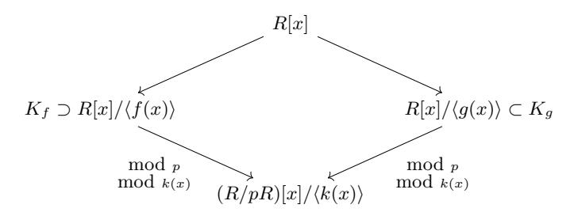
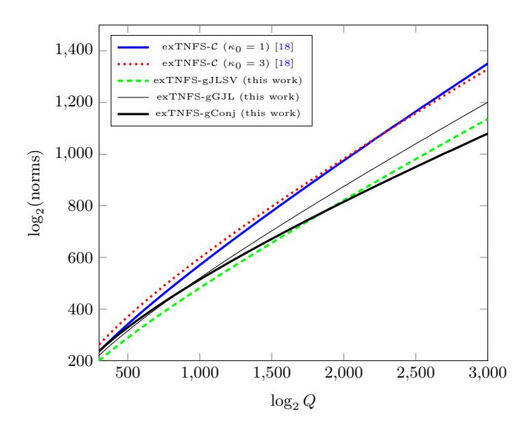
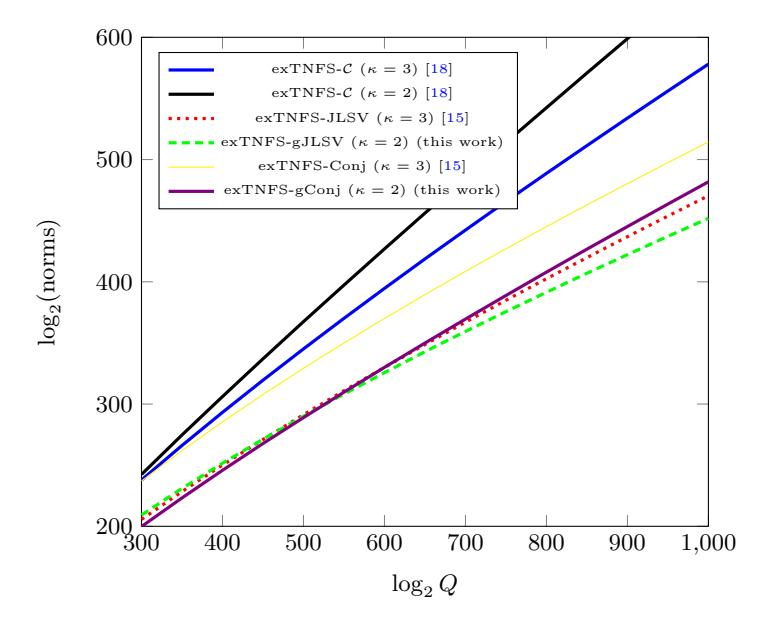
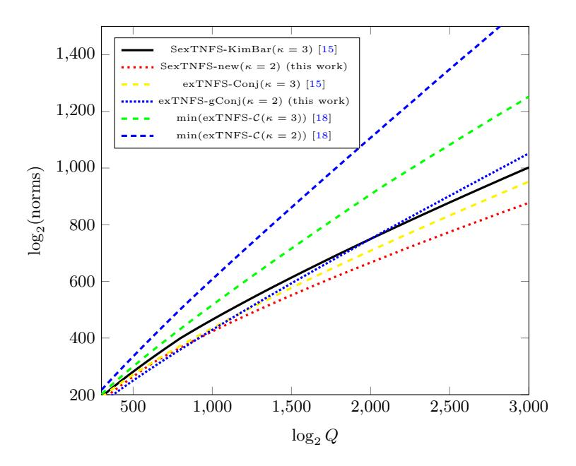
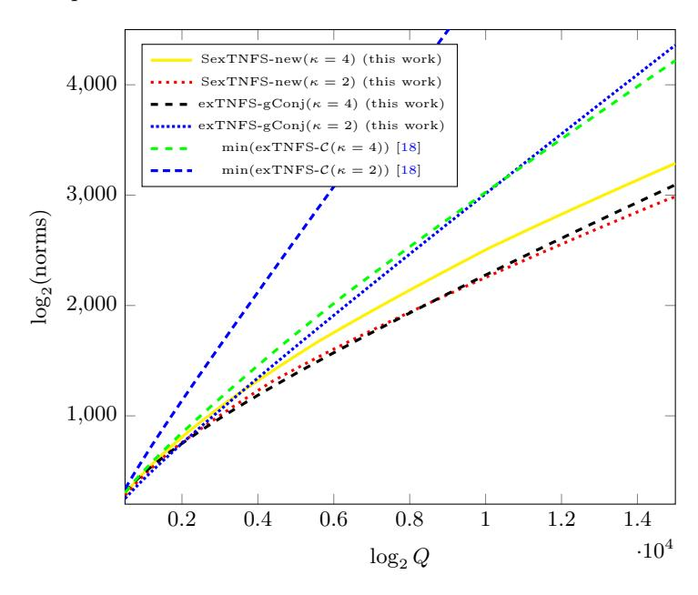

# Extended Tower Number Field Sieve with Application to Finite Fields of Arbitrary Composite Extension Degree

Taechan Kim<sup>1</sup> and Jinhyuck Jeong<sup>2</sup>

<sup>1</sup> NTT Secure Platform Laboratories, Japan taechan.kim@lab.ntt.co.jp <sup>2</sup> Seoul National University, Korea wlsyrlekd@snu.ac.kr

Abstract. We propose a generalization of exTNFS algorithm recently introduced by Kim and Barbulescu (CRYPTO 2016). The algorithm, exTNFS, is a state-of-the-art algorithm for discrete logarithm in Fp<sup>n</sup> in the medium prime case, but it only applies when n = ηκ is a composite with nontrivial factors η and κ such that gcd(η, κ) = 1. Our generalization, however, shows that exTNFS algorithm can be also adapted to the setting with an arbitrary composite n maintaining its best asymptotic complexity. We show that one can solve discrete logarithm in medium case in the running time of Lp<sup>n</sup> (1/3, p<sup>3</sup> 48/9) (resp. Lp<sup>n</sup> (1/3, 1.71) if multiple number fields are used), where n is an arbitrary composite. This should be compared with a recent variant by Sarkar and Singh (Asiacrypt 2016) that has the fastest running time of Lp<sup>n</sup> (1/3, p<sup>3</sup> 64/9) (resp. Lp<sup>n</sup> (1/3, 1.88)) when n is a power of prime 2. When p is of special form, the complexity is further reduced to Lp<sup>n</sup> (1/3, p<sup>3</sup> 32/9). On the practical side, we emphasize that the keysize of pairing-based cryptosystems should be updated following to our algorithm if the embedding degree n remains composite.

Keywords: Discrete Logarithm Problem; Number Field Sieve; Finite Fields; Cryptanalysis

### 1 Introduction

Discrete logarithm problem (DLP) over a multiplicative subgroup of finite fields FQ, Q = p <sup>n</sup>, gathers its particular interest due to its prime importance in pairingbased cryptography. Over a generic group, the best known algorithm of the DLP takes exponential running time in the bitsize of the group order. However, in the case for the multiplicative group of finite fields one can exploit a special algebraic structure of the group to design better algorithms, where the DLP can be solved much more efficiently than in the exponential time. For example, when the characteristic p is small compared to the extension degree n, the best known algorithms have quasi-polynomial time complexity [\[3](#page-19-0)[,10\]](#page-19-1).

Recall the usual LQ-notation,

$$L_Q(\ell, c) = \exp((c + o(1))(\log Q)^{\ell}(\log \log Q)^{1-\ell}),$$

for some constants 0 ≤ ` ≤ 1 and c > 0. We call the characteristic p = LQ(`p, cp) medium when 1/3 < `<sup>p</sup> < 2/3 and large when 2/3 < `<sup>p</sup> ≤ 1. We say that a field Fp<sup>n</sup> is in the boundary case when `<sup>p</sup> = 2/3.

For medium and large characteristic, all the best known attacks are variants of the number field sieve (NFS) algorithm. Initially used for factoring, NFS was rapidly introduced in DLP to target prime fields [\[9,](#page-19-2)[20\]](#page-20-0). It was about a decade later by Schirokauer [\[21\]](#page-20-1) that NFS was adapted to target non-prime fields Fp<sup>n</sup> with n > 1. This is known today as tower number field sieve (TNFS) [\[4\]](#page-19-3). On the other hand, an approach by Joux et al. [\[12\]](#page-19-4), which we denote by JLSV, was on a main stream of recent improvements on DLP over medium and large characteristic case. JLSV's idea is similar to the variant used to target prime fields, except the step called polynomial selection. This polynomial selection method was later supplemented with generalized Joux-Lercier (GJL) method [\[16](#page-19-5)[,2\]](#page-19-6), Conjugation (Conj) method [\[2\]](#page-19-6), and Sarkar-Singh (SS) method [\[19\]](#page-20-2) leading improvements on the complexity of the NFS algorithm. However, in all these algorithms the complexity for the medium prime case is slightly larger than that of large prime case. Moreover there was an anomaly that the best complexity was obtained in the boundary case, `<sup>p</sup> = 2/3.

This abnormal behavior of the complexity in the NFS algorithm was partly removed in a recent breakthrough by Kim and Barbulescu [\[15\]](#page-19-7) (exTNFS), where they obtained an algorithm of better complexity for the medium prime case than in the large prime case. Although this approach only applies to fields of extension degree n where n = ηκ has factors η, κ > 1 such that gcd(η, κ) = 1, it was enough to frighten pairing-based community since a number of popular pairing-friendly curves, such as Barreto-Naehrig curve [\[6\]](#page-19-8), are in the category that exTNFS applies.

Then one might ask a question whether transitioning into pairing-friendly curves with embedding degree n, say, a prime power, would be immune to this recent attack by Kim and Barbulescu. Our answer is negative: we show that our algorithm has the same complexity as exTNFS algorithm for any composite n, so the keysize of the pairing-based cryptosystems should be updated according to our algorithm whenever the embedding degree is composite.

Related works When the extension degree n cannot be factored into relatively prime factors (for example, n is a prime power), the best known attacks for the medium prime case still had the complexity L<sup>Q</sup> 1/3, p3 96/9 until Sarkar and Singh proposed an algorithm [\[18\]](#page-19-9) of the best complexity L<sup>Q</sup> 1/3, p3 64/9 . Note that, however, this is still slightly larger than the best complexity of Kim-Barbulescu's exTNFS. One can see Table [1](#page-2-0) for a comparison of these previous algorithms on the asymptotic complexity.

All currently known variants of NFS admit variants with multiple number fields (MNFS) which have a slightly better asymptotic complexity. The complexity of these variants is shown in Table [2.](#page-2-1)

When the characteristic p has a special form, as it is the case for fields in pairing-based cryptosystems, one can further accelerate NFS algorithms using

<span id="page-2-0"></span>Table 1: The complexity of each algorithm. Each cell in the second indicates c if the complexity is  $L_Q(1/3, (c/9)^{\frac{1}{3}})$  when  $p = L_Q(\ell_p)$ ,  $1/3 < \ell_p < 2/3$ .

| Method                                                        | complexity in the medium case | conditions on $n$                                                                                 |
|---------------------------------------------------------------|-------------------------------|---------------------------------------------------------------------------------------------------|
| NFS-(Conj and GJL) [2]<br>exTNFS-C [18]<br>exTNFS-KimBar [15] | $96 \ge 64^{1} \ge 48^{1}$    | $n$ : any integers $n=2^i$ for some $i>1$ $n=\eta\kappa\;(\eta,\kappa\neq 1),\gcd(\eta,\kappa)=1$ |
| exTNFS-new (this article)                                     | $\geq 48^1$<br>$\leq 54.28$   | $n$ : any composite $n=2^i$ for some $i>1$                                                        |

<span id="page-2-1"></span>Table 2: The complexity of each algorithm using multiple number fields. Each cell in the second column indicates an approximation of c if the complexity is  $L_Q(1/3, (c/9)^{\frac{1}{3}})$  when  $p = L_Q(\ell_p)$ ,  $1/3 < \ell_p < 2/3$ .

| Method                                                            | complexity in the medium case                    | conditions on $n$                                                                                   |
|-------------------------------------------------------------------|--------------------------------------------------|-----------------------------------------------------------------------------------------------------|
| MNFS-(Conj and GJL) [17]<br>MexTNFS-C [18]<br>MexTNFS-KimBar [15] | $89.45 \\ \ge 61.29^{1} \\ \ge 45.00^{1}$        | $n$ : any integers $n=2^i$ for some $i>1$ $n=\eta\kappa\;(\eta,\kappa\neq 1),\ \gcd(\eta,\kappa)=1$ |
| MexTNFS-new (this article)                                        | $\geq 45.00^{1}$<br>$\leq 59.80$<br>$\leq 50.76$ | $n$ : any composite $n=2^i3^j$ for some $i+j>1$ $n=2^i$ for some $i>1$                              |

variants called special number field sieve (SNFS). In Table 3 we list asymptotic complexity of each algorithm. When n is a prime power, the algorithm by Joux and Pierrot had been the best algorithm before our algorithm.

Recently, Gullevic, Morain, and Thomé [11] observed that Kim-Barbulescu's techinique can be adapted to target the fields of extension degree 4. However, they did not pursue the idea to further analyze its complexity.

Our contributions We propose an algorithm that is a state-of-the-art algorithm for the DLP in the medium prime case as far as we aware. We remark that our algorithm applies to target fields of arbitrary composite extension degree n. If n can be written as  $n = \eta \kappa$  for some  $\eta$  and  $\kappa$  with  $\gcd(\eta, \kappa) = 1$ , our algorithm has the same complexity as Kim-Barbulescu's exTNFS [15]. However, our algorithm allows to choose factors  $\eta$  and  $\kappa$  freely from the co-primality condition, so we have more choices for the pair  $(\eta, \kappa)$ . This helps us to find a better  $(\eta, \kappa)$  that

<sup>&</sup>lt;sup>1</sup> The best complexity is obtained when n has a factor of the appropriate size (refer to each paper for details).

<span id="page-3-0"></span>Table 3: The complexity of each algorithm used when the characteristic has a special form (SNFS). Each cell indicates an approximation of c if the complexity is  $L_Q(1/3, (c/9)^{\frac{1}{3}})$  when  $p = L_Q(\ell_p)$ ,  $1/3 < \ell_p < 2/3$ .

| Method                              | complexity in the medium case | conditions on $n$                                                                    |
|-------------------------------------|-------------------------------|--------------------------------------------------------------------------------------|
| SNFS-JP [13]<br>SexTNFS-KimBar [15] | 64<br>32                      | $n$ : any integers $n = \eta \kappa \ (\eta, \kappa \neq 1), \gcd(\eta, \kappa) = 1$ |
| SexTNFS-new (this article)          | 32                            | n: any composite                                                                     |

practically yields a better performance, although the asymptotic complexity is unchanged.

If n is a prime power, the complexity of our algorithm is less than that of Sarkar-Singh's variant [18], a currently best-known algorithm for this case.

When n is a b-smooth integer for an integer  $b \leq 4$ , we show an upper bound for the asymptotic complexity of our algorithm. For example, when n is a power of 2, our algorithm always has the asymptotic complexity less than  $L_Q(1/3, 1.82)$ . If multiple NFS variants are used, the complexity can always be lowered to  $L_Q(1/3,c)$ ,  $c \leq 1.88$ , when n is a 4-smooth composite integer, and  $L_Q(1/3,c)$ ,  $c \leq 1.78$ , when n is a power of 2.

When p is of special form, pairings with embedding degree such as n=4,9,16 was not affected by Kim-Barbulescu's algorithm, however, due to our variant of SNFS, the keysize of such pairings should be also updated following to our new complexity.

Organization We briefly recall exTNFS algorithm and introduce our algorithm in Section 2. The complexity analysis is given in Section 3. The variants such as multiple number field sieve and special number field sieve are discussed in Section 4. In Section 5, we make a precise comparison to the state-of-the-art algorithms at cryptographic sizes. We conclude with cryptographic implications of our result in Section 6.

### <span id="page-3-1"></span>2 Extended TNFS

#### 2.1 Setting

Throughout this paper, we target fields  $\mathbb{F}_Q$  with  $Q = p^n$  where  $n = \eta \kappa$  such that  $\eta, \kappa \neq 1$  and the characteristic p is medium or large, i.e.  $\ell_p > 1/3$ .

We briefly review exTNFS algorithm and then explain our algorithm. Recall the commutative diagram that is familiar in the context of NFS algorithm (Fig. 1). First we select an irreducible polynomial  $h(t) \in \mathbb{Z}[t]$  of degree  $\eta$  which is also irreducible modulo p. We put  $R := \mathbb{Z}[t]/h(t) = \mathbb{Z}(\iota)$  then  $R/pR \simeq \mathbb{F}_{p^{\eta}}$ . We select

two polynomials f and g with coefficients in R so that they have a common factor k(x) of degree  $\kappa$  modulo p. We further require k to be irreducible over  $\mathbb{F}_{p^{\eta}}$ . Note that the only difference of our algorithm from Kim-Barbulescu's exTNFS is that the coefficients of f and g are chosen from R instead of  $\mathbb{Z}$ .

The conditions on f, g and h yield two ring homomorphisms from R[x] to  $(R/pR)/k(x) = \mathbb{F}_{p^{\eta\kappa}}$  through R[x]/f(x) (or R[x]/g(x)). Thus one has the commutative diagram in Figure 1 which is a generalization of the classical diagram of NFS.

<span id="page-4-0"></span>

Fig. 1: Commutative diagram of exTNFS. We can choose f and g to be irreducible polynomials over R such that  $k = \gcd(f, g) \mod p$  is irreducible over  $R/pR = \mathbb{F}_{p^{\eta}}$ .

After the polynomial selection, the exTNFS algorithm proceeds as all other variants of NFS, following the same steps: relations collection, linear algebra and individual logarithm. We skip the description on it and refer to [15] for further details.

#### 2.2 Detailed Descriptions

#### **Polynomial Selection**

Choice of h We have to select a polynomial  $h(t) \in \mathbb{Z}[t]$  of degree  $\eta$  which is irreducible modulo p and whose coefficients are as small as possible. As in TNFS [4] we try random polynomials h with small coefficients and factor them in  $\mathbb{F}_p[t]$  to test irreducibility. Heuristically, one succeeds after  $\eta$  trials and since  $\eta \leq 3^{\eta}$  we expect to find h such that  $||h||_{\infty} = 1$ . For a more rigorous description on the existence of such polynomials one can refer to [4].

Choice of f and g Next we select f and g in R[x] which have a common factor k(x) modulo p of degree  $\kappa$  which remains irreducible over  $\mathbb{F}_{p^\eta}=R/pR$ . We can adapt all the polynomial selection methods discussed in the previous literatures, such as JLSV's method [12], GJL and Conj [2] method, and so on[19,13,5,17], except that one chooses the coefficients of f and g from R instead of  $\mathbb{Z}$ . To fix ideas, we describe polynomial selection methods based on JLSV<sub>2</sub> method and Conjugation method. A similar idea also applies with GJL method, but we skip the details.

Generalized JLSV<sub>2</sub> method We describe a generalized method of polynomial selection based on JLSV<sub>2</sub> method [12]. To emphasize that the coefficients of polynomial are taken from a ring  $R = \mathbb{Z}[\iota]$  instead of a smaller ring  $\mathbb{Z}$ , we call it as generalized JLSV<sub>2</sub> method (gJLSV<sub>2</sub> method).

First, we select a bivariate polynomial  $\widetilde{g}(t,x) \in \mathbb{Z}[t,x]$  such that

$$\widetilde{g}(t,x) = g_0(t) + g_1(t)x + \dots + g_{\kappa-1}(t)x^{\kappa-1} + x^{\kappa},$$

where  $g_i(t) \in \mathbb{Z}[t]$ 's are polynomials of degree less than  $\eta$  with small integer coefficients. We also require  $\tilde{g} \mod (p, h(t))$  to be irreducible in  $\mathbb{F}_{p^{\eta}}[x]$ . Set an integer  $W \approx p^{1/(d+1)}$  where d is a parameter such that  $d \geq \kappa$ . Take  $g(t, x) := \tilde{g}(t, x+W)$  and consider the lattice of dimension  $(d+1)\eta$  defined by the following matrix M:

<span id="page-5-0"></span>
$$M := \begin{pmatrix} \boxed{ \operatorname{vec}(pt^{0}x^{0} \bmod h)} \\ \vdots \\ \operatorname{vec}(pt^{i}x^{j} \bmod h) \\ \vdots \\ \operatorname{vec}(pt^{\eta-1}x^{\kappa-1} \bmod h) \\ \\ \vdots \\ \operatorname{vec}(g \bmod h) \\ \vdots \\ \operatorname{vec}(t^{i}x^{j}g \bmod h) \\ \\ \vdots \\ \operatorname{vec}(t^{\eta-1}x^{d-\kappa}g \bmod h) \end{pmatrix}$$

$$(1)$$

where, for all bivariate polynomial  $w(t,x)=\sum_{i=0}^d w_j(t)x^j$  with  $w_j(t)=\sum_{i=0}^{\eta-1} w_{j,i}t^i$ ,  $\operatorname{vec}(w)=(w_{0,0},\ldots,w_{0,\eta-1},\ldots,w_{d,0},\ldots,w_{d,\eta-1})$  of dimension  $(d+1)\eta$ . For instance,  $\operatorname{vec}(pt^ix^j)=(0,\ldots,0,p,0,\ldots,0)$  where only  $(j\eta+i+1)$ -th entry is nonzero and  $\operatorname{vec}(g)=(g_{0,0},\ldots,g_{0,\eta-1},\ldots,g_{\kappa-1,0},\ldots,g_{\kappa-1,\eta-1},1,0,\ldots,0)$  for a monic polynomial g of degree  $\kappa$  with respect to x. Note that the determinant of M is  $|\det(M)|=p^{\kappa\eta}$ .

Finally, take the coefficients of  $f(t,x) = \sum_{j=0}^{d} f_j(t)x^j$  with  $f_j(t) = \sum_{i=0}^{\eta-1} f_{j,i}t^i$  as the shortest vector of an LLL-reduced basis of the lattice L and set  $k=g \mod p$ . Then by construction we have

$$- \deg_x(f) = d \ge \kappa \text{ and } ||f||_{\infty} := \max\{f_{i,j}\} = O\left(p^{\frac{\kappa\eta}{(d+1)\eta}}\right) = O(p^{\frac{\kappa}{d+1}});$$

$$- \deg_x(g) = \kappa \text{ and } ||g||_{\infty} = \max\{g_{i,j}\} = O(p^{\frac{\kappa}{d+1}}).$$

Example 1. We target a field  $\mathbb{F}_{p^4}$  for  $p \equiv 7 \mod 8$  prime. For example, we take p = 1000010903. Set  $\eta = \kappa = 2$  and  $d = 2 \ge \kappa$ . Choose  $h(t) = t^2 + 1$  so that  $h \mod p$  is irreducible over  $\mathbb{F}_p$ . Consider  $R = \mathbb{Z}(\iota) = \mathbb{Z}[t]/h(t)$  and  $\mathbb{F}_{p^2} = \mathbb{F}_p(\iota) = \mathbb{F}_p[t]/h(t)$ . Choose  $\widetilde{g} = x^2 + (t+1)x + 1$  and  $W = 1001 \ge p^{1/(d+1)}$ . Then we set

$$g = (\widetilde{g}(t, x + W) \mod h) = x^2 + (\iota + 2003)x + 1001\iota + 1003003.$$

Construct a lattice of dimension 6 defined by the following matrix (blank entries are filled with zeros)

$$\begin{pmatrix} p & & & & & & \\ & p & & & & & \\ & & p & & & &$$

Run the LLL algorithm with this lattice and we obtain

$$f = (499\iota - 499505)x^2 + (499992\iota - 498111)x + 493992\iota - 50611.$$

One can check that  $f, g, k = g \mod p$  and h are suitable for exTNFS algorithm. Note that  $||f||_{\infty}$  and  $||g||_{\infty}$  are of order  $p^{2/3}$ .

### Algorithm 1 Polynomial selection with the generalized JLSV<sub>2</sub> method (gJLSV)

**Input:** p prime,  $n = \eta \kappa$  integer such that  $\eta, \kappa > 1$  and  $d \ge \kappa$  integer

**Output:** f, g, k, h with  $h \in \mathbb{Z}[t]$  irreducible of degree  $\eta$ , and  $f, g \in R[x]$  irreducible over  $R = \mathbb{Z}[t]/h\mathbb{Z}[t]$ , and  $k = \gcd(f \mod p, g \mod p)$  in  $\mathbb{F}_{p^{\eta}} = \mathbb{F}_p[t]/h(t)$  irreducible of degree  $\kappa$

- 1: Choose  $h \in \mathbb{Z}[t]$  with small coefficients, irreducible of degree  $\eta$  such that p is inert in  $\mathbb{Q}[t]/h(t)$ ;
- 2: Choose a bivariate polynomial  $\widetilde{g}(t,x) = x^{\kappa} + \sum_{i=0}^{\kappa-1} g_j(t)x^j$  with small coefficients;
- 3: Choose an integer  $W \approx p^{1/(d+1)}$  and set  $g = \widetilde{g}(t, x + W) \mod h$ ;
- 4: Reduce the rows of the matrix L as defined in (1) using LLL, to get

$$LLL(M) = \begin{pmatrix} f_{0,0} \ f_{0,1} \cdots f_{d,\eta-1} \\ * \end{pmatrix}$$

5: return
$$(f = \sum_{0 \le i \le d, 0 \le j < \eta} f_{i,j} t^j x^i, g, k = g \mod p, h)$$

Generalized Conjugation method We describe a polynomial selection method based on Conjugation method [15,2]. Again, we call it as the generalized Conjugation method (gConj method).

First, one chooses two bivariate polynomials  $g^{(1)}(t,x)$  and  $g^{(0)}(t,x)$  in  $\mathbb{Z}[t,x]$  of form

$$g^{(1)}(t,x) = g_0^{(1)}(t) + g_1^{(1)}(t)x + \dots + g_{\kappa-1}^{(1)}(t)x^{\kappa-1}$$

and

$$g^{(0)}(t,x) = g_0^{(0)}(t) + g_1^{(0)}(t)x + \dots + g_{\kappa}^{(0)}(t)x^{\kappa},$$

where  $g_i^{(s)}(t) \in \mathbb{Z}[t]$  are polynomials with small coefficients in  $\mathbb{Z}$  and of degree less than or equal to  $\eta - 1$ . Then  $g^{(s)} \mod (p, h(t))$  is a polynomial of degree  $\leq \kappa$  over  $\mathbb{F}_{p^{\eta}} = \mathbb{F}_p(\iota)$  for each s = 1, 2.

Next one chooses a quadratic, monic, irreducible polynomial  $\mu(x) \in \mathbb{Z}[x]$  with small coefficients. If  $\mu(x)$  has a root  $\delta$  modulo p and  $g^{(0)} + \delta g^{(1)}$  mod (p,h) is irreducible over  $\mathbb{F}_{p^{\eta}}$ , then set  $k(x) = g^{(0)} + \delta g^{(1)}$  mod (p,h). Otherwise, one repeats the above steps until such  $g^{(1)}$ ,  $g^{(0)}$ , and  $\delta$  are found. Once it has been done, find u and v such that  $\delta \equiv u/v \pmod{p}$  and  $u,v \leq O(\sqrt{p})$  using rational reconstruction. Finally, we set  $f = \mathrm{Res}_Y(\mu(Y), g^{(0)} + Yg^{(1)})$  and  $g = vg^{(0)} + ug^{(1)}$ . By construction we have

```
 - \deg_x(f) = 2\kappa \text{ and } ||f||_{\infty} = \max\{f_{i,j}\} = O(1);
 - \deg_x(g) = \kappa \text{ and } ||g||_{\infty} = \max\{g_{i,j}\} = O(\sqrt{p}) = O(Q^{\frac{1}{2\eta\kappa}}).
```

The bound on  $||f||_{\infty}$  depends on the number of polynomials  $g^{(0)} + \delta g^{(1)}$  tested before we find one which is irreducible over  $\mathbb{F}_{p^{\eta}}$ . Heuristically this happens on average after  $\kappa$  trials. Since there are  $3^{2\eta\kappa} > \kappa$  choices of  $g^{(0)}$  and  $g^{(1)}$  of norm 1 we have  $||f||_{\infty} = O(1)$ . We give some examples in the followings.

Example 2. We target a field  $\mathbb{F}_{p^4}$  for  $p\equiv 7 \mod 8$  prime. For example, we take p=1000010903. If we choose  $h(t)=t^2+1$  then  $h\mod p$  is irreducible over  $\mathbb{F}_p$ . Consider  $R=\mathbb{Z}(\iota)=\mathbb{Z}[t]/h(t)$  and  $\mathbb{F}_{p^2}=\mathbb{F}_p(\iota)=\mathbb{F}_p[t]/h(t)$ . Choose an irreducible polynomial  $\mu(x)=x^2-2\in\mathbb{Z}[x]$  with small coefficients. It has a root  $\sqrt{2}=219983819\in\mathbb{F}_p$  modulo p. We take  $k(x)=(x^2+\iota)+\sqrt{2}x\in\mathbb{F}_{p^2}[x]$  and  $f(x)=(x^2+\iota+\sqrt{2}x)(x^2+\iota-\sqrt{2}x)=x^4+(2\iota-2)x^2+1\in R[x]$ . Then we find  $u,v\in\mathbb{Z}$  such that  $u/v\equiv\sqrt{2}$  mod p where their orders are of  $\sqrt{p}$ . Now we take  $g(x)=v(x^2+\iota)+ux=25834(x^2+\iota)+18297x\in R[x]$ . One easily checks that f and g are irreducible over R and k is irreducible over  $\mathbb{F}_{p^2}$  so that they are suitable for exTNFS algorithm.

Example 3. Now we target a field  $\mathbb{F}_{p^9}$ . Again, we take p=1000010903 for example. Choose  $h(t)=t^3+t+1\in\mathbb{Z}[t]$  which remains irreducible modulo p. Let  $R=\mathbb{Z}(\iota)=\mathbb{Z}[t]/h(t)$  and  $\mathbb{F}_{p^3}=\mathbb{F}_p(\iota)=\mathbb{F}_p[t]/h(t)$ . We set  $\mu(x)=x^2-3$ . Compute u and v such that  $u/v\equiv\sqrt{3}$  mod p. Then the polynomials  $k(x)=(x^3+\iota)+\sqrt{3}x\in\mathbb{F}_{p^3}[x]$ ,  $f(x)=(x^3+\iota)^2-3x^2\in R[x]$  and  $g(x)=v(x^3+\iota)+ux\in R[x]$  satisfy the conditions of polynomial selection for exTNFS algorithm.

**Relation Collection** Recall the elements of  $R = \mathbb{Z}[t]/h(t)$  can be represented uniquely as polynomials of  $\mathbb{Z}[t]$  of degree less than deg  $h = \eta$ . In the setting of exTNFS, we sieve all the pairs  $(a,b) \in \mathbb{Z}[t]^2$  of degree  $\leq \eta - 1$  such that  $||a||_{\infty}$ ,  $||b||_{\infty} \leq A$  (a parameter A to be determined later) until we obtain a relation satisfying

$$N_f(a,b) := \operatorname{Res}_t(\operatorname{Res}_x(a(t) - b(t)x, f(x)), h(t)) \text{ and } N_g(a,b) := \operatorname{Res}_t(\operatorname{Res}_x(a(t) - b(t)x, g(x)), h(t))$$

are B-smooth for a parameter B to be determined (an integer is B-smooth if all its prime factors are less than B). It is equivalent to say that the norm of

Algorithm 2 Polynomial selection with the generalized Conjugation method (gConj)

**Input:** p prime and  $n = \eta \kappa$  integer such that  $\eta, \kappa > 1$

**Output:** f, g, k, h with  $h \in \mathbb{Z}[t]$  irreducible of degree  $\eta$ , and  $f, g \in R[x]$  irreducible over  $R = \mathbb{Z}[t]/h\mathbb{Z}[t]$ , and  $k = \gcd(f \mod p, g \mod p)$  in  $\mathbb{F}_{p^{\eta}} = \mathbb{F}_p[t]/h(t)$  irreducible of

- 1: Choose  $h \in \mathbb{Z}[t]$ , irreducible of degree  $\eta$  such that p is inert in  $\mathbb{Q}[t]/h(t)$
- 2: repeat
- Select  $g_0^{(0)}(t), \ldots, g_{\kappa-1}^{(0)}(t)$ , polynomials of degree  $\leq \eta 1$  with small integer
- Select  $g_0^{(1)}(t), \ldots, g_{\kappa'-1}^{(1)}(t)$ , polynomials of degree  $\leq \eta 1$ , and  $g_{\kappa'}^{(1)}(t)$ , a constant polynomial with small integer coefficients, for an integer  $\kappa' < \kappa$ ; Set  $g^{(0)}(t,x) = x^{\kappa} + \sum_{i=0}^{\kappa-1} g_i^{(0)}(t)x^i$  and  $g^{(1)}(t,x) = \sum_{i=0}^{\kappa'} g_i^{(1)}(t)x^i$ ; Select  $\mu(x)$  a quadratic, monic, irreducible polynomial over  $\mathbb Z$  with small coefficients.

- 7: **until**  $\mu(x)$  has a root  $\delta$  modulo p and  $k = g^{(0)} + \delta g^{(1)}$  mod (p, h) is irreducible over  $\mathbb{F}_{p^{\eta}}$ ;
- 8:  $(u, v) \leftarrow$  a rational reconstruction of  $\delta$ ;
- 9:  $f \leftarrow \operatorname{Res}_Y(\mu(Y), g_0 + Yg_1 \mod h)$ ;
- 10:  $q \leftarrow vq_0 + uq_1 \mod h$ ;
- 11: **return** (f, g, k, h)

 $a(\iota) - b(\iota)\alpha_f$  and  $a(\iota) - b(\iota)\alpha_g$  are simultaneously B-smooth in  $K_f = \mathbb{Q}(\iota, \alpha_f)$ and  $K_q = \mathbb{Q}(\iota, \alpha_q)$ , respectively.

For each pair (a, b) one obtains a linear equation where the unknowns are logarithms of elements of the factor base as in the classical variant of NFS for discrete logarithms where the factor base is chosen as in [15]. Other than the polynomial selection step, our algorithm follows basically the same as the description of the exTNFS algorithm. For full description of the algorithm, refer to [15].

#### <span id="page-8-0"></span>Complexity 3

From now on, we often abuse the notation for a bivariate polynomial f(t,x) in  $\mathbb{Z}[t,x]$  and a polynomial  $f(x)=f(t,x) \mod h=f(\iota,x)$  in R[x]. Unless stated,  $\deg(f)$  denotes both the degree of  $f(x) \in R[x]$  and the degree of  $f(t,x) \in \mathbb{Z}[t,x]$ with respect to x. The norm of  $f(x) \in R[x]$ , denoted by  $||f||_{\infty}$ , is defined by the maximum of the absolute value of the integer coefficients of f(t,x).

The complexity analysis of our algorithm basically follows that of all the other NFS variants. Recall that in the algorithm we test the smoothness of the norm of an element from the number field  $K_f$  and  $K_g$ . As a reminder to readers, we quote the formula for the complexity of exTNFS algorithm [15],

complexity(exTNFS) =
$$\frac{B}{\text{Prob}(N_f, B)\text{Prob}(N_g, B)} + B^2$$
, (2)

where  $N_f$  denotes the norm of an element from  $K_f$  over  $\mathbb{Q}$ , B is a smoothness parameter, and  $\operatorname{Prob}(x,y)$  denotes the probability that an integer less than x is y-smooth.

It leads us to consider the estimation of the norm sizes. We need the following lemma that can be found in [15, Lemma 2].

<span id="page-9-0"></span>**Lemma 1** ([15], Lemma 2.). Let  $h \in \mathbb{Z}[t]$  be an irreducible polynomial of degree  $\eta$  and f be an irreducible polynomial over  $R = \mathbb{Z}[t]/h(t)$  of degree  $\deg(f)$ . Let  $\iota$  (resp.  $\alpha$ ) be a root of h (resp. f) in its number field and set  $K_f := \mathbb{Q}(\iota, \alpha)$ . Let A > 0 be a real number and T an integer such that  $2 \le T \le \deg(f)$ . For each  $i = 0, \ldots, \deg(f) - 1$ , let  $a_i(t) \in \mathbb{Z}[t]$  be polynomials of degree  $\le \eta - 1$  with  $\|a_i\|_{\infty} \le A$ .

<span id="page-9-1"></span>1. We have

$$\left| N_{K_f/\mathbb{Q}} \Big( \sum_{i=0}^{T-1} a_i(\iota) \alpha^i \Big) \right| < A^{\eta \deg(f)} \|f\|_{\infty}^{(T-1)\eta} \|h\|_{\infty}^{(T+\deg(f)-1)(\eta-1)} D(\eta, \deg(f)),$$

where  $D(\eta, \kappa) = ((2\kappa - 1)(\eta - 1) + 1)^{\eta/2} (\eta + 1)^{(2\kappa - 1)(\eta - 1)/2} ((2\kappa - 1)!\eta^{2\kappa})^{\eta}$ . 2. Assume in addition that  $||h||_{\infty}$  is bounded by an absolute constant H and that  $p = L_Q(\ell_p, c)$  for some  $\ell_p > 1/3$  and c > 0. Then

$$N_f(a,b) \le E^{\deg(f)} \|f\|_{\infty}^{\eta} L_Q(2/3, o(1)),$$
 (3)

where  $E = A^{\eta}$

The above formula remains the same when we restrict the coefficients of f to be integers.

*Proof.* The proof can be found in [15].

We summarize our results in the following theorem. The results are similar to Theorem 1 in [15], however, we underline that in our algorithm n is any composite. We also add the results on the upper bound of the complexity when n is a b-smooth number for  $b \leq 4$ .

**Theorem 1.** (under the classical NFS heuristics) If  $Q = p^n$  is a prime power such that  $p = L_Q(\ell_p, c_p)$  with  $1/3 < \ell_p$  and  $n = \eta \kappa$  is a composite such that  $\eta, \kappa \neq 1$ , then the discrete logarithm over  $\mathbb{F}_Q$  can be solved in  $L_Q(1/3, (C/9)^{1/3})$  where C and the additional conditions are listed in Table 4.

For each polynomial selection, the degree and the norm of the polynomials have the same formula as in [15]. Although in our case the polynomials f and g have coefficients in R, the formula for the upper bound of the norm  $N_f(a,b)$  remains the same as Kim-Barbulescu's algorithm by Lemma 1. Finally, the analysis is simply rephrasing of the previous results, so we simply omit the proof. In the next subsection, we briefly explain how to obtain the upper bound of the complexity when n has prime factors 2 or 3. The case is interesting since most pairings use such fields to utilize tower extension field arithmetic for efficiency.

<span id="page-10-1"></span>

| algorithm                           | C                                                 | conditions                                                                                                                   |
|-------------------------------------|---------------------------------------------------|------------------------------------------------------------------------------------------------------------------------------|
| $\overline{\text{exTNFS-gJLSV}_2}$  | 64                                                | $\kappa = o\left(\left(\frac{\log Q}{\log\log Q}\right)^{\frac{1}{3}}\right)$                                                |
| exTNFS-gGJL                         | 64                                                | $\kappa \le \left(\frac{8}{3}\right)^{-\frac{1}{3}} \left(\frac{\log Q}{\log\log Q}\right)^{\frac{1}{3}}$                    |
| exTNFS-gConj                        | 48                                                | $\kappa = 12^{-\frac{1}{3}} \left( \frac{\log Q}{\log \log Q} \right)^{\frac{1}{3}}$                                         |
|                                     | $\leq 54.28$                                      | $n=2^i \ (i>1)$                                                                                                              |
| $\overline{\text{MexTNFS-gJLSV}_2}$ | $\frac{92+26\sqrt{13}}{3}$                        | $\kappa = o\left(\left(\frac{\log Q}{\log\log Q}\right)^{\frac{1}{3}}\right)$                                                |
| ${\bf MexTNFS\text{-}gGJL}$         | $\frac{92+26\sqrt{13}}{3}$                        | $\kappa \le \left(\frac{7+2\sqrt{13}}{6}\right)^{-1/3} \left(\frac{\log Q}{\log\log Q}\right)^{\frac{1}{3}}$                 |
| MexTNFS-gConj                       | $\frac{(3+\sqrt{33+12\sqrt{6}})^3}{14+6\sqrt{6}}$ | $\kappa = \left(\frac{56 + 24\sqrt{6}}{12}\right)^{-1/3} \left(\frac{\log Q}{\log\log Q}\right)^{\frac{1}{3}}$               |
|                                     |                                                   | $n = 2^i 3^j \ (i+j>1)$                                                                                                      |
|                                     | $\leq 50.76$                                      | $n = 2^i \ (i > 1)$                                                                                                          |
| SexTNFS-new                         | 1 90                                              | $\kappa = o\left(\left(\frac{\log Q}{\log\log Q}\right)^{\frac{1}{3}}\right)$                                                |
|                                     |                                                   | $p \text{ is } d\text{-SNFS with } d = \frac{(2/3)^{\frac{1}{3}} + o(1)}{\kappa} (\frac{\log Q}{\log \log Q})^{\frac{1}{3}}$ |

Table 4: Complexity of exTNFS variants.

#### 3.1 exTNFS when $n = 2^i$

Recall that our algorithm with Conjugation method has the same expression for the norms as in [2] replacing p with  $P = p^{\eta}$ . Write  $P = L_Q(2/3, c_P)$  and denote  $\tau - 1$  by the degree of sieving polynomials. Then the complexity of exTNFS-gConj is  $L_Q(1/3, C_{\rm NFS}(\tau, c_P))$  where

$$C_{\text{NFS}}(\tau, c_P) = \frac{2}{c_P \tau} + \sqrt{\frac{4}{(c_P \tau)^2} + \frac{2}{3} c_P(\tau - 1)}.$$
 (4)

Let  $k_0 = \left(\frac{\log Q}{\log\log Q}\right)^{1/3}$ . When  $n=2^i$  for some i>1, we can always find a factor  $\kappa$  of n in the interval  $\left[\frac{k_0}{3.31},\frac{k_0}{1.64}\right]$  so that  $c_P$  lies in the interval [1.64,3.31] (observe that the ratio  $(k_0/1.64)/(k_0/3.31)$  is larger than 2). Since  $C(\tau,c_P)$  is less than 1.82 when  $\tau=2$  and  $1.64 \leq c_P \leq 3.31$ , the complexity of exTNFS is always less than  $L_Q(1/3,1.82)$  in this case.

This result shows that the DLP over  $\mathbb{F}_{p^n}$  can always be solved in the running time less than  $L_Q(1/3, 1.82)$  when n is a power of 2. Compare that exTNFS- $\mathcal{C}$  [18] has a larger asymptotic complexity of  $L_Q(1/3, 1.92)$  and they even require the specified condition on a factor of n.

#### <span id="page-10-0"></span>4 Variants

#### 4.1 The case when p has a special form (SexTNFS)

A generalized polynomial selection method also admits a variant when the characteristic has a special form. It includes the case for the fields used in pairing-based cryptosystems. The previous SexTNFS by Kim and Barbulescu cannot be

applied to pairing-friendly fields with prime power embedding degree, such as Kachisa-Schaefer-Scott curve [14]  $p = (u^{10} + 2u^9 + 5u^8 + 48u^6 + 152u^5 + 240u^4 + 625u^2 + 2398u + 3125)/980$  of embedding degree 16.

For a given integer d, an integer p is d-SNFS if there exists an integer u and a polynomial  $\Pi(x)$  with integer coefficients (up to a small denominator) so that

$$p = \Pi(u),$$

 $\deg \Pi = d$  and  $\|\Pi\|_{\infty}$  is bounded by an absolute constant.

We consider the case when  $n=\eta\kappa$   $(\eta,\kappa\neq 1)$  with  $\kappa=o\left(\left(\frac{\log Q}{\log\log Q}\right)^{1/3}\right)$  and p is d-SNFS. In this case our exTNFS selects h,f and g so that

- h is a polynomial over  $\mathbb{Z}$  and irreducible modulo p, deg  $h = \eta$  and  $||h||_{\infty} = O(1)$ ;
- f and g are two polynomials with coefficients from  $R = \mathbb{Z}[\iota]$ , have a common factor k(x) modulo p which is irreducible over  $R/pR = \mathbb{F}_{p^{\eta}} = \mathbb{F}(\iota)$  of degree  $\kappa$ .

We choose such polynomials using the method of Joux and Pierrot [13]. Find a bivariate polynomial S of degree  $\kappa-1$  with respect to x such that

$$S(t,x) = S_0(t) + S_1(t)x + \dots + S_{\kappa-1}(t)x^{\kappa-1} \in \mathbb{Z}[t,x],$$

where  $S_i(t)$ 's have their coefficients in  $\{-1,0,1\}$  and are of degree  $\leq \eta - 1$ . We further require that  $k = x^{\kappa} + S(t,x) - u \mod (p,h)$  is irreducible over  $\mathbb{F}_{p^{\eta}}$ . Since the proportion of irreducible polynomials in  $\mathbb{F}_q$  (q: a prime power) of degree  $\kappa$  is  $1/\kappa$  and there are  $3^{\eta\kappa}$  choices we expect this step to succeed. Then we set

$$\begin{cases} g = x^{\kappa} + S(t, x) - u \mod h \\ f = \Pi(x^{\kappa} + S(t, x)) \mod h. \end{cases}$$

If f is not irreducible over R[x], which happens with low probability, start over. Note that g is irreducible modulo p and that f is a multiple of g modulo p. More precisely, as in [13], we choose S(t,x) so that the number of its terms is approximately  $O(\log n)$ . Since  $3^{\log n} > \kappa$ , this allows us enough chance to get an irreducible polynomial g. The size of the largest integer coefficient of f comes from the part  $S(t,x)^d$  and it is bounded by  $\sigma^d = O\left((\log n)^d\right)$ , where  $\sigma$  denotes the number of the terms in S(t,x). By construction we have:

$$\begin{aligned} &-\deg(g)=\kappa \text{ and } \|g\|_{\infty}=u=p^{1/d};\\ &-\deg(f)=\kappa d \text{ and } \|f\|_{\infty}=O((\log n)^d). \end{aligned}$$

We inject these values in Equations (1) and obtain the same formula as in Kim-Barbulescu's SexTNFS variant. Thus we obtain the same complexity as in their paper. Again, we note that our polynomial selection applies to fields of arbitrary composite extension degree n.

### 4.2 The multiple polynomial variants (MexTNFS-gConj)

One can also accelerate the complexity of exTNFS with the generalized Conjugation method using multiple polynomial variants. The description is similar to the previous multiple variant of NFS: choose an irreducible quadratic polynomial  $\mu(x) \in \mathbb{Z}[x]$  such that it has small coefficients, and has a root  $\delta$  modulo p. As before, choose  $k = g_0 + \delta g_1 \in \mathbb{F}_{p^\eta}[x]$  and set  $f = Res_Y(\mu(Y), g_0 + Yg_1) \in R[x]$ , where  $g_0$  and  $g_1$  are polynomials in R[x]. We find two pairs of integers (u, v) and (u', v') using rational reconstruction such that

$$\delta \equiv u/v \equiv u'/v' \mod p$$
,

where we require (u, v) and (u', v') are linearly independent over  $\mathbb{Q}$  and the integers u, v, u', v' are all of the size of  $\sqrt{p}$ .

Next we set  $f_1 = f$ ,  $f_2 = vg_0 + ug_1$  and  $f_3 = v'g_0 + u'g_1$  and select other V-3 irreducible polynomials  $f_i := \mu_i f_2 + \nu_i f_3$  where  $\mu_i = \sum_{j=0}^{\eta-1} \mu_{i,j} \iota^j$  and  $\nu_i = \sum_{j=0}^{\eta-1} \nu_{i,j} \iota^j$  are elements of R such that  $\|\mu_i\|_{\infty}, \|\nu_i\|_{\infty} \leq V^{\frac{1}{2\eta}}$  where  $V = L_Q(1/3, c_v)$  is a parameter which will be selected later. Denote  $\alpha_i$  a root of  $f_i$  for  $i = 1, 2, \ldots, V$ .

By construction, we have:

$$- \deg(f_1) = 2\kappa \text{ and } ||f_1||_{\infty} = O(1);$$

$$- \deg(f_i) = \kappa \text{ and } ||f_i||_{\infty} = V^{\frac{1}{2\eta}} (p^{\eta \kappa})^{1/(2\kappa)} \text{ for } 2 \le i \le V.$$

As before, evaluating these values into Equation (1), we obtain:

$$|N_{f_1}(a,b)| < E^{2\kappa} L_Q(2/3,o(1))$$

 $|N_{f_i}(a,b)| < E^{\kappa}(p^{\kappa\eta})^{\frac{1}{2\kappa}} L_Q(2/3,o(1)) \text{ for } 2 \le i \le V.$

We emphasize that  $(V^{1/(2\eta)})^{\eta} = V^{1/2} = L_Q(2/3, o(1)).$

Then, one can proceed the computation identical to [17]. When  $P=p^{\eta}=L_Q(2/3,c_P)$  such that  $c_P>(\frac{7+2\sqrt{13}}{6})^{1/3}$  and  $\tau-1$  is the degree of the enumerated polynomials r, then the complexity obtained is  $L_Q(1/3,C_{\text{MNFS}}(\tau,c_P))$  where

<span id="page-12-0"></span>
$$C_{\text{MNFS}}(\tau, c_P) = \frac{2}{c_P \tau} + \sqrt{\frac{20}{9(c_P \tau)^2} + \frac{2}{3}c_P(\tau - 1)}.$$
 (5)

The best case occurs when  $c_P=(\frac{56+24\sqrt{6}}{12})^{1/3}$  and  $\tau=2$  (linear polynomials):

$$\text{complexity(best case of MexTNFS-gConj)} = L_Q\left(1/3, \frac{3+\sqrt{3(11+4\sqrt{6})}}{\left(18(7+3\sqrt{6})\right)^{1/3}}\right).$$

MexTNFS when  $n = 2^{i}3^{j}$  We separate this case into following two cases.

Case 1:  $n=2^i3^j$  for i+j>1. In this case, we can always find a factor  $\kappa$  of n in the interval  $\left[\frac{k_0}{3.89},\frac{k_0}{1.27}\right]$  where  $k_0=\left(\frac{\log Q}{\log\log Q}\right)^{1/3}$  so that  $c_P$ , where  $p^\eta=L_Q(1/3,c_P)$ , is in the interval [1.27,3.89]. Observe that the ratio  $(k_0/1.27)/(k_0/3.89)$  is larger than 3. Since  $C_{\mathrm{MNFS}}(\tau,c_P)$  in Equation (5) is less than 1.88 when  $\tau=2$  and  $1.27\leq c_P\leq 3.89$ , we have a result that the complexity of MexTNFS is always less than  $L_Q(1/3,1.88)$ .

Case 2:  $n=2^i$  for some i>1. If n is a power of 2 we get a better result than Case 1. In this case we can always find a factor  $\kappa$  of n in the interval  $\left[\frac{k_0}{3.09}, \frac{k_0}{1.52}\right]$  where  $k_0$  is the same as Case 1. Again we check that the ratio  $(k_0/1.52)/(k_0/3.09)$  is larger than 2. Since  $C_{\text{MNFS}}(\tau, c_P) \leq 1.78$  for  $\tau=2$  and  $1.52 \leq c_P \leq 3.09$ , the complexity of MexTNFS is always less than  $L_Q(1/3, 1.78)$  in this case.

This result shows that, if multiple variants are used, the DLP over  $\mathbb{F}_{p^n}$  can always be solved in the running time less than  $L_Q(1/3, 1.88)$  when n is 4-smooth or less than  $L_Q(1/3, 1.78)$  when n is a power of 2 using MexTNFS algorithm. Recall that MexTNFS- $\mathcal{C}$  [18] has the best asymptotic complexity  $L_Q(1/3, 1.88)$  only when n is a power of 2 and has a factor of the specified size.

### <span id="page-13-0"></span>5 Comparison and examples

In the context of NFS algorithm including its variants such as TNFS, exTNFS, we compute a large number of integers that are usually given by the norms of elements in number fields, and factor these numbers to test if they are B-smooth for a parameter B. These B-smooth numbers are used to produce a linear relation of the discrete logarithm of the factor base elements, and we solve a linear system from those relations. Thus if we reduce the size of the norms computed in the algorithm we reduce the work of finding B-smooth numbers, further it allows us to improve the total complexity.

The term, the norm size, in this section is used for the bitsize of the product of the norms  $|N_f(r \mod f)N_g(r \mod g)|$ , where  $r \in R[x]$  is a polynomial over R of degree less than  $\tau$  and f and g are polynomials selected by each polynomial selection method. Each coefficient of r is considered as a polynomial in  $\mathbb{Z}[x]$  of degree less than  $\eta$  whose coefficients are bounded by a parameter  $A = E^{1/\eta}$ .

As recent results [15,18] show, the exTNFS variants have a smaller size of the norms than that in classical NFS. Thus, in this section, we mainly compare the norm size with exTNFS variants.

#### 5.1 A precise comparison when p is arbitrary

We present the norm sizes in Table 5 depending on each variant of polynomial selection from exTNFS variants. Note that in our algorithm the extension degree n can be any composite integer.

We remark that a recent variant by Sarkar and Singh, exTNFS- $\mathcal{C}$  [18], is only interested in the case of  $\lambda = \eta$  where  $\lambda \leq \eta$  denotes a parameter if

 $k = k_0 + k_1 x + \dots + k_{\kappa} x^{\kappa} \in \mathbb{F}_{p^{\eta}}[x]$  such that  $k_i \in \mathbb{F}_{p^{\eta}}$ 's are represented as polynomials over  $\mathbb{F}_p$  of degree  $\lambda - 1$ . When  $\lambda = 1$ , all the coefficients of k are in  $\mathbb{F}_p$ . Then  $\kappa = \deg(k)$  and  $\eta$  should be relatively prime so that k is irreducible over  $\mathbb{F}_{p^{\eta}}$ . Thus this case is not interesting since the case is already covered by Kim-Barbulescu's exTNFS. We do not consider the case when  $1 < \lambda < \eta$  as mentioned in [18].

We extrapolate the parameter E using the formula  $E = cL_Q(1/3, (8/9)^{1/3})$  such that  $\log_2 E = 30$  when  $\log_2 Q = 600$  (chosen from the record by Bouvier et al. [7]).

<span id="page-14-0"></span>

| Method                           | norms product                                          | conditions and parameters                                                    |
|----------------------------------|--------------------------------------------------------|------------------------------------------------------------------------------|
| exTNFS-JLSV <sub>2</sub> [15]    | $E^{\frac{2(\kappa+d)}{\tau}}Q^{\frac{\tau-1}{d+1}}$   | $n = \eta \kappa, \gcd(\eta, \kappa) = 1,$<br>$d := \deg(f) \ge \kappa$      |
| exTNFS-GJL [15]                  | $E^{\frac{2(2d+1)}{\tau}}Q^{\frac{\tau-1}{d+1}}$       | $n = \eta \kappa, \gcd(\eta, \kappa) = 1,$ $d \ge \kappa$                    |
| exTNFS-Conj [15]                 | $E^{\frac{6\kappa}{\tau}}Q^{\frac{(\tau-1)}{2\kappa}}$ | $n = \eta \kappa, \gcd(\eta, \kappa) = 1$                                    |
| exTNFS- $C$ [18]                 |                                                        | $n = \eta \kappa = \eta \kappa_0 \kappa_1, K \ge \kappa_1, \lambda = \eta^3$ |
| exTNFS-gJLSV <sub>2</sub> (this) | $E^{\frac{2(\kappa+d)}{\tau}}Q^{\frac{\tau-1}{d+1}}$   | $n = \eta \kappa, d := \deg(f) \ge \kappa$                                   |
| exTNFS-gGJL (this)               | $E^{\frac{2(2d+1)}{\tau}}Q^{\frac{\tau-1}{d+1}}$       | $n = \eta \kappa, d \ge \kappa$                                              |
| exTNFS-gConj (this)              | $E^{\frac{6\kappa}{\tau}}Q^{\frac{(\tau-1)}{2\kappa}}$ | $n = \eta \kappa$                                                            |

Table 5: Comparison of norm sizes, where  $\tau = \deg r(x)$ ,  $d = \deg(f)$  and  $K, \lambda$  are integer parameters subject to the conditions in the last column.

The case of fields  $\mathbb{F}_{p^9}$  One of the interesting cases is when the extension degree n is a prime power, e.g. n=4,9,16,32 and so on. In this section, we particularly focus on the case n=9 although one can also carry out a similar analysis for other cases.

In this case the previous best polynomial selection method is exTNFS- $\mathcal{C}$  [18], so we compare our method with exTNFS- $\mathcal{C}$ . We apply the algorithms with  $\eta=3$  and  $\kappa=3$ . In particular, we have the following choices:

- exTNFS- $\mathcal{C}$  with  $\kappa_0 = 3$ ,  $K = \kappa_1 = 1$  and  $\lambda = 3$  has the optimal norm size of  $E^9 Q^{1/4}$  when  $\tau = 2$ .
- exTNFS- $\mathcal{C}$  with  $\kappa_0 = 1$ ,  $K = \kappa_1 = 3$  and  $\lambda = 3$  has the optimal norm size of  $E^7 Q^{3/10}$  when  $\tau = 2$ .
- exTNFS-gJLSV<sub>2</sub> has the optimal size of the norms  $E^6Q^{1/4}$  when  $\tau=2$ .
- exTNFS-gGJL has the optimal size of the norms  $E^7Q^{1/4}$  when  $\tau=2$ .
- exTNFS-gConj has the optimal size of the norms  $E^9Q^{1/6}$  when  $\tau=2$ .

<span id="page-14-1"></span><sup>&</sup>lt;sup>3</sup> If  $\lambda = 1$ , exTNFS- $\mathcal{C}$  is only applicable when  $\gcd(\eta, \kappa) = 1$ .

We plot the values of the norms in Figure [2.](#page-16-0) Note that exTNFS-gJLSV seems to be the best choice when the bitsize of target fields is between 300 and 1800 bits, otherwise exTNFS-gConj seems to be the best choice as the size of fields grows.

The case of fields Fp<sup>12</sup> When n is a composite that is not a prime power, such as n = 6, 12, 18, and so on, one can always find factors η and κ such that n = ηκ and gcd(η, κ) = 1. Thus it is possible to apply the polynomial selection as in Kim-Barbulescu's exTNFS that is already the best choice in the sense of asymptotic complexity. However, from a practical perspective, one might have better choice by allowing to choose η and κ that are not necessarily relatively prime. We plot the case of n = 12 as an example. Note that exTNFS-gConj with κ = 2 seems to be the best choice when the size of fields is small (say, less than 500 bits) and exTNFS-gJLSV with κ = 2 seems to be the best choice as the size of fields grows as shown in Figure [3.](#page-16-0) Remark that κ = 2 seems to be the best choice in both cases. Note that this choice is not applicable with Kim-Barbulescu's method since η = 6 and κ = 2 are not relatively prime.

### 5.2 Precise comparision when p is a special prime

In Table [6,](#page-15-0) we provide precise norm sizes when p is a d-SNFS prime. Note that our SexTNFS can be applied with arbitrary composite n maintaining the same formula for the norm sizes as in [\[15\]](#page-19-7).

To compare the precise norm sizes, we choose the parameter E using the formula E = cLQ(1/3,(4/9)1/<sup>3</sup> ) and the pair log<sup>2</sup> Q = 1039, log<sup>2</sup> E = 30.38 (due to the records by Aoki et al. [\[1\]](#page-17-1)).

We plot the norm sizes for each method in Figures [4](#page-18-0) and [5.](#page-18-0) In our range of interest, each of the norm sizes has the minimum value when τ = 2, i.e. sieving only linear polynomials, so we only consider the case when τ = 2.

<span id="page-15-0"></span>

| Method                    | norms product                       | conditions                         |
|---------------------------|-------------------------------------|------------------------------------|
| STNFS [4]                 | 2(d+1)<br>τ−1<br>E<br>Q<br>τ<br>d   |                                    |
| SNFS-JP [13]              | 2n(d+1)<br>τ−1<br>E<br>Q<br>τ<br>nd |                                    |
| SexTNFS-KimBar [15]       | 2κ(d+1)<br>τ−1<br>E<br>Q<br>τ<br>κd | n = ηκ, gcd(κ, η) = 1<br>2 ≤ η < n |
| SexTNFS-new (this work) E | 2κ(d+1)<br>τ−1<br>Q<br>τ<br>κd      | n = ηκ, 2 ≤ η < n                  |

Table 6: Comparison of norm sizes when p is d-SNFS prime.

The case of n = 12 and p is a 4-SNFS prime. This case is interesting due to Barreto-Naehrig pairing construction [\[6\]](#page-19-8). We plot the norm size in Figure [4](#page-18-0) corresponding to each polynomial selection method. Note that exTNFS-gConj

<span id="page-16-0"></span>

Fig. 2: Plot of the norms bitsize for several variants of NFS targeting F<sup>Q</sup> = Fp<sup>9</sup> with η = κ = 3. Horizontal axis indicates the bitsize of p <sup>n</sup> while the vertical axis the bitsize of the norms product.



Fig. 3: Plot of the norms bitsize for several variants of NFS targeting F<sup>Q</sup> = Fp<sup>12</sup> with various choices for κ. Horizontal axis indicates the bitsize of p <sup>n</sup> while the vertical axis the bitsize of the norms product.

with κ = 2 seems to be the best choice when the bitsize of fields is small (less than about 1000 bits) and SexTNFS with κ = 2 seems to be the best choice as the bitsize of fields grows. It should be remarked again that SexTNFS method with κ = 2 is impossible to apply with Kim-Barbulescu's method.

The case of n = 16 and p is a 10-SNFS prime. We consider another interesting case that appears in pairing-friendly constructions, Kachisa-Schaefer-Scott curve [\[14\]](#page-19-14) with embedding degree 16.

We compare the precise norm sizes of our SexTNFS with exTNFS-(g)Conj and exTNFS-C. As shown in Figure [5,](#page-18-0) we suggest to use exTNFS-gConj with κ = 4 when the bitsize of target fields is small and to use SexTNFS with κ = 2 when the bitsize of target fields is large. The cross point appears when the bitsize is around 8000 bits.

### <span id="page-17-0"></span>6 Conclusion

In this work, we show that the best complexity of Kim-Barbulescu's exTNFS algorithm is still valid for fields of any composite extension degree n. It asserts that pairings with embedding degree of a prime power cannot be an alternative to avoid the attack by Kim and Barbulescu and the keysize for such pairings also needs to be updated following to our attack.

It is also interesting to remark that fields with extension degree of form n = 2<sup>i</sup>3 j tend to be vulnerable to our attack compared to fields of any other extension degree. It is because when n is a smooth number it is more likely to find a factor of n so that its size is close to the desired size to obtain the best asymptotic complexity. Note that a large number of pairings have embedding degree only divisible by 2 or 3 for an efficient field arithmetic.

From a practical point of view, our algorithm also performs better than Kim-Barbulescu's algorithm although the asymptotic complexity remains the same. For example, when n = 12, the choice of (η, κ) = (6, 2) is better than (η, κ) = (4, 3) in terms of the norm sizes where the former case can only be covered by our algorithm.

Precise evaluation of the keysize for pairing-based cryptosystems should be further studied. It would be also an interesting question to find efficient alternatives for Barreto-Naehrig curve that are not affected by our attack. Such curves potentially have a large embedding degree or a prime embedding degree. Pairings of embedding degree one might be also alternatives as considered in [\[8\]](#page-19-16). Nevertheless, such pairings might be very slow and still need to be further improved for cryptographers to use them.

## References

<span id="page-17-1"></span>1. K. Aoki, J. Franke, T. Kleinjung, A. K. Lenstra, and D. A. Osvik. A kilobit special number field sieve factorization. In Advances in Cryptology – ASIACRYPT 2007, volume 4833 of Lecture Notes in Comput. Sci., pages 1–12, 2007.

<span id="page-18-0"></span>

Fig. 4: Comparison when n = 12 and p is a 4-SNFS for 300 ≤ log<sup>2</sup> Q ≤ 3000. Horizontal axis indicates the bitsize of Q = p <sup>n</sup> while the vertical axis the bitsize of the norms product.



Fig. 5: Comparison when n = 16 and p is a d = 10-SNFS prime. Horizontal axis indicates the bitsize of p <sup>n</sup> while the vertical axis the bitsize of the norms product.

- <span id="page-19-6"></span>2. R. Barbulescu, P. Gaudry, A. Guillevic, and F. Morain. Improving NFS for the discrete logarithm problem in non-prime finite fields. In Advances in Cryptology - EUROCRYPT 2015, volume 9056 of Lecture Notes in Comput. Sci., pages 129–155, 2015.
- <span id="page-19-0"></span>3. R. Barbulescu, P. Gaudry, A. Joux, and E. Thom´e. A heuristic quasi-polynomial algorithm for discrete logarithm in finite fields of small characteristic. In Advances in Cryptology - EUROCRYPT 2014, volume 8441 of Lecture Notes in Comput. Sci., pages 1–16, 2014.
- <span id="page-19-3"></span>4. R. Barbulescu, P. Gaudry, and T. Kleinjung. The Towed Number Field Sieve. In Advances in Cryptology – ASIACRYPT 2015, volume 9453 of Lecture Notes in Comput. Sci., pages 31–55, 2015.
- <span id="page-19-13"></span>5. R. Barbulescu and C. Pierrot. The multiple number field sieve for medium- and high-characteristic finite fields. LMS Journal of Computation and Mathematics, 17:230–246, 2014. The published version contains an error which is corrected in version 2 available at <https://hal.inria.fr/hal-00952610>.
- <span id="page-19-8"></span>6. P. S. L. M. Barreto and M. Naehrig. Pairing-friendly elliptic curves of prime order. In Selected Areas in Cryptography – SAC 2005, volume 9566 of Lecture Notes in Comput. Sci., pages 319–331, 2005.
- <span id="page-19-15"></span>7. C. Bouvier, P. Gaudry, L. Imbert, H. Jeljeli, and E. Thom. Discrete logarithms in GF(p) — 180 digits, 2014. Announcement available at the NMBRTHRY archives, item 004703.
- <span id="page-19-16"></span>8. S. Chatterjee, A. Menezes, and F. Rodriguez-Henriquez. On implementing pairingbased protocols with elliptic curves of embedding degree one. Cryptology ePrint Archive, Report 2016/403, 2016. <http://eprint.iacr.org/2016/403>.
- <span id="page-19-2"></span>9. D. M. Gordon. Discrete logarithms in GF(p) using the number field sieve. SIAM J. Discret. Math., 6(1):124–138, Feb. 1993.
- <span id="page-19-1"></span>10. R. Granger, T. Kleinjung, and J. Zumbr¨agel. On the powers of 2. Cryptology ePrint Archive, Report 2014/300, 2014. <http://eprint.iacr.org/>.
- <span id="page-19-11"></span>11. A. Guillevic, F. Morain, and E. Thom´e. Solving discrete logarithms on a 170-bit MNT curve by pairing reduction. In Selected Areas in Cryptography – SAC 2016, 2016.
- <span id="page-19-4"></span>12. A. Joux, R. Lercier, N. P. Smart, and F. Vercauteren. The number field sieve in the medium prime case. In Advances in Cryptology - CRYPTO 2006, volume 4117 of Lecture Notes in Comput. Sci., pages 326–344, 2006.
- <span id="page-19-12"></span>13. A. Joux and C. Pierrot. The special number field sieve in Fp<sup>n</sup> – application to pairing-friendly constructions. In Pairing-Based Cryptography - Pairing 2013, volume 8365 of Lecture Notes in Comput. Sci., pages 45–61, 2013.
- <span id="page-19-14"></span>14. E. J. Kachisa, E. F. Schaefer, and M. Scott. Constructing brezing-weng pairingfriendly elliptic curves using elements in the cyclotomic field. In Pairing-Based Cryptography - Pairing 2008, Second International Conference, Egham, UK, September 1-3, 2008. Proceedings, pages 126–135, 2008.
- <span id="page-19-7"></span>15. T. Kim and R. Barbulescu. Extended Tower Number Field Sieve: A New Complexity for Medium Prime Case. In Advances in Cryptology – CRYPTO 2016.
- <span id="page-19-5"></span>16. D. V. Matyukhin. Effective version of the number field sieve for discrete logarithm in a field GF(p k ). Trudy po Diskretnoi Matematike, 9:121–151, 2006.
- <span id="page-19-10"></span>17. C. Pierrot. The multiple number field sieve with conjugation and generalized Joux-Lercier methods. In Advances in Cryptology - EUROCRYPT 2015, volume 9056 of Lecture Notes in Comput. Sci., pages 156–170, 2015.
- <span id="page-19-9"></span>18. P. Sarkar and S. Singh. A general polynomial selection method and new asymptotic complexities for the tower number field sieve algorithm. IACR Cryptology ePrint Archive, 2016:485, 2016.

- <span id="page-20-2"></span>19. P. Sarkar and S. Singh. New complexity trade-offs for the (multiple) number field sieve algorithm in non-prime fields. In Advances in Cryptology – EUROCRYPT 2016, volume 9665 of Lecture Notes in Comput. Sci., 2016.
- <span id="page-20-0"></span>20. O. Schirokauer. Discrete logarithms and local units. Philosophical Transactions of the Royal Society of London A: Mathematical, Physical and Engineering Sciences, 345(1676):409–423, 1993.
- <span id="page-20-1"></span>21. O. Schirokauer. Using number fields to compute logarithms in finite fields. Math. Comput., 69(231):1267–1283, 2000.