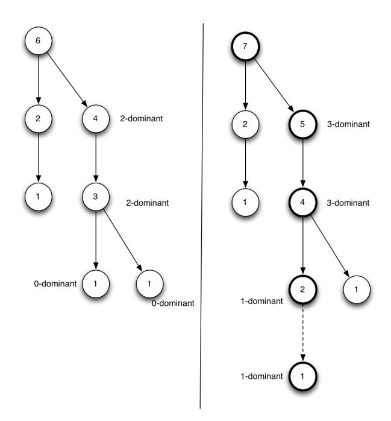
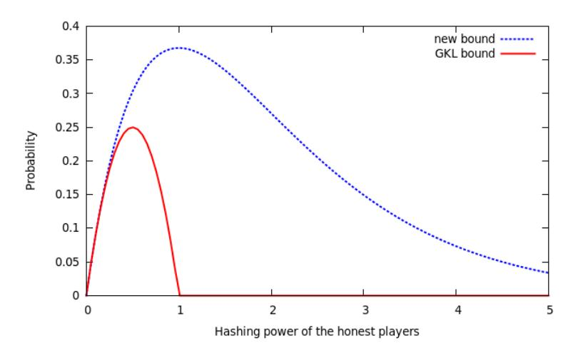

# On Trees, Chains and Fast Transactions in the Blockchain

Aggelos Kiayias1? and Giorgos Panagiotakos<sup>1</sup>

School of Informatics, University of Edinburgh {akiayias,giorgos.pan}@inf.ed.ac.uk,

Abstract. A fundamental open problem in the area of blockchain protocols is whether the Bitcoin protocol is the only solution for building a secure transaction ledger. A recently proposed and widely considered alternative is the GHOST protocol which, notably, was proposed to be at the core of Ethereum as well as other recent proposals for improved Bitcoin-like systems. The GHOST variant is touted as offering superior performance compared to Bitcoin (potentially offering block production speed up by a factor of more than 40) without a security loss. Motivated by this, in this work, we study from a provable security point of view the GHOST protocol.

We introduce a new formal framework for the analysis of blockchain protocols that relies on trees (rather than chains) and we showcase the power of the framework by providing a unified description of the GHOST and Bitcoin protocols, the former of which we extract and formally describe. We then prove that GHOST implements a robust transaction ledger (i.e., possesses liveness and persistence) and hence it is a provably secure alternative to Bitcoin; moreover, our bound for the liveness parameter is superior to that proven for the bitcoin backbone in line with the original expectation for GHOST. Our proof follows a novel methodology for establishing that GHOST is a robust transaction ledger compared to previous works, which may be of independent interest and can be applicable to other blockchain variants.

Keywords: GHOST, provable security, bitcoin, blockchain protocols

# 1 Introduction

The popularity of Bitcoin [19] has lead to a surge in the interest about its core protocol that maintains a distributed data structure called the blockchain. In [9], the core of the Bitcoin protocol was abstracted under the moniker Bitcoin Backbone and it was demonstrated to be a powerful tool for solving consensus, [23, 17], in a synchronous, anonymous and Byzantine setting where (unreliable)

<sup>?</sup> Research supported by ERC project CODAMODA. Part of this work was based in a technical report published in e-print (https://eprint.iacr.org/2015/1019).

broadcast is the communication operation available to the participants, (a problem first considered in [2, 20]). In [9], it was shown that the core protocol provably guarantees two properties: (i) persistence: if a transaction is reported as stable by one node, then it will be also reported as such by any other honest node of the system, (ii) liveness: all honestly generated transactions that are broadcasted are eventually reported as stable by some honest node. This provides a formal framework for proving the security of systems like Bitcoin, since their security can be reduced to the persistence and liveness of the underlying transaction ledger. Furthermore, it provides a way to argue formally about transaction confirmation time since the liveness property is equipped with a delay parameter that specifies the maximum transaction delay that can be caused by an adversary.

Naturally, implementing a robust transaction ledger may be achieved in various other ways, and it is a fundamental open question of the area whether the Bitcoin protocol itself is an "optimal" implementation of a robust transaction ledger. Indeed, many researchers have challenged various aspects of the Bitcoin system and they have proposed modifications in its core operation. Some of the modified systems maintain the protocol structure but modify the hard-coded parameters (like the block generation rate) or the basic primitives, e.g., the way proof of work is performed (a number of alternative proof of work implementations have been proposed using functions like scrypt [24], lyra2 [26] and others). However, more radical modifications are possible that alter the actual operation of the protocol.

One of the most notable such variants is the GHOST protocol, which was suggested by Sompolinsky and Zohar in [27]. After the initial suggestion many cryptocurrencies using variants of the GHOST rule were proposed and implemented. The most popular among them, Ethereum [6] has received substantial research attention [16, 15, 4, 25, 12, 21]. Ethereum is essentially a Bitcoin-like system where transaction processing is Turing-complete and thus it can be used to implement any public functionality in a distributed way. Bitcoin-NG [7] is another popular Bitcoin-like system relying on GHOST that separates blocks in two categories, namely key blocks and microblocks, reflecting the fact that transaction serialization and leader election may be separated.

Unfortunately, the security analysis of [27] is not as general as [9] (e.g., their attacker does not take advantage of providing conflicting information to different honest parties), while the analysis of [9] does not carry to the setting of GHOST. This is because the GHOST rule is a natural, albeit radical, reformulation of how each miner determines the main chain. In GHOST, miners adopt blocks in the structure of a tree. Note that in both Bitcoin and GHOST one can consider parties collecting all mined blocks in a tree data structure. However, while in Bitcoin the miners would choose the most difficult chain as the main chain, in GHOST, they will determine the chain by greedily following the "heaviest observed subtree." This means that for the same subtree, a Bitcoin miner and a GHOST miner may choose a completely different main chain. Furthermore, it means that the difficulty of the main chain of honest parties does not necessarily increase mono-

tonically (it may decrease at times) and thus a fundamental argument (namely that blockchains monotonically increase) that made the analysis of [9] possible, does not hold anymore.

Our Results. We propose a new analysis framework for blockchain protocols focusing on trees of blocks as opposed to chains as in [9]. Our framework enables us to argue about random variables on the trees of blocks that are formed by the participants. In our framework, we can express concepts like a node being d-dominant, which means that the block corresponding to that node would be preferred by a margin of d compared to other sibling nodes according to a specified weight measure. This actually enables us to unify the description of Bitcoin and GHOST by showing they obey the same rule, but simply for a different weight measure.

Using our framework we then provide a rst formal security proof of the GHOST rule for blockchain protocols. Specifically, we prove that GHOST is a robust transaction ledger that satisfies liveness and persistence. We achieve this result, by a new methodology, that reduces the properties of the robust transaction ledger to a single lemma, that we call the fresh block lemma and is informally stated as follows.

Fresh Block Lemma. (Informally) At any point of the execution and for any past sequence of s consecutive rounds, there exists an honest block mined in these rounds, that is contained in the chain of any honest player from this point on.

As we will demonstrate, the fresh block lemma is a powerful tool in the presence of an adversary: we show easily that the properties of the robust transaction ledger reduce to it in a black-box fashion.

In more details our result is as follows. In blockchain protocols there is a predicate parameterized by a security parameter k that determines when a transaction has been stabilized in the ledger. The stable predicate for Bitcoin can be seen to be true whenever the transaction is at least k blocks deep in the blockchain. The stable predicate for GHOST is different and is true whenever the block that the transaction belongs to is the root of a subtree of at least k blocks. We prove the following.

Persistence: if in a certain round an honest player reports a transaction tx as stable then whenever an honest party reports tx transaction as stable tx will be in the same position in the ledger.

Liveness: if a transaction is given as input to all honest players continuously for u = Θ(k) rounds then all of them will report it as stable.

The above properties will depend on the parameter k of the stable predicate of GHOST; we prove them to hold with a probability of error which drops exponentially in k over all executions of the protocol.

Our proof strategy for persistence and liveness utilizes the fresh block lemma in the following (black-box) manner.

In the case of persistence, it is sufficient to ensure that reporting the transaction as stable by any honest player implies that a sufficient amount of time has passed so that the fresh block lemma is applicable and has produced a block that is a descendant of the block that contains the transaction. Using the moderate hardness of proofs of work (specifically that they are hard enough) it is easy to translate from number of blocks in a subtree to actual running time in terms of rounds. It follows that the fresh block lemma applies and all honest parties will be mining on a subtree rooted at this fresh block for the remaining of the execution. As a result, the transaction will always be reported as stable since it belongs to the heaviest observed path for all of the honest parties.

In the case of liveness, we proceed in two steps. First, for our choice of u, in a time window lasting Θ(k) rounds, it will be ensured that the fresh block lemma can be applied once implying that all honest parties will mine in a subtree rooted by a common block that includes the transaction. Then, after another Θ(k) rounds, the honest parties will have accumulated enough honest blocks in this subtree to pronounce this transaction as stable. This latter statement requires again the moderate hardness of proofs of work but from the opposite perspective, i.e., that they are easy enough.

The above strategy provides an alternative proof methodology for establishing the properties of a robust transaction ledger compared to previous works that analyzed blockchain protocols, [9], [13] and [22] who reduced the properties of the robust transaction ledger to three other properties called common pre x, chain quality and chain growth. As such, the proof strategy itself may be of independent interest as it could be applicable to other blockchain variants, especially those that are using trees of blocks instead of chains of blocks as in bitcoin in their chain selection rule.

Our results align with the original expectation that GHOST performs better than bitcoin in terms of liveness, since our proven liveness parameter is k+ k (1−δ)α which is superior to the <sup>2</sup><sup>k</sup> (1−δ)γ liveness parameter for bitcoin proven in [9]. Note that in both cases k refers to the same confirmation level in the two protocols; in both cases k bounds the probability of the event that the number of uniquely successful rounds exceeds the number of blocks produced by the adversary.

On the generality of the adversarial model. The adversarial model we adopt in this work is the one proposed by Garay et al. [9]. This model is quite general in the sense that, it can captures many attack models that were proposed in the literature. For example, it captures the double spending attacker of [19], the block withholding attacker of [8] (which can be simulated because the adversary can change the order that messages arrive for each honest player) and the eclipse attacker of [5] where the communication of a portion of the honest nodes in the network is completely controlled (eclipsed) by the adversary (this can be simulated by simply considering the eclipsed nodes to be controlled by the adversary and having the adversary honestly execute their program while dropping their incoming messages). For a quantitative analysis of these attacks the reader is referred to [10].

Limitations and directions for future research. Our analysis is in the standard Byzantine model where parties fall into two categories, those that are honest (and follow the protocol) and those that are dishonest and may deviate in an arbitrary (and coordinated) fashion as dictated by the adversary. It is an interesting direction for future work to consider the rational setting where all parties wish to optimize a certain utility function. Designing suitable incentive mechanisms, for instance see [18] for a suggestion related to the GHOST protocol, or examining the requirements for setup assumptions, cf. [1], are related important considerations. Our analysis is in the static setting, i.e., we do not take into account the fact that parties change dynamically and that the protocol calibrates the difficulty of the POW instances to account for that; we note that this may open the possibility for additional attacks, say [3], and hence it is an important point for consideration and future work. Finally, it is interesting to consider our results in more general models such as the semi-synchronous model of [22].

**Organization.** In section 2 we overview the model that we use for expressing the protocols and the theorems regarding the security properties. In section 3 we introduce our new tree-based framework. Then, in section 4 we present our security analysis of an abstraction of the GHOST protocol that demonstrates it is a robust transaction ledger in the static setting.

# 2 Preliminaries and the GHOST Backbone protocol

#### 2.1 Model

For our model we adopt the abstraction proposed in [9]. Specifically, in their setting, called the q-bounded setting, synchronous communication is assumed and each party is allowed q queries to a random oracle. The network supports an anonymous message diffusion mechanism that is guaranteed to deliver messages of all honest parties in each round. The adversary is rushing and adaptive. Rushing here means that in any given round he gets to see all honest players' messages before deciding his own strategy. However, after seeing the messages he is not allowed to query the hashing oracle again in this round. In addition, he has complete control of the order that messages arrive to each player. The model is "flat" in terms of computational power in the sense that all honest parties are assumed to have the same computational power while the adversary has computational power proportional to the number of players that it controls.

The total number of parties is n and the adversary is assumed to control t of them (honest parties don't know any of these parameters). Obtaining a new block is achieved by finding a hash value that is smaller than a difficulty parameter D. The success probability that a single hashing query produces a solution is  $p = \frac{D}{2^{\kappa}}$  where  $\kappa$  is the length of the hash. The total hashing power of the honest players is  $\alpha = pq(n-t)$ , the hashing power of the adversary is  $\beta = pqt$  and the total hashing power is  $f = \alpha + \beta$ . A number of definitions that will be used extensively are listed below.

#### **Definition 1.** A round is called:

- successful if at least one honest player computes a solution in this round.
- uniquely successful if exactly one honest player computes a solution in this round.

#### **Definition 2.** In an execution blocks are called:

- honest, if mined by an honest party.
- adversarial, if mined by the adversary.

### **Definition 3.** Some chain notation:

- By  $C^{\lceil k \rceil}$  we denote the chain that results by dropping the last k blocks of C.
- We will say that a chain C' extends another chain C if a non-empty prefix of C' is a suffix of C.

In [9], a lower bound to the probabilities of two events, that a round is successful or that is uniquely successful (defined bellow), was established and denoted by  $\gamma_{\rm u}=\alpha-\alpha^2$ . While this bound is sufficient for the setting of small f, here we will need to use a better lower bound to the probability of those events, denoted by  $\gamma$ , and with value approximately  $\alpha e^{-\alpha}$  (see Appendix). Observe that  $\gamma>\gamma_{\rm u}$ .

### 2.2 The GHOST Backbone Protocol

In order to study the properties of the core Bitcoin protocol, the term *Backbone Protocol* was introduced in [9]. On this level of abstraction we are only interested on properties of the blockchain, independently from the data stored inside the blocks. The main idea of the Bitcoin Backbone is that honest players, at every round, receive new chains from the network and pick the longest valid one to mine. Then, if they obtain a new block (by finding a small hash), they broadcast their chain at the end of the round.

The same level of abstraction can also be used to express the GHOST protocol. The GHOST Backbone protocol, as presented in [27], is based on the principle that blocks that do not end up in the main chain, should also matter in the chain selection process. In order to achieve this, players store a tree of all mined blocks they have received, and then using the greedy heaviest observed subtree (GHOST) rule, they pick which chain to mine.

At every round, players update their tree by adding valid blocks sent by other players. The same principle as Bitcoin applies; for a block to be added to the tree, it suffices to be a valid child of some other tree block. The adversary can add blocks anywhere he wants in the tree, as long as they are valid. Again, as on Bitcoin, players try to extend the chains they choose by one or more blocks. Finally, in the main function, a tree of blocks is stored and updated at every round. If a player updates his tree, he broadcasts it to all other players.

The protocol is also parameterized by three external functions  $V(\cdot)$ ,  $I(\cdot)$ ,  $R(\cdot)$  which are called: the input validation predicate, the input contribution function,

**Algorithm 1** The chain selection algorithm. The input is a block tree  $\mathcal{T}$ . The  $|\cdot|$  operator corresponds to the number of nodes of a tree. By  $C_1||C_2|$  we denote the concatenation of chains  $C_1$ ,  $C_2$ .

```
1: function GHOST(T)
2:
         B \leftarrow root(\mathcal{T})
3:
         if children_{\mathcal{T}}(B) = \emptyset then
4:
              {\bf return}\ B
5:
         else
6:
              B \leftarrow argmax_{B' \in children_{\tau}(B)} |subtree_{\tau}(B')|
7:
              return B||\mathtt{GHOST}(subtree_{\mathcal{T}}(B))|
8:
         end if
9: end function
```

and the chain reading function, respectively.  $V(\cdot)$  dictates the structure of the information stored in each block,  $I(\cdot)$  determines the data that players put in the block they mine,  $R(\cdot)$  specifies how the data in the blocks should be interpreted depending on the application.

**Algorithm 2** The GHOST backbone protocol, parameterized by the *input contribution function*  $I(\cdot)$  and the *reading function*  $R(\cdot)$ .  $\mathbf{x}_{\mathcal{C}}$  is the vector of inputs of all block in chain  $\mathcal{C}$ .

```
1: \mathcal{T} \leftarrow GenesisBlock
                                                                                                                                                   \triangleright \mathcal{T} is a tree.
  2: state \leftarrow \varepsilon
 3: round \leftarrow 0
 4: while True do
              \mathcal{T}_{new} \leftarrow \mathsf{update}(\mathcal{T}, \mathsf{blocks} \; \mathsf{found} \; \mathsf{in} \; \mathsf{Receive}())
  5:
              \tilde{\mathcal{C}} \leftarrow \mathtt{GHOST}(\mathcal{T}_{new})
 6:
              \langle state, x \rangle \leftarrow I(state, \tilde{\mathcal{C}}, round, Input(), Receive())
  7:
 8:
              \mathcal{C}_{\mathsf{new}} \leftarrow \mathsf{pow}(x, \tilde{\mathcal{C}})
 9:
              if \tilde{\mathcal{C}} \neq \mathcal{C}_{new} or \mathcal{T} \neq \mathcal{T}_{new} then
10:
                     \mathcal{T} \leftarrow \mathsf{update}(\mathcal{T}_{\mathsf{new}}, \mathrm{head}(\mathcal{C}_{\mathsf{new}}))
                     Broadcast(head(C_{new}))
11:
12:
              end if
13:
              round \leftarrow round + 1
14:
              if INPUT() contains READ then
                       write R(\mathbf{x}_{\mathcal{C}}) to OUTPUT()
15:
16:
               end if
17: end while
```

Next, for completeness we present the remaining procedures of the GHOST backbone protocol. Function pow (see Figure 3), which has to do with block mining and is the same as the one defined in the Bitcoin Backbone and function update (see Figure 4) which refers to the way the block tree is updated.

**Algorithm 3** The *proof of work* function, parameterized by q, D and hash functions  $H(\cdot)$ ,  $G(\cdot)$ . The input is  $(x, \mathcal{C})$ .

```
1: function pow(x, C)
          if C = \varepsilon then
                                                                            ▷ Determine proof of work instance
 2:
 3:
                s \leftarrow 0
 4:
          else
                \langle s', x', ctr' \rangle \leftarrow \text{head}(\mathcal{C})
 5:
 6:
                s \leftarrow H(ctr', G(s', x'))
 7:
          end if
          ctr \leftarrow 1
 8:
 9:
           B \leftarrow \varepsilon
10:
           h \leftarrow G(s, x)
           while (ctr \leq q) do
11:
                if (H(ctr, h) < D) then
12:
13:
                     B \leftarrow \langle s, x, ctr \rangle
                     break
14:
                end if
15:
16:
                ctr \leftarrow ctr + 1
           end while
17:
           \mathcal{C} \leftarrow \mathcal{C}B
                                                                                                           \triangleright Extend chain
18:
19:
           return \mathcal C
20: end function
```

### 2.3 Security Properties

In [9, Definitions 2&3] two crucial security properties of the Bitcoin backbone protocol were considered, the common prefix and the chain quality property. The common prefix property ensures that two honest players have the same view of the blockchain if they prune a small number of blocks from the tail. On the other hand the chain quality property ensures that honest players chains' do not contain long sequences of adversarial blocks. These properties are defined as predicates over the random variable formed by the concatenation of all parties views' denoted by VIEW $_{\Pi,A,\mathcal{Z}}^{H(\cdot)}(\kappa,q,z)$ .

**Definition 4 (Common Prefix Property).** The common prefix property  $Q_{\sf cp}$  with parameter  $k \in \mathbb{N}$  states that for any pair of honest players  $P_1, P_2$  maintaining the chains  $C_1, C_2$  in  ${\sf VIEW}_{\Pi, \mathcal{A}, \mathcal{Z}}^{H(\cdot)}(\kappa, q, z)$ , it holds that

$$C_1^{\lceil k} \preceq C_2 \text{ and } C_2^{\lceil k} \preceq C_1.$$

**Definition 5 (Chain Quality Property).** The chain quality property  $Q_{cq}$  with parameters  $\mu \in \mathbb{R}$  and  $\ell \in \mathbb{N}$  states that for any honest party P with

**Algorithm 4** The tree update function, parameterized by q, D and hash functions  $H(\cdot)$ ,  $G(\cdot)$ . The inputs are a block tree  $\mathcal{T}$  and an array of blocks.

```
1: function update(\mathcal{T}, B)
         foreach \langle s, x, ctr \rangle in \mathcal{T}
2:
         foreach \langle s', x', ctr' \rangle in B
3:
         if ((s' = H(ctr, G(s, x))) \land (H(ctr', G(x', ctr')) < D)) then
4:
               children_{\mathcal{T}}(\langle s, x, ctr \rangle) = children_{\mathcal{T}}(\langle s, x, ctr \rangle) \cup \langle s', x', ctr' \rangle
                                                                                                              ▶ Add to the
5:
    {\it tree.}
6:
         end if
7:
         return \mathcal{T}
8: end function
```

chain  $\mathcal{C}$  in  $\mathrm{VIEW}_{\Pi,\mathcal{A},\mathcal{Z}}^{H(\cdot)}(\kappa,q,z)$ , it holds that for any  $\ell$  consecutive blocks of  $\mathcal{C}$  the ratio of adversarial blocks is at most  $\mu$ .

These two properties were shown to hold for the Bitcoin backbone protocol. Formally, in [9, Theorems 9&10] the following were proved:

**Theorem 1.** Assume f < 1 and  $\gamma_{\mathsf{u}} \geq (1 + \delta)\lambda\beta$ , for some real  $\delta \in (0,1)$  and  $\lambda \geq 1$  such that  $\lambda^2 - f\lambda - 1 \geq 0$ . Let  $\mathcal{S}$  be the set of the chains of the honest parties at a given round of the backbone protocol. Then the probability that  $\mathcal{S}$  does not satisfy the common-prefix property with parameter k is at most  $e^{-\Omega(\delta^3 k)}$ .

**Theorem 2.** Assume f<1 and  $\gamma_u\geq (1+\delta)\lambda\beta$  for some  $\delta\in(0,1)$ . Suppose  $\mathcal C$  belongs to an honest party and consider any  $\ell$  consecutive blocks of  $\mathcal C$ . The probability that the adversary has contributed more than  $(1-\frac{\delta}{3})\frac{1}{\lambda}\ell$  of these blocks is less than  $e^{-\Omega(\delta^2\ell)}$ .

Robust public transaction ledger. In [9] the robust public transaction ledger primitive was presented. It tries to capture the notion of a book where transactions are recorded, and it is used to implement Byzantine Agreement in the honest majority setting.

A public transaction ledger is defined with respect to a set of valid ledgers  $\mathcal{L}$  and a set of valid transactions  $\mathcal{T}$ , each one possessing an efficient membership test. A ledger  $\mathbf{x} \in \mathcal{L}$  is a vector of sequences of transactions  $\mathbf{tx} \in \mathcal{T}$ . Each transaction  $\mathbf{tx}$  may be associated with one or more accounts, denoted  $a_1, a_2, \ldots$  Ledgers correspond to chains in the backbone protocols. An oracle Txgen is allowed in the protocol execution that generates valid transactions (this represents transactions that are issued by honest parties). For more details we refer to [9].

We slightly alter the definitions of persistence and liveness so that they are relative to the way parties verify transactions. For example, in Bitcoin a transaction is 'stable' with parameter k if it is at least k blocks deep in the chain. On the

other hand, in GHOST the subtree formed by the block containing a transaction must be of size at least k in order for this transaction to be considered 'stable'. Whenever we talk about the persistence or liveness of Bitcoin or GHOST from now on, we will imply the parameterized versions with the respective definitions of stability that we just mentioned.

**Definition 6.** A protocol  $\Pi$  implements a robust public transaction ledger in the q-bounded synchronous setting if it satisfies the following two properties:

- Persistence: Parameterized by  $k \in \mathbb{N}$  (the "depth" parameter), if in a certain round an honest player reports a transaction tx as 'stable' with parameter k, then whenever an honest party reports it as stable, tx will be in the same position in the ledger.
- Liveness: Parameterized by u, k ∈ N (the "wait time" and "depth" parameters, resp.), provided that a transaction either (i) issued by Txgen, or (ii) neutral, is given as input to all honest players continuously for u consecutive rounds, then all honest parties will report it as 'stable' with parameter k from this round on.

These two properties were shown to hold for the ledger protocol  $\Pi_{PL}$  build on top of the Bitcoin Backbone protocol and appropriate instantiation of the functions V, R and I. Formally, in [9, Lemma 15&16] the following were proved:

**Lemma 1 (Persistence).** Suppose f < 1 and  $\gamma_{\mathsf{u}} \geq (1 + \delta)\lambda\beta$ , for some real  $\delta \in (0,1)$  and  $\lambda \geq 1$  such that  $\lambda^2 - f\lambda - 1 \geq 0$ . Protocol  $\Pi_{\mathsf{PL}}$  satisfies Persistence with probability  $1 - e^{-\Omega(\delta^3 k)}$ , where k is the depth parameter.

**Lemma 2 (Liveness).** Assume f < 1 and  $\gamma_u \ge (1+\delta)\lambda\beta$ , for some  $\delta \in (0,1)$ ,  $\lambda \in [1,\infty)$  and let  $k \in \mathbb{N}$ . Further, assume oracle Txgen is unambiguous. Then protocol  $\Pi_{\mathsf{PL}}$  satisfies Liveness with wait time  $u = 2k/(1-\delta)\gamma_{\mathsf{u}}$  and depth parameter k with probability at least  $1 - e^{-\Omega(\delta^2 k)}$ .

### 3 A unified description of Bitcoin and GHOST backbone

Next, we introduce our new analysis framework for backbone protocols that is focusing on trees of blocks and we show how the description of the Bitcoin and GHOST can be unified. In this model, every player stores all blocks he receives on a tree, starting from a pre-shared block called the Genesis (or  $v_{root}$ ) block. This is the model where GHOST was initially described. Bitcoin, and other possible backbone variants, can also be seen in this model and thus a unified language can be built. We first define block trees (or just trees) that capture the knowledge of honest players (regarding the block tree on different moments at every round).

**Definition 7.** We denote by  $\mathcal{T}_r^P$  (resp.  $\mathcal{T}_r$ ) the tree that is formed from the blocks that player P (resp. at least one honest player) has received up to round r. Similarly,  $\hat{\mathcal{T}}_r$  is the tree that contains  $\mathcal{T}_r$  and also includes all blocks mined by honest players at round r. For any tree T and block  $b \in T$ , we denote by T(b) the subtree of T rooted on b.

Notice that, due to the fact that broadcasts of honest players always succeed, blocks in  $\hat{\mathcal{T}}_r$  are always in  $\mathcal{T}_{r+1}^P$ . Thus for every honest player P it holds that:

$$\mathcal{T}_r^P \subseteq \mathcal{T}_r \subseteq \hat{\mathcal{T}}_r \subseteq \mathcal{T}_{r+1}^P$$

Intuitively, heavier trees represent more proof of work. However, there is more than one way to define the weight of a tree. For example, in Bitcoin the heaviest tree is the longest one. On the other hand, for GHOST a heavy tree is one with many nodes. To capture this abstraction we condition our definitions on a norm w that assigns weights on trees. This norm will be responsible for deciding which tree has more proof of work, and thus which tree is favored by the chain selection rule. We choose to omit w from the notation since it will always be clear from the context which norm we use.

**Definition 8.** Let w be a norm defined on trees. For any tree  $\mathcal{T}$  let siblings(v) denote the set of nodes in  $\mathcal{T}$  that share the same parent with v. Then node v is  $\mathbf{d}$ -dominant in  $\mathcal{T}$  (denoted by  $\mathrm{Dom}_{\mathcal{T}}(v,d)$ ) iff

$$w(\mathcal{T}(v)) \ge d \land \forall v' \in siblings(v) : w(\mathcal{T}(v)) \ge w(\mathcal{T}(v')) + d$$

The chain selection rule in the Bitcoin protocol can be described using the notion of the d-dominant node. Let  $w(\mathcal{T})$  be the height of some tree  $\mathcal{T}$ . Each player P, starting from the root of his  $\mathcal{T}_r^P$  tree, greedily decides on which block to add on the chain by choosing one of its 0-dominant children and continuing recursively<sup>1</sup> (ties are broken based on time-stamp, or based on which block was received first). Interestingly, the GHOST selection rule can also be described in exactly the same way by setting w to be the number of nodes of the tree. Thus we have a unified way for describing the chain selection rule in both protocols. Building upon this formalism we can describe the paths that fully informed honest players may choose to mine at round r (denoted by HonestPaths(r)) in a quite robust way, thus showcasing the power of our notation.

HonestPaths
$$(r) = \{p = v_{\text{root}}v_1 \dots v_k | p \text{ is a root-leaf path in } \mathcal{T}_r \text{ and } \forall i \in \{1, ..., k\} \text{ Dom}_{\mathcal{T}_r}(v_i, 0)\}$$

We conclude this section by presenting two crucial properties that both the Bitcoin and GHOST backbones satisfy. The first property states that by broadcasting k blocks the adversary can decrease the dominance of some block at most by k. Intuitively, it tells us if the adversary's ability to mine new blocks is limited, then his influence over the block tree is also limited. On the other hand, the second property states that uniquely successful rounds increase the dominance only of nodes in the path from the root to the new block.

We will use the term node and block interchangeably from now on.

Proposition 1. For the Bitcoin and GHOST backbone protocols it holds that:

<sup>&</sup>lt;sup>1</sup> This is exactly algorithm 1 with a minor modification. At line 6 the subtree  $\mathcal{T}$  that is chosen maximizes  $w(\mathcal{T})$ .

- if the adversary broadcast  $k \leq d$  blocks at round r-1 then for every block  $v \in \hat{\mathcal{T}}_{r-1}$  it holds that  $\mathrm{Dom}_{\hat{\mathcal{T}}_{r-1}}(v,d)$  implies  $\mathrm{Dom}_{\mathcal{T}_r}(v,d-k)$ .
- if r is a uniquely successful round and the newly mined block extends a path in HonestPaths(r), then for any block v in  $\mathcal{T}_r$  it holds that:  $\mathrm{Dom}_{\mathcal{T}_r}(v,d)$  implies  $\mathrm{Dom}_{\hat{\mathcal{T}}_r}(v,d+1)$  if and only if v is in the path from  $v_{\mathrm{root}}$  to the new block.

*Proof.* The lemma stems from the fact that adding only one block in the tree reduces or increases the dominance of some block by at most 1. For the first bullet, adding k blocks one by one, implies that the dominance of any node will reduce or increase by at most k. For the second bullet, notice that dominance increases only for blocks that get heavier. The only blocks that get heavier in this case are the ones in the path from the root to the newly mined block. Since these blocks are in HonestPaths(r), they are at least 0-dominant and so their dominance will further increase. Furthermore, the newly mined block is 1-dominant since it does not have any siblings.



Fig. 1: An example of the change in dominance after a uniquely successful round. The only nodes which increase their dominance the ones in the path from the root to the newly mined block as stated in Proposition 1.

### 4 Security Analysis and Applications

Next, we prove that the GHOST backbone protocol is sufficient to construct a robust transaction ledger. From now on we assume that w(T) is the total number of nodes of tree T.

#### 4.1 The Fresh Block Lemma

In [9], it was shown that the Bitcoin Backbone satisfies two main properties: common prefix and chain quality. However, another fundamental property needed for their proof, is that the chains of honest players grow at least at the rate of successful rounds. This does not hold for GHOST. The reason is that, if an honest player receives a chain that is heavier than the one he currently has, he will select it, even if it is shorter. To reflect these facts, we develop an argument that is a lot more involved and leads to a power lemma that we call the "fresh block lemma".

First, we introduce a new notion, that of a path that all of its nodes are dominant up to a certain value. Intuitively, the more dominant a path is, the harder it gets for the adversary to stop honest players from choosing it.

**Definition 9.**  $(p_{\text{dom}}(r,d))$  For d > 0,  $p_{\text{dom}}(r,d)$  is the longest path  $p = v_{\text{root}}v_1 \dots v_k$  in  $\hat{\mathcal{T}}_r$  s.t.

$$p \neq v_{\text{root}} \land \forall i \in \{1, \dots, k\} : \operatorname{Dom}_{\hat{\mathcal{T}}_r}(v_i, d)$$

If no such path exists  $p_{dom}(r, d) = \bot$ .

Note that the dominant path  $p_{dom}(r, d)$ , if it is not  $\perp$ , will be unique (this stems from the requirement that d > 0).

In the next lemma, we show that unless the number of blocks the adversary broadcasts in a round interval is at least as big as the number of uniquely successful rounds that have occurred, an honest block mined in one of these rounds will be deep enough in the chains of honest players. More specifically, for any sequence of m (not necessarily consecutive) uniquely successful rounds starting at some round r', no matter the strategy of the adversary, at round r there will be at least one honest block in  $p_{\text{dom}}(r, m-k)$  where k is the number of adversarial blocks that have been released during rounds [r'-1, r-1].

**Lemma 3.** Let  $r_1, ..., r_m$  be uniquely successful rounds from round r' until round r. If the adversary broadcasts k < m blocks from round r' - 1 until round r - 1, then there exists an honest block b, mined in one of the rounds  $r_1, ..., r_m$  such that b is in  $p_{\text{dom}}(r, m - k)$ .

*Proof sketch.* The proof is based on two observations. Firstly, if the adversary does not broadcast a block in the round before a uniquely successful round s, then the newly mined honest block will be in  $p_{\text{dom}}(s,1)$ . Secondly, if the adversary broadcasts k < d blocks in the round before a uniquely successful round s, all

blocks in  $p_{dom}(s-1,d)$  at round s-1 will also be in  $p_{dom}(s,d+1-k)$ . It follows that for each uniquely successful round, unless the adversary broadcasts a block, an honest block will be introduced in the dominant path and will be maintained there unless the adversary broadcasts more blocks than the number of uniquely successful rounds that follow. As a result, in the period from round r' until round r, our assumption that the adversary broadcasts strictly less than m blocks, implies that at least one block will be maintained in  $p_{dom}(r, m-k)$ .  $\square$

The fresh block lemma is stated next. Informally, it states that at any point in time, in any past sequence of s consecutive rounds, at least one honest block was mined and is permanently inserted in the chain that every honest player adopts, with overwhelming probability on s.

**Lemma 4.** (Fresh Block Lemma) Assume  $\gamma \geq (1+\delta)\beta$ , for some real  $\delta \in (0,1)$  and f < 1. Then, for all  $s \in \mathbb{N}$  and  $r \geq s$  it holds that there exists a block mined by an honest player on and after round r - s, that is contained in the chain which any honest player adopts on and after round r with probability  $1 - e^{-\Omega(\delta^2 s)}$ .

*Proof sketch.* The difficulty of proving this lemma stems from the fact that in GHOST, the chains of honest players are not always strictly increasing. That is, honest players may switch from a longer to a shorter chain. Monotonicity allows us to prove many useful things; for example that the adversary cannot use very old blocks in order to maintain a fork as in [9].

To overcome this difficulty, we first show that whenever the adversary forces honest players to work on a different branch of the block tree, he has to broadcast as many blocks as the ones that where mined on uniquely successful rounds on this branch of the tree. Hence, it is hard for the adversary to force honest players to change branches all the time, and moreover, after s rounds this will be impossible due to the fact that  $\gamma \geq (1+\delta)\beta$ . But if all honest players stay on one branch, the blocks near the root of the branch will permanently enter their chains. We show that at least one of these blocks will be mined by an honest player. By applying this idea in an iterative manner, the lemma follows.

For the full proof of the lemma we refer to the Appendix.

### 4.2 A robust public transaction ledger

In [9] it is shown how to instantiate the functions V, R, I so that the resulting protocol, denoted by  $\Pi_{PL}$ , built on top of the Bitcoin backbone, implements a robust transaction ledger. In this section we show how we can achieve the same goal, using exactly the same instantiation of V,R,I, but on top of the GHOST backbone. We call the resulting protocol,  $\Pi_{PL}^{GHOST}$ .

Having established that every s rounds a fresh and honest block is inserted permanently in the chain of all players, we are in a position to prove the main

<sup>&</sup>lt;sup>2</sup> Throughout this work, we only consider executions that run for a polynomial number of rounds in the security parameter  $\kappa$ .

properties of a robust transaction ledger. Liveness stems from the fact that after s rounds from the time a transaction was issued, an honest block that contains this transaction will stabilize in the chain. Thus, by waiting for at most  $s/\alpha$  more rounds, the honest parties will mine enough block so that this transaction becomes 'stable' with parameter s. Persistence is implied by the fact that when a player reports a transaction as stable for the first time, enough time has passed from the time the block containing the transaction was mined, and thus there exists an honest block descending it that has been permanently added to the chain of all honest parties.

**Lemma 5 (Liveness).** Assume  $\gamma \geq (1+\delta)\beta$ , for some  $\delta \in (0,1)$  and f < 1. Further, assume oracle Txgen is unambiguous. Then for all  $k \in \mathbb{N}$  protocol  $\Pi_{\mathsf{PL}}^{\mathsf{GHOST}}$  satisfies Liveness with wait time  $u = k + \frac{k}{(1-\delta)\alpha}$  rounds and depth parameter k with probability at least  $1 - e^{-\Omega(\delta^2 k)}$ .

Proof. We prove that assuming all honest players receive as input the transaction tx for at least u rounds, any honest party at round r with chain  $\mathcal C$  will report tx as 'stable'. By Lemma 4 it follows that with probability  $1-e^{-\Omega(\delta^2k)}$  there exists an honest block mined during rounds [r-u,r-u+k], such that all honest players have this block in the chains they mine from round r-u+k and onward. Without loss of generality this block contains tx. All blocks that honest players mine during the remaining  $\frac{k}{(1-\delta)\alpha}$  rounds will be descendants of this block. By an application of the Chernoff bound, with probability  $1-e^{-\Omega(\delta^2k)}$ , the honest parties will mine at least k blocks in this round interval and thus the lemma follows with the desired probability.

**Lemma 6 (Persistence).** Suppose  $\gamma \geq (1+\delta)\beta$  and  $(1+\delta)f \leq 1$ , for some real  $\delta \in (0,1)$ . Then for all  $k \in \mathbb{N}$  protocol  $\Pi_{\mathsf{PL}}^{\mathsf{GHOST}}$  satisfies Persistence with probability  $1 - e^{-\Omega(\delta^2 k)}$ , where k is the depth parameter.

*Proof.* Let B be the block that contains transaction tx that the honest party P reported as stable at round r. We will argue that B must have been computed before round r - k, and thus by Lemma 4 all honest players will report it in the same position in their chains.

Let  $E_1$  be the event where B is computed after round  $r-k/((1+\delta)f) < r-k$ . The number of descendants of B cannot be greater than the number of solutions Y obtained from the oracle in this amount of rounds. By the Chernoff bound,

$$\Pr[Y \ge (1+\delta)f\frac{k}{(1+\delta)f}] = \Pr[Y \ge k] \le e^{-\delta^2 f s/3}.$$

Since tx is reported as stable, B must have k descendants and thus  $E_1$  implies that Y must be greater or equal to k. Hence,  $\Pr[E_1] \leq \Pr[Y \geq k] \leq e^{-\delta^2 f s/3}$ .

Let  $E_2$  be the event where Lemma 4 does not hold for round r. This happens with probability at most  $e^{-\Omega(\delta^2 k)}$ . By the union bound, the event  $E_1 \vee E_2$  happens with probability at most  $e^{-\Omega(\delta^2 k)}$ . Assuming that  $E_1 \vee E_2$  does not

occur, it follows that there exists an honest block B<sup>0</sup> mined on and after round r − k that will be in the chains of all honest players from round r and onward. Hence, B must be an ancestor of B<sup>0</sup> and all honest players will report B and tx at the same position as P from round r and onward. Persistence follows with the desired probability.

Theorem 3. Assuming γ ≥ (1 + δ)β and (1 + δ)f ≤ 1, for some real δ ∈ (0, 1), the protocol ΠGHOST PL implements a robust transaction ledger.

As a nal note, Lemma 4 is sufficient to prove Persistence and Liveness in a black-box way. Compared to the approach of [9], that was further expanded in [13] and [22], only one property, instead of three, of the underlying backbone protocol suces in order to get a robust public transaction ledger in a blackbox manner. On the other hand, the three properties described in these works, common-prefix, chain quality and chain growth, also serve as metrics of the efficiency of the underlying mechanism and provide more information than the fresh block lemma.

## References

- 1. M. Andrychowicz and S. Dziembowski. Pow-based distributed cryptography with no trusted setup. In Advances in CryptologyCRYPTO 2015, pages 379399. Springer, 2015.
- 2. J. Aspnes, C. Jackson, and A. Krishnamurthy. Exposing computationallychallenged byzantine impostors. Department of Computer Science, Yale University, New Haven, CT, Tech. Rep, 2005.
- 3. L. Bahack. Theoretical bitcoin attacks with less than half of the computational power (draft). Cryptology ePrint Archive, Report 2013/868, 2013. http://eprint. iacr.org/.
- 4. J. Bonneau. Ethiks: Using ethereum to audit a coniks key transparency log.
- 5. S. G. Ethan Heilman. Alison Kendler, Aviv Zohar. Eclipse attacks on bitcoin's peer-to-peer network. Cryptology ePrint Archive, Report 2015/263, 2015. http: //eprint.iacr.org/.
- 6. ethereum/wiki. A next-generation smart contract and decentralized application platform, October 2015. https://github.com/ethereum/wiki/wiki/White-Paper/.
- 7. I. Eyal, A. E. Gencer, E. G. Sirer, and R. van Renesse. Bitcoin-ng: A scalable blockchain protocol. CoRR, abs/1510.02037, 2015.
- 8. I. Eyal and E. G. Sirer. Majority is not enough: Bitcoin mining is vulnerable. In Financial Cryptography, 2014.
- 9. J. A. Garay, A. Kiayias, and N. Leonardos. The bitcoin backbone protocol: Analysis and applications. In Advances in Cryptology - EUROCRYPT 2015 - 34th Annual International Conference on the Theory and Applications of Cryptographic Techniques, Soa, Bulgaria, April 26-30, 2015, Proceedings, Part II, pages 281310, 2015.
- 10. A. Gervais, G. O. Karame, K. Wüst, V. Glykantzis, H. Ritzdorf, and S. Capkun. On the security and performance of proof of work blockchains. Cryptology ePrint Archive, Report 2016/555, 2016. http://eprint.iacr.org/2016/555.

- 11. J. Hiºak and R. Logoºar. A derivation of the mean absolute distance in onedimensional random walk. Tehni£ki glasnik, 5(1):1016, 2011.
- 12. A. Juels, A. Kosba, and E. Shi. The ring of gyges: Using smart contracts for crime. aries, 40:54, 2015.
- 13. A. Kiayias and G. Panagiotakos. Speed-security tradeos in blockchain protocols. Technical report, IACR: Cryptology ePrint Archive, 2015.
- 14. A. Kiayias and G. Panagiotakos. Speed-security tradeos in blockchain protocols. Cryptology ePrint Archive, Report 2015/1019, 2015. http://eprint.iacr.org/ 2015/1019.
- 15. A. Kiayias, H.-S. Zhou, and V. Zikas. Fair and robust multi-party computation using a global transaction ledger, 2015.
- 16. A. Kosba, A. Miller, E. Shi, Z. Wen, and C. Papamanthou. Hawk: The blockchain model of cryptography and privacy-preserving smart contracts. Technical report, Cryptology ePrint Archive, Report 2015/675, 2015. http://eprint. iacr. org, 2015.
- 17. L. Lamport, R. E. Shostak, and M. C. Pease. The byzantine generals problem. ACM Trans. Program. Lang. Syst., 4(3):382401, 1982.
- 18. S. D. Lerner. Even faster block-chains with the decor protocol. Cryptology ePrint Archive, Report 2013/881, May 2014. https://bitslog.wordpress.com/2014/ 05/02/decor/.
- 19. S. Nakamoto. Bitcoin: A peer-to-peer electronic cash system. http://bitcoin.org/bitcoin.pdf, 2008.
- 20. M. Okun. Agreement among unacquainted byzantine generals. In P. Fraigniaud, editor, DISC, volume 3724 of Lecture Notes in Computer Science, pages 499500. Springer, 2005.
- 21. S. Omohundro. Cryptocurrencies, smart contracts, and articial intelligence. AI matters, 1(2):1921, 2014.
- 22. R. Pass, L. Seeman, and abhi shelat. Analysis of the blockchain protocol in asynchronous networks. Cryptology ePrint Archive, Report 2016/454, 2016. http://eprint.iacr.org/.
- 23. M. C. Pease, R. E. Shostak, and L. Lamport. Reaching agreement in the presence of faults. J. ACM, 27(2):228234, 1980.
- 24. C. Percival. Stronger key derivation via sequential memory-hard functions. Selfpublished, pages 116, 2009.
- 25. J. Peterson and J. Krug. Augur: a decentralized, open-source platform for prediction markets. arXiv preprint arXiv:1501.01042, 2015.
- 26. M. A. Simplicio Jr, L. C. Almeida, E. R. Andrade, P. C. dos Santos, and P. S. Barreto. The lyra2 reference guide. Technical report, version 2.3. 2. Technical report, 2014.
- 27. Y. Sompolinsky and A. Zohar. Secure high-rate transaction processing in bitcoin. Financial Cryptography and Data Security, 2015.

# A Probability of uniquely successful rounds

In this section we demonstrate a lower bound on the probability of uniquely successful rounds. This bound allows us to argue about the security of GHOST even when f is larger than 1.

**Lemma 7.** For
$$p < 0.1$$
 and  $a \in (p, 2k)$ :  $e^{-a-kp} \le (1-p)^{\frac{a}{p}-k} \le e^{-a+kp}$

Proof. The second inequality is well studied and holds for p > 0. For the rst inequality by solving for a we get a ≤ k ln(1−p) 1+ ln(1−p) p which holds for p < 0.1 and a ∈ (p, 2k).

Let γ be a lower bound on the probability of a uniquely successful round (a round where only one block is found). From the event where (n − t) players throw q coins each and exactly one coin toss comes head, the probability of a uniquely successful rounds is at least:

$$(n-t)qp(1-p)^{q(n-t)-1} \ge \alpha e^{-\alpha - kp}$$

We set γ = ae−a−kp, for the minimum k that satisfies the relation α ∈ (p, 2k). This is a substantially better bound that γ<sup>u</sup> and is also a lower bound for the event that at a round is successful. The relation of the two bounds is depicted in Figure 2.



Fig. 2: Comparison of the lower bounds on the probability of a uniquely successful round, γ and γu, used respectively in this work and [9]. Notice that γ allows as to argue about security when f is greater than 1.

### B Proofs

### B.1 Proof of Lemma 3

*Proof.* We are first going to prove two preliminary claims that show the effect of a uniquely successful round to  $p_{\text{dom}}$ . The first claim shows that if a uniquely successful round s is not compensated accordingly by the adversary, a newly mined block will be forced into  $p_{\text{dom}}(s,1)$ .

Claim 1. Let round s be a uniquely successful round and b be the honest block mined at round s. If the adversary does not broadcast any block at round s-1 then  $b \in p_{\text{dom}}(s,1)$ .

Proof of Claim. First, notice that since the adversary does not broadcast any block it holds that for any honest player P,  $\mathcal{T}_s$  is equal to  $\mathcal{T}_s^P$ . Therefore, all nodes in the path from  $v_{\text{root}}$  to the parent of b are at least 0-dominant in  $\mathcal{T}_s$  and thus this path is in HonestPaths(s). Since s is uniquely successful, all conditions of the second bullet of Proposition 1 are met, and thus it is implied that all nodes up to the newly mined block in  $\hat{\mathcal{T}}_s$  are 1-dominant. It follows that  $b \in p_{\text{dom}}(s, 1)$ .

The second claim shows the effect of a uniquely successful round s to an existing  $p_{\text{dom}}(s-1,d)$  path. Notice that if the adversary broadcasts less than d blocks the same nodes continue to be at least 1-dominant in the following round.

Claim 2. Let round s be a uniquely successful round, b be the honest block mined at round s and  $p_{\text{dom}}(s-1,d) \neq \bot$ . If the adversary broadcasts (i) k < d blocks at round s-1 then  $p_{\text{dom}}(s-1,d) \subseteq p_{\text{dom}}(s,d+1-k)$ , (ii) k=d blocks at round s-1 then either  $b \in p_{\text{dom}}(s,1)$  or  $p_{\text{dom}}(s-1,d) \subseteq p_{\text{dom}}(s,1)$  and b is a descendant of the last node in  $p_{\text{dom}}(s-1,d)$ .

Proof of Claim. There are two cases. In the first case suppose the adversary broadcasts k < d blocks. Then, according to the first bullet of Proposition 1, the adversary can lower the dominance in  $\mathcal{T}_s$  of nodes in  $p_{\text{dom}}(s-1,d)$  by at most k. Thus  $p_{\text{dom}}(s-1,d)$  will be a prefix of all the chains in HonestPaths(s). But because s is a uniquely successful round, the dominance in  $\hat{\mathcal{T}}_s$  of all nodes in  $p_{\text{dom}}(s-1,d)$  will increase by one. Therefore  $p_{\text{dom}}(s-1,d) \subseteq p_{\text{dom}}(s,d+1-k)$  and b will be a descendant of the last node in  $p_{\text{dom}}(s-1,d)$ .

In the second case suppose the adversary broadcasts k=d blocks. If he does not broadcast all of these blocks to reduce the dominance in  $\mathcal{T}_s$  of the nodes in  $p_{\text{dom}}(s-1,d)$ , then  $p_{\text{dom}}(s-1,d)$  will be a prefix of all the chains in HonestPaths(s) and as in the previous case,  $p_{\text{dom}}(s-1,d) \subseteq p_{\text{dom}}(s,d+1-k)$  and b will be a descendant of the last node in  $p_{\text{dom}}(s-1,d)$ .

Otherwise the adversary will reduce the dominance in  $\mathcal{T}_s$  of at least one node in  $p_{\text{dom}}(s-1,d)$  to zero. If b is a descendant of the last node in  $p_{\text{dom}}(s-1,d)$ , then all nodes in  $p_{\text{dom}}(s-1,d)$  will be 1-dominant in  $\hat{\mathcal{T}}_s$  and  $p_{\text{dom}}(s-1,d) \subseteq p_{\text{dom}}(s,1) = p_{\text{dom}}(s,d+1-d)$ . If b is not a descendant of the last node in  $p_{\text{dom}}(s-1,d)$ , then for the player P that mined this block it holds that  $\mathcal{T}_s^P = \mathcal{T}_s$ ,

because he would have not mined a chain that does not contain  $p_{\text{dom}}(s-1,d)$  at round s otherwise. Therefore, P at round s was mining a chain that belonged to HonestPaths $(s, v_{\text{root}})$  and thus all nodes in the chain are at least 0-dominant in  $\mathcal{T}_s$ . But because s is a uniquely successful round the dominance of all nodes in the chain that s belongs to will increase by one and thus s belongs to s and s belongs to s and s belongs to s and s belongs to s and s belongs to s and s belongs to s and s belongs to s and s belongs to s and s belongs to s and s belongs to s and s belongs to s and s belongs to s and s belongs to s and s belongs to s and s belongs to s and s belongs to s and s belongs to s and s belongs to s and s belongs to s and s belongs to s and s belongs to s and s belongs to s and s belongs to s and s belongs to s and s belongs to s and s belongs to s and s belongs to s and s belongs to s and s belongs to s and s belongs to s and s belongs to s and s belongs to s and s belongs to s and s belongs to s and s belongs to s and s belongs to s and s belongs to s and s belongs to s and s belongs to s and s belongs to s and s belongs to s and s belongs to s and s and s belongs to s and s belongs to s and s belongs to s and s belongs to s and s belongs to s and s belongs to s and s belongs to s and s belongs to s and s belongs to s and s belongs to s and s belongs to s and s belongs to s and s and s and s belongs to s and s and s and s and s and s and s and s and s and s and s and s and s and s and s and s and s and s and s and s and s and s and s and s and s and s and s and s and s and s and s and s and s and s and s and s and s and s and s and s and s and s and s and s and s an

Let  $b_i$  denote the honest block mined at round  $r_i$ . Let us assume that  $r = r_m$ . We are going to prove the lemma using induction on the number of uniquely successful rounds m.

For the base case suppose m=1. The adversary does not broadcast any block until round  $r_1-1$  and from the first claim  $b_1 \in p_{\text{dom}}(r_1,1)$ . Thus the base case is proved. Suppose the lemma holds for m-1 uniquely successful rounds and let  $k_1$  be the number of blocks that the adversary broadcasts in the round interval  $[r'-1, r_{m-1}-1]$ . We have two cases.

(First case)  $k_1 = m - 1$  and the adversary broadcasts no blocks in the rest of the rounds. From the first claim it follows that  $b_m \in p_{\text{dom}}(r_m, 1)$ .

(Second case)  $k_1 < m-1$  and from the induction hypothesis there exist blocks  $b'_1, ..., b'_{m-1-k_1}$  mined by honest players at the uniquely successful rounds  $r_1, ..., r_{m-1}$  where  $b'_i \in \mathrm{p}_{\mathrm{dom}}(r_{m-1}, i)$ . Let  $k_2$  be the number of blocks that the adversary broadcasts until round  $r_m-2$  and  $k_3$  the number of blocks he broadcasts at round  $r_m-1$ . If  $k_2=m-1$  then again from the first claim it follows that  $b_m \in \mathrm{p}_{\mathrm{dom}}(r_m,1)$ . If  $k_2 < m-1$  then if  $k_3 + k_2 = m-1$  then from the second claim either  $b_m \in \mathrm{p}_{\mathrm{dom}}(r_m,1)$  or  $b'_{m-1-k_1} \in \mathrm{p}_{\mathrm{dom}}(r_m,1)$ . If  $k_3 + k_2 < m-1$  then again from the second claim at round  $r_m, b'_i \in \mathrm{p}_{\mathrm{dom}}(r_m-1,i)$  for i in  $\{k_2 + k_3 + 1, ..., m-1-k_1\}$  and either  $b'_{k_2+k_3}$  is in  $\mathrm{p}_{\mathrm{dom}}(r_m,1)$  or  $b_m$  is in  $\mathrm{p}_{\mathrm{dom}}(r_m,1)$ . This completes the induction proof.

We proved that if  $k_4 < m$  is the number of blocks the adversary broadcasts until round  $r_m - 1$ , then there exists honest blocks  $b'_1, ..., b'_{m-k_4}$  s.t.  $b'_i$  is in  $p_{\text{dom}}(r_m, i)$ . Now in the case  $r > r_m$ , let  $k_5 < m - k_4$  be the number of blocks the adversary broadcasts in the remaining rounds. The lemma follows easily from the second claim.

Remark 1. Let  $r_1, ..., r_m$  be uniquely successful rounds up to round r and the honest block mined at round  $r_1$  be in  $p_{\text{dom}}(r_1, 1)$ . If the adversary broadcasts k < m blocks from round  $r_1$  until round r - 1, then there exists an honest block b mined in one of the rounds  $r_1, ..., r_m$  such that b in  $p_{\text{dom}}(r, m - k)$ . (to see why the remark holds notice that that blocks that the adversary broadcasts before round  $r_1$  affect only the dominant path at round  $r_1$ , and not at the following rounds)

### B.2 Proof of Lemma 4

*Proof.* Let random variable  $Z_{s_1,s_2}$  (resp.  $Z_{s_1,s_2}^{bd}$ ) denote the number of blocks the adversary computes (resp. broadcasts) from round  $s_1$  until round  $s_2$ , and random

variable  $X_{s_1,s_2}$  denote the number of rounds that are uniquely successful in the same interval.

We are first going to prove two preliminary claims. We show that as long as from some round r and afterwards the adversary broadcasts less blocks than the total number of uniquely successful rounds, the chain that any honest player adopts after round r extends  $p_{\text{dom}}(r, X_{1,r} - Z_{1,r})$ . More generally we can prove the following claim.

Claim 3. Consider any execution such that for all  $s_2 \geq s_1$  it holds that  $Z_{1,s_2} < X_{1,s_2}$ . Then, the chain that any honest player adopts after round  $s_1$  extends  $p_{\text{dom}}(s_1, X_{1,s_1} - Z_{1,s_1})$ .

Proof of Claim. Since  $X_{1,s_1} > Z_{1,s_1}$  from Lemma 3 if follows that  $p = p_{\text{dom}}(s_1, X_{1,s_1} - Z_{1,s_1-1}) \neq \bot$ . As long as the number of blocks that the adversary broadcasts at round  $s_2$  are less than the dominance of the nodes in p in  $\hat{\mathcal{T}}_{s_2-1}$ , all honest players at round  $s_2$  will adopt chains containing p. Thus uniquely successful rounds will increase the dominance of these nodes. But since from the assumptions made,  $Z_{1,s_2} < X_{1,s_2}$ , in all rounds after round  $s_1$ , the nodes in p are at least 1-dominant in every  $\mathcal{T}_{s_2}^P$  where P is an honest player; the claim follows.

Next we will show that if successive u.s. rounds occur such that the blocks mined are on different branches, then the adversary must broadcast an adequate number of blocks, as specified below.

Claim 4. Consider any execution where  $s_1 < s_2 < \ldots < s_m$  are u.s. rounds and  $s_k$  is the first u.s. round such that the honest block mined in this round is not a descendant of the honest block mined in round  $s_{k-1}$ , for  $k \in \{2, \ldots, m\}$ . Then either  $Z_{s_1-1,s_m-1}^{bd} > X_{s_1,s_m-1}$  or  $Z_{s_1-1,s_m-1}^{bd} = X_{s_1,s_m-1}$  and the honest block mined at round  $s_m$  will be in  $p_{\text{dom}}(s_m, 1)$ .

Proof of Claim. Let  $b_1,...,b_m$  denote the honest blocks mined at rounds  $s_1,...,s_m$  respectively. We are going to prove the claim for m=2. Suppose, for the sake of contradiction, that  $Z_{s_1-1,s_2-1}^{bd} < X_{s_1,s_2-1}$ . By the definition of  $s_2$ , the honest blocks mined on all u.s. rounds until round  $s_2-1$  are descendants of  $b_1$ . From Lemma 3 at least one honest block b computed in one of the u.s. rounds in  $[s_1,s_2-1]$  will be in  $p_{\text{dom}}(s_2-1,X_{s_1,s_2-1}-Z_{s_1-1,s_2-2}^{bd})$ . Since from our hypothesis the adversary will broadcast less than  $Z_{s_2-1,s_2-1}^{bd} < X_{s_1,s_2-1}-Z_{s_1-1,s_2-2}^{bd}$  blocks at round  $s_2-1$ , it is impossible for  $b_2$  not to be a descendant of b and thus of  $b_1$  which is a contradiction. Hence,  $Z_{s_1-1,s_2-1}^{bd} \ge X_{s_1,s_2-1}$ . If  $Z_{s_1-1,s_2-1}^{bd} > X_{s_1,s_2-1}$  the base case follows. Otherwise,  $Z_{s_1-1,s_2-1}^{bd} = X_{s_1,s_2-1}$  and we have two cases. In the first case,  $X_{s_1,s_2-1} = Z_{s_1-1,s_2-2}^{bd}$  and at round round  $s_2-1$  the adversary does not broadcast any block. From Claim B.1 of Lemma 3,  $b_2$  will be in  $p_{\text{dom}}(s_2,1)$ . In the second case, it holds that the adversary broadcasts exactly  $X_{s_1,s_2-1} - Z_{s_1-1,s_2-2}^{bd}$  blocks at round  $s_2-1$ . From Claim B.1 of Lemma 3, since  $b_2$  cannot be a descendant of the last node of  $p_{\text{dom}}(s_2-1,1)$ ,  $b_2$  will be in  $p_{\text{dom}}(s_2,1)$ . Hence, the base case follows.

Suppose the lemma holds until round  $s_m$ . By the inductive hypothesis we have two cases. In the first case  $Z_{s_1-1,s_m-1}^{bd} > X_{s_1,s_m-1}$  which implies  $Z_{s_1-1,s_m-1}^{bd} \geq X_{s_1,s_m}$ . If no u.s. round happens during rounds  $s_m+1,\ldots,s_{m+1}-1$  then from Claim B.1 in the proof of Lemma 3 the claim follows. Otherwise, a u.s. round s' happens during these rounds, where the honest block mined is a descendant of  $b_m$ . Then we can make the same argument as for the base case starting from round s' and get that either  $Z_{s'-1,s_{m+1}-1}^{bd} > X_{s',s_{m+1}-1}$  or  $Z_{s'-1,s_{m+1}-1}^{bd} = X_{s',s_{m+1}-1}$  and the honest block mined at round  $s_{m+1}$  will be in  $p_{\text{dom}}(s_{m+1},1)$ . Since  $Z_{s'-1,s_{m+1}-1}^{bd} < Z_{s_m-1,s_{m+1}-1}^{bd}$  and  $X_{s',s_{m+1}-1} = X_{s_m+1,s_{m+1}-1}$ , by the inequality of the inductive hypothesis the claim follows.

In the second case  $Z^{bd}_{s_1-1,s_m-1}=X_{s_1,s_m-1}$  and the honest block  $b_m$  mined at round  $s_m$  will be in  $p_{\text{dom}}(s_m,1)$ . From Remark 1 of the proof of claim Lemma 3, for an application of this Lemma from rounds  $s_m$  until  $s_{m+1}-1$  we can count the adversarial blocks starting from round  $s_m$ . Thus from the same argument as for the base case starting from round  $s_m$  we get that either  $Z^{bd}_{s_m,s_{m+1}-1} > X_{s_m,s_{m+1}-1}$  or  $Z^{bd}_{s_m,s_{m+1}-1} = X_{s_m,s_{m+1}-1}$  and the honest block mined at round  $s_m$  will be in  $p_{\text{dom}}(s_m,1)$ . By the equality of the inductive hypothesis the claim follows.

Next, we observe that Lemma 3 as well as Claim B.2 and B.2 can be applied on a subtree of the block tree, if all honest blocks mined after the round the root of the subtree was mined are on this subtree.

**Observation 1.** Let b be an honest block computed at round  $s_1$  that is in the chains adopted by all honest players after round  $s_2$ . Also, suppose that all blocks mined at u.s. rounds after round  $s_1$  are descendants of b. Then the following hold:

- 1. Regarding applications of Lemma 3 and Claim B.2 on the subtree of the block tree rooted on b after round  $s_1$ , we can ignore all blocks that the adversary has mined up to round  $s_1$ .
- 2. Regarding applications of Claim B.2 after round  $s_2$ , we can ignore all blocks that the adversary has mined up to round  $s_1$ .

To see why the observation holds consider the following. Since the adversary receives block b for the first time at round  $s_1 + 1$ , all blocks that the adversary mines before round  $s_1 + 1$  cannot be descendants of b. Regarding the first point, blocks that are not descendants of b do not affect the validity of Lemma 3 and Claim B.2 on the subtree of the block tree rooted on b; this is because blocks that are not descendants of b, do not affect the dominance of the nodes of the subtree rooted at b. Regarding the second point, consider the dominant path at round  $s_3 > s_2$  in the subtree that is rooted on b. Then, this path can be extended up to the root node, since, by our assumption, b is in the chains adopted by all honest players after round  $s_2$ .

We are now ready to prove the lemma. First, we are going to define a set of bad events which we will show that hold with probability exponentially small in s. Assuming these events don't occur we will then show that our lemma is implied, and thus the lemma will follow with overwhelming probability.

Let  $BAD(s_1, s_2)$  be the event that  $X_{s_1, s_2} \leq Z_{s_1, s_2}$ . In [9, Lemma 5], by an application of the Chernoff bounds it was proved that assuming that  $\gamma \geq (1+\delta)\beta$  for some  $\delta \in (0, 1)$ , then with probability at least  $(1 - e^{-\frac{\beta}{243}\delta^2 s'})(1 - e^{-\frac{\gamma}{128}\delta^2 s'}) \geq 1 - e^{-(\min(\frac{\beta}{243}, \frac{\gamma}{128})\delta^2 s' - \ln(2))}$  for any r' > 0, s' > s:

$$X_{r',r'+s'-1} > (1 + \frac{\delta}{2})Z_{r',r'+s'-1}$$
 (1)

Thus, there exists an appropriate constant  $\epsilon = \delta^2 \min(\frac{\beta}{243}, \frac{\gamma}{128})$ , independent of r, such that it holds that for any  $r' > 0, s' \geq s$ , BAD(r', r' + s' - 1) occurs with probability at most  $e^{-\epsilon \delta^2 s' + \ln 2}$ . From an application of the union bound, we get that for the function  $g(s) = \epsilon \delta^2 s - \ln 2 + \ln(1 - e^{-\epsilon \delta^2})$ , the probability that  $\bigvee_{r' > s} BAD(s_1 + 1, s_1 + r')$  happens is:

$$\Pr\left[\bigvee_{r' \geq s} BAD(s_1 + 1, s_1 + r')\right] \leq \sum_{r' \geq s} e^{-\epsilon \delta^2 r' + \ln 2}$$

$$\leq e^{\ln 2} \sum_{r' \geq s} e^{-\epsilon \delta^2 r'}$$

$$\leq e^{\ln 2} \frac{e^{-\epsilon \delta^2 s}}{1 - e^{-\epsilon \delta^2}}$$

$$< e^{-g(s)}$$

Until now we have assumed that the execution we are studying is collision-free; no two queries in the oracle return the same value for different inputs. Let COL denote the event where a collision occurs in our execution. The probability of COL in a polynomial number of rounds, is exponentially small on  $\kappa$ .

$$\Pr[COL] \le (f\kappa^c)^2/2^{\kappa+1} = e^{-\Omega(\kappa)} \le e^{-\Omega(s)}$$

Let  $BAD(s_1)$  denote the event where  $\bigvee_{r'\geq s}BAD(s_1+1,s_1+r')$  or COL happens. From the union bound the probability that  $BAD(s_1)$  happens, for any  $s_1$  is negligible.

$$\Pr[BAD(s_1)] \le e^{-g(s)} + e^{-\Omega(s)} \le e^{-\Omega(s)}$$

We are going to show next that, conditioning on the negation of this event the statement of the lemma follows.

We will use the convention that block  $b_i$  is mined at round  $r_i$ . Let  $b_1$  be the most recent honest block that is in the chains that all honest players have adopted on and after round r, such that the blocks mined at all u.s. rounds after round  $r_1$  are descendants of  $b_1$ . This block is well defined, since in the worst case it is the genesis block. If  $r_1$  is greater or equal to r-s, then the lemma follows for block  $b_1$  with probability 1.

Suppose round  $r_1$  is before round r-s and that  $BAD(r_1)$  does not happen. The negation of  $BAD(r_1)$  implies that  $X_{r_1+1,r-1+c} > Z_{r_1+1,r-1+c}$ , for  $c \geq 0$ . By Lemma 3 and Claim B.2 there exists at least one honest block  $b_2$ , mined in a u.s. round and contained in the chains of all honest players on and after round r. W.l.o.g. let  $b_2$  be the most recently mined such block. By the definition of  $b_1$ ,  $b_2$  is a descendant of  $b_1$ . If  $r_2$  is greater or equal to r-s then the lemma follows, since  $b_2$  is an honest block mined on and after round r-s that satisfies the conditions of the lemma.

Suppose round  $r_2$  is before round r-s. Let  $r_3$  be the earliest u.s. round, such that  $b_3$  and the blocks mined at all u.s. rounds afterwards are descendants of  $b_2$ . Since  $b_2$  will be in the chains of all honest players after round r, round  $r_3$  is well defined. Also let  $s_1 < \ldots < s_m < \ldots$  be the sequence of u.s. rounds after round  $r_1$  that satisfy the conditions of Claim B.2. That is,  $s_k$  is the first u.s. round such that the honest block mined in this round is not a descendant of the honest block mined in round  $s_{k-1}$ , for  $k \in \{2, ..., m\}$ . The first u.s. round after round  $r_1$  corresponds to  $s_1$ .

We will argue that  $r_3$  is equal to some  $s_i > s_1$  in the aforementioned sequence. Suppose, for the sake of contradiction that it does not. This implies that the honest block mined at round  $r_3$  (denoted by  $b_3$ ) is a descendant of the honest block mined at some round  $s_i$  of the sequence. W.l.o.g. suppose that  $s_i$  is the largest such round that is before round  $r_3$ . There are three cases. In the first case,  $r_2 < s_i < r_3$ . By the definition of  $s_i$  and  $r_3$ , the block mined at round  $s_i$  is an ancestor of  $b_3$  and also a descendant of  $b_2$ . Hence,  $s_i$  satisfies the definition of  $r_3$  which is a contradiction (there is an earlier round than  $r_3$  with the same property). In the second case,  $s_i = r_4$ , where  $b_4$  is a descendant of  $b_1$  and either  $b_2 = b_4$  or  $b_4$  is an ancestor of  $b_2$ . Then  $b_4$  is a block that satisfies the definition of  $b_1$ , and is more recent, which is a contradiction. In the third case,  $r_1 < s_i < r_2$  and the block mined at round  $s_i$  is not an ancestor of  $b_2$ . By the definition of  $s_i$ , the honest block mined at round  $s_i$  is an ancestor of  $b_3$ , that has been mined before round  $r_2$ . But this is contradictory, since no honest block can be an ancestor of  $b_3$ , mined before round  $r_2$ , but not be an ancestor of  $b_2$ .

Since we proved that  $r_3$  is equal to some  $s_i$  we can apply Claim B.2 from round  $r_1+1$  until round  $r_3$ . Again, from Observation 1, regarding applications of Claim B.2 after round  $r_1$  we can ignore blocks that were mined before round  $r_1+1$ . Then either  $Z_{r_1+1,r_3-1}\geq Z_{r_1+1,r_3-1}^{bd}>X_{r_1+1,r_3-1}$  or  $Z_{r_1+1,r_3-1}\geq Z_{r_1+1,r_3-1}^{bd}=X_{r_1+1,r_3-1}$  and the honest block mined at round  $r_3$  will be in  $\operatorname{pdom}(r_3,1)$ .

Suppose, for the sake of contradiction, that round  $r_3$  is after round  $r_2 + s$ . Then  $(r_3-1)-(r_1+1) \ge s$  and  $Z_{r_1+1,r_3-1} \ge X_{r_1+1,r_3-1}$ . This is a contradiction, since in this case  $\neg BAD(r_1)$  implies  $Z_{r_1+1,r_3-1} < X_{r_1+1,r_3-1}$ . Therefore,  $r_3 \le r_2 + s < r$ . In addition, notice that  $\neg BAD(r_1)$  also implies

$$X_{r_1+1,r_2+s} > Z_{r_1+1,r_2+s} \tag{2}$$

We are going to apply Lemma 3 and Observation 1 from round  $r_3$  until round  $r_2 + s$  in the subtree rooted at  $b_2$ . According to the analysis we made previously

there are two cases. In the first case,  $Z^{bd}_{r_1+1,r_3-1} > X_{r_1+1,r_3-1}$  or equivalently  $Z^{bd}_{r_1+1,r_3-1} \geq X_{r_1+1,r_3}$ . Suppose, for the sake of contradiction, that  $r_3 = r_2 + s$ . Then  $Z_{r_1+1,r_2+s-1} \geq X_{r_1+1,r_2+s}$ . But this is a contradiction, since  $\neg BAD(r_1)$  implies Inequality 2. Therefore,  $r_3 < r_2 + s$ . From Inequality 2:

$$X_{r_3+1,r_2+s} \ge X_{r_1+1,r_2+s} - X_{r_1+1,r_3} > Z_{r_1+1,r_k+s} - Z_{r_1+1,r_3-1}^{bd} \ge Z_{r_3,r_2+s}^{bd}$$

The last inequality, stems from two facts: that we can ignore blocks that were mined before round  $r_1 + 1$  regarding applications of Lemma 3 and also that the blocks that the adversary broadcasts at distinct rounds are different (adversaries that broadcast the same block multiple times can be ignored without loss of generality).

In the second case,  $Z_{r_1+1,r_3-1}^{bd} = X_{r_1+1,r_3-1}$  and the honest block mined at round  $r_3$  will be in  $p_{\text{dom}}(r_3,1)$ . Again from Inequality 2:

$$X_{r_3,r_2+s} = X_{r_1+1,r_2+s} - X_{r_1+1,r_3-1} > Z_{r_1+1,r_k+s} - Z_{r_1+1,r_3-1}^{bd} \ge Z_{r_3,r_2+s}^{bd}$$

The same analysis holds for all rounds after  $r_2 + s$ . By an application of Claim B.2, an honest block b, computed in one of the u.s. rounds after round  $r_2$  and before round r, will be in the chains that honest players adopt on and after round r. Since  $b_2$  is the most recently mined block, before round r - s, included in the chain of all honest players, b must have been mined on and after round r - s (since  $r_3 > r_2$ ). Let A be the event that there exists a block mined by an honest player on and after round r - s, that is contained in the chain which any honest player adopts after round r. We have proved that  $(\neg BAD(r_1))$  implies A. Then:

$$Pr[A] = Pr[A \land BAD(r_1)] + Pr[A \land \neg BAD(r_1)]$$

$$\geq Pr[A \land \neg BAD(r_1)]$$

$$= Pr[A|\neg BAD(r_1)]Pr[\neg BAD(r_1)]$$

$$= Pr[\neg BAD(r_1)]$$

$$\geq 1 - e^{-g(s)}$$

Hence, the lemma holds with probability at least  $1 - e^{-g(s)}$ .