# **On the Security and Performance of Proof of Work Blockchains**

Arthur Gervais ETH Zurich, Switzerland arthur.gervais@inf.ethz.ch

Vasileios Glykantzis ETH Zurich, Switzerland glykantv@student.ethz.ch

Ghassan O. Karame NEC Laboratories, Europe ghassan.karame@neclab.eu

Hubert Ritzdorf ETH Zurich, Switzerland hubert.ritzdorf@inf.ethz.ch

Karl Wüst ETH Zurich, Switzerland kwuest@student.ethz.ch

Srdjan Capkun ˇ ETH Zurich, Switzerland srdjan.capkun@inf.ethz.ch

### ABSTRACT

Proof of Work (PoW) powered blockchains currently account for more than 90% of the total market capitalization of existing digital currencies. Although the security provisions of Bitcoin have been thoroughly analysed, the security guarantees of variant (forked) PoW blockchains (which were instantiated with different parameters) have not received much attention in the literature.

In this paper, we introduce a novel quantitative framework to analyse the security and performance implications of various consensus and network parameters of PoW blockchains. Based on our framework, we devise optimal adversarial strategies for doublespending and selfish mining while taking into account real world constraints such as network propagation, different block sizes, block generation intervals, information propagation mechanism, and the impact of eclipse attacks. Our framework therefore allows us to capture existing PoW-based deployments as well as PoW blockchain variants that are instantiated with different parameters, and to objectively compare the tradeoffs between their performance and security provisions.

## 1. INTRODUCTION

Since its inception in 2009, Bitcoin's blockchain has fueled innovation and a number of novel applications, such as smart contracts, have been designed to take advantage of the blockchain. Bitcoin has been forked a number of times in order to fine-tune the consensus (i.e., the block generation time and the hash function), and the network parameters (e.g., the size of blocks and the information propagation protocol) and to increase the blockchain's efficiency. For instance, Litecoin and Dogecoin—Bitcoin's most prominent forks—reduce the block generation time from 10 to 2.5 and 1 minute. Parallel to these efforts, alternative decentralised blockchain-based networks (such as Ethereum) emerged with the ambition to optimize the consensus and network parameters and to ease the deployment of decentralised applications on top of the blockchain.

Although a number of consensus protocols (PBFT [5], Proof of Stake [29], Proof of Elapsed Time [20]) have been proposed, most existing blockchains leverage the computationally expensive Proof of Work (PoW) consensus mechanism—which currently accounts for more than 90% of the total market capitalization of existing digital currencies. While the security provisions of Bitcoin have been thoroughly analysed [14, 21, 30, 32], the security guarantees of variant PoW blockchains have not received much attention in the literature. Recent studies hint that the performance of PoW based blockchains cannot be enhanced without impacting their security. However, the relationship between performance and security provisions of PoW blockchains has so far not been studied in much detail.

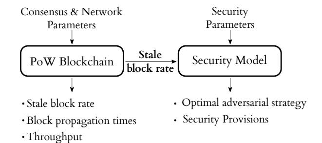

Figure 1: Components of our quantitative framework.

In this paper, we address this problem and provide a novel quantitative framework to analyse the security and performance implications of various consensus and network parameters of PoW blockchains. Leveraging our framework, we capture the security properties of existing PoW instantiations (e.g., Bitcoin, Ethereum, Litecoin, and Dogecoin) as well as other possible instantiations subject to different consensus and network parameters.

Our framework (cf. Figure 1) consists of two key elements: *(i)* a blockchain instance and *(ii)* a blockchain security model. A blockchain instance is a PoW blockchain instantiated with a given set of consensus and network parameters, such as network delays, block generation times, block sizes, information propagation mechanisms, etc. For example, Bitcoin, Litecoin, and Ethereum correspond to 3 different blockchain instances. To realistically capture any other blockchain instance, we design a simulator that mimics the blockchain consensus and network layer by implementing advertisement-based information propagation, unsolicited block pushes, the relay network, the *sendheader* propagation mechanism, among others.<sup>1</sup> The main output of the blockchain instance is the (measured or simulated) stale (orphan) block rate, which is fed as input into our security model. On the other hand, our security model is based on Markov Decision Processes (MDP) for double-spending and selfish mining and allows us to reason about optimal adversarial strategies while taking into account the adversarial mining power, the impact of eclipse attacks, block rewards, and real world network and consensus parameters—effectively captured by the stale block rate.

Given the current discussions in the Bitcoin community about a suitable maximum block size that ensures the scalability and growth in the system [1], our work provides a way to holistically compare the security and performance of PoW blockchains when subject to different parameters—-including the block size. For instance,

<sup>1</sup>We will make our simulator open-source at "address omitted due to anonymization requirements".

we find that increasing the block size from the current Bitcoin transaction load (average 0.5MB) to up to 4 MB, does not significantly affect the selfish mining and double-spending resilience of the blockchain—provided that the block propagation mechanism ensures a low stale block rate. We summarize our findings as follows.

#### Summary of findings

- We show that selfish mining is not always a rational strategy. To capture rational adversaries, we therefore quantify the double-spending resilience of PoW blockchains and objectively compare the security of different PoW blockchains with respect to the required number of transaction confirmations. By doing so, we provide merchants with the knowledge to decide on the required number of confirmations for a given transaction value to ensure security against double-spending.
- Our results show that, due to the smaller block rewards and the higher stale block rate of Ethereum<sup>2</sup> compared to Bitcoin (from 0.41% to 6.8% due to the faster confirmation time), Ethereum (block interval between 10 and 20 seconds) needs at least 37 confirmations to match Bitcoin's security (block interval of 10 minutes on average) with 6 block confirmations against an adversary with 30% of the total mining power. Similarly, Litecoin would require 28, and Dogecoin 47 block confirmations respectively to match the security of Bitcoin.
- We show that the higher the block reward of a blockchain (in e.g., USD) the more resilient it is against double-spending.
- Finally, we analyze the impact of changing the block size and/or the block interval on selfish mining and double-spending. Our results surprisingly show that setting the block size to an average 1 MB, and decreasing the block interval time to 1 minute do not considerably penalize security. Our results therefore suggest that PoW blockchains can attain an effective throughput above 60 transactions per second (tps) (which implies that the current throughput of Bitcoin of 7 tps can be substantially increased) without compromising the security of the system.

The remainder of the paper is organized as follows. In Section 2, we overview the basic concepts behind PoW blockchain. In Section 3, we introduce our MDP model to quantitatively analyze the security of PoW blockchains. In Section 4, we present our simulator and evaluate the security and performance of a number of variant PoW-based blockchain instances. In Section 5, we overview related work, and we conclude the paper in Section 6.

### 2. BACKGROUND

In this section, we briefly recap the operations of the consensus layer and the network layer of existing PoW blockchains.

### 2.1 Consensus Layer

The proof of work (PoW) consensus mechanism is the widest deployed consensus mechanism in existing blockchains. PoW was introduced by Bitcoin [27] and assumes that each peer votes with his "computing power" by solving proof of work instances and constructing the appropriate blocks. Bitcoin, for example, employs a hash-based PoW which entails finding a nonce value, such that when hashed with additional block parameters (e.g., a Merkle hash, the previous block hash), the value of the hash has to be smaller than the current target value. When such a nonce is found, the miner creates the block and forwards it on the network layer (cf. Section 2.2) to its peers. Other peers in the network can verify the PoW by computing the hash of the block and checking whether it satisfies the condition to be smaller than the current target value.

Block interval: The block interval defines the latency at which content is written to the blockchain. The smaller the block interval is, the faster a transaction is confirmed and the higher is the probability of stale blocks. The block interval adjustment directly relates to the difficulty change of the underlying PoW mechanism. A lower difficulty results in a larger number of blocks in the network, while a higher difficulty results in less blocks within the same timeframe.

It is therefore crucial to analyse whether changing the difficulty affects the adversarial capabilities in attacking the longest chain which is the main pillar of security of most PoW-based blockchains. This also implies the adjustment of the required number of confirmations that a merchant should wait in order to safely accept transactions (and avoid double-spending attacks) (cf. Section 3).

### *2.1.1 PoW security*

PoW's security relies on the principle that no entity should gather more than 50% of the processing power because such an entity can effectively control the system by sustaining the longest chain. We now briefly outline known attacks on existing PoW-based blockchains.

First, an adversary can attempt to double-spend by using the same coin(s) to issue two (or more) transactions—thus effectively spending more coins than he possesses. Recent studies have shown that accepting transactions without requiring blockchain confirmations is insecure [21]. The more confirmations a transaction obtains, the less likely this transaction will be reversed in the future.

Second, miners might attempt to perform *selfish mining* [14] attacks in order to increase their relative mining share in the blockchain, by selectively withholding mined blocks and only gradually publishing them [14, 31]. Recent studies show that, as a result of these attacks, a selfish miner equipped with originally 33% mining power can effectively earn 50% of the mining power.

Double-spending attacks and selfish mining can be alleviated if all nodes in the blockchain system are tightly synchronised. Note that, in addition to network latency, synchronisation delays can be aggravated due to *eclipse attacks* [16,17] where an adversary creates a logical partition in the network, i.e., provides contradicting block and transaction information to different blockchain network nodes.

### 2.2 Network Layer

On the network layer, we identify two main parameters that are of particular importance for PoW-based blockchains, namely: the *block size*, and the *information propagation mechanism*.

### *2.2.1 Block size*

The maximum block size indirectly defines the maximum number of transactions carried within a block. This size therefore controls the throughput attained by the system. Large blocks incur slower propagation speeds, which in turn increases the stale block rate (and weaken the security of the blockchain as stated earlier).

#### *2.2.2 Information propagation mechanism*

The block request management system dictates how information is delivered to peers in the network. Eventually, since all peers are expected to receive all blocks, a broadcast protocol is required. The choice of the underlying broadcast protocol clearly impacts the robustness and scalability of the network (cf. Section 4). In what follows, we briefly describe well-known network layer implementations of existing PoW-based blockchains.

Advertisement-based information dissemination: Most PoW blockchains propagate messages with the help of an advertisement-

<sup>2</sup>We show that, contrary to common beliefs, Ethereum does not apply GHOST's principle to include the contributions of "uncles" in the main chain and therefore currently resembles Bitcoin.

based request management system. If node A receives information about a new object (e.g., a transaction or a block) from another node, A will advertise this object to its other connections (e.g. node B) by sending them an *inv* message (the hash and type of the advertised object). Only if node B has not previously received the advertised object, B will request the object from A with a *getdata* request. Node A will subsequently respond with a Bitcoin object, e.g., the contents of a transaction or a block.

Send headers: Peers can alternatively issue a *sendheaders* message in order to directly receive block *headers* in the future from their peers—skipping the use of *inv* messages. This reduces the latency and bandwidth overhead of block message propagation and is adopted by Bitcoin since version 0.12.

Unsolicited block push: This mechanism enables miners to broadcast their generated blocks without advertisement (i.e., since they mined the block). Note that this push system is recommended<sup>3</sup> , but not implemented in Bitcoin.

Relay networks: Relay networks [6] primarily enhance synchronization of miners that share a common pool of transactions. Transactions are typically only referenced in relayed blocks with a transaction ID (2 bytes per transaction instead of an average of 250 bytes per transaction). As a consequence, the resulting block size is smaller than the regular block (cf. Bitcoin Relay Network [6]).

Hybrid Push/Advertisement Systems: A number of systems, such as Ethereum, combine the use of push and advertisement dissemination. Here, a block is directly pushed to a threshold number of peers (e.g., Ethereum directly pushes blocks to <sup>√</sup> n peers, where n is the total number of neighbors connected to the peer). Concurrently, the sender advertises the block hash to all of its neighbors.

### 2.3 Stale blocks

Stale blocks refer to blocks that are not included in the longest chain, e.g., due to concurrency, conflicts. Stale blocks are detrimental to the blockchain's security and performance because they trigger chain forks—an inconsistent state which slows down the growth of the main chain and results in significant performance and security implications. On the one hand, stale blocks increase the advantage of the adversary in the network (e.g., double-spending). On the other hand, stale blocks result in additional bandwidth overhead and are typically not awarded mining rewards (except in Ethereum).

In an experiment that we conducted, we measure the stale block rate in the Bitcoin (block generation time = 10 minutes, average block size = 534.8KB), Litecoin (block generation time = 2.5 minutes, average block size = 6.11KB) and Dogecoin (block generation time = 1 minute, average block size = 8KB) network. All three blockchains rely on a PoW-based blockchain (with different generation times) and the same information propagation system (with different block sizes).

We crawled the available nodes in Litecoin and Dogecoin [3] in February 2016 and found about 800 and 600 IP addresses respectively. We then measured the block propagation times by registering the times at which we receive the block advertisements from a particular block from all our connections in the respective network [9]. We operated one node for Litecoin and Dogecoin, which we connected to 340 and 200 peers, respectively. Once one of these peers advertises block information in form of either *(i)* a new hash of a block (*inv* message) or *(ii)* a block header (*headers* message), we registered the time this block information appeared. Every subsequent reception of a particular piece of block information then provides information about the propagation of the block.

|                | Bitcoin   | Litecoin | Dogecoin | Ethereum          |
|----------------|-----------|----------|----------|-------------------|
| Block interval | 10 min    | 2.5 min  | 1 min    | 10-20 seconds     |
| Public nodes   | 6000      | 800      | 600      | 4000 [11]         |
| Mining pools   | 16        | 12       | 12       | 13                |
| tMBP           | 8.7 s [8] | 1.02 s   | 0.85 s   | 0.5 - 0.75 s [12] |
| rs             | 0.41%     | 0.273%   | 0.619%   | 6.8%              |
| sB             | 534.8KB   | 6.11KB   | 8KB      | 1.5KB             |

Table 1: Comparison of different Bitcoin forks, Ethereum and the impact of parameter choices on the network propagation times. Stale block rate (rs) and average block size (sB) were measured over the last 10000 blocks. tMBP stands for median block propagation time.

Our results (cf. Table 1) suggest that the stale block rate indeed largely depends on the block interval and the block sizes. For instance, unlike Dogecoin and Litecoin, Bitcoin features larger block sizes due to a higher transaction load (of up to 1MB which results in a higher stale block rate (0.41% vs. 0.273%)—although the block interval of Bitcoin is 4 times longer than that of Litecoin. Moreover, the stale block rate differences between Litecoin and Dogecoin are mainly due to the difference in the block interval (2.5 minutes vs. 1 minute), since their average block sizes are comparable (6.11KB and 8KB). Given a confirmation time reduction of 60%, the stale block rate increased by 127% from Litecoin to Dogecoin.

Notice that in Ethereum, *uncle blocks* correspond to stale blocks that are referenced in the main chain. The uncle block rate in Ethereum is almost 6.8%, compared to a stale block rate of 0.41% in Bitcoin. In Section 3, we study the impact of the stale block rate on the security of PoW blockchains.

### 3. POW SECURITY MODEL

In this section, we introduce our blockchain security model that we leverage to quantify the optimal adversarial strategies for doublespending and selfish mining. We then use these strategies as a basis to compare the security provisions of PoW-based blockchains when instantiated with different parameters.

### 3.1 Security Model

Our model extends the Markov Decision Process (MDP) of [31] to determine optimal adversarial strategies, and captures:

Stale block rate The stale block rate r<sup>s</sup> allows us to account for different block sizes, block intervals, network delays, information propagation mechanisms and network configuration (e.g., number of nodes).

Mining power α is the fraction of the total mining power of the adversary (the rest is controlled by the honest network).

Mining costs The adversarial mining costs c<sup>m</sup> ∈ [0, α] correspond to the expected mining costs of the adversary (i.e., total mining costs such as hardware, electricity, man-power) and are expressed in terms of block rewards. For example, if c<sup>m</sup> = α, the mining costs of the adversary are equivalent to its mining power times the block reward, i.e., the mining costs are covered exactly by the earned block revenue in honest mining.

The number of block confirmations k This corresponds to the number of blocks that need to confirm a transaction, such that a merchant accepts the transaction.

Propagation ability The propagation parameter γ captures the connectivity of the adversary within the network (i.e., captures the fraction of the network that receives the adversary's blocks in the case when the adversary and the honest miner release their blocks simultaneously in the network).

<sup>3</sup> https://bitcoin.org/en/developer-reference#data-messages

The impact of eclipse attacks Our model accounts for eclipse attacks. Here, we assume that the miners of the honest network are affected by the stale block rate, while the adversary and the colluding eclipsed victims do not mine stale blocks. This is due to the fact that the adversary can use any mined blocks for an attack and effectively only has a small chance of mining a stale block after adopting the honest chain. Therefore, in practice, the adversary exhibits a significantly lower real stale block rate than the honest network. The honest network features propagation and validation delays—hence it will witness a higher stale block rate. Note that the blocks found by the eclipsed victim can also count towards the private chain of the adversary.

We contrast this to existing models, such as Sapirshtein et al.'s [31], which only focus on selfish mining and cannot capture different blockchain instances (with various stale block rates and confirmations) and real-world parameters such as network delays.

To analyze optimal double-spending strategies, we define the double-spending amount  $v_d$  that corresponds to the minimum transaction value that makes double-spending more profitable than honest mining. We argue that  $v_d$  emerges as a robust metric to quantify security under double-spending attacks. Namely, if the reward of honest mining is larger than that of dishonest behaviour, merchants can safely accept a payment transaction of value  $v_d$  (since such a value is considered secure, e.g., based on a given confirmation number). If however, adversarial behaviour is financially more rewarding, a merchant should be aware of the associated double-spending risks and of the related incentives of miners.

We capture the blockchain model using a single-player decision problem  $M:=\langle S,A,P,R\rangle$  where all other participants follow the standard protocol, and S corresponds to the state space, A to the action space, P to the stochastic transition matrix, and R to the reward matrix. We instantiate M as a Markov Decision Process (MDP) as outlined in Section 3.2 and 3.3.

In our model, the following actions are available to the adversary: **Adopt** The adversary accepts the chain of the honest network, which effectively corresponds to a restart of the attack. This action is appropriate if the adversary deems that the likelihood to win over the honest chain is small.

Override The adversary publishes one block more than the honest chain has and consequently overrides conflicting blocks. This happens when the adversary's secret chain is longer than the currently known public chain (i.e.  $l_a > l_h$ ) and it is optimal for the adversary to publish  $l_h + 1$  of his blocks to replace the honest network's chain with his own. If the adversary exploits the mining power of the victim, the adversary might use  $b_e$  blocks from the victim for an *override* action.

**Match** The adversary publishes as many blocks as the honest chain has, and triggers an adoption race between the two chains instead of *overriding* the honest chain.

Wait The adversary continues mining on its hidden chain until a block is found.

**Exit** This action is only relevant when studying double-spending as it corresponds to a successful double-spending with k confirmations and is only feasible if  $l_a > l_h$  and  $l_a > k$ .

The state space S is defined as a four-tuple of the form  $(l_a, l_h, b_e, \text{fork})$ , where  $l_a$  and  $l_h$  represent the length of the adversarial and honest chain respectively,  $b_e$  the blocks mined by the eclipsed victim, and fork can take three values, irrelevant, relevant and active:

**relevant** The label relevant signifies that (i) the last block has been found by the honest network, and (ii) if  $l_a \ge l_h$  the *match* action is applicable. A state of the form  $(l_a, l_h - 1, b_e, \cdot)$  for instance results in  $(l_a, l_h, b_e, \text{relevant})$ .

**irrelevant** When the adversary found the last block, the previous block has likely already reached the majority of the nodes in the network. The adversary is therefore not able to perform a *match* action. A state of the form  $(l_a-1, l_h, b_e, \cdot)$  for instance results in  $(l_a, l_h, b_e, irrelevant)$ .

**active** The state is described with the label *active*, if the adversary performed a *match* action, i.e., the network is currently split and in process of determining the longest chain.

In our model, every state transition (except *exit*) corresponds to the creation of a block. Consequently, a state transition implies a reward for the honest network, the adversary, or the eclipsed victim.

Given the adversarial mining power  $\alpha$ , the initial state (0,0,0,1) irrelevant) transitions to (1,0,0,1) irrelevant) with probability  $\alpha$ , i.e., the adversary found one block. If the honest network finds a non-stale block, the resulting state is (0,1,0,1) relevant). On the other hand, if the honest network's block results in a stale block, the state remains (0,0,0,1) irrelevant) since a stale block does not count towards the longest chain. The last case accounts for the eclipsed victim which finds a block with probability  $\alpha$ , resulting in state (1,0,1) irrelevant).

#### Selfish Mining vs. Double-spending.

In this work, we consider double-spending and selfish mining independently, since selfish mining is not always a rational strategy: the objective of selfish mining is to increase the relative share of the adversarial blocks committed to the main chain, while in double-spending the adversary aims to maximize his absolute revenue.

Namely, as long as the difficulty of a PoW blockchain does not change (e.g. Bitcoin's difficulty changes only once every two weeks), selfish mining yields fewer block rewards than honest mining. In honest mining, the adversary is rewarded for every mined block, while he will lose any previously mined blocks when adopting the main chain in selfish mining. Since the adversary has less mining power than the honest network, he has a high probability of falling behind the main chain, causing him to adopt the main chain when he has no significant chance of catching up—which in turn leads to lost block rewards. For instance, following our optimal selfish mining strategy (cf. Section 3.2.1), an adversary with 30% of the mining power earns 209 block rewards on average in a duration where 1000 blocks are mined by the whole network (as opposed to 300 for honest mining). Similarly, Eyal and Sirer's [14] strategy yields on average 205.80 blocks rewards.

#### Eclipse attacks.

In an eclipse attack, a fraction  $\omega$  of the overall mining power is eclipsed [17, 28] from receiving information from the honest network. Here, a number of eclipse attack variants arise:

No eclipse attack This case is captured in our model if  $\omega = 0$ .

**Isolate the victim** This is captured implicitly in our model. Namely, this corresponds to a decrease of the total mining power and thus an increase of the attacker mining power to  $\alpha' = \frac{\alpha}{1-\omega}$ .

Exploit the eclipsed victim Here, the adversary exploits the victim's mining power  $\omega$  and uses it to advance his private chain. This is the most likely choice of a rational adversary when performing double-spending attacks. In this case, we assume that the victim is fully eclipsed from the network and does not receive/send blocks unless permitted by the adversary [17,28].

#### 3.2 Selfish Mining MDP

Our goal is to find the optimal adversarial strategy for selfish mining. Recall that the objective of the adversary in selfish mining is not to optimise the absolute reward, but to increase the share of blocks that are included in the chain accepted by the network. We capture this by optimising the relative revenue  $r_{rel}$  defined in Equation 1, where  $r_{a_i}$  and  $r_{h_i}$  are the rewards in step i for the adversary and the honest network, respectively:

$$r_{rel} = \mathbb{E}\left[\underline{\lim_{n \to \infty}} \frac{\sum_{i=1}^{n} r_{a_i}}{\sum_{i=1}^{n} (r_{a_i} + r_{h_i})}\right]$$
(1)

Since an adversary aims to increase his relative reward  $r_{rel}$  (Equation 1) in selfish mining, as opposed to the absolute reward, the single-player decision problem cannot be modelled directly as an MDP, because the reward function is non-linear. In order to transform the problem into a family of MDPs, we apply the technique of Sapirshtein *et al.*'s [31], which we describe below.

We assume that the value of the objective function (i.e., the optimal relative reward) is rho and define for any  $\rho \in [0,1]$  the transformation function  $w_\rho: \mathbb{N}^2 \to \mathbb{R}$  with the adversarial reward  $r_a$  and the reward of the honest network  $r_h$  in Equation 2.

$$w_{\rho}(r_a, r_h) = (1 - \rho) \cdot r_a - \rho \cdot r_h \tag{2}$$

This results in an infinite state MDP  $M_{\rho}=\langle S,A,P,w_{\rho}(R)\rangle$  for each  $\rho$  that has the same action and state space as the original decision problem and the same transition matrix but the reward matrix is transformed using  $w_{rho}$ . The expected value of such an MDP under policy  $\pi$  is then defined by  $v_{\rho}^{\pi}$  in Equation 3, where  $r_i(\pi)$  is the reward tuple in step i under policy  $\pi$ .

$$v_{\rho}^{\pi} = \mathbb{E}\left[\underline{\lim}_{n \to \infty} \frac{1}{n} \sum_{i=1}^{n} w_{\rho}(r_{i}(\pi))\right]$$
(3)

The expected value under the optimal policy follows:

$$v_{\rho}^* = \max_{\pi \in A} \left\{ v_{\rho}^{\pi} \right\} \tag{4}$$

To optimise  $r_{rel}$  we adopt the following propositions [31]:

- 1. If  $v_{\rho}^*=0$  for some  $\rho\in[0,1]$ , then an optimal policy  $\pi^*$  in the transformed MDP  $M_{\rho}$  also maximises  $r_{rel}$  and  $r_{rel}=\rho$ .
- 2.  $v_{\rho}^*$  is monotonically decreasing in  $\rho$ .

Since standard MDP solvers are not able to solve infinite state MDPs, we restrict the state space of our family of MDPs by only allowing either chain to be of length at most c, resulting in a finite state MDP  $M_{\rho}^{c}$ . If either chain reaches length c, the adversary is only allowed to perform the *override* or *adopt* action. This gives a lower bound for the optimal value of the infinite state MDP.

Intuitively, we can reason about the correctness of the first proposition as follows for the bounded single-player decision problem. In a recurring finite state MDP, the initial state will be visited again in expectation after some finite number of steps S. During that time, the adversary gains an expected reward of  $R_a = \mathbb{E}\left[\sum_{s=1}^S r_{a_i}\right]$  and the honest network gains a reward of  $R_h = \mathbb{E}\left[\sum_{s=1}^S r_{h_i}\right]$  in the original (bounded) decision problem. It follows that the expected reward per step in the Markov Chain is  $\overline{r_a} = \mathbb{E}\left[\frac{1}{S}\sum_{s=1}^S r_{a_i}\right]$  and  $\overline{r_h} = \mathbb{E}\left[\frac{1}{S}\sum_{s=1}^S r_{h_i}\right]$  for the adversary and the honest network, respectively. We can thus simplify the expected relative revenue  $r_{rel}$  to:

$$r_{rel} = \mathbb{E}\left[\underline{\lim_{n \to \infty}} \frac{\sum_{i=1}^{n} r_{a_i}}{\sum_{i=1}^{n} (r_{a_i} + r_{h_i})}\right]$$
 (5)

$$= \mathbb{E}\left[\lim_{n \to \infty} \frac{n \cdot \overline{r_a}}{n \cdot (\overline{r_a} + \overline{r_h})}\right] \tag{6}$$

$$= \mathbb{E}\left[\lim_{n \to \infty} \frac{\overline{r_a}}{(\overline{r_a} + \overline{r_h})}\right] \tag{7}$$

$$= \mathbb{E}\left[\frac{\overline{r_a}}{\overline{r_a} + \overline{r_h}}\right] \tag{8}$$

$$=\frac{\overline{r_a}}{\overline{r_a}+\overline{r_h}}\tag{9}$$

(10)

Additionally, we develop  $v_{\rho}^{*}$  as follows:

$$v_{\rho}^* = v_{\rho}^{\pi^*} \tag{11}$$

$$= \mathbb{E}\left[\lim_{n \to \infty} \frac{1}{n} \sum_{i=1}^{n} w_{\rho}(r_i(\pi^*))\right]$$
(12)

$$= \mathbb{E}\left[\lim_{n \to \infty} \frac{1}{n} \sum_{i=1}^{n} ((1 - \rho) \cdot r_{a_i} - \rho \cdot r_{h_i})\right]$$
(13)

$$= \mathbb{E}\left[\lim_{n \to \infty} \frac{1}{n} \left( (1 - \rho) \cdot \sum_{i=1}^{n} r_{a_i} - \rho \cdot \sum_{i=1}^{n} r_{h_i} \right) \right]$$
(14)

$$= \mathbb{E}\left[\underline{\lim_{n \to \infty}} \frac{1}{n} \left(n \cdot (1 - \rho) \cdot \overline{r_a} - n \cdot \rho \cdot \overline{r_h}\right)\right] \tag{15}$$

$$= \mathbb{E}\left[\underline{\lim}_{n \to \infty} \left( (1 - \rho) \cdot \overline{r_a} - \rho \cdot \overline{r_h} \right) \right] \tag{16}$$

$$= \mathbb{E}\left[ (1 - \rho) \cdot \overline{r_a} - \rho \cdot \overline{r_b} \right] \tag{17}$$

$$= (1 - \rho) \cdot \overline{r_a} - \rho \cdot \overline{r_h} \tag{18}$$

And thus, for the case where  $\rho=r_{rel}=\frac{\overline{r_a}}{\overline{r_o}+\overline{r_\iota}}$  :

$$v_{\rho}^* = (1 - \rho) \cdot \overline{r_a} - \rho \cdot \overline{r_h} \tag{19}$$

$$= \left(1 - \frac{\overline{r_a}}{\overline{r_a} + \overline{r_h}}\right) \cdot \overline{r_a} - \frac{\overline{r_a}}{\overline{r_a} + \overline{r_h}} \cdot \overline{r_h} \tag{20}$$

$$=\frac{\overline{r_a}\cdot(\overline{r_a}+\overline{r_h})-\overline{r_a}^2}{\overline{r_a}+\overline{r_h}}-\frac{\overline{r_a}\cdot\overline{r_h}}{\overline{r_a}+\overline{r_h}}$$
(21)

$$=\frac{\overline{r_a}^2 + \overline{r_a} \cdot \overline{r_h} - \overline{r_a}^2 - \overline{r_a} \cdot \overline{r_h}}{\overline{r_a} + \overline{r_h}}$$
(22)

$$=0 (23)$$

The reasoning for the second proposition is straightforward. For any given policy  $\pi$ , it holds for  $\rho > \rho'$  that  $w_\rho(r_a,r_h) \leq w_{\rho'}(r_a,r_h)$  for every transition with rewards  $r_a$  and  $r_h$  for the adversary and the honest network, respectively. It follows directly that  $v_\rho^\pi \leq v_{\rho'}^\pi$  for every policy  $\pi$  and thus  $v_\rho^* \leq v_{\rho'}^*$ , i.e.,  $v_\rho^*$  is monotonically decreasing in  $\rho$ .

We use binary search on our restricted family of MDPs for  $\rho \in [0,1]$  in order to find the  $\rho$  for which the expected value in the instantiated MDP is zero and which therefore maximizes the reward in the original single-player decision problem [31]. Since  $v_{\rho}^*$  is monotonically decreasing, this can be done efficiently as follows:

```
\begin{array}{l} \textbf{function} \ \text{OPTIMAL STRATEGY}(c,\epsilon) \\ low \leftarrow 0 \\ high \leftarrow 1 \\ \textbf{repeat} \\ \rho \leftarrow (low + high)/2 \\ (\pi, v_{\rho}^*) \leftarrow \text{MDP\_SOLVER}(M_{\rho}^c) \\ \textbf{if} \ v_{\rho}^* > 0 \ \textbf{then} \\ low \leftarrow \rho \\ \textbf{else} \\ high \leftarrow \rho \\ \textbf{end if} \\ \textbf{until} \ high - low < \epsilon \\ \textbf{return} \ \pi, \rho \\ \textbf{end function} \end{array}
```

As far as we are aware, this is the first selfish mining model that (i) captures various parameters such as block propagation times, block size, block generation interval, and (ii) known network vulnerabilities such as eclipse attacks. Note that we do not consider mining costs in the selfish mining MDP since the objective here is to increase the relative mining share (and not the monetary reward).

#### 3.2.1 Optimal Strategies for Selfish Mining

In order to solve the MDP's, we apply an MDP solver for finite state space MDPs [18], and use a cutoff value of 30 blocks.

We first analyse the impact of the stale block rate on selfish mining. In Figure 2, we compare selfish mining under a stale block rate of 1% and 10%, and we observe that the higher the adversarial mining power, the bigger the relative revenue of a selfish miner grows (up to a maximum difference of 0.074). For comparison purposes, we plot an upper bound  $\frac{\alpha}{1-\alpha}$  of the adversarial relative revenue from selfish mining which corresponds to the case where the adversary's advantage is maximized by utilizing one block to override one block generated by the honest network (as reported by Sapirshtein  $\it et al.$  [31]). As we observe, this upper bound is exceeded when taking into account network delays and parameters that we capture via the stale block rate.

For an adversary with a mining power of  $\alpha=0.1$  and  $\alpha=0.3$  respectively, we observe in Figure 3 that there is a non-linear relationship between the stale block rate and the relative mining revenue of selfish mining.

We moreover study the impact of eclipse attacks on selfish mining in Figure 4. Here, we only consider the case where the adversary (i) exploits the victims mining power  $\omega,$  and (ii) uses all the victim's blocks to advance his private chain. We therefore only determine the optimal adversarial choices given these restraints. We observe that the higher  $\omega,$  the stronger his selfish mining capabilities become. We note that for some values of  $\omega$  (e.g.,  $\omega=0.3,$   $\alpha=0.38),$  it is more rewarding for the adversary not to include some of the victims block in his private chain. This is because the victim's block rewards count towards the reward of the honest network, and therefore reduce the relative block share of the adversary.

#### 3.3 Double-Spending MDP

Unlike selfish mining where the optimal strategy is not always financially rewarding compared to honest mining (cf. Section 3), we proceed in what follows to study optimal double-spending strategies, where we assume a *rational* adversary that is interested in maximizing his benefits (measured in financial gains) in the network.

We implicitly require that each time the adversary starts a double-spending attack (e.g. after an *adopt* action), he publishes a transaction  $T_l$  in the network, and mines on including a conflicting transaction  $T_d$  in his private chain. We assume that the operational costs of

"losing" a double-spending attempt are small, since the adversary effectively receives a good or service in exchange for transaction  $T_L$ .

In addition to the states described for the selfish mining, the double-spending MDP features the exit state (cf. Table 2). This state can only be reached provided that the adversarial chain is at least one block ahead the honest chain  $(l_a > l_h)$ , after k confirmations  $(l_a > k)$ , given an honest network with mining power  $1 - \alpha$ . Before reaching the exit state, the adversary adopts an optimal strategy to maximize its reward, given the state and action space described in Section 3. After reaching the exit state, transitions back to the exit state model rewards of honest mining. Note that since we assume that the adversary is rational, an optimal strategy might advise against performing double-spending attacks (i.e. the adversary will never reach the exit state)—depending on the value of the attempted attack. In the exit state, the adversary earns a block reward of  $l_a - b_e + v_d$ ,  $\lfloor (l_h + 1) \frac{l_a - b_e}{l_a} \rfloor - c_m$  block rewards after an override with eclipse attack (because the adversary's reward needs to discount the  $b_e$  victim's blocks and  $\lfloor (l_h) \frac{l_a - b_e}{l_a} \rfloor - c_m$  block rewards if the adversary's chain wins the race after a match action. For every state transition we discount the mining costs  $-c_m$ .

The adversary either abides by the optimal double-spending strategy  $\pi$  or performs honest mining, depending on the expected reward. We are therefore interested in the minimal double-spending value  $v_d$ , such that  $v_d$  is strictly larger than the honest mining reward (cf. Equation 25).

$$P = (\alpha, \gamma, r_s, k, \omega, c_m) \tag{24}$$

$$v_d = \min\{v_d | \exists \pi \in A : R(\pi, P, v_d) > R(\text{honest mining}, P)\}$$
(25)

The double-spending value  $v_d$  can serve as a generic metric to compare the security of various blockchain instantiations. Namely, if  $v_d$  of a blockchain instance A is bigger than for blockchain B for given  $\alpha$ ,  $\gamma$  and  $\omega$ , then blockchain A can be considered more resistant against double-spending attacks.

#### 3.3.1 Optimal Strategies for Double-Spending

In what follows, we analyze the solutions of our aforementioned double-spending MDP given various parameters. To solve for the optimal strategy in our MDP, we rely on the pymdptoolbox library<sup>4</sup> and apply the PolicyIteration algorithm [18] with a discount value of 0.999. This methodology allows us to assess whether the number of transaction confirmations k are sufficient to ensure security in the presence of a rational adversary, with respect to the considered transaction value. That is, if the adversary has a higher expected financial gain in double-spending than honest mining, then the transaction cannot be considered safe given k confirmations, and the merchant should wait additional confirmations.

In order to decide whether the adversary should choose to follow the optimal double-spending policy or honest mining (cf. Equation 25), and to determine the minimum  $v_d$ , we instantiate the double-spending MDP with a high double-spending value (>  $10^9$  block rewards), such that the *exit* state is reachable in the optimal policy. If the policy contains an *exit* state, the expected gain of following the optimal double-spending strategy is higher than honest mining. Otherwise, honest mining is the preferred strategy. We apply binary search to find the lowest double-spending value (in units of block rewards, within an error margin of 0.1), for  $\alpha$ , k,  $r_s$ ,  $\gamma$  and  $c_m$ .

In Table 3, we sketch an example of an optimal strategy for the case where  $\alpha=0.3$  (adversarial mining power),  $\gamma=0$  (propagation parameter),  $c_m=\alpha$  (maximum mining costs),  $\omega=0$  (no eclipse

<sup>&</sup>lt;sup>4</sup>https://github.com/sawcordwell/pymdptoolbox

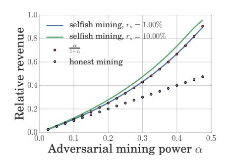

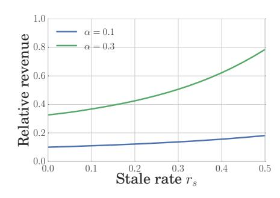

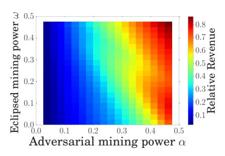

Figure 2: Selfish mining for  $r_s$  of 1%, 10%.

Figure 3: Selfish mining for  $\alpha = 0.1$  and 0.3. Figure 4: Selfish mining with eclipse attacks.

| State × Action                                           | Resulting State                                                                                                                                                                                                                                                                                                                                                                                                 | Probability                                                                                                                                                             | Reward (in Block reward)                                                                                                                                                                                                                                                                                                                                |
|----------------------------------------------------------|-----------------------------------------------------------------------------------------------------------------------------------------------------------------------------------------------------------------------------------------------------------------------------------------------------------------------------------------------------------------------------------------------------------------|-------------------------------------------------------------------------------------------------------------------------------------------------------------------------|---------------------------------------------------------------------------------------------------------------------------------------------------------------------------------------------------------------------------------------------------------------------------------------------------------------------------------------------------------|
| $(l_a, l_h, b_e, \cdot)$ , adopt                         | $\begin{array}{l} (1,0,0,i) \\ (1,0,1,i) \\ (0,1,0,r) \\ (0,0,0,i) \end{array}$                                                                                                                                                                                                                                                                                                                                 | $\begin{array}{c} \alpha \ \omega \ & (1-\alpha-\omega)\cdot (1-r_s) \ & (1-\alpha-\omega)\cdot r_s \end{array}$                                                        | $(-c_m, l_h) \ (-c_m, l_h) \ (-c_m, l_h) \ (-c_m, l_h) \ (-c_m, l_h)$                                                                                                                                                                                                                                                                                   |
| $(l_a, l_h, b_e, \cdot)$ , override                      | $ \begin{pmatrix} l_a - l_h, 0, b_e - \lceil (l_h + 1) \frac{b_e}{l_a} \rceil, i \end{pmatrix} $ $ \begin{pmatrix} l_a - l_h, 0, b_e - \lceil (l_h + 1) \frac{b_e}{l_a} \rceil + 1, i \end{pmatrix} $ $ \begin{pmatrix} l_a - l_h - 1, 1, b_e - \lceil (l_h + 1) \frac{b_e}{l_a} \rceil, r \end{pmatrix} $ $ \begin{pmatrix} l_a - l_h - 1, 0, b_e - \lceil (l_h + 1) \frac{b_e}{l_a} \rceil, i \end{pmatrix} $ | $\begin{array}{c} \alpha \\ \omega \\ (1-\alpha-\omega)\cdot (1-r_s) \\ (1-\alpha-\omega)\cdot r_s \end{array}$                                                         | $ \begin{pmatrix} \lfloor (l_h+1)\frac{l_a-b_e}{l_a} \rfloor - c_m, 0 \end{pmatrix} $ $ \begin{pmatrix} \lfloor (l_h+1)\frac{l_a-b_e}{l_a} \rfloor - c_m, 0 \end{pmatrix} $ $ \begin{pmatrix} \lfloor (l_h+1)\frac{l_a-b_e}{l_a} \rfloor - c_m, 0 \end{pmatrix} $ $ \begin{pmatrix} \lfloor (l_h+1)\frac{l_a-b_e}{l_a} \rfloor - c_m, 0 \end{pmatrix} $ |
| $(l_a, l_h, b_e, i)$ , wait $(l_a, l_h, b_e, r)$ , wait  | $(l_a+1,l_h,b_e,i) \ (l_a+1,l_h,b_e+1,i) \ (l_a,l_h+1,b_e,r) \ (l_a,l_h,b_e,i)$                                                                                                                                                                                                                                                                                                                                 | $\begin{array}{c} \alpha \ \omega \ (1-\alpha-\omega)\cdot (1-r_s) \ (1-\alpha-\omega)\cdot r_s \end{array}$                                                            | $(-c_m, 0)$<br>$(-c_m, 0)$<br>$(-c_m, 0)$<br>$(-c_m, 0)$                                                                                                                                                                                                                                                                                                |
| $(l_a, l_h, b_e, a)$ , wait $(l_a, l_h, b_e, r)$ , match | $(l_a + 1, l_h, b_e, a) $ $(l_a + 1, l_h, b_e + 1, a) $ $(l_a - l_h, 1, b_e - \lceil (l_h) \frac{b_e}{l_a} \rceil, r) $ $(l_a, l_h + 1, b_e, r) $ $(l_a, l_h, b_e, a) $                                                                                                                                                                                                                                         | $\alpha \\ \omega \\ \gamma \cdot (1 - \alpha - \omega) \cdot (1 - r_s) \\ (1 - \gamma) \cdot (1 - \alpha - \omega) \cdot (1 - r_s) \\ (1 - \alpha - \omega) \cdot r_s$ | $(-c_m, 0)$ $(-c_m, 0)$ $(\lfloor (l_h) \frac{l_a - b_e}{l_a} \rfloor - c_m, 0$ $(-c_m, 0)$ $(-c_m, 0)$                                                                                                                                                                                                                                                 |
| $(l_a, l_h, b_e, \cdot)$ , exit                          | exit                                                                                                                                                                                                                                                                                                                                                                                                            | 1                                                                                                                                                                       | $(l_a - b_e + v_d, 0)$                                                                                                                                                                                                                                                                                                                                  |

Table 2: State transition and reward matrices for optimal selfish mining and double-spending strategies in PoW blockchains.  $\alpha$  is the mining power of the attacker,  $\omega$  is the mining power of the eclipsed node,  $b_e$  is the number of blocks in the attacker chain that were mined by the eclipsed node,  $\gamma$  is the fraction of nodes that an attacker can reach faster than the honest network,  $r_s$  is the stale block rate and  $v_d$  is the value of the double-spend. The actions override and match are feasible only when  $l_a > l_h$  or  $l_a \ge l_h$ , respectively. We discount the mining costs  $c_m \in [0, \alpha]$  in the state transition reward only for double-spending. The fork label (last element of the state) is denoted by i, r and r for irrelevant, relevant and active respectively. For a reward tuple (a, b), r corresponds to the adversary's costs, while r represents the reward for the honest network for selfish mining.

attack), where we observe only *wait*, *adopt* and *exit* actions. Because we can only solve finite MDPs, we choose a cutoff value of 20 blocks, i.e., neither the chain of the adversary nor the chain of the honest network can be longer than the cutoff value. In the following paragraphs, we discuss in greater details the impact of  $\alpha$ ,  $\gamma$ ,  $c_m$ ,  $r_s$ , k,  $v_d$  and  $\omega$  on the optimal double-spending strategy and its implications on the security of transaction confirmations.

Recall that the absorbing state [22] of the Markov chain of our double-spending MDP is the exit state. By computing the fundamental matrix [22] of the Markov chain, we calculate the expected number of steps in the Markov chain—before being absorbed by the exit state. These steps correspond to the expected number of blocks required for a successful double-spending attack. In Figure 5, we evaluate the expected number of blocks with respect to the adversarial mining power and the number of transaction confirmations k. We observe that an adversary with a mining power of more than 0.25 is expected to need less than 1000 blocks for a successful double-spending attack (up to k=10 confirmations), which corresponds to a one week attack duration in Bitcoin.

**Impact of the propagation parameter:** Recall that the propagation parameter specifies the connection capability of the adversary. In Figure 8, we depict the minimum double-spending transaction value that would result in financial gain when compared to honest mining (cf. Equation 25) when  $\gamma=0,0.5$  and 1 respectively. Recall that a merchant is safe as long as he accepts transactions with a value less than  $v_d$  given these parameters.

Clearly, the higher  $\gamma$  is, the lower is the transaction value that an adversary is expected to double-spend. For example, if the adversary has  $\alpha=0.3$  of the hashing power in the network, assuming k=6 confirmations, and a mining cost of  $c_m=\alpha$ , a double-spending strategy is clearly profitable if the double-spending transaction has a value of at least 0.5 block rewards (one block reward is 25 Bitcoin, where one Bitcoin is about 436.7 USD at the time of writing, for  $r_s=0.41\%$ ) when  $\gamma=1$ . When  $\gamma=0.5$ , the minimum transaction value increases to 12.9 block rewards.

**Impact of the mining costs:** In Figure 6, we analyze the impact of the mining costs on the minimum required double-spending transaction value. Our results show that mining costs have negligible

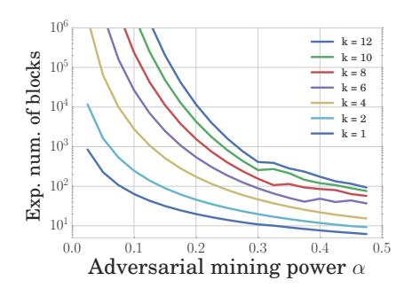

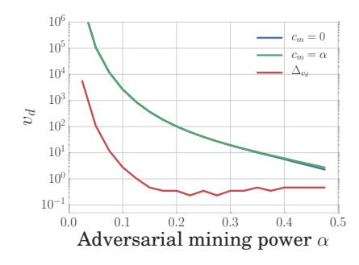

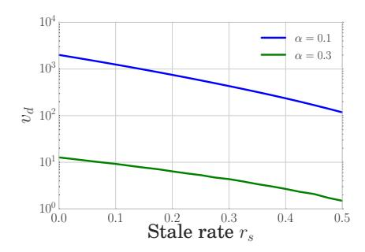

Figure 5: Expected number of blocks for successful double-spending given  $r_s=0.41\%, \gamma=0, c_m=\alpha$  and  $\omega=0$ .

Figure 6: Impact of the mining cost  $c_m$  on the security of double spending  $(r_s=0.41\%, \gamma=0, \omega=0)$ .  $\Delta_{v_d}$  is the difference in costs.

Figure 7: Impact of stale block rate  $r_s$  on the security of double-spending given  $\gamma=0.5$ ,  $\omega=0$  for  $\alpha=0.1$ ,  $\alpha=0.3$  and k=6.


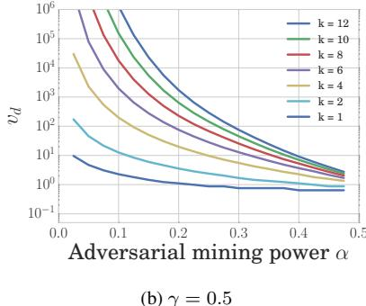

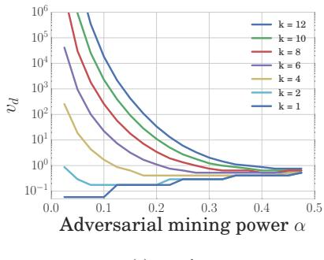

 $\gamma = 0.5 \tag{c) } \gamma = 1$

Figure 8: Impact of the propagation parameter  $\gamma$ . We observe that the higher is  $\gamma$ , the lower is  $v_d$  for double-spending to be more profitable than honest mining.  $r_s = 0.41\%$  (Bitcoin's stale block rate),  $c_m = \alpha$  (maximum mining costs),  $\omega = 0$  (no eclipse attack).

|       | $l_h$ |     |     |     |     |     |     |     |     |
|-------|-------|-----|-----|-----|-----|-----|-----|-----|-----|
| $l_a$ | 0     | 1   | 2   | 3   | 4   | 5   | 6   | 7   | 8   |
| 0     | W**   | *a* | *** | *** | *** | *** | *** | *** | *** |
| 1     | W**   | ww* | ww* | *a* | *** | *** | *** | *** | *** |
| 2     | W**   | ww* | ww* | ww* | ww* | *a* | *** | *** | *** |
| 3     | W**   | ww* | ww* | ww* | ww* | ww* | *a* | *** | *** |
| 4     | W**   | ww* | ww* | ww* | ww* | ww* | ww* | *a* | *** |
| 5     | W**   | ww* | ww* | ww* | ww* | ww* | ww* | ww* | *a* |
| 6     | W**   | ww* | ww* | ww* | ww* | ww* | ww* | ww* | ww* |
| 7     | e**   | e** | e** | e** | e** | e** | e** | w** | ww* |
| 8     | ***   | *** | *** | *** | *** | *** | *** | e** | w** |

Table 3: Optimal double-spending strategy for  $\alpha=0.3, \gamma=0, r_s=0.41\%, c_m=\alpha, \omega=0$  and  $v_d=19.5$ . The rows correspond to the length  $l_a$  of the adversary's chain and the columns correspond to the length  $l_h$  of the honest network's chain. The three values in each table entry correspond to the fork labels *irrelevant*, relevant and active, where \* marks an unreachable state and w, a and e denote the wait, adopt and exit actions, respectively.

impact on the adversarial strategy.

Impact of the stale block rate: We evaluate the impact of the stale block rate for adversaries with a mining power of  $\alpha=0.1$  and  $\alpha=0.3$  in Figure 7. We observe that there exists a non-linear relationship between the stale block rate and the double-spending value and that the higher the stale block rate, the worse is the double-spending and selfish mining resistance of a PoW blockchain (cf. Figure 7). For instance, for an adversary with mining power  $\alpha=0.3$

and a stale block rate of 10% and 20%, the double-spending value  $v_d$  decreases from 9.2 to 6.4 block rewards. Similarly, the relative revenue from selfish mining (cf. Figure 3) increases from 0.37 to 0.43.

Impact of eclipse attacks We evaluate the impact of eclipse attacks on the adversarial strategy given our MDP. We assume that the adversary eclipses a victim with mining power  $\omega$  in order to increase its advantage in sustaining his blockchain (cf. Figure 9). We observe that an eclipse attack clearly empowers the adversary, since it allows the adversary to effectively increase its overall mining power. For instance, an adversary with  $\alpha=0.1$  can reduce the double-spending value  $v_d$  from 880 block rewards to 0.75 block reward if eclipsing a miner with  $\omega=0.025$ .

#### 3.3.2 Bitcoin vs. Ethereum

In order to alleviate the problem that stale blocks decrease PoW's efficiency, a number of proposals, such as Ethereum, suggest to reward miners for stale blocks [4]. Here, although uncle blocks that are included in a block receive a reward, *they do not count towards the total difficulty of a chain*, i.e., Ethereum uses a longest chain rule with added rewards for uncle blocks. This clearly contradicts Ethereum's claim of using a blockchain protocol adapting GHOST [33].

Ethereum has also recently modified its longest chain algorithm to incorporate uniform tie breaking [10]. Notice that such a strategy is meant as a selfish mining countermeasure, but allows a selfish miner to increase its chances of catching up to the honest chain [31]. In Table 4, we extend our model to cater for uncle rewards and uniform tie breaking, and describe the resulting double-spending MDP in order to capture the security of Ethereum against double-spending.

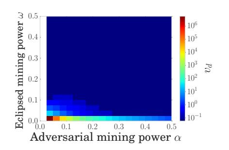

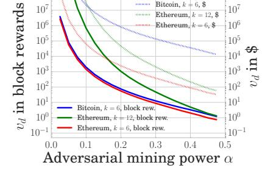

10

106

105

10

Bitcoin, k = 6, \$

106

105

 $10^4$

00

in

Etherei

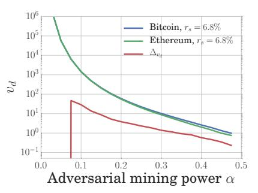

Figure 9: Full eclipse attack for  $r_s = 0.41\%$ ,  $\gamma = 0$  and  $c_m = 0$ .

Figure 10: Double-spending resistance of Ethereum  $(k \in \{6, 12\})$  vs. Bitcoin (k = 6). USD exchange rate of 2016-04-20.

Figure 11: Direct comparison between Ethereum and Bitcoin with k = 6,  $r_s = 6.8\%$ and their respective difference  $\Delta_{v_d}$ .

Building on this analysis, we compare in Figure 10, the doublespending resilience of Bitcoin ( $r_s = 0.41\%$ , cf. MDP in Table 2) to that of Ethereum ( $r_s = 6.8\%$ , cf. MDP in Table 4), given  $\gamma =$  $0, c_m = 0$  and  $\omega = 0$ . In order to provide a fair cost comparison, we rely on US dollar based valuation (Bitcoin's block reward is more than 200 times higher than Ethereum's block reward).

We observe that 6 Bitcoin block confirmations are more resilient to double-spending than 6 Ethereum<sup>5</sup> block confirmations. Second, when comparing 12 Ethereum with 6 Bitcoin block confirmations, Ethereum's double-spending resilience is only better than Bitcoin for an adversary with less than 11% of the PoW hashing power. Note that 12 Ethereum blocks are likely to be generated in less than 4 minutes, while 6 Bitcoin blocks last about one hour. Third, we discover that the monetary value of the block reward directly impacts the double-spending security: the higher the block reward of a blockchain (in \$) the more resilient it is against double-spending.

In addition to comparing Bitcoin to Ethereum, we compare in Figure 11 the two blockchains by setting Bitcoin's stale block rate equal to Ethereum's stale block rate to objectively evaluate their security implications. We observe that, in spite of the reliance on uncle block rewards, and uniform tie breaking, Ethereum's security is weaker than Bitcoin, and conclude that the uniform tie breaking and the uncle reward lower the security of Ethereum's blockchain.

### SECURITY VS. PERFORMANCE OF POW-BLOCKCHAINS

In this section, we evaluate the performance (and security) of various blockchain instantiations by leveraging our model in Section 3.

To this end, we constructed a Bitcoin blockchain simulator in order to evaluate different blockchain instances from a performance perspective. Relying on simulations emerges as the only workable alternative to realistically capture the blockchain performance under different parameters since neither formal modeling, nor the deployment of a thousands of peers (e.g., currently there are 6000 reachable nodes in Bitcoin) would be practical.

By leveraging our simulator, we evaluate different blockchain parameters, such as the block interval, the block size, the propagation mechanisms by measuring the resulting stale block rate, throughput and block propagation times. This also allows us to connect our blockchain simulator to our MDP model in a unified framework. Namely, we feed the stale block rate output by the simulator into our MDP model in order to assess the security (under selfish mining and double-spending) of the resulting blockchain instance.

#### 4.1 **Blockchain Simulator**

In Table 5, we summarize the parameters captured by our simulator. Here, we simulate the PoW for miners, by attributing a particular mining power to each miner. Based on the block interval distribution (which defines at what time a block is found), a new block is then attributed to a miner. Conforming with the operation of existing PoW-blockchains, a miner mines on the first block he receives, and we assume that forks are inherently resolved by the longest chain rule. Once a fork is resolved, the blocks that do not contribute to the main chain are considered stale blocks. Within our simulations, we do not consider difficulty changes among different blocks; the longest chain is therefore simply defined by the number of its blocks.

When establishing the connections between nodes, we create point-to-point channels between them, which abstracts away any intermediate devices (routes, switches, etc). These channels have two characteristics; the latency and bandwidth. To capture realistic latencies in the network, we adopt the global IP latency statistics from Verizon [36] and assume a Pareto traffic distribution with variance accounting for 20% of the mean latency [2]. On the other hand, to model a realistic bandwidth distribution in the network, we adapted the distribution<sup>6</sup> from testmy.net [34].

Our simulator does not model the propagation of transactions, since the focal point of our simulator is to study the impact of the block size, block interval, and the block request management system—all of which can be captured independently of the transaction propagation. Note that transactions are implicitly captured within the block size.

In our simulator, we distinguish between two node types: (i) regular nodes, and (ii) miners. For regular nodes (up to 6000), we retrieved the current geographical node distribution from bitnodes. 21.co (cf. Figure 12a) and adopted this distribution to define the location of our simulated nodes. We also adapted the bandwidth and network latency (according to the geographical location) from Verizon [2, 36] and testmy.net [34]. To model miners, we retrieved the mining pool distribution from blockchain.info, and accordingly distributed the mining pool's public node to the respective region (cf. Figure 12b). Mining pools typically maintain private peering connections among themselves—which we capture in our simulations. Besides direct peering, a number of mining pools nowadays participate in Matt Corallo's relay network [6] that is operated independently of the default Bitcoin P2P overlay network (cf. Section 2.2). We also capture the relay network and assume in our simulations that all miners participate in the relay network whenever the relay

<sup>&</sup>lt;sup>5</sup>Block generation time between 10 and 20 seconds.

<sup>&</sup>lt;sup>6</sup>Upload bandwidth characteristics: min=0.1Mbps, max=100Mbps, interval=0.1Mbps. Download bandwidth characteristics: min=0.1Mbps, max=500Mbps, interval=0.5Mbps.

| State × Action                                                                     | Resulting State                           | Probability                                 | Reward          | Condition                                 |
|------------------------------------------------------------------------------------|-------------------------------------------|---------------------------------------------|-----------------|-------------------------------------------|
|                                                                                    | (1, 0, relevant, nr)                      | α                                           | $-c_m$          | =                                         |
| $(l_a, l_h, \cdot, nr)$ , adopt                                                    | (0, 1, relevant, nr)                      | $(1-\alpha)\cdot(1-r_s)$                    | $-c_m$          | =                                         |
|                                                                                    | (0, 0, relevant, nr)                      | $(1 - \alpha) \cdot r_s$                    | $-c_m$          | =                                         |
|                                                                                    | (1, 0, relevant, nr)                      | $\alpha$                                    | $r_u - c_m$     | =                                         |
| $(l_a, l_h, \cdot, inc)$ , adopt                                                   | (0, 1, relevant, nr)                      | $(1-\alpha)\cdot(1-r_s)$                    | $r_u - c_m$     | -                                         |
|                                                                                    | (0, 0, relevant, nr)                      | $(1-\alpha)\cdot r_s$                       | $r_u - c_m$     | -                                         |
|                                                                                    | (1, 0, relevant, rel)                     | $\alpha$                                    | $-c_m$          | -                                         |
| $(l_a, l_h, \cdot, rel)$ , adopt                                                   | (0, 1, relevant, inc)                     | $(1-\alpha)\cdot(1-r_s)$                    | $-c_m$          | =                                         |
|                                                                                    | (0, 0, relevant, rel)                     | $(1 - \alpha) \cdot r_s$                    | $-c_m$          | -                                         |
|                                                                                    | $(l_a - l_h, 0, relevant, nr)$            | α                                           | $l_h + 1 - c_m$ | $l_a > l_h$                               |
| $(l_a, l_h, \cdot, \cdot)$ , override                                              | $(l_a - l_h - 1, 1, relevant, nr)$        | $(1-\alpha)\cdot(1-r_s)$                    | $l_h + 1 - c_m$ | $l_a > l_h$                               |
|                                                                                    | $(l_a - l_h - 1, 0, \text{relevant}, nr)$ | $(1 - \alpha) \cdot r_s$                    | $l_h + 1 - c_m$ | $l_a > l_h$                               |
| <u> </u>                                                                           | $(l_a + 1, l_h, relevant, nr)$            | α                                           | $-c_m$          | -                                         |
| $(l_a, l_h, relevant, nr)$ , wait                                                  | $(l_a, l_h + 1, relevant, nr)$            | $(1-\alpha)\cdot(1-r_s)$                    | $-c_m$          | -                                         |
|                                                                                    | $(l_a, l_h, relevant, nr)$                | $(1 - \alpha) \cdot r_s$                    | $-c_m$          | -                                         |
|                                                                                    | $(l_a + 1, l_h, relevant, inc)$           | α                                           | $-c_m$          | -                                         |
| $(l_a, l_h, relevant, inc)$ , wait                                                 | $(l_a, l_h + 1, relevant, inc)$           | $(1-\alpha)\cdot(1-r_s)$                    | $-c_m$          | -                                         |
|                                                                                    | $(l_a, l_h, relevant, inc)$               | $(1 - \alpha) \cdot r_s$                    | $-c_m$          | -                                         |
|                                                                                    | $(l_a + 1, l_h, relevant, rel)$           | α                                           | $-c_m$          | -                                         |
| $(l_a, l_h, relevant, rel)$ , wait                                                 | $(l_a, l_h + 1, relevant, inc)$           | $(1-\alpha)\cdot(1-r_s)$                    | $-c_m$          | -                                         |
|                                                                                    | $(l_a, l_h, relevant, rel)$               | $(1 - \alpha) \cdot r_s$                    | $-c_m$          | =                                         |
|                                                                                    | $(l_a + 1, l_h, active, nr)$              | α                                           | $-c_m$          | $l_h > 6$                                 |
|                                                                                    | $(l_a + 1, l_h, active, rel)$             | $\alpha$                                    | $-c_m$          | $l_h \leq 6$                              |
| $(l_a, l_h, active, nr)$ , wait                                                    | $(l_a - l_h, 1, relevant, nr)$            | $\gamma \cdot (1 - \alpha) \cdot (1 - r_s)$ | $l_h - c_m$     | -                                         |
| $(l_a, l_h, active, nr)$ , wait<br>$(l_a, l_h, relevant, nr)$ , match              | $(l_a, l_h + 1, relevant, nr)$            | $(1-\gamma)\cdot(1-\alpha)\cdot(1-r_s)$     | $-c_m$          | $l_h > 6$                                 |
| (va, vn, zelevano, m j, maten                                                      | $(l_a, l_h + 1, relevant, inc)$           | $(1-\gamma)\cdot(1-\alpha)\cdot(1-r_s)$     | $-c_m$          | $l_h \leq 6$                              |
|                                                                                    | $(l_a, l_h, active, nr)$                  | $(1-\alpha) \cdot r_s$                      | $-c_m$          | $l_h > 6$                                 |
|                                                                                    | $(l_a, l_h, active, rel)$                 | $(1 - \alpha) \cdot r_s$                    | $-c_m$          | $l_h \le 6$                               |
| $(l_a, l_h, \text{active}, inc)$ , wait $(l_a, l_h, \text{relevant}, inc)$ , match | $(l_a + 1, l_h, active, inc)$             | α                                           | $-c_m$          | -                                         |
|                                                                                    | $(l_a - l_h, 1, relevant, nr)$            | $\gamma \cdot (1-\alpha) \cdot (1-r_s)$     | $l_h - c_m$     | =                                         |
|                                                                                    |                                           | $(1-\gamma)\cdot(1-\alpha)\cdot(1-r_s)$     | $-c_m$          | =                                         |
|                                                                                    | $(l_a, l_h, active, inc)$                 | $(1-\alpha)\cdot r_s$                       | $-c_m$          | -                                         |
| $(l_a, l_h, \text{active}, rel)$ , wait $(l_a, l_h, \text{relevant}, rel)$ , match | $(l_a + 1, l_h, active, rel)$             | α (1)                                       | $-c_m$          | -                                         |
|                                                                                    | $(l_a - l_h, 1, relevant, nr)$            | $\gamma \cdot (1-\alpha) \cdot (1-r_s)$     | $l_h - c_m$     | =                                         |
|                                                                                    | $(l_a, l_h + 1, relevant, inc)$           | $(1-\gamma)\cdot(1-\alpha)\cdot(1-r_s)$     | $-c_m$          | -                                         |
|                                                                                    | $(l_a, l_h, active, rel)$                 | $(1-\alpha)\cdot r_s$                       | $-c_m$          | -                                         |
| $(l_a, l_h, \cdot, nr)$ , release                                                  | $(l_a, l_h, \cdot, rel)$                  | 1                                           | 0               | $l_h \le 6 \land l_h > 1 \land l_a \ge 1$ |
| $(l_a, l_h, \cdot, \cdot)$ , exit                                                  | exit                                      | 1                                           | $l_a + v_d$     | $l_a > l_h \wedge l_a > k$                |

Table 4: State transition and reward matrices for an MDP for optimal double-spending strategies in Ethereum where  $r_u$  is the uncle reward (i.e.  $\frac{7}{8}$ ). Every state includes a flag (where nr= not released, rel= released, inc= included) indicating whether an attacker block has been or will be included as an uncle in the honest chain. The release action corresponds to the release of the first block of the attackers fork with the intention to be included as uncle in the honest chain. Therefore, it is only feasible if  $1 < l_h \le 6$  and  $l_a \ge 1$ , since it is otherwise equivalent to a match or override or the honest chain is too long to include it as uncle. With the release action, no block is mined and a state transitions from not released to released, which transitions to included with the next block mined on the honest chain. In Ethereum,  $\gamma$  is fixed at 0.5 and a match is possible even without a prepared block.

| Consensus parameter                                                                                                                                                                                    | Description                                                                                                                                                    |  |  |
|--------------------------------------------------------------------------------------------------------------------------------------------------------------------------------------------------------|----------------------------------------------------------------------------------------------------------------------------------------------------------------|--|--|
| Block interval distribution<br>Mining power distribution of the miners                                                                                                                                 | Time to find a block<br>PoW power distribution                                                                                                                 |  |  |
| Network-layer parameter                                                                                                                                                                                | Description                                                                                                                                                    |  |  |
| Block size distribution # of reachable network nodes Geo. distribution of nodes Geo. mining pool distribution # of connections per node # of connections of the miners Block request management system | Variable transaction load<br>Open TCP port nodes<br>Worldwide distribution<br>Worldwide distribution<br>Within network<br>Within network<br>Possible Protocols |  |  |
| Standard mechanism (inv/getdata) Unsolicited block push Relay network Sendheaders                                                                                                                      | Default<br>Miner only push block<br>Miner network<br>Bitcoin v0.12                                                                                             |  |  |

Table 5: Parameters of the blockchain simulation. network option is enabled.

#### **4.2** Evaluation Results

In what follows, we present the results from our evaluation.

#### 4.2.1 Simulator Validation

With the objective to experimentally validate our simulation, we compared Bitcoin, Litecoin, and Dogecoin with their respective simulated counterpart. For each blockchain, we adjusted the parameters of Table 5 according to the current parameters featured


Figure 12: Geographical distribution of Bitcoin nodes and miners used in our simulator.

by existing deployments of the investigated blockchains. For instance, we measured Bitcoin's block size distribution, as well as the block generation rate<sup>7</sup> in the real Bitcoin network between May to November 2015 [21].

In order to measure the stale block rate  $r_s$  in the real blockchain networks, we crawled 24,000 Bitcoin blocks<sup>8</sup>, 100,000 Litecoin and 240,000 Dogecoin blocks<sup>9</sup>. We moreover adopt the miner mining power distribution for the different blockchains from public block

<sup>&</sup>lt;sup>7</sup>The block generation rate distribution follows the shifted geometric distribution with p = 0.19 [21].

<sup>8</sup> from blockchain.info

<sup>&</sup>lt;sup>9</sup>from blockchains.io

|                                                                                | Bitcoin                                            | Litecoin                                | Dogecoin                                |
|--------------------------------------------------------------------------------|----------------------------------------------------|-----------------------------------------|-----------------------------------------|
| Block interval                                                                 | 10 min                                             | 2.5 min                                 | 1 min                                   |
| Measured $t_{MBP}$<br>Simulated $t_{MBP}$<br>Measured $r_s$<br>Simulated $r_s$ | 8.7 s [8]<br>9.42 s<br>0.41 %<br>(a)0.14%-(b)1.85% | 1.02 s<br>0.86 s<br>0.27 %<br>(b)0.24 % | 0.98 s<br>0.83 s<br>0.62 %<br>(b)0.79 % |

Table 6: Median block propagation time ( $t_{MBP}$ , in seconds), and  $r_s$  in the real networks and the simulation (10000 blocks for each blockchain). (a) assumes that all miners use the relay network and unsolicited block push, while (b) is only given the standard propagation mechanism. We conclude that not all miners in Bitcoin use the relay network and unsolicited block push.

explorers<sup>10</sup>. The number of connection per node in our simulations follows the distribution due to Miller *et al.* [26].

Our findings (cf. Table 6) show that our simulator captures, to a large extent, the performance of existing blockchain deployments. For instance, our results show that the measured and simulated median block propagation times are relatively close. The stale block rates for Litecoin and Dogecoin are particularly close. In the case of Bitcoin, the stale rate falls between the case when all miners use the relay network and unsolicited block push, and the extreme case where the relay network and unsolicited block push is not used by any miner. Note that Litecoin and Dogecoin do not have any relay network.

#### 4.2.2 Impact of the Block Interval

In this section, we study the impact of the block interval on the median block propagation time and the stale block rate in PoW-based blockchains. To this end, we run our simulator for different block interval times ranging from 25 minutes to 0.5 seconds (cf. Table 7). Each simulation is run independently for 10000 consecutive blocks, and for each of the four different block request management system combinations: (Case 1) the standard block request management, (Case 2) the standard block request management, enhanced by unsolicited block push from the miners, (Case 3) both former components plus the relay network, and (Case 4) the send headers mechanism with unsolicited block push and the relay network.

We observe first that for a block interval time of 10 minutes and a standard request management system, our stale block rate is 1.85%, which is comparable to 1.69% as reported by Wattenhofer *et al.* [9]. Recall that at the time of Wattenhofer's study, the unsolicited block push and relay network were not yet available.

Secondly, we observe that the introduction of the unsolicited block push for miners significantly reduces the stale block rate. This is the case since (i) miners are interconnected and profit most from the unsolicited block push, and (ii) the propagation method of the first node is crucial to reach the majority of the network rapidly. The addition of the relay network does not seem to affect the stale block rate significantly (given the Bitcoin's transaction load) compared to the unsolicited block push, and reduces the propagation time only marginally. For bigger block sizes however (e.g. > 2MB) the relay network indeed provides an advantage over the unsolicited block push (cf. Table 8). Moreover, the relay network provides an additional source of block information, in addition to the classical P2P overlay network. Notice that although the impact of the send header mechanisms compared to a fully deployed relay network and unsolicited block push is limited, this mechanism mitigates partial eclipse attacks [16].

To assess the impact of the block interval on the security of PoW blockchains, we feed the resulting stale block rate into our MDP

models as shown in Table 7. Our results show that, for an adversary equipped with 30% of the total mining power<sup>11</sup>, the lower is the consensus time, the higher is the relative revenue from selfish mining and the lower is the double-spending value. We observe that the block propagation mechanism significantly impacts the security of the blockchain, since it directly affects the stale block rate. The standard block propagation mechanism offers less resilience (in terms of double-spending and selfish mining) than the other evaluated block propagation mechanisms. We also note that the double-spending value halves in Table 7 for the block propagation mechanism of Case 4 (which results in the lowest stale block rate when compared to the other investigated mechanisms) when reducing the block interval from 25 minutes to 0.5 seconds. Similarly, the relative revenue from selfish mining increases from 0.33 to 0.42.

#### 4.2.3 Impact of the Block size

We now study the impact of the block size on the performance and security of the blockchain (cf. Table 8. To this end, we simulate block sizes ranging from 0.1 MB to up to 8 MB, given a block interval of 10 minutes.

Our results suggest that the block propagation time increases linearly with the block size up to 4 MB; after 8 MB blocks, the block propagation time and stale block rate increases exponentially. Second, we clearly see that a better block propagation mechanism significantly reduces the propagation times and the stale block rate.

This also suggests, conforming with our MDP models, that the bigger the block size, the higher the relative revenue from selfish mining and the lower the double-spending value (cf. Table 8). It is however apparent that an efficient block propagation mechanism effectively allows the network to keep nearly the same security provisions against selfish mining and double-spending as we can see in Case 3 (standard propagation mechanism, unsolicited block push, relay network) and Case 4 (send headers propagation mechanism, unsolicited block push, relay network). This confirms that an efficient network propagation mechanism helps to increase the security of the blockchain. Interestingly, given the block propagation mechanism of Case 4, the resilience (in terms of double-spending value) does not significantly change in Table 8 when increasing the block size from 0.1 MB to 8 MB ( $v_d$  changes from 12.9 to 12.68 block rewards respectively). Similarly, the relative revenue from selfish mining stays at  $r_{rel} = 0.33$ , when all miners use the relay network.

Currently, a number of proposals suggest to chunk blocks and download these chunks in parallel (e.g., Blocktorrent [35]). In a separate experiment that we conducted, we implemented a block propagation mechanisms that divides blocks into chunks of a few kilobytes that can be queried from multiple peers. Our results show that such a protocol does not improve the median block propagation time compared to the send headers and relay network protocol, when dealing with modest block sizes (i.e., smaller than 8 MB). This is due to the fact that a chunked block propagates slower than the  $10^{th}$  and  $25^{th}$  percentile of nodes owing to: (i) the communication overhead caused by the chunks, and (ii) because a node only forwards block chunks if the respective block has been validated.

#### 4.2.4 Throughput

We now evaluate the throughput achieved by various blockchain instantiations. To this end, we vary the block size (from 0.1M B to 8 MB) and the block interval (from 0.5 seconds to 25 minutes) to capture a larger number of blockchain instances with our simulator. Here, we assume that the network relies on an efficient propagation

<sup>&</sup>lt;sup>10</sup>blockchain.info and https://www.litecoinpool.org/pools

<sup>&</sup>lt;sup>11</sup>Bitcoin's resilience to malicious miners is based on the assumption that the adversary cannot harvest more than 30% of the total mining power [14, 16].

|                | Case 1    |         |       |           |           | Case 2  |       |           |           | Case 3  |       |           |           | Case 4  |       |           |  |
|----------------|-----------|---------|-------|-----------|-----------|---------|-------|-----------|-----------|---------|-------|-----------|-----------|---------|-------|-----------|--|
| Block interval | $t_{MBP}$ | $r_s$   | $v_d$ | $r_{rel}$ | $t_{MBP}$ | $r_s$   | $v_d$ | $r_{rel}$ | $t_{MBP}$ | $r_s$   | $v_d$ | $r_{rel}$ | $t_{MBP}$ | $r_s$   | $v_d$ | $r_{rel}$ |  |
| 25 minutes     | 35.73     | 1.72 %  | 12.47 | 0.34      | 25.66     | 0.16 %  | 12.86 | 0.33      | 22.50     | 0.03 %  | 12.89 | 0.33      | 22.44     | 0.02 %  | 12.89 | 0.33      |  |
| 10 minutes     | 14.7      | 1.51 %  | 12.52 | 0.34      | 10.65     | 0.13 %  | 12.88 | 0.33      | 9.41      | 0.14 %  | 12.86 | 0.33      | 9.18      | 0.13 %  | 12.87 | 0.33      |  |
| 2.5 minutes    | 4.18      | 1.82 %  | 12.45 | 0.34      | 2.91      | 0.16 %  | 12.86 | 0.33      | 2.60      | 0.16 %  | 12.86 | 0.33      | 2.59      | 0.15 %  | 12.86 | 0.33      |  |
| 1 minute       | 2.08      | 2.15 %  | 12.35 | 0.34      | 1.34      | 0.35 %  | 12.81 | 0.33      | 1.30      | 0.25 %  | 12.83 | 0.33      | 1.27      | 0.29 %  | 12.77 | 0.33      |  |
| 30 seconds     | 1.43      | 2.54 %  | 12.06 | 0.34      | 0.84      | 0.45 %  | 12.78 | 0.33      | 0.84      | 0.51 %  | 12.77 | 0.33      | 0.84      | 0.52 %  | 12.69 | 0.33      |  |
| 20 seconds     | 1.21      | 3.20 %  | 11.73 | 0.34      | 0.67      | 0.86 %  | 12.68 | 0.33      | 0.69      | 0.85 %  | 12.68 | 0.33      | 0.68      | 0.82 %  | 12.68 | 0.33      |  |
| 10 seconds     | 1.00      | 4.77 %  | 10.73 | 0.35      | 0.35      | 1.73 %  | 12.46 | 0.34      | 0.33      | 1.41 %  | 12.54 | 0.34      | 0.53      | 1.59 %  | 12.50 | 0.34      |  |
| 5 seconds      | 0.89      | 8.64 %  | 10.08 | 0.37      | 0.37      | 2.94 %  | 11.85 | 0.34      | 0.45      | 2.99 %  | 11.80 | 0.34      | 0.44      | 3.05 %  | 11.78 | 0.34      |  |
| 2 seconds      | 0.84      | 16.65 % | 7.35  | 0.41      | 0.40      | 6.98 %  | 10.47 | 0.36      | 0.39      | 7.28 %  | 10.37 | 0.36      | 0.38      | 7.10 %  | 10.42 | 0.36      |  |
| 1 seconds      | 0.82      | 26.74 % | 4.37  | 0.53      | 0.53      | 12.44 % | 8.34  | 0.39      | 0.38      | 12.59 % | 8.24  | 0.39      | 0.37      | 12.52 % | 8.30  | 0.39      |  |
| 0.5 seconds    | 0.82      | 38.15 % | 2.78  | 0.60      | 0.61      | 20.62 % | 6.22  | 0.42      | 0.49      | 20.87 % | 6.16  | 0.42      | 0.36      | 21.10 % | 6.02  | 0.42      |  |

Table 7: Impact of the block interval on the median block propagation time  $(t_{MBP})$  in seconds, and the stale block rate  $r_s$ ,  $v_d$  and  $r_{rel}$  given the current Bitcoin block size distribution, an adversary with  $\alpha=0.3$  and k=6. Case 1 refers to the standard block propagation mechanism, Case 2 refers to standard mechanism plus unsolicited block push, Case 3 to the combination of Case 2 plus the relay network and Case 4 to the send headers with unsolicited block push and relay network.

|            | Case 1    |         |       |           | Case      | Case 3  |       |           |           | Case 4 |       |           |           |        |       |           |
|------------|-----------|---------|-------|-----------|-----------|---------|-------|-----------|-----------|--------|-------|-----------|-----------|--------|-------|-----------|
| Block Size | $t_{MBP}$ | $r_s$   | $v_d$ | $r_{rel}$ | $t_{MBP}$ | $r_s$   | $v_d$ | $r_{rel}$ | $t_{MBP}$ | $r_s$  | $v_d$ | $r_{rel}$ | $t_{MBP}$ | $r_s$  | $v_d$ | $r_{rel}$ |
| 0.1 MB     | 3.18      | 0.32 %  | 12.80 | 0.33      | 2.12      | 0.03 %  | 12.89 | 0.33      | 2.02      | 0.03 % | 12.89 | 0.33      | 2.02      | 0.2 %  | 12.90 | 0.33      |
| 0.25 MB    | 7.03      | 0.88 %  | 12.67 | 0.33      | 4.93      | 0.11 %  | 12.87 | 0.33      | 4.49      | 0.05 % | 12.88 | 0.33      | 4.46      | 0.17 % | 12.87 | 0.33      |
| 0.5 MB     | 13.62     | 1.63 %  | 12.48 | 0.34      | 9.84      | 0.13 %  | 12.87 | 0.33      | 8.65      | 0.05 % | 12.88 | 0.33      | 8.64      | 0.06 % | 12.87 | 0.33      |
| 1 MB       | 27.67     | 3.17 %  | 11.79 | 0.34      | 20.01     | 0.38 %  | 12.79 | 0.33      | 17.24     | 0.07 % | 12.88 | 0.33      | 17.14     | 0.07 % | 12.88 | 0.33      |
| 2 MB       | 57.79     | 6.24 %  | 10.57 | 0.36      | 44.6      | 1.12 %  | 12.61 | 0.34      | 35.49     | 0.08%  | 12.87 | 0.33      | 35.38     | 0.1 %  | 12.86 | 0.33      |
| 4 MB       | 133.30    | 11.85 % | 8.20  | 0.38      | 126.57    | 5.46 %  | 10.51 | 0.35      | 78.01     | 0.12 % | 12.85 | 0.33      | 78.40     | 0.13 % | 12.66 | 0.33      |
| 8 MB       | 571.50    | 29.97 % | 4.11  | 0.53      | 875.97    | 15.64 % | 7.64  | 0.41      | 555.49    | 0.43 % | 12.65 | 0.33      | 550.25    | 0.4 %  | 12.68 | 0.33      |

Table 8: Impact of the block size on the median block propagation time ( $t_{MBP}$ ) in seconds, the stale block rate  $r_s$ ,  $v_d$  and  $r_{rel}$ , given the current Bitcoin block generation interval and an adversary with  $\alpha = 0.3$  and k = 6.

| tps  | $v_d$ | $r_{rel}$ | Block size | Block interval |
|------|-------|-----------|------------|----------------|
| 33.4 | 12.75 | 0.33      | 0.25MB     | 30 seconds     |
| 40   | 12.38 | 0.34      | 0.10MB     | 10 seconds     |
| 50   | 12.45 | 0.34      | 0.25MB     | 20 seconds     |
| 66.7 | 12.06 | 0.34      | 0.25MB     | 15 seconds     |
| 66.7 | 12.65 | 0.33      | 0.50MB     | 30 seconds     |
| 66.7 | 12.71 | 0.33      | 1.00MB     | 1 minute       |

Table 9: Throughput in transactions per second (tps) vs. security measured in  $v_d$  and  $r_{rel}$  for an adversary with 30% mining power, k=6 and given 16 mining pools.

mechanism (send headers with unsolicited block push and relay network for all miners). For each simulated blockchain instance, we compute the resulting throughput in transactions per second (tps), measure the stale block rate and infer  $v_d$  and  $r_{rel}$  in order to assess the blockchain's security with our MDP model (cf. Section 3). We also assume an average transaction size of 250 bytes, k=6 confirmations against double-spending and an adversary with 0.3 mining power and  $\gamma=0.5$ .

In Table 9, we selectively list candidate blockchain instances which could achieve a transactional throughput beyond 60 tps and achieve similar security provisions to the existing Bitcoin system. Clearly, our results indicate that different parameter configurations can yield the same throughput—though with different security provisions (due to a different stale block rate). In particular, we observe that low consensus intervals offer less security compared to a higher consensus interval given the same overall throughput, since the network requires more round trips in order to commit the same information to the blockchain. Our results show that there is considerable room to enhance the scalability of existing PoW without significantly compromising security.

#### 5. RELATED WORK

A number of contributions analyze double-spending attacks in Bitcoin [15,30]) but they do not consider optimal adversarial strategies.

Eyal and Sirer [14] show that a selfish miner can increase its relative mining revenue by not directly publishing his blocks. Similarly, Courtois and Bahack [7] study subversive mining strategies. Our work shares similarities with Sapirshtein *et al.* [31]. Here, the authors devise optimal adversarial strategies for selfish mining in Bitcoin. Unlike [31], our work however captures optimal adversarial selfish mining strategies for PoW-powered blockchain and takes into account network delays and eclipse attacks. We additionally capture optimal double-spending strategies—where we also take into account the mining costs of the adversary, the number of required block confirmations, and the double-spending value in order to properly account for costs of the attack.

GHOST [33] is an alternative to the longest chain rule for establishing consensus in PoW based blockchains and aims to alleviate the negative impacts of stale blocks. Many PoW alternatives have been proposed. In Proof of Stake (PoS) [29], the voting power of peers is based on the amount of "stake" they own in the respective blockchain system. Proof of Burn (PoB) is a proposal to replace PoW by burning transaction outputs, such that they can no longer be spent. Existing PoB-based blockchains however rely on PoW in order to create blocks and therefore ultimately rely on PoW for coin creation. Proof of Capacity (PoC), aims to use the available hard-disk space in order to replace PoW. Bitcoin-NG [13] performs leader election of PoW—allowing the leader to sign micro-blocks until a new leader is elected. The literature features a number of additional proposals [19, 23, 25, 37] that rely on classical Byzantine fault tolerant consensus protocols in the hope to increase the consensus efficiency and achieve high transactional throughput. Recent studies propose to combine the use of PoW with BFT protocols to realize highly-performant open consensus protocols (Byzcoin [24]).

#### 6. CONCLUDING REMARKS

In this work, we introduced a novel quantitative framework to objectively compare PoW blockchains given real world network impacts and blockchain parameters. Our framework enables us to evaluate the impact of network-layer parameters on the security of PoW-based blockchain. By doing so, we show how to objectively compare the security provisions of different PoW blockchain instances. Namely, our framework allows us to push the boundaries of PoW powered blockchains in terms of throughput in transactions per second, while observing the impact on the security provisions of the blockchain in terms of optimal selfish mining and double spending strategies.

For instance, we find that Ethereum needs at least 37 block confirmations in order to match Bitcoin's security with 6 block confirmations, given an adversary with 30% of the total mining power. Our results indirectly suggest that Bitcoin's blockchain offers more security than Ethereum's blockchain which rewards miners with uncle rewards and performs uniform tie breaking for blockchain fork resolutions. Our results additionally indicate that existing PoW blockchains can achieve a throughput of 60 transactions per second—without significantly affecting the blockchain's security. To the best of our knowledge, this is the first contribution that quantitatively evaluates the impact of the stale block rate on optimal double-spending and selfish mining resistance of a PoW blockchain (cf. Figure 7 and Figure 3). By doing so, our results quantitatively capture the security of transactions based on their values, and on the block confirmations—effectively quantifying the level of security achieved by the famous required six block confirmations in Bitcoin.

Our insights do not only allow merchants to take into account the security provisions when accepting transactions and to assess their respective risk of double-spending, but also help miners in quantifying a PoW blockchain's resilience against selfish mining.

#### 7. REFERENCES

- [1] Bitcoin block size limit controversy, 2016. Available from: https://en.bitcoin.it/wiki/Block\_size\_limit\_controversy.
- [2] Frederik Armknecht, Jens-Matthias Bohli, Ghassan O Karame, Zongren Liu, and Christian A Reuter. Outsourced proofs of retrievability. In *Proceedings of the 2014 ACM SIGSAC Conference on Computer and Communications Security*, pages 831–843. ACM, 2014.
- [3] Bitnodes. Bitnodes ip crawler. Available from: https://github.com/ayeowch/bitnodes.
- [4] V. Buterin. A next-generation smart contract and decentralized application platform, 2014.
- [5] Miguel Castro, Barbara Liskov, et al. Practical byzantine fault tolerance. In *OSDI*, volume 99, pages 173–186, 1999.
- [6] Matt Corallo. Bitcoin relay network. Available from: http://bitcoinrelaynetwork.org/.
- [7] Nicolas T. Courtois and Lear Bahack. On subversive miner strategies and block withholding attack in bitcoin digital currency. *CoRR*, abs/1402.1718, 2014.
- [8] Kyle Croman, Christian Decker, Ittay Eyal, Adem Efe Gencer, Ari Juels, Ahmed Kosba, Andrew Miller, Prateek Saxena, Elaine Shi, and Emin Gün. On scaling decentralized blockchains.
- [9] C. Decker and R. Wattenhofer. Information Propagation in the Bitcoin Network. In 13-th IEEE International Conference on Peer-to-Peer Computing, 2013.
- [10] Ethereum. Ethereum tie breaking. Available from: https://github.com/ethereum/go-ethereum/commit/ bcf565730b1816304947021080981245d084a930.
- [11] Ethereum. ethernodes. Available from: https://www.ethernodes.org/network/1.
- [12] Ethereum. ethstats. Available from: https://ethstats.net/.

- [13] Ittay Eyal, Adem Efe Gencer, Emin Gun Sirer, and Robbert van Renesse. Bitcoin-ng: A scalable blockchain protocol. *arXiv preprint arXiv:1510.02037*, 2015.
- [14] Ittay Eyal and Emin Gün Sirer. Majority is not enough: Bitcoin mining is vulnerable. In *Financial Cryptography and Data Security*, pages 436–454. Springer, 2014.
- [15] The Finney Attack, 2013. Available from: https://en.bitcoin.it/wiki/Weaknesses#The\_.22Finney.22\_attack.
- [16] Arthur Gervais, Hubert Ritzdorf, Ghassan O Karame, and Srdjan Capkun. Tampering with the delivery of blocks and transactions in bitcoin. In *Proceedings of the 22nd ACM SIGSAC Conference on Computer and Communications Security*, pages 692–705. ACM, 2015.
- [17] E. Heilman, A. Kendler, A. Zohar, and S. Goldberg. Eclipse attacks on bitcoin's peer-to-peer network. 2015.
- [18] Ronald A Howard. *Dynamic Probabilistic Systems, Volume I: Markov Models*, volume 1. Courier Corporation, 2012.
- [19] IBM. Ibm openblockchain. Available from: http://www.ibm.com/blockchain/.
- [20] Intel. Proof of elapsed time (poet). Available from: http://intelledger.github.io/.
- [21] Ghassan O. Karame, Elli Androulaki, and Srdjan Capkun. Double-spending fast payments in bitcoin. In *Proceedings of the 2012 ACM conference on Computer and communications security*, CCS '12, New York, NY, USA, 2012. ACM.
- [22] John G Kemeny, J Laurie Snell, and Gerald L Thompson. Finite mathematics. DC Murdoch, Linear Algebra for Undergraduates, 1974.
- [23] Eleftherios Kokoris-Kogias, Philipp Jovanovic, Nicolas Gailly, Ismail Khoffi, Linus Gasser, and Bryan Ford. Enhancing bitcoin security and performance with strong consistency via collective signing. arXiv preprint arXiv:1602.06997, 2016.
- [24] Eleftherios Kokoris-Kogias, Philipp Jovanovic, Nicolas Gailly, Ismail Khoffi, Linus Gasser, and Bryan Ford. Enhancing bitcoin security and performance with strong consistency via collective signing. *CoRR*, abs/1602.06997, 2016.
- [25] D. Mazieres. The stellar consensus protocol: A federated model for internet-level consensus. Available from: https: //www.stellar.org/papers/stellar-consensus-protocol.pdf.
- [26] Andrew Miller, James Litton, Andrew Pachulski, Neal Gupta, Dave Levin, Neil Spring, and Bobby Bhattacharjee. Discovering bitcoin's public topology and influential nodes.
- [27] S. Nakamoto. Bitcoin: A p2p electronic cash system, 2009.
- [28] Kartik Nayak, Srijan Kumar, Andrew Miller, and Elaine Shi. Stubborn mining: Generalizing selfish mining and combining with an eclipse attack. Technical report, IACR Cryptology ePrint Archive 2015, 2015.
- [29] QuantumMechanic. Proof of stake. Available from: https://bitcointalk.org/index.php?topic=27787.0.
- [30] Meni Rosenfeld. Analysis of hashrate-based double spending. arXiv preprint arXiv: 1402.2009, 2014.
- [31] Ayelet Sapirshtein, Yonatan Sompolinsky, and Aviv Zohar. Optimal selfish mining strategies in bitcoin. *arXiv preprint arXiv:1507.06183*, 2015.
- [32] Yonatan Sompolinsky and Aviv Zohar. Accelerating bitcoin's transaction processing. fast money grows on trees, not chains. *IACR Cryptology ePrint Archive*, 2013:881, 2013.
- [33] Yonatan Sompolinsky and Aviv Zohar. Secure high-rate transaction processing in bitcoin. In *Financial Cryptography* and Data Security, pages 507–527. Springer, 2015.
- [34] testmy.net. testmy.net. Available from: http://testmy.net/country.
- [35] Jonathan Toomim. blocktorrent. Available from: http://lists.linuxfoundation.org/pipermail/bitcoin-dev/2015-September/011176.html.
- [36] Verizon. Verizon latency. Available from: http://www.verizonenterprise.com/about/network/latency/.
- [37] Marko Vukolic. The quest for scalable blockchain fabric: Proof-of-work vs. bft replication. In *Proceedings of the IFIP WG 11.4 Workshop iNetSec 2015*. 2015.