## **Subspace Trail Cryptanalysis and its Applications to AES**

#### **Extended Version**

Lorenzo Grassi<sup>1</sup> , Christian Rechberger<sup>1</sup>*,*<sup>3</sup> and Sondre Rønjom<sup>2</sup>*,*<sup>4</sup>

1 IAIK, Graz University of Technology, Austria <sup>2</sup> Nasjonal sikkerhetsmyndighet, Norway <sup>3</sup> DTU Compute, DTU, Denmark <sup>4</sup> Department of Informatics, University of Bergen, Norway [firstname.lastname@iaik.tugraz.at](mailto:firstname.lastname@iaik.tugraz.at), [Sondre.Ronjom@ii.uib.no](mailto:Sondre.Ronjom@ii.uib.no)

**Abstract.** We introduce subspace trail cryptanalysis, a generalization of invariant subspace cryptanalysis. With this more generic treatment of subspaces we do no longer rely on specific choices of round constants or subkeys, and the resulting method is as such a potentially more powerful attack vector. Interestingly, subspace trail cryptanalysis in fact includes techniques based on impossible or truncated differentials and integrals as special cases.

Choosing AES-128 as the perhaps most studied cipher, we describe distinguishers up to 5-round AES with a single unknown key. We report (and practically verify) competitive key-recovery attacks with very low data-complexity on 2, 3 and 4 rounds of AES. Additionally, we consider AES with a secret S-Box and we present a (generic) technique that allows to directly recover the secret key without finding any information about the secret S-Box. This approach allows to use e.g. truncated differential, impossible differential and integral attacks to find the secret key. Moreover, this technique works also for other AES-like constructions, if some very common conditions on the S-Box and on the MixColumns matrix (or its inverse) hold. As a consequence, such attacks allow to better highlight the security impact of linear mappings inside an AES-like block cipher.

Finally, we show that our impossible differential attack on 5 rounds of AES with secret S-Box can be turned into a distinguisher for AES in the same setting as the one recently proposed by Sun, Liu, Guo, Qu and Rijmen at CRYPTO 2016.

**Keywords:** AES · Invariant Subspace · Subspace Trail · Secret-Key Distinguisher · Key-Recovery Attack · Truncated Differential · Impossible Differential · Integral · Secret S-Box

## **Contents**

| 1 | Introduction<br>1.1<br>High-Level Overview of Subspace-Trail Technique<br>1.2<br>Contributions<br>1.3<br>Secret-Key Distinguishers for AES<br><br>1.4<br>Low Data-Complexity Key-Recovery Attacks on AES<br><br>1.5<br>Attack on AES with a Single Secret S-Box<br>1.6<br>The 5-round Secret Key Distinguisher for AES-128<br>1.7<br>Practical Verification | 2<br>2<br>3<br>3<br>5<br>7<br>8<br>9 |  |  |  |  |  |  |  |
|---|-------------------------------------------------------------------------------------------------------------------------------------------------------------------------------------------------------------------------------------------------------------------------------------------------------------------------------------------------------------|--------------------------------------|--|--|--|--|--|--|--|
| 2 | Subspace Trails                                                                                                                                                                                                                                                                                                                                             | 10                                   |  |  |  |  |  |  |  |
| 3 | Preliminaries<br>3.1<br>Description of AES<br>3.2<br>Subspaces through One Round of AES<br>3.3<br>Intersecting AES Subspaces<br>                                                                                                                                                                                                                            | 11<br>11<br>12<br>14                 |  |  |  |  |  |  |  |
| 4 | Distinguishers for 1, 2, 3 and 4 Rounds of AES with Secret Round-Keys<br>4.1<br>2-Round Subspace Trail for AES<br><br>4.2<br>Truncated Differential Key-Recovery Attacks for 3- and 4-round of AES<br><br>4.3<br>3-Round Subspace Trail for AES<br><br>4.4<br>4-Round Subspace Trail for AES<br>                                                            | 15<br>15<br>17<br>17<br>19           |  |  |  |  |  |  |  |
| 5 | Key-recovery Attacks on AES with a Secret S-Box                                                                                                                                                                                                                                                                                                             | 21                                   |  |  |  |  |  |  |  |
| 6 | Truncated Differential Attacks on 3 and 4 Rounds of AES with a Secret<br>S-Box                                                                                                                                                                                                                                                                              | 24                                   |  |  |  |  |  |  |  |
| 7 | Impossible Differential Attack on 5-round of AES with a single Secret<br>S-Box<br>7.1<br>Key-Recovery Attack using Impossible Differential - General Idea<br>7.2<br>Data Complexity and Computational Cost                                                                                                                                                  | 25<br>25<br>26                       |  |  |  |  |  |  |  |
| 8 | The 5-Round Secret Key Distinguisher for AES<br>8.1<br>Comparison with 5-Round Distinguisher proposed by Sun, Liu, Guo, Qu<br>and Rijmen, and Possible Generalizations<br><br>8.2<br>Critical Discussion of the Distinguisher Model and Open Problems<br>                                                                                                   | 28<br>28<br>30                       |  |  |  |  |  |  |  |
| 9 | Conclusion                                                                                                                                                                                                                                                                                                                                                  | 31                                   |  |  |  |  |  |  |  |
| A | Subspace Definition                                                                                                                                                                                                                                                                                                                                         | 35                                   |  |  |  |  |  |  |  |
| B | Intersecting AES Subspaces<br>37                                                                                                                                                                                                                                                                                                                            |                                      |  |  |  |  |  |  |  |
| C | Secret-Key Distinguishers for 3 and 4 rounds of AES - Details<br>39<br>C.1<br>Another Explanation of the Truncated Differential Distinguisher on 3-Round<br>of AES<br>39<br>C.2<br>Description of the 4-round Zero-Sum Distinguisher using the Subspace Trail<br>40                                                                                         |                                      |  |  |  |  |  |  |  |
| D | Relationship between 4-round Subspace Trail and Impossible Differen<br>tial Attacks                                                                                                                                                                                                                                                                         | 41                                   |  |  |  |  |  |  |  |

| E |       | Key Recovery Attacks on 3 and 4 Rounds of AES                               | 42 |
|---|-------|-----------------------------------------------------------------------------|----|
|   | E.1   | The Attack on 3 Rounds of AES<br>                                           | 43 |
|   | E.2   | The Attack on 1 and 2 Rounds of AES                                         | 48 |
|   | E.3   | Relationship to Standard Truncated Differential Attack<br>                  | 49 |
|   | E.4   | The Attack on 4 Rounds of AES - Extending the 3 Rounds Attack at the End 50 |    |
|   | E.5   | Key-recovery Attack on 4 Rounds of AES - Extending the 3 Rounds Attack      |    |
|   |       | at the Beginning<br>                                                        | 54 |
| F |       | Re-Order Algorithm - Details                                                | 58 |
|   |       | G Key Recovery Attacks on 3 rounds of AES with a Single Secret S-Box        | 59 |
|   | G.1   | Truncated Differential Attack on 3 rounds of AES with Secret S-Box          | 59 |
|   | G.2   | Possible Variants of the Truncated Differential Attack on 3 Rounds of AES   |    |
|   |       | with Secret S-Box                                                           | 62 |
|   | G.3   | Square Attack on 3 Rounds of AES with Secret S-Box<br>                      | 63 |
| H |       | Truncated Differential Attack on 4 rounds of AES with a single Secret       |    |
|   | S-Box |                                                                             | 65 |
| I |       | Impossible Differential Attack on 5-round AES with Single Secret S-Box      |    |
|   |       | - Details                                                                   | 67 |
|   | I.1   | Details of the Attack - Data Complexity and Computational Cost<br>          | 68 |
|   | I.2   | A possible Variant of the Impossible Differential Attack on 5-round AES     |    |
|   |       | with Secret S-Box                                                           | 70 |

## <span id="page-3-0"></span>**1 Introduction**

If a cryptographic primitive succumbs to a particular non-random behavior, it might be possible to distinguish it from what one would expect from sufficiently generic behavior. Invariant subspace cryptanalysis is a cryptanalytic technique that is powerful for certain block ciphers. If there exists an invariant subspace for the round function and for the key schedule, then this technique can be used to mount fast distinguishers and key recovery. This technique was introduced in [\[LAAZ11\]](#page-35-0) at CRYPTO 2011 for the cryptanalysis of PRINTcipher. Its efficiency has also been demonstrated on the CAESAR candidate iSCREAM, on the LS-design Robin and on the lightweight cipher Zorro in [\[LMR15\]](#page-35-1), and on the block cipher Midori64 [\[GJN](#page-34-0)<sup>+</sup>15]. However, if such symmetries do not exist or are not found, invariant subspace cryptanalysis is not applicable. This leads to the natural question: *Can subspace properties still be used, even if no special symmetries or constants allow for invariant subspaces?* This paper will answer this question in the affirmative.

## <span id="page-3-1"></span>**1.1 High-Level Overview of Subspace-Trail Technique**

Our main contribution is the analysis of subspaces in SPNs (Substitution-Permutation Networks) constructions with a technique that can be seen as a generalization of invariant subspace attacks [\[LAAZ11,](#page-35-0) [LMR15\]](#page-35-1). While invariant subspace cryptanalysis relies on iterative subspace structures, our analysis is concerned with *trails* of different subspaces[1](#page-3-2) . To use an analogy, if invariant subspaces would correspond to iterative differential characteristics, then our method would be "subspace-counterpart" of differential characteristics.

In particular, we study the propagation of subspaces trough various building blocks like S-Boxes and linear layers. In that sense it has similarities with SASAS cryptanalysis [\[BS10\]](#page-33-0), but also with Evertse's linear structures [\[Eve87\]](#page-34-1), while another way to generalize invariant subspaces - called "nonlinear invariant attack" - has recently been introduced in [\[TLS16\]](#page-36-1).

In this paper we investigate the behavior of subspaces in keyed permutations. At a high level, we fix subspaces of the plaintext that maintain predictable properties after repeated applications of a key-dependent round function. First we identify what we call *subspace trails* which is essentially a coset of a plaintext subspace that encrypts to proper subspaces of the state space over several rounds. The trails are formed by the affine hulls of the intermediate ciphertexts. Subspace trails typically consist of subspaces that increase in dimension for each round, meaning that if the plaintext subspace has low dimension in comparison to the block length, the subsequent subspaces dimension increases for each round. For byte-based ciphers (like AES), a quick and dirty test for subspaces is to compute the affine hulls of a *n*-round encryption (for a certain *n* ≥ 1) of all values for each byte and then identify these subspaces. For bit-based ciphers, it is more important to determine what was coined a *nucleon* in [\[LMR15\]](#page-35-1), that is candidate plaintext subspaces that seem to fit symmetries in the round function. Trails of affine hulls of the intermediate ciphertexts that grow slowly in dimension for each round, typically reflect slow diffusion in the round function. This is often the case for ciphers that iterate simple round functions many times. In this paper we will focus on what we call *constant dimensional subspace trails*, which are trails of cosets that preserve dimension over several rounds. We show how to connect two or more trails and form longer trails that preserve predictable structure. In particular, when we connect two trails we typically seek to describe an output coset of a first trail in terms of cosets of the input coset for the second trail.

To make the presentation more concrete, we focus on AES-128. The Rijndael block cipher [\[DR02\]](#page-34-2) has been designed by Daemen and Rijmen in 1997 and accepted as the AES

<span id="page-3-2"></span><sup>1</sup>Note that since we don't look for subspaces trails that are restricted to be invariant, the algorithm provided in [\[LMR15\]](#page-35-1) is not suitable for finding subspace trails.

(Advanced Encryption Standard) since 2000 by NIST. Nowadays, it is probably the most used block cipher.

## <span id="page-4-0"></span>**1.2 Contributions**

There are four types of contributions in this paper. *Firstly* the **definition and description of the subspace trails technique**. As first examples, we describe it's application to secret-key distinguishers for up to 4 rounds of AES. In more details, the approach to the generalization of invariant subspace cryptanalysis to subspace trails is outlined in Sect. [2.](#page-11-0) In Sect. [3](#page-12-0) we give technical preliminaries with respect to AES-like permutations, and in Sect. [3.3](#page-15-0) we state central theorems related to subspace trails and their intersections. When concretely applying it to AES, we describe in Sect. [4](#page-16-0) distinguishers of round-reduced AES with a single unknown key up to 4 rounds. They correspond to known truncated differential, impossible differential, and integral distinguishers. From this it will become clear that these properties can be seen as special cases of subspace trails.

*Secondly*, in App. [E](#page-43-0) we describe *new low data-complexity key-recovery attacks on AES up to 4 rounds*, based on a combination of a truncated differential property (i.e. a relation among pairs of texts) and of properties of individual texts, which follows naturally from the proposed subspace trail approach.The relationship between these attacks and truncated differential cryptanalysis is discussed in App. [E.3.](#page-50-0)

*Thirdly*, in Sect. [5](#page-22-0) and [7](#page-26-0) we describe a **new and generic technique that can be used to attack AES with a** *secret* **S-Box**. Even if we do not improve the current best results in this model by Tiesen *et al.* [\[TKKL15\]](#page-36-2), our technique allows (for the first time) to discover the secret key directly, without necessarily finding any equivalent representation or any other information about the S-Box. We show how not only integral attacks, but also truncated differential attacks and impossible differential attacks can exploit this technique. This technique can also be used to attack other AES-like block ciphers, if some very common conditions on the S-Box and on the MixColumns matrix (or its inverse) are guaranteed.

*Finally*, starting from the impossible differential attack on 5 rounds of AES with a secret S-Box, in Sect. [8](#page-29-0) we describe a **new 5-round secret-key distinguisher for AES** in the same setting as the one presented in [\[SLG](#page-35-2)<sup>+</sup>16]. A critically discussion of that particular distinguisher setting is proposed in Sect. [8.2.](#page-31-0)

Before starting with these detailed sections, we survey our concrete results: the distinguishers in the unknown (secret)-key model, and the key-recovery attacks in the cases of known and secret S-Box, and in both cases we compare them with earlier work.

## <span id="page-4-1"></span>**1.3 Secret-Key Distinguishers for AES**

The aim of a distinguishing attack is to find some properties of a cipher that random permutations don't have such that it is possible to distinguish a cipher from random permutations. In the usual security model, the adversary is given a *black box* (oracle) access to an instance of the encryption function associated with a random secret key and its inverse. The goal is to find the key or more generally to efficiently distinguish the encryption function from a random permutation.

In Table [1](#page-5-0) we summarize the secret-key distinguishers for 1 up to 5 rounds. Such results often serve as a basis for key recovery attacks in the most relevant single-key setting. The subspace trail cryptanalysis includes as special cases of differential cryptanalysis techniques (like truncated or impossible differentials) and integral cryptanalysis, hence the complexities for distinguishers up to 4 rounds is the same.

The first distinguisher for five rounds of AES-128 has been proposed recently in CRYPTO 2016 [\[SLG](#page-35-2)<sup>+</sup>16]. However, this distinguisher requires the *whole* input-output space to work, or less than the full codebooks if some knowledge of subkey bytes is assumed.

<span id="page-5-0"></span>**Table 1:** *AES secret-key distinguishers, working independent of key schedule*. Data complexity is measured in minimum number of chosen plaintexts CP or/and chosen ciphertexts CC which are needed to distinguish the AES permutation from a random permutation with probability higher than 95%. The case in which the final MixColumns operation is omitted is denoted by "*r.*5 rounds", that is *r* full rounds and the final round.

| Rounds      | Data          | CP CC |   | Property                | Reference           |  |
|-------------|---------------|-------|---|-------------------------|---------------------|--|
| 1 - 1.5 - 2 | 2             | ×     | × | Truncated Differential  | [DR06a] - Sect. 4.1 |  |
| 2.5 - 3     | 4.3<br>20 ' 2 | ×     | × | Truncated Differential  | [BK07] - Sect. 4.3  |  |
| 2.5 - 3     | 8<br>2        | ×     | × | Integral                | [DKR97] - Sect. 4.3 |  |
| 3.5 - 4     | 16.25<br>2    | ×     | × | Impossible Differential | [BK01] - Sect. 4.4  |  |
| 3.5 - 4     | 32<br>2       | ×     | × | Integral                | [DKR97] - Sect. 4.4 |  |
| 4.5 - 5     | 98.2<br>2     | ×     |   | Impossible Differential | Sect. 8             |  |
| 5           | 128<br>2      |       | × | Integral                | [SLG+16]            |  |

In the same setting of this distinguisher, in Sect. [8](#page-29-0) we propose our secret key distinguisher for five rounds of AES, which requires (much) less than the whole input-output space without any knowledge about subkeys. Since we derive this distinguisher in a natural way from the impossible differential attack on five rounds of AES with a secret S-Box, we introduce it in Sect. [1.6](#page-9-0) together with the mentioned attack, and we focus for the moment only on the distinguishers up to four rounds.

**Relation to other Distinguishers.** The 1-, 2- and 3-round distinguishers presented in Sect. [4.1](#page-16-1) and [4.3](#page-18-1) exploit the same well-known structural properties that also truncated differentials exhibit. Using a different notation (namely the AES "Super S-Box"), 2-round subspace trails were already discovered and investigated in [\[DR06a\]](#page-34-3) and [\[DR06b\]](#page-34-5), with the objective to understand how the components of the AES interact. In these papers, authors study the probability of differentials and characteristics over 2 rounds of AES, giving bound on the maximum differential probability.

In [\[DKR97\]](#page-34-4), Daemen *et al.* proposed a new method that can break more rounds of SQUARE than differential and linear cryptanalysis, which is named the SQUARE attack consequently. In [\[KW02\]](#page-35-3), Knudsen and Wagner proposed the integral cryptanalysis as a generalized case of such attacks. The first key-recovery attacks on round-reduced AES were obtained by exploiting a 3-round integral distinguisher to attack up to 6 rounds. A reinterpretation of this integral distinguisher (also commonly labeled as square distinguisher) using the subspace trail notation is proposed in Sect. [4.4.](#page-20-0)

Knudsen [\[Knu98\]](#page-35-4) and Biham *et al.* [\[BBS99\]](#page-33-3) independently proposed the impossibledifferential cryptanalysis. This distinguisher exploits differential with probability zero, and it is re-proposed using the subspace trail notation in Sect. [4.4.](#page-20-0)

The subspace trail approach is mostly providing an alternative description of known properties under the umbrella of a single framework. However, there are other recent techniques that this approach does *not* seem to include. Recently integral distinguishers have been generalized by Todo [\[Tod15b\]](#page-36-3) and in there also applied to AES-like primitives. Distinguishers for AES itself were not improved, but clear progress e.g. with MISTY cryptanalysis was demonstrated [\[Tod15a\]](#page-36-4). Todo's generalization can take S-Box properties into account, on the other hand the property exploited is still a type of zero-sum. Thus it complements our approach which is independent of the S-Box, but exploits properties more subtle than zero-sums. Subspace trails do not seem to capture other types of distinguisher. Among them are Polytopic distinguishers [\[Tie16\]](#page-35-5), DS-type distinguishers [\[DS08a\]](#page-34-6), or non-linear invariants [\[TLS16\]](#page-36-1).

#### <span id="page-6-0"></span>**1.4 Low Data-Complexity Key-Recovery Attacks on AES**

Since practical attacks on block ciphers became extremely rare in the last two decades, the approaches of the cryptanalysis community have been concentrating on attacking reduced-round variants of block ciphers and/or to allow the adversary more degrees of freedom in its control. In the first approach, the usual goal of the adversary is to maximize the number of rounds that can be broken, using less data than the entire codebook and less time than exhaustive key search. Attacks following such an approach are of importance, since they ensure that the block ciphers are strong enough and because they help to establish the security margins offered by the cipher. However, aiming for the highest number of rounds often leads cryptanalyst to attacks very close to brute force ones, or requiring completely impractical amounts of chosen/known inputs up to the full codebook. Practical attacks, especially those focusing on low data complexity, rightfully gained more attention recently, and this is also the focus of the key-recovery part in this paper.

**State of the Art.** AES with its wide-trail strategy was designed to withstand *differential* and *linear cryptanalysis* [\[DR02\]](#page-34-2), so pure versions of these techniques have limited applications in attacks. Hence, it is widely believed that no regular differential attack can be mounted on more than 5 rounds of AES (see [\[PSC](#page-35-6)<sup>+</sup>02] for details). For achieving the highest number of rounds, the most effective single-key recovery methods are *impossible differential cryptanalysis* (which yielded the first attack on the 7-round AES-128 [\[ZWF07\]](#page-36-5) with non-marginal data complexity) and *integral attacks* [\[DKR97\]](#page-34-4). Another attack that initially has obtained less attention than the previous ones is the Meet-in-the-Middle attack [\[DS08b\]](#page-34-7), which has potential if enhanced by other techniques/attacks, as the differential attack [\[DKS10,](#page-34-8) [DFJ13,](#page-34-9) [DF13\]](#page-33-4) or as the *bicliques technique* [\[BKR11\]](#page-33-5).

In works like [\[BDD](#page-33-6)<sup>+</sup>12] authors consider *Low-Data Complexity* attacks on reducedrounds of AES, that is they apply attacks assuming the attacker has limited resources, e.g. few plaintext/ciphertext pairs, which is often much more relevant in practice than attacks only aiming at the highest number of rounds. The results of this work have then been improved in [\[BDF11\]](#page-33-7). In that paper, authors set up tools which try to find attacks automatically by searching some classes of Guess-and-Determine and Meet-in-the-Middle attacks. These tools take as input a system of equations that describes the cryptographic primitive and some constraints on the plaintext and ciphertext variables. Then, they first run a search for an "ad hoc" solver for the equations to solve, build it, and then run it to obtain the actual solutions.

Another work in the low-data complexity scenario is the *Polytopic Cryptanalysis* presented in [\[Tie16\]](#page-35-5), which is a generalization of differential cryptanalysis. In particular, the impossible polytopic cryptanalysis variant (that is, polytopic cryptanalysis that makes use of differentials with probability zero) was shown to allow competitive low-data attacks on round-reduced AES.

#### **Our Key-Recovery Results**

In this paper, we present key-recovery truncated differential attacks on reduced-round variants of AES-128 based on subspace trail cryptanalysis. A comparison of all known and relevant attacks on AES and our attacks presented in this paper is given in Table [2.](#page-7-0) To better understand this table, we highlight some aspects. Without going into the details here, AES is a key-iterated block cipher that consists of the repeated application of a round transformation on the state (called intermediate result). Each round transformation is a sequence of four steps. All the rounds are equal, except for the last one which is a slightly different. One of the steps that compose each round (the MixColumns operation) is omitted in the last round. The effect of the omission of the last round MixColumns has been studied in detail e.g. in [\[DK10\]](#page-34-10), and often doesn't affect the security of AES.

<span id="page-7-0"></span>**Table 2:** Comparison of low-data attacks on round-reduced AES. Data complexity is measured in number of required known/chosen plaintexts (KP/CP). Time complexity is measured in round-reduced AES encryption equivalents (E) and in memory accesses (M). Memory complexity is measured in plaintexts (16 bytes). The case in which the MixColumns operation is omitted in the last round is denoted by "r.5 rounds", that is r full rounds and the final round. New attacks are in bold.

| Attack     | Rounds  | Data     | Computation (E)                                                   | Memory   | Reference             |
|------------|---------|----------|-------------------------------------------------------------------|----------|-----------------------|
| G&D-MitM   | 2.5     | 2 KP     | $2^{80}$                                                          | $2^{80}$ | [BDF11]               |
| D-MitM     | 3       | 2 CP     | $2^{32}$                                                          | $2^{1}$  | $[BDD^+12]$           |
| TrD        | 2.5 - 3 | 2 CP     | $2^{32} \mathrm{\ M} + 2^{31.55} \mathrm{\ E} \approx 2^{31.6}$   | 28       | App. E                |
| G&D-MitM   | 2.5     | 2 CP     | $2^{24}$                                                          | $2^{16}$ | [BDF11]               |
| G&D-MitM   | 3       | 2 CP     | $2^{16}$                                                          | $2^{8}$  | [BDF11]               |
| TrD        | 2.5 - 3 | 3 CP     | $2^{11.2}$                                                        | 1        | App. E                |
| G&D-MitM   | 3       | 3 CP     | $2^8$                                                             | $2^{8}$  | [BDF11]               |
| TrD        | 2.5 - 3 | 3 CP     | $2^{10} \mathrm{\ M} + 2^{5.1} \mathrm{\ E} \approx 2^{5.7}$      | $2^{12}$ | App. E                |
| D-MitM     | 4       | 2 CP     | $2^{104}$                                                         | 1        | [BDD <sup>+</sup> 12] |
| TrD $(EE)$ | 3.5 - 4 | 2 CP     | $2^{96}$                                                          | 1        | App. E.4              |
| G&D-MitM   | 4       | 2 CP     | $2^{88}$                                                          | $2^{8}$  | [BDF11]               |
| G&D-MitM   | 4       | 2 CP     | $2^{80}$                                                          | $2^{80}$ | [BDF11]               |
| G&D-MitM   | 3.5     | 2 CP     | $2^{72}$                                                          | $2^{72}$ | [BDF11]               |
| TrD $(EE)$ | 3.5 - 4 | 3 CP     | $2^{74.7}$                                                        | 1        | App. E.4              |
| G&D-MitM   | 4       | 3 CP     | $2^{72}$                                                          | 28       | [BDF11]               |
| TrD $(EE)$ | 3.5 - 4 | 3 CP     | ${\bf 2^{76}~M} + {\bf 2^{64}~E} \approx {\bf 2^{69.7}}$          | $2^{12}$ | App. E.4              |
| G&D-MitM   | 4       | 4 CP     | $2^{32}$                                                          | $2^{24}$ | [BDF11]               |
| D-MitM     | 4       | 5 CP     | $2^{64}$                                                          | $2^{68}$ | $[BDD^+12]$           |
| I-Pol      | 3.5 - 4 | 8 CP     | $2^{38}$                                                          | $2^{15}$ | [Tie16]               |
| D-MitM     | 4       | 10 CP    | $2^{40}$                                                          | $2^{43}$ | $[BDD^+12]$           |
| TrD $(EB)$ | 3.5 - 4 | 24 CP    | $\boxed{2^{40.6}~\mathrm{M}~+2^{33.9}~\mathrm{E}\approx2^{35.1}}$ | $2^{17}$ | App. E.5              |
| I          | 3.5 - 4 | $2^9$ CP | $2^{14}$                                                          | small    | [DKR97]               |

G&D: Guess & Det., D: Diff., MitM: Meet-in-the-Middle, TrD: Truncated Differential, I: Integral, I-Pol: Imp. polytopic, EE: Extension at End, EB: Extension at Beginning.

On the other hand, MitM-style attacks can sometimes work better when all rounds are the same. Since the attacks presented in  $[BDD^+12]$  and found by the tool described in [BDF11] mainly exploit the MitM technique, they are sometimes affected by the presence of the final MixColumns, that is the data and the computational complexities are not equal if the final MixColumns is omitted<sup>2</sup>. In contrast, note that our attack (based on the truncated differential technique) is independent of the presence of the last MixColumns.

As the data complexity and number of rounds attacked is not always directly comparable, we re-ran the tool from [BDF11] in our settings. As a result, we are able to provide the computational cost of the best attack found by the tool for the case of 3.5 rounds (that is, 4 rounds of AES without the final MixColumns operation) using 2 chosen plaintexts.

Our attack on 3 rounds as described in App. E is based on the property that a coset of a particular subspace  $\mathcal{D}$  of the plaintexts space is always mapped into a coset of another

<span id="page-7-1"></span> $<sup>^2</sup>$ As an example, the attack on 3 rounds with 2 chosen plaintexts has lower computational complexity and memory requirements when the final MixColumns is not omitted ( $2^{16}$  encryption and  $2^8$  of memory) rather than omitted ( $2^{24}$  encryption and  $2^{16}$  memory).

particular subspace M after two rounds. Exploiting the particular shape of the subspace M and given two ciphertexts (which plaintexts belong to the same coset of D), the right key is one of those such that these two ciphertexts belong to the same coset of M one round before. We show how to extend this approach in order to attack 4 rounds in App. [E.4](#page-51-0) by extend our attack at the end, while in App. [E.5](#page-55-0) we show how to extend it at the beginning.

## <span id="page-8-0"></span>**1.5 Attack on AES with a Single Secret S-Box**

The subspace trail framework also allows to consider attacks on AES with a *single secret* S-Box, i.e. the case in which the AES S-Box is replaced by a secret 8-bit one while keeping everything else unchanged. If the choice of the S-Box is made uniformly at random from all 8-bits S-Boxes, the size of the secret information increases from 128-256 bits (i.e. the key size in AES) to 1812-1940. Thus, this could be a good attempt to strengthen the cipher or all to reduce the number of rounds. Note that AES was designed in order to achieve good resistance against differential and linear cryptanalysis, and this includes the choice of the S-Box. However, a randomly chosen S-Box is very highly resistant against these attacks as well.

In [\[TKKL15\]](#page-36-2), authors are able to attack up to 6-round of AES with identical and secret S-Box using techniques from integral cryptanalysis. Authors demonstrate that despite the increased size of the secret information in the cipher, they are able to recover both the secret key and the S-Box for the 4-round, 5-round and 6-round versions of AES-128. More precisely, authors are able to find the whitening key up to 256 variants, that is (*k*0*, k*<sup>0</sup> ⊕ *k*1*, ..., k*<sup>0</sup> ⊕ *k*15) (where *k<sup>i</sup>* is the *i*-th byte of the whitening key) for unknown *k*0. We emphasize that to obtain this result, authors must determine the secret S-Box (up to an additive constant before and after the S-Box, i.e. S-Box(*x*) ∼ *a*⊕ S-Box(*b* ⊕ *x*)) in order to find the key. In other words, using their technique it is not possible to find the key independent of the S-Box. To the best of our knowledge, this is the only work in the literature regarding attacks on AES with a secret S-Box.

However, several other results in literature consider (other) encryption schemes with secret part. PRESENT with a secret S-Box has for example been considered in [\[BKLT11,](#page-33-8) [LJQ14\]](#page-35-7). One of the first work in this context has been presented by Biryukov and Shamir [\[BS01\]](#page-33-9), who applied integral cryptanalysis to a generalized SPN structure denoted SASAS, which consists of three substitution layers separated by two affine layers. In their paper, the attacker is assumed not to have any knowledge about the linear layer or the S-boxes which are all allowed to be chosen independently at random. The SASAS attack recovers an equivalent representation of this SPN and thus allows decryption of any ciphertext. The attack allows to break the equivalent of three rounds of AES. A follow up work is [\[BBK14\]](#page-32-1), where authors considered the ASASA scheme in order to design public key or white-box constructions using symmetric cipher components.

In all the previous works, an attacker must work both on the secret S-Box and on the secret key, that is she has to first find information on the secret S-Box in order to discover the secret key. Thus, a natural questions arise: *Is it also possible to directly find the secret key without having to discover any information about the secret S-Box?* In this paper, we show that it's possible if some (very common) assumptions are guaranteed. Using the subspace-trail framework, we present a *generic* technique to discover *directly* (i.e. without working on the S-Box) the secret key of AES up to some variants, and we show how it is exploited by a truncated differential attack in Sect. [6](#page-25-0) (in particular, we consider 3 rounds of AES in App. [G.1](#page-60-1) and 4 rounds in App. [H\)](#page-66-0), by an impossible differential attack in Sect. [7](#page-26-0) and by an integral attack in App. [G.3.](#page-64-0)

The assumptions required are that the S-Boxes are identical, that each row of the MixColumns matrix has two identical elements and that each row has these two identical element in different positions. An example is the MixColumns matrix of AES, or any

<span id="page-9-1"></span>**Table 3:** Comparison of attacks on round-reduced AES with secret S-Box. Data complexity is measured in number of required chosen plaintexts/ciphertexts (CP/CC). Time complexity is measured in round-reduced AES encryption equivalents (E), in memory accesses (M) or XOR operations (XOR). Memory complexity is measured in plaintexts (16 bytes). The case in which the final MixColumns operation is omitted is denoted by "r.5 rounds", that is r full rounds and the final round. New attacks are in bold. The symbol \* denotes an attack that can not work independently of the S-Box and the key.

| Attack               | Rounds  | Data                 | Computation                                    | Memory   | Reference                 |  |
|----------------------|---------|----------------------|------------------------------------------------|----------|---------------------------|--|
| SASAS                | 2.5     | $2^{16}$ CP          | $2^{21} \text{ E}$                             | $2^{16}$ | [BS01]                    |  |
| TrD                  | 2.5 - 3 | $2^{13.6}$ CP        | $2^{13.2}~{\rm XOR}$                           | small    | Sect. 6 - App. G.1        |  |
| I                    | 2.5 - 3 | $2^{19.6}$ CP        | $2^{19.6}~{\rm XOR}$                           | small    | App. G.3                  |  |
| TrD                  | 3.5 - 4 | $2^{30}$ CP          | $2^{36}~\mathrm{M}\approx 2^{29.7}~\mathrm{E}$ | $2^{30}$ | Sect. 6 - App. H          |  |
| $\mathrm{I}^{\star}$ | 3.5 - 4 | $2^{16}$ CC          | $2^{17.7} \text{ E}$                           | $2^{16}$ | [TKKL15]                  |  |
| $\mathrm{I}^{\star}$ | 3.5 - 4 | $2^{16}$ CP          | $2^{28.7} E$                                   | $2^{16}$ | [TKKL15] (see Sect. 3.5)  |  |
| ImD                  | 4.5 - 5 | $2^{102}$ CP         | $2^{107}~{\rm M}\approx 2^{100.4}~{\rm E}$     | 28       | Sect. 7                   |  |
| $\mathrm{I}^{\star}$ | 4.5 - 5 | $2^{40}$ CC          | $2^{38.7} \text{ E}$                           | $2^{40}$ | [TKKL15]                  |  |
| $\mathrm{I}^{\star}$ | 4.5 - 5 | $2^{40} \text{ CP}$  | $2^{54.7} \text{ E}$                           | $2^{40}$ | [TKKL15] (see Sect. 3.5)  |  |
| I                    | 5       | $2^{128} \text{ CC}$ | $2^{129.6} \text{ XOR}$                        | small    | $[SLG^{+}16]$ - Sect. 8.1 |  |

TrD: Truncated Differential, I: Integral, ImD: Impossible Differential.

cyclic matrix with two identical elements.

A comparison between this technique and the one presented in [TKKL15] is shown in Table 3. Even if the assumptions are the same (i.e. the assumption of secret and identical S-Box), our goals are different from the one of [TKKL15]. Similar to [TKKL15], using our attack it is only possible to find the whitening key up to  $(256)^4 = 2^{32}$  variants, if no information about the S-Box are discovered and used. Anyway, these  $2^{32}$  variants can be reduced up to 256, working also on the secret S-Box and using a strategy similar to the one of [TKKL15], as shown in detail in App. G.2.1.

Finally, we recall the advice given in [SLG<sup>+</sup>16] "when design an AES-like cipher, it is better to choose those MDS matrices  $M_{MC}$  such that both  $M_{MC}$  and  $M_{MC}^{-1}$  do not have identical elements in the same columns", which allows to protect the cipher against our attacks presented in this paper and in [SLG<sup>+</sup>16].

#### <span id="page-9-0"></span>1.6 The 5-round Secret Key Distinguisher for AES-128

In [SLG<sup>+</sup>16], authors presented the first 5-round secret key distinguisher for AES-128, based on the balanced property.

This distinguisher is constructed in two steps. At first step, authors assume that some of the subkey bits are known. Using this knowledge, they show how to choose the ciphertexts such that the balanced property holds on 5 rounds of AES. This distinguisher requires  $2^{120}$  texts if the difference of two bytes (i.e. 8 bits) of the subkey is known, or  $2^{96}$  texts if the differences of four pairs of bytes (i.e. 32 bits) are known. In the second step, authors assume that no secret key material is known. The idea is basically to repeat the first step of the distinguisher for each possible values of the subkey bits used to choose the ciphertexts. For the AES case, when this guess is correct (i.e. when these guessed bits are equal to that of the secret key) the balanced property holds for 5 rounds, which surely occurs in an exhaustive search.

Note that this distinguisher requires all the input-output space to work, that is the

data complexity is 2 <sup>128</sup> texts when no subkey byte is known[3](#page-10-1) . Moreover, the distinguisher presented in [\[SLG](#page-35-2)<sup>+</sup>16] doesn't exploit the details of the S-Box (which can be considered secret), that is the ciphertexts are chosen independently of the definition of the S-Box, but it requires some assumptions on the MixColumns matrix (which are the same ones we described for the key recovery attacks on AES with secret S-Box).

As we show in Sect. [8,](#page-29-0) our impossible differential attack on 5 rounds of AES with a secret S-Box can be turned into a distinguisher *in the same setting* of the one proposed by [\[SLG](#page-35-2)<sup>+</sup>16]. In our case, we consider an impossible differential trail instead of the balance property. As in the CRYPTO paper, the idea is to check the existence of a key for which the impossible differential trail is satisfied. Note that with respect to a key recovery attack, *both our distinguisher and the one presented in the CRYPTO paper have the advantage that it is not necessary to find the entire key to distinguish the two cases*, since a limited number of bytes (e.g. the XOR difference of two bytes) is sufficient. Moreover, as in [\[SLG](#page-35-2)<sup>+</sup>16], our distinguisher is independent by the details of the S-Box operation, but requires the same assumption on the MixColumn matrix *MMC* (i.e. at least one column must have two identical elements). A critical discussion of these distinguishers is provided in Sect. [8.2,](#page-31-0) arguing that in some sense the quest for the first 5-round distinguisher is still open despite the recent results.

As maybe the most interesting aspect, this distinguisher provides a counter-example to the conjectures made in [\[SLG](#page-35-2)<sup>+</sup>16], besides the fact that it doesn't need the entire input-output space but only 2 98*.*2 chosen plaintexts. Indeed, the distinguisher presented in [\[SLG](#page-35-2)<sup>+</sup>16] is constructed in the chosen-ciphertext mode, and only in the case in which MixColumns in the last round is not omitted. For this reason, authors claim that "*since the 5-round distinguisher for AES can only be constructed in the chosen-ciphertexts mode, the security margin for the round-reduced AES under the chosen-plaintext attack may be different from that under the chosen-ciphertext attack*". However, our distinguisher is constructed in the chosen-plaintexts setting, and it works independent of the last MixColumns operation. Hence it seems *there is no clear evidence that chosen-ciphertext security is less than chosen-plaintext security in AES*.

In Sect. [8.1](#page-29-1) we show that also the distinguisher of [\[SLG](#page-35-2)<sup>+</sup>16] can be turned into a key recovery attack, while in Sect. [8.2](#page-31-0) we critically discuss the model in which these distinguishers work.

### <span id="page-10-0"></span>**1.7 Practical Verification**

Almost all results in the paper have been verified using a C/C++ implementation:

**Secret-Key Distinguishers.** We practically verified the secret-key distinguishers for up to 4 rounds, and we have found that the practical results are consistent with our theory. The source codes of the secret-key distinguishers can be found in [\[git16c\]](#page-34-11). Due to the huge data and computational complexity of the secret-key distinguishers on 5-round AES described in Sect. [8,](#page-29-0) it can not be verified even on small-scale AES [\[CMR05\]](#page-33-10) (more details are given in App. [I.1.3\)](#page-71-1). Theoretically considerations are given to prove its correctness.

**Low-Data Complexity Key-Recovery Attacks on AES.** We practically verified the lowdata complexity attacks on 1, 2, 3 and 4 rounds. For the 3 rounds attack, one or two pairs of plaintexts (that is two or three different plaintexts) are sufficient to discover the key of the final round, as predicted. Since the attack on 4 rounds described in App. [E.4](#page-51-0) has a very high computational cost, we have tested it in a different way, which is explained in detail with the presentation of the attack. The source codes of the low-data complexity attacks can be found in [\[git16b\]](#page-34-12).

<span id="page-10-1"></span><sup>3</sup>This was also confirmed with Bing Sun via personal communication.

Key-Recovery Attacks on AES with a Secret S-Box. We practically verified the truncated differential attacks on AES with a secret S-Box on 3 and 4 rounds, and the integral attack on AES with a secret S-Box on 3 rounds. The experimental results are in according to our theory. In particular, considerations about the practical computational costs of these attacks (in comparison with the theoretical ones) are reported in Sect. 6. The source codes of the key-recovery attacks on AES with a single secret S-Box can be found in [git16a].

## <span id="page-11-0"></span>2 Subspace Trails

In this section, we recall the invariant subspace cryptanalysis of [LAAZ11, LMR15] (depicted in Fig. 1), and then we introduce the concept of subspace trails (Fig. 2).

Invariant subspace cryptanalysis can be a powerful cryptanalytic tool. Let F denote a round function in an iterative key-alternating block cipher  $E_K(\cdot)$ :

$$E_K(m) = k_n \oplus F(\dots k_2 \oplus F(k_1 \oplus F(k_0 \oplus m))),$$

<span id="page-11-1"></span>where the round keys  $k_0, ..., k_n$  are derived from the master key K using some key schedule  $f: (k_0, ..., k_n) = f(K)$ . Assume there exists a coset<sup>4</sup>  $V \oplus a$  such that  $F(V \oplus a) = V \oplus a'$ . Then if the round key K resides in  $V \oplus (a \oplus a')$ , it follows that  $F(V \oplus a) \oplus K = V \oplus a$  and we get an iterative invariant subspace.

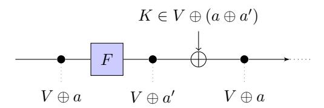

Figure 1: Invariant subspaces.

A slightly more powerful property can occur if for each a, there exists unique b such that  $F_K(V \oplus a) := F(V \oplus a) \oplus K = V \oplus b$  meaning that the subspace property is invariant, but not the initial coset. That is, for each initial coset  $V \oplus a$ , its image under the application of  $F_K$  is another coset of V, in general different from the initial one. Equivalently, the initial coset  $V \oplus a$  is mapped into another coset  $V \oplus b$ , where b depends on a and on the round key. In this paper, we generalize this concept and search for trails of subspaces. In the simplest case we look for pairs of subspaces  $V_1$  and  $V_2$  such that

$$F(V_1 \oplus a) \oplus K = V_2 \oplus b$$

<span id="page-11-2"></span>holds for any constant a, that is for each a there exists unique b for which the previous equivalence is satisfied.

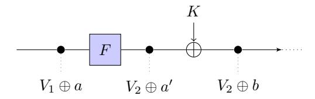

Figure 2: Trail of subspaces.

<span id="page-11-3"></span><sup>&</sup>lt;sup>4</sup>We recall the definition of coset, often used in the paper. Let W a vector space and V a subspace of W. If a is an element of W, a coset  $V \oplus a$  of V in W is a subset of the form  $V \oplus a = \{v \oplus a \mid \forall v \in V\}$ .

A subspace trail of length r is then simply a set of r+1 subspaces  $(V_1,V_2,\ldots,V_{r+1})$  that satisfy

$$F(V_i \oplus a_i) \oplus K \subseteq V_{i+1} \oplus a_{i+1}$$
.

When the relation holds with equality, the trail is called a *constant-dimensional* subspace trail. In this case, if  $F_K^t$  denotes the application of t rounds with fixed keys, it follows that

$$F_K^t(V_1 \oplus a_1) = V_{t+1} \oplus a_{t+1}.$$

**Definition 1.** Let  $(V_1, V_2, ..., V_{r+1})$  denote a set of r+1 subspaces with  $\dim(V_i) \leq \dim(V_{i+1})$ . If for each i=1,...,r and for each  $a_i \in V_i^{\perp}$ , there exist (unique)  $a_{i+1} \in V_{i+1}^{\perp}$  such that

$$F_K(V_i \oplus a_i) \subseteq V_{i+1} \oplus a_{i+1},$$

then  $(V_1, V_2, ..., V_{r+1})$  is subspace trail of length r for the function  $F_K$ . If all the previous relations hold with equality, the trail is called a constant-dimensional subspace trail.

Note that  $a_{i+1}$  depends on  $a_i$  and on the secret round key, but to simplify notation we use  $a_{i+1}$  instead of  $a_{i+1}(a_i, k)$ . With subspace structures at hand, we might ask questions about the probability that ciphertexts or sums of ciphertexts reside in certain subspaces, given that the plaintexts obey certain subspace structure (e.g. their sum is also in a fixed subspace). If the sum is over two texts this approaches resembles (truncated) differential cryptanalysis, if the sum is over more it can resemble integral cryptanalysis.

For AES-type block ciphers, we are typically not able to construct very long trails. In this case we can connect trails together and depending on the intersection properties of the endpoints of the trails, get predictable subspace properties for longer trails. However, in general these are not necessarily simple constant dimensional trails. In the following we describe subspace trail cryptanalysis and later-on distinguishers based on it. For sake of concreteness and better exposition, we focus on the case of AES. We'd like to emphasize that the properties described here extend almost immediately to any AES-like cipher with little modifications.

#### <span id="page-12-0"></span>3 Preliminaries

#### <span id="page-12-1"></span>3.1 Description of AES

The Advanced Encryption Standard [DR02] is a Substitution-Permutation network that supports key size of 128, 192 and 256 bits. The 128-bit plaintext initializes the internal state as a  $4 \times 4$  matrix of bytes as values in the finite fields  $\mathbb{F}_{256}$ , defined using the irreducible polynomial  $x^8 + x^4 + x^3 + x + 1$ . Depending on the version of AES,  $N_r$  round are applied to the state:  $N_r = 10$  for AES-128,  $N_r = 12$  for AES-192 and  $N_r = 14$  for AES-256. An AES round applies four operations to the state matrix:

- SubBytes (S-Box) applying the same 8-bit to 8-bit invertible S-Box 16 times in parallel on each byte of the state (it provides the non-linearity in the cipher);
- ShiftRows (SR) cyclic shift of each row (i-th row is shifted by i bytes to the left);
- $MixColumns\ (MC)$  multiplication of each column by a constant  $4\times 4$  invertible matrix over the field  $GF(2^8)$  (it and ShiftRows provide diffusion in the cipher<sup>5</sup>);
- AddRoundKey (ARK) XORing the state with a 128-bit subkey.

<span id="page-12-2"></span> $<sup>^5</sup>$ ShiftRows makes sure column values are spread and MixColumns makes sure each column is mixed.

One round of AES can be described as  $R(x) = K \oplus MC \circ SR \circ S\text{-Box}(x)$ . In the first round an additional AddRoundKey operation (using a whitening key) is applied, and in the last round the MixColumns operation is omitted.

As we consider only AES with 128-bit key, we shall describe only its key schedule algorithm. The key schedule of AES-128 takes the user key and transforms it into 11 subkeys of 128 bits each. The subkey array is denoted by W[0,...,43], where each word of  $W[\cdot]$  consists of 32 bits and where the first 4 words of  $W[\cdot]$  are loaded with the user secret key. The remaining words of  $W[\cdot]$  are updated according to the following rule:

- if  $i \equiv 0 \mod 4$ , then  $W[i] = W[i-4] \oplus RotByte(S-Box(W[i-1])) \oplus RCON[i/4]$ ,
- otherwise,  $W[i] = W[i-1] \oplus W[i-4]$ ,

where i=4,...,43, RotByte rotates the word by 8 bits to the left and  $RCON[\cdot]$  is an array of predetermined constant.

The Notation Used in the Paper. Let x denote a plaintext, a ciphertext, an intermediate state or a key. Then  $x_{i,j}$  with  $i,j \in \{0,...,3\}$  denotes the byte in the row i and in the column j. We denote by  $k^r$  the key of the r-th round, where  $k^0$  is the secret key. If only the key of the final round is used, then we denote it by k to simplify the notation. Finally, we denote by R one round of AES<sup>6</sup>, while we denote i rounds of AES by  $R^{(i)}$ . If the MixColumns operation is omitted in the last round, then we denote it by  $R_f$ . As last thing, in the paper we often use the term "partial collision" (or, more simply, collision) when two texts belong to the same coset of a given subspace X.

## <span id="page-13-0"></span>3.2 Subspaces through One Round of AES

For a vector space V and a function F on  $\mathbb{F}_{2^8}^{4\times 4}$ , let  $F(V)=\{F(v)\,|\,v\in V\}$  (as usual). For a subset  $I\subseteq\{1,2,\ldots,n\}$  and a subset of vector spaces  $\{G_1,G_2,\ldots,G_n\}$ , we define  $G_I$  as  $G_I:=\bigoplus_{i\in I}G_i$ .

In the following we define four families of subspaces essential to AES: the diagonal spaces  $\mathcal{D}_I$ , the inverse-diagonal spaces  $\mathcal{I}\mathcal{D}_I$ , the column spaces  $\mathcal{C}_I$  and the mixed spaces  $\mathcal{M}_I$ . All the subspace defined in the paper are subspaces of the space  $\mathbb{F}_{28}^{4\times4}$  over the field  $\mathbb{F}_{28}$  defined as

$$\mathbb{F}_{2^8} := GF(2^8)[X]/(X^8 + X^4 + X^3 + X + 1).$$

Moreover, we denote with  $E = \{e_{0,0}, ..., e_{3,3}\}$  the unit vectors of  $\mathbb{F}_{28}^{4\times4}$  (e.g.  $e_{i,j}$  has a single 1 in row i and column j). In App. A we recall the main definitions regarding the subspaces, with concrete examples on the AES case.

**Definition 2.** (Column spaces) The column spaces  $C_i$  are defined as

$$C_i = \langle e_{0,i}, e_{1,i}, e_{2,i}, e_{3,i} \rangle.$$

For instance, the column space  $C_0$  corresponds to the symbolic matrix

$$\mathcal{C}_0 = \left\{ \begin{bmatrix} x_1 & 0 & 0 & 0 \\ x_2 & 0 & 0 & 0 \\ x_3 & 0 & 0 & 0 \\ x_4 & 0 & 0 & 0 \end{bmatrix} \middle| \forall x_1, x_2, x_3, x_4 \in \mathbb{F}_{2^8} \right\}.$$

**Definition 3.** (Diagonal spaces) The diagonal spaces  $\mathcal{D}_i$  are defined as

$$\mathcal{D}_i = SR^{-1}(\mathcal{C}_i) = \langle e_{0,i}, e_{1,i+1}, e_{2,i+2}, e_{3,i+3} \rangle$$

<span id="page-13-1"></span><sup>&</sup>lt;sup>6</sup>Sometimes we use the notation  $R_K$  instead of R to highlight that the round key is K.

where the index i+j is computed modulo 4. For instance, the diagonal space  $\mathcal{D}_0$  corresponds to the symbolic matrix

$$\mathcal{D}_0 = \left\{ \begin{bmatrix} x_1 & 0 & 0 & 0 \\ 0 & x_2 & 0 & 0 \\ 0 & 0 & x_3 & 0 \\ 0 & 0 & 0 & x_4 \end{bmatrix} \middle| \forall x_1, x_2, x_3, x_4 \in \mathbb{F}_{2^8} \right\}.$$

**Definition 4.** (Inverse-Diagonal spaces) The inverse-diagonal spaces  $\mathcal{ID}_i$  are defined as

$$\mathcal{ID}_i = SR(C_i) = \langle e_{0,i}, e_{1,i-1}, e_{2,i-2}, e_{3,i-3} \rangle.$$

where the index i-j is computed modulo 4. For instance,  $\mathcal{ID}_0 = SR(\mathcal{C}_0)$  corresponds to the symbolic matrix

$$\mathcal{ID}_0 = \left\{ \begin{bmatrix} x_1 & 0 & 0 & 0 \\ 0 & 0 & 0 & x_2 \\ 0 & 0 & x_3 & 0 \\ 0 & x_4 & 0 & 0 \end{bmatrix} \middle| \forall x_1, x_2, x_3, x_4 \in \mathbb{F}_{2^8} \right\}.$$

The last type of subspaces we define are called mixed subspaces.

<span id="page-14-1"></span>**Definition 5.** (Mixed spaces) The *i*-th mixed subspace  $\mathcal{M}_i$  is defined as

$$\mathcal{M}_i = MC(\mathcal{ID}_i).$$

These subspaces are formed by applying ShiftRows and then MixColumns to a column space. For instance,  $\mathcal{M}_0$  corresponds to symbolic matrix

$$\mathcal{M}_0 = \left\{ \begin{bmatrix} \alpha \cdot x_1 & x_4 & x_3 & (\alpha+1) \cdot x_2 \\ x_1 & x_4 & (\alpha+1) \cdot x_3 & \alpha \cdot x_2 \\ x_1 & (\alpha+1) \cdot x_4 & \alpha \cdot x_3 & x_2 \\ (\alpha+1) \cdot x_1 & \alpha \cdot x_4 & x_3 & x_2 \end{bmatrix} \middle| \forall x_1, x_2, x_3, x_4 \in \mathbb{F}_{2^8} \right\}.$$

where  $0x02 \equiv \alpha$  and  $0x03 \equiv \alpha + 1$ .

**Definition 6.** Given  $I \subseteq \{0, 1, 2, 3\}$  where  $0 < |I| \le 3$ , we define:

$$\mathcal{C}_I = \bigoplus_{i \in I} \mathcal{C}_i, \qquad \mathcal{D}_I = \bigoplus_{i \in I} \mathcal{D}_i, \qquad \mathcal{I}\mathcal{D}_I = \bigoplus_{i \in I} \mathcal{I}\mathcal{D}_i \qquad \mathcal{M}_I = \bigoplus_{i \in I} \mathcal{M}_i.$$

The dimension<sup>7</sup> of any of the spaces  $\mathcal{D}_I, \mathcal{I}\mathcal{D}_I, \mathcal{C}_I$  and  $\mathcal{M}_I$  is  $4 \cdot |I|$ . The essential subspaces in AES are built from diagonal spaces  $\mathcal{D}_i$ , inverse-diagonal spaces  $\mathcal{I}\mathcal{D}_i$ , column spaces  $\mathcal{C}_j$  and mixed spaces  $\mathcal{M}_k$ . There are four of each of these spaces, and direct sums of them result in higher-dimensional diagonal, inverse-diagonal, column and mixed spaces.

It is easy to see that SubBytes maps cosets of diagonal and column spaces to cosets of diagonal and column spaces. Since SubBytes operates on each byte individually and it is bijective, and since the bytes of column and diagonal spaces are independent, its only effect is to change the coset. It is also easy to see that ShiftRows maps a coset of a diagonal space to a coset of a column space, since diagonals are mapped to columns, and it maps a coset of a column space to a coset of an inverse-diagonal space. The effect of MixColumns to a columns space  $\mathcal{C}_I \oplus a$  is simply to change the coset, since applying the MixColumns matrix to a column space  $\mathcal{C}_i$  has no effect.

<span id="page-14-0"></span> $<sup>^7</sup>$ Since we are working over the field  $\mathbb{F}_{2^8}$ , we consider the dimension of the subspace as the number of active and independent bytes. This implies for example that the dimension of the subspaces is constant through SubBytes and MixColumns operations. See App. A for more details about the dimension of a subspace.

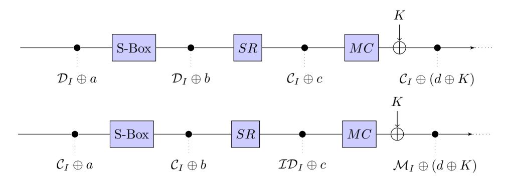

Figure 3: The essential subspaces in the AES round.

<span id="page-15-1"></span>**Lemma 1.** Let  $I \subseteq \{0, 1, 2, 3\}$  where  $0 < |I| \le 3$  and  $a \in \mathcal{D}_I^{\perp}$ . There exists unique  $b \in \mathcal{C}_I^{\perp}$  such that

$$R_K(\mathcal{D}_I \oplus a) = \mathcal{C}_I \oplus b.$$

*Proof.* As we have just seen, since SubBytes is bijective and operates on each byte independently, it simply changes the coset  $\mathcal{D}_I \oplus a$  to  $\mathcal{D}_I \oplus a'$ , where  $a'_{i,j} = \text{S-Box}(a_{i,j})$  for each i, j = 0, ..., 3. ShiftRows simply moves the bytes of  $\mathcal{D}_I \oplus a'$  to a column space  $\mathcal{C}_I \oplus b'$ , where b' = SR(a'). MixColumns affects only the constant columns, thus  $MC(\mathcal{C}_I \oplus b') = \mathcal{C}_I \oplus MC(b') = \mathcal{C}_I \oplus b''$ . Key addition then changes the coset to  $\mathcal{C}_I \oplus b$ .

This simply states that a coset of a sum of diagonal spaces  $\mathcal{D}_I$  encrypt to a coset of a corresponding sum of column spaces  $\mathcal{C}_I$  through one round. We recall that two different cosets  $V \oplus a$  and  $V \oplus b$  (i.e.  $a \neq b$ ) of the same generic subspace V are equivalent (i.e.  $V \oplus a \sim V \oplus b$ ) if and only if  $a \oplus b \in V$ . Thus, in the previous lemma (similarly in the following), b is unique with respect to this equivalence relationship.

<span id="page-15-2"></span>**Lemma 2.** Let  $I \subseteq \{0, 1, 2, 3\}$  where  $0 < |I| \le 3$  and  $a \in C_I^{\perp}$ . There exists unique  $b \in \mathcal{M}_I^{\perp}$  such that

$$R_K(\mathcal{C}_I \oplus a) = \mathcal{M}_I \oplus b.$$

Proof. By definition 5, the mixed spaces  $\mathcal{M}_I$  are defined as the application of the Mix-Columns operation to inverse-diagonal space  $\mathcal{ID}_I$ . Since a ShiftRows operation maps a column space to an inverse-diagonal space, a mixed space  $\mathcal{M}_I$  is equivalently defined as the application of the linear layer in AES to column spaces  $\mathcal{C}_I$ . Since the SubBytes layer only moves a coset  $\mathcal{C}_I \oplus a$  to a coset  $\mathcal{C}_I \oplus a'$ , it follows that for any fixed coset  $\mathcal{C}_I \oplus a$ , there exists  $b \in \mathcal{M}_I^{\perp}$  such that  $MC \circ SR \circ S\text{-Box}(\mathcal{C}_I \oplus a) \oplus K = \mathcal{M}_I \oplus b$ , where  $b = MC \circ SR(a') \oplus K$  and  $a'_{i,j} = S\text{-Box}(a_{i,j})$  for each i, j = 0, ..., 3.

Similarly to before, this simply states that a coset of a sum of column spaces  $C_I$  encrypts to a coset of the corresponding sum of mixed spaces  $\mathcal{M}_I$  over one round.

#### <span id="page-15-0"></span>3.3 Intersecting AES Subspaces

We continue with useful properties of AES subspaces. In this section we show the following: diagonal spaces and column spaces have non-trivial intersection, column spaces and mixed spaces have non-trivial intersection, but diagonal spaces and mixed spaces have only trivial intersection. This will be useful for creating subspace trails covering a higher number of rounds. For the following, let  $I, J \subseteq \{0,1,2,3\}$  and we assume that all the indexes are taken modulo 4. All the proofs are given in App. B.

<span id="page-15-3"></span>**Lemma 3.**
$$\mathcal{D}_i \cap \mathcal{C}_j = \langle e_{i+j,j} \rangle$$
 and  $\mathcal{ID}_i \cap \mathcal{C}_j = \langle e_{i-j,j} \rangle$ .

It follows that  $\mathcal{D}_I \cap \mathcal{C}_J = \langle e_{j+i,j} | i \in I, j \in J \rangle$  and  $\mathcal{I}\mathcal{D}_I \cap \mathcal{C}_J = \langle e_{i-j,j} | i \in I, j \in J \rangle$  (j+i and i-j are taken modulo 4), where the intersections have dimension  $|I| \cdot |J|$ .

Lemma 4.  $C_i \cap \mathcal{M}_j = \langle MC(e_{i+i.i}) \rangle$ .

It follows that  $C_I \cap \mathcal{M}_J = \langle MC(e_{j+i,i}) | i \in I, j \in J \rangle$  (i+j) is taken modulo 4), which has dimension  $|I| \cdot |J|$ .

While the spaces  $\mathcal{D}_I$  and  $\mathcal{C}_J$ ,  $\mathcal{I}\mathcal{D}_I$  and  $\mathcal{C}_J$ , and  $\mathcal{C}_I$  and  $\mathcal{M}_J$  intersect non-trivially, the spaces  $\mathcal{D}_I$  and  $\mathcal{M}_J$  and the spaces  $\mathcal{I}\mathcal{D}_I$  and  $\mathcal{M}_J$  intersect trivially. In particular:

<span id="page-16-2"></span>**Lemma 5.**  $\mathcal{D}_I \cap \mathcal{M}_J = \mathcal{I}\mathcal{D}_I \cap \mathcal{M}_J = \{0\}$  for all I and J such that  $|I| + |J| \leq 4$ .

# <span id="page-16-0"></span>4 Distinguishers for 1, 2, 3 and 4 Rounds of AES with Secret Round-Keys

In this section we describe a series of subspace trails for AES. Additionally we also describe how these trails can be used to formulate ways to detect non-randomness, often colloquially referred to a distinguishers. All distinguishers in this section, ranging from two up to four rounds, are independent of the round keys and are formulated without the knowledge of the key. From now on, we assume that any subspaces  $\mathcal{D}_I$ ,  $\mathcal{C}_I$  or  $\mathcal{M}_I$  has nonzero dimension (that is,  $I \subseteq \{0,1,2,3\}$  is not empty). Moreover, when we intersect two subspaces  $\mathcal{D}_I$  and  $\mathcal{M}_J$ , where both I and J are assumed non-empty, we always assume that the sum of their dimensions is not larger than 16. Typically, the sum of their dimensions will be exactly 16.

## <span id="page-16-1"></span>4.1 2-Round Subspace Trail for AES

It follows directly from Section 3.2 that plaintexts from diagonal spaces are encrypted over two rounds to ciphertexts in mixed subspaces. Let  $R^{(2)}$  denote two AES rounds with fixed random round keys  $K = K_1, K_2$ . Let  $I \subseteq \{1, 2, 3, 4\}$  nonzero and fixed. By Lemma 1, a coset  $\mathcal{D}_I \oplus a$  of dimension  $4 \cdot |I|$  encrypts to a coset  $R_{K_1}(\mathcal{D}_I \oplus a) = \mathcal{C}_I \oplus a'$  over one round. By Lemma 2, there exists unique b (relative to the round keys and the constant a') such that  $R_{K_2}(\mathcal{C}_I \oplus a') = \mathcal{M}_I \oplus b$ . By combining the two rounds, we get that for each  $a \in \mathcal{D}_I^{\perp}$ , there exists unique  $b \in \mathcal{M}_I^{\perp}$  such that  $R^{(2)}(\mathcal{D}_I \oplus a) = \mathcal{M}_I \oplus b$ .

Consequently, we get the following properties. If two plaintexts belong to the same coset of a diagonal space  $\mathcal{D}_I$ , then their encryption belongs to the same coset of a mixed space  $\mathcal{M}_I$ . In particular, for a two round encryption  $R^2$  with fixed keys, we have that

<span id="page-16-4"></span>
$$Pr(R^{(2)}(u) \oplus R^{(2)}(v) \in \mathcal{M}_I \mid u \oplus v \in \mathcal{D}_I) = 1$$
(1)

for nonzero set I of  $\{0, 1, 2, 3\}$  (i.e.  $|I| \neq 0$ ). The opposite follows directly: if two plaintexts belong to different cosets of a diagonal space  $\mathcal{D}_I$ , then their encryption belongs to different cosets of a mixed space  $\mathcal{M}_I$ . In other words

$$Pr(R^{(2)}(u) \oplus R^{(2)}(v) \in \mathcal{M}_I \mid u \oplus v \notin \mathcal{D}_I) = 0.$$

These properties are used to set up the distinguisher for two rounds. However, other interesting properties hold when one considers two rounds of encryption. In particular, by Lemma 5, the intersection between a mixed space  $\mathcal{M}_I$  space and a diagonal space  $\mathcal{D}_J$  space contains only zero, if |I| + |J| is less than 4. Thus, if two plaintexts are in the same coset of  $\mathcal{M}_I$ , they must belong to different cosets of  $\mathcal{D}_J$ . In other words, for  $\mathcal{D}_I$  and  $\mathcal{D}_J$  such that  $\dim(\mathcal{D}_I) + \dim(\mathcal{D}_J) \leq 16$  (and  $|I|, |J| \neq 0$ )

<span id="page-16-3"></span>
$$Pr(R^{(2)}(u) \oplus R^{(2)}(v) \in \mathcal{D}_J \mid u \oplus v \in \mathcal{D}_I) = 0$$
(2)

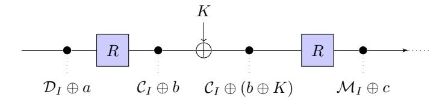

Figure 4: Subspaces over 2 rounds of AES.

```
Data: Pair of texts c^1 and c^2.
Result: i such that c^1 \oplus c^2 \in \mathcal{M}_i, -1 otherwise.
c \leftarrow MC^{-1}(c^1 \oplus c^2);
for i from \theta to 3 do
    if c_{(i+1)\%4,0} = 0 AND c_{(i+2)\%4,0} = 0 AND c_{(i+3)\%4,0} = 0
     AND \ c_{i,1} = 0 \ AND \ c_{(i+1)\%4,1} = 0 \ AND \ c_{(i+2)\%4,1} = 0
     AND \ c_{i,2} = 0 \ AND \ c_{(i+1)\%4,2} = 0 \ AND \ c_{(i+3)\%4,2} = 0
     AND \ c_{i,3} = 0 \ AND \ c_{(i+2)\%4,3} = 0 \ AND \ c_{(i+3)\%4,3} = 0 \ \mathbf{then}
     return i;
    end
end
return -1.
```

<span id="page-17-1"></span>**Algorithm 1:** Pseudo-code for distinguisher of 2 rounds of AES.

where  $u \neq v$ , since  $R^{(2)}(u)$  and  $R^{(2)}(v)$  are both in the same coset of  $\mathcal{M}_I$  and thus are always in different cosets of  $\mathcal{D}_{I}$ . We can get similar results for the mixed spaces  $\mathcal{M}_{I}$ . In particular, if two plaintexts belong to the same coset of a mixed space  $\mathcal{M}_I$ , then their two round encryptions belong to different cosets of any mixed space  $\mathcal{M}_I$ . Indeed, two (different) elements of  $\mathcal{M}_I$  belong to different cosets of  $\mathcal{D}_J$  (since  $\mathcal{M}_I \cap \mathcal{D}_J = \{0\}$ ). Since  $R^{(2)}(u) \oplus R^{(2)}(v) \in \mathcal{M}_J$  if and only if  $u \oplus v \in \mathcal{D}_J$ , we obtain the desired result. Thus, for  $\mathcal{M}_I$  and  $\mathcal{M}_J$  such that  $0 < \dim(\mathcal{M}_I) + \dim(\mathcal{M}_J) \le 16$ , we have that

<span id="page-17-0"></span>
$$Pr(R^{(2)}(u) \oplus R^{(2)}(v) \in \mathcal{M}_J \mid u \oplus v \in \mathcal{M}_I) = 0$$
(3)

if  $u \neq v$ . We'll use these probabilities to set up an efficient 4 rounds distinguisher.

A Concrete Distinguisher for 2 Rounds. As we have seen, if two plaintexts belong to the same coset of  $\mathcal{D}_I$ , then they belong to the same coset of  $\mathcal{M}_I$  with probability 1 after two rounds - for each I. Consider instead two random texts. By simple computation, the probability that there exists I such that they belong to the same cosets of  $\mathcal{M}_I$  is  $\binom{4}{|I|} \cdot (2^8)^{-16+4\cdot |I|}$  (note that there are  $\binom{4}{|I|}$  different subspaces  $\mathcal{M}_I$ ). Setting |I| = 1, this probability is equal to  $2^{-94}$ .

Thus, one pair of plaintexts (that is two texts) is sufficient to distinguish the random case from the other one. Indeed, on average in the random case we expect  $2^{-94} \cdot 2 = 2^{-93} \simeq 0$ collisions (a "collision" occurs when two elements belong to the same coset of  $\mathcal{M}_I$ ), while this number is always equal to 1 in the other case. The cost of this distinguisher is hence two texts. An equivalent distinguisher over 2 rounds was already introduced in [DR06b], where authors investigated how the components of the AES interact over 2 rounds.

Finally, note that a similar distinguisher can be used for the 1 round case. Indeed, note that if two plaintexts belong to the same coset of  $\mathcal{D}_I$  (equivalently  $\mathcal{C}_I$ ), then they belong to the same coset of  $\mathcal{C}_I$  (equivalently  $\mathcal{M}_I$ ) with probability 1 for each I after 1 round. Moreover, observe that it also is possible to set up a 2 rounds distinguisher using the impossible differential properties defined in (2) or (3).

## <span id="page-18-0"></span>4.2 Truncated Differential Key-Recovery Attacks for 3- and 4-round of AES

Before to go on, we highlight that in App. E we present new key-recovery attacks for 3-and 4-round of AES that exploit the 2-round subspace trail of AES just presented.

For 3 rounds, the idea is simply to exploit the fact that two elements in the same coset of a diagonal space  $\mathcal{D}_I$  belong to the same coset of a mixed space  $\mathcal{M}_I$  after 2 rounds - see Prob. (1). Thus, given two plaintexts  $p^1$  and  $p^2$  in the same coset of  $\mathcal{D}_I$  (that is  $p^1 \oplus p^2 \in \mathcal{D}_I$ ) and the corresponding ciphertexts  $c^1$  and  $c^2$  after 3 rounds, the final key k must satisfy the following relationship:

$$R_k^{-1}(c^1) \oplus R_k^{-1}(c^2) \in \mathcal{M}_I$$

In order to find the secret key and to minimize the data and the computational costs, these attacks exploit the shape of the mixed space  $\mathcal{M}_I$ , that is the facts that the columns of a coset of a mixed space  $\mathcal{M}_I$  depend on different and independent variables and the relationships that hold among the bytes of the same column of  $\mathcal{M}_I$ . The attacks on 4 rounds are obtained extending at the end or at the beginning this attack on 3 rounds.

As highlight in App. E.3, these attacks are truncated differential in nature, and are competitive with the other low-data complexity attacks present in literature, as the ones proposed in [BDF11] and  $[BDD^+12]$ . We refer to App. E for a detailed analysis.

### <span id="page-18-1"></span>4.3 3-Round Subspace Trail for AES

There are several techniques that can be used to set up a 3-round distinguisher for AES, as for example (1) truncated differential, (2) balance property and (3) impossible differential. In this section, we only describe the truncated differential distinguisher using the subspace trail, which we'll be used to set up the attack on 4-round of AES with secret S-Box. The other two distinguishers based on the balance property and on the impossible differential are presented in details using the subspace trail in the next section. Note that the arguments in next section used for 4 rounds of AES holds also for the 3-round case.

The most competitive distinguisher on 3-round of AES is based on truncated differential trails, and an example of it is depicted in Fig. 5. In the following, we re-interpret it using the subspace trail.

<span id="page-18-2"></span>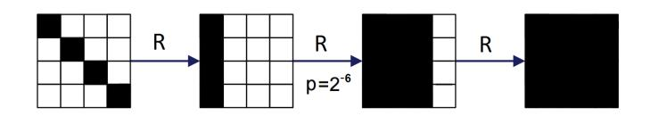

**Figure 5:** Truncated differential characteristic over 3-round AES. White box denotes a byte with a zero difference, while black box denotes a byte with a non-zero difference.

Consider a coset of  $\mathcal{D}_I$  as starting point. After two rounds, this coset is mapped into a coset of  $\mathcal{M}_I$  with probability 1. Indeed, as we have seen in Lemma 1, a coset of  $\mathcal{D}_I$  is mapped into a coset of  $\mathcal{C}_I$  with probability 1 after one round, and, as we have seen in Lemma 2, a coset of  $\mathcal{C}_I$  is mapped into a coset of  $\mathcal{M}_I$  with probability 1 after one round. Thus, if we consider two elements that belong to the same cosets of  $\mathcal{D}_I$ , after two rounds they belong in the same coset of  $\mathcal{M}_I$  for sure. However, at the same time and with a certain probability, it is possible that these two elements belong to the same coset of  $\mathcal{C}_J \cap \mathcal{M}_I \subseteq \mathcal{C}_J$  for a certain J after two rounds. In particular, the following proposition holds:

<span id="page-18-3"></span>**Proposition 1.** For any  $\mathcal{M}_I$  and  $\mathcal{C}_J$ , we have that  $Pr(x \in \mathcal{C}_J \mid x \in \mathcal{M}_I) = (2^8)^{-4|I|+|I|\cdot|J|}$ .

<span id="page-19-0"></span>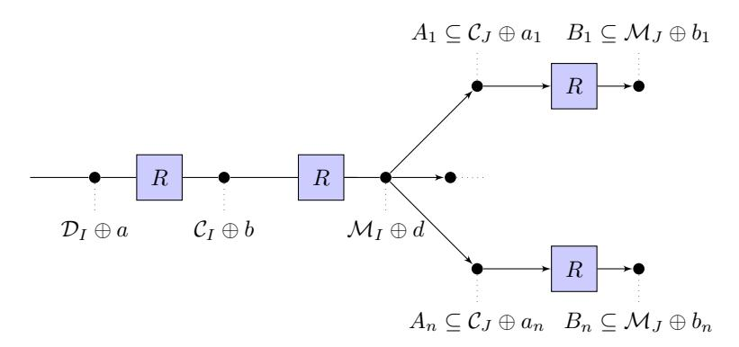

**Figure 6:** 3-round distinguishers for AES (the index n is defined as  $n := (2^8)^{4 \cdot |I| - |I| \cdot |J|}$ ).

The proof can be found in App. B. That is, if two elements belong to the same coset of  $\mathcal{M}_I$ , then they belong to the same coset of  $\mathcal{C}_J$  with probability  $(2^8)^{-4|I|+|I|\cdot|J|}$ . More precisely, given two texts in the same coset of  $\mathcal{D}_I$ , after two rounds they belong to the same coset of  $\mathcal{M}_I \cap \mathcal{C}_J$  with probability  $(2^8)^{-4|I|+|I|\cdot|J|}$  (where  $\mathcal{M}_I \cap \mathcal{C}_J \subseteq \mathcal{C}_J$ ). As we have just seen, a coset of  $\mathcal{C}_J$  is mapped into a coset of  $\mathcal{M}_J$  after one round. It follows that if two elements belong to the same coset of  $\mathcal{D}_I$ , the probability that they belong to the same coset of  $\mathcal{M}_J$  after three rounds is equal to  $(2^8)^{-4|I|+|I|\cdot|J|}$ . The case |I|=1 and |J|=3 is depicted in Fig. 5.

For a more detailed explanation using subspace trail, consider the following argument. Given a coset of  $\mathcal{M}_I$ , it can be seen as a union of coset of  $\mathcal{C}_J$ , that is:

$$\mathcal{M}_I \oplus a = \bigcup_{x \in \mathcal{M}_I \oplus a \setminus \mathcal{C}_J} \mathcal{C}_J \oplus x,$$

as depicted in Fig. 6. In particular, note that the number of  $x \in \mathcal{M}_I \oplus a \setminus \mathcal{C}_J$  is exactly  $(2^8)^{4\cdot |I|-|I|\cdot |J|}$ . Given two elements in the same coset of  $\mathcal{D}_I$ , then after two rounds they belong to the same coset of  $\mathcal{M}_I$ . Since a coset of  $\mathcal{M}_I$  can be seen as the union of  $(2^8)^{4\cdot |I|-|I|\cdot |J|}$  cosets of  $\mathcal{C}_J$ , the probability that these two elements belong to the same coset of  $\mathcal{C}_J$  after two rounds is exactly  $(2^8)^{-4\cdot |I|+|I|\cdot |J|}$ . Also in this way, one obtains the previous result.

Moreover, note the a similar result can be obtained in the decryption direction. That is, if two elements belong to the same coset of  $\mathcal{M}_I$ , then they belong to the same coset of  $\mathcal{D}_J$  three rounds before with probability  $(2^8)^{4\cdot |I|-|I|\cdot |J|}$ . Finally and only for completeness, it is possible to obtain the same result considering the intersection of  $\mathcal{C}_I$  and  $\mathcal{D}_J$  after one round, instead of the intersection of  $\mathcal{M}_I$  and  $\mathcal{C}_J$  after two rounds. All the details of this (analogous) case are given in App. C.1.

A Concrete Distinguisher for 3 Rounds. In order to set up the distinguisher, we exploit the difference of probability to have a collision in the ciphertexts set between the case in which two plaintexts are taken in a random way and the case in which two plaintexts belong to the same coset of  $\mathcal{D}_I$ .

The probabilities that two elements drawn randomly from  $\mathbb{F}_{2^8}^{4\times 4}$  (denoted by  $p_1$ ) and that two plaintexts drawn from a coset of  $\mathcal{D}_I$  (denoted by  $p_2$ ) belong to the same coset of  $\mathcal{M}_J$  are respectively:

$$p_1 = \begin{pmatrix} 4 \\ |J| \end{pmatrix} \cdot (2^8)^{-16+4|J|}, \qquad p_2 = \begin{pmatrix} 4 \\ |J| \end{pmatrix} \cdot (2^8)^{-4|I|+|I||J|}.$$

It is very easy to observe that the probability to have a collision in the second case is higher than in the random case. In particular, for |J| = 3 and |I| = 1, we obtain that

```
Data: 20 texts c
                 i
                   (for i = 1, ..., 20).
Result: number of collisions.
n ← 0;
for each pair (c
                i
                 , cj
                    ) with i 6= j do
   c ← MC−1
               (c
                 i ⊕ c
                      j
                       );
   for k from 0 to 3 do
       if ck,0 = 0 AND c(3+k)%4,1 = 0 AND c(2+k)%4,2 = 0 AND c(1+k)%4,3 = 0
        then
           n ← n + 1;
           next pair
       end
   end
end
```

**return** *n*. **Algorithm 2:** *Distinguisher for 3-round of AES - Pseudo-code*.

*p*<sup>2</sup> = 2<sup>−</sup><sup>6</sup> while *p*<sup>1</sup> = 2<sup>−</sup><sup>30</sup>. Thus, the idea is to look for the minimum number of texts *m* in order to guarantee at least one collision in the "subspace case" and zero in the random case (with high probability).

To do this, we recall the *birthday paradox*. Given *d* (equally likely) values and *n* variables, the probability that at least two of them have the same value is given by:

<span id="page-20-1"></span>
$$p = 1 - \frac{n!}{(n-d)! \cdot n^d} = 1 - \frac{(d)!}{n^d} \cdot \binom{n}{d} \simeq 1 - e^{\frac{-d(d-1)}{2n}},\tag{4}$$

where the last one is an useful approximation.

Since if we encrypt two plaintexts from a coset of D*<sup>I</sup>* , each of them can only belong to one of the 2 8 cosets of M*<sup>J</sup>* defined as before, the probability that there is at least one collision in a coset is equal to the probability that two elements belong to the same cosets of M*<sup>J</sup>* , that is *p* = 1 − *e* −*m*(*m*−1)*/*(2·2 8 . However, this property holds if we choose any of the four 12-dimensional space M*<sup>J</sup>* as a target distinguisher space, each yielding an independent experiment. Since this experiments are independent, we have that the probability to have at least one collision in the subspace case given *m* texts is:

$$p = 1 - \left(\frac{2^8!}{(2^8 - m)! \cdot (2^8)^d}\right)^4 \simeq 1 - \left(e^{\frac{-m(m-1)}{2 \cdot 2^8}}\right)^4 = 1 - e^{\frac{-m(m-1)}{2 \cdot 2^6}}.$$

Thus, if we set *m* = 20, the probability to have at least one collision in one of the four different M*<sup>J</sup>* spaces (with |*J*| = 1) is 95*.*25% (14 texts are sufficient to have at least one collision with probability greater than 75%). In order to distinguish the two sets (that is, the random one and the "subspace" one), the verifier has to construct all the possible pairs of texts and to count the number of collisions, for each of them. In particular, given 20 texts (that is, 190 different pairs), we expect 190 · 2 −6 ' 3 collisions in the subspace case and 190 · 2 <sup>−</sup><sup>30</sup> = 2<sup>−</sup>22*.*<sup>4</sup> ' 0 in the random case. Finally, observe that the distinguisher works in similar way in the decryption direction, with the same complexity.

#### <span id="page-20-0"></span>**4.4 4-Round Subspace Trail for AES**

As for 3-round of AES, there are several techniques that can be used to set up a 4-round distinguisher for AES, as (1) impossible differential and (2) balance property. In the following, we present the 4-round impossible differential distinguisher in details, while the description of the distinguisher based on the balance property is provided in App. [C.2.](#page-41-0) In both cases, the same analysis holds also for 3-round of AES.

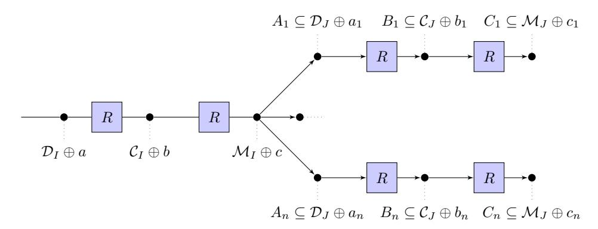

**Figure 7:** 4-round distinguishers for AES (where the index *n* is defined as *n* := (2<sup>8</sup> ) 4|*I*| and the indexes *I* and *J* satisfy the condition 0 *<* |*I*| + |*J*| ≤ 4).

From now on, we assume that *I* and *J* satisfy the condition 0 *<* |*I*| + |*J*| ≤ 4 (in order to use Lemma [5\)](#page-16-2). To set up the 4-round impossible differential distinguisher, we start from the 2-round differential ones. Fix D*<sup>I</sup>* and D*<sup>J</sup>* such that 0 *<* dim(D*<sup>I</sup>* ) + dim(D*<sup>J</sup>* ) ≤ 16. We can construct a four round trail by simply combining two-round subspaces properties. Indeed, we have seen that

$$Pr(R^{(2)}(u) \oplus R^{(2)}(v) \in \mathcal{M}_I \mid u \oplus v \in \mathcal{D}_I) = 1, Pr(R^{(2)}(u) \oplus R^{(2)}(v) \in \mathcal{M}_J \mid u \oplus v \in \mathcal{M}_I) = 0$$

if *u* 6= *v*. Combining these two probabilities for 2-round yields a 4-round probability

<span id="page-21-0"></span>
$$Pr(R^{(4)}(u) \oplus R^{(4)}(v) \in \mathcal{M}_J \mid u \oplus v \in \mathcal{D}_I) = 0$$
(5)

where *u* 6= *v*. This means that the adversary can pick any coset of a non-zero plaintext space D*<sup>I</sup>* and a non-zero ciphertext space M*<sup>J</sup>* , as long as 0 *<* dim(D*<sup>I</sup>* ) + dim(M*<sup>J</sup>* ) ≤ 16, and distinguish on the fact that the probability that two plaintexts encrypt to the same coset of the ciphertext space is zero over four rounds.

**A Concrete Distinguisher for 4 Rounds.** The idea is pick parameters that maximize probability in the random case. The best minimal data complexity is found if we choose |*J*| = 3. This implies that |*I*| = 1, since we have the condition that |*I*| + |*J*| ≤ 4. In this case, the probability that two random elements belong to the same coset of M*<sup>J</sup>* for a certain *J* with |*J*| = 3 is 2 <sup>−</sup><sup>30</sup> (as we have already seen). Instead, the probability that two elements, that belong to the same coset of D*<sup>I</sup>* , belong to the same coset of M*<sup>J</sup>* after four rounds is 0.

Exactly as before, the idea is to look for the minimum number of texts *m* in order to guarantee at least one collision in the random case with high probability. Since there are four 12-dimensional space M*<sup>J</sup>* and using the birthday paradox, the probability to have at least one collision in the random case given *m* texts is well approximated by *p* = 1 − *e* −*m*(*m*−1)*/*(2·2 <sup>30</sup>) *.* Thus, *m* ' 2 <sup>16</sup>*.*<sup>25</sup> texts are sufficient to set up a 4-round distinguisher (in this case, the probability to have a collision in the random case is approximately 95% - note that 2 <sup>15</sup>*.*<sup>75</sup> texts are sufficient to have at least one collision with probability of 75%). Indeed, given 2 <sup>16</sup>*.*<sup>25</sup> texts (that is about 2 <sup>31</sup>*.*<sup>5</sup> pairs), the number of collision in the random case is on average 2 31*.*5 · 2 <sup>−</sup><sup>30</sup> = 2<sup>1</sup>*.*<sup>5</sup> ≈ 3, while the number of collision in the other case is 2 31*.*5 · 0 = 0. That is, 2 <sup>16</sup>*.*<sup>25</sup> chosen plaintexts are sufficient for this distinguisher.

Note that this distinguisher exploits the Impossible Differential property presented in [\[BK01\]](#page-33-2). Thus, it is not a surprise that the computational complexity of these two distinguishers is the same. Only for completeness, note that it is possible to set up a

```
Data: 2
        16.25 texts c
                     i
                      (for i = 1, ..., 2
                                     16.25).
Result: 1 if there is at least one collision, 0 otherwise.
for each pair (c
                i
                 , cj
                    ) with i 6= j do
   c ← MC−1
               (c
                 i ⊕ c
                      j
                       );
   for k from 0 to 3 do
       if ck,0 = 0 AND c(3+k)%4,1 = 0 AND c(2+k)%4,2 = 0 AND c(1+k)%4,3 = 0
        then
           return 1;
       end
   end
end
return 0.
         Algorithm 3: Pseudocode for Distinguisher for 4-round AES.
```

0-probability distinguishers also for the 3-round case:

$$Pr(R^{(3)}(x) \oplus R^{(3)}(y) \in \mathcal{M}_I \mid x \oplus y \in \mathcal{C}_J) = Pr(R^{(3)}(x) \oplus R^{(3)}(y) \in \mathcal{C}_I \mid x \oplus y \in \mathcal{D}_J) = 0$$

where 0 *<* |*I*| + |*J*| ≤ 4. Since in the random case, the probability that two elements belong to the same coset of C*<sup>I</sup>* or M*<sup>I</sup>* is upper bounded by 2 <sup>−</sup><sup>30</sup> for each *I* and *J*, one needs at least 2 <sup>15</sup>*.*<sup>75</sup> chosen plaintexts to set up this distinguisher. That is, in the case of 3-round AES, the 0-probability distinguisher is worse than the one described in the previous section[8](#page-22-1) .

Moreover, note that this 4-round distinguisher (as also the 3-round one) works also in the decryption direction. In this case, using the same argument as before, if we two texts belong to the same coset of M*<sup>I</sup>* , then they belong to two different cosets of D*<sup>J</sup>* four rounds before for |*I*| + |*J*| ≤ 4.

Finally, starting from this 4-round impossible subspace trail, it is possible to re-define the impossible differential attack in a very natural way. We highlight this relationship in App. [D,](#page-42-0) giving all the details.

## <span id="page-22-2"></span><span id="page-22-0"></span>**5 Key-recovery Attacks on AES with a Secret S-Box**

From now on, we focus on AES with a single secret S-Box, and we show how to exploit subspace trails in order to set up key-recovery attacks. More precisely, assume to consider *AES with secret and identical* (bijective) *S-Box*. Here we present a generic strategy related to the presented subspace trail that can be used to recover directly the secret key (that is, without finding any information or equivalent representation of the secret S-Box). In particular, in the following we show how truncated differential, impossible differential, and square attacks can exploit this strategy to attack 3- up to 5-round of AES.

The main idea of our attack on AES with a secret S-Box is the following. As we have seen, a coset of D*<sup>i</sup>* is mapped into a coset of C*<sup>i</sup>* after one round. Using some particular (but very common) properties of the MixColumns matrix, it is possible to choose a subset of a coset of D*<sup>i</sup>* which depends on the secret key, such that it is mapped after one round into a subset of a coset of D*<sup>J</sup>* ∩ C*<sup>i</sup>* ⊆ D*<sup>J</sup>* with probability 1. That is, consider a subset of a coset of D*<sup>i</sup>* which depends on the guessed values of some bytes of the secret key. If these guessed values are wrong, then after one round this subset of D*<sup>i</sup>* is mapped into a subset of a coset of C*<sup>i</sup>* . Instead, if these guessed values are correct, then after one round this subset of D*<sup>i</sup>* is mapped into a subset of a coset of D*<sup>J</sup>* with probability 1. Note that also when the guessed values are wrong it is possible that the initial subset is mapped into a subset of a

<span id="page-22-1"></span><sup>8</sup>Only for completeness, a similar result can also be obtained for the 2-round case, exploiting the probability *P r*(*R*(2)(*x*) ⊕ *R*(2)(*y*) ∈ C*<sup>I</sup>* | *x* ⊕ *y* ∈ C*<sup>J</sup>* ) = 0 where 0 *<* |*I*| + |*J*| ≤ 4.

coset of  $\mathcal{D}_J$  after one round, but this happens with probability strictly less than 1. Using this property together with other considerations, the attacker can identify the right key.

This attack exploits some particular (but very common) properties of the MixColumns matrix  $M_{MC}$ . However, before to list these properties of  $M_{MC}$  used for the attack, we define the concepts of (two) consecutive-row bytes and of (two) consecutive-diagonal bytes.

**Definition 7.** Let  $t \in \mathbb{F}_{2^8}^{4 \times 4}$  a text. Given two different bytes  $t_{i,j}$  and  $t_{l,k}$  (where the indexes are taken modulo 4):

- if they lie in the same row, they are "consecutive-row bytes" if i = l, and if j + 1 = k for  $j < k \le 3$  or k + 1 = j otherwise;
- if they lie in the same diagonal, they are "consecutive-diagonal bytes" if i + 1 = l for  $i < l \le 3$  or l + 1 = i otherwise, and if j + 1 = k for  $j < k \le 3$  or k + 1 = j otherwise.

Examples of two consecutive-row bytes are  $(t_{0,0}, t_{0,1})$  or  $(t_{0,0}, t_{0,3})$ , while examples of two consecutive-diagonal bytes are  $(t_{0,0}, t_{1,1})$  or  $(t_{0,0}, t_{3,3})$ . Using this definition, the two properties of the MixColumns matrix  $M_{MC}$  that we are going to use are:

- each row of  $M_{MC}$  has two *identical* consecutive-row bytes;
- each row of  $M_{MC}$  has these two identical consecutive-row bytes in different positions, that is two different rows can not have the two identical consecutive-row bytes in the same columns.

Note that a cyclic matrix<sup>9</sup> with two identical elements for each row satisfies these conditions. Moreover, these conditions can be a little generalized, since for example it is not necessary that the two identical byte are consecutive.

Using this properties of  $M_{MC}$ , our attack is based on the following proposition.

**Proposition 2.** Let  $p^1$  and  $p^2$  two texts such that  $p_{i,j}^1 = p_{i,j}^2$  for each  $(i,j) \neq \{(0,0), (1,1)\}$  and  $p_{0,0}^1 \oplus p_{1,1}^1 = p_{0,0}^2 \oplus p_{1,1}^2$ . If  $p_{0,0}^1 \oplus p_{1,1}^1 = p_{0,0}^2 \oplus p_{1,1}^2 = k_{0,0} \oplus k_{1,1}$  (where k is the secret key of the first round), then after one round they belong to the same coset of  $\mathcal{C}_0 \cap \mathcal{D}_{0,1,3} \subseteq \mathcal{D}_{0,1,3}$ , that is  $R(p^1) \oplus R(p^2) \in \mathcal{C}_0 \cap \mathcal{D}_{0,1,3} \subseteq \mathcal{D}_{0,1,3}$ .

*Proof.* First of all, note that these two texts  $p^1$  and  $p^2$  belong in the same coset of  $\mathcal{D}_0 \cap \mathcal{C}_{0,1} \subseteq \mathcal{D}_0$  (by definition of  $\mathcal{D}_0$ ). As we have already seen, if two elements belong to the same coset of  $\mathcal{D}_0$ , then after one round they belong to the same coset of  $\mathcal{C}_0$ . Thus, it is sufficient to prove that  $R(p^1) \oplus R(p^2) \in \mathcal{D}_{0,1,3}$ .

Since  $R(p^1) \oplus R(p^2) \in \mathcal{C}_0$ , in order to prove that  $R(p^1) \oplus R(p^2) \in \mathcal{D}_{0,1,3}$  it is sufficient to prove that  $R(p^1)_{2,0} \oplus R(p^2)_{2,0} = 0$ . By simple computation:

$$R(p^{1})_{2,0} = \text{S-Box}(p_{0,0}^{1} \oplus k_{0,0}^{0}) \oplus \text{S-Box}(p_{1,1}^{1} \oplus k_{1,1}^{0}) \oplus \oplus \alpha \cdot \text{S-Box}(p_{2,2}^{1} \oplus k_{2,2}) \oplus (\alpha + 1) \cdot \text{S-Box}(p_{3,3}^{1} \oplus k_{3,3}).$$

First of all observe that S-Box $(p_{0,0}^1 \oplus k_{0,0}^0) \oplus$  S-Box $(p_{1,1}^1 \oplus k_{1,1}^0) = 0$ . Indeed, since  $p_{0,0}^1 \oplus p_{1,1}^1 = k_{0,0} \oplus k_{1,1}$  by definition, then  $p_{0,0}^1 \oplus k_{0,0}^0 = p_{1,1}^1 \oplus k_{1,1}^0$ , that is S-Box $(p_{0,0}^1 \oplus k_{0,0}^0) =$  S-Box $(p_{1,1}^1 \oplus k_{1,1}^0)$ , or equivalently S-Box $(p_{0,0}^1 \oplus k_{0,0}^0) \oplus$  S-Box $(p_{1,1}^1 \oplus k_{1,1}^0) = 0$ . Thus:

$$R(p^1)_{2,0} = \alpha \cdot \text{S-Box}(p^1_{2,2} \oplus k_{2,2}) \oplus (\alpha + 1) \cdot \text{S-Box}(p^1_{3,3} \oplus k_{3,3})$$

$$circ(c_0, c_1, ..., c_{n-1}) = \begin{bmatrix} c_0 & c_1 & \dots & c_{n-1} \\ c_{n-1} & c_0 & \dots & c_{n-2} \\ \vdots & \vdots & \ddots & \vdots \\ c_1 & c_2 & \dots & c_0 \end{bmatrix}.$$

<span id="page-23-0"></span> $<sup>^{9}</sup>$ A circulant or cyclic matrix is a matrix where each row vector is rotated one element to the right relative to the preceding row vector, that is:

<span id="page-24-0"></span>

**Figure 8:** Strategy of the attacks on AES with a secret S-Box. Starting with a subset of a coset of  $\mathcal{D}_i$  which depends on the guessed values of the secret key, it is mapped after one round into a subset of a coset of  $\mathcal{D}_J$  if the guessed values is correct - case (1), or into a subset of a coset of  $\mathcal{C}_i$  if the guessed values is wrong - case (2). As a consequence, the subspace trails up to the 5-th round are different for the two cases, and this allows to set up various key-recovery attacks.

and in a similar way:

$$R(p^2)_{2,0} = \alpha \cdot \text{S-Box}(p_{2,2}^2 \oplus k_{2,2}) \oplus (\alpha + 1) \cdot \text{S-Box}(p_{3,3}^2 \oplus k_{3,3}).$$

Since  $p_{2,2}^1 = p_{2,2}^2$  and  $p_{3,3}^1 = p_{3,3}^2$  by definition, it follows that  $R(p^1)_{2,0} = R(p^2)_{2,0}$ , and so the thesis.

Note that no information on the S-Box is used, and, as shown in the following, this fact allows to discover directly the secret key. This proposition can be easily generalized for each possible combination of consecutive-diagonal bytes.

**Proposition 3.** Let  $p^1$  and  $p^2$  two texts such that

$$p_{i,j}^1 = p_{i,j}^2 \qquad \forall (i,j) \neq \{(n,m),(k,l)\}$$

and

$$p_{k,l}^1 \oplus p_{n,m}^1 = p_{k,l}^2 \oplus p_{n,m}^2,$$

where  $p_{k,l}$  and  $p_{n,m}$  are two consecutive-diagonal bytes. If  $p_{k,l}^1 \oplus p_{n,m}^1 = p_{k,l}^2 \oplus p_{n,m}^2 = k_{k,l} \oplus k_{n,m}$  (where k is the secret key of the first round), then after one round they belong to the same coset of  $C_{l-k} \cap \mathcal{D}_{\{0,1,2,3\}\setminus r} \subseteq \mathcal{D}_{\{0,1,2,3\}\setminus r}$  (the indexes are taken modulo 4), where r is defined as the row of the MixColumn matrix  $M_{MC}$  such that  $MC_{r,n} = MC_{r,k}$ . Equivalently,  $R(p^1) \oplus R(p^2) \in \mathcal{C}_{k-l} \cap \mathcal{D}_{\{0,1,2,3\}\setminus r}$ .

Note that  $l - k \equiv_4 m - n$  since they are two consecutive-diagonal bytes. We refer to Fig. 9 for an example of application of this Proposition.

The idea is to exploit this property in order to set up attacks on AES. Indeed, consider a subset of a coset of  $\mathcal{D}_i$  related to the guess secret key as plaintexts. If the guess value is correct - case (1) of Fig. 8 (that is, if the difference of two consecutive-diagonal bytes of the plaintexts is equal to the difference of the same bytes of the secret key), then this set is mapped into a subset of a coset of  $\mathcal{C}_i \cap \mathcal{D}_J \subseteq \mathcal{D}_J$  for a certain J with |J| = 3. If the guess value is wrong - case (2) of Fig. 8, then this set is mapped into a subset of a coset of  $\mathcal{C}_i$ . Using the subspace trails of Sect. 4, this implies for example that:

- after 3 rounds, two plaintexts in the set  $V_{\delta}$  are mapped into a subset of a coset of  $\mathcal{M}_J$  with probability 1 in case (1), while this happens only with probability  $2^{-8}$  i.e. strictly less than 1 in case (2);
- after 4 rounds, the probability that two texts in the previous set  $V_{\delta}$  are mapped into the same coset of  $\mathcal{M}_J$  is higher in case (1) approximately  $2^{-22}$  than in case (2) approximately  $2^{-30}$ ;

• after 5 rounds, the probability that two texts in the previous set  $V_{\delta}$  are mapped into the same coset of  $\mathcal{M}_{j}$  is equal to zero in case (1), while is strictly different from zero in case (2) - approximately  $2^{-94}$ .

These different subspace trails allow to recover information about the secret key. In particular, in the following we show how to exploits it to set up a truncated differential attack on 3- and 4- rounds, an impossible differential attack on 5-round and a square attack on 3-round of AES with a secret S-Box.

Finally, observe that a similar strategy can be used to set up attacks on AES-like block ciphers, with identical (secret) S-Box and with a MixColumns matrix that satisfies the previous requirement. Moreover, we stress that, with respect to other attacks present in literature in the same setting (i.e. AES with a secret S-Box), for the first time we show that it is possible to discover the secret key directly, that is without discovering any information (e.g. an equivalent class) about the secret S-Box.

# <span id="page-25-0"></span>6 Truncated Differential Attacks on 3 and 4 Rounds of AES with a Secret S-Box

In this section, we briefly show how to exploit the previous strategy to set up truncated differential attacks on 3- and 4-round of AES with a secret S-Box. We limit here to give the idea of these attacks, and we refer to App. G and H for all the details together with the presentation of the square attack on AES with a secret S-Box (see App. G.3).

Truncated Diff. Attack on 3 rounds of AES with Secret S-Box The attack on 3-rounds - illustrated in Fig. 9 - works as follows. Consider a pair of plaintexts  $p^1$  and  $p^2$  with the condition  $p_{i,j}^1 = p_{i,j}^2$  for each  $(i,j) \neq \{(0,0),(1,1)\}$  and  $p_{0,0}^1 \oplus p_{1,1}^1 = p_{0,0}^2 \oplus p_{1,1}^2$ . As we have seen, if  $p_{0,0}^1 \oplus p_{1,1}^1 = p_{0,0}^2 \oplus p_{1,1}^2 = k_{0,0} \oplus k_{1,1}$ , then  $p^1$  and  $p^2$  belong to the same coset of  $\mathcal{D}_{0,1,3}$  after one round with probability 1. Consequently, after three rounds they belong to the same coset of  $\mathcal{M}_{0,1,3}$  with probability 1 (or of  $\mathcal{ID}_{0,1,3}$  if the final MixColumns is omitted), since a coset of  $\mathcal{D}_{0,1,3}$  is mapped into a coset of  $\mathcal{M}_{0,1,3}$  with probability 1. Instead, if  $p_{0,0}^1 \oplus p_{1,1}^1 = p_{0,0}^2 \oplus p_{1,1}^2 \neq k_{0,0} \oplus k_{1,1}$ , then  $p^1$  and  $p^2$  belong to the same coset of  $\mathcal{D}_{0,1,3}$  after one round only with probability  $2^{-8}$  (that is, only if  $R(p^1)_{2,0} \oplus R(p^2)_{2,0} = 0$ ). Thus, after three rounds they belong to the same coset of  $\mathcal{M}_{0,1,3}$  only with probability  $2^{-8}$ . Our attack exploits these different probabilities in order to find  $k_{0,0} \oplus k_{1,1}$ . More details are given in App. G.1.

Truncated Diff. Attack on 4 rounds of AES with Secret S-Box. The truncated differential attack on 4 rounds of AES works in a similar way, and it exploits the subspace trail described in Sect. 4.3. In particular, if two texts belong to the same coset of  $\mathcal{D}_J$  for |J|=3 fixed, then after three rounds they belong to the same coset of  $\mathcal{M}_I$  for |I|=3 with probability  $4\cdot 2^{-24}=2^{-22}$  in the AES case and with probability  $4\cdot 2^{-32}=2^{-30}$  in the random case. Exploiting these different probabilities and the fact that a coset of a subset of  $\mathcal{D}_i$  (which depends on the guessed values of the key) is mapped into a subset of a coset of  $\mathcal{D}_{0,1,3}$  only for the correct guessed values of the key, it is possible to discover the whitening key of 4-rounds of AES with a secret S-Box up to  $2^{32}$  variants. More details are given in App. H.

<span id="page-26-2"></span>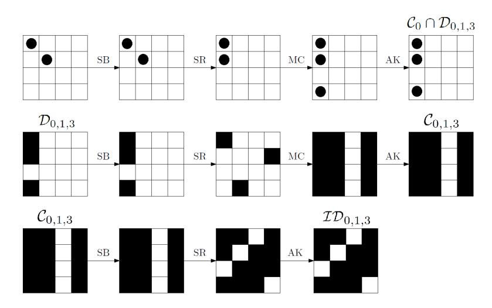

**Figure 9:** 3-rounds Truncated Differential Attack on AES with a single secret S-Box. The choice of the plaintexts (i.e.  $p_{0,0} \oplus p_{1,1} = k_{0,0} \oplus k_{1,1}$ ) guarantees that after one round there are only three bytes with non-zero difference instead of four, that is the plaintexts belong to the same coset of  $\mathcal{C}_0 \cap \mathcal{D}_{0,1,3}$ . White box denotes a byte with a zero-difference, while a black box denotes a byte with non-zero difference.

# <span id="page-26-0"></span>7 Impossible Differential Attack on 5-round of AES with a single Secret S-Box

Using the strategy presented in the previous section, it is possible to set up an impossible differential attack on 5 rounds of AES with a secret S-Box. As before, the goal is to find the secret key without needing to discover any information about the S-Box.

Starting from this attack, we show how to turn it into a secret key distinguisher for AES, and we compare it in details with the distinguisher presented in  $[SLG^+16]$  at CRYPTO 2016. As we have already said, also the key recovery attack can be used as distinguisher. However, we show that in order to distinguish a random permutation from an AES one, it is not necessary to find the entire key.

### <span id="page-26-1"></span>7.1 Key-Recovery Attack using Impossible Differential - General Idea

<span id="page-26-3"></span>For the following, we define the set of plaintexts-ciphertexts  $V_{\delta}$  with  $|V_{\delta}| = 2^8$ :

$$V_{\delta} = \{ (p^{i}, c^{i}) \text{ for } i = 0, ..., 2^{8} - 1 \mid p_{0,0}^{i} \oplus p_{1,1}^{i} = \delta \quad \forall i \text{ and}$$

$$\text{and} \quad p_{k,l}^{i} = p_{k,l}^{j} \quad \forall (k,l) \neq \{ (0,0), (1,1) \} \text{ and } i \neq j \},$$

$$(6)$$

i.e. plaintexts with 14 constants bytes and with the difference on the other two bytes fixed. Consider two different pairs  $(p^1,c^1)$  and  $(p^2,c^2)$  that belong to the same  $V_\delta$ . By Prop. 7, we know that if  $\delta = k_{0,0} \oplus k_{1,1}$ , then  $p^1$  and  $p^2$  belong to the same coset of  $\mathcal{D}_{0,1,3} \cap \mathcal{C}_0 \subseteq \mathcal{D}_{0,1,3}$  after one round (that is,  $R(p^1) \oplus R(p^2) \in \mathcal{D}_{0,1,3} \cap \mathcal{C}_0 \subseteq \mathcal{D}_{0,1,3}$ ) with probability 1. If  $\delta \neq k_{0,0} \oplus k_{1,1}$ , they belong to the same coset of  $\mathcal{C}_0$  after one round with probability 1, and to the same coset of  $\mathcal{D}_{0,1,3} \cap \mathcal{C}_0 \subseteq \mathcal{D}_{0,1,3}$  with probability  $2^{-8}$  (or to the same coset of  $\mathcal{D}_J$  for |J| = 3 after one round with probability  $4 \cdot 2^{-8} = 2^{-6}$ ).

Consider first the case  $\delta = k_{0,0} \oplus k_{1,1}$ . Since  $R(p^1) \oplus R(p^2) \in \mathcal{D}_{0,1,3}$  for each pair of plaintexts  $p^1$  and  $p^2$  in  $V_{\delta}$ , then  $R^{(4)} \circ R(p^1) \oplus R^{(4)} \circ R(p^2) = R^{(5)}(p^1) \oplus R^{(5)}(p^2) \notin \mathcal{M}_J$  for  $|I| + |J| \leq 4$  with probability 1 due to the 4-round impossible differential distinguisher

```
Data: 2^{98.5} collections (2^{90.2} one for each possible value of \delta, or equivalently 2^{82.2}
           different sets V_{\delta} as defined in (6).
  Result: k_{0.0} \oplus k_{1.1}.
  for \Delta from 0 to 2^8 - 1 do
      flaq \leftarrow 0;
      divide the 2^{90.2} ciphertexts in the corresponding 2^{82.2} different sets V_{\delta};
      for each one of the 2^{82.2} different sets V_{\Delta} do
          let (p^i, c^i) for i = 0, ..., 2^8 - 1 the 2^8 (plaintexts, ciphertexts) of a single set V_{\delta};
          re-order this set of elements as described in App. F;
          for i from 0 to 2^8 - 2 do
              if c^i \oplus c^{i+1} \in \mathcal{M}_k for |k| = 1 then
                                                             // e.g. see Algorithm 1
                   flag \leftarrow 1;
                  next collection (i.e. next \delta);
              end
          end
          if flag = 0 then
           | identify \delta as candidates of k_{0,0} \oplus k_{1,1};
      end
  end
  return Candidates of k_{0,0} \oplus k_{1,1}.
Algorithm 4: Attack for 5-round of AES using Impossible Differential - Pseudo Code.
```

of Sect. 4.4. That is, for each  $(p^1, c^1) \neq (p^2, c^2)$

$$Pr(R^{(5)}(p^1) \oplus R^{(5)}(p^2) \in \mathcal{M}_J | (p^1, c^1), (p^2, c^2) \in V_\delta) = 0,$$

The same attack can be use to find the remaining part of the key.

for each J with |J|=1 and where  $\delta:=k_{0,0}\oplus k_{1,1}$  is known. As usual, a similar result holds also in the case in which the final MixColumns operation is omitted (in this case,  $\mathcal{M}_J$  is replaced by  $\mathcal{ID}_J$ ).

Instead, if  $\delta \neq k_{0,0} \oplus k_{1,1}$ , note that it's possible that two elements of  $V_{\delta}$  belong to the same coset of  $\mathcal{M}_J$  for |J|=1 after 5-round. In particular, the probability that two elements p and q in  $V_{\delta}$  belong to the same coset of  $\mathcal{M}_J$  after 5-round for a certain J with |J|=1 is approximately  $^{10} 4 \cdot 2^{-96} = 2^{-94}$ .

The idea is to exploit these different probabilities in order to find the key. In particular, a key candidate  $\delta$  can be declared wrong if there is at least one collision, i.e. two different pairs of texts  $(p^1,c^1)$  and  $(p^2,c^2)$  such that  $p^1\oplus p^2\in V_\delta$  and  $c^1\oplus c^2\in \mathcal{M}_J$  for |J|=1. Thus, in the following we look for the minimum number of texts necessary to have at least one collision for each  $\delta\neq k_{0,0}\oplus k_{1,1}$  with high probability.

Before to proceed, note that a similar impossible differential attack can be set up for 4-round AES with secret S-Box, exploiting the fact that two elements in the same coset of  $\mathcal{D}_J$  can not belong to the same coset of  $\mathcal{C}_I$  after three rounds for  $|I| + |J| \leq 4$ .

#### <span id="page-27-0"></span>7.2 Data Complexity and Computational Cost

The attack is constructed in two steps. First we focus on a single difference among two bytes of the secret key, and then we show how to find the entire key. In this section, we limit to report the results for the data and the computational complexity of the attack,

<span id="page-27-1"></span>The exact probability for a wrong  $\delta \neq k_{0,0} \oplus k_{1,1}$  is given by  $Pr(R^{(5)}(p^1) \oplus R^{(5)}(p^2) \in \mathcal{M}_J \mid p^1 \oplus p^2 \in V_{\delta}) = 2^{-6} \cdot 0 + (1 - 2^{-6}) \cdot 4 \cdot 2^{-96} = 2^{-94} - 2^{-100} \simeq 2^{-94}$ , which is derived considering the two cases  $R(p^1) \oplus R(p^2) \in \mathcal{D}_J$  and  $R(p^1) \oplus R(p^2) \notin \mathcal{D}_J$  for |J| = 3.

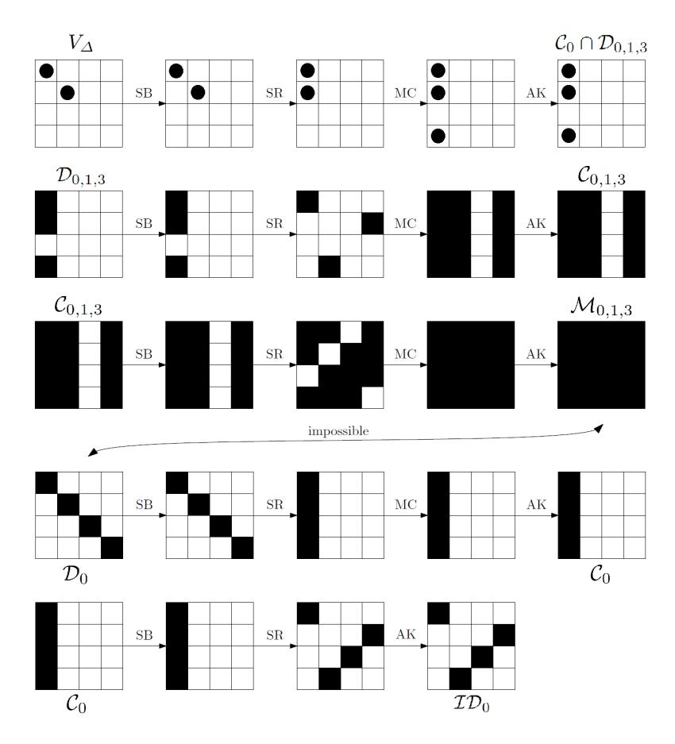

**Figure 10:** *5-Round Secret Key Distinguisher for AES with a single secret S-Box* with data complexity 2 <sup>98</sup>*.*<sup>2</sup> based on the Impossible Subspace Trail on 4-Round (from Sect. [4.4\)](#page-20-0). The choice of the plaintexts (i.e. *p*0*,*<sup>0</sup> ⊕ *p*1*,*<sup>1</sup> = *k*0*,*<sup>0</sup> ⊕ *k*1*,*1) guarantees that after one round there are only three bytes with non-zero difference instead of four, that is the plaintexts belong to the same coset of C<sup>0</sup> ∩ D0*,*1*,*3. The probability the two ciphertexts belong to the same coset of M*<sup>k</sup>* for |*k*| = 1 is zero. White box denotes denotes a byte with a zero-difference, while a black box denotes a byte with non-zero difference.

and we refer to App. [I.1](#page-69-0) for a complete discussion.

**Data Complexity.** First of all, we consider the case in which the goal is to find only *one byte of the secret key* (i.e. the difference of two fixed bytes of the key). As we have seen, given two texts in the same set *V<sup>δ</sup>* defined as in Prop. [6,](#page-26-3) after 5 rounds they can not belong to the same coset of M*<sup>J</sup>* for |*J*| = 1 if *δ* = *k*0*,*<sup>0</sup> ⊕ *k*1*,*1. Instead, if *δ* 6= *k*0*,*<sup>0</sup> ⊕ *k*1*,*<sup>1</sup> then they belong to the same coset of M*<sup>J</sup>* for |*J*| = 1 with probability 2 <sup>−</sup><sup>94</sup>. Thus, in order to find the difference of these two bytes of the key, one needs at least one collision in the same coset of M*<sup>J</sup>* for |*J*| = 1 *for each* one of the 2 <sup>8</sup> − 1 ' 2 8 *δ* =6 *k*0*,*<sup>0</sup> ⊕ *k*1*,*1. As shown in details in App. [I.1,](#page-69-0) to find this byte with probability higher than 95%, for each possible *δ* one needs approximately 2 <sup>82</sup>*.*<sup>2</sup> different sets *Vδ*, for a total cost of 2 98*.*2 plaintextexts/ciphertexts.

In order to find *the entire key* (up to 2 <sup>32</sup> variants), the idea is simply to repeat the previous attack 12 times (i.e. three times for each possible diagonal). As shown in details in App. [I.1,](#page-69-0) to find this byte with probability higher than 95%, for each possible *δ* one needs approximately  $2^{82.4}$  different sets  $V_{\delta}$  (not  $2^{82.2}$  as before - see App. I.1 for details), for a total cost of approximately,  $2^{102}$  plaintextexts/ciphertexts, which is lower than the entire input-output space.

Computational Complexity. Using a re-ordering algorithm, the computational cost of the attack to find one byte of the key is well approximated by  $2^{103.2}$  table-look ups, or  $2^{96.56}$  five rounds AES encryption, while the cost to find the entire key is approximately  $2^{107}$  table-look ups, or  $2^{100.35}$  five rounds AES encryption.

## <span id="page-29-0"></span>8 The 5-Round Secret Key Distinguisher for AES

Next we show how to turn the previous key recovery attack into a distinguisher for AES, in the same setting of the distinguisher presented in [SLG<sup>+</sup>16]. The idea is simply to consider only the first part of the attack, i.e. it is sufficient to recover one byte of the key as  $k_{0,0} \oplus k_{1,1}$ .

Consider the previous key recovery attack, and let the set  $V_{\delta}$  defined as before. For each one of the  $2^8$  possible values of  $\delta$ , the idea is to consider  $2^{82.2}$  different sets  $V_{\delta}$ , for a total of  $2^{98.2}$  chosen plaintexts. As we have just seen, for the AES permutation, there exists one  $\delta$  (which is equal to  $k_{0,0} \oplus k_{1,1}$ ) for which there are no collisions. That is, for the AES permutation and for  $\delta = k_{0,0} \oplus k_{1,1}$ , no pairs  $(p^1, c^1)$  and  $(p^2, c^2)$  can satisfy  $p^1, p^2 \in V_{\delta}$  and  $c^1 \oplus c^2 \in \mathcal{M}_J$  for |J| = 1. Instead, for the random permutation and with probability 95%, for each  $\delta$  there is at least one pair with the previous property. Thus, it is possible to distinguish the random permutation from an AES one.

To summarize, suppose to have  $2^8$  collections (one for each  $\delta$ ), each one with  $2^{82.2}$  different sets  $V_{\delta}$ , where each of this set contains  $2^8$  texts, for a total of  $2^{98.2}$  texts. In the random case and with probability 95%, we expect that in each one of these  $2^8$  collections there is at least one collision. Note that the average number of collisions for each collection (i.e. for each  $\delta$ ) is about  $2^{-94} \cdot 2^{97.2} = 2^{3.2} \simeq 9$ . For the AES permutation, we expect that there exists one  $\delta$  for which there is no collision with probability 1 in the corresponding collection of sets. For all the other collections, we expect to have at least one collision with probability 95%. We highlight that given the  $2^{98.2}$  texts defined as before, it is always possible to divide them in  $2^8$  collections (one for each  $\delta$ ), and that each collection can be divided in a very simple way in  $2^{82.2}$  different sets  $V_{\delta}$  (simply using the definition of  $V_{\delta}$ ). Finally, using the argument of our impossible differential key recovery attack, the computational cost of this distinguisher (i.e. the cost to check if there exists at least one pair of ciphertexts that belong to the same coset of  $\mathcal{M}_J$  for a certain J with |J| = 1 for all possible values of  $\delta$ ) is  $2^{103.2}$  table look-ups, using the ordering algorithm.

## <span id="page-29-1"></span>8.1 Comparison with 5-Round Distinguisher proposed by Sun, Liu, Guo, Qu and Rijmen, and Possible Generalizations

In [SLG<sup>+</sup>16], authors presented a similar secret key distinguisher to the one just presented, using the balance property instead of our impossible differential trail.

In order to construct the secret key distinguisher presented in [SLG<sup>+</sup>16], authors simply consider all the input-output space, and divide it in the  $2^8$  subsets  $\tilde{V}_{\Delta}$  defined as  $\tilde{V}_{\Delta} = \{(p,c) \mid c_{0,0} \oplus c_{1,3} = \Delta\}$  for each possible  $\Delta \in \mathbb{F}_{2^8}$ , and without any other assumptions on the other bytes. Note that  $|\tilde{V}_{\Delta}| = 2^{120}$ . Then, using the link between zero-correlation linear hulls and the integral/balance property, they are able to prove that for an AES permutation and for  $\Delta = k_{0,0} \oplus k_{1,3}$  the sum of the plaintexts of the corresponding set  $\tilde{V}_{\Delta}$  is equal to zero, that is the balance property holds<sup>11</sup>. Instead, for a random permutation,

<span id="page-29-2"></span> $<sup>\</sup>overline{\ }^{11}$ In [SLG<sup>+</sup>16], authors presented also a similar distinguisher always based on balance property. In this case, the idea is to divide the entire input-output space in  $2^{32}$  subsets  $\tilde{W}_{\Delta}$  defined as  $\tilde{W}_{\Delta}$  =

the probability that there exists one  $\Delta$  with the previous property is only  $2^{-120}$ . This distinguisher works only in the decryption direction (i.e. using chosen ciphertexts) and only if the final MixColumns operation is not omitted. Moreover, there is no evidence that this distinguisher can work with less than the entire input-output space<sup>12</sup>. We refer to [SLG<sup>+</sup>16] for more details. To summarize, this distinguisher requires the full codebook (i.e.  $2^{128}$  texts), and the verification cost is well approximated by  $2^{128}$  XOR operations.

For comparison, our distinguisher requires only 2<sup>98.2</sup> different (plaintexts, ciphertexts), works in the encryption direction (i.e. using chosen plaintexts) independently by the presence of the final MixColumns operation. Thus, as we said in the introduction, this provides a counter-example to the claims made in [SLG<sup>+</sup>16]. That is, as we have already discussed in details in the introduction, this distinguisher provides a counter-example to the conjecture made by these authors that the security margin for round-reduced AES under the chosen plaintext attack is different from that under the chosen-ciphertexts attack.

Only for completeness, we prove that if our distinguisher uses all the input-output space, the probability of success is  $1-2^{-2^{25.5}}$ . If all the texts are used, then for each  $\delta$  there are  $2^{112}$  different sets  $V_{\delta}$ . Thus, it is possible to construct approximately  $2^{15} \cdot 2^{112} = 2^{127}$  different pairs. The probability that for a (wrong)  $\delta$  no one of these pairs satisfy the required property is approximately  $1-(1-2^{-94})^{2^{127}} \simeq 1-e^{-2^{33}} \simeq 1-2^{-2^{33.5}}$ . Thus, the probability of success is approximately  $(1-2^{-2^{33.5}})^{2^8} \simeq 1-2^{-2^{25.5}}$  if all the input-output space is used, which is much higher than for the integral distinguisher (which is approximately  $1-2^{-120}$ ). We stress that our distinguisher works even using a less data complexity that the entire input-output space, and that  $2^{110.5}$  different (plaintexts, ciphertexts) (or equivalently  $2^{94.5}$  different sets  $V_{\delta}$  for each  $\delta$ ) are sufficient to have approximately the same probability of success of [SLG<sup>+</sup>16].

Finally, in [SLG<sup>+</sup>16] authors exploit the link between zero-correlation linear hulls and the integral property to set up our distinguisher, while our distinguisher presented in this paper exploits the impossible differential trails. For completeness, we recall that Impossible Differential, Integral and Zero-Linear Correlation are not independent, as shown in details in [SLR<sup>+</sup>15]. In particular, the presence of a zero correlation linear hull distinguisher (very likely) implies the existence of an Impossible Differential distinguisher and of an Integral one.

Turn the CRYPTO Distinguisher into a Key-Recovery Attack. As we have turned our key recovery attack into a distinguisher, it is also possible to turn the distinguisher of [SLG<sup>+</sup>16] into an attack, as also the authors observed in their paper. The idea is to repeat the distinguisher three times (using the version presented in Corollary 5 of [SLG<sup>+</sup>16] and reported in the footnote, it is possible to recover four bytes of the key), in order to recover the secret key up to  $2^{32}$  variants. Note that also in this case as for our attacks, it is not possible to eliminate more variants of the key without using any information about the secret S-Box. This attack requires the entire input-output space, and it has a cost of  $3 \cdot 2^{128} = 2^{129.6}$  XOR operations.

Final Observations. Finally, it is very easy to generalize our distinguisher and the one proposed in [SLG<sup>+</sup>16] to any AES-like block cipher with the following properties: (1) the encryption scheme adopts identical S-Boxes and (2) at least one row of the MixColumns matrix  $M_{MC}$  (or its inverse) contains (at least) two identical elements. If one of these two assumptions is missing, the above distinguishers don't work. As a consequence, note that

 $<sup>\{(</sup>p,c)\,|\,c_{0,0}\oplus c_{1,3}=\delta_0,c_{0,1}\oplus c_{3,2}=\delta_1,c_{1,2}\oplus c_{2,1}=\delta_2,c_{2,0}\oplus c_{3,3}=\delta_3\}$ , where  $\Delta=(\delta_0,\ldots,\delta_3)$ . Also in this case, for an AES permutation there exists one  $\Delta$  for which the balance property holds among the plaintexts, while for a random permutation this happens only with probability  $2^{-96}$

<span id="page-30-0"></span> $<sup>^{12}</sup>$ It may be possibile to use the recently proposed statistical integral distinguisher [WCC<sup>+</sup>16] to modify the distinguisher presented in [SLG<sup>+</sup>16] into a statistical integral one, with the goal to reduce the data complexity at the cost of success probability.

the distinguisher described in this section can not work in the decryption mode (that is, with chosen ciphertexts instead of chosen plaintexts), since no one of the columns of the inverse MixColumns  $M_{MC}^{-1}$  has two equal elements. Actually, the first requirement can be relaxed. Indeed, it is sufficient that only the two S-Boxes that are in the positions in which the MixColumns matrix has identical elements are equal.

Note that these assumptions are similar but not equal to the ones required for a key recovery attacks. Indeed, for our key recovery attacks on an AES-like block cipher with secret S-Box, all the S-Boxes must be identical and each row of the MixColumns matrix  $M_{MC}$  must contain (at least) two identical elements in different positions.

We emphasize that these assumptions are quite common for the construction of AES-like ciphers (or more in general, for SPNs ciphers). Indeed, symmetric encryption schemes are usually a trade-off between the security and computational efficiency. Thus, to enhance the performance of an encryption scheme (especially for lightweight cryptography), designers usually use identical S-Box and a diffusion layer which maximize the number of 1's (or elements with relatively low hamming weights).

## <span id="page-31-0"></span>8.2 Critical Discussion of the Distinguisher Model and Open Problems

In this section, we have shown how to interpret the 5-round secret S-Box attack from the section before as a distinguisher for 5-round AES which corresponds to the model used in [SLG<sup>+</sup>16], with our main point being to give a counter-example to the conjecture motivated by the results therein. By doing that we also significantly improved the complexity of such a distinguisher.

Since any key recovery attack can be used as a distinguisher, the natural question that arises is if such a distinguisher is actually meaningful. Both ours and the distinguisher from  $[SLG^{+}16]$  have two properties that set them apart from "any" key recovery-attack:

- 1. for both distinguishers it is sufficient to find *only part of the key* (e.g. one byte) to distinguish an AES permutation with a secret S-Box from a random one. In other words, it is not necessary finding the entire secret key but only part of it;
- 2. both distinguishers don't need any information/details about the S-Box (i.e. they don't find or/and exploit any information/details of the secret S-Box) in order to find part of the key.

In order to better highlight this sub-class of attacks/distinguishers, we denote them by "weak" secret-key distinguishers. In contrast, we refer to (pure) secret-key distinguisher when a property which is independently of the secret key is exploited, and to key-recovery attack when (at least) one of the two previous properties is not satisfied.

We emphasize that all the secret-key distinguishers currently present in literature - and presented in this paper in Sect. 4 - exploit a property which is independent of the key and of the details of the S-Box. In particular, it is not necessary to know the details of the S-Box to check the integral property or verify is two texts belong or not to the same coset of a mixed space  $\mathcal{M}_I$  (that is, the property exploited by the truncated and the impossible differential distinguishers). This second property is in common with the "weak" secret-key distinguishers just defined. On the opposite, a key-recovery attack (e.g. an integral attack, a truncated differential one, ...) usually exploits such details to find the key. As an example, we highlight that also the attacks presented in [TKKL15] on AES with a single secret S-Box don't satisfy the second requirement (i.e. it exploits the details of the S-Box to find the secret key). Indeed, even if the S-Box is secret, such attacks necessarily need to find/know the details of the S-Box (up to an equivalent class) before to discover the secret key, or in other words they can not discover the secret key without exploiting the details of the secret S-Box. Thus, such attacks can not be considered as

"weak" secret-key distinguishers with respect to categorization just defined, but falls in the generic category of the key-recovery attacks.

Even if there are key-recovery attacks on up to 7 rounds for AES-128 [\[MDRM10\]](#page-35-9) with known S-Box, and up to 6 rounds for AES-128 with a secret S-Box [\[TKKL15\]](#page-36-2), it seems for example not possible to find a distinguisher with properties (1) and (2) for even 6 rounds. We leave this as an open problem for future investigation.

## <span id="page-32-0"></span>**9 Conclusion**

We have generalized invariant subspace cryptanalysis to subspace trails and have seen that it includes truncated differential-, impossible differential- and integral attacks. For concrete applications we focused on AES-128, and this led to a method that can use *all* the aforementioned techniques to recovery the secret key for up to 5 rounds without needing to know the S-Box apart from assuming it being a permutation. When the S-Box is known we described new truncated-differential attacks with very low data complexity that are competitive with the best known attacks. It is conceivable that such attacks are also found without the subspace trail approach (truncated differential + ad-hoc optimizations of the key-recovery method that go beyond looking at the differences only), but the combination of properties of individual texts and sums of text follows more naturally from the subspace trail approach.

As one of the major results, we have proposed a new strategy to attack SPNs cipher with a single secret S-Box, if some very generic assumptions on the MixColumns matrix are satisfied. In particular, we showed how several techniques like truncated differential, impossible differential and integral attack can exploit it to recover directly (i.e. without discovering anything of the secret S-Box) the secret key for 1- up to 5- rounds of AES

We also used this approach to give a counter-example to the conjecture of Sun et al. [\[SLG](#page-35-2)<sup>+</sup>16] related to 5-round distiguishers. By doing that we also significantly improved the complexity of a distinguisher in their model, arguing however that the quest for a real 5-round distinguisher (that is, a 5-round secret key distinguisher for an AES permutation which is not derived from a key recovery attack but exploits a property which is independent of the secret key) is still open. Future work includes trying to exploit the subspace properties in other ways to get more efficient or longer distinguishers, perhaps by considering also S-Box properties, to use this approach to devise more key-recovery attacks and to apply the approach to other schemes.

**Acknowledgments.** The work in this paper has been partially supported by the Austrian Science Fund (project P26494-N15). We thank Bing Sun for helpful discussions on [\[SLG](#page-35-2)<sup>+</sup>16]. We thank Charles Bouillaguet for helping us with the tool described in [\[BDF11\]](#page-33-7) to find attacks that better match the settings we consider. We also thank Friedrich Wiemer who contributed to improve and correct the implementations of the distinguishers proposed in this paper. We finally thank anonymous reviewers for their comments.

## **References**

- <span id="page-32-2"></span>[BA08] Behnam Bahrak and Mohammad Reza Aref. Impossible differential attack on seven-round AES-128. *IET Information Security*, 2(2):28–32, 2008.
- <span id="page-32-1"></span>[BBK14] Alex Biryukov, Charles Bouillaguet, and Dmitry Khovratovich. *Cryptographic Schemes Based on the ASASA Structure: Black-Box, White-Box, and Public-Key*, pages 63–84. Springer Berlin Heidelberg, 2014.

- <span id="page-33-3"></span>[BBS99] Eli Biham, Alex Biryukov, and Adi Shamir. Cryptanalysis of Skipjack Reduced to 31 Rounds Using Impossible Differentials. In Jacques Stern, editor, *Advances in Cryptology — EUROCRYPT 1999: International Conference on the Theory and Application of Cryptographic Techniques, Czech Republic. Proceedings*, pages 12–23, 1999.
- <span id="page-33-6"></span>[BDD<sup>+</sup>12] Charles Bouillaguet, Patrick Derbez, Orr Dunkelman, Pierre-Alain Fouque, Nathan Keller, and Vincent Rijmen. Low-Data Complexity Attacks on AES. *IEEE Trans. Information Theory*, 58(11):7002–7017, 2012.
- <span id="page-33-7"></span>[BDF11] Charles Bouillaguet, Patrick Derbez, and Pierre-Alain Fouque. Automatic search of attacks on round-reduced AES and applications. In *Advances in Cryptology - CRYPTO 2011 - 31st Annual Cryptology Conference, Santa Barbara, CA, USA. Proceedings*, pages 169–187, 2011.
- <span id="page-33-2"></span>[BK01] Eli Biham and Nathan Keller. Cryptanalysis of Reduced Variants of Rijndael. unpublished, 2001. [http://csrc.nist.gov/archive/aes/round2/conf3/](http://csrc.nist.gov/archive/aes/round2/conf3/papers/35-ebiham.pdf) [papers/35-ebiham.pdf](http://csrc.nist.gov/archive/aes/round2/conf3/papers/35-ebiham.pdf).
- <span id="page-33-1"></span>[BK07] Alex Biryukov and Dmitry Khovratovich. Two New Techniques of Side-Channel Cryptanalysis. In *Cryptographic Hardware and Embedded Systems - CHES 2007: 9th International Workshop, Austria. Proceedings*, pages 195–208, 2007.
- <span id="page-33-8"></span>[BKLT11] Julia Borghoff, Lars R. Knudsen, Gregor Leander, and Søren S. Thomsen. Cryptanalysis of PRESENT-Like Ciphers with Secret S-Boxes. In *Fast Software Encryption - FSE 2011: 18th International Workshop, Denmark. Revised Selected Papers*, pages 270–289, 2011.
- <span id="page-33-5"></span>[BKR11] Andrey Bogdanov, Dmitry Khovratovich, and Christian Rechberger. Biclique cryptanalysis of the full AES. In *Advances in Cryptology – ASIACRYPT 2011: 17th International Conference on the Theory and Application of Cryptology and Information Security, South Korea. Proceedings*, pages 344–371, 2011.
- <span id="page-33-11"></span>[BS91] Eli Biham and Adi Shamir. Differential cryptanalysis of DES-like cryptosystems. *Journal of Cryptology*, 4(1):3–72, 1991.
- <span id="page-33-9"></span>[BS01] Alex Biryukov and Adi Shamir. Structural Cryptanalysis of SASAS. In *Advances in Cryptology - EUROCRYPT 2001: International Conference on the Theory and Application of Cryptographic Techniques, Austria. Proceeding*, pages 394–405, 2001.
- <span id="page-33-0"></span>[BS10] Alex Biryukov and Adi Shamir. Structural Cryptanalysis of SASAS. *Journal of Cryptology*, 23(4):505–518, 2010.
- <span id="page-33-12"></span>[CLRS09] Thomas H. Cormen, Charles E. Leiserson, Ronald L. Rivest, and Clifford Stein. *Introduction to Algorithms, Third Edition*. The MIT Press, 3rd edition, 2009.
- <span id="page-33-10"></span>[CMR05] Carlos Cid, Sean Murphy, and Matthew J. B. Robshaw. Small Scale Variants of the AES. In *Fast Software Encryption - FSE 2005: 12th International Workshop, France: Revised Selected Papers*, volume 3557, pages 145–162, 2005.
- <span id="page-33-4"></span>[DF13] Patrick Derbez and Pierre-Alain Fouque. Exhausting Demirci-Selçuk Meet-inthe-Middle Attacks Against Reduced-Round AES. In *Fast Software Encryption - FSE 2013: 20th International Workshop, Singapore. Revised Selected Papers*, pages 541–560, 2013.

- <span id="page-34-9"></span>[DFJ13] Patrick Derbez, Pierre-Alain Fouque, and Jérémy Jean. Improved key recovery attacks on reduced-round AES in the single-key setting. In *Advances in Cryptology - EUROCRYPT 2013: 32nd Annual International Conference on the Theory and Applications of Cryptographic Techniques, Greece. Proceedings*, pages 371–387. 2013.
- <span id="page-34-10"></span>[DK10] Orr Dunkelman and Nathan Keller. The Effects of the Omission of Last Round's MixColumns on AES. *Inf. Process. Lett.*, 110(8-9):304–308, 2010.
- <span id="page-34-4"></span>[DKR97] Joan Daemen, Lars R. Knudsen, and Vincent Rijmen. The block cipher square. In *Fast Software Encryption, 4th International Workshop, FSE '97, Haifa, Israel, January 20-22, 1997, Proceedings*, pages 149–165, 1997.
- <span id="page-34-8"></span>[DKS10] Orr Dunkelman, Nathan Keller, and Adi Shamir. Improved single-key attacks on 8-round AES-192 and AES-256. In *Advances in Cryptology - ASIACRYPT 2010: 16th International Conference on the Theory and Application of Cryptology and Information Security, Singapore. Proceedings*, pages 158–176, 2010.
- <span id="page-34-2"></span>[DR02] Joan Daemen and Vincent Rijmen. *The Design of Rijndael: AES - The Advanced Encryption Standard*. Information Security and Cryptography. Springer, 2002.
- <span id="page-34-3"></span>[DR06a] Joan Daemen and Vincent Rijmen. Two-Round AES Differentials. Cryptology ePrint Archive, Report 2006/039, 2006. <http://eprint.iacr.org/2006/039>.
- <span id="page-34-5"></span>[DR06b] Joan Daemen and Vincent Rijmen. Understanding Two-Round Differentials in AES. In *Security and Cryptography for Networks 2006*, volume 4116, pages 78 – 94, 2006.
- <span id="page-34-6"></span>[DS08a] Hüseyin Demirci and Ali Aydın Selçuk. *A Meet-in-the-Middle Attack on 8-Round AES*, pages 116–126. 2008.
- <span id="page-34-7"></span>[DS08b] Hüseyin Demirci and Ali Aydin Selçuk. A meet-in-the-middle attack on 8 round AES. In *Fast Software Encryption - FSE 2008: 15th International Workshop, Switzerland. Revised Selected Papers*, pages 116–126. 2008.
- <span id="page-34-1"></span>[Eve87] Jan-Hendrik Evertse. Linear Structures in Blockciphers. In *Advances in Cryptology - EUROCRYPT 1987: Workshop on the Theory and Application of of Cryptographic Techniques, Netherlands. Proceedings*, pages 249–266, 1987.
- <span id="page-34-13"></span>[git16a] Key-recovery attacks on up to 4-round AES with a single secret S-Box, 2016. [https://github.com/Krypto-iaik/AttacksAESSecretSBox](https://github.com/Krypto-iaik/Attacks AES SecretSBox).
- <span id="page-34-12"></span>[git16b] Low data-complexity attacks on up to 4-round AES, 2016. [https://github.](https://github.com/Krypto-iaik/LowDataAttacks_AES) [com/Krypto-iaik/LowDataAttacks\\_AES](https://github.com/Krypto-iaik/LowDataAttacks_AES).
- <span id="page-34-11"></span>[git16c] Verification of all distinguishers up to 4-rounds AES, 2016. [https://github.](https://github.com/Krypto-iaik/Distinguishers_AES) [com/Krypto-iaik/Distinguishers\\_AES](https://github.com/Krypto-iaik/Distinguishers_AES).
- <span id="page-34-0"></span>[GJN<sup>+</sup>15] Jian Guo, Jérémy Jean, Ivica Nikolic, Kexin Qiao, Yu Sasaki, and Siang Meng Sim. Invariant Subspace Attack Against Full Midori64. Cryptology ePrint Archive, Report 2015/1189, 2015.
- <span id="page-34-14"></span>[Knu95] Lars R. Knudsen. Truncated and higher order differentials. In *Fast Software Encryption - FSE 1994: Second International Workshop Leuven, Belgium. Proceedings*, pages 196–211, 1995.

- <span id="page-35-4"></span>[Knu98] Lars Ramkilde Knudsen. DEAL - a 128-bit block cipher. Technical Report 151, Department of Informatics, University of Bergen, Norway, Feb. 1998.
- <span id="page-35-10"></span>[KR07] Lars R. Knudsen and Vincent Rijmen. Known-Key Distinguishers for Some Block Ciphers. In *Advances in Cryptology – ASIACRYPT 2007: 13th International Conference on the Theory and Application of Cryptology and Information Security, Malaysia, 2007. Proceedings*, pages 315–324, 2007.
- <span id="page-35-3"></span>[KW02] Lars R. Knudsen and David Wagner. Integral Cryptanalysis. In *Fast Software Encryption - FSE 2002: 9th International Workshop, Belgium. Revised Papers*, pages 112–127, 2002.
- <span id="page-35-0"></span>[LAAZ11] Gregor Leander, Mohamed Ahmed Abdelraheem, Hoda AlKhzaimi, and Erik Zenner. A Cryptanalysis of PRINTcipher: The Invariant Subspace Attack. In *Advances in Cryptology – CRYPTO 2011: 31st Annual Cryptology Conference, Santa Barbara, CA, USA, 2011. Proceedings*, pages 206–221, 2011.
- <span id="page-35-11"></span>[LDKK08] Jiqiang Lu, Orr Dunkelman, Nathan Keller, and Jongsung Kim. *Progress in Cryptology - INDOCRYPT 2008: 9th International Conference on Cryptology in India, India. Proceedings*, chapter New Impossible Differential Attacks on AES, pages 279–293. 2008.
- <span id="page-35-7"></span>[LJQ14] Guo-qiang Liu, Chen-Hui Jin, and Chuan-Da Qi. Improved Slender-Set Linear Cryptanalysis. In *Fast Software Encryption - FSE 2014: 21st International Workshop, UK. Revised Selected Papers*, pages 431–450, 2014.
- <span id="page-35-1"></span>[LMR15] Gregor Leander, Brice Minaud, and Sondre Rønjom. A Generic Approach to Invariant Subspace Attacks: Cryptanalysis of Robin, iSCREAM and Zorro. In *Advances in Cryptology - EUROCRYPT 2015: 34th Annual International Conference on the Theory and Applications of Cryptographic Techniques, Bulgaria. Proceedings, Part I*, pages 254–283, 2015.
- <span id="page-35-9"></span>[MDRM10] Hamid Mala, Mohammad Dakhilalian, Vincent Rijmen, and Mahmoud Modarres-Hashemi. Improved impossible differential cryptanalysis of 7-round AES-128. In *Progress in Cryptology - INDOCRYPT 2010: 11th International Conference on Cryptology in India, India. Proceedings*, pages 282–291. 2010.
- <span id="page-35-6"></span>[PSC<sup>+</sup>02] Sangwoo Park, Soo Hak Sung, Seongtaek Chee, E-Joong Yoon, and Jongin Lim. On the Security of Rijndael-Like Structures against Differential and Linear Cryptanalysis. In *Advances in Cryptology - ASIACRYPT 2002: 8th International Conference on the Theory and Application of Cryptology and Information Security, New Zealand. Proceedings*, pages 176–191. 2002.
- <span id="page-35-2"></span>[SLG<sup>+</sup>16] Bing Sun, Meicheng Liu, Jian Guo, Longjiang Qu, and Vincent Rijmen. New Insights on AES-Like SPN Ciphers. In *Advances in Cryptology – CRYPTO 2016: 36th Annual International Cryptology Conference, Santa Barbara, CA, USA. Proceedings, Part I*, pages 605–624, 2016.
- <span id="page-35-8"></span>[SLR<sup>+</sup>15] Bing Sun, Zhiqiang Liu, Vincent Rijmen, Ruilin Li, Lei Cheng, Qingju Wang, Hoda Alkhzaimi, and Chao Li. Links Among Impossible Differential, Integral and Zero Correlation Linear Cryptanalysis. In *Advances in Cryptology – CRYPTO 2015: 35th Annual Cryptology Conference, Santa Barbara, CA, USA. Proceedings, Part I*, pages 95–115, 2015.
- <span id="page-35-5"></span>[Tie16] Tyge Tiessen. Polytopic Cryptanalysis. In *Advances in Cryptology - EU-ROCRYPT 2016 - 35th Annual International Conference on the Theory and Applications of Cryptographic Techniques, Austria. Proceedings, Part I*, pages 214–239, 2016.

- <span id="page-36-2"></span>[TKKL15] Tyge Tiessen, Lars R. Knudsen, Stefan Kölbl, and Martin M. Lauridsen. Security of the AES with a Secret S-Box. In *Fast Software Encryption - FSE 2015: 22nd International Workshop, Turkey. Revised Selected Papers*, pages 175–189, 2015.
- <span id="page-36-1"></span>[TLS16] Yosuke Todo, Gregor Leander, and Yu Sasaki. Nonlinear Invariant Attack - Practical Attack on Full SCREAM, iSCREAM, and Midori64. In *Advances in Cryptology - ASIACRYPT 2016 - 22nd International Conference on the Theory and Application of Cryptology and Information Security, Hanoi, Vietnam, December 4-8, 2016, Proceedings, Part II*, pages 3–33, 2016.
- <span id="page-36-4"></span>[Tod15a] Yosuke Todo. Integral cryptanalysis on full MISTY1. In *Advances in Cryptology - CRYPTO 2015: 35th Annual Cryptology Conference, Santa Barbara, CA, USA. Proceedings, Part I*, pages 413–432, 2015.
- <span id="page-36-3"></span>[Tod15b] Yosuke Todo. Structural evaluation by generalized integral property. In *Advances in Cryptology - EUROCRYPT 2015: 34th Annual International Conference on the Theory and Applications of Cryptographic Techniques, Bulgaria. Proceedings, Part I*, pages 287–314, 2015.
- <span id="page-36-6"></span>[WCC<sup>+</sup>16] Meiqin Wang, Tingting Cui, Huaifeng Chen, Ling Sun, Long Wen, and Andrey Bogdanov. Integrals Go Statistical: Cryptanalysis of Full Skipjack Variants. In *Fast Software Encryption - FSE 2016: 23rd International Conference, Germany. Revised Selected Papers*, pages 399–415, 2016.
- <span id="page-36-5"></span>[ZWF07] Wentao Zhang, Wenling Wu, and Dengguo Feng. New Results on Impossible Differential Cryptanalysis of Reduced AES. In Kil-Hyun Nam and Gwangsoo Rhee, editors, *Information Security and Cryptology - ICISC 2007: 10th International Conference, Korea. Proceedings*, pages 239–250, 2007.

## <span id="page-36-0"></span>**A Subspace Definition**

Let (*K,* +*,* ·) be a *field* and (*V,* +) be a *linear (vector) space*[13](#page-36-7) over *K*. Let *W* be a subset of *V* , i.e. *W* ⊆ *V* . *W* is a subspace if:

- the operation + is "well" defined in *W*, i.e. ∀*x, y* ∈ *W* and ∀*α, β* ∈ *K* then *α* × *x* + *β* × *y* ∈ *W*;
- *W* is a linear space.

#### **Subspaces of AES over** *GF***(2<sup>8</sup> ).**

For the case of AES, we consider the field *K* ≡ F(2<sup>8</sup> ) defined as

$$\mathbb{F}(2^8) = GF(2^8)[X]/(X^8 + X^4 + X^3 + X + 1)$$

- the operation + is "well" defined in *V* , i.e. ∀*x, y* ∈ *V* then *x* + *y* ∈ *V* ;
- the operation + is associative;
- ∃0 ∈ *V* such that ∀*x* ∈ *V* : *x* + 0 = 0 + *x* = *x*;
- ∀*x* ∈ *V* exists an inverse *y* ∈ *V* such that *x* + *y* = *y* + *x* = 0;
- *V* is linear over *K*, i.e. ∀*α* ∈ *K* and ∀*x, y* ∈ *V* then *α* × *x* ∈ *V* and *α* × (*x* + *y*) = *α* × *x* + *α* × *y*.

We emphasize that it is not required that the operation + is commutative.

<span id="page-36-7"></span><sup>13</sup>Given × : *K* × *V* → *V* , (*V,* +) is a linear space over (*K,* +*,* ·) if:

where the choice of the irreducible polynomial  $X^8 + X^4 + X^3 + X + 1$  is given by the definition of the MixColumns matrix. It is simple to prove that the operations + and  $\cdot$  are well defined in K, and that  $(K, +, \cdot)$  is a field (in particular, a Galois Field).

The space (V, +) corresponds  $V \equiv \mathbb{F}(2^8)^{4 \times 4}$ . For each  $x^1, x^2 \in \mathbb{F}(2^8)^{4 \times 4}$

$$x^i \equiv \begin{bmatrix} x^i_{00} & x^i_{01} & x^i_{02} & x^i_{03} \\ x^i_{10} & x^i_{11} & x^i_{12} & x^i_{13} \\ x^i_{20} & x^i_{21} & x^i_{22} & x^i_{23} \\ x^i_{30} & x^i_{31} & x^i_{32} & x^i_{33} \end{bmatrix}$$

for i = 1, 2, where  $x_{jk}^i \in \mathbb{F}(2^8)$  for each  $j, k \in \{0, 1, 2, 3\}$ , the operation + is defined as

$$x^{1} + x^{2} := \begin{bmatrix} y_{00} & y_{01} & y_{02} & y_{03} \\ y_{10} & y_{11} & y_{12} & y_{13} \\ y_{20} & y_{21} & y_{22} & y_{23} \\ y_{30} & y_{31} & y_{32} & y_{33} \end{bmatrix}, \qquad y_{jk} = x_{jk}^{1} + x_{jk}^{2} \quad \forall j, k \in \{0, 1, 2, 3\}$$

where  $x_{ik}^1 + x_{ik}^2$  is defined in  $\mathbb{F}_{2^8}$ , and  $\forall \alpha \in \mathbb{F}_{2^8}$  the scalar product  $\times$  is defined as

$$\alpha \times x^{1} := \begin{bmatrix} y_{00} & y_{01} & y_{02} & y_{03} \\ y_{10} & y_{11} & y_{12} & y_{13} \\ y_{20} & y_{21} & y_{22} & y_{23} \\ y_{30} & y_{31} & y_{32} & y_{33} \end{bmatrix}, \qquad y_{jk} = \alpha * x_{jk}^{1} \quad \forall j, k \in \{0, 1, 2, 3\}$$

where  $\alpha * x_{jk}^1 := \alpha \cdot x_{jk}^1$  is defined as in  $\mathbb{F}_{2^8}$ . With these definitions, it is simple to prove that (V, +) is a linear space over  $(K, +, \cdot)$ . Moreover, it is simple to prove that each subspace defined in the paper satisfies all the required property.

Using these definitions, it follows that the dimension of  $\mathbb{F}_{2^8}^{4\times 4}$  is 16, i.e.  $\dim(\mathbb{F}_{2^8}^{4\times 4}) = 16$ . To show this fact, it is sufficient to prove that the set of (unit) vectors  $\{e^{i,j}\}_{i,j=0,1,2,3}$ (where  $e^{i,j} \in \mathbb{F}_{2^8}^{4 \times 4}$  for each i,j) defined as

$$e^{i,j} \equiv \begin{bmatrix} \delta_{0i} \cdot \delta_{0j} & \delta_{0i} \cdot \delta_{1j} & \delta_{0i} \cdot \delta_{2j} & \delta_{0i} \cdot \delta_{3j} \\ \delta_{1i} \cdot \delta_{0j} & \delta_{1i} \cdot \delta_{1j} & \delta_{1i} \cdot \delta_{2j} & \delta_{1i} \cdot \delta_{3j} \\ \delta_{2i} \cdot \delta_{0j} & \delta_{2i} \cdot \delta_{1j} & \delta_{2i} \cdot \delta_{2j} & \delta_{2i} \cdot \delta_{3j} \\ \delta_{3i} \cdot \delta_{0j} & \delta_{3i} \cdot \delta_{1j} & \delta_{3i} \cdot \delta_{2j} & \delta_{3i} \cdot \delta_{3j} \end{bmatrix}, \qquad \delta_{xy} = \begin{cases} 1 \text{ if } x = y \\ 0 \text{ if } x \neq y \end{cases}$$

are a basis<sup>14</sup> for  $\mathbb{F}_{28}^{4\times4}$ .

#### Subspaces of AES over GF(2).

Another possibility is to consider the field  $K = (GF(2), +, \cdot)$ , i.e. the field of two elements  $\{0,1\}$  where

$$0+0=1+1=0$$
,  $0+1=1+0=1$ ,  $0\cdot 0=0\cdot 1=1\cdot 0=0$ ,  $1\cdot 1=1$ .

•  $\{b_i\}$  are linear independent, i.e.  $\forall \alpha_i \in K$  for i = 0, ..., n

$$\alpha_0 \times b_0 + \alpha_1 \times b_1 + \dots + \alpha_n \times b_n \neq 0;$$

• each element x of V can be written as a linear combination of  $\{b_i\}_{i=0,\ldots,n}$ , i.e.  $\forall x \in V$  there exist  $\alpha_i \in K$  for i = 0, ..., n such that

$$x = \alpha_0 \times b_0 + \alpha_1 \times b_1 + \dots + \alpha_n \times b_n.$$

<span id="page-37-0"></span><sup>&</sup>lt;sup>14</sup>A set  $\{b_i\}_{i=0,\dots,n}$  (where  $b_i \in V$  for all i) is a basis of a linear subspace (V,+) over  $(K,+,\cdot)$  if

The space  $(\mathbb{F}(2^8)^{4\times 4}, +)$  over  $(GF(2), +, \cdot)$  is defined exactly as before, where  $\forall x \in \mathbb{F}_{2^8}$ : 15

$$0 * x := 0$$
  $1 * x := x$ .

Note that in this case the dimension of  $\mathbb{F}(2^8)^{4\times 4}$  over the field GF(2) is 128 and not 16. Without going into the details, observe that the only linear combinations of two elements  $x,y\in\mathbb{F}(2^8)^{4\times 4}$  over the field GF(2) are

$$0, \quad x, \quad y, \quad x+y.$$

#### Subspaces of AES over other field.

Only for completeness, we remember that one can use other fields than GF(2) and  $GF(2^8)$ . As an example, it is possible to define the space  $(\mathbb{F}(2^8)^{4\times 4}, +)$  over the field  $(\mathbb{F}_{2^2}, +, \cdot)$  where

$$\mathbb{F}_4 = GF(2^2)[X]/(X^2 + X + 1).$$

This can be done exploiting the fact that there exists a subfield of  $\mathbb{F}_{2^8}$  which is isomorphic to  $\mathbb{F}_4$ . In particular, let  $\mathcal{F} \subseteq \mathbb{F}_{2^8}$  the subfield defined as

$$\mathcal{F} = \{0, 1, X^7 + X^5 + X^4 + X^3 + X^2, X^7 + X^5 + X^4 + X^3 + X^2 + 1\}.$$

Given the isomorphism  $\Pi : \mathbb{F}_4 \to \mathcal{F}$  defined as

$$\Pi(0) = 0$$
,  $\Pi(1) = 1$ ,  $\Pi(X) = X^7 + X^5 + X^4 + X^3 + X^2$ ,  $\Pi(X+1) = X^7 + X^5 + X^4 + X^3 + X^2 + 1$ ,

the operation  $*: \mathbb{F}_4 \times \mathbb{F}_{2^8} \to \mathbb{F}_{2^8}$  can be defined as

$$*: x \in \mathbb{F}_4 \times y \in \mathbb{F}_{2^8} \mapsto x * y \equiv \Pi(x) \cdot y.$$

## <span id="page-38-0"></span>**B** Intersecting AES Subspaces

In this section, we give all the proofs of the Lemmas presented in Sect. 3.3, that is: diagonal spaces and column spaces have non-trivial intersection, column spaces and mixed spaces have non-trivial intersection, but diagonal spaces and mixed spaces have only trivial intersection.

**Lemma 6.**
$$\mathcal{D}_i \cap \mathcal{C}_j = \langle e_{i+j,j} \rangle$$
 and  $\mathcal{ID}_i \cap \mathcal{C}_j = \langle e_{i-j,j} \rangle$ .

*Proof.*  $\mathcal{D}_i$  space corresponds to a symbolic matrix with variables along the *i*-th diagonal, while  $\mathcal{C}_j$  has variables in the *j*-th column. Any diagonal and column meets in exactly one byte, precisely in row j+i and column *j*. The proof is equivalent for the intersection  $\mathcal{ID}_i \cap \mathcal{C}_j$ .

It follows that  $\mathcal{D}_I \cap \mathcal{C}_J = \langle e_{j+i,j} | i \in I, j \in J \rangle$  and  $\mathcal{I}\mathcal{D}_I \cap \mathcal{C}_J = \langle e_{i-j,j} | i \in I, j \in J \rangle$  where j+i and i-j are taken modulo 4, where the intersections have dimension  $|I| \cdot |J|$ .

Lemma 7.
$$C_i \cap \mathcal{M}_j = \langle MC(e_{j+i,i}) \rangle$$
.

Proof. We have that  $MC \circ SR(\mathcal{D}_i) = \mathcal{C}_i$  and by definition 5,  $\mathcal{M}_i = MC(\mathcal{ID}_i) = MC \circ SR(\mathcal{C}_i)$ . By Lemma 3,  $\mathcal{D}_i \cap \mathcal{C}_j = \langle e_{j+i,j} \rangle$ . Thus it follows that  $\langle MC(e_{j+i,j}) \rangle = MC \circ SR(\mathcal{D}_i) \cap MC \circ SR(\mathcal{C}_j) = \mathcal{D}_i \cap \mathcal{M}_j$ . Finally, since  $SR(e_{r,c}) = e_{r,c-r}$ , we obtain that  $\langle MC \circ SR(e_{j+i,j}) \rangle = \langle MC(e_{j+i,i}) \rangle$ .

<span id="page-38-1"></span><sup>&</sup>lt;sup>15</sup>Observe that 0,1 are elements of GF(2) while x is in  $\mathbb{F}_{28}$ .

Thus, for two subspaces C*<sup>I</sup>* and M*<sup>J</sup>* for non-empty subsets *I* and *J* of {0*,* 1*,* 2*,* 3}, it follows that C*<sup>I</sup>* ∩ M*<sup>J</sup>* = h*MC*(*ej*+*i,i*)|*i* ∈ *I, j* ∈ *J*i (where *i* + *j* is taken modulo 4) which has dimension |*I*| · |*J*|. While the spaces D*<sup>I</sup>* and C*<sup>J</sup>* , ID*<sup>I</sup>* and C*<sup>J</sup>* , and C*<sup>I</sup>* and M*<sup>J</sup>* intersect non-trivially, the spaces D*<sup>I</sup>* and M*<sup>J</sup>* and the spaces ID*<sup>I</sup>* and M*<sup>J</sup>* intersect trivially. In particular:

<span id="page-39-0"></span>**Lemma 8.** D*<sup>i</sup>* ∩ M*<sup>j</sup>* = ID*<sup>i</sup>* ∩ M*<sup>j</sup>* = {0} *for all i and j.*

*Proof.* A basis for M*<sup>j</sup>* is given by:

$$\mathcal{M}_j = \langle MC(e_{0,j}), MC(e_{1,j-1}), MC(e_{2,j-2}), MC(e_{3,j-3}) \rangle,$$

while a basis for D*<sup>i</sup>* is given by D*<sup>i</sup>* = hh*e*0*,i, e*1*,i*+1*, e*2*,i*+2*, e*3*,i*+3i, where in both cases the indexes are taken modulo 4.

Suppose by contradiction that D*<sup>i</sup>* and M*<sup>j</sup>* has a nonzero intersection. This implies that there exist *x<sup>k</sup>* and *y<sup>k</sup>* for *k* = 0*, ...,* 3 such that

$$\bigoplus_{k=0}^{3} x_k \cdot e_{k,i+k} \oplus \bigoplus_{k=0}^{3} y_k \cdot MC(e_{k,j-k}) =$$

$$= \bigoplus_{k=0}^{3} \left[ x_{k-i} \cdot e_{k-i,k} \oplus y_{k+j} \cdot MC(e_{k+j,k}) \right] = 0.$$

has a nontrivial solution (where at least one *x<sup>k</sup>* or/and *y<sup>k</sup>* is different from zero). The only possible solution of the previous equivalence is given by

$$x_{k-i} \cdot e_{k-i,k} \oplus y_{k+j} \cdot MC(e_{k+j,k}) = 0$$

for each *k* (note that *e*·*,n* and *e*·*,m* lie on different columns for *n* 6= *m* - similar for *MC*(*e*·*,n*) and *MC*(*e*·*,m*)). This is clearly impossible since *ek*−*i,k* and *MC*(*ek*+*j,k*) are linearly independent for each *k* = 0*, ...,* 3. Thus, D*<sup>i</sup>* and M*<sup>j</sup>* intersect only in zero.

The proof is equivalent for the intersection ID*<sup>i</sup>* ∩ M*<sup>j</sup>* .

As long as |*I*| + |*J*| ≤ 4, we have that any combinations of subspaces D*<sup>I</sup>* (or ID*<sup>I</sup>* ) and M*<sup>J</sup>* only intersect in the zero vector. Indeed, consider the sum over *k* defined in Eq. [\(B\)](#page-39-0). If |*I*| + |*J*| ≤ 4, then for each *k* (i.e. for each column) there are at most four terms. Among them, there is at least one term of the form h*e*·*,k*i and at least one of the form h*MC*(*e*·*,k*)i. Thus, equation [\(B\)](#page-39-0) has only trivial solutions. Instead, note that this is not true if |*I*| + |*J*| *>* 4. Indeed, in this case for each *k* (i.e. for each column), the equation [\(B\)](#page-39-0) has at least 5 terms. Since there are only 4 rows, it is always possible to find non trivial solutions[16](#page-39-1) .

**Lemma 9.** D*<sup>I</sup>* ∩ M*<sup>J</sup>* = ID*<sup>I</sup>* ∩ M*<sup>J</sup>* = {0} *for all I and J such that* |*I*| + |*J*| ≤ 4*.*

Finally, we prove the following proposition of Sect. [4.3.](#page-18-1)

**Proposition 4.** *For any* M*<sup>I</sup> and* C*<sup>J</sup> , we have that P r*(*x* ∈ C*<sup>J</sup>* | *x* ∈ M*<sup>I</sup>* ) = (2<sup>8</sup> ) −4|*I*|+|*I*|·|*J*| *.*

$$(\mathcal{D}_{0,1,2}\cap\mathcal{M}_{0,1})_{col(0)}\equiv MC\left(\begin{bmatrix}x\\(\alpha+1)\cdot x\\0\\0\end{bmatrix}\right)\equiv\begin{bmatrix}(\alpha^2+\alpha+1)\cdot x\\(\alpha^2+\alpha+1)\cdot x\\alpha\cdot x\\0\end{bmatrix}\qquad\forall x\in\mathbb{F}_{2^8}.$$

<span id="page-39-1"></span><sup>16</sup>For example, the first column (i.e. *k* = 0) of the intersection D0*,*1*,*<sup>2</sup> ∩ M0*,*<sup>1</sup> is equal to:

*Proof.* Let Z = M*I*∩C*<sup>J</sup>* . In Sect. [3.3,](#page-15-0) we have seen that dim(Z) = dim(M*I*∩C*<sup>J</sup>* ) = |*I*|·|*J*|. Let Y the subspace of dimension 4 · |*I*| − |*I*| · |*J*| such that M*<sup>I</sup>* = Y ⊕ Z, and let *π*<sup>Y</sup> and *π*<sup>Z</sup> the projection of M*<sup>I</sup>* on Y and Z respectively:

$$\pi_{\mathcal{Y}}: \mathcal{M}_I \to \mathcal{Y}, \qquad \qquad \pi_{\mathcal{Y}}(x) = x_y, \\ \pi_{\mathcal{Z}}: \mathcal{M}_I \to \mathcal{Z}, \qquad \qquad \pi_{\mathcal{Z}}(x) = x_z.$$

That is, ∀*x* ∈ M*<sup>I</sup>* , there exists unique *x<sup>y</sup>* ∈ Y and *x<sup>z</sup>* ∈ Z such that *x* = *x<sup>z</sup>* ⊕ *xy*. It follows that *P r*(*x* ∈ C*<sup>J</sup>* | *x* ∈ M*<sup>I</sup>* ) = *P r*(*π*<sup>Y</sup> (*x*) = 0 | *x* ∈ M*<sup>I</sup>* ). Since Y has dimension 4 · |*I*| − |*I*| · |*J*|, we obtain:

$$Pr(x \in \mathcal{C}_J \mid x \in \mathcal{M}_I) = Pr(\pi_{\mathcal{Y}}(x) = 0 \mid x \in \mathcal{M}_I) = (2^8)^{-4 \cdot |I| + |I| \cdot |J|}.$$

## <span id="page-40-0"></span>**C Secret-Key Distinguishers for 3 and 4 rounds of AES - Details**

In this section, we provide more details about the secret key distinguisher presented in Sect. using the subspace trail notation. In the following, we present an alternative description of the truncated differential distinguisher on 3-round of AES using the subspace trail notation, and we re-propose a distinguisher based on the balance property using the subspace trail notation.

## <span id="page-40-1"></span>**C.1 Another Explanation of the Truncated Differential Distinguisher on 3-Round of AES**

A possible explanation of the truncated differential distinguisher on 3-round of AES is given in Sect. [4.3.](#page-18-1) Here we show that it is possible to obtain the same result considering the intersection of C*<sup>I</sup>* and D*<sup>J</sup>* after one round, instead of the intersection of M*<sup>I</sup>* and C*<sup>J</sup>* after two rounds.

<span id="page-40-2"></span>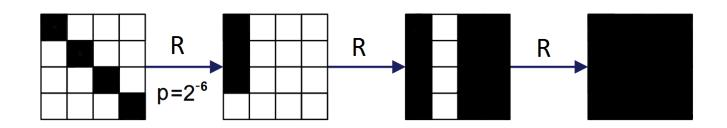

**Figure 11:** Truncated differential characteristic over 3-round AES. White box denotes a byte with a zero difference, while black box denotes a byte with a non-zero difference.

Consider a coset of D*<sup>I</sup>* as starting point. As we have seen in Lemma [1,](#page-15-1) a coset of D*<sup>I</sup>* is mapped into a coset of C*<sup>I</sup>* with probability 1 after one round. Thus, if we consider two elements that belong to the same cosets of D*<sup>I</sup>* , after one round they belong in the same coset of C*<sup>I</sup>* for sure. However, at the same time and with a certain probability, it is possible that these two elements belong to the same coset of D*<sup>J</sup>* ∩ C*<sup>I</sup>* ⊆ D*<sup>J</sup>* for a certain *J*. In particular, the following proposition holds:

**Proposition 5.** *For any* C*<sup>I</sup> and* D*<sup>J</sup> , we have that P r*(*x* ∈ D*<sup>J</sup>* | *x* ∈ C*<sup>I</sup>* ) = (2<sup>8</sup> ) −4|*I*|+|*I*|·|*J*| *.*

*Proof.* Let Z = C*<sup>I</sup>* ∩ D*<sup>J</sup>* . In Sect. [3.3,](#page-15-0) it is shown that dim(Z) = dim(C*<sup>I</sup>* ∩ D*<sup>J</sup>* ) = |*I*| · |*J*|. Let Y the subspace of dimension 4 · |*I*| − |*I*| · |*J*| such that C*<sup>I</sup>* = Y ⊕ Z, and let *π*<sup>Y</sup> and *π*<sup>Z</sup> the projection of C*<sup>I</sup>* on Y and Z respectively:

$$\pi_{\mathcal{Y}}: \mathcal{C}_I \to \mathcal{Y}, \qquad \qquad \pi_{\mathcal{Y}}(x) = x_y,$$

$$\pi_{\mathcal{Z}}: \mathcal{C}_I \to \mathcal{Z}, \qquad \qquad \pi_{\mathcal{Z}}(x) = x_z.$$

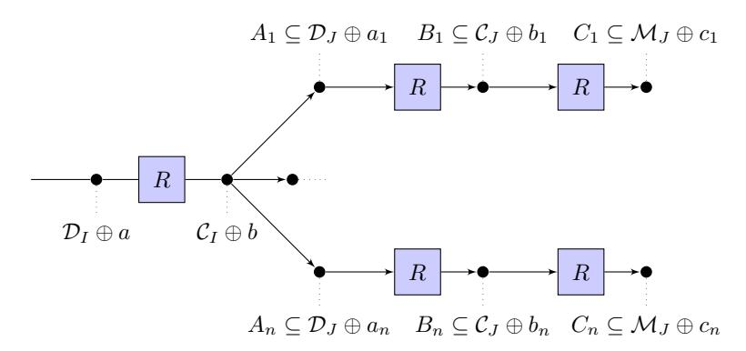

**Figure 12:** 3-round distinguishers for AES (the index n is defined as  $n := (2^8)^{4 \cdot |I| - |I| \cdot |J|}$ ).

That is,  $\forall x \in \mathcal{C}_I$ , there exists unique  $x_y \in \mathcal{Y}$  and  $x_z \in \mathcal{Z}$  such that  $x = x_z \oplus x_y$ . It follows that  $Pr(x \in \mathcal{D}_J \mid x \in \mathcal{C}_I) = Pr(\pi_{\mathcal{Y}}(x) = 0 \mid x \in \mathcal{C}_I)$ . Since  $\mathcal{Y}$  has dimension  $4 \cdot |I| - |I| \cdot |J|$ , we obtain:

$$Pr(x \in \mathcal{D}_J \mid x \in \mathcal{C}_I) = Pr(\pi_{\mathcal{Y}}(x) = 0 \mid x \in \mathcal{C}_I) = (2^8)^{-4 \cdot |I| + |I| \cdot |J|}.$$

That is, if two elements belong to the same coset of  $\mathcal{C}_I$ , then they belong to the same coset of  $\mathcal{D}_J$  with probability  $(2^8)^{-4|I|+|I|\cdot|J|}$ . More precisely, given two texts in the same coset of  $\mathcal{D}_I$ , after one round they belong to the same coset of  $\mathcal{C}_I \cap \mathcal{D}_J$  with probability  $(2^8)^{-4|I|+|I|\cdot|J|}$  (where  $\mathcal{C}_I \cap \mathcal{D}_J \subseteq \mathcal{D}_J$ ). As we have just seen, a coset of  $\mathcal{D}_J$  is mapped into a coset of  $\mathcal{M}_J$  after two rounds. It follows that if two elements belong to the same coset of  $\mathcal{D}_I$ , the probability that they belong to the same coset of  $\mathcal{M}_J$  after three rounds is equal to  $(2^8)^{-4|I|+|I|\cdot|J|}$ . The case |I|=1 and |J|=3 is depicted in Fig. 11.

For a more detailed explanation using subspace trail, consider the following argument. Given a coset of  $C_I$ , it can be seen as a union of coset of  $D_J$ , that is:

$$\mathcal{C}_I \oplus a = \bigcup_{x \in \mathcal{C}_I \oplus a \setminus \mathcal{D}_J} \mathcal{D}_J \oplus x,$$

as depicted in Fig. C.1. In particular, note that the number of  $x \in \mathcal{C}_I \oplus a \setminus \mathcal{D}_J$  is exactly  $(2^8)^{4\cdot|I|-|I|\cdot|J|}$ . If we take two elements in the same coset of  $\mathcal{D}_I$ , then after one round they belong to the same coset of  $\mathcal{C}_I$ . Since a coset of  $\mathcal{C}_I$  can be seen as the union of  $(2^8)^{4\cdot|I|-|I|\cdot|J|}$  cosets of  $\mathcal{D}_J$ , the probability that these two elements belong to the same coset of  $\mathcal{D}_J$  after one round is exactly  $(2^8)^{-4\cdot|I|+|I|\cdot|J|}$ . In this way, it is possible to obtain the previous result.

### <span id="page-41-0"></span>C.2 Description of the 4-round Zero-Sum Distinguisher using the Subspace Trail

Integral cryptanalysis [DKR97, KW02] is a cryptanalytic attack that is particularly applicable to block ciphers based on substitution-permutation networks, like AES. Unlike differential cryptanalysis, which uses pairs of chosen plaintexts with a fixed XOR difference, integral cryptanalysis uses sets (or multi-sets) of chosen plaintexts in which one part is held constant and another part varies through *all* possibilities. For example, an attack might use 256 chosen plaintexts that have all but 1 of its byte the same, and all differ in that 1 byte. Such a set has a XOR sum of 0, and it is possible to prove that the XOR sum of the corresponding sets after three rounds is equal to 0.

An integral distinguisher can also be constructed for four rounds of AES. In particular, a 4-round integral distinguisher for AES exploits the fact that summing over all  $2^{32}$  ciphertexts (formed by encrypting a coset of a diagonal space  $\mathcal{D}_i$  four rounds) is zero (e.g. [KR07] for details). Here we show how this zero-sum distinguisher can be re-interpreted in terms of subspace trails. The same analysis can also be done for 3-round AES.

First of all, note that the entire space  $\mathbb{F}_{28}^{4\times4}$  can be decomposed as  $\mathbb{F}_{28}^{4\times4} = \mathcal{M}_0 \oplus \mathcal{M}_1 \oplus \mathcal{M}_2 \oplus \mathcal{M}_3$ , where  $\mathcal{M}_j$  is the j-th mixed space defined above. Let  $\mathcal{M}_I = \mathcal{M}_0 \oplus \mathcal{M}_1 \oplus \mathcal{M}_2$ . If we encrypt the  $2^{32}$  plaintexts of a coset of  $\mathcal{D}_i$  (for four round with the final MixColumns), we get a set of  $2^{32}$  ciphertexts  $C = \{c_1, c_2, \ldots, c_{2^{32}}\}$ , where each  $c_i$  belongs to a different coset of  $\mathcal{M}_I$ . If we decompose these vectors with respect to the subspaces  $\mathcal{M}_i$ , each  $c_i$  can be written as  $c_i = c_{i,0} \oplus c_{i,1} \oplus c_{i,2} \oplus c_{i,3}$  where  $c_{i,j} \in \mathcal{M}_j$ . Since each  $c_i$  belongs to a different coset of  $\mathcal{M}_I$ , it means that the components  $c_{i,3}$  are all different; thus their sum must be zero since it amounts to summing over all vectors in  $\mathcal{M}_3$ . Since this property holds for all four choices of  $\mathcal{M}_I$ , it means that all of the components  $c_{i,j}$  must be different with respect to the same subspace  $\mathcal{M}_j$ , thus the sum over all the vectors in C is zero.

For completeness, another explanation of the 4-round zero-sum distinguisher is possible, and exploits the subspace trail and the zero-sum property over 3 rounds. As we have seen, a coset of a diagonal space  $\mathcal{D}_i \oplus a$  is mapped after one round into a coset of a column space  $\mathcal{C}_i \oplus b$ . Let i=0 for simplicity. By definition,  $\mathcal{C}_0 \oplus b = (\mathcal{C}_0 \cap \mathcal{D}_0) \oplus (\mathcal{C}_0 \cap \mathcal{D}_{1,2,3}) \oplus b$ , that is:

$$\mathcal{C}_0 \oplus b = \bigcup_{x \in (\mathcal{C}_0 \cap \mathcal{D}_{1,2,3}) \oplus b} (\mathcal{C}_0 \cap \mathcal{D}_0) \oplus x,$$

where  $|\mathcal{C}_0 \cap \mathcal{D}_{1,2,3}| = 2^{24}$ . Since each coset  $(\mathcal{C}_0 \cap \mathcal{D}_0) \oplus x$  corresponds to a set with only one active bytes, the sum of corresponding ciphertexts after three rounds is equal to zero (due to the three-round zero sum property of AES). Note that this property holds for each coset  $(\mathcal{C}_0 \cap \mathcal{D}_0) \oplus x$ , that is for each  $x \in (\mathcal{C}_0 \cap \mathcal{D}_{1,2,3}) \oplus b$ . Thus, the sum over all  $2^{32}$  ciphertexts formed by encrypting a coset of a diagonal space  $\mathcal{D}_i$  four rounds is equal to zero.

Finally, note that the integral distinguisher works exactly in the same way also in the decryption direction (independently of the presence of the final MixColumns operation). In particular, for the 4-round case and if the final MixColumns operation is not omitted, given  $2^{32}$  ciphertexts that belong to the same coset of  $\mathcal{M}_i$  with |i|=1, then the sum of the corresponding plaintexts is equal to zero. Instead, if the final MixColumns operation is omitted, given  $2^{32}$  ciphertexts in the same coset of  $\mathcal{ID}_i$  with |i|=1, then the sum of the corresponding plaintexts is zero.

# <span id="page-42-0"></span>D Relationship between 4-round Subspace Trail and Impossible Differential Attacks

In this section, we highlight the relationship between the 4-round subspace trails found in Sect. 4.4 and impossible differential cryptanalysis. As we have seen, if  $0 < \dim(\mathcal{D}_I) + \dim(\mathcal{M}_J) \le 16$  then  $Pr(R^{(4)}(x) \oplus R^{(4)}(y) \in \mathcal{M}_J \mid x \oplus y \in \mathcal{D}_I) = 0$ . We define this subspace trail as a "0-Probability Subspace Trail" or "Impossible subspace trail". In the following, we'd like to show the relationship between (5) and Impossible Differential Analysis [BK01], [BBS99], which is a generalization of Differential Analysis [BS91]. Differential cryptanalysis traditionally considers characteristics or differentials with relatively high probabilities and uses them to distinguish the correct unknown keys from the wrong keys. The idea is that the difference predicted by the differential appears frequently only when the correct key is used to decrypt the last few rounds of many pairs of ciphertexts. Impossible differential analysis exploits instead the differences which should not occur (i.e., that have probability exactly zero). In this case, a key that decrypts a pair of ciphertexts to that difference is certainly wrong.

Using arguments similar to Sect. 4.4, if  $|I| + |J| \le 4$  and if the final MixColumns operation is omitted, then  $Pr(R_f \circ R^{(3)}(x) \oplus R_f \circ R^{(3)}(y) \in \mathcal{ID}_J \mid x \oplus y \in \mathcal{D}_I) = 0$ . Thus, consider 5 rounds of AES:

$$p^h \xrightarrow{R(\cdot)} s^h \xrightarrow{R_f \circ R^{(3)}(\cdot)} c^h$$

for h = 1, 2. If there exists a pair of ciphertexts  $c^1$  and  $c^2$  that belong to the same coset of  $\mathcal{ID}_J$  (that is  $c^1 \oplus c^2 \in \mathcal{ID}_J$ ), then all the keys of the first round such that  $s^1 \oplus s^2 = R(p^1) \oplus R(p^2) \in \mathcal{D}_I$  for  $0 < \dim(\mathcal{D}_I) + \dim(\mathcal{ID}_J) \le 16$  are certainly wrong.

To exploit this fact in order to discover the key, the idea is to choose plaintexts with a particular shape. For simplicity, let  $I = \{0\}$  fixed. Suppose to considers pair of plaintexts  $p^1, p^2$  such that  $p^1_{i,j} = p^2_{i,j}$  for each i, j = 0, ...3 with  $(i,j) \neq \{(0,0), (1,3), (2,2), (3,1)\}$  (that is  $SR^{-1}(p^1)_{col(i)} = SR^{-1}(p^2)_{col(i)}$  for i = 1, 2, 3). This choice implies that for each key K:

$$R(p^1)_{col(i)} = R(p^2)_{col(i)}$$
  $\forall i = 1, 2, 3,$

that is the second, the third and the fourth columns of the two texts are equal after one round<sup>17</sup>. Given  $c^1$  and  $c^2$  such that  $c^1 \oplus c^2 \in \mathcal{ID}_J$  (with  $\dim(Y_J) \geq 12$ ), in order to guarantee that  $R(p^1) \oplus R(p^2) \in \mathcal{D}_I$ , the attacker has to work only on the first column of  $R(p^1)$  and  $R(p^2)$ , that is only on the first column of  $SR^{-1}(k)$  (for the other columns, all the values are fine). Thus, all the keys such that  $R(p^1) \oplus R(p^2) \in \mathcal{D}_I$  are certainly wrong.

There are three possibilities that can be exploited for an impossible differential attack, which are  $\dim(\mathcal{D}_I) = 4$  and  $\dim(\mathcal{D}_J) = 12$ ,  $\dim(\mathcal{D}_I) = 12$  and  $\dim(\mathcal{D}_J) = 4$ , and finally  $\dim(\mathcal{D}_I) = \dim(\mathcal{D}_J) = 8$ . For each of these combinations, using the definitions of  $\mathcal{D}_I$  and  $\mathcal{I}\mathcal{D}_J$  it is possible to obtain and to list all the impossible input/output combinations of difference that can be exploited to set up the attack. In particular, the first combination is exploited for example in [LDKK08] and in [BA08], while the second one is exploited in [MDRM10]. Interestingly, in literature there isn't any attack that exploits the last (impossible) input/output combination of differences. A possible reason of this fact is that using this combination it is not possible to attack 7 rounds of AES-128 as for the other combinations. Moreover, even if it is possible to attack 7 rounds of AES-192 and 8 rounds of AES-256 using it, our results (omitted due to page limit) show that in this case the data and the computational complexity is not better than the other attacks already present in literature that exploit the first and the second impossible combinations.

## <span id="page-43-0"></span>E Key Recovery Attacks on 3 and 4 Rounds of AES

Starting from the subspace trails of AES found in the previous section, in the following we show how to exploit them to set up low-data complexity attacks. In particular, in the following we focus only on the subspace trail distinguisher on 2 rounds presented in Sect. 4.1 and on AES-128. The following attack is a truncated differential attack, where the attacker exploits the relationship among the differences of bytes in different positions to recover the key. The attack on 3 rounds can be extended at the end - App. E.4 - or at the beginning - App. E.5 - in order to set up competitive attacks on 4 rounds of AES. Moreover, it is also possible to attack 5 rounds of AES using both the extensions, but such an attack is no more competitive with respect to the others present in literature.

$$R(SR^{-1}(p^j)_{col(i)} = [k^1 \oplus MC \circ S\text{-Box}(p^j \oplus k^0)]_{col(i)},$$

where we use the fact that she ShiftRows, the SubBytes and the AddRoundKey operations can be switched positions. Thus, since the MixColumns operation works on each column independently by the others and since  $SR \circ SR^{-1}(p^1)_{col(i)} = p^1_{col(i)} = p^2_{col(i)} = SR \circ SR^{-1}(p^1)_{col(i)}$  for each i=1,2,3, it follows that the second, the third and the fourth columns of the two texts are equal after one round.

<span id="page-43-1"></span><sup>&</sup>lt;sup>17</sup>For completeness, to show this fact we compute the *i*-th column of  $SR^{-1}(p^1)$  and  $SR^{-1}(p^2)$  after one round for i = 1, 2, 3. By simple computation, we have that for each j = 1, 2:

Consider  $\mathcal{D}_I$  with dim( $\mathcal{D}_I$ ) = 4 (that is |I| = 1). For simplicity, we show our attack only for the case  $I = \{0\}$ . In this case,  $\mathcal{D}_I$  and  $\mathcal{M}_I$  are the subsets of dimension 4 corresponding to the following symbolic matrix:

$$\mathcal{D}_{I} \equiv \begin{bmatrix} x_{1} & 0 & 0 & 0 \\ 0 & x_{2} & 0 & 0 \\ 0 & 0 & x_{3} & 0 \\ 0 & 0 & 0 & x_{4} \end{bmatrix} \qquad \mathcal{M}_{I} \equiv \begin{bmatrix} a_{1}(x_{1}) & a_{2}(x_{4}) & a_{2}(x_{3}) & a_{3}(x_{2}) \\ a_{2}(x_{1}) & a_{2}(x_{4}) & a_{3}(x_{3}) & a_{1}(x_{2}) \\ a_{2}(x_{1}) & a_{3}(x_{4}) & a_{1}(x_{3}) & a_{2}(x_{2}) \\ a_{3}(x_{1}) & a_{1}(x_{4}) & a_{2}(x_{3}) & a_{2}(x_{2}) \end{bmatrix}, \tag{7}$$

where  $a_i(\cdot)$  are linear functions defined as follow:

<span id="page-44-2"></span>
$$a_1(x) = \alpha x,$$
  $a_2(x) = x,$   $a_3(x) = (\alpha + 1)x.$  (8)

As we have seen, for all  $a \in \mathcal{D}_I^{\perp}$  there exists one and only one  $b \in \mathcal{M}_I^{\perp}$  such that  $R^{(2)}(\mathcal{D}_I \oplus a) = \mathcal{M}_I \oplus b$ . The attack that we are going to present is based on this property and on probability from Eq. (1). Moreover, the following low-data complexity attack can be applied exactly in the same way also on 1- and 2-round of AES. All details are given in App. E.2.

#### <span id="page-44-0"></span>E.1 The Attack on 3 Rounds of AES

Consider 3 rounds of AES:

$$p \xrightarrow{R^{(2)}(\cdot)} s \xrightarrow{R_f(\cdot)} c$$

where  $p \in \mathcal{D}_I \oplus a$  (for a fixed  $a \in \mathcal{D}_I^{\perp}$ ), and where MixColumns operation is omitted in the final round for simplicity. However, adding the MixColumns operation in the last round would not increase the resistance (see App. E.1.4 for more details).

Let  $p^1$  and  $p^2$  two different plaintexts that belong to the same coset of  $\mathcal{D}_I$ , and let  $c^1$  and  $c^2$  the corresponding ciphertexts. The idea of the attack is to find all the keys of the final round such that

<span id="page-44-1"></span>
$$R_f^{-1}(c^1) \oplus R_f^{-1}(c^2) = s^1 \oplus s^2 \in \mathcal{M}_I,$$
 (9)

that is such that  $s^1$  and  $s^2$  belong to the same coset of  $\mathcal{M}_I$ .

**Theorem 1.** Let  $p^1$  and  $p^2$  be two plaintexts of the same coset of  $\mathcal{D}_I$ , and let  $c^1$  and  $c^2$  the respective ciphertexts. Let k be the secret round-key of the final round. If there exists a pair of ciphertexts  $(c^1, c^2)$  such that k doesn't satisfy (9), then k is certainly wrong.

*Proof.* Suppose by contradiction that k is the right key.

If there exists a pair  $(c^1, c^2)$  such that k doesn't satisfy (9), then  $R_f^{-1}(c^1) \oplus R_f^{-1}(c^2) \notin \mathcal{M}_I$  (i.e.  $R_f^{-1}(c^1)$  and  $R_f^{-1}(c^2)$  belong to two different cosets of  $\mathcal{M}_I$ ), that is

$$Pr(R_f^{-1}(c^1) \oplus R_f^{-1}(c^2) \in \mathcal{M}_I | p^1 \oplus p^2 \in \mathcal{D}_I) \neq 1.$$

Since k is the right key, then

$$Pr(R_f^{-1}(c^1) \oplus R_f^{-1}(c^2) \in \mathcal{M}_I | p^1 \oplus p^2 \in \mathcal{D}_I) = 1,$$

(see (1)) which is a contradiction.

By the previous Theorem, it follows that the secret key is certainly one of those that satisfy the equivalence (9). In order to find all the keys that satisfy (9), the idea is to take advantage of the particular form of  $\mathcal{M}_I$ . In particular, observe that the columns of the subspace  $\mathcal{M}_I$  depend on different and independent variables, and that each element of a fixed column depends on a single variable in a very particular form.

**Theorem 2.** Let  $a, b \in \mathcal{M}_I^{\perp}$ , and let  $s^1 \in \mathcal{M}_I \oplus a$  and  $s^2 \in \mathcal{M}_I \oplus b$ . Denote s as the sum of  $s^1$  and  $s^2$ , i.e.  $s = s^1 \oplus s^2$ .

Then, a = b if and only if all the following equivalences are satisfied:

$$\begin{array}{lll} s_{0,0} = \alpha s_{1,0}, & s_{2,0} = s_{1,0}, & s_{3,0} = (\alpha+1)s_{1,0}; \\ s_{0,1} = s_{1,1}, & s_{2,1} = (\alpha+1)s_{1,1}, & s_{3,1} = \alpha s_{1,1}; \\ s_{1,2} = (\alpha+1)s_{0,2}, & s_{2,2} = \alpha s_{0,2}, & s_{3,2} = s_{0,2}; \\ s_{0,3} = (\alpha+1)s_{2,3}, & s_{1,3} = \alpha s_{2,3}, & s_{3,3} = s_{2,3}. \end{array}$$

*Proof.* If a = b, it is straightforward to prove that all the previous equivalences are satisfied. Suppose instead that all the previous equivalences are satisfied. Then, working on the first column (analogous for the others), it follows that:

$$a_{0,0} \oplus b_{0,0} = \alpha[a_{1,0} \oplus b_{1,0}]; \quad a_{2,0} \oplus b_{2,0} = a_{1,0} \oplus b_{1,0}; \quad a_{3,0} \oplus b_{3,0} = (\alpha+1)[a_{1,0} \oplus b_{1,0}].$$

That is, there exist  $x_1$  and  $y_1$  such that:

$$\begin{split} s^1_{0,0} &= \alpha x_1 \oplus a_{0,0}, & s^2_{0,0} &= \alpha y_1 \oplus a_{0,0} \oplus \alpha [a_{1,0} \oplus b_{1,0}]; \\ s^1_{1,0} &= x_1 \oplus a_{1,0}, & s^2_{1,0} &= y_1 \oplus b_{1,0}; \\ s^1_{2,0} &= x_1 \oplus a_{2,0}, & s^2_{2,0} &= y_1 \oplus a_{2,0} \oplus a_{1,0} \oplus b_{1,0}; \\ s^1_{3,0} &= (\alpha + 1) x_1 \oplus a_{3,0}, & s^2_{3,0} &= (\alpha + 1) y_1 \oplus a_{3,0} \oplus (\alpha + 1) [a_{1,0} \oplus b_{1,0}]. \end{split}$$

Let  $y_1' = y_1 \oplus a_{1,0} \oplus b_{1,0}$  and observe that  $b_{1,0} = b_{1,0} \oplus a_{1,0} \oplus a_{1,0}$ . Rewriting  $s_{\cdot,0}^2$  using  $y_1'$  instead of  $y_1$  and working in a similar way on all the other columns, it is easy to prove that  $s^1$  and  $s^2$  belong to the same coset of  $\mathcal{M}_I$ , that is a = b.

Using the previous Theorem and the fact that the columns of  $\mathcal{M}_I$  depend on different and independent variables, the attacker can work independently on each column of  $\mathcal{M}_I$  and so on each column of  $SR^{-1}(k)$ . Thus, we show our attack only on the first column (it is completely equivalent for the others).

Given  $c^1$  and  $c^2$ , the attacker guesses (for example) the bytes  $k_{1,3}$  and finds all the values of bytes  $k_{0,0}, k_{2,2}$  and  $k_{3,1}$  of the key of the final round such that  $s^1$  and  $s^2$  belong to the same coset of  $\mathcal{M}_I$ . Using the previous Theorem and given  $k_{1,3}$ , the other bytes of the first column of  $SR^{-1}(k)$  have to satisfy the following equalities:

$$S-Box^{-1}(c_{0,0}^{1} \oplus k_{0,0}) \oplus S-Box^{-1}(c_{0,0}^{2} \oplus k_{0,0}) =$$

$$=\alpha[S-Box^{-1}(c_{1,3}^{1} \oplus k_{1,3}) \oplus S-Box^{-1}(c_{1,3}^{2} \oplus k_{1,3})];$$

$$S-Box^{-1}(c_{2,2}^{1} \oplus k_{2,2}) \oplus S-Box^{-1}(c_{2,2}^{2} \oplus k_{2,2}) =$$

$$=S-Box^{-1}(c_{1,3}^{1} \oplus k_{1,3}) \oplus S-Box^{-1}(c_{1,3}^{2} \oplus k_{1,3})];$$

$$S-Box^{-1}(c_{3,1}^{1} \oplus k_{3,1}) \oplus S-Box^{-1}(c_{3,1}^{2} \oplus k_{3,1}) =$$

$$=(\alpha+1)[S-Box^{-1}(c_{1,3}^{1} \oplus k_{1,3}) \oplus S-Box^{-1}(c_{1,3}^{2} \oplus k_{1,3})].$$

$$(10)$$

<span id="page-45-0"></span>Suppose to guess one value of  $k_{1,3}$ . Then, it is very easy to observe that each equality of (10) can be rewritten in the following way

<span id="page-45-1"></span>
$$S-Box^{-1}(\alpha \oplus x) \oplus S-Box^{-1}(x) = \beta(k_{1,3}), \tag{11}$$

where  $\alpha = c_{i,j}^1 \oplus c_{i,j}^2$ ,  $\beta$  depends on  $k_{1,3}$  and on two ciphertexts bytes, and  $x = c_{i,j}^2 \oplus k_{i,j}$  is the unknown variable. First of all, note that if  $\alpha = 0$  then this equality is impossible if  $\beta \neq 0$ , while it is always satisfied if  $\beta = 0$ .

The solutions of equation (11) are related to the differential uniformity of the S-Box. Since the inverse function S-Box<sup>-1</sup> is differential 4-uniform, there are at most four different solutions<sup>18</sup>. In particular, there are two solutions with probability 126/256, four solutions with probability 1/256 and zero solutions with probability 129/256. That is, on average there exist about 2.016 different values that satisfy equation (11) with probability 49.6%.

Suppose for the moment that  $c^1$  and  $c^2$  are two ciphertexts such that  $c^1_{i,j} \neq c^2_{i,j}$  for each  $i, j \in \{0, ..., 3\}$ . Guessed the byte key  $k_{1,3}$ , then the attacker finds  $2.016^3 \simeq 8.194$  possible combinations  $(k_{0,0}, k_{2,2}, k_{3,1})$  that satisfy the equivalence (10) with probability  $(49.6\%)^3 \simeq 12.2\%$ . Since there are 256 values of  $k_{1,3}$ , we have in total  $0.122 \times 256 \times (2.016)^3 \simeq 255.95$  combinations  $(k_{0,0}, k_{1,3}, k_{2,2}, k_{3,1})$  for the first column (analogous for the others).

The computational cost to find these 256 combinations  $(k_{0,0}, k_{1,3}, k_{2,2}, k_{3,1})$  for the first column (and analogous for the other ones) can be estimated at 3 (conditions)×2<sup>8</sup> (values of  $k_{1,3}$ )×[2 + 2 × 2<sup>8</sup> (values of  $k_{0,0}, k_{2,2}, k_{3,1}$  for each condition)]= 2<sup>18.59</sup> S-Box look-ups and 2<sup>17.59</sup> XOR operations.

Actually, it is possible to improve this result. Indeed, observe that if the value  $k_{0,0}$  satisfies (or not) equation (10) for a given value  $k_{1,3}$ , then this equation is also satisfied (or not) by the value  $k_{0,0} \oplus c_{0,0}^1 \oplus c_{0,0}^2$ . That is, for each  $k_{1,3}$  the attacker has to test only 128 values of  $k_{0,0}$  and not 256. The same consideration holds for the other bytes of the key. Thus, the computational cost to find the 256 combinations  $(k_{0,0}, k_{1,3}, k_{2,2}, k_{3,1})$  for the first column (and analogous for other columns) can be estimated at  $2^{16.59}$  S-Box look-ups.

#### E.1.1 Recover the Secret Key using only 2 Chosen Plaintexts

Using the previous procedure, the attacker is able to find  $2^8$  combinations for each column, that is  $(2^8)^4 = 2^{32}$  candidates of the keys in total. A first possibility is simple to store them in the memory and to do a brute force attack on these  $2^{32}$  possible keys, that is to check for which of these keys the condition  $c^1 = R^{(3)}(p^1)$  (or equivalently  $c^2 = R^{(3)}(p^2)$ ) is satisfied. In this case, the total cost of the attack is approximately  $2^{32}$  executions of the three-round cipher (observe that this second step is more expensive than the first one),  $2^{32}$  memory access and the memory cost is approximately  $2^{56} \times 4$  (byte)×4 (columns) =  $2^{12}$  byte.

This result can be a little improved if the plaintexts belong to the same coset of  $\mathcal{D}_0 \cap \mathcal{C}_0$  (where  $\mathcal{D}_0 \cap \mathcal{C}_0$  has dimension 4 since  $\mathcal{D}_0 \cap \mathcal{C}_0 = \langle e_{0,0} \rangle$  - Lemma 5). In particular, using only 2 chosen plaintexts that belong to the same coset of  $\mathcal{D}_0$ , the total cost of the attack is approximately of  $2^{32}$  executions of the three-round cipher,  $2^{32}$  memory access and the memory cost is approximately  $256 \times 4$  (byte)×4 (columns) =  $2^{12}$  byte.

By definition,  $\mathcal{D}_0 \cap \mathcal{C}_0$  and  $\mathcal{C}_0 \cap \mathcal{M}_0$  correspond to symbolic matrix:

$$\mathcal{D}_0 \cap \mathcal{C}_0 \equiv \begin{bmatrix} x & 0 & 0 & 0 \\ 0 & 0 & 0 & 0 \\ 0 & 0 & 0$$

where  $a_i(\cdot)$  are defined as in (8). Using similar arguments as before, for each  $a \in (\mathcal{D}_0 \cap \mathcal{C}_0)^{\perp}$  there exist unique  $b \in (\mathcal{C}_0 \cap \mathcal{M}_0)^{\perp}$  and unique  $c \in \mathcal{M}_0^{\perp}$  such that:

$$R((\mathcal{D}_0 \cap \mathcal{C}_0) \oplus a) = (\mathcal{C}_0 \cap \mathcal{M}_0) \oplus b$$
 and  $R^{(2)}((\mathcal{D}_0 \cap \mathcal{C}_0) \oplus a) \subseteq \mathcal{M}_0 \oplus c$ .

Thus, suppose that the attacker has found  $2^8$  possible combinations for each column of the secret key. Instead to attack by brute force all the  $2^{32}$  possible keys, the idea is the following. Given  $c^1$  and  $c^2$  and a (possible) key  $k^3$  of the final round, the idea is to compute  $s^1 = R^{-1}(c^1)$  and  $s^2 = R^{-1}(c^2)$ , that is to decrypt one round  $c^1$  and  $c^2$ , with a

<span id="page-46-0"></span><sup>&</sup>lt;sup>18</sup>Observe that if x satisfies (11), then also  $x \oplus \alpha$  satisfies it, so the number of solutions can not be odd.

cost of  $16 \times 2 = 32$  S-Box look-ups. Then, the attacker can easily compute  $k^2$  using the inverse key schedule (cost of 4 S-Box look-ups). Finally, she checks if  $R^{-1}(s^1)$  and  $R^{-1}(s^2)$  belong to the same coset of  $\mathcal{C}_0 \cap \mathcal{M}_0$ , that is if the first columns of  $R^{-1}(s^1)$  and  $R^{-1}(s^2)$  satisfied conditions similar to (10). The cost of this last operation is 8 S-Box look-ups. Since these conditions are verified with probability  $2^{-24}$ , only  $2^8$  possible keys of  $k^3$  satisfy these conditions. The cost of this step is  $2^{32} \times (32 + 4 + 8) = 2^{37.46}$  S-Box look-ups, that is  $2^{31.55}$  executions of the three-round cipher. Using a brute force attack, the attacker can find the right key among the last  $2^8$  candidates.

For this attack, the attacker needs about 2 chosen plaintexts in the same coset of  $\mathcal{D}_0 \cap \mathcal{C}_0$ , the total computational cost is about  $2^{10.7}$  (first step)  $+2^{31.55}$  (check)  $+2^8$  (brute force)  $=2^{31.55}$  executions of the three-round cipher and  $2^{32}$  memory access, and a memory cost of about  $2^{12}$  bytes of memory (to store the combinations of the columns of the key found in the first step). In a 32-bit implementation, each round of AES can be implemented by 20 memory accesses, that is 16 look-ups table for S-Box +SR + MC and 4 look-ups table for the key schedule. Thus, one can declare that the total complexity of the attack is approximately  $(20 \cdot 3)^{-1} \times 2^{32} + 2^{31.55} = 2^{31.58}$  executions of the three-round encryption.

approximately  $(20 \cdot 3)^{-1} \times 2^{32} + 2^{31.55} = 2^{31.58}$  executions of the three-round encryption. Remember that these results are based on the hypothesis that  $c_{i,j}^1 \neq c_{i,j}^2$  for each  $i,j \in \{0,...,3\}$ . By simple computation, the probability that this condition is satisfied is  $(255/256)^{16} = 0.9393$ , so everything works with high probability.

#### E.1.2 Recover the Secret Key using 3 Chosen Plaintexts

Another possibility is to use a third plaintext  $p^3$  that belongs to the same coset of  $\mathcal{D}_I$  of  $p^1$  and  $p^2$  (i.e.  $p^1 \oplus p^3 \in \mathcal{D}_I$ ), and such that the corresponding ciphertexts satisfy the following conditions:

<span id="page-47-0"></span>
$$c_{i,j}^1 \neq c_{i,j}^2, \quad c_{i,j}^1 \neq c_{i,j}^3, \quad c_{i,j}^2 \neq c_{i,j}^3 \qquad \forall i, j \in \{0, ..., 3\}.$$
 (12)

The idea is simply to repeat the first step of the attack, on the combinations of key columns that satisfy condition (10) for the first pair of texts, using a second pair of texts composed of  $p^3$  and one of the first two plaintexts. That is, to eliminate the wrong keys checking the keys found previously (at the first step) with this second pair. As before, the idea is to work again on each column independently. Remember that, for each column, the right combination is the only one that satisfies the condition (10) for each pair of ciphertexts such that the corresponding plaintexts belong to the same coset of  $\mathcal{D}_I$ .

Using 3 chosen plaintexts and to improve the total computational cost, the attack should be a little modified. Working independently for each column, the best idea is to work only on one of the equations of (10), e.g. the first one. Given the first pair of plaintexts, the attacker is able to recover 256 possible combinations for the pair  $(k_{0,0}, k_{1,3})$ . For each one of them, the attacker checks if it verifies the condition (10) also for the second pair of plaintexts. Since on average each equation of the condition (10) is satisfied with probability  $2^{-8}$ , the attacker finds the correct combination of  $(k_{0,0}, k_{1,3})$ . In this way, the attacker knows  $k_{1,3}$  and so she knows the right part of equations (10). Thus, in the same way of before, she can easily discover  $k_{2,2}$  and  $k_{3,1}$ . However, since the attacker knows the right part of the equations, only two texts pass the first step. Indeed, observe that there are  $2^8$  possible values and that each equation is satisfied only with probability  $2^{-8}$ , thus only one text passes the test. Anyway, if x satisfies (11), then also  $x \oplus \alpha$  satisfies it. Using the second pair of texts, the attacker finds the right bytes of the key.

Working independently on each column, a good idea is to perform these two steps at the same time, that is to check the combination found with the first pair of plaintexts immediately using the second one: in this way, the attacker doesn't need to store anything (except the right combination for each column).

Remember that this result is based on the hypothesis that condition (12) is satisfied. By simple computation, this happens with probability  $(255 \cdot 254/256^2)^{16} = 82.85\%$ . Actually,

```
Data: 2 ciphertexts pairs (c^1, c^2) and (c^1, c^3), whose corresponding plaintexts
        belong in the same coset of \mathcal{D}_0.
Result: First diagonal of the secret key k^3 (i.e. k_{i,i}^3 for each i = 0, ..., 3).
(Note: the same procedure with the same ciphertexts can be used to recover the
other diagonals of the key.)
for all values of k_{1,3}^3 do
    for all values of k_{0,0}^3 do
       check if 1-st equivalence of (10) is satisfied for both pairs of ciphertexts
       If satisfied, then identify candidates for k_{1,3}^3 and k_{0,0}^3
   end
end
                                          // on average only 1 candidate for k_{1,3}^3
for all candidates k_{1,3}^3 do
   for all values of k_{2,2}^3 do
       check if 2-nd equivalence of (10) is satisfied for both pairs of ciphertexts
       If satisfied, then identify candidate for k_{2,2}^3
       else reject k_{1,3}^3 as candidate
    for all values of k_{3,1}^3 do
       check if 3-rd equivalence of (10) is satisfied for both pairs of ciphertexts
       If satisfied, then identify candidate for k_{3,1}^3
       else reject k_{1,3}^3 as candidate
end
return k_{i,i}^3 for each i = 0, ..., 3.
```

**Algorithm 5:** Attack on 3 rounds of AES-128 - Pseudo Code. For simplicity, in this pseudo-code, we show how to find only the first diagonal of the secret key of the last round, and we don't use the following optimization: if x satisfies (11) then also  $x \oplus \alpha$  satisfies it. To recover the entire key, it is sufficient to repeat exactly the same attack for the other diagonals using the same pairs of ciphertexts.

the condition (12) can be (a little) relaxed. For example, three chosen plaintext such that  $c_{0,0}^1 = c_{0,0}^2 \neq c_{0,0}^3$  and  $c_{1,3}^1 \neq c_{1,3}^2 \neq c_{1,3}^3$  can also be used to find the key. Thus, using 3 chosen plaintexts the probability of success is:  $\left[\sum_{i=0}^3 \binom{4}{i} \left(\frac{255 \cdot 254}{256^2}\right)^{4-i} \left(\frac{255}{256^2}\right)^i\right]^4 = 88.83\%$ .

chosen plaintexts the probability of success is:  $\left[\sum_{i=0}^{3} \binom{4}{i} \left(\frac{255 \cdot 254}{256^2}\right)^{4-i} \left(\frac{255}{256^2}\right)^i\right]^4 = 88.83\%$ . The computational cost for the first step can be approximated by  $2^{-1} \cdot 2^8$  (values of  $k_{1,3}$ ) ×(2 + 2 × 2<sup>-1</sup> · 2<sup>8</sup> (values of  $k_{0,0}$ ) + 4 × 256 (check with 2-nd pair) =  $2^{15.055}$  S-Box look-ups, while the cost for the second step is  $2 \times 2^{-1} \cdot 2^8$  (values of  $k_{2,2}$  and  $k_{3,1}$ ) +2 × 2 (check with 2-nd pair) =  $2^8$  S-Box look-ups. In conclusion, our attack needs 3 chosen plaintexts (one plaintext is in common for the two pairs) and the total computational cost is approximately 4 (columns) ×( $2^{15.055} + 2 \times 2^8$ ) =  $2^{17.08}$  S-Box look-ups, that is about  $2^{11.2}$  executions of the three-round cipher (the memory cost is negligible).

Finally, note that after the identification of a subspace trail the previous attack can be easily generalized to other AES-like ciphers.

#### <span id="page-48-1"></span>E.1.3 Perform the Attack using Table Look-ups

It is also possible to perform the previous attack in a slight different way, that is using look-ups table. First of all, for each values of  $\alpha$  and  $\beta$ , the idea is to precompute the values of x that satisfy condition (11) and to store them in a table. The cost of this precomputation is approximately  $2^{16}$  S-Box look-ups<sup>19</sup>, that is about  $2^{10.1}$  executions of

<span id="page-48-0"></span><sup>&</sup>lt;sup>19</sup>For each of the  $2^8$  values of  $\beta$  and of the  $2^7$  values of x (remember that if x satisfies (11), then also  $x \oplus \alpha$  satisfies it), the attacker finds the value of  $\alpha$  that satisfies the equality (11), and stores this

three-round AES. The memory cost to store this table is approximately  $(2^8)^2 = 2^{16}$  bytes. Then, for each column, the attacker is able to discover the 256 key combinations with  $3 \cdot 2^8$  look-ups table (that is, 3 look-ups table for each values of  $k_{1,3}$ ). In order to find the right key among these combinations, she can use the same techniques described previously, or she can use another pair of plaintexts and again the look-ups table. On average, using 3 chosen plaintexts and working in the same way described previously, for each column the attacker needs  $2^8$  look-ups table and  $2^8 \cdot 4 = 2^{10}$  S-Box look-ups to discover  $k_{0,0}$  and  $k_{1,3}$ (i.e. the attacker finds the 256 possible values of  $(k_{0.0}, k_{1.3})$  using look-ups table, and then tests them with the second pair of texts), and 2 look-ups table to discover the other 2 bytes. Thus, the total computational cost is of  $4 \cdot (2^8 + 2) = 2^{10.02}$  look-ups table (with a memory cost of  $2^{16}$  bytes) and  $2^{10} \cdot 2 = 2^{11}$  S-Box look-ups (since she needs  $2^{10}$  S-Box look-ups to compute the value of  $\beta$  for each value of  $k_{1,3}$ ), that is  $2^{5.1}$  executions of three-round AES (the precomputation cost is about  $2^{10.1}$  executions of three-round AES). Since 1 round of AES can be approximated by  $20 \simeq 2^{4.32}$  memory accesses<sup>20</sup>, one can declare that the total complexity of the attack is approximately  $(20 \cdot 3)^{-1} \times 2^{10} + 2^{5.1} = 2^{5.68}$  executions of the three-round encryption.

#### <span id="page-49-1"></span>E.1.4 3-Round Attacks - Final Round with MixColumns Operation

For sake of completeness, the attacks on 3 rounds described in App. E.1 work exactly in the same way in the case in which the MixColumns operation is *not* omitted in the last round. In this case, the idea (very common in the literature) is simply to change the position of the final MixColumns operation with the final AddRoundKey operation (remember that these operations are linear). In this case, the major difference is that the attacker has to work with  $\tilde{k}$  defined as:

$$\tilde{k} := MC^{-1}(k), \tag{13}$$

instead of k (the secret key of the final round). Moreover, in this case  $s^h = R^{-1}(c^h)$  (for h = 1, 2) are defined as  $s^h_{i,j} = \text{S-Box}^{-1}(\tilde{c}^h_{i,j+i} \oplus \tilde{k}_{i,j+i})$  where i, j = 0, ..., 3 (and i + j is taken modulo 4) and where  $\tilde{c}^h := MC^{-1}(c^h)$ . Note that when all bytes of  $\tilde{k}$  have been determined, the secret key k can be recovered by  $k = MC(\tilde{k})$ .

#### <span id="page-49-0"></span>E.2 The Attack on 1 and 2 Rounds of AES

Finally, note that the same attack can be used to attack 1 and 2 round of AES. In the case of 2 rounds of AES, consider the following situation:

$$p \xrightarrow{R(\cdot)} s \xrightarrow{R_f(\cdot)} c$$
,

where  $p \in \mathcal{C}_I \oplus a$  (for a fixed  $a \in \mathcal{C}_I^{\perp}$ ) and MixColumns operation is omitted in the final round (for simplicity). The attack is completely equivalent to the previous one using the following probability<sup>21</sup>:

$$Pr(R(x) \oplus R(y) \in \mathcal{M}_I \mid x \oplus y \in \mathcal{C}_I) = 1.$$

In this case, our attack needs 3 chosen plaintexts (in the same coset of  $C_I$ ) and the total computational cost is approximately at  $2^{17.08}$  S-Box look-ups, that is about  $2^{11.8}$  executions of the two-round cipher. As before, it is possible to perform the attack using memory

combination in the memory. For the remaining pairs  $(\alpha, \beta)$ , the equality (11) has no solutions.

<span id="page-49-2"></span> $<sup>^{20}</sup>$ This approximation has been proposed and used for example in [MDRM10]. For comparison, note that in [TKKL15] authors approximate 1 rounds of AES with  $2^5$  memory accesses.

<span id="page-49-3"></span><sup>&</sup>lt;sup>21</sup>Note that it is not possible to use the probability  $Pr(R(x) \oplus R(y) \in \mathcal{C}_I \mid x \oplus y \in \mathcal{D}_I) = 1$ , since  $Pr(R_f(x) \oplus R_f(y) \in \mathcal{ID}_I \mid x \oplus y \in \mathcal{C}_I) = 1$  for each possible candidate of the secret key.

<span id="page-50-1"></span>**Table 4:** *Comparison table of low-data attacks on round-reduced AES.* Data complexity is measured in number of required known/chosen plaintexts (KP/CP). Time complexity is measured in round-reduced AES encryption equivalents (E) and in memory accesses (M). Memory complexity is measured in plaintexts (16 bytes). The case in which the MixColumns operation is omitted in the last round is denoted by "*r.*5 rounds", that is *r* full rounds and the final round. The attacks of this paper are in bold. We recall that the G&D tool exploits (mainly) the Meet-in-the-Middle (MitM) attack.

| Attack   | Rounds Data |        | Computation (E)                        |         | Memory Reference |
|----------|-------------|--------|----------------------------------------|---------|------------------|
| G&D      | 1.5         | 1 KP   | 56<br>2                                | 1       | [BDF11]          |
| G&D-MitM | 2           | 1 KP   | 64<br>2                                | 48<br>2 | [BDF11]          |
| G&D-MitM | 1.5         | 2 KP   | 24<br>2                                | 16<br>2 | [BDF11]          |
| G&D-MitM | 2           | 2 KP   | 32<br>2                                | 24<br>2 | [BDF11]          |
| G&D-MitM | 2           | 2 CP   | 8<br>2                                 | 8<br>2  | [BDF11]          |
| D        | 1.5 - 2     | 2 KP   | 48<br>2                                | 1       | [BDD+12]         |
| TrD      | 1.5 - 2     | 2 CP 2 | 32 M<br>31.55 E<br>31.6<br>+2<br>≈ 2   | 1       | App. E.2         |
| D        | 1.5 - 2     | 2 CP   | 28<br>2                                | 1       | [BDD+12]         |
| TrD      | 1.5 - 2     | 3 CP   | 11.8<br>2                              | 1       | App. E.2         |
| TrD      | 1.5 - 2     | 3 CP   | 10 M<br>6.3 E<br>6.6<br>2<br>+2<br>≈ 2 | 12<br>2 | App. E.2         |
| D        | 1.5 - 2     | 3 KP   | 32<br>2                                | 1       | [BDD+12]         |

G&D: Guess & Det., TrD: Truncated Differential, D: Diff.

access instead of S-Box look-ups. By simple computation and with the approximation of 1 round of AES with 20 memory accesses, the complexity of the attack is approximately (20 · 2)<sup>−</sup><sup>1</sup> × 2 <sup>10</sup> + 2<sup>6</sup>*.*<sup>32</sup> = 2<sup>6</sup>*.*<sup>6</sup> executions of the two-round encryption, the cost of the precomputation is about 2 10*.*7 executions of two-round AES, and a memory cost of 2 16 bytes. As for the attack on 3-round, it is also possible to set up an attack using only 2 chosen plaintexts. The complexity of the attack in this case is well approximated by 2 31*.*6 executions of two-round AES, choosing the two plaintexts in the same coset of D*<sup>i</sup>* ∩ C*<sup>j</sup>* for |*i*| = |*j*| = 1. A comparison between our attack and the other present in literature is provided in Table [4.](#page-50-1)

The attack on 1 round (where MixColumns operation is not omitted) is completely equivalent to the previous one. In this case, the idea is simply to choose plaintexts that belong to the same coset of M*<sup>I</sup>* .

### <span id="page-50-0"></span>**E.3 Relationship to Standard Truncated Differential Attack**

Differential cryptanalysis [\[BS91\]](#page-33-11) is a general form of cryptanalysis applicable to block ciphers. It studies how differences in information input can affect the resulting difference at the output. Differential attacks exploit the fact that pairs of plaintexts with certain differences yield other differences in the corresponding ciphertexts with a non-uniformity probability distribution. Statistical key information is deduced from ciphertext blocks obtained by encrypting pairs of plaintext block with a specific (bitwise) difference under the target key. In particular, for a pair of plaintexts related by a constant (bitwise) difference, one tries for all values of the round key in the last round if the expected difference in the ciphertexts occurs. This is repeated several times and the most suggested values are assumed to be the value of the secret key of the last round. Attacks following this basic attack vector can not be described without considering the details of the S-Boxes of the cipher as it affects the probability of events. A variant of this attack is the *truncated differential attack* [\[Knu95\]](#page-34-14), in which the attacker considers only part of the difference

between pairs of texts, i.e. it is a differential attack where only part of the difference in the ciphertexts can be predicted. As truncated differential cryptanalysis can be described without considering details of S-Box and since subspace trail cryptanalysis is largely independent of concrete choices of an S-Box, truncated differential cryptanalysis is hence much closer in nature to subspace trail cryptanalysis.

Our attack falls into the category of truncated differential cryptanalysis attacks. Indeed, the attacker considers plaintexts which belong to the same coset of a diagonal space  $\mathcal{D}_I$ , that is plaintexts where the input differences in 4-|I| diagonals are equal to zero (the difference in the others diagonal are instead not fixed). Then, she looks for a key such that the bytes differences one round before satisfy certain relationships. That is, the attacker exploits the relationship between bytes differences which are in different positions. As we have seen, if  $I = \{0\}$  and for the first column, the relationships among this differences are given in (11). This guarantees that the two ciphertexts  $c^1$  and  $c^2$  belong to the same coset of  $\mathcal{M}_I$  one round before, that is  $R^{-1}(c^1) \oplus R^{-1}(c^2) \in \mathcal{M}_I$ . This last condition is equivalent to the following one:

$$MC^{-1} \circ R^{-1}(c^1) \oplus MC^{-1} \circ R^{-1}(c^2) \in \mathcal{ID}_I,$$

where an Inverse MixColumns operation is applied on both sides and where  $MC^{-1}(\mathcal{M}_I) = \mathcal{I}\mathcal{D}_I$  by definition (note that  $MC^{-1}$  is linear and that  $MC^{-1}(R_{k^3}^{-1}(c^1) \oplus k^2 \oplus R_{k^3}^{-1}(c^2) \oplus k^2) = MC^{-1} \circ R^{-1}(c^1) \oplus MC^{-1} \circ R^{-1}(c^2)$ , where  $k^2$  and  $k^3$  are respectively the keys of the second and of the third/final round). By definition of  $\mathcal{I}\mathcal{D}_I$ , the attacker is looking for a key such that the differences in  $16 - 4 \cdot |I|$  bytes are equal to zero (4 - |I|) for each column), while no condition is imposed on the difference in the other  $4 \cdot |I|$  bytes. For example, the condition (11) for the first column can be re-written as:

$$MC^{-1} \times \begin{bmatrix} \alpha \cdot [\text{S-Box}^{-1}(c_{0,0}^{1} \oplus k_{0,0}) \oplus \text{S-Box}^{-1}(c_{0,0}^{2} \oplus k_{0,0})] \\ \text{S-Box}^{-1}(c_{1,3}^{1} \oplus k_{1,3}) \oplus \text{S-Box}^{-1}(c_{1,3}^{2} \oplus k_{1,3})] \\ \text{S-Box}^{-1}(c_{2,2}^{1} \oplus k_{2,2}) \oplus \text{S-Box}^{-1}(c_{2,2}^{2} \oplus k_{2,2}) \\ (\alpha + 1) \cdot [\text{S-Box}^{-1}(c_{3,1}^{1} \oplus k_{3,1}) \oplus \text{S-Box}^{-1}(c_{3,1}^{2} \oplus k_{3,1})] \end{bmatrix} = \begin{bmatrix} \cdot \\ 0 \\ 0 \\ 0 \end{bmatrix},$$

where no restriction holds on the first byte. Solving this equality, one obtains the relationships among the bytes differences given in (11). That is, the attacker looks for a key that guarantees certain differences (zero in this case) for certain bytes, while she doesn't care of the differences in the other bytes, as by definition of Truncated Differential Attack.

## <span id="page-51-0"></span>E.4 The Attack on 4 Rounds of AES - Extending the 3 Rounds Attack at the End

Starting from the previous attack on 3 rounds, in this section we show how to extend it at the end in order to attack 4 rounds of AES. In a similar way, in App. E.5 we show how to attack 4 rounds of AES extending the previous attack on 3 rounds at the beginning. Consider the following situation:

$$p \xrightarrow{R^{(2)}(\cdot)} s \xrightarrow{R(\cdot)} z \xrightarrow{R_f(\cdot)} c$$

where  $p \in \mathcal{D}_I \oplus a$  (for a fixed  $a \in \mathcal{D}_I^{\perp}$ ) and MixColumns operation is omitted (only for simplicity) in the final round.

As we have seen, if  $p^1 \oplus p^2 \in \mathcal{D}_I$ , then  $s^1 \oplus s^2 \in \mathcal{M}_I$ . The idea of the attack is simply to guess part of the key of the final round, in order to partially decrypt c and obtain (part of) z. Then the attacker can repeat the attack on 3 rounds, working on z and exploiting the relationships that hold between the bytes of  $s^1 \oplus s^2$ . In this case, the attacker founds on average one values of  $k^3$  for each guessed value of  $k^4$ . Thus, she can not say anything

about  $k^3$  a priori, since it depends on the guessed value of  $k^4$ . That is, she has to check that the key of the third round  $k^3$  and of the final round  $k^4$  satisfy the key schedule. If they satisfy the key schedule, then the attacker has found the right key, otherwise she has to repeat the previous procedure for the other values of  $k^4$ .

In the following, we give all the details of the attack. In the first part, the attacker guesses two columns of the last key  $k^4$ , partial decrypts the pairs of ciphertexts and discovers part of the key of the third round  $k^3$ , using the attack on 3 rounds described previously. Then she checks that the found key satisfies the key schedule with the guessed key  $k^4$ . In the second part of the attack, for the key candidates that satisfy the key schedule, the attacker is able to recover other bytes of  $k^4$  and  $k^3$  (using again the key schedule). In order to find the complete secret key, the attacker has to guess the remaining unknown bytes of the secret key and to do a brute force attack. The attack can be performed using three or only two chosen plaintexts.

#### E.4.1 Details of the Attack

**Details of the First Part of the Attack.** In order to show our attack, suppose that the attacker guesses the following eight bytes of the key of the final round  $k^4$ :

<span id="page-52-0"></span>
$$SR(k_{i,3}^4) = k_{i,3-i}^4$$
 and  $SR(k_{i,0}^4) = k_{i,-i}^4$   $\forall i \in \{0,1,2,3\},$  (14)

that is the first and the fourth columns of  $k^4$  after the ShiftRows operation (the index -i is taken module 4). Observe that there are  $(2^8)^8 = 2^{64}$  possibilities in total. Note that since the attacker can not impose any restriction/condition on the secret key, she has to repeat the following steps for each possible values of these eight bytes of  $k^4$ .

Using these guessed key bytes of  $k^4$  and three given ciphertexts  $c^1, c^2, c^3$  (which plaintexts  $p^1, p^2, p^3$  belong to the same coset of  $\mathcal{D}_I$ ), the attacker is able to compute:

$$z_{i,j}^h = \text{S-Box}^{-1}(c_{i,j+i \text{ mod } 4}^h \oplus k_{i,j+i \text{ mod } 4}^4) \qquad \forall h \in \{1,2,3\}, \, \forall j \in \{0,3\}, \, \forall i.$$

The cost of this step is  $2^{64} \cdot 8 \cdot 3 = 2^{68.6}$  S-Box look-ups. Note that the positions of the guessed bytes of the key  $k^4$  can not be chosen in an arbitrary way, since in the following step the attacker has to apply the InverseMixColumns operation on two columns of z.

Using  $z^1, z^2$  and  $z^3$  (instead of  $c^1, c^2, c^3$ ), the attacker can repeat the previous attack on 3 rounds and finds eight bytes (i.e. first and fourth columns) of the key  $k^3$ , in order to guarantee that  $s^i \oplus s^j \in \mathcal{M}_I$  for each i, j = 1, 2, 3. In this case, note that for each column the attacker can impose only one relationship that involves two bytes, and not three relationships as in the previous attack on 3 round. For example, the only relationship that holds for the first column is the following (analogous for the others):

$$S-Box^{-1}(\hat{z}_{0,0}^1 \oplus \tilde{k}_{0,0}^3) \oplus S-Box^{-1}(\hat{z}_{0,0}^2 \oplus \tilde{k}_{0,0}^3) = \alpha[S-Box^{-1}(\hat{z}_{1,0}^1 \oplus \tilde{k}_{1,0}^3) \oplus S-Box^{-1}(\hat{z}_{1,0}^2 \oplus \tilde{k}_{1,0}^3)],$$

where
$$\tilde{k}^3 = SR^{-1}(MC^{-1}(k^3))$$
 and  $\hat{z} = SR^{-1}(MC^{-1}(z))$ .

Thus, given eight byte of  $k^4$ , the computational cost to find 8 bytes of  $k^3$  is approximately  $4 \times 2^7 \times (2 + 2 \cdot 2^7) = 2^{17}$  S-Box look-ups and  $2^5$  byte of memory. That is, the computational cost to find the  $2^{64}$  combinations of all the eight bytes of  $k^3$  (equivalently  $\tilde{k}^3$  - note that we are working with columns of  $SR(k^3)$ ) and  $k^4$  is  $2^{64} \times 2^{17} = 2^{81}$  S-Box look-ups.

When the attacker has found eight bytes of  $k^3$ , she has to check if they satisfy the key schedule. In particular, the following three conditions between the eight bytes of  $k^3$  and the eight bytes of  $k^4$  hold:

<span id="page-52-1"></span>
$$k_{0,0}^4 = \text{S-Box}(k_{1,3}^3) \oplus k_{0,0}^3 \oplus 0x08, \quad k_{3,0}^4 = \text{S-Box}(k_{0,3}^3) \oplus k_{3,0}^3, \quad k_{1,3}^4 = k_{1,3}^3 \oplus k_{1,2}^4.$$
 (15)

Since these conditions are satisfied with probability  $2^{-24}$ , only  $2^{64} \times 2^{-24} = 2^{40}$  possible combinations of the 8 bytes of  $k^3$  (equivalently  $\tilde{k}^3$ ) and  $k^4$  satisfied them. The cost of this

```
Data: 2 ciphertexts pairs (c^1, c^2) and (c^1, c^3), whose corresponding plaintexts
       belong in the same coset of \mathcal{D}_0.
Result: Secret key k^4.
for all 2^{64} values of two columns of k^4 defined as in (14) do
   partial decrypt
   3-Round Attack (see Algorithm 5): identify candidates for eight bytes of k^3 (two
    per column)
                                                  // on average only 1 candidate
   check key schedule conditions given in (15)
                                                    // probability equal to 2^{-24}
   if key schedule satisfied then
       find other four bytes of k^4 using (16)
       for all 2^{24} values of the four remaining bytes of k^4 (see (17)-(18)) do
          Brute Force attack on all possible candidates
          if key k^4 found then return k^4.
end
```

Algorithm 6: Pseudo-code for key-recovery attack on 4 rounds (EE) of AES-128.

step is  $2 \times 2^{64} \times 2^{-8} = 2^{57}$  S-Box look-ups (since one condition doesn't involve any S-Box, and the probability that it is satisfied is  $2^{-8}$ ).

**Details of the Second Part of the Attack.** In order to find the right key, the idea is to test the  $2^{40}$  found combinations using a brute force attack. Observe that for each of these combinations (composed of eight bytes of  $k^4$  and 8 bytes of  $k^3$ ), the attacker can compute other four bytes of  $k^4$  using the key schedule, that is:

$$k_{1,0}^4 = \text{S-Box}(k_{2,3}^3) \oplus k_{1,0}^3,$$
  $k_{2,3}^4 = k_{2,3}^3 \oplus k_{2,2}^4,$   $k_{2,0}^4 = \text{S-Box}(k_{3,3}^3) \oplus k_{2,0}^3,$   $k_{0,2}^4 = k_{0,3}^3 \oplus k_{0,3}^4.$  (16)

and (in an analogous way) three bytes of  $k^3$ , which are  $k_{2,1}^3, k_{2,2}^3$  and  $k_{3,1}^3$ . Thus, four bytes of the key of the final round  $k^4$  are still unknown, which are:

<span id="page-53-1"></span>
$$k_{0,1}^4 k_{1,1}^4 k_{3,2}^4 k_{3,3}^4, (17)$$

where

<span id="page-53-2"></span><span id="page-53-0"></span>
$$k_{3,2}^4 \oplus k_{3,3}^4 = k_{3,0}^3 \tag{18}$$

and  $k_{3,0}^3$  is known. To do the brute force attack, the idea is simply to guess those three bytes. That is, the attacker has to test  $2^{40} \cdot (2^8)^3 = 2^{64}$  possible keys by brute force. The cost of this step is  $2^{64}$  four-round AES. Only for completeness, note that another possibility is to consider plaintexts that belong to the same coset of  $\mathcal{D}_0 \cap \mathcal{C}_0$ , and to use the fact that after one round they belong to the same coset of  $\mathcal{C}_0 \cap \mathcal{M}_0$ .

As for the attack on 3 rounds, a good idea is to perform these two steps at the same time, that is to test the keys found in the first step by the brute force attack. In this way, the attacker doesn't need to store anything.

In conclusion, for this attack the attacker needs 3 different chosen plaintexts and the computational cost is approximately  $2^{68.6} + 2^{81} \simeq 2^{81}$  S-Box look-ups for the first part of the attack, that is about  $2^{74.7}$  four-round AES, and then a further  $2^{64}$  four-round AES for the brute force attack of the second part, that is in total  $2^{74.7} + 2^{64} \simeq 2^{74.7}$  four-round AES (the memory cost is negligible).

Observe that the first step of this attack can be performed using only table look-ups, in the same way of the attack described in App. E. In this case, the cost of the first step of the attack becomes  $2^{64} \cdot 2^{12} = 2^{76}$  memory access, since the cost of the attack on 3 rounds is  $2^{12}$  memory access and the attacker has to repeat this step for all the  $2^{64}$  possible values of the 8 bytes of the key of the final rounds. Thus, in this case the attacker needs 3 different chosen plaintexts, the computational cost is approximately  $2^{76}$  memory accesses and  $2^{64}$  four-round AES encryptions, and the memory cost is about  $2^{16}$  bytes. Using a previous observation (1 round of AES  $\approx$  20 memory accesses), one can declare that the total complexity of the attack is approximately  $(20 \cdot 4)^{-1} \times 2^{76} + 2^{64} = 2^{69.71}$  executions of the four-round encryption.

#### E.4.2 Attack with only 2 Chosen Plaintexts (or more than 3)

It is also possible to mount this attack using only 1 pair of chosen plaintexts, that is 2 chosen plaintexts are sufficient to discover the secret key. At the first step, using a single pair of chosen plaintexts, the attacker is able to discover  $2^{32}$  combinations for the eight bytes of  $k^3$  for each combination of the eight bytes of  $k^4$ . Instead to use a third chosen plaintext to find the right combination, the idea is simply to do a brute force attack. In particular, using the conditions (15), the attacker is able to eliminate  $2^{24}$  wrong combinations. Then, for each of the  $2^8$  survived combinations, she can easily find other four bytes of  $k^4$  using the conditions (16), and (in the same way as before) she guesses the remaining four bytes of  $k^4$  (remember that it is sufficient to guess only three of them). Thus, for each combination of the eight bytes of  $k^4$ , the attacker has to test by brute force  $2^{32}$  values. This means that in total she has to test by brute force  $2^{32} \times (2^8)^8 = 2^{96}$  possible values. In conclusion, for this attack, the attacker needs 2 different chosen plaintexts and the computational cost is  $2^{96}$  four-round AES (the memory cost is negligible).

We also show that it is not possible to improve the computational cost of the attack using more chosen plaintexts. Indeed, in the second step of the attack with three chosen plaintexts, suppose to check the  $2^{40}$  survived combinations with other two pairs of plaintexts that belong to the same coset  $\mathcal{D}_I \oplus a$ . That is, given  $p^4$  and  $p^5$ , the attacker check for which combinations of the 8 bytes of the keys  $k^3$  and  $k^4$ , the conditions  $s^1 \oplus s^4 \in \mathcal{M}_I$  and  $s^1 \oplus s^5 \in \mathcal{M}_I$  are satisfied. Observe that the probability that both these conditions are satisfied is  $2^{-64}$ , thus only one key (the right one) survived. Anyway, the total computational cost of this variant is again approximately  $2^{74.7}$  four-round AES, since the most expensive step of the attack is the first one, which doesn't change if the attacker uses more than three chosen plaintexts.

Finally, these two versions of this attack work in a similar way if MixColumns operation is not omitted in the last round. In this case, the idea is simply to change the position of MixColumns operation with the final AddRoundKey operation. As these operations are linear they can be interchanged, by first XORing the data with an equivalent version of the key (that is  $\tilde{k}^4 := MC^{-1}(k^4)$ ) and only then applying the MixColumns operation.

**Practical Verification.** Since this attack on 4 rounds with the extension at the end has a very high computational cost, we tested it in a different way. As we have seen, the attacker has to guess eight bytes of the final key, for a total of  $2^{64}$  possibilities. In our experiments, the attacker guesses only two bytes of the final key instead of eight, where the remaining six bytes are fixed and equal to those of the secret key. In this way, the total complexity of the attack becomes more feasible for a real test and allows us to have a practical verification of the attack.

## <span id="page-55-0"></span>E.5 Key-recovery Attack on 4 Rounds of AES - Extending the 3 Rounds Attack at the Beginning

In the previous section, we have showed how to extend at the end the attack on 3 rounds presented in App. E. In this section, we show how to attack 4 rounds extending at the beginning the attack on 3 rounds. As we'll show, both from the computational point of view and from the data complexity point of view, this attack on 4 rounds is better if  $\dim(\mathcal{D}_I) = 12$  than  $\dim(\mathcal{D}_I) = 4$ . Since the attack on 3 rounds given in Sect. E works the same when  $\dim(\mathcal{D}_I) = 12$ , we present it in details in the end of this section. We limit ourselves to report the data and the computational complexity of this attack. In the case in which  $\dim(\mathcal{D}_I) = 12$ , the attack on 3 rounds needs 4 pairs of plaintexts, that is 5 chosen plaintexts, and the total computational cost is approximately at  $2^{31.09}$  S-Box look-ups, that is about  $2^{25.18}$  executions of the three-round cipher (the memory consumption is negligible), or  $2^{24.6}$  memory access and  $2^{24.18}$  S-Box look-ups (with a memory cost of approximately  $2^{16}$  bytes).

In order to attack 4 rounds of AES, the idea is to extend the attack on 3 rounds (described in App. E.5.2) adding an initial round. Consider two plaintexts  $p^1$  and  $p^2$ :

$$p^h \xrightarrow{R(\cdot)} R(p^h) \xrightarrow{R^{(2)}(\cdot)} s^h \xrightarrow{R_f(\cdot)} c^h.$$

where h=1,2. If the attacker is able to guarantee that after one round they belong to the same coset of  $\mathcal{D}_I$ , then she can repeat the attack on 3 rounds, using  $R(p^h)$  instead of  $p^h$ . Observe that if  $p^1 \oplus p^2 \in \mathcal{C}_J$ , then  $R(p^1) \oplus R(p^2) \in \mathcal{M}_J$  and (Lemma 5)  $R(p^1) \oplus R(p^2) \notin \mathcal{D}_I$ , for each I and J such that  $\dim(\mathcal{M}_J) + \dim(\mathcal{D}_I) \leq 16$ . Thus,  $p^1$  and  $p^2$  have to be chosen such that  $p^1 \oplus p^2$  doesn't belong to  $\mathcal{C}_J$  for each J such that  $|J| + |I| \leq 4$ , in order to guarantee that  $R(p^1) \oplus R(p^2) \in \mathcal{D}_I$ .

We present our attack in the case in which  $\dim(\mathcal{D}_I) = 12$ , and only for simplicity, we suppose that MixColumns operation is omitted in the last round (however, our attack works in the same way in the case in which it is not omitted).

Given pairs of plaintexts  $p^1$  and  $p^2$ , our main goal is to minimize the number of bytes of  $k^0$  that the attacker has to guess in order to guarantee the condition

<span id="page-55-1"></span>
$$R(p^1) \oplus R(p^2) \in \mathcal{D}_I \tag{19}$$

for a certain I with |I| = 3. For the following, it is important to note that we don't fix a particular I. A possible choice for the pair of plaintexts  $p^1$  and  $p^2$  can be the following:

<span id="page-55-2"></span>
$$p_{i,j}^1 = p_{i,j}^2$$
 for all  $(i,j) \neq \{(0,3),(2,1)\}.$  (20)

As we show in the following, this choice allows the attacker to guess only 2 bytes of  $k^0$ . Due to the previous choice of  $p^1$  and  $p^2$ , it follows that

$$R(p^1)_{i,j} = R(p^2)_{i,j} \qquad \forall i, \forall j \neq 3.$$

independent of the secret key. Thus, to guarantee that  $R(p^1) \oplus R(p^2) \in \mathcal{D}_I$  for a certain I with |I|=3, it is sufficient for the attacker to guess only two bytes of the secret key (that is,  $k_{0,3}^0$  and  $k_{2,1}^0$ ), since it is sufficient that one byte of the first column of  $R(p^1) \oplus R(p^2)$  is equal to zero to guarantee (19). For example, for the case  $I=\{0,1,2\}$  (studied in App. E.5.2), the condition  $R(p^1) \oplus R(p^2) \in \mathcal{D}_I$  is satisfied if and only if  $R(p^1)_{3,0} \oplus R(p^2)_{3,0} = 0$ , that is if the following equivalence is satisfied

$$\alpha \cdot [\operatorname{S-Box}(p_{0,3}^1 \oplus k_{0,3}^0) \oplus \operatorname{S-Box}(p_{0,3}^2 \oplus k_{0,3}^0)] = \ \operatorname{S-Box}(p_{2,1}^1 \oplus k_{2,1}^0) \oplus \operatorname{S-Box}(p_{2,1}^2 \oplus k_{2,1}^0).$$

Thus, for each bytes  $k_{0,3}^0$  and  $k_{2,1}^0$  of the secret key, the attacker has to find pairs of plaintexts  $p^1$  and  $p^2$  that satisfy Eq.(20) and such that  $R(p^1) \oplus R(p^2) \in \mathcal{D}_I$  for that key and for a certain I with |I| = 3, in order to repeat the attack on 3 rounds.

On average, for a fixed I (with |I|=3), there exist  $2^{24}$  combinations  $(p_{0,3}^1, p_{2,1}^1, p_{0,3}^2, p_{2,1}^2)$  that satisfy Eq. (19) and Eq. (20). On the other hand, given a particular combination  $(p_{0,3}^1, p_{2,1}^1, p_{0,3}^2, p_{2,1}^2)$  and for a fixed I, on average there are  $2^8$  different pair of key bytes that satisfy (20). Since there are four possible I with |I|=3, for each combination  $(p_{0,3}^1, p_{2,1}^1, p_{0,3}^2, p_{2,1}^2)$  on average there are  $2^8 \times 2^2 = 2^{10}$  different pair of key bytes such that  $R(p^1) \oplus R(p^2) \in \mathcal{D}_I$  for a certain I with |I|=3.

Note that since the attacker can not impose any restriction on the secret key, she has to repeat this (and the next steps) for all the possible pairs  $(k_{0.3}^0, k_{2.1}^0)$ .

**Proposition 6.** Let  $(k_{0,3}, k_{2,1})$  and  $(p_{0,3}^1, p_{2,1}^1, p_{0,3}^2, p_{2,1}^2)$  be a pair of key bytes and a combination of plaintexts bytes that satisfy (20). If  $(\hat{k}_{0,3}, \hat{k}_{2,1})$  denote another pair of key bytes, then the combination  $(q_{0,3}^1, q_{2,1}^1, q_{0,3}^2, q_{2,1}^2)$  of plaintext bytes defined as  $q_{i,j}^h := p_{i,j}^h \oplus \hat{k}_{i,j} \oplus k_{i,j}$  where h = 1, 2 and  $(i, j) \in \{(0, 3), (2, 1)\}$  satisfies (19) for that key.

Finally, observe that if  $\dim(\mathcal{D}_I) = 4$ , the condition such that  $R(p^1) \oplus R(p^2) \in \mathcal{D}_I$  becomes more complicated, since the attacker has to guess 4 bytes of the initial key instead of 2. This justifies the initial choice of  $\dim(\mathcal{D}_I) = 12$ .

Suppose that for each pair of key bytes  $(k_{0,3}^0, k_{2,1}^0)$  the attacker knows a combination  $(p_{0,3}^1, p_{2,1}^1, p_{0,3}^2, p_{2,1}^2)$  such that  $R(p^1) \oplus R(p^2) \in \mathcal{D}_I$  for that key and for a certain I with |I|=3. The general idea of the attack is simply to repeat the previous attack on 3 rounds described in Appendix E.5.2, that is to use 4 pairs of plaintexts (that satisfy (19) and (20)) in order to discover the key  $k^4$  such that  $R_f^{-1}(c^1) \oplus R_f^{-1}(c^2) \in \mathcal{M}_I$ . As for the attack on 4 rounds with the extension at the end, when the attacker has found  $k^4$ , she has to check if it is compatible with  $k^0$  (i.e. that they satisfy the key schedule), in order to verify that it is the right key. If they are compatible, then she has discovered the secret key, otherwise she has to repeat this procedure for another pair of key bytes  $(k_{0,3}^0, k_{2,1}^0)$ .

In order to check if  $k^4$  is compatible with  $k^0$ , we recall the following useful theorem (see [BDD+12] for more details):

<span id="page-56-0"></span>**Theorem 3.** For each round r and for each i = 0, ..., 3:

$$\begin{split} k_{i,1}^r &= k_{i,1}^{r+2} \oplus v_i^{r+1}, \qquad k_{i,2}^r &= k_{i,3}^{r+2} \oplus k_{i,0}^{r+2}, \\ k_{i,3}^r &= k_{i,3}^{r+2} \oplus k_{i,1}^{r+2} = k_{i,3}^{r+4} \oplus v_i^{r+3}, \end{split}$$

where  $v_i^r = \text{S-Box } (k_{(i+1) \mod 4,3}^r) \oplus RCON[r+1].$

By simple computation:

$$k_{0,3}^0 = k_{0,3}^4 \oplus \text{S-Box}(k_{1,2}^4 \oplus k_{1,3}^4) \oplus 0\text{x}08,$$

 $k_{2,1}^0 = k_{2,1}^4 \oplus \text{S-Box}(k_{3,0}^4 \oplus k_{3,1}^4 \oplus k_{3,2}^4 \oplus k_{3,3}^4) \oplus \text{S-Box}(k_{3,2}^4 \oplus k_{3,3}^4).$

Thus, only 3 S-Box look-ups are sufficient to check if  $k^4$  is compatible with  $k^0$  (the choice of (20) is also due to the simplicity of this check operation). Note that since the probability that the key schedule is satisfied is  $2^{-16}$  and since there are only  $2^{16}$  possible combinations of  $(k_{0,3}^0, k_{2,1}^0)$ , on average only one key satisfied the key schedule (which is the right one), that is the attacker certainly finds the right key.

In the following, we show in details how to implement the attack in order to minimize the data complexity (together with the pseudo-code). As a result, this attack needs  $24 \simeq 2^{4.55}$  chosen plaintexts and has a total computational cost of  $2^{40.7}$  executions of the four-round cipher, or of  $2^{35.08}$  executions of the four-round encryption using a precomputation phase.

#### E.5.1 Details of the Attack - Minimal Data Complexity

As we have seen, the attacker needs on average 4 pairs of plaintexts (that satisfy Eq.(20)) for each pair of key bytes  $(k_{0,3}, k_{2,1})$ .

Data: 24 ciphertexts such that for each keys bytes  $(k_{0,3}^0, k_{2,1}^0)$  there exist 4 different pairs of chosen plaintexts that satisfy (20) and such that there exists I with |I|=3 such that  $R(p^1)\oplus R(p^2)\in \mathcal{D}_I$ .

Result: Secret key  $k^4$ .

for all  $2^{16}$  values of two bytes  $(k_{0,3}^0, k_{2,1}^0)$  do

for the guessed key, pick up the 4 different pairs of chosen plaintexts stored in memory (and corresponding I)

3-Rounds Attack (see App. E.5.2): identify candidates for  $k^4$  // on average only 1 candidate check key schedule conditions given in (E.5)
\nif key schedule satisfied then // probability equal to  $2^{-16}$  end

**Algorithm 7:** Attack on 4 rounds (EB) of AES-128 - Pseudo Code. For simplicity, we assume that the attacker has already found 24 texts defined as in the text.

Observe that given n plaintexts  $p^i$  for i=0,...,n-1 that satisfy condition (20), then it is possible to construct  $n\cdot (n-1)/2$  pairs of plaintexts that satisfy the condition (20). On average for each of these pairs of plaintexts  $(p^1,p^2)$ , there are  $2^{10}$  pairs of key bytes that satisfy  $R(p^1)\oplus R(p^2)\in \mathcal{D}_I$  for |I|=3. Since the number of pair of keys bytes  $(k_{0,3}^0,k_{2,1}^0)$  is  $2^{16}$ , then the attacker needs on average  $2^{16}\times 4\times 2^{-10}=2^8$  pairs of chosen plaintexts for the attack. That is<sup>22</sup>, she needs about  $2^{4.55}\simeq 24$  chosen plaintexts.

These chosen plaintexts can be precomputed in advance. For each of the  $2^{16}$  keys bytes  $(k_{0,3}^0, k_{2,1}^0)$ , the idea is to store the four pairs of chosen plaintexts and for each pair  $(p^1, p^2)$  the corresponding I such that  $R(p^1) \oplus R(p^2) \in \mathcal{D}_I$  (in order to implement the attack), using a predetermined order<sup>23</sup>. By simple computation, the attacker needs 4 (pairs of CP)  $\times 2 \times 4$  (bytes to store)  $\times 2^{16}$  (number of keys) =  $2^{21}$  bytes to store the plaintexts and 2 (bits of I)  $\times 2^{16} = 2^{17}$  bits =  $2^{14}$  bytes to store the corresponding I, that is approximately  $2^{21} + 2^{14} = 2^{21.01}$  bytes of memory. Thus, our attack needs  $2^{4} \times 2^{4.55}$  chosen plaintexts and the total computational cost is approximately at  $(2^8)^2$  (2 guessed bytes of  $k^0$ )  $\times 2^{31.09}$  (cost of the attack on 3 rounds)  $+3 \times 2^{16}$  (check the key schedule) =  $2^{47.09}$  S-Box look-ups, that is about  $2^{40.7}$  executions of the four-round cipher and  $2^{16}$  (sequential) memory access.

In the same way as before, it is also possible to perform this attack using memory access. In this case, the total computational cost is approximately at  $2^{16} \times 2^{24.6}$  (cost of the attack on 3 rounds)=  $2^{40.6}$  memory access and  $2^{16} \times 2^{24.18}$  (cost of the attack on 3 rounds)+3 ×  $2^{16}$  (check the key schedule) =  $2^{40.18}$  S-Box look-ups, that is  $2^{33.86}$  executions of the four-round AES. With the approximation of 1 round of AES with 20 memory accesses, one can declare that the total complexity of the attack is approximately  $(20 \cdot 4)^{-1} \times 2^{40.6} + 2^{33.86} = 2^{35.08}$  executions of the four-round encryption.

$$m = \log_2\left((2^{n+3}+1)^{\frac{1}{2}}+1\right) - 1 \simeq (n+1)/2.$$
 (21)

<span id="page-57-0"></span> $<sup>2^{2}</sup>$ Given  $2^{n}$  elements, the number of different pairs are  $2^{n-1} \cdot (2^{n}-1)$ . Viceversa, in order to have  $2^{n}$  different pairs, we need  $2^{m}$  elements, where

<span id="page-57-1"></span> $<sup>^{23}</sup>$ For example, let  $f: \mathbb{Z}_{28} \times \mathbb{Z}_{28} \to \mathbb{Z}_{216}$  the (bijective) function defined as  $f(x_1, x_2) = 4 \cdot (x_1 + 256 \cdot x_2)$ . The combination of plaintexts for the key  $(k_1, k_2)$  are in positions  $f(k_1, k_2), f(k_1, k_2) + 1, f(k_1, k_2) + 2$  and  $f(k_1, k_2) + 3$ .

#### <span id="page-58-0"></span>E.5.2 Key-Recovery Attacks on 3 Rounds of AES - $\dim(\mathcal{D}_I) = 12$

In this section, we present the attack on 3 rounds of AES in the case in which  $\dim(\mathcal{D}_I) = 12$ . The computational cost of the attack on 3 rounds for this case is higher than for the case in which  $\dim(\mathcal{D}_I) = 4$ . However, the 4-round attack presented in Sect. E.5 is obtained extending the attack on 3 rounds of this section at the beginning. Indeed, it is possible to prove that the situation is completely different (in particular, it is the opposite) when we consider the extension to 4 rounds, adding an initial round.

For simplicity, we consider only the case  $I = \{0, 1, 2\}$ . By definition,  $\mathcal{D}_I$  is the subspace with zero-elements on the fourth diagonal. For all  $a \in \mathcal{D}_I^{\perp}$  there exists unique  $b \in \mathcal{M}_I^{\perp}$  such that  $R^{(2)}(\mathcal{D}_I \oplus a) = \mathcal{M}_I \oplus b$ , where

$$\mathcal{M}_I \equiv \begin{bmatrix} a_1(x_1, x_6, x_{11}) & a_2(x_4, x_5, x_{10}) & a_3(x_3, x_8, x_9) & a_4(x_2, x_7, x_{12}) \\ a_2(x_1, x_6, x_{11}) & a_3(x_4, x_5, x_{10}) & a_4(x_3, x_8, x_9) & a_1(x_2, x_7, x_{12}) \\ a_3(x_1, x_6, x_{11}) & a_4(x_4, x_5, x_{10}) & a_1(x_3, x_8, x_9) & a_2(x_2, x_7, x_{12}) \\ a_4(x_1, x_6, x_{11}) & a_1(x_4, x_5, x_{10}) & a_2(x_3, x_8, x_9) & a_3(x_2, x_7, x_{12}) \end{bmatrix},$$

and where  $a_i(\cdot,\cdot,\cdot)$  are defined in the following way  $(\forall i=1,2,3,4)$ :

$$a_1(x, y, z) = \alpha x \oplus (\alpha + 1)y \oplus z,$$

$$a_2(x, y, z) = x \oplus \alpha y \oplus (\alpha + 1)z,$$

$$a_3(x, y, z) = x \oplus y \oplus \alpha z,$$

$$a_4(x, y, z) = (\alpha + 1)x \oplus y \oplus z.$$

As before, given two ciphertexts  $c^1$  and  $c^2$ , the idea is to find all the keys of the final round such that  $R_f^{-1}(c^1) \oplus R_f^{-1}(c^2) \in \mathcal{M}_I$ . As we've seen, the right key is the only one that satisfies this previous condition for each pair  $p^1$  and  $p^2$  such that  $p^1 \oplus p^2 \in \mathcal{D}_I$ . The idea is to work again independently on each column, but in this case the attacker has to guess 3 bytes for each column. Thus, the number of possible keys found at each step is higher than before: this explains why the total computational cost and the number of requested chosen plaintexts is higher.

Since the attack is equivalent to the previous one, we only show which conditions the key bytes have to satisfy in order to guarantee that  $R_f^{-1}(c^1) \oplus R_f^{-1}(c^2) \in \mathcal{M}_I$  for the first column. Suppose the attacker guesses (for example) the bytes  $k_{0,0}, k_{1,3}$  and  $k_{2,2}$ . By simple computation,  $R_f^{-1}(c^1) \oplus R_f^{-1}(c^2) \in \mathcal{M}_I$  if  $k_{3,1}$  satisfies the following equivalence:

<span id="page-58-1"></span>
$$S-Box^{(-1)}(c_{3,1}^{1} \oplus k_{3,1}) \oplus S-Box^{(-1)}(c_{3,1}^{2} \oplus k_{3,1}) =$$

$$= (\alpha^{6} + \alpha^{4} + \alpha^{3} + \alpha^{2} + 1) \cdot [S-Box^{(-1)}(c_{0,0}^{1} \oplus k_{0,0}) \oplus S-Box^{(-1)}(c_{0,0}^{2} \oplus k_{0,0})] \oplus$$

$$\oplus (\alpha^{5} + \alpha^{4} + \alpha^{2} + 1) \cdot [S-Box^{(-1)}(c_{1,3}^{1} \oplus k_{1,3}) \oplus S-Box^{(-1)}(c_{1,3}^{2} \oplus k_{1,3})] \oplus$$

$$\oplus (\alpha^{7} + \alpha^{3} + \alpha^{2}) \cdot [S-Box^{(-1)}(c_{2,2}^{1} \oplus k_{2,2}) \oplus S-Box^{(-1)}(c_{2,2}^{2} \oplus k_{2,2})].$$

$$(22)$$

If ciphertexts satisfy conditions similar to (12), the attacker is able to reduce the number of possible keys to  $2^{128} \times (2^8)^{-4} = 2^{96}$ , with a total computational cost of about  $2^{31}$  S-Box look-ups.

As before, the idea is to eliminate some of the keys found in the previous step using other pairs of ciphertexts, and the attacker can take advantage of the independence of the columns to perform this step with a low computational cost. In particular, the probability that each column of the key found previously satisfies (22) for another pair of ciphertexts is on average  $2^{-8}$ . Thus, using a second pair of plaintexts, the attacker reduces the keys to  $2^{96} \times (2^8)^{-4} = 2^{64}$  with a computational cost of  $2^{27}$  S-Box look-ups. Thus, the attacker needs other two pairs of plaintexts to discover the secret key (with a total computational cost of about  $2^{19} + 2^{11}$  S-Box look-ups). Performing these steps at the same time, that is checking the combinations found with the first pair of plaintexts immediately with the other ones, allows to save memory.

Note that using 5 chosen plaintexts the attacker can construct 10 different pairs, but only 4 of them are useful for the attack. For example, suppose that the attacker uses a (first) pair formed by the first and the by second ciphertext, and a (second) that formed by the first and by the third ciphertext. Then the keys that satisfy (22) for these two pairs, automatically satisfy (22) for the pair formed by the second and by the third ciphertext. However, using four pairs of plaintexts with one plaintext in common (that is, 5 different chosen plaintexts), the probability of success is greater than 99.9%.

In conclusion, this attack needs 4 pairs of plaintexts, that is 5 chosen plaintexts, the total computational cost is approximately at  $2^{31.09}$  S-Box look-ups, that is about  $2^{25.18}$  executions of the three-round cipher (the memory cost is negligible). Performing the attack using memory access, the total computational cost is approximately at  $2^{24.6}$  memory access,  $2^{24.18}$  S-Box look-ups (that is about  $2^{18.27}$  executions of the three-round cipher) and the memory cost is approximately  $2^{16}$  bytes, and the cost of the precomputation is about  $2^{10.1}$  executions of three-round AES.

## <span id="page-59-0"></span>F Re-Order Algorithm - Details

Both for the truncated differential attack on 4 rounds of AES with a secret S-Box of App. H and for the impossible differential attack/distinguisher on 5 rounds of AES of Sect. 7 - 8, one has to count the number of "collisions" (that is, the number of texts that belong to the same coset of  $\mathcal{M}_I$  for |I|=3) in order to find the secret key or to distinguish a random permutation from an AES one.

As first possibility, one can construct all the possible pairs of texts and to count the number of collisions. First of all, we compute the cost to check that a given pair of texts belong to the same coset of  $\mathcal{M}_I$ . Without loss of generality (w.l.o.g) we consider  $I=\{1,2,3\}$  (it is analogous to the other cases). Only for example, given a pair  $(c_1,c_2)$  this operation can be simple reduced to check if  $MC^{-1}(c_1 \oplus c_2)_{i,i} = MC^{-1}(c_1)_{i,i} \oplus MC^{-1}(c_2)_{i,i} = 0$  for each i=0,...,3 (note that  $c_1 \oplus c_2 \in \mathcal{M}_I$  if and only if  $MC^{-1}(c_1 \oplus c_2) \in MC^{-1}(\mathcal{M}_I) = \mathcal{ID}_I$ ). Thus, for each possible pair, this operation can be reduced to a XOR and to an inverse MixColumns operation.

As we show in the following, this cost is negligible compared to the cost regarding the construction of all the possible pairs. Given n texts, it is possible to construct

$$\binom{n}{2} = \frac{n \cdot (n-1)}{2} \simeq \frac{n^2}{2}$$

different pairs. Thus, the simplest way to construct them requires approximately  $n^2/2$  table look-ups.

In order to reduce this cost of table look-ups (which is the most expensive step) to  $n \cdot \log n$  table look-ups for each coset, the basic idea is to re-order the ciphertexts. Our goal is to check if two texts belong to the same coset of  $\mathcal{M}_I$  for |I|=3. The idea is to re-order the texts using a particular numerical order which depends by I, and then to work only on consecutive ordered elements in order to compute the total number of collisions. To do this, we define the following  $partial\ order^{24} \leq$ :

**Definition 8.** Let  $I \subset \{0,1,2,3\}$  with |I| = 3 and let  $l \in \{0,1,2,3\} \setminus I$ . Let  $t^1, t^2 \in \mathbb{F}_{2^8}^{4 \times 4}$  with  $t^1 \neq t^2$ . The text  $t^1$  is less or equal than the text  $t^2$  (i.e.  $t^1 \leq t^2$ ) if and only if one of the two following conditions is satisfied:

• there exists  $j \in \{0, 1, 2, 3\}$  such that for all i < j:

$$MC^{-1}(t^1)_{i,l-i} = MC^{-1}(t^2)_{i,l-i}$$
 and  $MC^{-1}(t^1)_{j,l-j} < MC^{-1}(t^2)_{j,l-j}$

<span id="page-59-1"></span><sup>&</sup>lt;sup>24</sup>Suppose that P is an order set with respect to the relation  $\leq$ . Then, the following relationship hold: (1) reflexivity  $\forall a \in P$  then  $a \leq a$ ; (2) antisymmetry  $\forall a, b \in P$  such that  $a \leq b$  and  $b \leq a$ , then a = b; (3) transitivity  $\forall a, b \in P$  such that  $a \leq b$  and  $b \leq c$ , then  $a \leq c$ .

• for all
$$i = 0, ...., 3$$
:

$$MC^{-1}(t^1)_{i,l-i} = MC^{-1}(t^2)_{i,l-i}$$

where the indexes are taken modulo 4.

Note that this order relationship satisfies all the antisymmetry properties. Indeed, given  $t^1$  and  $t^2$  such that  $MC^{-1}(t^1)_{i+l,i} = MC^{-1}(t^2)_{i+l,i}$  for each i=0,...,3, then we have  $t^1 \leq t^2$  and  $t^2 \leq t^1$  using the previous relationship, that is  $t^1$  "="  $t^2$  in the sense that  $t^1$  and  $t^2$  belong to the same coset of  $\mathcal{M}_I$  (that is,  $t^1 \oplus t^2 \in \mathcal{M}_I$ ). Thus, if  $MC^{-1}(t^1)_{i+l,i} = MC^{-1}(t^2)_{i+l,i}$  for each i=0,...,3, for our purpose it is completely equivalent to consider  $t^1 \leq t^2$  or  $t^2 \leq t^1$  (i.e. the user can choose in an arbitrary way).

Given the partial order  $\leq$ , as first thing, one has to re-order the elements using the order relationship given before. Given a set of ordered ciphertexts  $\{c^i\}_{i=1,\dots,n}$ , we show now how to compute the total number of collisions working only on consecutive elements. For the following, w.l.o.g. we assume  $I = \{0, 1, 2\}$  and  $l = \{3\}$  (it is analogous for the other cases).

In order to count the number of pairs of texts that belong to the same coset of  $\mathcal{M}_I$ , the verifier can work only on two consecutive elements. That is, suppose to consider three consecutive elements  $c^{i-1}, c^i, c^{i+1}$ . The idea is to work as follows. First, one checks if  $c^{i-1}, c^i$  belong to the same coset of  $\mathcal{M}_I$  (equivalently, if  $MC^{-1}(c^{i-1}), MC^{-1}(c^i)$  belong to the same coset of  $MC^{-1}(\mathcal{M}_I) = SR(\mathcal{C}_I)$ ), and repeats this operation also for  $c^i, c^{i+1}$ . Then one can use the following observation: if  $c^{i-1} \oplus c^i \in \mathcal{M}_I$  and  $c^i \oplus c^{i+1} \in \mathcal{M}_I$  for the same I, then also  $c^{i-1} \oplus c^{i+1} \in \mathcal{M}_I$  (remember that  $\mathcal{M}_I$  is a subspace). The same argumentation can be generalized for any number of consecutive order elements. In particular, given r consecutive elements that belong to the same coset of  $\mathcal{M}_I$ , note that it is possible to construct  $r \cdot (r+1)/2$  different pairs<sup>25</sup>, that is the counter has to be increase of  $r \cdot (r+1)/2$ .

Note that given a set of n order elements, the computational cost to count the number of pairs that belong to the same coset of  $\mathcal{M}_I$  can be approximated in O(n) look-ups table. To order the set, one possibility is to use a *merge sort* algorithm (e.g. see [CLRS09] for details), which has a complexity cost of  $O(n \log n)$  memory access. Thus, the total computational cost for the verifier is approximately of

$$4 \cdot n \cdot (1 + \log n)$$

table look-ups, that is  $n \cdot (1 + \log n)$  for each possible I with |I| = 3.

## <span id="page-60-0"></span>G Key Recovery Attacks on 3 rounds of AES with a Single Secret S-Box

In Sect. 5 we have presented a (generic) strategy that can be used to attack an AES-like cipher with a single secret S-Box, if some very common assumptions on the MixColumns matrix are satisfied. Using this strategy, in this section we present a truncated differential attack and a square attack on 3-round of AES with a single secret S-Box.

## <span id="page-60-1"></span>G.1 Truncated Differential Attack on 3 rounds of AES with Secret S-Box

In this section, we present an attack on 3 rounds of AES with a secret S-Box. The attack - illustrated in Fig. 13 - works as follows. Consider a pair of plaintexts  $p^1$  and  $p^2$  with the condition  $p^1_{i,j} = p^2_{i,j}$  for each  $(i,j) \neq \{(0,0),(1,1)\}$  and  $p^1_{0,0} \oplus p^1_{1,1} = p^2_{0,0} \oplus p^2_{1,1}$ . As we

<span id="page-60-2"></span><sup>&</sup>lt;sup>25</sup>For example, for two consecutive elements a and b it is possible to construct only one pair (a,b). For three consecutive elements a,b,c, it is possible to construct only three different pairs (a,b),(a,c),(b,c), and so on.

<span id="page-61-0"></span>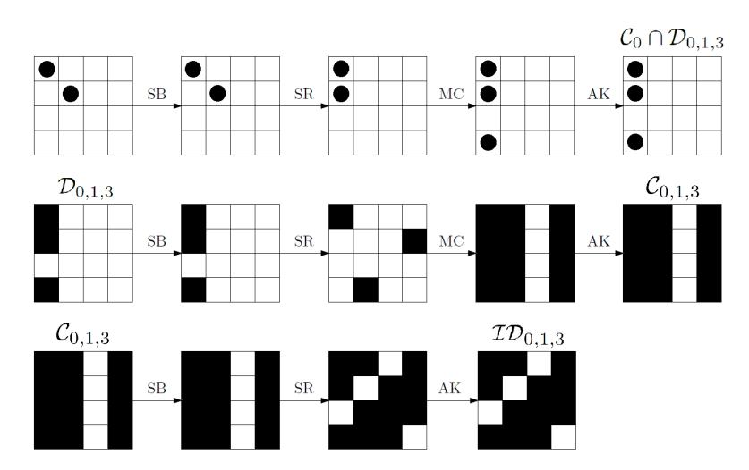

**Figure 13:** 3-round Truncated Differential Attack on AES with secret S-Box. The choice of the plaintexts (i.e.  $p_{0,0} \oplus p_{1,1} = k_{0,0} \oplus k_{1,1}$ ) guarantees that after one round there are only three bytes with non-zero difference instead of four, that is the plaintexts belong to the same coset of  $\mathcal{C}_0 \cap \mathcal{D}_{0,1,3}$ . White box denotes a byte with a zero-difference, while a black box denotes a byte with non-zero difference.

have seen, if  $p_{0,0}^1 \oplus p_{1,1}^1 = p_{0,0}^2 \oplus p_{1,1}^2 = k_{0,0} \oplus k_{1,1}$ , then  $p^1$  and  $p^2$  belong to the same coset of  $\mathcal{D}_{0,1,3}$  after one round with probability 1. Consequently, after three rounds they belong to the same coset of  $\mathcal{M}_{0,1,3}$  with probability 1 (or of  $\mathcal{ID}_{0,1,3}$  if the final MixColumns is omitted), since a coset of  $\mathcal{D}_{0,1,3}$  is mapped into a coset of  $\mathcal{M}_{0,1,3}$  with probability 1. Instead, if  $p_{0,0}^1 \oplus p_{1,1}^1 = p_{0,0}^2 \oplus p_{1,1}^2 \neq k_{0,0} \oplus k_{1,1}$ , then  $p^1$  and  $p^2$  belong to the same coset of  $\mathcal{D}_{0,1,3}$  after one round only with probability  $2^{-8}$  (that is, only if  $R(p^1)_{2,0} \oplus R(p^2)_{2,0} = 0$ ). Thus, after three rounds they belong to the same coset of  $\mathcal{M}_{0,1,3}$  only with probability  $2^{-8}$ . Our attack exploits these different probability in order to find  $k_{0,0} \oplus k_{1,1}$ .

The idea is to consider n different pairs of plaintexts (with one plaintext in common) for each possible value of  $\delta$ , that is  $n \cdot 2^8$  pairs of plaintexts  $p^1$  and  $p^2$  such that  $p^1_{i,j} = p^2_{i,j}$  for each  $(i,j) \neq \{(0,0),(1,1)\}$  and  $p^1_{0,0} \oplus p^1_{1,1} = p^2_{0,0} \oplus p^2_{1,1} = \delta$ . Given a  $\delta$ , the attacker checks if the corresponding n pairs of ciphertexts belong or not to the same coset of  $\mathcal{M}_{0,1,3}$ . If not, then the key is wrong due to previous considerations.

What is the probability that all the false key candidates are discarded (i.e. they don't pass the test) using n pairs for each  $\delta$ ? This probability is given by  $1-(1-2^{-8})^{2^8 \cdot n} \simeq 1-e^{-n}$ . If n=3 (that is, 4 chosen plaintexts - one plaintext is in common), then this probability is higher than 95%. Thus, in order to find 1 byte of the key,  $4\cdot 2^8=2^{10}$  chosen plaintexts. The cost of the attack can be approximated to  $3\cdot 2^8=2^{9.6}$  XOR operations (for 4 chosen plaintexts, the attacker computes only 3 XOR operations, since she considers only 3 different pairs).

In order to find the secret key, for each of the four diagonals, the attacker has to repeat the same attack for three consecutive-diagonal bytes differences of the same diagonal, as for example  $k_{0,0} \oplus k_{1,1}$ ,  $k_{1,1} \oplus k_{2,2}$  and  $k_{2,2} \oplus k_{3,3}$  for the first diagonal (note that the difference  $k_{0,0} \oplus k_{3,3}$  and all the other differences of these four bytes of the first diagonal are given by the sum of the previous ones). As result, the attacker is able to find the

<span id="page-61-1"></span><sup>&</sup>lt;sup>26</sup>Given two random texts x and y in they same coset of  $\mathcal{D}_0$ , they belong to the same coset of  $\mathcal{M}_{0,1,3}$  with probability  $2^{-24}$  - see Theorem 1. However, in this case we are not considering random texts in  $\mathcal{D}_0$ , but two texts that belong after one round to the same coset of  $\mathcal{D}_{0,1,3}$  with probability  $2^{-8}$ . Since two texts belong to the same coset of  $\mathcal{M}_{0,1,3}$  if and only if they belong to the same coset of  $\mathcal{D}_{0,1,3}$  two rounds before, we obtain that the probability for the studied case is  $2^{-8}$  and not  $2^{-24}$ .

```
Data: 2
         10 plaintexts as described in the texts (i.e. 4 for each possible value of
        p
         1
         0,0 ⊕ p
                1
                1,1 = p
                        2
                        0,0 ⊕ p
                               2
                               1,1 = δ)
Result: k0,0 ⊕ k1,1
for δ from 0 to 2
                   8 − 1 do
   flag ← 0;
   let (p
         i
          , ci
             ) for i = 0, ..., 3 the 4 (plaintexts, ciphertexts) such that p
                                                                              i
                                                                              l,k = p
                                                                                     j
                                                                                     l,k for
     each (l, k) 6= {(0, 0),(1, 1)} and p
                                         i
                                         0,0 ⊕ p
                                                i
                                                1,1 = δ for each i;
   for i from 1 to 3 do
       x ← MC−1
                    (c
                      0 ⊕ c
                            i
                             );
       if ((x0,1 6= 0) OR (x1,0 6= 0) OR (x2,3 6= 0) OR (x3,2 6= 0)) then
           flag ← 1;
             break;
       end
       if flag = 0 then
           identify δ as candidate of k0,0 ⊕ k1,1;
       end
   end
end
```

**return** *Candidates for k*0*,*<sup>0</sup> ⊕ *k*1*,*1*.* **Algorithm 8:** *Attack on 3-round of AES with secret S-Box - Pseudo Code*. The same attack can be use to find the remaining part of the key.

whitening key up to (2<sup>8</sup> ) <sup>4</sup> = 2<sup>32</sup> variants, if she doesn't use any information about the secret S-Box. Thus, the total cost of the attack is 12 · 2 <sup>10</sup> = 2<sup>13</sup>*.*<sup>6</sup> chosen plaintexts and 12 · 2 <sup>9</sup>*.*<sup>6</sup> = 2<sup>13</sup>*.*<sup>2</sup> XOR operations.

Without discovering any information about the secret S-Box, the attacker is able to find the secret key up to 2 <sup>32</sup> variants. However, it is possible to reduce this number to 2 8 if one discovers and exploits an equivalent class of the secret S-Box. We refer to App. [G.2.1](#page-63-1) for more details. Moreover, it is also possible to consider the case in which only one row of the MixColumns matrix has two identical elements. In this case, it is not possible to recover all the key bytes using the previous procedure, but at most four byte-differences (one per diagonal). However, it is still possible to find the secret key, working also on the secret S-Box. The details of this procedure are given in App. [G.2.2.](#page-63-2)

Finally, note that the same strategy can be used to attack 1- and 2-round of AES, using the subspace C instead of M in this second case (a coset of D is mapped into a coset of C after one round).

**Practical Verification.** The attack just presented has been practically verified: as final thing, we report here the practical results. Suppose that an attacker is looking for a byte difference, e.g. *δ* ≡ *k*0*,*<sup>0</sup> ⊕*k*1*,*<sup>1</sup> (similarly for the other cases). As we have seen, in order to have a probability of success higher than 95%, she has to use 3 pairs of texts (with one text in common), and the computational cost can be approximated by 3 · 2 <sup>8</sup> = 768 XOR operations (in the worse case). However, consider the case of a wrong guessed value of *δ*. In this case, when the attacker finds the first pair of ciphertexts that doesn't belong to the same coset of M0, she can immediately deduce that the guessed value *δ* is certainly wrong, without considering the other remaining pairs. For this reason, we can expect that the practical computational cost is lower than the theoretical one (which is computed analyzing the worse case). In effect, our practical results show that the *average* computational cost of the attacker is of 261 XOR operations, that is 1*/*3 of the theoretical one.

## <span id="page-63-0"></span>**G.2 Possible Variants of the Truncated Differential Attack on 3 Rounds of AES with Secret S-Box**

In the previous section, we have presented a truncated differential attack on 3 rounds of AES with a secret S-Box. Here we discuss some variants of such an attack.

#### <span id="page-63-1"></span>**G.2.1 Use Information of the Secret S-Box to Reduce the 2 <sup>32</sup> Variants of the Whitening Key to 2 <sup>8</sup> Variants**

Without discovering any information about the secret S-Box, the attacker is able to find the secret key up to 2 <sup>32</sup> variants. However, it is possible to reduce this number to 2 8 if one discovers and exploits an equivalent class of the secret S-Box.

Using the previous strategy, the attacker is able to discover *k*0*,*<sup>0</sup> ⊕ *k*1*,*1, *k*1*,*<sup>1</sup> ⊕ *k*2*,*<sup>2</sup> and *k*2*,*<sup>2</sup> ⊕ *k*3*,*<sup>3</sup> (analogous for the other diagonals). Consider a pair of ciphertexts that belong to the same coset of M*<sup>j</sup>* for |*j*| = 1. W.l.o.g we assume *j* = {0} (the other cases are analogous). As we have seen, these two ciphertexts belong to the same coset of D*<sup>j</sup>* two rounds before. This means that the whitening key and the plaintexts have to satisfy certain relationships in order to guarantee it, as for example:

$$0x09 \cdot [S-Box(p_{0,0}^1 \oplus k_{0,0}) \oplus S-Box(p_{0,0}^2 \oplus k_{0,0})] =$$

$$=0x0e \cdot [S-Box(p_{1,1}^1 \oplus k_{1,1}) \oplus S-Box^{-1}(p_{1,1}^2 \oplus k_{1,1})].$$
(23)

<span id="page-63-3"></span>Since the difference *k*0*,*<sup>0</sup> ⊕ *k*1*,*<sup>1</sup> is known, one can rewrite this equation in the unknown function S-Box(· ⊕ *k*0*,*0). The same can be done for the other two relationships of the first diagonal of *k*. Collecting enough equations and working exactly as in [\[TKKL15\]](#page-36-2), it is possible to recover (an equivalent representation of) this function.

Assume that this function is found (we refer to [\[TKKL15\]](#page-36-2) for more details), and note that similar relationships hold among the bytes of the other diagonals. The idea is to rewrite these relationships of the other diagonals using the found function S-Box(· ⊕ *k*0*,*0). For example, the relationship of the second diagonal can be rewritten in the unknown function S-Box(·⊕*k*0*,*1) = S-Box((·⊕*k*0*,*<sup>1</sup> ⊕*k*0*,*0)⊕*k*0*,*0). Since an equivalent representation of S-Box(· ⊕ *k*0*,*0) is known, one can find *k*0*,*<sup>1</sup> ⊕ *k*0*,*<sup>0</sup> using the same strategy presented in [\[TKKL15\]](#page-36-2). Working in the same way for all the diagonals, this allows to reduce the possible variants of the whitening key to 2 8 .

Finally, note that for this step we are forced to use chosen ciphertexts instead of chosen plaintexts. Indeed, working with plaintexts one finds relationships that involves S-Box<sup>−</sup><sup>1</sup> (· ⊕ *k* 3 ) (e.g. Eq. [\(10\)](#page-45-0)), where *k* 3 is the key of the final round. Since the key schedule involves some S-Box operations, it is not possible to use it to find *k* <sup>3</sup> given variants of the whitening key. Thus, a possible way to overcome the problem is to consider chosen ciphertexts, in order to find relationships that involves S-Box(· ⊕ *k*).

#### <span id="page-63-2"></span>**G.2.2 Another Variant of the Attack**

As last thing, we consider the case in which only one row of the MixColumns matrix has two identical elements. In this case, it is not possible to recover all the key bytes using the previous procedure, but at most four byte-differences (one per diagonal). However, it is still possible to find the key if one works also on the secret S-Box. The procedure is similar to the previous one, used to reduce the number of possible variants of the secret key.

Suppose for simplicity that only the third row of the MixColumns matrix has two identical element. Using the same strategy of the previous algorithm, one is able to find *k*0*,*<sup>0</sup> ⊕ *k*1*,*1, for a cost of 2 <sup>10</sup> chosen plaintexts.

The idea now is to consider ciphertexts that belong to the same coset of M*<sup>j</sup>* for |*j*| = 1 (or ID*<sup>j</sup>* for |*j*| = 1 if the final MixColumns operation is omitted). W.l.o.g. we assume *j* = {0}. As we have seen, the corresponding plaintexts have to belong to the same coset of

 $\mathcal{D}_0$  after one round. Using the same strategy of the low-data truncated differential attack, we can find the relationships that the bytes the secret key and of the plaintexts have to satisfy. In particular, if  $c^1 \oplus c^2 \in \mathcal{M}_0$ , then the key bytes  $k_{0,0}$  and  $k_{1,1}$  have to satisfy the relationship (23) in order to guarantee that  $R(p^1) \oplus R(p^2) \in \mathcal{D}_0$ . Rewriting this equation in the unknown function S-Box $(\cdot \oplus k_{0,0})$  (the difference  $k_{0,0} \oplus k_{1,1}$  is known) and collecting enough equations, it is possible to recover this function. When this function is discovered, the idea is to work exactly as in [TKKL15] to find the whitening key up to  $2^8$  variants.

### <span id="page-64-0"></span>G.3 Square Attack on 3 Rounds of AES with Secret S-Box

In App. G.1, we have presented a truncated differential attack on 3 rounds of AES with secret S-Box. In this section, we show how to use a similar technique for the case of the square attack. We recall that with respect to other attacks present in literature (as for example [TKKL15]), for our attack it is not necessary to find any other information about the secret S-Box. However, the consequence is that our attack has a higher data complexity.

As we have seen in details in Sect. G.1, given two plaintexts  $p^1$  and  $p^2$  such that  $p^1_{i,j} = p^2_{i,j}$  for each  $(i,j) \neq \{(0,0),(1,1)\}$  and  $p^1_{0,0} \oplus p^1_{1,1} = p^2_{0,0} \oplus p^2_{1,1} = \delta$ , then they belong to the same coset of  $\mathcal{C}_0 \cap \mathcal{M}_{0,1,3}$  after one round if  $\delta = k_{0,0} \oplus k_{1,1}$ .

The idea of the attack is the following. Consider the set  $V_{\delta}$  defined as in (6):

$$V_{\delta} = \{ (p^i, c^i) \text{ for } i = 0, ..., 2^8 - 1 \mid p_{0,0}^i \oplus p_{1,1}^i = \delta \quad \forall i \text{ and}$$
 and
$$p_{k,l}^i = p_{k,l}^j \, \forall (k,l) \neq \{ (0,0), (1,1) \} \text{ and } i \neq j \},$$

If  $\delta = k_{0,0} \oplus k_{1,1}$ , one round encryption of  $V_{\delta}$  corresponds to

$$\begin{bmatrix} x & c_{0,1} & c_{0,2} & c_{0,3} \\ c_{1,0} & x \oplus \delta & c_{1,2} & c_{1,3} \\ c_{2,0} & c_{2,1} & c_{2,2} & c_{2,3} \\ c_{3,0} & c_{3,1} & c_{3,2} & c_{3,3} \end{bmatrix} \rightarrow \begin{bmatrix} y \oplus \tilde{c}_{0,0} & \tilde{c}_{0,1} & \tilde{c}_{0,2} & \tilde{c}_{0,3} \\ 0x03 \cdot y \oplus \tilde{c}_{1,0} & \tilde{c}_{1,1} & \tilde{c}_{1,2} & \tilde{c}_{1,3} \\ \tilde{c}_{2,0} & \tilde{c}_{2,1} & \tilde{c}_{2,2} & \tilde{c}_{2,3} \\ 0x02 \cdot y \oplus \tilde{c}_{3,0} & \tilde{c}_{3,1} & \tilde{c}_{3,2} & \tilde{c}_{3,3} \end{bmatrix}$$

for each  $x \in \mathbb{F}_{2^8}$ , where  $y = \text{S-Box}(x \oplus k_{0,0})$ . That is, if  $\delta = k_{0,0} \oplus k_{1,1}$ , then the set  $V_{\delta}$  is mapped into  $\mathcal{D}_{0,1,3} \cap \mathcal{C}_0 \cap \mathcal{M}_3$ , which implies that the bytes in positions (0,0), (1,0) and (3,0) can take each possible values in  $\mathbb{F}_{2^8}$ . Instead, if  $\delta \neq k_{0,0} \oplus k_{1,1}$ , no claims can be made about the bytes of the first column (the others are obviously constant). Equivalently, these two cases correspond to:

$$\begin{bmatrix} A & C & C & C \\ A & C & C & C \\ C & C & C & C \\ A & C & C & C \end{bmatrix}, \qquad \begin{bmatrix} ? & C & C & C \\ ? & C & C & C \\ ? & C & C & C \\ ? & C & C & C \end{bmatrix},$$

respectively for  $\delta = k_{0,0} \oplus k_{1,1}$  and  $\delta \neq k_{0,0} \oplus k_{1,1}$ , where A,B,C and ? denote byte with the following properties:

- Active (A): Every value in  $\mathbb{F}_{2^8}$  appears the same number of times in X;
- Balance (B): The XOR of all values in X is 0;
- Constant (C): The value is fixed to a constant for all texts in X;
- Unknown (?): ? is indistinguishable from random sets.

Since

$$\begin{bmatrix} A & C & C & C \\ A & C & C & C \\ C & C & C & C \\ A & C & C & C \end{bmatrix} \rightarrow \begin{bmatrix} B & B & B & B \\ B & B & B & B \\ B & B &$$

```
Data: 2^8 set V_{\delta} as defined in (6) (i.e. one for each possible value of
          p_{0,0}^1 \oplus p_{1,1}^1 = p_{0,0}^2 \oplus p_{1,1}^2 = \delta
Result: k_{0.0} \oplus k_{1.1}
for \delta from 0 to 2^8 - 1 do
    x \leftarrow 0;
    let V_{\delta} = \{p^i, c^i\} for each i = 0, ..., 2^8 - 1;
    for i from \theta to 2^8 - 1 do
     x \leftarrow x \oplus c^i;
    end
    for i from \theta to 16 do
         a \leftarrow i \mod 4;
           b \leftarrow (i-r)/4;
         if (x_{a,b} \neq 0) then
              flag \leftarrow 1;
               break;
         if flag = 0 then
          identify \delta as candidate of k_{0,0} \oplus k_{1,1};
    end
end
return Candidates for k_{0,0} \oplus k_{1,1}.
```

Algorithm 9: Square Attack on 3-round of AES with secret S-Box. The same attack can be use to find the remaining part of the key.

after 2 rounds, it follows that the 3-round encryption of  $V_{\delta}$  has the balance property if  $\delta = k_{0,0} \oplus k_{1,1}$ . Instead, if  $\delta \neq k_{0,0} \oplus k_{1,1}$ , the probability that  $V_{\delta}$  satisfies the balance property after 3-round if  $\delta \neq k_{0,0} \oplus k_{1,1}$  is  $(2^{-8})^{-16} = 2^{-128}$ , since it is not in general possible to guarantee any property of the one round of encryption of  $V_{\delta}$ .

Thus, the idea is to consider  $2^8$  different sets  $V_{\delta}$ , one for each possible values of  $\delta$ , and to check if the balance property on the ciphertexts is satisfied or not. If the balance property is not satisfied, then the value  $\delta$  as candidate for  $k_{0,0} \oplus k_{1,1}$  is certainly wrong. What is the probability that all the false candidates don't satisfy this test? By simply computation is  $(1-2^{-128})^{2^8-1} \simeq 1-2^{-120}$ . As a result, in order to find one byte of the secret key, the data complexity is  $2^8 \cdot 2^8 = 2^{16}$ , while the computational complexity can be approximated to  $2^{16}$  XOR operations.

As for the attack of App. G.1, the idea is to repeat the attack for three different consecutive-diagonal bytes, and for all the four diagonals. In this way, the attacker is able to find  $2^{32}$  variants of the whitening key without working on the secret S-Box. The total data complexity for the attack can be approximated to  $12 \cdot 2^{16} = 2^{19.6}$  chosen plaintexts, and a cost of  $2^{19.6}$  XOR operations.

For completeness, using the same strategy of App. G.1, one can reduce this number of variants to  $2^8$  working also on the secret S-Box.

**Practical Verification.** As last thing, we report that for this attack the practical computational cost is approximately the same of the theoretical one, and that the given data complexity allows to have an high probability of success, as indicated above.

# <span id="page-66-0"></span>H Truncated Differential Attack on 4 rounds of AES with a single Secret S-Box

As for the case of 3-round of AES, we present an attack on 4-round of AES with secret S-Box which exploits the truncated differential attack and the subspace trail. The previous truncated differential attack on 3-round of AES with secret S-Box exploits a subspace trail with probability 1. In this section, we present a truncated differential to attack 4-round of AES with secret S-Box - illustrated in Fig. 14 - that exploits the subspace trail described in Sect. 4.3, which has probability strictly less than 1 (but greater than 0).

The idea of the attack is to exploit the fact that two elements that belong to the same coset of  $\mathcal{D}_I$  belong to the same coset of  $\mathcal{M}_J$  after three rounds with probability higher than two random elements, as we have showed in Sect. 4.3. To set up the attack, we exploit this fact together with the possibility to map a subset of a coset of  $\mathcal{D}_i$  (which depends on the secret key) into a subset of a coset of  $\mathcal{D}_I$  after one round.

Consider two plaintexts  $p^1$  and  $p^2$  such that  $p_{i,j}^1 = p_{i,j}^2$  for each  $(i,j) \neq \{(0,0),(1,1)\}$  and  $p_{0,0}^1 \oplus p_{1,1}^1 = p_{0,0}^2 \oplus p_{1,1}^2 = \delta$ . As we have seen, if  $\delta = k_{0,0} \oplus k_{1,1}$ , then the two plaintexts belong to the same coset of  $\mathcal{D}_{0,1,3}$  after one round. First of all, the previous choice of plaintexts can be generalized.

<span id="page-66-1"></span>**Proposition 7.** Let  $p^1$  and  $p^2$  be two texts such that

$$p_{i,j}^1 = p_{i,j}^2 \qquad \forall (i,j) \neq \{0,0), (0,3), (1,1), (1,2), (2,0), (2,3), (3,1), (3,2)\}$$

and

$$p_{0,0}^1 \oplus p_{1,1}^1 = p_{0,0}^2 \oplus p_{1,1}^2 = \delta_0, \qquad p_{1,2}^1 \oplus p_{2,3}^1 = p_{1,2}^2 \oplus p_{2,3}^2 = \delta_1, p_{0,3}^1 \oplus p_{3,2}^1 = p_{0,3}^2 \oplus p_{3,2}^2 = \delta_2, \qquad p_{2,0}^1 \oplus p_{3,1}^1 = p_{2,0}^2 \oplus p_{3,1}^2 = \delta_3.$$

Then, if  $\delta_0 = k_{0,0} \oplus k_{1,1}$ ,  $\delta_1 = k_{1,2} \oplus k_{2,3}$ ,  $\delta_2 = k_{0,3} \oplus k_{3,2}$  and  $\delta_3 = k_{2,0} \oplus k_{3,1}$  (where k is the secret key of the first round), then after one round they belong to the same coset of  $\mathcal{C}_0 \cap \mathcal{D}_{0,1,3} \subseteq \mathcal{D}_{0,1,3}$ , that is  $R(p^1) \oplus R(p^2) \in \mathcal{C}_0 \cap \mathcal{D}_{0,1,3}$ .

The proof is similar to that of Prop. 7.

For the following, we consider pairs of plaintexts such that  $p_{i,j}^1 = p_{i,j}^2$  for each  $(i,j) \neq \{(0,0),(1,1),(1,2),(2,3)\}$  and  $p_{0,0}^1 \oplus p_{1,1}^1 = p_{0,0}^2 \oplus p_{1,1}^2 = \delta_0$ ,  $p_{1,2}^1 \oplus p_{2,3}^1 = p_{1,2}^2 \oplus p_{2,3}^2 = \delta_1$ . If  $\delta_0 = k_{0,0} \oplus k_{1,1}$  and  $\delta_1 = k_{1,2} \oplus k_{2,3}$ , these two plaintexts belong to the same coset of  $\mathcal{D}_{0,1,3}$  with probability 1, that is they belong to the same coset of  $\mathcal{M}_{0,1,3}$  after three rounds with probability 1. Using Prop. 1, this means that if  $\delta_0 = k_{0,0} \oplus k_{1,1}$  and  $\delta_1 = k_{1,2} \oplus k_{2,3}$ , the two plaintexts belong to the same coset of  $\mathcal{C}_J$  with probability  $(2^8)^{-12+4\cdot |J|}$  after three rounds. That is, if |J| = 3,  $\delta_0 = k_{0,0} \oplus k_{1,1}$  and  $\delta_1 = k_{1,2} \oplus k_{2,3}$ , then after three rounds these two plaintexts belong to the same coset of  $\mathcal{C}_J$  with probability  $2^{-24}$  for a fixed J with |J| = 3, or with probability  $4 \cdot 2^{-24} = 2^{-22}$  for a free J with |J| = 3. Since a coset of  $\mathcal{C}_J$  is mapped into a coset of  $\mathcal{M}_J$  with probability 1, we can conclude that if  $\delta_0 = k_{0,0} \oplus k_{1,1}$  and  $\delta_1 = k_{1,2} \oplus k_{2,3}$ , the two plaintexts belong to the same coset of  $\mathcal{M}_J$  for a certain J with |J| = 3 with probability  $2^{-24}$ .

Consider now the case  $\delta_0 \neq k_{0,0} \oplus k_{1,1}$  or/and  $\delta_1 \neq k_{1,2} \oplus k_{2,3}$ . In this case, we can consider the corresponding ciphertexts as randomly distributed, that is they belong to the same coset of  $\mathcal{M}_J$  for a certain J with |J|=3 after four rounds only with probability  $4 \cdot 2^{-32}=2^{-30}$ .

**Remark.** Before to go on, we explain why it is not possible to work on a single  $\delta$  (that is, on separately  $\delta$  as on the previous attack on 3 rounds of App. G.1). Suppose to consider two plaintexts  $p^1$  and  $p^2$  such that  $p_{i,j}^1 = p_{i,j}^2$  for each  $(i,j) \neq \{(0,0),(1,1)\}$  and  $p_{0,0}^1 \oplus p_{1,1}^1 = p_{0,0}^2 \oplus p_{1,1}^2 = \delta$ . By definition, these two plaintexts belong to the same coset of

<span id="page-67-0"></span>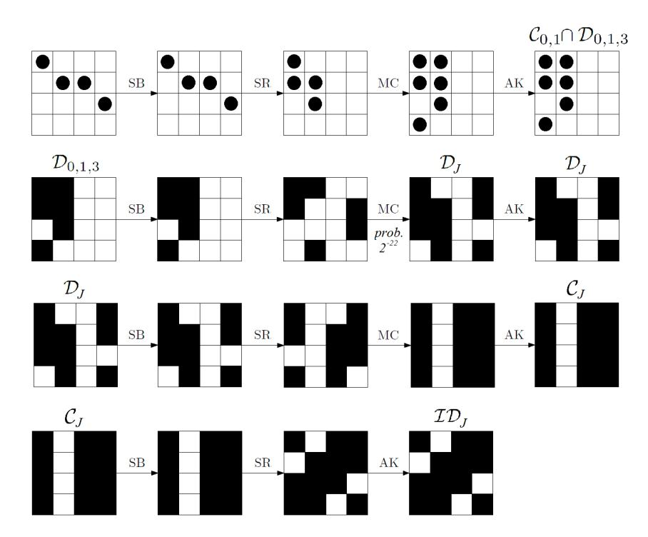

Figure 14: 4-round Truncated Differential Attack on AES with secret S-Box. The choice of the plaintexts (i.e.  $p_{0,0} \oplus p_{1,1} = k_{0,0} \oplus k_{1,1}$  and  $p_{1,2} \oplus p_{2,3} = k_{1,2} \oplus k_{2,3}$ ) guarantees that after one round they belong to the same coset of  $C_{0,1} \cap D_{0,1,3}$ . As a consequence, after three rounds they belong to the same coset of  $C_J$  for a certain  $J \subseteq \{0,1,2,3\}$  with |J| = 3 with probability  $2^{-22}$  instead of  $2^{-30}$ . White box denotes denotes a byte with a zero-difference, while a black box denotes a byte with non-zero difference.

 $\mathcal{D}_0 \cap \mathcal{C}_{0,1} \subseteq \mathcal{D}_0$ , independently by  $\delta$ . Thus, as shown in Sect. 4.4, the probability that they belong to the same coset of  $\mathcal{M}_J$  for |J| = 3 is  $Pr(R^{(4)}(u) \oplus R^{(4)}(v) \in \mathcal{M}_J \mid u \oplus v \in \mathcal{D}_I) = 0$  (see Prob. 5), independently of  $\delta$ .

#### **Data and Computational Cost**

**Data Complexity.** The idea of the attack is to exploit these different probabilities in order to recover the key. In particular, consider  $n \leq 2^{16}$  plaintexts defined as before for each possible values of  $\delta_0$  and  $\delta_1$ . If  $\delta_0 = k_{0,0} \oplus k_{1,1}$  and  $\delta_1 = k_{1,2} \oplus k_{2,3}$ , then we expect approximately  $n \cdot (n-1) \cdot 2^{-23}$  different pairs of ciphertexts that belong to the same coset of  $\mathcal{M}_J$  for a certain J with |J| = 3 (i.e. collisions), while  $n \cdot (n-1) \cdot 2^{-31}$  collisions if  $\delta_0 \neq k_{0,0} \oplus k_{1,1}$  or/and  $\delta_1 \neq k_{1,2} \oplus k_{2,3}$ . For example, if  $n = 2^{16}$ , we expect on average  $2^8 = 256$  collisions for the first case and 2 in the other one. By our experiments, we check that  $n = 2^{13}$  is (largely) sufficient to find the right value of  $k_{0,0} \oplus k_{1,1}$  and  $k_{1,2} \oplus k_{2,3}$ .

Assume that  $k_{0,0} \oplus k_{1,1}$  and  $k_{1,2} \oplus k_{2,3}$  have been found. The idea is to proceed in the same way to find the  $2^{32}$  variants of the whitening secret key. To improve the total cost of the attack, suppose that for each diagonal the attacker one difference of two consecutive-diagonal bytes is known. A good strategy is to use it to find the others. As an example, a good strategy could be to use the knowledge of  $\delta_0 = k_{0,0} \oplus k_{1,1}$  and to look for  $\delta_2 = k_{0,3} \oplus k_{3,2}$  (similar for  $\delta_0$  and  $\delta_3 = k_{2,0} \oplus k_{3,1}$ ), instead to work on  $\delta_2$  and  $\delta_3$ . Note that both the method allows to find the secret key, but in the first case the attacker does  $2 \cdot 2^8 = 2^9$  tests, while in the second one  $2^{16}$ . Thus, the data complexity cost can be

approximated by  $8 \cdot 2^8 \cdot 2^8 + 2 \cdot (2^8)^2 \cdot 2^{13} = 2^{30}$  chosen plaintexts.

Computational Complexity. To give a good approximation of the computational cost, observe that the first step of the attack (i.e. to find  $\delta_0$  and  $\delta_1$ ) is the most expensive one. Thus, the total cost can be approximated by this step (which is repeated two times on the first and on the second diagonals, and then on the third and on the fourth diagonal). Moreover, note that the attacker must construct all the possible pairs of ciphertexts and check if they belong or not to the same coset of  $\mathcal{M}_J$  for a certain J with |J|=3. Note that the cost to check if two texts belong to the same coset of  $\mathcal{M}_J$  for a certain J with |J|=3 requires only 1 XOR operations. Thus, the computational cost can be approximated by the cost to construct all the pairs. Since for each  $\delta_0$  and  $\delta_1$  the attack needs  $2^{13}$  chosen plaintexts, the operation to construct all the pairs requires  $2^{13} \cdot (2^{13} - 1)/2 = 2^{25}$  table look-ups, for a total of  $2 \cdot (2^8)^2 \cdot 2^{25} = 2^{42}$  table look-ups.

A way to improve this step is to re-order all the texts using a merge-sort algorithm, as we described in details in App. F. Indeed, when the elements are ordered with respect to a particular relationship  $\leq$ , one can work only on two consecutive texts  $t^1$  and  $t^2$  such that  $t^1 \leq t^2$  instead to consider all the possible pairs in order to count all the collisions (see App. F for details). For each  $\delta_0$  and  $\delta_1$  and for each J with |J|=3, the computational cost to re-order all the elements and to count the collision can be approximated to  $2^{13} \cdot (\log 2^{13} + 1) \simeq 2^{17}$  table look-ups, for a total of  $4 \cdot 2 \cdot (2^8)^2 \cdot 2^{17} = 2^{36}$  table look-ups, that is  $2^{29.7}$  four-round encryption assuming the approximation that one round of AES corresponds to 20 table look-ups. The memory cost is  $2^{30}$  to store all the texts. In this way, the attacker is able to find  $2^{32}$  variants of the whitening key, without working (or finding) any information about the secret S-Box. However, as shown in App. G.1, it is possible to reduce this number to  $2^8$  if one works also on the secret S-Box.

**Practical Verification.** The attack just presented has been practically verified: as final thing, we report here the practical results. For simplicity, here we limit to report the results when the attacker tries to find two bytes of the secret key - as  $k_{0,0} \oplus k_{1,1}$  and  $k_{1,2} \oplus k_{2,3}$  - using  $2^{13}$  different chosen plaintexts. These results can be easily extended for the complete attack, as described in the previous text. For completeness, we consider both the two cases in which the attacker (1) re-orders the texts before to count the number of collisions (working only on consecutive ordered elements), or (2) constructs all the possible pairs. This second setting allows to understand better the importance of the re-ordering algorithm in terms of performance/computational cost.

In the second case (that is the one in which all the possible pairs are constructed - no use of the re-ordering algorithm), the expected theoretical computational cost in order to find 2 bytes of the secret key is of  $(2^8)^2 \cdot 2^{12} \cdot (2^{13} - 1) = 2^{41} - 2^{28} \simeq 2^{41}$  memory accesses, and it is approximately the same of the practical computational one. Instead, for the first setting (that is the one the re-order the text before to counts the number of collisions) the expected theoretical computational cost in order to find 2 bytes of the secret key is of  $4 \cdot (2^8)^2 \cdot 2^{13} \cdot (\log 2^{13} + 1) \simeq 2^{32.8}$  memory accesses. The average practical computational cost is approximately of  $2^{32.65}$  memory accesses, which is very close to the theoretical one. Finally,  $2^{13}$  chosen plaintexts are (largely) sufficient to find the right value of  $k_{0,0} \oplus k_{1,1}$  and  $k_{1,2} \oplus k_{2,3}$ , as predicted by the theory.

# <span id="page-68-0"></span>I Impossible Differential Attack on 5-round AES with Single Secret S-Box - Details

In Sect. 7 we presented an impossible differential attack on 5-round AES with a single secret S-Box. Here we provide all the details about the data complexity and the computational

```
Data: 2^{21} plaintexts as described in the texts (i.e. 2^{13} for each possible value of
            p_{0,0}^i \oplus p_{1,1}^i = \delta_0 \text{ and } p_{1,2}^i \oplus p_{2,3}^i = \delta_1
  Result: k_{0.0} \oplus k_{1.1} and k_{1.2} \oplus k_{2.3}
  for \delta_0 from 0 to 2^8 - 1 do
      for \delta_1 from 0 to 2^8 - 1 do
           maxCollision \leftarrow -1;
           numberCollision \leftarrow 0; let (p^i,c^i) for i=0,...,2^{13}-1 the 2^{13} (plaintexts, ciphertexts) such that
            p_{l,k}^i = p_{l,k}^j for each (l,k) \neq \{(0,0), (1,1), (1,2), (2,3)\} and p_{0,0}^i \oplus p_{1,1}^i = \delta_0
            and p_{1,2}^i \oplus p_{2,3}^i = \delta_1 for each i;
           re-order this set of elements as described in App. F;
           while i < 2^{13} do
                n \leftarrow 0;
                  while c^j \oplus c^{j+1} \in \mathcal{M}_J for a certain with |J| = 3 do
                     n \leftarrow n + 1;
                end
                i \leftarrow j + 1;
                 numberCollision \leftarrow numberCollision + n \cdot (n+1)/2;
           if numberCollision > maxCollision then
                maxCollision \leftarrow numberCollision;
                identify \delta_0 as candidate of k_{0,0} \oplus k_{1,1} and \delta_1 as candidate of k_{1,2} \oplus k_{2,3};
      end
  end
  return Candidates for k_{0,0} \oplus k_{1,1} and of k_{1,2} \oplus k_{2,3}.
Algorithm 10: Attack on 4-round of AES with secret S-Box - Pseudo-Code. The same
```

cost of the attack, besides a possible variant of it.

attack can be use to find the remaining part of the key.

### <span id="page-69-0"></span>I.1 Details of the Attack - Data Complexity and Computational Cost

In this section, we give the details of the data and computational complexity of the impossible differential attack on 5-round AES with a single secret S-Box. The attack presented in Sect. 7 is constructed in two steps. First we focus on a single difference among two bytes of the secret key, and then we show how to find the entire key.

#### I.1.1 Data Complexity

Find a Single Byte of the Secret Key - Data Complexity. As we have seen, the probability that two texts belong to the same coset of  $\mathcal{M}_J$  for |J|=1 is  $2^{-94}$  (analogous for  $\mathcal{ID}_J$ ). Thus, given n pairs, the probability to have at least one collision in the same coset of  $\mathcal{M}_J$  for |J|=1 for a fixed  $\delta \neq k_{0,0} \oplus k_{1,1}$  is given by  $p=1-e^{-n/2^{94}}$ , due to the birthday paradox probability (4). If the number of pairs n is approximately  $2^{95.6}$ , then p is greater than 95%. Given a single set  $V_\delta$ , it is possible to construct  $2^7 \cdot (2^8-1) \simeq 2^{15}$  different pairs. Thus, for the distinguisher one needs approximately  $2^{95.6} \cdot 2^{-15} = 2^{80.6}$

different sets  $V_{\delta}$ . Since each of these sets contains  $2^8$  texts, the data complexity of the distinguisher is  $2^{80.6} \cdot 2^8 = 2^{88.6}$  texts.

However, one needs at least one collision in the same coset of  $\mathcal{M}_J$  for |J|=1 for each one of the  $2^8-1\simeq 2^8$   $\delta\neq k_{0,0}\oplus k_{1,1}$ . If we consider  $2^{80.6}$  sets for each  $\delta$  as before, then the probability to have one collision is 95% for each single collection of sets corresponding to a given value  $\delta$ . However, the probability that there is at least one collision for each one of the  $2^8-1$  wrong  $\delta$  is only of  $0.95^{255}\simeq 2\cdot 10^{-6}$  (note that the  $2^8$  collections of sets are independent). In order to have a total probability of about 95%, the probability to have at least one collision for each wrong  $\delta$  must be increased to approximately  $(0.95)^{1/2^8}=0.9998$ . Indeed, in this way the total probability is equal by  $0.9998^{256}=0.95$ , as desired. Using similar calculation as before, for each one of the  $2^8$  collections (i.e. for each  $\delta$ ), one needs at least  $2^{97.2}$  pairs to have at least one collision with probability 0.9998. Since each set  $V_{\delta}$  has about  $2^{15}$  different pairs, then one needs about  $2^{97.2}\cdot 2^{-15}=2^{82.2}$  different sets for each  $\delta$  (instead of  $2^{80.6}$  as before), that is  $2^{90.2}$  texts for each  $\delta$ . Since there are  $2^8$  different values of  $\delta$ , the total number of texts required for this distinguisher is  $2^{90.2}=2^{98.2}$  texts. In this way, one is able to find one byte of the secret kev.

Find the Secret Key - Data Complexity. In order to find the entire key, the idea is simply to repeat the previous attack 12 times (i.e. three times for each possible diagonal), in order to find  $2^{32}$  variants of the whitening secret key. As shown in App. G.1 for the three round case, it is useless to repeat more times this attack, since it is not possible to reduce this number of variants without exploiting the details of the S-Box. However, due to similar argumentation of before, the total probability of success becomes of  $(0.95)^{12} = 54\%$  using only  $12 \cdot 2^{98.2} = 2^{101.8}$  chosen plaintexts. Thus, in order to have a total probability of success of at least 95%, we need to increase the number of chosen plaintexts. In particular, for each one of the 12 cases, the probability to have at least one collision must be increased to  $0.95^{1/(256\cdot12)} \simeq 0.9999833$ . Thus, for each one of the 12 possible two consecutive-diagonal bytes and for each one of the corresponding  $2^8$   $\delta$ , one needs at least  $2^{97.4}$  pairs to have at least one collision with probability 0.999983 (using analogous computation as before). Since each set  $V_{\delta}$  has about  $2^{15}$  different pairs, then one needs about  $2^{97.4} \cdot 2^{-15} = 2^{82.4}$  different sets for each  $\delta$  (instead of  $2^{82.2}$  as before), that is  $2^{90.4}$  texts for each  $\delta$ . Since there are  $2^8$  different values of  $\delta$  and since the attack is repeated 12 times, the total number of texts required for this attack is  $12 \cdot 2^8 \cdot 2^{90.4} = 2^{102}$ . which is lower than the entire input-output space.

#### I.1.2 Computational Complexity

The attacker has to construct all the possible pairs and to count the number of collision in the same coset of  $\mathcal{M}_J$  for |J|=3. As shown in details for the 4 rounds truncated differential attack - App. H, the best strategy to minimize the computational cost is first to re-order the elements of each set using the algorithm described in App. F, and then to count the number of collisions working only on (ordered) consecutive texts. Since in this case each set contains  $2^8$  elements, the cost to re-order each set and count the number of collision for each possible J with |J|=3 can be approximated to  $4\cdot 2^8\cdot (\log 2^8+1)=2^{13}$  table look-ups. Since this operation is the most expensive one, we can approximate the cost of this attack with  $12\cdot 2^{90.4}\cdot 2^{13}\approx 2^{107}$  table-look ups, or  $2^{100.35}$  five rounds AES encryption.

Finally, it is also possible to modify the attack considering the difference of two sub-key bytes for more than one column at the same time. However, as we show in details in App. I.2, this case is worse both for the data complexity and the computational cost than the one presented here.

#### <span id="page-71-1"></span>I.1.3 Practical Verification on small-scale AES

Due to the huge data and computational complexities of the proposed distinguisher, it can not verified directly on AES. Here we show that - due to the same reasons - it can not also verified on small-scale AES, as presented in [CMR05]. While in "real" AES, each word is composed of 8 bits, in this variant each word is composed of 4 bits. We refer to [CMR05] for a complete description of this small-scale AES, and we limit ourselves to describe the results of our 5-round distinguisher in this case.

First of all, note that the argumentations exploited by the proposed distinguisher hold exactly in the same way also for this small-scale variant of AES (they are independent by the fact that each word of AES is of 4 or 8 bits). Thus, our verification on the small-scale variant of AES is strong evidence for it to hold for the real AES.

On the other hand, also a practical verification on small-scale AES can not be done due to the huge data and computational complexities of the proposed distinguisher also in this case. In particular, using the same calculation given before, it turn out that one has to use approximately  $2^{42.2}$  different sets  $V_{\delta}$  in order to set up the distinguisher, for a total cost of  $2^{42.2} \cdot 2^4 = 2^{46.2}$  chosen plaintexts. In the same way, the time complexity is well approximated by  $4 \cdot 2^{42.2} \cdot 2^4 \cdot \log 2^4 \simeq 2^{50.2}$  table look-ups, or approximately  $2^{43.6}$  five-round encryptions.

## <span id="page-71-0"></span>I.2 A possible Variant of the Impossible Differential Attack on 5-round AES with Secret S-Box

In order to construct the impossible differential attack on 5-round of AES with secret S-Box of Sect. 8, we focused only on the difference of two sub-key bytes that belong to the same column after the first ShiftRows operation. As done for the truncated differential attack on 4 rounds - App. H, one possible variant consists of exploiting more than a single difference at the same time. As we show in the following, this variant of the attack has an higher data and computational complexity cost.

In particular, let the set of plaintext-ciphertext  $W_{\Delta}$  defined as follows

$$\begin{split} W_{\Delta} = & \{ (p^i, c^i) \ \text{ for } i = 0, ..., 2^{32} - 1 \, | \, p^i_{0,0} \oplus p^i_{1,1} = \delta_0, \, p^i_{1,2} \oplus p^i_{2,3} = \delta_1, \\ & p^i_{2,0} \oplus p^i_{3,1} = \delta_2, \, p^i_{0,3} \oplus p^i_{3,2} = \delta_3 \quad \forall i \quad \text{and} \quad p^i_{k,l} = p^j_{k,l} \ \text{ otherwise} \}, \end{split}$$

where  $\Delta \equiv (\delta_0, \delta_1, \delta_2, \delta_3)$ ,  $\delta_0 = k_{0,0} \oplus k_{1,1}$ ,  $\delta_1 = k_{1,2} \oplus k_{2,3}$ ,  $\delta_2 = k_{2,0} \oplus k_{3,1}$  and  $\delta_3 = k_{0,3} \oplus k_{3,2}$ . Note that  $|W_{\Delta}| = 2^{32}$ , thus it is possible to construct  $2^{31} \cdot (2^{32} - 1) = 2^{63}$  different pairs.

**Proposition 8.** Let  $W_{\Delta}$  defined as before and let  $I = \{0, 1, 3\}$ . There exists  $a \in \mathcal{D}_{I}^{\perp}$  such that  $R(W_{\Delta}) \subseteq \mathcal{D}_{0,1,3} \oplus a$ .

As a consequence, given two elements p and q in  $W_{\Delta}$ , then  $R(p) \oplus R(q) \in \mathcal{D}_{0,1,3}$ , and so as before  $R^{(5)}(p) \oplus R^{(5)}(q) \notin \mathcal{M}_J$  with probability 1 for each J with |J| = 1.

The strategy of the attack is the same as before. The idea is to construct  $2^{32}$  collections (one for each possible combination of values of  $\Delta$ ), each one with a certain number of sets  $W_{\Delta}$ . To compute this number, our goal is to guarantee that in the random case, there is at least one collision for each possible combination of values of  $\delta_i$  for i=0,...,3 with probability 95%. Using the same computation as before, for each one of the  $2^{32}$  collections (i.e. for each combination of values of  $\delta_i$  for i=0,...,3), we need at least one collision with probability higher than  $0.95^{1/2^{32}} \simeq 1-2^{-36.4}$ . Moreover, the attacker has to repeat this step 4 times, which implies a probability of  $(1-2^{-36.4})^{1/4} \simeq 1-2^{-38.4}$ . Thus, to have at least one collision with this probability for each one of the  $2^{32}$  collections, each collection has to be composed of  $2^{98.74}$  pairs (instead of  $2^{95.6}$  pairs). Equivalently, this means that for each one of the  $2^{32}$  collections one needs about  $2^{98.74} \cdot 2^{-63} = 2^{35.74}$  different sets  $W_{\Delta}$ .

Since each one of these sets contains  $2^{32}$  texts (equivalently  $2^{63}$  pairs), since there are  $2^{32}$  possible  $\Delta$  and since we have to repeat this attack 4 times, the total number of texts for the attack is  $4 \cdot 2^{32} \cdot 2^{35.74} \cdot 2^{32} = 2^{101.75}$ , which is higher than before.

Finally, using the same argumentation of Sect. 8, we can approximate the computational cost to  $4 \cdot 2^{101.75} \cdot (\log 2^{101.75} + 1) = 2^{110.4}$  table look-ups, which is higher than before.