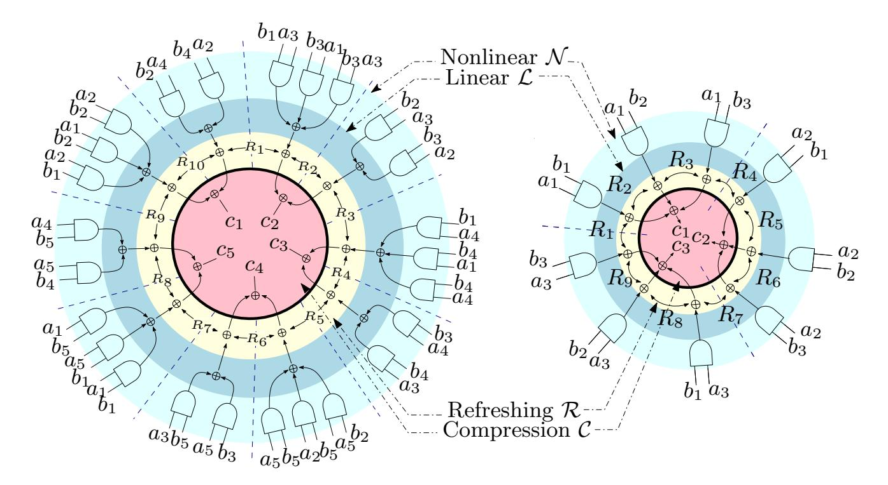
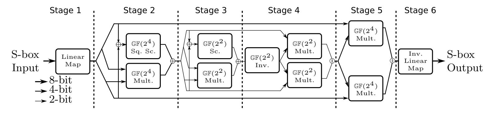
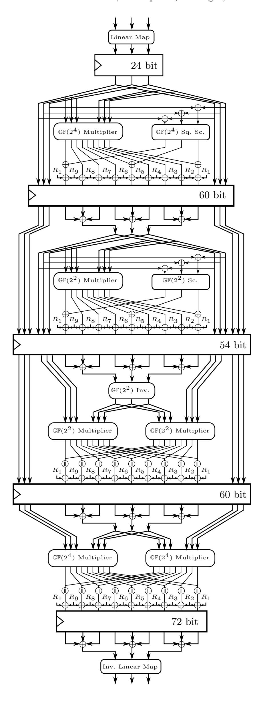
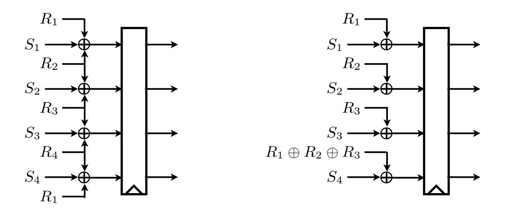
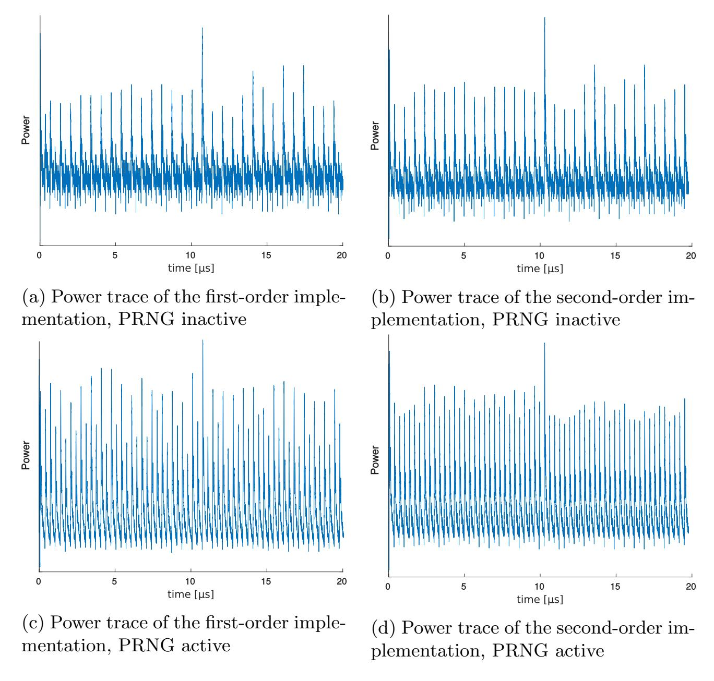
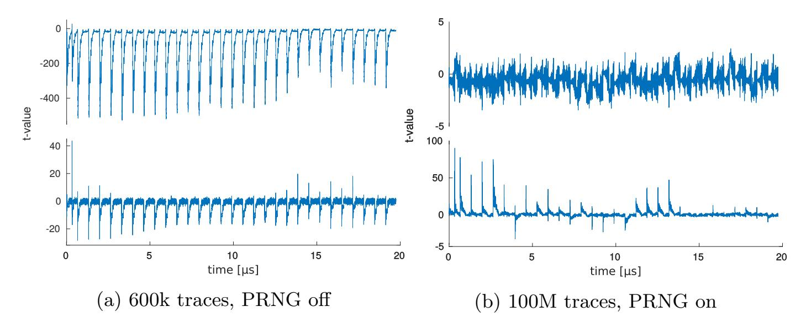
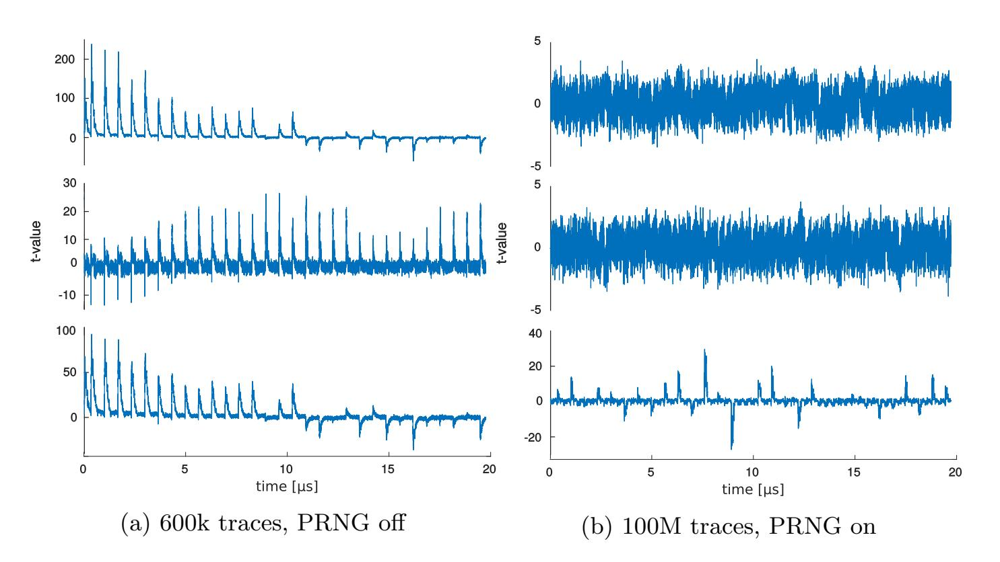
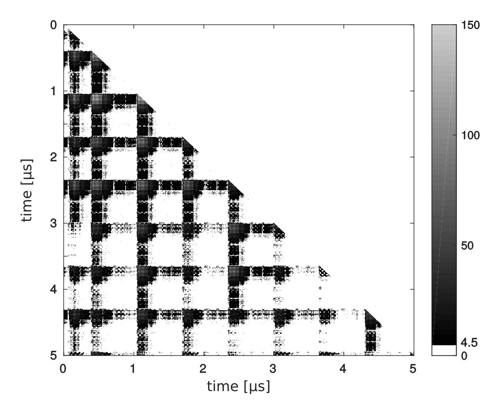

{0}------------------------------------------------

# Masking AES with d + 1 Shares in Hardware

Thomas De Cnudde1 , Oscar Reparaz1 , Beg¨ul Bilgin1 , Svetla Nikova1 , Ventzislav Nikov2 and Vincent Rijmen1

> 1 KU Leuven, ESAT-COSIC and iMinds, Belgium {name.surname}@esat.kuleuven.be 2 NXP Semiconductors, Belgium venci.nikov@gmail.com

Abstract. Masking requires splitting sensitive variables into at least d + 1 shares to provide security against DPA attacks at order d. To this date, this minimal number has only been deployed in software implementations of cryptographic algorithms and in the linear parts of their hardware counterparts. So far there is no hardware construction that achieves this lower bound if the function is nonlinear and the underlying logic gates can glitch. In this paper, we give practical implementations of the AES using d + 1 shares aiming at first- and second-order security even in the presence of glitches. To achieve this, we follow the conditions presented by Reparaz et al. at CRYPTO 2015 to allow hardware masking schemes, like Threshold Implementations, to provide theoretical higher-order security with d + 1 shares. The decrease in number of shares has a direct impact in the area requirements: our second-order DPA resistant core is the smallest in area so far, and its S-box is 50% smaller than the current smallest Threshold Implementation of the AES S-box with similar security and attacker model. We assess the security of our masked cores by practical side-channel evaluations. The security guarantees are met with 100 million traces.

Keywords: AES, DPA, Masking, Threshold Implementation.

### 1 Introduction

When cryptography is naively deployed in embedded devices, secrets can leak through side-channel information such as instantaneous power consumption, electromagnetic emanations or timing of the device. Ever since attacks based on side-channels were discovered and investigated [\[3,](#page-17-0)[17,](#page-18-0)[18\]](#page-18-1), several studies have been performed to counter the exploitation of these vulnerabilities.

A popular way to strengthen cryptographic implementations against such physical cryptographic attacks is masking [\[10\]](#page-18-2). It randomizes the internal computation and hence detaches the side-channel information from the secret-dependent intermediate values. Masking is both provable secure [\[10,](#page-18-2)[23\]](#page-19-0) and practical. Masking has been shown to increase the difficulty of mounting side-channel attacks on a wide range of cryptographic algorithms.

The basic principle of masking is to split each sensitive intermediate variable of the cryptographic algorithm into multiple shares using secret sharing, and to 

{1}------------------------------------------------

perform computations on these shares. From the moment that the input is split until the shared output of the cryptographic algorithm is released, shares of the sensitive intermediate variables are never combined in a way that these variables are unmasked, i.e. the unshared sensitive variables are never revealed. Only after the calculation has finished, the shared output is reconstructed to disclose its unmasked value.

Masking is not unconditionally secure. A d th-order masked implementation can be broken by a (d+1)th-order DPA attack. However, attacks of higher orders are more difficult to carry out in practice due to the exponential increase in number of measurements needed, so one typically guarantees only security up to a certain order. We use the standard convention that a d th-order attack exploits the d th-order statistical moment. This covers both univariate and multivariate attacks.

Although provable secure, masking is in practice often not straightforward to implement securely. In hardware, masking is delicate to implement since many assumptions on the leakage behavior of logic gates are not fully met in practice. In standard CMOS technology, glitches can diminish the security of a straightforward masked implementation [\[19\]](#page-19-1). There are masking schemes that cope with this non-ideal behavior and can provide security under more realistic and easier to meet assumptions. One example is Threshold Implementations.

#### 1.1 Related work

The Threshold Implementation (TI) technique which is based on Boolean masking has minimal assumptions on the underlying hardware platform [\[21\]](#page-19-2). More precisely, it assumes that logic gates will glitch, and provides security even if this happens. Due to its cost effectiveness, it has been applied to many cryptographic algorithms including Keccak [\[7\]](#page-17-1) and the standardized AES [\[14,](#page-18-3) [20\]](#page-19-3) and PRESENT [\[22\]](#page-19-4) symmetric-key algorithms. Recently, the security level of TI has been extended to resist univariate attacks at any order [\[5\]](#page-17-2). To further increase the security of TI against multivariate attacks, the use of remasking was suggested in [\[26\]](#page-19-5).

The authors of [\[26\]](#page-19-5) also proposed a consolidation of TI with another provable higher-order masking scheme ISW [\[16\]](#page-18-4) and with the Trichina masked AND gate [\[29\]](#page-20-0). This consolidated masking scheme, hereon CMS, inherits all TI properties and uses the remasking of ISW to break the multivariate correlation between the different clock cycles. Moreover, it has been shown in [\[26\]](#page-19-5) that d th-order security of any function can be achieved by only d+ 1 input shares using CMS which is the theoretical lower bound in masking schemes. Until then, it was believed that d th-order security on a non-ideal circuit can only be achieved by using more than d + 1 shares if the function is nonlinear [\[5,](#page-17-2) [24\]](#page-19-6). This bound on the number of input shares sin was given as sin ≥ td + 1 for a function of algebraic degree t in TI and sin ≥ 2d + 1 for a field multiplication in a complementary scheme [\[24\]](#page-19-6) which provides the same level of security using Shamir's secret sharing. In this paper, we use the words CMS and TI interchangeably.

{2}------------------------------------------------

There exist plenty masked AES implementations, hence we limit our introduction to TIs. The first TI of AES presented in [20] requires 11.1 kGE. Later, the hardware footprint of TI-AES is reduced to 8.1 kGE in a sequence of publications [4,6]. All these first-order TIs use functions with at least three input shares, with the exception of the smallest TI-AES which uses two shares for linear operations. A second-order TI of the AES S-box using six input shares is presented in [14] and is shown to require 7.8 kGE. We emphasize that in all these TIs, the number of input shares of the nonlinear operations are chosen to be  $s_{in} \geq td + 1$ .

#### 1.2 Contribution

We present the first Threshold Implementations in the form of the Consolidated Masking Scheme using d+1 input shares. We present both a first-order (6.6 kGE) and a second-order (10.4 kGE) secure implementation of AES. Our construction is generic and can be extended to higher orders. The area reduction of our new TIs compared to the smallest TIs of AES presented so far is shown to be 18% for first-order and approximately 45% for second-order security at the cost of an increase in the amount of required internal randomness. We observe negligible (first-order) or no (second-order) difference in throughput compared to prior TIs. We show the results of leakage detection tests with 100 million traces collected from an FPGA implementation to back up the security claims.

Organization. In Section 2, we provide the notation and the theory of CMS. In Section 3, we unfold the steps taken to mask AES using d+1 shares. We present the results of the side-channel analysis in Section 4. In Section 5, we discuss the implementation cost of our designs. We conclude the paper and propose directions for future work in Section 6.

### 2 Preliminaries

#### 2.1 Notation

We use small and bold letters to describe elements of  $\mathbb{GF}(2^n)$  and their sharing respectively. We assume that any possibly sensitive variable  $a \in \mathbb{GF}(2^n)$  is split into s shares  $(a_1, \ldots, a_s) = \mathbf{a}$ , where  $a_i \in \mathbb{GF}(2^n)$ , in the initialization phase of the cryptographic algorithm. A possible way of performing this initialization, which we inherit, is as follows: the shares  $a_1, \ldots, a_{s-1}$  are selected randomly from a uniform distribution and  $a_s$  is calculated such that  $a = \sum_{i \in \{1, \ldots, s\}} a_i$ . We refer to the  $j^{\text{th}}$  bit of a as  $a^j$  unless  $a \in \mathbb{GF}(2)$ . We use the same notation to share a function f to s shares  $\mathbf{f} = (f_1, \ldots, f_s)$ .

The number of input and output shares of  $\mathbf{f}$  are denoted by  $s_{in}$  and  $s_{out}$  respectively. We refer to field multiplication, addition and concatenation as  $\otimes$ ,  $\oplus$  and  $\oplus$  respectively.

{3}------------------------------------------------

#### 2.2 Consolidated Masking Scheme

We now give an overview of the construction of CMS. Figure 1 illustrates the construction steps for the second-order sharing of a two input AND gate  $(ab = \sum_{i=1}^{s_{in}} \sum_{j=1}^{s_{in}} a_i b_j)$  using  $s_{in} = td+1 = 5$  shares on the left, with  $\mathbf{a} = (a_1, a_2, a_3, a_4, a_5)$  and  $\mathbf{b} = (b_1, b_2, b_3, b_4, b_5)$ , and using  $s_{in} = d+1 = 3$  shares on the right, where we have  $\mathbf{a} = (a_1, a_2, a_3)$  and  $\mathbf{b} = (b_1, b_2, b_3)$ . The CMS construction is divided in several layers that we detail in the sequel.

Nonlinear layer  $\mathcal{N}$ . This layer is composed of all the linear and nonlinear terms  $(a_ib_j)$  for the AND-gate example of the shared function, and hence responsible for the *correctness* of the sharing. A requirement is that this layer must see uniformly shared inputs.

Linear layer  $\mathcal{L}$ . This layer inherits non-completeness, the essence of TI. It ensures that no more than d shares of a variable are used within each group of terms to be XORed. If the number of input shares is limited to d+1, the non-completeness implies the use of only one share per unmasked value in each group. We refer to [26] for more details.

Refreshing layer  $\mathcal{R}$ . The multivariate security of a  $d^{th}$ -order masking scheme depends on the proper insertion of additional randomness to break dependency between intermediates potentially appearing in different clock cycles. One way of remasking is using  $s_{out}$  bits of randomness for  $s_{out}$  shares at the end of  $\mathcal{L}$  in a circular manner. The restriction of this layer can be relaxed when first-order or univariate security is satisfactory.

Synchronization layer S. In a circuit with non-ideal gates, this layer ensures that non-completeness is satisfied in between nonlinear operations. It is depicted with a bold line in Figure 1 and is typically implemented as a set of registers in hardware. The lack of this layer causes leakage in subsequent nonlinear operations.

Compression layer  $\mathcal{C}$ . This layer is used to reduce the number of shares synchronized in  $\mathcal{S}$ . It is especially required when the number of shares after  $\mathcal{S}$  is different from the number of input shares of  $\mathcal{N}$ .

For further clarification, we also describe the concept of uniformity, the difference between using d+1 shares or more and the limitations brought by using d+1 shares in the rest of this section.

**Uniformity.** Uniformity plays a role in the composition of sharings in the first-order scenario. If the output of a shared function  $\mathbf{f}$  is used as an input to a nonlinear function  $\mathbf{g}$ , the fact that  $\mathbf{f}$  is a uniform sharing means that the input of  $\mathbf{g}$  is uniform without remasking. Thus, in this case,  $\mathcal{R}$  is not required. Note that satisfying uniformity when the outputs of multiple possibly uniformly shared functions are combined has shown to be a difficult task [4].

The situation is very different in the higher-order scenario, and security issues with composition can arise [26]. In this paper, we resort to  $\mathcal{R}$  instead of focusing on the gains of satisfying uniformity, even in the first-order case.

{4}------------------------------------------------

Fig. 1: Second-order masking of a two-input AND gate with td + 1 = 5 shares (left) and d + 1 = 3 shares (right)

Number of input shares. Using td+1 input shares originates from the rule-of-thumb "combinations of up to d component functions  $f_i$  should be independent of at least one input share". However, this is an overly strict requirement to fulfill non-completeness. One can construct a sharing such that combinations of up to d component functions are independent of at least one input share of each variable, without imposing any condition on the index i. The resulting sharing f is clearly secure since no combinations of up to d component functions reveals all shares of a variable.

In this paper, we benefit from this observation and use d+1 shares. This incurs a significantly smaller area footprint, as will be shown later on. It is however not obvious at first sight whether a construction with d+1 shares is necessarily smaller. As a matter of fact, there are many factors that work in the opposite direction, i.e. the number of component functions  $f_k$  is increased, and there is a need for additional circuitry for the refreshing and compression of the output shares. On the other hand, the shares  $f_k$  are significantly smaller, since they depend on fewer input bits. A classic result from Shannon [28] states that almost all Boolean functions with d input bits require a circuit of size  $\Theta(2^d/d)$ . One can assume that the size of the component functions  $f_k$  follows this exponential dependency regarding the number of input shares. Thus, it may pay off to have more component functions  $f_k$  and additional circuitry to obtain a smaller overall sharing.

**Independent input sharing.** Going from td + 1 to d + 1 shares imposes slightly stronger conditions on the input shares. The most important additional requirement compared to td+1 sharings is that the shared variables at the input of a nonlinear function should be independent. The following extreme example

{5}------------------------------------------------

illustrates the problem: assume a first-order sharing of an AND gate with shared inputs (a1, a2) and (b1, b2) which necessarily calculates the terms a1b2 and a2b1. If these sharings are dependent, for the sake of the example say a = b, the term a1b2 = a1a2 obviously leaks a. This example clearly breaks the joint uniformity rule for a and b. Note that this does not necessarily imply the requirement of unshared values to be independent.

# 3 Masking AES with d + 1 Shares

In what follows, we first describe in detail how the AES is masked with 3 shares using TI to achieve second-order security. The same principle applies to higher orders, but care is required when applying the refreshing and compression layer [\[26\]](#page-19-5). Then, we scale this construction down to achieve a first-order secure implementation, and detail some further optimizations we can apply specifically to the first-order secure case. As the following paragraph suggests, masking of linear operations is straightforward and therefore, our discussion will focus on the AES S-box.

Linear components. The masking of the linear components of AES such as ShiftRows, MixColumns and AddRoundKey are achieved by instantiating d + 1 state and key arrays. Each pair of state and key array is responsible for one single share of the plaintext and key. Such a d + 1 sharing for linear operations has already been used in prior masked AES implementations and hence we do not provide further detail.

### 3.1 Second-Order TI of the AES S-box with 3 Shares

As in all previous TIs of the AES S-box [\[4,](#page-17-3)[6,](#page-17-4)[14,](#page-18-3)[20\]](#page-19-3), our masked implementation is based on Canright's Very Compact S-box [\[9\]](#page-18-5). This allows for a fairer comparison of the area reduction that comes from our masking strategy.

Figure [2](#page-6-0) depicts the unmasked S-box with the specific subfield decompositions we adopt. Although it is possible to reduce the number of pipeline stages of one S-box by merging Stage 3 and Stage 4 into an inversion in GF(24 ) [\[4,](#page-17-3) [6\]](#page-17-4), we choose to rely on multiplications alone, since the number of component functions equals (d + 1)t , i.e. we can achieve a lower area and a reduced randomness consumption by using multiplications (t = 2) instead of inversions (t = 3). We now go over the masked design in a stage by stage manner, where the stages are separated by pipeline registers. The complete masked S-box is depicted in Figure [3.](#page-7-0)

First Stage. The first operation occurring in the decomposed S-box performs a change of basis through a linear map. Its masking requires instantiating this linear map once for each share i. This mapping is implemented in combinational 

{6}------------------------------------------------

logic and it maps the 8-bit input  $(a_i^1, \ldots, a_i^8)$  to the 8-bit output  $(y_i^1, \ldots, y_i^8)$  for each share i as follows:

$$y_{i}^{1} = a_{i}^{8} \oplus a_{i}^{7} \oplus a_{i}^{6} \oplus a_{i}^{3} \oplus a_{i}^{2} \oplus a_{i}^{1} \qquad y_{i}^{5} = a_{i}^{8} \oplus a_{i}^{5} \oplus a_{i}^{4} \oplus a_{i}^{2} \oplus a_{i}^{1}$$

$$y_{i}^{2} = a_{i}^{7} \oplus a_{i}^{6} \oplus a_{i}^{5} \oplus a_{i}^{1} \qquad y_{i}^{6} = a_{i}^{1}$$

$$y_{i}^{3} = a_{i}^{7} \oplus a_{i}^{6} \oplus a_{i}^{2} \oplus a_{i}^{1} \qquad y_{i}^{7} = a_{i}^{7} \oplus a_{i}^{6} \oplus a_{i}^{1}$$

$$y_{i}^{4} = a_{i}^{8} \oplus a_{i}^{7} \oplus a_{i}^{6} \oplus a_{i}^{1} \qquad y_{i}^{8} = a_{i}^{7} \oplus a_{i}^{4} \oplus a_{i}^{3} \oplus a_{i}^{2} \oplus a_{i}^{1}$$

Note that synchronizing the output values of the first stage with registers is required for security. For simplicity, we explain what can go wrong in the absence of these registers for the first-order case, but the same can be expressed for any order d. Let's consider the  $y^2$  and  $y^6$  bits of the output of the linear map. The shares corresponding to those bits are then given by  $(y_1^2, y_2^2)$  and  $(y_1^6, y_2^6)$  respectively. These two bits will go through the AND gates of the subsequent  $\mathbb{GF}(2^4)$  multiplier, which leads to the following term being computed at one point:

$$y_1^2 y_2^6 = (a_1^7 + a_1^6 + a_1^5 + a_1^1)a_2^1$$

If there is no register between the linear map and the  $\mathbb{GF}(2^4)$  multiplier, the above expression is realized by combinational logic, which deals with  $a_1^1$  and  $a_2^1$  in a nonlinear way and causes leakage on  $\mathbf{a}^1 = (a_1^1, a_2^1)$ . Note that the problem mentioned above does not happen in TIs with  $s_{in} = td + 1$  shares, since the conservative non-completeness condition makes sure that each component function is independent of at least one share (for d = 1). Hence, linear functions before and after nonlinear component functions can be used without synchronization. No remasking is required after this stage since the computed function is linear.

**Second Stage.** We consider the parallel application of nonlinear multiplication and affine Square Scaling (Sq. Sc.) as one single function  $\mathbf{d} = \mathbf{b} \otimes \mathbf{c} \oplus SqSc(\mathbf{b} \oplus \mathbf{c})$ . For the second order, the resulting equations are given by:

$$\begin{aligned}
\mathbf{d}_1 &= \mathbf{b}_1 \otimes \mathbf{c}_1 \oplus SqSc(\mathbf{b}_1 \oplus \mathbf{c}_1) \\
\mathbf{d}_2 &= \mathbf{b}_1 \otimes \mathbf{c}_2 \\
\mathbf{d}_3 &= \mathbf{b}_1 \otimes \mathbf{c}_3 \\
\mathbf{d}_4 &= \mathbf{b}_2 \otimes \mathbf{c}_1 \\
\mathbf{d}_5 &= \mathbf{b}_2 \otimes \mathbf{c}_2 \oplus SqSc(\mathbf{b}_2 \oplus \mathbf{c}_2)
\end{aligned}$$

$$\mathbf{d}_6 &= \mathbf{b}_2 \otimes \mathbf{c}_3 \\
\mathbf{d}_7 &= \mathbf{b}_3 \otimes \mathbf{c}_1 \\
\mathbf{d}_8 &= \mathbf{b}_3 \otimes \mathbf{c}_2 \\
\mathbf{d}_9 &= \mathbf{b}_3 \otimes \mathbf{c}_3 \oplus SqSc(\mathbf{b}_3 \oplus \mathbf{c}_3)
\end{aligned}$$

Fig. 2: Operations in the unmasked AES Sbox

{7}------------------------------------------------

Fig. 3: Structure of the second-order TI of the AES S-box

{8}------------------------------------------------

It is important to add the affine contribution from the Square Scaling to the multiplier output in such a way that the non-completeness property is not broken, which leaves only one possibility for the construction. In previous works [4,6,20], these two functions are treated separately, leading to more outputs at this stage. By approaching the operations in the second stage in parallel, we obtain two advantages. Firstly, we omit the extra registers for storing the outputs of both sub-functions separately. Secondly, less randomness is required to achieve uniformity for the inputs of the next stage.

Before the new values are clocked in the register, we need to perform a mask refreshing. This serves two purposes for higher-order TI. Firstly, it is required to make the next stage's inputs uniform and secondly, we require new masks for the next stage's inputs to provide multivariate security. The mask refreshing uses a ring structure and has the advantage that the sum of fresh masks does not need to be saved in an extra register. In addition, we use an equal number of shares and fresh masks, which leads to a randomness consumption of 36 bits for this stage. After the mask refreshing, a compression is applied to reduce the number of output shares back to d+1.

Third Stage. This stage is similar to the second stage. Here, the received nibbles are split in 2-bit couples for further operation. The Scaling operation (Sc) replaces the similar affine Square Scaling and is executed alongside the multiplication in  $\mathbb{GF}(2^2)$ . By combining both operations, we can share the total function by taking again the non-completeness into account. Since a nonlinear multiplication is performed on the 2-bit shares, remasking is required on its 9 outputs, consuming a total of 18 bits of randomness.

**Fourth Stage.** The fourth stage is composed of an inversion and two parallel multiplications in  $\mathbb{GF}(2^2)$ . The inversion in  $\mathbb{GF}(2^2)$  is linear and is implemented by swapping the bits using wires and comes at no additional cost. The outputs of the multiplications are concatenated, denoted by  $\odot$  in Figure 3, to form 4-bit values in  $\mathbb{GF}(2^4)$ . The concatenated 4-bit values of the 9 outputs of the multipliers are remasked with a total of 36 fresh random bits.

**Fifth Stage.** Stage 5 is similar to Stage 4. The difference of the two stages lies in the absence of the inversion operation and the multiplications being performed in  $\mathbb{GF}(2^4)$  instead of  $\mathbb{GF}(2^2)$ . The concatenation of its outputs results in byte values, which are remarked with 72 fresh random bits.

Sixth Stage. In the final stage of the S-box, the inverse linear map is performed. By using a register between Stage 5 and Stage 6, we can remask the shares and perform a compression before the inverse linear map is performed resulting in only three instead of nine instances of inverse linear maps. As with the linear map, no uniform sharing of its inputs is required for security. However, in the full AES, this output will at some point reappear at the input of the S-box, where it undergoes nonlinear operations again. This is why we insert the remasking. Note that this register and the register right after the linear map can be merged with the AES state registers.

{9}------------------------------------------------

#### 3.2 First-Order TI of the AES S-box with 2 Shares

To achieve a very compact first-order TI, we can scale down the general structure from Section [3.1.](#page-5-0) We can apply some optimizations to reduce the amount of randomness consumed for the first-order implementation, since multivariate security is not required anymore.

We start with the previous construction with the number of shares reduced from sin = 3 to sin = 2. We now highlight the particular optimizations: parallel operations in Stage 2 and 3 and modified refreshing.

Parallel operations. The parallel linear and nonlinear operations from Stage 2 and 3 are altered in the following way:

$$\mathbf{d}_1 = \mathbf{b}_1 \otimes \mathbf{c}_1 \oplus SqSc(\mathbf{b}_1 \oplus \mathbf{c}_1)$$

$$\mathbf{d}_2 = \mathbf{b}_1 \otimes \mathbf{c}_2$$

$$\mathbf{d}_3 = \mathbf{b}_2 \otimes \mathbf{c}_1$$

$$\mathbf{d}_4 = \mathbf{b}_2 \otimes \mathbf{c}_2 \oplus SqSc(\mathbf{b}_2 \oplus \mathbf{c}_2)$$

Again, the i th output of both SqSc and Sc operations are combined with output bi ⊗ ci of the multiplier in order to preserve non-completeness. While this structure is similar to our second-order design, we consider this parallel operation an optimization compared to other first-order TIs [\[4,](#page-17-3) [6,](#page-17-4) [20\]](#page-19-3).

Modified refreshing. The ring structure of the refreshing in the general, higherorder case can be substituted with a less costly structure for first-order security. This structure of the refreshing is shown in Figure [4.](#page-10-0) This modification lowers the randomness requirements from 4 to 3 units of randomness.[3](#page-9-0)

### 4 Side-Channel Analysis Evaluation

In this section, we report on the practical side-channel analysis evaluation we performed on our two designs: one core aiming at first-order security and the other aiming at second-order security.

Preliminary tests. A preliminary evaluation was carried out with the tool from [\[25\]](#page-19-8) in a simulated environment, allowing to refine our design. We then proceed with the side-channel evaluation based on actual measurements.

#### 4.1 Experimental setup

Platform. We use a SASEBO-G board [\[2\]](#page-17-5). The SASEBO-G features two Xilinx Virtex-II Pro FPGAs: an XC2VP7 to hold our cryptographic implementations and an XC2VP30 for handling the communication between the board and the measurement PC.

3 A unit of randomness is defined as a set of independent and uniformely distributed bits with the field size of the wire as its cardinality.

{10}------------------------------------------------

Fig. 4: Ring versus Additive Refreshing

Low noise. We did our best to keep the measurement noise to the lowest possible level. The platform itself is very low noise (DPA on an unprotected AES succeeds with few tens of traces). We clock our designs at 3 MHz with a very stable clock and sample at 1 GS/s with a Tektronix DPO 7254C oscilloscope. The measurements cover 1.5 rounds of AES.

Synthesis. We used standard design flow tools (Xilinx ISE) to synthetize our designs. We selected the KEEP HIERARCHY option during synthesis to prevent optimizations over module boundaries that would destroy our (security critical) design partitioning.

Randomness. The randomness required by our design is supplied by a PRNG that runs on the crypto FPGA. The PRNG consists of a fully unrolled roundreduced PRINCE [\[8\]](#page-18-6) in OFB mode with a fresh key each masked AES execution. Since our second-order implementation requires 162 fresh mask bits per clock cycle, three parallel instantiations of the PRNG are used to supply the randomness. In the first-order case, one instance suffices. We interleave the execution of the PRNG (in a single cycle) with every clock cycle of the masked AES in order to decrease the impact of noise induced by the PRNG.

### 4.2 Methodology

We use leakage detection tests [\[11–](#page-18-7)[13,](#page-18-8)[15,](#page-18-9)[27\]](#page-19-9) to test for any power leakage of our masked implementations. The fix class of the leakage detection is chosen as the zero plaintext in all our evaluations.

Procedure. We follow the standard practice when testing a masked design. Namely, we first turn off the PRNG to switch off the masking countermeasure. The design is expected to show leakage in this setting, and this serves to confirm that the experimental setup is sound (we can detect leakage). We then proceed by turning on the PRNG. If we do not detect leakage in this setting, the masking countermeasure is deemed to be effective.

{11}------------------------------------------------

Fig. 5: Average Power Traces

## 4.3 First-Order TI of AES

We first evaluate the first-order secure masked AES. Figures [5a](#page-11-0) and [5c](#page-11-0) show an example of power traces when the PRNG is inactive and active respectively for the first-order implementations. It is clear that the interleaved PRNG does not overlap with AES. We now apply the leakage detection test.

PRNG off. Figure [6a](#page-12-0) shows the result of the t-test on the implementation without randomness. First- (top) and second-order (bottom) results clearly show leaks that surpass the confidence threshold of ±4.5. Thus, as expected, this setting is not secure.

PRNG On. When we turn on the random number generator, our design shows no first-order leakage with up to 100 million traces. The t-test statistic for the first and second orders are plotted in Figure [6b.](#page-12-0) In agreement with the security claim of the design, the first-order trace does not show leakage. The second-order 

{12}------------------------------------------------

does. This is expected since the design does not provide second-order security (note that sensitive variables are split among two shares).

Fig. 6: First- (top) and second-order (bottom) leakage detection test results for the first-order implementation

Fig. 7: First- (top), second- (middle) and third-order (bottom) leakage detection test results for the second-order implementation

{13}------------------------------------------------

### 4.4 Second-Order TI of AES

Figure [5b](#page-11-0) and Figure [5d](#page-11-0) show an average power consumption trace of the secondorder implementation for an inactive PRNG and for an active PRNG respectively. We proceed with the evaluation using the leakage detection test.

PRNG off. The evaluation results of the implementation without randomness are given in Figure [7a.](#page-12-1) As expected, first- (top), second- (middle) and third-order (bottom) leaks are present.

PRNG On. When the masking is turned on by enabling the PRNG, we expect our design to show no leakage in the first and second order.

The results of the t-test with 100 million traces are shown in Figure [7b.](#page-12-1) As expected, we only observe leakage in the third order. The t-values of the firstand second-order tests never exceed the confidence threshold of ±4.5.

Bivariate analysis. We also performed a second-order bivariate leakage detection test with centered product pre-processing. To alleviate the computational complexity of this analysis, measurements span only one full S-box execution and the sampling rate is lowered to 200 MS/s.

PRNG Off. The lower left corner of Figure [8](#page-14-0) shows the absolute t values for the bivariate analysis of the unmasked implementation. As expected, leakages of considerable magnitude (t values exceeding 100) are present and we conclude that the measurement setup for the bivariate analysis is sound.

PRNG On. When the PRNG is switched on, the outcome of the test is different. The absolute value of the resulting bivariate leakage when the masks are switched on with 100 million traces is depicted in the upper right corner of Figure [8.](#page-14-0) No excursions of the t-values beyond ±4.5 occur and thus the test is passed.

One might ask if 100 million traces are enough. To gain some insight that this (arbitrary) number is indeed enough, we refer back to the performed third-order tests of Figure [7b.](#page-12-1) We can see that third-order leakage is detectable, and thus we can assert that bivariate second-order attacks are not the cheapest strategy for an adversary. Therefore, the masking is deemed effective.

### 5 Implementation Cost

Table [1](#page-15-0) lists the area costs of the individual components of our designs. Table [2](#page-16-0) gives the full implementation costs of our designs and of related TIs. The area estimations are obtained with Synopsys 2010.03 and the NanGate 45nm Open Cell Library [\[1\]](#page-17-6).

{14}------------------------------------------------

Fig. 8: Bivariate analysis of second-order implementation, 100k traces, PRNG off (bottom left), 100M traces, PRNG on (top right)

Discussion. We now discuss the increase in implementation costs when going from first- to second-order security and compare the results with similar designs w.r.t. the area, the speed and the required randomness for an AES encryption. Note that this discussion does not necessarily apply to other ciphers or implementations, e.g. lightweight block ciphers with small S-boxes might benefit from keeping sin ≥ td + 1 in nonlinear functions. For future comparisons, Table [3](#page-16-1) gives the implementation cost per S-box stage in function of the security order d.

Area. Both the first- and the second-order masked AES cores are the smallest available to this date. Moving from first-order to second-order security requires an increase of 50% in GE for linear functions and an increase of around 100% for nonlinear functions. The larger increase for nonlinear functions stems from the quadratic increase of output shares as function of an increment in input shares, resulting in more registers per stage.

Speed. The number of clock cycles for an AES encryption is equal for our firstand second-order implementations. All previous first-order TIs have a faster encryption because they have less pipeline stages in the S-box.

Randomness. Our first-order AES requires 54 bits of randomness per S-box execution. For our second-order implementation, this number increases to 162

{15}------------------------------------------------

|                       |      | Area [GEs] Compile Compile |
|-----------------------|------|-------------------------------|
|                       |      | Ultra                         |
| First-order TI        |      |                               |
| S-box                 | 1977 | 1872                          |
| AES Key & State Array | 4472 | 4238                          |
| AES Control           | 232  | 230                           |
| Total AES             | 6681 | 6340                          |
| Second-order TI       |      |                               |
| S-box                 | 3796 | 3662                          |
| AES Key & State Array | 6287 | 6258                          |
| AES Control           | 366  | 356                           |
|                       |      |                               |

Table 1: Area of different functions of the masked AES

bits of randomness. These numbers are higher than previous TIs for both the first- and second-order implementations. For the first-order implementation, this increase can be explained by noting that for a minimal sharing, no correction terms can be applied to make the sharing uniform, hence explaining the need for mask refreshing. For the second-order implementation, even more randomness is required per output share to achieve bivariate security. All shares of one stage require randomness for both satisfying the uniformity and for statistical independence of its following stage.

Total AES 10449 10276

## 6 Conclusion

In this paper, two new hardware implementations of AES secure against differential power analysis attacks were described. Both implementations use the theoretical minimum number of shares in the linear and nonlinear operations by following the conditions from Reparaz et al. [\[26\]](#page-19-5). The security of both designs were validated by leakage detection tests in lab conditions.

In summary, our first-order implementation of AES requires 6340 GE, 54 bits of randomness per S-box and a total of 276 clock cycles. In comparison to the previously smallest TI of AES by Bilgin et al. [\[6\]](#page-17-4), an area reduction of 15% is obtained. The number of clock cycles for an encryption is increased by 11% and the required randomness is raised with 68%. The presented second-order implementation of AES requires 10276 GE, 162 bits of randomness per S-box

4 The compile ultra option requires careful application. To avoid optimizing over share boundaries, each submodule is compiled using compile ultra. The resulting netlists are then given to a top module and synthesized with the regular compile option. This way, the gates from the ASIC library are instantiated conform to the KEEP HIERARCHY option.

{16}------------------------------------------------

| AES           | Area [GE]*             | S-box Area [GE]* | S-box Stages | Randomness† [bit] | Clock Cyles |  |
|---------------|------------------------|---------------------|-----------------|----------------------|-------------|--|
| Unprotected   |                        |                     |                 |                      |             |  |
| [20]          | 2601/2421              | 233                 | 1               | -                    | 226         |  |
| st-order 1 |                        |                     |                 |                      |             |  |
| [20]          | 11114/11031            | - /4244             | 5               | 48                   | 266         |  |
| [4]           | 9102/8172              | 3708/3004           | 4               | 44                   | 246         |  |
| [6]           | 11221/10167            | 3653/2949           | 4               | 44                   | 246         |  |
| [6]           | 8119/7282              | 2835/2224           | 4               | 32                   | 246         |  |
| This Paper    | 6681/6340              | 1977/1872           | 6               | 54                   | 276         |  |
| nd-order 2 |                        |                     |                 |                      |             |  |
| [14]‡         | 18602/14872            | 11174/7849          | 6               | 126                  | 276         |  |
|               | This Paper 10449/10276 | 3796/3662           | 6               | 162                  | 276         |  |

Table 2: Implementation cost of different TIs of AES

Table 3: Implementation cost per pipeline stage in function of the order d > 1

| AES     | Number of Masked Bits | Number of Register Bits   |
|---------|-----------------------|---------------------------|
| Stage 1 | 0                     | 8(d + 1)                  |
| Stage 2 | 4(d + 1)2             | 4(d + 1)2 + 8(d + 1)   |
| Stage 3 | 2(d + 1)2             | 2(d + 1)2 + 12(d + 1)  |
| Stage 4 | 4(d + 1)2             | 4(d + 1)2 + 8(d + 1)   |
| Stage 5 | 8(d + 1)2             | 8(d + 1)2                 |
| Stage 6 | 0                     | 8(d + 1)                  |
| Total   | 18(d + 1)2            | 18(d + 1)2 + 44(d + 1) |

and 276 clock cycles. Compared to the second-order TI-AES of [\[14\]](#page-18-3), we obtain a 53% reduction in area at the cost of a 28% increase in required randomness. The number of clock cycles for an encryption stays the same.

While the area of these implementations are the smallest published for AES to this date, the required randomness is substantially increased. Investigating ways of reducing the randomness is essential for lightweight application. In future work, paths leading to minimizing this cost will be researched. A second direction for future work is to compare the security in terms of number of traces required to perform a successful key retrieval between our implementations and the AES in [\[6\]](#page-17-4). This can lead to better insights in the trade-off between security and implementation costs for TIs with sin = d + 1 and sin = td + 1 shares.

\*: Using compile / compile ultra[4](#page-15-1) option.

†: Per S-box lookup

‡: Area estimation of a non-tested AES with tested S-box

{17}------------------------------------------------

### Acknowledgments

The authors would like to thank the anonymous reviewers for providing constructive and valuable comments. This work was supported in part by NIST with the research grant 60NANB15D346, in part by the Research Council KU Leuven (OT/13/071 and GOA/11/007) and in part by the European Union's Horizon 2020 research and innovation programme under grant agreement No 644052 HECTOR. Beg¨ul Bilgin is a Postdoctoral Fellow of the Fund for Scientific Research - Flanders (FWO). Oscar Reparaz is funded by a PhD fellowship of the Fund for Scientific Research - Flanders (FWO). Thomas De Cnudde is funded by a research grant of the Institute for the Promotion of Innovation through Science and Technology in Flanders (IWT-Vlaanderen).

# References

- 1. NanGate Open Cell Library. <http://www.nangate.com/>
- 2. Research Center for Information Security, National Institute of Advanced Industrial Science and Technology, Side-channel Attack Standard Evaluation Board SASEBO-G Specification. [http://satoh.cs.uec.ac.jp/SASEBO/en/](http://satoh.cs.uec.ac.jp/SASEBO/en/board/sasebo-g.html) [board/sasebo-g.html](http://satoh.cs.uec.ac.jp/SASEBO/en/board/sasebo-g.html)
- 3. Agrawal, D., Archambeault, B., Rao, J.R., Rohatgi, P.: The EM Side-Channel(s). In: Jr., B.S.K., Ko¸c, C¸ .K., Paar, C. (eds.) Cryptographic Hardware and Embedded Systems - CHES 2002, 4th International Workshop, Redwood Shores, CA, USA, August 13-15, 2002, Revised Papers. Lecture Notes in Computer Science, vol. 2523, pp. 29–45. Springer (2002), [http://dx.doi.org/10.1007/3-540-36400-5\\_4](http://dx.doi.org/10.1007/3-540-36400-5_4)
- 4. Bilgin, B., Gierlichs, B., Nikova, S., Nikov, V., Rijmen, V.: A More Efficient AES Threshold Implementation. In: Pointcheval, D., Vergnaud, D. (eds.) Progress in Cryptology - AFRICACRYPT 2014 - 7th International Conference on Cryptology in Africa, Marrakesh, Morocco, May 28-30, 2014. Proceedings. Lecture Notes in Computer Science, vol. 8469, pp. 267–284. Springer (2014), [http://dx.doi.org/](http://dx.doi.org/10.1007/978-3-319-06734-6_17) [10.1007/978-3-319-06734-6\\_17](http://dx.doi.org/10.1007/978-3-319-06734-6_17)
- 5. Bilgin, B., Gierlichs, B., Nikova, S., Nikov, V., Rijmen, V.: Higher-Order Threshold Implementations. In: Sarkar, P., Iwata, T. (eds.) Advances in Cryptology - ASI-ACRYPT 2014 - 20th International Conference on the Theory and Application of Cryptology and Information Security, Kaoshiung, Taiwan, R.O.C., December 7- 11, 2014, Proceedings, Part II. Lecture Notes in Computer Science, vol. 8874, pp. 326–343. Springer (2014), [http://dx.doi.org/10.1007/978-3-662-45608-8\\_18](http://dx.doi.org/10.1007/978-3-662-45608-8_18)
- 6. Bilgin, B., Gierlichs, B., Nikova, S., Nikov, V., Rijmen, V.: Trade-Offs for Threshold Implementations Illustrated on AES. IEEE Trans. on CAD of Integrated Circuits and Systems 34(7), 1188–1200 (2015), [http://dx.doi.org/10.1109/TCAD.2015.](http://dx.doi.org/10.1109/TCAD.2015.2419623) [2419623](http://dx.doi.org/10.1109/TCAD.2015.2419623)
- 7. Bilgin, B., Daemen, J., Nikov, V., Nikova, S., Rijmen, V., Van Assche, G.: Efficient and First-Order DPA Resistant Implementations of Keccak. In: Francillon, A., Rohatgi, P. (eds.) Smart Card Research and Advanced Applications, pp. 187– 199. Lecture Notes in Computer Science, Springer International Publishing (2014), [http://dx.doi.org/10.1007/978-3-319-08302-5\\_13](http://dx.doi.org/10.1007/978-3-319-08302-5_13)

{18}------------------------------------------------

- 8. Borghoff, J., Canteaut, A., G¨uneysu, T., Kavun, E.B., Knezevic, M., Knudsen, L.R., Leander, G., Nikov, V., Paar, C., Rechberger, C., Rombouts, P., Thomsen, S.S., Yal¸cin, T.: PRINCE - A low-latency block cipher for pervasive computing applications (full version). IACR Cryptology ePrint Archive 2012, 529 (2012), <http://eprint.iacr.org/2012/529>
- 9. Canright, D.: A Very Compact S-Box for AES. In: Rao, J.R., Sunar, B. (eds.) Cryptographic Hardware and Embedded Systems - CHES 2005, 7th International Workshop, Edinburgh, UK, August 29 - September 1, 2005, Proceedings. Lecture Notes in Computer Science, vol. 3659, pp. 441–455. Springer (2005), [http://dx.](http://dx.doi.org/10.1007/11545262_32) [doi.org/10.1007/11545262\\_32](http://dx.doi.org/10.1007/11545262_32)
- 10. Chari, S., Jutla, C.S., Rao, J.R., Rohatgi, P.: Towards Sound Approaches to Counteract Power-Analysis Attacks. In: Wiener, M.J. (ed.) Advances in Cryptology - CRYPTO '99, 19th Annual International Cryptology Conference, Santa Barbara, California, USA, August 15-19, 1999, Proceedings. Lecture Notes in Computer Science, vol. 1666, pp. 398–412. Springer (1999), [http://dx.doi.org/10.1007/](http://dx.doi.org/10.1007/3-540-48405-1_26) [3-540-48405-1\\_26](http://dx.doi.org/10.1007/3-540-48405-1_26)
- 11. Cooper, J., DeMulder, E., Goodwill, G., Jaffe, J., Kenworthy, G., Rohatgi, P.: Test Vector Leakage Assessment (TVLA) Methodology in Practice. International Cryptographic Module Conference (2013), [http://icmc-2013.org/wp/wp-content/](http://icmc-2013.org/wp/wp-content/uploads/2013/09/goodwillkenworthtestvector.pdf) [uploads/2013/09/goodwillkenworthtestvector.pdf](http://icmc-2013.org/wp/wp-content/uploads/2013/09/goodwillkenworthtestvector.pdf)
- 12. Coron, J., Kocher, P.C., Naccache, D.: Statistics and Secret Leakage. In: Frankel, Y. (ed.) Financial Cryptography, 4th International Conference, FC 2000 Anguilla, British West Indies, February 20-24, 2000, Proceedings. Lecture Notes in Computer Science, vol. 1962, pp. 157–173. Springer (2000), [http://dx.doi.org/10.1007/](http://dx.doi.org/10.1007/3-540-45472-1_12) [3-540-45472-1\\_12](http://dx.doi.org/10.1007/3-540-45472-1_12)
- 13. Coron, J., Naccache, D., Kocher, P.C.: Statistics and secret leakage. ACM Trans. Embedded Comput. Syst. 3(3), 492–508 (2004), [http://doi.acm.org/10.1145/](http://doi.acm.org/10.1145/1015047.1015050) [1015047.1015050](http://doi.acm.org/10.1145/1015047.1015050)
- 14. De Cnudde, T., Bilgin, B., Reparaz, O., Nikov, V., Nikova, S.: Higher-Order Threshold Implementation of the AES S-box. In: Homma, N., Medwed, M. (eds.) Smart Card Research and Advanced Applications - 14th International Conference, CARDIS 2015, Bochum, Germany, November 4-7, 2015. Lecture Notes in Computer Science, Springer-Verlag (2015)
- 15. Goodwill, G., Jun, B., Jaffe, J., Rohatgi, P.: A Testing Methodology for Side-Channel Resistance Validation. NIST non-invasive attack testing workshop (2011), [http://csrc.nist.gov/news\\_events/](http://csrc.nist.gov/news_events/non-invasive-attack-testing-workshop/papers/08_Goodwill.pdf) [non-invasive-attack-testing-workshop/papers/08\\_Goodwill.pdf](http://csrc.nist.gov/news_events/non-invasive-attack-testing-workshop/papers/08_Goodwill.pdf)
- 16. Ishai, Y., Sahai, A., Wagner, D.: Private Circuits: Securing Hardware against Probing Attacks. In: Boneh, D. (ed.) Advances in Cryptology - CRYPTO 2003, 23rd Annual International Cryptology Conference, Santa Barbara, California, USA, August 17-21, 2003, Proceedings. Lecture Notes in Computer Science, vol. 2729, pp. 463–481. Springer (2003), [http://dx.doi.org/10.1007/978-3-540-45146-4\\_27](http://dx.doi.org/10.1007/978-3-540-45146-4_27)
- 17. Kocher, P.C.: Timing Attacks on Implementations of Diffie-Hellman, RSA, DSS, and Other Systems. In: Koblitz, N. (ed.) Advances in Cryptology - CRYPTO '96, 16th Annual International Cryptology Conference, Santa Barbara, California, USA, August 18-22, 1996, Proceedings. Lecture Notes in Computer Science, vol. 1109, pp. 104–113. Springer (1996), [http://dx.doi.org/10.1007/](http://dx.doi.org/10.1007/3-540-68697-5_9) [3-540-68697-5\\_9](http://dx.doi.org/10.1007/3-540-68697-5_9)
- 18. Kocher, P.C., Jaffe, J., Jun, B.: Differential Power Analysis. In: Wiener, M.J. (ed.) Advances in Cryptology - CRYPTO '99, 19th Annual International Cryptology

{19}------------------------------------------------

- Conference, Santa Barbara, California, USA, August 15-19, 1999, Proceedings. Lecture Notes in Computer Science, vol. 1666, pp. 388–397. Springer (1999), [http:](http://dx.doi.org/10.1007/3-540-48405-1_25) [//dx.doi.org/10.1007/3-540-48405-1\\_25](http://dx.doi.org/10.1007/3-540-48405-1_25)
- 19. Mangard, S., Pramstaller, N., Oswald, E.: Successfully Attacking Masked AES Hardware Implementations. In: Rao, J.R., Sunar, B. (eds.) Cryptographic Hardware and Embedded Systems - CHES 2005, 7th International Workshop, Edinburgh, UK, August 29 - September 1, 2005, Proceedings. Lecture Notes in Computer Science, vol. 3659, pp. 157–171. Springer (2005), [http://dx.doi.org/10.](http://dx.doi.org/10.1007/11545262_12) [1007/11545262\\_12](http://dx.doi.org/10.1007/11545262_12)
- 20. Moradi, A., Poschmann, A., Ling, S., Paar, C., Wang, H.: Pushing the Limits: A Very Compact and a Threshold Implementation of AES. In: Paterson, K.G. (ed.) Advances in Cryptology - EUROCRYPT 2011 - 30th Annual International Conference on the Theory and Applications of Cryptographic Techniques, Tallinn, Estonia, May 15-19, 2011. Proceedings. Lecture Notes in Computer Science, vol. 6632, pp. 69–88. Springer (2011), [http://dx.doi.org/10.1007/978-3-642-20465-4\\_6](http://dx.doi.org/10.1007/978-3-642-20465-4_6)
- 21. Nikova, S., Rijmen, V., Schl¨affer, M.: Secure Hardware Implementation of Nonlinear Functions in the Presence of Glitches. J. Cryptology 24(2), 292–321 (2011), <http://dx.doi.org/10.1007/s00145-010-9085-7>
- 22. Poschmann, A., Moradi, A., Khoo, K., Lim, C., Wang, H., Ling, S.: Side-Channel Resistant Crypto for Less than 2, 300 GE. J. Cryptology 24(2), 322–345 (2011), <http://dx.doi.org/10.1007/s00145-010-9086-6>
- 23. Prouff, E., Rivain, M.: Masking against Side-Channel Attacks: A Formal Security Proof. In: Johansson, T., Nguyen, P.Q. (eds.) Advances in Cryptology – EURO-CRYPT 2013, Lecture Notes in Computer Science, vol. 7881, pp. 142–159. Springer Berlin Heidelberg (2013), [http://dx.doi.org/10.1007/978-3-642-38348-9\\_9](http://dx.doi.org/10.1007/978-3-642-38348-9_9)
- 24. Prouff, E., Roche, T.: Higher-Order Glitches Free Implementation of the AES Using Secure Multi-party Computation Protocols. In: Preneel, B., Takagi, T. (eds.) Cryptographic Hardware and Embedded Systems - CHES 2011 - 13th International Workshop, Nara, Japan, September 28 - October 1, 2011. Proceedings. Lecture Notes in Computer Science, vol. 6917, pp. 63–78. Springer (2011), [http://dx.](http://dx.doi.org/10.1007/978-3-642-23951-9_5) [doi.org/10.1007/978-3-642-23951-9\\_5](http://dx.doi.org/10.1007/978-3-642-23951-9_5)
- 25. Reparaz, O.: Detecting flawed masking schemes with leakage detection tests. In: Peyrin, T. (ed.) Fast Software Encryption, 23rd International Conference, FSE 2016, Bochum, Germany, March 20-23, 2016. Lecture Notes in Computer Science, vol. 0000, p. 20. Springer (2016)
- 26. Reparaz, O., Bilgin, B., Nikova, S., Gierlichs, B., Verbauwhede, I.: Consolidating Masking Schemes. In: Gennaro, R., Robshaw, M. (eds.) Advances in Cryptology - CRYPTO 2015 - 35th Annual Cryptology Conference, Santa Barbara, CA, USA, August 16-20, 2015, Proceedings, Part I. Lecture Notes in Computer Science, vol. 9215, pp. 764–783. Springer (2015), [http://dx.doi.org/10.1007/](http://dx.doi.org/10.1007/978-3-662-47989-6_37) [978-3-662-47989-6\\_37](http://dx.doi.org/10.1007/978-3-662-47989-6_37)
- 27. Schneider, T., Moradi, A.: Leakage Assessment Methodology - A Clear Roadmap for Side-Channel Evaluations. In: G¨uneysu, T., Handschuh, H. (eds.) Cryptographic Hardware and Embedded Systems - CHES 2015 - 17th International Workshop, Saint-Malo, France, September 13-16, 2015, Proceedings. Lecture Notes in Computer Science, vol. 9293, pp. 495–513. Springer (2015), [http://dx.doi.org/](http://dx.doi.org/10.1007/978-3-662-48324-4_25) [10.1007/978-3-662-48324-4\\_25](http://dx.doi.org/10.1007/978-3-662-48324-4_25)
- 28. Shannon, C.: The Synthesis of Two-Terminal Switching Circuits. Bell System Technical Journal, The 28(1), 59–98 (Jan 1949)

{20}------------------------------------------------

29. Trichina, E.: Combinational logic design for AES subbyte transformation on masked data. IACR Cryptology ePrint Archive 2003, 236 (2003), [http://eprint.](http://eprint.iacr.org/2003/236) [iacr.org/2003/236](http://eprint.iacr.org/2003/236)