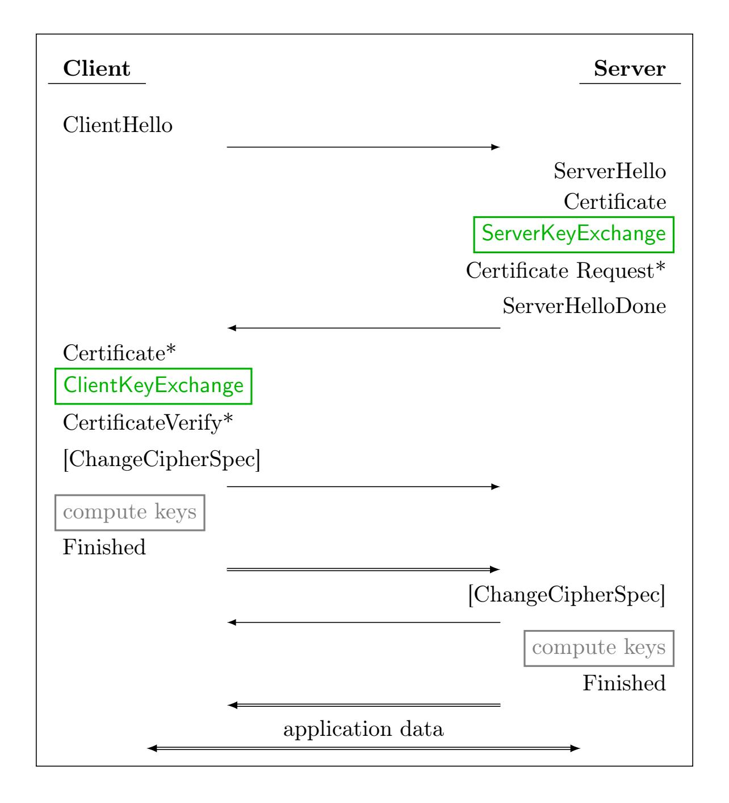
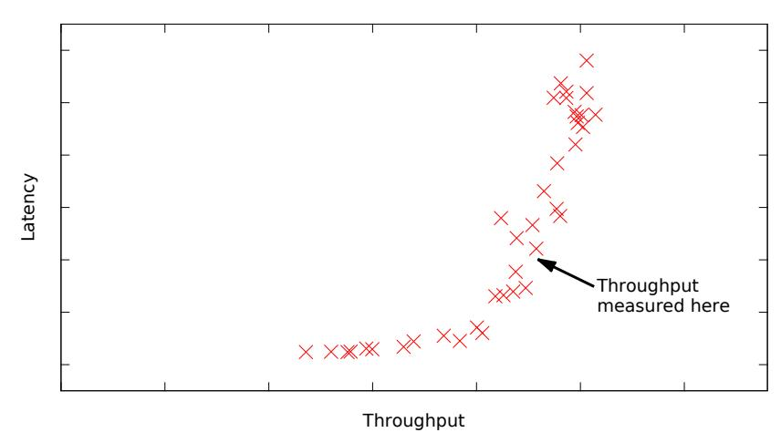

{0}------------------------------------------------

A preliminary version of this paper appears in the proceedings of the 23rd ACM Conference on Computer and Communications Security (CCS 2016), DOI: [10.1145/2976749.2978425.](http://dx.doi.org/10.1145/2976749.2978425) This is the full version. Tables [1–](#page-9-0)[4](#page-18-0) are updated to reflect tighter parameters and more accurate security estimates and correct communication sizes.

# Frodo: Take off the ring! Practical, Quantum-Secure Key Exchange from LWE

Joppe Bos<sup>1</sup> Craig Costello<sup>2</sup> Léo Ducas<sup>3</sup> Ilya Mironov<sup>4</sup> Michael Naehrig<sup>2</sup> Valeria Nikolaenko<sup>5</sup><sup>∗</sup> Ananth Raghunathan<sup>4</sup> Douglas Stebila<sup>6</sup>

> <sup>1</sup> NXP Semiconductors, [joppe.bos@nxp.com](mailto:joppe.bos@nxp.com) <sup>2</sup> Microsoft Research, [craigco@microsoft.com](mailto:craigco@microsoft.com), [mnaehrig@microsoft.com](mailto:mnaehrig@microsoft.com) <sup>3</sup> CWI, [l.ducas@cwi.nl](mailto:l.ducas@cwi.nl)

<sup>4</sup> Google Inc., [mironov@google.com](mailto:mironov@google.com), [pseudorandom@google.com](mailto:pseudorandom@google.com)

<sup>5</sup> Stanford University, [valerini@stanford.edu](mailto:valerini@stanford.edu)

<sup>6</sup> McMaster University, [stebilad@mcmaster.ca](mailto:stebilad@mcmaster.ca)

February 23, 2017

#### Abstract

Lattice-based cryptography offers some of the most attractive primitives believed to be resistant to quantum computers. Following increasing interest from both companies and government agencies in building quantum computers, a number of works have proposed instantiations of practical post-quantum key exchange protocols based on hard problems in ideal lattices, mainly based on the Ring Learning With Errors (R-LWE) problem. While ideal lattices facilitate major efficiency and storage benefits over their non-ideal counterparts, the additional ring structure that enables these advantages also raises concerns about the assumed difficulty of the underlying problems. Thus, a question of significant interest to cryptographers, and especially to those currently placing bets on primitives that will withstand quantum adversaries, is how much of an advantage the additional ring structure actually gives in practice.

Despite conventional wisdom that generic lattices might be too slow and unwieldy, we demonstrate that LWE-based key exchange is quite practical: our constant time implementation requires around 1.3ms computation time for each party; compared to the recent NewHope R-LWE scheme, communication sizes increase by a factor of 4.7×, but remain under 12 KiB in each direction. Our protocol is competitive when used for serving web pages over TLS; when partnered with ECDSA signatures, latencies increase by less than a factor of 1.6×, and (even under heavy load) server throughput only decreases by factors of 1.5× and 1.2× when serving typical 1 KiB and 100 KiB pages, respectively. To achieve these practical results, our protocol takes advantage of several innovations. These include techniques to optimize communication bandwidth, dynamic generation of public parameters (which also offers additional security against backdoors), carefully chosen error distributions, and tight security parameters.

Keywords: Post-quantum cryptography; learning with errors; key exchange; OpenSSL; TLS

<sup>∗</sup>Large parts of this work were done when Valeria Nikolaenko was an intern at Google.

{1}------------------------------------------------

# Contents

| 1.1<br>Key Exchange and Forward Secrecy<br><br>1.2<br>Generic vs. Ideal Lattices<br><br>1.3<br>Our Contributions<br><br>2<br>Related Work<br>3<br>Key Exchange from LWE<br>3.1<br>The new key exchange protocol<br><br>3.2<br>A generalized reconciliation mechanism<br> | 3  |
|--------------------------------------------------------------------------------------------------------------------------------------------------------------------------------------------------------------------------------------------------------------------------|----|
|                                                                                                                                                                                                                                                                          |    |
|                                                                                                                                                                                                                                                                          | 3  |
|                                                                                                                                                                                                                                                                          | 4  |
|                                                                                                                                                                                                                                                                          | 6  |
|                                                                                                                                                                                                                                                                          | 6  |
|                                                                                                                                                                                                                                                                          | 7  |
|                                                                                                                                                                                                                                                                          | 8  |
| 3.3<br>Error distributions<br>                                                                                                                                                                                                                                           | 10 |
| 4<br>Security assessment and parameter selection                                                                                                                                                                                                                         | 10 |
| 4.1<br>Methodology: the core-SVP hardness<br>                                                                                                                                                                                                                            | 11 |
| 4.2<br>Primal attack<br>                                                                                                                                                                                                                                                 | 11 |
| 4.3<br>Dual attack<br>                                                                                                                                                                                                                                                   | 12 |
| 4.4<br>Proposed parameters<br>                                                                                                                                                                                                                                           | 12 |
| 5<br>Proof of Security                                                                                                                                                                                                                                                   | 13 |
| 5.1<br>The LWE problem and variants<br>                                                                                                                                                                                                                                  | 13 |
| 5.2<br>Security of the key exchange protocol<br>                                                                                                                                                                                                                         | 15 |
| 5.3<br>Security when used in TLS<br>                                                                                                                                                                                                                                     | 17 |
| 6<br>Implementation                                                                                                                                                                                                                                                      | 17 |
| 7<br>Evaluation                                                                                                                                                                                                                                                          | 18 |
| 7.1<br>Standalone cryptographic operations<br>                                                                                                                                                                                                                           | 20 |
| 7.2<br>HTTPS connections<br>                                                                                                                                                                                                                                             | 20 |

{2}------------------------------------------------

# <span id="page-2-0"></span>1 Introduction

Recent advances in quantum computing (cf. [\[26,](#page-24-0) [40\]](#page-24-1)) have triggered widespread interest in developing practical post-quantum cryptographic schemes [\[49\]](#page-25-0). Subsequently, standards bodies and government agencies have announced their intentions to transition to cryptographic standards that offer quantum-resistance; this includes the National Institute of Standards and Technology (NIST) [\[51\]](#page-25-1), the National Security Agency (NSA) [\[52\]](#page-25-2), and the PQCRYPTO project [\[9\]](#page-22-0) funded by the European Union.

Traditional number-theoretic cryptographic problems such as the integer factorization problem and the discrete logarithm problem (over both multiplicative groups modulo a prime p and elliptic curve groups) are vulnerable to polynomial-time quantum attacks [\[61,](#page-25-3) [57\]](#page-25-4). Lattice-based cryptography, beginning with Ajtai's seminal work [\[4\]](#page-22-1) (cf. the recent survey [\[55\]](#page-25-5) for a comprehensive list of relevant references), is an exciting field of research that, in addition to providing a richer diversity of underlying primitives, offers the potential to build practical quantum-resistant cryptography.

### <span id="page-2-1"></span>1.1 Key Exchange and Forward Secrecy

Although large-scale quantum computers are likely to affect all of the cryptographic building blocks used to secure the internet, the threat of quantum computing to each specific primitive differs significantly. On the symmetric side, the cryptanalytic speedups (using Grover's algorithm [\[34\]](#page-24-2)) aided by a quantum computer are well-understood. It is currently believed that it will suffice to double the secret key sizes of symmetric encryption algorithms and MACs to defend against quantum computers.

On the asymmetric side, cryptographers are currently examining the potential of a new range of mathematical problems (like those based on lattices) for post-quantum security. While there are several interesting candidates for post-quantum signature schemes, a more pressing concern to practitioners is the deployment of post-quantum public key encryption and key exchange protocols: the secrecy of today's communications can be compromised by a quantum computer that is built decades into the future (by an attacker who stores these communications until then); on the other hand, authentication can only be forged at connection time.

In this paper, we focus on the most pressing issue in public key post-quantum cryptography: the development of a secure, practical key exchange protocol that can be used to secure internet traffic in anticipation of a quantum adversary. This focus on (quantum-secure) key exchange aligns with the notion of forward secrecy [\[28\]](#page-24-3) deployed in TLS and, for example, the notion of long-term security used for classified documents by government agencies (see Table 4 in [\[11\]](#page-23-0)).

### <span id="page-2-2"></span>1.2 Generic vs. Ideal Lattices

Public-key cryptography is built on the presumed difficulty of hard computational problems. Whenever such a problem is introduced and has potential as a cryptographic primitive, cryptographers naturally study whether there are special instances of the problem that offer practical benefits, and in particular, whether they do so without compromising the presumed hardness. There are several historic examples of special instances that have proven to be a disastrous choice compared to suitably chosen random instances, e.g., the use of supersingular curves in elliptic curve cryptography (ECC) [\[47,](#page-25-6) [30\]](#page-24-4). In some cases, special instances introduce well-understood security issues that can be weighed against potential benefits, e.g., the use of small public exponents in RSA [\[22\]](#page-23-1). In many scenarios, however, the size of such a security gap, or whether there is a gap at all, remains unclear.

One example of an unknown security gap currently exists in lattice-based cryptography. Five years after Regev's paper introducing the Learning With Errors (LWE) problem was published [\[58\]](#page-25-7), 

{3}------------------------------------------------

Lyubashevsky, Peikert and Regev [\[46\]](#page-25-8) introduced a specialized version of the problem called Ring Learning With Errors (R-LWE), which offers significant storage and efficiency improvements. LWE is a mature and well-studied [\[7,](#page-22-2) [45,](#page-25-9) [48,](#page-25-10) [16\]](#page-23-2) cryptographic primitive that relies only on the worst-case hardness of a shortest vector problem in generic lattices. R-LWE has additional algebraic structure and relies on the (worst-case) hardness of problems in ideal lattices. Ideal lattices correspond to ideals in certain algebraic structures, such as polynomial rings. NTRU lattices [\[36\]](#page-24-5), which are a class of lattices with some structure (but different from R-LWE lattices) have also been used to build cryptosystems.

The hardness of lattice problems on regular lattices as well as ideal lattices merits more study. Although the algebraic structure of R-LWE (and NTRU) makes for more practical key-sizes and protocol communication, this algebraic structure might inspire less confidence in the underlying security. Currently, the best algorithms to solve hard problems in ideal lattices [\[21,](#page-23-3) [44\]](#page-25-11) are the same as those that target regular lattices (modulo small polynomial speedups), and it is not known whether the R-LWE problem is significantly easier than the LWE problem for the same parameter sizes. Certain sieving algorithms obtain a constant factor time and/or space improvement in the ideal case [\[60,](#page-25-12) [15\]](#page-23-4), but (at best) this only shaves a few bits off of the known bit-security. At the very least, however, the additional ring structure might introduce subtleties in the choice of error distribution [\[56\]](#page-25-13).

Several recent papers [\[54,](#page-25-14) [14,](#page-23-5) [65,](#page-25-15) [6\]](#page-22-3) have proposed and implemented key exchange variants that rely on the hardness of the R-LWE problem [\[46\]](#page-25-8). In contrast, in this paper we develop and evaluate a secure and practical key exchange protocol from the original LWE problem [\[59\]](#page-25-16), the security of which is based on hard problems in lattices that do not possess any ring structure. While both academic [\[9\]](#page-22-0) and government [\[19,](#page-23-6) [50\]](#page-25-17) bodies are currently exploring candidates for post-quantum cryptography, we believe it prudent to give a concrete evaluation of a lattice-based scheme that is invoked without the additional structure, and to draw comparisons to previous ring-based implementations. The design of our implementation and its accompanying security analysis was performed with a view towards real-world (and in particular, internet) deployment. To our knowledge, there has not yet been a practical implementation of key exchange based on the original LWE problem.

### <span id="page-3-0"></span>1.3 Our Contributions

We demonstrate the feasibility of LWE-based key exchange with a new key exchange protocol which we call "Frodo," and we provide a proof of its security based on the original LWE problem. We give parameter sets for LWE at several security levels, including "recommended" parameters that achieve 128-bit security against quantum adversaries (using the best known attacks that incorporate recent advances in lattice cryptanalysis), and "paranoid" parameters that are based on lower bounds for sieving algorithm complexities. Our protocol incorporates several innovations:

- Efficiently sampleable noise distribution. We present four discrete noise distributions that are more efficient to sample than previously used discrete Gaussian distributions (without increasing the lattice dimensions); the safety of using these in place of rounded continuous Gaussians follows from analyzing the corresponding Rényi divergence.
- Efficient and dynamic generation of public parameters. We generate the LWE public matrix A for every key exchange from a small random seed, which has two benefits. Using a new A with every connection avoids the use of global parameters that can lead to "all-for-the-price-of-one" precomputation attacks, such as the Logjam attack on finite-field Diffie–Hellman [\[1\]](#page-22-4) (we note that these attacks have the potential to be even more devastating in the context of lattices – see [\[6\]](#page-22-3)). Furthermore, in LWE this approach gives rise to significant bandwidth savings, since we avoid the transmission of the large matrix A by instead transmitting the small seed.

{4}------------------------------------------------

While this approach was already explored in the context of R-LWE in [\[6\]](#page-22-3), in the context of LWE it becomes more challenging due to the large amount of randomness that is required. A significant step towards achieving high performance was optimizing this pseudorandom generation of A, since in our case it still consumes around 40% of the total computation time for each party. In order to target a large number of platforms and applications, we optimized this step for memory-access patterns; pseudorandom construction of A from a small random seed is done component-wise so that devices with memory constraints can generate blocks of A, use them, and discard them.

Implementation. We provide an open-source implementation of our protocol in the C language that provides protection against simple timing and cache-timing attacks. We have integrated our implementation, as well as publicly available implementations of several other post-quantum key exchange protocols [\[14,](#page-23-5) [6,](#page-22-3) [64,](#page-25-18) [24\]](#page-23-7), to allow a direct comparison of post-quantum candidates in a common framework. We have also integrated our framework into OpenSSL, allowing it to be used with Apache for performance testing in real-world settings. In addition, we implemented and evaluated the hybrid version of each ciphersuite; this partners each of the proposed post-quantum key exchange primitives with ECDHE in order to mitigate the potential of (classical) cryptanalytic advances against the newer primitives.

The implementation of our protocol and parameter finding scripts are available at [https://](https://github.com/lwe-frodo/) [github.com/lwe-frodo/](https://github.com/lwe-frodo/). Our framework for comparing post-quantum algorithms and integration into OpenSSL is available at <https://github.com/open-quantum-safe/>.

Performance comparison and evaluation in TLS. We evaluate the performance of our protocol, along with the other post-quantum protocols mentioned above, in two ways:

- Microbenchmarks. These measure the performance of standalone cryptographic operations. Using LWE key exchange at the "recommended" security level, each party's operations run in around 1.3ms. As expected, this is slower but still comparable to ideal lattice-based schemes (they have runtimes between 0.15ms—2.15ms per party), but it is significantly faster than the post-quantum software based on supersingular isogenies [\[24\]](#page-23-7), and is comparable to traditional elliptic curve Diffie–Hellman using nistp256 (which takes about 0.7ms per party). Table [4](#page-18-0) contains detailed comparisons.
- Performance within HTTPS/TLS. To measure the real-world impact of using generic lattices, we measure the connection time and server throughput when using post-quantum ciphersuites in TLS. This includes their performance under heavy sustained load while serving hundreds of connections every second. In this realistic scenario, the performance gap between ideal and generic lattices shrinks considerably. When ECDSA certificates are used, the time to establish a connection using our LWE key exchange ciphersuite is just 18.3ms (or 23ms when deployed in a hybrid mode with ECDHE). The handshake size is around 23.1 KiB. Compared to NewHope [\[6\]](#page-22-3) (which is a very fast R-LWE based scheme), we see that using generic lattices in our case gives rise to just a factor 1.5× increase in latency (12.1ms or 16.5ms in hybrid mode), and a factor 4.7× increase in handshake size (4.9 KiB). Given that modern web pages load with latencies of hundreds of milliseconds and with sizes of a megabyte or more, the overhead of LWE key exchange is manageable in many cases and unnoticeable in many more. We measured connections per second at a variety of page sizes (see Table [5\)](#page-20-0): at 100 KiB, the throughput of LWE is only 1.2× less than that of NewHope, and this drops to just 1.15× when each ciphersuite is deployed in a hybrid mode with ECDHE.

Ultimately, the size and speed of our protocol shows that we need not rely exclusively on ideal lattices to construct practical lattice-based key exchange: LWE-based key exchange is indeed a 

{5}------------------------------------------------

viable candidate for a practical quantum-resistant scheme.

# <span id="page-5-0"></span>2 Related Work

Regev [\[59\]](#page-25-16) introduced the LWE problem accompanied by a (quantum) reduction to certain worstcase lattice problems and demonstrated how to build a public-key encryption scheme based on the hardness of this problem. Peikert [\[53\]](#page-25-19) gave the first classical reduction from LWE to standard lattice problems, however this reduction required moduli that were exponential in the size of the lattice dimension. Subsequently, Brakerski et al. [\[16\]](#page-23-2) then showed that for moduli that are polynomial in the size of the lattice dimension, standard, worst-case problems in lattices are classically reducible to the LWE problem. Constructions based on LWE have led to a large variety of public-key cryptosystems [\[39,](#page-24-6) [53,](#page-25-19) [33,](#page-24-7) [18,](#page-23-8) [3,](#page-22-5) [2,](#page-22-6) [17\]](#page-23-9). Its ring analogue, R-LWE [\[46\]](#page-25-8), yields more efficient constructions of public-key cryptosystems [\[54\]](#page-25-14).

Based on the key encapsulation mechanism described by Peikert [\[54\]](#page-25-14), Bos et al. [\[14\]](#page-23-5) presented a Diffie-Hellman-like key exchange protocol whose security is based on the R-LWE problem. They demonstrated the feasibility of the protocol by integrating their implementation into the TLS protocol in OpenSSL, reporting a slight performance penalty over classically secure key exchange (using elliptic curves). Soon after, Alkim et al. [\[6\]](#page-22-3) presented a range of improvements over the implementation in [\[14\]](#page-23-5). In particular, the in-depth security analysis performed in [\[6\]](#page-22-3) paved the way for a superior set of parameters to those used in [\[14\]](#page-23-5): Alkim et al. showed that higher security could be achieved with a smaller modulus and a new, more efficiently samplable noise distribution. Moreover, their improved error reconciliation and more aggressive implementation culminated in R-LWE key exchange software that was more than an order of magnitude faster than the software presented by Bos et al..

Previously, Ding et al. [\[29\]](#page-24-8) had proposed an alternative instantiation of lattice-based key exchange that builds on Regev's public-key cryptosystem [\[59\]](#page-25-16), giving a Diffie-Hellman-like protocol from both LWE and R-LWE. The deduced shared key in their scheme is not uniform random, and they subsequently suggest to use an extractor; however, this reduces the effective length of the key. Our protocol is based on similar ideas to the LWE protocol in [\[29\]](#page-24-8), but as in the R-LWE schemes in [\[14\]](#page-23-5) and [\[6\]](#page-22-3), we incorporate (and extend) Peikert's reconciliation technique [\[54\]](#page-25-14) and further modify the protocol to conserve bandwidth. Moreover, the analysis in [\[29\]](#page-24-8) was performed for single-bit key exchange, and [\[29\]](#page-24-8) did not include a concrete proposal for quantum-secure key exchange or an implementation of the scheme.

# <span id="page-5-1"></span>3 Key Exchange from LWE

Notation. If χ is a probability distribution over a set S, then x \$ ← χ denotes sampling x ∈ S according to χ. If S is a set, then U(S) denotes the uniform distribution on S, and we denote sampling x uniformly at random from S either with x \$← U(S) or sometimes x \$ ← S. Matrices are denoted by bold face capital letters. If χ is a distribution over a set S, then X \$ ← χ(S <sup>n</sup>×m) denotes generating an n × m matrix X by sampling each of its entries independently from S according to χ. If A is a probabilistic algorithm, y \$← A(x) denotes running A on input x with randomly chosen coins and assigning the output to y.

The LWE problem is characterized by three parameters: the modulus q, the dimension of the matrix n, and the error distribution χ. Given an integer modulus q, denote by Z<sup>q</sup> the ring of integers modulo q. The distribution χ is typically taken to be a rounded continuous or discrete

{6}------------------------------------------------

Alice Bob seed<sup>A</sup> \$← U({0, 1} s ) A ← Gen(seedA) S, E \$← χ(Z n×n q ) B ← AS + E seedA, B ∈ {0, 1} <sup>s</sup> × Z n×n <sup>q</sup> A ← Gen(seedA) S 0 , E<sup>0</sup> \$← χ(Z m×n q ) B<sup>0</sup> ← S <sup>0</sup>A + E<sup>0</sup> E<sup>00</sup> \$← χ(Z m×n q ) V ← S <sup>0</sup>B + E<sup>00</sup> B0 , C C ← hVi2<sup>B</sup> ∈ Z m×n <sup>q</sup> × Z m×n 2 K ← rec(B0S, C) K ← bVe2<sup>B</sup>

<span id="page-6-1"></span>Figure I: The LWE-based key exchange protocol with LWE parameters (n, q, χ), and protocol specific parameters n, m, B ∈ Z. The matrix A ∈ Z n×n q is generated from seed<sup>A</sup> via a pseudo-random function Gen.

Gaussian distribution over Z with center zero and standard deviation σ. However, as we discuss in detail in [§3.3,](#page-9-1) alternative choices are possible and have advantages over such distributions. The concrete choice of the LWE parameters q, n, σ determines the security level of the protocol, and their selection is described in [§4.](#page-9-2)

### <span id="page-6-0"></span>3.1 The new key exchange protocol

In this section we describe an unauthenticated key exchange protocol based on the LWE problem. The protocol is shown in Figure [I](#page-6-1) and the Transport Layer Security (TLS) protocol is sketched in Figure [II.](#page-7-1)

The ServerKeyExchange, ClientKeyExchange and the two computekeys operations are highlighted in Figure [II,](#page-7-1) in order to show where the corresponding operations in Figure [I](#page-6-1) take place during the TLS handshake. The output of the computekeys operation is the premaster secret pms, which is equal to the shared key K from Figure [I.](#page-6-1) It is used to derive the master secret ms as described in the TLS specification [\[27\]](#page-24-9), §8.1.

In the key exchange protocol in Figure [I,](#page-6-1) both Alice and Bob generate the same large matrix A ∈ Z n×n q that is combined with the LWE secrets to compute their public keys as instances of the LWE problem. Alice's n LWE instances and Bob's m LWE instances are combined to compute a secret matrix in Z m×n q , where B uniform bits are extracted from each entry to form the session key K. Thus, the dimensions n and m should be chosen such that K has (at least) the number of required bits for the target security level. For example, in targeting 128 bits of post-quantum security, it should be the case that n· m ·B ≥ 256. This condition ensures that we obtain a uniform 256-bit secret for the session key and even an exhaustive key search via Grover's quantum algorithm would take 2 <sup>128</sup> operations. The protocol in Figure [I](#page-6-1) allows for the ratio between n and m to be changed, in order to trade-off between Bob's amount of uploaded data for Alice's computational load. This could be useful in mobile devices, where energy efficiency of uploads is at most half that

{7}------------------------------------------------



Asterisks (\*) indicate optional messages, single lines ( $\rightarrow$ ) denote unencrypted communication, double lines ( $\Rightarrow$ ) denote encrypted and authenticated communication, rectangles highlight messages or procedures that need to be added or require modification for an LWE ciphersuite.

<span id="page-7-1"></span>Figure II: Message flow in the TLS protocol.

of downstream traffic [63, 37].

Hybrid ciphersuites. As lattice-based cryptography is undergoing a period of intense development and scrutiny, a conservative approach towards deployment of lattice-based key exchange is to pair it with legacy schemes such as elliptic curve Diffie-Hellman (ECDH). Since the message flow of our proposed solution is identical to the existing ECDH(E) key exchange protocol, the two can be run concurrently as part of the same "hybrid" ciphersuite, with both outputs mixed in into the premaster secret via a KDF (as was done in [14]); see §7 for performance results.

#### <span id="page-7-0"></span>3.2 A generalized reconciliation mechanism

In the protocol in Figure I, Alice and Bob compute the secret matrices  $\mathbf{V} \in \mathbb{Z}_q^{\overline{m} \times \overline{n}}$  and  $\mathbf{B}' \mathbf{S} \in \mathbb{Z}_q^{\overline{m} \times \overline{n}}$ , respectively. Each of the  $\overline{mn}$  entries in V is approximately equal in  $\mathbb{Z}_q$  to the corresponding entry in  $\mathbf{B}' \mathbf{S}$ . To modify such an approximate key agreement into an exact key agreement, Bob sends  $\mathbf{C} = \langle \mathbf{V} \rangle_{2^B}$  to Alice which allows both parties to reconcile the same shared key K. In this section we describe the reconciliation mechanism that allows such exact agreement to be achieved, i.e., we

{8}------------------------------------------------

detail the function  $\langle \cdot \rangle_{2^B}$  used in line 6 of Bob's flow, and the functions  $\lfloor \cdot \rceil_{2^B}$  and rec used when Alice and Bob compute their respective shared keys. Our reconciliation mechanism is a generalized version of Peikert's mechanism [54] that, for every approximate agreement in  $\mathbb{Z}_q$ , allows the extraction of more (exact) shared bits. This increased extraction comes at the cost of an increased probability of failed reconciliation, but we argue that the resulting probability is still small enough for practical application. Previous works that used Peikert's mechanism (e.g., [14, 6]) have not needed to extract more than one bit per approximate agreement in  $\mathbb{Z}_q$ , since the number of such agreements far exceeded the number of shared bits required to form a secure session key. As we discussed in §3.1, we need  $\overline{m} \cdot \overline{n} \cdot B \geq 256$  for our desired level of quantum security, so a larger B (the number of bits extracted per approximate agreement) means we can achieve smaller  $\overline{m}$  and  $\overline{n}$ , which in turn means sending smaller LWE matrices.

We focus on the case when the modulus q is a power of 2; this can be generalized to an arbitrary modulus using techniques described in [54]. Let the number B of bits that we are aiming to extract from one coefficient in  $\mathbb{Z}_q$  be such that  $B < (\log_2 q) - 1$ . Let  $\bar{B} = (\log_2 q) - B$ . For any  $v \in \mathbb{Z}_q$ , represented as a unique integer in [0,q), we define the following functions. The rounding function  $\lfloor \cdot \rfloor_{2^B}$  is defined as

$$\lfloor \cdot \rceil_{2^B} \colon v \mapsto \left\lfloor 2^{-\bar{B}} v \right\rfloor \mod 2^B,$$

i.e.,  $\lfloor v \rceil_{2^B} \in [0, 2^B)$ . Note that  $\lfloor \cdot \rceil_{2^B}$  outputs the B most significant bits of  $(v + 2^{\bar{B}-1}) \mod q$ . This means that  $\lfloor \cdot \rceil_{2^B}$  partitions  $\mathbb{Z}_q$  into  $2^B$  intervals of integers with the same B most significant bits, up to a cyclic shift of the values that centers these intervals around 0. The *cross-rounding* function  $\langle \cdot \rangle_{2^B}$  is defined as

$$\langle \cdot \rangle_{2^B} \colon v \mapsto \left| 2^{-\bar{B}+1} v \right| \mod 2,$$

which divides  $\mathbb{Z}_q$  into two subsets according to their (B+1)-th most significant bit, splitting up each interval above into two equally sized subintervals. Replacing  $\lfloor \cdot \rceil_{2^B}$  by  $\lfloor \cdot \rfloor_{2^B}$  would amount to simply taking the B most significant bits of v. However, using  $\lfloor \cdot \rceil_{2^B}$  ensures that the size of the error introduced by rounding is unbiased with respect to the sets induced by the cross-rounding function.

We are now in a position to define the reconciliation function, rec, following [54]. On input of  $w \in \mathbb{Z}_q$  and  $b \in \{0,1\}$ ,  $\operatorname{rec}(w,b)$  outputs  $\lfloor v \rceil_{2^B}$ , where v is the closest element to w such that  $\langle v \rangle_{2^B} = b$ . The two claims below are the generalizations of the claims in [54], the proofs of which are analogous. They demonstrate that releasing  $\langle v \rangle_{2^B}$  does not reveal any information about  $\lfloor v \rceil_{2^B}$ , but it can serve as a hint for the two parties that are trying to agree on B bits, based on sufficiently close numbers w and v. Claim 3.2 means that, if corresponding elements of  $\mathbf{B}'\mathbf{S}$  and  $\mathbf{V}$  are within  $2^{\bar{B}-2}$  of one another, the key agreement in Fig. I is exact.

<span id="page-8-1"></span>Claim 3.1. If  $v \in \mathbb{Z}_q$  is uniformly random, then  $\lfloor v \rceil_{2^B}$  is uniformly random given  $\langle v \rangle_{2^B}$ .

<span id="page-8-0"></span>Claim 3.2. If 
$$|v-w| < 2^{\bar{B}-2}$$
, then  $\operatorname{rec}(w, \langle v \rangle_{2^B}) = \lfloor v \rceil_{2^B}$ .

Round-and-truncate. We observe that the lower-order bits of  $\mathbf{B}$  and  $\mathbf{B}'$  exchanged by the parties have vanishingly small influence on the negotiated key. To conserve bandwidth, a version of the protocol could be used in which entries of  $\mathbf{B}$  and  $\mathbf{B}'$  are rounded to multiples of  $2^C$ , and the lower C bits, which are now zeros, are truncated and never transmitted. Since  $\mathbf{B}$  and  $\mathbf{B}'$  are now transmitted with lower accuracy, this introduces another source of error in the reconciliation process. Although our implementation does not currently exploit this option, we note that if it were to be used, Bob should sample uniform noise and add it back to the lower order bits. This is to ensure that truncation does not affect the proof of security.

{9}------------------------------------------------

| dist. | bits | var.         | Probability of |                           |     |     |    |    |    | Rényi |           |  |
|-------|------|--------------|----------------|---------------------------|-----|-----|----|----|----|-------|-----------|--|
|       | req. | 2<br>(ς<br>) | 0              | ±1                        | ±2  | ±3  | ±4 | ±5 | ±6 | order | diverg.   |  |
| D1    | 8    | 1.25         | 88             | 61                        | 20  | 3   |    |    |    | 25.0  | 1.0021674 |  |
| D2    | 12   | 1.00         | 1570           | 990                       | 248 | 24  | 1  |    |    | 40.0  | 1.0001925 |  |
| D3    | 12   | 1.75         | 1206           | 919                       | 406 | 104 | 15 | 1  |    | 100.0 | 1.0003011 |  |
| D4    | 16   | 1.75         |                | 19304 14700 6490 1659 245 |     |     |    | 21 | 1  | 500.0 | 1.0000146 |  |

<span id="page-9-0"></span>Table 1: The discrete PDFs (and the number of bits required to obtain one sample from them) for the four noise distributions used in this work, which are approximations to rounded continuous Gaussian distributions of the given variance ς 2 ; the closeness of these approximations is specified by the given Rényi divergence and its order.

### <span id="page-9-1"></span>3.3 Error distributions

The key exchange protocol in Figure [I](#page-6-1) is described in terms of an unspecified error distribution χ over a set S. We now describe the concrete choice of error distribution used in our implementation, which is an instantiation of inversion sampling that uses a precomputed table corresponding to a discrete cumulative density function (CDF) over a small interval. The four distributions we use are defined by the discrete probability density functions (PDFs) in Table [1.](#page-9-0) We use the first distribution, D1, as an example to illustrate how the sampling routine works. Modifying the corresponding PDF into a CDF gives the table T = [43, 104, 124, 127]. We then sample 8 bits uniformly at random; the first 7 bits correspond to a uniform random integer y ∈ [0, 127] which is used to return the smallest index x˜ ∈ [0, 3] such that y ≤ T[˜x], and the last (eighth) bit is used to determine the sign s ∈ {−1, 1} of the sampled value x = s · x˜.

For each distribution in Table [1,](#page-9-0) performing inversion sampling can be done efficiently using at most seven precomputed values of at most 16 bits each; thus, the precomputed look-up tables required for sampling any of the above distributions are at most 14 bytes each. Obtaining a single sample amounts to accessing an element from one of these small look-up tables; this can be done in a memory and timing sidechannel-resistant manner by always scanning all elements and performing comparisons with branchless arithmetic operations.

The four distributions D1, D2, D3, D4, are the result of an exhaustive search for combinations of discrete probabilities that closely approximate the rounded continuous Gaussians of the variances specified in Table [1.](#page-9-0) Here the measure of "closeness" is the Rényi divergence of the orders specified in Table [1.](#page-9-0) We refer to [\[10\]](#page-23-10) for more details on the Rényi divergence, but for our purposes it suffices to say that the nearer the divergence is to 1, the tighter the security reduction is (when replacing the rounded Gaussian distribution with our discrete approximation to it), which gives rise to either higher (provable) security, or better parameters.

# <span id="page-9-2"></span>4 Security assessment and parameter selection

In this section, we explain our methodology to provide conservative security estimates against both classical and quantum attacks, and subsequently, we propose parameters for the protocol in the previous section. The methodology is similar to the one proposed in [\[6\]](#page-22-3), with slight modifications that take into account the fact that some quasi-linear accelerations [\[60,](#page-25-12) [15\]](#page-23-4) over sieving algorithms [\[12,](#page-23-11) [43\]](#page-24-11) are not available without the ring structure. We restate this analysis for self-containment.

We remark that our methodology is significantly more conservative than what is usually used in

{10}------------------------------------------------

the literature [5]. Our goal is not just to demonstrate feasibility, but to provide long-term and real-world security. To that end, we acknowledge that lattice cryptanalysis is far less mature than the cryptanalysis against schemes based on the hardness of factoring and computing discrete logarithms, for which the best-known attack can safely be considered as a best-possible attack.

### <span id="page-10-0"></span>4.1 Methodology: the core-SVP hardness

Due to the (very) limited number m of LWE samples available to an attacker ( $m = n + \overline{m}$ ) or  $m = n + \overline{n}$ ), we are not concerned with BKW-like attacks [41], nor are we concerned with linearization attacks [8]. This essentially leaves us with two BKZ-style [21] attacks, which are usually referred to as primal and dual attacks; we review both below.

The BKZ algorithm with block-size b requires up to polynomially many calls to an SVP oracle in dimension b. However, using some heuristics essentially allows the number of oracle calls to be decreased to a linear number [20]. To account for further improvement, we only count the cost of one such call to the SVP oracle, i.e., the core-SVP hardness. Such precaution seems reasonable, especially in the case of the dual attack that involves running BKZ several times, in which case it is plausible that most of the lattice reduction cost may be amortized.

Even the concrete cost of a single SVP computation in dimension b is problematic to evaluate. This is due to the fact that the numerically optimized pruned enumeration strategy does not yield a closed formula [32, 21]. Even with pruning, enumeration is asymptotically super-exponential, while sieving algorithms have exponential complexity  $2^{cb+o(b)}$  (where the constant c in the exponent is well-understood). A sound and simple strategy is therefore to determine a lower bound for the cost of an attack by  $2^{cb}$  vector operations (i.e., about  $b2^{cb}$  CPU cycles<sup>1</sup>), and to make sure that the block-size b lies in a range where enumeration is more expensive than  $2^{cb}$ . From the estimate of [21], it is argued in [6] that this is the case (both classically and quantumly) when  $b \ge 200$ .

Classically, the best known constant is  $c_{\rm C} = \log_2 \sqrt{3/2} \approx 0.292$ , which is provided by the sieve algorithm of [12]; and, in the context of quantum attacks, the best known constant is  $c_{\rm Q} = \log_2 \sqrt{13/9} \approx 0.265$  (see §14.2.10 in [43]). Since all variants of the sieving algorithm require a list of  $\sqrt{4/3}^b = 2^{0.2075b}$  vectors to be built, it also seems plausible that  $c_{\rm P} = 0.2075$  can serve as a worst-case lower bound. (Here the subscripts C, Q and P differentiate between the sieving constants used to obtain "classical", "quantum" and "paranoid" estimates on the concrete bit-security given by a particular set of parameters.)

#### <span id="page-10-1"></span>4.2 Primal attack

The primal attack constructs a unique-SVP instance from the LWE problem and solves it using BKZ. We examine how large the block dimension b is required to be for BKZ to find the unique solution. Given the matrix LWE instance  $(\mathbf{A}, \mathbf{b} = \mathbf{A}\mathbf{s} + \mathbf{e}) \in \mathbb{Z}_q^{m \times n} \times \mathbb{Z}_q^{m \times 1}$ , one builds the lattice  $\Lambda = \{\mathbf{x} \in \mathbb{Z}^{m+n+1} : (\mathbf{A} \mid \mathbf{I}_m \mid -\mathbf{b})\mathbf{x} = \mathbf{0} \bmod q\}$  of dimension d = m+n+1 and volume  $q^m$ . The vector  $\mathbf{v} = (\mathbf{s}, \mathbf{e}, 1) \in \Lambda$  is a unique-SVP solution of norm  $\lambda \approx \varsigma \sqrt{n+m}$ , where  $\varsigma$  is the standard deviation of the error distribution used to sample  $\mathbf{e}$ . In our case, the number of samples used, m, may be chosen between 0 and  $n + \overline{m}$  (or  $n + \overline{n}$ ), and we numerically optimize this choice.

<span id="page-10-2"></span>Using the typical models of BKZ (under the geometric series assumption and the Gaussian

Due to the presence of the ring-structure, [6] chose to ignore this factor b in order to afford the adversary the advantage of assuming that the techniques in [60, 15] can be adapted to more advanced sieve algorithms [6]. However, for plain-LWE, we include this factor.

{11}------------------------------------------------

heuristic [\[20,](#page-23-12) [5\]](#page-22-7)), one concludes that the primal attack is successful if and only if

$$\varsigma\sqrt{b} \le \delta^{2b-d-1} \cdot q^{m/d},$$
 where 
$$\delta = ((\pi b)^{1/b} \cdot b/2\pi e)^{1/2(b-1)}.$$

### <span id="page-11-0"></span>4.3 Dual attack

In the dual attack, one searches for a short vector (v, w) in the dual lattice Λ =ˆ {(x, y) ∈ Z <sup>m</sup> ×Z n : Atx = y mod q}, with the aim of using it as a distinguisher for the decision-LWE problem. The BKZ algorithm with block-size b will output such a vector of length ` = δ d−1 q n/d .

Having found (x, y) ∈ Λˆ of length `, an attacker computes z = v t · b = v <sup>t</sup>As + v <sup>t</sup>e = w<sup>t</sup> s + v <sup>t</sup>e mod q. If (A, b) is indeed an LWE sample, then z is distributed as a Gaussian, centered around 0 and of standard deviation `ς, otherwise z is distributed uniformly modulo q. The maximal variation distance between these two distributions is bounded by ≈ 4 exp(−2π 2 τ 2 ), where τ = `ς/q: thus, given such a vector of length `, the attacker may distinguish LWE samples from random with advantage at most .

It is important to note that a small distinguishing advantage does not provide appreciable help to an adversary that is attacking a key exchange protocol: since the agreed key is to be used to derive a symmetric cipher key, any advantage below 1/2 does not significantly decrease the search space in a brute force search for the symmetric cipher key. (Recall that the reconciled key is processed with a random oracle before it is used for any other purposes.)

We therefore require an attacker to amplify his success probability by finding approximately 1/<sup>2</sup> such short vectors. Since the sieve algorithms provide 2 <sup>0</sup>.2075<sup>b</sup> vectors, the attack must be repeated at least R = max(1, 1/(20.2075<sup>b</sup> 2 )) times. We again stress that we are erring on the conservative side, since the other vectors that are output by the sieving algorithm are typically a little larger than the shortest one.

### <span id="page-11-1"></span>4.4 Proposed parameters

Our proposed parameters are summarized in Table [2,](#page-12-2) and their security detailed in Table [3.](#page-13-0)

Challenge parameters. We provide a set of challenge parameters as a target that should be reasonably accessible within the current cryptanalytic state-of-the-art. Attacking these parameters may even be feasible without subtle optimizations such as pruned enumeration. We do not provide hardness claims for those parameters because the required BKZ block-size for breaking them is far below 200, and since our analysis only considers sieving algorithms, it is not valid in that range.

Classical parameters. We also propose a classical parameter set that provides 128-bits of security against classical attacks. We do not recommend these parameters in practice since they fail to achieve a high enough protection against quantum attacks, but provide them to ease the comparison with other proposals from the literature.

Recommended parameters. The last two parameter sets are the ones we recommend if a scheme like the one described in this paper is to be deployed in the real-world. The first (Recommended) set conservatively offers 128 bits of security against the best known quantum attack. The second (Paranoid) set would resist an algorithm reaching the complexity lower bound for sieving algorithms we mentioned in § [4.1,](#page-10-0) and could even remain quantum-secure if significant improvements towards solving SVP are achieved.

Failure rate estimation. Recall from Claim [3.2](#page-8-0) that Alice and Bob's reconciliation of B bits (per approximate agreement in Zq) will work with probability 1 if the distance between their two

{12}------------------------------------------------

| Scheme      | $\mid n \mid$ | q        | dist. | $B \cdot \overline{m}^2 = B \cdot \overline{n}^2$ | failure     | bandwidth           |
|-------------|---------------|----------|-------|---------------------------------------------------|-------------|---------------------|
| Challenge   | 352           | $2^{11}$ | $D_1$ | $1 \cdot 8^2 = 64$                                | $2^{-41.8}$ | 7.75 KB             |
| Classical   | 592           | $2^{12}$ | $D_2$ | $2 \cdot 8^2 = 128$                               | $2^{-36.2}$ | $14.22~\mathrm{KB}$ |
| Recommended | 752           | $2^{15}$ | $D_3$ | $4 \cdot 8^2 = 256$                               | $2^{-38.9}$ | $22.57~\mathrm{KB}$ |
| Paranoid    | 864           | $2^{15}$ | $D_4$ | $4 \cdot 8^2 = 256$                               | $2^{-33.8}$ | $25.93~\mathrm{KB}$ |

<span id="page-12-2"></span>Table 2: Proposed parameter sets with dimension n, modulus q, and noise distribution (which is an approximation to the rounded Gaussian – see Table 1), showing the size of the shared key in bits as the product of the number B of bits agreed upon per coefficient and the number of coefficients  $\overline{m} \cdot \overline{n}$ , the failure rate and the total size of key exchange messages.

 $\mathbb{Z}_q$  elements is less than  $q/2^{B+2}$ . On the other hand, if this distance is greater than  $3q/2^{B+2}$ , the reconciliation will work with probability 0, and the success probability decreases linearly from 1 to 0 in the range between these two extremes. To determine the overall failure rate of our protocol, we combine this relationship with the probability distribution of the distance. In the continuous case, it is easy to check that the distribution of this distance has variance  $\sigma^2 = 2n\varsigma^4 + \varsigma^2$ , where  $\varsigma^2$  is the variance of the continuous Gaussian distribution. However, using more computationally-intensive but tighter analysis, we can compute the distribution of the distance corresponding to our discrete approximation directly. The *union bound* gives an upper bound on the total failure probability, which is summarized for our chosen parameter sets in Table 2.

Numbers of samples and bits per coefficient. We opted to choose  $\overline{m} = \overline{n}$ , i.e., an equal division of bandwidth to Alice and Bob. The new reconciliation mechanism from §3.2 drives down both bandwidth and computation costs by extracting more random bits from a single ring element. Compared to the previous reconciliation mechanism of Peikert [54] that extracts a single bit per element, we extract 4 bits per element (when using our Recommended parameter set), which reduces the total amount of communication and computation by approximately a factor of 2.

# <span id="page-12-0"></span>5 Proof of Security

The security of our key exchange protocol can be reduced to the learning with errors problem. Our proof uses a variant with short secrets and matrices (instead of vectors) that is equivalent to the original LWE problem.

#### <span id="page-12-1"></span>5.1 The LWE problem and variants

<span id="page-12-3"></span>**Definition 5.1** (Decision LWE problem). Let n and q be positive integers. Let  $\chi$  be a distribution over  $\mathbb{Z}$ . Let  $\mathbf{s} \stackrel{\$}{\leftarrow} \mathcal{U}(\mathbb{Z}_q^n)$ . Define the following two oracles:

- $O_{\chi,\mathbf{s}}$ :  $\mathbf{a} \stackrel{\$}{\leftarrow} \mathcal{U}(\mathbb{Z}_q^n), \ e \stackrel{\$}{\leftarrow} \chi(\mathbb{Z}_q)$ ; return  $(\mathbf{a}, \mathbf{as} + e)$ .
- $U: \mathbf{a} \stackrel{\$}{\leftarrow} \mathcal{U}(\mathbb{Z}_q^n), \ u \stackrel{\$}{\leftarrow} \mathcal{U}(\mathbb{Z}_q); \ \text{return } (\mathbf{a}, u).$

The decision LWE problem for  $(n, q, \chi)$  is to distinguish  $O_{\chi, \mathbf{s}}$  from U. In particular, for algorithm  $\mathcal{A}$ , define the advantage

$$\operatorname{Adv}_{n,q,\chi}^{\mathsf{dlwe}}(\mathcal{A}) = \left| \Pr(\mathbf{s} \xleftarrow{\$} \mathbb{Z}_q^n : \mathcal{A}^{O_{\chi,\mathbf{s}}}() = 1) - \Pr(\mathcal{A}^U() = 1) \right|.$$

{13}------------------------------------------------

| Scheme      | Attack | R             | ound | ed G | Post-reduction |     |              |     |     |
|-------------|--------|---------------|------|------|----------------|-----|--------------|-----|-----|
|             |        | $\mid m \mid$ | b    | С    | Q              | Р   | $\mathbf{C}$ | Q   | Р   |
| Challange   | Primal | 338           | 266  | _    | _              | _   | _            | _   | _   |
| Challenge   | Dual   | 331           | 263  | _    | _              | _   | _            | _   | _   |
| Classical   | Primal | 549           | 442  | 138  | 126            | 100 | 132          | 120 | 95  |
| Classical   | Dual   | 544           | 438  | 136  | 124            | 99  | 130          | 119 | 94  |
| Dagommondad | Primal | 716           | 489  | 151  | 138            | 110 | 145          | 132 | 104 |
| Recommended | Dual   | 737           | 485  | 150  | 137            | 109 | 144          | 130 | 103 |
| Paranoid    | Primal | 793           | 581  | 179  | 163            | 129 | 178          | 162 | 129 |
|             | Dual   | 833           | 576  | 177  | 161            | 128 | 177          | 161 | 128 |

<span id="page-13-0"></span>Table 3: Runtime for the best attacks on the proposed parameter sets according to our analysis. The rounded Gaussian columns capture security of the ideal, rounded Gaussian noise distribution; the post-reduction columns correspond to lower bound on security of the discretized distribution. The best classical attack takes  $2^C$  operations, the best quantum attack  $2^Q$ , and  $2^P$  is the worst-case lower bound runtime imposed by the list size in sieving algorithms. Bold face numbers indicate the "security claim" for the specific parameter set, e.g. the Classical parameter set provides 130 bits of classical security, whereas the Recommended set has 130 bits of post-quantum security.

The proof of security of our key exchange protocol relies on a variant of the LWE problem stated below, where secrets  $\mathbf{s}$  are drawn from  $\chi$ .

<span id="page-13-1"></span>**Definition 5.2** (Decision LWE problem with short secrets). Let n and q be positive integers. Let  $\chi$  be a distribution over  $\mathbb{Z}$ . Let  $\mathbf{s} \stackrel{\$}{\leftarrow} \chi(\mathbb{Z}_q^n)$ . Define oracles  $O_{\chi,\mathbf{s}}$  and U as in Definition 5.1. The decision LWE problem (with short secrets) for  $(n,q,\chi)$  is to distinguish  $O_{\chi,\mathbf{s}}$  from U. In particular, for algorithm  $\mathcal{A}$ , define the advantage

$$\operatorname{Adv}^{\mathsf{dlwe-ss}}_{n,q,\chi}(\mathcal{A}) = \left| \operatorname{Pr} \left( \mathbf{s} \xleftarrow{\$} \chi(\mathbb{Z}_q^n) : \mathcal{A}^{O_{\chi,\mathbf{s}}}() = 1 \right) - \operatorname{Pr} \left( \mathcal{A}^U() = 1 \right) \right| .$$

It was shown by Applebaum et al. [7] that the short secret variant has a tight reduction to the decision LWE problem.

**Lemma 5.1** (Short LWE [7]). Let n, q and  $\chi$  be as above. If  $\mathcal{A}$  is a distinguishing algorithm for decision LWE with short secrets (Definition 5.2), it can be used to construct a distinguishing algorithm  $\mathcal{B}$  for decision LWE (Definition 5.1) running in roughly the same time as  $\mathcal{A}$ , with  $\mathcal{B}$  making  $O(n^2)$  calls to its oracle, and satisfying  $\operatorname{Adv}_{n,q,\chi}^{\mathsf{dlwe}}(\mathcal{B}) = \operatorname{Adv}_{n,q,\chi}^{\mathsf{dlwe-ss}}(\mathcal{A})$ .

**Matrix form.** We use an extended form of the problem in which the secrets and errors are also matrices. Let  $n, q, \chi$  be as above, let m and  $\overline{n}$  be positive integers, and let  $\mathbf{S} \stackrel{\$}{\leftarrow} \chi(\mathbb{Z}_q^{n \times \overline{n}})$ . Define

- $O_{\chi,\mathbf{S}}$ :  $\mathbf{A} \stackrel{\$}{\leftarrow} \mathcal{U}(\mathbb{Z}_q^{m \times n})$ ,  $\mathbf{E} \stackrel{\$}{\leftarrow} \chi(\mathbb{Z}_q^{m \times \overline{n}})$ ; return  $(\mathbf{A}, \mathbf{AS} + \mathbf{E})$ .
- $U: \mathbf{A} \stackrel{\$}{\leftarrow} \mathcal{U}(\mathbb{Z}_q^{m \times n}), \mathbf{U} \stackrel{\$}{\leftarrow} \mathcal{U}(\mathbb{Z}_q^{m \times \overline{n}}); \text{ return } (\mathbf{A}, \mathbf{U}).$

We call this the  $(m, \overline{n})$ -matrix decision LWE problem. A standard hybrid argument shows that any adversary distinguishing these two distributions with advantage  $\epsilon$  can be used to construct an efficient adversary breaking the decision LWE problem with advantage at least  $\epsilon/\overline{n}$ . We can similarly define a short secrets version.

{14}------------------------------------------------

```
\underline{\text{Game } 0}:
                                                                                                               \underline{\text{Game } 1}:
                                                                                                                                                                                                                                \underline{\text{Game } 2}:
                                                                                                                                                                                                                                                                                                                                                                        \underline{\text{Game } 3}:
                                                                                                                                                                                                                                 1: \mathbf{A} \stackrel{\$}{\leftarrow} \mathcal{U}(\mathbb{Z}_q^{n \times n})
  1: \mathbf{A} \stackrel{\$}{\leftarrow} \mathcal{U}(\mathbb{Z}_q^{n \times n})
                                                                                                                 1: \mathbf{A} \stackrel{\$}{\leftarrow} \mathcal{U}(\mathbb{Z}_q^{n \times n})
                                                                                                                                                                                                                                                                                                                                                                          1: \mathbf{A} \stackrel{\$}{\leftarrow} \mathcal{U}(\mathbb{Z}_q^{n \times n})
                                                                                                                                                                                                                                 2: \mathbf{B} \stackrel{\$}{\leftarrow} \mathcal{U}(\mathbb{Z}_q^{n \times \overline{n}})
                                                                                                                 2: \mathbf{B} \stackrel{\$}{\leftarrow} \mathcal{U}(\mathbb{Z}_q^{n \times \overline{n}})
  2: \mathbf{S}, \mathbf{E} \stackrel{\$}{\leftarrow} \chi(\mathbb{Z}_q^{n \times \overline{n}})
                                                                                                                                                                                                                                                                                                                                                                          2: \mathbf{B} \stackrel{\$}{\leftarrow} \mathcal{U}(\mathbb{Z}_q^{n \times \overline{n}})
                                                                                                                                                                                                                                  3: \mathbf{S}' \stackrel{\$}{\leftarrow} \chi(\mathbb{Z}_q^{\overline{m} \times n})
  3: \mathbf{B} \leftarrow \mathbf{AS} + \mathbf{E}
                                                                                                                                                                                                                                                                                                                                                                                       \left[\mathbf{B}'\|\mathbf{V}\right] \overset{\$}{\leftarrow} \mathcal{U}(\mathbb{Z}_q^{\overline{m}\times(n+\overline{n})})
                                                                                                                3: \overline{\mathbf{S}', \mathbf{E}'} \overset{\$}{\leftarrow} \chi(\mathbb{Z}_q^{\overline{m} \times n})
4: \mathbf{B}' \leftarrow \mathbf{S}' \mathbf{A} + \mathbf{E}'
                                                                                                                                                                                                                                               \left[\mathbf{E}'\|\mathbf{E}''\right] \stackrel{\$}{\leftarrow} \chi(\mathbb{Z}_q^{\overline{m}\times(n+\overline{n})})
  4: \mathbf{S}', \mathbf{E}' \stackrel{\$}{\leftarrow} \chi(\mathbb{Z}_q^{\overline{m} \times n})
                                                                                                                                                                                                                                                                                                                                                                          4: \overline{\mathbf{C} \leftarrow \langle \mathbf{V} \rangle_{2^B}}
  5: \mathbf{B'} \leftarrow \mathbf{S'A} + \mathbf{E'}
                                                                                                                 5: \mathbf{E}'' \stackrel{\$}{\leftarrow} \chi(\mathbb{Z}_q^{\overline{m} \times \overline{n}})
                                                                                                                                                                                                                                                                                                                                                                          5: K \leftarrow \lfloor \mathbf{V} \rceil_{2^B}
                                                                                                                                                                                                                                 5: | [\mathbf{B}' | | \mathbf{V}] \leftarrow \mathbf{S}' [\mathbf{A} | | \mathbf{B}] + [\mathbf{E}' | | \mathbf{E}'']
 \underline{6} \colon \mathbf{E}'' \stackrel{\$}{\leftarrow} \chi(\mathbb{Z}_q^{\overline{m} \times \overline{n}})
                                                                                                                 6: \mathbf{V} \leftarrow \mathbf{S}'\mathbf{B} + \mathbf{E}''
  7: \mathbf{V} \leftarrow \mathbf{S}'\mathbf{B} + \mathbf{E}''
                                                                                                                                                                                                                                 6: \mathbf{C} \leftarrow \langle \mathbf{V} \rangle_{2B}
                                                                                                                                                                                                                                                                                                                                                                          6: K' \stackrel{\$}{\leftarrow} \mathcal{U}(\{0,1\}^{\overline{n} \cdot \overline{m} \cdot B})
                                                                                                                  7: \mathbf{C} \leftarrow \langle \mathbf{V} \rangle_{2^B}
  8: \mathbf{C} \leftarrow \langle \mathbf{V} \rangle_{2^B}
                                                                                                                                                                                                                                 7: K \leftarrow [\mathbf{V}]_{2^B}
                                                                                                                                                                                                                                                                                                                                                                          7: b^* \stackrel{\$}{\leftarrow} \mathcal{U}(\{0,1\})
                                                                                                                 8: K \leftarrow [\mathbf{V}]_{2^B}
  9: K \leftarrow [\mathbf{V}]_{2^B}
                                                                                                                                                                                                                                 8: K' \stackrel{\$}{\leftarrow} \mathcal{U}(\{0,1\}^{\overline{n} \cdot \overline{m} \cdot B})
                                                                                                                                                                                                                                                                                                                                                                          8: if b^* = 0
                                                                                                                9: K' \stackrel{\$}{\leftarrow} \mathcal{U}(\{0,1\}^{\overline{n} \cdot \overline{m} \cdot B})
10: K' \stackrel{\$}{\leftarrow} \mathcal{U}(\{0,1\}^{\overline{n} \cdot \overline{m} \cdot B})
                                                                                                                                                                                                                                                                                                                                                                                     return (A, B, B', C, K)
                                                                                                                                                                                                                                 9: b^* \stackrel{\$}{\leftarrow} \mathcal{U}(\{0,1\})
                                                                                                               10: b^* \stackrel{\$}{\leftarrow} \mathcal{U}(\{0,1\})
                                                                                                                                                                                                                                                                                                                                                                          9: else
11: b^* \stackrel{\$}{\leftarrow} \mathcal{U}(\{0,1\})
                                                                                                                                                                                                                                10: if b^* = 0
                                                                                                               11: if b^* = 0
                                                                                                                                                                                                                                                                                                                                                                                     return (\mathbf{A}, \mathbf{B}, \mathbf{B}', \mathbf{C}, K')
12: if b^* = 0
                                                                                                                                                                                                                                            return (\mathbf{A}, \mathbf{B}, \mathbf{B}', \mathbf{C}, K)
                                                                                                                            return (\mathbf{A}, \mathbf{B}, \mathbf{B}', \mathbf{C}, K)
             return (\mathbf{A}, \mathbf{B}, \mathbf{B}', \mathbf{C}, K)
                                                                                                                                                                                                                                11: else
                                                                                                               12: else
13: else
                                                                                                                                                                                                                                            return (\mathbf{A}, \mathbf{B}, \mathbf{B}', \mathbf{C}, K')
                                                                                                                            return (\mathbf{A}, \mathbf{B}, \mathbf{B}', \mathbf{C}, K')
            return (\mathbf{A}, \mathbf{B}, \mathbf{B}', \mathbf{C}, K')
```

<span id="page-14-2"></span>Figure III: Sequence of games for proof of Theorem 5.1.

#### <span id="page-14-0"></span>5.2 Security of the key exchange protocol

To prove security of the key exchange protocol, consider an LWE key-exchange adversary that tries to distinguish the session key K from a uniformly random key K' given the transcript of the key exchange protocol. Formally, we define the advantage of such an adversary A as:

$$\mathsf{Adv}^{\mathsf{ddh\text{-}like}}_{n,\overline{n},\overline{m},B,q,\chi}(\mathcal{A}) = \left| \Pr \left[ \mathcal{A} \left( \mathbf{A}, \mathbf{B}, \mathbf{B}', \mathbf{C}, K \right) = 1 \right] - \Pr \left[ \mathcal{A} \left( \mathbf{A}, \mathbf{B}, \mathbf{B}', \mathbf{C}, K' \right) = 1 \right] \right|,$$

where **A**, **B**, **B'**, **C**, and *K* are as in Figure I, with LWE parameters n, q, and  $\chi$ , additional parameters  $\overline{n}$ ,  $\overline{m}$ , B, and K' is a uniform bit string of length  $\overline{n} \cdot \overline{m} \cdot B$ .

The following theorem implies that under the decision LWE assumption (with short secrets) for parameters n, q, and  $\alpha$ , efficient adversaries have negligible advantage against the key exchange protocol of §3.

<span id="page-14-1"></span>**Theorem 5.1.** Let  $n, \overline{n}, \overline{m}$ , B, and q be positive integers, and let  $\chi$  be a distribution on  $\mathbb{Z}_q$ . If Gen is a secure pseudorandom function and the decision LWE problem is hard for  $(n, q, \chi)$ , then the key exchange protocol in Figure I yields keys indistinguishable from random. More precisely,

$$\operatorname{Adv}_{n,\overline{n},\overline{m},B,q,\chi}^{\mathsf{ddh-like}}(\mathcal{A}) \leq \operatorname{Adv}_{\mathsf{Gen}}^{\mathsf{prf}}(\mathcal{B}_0) + \overline{n} \cdot \operatorname{Adv}_{n,q,\chi}^{\mathsf{dlwe}}(\mathcal{A} \circ \mathcal{B}_1) + \overline{m} \cdot \operatorname{Adv}_{n,q,\chi}^{\mathsf{dlwe}}(\mathcal{A} \circ \mathcal{B}_2)$$

where  $\mathcal{B}_1$  and  $\mathcal{B}_2$  are the reduction algorithms given in Figure IV, and  $\mathcal{B}_0$  is implicit in the proof. The runtimes of  $\mathcal{B}_0$ ,  $\mathcal{A} \circ \mathcal{B}_1$ , and  $\mathcal{A} \circ \mathcal{B}_2$  are essentially the same as that of  $\mathcal{A}$ .

*Proof.* The proof closely follows Peikert's proof of IND-CPA security of the R-LWE KEM; see Lemma 4.1 of [54], and Bos et al.'s proof of R-LWE DH key exchange [14]. It proceeds by the sequence of games shown in Figure III. Let  $S_i$  be the event that the adversary guesses the bit  $b^*$  in Game i.

**Game 0.** This is the original game, where the messages are generated honestly as in Figure I. We want to bound  $Pr(S_0)$ . Note that in Game 0, the LWE pairs are:  $(\mathbf{A}, \mathbf{B})$  with secret  $\mathbf{S}$ ; and  $(\mathbf{A}, \mathbf{B}')$  and  $(\mathbf{B}, \mathbf{V})$  both with secret  $\mathbf{S}'$ . Hence,

<span id="page-14-3"></span>
$$\operatorname{Adv}_{n,\overline{n},\overline{m},B,q,\chi}^{\mathsf{ddh-like}}(\mathcal{A}) = |\operatorname{Pr}(S_0) - 1/2| . \tag{1}$$

**Game 1.** In this game, the public matrix A is generated uniformly at random, rather than being generated pseudorandomly from  $\mathsf{seed}_A$  using  $\mathsf{Gen}$ .

{15}------------------------------------------------

```
\mathcal{B}_1(\mathbf{A},\mathbf{B}):
                                                                                                                                                1: \begin{bmatrix} \mathbf{A}^\top \\ \mathbf{B}^\top \end{bmatrix} \leftarrow \mathbf{Y}
 1: \mathbf{S}', \mathbf{E}' \stackrel{\$}{\leftarrow} \chi(\mathbb{Z}_q^{\overline{m} \times n})
 2: \mathbf{B}' \leftarrow \mathbf{S}'\mathbf{A} + \mathbf{E}'
                                                                                                                                                            \begin{bmatrix} \mathbf{B}'^{\top} \ \mathbf{V}^{\top} \end{bmatrix}
 3: \mathbf{E}'' \stackrel{\$}{\leftarrow} \chi(\mathbb{Z}_q^{\overline{m} \times \overline{n}})
  4: \mathbf{V} \leftarrow \mathbf{S}'\mathbf{B} + \mathbf{E}''
                                                                                                                                                3: \mathbf{C} \leftarrow \langle \mathbf{V} \rangle_{2^B}
  5: \mathbf{C} \leftarrow \langle \mathbf{V} \rangle_{2B}
                                                                                                                                                 4: K \leftarrow \lfloor \mathbf{V} \rceil_{2^B}
  6: K \leftarrow \lfloor \mathbf{V} \rceil_{2^B}
                                                                                                                                                 5: K' \stackrel{\$}{\leftarrow} \mathcal{U}(\{0,1\}^{\overline{n} \cdot \overline{m} \cdot B})
 7: K' \stackrel{\$}{\leftarrow} \mathcal{U}(\{0,1\}^{\overline{n} \cdot \overline{m} \cdot B})
 8: b^* \stackrel{\$}{\leftarrow} \mathcal{U}(\{0,1\})
                                                                                                                                                 6: b^* \stackrel{\$}{\leftarrow} \mathcal{U}(\{0,1\})
                                                                                                                                                 7: if b^* = 0 return (\mathbf{A}, \mathbf{B}, \mathbf{B}', \mathbf{C}, K)
 9: if b^* = 0 return (\mathbf{A}, \mathbf{B}, \mathbf{B}', \mathbf{C}, K)
                                                                                                                                                 8: else return (\mathbf{A}, \mathbf{B}, \mathbf{B}', \mathbf{C}, K')
10: else return (\mathbf{A}, \mathbf{B}, \mathbf{B}', \mathbf{C}, K')
```

<span id="page-15-0"></span>Figure IV: Reductions for proof of Theorem 5.1.

Difference between Game 0 and Game 1. An adversary that can distinguish these two games immediately leads to a distinguisher  $\mathcal{B}_0$  for Gen:

$$|\Pr(S_0) - \Pr(S_1)| \le \operatorname{Adv}_{\mathsf{Gen}}^{\mathsf{prf}}(\mathcal{B}_0)$$
 (2)

**Game 2.** In this game, Alice's ephemeral public key **B** is generated uniformly at random, rather than being generated from a sampler for the  $(n, \overline{n})$ -matrix decision LWE problem. Note that in Game 2, the (remaining) LWE pairs are:  $(\mathbf{A}, \mathbf{B}')$  and  $(\mathbf{B}, \mathbf{V})$  both with secret  $\mathbf{S}'$ .

**Difference between Game 1 and Game 2.** In Game 1,  $(\mathbf{A}, \mathbf{B})$  is a sample from  $O_{\chi, \mathbf{S}}$ . In Game 2,  $(\mathbf{A}, \mathbf{B})$  is a sample from  $\mathcal{U}(\mathbb{Z}_q^{n \times n}) \times \mathcal{U}(\mathbb{Z}_q^{n \times \overline{n}})$ . Under the decision LWE assumption for  $(n, q, \chi)$ , these two distributions are indistinguishable with a factor of  $\overline{n}$ .

More explicitly, let  $\mathcal{B}_1$  be the algorithm shown in Figure IV which takes as input a pair  $(\mathbf{A}, \mathbf{B})$ . When  $(\mathbf{A}, \mathbf{B})$  is a sample from  $O_{\chi, \mathbf{S}}$  where  $\mathbf{S} \stackrel{\$}{\leftarrow} \chi(\mathbb{Z}_q^{n \times \overline{n}})$ , then the output of  $\mathcal{B}_1$  is distributed exactly as in Game 1. When  $(\mathbf{A}, \mathbf{B})$  is a sample from  $\mathcal{U}(\mathbb{Z}_q^{n \times n}) \times \mathcal{U}(\mathbb{Z}_q^{n \times \overline{n}})$ , then the output of  $\mathcal{B}_1$  is distributed exactly as in Game 2. Thus, if  $\mathcal{A}$  can distinguish Game 1 from Game 2, then  $\mathcal{A} \circ \mathcal{B}_1$  can distinguish samples from  $O_{\chi, \mathbf{S}}$  from samples from  $\mathcal{U}(\mathbb{Z}_q^{n \times n}) \times \mathcal{U}(\mathbb{Z}_q^{n \times \overline{n}})$ . Thus,

$$|\Pr(S_1) - \Pr(S_2)| \le \overline{n} \cdot \operatorname{Adv}_{n,q,\chi}^{\mathsf{dlwe-ss}}(\mathcal{A} \circ \mathcal{B}_1)$$
 (3)

**Game 3.** Game 3 is a simple rewrite of Game 2. Bob's ephemeral public key  $\mathbf{B}'$  and shared secret  $\mathbf{V}$  are simultaneously generated from  $\mathbf{S}'$  rather than sequentially. In Game 3, the single LWE pair  $\begin{pmatrix} \mathbf{A}^{\mathsf{T}} \\ \mathbf{B}^{\mathsf{T}} \end{pmatrix}$ ,  $\begin{pmatrix} \mathbf{B}'^{\mathsf{T}} \\ \mathbf{V}^{\mathsf{T}} \end{pmatrix}$  with secret  $\mathbf{S}'^{\mathsf{T}}$  is an instance of the  $(n + \overline{n}, \overline{m})$ -matrix decision LWE problem.

**Difference between Game 2 and Game 3.** Since Game 3 is just a conceptual rewrite of Game 2, we have that

$$\Pr(S_2) = \Pr(S_3) . \tag{4}$$

**Game 4.** In Game 4, there are no LWE pairs. Bob's ephemeral public key  $\mathbf{B}'$  and shared secret  $\mathbf{V}$  are generated uniformly at random, rather than simultaneously from  $\mathbf{S}'$ .

Difference between Game 3 and Game 4. In Game 3,  $([\mathbf{A}\|\mathbf{B}], [\mathbf{B}'\|\mathbf{V}])$  is (the transpose of) a sample from oracle  $O_{\chi,\mathbf{S}'}$  in the  $((n+\overline{n}),\overline{m})$ -matrix decision LWE problem. In Game 4,  $([\mathbf{A}\|\mathbf{B}], [\mathbf{B}'\|\mathbf{V}])$  is (the transpose of) a sample from  $\mathcal{U}(\mathbb{Z}_q^{(n+\overline{n})\times n}) \times \mathcal{U}(\mathbb{Z}_q^{(n+\overline{n})\times \overline{m}})$ . Under the decision LWE assumption for  $(n,q,\chi)$ , these two distributions are indistinguishable with a factor of  $\overline{m}$ .

{16}------------------------------------------------

More explicitly, let  $\mathcal{B}_2$  be the algorithm shown in Figure IV that takes as input  $(\mathbf{Y}, \mathbf{Z}) \in \mathbb{Z}_q^{(n+\overline{n})\times n} \times \mathbb{Z}_q^{n\times \overline{m}}$ . When  $(\mathbf{Y}, \mathbf{Z})$  is a sample from  $O_{\chi, \mathbf{S}'^{\top}}$  in the  $(n+\overline{n}, m)$ -matrix decision LWE problem, where  $\mathbf{S}' \stackrel{\$}{\leftarrow} \chi(\mathbb{Z}_q^{n\times \overline{m}})$ , then the output of  $\mathcal{B}_2$  is distributed exactly as in Game 3. When  $(\mathbf{Y}, \mathbf{Z})$  is a sample from  $\mathcal{U}(\mathbb{Z}_q^{(n+\overline{n})\times n}) \times \mathcal{U}(\mathbb{Z}_q^{n\times \overline{m}})$ , the output of  $\mathcal{B}_2$  is distributed exactly as in Game 4. If  $\mathcal{A}$  can distinguish Game 3 from Game 4, then  $\mathcal{A} \circ \mathcal{B}_2$  can distinguish samples from  $O_{\chi, \mathbf{S}'}$  from samples from  $\mathcal{U}(\mathbb{Z}_q^{(n+\overline{n})\times n}) \times \mathcal{U}(\mathbb{Z}_q^{n\times \overline{m}})$ . Thus,

$$|\Pr(S_3) - \Pr(S_4)| \le \overline{m} \cdot \operatorname{Adv}_{n,q,\chi}^{\mathsf{ddh-like}}(\mathcal{A} \circ \mathcal{B}_2)$$
 (5)

Analysis of Game 4. In Game 4, the adversary is asked to guess  $b^*$  and thereby distinguish between K and K'. In Game 4, K' is clearly generated uniformly at random from  $\{0,1\}^{\overline{n}\cdot\overline{m}\cdot B}$ . K is generated from rounding  $\mathbf{V}$ , and  $\mathbf{V}$  is uniform, so K is too. The adversary is also given  $\mathbf{C}$ , but by Claim 3.1 we have that, for uniform  $\mathbf{V}$ ,  $K = \lfloor \mathbf{V} \rfloor_{2^B}$  remains uniform even given  $\mathbf{C} = \langle \mathbf{V} \rangle_{2^B}$ . Thus, the adversary has no information about  $b^*$ , and hence

<span id="page-16-2"></span>
$$\Pr(S_4) = 1/2$$
 . (6)

Conclusion. Combining equations (1)–(6) yields the result.

#### <span id="page-16-0"></span>5.3 Security when used in TLS

The accepted model for security of secure channel protocols such as TLS is Jager et al.'s authenticated and confidential channel establishment (ACCE) model [38]. Bos et al. [14] show that a TLS ciphersuite that uses signatures for authentication and a key exchange mechanism that satisfies the ddh-like security property (§5.2) achieves the ACCE security notion. Since our Theorem 5.1 shows that the LWE-based protocol has ddh-like-security, we immediately (modulo a small change of notation) inherit ACCE security of the resulting signed-DH-like ciphersuite using LWE key exchange. Bos et al. note that their result requires that a change be made in the TLS protocol: the server's signature must be moved later in the handshake and must include the full transcript. This is to be able to rely on a plain decisional assumption, rather than an "oracle" assumption (PRF-ODH) that was required in Jager et al.'s proof; we inherit this requirement as well.

Alternatively, one could leave the signature in place and use an IND-CCCA-secure key encapsulation mechanism following Krawczyk et al. [42], constructed via standard constructions such as [31], albeit at the expense of increasing the number of bits transmitted.

# <span id="page-16-1"></span>6 Implementation

In this section we discuss two aspects of our implementation: representing matrix elements and generating the public matrix  $\mathbf{A}$ . Matrix operations in our implementation use the straightforward approach, i.e., the product of an  $n \times m$  matrix and an  $m \times p$  matrix incurs nmp multiplications and O(nmp) additions. We make this choice because our matrix dimensions are not large enough for the asymptotically faster methods [62, 23] to offer a worthwhile trade-off (see [25]).

Representing matrix elements. All parameter sets in Table 2 have  $q = 2^x < 2^{16}$ . To facilitate an efficient implementation, we use a redundant representation: matrix entries are represented as elements from  $\mathbb{Z}_{2^{16}} = \mathbb{Z}/(2^{16-x}q)\mathbb{Z}$  instead of  $\mathbb{Z}_q$ . This has the advantage that, when elements are stored in 16-bit datatypes, all arithmetic is performed modulo  $2^{16}$  for free (implicitly). Converting

{17}------------------------------------------------

from this redundant representation to elements in Z<sup>q</sup> is as simple as ignoring the 16 − x most significant bits, which amounts to a single bitwise AND instruction.

The exchanged matrices B, B<sup>0</sup> , and C are packed down to their optimal representation. The computational overhead due to packing and unpacking is outweighed by savings in communication complexity.

Generating the matrix A. The matrix A ∈ Z n×n q is a public parameter used by both parties in the key exchange. It could be taken as a fixed system parameter, saving this communication effort between parties. This approach was taken in [\[14\]](#page-23-5) in the ring setting, where the polynomial a was fixed system wide. However, as discussed in Section 3 of [\[6\]](#page-22-3), such a choice raises questions about possible backdoors and all-for-the-price-of-one attacks. Therefore, the scheme in [\[6\]](#page-22-3) generates a fresh polynomial a from a uniformly random seed for every instantiation of the key exchange.

Here we adopt a similar approach and propose that the server choose a fresh seed for every new key exchange instance, and that A be generated pseudorandomly from this seed. The seed is sent to the client in the ServerKeyExchange message (see Figure [I\)](#page-6-1) and allows the client to pseudorandomly generate the same A. The matrix A is generated from a 16-byte seed using AES128 in the ECB mode. Substituting a randomly sampled matrix with the one derived in this manner can be justified by appealing to the random oracle heuristic; exploring its applicability in our context against a quantum adversary is an interesting open question.

Depending on the architecture, particularly for memory-constrained embedded devices, storing the matrix A in its entirety and loading it into memory for matrix multiplication might be too costly. In such scenarios, we propose to generate, use and discard parts of the matrix A on-the-fly.

To facilitate on-the-fly matrix generation by both the client and the server, we pursue the following approach. The matrix A is derived by applying AES128-ECB to pre-filled matrix rows with guaranteed uniqueness.[2](#page-17-1) The matrix thus defined can be computed either by rows, one row at a time, or by columns, 8 columns at a time, depending on whether A is multiplied by S on the right (client-side) or on the left (server-side). The cost of this pseudorandom generation can be a significant burden and can be amortized by relaxing the requirement for a fresh A in every new key exchange (e.g., by allowing A to be cached on the server for a limited time).

# <span id="page-17-0"></span>7 Evaluation

We evaluate the performance of LWE-based key exchange on the following characteristics: 1) speed of standalone cryptographic operations; 2) speed of HTTPS connections; 3) communication costs. Our LWE implementation is written in C and the implementation is as described in [§6.](#page-16-1) In this section, we report the results of our implementation of LWE-based key exchange and compare our results with several other post-quantum primitives.

We selected the following post-quantum algorithms with publicly available implementations:

- BCNS R-LWE key exchange, C implementation [\[14\]](#page-23-5);
- NewHope R-LWE key exchange, C implementation [\[6\]](#page-22-3);
- NTRU public key encryption key transport using parameter set EES743EP1, C implementation [\[64\]](#page-25-18); and
- SIDH (supersingular isogeny Diffie–Hellman) key exchange, C implementation [\[24\]](#page-23-7).

The implementation of Bernstein et al.'s "McBits" high-speed code-based cryptosystem [\[13\]](#page-23-15) was not publicly available at the time of writing. We also included OpenSSL's implementation of ECDH (on the nistp256 curve) and RSA with a 3072-bit modulus for comparisons against widely deployed

<span id="page-17-1"></span><sup>2</sup>Our implementation uses the AES-NI instruction set where supported.

{18}------------------------------------------------

| Scheme                        | Alice0<br>(ms)     | Bob<br>(ms)                      | Alice1<br>(ms)               | A→B            | Communication (bytes)<br>B→A | classical  | Claimed security<br>quantum |
|-------------------------------|--------------------|----------------------------------|------------------------------|----------------|------------------------------|------------|-----------------------------|
| RSA 3072-bit<br>ECDH nistp256 | —<br>0.366 ± 0.006 | 0.09<br>± 0.004<br>0.698 ± 0.014 | 4.49 ± 0.005<br>0.331 ± 0.01 | 387 / 0∗<br>32 | 384<br>32                    | 128<br>128 | —<br>—                      |
| BCNS                          | 1.01 ± 0.006       | 1.59 ± 0.007                     | 0.174 ± 0.001                | 4,096          | 4,224                        | 163        | 76                          |
| NewHope                       | 0.112 ± 0.003      | 0.164 ± 0.001                    | 0.034 ± 0.001                | 1,824          | 2,048                        | 229        | 206                         |
| NTRU EES743EP1                | 2.00 ± 0.055       | 0.281 ± 0.047                    | 0.148 ± 0.005                | 1,027          | 1,022                        | 256        | 128                         |
| SIDH                          | 135 ± 1.91         | 464 ± 6.74                       | 301 ± 0.97                   | 564            | 564                          | 192        | 128                         |
| Frodo Recomm.                 | 1.13 ± 0.09        | 1.34 ± 0.02                      | 0.13 ± 0.01                  | 11,296         | 11,288                       | 144        | 130                         |
| Frodo Paranoid                | 1.25 ± 0.02        | 1.64 ± 0.03                      | 0.15 ± 0.01                  | 12,976         | 12,968                       | 177        | 161                         |

<span id="page-18-0"></span>Table 4: Performance of standalone cryptographic operations, showing mean runtime (± standard deviation) in milliseconds of standalone cryptographic operations, communication sizes (public key / messages) in bytes, and claimed security level in bits. <sup>∗</sup> In TLS, the RSA public key is already included in the server's certificate message, so RSA key transport imposes no additional communication from server to client.

non-post-quantum key exchange at the 128-bit classical security level. The compiler is gcc version 4.8.4 and software is compiled for the x86\_64 architecture.

We integrated our C implementation of our LWE protocol, as well as all the other implementations, into OpenSSL v1.0.1f[3](#page-19-2) following Stebila's OpenSSL v1.0.1f fork for the R-LWE experiments in [\[14\]](#page-23-5), to allow for comparison of all algorithms in the same context and to facilitate the HTTPS performance evaluation.[4](#page-19-3) Our implementation includes a common API for post-quantum key exchange methods, making it easier to add and compare new candidates as they become available. Finally, our implementation and evaluation uses AES256 GCM authenticated encryption and SHA384 to ensure post-quantum security for symmetric key operations.

We use a common hardware platform for all measurements. Standalone cryptographic operations were measured on the same computer, which acted as the server for measuring speed of TLS connections. This is an n1-standard-4 Google Cloud VM instance[5](#page-19-4) with 15 GB of memory, which has 4 virtual CPUs; in our instance, each of these was implemented as a single hardware hyperthread on a 2.6GHz Intel Xeon E5 (Sandy Bridge). Clients for measuring the throughput of TLS connections were run on an n1-standard-32 Google Cloud VM instance with 120 GB of memory and 32 virtual CPUs, which ensured that we could fully load the server. Although some implementations included optimizations using the AVX2 instruction set, the cloud servers we used did not support AVX2; while vectorization of matrix operations using AVX2 will improve performance, our results may be more indicative of performance on widespread non-AVX2 hardware.

{19}------------------------------------------------

### <span id="page-19-0"></span>7.1 Standalone cryptographic operations

Table [4](#page-18-0) reports the performance of standalone post-quantum cryptographic operations, as well as standard cryptographic operations for comparison. We obtained these results by integrating their implementations into OpenSSL as discussed above, and in particular using the openssl speed command. In the table, Alice0 denotes Alice's initial ephemeral key and message generation (e.g., Alice's operations up to and including her message transmission in Figure [I\)](#page-6-1); Bob denotes Bob's full execution, including ephemeral key and message generation and key derivation (all of Bob's operations in Figure [I\)](#page-6-1); and Alice1 denotes Alice's final key derivation (e.g., Alice's operations upon receiving Bob's message in Figure [I\)](#page-6-1).

Discussion. Microbenchmarks of LWE-based key exchange are very promising when compared with other protocols. At approximately 1.3ms for each party, the runtime of Frodo is orders of magnitude faster than SIDH, faster than NTRU (on the server side), about 1.8× slower than ECDH nistp256, and about 9× slower than R-LWE (NewHope). While there is a large gap between the microbenchmark performance of LWE against R-LWE, we recall that LWE has the increased confidence of using generic rather than ideal lattices, and we will observe in the next section that this gap is significantly narrowed when measured in an application that uses TLS. Additionally, we observe that the runtime of our paranoid parameters requires a slight (between 14% and 19%) overhead in bandwidth and compute in return for much higher security.

Our modifications to openssl speed allowed us to benchmark the impact of freshly generating the matrix A for each connection versus using a precomputed A. For our recommended parameters, the time to generate A was 0.54ms ± 0.01, which is 42% of Alice's total runtime (similarly for Bob). This is substantial, and means that optimization of this step is valuable (see [§6](#page-16-1) for more details); our original naive implementation was several times slower. This also highlights the benefit that could come from caching A: a busy TLS server might reuse the same A for an hour or a day while still limiting the risk of global all-for-the-price-of-one attacks.

Embedded system. We also performed micro-benchmarks on the low-cost, community-supported BeagleBone Black development platform which has a AM335x 1GHz ARM Cortex-A8. We measured the standalone functionality using the GNU/Linux perf infrastructure with gcc version 4.6.3; measurements are averages over thousands of runs. For the Frodo recommended parameters, Alice0 takes 77.5M cycles; Bob takes 80.22M cycles; and Alice1 takes 1.09M cycles.

### <span id="page-19-1"></span>7.2 HTTPS connections

Table [5](#page-20-0) reports the performance of a TLS-protected web server using the various key exchange mechanisms, following the methodology of Gupta et al. [\[35\]](#page-24-17) that was used by Bos et al. [\[14\]](#page-23-5). The methodology reports performance with HTTP payloads of 4 different sizes (1 byte, 1 KiB, 10 KiB, and 100 KiB), to demonstrate the diminishing importance of key exchange performance on TLS performance as payload size increases in realistic workloads. For each key exchange primitive, we measured performance using RSA signatures (with 3072-bit keys) and ECDSA signatures

<span id="page-19-3"></span><span id="page-19-2"></span><sup>3</sup><https://www.openssl.org/>

<sup>4</sup>While [§5.3](#page-16-0) notes that moving the server's signature to later in the handshake is required to achieve provable security of the full LWE-based ciphersuite under the decision LWE assumption, our prototype implementation does not make this complex change in OpenSSL as the purpose of our implementation is to measure performance, which would be the same regardless of where the signature is in the handshake. This would be required for deployed implementations to match the security theorem; fortunately current TLS 1.3 drafts include this change, so eventually TLS 1.3 implementations will provide this.

<span id="page-19-4"></span><sup>5</sup>[https://cloud.google.com/compute/docs/machine-types#standard\\_machine\\_types](https://cloud.google.com/compute/docs/machine-types#standard_machine_types)

{20}------------------------------------------------



<span id="page-20-1"></span>Figure V: A typical curve describing latency vs. throughput (connections/sec.) measured across different loads on the HTTPS server. Scales of axes vary with ciphersuites.

| Ciphersuite   |       |            | Connections/second |                     | Connection time (ms) | Handshake    |        |          |
|---------------|-------|------------|--------------------|---------------------|----------------------|--------------|--------|----------|
| Key exchange  | Sig.  | 1B         | 1 KiB              | 10 KiB              | 100 KiB              | w/o load     | w/load | size (B) |
| ECDHE         | ECDSA | 1187 ± 61  | 1107 ± 103         | 1088 ± 103          | 961 ± 68             | 14.2 ± 0.25  | 22.2   | 1,264    |
|               | RSA   | 814 ± 3.5  | 810 ± 5.2          | 790 ± 5.9           | 710 ± 12             | 16.1 ± 0.89  | 24.7   | 1,845    |
| BCNS          | ECDSA | 922 ± 89   | 907 ± 83           | 893 ± 16            | 819 ± 83             | 18.8 ± 0.48  | 35.8   | 9,455    |
|               | RSA   | 722 ± 4.2  | 710 ± 9.7          | 716 ± 2.7           | 638 ± 3.7            | 20.5 ± 0.51  | 36.9   | 9,964    |
| NewHope       | ECDSA | 1616 ± 166 | 1413 ± 39          | 1351 ± 148          | 985 ± 77             | 12.1 ± 0.12  | 18.6   | 5,005    |
|               | RSA   | 983 ± 61   | 970 ± 67           | 949 ± 36            | 771 ± 41             | 13.1 ± 1.5   | 20.0   | 5,514    |
| NTRU          | ECDSA | 725 ± 3.4  | 723 ± 8.8          | 708 ± 17            | 612 ± 31             | 20.0 ± 0.96  | 27.2   | 3,181    |
|               | RSA   | 553 ± 20   | 534 ± 7.3          | 548 ± 1.4           | 512 ± 4.9            | 19.9 ± 0.91  | 29.6   | 3,691    |
| Frodo Recomm. | ECDSA | 923 ± 49   | 892 ± 59           | 878 ± 70            | 843 ± 68             | 18.3 ± 0.5   | 31.5   | 23,725   |
|               | RSA   | 703 ± 4.2  | 700 ± 6.2          | 698 ± 1.8           | 635 ± 16             | 20.7 ± 0.6   | 32.7   | 24,228   |
|               |       |            |                    | Hybrid ciphersuites |                      |              |        |          |
| BCNS+ECDHE    | ECDSA | 736 ± 19   | 735 ± 3.8          | 728 ± 6.4           | 664 ± 7.3            | 23.1 ± 0.28  | 37.7   | 9,595    |
|               | RSA   | 567 ± 1.7  | 567 ± 1.0          | 559 ± 2.4           | 503 ± 3.2            | 24.6 ± 0.09  | 40.2   | 10,177   |
| NewHope+ECDHE | ECDSA | 1095 ± 54  | 1075 ± 58          | 1017 ± 16           | 776 ± 1.4            | 16.5 ± 0.79  | 25.2   | 5,151    |
|               | RSA   | 776 ± 1.4  | 775 ± 3.7          | 765 ± 2.4           | 686 ± 8.6            | 18.13 ± 0.85 | 28.0   | 5,731    |
| NTRU+ECDHE    | ECDSA | 590 ± 1.0  | 589 ± 1.0          | 578 ± 3.2           | 539 ± 5.4            | 22.5 ± 0.2   | 34.3   | 3,328    |
|               | RSA   | 468 ± 0.3  | 467 ± 0.4          | 456 ± 3.6           | 424 ± 24             | 24.2 ± 0.21  | 36.8   | 3,908    |
| Frodo+ECDHE   | ECDSA | 735 ± 12   | 716 ± 1.5          | 701 ± 20            | 667 ± 7              | 22.9 ± 0.5   | 36.4   | 23,859   |
|               | RSA   | 552 ± 0.5  | 551 ± 1.9          | 544 ± 1.6           | 516 ± 1.8            | 24.5 ± 0.3   | 39.9   | 24,439   |

<span id="page-20-0"></span>Table 5: Performance of Apache HTTP server using post-quantum key exchange, measured in connections per second, connection time in milliseconds, and handshake size in bytes. Connection time under load is reported as the 75th percentile value across 20 measurements. Values measured across experiments were within 2× the reported value. All TLS ciphersuites used AES256-GCM authenticated encryption with SHA384 in the MAC and KDF. Note that different key exchange methods are at different security levels; see Table [4](#page-18-0) for details.

(with nistp256 keys): as noted in the introduction, future quantum adversaries would be able to retroactively decipher information protected by a non-quantum-safe key exchange, but not be able to retroactively impersonate parties authenticated using non-quantum-safe digital signatures. (We omit TLS-level benchmarks of Frodo-Paranoid since its microbenchmarks are similar to Frodo-Recommended, and similarly omit SIDH since its performance is on the order of a handful of 

{21}------------------------------------------------

connections per second.)

For the server, we used Apache httpd[6](#page-21-0) version 2.4.20, compiled against our customized OpenSSL library above, and using the prefork module for multi-threading. The client and server were connected over the standard data center network with a ping time of 0.62ms ± 0.02ms which did not achieve saturation during any of our experiments.

Connections/second (throughput). Multiple client connections were generated by using the http\_load tool[7](#page-21-1) version 09Mar2016, which is a multi-threaded tool that can generate multiple http or https fetches in parallel. We found that we could sometimes achieve better performance by running multiple http\_load processes with fewer threads in each process. For each ciphersuite measured below, Figure [V](#page-20-1) shows a typical tradeoff between latency (connection time) and throughput (connections/sec). As we increase loads beyond the point at which we report throughput, there is very little increase in connections/sec but a significantly larger increase in mean connection time. At this point, we posit that the bottleneck in serving TLS requests shifts to the Apache process scheduling and request buffer management rather than ciphersuite performance. Our client machine had sufficient power to ensure our server computer reached at least 90% CPU usage throughout the test. Results reported are the mean of five executions, each of which was run for thirty seconds.

Connection time and handshake size. Wireshark[8](#page-21-2) was used to measure the time for the client to establish a TLS connection on an otherwise unloaded server, measured from when the client opens the TCP connection to when the client starts to receive the first packet of application data, and the size in bytes of the TLS handshake as observed. Connections were initiated using the openssl s\_client command.

We considered two scenarios in this measurement. In scenario 1, client-server connections were initiated when the server was under no load. The results reported under the column "w/o load" in Table [5](#page-20-0) were the average of ten executions. In scenario 2, client-server connections were initiated when the server was under approximately 70% CPU load (also due to concurrent TLS connections). Connection time naturally had a larger variance under load and we report the 75th percentile results over twenty experiments under the column "w/load" in Table [5.](#page-20-0)

Discussion. Due to HTTPS loads imposing stress on many different parts of the system, slower compute time of LWE compared to R-LWE (NewHope) has a much lower impact on overall performance. This is especially true when considering hybrid ciphersuites. Our results are not necessarily generalizable to all applications, but do provide a good indication of how TLS-based applications with a variety of load profiles are affected.

Since establishing a TLS connection involves several round trips as well as other cryptographic operations, the connection times (for a server without load) for all ciphersuites we tested all range between 12ms and 21ms, which are an order of magnitude smaller than the load times of typical web pages, so perceived client load times will be minimally impacted in many applications. Even under reasonable load, the increase in connection times for LWE follows similar increases across the different ciphersuites profiled.

Our key exchange does affect server throughput, but the gap between LWE and R-LWE is smaller and (naturally) decreases as page size increases. For 1 KiB pages, LWE can support 1.6× fewer connections than R-LWE (NewHope), but this gap narrows to 1.2× fewer for 100 KiB pages, and outperforms NTRU. When measuring server throughput with hybrid ciphersuites, the overhead of LWE is further reduced to just about 15% for 100 KiB pages when compared to NewHope.

<span id="page-21-0"></span><sup>6</sup><http://httpd.apache.org/>

<span id="page-21-1"></span><sup>7</sup>[http://www.acme.com/software/http\\_load/](http://www.acme.com/software/http_load/)

<span id="page-21-2"></span><sup>8</sup><https://www.wireshark.org/>

{22}------------------------------------------------

While LWE does have an impact on both TLS client and server performance and on the handshake size, the complex nature of TLS connections and various system bottlenecks when serving webpages mute the perceived gap seen between LWE and R-LWE in the microbenchmarks. For many applications, such as web browsing and secure data transfers, the LWE latency and communication size are small compared to typical application profiles.

Going forward, if we choose to deploy a post-quantum ciphersuite that combines LWE and ECDHE instead of a (non-post-quantum) ECDHE ciphersuite, the additional overhead in serving typical webpages between 10 KiB and 100 KiB will only decrease server throughput by less than a factor of two. This might be a small price to pay for long-term post-quantum security based on generic lattices without any ring structure, in order to avoid the possibility of attacks that this structure gives rise to.

# Acknowledgments

JB and LD were supported in part by the Commission of the European Communities through the Horizon 2020 program under project number 645622 (PQCRYPTO). DS was supported in part by Australian Research Council (ARC) Discovery Project grant DP130104304 and a Natural Sciences and Engineering Research Council of Canada (NSERC) Discovery Grant. The authors would like to thank Adam Langley, Eric Grosse, and Úlfar Erlingsson for their inputs. A large part of this work was done when VN was an intern with the Google Security and Privacy Research team.

# References

- <span id="page-22-4"></span>[1] D. Adrian, K. Bhargavan, Z. Durumeric, P. Gaudry, M. Green, J. A. Halderman, N. Heninger, D. Springall, E. Thomé, L. Valenta, B. VanderSloot, E. Wustrow, S. Z. Béguelin, and P. Zimmermann. Imperfect forward secrecy: How Diffie-Hellman fails in practice. In I. Ray, N. Li, and C. Kruegel:, editors, ACM CCS 15, pages 5–17. ACM Press, Oct. 2015.
- <span id="page-22-6"></span>[2] S. Agrawal, D. Boneh, and X. Boyen. Efficient lattice (H)IBE in the standard model. In H. Gilbert, editor, EUROCRYPT 2010, volume 6110 of LNCS, pages 553–572. Springer, Heidelberg, May 2010.
- <span id="page-22-5"></span>[3] S. Agrawal, D. Boneh, and X. Boyen. Lattice basis delegation in fixed dimension and shorter-ciphertext hierarchical IBE. In T. Rabin, editor, CRYPTO 2010, volume 6223 of LNCS, pages 98–115. Springer, Heidelberg, Aug. 2010.
- <span id="page-22-1"></span>[4] M. Ajtai. Generating hard instances of lattice problems. Quaderni di Matematica, 13:1–32, 2004. Preliminary version in STOC 1996.
- <span id="page-22-7"></span>[5] M. R. Albrecht, R. Player, and S. Scott. On the concrete hardness of learning with errors. Journal of Mathematical Cryptology, 9(3):169–203, 2015.
- <span id="page-22-3"></span>[6] E. Alkim, L. Ducas, T. Pöppelmann, and P. Schwabe. Post-quantum key exchange - a new hope. In USENIX Security 16. USENIX Association, 2015.
- <span id="page-22-2"></span>[7] B. Applebaum, D. Cash, C. Peikert, and A. Sahai. Fast cryptographic primitives and circular-secure encryption based on hard learning problems. In S. Halevi, editor, CRYPTO 2009, volume 5677 of LNCS, pages 595–618. Springer, Heidelberg, Aug. 2009.
- <span id="page-22-8"></span>[8] S. Arora and R. Ge. New algorithms for learning in presence of errors. In L. Aceto, M. Henzinger, and J. Sgall, editors, ICALP 2011, Part I, volume 6755 of LNCS, pages 403–415. Springer, Heidelberg, July 2011.
- <span id="page-22-0"></span>[9] D. Augot, L. Batina, D. J. Bernstein, J. W. Bos, J. Buchmann, W. Castryck, O. Dunkelman, T. Güneysu, S. Gueron, A. Hülsing, T. Lange, M. S. E. Mohamed, C. Rechberger, P. Schwabe,

{23}------------------------------------------------

- N. Sendrier, F. Vercauteren, and B.-Y. Yang. Initial recommendations of long-term secure post-quantum systems, 2015. <http://pqcrypto.eu.org/docs/initial-recommendations.pdf>.
- <span id="page-23-10"></span>[10] S. Bai, A. Langlois, T. Lepoint, D. Stehlé, and R. Steinfeld. Improved security proofs in lattice-based cryptography: Using the Rényi divergence rather than the statistical distance. In T. Iwata and J. H. Cheon, editors, ASIACRYPT 2015, Part I, volume 9452 of LNCS, pages 3–24. Springer, Heidelberg, Nov. / Dec. 2015.
- <span id="page-23-0"></span>[11] E. Barker, W. Barker, W. Burr, W. Polk, and M. Smid. Recommendation for key management – part 1: General (rev 3), 2012. Available at [http://csrc.nist.gov/publications/nistpubs/800-57/sp800-](http://csrc.nist.gov/publications/nistpubs/800-57/sp800-57_part1_rev3_general.pdf) [57\\_part1\\_rev3\\_general.pdf](http://csrc.nist.gov/publications/nistpubs/800-57/sp800-57_part1_rev3_general.pdf).
- <span id="page-23-11"></span>[12] A. Becker, L. Ducas, N. Gama, and T. Laarhoven. New directions in nearest neighbor searching with applications to lattice sieving. In R. Krauthgamer, editor, 27th SODA, pages 10–24. ACM-SIAM, Jan. 2016.
- <span id="page-23-15"></span>[13] D. J. Bernstein, T. Chou, and P. Schwabe. McBits: Fast constant-time code-based cryptography. In G. Bertoni and J.-S. Coron, editors, CHES 2013, volume 8086 of LNCS, pages 250–272. Springer, Heidelberg, Aug. 2013.
- <span id="page-23-5"></span>[14] J. W. Bos, C. Costello, M. Naehrig, and D. Stebila. Post-quantum key exchange for the TLS protocol from the ring learning with errors problem. In 2015 IEEE Symposium on Security and Privacy, pages 553–570. IEEE Computer Society Press, May 2015.
- <span id="page-23-4"></span>[15] J. W. Bos, M. Naehrig, and J. van de Pol. Sieving for shortest vectors in ideal lattices: a practical perspective. International Journal of Applied Cryptography, 2016. to appear, [http://eprint.iacr.](http://eprint.iacr.org/2014/880) [org/2014/880](http://eprint.iacr.org/2014/880).
- <span id="page-23-2"></span>[16] Z. Brakerski, A. Langlois, C. Peikert, O. Regev, and D. Stehlé. Classical hardness of learning with errors. In D. Boneh, T. Roughgarden, and J. Feigenbaum, editors, 45th ACM STOC, pages 575–584. ACM Press, June 2013.
- <span id="page-23-9"></span>[17] Z. Brakerski and V. Vaikuntanathan. Efficient fully homomorphic encryption from (standard) LWE. SIAM Journal on Computing, 43(2):831–871, 2014.
- <span id="page-23-8"></span>[18] D. Cash, D. Hofheinz, E. Kiltz, and C. Peikert. Bonsai trees, or how to delegate a lattice basis. Journal of Cryptology, 25(4):601–639, Oct. 2012.
- <span id="page-23-6"></span>[19] L. Chen, S. Jordan, Y.-K. Liu, D. Moody, R. Peralta, R. Perlner, and D. Smith-Tone. Report on post-quantum cryptography. NISTIR 8105, DRAFT, 2016. [http://csrc.nist.gov/publications/](http://csrc.nist.gov/publications/drafts/nistir-8105/nistir_8105_draft.pdf) [drafts/nistir-8105/nistir\\_8105\\_draft.pdf](http://csrc.nist.gov/publications/drafts/nistir-8105/nistir_8105_draft.pdf).
- <span id="page-23-12"></span>[20] Y. Chen. Lattice reduction and concrete security of fully homomorphic encryption. PhD thesis, l'Université Paris Diderot, 2013. Available at <http://www.di.ens.fr/~ychen/research/these.pdf>.
- <span id="page-23-3"></span>[21] Y. Chen and P. Q. Nguyen. BKZ 2.0: Better lattice security estimates. In D. H. Lee and X. Wang, editors, ASIACRYPT 2011, volume 7073 of LNCS, pages 1–20. Springer, Heidelberg, Dec. 2011.
- <span id="page-23-1"></span>[22] D. Coppersmith. Finding a small root of a univariate modular equation. In U. M. Maurer, editor, EUROCRYPT'96, volume 1070 of LNCS, pages 155–165. Springer, Heidelberg, May 1996.
- <span id="page-23-13"></span>[23] D. Coppersmith and S. Winograd. Matrix multiplication via arithmetic progressions. In A. Aho, editor, 19th ACM STOC, pages 1–6. ACM Press, May 1987.
- <span id="page-23-7"></span>[24] C. Costello, P. Longa, and M. Naehrig. Efficient algorithms for supersingular isogeny diffie-hellman. In M. Robshaw and J. Katz, editors, CRYPTO 2016, Part I, volume 9814 of LNCS, pages 572–601. Springer, Heidelberg, Aug. 2016.
- <span id="page-23-14"></span>[25] P. D'Alberto and A. Nicolau. Adaptive Strassen and ATLAS's DGEMM: a fast square-matrix multiply for modern high-performance systems. In High-Performance Computing in Asia-Pacific Region, pages 45–52. IEEE Computer Society, 2005.

{24}------------------------------------------------

- <span id="page-24-0"></span>[26] M. H. Devoret and R. J. Schoelkopf. Superconducting circuits for quantum information: an outlook. Science, 339(6124):1169–1174, 2013.
- <span id="page-24-9"></span>[27] T. Dierks and E. Rescorla. The Transport Layer Security (TLS) protocol version 1.2. [https://tools.](https://tools.ietf.org/html/rfc5246) [ietf.org/html/rfc5246](https://tools.ietf.org/html/rfc5246). RFC 5246.
- <span id="page-24-3"></span>[28] W. Diffie, P. C. Van Oorschot, and M. J. Wiener. Authentication and authenticated key exchanges. Designs, Codes and cryptography, 2(2):107–125, 1992.
- <span id="page-24-8"></span>[29] J. Ding, X. Xie, and X. Lin. A simple provably secure key exchange scheme based on the learning with errors problem. Cryptology ePrint Archive, Report 2012/688, 2012. [http://eprint.iacr.org/2012/](http://eprint.iacr.org/2012/688) [688](http://eprint.iacr.org/2012/688).
- <span id="page-24-4"></span>[30] G. Frey and H.-G. Rück. A remark concerning m-divisibility and the discrete logarithm in the divisor class group of curves. Math. Comp., 62(206):865–874, 1994.
- <span id="page-24-16"></span>[31] E. Fujisaki and T. Okamoto. Secure integration of asymmetric and symmetric encryption schemes. In M. J. Wiener, editor, CRYPTO'99, volume 1666 of LNCS, pages 537–554. Springer, Heidelberg, Aug. 1999.
- <span id="page-24-13"></span>[32] N. Gama, P. Q. Nguyen, and O. Regev. Lattice enumeration using extreme pruning. In H. Gilbert, editor, EUROCRYPT 2010, volume 6110 of LNCS, pages 257–278. Springer, Heidelberg, May 2010.
- <span id="page-24-7"></span>[33] C. Gentry, C. Peikert, and V. Vaikuntanathan. Trapdoors for hard lattices and new cryptographic constructions. In R. E. Ladner and C. Dwork, editors, 40th ACM STOC, pages 197–206. ACM Press, May 2008.
- <span id="page-24-2"></span>[34] L. K. Grover. A fast quantum mechanical algorithm for database search. In 28th ACM STOC, pages 212–219. ACM Press, May 1996.
- <span id="page-24-17"></span>[35] V. Gupta, D. Stebila, S. Fung, S. C. Shantz, N. Gura, and H. Eberle. Speeding up secure web transactions using elliptic curve cryptography. In NDSS 2004. The Internet Society, Feb. 2004.
- <span id="page-24-5"></span>[36] J. Hoffstein, J. Pipher, and J. H. Silverman. NTRU: A ring-based public key cryptosystem. In Algorithmic number theory, pages 267–288. Springer, 1998.
- <span id="page-24-10"></span>[37] J. Huang, F. Qian, A. Gerber, Z. M. Mao, S. Sen, and O. Spatscheck. A close examination of performance and power characteristics of 4G LTE networks. In The 10th International Conference on Mobile Systems, Applications, and Services, MobiSys'12, pages 225–238, 2012.
- <span id="page-24-14"></span>[38] T. Jager, F. Kohlar, S. Schäge, and J. Schwenk. On the security of TLS-DHE in the standard model. In R. Safavi-Naini and R. Canetti, editors, CRYPTO 2012, volume 7417 of LNCS, pages 273–293. Springer, Heidelberg, Aug. 2012.
- <span id="page-24-6"></span>[39] A. Kawachi, K. Tanaka, and K. Xagawa. Multi-bit cryptosystems based on lattice problems. In T. Okamoto and X. Wang, editors, PKC 2007, volume 4450 of LNCS, pages 315–329. Springer, Heidelberg, Apr. 2007.
- <span id="page-24-1"></span>[40] J. Kelly, R. Barends, A. G. Fowler, A. Megrant, E. Jeffrey, T. C. White, D. Sank, J. Y. Mutus, B. Campbell, Y. Chen, Z. Chen, B. Chiaro, A. Dunsworth, I.-C. Hoi, C. Neill, P. J. J. O/'Malley, C. Quintana, P. Roushan, A. Vainsencher, J. Wenner, A. N. Cleland, and J. M. Martinis. State preservation by repetitive error detection in a superconducting quantum circuit. Nature, 519:66–69, 2015.
- <span id="page-24-12"></span>[41] P. Kirchner and P.-A. Fouque. An improved BKW algorithm for LWE with applications to cryptography and lattices. In R. Gennaro and M. J. B. Robshaw, editors, CRYPTO 2015, Part I, volume 9215 of LNCS, pages 43–62. Springer, Heidelberg, Aug. 2015.
- <span id="page-24-15"></span>[42] H. Krawczyk, K. G. Paterson, and H. Wee. On the security of the TLS protocol: A systematic analysis. In R. Canetti and J. A. Garay, editors, CRYPTO 2013, Part I, volume 8042 of LNCS, pages 429–448. Springer, Heidelberg, Aug. 2013.
- <span id="page-24-11"></span>[43] T. Laarhoven. Search problems in cryptography. PhD thesis, Eindhoven University of Technology, 2015.

{25}------------------------------------------------

- <span id="page-25-11"></span>[44] T. Laarhoven. Sieving for shortest vectors in lattices using angular locality-sensitive hashing. In R. Gennaro and M. J. B. Robshaw, editors, CRYPTO 2015, Part I, volume 9215 of LNCS, pages 3–22. Springer, Heidelberg, Aug. 2015.
- <span id="page-25-9"></span>[45] R. Lindner and C. Peikert. Better key sizes (and attacks) for LWE-based encryption. In A. Kiayias, editor, CT-RSA 2011, volume 6558 of LNCS, pages 319–339. Springer, Heidelberg, Feb. 2011.
- <span id="page-25-8"></span>[46] V. Lyubashevsky, C. Peikert, and O. Regev. On ideal lattices and learning with errors over rings. Journal of the ACM, 60(6):43:1–35, November 2013. Preliminary version in Eurocrypt 2010.
- <span id="page-25-6"></span>[47] A. Menezes, S. A. Vanstone, and T. Okamoto. Reducing elliptic curve logarithms to logarithms in a finite field. In 23rd ACM STOC, pages 80–89. ACM Press, May 1991.
- <span id="page-25-10"></span>[48] D. Micciancio and C. Peikert. Hardness of SIS and LWE with small parameters. In R. Canetti and J. A. Garay, editors, CRYPTO 2013, Part I, volume 8042 of LNCS, pages 21–39. Springer, Heidelberg, Aug. 2013.
- <span id="page-25-0"></span>[49] M. Mosca. Cybersecurity in an era with quantum computers: Will we be ready? Cryptology ePrint Archive, Report 2015/1075, 2015. <http://eprint.iacr.org/2015/1075>.
- <span id="page-25-17"></span>[50] National Security Agency (NSA). Cryptography today. [https://www.nsa.gov/ia/programs/suiteb\\_](https://www.nsa.gov/ia/programs/suiteb_cryptography/) [cryptography/](https://www.nsa.gov/ia/programs/suiteb_cryptography/), August 2015.
- <span id="page-25-1"></span>[51] NIST. <http://www.nist.gov/itl/csd/ct/post-quantum-crypto-workshop-2015.cfm>.
- <span id="page-25-2"></span>[52] NIST Suite B. [https://www.nsa.gov/ia/programs/suiteb\\_cryptography/index.shtml](https://www.nsa.gov/ia/programs/suiteb_cryptography/index.shtml).
- <span id="page-25-19"></span>[53] C. Peikert. Public-key cryptosystems from the worst-case shortest vector problem: extended abstract. In M. Mitzenmacher, editor, 41st ACM STOC, pages 333–342. ACM Press, May / June 2009.
- <span id="page-25-14"></span>[54] C. Peikert. Lattice cryptography for the Internet. In M. Mosca, editor, PQCrypto 2014, volume 8772 of LNCS, pages 197–219. Springer, 2014.
- <span id="page-25-5"></span>[55] C. Peikert. A decade of lattice cryptography. Foundations and Trends in Theoretical Computer Science, 10(4):283–424, 2016.
- <span id="page-25-13"></span>[56] C. Peikert. How (not) to instantiate ring-LWE. Cryptology ePrint Archive, Report 2016/351, 2016. <http://eprint.iacr.org/2016/351>.
- <span id="page-25-4"></span>[57] J. Proos and C. Zalka. Shor's discrete logarithm quantum algorithm for elliptic curves. Quantum Info. Comput., 3(4):317–344, 2003.
- <span id="page-25-7"></span>[58] O. Regev. On lattices, learning with errors, random linear codes, and cryptography. In H. N. Gabow and R. Fagin, editors, 37th ACM STOC, pages 84–93. ACM Press, May 2005.
- <span id="page-25-16"></span>[59] O. Regev. On lattices, learning with errors, random linear codes, and cryptography. Journal of the ACM, 56(6):34, 2009.
- <span id="page-25-12"></span>[60] M. Schneider. Sieving for shortest vectors in ideal lattices. In A. Youssef, A. Nitaj, and A. E. Hassanien, editors, AFRICACRYPT 13, volume 7918 of LNCS, pages 375–391. Springer, Heidelberg, June 2013.
- <span id="page-25-3"></span>[61] P. Shor. Polynomial-time algorithms for prime factorization and discrete logarithms on a quantum computer. SIAM J. Comput., 26(5):1484âĂŞ1509, 1997. Preliminary version in STOC 1994.
- <span id="page-25-21"></span>[62] V. Strassen. Gaussian elimination is not optimal. Numerische Mathematik, 13(4):354–356, 1969.
- <span id="page-25-20"></span>[63] N. Thiagarajan, G. Aggarwal, A. Nicoara, D. Boneh, and J. P. Singh. Who killed my battery?: analyzing mobile browser energy consumption. In Proceedings of the 21st international conference on World Wide Web, pages 41–50. ACM, 2012.
- <span id="page-25-18"></span>[64] W. Whyte, M. Etzel, and P. Jenney. Open source NTRU public key cryptography algorithm and reference code. <https://github.com/NTRUOpenSourceProject/ntru-crypto>, 2013.
- <span id="page-25-15"></span>[65] J. Zhang, Z. Zhang, J. Ding, M. Snook, and Ö. Dagdelen. Authenticated key exchange from ideal lattices. In E. Oswald and M. Fischlin, editors, EUROCRYPT 2015, Part II, volume 9057 of LNCS, pages 719–751. Springer, Heidelberg, Apr. 2015.