# The SKINNY Family of Block Ciphers and its Low-Latency Variant MANTIS (Full Version)

Christof Beierle<sup>1</sup> , J´er´emy Jean<sup>2</sup> , Stefan K¨olbl<sup>3</sup> , Gregor Leander<sup>1</sup> , Amir Moradi<sup>1</sup> , Thomas Peyrin<sup>2</sup> , Yu Sasaki<sup>4</sup> , Pascal Sasdrich<sup>1</sup> , and Siang Meng Sim<sup>2</sup>

<sup>1</sup> Horst G¨ortz Institute for IT Security, Ruhr-Universit¨at Bochum, Germany {Firstname.Lastname}@rub.de

<sup>2</sup> School of Physical and Mathematical Sciences Nanyang Technological University, Singapore Jean.Jeremy@gmail.com, Thomas.Peyrin@ntu.edu.sg, SSIM011@e.ntu.edu.sg

> <sup>3</sup> DTU Compute, Technical University of Denmark, Denmark stek@dtu.dk

> > <sup>4</sup> NTT Secure Platform Laboratories, Japan Sasaki.Yu@lab.ntt.co.jp

Abstract. We present a new tweakable block cipher family SKINNY, whose goal is to compete with NSA recent design SIMON in terms of hardware/software performances, while proving in addition much stronger security guarantees with regards to differential/linear attacks. In particular, unlike SIMON, we are able to provide strong bounds for all versions, and not only in the single-key model, but also in the related-key or related-tweak model. SKINNY has flexible block/key/tweak sizes and can also benefit from very efficient threshold implementations for side-channel protection. Regarding performances, it outperforms all known ciphers for ASIC round-based implementations, while still reaching an extremely small area for serial implementations and a very good efficiency for software and micro-controllers implementations (SKINNY has the smallest total number of AND/OR/XOR gates used for encryption process).

Secondly, we present MANTIS, a dedicated variant of SKINNY for low-latency implementations, that constitutes a very efficient solution to the problem of designing a tweakable block cipher for memory encryption. MANTIS basically reuses well understood, previously studied, known components. Yet, by putting those components together in a new fashion, we obtain a competitive cipher to PRINCE in latency and area, while being enhanced with a tweak input.

Key words: lightweight encryption, low-latency, tweakable block cipher, MILP.

This article is the full version of the paper published in the proceedings of CRYPTO 2016 ( c IACR 2016, DOI: 10.1007/978-3-662-53008-5 5). Updated information on SKINNY will be made available via <https://sites.google.com/site/skinnycipher/>.

# Table of Contents

| Introduction<br>3                                                                                                                               |
|-------------------------------------------------------------------------------------------------------------------------------------------------|
| Specifications of SKINNY<br>6                                                                                                                   |
| Rationale of SKINNY<br>11                                                                                                                       |
| Estimating Area and Performances<br>12                                                                                                          |
| General Design and Components Rationale<br>12                                                                                                   |
| Comparing Differential Bounds<br>16                                                                                                             |
| Comparing Theoretical Performance<br>17                                                                                                         |
| Security Analysis<br>18                                                                                                                         |
| Differential/Linear Cryptanalysis<br>19                                                                                                         |
| Meet-in-the-Middle Attacks<br>19                                                                                                                |
| Impossible Differential Attacks<br>20                                                                                                           |
| Integral Attacks<br>21                                                                                                                          |
| Slide Attacks<br>25                                                                                                                             |
| Subspace Cryptanalysis<br>26                                                                                                                    |
| Algebraic Attacks<br>26                                                                                                                         |
| Implementations, Performance and Comparison<br>27                                                                                               |
| ASIC Implementations<br>27                                                                                                                      |
| FPGA Implementations<br>33                                                                                                                      |
| Software Implementations<br>35                                                                                                                  |
| Micro-Controller Implementations<br>36                                                                                                          |
| The Low-Latency Tweakable Block Cipher MANTIS<br>37                                                                                             |
| Description of the Cipher<br>39                                                                                                                 |
| Design Rationale<br>40                                                                                                                          |
| Security Analysis<br>42                                                                                                                         |
| Implementations<br>42                                                                                                                           |
| 8-bit Sbox for SKINNY-128<br>46                                                                                                                 |
| Test Vectors<br>46                                                                                                                              |
| Test Vectors for SKINNY<br>46                                                                                                                   |
| Test Vectors for MANTIS<br>47                                                                                                                   |
| Comparing Theoretical Performance of Lightweight Ciphers<br>47                                                                                  |
| Computing Active S-Boxes using MILP and Diffusion Test<br>49                                                                                    |
| 3.1<br>3.2<br>3.3<br>3.4<br>4.1<br>4.2<br>4.3<br>4.4<br>4.5<br>4.6<br>4.7<br>5.1<br>5.2<br>5.3<br>5.4<br>6.1<br>6.2<br>6.3<br>6.4<br>B.1<br>B.2 |

## <span id="page-2-0"></span>1 Introduction

Due to the increasing importance of pervasive computing, lightweight cryptography is currently a very active research domain in the symmetric-key cryptography community. In particular, we have recently seen the apparition of many (some might say too many) lightweight block ciphers, hash functions and stream ciphers. While the term lightweight is not strictly defined, it most often refers to a primitive that allows compact implementations, i.e. minimizing the area required by the implementation. While the focus on area is certainly valid with many applications, most of them require additional performance criteria to be taken into account. In particular, the throughput of the primitive represents an important dimension for many applications. Besides that, power (in particular for passive RFID tags) and energy (for battery-driven device) may be major aspects.

Moreover, the efficiency on different hardware technologies (ASIC, FPGA) needs to be taken into account, and even micro-controllers become a scenario of importance. Finally, as remarked in [\[4\]](#page-42-0), software implementations should not be completely ignored for these lightweight primitives, as in many applications the tiny devices will communicate with servers handling thousands or millions of them. Thus, even so research started by focusing on chip area only, lightweight cryptography is indeed an inherent multidimensional problem.

Investigating the recent proposals in more detail, a major distinction is eye-catching and one can roughly split the proposals in two classes. The first class of ciphers uses very strong, but less efficient components (like the Sbox used in PRESENT [\[8\]](#page-42-1) or LED [\[20\]](#page-43-0), or the MDS diffusion matrix in LED or PICCOLO [\[39\]](#page-44-0)). The second class of designs uses very efficient, but rather weak components (like the very small KATAN [\[13\]](#page-43-1) or SIMON [\[3\]](#page-42-2) round function).[1](#page-2-1)

From a security viewpoint, the analysis of the members of the first class can be conducted much easily and it is usually possible to derive strong arguments for their security. However, while the second class strategy usually gives very competitive performance figures, it is much harder with state-of-the-art analysis techniques to obtain security guarantees even with regards to basic linear or differential cryptanalysis. In particular, when using very light round functions, bounds on the probabilities of linear or differential characteristics are usually both hard to obtain and not very strong. As a considerable fraction of the lightweight primitives proposed got quickly broken within a few months or years from their publication date, being able to give convincing security arguments turns out to be of major importance.

Of special interest, in this context, is the recent publication of the SIMON and SPECK family of block ciphers by the NSA [\[3\]](#page-42-2). Those ciphers brought a huge leap in terms of performances. As of today, these two primitives have an important efficiency advantage against all its competitors, in almost all implementation scenarios and platforms. However, even though SIMON or SPECK are quite elegant and seemingly well-crafted designs, these efficiency improvements came at an essential price. Echoing the above, since the ciphers have a very light round function, their security bounds regarding classical linear or differential cryptanalysis are not so impressive, quite difficult to obtain or even non-existent. For example, in [\[27\]](#page-43-2) the authors provide differential/linear bounds for SIMON, but, as we will see, one needs a big proportion of the total number of rounds to guarantee its security according to its block size. Even worse, no bound is currently known in the related-key model for any version of SIMON and thus there is a risk that good related-key differential characteristics might exist for this family of ciphers (while some lightweight proposals such as LED [\[20\]](#page-43-0), PICCOLO [\[39\]](#page-44-0) or some versions of TWINE [\[43\]](#page-44-1) do provide such a security guarantee). One should be further cautious as these designs come from a governmental agency which does not provide specific details on how the primitives were built. No cryptanalysis was ever

<span id="page-2-1"></span><sup>1</sup>Actually, this separation is not only valid for lightweight designs. It can well be extended to more classical ciphers or hash functions as well.

provided by the designers. Instead, the important analysis work was been carried out by the research community in the last few years and one should note that so far SIMON or SPECK remain unbroken.

It is therefore a major challenge for academic research to design a cipher that can compete with SIMON's performances and additionally provides the essential strong security guarantees that SIMON is clearly lacking. We emphasize that this is both a research challenge and, in view of NSA's efforts to propose SIMON into an ISO standard, a challenge that has likely a practical impact.

Lightweight Tweakable Block Ciphers and Side-Channel Protected Implementations. We note that tiny devices are more prone to be deployed into insecure environments and thus side-channel protected implementations of lightweight encryption primitives is a very important aspect that should be taken care of. One might even argue that instead of comparing performances of unprotected implementations of these lightweight primitives, one should instead compare protected variants (this is the recent trend followed by ciphers like ZORRO [\[18\]](#page-43-3) or PICARO [\[35\]](#page-43-4) and has actually already been taken into account long before by the cipher NOEKEON [\[17\]](#page-43-5)). One extra protection against side-channel attacks can be the use of leakage resilient designs and notably through an extra tweak input of the cipher. Such tweakable block ciphers are rather rare, the only such candidate being Joltik-BC [\[23\]](#page-43-6) or the internal cipher from SCREAM [\[45\]](#page-44-2). Coming up with a tweakable block cipher is indeed not an easy task as one must be extremely careful how to include this extra input that can be fully controlled by the attacker.

Low-Latency Implementations for Memory Encryption. One very interesting field in the area of lightweight cryptography is memory encryption (see e.g. [\[21\]](#page-43-7) for an extensive survey of memory encryption techniques). Memory encryption has been used in the literature to protect the memory used by a process domain against several types of attackers, including attackers capable of monitoring and even manipulating bus transactions. Examples of commercial uses do not abound, but there are at least two: IBM's SecureBlue++ [\[47\]](#page-44-3) and Intel's SGX whose encryption and integrity mechanisms have been presented by Gueron at RWC 2016.[2](#page-3-0) No documentation seems to be publicly available regarding the encryption used in IBM's solution, while Intel's encryption method requires additional data to be stored with each cache line. It is optimal in the context of encryption with memory overhead, but if the use case does not allow memory overhead then an entirely different approach is necessary.

With a focus on data confidentiality, a tweakable block cipher in ECB mode would then be the natural, straightforward solution. However, all generic methods to construct a tweakable block cipher from a block cipher suffer from an increased latency. Therefore, there is a clear need for lightweight tweakable block ciphers which do not require whitening value derivation, have a latency similar to the best non-tweakable block ciphers, and that can also be used in modes of operation that do not require memory expansion and offer beyond-birthday-bound security.

While being of great practical impact and need, it is actually very challenging to come up with such a block cipher. It should have three main characteristics. First, it must be executed within a single clock cycle and with a very low latency. Second, a tweak input is required, which in the case of memory encryption will be the memory address. Third, as one necessarily has to implement encryption and decryption, it is desirable to have a very low overhead when implementing decryption on top of encryption. The first and the third characteristics are already studied in the block cipher PRINCE [\[10\]](#page-42-3). However, the second point, i.e. having a tweak input, is not provided by PRINCE. It is not trivial to turn PRINCE

<span id="page-3-0"></span><sup>2</sup>The slides can be found [here.](https://drive.google.com/file/d/0Bzm_4XrWnl5zOXdTcUlEMmdZem8/view)

into a tweakable block cipher, especially without increasing the number of rounds (and thereby latency) significantly.

Our Contributions. Our contributions are twofold. First, we introduce a new lightweight family of block ciphers: SKINNY. Our goal here is to provide a competitor to SIMON in terms of hardware/software performances, while proving in addition much stronger security guarantees with regard to differential/linear attacks. Second, we present MANTIS, a dedicated variant of SKINNY that constitutes a very efficient solution to the aforementioned problem of designing a tweakable block cipher for memory encryption.

Regarding SKINNY, we have pushed further the recent trend of having a SPN cipher with locally non-optimal internal components: SKINNY is an SPN cipher that uses a compact Sbox, a new very sparse diffusion layer, and a new very light key schedule. Yet, by carefully choosing our components and how they interact, our construction manages to retain very strong security guarantees. For all the SKINNY versions, we are able to prove using mixed integer linear programming (MILP) very strong bounds with respect to differential/linear attacks, not only in the single-key model, but also in the much more involved related-key model. Some versions of SKINNY have a very large key size compared to its block size and this theoretically renders the bounds search space huge. Therefore, the MILP methods we have devised to compute these bounds for a SKINNY-like construction can actually be considered a contribution by itself. As we will see later, compared to SIMON, in the single-key model SKINNY needs a much lower proportion of its total number of rounds to provide a sufficient bound on the best differential/linear characteristic. In the related-key model, the situation is even more at SKINNY's advantage as no such bound is known for any version of SIMON as of today.

With regard to performance, SKINNY reaches very small area with serial ASIC implementations, yet it is actually the very first block cipher that leads to better performances than SIMON for round-based ASIC implementations, arguably the most important type of implementation since it provides a very good throughput for a reasonably low area cost, in contrary to serial implementations that only minimizes area. We also exhibit ASIC threshold implementations of our SKINNY variants that compare for example very favourably to AES-128 threshold implementations. As explained above, this is an integral part of modern lightweight primitives.

Regarding software, our implementations outperform all lightweight ciphers, except SIMON which performs slightly faster in the situation where the key schedule is performed only once. However, as remarked in [\[4\]](#page-42-0), it is more likely in practice that the key schedule has to be performed everytime, and since SKINNY has a very lightweight key schedule we expect the efficiency of SKINNY software implementations to be equivalent to that of SIMON. This shows that SKINNY would perfectly fit a scenario where a server communicate with many lightweight devices. These performances are not surprising, in particular for bit-sliced implementations, as we show that SKINNY uses a much smaller total number of AND/NOR/XOR gates compared to all known lightweight block ciphers. This indicates that SKINNY will be competitive for most platforms and scenarios. Micro-controllers are no exception, and we show that SKINNY performs extremely well on these architectures.

We further remark that the decryption process of SKINNY has almost exactly the same description as the encryption counterpart, thus minimizing the decryption overhead.

We finally note that similarly to SIMON, SKINNY very naturally encompasses 64- or 128 bit block versions and a wide range of key sizes. However, in addition, SKINNY provides a tweakable capability, which can be very useful not only for leakage resilient implementations, but also to be directly plugged into higher-level operating modes, such as SCT [\[34\]](#page-43-8). In order to provide this tweak feature, we have generalized the STK construction [\[22\]](#page-43-9) to enable more compact implementations while maintaining a high provable security level.

The SKINNY specifications are given in Section [2.](#page-5-0) The rationale of our design as well as various theoretical security and efficiency comparisons are provided in Section [3.](#page-10-0) Finally, we conducted a complete security analysis in Section [4](#page-17-0) and we exhibit our implementation results in Section [5.](#page-26-0)

Regarding MANTIS, we propose in Section [6](#page-37-0) a low-latency tweakable block cipher that reuses some design principles of SKINNY. [3](#page-5-1) It represents a very efficient solution to the aforementioned problem of designing a tweakable block cipher tailored for memory encryption.

The main challenge when designing such a cipher is that its latency is directly related to the number of rounds. Thus, it is crucial to find a design, i.e. a round function and a tweak-scheduling, that ensures security already with a minimal number of rounds. Here, components of the recently proposed block ciphers PRINCE and MIDORI [\[1\]](#page-42-4) turn out to be very beneficial.

The crucial step in the design of MANTIS was to find a suitable tweak-scheduling that would ensure a high number of active Sboxes not only in the single-key setting, but also in the setting where the attacker can control the difference in the tweak. Using, again, the MILP approach, we are able to demonstrate that a rather small number of rounds is already sufficient to ensure the resistance of MANTIS to differential (and linear) attacks in the related-tweak setting.

Besides the tweak-scheduling, we emphasize that MANTIS basically reuses well understood, previously studied, known components. It is mainly putting those components together in a new fashion, that allows MANTIS to be very competitive to PRINCE in latency and area, while being enhanced with a tweak. Thus, compared to the performance figures of PRINCE, we get the tweak almost for free, which is the key to solve the pressing problem of memory encryption.

### <span id="page-5-0"></span>2 Specifications of SKINNY

Notations and SKINNY Versions. The lightweight block ciphers of the SKINNY family have 64-bit and 128-bit block versions and we denote n the block size. In both n = 64 and n = 128 versions, the internal state is viewed as a 4 × 4 square array of cells, where each cell is a nibble (in the n = 64 case) or a byte (in the n = 128 case). We denote ISi,j the cell of the internal state located at Row i and Column j (counting starting from 0). One can also view this 4 × 4 square array of cells as a vector of cells by concatenating the rows. Thus, we denote with a single subscript IS<sup>i</sup> the cell of the internal state located at Position i in this vector (counting starting from 0) and we have that ISi,j = IS<sup>4</sup>·i+<sup>j</sup> .

SKINNY follows the TWEAKEY framework from [\[22\]](#page-43-9) and thus takes a tweakey input instead of a key or a pair key/tweak. The user can then choose what part of this tweakey input will be key material and/or tweak material (classical block cipher view is to use the entire tweakey input as key material only). The family of lightweight block ciphers SKINNY have three main tweakey size versions: for a block size n, we propose versions with tweakey size t = n, t = 2n and t = 3n (versions with other tweakey sizes between n and 3n are naturally obtained from these main versions) and we denote z = t/n the tweakey size to block size ratio. The tweakey state is also viewed as a collection of z 4 × 4 square arrays of cells of s bits each. We denote these arrays TK1 when z = 1, TK1 and TK2 when z = 2, and finally TK1, TK2 and TK3 when z = 3. Moreover, we denote TKzi,j the cell of the tweakey state located at Row i and Column j of the z-th cell array. As for the internal state, we extend this notation to a vector view with a single subscript: TK1<sup>i</sup> , TK2<sup>i</sup> and TK3<sup>i</sup> . Moreover, we define the adversarial model SK (resp. TK1, TK2 or TK3) where the attacker cannot (resp. can) introduce differences in the tweakey state.

<span id="page-5-1"></span><sup>3</sup>For the genesis of the cipher MANTIS, we acknowledge the contribution of Roberto Avanzi, as specified in Section [6.](#page-37-0)

**Initialization.** The cipher receives a plaintext  $m = m_0 || m_1 || \cdots || m_{14} || m_{15}$ , where the  $m_i$  are s-bit cells, with s = n/16 (we have s = 4 for the 64-bit block SKINNY versions and s = 8 for the 128-bit block SKINNY versions). The initialization of the cipher's internal state is performed by simply setting  $IS_i = m_i$  for  $0 \le i \le 15$ :

$$IS = \begin{bmatrix} m_0 & m_1 & m_2 & m_3 \\ m_4 & m_5 & m_6 & m_7 \\ m_8 & m_9 & m_{10} & m_{11} \\ m_{12} & m_{13} & m_{14} & m_{15} \end{bmatrix}$$

This is the initial value of the cipher internal state and note that the state is loaded row-wise rather than in the column-wise fashion we have come to expect from the AES; this is a more hardware-friendly choice, as pointed out in [29].

The cipher receives a tweakey input  $tk = tk_0 ||tk_1|| \cdots ||tk_{30}||tk_{16z-1}$ , where the  $tk_i$  are s-bit cells. The initialization of the cipher's tweakey state is performed by simply setting for  $0 \le i \le 15$ :  $TK1_i = tk_i$  when z = 1,  $TK1_i = tk_i$  and  $TK2_i = tk_{16+i}$  when z = 2, and finally  $TK1_i = tk_i$ ,  $TK2_i = tk_{16+i}$  and  $TK3_i = tk_{32+i}$  when z = 3. We note that the tweakey states are loaded row-wise.

<span id="page-6-1"></span>**Table 1.** Number of rounds for SKINNY-n-t, with n-bit internal state and t-bit tweakey state.

|                |                | Tweakey size $t$ |           |
|----------------|----------------|------------------|-----------|
| Block size $n$ | $\overline{n}$ | 2n               | 3n        |
| 64             | 32 rounds      | 36 rounds        | 40 rounds |
| 128            | 40 rounds      | 48 rounds        | 56 rounds |

The Round Function. One encryption round of SKINNY is composed of five operations in the following order: SubCells, AddConstants, AddRoundTweakey, ShiftRows and MixColumns (see illustration in Figure 1). The number r of rounds to perform during

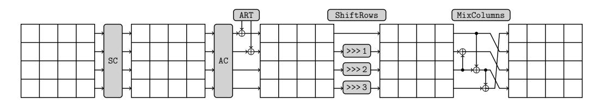

<span id="page-6-0"></span>Fig. 1. The SKINNY round function applies five different transformations: SubCells (SC), AddConstants (AC), AddRoundTweakey (ART), ShiftRows (SR) and MixColumns (MC).

encryption depends on the block and tweakey sizes. The actual values are summarized in Table 1. Note that no whitening key is used in SKINNY. Thus, a part of the first and last round do not add any security. We motivate this choice in Section 3.

SubCells. A s-bit Sbox is applied to every cell of the cipher internal state. For s=4, SKINNY cipher uses a Sbox  $\mathcal{S}_4$  very close to the PICCOLO Sbox [39]. The action of this Sbox in hexadecimal notation is given by the following Table 2.

<span id="page-7-0"></span>**Table 2.** 4-bit Sbox  $S_4$  used in SKINNY when s=4.

| $\overline{x}$                | 0 | 1 | 2 | 3 | 4 | 5 | 6 | 7 | 8 | 9 | a | b | С | d | е | f |
|-------------------------------|---|---|---|---|---|---|---|---|---|---|---|---|---|---|---|---|
| $\overline{\mathcal{S}_4[x]}$ | С | 6 | 9 | 0 | 1 | a | 2 | b | 3 | 8 | 5 | d | 4 | е | 7 | f |
| $\mathcal{S}_4^{-1}[x]$       | 3 | 4 | 6 | 8 | С | a | 1 | е | 9 | 2 | 5 | 7 | 0 | b | d | f |

Note that  $S_4$  can also be described with four NOR and four XOR operations, as depicted in Figure 2. If  $x_0$ ,  $x_1$ ,  $x_2$  and  $x_3$  represent the four inputs bits of the Sbox ( $x_0$  being the least significant bit), one simply applies the following transformation:

$$(x_3, x_2, x_1, x_0) \to (x_3, x_2, x_1, x_0 \oplus (\overline{x_3 \vee x_2})),$$

followed by a left shift bit rotation. This process is repeated four times, except for the last iteration where the bit rotation is omitted.

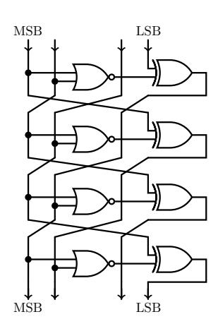

MSB LSB

<span id="page-7-1"></span>Fig. 2. Construction of the Sbox  $S_4$ .

<span id="page-7-2"></span>Fig. 3. Construction of the Sbox  $S_8$ .

For the case s = 8, SKINNY uses an 8-bit Sbox  $S_8$  that is built in a similar manner as for the 4-bit Sbox  $S_4$  described above. The construction is simple and is depicted in Figure 3. If  $x_0, \ldots, x_7$  represent the eight inputs bits of the Sbox ( $x_0$  being the least significant bit), it basically applies the below transformation on the 8-bit state:

$$(x_7, x_6, x_5, x_4, x_3, x_2, x_1, x_0) \rightarrow (x_7, x_6, x_5, x_4 \oplus (\overline{x_7 \vee x_6}), x_3, x_2, x_1, x_0 \oplus (\overline{x_3 \vee x_2})),$$

followed by the bit permutation:

$$(x_7, x_6, x_5, x_4, x_3, x_2, x_1, x_0) \longrightarrow (x_2, x_1, x_7, x_6, x_4, x_0, x_3, x_5),$$

repeating this process four times, except for the last iteration where there is just a bit swap between  $x_1$  and  $x_2$ . Besides, we provide in Appendix A the table of Sbox  $S_8$  and its inverse in hexadecimal notations.

AddConstants. A 6-bit affine LFSR, whose state is denoted ( $rc_5$ ,  $rc_4$ ,  $rc_3$ ,  $rc_2$ ,  $rc_1$ ,  $rc_0$ ) (with  $rc_0$  being the least significant bit), is used to generate round constants. Its update function is defined as:

$$(rc_5||rc_4||rc_3||rc_2||rc_1||rc_0) \rightarrow (rc_4||rc_3||rc_2||rc_1||rc_0||rc_5 \oplus rc_4 \oplus 1).$$

The six bits are initialized to zero, and updated *before* use in a given round. The bits from the LFSR are arranged into a  $4 \times 4$  array (only the first column of the state is affected by the LFSR bits), depending on the size of internal state:

$$\begin{bmatrix} c_0 & 0 & 0 & 0 \\ c_1 & 0 & 0 & 0 \\ c_2 & 0 & 0 & 0 \\ 0 & 0 & 0 & 0 \end{bmatrix},$$

with  $c_2 = 0x2$  and

$$(c_0, c_1) = (rc_3 || rc_2 || rc_1 || rc_0, 0 || 0 || rc_5 || rc_4) \text{ when } s = 4$$

 $(c_0, c_1) = (0 || 0 || 0 || 0 || rc_3 || rc_2 || rc_1 || rc_0, 0 || 0 || 0 || 0 || 0 || 0 || rc_5 || rc_4) \text{ when } s = 8.$

The round constants are combined with the state, respecting array positioning, using bitwise exclusive-or. The values of the  $(rc_5, rc_4, rc_3, rc_2, rc_1, rc_0)$  constants for each round are given in the table below, encoded to byte values for each round, with  $rc_0$  being the least significant bit.

| Rounds  | Constants                                       |
|---------|-------------------------------------------------|
| 1 - 16  | 01,03,07,0F,1F,3E,3D,3B,37,2F,1E,3C,39,33,27,0E |
| 17 - 32 | 1D,3A,35,2B,16,2C,18,30,21,02,05,0B,17,2E,1C,38 |
| 33 - 48 | 31,23,06,0D,1B,36,2D,1A,34,29,12,24,08,11,22,04 |
| 49 - 62 | 09,13,26,00,19,32,25,0A,15,2A,14,28,10,20       |

AddRoundTweakey. The first and second rows of all tweakey arrays are extracted and bitwise exclusive-ored to the cipher internal state, respecting the array positioning. More formally, for  $i = \{0, 1\}$  and  $j = \{0, 1, 2, 3\}$ , we have:

- $IS_{i,j} = IS_{i,j} \oplus TK1_{i,j}$  when z = 1,
- $IS_{i,j} = IS_{i,j} \oplus TK1_{i,j} \oplus TK2_{i,j}$  when z = 2,
- $IS_{i,j} = IS_{i,j} \oplus TK1_{i,j} \oplus TK2_{i,j} \oplus TK3_{i,j}$  when z = 3.

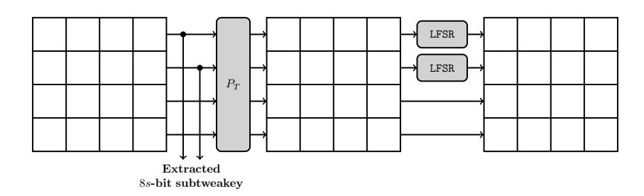

<span id="page-8-0"></span>**Fig. 4.** The tweakey schedule in SKINNY. Each tweakey word TK1, TK2 and TK3 (if any) follows a similar transformation update, except that no LFSR is applied to TK1.

Then, the tweakey arrays are updated as follows (this tweakey schedule is illustrated in Figure 4). First, a permutation  $P_T$  is applied on the cells positions of all tweakey arrays: for all  $0 \le i \le 15$ , we set  $TK1_i \leftarrow TK1_{P_T[i]}$  with

$$P_T = [9, 15, 8, 13, 10, 14, 12, 11, 0, 1, 2, 3, 4, 5, 6, 7],$$

and similarly for TK2 when z = 2, and for TK2 and TK3 when z = 3. This corresponds to the following reordering of the matrix cells, where indices are taken row-wise:

$$(0, \dots, 15) \xrightarrow{P_T} (9, 15, 8, 13, 10, 14, 12, 11, 0, 1, 2, 3, 4, 5, 6, 7)$$

Finally, every cell of the first and second rows of TK2 and TK3 (for the SKINNY versions where TK2 and TK3 are used) are individually updated with an LFSR. The LFSRs used are given in Table [3](#page-9-0) (x<sup>0</sup> stands for the LSB of the cell).

<span id="page-9-0"></span>Table 3. The LFSRs used in SKINNY to generate the round constants. The TK parameter gives the number of tweakey words in the cipher, and the s parameter gives the size of cell in bits.

| TK  | s | LFSR                                                                     |
|-----|---|--------------------------------------------------------------------------|
| TK2 | 4 | (x3  x2  x1  x0) → (x2  x1  x0  x3 ⊕ x2)                                 |
|     | 8 | (x7  x6  x5  x4  x3  x2  x1  x0) → (x6  x5  x4  x3  x2  x1  x0  x7 ⊕ x5) |
|     | 4 | (x3  x2  x1  x0) → (x0 ⊕ x3  x3  x2  x1)                                 |
| TK3 | 8 | (x7  x6  x5  x4  x3  x2  x1  x0) → (x0 ⊕ x6  x7  x6  x5  x4  x3  x2  x1) |

ShiftRows. As in AES, in this layer the rows of the cipher state cell array are rotated, but they are to the right. More precisely, the second, third, and fourth cell rows are rotated by 1, 2 and 3 positions to the right, respectively. In other words, a permutation P is applied on the cells positions of the cipher internal state cell array: for all 0 ≤ i ≤ 15, we set IS<sup>i</sup> ← IS<sup>P</sup> [i] with

$$P = [0, 1, 2, 3, 7, 4, 5, 6, 10, 11, 8, 9, 13, 14, 15, 12].$$

MixColumns. Each column of the cipher internal state array is multiplied by the following binary matrix M:

$$\mathbf{M} = \left( \begin{array}{cccc} 1 & 0 & 1 & 1 \\ 1 & 0 & 0 & 0 \\ 0 & 1 & 1 & 0 \\ 1 & 0 & 1 & 0 \end{array} \right).$$

The final value of the internal state array provides the ciphertext with cells being unpacked in the same way as the packing during initialization. Test vectors for SKINNY are provided in Appendix [B.](#page-45-1) Note that decryption is very similar to encryption as all cipher components have very simple inverse (SubCells and MixColumns are based on a generalized Feistel structure, so their respective inverse is straightforward to deduce and can be implemented with the exact same number of operations).

Extending to Other Tweakey Sizes. The three main versions of SKINNY have tweakey sizes t = n, t = 2n and t = 3n, but one can easily extend this to any size[4](#page-9-1) of tweakey n ≤ t ≤ 3n:

<span id="page-9-1"></span><sup>4</sup>For simplicity we do not include here tweakey sizes that are not a multiple of s bits. However, such cases can be trivially handled by generalizing the tweakey schedule description to the bit level.

- for any tweakey size n < t < 2n, one simply uses exactly the t = 2n version but the last 2n t bits of the tweakey state are fixed to the zero value. Moreover, the corresponding cells in the tweakey state TK2 will not be updated throughout the rounds with the LFSR.
- for any tweakey size 2n < t < 3n, one simply uses exactly the t = 3n version but the last 3n t bits of the tweakey state are fixed to the zero value. Moreover, the corresponding cells in the tweakey state TK3 will not be updated throughout the rounds with the LFSR.

We note that some of our 64-bit block SKINNY versions allow small key sizes (down to 64-bit). We emphasize that we propose these versions mainly for simplicity in the description of the SKINNY family of ciphers. Yet, as advised by the NIST [32], one should not to use key sizes that are smaller than 112 bits.

Instantiating the Tweakey State with Key and Tweak Material. Following the TWEAKEY framework [22], SKINNY takes as inputs a plaintext or a ciphertext and a tweakey value, which can be used in a flexible way by filling it with key and tweak material. Whatever the situation, the user must ensure that the key size is always at least as big as the block size.

In the classical setting where only key material is input, we use exactly the specifications of SKINNY described previously. However, when some tweak material is to be used in the tweakey state, we dedicate TK1 for this purpose and XOR a bit set to "1" every round to the second bit of the top cell of the third column (i.e. the second bit of  $IS_{0,2}$ ). In other words, when there is some tweak material, we add an extra "1" in the constant matrix from AddConstants). Besides, in situations where the user might use different tweak sizes, we recommend to dedicate some cells of TK1 to encode the size of the tweak material, in order to ensure proper separation. Note that these are only recommendations, thus not strictly part of the specifications of SKINNY.

#### <span id="page-10-0"></span>3 Rationale of SKINNY

Several design choices of SKINNY have been borrowed from existing ciphers, but most of our components are new, optimized for our goal: a cipher well suited for most lightweight applications. When designing SKINNY, one of our main criteria was to only add components which are vital for the security of the primitive, removing any unnecessary operation (hence the name of our proposal). We end up with the sound property that removing any component or using weaker version of a component from SKINNY would lead to a much weaker (or actually insecure) cipher. Therefore, the construction of SKINNY has been done through several iterations, trying to reach the exact spot where good performance meets strong security arguments. We detail in this section how we tried to follow this direction for each layer of the cipher.

We note that one could have chosen a slightly smaller Sbox or a slightly sparser diffusion layer, but our preliminary implementations showed that these options represent worse tradeoff overall. For example, one could imagine a very simple cipher iterating thousands of rounds composed of only a single non-linear boolean operation, an XOR and some bit wiring. However, such a cipher will lead to terrible performance regarding throughput, latency or energy consumption.

When designing a lightweight encryption scheme, several use cases must be taken in account. While area optimized implementations are important for some very constrained applications, throughput or throughput-over-area optimized implementations are also very relevant. Actually, looking at recently introduced efficiency measurements [24], one can see that our designs choices are good for many types of implementations, which is exactly what makes a good general-purpose lightweight encryption scheme.

#### <span id="page-11-0"></span>3.1 Estimating Area and Performances

In order to discuss the rationale of our design, we first quickly describe an estimation in Gate Equivalent (GE) of the ASIC area cost of several simple bit operations (for UMC 180nm 1.8 V [\[46\]](#page-44-4)): a NOR/NAND gate costs 1 GE, a OR/AND gate costs 1.33 GE, a XOR/XNOR gate costs 2.67 GE and a NOT gate costs 0.67 GE. Finally, one memory bit can be estimated to 6 GE (scan flip-flop). Of course, these numbers depend on the library used, but it will give us at least some rough and easy evaluation of the design choices we will make.

Besides, even though many tradeoffs exist, we distinguish between a serial implementation, a round-based implementation and a low-latency implementation. In the latter, the entire ciphering process is performed in a single clock cycle, but the area cost is then quite important as all rounds need to be directly implemented. For a round-based implementation, an entire round of the cipher is performed in a single clock cycle, thus ending with the entire ciphering process being done in r cycles and with a moderate area cost (this tradeoff is usually a good candidate for energy efficiency). Finally, in a serial implementation, one reduces the datapath and thus the area to the minimum (usually a few bits, like the Sbox bit size), but the throughput is greatly reduced. The ultimate goal of a good lightweight encryption primitive is to use lightweight components, but also to ensure that these components are compact and efficient for all these tradeoffs. This is what SIMON designers have managed to produce, but sacrificing a few security guarantees. SKINNY offers similar (sometimes even better) performances than SIMON, while providing much stronger security arguments with regard to classical differential or linear cryptanalysis.

### <span id="page-11-1"></span>3.2 General Design and Components Rationale

A first and important decision was to choose between a Substitution-Permutation Network (SPN), or a Feistel network. We started from a SPN construction as it is generally easier to provide stronger bounds on the number of active Sboxes. However, we note that there is a dual bit-sliced view of SKINNY that resembles some generalized Feistel network. Somehow, one can view the cipher as a primitive in between an SPN and an "ANDrotation-XOR" function like SIMON. We try to get the best of both worlds by benefiting the nice implementation tradeoffs of the latter, while organizing the state in an SPN view so that bounds on the number of active Sboxes can be easily obtained.

The absence of whitening key is justified by the reduction of the control logic: by always keeping the exact same round during the entire encryption process we avoid the control logic induced by having a last non-repeating layer at the end of the cipher. Besides, this simplifies the general description and implementation of the primitive. Obviously, having no whitening key means that a few operations of the cipher have no impact on the security. This is actually the case for both the beginning and the end of the ciphering process in SKINNY since the key addition is done in the middle of the round, with only half of the state being involved with this key addition every round.

A crucial feature of SKINNY is the easy generation of several block size or tweakey size versions, while keeping the general structure and most of the security analysis untouched. Going from the 64-bit block size versions to the 128-bit block size versions is simply done by using a 8-bit Sbox instead of a 4-bit Sbox, therefore keeping all the structural analysis identical. Using bigger tweakey material is done by following the STK construction [\[22\]](#page-43-9), which allows automated analysis tools to still work even though the input space become very big (in short, the superposition trick makes the TK2 and TK3 analysis almost as time consuming as the normal and easy TK1 case). Besides, unlike previous lightweight block ciphers, this complete analysis of the TK2 and TK3 cases allows us to dedicate a part of this tweakey material to be potentially some tweak input, therefore making SKINNY a flexible tweakable block cipher. Also, we directly obtain related-key security proofs using this general structure.

SubCells. The choice of the Sbox is obviously a crucial decision in an SPN cipher and we have spent a lot of efforts on looking for the best possible candidate. For the 4-bit case, we have designed a tool that searches for the most compact candidate that provides some minimal security guarantees. Namely, with the bit operations cost estimations given previously, for all possible combinations of operations (NAND/NOR/XOR/XNOR) up to a certain limit cost, our tool checks if certain security criterion of the tested Sbox are fulfilled. More precisely, we have forced the maximal differential transition probability of the Sbox to be  $2^{-2}$  and the maximal absolute linear bias to be  $2^{-2}$ . When both criteria are satisfied, we have filtered our search for Sbox with high algebraic degree.

Our results is that the Sbox used in the PICCOLO block cipher [39] is close to be the best one: our 4-bit Sbox candidate  $S_4$  is essentially the PICCOLO Sbox with the last NOT gate at the end being removed (see Figure 2). We believe this extra NOT gate was added by the PICCOLO designers to avoid fixed points (actually, if fixed points were to be removed at the Sbox level, the PICCOLO candidate would be the best choice), but in SKINNY the fixed points are handled with the use of constants to save some extra GE. Yet, omitting the last bit rotation layer removes already a lot of fixed points (the efficiency cost of this omission being null).

The Sbox  $S_4$  can therefore be implemented with only 4 NOR gates and 4 XOR gates, the rest being only bit wiring (basically free in hardware). According to our previously explained estimations, this should cost 14.68 GE, but as remarked in [39], some libraries provide special gates that further save area. Namely, in our library the 4-input AND-NOR and 4-input OR-NAND gates with two inputs inverted cost 2 GE and they can be used to directly compute a XOR or an XNOR. Thus,  $S_4$  can be implemented with only 12 GE. In comparison, the PRESENT Sbox [8] requires 3 AND, 1 OR and 11 XOR gates, which amounts to 27.32 GE (or 34.69 GE without the special 4-input gates).

All in all, our 4-bit Sbox  $S_4$  has the following security properties: maximal differential transition probability of  $2^{-2}$ , maximal absolute linear bias of  $2^{-2}$ , branching number 2, algebraic degree 3 and one fixed point  $S_4(0xF) = 0xF$ .

Regarding the 8-bit Sbox, the search space was too wide for our automated tool. Therefore, we instead considered a subclass of the entire search space: by reusing the general structure of  $S_4$ , we have tested all possible Sboxes built by iterating several times a NOR/XOR combination and a bit permutation. Our search found that the maximal differential transition probability and maximal absolute linear bias of the Sboxes are larger than  $2^{-2}$  when we have less than 8 iterations of the NOR/XOR combination and bit permutation. With 8 iterations of the NOR/XOR combination and bit permutation, we found Sboxes with desired maximal differential transition probability of  $2^{-2}$  and maximal absolute linear bias of  $2^{-2}$  with algebraic degree 6. However, the algebraic degree of the inverse Sboxes of all these candidates is 5 rather than 6. In addition, having 8 iterations may result in higher latency when we consider a serial hardware implementation. Therefore, we considered having 2 NOR/XOR combinations in every iteration and reduce the number of iteration from 8 to 4. As a result, we found several Sboxes with the desired maximal differential probability and absolute linear bias, while reaching algebraic degree 6 for both the Sbox and its inverse (thus better than the 8 iterations case). Although such Sbox candidates have 3 fixed points when we omit the last bit permutation layer like the 4-bit case, we can easily reduce the number of fixed points by introducing a different bit permutation from the intermediate bit permutations to the last layer without any additional cost.

With 2 NOR/XOR combinations and a bit permutation iterated 4 times,  $S_8$  can be implemented with only 8 NOR gates and 8 XOR gates (see Figure 3), the rest being only bit wiring (basically free in hardware). The total area cost should be 24 GE according to our previously explained estimations and using special 4-input AND-NOR and 4-input OR-NAND gates. In comparison, while ensuring a maximal differential transition

probability (resp. maximum absolute linear bias) of  $2^{-6}$  (resp.  $2^{-4}$ ), the AES Sbox requires 32 AND/OR gates and 83 XOR gates to be implemented, which amounts to 198 GE. Even recent lightweight 8-bit Sbox proposal [14] requires 12 AND/OR gates and 26 XOR gates, which amounts to 64 GE, for a maximal differential transition probability (resp. maximum linear bias) of  $2^{-5}$  (resp.  $2^{-2}$ ), but their optimization goal was different from ours.

All in all, we believe our 8-bit Sbox candidate  $S_8$  provides a good tradeoff between security and area cost. It has maximal differential transition probability of  $2^{-2}$ , maximal absolute linear bias of  $2^{-2}$ , branching number 2, algebraic degree 6 and a single fixed point  $S_8(0xFF) = 0xFF$  (for the Sbox we have chosen, swapping two bits in the last bit permutation was probably the simplest method to achieve only a single fixed point).

Note that both our Sboxes  $S_4$  and  $S_8$  have the interesting feature that their inverse is computed almost identically to the forward direction (as they are based on a generalized Feistel structure) and with exactly the same number of operations. Thus, our design reasoning also holds when considering the decryption process.

AddConstants. The constants in SKINNY have several goals: differentiate the rounds (see Section 4.5), differentiate the columns and avoid symmetries, complicate subspace cryptanalysis (see Section 4.6) and attacks exploiting fixed points from the Sbox. In order to differentiate the rounds, we simply need a counter, and since the number of rounds of all SKINNY versions is smaller than 64, the most hardware friendly solution is to use a very cheap 6-bit affine LFSR (like in LED [20]) that requires only a single XNOR gate per update. The 6 bits are then dispatched to the two first rows of the first column (this will maximize the constants spread after the ShiftRows and MixColumns), which will already break the columns symmetry.

In order to avoid symmetries, fixed points and more generally subspaces to spread, we need to introduce different constants in several cells of the internal state. The round counter will already naturally have this goal, yet, in order to increase that effect, we have added a "1" bit to the third row, which is almost free in terms of implementation cost. This will ensure that symmetries and subspaces are broken even more quickly, and in particular independently of the round counter.

AddRoundTweakey. The tweakey schedule of SKINNY follows closely the STK construction from [22] (that allows to easily get bounds on the number of active Sboxes in the related-tweakey model). Yet, we have changed a few parts. Firstly, instead of using multiplications by 2 and 3 in a finite field, we have instead replaced these tweakey cells updates by cheap 4-bit or 8-bit LFSRs (depending on the size of the cell) to minimize the hardware cost. All our LFSRs require only a single XOR for the update, and we have checked that the differential cancellation behavior of these interconnected LFSRs is as required by the STK construction: for a given position, a single cancellation can only happen every 15 rounds for **TK2**, and same with two cancellations for **TK3**.

Another important generalization of the STK construction is the fact that every round we XOR only half of the internal cipher state with some subtweakey. The goal was clearly to optimize hardware performances of SKINNY, and it actually saves an important amount of XORs in a round-based implementation. The potential danger is that the bounds we obtain would dramatically drop because of this change. Yet, surprisingly, the bounds remained actually good and this was a good security/performance tradeoff to make. Another advantage is that we can now update the tweakey cells only before they are incorporated to the cipher internal state. Thus, half of tweakey cells only will be updated every round and the period of the cancellations naturally doubles: for a certain cell position, a single cancellation can only happen every 30 rounds for **TK2** and two cancellations can only happen every 30 rounds for **TK3**.

The tweakey permutation P<sup>T</sup> has been chosen to maximize the bounds on the number of active Sboxes that we could obtain in the related-tweakey model (note that it has no impact in the single-key model). Besides, we have enforced for P<sup>T</sup> the special property that all cells located in third and fourth rows are sent to the first and second rows, and vice-versa. Since only the first and second rows of the tweakey states are XORed to the internal state of the cipher, this ensures that both halves of the tweakey states will be equally mixed to the cipher internal state (otherwise, some tweakey bytes might be more involved in the ciphering process than others). Finally, the cells that will not be directly XORed to the cipher internal state can be left at the same relative position. On top of that, we only considered those variants of P<sup>T</sup> that consist of a single cycle.

We note that since the cells of the first tweakey word TK1 are never updated, they can be directly hardwired to save some area if the situation allows.

ShiftRows and MixColumns. Competing with SIMON's impressive hardware performance required choosing an extremely sparse diffusion layer for SKINNY, which was in direct contradiction with our original goal of obtaining good security bounds for our primitive. Note that since our Sboxes S<sup>4</sup> and S<sup>8</sup> have a branching number of two, we cannot use only a bit permutation layer as in the PRESENT block cipher: differential characteristics with only a single active Sbox per round would exist. After several design iterations, we came to the conclusion that binary matrices were the best choice. More surprisingly, while most block cipher designs are using very strong diffusion layers (like an MDS matrix), and even though a 4 × 4 binary matrices with branching number four exist, we preferred a much sparser candidate which we believe offers the best security/performance tradeoff (this can be measured in terms of Figure Of Adversarial Merit [\[24\]](#page-43-12)).

Due to its strong sparseness, SKINNY binary diffusion matrix M has only a differential or linear branching number of two. This seems to be worrisome as it would again mean that differential characteristics with only a single active Sbox per round would exist (it would be the same for PRESENT block cipher if its Sbox did not have branching number three, which is the reason of the relatively high cost of the PRESENT Sbox). However, we designed M such that when a branching two differential transition occurs, the next round will likely lead to a much higher branching number. Looking at M, the only way to meet branching two is to have an input difference in either the second or the fourth input only. This leads to an input difference in the first or third element for the next round, which then diffuses to many output elements. The differential characteristic with a single active Sbox per round is therefore impossible, and actually we will be able to prove at least 96 active Sboxes for 20 rounds. Thus, for the very cheap price of a differential branching two binary diffusion matrix, we are in fact getting a better security than expected when looking at the iteration of several rounds. The effect is the same with linear branching (for which we only need to look at the transpose of the inverse of M, i.e. (M−<sup>1</sup> ) <sup>&</sup>gt;).

We have considered all possibilites for M that can be implemented with at most three XOR operations and eventually kept the MixColumns matrices that, in combination with ShiftRows, guaranteed high diffusion and led to strong bounds on the minimal number of active Sboxes in the single-key model.

Note that another important criterion came into play regarding the choice of the diffusion layer of SKINNY: it is important that the key material impacts as fast as possible the cipher internal state. This is in particular a crucial point for SKINNY as only half of the state is mixed with some key material every round, and since there is no whitening keys. Besides, having a fast key diffusion will reduce the impact of meet-in-the-middle attacks. Once the two first rows of the state were arbitrarily chosen to receive the key material, given a certain subtweakey, we could check how many rounds were required (in both encryption and decryption directions) to ensure that the entire cipher state depends

<span id="page-15-1"></span>Table 4. Proved bounds on the minimal number of differential active Sboxes for SKINNY-64-128 and various lightweight 64-bit block 128-bit key ciphers. Model SK denotes the single-key scenario and model TK2 denotes the related-tweakey scenario where differences can be inserted in both states TK1 and TK2.

|             |       | Rounds |   |   |    |    |    |    |    |    |    |    |    |    |    |    |        |
|-------------|-------|--------|---|---|----|----|----|----|----|----|----|----|----|----|----|----|--------|
| Cipher      | Model | 1      | 2 | 3 | 4  | 5  | 6  | 7  | 8  | 9  | 10 | 11 | 12 | 13 | 14 | 15 | 16     |
| SKINNY      | SK    | 1      | 2 | 5 | 8  | 12 | 16 | 26 | 36 | 41 | 46 | 51 | 55 | 58 | 61 | 66 | 75     |
| (36 rounds) | TK2   | 0      | 0 | 0 | 0  | 1  | 2  | 3  | 6  | 9  | 12 | 16 | 21 | 25 | 31 | 35 | 40     |
| LED         | SK    | 1      | 5 | 9 | 25 | 26 | 30 | 34 | 50 | 51 | 55 | 59 | 75 | 76 | 80 |    | 84 100 |
| (48 rounds) | TK2   | 0      | 0 | 0 | 0  | 0  | 0  | 0  | 0  | 1  | 5  | 9  | 25 | 26 | 30 | 34 | 50     |
| PICCOLO     | SK    | 0      | 5 | 9 | 14 | 18 | 27 | 32 | 36 | 41 | 45 | 50 | 54 | 59 | 63 | 68 | 72     |
| (31 rounds) | TK2   | 0      | 0 | 0 | 0  | 0  | 0  | 0  | 5  | 9  | 14 | 18 | 18 | 23 | 27 | 27 | 32     |
| MIDORI      | SK    | 1      | 3 | 7 | 16 | 23 | 30 | 35 | 38 | 41 | 50 | 57 | 62 | 67 | 72 | 75 | 84     |
| (16 rounds) | TK2   | -      | - | - | -  | -  | -  | -  | -  | -  | -  | -  | -  | -  | -  | -  | -      |
| PRESENT     | SK    | -      | - | - | -  | 10 | -  | -  | -  | -  | 20 | -  | -  | -  | -  | 30 | -      |
| (31 rounds) | TK2   | -      | - | - | -  | -  | -  | -  | -  | -  | -  | -  | -  | -  | -  | -  | -      |
| TWINE       | SK    | 0      | 1 | 2 | 3  | 4  | 6  | 8  | 11 | 14 | 18 | 22 | 24 | 27 | 30 | 32 | -      |
| (36 rounds) | TK2   | -      | - | - | -  | -  | -  | -  | -  | -  | -  | -  | -  | -  | -  | -  | -      |

on this subtweakey. Our final choice of MixColumns is optimal: only a single round is required in both forward and backward directions to ensure this diffusion.

#### <span id="page-15-0"></span>3.3 Comparing Differential Bounds

Our entire design has been crafted to allow good provable bounds on the minimal number of differential or linear active Sboxes, not only for the single-key model, but also in the related-key model (or more precisely the related-tweakey model in our case). We provide in Table [4](#page-15-1) a comparison of our bounds with the best known proven bounds for other lightweight block ciphers at the same security level (all the ciphers in the table use 4-bit Sboxes with a maximal differential probability of 2−<sup>2</sup> ). We give in Section [4](#page-17-0) more details on how the bounds of SKINNY were obtained.

First, we emphasize that most of the bounds we obtained for SKINNY are not tight, and we can hope for even higher minimal numbers of active Sboxes. This is not the case of LED or PRESENT for which the bounds are tight.

From the table, we can see that LED obtains better bounds for SK. Yet, the situation is inverted for TK2: due to a strong plateau effect in the TK2 bounds of LED, it stays at 50 active Sboxes until Round 24, while SKINNY already reaches 72 active Sboxes at Round 24. Besides, LED performance will be quite bad compared to SKINNY, due to its strong MDS diffusion layer and strong Sbox.

Regarding PICCOLO, the bounds[5](#page-15-2) are really similar to SKINNY for SK but worse for TK2. Yet, our round function is lighter (no use of a MDS layer), see Section [3.4.](#page-16-0)

No related-key bounds are known for MIDORI, PRESENT or TWINE. Besides, our SK bounds are better than PRESENT. Regarding MIDORI or TWINE in SK, while our bounds are slightly worse, we emphasize again that our round function is much lighter and thus will lead to much better performances.

<span id="page-15-2"></span><sup>5</sup>We estimate the number of active Sboxes for PICCOLO to d4.5 · N<sup>f</sup> e, where N<sup>f</sup> is the number of active F-functions taken from [\[39\]](#page-44-0).

<span id="page-16-2"></span>Table 5. Comparison between AES-128 and SIMON/SKINNY versions for the proportion of total number of rounds needed to provide a sufficiently good differential characteristic probability bound according to the cipher block size (i.e. < 2 <sup>−</sup><sup>64</sup> for 64-bit block size and < 2 <sup>−</sup><sup>128</sup> for 128-bit block size). Results for SIMON are updated results taken from [\[27\]](#page-43-2).

| Cipher         | Single Key   | Related Key    |
|----------------|--------------|----------------|
| SKINNY-64-128  | 8/36 = 0.22  | 15/36 = 0.42   |
| SIMON-64-128   | 19/44 = 0.43 | no bound known |
| SKINNY-128-128 | 15/40 = 0.37 | 19/40 = 0.47   |
| SIMON-128-128  | 41/68 = 0.60 | no bound known |
| AES-128        | 4/10 = 0.40  | 6/10 = 0.60    |

Comparing differential bounds with SIMON is not as simple as with SPN ciphers. Yet, bounds on the best differential/linear characteristics for SIMON have been provided recently by [\[27\]](#page-43-2).[6](#page-16-1)

Assuming (very) pessimistically for SKINNY that a maximum differential transition probability of 2−<sup>2</sup> is always possible for each active Sbox in the differential paths with the smallest number of active Sboxes, we can directly obtain easy bounds on the best differential/linear characteristics for SKINNY. We provide in Table [5](#page-16-2) a comparison between SIMON and SKINNY versions for the proportion of total number of rounds needed to provide a sufficiently good differential characteristic probability bound according to the cipher block size. One can see that SKINNY needs a much smaller proportion of its total number of rounds compared to SIMON to ensure enough confidence with regards to simple differential/linear attacks. Actually the related-key ratios of SKINNY are even smaller than single-key ratios of SIMON (no related-key bounds are known as of today for SIMON).

Finally, in terms of diffusion, all versions of SKINNY achieve full diffusion after only 6 rounds (forwards or backwards), while SIMON versions with 64-bit block size requires 9 rounds, and even 13 rounds for SIMON versions with 128-bit block size [\[27\]](#page-43-2) (AES-128 reaches full diffusion after 2 of its 10 rounds). Again, the diffusion comparison according to the total number of rounds is at SKINNY's advantage.

### <span id="page-16-0"></span>3.4 Comparing Theoretical Performance

After some minimal security guarantee, the second design goal of SKINNY was to minimize the total number of operations. We provide in Table [6](#page-17-1) a comparison of the total number of operations per bit for SKINNY and for other lightweight block ciphers, as well as some quality grade regarding its ASIC area in a round-based implementation. We explain in details in Appendix [C](#page-46-1) how these numbers have been computed.

One can see from the Table [6](#page-17-1) that SIMON and SKINNY compare very favorably to other candidates, both in terms of number of operations and theoretical area grade for round-based implementations. This seems to confirm that when it comes to lightweight block ciphers, SIMON is probably the strongest competitor as of today. Besides, SKINNY has the best theoretical profile among all the candidates presented here, even better than SIMON for area. For speed efficiency, SKINNY outperforms SIMON when the key schedule is taken in account. This scenario is arguably the most important in practice: as remarked in [\[4\]](#page-42-0), it is likely that lightweight devices will cipher very small messages and thus the back-end servers communicating with millions of devices will probably have to recompute the key schedule for every small message received.

<span id="page-16-1"></span><sup>6</sup>Their article initially contained results only for the smallest versions of SIMON, but the authors provided us updated results for all versions of SIMON.

<span id="page-17-1"></span>Table 6. Total number of operations and theoretical performance of SKINNY and various lightweight block ciphers. N denotes a NOR gate, A denotes a AND gate, X denotes a XOR gate.

| Cipher             | nb. of<br>rds | int. cipher        | gate cost (per bit per round)<br>key sch. | total               | nb. of op.<br>w/o key sch. w/ key sch. | nb. of op.             | round-based<br>impl. area     |
|--------------------|---------------|--------------------|-------------------------------------------|---------------------|----------------------------------------|------------------------|-------------------------------|
| SKINNY<br>-64-128  | 36            | 1 N<br>2.25 X      | 0.625 X                                   | 1 N<br>2.875 X      | 3.25 × 36<br>= 117                     | 3.875 × 36<br>= 139.5  | 1 + 2.67 × 2.875<br>= 8.68    |
| SIMON<br>-64/128   | 44            | 0.5 A<br>1.5 X     | 1.5 X                                     | 0.5 A<br>3.0 X      | 2 × 44<br>= 88                         | 3.5 × 44<br>= 154      | 0.67 + 2.67 × 3<br>= 8.68     |
| PRESENT<br>-128    | 31            | 1 A<br>3.75 X      | 0.125 A<br>0.344 X                        | 1.125 A<br>4.094 X  | 4.75 × 31<br>= 147.2                   | 5.22 × 31<br>= 161.8   | 1.5 + 2.67 × 4.094<br>= 12.43 |
| PICCOLO<br>-128    | 31            | 1 N<br>4.25 X      |                                           | 1 N<br>4.25 X       | 5.25 × 31<br>= 162.75                  | 5.25 × 31<br>= 162.75  | 1 + 2.67 × 4.25<br>= 12.35    |
| KATAN<br>-64-80    | 254           | 0.047 N<br>0.094 X | 3 X                                       | 0.047 N<br>3.094 X  | 0.141 × 254<br>= 35.81                 | 3.141 × 254<br>= 797.8 | 0.19+2.67×3.094<br>= 8.45     |
| SKINNY<br>-128-128 | 40            | 1 N<br>2.25 X      |                                           | 1 N<br>2.25 X       | 3.25 × 40<br>= 130                     | 3.25 × 40<br>= 130     | 1 + 2.67 × 2.25<br>= 7.01     |
| SIMON<br>-128/128  | 68            | 0.5 A<br>1.5 X     | 1 X                                       | 0.5 A<br>2.5 X      | 2 × 68<br>= 136                        | 3 × 68<br>= 204        | 0.67 + 2.67 × 2.5<br>= 7.34   |
| NOEKEON<br>-128    | 16            | 5.25 X             | 0.5 (A + N) 0.5 (A + N)<br>5.25 X         | 1 (A + N)<br>10.5 X | 6.25 × 16<br>= 100                     | 12.5 × 16<br>= 200     | 2.33 + 2.67 × 10.5<br>= 30.36 |
| AES<br>-128        | 10            | 4.25 A<br>16 X     | 1.06 A<br>3.5 X                           | 5.31 A<br>19.5 X    | 20.25 × 10<br>= 202.5                  | 24.81 × 10<br>= 248.1  | 7.06 + 2.67 × 19.5<br>= 59.12 |
| SKINNY<br>-128-256 | 48            | 1 N<br>2.25 X      | 0.56 X                                    | 1 N<br>2.81 X       | 3.25 × 48<br>= 156                     | 3.81 × 48<br>= 183     | 1 + 2.67 × 2.81<br>= 8.5      |
| SIMON<br>-128/256  | 72            | 0.5 A<br>1.5 X     | 1.5 X                                     | 0.5 A<br>3.0 X      | 2 × 72<br>= 144                        | 3.5 × 72<br>= 252      | 0.67 + 2.67 × 3<br>= 8.68     |
| AES<br>-256        | 14            | 4.25 A<br>16 X     | 2.12 A<br>7 X                             | 6.37 A<br>23 X      | 20.25 × 14<br>= 283.5                  | 29.37 × 14<br>= 411.2  | 8.47 + 2.67 × 23<br>= 69.88   |

In addition to its smaller key size, we note that KATAN-64-80 [\[13\]](#page-43-1) theoretical area grade is slightly biased here as one round of this cipher is extremely light and such a round-based implementation would actually look more like a serial implementation and will have a very low throughput (KATAN-64-80 has 254 rounds in total).

While Table [6](#page-17-1) is only a rough indication of the efficiency of the various designs, we observe that the ratio between the SIMON and SKINNY best software implementations, or the ratio between the smallest SIMON and SKINNY round-based hardware implementations actually match the results from the table (See Section [5.3\)](#page-33-1).

### <span id="page-17-0"></span>4 Security Analysis

In this section, we provide an in-depth analysis of the security of the SKINNY family of block ciphers. We emphasize that we do not claim any security in the chosen-key or known-key model, but we do claim security in the related-key model. Moreover, we chose not to use any constant to differentiate between different block sizes or tweakey sizes versions of SKINNY, as we believe such a separation should be done at the protocol level, for example by deriving different keys (note that, if needed, this can easily be done by encoding these sizes and use them as fixed extra constant material every round).

#### <span id="page-18-0"></span>4.1 Differential/Linear Cryptanalysis

In order to argue for the resistance of SKINNY against differential and linear attacks, we computed lower bounds on the minimal number of active Sboxes, both in the single-key and related-tweakey model. We recall that, in a differential (resp. linear) characteristic, an Sbox is called active if it contains a non-zero input difference (resp. input mask). In contrast to the single-key model, where the round tweakeys are constant and thus do not influence the activity pattern, an attacker is allowed to introduce differences (resp. masks) within the tweakey state in the related-tweakey model. For that, we considered the three cases of choosing input differences in TK1 only, both TK1 and TK2, and in all of the tweakey states TK1, TK2 and TK3, respectively. Table [7](#page-18-2) presents lower bounds on the number of differential active Sboxes for 1 up to 30 rounds. For computing these bounds, we generated a Mixed-Integer Linear Programming model following the approach explained in [\[31,](#page-43-14) [42\]](#page-44-5). We refer to Appendix [D](#page-48-0) for more details on how these bounds were computed.

<span id="page-18-2"></span>Table 7. Lowerbounds on the number of active Sboxes in SKINNY. Note that the bounds on the number of linear active Sboxes in the single-key model are also valid in the relatedtweakey model. In case the MILP optimization was too long, we provide upper bounds between parentheses.

| Model      | 1        | 2        | 3        | 4        | 5        | 6        | 7        | 8        | 9        | 10       | 11       | 12       | 13       | 14                                                  | 15       |
|------------|----------|----------|----------|----------|----------|----------|----------|----------|----------|----------|----------|----------|----------|-----------------------------------------------------|----------|
| SK         | 1        | 2        | 5        | 8        | 12       | 16       | 26       | 36       | 41       | 46       | 51       | 55       | 58       | 61                                                  | 66       |
| TK1        | 0        | 0        | 1        | 2        | 3        | 6        | 10       | 13       | 16       | 23       | 32       | 38       | 41       | 45                                                  | 49       |
| TK2        | 0        | 0        | 0        | 0        | 1        | 2        | 3        | 6        | 9        | 12       | 16       | 21       | 25       | 31                                                  | 35       |
| TK3        | 0        | 0        | 0        | 0        | 0        | 0        | 1        | 2        | 3        | 6        | 10       | 13       | 16       | 19                                                  | 24       |
| SK Lin     | 1        | 2        | 5        | 8        | 13       | 19       | 25       | 32       | 38       | 43       | 48       | 52       | 55       | 58                                                  | 64       |
| Model      | 16       | 17       | 18       | 19       |          |          |          |          |          |          |          |          |          |                                                     |          |
|            |          |          |          |          | 20       | 21       | 22       | 23       | 24       | 25       | 26       | 27       | 28       | 29                                                  | 30       |
|            |          |          |          |          |          |          |          |          |          |          |          |          |          |                                                     |          |
| SK         | 75       | 82       | 88       | 92       | 96       | 102      |          |          |          |          |          |          |          | 108 (114) (116) (124) (132) (138) (136) (148) (158) |          |
| TK1        | 54       | 59       | 62       | 66       | 70       | 75       | 79       | 83       | 85       | 88       | 95       |          |          | 102 (108) (112) (120)                               |          |
| TK2<br>TK3 | 40<br>27 | 43<br>31 | 47<br>35 | 52<br>43 | 57<br>45 | 59<br>48 | 64<br>51 | 67<br>55 | 72<br>58 | 75<br>60 | 82<br>65 | 85<br>72 | 88<br>77 | 92<br>81                                            | 96<br>85 |

For lower bounding the number of linear active Sboxes, we used the same approach. For that, we considered the inverse of the transposed linear transformation M>. However, for the linear case, we only considered the single-key model. As it is described in [\[28\]](#page-43-15), there is no cancellation of active Sboxes in linear characteristics. Thus, the bounds for SK give valid bounds also for the case where the attacker is allowed to not only control the message but also the tweakey input.

The above bounds are for single characteristic, thus it will be interesting to take a look at differentials and linear hulls. Being a rather complex task, we leave this as future work.

### <span id="page-18-1"></span>4.2 Meet-in-the-Middle Attacks

Meet-in-the-middle attacks have been applied to block ciphers e.g. [\[9,](#page-42-5) [15\]](#page-43-16). From its application to the SPN structure [\[38\]](#page-44-6), the number of attacked rounds can be evaluated by considering the maximum length of three features, partial-matching, initial structure and splice-and-cut. This evaluation approach can be seen in the proposal of MIDORI.

Partial-matching cannot work if the number of rounds reaches full diffusion rounds in each of forward and backward directions. For SKINNY, full diffusion is achieved after 6 rounds forwards and backwards. Thus, partial-matching can work at most (6-1)+(6-1)=10 rounds. The length of the initial structure can also be bounded by the smaller number of full diffusion rounds in backwards and forwards and the maximum number that all tweakey cells impact to an Sbox. As a result, it works up to 6+2-1=7 rounds for SKINNY. Splice-and-cut may extend the number of attack rounds up to the smaller number of full diffusion rounds minus one, which is 6-1=5 in SKINNY. In the end, we conclude that meet-in-the-middle attack may work up to 10+7+5=22 rounds. Consequently, the 32+ rounds of SKINNY provides a reasonable security margin.

Remarks on Biclique Cryptanalysis. Biclique cryptanalysis improves the complexity of exhaustive search by computing only a part of encryption algorithm. The improved factor is often evaluated by the ratio of the number of Sboxes involved in the partial computation to all Sboxes in the cipher. The improved factor can be relatively big when the number of rounds in the cipher is small, which is not the case in SKINNY. We do not think improving exhaustive search by a small factor will turn into serious vulnerability in future. Therefore, SKINNY is not designed to resist biclique cryptanalysis with small improvement.

#### <span id="page-19-0"></span>4.3 Impossible Differential Attacks

Impossible differential attack [5] finds two internal state differences  $\Delta, \Delta'$  such that  $\Delta$  is never propagated to  $\Delta'$ . The attacker then finds many pairs of plaintext/ciphertext and tweakey values leading to  $(\Delta, \Delta')$ . Those tweakey values are wrong values, thus tweakey space can be reduced.

We searched for impossible differential characteristics with the miss-in-the-middle technique. In short, 16 input truncated differentials and 16 output truncated differentials with single active cell are propagated with encryption function and decryption function, respectively, until no cell can be inactive or active with probability one. Then, we pick up the pair contradicting each other in the middle. Consequently, we found that the longest impossible differential characteristics reach 11 rounds and there are 16 such characteristics in total. An example of a 11-round impossible differential characteristic is as follows (also depicted in Figure 5):

$$(0,0,0,0,0,0,0,0,0,0,0,0,0,0,0,0,0,0,0,$$

Several rounds can be appended before and after the 11-round impossible differential characteristic. The number of rounds appended depend on the key size. For example, when the block size and the key size are the same, two rounds and three rounds can be appended before and after the characteristic respectively, which makes 16-round key recovery. The plaintext difference becomes (0,0,0,\*,\*,\*,\*,0,0,\*,0,\*,0,0,\*,0) and the ciphertext difference becomes (\*,\*,\*,\*,\*,\*,\*,0,0,0,\*,\*,\*,\*,\*,0), where \* denotes non-zero difference. The entire differential characteristic is illustrated in Figure 6.

The analysis is slightly different from standard SPN ciphers due to the lack of whitening key and unique order of the AddRoundTweakey (ARK) operation. For the first two rounds, ARK can be moved after the ShiftRows (SR) and MixColumns (MC) operations by applying the corresponding linear transformation to the tweakey value, which confirms that the first round acts as a keyless operation. Then, the analysis can start by regarding input difference to Round 2 as the plaintext difference and this is masked by the equivalent tweakey for the first round. It also shows that the number of (equivalent) tweakey cells involved is 3 in the first three rounds and 5 in the last three rounds; hence, 8 cells in total.

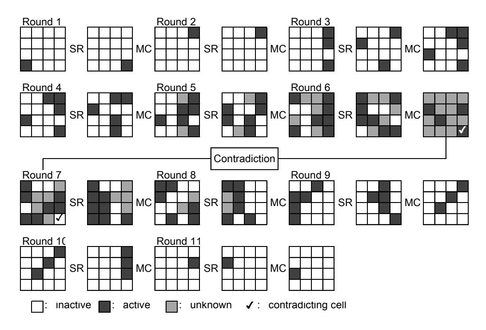

<span id="page-20-1"></span>Fig. 5. 11-round impossible differential characteristic. SR and MC stand for ShiftRows and MixColumns, respectively. SubCells, AddConstants and AddTweakey are omitted since they are not related to the impossible differential characteristic.

The attacker constructs  $2^x$  structures at the input to Round 2 and each structure consists of  $2^{3c}$  values, where c is the cell size i.e. 4 bits for SKINNY-64 and 8 bits for SKINNY-128. In total,  $2^{x+6c-1}$  pairs can be constructed from those  $2^{x+3c}$  values. All the  $2^{x+3c}$  values are inverted by one keyless round to obtain the corresponding original plaintexts and further queried the encryption oracle to obtain their corresponding ciphertexts. The attacker only picks up the pair which has 9 inactive cells after inverting the last MC operation.  $2^{x-3c-1}$  pairs are expected to remain after the filtering. For each such pair, the attacker can generate all tweakey values for 8 cells leading to the impossible differential characteristic by guessing 5 internal state cells, which are 1-cell differences after MC in Round 3 and 4-cell differences before MC in Round 14 and Round 15. In the end, the attacker obtains  $2^{x-3c-1+5c} = 2^{x+2c-1}$  wrong key suggestions for 8 tweakey cells, which makes the remaining tweakey space

$$2^{8c} \cdot (1 - 2^{-8c})^{2^{x+2c-1}} = 2^{8c} \cdot e^{-2^{x-6c-1}}.$$

When c=8, we choose x=54.5, which makes the remaining key space  $2^{64} \cdot 2^{-65.3} < 1$ . When c=4, we choose x=29.5, which makes the remaining key space  $2^{32} \cdot 2^{-32.6} < 1$ .

All in all, the data complexity amounts to  $2^{x+3c}$  chosen plaintexts, and time and memory complexities are  $\max\{2^{x+3c},2^{x+2c-1}\}$ . Hence, data, time and memory complexities reach  $2^{88.5}$  for SKINNY-128 with 128-bit key (c=8) and  $2^{41.5}$  for SKINNY-64 with 64-bit key (c=4).

#### <span id="page-20-0"></span>4.4 Integral Attacks

Integral attack [16,26] prepares a set of plaintexts so that particular cells can contain all the values in the set and the other cells are fixed to a constant value. Then properties

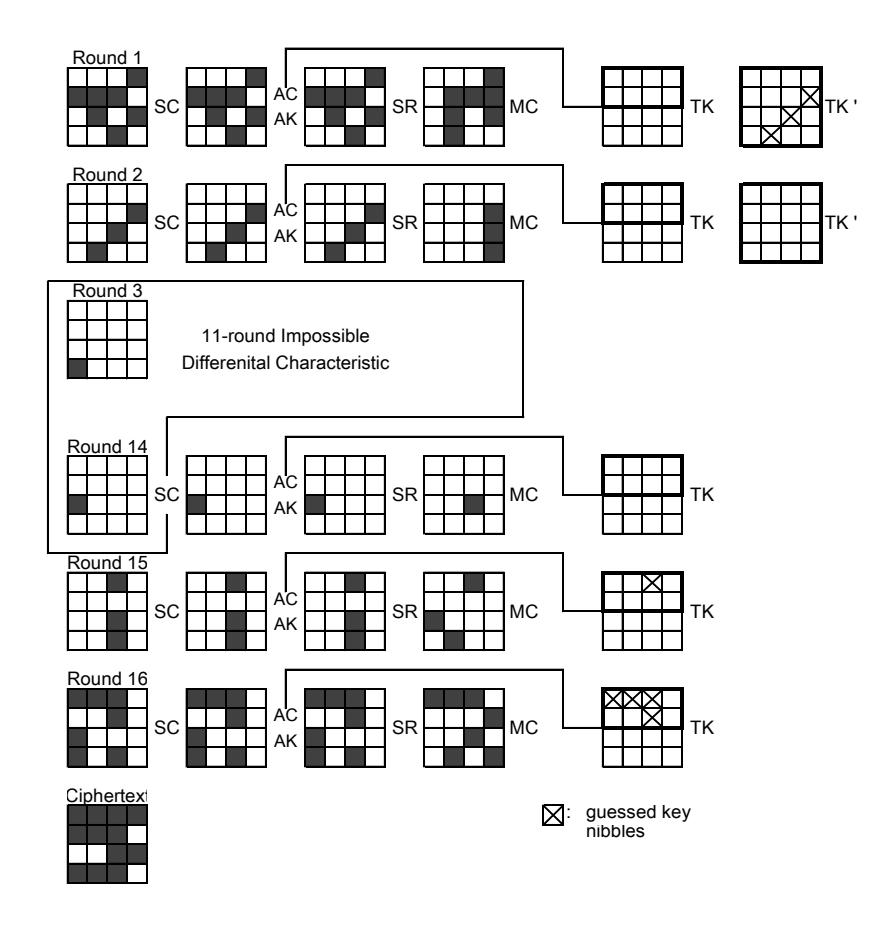

<span id="page-21-0"></span>Fig. 6. 16-round key recovery with impossible differential attack for SKINNY-64 with 64-bit tweakey and SKINNY-128 with 128-bit tweakey.

of the multiset of internal state values after encrypting several rounds are considered. In particular, we consider the following four properties.

All (A) : All values in the cell appear exactly the same number.

Balanced (B) : The sum of all values in the multiset is 0.

Constant (C) : The cell value is fixed through the multiset.

Unknown (U) : No particular property exists.

In order to find the maximum number of rounds preserving any non-trivial property, we follow an experimental approach. One active cell is set to the state, and those are processed by encryption algorithm until all cells become unknown. This is iterated many times by using different value of constant cells and tweakey. As a result, we found that an active cell in any of the third row will yield two cells satisfying the A property after seven rounds.

The property is then extended to higher-order by propagating the active cell in the backward direction. The property can be extended by 4 rounds in backwards by activating 12 cells. In the end, 10-round integral distinguishers can be constructed, which is illustrated in Figure [7.](#page-22-0)

Note that algebraic degree of the 4-bit Sbox is three (optimal) while algebraic degree of the 8-bit Sbox is six (not optimal), thus integral property of SKINNY-128 can be longer than SKINNY-64. We did the experiment for both versions, and found that the integral property was identical.

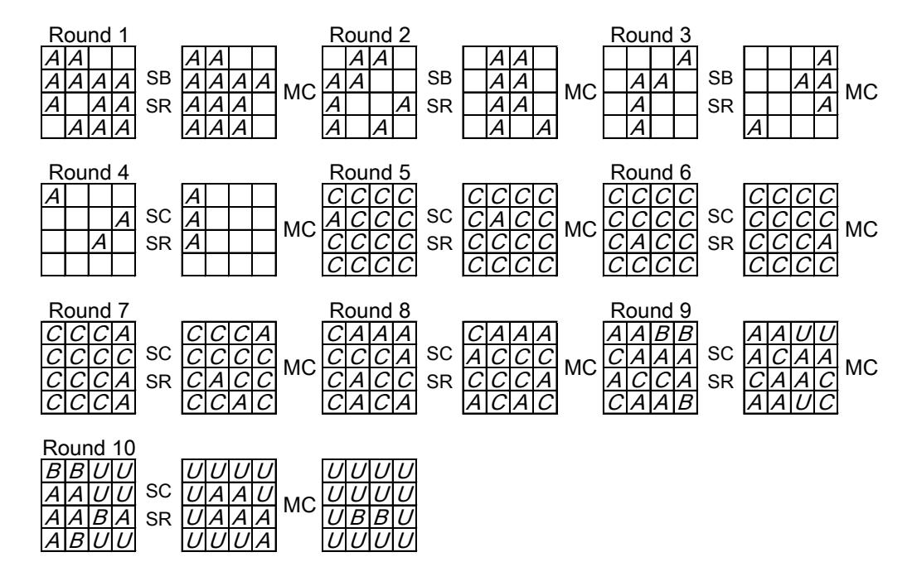

<span id="page-22-0"></span>**Fig. 7.** 10-round integral distinguisher. Rounds 5 to 10 show the property for  $2^4$  internal state values. Round 1 to 4 show which cells need to be active to extend it to higher-order integral property.

**Key Recovery.** One can append 4 rounds after the 10-round integral distinguisher to make a 14-round key-recovery attack. The 4-round backward computation is depicted in Figure 8.

Then, the strategy proceeds as follows:

- 1. The attacker prepares  $2^{12c}$  plaintexts to form the integral distinguisher. The attacker computes inverse MixColumns operation for each of the corresponding ciphertext, and takes parity of the 4-cell values necessary to proceed the backward computation. This reduces the remaining text size to  $2^{8c}$ .
- 2. The attacker guesses 4 cells of the last tweakey and further computes inverse SubCells and inverse MixColumns. Again the attack takes the parity of 5-cell values after the inverse MixColumns. In the end, this step performs  $2^{8c} \cdot 2^{4c} = 2^{12c}$  computations and obtain  $2^{5c}$  data for each guess of 4 cells of tweakey. Note that guess-and-compress approach can be performed column-by-column, which can improve the complexity of this step smaller. However, we omit the very detailed optimization here.
- 3. Given  $2^{5c}$  data, the attacker guesses 2 cells of tweakey in round 13 and computes back to 2 cells after the inverse MixColumns. The attack takes the parity of 2-cell values.  $2^{2c}$  data are processed for  $2^{4c+2c} = 2^{6c}$  tweakey guesses, which requires  $2^{11c}$  computations and obtain  $2^{2c}$  data for each guess of 6 cells of tweakey.
- 4. Given  $2^{2c}$  data, 1 cell of tweakey in round 12 can be obtained from 4-cell guess for tweakey in round 14, which allows to compute back to the target cell in the output of the distinguisher.  $2^{2c}$  data are processed for  $2^{4c+2c} = 2^{6c}$  tweakey guesses, which requires  $2^{8c}$  round function operations.
- 5. Computed results are tested if the Balanced (B) property is satisfied. The guessed 7-cell key candidates are reduced by a factor of  $2^{-c}$ .
- 6. By iterating the analysis 5 times more, the 6-cell key candidates will be reduced to 1, and the other 10-cells can be guessed exhaustively.

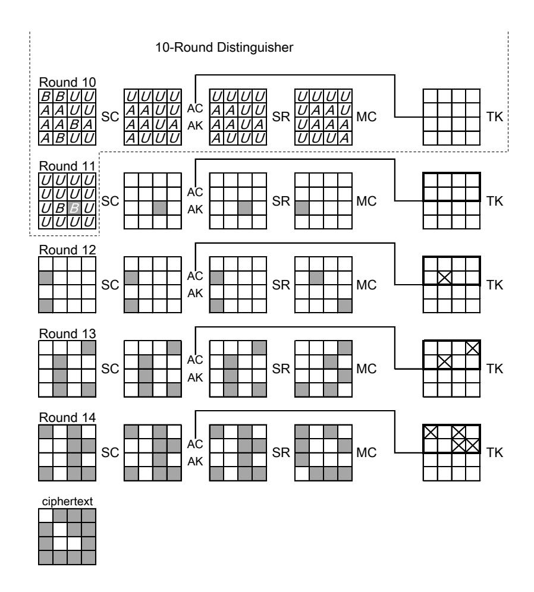

Fig. 8. 16-round key recovery with integral attack for SKINNY-64 with 64-bit tweakey and SKINNY-128 with 128-bit tweakey. The cells that are involved during the last 2.5-round backward computation are colored in gray.

<span id="page-23-0"></span>Data complexity of this attack is  $2^{12c}$  chosen plaintexts and memory access to deal with  $2^{12c}$  ciphertext is the bottleneck of the complexity. The bottleneck of the memory complexity is also for the very first stage, which stores  $2^{8c}$  state values after the first parity check.

Remarks on the Division Property. The division property was proposed by Todo [44] as a generalization of the integral property, which is in particular useful to precisely evaluate higher-order integral property. However, regarding application to SKINNY, experimental approach can reach more rounds. This is due to the very light round function, which allows relatively long integral property with a single active cell. In fact, an evaluation algorithm against generic SPN ciphers presented in [44, Algorithm 2] only leads to 6-round division property. Advanced evaluation algorithm needs to be developed to improve integral attack by division property.

A generalization of [44] described in [11] makes a link between the algebraic normal form (ANF) on an Sbox, and its resistance to the division property. In particular, for a 4-bit mapping  $(x_0, x_1, x_2, x_3) \rightarrow (y_0, y_1, y_2, y_3)$ , they compute all the 16 possible products of  $y_i$ 's terms and check which of the 16 possible products of  $x_i$ 's appears in the resulting ANF. The result is shown graphically in Table 8. From an attacker point of view, the authors explain in [11] that the sparse lines can be used to launch an attack. While the resulting

table in the case of SKINNY-64 seems sparser than the case of PRESENT for instance (which can be explained by the design strategy adopted), we are still confident that our proposals offer a strong security margin regarding this class of attacks.

<span id="page-24-1"></span>Table 8. Division Property in the case of SKINNY-64 Sbox (x0, x1, x2, x3) → (y0, y1, y2, y3). For a given column α, the binary representation of α = α0α1α2α<sup>3</sup> gives the ANF decomposition of the product of Q <sup>α</sup>i=1 y<sup>i</sup> in terms of the products of x<sup>j</sup> 's. In particular, the four columns 1, 2, 4, 8 gives the ANF decomposition of the Sbox.

|   | 0 | 1 | 2 | 4 | 8 | 3 | 5 | 9 | 6 | a | c | 7 | b | d | e | f |
|---|---|---|---|---|---|---|---|---|---|---|---|---|---|---|---|---|
| 0 | X | X | X |   |   | X |   |   |   |   |   |   |   |   |   |   |
| 1 |   | X | X | X | X | X |   |   |   |   | X |   |   |   |   |   |
| 2 |   | X | X |   | X | X |   |   |   |   |   |   |   |   |   |   |
| 4 |   |   | X |   | X | X |   | X |   |   |   |   |   |   |   |   |
| 8 |   | X |   | X |   | X |   |   | X |   |   |   |   |   |   |   |
| 3 |   | X |   | X |   | X |   |   |   |   | X |   |   |   |   |   |
| 5 |   |   |   | X | X | X |   | X |   | X | X |   |   |   |   |   |
| 9 |   |   |   |   | X | X |   |   | X |   | X |   |   |   |   |   |
| 6 |   |   | X | X |   | X |   | X |   |   |   |   |   |   |   |   |
| a |   |   |   |   | X | X | X |   | X |   |   |   |   |   |   |   |
| c |   |   |   | X | X | X |   | X | X |   |   |   |   |   |   |   |
| 7 |   |   |   | X | X | X |   | X | X |   |   |   |   |   | X |   |
| b |   |   |   |   |   |   |   |   |   |   | X | X |   |   |   |   |
| d |   |   |   |   |   |   |   |   | X |   | X |   | X |   |   |   |
| e |   |   |   |   | X | X |   |   | X |   | X |   |   | X |   |   |
| f |   |   |   |   |   |   |   |   |   |   |   |   |   |   |   | X |

### <span id="page-24-0"></span>4.5 Slide Attacks

In SKINNY, the distinction between the rounds of the cipher is ensured by the AddConstants operation and thus the straightforward slide attacks cannot be applied. However, the affine LFSR, which is the source of the distinction, has a state size of 6 bits. Hence, it occurs quite frequently that either rc5krc<sup>4</sup> or rc3krc2krc1krc<sup>0</sup> (the two constants cell values that depend on the round number) collides in different rounds, which could reduce the power of the round distinction.

We took into account all possible sliding numbers of rounds and deduced what is the difference in the constants that is obtained every time. As these constant differences might impact the best differential characteristic, we experimentally checked the lower bounds on the number of active Sboxes for all these constant differences by using MILP.

In the single-key setting, by allowing any starting round for each value of the slid pair, the lower bounds on the number of active Sboxes reach 36 after 11 rounds, and 41 after 12 rounds. All the pairs of starting rounds allowing these bounds are listed in Table [9.](#page-25-2) These bounds are not tight. Hence, they do not indicate the existence of exact differential characteristic matching the bounds. Moreover, in practice, attackers do not have any control on the input state of the middle rounds. From those reasons, we expect that slide attacks do not threat the security of SKINNY.

<span id="page-25-2"></span>**Table 9.** Slid round numbers achieving the minimal lower bounds. The notation (a, b) means that the first and second values of the pair start from round a and round b, respectively. In this table, round numbers start from 0.

```
36 Sboxes for 11 rounds
```

```
(12,31), (14,50), (16,30), (18,40), (1,25), (20,28), (21,38), (23,32), (26,47), (2,34), (33,46), (36,39), (3,15), (42,49), (44,48), (4,10), (6,11), (7,17), (8,37), (9,29)
```

#### 41 Sboxes for 12 rounds

```
(0, 15), (10, 45), (11, 13), (12, 37), (16, 42), (17, 18), (19, 43), (21, 33), (22, 28), (24, 29), (25, 35), (27, 47), (2, 44), (30, 49), (34, 48), (38, 46), (41, 50), (5, 32), (7, 40), (8, 31)
```

The similar attack can be evaluated in the related-key setting. Considering that the above discussion already assumes the very optimistic scenario for the attacker, i.e. the attacker can make reduced-round queries by forcing the oracle to start from any middle round of her choice, the impact to the real SKINNY seems very limited. We would leave this evaluation as future work.

### <span id="page-25-0"></span>4.6 Subspace Cryptanalysis

Invariant subspace cryptanalysis makes use of affine subspaces that are invariant under the round function. As the round key addition translates this invariant subspace, ciphers exhibit weak keys when all round-keys are such that the affine subspace stays invariant including the key-addition. Therefore, those attacks are mainly an issue for block ciphers that use identical round keys. For SKINNY the non-trivial key-scheduling already provides a good protection against such attacks for a larger number of rounds. The main concern that remains are large-dimensional subspaces that propagate invariant through the Sbox. We checked that no such invariant subspaces exist. Moreover, for the 8-bit Sbox, we computed all affine subspaces of dimension larger than two that get mapped to (different) affine subspaces and checked if those can be chained to what could be coined a subspace characteristic (cf. [19] for a similar approach).

It turns out that those subspaces can be chained only for a very small number of rounds. Figure 9 shows as an example the affine spaces of dimension five. Thus to conclude, the non-trivial key-scheduling and the use of round-constants seem to sufficiently protect SKINNY against those attacks.

#### <span id="page-25-1"></span>4.7 Algebraic Attacks

We argue why, not surprisingly, algebraic attacks do not threaten SKINNY. The Sbox  $\mathcal{S}_4$  and  $\mathcal{S}_8$  has algebraic degree a=3 and a=6 respectively. We can see from Table 4 that under the single-key scenario, for any consecutive 7-round differential characteristic of SKINNY, there are at least 26 active Sboxes. One can easily check that for all SKINNY variants, we have  $a \cdot 26 \cdot \left\lfloor \frac{r}{7} \right\rfloor \gg n$ , where r is the number of rounds and n is the block size. Moreover,  $\mathcal{S}_4$  is described by e=21 quadratic equations in the v=8 input/output variables over GF(2). The entire system for a fixed-key SKINNY permutation therefore consists of  $16 \cdot r \cdot e$  quadratic equations in  $16 \cdot r \cdot v$  variables. For example, in the case of Skinny-64-64, there are 10752 quadratic equations in 4096 variables. In comparison, the entire system for a fixed-key AES permutation consists of 6400 equations in 2560 variables. While the applicability of algebraic attacks on AES remains unclear, those numbers tend to indicate that SKINNY offers a high level of protection.

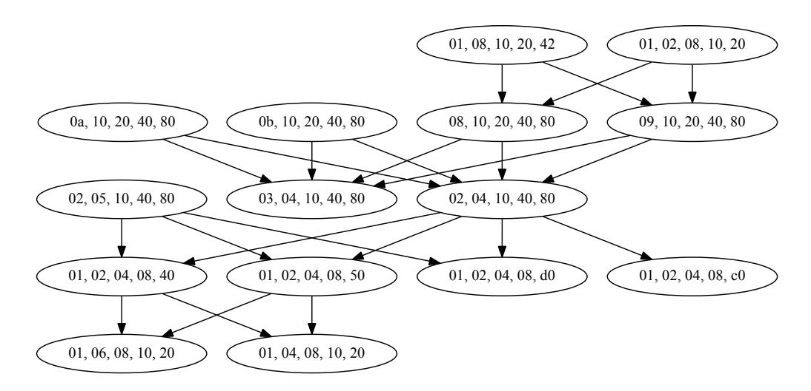

<span id="page-26-2"></span>Fig. 9. The graph showing all 5-dimensional affine spaces that gets mapped to (different) 5 dimensional spaces by applying the 8-bit Sbox of SKINNY-128. The nodes are the subspaces and the edges show which spaces are mapped to which spaces. The affine offset is ignored in this graph. The main point to make here is that the graph is actually a tree.

# <span id="page-26-0"></span>5 Implementations, Performance and Comparison

### <span id="page-26-1"></span>5.1 ASIC Implementations

This section is dedicated to the description of the different hardware implementations of all variants of SKINNY. We used Synopsys DesignCompiler version A-2007.12-SP1 to synthesize the designs considering UMCL18G212T3 [\[46\]](#page-44-4) standard cell library, which is based on the UMC L180 0.18µm 1P6M logic process with a typical voltage of 1.8 V. For the synthesis, we advised the compiler to keep the hierarchy and use a clock frequency of 100 KHz, which allows a fair comparison with the benchmark of other block ciphers reported in literature.

Round-Based Implementation. In a first step, we designed round-based implementations for all SKINNY variants providing a good trade-off between performance and area. All implementations compute a single round of SKINNY within a clock cycle. Besides, our designs take advantage of dedicated scan flip-flops rather than using simple flip-flops and additional multiplexers placed in front in order to hold round states and keys. Note that this approach leads to savings of 1 GE per bit to be stored. In order to allow a better and fairer comparison, we provide both throughput at a maximally achievable frequency and throughput at a frequency of 100KHz.

Table [10](#page-27-0) gives the area breakdown for round-based implementations of all SKINNY variants, while Table [11](#page-27-1) compares our implementations with other round-based implementations of lightweight ciphers taken from the literature.

In particular, SKINNY-64-128 offers the smallest area footprint compared to other lightweight ciphers providing the same security level. Note, that even SIMON-64-128 implemented in a round-based fashion cannot compete with our design in terms of area although it has a smaller critical path, hence can be operated at higher frequencies and provides better throughput. However, comparing the throughput at a frequency of 100KHz, SKINNY provides better results since the number of rounds is substantially lower than for SIMON.

<span id="page-27-0"></span>Table 10. Area breakdown for round-based implementations of SKINNY-64 and SKINNY-128.

|                | 64/64 | 64/128 | 64/192 | 128/128 | 128/256 | 128/384 |
|----------------|-------|--------|--------|---------|---------|---------|
|                | GE    | GE     | GE     | GE      | GE      | GE      |
| Key Schedule   | 384   | 789    | 1195   | 768     | 1557    | 2347    |
| > Register     | 384   | 768    | 1152   | 768     | 1536    | 2304    |
| > Logic        | -     | 21     | 43     | -       | 21      | 43      |
| Round Function | 839   | 907    | 988    | 1623    | 1755    | 1921    |
| > Register     | 384   | 384    | 384    | 768     | 768     | 768     |
| > Constant     | 42    | 42     | 42     | 42      | 42      | 42      |
| > MixColumns   | 123   | 123    | 123    | 245     | 245     | 245     |
| > Substitution | 192   | 192    | 192    | 384     | 384     | 384     |
| > Logic        | 98    | 166    | 247    | 184     | 316     | 482     |
| Total          | 1223  | 1696   | 2183   | 2391    | 3312    | 4268    |

Using block sizes of 128 bits, SKINNY-128-128 is only slightly larger than SIMON-128-128, while SKINNY-128-256 again has a better area footprint. Besides, the throughput behaves in a similar manner as for SKINNY-64, since SIMON-128 still has a smaller critical path (due to less complex logic functions in terms of hardware gates). Still, it can be stated that SKINNY outperforms most existing lightweight ciphers, including SIMON, in terms of area and throughput considering hardware architectures in a round-based style.

<span id="page-27-1"></span>Table 11. Round-based implementations of SKINNY-64 and SKINNY-128.

|                | Area  | Delay | Clock  | Throughput | Ref.     |      |  |
|----------------|-------|-------|--------|------------|----------|------|--|
|                |       |       | Cycles | @100KHz    | @maximum |      |  |
|                | GE    | ns    | #      | KBit/s     | MBit/s   |      |  |
| SKINNY-64-64   | 1223  | 1.77  | 32     | 200.00     | 1130.00  | New  |  |
| SKINNY-64-128  | 1696  | 1.87  | 36     | 177.78     | 951.11   | New  |  |
| SKINNY-64-192  | 2183  | 2.02  | 40     | 160.00     | 792.00   | New  |  |
| SKINNY-128-128 | 2391  | 2.89  | 40     | 320.00     | 1107.20  | New  |  |
| SKINNY-128-256 | 3312  | 2.89  | 48     | 266.67     | 922.67   | New  |  |
| SKINNY-128-384 | 4268  | 2.89  | 56     | 228.57     | 790.86   | New  |  |
| SIMON-64-128   | 1751  | 1.60  | 46     | 145.45     | 870.00   | [3]  |  |
| SIMON-128-128  | 2342  | 1.60  | 70     | 188.24     | 1145.00  | [3]  |  |
| SIMON-128-256  | 3419  | 1.60  | 74     | 177.78     | 1081.00  | [3]  |  |
| LED-64-64      | 2695  | -     | 32     | 198.90     | -        | [20] |  |
| LED-64-128     | 3036  | -     | 48     | 133.00     | -        | [20] |  |
| PRESENT-64-128 | 1884  | -     | 32     | 200.00     | -        | [8]  |  |
| PICCOLO-64-128 | 1773i | -     | 33     | 193.94     | -        | [39] |  |

<sup>i</sup> This number includes 576 GE for key storage that is not considered in the original work.

Unrolled Implementation. For the sake of completeness, we have investigated the area of SKINNY in a fully unrolled fashion. Unrolled implementations offer the best performance by computing a single encryption within one clock cycle. Therefore, all rounds are completely unrolled and the entire encryption or decryption function is implemented as combinatorial circuit at the disadvantage of increasing the critical path. However, this implementation can refrain from using registers to store intermediate values.

In Table [12,](#page-28-0) we list results of unrolled implementations for all SKINNY variants and compare it to appropriate results taken from the literature. Obviously, SKINNY cannot compete with PRINCE considering fully unrolled implementations while it still has better area results than LED, PRESENT and PICCOLO (at least for 64-bit block size and 128-bit keys). Unfortunately, the literature does not provide any numbers for latency and throughput (except for PRINCE), so we cannot compare our designs in these terms.

<span id="page-28-0"></span>Table 12. Unrolled implementations of SKINNY-64 and SKINNY-128.

|                | Area   | Delay  | Throughput | Ref.     |      |
|----------------|--------|--------|------------|----------|------|
|                |        |        | @100KHz    | @maximum |      |
|                | GE     | ns     | KBit/s     | MBit/s   |      |
| SKINNY-64-64   | 13340  | 44.74  | 6400.00    | 1430.49  | New  |
| SKINNY-64-128  | 17454  | 51.59  | 6400.00    | 1240.55  | New  |
| SKINNY-64-192  | 21588  | 57.56  | 6400.00    | 1111.88  | New  |
| SKINNY-128-128 | 32415  | 97.93  | 12800.00   | 1307.06  | New  |
| SKINNY-128-256 | 46014  | 119.57 | 12800.00   | 1070.50  | New  |
| SKINNY-128-384 | 61044  | 131.96 | 12800.00   | 1000.00  | New  |
| LED-64-128     | 111496 | -      | 6400.00    | -        | [10] |
| PRESENT-64-128 | 56722  | -      | 6400.00    | -        | [10] |
| PICCOLO-64-128 | 25668  | -      | 6400.00    | -        | [10] |
| PRINCE         | 8512   | 13.00  | 6400.00    | 4923.08  | [30] |

Serial Implementation. As a common implementation fashion for lightweight ciphers, we have also considered byte-, nibble-, and bit-serial architectures to examine the performance of SKINNY.

Serial implementations have the smallest area footprint for hardware implementations by updating only a small number of bits per clock cycle. However, the throughput and performance of such implementations is decreased significantly. Often, only a single instance of an Sbox is implemented and re-used to update the internal state of the round function in a serial fashion. Depending on the size of the Sbox, we call these implementations nibble-serial (4-bit Sbox) or byte-serial (8-bit Sbox), respectively (as an example, see Figure [10\)](#page-29-0). Besides, we provide bit-serial implementations for SKINNY-64 and SKINNY-128 which update only a single bit of the round state per clock cycle. These implementations benefit from the iterative structure of both 4- and 8-bit Sboxes of SKINNY allowing to compute them bit by bit in 4 respectively 8 clock cycles.

In Table [13,](#page-29-1) we list results for nibble-serial implementations of all SKINNY-64 variants as well as results for byte-serial implementations of all SKINNY-128 variants. Obviously, our implementations cannot compete with SIMON considering nibble-serial and byte-serial

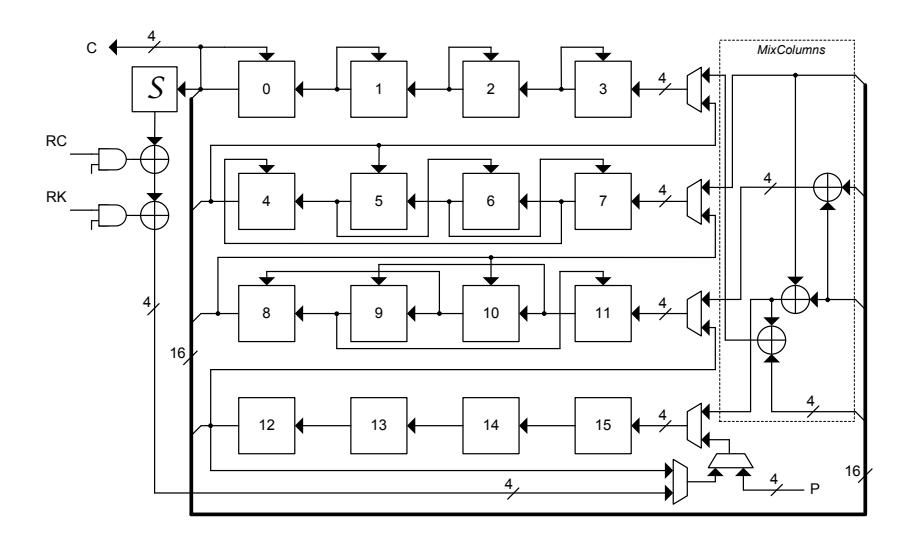

<span id="page-29-1"></span><span id="page-29-0"></span>Fig. 10. Hardware architecture of SKINNY-64 in a nibble-serial fashion

Table 13. Serial implementations of SKINNY-64 (nibble) and SKINNY-128 (byte).

|                | Area          | Delay | Clock  | Thro    | Ref.     |      |
|----------------|---------------|-------|--------|---------|----------|------|
|                |               |       | Cycles | @100KHz | @maximum |      |
|                | GE            | ns    | #      | KBit/s  | MBit/s   |      |
| SKINNY-64-64   | 988           | 1.03  | 704    | 9.09    | 88.26    | New  |
| SKINNY-64-128  | 1399          | 0.95  | 788    | 8.12    | 85.49    | New  |
| SKINNY-64-192  | 1806          | 0.95  | 872    | 7.34    | 77.26    | New  |
| SKINNY-128-128 | 1840          | 1.03  | 872    | 14.68   | 142.51   | New  |
| SKINNY-128-256 | 2655          | 0.95  | 1040   | 12.31   | 129.55   | New  |
| SKINNY-128-384 | 3474          | 0.95  | 1208   | 10.60   | 111.54   | New  |
| SIMON-64-128   | 1000          | -     | 384    | 16.7    | -        | [3]  |
| SIMON-128-128  | 1317          | -     | 560    | 22.9    | -        | [3]  |
| SIMON-128-256  | 1883          | -     | 608    | 21.1    | -        | [3]  |
| LED-64-64      | 966           | -     | 1248   | 5.1     | -        | [20] |
| LED-64-128     | 1265          | -     | 1872   | 3.4     | -        | [20] |
| PRESENT-64-128 | 1391          | -     | 559    | 11.45   | -        | [8]  |
| PICCOLO-64-128 | $758^{\rm i}$ | -     | 528    | 12.12   | -        | [39] |

 $<sup>^{\</sup>rm i}\,\rm This$  number includes 576 GE for key storage that is not considered in the original work.

implementations while area and performance results still are comparable to results for LED, PRESENT and PICCOLO found in the literature.

Furthermore, we provide in Table 14 results for bit-serial implementations for all SKINNY variants. To the best of our knowledge, no bit-serial implementations are available for LED, PRESENT and PICCOLO so we only can compare our results to SIMON. Still, SIMON outperforms our implementations in terms of area and performance, but we would like to emphasize that (so far) the possibility of implementing an SPN cipher in a bit-serial way is an unique feature of SKINNY.

Threshold Implementation. As a proper side-channel protection scheme for hardware platforms based on Boolean masking, we have realized first-order Threshold Implemen-

<span id="page-30-0"></span>Table 14. Bit-serial implementations of SKINNY-64 and SKINNY-128.

|                | Area | Delay | $\mathbf{Clock}$ | ${\bf Throughput}$ |          | Ref.           |
|----------------|------|-------|------------------|--------------------|----------|----------------|
|                |      |       | Cycles           | @100KHz            | @maximum |                |
|                | GE   | ns    | #                | KBit/s             | MBit/s   |                |
| SKINNY-64-64   | 839  | 1.03  | 2816             | 2.27               | 22.06    | New            |
| SKINNY-64-128  | 1172 | 1.06  | 3152             | 2.03               | 19.15    | $\mathbf{New}$ |
| SKINNY-64-192  | 1505 | 1.00  | 3488             | 1.83               | 18.35    | New            |
| SKINNY-128-128 | 1481 | 1.05  | 6976             | 1.83               | 17.47    | New            |
| SKINNY-128-256 | 2125 | 0.89  | 8320             | 1.53               | 17.29    | New            |
| SKINNY-128-384 | 2761 | 0.89  | 9664             | 1.32               | 14.88    | New            |
| SIMON-64-128   | 958  | -     | 1524             | 4.2                | -        | [3]            |
| SIMON-128-128  | 1234 | -     | 4414             | 2.9                | -        | [3]            |
| SIMON-128-256  | 1782 | -     | 4924             | 2.6                | -        | [3]            |

tation [33] of all variants of SKINNY. In short, thanks to the iterative architecture of the Sbox in SKINNY-128, its threshold implementation, compared to AES with the same Sbox size, is significantly smaller and faster, and does not need any fresh randomness.

We have designed the 3-share version of Threshold Implementations, where each single bit – in entire cipher internals – is represented with three shares, i.e., second-order Boolean masking. Due to the transparency of Boolean masking through linear operations, the 3-share representation of AddConstants, AddRoundTweakey, ShiftRows and MixColumns are easily achievable. However, the most challenging issue is to provide a uniform sharing of the non-linear functions, i.e., SubCells.

The Sbox  $S_4$  used in SKINNY-64 is a cubic bijection which – with respect to the categories given in [7] – belongs to the class  $C_{223}$ , and can be decomposed to quadratic bijections with uniform sharing. However, considering the iterative construction of  $S_4$  (given in Section 2 and Figure 2), we decompose  $S_4$  into  $S_4$  and  $S_4$  in such a way that  $\forall x, \mathcal{G}_4 \circ \mathcal{F}_4(x) = S_4(x)$ . We define

$$y : \langle y_3, y_2, y_1, y_0 \rangle = \mathcal{F}_4(x : \langle x_3, x_2, x_1, x_0 \rangle)$$

as

$$y_0 = x_0 \oplus (\overline{x_2 \vee x_3}), \qquad y_1 = x_1, \qquad y_2 = x_2, \qquad y_3 = x_3 \oplus (\overline{x_1 \vee x_2}),$$

and thanks to the iterative construction of  $S_4$ , we can write  $\langle y_3, y_2, y_1, y_0 \rangle = \mathcal{G}_4(\langle x_3, x_2, x_1, x_0 \rangle)$  as

$$\langle y_2, y_1, y_0, y_3 \rangle = \mathcal{F}_4(\langle x_1, x_0, x_3, x_2 \rangle),$$

which means that an input permutation and an output permutation over  $\mathcal{F}_4$  realizes  $\mathcal{G}_4$ . The transformation  $\mathcal{F}_4$  is affine equivalent to the quadratic class  $\mathcal{Q}_{294}$  [7], and its uniform sharing can be easily achieved by direct sharing. Let us represent  $x_{i\in\{0,\ldots,3\}}$  with three shares  $(x_i^1, x_i^2, x_i^3)$ , where  $x_i = x_i^1 \oplus x_i^2 \oplus x_i^3$ . We define a component function  $\mathbf{y} : \langle y_3, y_2, y_1, y_0 \rangle = f_4(s, \mathbf{w} : \langle w_3, w_2, w_1, w_0 \rangle, \mathbf{x} : \langle x_3, x_2, x_1, x_0 \rangle)$  as

$$y_0 = w_0 \oplus (\overline{s \vee (\overline{(x_2 \vee x_3)} \oplus (\overline{w_2 \vee x_3}))} \oplus (\overline{x_2 \vee w_3})),$$


$$y_1 = w_1, \qquad y_2 = w_2,$$


$$y_3 = w_3 \oplus (\overline{s \vee (\overline{(x_1 \vee x_2)} \oplus (\overline{w_1 \vee x_2}))} \oplus (\overline{x_1 \vee w_2})),$$

which is made of only NOR and XOR gates. It is noteworthy that the extra input s controls the component function  $f_4$  to pass the second input w.

A uniform sharing of  $\mathcal{F}_4$  over 3-share input  $(\boldsymbol{x}^1, \boldsymbol{x}^2, \boldsymbol{x}^3)$  can be realized by three instances of  $f_4$  as

$$y^1 = f_4(s, x^3, x^2),$$
  $y^2 = f_4(s, x^1, x^3),$   $y^3 = f_4(s, x^2, x^1).$

The same holds for  $\mathcal{G}_4$ , and by means of an input- and output permutation over  $f_4$ , we can realize its uniform sharing.

In Threshold Implementation of other ciphers, e.g., PRESENT [36], an extra register between the decomposed functions is required. However, in case of SKINNY, SubCells is performed prior to AddRoundTweakey, which allows us to place the uniform sharing of  $\mathcal{F}_4$  between the state register (see Figure 11). Integrating the input s into the component functions  $f_4$  turns  $\mathcal{F}_4$  to operate as pass through which is required during MixColumns. Table 15 represents the area overhead and performance of Threshold Implementation of all variants of SKINNY-64 based on a nibble-serial architecture.

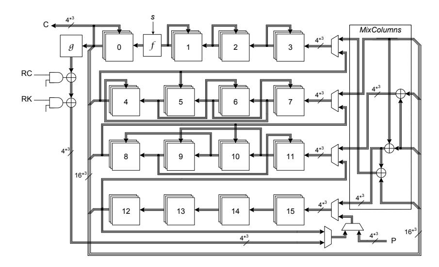

Fig. 11. Hardware architecture of Threshold Implementation of SKINNY-64 in a nibble-serial fashion

<span id="page-31-0"></span>We have applied the same concept on the SKINNY-128. In order to share the Sbox, we decompose  $S_8$  as  $\mathcal{I}_8 \circ \mathcal{H}_8 \circ \mathcal{G}_8 \circ \mathcal{F}_8$ , each of which is an 8-bit quadratic bijection. We define

$$\mathbf{y} : \langle y_7, y_6, y_5, y_4, y_3, y_2, y_1, y_0 \rangle = \mathcal{F}_8(\mathbf{x} : \langle x_7, x_6, x_5, x_4, x_3, x_2, x_1, x_0 \rangle)$$

as

$$y_0 = x_0 \oplus (\overline{x_2 \vee x_3}),$$
  $y_1 = x_1,$   $y_2 = x_2,$   $y_3 = x_3,$   $y_4 = x_4 \oplus (\overline{x_6 \vee x_7}),$   $y_5 = x_5,$   $y_6 = x_6,$   $y_7 = x_7.$

Other bijections are also defined over  $\mathcal{F}_8$  as follows:

$$\mathcal{G}_8:$$

For a uniform sharing of each of these 8-bit bijections, we define a component function  $\mathbf{y}:< y_7, y_6, y_5, y_4, y_3, y_2, y_1, y_0>=f_8(s, \mathbf{w}, \mathbf{x})$  as

$$y_0 = w_0 \oplus (\overline{s \vee (\overline{(x_2 \vee x_3)} \oplus (\overline{w_2 \vee x_3}))} \oplus (\overline{x_2 \vee w_3})),$$

$$y_1 = w_1, \quad y_2 = w_2, \quad y_3 = w_3,$$

$$y_4 = w_4 \oplus (\overline{s \vee (\overline{(x_6 \vee x_7)} \oplus (\overline{w_6 \vee x_7}))} \oplus (\overline{x_6 \vee w_7})),$$

$$y_5 = w_5, \quad y_6 = w_6, \quad y_7 = w_7.$$

Similar to  $f_4$ , the s input has been integrated in order to control the  $f_8$  function to pass through the w input. Following the same concept as explained above, the 3-share input  $(x^1, x^2, x^3)$  can be given to three instances of  $f_8$  to derive a 3-share uniform output of  $\mathcal{F}_8$ . Therefore, uniform sharing of all aforementioned 8-bit bijections can be achieved by input- and output permutations over the uniform sharing of  $\mathcal{F}_8$ . Further, we can place these shared functions between the state register in a serial implementation which avoids instantiating extra registers between the decomposed functions (see Figure 12).

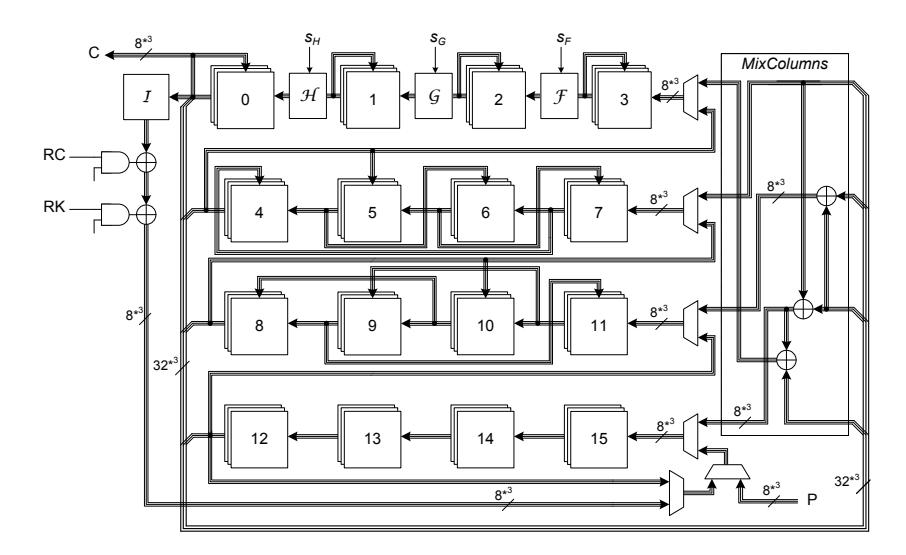

<span id="page-32-0"></span> ${\bf Fig.~12.}~{\bf Hardware~architecture~of~Threshold~Implementation~of~SKINNY-128~in~a~byte-serial~fashion$

It should be noted that the above explained constructions allow extremely efficient Threshold Implementations since

- With a few NOR gates the functions are converted to pass through (required for MixColumns).
- The Sbox is decomposed to smaller functions with shorter critical path leading to designs with significantly high clock frequencies (see Table 15).
- Extra registers are avoided compared to e.g., [36].
- Our constructions do not need any fresh randomness during the entire operations of the cipher since we could provide the uniform sharing of the Sboxes compared to e.g., [6, 29]. Only the input (plaintext) should be masked using two random masks, each with the same length as the input.

In our Threshold Implementations – similar to many other Threshold Implementations reported in the literature [6,29,36] – only the state is masked, not the key registers, which is adequate to provide first-order security.

<span id="page-33-2"></span>Table 15. Threshold implementations of SKINNY-64 (nibble-serial) and SKINNY-128 (byteserial).

|                | Area  | Delay | Clock  | Throughput | Fresh    | Ref.  |      |
|----------------|-------|-------|--------|------------|----------|-------|------|
|                |       |       | Cycles | @100KHz    | @maximum | Rand. |      |
|                | GE    | ns    | #      | KBit/s     | MBit/s   | bits  |      |
| SKINNY-64-64   | 1966  | 0.95  | 704    | 9.09       | 95.69    | 0     | New  |
| SKINNY-64-128  | 2372  | 1.00  | 788    | 8.12       | 81.22    | 0     | New  |
| SKINNY-64-192  | 2783  | 1.00  | 872    | 7.34       | 73.39    | 0     | New  |
| SKINNY-128-128 | 3780  | 1.63  | 872    | 14.68      | 90.05    | 0     | New  |
| SKINNY-128-256 | 4713  | 1.50  | 1040   | 12.31      | 82.05    | 0     | New  |
| SKINNY-128-384 | 5434  | 1.54  | 1208   | 10.60      | 68.80    | 0     | New  |
| AES-128        | 11114 | -     | 266    | 48.12      | -        | 7680  | [29] |
| AES-128        | 8119  | -     | 246    | 52.03      | -        | 5120  | [6]  |

### <span id="page-33-0"></span>5.2 FPGA Implementations

Today, FPGAs are used more and more for high-performance applications, even in the field of security and cryptographic applications. Since there are a wealth of different FPGA vendors available, we decided to implement our designs on Virtex-7 FPGAs provided by the market leader Xilinx. In this section, we provide detailed results of FPGA-tailored solutions for high-performance implementations of SKINNY. Note, that it is almost a natural choice to implement high-throughput architectures on FPGAs using pipelining techniques since logic resources always come in conjunction with succeeding flip-flops. This allows to efficiently pipeline all computations at nearly no area overhead (in terms of occupied slices of the FPGA device) while keeping the critical path of the design at a minimum. Hence, the maximum frequency and finally the throughput of the design can be increased.

A brief summary of implementation results for high-performance architectures on FPGAs for both, SKINNY-64 and SKINNY-128, can be found in Table [16](#page-34-0) providing details for used resources and achieved performance results. Note, however, that a fair comparison to existing work is rather difficult since most reference implementations found in the literature either do not target fully pipelined and unrolled implementations or just provide results for older FPGA technologies using 4-input LUTs instead of 6-input LUTs found in modern devices. Still, we would like to highlight the performance figures of all of our SKINNY implementations for FPGAs allowing to implement high-performance architectures at a minimum of resource consumption.

#### <span id="page-33-1"></span>5.3 Software Implementations

In this section, we detail how the ciphers in the SKINNY family can be implemented in software. More precisely, we consider four of the latest Intel processors using SIMD instruction sets to perform efficient parallel computations of several input blocks. We give in particular the performance figures for a bit-sliced implementations of SKINNY.

Notes on Previous Benchmarks and Comparisons. In most of the previous designs proposed in academic publications, the designers give the full cost of encryption, including the costs to convert the data to the required form, the actual encryption, and possibly the expansion of the master key. This gives a broad overview of how well the cipher would behave in a more specific context, especially for bit-sliced implementation where packing

<span id="page-34-0"></span>Table 16. High-throughput implementations of SKINNY-64 and SKINNY-128. Results are obtained after place-and-route for Virtex-7 XC7VX330T.

|                | Logic | Memory | Frequency | T'put  | Device     | Ref. |
|----------------|-------|--------|-----------|--------|------------|------|
|                | LUT   | FF     | MHz       | GBit/s | Xilinx     |      |
| SKINNY-64-64   | 3101  | 4000   | 403.88    | 25.85  | Virtex-7   | New  |
| SKINNY-64-128  | 4247  | 6720   | 402.41    | 25.75  | Virtex-7   | New  |
| SKINNY-64-192  | 6330  | 9952   | 400.48    | 25.63  | Virtex-7   | New  |
| SKINNY-128-128 | 13389 | 10048  | 320.10    | 40.97  | Virtex-7   | New  |
| SKINNY-128-256 | 17037 | 18048  | 355.62    | 45.52  | Virtex-7   | New  |
| SKINNY-128-384 | 21966 | 28096  | 356.51    | 45.63  | Virtex-7   | New  |
| ICEBERG-64-128 | 13616 | -      | 297.00    | 19.01  | Virtex-II  | [40] |
| MISTY1-64-128  | 10920 | 8480   | 140.00    | 8.96   | Virtex1000 | [41] |
| KHAZAD-64-128  | 11072 | 9600   | 123.00    | 7.87   | Virtex1000 | [41] |

and unpacking of the data can represent a non-negligible proportion of the encryption process.

In comparison, the SIMON implementations from [\[2\]](#page-42-9) do not include neither the cost of key expansion nor the cost of packing/unpacking the data, which prevents any meaningful comparison with the other lightweight ciphers having the same level of security (the argument to drop these costs relies on a strong restriction on the way the cipher implementations can be used).

In the following, we perform an evaluation of our proposals using four different recent high-speed platforms (exact setting given in Table [17\)](#page-34-1) at different rates of parallelization. While we count the costs for packing and unpacking the data, we chose to benchmark encryption given pre-expanded subkeys. The motivation is twofold: first, many modes of operation make this assumption practical and second, the key schedules of our proposals are light and would not induce big differences in the results. At the end of this section, we also give a comparison of the speed SKINNY-64-128 can achieve in the case where the data packing is not needed (i.e. in the highly parallel counter mode considered in [\[3\]](#page-42-2)).

<span id="page-34-1"></span>Table 17. Machine used to benchmark the software implementations (Turbo Boost disabled).

| Name       | Processor | Launch date | Linux kernel | gcc version |
|------------|-----------|-------------|--------------|-------------|
| Westmere   | X5650     | Q1 2010     | 3.13.0-34    | 4.8.2       |
| Ivy Bridge | i5-3470   | Q2 2012     | 3.11.0-12    | 4.8.1       |
| Haswell    | i7-4770S  | Q2 2013     | 4.4.0-22     | 5.3.1       |
| Skylake    | i7-6700   | Q3 2015     | 4.2.3-040203 | 5.2.1       |

Overall our benchmarking results show that the performance roughly follows what one would expect from Table [6.](#page-17-1) There are scenarios in practice for which the costs of the key schedule play a non-negligible role as pointed out in [\[4\]](#page-42-0) and we expect the lower costs of the SKINNY key schedule to provide a good performance.

Bit-Sliced Implementations of SKINNY. Since the design of SKINNY has been made with hardware implementations in mind, the conversion to bit-sliced implementations seems natural. In the following, we target different sets of instructions, namely SSE4 and AVX2, which provide shuffling instructions on byte level, as well as several wide 128-bit resp. 256-bit registers, commonly referred as XMM or YMM registers. From our perspective, the main differences between SSE4 and AVX2 are the width of the available registers and the possibility to use 3-operand instructions.

In the Table [18,](#page-35-0) we give the detailed performance figures of our implementations in the case of SKINNY-64 and compare it with other ciphers. Note that these implementations take into account all data transformations which are required. The bit-sliced implementations for SIMON processing 32 resp. 64 blocks have been provided by the designers to allow us a fair comparison in the same setting.

<span id="page-35-0"></span>Table 18. Bit-sliced implementations of SKINNY-64, SKINNY-128 and other 64-bit block lightweight ciphers. Performances are given in cycles per byte, with pre-expanded subkeys. For SKINNY-64 and SIMON we encrypted 2000 64-bit blocks to obtain the results. Cells with dashes (-) represent non-existing implementations to date.

| Parallelization ρ |      | Haswell |      |      | Ref. |      |      |
|-------------------|------|---------|------|------|------|------|------|
|                   | 16   | 32      | 64   | 16   | 32   | 64   |      |
| SKINNY-64-128     | -    | -       | 2.58 | -    | -    | 2.48 | New  |
| SIMON-64-128      | -    | -       | 1.58 | -    | -    | 1.51 | [48] |
| LED-128           | 22.6 | 13.7    | -    | 23.1 | 13.3 | -    | [4]  |
| PRESENT-128       | 10.8 | -       | -    | 10.3 | -    | -    | [4]  |
| Piccolo-128       | 9.2  | -       | -    | 9.2  | -    | -    | [4]  |
| SKINNY-128-128    | -    | -       | 3.78 | -    | -    | 3.43 | New  |
| SIMON-128-128     | -    | -       | 2.38 | -    | -    | 2.21 | [48] |

Counter Mode Implementations of SKINNY-64-128. As mentioned before, we can evaluate the speed of SKINNY-64-128 in the same conditions as the benchmarks provided in [\[3\]](#page-42-2). Namely, the goal is to generate the keystream from the counter mode using SKINNY-64-128 as the underlying block cipher. The main difference to the previous scenario is that many blocks of a non-repeating value (counter) are encrypted. This allows to save the costs for data packing, as the values are known in advance and can already be provided in the correct format.

We consider 64 blocks in parallel and reach a maximal speed of 2.63 cpb on the latest Intel platform Skylake. We note that the key is pre-expanded prior to encrypting the blocks, and the 64 blocks are stored in 16 registers of 256 bits in a bit-sliced way. In detail, the four first registers contain the four first bits of each first row of the 64 blocks. The same holds for the 12 others registers with the remaining three rows of the states.

Then, for all the 36 rounds of SKINNY-64-128, the application of SubCells, AddConstants, AddRoundTweakey, and MixColumns can be easily done with bit-wise operations on registers. As for ShiftRows, we implement it as a shuffle on bytes within each register. The benchmarks conducted on our four platforms are shown in Table [19.](#page-36-1)

<span id="page-36-1"></span>Table 19. Counter mode implementations of SKINNY-64-128, SKINNY-128-128, SIMON-64-128 and SIMON-128-128. Performances are given in cycles per byte, with preexpanded subkeys, encrypting 16384 bytes and obtained using SUPERCOP. Details of the machines are given in Table [17.](#page-34-1)

|                 | Westmere | Ivy Bridge |      | Haswell | Skylake | Ref. |      |
|-----------------|----------|------------|------|---------|---------|------|------|
| Instruction Set | sse4     | sse4       | sse4 | avx2    | sse4    | avx2 |      |
| SKINNY-64-128   | 7.45     | 5.34       | 4.69 | 2.47    | 4.56    | 2.37 | New  |
| SIMON-64-128    | 4.28     | 4.48       | 3.06 | 1.58    | 2.88    | 1.51 | [48] |
| SKINNY-128-128  | -        | -          | 6.68 | 3.66    | 6.90    | 3.45 | New  |
| SIMON-128-128   | 6.10     | 5.16       | 4.43 | 2.38    | 4.28    | 2.21 | [48] |

### <span id="page-36-0"></span>5.4 Micro-Controller Implementations

In this section, we describe the main performance figures when implementing SKINNY on micro-controllers. We omit details of the implementation and mainly describe the results of the implementation.

To evaluate the suitability of SKINNY for usage in embedded environments, we implemented SKINNY for the ATmega644 microcontroller (avr5-core). Note that we choose to exclude the C-interface related overhead since this is often depending on the chosen environment and compiler.

The three main indicators for performance are:

- 1. Speed, measured in cycles per byte. The figures given below correspond to the execution time of the encryption function. It is expected that a pointer to the RAM-residing preprocessed key is passed to the encryption function.
- 2. RAM size, measured in bytes. This includes all RAM used for the encryption process. Especially global data structures like Sboxes or round constants are included if they are stored in RAM. Also the RAM used to hold the preprocessed key is accounted.
- 3. ROM size, measured in bytes. This corresponds to the complete footprint of the algorithm needed to initialize global data structures, preprocess the key and to encrypt data. Especially also the memory is accounted for data which is only copied into RAM (known as .data segment).

All our implementations allow changing the key at runtime and some of them require the initialisation of global data structures.

A lot of different trade-offs can be made, which is a real strength of SKINNY, since different applications may have very different requirements and total costs would be computed very differently, sometimes justifying sacrifices which would be unacceptable in most cases. In Table [20,](#page-36-2) we provide several of those trade-offs, each optimizing for another of the three criteria mentioned above.

<span id="page-36-2"></span>Table 20. Implementation figures for SKINNY-128-128 on an ATmega644

| Cycles per byte | 222 | 257 | 258 | 288 | 297 | 328 |
|-----------------|-----|-----|-----|-----|-----|-----|
| RAM             | 576 | 287 | 576 | 287 | 31  | 31  |
| ROM             | 676 | 616 | 492 | 436 | 774 | 594 |

To compare, for example, with SIMON-128-128 on the same platform, note that, according to [\[3\]](#page-42-2), SIMON-128-128 can be implemented to optimize speed with 510 byte of

ROM and 544 bytes of RAM running at 337 cycles per byte. Thus, it can be seen that SKINNY-128-128 can be significantly faster (while sacrificing some ROM and RAM size).

## <span id="page-37-0"></span>6 The Low-Latency Tweakable Block Cipher MANTIS

In this section, we present a tweakable block cipher design which is optimized for low-latency implementations.

The low-latency block cipher PRINCE already provides a very good starting point for a low-latency design. Its round function basically follows the AES structure, with the exception of using a MixColumns-like mapping with branch number 4 instead of 5. The main difference between PRINCE and AES (and actually all other ciphers) is that the design is symmetric around a linear layer in the middle. This allows to realize what was coined  $\alpha$ -reflection: the decryption for a key K corresponds (basically) to encryption with a key  $K \oplus \alpha$  where  $\alpha$  is a fixed constant. Turning PRINCE into a tweakable block cipher is (conceptually) well understood when using e.g. the TWEAKEY framework [22]. First, define a tweakey-schedule and than simply increase the number of rounds until one can ensure that the cipher is secure against related-tweak attacks.

However, the problem is that the latency of a cipher is directly related to the number of rounds. Thus, it is crucial to find a design, i.e. a round function and a tweak-scheduling, that ensures security already with a minimal number of rounds. Here, components of the recently proposed block ciphers MIDORI [1] turn out to be very beneficial. In MIDORI, again an AES-like design, one of the key observations was that changing ShiftRows into a more general permutation allows to significantly improve upon the number of active Sboxes (in the single key model) while keeping a MixColumns-like layer with branch number 4 only. On top, the designers of MIDORI designed a 4-bit Sbox that was optimized with respect to circuit-depth. This directly leads to an improved version of PRINCE itself: replace the PRINCE round function by the MIDORI-round function while keeping the entire design symmetric around the middle to keep the  $\alpha$ -reflection property. This simple change would result in a cipher with improved latency and improved security (i.e. number of active Sboxes) compared to PRINCE. It is actually exactly this PRINCE-like MIDORI that we use as a starting point for designing the low-latency block cipher MANTIS. The final step in the design of MANTIS was to find a suitable tweak-scheduling that would ensure a high number of active Sboxes not only in the single-key setting, but also in the setting where the attacker can control the difference in the tweak. Using, again, the MILP approach, we are able to demonstrate that a slight increase in the number of rounds (from 12 to 14) is already sufficient to ensure the resistance of MANTIS to differential (and linear) attacks in the related-tweak setting. Note that MANTIS is certainly not secure in the related-key model, as there always exist a probability one distinguisher caused by the  $\alpha$ -reflection property.

 $\mathtt{MANTIS}_r$  has a 64-bit block length and works with a 128-bit key and 64-bit tweak. The parameter r specifies the number of rounds of one half of the cipher. The overall design is illustrated in Figure 13.

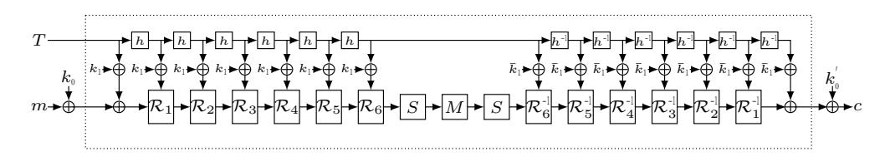

<span id="page-37-1"></span>Fig. 13. Illustration of MANTIS6.

We acknowledge the contribution of Roberto Avanzi to the design of MANTIS. He first suggested us to combine PRINCE with the TWEAKEY framework, and also to modify the latter by permuting the tweak independently from the key, in order to save on the Galois multiplications of the tweak cells. He then brainstormed with us on early versions of the design.

#### <span id="page-38-0"></span>6.1 Description of the Cipher

MANTIS<sub>r</sub> is based on the FX-construction [25] and thus applies whitening keys before and after applying its core components. The 128-bit key is first split into  $k = k_0 \mid\mid k_1$  with 64-bit subkeys  $k_0, k_1$ . Then,  $(k_0 \mid\mid k_1)$  is extended to the 192 bit key

$$(k_0 \mid\mid k_0^{'} \mid\mid k_1) := (k_0 \mid\mid (k_0 \gg 1) \oplus (k_0 \gg 63) \mid\mid k_1),$$

and  $k_0, k_0'$  are used as whitening keys in an FX-construction. The subkey  $k_1$  is used as the round key for all of the 2r rounds of MANTIS<sub>r</sub>. We decided to stick with the FX construction for simplicity, even so other options as described in [12].

**Initialization.** The cipher receives a plaintext  $m = m_0 || m_1 || \cdots || m_{14} || m_{15}$ , where the  $m_i$  are 4-bit cells. The initialization of the cipher's internal state is performed by setting  $IS_i = m_i$  for  $0 \le i \le 15$ .

The cipher also receives a tweak input  $T = t_0 ||t_1|| \cdots ||t_{15}$ , where the  $t_i$  are 4-bit cells. The initialization of the cipher's tweak state is performed by setting  $T_i = t_i$  for  $0 \le i \le 15$ . Thus,

$$IS = \begin{bmatrix} m_0 & m_1 & m_2 & m_3 \\ m_4 & m_5 & m_6 & m_7 \\ m_8 & m_9 & m_{10} & m_{11} \\ m_{12} & m_{13} & m_{14} & m_{15} \end{bmatrix} \qquad T = \begin{bmatrix} t_0 & t_1 & t_2 & t_3 \\ t_4 & t_5 & t_6 & t_7 \\ t_8 & t_9 & t_{10} & t_{11} \\ t_{12} & t_{13} & t_{14} & t_{15} \end{bmatrix}$$

The round function. One round  $\mathcal{R}_i(\cdot,tk)$  of MANTIS<sub>r</sub> operates on the cipher internal state depending on the round tweakey tk as

 ${\tt MixColumns} \circ {\tt PermuteCells} \circ {\tt AddTweakey}_{tk} \circ {\tt AddConstant}_i \circ {\tt SubCells}.$

In the following, we describe the components of the round function.

SubCells. The involutory MIDORI Sbox  $Sb_0$  is applied to every cell of the internal state. A description of the Sbox is given in Table 21. Using the MIDORI Sbox is beneficial as this Sbox is especially optimized for small area and low circuit depth.

Table 21. 4-bit involutory MIDORI Sbox Sbo used in MANTIS.

<span id="page-38-1"></span>

| $\overline{x}$           | 0 | 1 | 2 | 3 | 4 | 5 | 6 | 7 | 8 | 9 | a | b | С | d | е | f |
|--------------------------|---|---|---|---|---|---|---|---|---|---|---|---|---|---|---|---|
| $\operatorname{Sb}_0[x]$ | С | a | d | 3 | е | b | f | 7 | 8 | 9 | 1 | 5 | 0 | 2 | 4 | 6 |

AddConstant. In the *i*-th round, the round constant  $RC_i$  is XORed to the internal state. The round constants are generated in a similar way as for PRINCE, that is we used the first digits of  $\pi$  to generate those constants (actually the very first digits correspond to  $\alpha$  defined below). The round constants can be found in Table 22. Note that, in contrast to PRINCE, the constants are added row-wise instead of column-wise.

<span id="page-39-1"></span>Table 22. Round Constants used in MANTIS.

| Round i | $\mathbf{Round}\ i$ Round constant $RC_i$ |   | Round constant $RC_i$ |  |  |
|---------|-------------------------------------------|---|-----------------------|--|--|
| 1       | 0x13198a2e03707344                        | 5 | 0xbe5466cf34e90c6c    |  |  |
| 2       | 0xa4093822299f31d0                        | 6 | 0xc0ac29b7c97c50dd    |  |  |
| 3       | 0x082efa98ec4e6c89                        | 7 | 0x3f84d5b5b5470917    |  |  |
| 4       | 0x452821e638d01377                        | 8 | 0x9216d5d98979fb1b    |  |  |

AddRoundTweakey. In round  $\mathcal{R}_i$ , the (full) round tweakey state  $h^i(T) \oplus k_1$  is XORed to the cipher internal state. In the *i*-th inverse round  $\mathcal{R}_i^{-1}$ , the tweakey state  $h^i(T) \oplus \bar{k}_1 := h^i(T) \oplus k_1 \oplus \alpha$  with  $\alpha = 0$ x243f6a8885a308d3 is XORed to the internal state. Note that this  $\alpha$ , as the round constants, is chosen as the first digits of  $\pi$ . Thereby, it is  $h(T) = t_{h(0)} \|t_{h(1)} \cdot t_{h(1)}\|$ , where the tweak permutation h is defined as

$$h = [6, 5, 14, 15, 0, 1, 2, 3, 7, 12, 13, 4, 8, 9, 10, 11]. \\$$

 $\label{lem:permuteCells} \textbf{PermuteCells}. \ \ \textbf{The cells of the internal state are permuted according to the $\tt MIDORI$ permutation}$

$$P = [0, 11, 6, 13, 10, 1, 12, 7, 5, 14, 3, 8, 15, 4, 9, 2].$$

Note that the MIDORI permutation ensures a higher number of active Sboxes compared to the choice made in PRINCE.

MixColumns. Each column of the cipher internal state array is multiplied by the binary matrix used in MIDORI and shown below.

$$\mathbf{M} = \begin{pmatrix} 0 & 1 & 1 & 1 \\ 1 & 0 & 1 & 1 \\ 1 & 1 & 0 & 1 \\ 1 & 1 & 1 & 0 \end{pmatrix}.$$

**Encryption.** In the following, we define  $H_r$  as the application of r rounds  $\mathcal{R}_i$  and one additional SubCells layer. Similarly, we define  $H_r^{-1}$  as the application on one inverse SubCells layer plus r inverse rounds. Thus,

$$H_r(\cdot,T,k_1) = \operatorname{SubCells} \circ \mathcal{R}_r(\cdot,h^r(T) \oplus k_1) \circ \cdots \circ \mathcal{R}_1(\cdot,h(T) \oplus k_1)$$

$$H_r^{-1}(\cdot,T,\bar{k}_1) = \mathcal{R}_1^{-1}(\cdot,h(T) \oplus \bar{k}_1) \circ \cdots \circ \mathcal{R}_r^{-1}(\cdot,h^r(T) \oplus \bar{k}_1) \circ \operatorname{SubCells}.$$

With this notation, it is

$$\begin{split} \mathbf{Enc}_{(k_0,k_0',k_1)}(\cdot,T) &= \mathtt{AddTweakey}_{k_0'\oplus k_1\oplus\alpha\oplus T}\circ H_r^{-1}(\cdot,T,k_1\oplus\alpha) \\ &\circ \mathtt{MixColumns}\circ H_r(\cdot,T,k_1) \circ \mathtt{AddTweakey}_{k_0\oplus k_1\oplus T} \end{split}$$

**Decryption.** It is  $\mathbf{Enc}_{(k_0,k_0',k_1)}^{-1}(\cdot,T) = \mathbf{Enc}_{(k_0',k_0,k_1\oplus\alpha)}(\cdot,T)$  because of the  $\alpha$ -reflection property.

#### <span id="page-39-0"></span>6.2 Design Rationale

The goal was to design a cipher which is competitive to PRINCE in terms of latency with the advantage of being tweakable. In contrast to SKINNY, we distinguish between tweak and key input. In particular, we allow an attacker to control the tweak but not the key. Thus, similar to PRINCE, we do not claim related-key security. In order to reach this goal, again, several components are borrowed from already existing ciphers. In the following, we present the reasons for our design. Note that, as we aim for an efficient unrolled implementation, one is not restricted to a classical round-iterated design.

 $\alpha$ -Reflection Property. MANTIS<sub>r</sub> is designed as a reflection cipher such that encryption under a key k equals decryption under a related key. This significantly reduces the implementation overhead for decryption. Therefore, the parameter r denotes only half the number of rounds, as the second half of the cipher is basically the inverse of the first half. It is advantageous that the diffusion matrix  $\mathbf{M}$  is involutory since we need the middle part of the cipher to be an involution. Unlike in the description of PRINCE, we use the same round constant for the inverse  $\mathcal{R}_i^{-1}$  of the i-th round and apply the addition of  $\alpha$  to the round key  $k_1$ .

The Choice of the Diffusion Layer. To achieve low latency in an unrolled implementation, one is limited in the number rounds to be applied. Therefore, one has to achieve very fast diffusion while guaranteeing a high number of active Sboxes. To reach these requirements, we adopted the linear layer of MIDORI. It provides full diffusion only after three rounds and guarantees a high number of active Sboxes in the single-key setting. We refer to Table 4 for the bounds.

The Choice of the Sbox. For the Sbox in MANTIS we used the same Sbox as in MIDORI. The MIDORI Sbox has a significantly smaller latency than the PRINCE Sbox. The maximal linear bias is  $2^{-2}$  and the best differential probability is  $2^{-2}$  as well.

The Choice of the Tweakey Permutation h. Our aim was to choose a tweak permutation h such that five rounds (plus one additional SubCells layer) guarantee at least 16 active Sboxes in the related-tweak setting. This would guarantee at least 32 active Sboxes for MANTIS<sub>5</sub> which is enough to bound the differential probability (resp. linear bias) below  $2^{-2\cdot32}$ . Since there are 16! possibilities for h, which is too much for an exhaustive search, we restricted ourself on a subclass of 8! tweak permutations. The restriction is that two complete rows (without changing the position of the cells in those rows) are permuted to different rows. In our case, the first and third row are permuted to the second and fourth row, respectively. The bounds were derived using the MILP tool. We tested several thousand choices for the permutation h and found out that 16 active Sboxes were the best possible to reach over  $H_5$ . Out of these optimal choices, we took the permutation that maximized the bound for MANTIS<sub>5</sub>, and as a second step for MANTIS<sub>6</sub>. We refer to Table 23 for the actual bounds.

<span id="page-40-0"></span>Table 23. Lower bounds on the number of linear (and differential) active Sboxes in the single-key model and of differential active Sboxes in the related-tweak model.

|               | $\mathtt{MANTIS}_2$ | MANTIS <sub>3</sub> | MANTIS <sub>4</sub> | MANTIS <sub>5</sub> | MANTIS <sub>6</sub> | MANTIS <sub>7</sub> | MANTIS <sub>8</sub> |
|---------------|---------------------|---------------------|---------------------|---------------------|---------------------|---------------------|---------------------|
| Linear        | 14                  | 32                  | 46                  | 62                  | 70                  | 76                  | 82                  |
| Related Tweak | 6                   | 12                  | 20                  | 34                  | 44                  | 50                  | 56                  |

Security Claim. For MANTIS<sub>7</sub>, we claim that any adversary who in possession of  $2^n$  chosen plain/ciphertext pairs which were obtained under chosen tweaks, but with a fixed unknown key, needs at least  $2^{126-n}$  calls to the encryption function in order to recover the secret key. Thus, our security claims are the same as for PRINCE, except that we also claim related-tweak security. Moreover, already for MANTIS<sub>5</sub> we claim security against practical attacks, similar to what has been considered in the PRINCE challenge. More precisely, we

claim that no related-tweak attack (better than the generic claim above) is possible against MANTIS<sup>5</sup> with less than 2<sup>30</sup> chosen or 2<sup>40</sup> known plaintext/ciphertext pairs. Note that because of the α-reflection, there exists a trivial related-key distinguisher with probability one. We especially encourage further cryptanalysis on the aggressive versions.

### <span id="page-41-0"></span>6.3 Security Analysis

As one round of MANTIS is almost identical to one round in MIDORI, most of the security analysis can simply be copied from the latter. This holds in particular for meet-in-themiddle attacks, integral attacks and slide attacks. We therefore only focus on the attacks where the changes in round constants and by adding the tweak actually result in different arguments.

Invariant Subspaces. The most successful attack against MIDORI-64 at the moment is an invariant subspace attack with a density of 2<sup>96</sup> weak keys. The main observation here is that the round constants in MIDORI are too sparse and structured to avoid certain symmetries. More precisely, the round constants in MIDORI-64 only affect a single bit in each of the 16 4-bit cells. Together with a property of the Sbox this finally results in the mentioned attack. For MANTIS, the situation is very different as the round constants (in each half) are basically random values. This in particular ensures that the invariant subspace attack on MIDORI does not translate into an attack on MANTIS.

Differential and Linear Related-Tweak Attacks. Using the MILP approach, we are able to prove strong bounds against related-tweak linear and differential attacks. In particular, no related tweak linear or differential distinguisher based on a characteristics is possible for MANTIS5, that is already for 12 layers of Sboxes. As MANTIS<sup>7</sup> has four more rounds, and additional key-whitening, we believe that is provides a small but sufficient security margin.

### <span id="page-41-1"></span>6.4 Implementations

In Table [24](#page-41-2) and Table [25,](#page-41-3) we list results of unrolled implementations for MANTIS constrained for the smallest area and the shortest latency respectively. In particular, it can be seen that for MANTIS5, the difference in area compared to PRINCE corresponds quite exactly to the additional costs of the XOR gates needed to add the tweak. However, by constraining the synthesis to a particular latency, MANTIS<sup>5</sup> outperforms PRINCE mainly due to its underlying MIDORI Sbox. A complete overview of the latency versus delay for all variants of MANTIS compared to PRINCE is shown in Figure [14.](#page-42-10)

<span id="page-41-2"></span>Table 24. Unrolled implementations of MANTIS constrained for the smallest area (both encryption and decryption).

<span id="page-41-3"></span>Table 25. Unrolled implementations of MANTIS constrained for the shortest delay (both encryption and decryption).

|         | Area  | Delay | Ref. |
|---------|-------|-------|------|
|         | GE    | ns    |      |
| MANTIS5 | 8544  | 15.95 | New  |
| MANTIS6 | 9861  | 17.60 | New  |
| MANTIS7 | 11209 | 20.50 | New  |
| MANTIS8 | 12533 | 21.34 | New  |
| PRINCE  | 8344  | 16.00 | [30] |

|         | Area<br>GE | Delay<br>ns | Ref. |
|---------|------------|-------------|------|
|         |            |             |      |
| MANTIS5 | 13424      | 9.00        | New  |
| MANTIS6 | 18375      | 10.00       | New  |
| MANTIS7 | 23926      | 11.00       | New  |
| MANTIS8 | 30252      | 12.00       | New  |
| PRINCE  | 17693      | 9.00        | [30] |

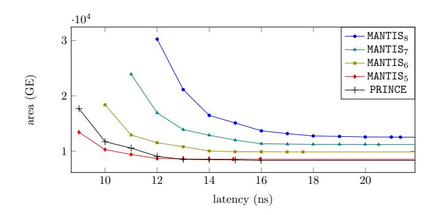

<span id="page-42-10"></span>Fig. 14. Latency versus area of MANTIS compared to PRINCE.

## Acknowledgements

The authors would like to thank the anonymous referees for their helpful comments. This work is partly supported by the Singapore National Research Foundation Fellowship 2012 (NRF-NRFF2012-06), the DFG Research Training Group GRK 1817 Ubicrypt and the BMBF Project UNIKOPS (01BY1040). We furthermore like to thank Daniel Otto for providing us with performance figures for SKINNY on micro-controllers.

# References

- <span id="page-42-4"></span>1. Banik, S., Bogdanov, A., Isobe, T., Shibutani, K., Hiwatari, H., Akishita, T., Regazzoni, F.: Midori: A Block Cipher for Low Energy. In: Advances in Cryptology - ASIACRYPT 2015 - Part II. Volume 9453 of Lecture Notes in Computer Science., Springer (2015) 411–436
- <span id="page-42-9"></span>2. Beaulieu, R., Shors, D., Smith, J., Treatman-Clark, S., Weeks, B., Wingers, L.: The simon and speck families of lightweight block ciphers. ePrint/2013/404 (2013)
- <span id="page-42-2"></span>3. Beaulieu, R., Shors, D., Smith, J., Treatman-Clark, S., Weeks, B., Wingers, L.: Simon and speck: Block ciphers for the internet of things. ePrint/2015/585 (2015)
- <span id="page-42-0"></span>4. Benadjila, R., Guo, J., Lomn´e, V., Peyrin, T.: Implementing lightweight block ciphers on x86 architectures. In Lange, T., Lauter, K., Lisonek, P., eds.: SAC 2013. Volume 8282 of LNCS., Springer, Heidelberg (August 2014) 324–351
- <span id="page-42-6"></span>5. Biham, E., Biryukov, A., Shamir, A.: Cryptanalysis of skipjack reduced to 31 rounds using impossible differentials. In: EUROCRYPT 1999. Volume 1592 of Lecture Notes in Computer Science., Springer (1999) 12–23
- <span id="page-42-8"></span>6. Bilgin, B., Gierlichs, B., Nikova, S., Nikov, V., Rijmen, V.: Trade-Offs for Threshold Implementations Illustrated on AES. IEEE Trans. on CAD of Integrated Circuits and Systems 34(7) (2015) 1188–1200
- <span id="page-42-7"></span>7. Bilgin, B., Nikova, S., Nikov, V., Rijmen, V., Tokareva, N., Vitkup, V.: Threshold Implementations of Small S-boxes. Cryptography and Communications 7(1) (2015) 3–33
- <span id="page-42-1"></span>8. Bogdanov, A., Knudsen, L.R., Leander, G., Paar, C., Poschmann, A., Robshaw, M.J.B., Seurin, Y., Vikkelsoe, C.: PRESENT: An ultra-lightweight block cipher. In Paillier, P., Verbauwhede, I., eds.: CHES 2007. Volume 4727 of LNCS., Springer, Heidelberg (September 2007) 450–466
- <span id="page-42-5"></span>9. Bogdanov, A., Rechberger, C.: A 3-subset meet-in-the-middle attack: Cryptanalysis of the lightweight block cipher KTANTAN. In: SAC 2010. Volume 6544 of Lecture Notes in Computer Science., Springer (2010) 229–240
- <span id="page-42-3"></span>10. Borghoff, J., Canteaut, A., G¨uneysu, T., Kavun, E.B., Kneˇzevi´c, M., Knudsen, L.R., Leander, G., Nikov, V., Paar, C., Rechberger, C., Rombouts, P., Thomsen, S.S., Yal¸cin, T.: PRINCE - A low-latency block cipher for pervasive computing applications - extended abstract. In Wang, X., Sako, K., eds.: ASIACRYPT 2012. Volume 7658 of LNCS., Springer, Heidelberg (December 2012) 208–225

- <span id="page-43-19"></span>11. Boura, C., Canteaut, A.: Another View of the Division Property. CRYPTO 2016. LNCS, Springer (to appear, 2016)
- <span id="page-43-24"></span>12. Boura, C., Canteaut, A., Knudsen, L.R., Leander, G.: Reflection ciphers. Designs, Codes and Cryptography (2015)
- <span id="page-43-1"></span>13. Canni`ere, C.D., Dunkelman, O., Kneˇzevi´c, M.: KATAN and KTANTAN - a family of small and efficient hardware-oriented block ciphers. In Clavier, C., Gaj, K., eds.: CHES 2009. Volume 5747 of LNCS., Springer, Heidelberg (September 2009) 272–288
- <span id="page-43-13"></span>14. Canteaut, A., Duval, S., Leurent, G.: Construction of Lightweight S-Boxes using Feistel and MISTY structures (Full Version). ePrint/2015/711 (2015)
- <span id="page-43-16"></span>15. Chaum, D., Evertse, J.: Crytanalysis of DES with a reduced number of rounds: Sequences of linear factors in block ciphers. In: CRYPTO 1985. Volume 218 of Lecture Notes in Computer Science., Springer (1985) 192–211
- <span id="page-43-17"></span>16. Daemen, J., Knudsen, L.R., Rijmen, V.: The block cipher square. In: FSE '97. Volume 1267 of Lecture Notes in Computer Science., Springer (1997) 149–165
- <span id="page-43-5"></span>17. Daemen, J., Peeters, M., Assche, G.V., Rijmen, V.: Nessie Proposal: the Block Cipher Noekeon. Nessie submission (2000) <http://gro.noekeon.org/>.
- <span id="page-43-3"></span>18. G´erard, B., Grosso, V., Naya-Plasencia, M., Standaert, F.X.: Block ciphers that are easier to mask: How far can we go? In Bertoni, G., Coron, J.S., eds.: CHES 2013. Volume 8086 of LNCS., Springer, Heidelberg (August 2013) 383–399
- <span id="page-43-20"></span>19. Grassi, L., Rønjom, S., Rechberger, C.: Subspace Trail Cryptanalysis and its Applications to AES. ePrint/2016/592 (2016)
- <span id="page-43-0"></span>20. Guo, J., Peyrin, T., Poschmann, A., Robshaw, M.J.B.: The LED block cipher. [\[37\]](#page-44-12) 326–341
- <span id="page-43-7"></span>21. Henson, M., Taylor, S.: Memory encryption: A survey of existing techniques. ACM Comput. Surv. 46(4) (2013) 53:1–53:26
- <span id="page-43-9"></span>22. Jean, J., Nikolic, I., Peyrin, T.: Tweaks and keys for block ciphers: The TWEAKEY framework. In Sarkar, P., Iwata, T., eds.: ASIACRYPT 2014, Part II. Volume 8874 of LNCS., Springer, Heidelberg (December 2014) 274–288
- <span id="page-43-6"></span>23. Jean, J., Nikoli´c, I., Peyrin, T.: Joltik v1.3 (2015) Submission to the CAESAR competition, <http://www1.spms.ntu.edu.sg/~syllab/Joltik>.
- <span id="page-43-12"></span>24. Khoo, K., Peyrin, T., Poschmann, A.Y., Yap, H.: FOAM: Searching for hardware-optimal SPN structures and components with a fair comparison. In Batina, L., Robshaw, M., eds.: CHES 2014. Volume 8731 of LNCS., Springer, Heidelberg (September 2014) 433–450
- <span id="page-43-23"></span>25. Kilian, J., Rogaway, P.: How to protect DES against exhaustive key search. In Koblitz, N., ed.: CRYPTO'96. Volume 1109 of LNCS., Springer, Heidelberg (August 1996) 252–267
- <span id="page-43-18"></span>26. Knudsen, L.R., Wagner, D.: Integral cryptanalysis. In: FSE 2002. Volume 2365 of Lecture Notes in Computer Science., Springer (2002) 112–127
- <span id="page-43-2"></span>27. K¨olbl, S., Leander, G., Tiessen, T.: Observations on the SIMON block cipher family. In Gennaro, R., Robshaw, M.J.B., eds.: CRYPTO 2015, Part I. Volume 9215 of LNCS., Springer, Heidelberg (August 2015) 161–185
- <span id="page-43-15"></span>28. Kranz, T., Leander, G., Wiemer, F.: Linear Cryptanalysis: On Key Schedules and Tweakable Block Ciphers. Preprint (2016)
- <span id="page-43-10"></span>29. Moradi, A., Poschmann, A., Ling, S., Paar, C., Wang, H.: Pushing the Limits: A Very Compact and a Threshold Implementation of AES. In: Advances in Cryptology - EUROCRYPT 2011. Volume 6632 of Lecture Notes in Computer Science., Springer (2011) 69–88
- <span id="page-43-21"></span>30. Moradi, A., Schneider, T.: Side-Channel Analysis Protection and Low-Latency in Action - case study of PRINCE and Midori. Cryptology ePrint Archive, Report 2016/481 (2016) <http://eprint.iacr.org/>.
- <span id="page-43-14"></span>31. Mouha, N., Wang, Q., Gu, D., Preneel, B.: Differential and linear cryptanalysis using mixed-integer linear programming. In: Inscrypt 2011. (2012) 57–76
- <span id="page-43-11"></span>32. National Institute of Standards and Technology: Recommendation for Key Management – NIST SP-800-57 Part 3 Revision 1. [http://nvlpubs.nist.gov/nistpubs/](http://nvlpubs.nist.gov/nistpubs/SpecialPublications/NIST.SP.800-57Pt3r1.pdf) [SpecialPublications/NIST.SP.800-57Pt3r1.pdf](http://nvlpubs.nist.gov/nistpubs/SpecialPublications/NIST.SP.800-57Pt3r1.pdf)
- <span id="page-43-22"></span>33. Nikova, S., Rijmen, V., Schl¨affer, M.: Secure Hardware Implementation of Nonlinear Functions in the Presence of Glitches. J. Cryptology 24(2) (2011) 292–321
- <span id="page-43-8"></span>34. Peyrin, T., Seurin, Y.: Counter-in-Tweak: Authenticated Encryption Modes for Tweakable Block Ciphers. ePrint/2015/1049 (2015)
- <span id="page-43-4"></span>35. Piret, G., Roche, T., Carlet, C.: PICARO - a block cipher allowing efficient higher-order side-channel resistance. In Bao, F., Samarati, P., Zhou, J., eds.: ACNS 12. Volume 7341 of LNCS., Springer, Heidelberg (June 2012) 311–328

- <span id="page-44-8"></span>36. Poschmann, A., Moradi, A., Khoo, K., Lim, C., Wang, H., Ling, S.: Side-Channel Resistant Crypto for Less than 2, 300 GE. J. Cryptology 24(2) (2011) 322–345
- <span id="page-44-12"></span>37. Preneel, B., Takagi, T., eds.: CHES 2011. In Preneel, B., Takagi, T., eds.: CHES 2011. Volume 6917 of LNCS., Springer, Heidelberg (September / October 2011)
- <span id="page-44-6"></span>38. Sasaki, Y.: Meet-in-the-middle preimage attacks on AES hashing modes and an application to whirlpool. In: FSE 2011. Volume 6733 of Lecture Notes in Computer Science., Springer (2011) 378–396
- <span id="page-44-0"></span>39. Shibutani, K., Isobe, T., Hiwatari, H., Mitsuda, A., Akishita, T., Shirai, T.: Piccolo: An ultra-lightweight blockcipher. [\[37\]](#page-44-12) 342–357
- <span id="page-44-9"></span>40. Standaert, F.X., Piret, G., Rouvroy, G., Quisquater, J.J.: FPGA implementations of the ICEBERG block cipher. INTEGRATION, the VLSI journal 40(1) (2007) 20–27
- <span id="page-44-10"></span>41. Standaert, F.X., Rouvroy, G., Quisquater, J.J., Legat, J.D., et al.: Efficient FPGA Implementations of Block Ciphers KHAZAD and MISTY1. In: Proceedings of the Third NESSIE Workshop. (2002)
- <span id="page-44-5"></span>42. Sun, S., Hu, L., Song, L., Xie, Y., Wang, P.: Automatic security evaluation of block ciphers with s-bp structures against related-key differential attacks. In: Inscrypt 2013. (2014) 39–51
- <span id="page-44-1"></span>43. Suzaki, T., Minematsu, K., Morioka, S., Kobayashi, E.: twine : A lightweight block cipher for multiple platforms. In Knudsen, L.R., Wu, H., eds.: SAC 2012. Volume 7707 of LNCS., Springer, Heidelberg (August 2013) 339–354
- <span id="page-44-7"></span>44. Todo, Y.: Structural evaluation by generalized integral property. In: EUROCRYPT 2015, Part I. Volume 9056 of Lecture Notes in Computer Science., Springer (2015) 287–314
- <span id="page-44-2"></span>45. Vincent Grosso and Ga¨etan Leurent and Fran¸cois-Xavier Standaert and Kerem Varici and Anthony Journault and Fran¸cois Durvaux and Lubos Gaspar and St´ephanie Kerckhof: SCREAM v3 (2015) Submission to the CAESAR competition.
- <span id="page-44-4"></span>46. Virtual Silicon Inc.: 0.18 µm VIP Standard Cell Library Tape Out Ready, Part Number: UMCL18G212T3, Process: UMC Logic 0.18 µm Generic II Technology: 0.18µm (July 2004)
- <span id="page-44-3"></span>47. Williams, P., Boivie, R.: CPU Support for Secure Executables. In: TRUST 2011. Volume 6740 of Lecture Notes in Computer Science., Springer (2011) 172–187
- <span id="page-44-11"></span>48. Wingers, L.: Software for SUPERCOP Benchmarking of SIMON and SPECK. [https:](https://github.com/lrwinge/simon_speck_supercop) [//github.com/lrwinge/simon\\_speck\\_supercop](https://github.com/lrwinge/simon_speck_supercop) (2015)

# <span id="page-45-0"></span>A 8-bit Sbox for SKINNY-128

```
/* SKINNY-128 Sbox */
uint8_t S8 [256] = {
 0 x65 ,0 x4c ,0 x6a ,0 x42 ,0 x4b ,0 x63 ,0 x43 ,0 x6b ,0 x55 ,0 x75 ,0 x5a ,0 x7a ,0 x53 ,0 x73 ,0 x5b ,0 x7b ,
 0 x35 ,0 x8c ,0 x3a ,0 x81 ,0 x89 ,0 x33 ,0 x80 ,0 x3b ,0 x95 ,0 x25 ,0 x98 ,0 x2a ,0 x90 ,0 x23 ,0 x99 ,0 x2b ,
 0 xe5 ,0 xcc ,0 xe8 ,0 xc1 ,0 xc9 ,0 xe0 ,0 xc0 ,0 xe9 ,0 xd5 ,0 xf5 ,0 xd8 ,0 xf8 ,0 xd0 ,0 xf0 ,0 xd9 ,0 xf9 ,
 0 xa5 ,0 x1c ,0 xa8 ,0 x12 ,0 x1b ,0 xa0 ,0 x13 ,0 xa9 ,0 x05 ,0 xb5 ,0 x0a ,0 xb8 ,0 x03 ,0 xb0 ,0 x0b ,0 xb9 ,
 0 x32 ,0 x88 ,0 x3c ,0 x85 ,0 x8d ,0 x34 ,0 x84 ,0 x3d ,0 x91 ,0 x22 ,0 x9c ,0 x2c ,0 x94 ,0 x24 ,0 x9d ,0 x2d ,
 0 x62 ,0 x4a ,0 x6c ,0 x45 ,0 x4d ,0 x64 ,0 x44 ,0 x6d ,0 x52 ,0 x72 ,0 x5c ,0 x7c ,0 x54 ,0 x74 ,0 x5d ,0 x7d ,
 0 xa1 ,0 x1a ,0 xac ,0 x15 ,0 x1d ,0 xa4 ,0 x14 ,0 xad ,0 x02 ,0 xb1 ,0 x0c ,0 xbc ,0 x04 ,0 xb4 ,0 x0d ,0 xbd ,
 0 xe1 ,0 xc8 ,0 xec ,0 xc5 ,0 xcd ,0 xe4 ,0 xc4 ,0 xed ,0 xd1 ,0 xf1 ,0 xdc ,0 xfc ,0 xd4 ,0 xf4 ,0 xdd ,0 xfd ,
 0 x36 ,0 x8e ,0 x38 ,0 x82 ,0 x8b ,0 x30 ,0 x83 ,0 x39 ,0 x96 ,0 x26 ,0 x9a ,0 x28 ,0 x93 ,0 x20 ,0 x9b ,0 x29 ,
 0 x66 ,0 x4e ,0 x68 ,0 x41 ,0 x49 ,0 x60 ,0 x40 ,0 x69 ,0 x56 ,0 x76 ,0 x58 ,0 x78 ,0 x50 ,0 x70 ,0 x59 ,0 x79 ,
 0 xa6 ,0 x1e ,0 xaa ,0 x11 ,0 x19 ,0 xa3 ,0 x10 ,0 xab ,0 x06 ,0 xb6 ,0 x08 ,0 xba ,0 x00 ,0 xb3 ,0 x09 ,0 xbb ,
 0 xe6 ,0 xce ,0 xea ,0 xc2 ,0 xcb ,0 xe3 ,0 xc3 ,0 xeb ,0 xd6 ,0 xf6 ,0 xda ,0 xfa ,0 xd3 ,0 xf3 ,0 xdb ,0 xfb ,
 0 x31 ,0 x8a ,0 x3e ,0 x86 ,0 x8f ,0 x37 ,0 x87 ,0 x3f ,0 x92 ,0 x21 ,0 x9e ,0 x2e ,0 x97 ,0 x27 ,0 x9f ,0 x2f ,
 0 x61 ,0 x48 ,0 x6e ,0 x46 ,0 x4f ,0 x67 ,0 x47 ,0 x6f ,0 x51 ,0 x71 ,0 x5e ,0 x7e ,0 x57 ,0 x77 ,0 x5f ,0 x7f ,
 0 xa2 ,0 x18 ,0 xae ,0 x16 ,0 x1f ,0 xa7 ,0 x17 ,0 xaf ,0 x01 ,0 xb2 ,0 x0e ,0 xbe ,0 x07 ,0 xb7 ,0 x0f ,0 xbf ,
 0 xe2 ,0 xca ,0 xee ,0 xc6 ,0 xcf ,0 xe7 ,0 xc7 ,0 xef ,0 xd2 ,0 xf2 ,0 xde ,0 xfe ,0 xd7 ,0 xf7 ,0 xdf ,0 xff
};
/* Inverse SKINNY-128 Sbox */
uint8_t S8_inv [256] = {
  0 xac ,0 xe8 ,0 x68 ,0 x3c ,0 x6c ,0 x38 ,0 xa8 ,0 xec ,0 xaa ,0 xae ,0 x3a ,0 x3e ,0 x6a ,0 x6e ,0 xea ,0 xee ,
  0 xa6 ,0 xa3 ,0 x33 ,0 x36 ,0 x66 ,0 x63 ,0 xe3 ,0 xe6 ,0 xe1 ,0 xa4 ,0 x61 ,0 x34 ,0 x31 ,0 x64 ,0 xa1 ,0 xe4 ,
  0 x8d ,0 xc9 ,0 x49 ,0 x1d ,0 x4d ,0 x19 ,0 x89 ,0 xcd ,0 x8b ,0 x8f ,0 x1b ,0 x1f ,0 x4b ,0 x4f ,0 xcb ,0 xcf ,
  0 x85 ,0 xc0 ,0 x40 ,0 x15 ,0 x45 ,0 x10 ,0 x80 ,0 xc5 ,0 x82 ,0 x87 ,0 x12 ,0 x17 ,0 x42 ,0 x47 ,0 xc2 ,0 xc7 ,
  0 x96 ,0 x93 ,0 x03 ,0 x06 ,0 x56 ,0 x53 ,0 xd3 ,0 xd6 ,0 xd1 ,0 x94 ,0 x51 ,0 x04 ,0 x01 ,0 x54 ,0 x91 ,0 xd4 ,
  0 x9c ,0 xd8 ,0 x58 ,0 x0c ,0 x5c ,0 x08 ,0 x98 ,0 xdc ,0 x9a ,0 x9e ,0 x0a ,0 x0e ,0 x5a ,0 x5e ,0 xda ,0 xde ,
  0 x95 ,0 xd0 ,0 x50 ,0 x05 ,0 x55 ,0 x00 ,0 x90 ,0 xd5 ,0 x92 ,0 x97 ,0 x02 ,0 x07 ,0 x52 ,0 x57 ,0 xd2 ,0 xd7 ,
  0 x9d ,0 xd9 ,0 x59 ,0 x0d ,0 x5d ,0 x09 ,0 x99 ,0 xdd ,0 x9b ,0 x9f ,0 x0b ,0 x0f ,0 x5b ,0 x5f ,0 xdb ,0 xdf ,
  0 x16 ,0 x13 ,0 x83 ,0 x86 ,0 x46 ,0 x43 ,0 xc3 ,0 xc6 ,0 x41 ,0 x14 ,0 xc1 ,0 x84 ,0 x11 ,0 x44 ,0 x81 ,0 xc4 ,
  0 x1c ,0 x48 ,0 xc8 ,0 x8c ,0 x4c ,0 x18 ,0 x88 ,0 xcc ,0 x1a ,0 x1e ,0 x8a ,0 x8e ,0 x4a ,0 x4e ,0 xca ,0 xce ,
  0 x35 ,0 x60 ,0 xe0 ,0 xa5 ,0 x65 ,0 x30 ,0 xa0 ,0 xe5 ,0 x32 ,0 x37 ,0 xa2 ,0 xa7 ,0 x62 ,0 x67 ,0 xe2 ,0 xe7 ,
  0 x3d ,0 x69 ,0 xe9 ,0 xad ,0 x6d ,0 x39 ,0 xa9 ,0 xed ,0 x3b ,0 x3f ,0 xab ,0 xaf ,0 x6b ,0 x6f ,0 xeb ,0 xef ,
  0 x26 ,0 x23 ,0 xb3 ,0 xb6 ,0 x76 ,0 x73 ,0 xf3 ,0 xf6 ,0 x71 ,0 x24 ,0 xf1 ,0 xb4 ,0 x21 ,0 x74 ,0 xb1 ,0 xf4 ,
  0 x2c ,0 x78 ,0 xf8 ,0 xbc ,0 x7c ,0 x28 ,0 xb8 ,0 xfc ,0 x2a ,0 x2e ,0 xba ,0 xbe ,0 x7a ,0 x7e ,0 xfa ,0 xfe ,
  0 x25 ,0 x70 ,0 xf0 ,0 xb5 ,0 x75 ,0 x20 ,0 xb0 ,0 xf5 ,0 x22 ,0 x27 ,0 xb2 ,0 xb7 ,0 x72 ,0 x77 ,0 xf2 ,0 xf7 ,
  0 x2d ,0 x79 ,0 xf9 ,0 xbd ,0 x7d ,0 x29 ,0 xb9 ,0 xfd ,0 x2b ,0 x2f ,0 xbb ,0 xbf ,0 x7b ,0 x7f ,0 xfb ,0 xff
};
```

### <span id="page-45-1"></span>B Test Vectors

### <span id="page-45-2"></span>B.1 Test Vectors for SKINNY

The keys are given as the concatenation of (up to) three tweakey words: TK1, TK1kTK2, or TK1kTK2kTK3.

```
/* Skinny -64 -64 */
Key : f5269826fc681238
Plaintext : 06034 f957724d19d
Ciphertext : bb39dfb2429b8ac7
/* Skinny -64 -128 */
Key : 9 eb93640d088da63
            76 a39d1c8bea71e1
Plaintext : cf16cfe8fd0f98aa
Ciphertext : 6 ceda1f43de92b9e
/* Skinny -64 -192 */
Key : ed00c85b120d6861
            8753 e24bfd908f60
            b2dbb41b422dfcd0
Plaintext : 530 c61d35e8663c3
Ciphertext : dd2cf1a8f330303c
                                        /* Skinny -128 -128 */
                                        Key : 4 f55cfb0520cac52fd92c15f37073e93
                                        Plaintext : f20adb0eb08b648a3b2eeed1f0adda14
                                        Ciphertext : 22 ff30d498ea62d7e45b476e33675b74
                                        /* Skinny -128 -256 */
                                        Key : 009 cec81605d4ac1d2ae9e3085d7a1f3
                                                     1 ac123ebfc00fddcf01046ceeddfcab3
                                        Plaintext : 3 a0c47767a26a68dd382a695e7022e25
                                        Ciphertext : b731d98a4bde147a7ed4a6f16b9b587f
                                        /* Skinny -128 -384 */
                                        Key : df889548cfc7ea52d296339301797449
                                                     ab588a34a47f1ab2dfe9c8293fbea9a5
                                                     ab1afac2611012cd8cef952618c3ebe8
                                        Plaintext : a3994b66ad85a3459f44e92b08f550cb
                                        Ciphertext : 94 ecf589e2017c601b38c6346a10dcfa
```

#### <span id="page-46-0"></span>B.2 Test Vectors for MANTIS

The keys are given as the concatenation k0kk1.

/\* MANTIS<sup>5</sup> \*/ Key : 92 f09952c625e3e9 d7a060f714c0292b Tweak : ba912e6f1055fed2 Plaintext : 3 b5c77a4921f9718 Ciphertext : d6522035c1c0c6c1 /\* MANTIS<sup>6</sup> \*/ Key : 92 f09952c625e3e9 d7a060f714c0292b Tweak : ba912e6f1055fed2 Plaintext : d6522035c1c0c6c1 Ciphertext : 60 e43457311936fd /\* MANTIS<sup>7</sup> \*/ Key : 92 f09952c625e3e9 d7a060f714c0292b Tweak : ba912e6f1055fed2 Plaintext : 60 e43457311936fd Ciphertext : 308 e8a07f168f517 /\* MANTIS<sup>8</sup> \*/ Key : 92 f09952c625e3e9 d7a060f714c0292b Tweak : ba912e6f1055fed2 Plaintext : 308 e8a07f168f517 Ciphertext : 971 ea01a86b410bb

# <span id="page-46-1"></span>C Comparing Theoretical Performance of Lightweight Ciphers

To simplify the analysis, we omitted the constants in all our computations as it has very little impact on the overall theoretical performance results (only a XOR gate on a few bits is required). We note anyway that SKINNY compares favourably to its competitors on this point since it has very lightweight constants: only 7 constants bits are added per round, and thus only 7 bitwise XORs per round are required.

SKINNY-64-128. The round function first uses an 4-bit Sbox layer, where each Sbox requires 4 NOR and 4 XOR gates, thus amounting to 1 NOR and 1 XOR per bit of internal state. Then, the ShiftRows layer is basically free, while the MixColumns layer requires 3 XOR gates to update 4 bits, thus amounting to 0.75 XOR per bit of internal state. Only 32 bits of subtweakey is XORed to the internal state every round, which costs 0.5 XOR per bit of internal state. In total, the SKINNY-64-128 round function uses 1 NOR gate and 2.25 XOR gates per bit of internal state. Regarding the tweakey schedule, the permutation P<sup>T</sup> is basically free, but the LFSR update for the TK2 state requires 1 XOR gate per 4-bit updated cell. Since only half of the cells of TK2 are updated every round, this leads to 0.125 XOR gate per bit of internal state. Besides, every round two halves of tweakey words are XORed together to compute the subtweakey value, thus amounting to 0.5 XOR gate per bit of internal state. In total, the SKINNY-64-128 tweakey schedule uses 0.625 XOR gate per bit of internal state.

SKINNY-128-128 and SKINNY-128-256. The reasoning and the computations are exactly the same as for SKINNY-64-128, the only difference being that the LFSR update for the TK2 state in the tweakey schedule now costs 0.5625 XOR gate per bit of internal state for SKINNY-128-256 (since one needs 1 XOR gate per 8-bit updated cell and since only half of the cells of TK2 are updated every round) and does not cost anything for SKINNY-128-128.

SIMON-64-128. The round function uses 32 AND gates and 64 XOR gates per round (the word rotations and the Feistel shift being basically free), which amounts to 0.5 AND and 1 XOR per bit of internal state. Besides, only 32 bits of subkey is XORed to the internal state

every round, which costs 0.5 XOR per bit of internal state. In total, the SIMON-64-128 round function uses 0.5 AND gate and 1.5 XOR gate per bit of internal state. Regarding the key schedule, the word rotations are basically free, but one counts 96 XOR gates in total. Thus, the SIMON-64-128 key schedule uses 1.5 XOR gate per bit of internal state.

SIMON-128-128 and SIMON-128-256. The reasoning and the computations are exactly the same as for SIMON-64-128.

KATAN-64-80. The round function simply uses 3 AND gates and 6 XOR gates per round, thus amounting to 0.047 NOR and 0.094 XOR per bit of internal state. Regarding the key schedule, each round 3 XOR gates per bit of internal state are required.

PRESENT-128. The round function first uses an 4-bit Sbox layer, where each Sbox requires 3 AND, 1 OR and 11 XOR gates, which amounts to 1 AND and 2.75 XOR per bit of internal state (we count 3 AND and 1 OR gates to be equivalent to 4 AND gates). The bit permutation layer basically comes for free, but 64 bits of subkey is XORed to the internal state every round, which costs 1 XOR per bit of internal state. In total, the PRESENT-128 round function uses 1 AND gate and 3.75 XOR gates per bit of internal state. Regarding the key schedule, the key state rotation is basically free, but 2 Sboxes are applied to it, which amounts to 0.125 AND and 0.34 XOR per bit of internal state.

PICCOLO-128. The round function uses an 4-bit Sbox layer, applied twice on half of the state. Since the Sbox requires 4 NOR and 4 XOR gates, this eventually amounts to 1 NOR and 1 XOR per bit of internal state. Then, the word permutation is basically free and the mixing layer applies a diffusion matrix very similar to the AES matrix (except it computes in GF(2<sup>4</sup> ) instead of GF(2<sup>8</sup> )). Computing this matrix requires 72 XOR gates (24 for the matrix coefficients and 48 for the elements sums). Since this matrix is applied twice to the state, this amounts to 2.25 XORs per bit of internal state. Moreover, 32 XOR gates per round are needed for the Feistel construction, which amounts to 0.5 XOR per bit of internal state. Only 32 bits of subkey is XORed to the internal state every round, which costs 0.5 XOR per bit of internal state. In total, the PICCOLO-128 round function uses 1 NOR gate and 4.25 XOR gates per bit of internal state. The key schedule of PICCOLO-128 is basically for free as it only consisting in wiring selecting key material.

NOEKEON-128. The Gamma function of NOEKEON requires 0.5 NOR, 0.5 AND and 1.75 XOR gates per bit of internal state, and the Theta function requires 3.5 XOR gates per bit of internal state. In total, the round function uses 0.5 NOR, 0.5 AND and 5.25 XOR gates per bit of internal state. The key schedule of the "direct" mode of NOEKEON is basically for free as the key material is used as is. However, the "indirect" mode of NOEKEON consists in applying the internal cipher to pre-process the key material, thus leading to also a cost of 0.5 NOR, 0.5 AND and 5.25 XOR gates per bit of internal state.

AES-128. The round function first uses an 8-bit Sbox layer, where each Sbox requires 34 NAND and 80 XOR gates, thus amounting to 4.25 NOR and 10 XOR per bit of internal state (we count a NAND gate to be equivalent to a NOR gate). Then, the ShiftRows layer is basically free, while the MixColumns layer requires to apply a diffusion matrix. Computing this matrix requires 160 XOR gates (64 for the matrix coefficients and 96 for the elements sums). Since this matrix is applied four times to the state, this amounts to 5 XORs per bit of internal state. 128 bits of subkey is XORed to the internal state every round, which costs 1 XOR per bit of internal state. In total, the AES-128 round

function uses 4.25 NOR gates and 16 XOR gates per bit of internal state. Regarding the key schedule, 4 Sboxes are applied, thus amounting to 1.06 NOR and 2.5 XOR per bit of internal state. Moreover, the linear diffusion in the key schedule requires 1 XOR per bit of internal state. In total, the AES-128 key schedule uses 1.06 NOR and 3.5 XOR gates per bit of internal state.

AES-256. The reasoning and the computations are exactly the same as for AES-128, except that the key schedule is exactly twice more costly.

Estimated Theoretical Throughput Quality Grade and Area Quality Grade. From these numbers of gates per round per bit, we can simply compute the total number of gates per bit of internal state (with or without the key schedule). This will give us some indication on the theoretical ranking of the various functions studied regarding their throughput. Moreover, by using the estimations from Section 3.1, we can evaluate the theoretical ranking of the various functions studied regarding their ASIC area in a round-based implementation.

## <span id="page-48-0"></span>D Computing Active S-Boxes using MILP and Diffusion Test

To evaluate the resistance of our proposals in terms of differential crpytanalysis, we rely on mixed-integer linear programming (MILP) to model the cipher operations. The goal of the MILP problem consists in maximizing the objective function, which counts the number of active Sboxes in a given number of rounds of the primitive.

To describe the model for SKINNY, we introduce the following binary decision variables:

- $\{\bar{x}_{i,j,k} \mid i,j \in \mathbb{Z}_4, k \in \mathbb{Z}_{r+1}\}$  indicate the activity pattern of the S-boxes. In particular, it is  $\bar{x}_{i,j,k} = 1$  if and only if the s-box in row i and column j is active in round k.
- $\{\bar{y}_{i,j,k} \mid i,j \in \mathbb{Z}_4, k \in \mathbb{Z}_r\}$  indicate the activity pattern after application of the AddRoundTweakey layer.
- $\{\bar{\kappa}_{i,j} \mid i,j \in \mathbb{Z}_4\}$  indicate the activity pattern of the initial tweakey state.
- We need two sets of auxillary variables,  $\{d_{i,j,k}^{\oplus} \mid i \in \mathbb{Z}_2, j \in \mathbb{Z}_4, k \in \mathbb{Z}_r\}$  for the AddRoundTweakey layer and  $\{d_{j,k}, d'_{j,k}, d''_{j,k} \mid j \in \mathbb{Z}_4, k \in \mathbb{Z}_r\}$  for the MixColumns layer.

As the AddRoundTweakey and MixColumns layers only consist of wordwise XOR operations, the main building blocks of the model are the particular linear constraints on the XOR operations. For shorter notations, we define the following sets.

Constraints for XOR. We define by  $\mathcal{C}_{\oplus}[i_1, i_2, o, d]$  the set of linear constraints

$${i_1 \le d} \cup {i_2 \le d} \cup {o \le d} \cup {i_1 + i_2 + o \ge 2d}.$$

Constraints for Mixing. Similarly, by  $C_{\mathbf{M}}[i_1, i_2, i_3, i_4, o_1, o_2, o_3, o_4, d_1, d_2, d_3]$  we define the set of linear constraints

$$C_{\oplus}[i_1, i_3, o_4, d_1] \cup C_{\oplus}[o_4, i_4, o_1, d_2] \cup C_{\oplus}[i_2, i_3, o_3, d_3] \cup \{o_2 = i_1\}.$$

For **SK**, we have to optimize the following MILP model:

#### Minimize

$$\sum_{i,j\in\mathbb{Z}_4}\sum_{k\in\mathbb{Z}_r}\bar{x}_{i,j,k}$$

#### Subject to:

1. Excluding the trivial solution

$$\left\{ \sum_{i,j\in\mathbb{Z}_4} \bar{x}_{i,j,0} \ge 1 \right\}$$

2. Application of the linear layer

$$\bigcup_{k \in \mathbb{Z}_r} \cup_{j \in \mathbb{Z}_4} \ \mathcal{C}_{\mathbf{M}}[\bar{\mathbf{x}}_{P^{-1}(\cdot,j),k}, \bar{\mathbf{x}}_{(\cdot),j,k+1}, d_{j,k}, d_{j,k}', d_{j,k}'']$$

Thereby,

$$\begin{split} \bar{\mathbf{x}}_{(\cdot),j,k+1} &:= (\bar{x}_{0,j,k+1}, \bar{x}_{1,j,k+1}, \bar{x}_{2,j,k+1}, \bar{x}_{3,j,k+1}) \\ \bar{\mathbf{x}}_{P^{-1}(\cdot,j),k} &:= (\bar{x}_{P^{-1}(0,j),k}, \bar{x}_{P^{-1}(1,j),k}, \bar{x}_{P^{-1}(2,j),k}, \bar{x}_{P^{-1}(3,j),k}) \end{split}$$

For TK1, we have to optimize the following MILP model:

#### Minimize

$$\sum_{i,j\in\mathbb{Z}_4}\sum_{k\in\mathbb{Z}_r}\bar{x}_{i,j,k}$$

#### Subject to

1. Excluding the trivial solution

$$\left\{\sum_{i,j\in\mathbb{Z}_4} \bar{x}_{i,j,0} + \bar{\kappa}_{i,j} \ge 1\right\}$$

2. Application of the TWEAKEY addition to half of the state

$$\bigcup_{k \in \mathbb{Z}_r} \cup_{i \in \{0,1\}} \cup_{j \in \mathbb{Z}_4} \mathcal{C}_{\oplus}[\bar{x}_{i,j,k}, \bar{\kappa}_{P_T^k(i,j)}, \bar{y}_{i,j,k}, d_{i,j,k}^{\oplus}] \qquad \cup_{i \in \mathbb{Z}_2} \{\bar{y}_{i,j,k} = \bar{x}_{i,j,k}\}$$

3. Application of the linear layer

$$\bigcup_{k \in \mathbb{Z}_r} \cup_{j \in \mathbb{Z}_4} \ \mathcal{C}_{\mathbf{M}}[\bar{\mathbf{x}}_{P^{-1}(\cdot,j),k}, \bar{\mathbf{x}}_{(\cdot),j,k+1}, d_{j,k}, d_{j,k}', d_{j,k}'']$$

Thereby,

$$\begin{split} &\bar{\mathbf{x}}_{(\cdot),j,k+1} := (\bar{x}_{0,j,k+1},\bar{x}_{1,j,k+1},\bar{x}_{2,j,k+1},\bar{x}_{3,j,k+1}) \\ &\bar{\mathbf{x}}_{P^{-1}(\cdot,j),k} := (\bar{x}_{P^{-1}(0,j),k},\bar{x}_{P^{-1}(1,j),k},\bar{x}_{P^{-1}(2,j),k},\bar{x}_{P^{-1}(3,j),k}) \end{split}$$

On The Tightness of the MILP Bounds. The solution of these models determines a lower bound on the number of differential active Sboxes for any (non-trivial) r-round characteristic in the SK, resp. TK1 scenario. If we consider the word-wise application of the Sbox as a black box, all of the computed bounds for SK are tight in the sense that one can construct a valid differential characteristic for a specific choice of Sboxes. In other words, the bound is tight if the Sbox can be chosen independently for every cell and every round. This is less clear in the related-tweakey scenario. So, in this case, we only claim lower bounds and the actual number of active Sboxes might be even better.

Developing New MILP Modeling for TK2 and TK3. For TK2 and TK3, the model for round function is the same as TK1. The main difference from TK1 is that the cancellation of difference occurs in active cells in the tweakey words, and this must be modeled properly. We stress that this is completely non-trivial, and in fact there has not been proposed any MILP modeling to deal with TK2 and TK3. In this section we, for the first time in the symmetric-key cryptography community, develop the MILP model to deal with TK2, TK3, and more generally TKx for an integer x.

The difficulty lies in the property when we simulate the result of XORing each tweakey state. For example in **TK2**, the *i*-th cell of the round tweakey RK[i] is computed by  $TK1[i] \oplus TK2[i]$ . With the standard method, we model this XOR with

$${a \le d} \cup {b \le d} \cup {c \le d} \cup {a+b+c \ge 2d},$$

where a, b, c are binary variables to denote active/inactive of RK[i], TK1[i], TK2[i] and d is a dummy variable. However, if both of TK1[i] and TK2[i] are active, i.e. their values are 1, the model allows to cancel the difference, and this continues for the entire rounds. Namely, as long as the same cell position in TK1 and TK2 are active, difference will never be propagated into the data processing part.

A bad argument in the above discussion is that it ignores the fact that once TK1[i] = TK2[i] holds, they never cancel each other for a certain number of rounds because the value of TK1[i] is not updated while the value of TK2[i] is update by LFSR. This fact shows that by following the cell-wise method in previous work, MILP cannot return any meaningful lowerbounds. However, converting the cell-wise model into bit-wise model is quite costly, and the model quickly reaches infeasible runtime, especially for 128-bit block version of SKINNY.

Here, our approach is modeling the extracted property of TWEAKEY update instead of modeling the exact specification. First, we focus on a cell in TK1[i] and a cell in TK2[i] which are located in the same cell position. Suppose that X and Y are differences of those two cells. Those cells are XORed to generate a round-key cell in every two rounds. Thus, the equation for a round-key cell in each round becomes as follows.

```
Round 1: X \oplus Y, Round 2: not generated,
Round 3: X \oplus \text{LFSR}(Y), Round 4: not generated,
Round 5: X \oplus \text{LFSR}^2(Y), Round 6: not generated,
Round 7: X \oplus \text{LFSR}^3(Y), Round 8: not generated,
...

Round 29: X \oplus \text{LFSR}^{14}(Y), Round 30: not generated.
```

The LFSR has cycle length 15, namely,  $Y = \text{LFSR}^{15}(Y)$  and LFSR $^i(Y) \neq \text{LFSR}^j(Y)$  for all  $0 \leq i, j \leq 14$  such that  $i \neq j$ . As a result, it is ensured that cancellation between two tweakey states occurs at most once up to round 30 for each cell.<sup>7</sup>

To model this property, we first define 16 binary variables LANE<sub>0</sub>, ..., LANE<sub>15</sub>, which indicates whether the *i*-th cell in the initial state is active in at least one of the tweakey states TK1 and TK2. Note that LANE<sub>i</sub> is 0 only if both of TK1[i] and TK2[i] are 0. We then also define 16 binary variables representing active/inactive for each round key (results of XORing TK1 and TK2), i.e.

$$tk_0, tk_1, \dots, tk_{15}$$
 for Round 1,
 $tk_{16}, tk_{17}, \dots, tk_{31}$  for Round 2,
 $\dots$   $tk_{16r-16}, tk_{16r-15}, \dots, tk_{16r-1}$  for Round  $r$ .

<span id="page-50-0"></span> $<sup>^7</sup>$ Note that the LFSR is clocked every two rounds.

Cell positions will change after the tweakey permutation is applied in each round. For example, the position of LANE<sub>0</sub> corresponds to  $tk_0$  for Round 1,  $tk_{24}$  for Round 2,  $tk_{34}$  for Round 3,  $tk_{58}$  for Round 4, and so on. If LANE<sub>0</sub> = 0, all of these  $tk_0$ ,  $tk_{24}$ ,  $tk_{34}$ , ...,  $tk_{r'}$  must be 0, where  $16r - 16 \le r' \le 16r - 1$ . If LANE<sub>0</sub> = 1, at least r - 1 of  $tk_0$ ,  $tk_{24}$ ,  $tk_{34}$ , ...  $tk_{r'}$  are 1 because number of cancellations is upperbounded by 1 during the first 30 rounds. In the end, we obtain the following constraints for LANE<sub>0</sub>:

$$tk_{0} - \text{LANE}_{0} \ge 0,$$

 $tk_{24} - \text{LANE}_{0} \ge 0,$
 $tk_{34} - \text{LANE}_{0} \ge 0,$
 $\cdots$
 $tk_{r'} - \text{LANE}_{0} \ge 0,$
 $tk_{0} + tk_{24} + tk_{34} + \cdots + tk_{r'} - r \cdot \text{LNAE}_{0} \le -1.$

By generating the constraints similarly for all the  $\mathrm{LANE}_i$ , one can properly handle the cancellation of tweakey state cells.

For **TK3**, the difference in comaparison to **TK2** is the number of maximum cancellations within 30 rounds, where a cancellation can occur at most twice for each LANE<sub>i</sub>. Thus, **TK3** can be modeled by modifying the last inequality by:

$$tk_0 + tk_{24} + tk_{34} + \dots + tk_{r'} - r \cdot \text{LNAE}_0 \le -2.$$

Moreover, the general case  $\mathbf{T}\mathbf{K}x$  can be modeled by replacing the right hand side of the last inequality by x-1.

**Diffusion Test.** The cipher achieves full diffusion after r rounds if every bit of the internal state after the application of r rounds depends on every input bit. For a word-oriented SPN like SKINNY, the diffusion properties depend both on the linear layer and on the Sbox. Let s denote the word length of the Sbox. To compute these properties, we define the diffusion matrix  $\mathbf{D}_s$  as described in the following.

 $\mathbf{D}_s$  is a  $16 \times 16$  block matrix which consits of blocks of size  $s \times s$  with binary entries. Since SKINNY applies a word-wise binary diffusion matrix and a cell permutation as the linear layer, one can express the linear layer as a binary  $16 \times 16$  matrix  $\mathbf{L}$ . In particular,

$$\mathbf{L} = \begin{pmatrix} 1 & 0 & 0 & 0 & 0 & 0 & 0 & 0 & 0 & 0 &$$

Furthermore, for an Sbox  $\mathcal{S}$ , we define the dependency matrix  $\mathbf{Dep}(\mathcal{S})$  as

$$\mathbf{Dep}(\mathcal{S})_{i,j} = \begin{cases} 1 \text{ if } \exists x : \mathcal{S}_i(x) \neq \mathcal{S}_i(x + e_j) \\ 0 \text{ else} \end{cases}$$

Thereby,  $S_i$  denotes the *i*-th coordinate function and  $e_j$  the *j*-th unit vector. In particular, for the SKINNY Sboxes we have

$$\mathbf{Dep}(\mathcal{S}_4) = \begin{pmatrix} 1 & 1 & 1 & 1 & 1 & 1 & 1 & 1 & 1 & 1$$

Now, we can define the diffusion matrix  $\mathbf{D}_s$  for  $s \in \{4,8\}$  as a  $16 \times 16$  block matrix such that

$$\mathbf{D}_{s_{i,j}} = \begin{cases} \mathbf{Dep}(\mathcal{S}_s) & \text{if } \mathbf{L}_{i,j} = 1 \\ \mathbf{0}_s & \text{if } \mathbf{L}_{i,j} = 0 \end{cases},$$

where  $\mathbf{0}_s$  denotes the all-zero matrix of dimension  $s \times s$ .

Now, the cipher achieves full diffusion after r rounds, if  $\mathbf{D}_s^r$  contains no zero entry when  $\mathbf{D}_s$  is interpreted as a  $16s \times 16s$  matrix over the integers. In this case, every bit of the internal state after r rounds will depend on every input bit.

For SKINNY-64 and SKINNY-128, we made sure that full diffusion is achieved after 6 rounds, both in forward direction and for the inverse. Note that the diffusion matrix of the inverse has to be computed separately.