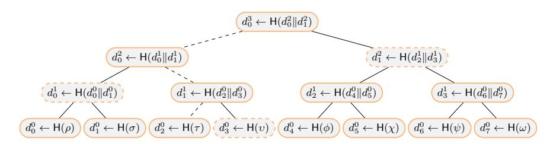
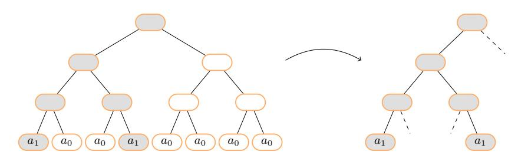
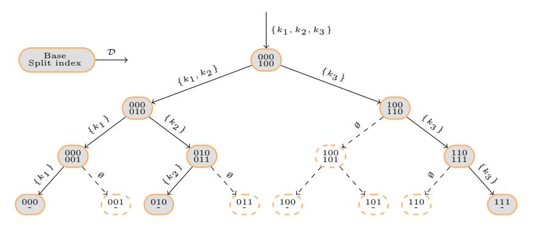
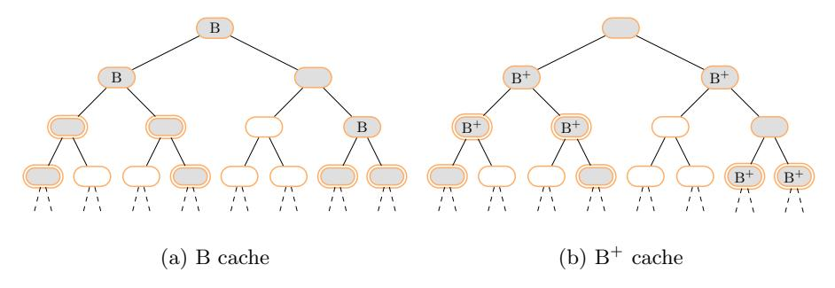
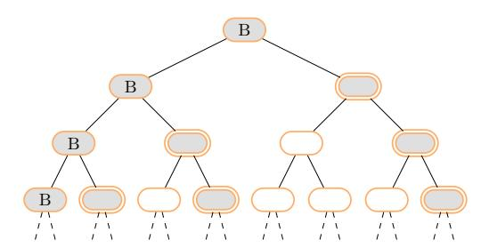
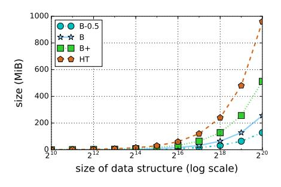
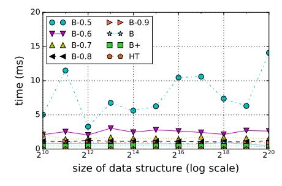
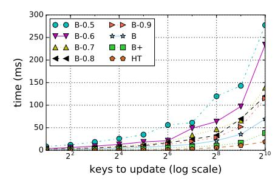
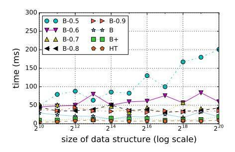

# Efficient Sparse Merkle Trees

## Caching Strategies and Secure (Non-)Membership Proofs

Rasmus Dahlberg1 , Tobias Pulls1 , and Roel Peeters2

1 Karlstad University, Dept. of Mathematics and Computer Science, Sweden, rasmus.gd.dahlberg@gmail.com and tobias.pulls@kau.se 2 KU Leuven, ESAT/COSIC & iMinds, Belgium, roel.peeters@esat.kuleuven.be

Abstract. A sparse Merkle tree is an authenticated data structure based on a perfect Merkle tree of intractable size. It contains a distinct leaf for every possible output from a cryptographic hash function, and can be simulated efficiently because the tree is sparse (i.e., most leaves are empty). We are the first to provide complete, succinct, and recursive definitions of a sparse Merkle tree and related operations. We show that our definitions enable efficient space-time trade-offs for different caching strategies, and that verifiable audit paths can be generated to prove (non-)membership in practically constant time (< 4 ms) when using SHA-512/256. This is despite a limited amount of space for the cache—smaller than the size of the underlying data structure being authenticated—and full (concrete) security in the multi-instance setting.

## 1 Introduction

Secure HTTPS connections rely on the users' browsers to obtain authentic domain-to-key bindings during set-up. With this in mind, trusted third parties called certificate authorities are used to vouch for the integrity of public keys by issuing X.509 certificates. Though the initial problem of establishing trust might appear to be solved, several new complications arise. Considering that there are hundreds of certificate authorities, all of which are capable of issuing certificates for any domain, it is challenging to concisely observe what has been issued for whom [\[11\]](#page-15-0). As such, a misissued or maliciously issued certificate could remain unnoticed forever, or more likely until an attack against a domain has taken place. Naturally this raises an important question: who watches the watchmen?

Google's Certificate Transparency (CT) project proposes public logs based on append-only Merkle trees [\[18\]](#page-15-1). The basic idea is that an SSL/TLS certificate must be included in some log to be trusted by a browser, and because the infrastructure is public anyone can audit or monitor these logs to ensure correct behavior [\[6](#page-14-0)[,16\]](#page-15-2). Thus, CT allows clients to determine whether a certificate was valid at some point in time, but inclusion in the log cannot guarantee that it is current. For instance, what if a certificate has to be revoked due to a compromised private key or an entire certificate authority [\[15](#page-15-3)[,29\]](#page-15-4)? Since the log is both chronological and append-only, effected certificates can neither be removed nor can the absence of a revocation certificate be proven efficiently [\[12\]](#page-15-5).

Certificate Revocation (RT) is a proposed extension to CT by Laurie and Kasper [\[17\]](#page-15-6). The aim is to provide a separate mechanism that proves certificates unrevoked, and requires an authenticated data structure supporting efficient non-membership proofs [\[34\]](#page-15-7). As is, there are at least two approaches towards such proofs. One is based on sorted Merkle trees, and the other on tuple-based signed statements on the form "Key ki has the value vi ; there are no keys in the interval (ki , ki+1)" [\[9](#page-14-1)[,17\]](#page-15-6). We consider the former approach in terms of a sparse Merkle tree (SMT), whose scope goes far beyond RT. For example, an SMT can be used as a key building block in a wide area of applications, ranging from persistent authenticated dictionaries to secure messaging applications [\[10,](#page-14-2)[20,](#page-15-8)[30,](#page-15-9)[32\]](#page-15-10).

After introducing some necessary preliminaries (Section [2\)](#page-1-0) and the approach taken here (Section [3\)](#page-2-0), our contributions are as follows. First, building on an interesting proposal started by Laurie and Kasper [\[17\]](#page-15-6), we define efficient caching strategies and complete recursive definitions of an SMT (Section [4\)](#page-5-0). Second, we evaluate the security of our definitions in the multi-instance setting, comparing our design decisions with those made in CONIKS [\[20\]](#page-15-8) (Section [5\)](#page-7-0). Third, we examine three caching strategies experimentally for an SMT, showing different space-time trade-offs (Section [6\)](#page-11-0). Finally, we discuss related work (Section [7\)](#page-12-0) and end with conclusions (Section [8\)](#page-14-3).

# 2 Preliminaries

We start by describing background regarding Merkle trees and audit paths, then cryptographic assumptions that our security evaluation relies on are presented.

#### 2.1 Merkle Trees

A Merkle tree [\[21\]](#page-15-11) is a binary tree that incorporates the use of cryptographic hash functions. One or many attributes are inserted into the leaves, and every node derives a digest which is recursively dependent on all attributes in its subtree. That is, leaves compute the hash of their own attributes, and parents derive the hash of their children's digests concatenated left-to-right. As further described in Section [5,](#page-7-0) certain digests must also be encoded with additional constants. This is to prevent indistinguishability between different types of nodes [\[8,](#page-14-4)[20\]](#page-15-8).

Figure [1](#page-2-1) illustrates a Merkle tree without a proper encoding. It contains eight attributes ρ–ω, and the root digest r ← d 3 0 serves as a reference to prove membership by presenting an audit path [\[18\]](#page-15-1). For instance, dashed nodes are necessary to authenticate the third left-most leaf containing attribute τ . More generally, an audit path comprises all siblings along the path down to the leaf being authenticated. Combined with a retrieved attribute, this forms a proof of membership which is valid if it reconstructs the root digest r 0 such that r 0 = r. Note that a proof is only as convincing as r, but trust can be established using, e.g., digital signatures or by periodically publishing roots in a newspaper.

Fig. 1: A Merkle tree containing attributes  $\rho$ - $\omega$ . The digest rooted at height h and index i is denoted by  $d_i^h$ .

#### 2.2 Setting and Cryptographic Assumptions

Inspired by Katz [13] and Melara et al. [20], we consider a computationally bounded adversary in the multi-instance setting. This means that there are many distinct SMTs, and the adversary should not gain any advantage in terms of necessary computation if she attempts to attack all SMTs at once. In other words, despite the adversary's multi-instance advantage, the goal is to provide full  $\lambda$ -bit security for each SMT. For security we rely on a collision and pre-image resistant hash function H with digests of size  $N := 2\lambda$  bits, and on Lemma 1.

**Lemma 1.** The security of an audit path reduces to the collision resistance of the underlying hash function H.

*Proof.* This follows directly from the work of Merkle [21] and Blum et al. [5].

#### 3 Sparse Merkle Trees

First we introduce non-membership proofs that are based on sorted Merkle trees, then the notion of an SMT and our approach is incrementally described.

#### 3.1 Non-Membership Proofs and High-Level Properties

In RT and like applications, it is crucial to prove certain values absent [17,31,32]. Efficient construction of such non-membership proofs can be enabled by viewing balanced binary search trees, e.g., treaps and red-black trees, as Merkle trees. A lexicographically sorted tree structure serves the purpose of preventing all nodes from being enumerated, involving rules that rotate nodes upon insertion and removal, and the structure of that tree can be fixed by a trustworthy root due to being a Merkle tree. We prove non-membership by generating an audit path through binary search, and a verifying party accepts the proof to be valid if there is no evidence that the tree structure is unsorted or that the root is improperly reconstructed. In other words, the absence of a value is efficiently proven due to a balanced search tree, and the proofs are convincing because the structure of the tree is fixed by a cryptographically derived root.

While an SMT also relies on the structure of the tree together with being a Merkle tree, it is different in that it requires neither balancing techniques nor certain constants when encoding digests. This is due to an intractably large Merkle tree that reserves a unique leaf  $\ell$  for every conceivable key digest. The hash of a key k determines  $\ell$ , and k is a (non-)member if the attribute  $a \in \ell$  is set to  $a_0$  and  $a_1$ , respectively. Hence, the resulting tree structure contains  $2^N$  leaves at all times, and (non-)membership can be proven by presenting an audit path for leaf H(k). This set-up also implies history independence [25]: a unique set of keys produce a deterministic root digest, regardless of the order in which keys have been inserted or removed. Notably history independence is not necessarily provided by a sorted Merkle tree (e.g., not the case for a red-black tree).

#### 3.2 Tractable Representations

Considering the intractable size of an SMT, it is not without challenges to define an efficient representation. To begin with, the only reason why this is feasible traces back to the key observation that an SMT is *sparse*. This means that the vast majority of all leaves represent non-members, as indicated by a shared attribute  $a_0$ , resulting in a construction where the empty subtrees rooted at height h derive identical default digests. The basic principle is as follows. An empty leaf computes  $d_*^0 \leftarrow \mathsf{H}(a_0)$ , a node rooted at an empty subtree with height one derives  $d_*^1 \leftarrow \mathsf{H}(d_*^0 || d_*^0)$ , and so forth. Since these default digests can be precomputed, they need neither be associated with explicit nodes nor be derived recursively by visiting all leaves. Instead, referring to Figure 2, it suffices to process the filled nodes whose digests depend on existing keys.

Fig. 2: An illustration of how subtrees with default digest can be discarded to attain a tractable representation of an SMT.

#### 3.3 Earlier Proposals

Different approaches can be used to provide efficient representations of an SMT. Bauer [3] has proposed an explicit pruned tree structure where all the non-empty attributes are elevated upwards through their ancestors. The elevation stops when the root of a subtree containing a single non-empty leaf is reached, and all

descendants to such roots are discarded. The original SMT can be reconstructed by recording indices for the non-empty leaves in each subtree, but will require excessive amounts of memory unless they are evenly spread out. Hence, while the proposal is neat, we find the approach started by Laurie and Kasper [\[17\]](#page-15-6) more generally applicable. It is based on maintaining a collection of keys K, and the collection is authenticated by simulating an SMT. As is, however, their proposal is incomplete and cannot, e.g., derive (non-)membership proofs efficiently. This is due to deriving subtrees' digests over and over again—an issue we solve in the following sections by introducing relative information.

## 3.4 Our Approach

We approach the SMT in terms of a simulation (Definition [1\)](#page-4-0). Let us start by considering the simplest case of no relative information, then why it is necessary.

Definition 1. A simulated SMT is the composition of (i) a data structure D containing unique keys k, and (ii) a collection of cached digests, referred to as the relative information δ. Both structures define operations for insertion, removal, and look-up; D also supports splitting, i.e., dividing it in two based on a key.

Our SMT is simulated in the sense that there is no explicit tree structure, which is possible because every k ∈ D can be mapped to its associated subtrees recursively. For example, as shown in Figure [3,](#page-4-1) a root digest can be obtained by simulating a traversal from the root down to all the non-empty leaves. The base is initially set to all zeros and refers to the left-most leaf in a subtree. It remains the same on left-traversals, must be updated by setting the appropriate bit to one on right traversals, and is used to determine the split index. The split index is the key upon which D is divided on and refers to the left-most leaf in the right subtree. Thus, as formalized in Section [4.3,](#page-6-0) it is an upper exclusive and lower inclusive bound for the keys in the left and right subtrees, respectively.

Fig. 3: An illustration of a recursive traversal to obtain the root digest; k1 = 000, k2 = 010, and k3 = 111.

Clearly, it is inefficient to obtain a subtree's digest by repeatedly visiting all the non-empty leaves. Therefore relative information is necessary: a collection of cached digests with the sole purpose of preventing such inefficiency. For instance, a na¨ıve caching strategy could record every digest that is non-default. Although that requires excessive amounts of memory, it would ensure that all siblings' digests are available upon generating audit paths. Consequently, the number of splits will be constant, and (non-)membership can be proven with the same time complexity as the underlying split operation. Our aim when defining caching strategies is to preserve this property while reducing memory requirements.

# 4 Efficient Representations

First we define caching strategies that are based on capturing branches, then our proposal is formalized by presenting complete recurrences for an efficient SMT.

Definition 2. A branch is an interior node in a Merkle tree, for which both of the two children derive non-default digests [\[27\]](#page-15-15).

#### 4.1 Caching Strategies

During the design of a caching strategy it is important to consider expected and worst case scenarios. The former is somewhat straight forward since the output of H is uniformly distributed, whereas the latter is both strategy and use-case dependent. That is, the non-empty leaves will be evenly spread out in the average case, and a cluster of non-default digests will therefore be formed at the higher dlog ne + 1 layers. If these digests are captured by the relative information, the traversals down to the leaves can be prevented. The digests rooted at layers below the dense threshold are of lesser importance due to the sparse property, but can be vital if a worst-case ever occurs. For example, an intuitive caching strategy that we omit is to record the higher dlog ne + 1 layers of the SMT. Although the dense part would be captured in the average case, forcing leaves to clump at some subtree is trivial for an adversary that selects the keys. Hence, a large majority of the non-default digests cannot be captured, and the resulting cache will be useless if (non-)membership proofs are issued for the clumped subtree. This is the reason why our caching strategies evolve around capturing branches (Definition [2\)](#page-5-1), aiming to bound the number of recursive traversals down to the leaves by a constant. As desired, it then follows that the time necessary to generate an audit path, or equivalently the time necessary to update the status of a single key, will reduce to the underlying split operation.

B cache. Figure [4a](#page-6-1) depicts the B cache which captures every digest rooted at a branch. It contains n − 1 digests at all times, and requires at most N traversals down to either a branch or leaf upon generating audit paths. The former follows from the observation that all but the first insertion yield a single branch, and the latter (i.e., the worst case) is discussed in Section [5.3.](#page-10-0)

Fig. 4: Captured digests as the circled subtrees contain a single non-empty leaf.

**B**- cache. By discarding f(n) branches from the B cache, memory requirements can be reduced at the cost of additional computation. This forms the notion of B-, which provides trade-offs depending on how f(n) is implemented. We examine a probabilistic approach where a branch is captured with probability p, meaning f(n) is roughly n(1-p). Other variations of f(n) include ignoring every other layer, as well as defining an upper bound for how many branches to ignore.

 $\mathbf{B}^+$  cache. The drawback of using a B cache is that, in the average case, only the higher  $\lceil \log n \rceil$  layers will be captured. In other words, since the dense part also spans layer  $\lceil \log n \rceil + 1$ , we are missing out on some performance.  $\mathbf{B}^+$  aims to solve this issue by capturing branches together with their children. The resulting cache covers the entire dense part of the SMT, but for the sake of efficiency we also limit the worst case memory requirements by 2n due to discarding branches (Figure 4b). The difference is negligible with regard to time, considering that a branch can derive its digest in constant time from the cached children.

#### 4.2 The Cache Routine

Implementation-wise our caching strategies are convenient. To process an interior digest, a cache function that accepts the left and right child digests can be used. Upon invocation it computes the interior digest d, examines if both children are non-default, deletes the previous branch if applicable, caches in case of a new branch, and outputs d. While this algorithm merely concerns the B cache, it extends perfectly to B- and B+. Therefore these caching strategies are practical to mix: start off with B+, switch to B as memory requirements grow larger, and finally migrate to B- with shrinking probability p. For instance, this could be interesting in real-world scenarios where memory is a limited resource.

#### 4.3 Recurrences

Let h be the height of a subtree, b the base of a node, and  $\mathcal{D}$  a data structure containing unique keys' digests  $\mathsf{H}(k)$ . Further denote by  $\alpha_i$  the  $i^{th} \geq 0$  left-most

bit in  $\alpha$ ,  $\alpha_{i=\beta}$  the assignment of that bit to  $\beta \in \{0,1\}$ , and by colon (:) list concatenation. Finally, define the bit in the base that is set on right traversals3 as j := N - h, the split index as  $s := b_{j=1}$ , and  $\mathcal{D}$  divided on s for relation R as  $\mathcal{D}_s^R := \{k | k \in \mathcal{D} \land kRs\}$ . Our recurrences are shown in Figure 5:

- Given a height h, (1) derives the default digest  $d_*^h$ . The leaf hash (LH) and interior hash (IH) functions serve the purpose of encoding digests securely, as further described in Section 5.
- Given a height h, a base b, and a collection of keys  $\mathcal{D}$ , (2) derives the digest  $d_b^h$ . The base case occurs if there is relative information available, if a default digest is applicable, or if a non-empty leaf is reached. Otherwise, (2) performs two recursive calls with  $\mathcal{D}$  divided on s, b updated in the event of a right traversal, and h reduced by one.
- Given a height h, a base b, a collection of keys  $\mathcal{D}$ , and a key k for leaf  $\ell$ , (3) generates an audit path for  $\ell$ . Note that the siblings' digests are gathered by list concatenation, repeatedly invoking (2) after reaching  $\ell$ .
- Given a height h, a base b, an audit path P for key k, and an attribute  $a \in \{a_0, a_1\}$ , (4) reconstructs the root digest by traversing the tree down to the leaf being authenticated. Every sibling's digest is obtained from P[j].
- Given a height h, a base b, a collection of keys  $\mathcal{D}$ , a subset of keys  $\mathcal{K} \subset \mathcal{D}$  where  $\mathcal{K} \neq \emptyset$ , and an attribute  $a \in \{a_0, a_1\}$ , (5) outputs the new root digest and updates the relative information. This is achieved by visiting all leaves  $\ell \in \mathcal{K}$ , also invoking the cache function (C) to compute the interior digest  $d_b^h$  and ensure that the relative information is up-to-date.

The size of an audit path is  $\mathcal{O}(1)$ , but can be further reduced by discarding default digests. This yields a *sparse audit path*, and necessitates encoding of an N-bitmap to determine whether a digest is (non-)default. We omit the details of such a recurrence since it is trivially added when (3)–(4) is provided.

# 5 Security

Consider a single SMT and assume that the hash function is fixed. Then it follows that the size of an audit path is fixed by N due to the structure of the tree, and consequently we can distinguish between leaves and interior nodes. This means that, for the case of a single SMT with a fixed hash function, no special encoding is necessary to distinguish between nodes, and that the security of an audit path reduces to the collision resistance of the underlying hash function (Lemma 1).

Next, to prevent an adversary from gaining any advantage when attacking several SMTs in parallel, we consider the full (concrete) security of an audit path in the multi-instance setting. Thereafter we relate our encoding of nodes to CONIKS [20], and examine the impact of caching strategies for security.

&lt;sup>3 This bit refers to the depth of a subtree.

$$\xi_*^h := \begin{cases} \mathsf{LH}_*^*(a_0) & \text{, if } h = 0\\ \mathsf{IH}_*^h(\xi_*^{h-1}, \xi_*^{h-1}) & \text{, else } . \end{cases}$$
 (1)

$$\mathbf{R}_{b}^{h}(\mathcal{D}) := \begin{cases}
\delta_{b}^{h} & , \text{if available} \\
\xi_{*}^{h} & , \text{elif } |\mathcal{D}| = 0 \\
\mathbf{L}\mathbf{H}_{b}^{*}(a_{1}) & , \text{elif } |\mathcal{D}| = 1 \wedge h = 0 \\
\mathbf{I}\mathbf{H}_{b}^{h}\left(\mathbf{R}_{b}^{h-1}(\mathcal{D}_{s}^{<}), \mathbf{R}_{s}^{h-1}(\mathcal{D}_{s}^{\geq})\right) & , \text{else} .
\end{cases} \tag{2}$$

$$\mathbf{A}_{b}^{h}(\mathcal{D}, k) := \begin{cases} \emptyset & , \text{if } h = 0 \\ \mathbf{R}_{s}^{h-1}(\mathcal{D}_{s}^{\geq}) : \mathbf{A}_{b}^{h-1}(\mathcal{D}_{s}^{\leq}, k) & , \text{elif } k_{j} = 0 \\ \mathbf{R}_{b}^{h-1}(\mathcal{D}_{s}^{\leq}) : \mathbf{A}_{s}^{h-1}(\mathcal{D}_{s}^{\geq}, k) & , \text{else} \end{cases}$$
(3)

$$B_b^h(P, k, a) := \begin{cases} LH_b^*(a) & \text{, if } h = 0\\ IH_b^h(B_b^{h-1}(P, k, a), P[j]) & \text{, elif } k_j = 0\\ IH_b^h(P[j], B_s^{h-1}(P, k, a)) & \text{, else } . \end{cases}$$
(4)

$$\xi_{*}^{h} := \begin{cases} \operatorname{LH}_{*}^{*}(a_{0}) & \text{, if } h = 0 \\ \operatorname{IH}_{*}^{h}(\xi_{*}^{h-1}, \xi_{*}^{h-1}) & \text{, else }. \end{cases}$$

$$R_{b}^{h}(\mathcal{D}) := \begin{cases} \delta_{b}^{h} & \text{, if available} \\ \xi_{*}^{h} & \text{, elif } |\mathcal{D}| = 0 \\ \operatorname{LH}_{b}^{*}(a_{1}) & \text{, elif } |\mathcal{D}| = 1 \land h = 0 \\ \operatorname{LH}_{b}^{h}(R_{b}^{h-1}(\mathcal{D}_{s}^{<}), R_{s}^{h-1}(\mathcal{D}_{s}^{\geq})) & \text{, else }. \end{cases}$$

$$A_{b}^{h}(\mathcal{D}, k) := \begin{cases} \emptyset & \text{, if } h = 0 \\ R_{s}^{h-1}(\mathcal{D}_{s}^{\geq}) : A_{b}^{h-1}(\mathcal{D}_{s}^{<}, k) & \text{, elif } k_{j} = 0 \\ R_{b}^{h-1}(\mathcal{D}_{s}^{<}) : A_{s}^{h-1}(\mathcal{D}_{s}^{\geq}, k) & \text{, else }. \end{cases}$$

$$B_{b}^{h}(P, k, a) := \begin{cases} \operatorname{LH}_{b}^{*}(a) & \text{, if } h = 0 \\ \operatorname{LH}_{b}^{*}(B_{b}^{h-1}(P, k, a), P[j]) & \text{, elif } k_{j} = 0 \\ \operatorname{LH}_{b}^{*}(P[j], B_{s}^{h-1}(P, k, a)) & \text{, else }. \end{cases}$$

$$U_{b}^{h}(\mathcal{D}, \mathcal{K}, a) := \begin{cases} \operatorname{LH}_{b}^{*}(a) & \text{, if } h = 0 \\ \operatorname{C}_{b}^{h}(R_{b}^{h-1}(\mathcal{D}_{s}^{<}), U_{s}^{h-1}(\mathcal{D}_{s}^{\geq}, \mathcal{K}, a)) & \text{, elif } |\mathcal{K}_{s}^{<}| = 0 \land |\mathcal{K}_{s}^{\geq}| \neq 0 \\ \operatorname{C}_{b}^{h}(U_{b}^{h-1}(\mathcal{D}_{s}^{<}, \mathcal{K}, a), R_{s}^{h-1}(\mathcal{D}_{s}^{\geq}), \mathcal{K}_{s}^{\geq}, a)) & \text{, elif } |\mathcal{K}_{s}^{<}| \neq 0 \land |\mathcal{K}_{s}^{\geq}| = 0 \\ \operatorname{C}_{b}^{h}(U_{b}^{h-1}(\mathcal{D}_{s}^{<}, \mathcal{K}_{s}^{<}, a), U_{s}^{h-1}(\mathcal{D}_{s}^{\geq}, \mathcal{K}_{s}^{\geq}, a)) & \text{, else }. \end{cases}$$

$$(5)$$

Fig. 5: Recurrences that derive default digests ( $\xi$ ), root digests (R), audit paths (A), reconstructed root digests (B), and relative information (U).

#### The Merkle Prefix Tree in CONIKS 5.1

As described more broadly in Section 7, CONIKS is a key verification service that uses a Merkle prefix tree (MPT) to authenticate the users' key bindings [20]. An MPT can be seen as a dynamically sized and explicit SMT where empty subtrees are replaced with empty nodes. Key-bindings are mapped by a hash function H to unique indices i, and every (non-)empty leaf in the tree is associated with a depth  $\ell$  as well as an  $\ell$ -bit unique prefix j of i. The encoding of an empty node is defined in (6).

$$d \leftarrow \mathsf{H}(C_{\text{emptv}} || C_{\text{tw}} || j || \ell) \tag{6}$$

 $C_{\mathrm{empty}}$  is a constant for empty leaves and  $C_{\mathrm{tw}}$  a tree-wide constant. The encoding of a non-empty node is defined in (7).

$$d \leftarrow \mathsf{H}(C_{\text{leaf}} \| C_{\text{tw}} \| i \| \ell \| p) \tag{7}$$

 $C_{\text{leaf}}$  is a constant for non-empty leaves and p a payload. Finally, the encoding of an interior node is defined in (8).

$$d \leftarrow \mathsf{H}(d_{\mathrm{left}} || d_{\mathrm{right}})$$
 (8)

The constants Cempty and Cleaf serve the purpose of preventing indistinguishability between (non-)empty leaves, and the tree-wide constant Ctw provides protection against an adversary in the multi-instance setting. In other words, if all MPTs use distinct tree-wide constants, no nodes' pre-images can be valid across different trees. Similarly, no nodes' pre-images can be valid across multiple locations because the leaves' digests are uniquely encoded by jk` and ik` (the location of an interior node is implicit due to the children it commits to). Thus, as opposed to searching collisions across different trees and locations in parallel, an adversary must target a particular tree and location.

We also need to consider different versions of the trees that are generated by updates. To accomplish full λ-bit security for an instance of an MPT, a new tree-wide constant must be selected after each update to prevent parallel attacks through past versions of the same tree structure. This means that for all updates, the entire MPT has to be recomputed from scratch.

# 5.2 A Secure Encoding for Sparse Merkle Trees

Figure [6](#page-9-0) defines a secure encoding for an SMT in the multi-instance setting. We prevent attacks across distinct trees by introducing a tree-wide constant Ctw, but we do not protect against attacks on different versions of the same tree structure because Ctw is reused between updates. For attacks within a particular tree, we include unique identifiers in every non-empty subtree. This differs with respect to MPTs, but is necessary to preserve the sparse property of an SMT: if unique prefixes were included in the empty subtrees, then there would no longer be any default digests. As shown in [\(10\)](#page-9-1), we solve this issue and retain security by moving the encoding of an empty node into the non-empty parent. An interior node that is non-default will still commit properly to a certain location encoded by base and height[4](#page-9-2) , and since the digest of an empty node is publicly known even for an MPT no security is lost. Furthermore, note that we do not encode the attributes a0 and a1 explicitly in [\(9\)](#page-9-3). Inclusion of the base suffices to distinguish between (non-)empty leaves, considering that the height of an SMT is implicit.

$$LH_b^*(a) := \begin{cases} H(C_{\text{tw}}) & \text{, if } a = a_0 \\ H(C_{\text{tw}}||b) & \text{, else} \end{cases}$$
 (9)

$$IH_b^h(d_{\text{left}}, d_{\text{right}}) := \begin{cases} \mathsf{H}(d_{\text{left}} \| d_{\text{right}}) & \text{, if } d_{\text{left}} = d_{\text{right}} = \xi_*^{h-1} \\ \mathsf{H}(d_{\text{left}} \| d_{\text{right}} \| b \| h) & \text{, else } . \end{cases}$$
(10)

Fig. 6: Secure node encodings for an SMT.

4 The height is necessary because the base is ambiguous on left traversal, i.e., it has fixed size and is only updated by setting the appropriate bit on right traversals.

#### 5.3 Security Aspects of Caching Strategies

Generally speaking, we often distinguish between best, worst, and average case complexities. For instance, a hash table has amortized constant look-up time, but can degrade to a linear construction if all entries hash to the same bucket. Likewise, a binary search tree that is probabilistically balanced is in danger of breaking down into a linked list. Though critics might claim that attacks based on such degradations are of theoretical interest alone, Crosby and Wallach [\[7\]](#page-14-7) have already presented denial of service attacks that exploit algorithmic complexities. Thus, within security, it is of great importance to evaluate worst case behavior.

Let us consider the B cache. In the worst case, if there are merely N keys, an adversary could force an almost perfect spine of branches as depicted in Figure [7.](#page-10-1) Whenever membership proofs are issued for the leaves on that spine, the large majority of all the non-default digests must be computed because the siblings' digests are not captured by the cache. While this is not an issue for a small SMT, the worst case efficiency actually increases as the tree grows: new insertions yield additional branches, and it is more efficient to stop traversals at a branch than at a leaf. In other words, there are two scenarios each time a sibling's digest is requested. First, the digest is default and can be requested in constant time. Second, the digest is non-default and can be derived by traversing the tree down to a branch or leaf. In either case, regardless of how an adversary selects the keys, at most N traversals are necessary (one per layer). A similar analysis applies to B+, considering that the children of all branches are captured by the relative information. For B- , one can show that the number of traversals will be bounded by f(n). As such, to prevent an adversary from causing inefficiency, f(n) must be either constant or unpredictable to the adversary.

Fig. 7: A branch spine, potentially caused by an adversary.

An almost identical analysis applies for worst case behavior during updates. This follows from the observation that [\(3\)](#page-8-3) and [\(5\)](#page-8-5) traverse the tree down to the leaves, invoking [\(2\)](#page-8-2) on each layer.

#### 6 Performance

We examined performance and space-time trade-offs experimentally using a proof-of-concept implementation in  $\mathrm{Go}^5$ , selecting SHA-512/256 as the hash function6, a data structure  $\mathcal{D}$  that supports splitting in logarithmic time, and relative information  $\delta$  that is maintained in constant time (a hash table). Our experiments were executed on an Intel(R)  $\mathrm{Core}(\mathrm{TM})$  i7-4790  $\mathrm{CPU}$  at 3.60  $\mathrm{GHz}$  with 2x8  $\mathrm{GB}$  DDR4 RAM, and they utilized  $\mathrm{Go}$ 's built-in benchmarking tool. Furthermore, the B- cache was implemented probabilistically such that a branch is captured with probability p. We tested B- for  $p \in \{0.5 \dots 0.9\}$ , denoted by  $\mathrm{B}_p^-$ , and included B, B+, and a hash treap in our experiments. For the relevant operations, i.e., insertion, removal, and look-up, the expected logarithmic time complexity of a hash treap makes it a good representation of other authenticated data structures that are explicitly stored in memory.

Figure 8a shows the size of the authenticated data structure as a function of the data structure being authenticated. There is essentially no distinction between the two for a hash treap7, and in the case of an SMT this is the relation between  $\delta$  and  $\mathcal{D}$ . For  $2^{20}$  keys, the hash treap needs 960 MiB, the B+ cache 512 MiB, the B cache 256 MiB, and the B0.5 cache 128 MiB. It is evident that the different caches double in size, and that the size of a hash treap is roughly eight times larger than that of a B0.5 cache. Furthermore, it should be noted that the Bp caches with  $p \in \{0.6...0.9\}$  have sizes evenly distributed in [B0.5, B].

Figure 8b shows the time required to generate an audit path. Since the full structure is in memory for the hash treap, it is just a matter of copying the nodes along the path in negligible time (0.003 ms). Similarly, for B+ and B, we see consistent results that are less than 1 ms regardless of how large  $\mathcal{D}$  is. This is because both caching strategies ensure that the vital non-default digests are cached, whereas additional recursive traversals down to either branches or leaves are necessary for Bp. Finally, we observe the impact of selecting p. While p > 0.6 gives an expected time that is less than 4 ms, p = 0.5 behaves erratically. This follows from the high probability that a sibling's digests must be derived instead of being found in the cache, as is also evident to a smaller extent for p = 0.6.

Figure 8c shows the time it takes to update m keys in a data structure containing  $n=2^{15}$  keys. All approaches scale as  $\mathcal{O}(m\log n)$ , with the hash treap being the fastest. Similarly, Figure 8d shows the time it takes to update m=256 keys as a function of the size n. The B+ cache consistently needs less than 20 ms, as opposed to the hash treap which needs 9.5 ms for  $n=2^{20}$ . Considering that a hash treap consumes twice as much memory, this is indeed an interesting trade-off. For the remaining caching strategies, p together with the relation between n and m determines the probability of having cache misses. Simplified, larger p yields less variance and greater efficiency in terms of time.

&lt;sup>5 Source code available at https://github.com/pylls/gosmt (Apache 2.0).

&lt;sup>6 SHA-512 truncated to 256-bit output, resulting in an SMT with 2256 leaves [26].

&lt;sup>7 The size refers to the nodes of the tree together with the children's pointers.

- (a) Size of the authenticated data structure.
- (b) Time to generate an audit path.

- (c) Time to update in a 215 data structure.
- (d) Time to update 256 keys.

Fig. 8: Space-time trade-offs for caching strategies and a hash treap (HT).

#### 7 Related Work

Google considers three categories of authenticated data structures when adding transparency to a trust model: verifiable logs, maps, and log-backed maps [12]. While CT relies on verifiable logs to support efficient consistency and membership proofs, verifiable maps based on SMTs are proposed in RT to prove non-membership. This is not without issues, however. All operations must be enumerated to determine whether a map's state is correct. The former two categories are therefore combined into a verifiable log-backed map where consistency issues can be detected by the verifiable log, (non-)membership can be proven by the verifiable map, and full audits can ensure complete correct behavior. As such, using an efficient verifiable map based on our extension of an SMT, the combination of CT and RT can prove whether a certificate's status is current. Other CT-like proposals that an SMT could be applicable to include Distributed Transparent Key Infrastructure [35] and Enhanced Certificate Transparency [32].

Verifiable maps are closely related to persistent authenticated dictionaries (PADs) [10]. While both are dynamic, the difference is that a PAD supports (non-)membership queries to current *and* past versions of the data structure. By extending our representation of an SMT to a secure key-value store, adding some

form of persistency yields a PAD. Crosby and Wallach [\[9\]](#page-14-1) investigated caching strategies for tree-based PADs in conjunction with Sarnak and Tarjan versioned nodes [\[33\]](#page-15-18). Before that, Anagnostopoulos et al. [\[1\]](#page-14-8) considered another technique known as path copying. We could use similar approaches for the cache in our SMT, relying entirely on existing persistent data structures to yield a PAD.

CONIKS is a privacy-preserving key-management service that allows clients to monitor their own key-bindings efficiently [\[20\]](#page-15-8). An MPT (see Section [5.1\)](#page-8-9) is used for the purpose of verifiability, but prior to deriving a unique index i the key-bindings are first transformed by a verifiable unpredictable function [\[22\]](#page-15-19). While that prevents audit paths from leaking user information, it cannot conceal the total number of users. CONIKS solves this issue and others e.g., ensuring fork consistency [\[19\]](#page-15-20), by defining a protocol on top of an MPT. It appears that an SMT could be a viable and attractive replacement if viewed as a dictionary.

The issue of proving non-membership is not only evident in CT and RT. For instance, in the context of privacy-preserving transparency logging [\[31\]](#page-15-13), Balloon plays an integral part as a provably secure append-only data structure [\[30\]](#page-15-9). This is accomplished using an approach towards authenticated data structures defined by Papamanthou et al. [\[28\]](#page-15-21), as well as combining a history tree [\[8\]](#page-14-4) and a hash treap [\[10](#page-14-2)[,30\]](#page-15-9). The former is essentially a verifiable log, and the latter a treap [\[2](#page-14-9)[,4\]](#page-14-10) viewed as a Merkle tree. While hash treaps and SMTs share many properties, including efficient (non-)membership proofs and history independent representations, there are some striking differences. To begin with, hash treaps store attributes in each node. Unlike in an SMT, information regarding these attributes must be provided in an audit path due to encoding digests differently (possibly leaking valuable information). There will also be exactly n nodes at all times, and efficiency relies on a probabilistic balance. In these regards an SMT is flexible: the variable parameters D and δ determine if/when efficiency is provided, and memory requirements can be reduced to less than n if need be.

More generally we could compare an SMT to any lexicographically sorted data structure viewed as a Merkle tree, e.g., including certificate revocation trees [\[14\]](#page-15-22) and subsequent approaches based on 2-3 trees [\[24\]](#page-15-23). An SMT is superior to a certificate revocation tree because the update process cannot cause the entire tree structure to be recomputed. When compared to 2-3 trees and other balanced binary search trees, the analysis is similar to that of a hash treap. Note, however, that an SMT should not be confused with authenticated data structures that are unable to prove non-membership efficiently. This means that an SMT is not intended for applications such as Bitcoin [\[23\]](#page-15-24): the transactions of separate blocks are grouped together in Merkle trees for the purpose of efficient integrity guarantees, not the ability to prove certain transactions absent.

Finally, this work is an extension of the Bachelor's thesis by Dahlberg [\[27\]](#page-15-15). Apart from improving terminology, we defined recursions for batch updates and reconstruction of root digests, as well as caching strategies based on branches. We also added a security evaluation for full (concrete) security in the multi-instance setting, provided a publicly available implementation that uses a memory safe language, and compared our results with a related authenticated data structure.

## 8 Conclusion

Our definition of an SMT builds upon and extends the principles provided by Laurie and Kasper [\[17\]](#page-15-6). The proposal is generic in the sense that an arbitrary data structure supporting insertion, removal, look-up, and splitting can be used, and different caching strategies (B, B- , and B+) provide fine-grained control over consumed space contra run time. In other words, rather than having an explicit tree structure, the resulting SMT is simulated. While this comes at the cost of additional computation when compared to other explicit tree-based data structures, our performance benchmark and worst case analysis show that our definitions are efficient regardless of how an adversary selects the keys. In addition, we prove that these definitions are secure in the multi-instance setting.

There is nothing that prevents further space-time trade-offs as an SMT evolves. In principle, the relation B- ⊂ B ⊂ B + holds. Therefore, it is simple to go from one strategy to another, e.g., depending on how much memory is available at the time being. This is a major difference with respect to explicit tree structures, which have no previous constructions that are alike. Furthermore, the succinct recursions used to simulate an SMT yield limited implementation complexity, and history independence is a prevalent property if parallelized and distributed solutions are considered for large-scale applications.

Acknowledgements We would like to thank Stefan Lindskog for his valuable feedback. Rasmus Dahlberg and Tobias Pulls have received funding from the HITS research profile funded by the Swedish Knowledge Foundation.

# References

- 1. Anagnostopoulos, A., Goodrich, M.T., Tamassia, R.: Persistent authenticated dictionaries and their applications. In: ISC. pp. 379–393 (2001)
- 2. Aragon, C.R., Seidel, R.: Randomized search trees. In: FOCS. pp. 540–545 (1989)
- 3. Bauer, M.: Proofs of zero knowledge. CoRR cs.CR/0406058 (2004)
- 4. Blelloch, G.E., Reid-Miller, M.: Fast set operations using treaps. In: SPAA. pp. 16–26 (1998)
- 5. Blum, M., Evans, W.S., Gemmell, P., Kannan, S., Naor, M.: Checking the correctness of memories. Algorithmica 12(2/3), 225–244 (1994)
- 6. Chuat, L., Szalachowski, P., Perrig, A., Laurie, B., Messeri, E.: Efficient gossip protocols for verifying the consistency of certificate logs. In: CNS. pp. 415–423 (2015)
- 7. Crosby, S.A., Wallach, D.S.: Denial of service via algorithmic complexity attacks. In: USENIX Security Symposium. pp. 29–44 (2003)
- 8. Crosby, S.A., Wallach, D.S.: Efficient data structures for tamper-evident logging. In: USENIX Security Symposium. pp. 317–334 (2009)
- 9. Crosby, S.A., Wallach, D.S.: Super-efficient aggregating history-independent persistent authenticated dictionaries. In: ESORICS. pp. 671–688 (2009)
- 10. Crosby, S.A., Wallach, D.S.: Authenticated dictionaries: Real-world costs and trade-offs. ACM TISSEC 14(2), 17:1–17:30 (2011)

- 11. Eckersley, P.: How secure is HTTPS today? How often is it attacked? EFF (2011), <https://www.eff.org/deeplinks/2011/10/how-secure-https-today>
- 12. Eijdenberg, A., Laurie, B., Cutter, A.: Verifiable data structures. Google Research (2015), [https://github.com/google/trillian/blob/master/docs/](https://github.com/google/trillian/blob/master/docs/VerifiableDataStructures.pdf) [VerifiableDataStructures.pdf](https://github.com/google/trillian/blob/master/docs/VerifiableDataStructures.pdf)
- 13. Katz, J.: Analysis of a proposed hash-based signature standard (2014), [http://](http://cvs.cs.umd.edu/~jkatz/papers/HashBasedSigs.pdf) [cvs.cs.umd.edu/~jkatz/papers/HashBasedSigs.pdf](http://cvs.cs.umd.edu/~jkatz/papers/HashBasedSigs.pdf)
- 14. Kocher, P.C.: On certificate revocation and validation. In: FC. pp. 172–177 (1998)
- 15. Langely, A.: Enhancing digital certificate security. Google Research (2013), https://security.googleblog.[com/2013/01/enhancing-digital-certificate](https://security.googleblog.com/2013/01/enhancing-digital-certificate-security.html)[security](https://security.googleblog.com/2013/01/enhancing-digital-certificate-security.html).html
- 16. Laurie, B.: Certificate transparency. ACM Queue 12(8), 10–19 (2014)
- 17. Laurie, B., Kasper, E.: Revocation transparency. Google Research (2012), [http:](http://www.links.org/files/RevocationTransparency.pdf) //www.links.[org/files/RevocationTransparency](http://www.links.org/files/RevocationTransparency.pdf).pdf
- 18. Laurie, B., Langley, A., Kasper, E.: Certificate transparency. RFC 6962 (2013)
- 19. Li, J., Krohn, M.N., Mazi`eres, D., Shasha, D.: Secure untrusted data repository (SUNDR). In: OSDI. pp. 121–136 (2004)
- 20. Melara, M.S., Blankstein, A., Bonneau, J., Felten, E.W., Freedman, M.J.: CONIKS: Bringing key transparency to end users. In: USENIX Security Symposium. pp. 383–398 (2015)
- 21. Merkle, R.C.: A digital signature based on a conventional encryption function. In: CRYPTO. pp. 369–378 (1987)
- 22. Micali, S., Rabin, M.O., Vadhan, S.P.: Verifiable random functions. In: FOCS. pp. 120–130 (1999)
- 23. Nakamoto, S.: Bitcoin: A peer-to-peer electronic cash system (2008)
- 24. Naor, M., Nissim, K.: Certificate revocation and certificate update. J-SAC 18(4), 561–570 (2000)
- 25. Naor, M., Teague, V.: Anti-persistence: History independent data structures. In: STOC. pp. 492–501 (2001)
- 26. NIST: FIPS PUB 180-4: Secure Hash Standard. Federal Information Processing Standards Publication 180-4, U.S. Department of Commerce (2012), [http:](http://csrc.nist.gov/publications/fips/fips180-4/fips-180-4.pdf) //csrc.nist.[gov/publications/fips/fips180-4/fips-180-4](http://csrc.nist.gov/publications/fips/fips180-4/fips-180-4.pdf).pdf
- 27. Ostersj¨o/Dahlberg, R.: Sparse Merkle Trees: Definitions and Space-Time Trade- ¨ Offs with Applications for Balloon. Bachelor's thesis, Karlstad University (2016)
- 28. Papamanthou, C., Tamassia, R., Triandopoulos, N.: Optimal verification of operations on dynamic sets. In: CRYPTO. pp. 91–110 (2011)
- 29. Prins, R.: DigiNotar certificate authority breach—"operation black tulip". Fox-IT (2011)
- 30. Pulls, T., Peeters, R.: Balloon: A forward-secure append-only persistent authenticated data structure. In: ESORICS. pp. 622–641 (2015)
- 31. Pulls, T., Peeters, R.: Insynd: Privacy-preserving transparency logging using Balloons. To appear in ESORICS (2016)
- 32. Ryan, M.D.: Enhanced certificate transparency and end-to-end encrypted mail. In: NDSS (2014)
- 33. Sarnak, N., Tarjan, R.E.: Planar point location using persistent search trees. Commun ACM 29(7), 669–679 (1986)
- 34. Tamassia, R.: Authenticated data structures. In: ESA. pp. 2–5 (2003)
- 35. Yu, J., Cheval, V., Ryan, M.: DTKI: a new formalized PKI with no trusted parties. CoRR abs/1408.1023 (2014)