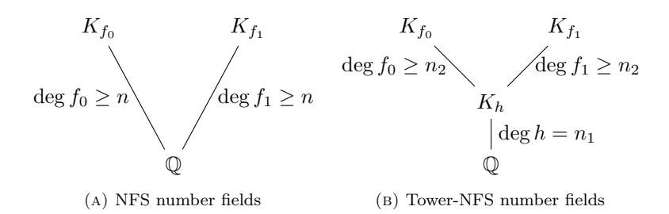
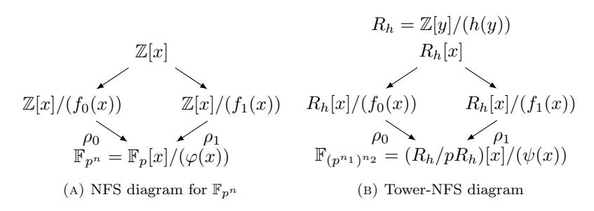

# FASTER INDIVIDUAL DISCRETE LOGARITHMS IN FINITE FIELDS OF COMPOSITE EXTENSION DEGREE

#### AURORE GUILLEVIC

Abstract. Computing discrete logarithms in finite fields is a main concern in cryptography. The best algorithms in large and medium characteristic fields (e.g., GF(p 2 ), GF(p <sup>12</sup>)) are the Number Field Sieve and its variants (special, high-degree, tower). The best algorithms in small characteristic finite fields (e.g., GF(36·509)) are the Function Field Sieve, Joux's algorithm, and the quasipolynomial-time algorithm. The last step of this family of algorithms is the individual logarithm computation. It computes a smooth decomposition of a given target in two phases: an initial splitting, then a descent tree. While new improvements have been made to reduce the complexity of the dominating relation collection and linear algebra steps, resulting in a smaller factor basis (database of known logarithms of small elements), the last step remains at the same level of difficulty. Indeed, we have to find a smooth decomposition of a typically large element in the finite field. This work improves the initial splitting phase and applies to any nonprime finite field. It is very efficient when the extension degree is composite. It exploits the proper subfields, resulting in a much more smooth decomposition of the target. This leads to a new trade-off between the initial splitting step and the descent step in small characteristic. Moreover it reduces the width and the height of the subsequent descent tree.

# 1. Introduction

This work is interested in improving the last step of discrete logarithm (DL) computations in nonprime finite fields. The discrete logarithm instances that we target come from Diffie-Hellman (DH) [\[21\]](#page-26-0) key-exchange, or from pairing-based cryptography. In the latter case, the security relies on the hardness of computing discrete logarithms in two groups: the group of points of a particular elliptic curve defined over a finite field, and a small extension of this finite field (in most of the cases of degree 2, 3, 4, 6, or 12).

The finite fields fall in three groups: small, medium and large characteristic finite fields, corresponding to the respective size of the characteristic p compared to the total size Q = p <sup>n</sup> of the finite field. This is formalized with the L notation:

(1.1)
$$L_Q[\alpha, c] = e^{(c+o(1))(\log Q)^{\alpha}(\log\log Q)^{1-\alpha}}$$
, where  $Q = p^n$ ,  $\alpha \in [0, 1]$ ,  $c \neq 0$ .

Date: September 16, 2018. This document is the author's version. First published in Mathematics of Computation, 2018, published by the American Mathematical Society. c 2018 American Mathematical Society. Publisher's version available online September 6, 2018, at <https://doi.org/10.1090/mcom/3376>. See <http://www.ams.org/publications/authors/ctp> about AMS copyright.

<sup>2010</sup> Mathematics Subject Classification. Primary 11T71: Cryptography.

Key words and phrases. Finite field, discrete logarithm, number field sieve, function field sieve, individual logarithm. 1

Small, medium and large characteristic correspond to α < 1/3, 1/3 < α < 2/3, and α > 2/3 respectively. The boundary cases are α = 1/3 and α = 2/3. In large characteristic, that is p = LQ[α, c] where α > 2/3, the Number Field Sieve (NFS) [\[27,](#page-26-1) [61,](#page-28-0) [37\]](#page-26-2) provides the best expected running time: in LQ[1/3,(64/9)1/<sup>3</sup> ≈ 1.923] and was used in the latest record computations in a 768-bit prime field [\[47\]](#page-27-0). Its special variant in expected running time LQ[1/3,(32/9)<sup>1</sup>/<sup>3</sup> ≈ 1.526] was used to break a 1024-bit trapdoored prime field [\[25\]](#page-26-3). In 2015 and 2016, the Tower-NFS construction of Schirokauer was revisited for prime fields [\[14\]](#page-25-0), then Kim, Barbulescu and Jeong improved it for nonprime finite fields Fp<sup>n</sup> where the extension degree n is composite [\[45,](#page-27-1) [46\]](#page-27-2), and used the name Extended TNFS algorithm. To avoid a confusion due to the profusion of names denoting variants of the same algorithm, in this paper we will use TNFS as a generic term to denote the family of all the variants of NFS that use a tower of number fields. Small characteristic means p = LQ[α, c] where α < 1/3. The first L[1/3] algorithm was proposed by Coppersmith, and generalized as the Function Field Sieve [\[8,](#page-25-1) [9\]](#page-25-2).

The NFS and FFS algorithms are made of four phases: polynomial selection (two polynomials are chosen), relation collection where relations between small elements are obtained, linear algebra (computing the kernel of a huge sparse matrix over an auxiliary large prime finite field), and individual discrete logarithm computation. In this work, we improve this last step. All the improvements of NFS, FFS, and related variants since the 90's decrease the size of the factor basis, that is, the database of known discrete logarithms of small elements obtained after the linear algebra step, small meaning an element represented by a polynomial of small degree (FFS), resp., an element whose pseudonorm is small (NFS). The effort required in the individual discrete logarithm step increases: one needs to find a decomposition of a given target into small elements, to be able to express its discrete logarithm in terms of already known logarithms of elements in the factor basis, while the factor basis has decreased at each major improvement. In characteristic 2 and 3 where the extension degree is composite, obtaining the discrete logarithms of the factor basis elements can be done in polynomial time. The individual discrete logarithm is the most costly part, in quasi-polynomial -time in the most favorable cases [\[13,](#page-25-3) [29\]](#page-26-4). In practice, the record computations [\[26,](#page-26-5) [35,](#page-26-6) [5,](#page-25-4) [7,](#page-25-5) [42,](#page-27-3) [4\]](#page-25-6) implement hybrid algorithms made of Joux's L[1/4] algorithm [\[36\]](#page-26-7), and the individual discrete logarithm is computed with a continued fraction descent, then a classical descent, a QPA descent, and a Gr¨obner basis descent, or a powers-of-two descent algorithm (a.k.a. zig-zag descent) [\[32,](#page-26-8) [31,](#page-26-9) [30\]](#page-26-10).

The heart of this paper relies on the following two observations. Firstly, to speed up the individual discrete logarithm phase, we start by speeding up the initial splitting step, and for that we compute a representation of a preimage of the given target of smaller degree, and/or whose coefficients are smaller. It will improve its smoothness probability. Secondly, to compute this preimage of smaller degree, we exploit the proper subfields of the finite field GF(p <sup>n</sup>), and intensively use this key-ingredient: since we are computing discrete logarithms modulo (a prime divisor of) Φn(p), we can freely multiply or divide the target by any element in a proper subfield without affecting its discrete logarithm modulo Φn(p).

Organization of the paper. The background needed is presented as preliminaries in Section [2.](#page-2-0) We present our generic strategy to lower the degree of the polynomial representing a given element in GF(p <sup>n</sup>) in Section [3.](#page-3-0) We apply it to characteristic two and three in Section 4. Preliminaries before the large characteristic case are given in Section 5. We apply our technique to medium and large characteristic finite fields, that is the NFS case and its tower variant in Section 6, and provide examples of cryptographic size in Section 7. Finally in Section 8 we present a more advanced strategy, to exploit several subfields at a time, and we apply it to  $\mathbb{F}_{p^6}$ .

### 2. Preliminaries

<span id="page-2-0"></span>2.1. **Setting.** In this paper, we are interested in nonprime finite fields  $GF(p^n)$ , n > 1. To keep the same notation between small, medium, and large characteristic finite fields, we assume that the field  $\mathbb{F}_{p^n}$  is defined by an extension of degree  $n_2$  above an extension of degree  $n_1$ , that is,  $\mathbb{F}_{(p^{n_1})^{n_2}}$ , and  $n = n_1 n_2$ . The elements are of the form  $T = \sum_{i=0}^{n_2-1} \sum_{j=0}^{n_1-1} a_{ij} y^j x^i$ , where the coefficients  $a_{ij}$  are in  $\mathbb{F}_p$ , the coefficients  $a_i = \sum_{j=0}^{n_1-1} a_{ij} y^j$  are in  $\mathbb{F}_{p^{n_1}} = \mathbb{F}_p[y]/(h(y))$ , and  $\mathbb{F}_{(p^{n_1})^{n_2}} = \mathbb{F}_{p^{n_1}}[x]/(\psi(x))$ , where h is a monic irreducible polynomial of  $\mathbb{F}_p[y]$  of degree  $n_1$  and  $\psi$  is a monic irreducible polynomial of  $\mathbb{F}_{p^{n_1}}[x]$  of degree  $n_2$ . In other words, T is represented as a polynomial of degree  $n_2 - 1$  in the variable x, and has coefficients  $a_i \in \mathbb{F}_{p^{n_1}}$ . For the FFS and NFS algorithms,  $n_1 = 1$  and  $n_2 = n$ ; for finite fields from pairing constructions,  $n_2 > 1$  is a strict divisor of n, and for the original version of TNFS,  $n_1 = n$  and  $n_2 = 1$ .

**Definition 2.1** (Smoothness). Let B be a positive integer. A polynomial is said to be B-smooth w.r.t. its degree if all its irreducible factors have a degree smaller than B. An integer is said to be B-smooth if all its prime divisors are less than B. An ideal in a number field is said to be B-smooth if it factors into prime ideals whose norms are bounded by B.

**Definition 2.2** (Preimage). The preimage of an element  $a = \sum_{i=0}^{n_2-1} \sum_{j=0}^{n_1-1} a_{ij} y^j x^i \in \mathbb{F}_{(p^{n_1})^{n_2}}$  will be, for the NFS and TNFS algorithms, the bivariate polynomial  $\sum_{i=0}^{n_2-1} \sum_{j=0}^{n_1-1} a'_{ij} y^j x^i \in \mathbb{Z}[x,y]$ , where each coefficient  $a'_{ij}$  is a lift in  $\mathbb{Z}$  of the coefficient  $a_{ij}$  in  $\mathbb{F}_p$ . It is a preimage for the reduction modulo  $(p,h,\psi)$ , that we denote by  $\rho: \mathbb{Z}[x,y] \to \mathbb{F}_{(p^{n_1})^{n_2}}$ . In small characteristic, the preimage of a is a univariate polynomial in  $\mathbb{F}_{p^{n_1}}[x]$ . It is a preimage for the reduction modulo  $\psi$ , that we also denote by  $\rho: \mathbb{F}_{p^{n_1}}[x] \to \mathbb{F}_{(p^{n_1})^{n_2}}$ .

**Definition 2.3** (Pseudonorm). The integral pseudonorm w.r.t. a number field  $\mathbb{Q}[x]/(f(x))$  (f monic) of a polynomial  $T = \sum_{i=0}^{\deg f-1} a_i x^i$  of integer coefficients  $a_i$  is computed as  $\operatorname{Res}_x(T(x), f(x))$ .

Since there is no chance for a preimage of a target  $T_0$  to be B-smooth, the individual discrete logarithm is done in two steps: an *initial splitting* of the target, and then a descent phase. The initial splitting is an iterative process that tries many targets  $g^tT_0 \in \mathbb{F}_{p^n}^*$ , where t is a known exponent (taken uniformly at random), until a  $B_1$ -smooth decomposition of the preimage is found. Here smooth stands for a factorization into irreducible polynomials of  $\mathbb{F}_{p^{n_1}}[x]$  of degree at most  $B_1$  in the small characteristic setting, resp., a pseudonorm that factors as an integer into a product of primes smaller than  $B_1$  in the NFS (and TNFS) settings.

<span id="page-2-2"></span><span id="page-2-1"></span><sup>&</sup>lt;sup>1</sup>also called *boot* or *smoothing step* in large characteristic finite fields

<sup>&</sup>lt;sup>2</sup>in order to make no confusion with the mathematical *descent*, which is not involved in this process, we mention that in this step, the norm (with NFS) or the degree (with FFS) of the preimage *decreases*.

The second phase starts a recursive process for each element less than  $B_1$  but greater than  $B_0$  obtained after the initial splitting phase. Each of these medium-sized elements are processed until a complete decomposition over the factor basis is obtained. Each element obtained from the initial splitting is at the root of its descent tree. One finds a relation involving the original one and other ones whose degree, resp., pseudonorm, is strictly smaller than the degree, resp., pseudonorm, of the initial element at the root. These smaller elements form the new leaves of the descent tree. For each leaf, the process is repeated until all the leaves are elements in the factor basis. The discrete logarithm of an element output by the initial splitting can be computed by a tree traversal. This strategy is considered in [19, §6], [48, §7], [38, §3.5], [18, §4].

In small characteristic, the initial splitting step is known as the Waterloo<sup>3</sup> algorithm [15, 16]. It outputs  $T = U(x)/V(x) \mod I(x)$ , and U, V are two polynomials of degree  $\lfloor (n_2 - 1)/2 \rfloor$ . It uses an Extended GCD computation. For prime fields, the continued fraction algorithm was already used with the Quadratic Sieve and Coppersmith-Odlyzko-Schroeppel algorithm. It expresses an integer N modulo p as a fraction  $N \equiv u/v \mod p$ , and the numerator and denominator are of size about the square root of p. The generalization of this technique was used in [39]. As for the Waterloo algorithm, this technique provides a very good practical speed up but does not improve the asymptotic complexity.

this subfield tool was highlighted in [34]; we will intensively use it.

<span id="page-3-3"></span>**Lemma 2.4** ([34, Lemma 1]). Let  $T \in \mathbb{F}_{p^n}^*$ , and let  $\deg T < n$ . Let  $\ell$  be a nontrivial prime divisor of  $\Phi_n(p)$ . Let  $T' = u \cdot T$  with u in a proper subfield of  $\mathbb{F}_{p^n}$ . Then

(2.1)
$$\log T' \equiv \log T \mod \Phi_n(p)$$
 and in particular  $\log T' \equiv \log T \mod \ell$ .

<span id="page-3-0"></span>3. The heart of our strategy: representing elements in the cyclotomic subgroup of a nonprime finite field with less coefficients

In the FFS setting,  $n_1 = 1$  and usually  $n_2$  is prime and our technique cannot be helpful, but if n is not prime, our algorithm applies, and moreover in favorable cases Joux's L[1/4] algorithm and its variants can be used and our technique can provide a further notable speed-up in the descent. For the implementations in small characteristic, the factor basis is made of the irreducible polynomials of  $\mathbb{F}_{p^{n_1}}[x]$  of very small degree, e.g., of degrees 1, 2, 3, and 4 in [3]. Our aim is to improve the smoothness probability of a preimage  $P \in \mathbb{F}_{p^{n_1}}[x]$  of a given target  $T \in \mathbb{F}_{(p^{n_1})^{n_2}}$  and for that we want to reduce the degree in x of the preimage P (as a lift of T in  $\mathbb{F}_{p^{n_1}}[x]$ , P has degree at most  $n_2 - 1$  in x), while keeping the property

<span id="page-3-2"></span>
$$\log(\rho(P)) = \log T \mod \ell ,$$

where  $\rho: \mathbb{F}_{p^{n_1}}[x] \to \mathbb{F}_{(p^{n_1})^{n_2}}$  is the reduction modulo  $\psi$ .

Let d denote the largest proper divisor of n, 1 < d < n (d might sometimes be equal to  $n_2$  in the QPA setting). We will compute P in  $\mathbb{F}_{p^{n_1}}[x]$  of degree at most  $n_2 - d/n_1$  in x (and coefficients in  $\mathbb{F}_{p^{n_1}}$ ) such that

(3.1)
$$P = uT \pmod{\psi}$$
, where  $u^{p^d - 1} = 1$ .

<span id="page-3-1"></span><sup>&</sup>lt;sup>3</sup>the name comes from the authors' affiliation: the University of Waterloo, ON, Canada.

It means that we will cancel the  $d/n_1 - 1$  higher coefficients (in  $\mathbb{F}_{p^{n_1}}$ ) of a preimage of T in  $\mathbb{F}_{p^{n_1}}[x]$ .

There are two strategies: either handle coefficients in  $\mathbb{F}_p$  or in  $\mathbb{F}_{p^{\gcd(d,n_1)}}$ . We will consider the latter case. Let  $d'=d/\gcd(d,n_1)$  to simplify the notation, and let  $[1,U,\ldots,U^{d'-1}]$  be a polynomial basis of  $\mathbb{F}_{p^{d'}}$ . Every product  $P=U^iT$  satisfies (3.1). Define the  $d'\times n_2$  matrix L whose rows are made of the coefficients (in  $\mathbb{F}_{p^{n_1}}$ ) of  $U^iT$  for  $0\leq i\leq d'-1$ :

$$L_{d' \times n_2} = \begin{bmatrix} T \\ UT \\ \vdots \\ U^{d'-1}T \end{bmatrix} \in \mathcal{M}_{d',n}(\mathbb{F}_{p^{n_1}}) .$$

Then we compute a row-echelon form of this matrix by performing only  $\mathbb{F}_{p^{\gcd(n_1,d)}}$ -linear operations over the rows, so that each row of the echeloned matrix is a  $\mathbb{F}_{p^{\gcd(n_1,d)}}$ -linear combination of the initial rows, that can be expressed as

$$P = \sum_{i=0}^{d'-1} \lambda_i U^i T = u T, \text{ where } \lambda_i \in \mathbb{F}_{p^{\gcd(n_1,d)}} , \ U^i \in \mathbb{F}_{p^{d/\gcd(n_1,d)}}$$

so that P = uT with  $u^{p^d-1} = 1$ . Assuming that the matrix is lower-triangular (the other option being an upper-triangular matrix), we take the first row of the matrix as the coefficients of a polynomial in  $\mathbb{F}_{p^{n_1}}[x]$  of degree at most  $n_2 - d/n_1$ . This is formalized in Algorithm 1. We obtain the following Theorem 3.1.

# Algorithm 1: Computing a representation by a polynomial of smaller degree

<span id="page-4-1"></span>**Input:** Finite field  $\mathbb{F}_{p^n}$  represented as a tower  $\mathbb{F}_{(p^{n_1})^{n_2}} = \mathbb{F}_{p^{n_1}}[x]/(\psi(x))$  (one may have  $n_1 = 1$ ), a proper divisor d of n ( $d \mid n, 1 < d < n$ ),  $T \in \mathbb{F}_{p^n}$

**Output:**  $P \in \mathbb{F}_{p^{n_1}}[x]$  a polynomial of degree  $\leq n_2 - d/n_1$  satisfying  $P \mod \psi = uT$ , where  $u \in \mathbb{F}_{p^d}$

- 1  $d' = d/\gcd(n_1, d)$
- **2** Compute a polynomial basis  $(1, U, U^2, \dots, U^{d'-1})$  of the subfield  $\mathbb{F}_{p^{d'}}$
- 3 Define  $L = \begin{bmatrix} T \\ UT \\ \vdots \\ U^{d'-1}T \end{bmatrix}$  a  $d' \times n_2$  matrix of coefficients in  $\mathbb{F}_{p^{n_1}}$
- 4  $M \leftarrow \text{RowEchelonForm}(L)$  with only  $\mathbb{F}_{p^{\gcd(n_1,d)}}$ -linear combinations
- 5  $P(x) \leftarrow$  polynomial from the coefficients of the first row of L
- 6 return P(x)

<span id="page-4-2"></span>**Theorem 3.1.** Let  $\mathbb{F}_{p^n}$  be a finite field represented as a tower  $\mathbb{F}_{(p^{n_1})^{n_2}}$ . Let  $T \in \mathbb{F}_{p^n}^*$  be an element which is not in a proper subfield of  $\mathbb{F}_{p^n}$ . Let d be the largest proper divisor of n, 1 < d < n (n is not prime). Assume that T is represented by a polynomial in  $\mathbb{F}_{p^{n_1}}[x]$  of degree larger than  $n_2 - d/n_1$ . Then there exists a preimage

<span id="page-4-0"></span> $<sup>^4</sup>n_2-d/n_1$  is not necessarily an integer, meaning that the leading coefficient of the polynomial is some element in  $\mathbb{F}_{p^{n_1}}$ . Its degree in x is actually  $n_2-\lceil d/n_1\rceil$ .

P of T, in  $\mathbb{F}_{p^{n_1}}[x]$ , of degree  $n_2 - \lceil d/n_1 \rceil$  in x and coefficients in  $\mathbb{F}_{p^{n_1}}$ , and such that

$$\log(\rho(P)) = \log T \mod \Phi_n(p) .$$

Proof. We use Algorithm 1 to compute P. The matrix has full rank since the  $U^i$ s form a polynomial basis of  $\mathbb{F}_{p^{d'}}$ . The linear combinations involve T and elements in  $\mathbb{F}_{p^{d/\gcd(n_1,d)}}$  and  $\mathbb{F}_{p^{\gcd(n_1,d)}}$  that are in the proper subfield  $\mathbb{F}_{p^d}$  by construction. The first row after Gaussian elimination will have at least  $d/n_1 - 1$  coefficients equal to zero at the right, and will represent a polynomial P of degree at most  $n_2 - d/n_1$ , that satisfies  $P = uT \pmod{\psi}$  where  $u = \sum \lambda_i U^i \in \mathbb{F}_{p^d}$ , since in the process, T was multiplied only by elements whose images in  $\mathbb{F}_{(p^{n_1})^{n_2}}$  are in the subfield  $\mathbb{F}_{p^d}$ . We have  $\rho(P) = uT$ ,  $u \in \mathbb{F}_{p^d}$ , and the equality of logarithms follows by Lemma 2.4.  $\square$

<span id="page-5-0"></span>We can now directly apply Algorithm 1 to improve the initial splitting algorithm in practice.

# 4. Application to small characteristic finite fields, and cryptographic-size examples

In all the examples of small characteristic finite fields from pairings, n is not prime, for instance  $n=6\cdot 509$ . The notation in [6] was n=lk, with the property  $p^l\approx k$ . With our notation,  $n_1=l$  and  $n_2=k$ .

4.1. **Algorithm.** We directly use Algorithm 1 as a subroutine of Algorithm 2. Then to improve it in practice, we list valuable modifications.

<span id="page-5-1"></span>Remark 4.1. As was pointed out to us by F. Rodríguez-Henríquez [56, 3], the elements of the form  $x^i R(x)$  where R itself is of degree  $\leq n_2 - d/n_1$  are evenly interesting because the discrete logarithm of  $x^i$  can be deduced from the discrete logarithm of x, which is known after linear algebra.

So we can increase the number of elements tested for  $B_1$ -smoothness for each exponent t by a factor d' almost for free in the following way. We again run a Gaussian elimination algorithm on the matrix M but in the reverse side, for instance from row one to row d' and left to right if it was done from row d' to row one and right to left the first time. The matrix is in row-echelon form on the left-hand side and on the right-hand side (the upper right and lower left corners are filled with zeros). We obtain a matrix N of the form

$$N = \begin{bmatrix} * & \dots & * & * & 0 & \dots & 0 \\ 0 & \ddots & & & \ddots & \ddots & \vdots \\ \vdots & \ddots & \ddots & & & \ddots & 0 \\ 0 & \dots & 0 & * & \dots & * & * \end{bmatrix} .$$

The *i*-th row represents a polynomial  $P'_i = x^{e_i}P_i$ , where  $P_i$  is of degree at most  $n_2 - d/n_1$ , and  $e_i \approx (i-1)\gcd(n_1,d)/n_1$ . Since x is in the factor basis (by construction, like all the degree one polynomials), its logarithm is known at this point (after the relation collection and linear algebra steps), hence the logarithm of any power  $x^{e_i}$  is known. It remains to compute the discrete logarithm of  $P_i$ .

In practice there are some technicalities: in the second Gaussian elimination, if the leading coefficient is zero, then two rows are swapped, and it cancels the previous Gaussian elimination (computed at the other end of the matrix) for that

<span id="page-6-0"></span>Algorithm 2: Initial splitting in small characteristic with the subfield technique

```
Input: Finite field \mathbb{F}_{p^n} of small characteristic (e.g., p=2,3), with a tower
                representation \mathbb{F}_{p^n} = \mathbb{F}_{(p^{n_1})^{n_2}} = \mathbb{F}_{p^{n_1}}[x]/(I(x)) (one may have n_1 = 1),
                generator g (of the order \ell subgroup of the cyclotomic subgroup of \mathbb{F}_{p^n}),
                target T_0 \in \mathbb{F}_{(p^{n_1})^{n_2}}, smoothness bound B_1
    Output: t, P \in \mathbb{F}_{p^{n_1}}[x] a polynomial of degree \leq n_2 - d/n_1 such that
                   \operatorname{vlog}_a \rho(P) = t + \operatorname{vlog}_a T_0 \mod \ell, and P(x) is B_1-smooth (w.r.t. its
                   degree in x)
 1 d \leftarrow the largest divisor of n, 1 < d < n
 \mathbf{2} \ d' \leftarrow d/\gcd(d, n_1)
 3 Compute U(x) \in \mathbb{F}_{(p^{n_1})^{n_2}} s.t. (1, U, U^2, \dots, U^{d'-1}) is a polynomial basis of the
      subfield \mathbb{F}_{n^{d'}}
 4 repeat
         take t \in \{1, \dots, \ell - 1\} at random
          T \leftarrow g^t T_0 \text{ in } \mathbb{F}_{(p^{n_1})^{n_2}}
        Define L = \begin{bmatrix} T \\ UT \\ \vdots \\ U^{d'-1}T \end{bmatrix} a d' \times n_2 matrix of coefficients in \mathbb{F}_{p^{n_1}}
         M \leftarrow \text{RowEchelonForm}(L) \text{ (with } \mathbb{F}_{p^{\gcd(d,n_1)}}\text{-linear Gaussian elimination)}
         P(x) \leftarrow the polynomial of lowest degree made of the first row of L
10 until P(x) is B_1-smooth
11 return t, P(x)
```

row. We end up with a matrix which is in row-echelon form on the right and almost row-echelon form on the left (or vice-versa). Since each set of subsequent  $n_1/\gcd(n_1,d)$  rows produces polynomials of the same degree, swapping two rows from the same set will not change the degree in x of the polynomial. In average (this is what we observed in our experiments for  $\mathbb{F}_{3^{6\cdot509}}$  and  $\mathbb{F}_{3^{5\cdot479}}$ ), some rare polynomials will have a degree in x increased by one or two. This second Gaussian elimination increases the number of tests by a factor d' at a very cheap cost, since in fact it allows one to share the cost of computing the  $U^iT$  and the two Gaussian eliminations over d' tests.

Remark 4.2. If  $\gcd(d,n_1)>1$  we can increase the number of rows by a small factor. We perform linear combinations of  $n_1/\gcd(d,n_1)$  subsequent rows (all giving a polynomial of same degree):  $\sum_{0\leq j\leq n_1/\gcd(d,n_1)}\mu_jr_j$  where  $\mu\in\mathbb{F}_{p^{\gcd(d,n_1)}}$ , and it will result in new rows and new polynomials of same degree.

<span id="page-6-1"></span>Remark 4.3. Other improvements are possible [56, 3], for instance computing  $\mathbb{F}_{p^{\gcd(n_1,d)}}$ -linear combinations over a small number of rows corresponding to polynomials of almost the same degree. The resulting polynomial will have degree increased by one or two, which does not significantly affect its  $B_1$ -smoothness probability in practice for cryptographic sizes. This technique allows one to produce many more candidates, at a very cheap cost of linear operations in  $\mathbb{F}_{p^{n_1}}[x]$ .

## 4.2. Complexity analysis.

4.2.1. Cost of computing one preimage  $P \in \mathbb{F}_{p^{n_1}}[x]$  in the initial splitting step. We use the notation of Algorithm 2: let d be the largest proper divisor of n (d | n, 1 < d < n), and let  $d' = d/\gcd(d, n_1)$ . Since  $d' \mid d \mid n = n_1 n_2$  and  $\gcd(d', n_1) = 1$ , then  $d' \mid n_2$  and  $d' \leq n_2$ . The computation of all the  $U^iT$  of the matrix L costs at most  $d'n_2^2$  multiplications in  $\mathbb{F}_{p^{n_1}}$ , since a schoolbook multiplication in  $\mathbb{F}_{(p^{n_1})^{n_2}}$ costs  $n_2^2$  multiplications in  $\mathbb{F}_{p^{n_1}}$ . There are d' such multiplications. The complexity of a reduced row-echelon form computation of a  $(d' \times n_2)$ -matrix,  $d' \leq n_2$ , is less than  $O(d'^2n_2)$  multiplications in  $\mathbb{F}_{p^{n_1}}$  [23, §13.4.2]. To simplify, we consider that the computation of the matrix L and of two Gaussian eliminations is done in time at most  $O(d'n_2^2)$ . This cost is shared over d' polynomials  $P_i$  to be tested for  $B_1$ -smoothness. In this way, the complexity of computing a preimage P with our initial splitting algorithm is the same as in the Waterloo algorithm:  $O(n_2^2)$ , and moreover the smoothness probabilities are much higher for the targeted cryptographic cases coming from supersingular pairing-friendly curves. We also replace two  $B_1$ smoothness tests by only one, and that might save some time in practice (this saving disappears in the O notation). We present the theoretical costs in Tables 1 and 2 from [24]. XGCD stands for extended Euclidean algorithm, SQF stands for SQuare-free Factorization, DDF stands for Distinct Degree Factorization, and EDF stands for Equal Degree Factorization. All the polynomials to be factored are of degree smaller than  $n_2$ ; we take  $n_2$  as an upper bound to get the costs of Table 2.

<span id="page-7-0"></span>TABLE 1. Costs for the initial splitting step. The preimage obtained with Algorithm 2 has degree  $d_P \leq n_2 - d/n_1$ . The Waterloo algorithm [15, 16] produces two polynomials of degree  $d_P = \lfloor n_2/2 \rfloor$ .

| Factorization         | cost                    |
|-----------------------|-------------------------|
| Square-free (SQF)     | $O(d_P^2)$              |
| Distinct degree (DDF) | $O(d_P^3 \log p^{n_1})$ |
| Equal degree (EDF)    | $O(d_P^2 \log p^{n_1})$ |

<span id="page-7-1"></span>TABLE 2. Cost in multiplications in  $\mathbb{F}_{p^{n_1}}$  to compute one preimage to be tested for smoothness, in the initial splitting step.

| Computation | XGCD(T, I)     | matrix $[U^iT]_{0 \le i \le c}$ | d'-1 and row echelon form |
|-------------|----------------|---------------------------------|---------------------------|
| Algorithm   | Waterloo       | this work, Alg. 2               | this work $+$ Rem. $4.1$  |
| Cost        | $O(n_{2}^{2})$ | $O(d'n_2^2)$                    | $O(n_2^2)$                |

4.2.2. running time of the initial splitting step. To start, we recall some results on the smoothness probability of a polynomial of given degree.

**Definition 4.4.** Let  $N_q(b;d)$  denote the number of monic polynomials over  $\mathbb{F}_q$  of degree d which are b-smooth. Let  $N_q(b;d_1,d_2)$  denote the number of coprime pairs of monic polynomials over  $\mathbb{F}_q$  of degrees  $d_1$  and  $d_2$ , respectively, which are b-smooth.

Let  $\Pr_q(b;d)$  denote the probability of a monic polynomial over  $\mathbb{F}_q$  of degree d to be b-smooth. Let  $\Pr_q(b;d_1,d_2)$  denote the probability of two coprime monic polynomials over  $\mathbb{F}_q$  of degrees  $d_1$  and  $d_2$  to be both b-smooth.

Odlyzko gave the following estimation for  $Pr_q(b;d)$  in [54, (4.5), p. 14].

(4.1)
$$\Pr_q(b,d)^{-1} = \exp\left((1+o(1))\frac{d}{b}\log_e\frac{d}{b}\right) \text{ for } d^{1/100} \le b \le d^{99/100} \ .$$

Writing the smoothness bound degree  $b = \log L_Q[\alpha_b, c_b]/\log p^{n_1}$  to match Odlyzko's convention  $b = c_b n_2^{\alpha_b} (\log n_2)^{1-\alpha_b}$ , and the degree of the polynomial to be tested for smoothness  $d = an_2$ , where  $a \in ]0,1[$  and  $n_2 = \log Q/\log p^{n_1}$ , one obtains

$$\Pr_{p^{n_1}}(b,d) = L_Q \left[1 - \alpha_b, -(1 - \alpha_b)a/\gamma\right], \text{ where } Q = p^{n_1 n_2}.$$

<span id="page-8-0"></span>**Theorem 4.5** ([22, Theorem 1]). Let  $\delta > 0$  be given. Then we have, uniformly for  $b, d_1, d_2 \to \infty$  with  $d_1^{\delta} \leq b \leq d_1^{1-\delta}$  and  $d_2^{\delta} \leq b \leq d_2^{1-\delta}$ ,

$$N_q(b;d_1,d_2) \sim \left(1 - \frac{1}{q}\right) N_q(b;d_1) N_q(b;d_2) \ .$$

**Corollary 4.6** ([22, Theorem 1]). Let  $\delta > 0$  be given. Then we have, uniformly for  $b, d_1, d_2 \to \infty$  with  $d_1^{\delta} \leq b \leq d_1^{1-\delta}$  and  $d_2^{\delta} \leq b \leq d_2^{1-\delta}$ ,

$$\Pr_q(b; d_1, d_2) \sim \left(1 - \frac{1}{q}\right) \Pr_q(b; d_1) \Pr_q(b; d_2)$$
.

We can now compare the Waterloo algorithm with this work. Assuming that  $B_1 = \log_{p^{n_1}} L_{p^n}[2/3, \gamma]$  for a certain  $\gamma$ , then the probability of a polynomial of degree  $an_2$ ,  $0 < a < n_2$ , to be  $B_1$ -smooth is  $L_{p^n}[1/3, -a/(3\gamma)]$ . In the Waterloo algorithm, two polynomials of degree  $n_2/2$  should be  $B_1$ -smooth at the same time, and the expected running time to find such a pair is  $L_{p^n}[1/3, 1/(3\gamma)]$  (the square of  $L_{p^n}[1/3, 1(6\gamma)]$ ). In our algorithm, a polynomial of degree  $\lfloor n_2 - d/n_1 \rfloor = \lfloor n_2(1 - d/n) \rfloor$  is tested for  $B_1$ -smoothness, so finding a good one requires

(4.2)
$$L_{n^n}[1/3, a/(3\gamma)]$$
 tests, where  $a \approx 1 - d/n$ ,

which is always faster than the Waterloo algorithm, for which a=1. When n is even (this is always the case for finite fields of supersingular pairing-friendly curves), one can choose d=n/2, hence a=1/2 and our algorithm has running time the square root of the running time of the Waterloo algorithm.

4.3. Improving the record computation in  $\mathbf{GF}(3^{6\cdot 509})$ . Adj, Menezes, Oliveira, and Rodríguez-Henríquez estimated in [6] the cost to compute discrete logarithms in the 4841-bit finite field  $\mathbf{GF}(3^{6\cdot 509})$  and announced their record computation in July 2016 [4]. The details of the computations are available in Adj's PhD thesis [2] and the details for initial splitting and descent can be found in [17]. The elements are represented by polynomials of degree at most 508 whose coefficients are in  $\mathbb{F}_{3^6}$ . In this case  $n_1 = 6$  and  $n_2 = 509$ . The initial splitting made with the Waterloo algorithm outputs two polynomials of degree 254. The probability that two independent and relatively prime polynomials of degree 254 over  $\mathbb{F}_{3^6}$  are simultaneously b-smooth is  $(1 - 1/3^6) \, \mathrm{Pr}_{3^6}^2(254, b)$  [22]. The term  $(1 - 1/3^6)$  is negligible in practice for the values that we are considering.

- 4.3.1. Improvements. Our Algorithm 2 outputs one polynomial of degree 254, whose probability to be b-smooth is  $\Pr_{3^6}(n,b)$ , i.e., the square root of the previous one. So we can take a much smaller b while reaching the same probability as before with the Waterloo algorithm. We list in Table 3a, p. 11, the values of b to obtain a probability between  $2^{-40}$  and  $2^{-20}$ . For instance, if we allow  $2^{30}$  trials, then we can set b=28 with our algorithm, instead of b=43 previously: we have  $\Pr_{3^6}(254,43)=2^{-30.1}$ , and we only need to take b=28 to get the same probability with this work:  $\Pr_{3^6}(254,28)=2^{-29.6}$ . This will provide a good practical speed-up of the descent phase: much fewer elements need to be "reduced": this reduces the initial width of the tree, and they are of much smaller degree: this reduces the depth of the descent tree.
- 4.3.2. A 30-smooth initial splitting. The finite field is represented with  $n_1=6$  and  $n_2=509$ , that is, as a first extension  $\mathbb{F}_{3^6}=\mathbb{F}_{p^{n_1}}=\mathbb{F}_3[y]/(y^6+2y^4+y^2+2y+2)$ , then a second extension  $\mathbb{F}_{3^{6\cdot509}}=\mathbb{F}_{3^6}[x]/(I(x))$ , where I(x) is the degree 509 irreducible factor of  $h_1x^{q_1}-h_0$ , where  $q_1=p^{n_1}$ ,  $h_1=x^2+y^{424}x$ , and  $h_0=y^{316}x+y^{135}$ . The generator is  $g=x+y^2$ . As a proof of concept, we computed a 30-smooth initial splitting of the target  $T_0=\sum_{i=0}^{508}(y^{\lfloor\pi(3^6)^{i+1}\rfloor}\bmod 3^6)x^i$ , with the parameters  $d=3\times509$ ,  $d'=d/\gcd(d,n_1)=509$ . Each trial  $g^tT_0$  produces d'=509 polynomials to test for smoothness. We found that  $g^{47233}T_0=uvx^{230}P$ , where  $u=1\in\mathbb{F}_{3^6},\ v\in\mathbb{F}_{3^3\cdot509}$ , and P is of degree 255 and 30-smooth. The equality  $(g^{47233}T_0)^{\frac{p^n-1}{\ell}}=(uvx^{230}P)^{\frac{p^n-1}{\ell}}$  is satisfied. The explicit value of P is available at https://members.loria.fr/AGuillevic/files/F3\_6\_509\_30smooth.mag.txt.

The whole computation took less than 6 days (real time) on 48 cores Intel Xeon E5-2609 at  $2.40 \,\mathrm{GHz}$  (274 core days, i.e., 0.75 core-years). This is obviously an overshot compared to the estimate of  $2^{26.6}$ , but this was done with a nonoptimized Magma implementation.

As a comparison, with the classical Waterloo algorithm, Adj et al. computed a 40-smooth initial splitting in 51.71 CPU (at 2.87GHz) years [2, Table 5.2, p. 87] and [4]. They obtained irreducible polynomials of degree 40, 40, 39, 38, 37, and seven polynomials of degree between 22 and 35. They needed another 9.99 CPU years (at 2.66 GHz) to compute a classical descent from 40-smooth to 21-smooth polynomials. A complete comparison can be found in [3] and [1]. In [3], Adj et al. estimated that with our Algorithm 2 enriched as in Remarks 4.1 and 4.3, it is possible to compute discrete logarithms in  $\mathbb{F}_{3^{6-709}}$  at the same cost as in  $\mathbb{F}_{3^{6-509}}$  with the former Waterloo algorithm.

- 4.4. Computing discrete logarithms in  $\mathbb{F}_{2^{512}}$  and  $\mathbb{F}_{2^{1024}}$ . In [28, §3.6] discrete logarithms in  $\mathbb{F}_{2^{512}}$  and  $\mathbb{F}_{2^{1024}}$  need to be computed modulo the full multiplicative group order  $2^n-1$ . As pointed to us by R. Granger, our technique can be used to compute discrete logarithms in  $\mathbb{F}_{2^{1024}}$ . Our algorithm provides a decomposition of the target as the product uR where u is an element in the largest proper subfield  $\mathbb{F}_{2^{512}}$ , and P is an element of  $\mathbb{F}_{2^{1024}}$  of degree 512 instead of 1023. The discrete logarithm of the subfield cofactor u can be obtained by a discrete logarithm computation in  $\mathbb{F}_{2^{512}}$ . More generally, our technique is useful when discrete logarithms in nested finite fields such as  $\mathbb{F}_{2^{2^i}}$  are computed recursively.
- 4.5. Improving the record computation in  $GF(3^{5\cdot479})$ . Joux and Pierrot announced a discrete logarithm record computation in  $GF(3^{5\cdot479})$  in [42] (then published in [40]). They defined a first degree 5 extension  $\mathbb{F}_{3^5} = \mathbb{F}_3[y]/(y^5 y + 1)$

TABLE 3. Smoothness probabilities of polynomials over finite fields, comparison of the Waterloo algorithm and Algorithm 2. The values were computed with Odlyzko's induction formula [54] and Drmota and Panario's Theorem 4.5, as in [17].

(A) Probabilities for  $GF(3^{6.509})$

<span id="page-10-1"></span>(B) For  $GF(3^{5\cdot479})$

<span id="page-10-0"></span>

| Weterles alm  |                      | Almonithm 2 |                   |    | <b>VV</b> 7-411      | A1:41 0            |
|---------------|----------------------|-------------|-------------------|----|----------------------|--------------------|
| Waterloo alg. |                      | Algorithm 2 |                   |    | Waterloo alg.        | Algorithm 2        |
| b             | $\Pr_{3^6}^2(254,b)$ | b           | $Pr_{36}(254, b)$ | b  | $\Pr_{3^5}^2(239,b)$ | $\Pr_{3^5}(383,b)$ |
| 36            | $2^{-40.1}$          | 22          | $2^{-42.3}$       | 24 | $2^{-67.96}$         | $2^{-67.59}$       |
| 37            | $2^{-38.4}$          | 23          | $2^{-39.6}$       | 25 | $2^{-63.95}$         | $2^{-63.86}$       |
| 38            | $2^{-36.8}$          | 24          | $2^{-37.2}$       | 26 | $2^{-60.30}$         | $2^{-60.45}$       |
| 39            | $2^{-35.3}$          | 25          | $2^{-35.1}$       | 27 | $2^{-56.95}$         | $2^{-57.32}$       |
| 40            | $2^{-33.9}$          |             |                   | 28 | $2^{-53.89}$         | $2^{-54.44}$       |
| 41            | $2^{-32.5}$          | 26          | $2^{-33.1}$       | 29 | $2^{-51.07}$         | $2^{-51.79}$       |
| 42            | $2^{-31.3}$          | 27          | $2^{-31.3}$       | 30 | $2^{-48.46}$         | $2^{-49.34}$       |
| 43            | $2^{-30.1}$          | 28          | $2^{-29.6}$       | 31 | $2^{-46.06}$         | $2^{-47.06}$       |
| 44            | $2^{-28.9}$          |             |                   | 32 | $2^{-43.83}$         | $2^{-44.95}$       |
| 45            | $2^{-27.9}$          | 29          | $2^{-28.1}$       | 33 | $2^{-41.76}$         | $2^{-42.99}$       |
| 46            | $2^{-26.9}$          |             |                   | 34 | $2^{-39.83}$         | $2^{-41.16}$       |
| 47            | $2^{-25.9}$          | 30          | $2^{-26.6}$       | 35 | $2^{-38.03}$         | $2^{-39.44}$       |
| 48            | $2^{-25.0}$          | 31          | $2^{-25.3}$       | 36 | $2^{-36.35}$         | $2^{-37.84}$       |
| 49            | $2^{-24.1}$          | 32          | $2^{-24.1}$       | 37 | $2^{-34.77}$         | $2^{-36.34}$       |
| 50            | $2^{-23.3}$          | 33          | $2^{-23.0}$       | 38 | $2^{-33.30}$         | $2^{-34.92}$       |
| 51            | $2^{-22.5}$          |             |                   | 39 | $2^{-31.91}$         | $2^{-33.60}$       |
| 52            | $2^{-21.8}$          | 34          | $2^{-21.9}$       | 40 | $2^{-30.61}$         | $2^{-32.34}$       |
| 53            | $2^{-21.1}$          | 35          | $2^{-21.0}$       | 41 | $2^{-29.39}$         | $2^{-31.16}$       |
| 54            | $2^{-20.4}$          | 36          | $2^{-20.1}$       | 42 | $2^{-28.23}$         | $2^{-30.05}$       |
| 55            | $2^{-19.7}$          |             |                   | 43 | $2^{-27.14}$         | $2^{-28.99}$       |
| 56            | $2^{-19.1}$          | 37          | $2^{-19.2}$       | 44 | $2^{-26.11}$         | $2^{-27.99}$       |
| 57            | $2^{-18.5}$          |             |                   | 45 | $2^{-25.13}$         | $2^{-27.04}$       |
| 58            | $2^{-18.0}$          | 38          | $2^{-18.4}$       | 46 | $2^{-24.21}$         | $2^{-26.14}$       |
| 59            | $2^{-17.4}$          | 39          | $2^{-17.6}$       | 47 | $2^{-23.33}$         | $2^{-25.29}$       |
| 60            | $2^{-16.9}$          | 40          | $2^{-16.9}$       | 48 | $2^{-22.50}$         | $2^{-24.47}$       |
| 61            | $2^{-16.4}$          | 41          | $2^{-16.3}$       | 49 | $2^{-21.71}$         | $2^{-23.70}$       |
| 62            | $2^{-15.9}$          | 42          | $2^{-15.6}$       | 50 | $2^{-20.96}$         | $2^{-22.96}$       |

and then a degree 479 extension on top of  $\mathbb{F}_{3^5}$ . With our notation, we have  $p=3,\ n_1=5,$  and  $n_2=479.$  The irreducible degree 479 polynomial I(x) is a divisor of  $xh_1(x^{q_1})-h_0(x^{q_1})$ , where  $q_1=p^{n_1}=3^5,\ h_0=x^2+y^{111}x$  and  $h_1=yx+1.$  Given a target  $T\in\mathbb{F}_{3^{5\cdot479}}$ , the Waterloo initial splitting outputs two polynomials  $u(x),v(x)\in\mathbb{F}_{3^5}[x]$  of degree  $\lfloor 478/2\rfloor=239.$  Our Algorithm 1 outputs one polynomial of degree  $\lfloor \frac{4}{5}479\rfloor=383.$  This example is interesting because the smoothness probabilities are very close. We computed the exact values with Drmota–Panario's formulas, and give them in Table 3b, p. 11. We obtain  $\Pr_{3^5}(239,50)=2^{-20.96}$  (Waterloo) and  $\Pr_{3^5}(383,50)=2^{-22.96}$ , i.e., our Algorithm 2 would be four times slower compared to Joux's and Pierrot's record;  $\Pr_{3^5}(239,40)=2^{-30.61}$  and  $\Pr_{3^5}(383,40)=2^{-32.34};$   $\Pr_{3^5}^2(239,30)=2^{-48.46}$  and

 $\Pr_{3^5}(383,30) = 2^{-49.34}$ ; and the cross-over point is for b = 24: in this case, we have  $\Pr_{3^5}^2(239,24) = 2^{-67.96}$  and  $\Pr_{3^5}(383,24) = 2^{-67.59}$ , which is slightly larger.

The probabilities would advise using the classical initial splitting with the Waterloo (extended GCD) algorithm. We remark that this algorithm would output two  $B_1$ -smooth polynomials of degree  $(n_2-1)/2$ . Each would factor into at least  $(n_2-1)/(2B_1)$  irreducible polynomials of degree at most  $B_1$ . Each such factor is sent as an input to the second step (descent step), that is, roughly  $n_2B_1$  factors. If we use Algorithm 2, the initial splitting will outputs one polynomial of degree  $4/5n_2=383$  that factors into at least  $4/5n_2/B_1$  polynomials of degree at most  $B_1$ , each of them sent as input to the second step, that is, the descent step is called 20% time less, and that would reduce the total width of the descent tree in the same proportion. Since the descent is the most costly part, and in particular, the memory size required is huge, this remark would need to be taken into consideration for a practical implementation.

As a proof of concept of our algorithm, we implemented in Magma our algorithm, took the same parameters, generator, and target as in [42], and found a 50-smooth decomposition for the target given by the 471-th row of the matrix computed for  $g^{23940}T_0$  in 1239 core-hours (22.12 hours over 56 cores) on an Intel Xeon E5-2609 at 2.40GHz (compared to 5000 core-hours announced in [42]).

The value can be found at https://members.loria.fr/AGuillevic/files/F3\_5\_479\_50smooth.mag.txt. In our technique, we compute  $g^tT_0 = uvR$  where  $u \in \mathbb{F}_{3^5}$  (this is the leading term of the polynomial),  $v \in \mathbb{F}_{3^{479}}$ , and R is 50-smooth. The discrete logarithm of u can be tabulated, however it remains quite hard to compute the discrete logarithm of v. Our technique is useful if it is easy (or not required) to compute discrete logarithms in the subfields.

### <span id="page-11-0"></span>5. Preliminaries before medium and large characteristic cases

In the first part of this paper, we were considering polynomials, and we wanted polynomials of smallest possible degree. Now we turn to the medium and large characteristic cases, where we do not have polynomials but ideals in number fields, and we want ideals of small norm. It requires testing whether large integers (norms) are smooth as fast as possible. We recall the results of Pomerance and Barbulescu on the *early abort strategy*.

5.1. Pomerance's Early Abort Strategy. Pomerance in [55] introduced the Early Abort Strategy (EAS) to speed up the factorization of large integers, within Dixon's algorithm, the Morrison-Brillhart (continued fraction) algorithm, and the Schroeppel (linear sieve) and quadratic sieve, with several variations in the factorization sub-routine (trial-division, Pollard-Strassen method). The Early Abort Strategy provides an asymptotic improvement in the expected running time. Two versions are studied in [55]: one early-abort test, then many tests. In the relation collection step of the NFS algorithm, the partial factorization of the pseudonorms is done with ECM in time  $L_Q[1/6]$  ( $Q = p^n$ ), which is negligible compared to the total cost in  $L_Q[1/3]$ . So Pomerance's EAS does not provide an asymptotic speed-up, but a practical one. However, in the individual discrete logarithm computation, the initial splitting requires to find smooth integers (pseudonorms) of larger size:  $L_Q[1]$ . This time the ECM cost is not negligible, and Pomerance's EAS matters. The speed-up was analyzed by Barbulescu in [10].

Remark 5.1. Instead of the ECM test, it could be possible to use the hyperelliptic curve method test of H. Lenstra, Pila and Pomerance [51, 52]. This was investigated for instance by Cosset [20, Chapter 4].

Pomerance's analysis is presented in the general framework of testing integers for smoothness. This is named *smoothing problem* in [10, Chapter 4]. In the individual discrete logarithm context, the numbers we want to test for smoothness are not integers in an interval, but pseudonorms, and their chances of being smooth do not exactly match the chances of random integers of the same size. However, we will make the usual heuristic assumption that for our asymptotic computations, the pseudonorms considered behave as integers of the same size. We give Pomerance's Early Abort Strategy with one test in Algorithm 3 and with k tests in Algorithm 4.

```
Algorithm 3: Pomerance's Early Abort Strategy (EAS)
```

```
Input: Integer m, smoothness bound B_1, real numbers \theta, b \in ]0, 1[
  Output: B_1-smooth decomposition of m, or \perp
                                                                  // cost: L_{B_1^{\theta}}[1/2, \sqrt{2}]
1 (m_0, m_1) \leftarrow \text{ECM} (m, B_1^{\theta})
                                                   // m_0 is a B_1^{\theta}-smooth part of m
                                          // m_1 is the non-factorized part of m
2 if m_1 \le m^{1-b} then
    (m_2,m_3) \leftarrow \mathtt{ECM}(m_1,B_1)
                                                                   // cost: L_{B_1}[1/2, \sqrt{2}]
     if m_3 = 1 then

return B_1-smooth decomposition m_1, m_2 of m
6 return ⊥
```

Writing the complexities as in Pomerance's paper, in terms of k early-abort tests, one obtains Theorems 5.2 and 5.3.

<span id="page-12-1"></span>**Theorem 5.2** ([10,  $\S$  4.3]). The expected running time of the smoothing problem of an integer N with Pomerance's EAS and the ECM smoothness test is  $L_N[1/3,c]$ where  $c = (23/3)^{2/3}/3$ , the smoothness bound is  $B = L_N[2/3, \gamma]$ , where  $\gamma = 1/c$ ,  $\theta = 4/9$ , and b = 8/23.

<span id="page-12-2"></span>**Theorem 5.3** ([10,  $\S$  4.5 Th. 4.5.1]). The expected running time of the smoothing problem of an integer N with k tests of Pomerance's EAS and the ECM smoothness test is  $L_N[1/3,c]$  where

$$c = 3^{1/3}((15 + 4(2/3)^{3k})/19)^{2/3}$$
,

the smoothness bound is  $B = L_N[2/3, \gamma]$ , where

$$\gamma = 1/c$$
,

the bound  $b_i$  for  $0 \le i \le k-1$  on the remaining part  $m_i$  in Algorithm 4 is

$$b_i = (2/3)^{3(k-i)} 19/(15 + 4(2/3)^{3k})$$
,

and the exponent  $\theta_i$  for  $0 \le i \le k$  is

$$\theta_i = (4/9)^{k-i} .$$

In Section 6.3, we will consider that pseudonorms behave in terms of smoothness like integers bounded by  $N^e$  (instead of N). We will need the following lemmas.

**Algorithm 4:** Pomerance's Early Abort Strategy with k tests (k-EAS)

```
Input: Integer m, smoothness bound B_1, number of tests k > 0,
    array of positive real numbers \mathbf{b} = [b_0, b_1, \dots, b_k] where 0 < b_i \le 1, and
    array of positive real numbers \theta = [\theta_0, \dots, \theta_k = 1] where \theta_i < \theta_{i+1}
    Output: B_1-smooth decomposition of m, or \perp
 1 m_i \leftarrow m
 i \leftarrow 0
 з S \leftarrow \emptyset
 4 repeat
       (s_i, m_{i+1}) \leftarrow \texttt{ECM}\ (m_i, B_1^{\theta_i})
        // cost: L_{B_1^{\theta_i}}[1/2,\sqrt{2}] // s_i is a B_1^{\theta_i}-smooth part of m_i, m_{i+1} is not factorized S\leftarrow S\cup s_i
                                                                            // cost: L_{B_1^{\theta_i}}[1/2,\sqrt{2}]
        m_i \leftarrow m_{i+1}i \leftarrow i+1
 9 until (i > k) OR (m_i = 1) OR (m_i > m^{1 - \sum_{j=0}^{i-1} b_j})
10 if m_i == 1 then
11 | return B_1-smooth decomposition S of m
12 return ⊥
```

<span id="page-13-1"></span>**Lemma 5.4** ([18, §4.1], [34, Lemma 1] Running time of *B*-smooth decomposition of integers with ECM). Let  $N_i$  be integers taken uniformly at random and bounded by  $N^e$ , for a fixed real number e > 0. Write  $B = L_N[\alpha_B, \gamma]$  the smoothness bound. Then the expected running time to obtain a *B*-smooth  $N_i$ , using ECM for *B*-smooth tests, is  $L_N[1/3, (3e)^{1/3}]$ , obtained with  $B = L_N[2/3, e/c = (e^2/3)^{1/3}]$ .

**Lemma 5.5** ([55, 10] Running time of *B*-smooth decomposition of integers with ECM and *k*-EAS). Let  $N_i$  be integers taken uniformly at random and bounded by  $N^e$ , for a fixed real number e>0. Write  $B=L_N[\alpha_B,\gamma]$  for the smoothness bound. Then the expected running time to obtain a *B*-smooth  $N_i$ , using ECM for *B*-smooth tests and Pomerance's Early Abort Strategy with one test, is  $L_N[1/3,c=(3e)^{1/3}(23/27)^{2/3}]$ , obtained with  $B=L_N[2/3,e/c]$ . The expected running time with k-EAS is  $L_N[1/3,c=(3e)^{1/3}((15+4(2/3)^{3k})/19)^{2/3}]$ , with  $B=L_N[2/3,e/c]$ .

We will mix Pomerance' strategy with our new initial splitting step to improve its running time.

5.2. **LLL algorithm.** We recall an important property of the LLL algorithm [49] that we will widely use in this paper. Given a lattice  $\mathcal{L}$  of  $\mathbb{Z}^n$  defined by a basis given by an  $n \times n$  matrix L, and parameters  $\frac{1}{4} < \delta < 1$ ,  $\frac{1}{2} < \eta < \sqrt{\delta}$ , the LLL algorithm outputs a  $(\eta, \delta)$ -reduced basis of the lattice. the coefficients of the first (shortest) vector are bounded by

$$(\delta - \eta^2)^{\frac{n-1}{4}} \det(L)^{1/n}$$
.

In the remainder of this paper, we will simply denote by  ${\cal C}$  this LLL approximation factor.

### 5.3. NFS and Tower variants.

5.3.1. Settings. There exist many polynomial selection methods to initialize the NFS algorithm for large and medium characteristic finite fields. We give in Table 4 the properties of the polynomials that we need (degree and coefficient size) to deduce an upper bound of the pseudonorm, as in (5.3), and (5.4).



FIGURE 1. Extensions of number fields for NFS and tower variants

<span id="page-14-0"></span>

FIGURE 2. NFS and tower variant diagrams for  $\mathbb{F}_{p^n}$

Three polynomials define the NFS setting:  $\psi$ ,  $f_0$ ,  $f_1$ , where  $f_0$ ,  $f_1$  are two polynomials of integer coefficients, irreducible over  $\mathbb{Q}$ , of degree  $\geq n$ , defining two non-isomorphic number fields, and whose GCD modulo p is an irreducible polynomial  $\psi$  of degree n, used to define the extension  $\mathbb{F}_{p^n} = \mathbb{F}_p[x]/(\psi(x))$ .

In a tower-NFS setting, one has  $n=n_1n_2,\,n_1,n_2\neq 1$  and four polynomials are defined:  $h,\psi,f_0,f_1$ , where  $\deg h=n_1$  and h is irreducible modulo p,  $\deg \psi=n_2$  and  $\psi$  is irreducible modulo p, and  $\gcd(f_0 \bmod (p,h),f_1 \bmod (p,h))=\psi$ . It can be seen as a generalization of the NFS setting as follows: writing  $n=n_1n_2$ , one starts by defining a field extension  $\mathbb{F}_{p^{n_1}}=\mathbb{F}_p[y]/(h(y))$  and then adapting any previously available polynomial selection designed for NFS in  $\mathrm{GF}(p^{n_2})$ , using  $\mathbb{F}_{p^{n_1}}$  as the base field instead of  $\mathbb{F}_p$ . When  $\gcd(n_1,n_2)>1$ , the polynomials  $f_0,f_1$ , resp.,  $\psi$ , will have coefficients in  $\mathbb{Q}[y]/(h(y))$ , resp.,  $\mathbb{F}_{p^{n_1}}$ , instead of  $\mathbb{Q}$ , resp.,  $\mathbb{F}_p$ . Then one defines the second extension  $\mathbb{F}_{p_1^n}[x]/(\psi(x))$  of degree  $n_2=\deg_x\psi$ .

Again, to cover all the cases, we consider  $\mathbb{F}_{p^n} = \mathbb{F}_{(p^{n_1})^{n_2}}$ . The NFS case will correspond to  $n_1 = 1$ ,  $n_2 = n$  and the original TNFS case to  $n_1 = n$ ,  $n_2 = 1$ .

5.3.2. Pseudonorm and upper bound. Let f be a monic irreducible polynomial over  $\mathbb{Q}$ , and let  $K = \mathbb{Q}[x]/(f(x))$  be a number field. Write  $T \in K$  as a polynomial in x:

 $T = \sum_{i=0}^{\deg f - 1} a_i x^i$ . The norm is defined by a resultant computation:

(5.1)
$$\operatorname{Norm}_{K/\mathbb{O}}(T) = \operatorname{Res}(f, T) .$$

In the NFS case, we will consider elements expressed as polynomials in x whose coefficients are integers. We define the pseudonorm as the resultant of the element with the given polynomial f:

$$T = \sum_{i=0}^{\deg f - 1} a_i x^i$$
, pseudonorm $(T(x)) = \operatorname{Res}(T(x), f(x))$ .

We use Kalkbrener's bound [43, Corollary 2] for an upper bound:

$$(5.2) |\operatorname{Res}(f,T)| \le \kappa (\operatorname{deg} f,\operatorname{deg} T) ||f||_{\infty}^{\operatorname{deg} T} ||T||_{\infty}^{\operatorname{deg} f},$$

where  $\kappa(n,m) = \binom{n+m}{n} \binom{n+m-1}{n}$  and  $||f||_{\infty} = \max_{0 \le j \le \deg f} |f_j|$  is the absolute value of the largest coefficient. An upper bound for  $\kappa(n,m)$  is (n+m)!. We will use the following bound in Section 6:

<span id="page-15-1"></span>
$$(5.3) \operatorname{Norm}_{K_f/\mathbb{Q}}(T) \le (\deg f + \deg T)! \|f\|_{\infty}^{\deg T} \|T\|_{\infty}^{\deg f}.$$

In a Tower-NFS case, we nest two resultants:

$$T = \sum_{i=0}^{\deg f - 1} \sum_{j=0}^{\deg h - 1} a_{ij} y^j x^i, \text{ pseudonorm}(T(x, y)) = \text{Res}_y(\text{Res}_x(T(x), f(x)), h(y)) .$$

A bound is [45, §A Lemma 2]

<span id="page-15-2"></span>
$$(5.4) \qquad \frac{|N_{K_f/\mathbb{Q}} \sum_{i=0}^{\deg_x P} \sum_{j=0}^{\deg h-1} a_{ij} \alpha_h^j \alpha_f^i|}{<||a_{ij}||_{\infty}^{\deg h \deg f}||f||_{\infty}^{\deg_x P \deg h}||h||_{\infty}^{(\deg_x P + \deg f)(\deg h - 1)} D(\deg h, \deg f)},$$

where  $||a_{ij}||_{\infty} = \max_{i,j} |a_{ij}|$  and  $D(d_1, d_2)$  is a combinatorial term,  $D(d_1, d_2) = ((2d_2 - 1)(d_1 - 1) + 1)^{d_1/2}(d_1 + 1)^{(2d_2 - 1)(d_1 - 1)/2}((2d_2 - 1)!d_1^{2d_2})^{d_1}$ .

# <span id="page-15-0"></span>6. Faster Initial Splitting with NFS and Tower variants for medium and large characteristic finite fields

We apply Algorithm 1 to the medium and large characteristic cases. For a general exposition, we assume that we are in a tower setting, where  $Q = p^n = (p^{n_1})^{n_2}$ . The elements of  $\mathbb{F}_{p^n}$  are represented as  $T = \sum_{i=0}^{n_1-1} \sum_{j=0}^{n_2-1} a_{i,j} y^j x^i$ . the NFS setting corresponds to  $n_1 = 1$ ,  $n_2 = n$ . When n is prime, the tower setting is  $n_1 = n$ ,  $n_2 = 1$  but our algorithm does not apply. Denote by h(y) the polynomial defining the field  $\mathbb{F}_{p^{n_1}}$  and by  $\psi$  the polynomial defining the degree  $n_2$  extension  $\mathbb{F}_{(p^{n_1})^{n_2}}$ . Here we are not interested (only) in computing a preimage of degree as small as possible, but more generally one whose size of pseudonorm is as small as possible. According to the bounds (5.3), (5.4), we need to combine small coefficients  $a_{i,j}$  (to reduce the contribution of  $\|a_{ij}\|_{\infty}^{\deg h \deg f}$ ) with a small degree in x (to reduce the contribution of  $\|f\|_{\infty}^{\deg_x P \deg h}$ ), and balance the two terms to find a pseudonorm of smaller size.

6.1. **The algorithm.** We start again with the same idea as in Algorithm 1: let d be the largest proper divisor of n, with 1 < d < n.<sup>5</sup> Assume we want to obtain a preimage  $P \in \mathbb{F}_{p^{n_1}}[x]$  of the target, of degree  $(n-d)/n_1 \le \deg P < \deg f$ . We will use relations of the form

$$P = uT \pmod{\psi}$$
, where  $u^{p^d - 1} = 1$  as in (3.1).

We use the relations

$$x^i y^j p = 0 \pmod{p, h, \psi} \text{ for } 0 \le ij < d \ ,$$

$$P = U^i T \pmod{p, h, \psi} \ ,$$

where  $\{1, U, \dots, U^{d-1}\}$  is a polynomial basis of  $\mathbb{F}_{p^d}$  and where

$$x^{i}y^{j}\psi = 0 \pmod{p, h, \psi}$$
 for  $0 \le j < n_1, \ 0 \le i < \deg(P) - n_2$ .

We define the lattice of these relations and we obtain a matrix

$$L_{n_1(\deg P+1)\times n_1(\deg P+1)} = \begin{bmatrix} p & & & \\ & \ddots & & \\ & p & & \\ & \operatorname{coeff}(UT) & & \\ & \vdots & & \\ & \operatorname{coeff}(U^{d-1}T) & & \\ & & \operatorname{coeff}(\psi) & & \\ & & \ddots & \\ & \operatorname{coeff}(x^i(y^j\psi \bmod h(y))) \end{bmatrix}$$

We want to obtain a matrix in row-echelon form. The d first rows and the  $n_1(\deg P - n_2)$  last rows are in row-echelon form by construction. We compute Gaussian elimination to obtain a reduced row-echelon form for the rows  $U^iT$ . We use  $\mathbb{F}_p$ -linear combinations of these rows, and we allow divisions in  $\mathbb{F}_p$  so that the leading coefficient is one. We then obtain a square matrix of dimension  $n_1(\deg P + 1)$  in row-echelon form. Now at this point we apply a lattice reduction algorithm such as LLL or BKZ to reduce the size of the coefficients of L. We obtain a matrix R whose first row has coefficients bounded by  $C_{\text{LLL}} \det(L)^{1/(n_1(\deg P + 1))} = p^{(n-d)/(n_1(\deg P + 1))}$ .

## 6.2. Properties and pseudonorm size bound.

<span id="page-16-1"></span>**Proposition 6.1.** The preimage P output by Algorithm 5 satisfies  $\log_g \rho(P) \equiv \log_g g^t T_0 = \log_g T_0 + t \mod \Phi_n(p)$ , where  $\rho : \mathbb{Z}[x,y] \to \mathbb{F}_{(p^{n_1})^{n_2}}$  was defined in Figure 2.

Proof of Proposition 6.1. Each row of the row-echelon matrix M represents a  $\mathbb{F}_p$ -linear combination of the d elements  $U^iT$ ,  $0 \leq i \leq d-1$ , i.e., an element  $\sum_{i=0}^{d-1} \lambda_i U^iT$ , where  $\lambda_i \in \mathbb{F}_p$ . We can factor T in the expression. Each element  $u_j = \sum_{i=0}^{d-1} \lambda_i U^i$  satisfies  $u_j^{p^d-1} = 1$ , i.e., is in  $\mathbb{F}_{p^d}$  by construction. So each row represents an

<span id="page-16-0"></span> $<sup>^5</sup>d = \deg(h) = n_1$  is the case studied independently in the preprint [64]. Since an earlier version of this work was presented at Asiacrypt 2015 and ECC 2015, and the question of how to use larger subfields raised in discussions at these conferences, it is not surprising that other researchers though of similar ideas to improve individual discrete logarithms in the same time period.

### Algorithm 5: Initial splitting, Tower-NFS setting

<span id="page-17-0"></span>Input: Finite field  $\mathbb{F}_{p^n}$ ,  $n=n_1n_2$ , monic irreducible polynomials  $h,\psi$  s.t.  $\mathbb{F}_{p^{n_1}}=\mathbb{F}_p[y]/(h(y)), \, \mathbb{F}_{(p^{n_1})^{n_2}}=\mathbb{F}_{p^{n_1}}[x]/(\psi(x)), \, \text{prime order subgroup}$   $\ell\mid \Phi_n(p), \, \text{generator} \, g \, (\text{of the order} \, \ell \, \text{subgroup}), \, \text{target} \, T_0\in \mathbb{F}_{p^n}, \, \text{degree}$  of the preimage  $\deg P$ , polynomial  $f_i$ , smoothness bound  $B_1$ Output:  $t\in\{1,\ldots,\ell-1\},\, P\in\mathbb{Z}[x]\,\, \text{s.t. log}_g\, \rho(P)\equiv t+\log_g T_0, \, \text{and the}$  pseudonorm  $\mathrm{Res}_y(\mathrm{Res}_x(P,f_i),h)$  is  $B_1$ -smooth 1  $d\leftarrow \text{the largest divisor of} \, n,\, 1\leq d< n$ 2 Compute a polynomial basis  $(1,U,U^2,\ldots,U^{d-1})$  of the subfield  $\mathbb{F}_{p^d}$ , where U satisfies  $U^{p^d-1}=1\in\mathbb{F}_{p^n}$

s repeat

take
$$t \in \{1, \dots, \ell - 1\}$$
 uniformly at random
$$T \leftarrow g^t T_0 \in \mathbb{F}_{p^n}$$

$$\begin{bmatrix} p & & & \\ & \ddots & & \\ & & p & \\ & & \cot(UT) & \\ & & & \vdots \\ & & \cot(U^{d-1}T) & \\ & & & \cot(\psi) & \\ & & & \ddots & \\ & & & & \ddots & \\ & & & & &$$

- **7** Compute a  $\mathbb{F}_p$  reduced row echelon form of the rows n-d+1 to n of L
- 8  $N \leftarrow \texttt{LatticeReduction}(L)$
- 9  $P \leftarrow \text{polynomial in } \mathbb{Z}[y,x] \text{ made of the shortest vector output by the LatticeReduction algorithm}$
- 10 until  $\mathrm{Res}_y(\mathrm{Res}_x(P,f_i),h)$  is  $B_1$ -smooth // ECM, ECM+EAS, or ECM+k-EAS
- 11 **return** t, P, factorization of  $Res_y(Res_x(P, f_i), h)$

element  $T_j = u_j T$ , where  $u_j^{p^d-1} = 1$   $(u_j \in \mathbb{F}_{p^d})$ , so that  $\log T_j \equiv \log T \mod \Phi_n(p)$  by Lemma 2.4.

The second part of the proof uses the same argument: the short vector output by the LLL algorithm is a linear combination of the rows of the matrix N. Each row represents either 0 or a  $\mathbb{F}_{p^d}$ -multiple  $T_j$  of T, hence the short vector is also a  $\mathbb{F}_{p^d}$ -multiple of T. We conclude thanks to Lemma 2.4, that  $\log \rho(P) \equiv \log T \mod \Phi_n(p)$ .

<span id="page-17-1"></span>**Proposition 6.2.** The pseudonorm of P in Algorithm 5 has size

<span id="page-17-2"></span>(6.1)
$$|\operatorname{Res}_{y}(\operatorname{Res}_{x}(P, f_{i}), h)| = O\left(Q^{(1-\frac{d}{n})\frac{\operatorname{deg} f_{i}}{\operatorname{deg}_{x}P+1}} ||f_{i}||_{\infty}^{n_{1}\operatorname{deg}_{x}P}\right)$$
assuming that  $||h||_{\infty} = O(1)$ .

Proof of Proposition 6.2. The matrix N computed in Algorithm 5 is a square matrix of  $(\deg_x P + 1)n_1$  rows and columns, whose coefficients are in  $\mathbb{F}_p$ . Its determinant

is det  $N = p^{n-d} = Q^{1-d/n}$ . Using the LLL algorithm for the lattice reduction, the coefficients of the shortest vector P are bounded by  $CQ^{(1-d/n)/((\deg_x P+1)n_1)}$ , where C is the LLL factor. We obtain the bound (6.1) according to the bound formula (5.4), and neglecting the combinatorial factor  $D(n_1, \deg f_i)$ . Moreover in the Tower-NFS setting, the polynomial selection is designed such that  $||h||_{\infty} = O(1)$ .

We finally obtain the following.

**Theorem 6.3.** Let  $GF(p^n)$  be a finite field, and let d be the largest divisor of n, d < n, and d = 1 if n is prime. Let  $n = n_1 n_2$  and  $h, \psi, f_i$  be given by a polynomial selection method. Let  $T \in \mathbb{F}_{(p^{n_1})^{n_2}}$  be an element which is not in a proper subfield of  $\mathbb{F}_{p^n}$ . Then there exists a preimage  $P \in \mathbb{Z}[x,y]$  of T, of any degree (in x) between  $\lfloor n_2 - d/n_1 \rfloor$  and  $\deg f_i - 1$ , of coefficients bounded by  $O(Q^{(1-\frac{d}{n})\frac{1}{(\deg P+1)n_1}})$ , and such that when P is mapped in  $\mathbb{F}_{(p^{n_1})^{n_2}}$  as  $\rho(P)$ , its discrete logarithm is equal to the discrete logarithm of T modulo  $\Phi_n(p)$  (and in particular modulo any prime divisor  $\ell$  of  $\Phi_n(p)$ ), that is,

$$\log \rho(P) \equiv \log T \bmod \Phi_n(p) .$$

The degree of P in x and the polynomial  $f_i$  can be chosen to minimize the resultant (pseudonorm):

$$\min_{i} \min_{\lfloor n_2 - d/n_1 \rfloor \leq \deg_x P \leq \deg f_i - 1} \|f_i\|_{\infty}^{n_1 \deg_x P} Q^{(1 - \frac{d}{n}) \frac{\deg f_i}{\deg_x P + 1}}.$$

We recall in Table 4 the degree and coefficient sizes of the polynomial selections published as of July 2017.

<span id="page-18-1"></span>**Corollary 6.4.** With the notation of Table 4 and the NFS setting corresponding to  $n_2 = n$  and  $n_1 = 1$ ,

- (1) For the polynomial selection methods where there is a side i such that  $||f_i||_{\infty} = O(1)$  (GJL, Conjugation, Joux-Pierrot and Sarkar-Singh up to now), we do the initial splitting on this side and choose  $\deg_x P = \deg_x f_i 1$  to obtain the smallest norm:  $|\operatorname{Res}_y(\operatorname{Res}_x(P, f_i), h)| = O\left(Q^{1-\frac{d}{n}}\right)$ . We obtain the same bound for NFS and its tower variants.
- the same bound for NFS and its tower variants.

  (2) When  $||f_i||_{\infty} = Q^{1/(2n)}$  as for the JLSV<sub>1</sub> method, the bound is  $Q^{(1-\frac{d}{n})\frac{n_2}{\deg_x P+1} + \frac{\deg_x P}{2n_2}}$ . When  $\deg_x P = \deg_x f_i 1 = n_2 1$ , one obtains  $Q^{\frac{3}{2} \frac{d}{n} \frac{1}{2n_2}}$ . In the NFS setting,  $n_2 = n$ , while in the tower setting,  $n_2 < n$  and the pseudonorm is slightly smaller.
- and the pseudonorm is slightly smaller.

  (3) When  $||f_i||_{\infty} = Q^{1/(n_1(D+1))}$  as for the JLSV<sub>2</sub> method, the lower bound is  $Q^{\frac{\deg_x P}{D+1} + (1-\frac{d}{n})\frac{n_2}{\deg_x P+1}}$  on the  $f_0$ -side where  $\deg f_0 = n_2$ , and it is  $Q^{\frac{\deg_x P}{D+1} + (1-\frac{d}{n})\frac{D}{\deg_x P+1}}$  on the  $f_1$ -side, where  $\deg f_1 = D \ge n_2$ . According to the value of n, one can decide which value of  $\deg_x P$  will produce a smaller norm.
- <span id="page-18-0"></span>6.3. **running time.** To apply Lemma 5.4 to the initial splitting case, we make the usual heuristic assumption that the pseudonorms of the elements  $g^tT_0$  behave asymptotically like random integers of the same size. Their size is  $O(Q^e)$ , so we replace  $N^e$  by  $Q^e$ . The basis  $\{1, U, \ldots, U^{d-1}\}$  can be precomputed. The cost of computing the  $U^iT$  for  $0 \le i \le d-1$  is at most  $dn^2$  multiplications in  $\mathbb{F}_p$  with a schoolbook multiplication algorithm. We can roughly upper-bound it by  $O(n^3)$ .

<span id="page-19-0"></span>Table 4. Properties: degree and coefficient size of the main polynomial selection methods for NFS-DL in FQ, where Q = p n.

We give a bound on the coefficient size of the polynomials with the notation kfik<sup>∞</sup> = O(x). To lighten the notation, we only write x, without O(). In the Joux–Pierrot method, the prime p can be written p = px(x0), where p<sup>x</sup> is a polynomial of tiny coefficients and degree at least 2. This table takes into account

the methods published until July 2017.

| method                                | deg h | deg f0     | deg f1 | kf0k∞        | kf1k∞          |  |
|---------------------------------------|-------|------------|--------|--------------|----------------|--|
| NFS                                   |       |            |        |              |                |  |
| JLSV1<br>[39]                         |       | n          | n      | Q1/2n        | Q1/2n          |  |
| JLSV2<br>[39]                         |       | n          | D > n  | Q1/(D+1)     | Q1/(D+1)       |  |
| GJL [53, 10, 12]                      |       | D + 1      | D ≥ n  | log p        | Q1/(D+1)       |  |
| Conjugation [12]                      |       | 2n         | n      | log p        | Q1/2n          |  |
| Joux-Pierrot [41]                     |       | n(deg px)  | n      | log p        | Q1/(n deg px)  |  |
| p = px(x0)                            |       |            |        |              |                |  |
| Sarkar-Singh [59]<br>n = n1n2, D ≥ n2 |       | (D + 1)n1  | Dn1    | log p        | Q1/(n1(D+1))   |  |
| Tower-NFS                             |       |            |        |              |                |  |
| TNFS + base-m [14]                    | n     | D          | 1      | 1/D<br>p     | 1/D<br>p       |  |
| Tower-JLSV1                           |       |            |        |              |                |  |
| n = n1n2                              | n1    | n2         | n2     | Q1/(2n)      | Q1/(2n)        |  |
| Tower-JLSV2                           |       | n2         | D ≥ n2 | Q1/(n1(D+1)) | Q1/(n1(D+1))   |  |
| n = n1n2<br>[44, 45]                  | n1    |            |        |              |                |  |
| Tower-GJL                             | n1    | D + 1      | D ≥ n2 | log p        | Q1/(n1(D+1))   |  |
| n = n1n2<br>[45]                      |       |            |        |              |                |  |
| Tower-Conjugation                     | n1    | 2n2        | n2     | log p        | Q1/(2n)        |  |
| n = n1n2<br>[11, 45, 46]              |       |            |        |              |                |  |
| Tower-Joux–Pierrot                    |       |            |        |              |                |  |
| n = n1n2, p = px(x0)<br>[45, 46]      | n1    | n2(deg px) | n2     | log p        | Q1/(n deg px)  |  |
| Tower-Sarkar–Singh                    |       |            |        |              |                |  |
| n = n1n2n3, D ≥ n3                    | n1    | (D + 1)n2  | Dn2    | log p        | Q1/(n1n2(D+1)) |  |
| [57, 60, 58]                          |       |            |        |              |                |  |
|                                       |       |            |        |              |                |  |

The time needed to compute the reduced row-echelon form of a d × n matrix is in O(n 3 ) which is polynomial in n [\[23\]](#page-26-14). These two complexities are asymptotically negligible compared to any LQ[α > 0]. We obtain the following.

<span id="page-19-1"></span>Corollary 6.5. The running time of the initial splitting step with Algorithm [5](#page-17-0) to find a B-smooth pseudonorm, where the pseudonorm has size O(Q<sup>e</sup> ) for a fixed real number e > 0 determined by the polynomial selection (Table [4](#page-19-0), two right-most columns), is

- (1) LQ[1/3, c = (3e) 1/3 ] with ECM to perform the smoothness tests;
- (2) LQ[1/3, c = (3e) 1/3 (23/27)<sup>2</sup>/<sup>3</sup> ] with ECM and EAS;
- (3) LQ[1/3, c = (3e) 1/3 ((15 + 4(2/3)<sup>3</sup><sup>k</sup> )/19)<sup>2</sup>/<sup>3</sup> ] with ECM and k-EAS.

For each case, the lower bound was obtained for B = LQ[2/3, e/c].

Corollary 6.4 gives a bound on the size of the pseudonorms, from which we can deduce e to apply Corollary 6.5, and get the expected running time.

### 7. Examples

<span id="page-20-1"></span><span id="page-20-0"></span>**Example 7.1.** Let  $p = \lfloor 10^{25}\pi \rfloor + 7926 = 31415926535897932384634359$  be a 85-bit prime made of the first 26 decimals of  $\pi$  so that  $\mathbb{F}_{p^6}$  is a 509-bit finite field. Moreover,  $\Phi_6(p) = p^2 - p + 1$  is a 170-bit prime, we denote it by  $\ell = 986960440108935861883947021513080740536833738706523$ . We want to compute discrete logarithms in the order- $\ell$  cyclotomic subgroup of  $\mathbb{F}_{p^6}$ . The JLSV<sub>1</sub> method computes two polynomials  $f_0, f_1$ , where  $\deg f_0 = \deg f_1 = 6$ , and  $||f_i||_{\infty} \approx p^{1/2}$ . In our example, we have  $\log_2 ||f_0||_{\infty} = 44.67$  and  $\log_2 ||f_1||_{\infty} = 46.67$  (and  $\log_2 p/2 = 42.35$ ):

```
f_0 = x^6 - 11209975711932 \ x^5 - 28024939279845 \ x^4 - 20 \ x^3 \\ + 28024939279830 \ x^2 + 11209975711938 \ x + 1 \\ f_1 = 5604994576830 \ x^6 + 20986447533158 \ x^5 - 31608799819555 \ x^4 \\ - 112099891536600 \ x^3 - 52466118832895 \ x^2 + 12643519927822 \ x \\ + 5604994576830.
```

Since  $f_0$  is already of degree 6 and monic, it can define the extension  $\mathbb{F}_{p^6} = \mathbb{F}_p[x]/(f_0(x))$ . Let  $T_0$  be our target in  $\mathbb{F}_{p^6}$  whose coefficients are made of the decimals of  $\pi$  (starting at the 26-th decimal, since the first 25 ones were already used for p):

```
T_0 = 6427704988581508162162455 \ x^5 + 16240052432693899613177738 \ x^4 \\ + 4509390283780949909020139 \ x^3 + 3868374359445757647591444 \ x^2 \\ + 8209755913602112920808122 \ x + 3279502884197169399375105.
```

Let g = x + 3 be a generator of  $\mathbb{F}_{p^6}$ . Let  $(1, U, U^2)$  be a polynomial basis of  $\mathbb{F}_{p^3}$  considered as an implicit subfield of  $\mathbb{F}_{p^6}$ , where  $U = g^{1+p^3} = \operatorname{Norm}_{\mathbb{F}_{p^6}/\mathbb{F}_{p^3}}(g)$ . We run Algorithm 5 and find that the fourth preimage of  $T = g^{812630}T_0$  gives a 61-smooth pseudonorm. We compute the reduced row-echelon form

$$M = \begin{bmatrix} m_{00} & m_{01} & m_{02} & 1 & 0 & 0 \\ m_{10} & m_{11} & m_{12} & m_{13} & 1 & 0 \\ m_{20} & m_{21} & m_{22} & m_{23} & m_{24} & 1 \end{bmatrix} \text{ of the matrix } \begin{bmatrix} T \\ UT \\ U^2T \end{bmatrix} \ ,$$

where

```
\begin{array}{lll} m_{00} = 30930778358987253373198053 & m_{01} = 16172276732961477886471865, \\ m_{02} = 251875570676859576731124 & m_{10} = 8981071706647180870633008, \\ m_{11} = 26297121233008662476505921 & m_{12} = 4999545867425989707589927, \\ m_{13} = 4380553940470247124926451 & m_{20} = 4787502941827866787698085, \\ m_{21} = 18855419729462744536987506 & m_{22} = 15450347628775338768673252, \\ m_{23} = 31092163492444411597011243 & m_{24} = 9824382756181109886988461. \end{array}
```

Then we reduce with the LLL algorithm the following lattice defined by the  $(6 \times 6)$ -matrix, where  $m_{ij}$  stands for the coefficient at row i and column j of the above

matrix M, and  $m_{i,3+i} = 1$ :

$$N = \begin{bmatrix} p & 0 & 0 & 0 & 0 & 0 \\ 0 & p & 0 & 0 & 0 & 0 \\ 0 & 0 & p & 0 & 0 & 0 \\ m_{00} & m_{01} & m_{02} & 1 & 0 & 0 \\ m_{10} & m_{11} & m_{12} & m_{13} & 1 & 0 \\ m_{20} & m_{21} & m_{22} & m_{23} & m_{24} & 1 \end{bmatrix} .$$

Each row of LLL(N) gives us a preimage  $P \in \mathbb{Z}[x]$  of short coefficients such that  $\log_2 \|P\|_{\infty} \approx \log_2 p/2 = 42.34$  bits and  $\log \rho(P) \equiv \log T \mod \ell$  (in other words,  $(T/\rho(P))^{\frac{p^6-1}{\ell}} = 1$ ). The fourth row has coefficients of at most 41.82 bits and gives

$$P = 482165402365 \ x^5 + 3892831179802 \ x^4 + 2694050932529 \ x^3 + 2325450478817 \ x^2 + 1117470283668 \ x + 3688595236671 \ .$$

The pseudonorm of P w.r.t.  $f_0$  is

 $\operatorname{Res}(P, f_0) =$

 $32601551184187978602887820222780280368556791213406352787959859478882009 \\ 89411710052105812763285379877699363515358275429392312189582741360186561$

of 471 bits, which is very close to  $\log_2 Q^{11/12} = 466$  bits. Its factorization in prime ideals of  $K_{f_0}$  is

```
 \begin{array}{l} \langle 3,x+2\rangle^3 \langle 11,x+5\rangle \langle 17,x+4\rangle \langle 67,x+44\rangle \langle 2011,x+463\rangle \langle 501997,x+18312\rangle \\ \langle 340575947,x+27999767\rangle \langle 506032577,x+177467846\rangle \langle 604579099,x+309800481\rangle \\ \langle 1402910243559283,x+1034551157262971\rangle \\ \langle 1587503571970639,x+524543605465730\rangle \\ \langle 36834399852305717,x+24916507207930752\rangle \\ \langle 242270403627311729,x+170018299727614229\rangle \\ \langle 1070632553963863603,x+408232161861505290\rangle \\ \langle 4305864084909925127,x+3252872861595329896\rangle. \end{array}
```

A common choice for the factor basis would be to set its smoothness bound to 30 or 32 bits. There are six prime ideals whose norm is larger than 30 bits, and that should be retreated to reach the factor basis. This initial splitting, testing all pseudonorms obtained for  $g^iT_0$ , i from 0 to 930000, that is,  $5.58 \cdot 10^6$  pseudonorms, with our Magma implementation, took 0.95 day on one node of 16 physical cores (32 virtual cores thanks to hyperthreading) Intel Xeon E5-2650 at 2.0GHz, that is, 15.2 core-days.

**Example 7.2** (A more general example with NFS). Assume that n is even and let  $T \in \mathbb{F}_{p^n}$ . Compute a polynomial basis  $(1, U, U^2, \dots, U^{n/2-1})$  of the subfield  $\mathbb{F}_{p^{n/2}}$ . Let

$$L = \begin{bmatrix} T \\ UT \\ \vdots \\ U^{n/2-1}T \end{bmatrix} \text{ and compute } M = \begin{bmatrix} m_{1,1} & \dots & m_{1,\frac{n}{2}-1} & 1 & 0 & \dots & 0 \\ \vdots & & & \ddots & \ddots & \vdots \\ \vdots & & & & \ddots & \ddots & \vdots \\ \vdots & & & & & \ddots & \ddots & 0 \\ m_{\frac{n}{2}} & & & \dots & & m_{\frac{n}{2},\frac{n}{2}-1} & 1 \end{bmatrix}$$

to be the reduced echelon form of L. Then we define the lower triangular matrix made of the  $n/2 \times n/2$  identity matrix with p on the diagonal in the upper left quarter, the  $n/2 \times n/2$  zero matrix in the upper right quarter, and the  $n/2 \times n$  matrix

M in reduced echelon form in the lower half. Moreover, if  $\deg(f) > n$ , then we add  $(\deg f - n - 1)$  rows made of the coefficients of  $x^i \psi$  where  $\mathbb{F}_{p^n} = \mathbb{F}_p[x]/(\psi(x))$ , for  $0 \le i < \deg f - n - 1$ . Finally we apply the LLL algorithm to this matrix. The short vector gives us a preimage P whose pseudonorm is bounded by  $Q^{1/2}$ , with a polynomial selection such that  $||f||_{\infty} = O(1)$  (such as conjugation or GJL). Applying Lemma 5.4, we set the bound  $B_1$  to be  $B_1 = L_Q[2/3, ((1/2)^2/3)^{1/3} \approx 0.436]$ . The running time of Algorithm 5 will be  $L_q[1/3, (3/2)^{1/3} \approx 1.144]$ . We obtain preimages P whose pseudonorm is bounded by  $Q^{1-\frac{1}{2n}}$  with the JLSV<sub>1</sub> polynomial selection method as shown in Example 7.1. Applying Lemma 5.4, we set the bound  $B_1$  to be  $B_1 = L_Q[2/3, ((1-\frac{1}{2n})^2/3)^{1/3}]$ . The running time of Algorithm 5 will be  $L_Q[1/3, (3(1-\frac{1}{2n}))^{1/3}]$ .

## 8. Optimal representation: Monic Polynomial of Degree $\varphi(n)$

<span id="page-22-0"></span>In Section 3, we exploited the largest proper subfield  $\mathbb{F}_{p^d}$  of  $\mathbb{F}_{p^n}$  to find an alternative representation of a given element  $T \in \mathbb{F}_{p^n}$ , with n-d nonzero coefficients, and d-1 coefficients (in  $\mathbb{F}_p$ ) set to zero. The key ingredient was to compute an expression of the form P=uT, where P has d-1 coefficients set to zero, and  $u \in \mathbb{F}_{p^d}$ , so that we have the equality  $(P/T)^{(p^n-1)/\Phi_n(p)}=1$ . We can generalize this strategy: given an element T in the cyclotomic subgroup of  $\mathbb{F}_{p^n}$ , of order  $\Phi_n(p)$ , we would like to compute an element  $P \in \mathbb{F}_{p^n}$  such that  $(P/T)^{(p^n-1)/\Phi_n(p)}=1$  and P has only  $\varphi_n(p)=\deg \Phi_n(x)$  non-zero coefficients in  $\mathbb{F}_p$ . To achieve that, we would like to compute an expression

$$T=u_1u_2\dots u_iP,\;\; \text{where each}\; u_i \; \text{is in a proper subfield}\; \mathbb{F}_{p^{d_i}} \; \text{of}\; \mathbb{F}_{p^n} \; .$$

Given an element  $T \in \mathbb{F}_{p^n}$  such that  $T^{(p^n-1)/\Phi_n(p)} \neq 1$  (in other words, its order in the cyclotomic subgroup of  $\mathbb{F}_{p^n}$  is not zero), we can sometimes compute an element P with  $\varphi(n)$  non-zero coefficients, where  $\varphi(n)$  is the Euler totient function, plus a monic leading term. Since in Algorithm 5 we do not need a one-to-one correspondence between the given elements of the cyclotomic subgroup on one hand, and their representation with only  $\varphi(n)$  non-zero non-one coefficients on the other hand, we can just solve a system of equations even if we do not expect a solution at all times. If no such compact representation is found, one picks a new t and tests for the next  $g^tT_0$ . To define the system we need to solve, we list all the distinct subfields  $\mathbb{F}_{p^d}$  of  $\mathbb{F}_{p^n}$  that are not themselves contained in another proper subfield, compute a polynomial basis for each of them, and allow a degree of freedom for the coefficients to be  $\varphi(d)$  for each subfield  $\mathbb{F}_{p^d}$ . If we consider the system as a Gröbner basis computation, it becomes very costly even for  $\mathbb{F}_{p^{30}}$ , where we need to handle  $n-\varphi(n)-1=21$  variables. We give a numerical example for  $\mathbb{F}_{p^6}$ .

What we do is different than what is done in XTR and CEILIDH compact representations. In the XTR cryptosystem [50], the elements of the cyclotomic subgroup of  $\mathbb{F}_{p^6}$  are represented with an optimal normal basis over  $\mathbb{F}_{p^2}$ , also in normal basis representation. Only their trace over  $\mathbb{F}_{p^2}$  is considered for representation, storage, and transmission. In [63, 62], the aim is to define a one-to-one correspondence between the elements in the torus of  $\mathbb{F}_{p^n}$  and the set of coefficients  $(\mathbb{F}_p)^{\varphi(n)}$ . This optimal compression was achieved for n=6 but not for n=30. These techniques are not compatible with the representation of the elements in the NFS algorithm: one chooses a representation by choosing two polynomials  $f_0, f_1$  that define the two number fields involved in the algorithm. One cannot change the

representation afterwards: the elements in the individual discrete logarithm phase should be represented in the same way as the elements of the factor basis.

8.1. Compressed representation of elements in the cyclotomic subgroup of  $\mathbb{F}_{p^6}$  by a monic polynomial of degree 2. We consider the finite field  $\mathbb{F}_{p^6}$ . We will use the two subfields  $\mathbb{F}_{p^2}$  and  $\mathbb{F}_{p^3}$  to cancel three coefficients. Let  $U \in \mathbb{F}_{p^6}$  such that  $(1, U, U^2)$  is a basis of  $\mathbb{F}_{p^3} \subset \mathbb{F}_{p^6}$ . Let  $V \in \mathbb{F}_{p^6}$  such that (1, V) is a basis of  $\mathbb{F}_{p^2} \subset \mathbb{F}_{p^6}$ . We want to solve

$$uvwT = (u_0 + u_1U + u_2U^2)(v_0 + v_1V)wT = P,$$

where  $u=u_0+u_1U+u_2U^2\in\mathbb{F}_{p^3},\ v=v_0+v_1V\in\mathbb{F}_{p^2},\ w\in\mathbb{F}_p$ , and  $P\in\mathbb{F}_{p^6}$  is represented by a monic polynomial in x of degree 2. To simplify, we set  $u_2=v_1=1$  so that we obtain equations where we can recursively eliminate the variables by computing resultants. We compute u,v,w such that uvwT=P, where  $P=a_0+a_1x+x^2$  is monic of degree 2. We define the lattice

$$L = \begin{bmatrix} p & 0 & 0 \\ 0 & p & 0 \\ a_0 & a_1 & 1 \end{bmatrix} \ .$$

The determinant of L is  $p^2$  hence  $\mathrm{LLL}(L)$  computes a short vector P of coefficient size bounded by  $Cp^{2/3}$ , where C is the LLL approximation factor (we can take  $C\approx 1$  in this practical case). The pseudonorm of P will be in the JLSV<sub>1</sub> case  $|\mathrm{Res}(P,f)|\approx \|P\|_{\infty}^6 \|f\|_{\infty}^2 = p^5 = Q^{5/6}$ . This is better than the bound  $Q^{11/12}$  obtained with the cubic subfield cofactor method. This specific method can be generalized to specific cases of finite fields where reducing as much as possible the degree of the target is the best strategy, as in Example 8.1. This technique was implemented in [33] for computing a new discrete logarithm record in  $\mathbb{F}_{p^6}$  of 422 bits.

<span id="page-23-0"></span>**Example 8.1.** We take the same finite field parameters as in Example 7.1, where  $\mathbb{F}_{p^6} = \mathbb{F}_p[x]/(f(x))$ . g = x + 3 is a generator of  $\mathbb{F}_{p^6}$ .  $(1, U, U^2)$  where  $U = g^{1+p^3}$  is a basis of  $\mathbb{F}_{p^3}$  and (1, V) where  $V = g^{1+p^2+p^4}$  is a basis of  $\mathbb{F}_{p^2}$ . We solve the system  $(u_0 + u_1 U + U^2)(v_0 + V)T = P$  where  $u_i, v_i \in \mathbb{F}_p$  and P is monic and represented by a polynomial of degree 2 instead of 5. We ran Algorithm 5 with this modification on the same machine (Intel Xeon E5-2650 at 2.0GHz with hyperthreading turned on), from  $g^0T_0$  to  $g^{90000}T_0$ . On average, the set of I candidates  $g^iT_0$  led to six times more monic degree two polynomials  $P_i$ . We found that the third polynomial output for  $T = g^{60928}T_0$  has a 64-bit-smooth pseudonorm. Testing the 90000  $g^iT_0$  (that is,  $2.7 \cdot 10^5$  pseudonorms) took 1.2 core-day:

```
u = 12307232765040677532260293 + 18116887363761988927417497 \ U + U^2 \ v = 30422514788629575495025401 + V
```

w = 21470888563719305004900851

P = uvwT

 $= x^2 + 479190487430850236087613 \ x + 6943966382910680737931850 \ .$

We checked that  $(P/T)^{\frac{p^6-1}{\ell}}=1$ , meaning that  $\log_g P=\log_g T=60928+\log_g T_0$ . Then we reduce the lattice defined by the matrix

$$\begin{bmatrix} p & 0 & 0 \\ 0 & p & 0 \\ 6943966382910680737931850 & 479190487430850236087613 & 1 \end{bmatrix}$$

to get three polynomials of smaller coefficients, the third one being

 $R = 107301402613441938 \ x^2 - 32014642452727111 \ x + 60125316588415598$  whose pseudonorm is

```
\begin{split} \operatorname{Res}(R,f) &= \\ 12474200655939339762647720853686893930822373172685245800138935320 \\ 22514918959041066623605301421497621878867497302294873400285994921 \end{split}
```

of 429 bits, which corresponds to the estimate  $\log_2 Q^{5/6}=423$  bits. We still have  $\log_g \rho(P)\equiv \log_g T_0+60928 \bmod \ell$ . The pseudonorm is 64-bit-smooth, and its factorization into prime ideals is

```
 \begin{array}{l} \langle 11,x+8\rangle\langle 23,x+15\rangle\langle 12239,x+482\rangle \text{ (small)} \\ \langle 1144616018827,x+218590032699\rangle \\ \langle 2682498999539,x+1582479651452\rangle \\ \langle 42175797334421,x+14828919302862\rangle \\ \langle 1195156519724071,x+966160984838340\rangle \\ \langle 13533793331200309,x+12224259030902272\rangle \\ \langle 92644276473186311,x+5754482791048201\rangle \\ \langle 101186915694167857,x+42826432866764905\rangle \\ \langle 20516170632026633467,x+14633926248916275064\rangle \ . \end{array}
```

The first three ideals are small enough to be in the factor basis, and eight ideals on side 0 remain to be descended.

#### Conclusion

The algorithms presented in this paper were implemented in Magma and used for cryptographic-size record computations. It was shown in [3] that combined with a practical variant of Joux's algorithm, our Algorithm 2 allows to compute a discrete logarithm in the finite field  $\mathbb{F}_{3^{6-709}}$  at the same cost as in  $\mathbb{F}_{3^{6-509}}$  with the previous state of the art. The large characteristic variant (Algorithm 5) was used in [33] for a 422-bit record computation in  $\mathbb{F}_{p^6}$ . It would be interesting to be able to generalize it further, to be able to exploit at the same time several subfields, and provide a practical implementation of it for cryptographic sizes.

### ACKNOWLEDGMENTS

The author is grateful to Francisco Rodríguez-Henríquez, Frederik Vercauteren, Robert Granger and Thorsten Kleinjung, François Morain, Pierrick Gaudry, Laurent Grémy, Luca De Feo, and the other researchers who helped to improve this work. All these very fruitful discussions started at the ECC 2015 conference, the CATREL workshop and the Asiacrypt 2015 conference; in particular, the author would like to thank the anonymous reviewers of Asiacrypt 2015 who suggested a generalization.

### References

- <span id="page-25-13"></span>1. Gora Adj, Discrete logarithms in the cryptographically-interesting field GF(36∗509), Elliptic Curve Cryptography Conference (ECC), Invited talk, September 2016, slides available at <http://ecc2016.yasar.edu.tr/slides/ecc2016-gora.pdf>.
- <span id="page-25-11"></span>2. , Logaritmo discreto en campos finitos de caracter´ıstica peque˜na: atacando la criptogrf´ıa basada en emparejamientos de tipo 1, Phd thesis, Centro de Investigaci´on y de Estudios Avanzados del Instituto Polit´ecnico Nacional, Mexico, July 2016, [http://delta.cs.cinvestav.](http://delta.cs.cinvestav.mx/~francisco/Thesis_Gora_adj.pdf) [mx/~francisco/Thesis\\_Gora\\_adj.pdf](http://delta.cs.cinvestav.mx/~francisco/Thesis_Gora_adj.pdf).
- <span id="page-25-9"></span>3. Gora Adj, Isaac Canales-Mart´ınez, Nareli Cruz-Cort´es, Alfred Menezes, Thomaz Oliveira, Luis Rivera-Zamarripa, and Francisco Rodr´ıguez-Henr´ıquez, Computing discrete logarithms in cryptographically-interesting characteristic-three finite fields, Cryptology ePrint Archive, Report 2016/914, 2016, <http://eprint.iacr.org/2016/914>.
- <span id="page-25-6"></span>4. Gora Adj, Isaac Canales-Martinez, Nareli Cruz-Cortes, Alfred Menezes, Thomaz Oliveira, Francisco Rodriguez-Henriquez, and Luis Rivera-Zamarripa, Discrete logarithms in GF(36∗509), Number Theory list, item 004923, July 18 2016, [https://listserv.nodak.edu/cgi-bin/wa.](https://listserv.nodak.edu/cgi-bin/wa.exe?A2=NMBRTHRY;65bedfc8.1607) [exe?A2=NMBRTHRY;65bedfc8.1607](https://listserv.nodak.edu/cgi-bin/wa.exe?A2=NMBRTHRY;65bedfc8.1607).
- <span id="page-25-4"></span>5. Gora Adj, Alfred Menezes, Thomaz Oliveira, and Francisco Rodr´ıguez-Henr´ıquez, Computing discrete logarithms in <sup>F</sup>36·<sup>137</sup> and <sup>F</sup>36·<sup>163</sup> using Magma, Arithmetic of Finite Fields (WAIFI 2014) (C¸ etin Kaya Ko¸c, Sihem Mesnager, and Erkay Savas, eds.), LNCS, vol. 9061, Springer, Heidelberg, 2014, <https://eprint.iacr.org/2014/057>, pp. 3–22.
- <span id="page-25-10"></span>6. , Weakness of <sup>F</sup>3<sup>6509</sup> for discrete logarithm cryptography, PAIRING 2013 (Zhenfu Cao and Fangguo Zhang, eds.), LNCS, vol. 8365, Springer, Heidelberg, November 2014, pp. 20–44.
- <span id="page-25-5"></span>7. Gora Adj, Alfred Menezes, Thomaz Oliveira, and Francisco Rodr´ıguez-Henr´ıquez, Weakness of <sup>F</sup>66·<sup>1429</sup> and <sup>F</sup>24·<sup>3041</sup> for discrete logarithm cryptography, Finite Fields and Their Applications 32 (2015), 148–170.
- <span id="page-25-1"></span>8. Leonard Adleman, The function field sieve, Algorithmic Number Theory (ANTS-I) (Leonard M. Adleman and Ming-Deh Huang, eds.), LNCS, vol. 877, Springer, Heidelberg, 1994, pp. 141–154.
- <span id="page-25-2"></span>9. Leonard M. Adleman and Ming-Deh A. Huang, Function field sieve method for discrete logarithms over finite fields, Information and Computation 151 (1999), no. 1/2, 5–16, [https://](https://dl.acm.org/citation.cfm?id=305383.305385) [dl.acm.org/citation.cfm?id=305383.305385](https://dl.acm.org/citation.cfm?id=305383.305385), <https://doi.org/10.1006/inco.1998.2761>.
- <span id="page-25-14"></span>10. Razvan Barbulescu, Algorithmes de logarithmes discrets dans les corps finis, th`ese de doctorat, Universit´e de Lorraine, Nancy, France, 2013, [https://tel.archives-ouvertes.fr/](https://tel.archives-ouvertes.fr/tel-00925228) [tel-00925228](https://tel.archives-ouvertes.fr/tel-00925228).
- <span id="page-25-16"></span>11. Razvan Barbulescu, An appendix for a recent paper of Kim, Cryptology ePrint Archive, Report 2015/1076, 2015, <http://eprint.iacr.org/2015/1076>.
- <span id="page-25-15"></span>12. Razvan Barbulescu, Pierrick Gaudry, Aurore Guillevic, and Fran¸cois Morain, Improving NFS for the discrete logarithm problem in non-prime finite fields, EUROCRYPT 2015, Part I (Elisabeth Oswald and Marc Fischlin, eds.), LNCS, vol. 9056, Springer, Heidelberg, April 2015, <https://hal.inria.fr/hal-01112879v2>, pp. 129–155.
- <span id="page-25-3"></span>13. Razvan Barbulescu, Pierrick Gaudry, Antoine Joux, and Emmanuel Thom´e, A heuristic quasi-polynomial algorithm for discrete logarithm in finite fields of small characteristic, EU-ROCRYPT 2014 (Phong Q. Nguyen and Elisabeth Oswald, eds.), LNCS, vol. 8441, Springer, Heidelberg, May 2014, pp. 1–16.
- <span id="page-25-0"></span>14. Razvan Barbulescu, Pierrick Gaudry, and Thorsten Kleinjung, The tower number field sieve, ASIACRYPT 2015, Part II (Tetsu Iwata and Jung Hee Cheon, eds.), LNCS, vol. 9453, Springer, Heidelberg, November / December 2015, pp. 31–55.
- <span id="page-25-7"></span>15. Ian F. Blake, Ryoh Fuji-Hara, Ronald C. Mullin, and Scott A. Vanstone, Computing logarithms in finite fields of characteristic two, SIAM Journal on Algebraic Discrete Methods 5 (1984), no. 2, 276–285, <http://epubs.siam.org/doi/abs/10.1137/0605029>, [https:](https://doi.org/10.1137/0605029) [//doi.org/10.1137/0605029](https://doi.org/10.1137/0605029).
- <span id="page-25-8"></span>16. Ian F. Blake, Ronald C. Mullin, and Scott A. Vanstone, Computing logarithms in GF(2n), CRYPTO'84 (G. R. Blakley and David Chaum, eds.), LNCS, vol. 196, Springer, Heidelberg, August 1984, [https://doi.org/10.1007/3-540-39568-7\\_8](https://doi.org/10.1007/3-540-39568-7_8), pp. 73–82.
- <span id="page-25-12"></span>17. Isaac Andr´es Canales-Mart´ınez, Implementaci´on eficiente de prueba de suavidad para polinomios, Master thesis, Centro de Investigaci´on y de Estudios Avanzados del Instituto, Polit´ecnico Nacional, Departamento de Computaci´on, M´exico, Distrito Federal, Diciembre 2015, [http://delta.cs.cinvestav.mx/~francisco/Thesis\\_IAC.pdf](http://delta.cs.cinvestav.mx/~francisco/Thesis_IAC.pdf).

- <span id="page-26-12"></span>18. An Commeine and Igor Semaev, An algorithm to solve the discrete logarithm problem with the number field sieve, PKC 2006 (Moti Yung, Yevgeniy Dodis, Aggelos Kiayias, and Tal Malkin, eds.), LNCS, vol. 3958, Springer, Heidelberg, April 2006, pp. 174–190.
- <span id="page-26-11"></span>19. Don Coppersmith, Andrew M. Odlyzko, and Richard Schroeppel, Discrete logarithms in GF(p), Algorithmica 1 (1986), no. 1, 1–15, <https://dl.acm.org/citation.cfm?id=6835>, [https://](https://doi.org/10.1007/BF01840433) [doi.org/10.1007/BF01840433](https://doi.org/10.1007/BF01840433).
- <span id="page-26-18"></span>20. Romain Cosset, Applications of theta functions for hyperelliptic curve cryptography, Th`ese de doctorat, Universit´e Henri Poincar´e - Nancy I, Nancy, France, November 2011, [https:](https://tel.archives-ouvertes.fr/tel-00642951) [//tel.archives-ouvertes.fr/tel-00642951](https://tel.archives-ouvertes.fr/tel-00642951).
- <span id="page-26-0"></span>21. Whitfield Diffie and Martin E. Hellman, New directions in cryptography, IEEE Transactions on Information Theory 22 (1976), no. 6, 644–654.
- <span id="page-26-16"></span>22. Michael Drmota and Daniel Panario, A rigorous proof of the Waterloo algorithm for the discrete logarithm problem, Designs, Codes and Cryptography 26 (2002), no. 1, 229–241.
- <span id="page-26-14"></span>23. Jean-Guillaume Dumas and Clement Pernet, Handbook of finite fields, ch. Computational linear algebra over finite fields, pp. 520–535, CRC Press Taylor & Francis Group, 2013.
- <span id="page-26-15"></span>24. P. Flajolet, X. Gourdon, and D. Panario, The complete analysis of a polynomial factorization algorithm over finite fields, Journal of Algorithms 40 (2001), 37–81, [http://algo.inria.fr/](http://algo.inria.fr/flajolet/Publications/FlGoPa01.pdf) [flajolet/Publications/FlGoPa01.pdf](http://algo.inria.fr/flajolet/Publications/FlGoPa01.pdf).
- <span id="page-26-3"></span>25. Joshua Fried, Pierrick Gaudry, Nadia Heninger, and Emmanuel Thom´e, A kilobit hidden SNFS discrete logarithm computation, EUROCRYPT 2017, Part I (Jean-S´ebastien Coron and Jesper Buus Nielsen, eds.), LNCS, vol. 10210, Springer, Heidelberg, April / May 2017, pp. 202–231.
- <span id="page-26-5"></span>26. Faruk G¨ologlu, Robert Granger, Gary McGuire, and Jens Z¨umbragel, Discrete logarithms in GF(26120), Number Theory list, April 11 2013, [https://listserv.nodak.edu/cgi-bin/wa.](https://listserv.nodak.edu/cgi-bin/wa.exe?A2=NMBRTHRY;fe9605d9.1304) [exe?A2=NMBRTHRY;fe9605d9.1304](https://listserv.nodak.edu/cgi-bin/wa.exe?A2=NMBRTHRY;fe9605d9.1304).
- <span id="page-26-1"></span>27. Daniel M. Gordon, Discrete logarithms in GF(p) using the number field sieve, SIAM Journal on Discrete Mathematics 6 (1993), no. 1, 124–138, <https://www.ccrwest.org/gordon/log.pdf>.
- <span id="page-26-17"></span>28. Robert Granger, Philipp Jovanovic, Bart Mennink, and Samuel Neves, Improved masking for tweakable blockciphers with applications to authenticated encryption, EUROCRYPT 2016, Part I (Marc Fischlin and Jean-S´ebastien Coron, eds.), LNCS, vol. 9665, Springer, Heidelberg, May 2016, pp. 263–293.
- <span id="page-26-4"></span>29. Robert Granger, Thorsten Kleinjung, and Jens Zumbr¨agel, Breaking '128-bit secure' supersingular binary curves - (or how to solve discrete logarithms in <sup>F</sup>24·<sup>1223</sup> and <sup>F</sup>212·<sup>367</sup> ), CRYPTO 2014, Part II (Juan A. Garay and Rosario Gennaro, eds.), LNCS, vol. 8617, Springer, Heidelberg, August 2014, <http://eprint.iacr.org/2014/119>, pp. 126–145.
- <span id="page-26-10"></span>30. Robert Granger, Thorsten Kleinjung, and Jens Zumbragel, Discrete logarithms in GF(29234), Number Theory list, item 004666, January 31 2014, [https://listserv.nodak.edu/cgi-bin/](https://listserv.nodak.edu/cgi-bin/wa.exe?A2=NMBRTHRY;9aa2b043.1401) [wa.exe?A2=NMBRTHRY;9aa2b043.1401](https://listserv.nodak.edu/cgi-bin/wa.exe?A2=NMBRTHRY;9aa2b043.1401).
- <span id="page-26-9"></span>31. , Discrete logarithms in the Jacobian of a genus 2 supersingular curve over GF(2367) (dl in GF(24404)), Number Theory list, item 004665, January 30 2014, [https://listserv.](https://listserv.nodak.edu/cgi-bin/wa.exe?A2=NMBRTHRY;23651c2.1401) [nodak.edu/cgi-bin/wa.exe?A2=NMBRTHRY;23651c2.1401](https://listserv.nodak.edu/cgi-bin/wa.exe?A2=NMBRTHRY;23651c2.1401).
- <span id="page-26-8"></span>32. Robert Granger, Thorsten Kleinjung, and Jens Zumbr¨agel, On the powers of 2, Cryptology ePrint Archive, Report 2014/300, 2014, <http://eprint.iacr.org/2014/300>.
- <span id="page-26-19"></span>33. Laurent Gr´emy, Aurore Guillevic, Fran¸cois Morain, and Emmanuel Thom´e, Computing discrete logarithms in <sup>F</sup>p<sup>6</sup> , SAC 2017 (Carlisle Adams and Jan Camenisch, eds.), LNCS, vol. 10719, Springer, Heidelberg, August 2017, pp. 85–105.
- <span id="page-26-13"></span>34. Aurore Guillevic, Computing individual discrete logarithms faster in GF(p <sup>n</sup>) with the NFS-DL algorithm, ASIACRYPT 2015, Part I (Tetsu Iwata and Jung Hee Cheon, eds.), LNCS, vol. 9452, Springer, Heidelberg, November / December 2015, pp. 149–173.
- <span id="page-26-6"></span>35. Antoine Joux, Discrete logarithms in GF(26168) = GF((2257) <sup>24</sup>), Number Theory list, May 21 2013, <https://listserv.nodak.edu/cgi-bin/wa.exe?A2=NMBRTHRY;49bb494e.1305>.
- <span id="page-26-7"></span>36. , A new index calculus algorithm with complexity L(1/4 + o(1)) in small characteristic, SAC 2013 (Tanja Lange, Kristin Lauter, and Petr Lisonek, eds.), LNCS, vol. 8282, Springer, Heidelberg, August 2014, pp. 355–379.
- <span id="page-26-2"></span>37. Antoine Joux and Reynald Lercier, The function field sieve is quite special, Algorithmic Number Theory (ANTS-V) (Claus Fieker and David R. Kohel, eds.), LNCS, vol. 2369, Springer, Heidelberg, 2002, [https://perso.univ-rennes1.fr/reynald.lercier/file/JL02.](https://perso.univ-rennes1.fr/reynald.lercier/file/JL02.pdf) [pdf](https://perso.univ-rennes1.fr/reynald.lercier/file/JL02.pdf), pp. 431–445.

- <span id="page-27-5"></span>38. , Improvements to the general number field sieve for discrete logarithms in prime fields. A comparison with the Gaussian integer method, Math. Comp. 72 (2003), no. 242, 953–967, <http://www.ams.org/journals/mcom/2003-72-242/S0025-5718-02-01482-5>.
- <span id="page-27-6"></span>39. Antoine Joux, Reynald Lercier, Nigel Smart, and Frederik Vercauteren, The number field sieve in the medium prime case, CRYPTO 2006 (Cynthia Dwork, ed.), LNCS, vol. 4117, Springer, Heidelberg, August 2006, [https://www.iacr.org/archive/crypto2006/41170323/](https://www.iacr.org/archive/crypto2006/41170323/41170323.pdf) [41170323.pdf](https://www.iacr.org/archive/crypto2006/41170323/41170323.pdf), pp. 326–344.
- <span id="page-27-9"></span>40. Antoine Joux and C´ecile Pierrot, Improving the polynomial time precomputation of frobenius representation discrete logarithm algorithms - simplified setting for small characteristic finite fields, ASIACRYPT 2014, Part I (Palash Sarkar and Tetsu Iwata, eds.), LNCS, vol. 8873, Springer, Heidelberg, December 2014, pp. 378–397.
- <span id="page-27-16"></span>41. , The special number field sieve in Fp<sup>n</sup> - application to pairing-friendly constructions, PAIRING 2013 (Zhenfu Cao and Fangguo Zhang, eds.), LNCS, vol. 8365, Springer, Heidelberg, November 2014, pp. 45–61.
- <span id="page-27-3"></span>42. Antoine Joux and C´ecile Pierrot, Discrete logarithm record in characteristic 3, GF(35·479) a 3796-bit field, Number Theory list, item 004745, September 15 2014, [https://listserv.nodak.](https://listserv.nodak.edu/cgi-bin/wa.exe?A2=NMBRTHRY;1ff78abb.1409) [edu/cgi-bin/wa.exe?A2=NMBRTHRY;1ff78abb.1409](https://listserv.nodak.edu/cgi-bin/wa.exe?A2=NMBRTHRY;1ff78abb.1409).
- <span id="page-27-14"></span>43. Michael Kalkbrener, An upper bound on the number of monomials in determinants of sparse matrices with symbolic entries, Mathematica Pannonica 8 (1997), 73–82, [http://kalkbrener.](http://kalkbrener.at/Selected_publications_files/Kalkbrener97b.pdf) [at/Selected\\_publications\\_files/Kalkbrener97b.pdf](http://kalkbrener.at/Selected_publications_files/Kalkbrener97b.pdf).
- <span id="page-27-17"></span>44. Taechan Kim, Extended tower number field sieve: A new complexity for medium prime case, Cryptology ePrint Archive, Report 2015/1027, 2015, <http://eprint.iacr.org/2015/1027>.
- <span id="page-27-1"></span>45. Taechan Kim and Razvan Barbulescu, Extended tower number field sieve: A new complexity for the medium prime case, CRYPTO 2016, Part I (Matthew Robshaw and Jonathan Katz, eds.), LNCS, vol. 9814, Springer, Heidelberg, August 2016, pp. 543–571.
- <span id="page-27-2"></span>46. Taechan Kim and Jinhyuck Jeong, Extended tower number field sieve with application to finite fields of arbitrary composite extension degree, PKC 2017, Part I (Serge Fehr, ed.), LNCS, vol. 10174, Springer, Heidelberg, March 2017, pp. 388–408.
- <span id="page-27-0"></span>47. Thorsten Kleinjung, Claus Diem, Arjen K. Lenstra, Christine Priplata, and Colin Stahlke, Computation of a 768-bit prime field discrete logarithm, EUROCRYPT 2017, Part I (Jean-S´ebastien Coron and Jesper Buus Nielsen, eds.), LNCS, vol. 10210, Springer, Heidelberg, April / May 2017, pp. 185–201.
- <span id="page-27-4"></span>48. Brian A. LaMacchia and Andrew M. Odlyzko, Computation of discrete logarithms in prime fields, Des. Codes Cryptography 1 (1991), no. 1, 47–62, <https://doi.org/10.1007/BF00123958>, <www.dtc.umn.edu/~odlyzko/doc/arch/prime.discrete.logs.pdf>.
- <span id="page-27-13"></span>49. A.K. Lenstra, Jr. Lenstra, H.W., and L. Lov´asz, Factoring polynomials with rational coefficients, Mathematische Annalen 261 (1982), no. 4, 515–534 (English), [https://ir.cwi.nl/pub/9304/](https://ir.cwi.nl/pub/9304/9304A.pdf) [9304A.pdf](https://ir.cwi.nl/pub/9304/9304A.pdf).
- <span id="page-27-18"></span>50. Arjen K. Lenstra and Eric R. Verheul, The XTR public key system, CRYPTO 2000 (Mihir Bellare, ed.), LNCS, vol. 1880, Springer, Heidelberg, August 2000, pp. 1–19.
- <span id="page-27-11"></span>51. H. W. Lenstra, Jr., J. Pila, and C. Pomerance, A hyperelliptic smoothness test, I, Philos. Trans. Roy. Soc. London Ser. A 345 (1993), 397–408, [https://math.dartmouth.edu/~carlp/hyperI.](https://math.dartmouth.edu/~carlp/hyperI.pdf) [pdf](https://math.dartmouth.edu/~carlp/hyperI.pdf).
- <span id="page-27-12"></span>52. , A hyperelliptic smoothness test. II, Proc. London Math. Soc. 84 (2002), no. 3, 105–146, <https://math.dartmouth.edu/~carlp/PDF/paper129.pdf>.
- <span id="page-27-15"></span>53. D. Matyukhin, Effective version of the number field sieve for discrete logarithms in the field GF(p <sup>k</sup>) (in Russian), Trudy po Discretnoi Matematike 9 (2006), 121–151, [http://m.mathnet.]( http://m.mathnet.ru/php/archive.phtml?wshow=paper&jrnid=tdm&paperid=144&option_lang=eng) [ru/php/archive.phtml?wshow=paper&jrnid=tdm&paperid=144&option\\_lang=eng]( http://m.mathnet.ru/php/archive.phtml?wshow=paper&jrnid=tdm&paperid=144&option_lang=eng).
- <span id="page-27-8"></span>54. Andrew M. Odlyzko, Discrete logarithms in finite fields and their cryptographic significance, EUROCRYPT'84 (Thomas Beth, Norbert Cot, and Ingemar Ingemarsson, eds.), LNCS, vol. 209, Springer, Heidelberg, April 1985, [https://doi.org/10.1007/3-540-39757-4\\_20](https://doi.org/10.1007/3-540-39757-4_20), [http:](http://www.dtc.umn.edu/~odlyzko/doc/arch/discrete.logs.pdf) [//www.dtc.umn.edu/~odlyzko/doc/arch/discrete.logs.pdf](http://www.dtc.umn.edu/~odlyzko/doc/arch/discrete.logs.pdf), pp. 224–314.
- <span id="page-27-10"></span>55. C. Pomerance, Analysis and comparison of some integer factoring algorithms, Computational methods in number theory, part I (H. W. Jr Lenstra and R. Tijdeman, eds.), Mathematical Centre Tracts, vol. 154, Mathematisch Centrum, Amsterdam, 1982, [http://oai.cwi.nl/oai/](http://oai.cwi.nl/oai/asset/19571/19571A.pdf) [asset/19571/19571A.pdf](http://oai.cwi.nl/oai/asset/19571/19571A.pdf), pp. 89–139.
- <span id="page-27-7"></span>56. Francisco Rodr´ıguez-Henr´ıquez, Another initial splitting in small characteristic finite fields, Personal communication, November 30, 2015.

- <span id="page-28-3"></span>57. Palash Sarkar and Shashank Singh, A general polynomial selection method and new asymptotic complexities for the tower number field sieve algorithm, ASIACRYPT 2016, Part I (Jung Hee Cheon and Tsuyoshi Takagi, eds.), LNCS, vol. 10031, Springer, Heidelberg, December 2016, pp. 37–62.
- <span id="page-28-5"></span>58. , A generalisation of the conjugation method for polynomial selection for the extended tower number field sieve algorithm, Cryptology ePrint Archive, Report 2016/537, 2016, [http:](http://eprint.iacr.org/) [//eprint.iacr.org/](http://eprint.iacr.org/).
- <span id="page-28-2"></span>59. , New complexity trade-offs for the (multiple) number field sieve algorithm in non-prime fields, EUROCRYPT 2016, Part I (Marc Fischlin and Jean-S´ebastien Coron, eds.), LNCS, vol. 9665, Springer, Heidelberg, May 2016, <https://eprint.iacr.org/2015/944>, pp. 429–458.
- <span id="page-28-4"></span>60. , Tower number field sieve variant of a recent polynomial selection method, Cryptology ePrint Archive, Report 2016/401, 2016, <http://eprint.iacr.org/>.
- <span id="page-28-0"></span>61. O. Schirokauer, Discrete logarithms and local units, Philos. Trans. Roy. Soc. London Ser. A 345 (1993), no. 1676, 409–423, [http://rsta.royalsocietypublishing.org/content/345/](http://rsta.royalsocietypublishing.org/content/345/1676/409) [1676/409](http://rsta.royalsocietypublishing.org/content/345/1676/409), <http://doi.org/10.1098/rsta.1993.0139>.
- <span id="page-28-7"></span>62. Marten van Dijk, Robert Granger, Dan Page, Karl Rubin, Alice Silverberg, Martijn Stam, and David P. Woodruff, Practical cryptography in high dimensional tori, EUROCRYPT 2005 (Ronald Cramer, ed.), LNCS, vol. 3494, Springer, Heidelberg, May 2005, pp. 234–250.
- <span id="page-28-6"></span>63. Marten van Dijk and David P. Woodruff, Asymptotically optimal communication for torusbased cryptography, CRYPTO 2004 (Matthew Franklin, ed.), LNCS, vol. 3152, Springer, Heidelberg, August 2004, pp. 157–178.
- <span id="page-28-1"></span>64. Yuqing Zhu, Jincheng Zhuang, Chang Lv, and Dongdai Lin, Improvements on the individual logarithm step in extended tower number field sieve, Cryptology ePrint Archive, Report 2016/727, 2016, <http://eprint.iacr.org/2016/727>.

Inria Nancy–Grand Est, Equipe Caramba, 615 rue du jardin botanique, CS 20101, ´ 54603 Villers-les-Nancy Cedex, France `

E-mail address: aurore.guillevic@inria.fr URL: <https://members.loria.fr/AGuillevic>