{0}------------------------------------------------

# An Efficient Hardware design and Implementation of Advanced Encryption Standard (AES) Algorithm

1Kirat Pal Singh, 2Shiwani Dod

1Senior Project Fellow, Optical Devices and Systems, CSIR-Central Scientific Instruments Organisation, Chandigarh, India 2M.Tech Scholar, Electronics and Communication Engineering, Rayat Bahra University, Kharar, Punjab, India Email: 1kirat\_addiwal@yahoo.com, 2shiwithakur@gmail.com

Abstract - We propose an efficient hardware architecture design & implementation of Advanced Encryption Standard (AES). The AES algorithm defined by the National Institute of Standard and Technology (NIST) of United States has been widely accepted. The cryptographic algorithms can be implemented with software or built with pure hardware. However Field Programmable Gate Arrays (FPGA) implementation offers quicker solution and can be easily upgraded to incorporate any protocol changes. This contribution investigates the AES encryption cryptosystem with regard to FPGA and Very High Speed Integrated Circuit Hardware Description language (VHDL). Optimized and Synthesizable VHDL code is developed for the implementation of 128- bit data encryption process. AES encryption is designed and implemented in FPGA, which is shown to be more efficient than published approaches. Xilinx ISE 12.3i software is used for simulation. Each program is tested with some of the sample vectors provided by NIST and output results are perfect with minimal delay. The throughput reaches the value of 1609Mbit/sec for encryption process with Device XC6vlx240t of Xilinx Virtex Family.

**Keywords- Advanced Encryption Standard (AES), Rinjdael, Cryptography, FPGA, Throughput.** 

#### I. INTRODUCTION

To protect the data transmission over insecure channels two types of cryptographic systems are used: Symmetric Asymmetric cryptosystems. Symmetric and cryptosystems such as Data Encryption Standard (DES) [1], 3 DES, and Advanced Encryption Standard (AES) [4], uses an identical key for the sender and receiver; both to encrypt the message text and decrypt the cipher text. Asymmetric cryptosystems such as Rivest-Shamir-Adleman (RSA) & Elliptic Curve Cryptosystem (ECC) different keys for encryption. Symmetric uses cryptosystem is more suitable to encrypt large amount of data with high speed. To replace the old Data Encryption Standard, in Sept 12 of 19997, the National Institute of Standard Technology (NIST) required proposals to what was called Advanced Encryption Standard (AES). Many algorithms were presented originally with researches from 12 different nations. Fifteen algorithms were selected to the Round one. Next five were chosen to the Round two. Five algorithms finalized by NIST are SERPENT MARS, RC6, RIJNDAEL [2], and TWOFISH [3]. On October 2nd 2000, NIST [4] has announced the Rijndael algorithm is the best in security, performance, efficiency, implement ability, & flexibility. The Rijndael algorithm was developed by Joan Daemen of Proton World International and Vincent Rijmen of Katholieke University at Leuven. AES encryption is an efficient scheme for both hardware and software implementation. As compare to software implementation, hardware implementation provides greater physical security and higher speed. Hardware implementation is useful in wireless security like military communication and mobile telephony where there is a greater emphasis on the speed of communication. Most of the work has been presented on hardware implementation of AES using FPGA [5-9]. This paper presents efficient hardware architecture design & implementation of AES using FPGA and describes performance testing of Rijndael algorithm.

#### II. PREVIOUS DESIGN

An encryption algorithm converts a plain text message into cipher text message which can be recovered only by authorized receiver using a decryption technique. The AES-Rijndael algorithm [4] is an iterative private key symmetric block cipher. The input and output for the AES algorithm each consist of sequences of 128 bits (block length). Hence Nb = Block length/32 = 4. The Cipher Key for the AES algorithm is a sequence of 128, 192 or 256 bits (Key length). In this implementation we set the key length to 128. Hence Nk = Key length/32 = 4.

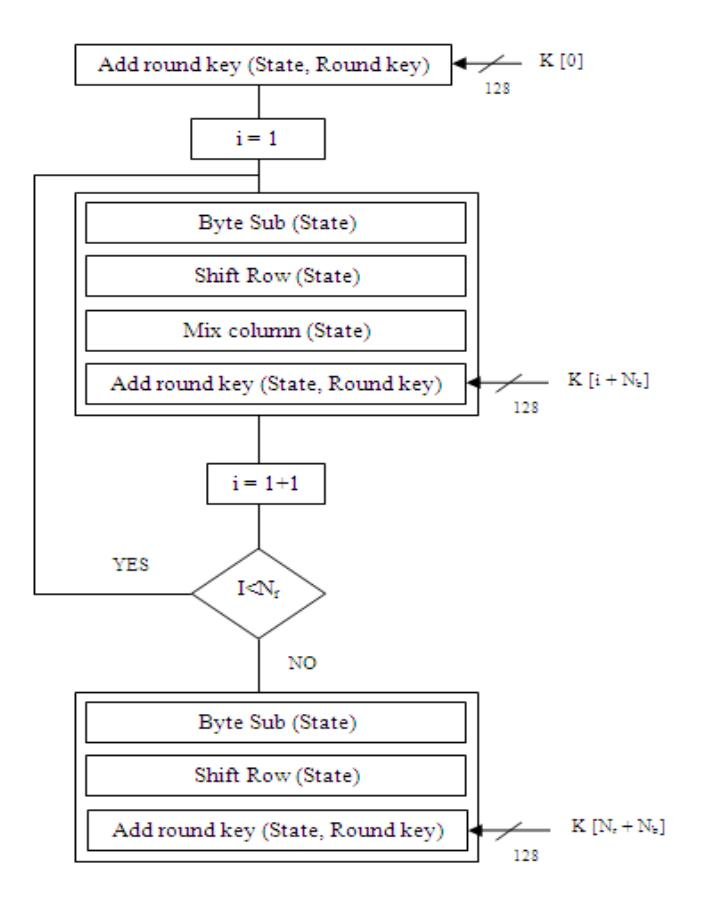

Fig. 1 AES Encryption process

{1}------------------------------------------------

## *A.* Encryption Process:

The Encryption process consists of a number of different transformations applied consecutively over the data block bits, in a fixed number of iterations, called rounds. The number of rounds depends on the length of the key used for the encryption process. For key length of 128 bits, the number of iteration required are10. (Nr = 10). As shown in Fig. 1, each of the first Nr-1 rounds consists of 4 transformations: SubBytes(), ShiftRows(), MixColumns() & AddRoundKey(). The four different transformations are described in detail below.

Sub Bytes Transformation**:** It is a non-linear substitution of bytes that operates independently on each byte of the State using a substitution table (S box). This S-box which is invertible is constructed by first taking the multiplicative inverse in the finite field GF (28) with irreducible polynomial m(x) = x8 + x4+ x3 + x + 1. The element {00} is mapped to itself. Then affine transformation is applied (over GF (2)).

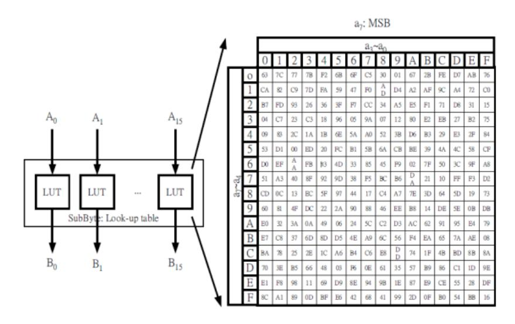

Fig. 2 Look up table for S-box

Shift Rows Transformation: Cyclically shifts the rows of the State over different offsets. The operation is almost the same in the decryption process except for the fact that the shifting offsets have different values.

Mix Columns Transformation: This transformation operates on the State column-by-column, treating each column as a four-term polynomial. The columns are considered as polynomials over GF (28) and multiplied by modulo x4 + 1 with a fixed polynomial a(x) = {03} x3+ {01} x2+ {02} x.

The function xtime is used to reprsent the multiplication with "02", modulo the irreducible polynomial m(x) = x8+x4+x3+x+1. Fig.3 illustrates the implementation of function B=xtime(A), in which output bits 0,2,5,6,7 just correspond to input bits shifted and only 3 bits are midified by the XOR operation. Applying this concept, we can easily realize the 4-byte output of Mixcolumn as shown in Fig.4. This direct implementation takes 2 xtime and 4 additions in calculating each byte output using the module Byte\_MixC whose operation is 2a 3b c d. In our design, we express the operation of Byte\_MixC as 2(a b) b (c d). So, an efficient design of MixColumn transformation is shown in Fig. 5. The new architecture needs only 1 xtime and 4 additions operations for each Byte\_MixC module.

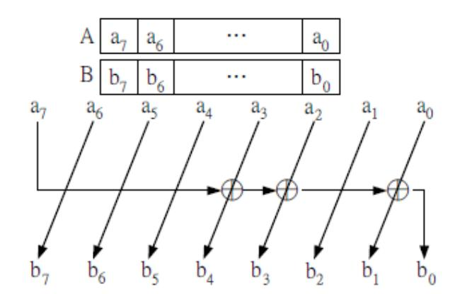

Fig. 3 Function xtime

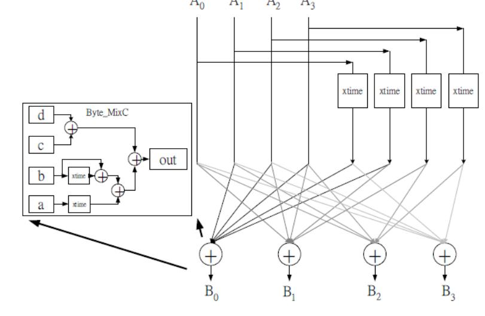

Fig. 4 Original 4-Byte MixColumn

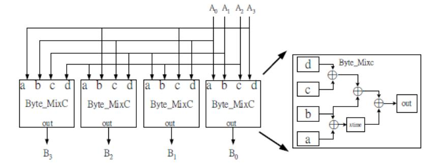

Fig. 5 Proposed 4-Byte Mixcolumn

AddRoundKey transformation: This transformation is simply performed by XOR the state with the round key. In [2], the Key Expansion (KE) is realized as Fig. 6, where Ki+1,2 must wait until the result of Ki+1,3 is calculated and it needs 4 calculated steps to obtain the complete outputs of KE. Such design directly follows from

Ki+1,0 =Ki,0 F(Ki,3)

K i+1,1 =Ki+1,1 Ki,1

K i+1,2 =Ki+1,2 Ki,2

K i+1,3 =Ki+1,3 Ki,3

and we can reexpress above equation as

Ki+1,1=(Ki,0 Ki,1) F(Ki,3)

Ki+1,2 =((Ki,0 Ki,1) Ki,2) F(Ki,3)

Ki+1,3 =((Ki,0 Ki,1) (Ki,2 Ki,3)) F(Ki,3)

Based on this expression, we can develop a new key expansion module in which the output byte don"t need to

{2}------------------------------------------------

wait the other output bytes. The proposed key expansion module is constructed and shown in Fig. 7.

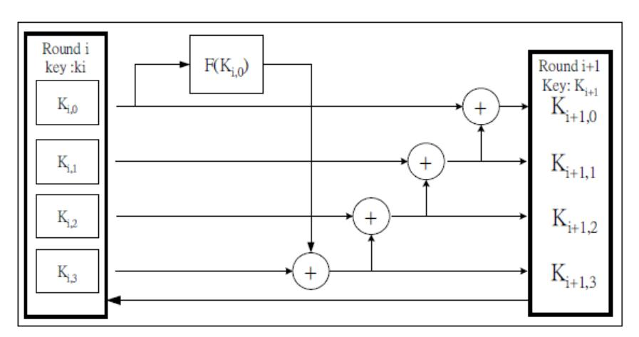

Fig. 6 KE module in [2]

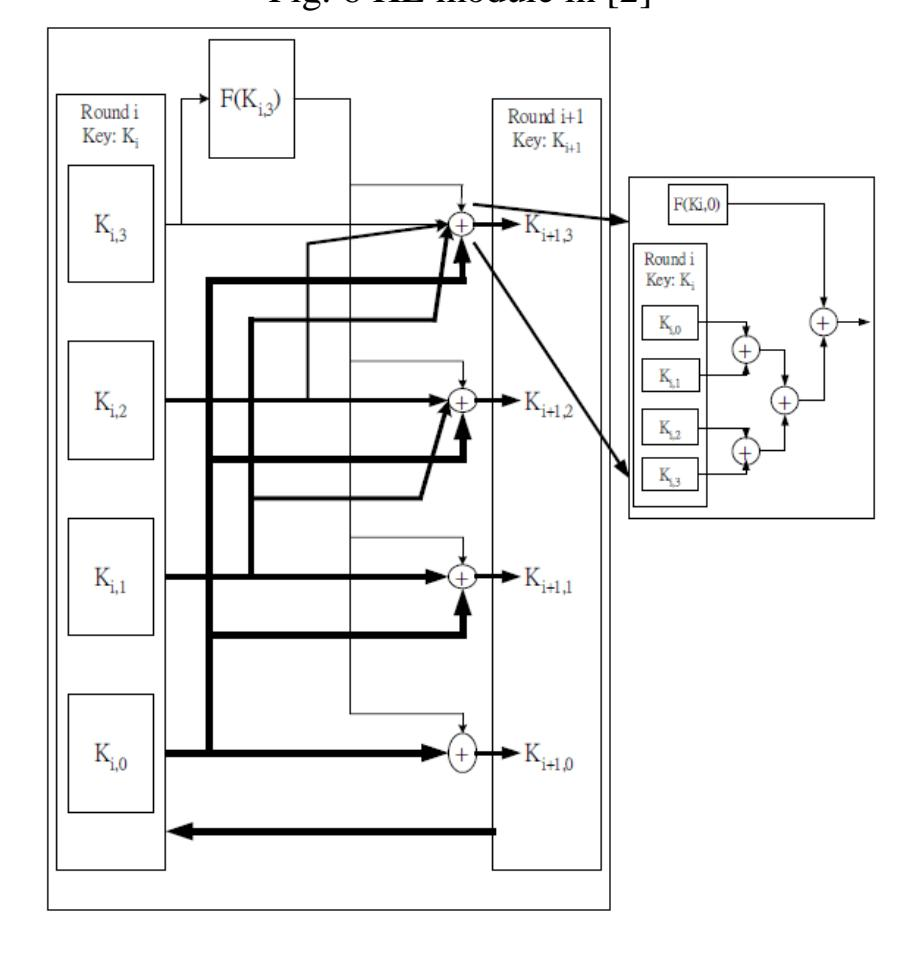

Fig. 7 Proposed KE module

It is known that the normal round includes the operations of SubByte, ShiftRow, Mixcolumn and AddRoundKey, and the final round is equal to the normal round without the MixColumn. Our architecture of AES encryptor is shown in Fig. 8. The final round in our design is just a operation of XOR with round key because SubByte and ShiftRow are the same as the normal round. Fig 9 shows the detailed design of AES encryptor where the control signals are described in Table 1 and Fig 10 depicts its entity diagram. It needs 10 cycles to finish AES encryption. Based on the same methodology of AES encryptor, an AES decryptor is also designed and integrated with the AES encryptor to yield a full functional AES en/decryptor.

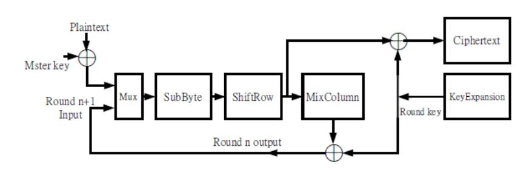

Fig. 8 Architecture of AES Encryptor

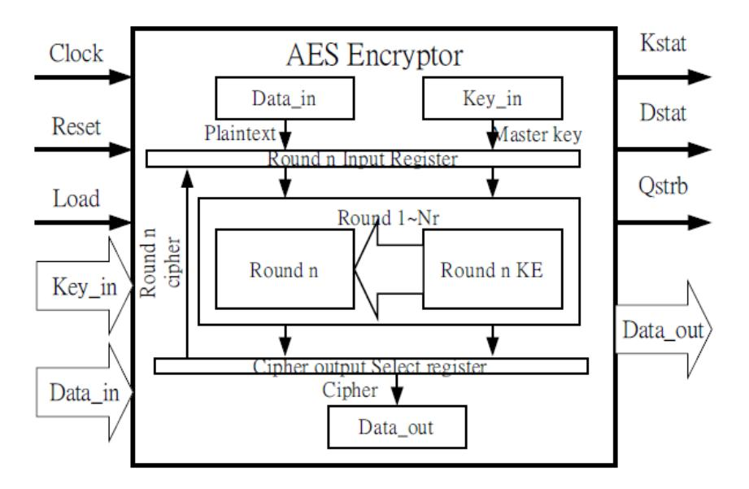

Fig. 9 Proposed AES Encryptor design

## 1. EXPERIMENTAL RESULTS:

All the results are based on simulations from the Xilinx ISE tools, using Test Bench Waveform Generator. All the individual transformation of encryption are simulated and synthesized using FPGA Vertex family and XC6vlx240t device. Pin configurations of AES Entity are shown in Table 2. Each program is tested with some of the sample vectors provided by NIST [4].

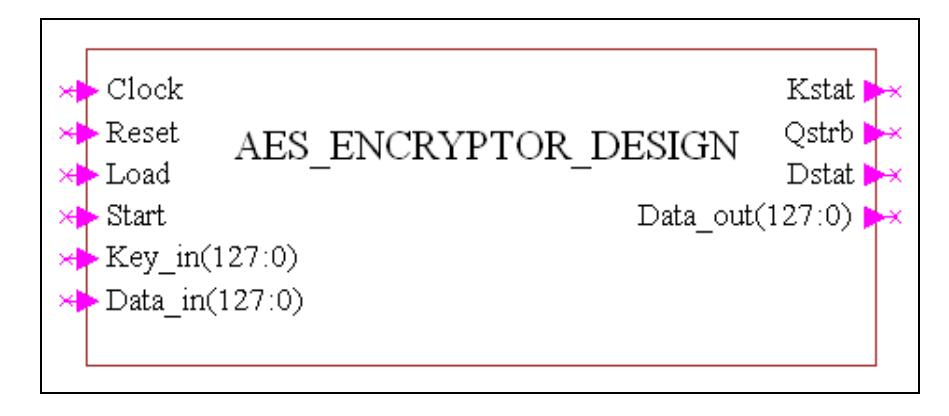

Fig. 10 Entity diagram of AES

TABLE 1 INPUT AND OUTPUT CONTROL SIGNALS

| Pin Name | I/O Port | Pin Number (bit) | Pin Description              |
|-------------|-------------|------------------------|------------------------------|
| Clock       | I           | 1                      | Chip clock                   |
| Reset       | I           | 1                      | Clear all signal and data |
| Load        | I           | 1                      | Load key and plaintext       |
|             |             |                        |                              |
| Start       | I           | 1                      | Start encryption          |
|             |             |                        | process                      |
| Key_in      | I           | 128                    | Key data bus                 |
| Data_in     | I           | 128                    | Plaintext data               |
| Kstat       | O           | 1                      | Kstat becomes high           |
|             |             |                        | before output comes          |
| Qstrb       | O           | 1                      | encryption is                |
|             |             |                        | completed                    |
|             |             |                        |                              |
| Dstat       | O           | 1                      | Dstat becomes high           |
|             |             |                        | when plaintext is            |
|             |             |                        | loaded, and low when         |
|             |             |                        | Qstrb is high                |
| Data_out    | O           | 128                    | Cipher data bus              |

{3}------------------------------------------------

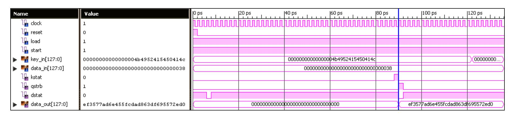

Fig. 11 waveform Result of AES algorithm

AES block length/Plane Text = 128bits (Nb=4)

Key length = 128 bits (Nk =4)

No. of Rounds = 10(Nr =10)

Input/plain text – 0x000000000000000000000038

Key– 0x00000000000000004b4952415450414c

Output/Cipher – ef3577ad6e455fcdad863df695572ed0

Fig. 11 represents the waveforms generated by the 128-bit complete encryption Process. The inputs are clock1 & clock2, Active High reset, 4-bit round, and 128-bit state & key as a standard logic vectors, whose output is the 128 bit cipher (encrypted) data.

TABLE 2 SYNTHESIS RESULT OF AES

| Device Parameter           | Synthesis Result      |
|----------------------------|-----------------------|
| Target FPGA Device         | Virtex6-              |
|                            | XV6vlx240tff1156-3    |
| Optimization Goal          | Speed                 |
| Maximum Operating          | 515.38MHz             |
| Frequency                  |                       |
| Number of Slices Registers | 954 out of 301440(0%) |
| Number of Slice LUTs       | 632 out of 150720(0%) |
| Number of fully used LUT   | 447 out of 1139(39%)  |
| FF pairs                   |                       |
| Number of bonded IOBs      | 391 out of 600(65%)   |
| Number of                  | 1out of 32(3%)        |
| BUFG/BUFGCTRLs             |                       |
| Number of BRAM/FIFO        | 5out of 416(1%)       |
| Throughput                 | 1609MHz               |

The parameter that compares AES candidates from the point of view of their hardware efficiency is Throughput [12].

Encryption Throughput = block size frequency/total clock cycles. Thus, Throughput = 128 x 515.38MHz/41 = 1609Mbits/sec.

## CONCLUSION

The Advanced Encryption Standard-Rijndael algorithm is an iterative private key symmetric block cipher that can process data blocks of 128 bits through the use of cipher keys with lengths of 128, 192, and 256 bits. An efficient FPGA implementation of 128 bit block and 128 bit key AES-Rinjdael cryptosystem has been presented in this

paper. Optimized and Synthesizable VHDL code is developed for the implementation of 128 bit data encryption process & description is verified using ISE 12.3i functional simulator from Xilinx. All the transformations of algorithm are simulated using an iterative design approach in order to minimize the hardware consumption. Each program is tested with some of the sample vectors provided by NIST. The proposed implementation is efficient and suitable for hardwarecritical applications.

# REFERENCES

- [1] Nation Institute of Standards and Technology (NIST), Data Encryption Standard (DES), National Technical Information Service, Sprinfgield, VA 22161, Oct. 1999.
- [2] J. Daemen and V. Rijmen, "AES Proposal: Rijndael", AES Algorithm Submission, September 3, 1999
- [3] J. Nechvatal et. al., Report on the development of Advanced Encryption Standard, NIST publication, Oct 2, 2000.
- [4] FIPS 197, "Advanced Encryption Standard (AES)", November 26, 2001
- [5] K. Gaj and P. Chodowiec, Comparison of the hardware performance of the AES candidates using reconfigurable hardware, in The Third AES Candidates Conference, printed by the National Institute of Standards and Technology.
- [6] H. Kuo and I. Verbauwhede, "Architectural Optimization for a 1.82 Gbits/ sec VLSI Implementation of the AES Rijndael Algorithm," Proc. CHESS 2001.
- [7] K. Gaj and P. Chodowiec, "Fast Implementation and Fair Comparison of the Final Candidates for Advanced Encryption Standard Using Field Programmable Gate Arrays," Proc. RSA Security Conf., Apr. 2001.
- [8] A. Dandalis, V.K. Prasanna, and J.D.P. Rolim, "A Comparative Study of Performance of AES Final Candidates Using FPGAs," Proc. Third Advanced Encryption Standard (AES) Candidate Conf., Apr. 2000.

{4}------------------------------------------------

- [9] Piotr Mroczkowski, Military University of Technology, Poland,"Implementation of the block cipher Rijndael using Altera FPGA."
- [10] I. M. Verbauwhede, P.R. Schaumont, and, H. Kuo, "Deign and Performance Testing of a 2.29 Gb/s Rijndael Processor," IEEE J. of Solid State-Circuit, Vol.38, No. 3, March 2003, pp. 569 – 572.
- [11] Xilinx, Inc.,"Virtex 2.5 V Field Programmable Gate Arrays," http://www. xilinx.com.
- [12] A. J. Elbirt, W. Yip, B. Chetwynd, C. Paar, "An FPGA implementation and performance evaluation of the AES block cipher candidate algorithm finalists," Proc. 3rd Advanced Encryption Standard (AES) Candidate Conference.

