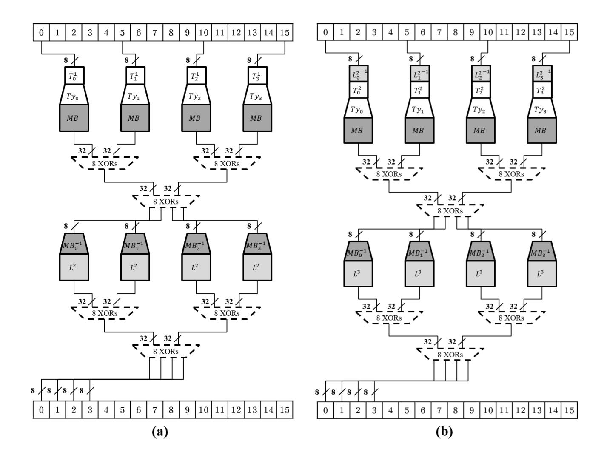
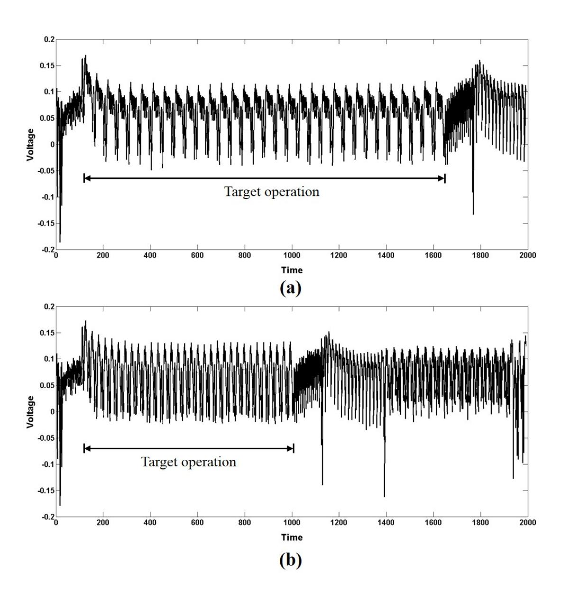
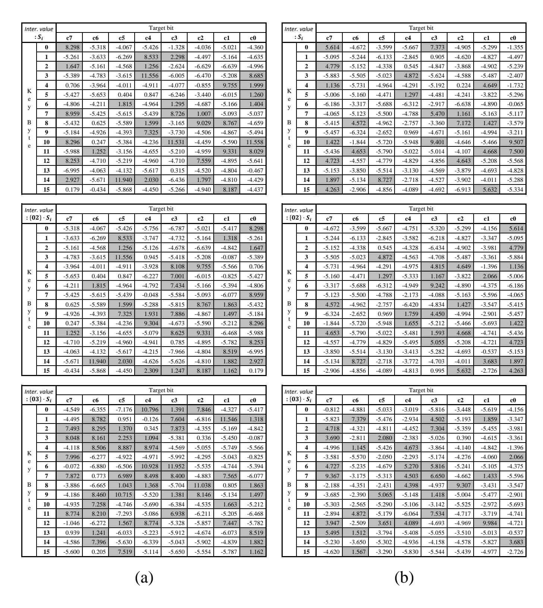
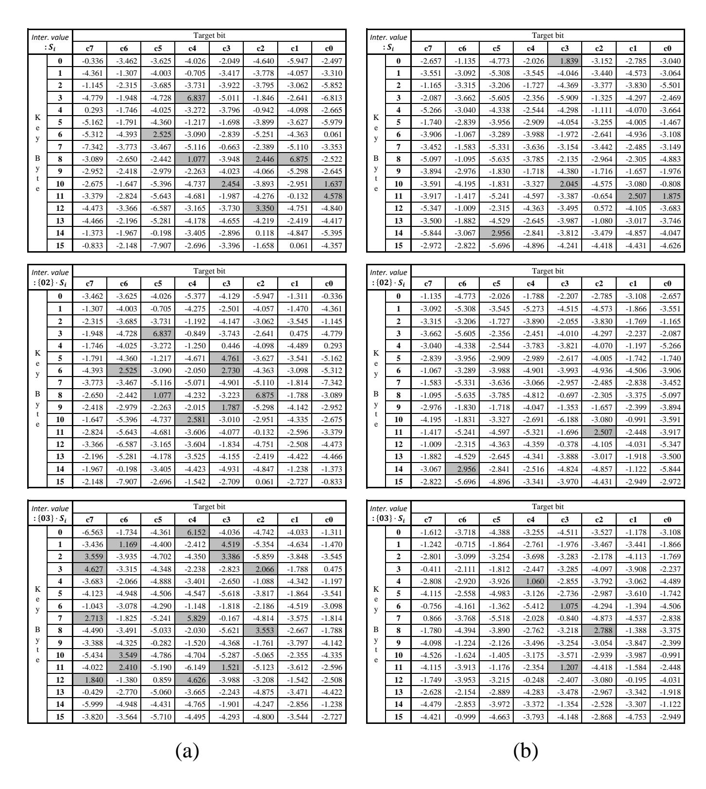

{0}------------------------------------------------

# Multilateral White-Box Cryptanalysis:

Case study on WB-AES of CHES Challenge 2016

Hyunjin Ahn1 , and Dong-Guk Han1,2

1 Department of Financial Information Security, Kookmin University, Seoul, Korea 2 Department of Mathematics, Kookmin University, Seoul, Korea {ahz012, christa}@kookmin.ac.kr

Abstract. The security requirement of white-box cryptography (WBC) is that it should protect the secret key from a white-box security model that permits an adversary who is able to entirely control the execution of the cryptographic algorithm and its environment. It has already been demonstrated that most of the WBCs are vulnerable to algebraic attacks from a white-box security perspective. Recently, a new differential computation analysis (DCA) attack has been proposed that thwarts the white-box implementation of block cipher AES (WB-AES) by monitoring the memory information accessed during the execution of the algorithm. Although the attack requires the ability to estimate the internal information of the memory pattern, it retrieves the secret key after a few attempts. In addition, it is proposed that the hardware implementation of WB-AES is vulnerable to differential power analysis (DPA) attack. In this paper, we propose a DPA-based attack that directly exploits the intermediate values of WB-AES computation without requiring to utilize memory data. We also demonstrate its practicability with respect to public software implementation of WB-AES. Additionally, we investigate the vulnerability of our target primitive to DPA by acquiring actual power consumption traces of software implementation.

Keywords: White-Box Cryptanalysis, Side-Channel Attack, Software Implementation

## 1 Introduction

The management of secret keys is as important as the design of robust cryptographic algorithms. In order to disable key extraction, secure memory techniques have been introduced, such as ARM TrustZone1 technology that prevents leakage of sensitive information from the memory. However, the inevitably high cost is a drawback of this approach . White-box cryptography is an attempt for solving this problem by interleaving the secret key in the software program. The technique aims to hide the sensitive data in the cryptographic implementation in order to make it difficult to discover the data from there.

1 http://www.arm.com/products/processors/technologies/trustzone/

{1}------------------------------------------------

From this concept, the white-box (WB) security model has come that ensures protection against an adversary who is presumed able to take full control of the device that is processing the cryptographic algorithm. In particular, the attacker can take anything from the source code to the entire information corresponding to the algorithmic computation. In 2002, Chow et al. proposed concrete WBC implementation for Data Encryption Standard (DES) [4] and Advanced Encryption Standard (AES) [5]. However, a variety of studies have demonstrated that these implementations are vulnerable to algebraic attacks [2, 10, 13, 14]. Xiao et al. propose a new design of WB-AES in [17] that is robust against the BilletGilbertEch-Chatbi (BGE) attack that is regarded as an effective algebraic attack [2] against Chow's WB-AES implementation.

Recently, in [3], Bos et al. introduced a novel attack method DCA obtains a secret key by exploiting information about the memory that is accessed during Chow's WB-AES execution. The attack applies DPA by using mean-difference on the memory data to distinguish the correct key. Pascal et al. [15] demonstrates DPA vulnerability of the WB-AES hardware implementation through power consumption traces measured by an actual evaluation board embedding FPGA chip. Unlike the novel attack, the attack by Pascal et al. adopts correlation coefficient instead of mean-difference.

In this paper, we introduce differential data analysis (DDA), which reveals the secret key by applying DPA to the overall output values of the table look-up operation during WB-AES computation. An adversary who can access the entire intermediate values within the WB-AES is readily able to perform an attack. We demonstrate the effectiveness of this attack against the public WB-AES software implementation of the CHES Challenge 20162 . From the attack, all of the secret key bytes are successfully recovered with over 200 acquired traces. In addition, we verify the vulnerability of our target WB-AES in relation to its power consumption measured from an XMEGA128D4 microprocessor. The attack retrieves 14 of the 16 key bytes with at least 2,000 acquired software traces.

The remainder of this paper is organized as follows. Section 2 describes the basic design of WB-AES and previously mentioned both SCA-based attacks. In Section 3, we introduce our DDA attack and investigate its performance. In Section 4, we use a ChipWhisperer-Lite evaluation board to experimentally determine whether the WB-AES is vulnerable to software power consumption trace. Section 5 concludes this paper with mention of further work.

## 2 Preliminaries

#### 2.1 White-Box AES Implementation

In this section, we briefly introduce the WB-AES architecture of Chow et al. [5], who referred to the basic design. The WB-AES computation comprises a series

2 This contest was held as part of the Conference on Cryptographic Hardware and Embedded Systems 2016 (CHES 2016) to test the secret-key recovery skills of the participant. Available from https://ctf.newae.com/

{2}------------------------------------------------

of table look-up operations that take advantage of three different types of table as follows:

- TBoxTy table:  $Ty_j \circ T_i^r(x) = Ty_j(T_i^r(x)) = Ty_j(Sbox(x \oplus \hat{k}_{r-1}[i]))$
- XOR table:  $XOR(x, y) = x \oplus y$
- TBox table:  $T_i^{10}(x) = Sbox(x \oplus \hat{k}_9[i]) \oplus k_{10}[i]$

where  $i \in \{0, ..., 15\}$  is the index of the state byte,  $r \in \{1, ..., 9\}$  is the round,  $j \in \{0, ..., 3\}$  is the input index of MixColumns, and  $\hat{k}$  is the round key which takes into account ShiftRows. The XOR table yields the exclusive-or of two 4-bit inputs, x and y. The TBox table has 8-bit input and output values, and the TBoxTy table yields 32-bit output from 8-bit input. For the MixColumns, four  $Ty_j$  tables are exploited as if AES T-table implementation [7], which are defined as follows:

$$Ty_0(x) = x \cdot \begin{bmatrix} 02\\01\\01\\03 \end{bmatrix}, Ty_1(x) = x \cdot \begin{bmatrix} 03\\02\\01\\01 \end{bmatrix}, Ty_2(x) = x \cdot \begin{bmatrix} 01\\03\\02\\01 \end{bmatrix}, Ty_3(x) = x \cdot \begin{bmatrix} 01\\01\\03\\02 \end{bmatrix}.$$

Finally, for four input bytes  $x_0$ ,  $x_1$ ,  $x_2$  and  $x_3$ , MixColums is identical to  $Ty_0(x_0) \oplus Ty_1(x_1) \oplus Ty_2(x_2) \oplus Ty_3(x_3)$ , where the exclusive-or is fulfilled by combining multiple XOR tables. The round function of AES is performed with ShiftRows, TBboxTy, and XOR tables in sequence, while the final round comprises ShiftRows and the TBox table.

Because WB security permits an attacker who is able to fully control WBC computation, in this case, it is easy to extract a secret key from the corresponding look-up table. Note that an adversary can readily access the contents of tables by using a disassembler or debugger. Intuitively, a secret-key byte is determined through investigation of a TBoxTy table with key candidates of  $2^8$ . In order to protect the table-based WB-AES implementation, an internal encoding rule is applied. For a table T, we make a new protected table  $T' = g \circ T \circ f^{-1}$  by determining both the input encoding f and output encoding g of the bijection function.

Figure 1 (a) depicts four result bytes of round 1 that adopts internal encoding, and Figure 1 (b) shows round 2. In the figure,  $L_0^r$ ,  $L_1^r$ ,  $L_2^r$ ,  $L_3^r$  are the four 8-bit-to-8-bit invertible linear transformations (known as mixing bijections) in round r. The transformation  $L^{r+1}$  is identical to  $L_0^{r+1} ||L_{13}^{r+1}||L_{10}^{r+1}||L_7^{r+1}$  due to the ShiftRows of round r+1. The mixing bijection (MB) is a 32-bit-to-32-bit one, and  $MB_0^{-1}$ ,  $MB_1^{-1}$ ,  $MB_2^{-1}$  and  $MB_3^{-1}$  are 8-bit-to-32-bit tables. In addition, to thwart code lifting attacks [6], an external encoding rule is applied in many WBC implementations. The entire storage for the look-up tables is 508 KB, and the WB-AES is 55 times slower than software implementation of the standard AES. We refer the interested reader to [5, 11].

{3}------------------------------------------------

Fig. 1: WB-AES round structure applying internal encoding to rounds 1 (a) and 2 (b).

#### 2.2 State-of-the-art SCA on WBC

In this section, we describe two recently published white-box cryptanalyses that exploit the side-channel information emitted during a WBC computation [3, 15]. These both assume that the attacker is able to acquire a number of traces with randomly chosen plaintext and does not need to consider external encoding of the target WBC. In other words, either the target did not have external encoding applied to it or the attacker knows the encoding rule if the WBC includes the external encoding technique.

Differential Computation Analysis (DCA). Bos et al. [3] proposed the novel attack method of DCA that thwarts WB-AES by using a software execution trace comprising the memory addresses and data accessed throughout the WBC operation. The DCA procedure comprises four steps: an optional first step and three fundamental steps. In the first optional step, the attacker measures a software execution trace throughout the overall WBC computation, followed by identifying where the WBC is manipulated by visualizing the trace using the method presented in [12]. The attacker is now able to acquire multiple software execution traces with diminished storage capacity by intensively collecting only a portion of the WBC computation. In the second step, the attacker takes the traces with random plaintext and converts them to binary representations (ze

{4}------------------------------------------------

ros or ones) to make them suitable for a conventional DPA tool in the third step. Finally, the attacker reveals the secret key by using the original DPA tool exploiting mean-difference on the converted software execution trace instead of power consumption.

Differential Power Analysis on Hardware Implementation. Sasdrich et al. [15] presented the results of a practical DPA attack using a correlation coefficient on a hardware implementation of the WB-AES activated on an FPGA platform. They implemented the algorithm conceptually in hardware and demonstrated the extent to which it was vulnerable to DPA in a gray-box security model. They theoretically proved the existence of a security flaw in the structure of their target algorithm and examined it with a SAKURA-X evaluation board. This was the first investigation of the weakness of WBC taking into account hardware power consumption as side-channel information.

## 3 Vulnerabilities Raising out of WBC Implementation

The existing SCA on WB-AES (described in Section 2.2) extracts the secret key from a software execution trace comprising memory data and addresses, as well as the power consumption for FPGA implementation by using a DPA-based distinguisher with the output of the first-round Sbox as an intermediate value. Both vulnerabilities arise from a correlation between the considered side-channel information and the intermediate value. These relations yield the fact that there exist some intermediate results of WB-AES that are related more significantly to the Sbox output than to the side-channel source. Note that most of the sidechannel information includes noise as well as sensitive data. In conclusion, DPA for the intermediate value of the WB-AES computation outperforms one for the power consumption trace as side-channel information. Hereinafter, for the sake of simplicity, we denote the DPA attack on the computational data of WBC as DDA. In addition, although DCA applies mean-difference in [3], we adopt Pearsons correlation coefficient for each type of attack (DDA, DCA, and DPA) as if it was a correlation power analysis (CPA) [1] instead of a mean-difference in order to investigate in the identical manner.

We calibrate the performance of our DDA on the public WB-AES of the CHES Challenge 2016. Although it has been demonstrated already that the WB-AES has vulnerabilities (20 participants recovered the secret key of the target in the challenge), we exploit the implementation merely to estimate the ability of our DDA. The target implementation uses 4,048 look-up tables and 41 local variables (8-bit data) to store the table results. The WB-AES computation comprises 4,080 table load and store operations; the loaded value is set to one of the variables. We denote the set of stored intermediate values during the WB-AES execution as a data trace that comprises 4,080 samples for our target.

For DDA evaluation. we acquire 5,000 data traces according to randomly chosen plaintext per execution and modify them into two different types. The 

{5}------------------------------------------------

first is a binary representation (Bit-data trace), and the other comprises a Hamming weight value of the data trace elements (HW-data trace). Because  $Ty_j \circ T_i^r$  yields Sbox output  $(S_i)$ , two times polynomial multiplication of MixColumns  $(\{02\} \cdot S_i)$  and three times product  $(\{03\} \cdot S_i)$ , we take into account the three results of  $Ty_j \circ T_i^r$  as intermediate values in the DDA. We note that existing research on DCA and DPA demonstrates that both the software execution trace and current trace for hardware implementation may be significantly related to the 1-bit output of Sbox. Intuitively, we can expect that the relation results from  $Ty_j \circ T_i^r$  yielding  $S_i$  even if the WB-AES has the table for  $MB \circ Ty_j \circ T_i^r$  instead of  $Ty_j \circ T_i^r$ . In the same context, both  $\{02\} \cdot S_i$  and  $\{03\} \cdot S_i$  can also refer to both DCA and DPA as intermediate values.

Figure 4 (a) in the Appendix shows the DDA results of *Bit-data trace* for eight individual bits of three intermediate values, and Figure 4 (b) presents the results of HW-data trace. To distinguish between success or failure, we impose a relative distinguishing margin3 (RelMarg) that signals a successful attack when its value is positive. Tables 1 and 2 summarize both sets of results, respectively. The table elements indicate the number of bits for each intermediate value, which are given when  $RelMarg \geq 0.1$  and are marked in gray in Figure 4. In DDA on Bit-data trace with intermediate value  $S_i$ , 15 key bytes are revealed (except for the 13th one) while the others recover the overall secret key. In general, attack results that exploit HW-data trace perform less well than the other type because there are no intermediate values with which recovery of the overall key bytes is possible. Nevertheless, the attack retrieves the full secret key when the results of three intermediate values are combined.

| inter.             | 0 | 1 | 2 | 3 | 4 | 5 | 6 | 7 | 8  | 9  | 10 | 11 | 12 | 13 | 14 | 15 | rate  |
|--------------------|---|---|---|---|---|---|---|---|----|----|----|----|----|----|----|----|-------|
| $S_i$              | 1 | 2 | 2 | 2 | 2 | 1 | 3 | 3 | 3  | 1  | 3  | 3  | 2  | 0  | 4  | 1  | 15/16 |
| $\{02\} \cdot S_i$ | 1 | 2 | 2 | 1 | 2 | 1 | 2 | 1 | 3  | 4  | 2  | 3  | 1  | 1  | 4  | 4  | 16/16 |
| $\{03\} \cdot S_i$ | 3 | 4 | 4 | 4 | 3 | 1 | 2 | 5 | 4  | 5  | 2  | 3  | 3  | 2  | 2  | 2  | 16/16 |
| total              | 5 | 8 | 8 | 7 | 7 | 3 | 7 | 9 | 10 | 10 | 7  | 9  | 6  | 3  | 10 | 7  | _     |

Table 1: Summary of DDA on Bit-data trace with three intermediate values

From our DDA attack results on Bit-data trace, we note that our target implementation (the WB-AES of the CHES Challenge 2016) has essential security weaknesses in its design. Because our DDA on *HW-data trace* successfully reveals the overall secret key, it is likely that the WB-AES is vulnerable to DPA on the power consumption trace obtained from software implementation using a Hamming-weight model.

This distinguisher was proposed by Whitnall et al. [16]. It is positive if the correct key is revealed or negative if it fails to recover the key.  $RelMarg = \frac{\rho(k^*) - max\{\rho(k)|k \neq k^*\}}{\sqrt{var\{\rho(k)|k \in \mathcal{K}\}}}$ , where  $\rho$  is person's correlation coefficient,  $k^*$  is the correct key,  $var\{\cdot\}$  is the variance of  $\cdot$ , and  $\mathcal{K}$  is guess key space.

{6}------------------------------------------------

| inter.             | 0 | 1 | 2 | 3 | 4 | 5 | 6 | 7 | 8 | 9 | 10 | 11 | 12 | 13 | 14 | 15 | rate  |
|--------------------|---|---|---|---|---|---|---|---|---|---|----|----|----|----|----|----|-------|
| $S_i$              | 2 | 0 | 1 | 1 | 2 | 1 | 0 | 2 | 3 | 0 | 3  | 3  | 2  | 0  | 2  | 2  | 12/16 |
| $\{02\} \cdot S_i$ | 1 | 0 | 1 | 1 | 3 | 3 | 1 | 0 | 2 | 2 | 2  | 3  | 2  | 0  | 3  | 2  | 13/16 |
| $\{03\} \cdot S_i$ | 0 | 3 | 2 | 2 | 2 | 1 | 3 | 4 | 2 | 2 | 0  | 2  | 4  | 2  | 1  | 1  | 14/16 |
| total              | 3 | 3 | 4 | 4 | 7 | 5 | 4 | 6 | 7 | 4 | 5  | 8  | 8  | 2  | 6  | 5  | -     |

Table 2: Summary of DDA on HW-data trace with three intermediate values

## 4 Practical Experiments

In this section we show experimental results of DCA and DPA on our target WB-AES. By comparing DCA with DDA on *Bit data trace*, we identify how well the DCA is able to follow attack performance of the DDA. Through DPA on actual power consumption trace for software implementation we verify if the WB-AES has vulnerability in that environment. As previously mentioned, in this section, we apply correlation coefficient not mean-difference on both DCA and DPA.

#### 4.1 DCA attack

Prior to DPA weakness verification of the WB-AES in the software implementation environment, we investigate the vulnerability on DCA. The process from executable file generation to software execution trace acquisition is run in Linux. We compile the WB-AES as a 32-bit binary on 64-bit Debian 8 with Address Space Layout Randomization (ASLR) disabling. In order to collect memory usage information during the WB-AES computation, we exploit the freely downloadable public tool TracerPIN4, which uses Intel's Dynamic Binary Instrumentation (DBI) tool Pin [9].

As stated in [3], there are three type of software execution trace. However, we only exploit the accessed memory address. In fact, we experimentally identify that both software execution traces for address and accessed data are suitable for thwarting our target with DCA, while the stack data is not. Furthermore, the former two traces have significantly similar attack performances. We record 5,000 software execution traces during operation of our compiled executable file with arbitrary plaintext per every execution. Table 3 summarizes the attack results under the conditions identical to those of the DDA of the previous section, and Figure 5 presents them in detail. Although the overall bits revealing the secret key are not the same as the ones in Figure 4 (a), attack performance is reasonably similar. Both attacks recover 15 of the 16 key bytes when the intermediate value of  $S_i$  and the full secret key for  $\{02\} \cdot S_i$  or  $\{03\} \cdot S_i$ .

&lt;sup>4 https://github.com/SideChannelMarvels

{7}------------------------------------------------

| inter.             | 0 | 1 | 2 | 3 | 4 | 5 | 6 | 7 | 8  | 9 | 10 | 11 | 12 | 13 | 14 | <b>15</b> | rate  |
|--------------------|---|---|---|---|---|---|---|---|----|---|----|----|----|----|----|-----------|-------|
| $S_i$              | 2 | 2 | 2 | 2 | 3 | 2 | 3 | 2 | 3  | 1 | 3  | 2  | 2  | 0  | 4  | 2         | 15/16 |
| $\{02\} \cdot S_i$ | 1 | 2 | 2 | 2 | 3 | 1 | 2 | 1 | 3  | 4 | 2  | 2  | 1  | 1  | 4  | 2         | 16/16 |
| $\{03\} \cdot S_i$ | 3 | 4 | 3 | 4 | 3 | 1 | 2 | 6 | 4  | 4 | 1  | 3  | 3  | 1  | 2  | 1         | 16/16 |
| total              | 6 | 8 | 7 | 8 | 9 | 4 | 7 | 9 | 10 | 9 | 6  | 7  | 6  | 2  | 10 | 5         | -     |

Table 3: Summary of DCA on memory address data with three intermediate values

#### 4.2 DPA attack

Our aim is to examine the weakness of the WB-AES with respect to a DPA attack on the software-implementation environment. To do so, we acquire multiple power consumption traces from a ChipWhisperer-Lite board [8], manipulating the WB-AES with randomly chosen plaintext at every execution. The board comprises two main parts, the main board and the target board, and measures the power consumption on the target board that is equipped with an Atmel XMEGA128D4-u processor with 128 KB of flash memory. Unfortunately, the code size of the WB-AES is too large to be programmed into the board. Therefore, we compile the portion of the source code that leaks sensitive information helping key recovery. We note that the purpose of this experiment is to investigate whether we can retrieve the secret key from the software power consumption, and not to undertake a practical examination. Because the first round of WB-AES is computed per each column exploiting four Sbox outputs (cf. Figure 1), we take four trace types for each column. Concretely, the first portion comprises specific table look-up operations that have one of the four plaintext bytes plain[0], plain[5], plain[10]and plain[15]as input. Figure 2 shows the source code of the portion exploited to acquire the first type of trace. The code has 7,364 bytes for the program and 4,336 bytes for the data when it is compiled with option '-Os' optimizing code size. In a similar way, the rest of the portion types are decided.

We are now able to program each type of portion code into our board and collect the power consumption trace. However, there is a constraint on performing a DPA attack on the measured traces. In the code portion, the table look-up operation is processed through a user-defined function ( $lookup\_nibble$ ) that yields a 4-bit output from a declared table corresponding to an input value as follows:  $\#define\ lookup\_nibble\ (t,i)\ (t[i>>1]>> ((i\&1)*4)\&0xf)$ .

If i is odd, then the function computes t[i>>1]>>4&0xf, while it operates t[i>>1]&0xf if i is even. Therefore, the look-up function outputs through a distinct operation process based on the type of input value. Figure 3 shows both power consumption traces from the ChipWhisperer-Lite board manipulating the first portion code with odd (a) and even (b) plaintext, respectively. The code portion is performed during 1,643 samples for odd values and 1,003 samples for even plaintext. A look-up operation is conducted within approximately 48 and 28 samples, respectively. Therefore, if we acquire multiple power consumption traces with randomly chosen plaintext, we come up against a misalignment problem.

{8}------------------------------------------------

Fig. 2: Overall source code of the portion for the first type of trace. Four red variables are the overwriting operation into plaintext bytes.

As previously mentioned, because we concentrate on investigating the existence of vulnerability in the software power consumption trace, we leave how to solve the problem out of the discussion, and instead measure both traces for each odd and even plaintext.

In aggregate, we take eight types of measured trace for four code portions and two plaintext types (even and odd) and acquire 50,000 traces per trace type. Table 4 summarizes the attack results and Figure 6 presents them in detail. The attack retrieves 14 of the 16 key bytes with only 1,000 measured traces with respect to each plaintext type. In conclusion, DPA thwarts the WB-AES of the CHES Challenge 2016 by acquiring 8,000 software traces overall, 1,000 for each of the eight types of traces.

| ❍❍ i ❍ inter. ❍❍ | 0 | 1 | 2 | 3 | 4 | 5 | 6 | 7 | 8 | 9 | 10 | 11 | 12 | 13 | 14 | 15 | rate  |
|---------------------------|---|---|---|---|---|---|---|---|---|---|----|----|----|----|----|----|-------|
| Si                        | 1 | 0 | 0 | 1 | 0 | 0 | 1 | 0 | 3 | 0 | 3  | 3  | 1  | 0  | 1  | 0  | 8/16  |
| {02} · Si                 | 0 | 0 | 0 | 1 | 0 | 1 | 2 | 0 | 2 | 1 | 1  | 1  | 0  | 0  | 1  | 0  | 8/16  |
| {03} · Si                 | 1 | 2 | 2 | 2 | 1 | 0 | 1 | 2 | 2 | 0 | 1  | 3  | 2  | 0  | 0  | 0  | 11/16 |
| total                     | 2 | 2 | 2 | 4 | 1 | 1 | 4 | 2 | 7 | 1 | 5  | 7  | 3  | 0  | 2  | 0  | -     |

Table 4: Summary of DPA on software trace with three intermediate values. Each table element is the sum of the results of both plaintext types.

{9}------------------------------------------------

Fig. 3: Measured power consumption traces from ChipWhisperer-Lite manipulating first code portion: (a) trace with respect to odd plaintext; (b) acquired when value is even.

{10}------------------------------------------------

## 5 Conclusions and Further Work

In this paper we proposed DDA attack which recovered the secret key by applying DPA based distinguishment method on multiple entire intermediate values of WB-AES execution. Through actual experiments, we verified the feasibility of the attack with public WB-AES software implementation supported at the CHES Challenge 2016. Our attack retrieved the overall secret key from the target WBC with only 200 acquisitions of intermediate data. Unlike the DCA, an adversary is able to use this attack without any memory information if they possess the source code or know the look-up tables of the target.

In addition, we investigated the availability of DPA in the WB-AES software implementation. In order to program our target onto the ChipWhisperer-Lite board, we selected the portion of the source code that leaks significant secret-key information. From DPA on the power consumption trace manipulating the code portion, we revealed 14 of the 16 secret-key bytes with 1,000 measured traces. However, as already mentioned in Section 4, we have to solve the alignment problem in order to make DPA feasible on our target and conduct DPA taking into account the complete source code and not just a portion. We leave this additional evaluation for future work.

## References

- 1. E. Brier, C. Clavier, and F. Olivier. Correlation Power Analysis with a Leakage Model. In: M. Joye, and J.-J. Quisquater (eds.) CHES 2004. LNCS, vol. 3156, pp. 16-29. Springer, Heidelberg (2004)
- 2. O. Billet, H. Gilbert, and C. Ech-Chatbi. Cryptanalysis of a White Box AES Implementation. In: H. Handschuh, and M. A. Hasan (eds.) SAC 2004. LNCS, vol. 3357, pp. 227-240. Springer, Heidelberg (2005)
- 3. J. W. Bos, C. Hubain, W. Michiels, and P. Teuwen. Differential Computation Analysis: Hiding your White-Box Designs is Not Enough. IACR Cryptology ePrint Archive, 2015, https://eprint.iacr.org/2015/753.pdf
- 4. S. Chow, P. A. Eisen, H. Johnson, and P. C. van Oorschot. A White-Box DES Implementation for DRM Applications. In: J. Feigenbaum (eds.) DRM 2002. LNCS, vol. 2696, pp. 1-15. Springer, Heidelberg (2003)
- 5. S. Chow, P. A. Eisen, H. Johnson, and P. C. van Oorschot. White-Box Cryptography and an AES Implementation. In: K. Nyberg, and H. Heys (eds.) SAC 2002. LNCS, vol. 2595, pp. 250-270. Springer, Heidelberg (2003)
- 6. C. Delerabl´ee, T. Lepoint, P. Paillier, and M. Rivain. White-Box Security Notions for Symmetric Encryption Schemes. In: T. Lange, K. Lauter, and P. Lison˘ek (eds.) SAC 2013. LNCS, vol. 8282, pp. 247-264. Springer, Heidelberg (2014)
- 7. J. Daemen, and V. Rijmen. AES Proposal: Rijndael. Technical Report. Available at http://csrc.nist.gov/archive/aes/rijndael/Rijndael-ammended.pdf
- 8. C. OFlynn, and Z. D. Chen. ChipWhisperer: An Open-Source Platform for Hardware Embedded Security Research. In: E. Prouff (eds.) COSADE 2014. LNCS, vol. 2014, pp. 243-260. Springer, Switzerland (2014)
- 9. C.-K. Luk, R. Cohn, R. Muth, H. Patil, A. Klauser, G. Lowney, S. Wallance, V. J. Reddi, and K. Hazelwood. Pin: Building Customized Program Analysis Tools with

{11}------------------------------------------------

- Dynamic Instrumentation. In: V. Sarkar, and M. W. Hall (eds.) ACM 2005. pp. 190-200
- 10. T. Lepoint, M. Rivain, Y. D. Mulder, P. Roelse, and B. Preneel. Two Attacks on a White-Box AES Implementation. In: T. Lange, K. Lauter, and P. Lison˘ek (eds.) SAC 2013. LNCS, vol. 8282, pp. 265-285. Springer, Heidelberg (2014)
- 11. J. A. Muir. A Tutorial on White-box AES. IACR Cryptology ePrint Archive, 2013, https://eprint.iacr.org/2013/104.pdf
- 12. C. Mougey, and F. Gabriel. D´esobfuscation de DRM par attaques auxiliaires. In: Symposium sur la s´ecurit´e des technologies de l'information et des communications 2014. https://www.sstic.org/2014/presentation/dsobfuscation de drm par attaques auxiliaires/
- 13. T. D. Mulder, P. Roelse, and B. Preneel. Revisiting the BGE Attack on a White-Box AES Implementation. IACR Cryptology ePrint Archive, 2013, https://eprint.iacr.org/2013/450.pdf
- 14. W. Michiels, P. Gorissen, and H. D. L. Hollmann. Cryptanalysis of a Generic Class of White-Box Implementations. In: R. M. Avanzi, L. Keliher, and F. Sica (eds.) SAC 2008. LNCS, vol. 5381, pp. 414-428. Springer, Heidelberg (2009)
- 15. P. Sasdrich, A. Moradi, and T. G´'uneysu. White-Box Cryptography in the Gray Box A Hardware Implementation and its Side Channels . In: T. Peyrin (eds.) FSE 2016. LNCS, vol. 9783, pp. 185-203. Springer, Heidelberg (2016)
- 16. C. Whitnall, E. Oswald. A fair evaluation framework for comparing side-channel distinguishters. Journal of Cryptographic Engineering, 1(2): pp. 145-160. Springer, Verlag (August 2011)
- 17. Y. Xiao, and X. Lai. A Secure Implementation of White-Box AES. In: 2nd International Conference on Computer Science and its Applications, CSA 2009. pp. 1-6. IEEE 2009

# A Synthesis of Attack Results on WB-AES of CHES Challenge 2016

{12}------------------------------------------------

Fig. 4: (a) DDA results on *Bit-data trace* with individual bits of each of three intermediate values; (b) results on *HW-data trace*.

{13}------------------------------------------------

| Inter  | r. value |        |        |        | Targ   | et bit |        |        |        |
|--------|----------|--------|--------|--------|--------|--------|--------|--------|--------|
| :      | $S_i$    | c7     | с6     | c5     | c4     | c3     | c2     | c1     | c0     |
|        | 0        | 8.478  | -4.595 | -5.106 | -5.001 | 1.599  | -4.793 | -5.530 | -4.685 |
|        | 1        | -5.504 | -5.361 | -4.709 | 7.822  | 1.876  | -5.493 | -4.734 | -5.149 |
|        | 2        | 1.083  | -5.636 | -4.618 | 1.094  | -5.067 | -4.724 | -5.533 | -4.710 |
|        | 3        | -3.713 | -5.739 | -4.792 | 8.001  | -4.996 | -6.166 | -4.179 | 8.723  |
| к      | 4        | 1.379  | -5.052 | -3.098 | -4.362 | -5.116 | 1.376  | 9.300  | 0.797  |
| e K    | 5        | -5.941 | -5.202 | 0.526  | 1.356  | -5.895 | -4.774 | -5.375 | 1.357  |
| y      | 6        | -6.853 | -5.158 | 1.449  | -6.129 | 2.436  | -5.444 | -6.132 | 1.422  |
| ľ      | 7        | 8.925  | -4.783 | -6.104 | -4.697 | 7.487  | 0.377  | -6.744 | -5.293 |
| В      | 8        | -5.020 | 0.554  | -5.492 | 1.219  | -4.024 | 8.510  | 8.955  | -4.387 |
| y t | 9        | -5.013 | -3.748 | -4.367 | 8.269  | -4.331 | -3.780 | -4.412 | -5.643 |
| e      | 10       | 7.089  | 0.518  | -4.079 | -4.404 | 11.623 | -4.040 | -4.936 | 11.807 |
| ľ      | 11       | -5.440 | 0.015  | -2.890 | -5.369 | -4.122 | -4.974 | 8.504  | 7.334  |
|        | 12       | 8.066  | -5.348 | -4.218 | -7.153 | -4.551 | 8.390  | -5.705 | -6.886 |
|        | 13       | -6.224 | -3.692 | -3.602 | -5.676 | 0.332  | -4.657 | -5.298 | 0.898  |
|        | 14       | 1.945  | -5.686 | 12.282 | 1.515  | -4.711 | 1.562  | -5.409 | -4.485 |
|        | 15       | 1.022  | 0.500  | -7.300 | -6.374 | -4.226 | -4.892 | 7.015  | -4.293 |

| Inter  | . value         |        |        |        | Targ   | et bit |        |        |        |
|--------|-----------------|--------|--------|--------|--------|--------|--------|--------|--------|
| : {0:  | $2\} \cdot S_i$ | c7     | с6     | c5     | c4     | с3     | c2     | c1     | c0     |
|        | 0               | -4.595 | -5.106 | -5.001 | -5.963 | -5.529 | -5.530 | -5.737 | 8.478  |
|        | 1               | -5.361 | -4.709 | 7.822  | -3.946 | -4.578 | -4.734 | 1.420  | -5.504 |
|        | 2               | -5.636 | -4.618 | 1.094  | -6.287 | -5.108 | -5.533 | -5.014 | 1.083  |
|        | 3               | -5.739 | -4.792 | 8.001  | 1.128  | -5.313 | -4.179 | 0.722  | -3.713 |
|        | 4               | -5.052 | -3.098 | -4.362 | -5.828 | 7.134  | 9.300  | -6.809 | 1.379  |
| K e | 5               | -5.202 | 0.526  | 1.356  | -5.668 | 0.421  | -5.375 | -0.966 | -5.941 |
| y      | 6               | -5.158 | 1.449  | -6.129 | -6.062 | 7.511  | -6.132 | -5.153 | -6.853 |
| ,      | 7               | -4.783 | -6.104 | -4.697 | 0.589  | -4.374 | -6.744 | -4.971 | 8.925  |
| В      | 8               | 0.554  | -5.492 | 1.219  | -4.499 | -5.552 | 8.955  | 1.798  | -5.020 |
| y      | 9               | -3.748 | -4.367 | 8.269  | 1.346  | 7.325  | -4.412 | 1.119  | -5.013 |
| t e | 10              | 0.518  | -4.079 | -4.404 | 7.991  | -4.975 | -4.936 | -5.079 | 7.089  |
| ·      | 11              | 0.015  | -2.890 | -5.369 | -3.907 | 8.912  | 8.504  | -4.814 | -5.440 |
|        | 12              | -5.348 | -4.218 | -7.153 | -5.618 | 0.645  | -5.705 | -5.137 | 8.066  |
|        | 13              | -3.692 | -3.602 | -5.676 | -4.327 | -6.322 | -5.298 | 8.913  | -6.224 |
|        | 14              | -5.686 | 12.282 | 1.515  | -4.887 | -4.102 | -5.409 | 1.983  | 1.945  |
|        | 15              | 0.500  | -7.300 | -6.374 | 0.994  | 0.979  | 7.015  | -5.115 | 1.022  |

| Inter. | . value           |        |        |        | Targ   | et bit |        |        |        |
|--------|-------------------|--------|--------|--------|--------|--------|--------|--------|--------|
| : {03  | $\{S\} \cdot S_i$ | c7     | с6     | c5     | c4     | c3     | c2     | c1     | c0     |
|        | 0                 | -6.937 | -5.202 | -7.573 | 11.101 | 1.699  | 7.936  | -5.219 | -5.737 |
|        | 1                 | -5.746 | 2.256  | -0.099 | -0.550 | 1.593  | -5.615 | 10.884 | 1.420  |
|        | 2                 | 7.049  | 8.151  | 0.773  | 0.304  | 7.873  | -4.968 | -5.132 | -5.014 |
|        | 3                 | 7.844  | 8.442  | 1.023  | 2.450  | -5.269 | -0.329 | -4.923 | 0.722  |
|        | 4                 | -5.691 | 7.407  | 9.391  | 8.723  | -5.938 | -4.902 | -5.051 | -6.809 |
| K e | 5                 | 7.375  | -6.335 | -5.066 | -6.811 | -5.999 | -5.019 | -4.484 | -0.966 |
| y      | 6                 | 0.095  | -5.789 | -7.336 | 10.878 | 11.574 | -4.315 | -5.634 | -5.153 |
| ,      | 7                 | 7.580  | 1.295  | 8.183  | 8.210  | 7.908  | -5.366 | 8.395  | -4.971 |
| В      | 8                 | -5.432 | -6.397 | 1.257  | 0.884  | -5.711 | 11.807 | 1.732  | 1.798  |
| У      | 9                 | -5.161 | 8.014  | 11.299 | -5.755 | 0.444  | 8.721  | -4.799 | 1.119  |
| t e | 10                | -5.110 | 7.257  | -5.298 | -6.003 | -6.820 | -6.041 | -0.111 | -5.079 |
|        | 11                | 7.763  | 7.828  | -5.420 | -5.119 | 7.494  | -5.629 | -4.121 | -4.814 |
|        | 12                | -0.424 | -6.161 | 2.398  | 8.152  | -5.676 | -6.811 | 7.936  | -5.137 |
|        | 13                | 0.593  | 0.726  | -5.470 | -4.913 | -4.697 | -3.958 | -7.454 | 8.913  |
|        | 14                | -6.870 | 7.977  | -5.999 | -5.585 | -6.575 | -5.146 | -4.681 | 1.983  |
|        | 15                | -5.784 | 0.860  | 7.721  | -5.470 | -5.804 | -4.798 | -5.187 | -5.115 |

Fig. 5: DCA attack results of accessing memory addresses during WB-AES computation.

{14}------------------------------------------------

Fig. 6: DPA attack results of measured power consumption during WB-AES computation operated in ChipWhisperer-Lite with two types of chosen plaintext: (a) yield from odd plaintext measurements; (b) results of even plaintext acquisition. The even and odd plaintext comprise only odd or even values per byte, respectively.