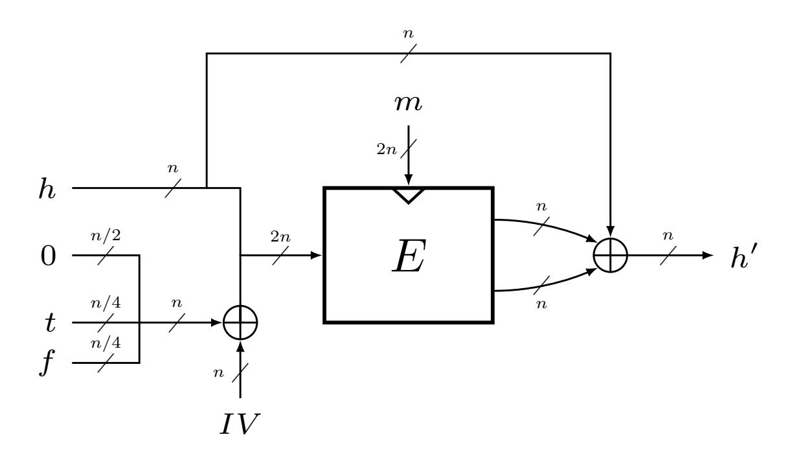
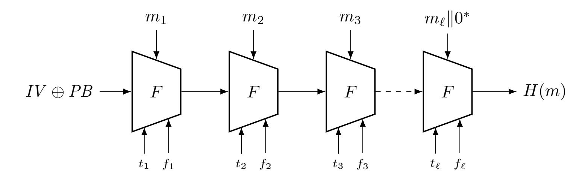

{0}------------------------------------------------

# **Security Analysis of BLAKE2's Modes of Operation**

Atul Luykx<sup>1</sup> , Bart Mennink<sup>1</sup> and Samuel Neves<sup>2</sup>

<sup>1</sup> Dept. Electrical Engineering, ESAT/COSIC, KU Leuven, and iMinds, Belgium [atul.luykx@esat.kuleuven.be](mailto:atul.luykx@esat.kuleuven.be), [bart.mennink@esat.kuleuven.be](mailto:bart.mennink@esat.kuleuven.be) <sup>2</sup> CISUC, Dept. of Informatics Engineering, University of Coimbra, Portugal [sneves@dei.uc.pt](mailto:sneves@dei.uc.pt)

**Abstract.** BLAKE2 is a hash function introduced at ACNS 2013, which has been adopted in many constructions and applications. It is a successor to the SHA-3 finalist BLAKE, which received a significant amount of security analysis. Nevertheless, BLAKE2 introduces sufficient changes so that not all results from BLAKE carry over, meaning new analysis is necessary. To date, all known cryptanalysis done on BLAKE2 has focused on its underlying building blocks, with little focus placed on understanding BLAKE2's generic security. We prove that BLAKE2's compression function is indifferentiable from a random function in a weakly ideal cipher model, which was not the case for BLAKE. This implies that there are no generic attacks against any of the modes that BLAKE2 uses.

**Keywords:** BLAKE · BLAKE2 · hash function · indifferentiability · PRF

# **1 Introduction**

Widespread adoption of cryptographic algorithms in practice often occurs regardless of their scrutiny by the cryptographic community. Although competitions such as AES and SHA-3 popularize thoroughly analyzed algorithms, they are not the only means with which practitioners find new algorithms. Standards, textbooks, and social media are sometimes more effective than publications and competitions.

Nevertheless, analysis of algorithms is important regardless of how they were popularized, and can result in finding insecurities, but also new techniques. For example, the PLAID protocol avoided cryptographic scrutiny by being standardized via the *Cards and personal identification* subcommittee of ISO, instead of via the *Cryptography and security mechanisms* working group, and when properly analyzed, PLAID turned out to be significantly weaker than claimed [\[DFF](#page-14-0)<sup>+</sup>14]. Similarly the ANSI authenticated encryption algorithm EAX<sup>0</sup> modified Bellare, Rogaway, and Wagner's EAX algorithm, thereby introducing security vulnerabilities [\[MLMI13\]](#page-16-0). In other cases modifications actually improve security, as with AMAC [\[BBT16\]](#page-13-0), which processes the output of a hash function to construct a MAC.

**BLAKE2.** Since its introduction in 2013, the hash function BLAKE2 has seen quick adoption, despite the fact that it had not received as much analysis as the SHA-3 finalists. It is a modification of the SHA-3 finalist BLAKE, which has high software performance and withstood extensive cryptanalysis [\[CPB](#page-14-1)<sup>+</sup>12, Section 3.1]. BLAKE2 simplifies BLAKE, resulting in better efficiency and ultimately its use in numerous constructions [\[FLW14,](#page-15-0) [BDK16,](#page-13-1)[CJMS14,](#page-14-2) [JAA](#page-16-1)<sup>+</sup>15[,AABS14,](#page-12-0)[HKR15\]](#page-15-1) and applications [\[Per16,](#page-17-0)[HBHW16,](#page-15-2)[Ros13\]](#page-17-1).

{1}------------------------------------------------

Although BLAKE2 is based on BLAKE, one cannot claim that BLAKE's cryptanalysis [\[BNR11,](#page-14-3)[AGK](#page-12-1)<sup>+</sup>10a,[DK11\]](#page-15-3) directly carries over. Nevertheless, the cryptanalytic techniques used for BLAKE can generally be applied to BLAKE2, resulting in an increasing amount of novel cryptanalysis [\[GKN](#page-15-4)<sup>+</sup>14,[Hao14,](#page-15-5)[KNP](#page-16-2)<sup>+</sup>15[,EFK15\]](#page-15-6). The generic security of BLAKE2's mode, however, has not yet been analyzed, and the indifferentiability analysis of BLAKE [\[ALM12,](#page-12-2)[CNY11\]](#page-14-4) does not carry over. The main reason for this is that BLAKE2 weakens its underlying compression function and uses it in many different modes: the plain HAIFA mode, a tree mode, a parallelized mode, and a keyed HAIFA mode. Additionally, these modes initialize the state using the salt, that can be freely chosen by the user.

Even slight modifications to modes or the underlying primitives might introduce vulnerabilities. Besides the EAX example given above, other examples include Dual Counter Mode [\[BS01,](#page-14-5)[DGW01\]](#page-14-6) versus IAPM [\[Jut01\]](#page-16-3), and the masking used in OTR [\[Min14,](#page-16-4)[BS16\]](#page-14-7) versus the classical XEX-masking [\[Rog04\]](#page-17-2). Therefore, properly analyzing the security of the BLAKE2 modes of operation is important.

**Results.** Unlike BLAKE, the BLAKE2 compression function already achieves indifferentiability *at the compression function level*. Using a weakly ideal block cipher, we prove that the compression function is indifferentiable from a random function up to a query complexity of about 2 *n/*2 , where *n* is the state size of the compression function. The derivation in part relies on the fact that the BLAKE2 compression function can be seen as a 7*n/*2-to-*n*-bit compression function based on a 2*n*-bit block cipher.

Using the indifferentiability composition result from Maurer et al. [\[MRH04\]](#page-17-3), the indifferentiability of the BLAKE2 hashing modes (based on an idealized underlying block cipher) directly follows from the already existing indifferentiability analyses on the modes (based on an ideal compression function) and the newly derived indifferentiability result of the BLAKE2 compression function. In other words, rather than deriving three tedious hash function indifferentiability proofs—as were the norm for the SHA-3 finalists [\[ALM12,](#page-12-2) [CNY11,](#page-14-4)[AMP10,](#page-12-3)[BMN10,](#page-14-8)[MPS16,](#page-17-4)[BDPV08,](#page-13-2)[BKL](#page-13-3)+09] [1](#page-1-0)—for BLAKE2 it suffices to derive a surprisingly short and simple compression function indifferentiability result and rely on the generic indifferentiability of the overlying modes. Note that our results also imply that the BLAKE2 compression function could be used in *any* hash function mode that has an indifferentiability proof if the underlying compression function is ideal.

We furthermore consider security of the keyed version of BLAKE2, and demonstrate that the newly obtained indifferentiability result on the BLAKE2 compression function immediately entails strong PRF-security of keyed BLAKE2 in the multi-key setting as long as the total query complexity is at most 2 *n/*2 .

# <span id="page-1-1"></span>**2 BLAKE2**

BLAKE2 consists of a compression function that internally uses a block cipher. This compression function is used to instantiate various keyless and keyed modes. We will discuss the block cipher and compression function design in this section, omitting technical details that are irrelevant for the generic analysis. We refer to the original publication [\[ANWW13\]](#page-12-4) and the RFC [\[SA15\]](#page-17-5) for details. The keyless hashing modes are discussed in Section [5](#page-9-0) and the keyed hashing mode in Section [6.](#page-11-0)

Throughout, we adopt the following notation. For two bit strings *x, y*, their concatenation is interchangeably denoted by *x*k*y*, (*x, y*), and *xy*. For a bit string *y* of even length, we denote by L(*y*) its left half and by R(*y*) its right half, so that *y* = L(*y*)kR(*y*). We denote by *n* ∈ {256*,* 512} the state size of the hash and compression function, and *w* = *n/*8 the word

<span id="page-1-0"></span><sup>1</sup>As well as beyond the SHA-3 finalists, as almost all known compression functions are differentiable, the only known exceptions being the compression function of MD6 [\[DRRS09\]](#page-15-7) and some double length compression functions [\[Men13\]](#page-16-5).

{2}------------------------------------------------

size. The fixed initialization value is denoted by  $IV \in \{0,1\}^n$ ; we refer to [ANWW13] for the specification of the initialization value, where the only important property of IV is that  $L(IV) \neq aaaa$  for any word  $a \in \{0,1\}^w$ . A 2n-bit state aaaabbbbccccdddd may be uniquely identified by its representation as a  $4 \times 4$  matrix

<span id="page-2-1"></span>
$$\left(\begin{array}{cccc}
a & a & a & a \\
b & b & b & b \\
c & c & c & c \\
d & d & d & d
\end{array}\right);$$

we use either notation interchangeably.

### <span id="page-2-2"></span>2.1 Block Cipher

BLAKE2 internally uses a block cipher  $E: \{0,1\}^{2n} \times \{0,1\}^{2n} \to \{0,1\}^{2n}$ . In this work, we will focus on the generic security of BLAKE2, and consider E as an idealized block cipher. However, while BLAKE's underlying block cipher had no known weaknesses and could reasonably be modeled as an ideal cipher, this is no longer the case in BLAKE2. In particular, the property

$$E\left(\begin{pmatrix} k & k & k & k \\ k & k & k & k \\ k & k &$$

for arbitrary words  $a, b, c, d, k \in \{0, 1\}^w$  can be used to efficiently distinguish it from an ideal cipher. This property is a central part of the "chosen-IV" attacks of Guo et al. [GKN<sup>+</sup>14, Section 3 and 4], and is the generalization of a well-known property of permutations derived from ChaCha [BHH<sup>+</sup>15, Section 4]. As discussed in Section 3, we will deal with this caveat by modeling E as a weakly ideal cipher.

### <span id="page-2-4"></span>2.2 Compression Function

The BLAKE2 compression function  $F: \{0,1\}^n \times \{0,1\}^{2n} \times \{0,1\}^{n/4} \times \{0,1\}^{n/4} \to \{0,1\}^n$  gets as input a state value h, a message m, a counter t, and a flag f, and is defined as follows:

<span id="page-2-0"></span>
$$x \leftarrow h \|0^{n/2}\|t\|f \oplus 0^n\|IV \tag{2a}$$

$$y \leftarrow E(m, x)$$
 (2b)

$$h' \leftarrow \mathsf{L}(y) \oplus \mathsf{R}(y) \oplus h$$
 (2c)

<span id="page-2-3"></span>return 
$$h'$$
, (2d)

where we recall that IV is a fixed initialization value throughout this work. The BLAKE2 compression function F is depicted in Figure 1. Note that for the specification of the compression function, we have not put any restrictions on the input values h, t, f: an adversary has full freedom to select these values. In the BLAKE2 hashing and MAC modes (Sections 5 and 6), the counter t and flag f are subject to specific formats.

For further analysis, we will also require the "inverse" of equation (2a). Define by  $\mathsf{parse}_{IV}$  the mapping that gets as input an  $x \in \{0,1\}^{2n}$ , and outputs the unique  $(h,z,t,f) \in \{0,1\}^n \times \{0,1\}^{n/2} \times \{0,1\}^{n/4} \times \{0,1\}^{n/4}$  such that

$$h||z||t||f = x \oplus 0^n ||IV|.$$

Note that the z-value equals  $0^{n/2}$  if and only if x could appear in the computation of (2a). We define  $\mathsf{parse}_{IV,z}: \{0,1\}^{2n} \to \{0,1\}^{n/2}$  as the function  $\mathsf{parse}_{IV}$  restricted to the z-value, or more formally,

$$\mathsf{parse}_{IV,z}(x) = \mathsf{L}(\mathsf{R}(\mathsf{parse}_{IV}(x)))$$
.

{3}------------------------------------------------

<span id="page-3-1"></span>

Figure 1: BLAKE2 compression function

## <span id="page-3-0"></span>3 Security Model

For  $l, m \in \mathbb{N}$  such that  $l \geq m$ , denote by  $\mathsf{Func}(l, m)$  the set of all functions  $F : \{0, 1\}^l \to \{0, 1\}^m$ , and by  $\mathsf{Block}(m)$  the set of all block ciphers  $E : \{0, 1\}^m \times \{0, 1\}^m \to \{0, 1\}^m$ .

### 3.1 Weakly Ideal Cipher Model

A naive way of modeling the block cipher E in BLAKE2 would be to consider it as an ideal cipher:  $E \stackrel{\$}{\leftarrow} \mathsf{Block}(2n)$ . However, this solution would not properly capture the structural property (1) of the BLAKE2 block cipher as discussed in Section 2.1. Instead, we will generate E as a weakly ideal cipher, i.e., an ideal cipher with the restriction that it adheres to property (1). The approach shows similarities with the weakly ideal compression functions used by Liskov Liskov Liscol to prove security of the zipper hash function if the underlying compression function can be inverted. The weakly ideal cipher also resembles ideas of the indifferentiability analyses of the SHA-3 candidates Shabal if the underlying block cipher shows some non-random behavior [BCC<sup>+</sup>09] and SIMD if the underlying compression function is distinguishable from a random function [BFL10]. We remark that, unlike these works, our analysis should not be seen as a patch to an unexpected property of BLAKE2. It appears that the property was known to the designers in advance (see, e.g., [AGK+10b, Appendix C]) and simply accepted as being a harmless property. The weakly ideal cipher model could also be seen as a specific instance of the weakened models of Katz et al. [KLT15] and Mennink and Preneel [MP15], but these models are much more general and more involved.

In more detail, consider the partition  $\{0,1\}^{2n} = W \cup S$  (W for weak and S for strong), where:

$$W = \left\{ aaaabbbbccccdddd \in \{0, 1\}^{2n} \mid a, b, c, d \in \{0, 1\}^w \right\}, \tag{3}$$

$$S = \{0, 1\}^{2n} \setminus W. \tag{4}$$

We define by  $\mathsf{Block}^*(2n)$  to be the set of all block ciphers  $E \in \mathsf{Block}(2n)$  with the additional restriction that

<span id="page-3-3"></span><span id="page-3-2"></span>
$$E\left(\begin{pmatrix} k & k & k & k \\ k & k & k & k \\ k & k &$$

is W- and S-subspace invariant for all  $k \in \{0,1\}^w$ , that is, inputs in W map to W, and

{4}------------------------------------------------

likewise for S. For notational simplicity, define the set of weak keys for E as

$$WK = \{kkkkkkkkkkkkkkkkkkkkkkkkkkkkkkkkkkk$$

A random  $E \stackrel{\$}{\leftarrow} \mathsf{Block}^*(2n)$  can now be modeled as follows: on input of  $(k,x) \in \mathsf{WK} \times \mathsf{W}$ , it generates its response y randomly from  $\mathsf{W}$  up to repetition; on input of  $(k,x) \in \mathsf{WK} \times \mathsf{S}$ , it generates its response y randomly from  $\mathsf{S}$  up to repetition. For key values  $k \in \{0,1\}^{2n} \setminus \mathsf{WK}$ , it behaves like an ideal cipher. The case of inverse queries is analogous.

We remark that, by resorting to the weakly ideal cipher model, we do not make stronger assumptions than those used in previous results, and, despite the fact that we give distinguishers more power (by weakening the cipher), we are able to get similar results. Concerning the most up to date cryptanalysis on BLAKE2's block cipher, there is currently no reason to believe that it does not approximate a weakly ideal cipher as we define it.

### 3.2 Indifferentiability

One way to measure the extent to which a certain cryptographic function behaves like a random function is via the indistinguishability framework, where a distinguisher is given access to either the cryptographic function or the random function, with the goal to distinguish both worlds. The indistinguishability security model inherently relies on the existence of secret information in both worlds, either a secret key, or the random function. Therefore, for keyless cryptographic hash functions the indistinguishability framework is inadequate, and we will use the indifferentiability framework of Maurer et al. [MRH04]. At a high level, the indifferentiability framework measures the distance from a construction  $\mathcal{C}^{\mathcal{P}}$  based on an ideal subcomponent  $\mathcal{P}$ , for instance a compression function based on an ideal cipher or a hash function based on a compression function, to an ideal functionality  $\mathcal{R}$ , and it guarantees that a construction has no structural design flaws. In this work, we employ the adaptation and simplification of the indifferentiability framework by Coron et al. [CDMP05]. We note that this indifferentiability framework only applies to single-stage games; cf., Ristenpart et al. [RSS11].

<span id="page-4-0"></span>**Definition 1.** Let  $\mathcal{C}$  be a construction with oracle access to an ideal primitive  $\mathcal{P}$ . Let  $\mathcal{R}$  be an ideal primitive with the same domain and range as  $\mathcal{C}$ . Let  $\mathcal{S}$  be a simulator with the same domain and range as  $\mathcal{P}$  with oracle access to  $\mathcal{R}$ , and let  $\mathcal{D}$  be a distinguisher. The differentiability advantage of  $\mathcal{D}$  is defined as

$$\mathsf{Indiff}_{\mathcal{C}^{\mathcal{P}}\!,\mathcal{S}}(\mathcal{D}) = \left| \mathbb{P} \left( \mathcal{D}^{\mathcal{C}^{\mathcal{P}},\mathcal{P}} = 1 \right) - \mathbb{P} \left( \mathcal{D}^{\mathcal{R},\mathcal{S}^{\mathcal{R}}} = 1 \right) \right| \,.$$

Distinguisher  $\mathcal{D}$  can query both its left oracle  $\lambda$  (either  $\mathcal{C}$  or  $\mathcal{R}$ ) and its right oracle  $\rho$  (either  $\mathcal{P}$  or  $\mathcal{S}$ ). We refer to  $\mathcal{C}^{\mathcal{P}}$ ,  $\mathcal{P}$  as the real world, and to  $\mathcal{R}$ ,  $\mathcal{S}^{\mathcal{R}}$  as the simulated world; the distinguisher  $\mathcal{D}$  converses with either of these worlds and its goal is to tell both worlds apart.

### 3.3 PRF-Security

For keyed hash functions, the indistinguishability framework suffices, and we use it to express the PRF-security of a keyed hash function. In this work, we will consider security in the multi-key setting. We adopt the model of Mouha and Luykx [ML15] to PRF-security. We refer to Bellare et al. [BBT16] for a more general discussion on multi-key security of PRFs. In below definition,  $\mu$  denotes the number of instantiations with which the adversary interacts, and  $\mathcal K$  the key space.

<span id="page-4-1"></span>**Definition 2.** Let  $\mu \geq 1$ , and let  $\mathbf{k} \stackrel{\$}{\leftarrow} (\mathcal{K})^{\mu}$ . Let  $\mathcal{C}$  be a keyed construction with key space  $\mathcal{K}$  and with oracle access to an ideal primitive  $\mathcal{P}$ . Let  $\mathcal{R}_1, \ldots, \mathcal{R}_{\mu}$  be random functions

{5}------------------------------------------------

with the same domains and ranges as  $C_{k_1}, \ldots, C_{k_{\mu}}$ . Let  $\mathcal{D}$  be a distinguisher. The PRF distinguishing advantage of  $\mathcal{D}$  is defined as

$$\mathsf{Prf}_{\mathcal{C}^{\mathcal{P}}}(\mathcal{D}) = \left| \mathbb{P} \left( \mathcal{D}^{\mathcal{C}_{k_1}^{\mathcal{P}}, \dots, \mathcal{C}_{k_{\mu}}^{\mathcal{P}}, \mathcal{P}} = 1 \right) - \mathbb{P} \left( \mathcal{D}^{\mathcal{R}_1, \dots, \mathcal{R}_{\mu}, \mathcal{P}} = 1 \right) \right| \,.$$

# 4 Indifferentiability of BLAKE2 Compression Function

We will prove that the BLAKE2 compression function is indifferentiable from a random compression function up to about  $2^{n/2}$  queries, under the assumption that the underlying block cipher is randomly drawn from  $\mathsf{Block}^*(2n)$ . The bound is in fact tight: an adaptation of the differentiability attack of [ALM12] from BLAKE to BLAKE2 does the job. We have included the attack in Appendix A for completeness.

<span id="page-5-0"></span>**Theorem 1** (Indifferentiability of BLAKE2 Compression Function). Let  $E \stackrel{\$}{\leftarrow} \mathsf{Block}^*(2n)$  be a weakly ideal cipher, and consider the BLAKE2 compression function  $F^E$  of (2) that internally uses E. There exists a simulator  $\mathcal{S}$  such that for any distinguisher  $\mathcal{D}$  with total complexity q,

$$\mathsf{Indiff}_{F^E\!,\mathcal{S}}(\mathcal{D}) \leq \frac{\binom{q}{2}}{2^{2n}} + \frac{\binom{q}{2}}{2^n} + \frac{q}{2^{n/2}}\,,$$

where S makes at most q queries to R.

Note that one compression function evaluation corresponds to one block cipher evaluation, and vice versa, hence there is no need to separate the distinguisher's complexity into construction and primitive queries. The bound shows similarities with the analysis of the MD6 compression function [DRRS09, Theorem 1], but multiple differences appear at a technical level: most importantly, our analysis is in the weakly ideal cipher model.

The proof of Theorem 1 consists of two steps: in Section 4.1 we design the simulator used in the proof, and the derivation of the bound is given in Section 4.2.

#### <span id="page-5-1"></span>4.1 Simulator

The simulator will simulate the interface of a block cipher  $E \in \mathsf{Block}^*(2n)$ , but our simulator will generate most of its responses as if it were a random function: while this gives a small degradation in the security bound via the appearance of collisions, this significantly simplifies the description of the simulator and of the proof. Likewise, the simulator will not obey the S-subspace invariance: the probability that a random value hits W is  $2^{4w}/2^{2n} = 1/2^{3n/2}$ .

In more detail, our simulator will always generate uniformly random responses from  $\{0,1\}^{2n}$ , with two exceptions:

- (i) The bijective W-subspace invariance property for evaluations of the form (5) is retained. In other words, in a forward query  $(m, x) \in WK \times W$ , the response y is randomly and bijectively drawn from W, and similar for inverse queries;
- (ii) A forward query (m, x), where x can be parsed into

$$h||0^{n/2}||t||f \leftarrow \mathsf{parse}_{IV}(x)$$

is responded with a randomly generated y that satisfies  $h' = L(y) \oplus R(y) \oplus h$ , where  $h' = \mathcal{R}(h, m, t, f)$ .

Note that for exception (i), bijectivity on W for keys from WK is strictly necessary due to the small size of W; otherwise, a distinguisher can find collision for the simulator in q queries with probability  $\binom{q}{2}/|\mathbf{W}|$ . The following brief lemma shows that exceptions (i) and (ii) cannot apply to the same query simultaneously.

{6}------------------------------------------------

<span id="page-6-4"></span>**Lemma 1.** For any  $x \in W$  of (3), parse $_{IV.z}(x) \neq 0^{n/2}$ .

*Proof.* Note that, by definition of  $\mathsf{parse}_{IV,z}$ , we have

$$\mathsf{parse}_{IV,z}(x) = \mathsf{L}(\mathsf{R}(\mathsf{parse}_{IV}(x))) = \mathsf{L}(\mathsf{R}(x)) \oplus \mathsf{L}(IV) \,.$$

As  $x \in W$ , L(R(x)) = cccc for some  $c \in \{0,1\}^w$ . On the other hand, the IV of BLAKE2 satisfies that  $L(IV) \neq aaaa$  for any word  $a \in \{0,1\}^w$  (see the beginning of Section 2). Therefore,  $\mathsf{parse}_{IV,z}(x) \neq 0^{n/2}$ .

The formal simulator is given in Figure 2. It maintains a table  $\mathcal{L}$  in which all query-response tuples (m, x, y) are stored. For convenience, we write  $\mathcal{L}_m^+(x) = y$  and  $\mathcal{L}_m^-(y) = x$ . Furthermore, write dom $(\mathcal{L}_m) = \{x \mid (m, x, \cdot) \in \mathcal{L}\}$  and rng $(\mathcal{L}_m) = \{y \mid (m, \cdot, y) \in \mathcal{L}\}$ .

```
Simulator Forward \mathcal{S}
Input: (m, x) \in \{0, 1\}^{2n} \times \{0, 1\}^{2n}
Output: y \in \{0,1\}^{2n}
                                                                                   Simulator Inverse S^{-1}
  1: if \mathcal{L}_m^+(x) = \bot then
                                                                                   Input: (m,y) \in \{0,1\}^{2n} \times \{0,1\}^{2n}
            h||z||t||f \leftarrow \mathsf{parse}_{IV}(x)
  2:
                                                                                   Output: x \in \{0,1\}^{2n}
             if z = 0^{n/2} then
  3:
                                                                                     1: if \mathcal{L}_m^-(y) = \bot then
                   L(y) \stackrel{\$}{\leftarrow} \{0,1\}^n
  4:
                                                                                                if (m, y) \in WK \times W then
                                                                                     2:
                   h' \leftarrow \mathcal{R}(h, m, t, f)
  5:
                                                                                                      \mathcal{L}_m^-(y) \stackrel{\$}{\leftarrow} \mathsf{W} \setminus \mathrm{dom}(\mathcal{L}_m)
                                                                                     3:
                   \mathcal{L}_m^+(x) \leftarrow \mathsf{L}(y) \| (\mathsf{L}(y) \oplus h \oplus h')
  6:
                                                                                                else
                                                                                     4:
             else if (m, x) \in WK \times W then
  7:
                                                                                                      \mathcal{L}_m^-(y) \xleftarrow{\$} \{0,1\}^{2n}
                                                                                     5:
                  \mathcal{L}_m^+(x) \stackrel{\$}{\leftarrow} W \setminus \operatorname{rng}(\mathcal{L}_m)
  8:
                                                                                                end if
                                                                                     6:
             else
  9:
                                                                                     7: end if
                   \mathcal{L}_m^+(x) \xleftarrow{\$} \{0,1\}^{2n}
 10:
                                                                                     8: return \mathcal{L}_m^-(y)
             end if
 11:
 12: end if
13: return \mathcal{L}_m^+(x)
```

Figure 2: Simulator S for the proof of Theorem 1

#### <span id="page-6-0"></span>4.2 Proof

Let  $E \stackrel{\$}{\leftarrow} \mathsf{Block}^*(2n)$  and F be the BLAKE2 compression function of Section 2.2. Let  $\mathcal{S}$  be the simulator of Figure 2, and let  $\mathcal{D}$  be any distinguisher that makes at most q oracle queries. Recall from Definition 1 that the distinguisher has access to either (F, E) or  $(\mathcal{R}, \mathcal{S})$ :

<span id="page-6-3"></span><span id="page-6-2"></span>
$$\mathsf{Indiff}_{F^E,\mathcal{S}}(\mathcal{D}) = \left| \mathbb{P} \left( \mathcal{D}^{F^E,E} = 1 \right) - \mathbb{P} \left( \mathcal{D}^{\mathcal{R},\mathcal{S}^{\mathcal{R}}} = 1 \right) \right|. \tag{7}$$

As a first step, we apply a URP-URF switch to the real world: we replace E by a functionality  $\bar{E}$  that always generates its responses from  $\{0,1\}^{2n}$ , except for inputs from WK × W. By the triangle inequality, we find for (7):

$$\mathsf{Indiff}_{F^E,\mathcal{S}}(\mathcal{D}) \le \left| \mathbb{P}\left(\mathcal{D}^{F^{\bar{E}},\bar{E}} = 1\right) - \mathbb{P}\left(\mathcal{D}^{\mathcal{R},\mathcal{S}^{\mathcal{R}}} = 1\right) \right| + \frac{\binom{q}{2}}{2^{2n}},\tag{8}$$

and we focus on the success of  $\mathcal{D}$  in distinguishing  $(F^{\bar{E}}, \bar{E})$  from  $(\mathcal{R}, \mathcal{S}^{\mathcal{R}})$ . We assume without loss of generality that the distinguisher never makes trivial queries, i.e., repeating a query to any of the oracles, querying  $\rho^{-1}$  on input of the response from  $\rho$ , or vice

{7}------------------------------------------------

Random Function  $\mathcal{R}$ 

versa, where  $\rho \in \{\bar{E}, \mathcal{S}\}$ . The oracles are written out in detail in Figure 3 for convenience. In the description, the functionality  $\bar{E}$  maintains an initially empty list  $\mathcal{L}$  as before.  $\mathcal{R}$  maintains an initially empty list  $\mathcal{M}$  that stores all query-response tuples (h, m, t, f, h'), and we write  $\mathcal{M}^+(h, m, t, f) = h'$ . For the sake of the proof, the function F also maintains an initially empty list  $Y_F$  of all responses given so far. The description of the simulator

```
Input: (h, m, t, f) \in \{0, 1\}^{n+2n+n/4+n/4}
Compression Function F
                                                                              Output: h' \in \{0,1\}^n
Input: (h, m, t, f) \in \{0, 1\}^{n+2n+n/4+n/4}
                                                                                1: if \mathcal{M}^+(h, m, t, f) = \bot then
Output: h' \in \{0,1\}^n
                                                                                          \mathcal{M}^+(h,m,t,f) \stackrel{\$}{\leftarrow} \{0,1\}^n
                                                                                2:
  1: x \leftarrow h \|0^{n/2}\|t\|f \oplus 0^n\|IV
                                                                                3: end if
  2: y \leftarrow \bar{E}(m,x)
                                                                                4: return \mathcal{M}^+(h, m, t, f)
  Y_F \leftarrow Y_F \cup \{y\}
                                            ▶ administrative
                                                                              Simulator Forward \mathcal{S}
  4: h' \leftarrow \mathsf{L}(y) \oplus \mathsf{R}(y) \oplus h
                                                                              Input: (m, x) \in \{0, 1\}^{2n} \times \{0, 1\}^{2n}
  5: \mathbf{return} \ h'
                                                                              Output: y \in \{0,1\}^{2n}
Ideal Cipher E
                                                                                1: if \mathcal{L}_m^+(x) = \bot then
Input: (m, x) \in \{0, 1\}^{2n} \times \{0, 1\}^{2n}
                                                                                          h||z||t||f \leftarrow \mathsf{parse}_{IV}(x)
                                                                                2:
                                                                                          if z = 0^{n/2} then
Output: y \in \{0,1\}^{2n}
                                                                                3:
                                                                                               \mathsf{L}(y) \stackrel{\$}{\leftarrow} \{0,1\}^n
  1: if \mathcal{L}_m^+(x) = \bot then
                                                                                4:
            if (m, x) \in WK \times W then
                                                                                               h' \leftarrow \mathcal{R}(h, m, t, f)
  2:
                                                                                5:
                  \mathcal{L}_m^+(x) \stackrel{\$}{\leftarrow} \mathsf{W} \setminus \operatorname{rng}(\mathcal{L}_m)
                                                                                               \mathcal{L}_m^+(x) \leftarrow \mathsf{L}(y) \| (\mathsf{L}(y) \oplus h \oplus h')
                                                                                6:
  3:
                                                                                          else if (m, x) \in WK \times W then
            else
                                                                                7:
  4:
                 \mathcal{L}_m^+(x) \xleftarrow{\$} \{0,1\}^{2n}
                                                                                               \mathcal{L}_m^+(x) \stackrel{\$}{\leftarrow} \mathsf{W} \setminus \operatorname{rng}(\mathcal{L}_m)
  5:
                                                                                8:
            end if
                                                                                          else
  6:
                                                                                9:
                                                                                               \mathcal{L}_m^+(x) \xleftarrow{\$} \{0,1\}^{2n}
  7: end if
                                                                              10:
  8: return \mathcal{L}_m^+(x)
                                                                                          end if
                                                                              11:
                                                                              12: end if
Ideal Cipher Inverse \bar{E}^{-1}
                                                                              13: return \mathcal{L}_m^+(x)
Input: (m, y) \in \{0, 1\}^{2n} \times \{0, 1\}^{2n}
                                                                              Simulator Inverse S^{-1}
Output: x \in \{0,1\}^{2n}
                                                                              Input: (m,y) \in \{0,1\}^{2n} \times \{0,1\}^{2n}
  1: if y \in Y_F then
                                                                              Output: x \in \{0,1\}^{2n}
            bad1
  2:
                                                                                1: if \mathcal{L}_m^-(y) = \bot then
  3: end if
                                            ▶ administrative
                                                                                          if (m, y) \in WK \times W then
  4: if \mathcal{L}_m^-(y) = \bot then
                                                                                2:
                                                                                                \mathcal{L}_m^-(y) \stackrel{\$}{\leftarrow} \mathsf{W} \setminus \mathrm{dom}(\mathcal{L}_m)
            if (m, y) \in WK \times W then
                                                                                3:
  5:
                 \mathcal{L}_m^-(y) \stackrel{\$}{\leftarrow} \mathsf{W} \setminus \mathrm{dom}(\mathcal{L}_m)
                                                                                4:
                                                                                          else
  6:
                                                                                                \mathcal{L}_m^-(y) \xleftarrow{\$} \{0,1\}^{2n}
                                                                                5:
            {\bf else}
  7:
                  \mathcal{L}_m^-(y) \xleftarrow{\$} \{0,1\}^{2n}
                                                                                          end if
                                                                                6:
  8:
                                                                                          if \operatorname{parse}_{IV,z}(\mathcal{L}_m^-(y)) = 0^{n/2} then
                                                                                7:
  9:
            end if
                                                                                                \mathsf{bad}2
                                                                                8:
10: end if
                                                                                                                          ▶ administrative
                                                                                          end if
                                                                                9:
11: return \mathcal{L}_m^-(y)
                                                                              10: end if
                                                                              11: return \mathcal{L}_m^-(y)
```

Figure 3: Real world  $(F, \bar{E})$  (left) and simulated world  $(\mathcal{R}, \mathcal{S})$  (right). The statements "administrative" do not influence the operation of the oracles and are purely included for administrative reasons. The description of  $\mathcal{S}$  is identical to that of Figure 2,  $\mathcal{S}^{-1}$  differs only in the addition of lines 7-9

{8}------------------------------------------------

inverse in Figure 3 is now equipped with two bad-events. Note that this adjustment is purely administrative and does not influence the procedures of  $\bar{E}^{-1}$  and  $\mathcal{S}^{-1}$ . We will prove that, as long as  $\bar{E}^{-1}$  does not set bad1 and  $\mathcal{S}^{-1}$  does not set bad2, both oracles are indistinguishable. More formally, by the principles of game playing, we obtain for (8):

$$\left| \mathbb{P} \left( \mathcal{D}^{F^{\bar{E}}, \bar{E}} = 1 \right) - \mathbb{P} \left( \mathcal{D}^{\mathcal{R}, \mathcal{S}^{\mathcal{R}}} = 1 \right) \right|$$

$$\leq \left| \mathbb{P} \left( \mathcal{D}^{F^{\bar{E}}, \bar{E}} = 1 \mid \neg \mathsf{bad} 1 \right) - \mathbb{P} \left( \mathcal{D}^{\mathcal{R}, \mathcal{S}^{\mathcal{R}}} = 1 \mid \neg \mathsf{bad} 2 \right) \right| + \mathbb{P} \left( \mathsf{bad} 1 \right) + \mathbb{P} \left( \mathsf{bad} 2 \right) .$$

$$(9)$$

bad1 is set if the distinguisher makes an inverse query  $\bar{E}^{-1}(m,y)$  that has already been defined in an earlier compression function call. Event bad2 captures the case where  $S^{-1}(m,y)$  satisfies  $z=0^{n/2}$  by accident, where  $h\|z\|t\|f \leftarrow \mathsf{parse}_{IV}(x)$ . It is straightforward to see that  $\mathbb{P}(\mathsf{bad1}) \leq \binom{q}{2}/2^n$  and that  $\mathbb{P}(\mathsf{bad2}) \leq q/2^{n/2}$ . In the remainder of the proof, we will show that

<span id="page-8-0"></span>
$$\left| \mathbb{P} \left( \mathcal{D}^{F^{\bar{E}}, \bar{E}} = 1 \mid \neg \mathsf{bad} 1 \right) - \mathbb{P} \left( \mathcal{D}^{\mathcal{R}, \mathcal{S}^{\mathcal{R}}} = 1 \mid \neg \mathsf{bad} 2 \right) \right| = 0, \tag{10}$$

and the proof follows from (7)-(10). To prove (10), we will consider any query made by the distinguisher, either to  $\lambda \in \{F, \mathcal{R}\}$ ,  $\rho \in \{\bar{E}, \mathcal{S}\}$ , or  $\rho^{-1} \in \{\bar{E}^{-1}, \mathcal{S}^{-1}\}$ , and show that for every query the responses from the real or ideal world are identical. Without loss of generality, we assume that the distinguisher never makes a repeat query, i.e., to which it knows the answer in advance.

- Query  $h' \leftarrow \lambda(h, m, t, f)$ . Write  $x = h \|0^{n/2}\|t\| f \oplus 0^n \|IV$ . We make the following case distinction:
  - $-\mathcal{L}_{\boldsymbol{m}}^+(\boldsymbol{x}) = \bot$ . In the real world, this means that  $\bar{E}(m,x)$  has never been queried. We will thus have  $y \stackrel{\$}{\leftarrow} \{0,1\}^{2n}$ , and hence,  $h' = \mathsf{L}(y) \oplus \mathsf{R}(y) \oplus h \stackrel{\$}{\leftarrow} \{0,1\}^n$ . In the simulated world, the condition implies that  $\mathcal{S}$  has never been evaluated on (m,x), and hence, it never queried  $\mathcal{R}$  on input of (h,m,t,f). Consequently, the call to  $\mathcal{R}$  is new, and responded with  $h' \stackrel{\$}{\leftarrow} \{0,1\}^n$ ;
  - $-\mathcal{L}_{m}^{+}(x) \neq \bot$ . Denote  $y = \mathcal{L}_{m}^{+}(x)$ . In the real world, we necessarily have  $h' = \mathsf{L}(y) \oplus \mathsf{R}(y) \oplus h$ . In the simulated world, the tuple (m, x, y) must have been added to  $\mathcal{L}$  in a *forward* query to  $\mathcal{S}$ : if it were an inverse query, it would have set bad2. Thus, following the algorithm of  $\mathcal{S}$ , we have  $\mathsf{L}(y) \oplus \mathsf{R}(y) = h \oplus h'$ . Thus, the responses are identically distributed;
- Query  $y \leftarrow \rho(m, x)$ . Parse  $h||z||t||f \leftarrow \mathsf{parse}_{IV}(x)$ . We make the following case distinction:
  - $-z \neq 0^{n/2}$ . The response is distributed identically in both worlds: if  $(m, x) \in WK \times W$  the response y is generated uniformly at random from W without replacement; otherwise it simply satisfies  $y \stackrel{\$}{\leftarrow} \{0, 1\}^{2n}$ ;
  - $-z = 0^{n/2}$  and  $\mathcal{M}^+(h, m, t, f) = \bot$ . The condition implies that  $\bar{E}$  has never been evaluated on (m, x). Additionally, by Lemma 1, we necessarily have  $x \notin W$ . In the real world, the response thus satisfies  $y \stackrel{\$}{\leftarrow} \{0, 1\}^{2n}$ . In the simulated world,  $\mathcal{S}$  will generate  $\mathsf{L}(y) \stackrel{\$}{\leftarrow} \{0, 1\}^n$  and query  $h' \leftarrow \mathcal{R}(h, m, t, f)$ , which will also be uniformly randomly drawn. Concluding, the entire output  $y \stackrel{\$}{\leftarrow} \{0, 1\}^{2n}$ ;
  - $-z = 0^{n/2}$  and  $\mathcal{M}^+(h, m, t, f) \neq \bot$ . Denote  $h' = \mathcal{M}^+(h, m, t, f)$ . In the real world, an earlier construction query has already specified the call, and we necessarily have  $\mathsf{L}(y) \oplus \mathsf{R}(y) \oplus h = h'$ . In the simulated world,  $\mathcal{S}$  will define y as  $\mathsf{L}(y) || (\mathsf{L}(y) \oplus h \oplus h')$  for  $\mathsf{L}(y) \stackrel{\$}{\leftarrow} \{0,1\}^n$ . Thus, in both cases,  $y \stackrel{\$}{\leftarrow} \{0,1\}^{2n} \setminus \{\bar{y} \in \{0,1\}^{2n} \mid \mathsf{L}(\bar{y}) \oplus \mathsf{R}(\bar{y}) \neq h \oplus h'\};$

{9}------------------------------------------------

<span id="page-9-1"></span>

Figure 4: BLAKE2 hash function

• Query  $x \leftarrow \rho^{-1}(m, y)$ . If  $\mathcal{L}_m^-(y) = \bot$ , both oracles behave identically. Note that in the simulated world, this condition always holds (by our assumption that the distinguisher never makes trivial queries). For the real world,  $\mathcal{L}_m^-(y) \neq \bot$  if and only if  $y \in Y_F$ , in which case the query would trigger bad1.

Remark 1. In the simulator of Figure 3, bad2 is set if the response from  $S^{-1}(m,y)$  satisfies  $z = 0^{n/2}$ , where  $h||z||t||f \leftarrow \mathsf{parse}_{IV}(x)$ . However, BLAKE2 evaluates its compression function for at most 4 distinct flags f, rather than  $2^{n/8}$ . This means that it suffices to set bad2 if  $z = 0^{n/2}$  AND f is a valid flag. This happens with probability at most  $q/2^{n/2+n/8-2}$ . For the sake of generality, we have opted not to include this optimization in the proof.

# <span id="page-9-0"></span>5 BLAKE2 Hashing Modes

The BLAKE2 hashing mode differs from the one of BLAKE mostly in the use of a parameter block  $PB \in \{0,1\}^n$ . Half of the parameter block, n/2 bits, consists of a salt and personalization data, both of which can be freely chosen by the user. The remaining half consists of mode-specific parameters (such as digest size, key size, tree parameters, etc.) and are merely determined by the mode.

In more detail, the BLAKE2 mode H gets as input a parameter block PB and a message m of size at most  $2^{n/4}$  bytes. The message is padded into  $m_1 \| \cdots \| m_\ell \leftarrow m \| 0^*$  in such a way that  $m_i \in \{0,1\}^{2n}$  for  $i=1,\ldots,\ell$ . The HAIFA counter  $t_1,\ldots,t_\ell$  and the flags  $f_1,\ldots,f_\ell$  are set in such a way that  $m\mapsto (m_1\|t_1\|f_1,\ldots,m_\ell\|t_\ell\|f_\ell)$  is injective, suffix-free, and prefix-free. We refer to [ANWW13,SA15] for details regarding the flags and to [BD07] for details regarding the counter. The data is then hashed as follows:

$$h_0 \leftarrow IV \oplus PB$$
 (11a)

$$\mathbf{for} \ i = 1, \dots, \ell \tag{11b}$$

<span id="page-9-2"></span>
$$h_i \leftarrow F(h_{i-1}, m_i, t_i, f_i) \tag{11c}$$

end for 
$$(11d)$$

return 
$$h_{\ell}$$
. (11e)

The mode is depicted in Figure 4.

### 5.1 Security Analysis

Coron et al. [CDMP05] gave an indifferentiability analysis of prefix-free hash functions, based on the randomness of the underlying compression function. Improved bounds were obtained by Chang et al. [CLNY06] and Bhattacharyya et al. [BMN09]. These analyses

{10}------------------------------------------------

apply to the HAIFA structure, however, they assume a fixed IV of the state. For the BLAKE2 hashing mode, the initial state value is *IV* ⊕ *PB*, where *PB* is a parameter block, which for a large part consists of data freely choosable by the user.

To simplify our analysis, we will henceforth simply consider *IV* ⊕*PB* =: *m*0, with input to the hash function being (*m*0*, m*) where *m* is as above. We henceforth relax our security games and simply consider a user that can freely choose (*m*0*, m*) for every query. Bagheri et al. [\[BGKZ12\]](#page-13-9) presented an indifferentiability analysis of sequential hashing with free IV (or, in our terminology, "free *m*0") if the first and last compression function are different from the remaining ones. We will use the result on sufficient conditions for tree hashing by Bertoni et al. [\[BDPV14\]](#page-13-10). Although the result focuses on trees, it is directly applicable to the sequential mode of BLAKE2 (as a sequential mode is a specific type of tree). We will state the result from [\[BDPV14\]](#page-13-10) in generality.

<span id="page-10-0"></span>**Lemma 2** (Bertoni et al. [\[BDPV14\]](#page-13-10))**.** *Let H be an ideal hash function, and consider a tree mode T <sup>H</sup> that internally uses H. Assume that the tree mode is* tree-decodable*,* message-complete*, and* final-node separable*. There exists a simulator* S *such that for any distinguisher* D *with total complexity q,*

$$\mathsf{Indiff}_{T^H,\mathcal{S}}(\mathcal{D}) \leq \frac{\binom{q}{2}}{2^n}\,,$$

*where* S *makes at most O*(*q* 3 ) *queries to* R*.*

Here, the total complexity counts the number of evaluations of *H* induced by all queries by D. The three conditions on the tree informally imply that every tree is uniquely parseable, that every message bit is compressed, and that the final call to *H* is domainseparated from the other calls to *H*. We refer to [\[BDPV14\]](#page-13-10) for a formal discussion of these conditions.

Note that Lemma [2](#page-10-0) can particularly be used in case *H* is a fixed-input-length compression function. As such, the BLAKE2 hash function [\(11\)](#page-9-2) defines a tree that is tree-decodable, message-complete, and final-node separable. The final condition is particularly covered as the flag *f`* is distinct from *f*1*, . . . , f`*−1. From Theorem [1](#page-5-0) and Lemma [2](#page-10-0) we henceforth obtain the following result.

<span id="page-10-2"></span>**Corollary 1** (Indifferentiability of BLAKE2 Hashing Mode)**.** *Let E* \$←− Block<sup>∗</sup> (2*n*) *be a weakly ideal cipher, and consider the* BLAKE2 *hash function H<sup>E</sup> of [\(11\)](#page-9-2) that internally uses E. There exists a simulator* S *such that for any distinguisher* D *with total complexity q,*

$$\mathsf{Indiff}_{H^E,\mathcal{S}}(\mathcal{D}) \leq \frac{\binom{q}{2}}{2^{2n}} + \frac{2\binom{q}{2}}{2^n} + \frac{q}{2^{n/2}} \,,$$

*where* S *makes at most O*(*q* 3 ) *queries to* R*.*

Here, the total complexity counts the number of evaluations of *E* induced by all queries by D. Note that the combined simulator corresponds to the simulator for the compression function (Theorem [1\)](#page-5-0) which interacts with that of the mode (Lemma [2\)](#page-10-0) which queries R, and hence it has complexity *O*(*q* 3 ). This will be inherited in applications of BLAKE2 due to the composition result of Maurer et al. [\[MRH04\]](#page-17-3).

### **5.2 Tree/Parallel Hashing Mode**

The BLAKE2 specification [\[ANWW13\]](#page-12-4) also supports tree hashing or parallel hashing, performed on top of the BLAKE2 hash function [\(11\)](#page-9-2). These modes are designed along the methodology by Bertoni et al. [\[BDPV14\]](#page-13-10). They satisfy tree-decodability, messagecompleteness, and final-node separability by design,[2](#page-10-1) and Lemma [2](#page-10-0) directly applies. In

<span id="page-10-1"></span><sup>2</sup>Particularly, final-node separability is achieved as the finalization flags are defined in such a way that the flag to the final evaluation of *H* is distinct from the other flags.

{11}------------------------------------------------

more detail, if  $T^E$  denotes either the tree or parallel mode based on a weakly ideal cipher E, from Lemma 2 and Corollary 1, we can obtain the following result. We remark that if tree/parallel hashing is done in such a way that only one compression function call per node is performed, a direct application of Lemma 2 to the compression function result from Theorem 1 applies, and one can obtain a slightly better bound.

Corollary 2 (Indifferentiability of BLAKE2 Tree/Parallel Mode). Let  $E \stackrel{\$}{\leftarrow} \mathsf{Block}^*(2n)$  be a weakly ideal cipher, and consider the BLAKE2 tree/parallel hash function  $T^E$  that internally uses E. There exists a simulator  $\mathcal{S}$  such that for any distinguisher  $\mathcal{D}$  with total complexity q,

$$\mathsf{Indiff}_{T^E,\mathcal{S}}(\mathcal{D}) \leq \frac{\binom{q}{2}}{2^{2n}} + \frac{3\binom{q}{2}}{2^n} + \frac{q}{2^{n/2}}\,,$$

where S makes at most  $O(q^3)$  queries to R.

# <span id="page-11-0"></span>6 BLAKE2 Keyed Hashing Mode

BLAKE2 supports keyed hashing by simply prepending the key to the message:

<span id="page-11-1"></span>
$$KH_k(PB, m) = H(PB, k||0^{2n-\kappa}||m),$$
 (12)

where  $\kappa \leq 2n$  denotes the key size. In other words, the key gets processed as other data, and the HAIFA counter and flags are designated to the key in a similar fashion as if they were for normal data blocks. As claimed by the designers [ANWW13], the usage of the HAIFA counter makes the need of a HMAC-like mode unnecessary.

### 6.1 Security Analysis

We first derive a generic PRF-security result for KH provided that H is a random oracle. Recall from Definition 2 that we consider multi-key security, where the distinguisher gets access to  $\mu \geq 1$  independent instances.

<span id="page-11-4"></span>**Lemma 3.** Let  $\mu \geq 1$ , and let  $\mathbf{k} \stackrel{\$}{\leftarrow} (\{0,1\}^{\kappa})^{\mu}$ . Let H be an ideal hash function, and consider the keyed hashing mode  $KH^H$  of (12) that internally uses H. For any distinguisher  $\mathcal{D}$  with total complexity q,

<span id="page-11-3"></span><span id="page-11-2"></span>
$$\operatorname{Prf}_{KH^H}(\mathcal{D}) \leq \frac{\mu q}{2^{\kappa}} + \frac{\binom{\mu}{2}}{2^{\kappa}}.$$

*Proof.* Let  $\mathcal{D}$  be any distinguisher that makes at most q oracle queries. Let G be an ideal hash function with the same domain and range as H. Starting from Definition 2:

$$\operatorname{Prf}_{KH^{H}}(\mathcal{D}) = \left| \mathbb{P} \left( \mathcal{D}^{KH_{k_{1}}^{H}, \dots, KH_{k_{\mu}}^{H}, H} = 1 \right) - \mathbb{P} \left( \mathcal{D}^{\mathcal{R}_{1}, \dots, \mathcal{R}_{\mu}, H} = 1 \right) \right| \\
\leq \left| \mathbb{P} \left( \mathcal{D}^{KH_{k_{1}}^{H}, \dots, KH_{k_{\mu}}^{H}, H} = 1 \right) - \mathbb{P} \left( \mathcal{D}^{KH_{k_{1}}^{G}, \dots, KH_{k_{\mu}}^{G}, H} = 1 \right) \right| \\
+ \left| \mathbb{P} \left( \mathcal{D}^{KH_{k_{1}}^{G}, \dots, KH_{k_{\mu}}^{G}, H} = 1 \right) - \mathbb{P} \left( \mathcal{D}^{\mathcal{R}_{1}, \dots, \mathcal{R}_{\mu}, H} = 1 \right) \right| . \tag{13}$$

Distance (13) is bound by the event that the distinguisher queries H directly on one of the  $\mu$  keys, which happens with probability at most  $\mu q/2^{\kappa}$ . Distance (14) is bound by the event that two distinct keys  $k_i$  and  $k_j$  collide, which happens with probability at most  $\binom{\mu}{2}/2^{\kappa}$ .

We immediately obtain the following from the hash function in differentiability of Corollary 1 and from Lemma 3.

{12}------------------------------------------------

**Corollary 3** (PRF-Security of BLAKE2 Keyed Hashing Mode)**.** *Let µ* ≥ 1*, and let* **k** \$←− {0*,* 1} *κ µ . Let E* \$←− Block<sup>∗</sup> (2*n*) *be a weakly ideal cipher, and consider the keyed hashing mode KH <sup>E</sup> of [\(12\)](#page-11-1) that internally uses H of [\(11\)](#page-9-2) that internally uses E. For any distinguisher* D *with total complexity q,*

$$\mathsf{Prf}_{KH^H}(\mathcal{D}) \leq \frac{\binom{q}{2}}{2^{2n}} + \frac{2\binom{q}{2}}{2^n} + \frac{q}{2^{n/2}} + \frac{\mu q}{2^{\kappa}} + \frac{\binom{\mu}{2}}{2^{\kappa}} \,.$$

We remark that Dinur and Leurent [\[DL14\]](#page-15-8) presented a state recovery attack on a HAIFA MAC function, with complexity 2 4*n/*5 . In our model, however, we consider indistinguishability, a much weaker attack.

Acknowledgments. This work was supported in part by the Research Council KU Leuven: GOA TENSE (GOA/11/007). Atul Luykx is supported by a Ph.D. Fellowship from the Institute for the Promotion of Innovation through Science and Technology in Flanders (IWT-Vlaanderen). Bart Mennink is a Postdoctoral Fellow of the Research Foundation – Flanders (FWO). The authors would like to thank the anonymous reviewers of FSE for their comments and suggestions.

# **References**

- <span id="page-12-0"></span>[AABS14] Leonardo C. Almeida, Ewerton R. Andrade, Paulo S. L. M. Barreto, and Marcos A. Simplício Jr. Lyra: password-based key derivation with tunable memory and processing costs. *J. Cryptographic Engineering*, 4(2):75–89, 2014.
- <span id="page-12-1"></span>[AGK<sup>+</sup>10a] Jean-Philippe Aumasson, Jian Guo, Simon Knellwolf, Krystian Matusiewicz, and Willi Meier. Differential and invertibility properties of BLAKE. In Hong and Iwata [\[HI10\]](#page-15-9), pages 318–332.
- <span id="page-12-5"></span>[AGK<sup>+</sup>10b] Jean-Philippe Aumasson, Jian Guo, Simon Knellwolf, Krystian Matusiewicz, and Willi Meier. Differential and invertibility properties of BLAKE (full version). Cryptology ePrint Archive, Report 2010/043, 2010.
- <span id="page-12-2"></span>[ALM12] Elena Andreeva, Atul Luykx, and Bart Mennink. Provable security of BLAKE with non-ideal compression function. In Lars R. Knudsen and Huapeng Wu, editors, *Selected Areas in Cryptography, 19th International Conference, SAC 2012, Windsor, ON, Canada, August 15-16, 2012, Revised Selected Papers*, volume 7707 of *Lecture Notes in Computer Science*, pages 321–338. Springer, 2012.
- <span id="page-12-3"></span>[AMP10] Elena Andreeva, Bart Mennink, and Bart Preneel. On the indifferentiability of the Grøstl hash function. In Juan A. Garay and Roberto De Prisco, editors, *Security and Cryptography for Networks, 7th International Conference, SCN 2010, Amalfi, Italy, September 13-15, 2010. Proceedings*, volume 6280 of *Lecture Notes in Computer Science*, pages 88–105. Springer, 2010.
- <span id="page-12-4"></span>[ANWW13] Jean-Philippe Aumasson, Samuel Neves, Zooko Wilcox-O'Hearn, and Christian Winnerlein. BLAKE2: simpler, smaller, fast as MD5. In Michael J. Jacobson Jr., Michael E. Locasto, Payman Mohassel, and Reihaneh Safavi-Naini, editors, *Applied Cryptography and Network Security - 11th International Conference, ACNS 2013, Banff, AB, Canada, June 25-28, 2013. Proceedings*, volume 7954 of *Lecture Notes in Computer Science*, pages 119–135. Springer, 2013.

{13}------------------------------------------------

- <span id="page-13-0"></span>[BBT16] Mihir Bellare, Daniel J. Bernstein, and Stefano Tessaro. Hash-function based PRFs: AMAC and its multi-user security. In Marc Fischlin and Jean-Sébastien Coron, editors, *Advances in Cryptology - EUROCRYPT 2016 - 35th Annual International Conference on the Theory and Applications of Cryptographic Techniques, Vienna, Austria, May 8-12, 2016, Proceedings, Part I*, volume 9665 of *Lecture Notes in Computer Science*, pages 566–595. Springer, 2016.
- <span id="page-13-5"></span>[BCC<sup>+</sup>09] Emmanuel Bresson, Anne Canteaut, Benoît Chevallier-Mames, Christophe Clavier, Thomas Fuhr, Aline Gouget, Thomas Icart, Jean-François Misarsky, Marìa Naya-Plasencia, Pascal Paillier, Thomas Pornin, Jean-René Reinhard, Céline Thuillet, and Marion Videau. Indifferentiability with distinguishers: Why Shabal does not require ideal ciphers. Cryptology ePrint Archive, Report 2009/199, 2009.
- <span id="page-13-7"></span>[BD07] Eli Biham and Orr Dunkelman. A framework for iterative hash functions - HAIFA. Cryptology ePrint Archive, Report 2007/278, 2007.
- <span id="page-13-1"></span>[BDK16] Alex Biryukov, Daniel Dinu, and Dmitry Khovratovich. Argon2: New generation of memory-hard functions for password hashing and other applications. In *IEEE European Symposium on Security and Privacy, EuroS&P 2016, Saarbrücken, Germany, March 21-24, 2016*, pages 292–302. IEEE, 2016.
- <span id="page-13-2"></span>[BDPV08] Guido Bertoni, Joan Daemen, Michaël Peeters, and Gilles Van Assche. On the indifferentiability of the sponge construction. In Nigel P. Smart, editor, *Advances in Cryptology - EUROCRYPT 2008, 27th Annual International Conference on the Theory and Applications of Cryptographic Techniques, Istanbul, Turkey, April 13-17, 2008. Proceedings*, volume 4965 of *Lecture Notes in Computer Science*, pages 181–197. Springer, 2008.
- <span id="page-13-10"></span>[BDPV14] Guido Bertoni, Joan Daemen, Michaël Peeters, and Gilles Van Assche. Sufficient conditions for sound tree and sequential hashing modes. *Int. J. Inf. Sec.*, 13(4):335–353, 2014.
- <span id="page-13-6"></span>[BFL10] Charles Bouillaguet, Pierre-Alain Fouque, and Gaëtan Leurent. Security analysis of SIMD. In Alex Biryukov, Guang Gong, and Douglas R. Stinson, editors, *Selected Areas in Cryptography - 17th International Workshop, SAC 2010, Waterloo, Ontario, Canada, August 12-13, 2010, Revised Selected Papers*, volume 6544 of *Lecture Notes in Computer Science*, pages 351–368. Springer, 2010.
- <span id="page-13-9"></span>[BGKZ12] Nasour Bagheri, Praveen Gauravaram, Lars R. Knudsen, and Erik Zenner. The suffix-free-prefix-free hash function construction and its indifferentiability security analysis. *Int. J. Inf. Sec.*, 11(6):419–434, 2012.
- <span id="page-13-4"></span>[BHH<sup>+</sup>15] Daniel J. Bernstein, Daira Hopwood, Andreas Hülsing, Tanja Lange, Ruben Niederhagen, Louiza Papachristodoulou, Michael Schneider, Peter Schwabe, and Zooko Wilcox-O'Hearn. SPHINCS: practical stateless hash-based signatures. In Oswald and Fischlin [\[OF15\]](#page-17-9), pages 368–397.
- <span id="page-13-3"></span>[BKL<sup>+</sup>09] Mihir Bellare, Tadayoshi Kohno, Stefan Lucks, Niels Ferguson, Bruce Schneier, Doug Whiting, Jon Callas, and Jesse Walker. Provable security support for the Skein hash family. 2009.
- <span id="page-13-8"></span>[BMN09] Rishiraj Bhattacharyya, Avradip Mandal, and Mridul Nandi. Indifferentiability characterization of hash functions and optimal bounds of popular domain extensions. In Bimal K. Roy and Nicolas Sendrier, editors, *Progress in*

{14}------------------------------------------------

- *Cryptology INDOCRYPT 2009, 10th International Conference on Cryptology in India, New Delhi, India, December 13-16, 2009. Proceedings*, volume 5922 of *Lecture Notes in Computer Science*, pages 199–218. Springer, 2009.
- <span id="page-14-8"></span>[BMN10] Rishiraj Bhattacharyya, Avradip Mandal, and Mridul Nandi. Security analysis of the mode of JH hash function. In Hong and Iwata [\[HI10\]](#page-15-9), pages 168–191.
- <span id="page-14-3"></span>[BNR11] Alex Biryukov, Ivica Nikolić, and Arnab Roy. Boomerang attacks on BLAKE-32. In Antoine Joux, editor, *Fast Software Encryption - 18th International Workshop, FSE 2011, Lyngby, Denmark, February 13-16, 2011, Revised Selected Papers*, volume 6733 of *Lecture Notes in Computer Science*, pages 218–237. Springer, 2011.
- <span id="page-14-5"></span>[BS01] Mike Boyle and Chris Salter. Dual counter mode, July 2001. [https://](https://cryptome.org/dctr-spec.pdf) [cryptome.org/dctr-spec.pdf](https://cryptome.org/dctr-spec.pdf).
- <span id="page-14-7"></span>[BS16] Raphael Bost and Olivier Sanders. Trick or tweak: On the (in)security of OTR's tweaks. Cryptology ePrint Archive, Report 2016/234, 2016.
- <span id="page-14-9"></span>[CDMP05] Jean-Sébastien Coron, Yevgeniy Dodis, Cécile Malinaud, and Prashant Puniya. Merkle-Damgård revisited: How to construct a hash function. In Victor Shoup, editor, *Advances in Cryptology - CRYPTO 2005: 25th Annual International Cryptology Conference, Santa Barbara, California, USA, August 14-18, 2005, Proceedings*, volume 3621 of *Lecture Notes in Computer Science*, pages 430–448. Springer, 2005.
- <span id="page-14-2"></span>[CJMS14] Donghoon Chang, Arpan Jati, Sweta Mishra, and Somitra Kumar Sanadhya. Rig: A simple, secure and flexible design for password hashing. In Lin et al. [\[LYZ15\]](#page-16-9), pages 361–381.
- <span id="page-14-10"></span>[CLNY06] Donghoon Chang, Sangjin Lee, Mridul Nandi, and Moti Yung. Indifferentiable security analysis of popular hash functions with prefix-free padding. In Xuejia Lai and Kefei Chen, editors, *Advances in Cryptology - ASIACRYPT 2006, 12th International Conference on the Theory and Application of Cryptology and Information Security, Shanghai, China, December 3-7, 2006, Proceedings*, volume 4284 of *Lecture Notes in Computer Science*, pages 283–298. Springer, 2006.
- <span id="page-14-4"></span>[CNY11] Donghoon Chang, Mridul Nandi, and Moti Yung. Indifferentiability of the hash algorithm BLAKE. Cryptology ePrint Archive, Report 2011/623, 2011.
- <span id="page-14-1"></span>[CPB<sup>+</sup>12] Shu-jen Chang, Ray Perlner, William E. Burr, Meltem Sönmez Turan, John M. Kelsey, Souradyuti Paul, and Lawrence E. Bassham. Third-Round Report of the SHA-3 Cryptographic Hash Algorithm Competition. NISTIR 7896, National Institute for Standards and Technology, November 2012.
- <span id="page-14-0"></span>[DFF<sup>+</sup>14] Jean Paul Degabriele, Victoria Fehr, Marc Fischlin, Tommaso Gagliardoni, Felix Günther, Giorgia Azzurra Marson, Arno Mittelbach, and Kenneth G. Paterson. Unpicking PLAID - A cryptographic analysis of an ISO-standardstrack authentication protocol. In Liqun Chen and Chris J. Mitchell, editors, *Security Standardisation Research - First International Conference, SSR 2014, London, UK, December 16-17, 2014. Proceedings*, volume 8893 of *Lecture Notes in Computer Science*, pages 1–25. Springer, 2014.
- <span id="page-14-6"></span>[DGW01] Pompiliu Donescu, Virgil D. Gligor, and David Wagner. A note on NSA's dual counter mode of encryption, September 2001. [http://www.cs.berkeley.](http://www.cs.berkeley.edu/~daw/papers/dcm-prelim.pdf) [edu/~daw/papers/dcm-prelim.pdf](http://www.cs.berkeley.edu/~daw/papers/dcm-prelim.pdf).

{15}------------------------------------------------

- <span id="page-15-3"></span>[DK11] Orr Dunkelman and Dmitry Khovratovich. Iterative differentials, symmetries, and message modification in BLAKE-256. In *ECRYPT2 Hash Workshop*, 2011.
- <span id="page-15-8"></span>[DL14] Itai Dinur and Gaëtan Leurent. Improved generic attacks against hash-based MACs and HAIFA. In Juan A. Garay and Rosario Gennaro, editors, *Advances in Cryptology - CRYPTO 2014 - 34th Annual Cryptology Conference, Santa Barbara, CA, USA, August 17-21, 2014, Proceedings, Part I*, volume 8616 of *Lecture Notes in Computer Science*, pages 149–168. Springer, 2014.
- <span id="page-15-7"></span>[DRRS09] Yevgeniy Dodis, Leonid Reyzin, Ronald L. Rivest, and Emily Shen. Indifferentiability of permutation-based compression functions and tree-based modes of operation, with applications to MD6. In Orr Dunkelman, editor, *Fast Software Encryption, 16th International Workshop, FSE 2009, Leuven, Belgium, February 22-25, 2009, Revised Selected Papers*, volume 5665 of *Lecture Notes in Computer Science*, pages 104–121. Springer, 2009.
- <span id="page-15-6"></span>[EFK15] Thomas Espitau, Pierre-Alain Fouque, and Pierre Karpman. Higher-order differential meet-in-the-middle preimage attacks on SHA-1 and BLAKE. In Gennaro and Robshaw [\[GR15\]](#page-15-10), pages 683–701.
- <span id="page-15-0"></span>[FLW14] Christian Forler, Stefan Lucks, and Jakob Wenzel. Memory-demanding password scrambling. In Palash Sarkar and Tetsu Iwata, editors, *Advances in Cryptology - ASIACRYPT 2014 - 20th International Conference on the Theory and Application of Cryptology and Information Security, Kaoshiung, Taiwan, R.O.C., December 7-11, 2014, Proceedings, Part II*, volume 8874 of *Lecture Notes in Computer Science*, pages 289–305. Springer, 2014.
- <span id="page-15-4"></span>[GKN<sup>+</sup>14] Jian Guo, Pierre Karpman, Ivica Nikolić, Lei Wang, and Shuang Wu. Analysis of BLAKE2. In Josh Benaloh, editor, *Topics in Cryptology - CT-RSA 2014 - The Cryptographer's Track at the RSA Conference 2014, San Francisco, CA, USA, February 25-28, 2014. Proceedings*, volume 8366 of *Lecture Notes in Computer Science*, pages 402–423. Springer, 2014.
- <span id="page-15-10"></span>[GR15] Rosario Gennaro and Matthew Robshaw, editors. *Advances in Cryptology - CRYPTO 2015 - 35th Annual Cryptology Conference, Santa Barbara, CA, USA, August 16-20, 2015, Proceedings, Part I*, volume 9215 of *Lecture Notes in Computer Science*. Springer, 2015.
- <span id="page-15-5"></span>[Hao14] Yonglin Hao. The boomerang attacks on BLAKE and BLAKE2. In Lin et al. [\[LYZ15\]](#page-16-9), pages 286–310.
- <span id="page-15-2"></span>[HBHW16] Daira Hopwood, Sean Bowe, Taylor Hornby, and Nathan Wilcox. Zcash protocol specification, 2016. [https://github.com/zcash/zips/blob/master/](https://github.com/zcash/zips/blob/master/protocol/protocol.pdf) [protocol/protocol.pdf](https://github.com/zcash/zips/blob/master/protocol/protocol.pdf).
- <span id="page-15-9"></span>[HI10] Seokhie Hong and Tetsu Iwata, editors. *Fast Software Encryption, 17th International Workshop, FSE 2010, Seoul, Korea, February 7-10, 2010, Revised Selected Papers*, volume 6147 of *Lecture Notes in Computer Science*. Springer, 2010.
- <span id="page-15-1"></span>[HKR15] Viet Tung Hoang, Ted Krovetz, and Phillip Rogaway. Robust authenticatedencryption AEZ and the problem that it solves. In Oswald and Fischlin [\[OF15\]](#page-17-9), pages 15–44.

{16}------------------------------------------------

- <span id="page-16-1"></span>[JAA<sup>+</sup>15] Marcos A. Simplício Jr., Leonardo C. Almeida, Ewerton R. Andrade, Paulo C. F. dos Santos, and Paulo S. L. M. Barreto. Lyra2: Password hashing scheme with improved security against time-memory trade-offs. Cryptology ePrint Archive, Report 2015/136, 2015.
- <span id="page-16-3"></span>[Jut01] Charanjit S. Jutla. Encryption modes with almost free message integrity. In Birgit Pfitzmann, editor, *Advances in Cryptology - EUROCRYPT 2001, International Conference on the Theory and Application of Cryptographic Techniques, Innsbruck, Austria, May 6-10, 2001, Proceeding*, volume 2045 of *Lecture Notes in Computer Science*, pages 529–544. Springer, 2001.
- <span id="page-16-7"></span>[KLT15] Jonathan Katz, Stefan Lucks, and Aishwarya Thiruvengadam. Hash functions from defective ideal ciphers. In Kaisa Nyberg, editor, *Topics in Cryptology - CT-RSA 2015, The Cryptographer's Track at the RSA Conference 2015, San Francisco, CA, USA, April 20-24, 2015. Proceedings*, volume 9048 of *Lecture Notes in Computer Science*, pages 273–290. Springer, 2015.
- <span id="page-16-2"></span>[KNP<sup>+</sup>15] Dmitry Khovratovich, Ivica Nikolić, Josef Pieprzyk, Przemyslaw Sokolowski, and Ron Steinfeld. Rotational cryptanalysis of ARX revisited. In Gregor Leander, editor, *Fast Software Encryption - 22nd International Workshop, FSE 2015, Istanbul, Turkey, March 8-11, 2015, Revised Selected Papers*, volume 9054 of *Lecture Notes in Computer Science*, pages 519–536. Springer, 2015.
- <span id="page-16-6"></span>[Lis06] Moses Liskov. Constructing an ideal hash function from weak ideal compression functions. In Eli Biham and Amr M. Youssef, editors, *Selected Areas in Cryptography, 13th International Workshop, SAC 2006, Montreal, Canada, August 17-18, 2006 Revised Selected Papers*, volume 4356 of *Lecture Notes in Computer Science*, pages 358–375. Springer, 2006.
- <span id="page-16-9"></span>[LYZ15] Dongdai Lin, Moti Yung, and Jianying Zhou, editors. *Information Security and Cryptology - 10th International Conference, Inscrypt 2014, Beijing, China, December 13-15, 2014, Revised Selected Papers*, volume 8957 of *Lecture Notes in Computer Science*. Springer, 2015.
- <span id="page-16-5"></span>[Men13] Bart Mennink. Indifferentiability of double length compression functions. In Martijn Stam, editor, *Cryptography and Coding - 14th IMA International Conference, IMACC 2013, Oxford, UK, December 17-19, 2013. Proceedings*, volume 8308 of *Lecture Notes in Computer Science*, pages 232–251. Springer, 2013.
- <span id="page-16-4"></span>[Min14] Kazuhiko Minematsu. Parallelizable rate-1 authenticated encryption from pseudorandom functions. In Phong Q. Nguyen and Elisabeth Oswald, editors, *Advances in Cryptology - EUROCRYPT 2014 - 33rd Annual International Conference on the Theory and Applications of Cryptographic Techniques, Copenhagen, Denmark, May 11-15, 2014. Proceedings*, volume 8441 of *Lecture Notes in Computer Science*, pages 275–292. Springer, 2014.
- <span id="page-16-8"></span>[ML15] Nicky Mouha and Atul Luykx. Multi-key security: The Even-Mansour construction revisited. In Gennaro and Robshaw [\[GR15\]](#page-15-10), pages 209–223.
- <span id="page-16-0"></span>[MLMI13] Kazuhiko Minematsu, Stefan Lucks, Hiraku Morita, and Tetsu Iwata. Attacks and security proofs of EAX-Prime. In Shiho Moriai, editor, *Fast Software Encryption - 20th International Workshop, FSE 2013, Singapore, March 11- 13, 2013. Revised Selected Papers*, volume 8424 of *Lecture Notes in Computer Science*, pages 327–347. Springer, 2013.

{17}------------------------------------------------

- <span id="page-17-6"></span>[MP15] Bart Mennink and Bart Preneel. On the impact of known-key attacks on hash functions. In Tetsu Iwata and Jung Hee Cheon, editors, *Advances in Cryptology - ASIACRYPT 2015 - 21st International Conference on the Theory and Application of Cryptology and Information Security, Auckland, New Zealand, November 29 - December 3, 2015, Proceedings, Part II*, volume 9453 of *Lecture Notes in Computer Science*, pages 59–84. Springer, 2015.
- <span id="page-17-4"></span>[MPS16] Dustin Moody, Souradyuti Paul, and Daniel Smith-Tone. Improved indifferentiability security bound for the JH mode. *Des. Codes Cryptography*, 79(2):237–259, 2016.
- <span id="page-17-3"></span>[MRH04] Ueli M. Maurer, Renato Renner, and Clemens Holenstein. Indifferentiability, impossibility results on reductions, and applications to the random oracle methodology. In Moni Naor, editor, *Theory of Cryptography, First Theory of Cryptography Conference, TCC 2004, Cambridge, MA, USA, February 19-21, 2004, Proceedings*, volume 2951 of *Lecture Notes in Computer Science*, pages 21–39. Springer, 2004.
- <span id="page-17-9"></span>[OF15] Elisabeth Oswald and Marc Fischlin, editors. *Advances in Cryptology - EUROCRYPT 2015 - 34th Annual International Conference on the Theory and Applications of Cryptographic Techniques, Sofia, Bulgaria, April 26-30, 2015, Proceedings, Part I*, volume 9056 of *Lecture Notes in Computer Science*. Springer, 2015.
- <span id="page-17-0"></span>[Per16] Trevor Perrin. The Noise protocol framework, 2016. [https://noiseprotocol.](https://noiseprotocol.org/noise.html) [org/noise.html](https://noiseprotocol.org/noise.html).
- <span id="page-17-2"></span>[Rog04] Phillip Rogaway. Efficient instantiations of tweakable blockciphers and refinements to modes OCB and PMAC. In Pil Joong Lee, editor, *Advances in Cryptology - ASIACRYPT 2004, 10th International Conference on the Theory and Application of Cryptology and Information Security, Jeju Island, Korea, December 5-9, 2004, Proceedings*, volume 3329 of *Lecture Notes in Computer Science*, pages 16–31. Springer, 2004.
- <span id="page-17-1"></span>[Ros13] Alexander Roshal. RAR 5.0 archive format, 2013. [http://www.rarlab.com/](http://www.rarlab.com/technote.htm) [technote.htm](http://www.rarlab.com/technote.htm).
- <span id="page-17-7"></span>[RSS11] Thomas Ristenpart, Hovav Shacham, and Thomas Shrimpton. Careful with composition: Limitations of the indifferentiability framework. In Kenneth G. Paterson, editor, *Advances in Cryptology - EUROCRYPT 2011 - 30th Annual International Conference on the Theory and Applications of Cryptographic Techniques, Tallinn, Estonia, May 15-19, 2011. Proceedings*, volume 6632 of *Lecture Notes in Computer Science*, pages 487–506. Springer, 2011.
- <span id="page-17-5"></span>[SA15] Markku-Juhani Saarinen and Jean-Philippe Aumasson. The BLAKE2 cryptographic hash and message authentication code (MAC). Request for Comments (RFC) 7693, November 2015. <https://tools.ietf.org/html/rfc7693>.

# <span id="page-17-8"></span>**A Differentiability Attack on the BLAKE2 Compression Function**

We will derive a differentiability attack on the BLAKE2 compression function up to approximately 2 *n/*<sup>2</sup> queries. The proof is a fair translation of the differentiability attack on BLAKE by Andreeva et al. [\[ALM12\]](#page-12-2) to BLAKE2. Note that we consider the compression

{18}------------------------------------------------

function based on an ideal cipher *E* \$←− Block(2*n*), rather than *E* \$←− Block<sup>∗</sup> (2*n*). This is without loss of generality. Note that, in below proof, the distinguisher may indeed opt to take the messages so that *m<sup>j</sup>* 6∈ WK.

**Theorem 2** (Differentiability of BLAKE2 Compression Function)**.** *Let E* \$←− Block(2*n*) *be an ideal cipher, and consider the* BLAKE2 *compression function F <sup>E</sup> of [\(2\)](#page-2-3) that internally uses E. For any simulator* S *that makes at most q*<sup>S</sup> ≤ 2 *n*−3 *queries to* R*, there exists a distinguisher* D *that makes at most* 2 *n/*<sup>2</sup> + 1 *queries to its oracles, such that*

$$\operatorname{Indiff}_{F^E,\mathcal{S}}(\mathcal{D}) \geq 1 - e^{-1} - \frac{q_{\mathcal{S}}}{2^n} \geq 0.5$$
.

*Proof.* Consider any simulator S making at most *q*<sup>S</sup> queries to the random oracle R. We will construct a distinguisher D that has access to either (*F, E*) and (R*,* S), and can distinguish those with significant probability. Denote its oracles by (*λ, ρ, ρ*−<sup>1</sup> ) (either (*F, E, E*−<sup>1</sup> ) or (R*,* S*,* S −1 )). D operates as follows, where a return of 0 corresponds to guessing that it is talking to the real world (*F, E*) and a return 1 that it is talking to the simulated world (R*,* S):

1. D selects 2 *n/*<sup>2</sup> distinct messages *m<sup>j</sup>* , queries *x<sup>j</sup>* ← *ρ* −1 (*m<sup>j</sup> ,* 0), and parses

$$h_j ||z_j|| t_j ||f_j \leftarrow \mathsf{parse}_{IV}(x_j) ;$$

- 2. If *z<sup>j</sup>* 6= 0*n/*<sup>2</sup> for all *j* ∈ {1*, . . . ,* 2 *n/*2}, then D returns 1;
- 3. Let *j* ∈ {1*, . . . ,* 2 *n/*2} be such that *z<sup>j</sup>* = 0*n/*<sup>2</sup> . D queries

$$h \leftarrow \lambda(h_j, m_j, t_j, f_j)$$
.

If *h* = *h<sup>j</sup>* , D returns 0, otherwise it returns 1.

The distinguisher guesses its oracles correctly *except* if one of the following events occur:

$$\mathsf{E}_1: \ \forall \ j \in \{1, \dots, 2^{n/2}\}: \ z_j \neq 0^{n/2} \ | \ (\lambda, \rho) = (F, E);$$
 $\mathsf{E}_2: \ \exists \ j \in \{1, \dots, 2^{n/2}\}: \ z_j = 0^{n/2} \ \text{and} \ h = h_j \ | \ (\lambda, \rho) = (\mathcal{R}, \mathcal{S}).$ 

In particular, Indiff*<sup>F</sup> <sup>E</sup>,*<sup>S</sup> (D) ≥ 1 − P (E1) − P (E2).

Consider P (E1), and suppose that (*λ, ρ*) = (*F, E*). Because *E* is an ideal cipher and the message blocks *m<sup>j</sup>* are all pairwise distinct, we have

$$\mathbb{P}\left(\forall j \in \{1, \dots, 2^{n/2}\} : z_j \neq 0^{n/2}\right) = \prod_{j=1}^{2^{n/2}} \mathbb{P}\left(z_j \neq 0^{n/2}\right) = \prod_{j=1}^{2^{n/2}} 1 - \mathbb{P}\left(z_j = 0^{n/2}\right) \\
= \prod_{j=1}^{2^{n/2}} 1 - \frac{1}{2^{n/2}} = \left(1 - \frac{1}{2^{n/2}}\right)^{2^{n/2}} \leq e^{-1}.$$

Next, consider P (E2), and suppose that (*λ, ρ*) = (R*,* S). The event implies that S has generated an evaluation R(*h<sup>j</sup> , m<sup>j</sup> , t<sup>j</sup> , f<sup>j</sup>* ) = *h<sup>j</sup>* , i.e., a fixed-point in the first *n* bits of the input to R. As S makes at most *q*<sup>S</sup> queries, it can find such a fixed-point with probability at most *q*<sup>S</sup> */*2 *n*.

We have obtained that 
$$\mathsf{Indiff}_{F^E,\mathcal{S}}(\mathcal{D}) \geq 1 - e^{-1} - q_{\mathcal{S}}/2^n \geq 0.5 \text{ for } q_{\mathcal{S}} \leq 2^{n-3}.$$