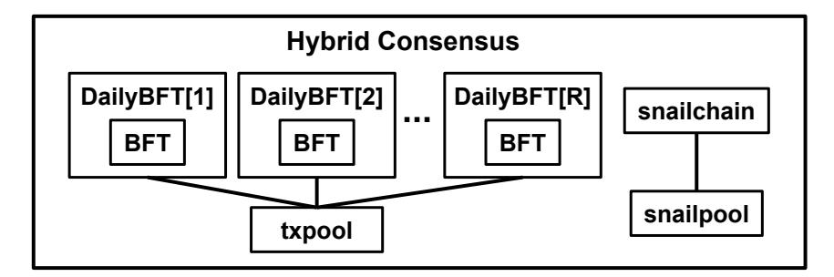

# Hybrid Consensus: Efficient Consensus in the Permissionless Model

Rafael Pass and Elaine Shi

CornellTech, Cornell, Initiative for CryptoCurrency and Contracts (IC3)<sup>∗</sup>

#### Abstract

Consensus, or state machine replication is a foundational building block of distributed systems and modern cryptography. Consensus in the classical, permissioned setting has been extensively studied in the 30 years of distributed systems literature. Recent developments in Bitcoin and other decentralized cryptocurrencies popularized a new form of consensus in a "permissionless" setting, where anyone can join and leave dynamically, and there is no a-priori knowledge of the consensus nodes. Despite this exciting breakthrough, today's permissionless consensus protocols, often referred to as "blockchains", are known to have terrible performance, which has resulted in heated, and at times acrimonious debates in the community. First, we show that unfortunately a performance loss is inherent for any protocol that secures against at least 1/3 corruptions in hashpower. Specifically, we formally define a new performance measure called responsiveness, and show that any responsive permissionless consensus protocol cannot tolerate 1/3 or more corruptions in hashpower. Next, we show a tightly matching uppper bound. Specifically, we propose a new permissionless consensus protocol called hybrid consensus, that is responsive and secures against up to 1/3 corruptions (approximately) in hashpower. Hybrid consensus's idea is to bootstrap fast permissionless consensus by combining an inefficient blockchain protocol with a fast permissioned consensus protocol. Hybrid consensus uses the blockchain not to agree on transactions, but to agree on rotating committees which in turn execute permissioned consensus protocols to agree on transactions. Our paper is the first to give a formal treatment of how to correctly combine a proof-of-work blockchain with classical consensus to achieve a responsive permissionless consensus protocol. Our effort exposes a multitude of non-trivial technical subtleties and challenges that are crucial to the correctness of the protocol, but have been overlooked by earlier and concurrent ad-hoc approaches.

<sup>∗</sup>http://www.initc3.org

# 1 Introduction

The distributed systems and cryptography literature traditionally has focused on protocols whose participants are known a priori. Bitcoin's rapid rise to fame represents an exciting breakthrough: Bitcoin empirically demonstrated that by leveraging assumptions such as proofs-of-work, non-trivial secure applications can be built on top of a fully decentralized network where nodes join and leave freely and dynamically, and there is no pre-established trust between participants. In the remainder of the paper, we will refer to the two network settings as the permissioned setting and the permissionless setting respectively.

Informally speaking, Bitcoin's core consensus protocol, often referred to as Nakamoto consensus [\[46\]](#page-53-0), realizes a "replicated state machine" abstraction, where nodes in a permissionless network reach agreement about a set of transactions committed as well as their ordering. Since the protocol relies on chaining of blocks of transactions, it is often referred to as the "blockchain".

Achieving consensus in the traditional permissioned model turns out to be a classical distributed systems problem, and there is a long line of research that seeks to design and optimize Byzantine consensus protocols [\[21,](#page-52-0) [25,](#page-52-1) [42\]](#page-53-1). The fact that we can obtain consensus in a permissionless model (relying on proofs-of-work) was the novel contribution of Bitcoin. In a sense, Bitcoin popularized a new model of distributed systems that was rarely considered in 30 years of classical distributed systems literature.

Known permissionless consensus protocols such as Bitcoin's Nakamoto consensus [\[46\]](#page-53-0), however, come at a cost. Since identities of nodes are not known a priori, it is imperative to defend against a Sybil attack where an attacker makes up arbitrarily many identities to outvote honest nodes. The Bitcoin protocol critically relies on proofs-of-work to roughly enforce the idea of "one vote per hashpower". Unfortunately, Bitcoin is known to have terrible performance. As Croman et al. [\[22\]](#page-52-2) point out, the Bitcoin network can sustain at most 7 tx/sec, at a transaction confirmation time of 10+ min (c.f. a main-stream payment processor such as Visa handles an average rate of 2, 000 tx/sec, and a peak rate of 59, 000 tx/sec). Further, each confirmed transaction costs roughly \$1 to \$6 if we were to amortize the network's total electricity consumption over all transactions being confirmed — today, this cost is in some sense being subsidized by the speculators of Bitcoin.

This naturally raises an important question.

Is it possible to design an efficient consensus protocol in the permissionless model?

We formally explore this important question in this paper.

## 1.1 Our Results and Contributions

Understanding the limits: performance vs. security. To understand this formally, let us first try to understand why the Nakamoto consensus protocol [\[46\]](#page-53-0) (adopted by Bitcoin) is inefficient. As Garay et al. [\[30\]](#page-52-3) and Pass et al. [\[47\]](#page-53-2) point out, the Nakamoto consensus protocol crucially relies on a-priori knowledge of an upper bound of the network's delay (henceforth denoted ∆) to parametrize its puzzle difficulty, and the protocol's transaction confirmation time is roughly O(λ∆) to achieve exp(−Ω(λ)) security failure — one way to think about this is that the block interval needs to be O(∆) to achieve security against any constant fraction of corruption (in hashpower), and one must wait for O(λ) blocks to obtain exp(−Ω(λ)) security failure. Nakamoto is clearly inefficient since the a-priori parameter ∆ needs to be set conservatively upfront to ensure the security of the protocol; and the transaction confirmation time suffers from looseness in the estimate ∆. While there are other possible metrics of efficiency, for now, we will focus on this one.

Therefore, one natural question to ask is whether we can have a protocol whose transaction confirmation time depends only on the network's actual performance, but not any a-priori known upper bound. We formally define a performance metric called  $responsiveness^1$  that captures this intuition: a protocol is said to be responsive, if its transaction confirmation time depends only on the network's actual delay  $\delta$ , but not on any a-prior known upper-bound  $\Delta$  (or simply no a-priori upper bound is known). In particular, in practice the actual  $\delta$  is often (much) smaller than the upper bound  $\Delta$ . In this case, responsiveness will be a useful measure of performance.

**Theorem 1.** (informal.) No secure and responsive consensus protocol can tolerate 1/3 or more corruptions, even when the adversary is constrained to static corruptions — and this holds in both the classical permissioned setting (even when PKI is assumed), as well as in the permissionless setting with proofs-of-work (where corruptions are stated in terms of hashpower).

The bad news is that we show that no responsive consensus protocol can tolerate 1/3 or more corruptions, even when the adversary is constrained and can only statically corrupt parties. This lower bound result holds both in the classical permissioned setting (even when PKI is assumed), as well as in the permissionless setting with proofs-of-work — in this setting corruptions are counted in terms of hashpower and not the number of nodes. To put this in perspective, observe that Nakamoto is not responsive, but can tolerate up to 1/2 corruptions in hashpower [47].

The proof of this lower bound is related to the lower bound by Dwork et al. [25] who showed that in an asynchronous (or partially synchronous) network, no classical permissioned consensus protocol (even with PKI) can tolerate 1/3 or more Byzantine corruptions. In our paper, we will show how to adapt their proof to the permissionless and proof-of-work setting, and for responsive protocols.

A responsive protocol with (almost) optimal resilience. The next obvious question is the following: suppose we are willing to relax the model and assume only < 1/3 corruptions in hashpower, can we have a responsive consensus protocol in the permissionless setting? We answer this question in the positive.

**Theorem 2.** (informal.) Assume a proof-of-work random oracle. There exists a responsive permissionless consensus protocol that is secure against  $1/3 - \epsilon$  corruptions in hashpower against a mildly adaptive adversary.

To this end, we propose hybrid consensus. Hybrid consensus provides "efficiency bootstrapping" for permissionless consensus, much as the well-known hybrid encryption and OT-extension are "efficiency bootstrapping" constructions. Since classical permissioned consensus [15, 19, 21, 25, 39, 40, 42, 45] has been studied and optimized for decades and have been shown to achieve responsiveness against 1/3 corruptions, our idea is to use a slow blockchain protocol (called snailchain) such as Nakamoto consensus [30, 46] to bootstrap fast permissioned byzantine consensus, the end result being a scalable consensus protocol in the permissionless model. For this reason, we call our protocol "hybrid consensus".

Hybrid consensus is the first known responsive permissionless consensus protocol, even heuristically. We formally prove that hybrid consensus achieves security against a malicious (i.e., Byzantine) adversary with the following capabilities: 1) wields roughly or  $\frac{1}{3}$  fraction of the total computation power; 2) can corrupt nodes adaptively but corruptions take a while to be effective (henceforth

<span id="page-2-0"></span><sup>&</sup>lt;sup>1</sup>Note that responsiveness is not to be mistaken with liveness which was defined by Garay et al. [30] and Pass et al. [47] in the permissionless setting. Liveness requires that transactions be confirmed within a bounded amount of time indicated by a liveness parameter T; whereas responsiveness in turn requires that T depend only on the network's actual delay  $\delta$  but not the (possibly loose) a-priori upper bound  $\Delta$ .

| Scheme                            | TX conf. time                 | Processing/tx | % honest    |
|-----------------------------------|-------------------------------|---------------|-------------|
| Nakamoto [46], BitcoinNG [27]     | Θ(λ∆)                         | O(n)          | 1<br>∼<br>2 |
| Fruitchain [48] (concurrent work) | Θ(λ∆)                         | O(n)          | 1<br>∼<br>2 |
| Hybrid consensus over Nakamoto    | Opt:<br>O(δ), Worst:<br>O(λδ) | O(λ)          | 3<br>∼<br>4 |
| Hybrid consensus over Fruitchain  | Opt:<br>O(δ), Worst:<br>O(λδ) | O(λ)          | 2<br>∼<br>3 |

Table 1: Summary of our results. n denotes the total number of nodes (assuming all nodes have equal hashpower); ∆ denotes a pre-determined upper-bound on the network's transmission delay; δ denotes the actual delay of the network; λ is the security parameter for attaining 2−<sup>λ</sup> security failure.

referred to as a mildly adaptive adversary); and 3) and can reorder messages during transmission, and delay messages up to a bound of δ time steps.

Other practical benefits. Besides providing responsiveness, hybrid consensus also brings additional benefits in practice: for smart contract applications, it lowers the cost of processing to O(λ) (i.e., independent of the total number of miners) while existing blockchains such as Nakamoto require that all miners execute the smart contracts. Finally, hybrid consensus can help increase the overall throughput of the consensus protocol since we expect a higher bandwidth throughput among the elected committee (in comparison with the full peer-to-peer network). Although hybrid consensus does not remove the proof-of-work, it reduces the cost per confirmed transaction by amortizing the proof-of-work cost over a higher transactional throughput.

## 1.2 Technical Subtleties and Comparison with Closely Related Works

Although the idea of combining permissionless consensus and permissioned consensus has been discussed in the community (e.g., the recent work by Decker et al. [\[23\]](#page-52-6) and the concurrent and independent work ByzCoin [\[37\]](#page-53-7)), to the best of our knowledge, no prior work has provided a formal treatment.

Technical subtleties. As our work shows, combining permissioned and permissionless protocols is non-trivial both in terms of construction and in terms of proving security. Our endeavor reveals numerous subtleties that could have been easily overlooked without a formal treatment: e.g., how to defend against selfish mining and achieve optimal resilience; how to rely on an on-chain stamping technique to defend against retroactive committee corruptions; how to deal with an adversarial selective opening of the committees; how to correctly handle committee switchover to ensure compositional security when multiple classical BFT instances can be running concurrently over short windows during the switchover.

Comparison with closely related works. In comparison, the prior work by Decker et al. [\[23\]](#page-52-6) and the concurrent work Byzcoin [\[37\]](#page-53-7) take a heuristic approach towards security: upon close examination, these works appear to have neglected one or more of the above subtleties (and additional ones). First, both works [\[23,](#page-52-6) [37\]](#page-53-7) claim to attain optimal resilience (i.e., tolerating 1/3 corruption), but their claim is incorrect — since these works use Nakamoto as the underlying snailchain, due to a well-known selfish mining attack [\[28\]](#page-52-7), they can at best tolerate 1/4 corruption absent non-trivial changes to their protocol. Besides this notable issue, there are additional apparent vulnerabilities with the Byzcoin protocol [\[37\]](#page-53-7): for example, their protocol does not remove trailing blocks in committee election, and thus there may not be agreement on the committee — this can harm the consistency and/or liveness of their protocol (these vulnerabilities of Byzcoin were also independently observed by others [\[1\]](#page-50-0)). Indeed, since Byzcoin [\[37\]](#page-53-7) was published in Usenix Security'16, the authors themselves have acknowledged some of these vulnerabilities in subsequent blog posts [\[3,](#page-51-1) [4\]](#page-51-2). Notably, in their most recent blog [\[4\]](#page-51-2), they cite our paper as a potential solution for achieving optimal resilience — however, thus far they still do not provide a formally correct protocol. Since their work seems to have neglected multiple subtleties that our effort has exposed, it is not clear what security guarantees they provide or in what security model their protocol gives any guarantees at all.

Therefore, our work is distinct in that we provide the first provably correct approach for combining proof-of-work blockchains and classical consensus to achieve responsiveness.

## 1.3 Paper Organization

Our formal treatment is a rather significant endeavor (and necessary as argued above) — thus for readability, we first present a semi-formal technical roadmap in Section [2](#page-4-0) before we give formal definitions, protocol description, and proofs.

## <span id="page-4-0"></span>2 Technical Roadmap

## 2.1 Preliminaries and Building Blocks

In this section, we present semi-formal or informal definitions for permissionless consensus which is the abstraction that we aim to realize, as well as the building blocks we rely on. The formal definitions will be presented later in the paper.

## 2.1.1 Permissionless Consensus

Our goal is to realize a state machine replication abstraction in the permissionless model — henceforth referred to as permissionless consensus[2](#page-4-1) .

In a permissionless consensus protocol, each node outputs a LOG in every time step — this LOG represents the set of committed transactions. Two important security requirements, namely, consistency and liveness must be guaranteed with overwhelming probability.

- Consistency: Consistency includes the following:
  - Common prefix. Suppose that an honest node i outputs LOG to Z at time t, and an honest node j (same or different) outputs LOG<sup>0</sup> to Z at time t 0 , it holds that either LOG ≺ LOG<sup>0</sup> or LOG<sup>0</sup> ≺ LOG. Here the relation ≺ means "is a prefix of". By convention we assume that ∅ ≺ x and x ≺ x for any x.
  - Self-consistency. Suppose that a node i is honest at time t and t <sup>0</sup> ≥ t, and outputs LOG and LOG<sup>0</sup> at times t and t 0 respectively, it holds that LOG ≺ LOG<sup>0</sup> .

<span id="page-4-1"></span><sup>2</sup>The term consensus is also used in the classical distributed systems literature to mean single-shot agreement protocols. In this paper, consensus means state machine replication, where nodes would like to agree on a linearly ordered log that grows over time.

• Liveness: Suppose that transactions TXs is input to an honest node at time  $t \geq T_{\text{warmup}}$ . Then, if any node that is honest at time  $t' \geq t + T_{\text{confirm}}$  outputs LOG at time t', it holds that TXs  $\subseteq$  LOG.

Intuitively, liveness says that transactions get included in honest nodes' LOGs within  $T_{\rm confirm}$  time. There are two liveness parameters  $T_{\rm confirm}$  and  $T_{\rm warmup}$ .  $T_{\rm warmup}$  is the protocol's warmup time; and  $T_{\rm confirm}$  is the maximum wait time for a transaction (proposed after  $T_{\rm warmup}$ ) to be confirmed.

#### 2.1.2 Blockchains

Hybrid consensus relies on a proof-of-work blockchain (henceforth referred to as a snailchain) as a building block. A proof-of-work blockchain can be regarded as a special case of a permissionless consensus protocol — in fact, we will formally show this in the full version of our paper. The formal abstractions for blockchains were proposed by Garay et al. [30] and Pass et al. [47]. We provide a semi-formal definition of blockchains in this section while deferring the formal definitions to later sections. Imprecisely speaking, a snailchain satisfies the following properties.

- Consistency. All honest nodes' chains (at any time) agree with each other except for the trailing  $\lambda$  blocks where  $\lambda$  is the security parameter. Further, a node's chain agrees with its future self.
- Chain quality. Among any consecutive  $\lambda$  blocks in an honest node's chain, a sufficient fraction of the blocks are mined by honest miners.
- Chain growth. Honest nodes' chains grow at a steady rate, neither too fast nor too slow.

#### 2.1.3 Permissioned BFT

Permissioned BFT protocols have been extensively studied in the classical distributed systems literature. Typically, known permissioned BFT [21,25,42] satisfy exactly the same consistency and liveness guarantees as defined earlier — but here for the permissioned setting.

Hybrid consensus will consume a permissioned BFT protocol as a building block. In turns out that in our context, an interesting technical subtlety arises in formalizing the abstractions required of the permissioned BFT. A property-based security definition (as is customarily done in the distributed systems literature) turns out to be insufficient due to a *selective opening* attack. In particular, the adversary is allowed to first look at nodes' public keys, and then adaptively influence the way the committee is chosen. In Section 4.2, we argue that there exists a (somewhat contrived) permissioned BFT protocol that is provably secure under property-based definitions, but would be completely broken if subject to adversarial selective opening.

As a result, we define a strengthened security notion for our underlying permissioned BFT building block. Not only do we require that the aforementioned consistency and liveness properties be satisfied with overwhelming probability, we need the following stronger statement:

There exists a p.p.t. reduction  $\mathcal{B}$  such that given any p.p.t. adversary that can break the BFT's security properties over any set of public keys, the reduction  $\mathcal{B}$  which makes blackbox calls to this adversary can forge a signature on behalf of an honest party.

Later in the paper, we will formalize the above notion and additionally show how to realize this abstraction by augmenting the PBFT algorithm [21].

#### 2.1.4 Execution Model

We consider an open enrollment network with a proof-of-work oracle that is modelled a random oracle as in earlier works [30, 47].

Network assumptions. We assume a partially synchronous model, where any message sent by an honest node is guaranteed to arrive at all honest nodes within δ time steps. The adversary is allowed to reorder messages subject to the above constraints.

Our protocol needs to know a possibly loose upper bound of δ to parametrize the scheme (in particular, to parametrize the puzzle difficulty of the underlying snailchain). We henceforth use the notation ∆ to denote this pre-determined upper bound. Our protocol achieves responsiveness: even though we use the a-priori upper bound ∆ as an input parameter, our protocol achieves transaction confirmation time that depends on the network's actual delay δ, not the possibly loose upper bound ∆. This requirement makes our setting fundamentally different than the synchronous model — since if the protocol simply takes ∆ time steps to be a synchronous round, the protocol would not be responsive.

Mildly adaptive corruption. Although we allow the adversary to adaptively decide which nodes to corrupt, corruption does not take place instantly. In our model, when the adversary issues a "target corrupt" instruction to a node, it takes τ time for the node to actually become corrupt (where τ will be parametrized later in the full version). Once a node actually becomes corrupt, the adversary can kill the node. Finally, new nodes can spawn at any time.

Admissible parameters. Henceforth we will assume that the underlying blockchain chooses a suitable difficulty parameter, such that the expected inter-block time is a suitable constant fraction larger than the network delay between honest nodes. We formalize these admissibility requirements later in the paper.

## 2.2 The Hybrid Consensus Protocol: Overview

Underlying snailchain. We build atop of an underlying blockchain protocol (denoted snailchain) whose formal abstractions were defined by Garay et al. [\[30\]](#page-52-3) and Pass et al. [\[47\]](#page-53-2). There are two possible realizations of such a snailchain abstraction, the original Nakamoto consenus [\[30,](#page-52-3) [46,](#page-53-0) [47\]](#page-53-2), and the more recent Fruitchain [\[48\]](#page-53-6) protocol. For conceptual simplicity, in our exposition, we will assume that Nakamoto is the underlying snailchain. However, as we explain later, using Nakamoto as the snailchain allows us to secure against 1/4 − corruption (in hashpower).

Fruitchain [\[48\]](#page-53-6) realizes the same abstraction as the Nakamoto snailchain— however, as Fruitchain provably secures against the selfish-mining attack, it achieves (almost) ideal chain quality. As we argue later, if we instead adopt Fruitchain as a drop-in replacement of the underlying snailchain, we can defend against 1/3 − corruption (in hashpower) for an arbitrarily small constant , thus achieving (almost) optimal resilience. Incidentally, this also demonstrates the compelling advantage of modular protocol design and composition.

#### 2.2.1 Warmup: Static Committee

Fundamentally, a blockchain such as Nakamoto consensus (henceforth denoted snailchain) relies on proofs-of-work puzzles such that nodes can establish Sybil-resilient identities. Our first idea is to leverage snailchain to elect a static committee. To do this, honest nodes run the blockchain for csize + λ blocks where csize = Θ(λ) denotes the targeted committee size, and λ denotes a security parameter. At this moment, an honest node would remove the trailing, unstablized λ blocks from its local chain, and call the miners of the first csize blocks the BFT committee[3](#page-6-0) .

<span id="page-6-0"></span><sup>3</sup> If multiple blocks are mined by the same miner, that miner can simply act as multiple virtual nodes in the BFT protocol — for this reason, the protocol works for n < λ as well (and so does our final scheme hybrid consensus).

Roughly speaking, such a protocol can be proven secure under a static corruption model due to the following.

- Due to the consistency property of snailchain, all honest nodes agree on the same BFT committee. We stress that it is important to remove the trailing λ unstable blocks since otherwise honest nodes will have differing opinions on who should be the BFT committee (e.g., due to possible forks in the snailchain) — in this case we cannot guarantee the protocol secure[4](#page-7-0) .
- Due to the chain quality property of snailchain, with appropriate overall parameters, we can ensure that more than 2/3 of the committee members are honest which is sufficient to ensure the security of the permissioned BFT protocol.
- Due to the chain growth property of snailchain, it will not take too long for the BFT committee to form.

Finally, committee members sign any transaction committed as well as its sequence number. For any node that was not elected as a committee member, it can simply count d 3 |csize|e number of signatures from committee members for deciding its own output log. Since more than 2/3 of the committee members are honest, there is at least one honest committee member if at least d 1 3 |csize|e vouch for the same transaction and its sequence number (i.e., its relative position within the output log). It is not hard to see that responsiveness holds for this simple protocol assuming that the BFT protocol employed is responsive.

An interesting paradox. Despite the apparent simplicity of this proposal, this scheme is nonetheless thought provoking. One intriguing apparent paradox is the following: since we do not rely on the snailchain to agree on transactions any more, why not stop running the snailchain after the committee is elected? Although this proposal may seem tempting initially, one quickly realizes that it is not secure. In particular, for any protocol that stops performing proofs-of-work after bounded polynomial amount of time, an adversary can always create a simulated execution that is identically distributed as the real execution, such that a node that spawns late is unable to distinguish the real execution from the simulated one. We formalize this lower bound in Section [9,](#page-47-0) and show that any secure permissionless consensus protocol must call proofs-of-work infinitely often (even for static security and the synchronous model).

#### 2.2.2 Handling Mildly Adaptive Corruption

From static to mildly adaptive corruptions. The aforementioned scheme with a static committee fails to be secure against an adaptive adversary, since the adversary can simply corrupt the committee once it is elected. Unfortunately, any scheme that down-selects from n nodes to a λ-sized committee must be vulnerable to such adaptive attacks.

In reality, however, corruption of a node is typically not instant, since it takes a while to infect an otherwise clean host. We therefore define a slightly relaxed and nonetheless realistic corruption model henceforth referred to as τ -agile corruptions. In this model, roughly speaking, an adversary can issue "target corrupt" instructions to nodes; however, a node that receives "target corrupt" does not become corrupt until τ time steps later.

We show a positive result under this τ -agile corruption model. Our key idea is to rely on rotating committees. When an honest node's chain reaches R · csize + λ in length, the R-th committee is elected by first removing the trailing λ number of blocks, and then from this pruned chain, we elect

<span id="page-7-0"></span><sup>4</sup>Note that in comparison, the concurrent and independent work Byzcoin [\[37\]](#page-53-7) does not explicitly make this observation, and therefore their protocol and security guarantees appear under-specified.

the last csize blocks' miners as the committee. The idea is that if an adversary targets a committee member once he mines a block (that will allow him to be included in a committee), it will be too late. With an appropriate τ , by the time the node actually becomes corrupt, the committee's term will have been ended, and the next committee will have already taken over! We leave it as an exciting open question whether fully adaptive security is possible for responsive permissionless consensus protocols.

Technical challenges. While the high-level idea may seem straightforward, it turns out that defining and handling mildly adaptive corruptions introduces various technical subtleties — specifically, we need to correctly handle committee switchover in a way that guarantees concurrent composition; moreover, the possibility that an adversary can retroactively corrupt old committees also introduces new challenges.

Daily operations. Henceforth for convenience, we will say that each committee serves for a day, and outputs a daily log. Our hybrid consensus protocol essentially outputs the concatenation of these daily logs. We now describe the daily operations of both committee members and nonmembers.

- Committee members. On each day R, the R-th committee will run a BFT instance. A committee member will continue running the BFT protocol to commit transactions until it receives a "stop" instruction at which point a special stopping procedure is invoked. Therefore, committee members will output committed transactions gradually over time. Committed transactions will populate a node's daily log denoted logR.
  - Whenever an honest committee member adds a new transaction tx to its logR, it will sign the tuple (R, `,tx) where R denotes the current day and ` denotes the sequence number of tx within the day. The honest committee member then gossips the signed tuple to the network.
- Committee non-members. Non-members hear signed transactions from the network. Whenever a non-member hears that a tuple (R, `,tx) has been signed by more than <sup>1</sup> 3 fraction of comm<sup>R</sup> members, he adds the tx to its logR:

if
$$\mathsf{log}_R[\ell]$$
 is not populated :  $\mathsf{log}_R[\ell] := \mathsf{tx}$

Observe that a committee non-member can write to its logR[`] out of order since messages may be received out of order. However, a transaction cannot be processed until all preceding transactions have been committed. Later, when we define each node's output LOG, we enforce that transactions are always written to LOG in sequential order — and this can be achieved if committee non-members output the longest contiguous prefix of log<sup>R</sup> to its LOG.

Committee switchover. Whenever a node enters a new day denoted R + 1, a committee switchover is needed. Realizing committee switchover correctly without leaving gaps of inactivity in between is somewhat tricky. We propose an approach where at the beginning of each day, the new committee starts a new BFT instance, and at the same time the old committee initiates a stopping procedure of the existing instance. This would introduce several subtleties because in transient windows, two (or more) instances of BFT protocols may be concurrently executing — in these cases, nodes need to correctly linearize the outputs of the multiple instances; and we also need to ensure concurrent composition of the multiple BFT instances.

Below we first describe the stopping procedure of the previous BFT instance; we then describe how nodes output a linearized log in the presence of possibly concurrently executing BFT instances.

In the following, let R be the previous day.

• Member of the previous committee. If a node is a member of the R-th committee denoted  $\mathsf{comm}_R$ , it inputs a special, signed  $\mathsf{stop}$  transaction to the previous  $\mathsf{BFT}$ — a node may run multiple  $\mathsf{BFT}$  virtual nodes, in which case one signed  $\mathsf{stop}$  transaction is input to each  $\mathsf{BFT}$  virtual node. When the  $\mathsf{BFT}$ 's log collects sufficiently many of these  $\mathsf{stop}$  transactions signed by distinct committee member public keys, the log is finalized and all later transactions are ignored. At this moment, we say that the previous  $\mathsf{BFT}$  has terminated. When the previous  $\mathsf{BFT}$  has terminated, a member of  $\mathsf{comm}_R$  will sign the tuple  $(R, |\mathsf{log}_R|)$  and gossip the signed tuple to the network. This allows non-members of  $\mathsf{comm}_R$  to determine when  $\mathsf{log}_R$  ends.

Further, an honest committee member signs  $(R, \mathsf{hash}(\mathsf{log}_R))$  where  $\mathsf{hash}$  is collision-resistant, and proposes the signed tuple to the underlying snailchain—we henceforth refer to this action as stamping. As we explain later, timely stamping secures against an adversary that can retroactively corrupt old committee members in the future.

At this point, the honest  $comm_R$  member outputs "done".

• Non-member of the previous committee. If the node is not a committee member of the BFT instance for day R, it waits for more than  $\frac{1}{3}$  fraction of  $\mathsf{comm}_R$  members to vouch for a tuple  $(R,\ell)$ . When this happens, it knows that  $\ell$  is the final sequence number of  $\mathsf{log}_R$ . Therefore, it simply waits for all of  $\mathsf{log}_R[:\ell]$  to be populated before outputting "done".

Whenever a node (either member of non-member of  $comm_R$ ) outputs "done", its  $log_R$  is said to be final. We note that honest  $comm_{R+1}$  members start the new BFT instance for day R+1 as soon as they perceive the start of day R+1, and without waiting for their  $log_R$  to be final. This ensures that all  $comm_{R+1}$  members start the new BFT instance within a short duration from each other (whereas waiting for  $log_R$  to be final will incur extra drift in the start time of the next BFT instance).

Output a linearized log. Nodes need to collect their daily logs into a final log denoted LOG—and this final log must satisfy the properties defined in Section 3.2. In particular, this final log LOG outputs transactions in increasing order, since one may not be able to process a transaction until all preceding transactions have been accumulated. As we pointed out, committee non-members may write to its daily log denoted  $\log_R$  out of order. Further, when the BFT instance on the R-th day is started, the previous BFT instance may not have fully completed, and therefore  $\log_R$  would have to wait for  $\log_{R-1}$  to be final.

Therefore, to output the final log LOG in order, we simply define LOG to contain:

- A maximal, consecutive sequence of daily logs  $\log_1$ ,  $\log_2$ , ...,  $\log_{r-1}$  all of which must be final.
- The longest contiguous prefix of the daily  $\log \log_r'$ .

On-chain stamping: defending against retroactive corruption. Given long enough time, an adversary can eventually corrupt sufficiently many BFT committee members, and at this point, the adversary can forge BFT committee members' signatures over any message of its choice. Therefore, signatures from BFT committee members are of no worth after a long enough time. Under the possibility of such retroactive attacks, nodes that spawn late cannot rely on counting committee members' signatures for deciding logs that are too ancient.

To address this challenge, we rely on an *on-chain stamping* technique. When honest BFT committee members terminate their BFT instances, they would sign a hash of the daily log and propose the tuple as a transaction to the underlying snailchain. We prove that under appropriate

parameter choices, sufficiently many honest BFT committee members' daily log hashes get stamped on snailchain in a timely manner (in particular before the nodes actually become corrupt). In this way, nodes who spawn late can recover the correct hash of past daily logs from the underlying snailchain (instead of counting signatures from ancient committee members who may by then be corrupt). We stress that the on-chain stamping is only for late-joining nodes to recover historical daily logs. Transaction confirmation online requires only counting signatures from the present committee, and need not wait for the on-chain stamping to take place.

#### 2.2.3 Chain Quality and Resilience

It would be ideal if mining were a random lottery, where for each block, nature draws a winner at random. If this were indeed the case, we could achieve perfect chain quality, i.e., roughly 1−α chain quality if α fraction of nodes are corrupt. Unfortunately, several previous works [\[28,](#page-52-7) [30,](#page-52-3) [47\]](#page-53-2) have shown that Nakamoto consensus cannot be thought of as a perfect lottery due to a selfish mining attack. When honest nodes mine a block, they announce the block immediately, but corrupt nodes need not follow this rule. In a selfish-mining attack, roughly speaking, when corrupt nodes mine a block B<sup>∗</sup> off the currently longest chain, they withhold the block B<sup>∗</sup> from the public and continue to mine on its own private fork. If at some point honest nodes happen to mine a new block B off chain, at this moment the adversary immediately releases the block B<sup>∗</sup> , and combined with a network rushing attack, the block B<sup>∗</sup> will get to other nodes more quickly than B. In this manner, the adversary has successfully erased the work of honest nodes — and in fact every time corrupt nodes mine a block, they have an opportunity to erase an honest node's block. Consequently, Nakamoto consensus would require roughly 3/4 overall honest to achieve 2/3-chain quality (and 2/3-chain quality is needed to ensure that 2/3 of the BFT committee are honest) — in fact, this is also the reason why previous works (Decker et al. [\[23\]](#page-52-6) and Byzcoin [\[37\]](#page-53-7)) that claim to achieve optimal resilience were incorrect.

The loss of resilience arising from chain quality loss can be mostly avoided, if instead of Nakamoto consensus, we adopt Fruitchain [\[48\]](#page-53-6) as the underlying blockchain protocol. As shown by Pass and Shi [\[48\]](#page-53-6), Fruitchain provably defends against such a selfish-mining attack, and therefore attains almost perfect chain quality, i.e., it achieves roughly (1 −α)-chain quality with any α < 1/2 corruption under typical parametrizations. Therefore, hybrid consensus over Fruitchain requires only 2/3 overall honest hashpower (approximately) to achieve security.

#### 2.2.4 Modular Protocol Composition and Formal Reasoning

To aid formal reasoning and presentation, our protocols are described through a modular composition approach.

Daily offchain consensus. We first construct an intermediate abstraction called DailyBFT which describes what committee members and non-members do respectively to agree on each day's daily log. Our hybrid consensus protocol will fork one instance of DailyBFT[R] for each day where R is the day number as well as the unique session identifier for the DailyBFT instance. Hybrid consensus then concatenates the daily logs output by these DailyBFT instances.

In a DailyBFT instance, each elected committee member spawns one or more BFT virtual nodes, depending on how many of its public keys were included in the committee. If a node has not been elected as the committee, it would count signatures from committee members to decide its daily log.

| Variable                     | Meaning                                                                           |  |
|------------------------------|-----------------------------------------------------------------------------------|--|
| tx                           | a transaction                                                                     |  |
| `                            | sequence number of a transaction within each BFT instance                         |  |
| LOG                          | the totally ordered log each node outputs,<br>LOG<br>is always populated          |  |
|                              | in order                                                                          |  |
| log                          | log of one<br>BFT<br>instance, referred to as daily log                           |  |
| 0<br>log[`<br>:<br>`<br>]    | 0<br>transactions numbered<br>`<br>to<br>`<br>in<br>log                           |  |
| log[:<br>`]                  | log[1 :<br>`]                                                                     |  |
| λ                            | security parameter                                                                |  |
| α                            | adversary's fraction of hashpower                                                 |  |
| δ                            | network's maximum actual delay                                                    |  |
| ∆                            | a-priori upper bound of the network's delay (typically loose)                     |  |
| csize                        | committee size, our protocol sets<br>csize<br>:=<br>λ                             |  |
| th                           | th<br>:=<br>dcsize/3e, a threshold                                                |  |
| lower(R),<br>upper(R)        | lower(R) := (R<br>−<br>1)csize<br>+ 1,<br>upper(R) :=<br>R<br>·<br>csize          |  |
| chain                        | a node's local chain in the underlying<br>snailchain<br>protocol                  |  |
| −λ]<br>chain[:               | all but the last<br>λ<br>blocks of a node's local<br>chain                        |  |
| MinersOf(chain[s<br>:<br>t]) | the public keys that mined each block in<br>chain[s<br>:<br>t].<br>It is possible |  |
|                              | that several public keys belong to the same node.                                 |  |
| {msg}pk−1                    | a signed message<br>msg, whose verification key is<br>pk                          |  |
| Tbft                         | liveness parameter of the underlying BFT scheme                                   |  |

Table 2: Notations

We formalize and prove the security properties of DailyBFT: Below are a few things to keep in mind when reading the detailed formalism presented in Section [5.2.](#page-27-0)

- While the lower-level BFT building block states its security properties (i.e., consistency and liveness) for committee members only, in DailyBFT, these security properties are extended to non-committee members as well.
- The lower-level BFT building block assumes that all committee members are spawned before the BFT instance starts. In DailyBFT, however, these security properties need to extend to committee non-members who potentially spawned later (but not too late).
- On the other hand, DailyBFT does not guarantee security (i.e., consistency and liveness) for nodes that join too late, since committee members may become corrupt far out in the future, at which point committee members can sign arbitrary tuples, and thus late joining nodes cannot rely on counting signatures to decide their daily logs any more. We defer it to hybrid consensus to deal with this attack, by having late joining nodes recover ancient daily logs by examining daily log hashes stamped on the snailchain.
- DailyBFT offers a keygen abstraction: upon every keygen query, DailyBFT generates and outputs a new miner public key pk — the hybrid consensus protocol will incorporate pk into the block being mined. Later, DailyBFT will receive input from the environment which set of pks have been selected as committee members. This is where the adversarial selective opening of committee keys is handled. The security proof of DailyBFT therefore makes use of the strong security of the BFT protocol, to argue that the BFT protocol, when run inside DailyBFT as a subprotocol,

will respect the stated security properties including consistency and liveness — otherwise one could construct a reduction that breaks signature security.

• Finally, in comparison with BFT, DailyBFT additionally implements a termination procedure that satisfies two properties, timely termination, and termination agreement. Timely termination says that the BFT protocol terminates quickly upon honest nodes receiving stop instructions. Termination agreement says that all honest nodes output identical final logs upon termination. Termination is realized by having honest BFT virtual nodes input a special, signed stop transaction to the underlying BFT. When [|comm|/3] stop transactions signed by distinct committee member keys have accumulated in the log, all later transactions are ignored and the log is finalized.

**Hybrid consensus.** We now describe our final product, the hybrid consensus protocol. Hybrid consensus consumes multiple instances of DailyBFT where rotating committees agree on daily logs. Hybrid consensus primarily does the following:

- It manages the spawning and termination of DailyBFT instances effectively using snailchain as a global clock that offers weak synchronization among honest nodes;
- Recall that each DailyBFT instance does not ensure security for nodes that spawn too late, since committee members can become corrupt far out in the future at which point they can sign arbitrary tuples. Therefore, hybrid consensus introduces an on-chain stamping mechanism to extend security guarantees to even nodes that spawn late. Specifically, committee members stamp their signed daily log hash onto snailchain when their BFT instance terminates. Nodes that spawn late will rely on this on-chain stamp to identify and recover ancient daily logs in the past (rather than counting off-chain signatures from committee members).

#### 2.2.5 Main Theorem

Below we state our main theorem: by using Fruitchain as the underlying snailchain in hybrid consensus, we obtain the first responsive permissionless consensus protocol with optimal resilience. The proof of the main theorem will be presented later in the paper.

Let  $\alpha$  denote the adversarial fraction, let  $\rho$  denote the probability that a single node mines a block in each time step, let  $\lambda$  denote a security parameter for Hybrid Consensus, and let  $\eta$  be an additional parameter expected by Hybrid Consensus (such that the committee size will be chosen as  $\frac{\lambda}{\eta}$ ), let  $\kappa$  denote a security parameter for the underlying Fruitchain protocol, we have the following theorem:

<span id="page-12-1"></span>**Theorem 3** (Hybrid consensus over Fruitchain). For any (arbitrarily small) constant  $\epsilon > 0$ , let  $\alpha = \frac{1}{3} - \epsilon$ , for every  $n, \delta$ , there exists a sufficiently small  $\rho := \Theta(\frac{1}{\delta n})$ , a suitable  $\kappa = \Theta(\lambda)$ , and constant  $\eta > 0$ , such that HybridConsensus<sup> $\lambda,\eta$ </sup> over Fruitchain with parameters  $(\rho,\kappa)$ , is secure w.r.t. any p.p.t.  $(n,\alpha,\delta,\tau)$ -valid  $(\mathcal{A},\mathcal{Z})$  for any suitable  $\tau$  such that  $\Gamma_{\rho,\eta}^{\text{hcfruit}}(n,\alpha,\delta,\tau) = 1^{-5}$  achieving

$$T_{warmup} := 1.5\lambda(1 + \frac{1}{\eta})/(1 - 5\eta)n\rho, \quad T_{confirm} := O(\lambda\delta)$$

<span id="page-12-0"></span><sup>&</sup>lt;sup>5</sup>Formal definitions of admissible adversary will be presented in the formal sections to follow.

Note that in the above theorem, the Tconfirm parameter is stated for the worst-case transaction confirmation time even when under attack. In the optimistic case, hybrid consensus achieves a transaction confirmation time of O(δ). Further, although the theorem is stated in terms of the network's actual delay δ, in practice we must predetermine an upper bound estimate (denoted ∆) of δ to parametrize the puzzle difficulty level ρ. As long as ∆ is indeed an upper bound on δ, security is guaranteed by the above theorem, and the scheme achieves responsiveness, i.e., the transaction confirmation time does not depend on the upper bound ∆, but the actual network delay δ. As mentioned earlier, if we choose a looser estimate ∆ (i.e., a greater value of ∆), the scheme will then be parametrized with a more difficult puzzle — on one hand this allows us to tolerate potentially a higher fraction of corrupt nodes; on the other hand, the agility parameter τ as well as the protocol's warmup time will increase accordingly.

Remark 1 (A note on responsiveness). It may seem counter-intuitive that since our scheme is responsive, why do we still need a-priori knowledge of ∆, an upper bound of the network's delay? In particular, can we simply choose the parameter ∆ to be infinity? Upon closer examination, our agility parameter τ and the protocol's warmup time Twarmup will both depend on ∆. If we choose a bigger ∆, the underlying snailchain would adopt a more difficult puzzle and hence tolerate a higher fraction of corrupt nodes; but on the other hand, we are trading off agility and the protocol's warmup time.

## 2.3 Additional Related Work

We now review additional related work. Comparsion with most closely related work, including Decker et al. [\[23\]](#page-52-6) and Byzcoin [\[37\]](#page-53-7) were described earlier.

Scaling decentralized consensus. The scalability of Bitcoin and decentralized, permissionless cryptocurrencies is a highly visible issue, and has resulted in heated, and at times acrimonious debates in the community [\[22,](#page-52-2)[53\]](#page-53-8). The cryptocurrency community have proposed various incremental patches to alleviate the scalability pressure in the near term, including adjusting the block size and others [\[8,](#page-51-3) [26,](#page-52-8) [31,](#page-52-9) [32,](#page-52-10) [54\]](#page-53-9).

Eyal et al. propose BitcoinNG [\[27\]](#page-52-5), where a slow snailchain protocol is used to elect a single leader every epoch, and the leader is in charge of incorporating and linearizing transactions during its appointment. In essence, BitcoinNG can be viewed as pipelining block transmission by breaking it up and spreading block transmission over time — effectively reducing upper-bound on the worstcase delay ∆ in Nakamoto consensus. BitcoinNG still requires nodes to wait for Θ(λ) blocks in the underlying snailchain (referred to as key blocks in BitcoinNG) to stabilize for transactions to be confirmed where λ is the security parameter. In comparison, hybrid consensus is responsive, and the transaction confirmation time in the optimistic case is only O(δ) where δ is the network's actual delay, not the a priori known upper bound ∆. BitcoinNG did not give a formal treatment of their protocol, but it is conceivable that their protocol can be proven to realize a permissionless consensus abstraction.

Side-chain [\[9\]](#page-51-4) is another notable effort at addressing Bitcoin's scalability painpoint. Side-chain's idea is to support consensus protocols off the main Bitcoin blockchain, and the currency in the side chain is pegged to Bitcoin. The side-chain protocol lacks formal guarantees, and the protocol description and implementation remain somewhat incomplete.

Various other approaches [\[11,](#page-51-5) [38,](#page-53-10) [49–](#page-53-11)[52\]](#page-53-12) have been proposed recently to attain consensus in different variants of "decentralized" settings with varying trust assumptions.

Permissioned consensus. Consensus protocols in the permissioned model have been extensively investigated by the community in the past 30 years [\[14,](#page-51-6)[15,](#page-51-0)[21,](#page-52-0)[25,](#page-52-1)[29,](#page-52-11)[35,](#page-53-13)[39–](#page-53-3)[41\]](#page-53-14). These works typically consider three different models: 1) the synchronous model [\[24\]](#page-52-12) where protocols proceed in rounds, and messages delivered in one round are guaranteed to arrive at the recipient at the beginning of the next round; 2) the partial synchrony model [\[25\]](#page-52-1) where the network has a bounded delay parameter but the protocol does not know this delay; and 3) the asynchronous model [\[14,](#page-51-6)[15\]](#page-51-0) where the network's delay may grow unbounded.

Our network model is akin to the standard notion of partial synchrony [\[25\]](#page-52-1) but not the same. Although we allow the protocol to know an a-priori upper bound on the network's delay, we aim to achieve responsiveness. We stress that any protocol that waits for the network delay and treats the delay as a synchronous round inherently cannot be responsive. If the protocol did wait for the network delay as a synchronous round, this would indeed translate to the synchronous model, however, our responsiveness requirement makes the design of protocols non-trivial in our network model.

Earlier works on permissioned consensus have also considered group reconfiguration. For example, Vertical Paxos [\[40\]](#page-53-4) and BFT-SMART [\[12\]](#page-51-7) allow nodes to be reconfigured in a dynamic fashion. These works consider group reconfiguration for a related but somewhat different purpose. It would be interesting to investigate whether these techniques can be adapted to our setting to perform the switchover of committee members. We point out, however, that earlier group reconfiguration techniques do not prove security under the selective opening attack (in fact, most of these works do not adopt a cryptographically sound framework of reasoning). If we are to adapt these techniques, a new, cryptographically sound treatment is necessary.

Distributed systems and cryptography. Consensus and distributed systems interact closely with cryptography such as multi-party computation (MPC). On one hand, multi-party computation (MPC) essentially relies on broadcast or distributed consensus primitives to achieve consistency and potentially livenss, often referred to as guaranteed output in the MPC context. On the other hand, distributed consensus protocols often make use of cryptography to ensure security. For example, the authenticated Byzantine model [\[24\]](#page-52-12) makes use of digital signatures, and cryptographers refer to this setup assumption as the public-key infrastructure [\[16,](#page-51-8) [17,](#page-51-9) [20\]](#page-52-13).

On the other hand, the non-authenticated Byzantine model [\[41\]](#page-53-14) in distributed systems is actually referred to as the authenticated channels model by cryptographers [\[16,](#page-51-8) [17,](#page-51-9) [20\]](#page-52-13). When protocols employ computationally secure cryptographic primitives, implicitly we assume that the network's delay must be polynomially bounded in the security parameter (but can be an unbounded polynomial in the asynchrony case), since we cannot guarantee security for protocols that run exponentially long. When distributed consensus protocols make use of computationally secure primitives, a best practice is to rely on computational reductions to prove the security of the protocols — it has become well-understood that modeling cryptography as the most natural blackbox without careful scrutiny can be error-prone and flawed [\[5–](#page-51-10)[7,](#page-51-11) [10,](#page-51-12) [13,](#page-51-13) [18,](#page-52-14) [33,](#page-52-15) [34,](#page-52-16) [43,](#page-53-15) [44\]](#page-53-16).

Our paper demonstrates such an approach where we adopt the protocol composition frameworks [\[16,](#page-51-8) [17,](#page-51-9) [20\]](#page-52-13) developed by the cryptographers to reason about distributed systems protocols — we show that doing so is necessary in particular through the handling of the selective opening attack. Such issues can easily be overlooked if we did not adopt a formal, cryptographically sound framework of reasoning.

# 3 Problem Definitions

Strongly negligible functions. All security failures in this paper will be expressed as (exponentially) strongly negligible functions in terms of some security parameter λ ∈ N. We say that a function negl(·) is strongly negligible, if there exist some constants c<sup>0</sup> > 0, c1, such that for all λ ∈ N, negl(λ) ≤ exp(−(c0λ+c1)). In the remainder of the paper, we simply use the term negligible for simplicity, but all uses of it can be automatically replaced by strongly negligible.

## 3.1 Formal Model

Execution model. We assume the following execution model:

- Interactive Turing Machines. We assume a standard Interactive Turing Machine (ITM) model [\[16,](#page-51-8) [17,](#page-51-9) [20\]](#page-52-13) often adopted in the cryptography literature (but augmented with proof-of-work as explained later). There is an underlying, global clock that increments over time; each clock tick is referred to as an atomic time step.
  - Nodes can perform unbounded polynomial amount of computation in each atomic time step, as well as send and receive polynomially many messages. Although not explicitly noted in the paper, nodes receive inputs from an environment Z and send their outputs to an environment.
- Proof-of-work. We assume that there is a random oracle denoted by a pair (H, H.ver). In each atomic time step, each node can make at most one H oracle query, but an unbounded (polynomial) number of H.ver queries. If there are multiple instances of the blockchain protocol, we assume that each protocol instance has its own independent random oracle. The environment cannot directly query the random oracle, but can query the random oracle through the help of the adversary.
- Corruption. At any point of time, the environment Z can communicate with corrupt nodes in arbitrary manners. This also implies that the environment can see the internal state of corrupt nodes. Corrupt nodes can deviate from the prescribed protocol arbitrarily, i.e., exhibit byzantine faults. All corrupt nodes are controlled by a probabilistic polynomial-time adversary denoted A, and the adversary can see the internal states of corrupt nodes.
  - For honest nodes, the environment cannot observe their internal state, but can observe any information honest nodes output to the environment by the protocol definition. Details on corruption models will be described later.
- Network delivery. The adversary is responsible for delivering messages between nodes. We assume that the adversary is capable of delaying or reordering messages, possibly subject to certain restrictions as described below.
- τ -agile corruption. In standard adaptive corruption models, whenever the environment wishes to corrupt a node, the corruption takes place instantly. Our protocol is proven secure under a slightly relaxed adaptive corruption model which we refer to as τ -agile corruption. Roughly speaking, τ -agile corruption says that it takes a short while for the environment to actually corrupt a node. More formally, the environment is allowed to corrupt and spawn new nodes according to the following procedures:
- Delayed corruption. We assume that the environment can adaptively corrupt a node but with the following restrictions. To corrupt a node i, the environment must issue a "target corrupt"

instruction to node i at some point of time denoted t. Node i does not become corrupt immediately, but rather remains honest till t+τ , and becomes corrupt at time t+τ — at this point, the the corrupt node i communicates arbitrarily with the environment and can deviate arbitrarily from the protocol.

- Killing a corrupt node. Once a node actually becomes corrupt, the environment can issue a "kill" instruction to kill the node. A killed node is no longer live. The environment cannot kill honest nodes directly without corrupting them first.
- Spawning new nodes. The environment is also allowed to spawn fresh nodes, either honest or corrupt ones. A node spawned at time tspawn is considered live at time tspawn. Spawning a corrupt node is equivalent to increasing the hashpower of the adversary which takes place instantly. If an honest node is spawned, the environment must follow the delayed corruption procedure if it wishes to corrupt this node later. An honest, newly spawned node starts running the main protocol.

We say that a node (that has been spawned and has not been killed) can be in three mutually exclusive states:

- 1. Intact: An honest node that has not received a "target corrupt" instruction.
- 2. Pre-corrupt: An honest node that has received a "target corrupt" instruction, but has not become corrupt yet.
- 3. Corrupt: A node that is either spawned to be corrupt, or spawned to be honest, but then received a "target corrupt" instruction and actually became corrupt.

Both intact nodes and pre-corrupt nodes are considered honest.

Henceforth, whenever we say that "an honest node i performs certain actions at time t", we mean that the node i is honest at time t. For example, if we say that an honest node outputs a message to the environment Z at time t, we implicitly mean that the node is honest at time t (but may become corrupt later). Alternatively, if we say that an honest node performs an action, it means that the node is honest at the time it performs the action, although it may become corrupt sometime in the future.

Fully adaptive corruption and static corruption. We note that 0-agile corruption is equivalent to the fully adaptive corrupt model where the environment Z can corrupt nodes instantly. Under a fully adaptive corruption model, a node is intact iff it is honest.

We also define static corruption in the permissionless model — static corruption is a weaker corruption model and is only used for the purpose of proving our lower bounds — note that assuming a weaker corruption model yields stronger lower bounds. We assume that in the static corruption model, environment can spawn honest or corrupt nodes at any time. However, once an honest node is spawned, the environment is unable to corrupt it later on.

Gossip network model. We assume that all messages sent by honest nodes are spread over a gossip network and can eventually be heard by all other honest nodes. For nodes that join at time T, it will receive all messages sent by honest nodes after time T. An honest node need not know the identities of other nodes in the network to gossip a message to all other nodes.

The adversary cannot drop or modify messages by honest nodes, but is allowed to reorder or delay messages subject to certain restrictions. The adversary may selectively deliver a message to a subset but not all of the honest nodes.

We assume that the identity of a message's sender is unknown. Messages can be signed, but an honest node does not know the correspondence between public keys and physical identities of nodes.

We define the following types of gossip networks which impose different restrictions on the adversary's ability to delay and reorder messages:

- Synchronous model. In the synchronous model, messages gossiped by an honest node at time t are guaranteed to arrive at all honest nodes, possibly out of order, in time step t + 1. Moreover, historical messages are delivered to newly spawned nodes instantly.
- δ-partially synchronous model. In a δ-partially synchronous model, messages gossiped by an honest node at time t are guaranteed to arrive at all honest nodes, possibly out of order, by time t + δ. Moreover, historical messages are delivered to newly spawned nodes instantly.

More formally, suppose an honest node gossips a message in time step t ≤ t ∗ , then if a node i is honest in time step t <sup>∗</sup> + δ, then it must have received the message.

Note that in practice, honest nodes can implement a historical transcript retrieval service this way, a node can obtain a copy of the entire historical transcript when spawning a consensus instance. It is not hard to see that if any honest node remains honest and live for at least 3δ time, no historical transcript will be lost.

As mentioned later in Section [3.2,](#page-18-0) we allow our protocol to know a possibly loose upper bound ∆ on the network's delay, since the underlying snailchain must know such an upper bound for parametrizing the mining difficulty. However, we require that the protocol be responsive, i.e., its actual performance must depend only on the network's actual δ value, not the loose upper bound ∆.

Randomized protocol execution and probability space. Let Π be some protocol, let A, Z be probabilistic polynomial-time (or p.p.t. for short) algorithms, and let λ ∈ N. Let exec[Π](A, Z, λ) be a random variable denoting the joint view of all nodes (i.e., all their inputs, random coins, and messages received, including those from random oracles) in the above execution.

Let property be a function that takes as input a fixed view and outputs either 0 or 1. Throughout the paper, whenever we say that some property holds for exec[Π](A, Z, λ) with probability p, we formally mean that

$$\Pr\left[\mathsf{view} \overset{\$}{\leftarrow} \mathtt{EXEC}[\Pi](\mathcal{A}, \mathcal{Z}, \lambda) : \mathsf{property}(\mathsf{view}) = 1\right] = \mathsf{p}$$

where probability is taken over all random coins of A, Z, all honest nodes, and all random oracles.

Compliant execution. We often impose constraints on the adversary A and Z to prove security properties of protocols. We therefore define what we consider as compliant executions, in terms of constraints on the pair (A, Z).

<span id="page-17-0"></span>Definition 1 ((n, δ, τ )-valid (A, Z)). We say that the pair (A, Z) is (n, δ, τ )-valid w.r.t. protocol Π if A and Z are probabilistic polynomial-time algorithms such that for every λ ∈ N, the following properties hold with probability 1 for exec[Π](A, Z, λ):

- 1. At any point of time, the number of live nodes[6](#page-18-1) is n;
- 2. A delays messages from honest nodes in at most δ time steps;
- 3. Once an honest node receives input "target corrupt" from the environment, it takes at least τ time before the node becomes corrupt.

<span id="page-18-2"></span>Definition 2 ((n, α, δ, τ )-valid (A, Z)). We say that the pair (A, Z) is (n, α, δ, τ )-valid w.r.t. protocol Π, such that (A, Z) is (n, δ, τ )-valid as per Definition [1,](#page-17-0) and moreover, for any λ ∈ N, in any view in support of exec[Π](A, Z, λ), it holds that at any time, no more than α fraction of the live nodes are either in corrupt or pre-corrupt states.

Throughout the paper, although not noted explicitly, all parameters including n, α, δ, and τ are functions in the security parameter λ. Further, for notational simplicity, in this paper we do not explicitly define validity rules for transaction inputs. However, it is not difficult to extend our definitions to incorporate transaction validity rules like Garay et al. [\[30\]](#page-52-3) and Pass et al. [\[47\]](#page-53-2).

Our protocols may be secure under choices of parameters including n, α, δ, and τ that satisfy specific constraints. We therefore define the notion of Γ-admissibility where Γ is a function that imposes constraints on parameter choices.

Definition 3 (Γ-admissible). Let Γ be a binary function in parameters n, α, δ, τ . We say that a p.p.t. pair (A, Z) is Γ-admissible w.r.t. some protocol Π iff there exists n, δ > 0 and α, τ ≥ 0 such that

- Γ(n, α, δ, τ ) = 1;
- (A, Z) is (n, α, δ, τ )-valid w.r.t. Π by Definition [2;](#page-18-2)

## <span id="page-18-0"></span>3.2 Problem Definition: Permissionless Consensus

Our HybridConsensus protocol realizes a state machine replication abstraction in the permissionless model — henceforth we refer to this abstraction as permissionless consensus[7](#page-18-3) . In a permissionless consensus protocol, nodes maintain a LOG over time that is a list of transactions; and further, consistency and liveness are guaranteed. Our permissionless consensus abstraction is a variant of the "public ledger" abstraction adopted by Garay et al. [\[30\]](#page-52-3) and Pass et al. [\[47\]](#page-53-2). The differences are nonessential. In particular, we essentially incorporate the transaction mempool into our abstraction, such that maintaining the transaction mempool is not left to the caller. By contrast, the public ledger abstraction by Garay et al. [\[30\]](#page-52-3) and Pass et al. [\[47\]](#page-53-2) leaves it to the caller to maintain a transaction mempool.

More formally, a permissionless consensus satisfies the following abstractions.

Inputs and outputs. The environment Z may input a set of transactions TXs to each honest node in every time step. In each time step, an honest node outputs to the environment Z a totally ordered LOG of transactions (possibly empty).

<span id="page-18-1"></span><sup>6</sup> In principle, it is not difficult to relax this requirement and allow the number of nodes to vary up to a constant factor, but the chain growth parameter of the underlying snailchain needs to be adjusted accordingly.

<span id="page-18-3"></span><sup>7</sup>The term consensus is also used in the classical distributed systems literature to mean single-shot agreement protocols. In this paper, consensus means state machine replication, where nodes would like to agree on a linearly ordered log that grows over time.

Security definitions. Let p.p.t. algorithms (A, Z) be (n, α, δ, τ )-valid w.r.t. a permissionless consensus protocol Π. Let Twarmup, Tconfirm, Tbootstrap be polynomial functions in λ, n, α, δ, and ∆. We say that a permissionless consensus protocol Π is secure w.r.t. (A, Z) with parameters (Twarmup, Tconfirm, Tbootstrap), if there exists a negligible function negl such that for every λ ∈ N, with 1 − negl(λ) probability, the following properties hold for exec[Π](A, Z, λ):

- Consistency: Consistency includes the following properties:
  - Common prefix. Suppose that an honest node i outputs LOG to Z at time t, and an honest node j (same or different) outputs LOG<sup>0</sup> to Z at time t 0 , it holds that either LOG ≺ LOG<sup>0</sup> or LOG<sup>0</sup> ≺ LOG. Here the relation ≺ means "is a prefix of". By convention we assume that ∅ ≺ x and x ≺ x for any x.
  - Self-consistency. Suppose that a node i is honest at time t and t <sup>0</sup> ≥ t, and outputs LOG and LOG<sup>0</sup> at times t and t 0 respectively, it holds that LOG ≺ LOG<sup>0</sup> .
- Liveness: Suppose that the environment Z inputs TXs to an honest node at time t ≥ Twarmup. Suppose that some node i spawned at time tspawn and remains honest till t <sup>0</sup> ≥ max(tspawn + Tbootstrap, t + Tconfirm). Let LOG be the output of node i at time t 0 , it holds that any tx ∈ TXs is included in LOG.

Intuitively, liveness says that transactions input to an honest node gets included in their LOGs within Tconfirm time. Further, Twarmup is referred to as the protocol's warmup time.

Note that the above definitions are with respect to a specific (A, Z) pair. However, our main theorem later will state the security of the HybridConsensus protocol for any p.p.t. (A, Z) as long as they respect certain constraints.

Remark 2. For our hybrid consensus protocol, Tbootstrap = 0, i.e., newly spawned nodes are bootstrapped instantly. Therefore we often omit writing the term Tbootstrap = 0 without risk of ambiguity. However, our problem definition admits a polynomial Tbootstrap since this will allow us to prove a stronger lower bound.

Responsiveness. We say that a permissionless consensus protocol is responsive if the liveness parameter Tconfirm depends only on the network's actual δ, not on the loose upper bound ∆ that is used to parametrize the protocol.

# 4 Building Blocks

## <span id="page-19-0"></span>4.1 Underlying Blockchain Protocol snailchain

Our main scheme is of an efficiency bootstrapping nature, where we bootstrap from an underlying, slow blockchain denoted snailchain to obtain a permissionless consensus protocol with fast transaction confirmation and high throughput.

We assume the underlying slow consensus protocol denoted snailchain (e.g., Bitcoin's Nakamoto consensus [\[46\]](#page-53-0)) realizes a "blockchain" abstraction, which can be considered as a special-case permissionless consensus protocol as defined in Section [3.2.](#page-18-0)

Abstraction. We assume that the snailchain protocol provides the following input/output abstraction.

Inputs. In each time step, the environment Z inputs to each honest node (recs, pk) where recs denotes a set of records and pk denotes a public key.

Outputs. In each time step, honest nodes output to the environment the following:

$$\mathsf{chain} := \{(\mathsf{recs}_i, \mathsf{pk}_i)\}_i$$

Useful notions. We define the following notions that will be useful later.

Local chain. In each time step, an honest node outputs to the environment some chain, for simplicity we refer to this chain as the honest node's local chain in this time step.

Intact and honest blocks. Given chain which denotes an honest node's local chain at some time t, we can define whether each block in chain is intact (or honest resp.) with respect to a prefix of chain. A block chain[j] := (recs, pk) is said to be intact (or honest resp.) w.r.t. a prefix chain[: j 0 ] where j <sup>0</sup> < j if there exists some node i intact (or honest resp.) at some time t <sup>0</sup> ≤ t, such that 1) node i output chain<sup>0</sup> to Z at time t 0 such that chain[: j 0 ] ≺ chain<sup>0</sup> , and 2) Z input (recs, pk) to node i at time t <sup>0</sup> + 1. Informally, for an honest party's chain denoted chain, a block B := chain[j] is intact (or honest resp.) w.r.t. a prefix chain[: j 0 ] where j <sup>0</sup> < j, if earlier there is some honest node who received the block B as input when its local chain contains the prefix chain[: j 0 ].

Security definitions. Similar to earlier works [\[27,](#page-52-5) [30,](#page-52-3) [36,](#page-53-17) [47\]](#page-53-2), we define the following properties for a snailchain protocol. In all of the following, the probability is defined over randomness consumed by all honest nodes, the environment Z, as well as the adversary A in the execution.

Suppose that (A, Z) is (n, α, δ, τ )-valid w.r.t. snailchain. Let WC, WQ, W<sup>G</sup> be polynomial functions in λ. Let Q, G, G<sup>0</sup> be polynomial functions in λ, n, α, δ, and ∆. We say that a snailchain protocol satisfies WC-consistency, (WQ, Q)-chain quality, and (WG, G, G<sup>0</sup> )-chain growth w.r.t. to (A, Z), if there exists a negligible function negl such that for any λ ∈ N, except with negl(λ) failure probability, the following properties hold for exec[snailchain](A, Z, λ):

• Consistency. For any node i that is honest at time t, and any j (same or different) that is honest at time t <sup>0</sup> ≥ t, let chain denote what node i outputs to Z at time t, and let chain<sup>0</sup> denote what node j outputs to Z at time t 0 , it holds that

$$\mathsf{chain}[:-W_C] \prec \mathsf{chain}'$$

- Chain quality. Let chain denote what an honest node outputs to Z at any time t. Then for any λ<sup>1</sup> ≥ WQ(λ), if |chain| ≥ λ1, it holds that for any i ≤ |chain| − λ1, at least dQλ1e number of blocks in chain[i : i + λ1] are intact w.r.t. chain[: i − 1]. In other words, at any time, among any λ<sup>1</sup> ≥ WQ(λ) consecutive window of blocks in an honest node's output chain, at least Q fraction of the blocks are intact w.r.t. the prefix of the window.
- Chain growth. In every time step, the following properties hold:
  - 1. Consistent length. Suppose that an honest node outputs chain at time t. It holds that any honest node must output a chain of length at least |chain| at any t <sup>0</sup> ≥ t + δ.
  - 2. Chain growth. Suppose that an honest node i outputs chain at time t, an honest node j (same or different) outputs chain<sup>0</sup> at time t <sup>0</sup> ≥ t, suppose that G · (t <sup>0</sup> − t) ≥ WG(λ), it holds that G · (t <sup>0</sup> − t) ≤ |chain<sup>0</sup> | − |chain| ≤ G<sup>0</sup> · (t <sup>0</sup> − t).

Therefore, intuitively, chain growth says that 1) honest nodes have roughly the same chain length, and 2) honest nodes' chains cannot grow too slowly.

For convenience, we now define a derived property called *liveness*. If i is an honest node at t, let  $(\mathsf{recs}_i^t, \_)$  denote what the environment  $\mathcal Z$  inputs to honest node i at time t. Let  $\mathsf{rec}$  be some record. We say that  $\mathcal Z$  proposes  $\mathsf{rec}$  to node i at time t if  $\mathsf{rec} \in \mathsf{recs}_i^t$ .

We say that a snailchain protocol satisfies liveness w.r.t.  $(\mathcal{A}, \mathcal{Z})$  with liveness parameter  $T_{\text{snail}}$ , if there exists a negligible function negl such that for any  $\lambda \in \mathbb{N}$ , with  $1 - \text{negl}(\lambda)$  probability, the following holds for EXEC[snailchain] $(\mathcal{A}, \mathcal{Z}, \lambda)$ :

• Liveness. Let rec be some record. If for every honest node i, for each t' = t, t + 1, ... the environment  $\mathcal{Z}$  proposes rec unless rec is already contained in node i's output<sup>8</sup> chain[:  $-\lambda$ ], then we have that at time any  $t_1 \geq t + T_{\text{snail}}$ , if an honest node outputs chain', then rec must be included in chain'[:  $-\lambda$ ].

Intuitively, liveness simply says that if the environment  $\mathcal{Z}$  continues to input the same record rec to all honest nodes for  $T_{\text{snail}}$  amount of time, then rec will get included in all honest nodes' local chain in at most  $T_{\text{snail}}$  time.

**Lemma 1** (Liveness as a derived property). For any p.p.t. algorithms  $\mathcal{A}, \mathcal{Z}$ , any  $Q > 0, G' \geq G > 0$ , any  $W_C, W_Q, W_G$  such that  $W_C(\lambda) + W_Q(\lambda) + \lambda \geq W_G(\lambda)$  for all  $\lambda$ , if snailchain satisfies  $W_C$ -consistency,  $(W_Q, Q)$ -chain quality and  $(W_G, G, G')$ -chain growth w.r.t.  $(\mathcal{A}, \mathcal{Z})$ , then snailchain satisfies liveness w.r.t.  $(\mathcal{A}, \mathcal{Z})$  with liveness parameter  $T_{snail} = (W_C + W_Q + \lambda)/G$ .

Note that for convenience of application later, we define a slightly modified version of liveness in comparison with Garay et al. [30], Pass et al. [47], and Fruitchain [48]. It is straightforward to see that our liveness notion is implied by those adopted in Pass et al. [47] and Fruitchain [48].

Underlying snailchain is an non-responsive permissionless consensus. It is not hard to see that that our underlying snailchain abstraction defined in Section 4.1 can be regarded as a special-case instantiation of a "permissionless consensus" protocol. In particular, each node's LOG can be the ordered list of records in chain[:  $-\lambda$ ]. Such a permissionless consensus protocol is non-responsive since we need to set the expected block interval to be  $\Theta(\Delta)$  under typical parameters, where  $\Delta$  is an a priori upper bound on the network's delay. Therefore  $T_{\text{confirm}} := \Theta(\lambda \Delta)$ .

#### 4.1.1 Nakamoto as the underlying snailchain

Garay et al. [30] prove that Nakamoto consensus [46] satisfies variants of the above properties assuming a fully synchronous model, i.e., messages are delivered instantly and cannot be delayed by the adversary. Pass et al. [47] strengthen these properties and prove that Nakamoto consensus satisfies them in a  $\delta$ -partially synchronous network under appropriate conditions on  $\delta$ .

Below we restate the main theorem of Pass et al. [47] for the underlying snailchain. Let  $\alpha$  and  $\beta$  denote the fraction of corrupt and honest nodes respectively where  $\alpha + \beta = 1$ , and let  $\rho$  denote the probability that a single node mines a valid block in one time step.  $\rho$  is closely related to the mining difficulty parameter.

• Let  $p := 1 - (1 - \rho)^{\beta n}$  denote the probability that some honest node succeeds in mining a block in a single time step.

<span id="page-21-0"></span><sup>&</sup>lt;sup>8</sup>In practice, we can perform the following optimization within the Nakamoto protocol: the honest algorithm can suppress a record rec if it is already contained in the longest chain that it tries to extend.

- Let  $q := \alpha n \rho$  denote an upper bound on the expected number of blocks that the adversary can mine in a single time step.
- Let  $\gamma := \frac{p}{1+\delta p}$  which can be thought of as a version of p discounted by the network's delay  $\delta$ .

**Definition 4** (Admissible parameters for snailchain  $\Gamma_{\rho}^{\text{snail}}$ ). We define  $\Gamma_{\rho}^{\text{snail}}(n, \alpha, \delta, \tau) = 1$  iff the following holds:

- $n > 0, \, \delta > 0, \, \tau \geq 0$  are all polynomial functions in  $\lambda; \, \alpha > 0$  is a constant;
- There exists a constant  $\eta > 0$  such that  $p(1 (2\delta + 2)p) \ge (1 + \eta)q$ .

**Theorem 4** (Nakamoto as the underlying snailchain [47]). For any constants  $\eta_0, \eta_1, \eta_2, \eta, \rho > 0$ , let  $Q = 1 - (1 + \eta_0) \frac{q}{\gamma}$ , let  $G = \gamma/(1 + \eta_1)$ , let  $G' = (1 + \eta_2) n \rho$ , the Nakamoto consensus protocol [46,47] (henceforth referred to as snailchain) parametrized with mining difficulty parameter  $\rho$  satisfies  $\eta \lambda$ -consistency,  $(\eta \lambda, Q)$ -chain quality, and  $(\eta \lambda, G, G')$ -chain growth w.r.t. to any p.p.t.  $(\mathcal{A}, \mathcal{Z})$  that is  $\Gamma_0^{\text{snail}}$ -admissible w.r.t. snailchain.

**Typical parametrizations.** Typically in practice, we would set the puzzle's difficulty parameter  $\rho := \Theta(\frac{1}{\Delta n})$  where  $\Delta$  be an a-priori known upper bound of the network's delay  $\delta$ . Under such typical parametrizations, we would need roughly 3/4 overall honest to ensure roughly 2/3-chain quality.

Corollary 1 (Nakamoto as the underlying snailchain [47]). For any (arbitrarily small) constant  $\epsilon > 0$ , let  $\alpha = \frac{1}{4} - \epsilon$ , then for every  $n, \delta$ , there exists sufficiently small  $\rho_0 := \Theta(\frac{1}{\delta n})$  such that for any constant  $\eta > 0$ ,  $\eta' > 0$ , Nakamoto's protocol with mining difficulty parameter  $\rho < \rho_0$  satisfies  $\eta' \lambda$ -consistency,  $(\eta' \lambda, Q)$ -chain quality and  $(\eta' \lambda, G, G')$ -chain growth w.r.t. any  $\Gamma_{\rho}^{\text{snail}}$ -admissible  $(\mathcal{A}, \mathcal{Z})$  where

$$Q > \frac{2}{3}, \quad G = \frac{3}{4}n\rho, \quad G' = (1+\eta)n\rho$$

Or more simply (and informally) put, for every  $\alpha = \frac{1}{4} - \epsilon$  for an arbitrarily small constant  $\epsilon > 0$ , there exists an appropriately parametrized Nakamoto consensus protocol that achieves  $Q > \frac{2}{3}$  chain quality.

#### <span id="page-22-0"></span>4.1.2 Fruitchain as the underlying snailchain

The problem with using Nakamoto as the underlying snailchain is chain quality loss. Due to a selfish mining attack, Nakamoto requires  $3/4 + \epsilon$  overall honest to attain 2/3-chain quality which is needed for the elected committees to be 2/3 honest. Since hybrid consensus takes a modular approach, we can instead use a drop-in replacement, the Fruitchain [48] protocol, which realizes (almost) the same formal abstraction as Nakamoto.

At a high level, the Fruitchain protocol runs a Nakamoto consensus underneath; however, miners mine fruits simultaneously as they search for blocks. Fruits contain the transactions, and blocks in the underlying Nakamoto blockchain contain the fruits (but not the transactions). In the Fruitchain protocol, a fruit is regarded as the new block and viewed as part of the blockchain abstraction, but the underlying Nakamoto can be regarded as simply an internal detail of the protocol and need not be exposed to the outside. We will assume that the Fruitchain protocol takes in the following parameters as inputs (see the Fruitchain paper for details [48]):

- Mining difficulty parameters  $\rho$  and  $\rho_f$ , for mining the block and fruit respectively. Henceforth we shall assume that  $\rho_f := \rho$  is hardcoded (although  $\rho_f := c\rho$  for any constant  $c \ge 1$  should also work), and therefore we do not mention  $\rho_f$  explicitly any more.
- The look-back parameter  $\kappa$ , i.e., how far back in the blockchain to hang a fruit from;
- The recency parameter R, that is, a fruit is considered fresh if it is hanging from a  $(R \cdot \kappa)$ -recent block in the underlying blockchain. Henceforth we will simply assume that R := 17 is hardcoded (although any other constant great than 1 should also work), and therefore we do not explicitly mention the recency parameter any more henceforth<sup>9</sup>.

**Theorem 5** (Fruitchain as the underlying snailchain [48]). For any  $0 < \eta < 1$ ,  $\rho > 0$ , let  $G = (1-5\eta)(1-\alpha)n\rho$ ,  $G' = (1+5\eta)n\rho$ , and  $Q = (1-5\eta)(1-\alpha)$ , the Fruitchain protocol [48] parametrized with  $(\rho, \kappa = \frac{\lambda}{34})$  satisfies  $\lambda$ -consistency,  $(\lambda/\eta, Q)$ -fruit quality,  $(\lambda/\eta, G, G')$ -fruit growth w.r.t. any p.p.t.  $(\mathcal{A}, \mathcal{Z})$  that is  $\Gamma_{\rho}^{\text{snail}}$ -admissible w.r.t. snailchain.

<span id="page-23-2"></span>Corollary 2 (Fruitchain as the underlying snailchain [48]). For any (arbitrarily small) constant  $\epsilon > 0$ , let  $\alpha = \frac{1}{3} - \epsilon$ , there exists a suitable  $\kappa = \Theta(\lambda)$  and a constant  $0 < \eta < 1$  (related to  $\epsilon$ ); moreover for every  $n, \delta > 0$ , there exists a sufficiently small  $\rho := \Theta(\frac{1}{\delta n})$ , such that Fruitchain with parameters  $(\rho, \kappa)$  satisfies  $\lambda$ -consistency,  $(\frac{\lambda}{\eta}, Q)$ -chain quality and  $(\frac{\lambda}{\eta}, G, G')$ -chain growth w.r.t. any  $\Gamma_{\rho}^{\text{snail}}$ -admissible  $(\mathcal{A}, \mathcal{Z})$  where

$$Q > \frac{2}{3}, \quad G = \frac{2}{3}n\rho, \quad G' = (1+5\eta)n\rho$$

Or more simply (and informally) put, for every  $\alpha = \frac{1}{3} - \epsilon$  where  $\epsilon > 0$  is an arbitrarily small constant, there is an appropriately parametrized Fruitchain protocol that achieves  $Q > \frac{2}{3}$  chain quality.

## <span id="page-23-0"></span>4.2 Strongly Secure Permissioned Byzantine Fault Tolerance

We will rely on a permissioned consensus protocol. It is well-known how to construct Byzantine Fault Tolerance (BFT) protocols in partially synchronous networks [21, 25, 42]; and furthermore, these protocols achieve responsiveness.

Due to technical subtleties related to a selective opening attack, we need to define a stronger security notion for our BFT building block than the most natural property-based notion. We consider BFT protocols that make blackbox usage of a signing algorithm. Let  $\Sigma := (\mathsf{Gen}, \mathsf{Sign}, \mathsf{Verify})$  denote a signature scheme. We use the notation  $\mathsf{BFT}^\Sigma$  to mean that the protocol BFT is parametrized by the signature scheme  $\Sigma$ . Moreover, we require that BFT only makes blackbox usage of  $\Sigma$ .Gen and  $\Sigma$ .Sign functionalities — and in our formulation below, BFT nodes query the environment  $\mathcal Z$  that will provide  $\Sigma$ .Gen and  $\Sigma$ .Sign oracles. Formally, we assume that a  $\mathsf{BFT}^\Sigma$  protocol, parametrized by a signature scheme  $\Sigma := (\mathsf{Gen}, \mathsf{Sign}, \mathsf{Verify})$ , realizes the following abstractions.

**Inputs.** The environment is allowed to send the following inputs to honest nodes. All other inputs are ignored.

• The environment  $\mathcal{Z}$  can send  $start(pk_i, comm)$  once to an honest node i.

<span id="page-23-1"></span> $<sup>^9</sup>$ We pick R=17 based on Theorem 3.1 in the Fruitchain paper [48]. However, note that a tighter bound can be proven for any constant R>1. This could be done by using a tighter version of the fruit freshness lemma in Fruitchain [48].

- $\bullet$  If a start command has been input, the environment  $\mathcal Z$  can in each time step input a set of transactions TXs to an honest node.
- Answers to sign(msg) queries.

**Outputs.** Honest nodes output the following terms to  $\mathcal{Z}$  over time.

- If a start command has been input, an honest node will in each time step, output to  $\mathcal{Z}$  a totally ordered log of transactions log.
- If a start command has been input, an honest node can output to  $\mathcal{Z}$  queries of the form sign(msg) where  $msg \in \{0,1\}^*$  denotes a message.

Compliant executions. We consider execution of a BFT protocol in a partially synchronous network with somewhat static corruptions as elaborated below. The environment  $\mathcal{Z}$  and the adversary  $\mathcal{A}$  must also satisfy certain constraints. Let  $T_{\text{stamp}}$  be a polynomially-bounded function in  $\lambda, n, Q$ , and  $\delta$ . A pair of probabilistic polynomial-time algorithms  $(\mathcal{A}, \mathcal{Z})$  is said to be  $(n, Q, \delta, \tau, T_{\text{stamp}})$ -valid w.r.t. BFT iff the following hold:

- $(\mathcal{A}, \mathcal{Z})$  is  $(n, \delta, \tau)$ -valid w.r.t. BFT as per Definition 1.
- Somewhat static corruption. All "spawn" and "target corrupt" instructions must be declared before  $T_{\text{start}}$ , where  $T_{\text{start}}$  denotes the time when a start command is first input to an honest node by  $\mathcal{Z}$ .
- Committee agreement. If honest node i receives input  $\mathtt{start}(\mathsf{pk}_i, \mathsf{comm})$  from  $\mathcal Z$  at time t, and honest node j receives input  $\mathtt{start}(\mathsf{pk}_j, \mathsf{comm}')$  at time t', it holds that  $\mathsf{comm} = \mathsf{comm}'$ . Further, if  $i \neq j$ , then  $\mathsf{pk}_i \neq \mathsf{pk}_j$ .
- Close start. Let  $T_{\text{start}}$  be the earliest time an honest node receives input  $\text{start}(\_,\_)$ . Then, for any node i honest at time  $T_{\text{start}} + \delta$ , i must receive input  $\text{start}(\_,\_)$  by time  $T_{\text{start}} + \delta$ . Each node receives start at most once when it is honest.
- Resilience. At least  $\lceil Q \cdot |\mathsf{comm}| \rceil$  number of  $\mathsf{pk}_i \in \mathsf{comm}$  must be specified in start commands that are input to nodes that remain honest till  $T_{\mathsf{stamp}}$ .
- Signature oracle correctness. For any  $\mathtt{start}(\mathsf{pk}_i, \_)$  command input to an honest node,  $\mathsf{pk}_i$  must be in the range of the valid public keys for the signature scheme  $\Sigma$ .
  - Upon any sign(msg) query from an honest node i,  $\mathcal{Z}$  returns an answer  $\sigma$  immediately such that  $\Sigma$ . Verify( $pk_i$ , msg,  $\sigma$ ) = 1.

**Security definitions.** Let  $T_{\text{stamp}}$ ,  $T_{\text{bft}}$  be polynomially-bounded functions in  $\lambda$ , n, Q, and  $\delta$ . Suppose that  $(\mathcal{A}, \mathcal{Z})$  is  $(n, Q, \delta, \tau, T_{\text{stamp}})$ -valid w.r.t. BFT. Then, for any view in the support of  $\text{EXEC}[\mathsf{BFT}](\mathcal{A}, \mathcal{Z}, \lambda)$ , we say that  $\mathsf{secure}^{T_{\text{bft}}}(\mathsf{view}) = 1$  iff the following properties hold.

- Consistency. Consistency incorporates the following properties:
  - Common prefix. If an honest node i outputs  $\log$  at any time  $t < T_{\text{stamp}}$ , and honest node j (same or different) outputs  $\log'$  at any time  $t' < T_{\text{stamp}}$ , it holds that either  $\log \prec \log'$  or  $\log' \prec \log$ .

- Self-consistency. Suppose an honest node i outputs  $\log$  and  $\log'$  at times t and t' respectively such that  $t < t' < T_{\text{stamp}}$ , it must hold that  $\log \prec \log'$ .
- Liveness. If  $\mathcal{Z}$  inputs TXs to an honest node at time  $T_{\text{start}} \leq t < T_{\text{stamp}} T_{\text{bft}}$ , then any node that is honest at time  $t' = t + T_{\text{bft}}$  will output a log at time t' such that TXs  $\subseteq$  log.  $T_{\text{bft}}$  is referred to as the liveness parameter.

<span id="page-25-0"></span>**Definition 5** (Strongly secure BFT protocols). Let  $T_{bft}$  be a positive polynomial in  $\lambda$ , n, Q, and  $\delta$ . We say that a protocol BFT is strongly secure against (1-Q)-corruption with liveness parameter  $T_{bft}$  iff for any  $n, \delta > 0$ ,  $\tau \geq 0$ , any positive polynomial  $T_{stamp}$ , for any p.p.t.  $\mathcal{A}$  and any polynomial g, there exists a p.p.t. adversary  $\mathcal{B}$  and polynomial g', such that for any p.p.t.  $\mathcal{Z}$  such that for any  $(\mathcal{A}, \mathcal{Z})$  is  $(n, Q, \delta, \tau, T_{stamp})$ -valid w.r.t. BFT, for any  $\lambda \in \mathbb{N}$ ,

$$\begin{split} & \text{Pr}\left[\mathsf{view} \leftarrow \text{EXEC}[\mathsf{BFT}](\mathcal{A}, \mathcal{Z}, \lambda) : \mathsf{secure}^{T_{\mathrm{bft}}}(\mathsf{view}) \neq 1\right] \geq g(\lambda) \\ \Longrightarrow & \text{Pr}\left[\mathsf{view} \leftarrow \text{EXEC}[\mathsf{BFT}](\mathcal{B}, \mathcal{Z}, \lambda) : \mathsf{forgery}(\mathsf{view}) = 1\right] \geq g'(\lambda) \end{split}$$

where forgery(view) = 1, iff in view,

- at some time t the adversary outputs to the environment  $\mathcal{Z}$  a forgery pair  $(i, \mathsf{msg}, \sigma)$  such that node i is honest at time t;
- by time t the environment  $\mathcal Z$  has input  $\mathtt{start}(\mathsf{pk}_i, \_)$  to node i;
- $\Sigma$ .Verify( $\mathsf{pk}_i, \mathsf{msg}, \sigma$ ) = 1; and
- by time t, node i has not submitted a query sign(msg) to  $\mathcal{Z}$  where the answer was  $\sigma$ .

Definitional subtleties: corruption model for BFT. Our BFT building block must be secure under the "somewhat static" corruption model. We now elaborate the related definitional subtleties. First, any "spawn" or "target corrupt" instructions must be issued before  $T_{\rm start}$ , i.e., when the first start is input to an honest node — in this sense, the security notion seems "somewhat static". On the other hand, our security notion is stronger than a standard "static" notion of security due to the following: for nodes that are in precorrupt state before  $T_{\rm start}$ , there is an opportunity that they will become corrupt during the course of the BFT protocol and before  $T_{\rm stamp}$ . Importantly, all of our security properties, including consistency and liveness properties, must hold before  $T_{\rm stamp}$  for any node that has not become corrupt yet. In comparison, the static notion does not need to extend security guarantees to precorrupt nodes. In fact, it is not hard to show that our "somewhat static" security notion is strictly stronger than a standard "static" notion of security, and it is not difficult to construct a (possibly contrived) BFT protocol that demonstrates this separation.

**Definitional subtleties: strong security of BFT.** We remark that due to technical subtleties related to an adversarial selective opening attack, we need to define the above stronger notion of security for the BFT subprotocol. Below we compare this notion with the most natural property-based security notion.

First, while most other security definitions for protocols follow a most natural property-based definitional style, the above security notion for the BFT building block is stronger. In particular, if BFT satisfies the above strong security notion, then a natural instantiation, where honest nodes now generate their own signing key pairs and implement their own signing oracles, would satisfy the most natural property-based notion. Of course, to make the description complete, a valid environment  $\mathcal{Z}$  in this case would wait to hear each honest BFT node i output a public key  $\mathsf{pk}_i$ , and

then input start(comm) to all honest nodes where comm contain sufficiently many honest nodes' public keys.

When honest nodes implement their own key generation and signing oracles, we can group the honest nodes' key generation and signing oracle implementations into the environment Z ∗ . Then, this specific Z <sup>∗</sup> would never disclose honest nodes' respective secret signing keys. Therefore, if there exists some adversary p.p.t. A, such that exec[BFT](A, Z ∗ , λ) fails any of these properties with non-negligible probability, then we can construct an adversary B such that during the interaction exec[BFT](A, Z ∗ , λ), B effectively breaks the security of the signature scheme.

Second, we point out that the natural property-based definitions are weaker and not sufficient for our purposes. In particular, later in the HybridConsensus protocol, the environment Z for BFT can selectively open a set of public keys to include in the start command for the BFT protocol. For example, one can easily imagine a somewhat contrived BFT protocol that would be secure under the most natural property-based definition (like all other definitions in this paper), but would be vulnerable to selective opening attacks: imagine that honest nodes disclose their secret signing keys if some predicate over the chosen public keys is satisfied — this predicate can easily be chosen such that it is satisfied with only negl(λ) probability for an honestly generated set of public keys not subject to adversarial selective opening, but satisfied with overwhelming property under adversarial selective opening (e.g., if all public keys end with 1).

Fortunately, it is not hard to see that many known instantiations of permissioned BFT protocols satisfy this strong notion of security, e.g., PBFT [\[21\]](#page-52-0) with digital signatures.

Remarks about the signing oracle. We note that alternatively, it is possible to partition away the signing oracle into a global signing functionality adopting the GUC approach [\[17\]](#page-51-9). In particular, GUC is necessary since the same signature scheme is shared by multiple protocols, the inner BFT protocol, and our outer DailyBFT protocol. If we adopted the GUC approach, our blackbox reduction notion of security might also be simpler since we need not deal with environment having the signing key. On the other hand, using GUC will likely introduce other complexities in terms of notation. The two approaches are essentially equivalent by repartitioning of algorithm boundaries.

Theorem 6 (Castro and Liskov [\[21\]](#page-52-0), briefly described in Appendix [A\)](#page-54-0). There exists a BFT protocol that is strongly secure against (1 − Q) < 1 3 corruption with liveness parameter Tbft := O(nδ).

To achieve the above, we can modify PBFT's exponential timeout strategy such that nodes double the time-out every n view changes. For completeness, in Appendix [A,](#page-54-0) we briefly describe the PBFT protocol, and we refer the reader to Castro and Liskov [\[21\]](#page-52-0) for further details and optimizations. Note that later when we use BFT as a subprotocol in hybrid consensus, the number of BFT nodes n will be substituted with csize := λ.

# <span id="page-26-0"></span>5 Formal Scheme: Hybrid Consensus over Nakamoto

## 5.1 Notational Conventions

Choice of formal framework. We use the well-accepted Universal Composition [\[16,](#page-51-8) [17,](#page-51-9) [20\]](#page-52-13) framework for formalizing and modularly composing protocols. For the presentation of our construction, we will take a modular approach. For each (sub)protocol, we formally describe its abstraction — not by defining an ideal functionality, but using a property-based approach. We then show how to compose these subprotocols to eventually construct our HybridConsensus protocol.

Session identifier conventions. For any protocol prot, if we write prot[sid], then sid (or whatever variable is in square brackets) denotes the session identifier of the protocol instance. If we write prot only without the square brackets, then it means we only care about one specific session of the protocol (although a higher-level protocol can invoke multiple sessions), and therefore we do not denote the session identifier explicitly.

## <span id="page-27-0"></span>5.2 Daily Offchain Consensus Protocol

For modular protocol composition, we define an intermediate abstraction called a daily offchain consensus protocol, denoted DailyBFT. In DailyBFT, committee members run an offchain BFT instance to decide a daily log, whereas non-members count signatures from committee members.

Overview of DailyBFT. The definition of the DailyBFT intermediate abstraction extends BFT in the following ways:

- Extends security to committee non-members and late-spawning nodes. At a definitional level, the DailyBFT definition extends that of BFT to incorporate committee non-members as well. In particular, in the formal definition of DailyBFT below, all security properties must be satisfied not only by committee members, but also by committee non-members as well. Further, while the BFT definition assumes that all nodes are spawned prior to Tstart, the definition of DailyBFT allows nodes to be spawned later. Therefore, here our security definitions including consistency and liveness apply to any node (committee member or non-member alike) that spawns early enough, i.e., before the deadline Tstamp. These security guarantees do not extend to nodes that spawn too late, since committee members can become corrupt far out in the future, at which point they can sign arbitrary tuples. For exactly this reason, our hybrid consensus protocol, which consumes DailyBFT as a building block, will need to explicitly handle late spawning to extend the security guarantees to nodes that spawn late.
- Termination. DailyBFT makes explicit a termination procedure which must satisfy two requirements, namely, termination agreement and timely termination. Specifically, the environment Z is allowed send a stop instruction to nodes. Timely termination requires that the BFT instance terminate quickly after honest nodes receive input stop. Termination agreement requires that all honest nodes agree on the same final log upon termination.
- Signed daily log hashes. In DailyBFT, committee members output signed daily log hashes which will later be consumed by the hybrid consensus protocol. These signed daily log hashes satisfy completeness and unforgeability. Completeness says that honest committee members output the correctly signed hash of their daily logs. Unforgeability says that the environment/adversary cannot forge signatures on any other values besides the correct hash.

Formally, suppose that an DailyBFT[R] <sup>D</sup> protocol, with R being the session identifier (also referred to as the day), and parametrized by the distribution D, provides the following abstraction.

Inputs. In each time step, the environment Z can provide the following types of inputs multiple times: 1) keygen; 2) start(comm) where comm = {pki}i∈[m] ; 3) TXs; and 4) stop.

Outputs. Honest nodes output the following type of messages to Z:

• On input keygen, honest nodes output pk ← D.

• In each time step t, honest nodes output to the environment  $\mathcal{Z}$  notdone( $\log^t$ ), until in one final step  $t^*$ , it outputs done( $\log^{t^*}$ , recs), where recs is either  $\emptyset$  or a set of signed tuples vouching for the hash of the final daily log. After outputting done( $\log^{t^*}$ , recs), honest nodes stop outputting in future time steps.

**Terminology.** Suppose that in a specific view in the support of EXEC[DailyBFT]( $\mathcal{A}, \mathcal{Z}, \lambda$ ), the environment  $\mathcal{Z}$  inputs a unique start(comm) command to all honest nodes — later our compliance rule will require that this be the case, then comm :=  $\{pk_i\}_i$  is referred to as the elected committee.

We say that a node i is an honest committee member at time t, if the following holds:

- Before the first start(comm) command was input to any honest node, node i output to  $\mathcal{Z}$  a pk that was included in comm.
- Node i remains honest till time t (but could become corrupt later).

Henceforth, if we say "an honest committee member i performs some action or is the receiver of some action at time t in some view", we implicitly mean that node i is an honest committee member at time t, i.e., it remains honest till time t but could be corrupt later.

The earliest time at which an honest committee member receives input start is denoted  $T_{\rm start}$ . The earliest time at which an honest committee member receives input stop is denoted  $T_{\rm stop}$ .

We say that an honest node outputs  $\log$  as a shorthand to mean that it outputs either  $done(\log, \_)$  or  $notdone(\log)$ .

When an honest node i outputs  $done(log, \_)$  at some time, we say that log is node i's final daily log.

Compliant executions. We say that a pair  $(\mathcal{A}, \mathcal{Z})$  is  $(n, Q, \delta, \tau, T_{\text{stamp}}, T_{\text{bft}})$ -valid w.r.t. DailyBFT, if  $(\mathcal{A}, \mathcal{Z})$  is not only  $(n, \delta, \tau)$ -valid w.r.t. DailyBFT by Definition 1, but the following also holds:

- Committee agreement. If honest node i receives input start(comm) from  $\mathcal{Z}$  at time t, and honest node j receives input start(comm') from  $\mathcal{Z}$  at time t', it holds that comm = comm'.
- Close start and stop. Let  $T_{\text{start}}$  be the earliest time an honest node receives input  $\text{start}(_{-})$ . Then, for any node i honest at time  $T_{\text{start}} + \delta$ , i must receive input  $\text{start}(_{-})$  by time  $T_{\text{start}} + \delta$ . Similarly, let  $T_{\text{stop}}$  be the earliest time an honest node receives input stop. Then, for any node i honest at time  $T_{\text{stop}} + \delta$ , i must receive input stop by time  $T_{\text{stop}} + \delta$ . For any honest node i that receives stop at time t, it must have received start at some time t' < t.
- Resilience. At least  $\lceil Q \cdot |\mathsf{comm}| \rceil$  number of  $\mathsf{pk}_i \in \mathsf{comm}$  must be output, earlier than the first start command input to any honest node, by nodes that remain honest till  $T_{\mathsf{stamp}}$ .
- Early enough stop.  $T_{\text{stop}} + T_{\text{bft}} + \delta \leq T_{\text{stamp}}$ , where  $T_{\text{stop}}$  is the time at which the earliest honest committee member receives input stop.
- Temporary static corruption. For any  $pk \in comm$ , if pk was output by a node that became corrupt before  $T_{stamp}$ , then the "target corrupt" instruction must have been issued before  $T_{start}$ .

Security definitions. A DailyBFT protocol is said to be secure against (1-Q)-corruption with liveness parameter  $T_{\rm bft}$ , if for any n>0,  $\delta>0$ , any  $\tau\geq0$ , any  $T_{\rm stamp}>0$ , for any  $(\mathcal{A},\mathcal{Z})$  that is  $(n,Q,\delta,\tau,T_{\rm stamp},T_{\rm bft})$ -valid w.r.t. DailyBFT, there exists a negligible function negl such that for every  $\lambda\in\mathbb{N}$ , except with  $\mathsf{negl}(\lambda)$  probability, the following properties hold for  $\mathsf{EXEC}[\mathsf{DailyBFT}](\mathcal{A},\mathcal{Z},\lambda)$ :

• Timely termination. Time termination encompasses the following:

- Any committee member i that is honest at time  $T_{\text{stop}} + T_{\text{bft}}$  must have output  $\text{done}(\log, \_)$  by time  $T_{\text{stop}} + T_{\text{bft}}$ .
- For any node i that is honest at time  $t \geq T_{\text{stop}} + T_{\text{bft}} + \delta$ , it must have output done(log, \_) by time t.

In both cases, when an honest node outputs done(log, \_), we refer to log as the node's *final* daily log.

Note that since  $(\mathcal{A}, \mathcal{Z})$  is  $(n, Q, \delta, \tau, T_{\text{stamp}}, T_{\text{bft}})$ -valid w.r.t. DailyBFT, timely termination implies the following: any node that spawned before  $T_{\text{stamp}}$  and remains honest till  $T_{\text{stamp}}$  must have output  $done(\_,\_)$  by  $T_{\text{stamp}}$ . In other words, if any node spawned before  $T_{\text{stamp}}$  and outputs  $done(\_,\_)$  when it is honest,  $done(\_,\_)$  must be output no later than  $T_{\text{stamp}}$ .

- Consistency. Consistency encompasses the following:
  - Self-consistency. For any node i that spawned before  $T_{\text{stamp}}$ , and is honest at time t', suppose node i outputs log at time  $t \leq t'$  and outputs log' at time t', it holds that  $\log \prec \log'$ .
  - Termination agreement. For any node i that spawned before  $T_{\text{stamp}}$ , and any node j that also spawned before  $T_{\text{stamp}}$ , suppose node i outputs  $done(log', \_)$  and node j outputs  $done(log', \_)$  before they become corrupt, it holds that log = log'.
  - Common prefix. For any nodes i, j that spawned before  $T_{\text{stamp}}$ , suppose that i is honest at time t and outputs  $\log$  at time t, and j is honest at time t' and outputs  $\log$  at time t', it holds that either  $\log \prec \log'$  or  $\log' \prec \log$ .

Note that it may seem like common prefix is implied by termination agreement and self-consistency, but keep in mind that common prefix must additionally hold for nodes that never have an opportunity to output done(\_, \_) before becoming corrupt.

- Liveness. Suppose that  $\mathcal{Z}$  inputs TXs to an honest committee member at time  $T_{\text{start}} \leq t < T_{\text{stop}} T_{\text{bft}}$ . Then, for any honest node i that spawns at time  $t_{\text{spawn}} \leq T_{\text{stamp}}$ , if i is honest at time  $t' \geq t + T_{\text{bft}} + \delta$ , then node i must have output  $\log$  at some time  $t^* \leq t'$  such that TXs  $\subseteq \log$ .
- Completeness. Let comm be the unique set included in start commands input to honest nodes. For every  $pk \in comm$  that is output by a node i honest at sometime t and if node i outputs done(log, recs) at time t, then it holds that a valid record  $\{R, hash(log)\}_{pk^{-1}} \in recs$  where validity is defined by correct signature verification with pk.
- Unforgeability. Let  $t \leq T_{\text{stamp}}$ , and let  $\mathsf{pk} \in \mathsf{comm}$  be output by a node i that is honest at time t. Then, if by time t the adversary  $\mathcal{A}$  outputs to the environment  $\mathcal{Z}$  a valid tuple  $\{R,h\}_{\mathsf{pk}^{-1}}$  where R is the current DailyBFT instance's session identifier, then it must hold that node i has output  $\mathsf{done}(\mathsf{log}, \_)$  by t and  $h = \mathsf{hash}(\mathsf{log})$ .

**Construction.** We present a construction of the DailyBFT protocol from BFT in Figure 1. Below is an informal description of the operations of DailyBFT:

• BFT virtual nodes and selective opening of committee. A DailyBFT node outputs fresh public keys to its environment upon a keygen query. Then when it receives a start(comm) command, if comm contains one or more of its own public keys, then the node is elected as a committee member. In this case, the node will fork a BFT virtual node for each public key in comm that belongs to itself. Here the committee is selectively opened by the environment through the start(comm) command, later our proof will need to leverage the strong security of BFT.

```
Subprotocol DailyBFT[R]
On input init: \ell := 0, \log := \emptyset, mykeys := \emptyset
On input keygen: (pk, sk) \stackrel{\$}{\leftarrow} \Sigma . Gen(1^{\lambda}), add pk to mykeys, output pk
On input stop: for each BFT^{pk} virtual node forked: input TXs := \{\{stop\}_{pk^{-1}}\} to BFT^{pk}
On input start(comm): if mykeys \cap comm \neq \emptyset: isMember = true, else isMember = false
                                           Case isMember = true
  For each pk \in mykeys \cap comm: fork a BFT virtual node, and BFT.start(pk, comm).
     // henceforth this BFT virtual node is denoted BFT<sup>pk</sup>
  Every time some BFT<sup>pk</sup> virtual node outputs sign(msg): return {msg}<sub>pk</sub><sup>-1</sup>
     // implements a signing oracle for BFT virtual nodes
  On input TXs: input TXs to each BFT virtual node forked
  Let BFT<sub>0</sub> denote the first such BFT virtual node forked
  Let complete(log) = true iff log contains stop correctly signed by th := <math>\lceil |comm|/3 \rceil
     distinct pks in comm
  Every time step t if start has been received and done has not been output:
     Receive output log* from BFT<sub>0</sub>
     If complete(log^*) then log^* := shortest prefix of log^* such that complete(log^*)
     For each tx \in log^* - log that is not a stop transaction:
       Let \ell := \ell + 1, for each \mathsf{pk} \in \mathsf{mykeys} \cap \mathsf{comm}: gossip \{R, \ell, \mathsf{tx}\}_{\mathsf{pk}^{-1}}
     \log := \log^*
     If complete(log): call Finalize; else output notdone(log)
  Finalize:
     recs := \emptyset, remove all stop transactions from log
     For each \mathsf{pk} \in \mathsf{mykeys} \cap \mathsf{comm}: let x := \{R, |\mathsf{log}|\}_{\mathsf{pk}^{-1}}, \, \mathsf{recs} := \mathsf{recs} \cup \{x\}, \, \mathsf{gossip} \, x
     Output done(log, recs), and stop outputting in future time steps.
                                          Case isMember = false
  On receive \{R,\ell\}_{pk^{-1}} or \{R,\ell,tx\}_{pk^{-1}}: add message to history and check the following:
  On collect (r, \ell, tx) and signatures s.t. r = R and th := \lceil |comm|/3|  distinct pks
  in comm signed the tuple correctly:
     If \log[\ell] has not been set, let \log[\ell] := \mathsf{tx}
  On collect (r,\ell) and signatures s.t. r=R and th := \lceil |\mathsf{comm}|/3 \rceil distinct pks
  in comm signed the tuple correctly:
     Wait till \log[:\ell] all populated
     Output done(\log, \emptyset), and stop outputting in future time steps.
  Each time step until done is output:
     let log' := longest contiguous prefix of log, output notdone(log')
```

Figure 1: **Daily offchain consensus protocol.** Since each signing key is reused for both the inner BFT protocol and the outer DailyBFT protocol, we assume that the signing algorithm tags each message for the inner BFT instance with the prefix "0", and each message for the outer DailyBFT with the prefix "1" to avoid namespace collision.



<span id="page-31-0"></span>Figure 2: Modular composition of the hybrid consensus protocol.

## Subprotocol mempool On initialize: TXs := ∅ On receive TXs1: TXs := TXs ∪ TXs<sup>1</sup> On input propose(TXs1): TXs := TXs ∪ TXs1, gossip TXs<sup>1</sup> On input query(confirmed): return TXs\confirmed

<span id="page-31-1"></span>Figure 3: The mempool subprotocol keeps track of transactions, and upon query, proposes a set of outstanding transactions. An obvious practical optimization not documented here for simplicity is that the mempool can purge transactions that are already confirmed in LOG.

- Member and non-member basic operations. Committee members populate their daily logs relying on the BFT protocol, whereas committee non-members count signatures from committee members to populate their logs.
- Termination. Nodes implement a termination procedure as follows: whenever an honest committee member receives a stop instruction, it inputs a special, signed stop transaction to each of its BFT virtual node. As soon as the inner BFT instance outputs a log containing stop transactions signed by at least d|comm|/3e distinct committee public keys, the log is finalized and output. All transactions after the first d|comm|/3e stop transactions (with distinct committee public keys) are ignored.
- Signed daily log hashes. When committee members output done, they also output a signed digest of the final daily log — later, our HybridConsensus protocol will stamp this digest onto the snailchain.

<span id="page-31-3"></span>Theorem 7 (DailyBFT from BFT). Suppose that the signature scheme Σ employed by DailyBFT is secure, and that hash is a random oracle. Suppose that BFT is secure against (1 − Q)-corruption with liveness parameter Tbft 0 for Q > <sup>2</sup> 3 . Then, DailyBFT is secure against (1 − Q)-corruption with liveness parameter Tbft := Tbft <sup>0</sup> + δ.

The proof of this theorem is deferred to Section [8.](#page-37-0)

## <span id="page-31-2"></span>5.3 Hybrid Consensus Protocol

We now describe our final product, the hybrid consensus protocol. Hybrid consensus consumes multiple instances of DailyBFT where rotating committees agree on daily logs. Hybrid consensus primarily does the following:

• It manages the spawning and termination of DailyBFT instances effectively using snailchain as a global clock that offers weak synchronization among honest nodes;

## **Protocol** HybridConsensus $^{\lambda}$ , parametrized by $\lambda$

On init: R := 0,  $LOG_s := \emptyset$ ,  $LOG := \emptyset$ , csize  $:= \lambda$ .

## Mempools:

- Fork an instance of mempool denoted snailpool that stores pending records for snailchain.
- Fork another instance of mempool that stores pending transactions, denoted txpool.
- On input TXs: txpool.propose(TXs).

Snailchain: Fork an instance of snailchain, in each time step:

- let chain denote the current local chain
- $\bullet$  let pk := DailyBFT[R+1].keygen where R denotes the current day
- let recs := snailpool.query(ExtractRecs(chain[:  $-\lambda$ ])), input (recs, pk) to snailchain

## Preprocess:

Wait till  $|\mathsf{chain}| \ge \mathsf{csize} + \lambda$

 $L := \text{Find in history maximal, ordered list of } (R, \log_R) \text{ tuples such that } R \text{ is incrementing with no gaps, and } (R, \mathsf{hash}(\log_R)) \text{ is on-chain valid w.r.t. chain}$

 $\mathsf{LOG} := \mathsf{log}_1 || \mathsf{log}_2 || \dots || \mathsf{log}_{|L|}$

## Daily Offchain Consensus:

Let R := |L|, fork an instance of DailyBFT[R + 1]: Loop:

Wait till  $|chain| \ge upper(R+1) + \lambda$ , let R := R+1

Let  $comm_R := MinersOf(chain[lower(R) : upper(R)])$  where MinersOf parses each block as  $(recs_i, pk_i)$  and returns a list containing all  $pk_i$ s

If an instance DailyBFT[R-1] exists, DailyBFT[R-1].stop

Fork an instance of DailyBFT[R+1]

 $\mathsf{DailyBFT}[R].\mathsf{start}(\mathsf{comm}_R)$

Each time step: let TXs := txpool.query(LOG), input TXs to DailyBFT[R]

**Output:** In each time step: let R denote the current day. Let  $\mathsf{isdone}(r) = \mathsf{true}$  if  $\mathsf{DailyBFT}[r]$  has output done in this or earlier time steps.

- If  $\mathsf{DailyBFT}[R-1]$  outputs  $\mathsf{done}(\mathsf{log}_{-1},\mathsf{recs})$  in this time step:  $\mathsf{LOG}_s := \mathsf{LOG}_s||\mathsf{log}_{-1},\mathsf{snailpool.propose}(\mathsf{recs})$
- Let  $\log_{-1}$  and  $\log$  be the output  $\log$  of  $\mathsf{DailyBFT}[R-1]$  and  $\mathsf{DailyBFT}[R]$  in this time step respectively (or  $\emptyset$  if nothing is output)
- If isdone(R-1):  $LOG := LOG_s||log;$  else  $LOG := LOG_s||log_{-1}$ . Output LOG

On-chain valid: A tuple (R, h) is on-chain valid w.r.t chain iff the following holds

• For at least th :=  $\lceil \text{csize}/3 \rceil$  distinct  $pk \in \text{MinersOf}(\text{chain}[\text{lower}(R), \text{upper}(R)])$ :  $\{R, h\}_{pk^{-1}}$  is the first occurrence in  $\text{chain}[: -\lambda]$  where pk signed some tuple of the form  $(R, \_)$ .

<span id="page-32-0"></span>Figure 4: **Main** HybridConsensus **protocol.** A newly spawned, honest node starts running this protocol. We assume history is the set of all historical transcripts sent and received. We assume that message routing to subprotocol instances is implicit: whenever any subprot[sid] instance is forked, history[subprot[sid]] and protocol messages pertaining to subprot[sid] are automatically routed to the subprot[sid] instance.

• Recall that each DailyBFT instance does not ensure security for nodes that spawn too late, since committee members can become corrupt far out in the future at which point they can sign arbitrary tuples. Therefore, hybrid consensus introduces an on-chain stamping mechanism to extend security guarantees to even nodes that spawn late.

Figure [4](#page-32-0) is an algorithmic description of the HybridConsensus protocol. Figure [2](#page-31-0) illustrates the modular composition of the hybrid consensus protocol. Specifically, the hybrid consensus protocol internally runs the following subprotocol instances: two mempool instances denoted snailpool and txpool respectively, a snailchain instance, and multiple DailyBFT instances. We now explain these subprotocol instances more concretely.

Transaction mempools. The HybridConsensus protocol maintains two instances of the mempools protocol (see Figure [3\)](#page-31-1), denoted txpool and snailpool respectively. The txpool is a mempool used for maintaining outstanding transactions to be confirmed with DailyBFT instances, and the snailpool is used for maintaining daily log digests to be stamped on the snailchain. The mempool protocol is very simple: it gossips transactions over the network whenever the environment inputs new transactions. Whenever it hears transactions from the network, it saves them in the mempool.

snailchain. The HybridConsensus protocol internally forks a snailchain instance. First, the snailchain is used for reaching agreement on committees who will then run the offchain BFT consensus. The committee is selected as the miners of csize := λ consecutive blocks. The chain quality property of the underlying snailchain ensures that sufficiently many of these miners are honest for sufficiently long. Second, this snailchain instance is used not for committing transactions, but for stamping daily log digests such that the protocol can resist retroactive corruptions where the adversary corrupts committee members in the future.

DailyBFT instances. The HybridConsensus protocol forks multiple instances of the DailyBFT protocol, and we use the index R to denote the session identifier of each instance. R is also referred to as the day number, and hence each DailyBFT[R] instance outputs a "daily log". In each DailyBFT[R] instance, the elected committee members rely on the underlying BFT protocol to commit transactions and output a daily log over time, whereas committee non-members count signatures from committee members to populate their daily logs.

Operations. Each node maintains a history of all past transcripts denoted history — we assume this for simplicity of formalism, and it can be optimized away in practice. Nodes that newly spawn obtain the historical transcripts instantly (in practice this can be instantiated by having honest nodes offer a history retrieval service).

When a new node spawns, it populates its LOG as follows:

- Matching on-chain valid tuples. A newly spawned node first identifies all on-chain valid tuples of the form (R, h), where R is the day number and h is the hash of the daily log. Then, the node will search history and identify an appropriate daily log log<sup>R</sup> that is consistent with h. The node populates LOG with these daily logs. This on-chain matching process effectively provides a safe mechanism for a newly spawned node to catch up and populate old entries of its output LOG.
- Through daily offchain consensus. Once this catch-up process is complete, the node will henceforth rely on DailyBFT instances to further populate remaining entries of its output LOG. In each DailyBFT instance, a node can act as a committee member of a committee non-member.

To do this, a node monitors its output chain from the snailchain instance. As soon as the chain length exceeds  $\operatorname{csize} \cdot R + \lambda$ , the R-th day starts, at which point the node inputs  $\operatorname{stop}$  to the previous  $\operatorname{DailyBFT}[R-1]$  instance (if one exists), and inputs  $\operatorname{start}(\operatorname{MinersOf}(\operatorname{chain}[\operatorname{lower}(R):\operatorname{upper}(R)]))$  to the  $\operatorname{DailyBFT}[R]$  instance. There is typically a period of overlap during which both  $\operatorname{DailyBFT}[R-1]$  and  $\operatorname{DailyBFT}[R]$  instances are running simultaneously and outputting their respective daily logs. When nodes assimilate their daily logs into the final output LOG, they make sure that LOG is always contiguous leaving no gaps in between. Due to the timely termination property of  $\operatorname{DailyBFT}(R)$  instance fully takes over.

#### 5.4 Theorem Statements

**Definition 6** (Admissible parameters for hybrid consensus  $\Gamma_{\rho}^{\mathsf{hc}}$ ). Let  $T_{bft} := O(m\delta)$  be the liveness parameter for BFT with m nodes. We define  $\Gamma_{\rho}^{\mathsf{hc}}(n,\alpha,\delta,\tau) = 1$  iff the following holds:

- $n > 0, \, \delta > 0, \, \tau \geq 0$  are all polynomial functions in  $\lambda; \, \alpha > 0$  is a constant;
- There exists a constant  $\eta > 0$  such that  $p(1 (2\delta + 2)p) \ge (1 + \eta)q$ . (This is needed for the underlying snailchain to be secure.)
- There exists a constant  $\eta_0 > 0$  such that  $Q := 1 (1 + \eta_0) \frac{q}{\gamma} > \frac{2}{3}$ . (This is needed such that we get > 2/3 chain quality for snailchain.)
- There exists a constant  $\eta_1 > 0$  such that  $G' := (1 + \eta_1)n\rho < \frac{\lambda}{T_{\text{bft}} + \delta}$  for any  $\lambda \in \mathbb{N}$ . (This is needed such that the chain does not grow too fast to ensure liveness.)
- There exists a constant  $\eta_2 > 0$  such that  $\tau > 4\lambda(1+\eta_2)/\gamma + c\lambda\delta$  for some appropriately large constant c. (This is needed such that the adversary is sufficiently constrained in agility.) In the above, parameters  $p, q, \gamma$  are functions in  $n, \alpha, \delta$  as defined in Section 4.1.

**Theorem 8** (Main theorem for HybridConsensus). Suppose that hash,  $H:\{0,1\}^* \to \{0,1\}^{\lambda}$  are independent random oracles, and that the signature scheme  $\Sigma$  is secure. Then, for any constant  $\eta > 0$ , hybrid consensus instantiated with Nakamoto as snailchain and with mining difficulty parameter  $\rho$  is secure with liveness parameters  $(T_{warmup}, T_{confirm})$  w.r.t. any p.p.t.  $\Gamma_{\rho}^{hc}$ -admissible  $(\mathcal{A}, \mathcal{Z})$ , where

$$T_{warmup} := 2\lambda(1+\eta)/\gamma, \quad T_{confirm} := O(\lambda\delta)$$

Note that the above  $T_{\text{confirm}}$  parameter is for the worst-case, in the optimistic case, hybrid consensus achieves a transaction confirmation time of  $O(\delta)$ .

The proofs of the above theorem will be presented in Section 8.

**Typical parametrizations.** Typically in practice, if we set the puzzle's difficulty parameter  $\rho := \Theta(\frac{1}{n\Delta})$  to be sufficiently small, where  $\Delta$  is a possibly loose upper bound on the network's delay known a priori. Under such parametrization, if the overall corruption  $\alpha$  is roughly 3/4, then we ensure roughly 2/3 chain quality.

Corollary 3 (Typical parameters for hybrid consensus over Nakamoto: restatement of Theorem ??). Assume that  $\alpha = \frac{1}{4} - \epsilon$  for an arbitrary constant  $\epsilon > 0$ . Then for every  $n, \delta$ , there exists sufficiently small  $\rho_0 := \Theta(\frac{1}{\delta n})$  such that hybrid consensus with Nakamoto as the underlying

snailchain and with mining difficulty parameter  $\rho < \rho_0$  is secure w.r.t. any p.p.t.  $(n, \alpha, \delta, \tau)$ -valid  $(\mathcal{A}, \mathcal{Z})$  for any  $\tau$  such that  $\Gamma_{\rho}^{\mathsf{hc}}(n, \alpha, \delta, \tau) = 1$ , achieving

$$T_{warmup} := 8\lambda/3n\rho, \quad T_{confirm} := O(\lambda\delta)$$

## 5.5 Practical Considerations and Possible Optimizations

The scheme described above is optimized for simplicity and to aid formal analysis, but not for practical performance. There are many possible optimizations. For example, instead of having committee members sign each transaction one by one, they could instead sign a batch of transactions at a time. During stamping, instead of having each node send a separate signature onto snailchain, we can rely on a threshold signature scheme and stamp a single signature of the daily log's hash onto snailchain. It is also easy to prune storage of old transcripts. We leave practical optimizations and implementation to future work.

# 6 Extension: Fruitchain as the Underlying snailchain

Pass and Shi recently propose a new blockchain protocol called Fruitchain [48]. For a sufficiently small puzzle difficulty parameter  $\rho := \Theta(\frac{1}{n\delta})$ , and  $\alpha := \frac{1}{3} - \epsilon$  for an arbitrarily small constant  $\epsilon > 0$ , Fruitchain achieves  $Q > \frac{2}{3}$  chain quality over any sufficiently large window of consecutive blocks. It is not too hard to compose hybrid consensus and Fruitchains to obtain a responsive permissionless consensus protocol that is resilient against  $1/3 - \epsilon$  overall corruption for an arbitrarily small constant  $\epsilon > 0$ .

Fruit chain provides the same formal abstraction as Nakamoto consensus, but with different parameters. Henceforth we will use the term "fruit quality" to mean Fruit chain's chain quality, and "fruit growth" to mean Fruit chain's chain growth. Under typical parameters stated in Section 4.1.2 and Corollary 2, to obtain  $\eta$ -optimal chain quality, Fruit chain requires the fruit quality window to be reasonably large, i.e.,  $\Theta(\lambda/\eta)$ . Similarly, fruit growth also requires the time window to be reasonably long. In light of this, when we adopt Fruit chain as the underlying snail chain, we need to make the following changes to the protocol described in Section 5:

- Let HybridConsensus $^{\lambda,\eta}$  be parametrized with parameters  $\lambda$ , and  $\eta$ .
- Redefine  $\operatorname{csize} := \frac{\lambda}{\eta}$ ,  $\operatorname{lower}(R) := \frac{(R-1)\lambda}{\eta} + 1$ , and  $\operatorname{upper}(R) := \frac{R \cdot \lambda}{\eta}$ . In other words, the committee size is set to  $\frac{\lambda}{\eta}$ , and the protocol waits for the chain length  $|\operatorname{chain}| \geq \operatorname{upper}(R) + \lambda$  to start the R-th day.

**Definition 7** (Admissible parameters for hybrid consensus over Fruitchain  $\Gamma_{\rho,\eta}^{\text{hcfruit}}$ ). Let  $T_{bft} := O(m\delta)$  be the liveness parameter for BFT with m nodes. We define  $\Gamma_{\rho,\eta}^{\text{hcfruit}}(n,\alpha,\delta,\tau) = 1$  iff the following holds:

- n > 0,  $\delta > 0$ ,  $\tau \ge 0$  are all polynomial functions in  $\lambda$ ;  $\alpha > 0$  is a constant;
- There exists a constant  $\eta' > 0$  such that  $p(1 (2\delta + 2)p) \ge (1 + \eta')q$ . (This is needed for the underlying snailchain to be secure.)
- $Q := (1 5\eta)(1 \alpha) > \frac{2}{3}$ . (This is needed such that we get > 2/3 chain quality for snailchain.)
- $G' := (1 + 5\eta)n\rho < \frac{\lambda}{\eta(T_{\text{bft}} + \delta)}$  for any  $\lambda \in \mathbb{N}$ . (This is needed such that the chain does not grow too fast to ensure liveness.)

•  $\tau > 3\lambda(1+\frac{1}{\eta})/((1-5\eta)(1-\alpha)n\rho) + c\lambda\delta$  for some appropriately large constant c. (This is needed such that the adversary is sufficiently constrained in agility.)

In the above, parameters  $p, q, \gamma$  are functions in  $n, \alpha, \delta$  as defined in Section 4.1.

**Theorem 9** (Hybrid consensus over Fruitchain: restatement of Theorem 3). For any (arbitrarily small) constant  $\epsilon > 0$ , let  $\alpha = \frac{1}{3} - \epsilon$ , and for every  $n, \delta$ , there exists a sufficiently small  $\rho := \Theta(\frac{1}{\delta n})$ , a suitable  $\kappa = \Theta(\lambda)$ , and constant  $\eta > 0$ , such that HybridConsensus<sup> $\lambda, \eta$ </sup> over Fruitchain with parameters  $(\rho, \kappa)$ , is secure w.r.t. any p.p.t.  $(n, \alpha, \delta, \tau)$ -valid $(\mathcal{A}, \mathcal{Z})$  for any suitable  $\tau$  such that  $\Gamma_{\rho, \eta}^{\text{hcfruit}}(n, \alpha, \delta, \tau) = 1$  where

$$T_{warmup} := 1.5\lambda(1 + \frac{1}{\eta})/(1 - 5\eta)n\rho, \quad T_{confirm} := O(\lambda\delta)$$

Again, the above  $T_{\text{confirm}} = O(\lambda \delta)$  is the worst-case transaction confirmation time (i.e., even when under attack). The optimistic transaction confirmation time is  $O(\delta)$ , i.e., independent of the security parameter  $\lambda$ .

# 7 Proof Roadmap

Before presenting the detailed proofs, we first describe a high-level roadmap to aid understanding. For simplicity, we use hybrid consensus over Nakamoto as an example in our description, since the proof for hybrid consensus over Fruitchain is the same except with different parameters.

HybridConsensus from DailyBFT. Our proof will proceed in the following steps.

- 1. First, primarily in Lemma 2, Lemma 3, and Fact 4, we prove that when executing as a subprotocol of HybridConsensus, all instances of DailyBFT have a valid environment with overwhelming probability. Once we show this, we can henceforth rely on the the security properties of DailyBFT in the remainder of the proof.
- 2. Next, we prove a pair of lemmas that establishes  $T_{\text{stamp}}(R)$  as a "deadline" for each day R. All honest committee members' actions will have completed and taken effect by time  $T_{\text{stamp}}(R)$ . Lemma 4 says, roughly, that all honest committee members for day R will have stamped a correct signed daily hash to snailchain by time  $T_{\text{stamp}}(R)$ . Fact 5 says, roughly, that nodes which spawn later than  $T_{\text{stamp}}(R)$  will not create a DailyBFT(R) instance, but will rely on on-chain stamped daily log hashes to decide the R-th day's daily log.
- 3. Having established  $T_{\text{stamp}}(R)$  as a deadline for day R, we then prove consistency using the following strategy (Lemma 5 and Theorem 10):
  - For nodes that actually created a  $\mathsf{DailyBFT}(R)$  instance, we know that they must have spawned before  $T_{\mathsf{stamp}}(R)$ . We therefore rely on properties of  $\mathsf{DailyBFT}(R)$  to prove consistency for such nodes (committee member or non-member alike).
  - For nodes that did not spawn a DailyBFT(R) instance, we show that they would satisfy consistency too if they recovered their daily log by examining what is stamped on the snailchain. Intuitively, committee members always stamp the correctly signed daily log hash on snailchain before they ever become corrupt. Therefore, even if they become corrupt later and can henceforth stamp arbitrary things onto snailchain, it will be too late since honest node only recognize the first stamped daily log hash for committee member's public key.

4. Finally, we prove the liveness of hybrid consensus (Theorem [11\)](#page-42-0) roughly as follows. Informally, suppose the environment inputs tx to an honest node during day R (roughly speaking). There are two cases: 1) tx is proposed early enough in day R, such that the liveness property of the DailyBFT[R] instance applies; and 2) tx is proposed too late to be incorporated in day R's log since tx is closed very close to the end of day. In this case, tx will be rolled over to day R + 1. Intuitively since the DailyBFT[R] instance will terminate quickly, and by the liveness property of DailyBFT[R + 1], it also will not take too long before tx is incorporated into the log of day R + 1.

The above, however, only applies to nodes who actually spawned a DailyBFT[R] (or DailyBFT[R+ 1]) instance. For any node that joins too late and did not spawn a DailyBFT[R] (or DailyBFT[R+ 1]), it will output some daily log for day R the moment they spawn by processing historical transcripts. Now, by the consistency property, we know that whatever daily log the late node outputs, it will contain tx as well.

DailyBFT from BFT. The most technical part of this proof involves proving the following. Observe that when BFT is run as a subprotocol inside DailyBFT, the environment perceived by BFT is partially specified by the DailyBFT protocol. Recall that the environment for BFT needs to implement a signing oracle for BFT. When run inside DailyBFT as a subprotocol, the signing oracle is implemented by the DailyBFT protocol. By definition of the honest DailyBFT protocol, honest nodes never disclose their signature secret keys. For such an environment (of BFT), if the security properties specified in Section [4.2](#page-23-0) can be broken by a p.p.t. adversary A, we can construct a reduction Re that breaks signature security.

The above essentially allows us to prove that when BFT is run inside DailyBFT as a subprotocol instance, the environment for BFT is nice such that all of the stated security properties for BFT will hold except with negligible probability. The remainder of this proof henceforth relies on these properties of BFT to make arguments.

# <span id="page-37-0"></span>8 Detailed Proofs

Below we present our proofs for hybrid consensus over Nakamoto, and the proof for hybrid consensus over Fruitchain is the same except with altered parameters.

### 8.1 Terminology and Simple Facts

Environment for a subprotocol. In an execution of the protocol HybridConsensus with A, Z, let (A, Z)[subprot[sid]] be the adversary/environment pair that subprotocol instance subprot[sid] interfaces with. (A, Z)[subprot[sid]] is defined by (A, Z) and the part of HybridConsensus outer to subprot[sid]. We also use the notation Z[subprot[sid]] to denote the environment that subprotocol instance subprot[sid] interfaces with. Recall that Figure [2](#page-31-0) in Section [5.3](#page-31-2) illustrates the modular composition of our HybridConsensus protocol.

The following fact says that if DailyBFT's environment inputs some start(comm) where comm contains a pk output by a node i that is honest at time t ≥ Tstart, then node i must have output pk before Tstart. In other words, DailyBFT's environment cannot predict future pk pairs output by honest nodes. This simple fact is handy throughout, since whenever we say that some pk ∈ comm is output by an honest node i, this honest node is implicitly a committee member. Recall that by definition, for a node i to be considered a committee member, it must have output some pk ∈ comm prior to Tstart.

<span id="page-38-1"></span>Fact 1 (Unpredictability of public keys.). Assume that the signature scheme is secure, it must hold that for any p.p.t.  $(\mathcal{A}, \mathcal{Z})$  and any  $\lambda \in \mathbb{N}$ , the following property holds for EXEC[DailyBFT] $(\mathcal{A}, \mathcal{Z}, \lambda)$ , with  $1 - \mathsf{negl}(\lambda)$  probability:

If the  $\mathcal Z$  inputs to any honest node  $\operatorname{start}(\operatorname{comm})$ , and let i be a node that is honest at time  $t \geq T_{start}$  and moreover has output  $\operatorname{pk} \in \operatorname{comm}$ , then it holds that node i is an honest committee member w.r.t. DailyBFT at time t, i.e., the aforementioned  $\operatorname{pk} \in \operatorname{comm}$  must be output by i before  $T_{start}$ .

*Proof.* Straightforward by the fact that a secure signature scheme must have high-entropy public keys.  $\Box$

Fact 2. For a secure signature scheme, polynomially many honestly generated public keys will not collide with  $1 - \text{negl}(\lambda)$  probability.

Therefore henceforth we simply assume that signature public keys generated by honest nodes do not collide.

## 8.2 Hybrid Consensus Proofs

**Times for notable events.** Given Lemma 2, we know that for every polynomially bounded  $R \in N$ ,  $(\mathcal{A}, \mathcal{Z})[\mathsf{DailyBFT}[R]]$  respects committee agreement. Therefore the notion of an honest committee member is well-defined for protocol instance  $\mathsf{DailyBFT}[R]$ . For convenience, we explicitly define the following times for important events.

- $T_{\text{start}}(R)$ : earliest time that an honest committee member inputs start to its DailyBFT[R] instance;
- $T_{\text{stop}}(R)$ : earliest time that an honest committee member inputs stop to its DailyBFT[R] instance.
- $T_{\text{stamp}}(R) := T_{\text{start}}(R) + \lambda/G + T_{\text{bft}} + \delta + T_{\text{snail}}$ .

<span id="page-38-0"></span>**Lemma 2** (DailyBFT's environment satisfies committee agreement, close start and stop, and temporary static corruption). Let  $(\mathcal{A}, \mathcal{Z})$  be  $(n, \alpha, \delta, \tau)$ -valid w.r.t. HybridConsensus for any  $n \in \mathbb{N}, \alpha > 0$ ,  $\delta > 0$ , and  $\tau > 3\lambda/G + T_{bft} + \delta + T_{snail}$  such that snailchain satisfies consistency, Q-chain quality, and (G, G')-chain growth w.r.t.  $(\mathcal{A}, \mathcal{Z})$ [snailchain]. Then, for any  $\lambda \in \mathbb{N}$ , the following properties hold for EXEC[HybridConsensus] $(\mathcal{A}, \mathcal{Z}, \lambda)$  with  $1 - \mathsf{negl}(\lambda)$  probability:

For any  $R = \mathsf{poly}(\lambda) \in \mathbb{N}$ ,  $(\mathcal{A}, \mathcal{Z})[\mathsf{DailyBFT}[R]]$  satisfies committee agreement, close start and stop, and temporary static corruption.

*Proof.* Committee agreement follows in a straightforward manner from the definition of HybridConsensus and from the consistency property of snailchain.

Close start and stop follows in a straightforward manner from the definition of HybridConsensus and from the consistent length property of snailchain (which is part of chain growth).

Temporary static corruption follows in a straightforward manner from the definition of  $T_{\text{stamp}}(R)$  and the underlying  $\tau$ -agile corruption model.

<span id="page-38-2"></span>Fact 3 (Bounded day length). Let  $(\mathcal{A}, \mathcal{Z})$  be  $(n, \alpha, \delta, \tau)$ -valid w.r.t. HybridConsensus for any  $n \in \mathbb{N}, \alpha > 0, \delta > 0$ , and  $\tau \geq 0$  such that snailchain satisfies consistency, Q-chain quality, and (G, G')-chain growth w.r.t.  $(\mathcal{A}, \mathcal{Z})$ [snailchain]. Then, for any  $\lambda \in \mathbb{N}$ , the following holds for  $\mathrm{EXEC}[\mathsf{HybridConsensus}](\mathcal{A}, \mathcal{Z}, \lambda)$  with  $1 - \mathrm{negl}(\lambda)$  probability:

$$2\lambda/G' \leq T_{start}(1) \leq 2\lambda/G,$$

$$\forall R = \mathsf{poly}(\lambda) \in \mathbb{N} : T_{start}(R) + \lambda/G' \leq T_{stop}(R) = T_{start}(R+1) \leq T_{start}(R) + \lambda/G$$

*Proof.* For a  $(\mathcal{A}, \mathcal{Z})$  pair satisfying the above requirements, the following statements hold with  $1 - \mathsf{negl}(\lambda)$  probability for EXEC[HybridConsensus] $(\mathcal{A}, \mathcal{Z}, \lambda)$  for any  $\lambda \in \mathbb{N}$ .

The fact that  $T_{\text{stop}}(R) = T_{\text{start}}(R+1)$  follows in a straightforward manner from the definition of the honest HybridConsensus protocol, honest nodes send stop to DailyBFT[R-1] when their local chain length reaches  $\text{csize}R+\lambda$ . By (G,G')-chain growth, it follows that  $T_{\text{start}}(R) + \lambda/G' \leq T_{\text{stop}}(R) = T_{\text{start}}(R+1) \leq T_{\text{start}}(R) + \text{csize}/G = T_{\text{start}}(R) + \lambda/G$ . Similarly, by (G,G')-chain growth, it holds that  $2\lambda/G' \leq T_{\text{start}}(1) \leq 2\lambda/G$ .

Henceforth, we will assume that EXEC[HybridConsensus]( $\mathcal{A}, \mathcal{Z}, \lambda$ ) will assert the bad events declared in Fact 1, Lemma 2, and Fact 3. If such bad events ever happen, the execution aborts. Since all these bad events occur with  $\mathsf{negl}(\lambda)$  probability, the new execution with the bad events asserted is computationally indistinguishable to an ( $\mathcal{A}, \mathcal{Z}$ ) pair that satisfies the conditions specified in Fact 1, Lemma 2, and Fact 3.

In particular, since we assume committee agreement, henceforth we will use the notation  $\mathsf{comm}_R$  to denote the globally agreed upon committee for the R-th day in any specific view in the support of  $\mathsf{EXEC}[\mathsf{HybridConsensus}](\mathcal{A}, \mathcal{Z}, \lambda)$ .

<span id="page-39-0"></span>**Lemma 3** (Sufficiently many comm<sub>R</sub> members remain honest till  $T_{\text{stamp}}(R)$ ). Let Q, G, G' be polynomially-bounded functions in  $\lambda, n, \alpha, \delta$ . For any  $T_{bft} > 0$ , and any constant  $\eta > 0$ , let  $T_{snail} := (1 + \eta)\lambda/G$ , let  $(\mathcal{A}, \mathcal{Z})$  be  $(n, \alpha, \delta, \tau)$ -valid w.r.t. HybridConsensus for any  $n \in \mathbb{N}, \alpha > 0, \delta > 0$ , and  $\tau > 3\lambda/G + T_{bft} + \delta + T_{snail}$  such that snailchain satisfies consistency, Q-chain quality, and (G, G')-chain growth w.r.t.  $(\mathcal{A}, \mathcal{Z})$ [snailchain]. Then, for any  $\lambda \in \mathbb{N}$ , the following property holds for EXEC[HybridConsensus] $(\mathcal{A}, \mathcal{Z}, \lambda)$  with  $1 - \text{negl}(\lambda)$  probability:

For any  $R = \mathsf{poly}(\lambda) \in \mathbb{N}$ , at least Q fraction of  $\mathsf{comm}_R$  are output by nodes that remain honest till

$$T_{stamp}(R) := T_{start}(R) + \lambda/G + T_{bft} + \delta + T_{snail},$$

*Proof.* For a  $(\mathcal{A}, \mathcal{Z})$  pair satisfying the above requirements, the following statements hold with  $1 - \mathsf{negl}(\lambda)$  probability for EXEC[HybridConsensus] $(\mathcal{A}, \mathcal{Z}, \lambda)$  for any  $\lambda \in \mathbb{N}$ .

Let chain be an honest node's local chain at any time s.t.  $|\mathsf{chain}| \geq \mathsf{upper}(R)$ . By Q-chain quality and since  $\mathsf{csize} = \lambda$ , at least Q-fraction of  $\mathsf{chain}[\mathsf{lower}(R), \mathsf{upper}(R)]$  are intact blocks w.r.t.  $\mathsf{chain}[:\mathsf{lower}(R)-1]$ . This means that for at least Q fraction of indices  $i \in [\mathsf{lower}(R), \mathsf{upper}(R)]$ , there exists a node j that was intact at some earlier time t, such that it output to  $\mathcal{Z}[\mathsf{snailchain}]$   $\mathsf{chain}'$  that contains the prefix  $\mathsf{chain}[:\mathsf{lower}(R)-1]$  at time t-1, and  $\mathcal{Z}[\mathsf{snailchain}]$  provided input  $\mathsf{chain}[i] := (\mathsf{recs}, \mathsf{pk})$  to node j at time t. By definition of the HybridConsensus protocol,  $\mathsf{pk} \in \mathsf{comm}_R$  and  $\mathsf{pk}$  must be an output of some  $\mathsf{DailyBFT}[R]$  instance of node j at time t. Now due to (G, G')-chain growth, at most  $(\mathsf{csize} + \lambda)/G = 2\lambda/G$  time elapsed between t and  $T_{\mathsf{start}}(R)$ . Finally, due to  $\tau > (3\lambda/G + T_{\mathsf{bft}} + \delta + T_{\mathsf{snail}})$ -agility, we have that node j remains honest till  $T_{\mathsf{stamp}}(R)$ . Therefore, at least Q fraction of  $\mathsf{comm}_R$  are output by nodes that remain honest till  $T_{\mathsf{stamp}}(R)$ .

Next, we show that  $T_{\text{stamp}}(R)$  is chosen sufficiently far out to give enough time for all  $\text{comm}_R$  members' DailyBFT instances to output a final daily log (possibly empty) that is consistent with each other.

<span id="page-40-0"></span>Fact 4 (DailyBFT's environment is valid.). Let Q,G,G' be polynomially-bounded functions in  $\lambda, n, \alpha, \delta$ . For any  $T_{bft} > 0$ , and any constant  $\eta > 0$ , let  $T_{snail} := (1+\eta)\lambda/G$ , let  $(\mathcal{A},\mathcal{Z})$  be  $(n,\alpha,\delta,\tau)$ -valid w.r.t. HybridConsensus for any  $n \in \mathbb{N}, \alpha > 0, \delta > 0$ , and  $\tau > 3\lambda/G + T_{bft} + \delta + T_{snail}$  such that snailchain satisfies consistency, Q-chain quality, and (G,G')-chain growth w.r.t.  $(\mathcal{A},\mathcal{Z})$ [snailchain].

Then, for any  $\lambda \in \mathbb{N}$ , with  $1-\text{negl}(\lambda)$  probability, the following holds for EXEC[HybridConsensus]( $\mathcal{A}, \mathcal{Z}, \lambda$ ):  $(\mathcal{A}, \mathcal{Z})$ [DailyBFT[R]] is  $(n, Q, \delta, \tau, T_{stamp}(R), T_{bft})$ -valid w.r.t. DailyBFT.

*Proof.* Straightforward by combining Lemmas 2, 3 and Fact 3.

<span id="page-40-1"></span>Lemma 4 (Timely stamping). Let G, G', Q be polynomially-bounded functions in  $\lambda, n, \alpha, \delta$ , Suppose that DailyBFT is secure against (1-Q)-corruption with liveness parameter  $T_{bft}$ . For any constant  $\eta > 0$ , let  $T_{snail} := (1+\eta)\lambda/G$ . Let  $(\mathcal{A}, \mathcal{Z})$  be  $(n, \alpha, \delta, \tau)$ -valid w.r.t. HybridConsensus for some  $n \in \mathbb{N}, \alpha > 0, \delta > 0$ , and  $\tau > 3\lambda/G + T_{bft} + \delta + T_{snail}$  such that snailchain satisfies consistency, Q-chain quality, and (G, G')-chain growth except w.r.t.  $(\mathcal{A}, \mathcal{Z})$ [snailchain]. Then, for any  $\lambda \in \mathbb{N}$ , with  $1 - \text{negl}(\lambda)$  probability, the following property holds for EXEC[HybridConsensus] $(\mathcal{A}, \mathcal{Z}, \lambda)$  and for any  $R = \text{poly}(\lambda) \in \mathbb{N}$ .

Suppose that any honest node outputs a chain at time  $t \geq T_{stamp}(R)$ . For any  $pk \in comm_R$  output by some node i that is honest at  $T_{stamp}(R)$ , let  $h := hash(log_R)$  where  $log_R$  represents the final log output by node i's DailyBFT[R] instance, then, a valid record of the form  $\{R,h\}_{pk^{-1}}$  (where validity is defined by signature verification) is included in chain $[:-\lambda]$ , and it is not preceded by any other valid record of the form  $\{R,h'\}_{pk^{-1}}$  for a different  $h' \neq h$ .

*Proof.* For a  $(\mathcal{A}, \mathcal{Z})$  pair satisfying the above requirements, the following statements hold with  $1 - \mathsf{negl}(\lambda)$  probability for EXEC[HybridConsensus] $(\mathcal{A}, \mathcal{Z}, \lambda)$  for any  $\lambda \in \mathbb{N}$ .

Due to Fact 4,  $(\mathcal{A}, \mathcal{Z})[\mathsf{DailyBFT}[R]]$  is  $(n, \alpha, \delta, \tau, Q, T_{\mathsf{stamp}}(R), T_{\mathsf{bft}})$ -valid w.r.t. DailyBFT. By Fact 1, for such a  $\mathsf{pk} \in \mathsf{comm}_R$  output by node i that is honest at time  $T_{\mathsf{stamp}}(R)$ , node i is an honest committee member w.r.t. DailyBFT[R]. Therefore, by timely termination of DailyBFT, node i's DailyBFT[R] instance will have output some tuple  $\mathsf{done}(\log,\mathsf{recs})$  by time  $T_{\mathsf{stop}}(R) + T_{\mathsf{bft}}$ . By definition of honest HybridConsensus algorithm, node i will have called snailpool.propose(recs) by  $T_{\mathsf{stop}}(R) + T_{\mathsf{bft}}$ ; and by definition of the mempool protocol, every honest node's snailpool.TXs will contain recs by  $T_{\mathsf{stop}}(R) + T_{\mathsf{bft}} + \delta$ . Therefore, starting at time  $T_{\mathsf{stop}}(R) + T_{\mathsf{bft}} + \delta$ , in every time step,  $\mathcal{Z}[\mathsf{snailchain}]$  will include recs in its input to snailchain for every honest node whose local chain $[:-\lambda]$  does not yet contain rec. By the liveness property of snailchain, any time after  $T_{\mathsf{stop}}(R) + T_{\mathsf{bft}} + \delta + T_{\mathsf{snail}}$ , recs will appear in every honest node's local chain $[:-\lambda]$ . By the completeness property of the DailyBFT protocol,  $\{R, h\}_{\mathsf{pk}^{-1}} \in \mathsf{recs}$ , where  $h := \mathsf{hash}(\log)$ . Finally, due to Fact 3,  $T_{\mathsf{stop}}(R) - T_{\mathsf{start}}(R) < \lambda/G$ . Therefore it holds that by time  $T_{\mathsf{stamp}}(R) = T_{\mathsf{start}}(R) + \lambda/G + T_{\mathsf{bft}} + \delta + T_{\mathsf{snail}}$ , every honest node's local chain $[:-\lambda]$  will contain  $\{R, \mathsf{hash}(\log)\}_{\mathsf{pk}^{-1}}$ , where log is the final daily log output by node i's DailyBFT[R] instance.

We now prove that such a tuple  $\operatorname{rec} := \{R,h\}_{\mathsf{pk}^{-1}}$  is the first of its kind to appear in  $\operatorname{chain}[:-\lambda]$ , i.e., there is no other valid record of the form  $\operatorname{rec}' := \{R,h'\}_{\mathsf{pk}^{-1}}$  where  $h' \neq h$  preceding rec in chain. We prove by contradition. Suppose there is such a tuple  $\operatorname{rec}'$  preceding rec in  $\operatorname{chain}[:-\lambda]$ . Since rec must have appeared in  $\operatorname{chain}[:-\lambda]$  at time  $T_{\mathsf{stamp}}$ , due to the consistency property of  $\mathsf{snailchain}$ , so must  $\mathsf{rec}'$ . However, by the definition of the honest  $\mathsf{DailyBFT}$  algorithm, an honest node should not have output two different  $\mathsf{done}(\_,\_)$  messages with different final logs. Therefore, if  $\mathsf{rec}'$  appears in an honest node's  $\mathsf{chain}[:-\lambda]$  by time  $T_{\mathsf{stamp}}$ , this would obviously violate the unforgeability property of  $\mathsf{DailyBFT}$ .

<span id="page-40-2"></span>Fact 5 (No late spawning of DailyBFT). Let G, G', Q be polynomially-bounded functions in  $\lambda, n, \alpha, \delta$ , Suppose that DailyBFT is secure against (1-Q)-corruption with liveness parameter  $T_{bft}$ . For any

constant  $\eta > 0$ , let  $T_{snail} := (1 + \eta)\lambda/G$ . Let  $(\mathcal{A}, \mathcal{Z})$  be  $(n, \alpha, \delta, \tau)$ -valid w.r.t. HybridConsensus for some  $n \in \mathbb{N}, \alpha > 0, \delta > 0$ , and  $\tau > 3\lambda/G + T_{bft} + \delta + T_{snail}$  such that snailchain satisfies consistency, Q-chain quality, and (G, G')-chain growth w.r.t.  $(\mathcal{A}, \mathcal{Z})$ [snailchain]. Then, for any  $\lambda \in \mathbb{N}$ , with  $1 - \text{negl}(\lambda)$  probability, the following property holds for EXEC[HybridConsensus] $(\mathcal{A}, \mathcal{Z}, \lambda)$  and for any  $R = \text{poly}(\lambda) \in \mathbb{N}$ .

An honest node only forks an DailyBFT[R] instance if it spawns by time  $T_{stamp}(R)$ .

*Proof.* Straightforward by the definition of the HybridConsensus algorithm and Lemma 4.  $\Box$

<span id="page-41-0"></span>Lemma 5 (Retroactive consistency). Let  $Q>\frac{2}{3}$ , let G,G' be polynomially-bounded functions in  $\lambda, n, \alpha, \delta$ . Suppose that DailyBFT is secure against (1-Q)-corruption with liveness parameter  $T_{bft}$ . For any constant  $\eta>0$ , let  $T_{snail}:=(1+\eta)\lambda/G$ , let  $(\mathcal{A},\mathcal{Z})$  be  $(n,\alpha,\delta,\tau)$ -valid w.r.t. HybridConsensus for some  $n\in\mathbb{N}, \alpha>0, \delta>0$ , and  $\tau>3\lambda/G+T_{bft}+\delta+T_{snail}$  such that snailchain satisfies consistency, Q-chain quality, and (G,G')-chain growth w.r.t.  $(\mathcal{A},\mathcal{Z})$ [snailchain]. Then, for any  $\lambda\in\mathbb{N}$ , with  $1-\text{negl}(\lambda)$  probability, the following property holds for EXEC[HybridConsensus] $(\mathcal{A},\mathcal{Z},\lambda)$  and for any  $R=\text{poly}(\lambda)\in\mathbb{N}$ .

Let chain denote the output of an honest node at any time. Suppose that (R,h) is an on-chain valid tuple w.r.t. chain, it holds that there exists a  $pk \in comm_R$  output by a node i that is honest at  $T_{stamp}(R)$ , and  $h = hash(log_R)$  where  $log_R$  is the (unique) final daily log output by node i's  $log_R$   $log_R$   $log_R$   $log_R$   $log_R$   $log_R$   $log_R$   $log_R$   $log_R$   $log_R$   $log_R$   $log_R$   $log_R$   $log_R$   $log_R$   $log_R$   $log_R$   $log_R$   $log_R$   $log_R$   $log_R$   $log_R$   $log_R$   $log_R$   $log_R$   $log_R$   $log_R$   $log_R$   $log_R$   $log_R$   $log_R$   $log_R$   $log_R$   $log_R$   $log_R$   $log_R$   $log_R$   $log_R$   $log_R$   $log_R$   $log_R$   $log_R$   $log_R$   $log_R$   $log_R$   $log_R$   $log_R$   $log_R$   $log_R$   $log_R$   $log_R$   $log_R$   $log_R$   $log_R$   $log_R$   $log_R$   $log_R$   $log_R$   $log_R$   $log_R$   $log_R$   $log_R$   $log_R$   $log_R$   $log_R$   $log_R$   $log_R$   $log_R$   $log_R$   $log_R$   $log_R$   $log_R$   $log_R$   $log_R$   $log_R$   $log_R$   $log_R$   $log_R$   $log_R$   $log_R$   $log_R$   $log_R$   $log_R$   $log_R$   $log_R$   $log_R$   $log_R$   $log_R$   $log_R$   $log_R$   $log_R$   $log_R$   $log_R$   $log_R$   $log_R$   $log_R$   $log_R$   $log_R$   $log_R$   $log_R$   $log_R$   $log_R$   $log_R$   $log_R$   $log_R$   $log_R$   $log_R$   $log_R$   $log_R$   $log_R$   $log_R$   $log_R$   $log_R$   $log_R$   $log_R$   $log_R$   $log_R$   $log_R$   $log_R$   $log_R$   $log_R$   $log_R$   $log_R$   $log_R$   $log_R$   $log_R$   $log_R$   $log_R$   $log_R$   $log_R$   $log_R$   $log_R$   $log_R$   $log_R$   $log_R$   $log_R$   $log_R$   $log_R$   $log_R$   $log_R$   $log_R$   $log_R$   $log_R$   $log_R$   $log_R$   $log_R$   $log_R$   $log_R$   $log_R$   $log_R$   $log_R$   $log_R$   $log_R$   $log_R$   $log_R$   $log_R$   $log_R$   $log_R$   $log_R$   $log_R$   $log_R$   $log_R$   $log_R$   $log_R$   $log_R$   $log_R$   $log_R$   $log_R$   $log_R$   $log_R$   $log_R$   $log_R$   $log_R$   $log_R$   $log_R$   $log_R$   $log_R$   $log_R$   $log_R$   $log_R$   $log_R$   $log_R$   $log_R$   $log_R$   $log_R$   $log_R$   $log_R$   $log_R$   $log_R$   $log_R$   $log_R$   $log_R$   $log_R$   $log_R$   $log_R$   $log_R$   $log_R$   $log_R$   $log_R$   $log_R$   $log_R$   $log_R$   $log_R$   $log_R$   $log_R$   $log_R$   $log_R$   $log_R$   $log_R$   $log_R$   $log_R$   $log_R$   $log_R$   $log_R$   $log_R$   $log_R$   $log_R$

*Proof.* For a (A, Z) pair satisfying the above requirements, the following statements hold with  $1 - \mathsf{negl}(\lambda)$  probability for EXEC[HybridConsensus] $(A, Z, \lambda)$  for any  $\lambda \in \mathbb{N}$ .

For (R,h) to be a valid on-chain tuple w.r.t. chain, for at least  $\lceil \text{csize}/3 \rceil$  number of  $pk \in \text{comm}_R$ : 1) a correctly signed tuple  $\{R,h\}_{pk^{-1}}$  must appear in  $\text{chain}[:-\lambda]$ ; and 2) this tuple is the first occurrence of any valid tuple of the form  $\{R,\_\}_{pk^{-1}}$  on chain.

By Fact 4, at least Q fraction of  $\mathsf{comm}_R$  were output by nodes that are honest at time  $T_{\mathsf{stamp}}(R)$ . By assumption  $Q > \frac{2}{3}$ , and due to the pigeon-hole principle, for at least one such signature signed by some public key  $\mathsf{pk}$ , it must hold that it is output by a node i (prior to  $T_{\mathsf{start}}(R)$ ) that remains honest till  $T_{\mathsf{stamp}}(R)$ . By Lemma 4, this signature must vouch for  $(R, \mathsf{hash}(\mathsf{log}))$  where  $\mathsf{log}$  denotes the (unique) final log output by node i.

<span id="page-41-1"></span>**Theorem 10** (Consistency for Hybrid Consensus). Suppose that hash,  $H:\{0,1\}^* \to \{0,1\}^{\lambda}$  are independent random oracles, and that the signature scheme  $\Sigma$  is secure. Let  $Q>\frac{2}{3}$ , let G,G' be polynomially bounded functions in  $\lambda, n, \alpha, \delta$ . Suppose that DailyBFT is secure against (1-Q)-corruption with liveness parameter  $T_{bft}$ . For any constant  $\eta>0$ , let  $T_{snail}:=(1+\eta)\lambda/G$ . Let  $(\mathcal{A},\mathcal{Z})$  be  $(n,\alpha,\delta,\tau)$ -valid w.r.t. HybridConsensus for some  $n\in\mathbb{N},\alpha>0,\delta>0$ , and  $\tau>3\lambda/G+T_{bft}+\delta+T_{snail}$  such that snailchain satisfies consistency, Q-chain quality, and (G,G')-chain growth w.r.t.  $(\mathcal{A},\mathcal{Z})$ [snailchain]. Then, for any  $\lambda\in\mathbb{N}$ , with  $1-\text{negl}(\lambda)$  probability,  $\text{EXEC}[\text{HybridConsensus}](\mathcal{A},\mathcal{Z},\lambda)$  satisfies consistency as defined in Section 3.2.

*Proof.* Self-consistency holds trivially from the definition of HybridConsensus. Below we focus on proving common prefix. For a  $(\mathcal{A}, \mathcal{Z})$  pair satisfying the above requirements, the following statements hold with  $1 - \mathsf{negl}(\lambda)$  probability for  $\mathsf{EXEC}[\mathsf{HybridConsensus}](\mathcal{A}, \mathcal{Z}, \lambda)$  for any  $\lambda \in \mathbb{N}$ .

By definition of the honest HybridConsensus algorithm, we can parse an honest node's LOG as the following for some  $R \in \mathbb{N}$ :

$$\mathsf{LOG} := \mathsf{log}_1 ||\mathsf{log}_2|| \dots ||\mathsf{log}_{R-1}||\mathsf{log}_R$$

For each  $\log_r$  where  $r \in [R]$ , it can be one of the following cases:

- 1. Final log of daily offchain consensus.  $\log_r$  is the final log output by a DailyBFT[r] instance. By Fact 5, it holds that this node spawned before  $T_{\text{stamp}}(r)$ .
- 2. Non-final log of daily offchain consensus.  $\log_r$  is contained in an output of a DailyBFT[r] instance, where the output is in the form of  $notdone(\log_r)$  in this case, by definition of the honest HybridConsensus algorithm, it must be the case that  $\log_r$  is the last daily log included in LOG. Further, by Fact 5, it holds that this node spawned before  $T_{\text{stamp}}(r)$ .
- 3. Matching on-chain valid tuple. There is an on-chain valid tuple (r,h) w.r.t. the honest node's local chain $[:-\lambda]$  such that  $\mathsf{hash}(\mathsf{log}_r) = h$ .

First, note that if an honest node i's  $\mathsf{DailyBFT}[r]$  instance outputs  $\mathsf{log}_r$  due to 1, and an honest node j's  $\mathsf{DailyBFT}[r]$  instance (same or different), outputs  $\mathsf{log}_r'$  due to 1, it must hold that  $\mathsf{log}_r = \mathsf{log}_r'$ . This is straightforward by the consistency property of  $\mathsf{DailyBFT}$ .

Second, note that if an honest node i's  $\mathsf{DailyBFT}[r]$  instance outputs  $\mathsf{log}_r$  due to 1, and an honest node j's  $\mathsf{DailyBFT}[r]$  instance (same or different), outputs  $\mathsf{log}_r'$  due to 2, then it must hold that  $\mathsf{log}_r' \prec \mathsf{log}_r$ . This follows immediately from the consistency property of  $\mathsf{DailyBFT}$ .

Next, if an honest node j (same or different), outputs  $\log_r'$  due to 3, there must exist an honest node i that outputs  $\log_r$  due to 1, such that  $\log_r = \log_r'$ . This follows directly from Lemma 5, as well as the fact that the hash oracle has negligible probability of collision.

The rest of the proof follows in a straightforward manner, by observing that day lengths are polynomially bounded in  $\lambda$  due to Fact 3; and that for all  $r = \operatorname{poly}(\lambda) \in \mathbb{N}$ , at least at least one  $\operatorname{pk} \in \operatorname{comm}_r$  is honest at  $T_{\operatorname{stamp}}(r)$  and will have output  $\operatorname{done}(\underline{\ },\underline{\ })$  by time  $T_{\operatorname{stamp}}(r)$ .

<span id="page-42-0"></span>**Theorem 11** (Liveness for Hybrid Consensus). Suppose that hash,  $\mathsf{H}:\{0,1\}^* \to \{0,1\}^\lambda$  are independent random oracles, and that the signature scheme  $\Sigma$  is secure. Let  $Q > \frac{2}{3}$ , let G be a function in  $\lambda, n, \alpha, \delta$ . Suppose that DailyBFT is secure against (1-Q)-corruption with liveness parameter  $T_{bft}$ . For any constant  $\eta > 0$ , let  $T_{snail} := (1+\eta)\lambda/G$ . Let  $(\mathcal{A},\mathcal{Z})$  be  $(n,\alpha,\delta,\tau)$ -valid w.r.t. HybridConsensus for some  $n \in \mathbb{N}, \alpha > 0, \delta > 0$ , and  $\tau > 3\lambda/G + T_{bft} + \delta + T_{snail}$  such that snailchain satisfies consistency, Q-chain quality, and (G,G')-chain growth w.r.t.  $(\mathcal{A},\mathcal{Z})$ [snailchain] for some  $G' < \frac{\lambda}{T_{bft} + \delta}$ . Then, for any  $\lambda \in \mathbb{N}$ , with  $1 - \mathsf{negl}(\lambda)$  probability,  $\mathsf{EXEC}[\mathsf{HybridConsensus}](\mathcal{A},\mathcal{Z},\lambda)$  satisfies liveness as defined in Section 3.2 with parameters  $T_{warmup} := 2\lambda/G$ , and  $T_{confirm} := 2T_{bft} + 2\delta$ .

*Proof.* For a  $(\mathcal{A}, \mathcal{Z})$  pair satisfying the above requirements, the following statements hold with  $1 - \mathsf{negl}(\lambda)$  probability for EXEC[HybridConsensus] $(\mathcal{A}, \mathcal{Z}, \lambda)$  for any  $\lambda \in \mathbb{N}$ .

Suppose that  $\mathcal{Z}$  inputs TXs to some honest node at time  $t \geq T_{\text{warmup}} = 2\lambda/G$ . By definition of the txpool protocol, at time  $t + \delta$ , all honest nodes have TXs  $\subseteq$  txpool.TXs. Suppose that an honest node i is honest at some time  $t' \geq t + T_{\text{confirm}} = t + 2T_{\text{bft}} + 2\delta$ , and we show that node i's output LOG at time t' must include all of TXs.

By Fact 3, and the fact that  $G' > \frac{\lambda}{T_{\text{bft}} + \delta}$ ,  $T_{\text{start}}(1) \leq 2\lambda/G = T_{\text{warmup}}$ . Further, for any  $R \in \mathbb{N}$ ,  $T_{\text{start}}(R) < T_{\text{stop}}(R) - T_{\text{bft}} - \delta < T_{\text{start}}(R+1)$ . Let R be the *smallest* integer such that  $t \leq T_{\text{stop}}(R) - T_{\text{bft}} - \delta$ . Now, one of the following two cases has to be true:

• Case 1:  $t \ge T_{\text{start}}(R) = T_{\text{stop}}(R-1)$ .

In this case, by definition of HybridConsensus and Fact 4, there exists an honest  $\mathsf{comm}_R$  member whose  $\mathcal{Z}[\mathsf{DailyBFT}[R]]$  will include TXs\LOG to in its input to  $\mathsf{DailyBFT}[R]$  by  $t+\delta < T_{\mathrm{stop}}(R) - T_{\mathrm{bft}}$ .

• Case 2:  $T_{\text{stop}}(R-1) - T_{\text{bft}} - \delta < t < T_{\text{stop}}(R-1) = T_{\text{start}}(R) < T_{\text{stop}}(R) - T_{\text{bft}}$

In this case, by definition of HybridConsensus and Fact 4, there exists an honest  $\mathsf{comm}_R$  member whose  $\mathcal{Z}[\mathsf{DailyBFT}[R]]$  will include TXs\LOG to in its input to  $\mathsf{DailyBFT}[R]$  by  $T_{\mathsf{start}}(R) < t + T_{\mathsf{bft}} + \delta$ .

Therefore, in either case, there exists an honest  $\mathsf{comm}_R$  member whose  $\mathcal{Z}[\mathsf{DailyBFT}[R]]$  will include  $\mathsf{TXs}\setminus\mathsf{LOG}$  to in its input to  $\mathsf{DailyBFT}[R]$  by at time  $t^* < t + T_{\mathrm{bft}} + \delta$  such that  $T_{\mathrm{start}}(R) \le t^* < T_{\mathrm{stop}}(R) - T_{\mathrm{bft}}$ . Henceforth let the  $\mathsf{LOG}^*$  denote the output  $\mathsf{LOG}$  of this committee member at time  $t^*$ .

• We first show that if node i ever forked a DailyBFT[R] instance, and is honest at time  $t' \ge t + 2T_{\rm bft} + 2\delta$ , then node i's output LOG at time t' will include all of TXs.

By Fact 5, if a node i forked a DailyBFT[R] instance, its  $t_{\rm spawn} \leq T_{\rm stamp}(R)$ . By the liveness property of the DailyBFT protocol and Fact 4, if node i is honest at time  $t' \geq t + 2T_{\rm bft} + 2\delta$ , then by t' node i's DailyBFT[R] instance must have output done(log $_R$ ,  $_-$ ) such that TXs\LOG\*  $\subseteq$  log $_R$ . Now, for any  $1 \leq r \leq R-1$ , by definition of the honest HybridConsensus protocol, either node i did not fork a DailyBFT[r] instance and log $_r$  was computed during Preprocess (see Figure 4); or node i did fork a DailyBFT[r] instance. In the latter case, we know that node i forked by  $T_{\rm stamp}(r)$  due to Fact 5. By Fact 4 and the timely termination property of the the DailyBFT protocol, if node i is honest at time  $t' \geq t + 2T_{\rm bft} + 2\delta$ , node i's DailyBFT[r] instance will have output done

By the definition of the honest HybridConsensus protocol, if node i' is honest at time  $t' \geq t + 2T_{\rm bft} + 2\delta$ , its output LOG will contain all of TXs\LOG\* at time t'.

• Now, consider the case when node i did not fork a DailyBFT[R] instance. In this case, node i must have computed  $\log_R$  by matching on-chain valid tuples, and  $\log_R$  is output in time  $t_{\text{spawn}}$ .

Due to the Fact 4, there must exist at least one  $\mathsf{pk} \in \mathsf{comm}_R$  output by some node  $\nu$  that is honest at time  $T_{\mathsf{stamp}}(R)$ , and by the timely termination property of  $\mathsf{DailyBFT}$ , node  $\nu$ 's  $\mathsf{DailyBFT}[R]$  instance will output  $\mathsf{log}_R$  during the time it is honest. By the liveness property of  $\mathsf{DailyBFT}$ , this final  $\mathsf{log} \mathsf{log}_R$  output by node  $\nu$  must include all of  $\mathsf{TXs} \backslash \mathsf{LOG}^*$ .

Due to Theorem 10, the  $\log_R$  output by node i must be the same as that output by node  $\nu$ 's DailyBFT[R] instance, and thus must include all of TXs\LOG\* as well.

Finally, due to the consistency property of HybridConsensus, for any node that is honest at time  $t' \geq t + 2T_{\rm bft} + 2\delta > t^*$  let LOG be its output at time t', then it holds that either LOG\*  $\prec$  LOG or LOG  $\prec$  LOG\*. However, since TXs\LOG\*  $\subseteq$  LOG, it must be the case that LOG\*  $\prec$  LOG. Therefore we conclude that TXs  $\subseteq$  LOG.

#### 8.3 Daily Offchain Consensus Proofs

by time t'.

In some view, suppose that (A, Z) is an adversary/environment pair for the protocol DailyBFT, we use the notation (A, Z)[BFT] to denote the adversary/environment pair that interfaces with a BFT subprotocol instance. (A, Z)[BFT] is jointly defined by (A, Z) as well as the honest DailyBFT protocol. Notice that upon corruption of a node i, Z[BFT] reveals to A[BFT] all public/secret keys of all BFT instances running on node i.

**Lemma 6** (BFT security within the context of DailyBFT). If BFT is strongly secure against (1-Q) corruption and with liveness parameter  $T_{bft}$  by Definition 5, and further BFT is instantiated with a secure signature scheme  $\Sigma$ , then for any  $n, \delta, T_{stamp} > 0$ ,  $\tau \geq 0$ , for any p.p.t.  $(\mathcal{A}, \mathcal{Z})$  that is

(n, Q, δ, τ, Tstamp, Tbft)-valid w.r.t. DailyBFT, there exists a negligible function negl such that for any λ ∈ N,

$$\Pr\left[\mathsf{view} \leftarrow \mathsf{EXEC}[\mathsf{DailyBFT}](\mathcal{A}, \mathcal{Z}, \lambda) : \ \mathsf{secure}^{T_{bft}}(\mathsf{view}) = 1\right] \geq 1 - \mathsf{negl}(\lambda)$$

where secureTbft(view) is as defined as in Section [4.2](#page-23-0) — but replace any occurrence of "an honest node" with "an honest BFT virtual node".

Proof. We construct a p.p.t. reduction Re as below.

- The reduction Re interacts with a signature challenger Σ<sup>∗</sup> , and obtains a signature public key denoted pk<sup>∗</sup> upfront. Henceforth we refer to pk<sup>∗</sup> as the challenge public key.
- The reduction Re will simulate in its head all honest nodes running DailyBFT. When some honest node's BFT virtual node asks for keygen, Re flips a random coin, and with probability 1/n, it will return the challenge public key pk<sup>∗</sup> ; otherwise, the reduction Re generates the signing key pair using the honest algorithm. Therefore, the reduction Re knows all secret signing keys except for the coordinate where the challenge public key pk<sup>∗</sup> is embedded. Whenever an honest node's BFT virtual node issues a sign query for the challenge public key pk<sup>∗</sup> , Re simply forwards the query to the signature challenger.
- The reduction Re interacts with the environment Z. Whenever Z inputs anything to honest nodes, Re simply forwards the message to the corresponding honest node being simulated in its head. Whenever a simulated honest node needs to output anything to Z, the reduction Re simply forwards the message. Similarly, the reduction Re also forwards any messages between Z and A.

Now, if an honest node becomes corrupt at some point, Re needs to return the node's private state to Z. As long as the corrupt node is not the one where pk<sup>∗</sup> is embedded, the reduction Re can successfully simulate. If the corrupt node happens to be where pk<sup>∗</sup> is embedded, the reduction simply aborts. It is obvious that the probability that the reduction does not abort is non-negligible.

It is obvious that conditioned on the event that the reduction Re does not abort, the reduction's interfaces to (A, Z) are identically distributed as a real execution of the DailyBFT protocol.

It is not hard to see that if (A, Z) is (n, Q, δ, τ, Tstamp, Tbft)-valid w.r.t. DailyBFT, then with 1 − negl(λ) probability, (A, Z)[BFT] is (n, Q, δ, τ, Tstamp)-valid w.r.t. BFT. In particular, honestly generated public keys using the Σ.Gen(1<sup>λ</sup> ) algorithm have negl(λ) probability of collision, since otherwise the signature scheme can easily be broken.

For the sake of a contradition, suppose that the lemma is not true, i.e., there exists some polynomial g and p.p.t. (A, Z) that is (n, Q, δ, τ, Tstamp, Tbft)-valid w.r.t. DailyBFT such that

$$\Pr\left[\mathsf{view} \leftarrow \mathsf{EXEC}[\mathsf{DailyBFT}](\mathcal{A}, \mathcal{Z}, \lambda) : \ \mathsf{secure}^{T_{\mathrm{bft}}}(\mathsf{view}) \neq 1\right] \geq g(\lambda)$$

where secureTbft (view) is defined just like in Section [4.2,](#page-23-0) but with respect to the virtual BFT nodes inside DailyBFT. By definition of strong security (see Definition [5\)](#page-25-0), we know that there exists a p.p.t. adversary B and polynomial g 0 such that

$$\Pr\left[\mathsf{view} \leftarrow \mathsf{EXEC}[\mathsf{DailyBFT}](\mathcal{B}, \mathcal{Z}, \lambda) : \ \mathsf{forgery}(\mathsf{view}) = 1\right] \geq g'(\lambda)$$

Now, consider an execution where the reduction Re is interacting with (B, Z). As mentioned earlier, as long as the execution does not abort, the execution is identically distributed as a real execution from the perspectives of (B, Z). Therefore, with non-negligible probability, B will output to Re some forgery, and if the forgery happens to be for pk<sup>∗</sup> which happens with non-negligible probability, the reduction Re will have found a forgery to the signature scheme.

**Theorem 12** (DailyBFT from BFT, restatement of Theorem 7). Suppose that the signature scheme  $\Sigma$  employed by DailyBFT is secure, and that hash is a random oracle. Suppose that BFT is secure against (1-Q)-corruption with liveness parameter  $T_{bft}'$  for  $Q>\frac{2}{3}$ . Then, DailyBFT is secure against (1-Q)-corruption with liveness parameter  $T_{bft}:=T_{bft}'+\delta$ .

*Proof.* For any  $n, \delta, T_{\text{stamp}} > 0$ , any  $\tau \geq 0$ , for any  $(\mathcal{A}, \mathcal{Z})$  that is  $(n, Q, \delta, \tau, T_{\text{stamp}}, T_{\text{bft}})$ -valid w.r.t. DailyBFT, the following properties hold for EXEC[DailyBFT] $(\mathcal{A}, \mathcal{Z}, \lambda)$  except with negligible probability:

- Timely termination. Since the environment of BFT respects close stop, all BFT virtual nodes receive stop by  $T_{\text{stop}} + \delta$ . By the liveness property of BFT, and definition of DailyBFT, all honest committee members that remain honest till  $T_{\text{stop}} + T_{\text{bft}}' + \delta = T_{\text{stop}} + T_{\text{bft}}$  will have in their log by time  $T_{\text{stop}} + T_{\text{bft}}$ , stop transactions signed by  $\lceil |\text{comm}|/3 \rceil$  distinct public keys in comm. When this happens, by definition of DailyBFT honest committee members gossip the signed hash of their daily log, and output  $\text{done}(\_,\_)$ . Since at least  $Q > \frac{2}{3}$  fraction of comm were output by committee members that remain honest till  $T_{\text{stamp}} > T_{\text{stop}} + T_{\text{bft}}$ , it is not hard to see that if a committee non-member is honest at time  $T_{\text{stop}} + T_{\text{bft}} + \delta$ , it will have collected enough signatures and will have output  $\text{done}(\_,\_)$ .
- Consistency.
  - Self-consistency. Self-consistency is obvious by definition of DailyBFT.
  - Termination agreement. By definition, DailyBFT an honest committee member simply outputs the same final log as the final log output by the inner BFT<sub>0</sub> virtual node (with stop transactions removed). By the consistency property of the underlying BFT, if an honest committee member i's BFT outputs log at some time  $t < T_{\text{stamp}}$ , and an honest committee member j's BFT outputs log' at some time  $t' < T_{\text{stamp}}$ , it must hold that  $\log \prec \log'$  or  $\log \prec \log'$ .

If both node i and j spawned before  $T_{\text{stamp}}$  and output  $done(\_,\_)$  while they are still honest, then  $done(\_,\_)$  must be output no later than  $T_{\text{stamp}}$ . By the definition of the honest DailyBFT algorithm, it must be the case they output identical daily logs upon termination.

We now extend the termination agreement proof to committee non-members who spawned before  $T_{\text{stamp}}$ . This will rely on the security of the signature scheme. Suppose that some committee non-member k spawned before  $T_{\text{stamp}}$ , and outputs  $\text{done}(\log^*, \_)$  at some time at which it is honest. It must be the case that

- 1.  $done(log^*, \_)$  is output by time  $T_{stamp}$  due to the timely termination property;
- 2.  $\log^*$  can be parsed as

$$\log^* = tx_1^* || tx_2^* || \dots tx_{\ell^*}^*$$

3. For each  $(R, i, \mathsf{tx}_i)$  where  $i \in [\ell^*]$ , and for the tuple  $(R, \ell)$  where R is the session identifier, node k has received valid signatures signed by at least  $\lceil \frac{1}{3} |\mathsf{comm}| \rceil$  number of distinct public keys in comm.

Due to the fact that that at least Q fraction of comm are output by committee members which are honest at  $T_{\text{stamp}}$ , and by the pigeonhole principle, at least one valid signature on each tuple  $(R, i, \mathsf{tx}_i)$  or the tuple  $(R, \ell^*)$  is by  $\mathsf{pk} \in \mathsf{comm}$  output by a node  $\nu$  that remains honest till  $T_{\text{stamp}}$ . As mentioned earlier, honest committee members output identical final daily logs, henceforth denoted  $\mathsf{log}$ . Parse  $\mathsf{log} := \mathsf{tx}_1 || \dots || \mathsf{tx}_\ell$ .

Suppose for a contradiction that  $\log^* \neq \log$ . Then there must exist a tuple  $(R, i, \mathsf{tx}_i^*)$  or  $(R, \ell^*)$  such that  $\mathsf{tx}_i^* \neq \mathsf{tx}_i$  or  $\ell^* \neq \ell$ . Without loss of generality, assume that  $\mathsf{tx}_i^* \neq \mathsf{tx}_i$  (the other case

is similar). Then, node k will have received at least one valid signature on  $(R, i, \mathsf{tx}_i^*)$  signed by a  $\mathsf{pk} \in \mathsf{comm}$  output by a node  $\nu$  that remains honest till  $T_{\mathsf{stamp}}$ . If there exists p.p.t.  $(\mathcal{A}, \mathcal{Z})$  such that  $\mathsf{log}^* \neq \mathsf{log}$  with non-negligible probability, then we can build a reduction that break the signature scheme. Basically this reduction simulates all honest users and interact with the  $(\mathcal{A}, \mathcal{Z})$  pair. Whenever  $\mathcal{Z}$  inputs keygen, it has a choice of embedding a pk from the signature's challenger. To do this, every time a keygen is queried, the reduction makes a random guess and decides whether to embed the signature challenger's  $\mathsf{pk}$ . Such guesses are correct with  $1/\mathsf{poly}(\lambda)$  probability – and if the guess turns out to be wrong later the reduction simply aborts. Whenever the embedded  $\mathsf{pk}$  needs to sign something, the reduction queries the signature challenger. For all other key pairs the reduction knows the corresponding secret key and can disclose it to  $(\mathcal{A}, \mathcal{Z})$  when a node becomes corrupt. Finally, when  $(\mathcal{A}, \mathcal{Z})$  outputs a valid signature on such a tuple  $\{R, i, \mathsf{tx}_i^*\}_{\mathsf{pk}^{-1}}$ , the reduction outputs this as a forgery. Note that the reduction should never have to make such a query to the signature challenger since  $\mathsf{tx}_i^* \neq \mathsf{tx}_i$ .

- Common prefix. Suppose that committee members i and j are honest at times t and t' respectively and i outputs  $\log$  at time t and j outputs  $\log$  at time t'. Due to the timely termination property, it must be the case that  $t < T_{\text{stamp}}$  and  $t' < T_{\text{stamp}}$ . Now, due to the consistency property of the underlying BFT and definition of DailyBFT, it is not hard to see that either  $\log \prec \log'$  or  $\log' \prec \log$ .

We now extend the argument to committee non-members who spawned before  $T_{\text{stamp}}$ . Here we rely on the security of the signature scheme. Let k be any committee non-member that spawned before  $T_{\text{stamp}}$ . We have argued that if node k outputs  $done(log', \_)$  then log' must agree with honest committee members' final log denoted log— as we argued earlier, all honest committee members must output an identical final log; and by definition there exists at least one committee member who remains honest till  $T_{\text{stamp}}$ .

If node k outputs  $\mathtt{notdone}(\mathsf{log}^*)$  at a time when it is honest, then due to the timely termination property and the fact that honest nodes never output again after outputting  $\mathtt{done}(\_,\_)$ , it must hold that  $\mathtt{notdone}(\mathsf{log}^*)$  is output before  $T_{\mathsf{stamp}}$ . Now parse  $\mathsf{log}^* := \mathsf{log}_1^* || \dots || \mathsf{log}_m^*$ , and parse  $\mathsf{log} := \mathsf{log}_1 || \dots || \mathsf{log}_\ell$ . Then it must hold that  $\ell \geq m$  and  $\mathsf{log}_i^* = \mathsf{log}_i$  — the latter can be shown using exactly the same type of argument as termination agreement.

• Liveness. By definition of the DailyBFT protocol, any TXs input to an honest committee member at time t is input to the inner BFT virtual nodes in the same time step t. Further, the inner BFT virtual nodes have the same  $T_{\rm start}$  and  $T_{\rm stop}$  as the outer DailyBFT, since honest committee members simply pass start and stop commands to the inner BFT virtual nodes.

By liveness of the BFT protocol, if  $T_{\rm start} \leq t < T_{\rm stop} - T_{\rm bft}$ , for any committee member honest at time  $t + T_{\rm bft}$ , its inner BFT virtual nodes will have output a log that includes all of TXs by time  $t + T_{\rm bft}$ . Since  $t < T_{\rm stop} - T_{\rm bft}$ , complete(log) must return false, since otherwise we can easily construct an adversary that breaks signature security.

Now consider the set of all committee members honest at time  $t+T_{\rm bft}$ , for each committee member, consider the longest log it has output by time  $t+T_{\rm bft}$ . Now take the intersection of all such logs and denote it as log'. We have argued that  $\mathsf{TXs} \subseteq \mathsf{log'}$ , and clearly complete( $\mathsf{log'}$ ) = false. Now, by definition of the DailyBFT protocol, for every  $i \in [|\mathsf{log'}|]$ , for every  $\mathsf{pk} \in \mathsf{comm}$  output by some node that is honest at  $T_{\mathsf{stamp}}$ , it must hold that every node honest at time  $t+T_{\mathsf{bft}}+\delta$  must have received a validly signed tuple  $\{R,i,\mathsf{log'}[i]\}_{\mathsf{pk}^{-1}}$  where R is the session identifier of DailyBFT. There must be at least  $\lceil Q | \mathsf{comm} \rceil \rceil$  number of  $\mathsf{pks}$  in comm output by nodes who remain honest till  $T_{\mathsf{stamp}} > t + T_{\mathsf{bft}} + \delta$ . Since  $Q > \frac{2}{3}$ , any node honest at time

 $t+T_{\rm bft}+\delta$  will have output a  $\log^*$  s.t.  $|\log^*| \ge i$  by time  $t+T_{\rm bft}+\delta$ . By consistency of DailyBFT,  $\log^*[i] = \log'[i]$ , and therefore  $\mathsf{tx} \in \log^*$ .

- Completeness. Obvious by definition of DailyBFT and correctness of the signature scheme.
- Unforgeability. If there exists p.p.t.  $(\mathcal{A}, \mathcal{Z})$  such that unforgeability can be broken with non-negligible probability, then we can build a reduction that break the signature scheme. Basically this reduction simulates all honest users and interact with the  $(\mathcal{A}, \mathcal{Z})$  pair. Whenever  $\mathcal{Z}$  inputs keygen, it has a choice of embedding a pk from the signature's challenger. To do this, every time a keygen is queried, the reduction makes a random guess and decides whether to embed the signature challenger's pk. Such guesses are correct with  $1/\text{poly}(\lambda)$  probability and if the guess turns out to be wrong later the reduction simply aborts. Whenever the embedded pk needs to sign something, the reduction queries the signature challenger. For all other key pairs the reduction knows the corresponding secret key and can disclose it to  $(\mathcal{A}, \mathcal{Z})$  when a node becomes corrupt. Henceforth we assume that the embedded pk belongs to node i. Finally, when  $(\mathcal{A}, \mathcal{Z})$  outputs a valid signature on such a tuple  $\{R, h\}_{pk^{-1}}$ , the reduction outputs this as a forgery. Note that the reduction should never have to make such a query (R, h) to the signature challenger since by definition, for the  $(\mathcal{A}, \mathcal{Z})$  pair to break unforgeability, it must be the case that node i has not output done(log, \_) by the forgery such that  $h = \text{hash}(\log)$ .

## 8.4 Extending the Proof for Hybrid Consensus over Fruitchain

So far, we have completed the proof for hybrid consensus over Nakamoto. When we use Fruitchain as the underlying snailchain, the proof is almost the same, except that parameters must be readjusted.

Consider HybridConsensus<sup> $\lambda,\eta$ </sup> parametrized with  $\eta$ . In other words, the committee size csize is chosen to be csize :=  $\lambda/\eta$ . In the proof, we can plug in the following modified parameters:

- $T_{\text{snail}} := (2\lambda + \frac{\lambda}{n})/G;$
- $T_{\text{stamp}}(R) := T_{\text{start}}(R) + \frac{\lambda}{\eta G} + T_{\text{bft}} + \delta + T_{\text{snail}};$
- $\tau > (\frac{2\lambda}{\eta} + \lambda)/G + T_{\text{bft}} + \delta + T_{\text{snail}} = 3\lambda(1 + \frac{1}{\eta})/G + T_{\text{bft}} + \delta;$
- $T_{\text{warmup}} := \lambda (1 + \frac{1}{n})/G;$
- $G' > \frac{\lambda}{\eta(T_{\text{bft}} + \delta)};$
- $G = (1 5\eta)(1 \alpha)n\rho$ , and  $G' = (1 + 5\eta)n\rho$ .

With these new parameters, the rest of the proof follows in the same manner as hybrid consensus over Nakamoto.

#### <span id="page-47-0"></span>9 Lower Bound

#### 9.1 Proof-of-Work Cannot Stop

We now prove a lower bound suggesting that any secure permissionless consensus protocol must invoke proofs-of-work infinitely often, assuming no additional trust assumptions. We stress that this lower bound does not rule out approaches that rely on additional trust assumptions such as proofs-of-stake [11,38,49,50].

Theorem 13 (Any secure permissionless consensus protocol must call proofs-of-work infinitely often.). Let Γ denote any binary function in n, α, δ, τ such that Γ(n, α, δ, τ ) = 1 for some n, δ that are positive polynomials (in λ), non-negative polynomial τ , and α > 1/poly for some positive polynomial poly. Let Π be a protocol such that for any p.p.t. (A, Z) that is Γ-admissible, there exists a polynomial function poly such that for every λ ∈ N, exec[Π](A, Z, λ) satisfies the following properties with 1/poly(λ) probability:

- Bounded proof-of-work. Honest nodes stop querying H after some time Tpow := poly<sup>0</sup> (n, α, δ, λ) for some polynomial poly<sup>0</sup> ;
- Liveness. Liveness as defined in Section [3.2](#page-18-0) is satisfied with parameters Tconfirm = poly<sup>1</sup> (n, α, δ, λ), Twarmup = poly<sup>2</sup> (n, α, δ, λ), and Tbootstrap = poly<sup>3</sup> (n, α, δ, λ), for some non-negative polynomial poly<sup>1</sup> , poly<sup>2</sup> , and poly<sup>3</sup> .

Then, there exists p.p.t. (A, Z) that is Γ-admissible, such that for any λ ∈ N, exec[Π](A, Z, λ) does not satisfy consistency with probability 1/poly(λ) for some polynomial poly.

Intuitively, this theorem says that any permissionless consensus protocol secure against 1/poly(λ) fraction of corruption must call proofs-of-work infinitely often — even in the synchronous network model and against static corruptions.

Proof. Let Π be any protocol such that for any p.p.t. (A<sup>0</sup> , Z 0 ) that is Γ-admissible, there exists a polynomial function poly such that for every λ ∈ N, with 1/poly(λ) probability, exec[Π](A<sup>0</sup> , Z 0 , λ) satisfies bounded proof-of-work and liveness as defined above. We now show how to construct p.p.t. (A, Z) that is Γ-admissible such that exec[Π](A, Z, λ) breaks the common prefix property with 1/poly(λ) probability for some polynomial poly.

We consider a pair (A, Z) that is Γ-admissible w.r.t. Π, and behaves as follows.

Transaction input. At time <sup>T</sup>warmup, <sup>Z</sup> samples tx \$←{0, <sup>1</sup>} λ , and inputs TXs := {tx} to an honest node. Besides this, Z does not input any other transactions.

Real execution. A instructs all corrupt nodes to behave honestly in the real execution.

Simulated execution. Starting at time Tpow, A also simulates an imaginary execution in its head. To do this, A simulates the execution of all honest nodes and the environment Z. Suppose that in this simulated execution, the simulated environment Z inputs TXs := {tx∗} where tx<sup>∗</sup> \$←{0, 1} <sup>λ</sup> at simulated time Twarmup.

Network and corruption. In both the real and the simulated execution, the adversary A delivers messages instantly, i.e., within the next time step. The environment statically corrupts α fraction of the nodes.

Late spawning node. Suppose that a new node i spawns at time tspawn := max(Tpow + Tpow/α, Twarmup + Tconfirm) + 1. At this moment, the adversary A will have all the simulated honest nodes interact with node i where all simulated honest nodes follow the honest protocol. Whenever node i gossips a message, the message is delivered to both the honest nodes in the real execution within δ = 1 time, as well as delivered to honest nodes in the simulated execution.

No consistency. Now, with 1/poly(λ) probability, both bounded proof-of-work and liveness are satisfied for the real and simulated execution. Conditioned on the fact these properties are satisfied for the real and simulated execution, we argue that consistency cannot be satisfied with at least 1/2 probability.

Given that α fraction of the nodes are corrupt, it is not hard to see that at any time t ≥ tspawn−1, the adversary A is able to output a simulated execution that is identically distributed as the real execution, since the adversary A will have enough time to make all the necessary H queries.

Now, due to liveness, honest nodes in the real execution must have output a LOG by tspawn − 1 where tx ∈ LOG and tx<sup>∗</sup> ∈/ LOG — except with negl(λ) probability since the the real execution cannot know tx<sup>∗</sup> before tspawn. Similarly, except with negl(λ) probability, honest nodes in the simulated execution must have output a LOG by tspawn − 1 and where tx<sup>∗</sup> ∈ LOG and tx ∈/ LOG.

Due to liveness, the newly spawned node i must output a non-empty LOG by time max(tspawn + Tbootstrap, Twarmup + Tconfirm) such that tx ∈ LOG. And since the real and simulated execution are identically distributed, tx<sup>∗</sup> ∈ LOG too. Since the real and simulated execution are identically distributed, the probability that tx<sup>∗</sup> precedes tx in LOG is at least 1/2 — in which case consistency (for the real execution) cannot be satisfied.

## 9.2 1/3 Corruption is Tight for Responsive Protocols

We now show that in the permissionless model, even when the protocol knows an a-priori upper bound ∆ of the network's delay, there does not exist responsive protocols that can tolerate 1/3 or more corruption in terms of hashpower. Since our hybrid consensus protocol tolerates 1/3 − corruption, it is (nearly) tight since no responsive protocol can tolerate more than 1/3 corruption.

Our lower bound is a straightforward modification of a related lower bound proven by Sompolinsky [\[2\]](#page-50-1), who showed that in the partially synchronous setting, if the network's delay upper bound is unknown to the protocol, then no secure permissionless consensus protocol can tolerate more than 1/3 corruption. Our lower bound proof (and also Sompolinsky's) is also close in spirit to the partially synchronous lower bound shown by Dwork, Lynch, and Stockmeyer [\[25\]](#page-52-1) — however, their bound needs to be adapted to the permissionless setting with proof-of-work. In particular, Dwork et al.'s lower bound constructs an explicit attack with 3 nodes, where one node controlled by the adversary acts as two separate nodes with different inputs, and interact with two honest nodes to split their views. In the proof-of-work setting, the difficulty is that the adversary cannot simultaneously simulate two nodes since to do that it would have to solve twice the proof-of-work. However, we use a trick similar to Sompolinsky [\[2\]](#page-50-1), where the adversary still acts as two players, but space out the proof-of-work over time — and the victim honest node cannot distinguish whether the adversary started solving puzzles late, or simply the network delay is large.

Theorem 14 (Responsive protocols cannot tolerate 1/3 corruption). No secure permissionless consensus protocol that is also responsive can tolerate 1/3 or more corruption.

Proof. Suppose that there exists a protocol Π that defends against 1/3 corruption and is responsive, i.e., its liveness parameter Tconfirm = Tconfirm(λ, n, α, δ) is a function of the network's actual delay δ, but not of the a-priori known upper bound delay ∆. This means that after some Twarmup = poly(λ, n, α, δ, ∆) time, a transaction input to an honest node will be included in any honest node's output LOG within Tconfirm time, even when 1/3 of the nodes crash.

We now describe an explicit attack that can break consistency when α = 1/3. Suppose that there are 3 nodes, A, P0, and P1, where A is controlled by the adversary A, and P<sup>0</sup> and P<sup>1</sup> are honest. Let ∆ := 2Tconfirm(λ, n, α, Tconfirm(λ, n, α, 1)) which is polynomial bounded in terms of λ. The adversary  $\mathcal{A}$  first behaves honestly and delivers all messages instantly until  $T_{\text{warmup}}(\lambda, n, \alpha, 1, \Delta)$  time has passed.

At this time, the adversary  $\mathcal{A}$  starts to delay messages between  $P_0$  and  $P_1$  for the maximum amount  $\Delta$ , but delivers messages instantly between  $P_0$  and A. At this time, the environment  $\mathcal{Z}$  inputs a transaction  $\mathsf{tx} \overset{\$}{\leftarrow} \{0,1\}^{\lambda}$  to  $P_0$  and a different transaction  $\mathsf{tx}' \overset{\$}{\leftarrow} \{0,1\}^{\lambda}$  to  $P_1$ . Further, the corrupt node A stops sending messages to  $P_1$ ; however, it remembers and stores every message received from  $P_1$ . The corrupt node follows the honest protocol when interacting with  $P_0$ . Since the protocol is responsive even when 1/3 nodes crash, except with negligible probability,  $P_0$ 's output LOG will include  $\mathsf{tx}$  in some fixed polynomial time  $T_{\mathrm{confirm}}(\lambda, n, \alpha, 1) < \Delta$ .

Let  $t^* = T_{\text{warmup}}(\lambda, n, \alpha, 1, \Delta) + T_{\text{confirm}}(\lambda, n, \alpha, 1)$  denote an upper bound on the time when tx is included in  $P_0$ 's output LOG. At time  $t^*$ , the corrupt node A stops sending messages to  $P_0$ , but begins interating with  $P_1$  as follows. First, A resets its internal state to what it was at time  $T_{\text{warmup}}$ . Recall that A queues all messages received  $P_1$  in a buffer. It will now pretend that any real time  $t \geq t^*$  is fake time  $t - T_{\text{confirm}}(\lambda, n, \alpha, 1)$ , and that it replays (from the buffer) all messages received from  $P_1$  during the real time step  $t - T_{\text{confirm}}(\lambda, n, \alpha, 1)$ . Now A follows the honest protocol, and for every message destined for  $P_1$ , the adversary delivers the message instantly. Note that  $P_1$  cannot distinguish whether A started solving proofs-of-work  $T_{\text{confirm}}(\lambda, n, \alpha, 1)$  time late, or whether the network link from A to  $P_1$  has  $T_{\text{confirm}}(\lambda, n, \alpha, 1)$  actual delay, but the  $P_1$  to A link delivers messages instantly. Since the protocol is responsive even when 1/3 nodes crash,  $P_1$  will include  $tx' \neq tx$  in its output LOG in  $T_{\text{confirm}}(\lambda, n, \alpha, T_{\text{confirm}}(\lambda, n, \alpha, 1)) < \Delta$  time. Note that since  $\Delta$  is large,  $P_1$  has not heard the transaction tx from  $P_0$  yet. Therefore, the probability that tx is in  $P_1$ 's output log at time  $T_{\text{confirm}}(\lambda, n, \alpha, T_{\text{confirm}}(\lambda, n, \alpha, 1)$ ) is negligibly small in  $\lambda$ . Clearly, this breaks consistency.

**Remark.** We note that it is not hard to show a similar lower bound for the classical permissioned setting. Specifically, in the classical permissioned setting even when assuming PKI, any responsive, secure consensus protocol cannot tolerate 1/3 corruption or more. Such a lower bound would be a straightforward generalization of Dwork et al.'s lower bound proof for partial synchrony with an unknown  $\Delta$  (in the permissioned setting).

# Acknowledgments

We thank Kyle Croman, Ittay Eyal, Ari Juels, Antonio Marcedone, Andrew Miller, Emin Gun Sirer, Yonatan Sompolinsky, Dawn Song, and Fan Zhang for helpful discussions, and especially Dominic Williams for several excellent discussions that inspired us to tackle this problem.

This work is supported in part by NSF grants CNS-1217821, CNS-1314857, CNS-1514261, CNS-1544613, CNS-1561209, CNS-1601879, CNS-1617676, AFOSR Award FA9550-15-1-0262, an Office of Naval Research Young Investigator Program Award, a Microsoft Faculty Fellowship, a Packard Fellowship, a Sloan Fellowship, Google Faculty Research Awards, and a VMWare Research Award. This work was done in part while a subset of the authors were visiting the Simons Institute for the Theory of Computing, supported by the Simons Foundation and by the DIMACS/Simons Collaboration in Cryptography through NSF grant CNS-1523467.

## References

- <span id="page-50-0"></span>[1] Personal communication with Kartik Nayak and Ling Ren.
- <span id="page-50-1"></span>[2] Personal communication with Yonatan Sompolinsky.

- <span id="page-51-1"></span>[3] Byzcoin: Securely scaling blockchains. [http://hackingdistributed.com/2016/08/04/](http://hackingdistributed.com/2016/08/04/byzcoin/) [byzcoin/](http://hackingdistributed.com/2016/08/04/byzcoin/).
- <span id="page-51-2"></span>[4] Untangling mining incentives in bitcoin and byzcoin. [http://bford.github.io/2016/10/25/](http://bford.github.io/2016/10/25/mining/) [mining/](http://bford.github.io/2016/10/25/mining/).
- <span id="page-51-10"></span>[5] Mart´ın Abadi and Jan J¨urjens. Formal eavesdropping and its computational interpretation. In Theoretical Aspects of Computer Software, 4th International Symposium (TACS), pages 82–94, 2001.
- [6] Mart´ın Abadi and Phillip Rogaway. Reconciling two views of cryptography (the computational soundness of formal encryption). J. Cryptology, 20(3):395, 2007.
- <span id="page-51-11"></span>[7] Pedro Ad˜ao, Gergei Bana, Jonathan Herzog, and Andre Scedrov. Soundness of formal encryption in the presence of key-cycles. In Computer Security - ESORICS 2005, 10th European Symposium on Research in Computer Security, Milan, Italy, September 12-14, 2005, Proceedings, pages 374–396, 2005.
- <span id="page-51-3"></span>[8] Gavin Andresen. Increase maximum block size (bip 101). [https://github.com/bitcoin/](https://github.com/bitcoin/bips/blob/master/bip-0101.mediawiki) [bips/blob/master/bip-0101.mediawiki](https://github.com/bitcoin/bips/blob/master/bip-0101.mediawiki), retrieved October 2015.
- <span id="page-51-4"></span>[9] Adam Back, Matt Corallo, Luke Dashjr, Mark Friedenbach, Gregory Maxwell, Andrew Miller, Andrew Poelstra, Jorge Timon, and Pieter Wuille. Enabling blockchain innovations with pegged sidechains. https://blockstream.com/sidechains.pdf.
- <span id="page-51-12"></span>[10] Michael Backes, Birgit Pfitzmann, and Michael Waidner. A universally composable cryptographic library. IACR Cryptology ePrint Archive, 2003:15, 2003.
- <span id="page-51-5"></span>[11] Iddo Bentov, Ariel Gabizon, and Alex Mizrahi. Cryptocurrencies without proof of work. CoRR, abs/1406.5694, 2014.
- <span id="page-51-7"></span>[12] Alysson Neves Bessani, Jo˜ao Sousa, and Eduardo Ad´ılio Pelinson Alchieri. State machine replication for the masses with BFT-SMART. In 44th Annual IEEE/IFIP International Conference on Dependable Systems and Networks, DSN 2014, Atlanta, GA, USA, June 23-26, 2014, pages 355–362, 2014.
- <span id="page-51-13"></span>[13] Florian Bohl and Dominique Unruh. Symbolic universal composability. In Proceedings of the 2013 IEEE 26th Computer Security Foundations Symposium, CSF '13, pages 257–271, 2013.
- <span id="page-51-6"></span>[14] Gabriel Bracha and Sam Toueg. Asynchronous consensus and broadcast protocols. J. ACM, 32(4):824–840, October 1985.
- <span id="page-51-0"></span>[15] Christian Cachin, Klaus Kursawe, Frank Petzold, and Victor Shoup. Secure and efficient asynchronous broadcast protocols. In Advances in Cryptology - CRYPTO 2001, 21st Annual International Cryptology Conference, Santa Barbara, California, USA, August 19-23, 2001, Proceedings, pages 524–541, 2001.
- <span id="page-51-8"></span>[16] R. Canetti. Universally composable security: A new paradigm for cryptographic protocols. In FOCS, 2001.
- <span id="page-51-9"></span>[17] Ran Canetti, Yevgeniy Dodis, Rafael Pass, and Shabsi Walfish. Universally composable security with global setup. In Theory of Cryptography, pages 61–85. Springer, 2007.

- <span id="page-52-14"></span>[18] Ran Canetti and Jonathan Herzog. Universally composable symbolic security analysis. J. Cryptology, 24(1):83–147, 2011.
- <span id="page-52-4"></span>[19] Ran Canetti and Tal Rabin. Fast asynchronous byzantine agreement with optimal resilience. In Proceedings of the Twenty-fifth Annual ACM Symposium on Theory of Computing, STOC '93, pages 42–51, 1993.
- <span id="page-52-13"></span>[20] Ran Canetti and Tal Rabin. Universal composition with joint state. In CRYPTO, 2003.
- <span id="page-52-0"></span>[21] Miguel Castro and Barbara Liskov. Practical byzantine fault tolerance. In OSDI, 1999.
- <span id="page-52-2"></span>[22] Kyle Croman, Christian Decker, Ittay Eyal, Adem Efe Gencer, Ari Juels, Ahmed Kosba, Andrew Miller, Prateek Saxena, Elaine Shi, Emin Gun Sirer, Dawn Song, and Roger Wattenhofer. On scaling decentralized blockchains (a position paper). In Bitcoin Workshop, 2016.
- <span id="page-52-6"></span>[23] Christian Decker, Jochen Seidel, and Roger Wattenhofer. Bitcoin meets strong consistency. In Proceedings of the 17th International Conference on Distributed Computing and Networking, ICDCN '16, 2016.
- <span id="page-52-12"></span>[24] Danny Dolev and H. Raymond Strong. Authenticated algorithms for byzantine agreement. Siam Journal on Computing - SIAMCOMP, 12(4):656–666, 1983.
- <span id="page-52-1"></span>[25] Cynthia Dwork, Nancy Lynch, and Larry Stockmeyer. Consensus in the presence of partial synchrony. J. ACM, 1988.
- <span id="page-52-8"></span>[26] Pieter Wuille Eric Lombrozo, Johnson Lau. Segregated witness (consensus layer). [https:](https://github.com/CodeShark/bips/blob/segwit/bip-codeshark-jl2012-segwit.mediawiki) [//github.com/CodeShark/bips/blob/segwit/bip-codeshark-jl2012-segwit.mediawiki](https://github.com/CodeShark/bips/blob/segwit/bip-codeshark-jl2012-segwit.mediawiki).
- <span id="page-52-5"></span>[27] Ittay Eyal, Adem Efe Gencer, Emin Gun Sirer, and Robbert van Renesse. Bitcoin-NG: A scalable blockchain protocol. In NSDI, 2016.
- <span id="page-52-7"></span>[28] Ittay Eyal and Emin Gun Sirer. Majority is not enough: Bitcoin mining is vulnerable. In FC, 2014.
- <span id="page-52-11"></span>[29] Michael J. Fischer, Nancy A. Lynch, and Michael S. Paterson. Impossibility of distributed consensus with one faulty process. J. ACM, 32(2):374–382, April 1985.
- <span id="page-52-3"></span>[30] Juan Garay, Aggelos Kiayias, and Nikos Leonardos. The Bitcoin Backbone Protocol: Analysis and Applications. Cryptology ePrint Archive, Report 2014/765, 2014.
- <span id="page-52-9"></span>[31] Jeff Garzik. Block size increase to 2mb (bip 102). [https://github.com/bitcoin/bips/blob/](https://github.com/bitcoin/bips/blob/master/bip-0102.mediawiki) [master/bip-0102.mediawiki](https://github.com/bitcoin/bips/blob/master/bip-0102.mediawiki), retrieved October 2015.
- <span id="page-52-10"></span>[32] Jeff Garzik. Making decentralized economic policy. [http://gtf.org/garzik/bitcoin/](http://gtf.org/garzik/bitcoin/BIP100-blocksizechangeproposal.pdf) [BIP100-blocksizechangeproposal.pdf](http://gtf.org/garzik/bitcoin/BIP100-blocksizechangeproposal.pdf).
- <span id="page-52-15"></span>[33] Omer Horvitz and Virgil D. Gligor. Weak key authenticity and the computational completeness of formal encryption. In CRYPTO, pages 530–547, 2003.
- <span id="page-52-16"></span>[34] Romain Janvier, Yassine Lakhnech, and Laurent Mazar´e. Completing the picture: Soundness of formal encryption in the presence of active adversaries. In Programming Languages and Systems, 14th European Symposium on Programming,ESOP 2005, Held as Part of the Joint European Conferences on Theory and Practice of Software (ETAPS), pages 172–185, 2005.

- <span id="page-53-13"></span>[35] Jonathan Katz and Chiu-Yuen Koo. On expected constant-round protocols for byzantine agreement. J. Comput. Syst. Sci., 75(2):91–112, February 2009.
- <span id="page-53-17"></span>[36] Aggelos Kiayias and Giorgos Panagiotakos. Speed-security tradeoffs in blockchain protocols. Cryptology ePrint Archive, Report 2015/1019, 2015.
- <span id="page-53-7"></span>[37] Eleftherios Kokoris-Kogias, Philipp Jovanovic, Nicolas Gailly, Ismail Khoffi, Linus Gasser, and Bryan Ford. Enhancing bitcoin security and performance with strong consistency via collective signing. CoRR, abs/1602.06997, 2016.
- <span id="page-53-10"></span>[38] Jae Kwon. TenderMint: Consensus without Mining, August 2014.
- <span id="page-53-3"></span>[39] Leslie Lamport. Fast paxos. Distributed Computing, 19(2):79–103, 2006.
- <span id="page-53-4"></span>[40] Leslie Lamport, Dahlia Malkhi, and Lidong Zhou. Vertical paxos and primary-backup replication. In Proceedings of the 28th ACM Symposium on Principles of Distributed Computing, PODC '09, pages 312–313, 2009.
- <span id="page-53-14"></span>[41] Leslie Lamport, Robert Shostak, and Marshall Pease. The byzantine generals problem. ACM Trans. Program. Lang. Syst., 4(3):382–401, July 1982.
- <span id="page-53-1"></span>[42] Jean-Philippe Martin and Lorenzo Alvisi. Fast byzantine consensus. IEEE Trans. Dependable Secur. Comput., 3(3), 2006.
- <span id="page-53-15"></span>[43] Daniele Micciancio and Bogdan Warinschi. Completeness theorems for the Abadi-Rogaway language of encrypted expressions. J. Comput. Secur., 12(1):99–129, January 2004.
- <span id="page-53-16"></span>[44] Daniele Micciancio and Bogdan Warinschi. Soundness of formal encryption in the presence of active adversaries. In Theory of Cryptography Conference (TCC), 2004.
- <span id="page-53-5"></span>[45] Andrew Miller, Yu Xia, Kyle Croman, Elaine Shi, and Dawn Song. The honey badger of BFT protocols. Cryptology ePrint Archive, Report 2016/199, 2016. <http://eprint.iacr.org/>.
- <span id="page-53-0"></span>[46] Satoshi Nakamoto. Bitcoin: A peer-to-peer electronic cash system. 2008.
- <span id="page-53-2"></span>[47] Rafael Pass, Lior Seeman, and Abhi Shelat. Analysis of the blockchain protocol in asynchronous networks. In Eurocrypt, 2017.
- <span id="page-53-6"></span>[48] Rafael Pass and Elaine Shi. Fruitchains: A fair blockchain. Manuscript, 2016.
- <span id="page-53-11"></span>[49] Ryan Pfeiffer. The decrits consensus algorithm: Decentralized agreement without proof of work. CoRR, abs/1411.1101, 2014.
- <span id="page-53-18"></span>[50] QuantumMechanic. Proof of stake instead of proof of work. <bitcointalk.org>, July 2011.
- [51] David Schwartz, Noah Youngs, and Arthur Britto. The Ripple Protocol Consensus Algorithm, September 2014.
- <span id="page-53-12"></span>[52] Isaac C. Sheff, Robbert van Renesse, and Andrew C. Myers. Distributed protocols and heterogeneous trust: Technical report. CoRR, abs/1412.3136, 2014.
- <span id="page-53-8"></span>[53] Marko Vukolic. The quest for scalable blockchain fabric: Proof-of-work vs. BFT replication. In Open Problems in Network Security - IFIP WG 11.4 International Workshop, iNetSec 2015, Zurich, Switzerland, October 29, 2015, Revised Selected Papers, pages 112–125, 2015.
- <span id="page-53-9"></span>[54] Pieter Wuille. Block size following technological growth (bip 103). [https://github.com/](https://github.com/bitcoin/bips/blob/master/bip-0103.mediawiki) [bitcoin/bips/blob/master/bip-0103.mediawiki](https://github.com/bitcoin/bips/blob/master/bip-0103.mediawiki).

## Appendix

## <span id="page-54-0"></span>A Background on Permissioned BFT

We briefly describe one possible instantiation of the permissioned BFT protocol using PBFT [\[21\]](#page-52-0) as an example. Roughly speaking, PBFT [\[21\]](#page-52-0) is a partially synchronous protocol for Byzantine state machine replication.

Below we informally describe the protocol for the case when n = 3f +1. It is not hard to modify the protocol for the more general case n > 3f + 1. In our description, we assume transactions are proposed in units called batches.

Normal-case operations. We first describe the normal-case operations of the PBFT protocol, where all messages are signed by the sender.

- 1. The leader of the current view proposes a tuple ("propose", v, `, batch) to all nodes where v denotes the view number and ` denotes the sequence number.
- 2. When an honest node hears ("propose", v, `, batch), if it has not sent a prepare message for (v, `), it multicasts ("prepare", v, `, batch).
- 3. When an honest node collects ("prepare", v, `, batch) from 2f + 1 distinct nodes for the same (v, `, batch) tuple, it multicasts ("commit", v, `, batch). Further, the honest node now considers prepared(v, `, batch) := 1.
- 4. When an honest node first collects ("commit", v, `, batch) from 2f +1 distinct nodes for the same (v, `, batch) tuple; or when it first collects ("commited", v, `, batch) from f + 1 distinct nodes for the same (v, `, batch) tuple: the node considers lcommitted(v, `, batch) := 1 and multicasts ("commited", v, `, batch). Here lcommitted is short for "locally committed".

The normal-case protocol satisfies the following important properties:

- Agreement. If two honest nodes each believes that prepared(v, `, batch) := 1 and prepared(v, `, batch<sup>0</sup> ) := 1 respectively, then batch = batch<sup>0</sup> .
- Liveness under an honest leader. If the leader is honest and no honest node has timed out since start of the latest view, then any batch submitted by an honest node will be locally committed by all honest nodes in O(1) atomic time steps.
- Ample proofs of preparedness. If at least one honest node considers lcommitted(v, `, batch) := 1, then at least f + 1 honest node considers prepared(v, `, batch) := 1.
  - If an honest node believes that prepared(v, `, batch) := 1, then it can produce 2f + 1 signed prepare messages that led to this belief. We refer to the collection of these 2f + 1 prepare messages a proof-of-preparedness.

Notice that an immediate corrolary of the agreement property is that if two honest nodes each believes that lcommitted(v, `, batch) := 1 and lcommitted(v, `, batch<sup>0</sup> ) := 1 respectively, then batch = batch<sup>0</sup> . However, the normal-case operation does not guarantee, under a potentially corrupt leader, that if one honest node thinks lcommitted(v, `, batch) := 1, other honest nodes will necessarily think lcommitted(v, `, batch) := 1. This therefore motivates the view change protocol.

View change. The normal-case protocol alone does not guarantee liveness when the leader is corrupt. To guarantee liveness even when the leader is corrupt, a view change protocol is invoked upon timeouts. To obtain O(nδ) worst-case response time, we can make a small modification to PBFT's original exponential backoff strategy: instead, the timeouts could double every n view changes. In the partially synchronous model, when the timeout backs off to Θ(δ) and the leader is honest, liveness ensues.

Roughly speaking, if an honest node hears f + 1 valid view change requests for a new view v 0 , it will echo the view change request by multicasting a view change message itself for view v 0 .

When the new view's leader collects 2f + 1 valid view change requests, the set of 2f + 1 valid view change requests together form a new-view message. The leader then proposes the new-view message to all nodes. When an honest node receives the new-view message, For every (v, `, batch) with a valid proof-of-preparedness contained in the new-view message, the node acts as if it has just received a ("propose", v, `, batch) message, therefore multicasts a prepare message for the tuple, and continues as in the normal-case operations.

Due to the "ample proofs of preparedness" property of the normal-case operation, the following property holds: If an honest node believes that lcommitted(v, `, batch) = 1, then at least one valid proof-of-preparedness will be included in any valid new-view message. This ensures that if at least one honest node believes that lcommitted(v, `, batch) = 1, the tuple (v, `, batch) is guaranteed to carry over to the new view, and therefore if other honest nodes locally commits (v, `, batch<sup>0</sup> ) in the new view, it holds that batch = batch<sup>0</sup> .

Finally, as long as the new leader is honest and no honest node has timed out yet in the new view, then liveness ensues for the new view.

We refer the reader to the PBFT paper [\[21\]](#page-52-0) for a detailed description of the view change protocol as well as the checkpointing optimization. It is not difficult to formalize the proofs in the PBFT paper [\[21\]](#page-52-0) and extend them to a cryptographically sound framework. Further, it is not difficult to show that the PBFT protocol realizes our strong notion of security as defined in Section [4.2.](#page-23-0)