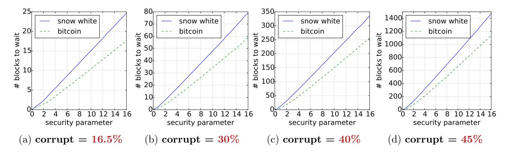
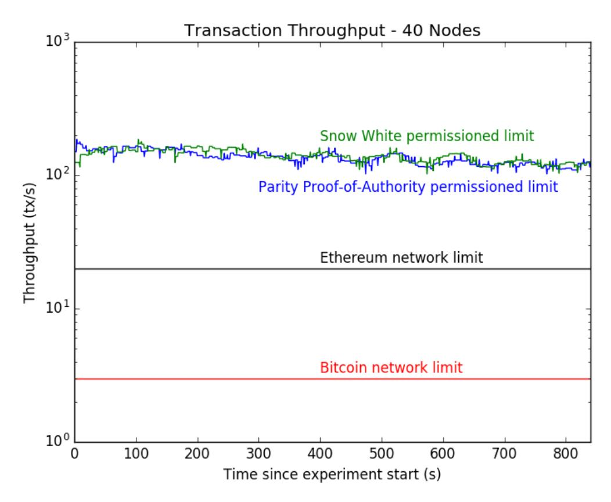

# Snow White: Robustly Reconfigurable Consensus and Applications to Provably Secure Proof of Stake

Phil Daian Rafael Pass Elaine Shi Cornell/CornellTech

#### Abstract

We present the a provably secure proof-of-stake protocol called Snow White. The primary application of Snow White is to be used as a "green" consensus alternative for a decentralized cryptocurrency system with open enrollement. We break down the task of designing Snow White into the following core challenges:

- 1. identify a core "permissioned" consensus protocol suitable for proof-of-stake; specifically the core consensus protocol should offer robustness in an Internet-scale, heterogeneous deployment;
- 2. propose a robust committee re-election mechanism such that as stake switches hands in the cryptocurrency system, the consensus committee can evolve in a timely manner and always reflect the most recent stake distribution; and
- 3. relying on the formal security of the underlying consensus protocol, prove the full end-toend protocol to be secure — more specifically, we show that that any consensus protocol satisfying the desired robustness properties can be used to construct proofs-of-stake consensus, as long as money does not switch hands too quickly.

Snow White was publicly released in September 2016. It provides the first formal, end-toend proof of a proof-of-stake system in a truly decentralized, open-participation network, where nodes can join at any time (not necessarily at the creation of the system). We also give the first formal treatment of a well-known issue called "costless simulation" in our paper, proving both upper- and lower-bounds that characterize exactly what setup assumptions are needed to defend against costless simulation attacks. We refer the reader to our detailed chronological notes on a detailed comparison of Snow White and other prior and concurrent works, as well as how subsequent works (including Ethereum's proof-of-stake design) have since extended and improved our ideas.

# 1 Introduction

Although consensus protocols have been investigated by the distributed systems community for 30 years, in the past decade a new breakthrough called Bitcoin established a new, blockchainbased paradigm for reaching consensus in a distributed system. Relying on proof-of-work, Bitcoin's consensus protocol (often called Nakamoto consensus), for the first time, enabled consensus in an open, unauthenticated environment where nodes do not share any pre-established public keys [\[28,](#page-20-0) [44,](#page-21-0) [45,](#page-21-1) [49\]](#page-21-2). One commonly known painpoint with this approach is the enormous energy waste. Motivated by the need for a green alternative, the community searched for a paradigm shift, and hoped to obtain a consensus paradigm, commonly called "proof-of-stake", that is based on the idea of "one vote per unit of stake" (as opposed to "one vote per unit of hash-power").

The design of proof-of-stake protocols was first initiated in online forums and blog-posts and subsequently considered by the academic community [\[6,](#page-19-0)[7,](#page-19-1)[18,](#page-20-1)[35,](#page-21-3)[36,](#page-21-4)[42,](#page-21-5)[51,](#page-21-6)[53,](#page-22-0)[54\]](#page-22-1). Prior to our work, we were not aware of any candidate protocol that offered provable guarantees.

Snow White is the first work to provide end-to-end, formal proofs of security of a full proof-ofstake protocol. Security is proven in a truly decentralized, open-participation environment where honest nodes can join the protocol late in time (and not necessarily at the system's creation). We give the first formal treatment of the well-known "costless simulation" problem (also called posterior corruption in this paper) pertaining to proof-of-stake, proving upper- and lower-bounds that precisely characterize under what assumptions it is possible to defend against costless simulation.

In the remainder of the introduction, we first present an informal technical overview of our results. We then provide detailed chronological notes that position our work in light of other concurrent and subsequent works, and summarize our work's contributions and impact.

#### 1.1 Robustly Reconfigurable Consensus

We ask the question: what is a suitable consensus protocol for a proof-of-stake system? In a proofof-stake system, at any point of time, we would like the present stake-holders to have voting rights that are weighed by their respective stake amount. Thus if we examine any single snapshot in the system, proof-of-stake in fact requires a "permissioned" core consensus protocol, since the set of public-keys owning stake is publicly known. However, proof-of-stake systems aim to support open participation — and this can be enabled through periodic committee reconfiguration. Suppose that the system starts with a well-known set of stake-holders who form the initial consensus committee. As stake switches hands in the system, the consensus committee should be updated in a timely manner to track the present (and not the past) stake distribution. This is important for the security of a proof-of-stake system, since users who no longer hold stake in the system may be incentivized to deviate, e.g., to launch a double-spending attack.

We formulate the task of designing "a consensus protocol suitable for proof-of-stake" as "robustly reconfigurable consensus". A robustly reconfiguration consensus protocol should have the following desirable properties.

Robustness in the presence of sporadic participation. In a large-scale, decentralized environment, users tend to have sporadic participation, and it may be difficult to anticipate how many users will be online at any point of time. Almost all classical-style consensus protocols rely on tallying sufficiently many votes to make progress. If fewer than the anticipated number of users actually show up to vote, the consensus protocol may get stuck.

To address this challenge, Snow White employs the recently proposed "sleepy consensus" [\[48\]](#page-21-7) paradigm as its core permissioned consensus building block. Sleepy consensus [\[48\]](#page-21-7) is inspired by the beautiful "longest-chain" idea behind Nakamoto's consensus [\[44\]](#page-21-0), but the idea is instead applied to a non-proof-of-work, permissioned setting with a public-key infrastructure (PKI). Pass and Shi prove that the resulting consensus protocol is robust in the presence of sporadic participation: concretely, the protocol need not be parametrized with an a-priori fixed number of players that are expected to show up. As long as the majority of online players are honest, the protocol guarantees consistency and liveness.

Robust committee reconfiguration. Roughly speaking, our system proceeds in epochs. In each epoch, a most recent set of stake-holders are elected as committee and may be randomly chosen to generate blocks. We argue that committee reconfiguration and random block-proposer selection are challenging and subtle due to the following two possible attacks.

- 1. Adaptive key selection attacks. Since proof-of-stake systems admit open participation, anyone can buy up stake in the system and participate. This also means anyone can (possibly maliciously) choose their public-keys through which they participate in the consensus. A possible attack, therefore, is to adaptively choose public-keys, after gathering partial information about the randomness seed used for block-proposer selection, such that corrupt nodes are elected more often as block-proposer than their fair chance.
- 2. Randomness-biasing attacks (commonly known as the "grinding attack"). Another important question is: how do we obtain the randomness needed for block proposer selection? A most straightforward idea is to use the hash of past blocks — but as several works have shown [\[10\]](#page-19-2), the blocks' hashes can be subject to adversarial influence, and it is unclear what security can be guaranteed when we use such randomness sources with adversarial bias for block proposer selection. For example, the adversary can bias the randomness in a way that allows corrupt nodes to be selected more often.

In the worst case, if through possibly a combination of the attacks, the adversary can control the majority of the block-proposer slots, consistency of the underlying consensus (in our case, sleepy consensus) can be broken.

Snow White proposes a novel "two-lookback" mechanism that addresses the above two challenges simultaneously[1](#page-2-0) . We determine each epoch's new consensus committee and randomness seed in a two-phase process, where each phase spans roughly κ blocks of time for some appropriate security parameter[2](#page-2-1) κ. This two-phase process is enabled by two look-back parameters as we describe informally below (a formal description is deferred to the technical sections) — henceforth suppose that chain is the current longest chain.

- 1. We look back 2κ blocks, and use the prefix chain[: −2κ] (i.e., the prefix of chain removing the trailing 2κ blocks) to determine the new consensus committee.
- 2. We look back κ blocks, and extract the randomness contained in the blocks chain[−2κ : −κ] (i.e., the part of chain from 2κ blocks ago to κ blocks ago) to form a randomness seed — this seed then seeds a random oracle used for block-proposer selection in the current epoch.

Roughly speaking, we defeat the adaptively chosen key attack by determining the consensus committee κ blocks earlier than the randomness seed, such that when corrupt nodes choose their public keys, they cannot predict the randomness seed, which will be generated much later in time and with sufficient entropy contributed by honest nodes as we explain below. We argue that due

<span id="page-2-0"></span><sup>1</sup>Subsequent works, including newer versions of Algorand [\[17\]](#page-20-2) released after our publication, Ouroboros Praos [\[19\]](#page-20-3), and the latest Ethereum's proof-of-stake proposal [\[2\]](#page-19-3) incorporated elements of this design and suggested improvements, e.g., for concrete security. See Section [1.3](#page-4-0) for more discussions.

<span id="page-2-1"></span><sup>2</sup> Suppose that except with negligible in κ probability, the underlying sleepy consensus guarantees consistency by chopping off the trailing κ blocks, and guarantees the existence of an honest block in every consecutive window of κ blocks.

to chain quality of the underlying sleepy consensus, the blocks chain[−2κ : −κ] must contain an honest block. Since honest nodes embed a sufficiently long uniform random seed in its block, we can extract sufficiently high-entropy randomness from chain[−2κ : −κ] which is then used to seed the block-proposer-selection random oracle. Even though the extracted randomness is subject to adversarial bias, as long as it is high-entropy, and importantly, as long as the same randomness is used to seed the block-proposer selection sufficiently many times, we can achieve the desired measure concentration properties. More specifically, although indeed, the adversary can bias the random seed to allow corrupt nodes to be selected (as block-proposers) quite surely for a few number of slots; the adversary is not able to consistently gain advantage over a sufficiently large number of slots, i.e., corrupt nodes cannot own noticeably more block-proposer slots than its fair share.

We stress that turning the above intuitive argument into a formal proof requires significant and non-trivial effort which is part our main contributions. In our technical sections, we formally prove security of this approach under a mildly adaptive adversary, i.e., when the adversary is subject to a mild corruption delay and as long as nodes remain honest till shortly after they stop serving on a consensus committee, our robustly reconfigurable consensus protocol is secure. Subsequent works (including newer versions of the Algorand paper that are published after the release of Snow White, as well as the subsequent work Ourboros Praos [\[19\]](#page-20-3)) have suggested approaches for achieving fully adaptive security, but relying on the fact that the majority of nodes will erase secret signing keys from memory after signing a block (and by introducing mild additional complexity in the cryptographic schemes employed) — see Section [1.3](#page-4-0) for a more detailed comparison.

Understanding posterior corruption, i.e., "costless simulation" attacks. A oft-cited attack for proof-of-stake systems is the so-called "costless simulation" attack (also referred to as a posterior corruption attack in this paper). The idea is that when stake-holders have sold their stake in the system, nothing prevents them from performing a history-rewrite attack. Specifically, suppose that a set of nodes denoted C control the majority stake in some past committee. These nodes can collude to fork the history from the point in the past when they control majority and in this alternate history money can transfer in a way such that C continues to hold majority stake (possibly transferred to other pseudonyms of the corrupt nodes) such that the attack can be sustained.

In this paper, we formally prove that under a mild setup assumption — when nodes join the system they can access a set of online nodes the majority of whom are honest — we can provably defend against such a posterior corruption attack. This is achieved by having the newly joining user obtain a somewhat recent checkpoint from the set of nodes it can access upon joining.

We also prove a corresponding lower bound, that absent this setup assumption, defense against such posterior corruption attacks is impossible — to the best of our knowledge, ours is the first formal treatment of this well-known costless simulation attack in the context of proof-of-stake.

#### 1.2 From Robustly Reconfigurable Consensus to Proof-of-Stake

Application to proof-of-stake and achieving incentive compatibility. We show how to apply such a "robustly reconfigurable consensus" protocol to realize proof-of-stake (the resulting protocol called Snow White), such that nodes obtain voting power roughly proportional to their stake in the cryptocurrency system. As long as money does not switch hands too fast (which is enforceable by the cryptocurrency layer), we show that the resulting proof-of-stake protocol can attain security when the adversary controls only a minority of the stake in the system. Further, borrowing ideas from the recent Fruitchain work [\[46\]](#page-21-8), we suggest incentive compatible mechanisms for distributing rewards and transaction fees, such that the resulting protocol achieves a coalitionresistant -Nash equilibrium, i.e., roughly speaking, as long as the adversary controls a minority of the stake, it cannot obtain more than fraction more than its fair share of payout, even when it has full control of network transmission and can deviate arbitrarily from the protocol specification.

Preventing nothing-at-stake attacks. Later in Section [3,](#page-11-0) we will also discuss how to leverage guarantees provided by our core consensus protocol, and build additional mechanisms that not only discourage nothing-at-stake attackers, but in fact penalize them.

## <span id="page-4-0"></span>1.3 Chronological Notes, Closely Related, and Subsequent Works

Comparison with Algorand. The first manuscript of Algorand [\[17\]](#page-20-2) was published prior to our work. Algorand also proposes a proof-of-stake system. Their core consensus protocol is a newly designed classical-style consensus protocol, and therefore they cannot guarantee progress under sporadic participation — instead, Algorand proposes a notion of "lazy participation", where users know when they are needed to vote in the consensus and they only need to be online when they are needed. However, if many users who are anticipated to show up failed to do so, progress will be hampered. Algorand employs a Verifiable Random Function (VRF) to perform random leader/committee election.

Algorand's algorithm has been improved for several iterations. The version of Algorand that existed before the publication of Snow White gave proofs of their core consensus protocol but did not provide end-to-end proofs for the full proof-of-stake system. In particular, the version of Algorand that existed prior to Snow White's publication did not discuss the well-known issue of costless simulation or clearly state the implicit assumptions they make to circumvent the lower bound we prove in this paper.

In their subsequent versions, they adopted the erasure model and rely on honest nodes' capability to safely erase secrets from memory to achieve adaptive security (and implicitly, by adopting erasures one could defend against the costless simulation). The newer versions of Algorand (released after the Snow White) also started to adopt a similar look-back idea (first described by Snow White) to secure against the adaptive chosen-key attack mentioned earlier. The recent versions also provided more thorough mathematical proofs of this approach.

Comparison with Ouroboros and Ouroboros Praos. Snow White was publicly released in September 2016. A closely related work (independent and concurrent from our effort) known as Ouroboros [\[34\]](#page-21-9) was release about 10 days prior to Snow White. Ouroboros Praos is an improvement over Ouroboros published in 2017 [\[19\]](#page-20-3).

The Ouroboros version that was released around the same time as Snow White focused on proving the underlying permissioned consensus building block secure, and there is only a short paragraph containing a proof sketch of their full proof-of-stake system (and this proof sketch has been somewhat expanded to a few paragraphs in later versions). In comparison, our Snow White paper adopts a permissioned consensus building block whose security was formally proven secure in a related paper [\[48\]](#page-21-7) — the full-length of our technical sections are dedicated to a thorough treatment of the security of the end-to-end proof-of-stake system.

A notable difference between Snow White and Ouroboros seems to be that their formal treatment does not seem to capture a truly decentralized environment (necessary for decentralized cryptocurrency applications) where nodes may join the system late and not from the very start — had they done so, they would have encountered the well-known costless simulation issue, which, as we show, is impossible to defend against without extra setup assumptions (and indeed, we introduce a reasonable setup assumption to circumvent this lower bound).

A subsequently improved work, called Ouroboros Praos [\[19\]](#page-20-3), extends the VRF approach described first by Algorand [\[17\]](#page-20-2) and Dfinity [\[30\]](#page-20-4) for random block-proposer election. Similar to the newer versions of Algorand, Ouroboros Praos [\[19\]](#page-20-3) also started adopting an erasure model to achieve adaptive security (and implicitly, defend against costless simulation[3](#page-5-0) ).

Neither Ouroboros nor Ouroboros Praos adopts an underlying consensus mechanism that provably provides support for sporadic participation. Finally, the improved version Ouroboros Praos [\[19\]](#page-20-3) started adopting a look-back mechanism that appears to be inspired by Snow White to for committee rotation and random block-proposer selection.

Comparison with Ethereum's proof-of-stake design. Ethereum began proof-of-stake explorations several years ago. Their design has undergone several versions. At the time of the writing, Ethereum was aiming to do "hybrid proof-of-stake", i.e., use Casper as a finality gadget on top of their existing proof-of-work blockchain.

In the past year 2018, conversations with Ethereum core researchers suggest that Ethereum is considering replacing their proof-of-work blockchain with a proof-of-stake blockchain similar to Snow White. Their committee election and random block proposer selection algorithm seems to be improvement of Snow White. Specifically, they would like to adopt an economically secure coin toss protocol for randomness generation (commonly known as RANDAO). This specific protocol is also subject to adversarial bias much like our randomness seed generation (although biasing attacks may lead to economic loss). Thus they rely on exactly the same observation that was proposed in our paper: although the adversary can bias the randomness sufficiently to control a few block proposer slots, he cannot consistently get an advantage over a large number of slots. Interestingly, Ethereum has several practical optimizations that improve the concrete security parameters of the above analysis [\[2\]](#page-19-3).

# <span id="page-5-1"></span>2 Snow White's Core Consensus Protocol

We focus on an intuitive exposition of our scheme in the main body. In the appendices, we present formal definitions, a formal description of the protocol, as well as the full proofs. We stress that formalizing the end-to-end security of a proof-of-stake system is a significant effort and this leads to our choice of presentation.

#### 2.1 Background: Sleepy Consensus and Sleepy Execution Model

Sleepy execution model and terminology. We would like to adopt an execution model that captures a decentralized environment where nodes can spawn late in time, and can go to sleep and later wake up. In such a model, the protocol may not have a way to anticipate the number of players at any time.

<span id="page-5-0"></span><sup>3</sup>Snow White's approach of combining checkpointing and "bootstrapping through social consensus" to defend against costless simulation is simpler and more practical in real-world implementations (than relying on VRFs and erasure [\[17,](#page-20-2) [19\]](#page-20-3)). Notably, our usage of checkpointing and "bootstrapping through social consensus" already exists in real-world cryptocurrencies. To the best of our knowledge, checkpointing was first suggested by Barber, Boyen, Shi, and Uzun [\[4\]](#page-19-4) as a way to defend against history revisioning attacks in Bitcoin.

We thus adopt the sleepy model of execution proposed by Pass and Shi [\[48\]](#page-21-7). Nodes are either sleepy (i.e., offline) or awake (i.e., online and actively participating). For simplicity, we also refer to nodes that are awake and honest as alert; and all corrupt nodes are assumed to be awake by convention.

Messages delivered by an alert node is guaranteed to arrive at all other alert nodes within a maximum delay of ∆, where ∆ is an input parameter to the protocol. A sleepy node captures any node that is either offline or suffering a slower than ∆ network connection. A sleepy node can later wake up, and upon waking at time t, all pending messages sent by alert nodes before t − ∆ will be immediately delivered to the waking node.

We allow the adversary to dynamically spawn new nodes, and newly spawned nodes can either be honest or corrupt. Further, as we discuss later, we allow the adversary to declare corruptions and put alert nodes to sleep in a mildly adaptive fashion.

For readability, we defer a detailed presentation of the formal model to Appendix [A.1.](#page-22-2)

The Sleepy protocol as a starting point. Classical consensus protocols must count sufficiently many votes to make progress and thus the protocol must know a-priori roughly how many nodes will show up to vote. Since Pass and Shi's Sleepy consensus protocol is the only protocol known to provide consensus under sporadic participation, i.e., the protocol need not have a-priori knowledge of the number of players at any time. We thus consider Sleepy as a starting point for constructing our notion of robustly reconfigurable consensus. We now briefly review the Sleepy consensus protocol as necessary background.

Sleepy is a blockchain-style protocol but without proof-of-work. For practical considerations, below we describe the version of Sleepy instantiated with a random oracle (although Pass and Shi [\[48\]](#page-21-7) also describe techniques for removing the random oracle). Sleepy relies on a random oracle to elect a leader in every time step. The elected leader is allowed to extend a blockchain with a new block, by signing a tuple that includes its own identity, the transactions to be confirm, the current time, and the previous block's hash. Like in the Nakamoto consensus, nodes always choose the longest chain if they receive multiple different ones. To make this protocol fully work, Sleepy [\[48\]](#page-21-7) proposes new techniques to timestamp blocks to constrain the possible behaviors of an adversary. Specifically, there are two important blockchain timestamp rules:

- 1. a valid blockchain must have strictly increasing timestamps; and
- 2. honest nodes always reject a chain with future timestamps.

All aforementioned timestamps can be adjusted to account for possible clock offsets among nodes by applying a generic protocol transformation [\[48\]](#page-21-7).

#### <span id="page-6-0"></span>2.2 Handling Committee Reconfiguration

As mentioned, our starting point is the Sleepy consensus protocol, which assumes that all consensus nodes know each other's public keys; although it may not be known a-priori how many consensus nodes will show up and participate.

We now discuss how to perform committee reconfiguration such that the consensus committee tracks the latest stake distribution. To support a wide range of applications, our Snow White protocol does not stipulate how applications should select the committee over time. Roughly speaking, we wish to guarantee security as long as the application-specific committee selection algorithm respects the constraint that there is honest majority among all awake nodes. Therefore, we assume that there is some application-specific function elect cmt(chain) that examines the state of the blockchain and outputs a new committee over time. In a proof-of-stake context, for example, this function can roughly speaking, output one public key for each currency unit owned by the user. In Section [3,](#page-11-0) we discuss in a proof-of-stake context, how one might possibly translate assumptions on the distribution of stake to the the formal requirements expected by the consensus protocol.

Strawman scheme: epoch-based committee selection. Snow White provides an epoch-based protocol for committee reconfiguration. To aid understanding, we begin by describing a strawman solution. Each Tepoch time, a new epoch starts, and the beginning of each epoch provides a committee reconfiguration opportunity. Let start(e) and end(e) denote the beginning and ending times of the e-th committee. Every block in a valid blockchain whose time stamp is between [start(e), end(e)) is associated with the e-th committee.

It is important that all honest nodes agree on what the committee is for each epoch. To achieve this, our idea is for honest nodes to determine the new committee by looking at a stabilized part of the chain. Therefore, a straightforward idea is to make the following modifications to the basic Sleepy consensus protocol:

- Let 2ω be a look-back parameter.
- At any time t ∈ [start(e), end(e)) that is in the e-th epoch, an alert node determines the e-th committee in the following manner: find the latest block in its local chain whose timestamp is no greater than start(e) − 2ω, and suppose this block resides at index `.
- Now, output extractpks(chain[: `]) as the new committee.

In general, the look-back parameter 2ω must be sufficiently large such that all alert nodes have the same prefix chain[: `] in their local chains by time start(e). On the other hand, from an application's perspective, 2ω should also be recent enough such that the committee composition does not lag significantly behind.

Preventing an adaptive key selection attack. Unfortunately, the above scheme is prone to an adaptive key selection attack where an adversary can break consistency with constant probability. Specifically, as the random oracle H is chosen prior to protocol start, the adversary can make arbitrary queries to H. Therefore, the adversary can spawn corrupt nodes and seed them with public keys that causes them to be elected leader at desirable points of time. For example, since the adversary can query H, it is able to infer exactly in which time steps honest nodes are elected leader. Now, the adversary can pick corrupt nodes' public keys, such that every time an honest node is leader, a corrupt node is leader too — and he can sustain this attack till he runs out of corrupt nodes. Since the adversary may control up to Θ(n) nodes, he can thus break consistency for Ω(n) number of blocks.

Our idea is to have nodes determine the next epoch's committee first, and then select the next epoch's hash — in this way, the adversary will be unaware of next epoch's hash until well after the next committee is determined. More specifically, we can make the following changes to the Sleepy protocol:

• Let 2ω and ω be two look-back parameters, for determining the next committee and next hash respectively.

- At any time t ∈ [start(e), end(e)) that is in the e-th epoch, an alert node determines the eth committee in the following manner: find the latest block its local chain whose timestamp is no greater than start(e) − 2ω, and suppose this block resides at index `0. Now, output extractpks(chain[: `0]) as the new committee.
- At any time t ∈ [start(e), end(e)) an alert node determines the e-th hash in the following manner: find the latest block its local chain whose timestamp is no greater than start(e)−ω, and suppose this block resides at index `1. Now, output extractnonce(chain[: `1]) as a nonce to seed the new hash.
- We augment the protocol such that alert nodes always embed a random seed in any block they mine, and extractnonce(chain[: `1]) can simply use the seeds in the prefix of the chain as a nonce to seed the random oracle H.

For security, we require that

- 1. The two look-back parameters 2ω and ω are both sufficiently long ago, such that all alert nodes will have agreement on chain[: `0] and chain[: `1] by the time start(e); and
- 2. The two look-back parameters 2ω and ω must be sufficiently far part, such that the adversary cannot predict extractnonce(chain[: `1]) until well after the next committee is determined.

Achieving security under adversarially biased hashes. It is not hard to see that the adversary can bias the nonce used to seed the hash, since the adversary can place arbitrary seeds in the blocks it contributes. In particular, suppose that the nonce is extracted from the prefix chain[: `1]. Obviously, with at least constant probability, the adversary may control the ending block in this prefix. By querying H polynomially many times, the adversary can influence the seed in the last block chain[`1] of the prefix, until it finds one that it likes.

Indeed, if each nonce is used only to select the leader in a small number of time steps (say, O(1) time steps), such adversarial bias would indeed have been detrimental — in particular, by enumerating polynomially many possibilities, the adversary can cause itself to be elected with probability almost 1 (assuming that the adversary controls the last block of the prefix).

However, we observe that as long as the same nonce is used sufficiently many times, the adversary cannot consistently cause corrupt nodes to be elected in many time steps. Specifically, suppose each nonce is used to elect at least Ω(κ) leaders, then except with negl(κ) probability, the adversary cannot increase its share by more than an fraction — for an arbitrarily small constant > 0. Therefore, to prove our scheme secure, it is important that each epoch's length (henceforth denoted Tepoch) be sufficiently long, such that once a new nonce is determined, it is used to elect sufficiently many leaders.

Reasoning about security under adversarially biased hashes. Formalizing this above intuition is somewhat more involved. Specifically, our proof needs to reason about the probability of bad events (related to chain growth, chain quality, and consistency) over medium-sized windows such that the bad events depend only on O(1) number of hashes (determined by the nonces used to seed them). This way, we can apply a union bound that results in polynomial security loss. If the window size is too small, it would not be enough to make the failure probability negligible; on the other hand, if the window were too big, the blowup of the union bound would be exponential. Finally, we argue if no bad events occur for every medium-sized window, then no bad events happen for every window (as long as the window is not too small). We defer the detailed discussions and formal proofs to Sections [E](#page-36-0) and [G.1](#page-42-0)

## 2.3 Handling Mildly Adaptive and Posterior Corruptions

We now consider how to defend against an adversary that can adaptively corrupt nodes after they are spawned. In this paper, we will aim to achieve security against a mildly adaptive adversary. Specifically, a mildly adaptive adversary is allowed to dynamically corrupt nodes or make them sleep, but such corrupt or sleep instructions take a while to be effective. For example, in practice, it may take some time to infect a machine with malware. Such a "mildly adaptive" corruption model has been formally defined in earlier works [\[47\]](#page-21-10), where they call it the τ -agile corruption model, where τ denotes the delay parameter till corrupt or sleep instructions take effect. Intuitively, as long as τ is sufficiently large, it will be too late for an adversary to corrupt a node or make the node sleep upon seeing the next epoch's hash. By the time the corrupt or sleep instruction takes effect, it will already be well past the epoch.

The main challenge in handling mildly adaptive corruptions is the threat of a history rewriting attack when posterior corruption is possible: members of past committees may, at some point, have sold their stake in the system, and thus they have nothing to lose to create an alternative version of history.

We rely on a checkpointing idea to provide resilience to such posterior corruption — as long as there is no late joining or rejoining (we will discuss how to handle late joining or rejoining later). Checkpointing is a technique that has been explored in the classical distributed systems literature [\[16\]](#page-19-5) but typically for different purposes, e.g., in the case of PBFT [\[16\]](#page-19-5) it was used as an efficiency mechanism. Suppose that we can already prove the consistency property as long as there is no majority posterior corruption. Now, to additionally handle majority posterior corruption, we can have alert nodes always reject any chain that diverges from its current longest chain at a point sufficiently far back in the past (say, at least W time steps ago). In this way, old committee members that have since become corrupt cannot convince alert nodes to revise history that is too far back — in other words, the confirmed transaction log stabilizes and becomes immutable after a while.

## 2.4 Late Joining in the Presence of Posterior Corruption

Indeed, the above approach almost would work, if there are no late spawning nodes, and if there are no nodes who wake up after sleeping for a long time. However, as mentioned earlier, handling late joining is important for a decentralized network.

Recall that we described a history revision attack earlier, where if the majority of an old committee become corrupt at a later point of time, they can simulate an alternate past, and convince a newly joining node believe in the alternate past. Therefore, it seems that the crux is the following question:

How can a node joining the protocol correctly identify the true version of history?

Unfortunately, it turns out that this is impossible without additional trust — in fact, we can formalize the aforementioned attack and prove a lower bound (Section [D\)](#page-35-0) which essentially shows that in the presence of majority posterior corruption, a newly joining node has no means of discerning a real history from a simulated one:

[Lower bound for posterior corruption]: Absent any additional trust, it is impossible to achieve consensus under sporadic participation, if the majority of an old committee can become corrupt later in time.

We therefore ask the following question: what minimal, additional trust assumptions can we make such that we can defend against majority posterior corruption? Informally speaking, we show that all we need is a secure bootstrapping process for newly joining nodes as described below. We assume that a newly joining node is provided with a list of nodes L the majority of whom must be alert — if so, the new node can ask the list of nodes in L to vote on the current state of the system, and thus it will not be mislead to choose a "simulated" version of the history.

## 2.5 Putting it Altogether: Informal Overview of Snow White

In summary, our protocol, roughly speaking, works as follows. A formal description of the protocol, the parameter choices and their relations, and proofs of security are deferred to Section [C.](#page-26-0)

- First, there is a random oracle H that determines if a member of the present committee is a leader in each time step. If a node is leader in a time step t, he can extend the blockchain with a block of the format (h−1,txs,time, nonce, pk, σ), where h−<sup>1</sup> is the previous block's hash, txs is a set of transactions to be confirmed, nonce is a random seed that will be useful later, pk is the node's public key, and σ is a signature under pk on the entire contents of the block. A node can verify the validity of the block by checking that 1) H nonce<sup>e</sup> (pk,time) < D<sup>p</sup> where D<sup>p</sup> is a difficulty parameter[4](#page-10-0) such that the hash outcome is smaller than D<sup>p</sup> with probability p, and nonce<sup>e</sup> is a nonce that is reselected every epoch (we will describe how the nonce is selected later); 2) the signature σ verifies under pk; and 3) pk is a member of the present committee as defined by the prefix of the blockchain.
- A valid blockchain's timestamps must respect two constraints: 1) all timestamps must strictly increase; and 2) any timestamp in the future will cause a chain to be rejected.
- Next, to defend against old committees that have since become corrupt from rewriting history, whenever an alert node receives a valid chain that is longer than his own, he only accepts the incoming chain if the incoming chain does not modify blocks too far in the past, where "too far back" is defined by the parameter κ0.
- Next, a newly joining node or a node waking up from long sleep must invoke a secure bootstrapping mechanism such that it can identify the correct version of the history to believe in. One mechanism to achieve this is for the (re)spawning node to contact a list of nodes the majority of whom are alert.
- Finally, our protocol defines each contiguous Tepoch time steps to be an epoch. At the beginning of each epoch, committee reconfiguration is performed in the following manner. First, nodes find

<span id="page-10-0"></span><sup>4</sup>As we discuss Remark [1](#page-35-1) in the formal sections, in practice, the next committee is read from a stabilized prefix of the blockchain and we know its total size a-priori. Therefore, assuming that an upper bound on the fraction of awake nodes (out of each committee) is known a-priori, we can set the difficulty parameter D<sup>p</sup> accordingly to ensure that the expected block interval is sufficiently large w.r.t. to the maximum network delay (and if the upper bound is loose, then the confirmation time is proportionally slower). Although on the surface our analysis assumes a fixed expected block interval throughout, it easily generalizes to the case when the expected block interval varies by a known constant factor throughout (and is sufficiently large w.r.t. to the maximum network delay).

the latest prefix (henceforth denoted chain−2ω) in their local chain whose timestamp is at least 2ω steps ago. This prefix chain−2<sup>ω</sup> will be used to determine the next committee — and Snow White defers to the application-layer to define how specifically to extract the next committee from the state defined by chain−2ω. Next, nodes find the latest prefix (denoted chain−ω) in their local chain whose timestamp is at least ω steps ago. Given this prefix chain−ω, we extract the nonces contained in all blocks, the resulting concatenated nonce will be used to seed the hash function H for the next epoch.

Resilience condition. In the appendices, we will give a formal presentation of our protocol and prove it secure under the following resilience condition. We require that the majority of the committee remain honest not only during the time it is active, but also for a short duration (e.g., a handoff period) afterwards. In particular, even if the entire committee becomes corrupt after this handoff period, it should not matter to security.

In other words, we require that for any committee, the number of alert committee members that remain honest for a window of W outnumber the number of committee members that become corrupt during the same window. In particular, we will parametrize the window W such that it incorporates this short handoff period after the committee becomes inactive. Somewhat more formally, we require that there exists a constant ψ > 0 such that for every possible execution trace view, for every t ≤ |view|, let r = min(t + W, |view|),

$$\frac{\mathsf{alert}^t(\mathsf{cmt}^t(\mathsf{view}),\mathsf{view}) \cap \mathsf{honest}^r(\mathsf{cmt}^t(\mathsf{view}),\mathsf{view})}{\mathsf{corrupt}^r(\mathsf{cmt}^t(\mathsf{view}),\mathsf{view})} \geq 1 + \psi \tag{1}$$

where alert<sup>t</sup> (cmt<sup>s</sup> (view), view), honest<sup>t</sup> (cmt<sup>s</sup> (view), view), and corrupt<sup>t</sup> (cmt<sup>s</sup> (view), view) output the number of nodes in the committee of time s that are alert (or honest, corrupt, resp.) at time t.

# <span id="page-11-0"></span>3 From Robustly Reconfigurable Consensus to PoS

We now discuss how to apply our core consensus protocol in a proof-of-stake (PoS) application. There are two challenges: 1) in a system where money can switch hands, how to make the committee composition closely track the stake distribution over time; and 2) how to distribute fees and rewards to ensure incentive compatibility.

### 3.1 Base Security on Distribution of Stake

Roughly speaking, our core consensus protocol expects the following assumption for security: at any point of time, there are more alert committee members that will remain honest sufficiently long than there are corrupt committee members. In a proof-of-stake setting, we would like to articulate assumptions regarding the distribution of stake among stake-holders, and state the protocol's security in terms of such assumptions.

Since our core consensus protocol allows a committee reelection opportunity once every epoch, it is possible that the distribution of the stake in the system lags behind the committee election. However, suppose that this is not the case, e.g., pretend for now that there is no money transfer, then it is simple to translate the assumptions to distribution on stake. Imagine that the applicationdefined elect cmt(chain) function will output one public key for each unit of currency as expressed by the state of chain. If a public key has many units of coin, one could simply output the public key pk along with its multiplicity m — and the strings pk||1,...,pk||m may be used in the hash query for determining the leader. Snow White's core consensus protocol does not care about the implementation details of  $elect\_cmt(chain)$ , and in fact that is an advantage of our modular composition approach. In this way, our Snow White protocol retains security as long as the at any point of time, more stake is alert and will remain honest sufficiently long than the stake that is corrupt. Here when we say "a unit of stake is alert (or honest, corrupt, resp.)", we mean that the node that owns this unit of stake is alert (or honest, corrupt, resp.).

In the real world, however, there is money transfer — after all that is the entire point of having cryptocurrencies — therefore the committee election lags behind the redistribution of stake. This may give rise to the following attack: once a next committee is elected, the majority of the stake in the committee can now sell their currency units and perform an attack on the cryptocurrency (since they now no longer have stake). For example, the corrupt coalition can perform a double-spending attack where they spend their stake but attempt to fork a history where they did not spend the money.

The limited liquidity assumption. One approach to thwart such an attack is to limit the liquidity in the system — in fact, Snow White expects that the cryptocurrency layer enforces that money will not switch hands too quickly. For example, imagine that at any point of time, a=30% of the stake is alert and will remain honest sufficiently long, c=20% is corrupt, and the rest are sleepy. We can have the cryptocurrency layer enforce the following rule: only  $\frac{a-c}{2}-\epsilon=5\%-\epsilon$  of the stake can switch hands during every window of size  $2\omega+T_{\rm epoch}+W$ . In other words, if in any appropriately long window, only l fraction of money in the system can move, it holds that as long as at any time,  $2l+\epsilon$  more stake is alert and remain honest sufficiently long than the stake that is corrupt, we can guarantee that the conditions expected by the consensus protocol, that is, at any time, more committee members are alert and remain honest sufficiently long, than the committee members that are corrupt.

#### 3.2 Fair Reward Scheme

In a practical deployment, an important desideratum is incentive compatibility. Roughly speaking, we hope that each node will earn a "fair share" of rewards and transaction fees — and in a proof-of-stake system, fairness is defined as being proportional to the amount of stake a node has. In particular, any minority coalition of nodes should not be able to obtain an unfair share of the rewards by deviating from the protocol — in this way, rational nodes should not be incentivized to deviate.

Since Snow White is a blockchain-style protocol, we also inherit the well-known selfish mining attack [24, 45] where a minority coalition can increase its rewards by a factor of nearly 2 in the worst case. Fortunately, inspired by the recent work Fruitchains [46] we provide a solution to provably defend against any form of selfish mining attacks, and ensure that the honest protocol is a coalition-safe  $\epsilon$ -Nash equilibrium. At a high level, Fruitchains provides a mechanism to transform any (possibly unfair) blockchain that achieves consistency and liveness into an approximately fair blockchain in a blackbox manner. Our key observation is that this transformation is also applicable to our non-proof-of-work blockchain — since we realize the same abstraction as a proof-of-work blockchain. Since we apply the essentially same techniques below as Fruitchains, we give an overview of the mechanisms below for completeness and refer the reader to Fruitchains [46] for full details.

Two mining processes. Like in Fruitchains [46], we propose to have two "mining" processes

piggybacked atop each other. Recall that earlier each node invokes the hash function H in every time step to determine whether it is a leader in this time step. Now, we will use the first half of H to determine leadership, and use the second half to determine if the user mines a "fruit" in this time step. Additionally, we will add to the input of H the digest of a recently stablized block such that any fruit mined will "hang" from a recently stablized block — which block a fruit hangs from indicates the roughly when the fruit was "mined", i.e., the *freshness* of the fruit. Whenever an honest node finds a fruit, it broadcasts the fruit to all peers, and honest nodes will incorporate all outstanding and fresh fruits in any block that it "mines". Note that fruits incorporated in blocks are only considered valid if they are sufficiently fresh. Finally, all valid fruits contained in the blockchain can be linearized, resulting in an ordered "fruit chain".

The formal analysis conducted in Fruitchains [46] can be adapted to our setting in a straightforward manner, giving rise to the following informal claim:

Claim 1 (Approximate fairness [46]). Assume appropriate parameters. Then for any (arbitrarily small) constant  $\epsilon$ , in any  $\frac{\kappa}{\epsilon}$  number of consecutive fruits, the fraction of fruits belonging to an adversarial coalition is at most  $\epsilon$  fraction more than its fair share, as long as, informally speaking, in any committee, alert committee members that remain honest by the posterior corruption window outnumber members that become corrupt by the same window.

We refer the reader to Fruitchains [46] for a formal proof of this claim. Intuitively, this claim holds because the underlying blockchain's liveness property ensures that no honest fruits will ever be lost (i.e., the adversary cannot "erase" honest nodes' work in mining fruits like what happens in a selfish mining attack); and moreover, in any sufficiently long window, the adversary can incorporate only legitimate fruits belonging to this window (and not any fruits  $\epsilon$ -far into the past or future).

**Payout distribution.** Based on the above claim of approximate fairness, we devise the following payout mechanism following the approach of Fruitchain [46]. We will distribute all forms of payout, including mining rewards and transaction fees to fruits rather than blocks. Furthermore, every time payout is issued, it will be distributed equally among a recent segment of roughly  $\Omega(\frac{\kappa}{\epsilon})$  fruits. Like in Fruitchains, this guarantees that as long as at any time, there are more alert committee members that remain honest sufficiently long than corrupt committee members, the corrupt coalition cannot increase its share by more than  $\epsilon$  no matter how it deviates from the prescribed protocol — in other words, the honest protocol is a coalition-safe  $\epsilon$ -Nash equilibrium.

#### 3.3 Thwarting Nothing-at-Stake Attacks

Nothing-at-stake refers to a class of well-known attacks in the proof-of-stake context [50], where participants have nothing to lose for signing multiple forked histories. We describe how Snow White defends against such attacks. Nothing-at-stake attacks apply to both signing forked chains in the past and in the present — since the former refers to posterior corruption style attacks which we already addressed earlier, in the discussion below, we focus on signing forked chains in the present.

First, as long as the adversary does not control the majority, our core consensus protocol formally guarantees that signing forked chains does not break consistency. In fact, we incentivize honest behavior by proving that the adversary cannot increase its rewards by an arbitrarily small  $\epsilon$  fraction, no matter how it deviates from honest behavior which includes signing forked chains.

With  $\epsilon$ -Nash equilibrium, one limitation is that players can still do a small  $\epsilon$  fraction better by deviating, and it would be desirable to enforce a stronger notion where players do strictly worse

<span id="page-14-0"></span>

Figure 1: How many blocks to wait for a desired probability of consistency failure. Network delay = 10 seconds, expected block interval = 10 minutes, Snow White's leader election interval = 1 second. The largest mining pool at the time of writing has 16.5% hashpower. In all configurations, Snow White needs to wait for 34% to 43% more blocks than Bitcoin for the same consistency failure probability. Note that all subfigures have different y-axes.

by deviating. We can make sure that nothing-at-stake attackers do strictly worse by introducing a penalty mechanism in the cryptocurrency layer: by having players that sign multiple blocks with the same timestamp lose an appropriate amount of collateral — to achieve this we need that the underlying core consensus protocol achieves consistency, when roughly speaking, the adversary controls only the minority. Even absent such a penalty mechanism, players currently serving on a committee likely care about the overall health of the cryptocurrency system where they still hold stake due to the limited liquidity assumption — this also provides disincentives for deviating.

The holy grail, of course, is to design a provably secure protocol where *any* deviation, not just nothing-at-stake attacks, cause the player to do strictly worse. We leave this as an exciting open question. It would also be interesting to consider security when the attack controls the majority — however, if such a majority attacker can behave arbitrarily, consistency was shown to be impossible [48]. Therefore, it thus remains an open question even what meaningful notions of security one can hope for under possibly majority corruption.

### 4 Simulation and Concrete Parameters

#### 4.1 Simulation Methodology

As mentioned earlier, in blockchain-style consensus (including Nakamoto's proof-of-work blockchain [44] as well as Snow White), the probability of a consistency failure (which, in practice, can lead to a double-spending attack) drops as one waits for more blocks to be confirmed. Therefore, one interesting and highly relevant question is the following: how many blocks must I wait till I can be sure that my transaction will not be double-spent with all but X% failure probability? To the best of our knowledge, so far, no results of this nature have been reported even for Nakamoto's proof-of-work blockchain protocol that is widely deployed. For this reason, we believe that our blockchain stochastic simulator can be of independent interest to the community, and we plan to open source the code in the near future.

The simulator. Our blockchain simulator has been implemented in two languages, namely, C++

and Python, such that we could corroborate the correctness of the results. For both Nakamoto's blockchain and Snow White, our simulator simulates the stochastic block mining process for both honest and corrupt nodes.

Stochastic simulation methodology. For each configuration, we simulate 12.7 million to 13.3 million runs. For each run, we first run the blockchain simulation for sufficiently long such that the stochastic process enters steady state. Then, we choose a block and simulate the "optimal attack" on this block where adversary aims to maintain divergence for as long as possible. The maximum number of blocks for which the adversary can maintain divergence before a forced convergence occurs is henceforth referred to as the maximum divergence length, and this is equivalent to the number of blocks one must wait before this given transaction becomes stable. We then plot the fraction of runs during which this maximum divergence length exceeds Y for different choices of Y . The simulation considers the hash function to be a perfect random oracle, and for Snow White, at the moment the simulation does not consider the effects of attacks where the adversary biases the hashes.

Parameter configurations. We plot our results for the following typical setting. For Bitcoin, we choose a network delay of 10 seconds as Decker and Wattenhofer's excellent measurement result suggests [\[20\]](#page-20-6); and we adopt an average inter-block time of 10 minutes as in Bitcoin. To be fair in the comparison, we choose the same network delay for Snow White, and we perform leader election per second (i.e., each node only computes one hash function per second).

#### 4.2 Simulation Results

Our results are shown in Figure [1,](#page-14-0) where the x-axis denotes the security parameter, and the y-axis is the maximum divergence length (i.e., the number of blocks to wait till convergence). A specific data point (x, y) can be read as:

For any given transaction that I care about, if I waited for at least y blocks, the probability that my transaction will be double-spent is less than 2−<sup>x</sup> .

We highlight a couple interesting findings:

Comparison of Snow White and Bitcoin. Our result shows that for a fixed network delay, and suppose that the expected block interval is set to be 60 times the network delay (as is the case with Bitcoin), to achieve a desired probability of consistency failure, Snow White needs to wait for 34% to 43% more blocks than Bitcoin — this can be regarded as a reasonable price one pays for removing the proof-of-work and the enormous energy waste. As explain earlier, this slowdown stems from the fact that the Snow White adversary can reuse an earned time slot which gives the adversary additional advantage in a consistency attack. Further, the result (particularly, the fact that all are straight lines) shows that in both Bitcoin and Snow White, the probability of divergence drops exponentially in terms of the number of blocks one waits.

Concrete parameters. At the time of the writing, the largest mining pool, AntPool, controls about 16.5% of the hashpower; and the second largest pool, F2Pool, controls about 12.5% of the hashpower [\[1\]](#page-19-6). Our results show the following:

1. To defend against a 16.5% adversary (comparable to Bitcoin's largest mining pool), one needs to wait for roughly 7 blocks for Bitcoin, and roughly 10 blocks for Snow White, to get 99% assurance that any given transaction will not be double-spent — note that there is no proof-of-work in Snow White, but we still use Bitcoin's pool size as an interesting data point to compare with Bitcoin.

- 2. To defend against a 30% adversary (e.g., comparable to the sum of the largest two Bitcoin pools), one needs to wait for roughly 23 blocks in Bitcoin and 33 blocks for Snow White, to obtain a 99% assurance.
- 3. As is theoretically proven [\[45\]](#page-21-1), Bitcoin can resist a 49% attack under these parametrizations (10-second network delay and 10-minute block interval). However, our simulation shows that the concrete parameters needed for consistency may not be as optimistic as some might have imagined — even when the adversary controls only 45% of the hashpower, one must wait for 81 blocks to obtain only 75% assurance. Similarly, Snow White can also resist a 49% percent attack if one waited sufficiently long, but the concrete wait time needed for consistency are rather large (assuming optimal attack conditions).

Our simulation assumes optimal attack conditions for the adversary, i.e., the adversary has full control over the network as long as honest nodes' messages are delayed by at most 10 seconds — specifically, this means that the adversary can perform a network rushing attack such that adversarial blocks on the fly can arrive at honest nodes earlier. In practice, when the condition is not so ideal for the adversary, the practical parameter needed for consistency can be smaller.

# 5 Implementation and Evaluation

To further prove the efficacy of Snow White in production environments, we implemented the Snow White protocol. It would have been ideal to deploy Snow White on a wide scale in a production setting and perform a more realistic evaluation — but we leave this as future work. Instead we evaluate the throughput of Snow White in a 40-node deployment, under a high-bandwidth and low latency environment. We focus on reporting best-case throughput results through comparison with a crash-fault resilient Proof-of-Stake solution implemented by Parity, called Authority chains [\[29\]](#page-20-7). Specifically, we compare with the "Authority Round" protocol, the default recommendation for Parity Authority chains. Since the latter does not support committee reconfiguration at this moment, we compare both schemes' throughput under a static committee. Our throughput experiments are conducted in a benign environment absent any attacks. Note that "Authority Round" does not have provable security: our evaluation results will show comparable performance of both schemes, with Snow White providing the added benefits of rigorous security guarantees.

## 5.1 Design

We start with the Parity, the Rust-based Ethereum client [\[23\]](#page-20-8). During recent stress tests and attacks on the Ethereum network, the Parity client has proved by far the most robust and fastest client available [\[9\]](#page-19-7). We choose this client exclusively for its speed; because our evaluation attempts to establish performance bounds for Snow White, choosing a base client for its speed (transaction throughput and block processing time) is the only logical criterion. Other available Ethereum clients include pyethereum (in Python) and geth (in Go). We intend the combination of our reference implementation for Parity and the specification in this work to be sufficient to port Snow White to these clients if desired.

Also beneficial in Parity is the ability to define modules with "puzzle engines", or replacements for the proof of work mechanism underlying Ethereum, as plugins [\[29\]](#page-20-7). This allowed us to cleanly define Snow White as a plugin to Parity, making it compatible with Parity's full infrastructure and any tools developed for Ethereum (including contract languages, compilers, blockchain explorers,

<span id="page-17-0"></span>

Figure 2: Best-case performance evaluation

and many more). This also allows us to easily leverage Parity's rapid pace of development (with dozens of commit per day typically) without large refactors.

We base our prototype on Parity's "Basic Authority" chain security algorithm, in which a static set of authorities is specified in a chain specification file, and these authorities are allowed to sign blocks with no further restrictions. Adding in the restrictions required for Snow White results in our functional implementation.

## 5.2 Evaluation

We manually configured the network such that each node was fully peered, ensuring a fully connected network graph. We also took advantage of Amazon's relatively low latency connections between regions to push our parameters beyond normal operation, establishing an upper bound for our system and a reasonable performance estimate on well connected infrastructure (such as in a private deployment at a bank). Obviously, requiring performance across a wide variety of lower quality Internet connections would decrease throughput substantially. We also used a minimum time interval (time between blocks) of 5 seconds in both security algorithms; minimum times lower than this lead to excess on-chain contention and thus decreased throughput.

To measure the throughput, we took the longest blockchain generated by our experiment and took a moving average of number of transactions processed per second over 60 seconds. This is because blocks are generated in discrete intervals, which cause unreadable throughput spikes.

The results are shown in Figure [2.](#page-17-0) The two upper lines represent the observed performance of both Snow White and Parity's Authority chain over a fifteen minute run, in which all nodes were submitting the maximum amount of possible transactions through the Parity RPC interface. This mimics real-world deployments of such chains, in which users (and other software components) submit transactions through RPC.

The performance of Snow White and Parity is so close as to be virtually indistinguishable, demonstrating that Snow White is able to hit the theoretical upper bound of the Ethereum software's performance without hitting any mining-related bottlenecks. Both Snow White and Parity's Authority chains operate in a range between 100 and 150 transactions per second, which with an average observed transaction size of 111 bytes, corresponds to under 16kB of block space per second and is obviously nowhere near saturating the bandwidth or block latency bottlenecks we describe in this work.

We also graph the capacities of the permissionless Bitcoin and Ethereum networks in the same figure, showing that they are approximately 1 and 2 orders of magnitude lower than our system's empirical upper bound. While obviously a tit-for-tat comparison is disingenuous, as both Bitcoin and Ethereum use significantly lower quality network links on a wider variety of machines, this does show that adoption of Snow White by the permissionless blockchain community is feasible today without approaching the upper-bound capacity of Snow White.

We thus conclude that Snow White is a useful replacement for Authority chains today. As tested, Authority chains are not Byzantine fault tolerant, making it a significantly weaker protocol than Snow White. Additionally, claims of BFT operation modes in Authority chains are not accompanied by proof or justification as found in this paper, making the claims highly dubious. It is thus our recommendation that the Ethereum community switch to Snow White for Authority chains, at a significant security gain with zero performance penalty.

This CPU bottleneck demonstrated by the performance of our widely distributed network approaches the performance of a single node which engages in no network communication, which we measured at approximately 125 tx/s. As we have shown, our theoretical upper bound on performance in the current prototype is already an order of magnitude higher than the maximum throughput of the decentralized Bitcoin network. As the permissionless algorithm adds little to no additional computational overhead, we expect Snow White to fully satisfy the performance requirements of securing a distributed and permissionless ledger.

We hope to continue developing and refining this prototype into a robust implementation usable by both permissioned and permissionless blockchains, providing the ultimate in provable security, performance, and simplicity for future blockchain deployments.

# Full Formalism and Proofs

We present the full formalism and proofs in the appendices.

# Acknowledgments

We gratefully acknowledge Siqiu Yao and Yuncong Hu for lending criticial help in building the simulator. We thank Lorenzo Alvisi for suggesting the name Snow White. We also thank Rachit Agarwal, Kai-Min Chung, and Ittay Eyal for helpful and supportive discussions. This work is in part supported by NSF under grant number CNS-1561209.

# References

- <span id="page-19-6"></span>[1] Hashrate distribution. <https://blockchain.info/pools>.
- <span id="page-19-3"></span>[2] Personal communication with Vitalik Buterin, and public talks on sharding by Vitalik Buterin, 2018.
- <span id="page-19-15"></span>[3] B. Barak, R. Canetti, Y. Lindell, R. Pass, and T. Rabin. Secure computation without authentication. In CRYPTO, pages 361–377, 2005.
- <span id="page-19-4"></span>[4] S. Barber, X. Boyen, E. Shi, and E. Uzun. Bitter to betterhow to make bitcoin a better currency. In Financial cryptography and data security, pages 399–414. Springer, 2012.
- <span id="page-19-11"></span>[5] M. Ben-Or. Another advantage of free choice (extended abstract): Completely asynchronous agreement protocols. In Proceedings of the Second Annual ACM Symposium on Principles of Distributed Computing, PODC '83, pages 27–30, New York, NY, USA, 1983. ACM.
- <span id="page-19-0"></span>[6] I. Bentov, A. Gabizon, and A. Mizrahi. Cryptocurrencies without proof of work. In Financial Cryptography Bitcoin Workshop, 2016.
- <span id="page-19-1"></span>[7] I. Bentov, C. Lee, A. Mizrahi, and M. Rosenfeld. Proof of activity: Extending bitcoin's proof of work via proof of stake. In Proceedings of the ACM SIGMETRICS 2014 Workshop on Economics of Networked Systems, NetEcon, 2014.
- <span id="page-19-12"></span>[8] A. N. Bessani, J. Sousa, and E. A. P. Alchieri. State machine replication for the masses with BFT-SMART. In DSN, pages 355–362, 2014.
- <span id="page-19-7"></span>[9] E. Blog. Performance analysis. <https://blog.ethcore.io/performance-analysis/>, 2016. Accessed: 2016-11-01.
- <span id="page-19-2"></span>[10] J. Bonneau, J. Clark, and S. Goldfeder. On bitcoin as a public randomness source. IACR Cryptology ePrint Archive, 2015:1015, 2015.
- <span id="page-19-13"></span>[11] G. Bracha and S. Toueg. Asynchronous consensus and broadcast protocols. J. ACM, 32(4):824– 840, Oct. 1985.
- <span id="page-19-14"></span>[12] C. Cachin, K. Kursawe, F. Petzold, and V. Shoup. Secure and efficient asynchronous broadcast protocols. In Advances in Cryptology - CRYPTO 2001, 21st Annual International Cryptology Conference, Santa Barbara, California, USA, August 19-23, 2001, Proceedings, pages 524–541, 2001.
- <span id="page-19-8"></span>[13] R. Canetti. Universally composable security: A new paradigm for cryptographic protocols. In FOCS, 2001.
- <span id="page-19-10"></span>[14] R. Canetti, Y. Dodis, R. Pass, and S. Walfish. Universally composable security with global setup. In Theory of Cryptography, pages 61–85. Springer, 2007.
- <span id="page-19-9"></span>[15] R. Canetti and T. Rabin. Universal composition with joint state. In CRYPTO, 2003.
- <span id="page-19-5"></span>[16] M. Castro and B. Liskov. Practical byzantine fault tolerance. In OSDI, 1999.

- <span id="page-20-2"></span>[17] J. Chen and S. Micali. Algorand: The efficient and democratic ledger. https://arxiv.org/abs/1607.01341, 2016.
- <span id="page-20-1"></span>[18] U. "cunicula" and M. Rosenfeld. Proof of stake brainstorming. [https://bitcointalk.org/](https://bitcointalk.org/index.php?topic=37194.0) [index.php?topic=37194.0](https://bitcointalk.org/index.php?topic=37194.0), August 2011.
- <span id="page-20-3"></span>[19] B. David, P. Gaˇzi, A. Kiayias, and A. Russell. Ouroboros praos: An adaptively-secure, semisynchronous proof-of-stake protocol. Cryptology ePrint Archive, Report 2017/573, 2017. [http:](http://eprint.iacr.org/2017/573) [//eprint.iacr.org/2017/573](http://eprint.iacr.org/2017/573).
- <span id="page-20-6"></span>[20] C. Decker and R. Wattenhofer. Information propagation in the bitcoin network. In IEEE P2P, 2013.
- <span id="page-20-10"></span>[21] D. Dolev and H. R. Strong. Authenticated algorithms for byzantine agreement. Siam Journal on Computing - SIAMCOMP, 12(4):656–666, 1983.
- <span id="page-20-11"></span>[22] C. Dwork, N. Lynch, and L. Stockmeyer. Consensus in the presence of partial synchrony. J. ACM, 1988.
- <span id="page-20-8"></span>[23] Ethcore. Parity. <https://ethcore.io/parity.html>, 2016. Accessed: 2016-11-01.
- <span id="page-20-5"></span>[24] I. Eyal and E. G. Sirer. Majority is not enough: Bitcoin mining is vulnerable. In FC, 2014.
- <span id="page-20-12"></span>[25] P. Feldman and S. Micali. An optimal probabilistic protocol for synchronous byzantine agreement. In SIAM Journal of Computing, 1997.
- <span id="page-20-16"></span>[26] M. J. Fischer, N. A. Lynch, and M. S. Paterson. Impossibility of distributed consensus with one faulty process. J. ACM, 32(2):374–382, Apr. 1985.
- <span id="page-20-13"></span>[27] R. Friedman, A. Mostefaoui, and M. Raynal. Simple and efficient oracle-based consensus protocols for asynchronous byzantine systems. IEEE Trans. Dependable Secur. Comput., 2(1):46–56, Jan. 2005.
- <span id="page-20-0"></span>[28] J. A. Garay, A. Kiayias, and N. Leonardos. The bitcoin backbone protocol: Analysis and applications. In Eurocrypt, 2015.
- <span id="page-20-7"></span>[29] P. Github. Proof of Authority Chains. [https://github.com/ethcore/parity/wiki/](https://github.com/ethcore/parity/wiki/Proof-of-Authority-Chains) [Proof-of-Authority-Chains](https://github.com/ethcore/parity/wiki/Proof-of-Authority-Chains). Accessed: 2016-12-08.
- <span id="page-20-4"></span>[30] T. Hanke, M. Movahedi, and D. Williams. Dfinity technology overview series: Consensus system. <https://dfinity.org/tech>.
- <span id="page-20-14"></span>[31] H. Howard, D. Malkhi, and A. Spiegelman. Flexible paxos: Quorum intersection revisited. <https://arxiv.org/abs/1608.06696>.
- <span id="page-20-15"></span>[32] J. Katz and C.-Y. Koo. On expected constant-round protocols for byzantine agreement. J. Comput. Syst. Sci., 75(2):91–112, Feb. 2009.
- <span id="page-20-9"></span>[33] A. Kiayias and G. Panagiotakos. Speed-security tradeoffs in blockchain protocols. IACR Cryptology ePrint Archive, 2015:1019, 2015.

- <span id="page-21-9"></span>[34] A. Kiayias, A. Russell, B. David, and R. Oliynykov. Ouroboros: A provably secure proof-ofstake blockchain protocol. In Crypto, 2017.
- <span id="page-21-3"></span>[35] S. King and S. Nadal. Ppcoin: Peer-to-peer crypto-currency with proof-of-stake. [https:](https://peercoin.net/assets/paper/peercoin-paper.pdf) [//peercoin.net/assets/paper/peercoin-paper.pdf](https://peercoin.net/assets/paper/peercoin-paper.pdf), 2012.
- <span id="page-21-4"></span>[36] J. Kwon. Tendermint: Consensus without mining. [http://tendermint.com/docs/](http://tendermint.com/docs/tendermint.pdf) [tendermint.pdf](http://tendermint.com/docs/tendermint.pdf), 2014.
- <span id="page-21-12"></span>[37] L. Lamport. The weak byzantine generals problem. J. ACM, 30(3):668–676, 1983.
- [38] L. Lamport. Fast paxos. Distributed Computing, 19(2):79–103, 2006.
- <span id="page-21-17"></span>[39] L. Lamport, D. Malkhi, and L. Zhou. Vertical paxos and primary-backup replication. In PODC, pages 312–313, 2009.
- <span id="page-21-15"></span>[40] L. Lamport, R. Shostak, and M. Pease. The byzantine generals problem. ACM Trans. Program. Lang. Syst., 4(3):382–401, July 1982.
- <span id="page-21-13"></span>[41] J.-P. Martin and L. Alvisi. Fast byzantine consensus. IEEE Trans. Dependable Secur. Comput., 3(3), 2006.
- <span id="page-21-5"></span>[42] G. Maxwell and A. Poelstra. Distributed consensus from proof of stake is impossible, 2014. <https://download.wpsoftware.net/bitcoin/pos.pdf>.
- <span id="page-21-16"></span>[43] A. Miller, Y. Xia, K. Croman, E. Shi, and D. Song. The honey badger of BFT protocols. Cryptology ePrint Archive, Report 2016/199, 2016. <http://eprint.iacr.org/>.
- <span id="page-21-0"></span>[44] S. Nakamoto. Bitcoin: A peer-to-peer electronic cash system. 2008.
- <span id="page-21-1"></span>[45] R. Pass, L. Seeman, and A. Shelat. Analysis of the blockchain protocol in asynchronous networks. In Eurocrypt, 2017.
- <span id="page-21-8"></span>[46] R. Pass and E. Shi. Fruitchains: A fair blockchain. Manuscript, 2016.
- <span id="page-21-10"></span>[47] R. Pass and E. Shi. Hybrid consensus: Efficient consensus in the permissionless model. Manuscript, 2016.
- <span id="page-21-7"></span>[48] R. Pass and E. Shi. The sleepy model of consensus. <http://eprint.iacr.org/2016/918>, 2016.
- <span id="page-21-2"></span>[49] R. Pass and E. Shi. Rethinking large-scale consensus. In CSF, 2017.
- <span id="page-21-11"></span>[50] A. Poelstra. Distributed consensus from proof of stake is impossible. [https://download.](https://download.wpsoftware.net/bitcoin/alts.pdf) [wpsoftware.net/bitcoin/alts.pdf](https://download.wpsoftware.net/bitcoin/alts.pdf).
- <span id="page-21-6"></span>[51] U. "QuantumMechanic". Proof of stake instead of proof of work. [https://bitcointalk.org/](https://bitcointalk.org/index.php?topic=27787.0) [index.php?topic=27787.0](https://bitcointalk.org/index.php?topic=27787.0), July 2011.
- <span id="page-21-14"></span>[52] Y. J. Song and R. van Renesse. Bosco: One-step byzantine asynchronous consensus. In DISC, pages 438–450, 2008.

- <span id="page-22-0"></span>[53] U. "tacotime". Netcoin proof-of-work and proof-of-stake hybrid design, 2013. [https://web.archive.org/web/20131213085759/http://www.netcoin.io/wiki/](https://web.archive.org/web/20131213085759/http://www.netcoin.io/wiki/Netcoin_Proof-of-Work_and_Proof-of-Stake_Hybrid_Design) [Netcoin\\_Proof-of-Work\\_and\\_Proof-of-Stake\\_Hybrid\\_Design](https://web.archive.org/web/20131213085759/http://www.netcoin.io/wiki/Netcoin_Proof-of-Work_and_Proof-of-Stake_Hybrid_Design).
- <span id="page-22-1"></span>[54] V. G. Vitalik Buterin. Casper the friendly finality gadget. [https://arxiv.org/abs/1710.](https://arxiv.org/abs/1710.09437) [09437](https://arxiv.org/abs/1710.09437).

# A Definitions

## <span id="page-22-2"></span>A.1 Protocol Execution Model

Our protocol execution model extends and enriches the sleepy model [\[48\]](#page-21-7). To capture a more powerful adversary, we make the following notable changes in modeling in comparison with sleepy [\[48\]](#page-21-7):

- We allow dynamic node spawning whereas the basic sleepy model [\[48\]](#page-21-7) requires that all nodes (including honest and corrupt ones) be spawned prior to protocol start.
- We allow the adversary to issue corrupt and sleep instructions after protocol execution starts, whereas in the basic sleepy model [\[48\]](#page-21-7), all corrupt and sleep instructions must be declared upfront prior to protocol start. Later when we describe our protocol, we will specify further constraints on the adversary, in particular, under what conditions the adversary can corrupt nodes or make them sleep.
- Our model distinguishes between a light sleeper and a deep sleeper and treats them differently. As explained in Sections [2](#page-5-1) and [C,](#page-26-0) such a distinction is necessary so as not to tread on theoretical impossibility.

Below we elaborate on our execution model in detail. We note that this section focuses on describe the basic execution model. We defer it to later sections to specify precise constraints (e.g., how long it takes for corruption to take effect, what parameters are admissible, etc.) that must be placed on the adversary to prove our protocol secure.

We assume a standard Interactive Turing Machine (ITM) model [\[13–](#page-19-8)[15\]](#page-19-9) often adopted in the cryptography literature.

(Weakly) synchronized clocks. We assume that nodes have a globally synchronized clock. In fact, with our network model (to be explained later), we can, without loss of generality, relax this assumption to weakly synchronized, where honest nodes clocks are offset by some a-priori known upper bound ∆clock, basically by absorbing the clock offset ∆clock into the maximum network delay parameter ∆ (see earlier work [\[48\]](#page-21-7) for a more detailed explanation).

Corruption model. At any point of time, the environment Z can communicate with corrupt nodes in arbitrary manners. This also implies that the environment can see the internal state of corrupt nodes. Corrupt nodes can deviate from the prescribed protocol arbitrarily, i.e., exhibit byzantine faults. All corrupt nodes are controlled by a probabilistic polynomial-time adversary denoted A, and the adversary can see the internal states of corrupt nodes. For honest nodes, the environment cannot observe their internal state, but can observe any information honest nodes output to the environment by the protocol definition. Specifically, we assume the following corruption model.

• Spawn. At any time, Z can spawn fresh nodes, either alert or corrupt ones.

We assume that upon spawning an alert node i at (the beginning of) time t, (A, Z) must deliver an initialization message to node i. Our protocols later will impose further constraints on this initialization message, and these constraints may imply additional trust assumptions necessary for a node to securely join the protocol. Therefore we defer requirements for the initialization message to protocol-specific compliance rules.

We allow the adversary A to spawn corrupt nodes on its own without informing Z.

• Corrupt. At any time t, A can issue to Z a corruption instruction of the form:

$$(\mathtt{corrupt}, i, t') \text{ where } t' \geq t$$

A (corrupt, i, t<sup>0</sup> ) instruction causes node i to become corrupt at time t <sup>0</sup> ≥ t (if it did not already become corrupt earlier).

• Sleep. At any time t, A can issue to Z a sleep instruction of the form:

(sleep,
$$i, t_0, t_1$$
) where  $t_0 \le t \le t_1$

A (sleep, i, t0, t1) instruction causes node i to be asleep (or sleeping/sleepy) between time [t0, t1] — as long as it did not already become corrupt earlier. A sleeping honest node (also called a sleeper) stops receiving or sending messages. If a sleeper does not become corrupt during the time it is asleep, it may wake up later again.

Our model distinguishes between a deep sleeper and a light sleeper. A sleeper that sleeps for a long time before waking up is called a deep sleeper and one that wakes up soon is called a light sleeper. The definition of long and short depends on the protocol, and therefore we defer the concrete parameter specifications to protocol-specific compliance rules.

When a light sleeper wakes up, (A, Z) is required to deliver a wakeup message that is an unordered set containing

- all the pending messages that node i would have received (but did not receive) had it not slept; and
- any polynomial number of adversarially inserted messages of (A, Z)'s choice.

By contrast, a deep sleeper waking up is treated the same way as node respawning. Specifically, (A, Z) is required to resend the node an initialization message which must satisfy the same requirement of an initialization message for a newly spawning node.

To summarize, a node can be in one of the following states:

- 1. Honest. An honest node can either be awake or asleep (or sleeping/sleepy). Henceforth we say that a node is alert if it is honest and awake. When we say that a node is asleep (or sleeping/sleepy), it means that the node is honest and asleep.
- 2. Corrupt. Without loss of generality, we assume that all corrupt nodes are awake.

Network delivery. The adversary is responsible for delivering messages between nodes. We assume that the adversary A can delay or reorder messages arbitrarily, as long as it respects the constraint that all messages sent from alert nodes must be received by all alert nodes in at most ∆ time steps.

#### A.2 Notational Conventions

Negligible functions. A function negl(·) is said to be negligible if for every polynomial p(·), there exists some κ<sup>0</sup> such that negl(κ) ≤ 1 p(κ) for all κ ≥ κ0.

Convention for parameters. In this paper, unless otherwise noted, all variables are by default (polynomially bounded) functions of the security parameter κ. Whenever we say var<sup>0</sup> > var1, this means that var0(κ) > var1(κ) for every κ ∈ N. Variables may also be functions of each other. How various variables are related will become obvious when we define derived variables and when we state parameters' admissible rules for each protocol.

Importantly, whenever a parameter does not depend on κ, we shall explicitly state it by calling it a constant.

Compliant executions. In this paper, for each protocol we introduce (including intermediate ones used in the proofs), we will define compliant executions by specifying a set of constraints on the p.p.t. pair (A, Z). Roughly speaking, our theorems will state that desirable security properties are respected except with negligible probability in any compliant execution. Since compliance is defined per protocol, we will often use the notation Π-compliant (A, Z) to mean that (A, Z) must respect the constraints expected by the Π protocol.

# B Preliminaries: Blockchain Formal Abstraction

In this section, we define the formal abstraction and security properties of a blockchain. Our definitions follow the approach of Pass et al. [\[45\]](#page-21-1), which in turn are based on earlier definitions from Garay et al. [\[28\]](#page-20-0), and Kiayias and Panagiotakos [\[33\]](#page-20-9).

Since our model distinguishes between two types of honest nodes, alert and sleepy ones, we define chain growth, chain quality, and consistency for alert nodes. However, we point out the following: 1) if chain quality holds for alert nodes, it would also hold for sleepy nodes (since sleepy nodes stop receiving new messages); 2) if consistency holds for alert nodes, then sleep nodes' chains should also satisfy common prefix and future self-consistency, although obviously sleepy nodes' chains can be much shorter than alert ones.

Notations. For some A, Z, consider some view in the support of EXECΠ(A, Z, κ); we use the notation |view| to denote the number of time steps in the execution.

We assume that in every time step, the environment Z provides a possibly empty input to every honest node. Further, in every time step, an alert node sends an output to the environment Z. Given a specific execution trace view with non-zero support where |view| ≥ t, let i denote a node that is alert at time t in view, we use the following notation to denote the output of node i to the environment Z at time step t,

> output to Z by node i at time t in view: chain<sup>t</sup> i (view)

where chain denotes an extracted ideal blockchain where each block contains an ordered list of transactions. Sleepy nodes stop outputting to the environment until they wake up again.

Later in the text, if the context is clear, we sometimes omit writing a subset of the sub- or super-scripts and/or the view — for example, sometimes we simply write chain if the context is clear.

#### B.1 Chain Growth

The first desideratum is that the chain grows steadily over time, not too slow, not too fast. Let growtht0,t<sup>1</sup> (view, ∆, T) = 1 iff the following holds:

• (consistent length) for all time steps t ≤ |view| − ∆, t + ∆ ≤ t <sup>0</sup> ≤ |view|, for every two players i, j such that in view i is alert at t and j is alert at t 0 , we have that

$$|\mathsf{chain}_j^{t'}(\mathsf{view})| \geq |\mathsf{chain}_i^t(\mathsf{view})|$$

• (chain growth lower bound) for every time step t ≤ |view| − t0, for any node i alert at t and any j alert at t + t0, it holds that

$$|\mathsf{chain}_{j}^{t+t_0}(\mathsf{view})| - |\mathsf{chain}_{i}^{t}(\mathsf{view})| \geq T.$$

• (chain growth upper bound) for every time step t ≤ |view| − t1, for any node i alert at t and any j alert at t + t1, it holds that

$$|\mathsf{chain}_j^{t+t_1}(\mathsf{view})| - |\mathsf{chain}_i^t(\mathsf{view})| \leq T.$$

In other words, growtht0,t<sup>1</sup> is a predicate which tests that a) alert parties have chains of roughly the same length, and b) during any t<sup>0</sup> time steps in the execution, all alert parties' chains increase by at least T, and c) during any t<sup>1</sup> time steps in the execution, alert parties' chains increase by at most T.

Definition 1 (Chain growth). A blockchain protocol Π satisfies (T0, g0, g1)-chain growth, if for all Π-compliant p.p.t. pair (A, Z), there exists some negligible function negl such that for every κ ∈ N, T ≥ T0, t<sup>0</sup> ≥ T g0 and t<sup>1</sup> ≤ T g1 the following holds:

$$\Pr\left[\mathsf{view} \leftarrow_{\$} \mathsf{EXEC}^{\Pi}(\mathcal{A}, \mathcal{Z}, \kappa) : \mathsf{growth}^{t_0, t_1}(\mathsf{view}, \Delta, \kappa) = 1\right] \geq 1 - \mathsf{negl}(\kappa)$$

## B.2 Chain Quality

The second desideratum is that the number of blocks contributed by the adversary is not too large. Given a chain, we say that a block B := chain[j] is honest w.r.t. view and prefix chain[: j 0 ] where j <sup>0</sup> < j if in view there exists some node i alert at some time t ≤ |view|, such that 1) chain[: j 0 ] ≺ chain<sup>t</sup> i (view), and 2) Z input B to node i at time t. Informally, for an honest node's chain denoted chain, a block B := chain[j] is honest w.r.t. a prefix chain[: j 0 ] where j <sup>0</sup> < j, if earlier there is some alert node who received B as input when its local chain contains the prefix chain[: j 0 ].

Let quality<sup>T</sup> (view, µ) = 1 iff for every time t and every player i such that i is alert at t in view, among any consecutive sequence of T blocks chain[j + 1..j +T] ⊆ chain<sup>t</sup> i (view), the fraction of blocks that are honest w.r.t. view and chain[: j] is at least µ.

Definition 2 (Chain quality). A blockchain protocol Π has (T0, µ)−chain quality, if for all Πcompliant p.p.t. pair (A, Z), there exists some negligible function negl such that for every κ ∈ N and every T ≥ T<sup>0</sup> the following holds:

$$\Pr\left[\mathsf{view} \leftarrow_{\$} \mathsf{EXEC}^{\Pi}(\mathcal{A}, \mathcal{Z}, \kappa) : \mathsf{quality}^T(\mathsf{view}, \mu) = 1\right] \geq 1 - \mathsf{negl}(\kappa)$$

```
Global G
                         Σ
                         sign functionality (possibly shared with other protocols)
On initialization: Γ = ∅
On receive gen from P:
   (pk,sk) ← Σ.gen(1κ
                       ), and add the tuple (P, pk,sk) to table Γ
   Notify A of (P, pk), and return pk
On receive sign(pk, msg) from P in protocol sid:
   assert that a tuple of the form (P, pk,sk) ∈ Γ exists for some sk
   return Σ.Signsk,sid (msg)
On receive getkey(P) from A: if P is corrupt, return all tuples in Γ of the form (P, , ) to A
```

Figure 3: Global signing functionality, parametrized by a signature scheme denoted Σ = (Sign, Ver). We use the shorthand Signsk,sid and Verpk,sid to denote that the message is prefixed with the protocol's session identifier sid.

## B.3 Consistency

Roughly speaking, consistency stipulates common prefix and future self-consistency. Common prefix requires that all honest nodes' chains, except for roughly O(κ) number of trailing blocks that have not stabilized, must all agree. Future self-consistency requires that an honest node's present chain, except for roughly O(κ) number of trailing blocks that have not stabilized, should persist into its own future. These properties can be unified in the following formal definition (which additionally requires that at any time, two alert nodes' chains must be of similar length).

Let consistent<sup>T</sup> (view) = 1 iff for all times t ≤ t 0 , and all players i, j (potentially the same) such that i is alert at t and j is alert at t 0 in view, we have that the prefixes of chain<sup>t</sup> i (view) and chain<sup>t</sup> 0 j (view) consisting of the first ` = |chain<sup>t</sup> i (view)| − T records are identical — this also implies that the following must be true: chain<sup>t</sup> 0 j (view) > `, i.e., chain<sup>t</sup> 0 j (view) cannot be too much shorter than chain<sup>t</sup> i (view) given that t <sup>0</sup> ≥ t.

Definition 3 (Consistency). A blockchain protocol Π satisfies T0-consistency, if for all Π-compliant p.p.t. pair (A, Z), there exists some negligible function negl such that for every κ ∈ N and every T ≥ T<sup>0</sup> the following holds:

$$\Pr\left[\mathsf{view} \leftarrow_{\$} \mathsf{EXEC}^{\Pi}(\mathcal{A}, \mathcal{Z}, \kappa) : \mathsf{consistent}^T(\mathsf{view}) = 1\right] \geq 1 - \mathsf{negl}(\kappa)$$

Note that a direct consequence of consistency is that at any time, the chain lengths of any two alert players can differ by at most T (except with negligible probability).

# <span id="page-26-0"></span>C The Snow White Protocol

### C.1 Modeling Digital Signatures

Our protocol makes use of digital signatures. We model digital signatures in a way such that the signature keys can be shared between our consensus protocol and any application-level protocol. For example, imagine that the cryptocurrency layer uses the same signing keys to sign transactions. Our modeling approach guarantees that the security of our Πsleepy protocol is retained when composed with arbitrary application-level protocols, as long as the application-level protocols respect the compliance rules expected by Πsleepy.

Specifically, we follow the GUC paradigm [\[14\]](#page-19-10) and model the signature as a signing functionality shared across protocols. Figure [3](#page-26-1) illustrates this signature functionality denoted G Σ sign, which is parametrized by a signature scheme denoted Σ. We often omit writing the superscript Σ without risk of ambiguity. We now explain the Gsign functionality. Gsign generates and remembers a new signature key pair for a party upon the gen call; and signs messages for parties upon the sign call using any of the party's signing keys. Finally upon a getkey query, Gsign discloses the secret signing keys of corrupt parties to the adversary A.

Note that in practice, such a functionality is actually realized in the following way: every honest node implements a trusted signing wrapper that is shared across all protocols instances executed by the honest node. This trusted signing wrapper is in charge of generating signature keys and perform signing operations. Following the GUC modeling paradigm [\[14\]](#page-19-10), the union of the trusted signing wrappers across all honest nodes is considered as the trusted computing base (TCB), and therefore conceptually grouped into this single functionality Gsign. When a node becomes corrupt, its signing wrapper is then controlled by the adversary, therefore the secret signing keys get disclosed to the adversary.

Like in the standard GUC paradigm, we assume that the environment Z can interact with Gsign in the following ways:

- Z can interact with Gsign acting as an honest party executing other (possibly rogue) protocols. Since other protocols have different session identifiers, Z cannot ask Gsign to sign messages pertaining to the challenge session identifier, which is the protocol instance that we are proving security for.
- Z can interact with Gsign acting as a corrupt party or A by routing messages through the adversary A.

Mapping from public keys to nodes. In addition to defining honest, alert, and corrupt for nodes, it will be convenient later for us to refer to public keys as being honest, alert, or corrupt. This is defined in the most natural manner.

Given an execution trace denoted view, a public key pk is said to be honest (or alert resp.) at time t ≤ |view| in view, if some tuple of the form (P, pk, ) ∈ Gsign.Γ at time t in view, and further, P is honest (or alert resp.) at time t in view. If a public key pk is not honest at t, we say that it is corrupt at t. Note that a corrupt pk may not exist in Gsign.

#### C.2 Format of Real-World Blocks

We use the notation chain to denote a real-world blockchain. Our protocol also defines an extract function that outputs an ordered list of transactions from a blockchain. A real-world blockchain is a chain of real-world blocks. We now define a valid block and a valid blockchain.

Valid blocks. We say that a tuple

$$B := (h_{-1}, \mathsf{txs}, \mathsf{time}, \mathsf{nonce}, \mathsf{pk}, \sigma, h)$$

is a valid block iff

- 1. Σ.Verpk,sid ((h−1,txs,time, nonce); σ) = 1 where sid is the session identifier of the proof-of-stake protocol — as mentioned earlier, we use the notation Verpk,sid to indicate that the message is prefixed with the protocol's session identifier sid; and
- 2. h = d(h−1,txs,time, nonce, pk, σ), where d : {0, 1} <sup>∗</sup> → {0, 1} κ is a collision-resistant hash function — technically collision resistant hash functions must be defined for a family, but here for simplicity we pretend that the sampling from the family has already been done before protocol start, and therefore d is a single function.

Valid blockchain. Let eligible<sup>t</sup> (chain, pk) be a function that given the current state of chain, determines whether pk is elected as a leader in time step t, by making calls to a random oracle H. We defer the concrete specification of eligible<sup>t</sup> (chain, pk) to Figure [4.](#page-30-0)

Let chain denote an ordered chain of real-world blocks, we say that chain is a valid blockchain w.r.t. eligible and time t iff

- chain[0] = genesis := (⊥, ⊥,time = 0, nonce0, ⊥, ⊥, h = ~0) where nonce<sup>0</sup> is a nonce randomly generated prior to protocol start;
- chain[−1].time ≤ t; and
- for all i ∈ [1..`], the following holds:
  - 1. chain[i] is a valid block;
  - 2. chain[i].h−<sup>1</sup> = chain[i − 1].h;
  - 3. chain[i].time > chain[i − 1].time, i.e., timestamps are strictly increasing; and
  - 4. let t := chain[i].time, pk := chain[i].pk, it holds that eligible<sup>t</sup> (chain[: i − 1], pk) = 1.

## C.3 Epoch-Based Committee Election

Epochs. Our protocol proceeds in epochs, where in each epoch, a different committee will be elected and will be eligible to mine blocks. Let Tepoch be a protocol parameter that denotes the length of each epoch. We define a round-down function

$$\mathsf{rnddown}(t) := \lfloor \frac{t}{T_{\mathrm{epoch}}} \rfloor \cdot T_{\mathrm{epoch}}$$

to denote the starting time of the epoch that time t belongs to.

Per-epoch committee election. Let view be an execution trace where the current time t := |view|. Let i denote a node that is honest at time t in view. Let chain := chain<sup>i</sup> t (view) be node's i's chain at time t in view. At this point of time, node i will apply an election function to decide the set of public keys eligible in the current time step t. To this end, node i will examine its local chain, and select a block that is sufficiently far back — the set of public keys contained in the prefix up to this block will be eligible to mine in time t.

We have yet to define what it means to be "sufficiently far back". To this end, we define a look-back parameter denoted ω. An honest node i will select the largest index j such that chain[j].time + 2ω ≤ rnddown(t). Then the public keys extracted by calling extractpks(chain[: j]) will be the committee for time t. Later, we will choose the parameter ω to be reasonably large (and yet not too long ago) such that all honest nodes will agree on committee at time t with overwhelming probability.

```
elect cmtt
          (chain) :=
    extractpks(chain[: j]) where j is the largest index s.t. chain[j].time + 2ω ≤ rnddown(t)
```

Per-epoch hash reseeding. Given a set of eligible committee members, a hash function will be applied to choose a leader for each time step. We now define a rule for selecting this hash function. Let H denote a globally known hash function modeled as a random oracle. We henceforth use the notation

$$\mathsf{H}^{\mathsf{nonce}}(x) := \mathsf{H}(\mathsf{nonce}||x)$$

In other words, we elect a hash by choosing a nonce.

```
elect h
      t
       (chain) := chain[j].nonce where j is the largest index s.t. chain[j].time + ω ≤ rnddown(t)
```

Later, we will choose an appropriate parameter ω such that

- 1. ω is reasonably large (and yet not too long ago) such that all honest nodes will agree on the hash function elected at time t with overwhelming probability; and
- 2. ω is smaller than 2ω by a reasonable margin, such that the hash will be selected sufficiently long after the committee is determined by the blockchain.

## C.4 Protocol Overview

We describe our Snow White protocol in Figure [4.](#page-30-0) The protocol proceeds in epochs whose length is determined by the parameter Tepoch. At the start of each epoch, the protocol switches to a new committee that can be determined by examining the current state of the blockchain. Further, a new hash is used for each different epoch, and the hash is selected by computing a new nonce from the current state of the blockchain.

Once a committee and a hash is determined for an epoch, we can now describe the "mining" process. Let pks<sup>e</sup> denote the e-th committee. In every time step during the e-th epoch, if a node iis in the e-th committee, it will compute H(pk, t) and if the outcome is smaller than Dp, then node i is a leader in time t. In this case, node i will extend its current chain by signing a new block containing the following: 1) the previous block's hash, 2) a set of transactions to be confirmed, 3) the current time, 4) a freshly generated nonce, and 5) its own public key. The node then announces the new chain to the network.

In each time step, regardless of whether a node is in the present committee, a node receives chains from the network and verify their validity. If a received chain is valid but deviates from a node's current chain too far in the past, such a chain is not punctual and will be rejected. Nodes always choose the longest chain among all chains it did not reject.

Finally, when a node spawns or wakes up from deep sleep (henceforth referred to as respawning), an initialization procedure is invoked. At this moment, A must deliver to the node an initialization message containing a list of chains denoted {chaini}i∈<sup>L</sup> such that the majority of these chains reflect the true state of an alert node at time t − 1 (see protocol compliance rules defined in Section [C.6\)](#page-32-0). If this is the protocol start, this list can simply be the genesis block. As mentioned earlier, this

#### <span id="page-30-0"></span>Protocol Πsnowwhite(κ0, p, ω, Tepoch, extractpks) On input init() from Z: let pk := Gsign.gen(), output pk to Z, wait to receive (pks<sup>0</sup> , {chaini}i∈L) find the longest valid chain<sup>0</sup> that is a prefix of the majority of chains in {chaini}i∈<sup>L</sup> find the longest valid chain ∈ {chaini}i∈<sup>L</sup> such that chain<sup>0</sup> ≺ chain record chain and pk On receive chain<sup>0</sup> : assert |chain<sup>0</sup> | > |chain| and chain<sup>0</sup> is valid w.r.t. the current time t assert chain[: −κ0] ≺ chain<sup>0</sup> chain := chain<sup>0</sup> and gossip chain Every time step: • receive input transactions(txs) from Z, and pick nonce←\${0, 1} κ • let t be the current time, if eligible<sup>t</sup> (chain, pk): let σ := Gsign.sign(pk, chain[−1].h,txs, t, nonce), h 0 := d(chain[−1].h,txs, t, nonce, pk, σ), let B := (chain[−1].h,txs, t, nonce, pk, σ, h<sup>0</sup> ), let chain := chain||B and gossip chain • output extract(chain) to Z where extract is the function outputs an ordered list containing the txs extracted from each block in chain Subroutine eligible<sup>t</sup> (chain, pk) Assume: chain[0].nonce = nonce0, extractpks(chain[: 0]) = pks<sup>0</sup> Let elect cmt<sup>t</sup> (chain) be a function that returns extractpks(chain[: j]) s.t. j is the largest index satisfying chain[j].time + 2ω ≤ rnddown(t) Let elect h t (chain) be a function that returns extractnonce(chain[: j]) s.t. j is the largest index satisfying chain[j].time + ω ≤ rnddown(t) Let pks<sup>∗</sup> := elect cmt<sup>t</sup> (chain), let nonce<sup>∗</sup> := elect h t (chain) Return 1 if H nonce<sup>∗</sup> (pk, t) < D<sup>p</sup> and pk ∈ pks<sup>∗</sup> ; else return 0

Figure 4: The Snow White consensus protocol. The difficulty parameter D<sup>p</sup> is set such that a committee member is elected leader with probability p in a single time step. pks<sup>0</sup> denotes the initial committee. Chain validity is stated w.r.t. eligible although we omit writing w.r.t. eligible for simplicity.

extractnonce(chain): output the concatenation of the nonces in all blocks in chain

reflects the fact that a spawning (or respawning) node can contact a list of nodes in the network the majority of whom must be alert. As we argue in Sections 2 and D, this process allows a spawning or respawning node to determine the correct version of history to believe in. Without this additional trust assumption, consensus would have been impossible in the presence of majority posterior corruption. Now the spawning/respawning node computes its state as follows: First, it computes the longest valid  $chain_0$  that is a prefix of the majority of chains in the list. Next, it finds the longest chain in the list that contains  $chain_0$ . This chain now becomes the internal state of the spawning/respawning node.

**Remark:** committee members and non-members. We remark that in each epoch, there are two types of nodes in the system, the current committee members and committee non-members. Although only committee members are contributing blocks, our consistency and liveness guarantees extend to all nodes, including members and non-members.

#### <span id="page-31-0"></span>C.5 Theorem Statement

Additional useful notations. Before we state our theorem, we will need to define some additional notations. Recall that p is the probability that a node is elected leader in a given time step.  $1+\phi$  is the minimum ratio of alert nodes over corrupt ones across time. n is the total number of awake nodes at any given time (see also Remark 1). We define a set of intermediate variables  $\alpha, \beta$ , and  $\gamma$  which are defined as functions of  $p, n, \phi$ , and possibly  $\Delta$ .

- 1. Let  $\alpha := 1 (1-p)^{\frac{n(1+\phi)}{2+\phi}}$  be the probability that some alert node is elected leader in one round; and
- 2. Let  $\beta := 1 (1-p)^{\frac{n}{2+\phi}}$  be the probability that some corrupt node is elected leader in one round;
- 3. Let  $\gamma := \frac{\alpha}{1+\Delta\alpha}$ .  $\gamma$  is a "discounted" version of  $\alpha$  which takes into account the fact that messages sent by alert nodes can be delayed by  $\Delta$  time steps;  $\gamma$  corresponds to alert nodes' "effective" proportion among all awake nodes.

**Theorem 1.** For any constant  $\epsilon_0$ ,  $\epsilon > 0$ , any  $T_0 \ge \epsilon_0 \kappa$ ,  $\Pi_{\text{snowwhite}}$  satisfies  $(T_0, g_0, g_1)$ -chain growth,  $(T_0, \mu)$ -chain quality, and  $T_0$ -consistency against any  $\Pi_{\text{snowwhite}}$ -compliant p.p.t. pair  $(\mathcal{A}, \mathcal{Z})$ , with the following parameters:

- chain growth lower bound parameter  $g_0 = (1 \epsilon)\gamma$ ;
- chain growth upper bound parameter  $g_1 = (1 + \epsilon)np$ ; and
- chain quality parameter  $\mu = (1 \epsilon)(1 \frac{\beta}{\gamma});$

where  $\alpha, \beta, \gamma$  are defined earlier.

The proof of this theorem will be provided in Sections F, G, and H. The theorem requires that the parameters of the scheme, including  $\kappa_0, p, \omega$ , and  $T_{\text{epoch}}$ , be set appropriately in relation to the parameters of  $(\mathcal{A}, \mathcal{Z})$ . We describe the parameter constraints and intuitively explain why the constraints are necessary in Section C.6.

Table 1: Notations

<span id="page-32-1"></span>

| $\kappa$                       | security parameter                                                                                               |
|--------------------------------|------------------------------------------------------------------------------------------------------------------|
| $chain_i^t$                    | extracted ideal-world chain for node $i$ honest at time $t$                                                      |
| $chain_i^t$                    | real-world formatted chain for node $i$ honest at time $t$                                                       |
| W                              | posterior corruption window                                                                                      |
| $\phi$                         | $\phi$ fraction more must be a<br>lert and remain honest for $W$ more steps than those corrupt within<br>W steps |
| $\tau$                         | agility parameter, time till corruption/sleep operations take effect                                             |
| $\Delta$                       | maximum network delay for alert nodes                                                                            |
| $\widetilde{\Delta}$           | maximum duration of a light sleep                                                                                |
| $2\omega, \omega$              | time to look back to decide committee/hash respectively                                                          |
| $\kappa_0 := \frac{\kappa}{2}$ | incoming chain must agree with all but the last $\kappa_0$ blocks                                                |
| p                              | probability that a node gets elected leader in any time step                                                     |
| $T_{\mathrm{epoch}}$           | length of an epoch                                                                                               |

#### <span id="page-32-0"></span>C.6 Compliant Execution

We now articulate a set of constraints that (A, Z) must respect for our protocol to guarantee security. For convenience, we summarize our notations and parameters in Table 1.

**Admissible parameters.** Without loss of generality due to rescaling of  $\kappa$ , we shall henceforth assume that

$$\kappa_0 = \frac{\kappa}{2}$$

We say that the parameters  $(p, \kappa_0, T_{\text{epoch}}, \omega; n, \phi, \Delta, \tau, \widetilde{\Delta}, W)$  are  $\Pi_{\text{snowwhite}}$ -admissible iff the following constraints hold:

•  $np\Delta < 1$  and moreover, there exists a constant  $\psi > 0$  such that

$$(1 - 2\alpha(\Delta + 1))\alpha > (1 + \psi)\beta$$

- $W > \omega \ge \frac{2\kappa}{\gamma} + \widetilde{\Delta};$
- $T_{\text{epoch}} \geq 3\omega$ ;
- $\tau > W + T_{\text{epoch}} + 2\omega;$

**Intuitions for admissible parameters.** We now given an intuitive explanation for these parameters. All these intuitions will later arise as technicalities in our proof.

• First, the requirement  $(1 - 2\alpha(\Delta + 1))\alpha > (1 + \psi)\beta$  roughly says that the alert committee members that remain honest till the near future, even when discounted by a parameter related to the network delay, must outnumber the committee members that are corrupt or to become corrupt in the near future — where "near future" is characterized by the posterior corruption window W. Specifically, the discount factor  $(1 - 2\alpha(\Delta + 1))$  arise due to technicalities that arise in the consistency proof.

- Second, the look-back parameters  $2\omega$  and  $\omega$  must be reasonably large, such that
  - 1. The prefix of the chain that is used to decide the next epoch's committee and hash has stabilized, such that all nodes will agree on the next epoch's committee and hash;
  - 2. The two look-back parameters are spaced out far enough such that when the committee is determined, the adversary cannot predict the nonce that determines the next hash; and
  - 3. Further, the parameters  $\omega$  and  $2\omega$  are related to the light sleep bound  $\widetilde{\Delta}$  and the punctuality parameter  $\kappa_0 = \frac{\kappa}{2}$ , ensuring that even when a light sleeper wakes up, it suffices to use its old chain (before going to sleep) with the last  $\kappa_0$  blocks removed henceforth denoted  $chain^s[:-\kappa_0]$  where s is the time the node last went to sleep to decide the next committee and hash. Specifically, this requires that  $chain^s[:-\kappa_0]$  must have a block with a recent enough timestamp relative to  $\omega$  and  $2\omega$ .
- Next, nodes reject blocks that modify  $\kappa_0$  blocks back into their past, and for light sleepers this is adjusted by another  $\widetilde{\Delta}$  parameter therefore the posterior corruption window W has to be reasonably large to be commensurate with these two parameters.
- Next, the epoch length  $T_{\rm epoch}$  has to be reasonably large, since as we mention in Section 2.2 and Section G.1, once a random oracle is chosen, it must be used sufficiently many times to prove security. Also in our current parameterization, we do not treat the first epoch specially, so  $T_{\rm epoch}$  must also be large enough for the protocol to warm up roughly speaking, the blockchain must be at least  $2\omega$  time long for a committee (that is not the initial committee) to be determined.
- Finally, the agility parameter  $\tau$ , which stipulates how long it takes for corrupt and sleep instructions to take effect, must be reasonably large to eliminate possible "adaptive" corruption behaviors, where the adversary first sees the next committee and hash, and then decides who to corrupt or make sleep. If  $\tau$  is sufficiently large, such an attack will not succeed. Specifically, if an adversary attempts to corrupt a node (or make it sleep) after seeing the next hash, then when the corrupt or sleep instruction takes effect, it will already be well after this epoch for such "adaptivity" to be effective, where the notion of "well after" is related to the posterior corruption parameter W. Roughly speaking, from the time the adversary sees the next hash till "well after" the next epoch takes a total of  $W + T_{\rm epoch} + c \cdot \omega$  time; therefore, the requirement that  $\tau > W + T_{\rm epoch} + 2\omega$  is easy to understand.

Compliant executions. We say that the pair  $(\mathcal{A}, \mathcal{Z})$  is  $\Pi_{\text{snowwhite}}$ -compliant if the following holds for any view with non-zero support:

- Initialization. At the start of the execution, the following happens. First,  $\mathcal{Z}$  can spawn a set of either honest or corrupt nodes.  $\mathcal{Z}$  learns the honest nodes' public keys after calling their init() procedure. Next,  $\mathcal{Z}$  provides the inputs (pks<sub>0</sub>, {genesis}) to all honest nodes. At this point, protocol execution starts.  $\mathcal{A}$  is not allowed to query the random oracle H prior to protocol start.
- $\tau$ -agility. Whenever  $\mathcal{A}$  issues a (corrupt, t) or a (sleep, t, t') instruction at time r, it must hold that  $t r \ge \tau$ .

- Sleeping. If a sleeper wakes up within  $\widetilde{\Delta}$  time since it last went to sleep, it is considered a light sleeper. Otherwise, if it sleeps for more than  $\widetilde{\Delta}$  time before waking up it is considered a deep sleeper and must reinitialize as if it is re-spawning (see below).
- **Spawning.** When a new node spawns or a deep sleeper wakes up,  $(\mathcal{A}, \mathcal{Z})$  must deliver the same  $\mathsf{pks}_0$  to this node, and further  $(\mathcal{A}, \mathcal{Z})$  must deliver to this node a message  $\{chain_i^{t-1}\}_{i\in L}$  that contains the internal chains of a set of nodes (denoted L) the majority of whom are alert at t-1. If a node  $i \in L$  is corrupt<sup>5</sup>, it can provide an arbitrarily  $chain_i^{t-1}$ .

Intuitively, this captures the requirement that a newly spawning node must be able to connect to a subset of nodes the majority of which are alert.

• Resilience. Let  $t \leq |\text{view}|$ , and let i be a node that is honest at time t in view. Let  $chain_i^t(\text{view})$  denote node i's protocol internal state at time t in view, and define

$$\mathsf{cmt}_i^t(\mathsf{view}) := \mathsf{elect\_cmt}^t(\mathit{chain}_i^t(\mathsf{view}))$$

We require that for every  $t \leq |\mathsf{view}|$ , for every honest node i that is honest at t in  $\mathsf{view}$ , let  $r = \min(t + W, |\mathsf{view}|)$ ,

$$\frac{\mathsf{alert}^t(\mathsf{cmt}_i^t(\mathsf{view}),\mathsf{view}) \cap \mathsf{honest}^r(\mathsf{cmt}_i^t(\mathsf{view}),\mathsf{view})}{\mathsf{corrupt}^r(\mathsf{cmt}_i^t(\mathsf{view}),\mathsf{view})} \geq 1 + \phi \tag{2}$$

where  $alert^t$ ,  $honest^r$ ,  $corrupt^r$  are defined as below:

- $\operatorname{alert}^t(S, \operatorname{view})$  outputs those in S that are alert at time t in view.
- honest  $^r(S, \text{view})$  outputs those in S that are honest at time r.
- $\mathsf{corrupt}^r(S,\mathsf{view})$  outputs those in S that are corrupt at time r.

Informally, we require that among committee of time t (as perceived by any node honest at time t), more are alert at time t and remain honest till r (but possibly can go to sleep), than those corrupt at time r.

• Number of awake nodes. For every honest node i that is honest at time t in view, let  $r = \min(t + W, |\text{view}|)$ , we have that

$$(\mathsf{alert}^t(\mathsf{cmt}_i^t(\mathsf{view}),\mathsf{view}) \cap \mathsf{honest}^r(\mathsf{cmt}_i^t(\mathsf{view}),\mathsf{view})) + \mathsf{corrupt}^r(\mathsf{cmt}_i^t(\mathsf{view}),\mathsf{view}) = n$$

• Admissible parameters. The parameters  $(p, \kappa_0, T_{\text{epoch}}, \omega; n, \phi, \Delta, \tau, \widetilde{\Delta}, W)$  are  $\Pi_{\text{snowwhite}}$ admissible, where  $p, \kappa_0, T_{\text{epoch}}, \omega$  are input parameters to the  $\Pi_{\text{snowwhite}}$  protocol, and  $(n, \phi, \Delta, \tau, \widetilde{\Delta}, W)$ are parameters related to  $(\mathcal{A}, \mathcal{Z})$ .

<span id="page-34-0"></span><sup>&</sup>lt;sup>5</sup>Considering that in practice, it may take  $\Delta$  time for messages to be transmitted to the newly spawned node, it is possible to relax this condition where  $(\mathcal{A}, \mathcal{Z})$  is only required to deliver to a spawning node a message  $\{chain_i^{t_i}\}_{i\in L}$  where for more than majority of L, it must hold that i is alert at  $t_i \in [t - \Delta, t]$ . It is not hard to adjust the proofs of our theorems to this relaxed case.

<span id="page-35-1"></span>**Remark 1** (Clarifications on n and difficulty parameter). For notational simplicity, our analysis assumes that (imprecisely speaking) the number of awake nodes is n throughout. We assume that some upper bound on n is a-priori known so we can choose the protocol's difficult parameter  $D_p$  to satisfy the complicance rules — note that if the upper bound on n is loose, then the expected block interval will be proportionally larger and thus transaction confirmation is slower (but all of our proofs still hold).

It is not difficult to see that our analysis holds not only for fixed n, the requirement we actually rely on is for the expected block interval (had all awake nodes been honest) to stay fixed throughout. In practice, the protocol is reading the next committee from a stabilized prefix of the blockchain itself, at any time we actually know the total committee size a-priori. Assuming that the fraction of awake nodes (out of each committee) is fixed, we can simply set each committee's  $D_p$  such that the expected block interval is fixed. Finally, it is easy to generalize our analysis to further relax the above requirement — we only need that the expected block interval varies by a known constant factor (rather than staying fixed throughout).

## <span id="page-35-0"></span>D Lower Bounds

Recall that in our protocol, when a node first spawns or after a deep sleeper wakes up, the node must perform an initialization procedure where it contacts a list of nodes the majority of whom are alert. We show that this additional trust assumption is necessary if one wishes to tolerate majority posterior corruption.

We state our lower bound for a blockchain protocol, but it is not hard to see that the same lower bound proof holds for any consensus protocol (often referred to as state machine replication in the classical distributed systems literature) as defined by Pass and Shi [47]. Note that Pass and Shi also show that a formal blockchain abstraction implies a classical consensus (i.e., state machine replication) abstraction.

**Theorem 2** (Access to a majority honest set for (re)spawning nodes is necessary). Assuming common knowledge of the initial committee  $\mathsf{cmt}_0$ , and absent any additional trust assumptions, it is impossible to realize a secure blockchain protocol in our execution model if there exists  $\frac{1}{\mathsf{poly}(\kappa)}$  fraction of views such that no node ever sleeps, and at some time T,

$$\mathsf{corrupt}^T(\mathsf{cmt}_0,\mathsf{view}) > \mathsf{alert}^1(\mathsf{cmt}_0,\mathsf{view}) \cap \mathsf{honest}^T(\mathsf{cmt}_0,\mathsf{view})$$

The lower bound holds even if at any time, there are more alert present committee members than corrupt ones, even if all corruptions are declared statically upfront, and even if assuming a PKI.

*Proof.* Consider the following (A, Z) pair:

- $(\mathcal{A}, \mathcal{Z})$  first provides an initial committee cmt<sub>0</sub> consisting of n = 2f + 1 nodes, where f of them are corrupt, and the remaining are alert. Then at time T, one additional node among cmt<sub>0</sub> becomes corrupt at this moment, f + 1 among cmt<sub>0</sub> are corrupt, and f are still alert.
- $(\mathcal{A}, \mathcal{Z})$  constructs appropriate transactional inputs such that this will cause the committee to switch completely at some time  $t^* < T$ , such that the new committee, denoted  $\mathsf{cmt}_1$ , does not intersect with  $\mathsf{cmt}_0$ . Further,  $(\mathcal{A}, \mathcal{Z})$  makes sure that all nodes in  $\mathsf{cmt}_1$  are alert all the time.

- At time T, when the majority of  $\mathsf{cmt}_0$  become corrupt,  $(\mathcal{A}, \mathcal{Z})$  creates a simulated execution in its head with the f+1 corrupt  $\mathsf{cmt}_0$  members that he has: in the simulated execution, a different set of transactions are provided to the initial committee  $\mathsf{cmt}_0$ , such that at time  $t^*$  the simulated execution switches to a new committee  $\mathsf{cmt}_1'$  consisting only of corrupt nodes. In this way,  $(\mathcal{A}, \mathcal{Z})$  can continue with the simulation after the committee switch. Further,  $S_1'$  also does not intersect with  $\mathsf{cmt}_0$  just like the real execution.
- (A, Z) spawns a new alert node *i* after time *T*, and delivers messages from both the simulated and the real executions to node *i*.

Since the simulated execution and the real one are identically distributed, the newly joining node i cannot output the correct log with probability more than  $\frac{1}{2}$ .

We note that the same lower bound proof holds for a deep sleeper that sleeps for a long time and then wakes up. In other words, if we changed our model to prevent dynamic spawning of nodes, but still allow sleeping, the same lower bound would still hold if majority posterior corruption can happen.

# <span id="page-36-0"></span>E Proof Roadmap

In this section, we give an intuitive overview of the proof roadmap; highlighting key elements of the proof without going into formal details. The full proof is provide in Sections F, G, and H.

We will describe our proof roadmap in a roughly temporal order, but note that the most non-trivial technical steps are the following: 1) how we prove security when rotating hash functions are used and when the adversary can potentially bias the choice of the hash function; 2) how the proof handles posterior corruption; and 3) the simulation proof that the real-world protocol emulates the ideal-world protocol (and particularly, how this proof breaks circularity).

Ideal-world protocol:  $\Pi_{ideal}$ . We first consider a simple ideal-world protocol denoted  $\Pi_{ideal}$ . In this ideal-world protocol, we consider an ideal mining process where an ideal functionality  $\mathcal{F}_{tree}$  performs leader election and keeps track of all valid chains during the course of the protocol execution. We assume that there is no posterior corruption in the ideal world, and slightly imprecisely, for any committee during the entire course of execution, the majority of its members will remain honest (and possibly sleepy) forever.

Such an ideal-world protocol is quite similar to the ideal-world protocol of Sleepy [48] but with a few notable differences. Most notably, our ideal protocol allows the adversary to rotate the consensus committee over time (where as Sleepy's ideal protocol assumes a fixed committee), as long as for every committee, the majority remains honest forever (imprecisely speaking). We will argue that these changes are inconsequential to the proofs for Sleepy's ideal protocol; and thus chain growth, chain quality, and consistency hold for our  $\Pi_{\rm ideal}$ .

This ideal-world protocol  $\Pi_{ideal}$  is rather far removed from the real-world execution; and thus in the remainder of the proof, we will need to gradually augment the protocol to more and more closely capture the real-world execution. In each step, we will need to argue that the augmentation, roughly speaking, preserves the properties we desire, including chain growth, chain quality, and consistency.

Handling adversarially biased hashes:  $\Pi_{\text{bias}}$ . Our next step is to augment the ideal-world protocol to capture the rotating hashes that happens in the real-world protocol  $\Pi_{\text{snowwhite}}$ . Notice that in the real-world protocol, there is a new hash function for each epoch (as determined by a

nonce that seeds the random oracle). More importantly, the adversary can bias the choice of the new hash function.

We therefore consider a hybrid protocol called Πbias. Πbias is similarly defined as Πideal, except that now the new ideal functionality Fbias would allow the adversary to influence the choice of the hash function by allowing the adversary to pick a nonce that seeds the random oracle. Further, this nonce must be chosen after the adversary chooses the public keys of the next consensus committee to avoid an adpative key selection attack.

In our proof, we will argue that as long as each hash function is used for sufficiently long and to elect at least Ω(κ) leaders where κ is the security parameter, despite the adversary's influence over the choice of the hash function, it cannot increase the probability of bad events by more than a polynomial amount. To formalize this intuition turns out to be somewhat subtle, and requires us to open up the stochastic analysis of the ideal protocol Πideal in a somewhat non-blackbox manner. Specifically, Πideal's stochastic analysis for chain growth, chain quality, and consistency works for any long enough window. Unfortunately, we cannot adopt the same strategy in the proof of Πbias. Instead, we constrain our analysis to each medium-sized window consisting of O(1) number of epochs — and we argue that the bad events we care about during a medium-sized window depends on only O(1) number of hashes. When this is true, we can apply a union bound with polynomial security loss to argue that no bad event will happen over any medium-sized window except with negligible probability — note that when the window is too long, such a union bound would cease to work since the security loss can be exponential in the number of hashes the bad event depends on. On the other hand, if the window is too short, it would not be enough to attain a negligible failure probability. This explains why the window must be medium-sized.

Finally, we argue that if chain growth, chain quality, and consistency hold for every mediumsized window, these properties hold for any window (as long as the window is not too small).

Handling posterior corruption: Πpunctual. So far, our proof has focused on an ideal or hybrid execution where we assumed that no posterior corruption takes place. To handle posterior corruption, we introduce yet another intermediate hybrid protocol called Πpunctual. Πpunctual is very similar to Πbias; however, the new ideal functionality denoted Fpunctual would simply reject any chain that arrives too late (i.e., Fpunctual enforces punctuality).

Specifically, Fpunctual would reject a chain if the suffix of the chain that has not been observed before has a timestamp that is too far back in the past. To argue that this modification does not affect our desired security properties, we first argue that our earlier Πbias protocol satisfies a "no long block withholding" lemma: honest nodes in Πbias will never accept a new chain that arrived too late, i.e., if the suffix of the chain that has not been observed before has a timestamp too far back in the past. Therefore, if there were no posterior corruption, then making this modification to our ideal functionality would not have mattered to security.

Next, we argue that with this new ideal functionality Fpunctual that rejects blocks that arrive too late, then we can actually prove the desired properties under a stronger adversarial model that allows posterior corruption! This is achieved through a somewhat involved simulation proof where we construct a simulator that does not have to rely on the ability to perform posterior corruption to simulate any attack that relies on corrupting committees in the past.

Hybrid protocol with real-world block format: Πhyb. For technical reasons that are somewhat tedious but necessary, before we conduct a simulation proof, we have to introduce a hybrid protocol Πhyb that is almost the same as Πpunctual, but in Πhyb we use the real-world block format. We defer the reader to the full proof for details of this hybrid step.

Real-world protocol emulates  $\Pi_{hyb}$ . Finally, in a rather sophisticated simulation proof, we will show that 1) the real-world protocol  $\Pi_{snowwhite}$  emulates the hybrid protocol  $\Pi_{hyb}$ ; and 2) if the real-world  $(\mathcal{A}, \mathcal{Z})$  respects the constraints expected by  $\Pi_{snowwhite}$ , then  $(\mathcal{S}^{\mathcal{A}}, \mathcal{Z})$  respects the constraints expected by  $\Pi_{hyb}$  where  $\mathcal{S}^{\mathcal{A}}$  denotes the the simulator.

This proof is somewhat tricky because it would seem at first sight that there is a circularity: in order to reason that  $(S^A, \mathcal{Z})$  respects  $\Pi_{hyb}$ 's compliance rules, we would have to rely on that chain growth, chain quality, and/or consistency hold in the simulated execution; but then to obtain those properties in the simulated execution, we would have to rely on the fact that  $(S^A, \mathcal{Z})$  respects  $\Pi_{hyb}$ 's compliance rules. As an example, our simulator  $S^A$  needs to inform the ideal functionality  $\widetilde{\mathcal{F}}_{punctual}$  about the next committee and the nonce to seed the next hash function. In the real-world protocol  $\Pi_{snowwhite}$ , the next committee and next nonce are extracted by an early enough prefix of the current blockchain. Therefore, naturally  $S^A$  would inform  $\widetilde{\mathcal{F}}_{punctual}$  of the next committee or next hash when it has seen a long enough chain in the real-world execution. We now have to argue that the time at which  $S^A$  would chooses the next committee or hash satisfies  $\Pi_{hyb}$ 's compliance rules — but to make such an argument, we would have to rely on properties such as chain growth to both upper- and lower-bound the times when such choices are made by  $S^A$ .

To break the circularity in the argument, we construct a self-checking simulator: whenever the simulator is about to break  $\Pi_{\text{hyb}}$ 's compliance rules, it simply aborts. Therefore, as long as the simulation does not abort, we can rely on the desired properties such as chain growth, chain quality, and consistency in our proof. We then argue that as long all of these properties hold till any time t, the simulator's internal compliance checks are not going to fail at the beginning of the time step t+1.

# <span id="page-38-0"></span>F Proofs: Analyzing A Simplified Ideal Protocol

**Proof roadmap.** Instead of directly analyzing the real-world protocol which is rather complex, we first describe some ideal protocols where nodes interact with each other, and an ideal functionality will act as as a trusted third party and keep track of all legitimate chains. The ideal protocols are much simpler to analyze in comparison with the real-world protocol. Further, the ideal protocols are meant to capture of the essence of the real-world protocol in some way, such that analyzing possible attacks in the ideal protocols will be indicative of the possible attacks in the real-world protocol.

In this section, we start by analyzing a very simple ideal protocol denoted  $\Pi_{ideal}$ , and then through a sequence of hybrid steps. In the next section, we gradually augment the ideal protocol such that it becomes increasingly closer to the real-world protocol. At the end of this section, we will arrive at a hybrid protocol called  $\Pi_{hyb}$ , which captures ideal-world attack behavior but sends messages that contain real-world formatted chains. Finally, in Section H, we will show that the real-world protocol  $\Pi_{snowwhite}$  is as secure as the hybrid protocol  $\Pi_{hyb}$ .

## F.1 Simplified Ideal Protocol $\Pi_{ideal}$

We first define a simplified protocol  $\Pi_{\text{ideal}}$  parametrized with an ideal functionality  $\mathcal{F}_{\text{tree}}$  — see Figures 5 and 6. The ideal functionality  $\mathcal{F}_{\text{tree}}$  allows the adversary  $\mathcal{A}$  to choose the committee for every time step separately, specifically, by calling  $\mathcal{F}_{\text{tree}}$ .setpids $(t, \text{pids}_t)$ .  $\mathcal{F}_{\text{tree}}$  flips random coins to decide whether a committee member is the elected leader for every time step. Once the  $\mathcal{A}$  commits

```
Ftree(Tepoch, p)
On init: tree := genesis
On receive setpids(t, pidst) from A:
   assert no tuple of the form (t, ) has been recorded
   assert pidst contain only parties that have been spawned
   record (t, pidst)
On receive leader(P, t) from A or internally:
   assert (t, pidst) has been recorded, and P ∈ pidst
   if Γ[P, t] has not been set, let Γ[P, t] := (
                                               1 with probability p
                                               0 o.w.
   return Γ[P, t]
On receive extend(chain, B) from P: let t be the current time:
   assert chain ∈ tree, chain||B ∈/ tree, and leader(P, t) outputs 1
   append B to chain in tree, record time(chain||B) := t, and return "succ"
On receive extend(chain, B, t0
                              ) from corrupt party P
                                                      ∗
                                                       : let t be the current time
   assert chain ∈ tree, chain||B ∈/ tree, leader(P
                                                  ∗
                                                   , t0
                                                      ) outputs 1, and time(chain) < t0 ≤ t
   append B to chain in tree, record time(chain||B) = t
                                                         0
                                                         , and return "succ"
On receive verify(chain) from P: return (chain ∈ tree)
```

Figure 5: Ideal functionality Ftree. The ideal functionality allows A to choose a committee on a time-based granularity. A is not able to query the leader entry point for time t until it has chosen a committee for time t.

#### Protocol Πideal

<span id="page-39-1"></span>On receive init(chain0): record chain := chain<sup>0</sup>

On receive chain<sup>0</sup> : if |chain<sup>0</sup> | > |chain| and Ftree.verify(chain<sup>0</sup> ) = 1: chain := chain<sup>0</sup> , gossip chain Every time step:

- receive input B from Z
- if Ftree.extend(chain, B) outputs "succ": chain := chain||B and gossip chain
- output chain to Z

Figure 6: Ideal protocol Πideal

to a committee for a specific time step t, it is now allowed to query a function called Ftree.leader that tells A which committee member is elected as the leader in time t (if any at all). However, A cannot query Ftree.leader( , t) for time t function before committing to the t-th committee (since otherwise A could adaptively choose a committee such that honest nodes never get elected as leaders). Further, we require that the adversary A follow a somewhat static corruption model: once it chooses a node i as a member of any committee, it is not allowed to corrupt node i any more — since otherwise A could simply query Ftree.leader and adaptively corrupt those that have been elected as leaders. Finally, alert and corrupt nodes can call Ftree.extend to extend known chains with new blocks if they are the elected leader for a specific time step. Ftree keeps track of all valid chains, such that alert nodes will call Ftree.verify to decide if any chain they receive is valid. Alert nodes always store the longest valid chains they have received, and try to extend it.

Given some view sampled from EXECΠideal(A, Z, κ), we say that a chain ∈ Ftree(view).tree has an Ftree-timestamp of t if Ftree(view).time(chain) = t.

Compliant (A, Z). A compliant (A, Z) pair for protocol Πideal is defined as a pair of p.p.t. algorithms such that every view of non-zero support satisfies the following constraints:

- Sleeping. No matter how long a node sleeps till it wakes up, it is treated as a light sleeper (as long as the node has not become corrupt during its sleep).
- Spawning. When a new, alert node spawns at time t, (A, Z) must deliver to it an initialization message chain<sup>0</sup> such that chain<sup>0</sup> ∈ Ftree and chain<sup>0</sup> is no shorter than the shortest chain of any alert node at time t − 1. If this is the protocol start, then chain<sup>0</sup> is simply genesis. All spawned nodes must have distinct party identifiers.
- A-priori commitment of future committee. A must have called Ftree.setpids(t, pidst) before t. In other words, A must choose the committee pids<sup>t</sup> before time t.
- Epoch-wise somewhat static corruption. Instead of delayed corruption/sleep, we consider a more permissive but easier to analyze corruption model. Roughly speaking, we require that A cannot adaptively corrupt a node after examining whether it is elected a leader in any time step. Further, A cannot adaptively make a node sleep for the duration [t0, t1] after observing whether the node is elected leader during [t0, t1]. We formalize this intuition below.

At any time t ≤ t 0 , A is allowed to issue (corrupt, i, t<sup>0</sup> ) iff

– A has not called Ftree.setpids(r, pidsr) for any r such that i ∈ pidsr;

At time t ≤ t<sup>0</sup> ≤ t1, A is allowed to issue (sleep, i, t0, t1) iff

– for every r ∈ [t0, t1], A has not called Ftree.setpids(r, pidsr) such that i ∈ pidsr.

In other words, after a node i has been selected for any committee, A can no longer corrupt it — this also means that if a node is honest when it is chosen into the committee, it will remain honest forever. Further, before choosing the e-th committee, A must commit to which nodes will be asleep and exactly when during epoch e.

• Resilience. At any time step t, let cmt<sup>t</sup> (view) be the (t, pidst) committee set that A sends to Ftree in view. It must hold that

$$\frac{\mathsf{alert}^t(\mathsf{cmt}^t(\mathsf{view}),\mathsf{view}) \cap \mathsf{honest}(\mathsf{cmt}^t(\mathsf{view}),\mathsf{view})}{\mathsf{corrupt}(\mathsf{cmt}^t(\mathsf{view}),\mathsf{view})} \geq 1 + \phi$$

where alert<sup>t</sup> (S, view) denotes those among S are alert at time t; honest(S, view) denotes those among S remain honest forever; and and corrupt(S, view) denotes those among S are ever corrupt in view.

• Number of awake nodes. Let cmt<sup>t</sup> (view) be the (t, pidst) committee set that A sends to Ftree in view. It must hold that for every t ≤ |view|,

$$(\mathsf{alert}^t(\mathsf{cmt}^t(\mathsf{view}),\mathsf{view}) \cap \mathsf{honest}(\mathsf{cmt}^t(\mathsf{view}),\mathsf{view})) + \mathsf{corrupt}(\mathsf{cmt}^t(\mathsf{view}),\mathsf{view}) = n$$

In other words, at every time step t, the number of alert committee members and the number of corrupt committee members must sum up to n.

• Admissible parameters. The parameters (p, n, φ, ∆) satisfy the following constraints: np∆ < 1 and moreover, there exists a constant ψ > 0 such that

$$(1 - 2\alpha(\Delta + 1))\alpha > (1 + \psi)\beta$$

where α and β are derived variables whose definitions were presented in Section [C.5.](#page-31-0)

<span id="page-41-0"></span>Theorem 3 (Security of Πideal). For any constant 0, > 0, any T<sup>0</sup> ≥ 0κ, Πsnowwhite satisfies (T0, g0, g1)-chain growth, (T0, µ)-chain quality, and T<sup>0</sup> consistency against any Πideal-compliant p.p.t. pair (A, Z), with the following parameters:

- chain growth lower bound parameter g<sup>0</sup> = (1 − )γ;
- chain growth upper bound parameter g<sup>1</sup> = (1 + )np; and
- chain quality parameter µ = (1 − )(1 − β γ );

where α, β, γ are defined as in Section [C.5.](#page-31-0)

Proof. Although our ideal protocol Πideal is different from the ideal protocol for Sleepy [\[48\]](#page-21-7), we stress that the differences are inconsequential to the induced stochastic process. We claim that the proof follows in the same manner as that of Sleepy [\[48\]](#page-21-7), by pointing out the differences between our ideal protocol and that of Sleepy [\[48\]](#page-21-7).

Recall that Sleepy [\[48\]](#page-21-7) defines an ideal protocol where they assume that there is a fixed committee known upfront. All nodes are spawned upfront, and all corrupt and sleep instructions are declared upfront. Our Πideal is more fine-grained: First, each time step can have a different committee. Second, nodes can get spawned dynamically, and corrupt and sleep instructions need not be declared at the time of spawning. However, it is important to observe that the compliance rule for our Πideal basically stipulates that from the perspective of every committee: 1) if the adversary wants a committee member to ever be corrupt, he must commit to this decision before seeing random coins that decide if the committee member gets elected as leader; and 2) if the adversary wants a committee member at t to be asleep at t, he also must commit to this decision before seeing the random coins that decide if this committee member is elected leader at t.

## <span id="page-42-1"></span>G Proofs: Intermediate Hybrid Protocols

#### <span id="page-42-0"></span>G.1 Ideal Protocol with Adversarially Biased Hashes

We now consider a hybrid protocol denoted  $\Pi_{\text{bias}}$  that effectively allows the adversary to bias the hash functions. The definition of  $\Pi_{\text{bias}}$  is almost identical to  $\Pi_{\text{ideal}}$ , except that all honest nodes' interactions with  $\mathcal{F}_{\text{tree}}$  are now replaced with  $\mathcal{F}_{\text{bias}}$ .

Compliant executions. A compliant  $(\mathcal{A}, \mathcal{Z})$  pair for  $\Pi_{\text{bias}}$  is defined in almost the same way as a compliant environment for  $\Pi_{\text{ideal}}$ , except now we additionally require that

- $\mathcal{A}$  must have  $\mathcal{F}_{\text{bias}}.\mathtt{sethash}(e, \mathsf{nonce}_e)$  before epoch e starts. In other words,  $\mathcal{A}$  must choose the next hash function before the next epoch begins.
- We additionally require that  $T_{\text{epoch}} \geq \frac{\kappa}{\gamma}$ .

A useful lemma. Henceforth we will sometimes use the terminology "hash for an epoch" to refer to the randomness used by  $\mathcal{F}_{bias}$  (or  $\mathcal{F}_{tree}$ ) for the epoch. Recall that the only difference between  $\Pi_{bias}$  and  $\Pi_{ideal}$  is that in  $\Pi_{bias}$ , when  $\mathcal{F}_{bias}$  picks the hash for an epoch, the adversary is allowed to look at polynomially many choices for each epoch's hashes, and then instruct  $\mathcal{F}_{bias}$  which hash to use. In particular, the adversary can choose the worst-case combination of different epochs' hashes to maximize its own advantage.

Given a view, we say that  $\mathcal{A}$  looks at q hashes for an epoch in view, if all of its queries to  $\mathcal{F}_{\text{bias}}$ .leader for a given epoch has q distinct nonces. Further, let  $\text{view} \leftarrow_{\$} \text{EXEC}^{\Pi_{\text{ideal}}}(\mathcal{A}, \mathcal{Z}, \kappa)$ , and let bad-event(view) be a random variable defined over view. We now define the same bad-event(view') over an execution trace  $\text{view}' \leftarrow_{\$} \text{EXEC}^{\Pi_{\text{bias}}}(\mathcal{A}, \mathcal{Z}, \kappa)$  in the most natural manner. In particular, view' can be thought of as a superset of the bits in view. We can define a function compress(view') which removes all additional bits that are in view' but not in view, such as the  $\mathcal{F}_{\text{bias}}$ .sethash calls made by  $\mathcal{A}$ ; and moreover only the hashes chosen by  $\mathcal{A}$  are preserved in compress(view'), the remaining hashes are thrown away in compress(view'). In this way we can define bad-event(view') := bad-event(compress(view')).

<span id="page-42-2"></span>Lemma 1 (Union bound over small number of hashes). Let bad-event(view)  $\in \{0,1\}$  be a random variable that depends only on the randomness for c epochs, i.e., there exists  $E \subset \mathbb{N}$  where |E| = c, such that for any  $\Pi_{\text{ideal}}$ -compliant p.p.t. pair  $(\mathcal{A}, \mathcal{Z})$ , the following holds where  $\vec{v}(\text{view})$  returns all the randomness  $\mathcal{F}_{\text{tree}}$  generated for all epochs in view, and  $v_e(\text{view})$  denotes the randomness generated by  $\mathcal{F}_{\text{tree}}$  corresponding to the e-th epoch:

$$\begin{split} & \Pr\left[\mathsf{view} \leftarrow_{\$} \mathsf{EXEC}^{\Pi_{\mathrm{ideal}}}(\mathcal{A}, \mathcal{Z}, \kappa) : \mathsf{bad-event}(\mathsf{view}) = 1 \; \middle| \; \vec{v}(\mathsf{view}) \right] \\ & = & \Pr\left[\mathsf{view} \leftarrow_{\$} \mathsf{EXEC}^{\Pi_{\mathrm{ideal}}}(\mathcal{A}, \mathcal{Z}, \kappa) : \mathsf{bad-event}(\mathsf{view}) = 1 \; \middle| \; \{v_e(\mathsf{view})\}_{e \in E} \right] \end{split}$$

We have that any p.p.t. pair  $\Pi_{\text{bias}}$ -compliant p.p.t. pair  $(\mathcal{A}', \mathcal{Z}')$  such that  $\mathcal{A}'$  looks at no more than q hashes for each epoch in any view  $\leftarrow \mathsf{EXEC}^{\Pi_{\text{bias}}}(\mathcal{A}', \mathcal{Z}', \kappa)$  of non-zero support, there exists a  $\Pi_{\text{ideal}}$ -compliant p.p.t. pair  $(\mathcal{A}, \mathcal{Z})$ , the following holds:

$$\begin{split} & \Pr\left[\mathsf{view} \leftarrow_{\$} \mathsf{EXEC}^{\Pi_{\mathrm{bias}}}(\mathcal{A}', \mathcal{Z}', \kappa) : \mathsf{bad-event}(\mathsf{view}) = 1\right] \\ \leq & \Pr\left[\mathsf{view} \leftarrow_{\$} \mathsf{EXEC}^{\Pi_{\mathrm{ideal}}}(\mathcal{A}, \mathcal{Z}, \kappa) : \mathsf{bad-event}(\mathsf{view}) = 1\right] \cdot q^c \end{split}$$

```
\mathcal{F}_{\text{bias}}(T_{\text{epoch}}, p)
On init: tree := genesis
On receive setpids(t, pids_t) from A:
    assert no tuple of the form (t, \_) has been recorded,
    assert pids_t contain only parties that have been spawned
    record (t, pids_t)
On receive leader(nonce, \mathcal{P}, t) from \mathcal{A} or internally:
    assert (t, pids_t) has been recorded, and \mathcal{P} \in pids_t
    if \Gamma[\mathsf{nonce}, \mathcal{P}, t] has not been set, let \Gamma[\mathsf{nonce}, \mathcal{P}, t] := \begin{cases} 1 & \text{with probability } p \\ 0 & \text{o.w.} \end{cases}
    return \Gamma[\mathsf{nonce}, \mathcal{P}, t]
On receive sethash(e, nonce_e) from A: record (e, nonce_e)
On receive extend(chain, B) from \mathcal{P}: let e = \mathsf{epoch}(t) where t denotes the current time
    assert chain \in tree, chain ||B \notin tree, and a pair (e, \mathsf{nonce}_e) was recorded
    assert leader(nonce<sub>e</sub>, \mathcal{P}, t) outputs 1
    append B to chain in tree, record time(chain||B) = t, and return "succ"
On receive extend(chain, B, t') from corrupt party \mathcal{P}^*: let e = \operatorname{\mathsf{epoch}}(t'):
    assert chain \in tree, and chain ||B \notin tree,
    assert a pair (e, \mathsf{nonce}_e) was recorded, and \mathsf{leader}(\mathsf{nonce}_e, \mathcal{P}^*, t') outputs 1
    assert time(chain) < t' \le t where t is current time
    append B to chain in tree, record time(chain||B) = t', and return "succ"
On receive verify(chain) from \mathcal{P}: return (chain \in tree)
```

Figure 7: Ideal functionality  $\mathcal{F}_{\text{bias}}$ , allowing adversarially biased hash functions.

*Proof.* By a straightforward union bound. More specifically, for any p.p.t. pair  $\Pi_{\text{bias}}$ -compliant p.p.t. pair  $(\mathcal{A}', \mathcal{Z}')$  that attacks  $\Pi_{\text{bias}}$ , we can construct a  $\Pi_{\text{ideal}}$ -compliant p.p.t. pair  $(\mathcal{A}, \mathcal{Z})$  and an execution of  $\Pi_{\text{ideal}}$ , where  $(\mathcal{A}, \mathcal{Z})$  is allowed to choose the random bits of  $\mathcal{F}_{\text{tree}}$  for epochs not in E, i.e., epochs that bad-event does not depend on; however for epochs in E,  $\mathcal{F}_{\text{tree}}$  gets to choose the randomness.

 $(\mathcal{A}, \mathcal{Z})$  calls  $(\mathcal{A}', \mathcal{Z}')$  as a blackbox. Whenever  $(\mathcal{A}', \mathcal{Z}')$  makes leader queries on a future time step t that is not in any of the epochs in E,  $(\mathcal{A}, \mathcal{Z})$  generates the answer at random. Whenever  $(\mathcal{A}', \mathcal{Z}')$  calls sethash for an epoch in E,  $(\mathcal{A}, \mathcal{Z})$  asks  $\mathcal{F}_{\text{tree}}$  to use the same random bits as what  $(\mathcal{A}', \mathcal{Z}')$  has chosen for the corresponding epoch. Whenever  $(\mathcal{A}', \mathcal{Z}')$  makes leader queries on a future time step t that is in an epoch in E, and the query contains a nonce that has not been seen, at this moment,  $(\mathcal{A}, \mathcal{Z})$  flips a random coin with probability  $\frac{1}{q}$  and guesses whether the nonce queried will be chosen by  $(\mathcal{A}', \mathcal{Z}')$ . If the coin turns up heads,  $(\mathcal{A}, \mathcal{Z})$  returns answers to  $(\mathcal{A}', \mathcal{Z}')$  consistent with its  $\mathcal{F}_{\text{tree}}$ . Otherwise,  $(\mathcal{A}, \mathcal{Z})$  returns fresh random answers. If the choice later turns out to be

wrong,  $(\mathcal{A}, \mathcal{Z})$  simply aborts. If eventually  $(\mathcal{A}', \mathcal{Z}')$  calls **sethash** for a challenge nonce it has never queried (for an epoch in E), for any future **leader** query related to this challenge nonce,  $(\mathcal{A}, \mathcal{Z})$  returns answers consistent with its own  $\mathcal{F}_{\text{tree}}$ . Finally, whatever other actions  $(\mathcal{A}', \mathcal{Z}')$  outputs,  $(\mathcal{A}, \mathcal{Z})$  replays it in the execution of  $\Pi_{\text{ideal}}$ . It is not hard to see that  $(\mathcal{A}, \mathcal{Z})$  will not abort with  $\frac{1}{q^c}$  probability. If  $(\mathcal{A}, \mathcal{Z})$  does not abort, then bad-event happens in the execution of  $\Pi_{\text{bias}}$  iff it happens in the execution of  $\Pi_{\text{ideal}}$ . Due to the definition of conditional independence, the probability of bad-event happening in  $\Pi_{\text{ideal}}$  does not depend on the randomness of any other epoch not in E (recall that we had  $(\mathcal{A}, \mathcal{Z})$  fix the randomness of  $\mathcal{F}_{\text{tree}}$  for any epoch not in E).

<span id="page-44-0"></span>**Theorem 4** (Security of  $\Pi_{\text{bias}}$ ).  $\Pi_{\text{bias}}$  satisfies  $T_0$ -consistency,  $(T_0, \mu)$ -chain quality, and  $(T_0, g_0, g_1)$ -chain growth against any  $\Pi_{\text{bias}}$ -compliant  $(\mathcal{A}, \mathcal{Z})$  for the same parameters  $T_0, \mu, g_0, g_1$  as defined in Theorem 3.

*Proof.* We now prove the above Theorem 4. Due to Lemma 1, it suffices to show that every bad event we care about bounding is a subset of the union of  $poly(\kappa)$  bad events each of which depends only on a constant number of hashes. Recall that the proof of Theorem 3 essentially follows the proof in the Sleepy paper [48] — as mentioned earlier even though our ideal protocol is different from that of Sleepy [48], the differences are inconsequential and does not alter the induced stochastic process.

In the remainder of the proof, we will revisit Sleepy's proof [48]. Instead of presenting the full proof again from scratch, we focus on pointing out how to express every bad event as the union of polynomially many bad events each of which depends only on a constant number of hashes.

Chain growth lower bound. It is easy to see that the consistent length property still holds with our new  $\Pi_{\text{bias}}$ .

We now prove chain growth lower bound. We will show that and every window of medium length, i.e., for every  $\frac{T_0}{g_0} \leq t_0 \leq \frac{2T_0}{g_0}$ , the chain growth lower bound holds for the parameter  $t_0$  over views sampled from  $\mathsf{EXEC}^{\Pi_{\mathrm{bias}}}(\mathcal{A},\mathcal{Z},\kappa)$ . It is not hard to see that if the chain growth lower bound holds for every window of medium length  $\frac{T_0}{g_0} \leq t_0 \leq \frac{2T_0}{g_0}$ , then it also holds for every  $T \geq T_0$  and every  $t_0 \geq \frac{T}{g_0}$ , since every longer window can be broken up into disjoint windows of medium lengths, and we simply have to take a union bound over these windows.

To complete the proof, it suffices to observe the following:

- In Sleepy's chain growth lower bound proof [48] which in turn follows that of Pass et al. [45], for any window [t,t'], conditioned on any execution trace view<sup>t</sup> up till time t, the minimum chain growth during the window [t,t'] is upper bounded by a random variable that depends only on the randomness generated by  $\mathcal{F}_{\text{tree}}$  corresponding to the time window [t,t'], but does not depend on any other random bits generated by  $\mathcal{F}_{\text{tree}}$ . Our chain growth lower bound proof then goes to show that conditioned on any view<sup>t</sup>, the minimum chain growth during the window [t,t'] has to be large. Note that the minimum chain growth during the window [t,t'] may depend on random bits before this window, but the proof lower bounds the minimum chain growth during [t,t'] with another (implicitly defined) random variable that does not depend on any randomness before t.
- Since  $T_{\text{epoch}} \geq \frac{\kappa}{\gamma}$ , it holds that every window of medium length (where medium length is as defined above) involves only O(1) number of epochs.

However, as mentioned earlier, since the chain growth lower bound for a medium sized window is lower bounded by a random variable that depends only on c = O(1) hashes, by Lemma 1, chain

growth lower bound holds except with negligible probability over view←\$EXECΠbias (A, Z, κ) for any medium sized window.

Chain quality. We examine the chain quality proof of Sleepy [\[48\]](#page-21-7). Below we use the same notations as in Sleepy [\[48\]](#page-21-7).

If t ≤ 2Tepoch is small, then the random variable Q(view)[r : r + t] depends on only c = O(1) number of hashes. Similarly, the random variable A(view)[r : r + t] also depends only on c = O(1) number of hashes for t ≤ 2Tepoch.

Applying Lemma [1,](#page-42-2) for fixed [r, r +t] such that t ≤ 2Tepoch is small, we have that for any > 0, any p.p.t. pair (A, Z) compliant for Πbias,

$$\Pr\left[\mathsf{view} \leftarrow_{\$} \mathsf{EXEC}^{\Pi_{\mathrm{bias}}}(\mathcal{A}, \mathcal{Z}, \kappa) : \mathbf{Q}(\mathsf{view})[r:r+t] > (1+\epsilon)np \cdot t\right] < \mathsf{negl}(npt) \cdot q(\kappa)^c$$

and

$$\Pr\left[\mathsf{view} \leftarrow_{\$} \mathsf{EXEC}^{\Pi_{\mathrm{bias}}}(\mathcal{A}, \mathcal{Z}, \kappa) : \mathbf{A}(\mathsf{view})[r:r+t] > (1+\epsilon)\beta t\right] < \mathsf{negl}(\beta t) \cdot q(\kappa)^c$$

where q(κ) denotes the maximum number of hash queries made by A.

Now, taking a union bound, we can upper bound Qt(view) and At(view) for any t ≤ 2Tepoch see the Sleepy work [\[48\]](#page-21-7) for definitions of Q<sup>t</sup> and A<sup>t</sup> . Specifically, for any t ≤ 2Tepoch, any > 0, any Πbias-compliant p.p.t. pair (A, Z), there exists a negligible function negl(·) and a polynomial function poly(·) such that for all κ,

$$\begin{split} &\Pr\left[\mathsf{view} \leftarrow_{\$} \mathsf{EXEC}^{\Pi_{\mathrm{bias}}}(\mathcal{A}, \mathcal{Z}, \kappa) : Q_t(\mathsf{view}) > (1+\epsilon)np \cdot t\right] < \mathsf{negl}(npt) \cdot \mathsf{poly}(\kappa) \\ &\Pr\left[\mathsf{view} \leftarrow_{\$} \mathsf{EXEC}^{\Pi_{\mathrm{bias}}}(\mathcal{A}, \mathcal{Z}, \kappa) : A_t(\mathsf{view}) > (1+\epsilon)\beta t\right] < \mathsf{negl}(\beta t) \cdot \mathsf{poly}(\kappa) \end{split}$$

The above proved bounds for Qt(view) and At(view) for small values of t, assuming t ≤ 2Tepoch. We now consider large windows. Similarly as before, we can break up large windows into mediumsized windows of lengths [Tepoch, 2Tepoch]. By taking a union bound over all windows, we easily get the following fact.

<span id="page-45-0"></span>Fact 1. For any t > 0, any > 0, any p.p.t. pair (A, Z) compliant for Πbias, there exists a negligible function negl(·) and a polynomial poly(·) such that for all κ,

$$\Pr\left[\mathsf{view} \leftarrow_{\$} \mathsf{EXEC}^{\Pi_{\mathrm{bias}}}(\mathcal{A}, \mathcal{Z}, \kappa) : Q_t(\mathsf{view}) > (1+\epsilon)np \cdot t\right] < \mathsf{negl}(np \cdot \min(t, T_{\mathrm{epoch}})) \cdot \mathsf{poly}(\kappa)$$

$$\Pr\left[\mathsf{view} \leftarrow_{\$} \mathsf{EXEC}^{\Pi_{\mathrm{bias}}}(\mathcal{A}, \mathcal{Z}, \kappa) : A_t(\mathsf{view}) > (1+\epsilon)\beta t\right] < \mathsf{negI}(\beta \cdot \min(t, T_{\mathrm{epoch}})) \cdot \mathsf{poly}(\kappa)$$

The remainder of the chain quality proof can then be completed following exactly the same recipe as Sleepy [\[48\]](#page-21-7), plugging in our new Fact [1](#page-45-0) to bound the random variables A<sup>t</sup> and Q<sup>t</sup> .

Consistency. In Sleepy's consistency proof [\[48\]](#page-21-7), they define a view to be bad if there exists t<sup>0</sup> ≤ t<sup>1</sup> ≤ |view| where t<sup>1</sup> − t<sup>0</sup> ≥ √ κ β , such that

$$\mathbf{A}(\mathsf{view})[t_0:t_1] \geq \mathsf{chain}(\mathsf{view})[t_0:t_1]$$

They show that there are negl(κ) fraction of such bad views — note that the same holds in our case, simply plugging in our new Fact [1.](#page-45-0) Conditioned on views that are not bad, the Sleepy work [\[48\]](#page-21-7) then argue that for every window of length <sup>2</sup><sup>κ</sup> β , there has to exist a pivot point except with negligible

```
\mathcal{F}_{\text{punctual}}(T_{\text{epoch}}, p, W) Almost the same as \mathcal{F}_{\text{bias}}, except with the following change highlighted in blue: On receive extend(chain, B, t') from corrupt party \mathcal{P}^*: let e = \text{epoch}(t'): assert chain \in tree, and chain||B \notin \text{tree} assert a pair (e, \text{nonce}_e) was recorded, and leader(nonce<sub>e</sub>, \mathcal{P}^*, t') outputs 1 assert time(chain) < t' \le t where t is current time assert t' \ge t - W append B to chain in tree, record time(chain||B) = t', and return "succ"
```

Figure 8: Ideal functionality  $\mathcal{F}_{punctual}$ .  $\mathcal{F}_{punctual}$  enforces punctuality, and rejects stale blocks that arrive too late. Blue denotes the difference from  $\mathcal{F}_{bias}$ .

probability. Note that for any window of length  $\frac{2\kappa}{\beta}$ , and ignoring views that are not bad, the bad event that a pivot point does not exist within the window depends on randomness that are at most  $\Delta$  far from boundaries of the window — this means that the bad event depends on O(1) number of hashes given that  $T_{\rm epoch} \geq \frac{\kappa}{\gamma}$ . Now by Lemma 1, the bad event that there does not exist a pivot within a window of length  $\frac{2\kappa}{\beta}$  is  ${\rm negl}(\kappa)$ . The remainder of the proof follows in the same way as Sleepy [48].

Chain growth upper bound. First, given that we have already proved chain growth lower bound and a bound for the random variable  $A_t$ , we can prove a "no long block withholding" lemma in exactly the same way as Sleepy [48], where for a withholding time of  $\epsilon t$ , the failure probability is replaced with  $\operatorname{negl}(\min(\beta \cdot \min(t, T_{\operatorname{epoch}}))) \cdot \operatorname{poly}(\kappa)$  instead of  $\operatorname{negl}(\beta t)\operatorname{poly}(\kappa)$ . For completeness, we state this lemma below since it will be used later in the proof as well.

Let withhold-time(view) be the longest number of time steps t such that in view: 1) at some time in view, the adversary mines a chain with purported  $\mathcal{F}_{\text{tree}}$ -timestamp r; and 2) chain is first accepted by honest nodes at time r+t in view.

<span id="page-46-0"></span>**Lemma 2** (No long block withholding). For every  $\Pi_{\text{bias}}$ -compliant p.p.t.  $(\mathcal{A}, \mathcal{Z})$  pair, for every constant  $0 < \epsilon < 1$ , there exists a negligible function  $\text{negl}(\cdot)$  such that

```
\Pr\left[\mathsf{view} \leftarrow_{\$} \mathsf{EXEC}^{\Pi_{\mathrm{bias}}}(\mathcal{A}, \mathcal{Z}, \kappa) : \mathsf{withhold-time}(\mathsf{view}) > \epsilon t\right] \leq \mathsf{negl}(\beta \min(t, T_{\mathrm{epoch}})) \cdot \mathsf{poly}(\kappa)
```

We can now prove chain growth upper bound exactly in the same way as Sleepy [48], relying on our bound on  $Q_t$  as well as the new "no long block withholding" lemma.

#### G.2 Allowing Posterior Corruption

The "no long block withholding" lemma (see Lemma 2) states that if there is a chain  $\in \mathcal{F}_{punctual}$  tree with a sufficiently old timestamp, then if an honest node never accepted chain as its prefix earlier, it is not going to ever accept chain as its prefix. This implies that even if the adversary  $\mathcal{A}$  successfully asks  $\mathcal{F}_{punctual}$  to extend a chain with a sufficiently stale timestamp, this action is useless because

A cannot ever persuade any honest node to ever accept this chain (or any longer chain containing it). In this section, we will augment our ideal functionality to simply reject A's requests to extend a chain with a sufficiently stale timestamp — see Fpunctual in Figure [8.](#page-46-1) It is not hard to show that this modification does not affect the security of our ideal protocol.

Protocol Πpunctual. We define Πpunctual in exactly the same manner as Πbias, except that calls to Fbias are now replaced with calls to Fpunctual.

Compliant (A, Z). We now consider a model where Z can corrupt committee members sufficiently ancient in the past, as long as Z has not committed these nodes to serve on committees in recent, present, or future epochs. We show that because Fpunctual rejects blocks with stale timestamps anyway, corruption into the past does not allow the adversary to do anything interesting additionally. As a result, we prove that Πpunctual is actually secure in this stronger corruption model.

More formally, we say that a p.p.t. pair (A, Z) is compliant for Πpunctual iff the following holds:

- A-priori commitment of committees and hashes. Same as Πbias.
- Spawning and sleeping. Same as the compliance rules for Πbias.
- Corruption model. At time t ≤ t 0 , A is allowed to issue (corrupt, i, t<sup>0</sup> ) iff
  - there does not exist r ≥ t <sup>0</sup> − W such that A has called Fpunctual.setpids(r, pidsr) where i ∈ pidsr;

At time t ≤ t<sup>0</sup> ≤ t1, A is allowed to issue (sleep, i, t0, t1) if

– for every r ∈ [t0, t1], A has not called Fpunctual.setpids(r, pidsr) such that i ∈ pidsr.

In other words, A can only ask a node i to become corrupt at time t 0 , if A has not committed i to be on a committee any time at t <sup>0</sup> − W or later. However, it is possible that after A asks a node i to become corrupt at a future time, A can then commit it to some committee. It is also possible for A to ask a node to be corrupt at a future time if the node served on some very old committee, but has not been committed to any committee since. Note that this "posterior corruption" ability was not allowed for our earlier corruption model (i.e., (A, Z) compliant for Πbias).

Further, similar as before, before A commits to a committee for time t, A must commit to which set of honest nodes will become asleep at time t.

• Resilience. For any time step t, let cmt<sup>t</sup> (view) be the (t, pidst) committee set that A sends to Fpunctual in view, let r = min(t + W, |view|), it must hold that

$$\frac{\mathsf{alert}^t(\mathsf{cmt}^t(\mathsf{view}),\mathsf{view}) \cap \mathsf{honest}^r(\mathsf{cmt}^t(\mathsf{view}),\mathsf{view})}{\mathsf{corrupt}^r(\mathsf{cmt}^t(\mathsf{view}),\mathsf{view})} \geq 1 + \phi$$

where alert<sup>s</sup> (S, view), honest<sup>s</sup> (S, view), and corrupt<sup>s</sup> (S, view) denote those among S are alert, honest, and corrupt at time s respectively.

Notice that our new resilience rule is weaker now, it only requires at any time t, alert committee members who remain honest for W more steps outnumber committee members who become corrupt by t + W. Before in Πideal and Πbias, we essentially required W to be infinity.

• Number of awake nodes. Let  $\mathsf{cmt}^t(\mathsf{view})$  be the  $(t,\mathsf{pids}_t)$  committee set that  $\mathcal{A}$  sends to  $\mathcal{F}_{\mathsf{punctual}}$  in view. It holds that for every  $t \leq |\mathsf{view}|$ , let  $r = \min(t + W, |\mathsf{view}|)$ ,

$$(\mathsf{alert}^t(\mathsf{cmt}^t(\mathsf{view}), \mathsf{view}) \cap \mathsf{honest}^r(\mathsf{cmt}^t(\mathsf{view}), \mathsf{view})) + \mathsf{corrupt}^r(\mathsf{cmt}^t(\mathsf{view}), \mathsf{view}) = n$$

• Admissible parameters. Same as in  $\Pi_{\text{bias}}$  with the additional requirement that  $W \geq \frac{\kappa}{\gamma}$ .

**Theorem 5** (Security of  $\Pi_{\text{punctual}}$ ).  $\Pi_{\text{punctual}}$  satisfies  $T_0$ -consistency,  $(T_0, \mu)$ -chain quality, and  $(T_0, g_0, g_1)$ -chain growth against any  $\Pi_{\text{punctual}}$ -compliant  $(\mathcal{A}, \mathcal{Z})$  for the same parameters  $T_0, \mu, g_0, g_1$  as defined in Theorem 3.

Proof. First, it is not hard to see that  $\Pi_{\text{punctual}}$  satisfies consistency,  $\mu$ -chain quality, and  $(g_0, g_1)$ -chain growth for a weaker corruption model, i.e., against any any p.p.t. pair  $(\mathcal{A}, \mathcal{Z})$  compliant w.r.t.  $\Pi_{\text{bias}}$  (rather than w.r.t.  $\Pi_{\text{punctual}}$ ). Recall that a  $(\mathcal{A}, \mathcal{Z})$  pair compliant w.r.t.  $\Pi_{\text{bias}}$  is not allowed posterior corruption. To see this, consider a compliant execution of  $\Pi_{\text{bias}}$ . Due to the "no long block withholding" lemma, a block with an old timestamp will never be first accepted by honest nodes with  $1 - \text{negl}(\beta W) = 1 - \text{negl}(\frac{\beta \kappa}{\gamma}) = 1 - \text{negl}(\kappa)$  probability, where W denotes how old the block is.

Below we simply ignore the negligible fraction of bad views where the "no long block withholding" lemma fails. This means that in any good view, if  $\mathcal{A}$  tries to call  $\mathcal{F}_{\text{bias}}$ .extend(chain,  $\mathcal{B}, t'$ ) at time t, where t' < t - W and suppose that chain|| $\mathcal{B}$  is not already in  $\mathcal{F}_{\text{bias}}$ , then no honest will later ever call  $\mathcal{F}_{\text{bias}}$ .verify(chain') where chain|| $\mathcal{B} \prec \text{chain'}$ . For this reason, it is equivalent if  $\mathcal{F}_{\text{bias}}$  simply ignored such adversarial requests to  $\mathcal{F}_{\text{bias}}$ .extend( $_{-}$ ,  $_{-}$ ,  $_{-}$ ) at time t, where t' < t - W. And the only difference between  $\Pi_{\text{bias}}$  and  $\Pi_{\text{punctual}}$  is precisely this: in  $\Pi_{\text{punctual}}$ ,  $\mathcal{F}_{\text{punctual}}$  ignores such adversarial requests to extend a chain with very old timestamps.

Let  $\mathsf{allchains}^t(\mathsf{view})$  denote the set that includes an ordered list of the output chains of all nodes alert at time t. To complete the proof, it suffices to show the following lemma.

**Lemma 3** (Posterior corruption does not matter). For any  $\Pi_{\text{punctual}}$ -compliant p.p.t.  $(\mathcal{A}, \mathcal{Z})$ , there exists  $\Pi_{\text{bias}}$ -compliant p.p.t.  $(\mathcal{A}', \mathcal{Z}')$ , and a function somechains<sup>t</sup>(view) that selects an appropriate subset of alert nodes' output chains in view and at time t, such that the following distributions are identical:

$$\begin{array}{l} \mathsf{view} \leftarrow_{\$} \mathsf{EXEC}^{\Pi_{\mathrm{punctual}}}(\mathcal{A}, \mathcal{Z}, \kappa) : \{\mathsf{allchains}^t(\mathsf{view})\}_{t \in [|\mathsf{view}|]} \text{ and } \\ \mathsf{view}' \leftarrow_{\$} \mathsf{EXEC}^{\Pi_{\mathrm{punctual}}}(\mathcal{A}', \mathcal{Z}', \kappa) : \{\mathsf{somechains}^t(\mathsf{view}')\}_{t \in [|\mathsf{view}'|]} \end{array}$$

Proof. (A', Z') runs (A, Z) in a sandbox and intercepts (A, Z)'s communications with outside. At a high level, whenever (A, Z) wants to corrupt a node, (A', Z') will spawn a sybil of the node and corrupt the sybil instead. This will allow (A', Z') to respect  $\Pi_{\text{bias}}$ 's compliance rules and yet be able to emulate (A, Z)'s attack. As pointed out earlier, if  $\Pi_{\text{punctual}}$  is run with such a weaker,  $\Pi_{\text{bias}}$ -compliant attacker, then the execution respects all the desired properties including chain growth, chain quality, and consistency. Since (A', Z') can emulate attacks by (A, Z), we can then infer that  $\Pi_{\text{punctual}}$  retains these properties in the presence of a stronger,  $\Pi_{\text{punctual}}$ -compliant attacker too.

• If at some time  $t \leq t'$ ,  $\mathcal{A}$  issues (corrupt, i, t'): if  $\mathcal{A}$  has issued (corrupt, i, r) for  $r \leq t'$  earlier, this request is ignored. Otherwise, i must not been chosen as a committee member for  $[t'-W, \infty]$  since  $(\mathcal{A}, \mathcal{Z})$  is  $\Pi_{\text{punctual}}$ -compliant. Now  $\mathcal{Z}'$  spawns a sybil  $i^*$  immediately (if no sybil of i has been spawned earlier) and provides it with i's internal state as input. Let  $i^*$  be the sybil of

i spawned either at the current time t or earlier. Further,  $\mathcal{A}'$  issues (corrupt,  $i^*, t'$ ).  $(\mathcal{A}', \mathcal{Z}')$  remembers (or updates) the mapping sybil[i] =  $(i^*, t' - W)$ . We also say that t' - W is sybil node  $i^*$ 's effective time. Intuitively,  $i^*$  will act as a defunct copy of i before its effective time; and afterwards  $i^*$  will act on behalf of i and then i will effectively become the defunct copy.

• Whenever  $\mathcal{A}$  calls  $\mathcal{F}_{punctual}.setpids(t, pids_t)$  and this is the first time  $\mathcal{A}$  calls  $\mathcal{F}_{punctual}.setpids(t, _),$   $(\mathcal{A}', \mathcal{Z}')$  will inspect pids $_t$ . If  $i \in pids_t$  and some tuple sybil[i] =  $(i^*, s)$  has been stored for some  $s \leq t$ , replace node i's occurrence in pids $_t$  with  $i^*$ .

Whenever  $\mathcal{A}$  calls  $\mathcal{F}_{\text{punctual}}.\mathtt{extend}(\_,\_,\_)$  or  $\mathcal{F}_{\text{punctual}}.\mathtt{verify}(\_)$  acting as node i at time t,  $(\mathcal{A}', \mathcal{Z}')$  finds the stored sybil identity  $i^*$  for i— note that such a sybil identity  $i^*$  has to exist and  $i^*$  has to be already corrupt at t if  $\mathcal{A}$  is acting as i at t. Now  $\mathcal{A}'$  rewrites the call acting as  $i^*$  instead.

Similarly, whenever  $\mathcal{A}$  calls  $\mathcal{F}_{\text{punctual}}.leader(_,i,t)$ ,  $(\mathcal{A}',\mathcal{Z}')$  makes the following check: if i has a stored sybil identity  $i^*$  and moreover  $i^*$  is effective at time t, then  $\mathcal{A}'$  rewrites the call replacing i with  $i^*$ .

- Whenever  $\mathcal{A}$  or  $\mathcal{Z}$  sends a message to an honest node i,  $\mathcal{A}'$  or  $\mathcal{Z}'$  sends a duplicate of this message to i's sybil  $i^*$  if one exists.
- Whenever a sybil node  $i^*$  sends a message to  $\mathcal{A}$  or  $\mathcal{Z}$  at time t (this means that the sybil node  $i^*$  has not become corrupt yet, and is still honest), simply drop the message.
- For every other message sent by  $(\mathcal{A}, \mathcal{Z})$ ,  $(\mathcal{A}', \mathcal{Z}')$  directly passes through them.

If  $(\mathcal{A}, \mathcal{Z})$  is  $\Pi_{\text{punctual}}$ -compliant, and let  $(\mathcal{A}', \mathcal{Z}')$  be defined as above, then the following facts must hold: in any view  $\leftarrow \mathsf{EXEC}^{\Pi_{\text{punctual}}}(\mathcal{A}', \mathcal{Z}', \kappa)$  of non-zero support, for any pair of nodes  $(i, i^*)$  where  $i^*$  is i's sybil whose effective time is  $r, i^*$  is never on any committee for any  $t \leq r$ ; and i is never on any committee for any t > r. Further, for every sybil  $i^*$  in view,  $\mathcal{A}'$  has to issue (corrupt,  $i^*$ , \_) instructions prior to any  $\mathcal{F}_{\text{punctual}}$ .setpids calls that commit  $i^*$  to being a committee member.

Claim 2. If  $(\mathcal{A}, \mathcal{Z})$  is  $\Pi_{\text{punctual}}$ -compliant, then  $(\mathcal{A}', \mathcal{Z}')$  must be  $\Pi_{\text{bias}}$ -compliant.

- Proof. Corruption model. Observe that a  $\Pi_{\text{punctual}}$ -compliant  $\mathcal{A}$  will never issue (corrupt, i, t') at time  $t \leq t'$ , if node i has already been committed to as a committee member for time t' W of after. If  $\mathcal{A}$  issues (corrupt, i, t') at time  $t \leq t'$  for some node i that was on a committee before t' W but has not been committed to as a committee member since, then  $(\mathcal{A}', \mathcal{Z}')$  captures this request and rewrites it with a spawn and a corrupt request for a different node  $i^*$ . In this way, it is not hard to see that  $\mathcal{A}'$  will never issue (corrupt, i, t') at time  $t \leq t'$  if node i has ever been committed to as any (past or future) committee member by time t.
- Resilience and correct parametrization. For any fixed sequence of random bits  $\vec{v}$  consumed by all ITMs in the execution, we consider the pair of execution traces defined by  $\vec{v}$ , denoted view( $\vec{v}$ ) and view'( $\vec{v}$ ) in the support of  $\mathsf{EXEC}^{\Pi_{\mathrm{punctual}}}(\mathcal{A}, \mathcal{Z}, \kappa)$  and  $\mathsf{EXEC}^{\Pi_{\mathrm{punctual}}}(\mathcal{A}', \mathcal{Z}', \kappa)$  respectively.

It is not hard to see that for every pair  $view(\vec{v})$  and  $view'(\vec{v})$  defined by randomness  $\vec{v}$ ,

$$\forall t: \mathsf{alert}^t(\mathsf{cmt}^t(\mathsf{view}'), \mathsf{view}') = \mathsf{alert}^t(\mathsf{cmt}^t(\mathsf{view}), \mathsf{view})$$

We now show that

$$\forall t : \mathsf{corrupt}(\mathsf{cmt}^t(\mathsf{view}'), \mathsf{view}') = \mathsf{corrupt}^{\min(t+W, |\mathsf{view}|)}(\mathsf{cmt}^t(\mathsf{view}), \mathsf{view})$$

which would also imply

$$\forall t : \mathsf{honest}(\mathsf{cmt}^t(\mathsf{view}'), \mathsf{view}') = \mathsf{honest}^{\min(t+W, |\mathsf{view}|)}(\mathsf{cmt}^t(\mathsf{view}), \mathsf{view})$$

≤: For every node j that is on the committee of time t in view<sup>0</sup> and is ever corrupt, j must be the sybil of some node henceforth denoted i. Clearly i must be on the committee for time t in view, therefore it suffices to show that i is corrupt by time min(t + W, |view|) in view. Notice that if j on the committee at time t and is ever corrupt in view<sup>0</sup> , let r denote the time that j becomes corrupt. It must be the case that (corrupt, j, r) is issued and afterwards A<sup>0</sup> commits j to being a committee member at t. We now show r ≤ t + W. Notice that if A<sup>0</sup> issues (corrupt, j, r), then j must be a sybil node whose effective time starts at r − W before r − W even though j has been spawned, it does not do anything interesting such as being added to committees. Therefore t ≥ r − W.

To complete the proof, it is not hard to observe that (corrupt, i, r) must be in view and further in view A must commit i to being a committee member at t.

≥: For every i on the committee at t in view and is ever corrupt in [t, min(t+W, |view|), it must be the case that in view, A issues (corrupt, i, r) for some r ≤ min(t + W, |view|) first, and then A commits i to the t-th committee. Therefore, in the corresponding view<sup>0</sup> , A<sup>0</sup> will issue (corrupt, i<sup>∗</sup> , r) where i ∗ is the sybil of i in view<sup>0</sup> . Further, A<sup>0</sup> will commit i ∗ to the t-th committee.

It is easy to verify that (A<sup>0</sup> , Z 0 ) satisfies the remaining compliance rules.

We now consider the most natural selection function somechains that selects a subset of alert nodes' output chains at every time t given view<sup>0</sup> ← EXECΠpunctual(A<sup>0</sup> , Z 0 , κ). Specifically, for each pair (i, i<sup>∗</sup> ) such that both are alert at time t, somechains<sup>t</sup> would select i <sup>∗</sup> at time t if t is at or after i ∗ 's effective time. Otherwise, somechains<sup>t</sup> would select i.

Claim 3. Under the aforementioned selection function somechains<sup>t</sup> , for every pair view(~υ) and view<sup>0</sup> (~υ) defined by randomness ~υ,

$$\{\mathsf{allchains}^t(\mathsf{view})\}_{t \in [|\mathsf{view}|]} = \{\mathsf{somechains}^t(\mathsf{view}')\}_{t \in [|\mathsf{view}'|]}$$

Proof. To see this, notice that all (A<sup>0</sup> , Z 0 ) does is renaming nodes — therefore it is not hard to see that the only way that the two can differ is if at some time t ≥ t 0 , A calls Fpunctual.extend( , , t<sup>0</sup> ) acting as some corrupt node i, such that i is leader for t 0 in view, but i is no longer effective at time t in view<sup>0</sup> because its sybil node i <sup>∗</sup> has taken over.

Now suppose that at t ≥ t 0 , A calls Fpunctual.extend( , , t<sup>0</sup> ) acting as some corrupt node i. There are two cases:

- t <sup>0</sup> < t − W: In this case, Fpunctual would have ignored the request in view since the timestamp t 0 is too old.
- t <sup>0</sup> ≥ t − W: Since we know that in view, i is corrupt at time t, it has to be the case that i ∗ is already effective at time t 0 .

```
 \begin{aligned} & \textbf{Protocol} \ \Pi_{hyb} \\ & \textbf{On input init() from } \mathcal{Z}: \\ & \textbf{let pk} := \mathcal{G}_{sign}.\text{gen}(), \ \text{output pk to } \mathcal{Z}, \ \text{wait to receive } \textit{chain}, \ \text{record } \textit{chain} \ \text{ and pk} \\ & \textbf{On receive } \textit{chain'}: \\ & \textbf{assert } |\textit{chain'}| > |\textit{chain}| \ \text{and } \widetilde{\mathcal{F}}_{punctual}.\text{verify}(\textit{chain'}) = 1 \\ & \textit{chain} := \textit{chain'} \ \text{and gossip } \textit{chain} \\ & \textbf{Every time step:} \\ & \textbf{e receive input transactions(txs) from } \mathcal{Z} \\ & \textbf{e pick random fresh nonce, and let } t \ \text{be the current time} \\ & \textbf{e let } \sigma := \mathcal{G}_{sign}.\text{sign(pk, } \textit{chain}[-1].h, \text{txs, } t, \text{nonce}), \ h' := \text{d}(\textit{chain}[-1].h, \text{txs, } t, \text{nonce, pk, } \sigma) \\ & \textbf{e let } B := (\textit{chain}[-1].h, \text{txs, } t, \text{nonce, pk, } \sigma, h') \\ & \textbf{e if } \widetilde{\mathcal{F}}_{punctual}.\text{extend}(\textit{chain, } B) \ \text{outputs "succ": let } \textit{chain := chain} || B \ \text{and gossip } \textit{chain} \\ & \textbf{e output extract}(\textit{chain}) \ \text{to } \mathcal{Z} \\ & \overline{\mathcal{F}}_{punctual}: \ \text{Same as } \overline{\mathcal{F}}_{punctual} \ \text{except that the extend}(-, B, t') \ \text{entry point now additionally asserts that } t' = B. \text{time} \end{aligned}
```

Figure 9: A hybrid protocol carrying real-world blocks.

#### G.3 Hybrid Protocol: Ideal Protocol with Real-World Blocks

We are almost ready to show that our real-world protocol emulates the ideal-world one which we know how to analyze. But before that, we have to go through one more intermediate step that correct the protocol's interfaces to the environment  $\mathcal{Z}$  such that the interfaces will type check by the real-world protocol's type definitions.

In this section, we will define a hybrid protocol  $\Pi_{hyb}$  that carries real-world interfaces to the environment  $\mathcal{Z}$  — see Figure 9. We will show that all the properties we care about (including consistency, chain growth, and chain quality) hold for  $\Pi_{hyb}$  in exactly the same way they hold for  $\Pi_{punctual}$ . Since  $\Pi_{hyb}$  carries real-world interfaces, we can later show that our real-world protocol  $\Pi_{snowwhite}$  emulates  $\Pi_{hyb}$ ; and therefore the real-world protocol satisfies all these properties as well.

Compliant (A, Z). We say that (A, Z)  $\Pi_{hyb}$ -compliant if the following holds for any view with non-zero support:

• Initialization. At the start of the execution, the following happens. First,  $\mathcal{Z}$  can spawn a set of either honest or corrupt nodes.  $\mathcal{Z}$  learns the honest nodes' public keys after calling their init()

procedure. Next, A provides the inputs  $\{genesis\}$  to all honest nodes. At this point, protocol execution starts.

- **Sleeping.** All sleepers are treated as light sleepers. Upon waking, all pending messages it should have received but did not receive are delivered, plus adversarially inserted messages.
- Spawning. When a new, alert node spawns at time t,  $(\mathcal{A}, \mathcal{Z})$  must deliver to it an initialization message  $chain_0$  such that  $chain_0 \in \mathcal{F}_{punctual}$  and  $chain_0$  is no shorter than the shortest chain of any alert node at time t-1.
- A-prior commitment.  $\mathcal{A}$  must have called  $\mathcal{F}_{punctual}.setpids(t, pids_t)$  before t. Similarly,  $\mathcal{A}$  must have called  $\mathcal{F}_{punctual}.sethash(e, pids_e)$  before start(e).
- Corruption model, resilience, number of awake nodes, admissible parameters. Same as in  $\Pi_{\text{punctual}}$ .

**Theorem 6** (Security of  $\Pi_{\text{hyb}}$ ).  $\Pi_{\text{hyb}}$  satisfies  $T_0$ -consistency,  $(T_0, \mu)$ -chain quality, and  $(T_0, g_0, g_1)$ -chain growth against any  $\Pi_{\text{hyb}}$ -compliant  $(\mathcal{A}, \mathcal{Z})$  for the same parameters  $T_0, \mu, g_0, g_1$  as defined in Theorem 3.

*Proof.* Follows in a straightforward manner from the security of  $\Pi_{\text{punctual}}$ .

Remark: Agreement of  $\widetilde{\mathcal{F}}_{punctual}$  timestamp and blockchain timestamp. We note that  $\widetilde{\mathcal{F}}_{punctual}$  checks that the claimed timestamp agrees with the timestamp in the block B when an adversary calls extend. Observe also that alert nodes always use truthful timestamps when calling  $\widetilde{\mathcal{F}}_{punctual}$  extend. Due to this reason, henceforth, for any  $chain \in \widetilde{\mathcal{F}}_{punctual}$ , we may use its  $\widetilde{\mathcal{F}}_{punctual}$ -timestamp and chain[-1].time interchangeably.

#### G.4 Timestamp Freshness Lemma

We prove a useful property about timestamp freshness in any alert node's chain. This will be useful in the next section when we prove that the real-world protocol emulates the hybrid-world. Roughly speaking, the timestamp freshness property says that in any alert node's chain, the timestamp of any block cannot be too early relative to the position of the block in the chain. This will later be useful in Section H in proving that in a simulated execution, certain good events (whose occurrence depends on the existence of large timestamps in alert nodes' chains) happen early enough.

Formally, we define a property freshtime  $\ell, r(\text{view}) = 1$  iff the following holds for view: at any time t, for any node i alert at t and suppose  $|chain_i^t(\text{view})| \ge \ell$ , then  $chain_i^t(\text{view})[-\ell]$ .time > t - r.

<span id="page-52-0"></span>Claim 4 (Freshness of timestamp in stablized chain). For any  $\Pi_{\text{hyb}}$ -compliant p.p.t. pair  $(\mathcal{A}, \mathcal{Z})$ , there exists a negligible function  $\text{negl}(\cdot)$  such that for every  $\kappa$ , every  $\epsilon, \epsilon_0 > 0$ , every  $\ell > 0$ , let  $r = \frac{\ell + \epsilon \kappa}{g_0}$  where  $g_0 = (1 - \epsilon_0)\gamma$ , it holds that

$$\Pr\left[\mathsf{view} \leftarrow_{\$} \mathsf{EXEC}^{\Pi_{\mathrm{hyb}}}(\mathcal{A}, \mathcal{Z}, \kappa) : \mathsf{freshtime}^{\ell, r}(\mathsf{view}) = 1\right] \geq 1 - \mathsf{negl}(\kappa)$$

*Proof.* Below we ignore the negligible fraction of views where bad events such as failure of chain quality or chain growth happen.

If t < r, the claim trivially holds. We focus on proving the case where  $t \ge r$ . In this case, by chain growth, every node alert at time t must have chain length at least  $\ell + \epsilon \kappa$ . By chain quality, in  $chain_i^t[-(\ell + \epsilon \kappa) : -\ell]$  there must be a block mined by node j honest at time t' in view — by definition this means that node j has chain length at least  $|chain_i^t| - (\ell + \epsilon \kappa)$  at time t'.

By chain growth, we have that at most  $t-t' \leq \frac{\ell+\epsilon\kappa}{g_0} = r$  time has elapsed between t' and t. Since honest blocks contain true timestamps reflecting when the block is mined, there exists a block in  $B \in chain_i^t[-\ell+\epsilon\kappa:-\ell]$  such that  $B.\mathsf{time} \geq t-r$ . The rest of the proof is obvious by observing that timestamps must be strictly increasing in  $chain_i^t$  assuming i is alert at t.

**Remark.** Henceforth, whenever we apply Claim 4 in our proofs, we will assume that  $g_0 = (1 - \epsilon_0)\gamma$  for an  $\epsilon_0$  that is appropriately small — it is not hard to identify such a  $\epsilon_0$  for all proofs that rely on Claim 4 henceforth — we therefore often omit spelling out  $g_0$  as  $g_0 = (1 - \epsilon_0)\gamma$  for simplity.

# <span id="page-53-0"></span>H Proofs: Real World is as Secure as the Hybrid World

#### H.1 Theorem Statement

<span id="page-53-1"></span>**Theorem 7** ( $\Pi_{\text{snowwhite}}$  emulates  $\Pi_{\text{hyb}}$  while preserving compliance). For any real-world p.p.t. adversary  $\mathcal{A}$  for  $\Pi_{\text{snowwhite}}$ , there exists a p.p.t. adversary (also called the simulator)  $\mathcal{S}$  for  $\Pi_{\text{hyb}}$ , such that for any p.p.t.  $\mathcal{Z}$  satisfying the condition that  $(\mathcal{A}, \mathcal{Z})$  is  $\Pi_{\text{snowwhite}}$ -compliant, we have that

- (S, Z) is  $\Pi_{hyb}$ -compliant; and
- $\bullet \ \ \mathsf{EXEC}^{\Pi_{\mathrm{snowwhite}}}(\mathcal{A},\mathcal{Z},\kappa) \stackrel{c}{\equiv} \mathsf{EXEC}^{\Pi_{\mathrm{hyb}}}(\mathcal{S},\mathcal{Z},\kappa)$

In the above, both  $\Pi_{\text{snowwhite}}$  and  $\Pi_{\text{hyb}}$  (and specifically  $\widetilde{\mathcal{F}}_{\text{punctual}}$ ) are instantiated with "matching" parameters. More specifically, the following must be hold:

- Both  $\Pi_{\text{snowwhite}}$  and  $\Pi_{\text{hyb}}$  (or more specifically  $\widetilde{\mathcal{F}}_{\text{punctual}}$ ) are instantiated with the same  $(p, T_{\text{epoch}})$ .
- Suppose W is the posterior corruption parameter respected by the real-world adversary  $\mathcal{A}$ , it holds that in protocol  $\Pi_{\text{hyb}}$ ,  $\widetilde{\mathcal{F}}_{\text{punctual}}$  is instantiated with the parameter W.

In this section, we prove the above Theorem 7.

#### H.2 Simulator Construction

We first describe the construction of S, which interacts in a blackbox manner with A.

**Intended invariants by construction.** By construction, the simulator is meant to maintain the following invariants:

1. S keeps performing internal checks in every time step, and aborts whenever (S, Z) is about to violate  $\Pi_{hyb}$ 's compliance rules. In this way, as long as the simulation has not aborted, (S, Z) is by construction  $\Pi_{hyb}$ -compliant, and therefore we can use the security properties of  $\Pi_{hyb}$  to reason about the simulated execution. Later, we will also show aborts will not happen except with negligible probability.

#### AddtoTree(chain)

- <span id="page-54-0"></span>• Computes  $\ell$  such that  $chain[: \ell - 1]$  is the longest prefix of chain such that  $\widetilde{\mathcal{F}}_{punctual}$ .verify  $(chain[: \ell - 1]) = 1$ .
- If any block in  $chain[\ell:]$  is signed by a public key that does not correspond to a corrupt node, abort outputting signature-failure.
- Else, for each  $\ell' \in [\ell, |chain|]$ : call  $\widetilde{\mathcal{F}}_{punctual}.extend(chain[: \ell' 1], chain[\ell'], chain[\ell'].time)$  acting as the corrupt node that corresponds to  $chain[\ell'].pk$  at time  $chain[\ell'].time$ .
- If  $\widetilde{\mathcal{F}}_{punctual}.verify(chain)$  does not return true at this point, abort outputting extend-failure.

Figure 10: AddtoTree subroutine internally called by S.

2. S always makes sure that any *chain* sent to alert nodes that would have been accepted by alert nodes in the real world must be in  $\widetilde{\mathcal{F}}_{punctual}$ . In other words, if A tries to send a *chain* to an alert node i, S will first emulate node i's  $\Pi_{snowwhite}$ -behavior to see if node i might have accepted *chain* in the real-world protocol  $\Pi_{snowwhite}$ . If so, then S will make sure that *chain* is indeed in  $\widetilde{\mathcal{F}}_{punctual}$  before forwarding *chain* to i. This may mean that S will need to call  $\widetilde{\mathcal{F}}_{punctual}$ .extend to insert new chains before forwarding *chain* to i.

In this way, an essential step in showing the indistinguishability of the real-world and simulated executions is to argue that S can always succeed in adding a *chain* to  $\widetilde{\mathcal{F}}_{punctual}$  if *chain* would have been accepted in the real-world by alert nodes (see Section H.4).

Simulator description. For convenience, we introduce the syntactic sugar

$$\widetilde{\mathcal{F}}_{\text{punctual}}.\mathtt{setpids}(e,\mathsf{pids}_e)$$

to allow  $\mathcal{S}$  to set the committee for each time step t that is in epoch e, all with the same committee  $\mathsf{pids}_e$ . Clearly  $\widetilde{\mathcal{F}}_{\mathsf{punctual}}.\mathsf{setpids}(e,\mathsf{pids}_e)$  can be implemented by multiple calls to  $\widetilde{\mathcal{F}}_{\mathsf{punctual}}.\mathsf{setpids}(t,\mathsf{pids}_t)$ .

Our simulator S relies on a parameter  $\epsilon^* > 0$ . Our proof will hold as long as  $\epsilon^*$  is sufficiently small, e.g., less than  $\frac{1}{4}$ . Henceforth without loss of generality, the reader can assume that  $\epsilon^* = \frac{1}{4}$ . The security failure probability will be related to  $\epsilon^*$ , e.g., in the form of  $\mathsf{negl}(\mathsf{poly}(\epsilon^*, \kappa))$ .

- Whenever a party calls  $\mathcal{G}_{sign}$ .gen, the adversary is notified of the pair  $(\mathcal{P}, pk)$ . It stores this party identifier and public key mapping. If an honest node's public key ever collides with a key that is already stored in the mapping, abort outputting duplicate-key-failure.
- Since S sees all messages sent to and from honest nodes, S can simulate the internal longest *chain* kept by all honest nodes in the most natural manner. Henceforth we assume that for any t, any i honest at time t, S knows  $chain_i^t$ .
- Whenever  $\mathcal{A}$  asks hash queries: if this query has been seen before,  $\mathcal{S}$  returns the same answer as before.

Else, suppose that the query is of the form  $\mathsf{H}^\mathsf{nonce}(\mathsf{pk},t)$ , let  $e = \mathsf{epoch}(t)$ : if  $\mathcal{S}$  has not yet committed to  $\widetilde{\mathcal{F}}_\mathsf{punctual}$  the e-th committee, then  $\mathcal{S}$  simply generates a random number of appropriate length, and returns it to  $\mathcal{A}$ . Else if  $\mathcal{S}$  has committed to  $\widetilde{\mathcal{F}}_\mathsf{punctual}$  the e-th committee, then  $\mathcal{S}$  generates a random number that agrees with  $\widetilde{\mathcal{F}}_\mathsf{punctual}$ . Note that due to our simulator description later, if  $\mathcal{S}$  has committed to the e-th committee, then there is a spawned party (either honest or corrupt) for each public keys in the e-th committee, and the simulator  $\mathcal{S}$  must have this mapping stored.

More specifically, S first looks up the party identifier P that corresponds to pk. If such a party identifier is not found, S samples a random number of appropriate length and returns it to A. Else, S calls  $b = \widetilde{\mathcal{F}}_{punctual}.leader(nonce, <math>P$ , t). If b = 1, it rejection samples an t until t and then returns t. Else, it it rejection samples an t until t and then returns t.

• Whenever  $\mathcal{A}$  sends a protocol message *chain* to an honest party i, the simulator  $\mathcal{S}$  checks the validity of *chain* simulating node i running the real-world protocol's checks — here the hash function H is implemented with  $\mathcal{S}$ 's own table. Specifically,  $\mathcal{S}$  answers its own H queries in the same way that it answers  $\mathcal{A}$ 's H queries. If these real-world checks pass, the simulator  $\mathcal{S}$  calls AddtoTree(chain) as described in Figure 10. If the call does not abort outputting signature-failure or extend-failure,  $\mathcal{S}$  forwards chain to node i.

If the real-world checks fail,  $\mathcal{S}$  drops the message *chain* and does not forward *chain* to node i—note that this may cause  $\mathcal{S}$  to violate the  $\Delta$  network delivery requirement. Therefore, as we describe later,  $\mathcal{S}$  will perform internal consistency checks, and if it ever violates the  $\Delta$  network delivery requirement, it simply aborts outputting  $\Delta$ -failure.

- Whenever  $\mathcal{A}$  sends an initialization message  $\{chain_i\}_{i\in L}$  to an honest party i that has just spawned or waken up from deep sleep: the simulator  $\mathcal{S}$  runs the real-world algorithm to compute an initial chain as before, here the hash H is implemented by  $\mathcal{S}$  itself.  $\mathcal{S}$  then calls AddtoTree(chain), and if the call did not abort with either signature-failure or extend-failure,  $\mathcal{S}$  sends chain to node i.
- At the beginning of every time step t, the simulator S performs the following verification. First, if S has not called  $\widetilde{\mathcal{F}}_{punctual}.setpids(e, \_)$  or  $\widetilde{\mathcal{F}}_{punctual}.sethash(e, \_)$  where e := epoch(t), abort outputting late-failure. The simulator additionally checks the resilience, number of awake nodes, and admissible parameter conditions for time step t, and if the checks fail, abort outputting param-failure.

For each honest node i, the simulator finds  $chain_i^t$  henceforth denoted  $chain_i$  for short. Recall that the simulator keeps track of the longest chain each honest node has.

- Consistency checks. For every node i alert at time t,  $\mathcal{S}$  computes  $\mathsf{pks}_i := \mathsf{elect\_cmt}^t(chain_i)$ . If both i and j are alert at t but  $\mathsf{pks}_i \neq \mathsf{pks}_j$  abort outputting consistency-failure. If  $\mathsf{pks}_i$  does not agree with the committee at t which  $\mathcal{S}$  previously committed to  $\widetilde{\mathcal{F}}_{\mathsf{punctual}}$ , abort outputting consistency-failure. Here consistency is defined by  $\mathcal{S}$ 's internal public key to party identifier mapping.

For every node i alert at time t, S computes  $\mathsf{nonce}_i := \mathsf{elect\_h}^t(\mathit{chain}_i)$ . If  $\mathsf{nonce}_i$  does not agree with what S previously committed to  $\widetilde{\mathcal{F}}_{\mathsf{punctual}}$ , abort outputting consistency-failure.

- Choose next committee or hash when necessary. Henceforth let  $chain := chain_i^t$ , note that S checks all alert nodes' chains to see if it needs to choose the next committee or hash.

If  $|chain| \ge \epsilon^* \kappa + 2$ ,  $\mathcal{S}$  will check to see if it needs to commit to the next epoch's committee and/or hash. Let  $\mathsf{start}(e) := e \cdot T_{\mathsf{epoch}}$  denote the start of epoch  $e \in \mathbb{N}$ .

For any  $e \in \mathbb{N}$ , if there exists consecutive blocks  $(B_0, B_1) \in chain[: -\epsilon^* \kappa]$  such that  $B_1$ .time +  $2\omega > \text{start}(e)$  but  $B_0$ .time +  $2\omega \leq \text{start}(e)$ ,  $\mathcal{S}$  calls

```
\widetilde{\mathcal{F}}_{\mathrm{punctual}}.\mathtt{setpids}(e,\mathtt{extractpids}(\mathit{chain}_0)) \text{ where } \mathit{chain}_0 := \mathit{chain}[: \mathsf{index}(B_0)]
```

if it has not already called  $\widetilde{\mathcal{F}}_{punctual}.setpids(e, _-)$  earlier. Here  $extractpids(chain_0)$  first calls  $pks^* := extractpks(chain_0)$  and then maps the public keys to their party identifiers in the following way:

- 1. If S has recorded (P, pk) then map pk to P. Recall that S should have recorded such a mapping for all honest nodes' public keys.
- 2. If S has not recorded a mapping for pk, spawn a corrupt node with party identifier j, and map pk to j. Recall that our execution model allows S to spawn corrupt nodes without Z's knowledge. Further S stores the mapping from the party identifier j to the public key pk.

Similarly, for any  $e \in \mathbb{N}$ , if there exists consecutive blocks  $(B_0, B_1) \prec chain[: -\epsilon^*\kappa]$  such that  $B_1.\mathsf{time} + \omega > \mathsf{start}(e)$  but  $B_0.\mathsf{time} + \omega \leq \mathsf{start}(e)$ ,  $\mathcal{S}$  calls  $\widetilde{\mathcal{F}}_{punctual}.\mathsf{sethash}(e, \mathsf{extractnonce}(chain_0))$  where  $chain_0 := chain[: \mathsf{index}(B_0)]$  if it has not already called  $\widetilde{\mathcal{F}}_{punctual}.\mathsf{sethash}(e, \square)$  earlier.

- At the end of every time step t, S performs a network delivery check. If it has ever received a message from some alert node by  $t \Delta$ , but the message did not get delivered to any node alert at t, then S aborts outputting  $\Delta$ -failure.
- Whenever  $\mathcal{S}$  calls  $\widetilde{\mathcal{F}}_{punctual}$ .sethash $(e, \mathsf{nonce}_e)$ , if  $\mathcal{A}$  (or any internal call) has made a hash query of the form  $\mathsf{H}^{\mathsf{nonce}_e}(\_,\_)$  before  $\mathcal{S}$  called  $\widetilde{\mathcal{F}}_{punctual}$ .setpids $(e,\_)$ , abort outputting predict-failure.
- If  $\mathcal{A}$  ever issues a (corrupt, i, t') instruction to  $\mathcal{Z}$  at time  $t \leq t'$ , the simulator  $\mathcal{S}$  checks that it has not committed node i to any committee at time t' W or later. If the check fails,  $\mathcal{S}$  aborts outputting corruption-failure. Else,  $\mathcal{S}$  passes through the instruction to  $\mathcal{Z}$ ; further,  $\mathcal{S}$  queries  $\mathcal{G}_{\text{sign}}$  to obtain the secret signing keys of party i, and exposes them to  $\mathcal{A}$ .

If  $\mathcal{A}$  ever issues a (sleep,  $i, t_0, t_1$ ) instruction to  $\mathcal{Z}$  at time  $t \leq t_0 \leq t_1$ , the simulator  $\mathcal{S}$  checks that it has not committed node i to any committee between  $[t_0, t_1]$ . If the check fails,  $\mathcal{S}$  aborts outputting corruption-failure; else, pass through the instruction to  $\mathcal{Z}$ .

- $\mathcal{S}$  directly passes through all other messages between  $\mathcal{A}$  and  $\mathcal{G}_{sign}$ . Similarly,  $\mathcal{S}$  directly passes through all other messages between  $\mathcal{A}$  and  $\mathcal{Z}$ .
- At the protocol start, whenever  $\mathcal{A}$  sends  $\mathsf{pks}_0$  to a spawning node as part of the initialization message,  $\mathcal{S}$  registers the first epoch's committee with  $\widetilde{\mathcal{F}}_{punctual}$ . Before doing so, if there is any public key in  $\mathsf{pks}_0$  that does not have a party identifier mapping,  $\mathcal{S}$  spawns a corrupt node that corresponds to this public key, and stores the mapping.  $\mathcal{S}$  also registers  $\mathsf{nonce}_0$  with  $\widetilde{\mathcal{F}}_{punctual}$  as the nonce for the first epoch at protocol start.
- $\bullet$  If S ever observes that two honest nodes have different chains with the same block hash, abort outputting hash-failure.

We can now immediately state a few simple facts.

Fact 2 (Compliant execution). In the above simulation, for any p.p.t.  $(\mathcal{A}, \mathcal{Z})$   $\Pi_{\text{snowwhite}}$ -compliant, the pair  $(\mathcal{S}^{\mathcal{A}}, \mathcal{Z})$  is  $\Pi_{\text{hyb}}$ -compliant.

*Proof.* By definition, notice that the construction of the simulator S performed internal checks and always aborts outputting failure before it ever has a chance of being non-compliant.

Fact 3 (No hash collision). S does not abort with hash-failure except with negligible probability.

*Proof.* Straightforward due to the collision resistance of the digest function d.

Fact 4 (No honest key collision). S does not abort with duplicate-key-failure except with negligible probability.

*Proof.* Straightforward due to the security of the signature scheme.

Due to the above facts, henceforth we will ignore the negligible fraction of views that have hash or honest key collisions.

## H.3 Consistency and Compliance of the Simulated Execution

In this section, we focus on showing that if  $(A, \mathbb{Z})$  is  $\Pi_{\text{snowwhite}}$ -compliant, then the simulated execution has nice properties regarding consistency and the relative timing of events.

**Lemma 4** (Consistency and a-priori commitment). For any compliant p.p.t. (A, Z) pair, there exists a negligible function negl such that for every  $\kappa$

$$\Pr\left[\mathsf{view}\leftarrow_{\$}\mathsf{EXEC}^{\Pi_{\mathrm{hyb}}}(\mathcal{S}^{\mathcal{A}},\mathcal{Z},\kappa):\mathsf{view}\ \mathrm{aborts}\ \mathrm{due}\ \mathrm{to}\ \mathsf{late-failure}\ \mathrm{or}\ \mathsf{consistency-failure}\right]\leq \mathsf{negl}(\kappa)$$

*Proof.* We consider any view for  $\mathsf{EXEC}^{\Pi_{\mathsf{hyb}}}(\mathcal{S}, \mathcal{Z}, \kappa)$  where none of the bad events related to chain quality, growth, and consistency happen.

We prove the lemma for hashes, and the argument for the committee goes in the same way. It suffices to prove the following: For any  $e \in \mathbb{N}$  in view, let  $t = \mathsf{start}(e)$ , it holds that for every node i honest at time t-1, there exists

- 1. an honest block  $B \in chain_i^{t-1}[:-\epsilon^*\kappa]$  with  $B.\mathsf{time} > t \omega$ ; and
- 2. an honest block  $B' \in chain_i^{t-1}[:-\epsilon^*\kappa]$  with B'.time  $\leq t \omega$ .

where  $chain_i^{t-1}(\text{view})$  denotes the internal chain maintained by node i at time t-1 in view. We often write  $chain_i^{t-1}$  in place of  $chain_i^{t-1}(\text{view})$  without risk of ambiguity.

Notice that due to the definition of S which runs the real-world checks on any *chain* received from A before forwarding them onto honest nodes, and due to the definition of  $\Pi_{\text{hyb}}$ ,  $chain_i^{t-1}$  must have strictly increasing timestamps. Therefore if the above conditions regarding the existence of B and B' in  $chain_i^{t-1}$  are satisfied then

- $\mathcal{S}$  will have called  $\widetilde{\mathcal{F}}_{\text{punctual}}.\mathtt{sethash}(e, \_)$  before time t;
- Due to consistency and definition of S, S will not abort with consistency-failure due to disagreement on the hash for epoch e in view.

Notice that the existence of the block B' trivially holds since the genesis block is defined to have a timestamp of 0. The existence of a block B is proved in Claim 4 given that  $\omega \geq \frac{2\kappa}{\gamma} + \widetilde{\Delta}$ . This completes our proof.

**Lemma 5** (Unpredictability of future hashes). For any compliant p.p.t.  $(A, \mathbb{Z})$  pair, there exists a negligible function negl such that for every  $\kappa$

$$\Pr\left[\mathsf{view} \leftarrow_{\$} \mathsf{EXEC}^{\Pi_{\mathrm{hyb}}}(\mathcal{S}^{\mathcal{A}}, \mathcal{Z}, \kappa) : \mathsf{view} \text{ aborts due to predict-failure}\right] \leq \mathsf{negl}(\kappa)$$

*Proof.* Given a view  $\leftarrow \mathsf{EXEC}^{\Pi_{\mathsf{hyb}}}(\mathcal{S}^{\mathcal{A}}, \mathcal{Z})$  where none of the bad events related to chain quality, growth, consistency happen. Let  $e \in \mathbb{N}$  denote an epoch in view such that  $\mathcal{S}$  has called  $\widetilde{\mathcal{F}}_{\mathsf{punctual}}.\mathtt{sethash}(e, \_)$ . Note that by definition,  $\mathcal{S}$  must have called  $\widetilde{\mathcal{F}}_{\mathsf{punctual}}.\mathtt{setpids}(e, \_)$  too. Let  $T = \mathsf{start}(e)$ .

- Henceforth in this proof we shall adopt small enough constants  $\epsilon_0$  and  $\epsilon'$ . The proof holds for any constant small enough. For example, one may assume  $\epsilon_0 = \epsilon' = 1/8$ .
- Let  $chain_i^t(\text{view})$  be the chain that triggered  $\mathcal{S}$  to call  $\widetilde{\mathcal{F}}_{\text{punctual}}.\text{sethash}(e, \cdot)$ , where i is a node honest at time t. Let  $(B_{-1}^*, B^*)$  be two consecutive blocks in  $chain_i^t[: -\epsilon^*\kappa]$ , where  $B^*.\text{time} > T \omega$  and  $B_{-1}^* \leq T \omega$ .

Let  $B_l$  denote the last honest block to the left of  $B^*$  in  $chain_i^t$  that is not genesis. We will first pretend that such a block  $B_l$  exists, and later we will prove that indeed it does. Let  $B_r \in chain_i^t[\mathsf{index}(B^*):]$  be the first honest block to the right of  $B^*$ — such a block must exist due to chain quality, and that there are at least  $\epsilon^*\kappa$  blocks to the right of  $B^*$ . By chain quality,  $\mathsf{index}(B_r) - \mathsf{index}(B^*) \le \epsilon_0 \kappa$  in  $chain_i^t$ , and  $\mathsf{index}(B^*) - \mathsf{index}(B_l) \le \epsilon_0 \kappa$  in  $chain_i^t$ . Therefore,  $\mathsf{index}(B_r) - \mathsf{index}(B_l) \le 2\epsilon_0 \kappa$ . Further, since  $B_l$  is honest,  $T_1 := B_l$ .time is the time when an honest node first mines  $B_l$ . Similarly,  $T_2 := B_r$ .time is the time when an honest node first mines  $B_r$ . By chain growth,  $T_2 - T_1 \le \frac{2\epsilon_0 \kappa}{g_0}$ . By definition, we also know that  $T_1 \le B^*$ .time  $\le T_2$ , and therefore  $B^*$ .time  $-T_1 \le \frac{2\epsilon_0 \kappa}{g_0}$ , i.e.,  $T_1 \ge B^*$ .time  $-\frac{2\epsilon_0 \kappa}{g_0} > T - \omega - \frac{2\epsilon_0 \kappa}{g_0}$ .

For the above bound on  $T_1$  to hold, it remains to show that such a  $B_l$  exists. To show this, we prove that there is a constant  $\epsilon'>0$  such that  $\operatorname{index}(B^*)$  (w.r.t.  $\operatorname{chain}_i^t$ ) is greater than  $\epsilon'\kappa$ , since then  $B_l$  must exist by chain quality. Suppose for the sake of contradiction that  $\operatorname{index}(B^*)<\epsilon'\kappa$ . As before, let  $B_r$  be the first honest block to the right of  $B^*$  in  $\operatorname{chain}_i^t$ . Such a  $B_r$  must exist within at most  $\epsilon_0\kappa$  blocks from  $B^*$ . Therefore  $\operatorname{index}(B_r)<(\epsilon'+\epsilon_0)\kappa$ . Since  $B_r$  is an honest block,  $B_r$ .time denotes the time  $B_r$  was first mined by an honest node. By chain growth,  $B_r$ .time  $\leq \frac{(\epsilon'+\epsilon_0)\kappa}{g_0}$ . Since  $T\geq T_{\mathrm{epoch}}\geq 3\omega\geq \frac{3\kappa}{g_0}$ , it holds that for sufficiently small constants  $\epsilon',\epsilon_0>0$ ,

$$B^*$$
.time  $\leq B_r$ .time  $\leq \frac{(\epsilon' + \epsilon_0)\kappa}{g_0} \leq T - \omega$

Therefore we reach a contradiction.

• Let  $T_0$  be the time in view that  $\mathcal{S}$  called  $\widetilde{\mathcal{F}}_{\text{punctual}}.\mathtt{setpids}(e, \_)$ . We now show that  $T_0 \leq T - 1.5\omega$ . It is not hard to see that  $\mathcal{S}$  will definitely have called  $\widetilde{\mathcal{F}}_{\text{punctual}}.\mathtt{setpids}(e, \_)$  by time t, if there is a node i honest at t-1, such that  $chain_i^{t-1}[:-\epsilon^*\kappa]$  contains a block whose timestamp is greater than  $T-2\omega$  where  $T=\mathtt{start}(e)$ .

By Claim 4, let  $r = T - 1.5\omega \ge 1.5\omega$ , for every node i honest at r - 1,  $chain_i^{r-1}[:-\epsilon^*\kappa]$  must contain a block whose timestamp is greater than  $r - \frac{\omega}{2} = T - 2\omega$  — notice that this relies on our choice of  $\epsilon^*$  being sufficiently small. This suffices for showing that  $T_0 \le T - 1.5\omega$ .

Given our extractnonce definition, it suffices to prove that  $T_1 > T_0$ . Recall that  $T_1$  is the time the honest block  $B_l$  is mined, and the block  $B_l$  contains a random string that is unpredictable any time before  $T_1$ . We now show that indeed  $T_1 > T_0$ . Observe that since  $T \ge T_{\rm epoch}$  and  $T_{\rm epoch} \ge 3\omega$ , and that for small enough  $\epsilon_0$ ,  $\frac{2\epsilon_0\kappa}{g_0} < 0.5\omega$ , it clearly holds that  $T_1 > T_0$ .

**Lemma 6** (Simulator respects  $\Delta$ -network delivery). For any compliant p.p.t.  $(\mathcal{A}, \mathcal{Z})$  pair, there exists a negligible function negl such that for every  $\kappa$

$$\Pr\left[\mathsf{view} \leftarrow_{\$} \mathsf{EXEC}^{\Pi_{\mathrm{hyb}}}(\mathcal{S}^{\mathcal{A}}, \mathcal{Z}, \kappa) : \mathsf{view} \text{ aborts due to } \Delta\text{-failure}\right] \leq \mathsf{negl}(\kappa)$$

*Proof.* Fix some view  $\leftarrow \mathsf{EXEC}^{\Pi_{\mathsf{hyb}}}(\mathcal{S}^{\mathcal{A}}, \mathcal{Z}, \kappa)$  where none of the bad events related to chain growth, chain quality, and consistency happen. Suppose that a node i alert at t sends a  $chain_i^t$  at time t in view. Due to the  $\Pi_{\mathsf{snowwhite}}$ -compliance of  $(\mathcal{A}, \mathcal{Z})$ , for every node that is alert at  $t + \Delta$ ,  $\mathcal{A}$  will ask  $\mathcal{S}$  to deliver  $chain_i^t$  to node j at some  $t_j \in [t, t + \Delta]$ .

Clearly,  $chain_i^t \in \mathcal{F}_{\text{punctual}}$  starting at time t in view. Due to consistency, for any node j that is alert at sometime  $s \in [t, t + \Delta]$ , including ones that might have just waken up from a light sleep, it must hold that  $chain_j^s[: -\kappa_0] \prec chain_i^t$ . Therefore, j's real-world checks will not cause j to reject  $chain_i^t$  had j received  $chain_i^t$  at any  $s \in [t, t + \Delta]$ . As a result,  $\mathcal{S}$  will not drop this message  $chain_i^t$ .

**Lemma 7** (Compliant corruptions). For any compliant p.p.t. (A, Z) pair, there exists a negligible function negl such that for every  $\kappa$

$$\Pr\left[\mathsf{view} \leftarrow_{\$} \mathsf{EXEC}^{\Pi_{\mathrm{hyb}}}(\mathcal{S}^{\mathcal{A}}, \mathcal{Z}, \kappa) : \mathsf{view} \text{ aborts due to corruption-failure}\right] \leq \mathsf{negl}(\kappa)$$

*Proof.* Suppose that  $\mathcal{A}$  issues (corrupt, i, t') at some time t. Since  $(\mathcal{A}, \mathcal{Z})$  is  $\Pi_{\text{snowwhite}}$ -compliant, it must hold that  $t' - t > \tau$ . We now show that by time t,  $\mathcal{S}$  cannot have called  $\widetilde{\mathcal{F}}_{\text{punctual}}$ .setpids for any time during  $[t' - W, \infty]$ .

Notice that the only way  $\mathcal S$  could have called  $\widetilde{\mathcal F}_{\mathrm{punctual}}.\mathtt{setpids}(s,\_)$  by time t is if there is a node i honest at t such that  $chain_i^t[:-\epsilon^*\kappa]$  contains a block B such that  $B.\mathsf{time} > \mathsf{rnddown}(s) - 2\omega > s - T_{\mathrm{epoch}} - 2\omega$ . This means that  $\mathcal S$  can only have called  $\widetilde{\mathcal F}_{\mathrm{punctual}}.\mathtt{setpids}(s,\_)$  by time t if  $t \geq s - T_{\mathrm{epoch}} - 2\omega$ . If  $s \geq t' - W$ , this means that  $t \geq t' - W - T_{\mathrm{epoch}} - 2\omega$ . However, we also know that  $t < t' - \tau$ . Since  $\tau > W + T_{\mathrm{epoch}} + 2\omega$ , it cannot be the case that  $t \geq t' - W - T_{\mathrm{epoch}} - 2\omega$ ; and therefore  $\mathcal S$  cannot have called  $\widetilde{\mathcal F}_{\mathrm{punctual}}.\mathtt{setpids}(s,\_)$  for any time  $s \in [t' - W, \infty]$ .

Similarly, suppose that  $\mathcal{A}$  issues (sleep, i,t') at some time t. Since  $(\mathcal{A},\mathcal{Z})$  is  $\Pi_{\text{snowwhite-compliant}}$ , it must hold that  $t'-t>\tau$ . we can similarly show that  $\mathcal{S}$  cannot have called  $\widetilde{\mathcal{F}}_{\text{punctual}}$ .setpids for any time during  $[t',\infty]$ .

**Lemma 8** (Parameter preservation). For any compliant p.p.t. (A, Z) pair, there exists a negligible function negl such that for every  $\kappa$

$$\Pr\left[\mathsf{view} \leftarrow_{\$} \mathsf{EXEC}^{\Pi_{\mathrm{hyb}}}(\mathcal{S}^{\mathcal{A}}, \mathcal{Z}, \kappa) : \mathsf{view} \text{ aborts due to param-failure}\right] \leq \mathsf{negl}(\kappa)$$

*Proof.* Straightforward to verify.

# <span id="page-60-0"></span>H.4 All Real-World Valid Chains are in $\widetilde{\mathcal{F}}_{\text{punctual}}$

In this section, we show that for any chain that would have been accepted by an honest node by the real-world verification algorithm, S must succeed in adding it to  $\widetilde{\mathcal{F}}_{punctual}$  if the chain does not exist in  $\widetilde{\mathcal{F}}_{punctual}$  already.

**Lemma 9** (Unforgeability of signatures). For any compliant p.p.t. (A, Z) pair, there exists a negligible function negl such that for every  $\kappa$

$$\Pr\left[\mathsf{view}\leftarrow_{\$}\mathsf{EXEC}^{\Pi_{\mathrm{hyb}}}(\mathcal{S}^{\mathcal{A}},\mathcal{Z},\kappa):\mathsf{view}\ \mathrm{aborts}\ \mathrm{due}\ \mathrm{to}\ \mathsf{signature-failure}\right]\leq \mathsf{negl}(\kappa)$$

Proof. Straightforward reduction to the security of the signature scheme. Conditioned on no hash collision, if there is ever signature-failure, the adversary  $\mathcal{A}$  must have forged a signature on a new message that the simulator  $\mathcal{S}$  has not sent  $\mathcal{A}$ . We can easily leverage such an adversary  $\mathcal{A}$  to build a reduction to break signature security. More specifically, the reduction will simulate  $\mathcal{G}_{\text{sign}}$ , honest parties, and  $\mathcal{S}$  and interact with  $(\mathcal{A}, \mathcal{Z})$ . The reduction will guess at random which honest party's which signature key the adversary will break, and embed the instance from the signature challenger there. Note also that  $\mathcal{G}_{\text{sign}}$  is a global functionality, however, the environment  $\mathcal{Z}$  cannot query  $\mathcal{G}_{\text{sign}}$  for signatures pertaining to the challenge session identifier — this is important for the reduction to work.

Simulation valid chains. Given a view of the simulated execution, we say that a *chain* is *simulation valid* w.r.t. time t in view if it is valid as defined in the real-world protocol, but where the hash function H is replaced by hash queries to the simulator S. The simulator S answers these hash queries in the same way it answers A's hash queries.

Sufficiently long honest prefix. Given a view of the simulated execution, we say that a simulation valid chain (w.r.t. t) has a sufficiently long honest prefix at time t in view, iff

There exists a prefix  $chain_0 \prec chain$  such that  $chain_0[-1]$ .time  $> t - \omega$ , and moreover, there exists  $s \leq t$  and a node i alert at time s, such that  $chain_0 \prec chain_i^s[:-\epsilon^*\kappa]$ .

Claim 5. Let *chain* be simulation valid in view at time t, and suppose that *chain* has a sufficiently long honest prefix at t. It holds that the following two ways for determining whether a public key pk is a leader in any time  $r \leq t$  are equivalent in the simulated execution:

- 1. Using the real-world eligible (chain, pk) function where H is implemented by S; and
- <span id="page-60-1"></span>2. Calling  $\widetilde{\mathcal{F}}_{punctual}$ .leader(nonce<sup>r</sup>,  $\mathcal{P}, r$ ) where nonce<sup>r</sup> denotes the nonce previously chosen by  $\mathcal{S}$  for time step r, and  $\mathcal{P}$  is the party identifier corresponding to pk (as determined by  $\mathcal{S}$ 's stored mapping) — if no such mapping is found, then  $\mathcal{P}$  is simply  $\bot$ .

*Proof.* Recall that if the simulation does not abort, there is no duplicate-key-failure. If  $r < T_{\rm epoch}$ , pks<sub>0</sub> will be selected as the committee by the real-world algorithm, and recall that  $\mathcal{S}$  has registered with  $\widetilde{\mathcal{F}}_{\rm punctual}$  the party identifiers for pks<sub>0</sub> as the initial committee.

The more interesting case is when  $r \geq T_{\text{epoch}} \geq 3\omega$ . In this case, since  $chain_0[-1]$ .time  $> t - \omega$ , the prefix that determines the committee or hash for any  $r \leq t$  must be contained in  $chain_0$ . Due to consistency and the definition of  $\mathcal{S}$ , it holds that the committee for any  $r \leq t$  determined by the

real-world algorithm based on *chain* must agree with what  $\mathcal{S}$  committed to  $\widetilde{\mathcal{F}}_{punctual}$ . Similarly,  $\mathcal{S}$  must have committed to  $\widetilde{\mathcal{F}}_{punctual}$  the same nonce for each  $r \leq t$  as what the real-world algorithm would output as the nonce for each  $r \leq t$  based on *chain*.

Further, due to no predict-failure, consistency, and the way  $\mathcal{S}$  answers H queries, it holds that using H to elect leaders agrees with the random coins used by  $\widetilde{\mathcal{F}}_{punctual}$  for electing leaders.

<span id="page-61-0"></span>Claim 6. Let  $(\mathcal{A}, \mathcal{Z})$  be  $\Pi_{\text{snowwhite}}$ -compliant. Given any view of  $\mathsf{EXEC}^{\Pi_{\text{hyb}}}(\mathcal{S}^{\mathcal{A}}, \mathcal{Z}, \kappa)$ , let *chain* be a simulation valid chain w.r.t. time t in view, and suppose that *chain* has a sufficiently long honest prefix at t in view. Then if  $\mathcal{S}^{\mathcal{A}}$  calls  $\mathsf{AddtoTree}(\mathit{chain})$  at time t in view, the call must succeed.

*Proof.* First, since  $chain_0[-1]$ .time  $> t-\omega$ , and  $W>\omega$ , and since timestamps must strictly increase for a simulation valid chain, it is clear that none of the adversarial blocks at the end will be rejected by  $\widetilde{\mathcal{F}}_{\text{punctual}}$  due to staleness. The rest of proof follows in a straightforward manner due to Claim 5 and no signature-failure.

<span id="page-61-1"></span>Claim 7. In the simulated execution, if S sends a *chain* to an alert node, then *chain* must be simulation valid at t and have a sufficiently long prefix at t.

*Proof.* We now prove the above lemma. Recall that S simulates the real-world verification algorithm for node i, and only forwards a *chain* to alert node i if the real-world checks succeed. It suffices to prove that if the real-world checks pass, then the chain has a sufficiently long prefix.

There are three possible scenarios, and we analyze them one by one.

Case 1: A sends chain to a node i that has been alert. This case is very similar to Case 2, except that the  $\widetilde{\Delta}$  in Case 2 is now replaced with  $\Delta$ . By our parameter admissible rules, it is not hard to see that  $\Delta \leq \frac{1}{2\gamma}$ . The rest of the proof follows in the same way as Case 2.

Case 2:  $\mathcal{A}$  sends chain to node i that has just waken up after a light sleep. Suppose that at time t,  $\mathcal{A}$  wants to send chain to honest node i who has waken up at time t after a short sleep, and let s denote the most recent time node i went to sleep before t. By  $\Pi_{\text{snowwhite}}$ -compliance, we know that  $t-s \leq \widetilde{\Delta}$ .

We know that it must be the case  $chain_i^s[:-\kappa_0] \prec chain$  for chain to be accepted by node i's real-world checks. Also observe that by Claim 4,  $chain_i^s[-\kappa_0]$ .time  $> s - \frac{\kappa}{g_0} \ge t - \widetilde{\Delta} - \frac{\kappa}{g_0} \ge t - \omega$ .

Case 3:  $\mathcal{A}$  sends a newly spawned node i an initialization message. Fix any view of non-zero support in the execution  $\mathsf{EXEC}^{\Pi_{\mathsf{hyb}}}(\mathcal{S}^A, \mathcal{Z}, \kappa)$ . All of the following statements are with respect to this view. Given a set  $S_L := \{chain_i\}_{i \in L}$ , we say that a *chain* is real-world admissible w.r.t.  $S_L$  if 1) *chain* is simulation valid; 2)  $chain \prec chain_i$  for some  $i \in L$ ; and 3) let chain' be the longest common prefix of any majority subset of S, it holds that  $chain' \prec chain$ .

Suppose L is a node set the majority of whom are alert at time t. Suppose that chain is real-world admissible w.r.t.  $S_L$ . Now we take the set of honest nodes in L and compute the longest prefix of their chains; and  $chain_h$  denote this longest prefix. Suppose the aforementioned chain' is computed by taking a subset  $S' \subseteq S_L$  that comprise majority. Since the majority are alert at time t in L, one alert node must exist in S'. Clearly chain' should be at least as long as  $chain_h$ . Therefore we conclude that  $chain_h \prec chain'$ .

It suffices to argue that  $chain_h[-\epsilon^*\kappa]$ .time  $> t - \omega$ . Let  $i \in L$  be a node alert at time t, we know that  $chain_h \prec chain_i^t$ . Due to consistency, there cannot be more than  $\epsilon_1 \kappa$  blocks after  $chain_h$  in  $chain_i^t$ . Now the fact that  $chain_h[-\epsilon^*\kappa]$ .time  $> t - \omega$  follows from Claim 4.

<span id="page-62-0"></span>**Lemma 10** (Success of AddtoTree). For any compliant p.p.t. (A, Z) pair, there exists a negligible function negl such that for every  $\kappa$

 $\Pr\left[\mathsf{view} \leftarrow_{\$} \mathsf{EXEC}^{\Pi_{\mathrm{hyb}}}(\mathcal{S}^{\mathcal{A}}, \mathcal{Z}, \kappa) : \mathsf{view} \ \mathrm{aborts} \ \mathrm{due} \ \mathrm{to} \ \mathsf{extend-failure}\right] \leq \mathsf{negl}(\kappa)$

*Proof.* Straightforward by Claim 6, Claim 7, and the definition of  $\mathcal{S}$ .

## H.5 Indistinguishability of the Real-World and Simulated Executions

<span id="page-62-1"></span>**Lemma 11** (Indistinguishability of the real-world and simulated executions). For any  $\Pi_{\text{snowwhite}}$ -compliant p.p.t. pair  $(\mathcal{A}, \mathcal{Z})$ , conditioned on the simulated execution not aborting, then  $\mathcal{Z}$ 's view in the simulated execution and real execution are identically distributed.

*Proof.* We now prove this lemma.

**Hybrid 1.** Same as the simulated execution, but with the following modification: when the an honest node needs to call the ideal-world  $\widetilde{\mathcal{F}}_{punctual}.extend(chain, B)$ , a real-world algorithm is adopted for extending the chain: the honest node calls  $eligible^t(chain, pk)$  where H is implemented by  $\mathcal{S}$ . If the outcome is 1, add chain||B| to  $\widetilde{\mathcal{F}}_{punctual}.tree$ .

Claim 8. No p.p.t. Z can distinguish the simulated execution and Hybrid 1 except with negligible probability.

*Proof.* It suffices to show that if an alert node tries to extend a *chain* at time t, then *chain* is simulation valid and has a sufficiently long prefix at t. If this is true, then by Claim 5, using the real-world algorithm to decide whether a node is leader is equivalent to what  $\widetilde{\mathcal{F}}_{punctual}$  thinks. Therefore, using the real-world algorithm to extend the chain rather than calling  $\widetilde{\mathcal{F}}_{punctual}$ .extend would be equivalent. Given Claim 7 and the definition of the simulated execution, it is not hard to see that every *chain* an alert node tries to extend is simulation valid and has a sufficiently long prefix.

**Hybrid 2.** Same as Hybrid 1, but with the following modification: whenever an honest node receives a chain' whose length is longer than its own chain, do real-world checks instead of calling  $\widetilde{\mathcal{F}}_{\text{punctual}}.\text{verify}$ .

Claim 9. No p.p.t.  $\mathcal{Z}$  can distinguish Hybrid 1 and Hybrid 2 except with negligible probability.

*Proof.* Notice that S always performs real-world checks on behalf of an alert node i before forwarding any *chain* to an alert node i. Therefore, it is easy to see that the claim is true given that we have proved Lemma 10.

Finally, to prove Lemma 11, it suffices to observe that Hybrid 2 is equivalent to the real-world execution by a standard argument of redrawing algorithm boundaries.  $\Box$

#### I Additional Related Work

We briefly review the rich body of literature on consensus protocols including permissioned and permissionless consensus. Part of this section borrows from an earlier work [48].

Models for permissioned consensus protocols. Consensus in the permissioned setting [5,8,11, 12,16,21,22,25–27,31,32,37–41,52] has been actively studied for the past three decades; and we can roughly classify these protocols based on their network synchrony, their cryptographic assumptions, and various other dimensions.

Roughly speaking, two types of network models are typically considered, the *synchronous* model, where messages sent by honest nodes are guaranteed to be delivered to all other honest nodes in the next round; and *partially synchronous* or *asynchronous* protocols where message delays may be unbounded, and the protocol must nonetheless achieve consistency and liveness despite not knowing any a-priori upper bound on the networks' delay. In terms of cryptographic assumptions, two main models have been of interest, the "*unauthenticated Byzantine*" model [40] where nodes are interconnected with authenticated channels<sup>6</sup>; and the "*authenticated Byzantine*" model [21], where a public-key infrastructure exists, such that nodes can sign messages and such digital signatures can then be transferred.

**Permissioned, synchronous protocols.** Many feasibility and infeasibility results have been shown. Notably, Lamport et al. [40] show that it is impossible to achieve secure consensus in the presence of a  $\frac{1}{3}$  coalition in the "unauthenticated Byzantine" model (even when assuming synchrony). However, as Dolev and Strong show [21], in a synchronous, authenticated Byzantine model, it is possible to design protocols that tolerate an arbitrary number of corruptions. It is also understood that no deterministic protocol fewer than f rounds can tolerate f faulty nodes [21] — however, if randomness is allowed, existing works have demonstrated expected constant round protocols that can tolerate up to a half corruptions [25,32].

Permissioned, asynchronous protocols. A well-known lower bound by Fischer, Lynch, and Paterson [26] shows if we restrict ourselves to protocols that are deterministic and where nodes do not read clocks, then consensus would be impossible even when only a single node may be corrupt. Known feasibility results typically circumvent this well-known lower bound by making two types of assumptions: 1) randomness assumptions, where randomness may come from various sources, e.g., a common coin in the sky [12,27,43], nodes' local randomness [5,52], or randomness in network delivery [11]; and 2) clocks and timeouts, where nodes are allowed to read a clock and make actions based on the clock's value. This approach has been taken by well-known protocols such as PBFT [16] and FaB [41] that use timeouts to re-elect leaders and thus ensure liveness even when the previous leader may be corrupt.

Another well-known lower bound in the partially synchronous or asynchronous setting is due to Dwork et al. [22], who showed that no protocol (even when allowing randomness or clocks) can achieve security in the presence of a  $\frac{1}{3}$  corrupt coalition.

**Permissionless consensus.** The permissionless model did not receive sufficient academic attention, perhaps partly due to the existence of strong lower bounds such as what Canetti et al. showed [3]. Roughly speaking, we understand that without making additional trust assumptions, not many interesting tasks can be achieved in the permissionless model where authenticated chan-

<span id="page-63-0"></span> $<sup>^6</sup>$ This terminology clash stems from different terminology adopted by the distributed systems and cryptography communities.

nels do not exist between nodes.

Amazingly, cryptocurrencies such as Bitcoin and Ethereum have popularized the permissionless setting, and have demonstrated to us, that perhaps contrary to the common belief, highly interesting and non-trivial tasks can be attained in the permissionless setting. Underlying these cryptocurrency systems is a fundamentally new type of consensus protocols commonly referred to as proof-of-work blockchains [44]. Upon closer examination, these protocols circumvent known lower bounds such as those by Canetti et al. [3] and Lamport et al. [40] since they rely on a new trust assumption, namely, proofs-of-work, that was not considered in traditional models.

Formal understanding of the permissionless model has just begun [28,45–47]. Notably, Garay et al. [28] formally analyze the Nakamoto blockchain protocol in synchronous networks. Pass et al. [45] extend their analysis to asynchronous networks. More recently, Pass and Shi [47] show how to perform committee election using permissionless consensus and then bootstrap instances of permissioned consensus — in this way, they show how to asymptotically improve the response time for permissionless consensus.

Finally, existing blockchains are known to suffer from a selfish mining attack [24], where a coalition wielding  $\frac{1}{3}$  of the computation power can reap up to a half of the rewards. Pass and Shi [46] recently show how to design a fair blockchain (called Fruitchains) from any blockchain protocol with positive chain quality. Since our Snow White consensus protocol is a blockchain-style protocol, we also inherit the same selfish mining attack. Fortunately, Snow White can leverage the same techniques as Pass and Shi [46] to achieve incentive compatibility (see Section 3).

Dynamic reconfiguration for consensus protocols. Dynamic reconfiguration has been studied in the classical setting for permissioned consensus. For example, Vertical Paxos [39] and BFT-SMART [8] allow nodes to be reconfigured in a dynamic fashion. The more recent Hybrid Consensus protocol by Pass and Shi [47] also performs committee reconfiguration over time, however, their protocol requires that in some transient windows, multiple instances of the permissioned consensus protocol are run concurrently.

In this paper, we also consider dynamic reconfiguration, but we consider it for blockchain-style protocols and rely on new techniques. One compelling advantage of our approach is that group reconfiguration is seamless in our protocol and does not need to introduce special execution paths. We also do not need to invoke multiple concurrent consensus instances.