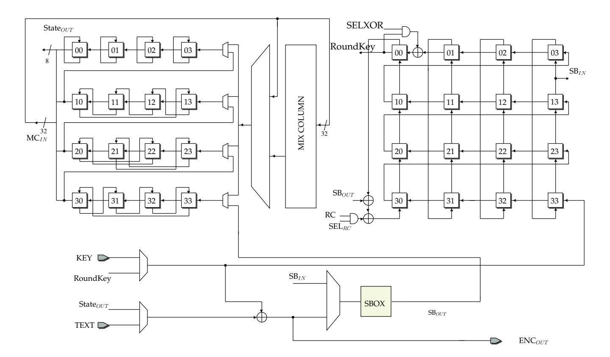
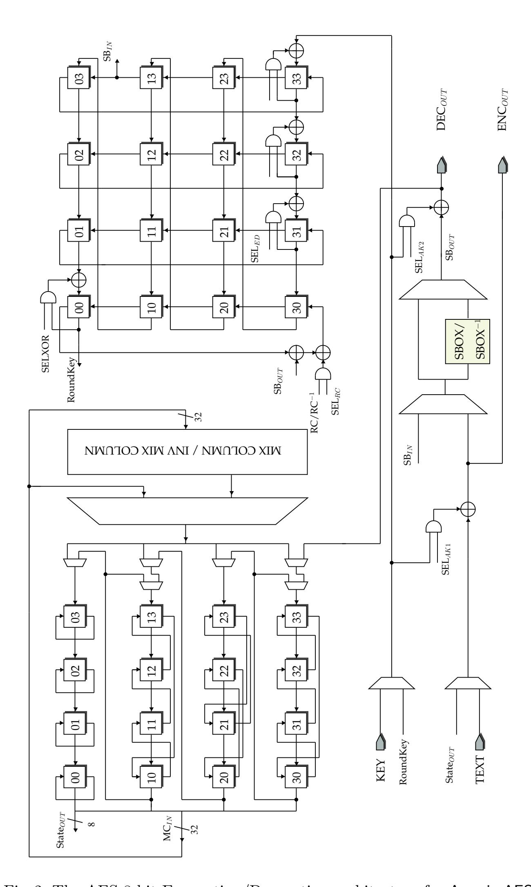
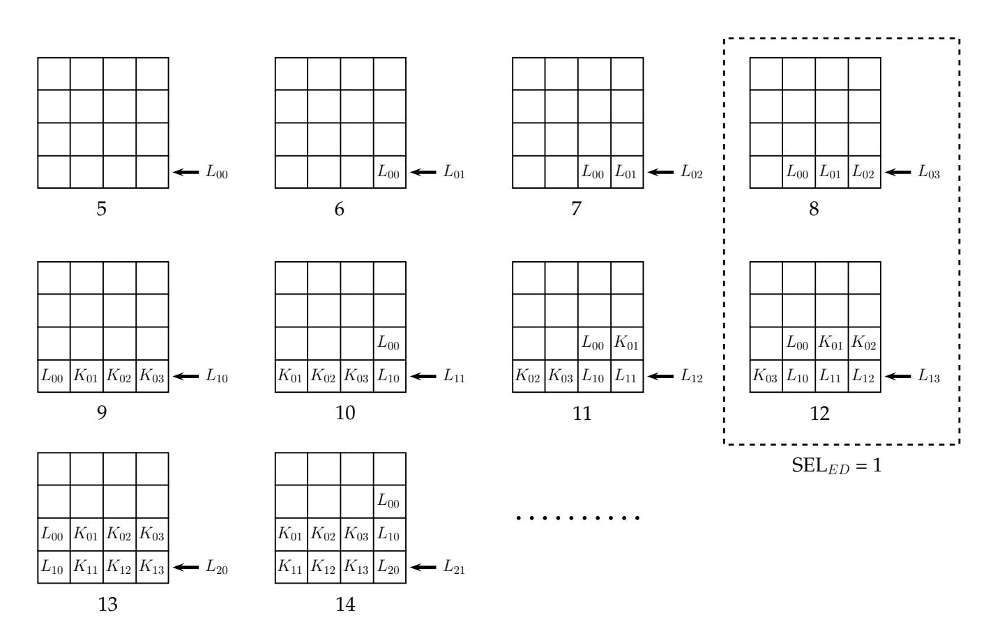
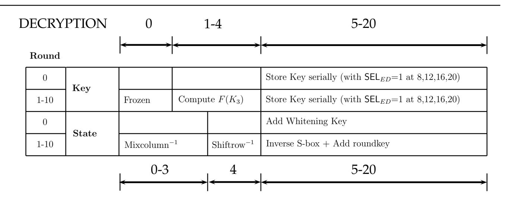
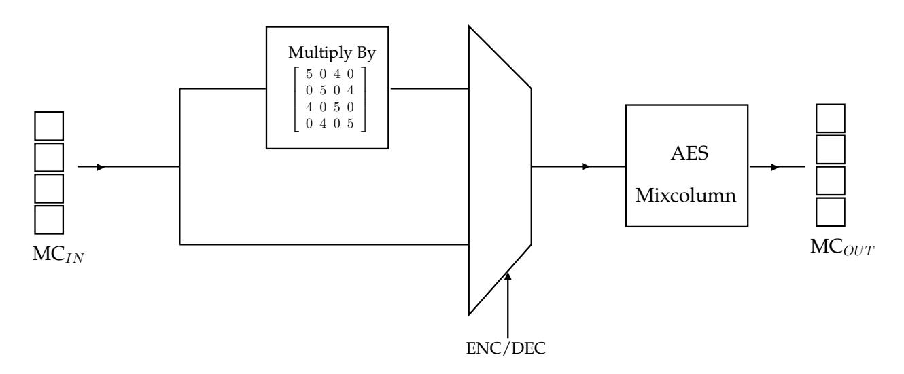
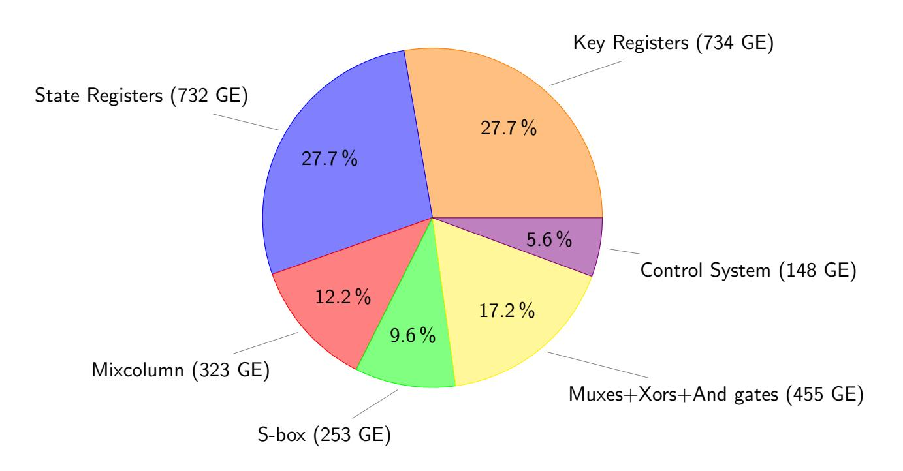

{0}------------------------------------------------

# Atomic-AES: A Compact Implementation of the AES Encryption/Decryption Core

Subhadeep Banik1 , Andrey Bogdanov2 and Francesco Regazzoni3

- 1 Temasek Labs, Nanyang Technological University, Singapore bsubhadeep@ntu.edu.sg
- 2 DTU Compute, Technical University of Denmark, Lyngby anbog@dtu.dk 3 ALARI, University of Lugano

regazzoni@alari.ch

Abstract. The implementation of the AES encryption core by Moradi et al. at Eurocrypt 2011 is one of the smallest in terms of gate area. The circuit takes around 2400 gates and operates on an 8 bit datapath. However this is an encryption only core and unable to cater to block cipher modes like CBC and ELmD that require access to both the AES encryption and decryption modules. In this paper we look to investigate whether the basic circuit of Moradi et al. can be tweaked to provide dual functionality of encryption and decryption (ENC/DEC) while keeping the hardware overhead as low as possible. As a result, we report an 8-bit serialized AES circuit that provides the functionality of both encryption and decryption and occupies around 2645 GE with a latency of 226 cycles. This is a substantial improvement over the next smallest AES ENC/DEC circuit (Grain of Sand) by Feldhofer et al. which takes around 3400 gates but has a latency of over 1000 cycles for both the encryption and decryption cycles.

Keywords: AES 128, Serialized Implementation.

### 1 Introduction

There has been extensive research into the construction of compact implementations of lightweight block ciphers. This line of research has essentially evolved along two different lines. The first aims to construct proprietary lightweight block ciphers by optimizing one or several parameters in the design spectrum, as has been evidenced by numerous such designs proposed in the past few years: HIGHT [\[21\]](#page-17-0), KATAN [\[11\]](#page-16-0), Klein [\[18\]](#page-16-1), LED [\[19\]](#page-16-2), Noekeon [\[13\]](#page-16-3), Present [\[7\]](#page-16-4), Piccolo [\[28\]](#page-17-1), Prince [\[8\]](#page-16-5), Simon/Speck [\[6\]](#page-16-6) and TWINE [\[30\]](#page-17-2). The second aims at attempting to implement standardized ciphers like AES 128 [\[14\]](#page-16-7) in a lightweight fashion.

There have been several lightweight implementations of AES proposed in literature. Some results like [\[20\]](#page-16-8) and [\[10\]](#page-16-9) aim for compact implementations in ASIC and FPGA platforms respectively (however the work in [\[20\]](#page-16-8) is for an 

{1}------------------------------------------------

encryption only core). The works in [\[23\]](#page-17-3) and [\[31\]](#page-17-4) aim at lowering critical path and increasing throughput. And the works in [\[3\]](#page-16-10) and [\[5\]](#page-16-11) aim to implement circuits with low energy consumption per encryption operation.

For compact implementations of the dual encryption/decryption circuit, the following results are known. In [\[27\]](#page-17-5), the authors propose a 32-bit serial architecture with optimized tower field implementation of the S-box and a combinatorial optimization of the Mixcolumn circuit. The size of this implementation was around 5400 GE (gate equivalents, i.e. area occupied by an equivalent number of 2-input NAND gates). The "Grain of Sand" implementation [\[17\]](#page-16-12) by Feldhofer et al. constructs an 8-bit serialized architecture with circuit size of around 3400 GE but a latency of over 1000 cycles for both encryption and decryption. Very recently in [\[24\]](#page-17-6), the authors report an 8-bit serial implementation that takes 1947/2090 GE for the encryption/decryption circuits respectively. This implementation makes use of intermediate register files that can be synthesized in the ASIC flow using memory compilers.

The implementation by Moradi et al. in [\[26\]](#page-17-7) with size equal to 2400 GE and encryption latency of 226 cycles is one of the smallest known architectures for AES. The design combines 8-bit and 32-bit serial datapaths in a manner that achieves a surprisingly compact implementation. The design uses scan flipflops for constructing the registers for the state update and key schedule, a trick that saves 1 GE per flip-flop used. This implementation also uses a 32 bit Mixcolumn circuit instead of the 8-bit serialized structure of [\[17\]](#page-16-12), because the authors argue that any savings in area achieved by an 8-bit serial circuit is offset by the additional registers required to store its output. Finally since each round function in this circuit is implemented in 21 cycles, the control system is made using a 21 cycle LFSR that generates all timing signals accordingly. However this circuit is an encryption-only core, and therefore can not be used to implement modes like CBC [\[16\]](#page-16-13), COPA [\[2\]](#page-16-14), ELmD [\[15\]](#page-16-15), POET [\[1\]](#page-15-0) that require access to both AES encryption and decryption functionalities. Therefore areawise the three smallest known circuits that perform the dual functionalities of both encryption and decryption are

- A. Grain of Sand implementation [\[17\]](#page-16-12) at 3400 GE
- B. 8-bit serial implementation in [\[24\]](#page-17-6) at 4037 GE
- C. 32-bit serial implementation in [\[27\]](#page-17-5) at 5400 GE.

Moreover the Grain of Sand implementation has a latency of over 1000 cycles for both the encryption and decryption operations and so for efficient lightweight implementation of all modes that require access to both AES encryption and decryption it is critical to have an architecture that is both lightweight and incurs minimal latency.

#### 1.1 Contribution and Organization

In this paper we present Atomic-AES, an 8-bit serial architecture that performs the dual functionality of encryption and decryption, and has a circuit size of 

{2}------------------------------------------------

around 2645 GE and latency of 226 cycles for both encryption and decryption operations. The circuit is closely related to the 8-bit encryption only serial architecture presented in [26], and in fact our architecture has the following additional logic components over the basic circuit proposed by Moradi et al.

- 1. 2 additional 8-bit multiplexers in the state datapath,
- 2. 3 additional 8-bit xor gates in the key datapath,
- 3. 24 additional and gates in the key datapath,
- 4. 1 additional 8-bit multiplexer, 1 additional 8-bit xor gate, 16 additional and gates during state-key addition,
- 5. Other additional logic required to implement
  - **a.** S-box and its inverse,
  - **b.** Mixcolumn and its inverse,
  - c. Round constants and their inverses.

The paper is organized in the following manner. Section 2 gives some background and description of the architecture presented in [26]. This would be beneficial for the self-sufficiency and better understanding of this paper. Section 3, describes the architecture and functioning of Atomic-AES in details, and highlights some issues related to its implementation. Section 4 tabulates all implementation results and compares it with previous architectures present in literature. Section 5 concludes the paper.

# 2 Background and Preliminaries

Fig. 1: The 8-bit serial architecture in [26]

{3}------------------------------------------------

In Figure 1, a pictorial description of the architecture in [26] is given. As can be seen the basic elements of storage are the 16 byte sized registers made of scan flip-flops in the state and key path respectively, used to store the intermediate states and roundkeys. Each round function is calculated in 21 cycles and so it is important to understand how the data is maneuvered through the registers during this period. 4

Let us label the 21 cycles per round by the integers 0 to 20. The encryption process starts with the addition of the whitening key and the S-box computation of the first round function. In order to do so the finite sate machine (FSM) generating the round signals is initialized to cycle number 5. So in cycles numbered 5 to 20 (i.e. the very first 16 cycles) the following transformations take place:

Cycles 5 to 20: The 8 bit chunks of plaintext and key are respectively filtered out of the main state and key multiplexers respectively. They are xored, and the resultant signal fed to the S-box. The output of the S-box is fed to the bottom most multiplexer in the state path (marked by  $SB_{IN}$ ), from where it is shifted serially forward in the next round. Effectively, after the cycle 20 is completed, the state registers would store the value  $S(PT \oplus K)$ , where  $S(\cdot)$  denotes the bytewise application of the AES S-box function. In the same period the 8 bit chunk of the Key is input to key register marked "33", from where it is serially forwarded in the next round, much like in the state register. Therefore, at the end of cycle 20, the Key registers hold the value of the initial whitening key.

After this the cycle counter is automatically reset to 0, and each 21 cycle round function is executed 10 times, thus accounting for a total latency of 16+21\*10=226. During this period the order of operations is as follows:

Shiftrow  $\rightarrow$  Mixcolumn  $\rightarrow$  Add roundkey + S-box of next round

To clarify, let us see the cyclewise description of the data movement:

**Cycle 0:** This cycle is reserved for the Shiftrow operation. Since each 8-bit register in the state and key paths are constructed using scan flip-flops, they have two input data ports which they filter depending on a select signal. As can be seen in Figure 1, the state registers are connected to facilitate the Shiftrow operation during cycle 0. The key register is "frozen" in this cycle and so no data movement takes place. 5

Cycles 1 to 4: The Mixcolumn operation is performed during these 4 cycles. The Mixcolumn circuit used in this architecture is a  $\{0,1\}^{32} \rightarrow \{0,1\}^{32}$  logic block, and so data from leftmost column (registers marked 00,10,20,30) of the state is fed as input to the Mixcolumn circuit. In the subsequent cycle the Mixcolumn output is driven into the rightmost column (registers marked

&lt;sup>4Another important point to note is that this particular architecture interprets the AES input vectors in a row major fashion i.e. the first four bytes are placed in the first row, the second four bytes in the second row so on. Most AES implementations use a column major ordering.

&lt;sup>5One way to achieve this is to use a gated clock which does not present a leading edge during the shiftrow period.

{4}------------------------------------------------

03,13,23,33). This operation carried out over 4 cycles computes the Mixcolumn over the entire state. Note that this operation is bypassed in the 10th encryption round as the Mixcolumn function is omitted in the final round.

During this period, the non-linear function of the Keyschedule operation is computed in the Key registers. Recall that the non linear operation in the AES Keyschedule is given as

$$F(K_3) = S(K_3 \ll 8) \oplus RCON_i,$$

where  $K_3$  denotes the third column of the current roundkey,  $\ll$  denotes the left rotate operation and  $RCON_i$  is the  $i^{th}$  round constant (note that the round constant is added to the most significant byte of  $S(K_3 \ll 8)$ ).  $(K_3 \ll 8)$  is a 32 bit value and so  $S(K_3 \ll 8)$  implies the S-box function applied to each of the 4 bytes of the input. In order to implement the rotation operation, the data is taken from the output of the key register marked "13" and fed to the S-box. Although the architecture uses only one S-box, in cycles 1 to 4, the state path operations do not use the S-box circuit and so the key path S-box operations can be done in this period. The S-box output is xored to the output of the register "00" and the round constant and, in the next cycle is driven into the register marked "30". Note that since there is "vertical" movement of data in the key registers in this period, at the end of cycle 4, the four columns of the key register store the values  $K_0 \oplus F(K_3), K_1, K_2, K_3$  respectively, where  $K_i$  denotes the  $i^{th}$  column of the current roundkey.

Cycles 5 to 20: The bytes of state and roundkey are respectively taken out of the registers marked "00" of both the state and key paths and xored together and fed to the S-box. The output of the S-box is again driven into the bottom most state register "33" and serially shifted forward in the subsequent rounds. This sequence of operations is exactly similar as the ones performed in the very first 16 cycles, with the only exception that an intermediate state and roundkey chunks are xored instead of the raw plaintext and key.

The operations in the Key register are a little more interesting during this period. Note that in order to perform roundkey addition during these cycles, the data emanating from key register "00" be equal to the current roundkey. However we have seen that at the end of cycle 4 the columns of the key registers hold the value  $K_0 \oplus F(K_3), K_1, K_2, K_3$ . Note that if  $K_0, K_1, K_2, K_3$  and  $L_0, L_1, L_2, L_3$  denote the 4 columns of the current and next roundkey then we have

$$L_0 = K_0 \oplus F(K_3), \quad L_1 = K_1 \oplus L_0, \quad L_2 = K_2 \oplus L_1, \quad L_3 = K_3 \oplus L_2.$$

Thus at the end of cycle 4, only the  $0^{th}$  column holds the correct next roundkey  $L_0$ . The problem is solved by having an extra xor gate taking inputs from the registers "00" and "01" and output feeding into "00". Since the movement of data is switched to "horizontal", this helps to perform

{5}------------------------------------------------

on the fly addition as the key chunks are driven out of the "00" register. The addition is however not executed at cycles 8,12,16,20 by zeroing the SELXOR signal because as previously noted, the  $0^{th}$  column already has the required roundkey. Also after the roundkey addition, each 8-bit key is circularly shifted back into the key registers through register "33" in order to facilitate the operations in the next round function.

The  $i^{th}$  round in this architecture computes the Substitution layer for the  $(i+1)^{th}$  AES encryption round. This being so, in the tenth and final encryption round the only operations that need be performed are Shiftrows and the final roundkey addition. Thus in the tenth round, the Mixcolumn operation is bypassed in cycles 1-4 and the output ciphertext is available just after the roundkey addition from cycles 5 through 20.

# 3 Atomic-AES: Architecture and Dataflow

We will now present a full description of the proposed architecture for Atomic-AES which provides dual functionalities for encryption and decryption. A diagram for the proposed architecture is presented in Figure 2. The architecture builds on the basic circuit in [26], and so the functioning of the circuit during encryption is exactly as described in Section 2.

#### 3.1 Issues with the Decryption Circuit

In order to accommodate decryption operation in the basic circuit of [26], there are some principal difficulties. We will list them one by one:

- 1. Shiftrows/Inverse Shiftrows: During the Shiftrow operation the data in the  $i^{th}$  row is left-rotated by i bytes  $(0 \le i \le 3)$ . Hence the Inverse Shiftrow operation would require the i-byte right-rotation of the  $i^{th}$  row data. However in order to accommodate the Inverse Shiftrow and forward Shiftrow simultaneously would potentially require another multiplexer at the input of each 8-bit state register.
- 2. Forward/Inverse Keyschedule: The AES Keyschedule basically has as a non-linear shift register like structure, and it is obvious that the key register structure in [26] was explicitly constructed to accommodate its unique mathematical structure, and at the same time produce the current roundkey in an 8-bit serial fashion. It is not immediately clear how the Inverse Keyschedule could be arranged in such a circuit without increasing the circuit size significantly.
- 3. Sequence of operations during Decryption: The circuit in [26] requires 21 cycles to complete a round function, with the order of operations being: Shiftrows, Mixcolumn followed by Add roundkey and the S-box layer of the following round. It is however not clear what order of operations would achieve the most efficient circuit for decryption. If one chooses to have roughly the same order of operations i.e. Inverse Shiftrows, Inverse

{6}------------------------------------------------

Fig. 2: The AES 8 bit Encryption/Decryption architecture for Atomic-AES

{7}------------------------------------------------

Mixcolumn followed by Add roundkey and Inverse S-box, then as per the specification of the Decryption function, we would require the Inverse Mixcolumn of the roundkey as well (as described in [\[27\]](#page-17-5)). This would most likely require additional cycles to compute the the Inverse Mixcolumn of the roundkey and thus increase the latency.

#### 3.2 Inverse Shiftrow

An efficient Encryption/Decryption circuit would need to address all the above issues judiciously. To begin with let us address the issue of Shiftrow/Inverse Shiftrow. We make the following observations before proceeding:

Observation 1: For the 0 th and the 2 nd rows of the AES state, Shiftrow and Inverse Shiftrow bring about the same transformation.

Observation 2: For the 1 st and the 3 rd rows of the AES state, Shiftrow and Inverse Shiftrow bring about opposite transformations. Which is to say, that the Shiftrow operation on the 1 st row brings about the same transformation as the Inverse Shiftrow on the 3 rd row and vice versa.

A careful examination of the architecture in [\[26\]](#page-17-7) reveals that each 8-bit register (constructed with scan flip-flops) accepts two inputs (see Figure [1\)](#page-2-1): one from the register immediately to its right (the rightmost register accepts its input from the leftmost register of the row below it), this connection is to facilitate the serial loading and unloading of the bytes in the state during cycles 5 to 20. The other input facilitates the transfer of data during they Shiftrow cycle. However, for the first three registers of the 1st row (i.e. "10","11" and "12") the two inputs are actually the same. So in order to accommodate the Inverse Shiftrow, the second input connection of these three registers can be rewired (see Figure [2\)](#page-6-0) just like in the third row (since the Inverse Shiftrow of the first and Forward Shiftrow of the third row are actually identical transformations). For the last register of this row i.e. "13", an extra multiplexer with input from "10" is required. And that solves the problem for the first row.

|   | # Register | SL | SR | ISR |   | # Register | SL     | SR | ISR |  |
|---|------------|----|----|-----|---|------------|--------|----|-----|--|
|   | Row 1      |    |    |     |   | Row 3      |        |    |     |  |
| 1 | 10         | 11 | 11 | 13  | 1 | 30         | 31     | 33 | 31  |  |
| 2 | 11         | 12 | 12 | 10  | 2 | 31         | 32     | 30 | 32  |  |
| 3 | 12         | 13 | 13 | 11  | 3 | 32         | 33     | 31 | 33  |  |
| 4 | 13         | 20 | 10 | 12  | 4 | 33         | DECOUT | 32 | 30  |  |

Table 1: Input connections to the 1st and 3rd row state registers during various stages of the operation. (SL: Serial Loading, SR: Shiftrow, ISR: Inverse Shiftrow)

For the 3rd row, the situation is even more straightforward. One of the direct results of Observation 2, is that the first input connection for the registers 

{8}------------------------------------------------

"30", "31" and "32" (used primarily for serial loading of data) can be used for the dual purpose of performing Inverse Shiftrow. This being the case there is no need for rewiring the inputs. However just as in the 1st row, for register "33", an extra multiplexer with input from register "30" is required. Also as per Observation 1, no change in wiring or logic is required in the 0th and 2nd rows. In Table [1,](#page-7-0) we summarize the input connections for the first and third row state registers during the various operation stages. For example during serial loading/unloading, register '13' accepts data coming from register '20', whereas it takes data from '10'/'12' during Shiftrow/Inverse Shiftrow respectively. As seen in Figure [2,](#page-6-0) the register '33' takes data from the DECOUT pin during the serial loading phase (i.e. cycles 5 to 20).

#### 3.3 Inverse Keyschedule

To recall, if K0, K1, K2, K3 and L0, L1, L2, L3 denote the 4 columns of the current and next roundkey then we have

$$L_0 = K_0 \oplus F(K_3), \quad L_1 = K_1 \oplus L_0, \quad L_2 = K_2 \oplus L_1, \quad L_3 = K_3 \oplus L_2.$$

During decryption, the roundkeys are generated in reverse order and so in the context of decryption, L = L0, L1, L2, L3 is essentially the current roundkey and K = K0, K1, K2, K3 is the key to be generated in the subsequent round. So we rewrite the above relation as

$$K_3 = L_2 \oplus L_3$$

$$K_2 = L_1 \oplus L_2$$

$$K_1 = L_0 \oplus L_1$$

$$K_0 = F(K_3) \oplus L_0 = F(L_2 \oplus L_3) \oplus L_0$$

So in order to have an Encryption/Decryption circuit we need an architecture around the key registers that can both (a) generate L given K as input and (b) generate K given L as input. The basic architecture in [\[26\]](#page-17-7) all ready achieves (a) and so we need accommodate (b) i.e. the roundkey generation mechanism during decryption. We offer the following solution. Place three 8-bit xor gates in the 3rd row of Key registers in the following way (refer to Figure [2\)](#page-6-0).

- 1. For 1 ≤ i ≤ 2, the xor gate takes inputs from the key registers "3i" and "3 i + 1" and feeds its output into register "3i".
- 2. The third xor gate takes inputs from the registers "33" and the current roundkey byte and feeds its output into register "33".
- 3. For each of these xor gates, the input coming from register "3i" is anded with a SELED signal. This is done so that serial loading and unloading can be done when required by simply zeroing the SELED signal.

To understand how the Inverse Keyschedule works let us look at the flow of data in cycles 5 to 20. For the purpose of simplification let L0i , L1i , L2i , L3i denote the 4 key bytes in the column Li , and similarly let K0i , K1i , K2i , K3i denote the 

{9}------------------------------------------------

4 key bytes in the column  $K_i$ . Note that the signal  $\mathsf{SEL}_{ED}$  is made 1 only during cycles 8, 12, 16, 20 of the decryption phase. The flow of data has been explained in Figure 3.

Fig. 3: Data flow in the Key registers during Decryption

It can be seen that at cycle 8, the three rightmost key registers in the bottommost row have the key bytes  $L_{00}, L_{01}, L_{02}$ . At this point  $SEL_{ED}$  is set to 1. Thus in the next cycle the bottommost key row would contain the bytes  $L_{00},\ K_{01}=L_{00}\oplus L_{01},\ K_{02}=L_{01}\oplus L_{02},\ K_{03}=L_{02}\oplus L_{03}$  respectively. Similar additions occur at cycles 12, 16 and 20 and as a result at the beginning of cycle 0 of the next round the four columns of the key register would have the values  $L_0, K_1, K_2, K_3$  respectively. Thereafter in cycles 1 to 4,  $F(K_3)$  is computed in the same manner as described in the encryption cycles and added to  $L_0$  in the first column. And as a result at the beginning of cycle 5, the key columns contain  $K_0 = L_0 \oplus F(K_3), K_1, K_2, K_3$  which is the complete next roundkey. Since the complete roundkey is already available, the SELXOR signal controlling the xor gate in the topmost row is zeroed as the roundkeys are serially driven out for the add roundkey operation. Thus all the functionalities of Inverse Keyschedule are completely accommodated using this architecture. Furthermore the complete decryption roundkey is available from cycles 5 through 20, which is incidentally the period during which we perform the add roundkey operation.

{10}------------------------------------------------

#### 3.4 Sequence of operations

Unlike ciphers like Midori [\[4\]](#page-16-16), Prince [\[8\]](#page-16-5) and Noekeon [\[13\]](#page-16-3), AES was not designed as an efficiently implementable involutive cipher. As a result, the sequence of operations during the encryption and decryption flow are quite different. The sequence of operation during the encryption flow is as follows:

- 1. Add whitening key.
- 2. Rounds 1 to 9
  - A. Substitution layer, B. Shiftrows, C. Mixcolumn, D. Add roundkey
- 3. Round 10
  - A. Substitution layer, B. Shiftrows, C. Add roundkey

As previously mentioned, the 21 cycle encryption phase is arranged as Shiftrow → Mixcolumn → Add roundkey + Substitution layer of next round. The decryption flow of operations must exactly be opposite of encryption. Since the Shiftrows/Inverse Shiftrows can be commuted with S-box/Inverse S-box operation respectively, we can go with the following composition of one decryption round (also used in the architecture in [\[27\]](#page-17-5)):

Inverse Shiftrow → Inverse Mixcolumn → Add roundkey + Inverse S-box

This sequence is attractive in this particular architecture because it has exactly the same order of operations as in encryption, and so it does not need too many changes in the underlying control system that produces select signals for the various multiplexers in the circuit. However as mentioned in [\[27\]](#page-17-5), this sequence essentially swaps the order of Add roundkey and Inverse Mixcolumn operations. Since Mixcolumn and hence also Inverse Mixcolumn are linear functions, this requires the Inverse Mixcolumn function to be operated on the current roundkey before using it during the Add roundkey operation (since MC−1 (X + K) = MC−1 (X)+MC−1 (K)). There are two ways to achieve this: a) use an additional circuit for Inverse Mixcolumns or b) spend extra cycles to compute the Inverse Mixcolumn of the current roundkey. Option a increases circuit size and option b increases latency.

In this paper we propose an alternate sequence of the decryption cycle that compromises on neither the circuit size nor latency. We propose the following flow:

Inverse Mixcolumn → Inverse Shiftrow → Inverse S-box + Add roundkey

Since this sequence of operations is essentially the mirror inverse of the AES encryption round function, no swapping of Add roundkey and Inverse Mixcolumn is needed, and that obviates the need to calculate the Inverse Mixcolumn of the roundkey. To better explain the operations, let us present a cycle by cycle breakdown of the 21 cycle decryption round function. The decryption starts with the addition of the whitening key. The finite sate machine (FSM) generating the round signals is again initialized to cycle number 5. So in cycles numbered 5 to 20 (i.e. the very first 16 cycles) the following transformations take place:

{11}------------------------------------------------

Cycles 5 to 20: The 8 bit chunks of ciphertext and key are respectively filtered out of the main state and key multiplexers respectively They are xored, and the resultant signal fed to the state registers. Note that in the corresponding encryption stage, we additionally calculated the S-box of the first round. Hence in order to accommodate both encryption and decryption we need a multiplexer after the S-box circuit as shown in Figure [2.](#page-6-0) The Key bytes are input to key register "33", from where it is serially forwarded in the next round. However as mentioned in the previous subsection, the SELED signal is set to 1 at rounds 8, 12, 16, 20 due to which at beginning of the next phase, the Key four register columns hold the value L0, K1, K2, K3 respectively.

After this the cycle counter is automatically reset to 0, and each 21 cycle round function is executed 10 times. Since the data flow in the key registers have already explained in the previous subsection, we concentrate on the state register.

Cycles 0 to 3: These cycles perform the Inverse Mixcolumn operation on the state columns, in exactly the same way forward Mixcolumn is executed in the encryption stage in cycles 1 to 4. However only in the very first round the Inverse Mixcolumn operation is bypassed, as required in AES decryption.

Cycle 4: This cycle is reserved for the Inverse Shiftrow operation.

Cycles 5 to 20: The bytes of state are taken out from register "00" and input into the combined forward and reverse S-box circuit to compute the Inverse S-box operation. The output of the S-box is then xored with the current roundkey byte from the key register "00" and circulated serially back into the state registers via the register marked "33". Note that the order of Sbox and Add roundkey in the decryption phase is exactly the opposite as the encryption phase. As a result we employ two 8-bit xor gates, one before and one after the S-box circuit, for key addition in the encryption and decryption stages respectively. The xor gate inputs are controlled by and gates as shown in Figure [2,](#page-6-0) in order to bypass the addition operation as required.

In the tenth and final round, the decrypted plaintext is made available from cycles 5 through 20 after the add roundkey operation. The above process is explained pictorially in Figure [4.](#page-12-0) We now describe some of the components used in the circuit.

## 3.5 S-box

Over the years, there has been substantial research into compact circuit implementations of the AES S-box [\[9,](#page-16-17)[12,](#page-16-18)[25,](#page-17-8)[27](#page-17-5)[,32\]](#page-17-9). Almost all of them use the underlying algebraic structure of the AES S-box, that essentially combines an affine transformation with an inverse computation over the AES finite field. However the architecture due to Canright [\[12\]](#page-16-18) remains one of the smallest in terms of circuit size for the combined Forward and Inverse S-box, and thus this is the architecture we chose for the combined S-box/Inverse S-box circuit.

{12}------------------------------------------------

|  |       | ENCRYPTION | 0        | 1-4           | 5-20                                   |
|--|-------|------------|----------|---------------|----------------------------------------|
|  | Round |            |          |               |                                        |
|  |       | State      |          |               | Add Whitening Key + S-box of 1st round |
|  | 0     | Key        |          |               | Store Key serially                     |
|  | 1-10  | State      | Shiftrow | Mixcolumn     | Add roundkey + S-box of next round     |
|  |       | Key        | Frozen   | Compute F(K3) | Compute roundkey + Store it serially   |

Fig. 4: Operation sequences in the Encryption/Decryption stages

#### 3.6 Mixcolumn/Inverse Mixcolumn

In [\[27\]](#page-17-5), the authors use the following decomposition of the Inverse Mixcolumn matrix to achieve an efficient implementation:

$$\begin{pmatrix} 14 & 11 & 13 & 9 \\ 9 & 14 & 11 & 13 \\ 13 & 9 & 14 & 11 \\ 11 & 13 & 9 & 14 \end{pmatrix} = \begin{pmatrix} 2 & 3 & 1 & 1 \\ 1 & 2 & 3 & 1 \\ 1 & 1 & 2 & 3 \\ 3 & 1 & 1 & 2 \end{pmatrix} + \begin{pmatrix} 8 & 8 & 8 & 8 \\ 8 & 8 & 8 & 8 \\ 8 & 8 &$$

The xxtime (i.e. multiplication by 4) operation in AES finite field can be implemented in 5 xor gates as shown ( b6 ⊕ b7 is computed just once and the output is reused to construct the 5th LSB)

$$\mathtt{xxtime}(b_7,b_6,\ldots,b_0) \mapsto b_5,b_4,b_3 \oplus b_7,b_2 \oplus \boxed{b_6 \oplus b_7},b_1 \oplus b_6,b_0 \oplus b_7,\boxed{b_6 \oplus b_7},b_6 \oplus b_7,\boxed{b_6 \oplus b_7},b_6 \oplus b_7,\boxed{b_6 \oplus b_7}$$

Using this implementation of xxtime, the authors proposed a construction of Inverse Mixcolumns using 193 xor gates and a 32 bit multiplexer. However a more efficient implementation is due to Paulo Barreto, which factorizes the Inverse Mixcolumn matrix as :

$$\begin{pmatrix} 14 & 11 & 13 & 9 \\ 9 & 14 & 11 & 13 \\ 13 & 9 & 14 & 11 \\ 11 & 13 & 9 & 14 \end{pmatrix} = \begin{pmatrix} 2 & 3 & 1 & 1 \\ 1 & 2 & 3 & 1 \\ 1 & 1 & 2 & 3 \\ 3 & 1 & 1 & 2 \end{pmatrix} \cdot \begin{pmatrix} 5 & 0 & 4 & 0 \\ 0 & 5 & 0 & 4 \\ 4 & 0 & 5 & 0 \\ 0 & 4 & 0 & 5 \end{pmatrix}$$

{13}------------------------------------------------

To implement the above circuit, we simply premultiply the input column by the Circulant(5, 0, 4, 0) matrix as follows:

$$y_3 = \mathtt{xxtime}(x_3 \oplus x_1) \oplus x_3, \quad y_2 = \mathtt{xxtime}(x_2 \oplus x_0) \oplus x_2$$
  $y_1 = \mathtt{xxtime}(x_3 \oplus x_1) \oplus x_1, \quad y_0 = \mathtt{xxtime}(x_2 \oplus x_0) \oplus x_0$ 

where  $X = (x_3, x_2, x_1, x_0)$  and  $Y = (y_3, y_2, y_1, y_0)$  are the input and output columns of the multiplication block. The multiplication block takes exactly 58 xor gates. Thereafter we choose either X for Mixcolumns or Y for Inverse Mixcolumns, and input the resultant to the AES Mixcolumn circuit, as shown in Figure 5. Since the Mixcolumn circuit can be efficiently implemented in 108 gates, the combined circuit takes 108+58=166 xor gates and a 32 bit multiplexer which is more efficient than the construction in [27].

Fig. 5: Mixcolumn/Inverse Mixcolumn circuit

#### 3.7 Round Constants and Control System

We use LUT based round constants. If r is the current round number, then the encryption operation uses LUT(r), while the decryption operation uses LUT(11-r). The two signals can be input to an 8-bit multiplexer so that one can be chosen over the other as required. To further optimize, one can instead place a multiplexer before the LUT and choose between the 4-bit constants r and 11-r, and use the resultant signal as input to the LUT. Since this requires only a 4-bit multiplexer, it saves us additional area equivalent to a 4-bit multiplexer. Furthermore, all control signals are generated using a 21 cycle LFSR as described in [26].

#### 4 Performance Evaluation

In order to perform a fair performance evaluation, we implemented the circuit using VHDL. Thereafter the following design flow was adhered to for all the

{14}------------------------------------------------

circuits: a functional verification at the RTL level was first done using Mentor Graphics Modelsim software. The designs were synthesized using the standard cell library of the 90nm and 65nm logic process of STM (CORE90GPHVT v 2.1.a and CORE65LPLVT v 5.1) with the Synopsys Design Compiler, with the compiler being specifically instructed to optimize the circuit for area. A timing simulation was done on the synthesized netlist to confirm the correctness of the design, by comparing the output of the timing simulation with known test vectors. The switching activity of each gate of the circuit was collected while running post-synthesis simulation. The average power was obtained using Synopsys Power Compiler, using the back annotated switching activity. The results are tabulated in Table [2.](#page-14-0)

We outline some of the essential lightweight metrics of the known implementations of encryption/decryption architectures of AES and compare it with our own. Energy consumption was listed rather than power as it is a measure of the total electrical work done during one encryption/decryption. Since the circuits in Table [2](#page-14-0) are implemented using different CMOS logic processes, there are most likely to be wide variations in energy consumption and maximum throughput. For example the throughput of [\[24\]](#page-17-6) is quite high as it is implemented using the standard cell library of the 22nm CMOS logic process which is faster than the other logic processes listed in the table. The throughput of [\[27\]](#page-17-5) is also high as it is a 32-bit serial circuit and thus has considerably lower latency.

In Figure [6,](#page-15-2) we present a componentwise breakdown of the circuit size. We use clock gating to generate the clock for the Key registers, since the data movement has to be frozen for one cycle. Apart from the multiplexers included in the implementation of the combined Forward and Inverse S-box, Mixcolumn and Round Constants, a quick glance at Figure [2,](#page-6-0) tells us that we need

- 1. Six 8-bit multiplexers around the state register, one 32-bit multiplexer to bypass the Mixcolumn circuit, one 8-bit multiplexer after the S-box, and two 8-bit multiplexers to filter the raw key/plaintext (ciphertext) and the roundkey/state byte respectively.
- 2. Apart from this six 8-bit xors around the key registers and two 8-bit xors during state-key addition.

| # Architecture       | Type | Library       | Area | Latency             | Energy  | T Pmax  |
|----------------------|------|---------------|------|---------------------|---------|---------|
|                      |      |               | (GE) | (cycles)            | (nJ)    | (Mbps)  |
| 1 8-bit Serial [26]  | E    | UMC 180nm     | 2400 | 226                 | 8.4     | -       |
| 2 Grain of Sand [17] | ED   | Philips 350nm | 3400 | 1032/1165 46.4/52.4 |         | 9.9/8.8 |
| 3 8-bit Serial [24]  | ED   | 22nm          | 4037 | 336/216             | 3.9/2.5 | 432/671 |
| 4 32-bit Serial [27] | ED   | 110nm         | 5400 | 54/54               | -       | 311     |
| 5 Atomic-AES         | ED   | STM 90nm      | 2645 | 226/226             | 3.3     | 94.4    |
|                      |      | STM 65nm      | 2976 | 226/226             | 2.2     | 57.8    |

Table 2: Performance Comparison of Atomic-AES with previous architectures in literature (Figures separated by '/' indicate corresponding figures for encryption/decryption, E: Encryption only, ED: ENC/DEC)

{15}------------------------------------------------

Fig. 6: Area requirements of the individual components

3. One input of five out of the six xor gates is controlled by an and gate.

This adds up to around 455 GE for the multiplexers, xor, and gates in the circuit. The LSFR based control system and the round constants take around 148 GE. Adding up, this leads to 2645 GE for the entire circuit.

### 5 Conclusion

In this work, we present a compact architecture for AES that performs the dual function of encryption and decryption. Such architectures are useful in lightweight construction of block cipher modes that require access to both the encryption and decryption modules. We build upon the encryption only architecture of [\[26\]](#page-17-7) and show that certain judicious alterations in logic and wiring can transform the architecture to perform encryption and decryption simultaneously. Our circuit has a size of 2645 GE and has a latency of 226 cycles for both encryption and decryption operations. This is a substantial improvement over the Grain of sand implementation that has an area of 3400 GE but a latency of over 1000 cycles for both encryption and decryption.

Acknowledgement: The authors would like to thank the anonymous reviewers who helped improve the quality and presentation of this paper.

# References

1. F. Abed, S. Fluhrer, J. Foley, C. Forler, E. List, S. Lucks, D. Mcgrew, J. Wenzel. The POET Family of On-Line Authenticated Encryption Schemes. Submission to the CAESAR competition. Available at [https://competitions.cr.yp.](https://competitions.cr.yp.to/round1/poetv101.pdf) [to/round1/poetv101.pdf](https://competitions.cr.yp.to/round1/poetv101.pdf).

{16}------------------------------------------------

- 2. E. Andreeva, A. Bogdanov, A. Luykx, B. Mennink, E. Tischhauser, K. Yasuda. AES-COPA v.1. Submission to the Caesar Compedition. Available at [http://](http://competitions.cr.yp.to/round1/aescopav1.pdf) [competitions.cr.yp.to/round1/aescopav1.pdf](http://competitions.cr.yp.to/round1/aescopav1.pdf).
- 3. S. Banik, A. Bogdanov, F. Regazzoni. Exploring Energy Efficiency of Lightweight Block Ciphers. In SAC 2015, LNCS, vol. 9566, pp. 178-194, 2015.
- 4. S. Banik, A. Bogdanov, T. Isobe, K. Shibutani, H. Hiwatari, T. Akishita, F. Regazzoni. Midori: A Block Cipher for Low Energy. In ASIACRYPT 2015, LNCS, vol. 9453, pp. 411-436, 2015.
- 5. S. Banik, A. Bogdanov, F. Regazzoni, T. Isobe, H. Hiwatari, T. Akishita. Round gating for low energy block ciphers. In IEEE Hardware Oriented Security and Trust (HOST), pp. 55-60, 2016.
- 6. R. Beaulieu, D. Shors, J. Smith, S. Treatman-Clark, B. Weeks, L. Wingers. The Simon and Speck Families of Lightweight Block Ciphers. In IACR eprint archive. Available at <https://eprint.iacr.org/2013/404.pdf>.
- 7. A. Bogdanov, L. Knudsen, G. Leander, C. Paar, A. Poschmann, M. Robshaw, Y. Seurin, C. Vikkelsoe. PRESENT: An Ultra-Lightweight Block Cipher. In CHES 2007, LNCS, vol. 4727, pp. 450-466, 2007.
- 8. J. Borghoff, A. Canteaut, T. G¨uneysu, E. B. Kavun, M. Kneˇzevi´c, L. R. Knudsen, G. Leander, V. Nikov, C. Paar, C. Rechberger, P. Rombouts, S. S. Thomsen, T. Yal¸cin. PRINCE - A Low-Latency Block Cipher for Pervasive Computing Applications - Extended Abstract. In Asiacrypt 2012, LNCS, vol. 7658, pages 208-225, 2012.
- 9. J. Boyar, P. Matthews, R. Peralta. Logic Minimization Techniques with Applications to Cryptology. In J. Cryptology, vol. 26, pp. 28–312, 2013.
- 10. P. Chodowiec, K. Gaj. Very Compact FPGA Implementation of the AES Algorithm. In CHES 2003, LNCS, vol. 2779, pp. 319-333, 2003.
- 11. C. De Canni`ere, O. Dunkelman, M. Kneˇzevi´c. KATAN and KTANTAN - a family of small and efficient hardware-oriented block ciphers. In CHES 2009, LNCS, vol. 5747, pp. 272-288, 2009.
- 12. D. Canright. A very compact S-Box for AES. In CHES 2005, LNCS, vol. 3659, pp. 441-455, 2005.
- 13. J. Daemen, M. Peeters, G. V. Assche, V. Rijmen. Nessie Proposal: NOEKEON. Available at <http://gro.noekeon.org/Noekeon-spec.pdf>.
- 14. J. Daemen, V. Rijmen. The design of Rijndael: AES - the Advanced Encryption Standard. Springer-Verlag, 2002.
- 15. N. Datta and M. Nandi. ELmD v1.0. Submission to the Caesar compedition. Available at <https://competitions.cr.yp.to/round1/elmdv10.pdf>.
- 16. M. Dworkin. Recommendation for Block Cipher Modes of Operation. NIST Special Publication 800-38A. Available at [http://csrc.nist.gov/publications/](http://csrc.nist.gov/publications/nistpubs/800-38a/sp800-38a.pdf) [nistpubs/800-38a/sp800-38a.pdf](http://csrc.nist.gov/publications/nistpubs/800-38a/sp800-38a.pdf).
- 17. M. Feldhofer, J. Wolkerstorfer, V. Rijmen. AES Implementation on a Grain of Sand. In IEEE Proceedings of Information Security, vol. 152(1), pages 13-20, 2005.
- 18. Z. Gong, S. Nikova, Y.W. Law. KLEIN: a new family of lightweight block ciphers. In RFIDSec 2011, LNCS, vol. 7055, pp. 1-18, 2011.
- 19. J. Guo, T. Peyrin, A. Poschmann, M. J. B. Robshaw. The LED Block Cipher. In CHES 2011, LNCS, vol. 6917, pp. 326-341, 2011.
- 20. P. H¨am¨al¨ainen, T. Alho, M. H¨annik¨ainen, and T. D. H¨am¨al¨ainen. Design and Implementation of Low-Area and Low-Power AES Encryption Hardware Core. In DSD, pages 577-583, 2006.

{17}------------------------------------------------

- 21. D. Hong, J. Sung, S. Hong, J. Lim, S. Lee, B. Ko, C. Lee, D. Chang, J. Lee, K. Jeong, H. Kim, J. Kim, S. Chee. HIGHT: A New Block Cipher Suitable for Low-Resource Device. In CHES 2006, LNCS, vol. 4249, pp. 46-59, 2006.
- 22. S. Kerckhof, F. Durvaux, C. Hocquet, D. Bol, F. X. Standaert. Towards Green Cryptography: a Comparison of Lightweight Ciphers from the Energy Viewpoint. In CHES 2012, LNCS, vol. 7428, pp. 390-407, 2012.
- 23. A. Lutz, J. Treichler, F. G¨urkaynak, H. Kaeslin, G. Basler, A. Erni, S. Reichmuth, P. Rommens, S. Oetiker, W. Fichtner. 2Gbit/s hardware realizations of RIJNDAEL and SERPENT: A comparative analysis. In CHES 2002, LNCS, vol. 2523, pp. 144158, 2002.
- 24. S. Mathew, S. Satpathy, V. Suresh, M. Anders, H. Kaul, A. Agarwal, S. Hsu, G. Chen, R.K. Krishnamurthy. 340 mV–1.1V, 289 Gbps/W, 2090-gate nanoAES hardware accelerator with area-optimized encrypt/decrypt GF(24 ) 2 polynomials in 22 nm tri-gate CMOS. In IEEE Journal of Solid-State Circuits, vol. 50, pp. 1048–1058, 2015.
- 25. N. Mentens, L. Batina, B. Preneel and I. Verbauwhede. A Systematic Evaluation of Compact Hardware Implementations for the Rijndael S-Box. In CT-RSA 2005, LNCS, vol. 3376, pp. 323–333, 2005.
- 26. A. Moradi, A. Poschmann, S. Ling, C. Paar, H. Wang. Pushing the Limits: A Very Compact and a Threshold Implementation of AES. In Eurocrypt 2011, LNCS, vol. 6632, pp. 69-88, 2011.
- 27. A. Satoh, S. Morioka, K. Takano, S. Munetoh. A Compact Rijndael Hardware Architecture with S-Box Optimization. In Asiacrypt 2001, LNCS, vol. 2248, pp. 239-254, 2001.
- 28. K. Shibutani, T. Isobe, H. Hiwatari, A. Mitsuda, T. Akishita, T. Shirai. Piccolo: An Ultra-Lightweight Blockcipher. In CHES 2011, LNCS, vol. 6917, pp. 342-357, 2011.
- 29. T. Shirai, K. Shibutani, T. Akishita, S. Moriai, T. Iwata. The 128-bit Block-cipher CLEFIA(Extended Abstract). In FSE 2007, LNCS, vol. 4593, pp. 181-195, 2007.
- 30. T. Suzaki, K. Minematsu, S. Morioka, E. Kobayashi. TWINE: A Lightweight Block Cipher for Multiple Platforms. In SAC 2012, LNCS, vol. 7707, pp. 339-354, 2012.
- 31. R. Ueno, S. Morioka, N. Homma, T. Aoki. A High Throughput/Gate AES Hardware Architecture by Compressing Encryption and Decryption Datapaths - Toward Efficient CBC-Mode Implementation. In CHES 2016, LNCS, vol. 9813, pp. 538-558, 2016.
- 32. R. Ueno, N. Homma, Y. Sugawara, Y. Nogami, and T. Aoki. Highly Efficient GF(28 ) Inversion Circuit Based on Redundant GF Arithmetic and Its Application to AES Design In CHES 2015, LNCS, vol. 9293, pp. 63–80, 2015.