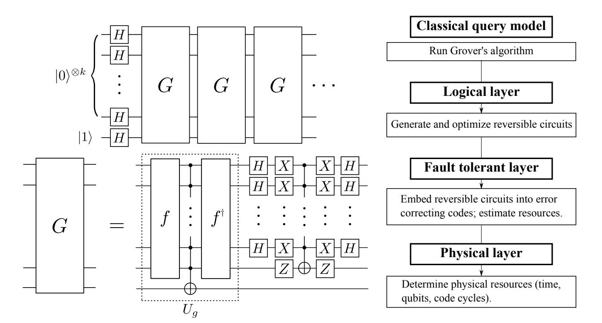
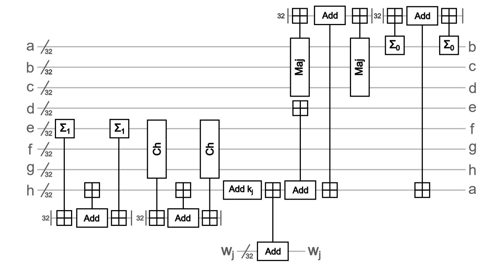
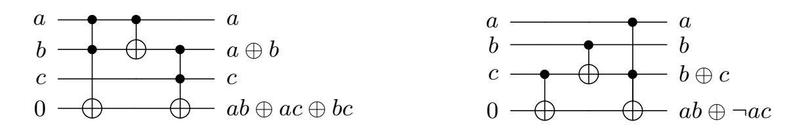
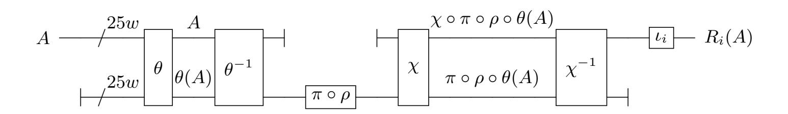

{0}------------------------------------------------

# Estimating the cost of generic quantum pre-image attacks on SHA-2 and SHA-3

Matthew Amy1,<sup>4</sup> , Olivia Di Matteo2,<sup>4</sup> , Vlad Gheorghiu3,<sup>4</sup> , Michele Mosca3,4,5,<sup>6</sup> , Alex Parent2,<sup>4</sup> , and John Schanck3,<sup>4</sup>

- <sup>1</sup> David R. Cheriton School of Computer Science, University of Waterloo, Canada <sup>2</sup> Department of Physics & Astronomy, University of Waterloo, Canada
- <sup>3</sup> Department of Combinatorics & Optimization, University of Waterloo, Canada
  - 4 Institute for Quantum Computing, University of Waterloo, Canada
    - <sup>5</sup> Perimeter Institute for Theoretical Physics, Canada
    - <sup>6</sup> Canadian Institute for Advanced Research, Canada

Abstract. We investigate the cost of Grover's quantum search algorithm when used in the context of pre-image attacks on the SHA-2 and SHA-3 families of hash functions. Our cost model assumes that the attack is run on a surface code based fault-tolerant quantum computer. Our estimates rely on a time-area metric that costs the number of logical qubits times the depth of the circuit in units of surface code cycles. As a surface code cycle involves a significant classical processing stage, our cost estimates allow for crude, but direct, comparisons of classical and quantum algorithms.

We exhibit a circuit for a pre-image attack on SHA-256 that is approximately 2<sup>153</sup>.<sup>8</sup> surface code cycles deep and requires approximately 2<sup>12</sup>.<sup>6</sup> logical qubits. This yields an overall cost of 2<sup>166</sup>.<sup>4</sup> logical-qubit-cycles. Likewise we exhibit a SHA3-256 circuit that is approximately 2<sup>146</sup>.<sup>5</sup> surface code cycles deep and requires approximately 2<sup>20</sup> logical qubits for a total cost of, again, 2<sup>166</sup>.<sup>5</sup> logical-qubit-cycles. Both attacks require on the order of 2<sup>128</sup> queries in a quantum black-box model, hence our results suggest that executing these attacks may be as much as 275 billion times more expensive than one would expect from the simple query analysis.

Keywords: Post-quantum cryptography, hash functions, pre-image attacks, symmetric cryptographic primitives

# 1 Introduction

Two quantum algorithms threaten to dramatically reduce the security of currently deployed cryptosystems: Shor's algorithm solves the abelian hidden subgroup problem in polynomial time [\[1,](#page-18-0)[2\]](#page-18-1), and Grover's algorithm provides a quadratic improvement in the number of queries needed to solve black-box search problems [\[3](#page-18-2)[,4,](#page-18-3)[5\]](#page-18-4).

Efficient quantum algorithms for integer factorization, finite field discrete logarithms, and elliptic curve discrete logarithms can all be constructed by reduction to the abelian hidden subgroup problem. As such, cryptosystems based 

{1}------------------------------------------------

on these problems can not be considered secure in a post-quantum environment. Diffie-Hellman key exchange, RSA encryption, and RSA signatures will all need to be replaced before quantum computers are available. Some standards bodies have already begun discussions about transitioning to new public key cryptographic primitives [\[6,](#page-18-5)[7\]](#page-18-6).

The situation is less dire for hash functions and symmetric ciphers. In a pre-quantum setting, a cryptographic primitive that relies on the hardness of inverting a one-way function is said to offer k-bit security if inverting the function is expected to take N = 2<sup>k</sup> evaluations of the function. An exhaustive search that is expected to take O(N) queries with classical hardware can be performed with Θ( √ N) queries using Grover's algorithm on quantum hardware. Hence, Grover's algorithm could be said to reduce the bit-security of such primitives by half; one might say that a 128-bit pre-quantum primitive offers only 64-bit security in a post-quantum setting.

A conservative defense against quantum search is to double the security parameter (e.g. the key length of a cipher, or the output length of a hash function). However, this does not mean that the true cost of Grover's algorithm should be ignored. A cryptanalyst may want to know the cost of an attack even if it is clearly infeasible, and users of cryptosystems may want to know the minimal security parameter that provides "adequate protection" in the sense of [\[8,](#page-18-7)[9,](#page-18-8)[10\]](#page-18-9).

In the context of pre-image search on a hash function, the cost of a prequantum attack is given as a number of invocations of the hash function. If one assumes that quantum queries have the same cost as classical queries, then the query model provides a reasonable comparison between quantum and classical search. However, realistic designs for large quantum computers call this assumption into question.

The main difficulty is that the coherence time of physical qubits is finite. Noise in the physical system will eventually corrupt the state of any long computation. If the physical error rate can be suppressed below some threshold, then logical qubits with arbitrarily long coherence times can be created using quantum error correcting codes. Preserving the state of a logical qubit is an active process that requires periodic evaluation of an error detection and correction routine. This is true even if no logical gates are performed on the logical qubit. Hence the classical processing required to evaluate a quantum circuit will grow in proportion to both the depth of the circuit and the number of logical qubits on which it acts.

We suggest that a cost model that facilitates direct comparisons of classical and quantum algorithms should take the classical computation required for quantum error correction into consideration. Clearly such estimates will be architecture dependent, and advances in quantum computing could invalidate architectural assumptions.

To better understand the impact of costing quantum error correction, we present an estimate of the cost of pre-image attacks on SHA-2 and SHA-3 assuming a quantum architecture based on the surface code with a logical Clifford+T gate set. We execute the following procedure for each hash function. First, we 

{2}------------------------------------------------

implement the function as a reversible circuit[1](#page-2-0) over the Clifford+T gate set. We use a quantum circuit optimization tool, "T-par" [\[11\]](#page-18-10), to minimize the circuit's T-count and T-depth[2](#page-2-1) . With the optimized circuit in hand we estimate the additional overhead of fault tolerant computation. In particular, we estimate the size of the circuits needed to produce the ancillary states that are consumed by T-gates.

Grassl et al. presented a logical-layer quantum circuit for applying Grover's algorithm to AES key recovery [\[12\]](#page-18-11). Separately, Fowler et al. have estimated the physical resources required to implement Shor's factoring algorithm on a surface code based quantum computer [\[13\]](#page-18-12). Our resource estimates combine elements of both of these analyses. We focus on the number of logical qubits in the fault-tolerant circuit and the overall depth of the circuit in units of surface code cycles. While our cost model ties us to a particular quantum architecture, we segment our analysis into several layers so that the impact of a different assumptions at any particular level can be readily evaluated. We illustrate our method schematically in Fig. [2.](#page-3-0)

The structure of this article reflects our workflow. In Section [2](#page-2-2) we state the problem of pre-image search using Grover's algorithm. Section [3](#page-3-1) introduces our framework for computing costs, and Section [4](#page-6-0) applies these principles to compute the intrinsic cost of performing Grover search. Sections [5](#page-6-1) and [6](#page-9-0) detail our procedure for generating reversible circuits for SHA-256 and SHA3-256 respectively. In Section [7](#page-12-0) we embed these reversible implementations into a surface code, and estimate the required physical resources. We summarize our results and propose avenues of future research in Section [8.](#page-17-0)

# <span id="page-2-2"></span>2 Pre-image search via Grover's algorithm

Let f : {0, 1} <sup>k</sup> → {0, 1} <sup>k</sup> be an efficiently function. For a fixed y ∈ {0, 1} k , the value x such that f(x) = y is called a pre-image of y. In the worst case, the only way to compute a pre-image of y is to systematically search the space of all inputs to f. A function that must be searched in this way is known as a one-way function. A one-way function that is bijective is a one-way permutation[3](#page-2-3) .

Given a one-way permutation f, one might ask for the most cost effective way of computing pre-images. With a classical computer one must query f on the order of 2<sup>k</sup> times before finding a pre-image. By contrast, a quantum computer can perform the same search with 2k/<sup>2</sup> queries to f by using Grover's algorithm [\[3\]](#page-18-2). Of course, counting only the queries to f neglects the potentially significant overhead involved in executing f on a quantum computer.

<span id="page-2-0"></span><sup>1</sup> Reversibility is necessary for the hash function to be useful as a subroutine in Grover search.

<span id="page-2-1"></span><sup>2</sup> The logical T gate is significantly more expensive than Clifford group gates on the surface code.

<span id="page-2-3"></span><sup>3</sup> A hash function that has been restricted to length k inputs is expected to behave roughly like a one-way permutation. The degree to which it fails to be injective should not significantly affect the expected probability of success for Grover's algorithm.

{3}------------------------------------------------



<span id="page-3-2"></span><span id="page-3-0"></span>Fig. 1. Grover searching with an oracle for f : {0, 1} <sup>k</sup> → {0, 1} k . Fig. 2. Analyzing Grover's algorithm.

Figure [1](#page-3-2) gives a high-level description of Grover's algorithm. The algorithm makes b π 4 2 k/2 c calls to G, the Grover iteration. The Grover iteration has two subroutines. The first, Ug, implements the predicate g : {0, 1} <sup>k</sup> → {0, 1} that maps x to 1 if and only if f(x) = y. Each call to U<sup>g</sup> involves two calls to a reversible implementation of f and one call to a comparison circuit that checks whether f(x) = y.

The second subroutine in G implements the transformation 2|0ih0|−I and is called the diffusion operator. The diffusion operator is responsible for amplifying the probability that a measurement of the output register would yield x such that f(x) = y. As it involves only single-qubit gates and a one k-fold controlled-NOT, the cost of the diffusion operator is expected to be small compared with that of Ug.

# <span id="page-3-1"></span>3 A cost metric for quantum computation

Without significant future effort, the classical processing will almost certainly limit the speed of any quantum computer, particularly one with intrinsically fast quantum gates.

Fowler–Whiteside–Hollenberg [\[14\]](#page-19-0)

The majority of the overhead for quantum computation, under realistic assumptions about quantum computing architectures, comes from error detection and correction. There are a number of error correction methods in the literature, however the most promising, from the perspective of experimental realizability, is the surface code [\[15\]](#page-19-1).

{4}------------------------------------------------

The surface code allows for the detection and correction of errors on a twodimensional array of nearest-neighbor coupled physical qubits. A distance d surface code encodes a single logical qubit into an n × n array of physical qubits (n = 2d − 1). A classical error detection algorithm must be run at regular intervals in order to track the propagation of physical qubit errors and, ultimately, to prevent logical errors. Every surface code cycle involves some number of one- and two-qubit physical quantum gates, physical qubit measurements, and classical processing to detect and correct errors.

The need for classical processing allows us to make a partial comparison between the cost of classical and quantum algorithms for any classical cost metric. The fact that quantum system engineers consider classical processing to be a bottleneck for quantum computation [\[14\]](#page-19-0) suggests that an analysis of the classical processing may serve as a good proxy for an analysis of the cost of quantum computation itself.

Performing this analysis requires that we make a number of assumptions about how quantum computers will be built, not least of which is the assumption that quantum computers will require error correcting codes, and that the surface code will be the code of choice.

<span id="page-4-0"></span>Assumption 1 The resources required for any large quantum computation are well approximated by the resources required for that computation on a surface code based quantum computer.

Fowler et al. [\[16\]](#page-19-2) give an algorithm for the classical processing required by the surface code. A timing analysis of this algorithm was given in [\[14\]](#page-19-0), and a parallel variant was presented in [\[17\]](#page-19-3). Under a number of physically motivated assumptions, the algorithm of [\[17\]](#page-19-3) runs in constant time per round of error detection. It assumes a quantum computer architecture consisting of an L × L grid of logical qubits overlaid by a constant density mesh of classical computing units. More specifically, the proposed design involves one ASIC (applicationspecific integrated circuit) for each block of Ca×C<sup>a</sup> physical qubits. These ASICs are capable of nearest-neighbor communication, and the number of rounds of communication between neighbors is bounded with respect to the error model. The number of ASICs scales linearly with the number of logical qubits, but the constant Ca, and the amount of computation each ASIC performs per time step, is independent of the number of logical qubits.

Each logical qubit is a square grid of n × n physical qubits where n depends on the length of the computation and the required level of error suppression. We are able to estimate n directly (Section [7\)](#page-12-0). Following [\[14\]](#page-19-0) we will assume that C<sup>a</sup> = n. The number of classical computing units we estimate is therefore equal to the number of logical qubits in the circuit. Note that assuming C<sup>a</sup> = n introduces a dependence between C<sup>a</sup> and the length of the computation, but we will ignore this detail. Since error correction must be performed on the time scale of hundreds of nanoseconds (200ns in [\[15\]](#page-19-1)), we do not expect it to be practical to make C<sup>a</sup> much larger than n. Furthermore, while n depends on the length of the computation it will always lie in a fairly narrow range. A value 

{5}------------------------------------------------

of n < 100 is sufficient even for the extremely long computations we consider. The comparatively short modular exponentiation computations in [\[15\]](#page-19-1) require n > 31. As long as it is not practical to take C<sup>a</sup> much larger than 100, the assumption that C<sup>a</sup> = n will introduce only a small error in our analysis.

<span id="page-5-0"></span>Assumption 2 The classical error correction routine for the surface code on an L×L grid of logical qubits requires an L×L mesh of classical processors (i.e. C<sup>a</sup> = n).

The algorithm that each ASIC performs is non-trivial and estimating its exact runtime depends on the physical qubit error model. In [\[14\]](#page-19-0) evidence was presented that the error correction algorithm requires O(C 2 a ) operations, on average, under a reasonable error model. This work considered a single qubit in isolation, and some additional overhead would be incurred by communication between ASICs. A heuristic argument is given in [\[17\]](#page-19-3) that the communication overhead is also independent of L, i.e. that the radius of communication for each processor depends on the noise model but not on the number of logical qubits in the circuit.

Assumption 3 Each ASIC performs a constant number of operations per surface code cycle.

Finally we (arbitrarily) peg the cost of a surface code cycle to the cost of a hash function invocation. If we assume, as in [\[15\]](#page-19-1), that a surface code cycle time on the order of 100ns is achievable, then we are assuming that each logical qubit is equipped with an ASIC capable of performing several million hashes per second. This would be on the very low end of what is commercially available for Bitcoin mining today [\[18\]](#page-19-4), however the ASICs used for Bitcoin have very large circuit footprints. One could alternatively justify this assumption by noting that typical hash functions require ≈ 10 cycles per byte on commercial desktop CPUs [\[19\]](#page-19-5). This translates to approximately ≈ 1000 cycles per hash function invocation. Since commercial CPUs operate at around 4 GHz, this again translates to a few million hashes per second.

<span id="page-5-1"></span>Assumption 4 The temporal cost of one surface code cycle is equal to the temporal cost of one hash function invocation.

Combining Assumptions [1,](#page-4-0) [2,](#page-5-0) and [4](#page-5-1) we arrive at the following metric for comparing the costs of classical and quantum computations.

Cost Metric 1 The cost of a quantum computation involving ` logical qubits for a duration of σ surface code cycles is equal to the cost of classically evaluating a hash function ` · σ times. Equivalently we will say that one logical qubit cycle is equivalent to one hash function invocation.

We will use the term "cost" to refer either to logical qubit cycles or to hash function invocations.

{6}------------------------------------------------

# <span id="page-6-0"></span>4 Intrinsic cost of Grover search

Suppose there is polynomial overhead per Grover iteration, i.e. Θ(2k/<sup>2</sup> ) Grover iterations cost ≈ k v2 k/2 logical qubit cycles for some real v independent of k. Then an adversary who is willing to execute an algorithm of cost 2<sup>C</sup> can use Grover's algorithm to search a space of k bits provided that

<span id="page-6-2"></span>
$$k/2 + v\log_2(k) \le C. \tag{1}$$

We define the overhead of the circuit as v and the advantage of the circuit as k/C. Note that if we view k as a function of v and C then for any fixed v we have limC→∞ k(v, C)/C = 2, i.e. asymptotically, Grover's algorithm provides a quadratic advantage over classical search. However, here we are interested in non-asymptotic advantages.

When costing error correction, we must have v ≥ 1 purely from the space required to represent the input. However, we should not expect the temporal cost to be independent of k. Even if the temporal cost is dominated by the k-fold controlled-NOT gate, the Clifford+T depth of the circuit will be at least log<sup>2</sup> (k) [\[20\]](#page-19-6). Hence, v ≥ 1.375 for k ≤ 256. This still neglects some spatial overhead required for magic state distillation, but v = 1.375 may be used to derive strict upper bounds, in our cost model, for the advantage of Grover search.

In practice the overhead will be much greater. The AES-256 circuit from [\[12\]](#page-18-11) has depth 130929 and requires 1336 logical qubits. This yields overhead of v ≈ 3.423 from the reversible layer alone.

Substituting z = k ln 2 2v , the case of equality in Equation [1](#page-6-2) is

<span id="page-6-3"></span>
$$ze^z = \frac{2^{C/v} \ln 2}{2v} \implies k(v, C) = \frac{2v}{\ln(2)} \cdot W\left(\frac{2^{C/v} \ln 2}{2v}\right)$$
 (2)

where W is the Lambert W-function. Table [4](#page-20-0) in Appendix [A](#page-20-1) gives the advantage of quantum search as a function of its cost C and overhead v; k is computed using Equation [2.](#page-6-3)

# <span id="page-6-1"></span>5 Reversible implementation of a SHA-256 oracle

The Secure Hash Algorithm 2 (SHA-2) [\[21\]](#page-19-7) is a family of collision resistant cryptographic hash functions. There are a total of six functions in the SHA-2 family: SHA-224, SHA-256, SHA-384, SHA-512, SHA-512/224 and SHA-512/256. There are currently no known classical pre-image attacks against any of the SHA-2 algorithms which are faster then brute force. We will focus on SHA-256, a commonly used variant, and will assume a message size of one block (512 bits).

First the message block is stretched using Algorithm [2](#page-7-0) and the result is stored in W. The internal state is then initialized using a set of constants. The round function is then run 64 times, each run using a single entry of W to modify the internal state. The round function for SHA-256 is shown in Algorithm [1.](#page-7-1)

{7}------------------------------------------------

### **Algorithm 1** SHA-256. All variables are 32-bit words.

```
1: for i=0 to 63 do
  2:
                        \Sigma_1 \leftarrow (\mathbf{E} \gg 6) \oplus (\mathbf{E} \gg 11) \oplus (\mathbf{E} \gg 25)
                       \mathbf{Ch} \leftarrow (\mathbf{E} \wedge \mathbf{F}) \oplus (\neg \mathbf{E} \wedge \mathbf{G})
  3:
                       \mathbf{t}_1 \leftarrow \mathbf{H} + \Sigma_1 + \mathbf{Ch} + \mathbf{K}[i] + \mathbf{W}[i]
  4:
                       \Sigma_0 \leftarrow (\mathbf{A} \gg 2) \oplus (\mathbf{A} \gg 13) \oplus (\mathbf{A} \gg 22)
  5:
                       \mathrm{Maj} \leftarrow (\mathbf{A} \wedge \mathbf{B}) \oplus (\mathbf{A} \wedge \mathbf{C}) \oplus (\mathbf{B} \wedge \mathbf{C})
  6:
  7:
                        \mathbf{t}_2 \leftarrow \Sigma_0 + \mathrm{Maj}
                        \mathbf{H} \leftarrow \mathbf{G}
  8:
 9:
                        \mathbf{G} \leftarrow \mathbf{F}
                        \mathbf{F} \leftarrow \mathbf{E}
10:
                        \mathbf{E} \leftarrow \mathbf{D} + t_1
11:
12:
                        \mathbf{D} \leftarrow \mathbf{C}
                         \mathbf{C} \leftarrow \mathbf{B}
13:
                        \mathbf{B} \leftarrow \mathbf{A}
14:
                        \mathbf{A} \leftarrow \mathbf{t}_1 + \mathbf{t}_2
15:
16: end for
```

### Algorithm 2 SHA-256 Stretch. All variables are 32-bit words.

```
1: for i = 16 to 63 do

2: \sigma_0 \leftarrow (\mathbf{W}_{i-15} \gg 7) \oplus (\mathbf{W}_{i-15} \gg 18) \oplus (\mathbf{W}_{i-15} \gg 3)

3: \sigma_1 \leftarrow (\mathbf{W}_{i-2} \gg 17) \oplus (\mathbf{W}_{i-2} \gg 19) \oplus (\mathbf{W}_{i-2} \gg 10)

4: w[i] \leftarrow \mathbf{W}_{i-16} + \sigma_0 + \mathbf{W}_{i-7} + \sigma_1

5: end for
```



<span id="page-7-2"></span>**Fig. 3.** SHA-256 round.

{8}------------------------------------------------

### 5.1 Reversible implementation

Our implementation of the SHA-256 algorithm as a reversible circuit is similar to the one presented in [\[22\]](#page-19-8) (with the addition of the stretching function). Each round can be performed fully reversibly (with access to the input) so no additional space is accumulated as rounds are performed. The in-place adders shown in the circuit are described in [\[23\]](#page-19-9). The adders perform the function (a, b, 0) 7→ (a, a+b, 0) where the 0 is a single ancilla bit used by the adder. Since the Σ blocks use only rotate and XOR operations, they are constructed using CNOT gates exclusively.

Maj is the bitwise majority function. The majority function is computed using a CNOT gate and two Toffoli gates as show in Fig. [4.](#page-8-0)

<span id="page-8-1"></span><span id="page-8-0"></span>

Fig. 4. Majority circuit implementation. The a ⊕ b line will be returned to b when the inverse circuit is applied . Fig. 5. Ch circuit implementation. This circuit is applied bitwise to input of each Ch block.

The Ch function is ab ⊕ ¬ac which can be rewritten as a(b ⊕ c) ⊕ c. This requires a single Toffoli gate as shown in Fig. [5.](#page-8-1)

There are a few options for constructing the round circuit. For example if space is available some of the additions can be performed in parallel, and the cleanup of the Σ, Ch, and Maj functions can be neglected if it is desirable to exchange space for a lower gate count. We select the round implementation shown in Fig. [3.](#page-7-2)

### 5.2 Quantum implementation

For the quantum implementation we converted the Toffoli-CNOT-NOT circuit (Fig. [3\)](#page-7-2) discussed above into a Clifford+T circuit. To expand the Toffoli gates we used the T-depth 3 Toffoli reported in [\[24\]](#page-19-10). T-par was then used to optimize a single round. The results are shown in table [1.](#page-9-1) Due to the construction of the adders every Toffoli gate shares two controls with another Toffoli gate. This allows T-par to remove a large number of T-gates (see [\[20\]](#page-19-6)).

Observing that the depth of the optimized SHA-256 circuit, 830720, is approximately 256<sup>2</sup>.<sup>458</sup>, and likewise that it requires 2402 ≈ 256<sup>1</sup>.<sup>404</sup> logical qubits, the overhead, from the reversible layer alone, is v ≈ 3.862.

{9}------------------------------------------------

<span id="page-9-1"></span>

|                                  | † P/P<br>†<br>T/T |     | Z  | H        |               | CNOT T-Depth Depth |              |
|----------------------------------|-------------------|-----|----|----------|---------------|--------------------|--------------|
| Round                            | 5278              | 0   | 0  | 1508     | 6800          | 2262               | 8262         |
| Round (Opt.)                     | 3020              | 931 | 96 | 1192     | 63501         | 1100               | 12980        |
| Stretch                          | 1329              | 0   | 0  | 372      | 2064          | 558                | 2331         |
| Stretch (Opt.)                   | 744               | 279 | 0  | 372      | 3021          | 372                | 2907         |
| SHA-256                          | 401584            | 0   |    | 0 114368 | 534272        | 171552 528768      |              |
| SHA-256 (Opt.) 228992 72976 6144 |                   |     |    |          | 94144 4209072 |                    | 70400 830720 |

Table 1. T-par optimization results for a single round of SHA-256, one iteration of the stretch algorithm and full SHA-256. Note that 64 iterations of the round function and 48 iterations of the stretch function are needed. The stretch function does not contribute to overall depth since it can be performed in parallel with the rounds function. No X gates are used so an X column is not included. The circuit uses 2402 total logical qubits.

# <span id="page-9-0"></span>6 Reversible implementation of a SHA3-256 oracle

The Secure Hash Algorithm 3 standard [\[25\]](#page-19-11) defines six individual hash algorithms, based on the length of their output in the case of SHA3-224, SHA3-256, SHA3-384 and SHA3-512, or their security strength in the case of SHAKE-128 and SHAKE-256. In contrast to the SHA-2 standard, each of the SHA-3 algorithms requires effectively the same resources to implement reversibly, owing to their definition as cryptographic sponge functions [\[26\]](#page-19-12). Analogous to a sponge, the sponge construction first pads the input to a multiple of the given rate constant then absorbs the padded message in chunks, applying a permutation to the state after each chunk, before "squeezing" out a hash value of desired length. Each of the SHA-3 algorithms use the same underlying permutation, but vary the chunk size, padding and output lengths.

The full SHA-3 algorithm is given in pseudocode in Algorithm [3.](#page-10-0) Each instance results from the sponge construction with permutation Keccak-p[1600, 24] described below, padding function pad10<sup>∗</sup>1(x, m) which produces a length −m mod x string of the form (as a regular expression) 10<sup>∗</sup>1, and rate 1600−2k. The algorithm first pads the input message M with the string 0110<sup>∗</sup>1 to a total length some multiple of 1600 − 2k. It then splits up this string into length 1600 − 2k segments and absorbs each of these segments into the current hash value S then applies the Keccak-p[1600, 24] permutation. Finally the hash value is truncated to a length k string.

The SHAKE algorithms are obtained by padding the input M with a string of the form 111110<sup>∗</sup>1, but otherwise proceed identically to SHA-3

{10}------------------------------------------------

### Algorithm 3 SHA3-k(M).

```
1: P ← M01(pad10∗
                    1(1600 − 2k, |M|)
2: Divide P into length 1600 − 2k strings P1, P2, . . . , Pn
3: S ← 0
         1600
4: for i=1 to n do
5: S ←Keccak-p[1600, 24](S ⊕ (Pi0
                                         2k
                                           ))
6: end for
7: return S[0, c − 1]
```

Assuming the pre-image has length k, the padded message P has length exactly 1600 − 2k and hence n = 1 for every value of k, so Algorithm [3](#page-10-0) reduces to one application of Keccak-p[1600, 24].

The Keccak permutation The permutation underlying the sponge construction in each SHA-3 variant is an instance of a family of functions, denoted Keccak-p[b, r]. The Keccak permutation accepts a 5 by 5 array of lanes, bitstrings of length w = 2<sup>l</sup> for some l where b = 25w, and performs r rounds of an invertible operation on this array. In particular, round i is defined, for 12+ 2l−r up to 12 + 2l − 1, as R<sup>i</sup> = ι<sup>i</sup> ◦ χ ◦ π ◦ ρ ◦ θ, where the component functions are described in Figure [7.](#page-11-0) Note that array indices are taken mod 5 and A, A<sup>0</sup> denote the input and output arrays, respectively. The rotation array c and round constants RC(i) are pre-computed values.

The Keccak-p[b, r] permutation itself is defined as the composition of all r rounds, indexed from 12 + 2l − r to 12 + 2l − 1.While any parameters could potentially be used to define a hash function, only Keccak-p[1600, 24] is used in the SHA-3 standard. Note that the lane size w in this case is 64 bits.

$$\theta: A'[x][y][z] \qquad \leftarrow A[x][y][z] \oplus \left( \bigoplus_{y' \in \mathbb{Z}_4} A[x-1][y'][z] \oplus A[x+1][y'][z-1] \right)$$
(3)  

$$\rho: A'[x][y][z] \qquad \leftarrow A[x][y][z+c(x,y)]$$
(4)  

$$\pi: A'[y][2x+3y][z] \qquad \leftarrow A[x][y][z]$$
(5)  

$$\chi: A'[x][y][z] \qquad \leftarrow A[x][y][z] \oplus A[x+2][y][z] \oplus A[x+1][y][z])A[x+2][y][z]$$
(6)  

$$\iota_i: A'[x][y][z] \qquad \leftarrow A[x][y][z] \oplus RC(i)[x][y][z]$$
(7)

<span id="page-10-2"></span><span id="page-10-1"></span>Fig. 6. The component functions of R<sup>i</sup>

{11}------------------------------------------------

#### 6.1 Reversible implementation

Given the large size of the input register for the instance used in SHA3-256 (1600 bits), we sought a space-efficient implementation as opposed to a more straightforward implementation using Bennett's method [27] which would add an extra 1600 bits per round, to a total of 38400 bits. While this space usage could be reduced by using pebble games [28], the number of iterations of Keccak-p would drastically increase. Instead, we chose to perform each round in place by utilizing the fact that each component function  $(\theta, \rho, \pi, \chi, \iota_i)$  is invertible. The resulting circuit requires only a single temporary register the size of the input, which is returned to the all-zero state at the end of each round.



<span id="page-11-0"></span>Fig. 7. Reversible circuit implementation for round i of Keccak-p.

Fig. 7 shows our circuit layout for a given round of Keccak-p[b,r]. We compute  $\theta(A)$  into the ancilla register by a straightforward implementation of (3), as binary addition ( $\oplus$ ) is implemented reversibly by the CNOT gate. The implementation of  $\theta^{-1}: |\psi\rangle|\theta(A)\rangle \mapsto |\psi\oplus A\rangle|\theta(A)$  is much less obvious – we adapted our implementation from the C++ library Keccak tools [29] with minor modifications to remove temporary registers. To reduce the number of unnecessary gates, we perform the  $\rho$  and  $\pi$  operations "in software" rather than physically swapping bits. The  $\chi$  and  $\chi^{-1}$  operations are again straightforward implementations of (6) and the inverse operation from Keccak tools, respectively, using Toffoli gates to implement the binary multiplications. Finally the addition of the round constant  $(\iota_i)$  is a sequence of at most 5 NOT gates, precomputed for each of the 24 individual rounds.

As a function of the lane width w,  $\theta$  comprises 275w CNOT gates. The inverse of  $\theta$  is more difficult to assign a formula to, as it depends on some precomputed constants – in particular,  $\theta-1$  is implemented using  $125w \cdot j$  CNOT gates, where j is 170 for b=1600. As  $\rho$  and  $\pi$  are implemented simply by re-indexing, they have no logical cost. We implement  $\chi$  using 50w additions and 25w multiplications, giving 50w CNOT gates and 25w Toffoli gates in 5 parallel stages. Finally  $\chi^{-1}$  requires 25w CNOT gates to copy the output back into the initial register, then 60w CNOT and 30w Toffoli gates in 6 parallel stages. As the cost of  $\iota_i$  is dependent on the round, we don't give its per-round resources.

The final circuit comprises 3200 qubits, 85 NOT gates, 33269760 CNOT gates and 84480 Toffoli gates. Additionally, the Toffoli gates are arranged in 264 parallel stages.

{12}------------------------------------------------

#### 6.2 Quantum implementation

As with the Clifford+T implementation of SHA-256, we used the T-depth 3 Toffoli reported in [24] to expand each Toffoli gate. Since the  $\chi$  (and  $\chi^{-1}$ ) transformation is the only non-linear operation of Keccak-p[1600, 24], we applied T-par just to the  $\chi/\chi^{-1}$  subcircuit to optimize T-count and depth. We used the formally verified reversible circuit compiler Reverce [30] to generate a machine readable initial circuit for  $\chi/\chi^{-1}$  – while the Reverce compiler performs some space optimization [31], the straightforward manner in which we implemented the circuit meant the compiled circuit coincided exactly with our analysis above. The optimized results are reported in Table 2. Note that each algorithm in the SHA-3 family corresponds to one application of Keccak-p[1600, 24] for our purposes, so the resources are identical for any output size.

<span id="page-12-1"></span>

|                     | X         | $P/P^{\dagger}$ | $T/T^{\dagger}$ | H      | CNOT     | T-depth | Depth |
|---------------------|-----------|-----------------|-----------------|--------|----------|---------|-------|
| $\overline{\theta}$ | 0         | 0               | 0               | 0      | 17600    | 0       | 275   |
| $\theta^{-1}$       | 0         | 0               | 0               | 0      | 1360000  | 0       | 25    |
| $\chi$              | 0         | 0               | 11200           | 3200   | 14400    | 15      | 55    |
| $\chi^{-1}$         | 0         | 0               | 13440           | 3840   | 18880    | 18      | 66    |
| $\iota$             | 85        | 0               | 0               | 0      | 0        | 0       | 24    |
| SHA3-256            | 85        | 0               | 591360          | 168960 | 33269760 | 792     | 10128 |
| SHA3-256            | (Opt.) 85 | 46080           | 499200          | 168960 | 34260480 | 432     | 11040 |

**Table 2.** Clifford+T resource counts for the Keccak-p[1600, 24] components, as well as for the full oracle implementation of SHA3-256.  $\iota$  gives the combined resource counts for all 24 rounds of  $\iota_i$ . The circuit uses 3200 total logical qubits.

As an illustration of the overhead for SHA3-256, our reversible SHA3-256 circuit, having depth  $11040 \approx 256^{1.679}$  and a logical qubit count of  $3200 \approx 256^{1.455}$  yields  $v \approx 3.134$  at the reversible layer.

### <span id="page-12-0"></span>7 Fault-tolerant cost

The T gate is the most expensive in terms of the resources needed for implementing a circuit fault-tolerantly in a surface code. Most known schemes implement the T gate using an auxiliary resource called a magic state. The latter is usually prepared in a faulty manner, and purified to the desired fidelity via a procedure called magic state distillation. Fault-tolerant magic state distillation (circuits for performing magic state distillation) require a substantial number of logical qubits. In this section we estimate the additional resources required by distilleries in the particular case of SHA-256 and SHA3-256.

Let  $T_U^c$  denote the T-count of a circuit U (i.e., total number of logical T gates), and let  $T_U^d$  be the T-depth of the circuit. We denote by  $T_U^w = T_U^c/T_U^d$  the T-width of the circuit (i.e., the number of logical T gates that can be done

{13}------------------------------------------------

in parallel on average for each layer of depth). Each T gate requires one logical magic state of the form

$$|A_L\rangle := \frac{|0_L\rangle + e^{i\pi/4} |1_L\rangle}{\sqrt{2}} \tag{8}$$

for its implementation. For the entirety of U to run successfully, the magic states  $|A_L\rangle$  have to be produced with an error rate no larger than  $p_{out} = 1/T_U^c$ .

The magic state distillation procedure is based on the following scheme. The procedure starts with a physical magic state prepared with some failure probability  $p_{in}$ . This faulty state is then *injected* into an error correcting code, and then by performing a suitable distillation procedure on the output carrier qubits of the encoded state a magic state with a smaller failure probability is distilled. If this failure probability is still larger than the desired  $p_{out}$ , the scheme uses another layer of distillation, i.e. concatenates the first layer of distillation with a second layer of distillation, and so forth. The failure probability thus decreases exponentially.

In our case, we use the Reed-Muller 15-to-1 distillation scheme introduced in [32]. Given a state injection error rate  $p_{in}$ , the output error rate after a layer of distillation can be made arbitrarily close to the ideal  $p_{dist} = 35p_{in}^3$  provided we ignore the logical errors that may appear during the distillation procedure (those can be ignored if the distillation code uses logical qubits with high enough distance). As pointed out in [33] logical errors do not need to be fully eliminated. We also assume that the physical error rate per gate in the surface code,  $p_g$ , is approximately 10 times smaller than  $p_{in}$ , i.e.  $p_g = p_{in}/10$ , as during the state injection approximately 10 gates have to perform without a fault before error protection is available (see [13] for more details).

We define  $\varepsilon$  so that  $\varepsilon p_{dist}$  represents the amount of logical error introduced, so  $p_{out} = (1+\varepsilon)p_{dist}$ . In the balanced case  $\varepsilon = 1$  the logical circuit introduces the same amount of errors as distillation eliminates. Algorithm 4 [33] summarizes the procedure for estimating the number of rounds of state distillation needed to achieve a given output error rate, as well as the required minimum code distances at each round. Note that  $d_1$  represents the distance of the surface code used in the top layer of distillation (where by top we mean the initial copy of the Reed-Muller circuit),  $d_2$  the distance of the surface code used in the next layer, and so forth.

#### 7.1 SHA-256

The T-count of our SHA-256 circuit is  $T_{\rm SHA-256}^c = 228992$  (see Table 1), and the T-count of the k-fold controlled-NOT is  $T_{\rm CNOT-k}^c = 32k - 84$  [12]. With k = 256, we have  $T_{\rm CNOT-256}^c = 8108$  and the total T-count of the SHA-256 oracle  $U_g$  (of Fig. 1) is

$$T_{U_q}^c = 2T_{\text{SHA-256}}^c + T_{\text{CNOT-256}}^c = 2 \times 228992 + 8108 = 466092.$$
 (9)

{14}------------------------------------------------

Algorithm 4 Estimating the required number of rounds of magic state distillation and the corresponding distances of the concatenated codes

```
1: Input: \varepsilon, p_{in}, p_{out}, p_g (= p_{in}/10)
 2: d \leftarrow \text{empty list}
 3: p \leftarrow p_{out}
 4: i \leftarrow 0
 5: repeat
              i \leftarrow i + 1
 6:
 7:
              p_i \leftarrow p
              Find minimum d_i such that 192d_i(100p_g)^{\frac{d_i+1}{2}} < \frac{\varepsilon p_i}{1+\varepsilon}
 8:
              p \leftarrow \sqrt[3]{p_i/(35(1+\varepsilon))}
 9:
10:
               d.append(d_i)
11: until p > p_{in}
12: Output: d = [d_1, \ldots, d_i]
```

<span id="page-14-0"></span>The diffusion operator consists of Clifford gates and a (k-1)-fold controlled-NOT, hence its T-count is  $T_{\text{CNOT-255}}^c = 8076$ . The T-count of one Grover iteration G is therefore

$$T_G^c = T_{U_q}^c + T_{\text{CNOT-255}}^c = 466092 + 8076 = 474168,$$
 (10)

and the T-count for the full Grover algorithm (let us call it GA) is

$$T_{GA}^c = \lfloor \pi/4 \times 2^{128} \rfloor \times 474168 \approx 1.27 \times 10^{44}.$$
 (11)

For this T-count the output error rate for state distillation should be no greater than  $p_{out} = 1/T_{GA}^c \approx 7.89 \times 10^{-45}$ . Assuming a magic state injection error rate  $p_{in} = 10^{-4}$ , a per-gate error rate  $p_g = 10^{-5}$ , and choosing  $\varepsilon = 1$ , Algorithm 4 suggests 3 layers of distillation, with distances  $d_1 = 33, d_2 = 13$  and  $d_3 = 7$ .

The bottom layer of distillation occupies the largest footprint in the surface code. Three layers of distillation consume  $N_{dist}=16\times15\times15=3600$  input states in the process of generating a single  $|A_L\rangle$  state. These input states are encoded on a distance  $d_3=7$  code that uses  $2.5\times1.25\times d_3^2\approx154$  physical qubits per logical qubit. The total footprint of the distillation circuit is then  $N_{dist}\times154\approx5.54\times10^5$  physical qubits. The round of distillation is completed in  $10d_3=70$  surface code cycles.

The middle layer of distillation requires a  $d_2 = 13$  surface code, for which a logical qubit takes  $2.5 \times 1.25 \times d_2^2 \approx 529$  physical qubits. The total number of physical qubits required in the second round is therefore  $16 \times 15 \times 529 \approx 1.27 \times 10^5$  physical qubits, with the round of distillation completed in  $10d_2 = 130$  surface code cycles.

The top layer of state distillation requires a  $d_1 = 33$  surface code, for which a logical qubit takes  $2.5 \times 1.25 \times d_1^2 \approx 3404$  physical qubits. The total number of physical qubits required in the top layer is therefore  $16 \times 3404 = 54464$  physical qubits, with the round of distillation completed in  $10d_1 = 330$  surface code cycles.

{15}------------------------------------------------

Note that the physical qubits required in the bottom layer of state distillation can be reused in the middle and top layers. Therefore the total number of physical qubits required for successfully distilling one purified  $|A_L\rangle$  state is  $n_{dist}=5.54\times10^5$ . The concatenated distillation scheme is performed in  $\sigma_{dist}=70+130+330=530$  surface code cycles. Since the middle layer of distillation has smaller footprint than the bottom layer, distillation can potentially be pipelined to produce  $\phi=(5.54\times10^5)/(1.27\times10^5)\approx 4$  magic states in parallel. Assuming, as in [13], a  $t_{sc}=200$  ns time for a surface code cycle, a magic state distillery can therefore produce  $4|A_L\rangle$  states every  $\sigma_{dist}\times t_{sc}\approx 106\mu s$ . Generating the requisite  $T_{GA}^c=1.27\times10^{44}$  magic states with a single distillery would take approximately  $t_{dist}=3.37\times10^{39} s\approx 1.06\times10^{32}$  years.

We now compute the distance required to embed the entire algorithm in a surface code. The number of Clifford gates in one iteration of G is roughly  $8.76 \times 10^6$ , so the full attack circuit performs around  $2.34 \times 10^{45}$  Clifford gates. The overall error rate of the circuit should therefore be less than  $4.27 \times 10^{-46}$ . To compute the required distance, we seek the smallest d that satisfies the inequality [14]

<span id="page-15-0"></span>
$$\left(\frac{p_{in}}{0.0125}\right)^{\frac{d+1}{2}} < 4.27 \times 10^{-46},$$
(12)

and find this to be  $d_{\text{SHA-256}} = 43$ . The total number of physical qubits in the Grover portion of the circuit is then  $2402 \times (2.5 \times 1.25 \times 43^2) = 1.39 \times 10^7$ .

We can further estimate the number of cycles required to run the entire algorithm,  $\sigma_{GA}$ . Consider a single iteration of G from Fig. 1. The T-count is  $T_{GA}^c = 1.27 \times 10^{44}$  and the T-depth is  $T_{GA}^d = 4.79 \times 10^{43}$  for one iteration of SHA-256, yielding  $T_G^w = T_{GA}^c/T_{GA}^d \approx 3$ .

Our SHA-256 circuit has  $N_{\text{SHA-256}} = 2402$  logical qubits. Between sequential T gates on any one qubit we will perform some number of Clifford operations. These are mostly CNOT gates, which take 2 surface code cycles, and Hadamard gates, which take a number of surface code cycles equal to the code distance [13].

Assuming the  $8.76 \times 10^6$  Clifford gates in one Grover iteration are uniformly distributed among the 2402 logical qubits, then we expect to perform  $8.76 \times 10^6/(2402 \times T_G^d) \approx 0.026$  Clifford operations per qubit per layer of depth. As a magic state distillery produces 4 magic states per 530 surface code cycles, we can perform a single layer of T depth every 530 surface code cycles. We thus need only a single distillery,  $\Phi = 1$ . On average about 2% of the Cliffords are Hadamards, and the remaining 98% are CNOTs. This implies that the expected number of surface code cycles required to implement the 0.025 average number of Clifford gates in a given layer of T depth is  $2\% \times 0.025 \times 43 + 98\% \times 0.025 \times 2 = 0.071$ . As this is significantly lower than 1, we conclude that performing the T gates comprises the largest part of the implementation, while the qubits performing the Clifford gates are idle most of the time. In conclusion, the total number of cycles is determined solely by magic state production, i.e.

$$\sigma_{GA} = \lfloor \pi/4 \times 2^{128} \rfloor \times 530 \times (2T_{\text{SHA-256}}^d) \approx 2^{153.8}.$$

As discussed in Sec. 3, the total cost of a quantum attack against SHA-256 equals the product of the total number of logical qubits (including the ones used

{16}------------------------------------------------

for magic state distillation) and the number of code cycles, which in our case results in

$$(N_{\text{SHA-256}} + \Phi N_{dist})\sigma_{GA} = (2402 + 1 \times 3600) \times 2^{153.8} \approx 2^{166.4},$$

corresponding to an overhead factor of  $v = (166.4 - 128)/\log_2(256) = 4.8$ .

#### 7.2 SHA3-256

We perform a similar analysis for SHA3-256. We have  $T_{U_g}^c = 2 \times 499200 + 32 \times 256 - 84 = 1006508$ , and  $T_G^c = 1006508 + 32 \times 255 - 84 = 1014584$ , and thus the full Grover algorithm takes T-count  $T_{GA}^c = \lfloor \pi/4 \times 2^{128} \rfloor \times 1014584 \approx 2.71 \times 10^{44}$ . If we choose, like in the case of SHA-256,  $p_{in} = 10^{-4}$ ,  $p_g = 10^{-5}$ , and  $\varepsilon = 1$ , Algorithm 4 yields 3 layers of distillation with distances  $d_1 = 33$ ,  $d_2 = 13$ , and  $d_3 = 7$ ; these are identical to those of SHA-256. Thus, the distillation code requires takes 3600 logical qubits (and  $5.54 \times 10^5$  physical qubits), and in 530 cycles is able to produce roughly 4 magic states.

We compute the distance required to embed the entire algorithm in a surface code. The total number of Cliffords in one iteration of G is roughly  $6.90 \times 10^7$ , so the total number will be around  $1.84 \times 10^{46}$  operations. We thus need the overall error rate to be less than  $5.43 \times 10^{-47}$ , which by Eq. 12 yields a distance  $d_{\text{SHA3-256}} = 44$ . The number of physical qubits is then  $1.94 \times 10^7$ .

Consider a single iteration of G from Fig. 1.  $T_G^c = 1014584$  and  $T_{\text{SHA3-256}}^d = 432$ , which yields  $T_G^w = 1014584/(2 \times 432) = 1175$ . Above we figured we can compute 4 magic states in 530 code cycles. Then, to compute 1175 magic states in the same number of cycles we will need roughly  $\Phi = 294$  distillation factories working in parallel to keep up. This will increase the number of physical qubits required for state distillation to  $1.63 \times 10^8$ . If we assume  $t_{sc} = 200$ ns cycle time, generation of the full set of magic states will take  $2.28 \times 10^{37}$ s, or about  $t_{dist} = 7.23 \times 10^{29}$  years.

Our SHA3-256 circuit uses  $N_{\rm SHA3-256}=3200$  logical qubits. Assuming the  $6.90\times10^7$  Clifford gates per Grover iteration are uniformly distributed among the qubits, and between the 864 sequential T gates, we must be able to implement  $6.90\times10^7/(3200\times864)\approx25$  Clifford operations per qubit per layer of T-depth. As the ratio of CNOTs to Hadamards is roughly 202 to 1, i.e. 99.5% of the Cliffords are CNOTs and only 0.5% are Hadamards, the expected number of surface code cycles required to implement the average of 25 Clifford gates in a given layer of T depth is  $25\times(0.005\times44+0.995\times2)\approx55$ . We have used just enough ancilla factories to implement a single layer of T-depth in 530 cycles, meaning that once again the limiting step in implementing this circuit is the production of magic states. Hence, we can compute the total number of surface code cycles required to implement SHA3-256 using just the T-depth:

$$\sigma_{GA} = \lfloor \pi/4 \times 2^{128} \rfloor \times 530 \times (2T_{\text{SHA3-256}}^d) \approx 1.22 \times 10^{44} \approx 2^{146.5}.$$

{17}------------------------------------------------

The total cost of a quantum attack against SHA3-256 is then

$$(N_{\text{SHA3-256}} + \Phi N_{dist})\sigma_{GA} = (3200 + 294 \times 3600) \times 2^{146.5} \approx 2^{166.5},$$
  
or an overhead of  $v = (166.5 - 128)/\log_2(256) = 4.81.$ 

|              |                               | SHA-256     | SHA3-256    |
|--------------|-------------------------------|-------------|-------------|
| Grover       | T-count                       | 1.27 × 1044 | 2.71 × 1044 |
|              | T-depth                       | 3.76 × 1043 | 2.31 × 1041 |
|              | Logical qubits                | 2402        | 3200        |
|              | Surface code distance         | 43          | 44          |
|              | Physical qubits               | 1.39 × 107  | 1.94 × 107  |
| Distilleries | Logical qubits per distillery | 3600        | 3600        |
|              | Number of distilleries        | 1           | 294         |
|              | Surface code distances        | {33, 13, 7} | {33, 13, 7} |
|              | Physical qubits               | 5.54 × 105  | 1.63 × 108  |
| Total        | Logical qubits                | 212.6       | 20<br>2     |
|              | Surface code cycles           | 2153.8      | 146.5<br>2  |
|              | Total cost                    | 2166.4      | 166.5<br>2  |

Table 3. Fault-tolerant resource counts for Grover search of SHA-256 and SHA3-256.

# <span id="page-17-0"></span>8 Conclusions and open questions

We estimated the cost of a quantum pre-image attack on SHA-256 and SHA3- 256 cryptographic hash functions via Grover's quantum searching algorithm. We constructed reversible implementations of both SHA-256 and SHA3-256 cryptographic hash functions, for which we optimized their corresponding T-count and depth. We then estimated the required physical resources needed to run a brute force Grover search on a fault-tolerant surface code based architecture.

We showed that attacking SHA-256 requires approximately 2153.<sup>8</sup> surface code cycles and that attacking SHA3-256 requires approximately 2146.<sup>5</sup> surface code cycles. For both SHA-256 and SHA3-256 we found that the total cost when including the classical processing increases to approximately 2<sup>166</sup> basic operations.

Our estimates are by no means a lower bound, as they are based on a series of assumptions. First, we optimized our T-count by optimizing each component of the SHA oracle individually, which of course is not optimal. Dedicated optimization schemes may achieve better results. Second, we considered a surface code fault-tolerant implementation, as such a scheme looks the most promising at present. However it may be the case that other quantum error correcting schemes perform better. Finally, we considered an optimistic per-gate error rate 

{18}------------------------------------------------

of about 10−<sup>5</sup> , which is the limit of current quantum hardware. This number will probably be improved in the future. Improving any of the issues listed above will certainly result in a better estimate and a lower number of operations, however the decrease in the number of bits of security will likely be limited.

# Acknowledgments

We acknowledge support from NSERC and CIFAR. IQC and PI are supported in part by the Government of Canada and the Province of Ontario.

# References

- <span id="page-18-0"></span>1. Shor, P.W.: Polynomial-time algorithms for prime factorization and discrete logarithms on a quantum computer. SIAM Journal on Computing 26(5), 1484–1509 (1997), <http://link.aip.org/link/?SMJ/26/1484/1>
- <span id="page-18-1"></span>2. Boneh, D., Lipton, R.J.: Quantum Cryptanalysis of Hidden Linear Functions. In: Coppersmith, D. (ed.) Advances in Cryptology - CRYPTO'95, pp. 424–437. No. 963 in Lecture Notes in Computer Science, Springer Berlin Heidelberg (Aug 1995)
- <span id="page-18-2"></span>3. Grover, L.K.: Quantum mechanics helps in searching for a needle in a haystack. Phys. Rev. Lett. 79, 325–328 (Jul 1997), [http://link.aps.org/doi/10.1103/](http://link.aps.org/doi/10.1103/PhysRevLett.79.325) [PhysRevLett.79.325](http://link.aps.org/doi/10.1103/PhysRevLett.79.325)
- <span id="page-18-3"></span>4. Boyer, M., Brassard, G., Høyer, P., Tapp, A.: Tight bounds on quantum searching. Fortschritte der Physik 46(4-5), 493–505 (1998), [http://dx.doi.org/10.1002/](http://dx.doi.org/10.1002/(SICI)1521-3978(199806)46:4/5<493::AID-PROP493>3.0.CO;2-P) [\(SICI\)1521-3978\(199806\)46:4/5<493::AID-PROP493>3.0.CO;2-P](http://dx.doi.org/10.1002/(SICI)1521-3978(199806)46:4/5<493::AID-PROP493>3.0.CO;2-P)
- <span id="page-18-4"></span>5. Gilles, B., Peter, H., Michele, M., Alain, T.: Quantum amplitude amplification and estimation. Quantum Computation and Quantum Information, Samuel J. Lomonaco, Jr. (editor), AMS Contemporary Mathematics (305), 53–74 (2002), e-print arXiv:quant-ph/0005055
- <span id="page-18-5"></span>6. Agency, U.S.N.S.: NSA Suite B Cryptography - NSA/CSS. NSA website (August 2015), [https://www.nsa.gov/ia/programs/suiteb\\_cryptography/](https://www.nsa.gov/ia/programs/suiteb_cryptography/)
- <span id="page-18-6"></span>7. Chen, L., Jordan, S., Liu, Y.K., Moody, D., Peralta, R., Perlner, R., Smith-Tone, D.: Report on post-quantum cryptography. National Institute of Standards and Technology Internal Report 8105 (February 2016)
- <span id="page-18-7"></span>8. Lenstra, A.K.: Handbook of Information Security, chap. Key Lengths. Wiley (2004)
- <span id="page-18-8"></span>9. Lenstra, A.K., Verheul, E.R.: Selecting cryptographic key sizes. Journal of Cryptology 14(4), 255–293 (Aug 2001)
- <span id="page-18-9"></span>10. Blaze, M., Diffie, W., Rivest, R., Schneier, B., Shimomura, T., Thompson, E., Weiner, M.: Minimal key lengths for symmetric ciphers to provide adequate commercial security. Tech. rep., An ad hoc group of cryptographers and computer scientists (1996)
- <span id="page-18-10"></span>11. Amy, M., Maslov, D., Mosca, M.: Polynomial-time t-depth optimization of Clifford+T circuits via matroid partitioning. Computer-Aided Design of Integrated Circuits and Systems, IEEE Transactions on 33(10), 1476–1489 (Oct 2014)
- <span id="page-18-11"></span>12. Grassl, M., Langenberg, B., Roetteler, M., Steinwandt, R.: Applying Grover's algorithm to AES: quantum resource estimates, e-print arXiv:1512.04965 [quant-ph]
- <span id="page-18-12"></span>13. Fowler, A.G., Mariantoni, M., Martinis, J.M., Cleland, A.N.: Surface codes: Towards practical large-scale quantum computation. Phys. Rev. A 86, 032324 (Sep 2012), <http://link.aps.org/doi/10.1103/PhysRevA.86.032324>

{19}------------------------------------------------

- <span id="page-19-0"></span>14. Fowler, A.G., Whiteside, A.C., Hollenberg, L.C.L.: Towards practical classical processing for the surface code: Timing analysis. Physical Review A 86(4), 042313 (Oct 2012), <http://link.aps.org/doi/10.1103/PhysRevA.86.042313>
- <span id="page-19-1"></span>15. Fowler, A.G., Mariantoni, M., Martinis, J.M., Cleland, A.N.: Surface codes: Towards practical large-scale quantum computation. Physical Review A 86(3), 032324 (Sep 2012), <http://link.aps.org/doi/10.1103/PhysRevA.86.032324>
- <span id="page-19-2"></span>16. Fowler, A.G., Whiteside, A.C., Hollenberg, L.C.L.: Towards Practical Classical Processing for the Surface Code. Physical Review Letters 108(18), 180501 (May 2012), <http://link.aps.org/doi/10.1103/PhysRevLett.108.180501>
- <span id="page-19-3"></span>17. Fowler, A.G.: Minimum weight perfect matching of fault-tolerant topological quantum error correction in average \$O(1)\$ parallel time. arXiv:1307.1740 [quant-ph] (Jul 2013), <http://arxiv.org/abs/1307.1740>, arXiv: 1307.1740
- <span id="page-19-4"></span>18. Mining hardware comparison. Bitcoin Wiki (September 2015), [https://en.](https://en.bitcoin.it/wiki/Mining_hardware_comparison) [bitcoin.it/wiki/Mining\\_hardware\\_comparison](https://en.bitcoin.it/wiki/Mining_hardware_comparison), accessed 30 March 2016
- <span id="page-19-5"></span>19. Daniel J. Bernstein and Tanja Lange (editors). eBACS: ECRYPT Benchmarking of Cryptographic Systems. <http://bench.cr.yp.to>, accessed 30 March 2016.
- <span id="page-19-6"></span>20. Selinger, P.: Quantum circuits of T-depth one. Phys. Rev. A 87, 042302 (Apr 2013), <http://link.aps.org/doi/10.1103/PhysRevA.87.042302>
- <span id="page-19-7"></span>21. NIST: Federal information processing standards publication 180-2 (2002), see also the Wikipedia entry http://en.wikipedia.org/wiki/SHA-2
- <span id="page-19-8"></span>22. Parent, A., Roetteler, M., Svore, K.M.: Reversible circuit compilation with space constraints. arXiv preprint arXiv:1510.00377 (2015), [http://arxiv.org/](http://arxiv.org/abs/1510.00377) [abs/1510.00377](http://arxiv.org/abs/1510.00377)
- <span id="page-19-9"></span>23. Cuccaro, S.A., Draper, T.G., Kutin, S.A., Moulton, D.P.: A new quantum ripplecarry addition circuit. arXiv preprint quant-ph/0410184 (2004), [http://arxiv.](http://arxiv.org/abs/quant-ph/0410184) [org/abs/quant-ph/0410184](http://arxiv.org/abs/quant-ph/0410184)
- <span id="page-19-10"></span>24. Amy, M., Maslov, D., Mosca, M., Roetteler, M.: A meet-in-the-middle algorithm for fast synthesis of depth-optimal quantum circuits. Computer-Aided Design of Integrated Circuits and Systems, IEEE Transactions on 32(6), 818–830 (June 2013)
- <span id="page-19-11"></span>25. NIST: Federal information processing standards publication 202 (2015), see also the Wikipedia entry http://en.wikipedia.org/wiki/SHA-3
- <span id="page-19-12"></span>26. Bertoni, G., Daemen, J., Peeters, M., Assche, G.V.: Sponge functions. Ecrypt Hash Workshop 2007 (May 2007)
- <span id="page-19-13"></span>27. Bennett, C.H.: Logical reversibility of computation. IBM Journal of Research and Development 17, 525–532 (1973)
- <span id="page-19-14"></span>28. Bennett, C.H.: Time/space trade-offs for reversible computation. SIAM Journal on Computing 18, 766–776 (1989)
- <span id="page-19-15"></span>29. Bertoni, G., Daemen, J., Peeters, M., Assche, G.V.: KeccakTools software (April 2012), <http://keccak.noekeon.org/>
- <span id="page-19-16"></span>30. Amy, M., Parent, A., Roetteler, M.: ReVerC software (September 2016), [https:](https://github.com/msr-quarc/ReVerC) [//github.com/msr-quarc/ReVerC](https://github.com/msr-quarc/ReVerC)
- <span id="page-19-17"></span>31. Amy, M., Roetteler, M., Svore, K.M.: Verified compilation of space-efficient reversible circuits. arXiv preprint arXiv:1603.01635 (2016), [http://arxiv.org/abs/](http://arxiv.org/abs/1603.01635) [1603.01635](http://arxiv.org/abs/1603.01635)
- <span id="page-19-18"></span>32. Bravyi, S., Kitaev, A.: Universal quantum computation with ideal Clifford gates and noisy ancillas. Phys. Rev. A 71, 022316 (Feb 2005), [http://link.aps.org/](http://link.aps.org/doi/10.1103/PhysRevA.71.022316) [doi/10.1103/PhysRevA.71.022316](http://link.aps.org/doi/10.1103/PhysRevA.71.022316)
- <span id="page-19-19"></span>33. Fowler, A.G., Devitt, S.J., Jones, C.: Surface code implementation of block code state distillation. Scientific Reports 3, 1939 EP – (06 2013), [http://dx.doi.org/](http://dx.doi.org/10.1038/srep01939) [10.1038/srep01939](http://dx.doi.org/10.1038/srep01939)

{20}------------------------------------------------

### <span id="page-20-1"></span>A Tables

| $\frac{k(a,C)}{C}$ |   | C    |      |      |      |      |              |      |      |
|--------------------|---|------|------|------|------|------|--------------|------|------|
|                    |   | 16   | 32   | 48   | 64   | 80   | 96           | 112  | 128  |
| $\overline{a}$     | 0 | 2.00 | 2.00 | 2.00 | 2.00 | 2.00 | 2.00         | 2.00 | 2.00 |
|                    | 1 | 1.38 | 1.63 | 1.73 | 1.78 | 1.81 | 1.84         | 1.86 | 1.88 |
|                    | 2 | 1.00 | 1.31 | 1.48 | 1.58 | 1.64 | 1.69         | 1.72 | 1.75 |
|                    | 3 | 0.69 | 1.03 | 1.25 | 1.39 | 1.48 | 1.54         | 1.60 | 1.63 |
|                    | 4 | 0.44 | 0.81 | 1.04 | 1.20 | 1.33 | 1.54<br>1.41 | 1.47 | 1.52 |
|                    | 5 | 0.38 | 0.63 | 0.88 | 1.05 | 1.18 | 1.27         | 1.35 | 1.41 |

5 | 0.38 0.63 0.88 1.05 1.18 1.27 1.35 1.41 **Table 4.** The advantage, k/C, of a quantum pre-image search that can be performed for cost  $2^C = k^a 2^{k/2}$ . The entries less than 1 correspond to a regime where quantum search is strictly worse than classical search.

<span id="page-20-0"></span>
$$\begin{array}{c|ccccccccccccccccccccccccccccccccccc$$

**Table 5.** The k for which the classical and quantum search costs are equal after accounting for the  $k^a$  overhead for quantum search.

### B Parallel quantum search

Classical search is easily parallelized by distributing the  $2^k$  bitstrings among  $2^t$  processors. Each processor fixes the first t bits of its input to a unique string and sequentially evaluates every setting of the remaining k-t bits. Since our cost metric counts only the number of invocations of g, the cost of parallel classical search is  $2^k$  for all t. If one is more concerned with time (i.e. the number of sequential invocations) than with area, or vice versa, it may be more useful to report the cost as (T, A). Or, in this case,  $(2^{k-t}, 2^t)$ .

Quantum computation has a different time/area trade-off curve. In particular, parallel quantum strategies have strictly greater cost than sequential quantum search. Consider sequential quantum search with cost  $C(1) = (C_T, C_A) = (k^a 2^{k/2}, k^b)$ . Parallelizing this algorithm across  $2^t$  quantum processors reduces the temporal cost per processor by a factor of  $2^{t/2}$  and increases the area by a factor of  $2^t$ . Fixing t bits of the input does not change the overhead of the Grover iteration, so the cost for parallel quantum search on  $2^t$  processors is  $C(2^t) = (2^{-t/2}C_T, 2^tC_A) = (k^a 2^{(k-t)/2}, k^b 2^t)$ .