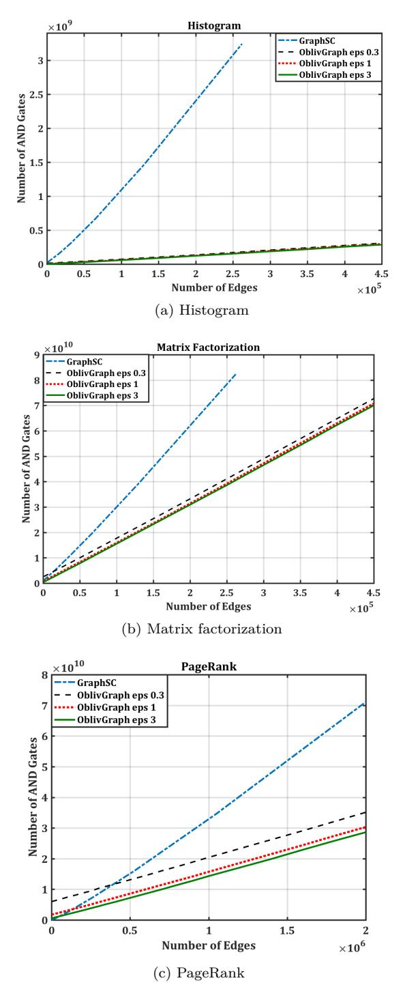
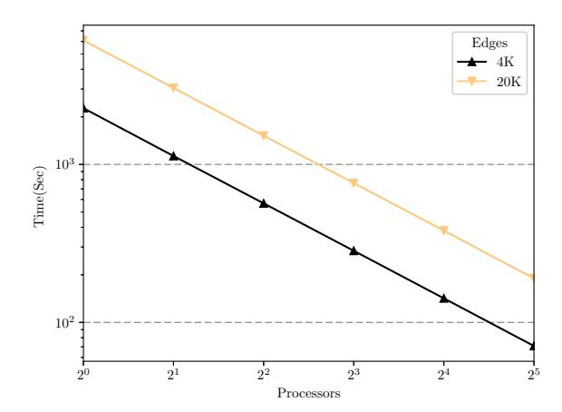
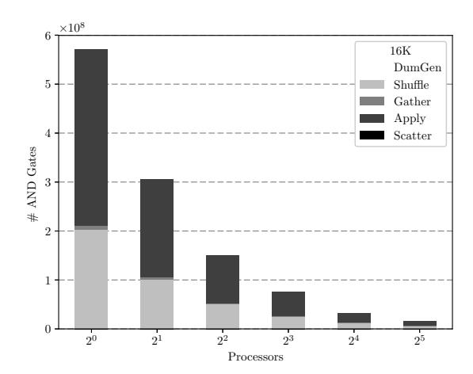

# Secure Computation with Differentially Private Access Patterns

Sahar Mazloom<sup>1</sup> and S. Dov Gordon<sup>1</sup> <sup>1</sup>George Mason University

October 16, 2018

#### **Abstract**

We explore a new security model for secure computation on large datasets. We assume that two servers have been employed to compute on private data that was collected from many users, and, in order to improve the efficiency of their computation, we establish a new tradeoff with privacy. Specifically, instead of claiming that the servers learn nothing about the input values, we claim that what they do learn from the computation preserves the differential privacy of the input. Leveraging this relaxation of the security model allows us to build a protocol that leaks some information in the form of access patterns to memory, while also providing a formal bound on what is learned from the leakage.

We then demonstrate that this leakage is useful in a broad class of computations. We show that computations such as histograms, PageRank and matrix factorization, which can be performed in common graph-parallel frameworks such as MapReduce or Pregel, benefit from our relaxation. We implement a protocol for securely executing graph-parallel computations, and evaluate the performance on the three examples just mentioned above. We demonstrate marked improvement over prior implementations for these computations.

# **1 Introduction**

Privacy and utility in today's Internet is a tradeoff, and for most users, utility is the clear priority. Citizens continue to contribute greater amounts of private data to an increasing number of entities in exchange for a wider variety of services. From a theoretical perspective, we can maintain privacy and utility if these service providers are willing and able to compute on encrypted data. The theory of secure computation has been around since the earliest days of modern cryptography, but the practice of secure computation is relatively new, and still lags behind the advancements in data-mining and machine learning that have helped to create today's tradeoff.

Recently, we have seen some signs that the gap might be narrowing. The advancements in the field of secure computation have been tremendous in the last decade. The first implementations computed roughly 30 circuit gates per second, and today they compute as many as 6 million per second [\[40\]](#page-36-0). Scattered examples of live deployments have been referenced repeatedly, but most recently, in one of the more promising signs of change, Google has started using secure computation to help advertisers compute the value of their ads, and they will soon start using it to securely construct machine learning classifiers from mobile user data [\[23\]](#page-34-0). A separate, more recent line of research also offers promise: the theory and techniques of differential privacy give service providers new mechanisms for aggregating user data in a way that reasonably combines utility and privacy. The guarantee of these mechanisms is that, whatever can be learned from the aggregated data, the amount that it reveals about any single user input is minimal. The Chrome browser uses these techniques when aggregating crash reports [\[14\]](#page-33-0), and Apple claims to be employing them for collecting usage information from mobile devices. In May, 2017, U.S. Senator Ron Wyden wrote an open letter to the commission on evidence-based policymaking, urging that both secure computation and differential privacy be employed by "agencies and organizations that seek to draw public policy related insights from the private data of Americans [\[39\]](#page-35-0)."

The common thread in these applications is large scale computation, run by big organizations, on data that has been collected from many individual users. To address this category of problems, we explore new improvements for twoparty secure computation, carried out by two dedicated computational servers, over secret shares of user data. We use a novel approach: rather than attempting to improve on known generic constructions, or tailoring a new solution for a particular problem, we instead explore a new trade-off between efficiency and privacy. Specifically, we propose a model of secure computation in which some small information is leaked to the computation servers, but this leakage is proven to preserve differential privacy for the users that have contributed data. More technically, the leakage is a random function of the input, revealed in the form of access patterns to memory, and the output of this function does not change "by too much" when one user's input is modified or removed.

The question of what is leaked by memory access patterns during computation is central to secure computation. Although the circuit model of computation allows us to skirt the issue, because circuits are data oblivious, when computing on large data there are better ways of handling the problem, the most well-studied being the use of secure two-party ORAM [\[31,](#page-35-1) [16,](#page-34-1) [38,](#page-35-2) [24,](#page-34-2) [41,](#page-36-1) [40\]](#page-36-0). However, when looking at very large data sets, it is often the case that both circuits and ORAM are too slow for practical requirements, and there is strong motivation to look for better approaches. In the area of encrypted search, cryptographers have frequently proposed access-pattern leakage as a tradeoff for efficiency [\[5,](#page-33-1) [4,](#page-33-2) [33,](#page-35-3) [20\]](#page-34-3). Unfortunately, analyzing and quantifying the leakage caused by the computation's access pattern is quite difficult, as it depends heavily on the specific computation, the particulars of the data, and even the auxiliary information of the adversary. Furthermore, recent progress on studying this leakage has mostly drawn negative conclusions, suggesting that a lot more is revealed than we might originally have hoped [\[19,](#page-34-4) [27,](#page-34-5) [3,](#page-32-0) [21,](#page-34-6) [11\]](#page-33-3). Employing the definition of differential privacy as a way to bound the leakage of our computation allows us to offer an efficiency / privacy tradeoff that cryptographers have been trying to provide, while quantifying, in a rigorous and meaningful way, precisely what we have leaked.

### **1.1 Graph-Parallel Computations**

While the proposed security relaxation is appealing, it is not immediately clear that it provides a natural way to improve efficiency. Our main contribution is that we identify a broad class of highly parallelizable computations that are amenable to the privacy/ efficiency tradeoff we propose. When computing on plaintext data, frameworks such as MapReduce, Pregel, GraphLab and PowerGraph have very successfully enabled developers to leverage large networks of parallelized CPUs [\[9,](#page-33-4) [26,](#page-34-7) [25,](#page-34-8) [15\]](#page-33-5). The latter three mentioned systems are specifically designed to support computations on data that resides in a graph, either at the nodes or edges. The computation proceeds by iteratively gathering data from incoming edges to the nodes, performing some simple computation at the node, and pushing the data back to the outgoing edges. This simple iterative procedure captures many important computational tasks, including histogram, gradient descent and page-rank, which we focus on in our experimental section, as well as Markov random field parameter learning, parallelized Gibbs samplers, and name entity resolution, to name a few more. Recently, Nayak et al. [\[28\]](#page-35-4), generalizing the work of Nikolaenko et al. [\[29\]](#page-35-5), constructed a framework for securely computing graph-parallel algorithms. They did this by designing a nicely parallelizable circuit for the gather and scatter phases, requiring *O*(|*E*| + |*V* |) log<sup>2</sup> (|*E*| + |*V* |) AND gates.

### **1.2 A Connection to Differential Privacy**

The memory access pattern induced by this computation is easily described: during the gather stage, each edge is touched when fetching the data, and the adjacent node is touched when copying the data. A similar pattern is revealed during the scatter phase. (The computation performed during the apply phase is typically very simple, and can be executed in a circuit, which is memory oblivious.) Let's consider what might be revealed by this access pattern in some concrete application. In our framework, each user is represented by a node in the graph, and provides the data on the edges adjacent to that node. For example, in a recommendation system, the graph is bipartite, each node on the left represents a user, each node on the right represents an item that users might review, and the edges are labeled with scores indicating the user's review of an item. The access pattern just described would reveal exactly which items every user reviewed!

Our first observation is that if we use a secure computation to obliviously shuffle all of the edges in between the gather and scatter phases, we break the correlation between the nodes. Now the only thing revealed to the computing parties is a *histogram* of how many times each node is accessed – i.e. a count of each node's in-degree and out-degree. When building a recommendation system, this would reveal how many items each user reviewed, as well as how many times each item was reviewed. Fortunately, histograms are the canonical problem for differential privacy. Our second observation is that we can shuffle in dummy edges to help obscure this information, and, by sampling the dummy edges from an appropriate distribution (which has to be done within a secure computation), we can claim that the degrees of each node remain differentially private.

### **1.3 Contributions and Related Work**

**Contributions.** We make several new contributions, of both a theoretical and a practical nature.

*Introducing the model.* As cryptographers have attempted to support secure computation on increasingly large datasets, they have often allowed their protocols to leak some information to the computing parties in the form of access patterns to memory. This is especially true in the literature on encrypted search. The idea of bounding the leakage in a formal way, using the definitions from literature on differential privacy, is novel and important. (Concurrent and independent of our work, He et al. [\[18\]](#page-34-9) proposed a very similar security relaxation, which we discuss below.)

*Asymptotic improvement.* The relaxation we introduce enables us to improve the asymptotic complexity of the target computations by a factor of (roughly) log *n* over the best known, fully oblivious construction. Using the best known sorting networks, the construction of Nayak et al. [\[28\]](#page-35-4) requires *O*((|*E*| + |*V* |) log(|*E*| + |*V* |)) AND gates. In comparison, our construction requires *O*(|*E*| + *α*|*V* |) AND gates, where *α* depends on the privacy parameters, and *δ*. For graphs with |*E*| = *O*(*α*|*V* |), our improvement is by a factor of log |*E*|. While we do not have a lower bound in the fully oblivious model, we find it very exciting that there exist computations where our relaxation is this meaningful, and we suspect that improved asymptotic results in the fully oblivious model are not possible. The details of this improvement appear in Section [5.](#page-23-0)

*Concrete improvement.* We demonstrate that the asymptotic improvements lead to tangible gains. We have implemented our system, and compared the results to the system of Nayak et al. [\[28\]](#page-35-4). We demonstrate up to a 20X factor improvement in the number of garbled AND gates required in the computation, while preserving differential privacy with strong parameters: = *.*3 and *δ* = 2 <sup>−</sup><sup>40</sup>. We note that, in practice, both results are worse than previously described by a factor of log |*E*|. In their implementation, Nayak et al. rely on a practical oblivious sort, using *O*((|*E*|+|*V* |) log(|*E*|+|*V* |))<sup>2</sup> AND gates. Our construction using *O*(|*E*|+*α*|*V* |) gates requires performing decryption inside a garbled circuit, which we avoid in our implementation through the use of a two-party oblivious shuffle, resulting in *O*((|*E*| + *α*|*V* |) log(|*E*| + *α*|*V* |)) AND gates. However, we still save a factor of log |*E*| for sufficiently dense graphs. The details of this construction appear in Section 4, and an evaluation of its performance appears in Section 6.

Securely generating noise We describe a new noise distribution that is amenable to efficient implementation in a garbled circuit. Dwork et al. previously described an efficient method for sampling the geometric distribution in a garbled circuit [12], but they did this for the 1-sided geometric distribution, which is not immediately useful for providing differential privacy. Unfortunately, the standard 2-sided geometric distribution needs to be normalized in a way that ruins the simplicity of the circuit they describe. We construct a slightly modified distribution that addresses this problem, and prove that it provides differential privacy.

**Related Work.** The most relevant work, as already discussed, is that by Nayak et al. [28], which generalizes the work of Nikolaenko et al. [29], computing graph parallel computations with full security. (The latter work focused solely on the problem of sparse matrix factorization.) Papadimitriou et al. [32] also build a system for the secure computation of graph-structured data, and ensure differential privacy of the output. They do not consider differentially private leakage in the access patterns, and they focus on MPC and the networking challenges that arise in that setting; in particular, they do not rely on computational servers, but assume that all data contributors are involved in the computation, and focus on how to hide the movement of data between users in a way that preserves privacy of the edge structure. Kellaris et al. construct protocols for encrypted search, and use differential privacy to bound the leakage from access patterns [22]. This work directly inspired us to consider a more general approach to modeling leakage in secure computation through differential privacy. Wagh et al. [35] define and construct differentially private ORAM in which the server's views are "similar" on two neighboring access patterns. They consider the client/server model, and don't consider using their construction in a secure computation, but it is very interesting to note that we could use their result in a generic way to build a protocol for generic secure computation with differentially private access patterns. While feasibility follows from their work, the resulting protocol provides no asymptotic improvement, and would be quite impractical.

Independent of our work, He et al. define a security notion that is similar to our own, and construct new protocols for private record linkage [18]. Informally, their definition requires that for any input set  $D_1$ , and for two neighbors  $D_2, D'_2$  for which  $f(D_1, D_2) = f(D_1, D'_2)$ , the protocol views should preserve differential privacy. We note that their definition is not in the simulation paradigm, which leads to some important differences. For one, they only require security on inputs that map to the same output, and in particular, cannot apply their definition to randomized functionalities<sup>1</sup>. They also have no correctness requirement (which is captured in the simulation paradigm by default): this is

<span id="page-4-0"></span><sup>&</sup>lt;sup>1</sup>For example, because our protocol outputs random secret shares to each of the servers, it could not be proven secure under their definition, but can be proven secure in our simulation paradigm.

intentional, as they explore not just an efficiency / privacy tradeoff, but a correctness tradeoff as well. Perhaps the biggest difference between their work and our own is the application space. In private record linkage protocols, items are typically hashed into bins, and dummy items are used to hide the load of each bin. When applying their relaxation, they gain efficiency over fully secure protocols by cutting down on the number of dummy items and claiming differential privacy, in place of statistically hiding the bin load. Since the maximum load on a bin is  $\frac{\log n}{\log \log n}$  with high probability, they can only claim improvement if they use very few dummy items, and as such they can only claim fairly weak security. Specifically, in most of their experiments  $\delta=2^{-16}$ . While there may be settings where this security parameter suffices, it is important to recognize that  $\delta$  denotes the statistical probability that a user's data is completely recovered, and this value is typically set to  $2^{-40}$  in MPC research. Finding an application space where the security relaxation provides significant efficiency improvements while also guaranteeing strong security parameters was a major challenge, and we view it as one of our main contributions.

Chan et al. study differential obliviousness in the client / server model [6]. They also show asymptotic improvement for several computations, together with lower bounds for fully secure variants of the same algorithms, demonstrating that this relaxation allows us to bypass impossibility results. Their results are purely theoretical, but raise the very interesting question of whether we can lower-bound the number of AND gates needed in fully secure graph parallel computation. An initial version of our work did not include Section 5, where we show how to remove the oblivious shuffle, improving the asymptotic complexity of our solution. While our initial work predates the work of Chan et al., the asymptotic improvement of Section 5 was concurrent with their work.

M2R [10] and Ohrimenko et al. [30] consider secure implementation of MapReduce jobs on untrusted cloud servers, where the adversary has access to the network and storage back-end, and can observe all encrypted traffic between Map and Reduce nodes, but cannot corrupt those nodes; they assume secure hardware, such as SGX. They hide flow between map and reduce operations by shuffling the data produced by the Mappers in secure hardware before sending it to the Reducers. They do not use any notion of differential privacy. Finally, Airavat [34] protects the output of the map-reduce computation by adding exponentially distributed noise to the output of computation.

### 2 Notation and Definitions

**Secret-Shares**: We let  $\langle x \rangle$  denote a variable which is XOR secret-shared between parties. Arrays have a public length and are accessed via public indices; we use  $\langle x \rangle_i$  to specify element i within a shared array, and  $\langle x \rangle_{i:j}$  to indicate a specific portion of the array containing elements i through j, inclusive. When we write  $\langle x \rangle \leftarrow c$ , we mean that both users should fix their shares of x (using some agreed upon manner) to ensure that x = c. For example, one party might set his share to be c while the other sets his share to 0.

Multi-Sets: We represent multi-sets over a set V by a |V| dimensional vector of natural numbers:  $D \in \mathbb{N}^{|V|}$ . We refer to the ith element of this vector by D(i). We use |D| in the natural way to mean  $\sum_{i=1}^{|V|} D(i)$ . We use  $\mathcal{DB}_i$  to denote the set of all multi-sets over V of size i, and  $\mathcal{DB} = \bigcup_i \mathcal{DB}_i$ . We define a metric on these multi-sets in the natural way:  $|D_1 - D_2| = \sum_{i=1}^{|V|} |D_1(i) - D_2(i)|$ . We say two multi-sets are neighboring if they have distance at most 1:  $|D_1 - D_2| \leq 1$ .

Neighboring Graphs: In our main protocol of Section 4, the input is a data-augmented directed graph, denoted by G = (V, E), with user-defined data on each edge. We need to define a metric on these input graphs, in order to claim security for graphs of bounded distance.<sup>2</sup> For each  $v \in V$ , we let  $\operatorname{in-deg}(v)$  and  $\operatorname{out-deg}(v)$  denote the in-degree and  $\operatorname{out-degree}$  of node v. We define the indegree profile of a graph G as the multi-set  $\mathsf{D}_{\mathsf{in}}(G) = \{\operatorname{in-deg}(v_1), \ldots, \operatorname{in-deg}(v_n)\}$ . Intuitively, this is a multi-set over the node identifiers from the input graph, with vertex identifier v appearing k times if  $\mathsf{in-deg}(v) = k$ . We define the full-degree profile of G as the pair of multi-sets:  $\{\mathsf{D}_{\mathsf{in}}(G), \mathsf{D}_{\mathsf{out}}(G)\}$ , where

 $\mathsf{D}_\mathsf{out}(G) = \{\mathsf{out\text{-}deg}(v_1), \ldots, \mathsf{out\text{-}deg}(v_n)\}$ . We now define two different metrics on graphs, using these degree profiles. Later in this section, we provide two different security definitions: we rely on the first distance metric below when claiming security as defined in Definition 5, and rely on the second metric below when claiming security as defined in Definition 6.

<span id="page-6-1"></span>**Definition 1** We say two graphs G and G' have distance at most d if they have in-degree profiles of distance at most d:  $|\mathsf{D}_{\mathsf{in}}(G) - \mathsf{D}_{\mathsf{in}}(G')| \leq d$ . We say that G and G' are neighboring if they have distance 1.

**Definition 2** We say two graphs G and G' have full-degree profiles of distance d if the sum of the distances in their in-degree profiles and their out-degree profiles is at most  $d: |\mathsf{D}_{\mathsf{in}}(G) - \mathsf{D}_{\mathsf{in}}(G')| + |\mathsf{D}_{\mathsf{out}}(G) - \mathsf{D}_{\mathsf{out}}(G')| \le d$ . We say that G and G' have neighboring full-degree profiles if they have full-degree profiles of distance 2.

#### 2.1 Differential Privacy

We use the definition that appears in [13].

**Definition 3** A randomized algorithm  $\mathcal{L}: \mathcal{DB} \to \mathcal{R}_{\mathcal{L}}$ , with an input domain  $\mathcal{DB}$  that is the set of all multi-sets over some fixed set V, and output  $\mathcal{R}_{\mathcal{L}} \subset \{0,1\}^*$ , is  $(\epsilon, \delta)$ -differentially private if for all  $T \subseteq \mathcal{R}_{\mathcal{L}}$  and  $\forall D_1, D_2 \in \mathcal{DB}$  such that  $|D_1 - D_2| \leq 1$ :

$$\Pr[\mathcal{L}(D_1) \in T] < e^{\epsilon} \Pr[\mathcal{L}(D_2) \in T] + \delta$$

where the probability space is over the coin flips of the mechanism  $\mathcal{L}$ .

<span id="page-6-0"></span> $<sup>^{2}</sup>$ In Section 3, the input to the computation is a multi-set of elements drawn from some set S, rather than a graph, so we use the simple distance metric described above to define the distance between inputs.

The above definition describes differential privacy for neighboring multi-sets. Letting G denote the set of all graphs, we define it for neighboring graphs as well:

<span id="page-7-1"></span>**Definition 4** *A randomized algorithm* L : G → R<sup>L</sup> *is* (*, δ*)*-edge private if for all neighboring graphs, G*1*, G*<sup>2</sup> ∈ G*, we have:*

$$\Pr[\mathcal{L}(G_1) \in T] \le e^{\epsilon} \Pr[\mathcal{L}(G_2) \in T] + \delta$$

## **2.2 Secure computation with differentially private access patterns**

**Input model:** We try to keep the definitions general, as we expect they will find application beyond the space of graph-structured data. However, we use notation that is suggestive of computation on graphs, in order to keep our notation consistent with the later sections. We assume that two computation servers have been entrusted to compute on behalf of a large set of users, V, with |V| = *n*, and having sequential identifiers, 1*, . . . , n*. Each user *i* contributes data *vi* . They might each entrust their data to one of the two servers (we call this the *disjoint collection setting*), or they might each secret-share their input with the two-servers (*joint collection setting*). In the latter case, we note that both servers learn the size of each *v<sup>i</sup>* but neither learns the input values; in the former case, each server learns a subset of the input values, but learns nothing about the remaining input values (other than the sum of their sizes).[3](#page-7-0) Below we will define two variant security notions that capture these two scenarios.

In all computations that we consider in our constructions, the input is represented by a graph. In every case, each user is represented as a node in this graph, and each user input is a set of weighted, directed edges that originate at their node. In some applications, the graph is bipartite, with user nodes on the left, and some distinct set of item nodes on the right: in this case, all edges go from user nodes to item nodes. In other applications, there are only user nodes, and every edge is from one user to another. In the joint collection setting, we can leak the out-degree of each node, which is the same as the user input size, but must hide (among other things) the in-degree of each node. In the disjoint collection setting, the protocol must hide both the in-degree and out-degree of each node. We note that in some applications, such as when we perform gradient descent, the graph is bipartite, and it is publicly known that the in-degree of every user is 0 (i.e. the movies don't review the viewers). In the joint collection setting, this knowledge allows for some improvement in efficiency that we will leverage in Section [6.](#page-25-0)

<span id="page-7-0"></span><sup>3</sup>We note that the disjoint collection setting corresponds to the "standard" setting for secure computation where each computing party contributes one set of inputs. Just as in that setting, each of the two computing parties could pad their inputs to some maximum size, hiding even the sum of the user input sizes. In fact, we could have them pad their inputs using a randomized mechanism that preserves differential privacy, possibly leading to smaller padding sizes, depending on what the maximum and average input sizes are. We don't explore this option further in this work.

**Defining secure computation with leakage:** For simplicity, we start with a standard definition of semi-honest security<sup>4</sup>, but make two important changes. The first change is that we allow certain leakage in the ideal world, in order to reflect what is learned by the adversary in the real world through the observed access pattern on memory. The leakage function is a randomized function of the inputs. The second change is an additional requirement that this leakage function be proven to preserve the differential privacy for the users that contribute data. Our ideal world experiment is as follows. There are two parties,  $P_1$  and  $P_2$ , and an adversary S that corrupts one of them. The parties are given input, as described above; we use  $V_1$  and  $V_2$  to denote the inputs of the computing parties, regardless of whether we are in the joint collection setting or the disjoint collection setting, and we let  $V = \{v_1, \ldots, v_n\}$  denote the user input. Technically, in the joint collection setting,  $V = V_1 \oplus V_2$ , while in the disjoint collection setting,  $V = V_1 \cup V_2$ . Each computing party submits their input to the ideal functionality, unchanged. The ideal functionality reconstructs the n user inputs,  $v_1, \ldots, v_n$ , either by taking the union of the inputs submitted by the computation servers in the disjoint collection setting, or by reconstructing the input set from the provided secret shares in the joint collection setting. The ideal functionality then outputs  $f_1(v_1,\ldots,v_n)$  to  $P_1$  and  $f_2(v_1,\ldots,v_n)$  to  $P_2$ . These outputs might be correlated, and, in particular, in our own use-cases, each party receives a secret share of a single function evaluation:  $\langle f(v_1,\ldots,v_n)\rangle_1, \langle f(v_1,\ldots,v_n)\rangle_2$ . The ideal functionality also applies some leakage function to the data,  $\mathcal{L}(V)$ , and provides the output of  $\mathcal{L}(V)$ , along with  $\sum_{i \in \mathcal{V}} |v_i|$  to  $\mathcal{S}^{5}$ . Additionally, depending on the choice of security definition, the ideal functionality might or might not give the simulator,  $\forall i \in \mathcal{V}, |v_i|$ .

Our protocols are described in a hybrid world, in which the parties are given access to several secure, ideal functionalities. In our implementation, these are replaced using generic constructions of secure computation (i.e. garbled circuits). Relying on a classic result of Canetti [2], when proving security, it suffices to treat these as calls to a trusted functionality. In the definitions that follow, we let  $\mathcal{G}$  denote an appropriate collection of ideal functionalities.

As is conventionally done in the literature on secure computation, we let  $\text{HYBRID}_{\pi,\mathcal{A}(z)}^{\mathcal{G}}(V_1,V_2,\kappa)$  denote a joint distribution over the output of the honest party and, the view of the adversary  $\mathcal{A}$  with auxiliary input  $z \in \{0,1\}^*$ , when the parties interact in the hybrid protocol  $\pi^{\mathcal{G}}$  on inputs  $V_1$  and  $V_2$ , each held by one of the two parties, and computational security parameter  $\kappa$ . We let  $\text{IDEAL}_{\mathcal{F},\mathcal{S}(z,\mathcal{L}(V),\forall i\in V:|v_i|)}(V_1,V_2,\kappa)$  denote the joint distribution over the output of the honest party, and the view output by the simulator  $\mathcal{S}$  with auxiliary input  $z \in \{0,1\}^*$ , when the parties interact with an ideal functionality  $\mathcal{F}$  on inputs  $V_1$  and  $V_2$ , each submitted by one of the two parties, and secu-

<span id="page-8-0"></span><sup>&</sup>lt;sup>4</sup>We stress that our allowance of differentially private leakage brings gains in the *circuit construction*, so we could use *any* generic secure computation of Boolean circuits, including those that are maliciously secure, and benefit from the same gains. See more details below.

<span id="page-8-1"></span><sup>&</sup>lt;sup>5</sup>In the joint collection setting, the simulator can infer this value from the size of the input that was submitted to the ideal functionality. But it simplifies things to give it to him explicitly.

rity parameters  $\kappa$ . Letting  $v = \sum_{i \in V} |v_i|$ , we define the joint distribution IDEAL $_{\mathcal{F},\mathcal{S}(z,\mathcal{L}(V),v)}(V_1,V_2,\kappa)$  in a similar way, the only difference being that the simulator is given the sum of the input sizes and not the value of each input size.

<span id="page-9-0"></span>**Definition 5** Let  $\mathcal{F}$  be some functionality, and let  $\pi$  be a two-party protocol for computing  $\mathcal{F}$ , while making calls to an ideal functionality  $\mathcal{G}$ .  $\pi$  is said to securely compute  $\mathcal{F}$  in the  $\mathcal{G}$ -hybrid model with  $\mathcal{L}$  leakage, known input sizes, and  $(\kappa, \epsilon, \delta)$ -security if  $\mathcal{L}$  is  $(\epsilon, \delta)$ -differentially private, and, for every PPT, semi-honest, non-uniform adversary  $\mathcal{A}$  corrupting a party in the  $\mathcal{G}$ -hybrid model, there exists a PPT, non-uniform adversary  $\mathcal{S}$  corrupting the same party in the ideal model, such that, on any valid inputs  $V_1$  and  $V_2$ 

$$\left\{ \operatorname{HYBRID}_{\pi,\mathcal{A}(z)}^{\mathcal{G}} \left(V_{1}, V_{2}, \kappa\right) \right\}_{z \in \{0,1\}^{*}, \kappa \in \mathbb{N}} \stackrel{c}{\equiv} \left\{ \operatorname{IDEAL}_{\mathcal{F},\mathcal{S}(z,\mathcal{L}(V), \forall i \in V : |v_{i}|)}^{(1)} (V_{1}, V_{2}, \kappa) \right\}_{z \in \{0,1\}^{*}, \kappa \in \mathbb{N}}$$

$$(1)$$

The above definition is the one that we use in our implementations. However, in Section 4 we also describe a modified protocol that achieves the stronger security definition that follows, where the adversary does not learn the sizes of individual inputs. This property might be desirable (or maybe even essential) in the disjoint collection model, where users have not entrusted one of the two computing parties with their inputs, or even the sizes of their inputs. On the other hand, the previous definition is, in some sense, more "typical" of definitions in cryptography, where we assume that inputs sizes are leaked. It is only in this model where data is outsourced that we can hope to hide each individual input size among the other inputs.

<span id="page-9-1"></span>**Definition 6** Let  $\mathcal{F}$  be some functionality, and let  $\pi$  be a two-party protocol for computing  $\mathcal{F}$ , while making calls to an ideal functionality  $\mathcal{G}$ .  $\pi$  is said to securely compute  $\mathcal{F}$  in the  $\mathcal{G}$ -hybrid model with  $\mathcal{L}$  leakage, and  $(\kappa, \epsilon, \delta)$ -security if  $\mathcal{L}$  is  $(\epsilon, \delta)$ -differentially private, and, for every PPT, semi-honest, non-uniform adversary  $\mathcal{A}$  corrupting a party in the  $\mathcal{G}$ -hybrid model, there exists a PPT, non-uniform adversary  $\mathcal{S}$  corrupting the same party in the ideal model, such that, on any valid inputs  $V_1$  and  $V_2$ 

$$\left\{ \text{HYBRID}_{\pi,\mathcal{A}(z)}^{\mathcal{G}} \left( V_1, V_2, \kappa \right) \right\}_{z \in \{0,1\}^*, \kappa \in \mathbb{N}} \stackrel{c}{=} \\
\left\{ \text{IDEAL}_{\mathcal{F},\mathcal{S}(z,\mathcal{L}(V), \sum_{i \in V} |v_i|)}^{(2)} \left( V_1, V_2, \kappa \right) \right\}_{z \in \{0,1\}^*, \kappa \in \mathbb{N}}$$
(2)

**Differentially Private Output:** As is typical in secure computation, we are concerned here with *how* to securely compute some agreed upon function, rather than *what* function ought to be computed. In other words, we view the question of what the output itself might reveal about the input to be beyond scope of our work. Our concern is only that the process of computing the output should not

reveal too much. Nevertheless, one could ask that the output of all computations also be made to preserve differential privacy. Interestingly, for the specific case of histograms, which we present as an example in Section [3,](#page-11-0) adding differentially private noise to the output is substantially *more efficient* than preserving an exact count. This is not true for the general protocol, but the cost of adding noise for these cases has been studied elsewhere [\[32\]](#page-35-6), and it would be minor compared to the rest of the protocol.

Nevertheless, we take a different approach. In all of our computations, the output of each server is a secret share of the desired output, and thus it is unconditionally secure. The question of where to deliver these shares is left to the user, though we can imagine several useful choices. Perhaps most obvious, the shares might never be reconstructed, but rather used later inside another secure computation that makes decisions driven by the output. Or, as Nikolaenko et al. suggest [\[29\]](#page-35-5), when computing gradient descent to provide users with recommendations, the recommendation vectors can be sent to the user to store for themselves. Regardless, since the aim of our work is to study the utility of our relaxation, this concern is orthogonal, and we mainly leave it alone.

**Privacy versus efficiency** In the "standard" settings where differential privacy is employed, additional noise affects the accuracy of the result. Here, added noise has no impact on the output, which is always correct, and is protected by the secure computation. Instead, the tradeoff is with efficiency: using more noise helps to further hide the true memory accesses among the fake ones, but requires additional, costly oblivious computation.

**Malicious security and multi-party computation:** Extending these definitions to model malicious adversaries and/or multi-party computation is straightforward, so we omit redundant detail. Similarly, we stress that by leveraging the security relaxation defined above, we gain improvement *at the circuit level*, so we can easily extend our protocols to either (or both) of these two settings in a generic way. To make our protocol from Section [4](#page-13-0) secure against a malicious adversary, the only subtlety to address is that our protocols make iterative use of multiple secure computations (i.e. the functionality we realize is reactive), so we would need to authenticate outputs and verify inputs in each of these computations. While this can be done generically, such authentication comes "for free" in many common protocols for secure computation (e.g. [\[37,](#page-35-10) [8\]](#page-33-10)). To extend our protocols to a multiparty setting, the only subtlety is in constructing a multiparty oblivious shuffle. With a small number of parties, *c*, it is very efficient to implement *c* iterations of a permutation network, where in each iteration, a different party chooses the control bits that determine the permutation. As *c* grows, it becomes less clear what the best method is for implementing an oblivious shuffle. Interestingly, we note that there has been some recent work on parallelizing multi-party oblivious shuffle [\[7\]](#page-33-11). We do not explore this direction in our work; presenting our protocols in the two-party, semi-honest setting greatly simplifies the exposition, and suffices to demonstrate the advantages of our security relaxation. In our performance analysis, we primarily focus on counting the number of AND gates in our construction, which makes the analysis more general and allows for more accurate comparison with prior work (than, say, comparing the timed performance of systems that use different frameworks for implementing secure computation).

# <span id="page-11-0"></span>**3 A Differentially Private Protocol for Computing Histograms**

To illustrate our main idea, we describe an algorithm that computes the data histogram (i.e. counting, or data frequency) with differentially private access patterns. Although this computation can be formalized in the context of our general framework, it is instructive to demonstrate some of the main technical ideas with this simple example before considering how they generalize (which we do in Section [4\)](#page-13-0). We defer a discussion about security until we present the more general protocol.

In this computation, we assume that each user in the system contributes a single input value, *x<sup>i</sup>* ∈ *S*, where we call the set *S* the set of *types*. The computation servers (parties) each begin the computation with secret shares of the input array, denoted by hreali. The output is a secret share of |*S*| counters, where the counter for each type contains the exact number of inputs of that type. The full protocol specification appears in Figure [1.](#page-12-0)

The protocol is in a hybrid model, where the parties have access to three ideal functionalities: DumGen*p,α,* FShuffle*,* Fadd. The two parties begin by calling DumGen*p,α*, which generates some number of dummy inputs. The ideal functionality for this is described in the left of Figure [2,](#page-14-0) and it is realized using a generic secure two-party computation. As part of this computation, the parties have to securely sample from the distribution D*p,α*. In the next section, we define this distribution and describe our method for sampling it. We simply remark now that it has integer support, and is negative with only negligible probability (in *δ*). The output of DumGen*p,α* is a secret sharing of values in *S* ∪ {⊥}: the size of the output is 2*α*|*S*|, where *α* is determined by the desired privacy values and *δ* (see Section [4\)](#page-13-0). The number of dummy items of each type is random, and neither party should learn this value; shares of ⊥ are used to pad the number of dummy items of each type until they total 2*α*.

Each party locally concatenates their share of the real input array with their share of the dummy values. They also initialize shares of an array of flags, denoted as isReal, which will be used to keep track of which item is real and which is dummy. They then shuffle the real and dummy items together using an oblivious shuffle. This is presented as an ideal functionality, but in practice we implement this using two sequential, generic secure computations of the Waksman permutation network [\[1\]](#page-32-2), where each party randomly choose one of the two permutations. The same permutations are used to shuffle the array isReal flags, ensuring that these flags are "moved around with" the items. We note that all secret shares are updated during the process of shuffling, so while the parties knew which items and flags were real and which were not before the

#### <span id="page-12-0"></span>**Differentially Private Histogram Protocol**

**Input:** Each party, *P*<sup>1</sup> and *P*2, receives a secret-share of real items denoted as hreali (*r* stands for number of real items, and *d* for number of dummy ones)

**Output:** Secret share of counter values denoted as hCounteri, where the counter for each type contains the exact number of inputs of that type (*S* is the number of counter types)

```
Preprocessing:
  hCounteri
            1:|S| ← 0
Computation:
  hdummyi
            1:d ← DumGenp,α
  hdatai
         1:(r+d) = hreali
                         1:r
                            ||hdummyi
                                       1:d
  hisReali
          1:r ← 1 , hisReali
                             (r+1):(r+d) ← 0
  hdata di ← FShuffle(hdatai,hρi)
  hisReal \i ← FShuffle(hisReali,hρi)
  data d ← Open(hdata di)
  for i = 1 . . .(n + d)
       Fadd(hisReali
                     i
                      ,hCounteri
                                 t
                                  ) where t = data di
```

Figure 1: A protocol for two parties to compute a histogram on secret-shared data with an access pattern that preserves differential privacy.

shuffle, they have no way of knowing this after they receive fresh shares of the shuffled items and isReal flags.

The parties now open their shares of the data types, while leaving the flag values unknown. This is where our protocol leaks some information: revealing the data types allows the parties to see a noisy sum of the number inputs of each type. On the other hand, this is also where we gain in efficiency: the remainder of the protocol requires only a linear scan over the data array, with a small secure computation for each element in order to update the appropriate counter value. More specifically, the parties iterate through the shuffled array, opening each type. On data type *i*, they fetch their shares of the counter for type *i* from memory, and call the Fadd functionality. This functionality adds the (reconstructed) flag value to the (reconstructed) counter; if the item was a real item, the counter is incremented, while if it was a dummy item, the counter remains the same. The functionality returns fresh shares of the counter value. Neither party ever learns whether the counter was updated. In particular, they cannot know whether they fetched that counter from memory because of a real input value, or because of a dummy value. In our implementation, we instantiate Fadd with a garbled circuit.

**Simple extensions:** In Section [4](#page-13-0) we show how to generalize this protocol to the wider function class. However, we note that in this specific case, if we did want to add noise to the output, we could simply instruct the servers to count the number of times each counter is accessed. They would no longer have to update the counter values through a secure computation, so this would be a (slightly) faster protocol. The output would contain the one-sided noise, but they could simply subtract off *α* from each counter to get a more accurate estimate of the counts. We stress that in this modified protocol, the dummy items are still shuffled in with the real items, so the access pattern still preserves differential privacy for each user. The modification ensures that the (reconstructed) output preserves differential privacy as well.

We also note that the protocol in Figure [1](#page-12-0) can be applied to other similar computations, such as taking averages or sums over *r* values of |*S*| types (though, now again *without* adding noise to the output). For example, if each user contributed a salary value and a zip-code, we could use the above method for computing the average salary in each zip-code, while ensuring that the access patterns preserve user privacy. We simply need to modify the Fadd functionality: instead of incrementing the secret-shared counter by 1 when the input is a real item, the functionality would increment the counter by the value of the secret-shared salary. In this case, though, the noisy access pattern alone does not suffice for creating noisy output: the use of Fadd is essential. If we want ensure that the reconstructed output preserves privacy, the noise would have to be generated independently, through a secure computation, and then added obliviously to the output.

# <span id="page-13-0"></span>**4 The OblivGraph Protocol**

When considering how the protocol from the previous section might be generalized, it is helpful to recognize the essential property of the computation's access pattern that we were leveraging. When computing a histogram, the access pattern to memory exactly leaks a histogram of the input! This might sound like a trivial observation, but it is in fact fairly important, as histograms are the canonical example in the field of differential privacy, and finding other computations where the access pattern reveals a histogram of the input will allow us to broadly apply our techniques.

With that in mind, we extend our techniques to graph structured data, and the graph-parallel frameworks that support highly parallelized computation. There are several frameworks of this type, including MapReduce, Pregel, GraphLab and others [\[9,](#page-33-4) [25,](#page-34-8) [26\]](#page-34-7). We describe the framework by Gonzalez et al. [\[15\]](#page-33-5) called PowerGraph since it combines the best features from both Pregel and GraphLab. PowerGraph is a graph-parallel abstraction, consisting of a sparse graph that encodes computation as vertex-programs that run in parallel and interact along edges in the graph. While the implementation of vertexprograms in Pregel and GraphLab differ in how they collect and disseminate information, they share a common structure called the GAS model of graph computation. The GAS model represents three conceptual phases of a vertexprogram: Gather, Apply, and Scatter. The computation proceeds in iterations,

```
DumGenp,α
Input: None.
Computation:
  d = 2α|S|
  dummy1:d ← ⊥
  for i = 0 . . . |S| − 1
      j = 2αi
      γi ← Dp,α
      k = γi + j
      dummyj:k = i
Output: hdummyi
                                DumGenp,α
                        Input: None.
                        Computation:
                          d = 2α|V |
                          DummyEdges1:d ← ⊥
                          for i = 0 . . . |V | − 1
                              j = 2αi
                              γi ← Dp,α
                              k = γi + j
                              DummyEdgesj:k
                                              .v = i
                        Output: hDummyEdgesi
                                                               DumGenp,α
                                                      Input: None.
                                                      Computation:
                                                         d = 2α|V |
                                                         DummyEdges1:d ← ⊥
                                                         for i = 0 . . . |V | − 1
                                                             j = 2αi
                                                             γi ← Dp,α
                                                             δi ← Dp,α
                                                             k = γi + j
                                                             ` = δi + j
                                                             DummyEdgesj:k
                                                                            .v = i
                                                             DummyEdgesj:`
                                                                            .u = i
                                                      Output: hDummyEdgesi
```

<span id="page-14-0"></span>Figure 2: Three variations on the Ideal functionality, DumGen*p,α*. Each is parameterized by *α, p*. The leftmost functionality is used in the histogram protocol described in Section [3.](#page-11-0) The middle definition is the one used in our implementation, and suffices for satisfying security according to Definition [5.](#page-9-0) The right-most adds differential privacy to out-degrees, which is needed in the disjoint collection model (i.e. when hiding the input sizes for all users, in Definition [6\)](#page-9-1).

and in each iteration, every node gathers (copy) data from their incoming edges, applies some simple computation to the data, and then scatters (copy) the result to their outgoing edges. Viewing each node as a CPU (or by assigning multiple nodes to each CPU), the apply step, which constitutes the bulk of the computational work, is easily parallelized.

When performing such computations securely, the data is secret-shared between the computing servers as it moves from edge to node and back, as well as during the Apply phase. The Apply phase is performed on these secret shares using any protocol for secure computation as a black-box. The main challenge is to hide the movement of the data during the Gather and Scatter phases, as these memory accesses reveal substantial information about the user data.

Take matrix factorization as an example: an edge (u*,* v*,* Data) indicates that user u reviewed item v, and the data stored on the edge indicates the value of the user's review. Because the data is secret shared, the value of the review is never revealed. During the Gather phase, the right vertex of every edge is opened, and the data is moved to the corresponding vertex. After the Apply phase, the left

# <span id="page-15-0"></span>Fgas **GAS Model Operations Inputs:** Secret share of edges denoted as hEdgesi, each edge is edge : (u*,* v*,* uData*,* vData*,* isReal). Secret share of vertices denoted as hVerticesi, each vertex contains vertex : (x*,* xData) **Outputs:** Updated hVerticesi **Gather(**Edges**) for** each edge ∈ Edges **for** each vertex ∈ Vertices **if** edge*.*v == vertex*.*x vertex*.*xData ← copy(edge*.*uData) **Apply***<sup>f</sup>* **(**Vertices**) for** each vertex ∈ Vertices vertex ← *f*(vertex) **Scatter (**Edges**) for** each edge ∈ Edges **for** each vertex ∈ Vertices **if** edge*.*u == vertex*.*x edge*.*uData ← copy(vertex*.*xData)

Figure 3: Ideal functionality for a single iteration of the GAS model operations

vertex of every edge is open, and data is pulled back to the edge. If this data movement were performed in the clear, the memory access pattern would reveal the edges between nodes, exactly revealing which users reviewed which items. Our first observation is that, because we touch only the right node of every edge during the gather, and only the left node of every edge during the scatter, by adding an oblivious shuffle of the edges between these two phases, we can hide the connection between neighboring nodes. The leakage of the computation is then reduced to two histograms: the in-degrees of each node, and, after the shuffle, the out-degrees of each node!

Histograms are the canonical problem in differential privacy; we preserve privacy by adding noise to these two histograms, just as we do in Section [3.](#page-11-0) Details follow below, the formal protocol specification appears in Figure [4,](#page-16-0) and the ideal functionality for the PowerGraph framework appears in Figure [3.](#page-15-0)

We denote the data graph by *G* = (*V, E*). The structure of each edge is comprised of (u*,* v*,* uData*,* vData*,* isReal), where isReal indicates if an edge is "real" or "dummy". Each vertex is represented as (x*,* xData). The xData field is large enough to hold edge data from multiple adjacent edges. As in Section [3,](#page-11-0) our protocol is in a hybrid model where we assume we have access to three ideal functionalities: DumGen*p,α*, FShuffle, Ffunc. As compared to Section [3,](#page-11-0) here we have dropped an explicit specification of the permutation used in FShuffle.

```
\pi_{\sf gas}
Secure Graph-Parallel Computation with Differentially Private
                                                    Access Patterns
Inputs: Secret share of edges denoted as (RealEdges), each edge is
edge: (u, v, uData, vData, isReal). Secret share of vertices denoted as
\langle Vertices \rangle, each vertex contains vertex : (x, xData). (r stands for number
of real items, and d for number of dummy ones)
Output: (Edges), (Vertices)
Initialization:
    \langle \mathsf{DummyEdges} \rangle_{1:d} \leftarrow \mathsf{DumGen}_{p,\alpha}
    \langle \mathsf{Edges} \rangle_{1:r} \leftarrow \langle \mathsf{RealEdges} \rangle_{1:r}
     \left\langle \mathsf{Edges} \right\rangle_{r+1:r+d} \leftarrow \left\langle \mathsf{DummyEdges} \right\rangle_{1:d}
     \langle \mathsf{Edges.isReal} \rangle_{1:r} \leftarrow \langle 1 \rangle
    \langle \mathsf{Edges.isReal} \rangle_{r+1:r+d} \leftarrow \langle \mathsf{0} \rangle
    Gather((Edges))
         \langle \mathsf{Edges} \rangle \leftarrow \mathcal{F}_{\mathsf{Shuffle}}(\langle \mathsf{Edges} \rangle)
        for each \langle edge \rangle \in \langle Edges \rangle
             edge.v \leftarrow Open(\langle edge.v \rangle)
             for \langle \mathsf{vertex} \rangle \in \langle \mathsf{Vertices} \rangle
                 if edge.v == vertex.x
                      \langle vertex.xData \rangle \leftarrow copy(\langle edge.uData \rangle)
    Apply((Vertices))
        for \langle \mathsf{vertex} \rangle \in \langle \mathsf{Vertices} \rangle
             \langle \mathsf{vertex.xData} \rangle \leftarrow \mathcal{F}_{\mathsf{func}}(\langle \mathsf{vertex.xData} \rangle)
    Scatter((Edges))
         \langle \mathsf{Edges} \rangle \leftarrow \mathcal{F}_{\mathsf{Shuffle}}(\langle \mathsf{Edges} \rangle)
        for each \langle edge \rangle \in \langle Edges \rangle
             edge.u \leftarrow Open(\langle edge.u \rangle)
             \mathbf{for} \ \langle \mathsf{vertex} \rangle \in \langle \mathsf{Vertices} \rangle
                 if edge.u == vertex.x
                      \langle edge.uData \rangle \leftarrow copy(\langle vertex.xData \rangle)
```

Figure 4: A protocol for two parties to compute a single iteration of the GAS model operation on secret-shared data. This protocol realizes the ideal functionality described in Figure 3.

During the initialization phase, the  $\mathsf{DumGen}_{p,\alpha}$  functionality is used to generate secret-shares of the dummy edges. These are placed alongside the real edges, and are then repeatedly shuffled in with the real edges during the iterative phases. We describe  $\mathsf{DumGen}_{p,\alpha}$  in detail later in this section. Every call to  $\mathcal{F}_{\mathsf{Shuffle}}$  uses a new random permutation. (Since the dummy flags are now included inside the edge structure, we no longer need to specify that they are shuffled using the same permutation as the data elements.)

Both the Gather and Scatter phases begin with calls to  $\mathcal{F}_{\mathsf{Shuffle}}$ , which takes

secret shares of the edge data from each party, and outputs fresh shares of the randomly permuted data. In practice we implement this using two sequential, generic secure computations of the Waksman permutation network [1], where each party randomly chooses one of the two permutations. Then, the parties iterate through the shuffled edge set, opening one side of each edge to reveal the neighboring vertex. Opening these vertices in the clear is where we leak information, and gain in efficiency. As we mentioned previously, this reveals a noisy histogram of the node degrees. In doing so, the parties can fetch the appropriate vertex from memory, without performing expensive oblivious sort operations, as in GraphSC, and without resorting to ORAM. After fetching the appropriate node, the secret shared data is copied to/from the adjacent edge.

During Apply, the parties make a call to an ideal functionality,  $\mathcal{F}_{func}$ . This functionality takes secret shares of all vertices, reconstructs the data from the shares, applies the specified function to the real data at each vertex (while ignoring data from dummy edges), and returns fresh secret shares of the aggregated vertex data. In our implementation, we realize this ideal functionality using garbled circuits. We don't focus on the details here, as they have been described elsewhere (e.g. [28, 29]).

Dum $\mathsf{Gen}_{p,\alpha}$  in detail: The ideal functionality for  $\mathsf{Dum}\mathsf{Gen}_{p,\alpha}$  appears in Figure 2 The role of  $\mathsf{Dum}\mathsf{Gen}_{p,\alpha}$  is to generate the dummy elements that create a "noisy" degree profile,  $\widehat{\mathcal{D}}$ . Starting with in-degree profile  $\mathcal{D} = \mathsf{D}_{\mathsf{in}}(G)$ , for each  $i \in V$ ,  $\widehat{\mathcal{D}}(i) = \mathcal{D}(i) + \gamma_i$ , where each  $\gamma_i$  is drawn independently from a shifted geometric distribution, parameterized by a "stopping" probability p, and "shift" of  $\alpha$ : we denote the distribution by  $\mathfrak{D}_{p,\alpha}$ , and define it more precisely below. The shift ensures that negative values are negligible likely to occur. This is necessary because the noisy set determines our access pattern to memory, and we cannot accommodate a negative number of accesses (or, more accurately, we do not want to omit any accesses needed for the real data). More specifically, we will define below a "shift function"  $\alpha : \mathbb{R} \times \mathbb{R} \to \mathbb{N}$  that maps every  $(\epsilon, \delta)$  pair to a natural number. (When  $\epsilon$  and  $\delta$  are fixed, we will simply use  $\alpha$  to denote  $\alpha(\epsilon, \delta)$ .)

The functionality iterates through each vertex identifier  $i \in V$ , sampling a random number  $\gamma_i \leftarrow \mathfrak{D}_{p,\alpha}$ , and creating  $\gamma_i$  edges of the form  $(\bot,i)$ . The remainder of the array contains "blank" edges,  $(\bot,\bot)$ , which can be tossed away as they are discovered later in the protocol, after the dummy edges have all been shuffled  $^6$  DumGen $_{p,\alpha}$  returns secret shares of the dummy edges,  $\langle \text{DummyEdges} \rangle$ . The only difference between the functionality described in the middle column, and the one in the left portion of the figure (which was used in Section 3), is that our "types" are now node identifiers, and they are stored within edge structures. However, the reader should note that only the right node in each edge is assigned a dummy value, while the left nodes all remain  $\bot$ . This design choice is for efficiency, and comes at the cost of leaking the exact histogram

<span id="page-17-0"></span><sup>&</sup>lt;sup>6</sup>Revealing these blank edges before shuffling would reveal how many dummy edges there are of the form (\*,i), which would break privacy. After all the edges are shuffled, revealing the number of blank edges only reveals the *total* number of dummy edges, which is fine.

defined by the out-degrees of the graph nodes when executing <code>Open(Edges\_i.u)</code> in the Scatter operation. As an example of how this impacts privacy, when computing gradient descent for matrix factorization, this reveals the number of reviews written by each user, while ensuring that the number of reviews received by each item remains differentially private. This hides whether any given user reviewed any specific item, which suffices for achieving security with known input sizes, as defined in Definition 5. This is the protocol that we use in our implementation, but we briefly discuss what is needed to achieve Definition 6 below.

In some computations, the graph is known to be bipartite, with all edges starting in the left vertex set and ending in the right vertex set (again, recommendation systems are a natural example). In this case, since it is known that all nodes in the left vertex set have in-degree 0, we do not need to add dummy edges containing these nodes. This cuts down on the number of dummies required, and we take advantage of this when implementing matrix factorization.

**Implementing**  $\mathsf{DumGen}_{p,\alpha}$ : Intuitively, we sample  $\gamma_i$  by flipping a biased coin p until it comes up heads. We flip one more unbiased coin to determine the sign of the noise, and then add the result to  $\alpha$ . We will determine p based on  $\epsilon$  and  $\delta$ . Formally,  $\gamma_i$  is sampled as follows:

$$\Pr[\gamma_i=\alpha]=\frac{p}{2}$$
 
$$\forall k\in\mathbb{N}, k\neq 0: \Pr[\gamma_i=\alpha+k]=\frac{1}{2}(1-\frac{p}{2})p(1-p)^{|k|-1}.$$

As just previously described, we view p as the stopping probability. However, in the first coin flip, we stop with probability p/2. We note that this is a slight modification to the normalized 2-sided geometric distribution, which would typically be written as  $\Pr[\gamma_i = \alpha + k] = \frac{1}{2-p}p(1-p)^{|k|}$ . The advantage of the distribution as it is written above is that it is very easy to sample in a garbled circuit, so long as p is an inverse power of 2; normalizing by  $\frac{1}{2-p}$  introduces problems of finite precision and greatly complicates the sampling circuit. We note that Dwork et al. [12] suggest using the geometric distribution with  $p = 2^{\ell}$ , precisely because it is easy to sample in a garbled circuit. However, they describe a 1-sided geometric distribution, which is not immediately useful for preserving differential privacy, and did not seem to consider that, after normalizing, the 2-sided distribution cannot be sampled as cleanly. A security analysis of our mechanism, including concrete settings of the parameters, appears in Section 4.1.

We note that with some probability that is dependent on the choice of  $\alpha$ ,  $\exists i \in V \text{ s.t. } \widehat{\mathcal{D}}(i) < 0$ , which leaves us with a bad representation of a multiset. We therefore modify the definition of  $\mathcal{F}$  to output  $\emptyset$  whenever this occurs, and we always choose  $\alpha$  so that this occurs with probability bound by  $\delta$ . In our implementation, we set  $\delta = 2^{-40}$ .

To securely sample  $\mathfrak{D}_{p,\alpha}$ , each party inputs a random string, and we let the XOR of these strings define the random tape for flipping the biased coins.

If the first  $\ell$  bits of the random tape are 1, the first coin is set to heads, and otherwise it set to tails: this is computed with a single  $\ell$ -input AND gate. We iterate through the random tape,  $\ell$  bits at a time, determining the value of each coin, and setting the dummy elements appropriately. We use one bit from the random tape to determine the sign of our coin flips, and we add  $\alpha$  dummies to the result. Recall that the output length is fixed, regardless of this random tape, so after we set the appropriate number of dummy items based on our coin flips, the remaining output values are set to  $\perp$ .

The cost of this implementation of  $\mathsf{DumGen}_{p,\alpha}$  is O(V), though this hides a dependence on  $\epsilon$  and  $\delta$ : an exact accounting for various values can be found in Section 6. This cost is small relative to the cost of the oblivious shuffle, but we did first consider a much simpler protocol for  $\mathsf{DumGen}_{p,\alpha}$  that is worth describing. Instead of performing a coin flip inside a secure computation, by choosing a different distribution, we can implement  $\mathsf{DumGen}_{p,\alpha}$  without any interaction at all! To do this, we have each party choose d random values from  $\{1,\ldots,|V|\}$ , and view them as additive shares (modulo |V|) of each dummy item. Note that this distribution is already one-sided, so we do not need to worry about  $\alpha$ , and it already has fixed length output, so we do not need to worry about padding the dummy array with  $\perp$  values. Intuitively, this can be viewed as |V| correlated samples from the binomial distribution, where the bias of the coin is 1/|V|. Unfortunately, the binomial distribution performs far worse than the geometric distribution, and in concrete terms, for the same values of  $\epsilon$  and  $\delta$ , this protocol resulted in 250X more dummy items. The savings from avoiding the secure computation of  $\mathsf{DumGen}_{p,\alpha}$  were easily washed away by the cost of shuffling so many additional items.

#### <span id="page-19-0"></span>4.1 Proof of security

We begin by describing the leakage function  $\mathcal{L}(G)$ . Intuitively, we leak a noisy degree profile. As we mentioned previously, we analyze the simpler  $\mathsf{DumGen}_{p,\alpha}$  algorithm, and prove that the mechanism provides differential privacy for graphs that have neighboring in-degree profiles. Then, we proceed afterwards to show that this leakage function suffices for simulating the protocol, achieving security in the joint-collection model, corresponding to Definition 5. (Extending the proof to meet Definition 6 is not much harder to do: we would use the  $\mathsf{DumGen}_{p,\alpha}$  algorithm defined for the disjoint collection model, and prove that differential privacy holds for graphs that have neighboring full-degree profiles.)

We remind the reader that we use the following distribution,  $\mathfrak{D}_{p,\alpha}$  for sampling noise:

$$\begin{split} \Pr[\gamma_i = \alpha] &= \frac{p}{2} \\ \forall k \in \mathbb{N}, k \neq 0 : \Pr[\gamma_i = \alpha + k] &= \frac{1}{2} (1 - \frac{p}{2}) p (1 - p)^{|k| - 1}. \end{split}$$

We define a randomized algorithm,  $\mathcal{F}_{\epsilon,\delta}: D \to \widehat{\mathcal{D}}$ , whose input and output are multi-sets over  $V: \forall i \in \{1, \dots, |V|\}, \widehat{\mathcal{D}}(i) = \mathcal{D}(i) + \gamma_i$ , where  $\gamma_i \leftarrow \mathfrak{D}_{p,\alpha}$ .

**Definition 7** The leakage function is  $\mathcal{L}(G) = (\mathcal{F}_{\epsilon,\delta}(\mathsf{D}_{\mathsf{in}}(G)), \mathsf{D}_{\mathsf{out}}G)$  where  $\mathsf{D}_{\mathsf{in}}(G)$  denotes the in-degree profile of graph G, and  $\mathsf{D}_{\mathsf{out}}(G)$  denotes the out-degree profile.

**Theorem 1** The randomized algorithm  $\mathcal{L}$  is  $(\epsilon, \delta)$ -approximate differentially private, as defined in Definition 4.

We note that  $D_{out}(G)$  can be modeled as auxiliary information about  $D_{in}(G)$ , so the proof that  $\mathcal{L}$  preserves differential privacy follows from the fact that the algorithm  $\mathcal{F}_{\epsilon,\delta}$  is differentially private for graphs with neighboring in-degree profiles. It is well known that similar noise mechanisms preserve differential privacy, but, for completeness, we prove it below for our modified distribution, which is much simpler to execute in a garbled circuit.

**Proof:** To simplify notation, we use  $\mathcal{F}$  to denote  $\mathcal{F}_{\epsilon,\delta}$ . Consider any two neighboring graphs, and let  $D_1, D_2$  denote their neighboring in-degree profiles. Let  $\mathcal{F}_R$  denote the range of  $\mathcal{F}$ , and let  $\widehat{\mathcal{D}}$  be a multi-set in  $\mathcal{F}_R$ . We say that  $\widehat{\mathcal{D}} \in \mathsf{Bad}$  if  $\exists i \in \{1,\ldots,V\}, \widehat{\mathcal{D}}(i) < 0$ , and assume for now that  $\widehat{\mathcal{D}} \notin \mathsf{Bad}$ . Let  $\widehat{\mathcal{D}}_1 = \mathcal{F}(D_1)$ , let  $\widehat{\mathcal{D}}_2 = \mathcal{F}(D_2)$ , and (without loss of generality) let i be the value for which  $D_1(i) = D_2(i) + 1$ . By the definition of  $\mathcal{F}$ , for  $j \neq i$ ,  $\Pr[\widehat{\mathcal{D}}_1(j) = \widehat{\mathcal{D}}(j)] = \Pr[\widehat{\mathcal{D}}_2(j) = \widehat{\mathcal{D}}(j)]$ . Furthermore, for  $k \neq j, k \neq i, b \in \{1, 2\}$ ,  $\widehat{\mathcal{D}}_b(k)$  and  $\widehat{\mathcal{D}}_b(j)$  are sampled independently. Therefore,

$$\frac{\Pr[\widehat{\mathcal{D}}_1 = \widehat{\mathcal{D}}]}{\Pr[\widehat{\mathcal{D}}_2 = \widehat{\mathcal{D}}]} = \frac{\Pr[\widehat{\mathcal{D}}_1(i) = \widehat{\mathcal{D}}(i)]}{\Pr[\widehat{\mathcal{D}}_2(i) = \widehat{\mathcal{D}}(i)]} \le \frac{1}{(1-p)}$$

(Note that the case  $|\widehat{\mathcal{D}}(i)| = |\widehat{\mathcal{D}}_1(i)|$  – i.e. where there is no noise of type i added to the first dataset  $-\frac{\Pr[\widehat{\mathcal{D}}_1=\widehat{\mathcal{D}}]}{\Pr[\widehat{\mathcal{D}}_2=\widehat{\mathcal{D}}]} \leq \frac{1}{1-p/2} < \frac{1}{1-p}$ .) By choosing  $1-p=e^{-\epsilon}$ , we achieve the desired bound. Then, for any  $T_{\mathbf{g}} \subseteq \mathcal{F}_R \setminus \mathsf{Bad}$ ,

$$\Pr[\mathcal{F}(D_1) \in T_{\mathsf{g}}] = \sum_{D \in T_{\mathsf{g}}} \Pr[\mathcal{F}(D_1) = D]$$

$$\leq \sum_{D \in T_{\mathsf{g}}} e^{\epsilon} \Pr[\mathcal{F}(D_2) = D]$$

$$= e^{\epsilon} \Pr[\mathcal{F}(D_2) \in T_{\mathsf{g}}]$$

We now consider the probability that  $\mathcal{F}(D) \in \mathsf{Bad}$ . Recall, this is exactly the probability that for some  $i \in V$ ,  $\gamma_i < 0$ , which grows as a negligible function in  $\alpha$ . We choose  $\alpha$  such that this probability is  $\delta$ . (We will derive the exact function below, and demonstrate some sample parameters.) Then, for any  $T \subseteq \mathcal{F}_R$ , letting  $T_{\mathsf{g}} = T \setminus \mathsf{Bad}$ ,

$$\begin{split} \Pr[\mathcal{F}(D_1) \in T] &= \Pr[\mathcal{F}(D_1) \in T_{\mathsf{g}}] + \Pr[\mathcal{F}(D_1) \in \mathsf{Bad}] \\ &\leq e^{\epsilon} \Pr[\mathcal{F}(D_2) \in T_{\mathsf{g}}] + \delta \\ &\leq e^{\epsilon} \Pr[\mathcal{F}(D_2) \in T] + \delta \end{split}$$

Setting the parameters Note that the sensitivity of the distance metric defined in Definition 1 is 1. Although our proof here is for neighboring graphs, we can use standard composition theorems to claim differential privacy for graphs of distance d, at the cost of scaling  $\epsilon$  by a factor of d. We also note that  $e^{\epsilon} = 1/(1-p)$ , where p is the stopping probability defined in our noise distribution

We set  $\delta = 2^{-40}$ , and show how to calculate  $\alpha$ ; this allows us to give the expected size of  $\widehat{\mathcal{D}}$  as a function of  $\epsilon$  and  $\delta$ . We first fix some  $i \in V$  and calculate  $\Pr[\gamma_i < 0]$ , and then we take a union bound over |V|.

$$\Pr[\gamma_i < 0] = \sum_{k=\alpha+1}^{\infty} \frac{1}{2} (1 - \frac{p}{2}) p (1 - p)^{k-1}$$

$$= \frac{p}{2} (1 - \frac{p}{2}) \sum_{k=0}^{\infty} (1 - p)^{\alpha} (1 - p)^k$$

$$= \frac{p}{2} (1 - \frac{p}{2}) (1 - p)^{\alpha} \frac{1}{1 - (1 - p)}$$

$$= \frac{1}{2} (1 - \frac{p}{2}) (1 - p)^{\alpha}$$

After taking a union bound over |V|, we have  $\Pr[\mathcal{F}(D) \in \mathsf{Bad}] \leq 2^{-40}$  when  $\alpha > \frac{-40 - \log(\frac{1}{2} - \frac{p}{4}) - \log(|V|)}{\log(1-p)}$ . Recall that  $(1-p) = e^{-\epsilon}$ . So, as an example, setting  $\epsilon = .3$  and  $|V| = 2^{12}$ , we have  $\alpha = 118$ , and  $\mathbb{E}(|\mathcal{F}(D)|) = 118|V| + |D|$ . That is, for these privacy parameters, we expect to add 118 dummy edges for each node in the graph.

**Theorem 2** The protocol  $\pi_{gas}$  defined in Figure 4 securely computes  $\mathcal{F}_{gas}$  with  $\mathcal{L}$  leakage in the

 $(\mathcal{F}_{\mathsf{func}}, \mathcal{F}_{\mathsf{Shuffle}}, \mathsf{DumGen}_{p,\alpha})$ -hybrid model according to Definition 5 (respectively Definition 6) when using the second (resp. third) variant of  $\mathsf{DumGen}_{p,\alpha}$ .

**Proof:** (sketch.) We only prove the first Theorem statement, and omit the proof that we can meet the stronger security definition. At the end of this section, we give some intuition for what would change in such a proof.

Recall that the leakage functionality contains

 $(\mathcal{F}(\mathcal{DB}_R), \mathsf{out\text{-}deg}(V))$ . In particular, then, we assume that  $\mathsf{out\text{-}deg}(V)$  is public knowledge and given to the simulator, which holds in the joint collection model of Definition 5. Note that |V| and |E| are both determined by  $\mathsf{out\text{-}deg}(V)$ , and these values will be used by the simulator as well.

We construct a simulator for a semi-honest  $P_1$ . For all three ideal functionalities, the output is simply an XOR secret sharing of some computed value. The output of all calls to these functionalities can be perfectly simulated using random binary strings of the appropriate length. Let  $simEdges_1$  denote the random string used to simulate the output of  $\mathcal{F}_{Shuffle}$  the first time the functionality

is called, and let  $\mathsf{simEdges}_2$  denote the random string used to simulate the output on the second call. Let  $\mathsf{simEdges}_1.u$  denote the restriction of  $\mathsf{simEdges}_1$  to the bits that make up the sharings of  $\mathsf{Edges}.u$ , and let  $\mathsf{simEdges}_2.v$  be defined similarly.

There are only two remaining messages to simulate:

Open(edge.u), and Open(edge.v). Recall that there are  $|E|+2\alpha|V|$  edges in the Edges array: the original |E| real edges, and the  $2\alpha|V|$  dummy edges generated in  $\mathsf{DumGen}_{p,\alpha}$ . To simulate the message sent when opening  $\mathsf{Edges}.u$ , the simulator uses the values |V| and  $\mathsf{out\text{-}deg}(V)$  to create a bit string representing a random shuffling of the following array of  $\mathsf{size}\ |E|+2\alpha|V|$ . For each  $u\in V$ , the array contains the identifier of u exactly  $\mathsf{out\text{-}deg}(u)$  times. This accounts for  $|E|=\sum_u \mathsf{out\text{-}deg}(u)$  positions of the array; the remaining  $2\alpha|V|$  positions are set to  $\bot$ , consistent with the left nodes output by  $\mathsf{DumGen}_{p,\alpha}$ . Letting r denote the resulting bit-string, the simulator sends  $r\oplus \mathsf{simEdges}_1.u$  to the adversary.

To simulate  $\mathsf{simEdges}_2.v$ , the simulator creates another bit-string representing a random shuffling of the following array, again of size  $|E| + 2\alpha |V|$ . Letting  $\widehat{\mathcal{D}} = \mathcal{F}(\mathcal{DB}_R)$  denote the first element output by the leakage  $\mathcal{L}$ , the simulator adds the node identifiers in  $\widehat{\mathcal{D}}$  to the array. In the remaining  $|E| + 2\alpha |V| - |\widehat{\mathcal{D}}|$  positions of the array, he adds  $\bot$ . Letting r denote the resulting bit-string, the simulator sends  $r \oplus \mathsf{simEdges}_2.v$  to the adversary.

So far, this results in a perfect simulation of the adversary's view. However, note that the outputs of the two parties should be correlated. To ensure that the joint distribution over the adversary's view and the honest party's output is correct, the simulator has to submit the adversary's input,  $\langle \text{Vertices} \rangle$ , to the trusted party. He receives back a new sharing of Vertices, and has to "plant" this value in his simulation. Specifically, in the final iteration of the protocol, when simulating the output of  $\mathcal{F}_{\text{func}}$  for the last time, the simulator uses  $\langle \text{Vertices} \rangle$ , as received from the trusted party, as the simulated output of this function call.

Hiding the out-degree of each node. We include another variant of  $\mathsf{DumGen}_{p,\alpha}$  on the right side of Figure 2. In that variant, separate noise is added to the left node of each edge as well as to the right, which provides security according to Definition 6. We do not implement or analyze the security of this variant. Intuitively, though, for a graph G = (E, V), it is helpful to think of the edge set as defining two databases of elements over V: for each (directed) edge (u, v), we will view u as an element in database  $E_L$  and v as an element in database  $E_R$ . Because the oblivious shuffle hides the edges between these two databases, the access pattern can be fully simulated from two noisy histograms (one for each database). This doubles the "sensitivity" of the "query", and, because differential privacy composes, the added noisy information has the affect of cutting  $\epsilon$  in half. Since our analysis includes multiple values of  $\epsilon$ , the reader can easily extrapolate to get a sense of how we perform under our stronger security notion.

Hiding a user's full edge set. The leakage function described above provide edge privacy to each contributing party. That is, we have defined two databases

to be neighboring when they differ in a single edge. To understand the distinction, consider the application of building a movie recommendation system through matrix factorization. If we guarantee edge privacy, then nobody can learn whether a particular user reviewed a particular movie, but we cannot rule out the possibility that an adversary could learn something about the *set* of movies they have reviewed, perhaps, say, the genre that they enjoy. We could also define two neighboring databases as differing in a single node. Using the same example, this would guarantee that nothing can be learned about any individual user's reviews, at all. It would require more noise: if the maximum degree of any node is *d*, ensuring node privacy would have the affect of scaling by *d*. In our experiments, we have included some smaller values of to help the reader evaluate how this additional noise would impact performance. However, we note that if the maximum degree in the graph is large, achieving node privacy might be difficult. We defer investigating other possible notions of neighboring graphs to future work.

**Sequential composition.** The standard security definition for secure computation composes sequentially, allowing the servers to perform repeated computations on the same data without impacting security. With our relaxation, if we later use the same user data in a new computation, the leakage does compound. The standard composition theorems from the literature on differential privacy do apply, and we do not address here how privacy ought to be budgeted across multiple computations. The reader should note that in our iterative protocol, there is no additional leakage beyond the first iteration, because we do not regenerate the dummy items: the leakage in each iteration is the exactly the same noisy degree profile that was leaked in all prior iterations.

# <span id="page-23-0"></span>**5 Differentially Private Graph Computation with** *O*(|*E*|) **complexity**

The construction in Section [4](#page-13-0) requires *O*((|*E*| + *α*|*V* |) log(|*E*| + *α*|*V* |)) garbled AND gates. In comparison, the implementation of Nayak et al. [\[28\]](#page-35-4) uses *O*(|*E*| + |*V* |) log<sup>2</sup> (|*E*| + |*V* |) garbled gates. As we found in the previous section, *α* = *O*( log *δ*−log |*V* | ). When |*E*| = *O*(*α*|*V* |), this amounts to an asymptotic improvement of *O*(log(|*E*|)). This improvement stems from our ability to replace several oblivious sorting circuits with oblivious shuffle circuits, which we are able to do only because of our security relaxation. However, while less practical, Nayak et al. could instead rely on an asymptotically better algorithm for oblivious sort, reducing their runtime to *O*((|*E*|+|*V* |) log(|*E*|+|*V* |)). We therefore find it interesting to ask whether our security relaxation admits *asymptotic* improvement for this class of computations, in addition to the practical improvements described in the previous section. Indeed, we show that we can remove the need for an oblivious shuffle altogether by allowing one party to shuffle the data locally. As long as the party that knows the shuffling permutation does not see the access pattern to *V* during the Scatter and Gather phases, the protocol remains secure. The reason this protocol is less practical then the protocol of Section [4](#page-13-0) is because Ffunc now has to perform decryption and encryption, which would require large garbled circuits.

The construction we present here requires *O*(|*E*|+*α*|*V* |) garbled AND gates, demonstrating asymptotic improvement over the best known construction for this class of computations, whenever |*E*| = *O*(*α*|*V* |). Figure [5](#page-26-0) shows the formal description of the protocol. We assume that the two computation servers hold key pairs, (skAlice*,* pkAlice) and (skBob*,* pkBob). When data owners upload their data, they encrypt the data under Alice's key, encrypt the resulting ciphertext under Bob's key, and send the result to Bob (obviously this second encryption is unnecessary, but it simplifies the exposition to assume Bob receives the input in this form).[7](#page-24-0) Recall that edge data contains (u*,* v*,* uData*,* vData*,* isReal), and vertex data contains (x*,* xData). We assume each of these elements are encrypted independently, so that we can decrypt portions of edges when needed. We also assume that these encryption schemes are publicly re- randomizable: anyone can take an encryption of *x* under pk, and re-randomize the ciphertext to give an encryption of *x*, with fresh randomness, under the same pk. We assume that re-randomized ciphertexts and "fresh" ciphertexts are equivalently distributed. Throughout this protocol, we use <sup>J</sup>*x*K*<sup>y</sup>* to denote the encryption of *x* using y's public key.

The protocol follows the same outline as the one in Section [4,](#page-13-0) but here we separate the tasks of shuffling and data copying. Bob locally shuffles the edges, JJEdgesKAliceKBob according to a permutation of his choice. He sends the encrypted, shuffled arrays to Alice. For each edge, he also partially decrypts the node identifier for the right node, recovering <sup>J</sup>Edges*.*vKAlice. He re-randomizes the resulting ciphertext, and sends it to Alice. Alice can now find the right vertex of every edge. She executes the Gather operation locally by performing a linear scan over the edge data, opening the right vertex of edge, and copying data from edge to vertex.

The two parties then execute the Apply operation together, performing a linear scan over the vertices, and calling a two-party functionality at vertex.[8](#page-24-1) Alice supplies the functionality, Ffunc, with the encrypted data at each vertex, and both parties provide their decryption key. The functionality decrypts, performs the Apply function to all real data, and re-encrypts. The updated, encrypted vertex data is output to Alice.

Bob now reshuffles all the edges and dummy flags, just as before, re-randomizing Alice's ciphertexts. He sends

JJEdgesKAliceKBob to Alice, who now performs the Scatter operation, as with Gather. That is, for each edge, she receives the re-randomized encryption of the left vertex id, <sup>J</sup>Edges*.*uKAlice, recovers the vertex identifier, and copies the vertex data from u back to the appropriate edge. She re-randomizes all ciphertexts, and sends the edge data back to Bob.

<span id="page-24-0"></span><sup>7</sup>The data could instead be uploaded as in the previous section, and the servers could perform a linear scan on the data to encrypt it as described here. This wouldn't impact the asymptotic claim; we chose the simpler presentation.

<span id="page-24-1"></span><sup>8</sup>As before, we can replace this functionality with a two-party computation.

The proof of security is not substantially different than in the previous section, so we only give an intuition here. Instead of using random strings to simulate secret shares, we now rely on the semantic security of the encryption scheme. When simulating Alice's view, for each *u* ∈ Vertices, the leakage function is used to determine how many times the identifier for *u* should be encrypted. The rest of the ciphertexts can be simulated with encryptions of 0 strings. The rest of the simulation is straightforward.

When simulating Bob's view, an interesting subtlety arises. Even though Bob does not get to see the access pattern to the vertices during the Gather and Scatter operations, he does in fact still learn F(DB*R*). This is because the instantiation of Ffunc with a secure computation will leak the input size of Alice (assuming we use a generic two-party computation for realizing the functionality). This reveals the number of data items that were moved to that vertex during Gather.[9](#page-25-1) These input sizes can be exactly simulated using the leakage function.

# <span id="page-25-0"></span>**6 Implementation and Evaluation**

In this section, we describe and evaluate the implementation of our proposed framework. We implement OblivGraph using FlexSC, a Java-based garbled circuit framework. We measure the performance of our framework on a set of benchmark algorithms in order to evaluate our design. These benchmarks consist of histogram, PageRank and matrix factorization problems which are commonly used for evaluating highly-parallelizable frameworks. In all scenarios, we assume that the data is secret-shared across two non-colluding cloud providers, as motivated in Section 1. For comparison, we compare our results with the closest large-scale secure parallel graph computation, called GraphSC [\[28\]](#page-35-4).

### **6.1 Implementation**

Using the OblivGraph framework, the histogram and matrix factorization problems can be represented as directed bipartite graphs, and PageRank as a directed non-bipartite graph. When we are computing on bipartite graphs, if we consider Definition [5](#page-9-0) where we aim to hide the in-degree of the nodes (nodes on the left have in-degree 0), the growth rate of dummy edges is linear in the number of nodes on the right and it is independent of the real edges or users. If we consider the stronger Definition [6,](#page-9-1) the growth rate of dummy edges is linear with max(users, items).

*Histogram:* In histogram, left vertices represent data elements, right vertices are the counters for each type of data element, and existence of an edge indicates that the data element on the left has the type on the right.

<span id="page-25-1"></span><sup>9</sup> If Bob knew how many dummy edges have the form (∗*, v*), he could immediately deduce in-deg(*v*); this is why DumGen*p,α* is still executed by an ideal functionality, and not entrusted to Bob.

Edge data is represented as (u,v,uData,vData,isReal), and vertex data is represented as (u,uData). We assume that each server holds and encryption key pair,  $(sk_{Alice},pk_{Alice})$  and  $(sk_{Bob},pk_{Bob})$ , and that the public keys are known to the data owners at the time the data is uploaded.

#### Input Preparation:

Users encrypt their edge data under Alice's public key, then under Bob's public key, and upload the data to Bob: [[RealEdges]]Alice]Bob. (We assume that the 4 data elements in the edge are encrypted separately.)

**Dummy Generation:** The parties call the ideal functionality for  $\mathsf{DumGen}_{p,\alpha}$ . The functionality is just as described in either the middle or right of Figure 2, except that we modify the format of the output. Instead of providing XOR shares of the output,  $\langle \mathsf{DummyEdges} \rangle$ , the functionality is assumed to return a doubly encrypted array of dummy edges,  $[\![\mathsf{DummyEdges}]\!]_{\mathsf{Alice}}[\!]_{\mathsf{Bob}}$ .

#### GAS operations in a single iteration:

- <span id="page-26-0"></span>1. Shuffle: Bob randomly permutes the arrays  $[[Edges]]_{Alice}]_{Bob}$  according to a single random permutation, p. He re-randomizes the (outer) ciphertexts and sends the encrypted arrays to Alice.
- 2. Gather: For each edge in [[Edges]]\_Alice]\_Bob, Bob decrypts the outer ciphertext of the right vertex id, re-randomizes [Edges.v]\_Alice, and sends it to Alice. For each edge in [[Edges]]\_Alice]\_Bob, Alice recovers Edges.v and copies the encrypted edge data to vertex v.
- 3. Apply: For each vertex, Alice and Bob query a modified \$\mathcal{F}\_{func}\$ functionality. Alice provides \$\[ \[ \[ \] \] \] \[ \] \[ \] \\ \] Vertices. \[ \] \[ \] \[ \] \] Data \[ \] \[ \] \[ \] and both parties provide their secret keys. Alice receives updated, re-encrypted vertex data as output, still denoted by \$\[ \[ \] \[ \] \] \[ \] \[ \] \[ \] \[ \] \[ \] \[ \] \[ \] \[ \] \[ \] \[ \] \[ \] \[ \] \[ \] \[ \] \[ \] \[ \] \[ \] \[ \] \[ \] \[ \] \[ \] \[ \] \[ \] \[ \] \[ \] \[ \] \[ \] \[ \] \[ \] \[ \] \[ \] \[ \] \[ \] \[ \] \[ \] \[ \] \[ \] \[ \] \[ \] \[ \] \[ \] \[ \] \[ \] \[ \] \[ \] \[ \] \[ \] \[ \] \[ \] \[ \] \[ \] \[ \] \[ \] \[ \] \[ \] \[ \] \[ \] \[ \] \[ \] \[ \] \[ \] \[ \] \[ \] \[ \] \[ \] \[ \] \[ \] \[ \] \[ \] \[ \] \[ \] \[ \] \[ \] \[ \] \[ \] \[ \] \[ \] \[ \] \[ \] \[ \] \[ \] \[ \] \[ \] \[ \] \[ \] \[ \] \[ \] \[ \] \[ \] \[ \] \[ \] \[ \] \[ \] \[ \] \[ \] \[ \] \[ \] \[ \] \[ \] \[ \] \[ \] \[ \] \[ \] \[ \] \[ \] \[ \] \[ \] \[ \] \[ \] \[ \] \[ \] \[ \] \[ \] \[ \] \[ \] \[ \] \[ \] \[ \] \[ \] \[ \] \[ \] \[ \] \[ \] \[ \] \[ \] \[ \] \[ \] \[ \] \[ \] \[ \] \[ \] \[ \] \[ \] \[ \] \[ \] \[ \] \[ \] \[ \] \[ \] \[ \] \[ \] \[ \] \[ \] \[ \] \[ \] \[ \] \[ \] \[ \] \[ \] \[ \] \[ \] \[ \] \[ \] \[ \] \[ \] \[ \] \[ \] \[ \] \[ \] \[ \] \[ \] \[ \] \[ \] \[ \] \[ \] \[ \] \[ \] \[ \] \[ \] \[ \] \[ \] \[ \] \[ \] \[ \] \[ \] \[ \] \[ \] \[ \] \[ \] \[ \] \[ \] \[ \] \[ \] \[ \] \[ \] \[ \] \[ \] \[ \] \[ \] \[ \] \[ \] \[ \] \[ \] \[ \] \[ \] \[ \] \[ \] \[ \] \[ \] \[ \] \[ \] \[ \] \[ \] \[ \] \[ \] \[ \] \[ \] \[ \] \[ \] \[ \] \[ \] \[ \] \[ \] \[ \] \[ \] \[ \] \[ \] \[ \] \[ \] \[ \] \[ \] \[ \] \[ \] \[ \] \[ \] \[ \] \[ \] \[ \] \[ \] \[ \] \[ \] \[ \] \[ \] \[ \] \[ \] \[ \] \[ \] \[ \] \[ \] \[ \] \[ \] \[ \] \[ \] \[ \] \[ \] \[ \] \[ \] \[ \] \[ \] \[ \] \[ \] \[ \] \[ \] \[ \] \[ \] \[ \] \[ \] \[ \] \[ \] \[ \] \[ \] \[ \] \[ \] \[ \] \[ \] \[ \] \[ \] \[ \] \[ \] \[ \] \[ \] \[ \] \[ \] \[ \] \[ \] \[ \] \[ \] \[ \] \[ \] \[ \] \[ \] \[ \] \[ \] \[ \]
- 4. Shuffle: Bob executes the second shuffling operation by randomly permuting  $[\![Edges]\!]_{Alice}]\!]_{Bob}$  according to a random permutation p'. He re-randomizes the (outer) ciphertexts, and sends the encrypted array to Alice.
- 5. Scatter: For each edge in [[Edges]]\_Alice]\_Bob, Bob decrypts the outer ciphertext of the left vertex id, re-randomizes [Edges.u]\_Alice, and sends it to Alice. For each edge in [[Edges]]\_Alice]\_Bob, Alice recovers Edges.u and copies the encrypted vertex data at u to the corresponding edge. She re-randomizes all ciphertexts, and sends [[Edges]]\_Alice]\_Bob back to Bob.

Figure 5: An O(|E|) protocol for OblivGraph.

Matrix Factorization: In matrix factorization, left vertices represent the users, right vertices are items (e.g. movies in movie recommendation systems), an edge indicates that a user ranked an item, and the weight of the edge represents the rating value.

PageRank: In PageRank, each vertex corresponds to a webpage and each edge is a link between two webpages. The vertex data comprises of two real

values, one for the PageRank of the vertex and the other for the number of its outgoing edges. Edge data is a real value corresponding to the weighted contribution of the source vertex to the PageRank of the sink vertex.

*Vertex and Edge representation:* In all scenarios, vertices are identified using 16-bit integers and 1 bit is used to indicate if the edge is real or dummy. For Histograms, we use an additional 20 bits to represent the counter values. In PageRank, we represent the PageRank value using a 40-bit fixed-point representation, with 20-bits for the fractional part. In our matrix factorization experiments, we factorized the matrix to user and movie feature vectors; each vector has dimension 10, and each value is represented as 40-bit fixed-point number, with 20-bits for the fractional part. We chose these values to be consistent with GraphSC representation.

**System setting:** We conduct experiments on both a lab testbed, and on a real-world scale Amazon AWS deployment. Our lab testbed comprises 8 virtual machines each with dedicated (reserved) hardware of 4 CPU cores (2.4 GHz) and 16 GB RAM. These VMs were deployed on a vSphere Cluster of 3 physical servers and they were interconnected with 1Gbps virtual interfaces. We run our experiments on *p* ∈ {1*,* 2*,* 4*,* 8*,* 16*,* 32} pairs of these processors, where in each pair, one processor works as the garbler, and the other as the evaluator. Each processor can be implemented by a core in a multi-core VM, or can be a VM in our compute cluster.

### **6.2 Evaluation**

We use two metrics in evaluating the impact of our security relaxation: circuit complexity (e.g. # of AND gates), and runtime. Counting AND gates provides a "normalized" comparison with other frameworks, since circuit size is independent of the hardware configuration and of the chosen secure computation implementation. However, it is also nice to have a sense of concrete runtime, so we provide this evaluation as well. Of course, runtime is highly affected by the choice of hardware, and ours can be improved by using more processors or dedicated hardware (e.g. AES-NI).

**Evaluation setting:** For the LAN setup, we use synthesized data and run all the benchmarks with the similar set of parameters that have been used in the GraphSC framework. In our histogram and matrix factorization experiments, we run the experiments for 2048 users and 128 items. The number of nodes in our PageRank experiment is set to be 2048.

For real world experiment using AWS, we run matrix factorization using gradient descent on the real-world MovieLens dataset that contains 1 million ratings provided by 6040 users to 3883 movies [\[17\]](#page-34-11) on 2 m4.16xlarge AWS instances on the Northern Virginia Data-center.

**Circuit Complexity:** The results presented in Figures [6a,](#page-29-0) [6b](#page-29-1) and [6c](#page-29-2) are for execution on a single processor, to show the performance of our design without leveraging the desired effect of parallelization.

*Histogram:* Figure [6a](#page-29-0) demonstrates the number of AND gates for computing histogram in both the GraphSC and OblivGraph frameworks. With 2048 data elements and 128 data types, we always do better than GraphSC when  *>*= 0*.*3. When = 0*.*1, we start outperforming GraphSC when there are at least 3400 edges.

*Matrix Factorization:* In Figure [6b,](#page-29-1) we use the (batch) gradient decent method for generating the recommendation model, as in [\[29,](#page-35-5) [28\]](#page-35-4). With 2048 users, 128 items, and = 0*.*3, we outperform GraphSC once there are at least 15000 edges. When = 0*.*1, we start outperforming them on 54000 edges. We always do better than GraphSC when the = 1 or higher.

*PageRank:* Figure [6c](#page-29-2) provides the result of running PageRank in our framework with 2048 nodes and different values of . With = 0*.*3, we outperform GraphSC when the number of edges are about 400000, and with = 1 we outperform them on just 130000 edges. In both cases, the graph is quite sparse, compared to a complete graph of 2 million edges. Note, though, that our comparison is slightly less favorable for this computation. Recall, the number of dummy edges grow with the number of nodes in the graph, and, when hiding only in-degree in a bipartite graph, this amounts to growing only with the number of nodes on the right. In contrast, the runtime of GraphSC grows equivalently with any increase in users, items, or edges, because their protocol hides any distinction between these data types. We therefore compare best with them when there are more users than items. When looking at a non-bipartite graph, such as PageRank, our protocol grows with any increase in the size of the singular set of nodes, just as theirs does. If we increase the number of items in matrix factorization to 2048, or decrease the number of nodes in PageRank to 128, the comparison to GraphSC in the resulting experiments would look similar. We let the reader extrapolate, and avoid the redundancy of adding such experiments. **Large scale experiments on Amazon AWS:** OblivGraph factorizes the MovieLens recommendation matrix consist of 1 million ratings provided by 6040 users to 3883 movies, in almost 2 hours while GraphSC does it in 13 hours. We provide results of computing matrix factorization problem for different values of and different numbers of ratings in Table [2.](#page-31-0) We outperform the best result achieved by GraphSC, using 128 processors and 1M ratings.

**Effect of Parallelization:** Figure [7](#page-30-0) illustrates that the execution time can be significantly reduced through parallelization. We achieve nearly a linear speedup in the computation time. The lines corresponds to two different numbers of edges for 2048 users and 128 movies. Since in our these problems, the computation is the bottleneck, parallelization can significantly speed up the computation process. Table [1](#page-30-1) shows the effect of parallelization in our framework as compared to GraphSC in terms of number of AND gates. As shown in the Table [1,](#page-30-1) adding more processors in the GraphSC framework increases the total number of AND Gates by some small amount. In contrast, the size of the circuit generated in our framework is constant in the number of processors: parallelization does not affect total number of AND gates in the OblivGraph GAS operations, or in DumGen.

<span id="page-29-0"></span>

<span id="page-29-2"></span><span id="page-29-1"></span>Figure 6: Histogram and Matrix Factorization with 2048 users and 128 types, PageRank with 2048 webpages, with varying



Figure 7: Effect of parallelization on Matrix Factorization computation time

<span id="page-30-1"></span><span id="page-30-0"></span>

| Processors | GraphSC [28] |             | OblivGraph  |             |
|------------|--------------|-------------|-------------|-------------|
|            | E  = 8192    | E  = 24576  | E  = 8192   | E  = 24576  |
| 1          | 4.047E + 09  | 1.035E + 10 | 2.018E + 09 | 4.480E + 09 |
| 2          | 4.055E + 09  | 1.039E + 10 | 2.018E + 09 | 4.480E + 09 |
| 4          | 4.070E + 09  | 1.046E + 10 | 2.018E + 09 | 4.480E + 09 |
| 8          | 4.092E + 09  | 1.057E + 10 | 2.018E + 09 | 4.480E + 09 |

Table 1: Cost of Parallelization on OblivGraph vs. GraphSC in computing Matrix Factorization

Optimization using Compaction: It is important to note that the measured circuit sizes in our OblivGraph experiments correspond to the worst-case scenario in which the number of dummy edges are equal to  $d=2\alpha|V|$ , which is the maximum number of dummies per type. Consequently the time for OblivShuffle is its maximum value. However, looking at the geometric distribution used in the DumGen procedure, the expected number of dummy edges is  $\alpha|V|$ , so half of the dummy items are unnecessary. Removing these extra dummy items during DumGen is non-trivial, because, while it is safe to reveal the total number of dummy items in the system, revealing the number of dummy items of each type would violate differential privacy. After the first iteration of the computation, once the dummy items are shuffled in with the real items, an extra flag marking the excessive dummy items can be used to safely remove them from the system; this optimization can significantly reduce the shuffling time (roughly by half) in the following iterations. However, our graphs are showing only the first iteration of the algorithm and they do not reflect this simple optimization.

Comparison with a Cleartext Baseline GraphSC [28] compared their execution time with GraphLab [25], a state-of-the-art framework for running graph-parallel algorithms on clear text. They ran Matrix Factorization using gradient

descent with input length of 32K in both frameworks and demonstrated that GraphSC is about 200K - 500K times slower than GraphLab when run on 2 to 16 processors. Considering our improvements over GraphSC, we estimate our secure computation to be about 16K-32K times slower than insecure baseline computation (GraphLab), running the same experiments.

**Oblivious Shuffle:** We use an Oblivious Shuffle in our OblivGraph framework, which has a factor of log(*n*) less overhead than the Bitonic sort used in GraphSC. We designed the Oblivious Shuffle operation based on the Waksman network [\[36\]](#page-35-11). The cost of shuffling is approximately *BW*(*n*) using a Waksman network, where *W*(*n*) = *n* log *n* − *n* + 1 is the number of oblivious swaps required to permute *n* input elements, and *B* indicates the size of the elements being shuffled. In the original Waksman switching network, the size of the input, *n*, is assumed to be a power of two. However, in order to have an Oblivious Shuffle for arbitrary sized input, we must use an improved version of the Waksman network proposed in [\[1\]](#page-32-2) which is called AS-Waksman (Arbitrary-Sized Waksman). In our current set of experiments, we have only implemented the original version of the Waksman network and have not implemented AS-Waksman. We interpolate precisely to determine the size of arbitrary AS-Waksman when using arbitrary sized input. Details of this appear in the full version of the paper.

**Cost of each operation in OblivGraph framework:** In order to understand how expensive the DumGen and OblivShuffle procedures are, as compared to other GAS model operations, we show the number of AND gates for each of these procedures in Figure [8.](#page-32-3) The figure corresponds to Matrix Factorization problem, with 2048 users, 128 movies and 20K ratings, with epsilon 0.5. The cost of a single iteration in the OblivGraph framework is first dominated by the Apply operation which computes the gradient descent and second by Oblivious Shuffle. Figure shows the effect of parallelization on decreasing the circuit size of each operation. See the full version to compare the cost of DumGen procedure in different protocols.

<span id="page-31-0"></span>

|              | OblivGraph |      |      | GraphSC[28] |
|--------------|------------|------|------|-------------|
|              | =0.3       | =0.5 | =1   |             |
| # Real Edges | 1.2M       | 1.5M | 1.8M | 1M          |
| Time(hours)  | 2.2        | 2.3  | 2.4  | 13          |

Table 2: Runtime of a single iteration of OblivGraph vs. GraphSC to solve matrix factorization problem in scale, with real-world dataset, MovieLens with 6040 users ranked 3883 movies

# **7 Conclusion and Open Problems**

We have established a new tradeoff between privacy and efficiency in secure computation by defining a new security model in which the adversary is provided some leakage that is proven to preserve differential privacy. We show that



<span id="page-32-3"></span>Figure 8: Cost of each operation in OblivGraph for Matrix Factorization

this leakage allows us to construct a more efficient protocol for a broad class of computations: those that can be computed in graph-parallel frameworks such as MapReduce. We have evaluated the impact of our relaxation by comparing the performance of our protocol with the best prior implementation of secure computation for graph-parallel frameworks.

Our work demonstrates that differentially private leakage is useful, in that it provides opportunity for more efficient protocols. The protocol we present has broad applicability, but we leave open the very interesting question of determining, more precisely, for which class of computations this leakage might be help. Graph-parallel algorithms have the property that the access pattern to memory can be easily reduced to revealing only a histogram of the memory that is accessed, and histograms are the canonical example in the differential privacy literature. Looking at other algorithms will likely introduce very interesting leakage functions that are new to the differential privacy literature, and security might not naturally follow from known mechanisms in that space.

### References

- <span id="page-32-2"></span>[1] B. Beauquier and É. Darrot. On arbitrary size waksman networks and their vulnerability. *Parallel Processing Letters*, 12(03n04):287–296, 2002.
- <span id="page-32-1"></span>[2] R. Canetti. Security and composition of multiparty cryptographic protocols. *Journal of Cryptology*, 13(1):143–202, 2000.
- <span id="page-32-0"></span>[3] D. Cash, P. Grubbs, J. Perry, and T. Ristenpart. Leakage-abuse attacks against searchable encryption. In ACM CCS 2015, pages 668–679, Oct. 2015.

- <span id="page-33-2"></span>[4] D. Cash, J. Jaeger, S. Jarecki, C. S. Jutla, H. Krawczyk, M.-C. Rosu, and M. Steiner. Dynamic searchable encryption in very-large databases: Data structures and implementation. In *NDSS 2014*. The Internet Society, Feb. 2014.
- <span id="page-33-1"></span>[5] D. Cash, S. Jarecki, C. S. Jutla, H. Krawczyk, M.-C. Rosu, and M. Steiner. Highly-scalable searchable symmetric encryption with support for Boolean queries. In *Crypto 2013, Part I*, volume 8042 of *LNCS*, pages 353–373, Aug. 2013.
- <span id="page-33-7"></span>[6] T.-H. H. Chan, K.-M. Chung, B. Maggs, and E. Shi. Foundations of differentially oblivious algorithms. Cryptology ePrint Archive, Report 2017/1033, 2017. <https://eprint.iacr.org/2017/1033>.
- <span id="page-33-11"></span>[7] T.-H. H. Chan, K.-M. Chung, and E. Shi. On the depth of oblivious parallel RAM. In *ASIACRYPT 2017, Part I*, LNCS, pages 567–597, Dec. 2017.
- <span id="page-33-10"></span>[8] I. Damgård, V. Pastro, N. P. Smart, and S. Zakarias. Multiparty computation from somewhat homomorphic encryption. In *Crypto 2012*, volume 7417 of *LNCS*, pages 643–662, Aug. 2012.
- <span id="page-33-4"></span>[9] J. Dean and S. Ghemawat. Mapreduce: Simplified data processing on large clusters. In *Proceedings of the 6th Conference on Symposium on Opearting Systems Design & Implementation - Volume 6*, OSDI'04, pages 10–10, Berkeley, CA, USA, 2004. USENIX Association.
- <span id="page-33-8"></span>[10] T. T. A. Dinh, P. Saxena, E.-C. Chang, B. C. Ooi, and C. Zhang. M2r: Enabling stronger privacy in mapreduce computation. In *24th USENIX Security Symposium (USENIX Security 15)*, pages 447–462, Washington, D.C., 2015. USENIX Association.
- <span id="page-33-3"></span>[11] F. B. Durak, T. M. DuBuisson, and D. Cash. What else is revealed by order-revealing encryption? In *ACM CCS 2016*, pages 1155–1166, Oct. 2016.
- <span id="page-33-6"></span>[12] C. Dwork, K. Kenthapadi, F. McSherry, I. Mironov, and M. Naor. Our data, ourselves: Privacy via distributed noise generation. In *Eurocrypt 2006*, volume 4004 of *LNCS*, pages 486–503, May / June 2006.
- <span id="page-33-9"></span>[13] C. Dwork and A. Roth. The algorithmic foundations of differential privacy. *Foundations and Trends in Theoretical Computer Science*, 9(3-4):211–407, 2014.
- <span id="page-33-0"></span>[14] Ú. Erlingsson, V. Pihur, and A. Korolova. RAPPOR: Randomized aggregatable privacy-preserving ordinal response. In *ACM CCS 2014*, pages 1054–1067, Nov. 2014.
- <span id="page-33-5"></span>[15] J. E. Gonzalez, Y. Low, H. Gu, D. Bickson, and C. Guestrin. Powergraph: Distributed graph-parallel computation on natural graphs. In *Presented as part of the 10th USENIX Symposium on Operating Systems Design and Implementation (OSDI 12)*, pages 17–30, Hollywood, CA, 2012. USENIX.

- <span id="page-34-1"></span>[16] S. D. Gordon, J. Katz, V. Kolesnikov, F. Krell, T. Malkin, M. Raykova, and Y. Vahlis. Secure two-party computation in sublinear (amortized) time. In *ACM CCS 2012*, pages 513–524, 2012.
- <span id="page-34-11"></span>[17] F. M. Harper and J. A. Konstan. The movielens datasets: History and context. *ACM Trans. Interact. Intell. Syst.*, 5(4):19:1–19:19, Dec. 2015.
- <span id="page-34-9"></span>[18] X. He, A. Machanavajjhala, C. J. Flynn, and D. Srivastava. Composing differential privacy and secure computation: A case study on scaling private record linkage. In *ACM CCS 2017*, pages 1389–1406, 2017.
- <span id="page-34-4"></span>[19] M. S. Islam, M. Kuzu, and M. Kantarcioglu. Access pattern disclosure on searchable encryption: Ramification, attack and mitigation. In *NDSS 2012*. The Internet Society, Feb. 2012.
- <span id="page-34-3"></span>[20] S. Kamara and T. Moataz. Boolean searchable symmetric encryption with worst-case sub-linear complexity. In J. Coron and J. B. Nielsen, editors, *Advances in Cryptology - EUROCRYPT 2017 - 36th Annual International Conference on the Theory and Applications of Cryptographic Techniques, Paris, France, April 30 - May 4, 2017, Proceedings, Part III*, volume 10212 of *Lecture Notes in Computer Science*, pages 94–124, 2017.
- <span id="page-34-6"></span>[21] G. Kellaris, G. Kollios, K. Nissim, and A. O'Neill. Generic attacks on secure outsourced databases. In *ACM CCS 2016*, pages 1329–1340, Oct. 2016.
- <span id="page-34-10"></span>[22] G. Kellaris, G. Kollios, K. Nissim, and A. O'Neill. Accessing data while preserving privacy. <https://www.youtube.com/watch?v=u9LIU4Frce8>, 2017. Communication with the authors.
- <span id="page-34-0"></span>[23] B. Kreuter. Secure multiparty computation at google. [https://www.](https://www.youtube.com/watch?v=ee7oRsDnNNc) [youtube.com/watch?v=ee7oRsDnNNc](https://www.youtube.com/watch?v=ee7oRsDnNNc), 2017. Real World Crypto.
- <span id="page-34-2"></span>[24] C. Liu, X. S. Wang, K. Nayak, Y. Huang, and E. Shi. ObliVM: A programming framework for secure computation. In *2015 IEEE Symposium on Security & Privacy*, pages 359–376, 2015.
- <span id="page-34-8"></span>[25] Y. Low, J. E. Gonzalez, A. Kyrola, D. Bickson, C. Guestrin, and J. M. Hellerstein. Graphlab: A new framework for parallel machine learning. *CoRR*, abs/1408.2041, 2014.
- <span id="page-34-7"></span>[26] G. Malewicz, M. H. Austern, A. J. Bik, J. C. Dehnert, I. Horn, N. Leiser, and G. Czajkowski. Pregel: A system for large-scale graph processing. In *Proceedings of the 2010 ACM SIGMOD International Conference on Management of Data*, SIGMOD '10, pages 135–146, New York, NY, USA, 2010. ACM.
- <span id="page-34-5"></span>[27] M. Naveed, S. Kamara, and C. V. Wright. Inference attacks on propertypreserving encrypted databases. In *ACM CCS 2015*, pages 644–655, Oct. 2015.

- <span id="page-35-4"></span>[28] K. Nayak, X. S. Wang, S. Ioannidis, U. Weinsberg, N. Taft, and E. Shi. GraphSC: Parallel secure computation made easy. In *2015 IEEE Symposium on Security & Privacy*, pages 377–394, May 2015.
- <span id="page-35-5"></span>[29] V. Nikolaenko, S. Ioannidis, U. Weinsberg, M. Joye, N. Taft, and D. Boneh. Privacy-preserving matrix factorization. In *ACM CCS 2013*, pages 801–812, Nov. 2013.
- <span id="page-35-8"></span>[30] O. Ohrimenko, M. Costa, C. Fournet, C. Gkantsidis, M. Kohlweiss, and D. Sharma. Observing and preventing leakage in mapreduce. In *Proceedings of the 22Nd ACM SIGSAC Conference on Computer and Communications Security*, CCS '15, pages 1570–1581, New York, NY, USA, 2015. ACM.
- <span id="page-35-1"></span>[31] R. Ostrovsky and V. Shoup. Private information storage. In *29th ACM STOC*, pages 294–303, 1997.
- <span id="page-35-6"></span>[32] A. Papadimitriou, A. Narayan, and A. Haeberlen. Dstress: Efficient differentially private computations on distributed data. In G. Alonso, R. Bianchini, and M. Vukolic, editors, *Proceedings of the Twelfth European Conference on Computer Systems, EuroSys 2017, Belgrade, Serbia, April 23-26, 2017*, pages 560–574. ACM, 2017.
- <span id="page-35-3"></span>[33] V. Pappas, F. Krell, B. Vo, V. Kolesnikov, T. Malkin, S. G. Choi, W. George, A. D. Keromytis, and S. Bellovin. Blind seer: A scalable private DBMS. In *2014 IEEE Symposium on Security & Privacy*, pages 359–374, May 2014.
- <span id="page-35-9"></span>[34] I. Roy, S. T. V. Setty, A. Kilzer, V. Shmatikov, and E. Witchel. Airavat: Security and privacy for mapreduce. In *Proceedings of the 7th USENIX Conference on Networked Systems Design and Implementation*, NSDI'10, pages 20–20, Berkeley, CA, USA, 2010. USENIX Association.
- <span id="page-35-7"></span>[35] S. Wagh, P. Cuff, and P. Mittal. Root ORAM: A tunable differentially private oblivious RAM. *CoRR*, abs/1601.03378, 2016.
- <span id="page-35-11"></span>[36] A. Waksman. A permutation network. *Journal of the ACM (JACM)*, 15(1):159–163, 1968.
- <span id="page-35-10"></span>[37] X. Wang, S. Ranellucci, and J. Katz. Authenticated garbling and efficient maliciously secure two-party computation. In *Proceedings of the 2017 ACM SIGSAC Conference on Computer and Communications Security*, CCS '17, pages 21–37, New York, NY, USA, 2017. ACM.
- <span id="page-35-2"></span>[38] X. S. Wang, Y. Huang, T.-H. H. Chan, A. Shelat, and E. Shi. SCORAM: Oblivious RAM for secure computation. In *ACM CCS 2014*, pages 191–202, 2014.
- <span id="page-35-0"></span>[39] R. Wyden. Letter to commission on evidence-based policymaking. [https://www.wyden.senate.gov/download/?id=](https://www.wyden.senate.gov/download/?id=B10146F5-EDEB-4A2C-AD5E-812B363EE0DC&download=1) [B10146F5-EDEB-4A2C-AD5E-812B363EE0DC&download=1](https://www.wyden.senate.gov/download/?id=B10146F5-EDEB-4A2C-AD5E-812B363EE0DC&download=1), 2017. U.S. Senate.

- <span id="page-36-0"></span>[40] S. Zahur and D. Evans. Obliv-c: A language for extensible data-oblivious computation. Cryptology ePrint Archive, Report 2015/1153, 2015. [http:](http://eprint.iacr.org/2015/1153) [//eprint.iacr.org/2015/1153](http://eprint.iacr.org/2015/1153).
- <span id="page-36-1"></span>[41] S. Zahur, X. S. Wang, M. Raykova, A. Gascón, J. Doerner, D. Evans, and J. Katz. Revisiting square-root ORAM: Efficient random access in multiparty computation. In *2016 IEEE Symposium on Security & Privacy*, pages 218–234, 2016.