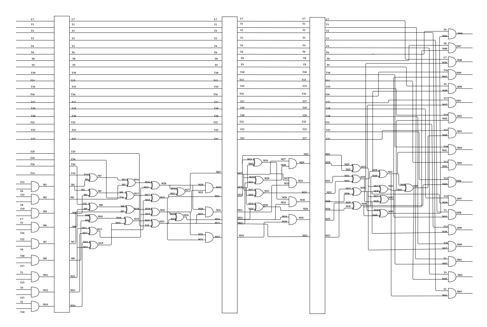
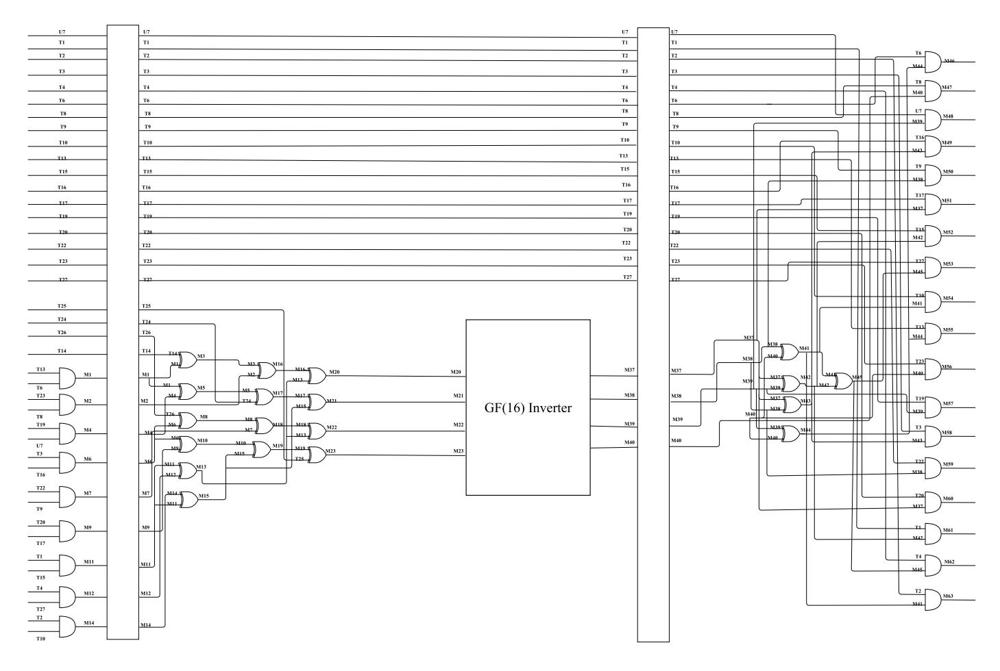
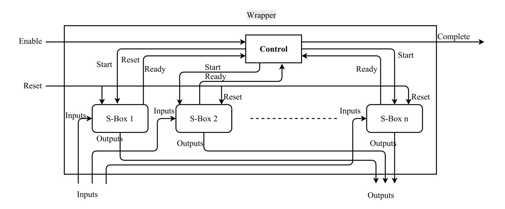
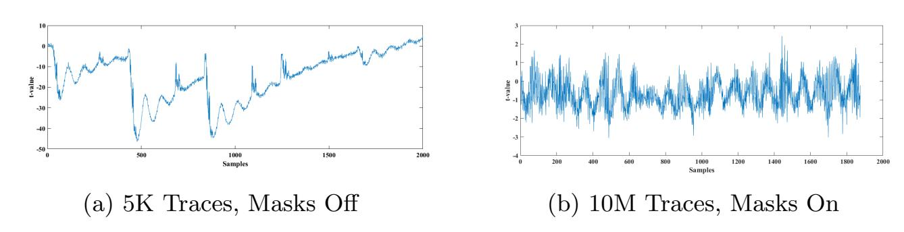
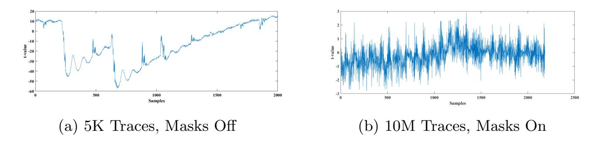
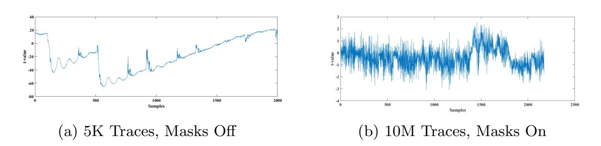
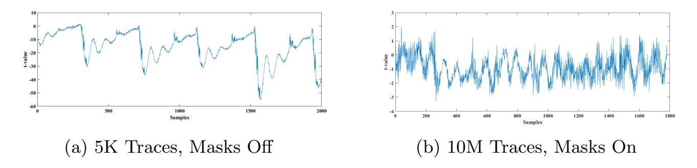
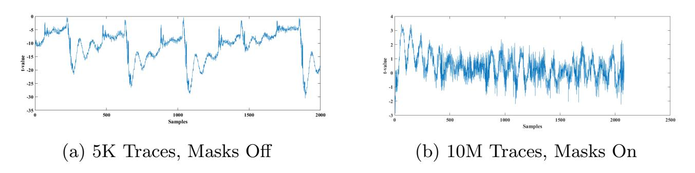

{0}------------------------------------------------

## Several Masked Implementations of the Boyar-Peralta AES S-Box

Ashrujit Ghoshal1[0000−0003−2436−0230] and Thomas De Cnudde2[0000−0002−2711−8645]

1 Indian Institute of Technology Kharagpur, India ashrujitg@iitkgp.ac.in <sup>2</sup> KU Leuven, ESAT-COSIC and imec, Belgium thomas.decnudde@esat.kuleuven.be

Abstract. Threshold implementation is a masking technique that provides provable security for implementations of cryptographic algorithms against power analysis attacks. In recent publications, several different threshold implementations of AES have been designed. However in most of the threshold implementations of AES, the Canright S-Box has been used. The Boyar-Peralta S-Box is an alternative implementation of the AES S-Box with a minimal circuit depth and is comparable in size to the frequently used Canright AES S-Box. In this paper, we present several versions of first-order threshold implementations of the Boyar-Peralta AES S-Box with different number of shares and several trade-offs in area, randomness and speed. To the best of our knowledge these are the first threshold implementations of the Boyar-Peralta S-Box. Our implementations compare favourably with some of the existing threshold implementations of Canright S-Box along the design trade-offs, e.g. while one of our S-Boxes is 49% larger in area than the smallest known threshold implementation of the Canright AES S-Box, it uses 63% less randomness and requires only 50% of the clock cycles. We provide results of a practical security evaluation based on real power traces to confirm the first-order attack resistance of our implementations.

Keywords: AES, Boyar-Peralta S-box, Countermeasure, DPA, Masking, SCA, Threshold Implementations.

## 1 Introduction

In a black box model, embedded devices have been shown to be secure using modern ciphers. However, when naively implemented, side-channel information like power consumption, electromagnetic radiations or timing of the device's computations can leak secret information unintentionally. Attacks based on various side channels were presented in [16, 23, 24] and their mitigation has been the subject of a great deal of research ever since.

Masking is an efficient way to strengthen cryptographic implementations against such physical side-channel attacks [10,18]. Masking detaches leaked sidechannel information from secret dependent intermediate values by carrying out 

{1}------------------------------------------------

computations on randomized values. It offers provable security [29] and can be implemented on the algorithmic level, making it a flexible Side-Channel Analysis (SCA) countermeasure. The underlying principle of masking relies on splitting each variable into a set of random values using secret sharing techniques and using a certain multi-party computation protocol on the resulting random values for secure computations. Once the secret values are masked, they are in no way combined until the end of the algorithm, i.e. the sensitive values are not leaked at any point during the execution of the cryptographic algorithm. Only at the end of the computation, when the cipher's outputs are valid, the output masks are combined to reconstruct the unmasked output.

The security of masking schemes is inherently tied to an adversary model. An attacker who observes the d th-order statistical moment of e.g. a power trace or combines observations from d points in time nonlinearly in that power trace is said to be an attacker mounting a d th-order attack. To prevent a d th-order attack, a masking scheme of order (d+1) is required. Fortunately, the number of readings needed for a higher-order attack to become successful grows exponentially with the noise standard deviation and therefore it is reasonable to guarantee practical security up to a certain order.

Implementing masking in hardware in a secure manner is not trivial. It is a delicate job since all the assumptions made on the leakage behavior of the underlying platform do not always hold in practice. For example, glitches are a known predominant threat [25] to the security of masked implementations in CMOS technologies. Some masking schemes like Threshold Implementations (TI) work under assumptions which are more achievable in a practical scenarios. In addition to these relaxed assumptions on the underlying leakage, TI offers provable security and allows to construct secure circuits which are realistic in size, all without requiring much intervention from a designer or many design iterations. For this reason, TI has been applied to many well-known cryptographic algorithms like KECCAK, AES and PRESENT [3, 14, 26, 28].

The Canright S-Box [9] and Boyar-Peralta S-Box [8] are two of the smallest implementations of the AES S-Box. As a starting point for threshold implementations and Side-Channel Analysis (SCA) secure designs, the Canright S-box has been used predominantly [5, 20, 26], whereas the Boyar-Peralta S-box has received little to no attention. The S-box introduced by Boyar and Peralta [8] is based on a novel logic minimization technique, which can be applied to any arbitrary combinational logic problems and even circuits that have been optimized by standard methodologies. The authors described their techniques as a two-step process: a reduction of nonlinear gates and a reduction of linear gates. Using their method they came up with an S-Box for AES which has the smallest combinational circuit depth known till date.

The aim of this paper is to develop secure masked implementations of the Boyar-Peralta AES S-Box using TI. The Boyar-Peralta S-Box is one of the smallest circuits implementing the AES S-box in unmasked form. We explore whether it is also one of the smallest masked S-Box of AES. For this purpose we explore 

{2}------------------------------------------------

several different masking styles of the Boyar-Peralta S-Box, focusing on various trade-offs between area, randomness and the number of clock cycles.

Contributions. We present the first threshold implementations of the Boyar-Peralta AES S-Box. More precisely, we show TIs of the Boyar-Peralta AES S-Box with 3 and 4 shares, both with various trade-offs related to the circuit area, the consumed randomness and the required clock cycles. We consider two approaches to mask the S-Box. The first approach involves masking the AND gates alone using uniform sharing of the individual AND gates. The second approach is based on sharing a larger algebraic function, the  $\mathbb{GF}(2^4)$  inverter as a whole.

Our smallest implementation is 2.75% larger in area than the smallest Canright S-Box presented in [6] but reduces randomness required by 37.5% and takes the same number of clock cycles. This implementation of ours which is the smallest in area takes as many clock cycles as the fastest known Threshold Implementation of the Canright S-Box. The Canright S-Box in [15] is the smallest known TI of the AES S-Box so far. Our smallest implementation is 47% larger in area but reduces randomness by 63% and increases speed by 50%. One of our implementations uses no randomness at all while all known threshold implementations of the Canright S-Box need randomness. We show the results of leakage detection tests of our implementations on a low noise FPGA platform to back up the theoretical security.

Organization. In Section 2, we provide the notation and the theory behind the threshold implementations masking scheme and the Boyar-Peralta AES S-Box. In Section 3, we develop the various secure implementations of the Boyar-Peralta S-Box by successively reducing either the number of shares, or the required randomness when the number of shares is kept constant. We present the results of the side-channel analysis in Section 4. In Section 5, we discuss the implementation cost of our resulting designs and compare them with costs of related previously published threshold implementations. We conclude the paper and propose directions for future work in Section 6.

#### 2 Preliminaries

#### 2.1 Notation

We use lowercase regular and bold letters to describe elements of  $\mathbb{GF}(2^n)$  and their sharing respectively. Any sensitive variable  $x \in \mathbb{GF}(2^n)$  is split into s shares  $(x_1, ....., x_s) = \mathbf{x}$ , where  $x_i \in \mathbb{GF}(2^n)$ , in the initialization phase of the cryptographic algorithm. A possible manner of performing this initialization, which we employ, is as follows: the shares  $x_1, x_2, ...., x_{s-1}$  are selected randomly from an uniform distribution and  $x_s$  is calculated such that  $x = \bigoplus_{i \in \{1, 2, ...., s\}} x_i$ . We refer to the  $j^{th}$  bit of x as  $x^j$  unless  $x \in \mathbb{GF}(2)$ . We use the same notation to share a function f into s shares  $\mathbf{f} = (f_1, ....., f_s)$ . The number of input and output shares of  $\mathbf{f}$  are denoted by  $s_{in}$  and  $s_{out}$  respectively. We refer to field multiplication as  $\times$ , to addition as  $\oplus$  and denote negation of all bits in a value x using  $\overline{x}$ .

{3}------------------------------------------------

#### 2.2 The Boyar-Peralta Implementation of the AES S-Box

The Boyar-Peralta S-Box, is a circuit of depth 16 introduced by Boyar and Peralta [8]. It uses a total of 128 2-input gates to construct the S-Box: 94 gates are linear operations (XOR and XNOR gates) and 34 gates are nonlinear (AND gates or 1-bit multiplications).

The circuit is divided into 3 layers:

- 1. the top linear layer
- 2. the middle nonlinear layer
- 3. the bottom linear layer

The equations involved are listed below. The 8 input bits are given by u0, u1, u2, u3, u4, u5, u<sup>6</sup> and u<sup>7</sup> with u<sup>0</sup> being the most significant bit and u<sup>7</sup> being the least significant bit. Similarly, the 8 output bits are given by s0, s1, s2, s3, s4, s5, s<sup>6</sup> and s7, with s<sup>0</sup> being the most significant bit and s<sup>7</sup> being the least significant bit.

The set of equations for the top linear layer are:

| t1   | t10   | t19   |
|------|-------|-------|
| = u0 | = t6  | = t7  |
| ⊕ u3 | ⊕ t7  | ⊕ t18 |
| t2   | t11   | t20   |
| = u0 | = u1  | = t1  |
| ⊕ u5 | ⊕ u5  | ⊕ t19 |
| t3   | t12   | t21   |
| = u0 | = u2  | = u6  |
| ⊕ u6 | ⊕ u5  | ⊕ u7  |
| ⊕ u5 | ⊕ t4  | ⊕ t21 |
| t4   | t13   | t22   |
| = u3 | = t3  | = t7  |
| t5   | t14   | t23   |
| = u4 | = t6  | = t2  |
| ⊕ u6 | ⊕ t11 | ⊕ t22 |
| t6   | t15   | t24   |
| = t1 | = t5  | = t2  |
| ⊕ t5 | ⊕ t11 | ⊕ t10 |
| t7   | t16   | t25   |
| = u1 | = t5  | = t20 |
| ⊕ u2 | ⊕ t12 | ⊕ t17 |
| ⊕ t6 | ⊕ t16 | ⊕ t16 |
| t8   | t17   | t26   |
| = u7 | = t9  | = t3  |
| t9   | t18   | t27   |
| = u7 | = u3  | = t1  |
| ⊕ t7 | ⊕ u7  | ⊕ t12 |

The set of equations for the middle nonlinear layer are given by:

```
m1 = t13 × t6
m2 = t23 × t8
m3 = t14 ⊕ m1
m4 = t19 × u7
m5 = m4 ⊕ m1
m6 = t3 × t16
m7 = t22 × t9
m8 = t26 ⊕ m6
m9 = t20 × t17
m10 = m9 ⊕ m6
m11 = t1 × t15
m12 = t4 × t27
m13 = m12 ⊕ m11
m14 = t2 × t10
m15 = m14 ⊕ m11
m16 = m3 ⊕ m2
                        m17 = m5 ⊕ t24
                        m18 = m8 ⊕ m7
                        m19 = m10 ⊕ m15
                        m20 = m16 ⊕ m13
                        m21 = m17 ⊕ m15
                        m22 = m18 ⊕ m13
                        m23 = m19 ⊕ t25
                        m24 = m22 ⊕ m23
                        m25 = m22 × m20
                        m26 = m21 ⊕ m25
                        m27 = m20 ⊕ m21
                        m28 = m23 ⊕ m25
                        m29 = m28 × m27
                        m30 = m26 × m24
                        m31 = m20 × m23
                        m32 = m27 × m31
                                                m33 = m27 ⊕ m25
                                                m34 = m21 × m22
                                                m35 = m24 × m34
                                                m36 = m24 ⊕ m25
                                                m37 = m21 ⊕ m29
                                                m38 = m32 ⊕ m33
                                                m39 = m23 ⊕ m30
                                                m40 = m35 ⊕ m36
                                                m41 = m38 ⊕ m40
                                                m42 = m37 ⊕ m39
                                                m43 = m37 ⊕ m38
                                                m44 = m39 ⊕ m40
                                                m45 = m42 ⊕ m41
                                                m46 = m44 × t6
                                                m47 = m40 × t8
                                                m48 = m39 × u7
```

{4}------------------------------------------------

```
m49 = m43 × t16
m50 = m38 × t9
m51 = m37 × t17
m52 = m42 × t15
m53 = m45 × t27
                         m54 = m41 × t10
                         m55 = m44 × t13
                         m56 = m40 × t23
                         m57 = m39 × t19
                         m58 = m43 × t3
                                                  m59 = m38 × t22
                                                  m60 = m37 × t20
                                                  m61 = m42 × t1
                                                  m62 = m45 × t4
                                                  m63 = m41 × t2
```

The set of equations for the bottom linear layer consist of:

| l0                  | l13                 | l26   |
|---------------------|---------------------|-------|
| = m61               | = m50               | = l7  |
| ⊕ m62               | ⊕ l0                | ⊕ l9  |
| l1                  | l14                 | ⊕ l10 |
| = m50               | = m52               | l27   |
| ⊕ m56               | ⊕ m61               | = l8  |
| l2                  | l15                 | ⊕ l14 |
| = m46               | = m55               | l28   |
| ⊕ m48               | ⊕ l1                | = l11 |
| l3                  | l16                 | l29   |
| = m47               | = m56               | = l11 |
| ⊕ m55               | ⊕ l0                | ⊕ l17 |
| l4                  | l17                 | s0    |
| = m54               | = m57               | = l6  |
| ⊕ m58               | ⊕ l1                | ⊕ l24 |
| ⊕ m61               | ⊕ l8                | ⊕ l26 |
| l5                  | l18                 | s1    |
| = m49               | = m58               | = l16 |
| ⊕ l5                | ⊕ l4                | s2    |
| l6                  | l19                 | = l19 |
| = m62               | = m63               | ⊕ l28 |
| ⊕ l3<br>l7<br>= m46 | ⊕ l1<br>l20<br>= l0 |       |
| ⊕ m59               | ⊕ l7                | s3    |
| l8                  | l21                 | = l6  |
| = m51               | = l1                | ⊕ l21 |
| ⊕ m53               | ⊕ l12               | s4    |
| l9                  | l22                 | = l20 |
| = m52               | = l3                | ⊕ l22 |
| l10                 | l23                 | ⊕ l29 |
| = m53               | = l18               | s5    |
| ⊕ l4                | ⊕ l2                | = l25 |
| l11                 | l24                 | s6    |
| = m60               | = l15               | = l13 |
| ⊕ l2                | ⊕ l9                | ⊕ l27 |
| l12                 | l25                 | s7    |
| = m48               | = l6                | = l6  |
| ⊕ m51               | ⊕ l10               | ⊕ l23 |

Masked software implementations using bitslicing of the Boyar Peralta AES S-Box were studied in [19, 22]. A modified version of the Boyar Peralta S-Box has been masked using the ISW AND gate [21] in [19].

#### 2.3 Threshold Implementations

The threshold implementations (TI) masking technique was proposed by Nikova et al. [27] as a countermeasure against Differential Power Analysis (DPA) attacks. It is secure even in non-ideal circuits where glitches have shown to result in leakage in more conventional masking schemes [25]. The original proposal, which only dealt with first-order DPA security, was later extended to protect against higher-order DPA attacks as well [4, 30].

TI is based on multi-party computation and secret sharing, and must satisfy the following properties in order to achieve the mentioned security:

- 1. Uniformity. Uniformity requires all intermediate shares to be uniformly distributed. It ensures state-independence from the mean of the leakages, which is a requirement to thwart first-order DPA. As mentioned in [2] it suffices to check uniformity at the inputs and the outputs of each of the functions. Uniformity can be either achieved through correction terms by using more input shares, or by adding randomness after the non-uniform computation.
- 2. Non-completeness. To achieve d th-order non-completeness, any combination of d or less component functions f<sup>i</sup> of f must be independent of at least

{5}------------------------------------------------

- one input share x<sup>i</sup> . For protection against first-order DPA, 1st-order noncompleteness is required, i.e. every function must be independent of at least one input share. Non-completeness ensures that the side-channel security of the final circuit is not affected by glitches.
- 3. Correctness. This property simply states that applying the sub-functions to a valid shared input must always yield a valid sharing of the correct output.

In addition to TI's algorithmic properties, the physical leakage of each share or sub-function should be independent of all other shares or sub-functions, i.e. no coupling is present between the shares or sub-functions. Violating this assumption has shown to induce leakage in masked implementations [13].

## 3 Several SCA Secure Implementations of the Boyar-Peralta AES S-Box

In this section we present several different threshold implementations of the Boyar-Peralta AES S-Box. Applying TI to linear functions is straightforward due to the linearity of the XOR and XNOR operations. Masking the nonlinear functions on the other hand is known to pose more of a challenge. As mentioned in the previous section the only nonlinear functions in the Boyar-Peralta AES S-Box are the AND gates. In order to apply TI to these AND gates we need to make sure the resulting sharings are non-complete and correct, and that their outputs are uniform. In our first approach, we therefore consider the uniform sharing of an AND gate and formulate several 1st-order non-complete TI sharings for this S-box. We additionally investigate a second approach: instead of masking each AND gate individually, we combine several AND gates to form an inversion in GF(2<sup>4</sup> ). In both cases, to avoid first-order leakages from glitches and early propagation of signals, each masked nonlinear function must be followed by a set of registers.

The middle layer is the nonlinear layer in the Boyar-Peralta AES S-Box. The top and the bottom layer are composed of linear functions only. When we mask each gate individually, the outputs of every AND gate in the middle layer must be registered before the next operation starts. Hence, we divide the middle layer into stages such that at each stage, the outputs produced by the AND gates are put into registers before proceeding for the operation in the next stage.

On inspection of the set of equations, we divide the circuit into 4 stages where each stage ends with a set of AND operations. Note that there may be other ways to divide the nonlinear layer into stages. The top linear layer was combined with the first stage of the nonlinear layer and the outputs of the AND gates from the 4th and final stage of the middle nonlinear layer are fed into the bottom layer directly, which causes no problem since this layer is linear. Therefore, we divide our circuit into 4 stages with a set of registers after the first three stages. A total of 4 clock cycles are required to complete the computation of the S-Box. The entire circuit of the nonlinear middle layer is shown in Figure 1. The set of equations after division into stages are given below.

{6}------------------------------------------------



Fig. 1: Division of the nonlinear layer into stages.

#### Stage 1.

| ⊕ u3 | ⊕ t4  | ⊕ t17 |
|------|-------|-------|
| t1   | t13   | t25   |
| = u0 | = t3  | = t20 |
| ⊕ u5 | ⊕ t11 | ⊕ t16 |
| t2   | t14   | t26   |
| = u0 | = t6  | = t3  |
| t3   | t15   | t27   |
| = u0 | = t5  | = t1  |
| ⊕ u6 | ⊕ t11 | ⊕ t12 |
| t4   | t16   | m1    |
| = u3 | = t5  | = t13 |
| ⊕ u5 | ⊕ t12 | × t6  |
| ⊕ u6 | ⊕ t16 | × t8  |
| t5   | t17   | m2    |
| = u4 | = t9  | = t23 |
| ⊕ t5 | ⊕ u7  | × u7  |
| t6   | t18   | m4    |
| = t1 | = u3  | = t19 |
| t7   | t19   | m6    |
| = u1 | = t7  | = t3  |
| ⊕ u2 | ⊕ t18 | × t16 |
| t8   | t20   | m7    |
| = u7 | = t1  | = t22 |
| ⊕ t6 | ⊕ t19 | × t9  |
| ⊕ t7 | ⊕ u7  | × t17 |
| t9   | t21   | m9    |
| = u7 | = u6  | = t20 |
| t10  | t22   | m11   |
| = t6 | = t7  | = t1  |
| ⊕ t7 | ⊕ t21 | × t15 |
| t11  | t23   | m12   |
| = u1 | = t2  | = t4  |
| ⊕ u5 | ⊕ t22 | × t27 |
| t12  | t24   | m14   |
| = u2 | = t2  | = t2  |
| ⊕ u5 | ⊕ t10 | × t10 |

#### Stage 2.

| m3                                         | m17                                            | m24                   |
|--------------------------------------------|------------------------------------------------|-----------------------|
| = t14                                      | = m5                                           | = m22                 |
| ⊕ m1                                       | ⊕ t24                                          | ⊕ m23                 |
| m5                                         | m18                                            | m25                   |
| = m4                                       | = m8                                           | = m22                 |
| ⊕ m1                                       | ⊕ m7                                           | × m20                 |
| m8<br>= t26<br>⊕ m6<br>m10<br>= m9<br>⊕ m6 | m19<br>= m10<br>⊕ m15<br>m20<br>= m16<br>⊕ m13 | ⊕ m21<br>m27<br>= m20 |
| m13                                        | m21                                            | m31                   |
| = m12                                      | = m17                                          | = m20                 |
| ⊕ m11                                      | ⊕ m15                                          | × m23                 |
| m15                                        | m22                                            | m34                   |
| = m14                                      | = m18                                          | = m21                 |
| ⊕ m11                                      | ⊕ m13                                          | × m22                 |
| ⊕ m2<br>m16<br>= m3                        | ⊕ t25<br>m23<br>= m19                          |                       |

{7}------------------------------------------------

#### Stage 3.

| $m_{26} = m_{21} \oplus m_{25}$ | $m_{30} = m_{26} \times m_{24}$ | $m_{35} = m_{24} \times m_{34}$ |
|---------------------------------|---------------------------------|---------------------------------|
| $m_{28} = m_{23} \oplus m_{25}$ | $m_{32} = m_{27} \times m_{31}$ |                                 |
| $m_{29} = m_{28} \times m_{27}$ | $m_{33} = m_{27} \oplus m_{25}$ | $m_{36} = m_{24} \oplus m_{25}$ |

#### Stage 4.

| $m_{37} = m_{21} \oplus m_{29}$ $m_{38} = m_{32} \oplus m_{33}$ $m_{39} = m_{23} \oplus m_{30}$ $m_{40} = m_{35} \oplus m_{36}$ $m_{41} = m_{38} \oplus m_{40}$ $m_{42} = m_{37} \oplus m_{39}$ $m_{43} = m_{37} \oplus m_{38}$ $m_{44} = m_{39} \oplus m_{40}$ $m_{45} = m_{42} \oplus m_{41}$ $m_{46} = m_{44} \times t_6$ $m_{47} = m_{40} \times t_8$ $m_{48} = m_{39} \times u_7$ $m_{49} = m_{43} \times t_{16}$ $m_{50} = m_{38} \times t_9$ $m_{51} = m_{37} \times t_{17}$ $m_{52} = m_{42} \times t_{15}$ $m_{53} = m_{45} \times t_{27}$ $m_{54} = m_{41} \times t_{10}$ $m_{55} = m_{44} \times t_{13}$ $m_{56} = m_{40} \times t_{23}$ $m_{57} = m_{39} \times t_{19}$ $m_{58} = m_{43} \times t_{3}$ | $m_{59} = m_{38} \times t_{22}$ $m_{60} = m_{37} \times t_{20}$ $m_{61} = m_{42} \times t_1$ $m_{62} = m_{45} \times t_4$ $m_{63} = m_{41} \times t_2$ $l_0 = m_{61} \oplus m_{62}$ $l_1 = m_{50} \oplus m_{56}$ $l_2 = m_{46} \oplus m_{48}$ $l_3 = m_{47} \oplus m_{55}$ $l_4 = m_{54} \oplus m_{58}$ $l_5 = m_{49} \oplus m_{61}$ $l_6 = m_{62} \oplus l_5$ $l_7 = m_{46} \oplus l_3$ $l_8 = m_{51} \oplus m_{59}$ $l_9 = m_{52} \oplus m_{53}$ $l_{10} = m_{53} \oplus l_4$ $l_{11} = m_{60} \oplus l_2$ $l_{12} = m_{48} \oplus m_{51}$ $l_{13} = m_{50} \oplus l_0$ $l_{14} = m_{52} \oplus m_{61}$ $l_{15} = m_{55} \oplus l_1$ $l_{16} = m_{56} \oplus l_0$ | $l_{17} = m_{57} \oplus l_1$ $l_{18} = m_{58} \oplus l_8$ $l_{19} = m_{63} \oplus l_4$ $l_{20} = l_0 \oplus l_1$ $l_{21} = l_1 \oplus l_7$ $l_{22} = l_3 \oplus l_{12}$ $l_{23} = l_{18} \oplus l_2$ $l_{24} = l_{15} \oplus l_9$ $l_{25} = l_6 \oplus l_{10}$ $l_{26} = l_7 \oplus l_9$ $l_{27} = l_8 \oplus l_{10}$ $l_{28} = l_{11} \oplus l_{14}$ $l_{29} = l_{11} \oplus l_{17}$ $s_0 = l_6 \oplus l_{24}$ $s_1 = \overline{l_{16} \oplus l_{26}}$ $s_2 = \overline{l_{19} \oplus l_{28}}$ $s_3 = l_6 \oplus l_{21}$ $s_4 = l_{20} \oplus l_{22}$ $s_5 = l_{25} \oplus l_{29}$ $s_6 = \overline{l_{13} \oplus l_{27}}$ $s_7 = \overline{l_6 \oplus l_{23}}$ |
|--------------------------------------------------------------------------------------------------------------------------------------------------------------------------------------------------------------------------------------------------------------------------------------------------------------------------------------------------------------------------------------------------------------------------------------------------------------------------------------------------------------------------------------------------------------------------------------------------------------------------------------------------------------------------------------------------------------------|---------------------------------------------------------------------------------------------------------------------------------------------------------------------------------------------------------------------------------------------------------------------------------------------------------------------------------------------------------------------------------------------------------------------------------------------------------------------------------------------------------------------------------------------------------------------------------------------------------------------------------------------------------------------|------------------------------------------------------------------------------------------------------------------------------------------------------------------------------------------------------------------------------------------------------------------------------------------------------------------------------------------------------------------------------------------------------------------------------------------------------------------------------------------------------------------------------------------------------------------------------------------------------------------------------------------------------------------|
| 11038 11043 / 03                                                                                                                                                                                                                                                                                                                                                                                                                                                                                                                                                                                                                                                                                                   | 10 W20 0                                                                                                                                                                                                                                                                                                                                                                                                                                                                                                                                                                                                                                                            | 07 00 023                                                                                                                                                                                                                                                                                                                                                                                                                                                                                                                                                                                                                                                        |
|                                                                                                                                                                                                                                                                                                                                                                                                                                                                                                                                                                                                                                                                                                                    |                                                                                                                                                                                                                                                                                                                                                                                                                                                                                                                                                                                                                                                                     |                                                                                                                                                                                                                                                                                                                                                                                                                                                                                                                                                                                                                                                                  |

For the second approach, where we mask the circuit using the inversion in  $\mathbb{GF}(2^4)$  instead of masking each individual AND gate.  $m_{20}m_{21}m_{22}m_{23}$  are inputs to the  $\mathbb{GF}(2^4)$  inverter and  $m_{36}m_{32}m_{39}m_{28}$  being the output where  $m_{20}$  and  $m_{36}$  are the most significant bits of the input and output respectively.  $m_{20}, m_{21}, m_{22}, m_{23}$  become available in Stage 2. The part of the circuit in Stage 2 to obtain  $m_{20}, m_{21}, m_{22}, m_{23}$  is linear. Hence we can put the inverter right after  $m_{20}, m_{21}, m_{22}, m_{23}$  become available without using a register. The outputs of the inverter  $m_{36}, m_{32}, m_{39}, m_{28}$  were the outputs of Stage 3. Therefore, we combine Stage 2 and 3 to isolate the inverter. The modified set of equations are given below:

## Stage 1.

{8}------------------------------------------------

| ⊕ u3          | ⊕ t15            | × u7    |
|---------------|------------------|---------|
| t1=u0         | t16=t7           | m4=t19  |
| ⊕ u5          | ⊕ t16            | m5=m4   |
| t2=u0         | t17=t9           | ⊕ m1    |
| ⊕ u6          | ⊕ u3             | m6=t3   |
| t3=u0         | t19=t9           | × t16   |
| ⊕ u5<br>t4=u3 | ⊕ t19<br>t20=t1  |         |
| t13=t3        | t22=t9           | × t9    |
| ⊕ t4          | ⊕ u6             | m7=t22  |
| t5=u4         | t23=t2           | m8=m7   |
| ⊕ t13         | ⊕ t22            | ⊕ m6    |
| t6=t5         | t24=t2           | m9=t20  |
| ⊕ u5          | ⊕ t10            | × t17   |
| t7=u1         | t25=t20          | ⊕ m6    |
| ⊕ u2          | ⊕ t17            | m10=m9  |
| t8=u7         | t26=t3           | m11=t1  |
| ⊕ t6          | ⊕ t16            | × t15   |
| t9=u7<br>⊕ t7 | t27=t10<br>⊕ t15 |         |
| t10=t6        | m1=t13           | m12=t4  |
| ⊕ t7          | × t6             | × t27   |
| t14=t5        | m2=t23           | ⊕ m11   |
| ⊕ u1          | × t8             | m13=m12 |
| ⊕ t1          | ⊕ m1             | × t10   |
| t15=t14       | m3=m2            | m14=t2  |

#### Stage 2.

| ⊕ m11   | ⊕ m13   | ⊕ t24   |
|---------|---------|---------|
| m15=m14 | m18=m8  | m21=m17 |
| ⊕ m13   | ⊕ m15   | ⊕ t26   |
| m16=m3  | m19=m10 | m22=m18 |
| m17=m5  | m20=m16 | m23=m19 |
| ⊕ m15   | ⊕ t14   | ⊕ t25   |

m20m21m22m<sup>23</sup> are inputs to the GF(2<sup>4</sup> ) inverter and m36m32m39m<sup>28</sup> being the output where m<sup>20</sup> and m<sup>36</sup> are the most significant bits of the input and output respectively.

#### Stage 3.

| m40=m39 | z12=m42 | l12=z3  |
|---------|---------|---------|
| ⊕ m36   | × t3    | ⊕ z5    |
| m41=m28 | z13=m39 | l13=z13 |
| ⊕ m32   | × t22   | ⊕ l1    |
| ⊕ m39   | × t20   | ⊕ l12   |
| m42=m28 | z14=m28 | l14=l4  |
| m43=m32 | z15=m41 | s3=l3   |
| ⊕ m36   | × t1    | ⊕ l11   |
| m44=m40 | z16=m44 | l16=z6  |
| ⊕ m41   | × t4    | ⊕ l8    |
| z0=m43  | z17=m40 | l17=z14 |
| × t6    | × t2    | ⊕ l10   |
| × t8    | ⊕ z16   | ⊕ l14   |
| z1=m36  | l1=z15  | l18=l13 |
| z2=m32  | l2=z10  | s7=z12  |
| × u7    | ⊕ l1    | ⊕ l18   |
| z3=m42  | l3=z9   | l20=z15 |
| × t16   | ⊕ l2    | ⊕ l16   |
| z4=m39  | l4=z0   | l21=l2  |
| × t9    | ⊕ z2    | ⊕ z11   |
| × t17   | ⊕ z0    | ⊕ l16   |
| z5=m28  | l5=z1   | s0=l3   |
| z6=m41  | l6=z3   | s6=l10  |
| × t15   | ⊕ z4    | ⊕ l18   |
| z7=m44  | l7=z12  | s4=l14  |
| × t27   | ⊕ l4    | ⊕ s3    |
| × t10   | ⊕ l6    | s1=s3   |
| z8=m40  | l8=z7   | ⊕ l16   |
| × t13   | ⊕ l7    | ⊕ l20   |
| z9=m43  | l9=z8   | l26=l17 |
| z10=m36 | l10=l8  | s2=l26  |
| × t23   | ⊕ l9    | ⊕ z17   |
| z11=m32 | l11=l6  | s5=l21  |
| × t19   | ⊕ l5    | ⊕ l17   |
|         |         |         |

The circuit of the middle nonlinear layer using an inverter is shown in figure 2.

{9}------------------------------------------------



Fig. 2: Division of the nonlinear layer into stages when centered around the inversion in GF(2<sup>4</sup> ).

Using these two different approaches for division into stages of the circuit, we design the following secure implementations of the Boyar-Peralta S-Box:

- 1. Threshold implementation with 4 shares and no randomness in Section 3.1
- 2. Threshold implementation with 3 shares and 68 bits randomness in Section 3.2
- 3. Threshold implementation with 3 shares and 34 bits of randomness in Section 3.3
- 4. Threshold Implementation using 3 shares and using sharing with sin = 5 and sout = 5 for a GF(2<sup>4</sup> ) inverter in Section 3.4
- 5. Threshold Implementation using 3 shares and using sharing with sin = 4 and sout = 4 for a GF(2<sup>4</sup> ) inverter in Section 3.5

#### 3.1 Threshold implementation with 4 shares and no randomness

As previously mentioned, the sharing for the linear operations is trivial. For the nonlinear AND gate we first use the following uniform 4-to-4 sharing. This is a novel modification of a 4-to-3 uniform sharing of the AND gate used in [5].

{10}------------------------------------------------

$$\mathbf{a} = \mathbf{x} \times \mathbf{y}$$

$$\mathbf{x} = (x_1, x_2, x_3, x_4)$$

$$\mathbf{y} = (y_1, y_2, y_3, y_4)$$

$$\mathbf{a} = (a_1, a_2, a_3, a_4)$$

$$a_1 = (x_2 \oplus x_3 \oplus x_4) \times (y_2 \oplus y_3) \oplus y_4 \oplus y_3$$

$$a_2 = ((x_1 \oplus x_3) \times (y_1 \oplus y_4)) \oplus (x_1 \times y_3) \oplus x_4$$

$$a_3 = (x_2 \oplus x_4) \times (y_1 \oplus y_4) \oplus x_4 \oplus y_4$$

$$a_4 = (x_1 \times y_2) \oplus y_3$$

The complete computation of the S-Box will take 4 clock cycles and will not consume any randomness.

#### 3.2 Threshold implementation with 3 shares and 68 bits randomness

Having designed a threshold implementation for the Boyar-Peralta AES S-Box which uses no randomness, we now aim to reduce the size of our circuit. This can be achieved by reducing the number of shares.

There is however no 3-to-3 uniform sharing for a 2-input AND gate. To keep the uniformity of sharing property intact, we introduce some randomness to remask the shares as shown in [26]. We use the following 3-to-3 sharing of the 2 input AND gate. r1, r<sup>2</sup> are the 2 bits of randomness.

$$\mathbf{a} = \mathbf{x} \times \mathbf{y}$$

$$\mathbf{x} = (x_1, x_2, x_3)$$

$$\mathbf{y} = (y_1, y_2, y_3)$$

$$\mathbf{a} = (a_1, a_2, a_3)$$

$$a_1 = (x_2 \times y_2) \oplus (x_2 \times y_3) \oplus (x_3 \times y_2) \oplus r_1 \oplus r_2$$

$$a_2 = (x_3 \times y_3) \oplus (x_1 \times y_3) \oplus (x_3 \times y_1) \oplus r_2$$

$$a_3 = (x_1 \times y_1) \oplus (x_1 \times y_2) \oplus (x_2 \times y_1) \oplus r_1$$

One masked AND gate consumes 2-bits of randomness. The whole S-Box circuit requires 2 × 34 = 68 bits of randomness in total. The complete computation of the S-Box will take 4 clock cycles.

#### 3.3 Threshold implementation with 3 shares and 34 bits randomness

We now reduce the amount of randomness required in our circuit by using the technique of virtual sharing as used in [7]. This sharing uses 1 bit of randomness 

{11}------------------------------------------------

per 2-input AND gate. The following is the resulting 3-to-3 sharing of the 2-input AND gate using 1 bit of randomness. r denotes a bit of randomness.

```
\mathbf{a} = \mathbf{x} \times \mathbf{y}
\mathbf{x} = (x_1, x_2, x_3)
\mathbf{y} = (y_1, y_2, y_3)
\mathbf{a} = (a_1, a_2, a_3)
a_1 = (x_2 \times y_2) \oplus (x_2 \times y_3) \oplus (x_3 \times y_2) \oplus r
a_2 = (x_3 \times y_3) \oplus (x_1 \times y_3) \oplus (x_3 \times y_1) \oplus (x_1 \times r) \oplus (y_1 \times r)
a_3 = (x_1 \times y_1) \oplus (x_1 \times y_2) \oplus (x_2 \times y_1) \oplus (x_1 \times r) \oplus (y_1 \times r) \oplus r
```

This S-Box circuit requires 34 bits of randomness. The complete computation of the S-Box will again take 4 clock cycles.

# 3.4 Threshold Implementation using 3 shares and using sharing with $s_{in} = 5$ and $s_{out} = 5$ for a $\mathbb{GF}(2^4)$ inverter

As stated earlier, we can isolate an inverter in  $\mathbb{GF}(2^4)$  within the Boyar-Peralta S-Box. As shown in [5] we can use a 5-to-5 uniform sharing for this  $\mathbb{GF}(2^4)$ inverter. We use 3 shares for the linear and nonlinear gates that fall outside the inverter. In order to increase the number of shares from 3 to 5 at the input of the inverter we use 4 extra bits of randomness. To reduce the number of shares at the output from 5 to 3 we use 2 bits of randomness to combine the output shares just after the register. As mentioned in |2| uniformity is necessary only for the input of nonlinear functions. The part of the circuit before the inverter in Stage 2 is linear. In order increase in the number of shares before input to the inverter, the shares are remarked using randomness. Therefore before input to the nonlinear part of Stage 2, the inverter, the shares are uniform due to remasking. Hence inputs to stage 2 i.e. outputs of Stage 1 need not be uniform. Also all the outputs of the AND operations in stage 3 are inputs linear functions, hence they need not be uniform. This version has 27 2-input AND gates. All of them are in stages 1 and 3. Since the outputs of Stages 1 and 3 need not be uniform, none of the AND gates need to be uniform. So, we may use any noncomplete and correct 3 sharing without using randomness for these AND gates. The total amount of randomness required is  $4 \times 4 \times 4 + 2 \times 4 = 24$  bits.

# 3.5 Threshold Implementation using 3 shares and using sharing with $s_{in} = 4$ and $s_{out} = 4$ for a $\mathbb{GF}(2^4)$ inverter

Similar to the previous implementation, we again use the threshold implementation of the  $\mathbb{GF}(2^4)$  inverter. There is 4-to-4 sharing of the  $\mathbb{GF}(2^4)$  inverter which is not uniform. We observe that for decreasing the output shares from 4 to 3, we add randomness to the outputs, which essentially remasks the outputs and provides uniformity.

{12}------------------------------------------------

The circuit differs from the previous one only in the aspects that the shares are increased from 3 to 4 and decreased from 4 to 3, and that the sharing for the inverter itself is different. It takes the same number of clock cycles as the previous one, i.e. 3, but requires 3 bits of randomness for increasing the number of shares from 3 to 4 and then 2 bits of randomness for reducing the shares back from 4 to 3. The argument to not use a uniform sharing of AND gates used in the previous implementation is applicable here too. Hence a total of 3×4+2×4 = 20 bits of randomness is required.

## 4 Side-Channel Analysis Evaluation

First, we describe the circuit that we used for the sequential evaluation of the S-Boxes. All the S-Boxes have separate input ports for the input shares and the randomness, and separate output ports for the output shares. Each S-Box has an enable signal and a reset signal as input. The execution of the S-Box begins when the enable signal is set to high. The values at the ports having the input shares and randomness for the corresponding S-Box, at the time enable goes high, are the ones used as the input to the S-Box. The reset signal is used to reset the S-Box to a known state. Each S-Box has an output done signal which goes high after the execution of the S-Box is complete and the outputs at the corresponding ports of output shares are the results of the execution of the S-Box.

There is an outer wrapper encapsulating the 5 S-Boxes. The wrapper has



Fig. 3: Structure of circuit for sequential evaluation of the S-Boxes

a control module. The control module of the wrapper has an enable as input signal and a complete signal as an output signal. The enable signal is needed to start the sequence of S-Boxes. The start signal of the first S-Box is set to high on the positive edge of clock following the enable signal going high. When 

{13}------------------------------------------------

the done signal of the S-Box goes high, the control waits for a few clock cycles before setting the start signal of the next S-Box high. After the done signal of the the last S-Box goes high, the complete signal of the wrapper is set to high. The wrapper has a reset signal as an input which is sent as the reset signal of the S-Boxes when set to high resets all S-Boxes to known states. Figure 3 shows the structure of the wrapper.

The design was implemented on a SASEBO-G measurement board using Xilinx ISE 10.1 in order to analyze their leakage characteristics.

The SASEGO-G board has two Xilinx Virtex-II Pro FPGA devices. Our design, was implemented on the crypto FPGA(xc2vp7). In order to prevent optimizations over module boundaries, the "Keep Hierarchy" constraint was kept on while generating the programming file. The control FPGA (xc2vp30) is responsible for the I/O with the measurement PC and generation of random bits. The PRNG which the control FPGA uses to generate the input sharings and random masks for the S-boxes is an AES-128 in OFB mode.

We evaluate the security of our first order secure implementations of the Boyar Peralta AES S-Boxes. We use leakage detection tests [1, 11, 12, 17, 24] to test for any power leakage of our masked implementations. The fix class of the leakage detection is chosen as the zero plaintext in all our evaluations.

We follow the standard practice when testing a masked design i.e. first turn off the PRNG to switch off the masking countermeasure. The design is expected to show leakage in this setting, and this serves to confirm that the experimental setup is sound (we can detect leakage). We then proceed by turning on the PRNG. If we do not detect leakage in this setting, the masking countermeasure is deemed to be effective. Figures 4, 5, 6, 7, 8 show the result of the first order leakage detection tests on the S-Boxes.



Fig. 4: First Order leakage detection test for the S-Box with 4 shares.

## 5 Implementation Cost

Here we give a comparison of the area, the required randomness and the number of clock cycles for our implementations. The results of area have been obtained using Synopsys 2013.12 and NanGate 45nm Open Cell Library.

In Table 1, we observe a trade-off between randomness, area and clock cycles. As we reduce the area, the randomness per S-box lookup increases or the number

{14}------------------------------------------------



Fig. 5: First Order leakage detection test for the S-Box with 3 shares, 68 bits of randomness



Fig. 6: First Order leakage detection test for the S-Box with 3 shares,34 bits of randomness



Fig. 7: First Order leakage detection test for the S-Box with 3 shares and using sharing with sin = 5 and sout = 5 for a GF(2<sup>4</sup> ) inverter



Fig. 8: First Order leakage detection test for the S-Box with 3 shares and using sharing with sin = 4 and sout = 4 for a GF(2<sup>4</sup> ) inverter

{15}------------------------------------------------

Table 1: Area, Randomness and Clock Cycles required per S-box Implementation.

|                                    | Area  |        | Randomness Clock Cycles |
|------------------------------------|-------|--------|-------------------------|
|                                    | [GEs] | [bits] |                         |
| Unprotected                        | 269   | 0      | 1                       |
| sin = 4, sout = 4                  | 4609  | 0      | 4                       |
| sin = 3, sout = 3, 68 random bits, | 3630  | 68     | 4                       |
| individual AND gates masked        |       |        |                         |
| sin = 3, sout = 3, 34 random bits, | 3798  | 34     | 4                       |
| individual AND gates masked        |       |        |                         |
| sin = 3, sout = 3, inverter masked | 3344  | 24     | 3                       |
| with sin = 5, sout = 5             |       |        |                         |
| sin = 3, sout = 3, inverter masked | 2913  | 20     | 3                       |
| with sin = 4, sout = 4             |       |        |                         |

of clock cycles required increase. In our implementation with smallest area, where we share a large algebraic function, the GF(2<sup>4</sup> ) inverter as a whole, both the number of clock cycles and the area are reduced.

In Table 2 we compare our implementation with smallest area to some masked implementations based on Canright S-Box.

Table 2: Area, Randomness and Clock Cycles required per S-box for related Implementations.

|                                    | Area  |        | Randomness Clock Cycles |
|------------------------------------|-------|--------|-------------------------|
|                                    | [GEs] | [bits] |                         |
| sin = 3, sout = 3, inverter masked | 2914  | 20     | 3                       |
| with sin = 4, sout = 4,Boyar Per   |       |        |                         |
| alta                               |       |        |                         |
| sin = 3, sout = 3,Canright S-Box   | 3708  | 44     | 3                       |
| in [5]                             |       |        |                         |
| sin = 3, sout = 3,Canright S-Box   | 4244  | 48     | 4                       |
| in [26]                            |       |        |                         |
| sin = 3, sout = 3,Canright S-Box   | 2835  | 32     | 3                       |
| in [6]                             |       |        |                         |
| sin = 2, sout = 2,Canright S-Box   | 1977  | 54     | 6                       |
| in [15]                            |       |        |                         |

We can summarize the comparison of our implementations with related implementations as follows:

– We achieve an implementation that consumes no randomness.

{16}------------------------------------------------

- Two of our implementations, which use the sharing for inversion in GF(2<sup>4</sup> ), take 3 clock cycles, which is faster than implementations in [15, 26]
- Our implementation that uses the 4-sharing of an inverter needs the same number of clock cycles as the smallest one in [6], while consuming less randomness for an increase in area of only 2.75%.
- The S-Box in [15] is the smallest known TI of the AES S-Box. Our implementation is 47% larger in comparison but we obtain a 63% reduction in randomness of and 50% reduction in number of clock cycles required.

## 6 Conclusion

In this paper, we present the first threshold implementations of the Boyar-Peralta AES S-Box. Since this AES S-Box is of minimum known depth, the critical path might be smaller which would allow clocking the core at higher frequencies making it highly important for secure high-speed and high-throughput applications. We go through an iterated design process, starting from a straightforward approach where we mask each gate individually to arrive at a more efficient implementation by masking the larger algebraic structure of the inversion in GF(2<sup>4</sup> ).

Our smallest implementation is 49% larger in area compared to the smallest known threshold implementation of the Canright AES S-box but reduces the randomness by 63% and number of clock cycles by 50%. Moreover, we achieve a secure implementation of the AES S-Box that requires no randomness at all. The set of secure implementations we present gives the hardware designer more options for tailoring their implementations according to their specifications.

A future direction of research can investigate the result of starting from a masked Canright AES S-Box and using the optimizations mentioned in [8] to arrive at a small and secure implementation of the Boyar-Peralta S-Box. Masking the Boyar Peralta S-Box with d+1 shares as shown in [30] is a possible direction for future work. Another future work would be designing circuits for this S-Box with higher-order security levels, as a determined adversary can still break the first-order masking scheme with a second order attack.

## Acknowledgements

We would like to thank Prof. Vincent Rijmen for his valuable comments and feedback on the paper and the anonymous reviewers for providing constructive and valuable comments. This work was supported in part by NIST with the research grant 60NANB15D34, in part by the Research Council KU Leuven, OT/13/071 and by the Flemish Government through FWO project Cryptography secured against side-channel attacks by tailored implementations enabled by future technologies (G0842.13). Ashrujit Ghoshal was a Visiting Scholar at ESAT-COSIC, KU Leuven hosted by Prof. Vincent Rijmen. Thomas De Cnudde is funded by a research grant of the Institute for the Promotion of Innovation through Science and Technology in Flanders (IWT-Vlaanderen).

{17}------------------------------------------------

## References

- 1. Becker, G., Cooper, J., DeMulder, E., Goodwill, G., Jaffe, J., Kenworthy, G., Kouzminov, T., Leiserson, A., Marson, M., Rohatgi, P., et al.: Test vector leakage assessment (tvla) methodology in practice. In: International Cryptographic Module Conference. vol. 1001, p. 13 (2013)
- 2. Bilgin, B.: Threshold implementations: as countermeasure against higher-order differential power analysis (2015)
- 3. Bilgin, B., Daemen, J., Nikov, V., Nikova, S., Rijmen, V., Van Assche, G.: Efficient and first-order dpa resistant implementations of keccak. In: International Conference on Smart Card Research and Advanced Applications. pp. 187–199. Springer (2013)
- 4. Bilgin, B., Gierlichs, B., Nikova, S., Nikov, V., Rijmen, V.: Higher-order threshold implementations. In: International Conference on the Theory and Application of Cryptology and Information Security. pp. 326–343. Springer (2014)
- 5. Bilgin, B., Gierlichs, B., Nikova, S., Nikov, V., Rijmen, V.: A more efficient aes threshold implementation. In: International Conference on Cryptology in Africa. pp. 267–284. Springer (2014)
- 6. Bilgin, B., Gierlichs, B., Nikova, S., Nikov, V., Rijmen, V.: Trade-offs for threshold implementations illustrated on aes. IEEE Transactions on Computer-Aided Design of Integrated Circuits and Systems 34(7), 1188–1200 (2015)
- 7. Bilgin, B., Nikova, S., Nikov, V., Rijmen, V., St¨utz, G.: Threshold implementations of all 3× 3 and 4× 4 s-boxes. In: International Workshop on Cryptographic Hardware and Embedded Systems. pp. 76–91. Springer (2012)
- 8. Boyar, J., Peralta, R.: A small depth-16 circuit for the aes s-box. In: IFIP International Information Security Conference. pp. 287–298. Springer (2012)
- 9. Canright, D.: A Very Compact S-Box for AES, pp. 441–455. Springer Berlin Heidelberg, Berlin, Heidelberg (2005)
- 10. Chari, S., Jutla, C., Rao, J., Rohatgi, P.: Towards sound approaches to counteract power-analysis attacks. In: Advances in CryptologyCRYPTO99. pp. 791–791. Springer (1999)
- 11. Coron, J.S., Naccache, D., Kocher, P.: Statistics and secret leakage. ACM Transactions on Embedded Computing Systems (TECS) 3(3), 492–508 (2004)
- 12. Coron, J., Kocher, P., Naccache, D.: Statistics and secret leackage, to appear in proceedings of financial cryptography (2000)
- 13. De Cnudde, T., Bilgin, B., Gierlichs, B., Nikov, V., Nikova, S., Rijmen, V.: Does coupling affect the security of masked implementations? In: International Workshop on Constructive Side-Channel Analysis and Secure Design. pp. 1–18. Springer (2017)
- 14. De Cnudde, T., Bilgin, B., Reparaz, O., Nikov, V., Nikova, S.: Higher-order threshold implementation of the aes s-box. In: International Conference on Smart Card Research and Advanced Applications. pp. 259–272. Springer (2015)
- 15. De Cnudde, T., Reparaz, O., Bilgin, B., Nikova, S., Nikov, V., Rijmen, V.: Masking aes with d+ 1 shares in hardware. In: International Conference on Cryptographic Hardware and Embedded Systems. pp. 194–212. Springer (2016)
- 16. Gandolfi, K., Mourtel, C., Olivier, F.: Electromagnetic analysis: Concrete results. In: Cryptographic Hardware and Embedded SystemsCHES 2001. pp. 251–261. Springer (2001)
- 17. Gilbert Goodwill, B.J., Jaffe, J., Rohatgi, P., et al.: A testing methodology for side-channel resistance validation. In: NIST Non-invasive attack testing workshop (2011)

{18}------------------------------------------------

- 18. Goubin, L., Patarin, J.: Des and differential power analysis the duplication method. In: Cryptographic Hardware and Embedded Systems. pp. 728–728. Springer (1999)
- 19. Goudarzi, D., Rivain, M.: How Fast Can Higher-Order Masking Be in Software?, pp. 567–597. Springer International Publishing, Cham (2017)
- 20. Gross, H., Mangard, S., Korak, T.: Domain-oriented masking: Compact masked hardware implementations with arbitrary protection order. IACR Cryptology ePrint Archive 2016, 486 (2016)
- 21. Ishai, Y., Sahai, A., Wagner, D.: Private circuits: Securing hardware against probing attacks. In: Annual International Cryptology Conference. pp. 463–481. Springer (2003)
- 22. Journault, A., Standaert, F.X.: Very High Order Masking: Efficient Implementation and Security Evaluation, pp. 623–643. Springer International Publishing, Cham (2017)
- 23. Kocher, P., Jaffe, J., Jun, B.: Differential power analysis. In: Advances in cryptologyCRYPTO99. pp. 789–789. Springer (1999)
- 24. Kocher, P.C.: Timing attacks on implementations of diffie-hellman, rsa, dss, and other systems. In: Annual International Cryptology Conference. pp. 104–113. Springer (1996)
- 25. Mangard, S., Pramstaller, N., Oswald, E.: Successfully attacking masked aes hardware implementations. In: International Workshop on Cryptographic Hardware and Embedded Systems. pp. 157–171. Springer (2005)
- 26. Moradi, A., Poschmann, A., Ling, S., Paar, C., Wang, H.: Pushing the limits: a very compact and a threshold implementation of aes. In: Eurocrypt. vol. 6632, pp. 69–88. Springer (2011)
- 27. Nikova, S., Rechberger, C., Rijmen, V.: Threshold implementations against sidechannel attacks and glitches. In: International Conference on Information and Communications Security. pp. 529–545. Springer (2006)
- 28. Poschmann, A., Moradi, A., Khoo, K., Lim, C.w., Wang, H., Ling, S.: Side-channel resistant crypto for less than. Power 21, 5
- 29. Prouff, E., Rivain, M.: Masking against side-channel attacks: A formal security proof. In: Annual International Conference on the Theory and Applications of Cryptographic Techniques. pp. 142–159. Springer (2013)
- 30. Reparaz, O., Bilgin, B., Nikova, S., Gierlichs, B., Verbauwhede, I.: Consolidating masking schemes. In: Annual Cryptology Conference. pp. 764–783. Springer (2015)