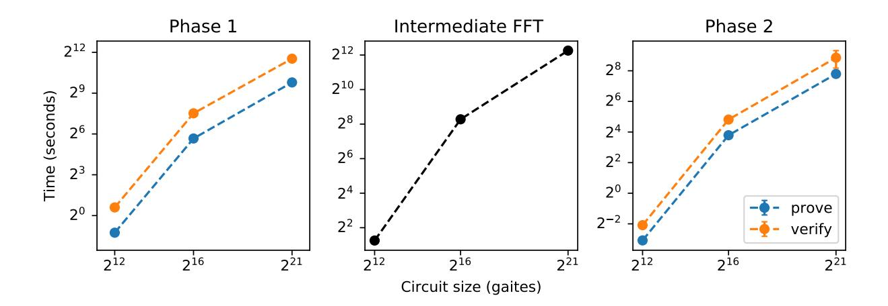

# Scalable Multi-party Computation for zk-SNARK Parameters in the Random Beacon Model

Sean Bowe sean@z.cash Ariel Gabizon ariel@z.cash Ian Miers imiers@cs.jhu.edu

May 3, 2019

#### Abstract

We present MMORPG, a built system for zero-knowledge succinct non-interactive arguments of knowledge zk-SNARK parameter generation. zk-SNARKs are compact, efficient, and publicly veri able zero-knowledge proofs for arbitrary computation. They have emerged as a valuable tool for verifiable computation, privacy preserving protocols, and blockchains. Currently practical schemes require a common reference string (CRS) to be constructed in a one-time setup for each statement. Corruption of this process leads to forged proofs and for applications such as cryptocurrencies, potentially billions of dollars in theft. Ben-Sasson, Chiesa, Green, Tromer and Virza [9] devised a multi-party protocol to securely compute such a CRS, and an adaptation of this protocol was used to construct the CRS for the Zcash cryptocurrency [16]. The trustworthiness of these protocols is obstructed by the need for a precommitment phase which forces the selection of a very small number of participants in advance and requires them to secure their secret randomness throughout the duration of the protocol. Our primary contribution is a more scalable multi-party computation (MPC) protocol, secure in the random beacon model, which omits the precommitment phase. We show that security holds even if an adversary has limited inuence on the beacon. Next, we apply our main result to obtain a two-phase protocol for computing an extended version of the CRS of Groth's zk-SNARK [27]. We show that knowledge soundness is maintained in the generic group model when using this CRS. Finally, we implement and evaluate our system.

## 1 Introduction

Zero-knowledge succinct non-interactive arguments of knowledge (zk-SNARKs) [12, 15, 24, 2729, 32, 33, 35, 36] have seen increased usage both in the literature and the real world, ranging from publicly verifiable computation, to deployed usage for anonymous payment systems such as Zerocash [11] and Zcash [3] and smart contract systems such as Ethereum.<sup>1</sup>

Despite the power of zk-SNARKs, challenges stand in the way of their widespread use. Most significantly, these schemes are secure in the common reference string (CRS) model, which assumes a trusted setup of parameters used for constructing and verifying proofs. The generation of this CRS is a major challenge, given that corruption or subversion of the parameters means the proof systems are no longer sound i.e. proofs can be forged. The existence of trusted setup parties is often assumed in academic work; in practice these parties are hard to nd, even harder to get a large and diverse group to agree on, and potentially untrustworthy in the face of the tangible monetary gains that arise in real world deployment.

The current approach for deployed systems is for the CRS to be generated via a multi-party computation protocol [9,16] built from scratch for the task of computing a CRS. These protocols guarantee soundnessi.e. that proofs cannot be forged when at least one participant is honest, and guarantee zero-knowledge even if none of the participants are honest. [22] However, these protocols fundamentally cannot scale beyond a handful of participants, and can even be too expensive to perform for just one or two participants in some

<sup>1</sup>As of the Byzantium hard fork in mid October 2017, Ethereum now supports zk-SNARK verification [38]

settings. This is not an engineering and optimization issue. Fundamentally, it is a cryptographic issue: because of restrictions required to deal with adaptive attackers, participants in the current MPC schemes must commit to their share of the parameters up front and maintain availability and security throughout the entire duration of the protocoleven after the majority of their individual computation is completed. If a single participant abort, the entire protocol must restartand so care must be taken to exclude attackers who could trivially disrupt the generation process.

The net result of these cryptographic limitations is that the participants must be carefully preselected in advance, in extremely limited number, and they must remain online throughout the entire duration of the protocol. This not only increases the surface area of attacks, but also raises practical problems as participants are required to maintain custody of the hardware for the duration of the protocol. Even with only six participants, this process took 2 days [37].

While MPC moves the setting for zk-SNARKs away from trust me with a single trusted party, it arguably doesn't go far enough given the stakes: for example, corrupting the zk-SNARK CRS in Zcash could allow an attacker to counterfeit millions of dollars of the currency. In these circumstances, assuming one of a hundred or a thousand people is honest would be far more compelling then assuming one of six or ten. Even if thousands of participants were possible, the fact that they need to be selected before the protocol starts is both a logistic challenge and itself a trust issue: who picks the people and who decides when enough have been picked? For zk-SNARKs to be used in many of their most compelling applications, we need a protocol that can be practically ran in the real world, that scales to hundreds or thousands of participants, and does not require pre-organization or selection. This paper presents an efficient and implemented protocol which does exactly that.

The appeal of zk-SNARKs zk-SNARKs give publicly verifiable constant size zero-knowledge proofs of correct computation. Proofs are extremely small (between 160 [27] and 288 [36] bytes depending on implementation even for very large programs) and take less than 10ms to verify.In contrast, the best approaches that do not require trusted setup have proof sizes measured in the tens to hundreds of kilobytes [4] or even megabytes [10] and verification times on the order of hundreds of milliseconds to seconds [4, 10]. This makes zk-SNARKs a uniquely powerful tool in settings where computations needs to be veried quickly many times and space is at a premium.

zk-SNARKs have a variety of uses ranging from traditional cryptographic applications including veri able outsourced computation [36] and the construction of cryptographic primitives [26], to applications for blockchains, cryptocurrencies, and so called smart contracts. Forgery of proofs via a subverted setup process is problematic in any of these settings. But as we will see later, the risks of subversion are particularly high for blockchain applications.

zk-SNARKs for blockchains zk-SNARKs fulll the promise of prove once, verify everywhere for (nearly) free. This has garnered them considerable interest [3,14,19,31,38] for use in blockchains and related technology because each of the thousands of peers maintaining a blockchain must receive, validate, and permanently and publicly store every transaction, raising serious scalability and privacy issues. Not only can zk-SNARKs drastically improve the efficiency and cost of maintaining the blockchain itself [14, 19], they can be used to build sophisticated systems on top of a blockchain [?, 20, 31] and to resolve the major privacy and condentiality issues associated with many blockchain based applications [3, 20, 31].

Crowd-scale parameter generation for high-value applications The MPC protocol produces an honest CRS if at least one of the participants is honest. To ensure the CRS is honest, we want to include as many participants as possible. The need for this scales with the consequences of proof forgery and the incentives for subverting the CRS generation process. With millions or billions of dollars at stake in systems which assume most actors are adversarial, trusting one of a few people to be honest is not satisfying.

Blockchains oer the potential for a large number of interesting applications even beyond currency, ranging from decentralized le storage, to identity and anonymous credentials. Many of these applications are speculative both in the sense that their success is unproven and, far more relevantly here, that people think they will be incredibly lucrative. The value of forging proofs in a blockchain is of course itself speculative. But even the potential for billions of dollars of gains will both motivate attacks against the CRS generation process and stimulate skepticism as to the trustworthiness of the participants.

Moreover, systems worth billions of dollars currently use zk-SNARKs. Zcash, which uses zk-SNARKs for private transactions, has nearly \$1 Billion worth of currency which could be stolen with forged proofs. Ethereum, with a market cap of roughly \$40 Billion, just added much anticipated support for zk-SNARKs [38] in smart contracts. Moreover, Ethereum's current proposal for scaling uses succinct proofs [19] and a failure there would no doubt be very costly.<sup>2</sup>

Random Beacons Our protocol makes use of a random beacon. Although we do not detail the precise construction in this paper, we also cannot simply assume one exists or we would be no better o than assuming a CRS. A random beacon produces publicly available and verifiable random values at xed intervals. Moreover, our protocol even allows for the adversary to tamper with a small number of bits of the beacon. The beacon itself can be a delayed hash function [18] (e.g. 2 <sup>40</sup> iterations of SHA256 [1] ) evaluated on some high entropy and publicly available data. Possible sources of data include but are not limited to: the closing value of the stock market on a certain date, the output of a selected set of national lotteries, or the value of a block at a particular height in one or more blockchains. E.g. the hash of the 50,000th Bitcoin block (which as of this writing is some 22 days in the future).

Random Beacons vs. Random Oracles We stress for clarity, that the dierence between random beacons and the much more well-known random oracles, is that their values are not available until certain time slots. That means we can assume a given random beacon value is independent of values output by an adversary in previous time slots. (Or in the case of the adversary having inuence on the beacon, beacon values have lots of entropy conditioned on previous values output by the adversary.)

This is completely different from a random oracle value, that can have entropy zero conditioned on adversary messages (e.g. if the adversary simply queries and outputs that RO value).

## 1.1 Our results

In this paper, we design, implement, and evaluate a scalable open participation multiparty computation protocol for generating zk-SNARK parameters. We aim to make zk-SNARKs suitable for wide-scale usage by providing a new zk-SNARKs scheme and MPC system for CRS generation suitable for real world usage. We oer three contributions:

Player-exchangeable MPC Our primary contribution is a new kind of multi-party computation protocol, a player-exchangeable MPC (px-MPC) and an efficient and implemented px-MPC protocol for CRS generation.<sup>3</sup>

A px-MPC is described by a sequence of messages players are supposed to send; however, importantly, there is no restriction on the identity of the sender of each message. In particular, although we will discuss multi-phase protocols where in each phase all players participate in a round-robin process, there is no need to assume the same players participate in different phases. Since there is no private state between messages, players may be swapped out or removed after every message.

Player exchangeability avoids the issues of pre-selection of participants, the need to select reliable participants who do not abort, and the need for participants to maintain custody of sensitive hardware for extended periods of time. The only requirement is that at least one of the participants in each phase honestly follows the protocol and does not collude with other players. As a result, the protocol can scale to a practically

<sup>2</sup>The authors explore the use of a variety of non-interactive compact proofs precisely because of the setup issues with zk-SNARKs

<sup>3</sup>This is related to Micali's notion of player replaceable byzantine agreement protocols [25]. The distinction here is that the player does actually have a secret. In Algorand, a player can be compromised immediately after announcing their move and the system is secure because nothing is lost since the only issue is the correctness of the players move. Here, this is only the case after a player deletes there secret data. While this can be done instantaneously, there still is a secret that must be discarded.

unbounded<sup>4</sup> number of participants and do so dynamically during protocol execution. I.e. the protocol is online and open.

The key to this new approach is the use of random beacons to support a proof of security which places fewer restrictions on the protocol. We prove security even if an adversary has limited inuence on this beacon.

zk-SNARKs with an efficient and amortized px-MPC CRS generation process To realize this scheme in practice, we must pick a specific zk-SNARK and provide a protocol for generating its CRS. Groth's zk-SNARK [27] is the current state of the art protocol, using only 3 group elements for the proof and 3 pairings for verification. We prove the security of Groth's zk-SNARK with an extended CRS which allows for a two phase px-MPC protocol. More significantly, the rst phase is agnostic to the statement<sup>5</sup> , and so can be performed once for all statements up to some large (but bounded) size. The second phase is statement-specific, but significantly cheaper and requires each player to a far smaller amount of work. This allows the bulk of the cost of setup to amortized over many circuits

MMORPG, a built system for zk-SNARK parameter generation and BLS12-381, a new secure curve for zk-SNARKs As a nal contribution, we oer MMORPG, a built system for massively multiparty open reusable parameter generation for our modified version of of Groth's zk-SNARK. We evaluate its performance and show that for a circuit size up to 2 <sup>21</sup> multiplication gates, participants in the rst round must receive a 1.2GB le, perform a computation that lasts about 13 minutes on a desktop machine, and produce a 600MB le. The second round is statement-specific, but significantly cheaper. This allows the bulk of the cost of setup to amortized over many circuits.

In order to implement our protocol we must pick an elliptic curve to use. Existing zk-SNARK implementations, such as those used in Zcash and Ethereum, use a pairing-friendly elliptic curve designed to be efficient for zk-SNARKs [13] which originally targeted the 128-bit security level. However, recent optimizations to the Number Field Sieve algorithm [30] have degraded this security, and so we adopt a new pairing-friendly elliptic curve called BLS12-381 which targets 128-bit security with minimal performance impact. We provide a stable implementation of this new elliptic curve, written in Rust, with competitive performance, well-defined serialization, and cross-platform support.

### 1.2 Outline

This paper is structured as follows. In section 2 we give an overview of our approach. In section 3 we give cryptographic preliminaries, notation, and supporting lemmas. In section 4 we detail our MPC protocol. In section 5 we detail a proof of security. In section 6 we instantiate our protocol using Groth's zk-SNARK|. Finally, in section 9 we evaluate our implementation.

# 2 Overview of our approach

Our goal is to build a practical protocol between n players and an untrusted coordinator that:

- Gives a zk-SNARK CRS where proofs cannot be forged if at least one of the n players is honest.
- Places no limits on n, the number of participants
- Does not require players to be selected in advance
- Does not require players to pre-commit to their random coins and therefore keep them secure throughout the protocol.

<sup>4</sup>Formally, as seen in Theorem 5.1, the number of participants can be any polynomial in the security parameter λ, when assuming efficient attacks on our curve have success probability negl(λ).

<sup>5</sup>Up to statement size.

The key to achieving these goals is removing the pre-commitment phase used in previous protocols [9,16]. To do this, we design our protocol around the use of a random beacon, a source of public randomness that is not available before a fixed time. To illustrate our approach, we now show how to construct a protocol for a toy CRS and detail the challenges that arise, why a commitment was necessary for previous work, and how we remove it.

A toy CRS For exposition, we consider a CRS that consists only of the elements  $s \cdot g_1$ , and  $\alpha P(s) \cdot g_1$  where  $g_1$  is a generator of a group  $\mathbb{G}_1$  of order p; s and  $\alpha$  are uniform elements in  $\mathbb{F}_p^*$ ; and P is the degree one polynomial P(x) := 3x + 5 over  $\mathbb{F}_p$ . To illustrate the main ideas, we only analyze a two party case where the first party, Alice, is honest and the second, Bob, is malicious. At the end of the protocol, neither Alice nor Bob should know s or  $\alpha$ .

A 2 phase protocol The protocol consists of 2 round-robin phases. In phase one, each participant communicates with the other to compute  $s \cdot g_1$ . In between phase 1 and 2, the untrusted coordinator computes  $P(s) \cdot g_1$ . Finally, in phase 2, a (potentially distinct) set of participants compute  $\alpha P(s) \cdot g_1$ . In each phase, participants send one message and receive one message.

**Phase 1** In phase one, Alice and Bob need to compute  $s \cdot g_1$  for a uniform  $s \in \mathbb{F}_p^*$  unknown to either of them.

A natural protocol proceeds as follows: Alice chooses a uniform  $s_1 \in \mathbb{F}_p^*$ , and sends  $M = s_1 \cdot g_1$  to Bob. Now, Bob is requested to multiply M by a uniform  $s_2 \in \mathbb{F}_p^*$ . The protocol output is defined as  $s_2 \cdot M = s_1 s_2 \cdot g_1$ .

The problem is that as Bob is malicious he can adaptively choose a value  $s_2 \in \mathbb{F}_p^*$  based on Alice's message, to manipulate the final output value  $s_1s_2 \cdot g_1$ . For this reason, in [9,16] a precommitment phase is added, where both Alice and Bob commit to their values  $s_1, s_2$ . In the next phase, Alice and Bob will run the natural protocol, but add a proof that they are using the values  $s_1, s_2$  they committed to (the proofs will not expose the values  $s_1, s_2$ ). This prevents Bob from choosing  $s_2$  adaptively. However, the precommitment phase has the above mentioned drawbacks:

- 1. Most obviously, it adds a round to the protocol.
- 2. The participating players need to be defined in advance.
- 3. The players need to choose their secret elements in advance and protect them for a while (at least until broadcasting their messages in all subsequent phases).

The main observation in this paper, is that assuming a public source of randomness that no player has control over, i.e. a *random beacon*, we can omit the precommitment phase and still prevent adaptive attacks. Moreover, we can do so even when the attacker has some control over the random beacon.

With the random beacon, a simplified version of our protocol, when again, the first party is honest, and second malicious, will proceed as follows.

- 1. Alice chooses random  $s_1 \in \mathbb{F}_p^*$  and broadcasts  $M = s_1 \cdot g_1$ .
- 2. Bob chooses (somehow) a value  $s_2 \in \mathbb{F}_p^*$  and broadcasts  $M' = s_1 s_2 \cdot g_1$ .
- 3. The coordinator invokes the random beacon is to obtain a uniform  $s_3 \in \mathbb{F}_p^*$ , and the protocol output is defined as  $s_3 \cdot M' = s_1 s_2 s_3 \cdot g_1$ .

Note that the protocol output is  $s \cdot g_1$  for uniform  $s \in \mathbb{F}_p^*$  regardless of Bob's choice of  $s_2$ . You may ask, why not skip both players and just output  $s_3 \cdot g_1$  with  $s_3 \in \mathbb{F}_p^*$  being the beacon's output? The point is that it is important no player, or more generally, no group of colluding players that precludes at least one player, will know s. This means we cannot use the *public* random beacon to select the secret s, we can only use it to randomize the choice of s. You might also ask why we need not trust the coordinator. The answer is simple, given the public random beacon value s, the coordinator behaves in a deterministic and verifiable manner which can be checked by simply repeating their computation.

**Phase 2** Note that, after Phase 1,  $P(s) \cdot g_1$  is a linear combination

$$P(s) \cdot g_1 = 3 \cdot (s \cdot g_1) + 5 \cdot g_1$$

of the public values  $s \cdot g_1, g_1$ . Thus, the coordinator can efficiently compute  $P(s) \cdot g_1$ .

Phase 2 can now proceed analogously to phase 1: Alice chooses a random  $\alpha_1 \in \mathbb{F}_p^*$  and broadcasts  $M = \alpha_1 P(s) \cdot g_1$ . Bob and the coordinator proceed as they did in Phase 1. We end up with a value  $\alpha P(s) \cdot g_1$ ; where  $\alpha_2$  is chosen by Bob and  $\alpha_3$  is chosen by the random beacon.

Finally, we stress that in the proof it is enough to assume the random beacon has low co-entropy; thus the protocol works in the case where the adversary has limited influence on the beacon.

We refer to Theorem 5.1 for precise details.

### 3 Preliminaries

#### 3.1 Notation

We will be working over bilinear groups  $\mathbb{G}_1$ ,  $\mathbb{G}_2$ , and  $\mathbb{G}_T$  each of prime order p, together with respective generators  $g_1, g_2$  and  $g_T$ . These groups are equipped with a non-degenerate bilinear pairing  $e: \mathbb{G}_1 \times \mathbb{G}_2 \to \mathbb{G}_T$ , with  $e(g_1, g_2) = g_T$ . We write  $\mathbb{G}_1$  and  $\mathbb{G}_2$  additively, and  $\mathbb{G}_T$  multiplicatively. For  $a \in \mathbb{F}_p$ , we denote  $[a]_1 := a \cdot g_1, [a]_2 := a \cdot g_2$ . We use the notation  $\mathbf{G} := \mathbb{G}_1 \times \mathbb{G}_2$  and  $\mathbf{g} := (g_1, g_2)$ . Given an element  $h \in \mathbf{G}$ , we denote by  $h_1(h_2)$  the  $\mathbb{G}_1(\mathbb{G}_2)$  element of h. We denote by  $\mathbb{G}_1^*, \mathbb{G}_2^*$  the non-zero elements of  $\mathbb{G}_1, \mathbb{G}_2$  and denote  $\mathbf{G}^* := \mathbb{G}_1^* \times \mathbb{G}_2^*$ .

We assume that we have a generator  $\mathcal{G}$  that takes a parameter  $\lambda$  and returns the three groups above having prime order p at least super polynomial in  $\lambda$ , together with uniformly chosen generators  $g_1 \in \mathbb{G}_1^*, g_2 \in \mathbb{G}_2^*$ . We assume group operations in  $\mathbb{G}_1$  and  $\mathbb{G}_2$ , and the map e can be computed in time  $\operatorname{poly}(\lambda)$ . When we say an event has probability  $\gamma$ , when mean it has probability  $\gamma$  over the randomness of  $\mathcal{G}$ , in addition to any other randomness explicitly present in the description of the event.

When we say a party  $\mathcal{A}$  is *efficient*, we mean it is a non-uniform sequence of circuits, indexed by  $\lambda$ , of size  $\operatorname{poly}(\lambda)$ . When we say  $\mathcal{A}$  is an efficient oracle circuit we mean it is efficient in the above sense, and during its execution may make  $\operatorname{poly}(\lambda)$  queries to an oracle  $\mathcal{R}$ , taking as input strings of arbitrary length and outputting elements of  $\mathbb{G}_2^*$ .

We assume such parties  $\mathcal{A}$  all have access to the same oracle  $\mathcal{R}$  during the protocol, whose outputs are uniform independent elements of  $\mathbb{G}_2^*$ .

For  $a \in \mathbb{F}_p$  and  $C \in \mathbf{G}$ , we denote by  $a \cdot C$  the coordinate-wise scalar multiplication of C by a; that is,  $a \cdot C := (a \cdot C_1, a \cdot C_2) \in \mathbf{G}$ . We also allow coordinate-wise operations of vectors of the same length. For example, for  $a \in \mathbb{F}_p^t$  and  $\mathbf{x} \in \mathbb{G}_1^t$ ,  $a \cdot \mathbf{x} := (a_1 \cdot \mathbf{x}_1, \dots, a_t \cdot \mathbf{x}_t)$ .

We think of acc and rej as true and false. Hence when we say "check that f(x)" for a function f and input x, we mean check that f(x) = acc.

We use the acronym e.w.p. to mean "except with probability"; i.e., e.w.p.  $\gamma$  means "with probability at least  $1 - \gamma$ ".

We assume a synchronous setting where we have positive integer "slots" of time; we assert that in slot J, parties know what messages were sent (and by whom) in slots  $1, \ldots, J-1$ .

#### 3.2 Random beacons

We assume we have at our disposal a "random beacon" RB that outputs elements in  $\mathbb{F}_p^*$ . We think of RB as a function receiving a time slot J, and positive integer k; and outputting k elements  $a_1, \ldots, a_k \in \mathbb{F}_p^*$ . It will be convenient to assume RB is defined only for a subset of values J as its first input. We say RB is resistant to A, if for any positive integers J and k for which RB is defined: for any random variable X generated by A before time J - i.e. using calls to RB(J', k') for J' < J, and calls to the oracle  $\mathcal{R}$  in case A is an oracle circuit and messages H of honest players following a protocol A is designed to participate in; the distribution of RB(J, k) is uniform in  $(\mathbb{F}_p^*)^k$  and independent of  $(\operatorname{rand}_A, X)$ , where  $\operatorname{rand}_A$  is A's randomness.

We now generalize this definition to model adversaries that have limited influence on the value of the beacon. We say RB is u-co-resistant to  $\mathcal{A}$ , if for any positive integers J and k: for any random variable X generated by  $\mathcal{A}$  before time J as described above, the distribution of  $\mathsf{RB}(J,k)$  conditioned on any fixing of  $(\mathsf{rand}_{\mathcal{A}}, X)$  has co-min-entropy at most u (i.e. min-entropy at least  $k \cdot \log |\mathbb{F}_n^*| - u$ ).

Our protocols are always of a round-robin nature, where player  $P_i$  sends a single message in each phase following player  $P_{i-1}$ , and RB is invoked at the end of each phase at the time slot after  $P_N$ 's message. Thus, we implicitly assume the protocol defines that the time slot for  $P_i$  to send his phase  $\ell$  message is  $J = (\ell - 1) \cdot (N + 1) + i$ . In this context, it will be convenient to assume RB(J, k) is defined if and only if J is a multiple of N + 1.

### 3.3 Input domains

We assume implicitly in all method descriptions that if an input is not in the prescribed range the method outputs rej. This means that in an implementation of the protocol a method expecting input in  $\mathbb{G}_2^*$  (for example) checks that the received input is indeed in this range and output rej otherwise.

### 3.4 Player-exchangeable protocols and adaptive adversaries

We assume there are N players  $P_1, \ldots, P_N$  in each phase of the protocol. Though we use this notation for each phase, we do not assume it is the same player  $P_i$  in each phase, nor that the identity of the player, or equivalently, their behavior in the protocol, was determined before the time slot where they send their message. In particular, it is possible  $P_i$  simply aborts adding nothing to the transcript.

When we discuss an adversary  $\mathcal{A}$  controlling K players in the protocol, for  $1 \leq K \leq N$ , we mean that  $\mathcal{A}$  can adaptively choose a different subset of K players to control in each phase. That is, in time slot  $(\ell-1)\cdot(N+1)+i$  they can choose whether to control  $P_i$  in phase  $\ell$  if they have not chosen K players so far in phase  $\ell$ .

We denote by  $\mathsf{transcript}_{\ell,i}$  the transcript of the protocol up to the point where player i sent his message in phase  $\ell$ .

### 3.5 Preliminary claims

The following claim is not hard to show.

Claim 3.1. Let A, B be two random variables such that for any fixing a of A, B|A=a has co-min-entropy at most u. Let P be a predicate with range  $\{acc, rej\}$ . Let B' be a random variable independent of A that is uniform on the range of B. Then

$$\Pr(P(A, B') = \mathsf{acc}) \ge 2^{-u} \cdot \Pr(P(A, B) = \mathsf{acc}).$$

#### 3.6 Auxiliary methods

We define some methods to check whether certain ratios between elements hold, using the pairing function e. The following definition and claim are from [16].

Claim 3.2. Given  $A, B \in \mathbb{G}_1^*$  and  $C, D \in \mathbb{G}_2^*$ , SameRatio((A, B), (C, D)) = acc if and only if there exists  $s \in \mathbb{F}_p^*$  such that  $B = s \cdot A$  and  $D = s \cdot C$ .

**Algorithm 1** Determine if  $x \in \mathbb{F}_p^*$  exists such that  $B = A \cdot x$ , and  $D = C \cdot x$ .

```
Require: A, B \in \mathbb{G}_1 and C, D \in \mathbb{G}_2 and none of A, B, C, D are the identity.

1: function SameRatio((A, B), (C, D))

2: if e(A, D) = e(B, C) then

3: return acc

4: else

5: return rej

6: end if

7: end function
```

**Algorithm 2** Check whether the ratio between A and B is the  $s \in \mathbb{F}_p^*$  that is encoded in C

```
Require: A, B \in \mathbb{G}_1^2 or A, B \in \mathbb{G}^2. C \in \mathbb{G}_2^* or C \in (\mathbb{G}_2^*)^2.
 1: function Consistent(A, B, C)
         if C \in (\mathbb{G}_2^*)^2 then
 2:
              r \leftarrow \mathsf{SameRatio}((A_1, B_1), (C_1, C_2))
 3:
 4:
         else
              r \leftarrow \mathsf{SameRatio}((A_1, B_1), (g_2, C))
 5:
         end if
 6:
 7:
         if A, B \in \mathbb{G}_1 then
              return r
 8:
 9:
              return r AND SameRatio((A_1, B_1), (A_2, B_2))
10:
         end if
11:
12: end function
```

We later use the suggestive notation consistent (A - B; C) for the above function with inputs A, B, C. We further overload the notation consistent (a - b; c) in the case  $c \in \mathbf{G}$ , to mean consistent  $(a - b; c_2)$ .

### 3.7 Proofs of Knowledge

We will use a discrete log proof of knowledge scheme based on the Knowledge of Exponent assumption.

**Definition 3.3** (Knowledge of Exponent Assumption (KEA)). For any efficient  $\mathcal{A}$  there exists an efficient deterministic  $\chi$  such that the following holds. Consider the following experiment.  $\mathcal{A}$  is given an arbitrary "auxiliary information string" z, together with a uniformly chosen  $r \in \mathbb{G}_2^*$ , that is independent of z. He then generates  $x \in \mathbb{G}_1^*$  and  $y \in \mathbb{G}_2^*$ .  $\chi$ , given the same inputs r and z and the internal randomness of  $\mathcal{A}$ , outputs  $\alpha \in \mathbb{F}_p^*$ . The probability that both

```
1. \mathcal{A} "succeeded", i.e., SameRatio((g_1,x),(r,y)), 2. \chi "failed", i.e., x \neq [\alpha]_1, is \operatorname{negl}(\lambda).
```

**Remark 3.4.** Let's see that the assumption is the standard KEA assumption, besides the partition of the elements to  $\mathbb{G}_1$  and  $\mathbb{G}_2$ : Suppose that  $r = [\gamma]_2$  and  $x = [\alpha]_1$ . Then  $\mathsf{SameRatio}((g_1, x), (r, y))$  implies  $y = [\alpha \cdot \gamma]_2$ . Thus (x, y) is a pair of 'ratio'  $\gamma$ , generated from the given pair  $(g_1, r)$  also of ratio  $\gamma$ ; and the KEA states to create such a pair we must know the ratio with the original pair, namely  $\alpha$ .

Note that KEA is usually phrased for groups written in multiplicative notation, thus a better name here might have been "Knowledge of Coefficient Assumption".

#### **Algorithm 3** Construct a proof of knowledge of $\alpha$

```
Require: \alpha \in \mathbb{F}_p^*

1: function POK(\alpha, string v)

2: r \leftarrow \mathcal{R}([\alpha]_1, v) \in \mathbb{G}_2^*

3: return ([\alpha]_1, \alpha \cdot r)

4: end function
```

### **Algorithm 4** Verify a proof of knowledge of $\alpha$

```
Require: a \in \mathbb{G}_1^*, b \in \mathbb{G}_2^*

1: function CheckPok(a, string v,b)

2: r \leftarrow \mathcal{R}(a,v) \in \mathbb{G}_2^*

3: return SameRatio((g_1,a),(r,b))

4: end function
```

Claim 3.5. Under the KEA assumption, for any efficient oracle circuit  $\mathcal{A}$ , there exists an efficient  $\chi$  such that the following holds. Fix any string z that was generated without queries to  $\mathcal{R}$ . Given z and random oracle replies  $r_1, \ldots, r_\ell$ ,  $\mathcal{A}$  produces  $a \in \mathbb{G}_1, y \in \mathbb{G}_2$  and a string v; and  $\chi$ , given the same inputs together with the internal randomess used by  $\mathcal{A}$ , produces  $\alpha \in \mathbb{F}_p^*$ . The probability that both

```
1. \mathcal{A} "succeeds", i.e., CheckPOK(a,v,y)=acc, 2. \chi "failed", i.e., a\neq [\alpha]_1,
```

Proof. Fix  $\mathcal{A}$  and z such that given z and oracle access to  $\mathcal{R}$ ,  $\mathcal{A}$  produces a pair  $a \in \mathbb{G}_1, y \in \mathbb{G}_2$  and string v. Let  $\ell = \operatorname{poly}(\lambda)$  be the number of oracle calls  $\mathcal{A}$  makes to  $\mathcal{R}$ . We can think of  $\mathcal{A}$  as a deterministic function of z, the sequence  $\mathbf{r} = r_1, \ldots, r_\ell$  of replies from  $\mathcal{R}$ , and its internal randomness  $\operatorname{rand}_{\mathcal{A}}$ . For  $i \in [\ell]$ , we construct  $\mathcal{A}_i$ , that given z and  $r \in \mathbb{G}_2$  does the following. It invokes  $\mathcal{A}$  on  $(z, \mathbf{r}, \operatorname{rand}_{\mathcal{A}})$ , where  $r_j$  is chosen uniformly for  $j \neq i$ , and  $r_i = r$ ; and  $\operatorname{rand}_{\mathcal{A}}$  is chosen uniformly. Let  $(a, v, y) := \mathcal{A}(z, \mathbf{r}, \operatorname{rand}_{\mathcal{A}})$  and let  $q_1, \ldots, q_\ell$  be its sequence of queries to  $\mathcal{R}$ . Let  $D_i$  be the set of  $(\mathbf{r}, \operatorname{rand}_{\mathcal{A}})$  such that  $q_i = (a, v)$  and i is the first such index. If  $(\mathbf{r}, \operatorname{rand}_{\mathcal{A}}) \notin D_i$ ,  $\mathcal{A}_i$  aborts. Otherwise,  $\mathcal{A}_i$  outputs (a, y). By the KEA, there exists an efficient  $\chi_i$  such that the probability over uniform  $\mathbf{r}, \operatorname{rand}_{\mathcal{A}}$  that both

1. SameRatio( $(g_1, a), (r, y)$ ),

is  $\operatorname{negl}(\lambda)$ .

2.  $\chi_i$  given  $z, \mathbf{r}, \mathsf{rand}_{\mathcal{A}}$  didn't output  $\alpha$  such that  $a = [\alpha]_1$ ,

is  $\operatorname{negl}(\lambda)$ . We can think of  $\mathcal{A}_i$  as a deterministic function  $\mathcal{A}_i(z, \mathbf{r}, \operatorname{rand}_{\mathcal{A}})$ , that takes  $r_i$  as its input r and  $r_1, \ldots, r_{i-1}, r_{i+1}, \ldots, r_{\ell}$  as its randomness for answering the calls to  $\mathcal{R}$  for  $j \neq i$ . We can think of  $\chi_i$  as a function  $\chi_i(z, \mathbf{r}, \operatorname{rand}_{\mathcal{A}})$  in the same way.

Now we construct an efficient  $\chi$  as follows.  $\chi$  determines the sequence  $q_1, \ldots, q_\ell$  of queries to  $\mathcal{R}$  made by  $\mathcal{A}(z, \mathbf{r}, \mathsf{rand}_{\mathcal{A}})$  and its output (a, v, y). Suppose that  $(\mathbf{r}, \mathsf{rand}_{\mathcal{A}}) \in D_i$  for some  $i \in [\ell]$ , then  $\chi$  returns  $\alpha := \chi_i(z, \mathbf{r}, \mathsf{rand}_{\mathcal{A}})$ ; otherwise  $\chi$  aborts. Now suppose that  $(\mathbf{r}, \mathsf{rand}_{\mathcal{A}}) \in D_i$  and " $\mathcal{A}$  beats  $\chi$ ". That is,

- 1.  $\mathsf{CheckPOK}(a, v, y) = \mathsf{acc}.$
- 2.  $\chi(z, v, \mathbf{r}, \operatorname{rand}_{\mathcal{A}}) = \alpha \text{ where } a \neq [\alpha]_1.$

We have  $\mathcal{R}(a,z) = r_i$ , and  $\chi_i(z,\mathbf{r},\mathsf{rand}_{\mathcal{A}}) = \chi(z,\mathbf{r},\mathsf{rand}_{\mathcal{A}})$ . Hence,

- 1. SameRatio $((g_1, r_i), (a, y))$ .
- 2.  $\chi_i(z, \mathbf{r}, \mathsf{rand}_{\mathcal{A}}) = \alpha \text{ where } a \neq [\alpha]_1$ .

But this can only happen for a  $\operatorname{negl}(\lambda)$  fraction of  $(\mathbf{r}, \operatorname{rand}_{\mathcal{A}})$ . Also, if  $(\mathbf{r}, \operatorname{rand}_{\mathcal{A}}) \notin D_i$  for any  $i \in [\ell]$ , the value of  $\mathcal{R}(a, v)$  is yet unknown and uniformly distributed and thus the probability that  $\operatorname{CheckPOK}(a, v, y)$  is  $\operatorname{negl}(\lambda)$ .

A union bound over  $i \in [\ell]$  now gives the claim.

### 4 Multi-party Computation for Parameter Generation

We now describe our protocol.

### 4.1 The circuit structure

We assume we have an arithmetic circuit  $\mathbf{C}$  over  $\mathbb{F}_p$  with the following structure, which while it may seem ad-hoc, allows us to simplify the protocol design of [9] and is satisfied for a circuit computing the extended CRS of [27] described in Section 6.

The circuit consists of alternate multiply/divide layers  $C_1, \ldots, C_d$ , and linear combination layers  $L_1, \ldots, L_d$ . We call d the depth of the circuit.<sup>6</sup> (A layer can have depth larger than one in the regular sense.) The circuit inputs  $\mathbf{x}$  are partitioned into disjoint sets  $\mathbf{x}^1, \ldots, \mathbf{x}^d$  corresponding to the layers. Specifically, we think of  $\mathbf{x}^\ell$  as the inputs of the multiply/divide layer  $C_\ell$ , and at times use the notation  $x \in C_\ell$  to mean  $x \in \mathbf{x}^\ell$ . We think of  $\mathbf{x}$  and  $\mathbf{x}^\ell$  as enumerated sets, and use them as input vectors to functions. A multiply/divide layer C satisfies the following:

- 1. All gate outputs in C are outputs of the circuit.
- 2.  $C = C_{\ell}$  has an input gate for each of its inputs  $x \in \mathbf{x}^{\ell}$ . When another gate wishes to use one of these inputs, it uses a wire from the corresponding input gate (i.e. there are no "direct" input wires). In particular, every input is part of the circuit output.
- 3. All gates in C, besides the input gates, are division and mutiplication gates of fan-in two. The left input is a gate from C or previous layers; and the right input is an input gate belonging to C. In case of a division gate, the right input is always the denominator.

A linear combination layer L consists of linear combination gates of unbounded fan in, whose inputs are gates from L or previous layers.

### 4.2 The protocol coordinator

In addition to messages of the players, the protocol description includes messages that are to be sent by the *protocol coordinator*. These messages are a deterministic function of the protocol description and the transcript up to that point. In practice, it can be helpful to have a computationally strong party fill this role. However, there is no need to trust this party, and anyone can later verify that the protocol coordinator's messages in the protocol transcript are correct. In particular, the role of the protocol verifier will include, in addition to the steps explicitly described, to compute the protocol coordinator's messages independently and check they are correct.

#### 4.3 The MPC

The goal of the protocol is to compute  $\mathbf{C}(\mathbf{x}) \cdot \mathbf{g}$  for uniformly chosen  $\mathbf{x} \in (\mathbb{F}_p^*)^t$ , where t is the number of  $\mathbf{C}$ 's inputs. More specifically, we will have  $\mathbf{x} = \mathbf{x}_1 \cdots \mathbf{x}_N \cdot \mathbf{x}'$  (recall this product is defined coordinate-wise), where  $\mathbf{x}_i \in (\mathbb{F}_p^*)^t$  is the input of  $P_i$ , and  $\mathbf{x}$ ' is a random beacon output.

<sup>&</sup>lt;sup>6</sup>This notion is similar to S-depth in [9], though we have not determined the precise relation.

<sup>&</sup>lt;sup>7</sup>In fact, we can allow the right input to be any gate that is 'purely' from C; meaning that the directed tree of gates leading to the right input only contains gates from C. But for the Groth circuit [27] which is our main usecase, we can assume the right input is an actual input from the same layer.

Denote the layers of  $\mathbf{C}$  by  $C_1, L_1, \ldots, C_d, L_d$ . The protocol consists of d phases corresponding to the layers.

### 4.4 The phase structure

We fix a layer  $\ell \in [1..d]$  and denote  $C = C_{\ell}, L = L_{\ell}$ . We assume that for all gates g in previous layers -  $C_1, L_1, \ldots, C_{\ell-1}, L_{\ell-1}$ , we have already computed an output value  $[g] \in G$ .

Note that the output of every gate  $g \in C$ , is a Laurent monomial (i.e. ratio of two monomials) in C's inputs, possibly multiplied by an output of some gate g' from a previous layer. Denote this monomial  $M_g$ , and the output from the previous layer by  $g_{src}$ ; if no such output exists let  $g_{src} := g$ .

- 1. For  $j \in [N]$ , Player j does the following.
  - (a) For each input x used in C, output  $[x_j]_1$ , and  $y_{x,j} := \mathsf{POK}(x_j, v)$ , where  $v = \mathsf{transcript}_{\ell,j-1}$  is the protocol transcript before the current player.
  - (b) For each gate  $g \in C$ :
    - If j = 1, output  $[g]^1 := M_g(\mathbf{x}_1^{\ell}) \cdot g_{src}$ .
    - Otherwise, when j > 1, output  $[g]^{\mathbf{j}} := M_{g}(\mathbf{x}_{i}^{\ell}) \cdot [g]^{\mathbf{j}-1}$ .
- 2. Let J-1 be the time slot on which  $P_N$  was supposed to broadcast in this phase. The protocol coordinator computes and outputs  $\mathbf{x}'^{\ell} := \mathsf{RB}(J, t_{\ell})$ , and  $[\mathsf{g}] := M_{\mathsf{g}}(\mathbf{x}'^{\ell}) \cdot [\mathsf{g}]^{\mathbf{N}}$  for each  $\mathsf{g} \in C$ .
- 3. Finally, the protocol coordinator computes and outputs, in the same time slot, the values [g] for all gates g in the linear combination layer  $L = L_{\ell}$ .

#### Verification:

For each  $j \in N$ , the protocol verifier does the following

- 1. For each input  $x \in C$ , let  $r_{x,j} = \mathcal{R}([x_j]_1$ , transcript $_{\ell,j-1}$ ) check that  $\mathsf{CheckPOK}([x_j]_1$ , transcript $_{\ell,j-1}, y_{x,j}$ ); and  $\mathsf{consistent}([x]^{\mathbf{j-1}} [x]^{\mathbf{j}}; (r_{x,j}, y_{x,j}))$ .
- 2. Let  $g_L$  and  $g_R$  be the inputs of g.
- 3. If  $g_L \in C$  then
  - $\bullet$  If g is a multiplication gate check that  $consistent([g_L]^{\bf j}-[g]^{\bf j};[g_R]^{\bf j})$
  - $\bullet$  If g is a division gate check that  $\mathsf{consistent}([g]^{\mathbf{j}} [g_L]^{\mathbf{j}}; [g_R]^{\mathbf{j}})$
- 4. If  $g_L$  is from a previous layer, then
  - $\bullet$  If g is a multiplication gate check that  $consistent([g_L] [g]^{\mathbf{j}}; [g_R]^{\mathbf{j}})$
  - $\bullet$  If g is a division gate check that  $consistent([g]^{\mathbf{j}}-[g_L]\,;[g_R]^{\mathbf{j}})$

# 5 Security Proof

We denote by  $\mathbf{C}_S$  a random variable equal to the encoded output of the circuit  $\mathbf{C}$  with uniformly chosen input. That is,  $\mathbf{C}_S := [\mathbf{C}(s)]$  for uniform  $s \in (\mathbb{F}_p^*)^t$ .

Let  $\mathcal{A}$  be an adversary that controls a subset of N-1 players in each phase as described in Section 3.4. We denote by  $\mathbf{C}_{\mathcal{A}}$  the circuit output generated by  $\mathcal{A}$  participating in the protocol together with an honest player in each phase. We think of  $\mathcal{A}$  as outputting a string  $\mathbf{z}$  after the end of the protocol.  $\mathbf{C}_{\mathcal{A}}$  and  $\mathbf{z}$  are

random variables that are a function of  $\mathcal{A}$ 's randomness  $\mathsf{rand}_{\mathcal{A}}$ , the honest player's inputs - which consist of uniformly distributed independent elements of  $\mathbb{F}_p^*$ , the random oracle  $\mathcal{R}$ 's outputs - which are uniformly distributed elements of  $\mathbb{G}_2$ ; and the random beacon's outputs  $\mathsf{rand}_{\mathsf{beacon}}$  (which are elements of  $\mathbb{F}_p^*$ , over which  $\mathcal{A}$  may have some limited influence).

For a predicate P with range {acc, rej}, we define

$$adv_{\mathcal{A},P} := Pr(P(\mathbf{C}_{\mathcal{A}}, \mathsf{z}) = \mathsf{acc}).$$

Note that  $adv_{\mathcal{A},P}$  depends on RB and the amount of influence  $\mathcal{A}$  has on RB. We think of RB as fixed and thus don't use it as an extra parameter.

**Theorem 5.1.** Fix any efficient oracle circuit A and u > 0. Fix a number of players N with  $N(\lambda) = \text{poly}(\lambda)$ . There exists an efficient B such that if RB is u-co-resistant to A, then for every predicate P

$$\Pr(P(\mathbf{C}_S, \mathcal{B}(\mathbf{C}_S)) = \mathsf{acc}) \ge 2^{-ud} \cdot \mathsf{adv}_{\mathcal{A}, P} - \mathsf{negl}(\lambda).$$

Suppose P is a predicate that runs a zk-SNARK verifier with some fixed public input, using its first input as the zk-SNARK parameters, and the second as the proof; take a constant d and  $u = O(\log \lambda)$ . The theorem implies that if  $\mathcal{A}$  cannot construct a correct proof with non-negligible probability for independently generated parameters, it cannot do so for parameters generated in the protocol in which it participated.

Proof. Denote by H the set of inputs of the honest player in each phase. Denote by  $\operatorname{rand}_{\mathsf{beacon}}$  the replies of the random beacon to the protocol coordinator at the end of each phase. Denote by  $\operatorname{rand}_{\mathsf{oracle}}$  the replies of the random oracle to the honest player (when computing  $\mathsf{POK}(x,z)$  for  $x \in H$ ) and to  $\mathcal{A}$ 's queries. The circuit output  $\mathbf{C}_{\mathcal{A}}$  and the string  $\mathsf{z}$   $\mathcal{A}$  outputs after the protocol can be viewed as a function of  $\mathsf{x} = (\mathsf{rand}_{\mathcal{A}}, H, \mathsf{rand}_{\mathsf{oracle}}, \mathsf{rand}_{\mathsf{beacon}})$ . Call this function F; i.e.  $F(\mathsf{x}) = (\mathbf{C}_{\mathcal{A}}(\mathsf{x}), \mathsf{z}(\mathsf{x}))$ . Let  $\mathcal{X}$  be the set of such  $\mathsf{x}$ 's. We have d calls to RB- one at the end of each phase corresponding to the string  $\mathsf{rand}_{\mathsf{beacon}} = \mathsf{rand}_{\mathsf{beacon}1}, \ldots, \mathsf{rand}_{\mathsf{beacon}d}$ . As RB is u-co-resistant to  $\mathcal{A}$ , we know that during the protocol  $\mathsf{rand}_{\mathsf{beacon}\ell-1}$ . In particular,

$$adv_{\mathcal{A},P} = Pr(P(\mathbf{C}_{\mathcal{A}}(A,B), \mathsf{z}(A,B)) = \mathsf{acc}).$$

for a uniformly distributed A on the possible values of  $(rand_A, H, rand_{oracle})$ , and a random variable B having co-min-entropy at most ud conditioned on any fixing of A, describing the value of  $rand_{beacon}$ . It now follows from Claim 3.1 that

$$\Pr_{\mathsf{x} \leftarrow \mathcal{X}}(P(\mathbf{C}_{\mathcal{A}}(\mathsf{x}), \mathsf{z}(\mathsf{x})) = \mathsf{acc}) \ge 2^{-ud} \cdot \mathsf{adv}_{\mathcal{A}, P}.$$

(where  $x \leftarrow \mathcal{X}$  refers to a uniform choice of x.)

Given  $\mathcal{A}$  we construct  $\mathcal{B}$  with the following property.  $\mathcal{B}$  receives  $[\mathbf{C}(s)]$  which is an output value of the random variable  $\mathbf{C}_S$ . Given  $[\mathbf{C}(s)]$  it produces an output  $\mathbf{z}(\mathsf{x})$ , for  $\mathsf{x}$  such that

- 1. x is uniform in  $\mathcal{X}$  (over the randomness of  $s \in (\mathbb{F}_p^*)^t$  and the randomness of  $\mathcal{B}$ ).
- 2. The values x for which  $\mathcal{B}$  does not produce an output z(x) with  $\mathbf{C}_{\mathcal{A}}(x) = [\mathbf{C}(s)]$  have density  $\operatorname{negl}(\lambda)$ .

It follows that

$$\begin{split} \Pr(P(\mathbf{C}_S, \mathcal{B}(\mathbf{C}_S)) &= \mathsf{acc}) \geq \\ \Pr_{\mathsf{x} \leftarrow \mathcal{X}}(P(\mathbf{C}_{\mathcal{A}}(\mathsf{x}), z(\mathsf{x})) &= \mathsf{acc}) - \mathsf{negl}(\lambda) \geq \\ 2^{-ud} \cdot \mathsf{adv}_{\mathcal{A}, P} &- \mathsf{negl}(\lambda). \end{split}$$

We proceed to describe  $\mathcal{B}$  and show that its output is as claimed.

We have  $[\mathbf{C}(s)] = \{[\mathbf{g}(s)]\}_{\mathbf{g} \in M_{\mathbf{C}}}$ , where  $M_{\mathbf{C}}$  is the set of all gates in all multiply/divide layers of  $\mathbf{C}$ .  $\mathcal{B}$  runs the protocol with  $\mathcal{A}$  as follows. We think of  $\mathcal{B}$  as running an internal oracle circuit  $\mathcal{B}^*$  that makes queries to  $\mathcal{R}$ . When  $\mathcal{B}^*$  makes a new query to  $\mathcal{R}$ ,  $\mathcal{B}$  answers uniformly in  $\mathbb{G}_2^*$ , and otherwise it answers consistently with the previous answer. If  $\mathcal{B}^*$  aborts in the description below,  $\mathcal{B}$  outputs  $\mathbf{z}(\mathbf{x}')$  for some fixed arbitrary string  $\mathbf{x}'$ .

 $\mathcal{B}^*$  in turn runs  $\mathcal{A}$  as follows.

- 1.  $\mathcal{B}^*$  intializes an empty table T of "exceptions" to responses of  $\mathcal{R}$ .
- 2. Whenever  $\mathcal{A}$  makes a query q to  $\mathcal{R}$ ,  $\mathcal{B}^*$  checks if the reply  $\mathcal{R}(q)$  is present in T; if so it answers according to that, otherwise according to  $\mathcal{R}$ . It answers queries to RB as specified below.
- 3. For each  $\ell \in [1..d]$ , it emulates the  $\ell$ 'th phase as follows.
  - (a) Let j be the index of the honest player in phase  $\ell$ .<sup>8</sup> Let  $C := C_{\ell}$ . Recall that  $\mathbf{x}^{\ell}$  denotes the inputs belonging to C.  $\mathcal{B}^*$  begins by executing the phase up to player  $P_{j-1}$  by invoking  $\mathcal{A}$  on the transcript from previous phases.

For each  $1 \leq j' < j$  such that  $P'_j$  aborted or wrote an invalid message that the protocol verifier rejected,  $\mathcal{B}$  sets  $\mathbf{x}^{\ell}_{j'} = (1, \dots, 1) \in (\mathbb{F}_p^*)^{t_{\ell}}$ . Otherwise, for each  $x \in \mathbf{x}^{\ell}_{j'}$ ,  $P_{j'}$  has output  $[x]_1$  and  $y \in \mathbb{G}_2$  with  $\mathsf{CheckPOK}([x]_1, \mathsf{transcript}_{\ell,j'-1}, y)$ . Let  $\chi$  be the extractor obtained from Claim 3.5 when taking there  $\mathcal{A}$  to be a variant of  $\mathcal{B}^*$  that uses the same random string and runs identically to  $\mathcal{B}^*$  but stops when reaching this point and outputs  $[x]_1$ ,  $\mathsf{transcript}_{\ell,j-1}, y$ ; and taking  $z = [\mathbf{C}(s)]$ .  $\mathcal{B}^*$  computes  $x^* = \chi(z, \mathbf{r}, \mathsf{rand}_{\mathcal{B}^*})$  where  $\mathbf{r}$  is the sequence of replies to  $\mathcal{B}^*$  from  $\mathcal{R}$  up to the point of outputting  $[x]_1$ , y. If  $\chi$ 's output  $x^*$  is not equal to x,  $\mathcal{B}^*$  aborts. (This can be checked by checking if  $[x^*]_1 = [x]_1$ .)

(b) If  $\mathcal{B}^*$  has not aborted it has obtained  $\mathbf{x}_1^{\ell}, \dots, \mathbf{x}_{j-1}^{\ell}$ .  $\mathcal{B}^*$  now chooses uniform  $b \in (\mathbb{F}_p^*)^{t_{\ell}}$ , and defines

$$\mathbf{x}_j^{\ell} := \frac{bs^{\ell}}{\mathbf{x}_1^{\ell} \cdots \mathbf{x}_{j-1}^{\ell}}.$$

Note that as  $\mathcal{B}^*$  doesn't know s it can't compute  $\mathbf{x}_j^{\ell}$ . However, it has  $[s^{\ell}]$  as part of  $[\mathbf{C}(s)]$ , where  $s^{\ell}$  is the restriction of s to the inputs  $\mathbf{x}^{\ell}$  of C. Thus it can compute

$$\begin{bmatrix} \mathbf{x}_j^\ell \end{bmatrix} = \frac{b \cdot \begin{bmatrix} s^\ell \end{bmatrix}}{\mathbf{x}_1^\ell \cdots \mathbf{x}_{j-1}^\ell}$$

Note that  $\mathbf{x}_1^{\ell} \cdots \mathbf{x}_j^{\ell} = bs^{\ell}$ . So, for each  $\mathbf{g} \in C$ ,  $\mathcal{B}^*$  can compute and broadcast  $[\mathbf{g}]^{\mathbf{j}} = M_{\mathbf{g}}(\mathbf{x}_1^{\ell} \cdots \mathbf{x}_j^{\ell}) \cdot \mathbf{g}_{\mathsf{src}} = M_{\mathbf{g}}(b)M_{\mathbf{g}}(s^{\ell}) \cdot \mathbf{g}_{\mathsf{src}} = M_{\mathbf{g}}(b) \cdot [\mathbf{g}(s)]$ . Where  $([\mathbf{g}(s)] \text{ is given as part of } [\mathbf{C}(s)].)$  Thus,  $\mathcal{B}^*$  can correctly play the role of  $P_j$  with this value of  $\mathbf{x}_j^{\ell}$  in Step 1b of Section 4.4 and produces a valid message.

- (c) What is left is generating  $\mathsf{POK}([x]_1,\mathsf{transcript}_{\ell,j-1})$  for  $x \in \mathbf{x}_j^\ell$  as in step 1 of Section 4.4. If  $\mathcal{R}([x]_1,\mathsf{transcript}_{\ell,j-1})$  has been queried by  $\mathcal{A}$  it aborts. Otherwise,  $\mathcal{B}^*$  chooses random  $r \in \mathbb{F}_p^*$  and adds the query  $(([x]_1,\mathsf{transcript}_{\ell,j-1}),[r]_2)$  to the exceptions table T. It outputs  $y:=r\cdot [x]_2$ . Note that if we had  $\mathcal{R}([x]_1,\mathsf{transcript}_{\ell,j-1})=[r]_2)$  then we would have  $\mathsf{CheckPOK}([x]_1,\mathsf{transcript}_{\ell,j-1},y)$ ; so from  $\mathcal{A}$ 's point of view this is a correct message given H and  $\mathsf{rand}_{\mathsf{oracle}}$ .
- (d) Now  $\mathcal{B}^*$  uses  $\mathcal{A}$  to run the parts of  $P_{j+1}, \ldots, P_N$  in phase  $\ell$ . Again, for any  $j+1 \leq j' \leq N$  such that  $P_{j'}$  did not output a valid message,  $\mathbf{x}_{j'}^{\ell}$  is set to the vector  $(1, \ldots, 1)$ .

<sup>&</sup>lt;sup>8</sup>Note that j may only be determined by  $\mathcal{A}$  after the message of  $P_{j-1}$ , but the description of  $\mathcal{B}^*$  in this step doesn't require knowing j before, and  $\mathcal{B}^*$  can just execute  $\mathcal{A}$  until reaching a player j that  $\mathcal{A}$  doesn't choose to control.

- (e) Similary to before, for any  $j+1 \leq j' \leq N$  such that  $P_{j'}$  did broadcast a valid message, for each  $x \in \mathbf{x}_{j'}^{\ell}$   $P_{j'}$  has output  $[x]_1$  and  $y \in \mathbb{G}_2$  with  $\mathsf{CheckPOK}([x]_1,\mathsf{transcript}_{\ell,j'-1},y)$ . Let  $\chi$  be the extractor obtained from Claim 3.5 when taking there  $\mathcal{A}$  to be a variant of  $\mathcal{B}^*$  that runs up to this point and outputs  $[x]_1, y$ ; and taking  $z = [\mathbf{C}(s)]$ .  $\mathcal{B}^*$  computes  $x^* = \chi(z, \mathbf{r}, \mathsf{rand}_{\mathcal{A}}) = x$  where  $\mathbf{r}$  is the sequence of replies to  $\mathcal{B}^*$  from  $\mathcal{R}$  up to the point of outputting  $[x]_1, y$ . If  $\chi$ 's output is not equal to x,  $\mathcal{B}$  aborts.
- (f) If  $\mathcal{B}^*$  has not aborted it has obtained  $\mathbf{x}_{j+1}^\ell, \dots, \mathbf{x}_N^\ell$ . It defines  $\mathbf{x}'^\ell := \frac{1}{b \cdot \mathbf{x}_{j+1}^\ell \cdots \mathbf{x}_N^\ell}$ ; and outputs  $\mathbf{x}'^\ell$  as the beacon output  $\mathsf{RB}(J, t_\ell)$ . Note that if we have reached this point without aborting we have  $\mathbf{x}_1^\ell \cdots \mathbf{x}_N^\ell \cdot \mathbf{x}'^\ell = s^\ell$ .
- 4. Finally  $\mathcal{B}^*$  outputs  $\mathcal{A}$ 's output z at the end of the protocol.

We proceed to prove the first property - we need to show that the elements  $(rand_A, H, rand_{beacon}, rand_{oracle})$  used in the protocol are uniform and independent of each other.

- $\bullet$  rand<sub>A</sub>-  $\mathcal{B}^*$  runs  $\mathcal{A}$  with a uniform choice of its random coins, so rand<sub>A</sub> is uniformly distributed.
- $\operatorname{rand}_{\operatorname{oracle}}$   $\mathcal{B}$  choses the outputs of  $\mathcal{R}$  uniformly and independent of any other event. The other elements of  $\operatorname{rand}_{\operatorname{oracle}}$  are the elements  $[r]_2$  chosen in step 3c which are uniform in  $\mathbb{G}_2^*$  and independent of any other variable here.
- H- the honest input  $\mathbf{x}_j^\ell$  of each layer  $C_\ell$  is chosen as  $\frac{b \cdot s^\ell}{a}$  where a is the product of inputs in the same layer by the players controlled by  $\mathcal{A}$  participating before the honest player. b and  $s^\ell$  are both uniform in  $(\mathbb{F}_p^*)^{t_\ell}$ ; and independent from each other, a and the same variables from other layers. Hence H is uniform and independent from previous variables.
- rand<sub>beacon</sub>- the part of rand<sub>beacon</sub> from layer  $C = C_{\ell}$  is of the form  $\frac{1}{a \cdot b}$ , where a contains inputs of the players controlled by  $\mathcal{A}$  following the honest player. The only other place b appears in is in  $\mathbf{x}_{j}^{\ell}$ . But even fixing  $\mathbf{x}_{j}^{\ell}$  leaves b, and hence the part of rand<sub>beacon</sub> from phase  $\ell$ , uniform.

To prove the second property we note we note that the values x for which the protocol output as described will not be  $[\mathbf{C}(s)]$  are those that cause an abort in steps 3a,3e or 3c. An abort in steps 3a,3e happens for a  $\operatorname{negl}(\lambda)$  fraction of  $\mathbf{x} \in \mathcal{X}$  according to Claim 3.5; aborting in step 3c happens only when  $\mathcal{A}$  chose in advance to query  $\mathcal{R}$  in a later uniformly chosen input in a domain of size at least  $|\mathbb{G}_2^*|$ , and thus happens only for a  $\operatorname{negl}(\lambda)$  fraction of  $\mathbf{x} \in \mathcal{X}$ .

# 6 Reducing the Depth of Groth's CRS

In this section we assume familiarity with Quadratic Arithmetic Programs [23] and the work of Groth [27]. As in [27] we first describe the Non-Interactive Linear Proof (NILP) from which the zk-SNARK is built.

The extended Groth CRS: Let  $\{u_i, v_i, w_i\}_{i \in [0..m]} \cup \{t\}$  be the polynomials of a degree n QAP over  $\mathbb{F}_p$ , where t is the degree n target polynomial of the QAP and the other polynomials have degree smaller than n. Suppose that  $1, \ldots, \ell < m$  are the indices of the public input.

For  $\alpha, \beta, \delta, x \in \mathbb{F}_p^*$ ,  $Groth(\alpha, \beta, \delta, x)$  is defined as the set of elements:

$$\beta, \delta, \{x^{i}\}_{i \in [0..2n-2]}, \{\alpha x^{i}\}_{i \in [0..n-1]}, \{\beta x^{i}\}_{i \in [1..n-1]}, \{x^{i} \cdot t(x)/\delta\}_{i \in [0..n-2]}, \{\frac{\beta u_{i}(x) + \alpha v_{i}(x) + w_{i}(x)}{\delta}\}_{i \in [\ell+1..m]}.$$

The additional elements, compared to [27] are  $\{x^i\}_{i\in[n..2n-2]}, \{\alpha x^i\}_{i\in[1..n-1]}, \{\beta x^i\}_{i\in[1..n-1]}$ . On the other hand the elements

$$\left\{\frac{\beta u_i(x) + \alpha v_i(x) + w_i(x)}{\gamma}\right\}_{i \in [0..\ell]}, \gamma$$

that appear in the CRS of [27] have disappeared here; they were needed there to enable the verifer to compute

$$\sum_{i=0}^{\ell} a_i (\beta u_i(x) + \alpha v_i(x) + w_i(x));$$

which can be computed as a linear combination of above CRS with our added elements.

We claim that Groth can be computed by a depth two circuit according to the definition of depth in Section 4.1:

- $C_1$ : The layer inputs are  $\mathbf{x}^1 = \{x, \alpha, \beta\}$ . The layer computes  $\{x^i\}_{i \in [0...2n-2]}, \{\alpha x^i\}_{i \in [0...n-1]}, \{\beta x^i\}_{i \in [0...n-1]}$  which are all products of inputs in  $\mathbf{x}^1$ .
- $L_1$ : We compute  $\{x^i \cdot t(x)\}_{i \in [0...n-2]}$  that are linear combinations of  $\{x^i\}_{i \in [0..2n-2]}$  since t has degree n. We also compute  $\{\beta u_i(x) + \alpha v_i(x) + w_i(x)\}_{i \in [0...m]}$ , which are linear combinations of elements from the first layer.
- $C_2$ : The layer input is  $\mathbf{x}^2 = \{\delta\}$ . Compute  $\delta$ ,  $\left\{\frac{\beta u_i(x) + \alpha v_i(x) + w_i(x)}{\delta}\right\}_{i \in [\ell+1..m]}$ ,  $\left\{x^i t(x) / \delta\right\}_{i \in [0..n-2]}$

**Groth prover and verifier:** Fix public input  $a_1, \ldots, a_\ell$ . The prover chooses random  $r, s \in \mathbb{F}_p$  and computes from the CRS and her witness  $a_{\ell+1}, \ldots, a_m$ ; the elements

$$A = \alpha + \sum_{i=0}^{m} a_i u_i(x) + r\delta, B = \beta + \sum_{i=0}^{m} b_i v_i(x) + s\delta$$

 $C = \frac{\sum_{i=\ell+1}^{m} a_i(\beta u_i(x) + \alpha v_i(x) + w_i(x)) + h(x)t(x)}{\delta} + As + Br - rs\delta.$  The verifier, given A, B, C, checks that:

$$A \cdot B = \alpha \cdot \beta + \sum_{i=0}^{\ell} a_i(\beta u_i(x) + \alpha v_i(x) + w_i(x)) + C \cdot \delta.$$

**Proving knowledge soundness** From [27] it is enough to prove that we can extract a witness for the QAP given A, B, C that are linear combinations of the CRS elements such that the verification equation holds as a polynomial identity. That is, we assume we are given

$$A = A_{\alpha}(x)\alpha + A_{\beta}(x)\beta + A_{\delta}\delta + A(x)$$

$$+\sum_{i=\ell+1}^{m} \frac{A_i \cdot (\beta u_i(x) + \alpha v_i(x) + w_i(x))}{\delta} + A_h(x) \frac{t(x)}{\delta}$$

where  $A_{\alpha}$ ,  $A_{\beta}$  are known polynomials of degree at most n-1, A is a polynomial of degree at most 2n-2,  $A_h$  is of degree at most n-2 and  $A_i$ ,  $\{A_i\}_{i\in[\ell+1..m]}$ ,  $A_{\delta}$  are known field elements. B and C are defined similarly. And we assume for these given polynomials and constants that

$$A \cdot B \equiv \alpha \cdot \beta + \sum_{i=0}^{\ell} a_i (\beta u_i(x) + \alpha v_i(x) + w_i(x)) + C \cdot \delta$$

as rational functions in  $x, \alpha, \beta, \delta$ . Let us denote by  $C^*$  the right hand of the equation for a given C; i.e,

$$C^* := \alpha \cdot \beta + \sum_{i=0}^{\ell} a_i (\beta u_i(x) + \alpha v_i(x) + w_i(x)) + C \cdot \delta$$

and denote the "part without C in  $C^*$ " by  $C_0$ ; i.e

$$C_0 := \alpha \cdot \beta + \sum_{i=0}^{\ell} a_i (\beta u_i(x) + \alpha v_i(x) + w_i(x))$$

Thus, we are assuming here that  $A \cdot B \equiv C^* \equiv C_0 + C \cdot \delta$  as rational functions in  $\alpha, \beta, \delta, x$ .

When we discuss monomials from now on we mean the quotient of two monomials in  $\alpha, \beta, \delta, x$  that have no common factors; e.g.  $\frac{\alpha}{\delta}$ . For a monomial M let us use the notation  $M \in A$  to mean M has a non-zero coefficient in A; i.e., when writing A as (the unique) linear combination of monomials in  $\alpha, \beta, \delta, x, M$  appears with non-zero coefficient. Use the same notation for  $B, C, A \cdot B, C_0, C^*$ .

When we say a monomial is in the CRS, we mean it is present with non-zero coefficient in one of the elements of the CRS  $groth(\alpha, \beta, \delta, x)$  when writing that element as a combination of monomials.

Our focus is to show the new monomials we have added to the CRS -  $\{x^i\}_{i \in [n..2n-2]}$ ,  $\{\alpha x^i\}_{i \in [1..n-1]}$ ,  $\{\beta x^i\}_{i \in [1..n-1]}$  are not used in A, B, C; this will imply correctness using [27], as there it is proven that given A, B, C that are linear combinations of the original CRS elements for which verification holds, a witness can be extracted.

As  $\alpha\beta \in A \cdot B$  we must have  $\alpha \in A, \beta \in B$  - or  $\beta \in A, \alpha \in B$ . Assume the first option w.l.g. Assume that  $\beta x^i \in A$  for some  $i \geq 0$ , and let i be maximal such that this holds. Let  $j \geq 0$  be maximal such that  $\beta x^j \in B$ . Let k := i + j.

Then  $\beta^2 x^k \in A \cdot B \equiv C^*$ . This means that either  $\beta^2 x^k / \delta \in C$  - but the monomial doesn't exist in the CRS for any integer k; or that  $\beta^2 x^k \in C_0$  which is false. Thus no such i exists.

An analogous argument shows  $\alpha x^i \notin B$  for any integer i.

Now let  $i \geq 0$  be maximal such that  $\alpha x^i \in A$ , and  $j \geq 0$  be maximal such that  $\beta x^j \in B$ . Then  $\alpha \beta x^{i+j} \in A \cdot B$  and so  $\alpha \beta x^{i+j} \in C^*$ . Since  $\alpha \beta x^k / \delta$  is not in the CRS for any k, and  $\alpha \beta x^k \in C_0$  only for k = 0, we have i + j = 0 and so i, j = 0.

Now assume  $\alpha x^i \in C$  - then  $\alpha x^i \delta \in A \cdot B$  which means  $\alpha x^i$  is in A or B; and we have seen this is possible only for i=0. Same holds when  $\beta x^i \in C$ . In summary, we have shown the new terms  $\{\alpha x^i, \beta x^i\}_{i \in [1..n-1]}$  do not appear in the proof.

Now, let i be maximal such that  $x^i \in A$ . Then  $\beta x^i \in C^*$ , which means either

- $\beta x^i/\delta \in C$ , which can only hold for  $i \leq n-1$  as such monomials only appear potentially in the CRS elements  $\left\{\frac{\beta u_i(x) + \alpha v_i(x) + w_i(x)}{\delta}\right\}_{i \in [\ell+1..m]}$  all involving at most an n-1'th power of x. Or
- $\beta x^i \in C_0$  which only holds potentially for  $i \leq n-1$  as part of the element  $\sum_{i=0}^{\ell} a_i(\beta u_i(x) + \alpha v_i(x) + w_i(x))$  of  $C_0$ .

Similarly, let j be maximal such that  $x^j \in B$ . Then  $\alpha x^j \in C^*$  which means either  $\alpha x^i/\delta \in C$  or  $\alpha x^i \in C_0$ , both of which can only hold for  $i \leq n-1$ .

If  $x^i \in C$  it implies  $x^i \delta \in A \cdot B$ , which means  $x^i \in A$  or  $x^i \in B$ , and thus i < n. Therefore, the new terms  $\{x^i\}_{i \in [n...2n-1]}$  are not used in the proof.

# 7 Multi-party Computation for Groth's zk-SNARK

We now instantiate the protocol of Section 4 to get a protocol for computing the CRS of the zk-SNARK corresponding to that of the NILP described in Section 6.

The output will have the form

$$\begin{split} & \left\{ \left[ x^{i} \right] \right\}_{i \in [0..n-1]}, \left\{ \left[ x^{i} \right]_{1} \right\}_{i \in [n..2n-2]}, \left\{ \left[ \alpha x^{i} \right]_{1} \right\}_{i \in [0..n-1]}, \\ & \left[ \beta \right], \left\{ \left[ \beta x^{i} \right]_{1} \right\}_{i \in [1..n-1]}, \left\{ \left[ x^{i} \cdot t(x) / \delta \right]_{1} \right\}_{i \in [0..n-2]}, \\ & \left\{ \left[ \frac{\beta u_{i}(x) + \alpha v_{i}(x) + w_{i}(x)}{\delta} \right]_{1} \right\}_{i \in [\ell+1..m]} \end{split}$$

Notice that some outputs are given only in  $\mathbb{G}_1$ , whereas the protocol description in Section 4 gave all outputs in both groups. It's straightforward to see that if this is the case only for outputs later used as inputs only for other outputs given only in  $\mathbb{G}_1$  as well, the security proof goes through the same way.

In the protocol below, if M is an output in  $\mathbb{G}_1, \mathbb{G}_2$  or  $\mathbf{G}$  that we want to compute, and  $j \in [N]$ , we will denote by  $[M]^{\mathbf{j}}$ , the "partial M" after players  $P_1, \ldots, P_j$  have contributed their shares.  $[M]^{\mathbf{0}}$  will be set to some initial value as part of the protocol description. We assume  $\mathbf{g}$  is publicly known.

## 7.1 Round 1: 'Powers of $\tau$ '

We need to compute

$$\mathbf{M}_{1} = \left\{ \begin{array}{l} \left\{ \begin{bmatrix} x^{i} \end{bmatrix} \right\}_{i \in [0..n-1]}, \left\{ \begin{bmatrix} x^{i} \end{bmatrix}_{1} \right\}_{i \in [n..2n-2]}, \\ \left\{ \begin{bmatrix} \alpha x^{i} \end{bmatrix}_{1} \right\}_{i \in [0..n-1]}, [\beta], [\delta] \left\{ \begin{bmatrix} \beta x^{i} \end{bmatrix}_{1} \right\}_{i \in [1..n-1]} \end{array} \right\}$$

**Initialization:** We initialize the values

1.
$$[x^i]^{\mathbf{0}} := \mathbf{g}, i \in [1..n-1].$$

2.
$$[x^i]^{\mathbf{0}} := g_1, i \in [n..2n - 2].$$

3.
$$\left[\alpha x^i\right]^{\mathbf{0}} := g_1, i \in [0..n-1].$$

4.
$$[\beta]^0 := \mathbf{g}$$
.

5.
$$[\beta x^i]^{\mathbf{0}} := g_1, i \in [1..n-1].$$

Computation: For  $j \in [N]$ ,  $P_j$  outputs:

1.
$$[\alpha_j]_1, [\beta_j]_1, [x_j]_1$$

$$2. \ y_{\alpha,j} := \mathsf{POK}(\alpha_j,\mathsf{transcript}_{1,j-1})$$

$$3. \ y_{\beta,j} := \mathsf{POK}(\beta_j, \mathsf{transcript}_{1,j-1})$$

4.
$$y_{x,j} := \mathsf{POK}(x_j, \mathsf{transcript}_{1,j-1})$$

5. For each
$$i \in [1..2n-2], [x^i]^{\mathbf{j}} := x_j^i \cdot [x^i]^{\mathbf{j}-1}$$

6. For each
$$i \in [0..n-1]$$
,  $[\alpha x^i]^{\mathbf{j}} := \alpha_j x_j^i \cdot [\alpha x^i]^{\mathbf{j}-1}$

7. For each
$$i \in [0..n-1], [\beta x^i]^{\mathbf{j}} := \beta_j x_j^i \cdot [\beta x^i]^{\mathbf{j}-1}$$

Let J-1 be the time-slot where  $P_N$  sends their message. Let  $(x', \alpha', \beta') := \mathsf{RB}(J,3)$ . We define

1.
$$[x^i] := x'^i \cdot [x^i]^{\mathbf{N}}, i \in [1..2n - 2].$$

2.
$$\left[\alpha x^{i}\right] := \alpha' x'^{i} \cdot \left[\alpha x^{i}\right]^{\mathbf{N}}, i \in [0..n-1].$$

3.
$$[\beta x^i] := \beta' x'^i \cdot [\beta x^i]^{\mathbf{N}}, i \in [0..n-1].$$

**Verification:** The protocol verifier computes for each  $j \in [N]$   $r_{\alpha,j} := \mathcal{R}([\alpha_j]_1, \mathsf{transcript}_{1,j-1}), r_{\beta,j} := \mathcal{R}([\beta_j]_1, \mathsf{transcript}_{1,j-1}), r_{x,j} := \mathcal{R}([x_j]_1, \mathsf{transcript}_{1,j-1}), \text{ and checks for each } j \in [N] \text{ that}$

- 1. CheckPOK( $[\alpha_j]_1$ , transcript<sub>1,j-1</sub>,  $y_{\alpha,j}$ ),
- 2.  $\mathsf{CheckPOK}([\beta_j]_1,\mathsf{transcript}_{1,j-1},y_{\beta,j}),$
- 3. CheckPOK( $[x_i]_1$ , transcript<sub>1,i-1</sub>,  $y_{x,j}$ ),
- 4. consistent( $[\alpha]^{\mathbf{j-1}} [\alpha]^{\mathbf{j}}$ ;  $(r_{\alpha,j}, y_{\alpha,j})$ ),
- 5. consistent( $[\beta]^{\mathbf{j-1}} [\beta]^{\mathbf{j}}; (r_{\beta,j}, y_{\beta,j})$ ),
- 6. consistent( $[x]^{\mathbf{j-1}} [x]^{\mathbf{j}}; (r_{x,j}, y_{x,j})$ ),
- 7. For each  $i \in [1..2n-2]$ , consistent( $[x^{i-1}]^{j} [x^{i}]^{j}$ ;  $[x]^{j}$ ),
- 8. For each  $i \in [1..n-1]$ , consistent( $[x^i]_1^{\mathbf{j}} [\alpha x^i]_{\mathbf{j}}^{\mathbf{j}}$ ;  $[\alpha]_{\mathbf{j}}^{\mathbf{j}}$ ),
- 9. For each  $i \in [1..n-1]$ , consistent( $[x^i]^{\mathbf{j}}_{1} [\beta x^i]^{\mathbf{j}}$ ;  $[\beta]^{\mathbf{j}}$ ).

## 7.2 Linear combinations between phases

For  $i \in [0..n-2]$ , we compute as linear combinations of  $\left\{\left[x^i\right]_1\right\}_{i \in [0..2n-2]}$  the element

$$H_i' := [t(x)x^i]_1$$
.

Let  $\omega \in \mathbb{F}_p$  be a primitive root of unity of order  $n=2^t$ ; n is typically the first power of two larger or equal to the circuit size.

For  $i \in [1..n]$ , we define  $L_i$  to be the i'th Lagrange polynomial over the points  $\{\omega^i\}_{i \in [1..n]}$ . That is,  $L_i$  is the unique polynomial of degree smaller than n, such that  $L_i(\omega^i) = 1$  and  $L_i(\omega^j) = 0$ , for  $j \in [1..n] \setminus \{i\}$ . For  $x \in \mathbb{F}_p^*$ , we denote by  $LAG_x \in \mathbf{G}^n$  the vector

$$LAG_x := ([L_i(x)])_{i \in [1..n]}.$$

LAG<sub>x</sub> can be computed in an FFT using  $O(n \log n)$  group operations from  $\left\{ \begin{bmatrix} x^i \end{bmatrix} \right\}_{i \in [0..n-1]}$ , as decribed in Section 3.3 of [16]. Similarly, since the FFT is linear, using exactly the same operations, but only on the  $\mathbb{G}_1$  coordinate and starting from  $\left\{ \begin{bmatrix} \alpha x^i \end{bmatrix}_1 \right\}_{i \in [0..n-1]}$  and  $\left\{ \begin{bmatrix} \beta x^i \end{bmatrix}_1 \right\}_{i \in [0..n-1]}$ , we obtain  $(\alpha \cdot \text{LAG}_x)_1$  and  $(\beta \cdot \text{LAG}_x)_1$ .

Now, as the QAP polynomials  $\{u_i, v_i, w_i\}_{i \in [0..m]}$  are typically each a linear combination of at most three different  $L_i$ , we can now compute using O(m) group operations the elements  $\{[\beta u_i(x)]_1\}_{i \in [0..m]}$ ,  $\{[\alpha v_i(x)]_1\}_{i \in [0..m]}$  and  $\{[w_i(x)]_1\}_{i \in [0..m]}$ .

Finally, we compute as linear combinations, for  $i \in [\ell + 1..m]$ , the element

$$K_i' := \left[\beta u_i(x) + \alpha v_i(x) + w_i(x)\right]_1.$$

We also output, as linear combinations of LAG<sub>x</sub> the elements  $\{[u_i(x)]_1\}_{i\in[0..m]}$  and  $\{[v_i(x)]_2\}_{i\in[0..m]}$  (To allow faster prover computation. It's not hard to see that adding linear combinations of CRS elements does not alter the security).

<sup>&</sup>lt;sup>9</sup>This is the case in the reduction of arithmetic circuits to QAPs; in general the cost of this step is O(a) operations where a is the total number of non-zero coefficients in one of the QAP polynomials.



Figure 7.1: Performance of MMORPG protocol phases. Averages taken over 5 iteration. Costs for phase 1 and 2 given for both prove and verification time. Individual participants need not run the verification function. Proving times take less than 16 minutes for all circuit sizes. Verification takes less then 55 minutes. We stress that verification is not run by individual users, it is done by the coordinator and anyone who wishes to verify the transcript of the protocol after completion.

## 7.3 Round two

For  $i \in [\ell + 1..m]$ , denote

$$K_i := \frac{\beta u_i(x) + \alpha v_i(x) + w_i(x)}{\delta}.$$

For  $i \in [0..n-2]$ , denote

$$H_i := \frac{t(x)x^i}{\delta}.$$

We need to compute

$$M_2 = \left\{ [\delta], \{ [K_i]_1 \}_{i \in [\ell+1..m]}, \{ [H_i]_1 \}_{i \in [0..n-2]} \right\}.$$

Initialization: We initialize

1.
$$[K_i]^{\mathbf{0}} := K'_i, i \in [\ell + 1..m].$$

2.
$$[H_i]^{\mathbf{0}} := H'_i, i \in [\ell + 1..m].$$

3.
$$[\delta]^0 := \mathbf{g}$$
.

Computation: For  $j \in [N]$ ,  $P_j$  outputs

1.
$$\left[\delta_j\right]_1$$
.

$$2. \ y_{\delta,j} := \mathsf{POK}(\delta_j,\mathsf{transcript}_{2,j-1}).$$

3.
$$[\delta]^{\mathbf{j}} := [\delta]^{\mathbf{j}-1}/\delta_j$$
.

4. For each
$$i \in [\ell + 1..m], [K_i]^{\mathbf{j}} := ([K_i]^{\mathbf{j}-1})/\delta_j$$
.

5. For each
$$i \in [0..n-2], [H_i]^{\mathbf{j}} := ([H_i]^{\mathbf{j}-1})/\delta_i$$
.

In the end, we dene Let J − 1 be the time-slot where P<sup>N</sup> sends their message. Let δ 0 := RB(J, 1). We dene

- 1. [δ] := [δ] <sup>N</sup>/δ<sup>0</sup> .
- 2. [K<sup>i</sup> 1 := [K<sup>i</sup> <sup>N</sup>/δ<sup>0</sup> .
- 3. [H<sup>i</sup> 1 := [H<sup>i</sup> <sup>N</sup>/δ<sup>0</sup> .

Verification: The protocol verier computes for each j ∈ [N]

$$r_{\delta,j} := \mathcal{R}([\delta_j]_1 \,, \mathsf{transcript}_{2,j-1}),$$

and for each j ∈ [N] checks that

- 1. CheckPOK([δ<sup>j</sup> ] 1 ,transcript2,j−<sup>1</sup> , yδ,j ).
- 2. For j ∈ [N], consistent([δ] <sup>j</sup>−<sup>1</sup> − [δ] j ; (rδ,j , yδ,j )).
- 3. For each i ∈ [` + 1..m], j ∈ [N], consistent([K<sup>i</sup> <sup>j</sup> − [K<sup>i</sup> j−1 ; [δ<sup>j</sup> ]).
- 4. For each i ∈ [0..n − 2], j ∈ [N], consistent([H<sup>i</sup> <sup>j</sup> − [H<sup>i</sup> j−1 ; [δ<sup>j</sup> ]).

## 8 BLS12-381

The most common pairing-friendly elliptic curve construction used in zk-SNARK software is a Barreto-Naehrig [8] (BN) construction with a 254-bit base eld and group order, as designed in [13]. That construction equipts F<sup>p</sup> with a large 2 <sup>n</sup> root of unity for efficient polynomial evaluation. Although the construction originally targeted the 128-bit security level, recent optimizations to the Number Field Sieve algorithm [30] have reduced its concrete security.

Subsequent analysis [34] recommended that BN curves and Barreto-Lynn-Scott (BLS) curves [7] with embedding degree k = 12 have approximately 384-bit base elds in order to target 128-bit security. BN curves are thus not ideal for our purposes, as these larger base elds are accompanied by similarly larger group orders, which substantially increases the cost of multi-exponentiation and fast-fourier transforms and harms the usability of protocols that use F<sup>p</sup> to encode keying material. BLS12 curves with 384-bit base elds, in contrast, give rise to 256-bit group orders, making them ideal for use with zk-SNARKs. In more conservative contexts, the larger constructions proposed in [6] are recommended.

BLS curves with k = 12 are parameterized by an integer x. The existing BN curve has 2 <sup>28</sup>|p−1 to ensure a 2 <sup>28</sup> root of unity is available. We target the same by ensuring that 2 <sup>14</sup>|x. We target prime p of less than 2 <sup>255</sup> in order to accomodate efficient approximation algorithms and reductions. We desire efficient extension eld towers and twisting isomorphisms, following recommendations from [5]. In addition, we desire x of small Hamming weight for optimal pairing efficiency.

The largest construction with smallest Hamming weight that meets our requirements is x = −2 <sup>63</sup> − 2 <sup>62</sup> − 2 <sup>60</sup> − 2 <sup>57</sup> − 2 <sup>48</sup> − 2 <sup>16</sup>, which we name BLS12-381. This curve exists within a subfamily of curves, as in [21], which have immediately determined curve parameters. We provide an implementation of this curve in Rust. [2]

# 9 Implementation and Experiments

In this section, we evaluate our implementation of MMORPG. Our implementation of both MMORPG and the pairing library is in Rust. All benchmarks for phase 1 and 2 were done on a Intel(R) Core(TM) i7-3770S CPU @ 3.10GHz with 32GB of RAM running Arch Linux.

Because the performance of our protocol is independent of the number of participants, our experimental setup is exceedingly simple. We need only measure the performance of a single user in each phase.

The statements proven by a zk-SNARKs are represented by an arithmetic circuit. The size of the circuit, in terms of multiplication gates, corresponds to the complexity of the statement that is proven. Our experimental setup consists of running MMORPG for three different circuit sizes 2 10 ,2 17 ,2 <sup>21</sup>. gates and measuring runtime and bandwidth. 2 <sup>21</sup> is the size of the largest circuit publicly generated using [16] and corresponds to approximately 60 SHA256 invocations. 2 <sup>17</sup> corresponds to the size of the proposal for the next generation of zcash [17] and 2 <sup>10</sup> is a very small circuit. Performance numbers are given in g. 7.1. Bandwidth numbers for each phase and selected circuit sizes are given in table 1.

Table 1: Bandwidth used in each phase

|              | protocol phase |          |          |          |
|--------------|----------------|----------|----------|----------|
|              | phase 1        |          | phase 2  |          |
| circuit size | down           | up       | down     | up       |
| 2^11         | 0.59 MB        | 0.29 MB  | 0.19 MB  | 0.09 MB  |
| 2^12         | 75.5 MB        | 37.75 MB | 25.17 MB | 12.58 MB |
| 2^15         | 1.13 GB        | 0.56 GB  | 0.37 GB  | 0.19 GB  |

For completeness we also prole the interphase computation by the coordinator. This step is costly. We stress that this computation does not involve secret data and need only be done one once. In practice a large AWS EC2 instance would be rented for this computation.

These results show that the protocol is practical. A user need only spend 15 minutes doing a computation and after that need no longer participate. This means participation requires low investment and does not require the user to maintain a heightened state of security for hours or days. Moreover, it is a X improvement on the per user computation time of the real world execution of [16]. We stress that this is not a result of moving to the new curve, since that curve has a higher computational complexity and would, for identical implementations,be slower than the BN128 used in [16]. Instead it is the result of both avoiding the need for pre-commitment phase and resulting idle time and of protocol and software optimizations that improve the actual computation time.

# Acknowledgements

We thank Paulo Barreto for helpful feedback about the BLS12-381 elliptic curve. We thank Daniel Benarroch, Daira Hopwood and Antoine Rondelet for helpful comments. We thank the anonymous reviewers of S&P 2018 for their comments.

## References

- [1] Joseph bonneau personal communcation.
- [2] Pairing library. url=https://github.com/ebfull/pairing.
- [3] Zcash. url=hhttps://z.cash.
- [4] Scott Ames, Carmit Hazay, Yuval Ishai, and Muthuramakrishnan Venkitasubramaniam. Ligero: Lightweight sublinear arguments without a trusted setup. In Proceedings of the 2017 ACM SIGSAC

- Conference on Computer and Communications Security, CCS 2017, Dallas, TX, USA, October 30 November 03, 2017, pages 20872104, 2017.
- [5] Diego F. Aranha, Laura Fuentes-Castaneda, Edward Knapp, Alfred Menezes, and Francisco Rodriguez-Henriquez. Implementing pairings at the 192-bit security level. Cryptology ePrint Archive, Report 2012/232, 2012. http://eprint.iacr.org/2012/232.
- [6] Razvan Barbulescu and Sylvain Duquesne. Updating key size estimations for pairings. Cryptology ePrint Archive, Report 2017/334, 2017. http://eprint.iacr.org/2017/334.
- [7] Paulo S. L. M. Barreto, Ben Lynn, and Michael Scott. Constructing elliptic curves with prescribed embedding degrees. Cryptology ePrint Archive, Report 2002/088, 2002. http://eprint.iacr.org/ 2002/088.
- [8] Paulo S. L. M. Barreto and Michael Naehrig. Pairing-friendly elliptic curves of prime order. Cryptology ePrint Archive, Report 2005/133, 2005. http://eprint.iacr.org/2005/133.
- [9] E. Ben-Sasson, A. Chiesa, M. Green, E. Tromer, and M. Virza. Secure sampling of public parameters for succinct zero knowledge proofs. In 2015 IEEE Symposium on Security and Privacy, SP 2015, San Jose, CA, USA, May 17-21, 2015, pages 287304, 2015.
- [10] Eli Ben-Sasson, Iddo Bentov, Alessandro Chiesa, Ariel Gabizon, Daniel Genkin, Matan Hamilis, Evgenya Pergament, Michael Riabzev, Mark Silberstein, Eran Tromer, and Madars Virza. Computational integrity with a public random string from quasi-linear pcps. In Advances in Cryptology - EUROCRYPT 2017 - 36th Annual International Conference on the Theory and Applications of Cryptographic Techniques, Paris, France, April 30 - May 4, 2017, Proceedings, Part III, pages 551579, 2017.
- [11] Eli Ben-Sasson, Alessandro Chiesa, Christina Garman, Matthew Green, Ian Miers, Eran Tromer, and Madars Virza. Zerocash: Decentralized anonymous payments from bitcoin. In 2014 IEEE Symposium on Security and Privacy, SP 2014, Berkeley, CA, USA, May 18-21, 2014, pages 459474, 2014.
- [12] Eli Ben-Sasson, Alessandro Chiesa, Daniel Genkin, Eran Tromer, and Madars Virza. SNARKs for C: verifying program executions succinctly and in zero knowledge. In Proceedings of the 33rd Annual International Cryptology Conference, CRYPTO '13, pages 90108, 2013.
- [13] Eli Ben-Sasson, Alessandro Chiesa, Daniel Genkin, Eran Tromer, and Madars Virza. Snarks for c: Verifying program executions succinctly and in zero knowledge. Cryptology ePrint Archive, Report 2013/507, 2013. http://eprint.iacr.org/2013/507.
- [14] Bryan Bishop. Review of bitcoin scaling proposals. In Scaling Bitcoin Workshop Phase, volume 1, 2015.
- [15] Nir Bitansky, Alessandro Chiesa, Yuval Ishai, Rafail Ostrovsky, and Omer Paneth. Succinct noninteractive arguments via linear interactive proofs. In Proceedings of the 10th Theory of Cryptography Conference, TCC '13, pages 315333, 2013.
- [16] S. Bowe, A. Gabizon, and M. D. Green. A multi-party protocol for constructing the public parameters of the pinocchio zk-snark. IACR Cryptology ePrint Archive, 2017:602, 2017.
- [17] Sean Bowe. Cultivating sapling: Faster zk-snarks. https://z.cash/blog/ cultivating-sapling-faster-zksnarks.html, September 2017.
- [18] Benedikt Bunz, Steven Goldfeder, and Joseph Bonneau. Proofs-of-delay and randomness beacons in ethereum. In S&B '17: Proceedings of the 1st IEEE Security & Privacy on the Blockchain Workshop, April 2017.
- [19] Vitalik Buterin and Joseph Poon. Plasma: Scalable autonomous smart contracts. http://plasma.io/ plasma.pdf, August 2017.

- [20] Alessandro Chiesa, Matthew Green, Jingcheng Liu, Peihan Miao, Ian Miers, and Pratyush Mishra. Decentralized anonymous micropayments. In Advances in Cryptology - EUROCRYPT 2017 - 36th Annual International Conference on the Theory and Applications of Cryptographic Techniques, Paris, France, April 30 - May 4, 2017, Proceedings, Part II, pages 609642, 2017.
- [21] Craig Costello, Kristin Lauter, and Michael Naehrig. Attractive subfamilies of bls curves for implementing high-security pairings. Cryptology ePrint Archive, Report 2011/465, 2011. http://eprint.iacr. org/2011/465.
- [22] Georg Fuchsbauer. Subversion-zero-knowledge snarks. Cryptology ePrint Archive, Report 2017/587, 2017. http://eprint.iacr.org/2017/587.
- [23] R. Gennaro, C. Gentry, B. Parno, and M. Raykova. Quadratic span programs and succinct nizks without pcps. In Advances in Cryptology - EUROCRYPT 2013, 32nd Annual International Conference on the Theory and Applications of Cryptographic Techniques, Athens, Greece, May 26-30, 2013. Proceedings, pages 626645, 2013.
- [24] Rosario Gennaro, Craig Gentry, Bryan Parno, and Mariana Raykova. Quadratic span programs and succinct NIZKs without PCPs. In Proceedings of the 32nd Annual International Conference on Theory and Application of Cryptographic Techniques, EUROCRYPT '13, pages 626645, 2013.
- [25] Yossi Gilad, Rotem Hemo, Silvio Micali, Georgios Vlachos, and Nickolai Zeldovich. Algorand: Scaling byzantine agreements for cryptocurrencies. In Proceedings of the 26th Symposium on Operating Systems Principles, Shanghai, China, October 28-31, 2017, pages 5168, 2017.
- [26] Sha Goldwasser, Yael Kalai, Raluca Ada Popa, Vinod Vaikuntanathan, , and Nickolai Zeldovich. How to run turing machines on encrypted data. Cryptology ePrint Archive, Report 2013/229, 2013. https://eprint.iacr.org/2013/229.
- [27] J. Groth. On the size of pairing-based non-interactive arguments. In Advances in Cryptology EURO-CRYPT 2016 - 35th Annual International Conference on the Theory and Applications of Cryptographic Techniques, Vienna, Austria, May 8-12, 2016, Proceedings, Part II, pages 305326, 2016.
- [28] Jens Groth. Short pairing-based non-interactive zero-knowledge arguments. In Proceedings of the 16th International Conference on the Theory and Application of Cryptology and Information Security, ASI-ACRYPT '10, pages 321340, 2010.
- [29] Joe Kilian. A note on efficient zero-knowledge proofs and arguments (extended abstract). In Proceedings of the 24th Annual ACM Symposium on Theory of Computing, May 4-6, 1992, Victoria, British Columbia, Canada, pages 723732, 1992.
- [30] Taechan Kim and Razvan Barbulescu. Extended tower number eld sieve: A new complexity for the medium prime case. Cryptology ePrint Archive, Report 2015/1027, 2015. http://eprint.iacr.org/ 2015/1027.
- [31] Ahmed Kosba, Andrew Miller, Elaine Shi, Zikai Wen, and Charalampos Papamanthou. Hawk: The blockchain model of cryptography and privacy-preserving smart contracts. In Security and Privacy (SP), 2016 IEEE Symposium on, pages 839858. IEEE, 2016.
- [32] Helger Lipmaa. Progression-free sets and sublinear pairing-based non-interactive zero-knowledge arguments. In Proceedings of the 9th Theory of Cryptography Conference on Theory of Cryptography, TCC '12, pages 169189, 2012.
- [33] Helger Lipmaa. Succinct non-interactive zero knowledge arguments from span programs and linear errorcorrecting codes. In Proceedings of the 19th International Conference on the Theory and Application of Cryptology and Information Security, ASIACRYPT '13, pages 4160, 2013.

- [34] Alfred Menezes, Palash Sarkar, and Shashank Singh. Challenges with assessing the impact of nfs advances on the security of pairing-based cryptography. Cryptology ePrint Archive, Report 2016/1102, 2016. http://eprint.iacr.org/2016/1102.
- [35] Silvio Micali. Computationally sound proofs. SIAM J. Comput., 30(4):12531298, 2000.
- [36] Bryan Parno, Craig Gentry, Jon Howell, and Mariana Raykova. Pinocchio: nearly practical verifiable computation. In Proceedings of the 34th IEEE Symposium on Security and Privacy, Oakland '13, pages 238252, 2013.
- [37] Morgen E. Peck. The crazy security behind the birth of zcash, the inside story. https://spectrum. ieee.org/tech-talk/computing/networks/the-crazy-security-behind-the-birth-of-zcash, December 2016.
- [38] Ethereum Team. Byzantium hf announcement. https://blog.ethereum.org/2017/10/12/ byzantium-hf-announcement/, October 2017.