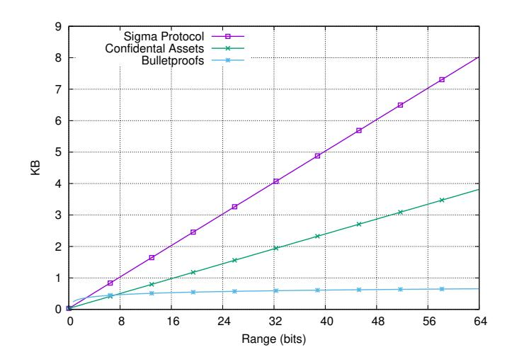
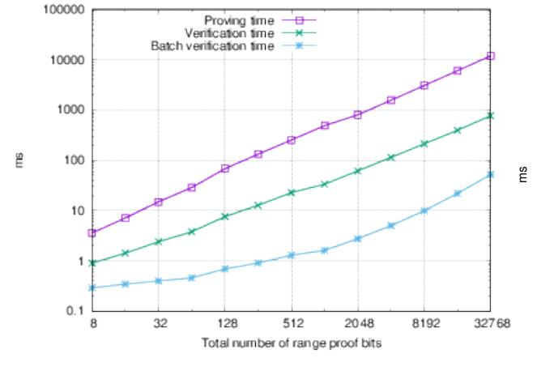
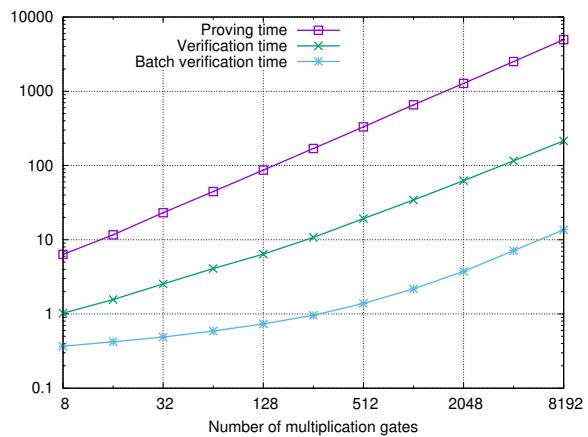

# Bulletproofs: Short Proofs for Confidential Transactions and More

Benedikt B¨unz<sup>∗</sup><sup>1</sup> , Jonathan Bootle†<sup>2</sup> , Dan Boneh‡<sup>1</sup> , Andrew Poelstra§<sup>3</sup> , Pieter Wuille¶<sup>3</sup> , and Greg Maxwell‖

> <sup>1</sup>Stanford University <sup>2</sup>University College London <sup>3</sup>Blockstream

> > Full Version∗∗

#### Abstract

We propose Bulletproofs, a new non-interactive zero-knowledge proof protocol with very short proofs and without a trusted setup; the proof size is only logarithmic in the witness size. Bulletproofs are especially well suited for efficient range proofs on committed values: they enable proving that a committed value is in a range using only 2 log<sup>2</sup> pnq ` 9 group and field elements, where n is the bit length of the range. Proof generation and verification times are linear in n.

Bulletproofs greatly improve on the linear (in n) sized range proofs in existing proposals for confidential transactions in Bitcoin and other cryptocurrencies. Moreover, Bulletproofs supports aggregation of range proofs, so that a party can prove that m commitments lie in a given range by providing only an additive Oplogpmqq group elements over the length of a single proof. To aggregate proofs from multiple parties, we enable the parties to generate a single proof without revealing their inputs to each other via a simple multi-party computation (MPC) protocol for constructing Bulletproofs. This MPC protocol uses either a constant number of rounds and linear communication, or a logarithmic number of rounds and logarithmic communication. We show that verification time, while asymptotically linear, is very efficient in practice. Moreover, the verification of multiple Bulletproofs can be batched for further speed-up. Concretely, the marginal time to verify an aggregation of 16 range proofs is about the same as the time to verify 16 ECDSA signatures.

Bulletproofs build on the techniques of Bootle et al. (EUROCRYPT 2016). Beyond range proofs, Bulletproofs provide short zero-knowledge proofs for general arithmetic circuits while only relying on the discrete logarithm assumption and without requiring a trusted setup. We discuss many applications that would benefit from Bulletproofs, primarily in the area of cryptocurrencies. The efficiency of Bulletproofs is particularly well suited for the distributed and trustless nature of blockchains.

<sup>∗</sup>[benedikt@cs.stanford.edu](mailto:benedikt@cs.stanford.edu)

<sup>†</sup> [jonathan.bootle.14@ucl.ac.uk](mailto:jonathan.bootle.14@ucl.ac.uk)

<sup>‡</sup>[dabo@cs.stanford.edu](mailto:dabo@cs.stanford.edu)

[apoelstra@blockstream.io](mailto:apoelstra@blockstream.io)

<sup>¶</sup>[pieter@blockstream.com](mailto:pieter@blockstream.com)

[greg@xiph.org](mailto:greg@xiph.org)

<sup>∗∗</sup>An extended abstract of this work appeared at IEEE S&P 2018 [\[BBB](#page-33-0)`18]

## 1 Introduction

Blockchain-based cryptocurrencies enable peer-to-peer electronic transfer of value by maintaining a global distributed but synchronized ledger, the blockchain. Any independent observer can verify both the current state of the blockchain as well as the validity of all transactions on the ledger. In Bitcoin, this innovation requires that all details of a transaction are public: the sender, the receiver, and the amount transferred. In general, we separate privacy for payments into two properties: (1) anonymity, hiding the identities of sender and receiver in a transaction and (2) confidentiality, hiding the amount transferred. While Bitcoin provides some weak anonymity through the unlinkability of Bitcoin addresses to real world identities, it lacks any confidentiality. This is a serious limitation for Bitcoin and could be prohibitive for many use cases. Would employees want to receive their salaries in bitcoin if it meant that their salaries were published on the public blockchain?

To address the confidentiality of transaction amounts, Maxwell [\[Max16\]](#page-37-0) introduced confidential transactions (CT), in which every transaction amount involved is hidden from public view using a commitment to the amount. This approach seems to prevent public validation of the blockchain; an observer can no longer check that the sum of transaction inputs is greater than the sum of transaction outputs, and that all transaction values are positive. This can be addressed by including in every transaction a zero-knowledge proof of validity of the confidential transaction.

Current proposals for CT zero-knowledge proofs [\[PBF](#page-37-1)`] have either been prohibitively large or required a trusted setup. Neither is desirable. While one could use succinct zero-knowledge proofs (SNARKs) [\[BSCG](#page-35-0)`13, [GGPR13\]](#page-35-1), they require a trusted setup, which means that everyone needs to trust that the setup was performed correctly. One could avoid trusted setup by using a STARK [\[BSBTHR18\]](#page-35-2), but the resulting range proofs while asymptotically efficient are practically larger than even the currently proposed solutions.

Short non-interactive zero-knowledge proofs without a trusted setup, as described in this paper, have many applications in the realm of cryptocurrencies. In any distributed system where proofs are transmitted over a network or stored for a long time, short proofs reduce overall cost.

## 1.1 Our Contributions

We present Bulletproofs, a new zero-knowledge argument of knowledge<sup>1</sup> system, to prove that a secret committed value lies in a given interval. Bulletproofs do not require a trusted setup. They rely only on the discrete logarithm assumption, and are made non-interactive using the Fiat-Shamir heuristic.

Bulletproofs builds on the techniques of Bootle et al. [\[BCC](#page-33-1)`16], which yield communicationefficient zero-knowledge proofs. We present a replacement for their inner-product argument that reduces overall communication by a factor of 3. We make Bulletproofs suitable for proving statements on committed values. Examples include a range proof, a verifiable shuffle, and other applications discussed below. We note that a range proof using the protocol of [\[BCC](#page-33-1)`16] would have required implementing the commitment opening algorithm as part of the verification circuit, which we are able to eliminate.

Distributed Bulletproofs generation. We show that Bulletproofs support a simple and efficient multi-party computation (MPC) protocol that allows multiple parties with secret committed values

<sup>1</sup>Proof systems with computational soundness like Bulletproofs are sometimes called argument systems. We will use the terms proof and argument interchangeably.

to jointly generate a single small range proof for all their values, without revealing their secret values to each other. One version of our MPC protocol is constant-round but with linear communication. Another variant requires only logarithmic communication, but uses a logarithmic number of rounds. When a confidential transaction has inputs from multiple parties (as in the case of CoinJoin), this MPC protocol can be used to aggregate all the proofs needed to construct the transaction into a single short proof.

Proofs for arithmetic circuits. While we focus on confidential transactions (CT), where our work translates to significant practical savings, we stress that the improvements are not limited to CT. We present Bulletproofs for general NP languages. The proof size is logarithmic in the number of multiplication gates in the arithmetic circuit for verifying a witness. The proofs are much shorter than [\[BCC](#page-33-1)`16] and allow inputs to be Pedersen commitments to elements of the witness.

Optimizations and evaluation. We provide a complete implementation of Bulletproofs that includes many further optimizations described in [Section 6.](#page-27-0) For example, we show how to batch the verification of multiple Bulletproofs so that the cost of verifying every additional proof is significantly reduced. We also provide efficiency comparisons with the range proofs currently used for confidential transactions [\[Max16,](#page-37-0) [Poe\]](#page-37-2) and with other proof systems. Our implementation includes a general tool for constructing Bulletproofs for any NP language. The tool reads in arithmetic circuits in the Pinocchio [\[PHGR13\]](#page-37-3) format which lets users use their toolchain. This toolchain includes a compiler from C to the circuit format. We expect this to be of great use to implementers who want to use Bulletproofs.

## <span id="page-2-0"></span>1.2 Applications

We first discuss several applications for Bulletproofs along with related work specific to these applications. Additional related work is discussed in [Section 1.3.](#page-6-0)

### 1.2.1 Confidential Transactions and Mimblewimble

Bitcoin and other similar cryptocurrencies use a transaction-output-based system where each transaction fully spends the outputs of previously unspent transactions. These unspent transaction outputs are called UTXOs. Bitcoin allows a single UTXO to be spent to many distinct outputs, each associated with a different address. To spend a UTXO a user must provide a signature, or more precisely a scriptSig, that enables the transaction SCRIPT to evaluate to true [\[BMC](#page-34-0)`15]. Apart from the validity of the scriptSig, miners verify that the transaction spends previously unspent outputs, and that the sum of the inputs is greater than the sum of the outputs.

Maxwell [\[Max16\]](#page-37-0) introduced the notion of a confidential transaction, where the input and output amounts in a transaction are hidden in Pedersen commitments [P`[91\]](#page-37-4). To enable public validation, the transaction contains a zero-knowledge proof that the sum of the committed inputs is greater than the sum of the committed outputs, and that all the outputs are positive, namely they lie in the interval r0, 2 n s, where 2<sup>n</sup> is much smaller than the group size. All current implementations of confidential transactions [\[Max16,](#page-37-0) [MP15,](#page-37-5) [PBF](#page-37-1)`, [NM](#page-37-6)`16] use range proofs over committed values, where the proof size is linear in n. These range proofs are the main contributor to the size of a confidential transaction. In current implementations [\[Max16\]](#page-37-0), a confidential transaction with only two outputs and 32 bits of precision is 5.4 KB bytes, of which 5 KB are allocated to the range proof. Even with recent optimizations the range proofs would still take up 3.8 KB.

We show in [Section 6](#page-27-0) that Bulletproofs greatly improve on this, even for a single range proof while simultaneously doubling the range proof precision at marginal additional cost (64 bytes). The logarithmic proof size additionally enables the prover to aggregate multiple range proofs, e.g. for transactions with multiple outputs, into a single short proof. With Bulletproofs, m range proofs are merely Oplogpmqq additional group elements over a single range proof. This is already useful for confidential transactions in their current form as most Bitcoin transactions have two or more outputs. It also presents an intriguing opportunity to aggregate multiple range proofs from different parties into one proof, as would be needed, for example, in a CoinJoin transaction [\[Max13\]](#page-37-7). In [Section 4.5,](#page-21-0) we present a simple and efficient MPC protocol that allows multiple users to generate a single transaction with a single aggregate range proof. The users do not have to reveal their secret transaction values to any of the other participants.

Confidential transaction implementations are available in side-chains [\[PBF](#page-37-1)`], private blockchains [\[And17\]](#page-33-2), and in the popular privacy-focused cryptocurrency Monero [\[NM](#page-37-6)`16]. All these implementations would benefit from Bulletproofs.

At the time of writing, Bitcoin has roughly 50 million UTXOs from 22 million transactions (see <statoshi.info>). Using a 52-bit representation of bitcoin that can cover all values from 1 satoshi up to 21 million bitcoins, this results in roughly 160GB of range proof data using the current systems. Using aggregated Bulletproofs, the range proofs for all UTXOs would take less than 17GB, about a factor 10 reduction in size.

Mimblewimble. Recently an improvement was proposed to confidential transactions, called Mimblewimble [\[Jed16,](#page-36-0)[Poe\]](#page-37-2), which provides further savings.

Jedusor [\[Jed16\]](#page-36-0) realized that a Pedersen commitment to 0 can be viewed as an ECDSA public key, and that for a valid confidential transaction the difference between outputs, inputs, and transaction fees must be 0. A prover constructing a confidential transaction can therefore sign the transaction with the difference of the outputs and inputs as the public key. This small change removes the need for a scriptSig which greatly simplifies the structure of confidential transactions. Poelstra [\[Poe\]](#page-37-2) further refined and improved Mimblewimble and showed that these improvements enable a greatly simplified blockchain in which all spent transactions can be pruned and new nodes can efficiently validate the entire blockchain without downloading any old and spent transactions. Along with further optimizations, this results in a highly compressed blockchain. It consists only of a small subset of the block-headers as well as the remaining unspent transaction outputs and the accompanying range proofs plus an un-prunable 32 bytes per transaction. Mimblewimble also allows transactions to be aggregated before sending them to the blockchain.

A Mimblewimble blockchain grows with the size of the UTXO set. Using Bulletproofs, it would only grow with the number of transactions that have unspent outputs, which is much smaller than the size of the UTXO set. Overall, Bulletproofs can not only act as a drop-in replacement for the range proofs in confidential transactions, but it can also help make Mimblewimble a practical scheme with a blockchain that is significantly smaller than the current Bitcoin blockchain.

## 1.2.2 Provisions

Dagher et al. [\[DBB](#page-35-3)`15] introduced the Provisions protocol which allows Bitcoin exchanges to prove that they are solvent without revealing any additional information. The protocol crucially relies on range proofs to prevent an exchange from inserting fake accounts with negative balances. These range proofs, which take up over 13GB, are the main contributors to the proof sizes of almost 18GB for a large exchange with 2 million customers. The proof size is in fact linear in the number of customers. Since in this protocol, one party (the exchange) has to construct many range proofs at once, the general Bulletproofs protocol from [Section 4.3](#page-20-0) is a natural replacement for the NIZK proof used in Provisions. With the proof size listed in [Section 6,](#page-27-0) we obtain that the range proofs would take up less than 2 KB with our protocol. Additionally, the other parts of the proof could be similarly compressed using the protocol from [Section 5.](#page-23-0) The proof would then be dominated by one commitment per customer, with size 62 MB. This is roughly 300 times smaller then the current implementation of Provisions.

#### 1.2.3 Verifiable shuffles

Consider two lists of committed values x1, . . . , x<sup>n</sup> and y1, . . . , yn. The goal is to prove that the second list is a permutation of the first. This problem is called a verifiable shuffle. It has many applications in voting [\[FS01,](#page-35-4)[Nef01\]](#page-37-8), mix-nets [\[Cha82\]](#page-35-5), and solvency proofs [\[DBB](#page-35-3)`15]. Neff [\[Nef01\]](#page-37-8) gave a practical implementation of a verifiable shuffle and later work improved on it [\[Gro03,](#page-36-1)[GI08a\]](#page-36-2). Currently the most efficient shuffle [\[BG12\]](#page-34-1) has size Op ? nq.

Bulletproofs can be used to create a verifiable shuffle of size Oplog nq. The two lists of commitments are given as inputs to the circuit protocol from [Section 5.](#page-23-0) The circuit can implement a shuffle by sorting the two lists and then checking that they are equal. A sorting circuit can be implemented using Opn ¨ logpnqq multiplications which means that the proof size will be only Oplogpnqq. This is much smaller than previously proposed protocols. Given the concrete efficiency of Bulletproofs, a verifiable shuffle using Bulletproofs would be very efficient in practice. Constructing the proof and verifying it takes linear time in n.

#### 1.2.4 NIZK Proofs for Smart Contracts

The Ethereum [\[Woo14\]](#page-38-0) system uses highly expressive smart contracts to enable complex transactions. Smart contracts, like any other blockchain transaction, are public and provide no inherent privacy. To bring privacy to smart contracts, non-interactive zero-knowledge (NIZK) proofs have been proposed as a tool to enable complex smart contracts that do not leak the user inputs [\[KMS](#page-36-3)`16, [MSH17,](#page-37-9) [CGGN17\]](#page-35-6). However, these protocols are limited as the NIZK proof itself is not suitable for verification by a smart contract. The reason is that communication over the blockchain with a smart contract is expensive, and the smart contract's own computational power is highly limited. SNARKs, which have succinct proofs and efficient verifiers, seem like a natural choice, but current practical SNARKs [\[BSCG](#page-35-0)`13] require a complex trusted setup. The resulting common reference strings (CRS) are long, specific to each application, and possess trapdoors. In Hawk [\[KMS](#page-36-3)`16], for instance, a different CRS is needed for each smart contract, and either a trusted party is needed to generate it, or an expensive multi-party computation is needed to distribute the trust among a few parties. On the other hand, for small applications like boardroom voting, one can use classical sigma protocols [\[MSH17\]](#page-37-9), but the proof-sizes and expensive verification costs are prohibitive for more complicated applications. Recently, Campanelli et al. [\[CGGN17\]](#page-35-6) showed how to securely perform zero-knowledge contingent payments (ZKCPs) in Bitcoin, while attacking and fixing a previously proposed protocol [\[Max\]](#page-37-10). ZKCPs enable the trustless, atomic and efficient exchange of a cryptocurrency vs. some digital good. While ZKCPs support a wide area of applications they fundamentally work for only a single designated verifier and do not allow for public verification. For some smart contracts that have more than two users, public verification is often crucial. In an auction, for example, all bidders need to be convinced that all bids are well formed.

Bulletproofs improves on this by enabling small proofs that do not require a trusted setup. The Bulletproofs verifier is not cheap, but there are multiple ways to work around this. First, a smart contract may act optimistically and only verify a proof if some party challenges its validity. Incentives can be used to ensure that rational parties never create an incorrect proof nor challenge a correct proof. This can be further improved by using an interactive referee delegation model [\[CRR11\]](#page-35-7), previously proposed for other blockchain applications [\[BGB17,](#page-34-2)[TR\]](#page-38-1). In this model, the prover provides a proof along with a succinct commitment to the verifier's execution trace. A challenger that disagrees with the computation also commits to his computation trace and the two parties engage in an interactive binary search to find the first point of divergence in the computation. The smart contract can then execute this single computation step and punish the party which provided a faulty execution trace. The intriguing property of this protocol is that even when a proof is challenged, the smart contract only needs to verify a single computation step, i.e. a single gate of the verification circuit. In combination with small Bulletproofs, this can enable more complex but privacy preserving smart contracts. Like in other applications, these NIZK proofs would benefit from the MPC protocol that we present in [Section 4.5](#page-21-0) to generate Bulletproofs distributively. Consider an auction smart contract where bidders in the first round submit commitments to bids and in the second round open them. A NIZK can be used to prove properties about the bids, e.g. they are in some range, without revealing them. Using Bulletproofs' MPC multiple bidders can combine their Bulletproofs into a single proof. Furthermore, the proof will hide which bidder submitted which bid.

## 1.2.5 Short Non-Interactive Proofs for Arithmetic Circuits without a Trusted Setup

Non-interactive zero-knowledge protocols for general statements are not possible without using a common reference string, which should be known by both the prover and the verifier. Many efficient non-interactive zero-knowledge proofs and arguments for arithmetic circuit satisfiability have been developed [\[Mic94,](#page-37-11)[KP95,](#page-36-4)[GS08,](#page-36-5)[GGPR13,](#page-35-1)[BSCG](#page-35-0)`13,[BSBTHR18\]](#page-35-2), and highly efficient protocols are known. However, aside from their performance, these protocols differ in the complexity of their common reference strings. Some, such as those in [\[BSCG](#page-35-0)`13], are highly structured, and sometimes feature a trapdoor, while some are simply chosen uniformly at random. Security proofs assume that the common reference string was honestly generated. In practice, the common reference string can be generated by a trusted third party, or using a secure multi-party computation protocol. The latter helps to alleviate concerns about embedded trapdoors, as with the trusted setup ceremony used to generate the public parameters for [\[BSCG](#page-35-8)`14].

Zero-knowledge SNARKs have been the subject of extensive research [\[Gro10,](#page-36-6)[BCCT12,](#page-33-3)[GGPR13,](#page-35-1) [BCCT13,](#page-33-4)[PHGR16,](#page-37-12)[BSCG](#page-35-0)`13,[Gro16\]](#page-36-7). They generate constant-sized proofs for any statement, and have extremely fast verification time. However, they have highly complex common reference strings which require lengthy and computationally intensive protocols [\[BGG17\]](#page-34-3) to generate distributively. They also rely on strong unfalsifiable assumptions such as the knowledge-of-exponent assumption.

A uniformly-random common reference string, on the other hand, can be derived from common random strings, like the digits of π or by assuming that hash functions behave like a random oracle. Examples of non-interactive protocols that do not require a trusted setup include [\[Mic94,](#page-37-11)[BCC](#page-33-1)`16, [BCG](#page-34-4)`17b, [BSBC](#page-34-5)`17, [BSBTHR18\]](#page-35-2).

Ben-Sasson et al. present a proof system [\[BCG](#page-34-6)`17a] and implementation [\[BSBC](#page-34-5)`17] called

Scalable Computational Integrity (SCI). While SCI has a simple setup, and relies only on collisionresistant hash functions, the system is not zero-knowledge and still experiences worse performance than [\[BSCG](#page-35-0)`13, [BCC](#page-33-1)`16]. The proof sizes are roughly 42 MB large in practice for a reasonable circuit. In subsequent work Ben-Sasson et al. presented STARKs [\[BSBTHR18\]](#page-35-2), which are zeroknowledge and more efficient than SCI. However even with these improvements the proof size is still over 200 KB (and grows logarithmically) at only 60-bit security for a circuit of size 217. A Bulletproof for such a circuit at twice the security would be only about 1 KB. Constructing STARKs is also costly in terms of memory requirements because of the large FFT that is required to make proving efficient.

Ames et al. [\[AHIV17\]](#page-33-5) presented a proof system with linear verification time but only square root proof size building on the MPC in the head technique. Wahby [\[WTs](#page-38-2)`] recently present a cryptographic zero-knowledge proof system which achieves square root verifier complexity and proof size based on the proofs for muggles [\[GKR08\]](#page-36-8) techniques in combination with a sub-linear polynomial commitment scheme.

## <span id="page-6-0"></span>1.3 Additional Related Work

Much of the research related to electronic payments that predates Bitcoin [\[Nak08\]](#page-37-13) focused on efficient anonymous and confidential payments [\[CHL05,](#page-35-9) [Cha82\]](#page-35-5) . With the advent of blockchainbased cryptocurrencies, the question of privacy and confidentiality in transactions has gained a new relevance. While the original Bitcoin paper [\[Nak08\]](#page-37-13) claimed that Bitcoin would provide anonymity through pseudonymous addresses early work on Bitcoin showed that the anonymity is limited [\[MPJ](#page-37-14)`13, [AKR](#page-33-6)`13]. Given these limitations, various methods have been proposed to help improve the privacy of Bitcoin transactions. CoinJoin [\[Max13\]](#page-37-7), proposed by Maxwell, allows users to hide information about the amounts of transactions by merging two or more transactions. This ensures that among the participants who join their transactions, it is impossible to tell which transaction inputs correspond to which transaction outputs. However, users do require some way of searching for other users, and furthermore, should be able to do so without relying on a trusted third party. CoinShuffle [\[RMSK14\]](#page-38-3) tried to fulfill this requirement by taking developing the ideas of CoinJoin and proposing a new Bitcoin mixing protocol which is completely decentralized. Monero [\[Mon\]](#page-37-15) is a cryptocurrency which employs cryptographic techniques to achieve strong privacy guarantees. These include stealth addresses, ring-signatures [\[vS13\]](#page-38-4), and ring confidential transactions [\[NM](#page-37-6)`16]. ZeroCash [\[BSCG](#page-35-8)`14] offers optimal privacy guarantees but comes at the cost of expensive transaction generation and the requirement of a trusted setup.

Range proofs. Range proofs are proofs that a secret value, which has been encrypted or committed to, lies in a certain interval. Range proofs do not leak any information about the secret value, other than the fact that they lie in the interval. Lipmaa [\[Lip03\]](#page-36-9) presents a range proof which uses integer commitments, and Lagrange's four-square theorem which states that every positive integer y can be expressed as a sum of four squares. Groth [\[Gro05\]](#page-36-10) notes that the argument can be optimized by considering 4y ` 1, since integers of this form only require three squares. The arguments require only a constant number of commitments. However, each commitment is large, as the security of the argument relies on the Strong RSA assumption. Additionally, a trusted setup is required to generate the RSA modulus or a prohibitively large modulus needs to be used [\[San99\]](#page-38-5). Camenisch et al. [\[CCs08\]](#page-35-10) use a different approach. The verifier provides signatures on a small set of digits. The prover commits to the digits of the secret value, and then proves in zero-knowledge that the value matches the digits, and that each commitment corresponds to one of the signatures. They show that their scheme can be instantiated securely using both RSA accumulators [BdM93] and the Boneh-Boyen signature scheme [BB04]. However, these range proofs require a trusted setup. Approaches based on the n-ary digits of the secret value are limited to proving that the secret value is in an interval of the form  $[0, n^k - 1]$ . One can produce range proofs for more general intervals by using homomorphic commitments to translate intervals, and by using a combination of two different range proofs to conduct range proofs for intervals of different widths. However, [CLas10] presented an alternative digital decomposition which enables an interval of general width to be handled using a single range proof.

## 2 Preliminaries

Before we present Bulletproofs, we first review some of the underlying tools. In what follows, a PPT adversary  $\mathcal{A}$  is a probabilistic interactive Turing Machine that runs in polynomial time in the security parameter  $\lambda$ . We will drop the security parameter  $\lambda$  from the notation when it is implicit.

#### 2.1 Assumptions

**Definition 1** (Discrete Log Relation). For all PPT adversaries  $\mathcal{A}$  and for all  $n \ge 2$  there exists a negligible function  $\mu(\lambda)$  such that

$$P\left[\begin{array}{c} \mathbb{G} = \operatorname{Setup}(1^{\lambda}), \ g_1, \dots, g_n \xleftarrow{\$} \mathbb{G}; \\ a_1, \dots, a_n \in \mathbb{Z}_p \leftarrow \mathcal{A}(G, g_1, \dots, g_n) \end{array} : \exists a_i \neq 0 \land \prod_{i=1}^n g_i^{a_i} = 1 \right] \leqslant \mu(\lambda)$$

We say  $\prod_{i=1}^n g_i^{a_i} = 1$  is a non trivial discrete log relation between  $g_1, \ldots, g_n$ . The Discrete Log Relation assumption states that an adversary can't find a non-trivial relation between randomly chosen group elements. For  $n \ge 1$  this assumption is equivalent to the discrete-log assumption.

#### 2.2 Commitments

**Definition 2** (Commitment). A non-interactive commitment scheme consists of a pair of probabilistic polynomial time algorithms (Setup, Com). The setup algorithm  $pp \leftarrow Setup(1^{\lambda})$  generates public parameters pp for the scheme, for security parameter  $\lambda$ . The commitment algorithm  $Com_{pp}$  defines a function  $M_{pp} \times R_{pp} \to C_{pp}$  for message space  $M_{pp}$ , randomness space  $R_{pp}$  and commitment space  $C_{pp}$  determined by pp. For a message  $x \in M_{pp}$ , the algorithm draws  $r \xleftarrow{\$} R_{pp}$  uniformly at random, and computes commitment  $\mathbf{com} = Com_{pp}(x; r)$ .

For ease of notation we write  $Com = Com_{pp}$ .

**Definition 3** (Homomorphic Commitments). A homomorphic commitment scheme is a non-interactive commitment scheme such that  $\mathsf{M}_{\mathrm{pp}}, \mathsf{R}_{\mathrm{pp}}$  and  $\mathsf{C}_{\mathrm{pp}}$  are all abelian groups, and for all  $x_1, x_2 \in \mathsf{M}_{\mathrm{pp}}, \, r_1, r_2 \in \mathsf{R}_{\mathrm{pp}}$ , we have

$$Com(x_1; r_1) + Com(x_2; r_2) = Com(x_1 + x_2; r_1 + r_2)$$

**Definition 4** (Hiding Commitment). A commitment scheme is said to be hiding if for all PPT adversaries A there exists a negligible function  $\mu(\lambda)$  such that.

$$\left| P \left[ b = b' \middle| \begin{array}{l} \operatorname{pp} \leftarrow \operatorname{Setup}(1^{\lambda}); \\ (x_0, x_1) \in \mathsf{M}^2_{\operatorname{pp}} \leftarrow \mathcal{A}(\operatorname{pp}), b \xleftarrow{\$} \{0, 1\}, r \xleftarrow{\$} \mathsf{R}_{\operatorname{pp}}, \\ \operatorname{\mathbf{com}} = \operatorname{Com}(x_b; r), b' \leftarrow \mathcal{A}(\operatorname{pp}, \operatorname{\mathbf{com}}) \end{array} \right] - \frac{1}{2} \right| \leqslant \mu(\lambda)$$

where the probability is over b, r, Setup and A. If  $\mu(\lambda) = 0$  then we say the scheme is perfectly hiding.

**Definition 5** (Binding Commitment). A commitment scheme is said to be binding if for all PPT adversaries A there exists a negligible function  $\mu$  such that.

$$P\left[\operatorname{Com}(x_0; r_0) = \operatorname{Com}(x_1; r_1) \land x_0 \neq x_1 \middle| \begin{array}{l} \operatorname{pp} \leftarrow \operatorname{Setup}(1^{\lambda}), \\ x_0, x_1, r_0, r_1 \leftarrow \mathcal{A}(\operatorname{pp}) \end{array} \right] \leqslant \mu(\lambda)$$

where the probability is over Setup and A. If  $\mu(\lambda) = 0$  then we say the scheme is perfectly binding.

In what follows, the order p of the groups used is implicitly dependent on the security parameter  $\lambda$  to ensure that discrete log in these groups is intractable for PPT adversaries.

**Definition 6** (Pedersen Commitment).  $M_{pp}$ ,  $R_{pp} = \mathbb{Z}_p$ ,  $C_{pp} = \mathbb{G}$  of order p.

Setup:  $g, h \stackrel{\$}{\leftarrow} \mathbb{G}$  $Com(x; r) = (g^x h^r)$ 

**Definition 7** (Pedersen Vector Commitment).  $\mathsf{M}_{\mathrm{pp}} = \mathbb{Z}_p^n$ ,  $\mathsf{R}_{\mathrm{pp}} = \mathbb{Z}_p$ ,  $\mathsf{C}_{\mathrm{pp}} = \mathbb{G}$  with  $\mathbb{G}$  of order p

Setup: 
$$\mathbf{g} = (g_1, \dots, g_n), h \stackrel{\$}{\leftarrow} \mathbb{G}$$
  
 $\operatorname{Com}(\mathbf{x} = (x_1, \dots, x_n); r) = h^r \mathbf{g}^{\mathbf{x}} = h^r \prod_i g_i^{x_i} \in \mathbb{G}$ 

The Pedersen vector commitment is perfectly hiding and computationally binding under the discrete logarithm assumption. We will often set r = 0, in which case the commitment is binding but not hiding.

#### 2.3 Zero-Knowledge Arguments of Knowledge

Bulletproofs are zero-knowledge arguments of knowledge. A zero-knowledge proof of knowledge is a protocol in which a prover can convince a verifier that some statement holds without revealing any information about why it holds. A prover can for example convince a verifier that a confidential transaction is valid without revealing why that is the case, i.e. without leaking the transacted values. An argument is a proof which holds only if the prover is computationally bounded and certain computational hardness assumptions hold. We now give formal definitions.

We will consider arguments consisting of three interactive algorithms (Setup,  $\mathcal{P}, \mathcal{V}$ ), all running in probabilistic polynomial time. These are the common reference string generator Setup, the prover  $\mathcal{P}$ , and the verifier  $\mathcal{V}$ . On input  $1^{\lambda}$ , algorithm Setup produces a common reference string  $\sigma$ . The transcript produced by  $\mathcal{P}$  and  $\mathcal{V}$  when interacting on inputs s and t is denoted by  $tr \leftarrow \langle \mathcal{P}(s), \mathcal{V}(t) \rangle$ . We write  $\langle \mathcal{P}(s), \mathcal{V}(t) \rangle = b$  depending on whether the verifier rejects, b = 0, or accepts, b = 1.

Let  $\mathcal{R} \subset \{0,1\}^* \times \{0,1\}^* \times \{0,1\}^*$  be a polynomial-time-decidable ternary relation. Given  $\sigma$ , we call w a witness for a statement u if  $(\sigma, u, w) \in \mathcal{R}$ , and define the CRS-dependent language

$$\mathcal{L}_{\sigma} = \{ x \mid \exists w : (\sigma, x, w) \in \mathcal{R} \}$$

as the set of statements x that have a witness w in the relation  $\mathcal{R}$ .

**Definition 8** (Argument of Knowledge). The triple (Setup,  $\mathcal{P}, \mathcal{V}$ ) is called an argument of knowledge for relation  $\mathcal{R}$  if it satisfies the following two definitions.

**Definition 9** (Perfect completeness). (Setup,  $\mathcal{P}, \mathcal{V}$ ) has perfect completeness if for all non-uniform polynomial time adversaries  $\mathcal{A}$ 

$$P\left[\begin{array}{c} (\sigma, u, w) \notin \mathcal{R} \ or \langle \mathcal{P}(\sigma, u, w), \mathcal{V}(\sigma, u) \rangle = 1 \ \middle| \begin{array}{c} \sigma \leftarrow \operatorname{Setup}(1^{\lambda}) \\ (u, w) \leftarrow \mathcal{A}(\sigma) \end{array}\right] = 1$$

<span id="page-9-0"></span>**Definition 10** (Computational Witness-Extended Emulation). (Setup,  $\mathcal{P}, \mathcal{V}$ ) has witness-extended emulation if for all deterministic polynomial time  $\mathcal{P}^*$  there exists an expected polynomial time emulator  $\mathcal{E}$  such that for all pairs of interactive adversaries  $\mathcal{A}_1, \mathcal{A}_2$  there exists a negligible function  $\mu(\lambda)$  such that

$$\left| \begin{array}{l} P \left[ \mathcal{A}_{1}(tr) = 1 \middle| \begin{array}{l} \sigma \leftarrow \operatorname{Setup}(1^{\lambda}), (u, s) \leftarrow \mathcal{A}_{2}(\sigma), \\ tr \leftarrow \langle \mathcal{P}^{*}(\sigma, u, s), \mathcal{V}(\sigma, u) \rangle \end{array} \right] - \\ P \left[ \begin{array}{l} \mathcal{A}_{1}(tr) = 1 \\ \wedge (tr \text{ is accepting} \implies (\sigma, u, w) \in \mathcal{R}) \\ \end{array} \middle| \begin{array}{l} \sigma \leftarrow \operatorname{Setup}(1^{\lambda}), \\ (u, s) \leftarrow \mathcal{A}_{2}(\sigma), \\ (tr, w) \leftarrow \mathcal{E}^{\mathcal{O}}(\sigma, u) \end{array} \right] \right| \leq \mu(\lambda)$$

where the oracle is given by  $\mathcal{O} = \langle \mathcal{P}^*(\sigma, u, s), \mathcal{V}(\sigma, u) \rangle$ , and permits rewinding to a specific point and resuming with fresh randomness for the verifier from this point onwards. We can also define computational witness-extended emulation by restricting to non-uniform polynomial time adversaries  $\mathcal{A}_1$  and  $\mathcal{A}_2$ .

We use witness-extended emulation to define knowledge-soundness as used for example in [BCC<sup>+</sup>16] and defined in [GI08b, Lin03]. Informally, whenever an adversary produces an argument which satisfies the verifier with some probability, then there exists an emulator producing an identically distributed argument with the same probability, but also a witness. The value s can be considered to be the internal state of  $\mathcal{P}^*$ , including randomness. The emulator is permitted to rewind the interaction between the prover and verifier to any move, and resume with the same internal state for the prover, but with fresh randomness for the verifier. Whenever  $\mathcal{P}^*$  makes a convincing argument when in state s,  $\mathcal{E}$  can extract a witness, and therefore, we have an argument of knowledge of w such that  $(\sigma, u, w) \in \mathcal{R}$ .

**Definition 11** (Public Coin). An argument of knowledge (Setup,  $\mathcal{P}, \mathcal{V}$ ) is called public coin if all messages sent from the verifier to the prover are chosen uniformly at random and independently of the prover's messages, i.e., the challenges correspond to the verifier's randomness  $\rho$ .

An argument of knowledge is zero knowledge if it does not leak information about w apart from what can be deduced from the fact that  $(\sigma, x, w) \in \mathcal{R}$ . We will present arguments of knowledge that have special honest-verifier zero-knowledge. This means that given the verifier's challenge values, it is possible to efficiently simulate the entire argument without knowing the witness.

**Definition 12** (Perfect Special Honest-Verifier Zero-Knowledge). A public coin argument of knowledge (Setup,  $\mathcal{P}, \mathcal{V}$ ) is a perfect special honest verifier zero knowledge (SHVZK) argument of knowledge for  $\mathcal{R}$  if there exists a probabilistic polynomial time simulator  $\mathcal{S}$  such that for all pairs of

interactive adversaries  $A_1, A_2$ 

$$\Pr\left[\begin{array}{c} (\sigma, u, w) \in \mathcal{R} \text{ and } \mathcal{A}_1(tr) = 1 \mid \begin{array}{c} \sigma \leftarrow \operatorname{Setup}(1^{\lambda}), (u, w, \rho) \leftarrow \mathcal{A}_2(\sigma), \\ tr \leftarrow \langle \mathcal{P}(\sigma, u, w), \mathcal{V}(\sigma, u; \rho) \rangle \end{array}\right]$$

$$= \Pr \left[ (\sigma, u, w) \in \mathcal{R} \text{ and } \mathcal{A}_1(tr) = 1 \mid \begin{array}{l} \sigma \leftarrow \operatorname{Setup}(1^{\lambda}), (u, w, \rho) \leftarrow \mathcal{A}_2(\sigma), \\ tr \leftarrow \mathcal{S}(u, \rho) \end{array} \right]$$

where  $\rho$  is the public coin randomness used by the verifier.

In this definition the adversary chooses a distribution over statements and witnesses but is still not able to distinguish between the simulated and the honestly generated transcripts for valid statements and witnesses.

We now define range proofs, which are proofs that the prover knows an opening to a commitment, such that the committed value is in a certain range. Range proofs can be used to show that an integer commitment is to a positive number or that two homomorphic commitments to elements in a field of prime order will not overflow modulo the prime when they are added together.

<span id="page-10-0"></span>**Definition 13** (Zero-Knowledge Range Proof). Given a commitment scheme (Setup, Com) over a message space  $M_{pp}$  which is a set with a total ordering, a Zero-Knowledge Range Proof is a SHVZK argument of knowledge for the relation  $\mathcal{R}_{\mathsf{Range}}$ :

$$\mathcal{R}_{\mathsf{Range}} : (\mathsf{pp}, (\mathbf{com}, l, r), (x, \rho)) \in \mathcal{R}_{\mathsf{Range}} \leftrightarrow \mathbf{com} = \mathsf{Com}(x; \rho) \land l \leqslant x < r$$

#### 2.4 Notation

Let  $\mathbb{G}$  denote a cyclic group of prime order p, and let  $\mathbb{Z}_p$  denote the ring of integers modulo p. Let  $\mathbb{G}^n$  and  $\mathbb{Z}_p^n$  be vector spaces of dimension n over  $\mathbb{G}$  and  $\mathbb{Z}_p$  respectively. Let  $\mathbb{Z}_p^{\star}$  denote  $\mathbb{Z}_p \setminus \{0\}$ . Generators of  $\mathbb{G}$  are denoted by  $g, h, v, u \in \mathbb{G}$ . Group elements which represent commitments are capitalized and blinding factors are denoted by Greek letters, i.e.  $C = g^a h^\alpha \in \mathbb{G}$  is a Pedersen commitment to a. If not otherwise clear from context  $x, y, z \in \mathbb{Z}_p^{\star}$  are uniformly distributed challenges.  $x \stackrel{\$}{\leftarrow} \mathbb{Z}_p^{\star}$  denotes the uniform sampling of an element from  $\mathbb{Z}_p^{\star}$ . Throughout the paper, we will also be using vector notations defined as follows. Bold font denotes vectors, i.e.  $\mathbf{a} \in \mathbb{F}^n$  is a vector with elements  $a_1, \ldots, a_n \in \mathbb{F}$ . Capitalized bold font denotes matrices, i.e.  $\mathbf{A} \in \mathbb{F}^{n \times m}$  is a matrix with n rows and m columns such that  $a_{i,j}$  is the element of  $\mathbf{A}$  in the ith row and jth column. For a scalar  $c \in \mathbb{Z}_p$  and a vector  $\mathbf{a} \in \mathbb{Z}_p^n$ , we denote by  $\mathbf{b} = c \cdot \mathbf{a} \in \mathbb{Z}_p^n$  the vector where  $b_i = c \cdot a_i$ . Furthermore, let  $\langle \mathbf{a}, \mathbf{b} \rangle = \sum_{i=1}^n a_i \cdot b_i$  denotes the inner product between two vectors  $\mathbf{a}, \mathbf{b} \in \mathbb{F}^n$  and  $\mathbf{a} \circ \mathbf{b} = (a_1 \cdot b_1, \ldots, a_n \cdot b_n) \in \mathbb{F}^n$  the Hadamard product or entry wise multiplication of two vectors.

We also define vector polynomials  $p(X) = \sum_{i=0}^{d} \mathbf{p_i} \cdot X^i \in \mathbb{Z}_p^n[X]$  where each coefficient  $\mathbf{p_i}$  is a vector in  $\mathbb{Z}_p^n$ . The inner product between two vector polynomials l(X), r(X) is defined as

<span id="page-10-1"></span>
$$\langle l(X), r(X) \rangle = \sum_{i=0}^{d} \sum_{j=0}^{i} \langle \mathbf{l_i}, \mathbf{r_j} \rangle \cdot X^{i+j} \in \mathbb{Z}_p[X]$$
 (1)

Let  $t(X) = \langle \mathbf{l}(X), \mathbf{r}(X) \rangle$ , then the inner product is defined such that  $t(x) = \langle l(x), r(x) \rangle$  holds for all  $x \in \mathbb{Z}_p$ , i.e. evaluating the polynomials at x and then taking the inner product is the same as evaluating the inner product polynomial at x.

For a vector  $\mathbf{g} = (g_1, \dots, g_n) \in \mathbb{G}^n$  and  $\mathbf{a} \in \mathbb{Z}_p^n$  we write  $C = \mathbf{g}^{\mathbf{a}} = \prod_{i=1}^n g_i^{a_i} \in \mathbb{G}$ . This quantity is a binding (but not hiding) commitment to the vector  $\mathbf{a} \in \mathbb{Z}_p^n$ . Given such a commitment C and a vector  $\mathbf{b} \in \mathbb{Z}_p^n$  with non-zero entries, we can treat C as a new commitment to  $\mathbf{a} \circ \mathbf{b}$ . To so do, define  $g_i' = g_i^{(b_i^{-1})}$  such that  $C = \prod_{i=1}^n (g_i')^{a_i \cdot b_i}$ . The binding property of this new commitment is inherited from the old commitment.

Let  $\mathbf{a} \parallel \mathbf{b}$  denote the concatenation of two vectors: if  $\mathbf{a} \in \mathbb{Z}_p^n$  and  $\mathbf{b} \in \mathbb{Z}_p^m$  then  $\mathbf{a} \parallel \mathbf{b} \in \mathbb{Z}_p^{n+m}$ . For  $0 \le \ell \le n$ , we use Python notation to denote slices of vectors:

$$\mathbf{a}_{[:\ell]} = (a_1, \dots, a_\ell) \in \mathbb{F}^\ell, \qquad \mathbf{a}_{[\ell:]} = (a_{\ell+1}, \dots, a_n) \in \mathbb{F}^{n-\ell}.$$

For  $k \in \mathbb{Z}_p^{\star}$  we use  $\mathbf{k}^n$  to denote the vector containing the first n powers of k, i.e.

$$\mathbf{k}^{n} = (1, k, k^{2}, \dots, k^{n-1}) \in (\mathbb{Z}_{p}^{\star})^{n}.$$

For example,  $\mathbf{2}^n = (1, 2, 4, \dots, 2^{n-1})$ . Equivalently  $\mathbf{k}^{-n} = (\mathbf{k}^{-1})^n = (1, k^{-1}, \dots, k^{-n+1})$ .

Finally, we write {(Public Input; Witness) : Relation} to denote the relation Relation using the specified Public Input and Witness.

## <span id="page-11-1"></span>3 Improved Inner-Product Argument

Bootle et al. [BCC<sup>+</sup>16] introduced a communication efficient inner-product argument and show how it can be leveraged to construct zero-knowledge proofs for arithmetic circuit satisfiability with low communication complexity. The argument is an argument of knowledge that the prover knows the openings of two binding Pedersen vector commitments that satisfy a given inner product relation.

We reduce the communication complexity of the argument from  $6 \log_2(n)$  in [BCC<sup>+</sup>16] to only  $2 \log_2(n)$ , where n is the dimension of the two vectors. We achieve this improvement by modifying the relation being proved. Our argument is sound, but is not zero-knowledge. We then show that this protocol gives a public-coin, communication efficient, zero-knowledge range proof on a set of committed values, and a zero-knowledge proof system for arbitrary arithmetic circuits (Sections 4 and 5). By applying the Fiat-Shamir heuristic we obtain short non-interactive proofs (Section 4.4).

**Overview.** The inputs to the inner-product argument are independent generators  $\mathbf{g}, \mathbf{h} \in \mathbb{G}^n$ , a scalar  $c \in \mathbb{Z}_p$ , and  $P \in \mathbb{G}$ . The argument lets the prover convince a verifier that the prover knows two vectors  $\mathbf{a}, \mathbf{b} \in \mathbb{Z}_p^n$  such that

$$P = \mathbf{g^a h^b}$$
 and  $c = \langle \mathbf{a}, \mathbf{b} \rangle$ .

We refer to P as a binding vector commitment to  $\mathbf{a}, \mathbf{b}$ . Throughout the section we assume that the dimension n is a power of 2. If need be, one can easily pad the inputs to ensure that this holds.

More precisely, the inner product argument is an efficient proof system for the following relation:

<span id="page-11-0"></span>
$$\{(\mathbf{g}, \mathbf{h} \in \mathbb{G}^n, P \in \mathbb{G}, c \in \mathbb{Z}_p ; \mathbf{a}, \mathbf{b} \in \mathbb{Z}_p^n) : P = \mathbf{g}^{\mathbf{a}} \mathbf{h}^{\mathbf{b}} \wedge c = \langle \mathbf{a}, \mathbf{b} \rangle \}.$$
 (2)

The simplest proof system for (2) is one where the prover sends the vectors  $\mathbf{a}, \mathbf{b} \in \mathbb{Z}_p^n$  to the verifier. The verifier accepts if these vectors are a valid witness for (2). This is clearly sound, however, it requires sending 2n elements to the verifier. Our goal is to send only  $2\log_2(n)$  elements.

We show how to do this when the inner product  $c = \langle \mathbf{a}, \mathbf{b} \rangle$  is given as part of the vector commitment P. That is, for a given  $P \in \mathbb{G}$ , the prover proves that it has vectors  $\mathbf{a}, \mathbf{b} \in \mathbb{Z}_p^n$  for which  $P = \mathbf{g}^{\mathbf{a}} \mathbf{h}^{\mathbf{b}} \cdot u^{\langle \mathbf{a}, \mathbf{b} \rangle}$ . More precisely, we design a proof system for the relation:

<span id="page-12-0"></span>
$$\{(\mathbf{g}, \mathbf{h} \in \mathbb{G}^n, \ u, P \in \mathbb{G} \ ; \ \mathbf{a}, \mathbf{b} \in \mathbb{Z}_p^n \ ) : \ P = \mathbf{g}^{\mathbf{a}} \mathbf{h}^{\mathbf{b}} \cdot u^{\langle \mathbf{a}, \mathbf{b} \rangle} \}.$$
(3)

We show in Protocol 1 below that a proof system for (3) gives a proof system for (2) with the same complexity. Hence, it suffices to give a proof system for (3).

To give some intuition for how the proof system for the relation (3) works let us define a hash function  $H: \mathbb{Z}_p^{2n+1} \to \mathbb{G}$  as follows. First, set n' = n/2 and fix generators  $\mathbf{g}, \mathbf{h} \in \mathbb{G}^n, u \in \mathbb{G}$ . Then the hash function H takes as input  $\mathbf{a}, \mathbf{a}', \mathbf{b}, \mathbf{b}' \in \mathbb{Z}_p^{n'}$  and  $c \in \mathbb{Z}_p$ , and outputs

$$H(\mathbf{a}, \mathbf{a}', \mathbf{b}, \mathbf{b}', c) = \mathbf{g}_{[:n']}^{\mathbf{a}} \cdot \mathbf{g}_{[n':]}^{\mathbf{a}'} \cdot \mathbf{h}_{[:n']}^{\mathbf{b}} \cdot \mathbf{h}_{[n':]}^{\mathbf{b}'} \cdot u^{c} \in \mathbb{G}.$$

Now, using the setup in (3), we can write P as  $P = H(\mathbf{a}_{[:n']}, \mathbf{a}_{[n':]}, \mathbf{b}_{[:n']}, \mathbf{b}_{[n':]}, \langle \mathbf{a}, \mathbf{b} \rangle)$ . Note that H is additively homomorphic in its inputs, i.e.

$$H(\mathbf{a}_1, \mathbf{a}'_1, \mathbf{b}_1, \mathbf{b}'_1, c_1) \cdot H(\mathbf{a}_2, \mathbf{a}'_2, \mathbf{b}_2, \mathbf{b}'_2, c_2) = H(\mathbf{a}_1 + \mathbf{a}_2, \mathbf{a}'_1 + \mathbf{a}'_2, \mathbf{b}_1 + \mathbf{b}_2, \mathbf{b}'_1 + \mathbf{b}'_2, c_1 + c_2).$$

Consider the following protocol for the relation (3), where  $P \in \mathbb{G}$  is given as input:

• The prover computes  $L, R \in \mathbb{G}$  as follows:

$$\begin{split} L &= H \big( \quad \mathbf{0}^{n'}, \quad \mathbf{a}_{[:n']}, \quad \mathbf{b}_{[n':]}, \quad \mathbf{0}^{n'}, \quad \left\langle \mathbf{a}_{[:n']}, \mathbf{b}_{[n':]} \right\rangle \ \big) \\ R &= H \big( \quad \mathbf{a}_{[n':]}, \quad \mathbf{0}^{n'}, \quad \mathbf{0}^{n'}, \quad \mathbf{b}_{[:n']}, \quad \left\langle \mathbf{a}_{[n':]}, \mathbf{b}_{[:n']} \right\rangle \ \big) \\ \text{and recall that} \quad P &= H \big( \quad \mathbf{a}_{[:n']}, \quad \mathbf{a}_{[n':]}, \quad \mathbf{b}_{[:n']}, \quad \mathbf{b}_{[n':]}, \quad \left\langle \mathbf{a}, \mathbf{b} \right\rangle \quad \big). \end{split}$$

It sends  $L, R \in \mathbb{G}$  to the verifier.

- The verifier chooses a random  $x \stackrel{\$}{\leftarrow} \mathbb{Z}_p$  and sends x to the prover.
- The prover computes  $\mathbf{a}' = x\mathbf{a}_{[:n']} + x^{-1}\mathbf{a}_{[n':]} \in \mathbb{Z}_p^{n'}$  and  $\mathbf{b}' = x^{-1}\mathbf{b}_{[:n']} + x\mathbf{b}_{[n':]} \in \mathbb{Z}_p^{n'}$  and sends  $\mathbf{a}', \mathbf{b}' \in \mathbb{Z}_p^{n'}$  to the verifier.
- Given  $(L, R, \mathbf{a}', \mathbf{b}')$ , the verifier computes  $P' = L^{(x^2)} \cdot P \cdot R^{(x^{-2})}$  and outputs "accept" if

<span id="page-12-1"></span>
$$P' = H\left(x^{-1}\mathbf{a}', x\mathbf{a}', x\mathbf{b}', x^{-1}\mathbf{b}', \langle \mathbf{a}', \mathbf{b}' \rangle\right). \tag{4}$$

It is easy to verify that a proof from an honest prover will always be accepted. Indeed, the left hand side of (4) is

$$L^{x^2} \cdot P \cdot R^{x^{-2}} = H\left(\mathbf{a}_{[:n']} + x^{-2}\mathbf{a}_{[n':]}, \ x^2\mathbf{a}_{[:n']} + \mathbf{a}_{[n':]}, \ x^2\mathbf{b}_{[n':]} + \mathbf{b}_{[:n']}, \ \mathbf{b}_{[n':]} + x^{-2}\mathbf{b}_{[:n']}, \ \langle \mathbf{a}', \mathbf{b}' \rangle\right)$$

which is the same as the right hand side of (4).

In this proof system, the proof sent from the prover is the four tuple  $(L, R, \mathbf{a}', \mathbf{b}')$  and contains only n+2 elements. This is about half the length of the trivial proof where the prover sends the complete  $\mathbf{a}, \mathbf{b} \in \mathbb{Z}_p^n$  to the verifier.

To see why this protocol is a proof system for (3) we show how to extract a valid witness  $\mathbf{a}, \mathbf{b} \in \mathbb{Z}_p^n$  from a successful prover. After the prover sends L, R we rewind the prover three times to obtain three tuples  $(x_i, \mathbf{a}'_i, \mathbf{b}'_i)$  for  $i = 1, \ldots, 3$ , where each tuple satisfies (4), namely

<span id="page-13-1"></span>
$$L^{(x_i^2)} \cdot P \cdot R^{(x_i^{-2})} = H(x_i^{-1} \mathbf{a}'_i, \ x_i \mathbf{a}'_i, \ x_i \mathbf{b}'_i, \ x_i^{-1} \mathbf{b}'_i, \ \langle \mathbf{a}'_i, \mathbf{b}'_i \rangle).$$
 (5)

Assuming  $x_i \neq \pm x_j$  for  $1 \leq i < j \leq 3$ , we can find  $\nu_1, \nu_2, \nu_3 \in \mathbb{Z}_p$  such that

$$\sum_{i=1}^{3} x_i^2 \nu_i = 0 \quad \text{and} \quad \sum_{i=1}^{3} \nu_i = 1 \quad \text{and} \quad \sum_{i=1}^{3} x_i^{-2} \nu_i = 0.$$

Then setting

$$\mathbf{a} = \sum_{i=1}^{3} (\nu_i \cdot x_i^{-1} \mathbf{a}'_i, \quad \nu_i \cdot x_i \mathbf{a}'_i) \in \mathbb{Z}_p^n \quad \text{and} \quad \mathbf{b} = \sum_{i=1}^{3} (\nu_i \cdot x_i \mathbf{b}'_i, \quad \nu_i \cdot x_i^{-1} \mathbf{b}'_i) \in \mathbb{Z}_p^n$$

we obtain that  $P = H\left(\mathbf{a}_{[:n']}, \mathbf{a}_{[n':]}, \mathbf{b}_{[:n']}, \mathbf{b}_{[n':]}, c\right)$  where  $c = \sum_{i=1}^{3} \nu_{i} \cdot \langle \mathbf{a}'_{i}, \mathbf{b}'_{i} \rangle$ . We will show in the proof of Theorem 1 below that with one additional rewinding, to obtain a fourth relation satisfying (5), we must have  $c = \langle \mathbf{a}, \mathbf{b} \rangle$  with high probability. Hence, the extracted  $\mathbf{a}, \mathbf{b}$  are a valid witness for the relation (3), as required.

Shrinking the proof by recursion. Observe that the test in (4) is equivalent to testing that

$$P' = \left(\mathbf{g}_{[:n']}^{x^{-1}} \circ \mathbf{g}_{[n':]}^{x}\right)^{\mathbf{a}'} \cdot \left(\mathbf{h}_{[:n']}^{x} \circ \mathbf{h}_{[n':]}^{x^{-1}}\right)^{\mathbf{b}'} \cdot u^{\langle \mathbf{a}', \mathbf{b}' \rangle}.$$

Hence, instead of the prover sending the vectors  $\mathbf{a}', \mathbf{b}'$  to the verifier, they can recursively engage in an inner-product argument for P' with respect to generators  $(\mathbf{g}_{[:n']}^{x^{-1}} \circ \mathbf{g}_{[n':]}^x, \mathbf{h}_{[:n']}^x \circ \mathbf{h}_{[n':]}^{x^{-1}}, u)$ . The dimension of this problem is only n' = n/2.

The resulting  $\log_2 n$  depth recursive protocol is shown in Protocol 2. This  $\log_2 n$  round protocol is public coin and can be made non-interactive using the Fiat-Shamir heuristic. The total communication of Protocol 2 is only  $2\lceil \log_2(n) \rceil$  elements in  $\mathbb{G}$  plus 2 elements in  $\mathbb{Z}_p$ . Specifically, the prover sends the following terms:

$$(L_1, R_1), \ldots, (L_{\log_2 n}, R_{\log_2 n}), a, b$$

where  $a, b \in \mathbb{Z}_p$  are sent at the tail of the recursion. The prover's work is dominated by 8n group exponentiations and the verifier's work by 4n exponentiations. In Section 3.1 we present a more efficient verifier that performs only 1 multi-exponentiation of size  $2n + 2\log(n)$ . In Section 6 we present further optimizations.

**Proving security.** The inner product protocol for the relation (2) is presented in Protocol 1. This protocol uses internally a fixed group element  $u \in \mathbb{G}$  for which there is no known discrete-log relation among  $\mathbf{g}, \mathbf{h}, u$ . The heart of Protocol 1 is Protocol 2 which is a proof system for the relation (3). In Protocol 1 the element u is raised to a verifier chosen power x to ensure that the extracted vectors  $\mathbf{a}, \mathbf{b}$  from Protocol 2 satisfy  $\langle \mathbf{a}, \mathbf{b} \rangle = c$ .

<span id="page-13-0"></span>The following theorem shows that Protocol 1 is a proof system for (2).

<span id="page-14-0"></span>
$$\mathcal{P}_{\mathsf{IP}}$$
's input:  $(\mathbf{g}, \mathbf{h}, P, c, \mathbf{a}, \mathbf{b})$ 

 $\mathcal{V}_{\mathsf{IP}}$ 's input:  $(\mathbf{g}, \mathbf{h}, P, c)$ 

$$\mathcal{V}_{\mathsf{IP}}: x \xleftarrow{\$} \mathbb{Z}_p^{\star} \tag{6}$$

$$\mathcal{V}_{\mathsf{IP}} \to \mathcal{P}_{\mathsf{IP}} : x$$
 (7)

$$P' = P \cdot u^{x \cdot c} \tag{8}$$

Run Protocol 2 on Input 
$$(\mathbf{g}, \mathbf{h}, u^x, P'; \mathbf{a}, \mathbf{b})$$
 (9)

Protocol 1: Proof system for Relation (2) using Protocol 2. Here  $u \in \mathbb{G}$  is a fixed group element with an unknown discrete-log relative to  $\mathbf{g}, \mathbf{h} \in \mathbb{G}^n$ .

**Theorem 1** (Inner-Product Argument). The argument presented in Protocol 1 for the relation (2) has perfect completeness and statistical witness-extended-emulation for either extracting a non-trivial discrete logarithm relation between  $\mathbf{g}, \mathbf{h}, \mathbf{u}$  or extracting a valid witness  $\mathbf{a}, \mathbf{b}$ .

The proof for Theorem 1 is given in Appendix B.

## <span id="page-14-1"></span>3.1 Inner-Product Verification through Multi-Exponentiation

Protocol 2 has a logarithmic number of rounds and in each round the prover and verifier compute a new set of generators  $\mathbf{g}', \mathbf{h}'$ . This requires a total of 4n exponentiations: 2n in the first round, n in the second and  $\frac{n}{2^{j-3}}$  in the jth. We can reduce the number of exponentiations to a single multi-exponentiation of size 2n by delaying all the exponentiations until the last round. This technique provides a significant speed-up if the proof is compiled to a non interactive proof using the Fiat-Shamir heuristic (as in Section 4.4).

Let g and h be the generators used in the final round of the protocol and  $x_j$  be the challenge from the jth round. In the last round the verifier checks that  $g^a h^b u^{a \cdot b} = P$ , where  $a, b \in \mathbb{Z}_p$  are given by the prover. By unrolling the recursion we can express these final g and h in terms of the input generators  $g, h \in \mathbb{G}^n$  as:

$$g = \prod_{i=1}^{n} g_i^{s_i} \in \mathbb{G}, \qquad h = \prod_{i=1}^{n} h_i^{1/s_i} \in \mathbb{G}$$

where  $\mathbf{s} = (s_1, \dots, s_n) \in \mathbb{Z}_p^n$  only depends on the challenges  $(x_1, \dots, x_{\log_2(n)})$ . The scalars  $s_1, \dots, s_n \in \mathbb{Z}_p$  are calculated as follows:

for 
$$i = 1, ..., n$$
:  $s_i = \prod_{j=1}^{\log_2(n)} x_j^{b(i,j)}$  where  $b(i,j) = \begin{cases} 1 & \text{the } j \text{th bit of } i-1 \text{ is } 1 \\ -1 & \text{otherwise} \end{cases}$ 

Now the entire verification check in the protocol reduces to the following single multi-exponentiation

```
input: pg, h P G
         n
          , u, P P G ; a, b P Z
                      n
                      p
                      q (10)
    PIP's input: pg, h, u, P, a, bq (11)
    VIP's input: pg, h, u, Pq (12)
output:tVIP accepts or VIP rejectsu (13)
    if n " 1 : (14)
       PIP Ñ VIP : a, b P Zp (15)
       VIP computes c " a ¨ b and checks if P " g
                                ah
                                 bu
                                  c
                                   : (16)
         if yes, VIP accepts; otherwise it rejects (17)
    else: pn ą 1q (18)
    PIP computes: (19)
       n
       1 "
          n
          2
                                            (20)
       cL " xar:n1
             , brn1
                :sy P Zp (21)
       cR " xarn1
             :s
             , br:n1
                sy P Zp (22)
       L " g
          ar:n1s
          rn1
           :s
             h
              brn1
               :s
              r:n1
                u
                 cL P G (23)
       R " g
          arn1
            :s
          r:n1
             h
              br:n1s
              rn1
               :s
                u
                 cR P G (24)
    PIP Ñ VIP : L, R (25)
    VIP : x
        $ÐÝ Z
           ‹
           p
                                            (26)
    VIP Ñ PIP : x (27)
    PIP and VIP compute: (28)
       g
       1 " g
          x
           ´1
          r:n1
             ˝ g
              x
              rn1
                :s
                 P G
                   n
                    1
                                            (29)
       h
       1 " h
           x
           r:n1
             ˝ h
               x
               ´1
               rn1
                :s
                 P G
                   n
                    1
                                            (30)
       P
        1 " L
           x
           2
            P Rx
               ´2
                P G (31)
    PIP computes: (32)
       a
       1 " ar:n1
             ¨ x ` arn1
                  :s
                   ¨ x
                    ´1
                      P Z
                        n
                         1
                        p
                                            (33)
       b
       1 " br:n1
             ¨ x
              ´1 ` brn1
                    :s
                     ¨ x P Z
                        n
                         1
                        p
                                            (34)
    recursively run Protocol 2 on input pg
                           1
                           , h
                             1
                             , u, P1
                                 ; a
                                  1
                                  , b
                                    1
                                    q (35)
```

Protocol 2: Improved Inner-Product Argument

of size  $2n + 2\log_2(n) + 1$ :

$$\mathbf{g}^{a \cdot \mathbf{s}} \cdot \mathbf{h}^{b \cdot \mathbf{s}^{-1}} \cdot u^{a \cdot b} \stackrel{?}{=} P \cdot \prod_{j=1}^{\log_2(n)} L_j^{(x_j^2)} \cdot R_j^{(x_j^{-2})}.$$

Because a multi-exponentiation can be done much faster than n separate exponentiations, as we discuss in Section 6, this leads to a significant savings.

## <span id="page-16-0"></span>4 Range Proof Protocol with Logarithmic Size

We now present a novel protocol for conducting short and aggregatable range proofs. The protocol uses the improved inner product argument from Protocol 1. First, in Section 4.1, we describe how to construct a range proof that requires the verifier to check an inner product between two vectors. Then, in Section 4.2, we show that this check can be replaced with an efficient inner-product argument. In Section 4.3, we show how to efficiently aggregate m range proofs into one short proof. In Section 4.4, we discuss how interactive public coin protocols can be made non-interactive by using the Fiat-Shamir heuristic, in the random oracle model. In Section 4.5 we present an efficient MPC protocol that allows multiple parties to construct a single aggregate range proof. Finally, in Section 4.6, we discuss an extension that enables a switch to quantum-secure range proofs in the future.

## <span id="page-16-1"></span>4.1 Inner-Product Range Proof

We present a protocol which uses the improved inner-product argument to construct a range proof. The proof convinces the verifier that a commitment V contains a number v that is in a certain range, without revealing v. Bootle et al. [BCC<sup>+</sup>16] give a proof system for arbitrary arithmetic circuits, and in Section 5 we show that our improvements to the inner product argument also transfer to this general proof system. It is of course possible to prove that a commitment is in a given range using an arithmetic circuit, and the work of [BCC<sup>+</sup>16] could be used to construct an asymptotically logarithmic sized range proof (in the length of v). However, the circuit would need to implement the commitment function, namely a multi-exponentiation for Pedersen commitments, leading to a large complex circuit.

We construct a range proof more directly by exploiting the fact that a Pedersen commitment V is an element in the same group  $\mathbb G$  that is used to perform the inner product argument. We extend this idea in Section 5 to construct a proof system for circuits that operate on committed inputs.

Formally, let  $v \in \mathbb{Z}_p$  and let  $V \in \mathbb{G}$  be a Pedersen commitment to v using randomness  $\gamma$ . The proof system will convince the verifier that  $v \in [0, 2^n - 1]$ . In other words, the proof system proves the following relation which is equivalent to the range proof relation in Definition 13:

<span id="page-16-3"></span>
$$\{(g, h \in \mathbb{G}, V, n ; v, \gamma \in \mathbb{Z}_p) : V = h^{\gamma} g^v \wedge v \in [0, 2^n - 1]\}.$$

$$(36)$$

Let  $\mathbf{a}_L = (a_1, \dots, a_n) \in \{0, 1\}^n$  be the vector containing the bits of v, so that  $\langle \mathbf{a}_L, \mathbf{2}^n \rangle = v$ . The prover  $\mathcal{P}$  commits to  $\mathbf{a}_L$  using a constant size vector commitment  $A \in \mathbb{G}$ . It will convince the verifier that v is in  $[0, 2^n - 1]$  by proving that it knows an opening  $\mathbf{a}_L \in \mathbb{Z}_p^n$  of A and  $v, \gamma \in \mathbb{Z}_p$  such that  $V = h^{\gamma} q^v$  and

<span id="page-16-2"></span>
$$\langle \mathbf{a}_L, \mathbf{2}^n \rangle = v \quad \text{and} \quad \mathbf{a}_L \circ \mathbf{a}_R = \mathbf{0}^n \quad \text{and} \quad \mathbf{a}_R = \mathbf{a}_L - \mathbf{1}^n$$
 (37)

This proves that  $a_1, \ldots, a_n$  are all in  $\{0,1\}$ , as required and that  $\mathbf{a}_L$  is composed of the bits of v. The high level goal of the following protocol is to convert these 2n+1 constraints as a single inner-product constraint. This will allow us to use Protocol 1 to efficiently argue that an inner-product relation holds. To do this we take a random linear combination (chosen by the verifier) of the constraints. If the original constraints were not satisfied then it is inversely proportional in the challenge space unlikely that the combined constraint holds.

Concretley, we use the following observation: to prove that a committed vector  $\mathbf{b} \in \mathbb{Z}_p^n$  satisfies  $\mathbf{b} = \mathbf{0}^n$  it suffices for the verifier to send a random  $y \in \mathbb{Z}_p$  to the prover and for the prover to prove that  $\langle \mathbf{b}, \mathbf{y}^n \rangle = 0$ . If  $\mathbf{b} \neq \mathbf{0}^n$  then the equality will hold with at most negligible probability n/p. Hence, if  $\langle \mathbf{b}, \mathbf{y}^n \rangle = 0$  the verifier is convinced that  $\mathbf{b} = \mathbf{0}^n$ .

Using this observation, and using a random  $y \in \mathbb{Z}_p$  from the verifier, the prover can prove that (37) holds by proving that

$$\langle \mathbf{a}_L, \mathbf{2}^n \rangle = v \quad \text{and} \quad \langle \mathbf{a}_L, \mathbf{a}_R \circ \mathbf{y}^n \rangle = 0 \quad \text{and} \quad \langle \mathbf{a}_L - \mathbf{1}^n - \mathbf{a}_R, \mathbf{y}^n \rangle = 0.$$
 (38)

We can combine these three equalities into one using the same technique: the verifier chooses a random  $z \in \mathbb{Z}_p$  and then the prover proves that

$$z^2 \cdot \langle \mathbf{a}_L, \mathbf{2}^n \rangle + z \cdot \langle \mathbf{a}_L - \mathbf{1}^n - \mathbf{a}_R, \mathbf{y}^n \rangle + \langle \mathbf{a}_L, \mathbf{a}_R \circ \mathbf{y}^n \rangle = z^2 \cdot v.$$

This equality can be re-written as:

<span id="page-17-0"></span>
$$\left\langle \mathbf{a}_{L} - z \cdot \mathbf{1}^{n}, \mathbf{y}^{n} \circ \left( \mathbf{a}_{R} + z \cdot \mathbf{1}^{n} \right) + z^{2} \cdot \mathbf{2}^{n} \right\rangle = z^{2} \cdot v + \delta(y, z)$$
 (39)

where  $\delta(y,z) = (z-z^2)\cdot\langle \mathbf{1}^n, \mathbf{y}^n\rangle - z^3\langle \mathbf{1}^n, \mathbf{2}^n\rangle \in \mathbb{Z}_p$  is a quantity that the verifier can easily calculate. We thus reduced the problem of proving that (37) holds to proving a single inner-product identity.

If the prover could send to the verifier the two vectors in the inner product in (39) then the verifier could check (39) itself, using the commitment V to v, and be convinced that (37) holds. However, these two vectors reveal information about  $\mathbf{a}_L$  and therefore the prover cannot send them to the verifier. We solve this problem by introducing two additional blinding terms  $\mathbf{s}_L, \mathbf{s}_R \in \mathbb{Z}_p^n$  to blind these vectors.

Specifically, to prove the statement (36),  $\mathcal{P}$  and  $\mathcal{V}$  engage in the following zero knowledge protocol:

$$\mathcal{P}_{\mathsf{IP}}$$
 on input  $v, \gamma$  computes: (40)

$$\mathbf{a}_L \in \{0,1\}^n \text{ s.t.} \langle \mathbf{a}_L, \mathbf{2}^n \rangle = v \tag{41}$$

<span id="page-18-0"></span>
$$\mathbf{a}_R = \mathbf{a}_L - \mathbf{1}^n \in \mathbb{Z}_p^n \tag{42}$$

$$\alpha \stackrel{\$}{\leftarrow} \mathbb{Z}_p$$
 (43)

$$A = h^{\alpha} \mathbf{g}^{\mathbf{a}_L} \mathbf{h}^{\mathbf{a}_R} \in \mathbb{G} \qquad // \quad commitment \ to \ \mathbf{a}_L \ and \ \mathbf{a}_R \qquad (44)$$

$$\mathbf{s}_L, \mathbf{s}_R \stackrel{\$}{\leftarrow} \mathbb{Z}_p^n$$
 // choose blinding vectors  $\mathbf{s}_L, \mathbf{s}_R$  (45)

$$\rho \stackrel{\$}{\leftarrow} \mathbb{Z}_p \tag{46}$$

$$S = h^{\rho} \mathbf{g}^{\mathbf{s}_L} \mathbf{h}^{\mathbf{s}_R} \in \mathbb{G} \qquad // \quad commitment \ to \ \mathbf{s}_L \ and \ \mathbf{s}_R$$
 (47)

$$\mathcal{P} \to \mathcal{V} : A, S \tag{48}$$

$$\mathcal{V}: y, z \stackrel{\$}{\leftarrow} \mathbb{Z}_p^{\star}$$
 // challenge points (49)

$$\mathcal{V} \to \mathcal{P}: y, z \tag{50}$$

With this setup, let us define two linear vector polynomials lpXq, rpXq in Z n p rXs, and a quadratic polynomial tpXq P ZprXs as follows:

$$l(X) = (\mathbf{a}_L - z \cdot \mathbf{1}^n) + \mathbf{s}_L \cdot X \qquad \in \mathbb{Z}_p^n[X]$$

$$r(X) = \mathbf{y}^n \circ (\mathbf{a}_R + z \cdot \mathbf{1}^n + \mathbf{s}_R \cdot X) + z^2 \cdot \mathbf{2}^n$$
  $\in \mathbb{Z}_p^n[X]$ 

$$t(X) = \langle l(X), r(X) \rangle = t_0 + t_1 \cdot X + t_2 \cdot X^2 \qquad \in \mathbb{Z}_p[X]$$

where the inner product in the definition of tpXq is as in [\(1\)](#page-10-1). The constant terms of lpXq and rpXq are the inner product vectors in [\(39\)](#page-17-0). The blinding vectors s<sup>L</sup> and s<sup>R</sup> ensure that the prover can publish lpxq and rpxq for one x P Z ‹ <sup>p</sup> without revealing any information about a<sup>L</sup> and aR.

The constant term of tpxq, denoted t0, is the result of the inner product in [\(39\)](#page-17-0). The prover needs to convince the verifier that this t<sup>0</sup> satisfies [\(39\)](#page-17-0), namely

$$t_0 = v \cdot z^2 + \delta(y, z).$$

To so do, the prover commits to the remaining coefficients of tpXq, namely t1, t<sup>2</sup> P Zp. It then convinces the verifier that it has a commitment to the coefficients of tpXq by checking the value of tpXq at a random point x P Z ‹ p . Specifically, they do:

$$\mathcal{P}_{\mathsf{IP}}$$
 computes: (51)

$$\tau_1, \tau_2 \stackrel{\$}{\leftarrow} \mathbb{Z}_p$$
 (52)

$$T_i = g^{t_i} h^{\tau_i} \in \mathbb{G}, \quad i = \{1, 2\}$$
// commit to  $t_1, t_2$  (53)

$$\mathcal{P} \to \mathcal{V}: T_1, T_2 \tag{54}$$

$$\mathcal{V}: x \xleftarrow{\$} \mathbb{Z}_p^* \tag{55}$$

$$\mathcal{V} \to \mathcal{P} : x$$
 // a random challenge (56)

$$\mathcal{P}_{\mathsf{IP}}$$
 computes: (57)

$$\mathbf{l} = l(x) = \mathbf{a}_L - z \cdot \mathbf{1}^n + \mathbf{s}_L \cdot x \in \mathbb{Z}_n^n$$
(58)

$$\mathbf{r} = r(x) = \mathbf{y}^n \circ (\mathbf{a}_R + z \cdot \mathbf{1}^n + \mathbf{s}_R \cdot x) + z^2 \cdot \mathbf{2}^n \in \mathbb{Z}_n^n$$
(59)

$$\hat{t} = \langle \mathbf{l}, \mathbf{r} \rangle \in \mathbb{Z}_n$$
 (60)

$$\tau_x = \tau_2 \cdot x^2 + \tau_1 \cdot x + z^2 \cdot \gamma \in \mathbb{Z}_p \qquad // \quad blinding \ value \ for \ \hat{t} \qquad (61)$$

<span id="page-19-4"></span>
$$\mu = \alpha + \rho \cdot x \in \mathbb{Z}_p \qquad // \quad \alpha, \rho \text{ blind } A, S \qquad (62)$$

$$\mathcal{P} \to \mathcal{V} : \tau_x, \mu, \hat{t}, \mathbf{l}, \mathbf{r}$$
 (63)

The verifier checks that  $\mathbf{l}$  and  $\mathbf{r}$  are in fact l(x) and r(x) and checks that  $t(x) = \langle \mathbf{l}, \mathbf{r} \rangle$ . In order to construct a commitment to  $\mathbf{a}_R \circ \mathbf{y}^n$  the verifier switches the generators of the commitment from  $\mathbf{h} \in \mathbb{G}^n$  to  $\mathbf{h}' = \mathbf{h}^{(\mathbf{y}^{-n})}$ . This has the effect that A is now a vector commitment to  $(\mathbf{a}_L, \mathbf{a}_R \circ \mathbf{y}^n)$  with respect to the new generators  $(\mathbf{g}, \mathbf{h}', h)$ . Similarly S is now a vector commitment to  $(\mathbf{s}_L, \mathbf{s}_R \circ \mathbf{y}^n)$ . The remaining steps of the protocol are:

$$h'_{i} = h_{i}^{(y^{-i+1})} \in \mathbb{G}, \quad \forall i \in [1, n]$$
  $//$   $\mathbf{h}' = \left(h_{1}, h_{2}^{(y^{-1})}, h_{3}^{(y^{-2})}, \dots, h_{n}^{(y^{-n+1})}\right)$  (64)

$$g^{\hat{t}}h^{\tau_x} \stackrel{?}{=} V^{z^2} \cdot g^{\delta(y,z)} \cdot T_1^x \cdot T_2^{x^2} \qquad // \text{ check that } \hat{t} = t(x) = t_0 + t_1 x + t_2 x^2 \qquad (65)$$

<span id="page-19-1"></span>
$$P = A \cdot S^{x} \cdot \mathbf{g}^{-z} \cdot (\mathbf{h}')^{z \cdot \mathbf{y}^{n} + z^{2} \cdot \mathbf{2}^{n}} \in \mathbb{G} \qquad /\!/ \quad compute \ a \ commitment \ to \ l(x), r(x)$$
 (66)

$$P \stackrel{?}{=} h^{\mu} \cdot \mathbf{g}^{\mathbf{l}} \cdot (\mathbf{h}')^{\mathbf{r}} \qquad // \quad check \ that \ \mathbf{l}, \mathbf{r} \ are \ correct$$
 (67)

<span id="page-19-5"></span><span id="page-19-3"></span><span id="page-19-2"></span>
$$\hat{t} \stackrel{?}{=} \langle \mathbf{l}, \mathbf{r} \rangle \in \mathbb{Z}_p$$
 // check that  $\hat{t}$  is correct (68)

<span id="page-19-6"></span>Equation (65) is the only place where the verifier uses the given Pedersen commitment V to v.

Corollary 2 (Range Proof). The range proof presented in Section 4.1 has perfect completeness, perfect special honest verifier zero-knowledge, and computational witness extended emulation.

*Proof.* The range proof is a special case of the aggregated range proof from section 4.3 with m = 1. This is therefore a direct corollary of Theorem 3.

#### <span id="page-19-0"></span>4.2 Logarithmic Range Proof

Finally, we can describe the efficient range proof that uses the improved inner product argument. In the range proof protocol from Section 4.1,  $\mathcal{P}$  transmits  $\mathbf{l}$  and  $\mathbf{r}$ , whose size is linear in n. Our goal is a proof whose size is logarithmic in n.

We can eliminate the transfer of l and r using the inner-product argument from Section 3. These vectors are not secret and hence a protocol the only provides soundness is sufficient.

To use the inner-product argument observe that verifying (67) and (68) is the same as verifying that the witness  $\mathbf{l}, \mathbf{r}$  satisfies the inner product relation (2) on public input  $(\mathbf{g}, \mathbf{h}', Ph^{-\mu}, \hat{t})$ . That is,  $P \in \mathbb{G}$  is a commitment to two vectors  $\mathbf{l}, \mathbf{r} \in \mathbb{Z}_p^n$  whose inner product is  $\hat{t}$ . We can therefore replace (63) with a transfer of  $(\tau_x, \mu, \hat{t})$ , as before, and an execution of an inner product argument. Then instead of transmitting  $\mathbf{l}$  and  $\mathbf{r}$ , which has a communication cost of  $2 \cdot n$  elements, the inner-product argument transmits only  $2 \cdot \lceil \log_2(n) \rceil + 2$  elements. In total, the prover sends only  $2 \cdot \lceil \log_2(n) \rceil + 4$  group elements and 5 elements in  $\mathbb{Z}_p$ .

## <span id="page-20-0"></span>4.3 Aggregating Logarithmic Proofs

In many of the range proof applications described in Section 1.2, a single prover needs to perform multiple range proofs at the same time. For example, a confidential transaction often contains multiple outputs, and in fact, most transactions require a so-called *change output* to send any unspent funds back to the sender. In Provisions [DBB $^+$ 15] the proof of solvency requires the exchange to conduct a range proof for every single account. Given the logarithmic size of the range proof presented in Section 4.2, there is some hope that we can perform a proof for m values which is more efficient than conducting m individual range proofs. In this section, we show that this can be achieved with a slight modification to the proof system from Section 4.1.

Concretely, we present a proof system for the following relation:

$$\left\{ (g, h \in \mathbb{G}, \quad \mathbf{V} \in \mathbb{G}^m \quad ; \quad \mathbf{v}, \boldsymbol{\gamma} \in \mathbb{Z}_p^m) : V_j = h^{\gamma_j} g^{v_j} \wedge v_j \in [0, 2^n - 1] \quad \forall j \in [1, m] \right\}$$
 (69)

The prover is very similar to the prover for a simple range proof with  $n \cdot m$  bits, with the following slight modifications. In line (41), the prover should compute  $\mathbf{a}_L \in \mathbb{Z}_p^{n \cdot m}$  such that  $\langle \mathbf{2}^n, \mathbf{a}_L[(j-1) \cdot n : j \cdot n-1] \rangle = v_j$  for all j in [1, m], i.e.  $\mathbf{a}_L$  is the concatenation of all of the bits for every  $v_j$ . We adjust l(X) and r(X) accordingly so that

$$l(X) = (\mathbf{a}_L - z \cdot \mathbf{1}^{n \cdot m}) + \mathbf{s}_L \cdot X \in \mathbb{Z}_p^{n \cdot m}[X]$$
(70)

$$r(X) = \mathbf{y}^{n \cdot m} \circ (\mathbf{a}_R + z \cdot \mathbf{1}^{n \cdot m} + \mathbf{s}_R \cdot X) + \sum_{j=1}^{m} z^{1+j} \cdot \left( \mathbf{0}^{(j-1) \cdot n} \parallel \mathbf{2}^n \parallel \mathbf{0}^{(m-j) \cdot n} \right) \in \mathbb{Z}_p^{n \cdot m}$$
(71)

In the computation of  $\tau_x$ , we need to adjust for the randomness of each commitment  $V_j$ , so that  $\tau_x = \tau_1 \cdot x + \tau_2 \cdot x^2 + \sum_{j=1}^m z^{1+j} \cdot \gamma_j$ . Further,  $\delta(y, z)$  is updated to incorporate more cross terms.

$$\delta(y,z) = (z - z^2) \cdot \langle \mathbf{1}^{n \cdot m}, \mathbf{y}^{n \cdot m} \rangle - \sum_{j=1}^{m} z^{j+2} \cdot \langle \mathbf{1}^{n}, \mathbf{2}^{n} \rangle$$

The verification check (65) needs to be updated to include all the  $V_j$  commitments.

<span id="page-20-2"></span><span id="page-20-1"></span>
$$g^{\hat{t}}h^{\tau_x} \stackrel{?}{=} g^{\delta(y,z)} \cdot \mathbf{V}^{z^2 \cdot \mathbf{z}^m} \cdot T_1^x \cdot T_2^{x^2} \tag{72}$$

Finally, we change the definition of P (66) such that it is a commitment to the new r.

$$P = AS^{x} \cdot \mathbf{g}^{-z} \cdot \mathbf{h}^{\prime z \cdot \mathbf{y}^{n \cdot m}} \prod_{j=1}^{m} \mathbf{h}^{\prime z^{j+1} \cdot \mathbf{2}^{n}}_{[(j-1) \cdot n : j \cdot n-1]}$$

The aggregated range proof which makes use of the inner product argument uses  $2 \cdot \lceil \log_2(n \cdot m) \rceil + 4$  group elements and 5 elements in  $\mathbb{Z}_p$ . Note that the proof size only grows by an additive term of  $2 \cdot \log_2(m)$  when conducting multiple range proofs as opposed to a multiplicative factor of m when creating m independent range proofs.

<span id="page-21-2"></span>**Theorem 3.** The aggregate range proof presented in Section 4.3 has perfect completeness, perfect honest verifier zero-knowledge and computational witness extended emulation.

The proof for Theorem 3 is presented in Appendix C. It is analogous to the proof of Theorem 4 which is described in greater detail in Appendix D.

## <span id="page-21-1"></span>4.4 Non-Interactive Proof through Fiat-Shamir

So far we presented the proof as an interactive protocol with a logarithmic number of rounds. The verifier is a public coin verifier, as all the honest verifier's messages are random elements from  $\mathbb{Z}_p^{\star}$ . We can therefore convert the protocol into a non-interactive protocol that is secure and full zero-knowledge in the random oracle model using the Fiat-Shamir transform [BR93]. All random challenges are replaced by hashes of the transcript up to that point, including the statement itself. Subsequent works have shown that this approach is secure, even for multi-round protocols [Wik21, AFK21].

For example, one could set  $y = \mathsf{H}(\mathsf{st}, A, S)$  and  $z = \mathsf{H}(A, S, y)$ , where  $\mathsf{st}$  is the statement. For a range proof  $\mathsf{st}$  would be  $\{V, n\}$ , and for a circuit proof it would be the description of the circuit. It is very important to include the statement  $\mathsf{st}$  in the hash as otherwise an adversary can prove invalid statements, as pointed out in a blog post<sup>2</sup>. Since implementing Fiat-Shamir can be error-prone, we recommend using an established library to do so, such as Merlin<sup>3</sup>, which was developed as part of an implementation of Bulletproofs in Rust<sup>4</sup>.

To avoid a trusted setup we can use a hash function to generate the public parameters  $\mathbf{g}, \mathbf{h}, g, h$  from a small seed. The hash function needs to map  $\{0,1\}^*$  to  $\mathbb{G}$ , which can be built as in [BLS01]. This also makes it possible to provide random access to the public parameters. Alternatively, a common random string can be used.

#### <span id="page-21-0"></span>4.5 A Simple MPC Protocol for Bulletproofs

In several of the applications described in Section 1.2, the prover could potentially consist of multiple parties who each want to generate a single range proof. For instance, multiple parties may want to create a single joined confidential transaction, where each party knows some of the inputs and outputs and needs to create range proofs for their known outputs. The joint transaction would not only be smaller than the sum of multiple transactions, it would also hide which inputs correspond to which outputs and provide some level of anonymity. These kinds of transactions are called CoinJoin transactions [Max13]. In Provisions, an exchange may distribute the private keys to multiple servers and split the customer database into separate chunks, but it still needs to produce a single short proof of solvency. Can these parties generate one Bulletproof without sharing the entire witness with each other? The parties could certainly use generic multi-party computation techniques to generate a single proof, but this might be too expensive and incur significant communication costs.

 $<sup>^2</sup> https://blog.trailofbits.com/2022/04/13/part-1-coordinated-disclosure-of-vulnerabilities-affecting-girault-bulled and the substitution of the coordinated of the coordinated of the coordinated of the coordinated of the coordinated of the coordinated of the coordinated of the coordinated of the coordinated of the coordinated of the coordinated of the coordinated of the coordinated of the coordinated of the coordinated of the coordinated of the coordinated of the coordinated of the coordinated of the coordinated of the coordinated of the coordinated of the coordinated of the coordinated of the coordinated of the coordinated of the coordinated of the coordinated of the coordinated of the coordinated of the coordinated of the coordinated of the coordinated of the coordinated of the coordinated of the coordinated of the coordinated of the coordinated of the coordinated of the coordinated of the coordinated of the coordinated of the coordinated of the coordinated of the coordinated of the coordinated of the coordinated of the coordinated of the coordinated of the coordinated of the coordinated of the coordinated of the coordinated of the coordinated of the coordinated of the coordinated of the coordinated of the coordinated of the coordinated of the coordinated of the coordinated of the coordinated of the coordinated of the coordinated of the coordinated of the coordinated of the coordinated of the coordinated of the coordinated of the coordinated of the coordinated of the coordinated of the coordinated of the coordinated of the coordinated of the coordinated of the coordinated of the coordinated of the coordinated of the coordinated of the coordinated of the coordinated of the coordinated of the coordinated of the coordinated of the coordinated of the coordinated of the coordinated of the coordinated of the coordinated of the coordinated of the coordinated of the coordinated of the coordinated of the coordinated of the coordinated of the coordinated of the coordinated of the coordinated of the coordinated of the$ 

<sup>3</sup>https://github.com/zkcrypto/merlin

<sup>4</sup>https://github.com/zkcrypto/bulletproofs

This motivates the need for a simple MPC protocol specifically designed for Bulletproofs which requires little modification to the prover and is still efficient.

Note that for aggregate range proofs, the inputs of one range proof do not affect the output of another range proof. Given the composable structure of Bulletproofs, it turns out that m parties each having a Pedersen commitment  $(V_k)_{k=1}^m$  can generate a single Bulletproof that each  $V_k$  commits to a number in some fixed range. The protocol either uses a constant number of rounds but communication that is linear in both m and the binary encoding of the range, or it uses a logarithmic number of rounds and communication that is only linear in m. We assume for simplicity that m is a power of 2, but the protocol could be easily adapted for other m. We use the same notation as in the aggregate range proof protocol, but use k as an index to denote the kth party's message. That is  $A^{(k)}$  is generated just like A but using only the inputs of party k.

The MPC protocol works as follows, we assign a set of distinct generators  $(\mathbf{g}^{(k)}, \mathbf{h}^{(k)})_{k=1}^m$  to each party and define  $\mathbf{g}$  as the interleaved concatenation of all  $\mathbf{g}^{(k)}$  such that  $g_i = g_{\lceil \frac{i}{m} \rceil}^{((i-1) \mod m+1)}$ . Define  $\mathbf{h}$  and  $\mathbf{h}^{(k)}$  in an analogous way.

We first describe the protocol with linear communication. In each of the 3 rounds of the protocol, the ones that correspond to the rounds of the range proof in Section 4.1, each party simply generates its part of the proof, i.e. the  $A^{(k)}, S^{(k)}; T_1^{(k)}, T_2^{(k)}; \tau_x^{(k)}, \mu^{(k)}, \hat{t}^{(k)}, \mathbf{l}^{(k)}, \mathbf{r}^{(k)}$  using its inputs and generators. These shares are then sent to a dealer (which could be one of the parties), who simply adds them homomorphically to generate the respective proof component, e.g.  $A = \prod_{k=1}^{l} A^{(k)}$  and  $\tau_x = \sum_{k=1}^{l} \tau_x^{(k)}$ . In each round, the dealer generates the challenges using the Fiat-Shamir heuristic and the combined proof components and sends them to each party. Finally, each party sends  $\mathbf{l}^{(k)}, \mathbf{r}^{(k)}$  to the dealer who computes  $\mathbf{l}, \mathbf{r}$  as the interleaved concatenation of the shares. The dealer runs the inner product argument and generates the final proof. The protocol is complete as each proof component is simply the (homomorphic) sum of each parties' proof components, and the challenges are generated as in the original protocol. It is also secure against honest but curious adversaries as each share constitutes part of a separate zero-knowledge proof.

The communication can be reduced by running a second MPC protocol for the inner product argument. The generators were selected in such a way that up to the last  $\log_2(l)$  rounds each parties' witnesses are independent and the overall witness is simply the interleaved concatenation of the parties' witnesses. Therefore, parties simply compute  $L^{(k)}$ ,  $R^{(k)}$  in each round and a dealer computes L, R as the homomorphic sum of the shares. The dealer then again generates the challenge and sends it to each party. In the final round the parties send their witness to the dealer who completes Protocol 2. A similar protocol can be used for arithmetic circuits if the circuit is decomposable into separate independent circuits. Constructing an efficient MPC protocol for more complicated circuits remains an open problem.

#### <span id="page-22-0"></span>4.6 Perfectly Binding Commitments and Proofs

Bulletproofs, like the range proofs currently used in confidential transactions, are computationally binding. An adversary that could break the discrete logarithm assumption could generate acceptable range proofs for a value outside the correct range. On the other hand, the commitments are perfectly hiding and Bulletproofs are perfect zero-knowledge, so that even an all powerful adversary cannot learn which value was committed to. Commitment schemes which are simultaneously perfectly-binding and perfectly-hiding commitments are impossible, so when designing commitment schemes and proof systems, we need to decide which properties are more important. For cryptocur-

rencies, the binding property is more important than the hiding property [\[RM\]](#page-38-7). An adversary that can break the binding property of the commitment scheme or the soundness of the proof system can generate coins out of thin air and thus create uncontrolled but undetectable inflation rendering the currency useless. Giving up the privacy of a transaction is much less harmful as the sender of the transaction or the owner of an account is harmed at worst. Unfortunately, it seems difficult to create Bulletproofs from binding commitments. The efficiency of the system relies on vector commitments which allow the commitment to a long vector in a single group element. By definition, for perfectly binding commitment schemes, the size of the commitment must be at least the size of the message and compression is thus impossible. The works [\[GH98,](#page-36-13)[GVW02\]](#page-36-14) show that in general, interactive proofs cannot have communication costs smaller than the witness size, unless some very surprising results in complexity theory hold.

While the discrete logarithm assumption is believed to hold for classical computers, it does not hold against a quantum adversary. It is especially problematic that an adversary can create a perfectly hiding UTXO at any time, planning to open to an arbitrary value later when quantum computers are available. To defend against this, we can use the technique from Ruffing and Malavolta [\[RM\]](#page-38-7) to ensure that even though the proof is only computationally binding, it is later possible to switch to a proof system that is perfectly binding and secure against quantum adversaries. In order to do this, the prover simply publishes g γ , which turns the Pedersen commitment to v into an ElGamal commitment. Ruffing and Malavolta also show that given a small message space, e.g. numbers in the range r0, 2 n s, it is impossible for a computationally bounded prover to construct a commitment that an unbounded adversary could open to a different message in the small message space.

Note that the commitment is now only computationally hiding, but that switching to quantumsecure range proofs is possible. Succinct quantum-secure range proofs remain an open problem, but with a slight modification, the scheme from Poelstra et al. [\[PBF](#page-37-1)`] can achieve statistical soundness. Instead of using Pedersen commitments, we propose using ElGamal commitments in every step of the protocol. An ElGamal commitment is a Pedersen commitment with an additional commitment g r to the randomness used. The scheme can be improved slightly if the same g r is used in multiple range proofs. In order to retain the hiding property, a different h must be used for every proof.

# <span id="page-23-0"></span>5 Zero-Knowledge Proof for Arithmetic Circuits

Bootle et al. [\[BCC](#page-33-1)`16] present an efficient zero-knowledge argument for arbitrary arithmetic circuits using 6 log<sup>2</sup> pnq`13 elements, where n is the multiplicative complexity of the circuit. We can use our improved inner product argument to get a proof of size 2 log<sup>2</sup> pnq`13 elements, while simultaneously generalizing to include committed values as inputs to the arithmetic circuit. Including committed input wires is important for many applications (notably range proofs) as otherwise the circuit would need to implement a commitment algorithm. Concretely a statement about Pedersen commitments would need to implement the group exponentiation for the group that the commitment is an element of.

Following [\[BCC](#page-33-1)`16], we present a proof for a Hadamard-product relation. A multiplication gate of fan-in 2 has three wires; 'left' and 'right' for the input wires, and 'output' for the output wire. In the relation, a<sup>L</sup> is the vector of left inputs for each multiplication gate. Similarly, a<sup>R</sup> is the vector of right inputs, and a<sup>O</sup> " a<sup>L</sup> ˝ a<sup>R</sup> is the vector of outputs. [\[BCC](#page-33-1)`16] shows how to convert an arbitrary arithmetic circuit with n multiplication gates into a relation containing a Hadamard-product as above, with an additional  $Q \leq 2 \cdot n$  linear constraints of the form

$$\langle \mathbf{w}_{L,q}, \mathbf{a}_L \rangle + \langle \mathbf{w}_{R,q}, \mathbf{a}_R \rangle + \langle \mathbf{w}_{O,q}, \mathbf{a}_O \rangle = c_q$$

for  $1 \leq q \leq Q$ , with  $\mathbf{w}_{L,q}, \mathbf{w}_{R,q}, \mathbf{w}_{O,q} \in \mathbb{Z}_p^n$  and  $c_q \in \mathbb{Z}_p$ .

We include additional commitments  $V_i$  as part of our statement, and give a protocol for a more general relation, where the linear consistency constraints include the openings  $v_j$  of the commitments  $V_j$ . For simplicity and efficiency we present the scheme with  $V_i$  being Pedersen commitments. The scheme can be trivially adapted to work with other additively homomorphic schemes by changing the commitments to t(X) and adapting the verification in line (90).

### 5.1 Inner-Product Proof for Arithmetic Circuits

The high level idea of the protocol is to convert the Hadamard-product relation along with the linear constraints into a single inner product relation. Similar to the range proof protocol the prover verifiably produces a random linear combination of the Hadamard and the linear constraints to form a single inner product constraint. If the combination is chosen randomly by the verifier, as in our protocol, then with overwhelming probability the inner-product constraint implies the other constraints.

In Section 5.2 we show that the inner product relation can be replaced with an efficient inner product argument which yields short proofs for arbitrary circuits where input wires can come from Pedersen commitments. Formally we present a proof system for the following relation.

$$\{(g, h \in \mathbb{G}, \mathbf{g}, \mathbf{h} \in \mathbb{G}^n, \mathbf{V} \in \mathbb{G}^m, \mathbf{W}_L, \mathbf{W}_R, \mathbf{W}_O \in \mathbb{Z}_p^{Q \times n}, \mathbf{W}_V \in \mathbb{Z}_p^{Q \times m}, \mathbf{c} \in \mathbb{Z}_p^Q; \mathbf{a}_L, \mathbf{a}_R, \mathbf{a}_O \in \mathbb{Z}_p^n, \mathbf{v}, \boldsymbol{\gamma} \in \mathbb{Z}_p^m) : V_j = g^{v_j} h^{\gamma_j} \ \forall j \in [1, m] \land \mathbf{a}_L \circ \mathbf{a}_R = \mathbf{a}_O \land \mathbf{W}_L \cdot \mathbf{a}_L + \mathbf{W}_R \cdot \mathbf{a}_R + \mathbf{W}_O \cdot \mathbf{a}_O = \mathbf{W}_V \cdot \mathbf{v} + \mathbf{c}\}$$

$$(73)$$

Let  $\mathbf{W}_V \in \mathbb{Z}_p^{Q \times m}$  be the weights for a commitment  $V_j$ . The presented proof system only works for relations where  $\mathbf{W}_V$  is of rank m, i.e. the columns of the matrix are all linearly independent. This restriction is minor as we can construct commitments that fulfill these linearly dependent constraints as a homomorphic combination of other commitments. Consider a vector  $\mathbf{w}_V' = \mathbf{a} \cdot \mathbf{W}_V \in \mathbb{Z}_p^m$  for a vector of scalars  $\mathbf{a} \in \mathbb{Z}_p^Q$  then we can construct commitment  $V' = \mathbf{v}^{\mathbf{a} \cdot \mathbf{W}_V}$ . Note that if the relation holds then we can conclude that  $\langle \mathbf{w}_{L,j}, \mathbf{a}_L \rangle + \langle \mathbf{w}_{R,j}, \mathbf{a}_R \rangle + \langle \mathbf{w}_{O,j}, \mathbf{a}_O \rangle = \langle \mathbf{w}_V', \mathbf{v} \rangle + \mathbf{c}$ . The protocol is presented in Protocol 3. It is split into two parts. In the first part  $\mathcal{P}$  commits to l(X), r(X), t(X) in the second part  $\mathcal{P}$  convinces  $\mathcal{V}$  that the polynomials are well formed and that  $\langle l(X), r(X) \rangle = t(X)$ .

<span id="page-24-0"></span>**Theorem 4.** The proof system presented in Protocol 3 has perfect completeness, perfect honest verifier zero-knowledge and computational witness extended emulation.

The proof of Theorem 4 is presented in Appendix D.

#### <span id="page-24-1"></span>5.2 Logarithmic-Sized Protocol

As for the range proof, we can reduce the communication cost of the protocol by using the inner product argument. Concretely transfer (82) is altered to simply  $\tau_x, \mu, \hat{t}$  and additionally  $\mathcal{P}$  and  $\mathcal{V}$  engage in an inner product argument on public input  $(\mathbf{g}, \mathbf{h}', P \cdot h^{-\mu}, \hat{t})$ . Note that the statement proven is equivalent to the verification equations (92) and (88). The inner product argument has only logarithmic communication complexity and is thus highly efficient. Note that instead

```
Input: pg, h P G, g, h P G
                     n
                      ,WL,WR,WO P Z
                                       Qˆn
                                       p
                                          ,
   WV P Z
          Qˆm
          p
              , c P Z
                    Q
                    p
                     ; aL, aR, aO P Z
                                  n
                                  p
                                   , γ P Z
                                         m
                                         p
                                          q
P's input: pg, h, g, h,WL,WR,WO,WV , c; aL, aR, aO, γq
V's input: pg, h, g, h,WL,WR,WO,WV , cq
Output: {V accepts,V rejects }
P computes:
 α, β, ρ $ÐÝ Zp
 AI " h
        αg
          aL h
             aR P G // commit to aL, aR
 AO " h
        βg
          aO P G // commitment to aO
 sL, sR
       $ÐÝ Z
           n
           p // choose blinding vectors sL, sR
 S " h
      ρg
         sL h
            sR P G // commitment to sL, sR
P Ñ V : AI , AO, S
V : y, z
      $ÐÝ Z
          ‹
          p
V Ñ P : y, z
P and V compute:
 y
   n " p1, y, y2
             , . . . , yn´1
                     q P Z
                         n
                         p // challenge per witness
 z
  Q`1
  r1:s " pz, z2
             , . . . , zQq P Z
                        Q
                        p // challenge per constraint
 δpy, zq " xy
           ´n
              ˝ pz
                 Q`1
                 r1:s
                     ¨ WRq, z
                            Q`1
                            r1:s
                                ¨ WLy // independent of the witness
P computes:
 lpXq " aL ¨ X ` aO ¨ X2 ` y
                          ´n
                             ˝ pz
                                Q`1
                                r1:s
                                   ¨ WRq ¨ X
  ` sL ¨ X3
          P Z
             n
             p
              rXs
 rpXq " y
         n
           ˝ aR ¨ X ´ y
                      n ` z
                          Q`1
                          r1:s
                              ¨ pWL ¨ X ` WOq
  ` y
     n
       ˝ sR ¨ X3
               P Z
                  n
                  p
                   rXs
 tpXq " xlpXq, rpXqy " ÿ
                      6
                     i"1
                        ti
                          ¨ Xi
                              P ZprXs
 w " WL ¨ aL ` WR ¨ aR ` WO ¨ aO
 t2 " xaL, aR ˝ y
               n
                y ´ xaO, y
                         n
                          y ` xz
                               Q`1
                               r1:s
                                  , wy ` δpy, zq P Zp // t2 " dpy, zq ` xz
                                                                      Q`1
                                                                      r1:s
                                                                         , c ` WV ¨ vy
 τi
   $ÐÝ Zp @i P r1, 3, 4, 5, 6s
 Ti " g
       tih
         τi @i P r1, 3, 4, 5, 6s
P Ñ V : T1, T3, T4, T5, T6 // commitments to t1, t3, t4, t5, t6
```

Protocol 3: Part 1: Computing commitments to lpXq, rpXq and tpXq

```
\mathcal{V}: x \xleftarrow{\$} \mathbb{Z}_p^{\star}
                                                                                                                                   Random challenge
                                                                                                                                                                                                                       (74)
\mathcal{V} \to \mathcal{P} : x
                                                                                                                                                                                                                       (75)
\mathcal{P} computes:
                                                                                                                                                                                                                       (76)
     \mathbf{l} = l(x) \in \mathbb{Z}_p^n
                                                                                                                                                                                                                       (77)
     \mathbf{r} = r(x) \in \mathbb{Z}_n^n
                                                                                                                                                                                                                       (78)
     \hat{t} = \langle \mathbf{l}, \mathbf{r} \rangle \in \mathbb{Z}_n
                                                                                                                                                                                                                       (79)
     \tau_x = \sum_{i=1, i\neq 2}^{6} \tau_i \cdot x^i + x^2 \cdot \langle \mathbf{z}_{[1:]}^{Q+1}, \mathbf{W}_V \cdot \boldsymbol{\gamma} \rangle \in \mathbb{Z}_p \qquad // \quad blinding \ value \ for \ \hat{t}
                                                                                                                                                                                                                       (80)
     \mu = \alpha \cdot x + \beta \cdot x^2 + \rho \cdot x^3 \in \mathbb{Z}_p
                                                                                                                           // Blinding value for P
                                                                                                                                                                                                                       (81)
\mathcal{P} \to \mathcal{V} : \tau_x, \mu, \hat{t}, \mathbf{l}, \mathbf{r}
                                                                                                                                                                                                                       (82)
\mathcal V computes and checks:
                                                                                                                                                                                                                       (83)
     h_i' = h_i^{y^{-i+1}} \quad \forall i \in [1, n]
                                                                                                                           /\!/ \mathbf{h}' = (h_1, h_2^{y^{-1}}, \dots, h_n^{y^{-n+1}})
                                                                                                                                                                                                                       (84)
     W_L = \mathbf{h}'^{\mathbf{z}_{[1:]}^{Q+1} \cdot \mathbf{W}_L}
                                                                                                                           // Weights for \mathbf{a}_L
                                                                                                                                                                                                                       (85)
     W_R = \mathbf{g}^{\mathbf{y}^{-n} \circ (\mathbf{z}_{[1:]}^{Q+1} \cdot \mathbf{W}_R)}
                                                                                                                            // Weights for \mathbf{a}_R
                                                                                                                                                                                                                       (86)
     W_O = \mathbf{h}'^{\mathbf{z}_{[1:]}^{Q+1} \cdot \mathbf{W}_O}
                                                                                                                            // Weights for aO
                                                                                                                                                                                                                       (87)
     \hat{t} \stackrel{?}{=} \langle \mathbf{l}, \mathbf{r} \rangle
                                                                                                                           // Check that \hat{t} is correct
                                                                                                                                                                                                                       (88)
     g^{\hat{t}}h^{\tau_x} \stackrel{?}{=} g^{x^2 \cdot (\delta(y,z) + \langle \mathbf{z}_{[1:]}^{Q+1}, \mathbf{c} \rangle)} \cdot \mathbf{V}^{x^2 \cdot (\mathbf{z}_{[1:]}^{Q+1} \cdot \mathbf{W}_V)} \cdot T_1^x
                                                                                                                                                                                                                       (89)
                                                                                                                        /\!/ \quad \hat{t} = t(x) = \sum_{i=1}^{6} t_i \cdot x^i
                                                                                                                                                                                                                       (90)
     P = A_I^x \cdot A_O^{(x^2)} \cdot \mathbf{h'}^{-\mathbf{y}^n} \cdot W_L^x \cdot W_R^x \cdot W_O \cdot S^{(x^3)}
                                                                                                                           /\!/ commitment to l(x), r(x)
                                                                                                                                                                                                                       (91)
      P \stackrel{?}{=} h^{\mu} \cdot \mathbf{g}^{\mathbf{l}} \cdot \mathbf{h'}^{\mathbf{r}}
                                                                                                                           // Check that \mathbf{l} = l(x) and \mathbf{r} = r(x)
                                                                                                                                                                                                                       (92)
if all checks succeed: V accepts
                                                                                                                                                                                                                       (93)
else: V rejects
                                                                                                                                                                                                                       (94)
```

<span id="page-26-4"></span><span id="page-26-3"></span><span id="page-26-2"></span><span id="page-26-0"></span>Protocol 3: Part 2: Polynomial identity check for  $\langle l(x), r(x) \rangle = t(x)$ 

of transmitting  $\mathbf{l}, \mathbf{r}$  the inner product argument only requires communication of  $2 \cdot \lceil \log_2(n) \rceil + 2$  elements instead of  $2 \cdot n$ . In total the prover sends  $2 \cdot \lceil \log_2(n) \rceil + 8$  group elements and 5 elements in  $\mathbb{Z}_p$ . Using the Fiat-Shamir heuristic as in 4.4 the protocol can be turned into an efficient non interactive proof. We report implementation details and evaluations in Section 6.

**Theorem 5.** The arithmetic circuit protocol using the improved inner product argument (Protocol 2) has perfect completeness, statistical zero-knowledge and computational soundness under the discrete logarithm assumption.

Proof. Completeness follows from the completeness of the underlying protocols. Zero-knowledge follows from the fact that  $\mathbf{l}$  and  $\mathbf{r}$  can be efficiently simulated, and because the simulator can simply run Protocol 2 given the simulated witness  $(\mathbf{l}, \mathbf{r})$ . The protocol also has a knowledge-extractor, as the extractor of the range proof can be extended to extract  $\mathbf{l}$  and  $\mathbf{r}$  by calling the extractor of Protocol 2. The extractor uses  $O(n^3)$  valid transcripts in total, which is polynomial in  $\lambda$  if  $n = O(\lambda)$ . The extractor is thus efficient and either extracts a discrete logarithm relation or a valid witness. However, if the generators  $\mathbf{g}, \mathbf{h}, g, h$  are independently generated, then finding a discrete logarithm relation between them is as hard as breaking the discrete log problem. If the discrete log assumption holds in  $\mathbb G$  then a computationally bounded  $\mathcal P$  cannot produce discrete-logarithm relations between independent generators. The proof system is therefore computationally sound.

## <span id="page-27-0"></span>6 Performance

### 6.1 Theoretical Performance

In Table 1 we give analytical measurements for the proof size of different range proof protocols. We compare both the proof sizes for a single proof and for m proofs for the range  $[0, 2^n - 1]$ . We compare Bulletproofs against  $[PBF^+]$  and a  $\Sigma$ -protocol range proof where the proof commits to each bit and then shows that the commitment is to 0 or 1. The table shows that Bulletproofs

<span id="page-27-1"></span>Table 1: Range proof size for m proofs. m=1 is the special case of a single range proof

| $m$ range proofs for range $[0, 2^n - 1]$ |                                |                                               |  |  |  |  |
|-------------------------------------------|--------------------------------|-----------------------------------------------|--|--|--|--|
|                                           | $\# \mathbb{G}$ elements       | $\mid \# \mathbb{Z}_p \text{ elements } \mid$ |  |  |  |  |
| $\Sigma$ Protocol [CD98]                  | $\mid mn$                      | 3mn+1                                         |  |  |  |  |
| Poelstra et al. [PBF <sup>+</sup> ]       | $0.63 \cdot mn$                | $3mn + 1$ $1.26 \cdot mn + 1$                 |  |  |  |  |
| Bulletproofs                              | $2(\log_2(n) + \log_2(m)) + 4$ | 5                                             |  |  |  |  |

have a significant advantage when providing multiple range proofs at once. The proof size for the protocol presented in Section 4.3 only grows by an additive logarithmic factor when conducting m range proofs, while all other solutions grow multiplicatively in m.

#### 6.2 An Optimized Verifier Using Multi-Exponentiation and Batch Verification

In many of the applications discussed in Section 1.2 the verifier's runtime is of particular interest. For example, with confidential transactions every full node needs to check all confidential transac-

tions and all associated range proofs. We therefore now present a number of optimizations for the non-interactive verifier. We present the optimizations for a single range proof but they all carry over to aggregate range proofs and the arithmetic circuit protocol.

Single multi-exponentiation. In Section 3.1 we showed that the verification of the inner product can be reduce to a single multi-exponentiation. We can further extend this idea to verify the whole range proof using a single multi-exponentiation of size  $2n+2\log_2(n)+7$ . Notice that the Bulletproofs verifier only performs two checks (68) and (16). The idea is to delay exponentiation until those checks are actually performed and then to combine them into a single check. We, therefore, unroll the inner product argument as described in Section 3.1 using the input from the range proof. The resulting protocol is presented below with  $x_u$  being the challenge from Protocol 1, and  $x_j$  being the challenge from round j of Protocol 2.  $L_j$  and  $R_j$  are the L, R values from round j of Protocol 2. The verifier runs the following verification procedure:

input: proof 
$$\pi = \left\{ A, S, T_1, T_2, (L_j, R_j)_{j=1}^{\log(n)} \in \mathbb{G}, \quad \tau, \hat{t}, \mu, a, b \in \mathbb{Z}_p \right\}$$
 (95)

compute challenges from 
$$\pi$$
:  $\{y, z, x, x_u, (x_j)_{j=1}^{\log_2(n)}\}$  (96)

$$\delta(y,z) = (z - z^2) \cdot \langle \mathbf{1}^n, \mathbf{y}^n \rangle - z^3 \langle \mathbf{1}^n, \mathbf{2}^n \rangle \tag{97}$$

$$g^{\hat{t}-\delta(y,z)}h^{\tau_x} \cdot V^{-z^2} \cdot T_1^{-x} \cdot T_2^{-x^2} \stackrel{?}{=} 1 \tag{98}$$

$$b(i,j) = \begin{cases} 1 & \text{if the } j \text{th bit of } i-1 \text{ is } 1\\ -1 & \text{otherwise} \end{cases}$$
 (99)

for 
$$i = 1, \dots, n$$
: 
$$\tag{100}$$

<span id="page-28-0"></span>
$$l_i = \prod_{j=1}^{\log_2 n} x_j^{b(i,j)} \cdot a + z \in \mathbb{Z}_p$$

$$\tag{101}$$

<span id="page-28-1"></span>
$$r_i = y^{1-i} \cdot \left(\prod_{j=1}^{\log_2 n} x_j^{-b(i,j)} \cdot b - z^2 \cdot 2^{i-1}\right) - z \in \mathbb{Z}_p$$
(102)

$$\mathbf{l} = (l_1, \dots, l_n) \in \mathbb{Z}_p^n \tag{103}$$

$$\mathbf{r} = (r_1, \dots, r_n) \in \mathbb{Z}_p^n \tag{104}$$

$$\mathbf{g}^{\mathbf{l}}\mathbf{h}^{\mathbf{r}}g^{x_{u}\cdot(a\cdot b-\hat{t})}h^{\mu}\cdot A^{-1}S^{-x}\prod_{j=1}^{\log_{2}(n)}L_{j}^{-x_{j}^{2}}R_{j}^{-x_{j}^{-2}}\stackrel{?}{=}1$$
(105)

We can combine the two multi-exponentiations in line (98) and (105) by using a random value  $c \leftarrow \mathbb{Z}_p$ . This is because if  $A^cB = 1$  for a random c then with high probability  $A = 1 \land B = 1$ .

Various algorithms are known to compute the multi-exponentiations (105) and (98) efficiently. As explained in [BDLO12], algorithms like Pippenger's [Pip80] perform a number of group operations that scales with  $O_{\overline{\log(n)}}^n$ , i.e. sub-linearly. For realistic problem sizes these dominate verification time.

Computing scalars. A further optimization concerns the computation of the  $l_i$  and  $r_i$  values. Instead of computing  $x^{(i)} = \prod_{j=1}^{\log_2 n} x_j^{b(i,j)}$  for each i, we can compute each challenge product using only one multiplication in  $\mathbb{Z}_p$  by applying batch division. First we compute  $x^{(1)} = (\prod_{j=1}^{\log_2 n} x_j)^{-1}$  to

get the first challenge value using a single inversion. Then computing  $x^{(2)} = x^{(1)}x_1^2$ ,  $x^3 = x^{(1)}x_2^2$ , and for example  $x^{(7)} = x^{(3)}x_5^2$ . In general in order to compute  $x^{(i)}$  we let k be the next lower power of 2 of i-1 and compute  $x^{(i)} = x^{(i-k)} \cdot x_{k+1}^2$  which takes only one additional multiplication in  $\mathbb{Z}_p$  and no inversion. Further, note that the squares of the challenges are computed anyway in order to check equation (105).

Batch verification. A further important optimization concerns the verification of multiple proofs. In many applications described in Section 1.2 the verifier needs to verify multiple (separate) range proofs at once. For example a Bitcoin node receiving a block of transactions needs to verify all transactions and thus range proofs in parallel. As noted above, verification boils down to a large multi-exponentiation. In fact, 2n + 2 of the generators only depend on the public parameters, and only  $2\log(n)+5$  are proof-dependent. We can therefore apply batch verification [BGR98] in order to reduce the number of expensive exponentiations. Batch verification is based on the observation that checking  $g^x = 1 \wedge g^y = 1$  can be checked by drawing a random scalar  $\alpha$  from a large enough domain and checking  $g^{\alpha \cdot x + y} = 1$ . With high probability, the latter equation implies that  $g^x = 1 \wedge g^y = 1$ , but the latter is more efficient to check. The same trick applies to multi-exponentiations and can save 2n exponentiations per additional proof. This is equivalent to the trick that is used for combining multiple exponentiations into one with the difference that the bases are equivalent. Verifying m distinct range proofs of size n now only requires a single multi-exponentiation of size  $2n + 2 + m \cdot (2 \cdot \log(n) + 5)$  along with  $O(m \cdot n)$  scalar operations.

Note that this optimization can even be applied for circuits and proofs for different circuits if the same public parameter are used.

Even for a single verification we can take advantage of the fact that most generators are fixed in the public parameters. Both the verifier and the prover can used fast fixed-base exponentiation with precomputation [Gor98] to speed-up all the multi-exponentiations.

#### 6.3 Implementation and Performance

To evaluate the performance of Bulletproofs in practice we give a reference implementation in C and integrate it into the popular library libsecp256k1 which is used in many cryptocurrency clients. libsecp256k1 uses the elliptic curve secp256k1<sup>5</sup> which has 128 bit security.

In their compressed form, secp256kl points can be stored as 32 bytes plus one bit. We use all of the optimizations described above, except the pre-computation of generators. The prover uses constant time operations until the computation of  $\mathbf{l}$  and  $\mathbf{r}$ . By Theorem 2, the inner product argument does not need to hide  $\mathbf{l}$  and  $\mathbf{r}$  and can therefore use variable time operations. The verifier has no secrets and can therefore safely use variable time operations like the multi-exponentiations.

All experiments were performed on an Intel i7-6820HQ system throttled to 2.00 GHz and using a single thread. Less than 100 MB of memory was used in all experiments. For reference, verifying an ECDSA signature takes 86  $\mu s$  on the same system. Table 2 shows that in terms of proof size Bulletproofs bring a significant improvement over the 3.8 KB proof size in [PBF<sup>+</sup>]. A single 64-bit range proof is 688 bytes. An aggregated proof for 32 ranges is still just 1 KB whereas 32 proofs from [PBF<sup>+</sup>] would have taken up 121 KB. The cost to verify a single 64-bit range proof is 3.9 ms but using batch verification of many proofs the amortized cost can be brought down to 450  $\mu s$  or 5.2 ECDSA verifications. Verifying an aggregated proof for 64 ranges takes 61 ms or 1.9 ms per

<sup>&</sup>lt;sup>5</sup>http://www.secg.org/SEC2-Ver-1.0.pdf

range. The marginal cost of verifying an additional proof is 2.67 ms or 83 µs per range. This is less than verifying an ECDSA signature, which cannot take advantage of the same batch validation.

To aid future use of Bulletproofs we also implemented [Protocol 3](#page-26-1) for arithmetic circuits and provide a parser for circuits in the Pinocchio [\[PHGR13\]](#page-37-3) format to the Bulletproofs format. This hooks Bulletproofs up to the Pinocchio toolchain which contains a compiler from a subset of C to the circuit format. To evaluate the implementation we analyze several circuits for hash preimages in Table [3](#page-32-0) and Figure [3.](#page-32-1)

Specifically, a SHA256 circuit generated by jsnark<sup>6</sup> and a Pedersen hash function over an embedded elliptic curve similar to Jubjub<sup>7</sup> are benchmarked. A Bulletproof for knowing a 384-bit Pedersen hash preimage is about 1 KB and takes 61 ms to verify. The marginal cost of verifying an additional proof is 2.1 ms. The SHA256 preimage proof is 1.4 KB and takes 750 ms to verify. The marginal cost of verifying additional proofs is 41.5 ms. Figure [3](#page-32-1) shows that the proving and verification time grow linearly. The batch verification first grows logarithmically and then linearly. For small circuits the logarithmic number of exponentiations dominate the cost while for larger circuits the linear scalar operations do.



Figure 1: Sizes for range proofs

<sup>6</sup>See <https://github.com/akosba/jsnark>.

<sup>7</sup>See https://z.cash/technology/jubjub.html.

Table 2: Range proofs: performance and proof size

<span id="page-31-0"></span>

| Problem size                               | Gates | π<br>Size | Timing (ms) |        |       |  |  |  |
|--------------------------------------------|-------|-----------|-------------|--------|-------|--|--|--|
|                                            |       | (bytes)   | prove       | verify | batch |  |  |  |
| Range proofs (range<br>ˆ aggregation size) |       |           |             |        |       |  |  |  |
| 8 bit                                      | 8     | 482       | 3.7         | 0.9    | 0.28  |  |  |  |
| 16 bit                                     | 16    | 546       | 7.2         | 1.4    | 0.33  |  |  |  |
| 32 bit                                     | 32    | 610       | 15          | 2.4    | 0.38  |  |  |  |
| 64 bit                                     | 64    | 675       | 29          | 3.9    | 0.45  |  |  |  |
| 64 bit<br>ˆ 2                              | 128   | 739       | 57          | 6.2    | 0.55  |  |  |  |
| per range                                  | 64    | 370       | 29          | 3.1    | 0.28  |  |  |  |
| 64 bit<br>ˆ 4                              | 256   | 803       | 111         | 10.4   | 0.71  |  |  |  |
| per range                                  | 64    | 201       | 28          | 2.6    | 0.18  |  |  |  |
| 64 bit<br>ˆ 8                              | 512   | 932       | 213         | 18.8   | 1.08  |  |  |  |
| per range                                  | 64    | 117       | 27          | 2.4    | 0.13  |  |  |  |
| 64 bit<br>ˆ 16                             | 1024  | 932       | 416         | 33.2   | 1.58  |  |  |  |
| per range                                  | 64    | 59        | 26          | 2.1    | 0.10  |  |  |  |
| 64 bit<br>ˆ 32                             | 2048  | 996       | 812         | 61.0   | 2.67  |  |  |  |
| per range                                  | 64    | 32        | 25          | 1.9    | 0.083 |  |  |  |
| 64 bit<br>ˆ 64                             | 4096  | 1060      | 1594        | 114    | 4.91  |  |  |  |
| per range                                  | 64    | 17        | 25          | 1.8    | 0.077 |  |  |  |
| 64 bit<br>ˆ 128                            | 8192  | 1124      | 3128        | 210    | 9.75  |  |  |  |
| per range                                  | 64    | 8.8       | 25          | 1.6    | 0.076 |  |  |  |
| 64 bit<br>ˆ 256                            | 16384 | 1189      | 6171        | 392    | 21.03 |  |  |  |
| per range                                  | 64    | 4.6       | 24          | 1.5    | 0.082 |  |  |  |
| 64 bit<br>ˆ 512                            | 32768 | 1253      | 12205       | 764    | 50.7  |  |  |  |
| per range                                  | 64    | 2.5       | 24          | 1.5    | 0.10  |  |  |  |

The first 4 instances are n-bit range proofs and the later ones are m aggregated 64-bit proofs and the normalized costs per range. "Batch" is the marginal cost of verifying an additional proof, computed by batch-verifying 100 proofs, subtracting the cost to verify one, and dividing by 99.

<span id="page-32-0"></span>Table 3: [Protocol 3:](#page-26-1) Performance numbers and proof sizes

| Input size                          | Gates | π<br>Size | Timing (ms) |        |       |  |  |
|-------------------------------------|-------|-----------|-------------|--------|-------|--|--|
|                                     |       | (bytes)   | prove       | verify | batch |  |  |
| Pedersen hash preimage (input size) |       |           |             |        |       |  |  |
| 48 bit                              | 128   | 864       | 88          | 6.4    | 0.72  |  |  |
| 96 bit                              | 256   | 928       | 172         | 10.6   | 0.93  |  |  |
| 192 bit                             | 512   | 992       | 335         | 19.1   | 1.33  |  |  |
| 384 bit                             | 1024  | 1056      | 659         | 33.6   | 2.12  |  |  |
| 768 bit                             | 2048  | 1120      | 1292        | 61.6   | 3.66  |  |  |
| 1536 bit                            | 4096  | 1184      | 2551        | 114.9  | 6.93  |  |  |
| 3072 bit                            | 8192  | 1248      | 5052        | 213.4  | 13.20 |  |  |
| Unpadded SHA256 preimage            |       |           |             |        |       |  |  |
| 512 bit                             | 25400 | 1376      | 19478       | 749.9  | 41.52 |  |  |

Bulletproofs for proving knowledge of x s.t. Hpxq " y for different sized x's. The first 7 rows are for the Pedersen hash function and the final row is for SHA256. "Batch" is the marginal cost of verifying an additional proof, computed by batch-verifying 100 proofs, subtracting the cost to verify one, and dividing by 99.



<span id="page-32-1"></span>Figure 2: Timings for range proofs Figure 3: Timings for arithmetic circuits (Pedersen Hash)



## Acknowledgments

We thank Shashank Agrawal for coming up with the Bulletproof name (short like a bullet with bulletproof security assumptions). We thank Peter Dettman for pointing out the batch inversion trick. We thank Sean Bowe and Daira Hopwood for various optimizations applicable to arithmetic circuits for Pedersen hash functions. Further, we thank Philip Hayes, Cathie Yun, and the anonymous reviewers for helpful corrections. We also thank Jim Miller for pointing out a critical vulnerability in the Fiat-Shamir description of a prior version of the paper. This work was supported by NSF, DARPA, a grant from ONR, and the Simons Foundation.

## References

- <span id="page-33-8"></span>[AFK21] Thomas Attema, Serge Fehr, and Michael Klooß. Fiat-shamir transformation of multi-round interactive proofs. IACR Cryptol. ePrint Arch., page 1377, 2021.
- <span id="page-33-5"></span>[AHIV17] Scott Ames, Carmit Hazay, Yuval Ishai, and Muthuramakrishnan Venkitasubramaniam. Ligero: Lightweight sublinear arguments without a trusted setup. In Proceedings of the 2017 ACM SIGSAC Conference on Computer and Communications Security, pages 2087–2104. ACM, 2017.
- <span id="page-33-6"></span>[AKR`13] Elli Androulaki, Ghassan O Karame, Marc Roeschlin, Tobias Scherer, and Srdjan Capkun. Evaluating User Privacy in Bitcoin. In Financial Cryptography, 2013.
- <span id="page-33-2"></span>[And17] Oleg Andreev. Hidden in Plain Sight: Transacting Privately on a Blockchain. [blog.](blog.chain.com) [chain.com](blog.chain.com), 2017.
- <span id="page-33-7"></span>[BB04] Dan Boneh and Xavier Boyen. Short signatures without random oracles. In Advances in Cryptology - EUROCRYPT 2004, pages 56–73, 2004.
- <span id="page-33-0"></span>[BBB`18] Benedikt B¨unz, Jonathan Bootle, Dan Boneh, Andrew Poelstra, Pieter Wuille, and Greg Maxwell. Bulletproofs: Short proofs for confidential transactions and more (conference version). In Security and Privacy (SP), 2018 IEEE Symposium on, pages 319–338. IEEE, 2018.
- <span id="page-33-1"></span>[BCC`16] Jonathan Bootle, Andrea Cerulli, Pyrros Chaidos, Jens Groth, and Christophe Petit. Efficient zero-knowledge arguments for arithmetic circuits in the discrete log setting. In Annual International Conference on the Theory and Applications of Cryptographic Techniques, pages 327–357. Springer, 2016.
- <span id="page-33-3"></span>[BCCT12] Nir Bitansky, Ran Canetti, Alessandro Chiesa, and Eran Tromer. From extractable collision resistance to succinct non-interactive arguments of knowledge, and back again. In Innovations in Theoretical Computer Science 2012, pages 326–349, 2012.
- <span id="page-33-4"></span>[BCCT13] Nir Bitansky, Ran Canetti, Alessandro Chiesa, and Eran Tromer. Recursive composition and bootstrapping for SNARKS and proof-carrying data. In Symposium on Theory of Computing Conference, STOC'13, Palo Alto, CA, USA, June 1-4, 2013, pages 111–120, 2013.

- <span id="page-34-6"></span>[BCG`17a] Eli Ben-Sasson, Alessandro Chiesa, Ariel Gabizon, Michael Riabzev, and Nicholas Spooner. Interactive oracle proofs with constant rate and query complexity. In 44th International Colloquium on Automata, Languages, and Programming, ICALP 2017, July 10-14, 2017, Warsaw, Poland, pages 40:1–40:15, 2017.
- <span id="page-34-4"></span>[BCG`17b] Jonathan Bootle, Andrea Cerulli, Essam Ghadafi, Jens Groth, Mohammad Hajiabadi, and Sune K. Jakobsen. Linear-time zero-knowledge proofs for arithmetic circuit satisfiability. Cryptology ePrint Archive, Report 2017/872, 2017. [http:](http://eprint.iacr.org/2017/872) [//eprint.iacr.org/2017/872](http://eprint.iacr.org/2017/872).
- <span id="page-34-10"></span>[BDLO12] Daniel J Bernstein, Jeroen Doumen, Tanja Lange, and Jan-Jaap Oosterwijk. Faster batch forgery identification. In International Conference on Cryptology in India, pages 454–473. Springer, 2012.
- <span id="page-34-7"></span>[BdM93] Josh Cohen Benaloh and Michael de Mare. One-way accumulators: A decentralized alternative to digital sinatures (extended abstract). In Advances in Cryptology - EUROCRYPT '93, pages 274–285, 1993.
- <span id="page-34-1"></span>[BG12] Stephanie Bayer and Jens Groth. Efficient zero-knowledge argument for correctness of a shuffle. In Annual International Conference on the Theory and Applications of Cryptographic Techniques, pages 263–280. Springer, 2012.
- <span id="page-34-2"></span>[BGB17] Benedikt B¨unz, Steven Goldfeder, and Joseph Bonneau. Proofs-of-delay and randomness beacons in ethereum. IEEE SECURITY and PRIVACY ON THE BLOCKCHAIN (IEEE S&B), 2017.
- <span id="page-34-3"></span>[BGG17] Sean Bowe, Ariel Gabizon, and Matthew D. Green. A multi-party protocol for constructing the public parameters of the pinocchio zk-snark. IACR Cryptology ePrint Archive, 2017:602, 2017.
- <span id="page-34-11"></span>[BGR98] Mihir Bellare, Juan A. Garay, and Tal Rabin. Fast batch verification for modular exponentiation and digital signatures. In Kaisa Nyberg, editor, Advances in Cryptology — EUROCRYPT'98, pages 236–250, Berlin, Heidelberg, 1998. Springer Berlin Heidelberg.
- <span id="page-34-9"></span>[BLS01] Dan Boneh, Ben Lynn, and Hovav Shacham. Short signatures from the weil pairing. In International Conference on the Theory and Application of Cryptology and Information Security, pages 514–532. Springer, 2001.
- <span id="page-34-0"></span>[BMC`15] Joseph Bonneau, Andrew Miller, Jeremy Clark, Arvind Narayanan, Joshua A. Kroll, and Edward W. Felten. Research Perspectives and Challenges for Bitcoin and Cryptocurrencies. IEEE Symposium on Security and Privacy, 2015.
- <span id="page-34-8"></span>[BR93] Mihir Bellare and Phillip Rogaway. Random oracles are practical: A paradigm for designing efficient protocols. In CCS '93, pages 62–73, 1993.
- <span id="page-34-5"></span>[BSBC`17] Eli Ben-Sasson, Iddo Bentov, Alessandro Chiesa, Ariel Gabizon, Daniel Genkin, Matan Hamilis, Evgenya Pergament, Michael Riabzev, Mark Silberstein, Eran

- Tromer, et al. Computational integrity with a public random string from quasilinear pcps. In Annual International Conference on the Theory and Applications of Cryptographic Techniques, pages 551–579. Springer, 2017.
- <span id="page-35-2"></span>[BSBTHR18] Eli Ben-Sasson, Iddo Ben-Tov, Yinon Horesh, and Michael Riabzev. Scalable, transparent, and post-quantum secure computational integrity. [https://eprint.iacr.](https://eprint.iacr.org/2018/046.pdf) [org/2018/046.pdf](https://eprint.iacr.org/2018/046.pdf), 2018.
- <span id="page-35-0"></span>[BSCG`13] Eli Ben-Sasson, Alessandro Chiesa, Daniel Genkin, Eran Tromer, and Madars Virza. SNARKs for C: Verifying program executions succinctly and in zero knowledge. In CRYPTO, 2013.
- <span id="page-35-8"></span>[BSCG`14] Eli Ben-Sasson, Alessandro Chiesa, Christina Garman, Matthew Green, Ian Miers, Eran Tromer, and Madars Virza. Zerocash: Decentralized anonymous payments from Bitcoin. In IEEE Symposium on Security and Privacy. IEEE, 2014.
- <span id="page-35-10"></span>[CCs08] Jan Camenisch, Rafik Chaabouni, and abhi shelat. Efficient protocols for set membership and range proofs. Advances in Cryptology-ASIACRYPT 2008, pages 234–252, 2008.
- <span id="page-35-12"></span>[CD98] Ronald Cramer and Ivan Damg˚ard. Zero-knowledge proofs for finite field arithmetic, or: Can zero-knowledge be for free? In CRYPTO 98, pages 424–441. Springer, 1998.
- <span id="page-35-6"></span>[CGGN17] Matteo Campanelli, Rosario Gennaro, Steven Goldfeder, and Luca Nizzardo. Zeroknowledge contingent payments revisited: Attacks and payments for services. Commun. ACM, 2017.
- <span id="page-35-5"></span>[Cha82] David Chaum. Blind signatures for untraceable payments. In CRYPTO, 1982.
- <span id="page-35-9"></span>[CHL05] Jan Camenisch, Susan Hohenberger, and Anna Lysyanskaya. Compact e-cash. In EUROCRYPT, 2005.
- <span id="page-35-11"></span>[CLas10] Rafik Chaabouni, Helger Lipmaa, and abhi shelat. Additive combinatorics and discrete logarithm based range protocols. In Information Security and Privacy - 15th Australasian Conference, ACISP 2010, Sydney, Australia, July 5-7, 2010. Proceedings, pages 336–351, 2010.
- <span id="page-35-7"></span>[CRR11] Ran Canetti, Ben Riva, and Guy N Rothblum. Practical delegation of computation using multiple servers. In Proceedings of the 18th ACM conference on Computer and communications security, pages 445–454. ACM, 2011.
- <span id="page-35-3"></span>[DBB`15] G Dagher, B B¨unz, Joseph Bonneau, Jeremy Clark, and D Boneh. Provisions: Privacy-preserving proofs of solvency for bitcoin exchanges (full version). Technical report, IACR Cryptology ePrint Archive, 2015.
- <span id="page-35-4"></span>[FS01] Jun Furukawa and Kazue Sako. An efficient scheme for proving a shuffle. In Crypto, volume 1, pages 368–387. Springer, 2001.
- <span id="page-35-1"></span>[GGPR13] Rosario Gennaro, Craig Gentry, Bryan Parno, and Mariana Raykova. Quadratic span programs and succinct nizks without pcps. In Advances in Cryptology - EU-ROCRYPT 2013, pages 626–645, 2013.

- <span id="page-36-13"></span>[GH98] Oded Goldreich and Johan H˚astad. On the complexity of interactive proofs with bounded communication. Inf. Process. Lett., 67(4):205–214, 1998.
- <span id="page-36-2"></span>[GI08a] Jens Groth and Yuval Ishai. Sub-linear zero-knowledge argument for correctness of a shuffle. Advances in Cryptology–EUROCRYPT 2008, pages 379–396, 2008.
- <span id="page-36-11"></span>[GI08b] Jens Groth and Yuval Ishai. Sub-linear zero-knowledge argument for correctness of a shuffle. In Advances in Cryptology - EUROCRYPT 2008, pages 379–396, 2008.
- <span id="page-36-8"></span>[GKR08] Shafi Goldwasser, Yael Tauman Kalai, and Guy N Rothblum. Delegating computation: interactive proofs for muggles. In Proceedings of the fortieth annual ACM symposium on Theory of computing, pages 113–122. ACM, 2008.
- <span id="page-36-15"></span>[Gor98] Daniel M Gordon. A survey of fast exponentiation methods. Journal of algorithms, 27(1):129–146, 1998.
- <span id="page-36-1"></span>[Gro03] Jens Groth. A verifiable secret shuffle of homomorphic encryptions. In Public Key Cryptography, volume 2567, pages 145–160. Springer, 2003.
- <span id="page-36-10"></span>[Gro05] Jens Groth. Non-interactive zero-knowledge arguments for voting. In International Conference on Applied Cryptography and Network Security, pages 467–482. Springer, 2005.
- <span id="page-36-6"></span>[Gro10] Jens Groth. Short pairing-based non-interactive zero-knowledge arguments. In Advances in Cryptology - ASIACRYPT 2010, pages 321–340, 2010.
- <span id="page-36-7"></span>[Gro16] Jens Groth. On the size of pairing-based non-interactive arguments. In Advances in Cryptology - EUROCRYPT 2016, pages 305–326, 2016.
- <span id="page-36-5"></span>[GS08] Jens Groth and Amit Sahai. Efficient non-interactive proof systems for bilinear groups. In Advances in Cryptology - EUROCRYPT 2008, pages 415–432, 2008.
- <span id="page-36-14"></span>[GVW02] Oded Goldreich, Salil P. Vadhan, and Avi Wigderson. On interactive proofs with a laconic prover. Computational Complexity, 11(1-2):1–53, 2002.
- <span id="page-36-0"></span>[Jed16] TE Jedusor. Mimblewimble, 2016.
- <span id="page-36-3"></span>[KMS`16] Ahmed Kosba, Andrew Miller, Elaine Shi, Zikai Wen, and Charalampos Papamanthou. Hawk: The blockchain model of cryptography and privacy-preserving smart contracts. In Security and Privacy (SP), 2016 IEEE Symposium on, pages 839–858. IEEE, 2016.
- <span id="page-36-4"></span>[KP95] Joe Kilian and Erez Petrank. An efficient non-interactive zero-knowledge proof system for NP with general assumptions. Electronic Colloquium on Computational Complexity (ECCC), 2(38), 1995.
- <span id="page-36-12"></span>[Lin03] Yehuda Lindell. Parallel coin-tossing and constant-round secure two-party computation. J. Cryptology, 16(3):143–184, 2003.
- <span id="page-36-9"></span>[Lip03] Helger Lipmaa. On diophantine complexity and statistical zero-knowledge arguments. In International Conference on the Theory and Application of Cryptology and Information Security, pages 398–415. Springer, 2003.

- <span id="page-37-10"></span>[Max] G Maxwell. Zero knowledge contingent payment. 2011. URl: https://en. bitcoin. it/wiki/Zero Knowledge Contingent Payment (visited on 05/01/2016).
- <span id="page-37-7"></span>[Max13] Gregory Maxwell. CoinJoin: Bitcoin privacy for the real world. <bitcointalk.org>, August 2013.
- <span id="page-37-0"></span>[Max16] Greg Maxwell. Confidential transactions. [https://people.xiph.org/~greg/](https://people.xiph.org/~greg/confidential_values.txt) [confidential\\_values.txt](https://people.xiph.org/~greg/confidential_values.txt), 2016.
- <span id="page-37-11"></span>[Mic94] Silvio Micali. Cs proofs. In Foundations of Computer Science, 1994 Proceedings., 35th Annual Symposium on, pages 436–453. IEEE, 1994.
- <span id="page-37-15"></span>[Mon] Monero - Private Digital Currency . <https://getmonero.org/>.
- <span id="page-37-5"></span>[MP15] Gregory Maxwell and Andrew Poelstra. Borromean ring signatures. [http://diyhpl.](http://diyhpl.us/~bryan/papers2/bitcoin/Borromean%20ring%20signatures.pdf) [us/~bryan/papers2/bitcoin/Borromean%20ring%20signatures.pdf](http://diyhpl.us/~bryan/papers2/bitcoin/Borromean%20ring%20signatures.pdf), 2015.
- <span id="page-37-14"></span>[MPJ`13] Sarah Meiklejohn, Marjori Pomarole, Grant Jordan, Kirill Levchenko, Damon Mc-Coy, Geoffrey M Voelker, and Stefan Savage. A fistful of bitcoins: characterizing payments among men with no names. In IMC, 2013.
- <span id="page-37-9"></span>[MSH17] Patrick McCorry, Siamak F Shahandashti, and Feng Hao. A smart contract for boardroom voting with maximum voter privacy. IACR Cryptology ePrint Archive, 2017:110, 2017.
- <span id="page-37-13"></span>[Nak08] S Nakamoto. Bitcoin: A peer-to-peer electionic cash system. Unpublished, 2008.
- <span id="page-37-8"></span>[Nef01] C Andrew Neff. A verifiable secret shuffle and its application to e-voting. In Proceedings of the 8th ACM conference on Computer and Communications Security, pages 116–125. ACM, 2001.
- <span id="page-37-6"></span>[NM`16] Shen Noether, Adam Mackenzie, et al. Ring confidential transactions. Ledger, 1:1–18, 2016.
- <span id="page-37-4"></span>[P`91] Torben P Pedersen et al. Non-interactive and information-theoretic secure verifiable secret sharing. In Crypto, volume 91, pages 129–140. Springer, 1991.
- <span id="page-37-1"></span>[PBF`] Andrew Poelstra, Adam Back, Mark Friedenbach, Gregory Maxwell, and Pieter Wuille. Confidential assets.
- <span id="page-37-3"></span>[PHGR13] Bryan Parno, Jon Howell, Craig Gentry, and Mariana Raykova. Pinocchio: Nearly practical verifiable computation. In Security and Privacy (SP), 2013 IEEE Symposium on, pages 238–252. IEEE, 2013.
- <span id="page-37-12"></span>[PHGR16] Bryan Parno, Jon Howell, Craig Gentry, and Mariana Raykova. Pinocchio: nearly practical verifiable computation. Commun. ACM, 59(2):103–112, 2016.
- <span id="page-37-16"></span>[Pip80] Nicholas Pippenger. On the evaluation of powers and monomials. SIAM Journal on Computing, 9:230–250, 1980.
- <span id="page-37-2"></span>[Poe] Andrew Poelstra. Mimblewimble.

- <span id="page-38-7"></span>[RM] Tim Ruffing and Giulio Malavolta. Switch commitments: A safety switch for confidential transactions.
- <span id="page-38-3"></span>[RMSK14] Tim Ruffing, Pedro Moreno-Sanchez, and Aniket Kate. CoinShuffle: Practical decentralized coin mixing for Bitcoin. In *ESORICS*, 2014.
- <span id="page-38-5"></span>[San99] Tomas Sander. Efficient accumulators without trapdoor extended abstract. *Information and Communication Security*, pages 252–262, 1999.
- <span id="page-38-1"></span>[TR] Jason Teutsch and Christian Reitwießner. A scalable verification solution for blockchains.
- <span id="page-38-4"></span>[vS13] Nicolas van Saberhagen. Cryptonote v 2. 0, 2013.
- <span id="page-38-6"></span>[Wik21] Douglas Wikstöm. Special soundness in the random oracle model. *IACR Cryptol.* ePrint Arch., page 1265, 2021.
- <span id="page-38-0"></span>[Woo14] Gavin Wood. Ethereum: A secure decentralized transaction ledger. http://gavwood.com/paper.pdf, 2014.
- <span id="page-38-2"></span>[WTs<sup>+</sup>] Riad S Wahby, Ioanna Tzialla, abhi shelat, Justin Thaler, and Michael Walfish. Doubly-efficient zksnarks without trusted setup.

## A A General Forking Lemma

We briefly describe the forking lemma of [BCC<sup>+</sup>16] that will be needed in the proofs.

Suppose that we have a  $(2\mu + 1)$ -move public-coin argument with  $\mu$  challenges,  $x_1, \ldots, x_{\mu}$  in sequence. Let  $n_i \ge 1$  for  $1 \le i \le \mu$ . Consider  $\prod_{i=1}^{\mu} n_i$  accepting transcripts with challenges in the following tree format. The tree has depth  $\mu$  and  $\prod_{i=1}^{\mu} n_i$  leaves. The root of the tree is labeled with the statement. Each node of depth  $i < \mu$  has exactly  $n_i$  children, each labeled with a distinct value of the ith challenge  $x_i$ .

This can be referred to as an  $(n_1, \ldots, n_{\mu})$ -tree of accepting transcripts. Given a suitable tree of accepting transcripts, one can compute a valid witness for our inner-product argument, range proof, and argument for arithmetic circuit satisfiability. This is a natural generalization of special-soundness for Sigma-protocols, where  $\mu = 1$  and n = 2. Combined with Theorem 6, this shows that the protocols have witness-extended emulation, and hence, the prover cannot produce an accepting transcript unless they know a witness. For simplicity in the following lemma, we assume that the challenges are chosen uniformly from  $\mathbb{Z}_p$  where  $|p| = \lambda$ , but any sufficiently large challenge space would suffice. The success probability of a cheating prover scales inversely with the size of the challenge space and linearly with the number of accepting transcripts that an extractor needs. Therefore if  $\prod_{i=1}^{\mu} n_i$  is negligible in  $2^{\lambda}$ , then a cheating prover can create a proof that the verifier accepts with only negligible probability.

<span id="page-38-8"></span>**Theorem 6** (Forking Lemma, [BCC<sup>+</sup>16]). Let (Setup,  $\mathcal{P}, \mathcal{V}$ ) be a (2k+1)-move, public coin interactive protocol. Let  $\chi$  be a witness extraction algorithm that succeeds with probability  $1 - \mu(\lambda)$  for some negligible function  $\mu(\lambda)$  in extracting a witness from an  $(n_1, \ldots, n_k)$ -tree of accepting transcripts in probabilistic polynomial time. Assume that  $\prod_{i=1}^k n_i$  is bounded above by a polynomial in the security parameter  $\lambda$ . Then (Setup,  $\mathcal{P}, \mathcal{V}$ ) has witness-extended emulation.

The theorem is slightly different than the one from [BCC<sup>+</sup>16]. We allow the extractor  $\chi$  to fail with negligible probability. Whenever this happens the Emulator  $\mathcal{E}$  as defined by Definition 10 also simply fails. Even with this slight modification this slightly stronger lemma still holds as  $\mathcal{E}$  overall still only fails with negligible probability.

## <span id="page-39-0"></span>B Proof of Theorem 1

*Proof.* Perfect completeness follows directly because Protocol 1 converts an instance for relation (2) into an instance for relation (3). Protocol 2 is trivially complete. For witness extended emulation we show that there exists an efficient extractor  $\chi$  that uses  $n^2$  transcripts, as needed by Theorem 6.

First we show how to construct an extractor  $\chi_1$  for Protocol 2 which on input  $(\mathbf{g}, \mathbf{h}, u, P)$ , either extracts a witness  $\mathbf{a}, \mathbf{b}$  such that relation (3) holds, or discovers a non-trivial discrete logarithm relation between  $\mathbf{g}, \mathbf{h}, u$ . Note that the hardness of computing a discrete log relation between  $\mathbf{g}', \mathbf{h}', u$  implies the hardness of computing one between  $\mathbf{g}, \mathbf{h}, u$  as defined in Protocol 2. We will, therefore, use an inductive argument showing that in each step we either extract a witness or a discrete log relation.

If  $n = |\mathbf{g}| = 1$ , then the prover reveals the witness (a, b) in the protocol and the relation  $P = g^a h^b u^{a \cdot b}$  can simply be checked directly.

Next, we show that for each recursive step that on input  $(\mathbf{g}, \mathbf{h}, u, P)$ , we can efficiently extract from the prover a witness  $\mathbf{a}, \mathbf{b}$  or a non-trivial discrete logarithm relation between  $\mathbf{g}, \mathbf{h}, u$ . The extractor runs the prover to get L and R. Then, by rewinding the prover four times and giving it four challenges  $x_1, x_2, x_3, x_4$ , such that  $x_i \neq \pm x_j$  for  $1 \leq i < j \leq 4$ , the extractor obtains four pairs  $\mathbf{a}'_i, \mathbf{b}'_i \in \mathbb{Z}_p^{n'}$  such that

<span id="page-39-1"></span>
$$L^{x_i^2} P R^{x_i^{-2}} = \left( \mathbf{g}_{[n':]}^{x_i^{-1}} \circ \mathbf{g}_{[n':]}^{x_i} \right)^{\mathbf{a}'_i} \cdot \left( \mathbf{h}_{[n':]}^{x_i} \circ \mathbf{h}_{[n':]}^{x_i^{-1}} \right)^{\mathbf{b}'_i} \cdot u^{\langle \mathbf{a}'_i, \mathbf{b}'_i \rangle} \quad \text{for } i = 1, \dots, 4.$$
 (106)

We can use the first three challenges  $x_1, x_2, x_3$ , to compute  $\nu_1, \nu_2, \nu_3 \in \mathbb{Z}_p$  such that

$$\sum_{i=1}^{3} \nu_i \cdot x_i^2 = 1, \quad \sum_{i=1}^{3} \nu_i = 0, \quad \sum_{i=1}^{3} \nu_i \cdot x_i^{-2} = 0.$$

Then taking a linear combination of the first three equalities in (106), with  $\nu_1, \nu_2, \nu_3$  as the coefficients, we can compute  $\mathbf{a}_L, \mathbf{b}_L \in \mathbb{Z}_p^n$  and  $c_L \in \mathbb{Z}_p$  such that  $L = \mathbf{g}^{\mathbf{a}_L} \mathbf{h}^{\mathbf{b}_L} u^{c_L}$ . Repeating this process with different combinations, we can also compute  $\mathbf{a}_P, \mathbf{a}_R, \mathbf{b}_P, \mathbf{b}_R \in \mathbb{Z}_p^n$  and  $c_P, c_R \in \mathbb{Z}_p$  such that

$$R = \mathbf{g}^{\mathbf{a}_R} \mathbf{h}^{\mathbf{b}_R} u^{c_R}, \qquad P = \mathbf{g}^{\mathbf{a}_P} \mathbf{h}^{\mathbf{b}_P} u^{c_P}.$$

Now, for each  $x \in \{x_1, x_2, x_3, x_4\}$  and the corresponding  $\mathbf{a}', \mathbf{b}' \in \mathbb{Z}_p^{n'}$  we can rewrite (106) as:

$$\mathbf{g}^{\mathbf{a}_L \cdot x^2 + \mathbf{a}_P + \mathbf{a}_R \cdot x^{-2}} \cdot \mathbf{h}^{\mathbf{b}_L \cdot x^2 + \mathbf{b}_P + \mathbf{b}_R \cdot x^{-2}} \cdot u^{c_L \cdot x^2 + c_P + c_R \cdot x^{-2}} = L^{x^2} P R^{x^{-2}} = \mathbf{g}^{\mathbf{a}' \cdot x^{-1}}_{[:n']} \mathbf{g}^{\mathbf{a}' \cdot x}_{[n':]} \mathbf{h}^{\mathbf{b}' \cdot x}_{[:n']} \mathbf{h}^{\mathbf{b}' \cdot x^{-1}}_{[:n']} u^{\langle \mathbf{a}', \mathbf{b}' \rangle}.$$

This implies that

<span id="page-40-1"></span>
$$\mathbf{a}' \cdot x^{-1} = \mathbf{a}_{L,[:n']} \cdot x^{2} + \mathbf{a}_{P,[:n']} + \mathbf{a}_{R,[:n']} \cdot x^{-2}$$

$$\mathbf{a}' \cdot x = \mathbf{a}_{L,[n':]} \cdot x^{2} + \mathbf{a}_{P,[n':]} + \mathbf{a}_{R,[n':]} \cdot x^{-2}$$

$$\mathbf{b}' \cdot x = \mathbf{b}_{L,[:n']} \cdot x^{2} + \mathbf{b}_{P,[:n']} + \mathbf{b}_{R,[:n']} \cdot x^{-2}$$

$$\mathbf{b}' \cdot x^{-1} = \mathbf{b}_{L,[n':]} \cdot x^{2} + \mathbf{b}_{P,[n':]} + \mathbf{b}_{R,[n':]} \cdot x^{-2}$$

$$\langle \mathbf{a}', \mathbf{b}' \rangle = c_{L} \cdot x^{2} + c_{P} + c_{R} \cdot x^{-2}$$
(107)

If any of these equalities do not hold, we directly obtain a non-trivial discrete logarithm relation between the generators pg1, . . . , gn, h1, . . . , hn, uq.

If the equalities hold, we can deduce that for each challenge x P tx1, x2, x3, x4u

$$\mathbf{a}_{L,[:n']} \cdot x^3 + (\mathbf{a}_{P,[:n']} - \mathbf{a}_{L,[n':]}) \cdot x + (\mathbf{a}_{R,[:n']} - \mathbf{a}_{P,[n':]}) \cdot x^{-1} - \mathbf{a}_{R,[n':]} \cdot x^{-3} = 0$$
(108)

$$\mathbf{b}_{L,[n':]} \cdot x^3 + (\mathbf{b}_{P,[n':]} - \mathbf{b}_{L,[:n']}) \cdot x + (\mathbf{b}_{R,[n':]} - \mathbf{b}_{P,[:n']}) \cdot x^{-1} - \mathbf{b}_{R,[:n']} \cdot x^{-3} = 0$$
(109)

The equality [\(108\)](#page-40-0) follows from the first two equations in [\(107\)](#page-40-1). Similarly, [\(109\)](#page-40-2) follows from the third and fourth equations in [\(107\)](#page-40-1).

The only way [\(108\)](#page-40-0) and [\(109\)](#page-40-2) hold for all 4 challenges x1, x2, x3, x<sup>4</sup> P Z<sup>p</sup> is if

<span id="page-40-2"></span><span id="page-40-0"></span>
$$\mathbf{a}_{L,[:n']} = \mathbf{a}_{R,[n':]} = \mathbf{b}_{R,[:n']} = \mathbf{b}_{L,[n':]} = 0,$$

$$\mathbf{a}_{L,[n':]} = \mathbf{a}_{P,[:n']}, \qquad \mathbf{a}_{R,[:n']} = \mathbf{a}_{P,[n':]}$$

$$\mathbf{b}_{L,[:n']} = \mathbf{b}_{P,[n':]}, \qquad \mathbf{b}_{R,[n':]} = \mathbf{b}_{P,[:n']}.$$
(110)

Plugging these relations into [\(107\)](#page-40-1) we obtain that for every x P tx1, x2, x3, x4u we have that

$$\mathbf{a}' = \mathbf{a}_{P,[:n']} \cdot x + \mathbf{a}_{P,[n':]} \cdot x^{-1}$$
 and  $\mathbf{b}' = \mathbf{b}_{P,[:n']} \cdot x^{-1} + \mathbf{b}_{P,[n':]} \cdot x$ .

Now, using these values we can see that the extracted cL, c<sup>P</sup> and c<sup>R</sup> have the expected form:

$$c_{L} \cdot x^{2} + c_{P} + c_{R} \cdot x^{-2} = \langle \mathbf{a}', \mathbf{b}' \rangle$$

$$= \langle \mathbf{a}_{P,[:n']} \cdot x + \mathbf{a}_{P,[n':]} \cdot x^{-1}, \mathbf{b}_{P,[:n']} \cdot x^{-1} + \mathbf{b}_{P,[n':]} \cdot x \rangle$$

$$= \langle \mathbf{a}_{P,[:n']}, \mathbf{b}_{P,[n':]} \rangle \cdot x^{2} + \langle \mathbf{a}_{P,[:n']}, \mathbf{b}_{P,[:n']} \rangle + \langle \mathbf{a}_{P,[n':]}, \mathbf{b}_{P,[n':]} \rangle + \langle \mathbf{a}_{P,[n':]}, \mathbf{b}_{P,[:n']} \rangle \cdot x^{-2}$$

$$= \langle \mathbf{a}_{P,[:n']}, \mathbf{b}_{P,[n':]} \rangle \cdot x^{2} + \langle \mathbf{a}_{P}, \mathbf{b}_{P} \rangle + \langle \mathbf{a}_{P,[n':]}, \mathbf{b}_{P,[:n']} \rangle \cdot x^{-2}.$$

Since this relation holds for all x P tx1, x2, x3, x4u it must be that

$$\langle \mathbf{a}_P, \mathbf{b}_P \rangle = c_P.$$

The extractor, thus, either extracts a discrete logarithm relation between the generators, or the witness pa<sup>P</sup> , b<sup>P</sup> q for the relation [\(3\)](#page-12-0).

Using [Theorem 6](#page-38-8) we can see that the extractor uses 4log<sup>2</sup> <sup>p</sup>n<sup>q</sup> " n 2 transcripts in total and thus runs in expected polynomial time in n and λ.

We now show that using [Protocol 1](#page-14-0) we can construct an extractor χ that extracts a valid witness for relation [\(3\)](#page-12-0). The extractor uses the extractor χ<sup>1</sup> of [Protocol 2.](#page-15-0) On input pg, h, u, P, cq χ runs the prover with on a challenge x and uses the extractor χ<sup>1</sup> to obtain a witness a, b such that:  $P \cdot u^{x \cdot c} = \mathbf{g}^{\mathbf{a}} \mathbf{h}^{\mathbf{b}} u^{x \cdot \langle \mathbf{a}, \mathbf{b} \rangle}$ . Rewinding  $\mathcal{P}$ , supplying him with a different challenge x' and rerunning the extractor  $\chi_1$  yields a second witness  $(\mathbf{a}', \mathbf{b}')$ . Again the soundness of Protocol 2 implies that  $P \cdot u^{x' \cdot c} = \mathbf{g}^{\mathbf{a}'} \mathbf{h}^{\mathbf{b}'} u^{x' \cdot \langle \mathbf{a}', \mathbf{b}' \rangle}$ . From the two witnesses, we can compute:

$$u^{(x-x')\cdot c} = \mathbf{g}^{\mathbf{a}-\mathbf{a}'}\mathbf{h}^{\mathbf{b}-\mathbf{b}'}u^{x\cdot\langle\mathbf{a},\mathbf{b}\rangle-x'\cdot\langle\mathbf{a}',\mathbf{b}'\rangle}$$

Unless  $\mathbf{a} = \mathbf{a}'$  and  $\mathbf{b} = \mathbf{b}'$  we get a not trivial discrete log relation between  $\mathbf{g}$ ,  $\mathbf{h}$  and u. Otherwise we get  $u^{(x-x')\cdot c} = u^{(x-x')\cdot \langle \mathbf{a}, \mathbf{b} \rangle} \implies c = \langle \mathbf{a}, \mathbf{b} \rangle$ . Thus,  $(\mathbf{a}, \mathbf{b})$  is a valid witness for relation (3). Since  $\chi$  forks the prover once, and uses the efficient extractor  $\chi_1$  twice, it is also efficient. Using the forking lemma (Theorem 6) we conclude that the protocol has witness extended emulation.  $\square$ 

## <span id="page-41-0"></span>C Proof of Theorem 3

*Proof.* Perfect completeness follows from the fact that  $t_0 = \delta(y, z) + z^2 \cdot \langle \mathbf{z}^m, \mathbf{v} \rangle$  for all valid witnesses. To prove perfect honest-verifier zero-knowledge we construct a simulator that produces a distribution of proofs for a given statement  $(g, h \in \mathbb{G}, \mathbf{g}, \mathbf{h} \in \mathbb{G}^{n \cdot m}, \mathbf{V} \in \mathbb{G}^m)$  that is indistinguishable from valid proofs produced by an honest prover interacting with an honest verifier. The simulator chooses all proof elements and challenges according to the randomness supplied by the adversary from their respective domains or computes them directly as described in the protocol. S and  $T_1$  are computed according to the verification equations, i.e.:

$$S = (h^{-\mu} \cdot A \cdot \mathbf{g}^{-z \cdot \mathbf{1}^{n \cdot m} - \mathbf{l}} \cdot \mathbf{h}'^{z \cdot \mathbf{y}^{n \cdot m} - \mathbf{r}} \prod_{j=1}^{m} \mathbf{h}'^{z^{j+1} \cdot \mathbf{2}^{n}}_{[(j-1) \cdot m : j \cdot m]})^{-x^{-1}}$$

$$T_{1} = (h^{-\tau_{x}} g^{\delta(y,z) - \hat{t}} \cdot \mathbf{V}^{z^{2} \cdot \mathbf{z}^{m}} \cdot T_{2}^{x^{2}})^{-x^{-1}}$$

Finally, the simulator runs the inner-product argument with the simulated witness  $(\mathbf{l}, \mathbf{r})$  and the verifier's randomness. All elements in the proof are either independently randomly distributed or their relationship is fully defined by the verification equations. The inner product argument remains zero knowledge as we can successfully simulate the witness, thus revealing the witness or leaking information about it does not change the zero-knowledge property of the overall protocol. The simulator runs in time  $O(\mathcal{V} + \mathcal{P}_{\mathsf{InnerProduct}})$  and is thus efficient.

In order to prove computational witness extended emulation, we construct an extractor  $\chi$  as follows. The extractor  $\chi$  runs the prover with  $n \cdot m$  different values of y, (m+2) different values of z, and 3 different values of the challenge x. Additionally it invokes the extractor for the inner product argument on each of the transcripts. This results in  $3 \cdot (m+2) \cdot n \cdot m \cdot O(n^2)$  valid proof transcripts.

For each transcript the extractor  $\chi$  first runs the extractor  $\chi_{\text{InnerProduct}}$  for the inner-product argument to extract a witness  $\mathbf{l}, \mathbf{r}$  to the inner product argument such that  $h^{\mu}\mathbf{g}^{\mathbf{l}}\mathbf{h}^{\mathbf{r}} = P \wedge \langle \mathbf{l}, \mathbf{r} \rangle = \hat{t}$ . Using 2 valid transcripts and extracted inner product argument witnesses for different x challenges, we can compute linear combinations of (67) such that in order to compute  $\alpha, \rho, \mathbf{a}_L, \mathbf{a}_R, \mathbf{s}_L, \mathbf{s}_R$  such that  $A = h^{\alpha}\mathbf{g}^{\mathbf{a}_L}\mathbf{h}^{\mathbf{a}_R}$ , as well as  $S = h^{\rho}\mathbf{g}^{\mathbf{s}_L}\mathbf{h}^{\mathbf{s}_R}$ .

If for any other set of challenges (x, y, z) the extractor can compute a different representation of A or S, then this yields a non-trivial discrete logarithm relation between independent generators  $h, \mathbf{g}, \mathbf{h}$  which contradicts the discrete logarithm assumption.

Using these representations of A and S, as well as 1 and  $\mathbf{r}$ , we then find that for all challenges x, y and z

$$\mathbf{l} = \mathbf{a}_L - z \cdot \mathbf{1}^{n \cdot m} + \mathbf{s}_L \cdot x$$

$$\mathbf{r} = \mathbf{y}^{n \cdot m} \circ (\mathbf{a}_R + z \cdot \mathbf{1}^{n \cdot m} + \mathbf{s}_R \cdot x) + \sum_{j=1}^m z^{1+j} \cdot \left(0^{(j-1) \cdot n} ||\mathbf{2}^n|| 0^{(m-j) \cdot n}\right)$$

If these equalities do not hold for all challenges and  $\mathbf{l}, \mathbf{r}$  from the transcript, then we have two distinct representations of the same group element using a set of independent generators. This would be a non-trivial discrete logarithm relation.

For given values of y and z, we now takes 3 transcripts with different x's and uses linear combinations of equation (72) to compute  $\tau_1, \tau_2, t_1, t_2$  such that

$$T_1 = g^{t_1} h^{\tau_1} \wedge T_2 = g^{t_1} h^{\tau_2}$$

Additionally we can compute a  $v, \gamma$  such that  $g^v h^{\gamma} = \prod_{j=1}^m V_j^{z^{j+1}}$  Repeating this for m different z challenges, we can compute  $(v_j, \gamma_j)_{j=1}^m$  such that  $g^{v_j} h^{\gamma_j} = V_j \ \forall j \in [1, m]$ . If for any transcript  $\delta(y, z) + \sum_{j=1}^m z^{j+2} \cdot v_j + t_1 \cdot x + t_2 \cdot x^2 \neq \hat{t}$  then this directly yields a discrete log relation between g and h, i.e. a violation of the binding property of the Pedersen commitment. If not, then for all y, z challenges and 3 distinct challenges  $X = x_j, j \in [1, 3]$ :

$$\sum_{i=0}^{2} t_i \cdot X^i - p(X) = 0$$

with  $t_0 = \delta(y, z) + \sum_{j=1}^m z^{j+2} \cdot \langle \mathbf{v}_j, \mathbf{2}^n \rangle$  and  $p(X) = \sum_{i=0}^2 p_i \cdot X^i = \langle l(X), r(X) \rangle$ . Since the polynomial t(X) - p(X) is of degree 2, but has at least 3 roots (each challenge  $x_j$ ), it is necessarily the zero polynomial, i.e.  $t(X) = \langle l(X), r(X) \rangle$ .

Since this implies that  $t_0 = p_0$ , the following holds for all y, z challenges:

$$\sum_{j=1}^{m} z^{j+2} \cdot \langle \mathbf{v}_{j}, \mathbf{2}^{n} \rangle + \delta(y, z) = \\ \langle \mathbf{a}_{L}, \mathbf{y}^{n \cdot m} \circ \mathbf{a}_{R} \rangle + z \cdot \langle \mathbf{a}_{L} - \mathbf{a}_{R}, \mathbf{y}^{n \cdot m} \rangle + \sum_{j=1}^{m} z^{j+1} \langle \mathbf{a}_{L, [(j-1) \cdot n: j \cdot n]}, \mathbf{2}^{n} \rangle \\ -z^{2} \cdot \langle \mathbf{1}^{n \cdot m}, \mathbf{y}^{n \cdot m} \rangle - \sum_{j=1}^{m} z^{j+2} \cdot \langle \mathbf{1}^{n}, \mathbf{2}^{n} \rangle \in \mathbb{Z}_{p}$$

If this equality holds for  $n \cdot m$  distinct y challenges and m+2 distinct z challenges, then we can infer the following.

$$\mathbf{a}_{L} \circ \mathbf{a}_{R} = \mathbf{0}^{n \cdot m} \qquad \qquad \in \mathbb{Z}_{p}^{n \cdot m}$$

$$\mathbf{a}_{R} = \mathbf{a}_{L} - \mathbf{1}^{n \cdot m} \qquad \qquad \in \mathbb{Z}_{p}^{n \cdot m}$$

$$v_{j} = \langle \mathbf{a}_{L, \lceil (j-1) \cdot n : j \cdot n \rceil}, \mathbf{2}^{n} \rangle \qquad \qquad \in \mathbb{Z}_{p} \forall j \in [1, m]$$

The first two equations imply that  $\mathbf{a}_L \in \{0,1\}^{n \cdot m}$ . The last equation imply that  $v_j \in [0,2^{n-1}]$  for all  $j \in [1,m]$ . Since  $g^{v_i}h^{\gamma_i} = V_i \quad \forall j \in [1,m]$  we have that  $(\mathbf{v}, \gamma)$  is valid witness for relation (69). The extractor rewinds the prover  $3 \cdot (m+2) \cdot n \cdot m \cdot O(n^2)$  times. Extraction is efficient and the number of transcripts is polynomial in  $\lambda$  because  $n, m = O(\lambda)$ . Note that extraction either returns a valid witness or a discrete logarithm relation between independently chosen generators. We define  $\chi'$  being equal to  $\chi$  but failing whenever  $\chi$  extracts a discrete log relation. By the Discrete Log Relation assumption this happens with at most negligible probability. We can, therefore, apply the forking lemma and see that computational witness emulation holds.

## <span id="page-43-0"></span>D Proof of Theorem 4

*Proof.* Perfect completeness follows from the fact that

$$t_2 = \delta(y, z) + \langle \mathbf{z}_{[1:]}^{Q+1}, \mathbf{W}_L \cdot \mathbf{a}_L + \mathbf{W}_R \cdot \mathbf{a}_R + \mathbf{W}_O \cdot \mathbf{a}_O \rangle = \delta(y, z) + \langle \mathbf{z}_{[1:]}^{Q+1}, \mathbf{W}_V \cdot \mathbf{v} + \mathbf{c} \rangle \quad (111)$$

whenever the prover knows a witness to the relation and is honest.

To prove perfect honest-verifier zero-knowledge we construct an efficient simulator that produces a distribution of proofs for a given statement

$$\left(g, h \in \mathbb{G}, \mathbf{g}, \mathbf{h} \in \mathbb{G}^n, \mathbf{V} \in \mathbb{G}^m, (\mathbf{w}_{L,q}, \mathbf{w}_{R,q}, \mathbf{w}_{O,q})_{q=1}^Q \in \mathbb{Z}_p^{n \times 3}, (\mathbf{w}_{V,q})_{q=1}^Q \in \mathbb{Z}_p^m, \mathbf{c} \in \mathbb{Z}_p^Q\right)$$

and the verifier's randomness that is indistinguishable from valid proofs produced by an honest prover interacting with an honest verifier. The simulator acts as follows:

Compute 
$$x, y, z$$
 using  $\mathcal{V}$ 's randomness (112)

<span id="page-43-1"></span>
$$\mu, \tau_x \stackrel{\$}{\leftarrow} \mathbb{Z}_p$$
 (113)

$$\mathbf{l}, \mathbf{r} \leftarrow \mathbb{Z}_p^n \tag{114}$$

$$\hat{t} = \langle \mathbf{l}, \mathbf{r} \rangle \tag{115}$$

$$A_I, A_O \stackrel{\$}{\leftarrow} \mathbb{G}$$
 (116)

$$S = \left(A_I^x \cdot A_O^{x^2} \cdot \mathbf{g}^{-1} \mathbf{h}'^{-\mathbf{y}^n - \mathbf{r}} \cdot W_L^x \cdot W_R^x \cdot W_O \cdot h^{-\mu}\right)^{-x^{-3}}$$
(117)

$$T_3, T_4, T_5, T_6 \stackrel{\$}{\leftarrow} \mathbb{G}$$
 (118)

$$T_{1} = \left(h^{-\tau_{x}} g^{x^{2} \cdot (\delta(y,z) + \langle \mathbf{z}_{[1:]}^{Q+1}, \mathbf{c} \rangle) - \hat{t}} \cdot \mathbf{V}^{x^{2} \cdot (\mathbf{z}_{[1:]}^{Q+1} \cdot \mathbf{W}_{V})} \cdot \prod_{i=3}^{6} T_{i}^{x^{i}}\right)^{-x^{-1}}$$
(119)

Output: 
$$(A_I, A_O, S; y, z; T_1, (T_i)_3^6; x; \tau_x, \mu, \hat{t}, \mathbf{l}, \mathbf{r})$$
 (120)

The values  $A_I$ ,  $A_O$ ,  $\mathbf{l}$ ,  $\mathbf{r}$ ,  $\mu$ ,  $\tau_x$  produced by an honest prover interacting with an honest verifier are random independent elements, i.e. if  $\mathbf{s}$ ,  $\rho$ ,  $\alpha$ ,  $\tau_1$ ,  $(\tau_i)_3^6$ ,  $\rho$  as well as x, y, z are chosen independently and randomly.  $\hat{t}$  is the inner product of  $\mathbf{l}$ ,  $\mathbf{r}$  as in any verifying transcript. The simulated S is fully defined by equations (92). The honestly produced T are perfectly hiding commitments and as such random group elements. Their internal relation given  $\hat{t}$  and  $\tau_x$  is fully defined by equation (90), which is ensured by computing  $T_1$  accordingly. Therefore, the transcript of the proof is identically distributed to an honestly computed proof with uniformly selected challenges. The simulator runs in time  $O(\mathcal{V})$  and is thus efficient.

In order to prove computational witness extended emulation we construct an extractor  $\chi$  as follows. The  $\chi$  runs the prover with n different y, (Q+1) different z and 7 different x challenges. This results in  $7 \cdot (Q+1) \cdot n$  valid proof transcripts. We takes 3 valid transcripts for  $x \in \{x_1, x_2, x_3\}$  and fixed y and z. From the transmitted  $\mathbf{l}, \mathbf{r}, \hat{t}$  for each combination of challenges, we compute  $\nu_1, \nu_2, \nu_3$  such that

$$\sum_{i=1}^{3} \nu_i \cdot x_i = 1 \wedge \sum_{i=1}^{3} \nu_i \cdot x^2 = \sum_{i=1}^{3} \nu_i \cdot x_i^3 = 0$$

Taking the linear combinations of equation (92) with  $(\nu_1, \nu_2, \nu_3)$  as coefficients, we compute  $\alpha \in \mathbb{Z}_p$ ,  $\mathbf{a}_L$ ,  $\mathbf{a}_R \in \mathbb{Z}_p^n$  such that  $h^{\alpha}\mathbf{g}^{\mathbf{a}_L}\mathbf{h}^{\mathbf{a}_R} = A_I$ . If for any other set of challenges we can compute

different  $\alpha', \mathbf{a}_L', \mathbf{a}_R'$  such that  $h^{\alpha'} \mathbf{g}^{\mathbf{a}_L'} \mathbf{h}^{\mathbf{a}_R'} = A_I = h^{\alpha} \mathbf{g}^{\mathbf{a}_L} \mathbf{h}^{\mathbf{a}_R}$ , then this yields a non-trivial discrete log relation between independent generators  $h, \mathbf{g}, \mathbf{h}$  which contradicts the discrete log relation assumption. Similarly, we can use the same challenges and equation (92) to compute unique  $\beta, \rho \in \mathbb{Z}_p, \mathbf{a}_{O,L}, \mathbf{a}_{O,R}, \mathbf{s}_L, \mathbf{s}_R \in \mathbb{Z}_p^n \text{ such that } h^{\beta} \mathbf{g}^{\mathbf{a}_{O,L}} \mathbf{h}^{\mathbf{a}_{O,R}} = A_O \text{ and } h^{\rho} \mathbf{g}^{\mathbf{s}_L} \mathbf{h}^{\mathbf{s}_R} = S.$ 

Using Equation (92), we can replace  $A_I, A_O, S$  with the computed representations and read  $\mathbf{l}, \mathbf{r}, \hat{t}$  from the transcripts. We then find that for all challenges x, y, z:

$$\mathbf{l} = \mathbf{a}_{L} \cdot x + \mathbf{a}_{O,L} \cdot x^{2} + \mathbf{y}^{-n} \circ (\mathbf{z}_{[1:]}^{Q+1} \cdot \mathbf{W}_{R}) \cdot X + \mathbf{s}_{L} \cdot x^{3}$$

$$\mathbf{r} = \mathbf{y}^{n} \circ \mathbf{a}_{R} \cdot x - \mathbf{y}^{n} + \mathbf{z}_{[1:]}^{Q+1} \cdot (\mathbf{W}_{L} \cdot x + \mathbf{W}_{O}) + \mathbf{y}^{n} \circ \mathbf{a}_{O,R} \cdot x^{2} + \mathbf{y}^{n} \circ \mathbf{s}_{R} \cdot x^{3}$$

$$\hat{t} = \langle \mathbf{l}, \mathbf{r} \rangle$$

If these equalities do not hold for all challenges and l, r from the transcript, then we necessarily have a non-trivial discrete log relation between the generators  $\mathbf{g}$ ,  $\mathbf{h}$  and h.

We now show that  $t_2$  indeed has the form described in (111). For a given y, z the extractor takes 6 transcripts with different x's and uses linear combinations of equation (90) to compute  $(\tau_i, t_i), i \in$  $[1,3,\ldots,6]$  such that  $T_i=g^{t_i}h^{\tau_i}$ . Note that the linear combinations have to cancel out the other  $T_i^{x^i}$ terms as well as  $(\mathbf{v}^{\mathbf{z}_{[1:]}^{Q+1}\cdot\mathbf{W}_{V}})^{x^{2}}$ . Using these  $(\tau_{i},t_{i})$  we can compute  $v,\gamma$  such that  $g^{v}h^{\gamma}=\mathbf{V}^{\mathbf{z}_{[1:]}^{Q+1}\cdot\mathbf{W}_{V}}$ . Repeating this for m different z challenges, we can compute  $(v_{j},\gamma_{j})_{j=1}^{m}$  using linear combinations of  $q^v h^{\gamma} = \mathbf{V}^{\mathbf{z}_{[1:]}^{Q+1} \cdot \mathbf{W}_V}$  such that  $g^{v_j} h^{\gamma_j} = V_j \forall j \in [1, m]$ . This will however only succeed if the weight vectors  $\mathbf{w}_{V,j}$  are linearly independent, i.e if the matrix  $\mathbf{W}_V$  has rank m. This necessarily implies that  $Q \geqslant m$ . If for any transcript  $t_1 \cdot x + \sum_{i=3}^{6} t_i \cdot x^i + x^2 \cdot (\langle \mathbf{z}_{[1:]}^{Q+1}, \mathbf{W}_V \cdot \mathbf{v} + \mathbf{c} \rangle + \delta(y, z)) \neq \hat{t}$  then this directly yields a discrete log relation between g and h.

If not, then for all y, z challenges and 7 distinct challenges  $x = x_j, j \in [1, 7]$ :

$$\sum_{i=1}^{6} t_i \cdot x - p(x) = 0 \tag{121}$$

with  $t_2 = \langle \mathbf{z}_{[1:]}^{Q+1}, \mathbf{W}_V \cdot \mathbf{v} + \mathbf{c} \rangle + \delta(y, z)$  and  $p(x) = \sum_{i=1}^6 p_i \cdot x^i = \langle \mathbf{l}(x), \mathbf{r}(x) \rangle$ . Since the polynomial t(x) - p(x) is of degree 6, but has at least 7 roots (each challenge  $x_i$ ), it is necessarily the zero polynomial, i.e.  $t(x) = \langle \mathbf{l}(x), \mathbf{r}(x) \rangle$ . Finally, we show that this equality implies that we can extract a witness  $(\mathbf{a}_L, \mathbf{a}_R, \mathbf{a}_O \in \mathbb{Z}_p^n, \mathbf{v}, \boldsymbol{\gamma} \in \mathbb{Z}_p^m)$  which satisfies the relation.

The quadratic coefficient of p is:

$$p_2 = \langle \mathbf{a}_L, \mathbf{y}^n \circ \mathbf{a}_R \rangle - \langle \mathbf{a}_{O,L}, \mathbf{y}^n \rangle + \langle \mathbf{z}_{[1:]}^{Q+1}, \mathbf{W}_L \cdot \mathbf{a}_L + \mathbf{W}_{R,q} \cdot \mathbf{a}_R + \mathbf{W}_O \cdot \mathbf{a}_{O,L} \rangle + \delta(y, z) \in \mathbb{Z}_p$$

The polynomial equality implies that any challenge  $y, z, p_2 = t_2$ . Using a fixed y and (Q + 1)different z challenges we can infer that all coefficients of  $p_2(z) - t_2(z)$  have to be zero. Using n different y challenges, i.e.  $n \cdot (Q+1)$  total transcripts we can infer the following equalities:

<span id="page-44-1"></span><span id="page-44-0"></span>
$$\mathbf{a}_L \circ \mathbf{a}_R - \mathbf{a}_{O,L} = \mathbf{0}^n \in \mathbb{Z}_p^n \tag{122}$$

$$\mathbf{a}_{L} \circ \mathbf{a}_{R} - \mathbf{a}_{O,L} = \mathbf{0}^{n} \in \mathbb{Z}_{p}^{n}$$

$$\mathbf{W}_{L} \cdot \mathbf{a}_{L} + \mathbf{W}_{R} \cdot \mathbf{a}_{R} + \mathbf{W}_{O} \cdot \mathbf{a}_{O,L} = \mathbf{W}_{V} \cdot \mathbf{v} + \mathbf{c} \in \mathbb{Z}_{p}^{Q}$$

$$(122)$$

From equation (122) we can directly infer that  $\mathbf{a}_L \circ \mathbf{a}_R = \mathbf{a}_{O,L}$ . Equations (123) are exactly the linear constraints on the circuit gates.

Defining  $\mathbf{a}_O = \mathbf{a}_{O,L}$ , we can conclude that  $(\mathbf{a}_L, \mathbf{a}_R, \mathbf{a}_O, \mathbf{v}, \gamma)$  is indeed a valid witness. Extraction is efficient and the number of transcripts is polynomial in  $\lambda$  because  $n, m = O(\lambda)$ . Note that extraction either returns a valid witness or a non-trivial discrete logarithm relation between independently chosen generators. We define χ <sup>1</sup> being equal to χ but failing whenever χ extracts a discrete log relation. By the discrete log relation assumption this happens with at most negligible probability. We can, therefore, apply the forking lemma and see that computational witness emulation holds.