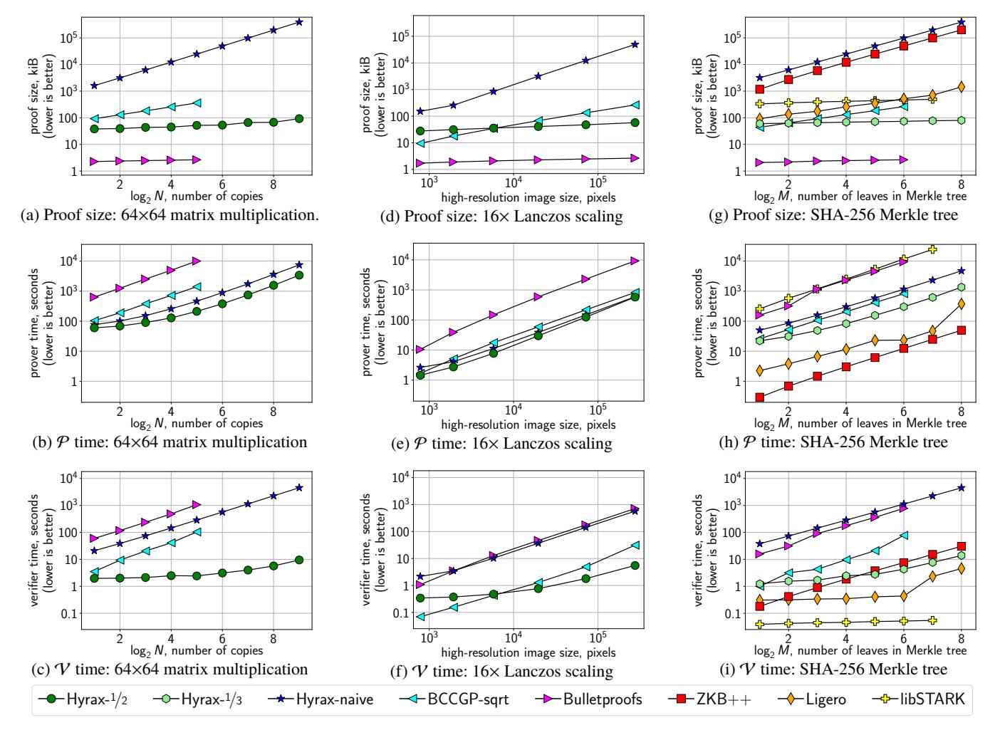
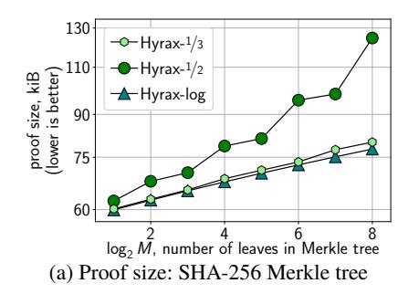
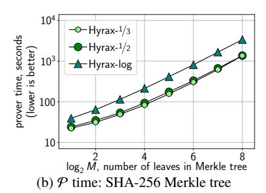
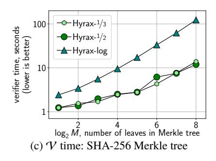

# Doubly-efficient zkSNARKs without trusted setup

Riad S. Wahby\* rsw@cs.stanford.edu

Ioanna Tzialla° iontzialla@gmail.com

abhi shelat<sup>†</sup> abhi@neu.edu Justin Thaler<sup>‡</sup>
justin.thaler@georgetown.edu

Michael Walfish° mwalfish@cs.nyu.edu

\*Stanford °NYU †Northeastern ‡Georgetown

**Abstract.** We present a zero-knowledge argument for NP with low communication complexity, low concrete cost for both the prover and the verifier, and no trusted setup, based on standard cryptographic assumptions. Communication is proportional to  $d \cdot \log G$  (for d the depth and G the width of the verifying circuit) plus the square root of the witness size. When applied to batched or data-parallel statements, the prover's runtime is linear and the verifier's is sub-linear in the verifying circuit size, both with good constants. In addition, witness-related communication can be reduced, at the cost of increased verifier runtime, by leveraging a new commitment scheme for multilinear polynomials, which may be of independent interest. These properties represent a new point in the tradeoffs among setup, complexity assumptions, proof size, and computational cost.

We apply the Fiat-Shamir heuristic to this argument to produce a zero-knowledge succinct non-interactive argument of knowledge (zkSNARK) in the random oracle model, based on the discrete log assumption, which we call Hyrax. We implement Hyrax and evaluate it against five state-of-the-art baseline systems. Our evaluation shows that, even for modest problem sizes, Hyrax gives smaller proofs than all but the most computationally costly baseline, and that its prover and verifier are each faster than three of the five baselines.

## <span id="page-0-0"></span>1 Introduction

A zero-knowledge proof convinces a verifier of a statement while revealing nothing but its own validity. Since they were introduced by Goldwasser, Micali, and Rackoff [55], zero-knowledge (ZK) proofs have found applications in domains as diverse as authentication and signature schemes [90, 95], secure encryption [44, 94], and emerging blockchain technologies [12].

A seminal result in the theory of interactive proofs and cryptography is that any problem solvable by an interactive proof (IP) is also solvable by a computational zero-knowledge proof or perfect zero-knowledge argument [8]. This means that, given an interactive proof for any NP-complete problem, one can construct zero-knowledge proofs or arguments for any NP statement. But existing instantiations of this paradigm have large overheads: early techniques [22, 53] require many repetitions to achieve negligible soundness error, and incur polynomial blowups in prover work and communication. More recent work [25, 28, 29, 31, 56, 57, 60] avoids those issues, but generally entails many expensive cryptographic operations.<sup>1</sup>

Several other recent lines of work have sought to avoid these overheads. As detailed in Section 2, however, these works still yield costly protocols or come with significant limitations. In particular, state-of-the-art, general-purpose ZK protocols suffer

from one or more of the following problems: (a) they require proof size that is linear or super-linear in the size of the computation verifying an NP witness; (b) they require the prover or verifier to perform work that is super-linear in the time to verify a witness; (c) they require a complex parameter setup to be performed by a trusted party; (d) they rely on non-standard cryptographic assumptions; or (e) they have very high concrete overheads. These issues have limited the use of such general-purpose ZK proof systems in many contexts.

Our goal in this work is to address the limitations of existing general-purpose ZK proofs and arguments. Specifically, we would like to take any computation for verifying an NP statement and turn it into a zero-knowledge proof of the statement's validity. In addition to concrete efficiency, our desiderata are that:

- the proof should be succinct, that is, sub-linear in the size of the statement and the witness to the statement's validity;
- the verifier should run in time linear in input plus proof size;
- the prover, given a witness to the statement's validity, should run in time linear in the cost of the NP verification procedure;
- the scheme should not require a trusted setup phase or common reference string; and
- soundness and zero-knowledge should each be either statistical or based on standard cryptographic assumptions. Pragmatically, security in the random oracle model [7] suffices.

**Our approach** transforms a state-of-the-art interactive proof for arithmetic circuit (AC) satisfiability into a zero-knowledge argument by composing new ideas with existing techniques.

Ben-Or et al. [8] and Cramer and Damgård [40] show how to transform IPs into computationally ZK proofs or perfectly ZK arguments, using cryptographic commitment schemes. At a high level, rather than sending its messages in the clear, the prover sends cryptographic *commitments* corresponding to its messages. These commitments are *binding*, ensuring that the prover cannot cheat by equivocating about its messages. They are also *hiding*, meaning that the verifier cannot learn the committed value and thus ensuring zero-knowledge. Finally, the commitment scheme has a homomorphism property (§3.1) that allows the verifier to check the prover's messages "underneath the commitments."

Accepted wisdom is that such transformations introduce large overheads (e.g., [35, §1.1]). In this paper, we challenge that wisdom by constructing a protocol that meets our desiderata for many cases of interest.

Our starting point is the Giraffe interactive proof [109] with an optimization, adapted from Chiesa et al. [35], that reduces communication complexity (§3.2). We transform this IP into a ZK argument through a straightforward (but careful) application of Cramer-Damgård techniques (§4). This argument uses cryptographic operations (required by the commitment schemes)

<sup>&</sup>lt;sup>1</sup>Some works avoid these overheads by targeting specific problems with algebraic structure and cryptographic significance, most notably Schnorr-style proofs [95] for languages related to statements about discrete logarithms of group elements.

only for the witness and for the prover's messages, which are sub-linear in the size of the AC. (In contrast, many recent works invoke cryptographic primitives for *each gate* in the verifying circuit [12, 13, 16, 25, 31, 50, 84]; §2.) But the argument is not succinct, and it has high concrete costs, especially for the verifier.

We slash these costs with two key refinements. First, we exploit the IP's structure by tightly integrating the verification procedure with a multi-commitment scheme and a Schnorr-style proof [95] (§5); this reduces communication and computational costs by 3–5× compared to the naive approach. Second, we devise a new witness commitment scheme (§6), yielding a succinct argument and asymptotically reducing the verifier's cost associated with the witness.

Our protocol is public coin; we compile it into *Hyrax*, a zero-knowledge succinct non-interactive argument of knowledge (zkSNARK) [20] in the random oracle model [7], via the Fiat-Shamir heuristic [45] (§7). We evaluate Hyrax and five state-of-the-art baselines (BCCGP-sqrt [25], Bulletproofs [31], Ligero [1], ZKB++ [33], and libSTARK [11]; §8). Even for modest problem sizes, Hyrax gives smaller proofs than all but the most computationally costly baseline, its prover and verifier are each faster than three of the five baselines, and its refinements yield multiple-orders-of-magnitude savings in proof size and verifier runtime.

**Contributions.** We design, implement, and evaluate Hyrax, a "doubly" (meaning for both prover and verifier) concretely efficient zkSNARK. For input x, witness w, an AC C of width G and depth d, and a design parameter  $t \ge 2$  that controls a tradeoff between proof length and verifier time:

- Hyrax's proofs are succinct, i.e., sub-linear in |C| and |w|: they require  $\approx 10d \log G + |w|^{1/\iota}$  group elements;
- its verifier runs in time sub-linear in |C|, if C has sufficient parallelism:  ${}^2 O(|x| + d \log G + |w|^{(\iota-1)/\iota})$ , with good constants;
- its prover runs in time linear in |C|, with good constants, if C has sufficient parallelism (practically, a few tens of parallel instances suffices), and it requires only  $O(d \log G + |w|)$  cryptographic operations, also with good constants; and
- it requires no trusted setup, and it is secure under the discrete log assumption in the random oracle model.

We also give a new commitment scheme tailored to multilinear polynomials (§6), which may be of independent interest. This scheme allows the prover to commit to a multilinear polynomial m over  $\mathbb{F}$ , and later to reveal (a commitment to) m(r) for any r chosen by the verifier. For  $t \ge 2$ , if |m| denotes the number of monomials in m, then the commitment has size  $O(|m|^{1/t})$ , and the time to verify a purported evaluation is  $O(|m|^{(t-1)/t})$ .

## <span id="page-1-0"></span>2 Related work

**ZK proofs.** Over the past several years there has been significant interest in implementing ZK proof systems. In this section, we discuss those efforts, focusing on the theoretical underpinnings and associated cryptographic assumptions; we compare Hyrax with several of these works empirically in Section 8.

Gennaro et al. [50] present a linear probabilistically checkable proof (PCP)<sup>3</sup> and ZK transform that form the basis of many recent zkSNARK implementations [4, 5, 12, 13, 15, 16, 30, 36, 38, 43, 46–48, 69, 81, 84, 110], including systems deployed in applications like ZCash [12, 111]. These implementations build on theoretical work by Ishai et al. [64], Groth [58], Lipmaa [74], and Bitansky et al. [21], as well as implementations and refinements in the non-ZK context [30, 96–98]. Such zkSNARKs give small, constant-sized proofs (hundreds of bytes), and verifier runtime depends only on input size. But ZK systems in this line rely on non-standard, non-falsifiable cryptographic assumptions, require a trusted setup, and have massive prover overhead: runtime is quasi-linear in the verifying circuit size, including a few public key operations per gate, and memory consumption limits the statement sizes these systems can handle in practice [110].

A line of work by Ben-Sasson et al. builds non-interactive ZK arguments from short PCPs, following the seminal work of Kilian [67, 68] and Micali [78], the landmark result of Ben-Sasson and Sudan [17], and recent generalizations of PCPs [9, 14, 92]. The authors reduce the concrete overheads associated with these approaches [10] and implement zero-knowledge scalable transparent arguments of knowledge (zkSTARKs) [11]. zkSTARKs need no trusted setup and no public-key cryptography, but their soundness rests on a non-standard conjecture related to Reed-Solomon codes [11, Appx. B]. Further, zkSTARKs are heavily optimized for statements whose verifying circuits are expressed as a sequence of state-machine transitions; this captures all of NP, but can introduce significant overhead in practice [110]. Both proof size and verifier runtime are logarithmic in circuit size (hundreds of kilobytes and tens of milliseconds, respectively, in practice), and prover runtime is quasi-linear.

Another approach due to Ishai, Kushilevitz, Ostrovsky, and Sahai [65] (IKOS) transforms a secure multi-party computation protocol into a ZK argument. Giacomelli et al. refine this approach and construct ZKBoo [51], a ZK argument system for Boolean circuits with no trusted setup from collision-resistant hashes; ZKB++, by Chase et al. [33], reduces proof size by constant factors. Both schemes are concretely inexpensive for small circuits, but their costs scale linearly with circuit size. Ames et al. [1] further refine the IKOS transform and apply it to a more sophisticated secure computation protocol. Their scheme, Ligero, makes similar security assumptions to ZKBoo but proves an AC C's satisfiability with proof size  $\tilde{O}(\sqrt{|C|})$  and prover and verifier work quasi-linear in |C| (where  $\tilde{O}$  ignores polylog factors).

Bootle et al. [25] give two ZK arguments for AC satisfiability from the hardness of discrete logarithms, building on the work of Groth [57] and of Bayer and Groth [6]. The first has proof size  $O(\sqrt{\mathcal{M}})$  and quasi-linear prover and verifier runtime for an AC with  $\mathcal{M}$  multiplications. The second reduces this to  $O(\log \mathcal{M})$  at the cost of concretely longer prover and verifier runtimes. Bünz et al. [31] reduce proof size and runtimes in the log scheme by  $\approx 3\times$ . Bootle et al. [26] give a ZK argument with proof size  $O(\sqrt{|C|})$  whose verifier uses O(|C|) additions (which are less expensive than multiplications), but the authors state that the constants are large and do not recommend implementing as-is.

<sup>&</sup>lt;sup>2</sup>Even without parallelism, the verifier runs in time sub-linear in |C| if C's wiring pattern satisfies a technical "regularity" condition [37, 54] (Thm. 1, §3.2).

<sup>&</sup>lt;sup>3</sup>The observation that the *quadratic span programs* of GGPR [50] can be viewed as linear PCPs is due to Bitansky et al. [21] and Setty et al. [96].

Most similar to our work, Zhang et al. [112] show how to combine an interactive proof [37, 54, 102] and a verifiable polynomial delegation scheme [66, 83] to construct a succinct, non-ZK interactive argument. A follow-up work [113] (concurrent with and independent from ours) achieves ZK using the same commit-and-prove approach that we use, with several key differences. First, their commitment to the witness w has communication  $O(\log |w|)$ , but has a trusted setup phase and relies on non-standard, non-falsifiable assumptions. In contrast, our commitment protocol (§6) has no trusted setup and is based on the discrete log assumption, but has communication  $O(|w|^{1/\iota})$ ,  $\iota \geq 2$ . Second, their argument uses an IP that requires more communication than ours (§3.2). Finally, our method of compiling the IP into a ZK argument uses additional refinements (§5) that reduce costs. Both our IP and our refinements apply to their work; we estimate that they would reduce proof size by  $\approx 3 \times$  and Vruntime by  $\approx 5 \times$ .

Polynomial commitment schemes were introduced by Kate et al. [66], who gave a construction for univariate polynomials based on pairing assumptions. Several follow-up works [83, 112–114] extend this construction to multivariate polynomials; Libert et al. [70] give a construction based on constant-size assumptions; and Fujisaki et al. [49] give a construction for polynomial evaluation based on the RSA problem that can be immediately adapted to polynomial commitment. None of these schemes meet our desiderata (§1) because of some combination of high cost, trusted setup, and non-standard assumptions. Bootle et al. [26] and Bootle and Groth [27] describe univariate polynomial commitment schemes based on the discrete log assumption; our scheme is closely related to these ideas and extends them to multilinear polynomials. The second of these also presents a general framework for proving simple relations between commitments and field elements; exploring these ideas in our context is future work.

## 3 Background

## <span id="page-2-0"></span>3.1 Definitions

We use  $\langle A(z_a), B(z_b) \rangle(x)$  to denote the random variable representing the (local) output of machine B when interacting with machine A on common input x, when the random tapes for each machine are uniformly and independently chosen, and A and B has auxiliary inputs  $z_a$  and  $z_b$  respectively. We use  $\operatorname{tr}\langle A(z_a), B(z_b) \rangle(x)$  to denote the random variable representing the entire transcript of the interaction between A and B, and  $\operatorname{View}(\langle A(z_a), B(z_b) \rangle(x))$  to denote the distribution of the transcript. The symbol  $\approx_c$  denotes that two ensembles are computationally indistinguishable.

#### Arithmetic circuits

Section 3.2 considers the arithmetic circuit (AC) evaluation problem. In this problem, one fixes an arithmetic circuit C, consisting of addition and multiplication gates over a finite field  $\mathbb{F}$ . We assume throughout that C is layered, with all gates having fan-in at most 2 (any arithmetic circuit can be made layered while increasing the number of gates by a factor of at most the circuit depth). C has depth d and input x with length |x|. The goal is to evaluate C on input x. In an interactive proof or argument for this problem, the prover sends the claimed outputs y of C on

input x, and must prove that y = C(x).

Our end goal in this work is to give efficient protocols for the arithmetic circuit *satisfiability* problem. Let  $C(\cdot, \cdot)$  be a layered arithmetic circuit of fan-in two. Given an input x and outputs y, the goal is to determine whether there exists a *witness* w such that C(x, w) = y. The corresponding witness relation for this problem is the natural one:  $R(x,y) = \{w \colon C(x,w) = y\}$ .

#### Interactive protocols and zero-knowledge

**Definition 1** (Interactive arguments and proofs). A pair of probabilistic interactive machines  $\langle \mathcal{P}, \mathcal{V} \rangle$  is called an interactive argument system for a language L if there exists a negligible function  $\eta$  such that the following two conditions hold:

- 1. Completeness: For every  $x \in L$  there exists a string w s.t. for every  $z \in \{0,1\}^*$ ,  $\Pr[\langle \mathcal{P}(w), \mathcal{V}(z) \rangle(x) = 1] \geq 1 \eta(|x|)$ .
- 2. Soundness: For every  $x \notin L$ , every interactive PPT  $\mathcal{P}^*$ , and every  $w, z \in \{0, 1\}^*$ ,  $\Pr[\langle \mathcal{P}^*(w), \mathcal{V}(z) \rangle(x) = 1] \leq \eta(|x|)$ .

If soundness holds against computationally unbounded cheating provers  $\mathcal{P}^*$ , then  $\langle \mathcal{P}, \mathcal{V} \rangle$  is called an interactive proof (IP).

<span id="page-2-2"></span>**Definition 2** (Zero-knowledge (ZK)). Let  $L \subset \{0,1\}^*$  be a language and for each  $x \in L$ , let  $R_x \subset \{0,1\}^*$  denote a corresponding set of witnesses for the fact that  $x \in L$ . Let  $R_L$  denote the corresponding language of valid (input, witness) pairs, i.e.,  $R_L = \{(x, w): x \in L \text{ and } w \in R_x\}$ . An interactive proof or argument system  $\langle \mathcal{P}, \mathcal{V} \rangle$  for L is computational zero-knowledge (CZK) with respect to an auxiliary input if for every PPT interactive machine  $\mathcal{V}^*$ , there exists a PPT algorithm S, called the simulator, running in time polynomial in the length of its first input, such that for every  $x \in L$ ,  $w \in R_x$ , and  $z \in \{0,1\}^*$ ,

<span id="page-2-1"></span>View 
$$(\langle P(w), \mathcal{V}^*(z)\rangle(x)) \approx_c S(x, z)$$
 (1)

when the distinguishing gap is considered as a function of |x|. If the statistical distance between the two distributions is negligible, then the interactive proof or argument system is said to be statistical zero-knowledge (SZK). If the simulator is allowed to abort with probability at most 1/2, but the distribution of its output conditioned on not aborting is identically distributed to View  $(\langle P(w), V^*(z)\rangle(x))$ , then the interactive proof or argument system is called perfect zero-knowledge (PZK).

The left term in Equation (1) denotes the distribution of transcripts after  $\mathcal{V}^*$  interacts with  $\mathcal{P}$  on common input x; the right term denotes the distribution of simulator S's output on x. For any CZK (resp., SZK or PZK) protocol, Definition 2 requires the simulator to produce a distribution that is computationally (resp., statistically or perfectly) indistinguishable from the distribution of transcripts of the ZK proof or argument system.

Our zero-knowledge arguments also satisfy a proof of knowledge property. Intuitively, this means that in order to produce a convincing proof of a statement, the prover must *know* a witness to the validity of the statement. To define this notion formally, we follow Groth and Ishai [59] who borrow the notion of statistical witness-extended emulation from Lindell [73]:

**Definition 3** (Witness-extended emulation [59]). Let L be a language and  $R_L$  corresponding language of valid (input, witness) pairs as in Definition 2. An interactive argument system  $\langle \mathcal{P}, \mathcal{V} \rangle$ 

for L has witness-extended emulation if for all deterministic polynomial time  $\mathcal{P}^*$  there exists an expected polynomial time emulator E such that for all non-uniform polynomial time adversaries A and all  $z_{\mathcal{V}} \in \{0,1\}^*$ , the following probabilities differ by at most a negligible function in the security parameter  $\lambda$ :

$$\Pr\left[(x, z_{\mathcal{P}}) \leftarrow A(1^{\lambda}); t \leftarrow \operatorname{tr}\langle \mathcal{P}^{*}(z_{\mathcal{P}}), \mathcal{V}(z_{\mathcal{V}})\rangle(x) : A(t) = 1\right]$$
and 
$$\Pr\left[\begin{array}{c} (x, z_{\mathcal{P}}) \leftarrow A(1^{\lambda}); (t, w) \leftarrow E^{\mathcal{P}^{*}(z_{\mathcal{P}})}(x) : A(t) = 1 \land \\ if \ t \ is \ an \ accepting \ transcript, \ then \ (x, w) \in R_{L}. \end{array}\right]$$

Here, the oracle called by E permits rewinding the prover to a specific point and resuming with fresh randomness for the verifier from this point onwards.

The protocols of Sections 5 and 6 are *generalized special* sound, which implies witness-extended emulation (Appx. A.6).

<span id="page-3-2"></span>**Definition 4** (Generalized special soundness). A  $(2\mu + 1)$ -move interactive argument  $\langle \mathcal{P}, \mathcal{V} \rangle$  is generalized special sound if there exists a PPT algorithm  $\text{Ex}_{GSS}$  that extracts a witness except with negligible probability given an  $(n_1, \ldots, n_{\mu})$ -tree of accepting transcripts. This tree comprises  $n_1$  transcripts with fresh randomness in  $\mathcal{V}$ 's first message; and for each such transcript,  $n_2$  transcripts with fresh randomness in  $\mathcal{V}$ 's second message; etc., for a total of  $\prod_{i=1}^{\mu} n_i$  leaves. The standard notion of special soundness corresponds to  $\mu = 1, n_1 = 2$ .

#### Commitment schemes

Informally, a commitment scheme allows a *sender* to produce a message  $C = \mathsf{Com}(m)$  that hides m from a *receiver* but binds the sender to the value m. In particular, when the sender *opens* C and reveals m, the receiver is convinced that this was indeed the sender's original value. We say that  $\mathsf{Com}_{pp}(m;r)$  is a commitment to m with *opening* r with respect to public parameters pp. The sender chooses r at random; to open the commitment, the sender reveals (m,r). We frequently leave the public parameters implicit, and sometimes do the same for the opening, e.g.,  $\mathsf{Com}(m)$ .

<span id="page-3-1"></span>**Definition 5** (Collection of non-interactive commitments [62]). We say that a tuple of PPT algorithms (Gen, Com) is a collection of non-interactive commitments if the following conditions hold:

• Computational binding: For every (non-uniform) PPT A, there is a negligible function  $\eta$  such that for every  $n \in \mathbb{N}$ ,

$$\Pr\left[\begin{array}{l} \text{pp} \leftarrow \text{Gen}(1^n) ;\\ (m_0, r_0), (m_1, r_1) \leftarrow A(1^n, \text{pp}) ;\\ m_0 \neq m_1, |m_0| = |m_1| = n,\\ \text{Com}_{\text{pp}}(m_0; r_0) = \text{Com}_{\text{pp}}(m_1; r_1) \end{array}\right] \leq \eta(n)$$

• **Perfect hiding:** For any pp  $\in \{0,1\}^*$  and  $m_0, m_1 \in \{0,1\}^*$  where  $|m_0| = |m_1|$ , the ensembles  $\{\mathsf{Com}_{pp}(m_0)\}_{n \in \mathbb{N}}$  and  $\{\mathsf{Com}_{pp}(m_1)\}_{n \in \mathbb{N}}$  are identically distributed.

We define only the computational variant of binding and the perfect variant of hiding because the commitment schemes used in our implementation satisfy these properties. The use of such commitment schemes in our context yields a PZK argument. If we instead used perfectly (or statistically) binding, computationally hiding commitments, we would obtain a CZK proof.

Collections of non-interactive commitments can be constructed based on any one-way function [61, 80], but we require a *homomorphism* property (defined below) that these commitments do not provide. (The Pedersen commitment [85], described in Appx. A, provides this property.)

**Definition 6** (Additive homomorphism). *Given*  $Com(x; s_x)$  *and*  $Com(y; s_y)$ , *there is an operator*  $\odot$  *such that* 

$$Com(x; s_x) \odot Com(y; s_y) = Com(x + y; s_x + s_y)$$
 and  
 $Com(x; s_x)^k \triangleq Com(x; s_x) \odot \cdots \odot Com(x; s_x)$  (k times)

In a multi-commitment scheme, x and y are vectors, and this additive homomorphism is vector-wise.

## <span id="page-3-0"></span>3.2 Our starting point: Gir<sup>++</sup> (Giraffe, with a tweak)

The most efficient known IPs for the AC evaluation problem (§3.1) follow a line of work starting with the breakthrough result of Goldwasser, Kalai, and Rothblum (GKR) [54]. Cormode, Mitzenmacher, and Thaler (CMT) [37] and Vu et al. [107] refine this result, giving  $O(|C| \log |C|)$  prover and  $O(|x| + |y| + d \log |C|)$  verifier runtimes, for AC C with depth d, input x, and output y.

Further refinements are possible in the case where C is data parallel, meaning it consists of N identical sub-computations run on different inputs. (We refer to each sub-computation as a sub-AC of C, and we assume for simplicity that all layers of the sub-AC have width G, so  $|C| = d \cdot N \cdot G$ .) Thaler [102] reduced the prover's runtime in the data-parallel case from  $O(|C|\log|C|)$  to  $O(|C|\log G)$ . Very recently, Wahby et al. introduced Giraffe [109], which reduces the prover's runtime to  $O(|C| + d \cdot G \cdot \log G)$ . Since  $|C| = d \cdot N \cdot G$ , observe that when  $N \ge \log G$ , the time reduces to O(|C||), which is asymptotically optimal. That is, for sufficient data parallelism, the prover's runtime is just a constant factor slower than evaluating the circuit gate-by-gate without providing any proof of correctness.

Our work builds on  $Gir^{++}$ , which reduces Giraffe's communication via an optimization due to Chiesa et al. [35]; our description of  $Gir^{++}$  borrows notation from Wahby et al. [109]. Assume for simplicity that N and G are powers of 2, and let  $b_N = \log_2 N$  and  $b_G = \log_2 G$ . Within a layer of C, each gate is labeled with a pair  $(i,j) \in \{0,1\}^{b_N} \times \{0,1\}^{b_G}$ . Number the layers of C from 0 to d in reverse execution order, so that 0 refers to the output layer, and d refers to the input layer. Each layer i is associated with an evaluator function  $V_i \colon \{0,1\}^{b_N} \times \{0,1\}^{b_G} \to \mathbb{F}$  that maps a gate's label to the output of that gate when C is evaluated on input x. For example,  $V_0(i,j)$  is the j'th output of the i'th sub-AC, and  $V_d(i,j)$  is the jth input to the ith sub-AC.

At a high level, the protocol proceeds in iterations, one for each layer of the circuit. At the start of the protocol, the prover  $\mathcal{P}$  sends the claimed outputs y of C (i.e., all the claimed evaluations of  $V_0$ ). The first iteration of the protocol reduces the claim about  $V_0$  to a claim about  $V_1$ , in the sense that it is safe for the verifier  $\mathcal{V}$  to believe the former claim as long as  $\mathcal{V}$  is convinced of the latter. But  $\mathcal{V}$  cannot directly check the claim about  $V_1$ , because doing so would require evaluating all of the gates in C other than the outputs themselves. Instead, the second iteration reduces the claim about  $V_1$  to a claim about  $V_2$ , and so on, until  $\mathcal{P}$  makes a claim about  $V_d$  (i.e., the inputs to C), which  $\mathcal{V}$  checks itself.

To describe how the reduction from a claim about  $V_i$  to a claim about  $V_{i+1}$  is performed, we first introduce *multilinear extensions*, the sum-check protocol, and wiring predicates.

**Multilinear extensions.** An *extension* of a function  $f: \{0, 1\}^{\ell} \to \mathbb{F}$  is a  $\ell$ -variate polynomial g over  $\mathbb{F}$  such that g(x) = f(x) for all  $x \in \{0, 1\}^{\ell}$ . Any such function f has a unique multilinear extension (MLE)—a multilinear polynomial—denoted  $\tilde{f}$ . Given a vector  $z \in \mathbb{F}^m$  with  $m = 2^{\ell}$ , we will often view z as a function  $z: \{0, 1\}^{\ell} \to \mathbb{F}$  mapping indices to vector entries, and use  $\tilde{z}$  to denote the MLE of z.

**The sum-check protocol.** Fix an  $\ell$ -variate polynomial g over  $\mathbb{F}$ , and let  $\deg_i(g)$  denote the degree of g in variable i. The sum-check protocol [75] is an interactive proof that allows  $\mathcal{P}$  to convince  $\mathcal{V}$  of a claim about the value of  $\sum_{x \in \{0,1\}^{\ell}} g(x)$  by reducing it to a claim about the value of g(r), where  $r \in \mathbb{F}^{\ell}$  is a point randomly chosen by  $\mathcal{V}$ . There are  $\ell$  rounds, and  $\mathcal{V}$ 's runtime is  $O(\sum_{i=1}^{\ell} \deg_i(g))$  plus the cost of evaluating g(r). The mechanics are detailed in Section 4.

**Wiring predicates** capture the wiring information of the sub-ACs. Define the wiring predicate  $\operatorname{add}_i \colon \{0,1\}^{3b_G} \to \{0,1\}$ , where  $\operatorname{add}_i(g,h_0,h_1)$  returns 1 if (a) within each sub-AC, gate g at layer i-1 is an add gate and (b) the left and right inputs of g are, respectively,  $h_0$  and  $h_1$  at layer i (and 0 otherwise).  $\operatorname{mult}_i$  is defined analogously for multiplication gates. Define the equality predicate eq:  $\{0,1\}^{2b_N} \to \{0,1\}$  as  $\operatorname{eq}(a,b) = 1$  iff a = b.

Thaler [102, 103] and Wahby et al. [109] show how to express  $\tilde{V}_{i-1}$  in terms of  $\tilde{V}_i$ : for  $(q',q) \in \mathbb{F}^{b_N} \times \mathbb{F}^{b_G}$ , let  $P_{q',q,i} : \mathbb{F}^{b_N} \times \mathbb{F}^{b_G} \times \mathbb{F}^{b_G} \to \mathbb{F}$  denote the polynomial

$$\begin{split} P_{q',q,i}(h',h_L,h_R) &= \\ & \tilde{\text{eq}}(q',h') \cdot \left[ \tilde{\text{add}}_i(q,h_L,h_R) \left( \tilde{V}_i(h',h_L) + \tilde{V}_i(h',h_R) \right) + \right. \\ & \left. \tilde{\text{mult}}_i(q,h_L,h_R) \left( \tilde{V}_i(h',h_L) \cdot \tilde{V}_i(h',h_R) \right) \right] \end{split}$$

Then we have

<span id="page-4-1"></span>
$$\tilde{V}_{i-1}(q',q) = \sum_{h' \in \{0,1\}^{b_N}} \sum_{h_L, h_R \in \{0,1\}^{b_G}} P_{q',q,i}(h',h_L,h_R). \quad (2)$$

## Protocol overview

**Step 1.** At the start of the protocol,  $\mathcal{P}$  sends the claimed output y, thereby specifying a function  $V_y \colon \{0,1\}^{b_G+b_N} \to \mathbb{F}$  mapping the label of each output gate to the corresponding entry of y. The verifier wishes to check that  $V_y = V_0$  (i.e., that the claimed outputs equal the correct outputs of C on input x); to accomplish this, it would be enough to check that  $\tilde{V}_y = \tilde{V}_0$ . In principle,  $\mathcal{V}$  could do that by choosing a random pair  $(q',q) \in \mathbb{F}^{b_N} \times \mathbb{F}^{b_G}$  and checking that  $\tilde{V}_y(q',q) = \tilde{V}_0(q',q)$ ; if that check passes, then  $\tilde{V}_y = \tilde{V}_0$  with high probability, by the Schwartz-Zippel lemma. On the one hand,  $\mathcal{V}$  can and does compute  $\tilde{V}_y(q',q)$ ; this takes O(NG) time [109, §3.3]. But on the other hand,  $\mathcal{V}$  cannot compute  $\tilde{V}_0(q',q)$  directly—this would require  $\mathcal{V}$  to evaluate C.

**Step 2 (iterated).** Instead,  $\mathcal V$  outsources evaluation of  $\tilde V_0(q',q)$  to  $\mathcal P$ , via the sum-check protocol; this is motivated by Equation (2). At the end of the sum-check protocol,  $\mathcal V$  must evaluate  $P_{q',q,1}$  at a random input  $(r',r_L,r_R)$ , which requires the values  $\tilde V_1(r',r_L)$  and

 $\tilde{V}_1(r',r_R)$ .  $\mathcal{V}$  does not evaluate these points directly; that would be too costly. Instead,  $\mathcal{P}$  sends  $v_0$  and  $v_1$ , which it claims are the required values.  $\mathcal{V}$  uses these to evaluate  $P_{q',q,1}$ , then checks  $v_0$  and  $v_1$  using a *mini-protocol*, which we describe shortly. At a high level, the mini-protocol transforms  $\mathcal{P}$ 's claims about  $v_0, v_1$  into a claim about  $\tilde{V}_2$ .  $\mathcal{V}$  checks this claim with a sum-check and mini-protocol invocation, yielding a claim about  $\tilde{V}_3$ .  $\mathcal{P}$  and  $\mathcal{V}$  iterate, layer by layer, until  $\mathcal{V}$  has a claim about  $\tilde{V}_d$ .

**Final step.**  $\mathcal{V}$  checks  $\mathcal{P}$ 's final claim about  $\tilde{V}_d$  by evaluating  $\tilde{V}_x$  (since  $\tilde{V}_d = \tilde{V}_x$ ); it can do this in O(NG) time [109, §3.3].

<span id="page-4-0"></span>*Mini-protocols: reducing from*  $\tilde{V}_i$  *to*  $\tilde{V}_{i+1}$ 

Gir<sup>++</sup> differs from Giraffe only in that they use different miniprotocols to reduce  $\mathcal{P}$ 's claims at the end of one sum-check invocation (i.e.,  $v_0 = \tilde{V}_i(r', r_L)$  and  $v_1 = \tilde{V}_i(r', r_R)$ ) into the expression that  $\mathcal{V}$  and  $\mathcal{P}$  use for the next sum-check invocation.

**Reducing from two points to one point.** This approach is used in Giraffe and prior work [37, 54, 102, 107–109].  $\mathcal{P}$  sends  $\mathcal{V}$  the restriction of  $\tilde{V}_i$  to the unique line H in  $\mathbb{F}^{b_N+b_G}$  passing through the points  $(r',r_L)$  and  $(r',r_R)$  by specifying the univariate polynomial  $f_H(t) = \tilde{V}_i(r',(1-t)\cdot r_L + t\cdot r_R)$ , which has degree  $b_G$ .  $\mathcal{V}$  should believe this claim as long as  $f_H(0) = v_0$ ,  $f_H(1) = v_1$ , and  $f_H(v) = \tilde{V}_i(r',r_v)$ , where  $r_v = (1-v)\cdot r_L + v\cdot r_R$  and v is chosen by  $\mathcal{V}$ . By Equation (2),  $\mathcal{V}$  can check this latter equality by engaging  $\mathcal{P}$  in a sum-check protocol over  $P_{r',r_v,i+1}$ .

**Alternative: Random linear combination.** Each invocation of the prior mini-protocol requires  $\mathcal{P}$  to send  $b_G+1$  field elements specifying  $f_H$ . The following technique, due to Chiesa et al. [35], eliminates this requirement. Instead,  $\mathcal{V}$  checks  $v_0$  and  $v_1$  by checking a random linear combination, via a sum-check invocation over a polynomial we define below.

In more detail, V samples two field elements  $\mu_0$  and  $\mu_1$ , and sends them to P. Mechanically, V next checks that

<span id="page-4-2"></span>
$$\mu_0 \cdot \tilde{V}_i(r', r_L) + \mu_1 \cdot \tilde{V}_i(r', r_R) = \mu_0 \cdot v_0 + \mu_1 \cdot v_1 \tag{3}$$

since, by the Schwartz-Zippel lemma, this implies that  $v_0 = \tilde{V}_i(r', r_L)$  and  $v_1 = \tilde{V}_i(r', r_R)$  with high probability (formalized in Thm. 1, below).  $\mathcal{V}$  checks Equation (3) by exploiting the fact that its LHS can be written as

$$\begin{split} &\mu_{0}\cdot\tilde{V}_{i}(q',q_{L})+\mu_{1}\cdot\tilde{V}_{i}(q',q_{R})\\ &=\sum_{h_{L},h_{R}\in\{0,1\}^{b_{G}}}\sum_{h'\in\{0,1\}^{b_{N}}}\left[\mu_{0}\cdot P_{q',q_{L},i+1}(h',h_{L},h_{R})+\right.\\ &\left.\left.\left.\mu_{1}\cdot P_{q',q_{R},i+1}(h',h_{L},h_{R})\right]\right.\\ &=\sum_{h_{L},h_{R}\in\{0,1\}^{b_{G}}}\sum_{h'\in\{0,1\}^{b_{N}}}Q_{q',q_{L},q_{R},\mu_{0},\mu_{1},i+1}(h',h_{L},h_{R}) \end{split}$$

where  $Q_{q',q_L,q_R,\mu_0,\mu_1,i} \colon \mathbb{F}^{b_N} \times \mathbb{F}^{b_G} \times \mathbb{F}^{b_G} \to \mathbb{F}$  is given by:

$$\begin{split} Q_{q',q_L,q_R,\mu_0,\mu_1,i}(h',h_L,h_R) &\triangleq \widetilde{\mathrm{eq}}(q',h') \cdot \\ & \Big[ \left( \mu_0 \cdot \widetilde{\mathrm{add}}_i(q_L,h_L,h_R) + \mu_1 \cdot \widetilde{\mathrm{add}}_i(q_R,h_L,h_R) \right) \cdot \\ & \left( \tilde{V}_i(h',h_L) + \tilde{V}_i(h',h_R) \right) \\ & + \left( \mu_0 \cdot \widetilde{\mathrm{mult}}_i(q_L,h_L,h_R) + \mu_1 \cdot \widetilde{\mathrm{mult}}_i(q_R,h_L,h_R) \right) \cdot \\ & \left( \tilde{V}_i(h',h_L) \cdot \tilde{V}_i(h',h_R) \right) \Big] \end{split}$$

This means that  $\mathcal{V}$  can check that Equation (3) holds by engaging  $\mathcal{P}$  in a sum-check protocol over  $Q_{r',r_L,r_R,\mu_0,\mu_1,i+1}$ .

**Giraffe vs. Gir++** Gir<sup>++</sup> uses the Alternative above. This reduces communication cost in Gir<sup>++</sup> compared to Giraffe by a small factor that depends on the amount of data parallelism. We are motivated to reduce communication because communication will translate into proof size and more cryptographic cost (§4).

As an exception,  $\operatorname{Gir}^{++}$  uses the "reducing from two points to one point" technique after the final sum-check (i.e., the one over  $Q_{\dots,d-1}$ ); this is to avoid increasing  $\mathcal{V}$ 's computational costs compared to Giraffe. Recall that in the final step of  $\operatorname{Gir}^{++}$ ,  $\mathcal{V}$  checks  $\mathcal{P}$ 's claim about  $\tilde{V}_d$  by evaluating  $\tilde{V}_x$  (which is equal to  $\tilde{V}_d$ ). Thus, to check the LHS of Equation (3),  $\mathcal{V}$  would require two evaluations of  $\tilde{V}_x$ ; the "reducing from two points to one point" technique requires only one. Since evaluating  $\tilde{V}_x$  is typically a bottleneck for the verifier [109, §3.3], eliminating the second evaluation is worthwhile even though it slightly increases the size of  $\mathcal{P}$ 's final message (and thus the proof size; see §4).

We give pseudocode for Gir<sup>++</sup> in Appendix E. Gir<sup>++</sup>'s efficiency and security are formalized in the following theorem, which can be proved via a standard analysis [54].

<span id="page-5-1"></span>**Theorem 1.** The interactive proof  $Gir^{++}$  satisfies the following properties when applied to a layered arithmetic circuit C of fan-in two, consisting of N identical sub-computations, each of depth d, with all layers of each sub-computation having width at most G. It has perfect completeness, and soundness error at most  $((1 + 2 \log G + 3 \log N) \cdot d + \log G)/|\mathbb{F}|$ . After a pre-processing phase taking time O(dG), the verifier runs in time  $O(|C| + d \cdot G \cdot \log G)$ . If the sub-AC has a regular wiring pattern as defined in [37], then the pre-processing phase is unnecessary.

# <span id="page-5-0"></span>4 Compiling Gir<sup>++</sup> into a ZK argument

In this section, we describe a straightforward application of "commit-and-prove" techniques [8, 40] (§1) to Gir<sup>++</sup> (§3.2). The result is a public coin, perfect ZK argument "of knowledge" for AC satisfiability (the knowledge property is formalized via witness-extended emulation; §3.1). In Sections 5 and 6, we develop substantial efficiency improvements; in Section 7, we apply the Fiat-Shamir heuristic [45] to make it non-interactive.

**Building blocks.** This section uses abstract commitments having a homomorphism property (§3.1). We also make black-box use of three sub-protocols, which operate on commitments:

- proof-of-opening(C) convinces  $\mathcal{V}$  that  $\mathcal{P}$  can open C.
- proof-of-equality( $C_0$ ,  $C_1$ ) convinces  $\mathcal{V}$  that  $C_0$  and  $C_1$  commit to the same value, and that  $\mathcal{P}$  can open both.
- proof-of- $product(C_0, C_1, C_2)$  convinces  $\mathcal{V}$  that  $C_2$  commits to the product of the values committed in  $C_0$  and  $C_1$ , and that  $\mathcal{P}$  can open all three.

In Appendix A, we give concrete definitions of the above protocols in terms of Pedersen commitments [85].

**Protocol overview.** This protocol differs from  $Gir^{++}$  in three ways. First, it adds an initial step in which  $\mathcal{P}$  commits to w such that C(x, w) = y. Second,  $\mathcal{P}$  replaces all of its messages in

Gir<sup>++</sup> with *commitments* to those messages. Third,  $\mathcal{P}$  convinces  $\mathcal{V}$  that its committed values pass all of  $\mathcal{V}$ 's checks in Gir<sup>++</sup> using the homomorphism property of the commitments and the above sub-protocols. The steps below correspond to the steps of Gir<sup>++</sup> (§3.2); we describe only how the protocols differ.

**Step 0.** (This is a new step.)  $\mathcal{P}$  sends commitments to each element of  $w \in \mathbb{F}^{\ell}$ .  $\mathcal{P}$  and  $\mathcal{V}$  execute proof-of-opening for each.

**Step 1.** As in Gir<sup>++</sup>,  $\mathcal{V}$  computes  $\tilde{V}_y(q',q)$ . Afterwards,  $\mathcal{V}$  computes  $C_0 = \text{Com}(\tilde{V}_y(q',q);0)$ .

<span id="page-5-2"></span>**Step 2.** As in Gir<sup>++</sup>, this step comprises one sum-check and one mini-protocol per layer of C. We now review the sum-check protocol, and then describe how  $\mathcal{P}$  and  $\mathcal{V}$  execute the sum-check and mini-protocols "underneath the commitments."

Review of the sum-check protocol. We begin by describing the first layer sum-check protocol in  $\operatorname{Gir}^{++}$  (others are similar), which reduces  $\tilde{V}_y(q',q)$  to a claim about  $\tilde{V}_1(\cdot)$ . In the first round of the sum-check protocol,  $\mathcal{P}$  sends a univariate polynomial  $s_1(\cdot)$  of degree 3.  $\mathcal{V}$  checks that  $s_1(0)+s_1(1)=\tilde{V}_y(q',q)$ , and then sends a random field element  $r_1$  to  $\mathcal{P}$ . In general, in round j of the sum-check protocol,  $\mathcal{P}$  sends a univariate polynomial  $s_j$  (which is degree 3 in the first  $b_N$  rounds and degree 2 in the remaining rounds [102, 109]).  $\mathcal{V}$  checks that  $s_j(0)+s_j(1)=s_{j-1}(r_{j-1})$ , then sends a random field element  $r_j$  to  $\mathcal{P}$ .

We write the vector of all  $r_j$ 's chosen by  $\mathcal{V}$  in the  $j_{\text{last}} = b_N + 2b_G$  rounds of the sum-check protocol as  $(r_1, \ldots, r_{j_{\text{last}}}) \in \mathbb{R}^{b_N + 2b_G}$ ; let r' denote the first  $b_N$  entries of this vector,  $r_L$  denote the next  $b_G$  entries, and  $r_R$  denote the final  $b_G$  entries.

In the last round,  $\mathcal{P}$  sends  $v_0$  and  $v_1$  (which it claims are equal to  $\tilde{V}_1(r', r_L)$  and  $\tilde{V}_1(r', r_R)$ ; §3.2).  $\mathcal{V}$  first checks that

$$s_{j_{\text{last}}}(r_{j_{\text{last}}}) = \tilde{\text{eq}}(q', r') \cdot \left[ \tilde{\text{add}}_{1}(q, r_{L}, r_{R}) \cdot (v_{0} + v_{1}) + \tilde{\text{mult}}_{1}(q, r_{L}, r_{R}) \cdot v_{0} \cdot v_{1} \right]$$

 $\mathcal{V}$  then checks  $\mathcal{P}$ 's claims about  $v_0$  and  $v_1$  by invoking a miniprotocol (§3.2) and engaging  $\mathcal{P}$  in another sum-check at layer 2. ZK sum-check protocol. In round j of the sum-check,  $\mathcal{P}$  commits to  $s_j(t) = c_{0,j} + c_{1,j}t + c_{2,j}t^2 + c_{3,j}t^3$ , via  $\delta_{c_{0,j}} \leftarrow \mathsf{Com}(c_{0,j})$ ,  $\delta_{c_{1,j}} \leftarrow \mathsf{Com}(c_{1,j})$ ,  $\delta_{c_{2,j}} \leftarrow \mathsf{Com}(c_{2,j})$ , and  $\delta_{c_{3,j}} \leftarrow \mathsf{Com}(c_{3,j})$ , and  $\mathcal{P}$  and  $\mathcal{V}$  execute proof-of-opening for each one. Now  $\mathcal{P}$  convinces  $\mathcal{V}$  that  $s_j(0) + s_j(1) = s_{j-1}(r_{j-1})$ . Notice that if  $\mathcal{V}$  holds commitments  $\mathsf{Com}(s_{j-1}(r_{j-1}))$  and  $\mathsf{Com}(s_j(0) + s_j(1))$ ,  $\mathcal{P}$  can use proof-of-equality to convince  $\mathcal{V}$  that the above equation holds. Further,  $\mathcal{V}$  can use the homomorphism property to compute the required commitments: for  $s_j(0) + s_j(1) = 2c_{0,j} + c_{1,j} + c_{2,j} + c_{3,j}$ ,  $\mathcal{V}$  computes  $\delta_{c_{0,j}}^2 \odot \delta_{c_{1,j}} \odot \delta_{c_{2,j}} \odot \delta_{c_{3,j}}$ . Similarly, for  $s_{j-1}(r_{j-1})$ 

 $\mathcal{V}$  computes  $\delta_{c_{0,j}} \odot \delta_{c_{1,j}}^{r_j} \odot \delta_{c_{2,j}}^{r_j^r} \odot \delta_{c_{3,j}}^{r_j^r}$ . The first sum-check round (j=1) is an exception to the above: rather than a commitment to  $s_0$ ,  $\mathcal{V}$  holds a commitment to a value that purportedly equals  $s_1(0) + s_1(1)$ . For the sum-check invocation at layer 1, this value is  $C_0$ , which  $\mathcal{V}$  computed in Step 1. For subsequent layers, the value is the result of the preceding mini-protocol invocation, which we discuss below.

In the final round  $j_{\text{last}}$ ,  $\mathcal{V}$  computes a commitment W to  $s_{j_{last}}(r_{j_{\text{last}}})$  as described above.  $\mathcal{P}$  sends commitments X, Y, and Z to  $v_0$ ,  $v_1$ , and  $v_0 \cdot v_1$ , respectively, and

uses proof-of-product to convince  $\mathcal V$  that the committed values satisfy this product relation. Finally,  $\mathcal V$  computes  $\Omega \leftarrow (X \odot Y)^{\operatorname{eq}(q',r') \cdot \operatorname{add}_1(q,r_1,r_2)} \odot Z^{\operatorname{eq}(q',r') \cdot \operatorname{mult}_1(q,r_1,r_2)}$  and  $\mathcal P$  uses proof-of-equality to convince  $\mathcal V$  that W and  $\Omega$  commit to the same value.

ZK mini-protocols. For random-linear-combination,  $\mathcal{V}$  computes  $Com(\mu_0v_0 + \mu_1v_1) = X^{\mu_0} \odot Y^{\mu_1}$ ; this is the purported  $Com(s_1(0) + s_1(1))$  for the next sum-check invocation.

To execute reducing-from-two-points-to-one-point,  $\mathcal{P}$  commits to the coefficients of  $f_H$  and invokes proof-of-opening for each;  $\mathcal{V}$  computes commitments to  $f_H(0)$  and  $f_H(1)$ , and  $\mathcal{P}$  uses proof-of-equality to show that these commit to the same values as X and Y; and  $\mathcal{V}$  samples v and computes a commitment to  $f_H(v)$ , which it uses in the final step.

**Final step.**  $\mathcal{P}$  now convinces  $\mathcal{V}$  that  $\mathsf{Com}(f_H(v))$ , the result of the final mini-protocol invocation (which is a commitment to  $\tilde{V}_d(r', r_u)$ ; §3.2), is consistent with x and w.

We let m = (x, w) denote the concatenation of the input x and the witness w; assume for simplicity that  $|x| = |w| = 2^{\ell}$ ; interpret x, w, and m as functions (§3.2, "Multilinear extensions"); and let  $(r_0, \ldots, r_{\ell}) = (r', r_v)$ . Then by the definitions of  $\tilde{m}$ ,  $\tilde{x}$ , and  $\tilde{w}$ ,

$$\tilde{m}(r_0,\ldots,r_\ell)=(1-r_0)\cdot\tilde{x}(r_1,\ldots,r_\ell)+r_0\cdot\tilde{w}(r_1,\ldots,r_\ell).$$

By analogy to  $\operatorname{Gir}^{++}$ 's final step,  $\mathcal{V}$ 's task is to check that  $\tilde{V}_d(r',r_v)$  is equal to  $\tilde{m}(r_0,\ldots,r_\ell)$ .  $\mathcal{V}$  does this by first computing  $\operatorname{Com}(\tilde{m}(r_0,\ldots,r_\ell))$  using the commitments to w that  $\mathcal{P}$  sent in Step 0 (above), and then engaging  $\mathcal{P}$  in proof-of-equality on  $\operatorname{Com}(f_H(v))$  and  $\operatorname{Com}(\tilde{m}(r_0,\ldots,r_\ell))$ .

To compute  $\mathsf{Com}(\tilde{m}(\cdot))$ ,  $\mathcal{V}$  exploits the following expression [37] for the multilinear extension of  $w: \{0, 1\}^{\ell} \to \mathbb{F}$ :

$$\tilde{w}(r_1, \dots, r_\ell) = \sum_{b \in \{0,1\}^\ell} w(b) \cdot \prod_{k \in \{1, \dots, \ell\}} \chi_{b_k}(r_k)$$

$$= \sum_{b \in \{0,1\}^\ell} w(b) \cdot \chi_b \tag{4}$$

where  $\chi_{b_k}(r_k) = r_k b_k + (1 - r_k)(1 - b_k)$ ,  $\chi_b = \prod_k \chi_{b_k}(r_k)$ , and  $b_k$  is the (1-indexed)  $k^{\text{th}}$  bit of b. In more detail,  $\mathcal{V}$  first evaluates each  $\chi_b$  in linear time [107], and then computes

$$F = \bigodot_{b \in \{0,1\}^{\ell}} \operatorname{Com}(w(b))^{r_0 \cdot \chi_b(r_1, \dots, r_{\ell})}$$

which is  $\mathsf{Com}(r_0 \cdot \tilde{w}(r_1, \dots, r_\ell))$ . It then computes, in the clear,  $F' = (1 - r_0) \cdot \tilde{x}(r_1, \dots, r_\ell)$ . Finally,  $\mathcal{V}$  computes  $\mathsf{Com}(\tilde{m}(r_0, \dots, r_\ell)) = F \odot \mathsf{Com}(F'; 0)$ . Invoking proof-of-equality as described above completes the protocol.

The following theorem formalizes the efficiency of the argument of this section. We leave a formal statement of security properties to the final protocol (§7).

**Theorem 2.** Let  $C(\cdot, \cdot)$  be a layered arithmetic circuit of fan-in two, consisting of N identical sub-computations, each of depth d, with all layers of each sub-computation having width at most G. Assuming the existence of computationally binding, perfectly hiding homomorphic commitment schemes that support proof-of-opening, proof-of-equality, and proof-of-product (Appx. A)

with running times upper-bounded by  $\kappa$ , there exists a PZK argument for the NP relation " $\exists w$  such that C(x, w) = y." The protocol requires  $d \log(G)$  rounds of communication, and has communication complexity  $\Theta(|y| + (|w| + d \log G) \cdot \lambda)$ , where  $\lambda$  is a security parameter. Given a w such that C(x, w) = y, the prover runs in time  $\Theta(dNG + G \log G + (|w| + d \log G) \cdot \kappa)$ . Verifier runtime is  $\Theta(|x| + |y| + dG + (|w| + d \log(NG)) \cdot \kappa)$ .

The above follows from the more general Theorem 3.1 of [8].

## <span id="page-6-0"></span>5 Reducing the cost of sum-checks

In the PZK argument from Section 4, the prover sends a separate commitment for every message element of Gir<sup>++</sup> (§3.2), and then independently proves knowledge of how to open each commitment. This leads to long proofs and many expensive cryptographic operations for the verifier.

In this section, we explain how to reduce this communication and the number of cryptographic operations for the verifier by exploiting *multi-commitment* schemes, in which a commitment to a vector of elements has the same size as a commitment to a single element. The Pedersen commitment [85] (Appx. A) supports multi-commitments.

**Dot-product proof protocol.** Our starting point is an existing protocol for multi-commitments, which we call proof-of-dot-prod. With this protocol, a prover that knows the openings of two commitments, one to a vector  $\vec{x} = (x_1, \ldots, x_n) \in \mathbb{F}^n$  and one to a scalar  $y \in \mathbb{F}$ , can prove in zero-knowledge that  $y = \langle \vec{a}, \vec{x} \rangle$  for a public  $\vec{a} \in \mathbb{F}^n$ . The protocol is defined in Appendix A.2.

**Squashing**  $\mathcal{V}$ 's **checks.** To exploit proof-of-dot-prod, we first recall from Section 4 that in each round j of each sumcheck invocation in  $\operatorname{Gir}^{++}$ ,  $\mathcal{P}$  sends commitments to  $c_{0,j}$ ,  $c_{1,j}$ ,  $c_{2,j}$ , and (only in the first  $b_N$  rounds)  $c_{3,j}$ . Next,  $\mathcal{P}$  proves to  $\mathcal{V}$  that  $2c_{0,j}+c_{1,j}+c_{2,j}+c_{3,j}=s_{j-1}(r_{j-1})$  (i.e., that  $s_j(0)+s_j(1)=s_{j-1}(r_{j-1})$ ). Finally,  $\mathcal{V}$  computes a commitment to  $s_j(r_j)=c_{0,j}+c_{1,j}r_j+c_{2,j}r_i^2+c_{3,j}r_j^3$  for the next round.

<span id="page-6-3"></span>Combining the above equations yields  $c_{3,j+1} + c_{2,j+1} + c_{1,j+1} + 2c_{0,j+1} - (c_{3,j}r_j^3 + c_{2,j}r_j^2 + c_{1,j}r_j + c_{0,j}) = 0$ .  $\mathcal{V}$ 's final check can likewise be expressed as a linear equation in terms of  $v_0, v_1, c_{2,n}, c_{1,n}, c_{0,n}$ , and wiring predicate evaluations (§3.2)  $(n = b_N + 2b_G)$ . We can thus write  $\mathcal{V}$ 's checks during the rounds of the sum-check protocol as the matrix-vector product

<span id="page-6-1"></span>
$$\begin{bmatrix} M_1 \\ \vdots \\ M_{b_N+2b_G+1} \end{bmatrix} \cdot \vec{\pi} = \begin{bmatrix} s_0 \\ 0 \\ \vdots \end{bmatrix}$$
 (5)

Each  $M_k$  is a row in  $\mathbb{F}^{4b_N+6b_G+3}$  encoding one of  $\mathcal{V}$ 's checks and  $\vec{\pi}$  is a column in  $\mathbb{F}^{4b_N+6b_G+3}$  comprising  $\mathcal{P}$ 's messages.  $(4b_N+6b_G+3)$  accounts for  $b_N$  rounds with cubic  $s_j$ ,  $2b_G$  rounds with quadratic  $s_j$ , and the final values  $v_0$ ,  $v_1$ , and  $v_0v_1$ ; §4.)

Now we can combine all of the linear equality checks encoded in Equation (5) into a single check, namely, by multiplying each row k by a random coefficient  $\rho_k$  and summing the rows.

<span id="page-6-2"></span>**Lemma 3.** For any  $\vec{\pi} \in \mathbb{F}^{\ell}$ , and any matrix  $M \in \mathbb{F}^{n+1 \times \ell}$  with rows  $M_1, \ldots, M_{n+1}$  for which Eq. (5) does not hold, then

$$\Pr_{\rho}\left[\left\langle \left(\sum \rho_k \cdot M_k\right), \vec{\pi}\right\rangle = \rho_1 \cdot s_0\right] \le 1/|\mathbb{F}|$$

*Proof.* Observe that  $\langle (\sum \rho_k \cdot M_k), \vec{\pi} \rangle$  is a polynomial in  $\rho_1, \ldots, \rho_{n+1}$  of total degree 1 (i.e., a linear function in  $\rho_1, \ldots, \rho_{n+1}$ ). Call this linear polynomial  $\phi$ . The coefficients of  $\phi$  are the entries of  $M \cdot \vec{\pi}$ . Similarly,  $\rho_1 \cdot s_0$  is a linear polynomial  $\psi$  in  $\rho_1, \ldots, \rho_{n+1}$ , whose coefficients are the entries of  $[s_0, 0, \ldots, 0]$ . Note that if Equation (5) does not hold, then  $\phi$  and  $\psi$  are distinct polynomials, each of total degree 1. The lemma now follows from the Schwartz-Zippel lemma.

**Putting the pieces together.** Lemma 3 implies that, once  $\mathcal{P}$  has committed to  $\vec{\pi}$ , it can use proof-of-dot-prod to convince  $\mathcal{V}$  of the sum-check result in one shot. For soundness in Gir<sup>++</sup>, however,  $\mathcal{P}$  must commit to  $c_{3,j}, c_{2,j}, c_{1,j}, c_{0,j}$  before the Verifier sends  $r_i$ . This means that  $\mathcal{P}$  cannot send  $\mathsf{Com}(\vec{\pi})$  all at once.

Instead, we observe that  $\mathcal{P}$  can send the commitment to  $\vec{\pi}$  incrementally, using one group element per round of the sumcheck. That is, in each round of the sum-check protocol,  $\mathcal{P}$  commits to a vector encoding the coefficients of that round's polynomial, and  $\mathcal{V}$  responds with its random coin  $r_j$ . After  $\mathcal{P}$  has committed to all of its messages for the sum-check,  $\mathcal{P}$  and  $\mathcal{V}$  engage in the protocol of Figure 1, which encodes  $\mathcal{V}$ 's checks for all rounds of the sum-check protocol at once. This protocol replaces  $\mathcal{V}$ 's checks in Step 2 of the protocol of Section 4.

<span id="page-7-2"></span>**Lemma 4.** The protocol of Figure 1 is a complete, honest-verifier perfect ZK argument, with generalized special soundness under the discrete log assumption, that its inputs constitute an accepting sum-check relation: on input a commitment  $C_0$ , commitments  $\{\alpha_j\}$  to polynomials  $\{s_j\}$  in a sum-check invocation, rows  $\{M_k\}$  of the matrix of Equation (5), and commitments  $X = \text{Com}(v_0), Y = \text{Com}(v_1),$  and Z, where  $\{r_j\}$  are V's coins from the sum-check and  $n=b_N+2b_G$ , the protocol proves that  $C_0=\text{Com}(s_1(0)+s_1(1))$ ;  $s_j(0)+s_j(1)=s_{j-1}(r_{j-1}), j\in\{2,\ldots,n\}$ ; and  $s_n(r_n)=Q_{\ldots,i}$  evaluated with  $v_0, v_1$  (per §3.2).

Lemma 4 is proved in Appendix A.4. Relative to Step 2 of Section 4, the protocol of Figure 1 reduces sum-check communication by  $\approx 3\times$ . It also reduces  $\mathcal{P}$ 's and  $\mathcal{V}$ 's cryptographic costs by  $\approx 4\times$  and  $\approx 5\times$ , respectively.

## <span id="page-7-0"></span>6 Reducing the cost of the witness

In the protocol of Section 4,  $\mathcal{P}$  sends a separate commitment to each element  $w_1, \ldots, w_\ell$  of the witness w (§4, "Step 0."). This means that handling a circuit relation with |w| witness elements requires a proof whose size is at least proportional to |w|. In this section, we describe a new commitment scheme for multilinear polynomials that reduces witness commitment size (and thus proof size) to sub-linear in |w|; it also reduces  $\mathcal{V}$ 's computation cost to sub-linear in |w| (§6.1). To begin, we require each sub-AC to have separate input and witness elements; we relax this restriction by introducing a *redistribution layer* that allows input and witness sharing among sub-ACs (§6.2).

## <span id="page-7-3"></span>6.1 A commitment scheme for multilinear polynomials

In Section 4,  $\mathcal{V}$ 's final step checks that  $\mathcal{P}$ 's commitments to w are consistent with its other messages by evaluating  $\tilde{w}$  (the MLE of w; §3.2, "Multilinear extensions"). Zhang et al. [112] show, in the non-ZK setting, that  $\mathcal{V}$  can outsource this evaluation to  $\mathcal{P}$ . We

<span id="page-7-1"></span>proof-of-sum-check( $C_0$ , { $\alpha_i$ }, { $M_k$ }, X, Y, Z)

Inputs:  $C_0 = \text{Com}(s_0; r_{C_0})$ .

 $\{\alpha_j\}$  are all of  $\mathcal P$ 's messages from a sum-check invocation: at each round j of the sum-check protocol,  $\mathcal P$  has sent

$$\alpha_j \leftarrow \mathsf{Com}((c_{3,j}, c_{2,j}, c_{1,j}, c_{0,j}); r_{\alpha_i})$$

 $\{M_k\}$  is defined as in Equation (5) and Lemma 3. (These vectors encode  $\mathcal{V}$ 's random coins  $\{r_i\}$  from the sum-check.)

$$X = Com(v_0; r_X), Y = Com(v_1; r_Y), Z = Com(v_0v_1; r_Z).$$

Definitions:  $n = b_N + 2b_G$ ;  $\vec{\pi}$  is defined as in Equation (5);  $\{\rho_k\}$  are chosen by V (see below);  $\vec{J} = \sum \rho_k \cdot \vec{M}_k$ ;  $(J_X, J_Y, J_Z)$  are the last 3 elements of  $\vec{J}$ ;  $\vec{\pi}^*$  and  $\vec{J}^*$  are all but the last three elements of  $\vec{\pi}$  and  $\vec{J}$ , respectively.

- 1.  $\mathcal{P}$  and  $\mathcal{V}$  execute proof-of-product (§4) on X, Y, and Z.
- 2.  $\mathcal{P}$  picks  $r_{\delta_1}, \ldots, r_{\delta_n} \in_R \mathbb{F}$  and  $\vec{d} \in_R \mathbb{F}^{4b_N + 6b_G}$  where  $\vec{d} = (d_{c_{3,1}}, d_{c_{2,1}}, d_{c_{1,1}}, d_{c_{0,1}}, \ldots, d_{c_{0,n-1}}, d_{c_{2,n}}, d_{c_{1,n}}, d_{c_{0,n}})$ .  $\mathcal{P}$  computes and sends

$$\delta_j \leftarrow \text{Com}((d_{c_{3,j}}, d_{c_{2,j}}, d_{c_{1,j}}, d_{c_{0,j}}); r_{\delta_j}), \quad j \in \{1, \dots, n\}$$

- 3.  $\mathcal{V}$  chooses and sends  $\rho_1, \ldots, \rho_{n+1} \in_R \mathbb{F}$ .
- 4.  $\mathcal{P}$  picks  $r_C \in_R \mathbb{F}$ , then computes and sends

$$C \leftarrow \mathsf{Com}(\langle \vec{J}^*, \vec{d} \rangle; r_C)$$

- 5. V chooses and sends challenge  $c \in_R \mathbb{F}$ .
- 6.  $\mathcal{P}$  computes and sends

$$\vec{z} \leftarrow c \cdot \vec{\pi}^* + \vec{d}$$

$$z_{\delta_j} \leftarrow c \cdot r_{\alpha_j} + r_{\delta_j}, \quad j \in \{1, \dots, n\}$$

$$z_C \leftarrow c \cdot (\rho_1 r_{C_0} - J_X r_X - J_Y r_Y - J_Z r_Z) + r_C$$

<span id="page-7-4"></span>7. V rejects unless the following holds, where we denote  $\vec{z} = (z_{c_{3,1}}, z_{c_{2,1}}, z_{c_{1,1}}, z_{c_{0,1}}, \dots, z_{c_{0,n-1}}, z_{c_{2,n}}, z_{c_{1,n}}, z_{c_{0,n}})$ :

$$\begin{split} \mathsf{Com}((z_{c_{3,j}}, z_{c_{2,j}}, z_{c_{1,j}}, z_{c_{0,j}}); z_{\delta_j}) &\stackrel{?}{=} \alpha_j^c \odot \delta_j \quad j \in \{1, \dots, n\} \\ (C_0^{\rho_1} \odot X^{-J_X} \odot Y^{-J_Y} \odot Z^{-J_Z})^c \odot C &\stackrel{?}{=} \mathsf{Com}(\langle \vec{J}^*, \vec{z} \rangle; z_C) \end{split}$$

FIGURE 1—This protocol proves the statement derived by applying Lemma 3 to Equation (5), i.e., that the sum-check whose transcript is encoded in the protocol's inputs is accepting. Values corresponding to  $c_{3,j}$  are elided for all sum-check rounds j having quadratic  $s_j$ .

apply their idea to the ZK setting,<sup>4</sup> reducing communication and saving  $\mathcal{V}$  computation, by devising a *polynomial commitment scheme* [66] tailored to multilinear polynomials. Informally, such schemes are hiding and binding (§3.1, Def. 5); they also allow the sender to evaluate a committed polynomial at any point and prove that the evaluation is consistent with the commitment.

Our commitment scheme builds on a matrix commitment idea due to Groth [57] and an inner-product argument due to

<sup>&</sup>lt;sup>4</sup>In concurrent and independent work, Zhang et al. extend to ZK [113]; see §2.

Bünz et al. [31]. We begin by describing a simplified version of the scheme that gives  $O(\sqrt{|w|})$  communication and  $\mathcal V$  runtime; we then generalize this to O(Sp) communication and O(Ti)  $\mathcal V$  runtime,  $Ti \ge \sqrt{|w|}$ ,  $Sp \cdot Ti = |w|$ . We assume WLOG for notational convenience that  $2^{\ell} = |x| = |w|$ .

**Square-root commitment scheme.** In its final check,  $\mathcal{V}$  evaluates  $\tilde{w}(r_1,\ldots,r_\ell)$  by computing a commitment to the dot product  $\langle (w_0,\ldots,w_{2^\ell-1}),(\chi_0,\ldots,\chi_{2^\ell-1})\rangle$  (Eq. (4), §4). Consider the following strawman protocol for computing this commitment: in Step 0 (§4),  $\mathcal{P}$  sends one multi-commitment to w. Later,  $\mathcal{P}$  sends a commitment  $\omega$ , and  $\mathcal{P}$  and  $\mathcal{V}$  execute proof-of-dot-prod (§5) on  $\mathsf{Com}(w)$ ,  $\omega$ , and  $(\chi_0,\ldots)$ . This protocol convinces  $\mathcal{V}$  that  $\omega = \mathsf{Com}(\tilde{w}(\cdot))$ , but does not reduce communication: proof-of-dot-prod requires  $\mathcal{P}$  to send  $\mathsf{O}(|w|)$  messages (Appx. A.2).

To reduce communication, we exploit the structure of the polynomial  $\tilde{w}$  and a matrix commitment due to Groth [57]. At a high level, this works as follows (details below). In Step 0,  $\mathcal{P}$  encodes w as a matrix T, then sends commitments  $\{T_k\}$  to the *rows* of T. Then, in the final step,  $\mathcal{P}$  sends a commitment  $\omega$  that it claims is to  $\tilde{w}(r_1, \ldots, r_\ell)$ ;  $\mathcal{V}$  uses  $\{T_k\}$  to compute one multi-commitment T'; and  $\mathcal{P}$  and  $\mathcal{V}$  execute proof-of-dot-prod on T' and  $\omega$ . In total, communication cost is  $O(2^{\ell/2})$ .

In more detail: T is the  $2^{\ell/2} \times 2^{\ell/2}$  matrix whose column-major order is w, i.e.,  $T_{i+1,j+1} = w_{i+2^{\ell/2} \cdot j}$ . Before defining T' and the proof-of-dot-prod invocation, we define

$$\check{\chi}_{b} = \prod_{k=1}^{\ell/2} \chi_{b_{k}}(r_{k}) \qquad \qquad \hat{\chi}_{b} = \prod_{k=\ell/2+1}^{\ell} \chi_{b_{k}}(r_{k}) 
L = (\check{\chi}_{0}, \check{\chi}_{1}, \dots, \check{\chi}_{2^{\ell/2}-1}) \qquad R = (\hat{\chi}_{0}, \hat{\chi}_{2^{\ell/2}}, \dots, \hat{\chi}_{2^{\ell/2}, (2^{\ell/2}-1)})$$

To compute T' from commitments  $\{T_k\}$  to the rows of T, V evaluates L (in time  $O(2^{\ell/2})$  [109, §3.3]) and uses it to compute

$$T' = \bigodot_{k=0}^{2^{\ell/2} - 1} T_{k+1}^{\check{\chi}_k} = \text{Com}(L \cdot T)$$
 (6)

Finally,  $\mathcal P$  sends a commitment  $\omega$  and uses proof-of-dot-prod to convince  $\mathcal V$  that the dot product of R with the vector committed in T' equals the value committed in  $\omega$ .

The above proves to V that  $\omega = \text{Com}(\tilde{w}(r_0, ..., r_\ell))$ , as we now argue. For 1-indexed L and R, we have

$$L_{i+1} \cdot R_{j+1} = \check{\chi}_i \cdot \hat{\chi}_{2^{\ell/2} \cdot i} = \chi_{i+2^{\ell/2} \cdot i}$$

This is true because  $\check{\chi}_b$  comprehends the lower  $\ell/2$  bits of b, and  $\hat{\chi}_b$  the upper  $\ell/2$  bits. Then by the definition of T, we have

$$L \cdot T \cdot R^{\mathrm{T}} = \sum_{i=0}^{2^{\ell/2}-1} \sum_{j=0}^{2^{\ell/2}-1} T_{i+1,j+1} \cdot L_{i+1} \cdot R_{j+1}$$

$$= \sum_{i=0}^{2^{\ell/2}-1} \sum_{i=0}^{2^{\ell/2}-1} w_{i+2^{\ell/2} \cdot j} \cdot \chi_{i+2^{\ell/2} \cdot j} = \sum_{k=0}^{2^{\ell}-1} w_k \cdot \chi_k$$

If  $\mathcal{V}$  accepts  $\mathcal{P}$ 's proof-of-dot-prod on T',  $\omega$ , and R, then by Equation (6),  $\omega = \text{Com}(L \cdot T \cdot R^{\text{T}}) = \text{Com}(\sum_{k=0}^{2^{\ell}-1} w_k \cdot \chi_k)$ , which equals  $\text{Com}(\tilde{w}(r_0, \ldots, r_{\ell}))$  (Eq. (4), §4) as claimed.

In total, communication is  $O(2^{\ell/2})$  (for  $\{T_k\}$  plus the proof-of-dot-prod invocation), and  $\mathcal{V}$ 's computational cost is  $O(2^{\ell/2})$  (for computing L, R, and T', and executing proof-of-dot-prod).

**Reducing the cost of proof-of-dot-prod.** In the above protocol, proof-of-dot-prod establishes a lower bound on communication cost. To reduce proof-of-dot-prod's cost, we use an idea due to Bünz et al. [31], who give a dot-product protocol that has cost logarithmic in the length of the vectors. Their protocol works over two committed vectors; we require one that works over one committed and one public vector. In Appendix A.3, we adapt their protocol to the syntax of proof-of-dot-prod; we refer to the result as  $\operatorname{proof}_{\log}$ -of-dot-prod. Whereas  $\operatorname{proof}$ -of-dot-prod requires  $\operatorname{P}$  to send 4+n elements for vectors of length n,  $\operatorname{proof}_{\log}$ -of-dot-prod requires only  $4+2\log n$ . In both  $\operatorname{protocols}$ ,  $\operatorname{V}$ 's computational cost is dominated by a multi-exponentiation [88] of length n.

The full commitment scheme differs from the square-root one in that  $\mathcal{P}$  and  $\mathcal{V}$  invoke  $\operatorname{proof}_{\log}$ -of-dot-prod (rather than proof-of-dot-prod) on T', R, and  $\omega$ . For  $T, L, R, \check{\chi}_b, \hat{\chi}_b$  as defined above,  $\mathcal{P}$  sends  $4+2^{\ell/2}+2\log 2^{\ell/2}$  elements, and  $\mathcal{V}$ 's runtime is dominated by two multi-exponentiations of length  $2^{\ell/2}$ , one to compute T' and the other to execute  $\operatorname{proof}_{\log}$ -of-dot-prod. This gives the same asymptotics as the square-root scheme with  $\approx 2\times$  less communication (but with  $\approx 3\times$  more computation for  $\mathcal{P}$ ).

More importantly, proof<sub>log</sub>-of-dot-prod gives the freedom to reduce communication in exchange for increased  $\mathcal V$  runtime. For a parameter  $\iota$ , we redefine T to be the  $2^{\ell/\iota} \times 2^{\ell-\ell/\iota}$  matrix whose column-major order is w; redefine  $\check\chi_b$  to comprehend the lower  $\ell/\iota$  bits of b, and  $\hat\chi_b$  the upper  $\ell-\ell/\iota$  bits; and redefine

$$L = (\check{\chi}_0, \check{\chi}_1, \dots, \check{\chi}_{2^{\ell/\iota} - 1}) \quad R = (\hat{\chi}_0, \hat{\chi}_{2^{\ell/\iota}}, \dots, \hat{\chi}_{2^{\ell/\iota} \cdot (2^{\ell - \ell/\iota} - 1)})$$

<span id="page-8-1"></span>T has  $2^{\ell/\iota}$  rows and T' is a vector of  $2^{\ell-\ell/\iota}$  elements, so  $\mathcal P$  sends  $2^{\ell/\iota}$  commitments in Step 0 and  $4+\log 2^{\ell-\ell/\iota}$  elements for proof $\log$ -of-dot-prod, which is  $O(2^{\ell/\iota})$  in total. Computing T' costs  $\mathcal V$  one multi-exponentiation of length  $2^{\ell/\iota}$ , and executing proof $\log$ -of-dot-prod costs one of length  $2^{\ell-\ell/\iota}$ , which is  $O(2^{\ell/\iota}+2^{\ell-\ell/\iota})$  in total. Since this is at least  $O(\sqrt[\ell]{|w|})$ . We formalize immediately below.

<span id="page-8-2"></span>**Lemma 5.** Suppose WLOG that  $w \in \mathbb{F}^{2^{\iota \cdot \ell'}}$  for  $\iota \geq 2$ , and that  $\mathcal{P}$  commits to w as described above using  $2^{\ell'} = |w|^{1/\iota}$  multi-commitments. Then for any  $(r_1, \ldots, r_{\iota \cdot \ell'})$ ,  $\mathcal{P}$  can send a commitment  $\omega$  and argue that it commits to  $\tilde{w}(r_1, \ldots, r_{\iota \cdot \ell'})$  in communication  $O(|w|^{1/\iota})$ , where  $\mathcal{V}$  runs in  $O(|w|^{(\iota-1)/\iota})$  steps. This is a complete, honest-verifier perfect zero-knowledge argument with generalized special soundness under the discrete log assumption.

Completeness and ZK follow from the analysis in Appendix A.3. We provide an analysis for generalized special soundness in Appendix A.5. We have described this protocol in terms of the multilinear extension of w, but it generalizes to any multilinear polynomial f using the fact that T comprises the evaluations of f at all binary inputs.

#### <span id="page-8-0"></span>6.2 Sharing witness elements in the data-parallel setting

We have thus far regarded the computation as having one large input and one large witness. When evaluating a data-parallel computation, this means that the sub-ACs' inputs must be disjoint slices of the full input (and similarly for the witness). However, this is not sufficient in many cases of interest.

Consider a case where  $\mathcal{P}$  wants to convince  $\mathcal{V}$  that it knows leaves of a Merkle tree corresponding to a supplied root. Verifying a witness with M leaves requires 2M-1 invocations of a hash function. We encode this as a computation with 2M-1 sub-ACs laid side-by-side, each encoding the hash function. Then, for sub-AC<sub>b</sub> processing sub-AC<sub>a</sub>'s output,  $\mathcal{P}$  supplies the purported output to both, and sub-AC<sub>a</sub> just *checks* that value and outputs a bit indicating correctness. This is necessary for zero-knowledge: all AC outputs are public, whereas sub-AC<sub>a</sub>'s output (an intermediate value in the computation) must not be revealed to  $\mathcal{V}$ .

This arrangement requires sub-ACs to share witness elements—but duplicating entries in the matrix T (§6.1) is not a solution, because  $\mathcal V$  cannot detect if a cheating  $\mathcal P$  produces T that gives different values to different sub-ACs. One possibility is a hybrid vector-scalar scheme:  $\mathcal P$  supplies scalar commitments for each shared witness element and matrix commitment  $\{T_k\}$  for the rest. Then, for a scalar commitment  $\delta$ ,  $\mathcal V$  "injects" the committed value into input index b by multiplying the commitment to  $\tilde V_d(r',r_v)$  (§4, "Final step") by  $\delta^{-r_0\cdot \mathcal V_b}$ .6 (In contrast, the protocol of Section 6.1 maps each entry of T to a fixed input index.)

This approach works when the number of shared witness elements is small, but it is inefficient when there are many shared elements: each shared element requires a separate commitment and proof-of-opening invocation. For such cases, we enable sharing of witness elements by modifying the arithmetic circuit encoding the NP relation. Specifically, after constructing a data-parallel AC corresponding to the computation, we add one non-data-parallel *redistribution layer* (RDL) whose inputs are the full input and witness, and whose outputs feed the input layers of each sub-AC. Since the RDL is not data parallel, there are no restrictions on how its inputs connect to its outputs, meaning that  $\mathcal V$  can use it to ensure that the same witness element feeds multiple sub-ACs: the sum-check protocol forces  $\mathcal P$  to respect the wiring of the RDL, so  $\mathcal P$  cannot equivocate about w.

Moreover, since the RDL only "re-wires" its inputs, the sumcheck invocation corresponding to this layer of the AC can be optimized to require fewer rounds and a simplified final check. Observe that the redistribution layer only requires one-input "pass" gates that copy their input to their output. Thus, following a simplification of the CMT protocol [37, 103], we have that

$$\tilde{V}_{d-1}(q',q) = \sum_{h \in \{0,1\}^{\log(|m|)}} \operatorname{p\widetilde{a}\widetilde{s}\widetilde{s}}((q',q),h) \cdot \tilde{V}_d(h)$$

where  $p\tilde{a}ss((q',q),h)$  is the MLE of a wiring predicate (§3.2) that is 1 when the RDL connects from the AC input with index h

to input q in sub-AC q', and 0 otherwise. A sum-check over

$$RDL_{(q',q)}(h) = pass((q',q),h) \cdot \tilde{V}_d(h)$$

requires  $\log(|m|) = \log(|x| + |w|)$  rounds, at the end of which  $\mathcal{V}$  evaluates  $\mathrm{RDL}_{(q',q)}$  at a random point. This requires  $\mathcal{V}$  to evaluate pass, but in contrast to  $P_{...,i}$  or  $Q_{...,i}$  (§3.2), it only requires *one* evaluation of  $\tilde{V}_d$ , which  $\mathcal{V}$  can check (via the protocol of §6.1) without invoking a mini-protocol (§3.2).

By a standard analysis [37],  $\mathcal{P}$ 's costs are  $O(NG \log |m|)$ ;  $\mathcal{V}$ 's primary cost related to the RDL is evaluating pass at one point, which costs O(|m| + NG) via known techniques [109, §3.3]. We formalize in Theorem 6 (§7).

# <span id="page-9-0"></span>7 Hyrax: a zkSNARK based on Gir<sup>++</sup>

We refer to the honest-verifier PZK argument obtained by applying the refinements of Sections 5 and 6 to the protocol of Section 4 as Hyrax-I; pseudocode is given in Appendix D. Since Hyrax-I is a public-coin protocol, we apply the Fiat-Shamir heuristic [45] to produce a zkSNARK that we call Hyrax whose properties we now formalize:

<span id="page-9-1"></span>**Theorem 6.** Let  $C(\cdot,\cdot)$  be a layered AC of fan-in two, consisting of N identical sub-computations, each having d layers whose width is at most G. Under the discrete log assumption in the random oracle model, for every Sp, Ti with  $Ti \ge \sqrt{|w|}$  and  $Sp \cdot Ti = |w|$ , there exists a perfectly complete, perfect zero-knowledge, non-interactive argument with witness-extended emulation for the NP relation " $\exists w$  such that C(x, w) = y." V runs in time  $O(|x| + |y| + dG + (Ti + d \log(NG)) \cdot \kappa)$  for  $\kappa$  a bound on the time to compute a commitment; when using an RDL (§6.2), V incurs an additional O(|x| + |w| + NG) cost. P's messages have size  $O((Sp + d \log(NG)) \cdot \lambda)$  for  $\lambda$  a security parameter.

We formalize Hyrax-I's properties in Appendix B. Hyrax's security properties follow from these and the properties of the Fiat-Shamir heuristic [7, 45].

We note that it is also possible to compile Hyrax-I into an interactive, malicious-verifier PZK argument in the plain model under the decisional Diffie-Hellman assumption [24] using standard techniques [39, 41].

**Implementation.** Our implementation of Hyrax is based on Giraffe's code [86, 109]. It uses Pedersen commitments (Appx. A) in an elliptic curve group of order  $q_{\mathcal{G}}$  and works with ACs over  $\mathbb{F}_{q_{\mathcal{G}}}$ . We instantiate the random oracle with SHA-256.

The prover takes as input a high-level description of an AC (in the format produced by Giraffe's C compiler), the public inputs, and an auxiliary executable that generates the witness from the public inputs; the prover's output is a proof. The verifier takes as input the same computation description and public inputs plus the proof, and outputs "accept" or "reject."

We implement Gir<sup>++</sup>, the techniques of Sections 5 and 6, the random oracle, and proof serialization and deserialization by adding 2800 lines of Python and 300 lines of C to the Giraffe code. We also implemented a library for fast multi-exponentiation comprising 750 lines of C that uses the MIRACL Crypto SDK [79] for elliptic curve operations and selects between Straus's [100] and Pippenger's [19, 88] methods, depending on the problem size. Our library supports Curve25519 [18], M221,

<sup>&</sup>lt;sup>5</sup>The sub-ACs could instead be arranged sequentially. This would avoid the issues described in this subsection, but would dramatically increase circuit depth, and thus the proof length and associated costs when applying our argument.

<sup>&</sup>lt;sup>6</sup>In fact, this approach works generally for computations over values to which  $\mathcal V$  holds a commitment whose opening  $\mathcal P$  knows. It also applies to committed *vectors*: if  $\mathcal V$  holds a commitment  $\xi = \mathsf{Com}(\vec x)$ , it can inject the committed values into a list of indices  $(b_1,\ldots)$  as follows:  $\mathcal P$  produces a commitment  $\delta$  and proves to  $\mathcal V$  that it commits to  $\mathsf{Com}(\langle (x_1,\ldots),(\chi_{b_1},\ldots)\rangle)$  with proof<sub>log</sub>-of-dot-prod; then  $\mathcal V$  multiplies  $\mathsf{Com}(\tilde V_d(r',r_v))$  by  $\delta^{-r_0}$ . This approach requires more communication and  $\mathcal V$  computation than the protocol of Section 6.1, because it does not assume any particular structure for  $(b_1,\ldots)$ .

M191, and M159 [2]. Python code calls this library via CFFI [32]. We produce random group elements by hashing, implemented in 200 lines of Sage [93] adapted from a script by Samuel Neves [2].

We have released full source code [63].

## <span id="page-10-0"></span>8 Evaluation

In this section we ask:

- How does Hyrax compare to several baseline systems, considering proof size and  $\mathcal V$  and  $\mathcal P$  execution time?
- How do Hyrax's refinements (§5–6) improve its costs?
- What is the overall effect of trading greater witness-related V computation for smaller witness commitments (§6.1)?

A careful comparison of built systems shows that, even for modest problem sizes, Hyrax's proofs are smaller than all but the most computationally costly of the baselines; and that its  $\mathcal{V}$  and  $\mathcal{P}$  execution times are each faster than three of five baselines. We also find that Hyrax's refinements yield multiple-orders-of-magnitude savings in proof size and  $\mathcal{V}$  time, and a small constant savings in  $\mathcal{P}$  time. Finally, we find that tuning the witness commitment costs gives much smaller proofs, with little effect on total  $\mathcal{V}$  time for a computation using an RDL (§6.2).

#### <span id="page-10-1"></span>8.1 Comparison with prior work

**Baselines.** We compare Hyrax with five state-of-the-art zero-knowledge argument systems with similar properties, detailed below. We also consider *Hyrax-naive*, which implements the protocol of Section 4 without our refinements (§5–6). We do not compare to systems that require trusted setup (see §2, second paragraph), but we discuss them briefly in Section 8.3.

Like Hyrax (and Hyrax-naive), two of the baselines rely on elliptic curve primitives; but their existing implementations use a different elliptic curve than Hyrax. To evaluate like-for-like, we reimplemented them using the Python scaffolding, C cryptographic library, and elliptic curves that Hyrax uses (§7).

The other three baselines do not use elliptic curves, so some mismatch in implementations is unavoidable. For those systems, we used existing implementations written in C or C++.

- *BCCGP-sqrt* is the square-root-communication argument due to Bootle et al. [25]. We implemented this protocol using Hyrax's libraries, as described above. In addition, this protocol uses polynomial multiplication, for which we used NTL [99]. Finally, we wrote a compiler that converts from Hyrax's AC description format to the required constraint format, with rudimentary optimizations like constant folding and common subexpression elimination. Our implementation comprises 1200 lines of Python and 160 lines of C, which we include in our released code [63].
- *Bulletproofs* is the argument due to Bünz et al. [31] (we also adapted the inner-product argument from this work in §6). We implemented this protocol in 300 lines of Python on top of our BCCGP-sqrt code, which we also include in our release.
- *Ligero* [1]: we report on the authors' C++ implementation.
- *ZKB*++ [33]: we report runtime of the C implementation of ZKBoo [51, 115]; per the ZKB++ authors, these systems have similar performance [33, §3.2]. We report extrapolated proof

sizes (which are linear with AC size) from ZKB++ [33, §3.2.1].

• *libSTARK* [11]: we report on the authors' C++ implementation [72] and SHA-256 primitive [11, Fig. 4], which we adapt to the Merkle tree benchmark (described below).

This implementation supports multi-threading, but we restrict it to a single thread for consistency with the other baselines and to focus on total prover work; we discuss in Section 8.3.

**Benchmarks.** We evaluate Hyrax, Hyrax-naive, BCCGP-sqrt, and Bulletproofs on all benchmarks below, but Ligero, ZKB++, and libSTARK only on Merkle trees; we discuss in Section 8.3.

- *Matrix factoring* (i.e., matrix multiplication) proves to  $\mathcal V$  that  $\mathcal P$  knows two matrices whose product equals the public input. We evaluate on  $16\times16$ ,  $32\times32$ ,  $64\times64$ , and  $128\times128$  matrices, and for each we vary N, the number of parallel executions.
- Image scaling establishes that  $\mathcal{W}$ 's input, a low-resolution image, is a scaled version of a high-resolution image that  $\mathcal{P}$  knows. For scaling, we use Lanczos resampling [105], a standard image transformation in which each output pixel is the result of convolving a two-dimensional windowed sinc function [82] with the input image. We evaluate on  $4\times$ ,  $16\times$ ,  $64\times$ , and  $256\times$  scaling, varying the number of pixels.

This is a data-parallel computation where each sub-AC evaluates one pixel of the low-resolution image, but because of the windowed sinc function, sub-ACs for adjacent pixels must share inputs from the high-resolution image. To accommodate this, we use a redistribution layer (RDL; §6.2).

• *Merkle tree* proves to  $\mathcal V$  that  $\mathcal P$  knows an assignment to the leaves of a Merkle tree [77] corresponding to a root that  $\mathcal V$  provides [23].8 We use SHA-256 for the hash, varying the number of leaves in the tree; we implement a data-parallel computation in which each sub-computation is one invocation of SHA-256; and we connect outputs at one level of the tree to inputs at the next level using an RDL. For M leaves, the benchmark comprises 2M-1 sub-computations.

To implement SHA-256 efficiently in an arithmetic circuit, we use an approach from prior work [12] for efficient addition modulo  $2^{32}$ . We describe the approach, and an optimization that may be of independent interest, in Appendix C.

**Testbed.** We run experiments on Amazon EC2 [3]. For Hyrax, Hyrax-naive, Ligero, and ZKB++, we use c3.4xlarge instances (30 GiB of RAM, 8 Xeon E5-2680v2 cores, 2 threads per core, 2.8 GHz). The BCCGP-sqrt, Bulletproofs, and libSTARK provers are memory intensive ("\$P\$ cost," below), so for these we use c3.8xlarge instances (60 GiB of RAM, 16 cores at 2.8 GHz). Only RAM is relevant because we run all tests single threaded.

All testbed machines run Debian GNU/Linux 9 [42]. We run all Python code using PyPy [91], a fast JIT-compiling interpreter.

**Security parameters.** For Hyrax, Hyrax-naive, BCCGP-sqrt, and Bulletproofs,  $\mathcal{G}$  is M191 [2], an elliptic curve over a base field modulo  $2^{191}$ –19 with a subgroup of order  $q_{\mathcal{G}} = 2^{188} + 2^{93} + \dots$ , giving  $\approx 90$ -bit security. We run Ligero, ZKB++, and libSTARK

<sup>&</sup>lt;sup>7</sup>We run ZKBoo because there is no standalone ZKB++ implementation that can run our benchmarks, only one tailored to the Picnic signature scheme [87].

<sup>&</sup>lt;sup>8</sup>In related applications (e.g., [111]),  $\mathcal{P}$  convinces  $\mathcal{V}$  that it knows a *path* from a supplied Merkle root to a leaf. For these systems, a path of length 2M-1 has essentially the same cost as an M-leaf Merkle tree. We evaluate the full-tree benchmark because it demonstrates a wider range of computation sizes.

<span id="page-11-0"></span>

FIGURE 2—Comparison of concrete costs between the baseline systems and Hyrax (§8.1). Hyrax-1/2 is Hyrax where  $\mathcal{P}$ 's witness commitments have size  $|w|^{1/2}$ , and likewise Hyrax-1/3 has commitments of size  $|w|^{1/3}$  (§6.1). Hyrax-naive is Hyrax without our refinements (§5–6). BCCGP-sqrt [25], Bulletproofs [31], ZKB++ [33], Ligero [1], and libSTARK [11] are prior work. Where the BCCGP-sqrt, Bulletproofs, and libSTARK data are truncated, their provers exceeded available RAM (§8.1). We evaluate ZKB++, Ligero, and libSTARK only on Merkle trees (we discuss in §8.3).

at  $2^{-80}$  soundness error.<sup>9</sup> ACs are over  $\mathbb{F}_{q_{\mathcal{G}}}$  and group elements and scalars are 24 bytes, except that Ligero and libSTARK work over smaller fields and ZKB++ works over Boolean circuits.

**Method.** For each benchmark, we construct a set of arithmetic circuits (and, for image scaling and Merkle trees, RDLs) for a range of computation sizes. We then run each system's prover, feeding the resulting proof into its verifier. We record proof size, and measure time using the high-resolution system clock.

For matrix factoring and image scaling, we set Hyrax's communication and  $\mathcal{V}$  runtime to  $|w|^{1/2}$  (§6.1). For Merkle trees, we optimize proof size versus  $\mathcal{V}$  runtime by setting witness-related communication to  $|w|^{1/3}$  and  $\mathcal{V}$  runtime to  $|w|^{2/3}$ ; we explore the effect of this setting in Section 8.2.

**Results.** Figure 2 compares costs for the benchmarks. For matrix factoring and image scaling we show only  $64\times64$  matrices and  $16\times$  scaling, respectively; other values give similar results. For

an AC C,  $\mathcal{M}$  denotes the number of multiplication gates.

Proof size (Figs. 2a, 2d, 2g):

- Hyrax has much larger proofs than Bulletproofs, both asymptotically and concretely.
- Hyrax's proofs are smaller than BCCGP-sqrt's when the cost of the witness commitment dominates the cost of  $\mathcal{P}$ 's messages in Gir<sup>++</sup> (i.e., for large enough computations). Specifically, Hyrax's cost tracks  $|w|^{1/2}$  ( $|w|^{1/3}$  for Merkle trees; Fig. 2g), while BCCGP-sqrt's tracks  $\mathcal{M}^{1/2}$ . Thus, on matrix factoring (where  $|w| \ll \mathcal{M}$ ) Hyrax has much smaller proofs.
- Hyrax's Merkle tree proofs are asymptotically and concretely smaller than Ligero's: the latter's cost tracks  $|C|^{1/2}$ .
- libSTARK's proof size is asymptotically smaller than Hyrax's, but its proofs are concretely  $\approx 5 \times$  larger at these problem sizes.
- ZKB++'s cost is linear in the number of AND gates, and Hyrax-naive's cost tracks |w|; both are large.

P cost (Figs. 2b, 2e, 2h):

• BCCGP-sqrt and Bulletproofs require a number of cryptographic operations proportional to  $\mathcal{M}$ . Hyrax has lower  $\mathcal{P}$  time than these systems because it uses cryptographic operations only

<sup>&</sup>lt;sup>9</sup>ZKB++, Ligero, and libSTARK give statistical security in the random oracle model, while the other systems make computational assumptions; this makes direct comparison difficult. We have chosen security parameters to give all systems roughly equivalent cost to prove a false statement.

<span id="page-12-1"></span>





FIGURE 3—Proof size and  $\mathcal{P}$  and  $\mathcal{V}$  runtime for different sizes of  $\mathcal{P}$ 's witness commitment (§6.1; §8.2). Hyrax-1/2 has commitment size  $|w|^{1/2}$ , Hyrax-1/3 has commitment size  $|w|^{1/3}$ , and Hyrax-log has commitment size |w|. Hyrax-1/2 gives the largest proofs but has the fastest runtimes. Hyrax-log gives the smallest proofs but has the longest runtimes. Hyrax-1/3 gets essentially the best of both for this application.

for  $\mathcal{P}$ 's messages in Gir<sup>++</sup> and for w (§4–§6).

- The provers in both BCCGP-sqrt and Bulletproofs ran out of memory for the largest benchmarks (Figs. 2b and 2h) despite having twice as much RAM as Hyrax ("Testbed," above). This is because they operate, roughly speaking, over all wire values in the AC at once. In contrast, Hyrax's  $\mathcal{P}$  works layer-by-layer (§3.2).<sup>10</sup>
- Hyrax's  $\mathcal{P}$  is more expensive than either ZKB++'s or Ligero's, because those systems do not use any public-key cryptography.
- While Ligero's  $\mathcal{P}$  is asymptotically more costly than Hyrax's  $\mathcal{P}$ , this is not apparent at the problem sizes we consider.
- libSTARK's  $\mathcal{P}$  is 12–40× more expensive than Hyrax's for these problem sizes. It is also memory intensive: for the largest problem, it exceeded available RAM despite having twice as much as Hyrax ("Testbed," above).
- Hyrax's refinements compared to Hyrax-naive (§5–6) yield a constant factor lower  $\mathcal{P}$  cost, at most  $\approx 3 \times$ .

*V time* (Fig. 2c, 2f, 2i):

- For matrix factoring, Hyrax's  $\mathcal{V}$  bottleneck is sum-check invocations for small N, and  $\tilde{V}_y$  evaluation for large N (§3.2). The RDL (§6.2) dominates  $\mathcal{V}$ 's costs in the other two benchmarks.
- Hyrax's  $\mathcal V$  cost is lower than BCCGP-sqrt for large enough problems: the latter requires  $O(\mathcal M)$  field operations.
- Hyrax's  $\mathcal{V}$  cost is much less than Bulletproofs's: the latter requires a multi-exponentiation of length  $2\mathcal{M}$  (which can be computed using  $O(\mathcal{M}/\log \mathcal{M})$  cryptographic operations [88]).
- ZKB++ has verification cost linear in the problem size, so Hyrax wins on large enough problems.
- Ligero's  $\mathcal{V}$  amortizes its bottleneck computation over repeated SHA-256 instances [1, §5.4], so over this range of problem sizes it has sublinear scaling and concretely fast verification time.
- libSTARK's  $\mathcal V$  has the best asymptotics among all systems and extremely low concrete costs.
- Hyrax-naive requires cryptographic operations proportional to |w|; Hyrax's refinements give more than  $100 \times$  savings.

#### <span id="page-12-2"></span>8.2 Effect of trading V runtime for smaller proofs

**Method.** We run the Merkle tree benchmark using the same setup as in Section 8.1, except that we vary the size of  $\mathcal{P}$ 's witness commitment (§6.1). We experiment with commitments of size

 $\log |w|, |w|^{1/3}$ , and  $|w|^{1/2}$ .  $\mathcal{V}$ 's witness-related work at these three settings is O(|w|),  $O(|w|^{2/3})$ , and  $O(|w|^{1/2})$ , respectively.

**Results.** Figure 3 shows proof size and runtime for the specified commitment sizes. For Hyrax-1/2, proof sizes are large but  $\mathcal{P}$  and  $\mathcal{V}$  runtimes are small; Hyrax-log is the opposite. Hyrax-1/3 has similar runtimes to Hyrax-1/2:  $\mathcal{P}$ 's costs are dominated by Gir<sup>++</sup>,  $\mathcal{V}$ 's by the RDL (§6.2). Meanwhile, its proof sizes are not much larger than Hyrax-log, because the Gir<sup>++</sup>-related proof costs are the same in both cases, and because the constants hidden in the asymptotic notation mean that the log and cube-root protocols have similar concrete costs at these problem sizes. In other words, Hyrax-1/3 gets very nearly the best of both worlds.

#### <span id="page-12-0"></span>8.3 Discussion

Our results show that Hyrax is competitive with the baselines, and that the refinements of Sections 5 and 6 give substantial improvements. Hyrax gives smaller proofs than all but Bulletproofs, which pays for its smaller proofs with very high computational costs. Meanwhile, for problem sizes of practical interest, only Ligero is faster for both  $\mathcal P$  and  $\mathcal W$ ; ZKB++ has faster  $\mathcal P$  but often slower  $\mathcal W$ ; libSTARK has faster  $\mathcal W$  but much slower  $\mathcal P$ ; and all three systems produce larger proofs than Hyrax.

On the other hand, there are several limitations to this analysis. First, because  $\operatorname{Gir}^{++}$  is geared to data-parallel computations (§3.2; Thm. 1), Hyrax is competitive with prior work primarily when computations contain sufficient parallelism or are amenable to batching; this is evident in the way Hyrax's performance relative to the baselines improves as parallelism increases in Figure 2. While an RDL (§6.2) lets Hyrax take advantage of parallelism within one computation (as it did in the Merkle tree and image scaling benchmarks), not all applications fit these paradigms. Moreover, the RDL is asymptotically and concretely costly for  $\mathcal V$ ; eliminating this bottleneck is future work.

Second, we compare ZKB++, Ligero, and libSTARK only on the SHA-256 Merkle tree benchmark. This makes sense for ZKB++ because it is geared to Boolean circuits, where SHA-256 is a natural benchmark; similarly, Ligero's primary evaluation is on SHA-256 [1, §6]. For libSTARK, however, a hash function that is more efficient in  $\mathbb{F}_{2^{64}}$  would improve performance [11, Fig. 4]; future work is to compare Hyrax and all baselines on Merkle trees using hash functions tailored to each system (e.g., [11, Appx. E; 15, §5.2; 30, §3.2]). Furthermore, Ligero and libSTARK can in principle work over large fields, but the current

<sup>&</sup>lt;sup>10</sup>It is probably possible to engineer the BCCGP-sqrt and Bulletproofs provers to reduce memory requirements, e.g., by streaming from disk. We attempted a standard approach—paging memory to an array of fast SSDs—but this caused thrashing and dramatically worsened runtimes.

implementations do not [11, 106], so we could not evaluate on matrix factoring or image scaling; future work is to do so.<sup>11</sup>

Third, our comparison does not consider multi-threaded performance because, to our knowledge, libSTARK is the only baseline with a multi-threaded implementation [11, 72]. Prior work [104, 108, 109] suggests that Gir<sup>++</sup> is highly parallelizable; exploring this in Hyrax is future work.

Finally, our comparison does not consider argument systems like libsnark [16, 71] that require trusted setup and non-standard, non-falsifiable assumptions (§2, paragraph 2); Hyrax's goal is to avoid these requirements. Ignoring this, Hyrax's proofs are bigger: libsnark's proofs are a constant  $\approx 300$ -bytes, independent of the AC C. Hyrax's  $\mathcal{P}$  cost is concretely and asymptotically smaller: libsnark has a logarithmic overhead in |C|, and it requires cryptographic operations per AC gate, while Hyrax's  $\mathcal{P}$  is essentially linear in computation size and requires cryptographic operations only for  $\mathcal{P}$ 's Gir<sup>++</sup> messages and for w (§4–§6). For  $\mathcal{V}$ , libsnark's offline setup is very expensive [110, §5.4], and it must be performed by  $\mathcal{V}$  or someone  $\mathcal{V}$  trusts; but libsnark's online  $\mathcal{V}$  costs are essentially always cheaper than Hyrax's (and roughly comparable to libSTARK's, in practice).

## 9 Conclusion

We have described a succinct zero-knowledge argument for NP with no trusted setup and low concrete cost for both the prover and the verifier, based on standard cryptographic assumptions. This scheme is practical because it tightly integrates three components: a state-of-the-art interactive proof (IP), which we tweak to reduce communication complexity; a highly optimized transformation from IPs to zero-knowledge arguments following the approach of Ben-Or et al. [8] and Cramer and Damgård [40]; and a new cryptographic commitment scheme tailored to multilinear polynomials that adapts prior work [31, 57] to allow a sender to commit to a log G-variate multilinear polynomial and later to open it at one point, with  $O(G^{1/\iota})$  total communication and  $O(G^{(\iota-1)/\iota})$  receiver runtime for any  $\iota \geq 2$ . A careful comparison with prior work shows that our argument system is competitive on both proof size and computational costs. Key future work is to further reduce proof size without increasing verifier runtime.

More broadly, ours and other recent work [112–114] suggest that the applicability of the GKR interactive proof [54] has been underestimated. In particular, GKR seemingly requires deterministic arithmetic circuits, and saves work for the verifier (relative to computing the circuit) only when those circuits have low depth. Zhang et al. sidestep these issues, extending GKR to non-deterministic, low-depth computations [112] and more recently to arbitrary RAM programs [114], in both cases saving work asymptotically for the verifier. But even those enhanced protocols fall short of state-of-the-art work-saving zkSNARKs [4, 5, 12, 13, 15, 16, 30, 36, 38, 43, 46–48, 69, 81, 84, 110], because they fail to address zero-knowledge applications. This work (and concurrent work by Zhang et al. [113]) closes that gap—and, in our view, attests to the power and versatility of the GKR protocol.

We have released Hyrax's source code and our BCCGP-sqrt and Bulletproofs implementations as open-source software [63].

## Acknowledgments

This work was funded by DARPA grant HR0011-15-2-0047 and NSF grants CNS-1423249, TWC-1646671, and TWC-1664445; and by Nest Labs and a Google Research Fellowship. Justin Thaler was supported by a Research Seed Grant from Georgetown University's Massive Data Institute. The authors thank Muthu Venkitasubramaniam for help with Ligero, and Eli Ben-Sasson, Iddo Bentov, and Michael Riabzev for help with libSTARK.

#### References

- <span id="page-13-7"></span> S. Ames, C. Hazay, Y. Ishai, and M. Venkitasubramaniam. Ligero: Lightweight sublinear arguments without a trusted setup. In ACM CCS, Oct. 2017.
- <span id="page-13-20"></span>[2] D. F. Aranha, P. S. L. M. Barreto, G. C. C. F. Pereira, and J. E. Ricardini. A note on high-security general-purpose elliptic curves. Cryptology ePrint Archive, Report 2013/647, 2013.
- <span id="page-13-21"></span>[3] AWS EC2. https://aws.amazon.com/ec2/instance-types/.
- <span id="page-13-9"></span>[4] M. Backes, M. Barbosa, D. Fiore, and R. M. Reischuk. ADSNARK: Nearly practical and privacy-preserving proofs on authenticated data. In IEEE S&P, May 2015.
- <span id="page-13-10"></span>[5] M. Backes, D. Fiore, and R. M. Reischuk. Verifiable delegation of computation on outsourced data. In ACM CCS, Nov. 2013.
- <span id="page-13-17"></span>[6] S. Bayer and J. Groth. Efficient zero-knowledge argument for correctness of a shuffle. In EUROCRYPT, Apr. 2012.
- <span id="page-13-3"></span>[7] M. Bellare and P. Rogaway. Random oracles are practical: a paradigm for designing efficient protocols. In ACM CCS, Nov. 1993.
- <span id="page-13-1"></span>[8] M. Ben-Or, O. Goldreich, S. Goldwasser, J. Håstad, J. Kilian, S. Micali, and P. Rogaway. Everything provable is provable in zero-knowledge. In *CRYPTO*, Aug. 1990.
- <span id="page-13-14"></span>[9] E. Ben-Sasson, I. Ben-Tov, A. Chiesa, A. Gabizon, D. Genkin, M. Hamilis, E. Pergament, M. Riabzev, M. Silberstein, E. Tromer, and M. Virza. Computational integrity with a public random string from quasi-linear PCPs. In *EUROCRYPT*, Apr. 2017.
- <span id="page-13-16"></span>[10] E. Ben-Sasson, I. Bentov, Y. Horesh, and M. Riabzev. Fast Reed-Solomon interactive oracle proofs of proximity. *Electronic Colloquium on Computational Complexity (ECCC)*, 24:134, 2017.
- <span id="page-13-8"></span>[11] E. Ben-Sasson, I. Bentov, Y. Horesh, and M. Riabzev. Scalable, transparent, and post-quantum secure computational integrity. Cryptology ePrint Archive, Report 2018/046, 2018.
- <span id="page-13-0"></span>[12] E. Ben-Sasson, A. Chiesa, C. Garman, M. Green, I. Miers, E. Tromer, and M. Virza. Decentralized anonymous payments from Bitcoin. In *IEEE S&P*, May 2014.
- <span id="page-13-4"></span>[13] E. Ben-Sasson, A. Chiesa, D. Genkin, E. Tromer, and M. Virza. SNARKs for C: Verifying program executions succinctly and in zero knowledge. In *CRYPTO*, Aug. 2013.
- <span id="page-13-15"></span>[14] E. Ben-Sasson, A. Chiesa, and N. Spooner. Interactive oracle proofs. In *IACR TCC*, Oct. 2016.
- <span id="page-13-11"></span>[15] E. Ben-Sasson, A. Chiesa, E. Tromer, and M. Virza. Scalable zero knowledge via cycles of elliptic curves. In CRYPTO, Aug. 2014.
- <span id="page-13-5"></span>[16] E. Ben-Sasson, A. Chiesa, E. Tromer, and M. Virza. Succinct non-interactive zero knowledge for a von Neumann architecture. In *USENIX Security*, Aug. 2014.
- <span id="page-13-13"></span>[17] E. Ben-Sasson and M. Sudan. Short PCPs with polylog query complexity. SIAM J. Computing, 38(2):551–607, May 2008.
- <span id="page-13-19"></span>[18] D. J. Bernstein. Curve25519: new Diffie-Hellman speed records. In PKC, Apr. 2006.
- <span id="page-13-18"></span>[19] D. J. Bernstein, J. Doumen, T. Lange, and J.-J. Oosterwijk. Faster batch forgery identification. Dec. 2012.
- <span id="page-13-6"></span>[20] N. Bitansky, R. Canetti, A. Chiesa, and E. Tromer. From extractable collision resistance to succinct non-interactive arguments of knowledge, and back again. In *ITCS*, Jan. 2012.
- <span id="page-13-12"></span>[21] N. Bitansky, A. Chiesa, Y. Ishai, R. Ostrovsky, and O. Paneth. Succinct non-interactive arguments via linear interactive proofs. In *IACR TCC*, Mar. 2013.
- <span id="page-13-2"></span>[22] M. Blum. How to prove a theorem so no one else can claim it. In *ICM*, Aug. 1986.

<sup>&</sup>lt;sup>11</sup>We note that, since Hyrax's proof size is primarily due to witness size |w| rather than arithmetic circuit size |C|, we expect it to outperform Ligero on applications like matrix factoring where  $|w| \ll |C|$ .

- <span id="page-14-60"></span>[23] M. Blum, W. Evans, P. Gemmell, S. Kannan, and M. Naor. Checking the correctness of memories. In FOCS, Oct. 1991.
- <span id="page-14-49"></span>[24] D. Boneh. The decision Diffie-Hellman problem. In ANTS, June 1998.
- <span id="page-14-4"></span>[25] J. Bootle, A. Cerulli, P. Chaidos, J. Groth, and C. Petit. Efficient zero-knowledge arguments for arithmetic circuits in the discrete log setting. In EUROCRYPT, Apr. 2016.
- <span id="page-14-35"></span>[26] J. Bootle, A. Cerulli, E. Ghadafi, J. Groth, M. Hajiabadi, and S. Jakobsen. Linear-time zero-knowledge proofs for arithmetic circuit satisfiability. In ASIACRYPT. Dec. 2017.
- <span id="page-14-40"></span>[27] J. Bootle and J. Groth. Efficient batch zero knowledge arguments for low degree polynomials. In PKC, Mar. 2018.
- <span id="page-14-5"></span>[28] X. Boyen and B. Waters. Compact group signatures without random oracles. In EUROCRYPT, May 2006.
- <span id="page-14-6"></span>[29] X. Boyen and B. Waters. Full-domain subgroup hiding and constant-size group signatures. In PKC, Apr. 2007.
- <span id="page-14-19"></span>[30] B. Braun, A. J. Feldman, Z. Ren, S. Setty, A. J. Blumberg, and M. Walfish. Verifying computations with state. In SOSP, Nov. 2013.
- <span id="page-14-7"></span>[31] B. Bünz, J. Bootle, D. Boneh, A. Poelstra, P. Wuille, and G. Maxwell. Bulletproofs: Efficient range proofs for confidential transactions. In *IEEE S&P*, May 2018.
- <span id="page-14-54"></span>[32] Cffi. https://bitbucket.org/cffi/cffi.
- <span id="page-14-16"></span>[33] M. Chase, D. Derler, S. Goldfeder, C. Orlandi, S. Ramacher, C. Rechberger, D. Slamanig, and G. Zaverucha. Post-quantum zero-knowledge and signatures from symmetric-key primitives. In ACM CCS. Oct. 2017.
- <span id="page-14-65"></span>[34] D. Chaum and T. P. Pedersen. Wallet databases with observers. In CRYPTO, Aug. 1992.
- <span id="page-14-12"></span>[35] A. Chiesa, M. A. Forbes, and N. Spooner. A zero knowledge sumcheck and its applications. *CoRR*, abs/1704.02086, 2017.
- <span id="page-14-20"></span>[36] A. Chiesa, E. Tromer, and M. Virza. Cluster computing in zero knowledge. In EUROCRYPT, Apr. 2015.
- <span id="page-14-17"></span>[37] G. Cormode, M. Mitzenmacher, and J. Thaler. Practical verified computation with streaming interactive proofs. In ITCS, Jan. 2012.
- <span id="page-14-21"></span>[38] C. Costello, C. Fournet, J. Howell, M. Kohlweiss, B. Kreuter, M. Naehrig, B. Parno, and S. Zahur. Geppetto: Versatile verifiable computation. In *IEEE S&P*, May 2015.
- <span id="page-14-50"></span>[39] R. Cramer and I. Damgård. Secure signature schemes based on interactive protocols. In CRYPTO, Aug. 1995.
- <span id="page-14-11"></span>[40] R. Cramer and I. Damgård. Zero-knowledge proofs for finite field arithmetic, or: Can zero-knowledge be for free? In CRYPTO, Aug. 1998.
- <span id="page-14-51"></span>[41] R. Cramer, I. Damgård, and B. Schoenmakers. Proofs of partial knowledge and simplified design of witness hiding protocols. In *CRYPTO*. Aug. 1994.
- <span id="page-14-61"></span>[42] Debian, the unversal operating system. https://www.debian.org.
- <span id="page-14-22"></span>[43] A. Delignat-Lavaud, C. Fournet, M. Kohlweiss, and B. Parno. Cinderella: Turning shabby X.509 certificates into elegant anonymous credentials with the magic of verifiable computation. In *IEEE S&P*, May 2016.
- <span id="page-14-2"></span>[44] D. Dolev, C. Dwork, and M. Naor. Non-malleable cryptography. In STOC, 1991.
- <span id="page-14-15"></span>[45] A. Fiat and A. Shamir. How to prove yourself: Practical solutions to identification and signature problems. In *CRYPTO*, Aug. 1986.
- <span id="page-14-23"></span>[46] D. Fiore, C. Fournet, E. Ghosh, M. Kohlweiss, O. Ohrimenko, and B. Parno. Hash first, argue later: Adaptive verifiable computations on outsourced data. In ACM CCS, Oct. 2016.
- [47] D. Fiore, R. Gennaro, and V. Pastro. Efficiently verifiable computation on encrypted data. In ACM CCS, Nov. 2014.
- <span id="page-14-24"></span>[48] M. Fredrikson and B. Livshits. ZØ: An optimizing distributing zero-knowledge compiler. In *USENIX Security*, Aug. 2014.
- <span id="page-14-39"></span>[49] E. Fujisaki and T. Okamoto. Statistical zero knowledge protocols to prove modular polynomial relations. In CRYPTO, Aug. 1997.
- <span id="page-14-13"></span>[50] R. Gennaro, C. Gentry, B. Parno, and M. Raykova. Quadratic span programs and succinct NIZKs without PCPs. In EUROCRYPT, 2013.
- <span id="page-14-34"></span>[51] I. Giacomelli, J. Madsen, and C. Orlandi. ZKBoo: Faster zero-knowledge for Boolean circuits. In *USENIX Security*, Aug. 2016.
- <span id="page-14-66"></span>[52] O. Goldreich and A. Kahan. How to construct constant-round zero-knowledge proof systems for NP. *J. Cryptology*, 9(3):167–190, 1996.
- <span id="page-14-3"></span>[53] O. Goldreich, S. Micali, and A. Wigderson. Proofs that yield nothing but their validity or all languages in NP have zero-knowledge proof systems. *J. ACM*, 38(3):690–728, 1991.
- <span id="page-14-18"></span>[54] S. Goldwasser, Y. T. Kalai, and G. N. Rothblum. Delegating computation: Interactive proofs for muggles. J. ACM, 62(4):27:1–27:64, Aug. 2015.

- Preliminary version STOC 2008.
- <span id="page-14-0"></span>[55] S. Goldwasser, S. Micali, and C. Rackoff. The knowledge complexity of interactive proof systems. SIAM J. Computing, 18(1):186–208, 1989.
- <span id="page-14-8"></span>[56] J. Groth. Simulation-sound nizk proofs for a practical language and constant size group signatures. In *ASIACRYPT*, Dec. 2006.
- <span id="page-14-9"></span>[57] J. Groth. Linear algebra with sub-linear zero-knowledge arguments. In CRYPTO, Aug. 2009.
- <span id="page-14-28"></span>[58] J. Groth. Short pairing-based non-interactive zero-knowledge arguments. In ASIACRYPT, 2010.
- <span id="page-14-41"></span>[59] J. Groth and Y. Ishai. Sub-linear zero-knowledge argument for correctness of a shuffle. In EUROCRYPT, Apr. 2008.
- <span id="page-14-10"></span>[60] J. Groth and A. Sahai. Efficient non-interactive proof systems for bilinear groups. In EUROCRYPT, Apr. 2008.
- <span id="page-14-44"></span>[61] J. Håstad, R. Impagliazzo, L. A. Levin, and M. Luby. A pseudorandom generator from any one-way function. SIAM J. Computing, 28(4):1364–1396, 1999.
- <span id="page-14-43"></span>[62] S. Hohenberger, S. Myers, R. Pass, and abhi shelat. ANONIZE: A large-scale anonymous survey system. In *IEEE S&P*, May 2014.
- <span id="page-14-55"></span>[63] Hyrax reference implementation. https://github.com/hyraxZK.
- <span id="page-14-27"></span>[64] Y. Ishai, E. Kushilevitz, and R. Ostrovsky. Efficient arguments without short PCPs. In *IEEE CCC*, June 2007.
- <span id="page-14-33"></span>[65] Y. Ishai, E. Kushilevitz, R. Ostrovsky, and A. Sahai. Zero-knowledge from secure multiparty computation. In STOC, 2007.
- <span id="page-14-36"></span>[66] A. Kate, G. M. Zaverucha, and I. Goldberg. Constant-size commitments to polynomials and their applications. In ASIACRYPT, Dec. 2010.
- <span id="page-14-30"></span>[67] J. Kilian. A note on efficient zero-knowledge proofs and arguments (extended abstract). In STOC, May 1992.
- <span id="page-14-31"></span>[68] J. Kilian. Improved efficient arguments (preliminary version). In CRYPTO, pages 311–324, Aug. 1995.
- <span id="page-14-25"></span>[69] A. E. Kosba, D. Papadopoulos, C. Papamanthou, M. F. Sayed, E. Shi, and N. Triandopoulos. TRUESET: Faster verifiable set computations. In USENIX Security, Aug. 2014.
- <span id="page-14-38"></span>[70] B. Libert, S. Ramanna, and M. Yung. Functional commitment schemes: From polynomial commitments to pairing-based accumulators from simple assumptions. In *ICALP*, July 2016.
- <span id="page-14-62"></span>[71] libsnark. https://github.com/scipr-lab/libsnark.
- <span id="page-14-57"></span>[72] libSTARK. https://github.com/elibensasson/libSTARK.
- <span id="page-14-42"></span>[73] Y. Lindell. Parallel coin-tossing and constant-round secure two-party computation. J. Cryptology, 16(3):143–184, 2003.
- <span id="page-14-29"></span>[74] H. Lipmaa. Progression-free sets and sublinear pairing-based non-interactive zero-knowledge arguments. In *IACR TCC*, 2011.
- <span id="page-14-47"></span>[75] C. Lund, L. Fortnow, H. J. Karloff, and N. Nisan. Algebraic methods for interactive proof systems. J. ACM, 39(4):859–868, Oct. 1992.
- <span id="page-14-63"></span>[76] U. Maurer. Unifying zero-knowledge proofs of knowledge. In AFRICACRYPT, June 2009.
- <span id="page-14-59"></span>[77] R. C. Merkle. A digital signature based on a conventional encryption function. In CRYPTO, Aug. 1987.
- <span id="page-14-32"></span>[78] S. Micali. Computationally sound proofs. SIAM J. Computing, 30(4):1253–1298, 2000.
- <span id="page-14-53"></span>[79] MIRACL crypto SDK. https://libraries.docs.miracl.com/.
- <span id="page-14-45"></span>[80] M. Naor. Bit commitment using pseudorandomness. J. Cryptology, 4(2):151–158, 1991.
- <span id="page-14-26"></span>[81] A. Naveh and E. Tromer. PhotoProof: Cryptographic image authentication for any set of permissible transformations. In *IEEE S&P*, May 2016.
- <span id="page-14-58"></span>[82] A. V. Oppenheim and A. S. Willsky. Signals and Systems. Pearson, 1996.
- <span id="page-14-37"></span>[83] C. Papamanthou, E. Shi, and R. Tamassia. Signatures of correct computation. In *IACR TCC*, Mar. 2013.
- <span id="page-14-14"></span>[84] B. Parno, C. Gentry, J. Howell, and M. Raykova. Pinocchio: Nearly practical verifiable computation. In *IEEE S&P*, May 2013.
- <span id="page-14-46"></span>[85] T. P. Pedersen. Non-interactive and information-theoretic secure verifiable secret sharing. In *CRYPTO*, Aug. 1991.
- <span id="page-14-52"></span>[86] Pepper project. https://github.com/pepper-project.
- <span id="page-14-56"></span>[87] Reference implementation of the Picnic post-quantum signature scheme. https://github.com/Microsoft/Picnic.
- <span id="page-14-48"></span>[88] N. Pippenger. On the evaluation of powers and monomials. *SIAM J. Computing*, 9(2):230–250, 1980.
- <span id="page-14-64"></span>[89] A. Poelstra. Updates on confidential transactions efficiency. Sent to the bitcoin-dev email list. https://lists.linuxfoundation.org/pipermail/bitcoindev/2017-December/015346.html.
- <span id="page-14-1"></span>[90] D. Pointcheval and J. Stern. Security proofs for signature schemes. In

- EUROCRYPT, May 1996.
- <span id="page-15-19"></span>[91] PyPy. https://pypy.org.
- <span id="page-15-7"></span>[92] O. Reingold, G. N. Rothblum, and R. D. Rothblum. Constant-round interactive proofs for delegating computation. In STOC, June 2016.
- <span id="page-15-15"></span>[93] SageMath. http://www.sagemath.org/.
- <span id="page-15-1"></span>[94] A. Sahai. Non-malleable non-interactive zero knowledge and adaptive chosen-ciphertext security. In FOCS, Oct. 1999.
- <span id="page-15-0"></span>[95] C. P. Schnorr. Efficient signature generation by smart cards. *J. Cryptology*, 4(3):161–174, 1991.
- <span id="page-15-5"></span>[96] S. Setty, B. Braun, V. Vu, A. J. Blumberg, B. Parno, and M. Walfish. Resolving the conflict between generality and plausibility in verified computation. In *EuroSys*, Apr. 2013.
- [97] S. Setty, R. McPherson, A. J. Blumberg, and M. Walfish. Making argument systems for outsourced computation practical (sometimes). In NDSS. Feb. 2012.
- <span id="page-15-6"></span>[98] S. Setty, V. Vu, N. Panpalia, B. Braun, A. J. Blumberg, and M. Walfish. Taking proof-based verified computation a few steps closer to practicality. In *USENIX Security*, Aug. 2012.
- <span id="page-15-16"></span>[99] V. Shoup. NTL: A library for doing number theory. http://www.shoup.net/ntl/.
- <span id="page-15-14"></span>[100] E. G. Straus. Addition chains of vectors (problem 5125). Amer. Math. Monthly, 70:806–808, 1964.
- [101] O. Tange. GNU Parallel: The command-line power tool. ;login: The USENIX Magazine, 36(1):42–47, 2011.
- <span id="page-15-9"></span>[102] J. Thaler. Time-optimal interactive proofs for circuit evaluation. In CRYPTO, Aug. 2013. Full version: https://arxiv.org/abs/1304.3812.
- <span id="page-15-13"></span>[103] J. Thaler. A note on the GKR protocol. http://people.seas.harvard.edu/~jthaler/GKRNote.pdf, 2015
- <span id="page-15-21"></span>[104] J. Thaler, M. Roberts, M. Mitzenmacher, and H. Pfister. Verifiable computation with massively parallel interactive proofs. In *USENIX HotCloud Workshop*, June 2012.
- <span id="page-15-18"></span>[105] K. Turkowski. Filters for common resampling tasks. In *Graphics Gems*, pages 147–165. Academic Press, 1990.
- <span id="page-15-20"></span>[106] M. Venkitasubramaniam. Personal communication, 2018.
- <span id="page-15-12"></span>[107] V. Vu, S. Setty, A. J. Blumberg, and M. Walfish. A hybrid architecture for interactive verifiable computation. In *IEEE S&P*, May 2013.
- <span id="page-15-22"></span>[108] R. S. Wahby, M. Howald, S. Garg, abhi shelat, and M. Walfish. Verifiable ASICs. In *IEEE S&P*, May 2016.
- <span id="page-15-2"></span>[109] R. S. Wahby, Y. Ji, A. J. Blumberg, abhi shelat, J. Thaler, M. Walfish, and T. Wies. Full accounting for verifiable outsourcing. In ACM CCS, Oct. 2017. Full version: https://eprint.iacr.org/2017/242/.
- <span id="page-15-3"></span>[110] R. S. Wahby, S. Setty, Z. Ren, A. J. Blumberg, and M. Walfish. Efficient RAM and control flow in verifiable outsourced computation. In NDSS, Feb. 2015
- <span id="page-15-4"></span>[111] ZCash. https://z.cash.
- <span id="page-15-8"></span>[112] Y. Zhang, D. Genkin, J. Katz, D. Papadopoulos, and C. Papamanthou. vSQL: Verifying arbitrary SQL queries over dynamic outsourced databases. In *IEEE S&P*, May 2017.
- <span id="page-15-10"></span>[113] Y. Zhang, D. Genkin, J. Katz, D. Papadopoulos, and C. Papamanthou. A zero-knowledge version of vSQL. Cryptology ePrint Archive, Report 2017/1146, 2017.
- <span id="page-15-11"></span>[114] Y. Zhang, D. Genkin, J. Katz, D. Papadopoulos, and C. Papamanthou. vRAM: Faster verifiable RAM with program-independent preprocessing. In *IEEE S&P*, May 2018.
- <span id="page-15-17"></span>[115] ZKBoo. https://github.com/Sobuno/ZKBoo.

#### PEDERSEN COMMITMENT SCHEME

<span id="page-16-1"></span>**Definitions:** Let  $\mathcal{G}$  be a (multiplicative) cyclic group of prime order  $q_{\mathcal{G}}$  with group operation  $\odot$  and inverse  $\varnothing$ .  $\mathcal{V}$  publishes generators  $g, h \in \mathcal{G}$ .

Com
$$(m)$$
:  $\mathcal{P}$  picks  $s \stackrel{\$}{\leftarrow} \{1, \dots, q_{\mathcal{G}}\}$  and sends  $g^m \odot h^s$ .

Open(
$$\alpha$$
):  $\mathcal{P}$  sends  $(m, s)$ .  $\mathcal{V}$  checks  $\alpha \stackrel{?}{=} g^m \odot h^s$ .

*Multi-commitments:* For commitments to vectors,  $\mathcal{V}$  publishes generators  $g_1, \ldots, g_n, h \in G$  and  $\mathcal{P}$  sends

$$Com((m_1,\ldots,m_n)) = h^s \odot \bigodot_i g_i^{m_i}$$

FIGURE 4—The Pedersen commitment scheme.

## <span id="page-16-0"></span>A Instantiations of commitment schemes

In this section, we review the Pedersen commitment scheme [85] (Fig. 4) and related protocols.

<span id="page-16-6"></span>**Theorem 7** ([85]). The Pedersen commitment scheme is a non-interactive commitment scheme assuming the hardness of the discrete logarithm problem in G.

**Knowledge of opening.** Schnorr [95] shows how  $\mathcal{P}$  can give a ZK proof that it knows an x, r such that  $C_0 = \text{Com}(x; r)$ .

proof-of-opening( $C_0$ )

*Inputs:*  $C_0 = g^x \odot h^r$ .  $\mathcal{P}$  knows x and r.

- 1.  $\mathcal{P}$  picks  $t_1, t_2 \stackrel{\$}{\leftarrow} \{1, \dots, q_G\}$  and sends  $\alpha \leftarrow g^{t_1} \odot h^{t_2}$ .
- 2.  $\mathcal{V}$  sends a challenge  $c \stackrel{\$}{\leftarrow} \{1, \dots, q_G\}$ .
- 3.  $\mathcal{P}$  sends  $z_1 \leftarrow xc + t_1$  and  $z_2 \leftarrow rc + t_2$ .
- 4.  $\mathcal{V}$  checks that  $g^{z_1} \odot h^{z_2} \stackrel{?}{=} C_0^c \odot \alpha$ .

<span id="page-16-8"></span>**Theorem 8** ([95]). proof-of-opening is complete, honest-verifier perfect ZK, and special sound under the discrete log assumption.

**Commitment to the same value.** Using similar ideas,  $\mathcal{P}$  can show in ZK that  $C_1 = \text{Com}(v_1; s_1)$  and  $C_2 = \text{Com}(v_2; s_2)$  are commitments to the same value, i.e.,  $v_1 = v_2$ . Given  $C_u = \text{Com}(u; s_u)$  and a value  $v, \mathcal{P}$  can also convince  $\mathcal{V}$  that u = v.

proof-of-equality( $C_1, C_2$ )

Inputs:  $C_1 = g^{v_1} \odot h^{s_1}$  and  $C_2 = g^{v_2} \odot h^{s_2}$ .  $\mathcal{P}$  knows  $v_1 = v_2, s_1$ , and  $s_2$ .

- 1.  $\mathcal{P}$  picks  $r \stackrel{\$}{\leftarrow} \{1, \dots, q_G\}$  and sends  $\alpha \leftarrow h^r$ .
- 2.  $\mathcal{V}$  sends a challenge  $c \stackrel{\$}{\leftarrow} \{1, \dots, q_G\}$ .
- 3.  $\mathcal{P}$  sends  $z \leftarrow c \cdot (s_1 s_2) + r$
- 4.  $\mathcal{V}$  checks that  $h^z \stackrel{?}{=} (c_1 \otimes c_2)^c \odot \alpha$ .

<span id="page-16-7"></span>**Theorem 9** (Folklore). proof-of-equality is complete, honest-verifier perfect zero-knowledge, and special sound under the discrete log assumption.

#### <span id="page-16-3"></span>A.1 Proving a product relationship

Figure 5 gives a protocol in which  $\mathcal{P}$  convinces  $\mathcal{V}$  that it has openings to three Pedersen commitments having a product rela-

<span id="page-16-2"></span>proof-of-product(X, Y, Z)

Inputs:  $X = g^x \odot h^{r_X}$ ,  $Y = g^y \odot h^{r_Y}$ , and  $Z = g^{x \cdot y} \odot h^{r_Z}$ .  $\mathcal{P}$  knows  $x, y, r_X, r_Y$ , and  $r_Z$ .

1.  $\mathcal{P}$  picks  $b_1, \ldots, b_5 \stackrel{\$}{\leftarrow} \{1, \ldots, q_{\mathcal{G}}\}$  and sends

$$\alpha \leftarrow g^{b_1} \odot h^{b_2} \quad \beta \leftarrow g^{b_3} \odot h^{b_4} \quad \delta \leftarrow X^{b_3} \odot h^{b_5}$$

- 2.  $\mathcal{V}$  sends a challenge  $c \stackrel{\$}{\leftarrow} \{1, \dots, q_G\}$
- 3.  $\mathcal{P}$  sends

$$z_1 \leftarrow b_1 + c \cdot x$$
  $z_2 \leftarrow b_2 + c \cdot r_x$   $z_3 \leftarrow b_3 + c \cdot y$   
 $z_4 \leftarrow b_4 + c \cdot r_y$   $z_5 \leftarrow b_5 + c(r_z - r_x y)$ 

4. V checks that

<span id="page-16-4"></span>
$$\alpha \odot X^c \stackrel{?}{=} g^{z_1} \odot h^{z_2} \tag{7}$$

$$\beta \odot Y^c \stackrel{?}{=} g^{z_3} \odot h^{z_4} \tag{8}$$

<span id="page-16-5"></span>
$$\delta \odot Z^c \stackrel{?}{=} X^{z_3} \odot h^{z_5} \tag{9}$$

FIGURE 5—ZK proof of knowledge for a product relationship (§A.1).

tionship. This is folklore; for example, we know that Maurer [76] describes a very similar protocol.

**Theorem 10.** Given commitments X, Y, and Z, proof-of-product proves that Z is a commitment to the product of the values committed in X and Y. This protocol is complete, honest-verifier perfect zero-knowledge, and special sound under the discrete log assumption.

*Proof.* **Completeness.** It is easy to check that if the prover sends all values as prescribed, then the first two equations hold. Checking that the third equation holds is a straightforward (if slightly tedious) calculation:

$$\delta \odot Z^{c} = X^{b_{3}} \odot h^{b_{5}} \odot (g^{xy} \odot h^{r_{z}})^{c} = X^{b_{3}} \odot g^{xyc} \odot h^{b_{5}+r_{z}\cdot c}$$

$$= X^{b_{3}} \odot \left( (g^{x} \odot h^{r_{x}})^{yc} \odot h^{-(r_{x} \odot yc)} \right) \odot h^{b_{5}+r_{z}\cdot c}$$

$$= X^{b_{3}} \odot X^{yc} \odot h^{b_{5}+c(r_{z}-r_{x}y)}$$

$$= X^{z_{3}} \odot h^{z_{5}}.$$

**Special soundness.** To show that the protocol is special sound, for a given theorem statement (X, Y, Z), let  $(\alpha, \beta, \delta)$  be a first message, and let  $(c, z_1, \ldots, z_5)$  and  $(c', z'_1, \ldots, z'_5)$  be two transcripts such that the verification equations above hold,  $c \neq c'$ .

Define the variables

$$x = \frac{z_1 - z_1'}{c - c'} \qquad r_x = \frac{z_2 - z_2'}{c - c'}$$

$$y = \frac{z_3 - z_3'}{c - c'} \qquad r_y = \frac{z_4 - z_4'}{c - c'} \qquad w = \frac{z_5 - z_5'}{c - c'}$$

We first show that the values  $(x, r_x)$ ,  $(y, r_y)$ , are proper openings of the commitments to X and Y.

Recall the following two equations hold:

$$\alpha \odot X^c = g^{z_1} \odot h^{z_2}$$
  $\qquad \qquad \alpha \odot X^{c'} = g^{z'_1} \odot h^{z'_2}$ 

It follows by dividing the two equations, that

$$X^{c-c'} = \varrho^{z_1-z_1'} \odot h^{z_2-z_2'}$$

and moreover that

$$X = g^{(z_1 - z_1')/(c - c')} \odot h^{(z_2 - z_2')/(c - c')} = g^x \odot h^{r_x}$$
 (10)

which shows that  $(x, r_x)$  is indeed an opening for commitment X. The same follows for Y. Finally, since

$$\delta \odot Z^c = X^{z_3} \odot h^{z_5}$$
  $\delta \odot Z^{c'} = X^{z'_3} \odot h^{z'_5}$ 

it follows again by dividing that

$$Z = X^{(z_3 - z_3')/(c - c')} \odot h^{(z_5 - z_5')/(c - c')} = X^y \odot h^w$$

Substituting from (10), we have

$$Z = (g^x \odot h^{r_x})^y \odot h^w = g^{xy} \odot h^{r_x y + w}$$

which shows that Z can be opened as the product  $(xy, r_xy + w)$ .

**Perfect ZK.** Here, we show an honest-verifier simulation. Using Fiat-Shamir [45] or Cramer-Damgård [39] techniques, one can compile the protocol into a malicious-verifier ZK protocol.

• The simulator S(X, Y, Z, c), on input X, Y, Z and a random challenge c does the following:

Sample  $z_1, \ldots, z_5 \stackrel{\$}{\leftarrow} \{1, \ldots, q_G\}$ , then compute:

$$\alpha \leftarrow g^{z_1} \odot h^{z_2} \oslash X^c \qquad \beta \leftarrow g^{z_3} \odot h^{z_4} \oslash Y^c$$
  
$$\delta \leftarrow X^{z_3} \odot h^{z_5} \oslash Z^c$$

• Then the simulator outputs the transcript

$$(\alpha, \beta, \delta), c, z_1, z_2, z_3, z_4, z_5$$

By inspection, the transcript satisfies equations (7)–(9) above.

It remains to show that the distribution over transcripts produced by S and those produced by the honest prover and honest verifier are identical. To show this, we show a one-to-one mapping between every transcript produced by the honest prover and a transcript produced by the Simulator. Fix a theorem statement (X, Y, Z) having the correct product relation, a witness, and a challenge c. The Prover's random coins consist of the 5 values  $b_1$ ,  $b_2$ ,  $b_3$ ,  $b_4$ ,  $b_5$ . Given the fixed values, each 5-tuple uniquely defines  $(\alpha, \beta, \delta)$  and the values  $z_1, z_2, z_3, z_4, z_5$ . This 5-tuple is chosen uniformly over  $\mathbb{Z}_{q_{\mathcal{G}}}^5$ . Likewise, the simulator S uses random coins  $z_1', z_2', z_3', z_4', z_5'$ , again chosen uniformly over the same probability space. When S picks the random coins  $z_1 = b_1 + c \cdot x$ ,..., then S produces exactly the same transcript  $(\alpha, \beta, \delta)$ , c,  $(z_1, z_2, z_3, z_4, z_5)$ . Thus, for every possible transcript, both the honest prover and simulator produce that transcript with the same probability. 

<span id="page-17-2"></span>proof-of-dot-prod( $\xi$ ,  $\tau$ ,  $\vec{a}$ )

Inputs: Commitments  $\xi = \text{Com}(\vec{x}; r_{\xi})$ ,  $\tau = \text{Com}(y; r_{\tau})$ , and a vector  $\vec{a}$ , where  $\vec{x}, \vec{a} \in \mathbb{Z}_{q_{\mathcal{G}}}^n$  and  $y = \langle \vec{x}, \vec{a} \rangle \in \mathbb{Z}_{q_{\mathcal{G}}}$ .  $\mathcal{P}$  knows  $\vec{x}, r_{\xi}, y$ , and  $r_{\tau}$ .

<span id="page-17-1"></span>1.  $\mathcal{P}$  samples the vector  $\vec{d} \stackrel{\$}{\leftarrow} \{1, \dots, q_{\mathcal{G}}\}^n$  and the values  $r_{\mathcal{B}}, r_{\delta} \stackrel{\$}{\leftarrow} \{1, \dots, q_{\mathcal{G}}\}$  and sends

$$\delta \leftarrow \mathsf{Com}(\vec{d}; \ r_{\delta}) = h^{r_{\delta}} \odot \bigodot g_{i}^{d_{i}} \tag{11}$$

$$\beta \leftarrow \text{Com}(\langle \vec{a}, \vec{d} \rangle; r_{\beta}) = g^{\langle \vec{a}, \vec{d} \rangle} \odot h^{r_{\beta}}$$
 (12)

- 2.  $\mathcal{V}$  sends a challenge  $c \stackrel{\$}{\leftarrow} \{1, \ldots, q_{\mathcal{G}}\}.$
- 3.  $\mathcal{P}$  sends

$$\vec{z} \leftarrow c \cdot \vec{x} + \vec{d}, \quad z_{\delta} \leftarrow c \cdot r_{\varepsilon} + r_{\delta}, \quad z_{\beta} \leftarrow c \cdot r_{\tau} + r_{\beta}$$

4. V checks that

<span id="page-17-4"></span><span id="page-17-3"></span>
$$\xi^{c} \odot \delta \stackrel{?}{=} \mathsf{Com}(\vec{z}; z_{\delta}) = h^{z_{\delta}} \odot \bigodot g_{i}^{z_{i}}$$
 (13)

$$\tau^c \odot \beta \stackrel{?}{=} \mathsf{Com}(\langle \vec{z}, \vec{a} \rangle; z_{\beta}) = g^{\langle \vec{z}, \vec{a} \rangle} \odot h^{z_{\beta}}$$
 (14)

FIGURE 6—ZK vector dot-product proof (§A.2).

## <span id="page-17-0"></span>A.2 Proving a dot-product relationship

In the protocol of Figure 6,  $\mathcal{P}$  convinces  $\mathcal{V}$  that it has openings to one multi-commitment  $\xi = \text{Com}(\vec{x}; r_{\xi})$  and one scalar commitment  $\tau = \text{Com}(y; r_{\tau})$  such that, for a supplied vector  $\vec{a}$  it holds that  $y = \langle \vec{x}, \vec{a} \rangle$ . Intuitively, this protocol works because

$$\langle \vec{z}, \vec{a} \rangle = \langle c\vec{x} + \vec{d}, \vec{a} \rangle = c \langle \vec{x}, \vec{a} \rangle + \langle \vec{d}, \vec{a} \rangle = cy + \langle \vec{d}, \vec{a} \rangle$$

The above identity is verified in the exponent in Equation (14).

<span id="page-17-5"></span>**Theorem 11.** The protocol of Figure 6 is complete, honest-verifier perfect zero-knowledge, and special sound under the discrete log assumption.

*Proof.* **Completeness.** If both the prover and the verifier follow the protocol correctly both checks will succeed because

$$\begin{split} \xi^c \odot \delta &= \left( h^{r_\xi} \odot \bigodot_i g_i^{x_i} \right)^c \odot h^{r_\delta} \odot \bigodot_i g_i^{d_i} \\ &= h^{c \cdot r_\xi + r_\delta} \odot \bigodot_i g_i^{c \cdot x_i + d_i} = h^{z_\delta} \odot \bigodot_i g_i^{z_i} \\ \tau^c \odot \beta &= (h^{r_\tau} \odot g^y)^c \odot g^{\vec{a} \cdot \vec{d}} \odot h^{r_\beta} = h^{c \cdot r_\tau + r_\beta} \odot g^{cy + \langle \vec{a}, \vec{d} \rangle} \\ &= h^{z_\beta} \odot g^{c \cdot \langle \vec{x}, \vec{a} \rangle + \langle \vec{d}, \vec{a} \rangle} = h^{z_\beta} \odot g^{\vec{z} \cdot \vec{a}} \end{split}$$

**Special soundness.** For a given theorem instance  $(\xi, \tau, \vec{a})$ , let  $(\delta, \beta)$  be a first message, and let  $(c, \vec{z}, z_{\delta}, z_{\beta})$  and  $(c', \vec{z}', z'_{\delta}, z'_{\beta})$  be two valid transcripts. Since both transcripts satisfy both of V's

checks, we have

$$\xi^{c} \odot \delta = h^{z_{\delta}} \odot \bigodot_{i} g_{i}^{z_{i}}$$

$$\xi^{c'} \odot \delta = h^{z'_{\delta}} \odot \bigodot_{i} g_{i}^{z'_{i}}$$

$$\tau^{c} \odot \beta = h^{z_{\beta}} \odot g^{\langle \vec{z}, \vec{a} \rangle}$$

$$\tau^{c'} \odot \beta = h^{z'_{\beta}} \odot g^{\langle \vec{z}', \vec{a} \rangle}$$

Dividing the top by the bottom in each pair yields

$$\begin{split} \xi &= h^{(z_{\delta}-z_{\delta}')/(c-c')} \odot \bigodot_{i} g_{i}^{(z_{i}-z_{i}')/(c-c')} \\ \tau &= h^{z_{\beta}-z_{\beta}'/(c-c')} \odot g^{(\vec{z}-\vec{z}')\cdot\vec{a}/(c-c')} \end{split}$$

which implies that  $\vec{x} = (\vec{z} - \vec{z'})/(c - c')$ , that  $r_{\xi} = (z_{\delta} - z'_{\delta})/(c - c')$ , and that  $r_{\tau} = (z_{\beta} - z'_{\beta})/(c - c')$ .

**Honest-verifier perfect zero-knowledge.** (Analogous to the ZK proof for protocol for proving product of commitment.) The zero-knowledge property follows from standard reverse-ordering techniques. In particular, the simulator first picks c, then  $\vec{z}$ ,  $z_{\delta}$ ,  $z_{\beta}$ , and finally computes an appropriate first message  $\delta$ ,  $\beta$  which satisfies check equations (13) and (14).

The simulator S, on input the theorem instance  $(\xi, \tau, \vec{a})$  and a challenge c does the following:

- Sample  $\vec{z'} \stackrel{\$}{\leftarrow} \mathbb{Z}_{q_G}^n$  and  $z'_{\delta}, z'_{\beta} \stackrel{\$}{\leftarrow} \mathbb{Z}_{q_G}$
- · Produce values

$$\delta \leftarrow \left( h^{z'_{\delta}} \odot \bigodot_{i} g_{i}^{z'_{i}} \right) \oslash \xi^{c} \tag{15}$$

$$\beta \leftarrow \left( g^{\langle \vec{z'}, \vec{a} \rangle} \odot h^{z'_{\beta}} \right) \oslash \tau^{c} \tag{16}$$

• Output the transcript  $(\delta, \beta)$ , c,  $(\vec{z}, z_{\delta}, z_{\beta})$ .

By inspection, one can certify that the transcript passes both checks of the verifier and the verifier will accept it.

It remains to show that the distribution over transcripts produced by S and those produced by the honest verifier and honest prover are identical. To show this, we show a one to one mapping between every transcript produced by the honest prover and a trancript produced by the simulator. We fix a theorem statement  $(\xi, \tau, \vec{a})$ , a witness  $w = (\vec{x}, r_{\xi}, r_{\tau})$  and a challenge c. The prover's random coins consist of the (n + 2)-tuple  $(\vec{d}, r_{\delta}, r_{\beta})$ . Given the fixed statement, witness, and challenge, each (n + 2)-tuple uniquely determines  $(\delta, \beta)$  and the values  $\vec{z}, z_{\delta}, z_{\beta}$ . This (n + 2)-tuple is chosen uniformly over  $\mathbb{Z}_{q_{G}}^{n+2}$ .

Likewise, the simulator S uses an (n+2)-tuple  $\vec{z'}$ ,  $z'_{\delta}$ ,  $z'_{\beta}$  chosen uniformly at random over the probability space. We show a one-to-one mapping between the prover's coins and the simulator's output. In particular, when

$$M(\vec{z'}) = \vec{z'} - c \cdot \vec{x} \quad M(z'_{\delta}) = z'_{\delta} - c \cdot r_{\xi} \quad M(z'_{\beta}) = z'_{\beta} - c \cdot r_{\tau}$$

By inspection, this mapping is one-to-one, and when the prover runs with coins  $M(\vec{z}', z'_{\delta}, z'_{\beta})$ , it produces the same transcript as

<span id="page-18-1"></span> $proof_{log}$ -of-dot- $prod(\xi, \tau, \vec{a})$ 

$$\begin{array}{l} \textit{Inputs: } \boldsymbol{\xi} = \mathsf{Com}_{\vec{g}}(\vec{x}; r_{\xi}) = h^{r_{\xi}} \odot \bigodot_{i=1}^{n} g_{i}^{x_{i}}, \\ \boldsymbol{\tau} = \mathsf{Com}(\boldsymbol{y}; r_{\tau}) = g^{\boldsymbol{y}} \odot h^{r_{\tau}}.\ \vec{\boldsymbol{x}}, \vec{\boldsymbol{a}} \in \mathbb{Z}_{q_{G}}^{n}, \boldsymbol{y}, r_{\xi}, r_{\tau} \in \mathbb{Z}_{q_{G}}. \end{array}$$

 $\mathcal{P}$  knows  $\vec{x}$ , y,  $r_{\mathcal{E}}$ , and  $r_{\tau}$ .

1. Let  $\Upsilon = \xi \odot \tau = h^{r_{\Upsilon}} \odot g^{y} \odot \bigodot_{i=1}^{n} g_{i}^{x_{i}}$  where  $r_{\Upsilon} = r_{\tau} + r_{\xi}$ .  $(\hat{\Upsilon}, \hat{a}, \hat{g}) \leftarrow \text{bullet-reduce}(\Upsilon, \vec{a}, \vec{g})$  (see Fig. 8).

At this point, n = 1 and  $\hat{\Upsilon} = \hat{g}^{\hat{x}} \odot g^{\hat{y}} \odot h^{\hat{r}_{\Upsilon}}$  where  $\hat{y} = \hat{x} \cdot \hat{a}$ .

2.  $\mathcal{P}$  samples  $d, r_{\delta}, r_{\beta} \stackrel{\$}{\leftarrow} \{1, \dots, q_{\mathcal{G}}\}$  and sends

$$\delta \leftarrow \mathsf{Com}_{\hat{g}}(d; r_{\delta}) = \hat{g}^{d} \odot h^{r_{\delta}}$$
$$\beta \leftarrow \mathsf{Com}_{g}(d; r_{\beta}) = g^{d} \odot h^{r_{\beta}}$$

- 3.  $\mathcal{V}$  chooses and sends  $c \stackrel{\$}{\leftarrow} \{1, \ldots, q_G\}$ .
- 4.  $\mathcal{P}$  sends  $z_1 \leftarrow d + c \cdot \hat{y}$  and  $z_2 \leftarrow \hat{a} \left( c \cdot \hat{r}_{\Upsilon} + r_{\beta} \right) + r_{\delta}$ .
- 5. V checks that

<span id="page-18-2"></span>
$$\left(\hat{\mathbf{T}}^c \odot \boldsymbol{\beta}\right)^{\hat{a}} \odot \delta \stackrel{?}{=} \left(\hat{g} \odot g^{\hat{a}}\right)^{z_1} \odot h^{z_2} \tag{17}$$

Figure 7—Protocol for dot-product relation based on Bulletproofs [31].  $Com_{\vec{g}}$  indicates a multi-commitment over generators  $\vec{g}$ .

the simulator. Thus, the output distribution of S is identical to that of the prover on this instance. This property holds for all instances, and any challenge c, which concludes the proof.

#### <span id="page-18-0"></span>A.3 Dot-product argument from Bulletproofs

The dot-product argument of Appendix A.2 has communication 4+n elements for a vector of length n. By adapting the Bulletproof recursive reduction of Bünz et al. [31], we reduce this to  $4+2 \log n$ . Figures 7 and 8 detail this protocol.

As in Appendix A.2, we have  $\vec{x}$ ,  $\vec{a}$ , and  $y = \langle \vec{x}, \vec{a} \rangle$ , where  $n = |\vec{x}| = |\vec{a}|$ . Given  $\vec{a}$  and  $\Upsilon = \mathsf{Com}_{\vec{g}}(\vec{x}) \odot \mathsf{Com}(y)$ , each recursive call to bullet-reduce produces  $\vec{a}'$  and  $\Upsilon' = \mathsf{Com}_{\vec{g}'}(\vec{x}') \odot \mathsf{Com}(y')$  such that  $y' = \langle \vec{x}', \vec{a}' \rangle$ .

After  $\log n$  such recursive calls, we are left with a scalar  $\hat{a}$  and a commitment  $\hat{\Upsilon} = \hat{g}^{\hat{x}} g^{\hat{y}} h^{\hat{r}_{\Upsilon}}$ .  $\mathcal{P}$  can now use a Schnorr proof to convince  $\mathcal{V}$  that  $\hat{y} = \hat{x} \cdot \hat{a}$ . Expanding Equation (17) (Fig. 7),

$$\begin{split} \left(\hat{\Upsilon}^{c} \odot \beta\right)^{\hat{a}} \odot \delta &= \left(\hat{g}^{c \cdot \hat{x}} \odot g^{c \cdot \hat{y}} \odot h^{c \cdot \hat{r}_{T}} \odot g^{d} \odot h^{r_{\beta}}\right)^{\vec{a}} \odot \delta \\ &= \left(\hat{g}^{c \cdot \hat{x}} \odot g^{c \cdot \hat{y} + d} \odot h^{c \cdot \hat{r}_{T} + r_{\beta}}\right)^{\vec{a}} \odot \hat{g}^{d} \odot h^{r_{\delta}} \\ &= \hat{g}^{c \cdot \hat{x} \cdot \hat{a} + d} \odot g^{\hat{a}(c \cdot \hat{y} + d)} \odot h^{\hat{a}(c \cdot r_{T} + r_{\beta}) + r_{\delta}} \\ &= \hat{g}^{c \cdot \hat{y} + d} \odot g^{\hat{a}(c \cdot \hat{y} + d)} \odot h^{z_{2}} \\ &= \left(\hat{g} \odot g^{\hat{a}}\right)^{z_{1}} \odot h^{z_{2}} \end{split}$$

In total,  $\mathcal{P}$  sends  $2 \log n$  elements during the bullet-reduce calls and 4 elements for the final Schnorr proof. Adapting suggestions by Poelstra [89],  $\mathcal{V}$ 's work computing  $\hat{g}$  can be reduced to one multi-exponentiation of length n and one field inversion, and computing  $\hat{\Upsilon}$  costs one multi-exponentiation of length  $1 + 2 \log n$ .

<span id="page-19-1"></span>bullet-reduce( $\Upsilon, \vec{a}, \vec{g}$ )

Inputs:  $\Upsilon = h^{r_{\Upsilon}} \odot g^{y} \odot \bigodot_{i=1}^{n} g_{i}^{x_{i}}, \vec{x}, \vec{a} \in \mathbb{Z}_{q_{\mathcal{G}}}^{n}, y, r_{\Upsilon} \in \mathbb{Z}_{q_{\mathcal{G}}}.$ 

 $\mathcal{P}$  knows  $\vec{x}$ , y, and  $r_{\Upsilon}$ .

Define  $\vec{x_1} = (x_1, ..., x_{n/2}), \vec{x_2} = (x_{1+n/2}, ..., x_n)$  and similarly for  $\vec{a_1}, \vec{a_2}, \vec{g_1}$ , and  $\vec{g_2}$ ; and define

$$(g_1,g_2\ldots)^k\circ(g_{1+n/2},g_{2+n/2}\ldots)^\ell=(g_1^k\odot g_{1+n/2}^\ell,g_2^k\odot g_{2+n/2}^\ell,\ldots)$$

- 1. If n = 1, return  $(\Upsilon, a_1, g_1)$ .
- 2.  $\mathcal{P}$  samples  $r_{\Upsilon_{-1}}, r_{\Upsilon_1} \stackrel{\$}{\leftarrow} \{1, \ldots, q_{\mathcal{G}}\}$  and sends

$$\Upsilon_{-1} \leftarrow h^{r_{\Upsilon_{-1}}} \odot g^{\langle \vec{x}_1, \vec{a}_2 \rangle} \odot \bigodot_{i=1}^{n/2} g_{i+n/2}^{x_i}$$

$$\Upsilon_1 \leftarrow h^{r_{\Upsilon_1}} \odot g^{\langle \vec{x}_2, \vec{a}_1 \rangle} \odot \bigodot_{i-1}^{n/2} g_i^{x_{i+n/2}}$$

- 3.  $\mathcal{V}$  chooses and sends  $c \stackrel{\$}{\leftarrow} \{1, \dots, q_G\}$ .
- 4.  $\mathcal{P}$  and  $\mathcal{V}$  both compute

$$\Upsilon' \leftarrow \Upsilon_{-1}^{c^2} \odot \Upsilon \odot \Upsilon_1^{c^{-2}}$$

$$\vec{a}' \leftarrow c^{-1} \cdot \vec{a}_1 + c \cdot \vec{a}_2$$

$$\vec{g}' \leftarrow \vec{g_1}^{c^{-1}} \circ \vec{g_2}^c = (g_1, \dots, g_{n/2})^{c^{-1}} \circ (g_{1+n/2}, \dots, g_n)^c$$

 $\mathcal{P}$  computes

$$\vec{x}' \leftarrow c \cdot \vec{x}_1 + c^{-1} \cdot \vec{x}_2$$

$$y' \leftarrow c^2 \cdot \langle \vec{x}_1, \vec{a}_2 \rangle + y + c^{-2} \cdot \langle \vec{x}_2, \vec{a}_1 \rangle$$

$$r'_{\Upsilon} \leftarrow r_{\Upsilon-1} \cdot c^2 + r_{\Upsilon} + r_{\Upsilon_1} \cdot c^{-2}$$

5. Return bullet-reduce( $\Upsilon', \vec{a}', \vec{g}'$ ).

If  $y=\langle \vec{x},\vec{a}\rangle$ , then  $y'=\langle \vec{x}',\vec{a}'\rangle$ , and  $\mathcal P$  knows  $\vec{x}',\,y',\,r'_\Upsilon$ .

FIGURE 8—Reduction step for the protocol of Figure 7.

**Lemma 12.** The protocol of Figures 7–8 is complete, honest-verifier perfect ZK, and generalized special sound under the discrete log assumption.

Completeness follows from the derivation of Equation (17) above and the completeness of bullet-reduce [31, Thm. 2, Appx. A], and ZK follows from standard reverse-ordering techniques. Generalized special soundness follows from the properties of Schnorr protocols and an argument similar to the proof of [31, Thm. 2, Appx. A]. In total, the extractor requires n + 2 transcripts.

#### <span id="page-19-0"></span>A.4 Proof of Lemma 4

Proof. Completeness. If the theorem statement

$$(C_0, (\alpha_1, \ldots, \alpha_n), (M_1, \ldots, M_{n+1}), X, Y, Z)$$

holds, the prover knows openings of the commitments  $C_0$ ,  $(\alpha_1, \dots \alpha_n)$ , X, Y, Z and he sends all values as prescribed, it follows from the correctness of proof-of-product that X, Y, Z

will pass all the checks of that subprocess. Moreover, for all k it holds that

$$\begin{split} \mathsf{Com}(&(z_{c_{3,k}}, z_{c_{2,k}}, z_{c_{1,k}}, z_{c_{0,k}}); z_{\delta_k}) \\ &= \mathsf{Com}((c \cdot c_{3,k} + d_{c_{3,k}}, c \cdot c_{2,k} + d_{c_{2,k}}, \\ & c \cdot c_{1,k} + d_{c_{1,k}}, c \cdot c_{0,k} + d_{c_{0,k}}); c \cdot r_{\alpha_k} + r_{\delta_k}) \\ &= \left(\mathsf{Com}((c_{3,k}, c_{2,k}, c_{1,k}, c_{0,k}); r_{\alpha_k})\right)^c \odot \\ &\quad \mathsf{Com}((d_{c_{3,k}}, d_{c_{2,k}}, d_{c_{1,k}}, d_{c_{0,k}}); r_{\delta_k}) \\ &= \alpha_k^c \odot \delta_k \end{split}$$

It also holds that

$$\begin{split} (C_0^{\rho_1} \odot X^{-J_X} \odot Y^{-J_Z} \odot Z^{-J_Z})^c \odot C \\ &= \mathsf{Com}(c(\rho_1 \cdot s_0 - J_X \cdot x - J_Y \cdot y - J_Z \cdot z) + \langle \vec{J}^*, \vec{d} \rangle; \\ & c(\rho_1 \cdot r_{C_0} - J_X \cdot r_X - J_Y \cdot r_Y - J_Z \cdot r_Z) + r_C) \\ &= \mathsf{Com}(c \cdot \langle \vec{J}^*, \vec{\pi}^* \rangle + \langle \vec{J}^*, d \rangle; z_C) \\ &= \mathsf{Com}(\langle \vec{J}^*, \vec{z} \rangle; z_C) \end{split}$$

**Generalized special soundness.** For theorem instance  $(C_0, (\alpha_1, \dots, \alpha_n), (M_1, \dots, M_{n+1}), X, Y, Z)$ , the transcripts:

$$(\operatorname{Tr}_{\operatorname{prod}}, (\delta_1, \dots, \delta_n), (\rho_1, \dots \rho_{n+1}), C, c, (\vec{z}, \{z_{\delta_k}\}, z_C))$$

$$(\operatorname{Tr}_{\operatorname{prod}}, (\delta_1, \dots, \delta_n), (\rho_1, \dots \rho_{n+1}), C, c', (\vec{z}', \{z'_{\delta_k}\}, z'_C))$$

$$(\operatorname{Tr}'_{\operatorname{prod}}, \dots)$$

are sufficient to extract a witness for the statement except with negligible probability, where  $\mathrm{Tr}_{prod}$  and  $\mathrm{Tr}'_{prod}$  are transcripts for proof-of-product. In this context, by witness we mean openings to the prover's messages that satisfy the checks that the verifier of  $\mathrm{Gir}^{++}$  does during the corresponding invocation of the sum-check protocol.

The extractor proceeds as follows:

1. Exploiting the first condition checked by the verifier in Figure 1 (Step 7), extract openings for  $\{\alpha_k\}$  via

$$\begin{split} \alpha_k^{c-c'} &= \mathsf{Com} \big( (z_{c_{3,k}} - z'_{c_{3,k}}, z_{c_{2,k}} - z'_{c_{2,k}}, \\ z_{c_{1,k}} - z'_{c_{1,k}}, z_{c_{0,k}} - z'_{c_{0,k}}); z_{\delta_k} - z_{\delta'_k} \big) \end{split}$$

i.e., 
$$r_{\alpha_k} = \frac{z_{\delta_k} - z_{\delta'_k}}{c - c'}$$
 and  $c_{j,k} = \frac{z_{c_{j,k}} - z'_{c_{j,k}}}{c - c'}$ ,  $j \in \{0, 1, 2, 3\}$ .

- 2. Use the extractor for proof-of-product and  $\text{Tr}_{\text{prod}}$ ,  $\text{Tr}'_{\text{prod}}$  to extract openings  $\hat{x}$ ,  $r_X$ ,  $\hat{y}$ ,  $r_Y$ ,  $\hat{z}$ ,  $r_Z$  of X, Y, Z.
- 3. Use the openings from the previous step to extract an opening for  $C_0$ . Specifically, exploiting the second condition checked by the verifier in Figure 1 (Step 7), we have:

$$(c - c')(s_0 - J_X \cdot \hat{x} - J_Y \cdot \hat{y} - J_Z \cdot \hat{z}) = \langle \vec{J}^*, \vec{z} - \vec{z}' \rangle,$$

from where we can solve for  $s_0$ .

 Check that Equality (5) holds for the extracted values. If not, reject and output ⊥.

Note that the extractor aborts only when for the extracted witness,  $\langle (\sum \rho_k \cdot M_k), \vec{\pi} \rangle = \rho_1 \cdot s_0$  but Equality (5) does not hold.

From Lemma 3 the probability that this happens is at most  $1/|\mathbb{F}|$ , which is negligible when the field is of superpolynomial size. Also, note that we are exploiting the fact that proof-of-product ensures that  $\hat{z} = \hat{x} \cdot \hat{y}$ , since the verifier's checks in the sum-check protocol require this.

**Honest-verifier perfect zero-knowledge.** The simulator, on input statement  $(C_0, (\alpha_1, \dots, \alpha_n), (M_1, \dots, M_{n+1}), X, Y, Z)$  and messages from  $\mathcal{V}$ , will work as follows. First it uses the simulator for proof-of-product to produce a valid transcript  $\operatorname{Tr}_{\operatorname{prod}}$  for proof-of-product (X, Y, Z). Then, it follows the below steps to simulate the rest of the interaction between  $\mathcal{P}$  and  $\mathcal{V}$ :

- 1. Pick random  $\vec{z}$  and values  $z_{\delta_1}, \ldots, z_{\delta_n}, z_C$ .
- 2. For all k, set  $\delta_k = \mathsf{Com}((z_{c_{3,k}}, z_{c_{2,k}}, z_{c_{1,k}}, z_{c_{0,k}}); z_{\delta_k}) \oslash \alpha_k^c$  and set  $C = \mathsf{Com}(\langle J^*, \vec{z} \rangle; z_C) \oslash (C_0^{\rho_1} \odot X^{-J_X} \odot Y^{-J_Z} \odot Z^{-J_Z})^c$ .
- 3. Output the transcript:

$$(\operatorname{Tr}_{\operatorname{prod}}, (\delta_1, \ldots, \delta_n), (\rho_1, \ldots, \rho_{n+1}), C, c, (\vec{z}, \{z_{\delta_i}\}, z_C))$$

By construction this passes  $\mathcal{V}$ 's checks. It remains to show that the distribution of transcripts produced by S and those produced by the honest prover and honest verifier are identical. To show this, we show a one-to-one mapping between every transcript produced by the honest prover and a transcript produced by the simulator. We fix a theorem statement, a witness, and  $\mathcal{V}$ 's challenges. Since  $\text{Tr}_{\text{prod}}$  is produced by the simulator for proof-of-product its distribution is identical to the distribution of the messages of an honest prover.

Now, we analyze the rest of the transcript.  $\mathcal{P}$ 's random coins comprise the  $(5b_N+8b_G+1)$ -tuple  $(\vec{d},r_{\delta_1},\ldots,r_{\delta_n},r_C)$ . Given the fixed statement, witness, and challenges, each such tuple uniquely determines  $(\delta_1,\ldots,\delta_n)$ , C and the values  $\vec{z},z_{\delta_1},\ldots,z_{\delta_n},z_C$ . This  $(5b_N+8b_G+1)$ -tuple is chosen uniformly over  $\mathbb{Z}_{q_g}^{5b_N+8b_G+1}$ .

Likewise, the simulator S uses a  $(5b_N + 8b_G + 1)$ -tuple  $(\vec{z}, z_{\delta_1}, \dots, z_{\delta_n}, z_C)$  chosen uniformly at random over the probability space. We show a one-to-one mapping between the prover's coins and the simulator's output. We define this mapping as:

$$M(\vec{z}) = \vec{z} - c \cdot \pi^*$$

$$M(z_{\delta_k}) = z_{\delta_k} - c \cdot r_{\alpha_k}, \quad k \in \{1, \dots, n\}$$

$$M(z_C) = z_C - c \cdot (\rho_1 \cdot r_{C_0} - J_X r_X - J_Y r_Y - J_Z r_Z)$$

By inspection, this mapping is one-to-one, and when the prover runs with coins  $(M(\vec{z}), M(z_{\delta_1}), \ldots, M(z_{\delta_n}), M(z_C))$ , it produces the same transcript as the simulator. Thus, the output distribution of S is identical to that of the prover on this instance. This holds for all instances and any challenge c, which concludes the proof.

#### <span id="page-20-1"></span>A.5 Proof of Lemma 5

We now show how the matrix T can be extracted from the prover in the protocol of Section 6.1. That protocol first compresses T into one vector commitment T', and then uses  $\operatorname{proof_{log}}$ -of-dot-prod (Appx. A.3) to show the dot-product relation for this vector. By the properties of  $\operatorname{proof_{log}}$ -of-dot-prod,  $2^{\ell-\ell/\iota}+2$  transcripts with the same first message can be used to extract the underlying

witness, which is the vector:

$$\left(\sum_{i=0}^{2^{\ell_{l}}-1} w_{i} \check{\chi}_{i}, \sum_{i=0}^{2^{\ell_{l}}-1} w_{i+2^{\ell_{l}}} \check{\chi}_{i}, \dots, \sum_{i=0}^{2^{\ell_{l}}-1} w_{2^{\ell}-2^{\ell_{l}}+i} \check{\chi}_{i}\right)$$

In other words, each term is a weighted sum of one column of T, with weights given by the  $\check{\chi}_i$  values. For  $\iota \geq 2$ , given  $2^{\ell/\iota} \cdot (2^{\ell-\ell/\iota} + 2) \leq 2^{\ell+1} = 2 |w|$  transcripts with linearly independent  $(\check{\chi}_0, \ldots, \check{\chi}_{2^{\ell/\iota}-1})$  (which happens except with negligible probability for randomly selected  $r_k$ ), an extractor can solve the resulting system of linear equations for the values  $w_0, \ldots, w_{2\ell-1}$ .

# <span id="page-20-0"></span>A.6 Witness-extended emulation from perfect generalized special soundness

We employ a lemma from Bootle et al. [25, Lem. 1] which shows that generalized special soundness implies witness-extended emulation. Bootle et al. analyze the case where the extractor always succeeds, but their argument establishes the statement below directly.

<span id="page-20-3"></span>**Lemma 13** (Forking lemma [25]). Let (P, V) be a  $(2\mu + 1)$ -move, public coin interactive protocol. Let  $\text{Ex}_{GSS}$  be a witness extraction algorithm that extracts a witness from an  $(n_1, \ldots, n_{\mu})$ -tree of accepting transcripts (Def. 4, §3.1) in probabilistic polynomial time with at most negligible failure probability. Assume that  $\prod_{i=\mu}^{n} n_i$  is bounded above by a polynomial in the security parameter  $\lambda$ . Then (P, V) has witness-extended emulation.

# <span id="page-20-2"></span>**B** Proofs of Hyrax-I's properties

**Theorem 14.** Hyrax-I is complete: if the prover knows a witness w s.t. y = C(x, w) and follows the prescribed steps in the pseudocode (Appx. D), the verifier will accept.

*Proof.* The completeness of Hyrax-I follows from the completeness of Gir<sup>++</sup> and the completeness of all the ZK sub-protocols used to establish that the verifier's checks hold. □

**Theorem 15.** *Hyrax-I is honest-verifier perfect ZK.* 

*Proof.* On input a theorem instance (C, x, y), and a set of messages  $(q'_0, q_{0,0}, q'_1, q_{1,0}, q_{1,1}, ...)$  of the verifier, the simulator S proceeds as follows:

- 1. For  $i = 1, ..., \sqrt{|w|}$ , set  $T_i = \text{Com}(0; r_{T_i})$  for random  $r_{T_i}$ .
- 2. Compute  $\tilde{V}_{v}(q'_{0}, q_{0,0})$  and set  $a_{0} = \text{Com}(\mathcal{V}_{v}(q'_{0}, q_{0,0}); 0)$
- 3. For each layer  $i=1,\ldots,d$ , for all sum-check rounds j, pick  $r_{i,j}$  uniformly at random and set  $\alpha_{i,j}=\operatorname{Com}((0,0,0,0);r_{i,j})$ . At the end of the sum-check, pick  $r_{X_i},r_{Y_i},r_{Z_i}$  uniformly at random from  $\mathbb F$  and set  $X_i=\operatorname{Com}(0;r_{X_i})$ ,  $Y_i=\operatorname{Com}(0;r_{Y_i})$  and  $Z_i=\operatorname{Com}(0;r_{Z_i})$ . Use the simulator of proof-of-sum-check (Fig. 1, §5; Appx. A.4) to get a valid transcript  $\operatorname{Tr}_i$  for the theorem statement  $(a_{i-1},(\alpha_{i,1},\ldots\alpha_{i,n}),(M_1,\ldots,M_{n+1}),X_i,Y_i,Z_i)$ . Pick random  $\mu_{i,0},\mu_{i,1}$  from  $\mathbb F$  and set  $a_i=X_i^{\mu_{i,0}}\odot Y_i^{\mu_{i,1}}$  (Line 19, Fig. 9).
- 4. For all  $j = 0, ..., b_G$  pick  $r_{H_j}$  uniformly at random from  $\mathbb{F}$  and set  $Com(H_j) = Com(0; r_{H_j})$

- 5. Run the simulator of proof-of-opening for the values  $Com(H_0), \ldots, Com(H_{b_G})$  and get back the accepting transcripts  $Tr_{H_0}, \ldots, Tr_{H_{b_G}}$
- 6. Run the simulator of proof-of-equality for the input statement  $(Com(H_0), X)$  and get back the accepting transcript  $Tr_{same, X}$
- 7. Run the simulator of proof-of-equality for the input statement  $(Com(H_{b_G}) \odot ... \odot Com(H_0), Y)$  and get back the accepting transcript  $Tr_{same,Y}$
- 8. Compute  $q_d$ ,  $\zeta$  and T' as in Lines 24–26 of Figure 10
- 9. Run the simulator of  $\operatorname{proof}_{\log}$ -of-dot-prod (Appx. A.3) for the input statement  $(T', \zeta \otimes g^{(1-q_d[0])\tilde{V}_x(q_d[1,...,b_N+b_G-1])}, R)$  and get back the accepting transcript  $\operatorname{Tr}_{\operatorname{dotProd}}$
- 10. Output the transcript:

$$(T_1, \dots, T_{\sqrt{|w|}}, q'_0, q_{0,0}, q_{1,0}, \alpha_{1,0}, \dots, X_1, Y_1, Z_1, \operatorname{Tr}_1, \dots, \operatorname{Tr}_d, \operatorname{Com}(H_0), \dots, \operatorname{Tr}_{H_{b,G}}, \operatorname{Tr}_{\operatorname{same},X}, \operatorname{Tr}_{\operatorname{same},Y}, \tau, \operatorname{Tr}_{\operatorname{dotProd}})$$

The above transcript is accepting: The verifier can only reject during one of the ZK subroutines proof<sub>log</sub>-of-dot-prod, proof-of-opening, etc., but the simulators of these routines produce accepting transcripts for each of the input theorem statements.

By a standard hybrid argument, the distribution of transcripts produced by S and those produced by the honest prover and honest verifier are identical. We fix a theorem statement (C, x, y), a witness w and verifier's challenges  $q_0', q_{0,0}, \ldots$  Recall View  $(\langle \mathcal{P}(w), \mathcal{V}^*(z)\rangle(x))$  denotes the distribution of transcripts that the prover produces when interacting with the honest verifier. In the following we define experiments  $\mathsf{Exp}_1, \mathsf{Exp}_2, \ldots$  which produce a distribution of transcripts, and show that each is identical to the previous.

- 1. Let  $\mathsf{Exp}_1$  be the experiment that outputs a transcript in which the prover behaves as the honest prover except that in Line 28 of Figure 10, instead of executing the protocol  $\mathsf{proof}_{\mathsf{log}}$ -of-dot-prod honestly, the protocol's simulator is used to produce the transcript for the same theorem. From Theorem 11, since this simulator produces transcripts that are identically distributed to those that an honest prover produces, the distributions  $\mathsf{Exp}_1$  and  $\mathsf{View}(\langle \mathcal{P}(w), \mathcal{V}^*(z) \rangle(z))$  are identical.
- 2. Let Exp<sub>2</sub> be the experiment in which the prover behaves as the prover in Exp<sub>1</sub> except that in Line 3 of Figure 10, a commitment to 0 is used. By Theorem 7 which establishes that the Pedersen commitment scheme is perfectly hiding, each of these commitments to zero is identically distributed to commitment used in Exp<sub>1</sub>. As a result, the distributions Exp<sub>2</sub> and Exp<sub>1</sub> are identically distributed.
- 3. Let Exp<sub>3</sub> be the experiment in which the prover behaves as the prover in Exp<sub>2</sub> except that in each of the Lines 21 and 22 of Figure 10, the simulator of the protocol proof-of-equality is used to generate the transcript instead of executing the protocol. By Theorem 9 this simulator produces transcripts for each of these relations that are identical to those that an honest prover would produce.
- 4. Let  $Exp_4$  be the experiment in which the prover behaves as the prover in  $Exp_3$  except that in the  $b_G$  iterations of Line 20 of Figure 10, the simulator of the protocol proof-of-opening

- is used to generate a transcript instead of executing it honestly. From Theorem 8, this simulator produces transcripts that are identically distributed to those that an honest prover produces. So, the distributions  $H_4$  and  $H_3$  are identical.
- 5. Let Exp<sub>5</sub> be the experiment in which the prover behaves as the prover in Exp<sub>4</sub> except that in Line 18 of Figure 10, commitments to 0 are used. By Theorem 7 which establishes that the Pedersen commitment scheme is perfectly hiding, the distribution Exp<sub>5</sub> is identical to the distribution Exp<sub>4</sub>
- 6. For all sum-check iterations i = d, ..., 1:
  - Let  $\operatorname{Exp}_{3(d-i)+6}$  be the experiment in which the prover behaves as the prover of the previous experiment  $\operatorname{Exp}_{3(d-i)+5}$  except that in Line 54 of figure 11, the simulator for the protocol proof-of-sum-check is used to generate the transcript. From Lemma 4 this simulator produces transcripts that are identically distributed to those that an honest prover produces. So, the distributions  $\operatorname{Exp}_{3(d-i)+6}$  and  $\operatorname{Exp}_{3(d-i)+5}$  are identical.
  - Let  $\operatorname{Exp}_{3(d-i)+7}$  be the experiment in which the prover behaves as the prover of the previous experiment  $Exp_{3(d-i)+6}$  except that in Line 52 of figure 11 produces the commitments  $X_i, Y_i, Z_i$  by committing to 0. By Theorem 7 which establishes that the Pedersen commitment scheme is perfectly hiding, the distribution  $\operatorname{Exp}_{3(d-i)+7}$  is identical to the distribution  $\operatorname{Exp}_{3(d-i)+6}$ .
  - Let  $\operatorname{Exp}_{3(d-i)+8}$  be the experiment in which the prover behaves as the prover of the previous experiment  $\operatorname{Exp}_{3(d-i)+8}$  except that for all sum-check rounds  $j=1=n,\ldots,1$ , in Lines 19 and 47 of figure 11 the commitments  $\alpha_i$  are produced by committing to the zero vector. By Theorem 7 which establishes that the Pedersen commitment scheme is perfectly hiding, the distribution  $\operatorname{Exp}_{3(d-i)+8}$  is identical to the distribution  $\operatorname{Exp}_{3(d-i)+7}$

Thus,  $\operatorname{View}(\langle \mathcal{P}(w), \mathcal{V}^*(z) \rangle(x))$  is identically distributed to  $\operatorname{Exp}_{3(d-1)+8}$ . The experiment  $\operatorname{Exp}_{3(d-1)+8}$  is identical to running the Simulator S on the instance (C,x,y) and verifier's challenges  $q_0',q_{0,0},\ldots$  As a result,  $\operatorname{Exp}_{3(d-1)+8}$  corresponds to the distribution of transcripts that S produces which completes the proof.

**Theorem 16.** Under the discrete log assumption, Hyrax-I has witness-extended emulation.

*Proof.* We construct an extractor E that simultaneously outputs a transcript and a witness for a given theorem x with roughly the same probability that prover  $\mathcal{P}^*$  causes the honest verifier to accept theorem (C, x, y). At a high level, this extractor E uses  $\mathcal{P}^*$  as an oracle, and runs the extractor from Lemma 5 in order to find a witness w. It checks the validity of the witness by verifying that C(x, w) = y and outputs w or else aborts by outputting  $\bot$ . We show that when the extractor succeeds in recovering w, then (except with negligible probability) it indeed outputs w and thus satisfies witness-extended emulation. The last condition follows by the soundness of the Gir<sup>++</sup> protocol: a  $\mathcal{P}^*$  that succeeds at convincing the verifier to accept with some non-negligible

probability  $\epsilon$ , but which causes E to abort, can be used to break the soundness of Gir<sup>++</sup>. We use a proof technique borrowed from the elegant analysis of various parallel repetition theorems where the same style of soundness reduction (albeit more complicated) is required.

To simplify the presentation, we assume that the Hyrax-I verifier runs all zero-knowledge proofs at the very end of the protocol (even though the pseudocode describes these checks as occurring over the course of the interaction); we refer to this ZK challenge step as Step (\*). By moving all sigma protocols to the end in Hyrax-I, and by standard AND composition of sigma protocols [34], all ZK proofs can use the same verifier challenge  $c \in \mathbb{F}$  and the combined proof enjoys the same honest-verifier zero-knowledge and special soundness properties (we think of Step (\*) as consisting of one giant ZK proof instead of many separate ZK proofs). Similarly, the Gir<sup>++</sup> verifier defers all checks to the end of the interaction. This change to Gir<sup>++</sup> does not affect soundness.

On input theorem statement (C, x, y), the extractor  $E^{\mathcal{P}^*}(C, x, y)$  works as follows:

- 1. Run the honest Hyrax-I verifier  $\mathcal{V}$  on instance (C, x, y) with prover  $\mathcal{P}^*(C, x, y)$  and record the partial transcript  $\operatorname{Tr}'$  until Step (\*) when the zero-knowledge proof is given.
- 2. By Lemma 13, there exist witness-extended emulators  $E_w^{\mathcal{P}^*}$  and  $E_O^{\mathcal{P}^*}$  for the protocols of Lemma 5 and Theorem 8, respectively. Run  $(\operatorname{Tr}''_e, w_e) \leftarrow E_w^{\mathcal{P}^*}(C, x, y)$  to extract the witness  $w_e$ . Run  $(\operatorname{Tr}''_{H_i}, (H_i, r_{H_i})) \leftarrow E_O^{\mathcal{P}^*}$  to extract openings for each  $\operatorname{Com}(H_i)$  (Fig. 9, Line 26), and use these openings to compute the opening  $(m_{\ell}, r_{\ell})$  of  $\zeta$  (Fig. 9, Line 32).
- 3. Run the rest of the ZK sub-protocols of Step (\*) and record the transcript  $\operatorname{Tr}_{\operatorname{rest}}^{\prime\prime}$ . Let  $\operatorname{Tr}^{\prime\prime} = \operatorname{Tr}_e^{\prime\prime}||\operatorname{Tr}_{H_0}^{\prime\prime}||\operatorname{Tr}_{H_1}^{\prime\prime}||\dots||\operatorname{Tr}_{\operatorname{rest}}^{\prime\prime}$ , and let  $\operatorname{Tr} = \operatorname{Tr}'||\operatorname{Tr}''$ .
- <span id="page-22-3"></span>4. If  $m_{\zeta}$  is not consistent with  $(x, w_e)$  or if Tr is rejecting, output (Tr, 0) and halt. Otherwise, if  $C(x, w_e) = y$ , then output  $(\text{Tr}, w_e)$ . Otherwise, output  $\bot$ .

Fix a polynomial-time adversary A and  $\mathcal{P}^*$ . Without loss of generality, assume that A,  $\mathcal{P}^*$  are deterministic (i.e., their best random tapes are hard-wired). Thus, the instance and state given by  $(u_{\lambda}=(C,x,y),s_{\lambda}) \leftarrow A(1^{\lambda})$  are just indexed on the security parameter. We must show that E runs in expected polynomial time (which follows by inspection of each step) and that

$$\Pr\left[\operatorname{Tr} \leftarrow \operatorname{tr}\langle \mathcal{P}^*(s_{\lambda}), \mathcal{V}\rangle(u_{\lambda}) : A(\operatorname{Tr}) = 1\right]$$
 (18)

and

$$\Pr\left[\begin{array}{l} (\operatorname{Tr}, w) \leftarrow E^{\mathcal{P}^*(s_{\lambda})}(u_{\lambda}) : A(\operatorname{Tr}) = 1 \land \\ \text{if Tr is an accepting transcript, } C(x, w) = y. \end{array}\right]$$
 (19)

differ by a negligible amount in the security parameter.

When E outputs a pair, it outputs the transcript Tr produced by an honest verifier interacting with  $\mathcal{P}^*$ , and thus the probability that A(Tr) = 1 when E does not abort is identical in (19) and (18). As we show below in Claim 17, the probability that E aborts is a negligible function  $\eta(\cdot)$ , and thus, it follows that  $Pr\left[(Tr, w) \leftarrow E^{\mathcal{P}^*(u,s)}(u) : A(Tr) = 1\right] \geq (1 - \eta(\cdot)) \cdot Eq.$  (18).

Furthermore, when E does not abort and the transcript is accepting, then because of Step 4, E outputs a pair (Tr, w) such that C(x, w) = y. Thus, the second condition of Eq. (19) also holds, and equations (18) and (19) differ by at most a negligible function, which completes the proof of the theorem.

E only aborts when  $\mathcal{P}^*$  succeeds in creating an accepting transcript, extractor  $E_w$  succeeds in extracting a witness  $w_e$ , but  $C(x, w_e) \neq y$ . Denote this event as badwit.

<span id="page-22-2"></span>**Claim 17.** For every  $\mathcal{P}^*$ , there exists a  $\hat{\mathcal{P}}$  that runs in expected time  $\text{poly}(|u_{\lambda}| + \text{time}(\mathcal{P}^*))$  such that if  $\text{Pr}[\text{badwit}] = \epsilon(\lambda)$ , then

$$\Pr[\langle \hat{\mathcal{P}}(s_{\lambda}), \mathcal{V}_{g} \rangle (u_{\lambda}) = 1] > \epsilon(\lambda)^{2} - \eta(\lambda)$$

where  $V_g$  is the  $Gir^{++}$  verifier and  $\eta$  is a negligible function. By the soundness of  $Gir^{++}$  from Theorem 1, it follows that

$$\epsilon(\lambda)^2 - \eta(\lambda) < O(|u_{\lambda}|/|\mathbb{F}|)$$

and by rearranging, that  $\epsilon(\lambda) < \sqrt{O(|u_{\lambda}|/|\mathbb{F}|) + \eta(\lambda)}$  which shows that  $\epsilon$  is a negligible function because  $|\mathbb{F}|$  is assumed exponential in the security parameter.

The idea of the construction of  $\hat{\mathcal{P}}$ . Both the Gir<sup>++</sup> verifier's  $(\mathcal{V}_g)$  challenge messages and the Hyrax-I verifier's  $(\mathcal{V})$  challenge messages are  $(\mu_{0,0},\mu_{0,1},r_{1,1},r_{1,2},\ldots,r_{d,b_G},\tau)$ , and in addition, the Hyrax-I verifier makes a single challenge c in Step (\*). For simplicity, we denote these challenges  $\vec{r} = (r_1,\ldots,r_\ell) \in \mathbb{F}^\ell$  and  $c \in \mathbb{F}$  and assume that  $|\mathbb{F}| > 2^{\lambda}$ .

The only difference between  $\mathcal{V}_g$  and  $\mathcal{V}$  is that the latter performs its checks "under the commitments" by verifying a ZK proof instead of directly checking the provers responses  $(m_1,\ldots,m_\ell)$  after every step. Thus the job of  $\hat{\mathcal{P}}$  is to forward the messages "under the commitments" from  $\mathcal{P}^*$  to  $\mathcal{V}_g$ .

In particular,  $\hat{\mathcal{P}}$  needs to sample an accepting transcript between  $\mathcal{V}$  and  $\mathcal{P}^*$ , and then rewind the challenge message of the ZK proof to extract the witness  $w_e$  from the session and initiate a session of  $\operatorname{Gir}^{++}$  with  $\mathcal{V}_g$  on the theorem statement  $C(x,w_e)=y$ . As it receives the challenges from  $\mathcal{V}_g$  for the sum-check iterations, it forwards the same challenge to  $\mathcal{P}^*$ , awaits a response commitment, and then extracts the value from the commitment by completing the execution and extracting a witness from the ZK proof at Step (\*) by using the (generalized) special soundness of each sub-protocol along with Lemma 13.

<span id="page-22-1"></span>Bounding the probability that  $\mathcal{P}^*$  aborts. A natural concern is handling provers  $\mathcal{P}^*$  that abort the Hyrax-I protocol during  $\hat{\mathcal{P}}$ 's attempts to find a completion of a partial transcript. Intuitively,  $\mathcal{P}^*$  succeeds on  $\epsilon$ -fraction of all  $\mathcal{V}$  challenges, and thus sufficient sampling should lead to a success with high probability.

<span id="page-22-0"></span>More formally, consider a j-move partial execution between  $\mathcal{P}^*$  and  $\mathcal{V}$  in which  $\mathcal{V}$ 's challenges are  $\vec{r}_j = (r_1, \ldots, r_j)$ . A continuation of  $\vec{r}_j$  is a set of challenges  $(r_{j+1}, \ldots, r_\ell, c)$ , and a good continuation is one in which  $P^*$  responses to  $(r_1, \ldots, r_\ell, c)$  causes V to accept. Define the set  $G_{\lambda}$  to be  $G_{\lambda} = \{\vec{r} = (r_1, \ldots, r_\ell)\}$  the set of  $\ell$ -move challenges such that each prefix  $\vec{r}_j$  of  $\vec{r} \in \mathcal{G}_{\lambda}$ , has an  $\epsilon/\ell$ -fraction of good continuations. These are the "heavy" challenges for which  $\mathcal{P}^*$  produces accepting transcripts that facilitate extraction via special-soundness. Let  $v_{\lambda} = \Pr_{\vec{r} \in \mathcal{S}_{\mathcal{F}^{\ell}}} [\vec{r} \in G_{\lambda}]$ . Next we lower bound  $v_{\lambda}$ .

<span id="page-23-3"></span>**Lemma 18.**  $v_{\lambda} \geq \epsilon/8$  for  $\ell \geq 3$ ,  $\ell \in \mathbb{N}$ .

*Proof.* Consider the tree of transcripts with leaves  $(r_1, \ldots, r_\ell) \in \mathbb{F}^\ell$  representing the portion of an execution of Hyrax-I right before the challenge c for the ZK proof is given. Level j of this tree contains the internal nodes  $\vec{r}_j = (r_1, \ldots, r_j) \in \mathbb{F}^j$  (so there are  $|\mathbb{F}|^j$  nodes at layer j of the tree); we are interested in analyzing good continuations over these leaves. Let  $\rho_{\vec{r}_j}$  be the fraction of good continuations for prefix  $\vec{r}_j$ . Suppose that over all nodes at level i, an  $\epsilon_i$  fraction of continuations are good. Define the heavy set  $\mathcal{H}_i$  as those prefixes for which at least an  $\epsilon_i/\ell$ -fraction of continuations succeed.

<span id="page-23-2"></span>**Claim 19.** If an  $\epsilon_i$  fraction of continuations of all nodes  $\vec{r}_i$  at level i succeed, then at least an  $\epsilon_i(1-1/\ell)$  fraction of continuations of nodes in  $\mathcal{H}_i$  at level i succeed. That is, if  $\sum_{\vec{r}_i \in \mathbb{F}^i} \rho_{\vec{r}_i} > \epsilon_i$ , then  $\sum_{\mathcal{H}_i} \rho_{\vec{r}_i} \geq \epsilon_i(1-\frac{1}{\ell-1})$ .

Proof. Partition the sum

$$|\mathbb{F}|^{(\ell-i)} \sum_{\vec{r}_i \in \mathbb{F}^i} \rho_{\vec{r}_i} = |\mathbb{F}|^{(\ell-i)} \left( \sum_{\mathcal{H}_i} \rho_{\vec{r}_i} + \sum_{\overline{\mathcal{H}_i}} \rho_{\vec{r}_i} \right) \ge \epsilon_i \cdot |\mathbb{F}|^{\ell} \quad (20)$$

Using the fact that  $|\mathcal{H}_i| + |\overline{\mathcal{H}_i}| = |\mathbb{F}|^i$ , we bound  $|\overline{\mathcal{H}_i}|$  by overestimating its weight as follows:

$$|\mathbb{F}|^{(\ell-i)} \left( |\mathcal{H}_{i}| \cdot 1 + \left| \overline{\mathcal{H}_{i}} \right| \left( \frac{\epsilon_{i}}{\ell} \right) \right) \geq \epsilon_{i} \cdot |\mathbb{F}|^{\ell}$$

$$|\mathbb{F}|^{(\ell-i)} \left( (|\mathbb{F}|^{i} - \left| \overline{\mathcal{H}_{i}} \right|) + \left| \overline{\mathcal{H}_{i}} \right| \left( \frac{\epsilon_{i}}{\ell} \right) \right) \geq \epsilon_{i} \cdot |\mathbb{F}|^{\ell}$$

$$|\mathbb{F}|^{(\ell-i)} \left( |\mathbb{F}|^{i} + \left| \overline{\mathcal{H}_{i}} \right| \left( -1 + \left( \frac{\epsilon_{i}}{\ell} \right) \right) \right) \geq \epsilon_{i} \cdot |\mathbb{F}|^{\ell}$$

$$|\mathbb{F}|^{(\ell-i)} \left| \overline{\mathcal{H}_{i}} \right| \left( -1 + \left( \frac{\epsilon_{i}}{\ell} \right) \right) \geq (-1 + \epsilon_{i}) \cdot |\mathbb{F}|^{\ell}$$

$$\left| \overline{\mathcal{H}_{i}} \right| \leq \frac{(1 - \epsilon_{i})}{\left( 1 - \left( \frac{\epsilon_{i}}{\ell} \right) \right)} \cdot |\mathbb{F}|^{i}$$
(21)

Substituting (21) into (20)

$$\sum_{\mathcal{H}_{i}} \rho_{\vec{r}_{i}} \geq \epsilon_{i} \cdot |\mathbb{F}|^{i} - \sum_{\overline{\mathcal{H}}_{i}} \rho_{\vec{r}_{i}}$$

$$\geq \epsilon_{i} \cdot |\mathbb{F}|^{i} - \frac{(1 - \epsilon_{i})}{(1 - (\frac{\epsilon_{i}}{\ell}))} \cdot |\mathbb{F}|^{i} \cdot \frac{\epsilon_{i}}{\ell}$$

$$= \epsilon_{i} \cdot |\mathbb{F}|^{i} \left[ 1 - \frac{(1 - \epsilon_{i})}{\ell - \epsilon_{i}} \right]$$

$$\geq \epsilon_{i} \cdot |\mathbb{F}|^{i} \left[ 1 - \frac{1}{\ell - 1} \right]$$

Thus, at level i, the probability mass over the "heavy" prefixes remains roughly the same. At level  $\ell$  in the tree (i.e., full challenges), we have by assumption that an  $\epsilon$  fraction succeeds, and thus by the calculation above, at least  $(1 - 1/(\ell-1))$  fraction are heavy leaves for which  $\epsilon/\ell$ -fraction of the continuations (over the ZK challenge c) succeed. Now consider the parents of these heavy leaves at level  $\ell-1$ . At least an  $\epsilon_{\ell-1} = \epsilon(1-1/(\ell-1))$  fraction of nodes at this level have children which are heavy. Applying

Claim 19, it follows that an  $\epsilon_{\ell-1} \cdot (1-1/(\ell-1))$  fraction of the nodes at this level are heavy. By induction, we have that at the top-level of the tree, at least a fraction of all challenges

$$\epsilon \left[1 - \frac{1}{\ell - 1}\right]^{\ell} \ge \epsilon/8.$$

are heavy, because  $(1 - 1/(x-1))^x \ge 1/8$  for  $x \ge 3, x \in \mathbb{N}$ .

We now consider the task of sampling an accepting transcript that allows extracting w starting from a partial transcript with challenges  $\vec{r}_j = (r_1, \dots, r_j)$ . Define procedure  $SAM_{\lambda,u}^{\mathcal{P}^*}(\vec{r}_j)$  as:

- 1. For up to *t* attempts:
- (a) Sample  $(r'_{i+1}, \ldots, r'_{\ell}) \leftarrow \mathbb{F}^{\ell-j}$
- (b) Run  $\mathcal{V}$  with  $\mathcal{P}^*$  (from its current state) using challenges  $(r'_{j+1}, \ldots, r'_{\ell})$  until  $\hat{\mathcal{P}}$  generates the first message of the ZK proof, and then sample t transcripts with randomly sampled ZK challenges  $c \leftarrow \mathbb{F}$ . Succeed if  $2 |u_{\lambda}|$  transcripts accept, and return the accepting transcripts.

<span id="page-23-1"></span>Since  $|u_{\lambda}| > |w|$ ,  $2|u_{\lambda}|$  transcripts are sufficient to extract w (Appx. A.5). Further, sam always runs in time polynomial in  $time(\mathcal{P}^*)$  and  $2|u_{\lambda}|$  (which are both polynomial in the instance size) and t, which we set below. More importantly, for  $j \in$  $\{1,\ldots,\ell\}$ , conditioned on  $\vec{r}_i$  being the prefix of some  $\vec{r} \in G_{\lambda}$ , then sam succeeds with high probability. In particular, for sam to fail, all t attempts at sampling  $(r_{i+1}, \ldots, r_{\ell})$  must fail to yield a candidate  $\vec{r} \in G_{\lambda}$  and more than  $t - 2|u_{\lambda}|$  attempts to find good continuations of each such candidate fail. For the first case, because the samples are independent, the failure probability is less than  $(1 - \epsilon/8)^t$ . For the second case, failure occurs when there are fewer than  $2 |u_{\lambda}|$  accepting transcripts. Conditioned on the prefix being in  $G_{\lambda}$ , an  $\epsilon/\ell$  fraction of continuations result in accepting transcripts, so sampling  $2|u_{\lambda}|$  accepting transcripts requires an expected  $2|u_{\lambda}| \cdot \ell/\epsilon$  attempts. Setting  $t \geq 20|u_{\lambda}| \cdot \ell/\epsilon \cdot \lambda$ makes the first case negligible by inspection and the second case negligible by a Chernoff bound.

<span id="page-23-0"></span>**Details of**  $\hat{\mathcal{P}}$ **.** For theorem (C, x, y),  $\hat{\mathcal{P}}$  does the following:

- 1. Sample  $\operatorname{Tr}_{\text{full}} \leftarrow \langle \mathcal{P}^*, \mathcal{V}(C, x, y) \rangle$ . If  $\operatorname{Tr}_{\text{full}}$  is not accepting, then abort.
- 2. Rewind  $\mathcal{P}^*$  to Step (\*) and sample accepting transcripts until there are enough to extract the witness  $w_e$  and an opening  $(m_{\zeta}, r_{\zeta})$  of  $\zeta$  via the perfect generalized special soundness of the ZK step (Step (\*)) and Lemma 13. Send  $w_e$  to Gir<sup>++</sup> verifier  $\mathcal{V}_g$  (Line 3 of Figure 12), thereby making the claim that  $C(x, w_e) = y$ .

Rewind  $\mathcal{P}^*$  to after it sends its first commitment message (Line 3, Fig. 14). From this point,  $\hat{\mathcal{P}}$  plays man in the middle between  $\mathcal{V}_g$  and  $\mathcal{P}^*$  as follows.

- 3. Repeat to determine each message that the Gir<sup>++</sup> prover  $\hat{\mathcal{P}}$  sends to the Gir<sup>++</sup> verifier  $\mathcal{V}_g$ :
- (a) For message j, await the random challenge  $r_j$  from  $\mathcal{V}_g$ , forward  $r_j$  to  $\mathcal{P}^*$ . Run sam to generate enough accepting continuations and ZK transcripts to extract prover messages  $(m_1^j, \ldots, m_\ell^j)$  for every committed message in the protocol.

- <span id="page-24-3"></span>(b) For any k < j, if there exists a pair  $m_k^k \neq m_k^j$ , (i.e., the extracted value of message k differs from a previous extraction of message k), then abort.
- (c) Forward the extracted message  $m_i^j$  to  $\mathcal{V}_g$ .

During its execution,  $\hat{\mathcal{P}}$  samples fresh random challenges on behalf of the Hyrax-I verifier, and it receives challenge messages from  $\mathcal{V}_g$ . Let coll denote the event that two such samples are equal (over the entire execution including all sampling of continuations). Because both  $\hat{\mathcal{P}}$  and  $\mathcal{V}_g$  choose samples randomly and uniformly from  $\mathbb{F}$ , and because the expected number of samples chosen is  $O(\operatorname{poly}(d\log NG))$  over all rewinds, it follows that  $\Pr[\operatorname{coll}] \leq \eta_1(\lambda)$  for a negligible function  $\eta_1$ . For the rest of this argument, we condition on the event  $\overline{\operatorname{coll}}$ , which implies that every extraction of a witness succeeds by perfect generalized special soundness and Lemma 13.

 $\hat{\mathcal{P}}$  may abort in Step 3b. Denote this event by bind; when this event occurs,  $\hat{\mathcal{P}}$  can be modified to output a commitment  $\alpha_j$  and two different openings of  $\alpha_j$ . This event occurs with negligible probability  $\eta_2$  by the binding of the Pedersen commitment, and we also condition the rest of the analysis on the event  $\overline{\text{bind}}$ .

We can view verifier  $\mathcal{V}_g$  as sampling all of its challenges  $\vec{r} \in \mathbb{F}^\ell$  at the start of the protocol (but only sending them one by one). Let event good occur when  $\mathcal{V}_g$ 's sampled challenge  $\vec{r} \in G_\lambda$ . By Lemma 18, this event occurs with probability  $\epsilon/8$ . Even conditioned on good, the invocations of SAM may fail, via the union bound, with negligible probability at most  $\eta_3 \geq e^{-\lambda} \cdot \operatorname{poly}(d, \log(NG))$ .

The first step of  $\hat{\mathcal{P}}$  succeeds with probability  $\epsilon$ . When this occurs, the second step runs an expected  $2|u_{\lambda}|/\epsilon$  times to recover enough transcripts to extract the witness. Conditioned on the four events above,  $\hat{\mathcal{P}}$  always succeeds in convincing  $\mathcal{V}_g$ , thus:

$$\Pr[\langle \hat{\mathcal{P}}(s_{\lambda}), V_{g} \rangle (u_{\lambda}) = 1] \ge \epsilon \cdot \epsilon / 8 \cdot (1 - \eta_{1}(\lambda))$$
$$\cdot (1 - \eta_{2}(\lambda)) \cdot (1 - \eta_{3}(\lambda))$$
$$\ge \epsilon^{2} / 8 - \eta_{4}(\lambda)$$

where  $\eta_4$  is a negligible function and  $\eta_1$ ,  $\eta_2$ , and  $\eta_3$  correspond to the events bind, coll and sam.

To compute the running time, there are three cases: (a) when step 1 fails (with probability  $1 - \epsilon$ ), (b) when step 1 succeeds and events good, bind, and coll all occur, (c) when step 1 succeeds and good occurs. In (a),  $\hat{\mathcal{P}}$  runs one execution of  $\hat{\mathcal{P}}$ , in (b),  $\hat{\mathcal{P}}$  makes an expected polynomial number of executions of  $\hat{\mathcal{P}}$ , and in (c), we use the loop bound t to ensure that the runtime remains polynomial.

Finally, the loop bound t in sam relies on  $\epsilon$ . We can either estimate this probability after Step 1 using an analysis technique from Goldreich and Kahan [52], or we can be given this value as advice for this security parameter. Furthermore, we can use a standard technique of aborting the reduction after  $2^{\lambda}$  steps to catch the unexpected steps that may occur due to sampling errors.

## <span id="page-24-2"></span>C Randomized checks "inside the AC"

We describe a simple technique for running randomized tests "inside the AC." We use this technique improve the cost of

modulo-2<sup>32</sup> addition in an AC for SHA-256, but it is applicable to many randomized checks. Zhang et al. use a related approach to verify set intersections in vSQL [112].

Our implementation of SHA-256 uses a prior technique [12] to compute  $h=f+g\mod 2^{32}$  in an AC over a large prime field. Specifically,  $\mathcal P$  supplies witness elements  $\{b_i\}$  that are purportedly the binary digits of f+g, i.e.,  $f+g=\sum_i 2^i b_i$ . The AC computes and outputs the value  $f+g-\sum_i 2^i b_i$ , which  $\mathcal V$  checks is equal to zero. The AC also encodes "bit tests" that ensure  $b_i\in\{0,1\}$ , namely, it computes and outputs  $\{b_i\cdot (1-b_i)\}$ , which  $\mathcal V$  also checks are zero. Finally, the AC uses  $\{b_i\}$  to compute h, i.e.,  $h=\sum_{i=0}^{31} 2^i b_i=f+g\mod 2^{32}$ .

In our implementation, the SHA-256 AC entails more than 7 000 bit tests. Because  $\mathrm{Gir}^{++}$  requires layered ACs (§3.2), the results of these tests must be passed layer-by-layer to the output, meaning that they  $\mathrm{cost} \approx 7000d$  gates in total. As a result, bit tests nearly double the size of the AC.

To avoid this, we observe that it is safe for  $\mathcal V$  to believe that all bit tests have passed if  $\sum_i r_i \cdot b_i \cdot (1-b_i) = 0$  for  $r_i \in_R \mathbb F$ —as long as  $\mathcal P$  does not know  $\{r_i\}$  when it chooses  $\{b_i\}$ . To ensure this, we introduce a small modification to Hyrax-I. Specifically,  $\mathcal V$  first encodes the above check into the AC. Then, during protocol execution, after  $\mathcal V$  sends  $x, \mathcal P$  commits to the witness (including  $\{b_i\}$ ; §6); now  $\mathcal V$  chooses and sends  $\{r_i\}$ , after which  $\mathcal P$  returns y and the protocol continues as normal.  $\mathcal V$  rejects if the output corresponding to the above sum is not 0. Informally, since  $\mathcal P$  commits to  $\{b_i\}$  before  $\mathcal V$  chooses  $\{r_i\}$ , it cannot "fool" the test.

Completeness follows by inspection; soundness follows from the Schwartz-Zippel lemma. This protocol is public coin, so it can be made non-interactive with the Fiat-Shamir heuristic. Finally, we note that in the data-parallel setting  $\mathcal V$  can supply a single  $\{r_i\}$  for all N sub-ACs (because  $\mathcal P$  commits to the entire witness at once).

#### <span id="page-24-1"></span>D Hyrax-I pseudocode

In this section, we provide pseudocode for Hyrax-I. Figure 9 details  $\mathcal{V}$ 's work; Figures 10 and 11 detail  $\mathcal{P}$ 's. Our presentation borrows from Wahby et al. [109].

## <span id="page-24-0"></span>E Gir<sup>++</sup> specification

In this section, we provide pseudocode for  $Gir^{++}$ . Figures 12 and 13 detail  $\mathcal{V}$ 's work; Figures 14 and 15 detail  $\mathcal{P}$ 's. Our presentation borrows from Wahby et al. [109].

```
1: function Hyrax-Verify(ArithCircuit c, input x, output y, parameter \iota)
 2: // Receive commitments to the rows of the matrix T
 3:
         (T_0, \ldots, T_{|w|^{1/t}}) \leftarrow \text{ReceiveFromProver}() // see Line 3 of Figure 10
         b_N \leftarrow \log N, b_G \leftarrow \log G(q'_0, q_{0,L}) \stackrel{R}{\leftarrow} \mathbb{F}^{b_N} \times \mathbb{F}^{b_G}
 5:
         \mu_{0,0} \leftarrow 1, \mu_{0,1} \leftarrow 0, q_{0,R} \leftarrow q_{0,L}
 6:
 7:
         a_0 \leftarrow \text{Com}(\tilde{V}_{v}(q'_0, q_{0,0}); 0)
 8:
         SendToProver((q'_0, q_{0,0})) // see Line 5 of Figure 10
 9:
         d \leftarrow c.depth
10:
11:
           for i=1,...,d do
12:
              (X,Y,r',r_L,r_R) \leftarrow \mathsf{ZK}\text{-}\mathsf{SumCheckV}(i,a_{i-1},q'_{i-1},q_{i-1,L},q_{i-1,R})
13:
              /\!/\, X = \mathsf{Com}(v_0), \, Y = \mathsf{Com}(v_1)
14:
15:
              if i<d then
16:
                 // Pick the next random \mu_{i,0}, \mu_{i,1} and
                 // compute random linear combination (§3.2)
17:
              \mu_{i,0}, \mu_{i,1} \stackrel{R}{\leftarrow} \mathbb{F}
18:
                 a_i \leftarrow X^{\mu_{i,0}} \odot Y^{\mu_{i,1}}
19:
20:
                  (q_i', q_{i,L}, q_{i,R}) \leftarrow (r', r_L, r_R)
21:
                  SendToProver(\mu_{i,0}, \mu_{i,1}) // see Line 14 of Figure 10
22:
23:
           // For the final check, reduce from two points to one point (§3.2)
24:
           (\mathsf{Com}(H_0), \ldots, \mathsf{Com}(H_{b_G})) \leftarrow \mathsf{ReceiveFromProver}() \  \, \textit{// see Line 18 of Figure 10}
25:
           for i = 0, \ldots, b_G do
26:
              proof-of-opening (Com(H_i))
27:
           proof-of-equality (Com(H_0), X)
28:
           proof-of-equality (\mathsf{Com}(H_{b_G}) \odot \ldots \odot \mathsf{Com}(H_0), Y)
         \tau \stackrel{R}{\leftarrow} \mathbb{F}
29:
          SendToProver(\tau) // see Line 23 of Figure 10
30:
 \begin{array}{ll} 31: & q_d \leftarrow (r', (1-\tau) \cdot r_L + \tau \cdot r_R) \\ 32: & \zeta = \mathrm{Com}(H_{b_G})^{\tau^{\log G}} \odot \mathrm{Com}(H_{b_G-1})^{\tau^{\log G-1}} \odot \ldots \odot \mathrm{Com}(H_0) \end{array} 
         T' \leftarrow \bigcirc_{i=0}^{|w|^{1/\iota}-1} T_i^{\check{\chi}_i} \quad // \check{\chi}_b is defined in Section 6
33:
          R \leftarrow (\hat{\chi}_0, \hat{\chi}_{|w|} \mathbf{1}/\iota, \dots, \hat{\chi}_{|w|} \mathbf{1}/\iota_{\cdot(|w|} \mathbf{1}/\iota_{-1})) \quad \text{$/$$} \hat{\chi}_b \text{ is defined in Section 6}
          \mathsf{proof}_{\mathsf{log}}\text{-of-dot-prod}\,(T'^qd^{[0]},\zeta\otimes g^{(1-q}d^{[0])\tilde{V}_X}(q_d[1,...,b_N+b_{G^{-1}]}),R)
35:
36:
           return accept
37:
38: function ZK-SumCheckV(layer i, a_{i-1}, q'_{i-1}, q_{i-1,L}, q_{i-1,R})
         (r', r_I, r_R) \stackrel{R}{\leftarrow} \mathbb{F}^{\log N} \times \mathbb{F}^{\log G} \times \mathbb{F}^{\log G}
39:
40:
          r \leftarrow (r', r_L, r_R)
41: for j = 1, ..., \log N + 2 \log G do
42:
              \alpha_j \leftarrow \text{ReceiveFromProver}() // \alpha_j \text{ is } \text{Com}(s_j); \text{ see Lines } 19,47 \text{ of Figure } 11
43:
              SendToProver(r[j]) // see Lines 20,48 of Figure 11
44:
          (X, Y, Z) \leftarrow \text{ReceiveFromProver}() // see Line 52 of Figure 11
           // X = Com(v_0), Y = Com(v_1), Z = Com(v_0v_1)
           // V computes \{M_i\} as defined in Equation (5)
47:
           proof-of-sum-check (a_{i-1}, \{\alpha_j\}, \{M_j\}, X, Y, Z) // see Figure 1
          return (Com(v_0), Com(v_1), r', r_L, r_R)
```

FIGURE 9—Pseudocode for  $\mathcal{V}$  in Hyrax-I (§7).  $\mathcal{P}$ 's work is described in Figures 10 and 11. For notational convenience, we assume |x| = |w|, as in Section 6.1.

```
1: function Hyrax-Prove(ArithCircuit c, input x, witness w, parameter \iota)
         // Commit to the rows of T via commitments T_1, \ldots, T_{|_{\mathcal{W}}|^{1/k}}
 3:
         SendToVerifier(T_0, \ldots, T_{|w|^{1/k}-1}) // see Line 3 of Figure 9
 4:
         b_N \leftarrow \log N, b_G \leftarrow \log G
 5:
         (q_0', q_{0,L}) \leftarrow \text{ReceiveFromVerifier}() // see Line 8 of Figure 9
 6:
         \mu_{0,0} \leftarrow 1, \mu_{0,1} \leftarrow 0, q_{0,R} \leftarrow q_{0,L}
 7:
         a_0 \leftarrow \mathsf{Com}(\tilde{V}_{v}(q'_0, q_{0,L}); 0)
         d \leftarrow c.depth
 8:
 9:
10:
          for i=1,...,d do
11:
             (X,Y,q_i',q_{i,L},q_{i,R}) \leftarrow \mathsf{ZK}\text{-}\mathsf{SumCheckP}(c,i,a_{i-1},\mu_{i-1,0},\mu_{i-1,1},
12:
                                                                            q'_{i-1}, q_{i-1,L}, q_{i-1,R}
13:
                 (\mu_{i,0},\mu_{i,1}) \leftarrow \mathsf{ReceiveFromVerifier}() \quad \textit{// see Line 21 of Figure 9}
14:
                 a_i \leftarrow X^{\mu_{i,0}} \odot Y^{\mu_{i,1}}
15:
16:
17:
          // Compute Coefficients of the degree b_G polynomial H: H_0, \ldots, H_{\log G}
18:
          SendToVerifier(Com(H_0), . . . , Com(H_{b_G})) // see Line 21 of Figure 9
19:
          for i = 0, \ldots, b_G do
20:
             proof-of-opening (Com(H_i))
21:
          proof-of-equality (Com(H_0), X)
22:
          proof-of-equality (Com(H_{b_G}) \odot ... \odot Com(H_0), Y)
23:
          \tau \leftarrow \text{ReceiveFromVerifier}() // see Line 30 of Figure 9
24:
          q_d \leftarrow (q_d', (1-\tau) \cdot q_{d,L} + \tau \cdot q_{d,R})
         \zeta = \operatorname{Com}(H_{b_G})^{\tau^{\log G}} \odot \operatorname{Com}(H_{b_{G^{-1}}})^{\tau^{\log G - 1}} \odot \ldots \odot \operatorname{Com}(H_0)
25:
         T' \leftarrow \bigcirc_{i=0}^{|w|^{1/k}-1} T_i^{\check{\chi}_i} \quad //\hat{\chi}_b is defined in Section 6
26:
27:
          R \leftarrow (\hat{\chi}_0, \hat{\chi}_{|w|^{1/t}}, \dots, \hat{\chi}_{|w|^{1/t} \cdot (|w|^{1/t} - 1)}) //\hat{\chi}_b is defined in Section 6
          \mathsf{proof}_{\mathsf{log}}\text{-of-dot-prod}\,(T'^{q_d}{}^{[0]},\zeta\otimes g^{(1-q_d}{}^{[0]})\tilde{V}_X(q_d{}^{[1,...,b_N+b_G-1]}),R)
```

FIGURE 10—Pseudocode for  $\mathcal{P}$  in Hyrax-I (§7). The ZK-SumCheckP subroutine is defined in Figure 11.  $\mathcal{V}$ 's work is described in Figure 9. For notational convenience, we assume |x| = |w|, as in Section 6.1.

```
1: function ZK-SumcheckP(ArithCircuit c, layer i, a_{i-1},)
                                                                                                                                1: function Verify(ArithCircuit c, input x, output y)
 2:
                                                                                                                                       // \mathcal{P} sends witness w to \mathcal{V} in the clear at start of protocol.
                                        \mu_{i-1,0}, \mu_{i-1,1}, q'_{i-1}, q_{i-1,L}, q_{i-1,R}
 3:
        for j = 1, ..., b_N do
                                                                                                                                3:
                                                                                                                                        w \leftarrow \text{ReceiveFromProver}() // see Line 3 of Figure 14
                                                                                                                                       (q_0', q_0) \stackrel{R}{\leftarrow} \mathbb{F}^{\log N} \times \mathbb{F}^{\log G}
 4:
                                                                                                                                4:
            // In these rounds, prover sends commitment to degree-3 polynomial s_i
 5:
            for all \sigma \in \{0, 1\}^{b_N - j} and g \in \{0, 1\}^{b_G} and k \in \{-1, 0, 1, 2\} do
                                                                                                                                5:
                                                                                                                                        a_0 \leftarrow \tilde{V}_y(q_0', q_0) // \tilde{V}_y is the multilin. ext. of the output y
               s \leftarrow (g, g_L, g_R) \ \ \ \ \ \ \ \ \ \ \ \ \ \ \ \ \ \ \
 6:
                                                                                                                                6:
 7:
               termP \leftarrow \widetilde{eq}(q'_{i-1}, r'[1], \dots, r'[j-1], k, \sigma[1], \dots, \sigma[b_N-j]).
                                                                                                                                7:
                                                                                                                                       // The first iteration of sum-check only involves a claim about a single
 8.
                                   (\mu_{i-1,0} \cdot \chi_g(q_{i-1,L}) + \mu_{i-1,1} \cdot \chi_g(q_{i-1,R}))
                                                                                                                                8.
                                                                                                                                        // evaluation of \tilde{V}_0, rather than a linear combination of two evaluations;
 9:
               termL \leftarrow \tilde{V}_i(r'[1], \dots, r'[j-1], k, \sigma[1], \dots, \sigma[b_N-j], g_L)
                                                                                                                                9:
                                                                                                                                       // we encode this as a trivial linear combination.
                termR \leftarrow \tilde{V}_i(r'[1], \dots, r'[j-1], k, \sigma[1], \dots, \sigma[b_N-j], g_R)
10:
                                                                                                                                        \mu_{0,0} \leftarrow 1, \mu_{0,1} \leftarrow 0, q_{0,L} \leftarrow q_0, q_{0,R} \leftarrow q_0
11:
                                                                                                                               11:
                if g is an add gate then s_j[\sigma, g][k] \leftarrow \text{termP} \cdot (\text{termL} + \text{termR})
12:
                                                                                                                               12:
                                                                                                                                         SendToProver(q'_0, q_0) // see Line 4 of Figure 14
13:
                else if g is a mult gate then s_j[\sigma, g][k] \leftarrow \text{termP} \cdot \text{termL} \cdot \text{termR}
                                                                                                                               13:
                                                                                                                                         d \leftarrow \text{c.depth}
                                                                                                                               14:
14:
                                                                                                                               15:
                                                                                                                                         for i = 1, \ldots, d do
15:
            for k \in \{-1, 0, 1, 2\} do
                                                                                                                                            // Reduce \mu_{i-1,0} \cdot \tilde{V}_{i-1}(q'_{i-1}, q_{i-1,L}) + \mu_{i-1,1} \cdot \tilde{V}_{i-1}(q'_{i-1}, q_{i-1,R}) \stackrel{?}{=} a_{i-1} to
                                                                                                                               16:
16:
               s_j[k] \leftarrow \sum_{\sigma \in \{0,1\}} b_{N-j} \sum_{g \in \{0,1\}} b_G s_j[\sigma,g][k]
                                                                                                                                            //Q_i(r', r_L, r_R) \stackrel{?}{=} e, where Q_i is given in §3.2
                                                                                                                               17:
17:
                                                                                                                               18:
                                                                                                                                            (e, r', r_L, r_R) \leftarrow \text{SumCheckV}(i, a_{i-1})
18:
             // Compute coefficients of s_i and create a multi-commitment (§5)
                                                                                                                               19:
19:
             SendToVerifier(Com(s_i)) // see Line 42 of Figure 9
                                                                                                                                            if i < d then
                                                                                                                               20:
20:
             r'[j] \leftarrow \text{ReceiveFromVerifier}() // see Line 43 of Figure 9
                                                                                                                               21:
                                                                                                                                               (q_i', \ q_{i,L}, q_{i,R}) \leftarrow (r', \ r_L, r_R)
21:
                                                                                                                               22:
                                                                                                                                               v_0, v_1 \leftarrow \text{ReceiveFromProver}() // see Line 53 of Figure 15
22:
         r' \leftarrow (r'[1], \dots, r'[b_N]) // notation
                                                                                                                               23:
                                                                                                                                               termA1 \leftarrow \mu_{i-1,0} \cdot \tilde{\text{add}}_i(q_{i-1,L}, r_L, r_R)
23:
                                                                                                                               24:
                                                                                                                                               termA2 \leftarrow \mu_{i-1,1} \cdot \text{add}_i(q_{i-1,R}, r_L, r_R)
24:
         for j = 1, ..., 2b_G do
                                                                                                                               25:
                                                                                                                                               termM1 \leftarrow \mu_{i-1,0} \cdot \tilde{\text{mult}}_i(q_{i-1,L}, r_L, r_R)
25:
            // In these rounds, prover sends commitment to degree-2 polynomial s_{b_N+j} .
                                                                                                                               26:
                                                                                                                                               termM2 \leftarrow \mu_{i-1,1} \cdot \tilde{\text{mult}}_i(q_{i-1,R}, r_L, r_R)
             for all gates g \in \{0, 1\}^{bG} and k \in \{-1, 0, 1\} do
26:
                                                                                                                               27:
               s \leftarrow (g, g_L, g_R) // g_L, g_R are labels of g's layer-i inputs in subcircuit
27.
                                                                                                                                               \mathbf{if}\ e \neq \widetilde{\mathrm{eq}}(q_{i-1}',\ r') \cdot \left[ \left( \mathrm{termA1} + \mathrm{termA2} \right) \cdot (v_0 + v_1) \right.
                                                                                                                               28:
28:
                u_{k,0} \leftarrow (q_{i-1,L}[1], \dots, q_{i-1,L}[b_G], r[1], \dots, r[j-1], k)
                                                                                                                               29:
                                                                                                                                                                           +(termM1 + termM2) \cdot v_0 \cdot v_1] then
                u_{k,1} \leftarrow (q_{i-1,R}[1], \dots, q_{i-1,R}[b_G], r[1], \dots, r[j-1], k)
                                                                                                                               30:
                                                                                                                                                  return reject
                \begin{split} \operatorname{termP} \leftarrow \widetilde{\operatorname{eq}}(q_{i-1}',r') \cdot \left( \mu_{i,0} \cdot \prod_{\ell=1}^b \overset{G^{+j}}{\chi_{s[\ell]}} \chi_{s[\ell]}(u_{k,0}[\ell]) + \\ \mu_{i,1} \cdot \prod_{\ell=1}^{bG^{+j}} \chi_{s[\ell]}(u_{k,1}[\ell]) \right) \end{split}
30.
                                                                                                                               31:
31:
                                                                                                                               32:
                                                                                                                                               // Reduce the two v_0, v_1 questions to a random linear combination thereof
32:
                                                                                                                                               \mu_{i,0}, \mu_{i,1} \stackrel{R}{\leftarrow} \mathbb{F}
                                                                                                                               33:
33:
                if j \leq b_G then
                                                                                                                               34.
                                                                                                                                               a_i \leftarrow \mu_{i,0} \cdot v_0 + \mu_{i,1} \cdot v_1
                   \operatorname{termL} \leftarrow \tilde{V}_i\left(r', r[1], \ldots, r[j-1], \, k, \, g_L[j+1], \ldots, g_L[b_G]\right)
34:
                                                                                                                               35:
35:
                   termR \leftarrow \tilde{V}_i(r', g_R)
                                                                                                                               36:
                                                                                                                                               SendToProver(\mu_{i,0}, \mu_{i,1}) // see Line 12 of Figure 14
36.
                else //b_G < j \le 2b_G
                                                                                                                               37:
37:
                   termL \leftarrow \tilde{V}_i(r', r[1], \dots, r[b_G])
                                                                                                                                         // For the final layer, \mathcal P and \mathcal V reduce two points to one point (§3.2)
38:
                   \operatorname{termR} \leftarrow \tilde{V}_i\left(r', r[b_G + 1], \ldots, r[j - 1], \; k, \; g_R[j - b_G + 1], \ldots, g_R[b_G]\right)
                                                                                                                               39:
                                                                                                                                        (H_0, \ldots, H_{b_G}) \leftarrow \text{ReceiveFromProver}() // see Line 56 of Figure 15
39.
                                                                                                                                        \tau \stackrel{R}{\leftarrow} \mathbb{F}
                                                                                                                               40:
40:
                if g is an add gate then
                                                  s_{b_N+j}[g][k] \leftarrow \text{termP} \cdot (\text{termL} + \text{termR})
                                                                                                                               41:
                                                                                                                                        q'_d \leftarrow r'
41:
                else if g is a mult gate then
                                                          s_{b_N+j}[g][k] \leftarrow \text{termP} \cdot \text{termL} \cdot \text{termR}
                                                                                                                               42:
                                                                                                                                        q_d \leftarrow (1 - \tau) \cdot r_L + \tau \cdot r_R
42:
                                                                                                                                        a_d \leftarrow H_{^bG} \cdot \tau^{\log G} + H_{^bG^{-1}} \cdot \tau^{\log G - 1} + \dots + H_0
                                                                                                                               43:
43:
            for k \in \{-1, 0, 1\} do
                                                                                                                               44:
               s_{b_N+j}[k] \leftarrow \textstyle \sum_{g \in \{0,1\}} b_G \ s_{b_N+j}[g][k]
44:
                                                                                                                               45:
                                                                                                                                        //\tilde{V}_d(\cdot) is the multilinear extension of (x, w) where x is input and w is witness
45:
                                                                                                                               46:
                                                                                                                                        if \tilde{V}_d(q'_d, q_d) \neq a_d then
                                                                                                                               47:
46:
            // Compute coefficients of s_{b_N+j} and create a multi-commitment (§5)
                                                                                                                                            return reject
47:
            SendToVerifier(Com(s_{b,N+j})) // see Line 42 of Figure 9
                                                                                                                               48:
                                                                                                                                        return accept
48:
             r[j] \leftarrow \text{ReceiveFromVerifier}() // see Line 43 of Figure 9
                                                                                                                               FIGURE 12—V's side of our non-zero-knowledge interactive proof
49:
                                                                                                                               Gir<sup>++</sup>. Gir<sup>++</sup> is equivalent to the interactive proof in Giraffe, but
50:
         r_0 \leftarrow (r[1], \dots, r[b_G]) r_1 \leftarrow (r[b_G + 1], \dots, r[2b_G]) // notation
                                                                                                                               incorporates a technique of Chiesa et al. [35] in place of GKR's "reducing
51:
         v_0 \leftarrow \tilde{V}_i(r', r_0) v_1 \leftarrow \tilde{V}_i(r', r_1) // X = \text{Com}(v_0), Y = \text{Com}(v_1), Z = \text{Com}(v_0v_1)
                                                                                                                               from two points to one point" step. \mathcal{V}'s side of the sum-check protocol
         SendToVerifier(X, Y, Z) // see Line 44 of Figure 9
                                                                                                                               and \mathcal{P}'s work are described in Figures 13, 14, and 15.
         // \mathcal{P} computes \{M_k\} as defined in Equation (5).
54:
         proof-of-sum-check (a_{i-1}, \{Com(s_j)\}, \{M_k\}, X, Y, Z) // see Figure 1
55.
56:
         return (Com(v_0), Com(v_1), r', r_0, r_1)
```

FIGURE 11— $\mathcal{P}$ 's side of the zero-knowledge sum-check protocol in Hyrax-I (§7).

```
1: function SumCheckV(layer i, a_{i-1})
       e \leftarrow a_{i-1}
       (r',r_L,r_R) \xleftarrow{R} \mathbb{F}^{b_N} \times \mathbb{F}^{b_G} \times \mathbb{F}^{b_G}
 4:
       r \leftarrow (r', r_L, r_R)
 6:
        for j = 1, 2, ..., (b_N + 2b_G) do
 7:
 8:
           // F_i is a degree-2 or degree-3 polynomial
 9:
10:
           F_i \leftarrow \text{ReceiveFromProver}() // see Lines 18,47 of Figure 15
11:
12:
           if F_{j}(0) + F_{j}(1) \neq e then
13:
              return reject
14:
           SendToProver(r[j]) // see Lines 19,48 of Figure 15
15:
16:
           e \leftarrow F_j(r[j])
17:
18:
19:
        return (e, r', r_L, r_R)
```

Figure 13— $\mathcal{V}$ 's side of the sum-check protocol within Gir<sup>++</sup>. This protocol reduces the claim that  $a_i$  equals the sum  $\sum_{n,h_{L_2}h_R}Q_i(n,h_L,h_R)$  (this sum equals  $\mu_{i-1,L}\cdot \tilde{V}_{i-1}(q'_{i-1},q_{i-1,L})+\mu_{i-1,R}\cdot \tilde{V}_{i-1}(q'_{i-1},q_{i-1,R})$ , per §3.2, "Random linear combination") to the claim  $e=Q_i(r',r_L,r_R)$ .

```
1: function Prove(ArithCircuit c, input x, output y)
       // Let w be a witness such that c(x, w) = y
        SendToVerifier(w) // see Line 3 of Figure 12.
        (q'_0, q_0) \leftarrow \text{ReceiveFromVerifier}() // see Line 12 of Figure 12
 5:
        \mu_{0,0} \leftarrow 1, \, \mu_{0,1} \leftarrow 0, \, q_{0,L} \leftarrow q_0, \, q_{0,R} \leftarrow q_0.
        d \leftarrow \text{c.depth}
 6:
 7:
        // each circuit layer induces one sum-check invocation
 8:
 9:
        for i = 1, ..., d do
           (q_i',\,q_{i,L},q_{i,R}) \leftarrow \text{SumCheckP}(c,\,i,\,q_{i-1}',\mu_{i-1,0},q_{i-1,L},\mu_{i-1,1},q_{i-1,R})
10:
           if i < d then
11:
              (\mu_{i,0}, \mu_{i,1}) \leftarrow \text{ReceiveFromVerifier}() // see Line 36 of Figure 12
12:
```

Figure 14—Pseudocode for  $\mathcal P$  in  $\operatorname{Gir}^{++}$ . SumCheckP is defined in Figure 15.

```
1: function SumCheckP(ArithCircuit c, layer i, q'_{i-1}, \mu_{i-1,0}, q_{i-1,0}, \mu_{i-1,1}, q_{i-1,1})
 2:
         for j = 1, ..., b_N do
            // Prover sends degree-3 polynomial F_i. Does this by computing F_i(-1), F_i(0), F_i(1), F_i(2) and then interpolating.
 3:
 4:
            for all \sigma \in \{0, 1\}^{b_N - j} and g \in \{0, 1\}^{b_G} and k \in \{-1, 0, 1, 2\} do
 5:
                s \leftarrow (g, g_L, g_R) // g_L, g_R are labels of g's layer-i inputs in sub-circuit.
 6:
 7.
                \text{termP} \leftarrow \widetilde{\text{eq}}(q'_{i-1}, r'[1], \dots, r'[j-1], k, \sigma[1], \dots, \sigma[b_N - j]) \cdot \left(\mu_{i-1,0} \cdot \chi_g(q_{i-1,0}) + \mu_{i-1,1} \cdot \chi_g(q_{i-1,1})\right)
 8:
                termL \leftarrow \tilde{V}_i(r'[1], \dots, r'[j-1], k, \sigma[1], \dots, \sigma[b_N-j], g_L)
 9:
                termR \leftarrow \tilde{V}_i(r'[1], \dots, r'[j-1], k, \sigma[1], \dots, \sigma[b_N-j], g_R)
10:
11:
                if g is an add gate then
                                                        F_i[\sigma, g][k] \leftarrow \text{termP} \cdot (\text{termL} + \text{termR})
12:
                else if g is a mult gate then F_i[\sigma, g][k] \leftarrow \text{termP} \cdot \text{termL} \cdot \text{termR}
13.
14:
15:
            for k \in \{-1, 0, 1, 2\} do
                F_j[k] \leftarrow \sum_{\sigma \in \{0,1\}^{b_N-j}} \sum_{g \in \{0,1\}^{b_G}} F_j[\sigma,g][k]
16:
            // Use Lagrange interpolation to compute coefficients of F_i and send them to V
17:
            SendToVerifier(F_i, 3) // see Line 10 of Figure 13
18:
            r'[j] \leftarrow \text{ReceiveFromVerifier}() // see Line 15 of Figure 13
19:
20:
21:
         r' \leftarrow (r'[1], \dots, r'[b_N]) // notation
22:
         for j = 1, ..., 2b_G do
23:
24:
            // In these rounds, prover sends degree-2 polynomial F_{b_N+i}.
            for all gates g \in \{0, 1\}^{b_G} and k \in \{-1, 0, 1\} do
25:
26:
27:
                s \leftarrow (g, g_L, g_R) // g_L, g_R are labels of g's layer-i inputs in subcircuit
28:
                u_{k,0} \leftarrow (q_{i-1,0}[1], \dots, q_{i-1,0}[b_G], r[1], \dots, r[j-1], k)
29:
                u_{k,1} \leftarrow (q_{i-1,1}[1], \dots, q_{i-1,1}[b_G], r[1], \dots, r[j-1], k)
               \mathsf{termP} \leftarrow \widetilde{\mathsf{eq}}(q_{i-1}',r') \cdot \left( \mu_{i,0} \cdot \prod_{\ell=1}^{b_G+j} \chi_{s[\ell]}(u_{k,0}[\ell]) + \mu_{i,1} \cdot \prod_{\ell=1}^{b_G+j} \chi_{s[\ell]}(u_{k,1}[\ell]) \right)
30:
31:
32:
                if j \leq b_G then
                   termL \leftarrow \tilde{V}_i(r', r[1], \dots, r[j-1], k, g_L[j+1], \dots, g_L[b_G])
33:
                    \operatorname{termR} \leftarrow \tilde{V}_i\left(r', g_R\right)
34:
                else //b_G < j \le 2b_G
35:
                   \begin{aligned} & \text{termL} \leftarrow \tilde{V}_i(r', r[1], \dots, r[b_G]) \\ & \text{termR} \leftarrow \tilde{V}_i\left(r', r[b_G+1], \dots, r[j-1], \ k, \ g_R[j-b_G+1], \dots, g_R[b_G]\right) \end{aligned}
36:
37:
38:
                if g is an add gate then
39:
                    F_{b_N+j}[g][k] \leftarrow \text{termP} \cdot (\text{termL} + \text{termR})
40:
41.
                else if g is a mult gate then
                    F_{b_N+i}[g][k] \leftarrow \text{termP} \cdot \text{termL} \cdot \text{termR}
42:
43:
            for k \in \{-1, 0, 1\} do
44:
                F_{b_N+j}[k] \leftarrow \sum_{g \in \{0,1\}^{b_G}} F_{b_N+j}[g][k]
45:
            // Use Lagrange interpolation to compute coefficients of F_{b_N+j} and send them to verifier
46:
            SendToVerifier(F_{b_N+j}, 2) // see Line 10 of Figure 13
47.
            r[j] \leftarrow \text{ReceiveFromVerifier}() // see Line 15 of Figure 13
48:
49:
                                                r_1 \leftarrow (r[b_G+1], \dots, r[2b_G]) // notation
         r_0 \leftarrow (r[1], \dots, r[b_G])
50:
51:
52:
        if i < c.depth then
            SendToVerifier(\tilde{V}_i(r', r_0), \tilde{V}_i(r', r_1)) // see Line 22 of Figure 12
53:
         else // in the last sum-check invocation, \mathcal P and \mathcal V reduce two points to one point (§3.2)
54:
            // First, compute coefficients of H(\cdot), i.e., \tilde{V}_d restricted to the line passing through (r', r_0) and (r', r_1).
55:
            SendToVerifier((H_0, \ldots, H_{b_G})) // see Line 39 of Figure 12
56:
57:
         return (r', r_0, r_1)
```

FIGURE 15—P pseudocode in our non-zero-knowledge interactive proof Gir<sup>++</sup> for the layer-i sum-check invocation.