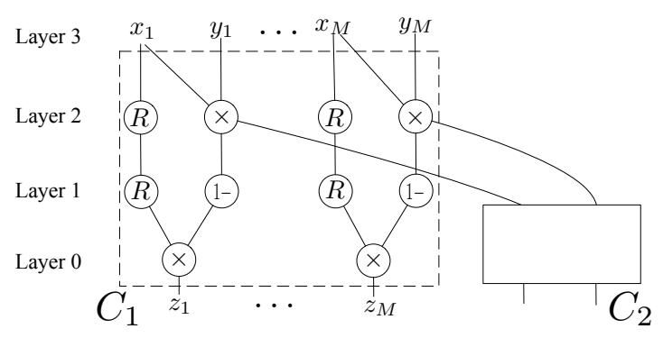
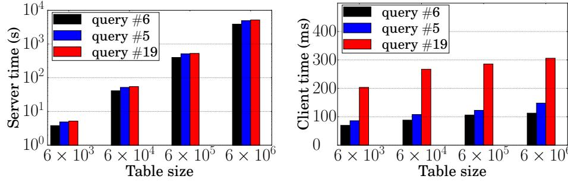

{0}------------------------------------------------

# vSQL: Verifying Arbitrary SQL Queries over Dynamic Outsourced Databases

Yupeng Zhang\*, Daniel Genkin<sup>†,\*</sup>, Jonathan Katz\*, Dimitrios Papadopoulos<sup>‡,\*</sup> and Charalampos Papamanthou\*

\*University of Maryland 

†University of Pennsylvania 

‡Hong Kong University of Science and Technology

Email: {zhangyp,cpap}@umd.edu, danielg3@cis.upenn.edu, jkatz@cs.umd.edu, dipapado@cse.ust.hk

Abstract—Cloud database systems such as Amazon RDS or Google Cloud SQL enable the outsourcing of a large database to a server who then responds to SQL queries. A natural problem here is to efficiently verify the correctness of responses returned by the (untrusted) server. In this paper we present vSQL, a novel cryptographic protocol for publicly verifiable SQL queries on dynamic databases. At a high level, our construction relies on two extensions of the CMT interactive-proof protocol [Cormode et al., 2012]: (i) supporting outsourced input via the use of a polynomial-delegation protocol with succinct proofs, and (ii) supporting auxiliary input (i.e., non-deterministic computation) efficiently. Compared to previous verifiable-computation systems based on interactive proofs, our construction has verification cost polylogarithmic in the auxiliary input (which for SQL queries can be as large as the database) rather than linear.

In order to evaluate the performance and expressiveness of our scheme, we tested it on SQL queries based on the TPC-H benchmark on a database with  $6\times 10^6$  rows and 13 columns. The server overhead in our scheme (which is typically the main bottleneck) is up to  $120\times$  lower than previous approaches based on succinct arguments of knowledge (SNARKs), and moreover we avoid the need for query-dependent pre-processing which is required by optimized SNARK-based schemes. In our construction, the server/client time and the communication cost are comparable to, and sometimes smaller than, those of existing customized solutions which only support specific queries.

## I. INTRODUCTION

All major cloud providers offer Database-as-a-Service solutions that allow companies and individuals (*clients*) to alleviate storage costs and achieve resource elasticity by delegating storage and maintenance of their data to a cloud server. A client can then query and/or update its data using, e.g., standard SQL queries. Outsourcing data in this way, however, introduces new security challenges: in particular, the client may need to ensure the *integrity* of the results returned by the server. Providing such a guarantee is important if the client does not trust the server, or even if the client is concerned about the possibility of server errors or external compromise.

Prior works<sup>1</sup> on *verifiable computation/outsourcing* and *authenticated data structures* address exactly this problem (see Section I-D for a detailed discussion), but have significant drawbacks. Generic solutions (e.g., SNARKs) can be used to verify arbitrary computations, but impose an unacceptable overhead at the server. Function-specific schemes (e.g., authenticated data structures) target specific classes of computations and can be much more efficient than generic solutions; how-

<span id="page-0-0"></span><sup>1</sup>We assume no trusted hardware, nor are we willing to assume multiple, non-colluding servers (as required by [22]).

ever, they suffer from limited expressiveness, and in particular they cannot handle a wide range of SQL queries.

#### A. Our Results

In this work we present vSQL, a system for verifiable SQL queries. vSQL allows a client who owns a relational database to outsource it to an untrusted server while storing only a small *digest* locally. Later, the client can issue arbitrary SQL queries to the server, who returns the query's result. (In the case of an update query, the result is an updated digest.) The client can then verify the validity of the result using an interactive protocol with the server; if the result returned by the server is incorrect, the client will reject with overwhelming probability.

vSQL overcomes the drawbacks of existing works. It is highly expressive, supporting any computation expressed as an arithmetic circuit (which in particular means arbitrary SQL queries, including updates) efficiently. We empirically demonstrate vSQL's concrete performance and expressiveness using the TPC-H [7] benchmark, and find that the server-side computation (which is usually the limiting factor in verifiable-computation schemes) is 5–120× better for vSQL than it is in highly optimized libsnark-based constructions [4] (that further require query-dependent preprocessing), and comparable to or better than a state-of-the-art database-delegation scheme [61] that only supports a limited subset of SQL.

At a high level, vSQL gains efficiency by combining two different approaches. First, vSQL uses a highly efficient information-theoretic interactive proof system [25] for delegating computations expressed as arithmetic circuits. This reduces the number of cryptographic operations performed by the server from linear in the circuit size to linear in the lengths of the circuit's inputs and outputs. Second, vSQL supports nondeterministic computation by allowing the server to provide auxiliary inputs to the circuit. We achieve this by using a novel scheme for verifiable polynomial delegation with knowledgeextraction properties, improving previous results [56]. To the best of our knowledge, our protocol is the first implementation of an argument system that supports general non-deterministic computations and simultaneously achieves the following two properties: (1) the number of cryptographic operations performed by the prover depends linearly on the circuit's input and output size, and (2) the total prover time is quasilinear in the size of the evaluated circuit. In addition, vSQL benefits from several performance optimizations that improve both the server's and client's concrete efficiency (see Section VI). We describe our techniques in further detail next.

{1}------------------------------------------------

## *B. Our Techniques*

Reducing Cryptographic Overhead. A key building block of vSQL is the information-theoretic interactive proof system due to Cormode et al. [\[25\]](#page-16-2) (the *CMT protocol*) that allows a client to verify that y = C(x) for some circuit C and input x known to the client. It is natural in our setting to let x be the client's data, and to let C be a circuit corresponding to the client's query. While this is a good starting point for reducing the number of cryptographic operations (since the CMT protocol is information-theoretic), in our setting we cannot directly apply the CMT protocol since our goal is to avoid requiring the client to store its data x.

Supporting Delegated Inputs. We observe that at the last step of the CMT protocol it is sufficient for the client to be able to evaluate a certain multivariate polynomial p<sup>x</sup> that depends on x (but not on C) at a random point. We develop a new *polynomial-delegation scheme* that allows the client to outsource p<sup>x</sup> itself; i.e., it enables the client to store a short digest com<sup>x</sup> of p<sup>x</sup> that can be used to verify claimed results about the evaluation of p<sup>x</sup> on points of the client's choice. This allows the client to delegate its input to the untrusted server while still being able to execute the CMT verifier.

Supporting Auxiliary Inputs. In order to leverage the efficiency improvements provided by non-determinism, we extend the CMT protocol to support server-provided *auxiliary inputs*. (This allows the server to prove that there exists w such that y = C(x, w).) A straightforward approach for achieving this [\[56\]](#page-16-3) is to have the server provide the entire auxiliary input to the client. However, we show that when evaluating SQL queries it is possible that the auxiliary input that is necessary in order to reduce the size of the circuit being evaluated is as large as the database itself; in that case, the naive approach of sending the auxiliary input to the client is inefficient. Instead, we have the server provide a succinct commitment to the auxiliary input which will be used by the CMT verifier. To instantiate this approach efficiently, we use the polynomial-delegation scheme described above, augmented with a knowledge-extraction property (which is required for extracting a cheating server's auxiliary input).

Supporting Efficient Updates. We also build on the above techniques to handle arbitrary updates efficiently, something that is notoriously hard for previous approaches to verifiable computation. Say the client wants to apply an update given by a circuit C, and let x <sup>0</sup> = C(x). Obviously, having the server send the result x 0 to the client is impractical. To avoid this, we first observe that the client need not learn x 0 in order to verify future queries about x 0 ; rather, it is sufficient for the client to learn comx<sup>0</sup> . At this point, we could just extend C to a circuit C 0 that also includes the computation of comx<sup>0</sup> and handle updates the same way we handle queries but this would impose an additional cost as it would result in a increased circuit size. Instead, we further observe that this is not necessary: in order to run the CMT verifier for circuit C, the client need not know the output (x 0 in this case) explicitly; as with the input, it is enough to be able to evaluate the corresponding multivariate polynomial px<sup>0</sup> at a random point. For this, we can again use our polynomial-delegation scheme to have the server first provide the commitment comx<sup>0</sup> to the client and then provably evaluate px<sup>0</sup> at a point chosen by the latter, which is sufficient to prove that comx<sup>0</sup> is the new digest.

Eliminating Interaction. Our approach uses the CMT protocol and thus inherits its need for interaction. While this is not a major barrier (as demonstrated by our experimental evaluation in Section [VII\)](#page-12-0), we remark that interaction can be avoided using the Fiat-Shamir approach in the random-oracle model.

## *C. Outline*

In Section [II](#page-2-0) we establish notation and introduce the necessary background. Section [III](#page-4-0) presents our verifiable polynomialdelegation protocol, which is used as a building block for our main construction. We introduce our security definition in Section [IV,](#page-6-0) and the vSQL construction satisfying this definition in Section [V.](#page-6-1) We discuss a series of optimizations that improve the performance of our construction in Section [VI.](#page-9-0) In Section [VII](#page-12-0) we provide a detailed experimental evaluation of our system. We conclude in Section [VIII.](#page-15-2)

## <span id="page-1-0"></span>*D. Related Work*

Verifiable outsourcing of data has been studied from multiple perspectives, and under various names. Work on authenticated data structures typically focuses on handling only a specific class of computations on outsourced data, e.g., range queries [\[43\]](#page-16-4), [\[47\]](#page-16-5), joins [\[59\]](#page-16-6), [\[63\]](#page-16-7), [\[30\]](#page-16-8), pattern matching [\[27\]](#page-16-9), [\[48\]](#page-16-10), set operations [\[50\]](#page-16-11), [\[21\]](#page-16-12), [\[41\]](#page-16-13), polynomial evaluation [\[9\]](#page-15-3), graph queries [\[35\]](#page-16-14), [\[62\]](#page-16-15), and search problems [\[45\]](#page-16-16), [\[46\]](#page-16-17). The most relevant point of comparison to our work is IntegriDB [\[61\]](#page-16-1), which supports a subset of SQL. In Section [VII,](#page-12-0) we show that vSQL is significantly more expressive than IntegriDB while enjoying comparable efficiency.

Arbitrary computations on outsourced data can be handled by schemes for verifiable delegation of computation [\[31\]](#page-16-18), [\[24\]](#page-16-19). State-of-the-art systems [\[10\]](#page-15-4), [\[51\]](#page-16-20), [\[26\]](#page-16-21), [\[52\]](#page-16-22), [\[57\]](#page-16-23) can handle arbitrary non-deterministic arithmetic circuits by relying on succinct arguments of knowledge (SNARKs) [\[14\]](#page-16-24), [\[32\]](#page-16-25). SNARKs provide an efficiently verifiable, constant-size proof for the correct evaluation of a circuit. The major disadvantage of SNARK-based approaches is the extremely high prover time they currently impose (cf. Section [VII\)](#page-12-0). In addition, the fastest existing implementations of SNARKs assume a circuitspecific preprocessing step, something that is not practical (and may be impossible) in a scenario where multiple queries that cannot be predicted in advance will be made on a given database. Finally, we remark that the systems mentioned above are all "natively" designed to support verification only when the input is known to the client. Support for outsourced data can be handled by having the client compute a succinct hash of its data, and then verifying the hash computation along with verification of the result. However, this adds additional overhead as the hash computation needs to either be computed as part of the arithmetic circuit [\[19\]](#page-16-26), or checked by an external mechanism [\[8\]](#page-15-5), [\[28\]](#page-16-27). Alternatively, one could hard-code the 

{2}------------------------------------------------

database into the circuit being evaluated, but then the circuit-specific preprocessing needs to be executed after each database update. In Section VII, we show that vSQL has significantly better prover time than SNARK-based approaches.

While some other works also aim at verifying arbitrary computations over remotely stored data [23], [17], [38], [20], these approaches are only of theoretical interest at this point.

Interactive proofs were introduced by Goldwasser et al. [34], and have been studied extensively in complexity theory. More recently, prover-efficient interactive proofs for log-depth circuits were introduced in [33]. Subsequent works have optimized and implemented this protocol, demonstrating the potential of interactive proofs for practical verifiable computation [25], [54], [56].

#### II. PRELIMINARIES

#### <span id="page-2-0"></span>A. SQL Queries

Structured Query Language (SQL) is a very popular programming language designed for querying and managing relational database systems. It operates on databases that consist of collections of two-dimensional matrices called *tables*. In the following, we briefly present the general structure of such queries and provide concrete examples for common types.

In SQL, a simple query begins with the keyword SELECT followed by a function  $A(col_1, \ldots)$  and then the keyword FROM followed by a number of tables, where A is defined over (a subset of) the columns of the specified tables. This sequence of clauses and expressions dictates the output of the query. Following these, there is a WHERE clause followed by a sequence of predicates connected by logical operators (e.g, AND, OR, NOT) that restrict the rows used when computing the output. The above is best illustrated by a series of examples. Consider a database consisting of tables  $\mathbf{T_1}$  and  $\mathbf{T_2}$ :

|                  | row_id | employee_id | name  | age | salary |
|------------------|--------|-------------|-------|-----|--------|
|                  | 1      | 2019        | John  | 28  | 45,000 |
| $\mathbf{T_1}$ : | 2      | 1905        | Kate  | 31  | 55,000 |
|                  | 3      | 1908        | Lisa  | 44  | 70,000 |
|                  | 4      | 2117        | Leo   | 23  | 39,000 |
|                  | 5      | 2003        | Alice | 29  | 34,000 |

|                  | row_id | employee_id | department |
|------------------|--------|-------------|------------|
|                  | 1      | 1905        | Sales      |
| $\mathbf{T_2}$ : | 2      | 1906        | Sales      |
| <b>1</b> 2.      | 3      | 1908        | HR         |
|                  | 4      | 2003        | R&D        |
|                  | 5      | 2022        | HR         |
|                  | 6      | 2117        | R&D        |

The first example we provide is a SQL range query which is used to select rows for which particular values fall within a set of specified ranges. The conditions may be defined over multiple columns, in which case we refer to it as a *multi-dimensional range query*. For example, the query "SELECT \* FROM  $T_1$  WHERE age < 35 AND salary > 40,000" is a two-dimensional range query that returns the following table.

| row_id | employee_id | name | age | salary |
|--------|-------------|------|-----|--------|
| 1      | 2019        | John | 28  | 45,000 |
| 2      | 1905        | Kate | 31  | 55,000 |

A FROM clause can be followed by JOIN sub-clauses that are used to combine multiple tables based on common values in specific columns. An example of such a JOIN query is "SELECT  $T_1$ .name,  $T_2$ .department FROM  $T_1$  JOIN  $T_2$  ON  $T_1$ .employee\_id =  $T_2$ .employee\_id," which returns:

| name  | department |
|-------|------------|
| Kate  | Sales      |
| Lisa  | HR         |
| Alice | R&D        |

The result of any SQL query is itself a table to which another SQL query can be applied. In other words, a SQL query may be composed of several sub-queries. SQL also provides queries for adding, updating, and deleting data from a SQL database. Data-manipulation queries start with an INSERT, DELETE, or UPDATE clause followed by a table identifier, a series of values, and (optionally) a sequence of WHERE clauses. For example, the query "DELETE FROM  $T_2$  WHERE department = Sales" deletes the first two rows from  $T_2$ . Finally, there are queries that manipulate the database structure, e.g, by adding new columns or creating a new table.

Note that a common theme of the examples presented above is that they process each row of some table independently, performing a specific operation (e.g., comparing values from given columns with a specified range) on each row. In Section V, we discuss how this structure can be leveraged to improve efficiency in our setting.

#### <span id="page-2-1"></span>B. Interactive Proofs

An interactive proof [34] is a protocol that allows a prover  $\mathcal{P}$  to convince a verifier  $\mathcal{V}$  of the validity of some statement. We phrase this in terms of  $\mathcal{P}$  trying to convince  $\mathcal{V}$  that f(x) = 1, where f is fixed and x is the common input. Of course, an interactive proof in this sense is only interesting if the running time of  $\mathcal{V}$  is less than the time to compute f.

<span id="page-2-2"></span>**Definition 1.** Let f be a boolean function. A pair of interactive algorithms  $(\mathcal{P}, \mathcal{V})$  is an interactive proof for f with soundness  $\epsilon$  if the following holds.

- Completeness. For every x such that f(x) = 1 it holds that  $\Pr[\langle \mathcal{P}, \mathcal{V} \rangle(x) = \mathsf{accept}] = 1$ .
- $\epsilon$ -Soundness. For any x with  $f(x) \neq 1$  and any  $\mathcal{P}^*$  it holds that  $\Pr[\langle \mathcal{P}^*, \mathcal{V} \rangle(x) = \mathsf{accept}] \leq \epsilon$ .

Note that the above can be easily extended to prove that g(x) = y (where x, y are common input) by considering the function f defined as f(x, y) = 1 iff g(x) = y.

The Sum-Check Protocol. A fundamental interactive protocol that serves as an important building block for our work is the *sum-check protocol* [44]. Here, the common input of the prover and verifier is an  $\ell$ -variate polynomial  $g(x_1, \ldots, x_{\ell})$  over a field  $\mathbb{F}$ ; the prover's goal is to convince the verifier that

$$H = \sum_{b_1 \in \{0,1\}} \sum_{b_2 \in \{0,1\}} \dots \sum_{b_\ell \in \{0,1\}} g(b_1, b_2, \dots, b_\ell).$$

Note that direct computation of H by  $\mathcal V$  requires at least  $2^\ell$  work. Using the sum-check protocol, the verifier's computation

{3}------------------------------------------------

is exponentially smaller. The protocol proceeds in  $\ell$  rounds, as follows. In the first round, the prover sends the univariate polynomial  $g_1(x_1) \stackrel{\text{def}}{=} \sum_{b_2,\dots,b_\ell \in \{0,1\}} g(x_1,b_2,\dots,b_\ell)$ ; the verifier checks that the degree of  $g_1$  is at most the degree of  $x_1$  in g, and that  $H = g_1(0) + g_1(1)$ ; it rejects if these do not hold. Next,  $\mathcal V$  sends a uniform challenge  $r_1 \in \mathbb F$ . In the ith round  $\mathcal P$  sends the polynomial  $g_i(x_i) \stackrel{\text{def}}{=} \sum_{b_{i+1},\dots,b_\ell \in \{0,1\}} g(r_1,\dots,r_{i-1},x_i,b_{i+1},\dots,b_\ell)$ . The verifier checks the degree of  $g_i$  and verifies that  $g_{i-1}(r_{i-1}) = g_i(0) + g_i(1)$ ; if so, it sends a uniform  $r_i \in \mathbb F$  to the prover. After the final round,  $\mathcal V$  accepts only if  $g(r_1,\dots,r_\ell) = g_\ell(r_\ell)$ .

The degree of each monomial in g is the sum of the powers of its variables; the total degree of g is the maximum degree of any of its monomials. We have [44]:

**Theorem 1.** For any  $\ell$ -variate, degree-d polynomial g over  $\mathbb{F}$ , the sum-check protocol is an interactive proof for the (no-input) function  $\sum_{b_1 \in \{0,1\}} \dots \sum_{b_\ell \in \{0,1\}} g(b_1,\dots,b_\ell)$  with soundness  $d \cdot \ell/|\mathbb{F}|$ .

#### <span id="page-3-2"></span>C. Multilinear Extensions

Let  $V:\{0,1\}^{\ell} \to \mathbb{F}$  be a function. Then there exists a unique  $\ell$ -variate polynomial  $\tilde{V}:\mathbb{F}^{\ell} \to \mathbb{F}$ , called the *multilinear* extension of V, with the properties that (1)  $\tilde{V}$  has degree at most 1 in each variable and (2)  $\tilde{V}(x) = V(x)$  for all  $x \in \{0,1\}^{\ell}$ . Note that  $\tilde{V}$  can be defined as

<span id="page-3-4"></span>
$$\tilde{V}(x_1, \dots, x_\ell) = \sum_{b \in \{0,1\}^\ell} \prod_{i=1}^\ell \mathcal{X}_{b_i}(x_i) \cdot V(b), \tag{1}$$

where  $b_i$  is the *i*th bit of b, and we set  $\mathcal{X}_1(x_i) = x_i$  and  $\mathcal{X}_0(x) = 1 - x_i$ .

Multilinear Extensions of Arrays. An array A = $(a_0,\ldots,a_{n-1})\in\mathbb{F}^n$ , where for simplicity we assume n is a power of 2, can be viewed as the function  $A: \{0,1\}^{\log n} \to \mathbb{F}$ such that  $A(i) = a_i$  for  $0 \le i \le n-1$  (where i is expressed in binary). In the sequel, abuse this terminology and use a multilinear extension A of an array A. A useful property of multilinear extensions of arrays is the ability to efficiently combine two multilinear extensions. That is, let  $A_1, A_2$  be two equal-length arrays, and let  $A = A_1 || A_2$  be their concatenation. Then  $\tilde{A}(x_1,\ldots,x_{\log n+1})$  can be computed as  $(1-x_1)A_1(x_2,\ldots,x_{\log n+1})+x_1A_2(x_2,\ldots,x_{\log n+1}),$  i.e., as a linear combination of the evaluations of the multilinear extensions of the smaller arrays. More generally, in the case of m equal-length arrays  $A_0, \ldots, A_{m-1}$  (where m is a power of 2) the multilinear extension of  $\tilde{A} = A_0 || \dots || A_{m-1}$  can be evaluated on a point  $(x_1, \ldots, x_{\log(nm)})$  as

<span id="page-3-3"></span>
$$\sum_{i=0}^{m-1} \prod_{j=1}^{\log m} \mathcal{X}_{i_j}(x_j) \tilde{A}_i(x_{\log m+1}, \dots, x_{\log(nm)})$$
 (2)

where  $i_j$  is the jth bit of i and  $\mathcal{X}_{i_j}(x_j)$  is defined as above.

#### <span id="page-3-1"></span>D. The CMT Protocol

Cormode et al. [25], building on work of Goldwasser et al. [33], show an efficient interactive proof (that we call the

CMT protocol) for a certain class of functions. The CMT protocol serves as the starting point for our scheme.

**High-Level Overview.** Let C be a depth-d arithmetic circuit over a finite field  $\mathbb{F}$  that is layered, i.e., for which each gate of C is associated with a layer, and the output wire from a gate at layer i can only be an input wire to a gate at level i-1. The CMT protocol processes the circuit one layer at a time, starting from layer 0 (that contains the output wires) and ending at layer d (that contains the input wires). The prover  $\mathcal{P}$  starts by proposing a value g for the output of the circuit on input g. Then, in the gth round, g0 reduces a claim (i.e., an algebraic statement) about the values of the wires in layer g1 to a claim about the values of the wires in layer g2. The protocol terminates with a claim about the wire values at layer g3 (i.e., the input wires) that can be checked directly by the verifier g2 who knows the input g3. If that check succeeds, then g3 accepts.

**Notation.** Before describing the protocol more formally we introduce some additional notation. Let  $S_i$  be the number of gates in the ith layer and set  $s_i = \lceil \log S_i \rceil$  so  $s_i$  bits suffice to identify each gate at the ith layer. The evaluation of C on an input x assigns in a natural way a value in  $\mathbb F$  to each gate in the circuit. Thus, for each layer i we can define a function  $V_i: \{0,1\}^{s_i} \to \mathbb{F}$  that takes as input a gate g and returns its value (and returns 0 if g does not correspond to a valid gate). Using this notation,  $V_d$  corresponds to the input of the circuit, i.e., x. Finally, we define for each layer i two boolean functions add<sub>i</sub>, mult<sub>i</sub>, which we refer to as wiring predicates, as follows:  $\mathsf{add}_i: \{0,1\}^{s_{i-1}+2s_i} \to \{0,1\}$  takes as input three gates  $g_1, g_2, g_3$ , where  $g_1$  is at layer i - 1 and  $g_2, g_3$  are at layer i, and returns 1 if and only if  $g_1$  is an addition gate whose input wires are the output wires of gates  $g_2$  and  $g_3$ . (We define mult<sub>i</sub> for multiplication gates analogously.) The value of a gate g at layer i < d can thus be recursively computed as

$$\begin{split} V_i(g) &= \sum_{u,v \in \{0,1\}^{s_{i+1}}} \Big( \mathsf{add}_{i+1}(g,u,v) \cdot (V_{i+1}(u) + V_{i+1}(v)) \\ &+ \mathsf{mult}_{i+1}(g,u,v) \cdot (V_{i+1}(u) \cdot V_{i+1}(v)) \Big). \end{split}$$

**Protocol Details.** One idea is for  $\mathcal{V}$  to verify that y = C(x) by checking that  $V_i(g)$  is computed correctly for each gate g in each layer i. Since  $V_i(g)$  can be expressed as a summation, this could be done using the sum-check protocol from Section II-B. However, the sum-check protocol operates on polynomials defined over  $\mathbb{F}$  and therefore we need to replace terms with their multilinear extensions. That is:

$$\tilde{V}_{i}(z) = \sum_{\substack{g \in \{0,1\}^{s_{i}} \\ u,v \in \{0,1\}^{s_{i}} \\ = \\ u,v \in \{0,1\}^{s_{i}} \\ u,v \in \{0,1\}^{s_{i}} }} f_{i,z}(g,u,v) 
\stackrel{\text{def}}{=} \sum_{\substack{g \in \{0,1\}^{s_{i}} \\ u,v \in \{0,1\}^{s_{i}} \\ s_{i}+1}}} \tilde{\beta}_{i}(z,g) \cdot \left(\tilde{\text{add}}_{i+1}(g,u,v) \cdot (\tilde{V}_{i+1}(u))\right)$$
(3)

<span id="page-3-0"></span>
$$+\tilde{V}_{i+1}(v)) + \tilde{\text{mult}}_{i+1}(g, u, v) \cdot (\tilde{V}_{i+1}(u) \cdot \tilde{V}_{i+1}(v)),$$
  
add<sub>i</sub> (resp., mult<sub>i</sub>) is the multilinear extension of add<sub>i</sub>

where  $\mathsf{add}_i$  (resp.,  $\mathsf{mult}_i$ ) is the multilinear extension of  $\mathsf{add}_i$  (resp.,  $\mathsf{mult}_i$ ) and  $\tilde{\beta}_i$  is the multilinear extension of the selector function that takes two  $s_i$ -bit inputs a, b and outputs 1 if a = b

{4}------------------------------------------------

<span id="page-4-2"></span>**Construction 1** (CMT protocol). Let  $\mathbb{F}$  be a prime-order field, and let  $C: \mathbb{F}^n \to \mathbb{F}^k$  be a depth-d layered arithmetic circuit.  $\mathcal{P}$  and  $\mathcal{V}$  hold x, y, and  $\mathcal{P}$  wants to convince  $\mathcal{V}$  that y = C(x). To do so:

- 1) Let  $V_0: \{0,1\}^{\lceil \log k \rceil} \to \mathbb{F}$  be such that  $V_0(j)$  equals the jth element of y. Verifier  $\mathcal{V}$  chooses uniform  $r_0 \in \mathbb{F}^{\lceil \log k \rceil}$  and sends it to  $\mathcal{P}$ . Both parties set  $a_0 = \tilde{V}_0(r_0)$ .
- 2) For i = 1, ..., d:
  - a)  $\mathcal{P}$  and  $\mathcal{V}$  run the sum-check protocol for value  $a_{i-1}$  and polynomial  $f_{i-1,r_{i-1}}$  as per Equation (3). In the last step of that protocol,  $\mathcal{P}$  provides  $(v_1,v_2)$  for which it claims  $v_1 = \tilde{V}_i(q_1)$  and  $v_2 = \tilde{V}_i(q_2)$ .
  - b) Let  $\gamma: \mathbb{F} \to \mathbb{F}^{s_i}$  be the line with  $\gamma(0) = q_1$  and  $\gamma(1) = q_2$ . Then  $\mathcal{P}$  sends the degree- $s_i$  polynomial  $h(x) = \tilde{V}_i(\gamma(x))$ . Next,  $\mathcal{V}$  verifies that  $h(0) = v_1$  and  $h(1) = v_2$ , and rejects if not. Then  $\mathcal{V}$  chooses uniformly at random  $r'_i \in \mathbb{F}$ , sets  $r_i = \gamma(r'_i)$ ,  $a_i = h(r'_i)$  and sends them to  $\mathcal{P}$ .
- 3) V accepts iff  $a_d = \tilde{V}_d(r_d)$ , where  $\tilde{V}_d$  is the multilinear extension of the polynomial representing the input x.

and 0 otherwise.<sup>2</sup> However, this approach would incur a cost to the verifier larger than the cost of evaluating C, as it requires one execution of the sum-check protocol per gate.

Instead, by leveraging the recursive form of  $V_i$ , correctness of the circuit evaluation can be checked with a single execution of the sum-check protocol for each layer i, as follows. Assume for simplicity that the output of the circuit is a single value. The interaction begins at level 0, with the prover claiming that  $y = V_0(0)$  (i.e., the circuit's output) for some value y. The two parties then execute the sum-check protocol for the polynomial  $f_{0,0}$  in order to check this claim. Recall that, at the end of this execution,  $\mathcal{V}$  is supposed to evaluate  $f_{0,0}$  at a random point  $\rho \in \mathbb{F}^{s_0+2s_1}$  (the randomness generated by the sum-check verifier). Since  $f_{0,0}$  depends on  $V_1(u)$  and  $V_1(v)$ , in this case  $\mathcal{V}$  has to evaluate  $\tilde{V}_1$  on the random points  $q_1,q_2\in\mathbb{F}^{s_1}$  where  $q_2$  consists of the last  $s_1$  entries of  $\rho$ , and  $q_1$  from the previous  $s_1$  ones. If the verifier had access to all the correct gate values at layer 1, he could compute these evaluations himself. Since he does not, however, he must rely on the prover to provide him with these evaluations, say  $v_1, v_2$ . This effectively reduces the validity of the original claim that  $y = V_0(0)$  to the validity of the two claims that  $V_1(q_1) = v_1$  and  $V_1(q_2) = v_2$ . The two parties can now execute the sum-check protocol for these two claims. By repeatedly applying this idea, the final claim by the prover will be stated with respect to  $V_d$  (i.e., the multilinear extension of the circuit's input), which can be checked locally by the verifier who has the input x.

Unfortunately, this approach still potentially requires  $2^d$  executions of the sum-check protocol, since the number of claims being verified doubles with each level.

Condensing to a Single Evaluation Per Layer. Efficiency can be improved by reducing the proof that  $v_1 = \tilde{V}_1(q_1)$  and  $v_2 = \tilde{V}_1(q_2)$  to a *single* sum-check execution, as follows. Let  $\gamma : \mathbb{F} \to \mathbb{F}^{s_1}$  be the unique line with  $\gamma(0) = q_1$  and  $\gamma(1) = q_2$ . The prover sends a degree- $s_1$  polynomial h that is supposed to be  $\tilde{V}_1(\gamma(x))$ , i.e., the restriction of  $\tilde{V}_1$  to the line  $\gamma$ . The verifier checks that  $h(0) = v_1$  and  $h(1) = v_2$ , and then picks a new random point  $r'_1 \in \mathbb{F}$  and initiates a *single* invocation of the sum-check protocol to verify that  $\tilde{V}_1(\gamma(r'_1)) = h(r'_1)$ . Proceeding in this way, it is possible to obtain a protocol that uses only O(d) executions of the sum-check protocol.

We assumed so far that there is a single output value y. Larger outputs can be handled efficiently [56] by adapting the above approach so that the initial claim by the prover is stated directly about the multilinear extension of the claimed output.

The CMT protocol is formally described in Construction 1.3

<span id="page-4-7"></span>**Theorem 2** ([33], [25], [56], [54]). Let  $C : \mathbb{F}^n \to \mathbb{F}^k$  be a depth-d layered arithmetic circuit. Construction 1 is an interactive proof for the function computed by C with soundness  $O(d \cdot \log S/|\mathbb{F}|)$ , where S is the maximal number of gates per circuit layer. It uses  $O(d \log S)$  rounds of interaction, and the running time of P is  $O(|C| \log S)$ . If  $add_i$  and  $mult_i$  are computable in time  $O(\operatorname{polylog} S)$  for all layers  $i \leq d$ , then the running time of the verifier V is  $O(n+k+d \cdot \operatorname{polylog} S)$ .

The following remark will be particularly useful for us in the context of evaluating circuits representing SQL queries.

<span id="page-4-6"></span>**Remark 1** ([54]). If C can be expressed as a composition of (i) parallel copies of a layered circuit C' whose maximum number of gates at any layer is S', and (ii) a subsequent "aggregation" layered circuit C'' of size  $O(|C|/\log|C|)$ , the running time of  $\mathcal{P}$  is reduced to  $O(|C|\log|S'|)$ .<sup>4</sup>

#### E. Bilinear Pairings

We denote by bp :=  $(p, \mathbb{G}, \mathbb{G}_T, e, g) \leftarrow \mathsf{BilGen}(1^\lambda)$  the generation of parameters for a bilinear map,<sup>5</sup> where  $\lambda$  is the security parameter,  $\mathbb{G}, \mathbb{G}_T$  are two groups of order p (with p a  $\lambda$ -bit prime),  $g \in \mathbb{G}$  is a generator, and  $e : \mathbb{G} \times \mathbb{G} \to \mathbb{G}_T$  is a bilinear map. In Appendix A we present the assumptions necessary for proving the security of our scheme.

## III. VERIFIABLE POLYNOMIAL DELEGATION

<span id="page-4-0"></span>As a key part of our main construction, we use a new scheme for *verifiable polynomial delegation* that allows a client to outsource storage of a multivariate polynomial f to a server while retaining only a short commitment com. The server can

<span id="page-4-1"></span><sup>&</sup>lt;sup>2</sup>Although using  $\tilde{\beta}$  is not strictly necessary [55], we use it in our implementation because it improves efficiency when C is composed of many parallel copies of a smaller circuit C' (as is the case for standard SQL queries).

<span id="page-4-3"></span><sup>&</sup>lt;sup>3</sup>Throughout the paper, when reporting asymptotic complexities we omit a factor that is polylogarithmic in the field/blinear group size, implicitly assuming all operations take constant time.

<span id="page-4-4"></span><sup>&</sup>lt;sup>4</sup>Note that the bound on the running time of  $\mathcal{V}$  can also be improved if one makes stronger assumptions about the "regularity" of C''. Many common SQL queries satisfy this condition (e.g., return the average of a range query).

<span id="page-4-5"></span><sup>&</sup>lt;sup>5</sup>For simplicity of exposition we assume symmetric (Type I) pairings. Our treatment can be extended to asymmetric pairings, which are what we use in our implementation for better efficiency.

{5}------------------------------------------------

<span id="page-5-2"></span>Construction 2 (Verifiable Polynomial Delegation). Let  $\mathbb{F}$  be a prime-order finite field,  $\ell$  be a variable parameter, and d be a degree parameter such that  $O(\binom{\ell+\ell d}{\ell d})$  is polynomial in  $\lambda$ . Consider the following verifiable delegation protocol that supports the family  $\mathcal{F}$  of all  $\ell$ -variate polynomials of variable-degree d over  $\mathbb{F}$ .

- 1) KeyGen $(1^{\lambda}, \ell, d)$ : Run bp  $\leftarrow$  BilGen $(1^{\lambda})$ . Select uniform  $\alpha, s_1, \ldots, s_{\ell} \in \mathbb{F}$  and compute  $\mathbb{P} = \{g^{\prod_{i \in W} s_i}, g^{\alpha \cdot \prod_{i \in W} s_i}\}_{W \in \mathcal{W}_{\ell, d}}$ . The public parameters are pp =  $(\mathsf{bp}, \mathbb{P}, g^{\alpha})$ .
- 2) Commit(f, pp): Compute  $c_1 = g^{f(s_1, \dots, s_\ell)}$  and  $c_2 = g^{\alpha \cdot f(s_1, \dots, s_\ell)}$ , and output the commitment com  $= (c_1, c_2)$ .
- 3) Evaluate (f, t, r, pp): On input  $t = (t_1, \ldots, t_\ell)$  and random challenge  $r = (r_1, \ldots, r_{\ell-1})$ , compute y = f(t). Using Lemma 1 compute polynomial  $q_\ell(x_\ell)$  and polynomials  $q_i(x_i, \ldots, x_\ell)$  for  $i = 1, \ldots, \ell-1$ , such that

$$f(x_1,\ldots,x_\ell) - f(t_1,\ldots,t_\ell) = (x_\ell - t_\ell) \cdot q_\ell(x_\ell) + \sum_{i=1}^{\ell-1} (r_i \cdot (x_i - t_i) + x_{i+1} - t_{i+1}) \cdot q_i(x_i,\ldots,x_\ell).$$

Output y and the proof  $\pi := (q^{q_1(s_1,...,s_{\ell})}, \ldots, q^{q_{\ell-1}(s_1,...,s_{\ell})}, q_{\ell}).$ 

4)  $\text{Ver}(\text{com}, y, t, \pi, r, \text{pp})$ : Parse the proof  $\pi$  as  $(\pi_1, \dots, \pi_{\ell-1}, q_\ell)$ . If  $e(c_1/g^y, g) \stackrel{?}{=} e(g^{s_\ell - t_\ell}, g^{q_\ell(s_\ell)}) \cdot \prod_{i=1}^{\ell-1} e(g^{r_i(s_i - t_i) + s_{i+1} - t_{i+1}}, \pi_i)$  and  $e(c_1, g^\alpha) = e(c_2, g)$ , output accept else, output reject.

<span id="page-5-3"></span>**Definition 2.** Let  $\mathbb{F}$  be a finite field,  $\mathcal{F}$  be a family of  $\ell$ -variate polynomials over  $\mathbb{F}$ , and d be a variable-degree parameter. (KeyGen, Commit, Evaluate, Ver) constitute a verifiable polynomial-delegation protocol for  $\mathcal{F}$  if:

- **Perfect Completeness.** For any polynomial  $f \in \mathcal{F}$ , if  $pp \leftarrow \mathsf{KeyGen}(1^\lambda, \ell, d)$  and  $\mathsf{com} \leftarrow \mathsf{Commit}(f, pp)$ , then for any  $t \in \mathbb{F}^\ell$  and  $r \in \mathbb{F}^\ell$  if  $(y, \pi) \leftarrow \mathsf{Evaluate}(f, t, r, pp)$  then (1) y = f(t) and (2)  $\mathsf{Ver}(\mathsf{com}, t, y, \pi, r, pp) = accept$ .
- **Soundness.** For any PPT adversary A the following is negligible:

$$\Pr\left[\begin{array}{c} \mathsf{pp} \leftarrow \mathsf{KeyGen}(1^\lambda,\ell,d); (f^*,t^*) \leftarrow \mathcal{A}(1^\lambda,\mathsf{pp}); \\ \mathsf{com} \leftarrow \mathsf{Commit}(f^*,\mathsf{pp}); r \leftarrow \mathbb{F}^\ell; (y^*,\pi^*) \leftarrow \mathcal{A}(1^\lambda,\mathsf{pp},f^*,r) \end{array} \right] \\ \cdot \begin{array}{c} \mathsf{Ver}(\mathsf{com},t^*,y^*,\pi^*,r,\mathsf{pp}) = \mathsf{accept} \\ \land y^* \neq f^*(t^*) \land f^* \in \mathcal{F} \end{array} \right]$$

(KeyGen, Commit, Evaluate, Ver) is an extractable, verifiable polynomial-delegation protocol if it additionally satisfies the following:

• Knowledge Soundness. For any PPT adversary A there exists a polynomial-time algorithm  $\mathcal{E}$  with access to A's random tape, such that for all benign auxiliary information  $z_1, z_2 \in \{0, 1\}^{poly(\lambda)}$  and points  $t^*$  the following probability is negligible:

$$\Pr\left[\begin{array}{c} \mathsf{pp} \leftarrow \mathsf{KeyGen}(1^\lambda,\ell,d); \mathsf{com}^* \leftarrow \mathcal{A}(1^\lambda,\mathsf{pp},z_1); f' \leftarrow \mathcal{E}(1^\lambda,\mathsf{pp},z_1); \\ r \leftarrow \mathbb{F}^\ell; (y^*,\pi^*) \leftarrow \mathcal{A}(1^\lambda,\mathsf{pp},r,t^*,z_2); \mathsf{com} \leftarrow \mathsf{Commit}(f',\mathsf{pp}) \end{array} \right] \\ : \quad \left(\mathsf{com}^*,t^*,y^*,\pi^*,r,\mathsf{pp}\right) = \mathsf{accept} \land \\ \left(\mathsf{com}^* \neq \mathsf{com} \lor y^* \neq f'(t^*) \lor f' \notin \mathcal{F}\right) \\ : \quad \left(\mathsf{com}^* \neq \mathsf{com} \lor y^* \neq f'(t^*) \lor f' \notin \mathcal{F}\right) \\ : \quad \left(\mathsf{com}^* \neq \mathsf{com} \lor y^* \neq f'(t^*) \lor f' \notin \mathcal{F}\right) \\ : \quad \left(\mathsf{com}^* \neq \mathsf{com} \lor y^* \neq f'(t^*) \lor f' \notin \mathcal{F}\right) \\ : \quad \left(\mathsf{com}^* \neq \mathsf{com} \lor y^* \neq f'(t^*) \lor f' \notin \mathcal{F}\right) \\ : \quad \left(\mathsf{com}^* \neq \mathsf{com} \lor y^* \neq f'(t^*) \lor f' \notin \mathcal{F}\right) \\ : \quad \left(\mathsf{com}^* \neq \mathsf{com} \lor y^* \neq f'(t^*) \lor f' \notin \mathcal{F}\right) \\ : \quad \left(\mathsf{com}^* \neq \mathsf{com} \lor y^* \neq f'(t^*) \lor f' \notin \mathcal{F}\right) \\ : \quad \left(\mathsf{com}^* \neq \mathsf{com} \lor y^* \neq f'(t^*) \lor f' \notin \mathcal{F}\right) \\ : \quad \left(\mathsf{com}^* \neq \mathsf{com} \lor y^* \neq f'(t^*) \lor f' \notin \mathcal{F}\right) \\ : \quad \left(\mathsf{com}^* \neq \mathsf{com} \lor y^* \neq f'(t^*) \lor f' \notin \mathcal{F}\right) \\ : \quad \left(\mathsf{com}^* \neq \mathsf{com} \lor y^* \neq f'(t^*) \lor f' \notin \mathcal{F}\right) \\ : \quad \left(\mathsf{com}^* \neq \mathsf{com} \lor y^* \neq f'(t^*) \lor f' \notin \mathcal{F}\right) \\ : \quad \left(\mathsf{com}^* \neq \mathsf{com} \lor y^* \neq f'(t^*) \lor f' \notin \mathcal{F}\right) \\ : \quad \left(\mathsf{com}^* \neq \mathsf{com} \lor y^* \neq f'(t^*) \lor f' \notin \mathcal{F}\right) \\ : \quad \left(\mathsf{com}^* \neq \mathsf{com} \lor y^* \neq f'(t^*) \lor f' \notin \mathcal{F}\right) \\ : \quad \left(\mathsf{com}^* \neq \mathsf{com} \lor y^* \neq f'(t^*) \lor f' \notin \mathcal{F}\right) \\ : \quad \left(\mathsf{com}^* \neq \mathsf{com} \lor y^* \neq f'(t^*) \lor f' \notin \mathcal{F}\right) \\ : \quad \left(\mathsf{com}^* \neq \mathsf{com} \lor y^* \neq f'(t^*) \lor f' \notin \mathcal{F}\right) \\ : \quad \left(\mathsf{com}^* \neq \mathsf{com} \lor y^* \neq f'(t^*) \lor f' \notin \mathcal{F}\right) \\ : \quad \left(\mathsf{com}^* \neq \mathsf{com} \lor y^* \neq f'(t^*) \lor f' \notin \mathcal{F}\right)$$

then respond to requests for the correct evaluation of f on various points, along with a proof of correctness of the result.

There are several works in the literature addressing this problem [39], [13], [29], [49]. Our construction extends the scheme of Papamanthou et al. [49] (which itself extends prior work [39] to the multivariate case) to achieve a "knowledge" property, i.e., to ensure that if the server can successfully prove that y is the correct output relative to com for some input t, then the server in fact knows a polynomial f of the correct degree for which f(t) = y. Thus, our construction can be viewed as a special-purpose SNARK for polynomial evaluation. The modifications to the prior scheme are relatively small: we modify the commitment to contain two group elements with "related" exponents (instead of one group element), and change the verification algorithm correspondingly. In the following, we define the variable-degree of a multivariate polynomial f to be the maximum degree of f in any of its variables, and let<sup>6</sup>  $W_{\ell,d}$  denote the collection of all multisets of  $\{1, \ldots, \ell\}$  of cardinality at most  $\ell \cdot d$ .

Our polynomial-delegation protocol is presented in Construction 2 and relies on the following lemma.

<span id="page-5-0"></span>**Lemma 1** ([49]). Let  $f : \mathbb{F}^{\ell} \to \mathbb{F}$  be a polynomial of variable degree d. For all  $t \in \mathbb{F}^{\ell}$  and all  $r_1, \ldots, r_{\ell-1} \in \mathbb{F} \setminus \{0\}$ , there exist efficiently computable polynomials  $q_1, \ldots, q_{\ell}$  such that:

$$f(x) - f(t) = \sum_{i=1}^{\ell-1} [r_i(x_i - t_i) + x_{i+1} - t_{i+1}] q_i(x) + (x_\ell - t_\ell) q_\ell(x_\ell)$$

where  $q_n$  is a univariate polynomial of degree at most  $\ell \cdot d$ , and  $t_i$  is the ith element of t.

We define (extractable) verifiable polynomial delegation in Definition 2. A proof of the following is in Appendix B.

<span id="page-5-4"></span>**Theorem 3.** Under Assumption 1, Construction 2 is a verifiable polynomial-delegation protocol. Moreover, under Assumptions 1 and 2, it is an **extractable**, verifiable polynomial-delegation protocol. Algorithms KeyGen, Commit run in time  $O(\binom{\ell+\ell d}{\ell d})$ , Evaluate in time  $O(\ell^2 d\binom{\ell+\ell d}{\ell d})$ , and Ver in time  $O(\ell \cdot d)$ . The commitment produced by Commit consists of O(1) group elements, and the proof produced by Evaluate consists of  $O(\ell)$  elements of  $\mathbb F$  and  $O(\ell \cdot d)$  elements of  $\mathbb F$ . When d=1, KeyGen, Commit run in time  $O(2^\ell)$  and Evaluate runs in time  $O(2^\ell)$ .

In the context of our verifiable database system (Section V), our verifiable polynomial-delegation protocol will be used in two ways. First, the database owner will use it to commit to its database; all subsequent proofs will be formulated with respect to that commitment. Queries may possibly be evaluated

<span id="page-5-1"></span><sup>&</sup>lt;sup>6</sup>A previous version of this work [60] erroneously defined  $W_{\ell,d}$  as the collection of all multisets of  $\{1,\ldots,\ell\}$  for which the multiplicity of any element is at most d.

{6}------------------------------------------------

<span id="page-6-2"></span>**Definition 3.** A verifiable database system for database class  $\mathcal{D}$  and query class  $\mathcal{Q} = \mathcal{U} \cup \mathcal{S}$  (where  $\mathcal{U}$  denotes update queries and  $\mathcal{S}$  denotes selection queries), is a tuple of algorithms defined as follows:

- 1) Setup takes as input  $1^{\lambda}$ , a database  $D \in \mathcal{D}$  and outputs a digest  $\delta$  and public parameters pp.
- 2) Evaluate is an interactive protocol run between two probabilistic polynomial-time algorithms C and S on common input a digest  $\delta$ , a query  $Q \in \mathcal{Q}$ , and public parameters pp. Moreover, S holds database D. If  $Q \in \mathcal{S}$ , then at the end of the protocol C either outputs a result y (and accepts) or rejects. If  $Q \in \mathcal{U}$ , then at the end of the protocol C outputs a new digest  $\delta'$  (and accepts), or rejects.

Denote by Q(D) the evaluation of query Q on database D. We require that Setup and Evaluate have the following properties.

- **Perfect Completeness.** For any  $\lambda$ , any  $D_0 \in \mathcal{D}$ , any  $t \geq 0$ , and any queries  $Q_1, \ldots, Q_t \in \mathcal{Q}$  and  $Q^* \in \mathcal{S}$ , we require that  $y = Q^*(D_t)$  in the following experiment:
  - Setup is invoked on the input  $(1^{\lambda}, D_0)$  and outputs  $(\delta_0, pp)$ .
  - For  $1 \le i \le t$ , do: S and C run Evaluate on inputs  $(Q_i, \delta_{i-1}, D_{i-1}, \mathsf{pp})$  and  $(Q_i, \delta_{i-1}, \mathsf{pp})$ , respectively. If  $Q_i \in \mathcal{U}$ , let  $\delta_i$  denote the output of C and set  $D_i = Q_i(D_{i-1})$ ; otherwise, set  $\delta_i = \delta_{i-1}$  and  $D_i = D_{i-1}$ .
- S and C run Evaluate on inputs  $(Q^*, \delta_t, D_t, pp)$  and  $(Q^*, \delta_t, pp)$ , respectively. Let y denote the output of C.
- Soundness. For any t and polynomial-time attacker  $S^*$ , the probability that  $S^*$  succeeds in the following experiment is negligible:
  - 1)  $S^*(1^{\lambda})$  outputs  $D_0 \in \mathcal{D}$ .
  - 2) Setup( $1^{\lambda}$ ,  $D_0$ ) outputs ( $\delta_0$ , pp).
  - 3) For  $1 \le i \le t$ , do:  $S^*$  outputs  $Q_i$ . Then  $S^*$  and C run Evaluate on inputs  $(Q_i, \delta_{i-1}, D_{i-1}, \mathsf{pp})$  and  $(Q_i, \delta_{i-1}, \mathsf{pp})$ , respectively. If C rejects, the experiment ends. If C accepts and  $Q_i \in \mathcal{U}$ , let  $\delta_i$  denote the output of C and set  $D_i = Q_i(D_{i-1})$ ; otherwise, set  $\delta_i = \delta_{i-1}$  and  $D_i = D_{i-1}$ .
  - 4)  $S^*$  outputs  $Q^* \in S$ . Then  $S^*$  and C run Evaluate on inputs  $(Q^*, \delta_t, D_t, pp)$  and  $(Q^*, \delta_t, pp)$ , respectively. Let y denote the output of C. We say that  $S^*$  succeeds if C accepts with output y, but  $y \neq Q^*(D_t)$ .

on additional auxiliary inputs (beyond the client's database) generated by the server. In this case the server will produce commitments to these inputs and the proof will be formulated with respect to both the original database commitment and these additional commitments. In the former case, the necessary security property is soundness alone; in the second case (since the commitment comes from the untrusted server), we need the stronger notion of knowledge soundness.

#### IV. MODEL

<span id="page-6-0"></span>In this section, we present our security definition for a verifiable database system, viewed as a two-party protocol run between a *client* that owns a database D which it wishes to outsource to a remote server. In a setup phase, the client computes a short digest of D, which it stores locally, and uploads D to the server. Subsequently, he issues queries about the data or requests to update the data, which are processed by the server. Each query evaluation is executed by an interactive protocol between the two parties, at the end of which the client either accepts the returned output or rejects it. Informally, the required security property is that no computationally bounded adversarial server can convince the client into accepting a false result. This is defined formally in Definition 3. To simplify notation, we do not distinguish between verification parameters (that are stored by the client and should be succinct) and proof-computation parameters (stored by the server).

**Supporting Database Size Increases.** For some constructions (including ours), the size of the public parameters pp may depend on the database size. If the database size increases (as a result of updates), it may be necessary to extend pp; there are various ways this can be done. For instance, the database owner can choose an upper bound for the database size, and generate a long-enough pp during the setup phase. Alternatively, the owner may maintain some (succinct) trapdoor information that allows it to extend pp as needed.

Efficiency Considerations. One important aspect of a verifiable database system is efficiency; a trivial approach is to transmit D for each query and have the client evaluate it himself. Therefore, a basic efficiency requirement is that the communication between client and server for query evaluation should be sublinear in the database size |D|. Also important is the client's computational cost for, which should ideally be smaller than evaluating the query (so the client can benefit not only from delegation of its storage but also from delegation of its computation). A final efficiency metric is the computational overhead of the server, which should ideally be asymptotically the same as the cost of evaluating the query.

#### V. THE VSQL PROTOCOL

#### <span id="page-6-1"></span>A. High-Level Description

In this section, we present our construction of a verifiable database system. As mentioned above, our protocol uses the CMT protocol [25] as presented in Section II-D, as well as our verifiable polynomial-delegation protocol from Section III. In the sequel we refer to the prover and verifier of the CMT protocol as  $(\mathcal{P}^{cmt}, \mathcal{V}^{cmt})$ , and we refer to the algorithms of our polynomial-delegation protocol as (KeyGen, Commit, Evaluate, Ver).

**Preprocessing Phase.** At a high level, we combine the CMT protocol and our polynomial delegation scheme as follows. Initially, the client views its database D as an array of |D| elements (where |D| is equal to number of rows times number of columns) and computes the multilinear extension  $\tilde{D}$  as in Section II-C. Note that the number of variables in  $\tilde{D}$  is logarithmic in the total size of D. Next, the client generates a commitment com to  $\tilde{D}$  using our polynomial-delegation protocol, stores com locally, and uploads D to the untrusted

<span id="page-6-3"></span><sup>7</sup>This can be done by concatenating the |D| elements of the database into a single array of length |D|, by sorting them first by row and then by column.

{7}------------------------------------------------

<span id="page-7-0"></span>**Construction 3.** Let  $\lambda$  be a security parameter, let D be a database and let  $\mathbb{F}$  be a prime-order field with  $|\mathbb{F}|$  exponential in  $\lambda$ .

**Setup Phase.** On input  $1^{\lambda}$  and a database  $D \in \mathcal{D}$ , the client picks a parameter  $N \geq |D|$  such that  $N \in O(|D|)$ , which denotes an upper bound on the size of databases (in terms of values in the database) that can be supported, and sets  $n = \lceil \log N \rceil$ . Let  $\tilde{D}$  denote the multilinear extension of D. The client runs  $\mathsf{KeyGen}(1^{\lambda}, n, 1)$  to compute public parameters  $\mathsf{pp}$ , and  $\mathsf{Commit}(\tilde{D}, \mathsf{pp})$  to compute commitment  $\mathsf{com}$  on  $\tilde{D}$ . It then sends  $(D, \mathsf{pp}, \mathsf{com})$  to the server and stores  $(\mathsf{pp}, \mathsf{com})$ .

**Evaluation Phase.** Let  $(x_0, \ldots, x_{N-1})$  be the current version of the database D stored by the server and let com be the commitment stored by both client and server. Given a query  $Q \in \mathcal{Q}$ , let C be a depth-d circuit over  $\mathbb{F}$  that evaluates Q on input D and (possibly empty) auxiliary input  $B \in \mathbb{F}^{|B|}$ . Assume w.l.o.g. that  $|B| = (2^m - 1) \cdot N$  for some integer m. Partition the input of C into  $2^m$  arrays  $(B_1, \ldots, B_{2^m})$  each of size N with  $B_1$  corresponding to D and the rest corresponding to the auxiliary input. Finally, let  $\tilde{B}_1, \ldots, \tilde{B}_{2^m}$  denote the corresponding multilinear extensions of  $B_1, \ldots, B_{2^m}$  where  $\tilde{B}_1 = \tilde{D}$ .

- If Q is a selection query, the two parties then interact as follows:
  - 1) S computes the necessary auxiliary input  $B_2, \ldots, B_{2^m}$ , and runs  $\mathsf{Commit}(\tilde{B}_i, \mathsf{pp})$  for  $2 \le i \le 2^m$  to obtain values  $\mathsf{com}_2, \ldots, \mathsf{com}_{2^m}$ , which it sends to  $\mathsf{C}$ .
  - 2) C runs  $V^{cmt,1+2}$  and S runs  $\mathcal{P}^{cmt}$  to evaluate  $C(B_1,\ldots,B_{2^m})$ . If  $V^{cmt,1+2}$  rejects at any point, C outputs reject. Otherwise, let  $r_d,a_d$  be the final values returned by  $V^{cmt,1+2}$ . Let  $\tilde{V}_d$  be the multilinear extension of the input layer of C. At this point, C must verify that  $\tilde{V}_d(r_d)=a_d$ , which is done as follows.
  - 3) C sends to S values  $\rho^{(1)}, \ldots, \rho^{(2^m)} \in \mathbb{F}^{n-1}$  chosen uniformly at random.
  - 4) S parses  $r_d$  as  $r_d := (\kappa_1, \ldots, \kappa_{m+n})$  and defines  $r'_d := (\kappa_{m+1}, \ldots, \kappa_{m+n})$ . S then sends to C the evaluations  $(v_1, \ldots, v_{2^m})$  of polynomials  $\tilde{B}_1(r'_d), \ldots, \tilde{B}_{2^m}(r'_d)$  along with corresponding proofs  $\pi_i$  computed by Evaluate $(\tilde{B}_i, r'_d, \rho^{(i)}, pp)$ , for all  $1 \le i \le 2^m$ .
  - 5) C runs  $\operatorname{Ver}(\operatorname{com}_i, r'_d, v_i, \pi_i, \rho^{(i)}, \operatorname{pp})$  for  $1 \leq i \leq 2^m$ . If any execution outputs reject, C outputs reject. Otherwise, C defines  $r''_d := (\kappa_1, \ldots, \kappa_m)$  and computes  $\tilde{V}_d(r_d)$  by combining values  $v_1, \ldots, v_{2^m}$  as per Equation II-C-(2). If  $\tilde{V}_d(r_d) \neq a_d$ , C outputs reject, otherwise accept.
  - 6) The output of S is set to  $C(B_1, \ldots, B_{2^m})$ .
- If Q is an update query, the two parties then interact as follows:
- 1) S computes the necessary auxiliary input  $B_2, \ldots, B_{2^m}$ , and runs  $\mathsf{Commit}(\tilde{B}_i, \mathsf{pp})$  for  $2 \leq i \leq 2^m$  computing values  $\mathsf{com}_2, \ldots, \mathsf{com}_{2^m}$ . Moreover, it computes the multilinear extension  $\tilde{V}_{out}$  of the output of  $C(B_1, \ldots, B_{2^m})$  and runs  $\mathsf{Commit}(\tilde{V}_{out}, \mathsf{pp})$  to compute output commitment  $\mathsf{com}_{out}$ . Finally, it sends  $\mathsf{com}_{out}, \mathsf{com}_2, \ldots, \mathsf{com}_{2^m}$  to  $\mathsf{C}$ .
- 2) C chooses  $r_0 \in \mathbb{F}^n$ , (the output of C is the entire new database which by assumption is at most N therefore its multilinear extension operates on  $n = \log N$  elements), and sends it to the server along with a uniform value  $\rho_{out} \in \mathbb{F}^{n-1}$ .
- 3) S responds with  $a_0 = \tilde{V}_{out}(r_0)$  and corresponding proof  $\pi_{out}$  computed with Evaluate( $\tilde{V}_{out}, r_0, \rho_{out}, pp$ ).
- 4) C runs  $Ver(com_{out}, r_0, a_0, \pi_{out}, \rho_{out}, pp)$  and rejects if it outputs reject. Otherwise, C runs  $V^{cmt,2}$  while S runs  $P^{cmt,2}$  on common input  $r_0, a_0$ . If  $V^{cmt,2}$  rejects at any point, C outputs reject. Otherwise, let  $r_d, a_d$  be the final values returned by  $V^{cmt,2}$ . Let  $\tilde{V}_d$  be the multilinear extension of the input layer of C. At this point, C must verify that  $\tilde{V}_d(r_d) = a_d$ . This is achieved by having C and S perform steps 3–5 from above.
- 5) The output of S is set to  $C(B_1, \ldots, B_{2^m})$  and  $com_{out}$ . If C accepts, it sets  $com \leftarrow com_{out}$ .

server. We stress that this phase does not depend on any specific queries the client may choose to issue later.

Query Evaluation Phase. All subsequent queries are validated by running a modified version of the CMT protocol between the client and the server. Our main observation is that in the last step of the CMT protocol,  $V^{cmt}$  needs to evaluate  $\tilde{D}$  at a random point. Since the client no longer knows  $\tilde{D}$ , the client needs to rely on the untrusted server to provide this value. In order to ensure the correctness of the value provided by the server, the client and server use our polynomial-delegation protocol relative to the commitment com that the client holds. The client accepts the answer returned by the server to its original query only if both Ver and  $V^{cmt}$  accept.

#### B. Adapting the CMT protocol to SQL queries

In this section we discuss how we address various difficulties that arise when applying our protocol to SQL queries.

**Supporting Comparisons.** Since our approach utilizes the CMT scheme, queries need to be encoded as arithmetic circuits. One side effect of this is that non-arithmetic gates, such as a comparisons, cannot be handled directly. One way to handle comparisons in arithmetic circuits is to decompose the inputs into their bit-level representations, perform the comparison in binary, and then "glue" the results back together into a single element. This is inefficient since it requires many bit-decomposition operations as well as a complicated binary comparison circuit.

One way to reduce the overhead induced by arithmetic circuits is to allow the circuit to use additional "advice" provided by the server in the form of auxiliary inputs, i.e., to add support for non-deterministic computations. (So, for example, rather than compute the bit decomposition of an input directly, we can instead have the server provide the bit decomposition and then only use the circuit to verify that the given bit decomposition is correct. We highlight other efficiency benefits of this approach in Section VI-A.) Unfortunately, the CMT protocol does not naturally support such auxiliary input.

Supporting Auxiliary Inputs. Previous CMT-based works [56] addressed this issue by having the CMT prover provide the entire auxiliary input to the verifier, effectively treating the witness as part of the verifier's input. While this works, it is only effective when the size of the auxiliary input is small compared to the input size. For vSQL, however, we would like to support auxiliary input whose size is comparable to the size of the entire database.

Our main observation is that in order to successfully execute the CMT protocol, all the verifier needs for the input gates (including both the real input and the auxiliary input) is to be able to evaluate the multilinear extension polynomial of the inputs on a random point. Thus, instead of transmitting the entire auxiliary input to the verifier, the prover can commit to the multilinear extension of the auxiliary input using our verifiable polynomial-delegation protocol. To see how this 

{8}------------------------------------------------

works, assume the auxiliary input is the same size as the database. At the last step of the interactive proof protocol, the client will request the evaluations of the two polynomials (one for the database and one for the auxiliary input) at the same random point. The server then responds with the values and their corresponding proofs. Due to the additive property of multilinear extensions, the client can then combine these two values in order to reconstruct the evaluation of the multilinear extension of the entire input to the circuit, as described in Section II-C. Moreover, since the polynomial commitment is binding, the client can be sure that the server's response does not depend on the random point chosen by the client, thus preserving the soundness of the interactive-proof protocol.

More generally, this can be applied to any query (even those that require auxiliary inputs larger than the database size) by adding sufficient "padding" such that the total circuit input size (database plus auxiliary input) is a power-of-two multiple of the database size (e.g., if auxiliary input is  $2 \cdot |D|$ , it should be padded with |D| dummy values, thus making the total circuit input size  $4 \cdot |D|$ ). The server provides a separate commitment, evaluation and proof for each database-length "chunk" of the auxiliary input and the evaluation of the multilinear extension of the entire input is calculated by the client by applying Equation II-C-(2).

**Supporting Expressive Updates.** A common problem of existing dynamic authenticated data structures (e.g., [47], [61]) is that they support limited types of updates: element insertions and deletions. Thus, they cannot handle general updates that can be expressed as SQL queries themselves, e.g., the query UPDATE **Employees**; SET **Salary** = 45000; WHERE **Age** = 33.

The main reason such update queries are hard to handle is that the client must eventually compute the corresponding updated database commitment. Without access to the database, it must again rely on the untrusted server to provide this new commitment. SNARK-based constructions can support expressive updates by including the commitment computation in the circuit. However, this would considerably increase the prover's overhead. Our approach avoids this cost by separating the computation of the update from its verification. First, the server computes the updated database normally, and commits to the multilinear extension of the result using our verifiable polynomial delegation scheme. The client and server then verify that the update was performed correctly by running the CMT protocol on the circuit that performs the update. In order to initiate the CMT protocol, the client needs to compute the multilinear extension of the updated database (which is here the circuit's output) and evaluate it on a random point. This would naively require transmitting the entire updated database back to the client. Instead, we rely on the server to compute the evaluation for the client, and verify this value using our verifiable polynomial-delegation scheme. Once this is done, the remainder of the CMT evaluation proceeds normally.

**Exploiting SQL Query Structure.** Our construction can be applied to verify the computation of any arithmetic circuit, which clearly includes SQL queries. But the specific structure

of SQL queries allows for additional efficiency improvements. Concretely, most "natural" SQL queries specify some computation that is applied independently to every database row, followed by a final aggregation/post-processing phase. Thus, the arithmetic circuit C that corresponds to the entire SQL query can be written as a sequence of parallel copies of a smaller circuit C' corresponding to the single-row logic, where inputs to C are wired directly to the appropriate copy of C', and the outputs of the copies of C' are wired into a (small) post-processing circuit C''. We can thus rely on Remark 1 to improve the prover's efficiency.

#### C. Our Construction

Before describing our construction, we introduce some notation. The client in our construction will be running a modified version of  $\mathcal{V}^{cmt}$  that selectively executes some of the three steps of Construction 1. Let  $\mathcal{V}^{cmt,1+2}$  denote a version of the verifier  $\mathcal{V}^{cmt}$  that only runs the first two steps in Construction 1 and then outputs  $r_d, a_d$ , omitting step 3. Likewise, let  $\mathcal{V}^{cmt,2}$  denote the restricted version of  $\mathcal{V}^{cmt}$  that on input  $r_0, a_0$  runs only the second step, again outputting  $r_d, a_d$ , and  $\mathcal{P}^{cmt,2}$  the similar restricted version of  $\mathcal{P}^{cmt}$  that runs the second step on input  $r_0, a_0$ .

Our main construction is given as Construction 3. A proof of the following appears in the full version of the paper.

<span id="page-8-0"></span>**Theorem 4.** If Construction 2 is an extractable, verifiable polynomial-delegation protocol, then Construction 3 is a verifiable database system for SQL queries.

If Construction 3 is executed on a database D with |D| values, to evaluate a query expressed as a non-deterministic, depth-d arithmetic circuit C with at most S gates per layer, that consists of parallel copies of a circuit C' with at most S' gates per layer, followed by a post-processing circuit C'' of size  $O(|C|/\log |C|)$ , and with auxiliary input B, then

- 1) The running time of Setup is O(|D|).
- 2) Evaluate requires  $O(d \log S)$  rounds of interaction.
- 3) The running time of C is  $O(k + d \cdot \operatorname{polylog}(S) + \lceil |B|/|D| \rceil \log(|D|))$ , where k is the size of the result for selection queries and k is  $O(\log |D'|)$  for updates (D' is the output size).
- 4) The running time of S is  $O(|C| \cdot \log S' + (|B| + |D|) \cdot \operatorname{polylog}(|B| + |D|))$ .

**Local State at the Client.** For simplicity, in our description we assume the client stores the entire public parameters pp, which are as large as D. However, in practice the client only needs to store n terms from pp, specifically all terms  $g^{s_i}$  for  $i \leq 1 \leq n$ , that are necessary for verifying the evaluation of the multilinear extensions it receives from the server using our verifiable polynomial-delegation protocol. We also note that verification does not require any trapdoor information, and therefore our scheme has *public verifiability*: namely, anyone with access to the database commitment produced by the client and the public parameters can issue and verify queries.

Handling Unbounded Database Size. For simplicity, we assume that the size of the database will never exceed the

{9}------------------------------------------------

bound N. In practice, this can achieved by picking N large enough. Note however, that this is not a limitation of our construction: a client that stores the n trapdoor values  $s_1, \ldots, s_n$  of the verifiable polynomial-delegation scheme can compute additional elements, as needed, in case the database size exceeds N. Moreover, our construction has the nice feature that the work required by the client and the server at any given time only depends on the size of the actual database and not the upper bound N.

#### VI. PERFORMANCE OPTIMIZATIONS

<span id="page-9-0"></span>In this section, we present a number of optimizations that we apply to the evaluation phase. In particular, we leverage the ability of our scheme to efficiently handle auxiliary inputs in order to: (i) achieve faster equality testing (which is useful for selection queries), (ii) allow for input/output gates at arbitrary layers of the circuit with minimal overhead, and (iii) verify the results of set intersections using a smaller number of gates (which is useful for join queries). Finally, we discuss how simple updates (that consist of assigning values to unused table cells) can be verified using one round of interaction.

Most of the optimizations discussed below exploit various techniques for constructing efficient representations of computations commonly when answering SQL queries. These techniques include modifying the queries' circuit representations in order to utilize auxiliary inputs, encoding some of the query computations directly as polynomials, and utilizing interaction in order to reduce the circuit size. Since these modifications are applied directly to the underlying circuit being computed, security when using these optimizations follows readily from security of our protocol.

#### <span id="page-9-1"></span>A. Optimizing Equality Testing

A very common subroutine used in both selection and join queries is testing whether two values are equal, which can be reduced to testing whether their difference is 0. Here we show how we can efficiently perform such zero tests using auxiliary input provided by the prover.

**Optimized Zero Testing.** Ideally, we would like a small arithmetic circuit that takes as input a field element x and outputs x' = 0 if x = 0 and x' = 1 otherwise. It is well known [25] that, by relying on Fermat's little theorem, this can be done by computing  $x' = x^{p-1}$  (where p is the field size). This approach is relatively expensive, however, since it requires a circuit of size and depth  $O(\log p)$ . Instead, we will construct a non-deterministic circuit for this task that has two outputs x', z and satisfies the following: x = 0 iff there is an auxiliary input y such that x' = 0 and z = 0; also,  $x \neq 0$  iff there is an auxiliary input y such that x' = 1 and z = 0. Thus, the rest of the computation can use x', and the client will additionally verify that z = 0.

We can achieve the above by computing x'=xy and  $z=x\cdot(1-xy)$ . Note that setting  $y=x^{-1}$  if  $x\neq 0$  (and setting y arbitrarily otherwise) yields correct values for x' and z. Moreover, if x=0 then x'=z=0 for any



<span id="page-9-2"></span>Fig. 1. Zero testing. If  $z_i = 0$  then the input to  $C_2$  is a 0/1 value indicating whether  $x_i$  is zero.

choice of y, and if  $x \neq 0$  then the only way to force z = 0 is to set x' = 1. We note that the same high-level idea has appeared before (e.g., [53], [51]) in the context of SNARKs that are defined based on constraint systems. In our case, the CMT protocol only supports the evaluation of arithmetic circuits (and not constraint systems), and so we need a slightly different technique.

**Enforcing Zero Values.** A trivial implementation of the above would require the server to send all the x', y values to the client, resulting in the client performing work linear in the number of zero tests. Since zero testing may be done at least once per database row, this will lead to large overheads.

Instead (cf. Figure 1), we split the computation into two parts: (i) a circuit  $C_1$  that computes z = x(1 - xy), and (ii) a circuit  $C_2$  that evaluates the SQL query using the result of the zero test (i.e., x' = xy). Without loss of generality, we assume the result of the zero test is used at the input layer of  $C_2$ , as shown in Figure 1. The client and the server will run two separate interactive proof protocols for  $C_1$  and  $C_2$ . First, the protocol for  $C_2$  is executed up to one layer before its input layer (i.e., the client and server pause before proceeding to its input layer). After that, the protocol for  $C_1$  is initiated. Note that the honest prover does not need to send any of the outputs of  $C_1$  to the verifier since the verifier knows all of them are supposed to be 0. Moreover, in order to initiate the execution of this protocol, the verifier needs to compute the multilinear extension of the outputs of  $C_1$  evaluated at a random point. Since the multilinear extension of the 0-vector is the 0-polynomial, this step is free. Once the interactive protocol for  $C_1$  finishes layer 1, the verifier uses the same randomness for the next layer of both circuits (layer 2 of  $C_1$ and the input layer of  $C_2$ , which have the same values). This reduces the claims in both executions to a single evaluation of the multilinear extension of the joint input for that layer. Finally, layer 3 (the input layer) of  $C_1$  is verified normally. In this way, the prover's overhead for zero testing is only linear in the size of  $C_1$ , which only has 3 layers. The verifier's overhead is only polylogarithmic in the size of  $C_1$ .

In our experiments (where  $\lceil \log p \rceil = 254$ ), the above zero testing and enforcement method yield an  $80 \times$  speedup for both prover and verifier compared to the deterministic approach using Fermat's little theorem.

<span id="page-9-3"></span> $<sup>^8</sup>$ Using the same randomness for both  $C_1$  and  $C_2$  does not affect the soundness of the CMT protocol here.

{10}------------------------------------------------

Handling Conjunctions and Disjunctions. In multidimensional SQL selection queries, AND or OR operators are applied on the results of multiple selection clauses over different columns, and thus the number of zero tests required potentially grows with the number of columns. But note that OR clauses can be trivially reduced to a single zero test; e.g., testing  $x_1 = 0 \lor x_2 = 0$  reduces to testing  $x_1x_2=0$ . We further observe that AND clauses can also be reduced to a single zero test if the input values are known to be in a bounded range. For example, if it is known that  $-\sqrt{p/2} < x_1, x_2 < \sqrt{p/2}$  then we may reduce evaluating the conjunction  $x_1 = 0 \wedge x_2 = 0$  to evaluating whether  $x_1^2 + x_2^2 = 0$ . In particular, if all values in question are 32 bits long and p is a 254-bit value, then we can test conjunctions involving up to  $2^{189}$  values using just a single zero test. Alternatively, we can handle conjunctions using packing: e.g., if  $x_1, x_2$  are 32-bit values (and |p| > 64) then testing whether  $x_1 = 0 \land x_2 = 0$  is equivalent to testing whether  $2^{32}x_1 + x_2 = 0$ . These approaches ensure the number of required auxiliary inputs (as well as the size of the zerotest circuit) for a multi-dimensional selection query depends linearly on the number of rows in the table and is almost independent of the number of columns involved in the query.

#### B. Supporting Inputs/Outputs at Arbitrary Circuit Layers

So far, we have assumed that the circuit being computed takes all its inputs at the same layer, and produces all its outputs at the same layer. This is without loss of generality since one can always define a "relay" gate that simply passes its input to the next layer. In practice however, such relay gates will contribute some cost to the execution of the interactive-proof protocol [56]. For many natural SQL queries, this might even result in a highly inefficient circuit where most gates are relay gates. For example, consider an SQL query of the form SELECT \* FROM **T** WHERE  $\operatorname{col}_i = x$ . A circuit for evaluating this query takes the entire table as input, but only values from the *i*th column are involved in the selection process. All the other values, from all other columns, are simply relayed between the various circuit layers.

**Avoiding Relaying the Inputs.** We now describe a technique that avoids relay gates by leveraging the property of the multilinear extension described in Section II-C. Concretely, consider a circuit C such that some internal layer k operates on 2M values with  $m = \lceil \log M \rceil$ . Assume the second half (denoted by B) of the 2M values are "fresh inputs" (these may either be from the database itself, or auxiliary input from the prover), while the first half (denoted by A) come from layer k+1. Before running the CMT protocol for C, the verifier holds the commitment (either obtained from the preprocessing or received from the server) to the multilinear extension,  $\tilde{V}_k^B$ , of the fresh inputs to the kth layer. Next, during the execution of the CMT protocol, the client receives the evaluation of the multilinear extension of the values at layer k, i.e.,  $V_k(r_1,\ldots,r_{m+1})$ , at some random point  $(r_1,\ldots,r_{m+1})$ as before. As only the first M wires (corresponding to A) are connected to layer k+1, the client needs to obtain the

evaluation of the multilinear extension (denoted by  $\tilde{V}_k^A$ ) of the first M values, at a random point and use it to continue the CMT protocol for layer k+1.

This is done as follows. By Equation 2 in Section II-C, we have  $\tilde{V}_k(r_1,\ldots,r_{m+1})=(1-r_1)\tilde{V}_k^A(r_2,\ldots,r_{m+1})+r_1\cdot \tilde{V}_k^B(r_2,\ldots,r_{m+1})$ . Since B are all input gates, the client can request the evaluation of  $\tilde{V}_k^B$  at point  $(r_2,\ldots,r_{m+1})$  along with a corresponding proof (using the verifiable polynomial-delegation protocol). Next, the client computes  $\tilde{V}_k^A(r_2,\ldots,r_{m+1})=(\tilde{V}_k(r_1,\ldots,r_{m+1})-r_1\cdot \tilde{V}_k^B(r_2,\ldots,r_{m+1}))/(1-r_1),$  obtaining an evaluation of  $\tilde{V}_k^A$  at the random point  $(r_2,\ldots,r_{m+1})$ . The client then uses it to continue the execution of the CMT protocol for layer k+1 as usual.

We note that similar optimizations can be performed in order to avoid relying output gates as well.

Generalizations. For both inputs and outputs, using Equation 2 allows us to avoid relaying a number of input and the output gates. We notice that the number of input (resp. output) gates does not have to be half of the total number of gates in the layer, but can be any fraction 1/m' such that m' is a power of 2. Moreover, while we described the solution assuming that the "fresh" inputs at some layer are all in the second half of the inputs to that layer, this is not required. With small modifications we can accommodate more complicated wiring patterns, e.g., the case where odd wires are routed from the previous layer and even wires are fresh inputs to the circuit.

#### C. Verifying Set Intersections

A join operation requires computing the intersection of two large sets of column values (assuming for now there are no duplicates). The naive way to compute the intersection of two N-element sets, where each element is represents using z bits, requires a circuit that performs  $N^2$  equality tests on z-bit inputs. We describe here several ways this can be improved. A Sorting-Based  $O(zN\log^2 N)$  Solution. An asymptotic

A Sorting-Based  $O(zN\log^2 N)$  Solution. An asymptotic improvement can be obtained by first sorting the 2N elements, and then comparing consecutive elements in the sorted result. Sorting can be done using  $O(N\log^2 N)$  comparator gadgets of width z, resulting in a circuit of size  $O(zN\log^2 N)$  overall. The concrete overhead of this approach is high, as each comparator must be implemented by decomposing the inputs to their bit-level representations.

A Routing-Based  $O(zN + N \log N)$  Solution. Prior literature on SNARKs [10] improves the above by relying on auxiliary input from the prover to replace sorting networks with switching networks that can induce arbitrary permutations on N elements. Using this approach, the server will simply specify the permutation that sorts the elements; the client can verify that the elements are sorted in linear time. Switching networks can be built using  $O(N \log N)$  gadgets that swap their inputs if an auxiliary bit is set to 1. The total complexity of this approach is  $O(zN + N \log N)$ .

An O(zN) Interactive Solution. In our setting, where we have interaction, we can do better. We simply have the

{11}------------------------------------------------

server provide the sorted list  $x_1', \ldots, x_{2N}'$  corresponding to the original items  $x_1, \ldots, x_{2N}$ . The client can verify that the new list is sorted in O(N) time, so all that remains is for the client to verify that it is a permuted version of the original list. This can be done by having the server commit to the new values (as part of the auxiliary input he computes) using our verifiable polynomial-delegation scheme. The client then chooses and sends to the server a uniform value r, and both parties then run an interactive proof protocol to verify that  $\prod_{i=1}^{N} (x_i - r) - \prod_{i=1}^{N} (x_i' - r) = 0$ . Overall, this approach requires O(zN) auxiliary inputs and gates.

**Sorting 0 Values.** The concrete cost can be further reduced as follows. In case many of the elements are 0, after the sorting step they will be pushed to the front of the auxiliaryinput array (assuming, for simplicity, that all values are non-negative). Instead of providing one auxiliary input per element, it suffices for the prover to tell the verifier the number of non-zero elements, and only provide auxiliary inputs for those. For example, assume only the last 1/mof elements are non-zero (where m is a power of 2), using Equation 2 in Section II-C, the evaluation of the multilinear extension for all elements at point  $r = (r_1, \ldots, r_{\log(mn)})$ is  $\tilde{V}(r) = r_1 \dots r_{\log m} \tilde{V}_m(r_{\log m+1}, \dots, r_{\log mn})$ , where  $\tilde{V}_m$ is the multilinear extension of the non-zero elements. Thus, the size of the auxiliary input and the number of necessary comparisons only depend on the number of non-zero elements (as opposed to the total number of elements).

In the context of SQL queries, the scenario above is very common. Consider a query where a join clause is applied on the result of two range queries. It is often the case that only a small portion of rows in the table fall within the bounds imposed by the latter. Therefore, after evaluating the range selection, the values in these rows will be propagated through the circuit, while the values in all other rows will effectively be set to 0. The join query (and therefore the sorting) will then be applied on this result which has the property that many of its elements are 0. Thus the above optimization can significantly lower the join evaluation cost in this case.

**Sorting Multiple Columns.** Another challenge arises when the output of a join query includes more than just the reference column, e.g., SELECT \* FROM  $T_1,T_2$ , WHERE  $T_1.col_i = T_2.col_j$ . In this case, in order to compute the set intersection using the above interactive method, the verifier must make sure that the prover permuted all of the columns of  $T_1$  (resp.,  $T_2$ ) with the same permutation used for  $col_i$  (resp.,  $col_i$ ).

We achieve this using the following *packing* technique. Assume for simplicity that each database row has two columns with values  $x_i, y_i$  respectively, and that the elements are arranged as tuples  $(x_1, y_1), \cdots, (x_N, y_N)$ . Suppose the elements  $x_i, y_i$  have length at most z bits, with  $z < \lfloor \log p \rfloor / 2$ . To sort both columns based on the  $x_i$  values, we ask the server to provide auxiliary inputs  $(a_1, \ldots, a_{2N}) = (x_{\pi(1)}, y_{\pi(1)}, \cdots, x_{\pi(N)}, y_{\pi(N)})$ , such that the  $\{x_{\pi(i)}\}$  are sorted and the  $\{y_{\pi(i)}\}$  are permuted by the same permutation. The client then chooses and sends to the server two random

values  $r_1, r_2$ , and both parties run the interactive proof protocol described above for the following three checks:

- 1)  $\prod_{i=1}^{N} (x_i r_1)(y_i r_1) \prod_{i=1}^{2N} (a_i r_1) = 0;$ 2)  $\prod_{i=1}^{N} (b_i - r_2) - \prod_{i=1}^{N} (b'_i - r_2) = 0$ , where  $b_i = x_i + y_i 2^z$  and  $b'_i = a_{2i-1} + a_{2i} 2^z;$
- 3)  $(a_1, a_3, \dots, a_{2N-1})$  are sorted.

The first check guarantees that  $a_i$ s are a permutation of  $x_i, y_i$ s, which also implies that  $a_i$ s have length at most z bits. Now as  $x_i, y_i, a_i$ s all have length at most z bits, the second check guarantees that  $\exists \pi : a_{2i-1} = x_{\pi(i)}$  and  $a_{2i} = y_{\pi(i)}$  (note that we cannot omit the first check as there exist  $a_i$ s with more than z bits that can pass the second check ). This, together with the last check, guarantees  $x_{\pi(i)}$ s are sorted and  $y_{\pi(i)}$ s are permuted by the same permutation.

The technique generalizes naturally to sort multiple columns based on a reference column. As long as the packing result does not overflow in  $\mathbb{F}_p$ , we can pack all the columns. Otherwise, we can duplicate the reference column, perform a separate packing of subsets of columns, and sort them separately. In particular, assuming z=32 and p is 254 bits long, we can pack up to 7 columns in a single field element.

**Handling Duplicate Values.** Finally, if there are duplicate values in the reference columns, the result of a join query can no longer be described as a set intersection. In this case, a pairwise comparison of the elements of the two columns, viewed as multisets, provides the correct result but the cost is quadratic in the number of database rows. Instead we can do the following. First, we extract the unique values from each multiset (using a linear-size circuit as described in [54]). Then we compute the intersection of the resulting sets with our previous technique for the case of no duplicates. Following this, we apply again the same technique to intersect this intersection with each of the original multisets. This returns two multisets such that: (i) each of them contains exactly those elements that appear in both original multisets, and (ii) every element appears in each multiset exactly the same amount of times as it appeared in the the corresponding original multiset. Finally, the join result can be computed with a pair-wise comparison of the elements of these two multisets. Note that the cost for this final step is asymptotically optimal as it is exactly the same as simply parsing the join's output.

#### D. Efficient Value Insertions

As explained above, our construction can handle any update query by having the server evaluate the update-query circuit and then commit to the output as the new digest. For simple updates such as adding/subtracting a constant from an element, we have a much simpler mechanism. By utilizing the closed form of the multilinear extension, in order to add a constant v to the bth entry in the database, the multilinear extension of the database is increased by  $\mathcal{X}_b(x_1,\cdots,x_n)v$  (as defined in Equation 1). Therefore, the client only needs to multiply the commitment of the database by  $g^{\mathcal{X}_b(x_1,\cdots,x_n)v} = p_b^v$ , where  $p_b$  is the bth element of the public key  $\mathbb{P}$ . In practice, as the size of  $\mathbb{P}$  is linear in the size of the database, the client can

{12}------------------------------------------------

```
1. SELECT n name, SUM(l extendedprice*(1-l discount))
2. AS revenue
3. FROM customer, orders, lineitem, supplier, nation, region
4. WHERE c custkey = o custkey AND l orderkey = o orderkey
5. AND l suppkey = s suppkey AND c nationkey = n nationkey
6. AND n regionkey = r regionkey AND r name = 'MIDDLE EAST'
7. AND o orderdate >= date '1997-01-01'
8. AND o orderdate < date '1997-01-01'+interval '1' year
9. GROUP BY n name
10. ORDER BY (revenue) DESC;
```

<span id="page-12-2"></span>Fig. 2. Query #5 of the TPC-H benchmark.

outsource its storage to the server and obtain an authenticated value of p<sup>b</sup> using a Merkle hash tree or digital signatures. Thus, simple updates of this form can be handled with one round of interaction, and the running time for both parties is logarithmic in the database size using a Merkle tree, or constant using a digital signature scheme. The update above also captures inserting a new element/row to the database, which is adding their values to previously unused cells.

## VII. EMPIRICAL EVALUATION

## <span id="page-12-0"></span>*A. Experimental Setup*

We implemented our constructions (including the circuit generator and CMT protocol) in C++, and compiled it with g++ 4.8.4. We use the NTL library [\[5\]](#page-15-6) for number-theoretic operations, and SHA-256 from the OpenSS libraryL [\[6\]](#page-15-7) to instantiate a random oracle. For the bilinear pairing we use the ate-paring library [\[1\]](#page-15-8) on a 254-bit elliptic curve. The EMP toolkit [\[58\]](#page-16-44) was used for the network I/O between the server and the client.

Since the running time of our verifiable polynomialdelegation protocol is overwhelmingly dominated by the modular exponentiations, in what follows we estimate the running time of this component of our system by simply performing the same number of exponentiation operations (using the same setup as above).[9](#page-12-1)

Hardware and Network. Our experiments were executed on two Amazon EC2 c4.8xlarge machines running Linux Ubuntu 14.04, with 60GB of RAM and Intel Xeon E5-2666v3 CPUs with 36 virtual cores running at 2.9 GHz. For the WAN experiments, we used machines hosted in two different regions, one in the US East and the other in the US West. The average network delay was measured at 72ms and the bandwidth was 9MB/s. For each data point, we collected 10 experimental results and report their average.

## *B. Benchmark Dataset*

Database Setup. We evaluate performance using the TPC-H benchmark [\[7\]](#page-15-0), which contains 8 synthetic tables and 22 SQL queries and is widely used by the database community for performance evaluation. We represented decimal numbers, dates, and categorical strings in the tables as elements in the field used by our constructions. In our experimental evaluations, we do not consider substring or wildcard queries, and the corresponding columns were discarded. The TPC-H database contains tables of various sizes. The two largest tables used in our experiments contained 6 million rows and 13 columns and 0.8 million rows and 4 columns, respectively.

TPC-H Queries. We tested five TPC-H queries: query #2, #5, #6, #15, and #19. As a representative example, query #5 is shown in Figure [2.](#page-12-2) It gives an example of multi-way join queries on different columns of different tables. subquery in line 6 is a selection query on table region, and the query in lines 7–8 is a range query on table order. Lines 4–6 consist of join queries among tables customer, order, lineitem, supplier, nation, region. In line 1, the result is projected to three columns, two of which are aggregated. Finally, in lines 9–10, the aggregated values are summed for each unique value of n name, and sorted based on n name in descending order.

Query #2 is a nested query. The inner query consists of a 4 way join followed by a MIN query, resulting in a single value. The outer query consists of selection queries, where the result of the inner query is used as a constraint, followed by a 4 way join and projections. Query #6 is a simple 3-dimensional range query followed by an aggregation. Query #19 consists of range and selection queries on two tables, followed by a single join query and an aggregation. Query #15 creates a new table that is the result of a one-dimensional range query and a SUM query. All the other queries in TPC-H are variants of these five queries with different dimensions and constraints.

Query Representation and Field Sizes. For every TPC-H query we implemented a circuit generator that takes as input the database size and outputs an arithmetic circuit for evaluating the specified query on a database of that size, using the optimizations described in Section [VI](#page-9-0) (when possible). We implemented both the CMT protocol (Construction [1\)](#page-4-2) and the verifiable polynomial-delegation protocol (Construction [2\)](#page-5-2) using a prime-order field with a 254-bit prime.

## *C. Performance Comparison: Selection Queries*

We compare the performance of our construction with prior work, including IntegriDB [\[61\]](#page-16-1), a special purpose system optimized for a class of SQL queries, and libsnark [\[4\]](#page-15-1), the state-of-the-art general-purpose SNARK implementation. We also against (non-verifiable) SQL, based on MySQL. Below, we report the results on queries #2, #5, #6, and #19.

For IntegriDB, we downloaded the implementation from [\[2\]](#page-15-9) and executed it on our machine. For libsnark, we estimated the performance as follows. For each query, we first produced its circuit representation the jSNARK compiler [\[3\]](#page-15-10), hardcodeding the TPC-H dataset in the circuit. This resulted in a circuit which takes as inputs the values used in selection and range queries. We then constructed a SNARK using libsnark for this circuit, and report its performance. We note that this

<span id="page-12-1"></span><sup>9</sup>A previous version of this work [\[60\]](#page-16-42) reported numbers for a flawed version of the polynomial-delegation scheme. Naively fixing this issue would induce an overhead of approximately 1.75× and 4× for the setup and prover components of the polynomial-delegation scheme, respectively, as compared to the numbers reported in [\[60\]](#page-16-42). However, additional code optimizations (such as sliding-window multiexponentiation) that we have incorporated offset this cost, and in fact yield an overall improvement in the performance of the setup component of the polynomial-delegation scheme by approximately 2×.

{13}------------------------------------------------

|       | Integ  | riDB   | SNAI     | RKs     | vSQL (ours) |        |             | MySQL      |       |
|-------|--------|--------|----------|---------|-------------|--------|-------------|------------|-------|
| Query | Server | Client | Server*  | Client* | Server      | Client | Total (WAN) | Total (NI) |       |
| #19   | 6,376s | 232ms  | 196,000s | 6ms     | 4,923s      | 148ms  | 4,989s      | 4,923s     | 0.67s |
| #6    | 1,818s | 74ms   | 19,000s  | 6ms     | 3,878s      | 112ms  | 3,896s      | 3,878s     | 3.92s |
| #5    | X      | X      | 615,000s | 110ms   | 5,172s      | 305ms  | 5,379s      | 5,172s     | 4.16s |
| #2    | X      | X      | 58,000s  | 40ms    | 2,421s      | 427ms  | 2,633s      | 2,421s     | 2.96s |

<span id="page-13-1"></span>Fig. 3. Comparison of server and client times for evaluating queries using IntegriDB, a SNARK-based approach, our construction, and plain SQL (based on MySQL). (See text for details.) The numbers in columns marked by \* are estimated. \*\*X denotes an unsupported query.

approach of hardcoding the database and the query into the circuit yields a preprocessing phase whose results are only useful for that specific query and database. In particular, the results of the preprocessing phase *cannot* be reused for other queries or databases, or even an updated version of the database. Although clearly unrealistic, this approach gives a lower bound on the server time when using a SNARK-based approach. Even with this more efficient approach, we were not able to generate SNARKs for circuits containing more than 2<sup>20</sup> multiplication gates (see Table 7 for the circuit sizes of the queries we used in our evaluation). Therefore, for experiments requiring larger circuits, we estimated the cost assuming the prover time grows linearly in the circuit size (this is, again, an underestimate since the prover time actually grows quasilinearly in the circuit size).

**Setup Phase.** The setup phases in both IntegriDB and vSQL are query independent and thus need to be executed only once, after which any supported queries can be handled. We run the setup phases of both IntegriDB and vSQL on all eight TPC-H tables. The setup for vSQL took about 1,185 seconds. For IntegriDB, the setup phase could not be completed on the entire TPC-H database due to excessive memory consumption. Our estimate for the setup phase of IntegriDB was about 350,000 seconds. Our construction is about  $295 \times$  faster than IntegriDB because the complexity of our setup phase is linear in the number of columns compared to quadratic in IntegriDB.

For libsnark, the setup time depends on the query. The fastest setup time, for query #6, is estimated to take 36,000 seconds, which is an order-of-magnitude slower than vSQL. Running setup for all four queries is estimated to require about  $1.7 \cdot 10^7$  seconds (roughly 197 days).

Evaluation Phase. The results of the evaluation phase are summarized in Table 3. The numbers reported in the "Server" column reflect the computation time required for the server to evaluate the SQL query and produce a valid proof; those in the "Client" column reflect the time for the client to verify the proof. For vSQL, in the "Total (WAN)" column we also report the total end-to-end time which includes the overhead due to communication between the client and server over a WAN network. For comparison, the total time for IntegriDB and SNARKs (which are non-interactive) is essentially the same as the server time, since the client time is negligible. Note, however, that vSQL can be made non-interactive in the random oracle model, virtually eliminating the cost of

interaction at the negligible expense of a small number of SHA-256 computations. We report the performance of this non-interactive mode, including the SHA-256 computation time, under "Total (NI)."

Evaluation Phase: vSQL vs. IntegriDB. As shown in Table 3, IntegriDB can only support queries #19 and #6, compared with vSQL which can support all TPC-H queries. While being more expressive, the running times of vSQL's client and server are on the same order of magnitude as those of IntegriDB; in fact, for query #19, vSQL's server (resp., client) outperforms that of IntegriDB by about 23% (resp., 36%). We observe also that the cost of interaction for vSQL (even over a WAN) is small, mainly because prover time is by far the dominating cost.

**Evaluation Phase: vSQL vs. SNARKs.** Compared to libsnark, the server time of our constructions is significantly faster (ranging from approximately  $5 \times$  for query #6 to approximately  $120 \times$  for query #5). At a high level, the better performance of vSQL is a consequence of two features. First, our construction is mostly information-theoretic and the number of (relatively slow) cryptographic operations it requires is linear in the *input and output length*, whereas SNARK-based approaches require a number of cryptographic operations linear in the *circuit size*. In addition, as described in Section VI, our construction leverages interaction and auxiliary input to reduce the size of a query's circuit representation. Verification when using a SNARK-based approach is faster than in vSQL since it requires only a number of cryptographic operations linear in the output length. In practice, however, the difference is at most 0.5sec which we consider negligible for most applications. We stress that all numbers reported for libsnark are underestimations since they assume the database and queries are fixed in advance. We expect our construction's improvement to be even more significant compared to more general SNARK-based systems that support arbitrary queries and dynamic outsourced databases (see discussion below).

Communication. For libsnark-based systems, the additional communication required for the proof is always constant (e.g., 288 bytes). For IntegriDB and vSQL the communication required in all experiments was under half a megabyte. We consider this to be negligible in practice for modern networks and thus omit additional details.

Comparison with Other SNARK-based Systems. SNARKs can be used for verifiable computation in various ways other than the one we used for our comparison.

Exploiting Structured Computations via Bootstrapping. Geppetto [26] takes a complex computation and splits it into

<span id="page-13-0"></span><sup>&</sup>lt;sup>10</sup>It is possible to use SNARKs that support arbitrary queries by constructing a SNARK for a universal circuit [12] and supporting delegation of storage [28], [19]. However, these approaches introduce additional overhead.

{14}------------------------------------------------

smaller building blocks, each represented as a "small" circuit. Each such circuit can then be pre-processed with a SNARK separately. In the context of SQL queries, the natural way to split the computation is by having one small circuit that operates on a single row, and then applying that circuit iteratively to each row in the database. An additional SNARK is then needed to aggregate and verify the outputs of all the smaller SNARKs into a single succinct proof, in a "bootstrapping" step. In practice, Geppetto has the potential to significantly reduce the preprocessing time and memory consumption since the same small circuit is used throughout the query evaluation. However, the total prover time to execute the smaller SNARK on every row is similar to that of the single large SNARK we used as our benchmark, as the total number of exponentiations is linear in the total number of multiplication gates and breaking a large circuit into multiple smaller ones does not reduce that. Our results already show that the prover time in that case is up to 2 orders of magnitude slower than for vSQL. Additionally, the bootstrapping phase requires approximately 30,000–100,000 gates per instance of the smaller circuit [\[26,](#page-16-21) Section 7.3.1]. Applying this to a table with 6 million rows (as in the TPC-H dataset) will thus introduce an additional overhead of 1.4– <sup>4</sup>.<sup>8</sup> <sup>×</sup> <sup>10</sup><sup>7</sup> s for the prover, based on our estimations with libsnark (which is itself an underestimate as the bootstrapping phase operates over a larger and less efficient elliptic curve).

*Memory Delegation via Hash Functions.* Pantry [\[19\]](#page-16-26) can be used to outsource memory by implementing a Merkle hash tree on top of Pinocchio [\[51\]](#page-16-20). The consistency of each memory read/write access must be proven by checking the corresponding Merkle path as part of the SNARK that evaluates the query. This approach has the benefit of allowing the verifiable evaluation of RAM programs on outsourced memory (as opposed to expressing the computation directly as a circuit). For SQL queries, assuming the existence of pre-built database indices (as is typically the case with modern database management systems), there are programs that can evaluate certain queries in time sublinear in the database size. (E.g., assuming the existence of a search tree that stores the ordered element values at its connected leaves, a simple 1-D range query can be evaluated in time logarithmic in the database size and linear in the result.) Thus, for specific queries for which such indices can be built, Pantry can in theory outperform vSQL. Regarding the specific queries we evaluated here, we note that the number of memory accesses would still be very large even with the help of pre-built indices. The simplest TPC-H query we tested is query #6, which is a 3-dimensional range query followed by a summation. Assuming a search tree is built for each dimension and each 1-D range query has a 1% selectivity (which is well below the selectivity in our experiments), getting the result of each dimension requires 60,000 memory accesses. In practice, the concrete cost of proving the correctness of each memory access would be approximately 2.5s, using a SNARK-friendly algebraic hash function [\[40\]](#page-16-45) for 10<sup>6</sup> 4-byte memory blocks. Therefore, just verifying the memory accesses for query #6 would take around

<span id="page-14-0"></span>

| Server   | Client | Total (WAN) | Total (NI) | Comm.  |
|----------|--------|-------------|------------|--------|
| 2,034.3s | 66ms   | 2,089.4s    | 2,034.4s   | 86.4KB |

Fig. 4. Performance of our construction on TPC-H query #15, creating a new table from table lineitem.

## 450,000s (5 days) in this case.

Finally, in contrast to vSQL, both approaches require a query-specific setup phase that can only be avoided if one uses a universal circuit [\[12\]](#page-15-12) or proof-bootstrapping [\[11\]](#page-15-13), but these techniques incur considerable additional overheads.

## *D. Performance Comparison: Update Queries*

We test the performance of vSQL on a CREATE query (query #15 in TPC-H). As shown in Table [4,](#page-14-0) the communication required is only 86.4KB, even though the newly created table is itself more than 1MB in size. IntegriDB cannot directly support such expressive updates. The only solution for IntegriDB would be for the client to download the entire new table, verify its correctness, and preprocess it from scratch.

Next we look at updates that can be supported by IntegriDB, in particular inserting a new row. In this case, vSQL outperforms IntegriDB since the total time for inserting a row into the lineitem table in TPC-H is only 5.2ms using vSQL vs. 1.46s using IntegriDB. This is because the vSQL client only needs to verify the corresponding elements of the public parameters using a Merkle-tree proof and then perform one exponentiation per column. For IntegriDB, the required number of exponentiations is quadratic in the number of columns and logarithmic in the number of rows.

In order for a SNARK-based system to support updates, it must offer a way to check the validity of a new database digest returned by the prover. The standard way of doing this is by incorporating the digest computation in the circuit that is evaluated, which introduces a huge cost in practice. More recent approaches can achieve this via an external mechanism that is not part of the circuit of the SNARK (e.g., [\[8\]](#page-15-5), [\[28\]](#page-16-27)). Note however, that at the very least the update circuit must be evaluated and the SNARK proof must be computed by the prover. According to our performance comparison in the previous section, this already takes more time than vSQL.

## *E. Scalability of Our Construction*

In this section, we evaluate the performance of our constructions as a function of the database size. To that end, we run our construction on the largest three of the previous queries and scale the number of rows in the largest participating table from 6,000 to 6,000,000.

Server Time. As shown in Figure [5,](#page-15-14) the server performance for query evaluation scales almost linearly with the size of the largest table, matching the theoretical analysis of Theorem [4.](#page-8-0)

Client Time. Figure [5](#page-15-14) shows that the client's verification time grows logarithmically with the number of rows in the largest table participating in a query (note the logarithmic scale of the horizontal axis). This again matches Theorem [4.](#page-8-0)

{15}------------------------------------------------



<span id="page-15-14"></span>Fig. 5. Performance of vSQL for three TPC-H queries as a function of the number of rows in the largest table involved in the query.

| _ |       |             |            |                 |
|---|-------|-------------|------------|-----------------|
|   | Query | # of Inputs | Time (sec) | Time/Input (ms) |
| ſ | #15   | 12,002,430  | 1,389      | 0.1157          |
| ſ | #2    | 17,840,340  | 2,065      | 0.1158          |
|   | #6    | 24,004,860  | 2,741      | 0.1142          |
| ſ | #5    | 31,397,075  | 3,612      | 0.1151          |
| ſ | #19   | 32,406,075  | 3,726      | 0.1150          |

<span id="page-15-15"></span>Fig. 6. Prover time for our polynomial-delegation scheme. The number of inputs includes both the database and the prover's auxiliary inputs.

#### F. Microbenchmarks

In addition to evaluating vSQL's end-to-end performance, we also report on the performance of vSQL's main components.

Performance of the Polynomial-Delegation Scheme. As noted earlier, since the running time of the verifiable polynomial-delegation protocol is overwhelmingly dominated by modular exponentiations, we estimate the running time of this component of our system by simply performing the same number of exponentiation operations. Table 6 shows the prover time the polynomial-delegation scheme (Construction 2). The prover spends about 0.11ms per input, which is the same order of magnitude as SNARK-based schemes. Preprocessing for our polynomial-delegation scheme (which is the only part of our construction that requires preprocessing) took only 1,185 seconds for 95,525,880 inputs  $(12.4\mu s)$  per gate).

**Performance of the CMT Protocol.** Table 7 shows the performance of our implementation of the CMT protocol. As can be seen, the average time required per gate is about  $1.7\mu$ s.

## VIII. CONCLUSION

<span id="page-15-2"></span>In this work we show how to extend the CMT protocol using a polynomial-delegation protocol to efficiently support outsourced data as well as auxiliary inputs (i.e., non-deterministic computations). We then incorporate this new construction into vSQL, a verifiable database system that can support arbitrary SQL queries, including updates. Compared to previous general approaches, vSQL offers significantly faster evaluation time for the server as it requires cryptographic work linear in the size of the query's inputs and outputs (and independent of the size of the query's circuit representation). Our experimental evaluation demonstrates that in practice this results in a concrete speedup for the server of up to 120× compared to a SNARK-based approach, with negligibly larger overhead for the client. The overall performance of vSQL is comparable to, and sometimes better than, that of IntegriDB, a state-of-the-art scheme that only supports (and is optimized for) a restricted subclass of SQL.

| Query | # of Gates  | Time (sec) | Time/Gate (μs) |
|-------|-------------|------------|----------------|
| #2    | 198,646,335 | 356        | 1.79           |
| #15   | 367,495,719 | 646        | 1.76           |
| #6    | 704,643,060 | 1,137      | 1.61           |
| #19   | 801,374,196 | 1,198      | 1.49           |
| #5    | 945,828,996 | 1,560      | 1.65           |

<span id="page-15-11"></span>Fig. 7. Prover time for our implementation of the CMT protocol.

Limitations and Future Work. Our main construction can support the delegation of any computation that can be represented as a non-deterministic arithmetic circuit, which theoretically includes all possible SQL queries. For many common operations (such as joins and comparisons), vSQL includes specific optimizations which reduce the overall circuit size. vSQL also benefits from the structure of most SQL queries, which can be viewed as applying the same computation to every row in a table. In general, however, our optimizations do not apply to all possible SQL queries. In particular, since some variants of the SQL language are Turing complete [42], general (and relatively inefficient) reductions from Turing machines to circuits are required to support them. Moreover, additional work is needed to handle some operations that arise in many "natural" SQL queries, most prominent of which are substring and wildcard queries. We leave the task of handling such queries efficiently for future work.

#### **ACKNOWLEDGMENTS**

We thank the anonymous reviewers for their comments, and Andrew Miller for shepherding the paper. We also thank Ioanna Tzialla and Michael Walfish for pointing out a technical issue with the polynomial-delegation scheme presented in a previous version of this work [60].

This work was supported in part by NSF awards #1514261 and #1526950, financial assistance award 70NANB15H328 from the U.S. Department of Commerce, National Institute of Standards and Technology, the 2017-2018 Rothschild Postdoctoral Fellowship, the Warren Center for Network and Data Sciences and the Defense Advanced Research Project Agency (DARPA) under Contract #FA8650-16-C-7622.

#### REFERENCES

- <span id="page-15-8"></span>[1] Ate pairing. https://github.com/herumi/ate-pairing.
- <span id="page-15-9"></span>[2] Integridb. https://github.com/integridb/Code.
- <span id="page-15-10"></span>[3] jsnark. https://github.com/akosba/jsnark.
- <span id="page-15-1"></span>[4] libsnark. https://github.com/scipr-lab/libsnark.
- <span id="page-15-6"></span>[5] NTL library. http://www.shoup.net/ntl/.
- <span id="page-15-7"></span>[6] OpenSSL toolkit. https://www.openssl.org/.
- <span id="page-15-0"></span>[7] TPC-H benchmark. http://www.tpc.org/tpch/.
- <span id="page-15-5"></span>[8] BACKES, M., BARBOSA, M., FIORE, D., AND REISCHUK, R. M. ADSNARK: Nearly practical and privacy-preserving proofs on authenticated data. In *S&P* 2015, pp. 271–286.
- <span id="page-15-3"></span>[9] BACKES, M., FIORE, D., AND REISCHUK, R. M. Verifiable delegation of computation on outsourced data. In *CCS 2013*, pp. 863–874.
- <span id="page-15-4"></span>[10] BEN-SASSON, E., CHIESA, A., GENKIN, D., TROMER, E., AND VIRZA, M. SNARKs for C: Verifying program executions succinctly and in zero knowledge. In *CRYPTO 2013*. pp. 90–108.
- <span id="page-15-13"></span>[11] BEN-SASSON, E., CHIESA, A., TROMER, E., AND VIRZA, M. Scalable zero knowledge via cycles of elliptic curves. In *CRYPTO 2014*. pp. 276–294.
- <span id="page-15-12"></span>[12] BEN-SASSON, E., CHIESA, A., TROMER, E., AND VIRZA, M. Succinct non-interactive zero knowledge for a von Neumann architecture. In *USENIX Security 2014*.

{16}------------------------------------------------

- <span id="page-16-39"></span>[13] BENABBAS, S., GENNARO, R., AND VAHLIS, Y. Verifiable delegation of computation over large datasets. In *CRYPTO 2011*, pp. 111–131.
- <span id="page-16-24"></span>[14] BITANSKY, N., CANETTI, R., CHIESA, A., AND TROMER, E. From extractable collision resistance to succinct non-interactive arguments of knowledge, and back again. In *ITCS 2012*, pp. 326–349.
- <span id="page-16-50"></span>[15] BITANSKY, N., CANETTI, R., PANETH, O., AND ROSEN, A. On the existence of extractable one-way functions. STOC 2014, pp. 505–514.
- <span id="page-16-47"></span>[16] BONEH, D., AND BOYEN, X. Short signatures without random oracles. In *EUROCRYPT 2004*, pp. 56–73.
- <span id="page-16-29"></span>[17] BOYLE, E., GOLDWASSER, S., AND IVAN, I. Functional signatures and pseudorandom functions. In *PKC 2014*, pp. 501–519.
- <span id="page-16-49"></span>[18] BOYLE, E., AND PASS, R. Limits of extractability assumptions with distributional auxiliary input. In *ASIACRYPT 2015*, pp. 236–261.
- <span id="page-16-26"></span>[19] BRAUN, B., FELDMAN, A. J., REN, Z., SETTY, S., BLUMBERG, A. J., AND WALFISH, M. Verifying computations with state. In *SOSP 2013*, pp. 341–357.
- <span id="page-16-31"></span>[20] CANETTI, R., CHEN, Y., HOLMGREN, J., AND RAYKOVA, M. Adaptive succinct garbled RAM or: How to delegate your database. In *TCC 2016- B*, pp. 61–90.
- <span id="page-16-12"></span>[21] CANETTI, R., PANETH, O., PAPADOPOULOS, D., AND TRIANDOPOU-LOS, N. Verifiable set operations over outsourced databases. In *PKC 2014*, pp. 113–130.
- <span id="page-16-0"></span>[22] CANETTI, R., RIVA, B., AND ROTHBLUM, G. N. Practical delegation of computation using multiple servers. In *CCS 2011*, pp. 445–454.
- <span id="page-16-28"></span>[23] CATALANO, D., FIORE, D., GENNARO, R., AND NIZZARDO, L. Generalizing homomorphic MACs for arithmetic circuits. In *PKC 2014*, pp. 538–555.
- <span id="page-16-19"></span>[24] CHUNG, K., KALAI, Y. T., LIU, F.-H., AND RAZ, R. Memory delegation. In *CRYPTO 2011*, pp. 151–168.
- <span id="page-16-2"></span>[25] CORMODE, G., MITZENMACHER, M., AND THALER, J. Practical verified computation with streaming interactive proofs. In *ITCS 2012*, pp. 90–112.
- <span id="page-16-21"></span>[26] COSTELLO, C., FOURNET, C., HOWELL, J., KOHLWEISS, M., KREUTER, B., NAEHRIG, M., PARNO, B., AND ZAHUR, S. Geppetto: Versatile verifiable computation. In *S&P 2015*, pp. 253–270.
- <span id="page-16-9"></span>[27] DEVANBU, P., GERTZ, M., KWONG, A., MARTEL, C., NUCKOLLS, G., AND STUBBLEBINE, S. G. Flexible authentication of XML documents. In *CCS 2001*, pp. 136–145.
- <span id="page-16-27"></span>[28] FIORE, D., FOURNET, C., GHOSH, E., KOHLWEISS, M., OHRIMENKO, O., AND PARNO, B. Hash first, argue later: Adaptive verifiable computations on outsourced data. Cryptology ePrint Archive, 2016.
- <span id="page-16-40"></span>[29] FIORE, D., AND GENNARO, R. Publicly verifiable delegation of large polynomials and matrix computations, with applications. In *CCS 2012*, pp. 501–512.
- <span id="page-16-8"></span>[30] FOURNET, C., KOHLWEISS, M., DANEZIS, G., AND LUO, Z. ZQL: A compiler for privacy-preserving data processing. In *USENIX Security 2013*, pp. 163–178.
- <span id="page-16-18"></span>[31] GENNARO, R., GENTRY, C., AND PARNO, B. Non-interactive verifiable computing: Outsourcing computation to untrusted workers. In *CRYPTO 2010*, pp. 465–482.
- <span id="page-16-25"></span>[32] GENNARO, R., GENTRY, C., PARNO, B., AND RAYKOVA, M. Quadratic span programs and succinct NIZKs without PCPs. In *EUROCRYPT 2013*, pp. 626–645.
- <span id="page-16-33"></span>[33] GOLDWASSER, S., KALAI, Y. T., AND ROTHBLUM, G. Delegating computation: interactive proofs for muggles. In *STOC 2008*, pp. 113– 122.
- <span id="page-16-32"></span>[34] GOLDWASSER, S., MICALI, S., AND RACKOFF, C. The knowledge complexity of interactive proof-systems. In *STOC 1985*, pp. 291–304.
- <span id="page-16-14"></span>[35] GOODRICH, M. T., TAMASSIA, R., AND TRIANDOPOULOS, N. Efficient authenticated data structures for graph connectivity and geometric search problems. *Algorithmica 60*, 3 (2011), 505–552.
- <span id="page-16-51"></span>[36] GROTH, J. On the size of pairing-based non-interactive arguments. In *EUROCRYPT 2016*, pp. 305–326.
- <span id="page-16-48"></span>[37] GROTH, J. Short pairing-based non-interactive zero-knowledge arguments. In *ASIACRYPT 2010*, pp. 321–340.
- <span id="page-16-30"></span>[38] KALAI, Y. T., AND PANETH, O. Delegating RAM computations. In *TCC 2016-B,*, pp. 91–118.
- <span id="page-16-38"></span>[39] KATE, A., ZAVERUCHA, G. M., AND GOLDBERG, I. Constant-size commitments to polynomials and their applications. In *ASIACRYPT 2010*, pp. 177–194.
- <span id="page-16-45"></span>[40] KOSBA, A., ZHAO, Z., MILLER, A., QIAN, Y., CHAN, H., PAPAMAN-THOU, C., PASS, R., ABHI SHELAT, AND SHI, E. C∅c∅: A framework for building composable zero-knowledge proofs. Cryptology ePrint Archive, Report 2015/1093, 2015. [http://eprint.iacr.org/2015/1093.](http://eprint.iacr.org/2015/1093)

- <span id="page-16-13"></span>[41] KOSBA, A. E., PAPADOPOULOS, D., PAPAMANTHOU, C., SAYED, M. F., SHI, E., AND TRIANDOPOULOS, N. TRUESET: Faster verifiable set computations. In *USENIX Security 2014*, pp. 765–780.
- <span id="page-16-46"></span>[42] LAW, Y.-N., WANG, H., AND ZANIOLO, C. Query languages and data models for database sequences and data streams. In *VLDB 2004*, pp. 492–503.
- <span id="page-16-4"></span>[43] LI, F., HADJIELEFTHERIOU, M., KOLLIOS, G., AND REYZIN, L. Dynamic authenticated index structures for outsourced databases. In *SIGMOD 2006*, pp. 121–132.
- <span id="page-16-35"></span>[44] LUND, C., FORTNOW, L., KARLOFF, H., AND NISAN, N. Algebraic methods for interactive proof systems. *J. ACM 39*, 4 (1992), 859–868.
- <span id="page-16-16"></span>[45] MARTEL, C., NUCKOLLS, G., DEVANBU, P., GERTZ, M., KWONG, A., AND STUBBLEBINE, S. G. A general model for authenticated data structures. *Algorithmica 39*, 1 (2004), 21–41.
- <span id="page-16-17"></span>[46] MILLER, A., HICKS, M., KATZ, J., AND SHI, E. Authenticated data structures, generically. In *POPL 2014*, pp. 411–423.
- <span id="page-16-5"></span>[47] PAPADOPOULOS, D., PAPADOPOULOS, S., AND TRIANDOPOULOS, N. Taking authenticated range queries to arbitrary dimensions. In *CCS 2014*, pp. 819–830.
- <span id="page-16-10"></span>[48] PAPADOPOULOS, D., PAPAMANTHOU, C., TAMASSIA, R., AND TRIANDOPOULOS, N. Practical authenticated pattern matching with optimal proof size. *VLDB 2015*, 750–761.
- <span id="page-16-41"></span>[49] PAPAMANTHOU, C., SHI, E., AND TAMASSIA, R. Signatures of correct computation. In *TCC 2013*, pp. 222–242.
- <span id="page-16-11"></span>[50] PAPAMANTHOU, C., TAMASSIA, R., AND TRIANDOPOULOS, N. Optimal verification of operations on dynamic sets. In *CRYPTO 2011*, pp. 91–110.
- <span id="page-16-20"></span>[51] PARNO, B., HOWELL, J., GENTRY, C., AND RAYKOVA, M. Pinocchio: Nearly practical verifiable computation. In *S&P 2013*, pp. 238–252.
- <span id="page-16-22"></span>[52] SETTY, S., BRAUN, B., VU, V., BLUMBERG, A. J., PARNO, B., AND WALFISH, M. Resolving the conflict between generality and plausibility in verified computation. In *EuroSys 2013*, pp. 71–84.
- <span id="page-16-43"></span>[53] SETTY, S. T. V., VU, V., PANPALIA, N., BRAUN, B., BLUMBERG, A. J., AND WALFISH, M. Taking proof-based verified computation a few steps closer to practicality. In *USENIX Security Symposium 2012*, pp. 253–268.
- <span id="page-16-34"></span>[54] THALER, J. Time-optimal interactive proofs for circuit evaluation. In *CRYPTO 2013*, pp. 71–89.
- <span id="page-16-36"></span>[55] THALER, J. A note on the GKR protocol, 2015. Available at [http:](http://people.cs.georgetown.edu/jthaler/GKRNote.pdf) [//people.cs.georgetown.edu/jthaler/GKRNote.pdf.](http://people.cs.georgetown.edu/jthaler/GKRNote.pdf)
- <span id="page-16-3"></span>[56] VU, V., SETTY, S., BLUMBERG, A. J., AND WALFISH, M. A hybrid architecture for interactive verifiable computation. In *S&P 2013*, pp. 223–237.
- <span id="page-16-23"></span>[57] WAHBY, R. S., SETTY, S. T. V., REN, Z., BLUMBERG, A. J., AND WALFISH, M. Efficient RAM and control flow in verifiable outsourced computation. In *NDSS 2015*.
- <span id="page-16-44"></span>[58] WANG, X., MALOZEMOFF, A. J., AND KATZ, J. EMP-toolkit: Efficient multiparty computation toolkit. [https://github.com/emp-toolkit.](https://github.com/emp-toolkit)
- <span id="page-16-6"></span>[59] YANG, Y., PAPADIAS, D., PAPADOPOULOS, S., AND KALNIS, P. Authenticated join processing in outsourced databases. In *SIGMOD 2009*, pp. 5–18.
- <span id="page-16-42"></span>[60] ZHANG, Y., GENKIN, D., KATZ, J., PAPADOPOULOS, D., AND PAPA-MANTHOU, C. vSQL: Verifying arbitrary SQL queries over dynamic outsourced databases. In *S&P 2017*.
- <span id="page-16-1"></span>[61] ZHANG, Y., KATZ, J., AND PAPAMANTHOU, C. IntegriDB: Verifiable SQL for outsourced databases. In *CCS 2015*, pp. 1480–1491.
- <span id="page-16-15"></span>[62] ZHANG, Y., PAPAMANTHOU, C., AND KATZ, J. Alitheia: Towards practical verifiable graph processing. In *CCS 2014*, pp. 856–867.
- <span id="page-16-37"></span><span id="page-16-7"></span>[63] ZHENG, Q., XU, S., AND ATENIESE, G. Efficient query integrity for outsourced dynamic databases. In *CCSW 2012*, pp. 71–82.

## APPENDIX A BILINEAR ASSUMPTIONS

Let PPT stand for "probabilistic polynomial-time." To prove security of our construction, we use the following assumptions: 

{17}------------------------------------------------

<span id="page-17-1"></span>**Assumption 1** (q-Strong Diffie-Hellman [16]). For any PPT adversary A, the following probability is negligible:

$$\Pr\left[\begin{array}{c} \mathsf{bp} \leftarrow \mathsf{BilGen}(1^\lambda); \\ \tau \overset{R}{\leftarrow} \mathbb{Z}_p^*; & : & (x, e(g, g)^{\frac{1}{\tau + x}}) \leftarrow \mathcal{A}(1^\lambda, \sigma) \\ \sigma = (\mathsf{bp}, g^\tau, \dots, g^{\tau^q}) \end{array}\right]$$

Recall that  $\mathcal{W}_{\ell,d}$  denotes the collection of all multisets of  $\{1,\ldots,\ell\}$  that contain up to  $\ell \cdot d$  elements. The next assumption states the following. Assume a polynomial time algorithm that receives as input two ordered sequences of elements of G such that each element contains in the exponent a multivariate monomial with at most  $\ell$  variables and of degree at most  $\ell \cdot d$ , for some d, and for every ordered pair of elements (across the two sequences) it holds that the elements differ in the exponent by a fixed multiplicative factor  $\alpha$ . Then, if the party outputs a new such pair of elements that differ in the exponent by  $\alpha$ , then it must hold that the first of these two elements was computed as a linear combination of the elements of the first sequence (and likewise for the second and the same linear combination). This fact is captured by the existence of a polynomial-time extractor that, upon the same input outputs this linear combination.

<span id="page-17-2"></span>**Assumption 2**  $((d, \ell)$ -Power Knowledge of Exponent). For any PPT adversary  $\mathcal{A}$  there is a polynomial-time algorithm  $\mathcal{E}$  (running on the same random tape) such that for all benign auxiliary inputs  $z \in \{0,1\}^{poly(\lambda)}$  the following probability is negligible:

$$\Pr \left[ \begin{array}{c} \mathsf{bp} \leftarrow \mathsf{BilGen}(1^{\lambda}); \\ \tau_{1}, \dots, \tau_{\ell}, \alpha \overset{R}{\leftarrow} \mathbb{Z}_{p}^{*}, \tau_{0} = 1; & e(h, g^{\alpha}) = e(\tilde{h}, g) \\ \sigma_{1} = \{g^{\prod_{i \in W} \tau_{i}}\}_{W \in \mathcal{W}_{\ell, d}}; & \wedge \\ \sigma_{2} = \{g^{\alpha \cdot \prod_{i \in W} \tau_{i}}\}_{W \in \mathcal{W}_{\ell, d}}; & : \prod_{W \in \mathcal{W}_{\ell, d}} g^{a_{W} \prod_{i \in W} \tau_{i}} \\ \sigma = (\mathsf{bp}, \sigma_{1}, \sigma_{2}, g^{\alpha}); & W \in \mathcal{W}_{\ell, d} \\ \mathbb{G} \times \mathbb{G} \ni (h, \tilde{h}) \leftarrow \mathcal{A}(1^{\lambda}, \sigma, z); & \neq h \\ (a_{0}, \dots, a_{|\mathcal{W}_{\ell, d}|}) \leftarrow \mathcal{E}(1^{\lambda}, \sigma, z) \end{array} \right]$$

The above is a knowledge-type assumption that is a direct generalization of Groth's q-PKE assumption [37] for the case of multivariate polynomials. In fact, q-PKE is by definition the same as (1,q)-PKE, using our notation. Note that  $\mathcal{W}_{\ell,d}$  has size  $O(\binom{\ell+\ell d}{\ell d})$ . In our construction, we will be using this assumption for the case where d is constant and  $\ell$  is logarithmic in the database size. The results of [18], [15] show the impossibility of knowledge assumptions with respect to arbitrary auxiliary inputs. In the above definition we use the notion of a benign auxiliary input (or, alternatively, a benign state generator), similar to [26], [36], [28], to refer to auxiliary inputs that make extraction possible, avoiding these negative results. Concretely, our proofs hold assuming the auxiliary input of the extractor comes from a benign distribution.

## APPENDIX B PROOF OF THEOREM 3

<span id="page-17-0"></span>The asymptotic notation for general polynomials follows directly from the analysis of [49]. In the case of multilinear

polynomials (i.e. d=1), using the optimization of [49, Appendix D], the running time of KeyGen, Commit becomes  $O(2^{\ell})$  and the running time of Evaluate becomes  $\tilde{O}(2^{\ell})$ . We prove the other two claims separately.

## A. Proof of Verifiable Polynomial Delegation Protocol

The completeness requirement immediately follows from the construction of (KeyGen, Commit, Evaluate, Ver). We now prove the soundness property. (This proof is very similar to the one from [49].) Assuming there exists a PPT adversary  $\mathcal A$  which is able to break the soundness of the verifiable polynomial-delegation protocol for some degree parameter d and variable parameter  $\ell$ , we will use  $\mathcal A$  to construct  $\mathcal A'$  which is capable of breaking the  $(\ell \cdot d)$ -Strong Diffie-Hellman assumption (Assumption 1). Consider an  $\mathcal A'$  which gets as input a  $\ell \cdot d$ -Strong Diffie-Hellman tuple  $(p, \mathbb G, \mathbb G_T, e, g, g^\tau, g^{\tau^2}, \ldots, g^{\tau^{\ell \cdot d}})$  and performs the following.

- 1) **Public Parameter Generation.**  $\mathcal{A}'$  generates  $\ell$  pairs  $\chi_i, \zeta_i \in \mathbb{F} \times \mathbb{F}$  uniformly at random and defines  $s_i \leftarrow \chi_i \tau + \zeta_i$ . In addition,  $\mathcal{A}'$  also generates  $\alpha \in \mathbb{F}$  uniformly at random. Now  $\mathcal{A}'$  needs to generate all the terms in  $\mathbb{P} = \{g^{\prod_{i \in W} s_i}, g^{\alpha \cdot \prod_{i \in W} s_i}\}_{W \in \mathcal{W}_{\ell,d}}$ . The exponent of each term is a product of at most  $\ell \cdot d$  of  $s_i = \chi_i \tau + \zeta_i$ , therefore it can be written as a polynomial in  $\tau$  with degree at most  $\ell \cdot d$  and can be computed from the given  $\ell \cdot d$ -Strong Diffie-Hellman tuple. Finally,  $\mathcal{A}'$  sends  $\mathsf{pp} = (p, \mathbb{G}, \mathbb{G}_T, e, g, \mathbb{P}, g^{\alpha})$  to  $\mathcal{A}$ .
- 2) Challenge Phase.  $\mathcal{A}$  responds with a degree- $\ell \cdot d$ ,  $\ell$ -variate polynomial  $f^*$  and a point  $t^* \in \mathbb{F}^\ell$ . In case the variable degree of  $f^*$  is more than d,  $\mathcal{A}'$  aborts. Otherwise,  $\mathcal{A}'$  computes com  $\leftarrow$  Commit $(f^*, \mathsf{pp})$ . Next,  $\mathcal{A}'$  computes the challenge randomness  $r_1, \ldots, r_{\ell-1}$  as follows. He first chooses c uniformly at random from  $\mathbb{F}$  and for every  $1 \leq i \leq \ell-1$  he sets  $r_i = \frac{\zeta_{i+1} c\chi_{i+1} t_{i+1}}{c\chi_i \zeta_i + t_i}$  and  $\lambda_i = \frac{\chi_{i+1}t_i \chi_{i+1}\zeta_i + \chi_i\zeta_{i+1} \chi_i t_{i+1}}{c\chi_i \zeta_i + t_i}$ . It next sends com and  $(r_1, \ldots, r_{\ell-1})$  to  $\mathcal{A}$ . Notice that since  $(\chi_1, \ldots, \chi_\ell)$  and  $(\zeta_1, \ldots, \zeta_\ell)$  are selected uniformly at random, the distribution of  $(r_1, \ldots, r_{\ell-1})$  is uniform over  $\mathbb{F}^{\ell-1}$ . Moreover, the following property will be useful below. For all  $1 \leq i \leq \ell-1$  and for every  $\tau$  it holds that  $r_i(s_i t_i) + s_{i+1} t_{i+1} = \lambda_i(\tau + c)$ .
- 3) Forgery Phase.  $\mathcal{A}$  responds with a value  $y^*$  and a proof  $\pi^* = (\pi_1^*, \dots, \pi_{\ell-1}^*, (\beta_0^*, \dots, \beta_d^*))$ . Let  $q_\ell^*$  be the degree d univariate polynomial defined by  $(\beta_0^*, \dots, \beta_d^*)$ . Since  $\mathcal{A}$  breaks the soundness of Construction 2, it holds that  $f^*(t^*) \neq y^*$ . Denote  $\delta = f^*(t^*) y^*$  and parse com  $= (c_1, c_2)$ . Since  $\text{Ver}(\text{com}, t^*, y^*, \pi^*, r, \text{pp}) = \text{accept}$  it holds that  $e(c_1/y^*, g)$  is equal to  $e(g^{s_\ell t_\ell}, g^{q_\ell^*(s_\ell)}) \cdot \prod_{i=1}^{\ell-1} e(g^{K_i}, \pi_i)$ , where  $K_i := r_i(s_i t_i) + s_{i+1} t_{i+1}$ . Since com is a valid commitment to  $f^*$  we have that  $c_1 = g^{f^*(s_1, \dots, s_\ell)}$  and  $e(c_1/y^*, g)$  is equal to  $e(g, g)^{f^*(s_1, \dots, s_\ell) f^*(t^*) + \delta}$ . Using Lemma 1,  $\mathcal{A}'$  computes polynomials  $q_1, \dots, q_\ell$  such that  $f^*(s_1, \dots, s_\ell) f^*(t^*) = \sum_{i=1}^{\ell-1} K_i \ q_i(s_i, \dots, s_\ell) + (s_\ell t_\ell) q_\ell(s_\ell)$ . Thus, rewriting the above we get

{18}------------------------------------------------

$$e(g,g)^{(s_{\ell}-t_{\ell})q_{\ell}(s_{\ell})+\delta} \cdot \prod_{i=1}^{\ell-1} e(g^{K_{i}q_{i}(s_{1},...,s_{\ell})},g) =$$

$$e(g,g)^{(s_{\ell}-t_{\ell})q_{\ell}^{*}(s_{\ell})} \cdot \prod_{i=1}^{\ell-1} e(g^{K_{i}},\pi_{i}^{*}).$$

Rearranging the above equation, we get

$$e(g,g)^{(s_{\ell}-t_{\ell})(q_{\ell}(s_{\ell})-q_{\ell}^{*}(s_{\ell}))+\delta} = \prod_{i=1}^{\ell-1} e(g^{K_{i}}, \pi_{i}^{*}g^{-q_{i}(s_{1},...,s_{\ell})}).$$

Replacing  $K_i = r_i(s_i - t_i) + s_{i+1} - t_{i+1}$  with  $\lambda_i(\tau + c)$  we obtain that  $e(g,g)^{(s_\ell - t_\ell)(q_\ell(s_\ell) - q_\ell^*(s_\ell)) + \delta}$  is equal to  $\prod_{i=1}^{\ell-1} e(g^{\lambda_i(\tau+c)}, \pi_i^* g^{-q_i(s_1,\ldots,s_\ell)})$ . Consider the polynomial  $z(x_\ell) = (x_\ell - t_\ell)(q_\ell(x_\ell) - q_\ell^*(x_\ell)) + \delta$ . Let  $y_\ell$  be a variable such that  $x_\ell := \chi_\ell y_\ell + \zeta_\ell$  expressing the polynomial z as a function of  $y_\ell$  we obtain

$$z(x_{\ell}) = z'(y_{\ell}) = (\chi_{\ell}y_{\ell} + \zeta_{\ell} - t_{\ell})(q_{\ell}(\chi_{\ell}y_{\ell} + \zeta_{\ell}) - q_{\ell}^{*}(\chi_{\ell}y_{\ell} + \zeta_{\ell})) + \delta.$$

Since,  $\delta \neq 0$  it holds that  $z'(y_\ell)$  is not the zero polynomial. Thus, there exists polynomial  $\Pi(y_\ell)$  and  $\gamma \in \mathbb{Z}_p$  such that  $z'(y_\ell) = \Pi(y_\ell)(y_\ell + c) + \gamma$ . Moreover, since c is chosen uniformly at random from  $\mathbb{Z}_p$  and z' is of degree at most  $\ell \cdot d$ , the probability that  $\gamma = 0$  is at most  $\ell \cdot d/p$ , since otherwise c would be a root of z'. Therefore we can write that  $e(g,g)^{(s_\ell-t_\ell)(q_\ell(s_\ell)-q_\ell^*(s_\ell))+\delta}$  is equivalent to

$$\prod_{i=1}^{\ell-1} e(g^{\lambda_i(\tau+c)}, \pi_i^* g^{-q_i(s_1, \dots, s_\ell)}) = e(g, g)^{z(s_\ell)} = e(g, g)^{z'(\tau)}.$$

Expanding  $e(g,g)^{z'(\tau)}$  we obtain  $e(g,g)^{\Pi(\tau)(\tau+c)+\gamma}=\prod_{i=1}^{\ell-1}e(g^{\lambda_i(\tau+c)},\pi_i^*g^{-q_i(s_1,\ldots,s_\ell)})$ . This yields that  $e(g,g)^{\frac{1}{\tau+c}}$  is equal to

$$\left[ \prod_{i=1}^{\ell-1} e(g^{\lambda_i(\tau+c)}, \pi_i^* g^{-q_i(s_1, \dots, s_{\ell})}) e(g, g)^{\Pi(\tau)} \right]^{-\gamma}$$

and by outputting this  $\mathcal{A}'$  breaks the  $(\ell \cdot d)$ -Strong Diffie-Hellman assumption for challenge point c.

# B. Proof of Extractable Verifiable Polynomial Delegation Protocol

The correctness requirement immediately follows from the construction of (KeyGen, Commit, Evaluate, Ver). We now prove the knowledge soundness property. Let  $\mathcal{A}$  be a PPT that plays the knowledge soundness game and  $\mathcal{A}'$  be the adversary that executes the code of  $\mathcal{A}$  but aborts after outputting com\*. From Assumption 2 there exists a polynomial time extractor  $\mathcal{E}$  for  $\mathcal{A}'$  (running on the same random tape) which on input  $(1^{\lambda}, \operatorname{pp})$  outputs  $a_0, \ldots, a_{|\mathcal{W}_{\ell,d}|} \in \mathbb{Z}_p$  such that if  $e(c_1, g^{\alpha}) = e(c_2, g)$  then  $\prod_{W \in \mathcal{W}_{\ell,d}} g^{a_W \prod_{i \in W} \tau_i} \neq c_1$  (except with negligible probability). Note that, the coefficients  $(a_0, \ldots, a_{|\mathcal{W}_{\ell,d}|})$  can always be encoded as a unique variable-degree-d,  $\ell$ -variate polynomial f'. In this particular case we did not use any auxiliary input for extraction; upon input  $(1^{\lambda}, \operatorname{pp})$  (which is the same as the challenge tuple of the

knowledge assumption) the extractor can output com\* without need for additional input.

We now proceed to bound the probability from the knowledge soundness game for  $A, \mathcal{E}$ . Splitting the disjunction into two disjoint events we get:

$$\Pr_{r} \left[ \begin{array}{c} \mathsf{pp} \leftarrow \mathsf{KeyGen}(1^{\lambda}, \ell, d) \\ \mathsf{com}^{*} \leftarrow \mathcal{A}(1^{\lambda}, \mathsf{pp}) \\ f' \leftarrow \mathcal{E}(1^{\lambda}, \mathsf{pp}), r \leftarrow \mathbb{F}^{\ell} \\ y^{*}, \pi^{*} \leftarrow \mathcal{A}(1^{\lambda}, \mathsf{pp}, r, t^{*}) \\ \mathsf{com} \leftarrow \mathsf{Commit}(f', \mathsf{pp}) \\ \mathsf{pp} \leftarrow \mathsf{KeyGen}(1^{\lambda}, \ell, d) \\ \mathsf{com}^{*} \leftarrow \mathcal{A}(1^{\lambda}, \mathsf{pp}), r \leftarrow \mathbb{F}^{\ell} \\ f' \leftarrow \mathcal{E}(1^{\lambda}, \mathsf{pp}), r \leftarrow \mathbb{F}^{\ell} \\ y^{*}, \pi^{*} \leftarrow \mathcal{A}(1^{\lambda}, \mathsf{pp}) \\ \mathsf{pp} \leftarrow \mathsf{KeyGen}(1^{\lambda}, \ell, d) \\ \mathsf{com} \leftarrow \mathsf{Commit}(f', \mathsf{pp}) \\ \mathsf{pp} \leftarrow \mathsf{KeyGen}(1^{\lambda}, \ell, d) \\ \mathsf{com} \leftarrow \mathsf{Commit}(f', \mathsf{pp}) \\ \mathsf{pp} \leftarrow \mathsf{KeyGen}(1^{\lambda}, \ell, d) \\ \mathsf{com} \leftarrow \mathsf{Commit}(f', \mathsf{pp}) \\ \mathsf{pp} \leftarrow \mathsf{KeyGen}(1^{\lambda}, \ell, d) \\ \mathsf{com}^{*} \leftarrow \mathcal{A}(1^{\lambda}, \mathsf{pp}), r \leftarrow \mathbb{F}^{\ell} \\ f' \leftarrow \mathcal{E}(1^{\lambda}, \mathsf{pp}), r \leftarrow \mathbb{F}^{\ell} \\ y^{*}, \pi^{*} \leftarrow \mathcal{A}(1^{\lambda}, \mathsf{pp}, r, t^{*}) \\ \mathsf{com} \leftarrow \mathsf{Commit}(f', \mathsf{pp}) \\ \mathsf{com} \leftarrow \mathsf{Commit}(f', \mathsf{pp}) \\ \mathsf{com} \leftarrow \mathsf{Commit}(f', \mathsf{pp}) \\ \mathsf{com} \leftarrow \mathsf{Commit}(f', \mathsf{pp}) \\ \mathsf{com} \leftarrow \mathsf{Commit}(f', \mathsf{pp}) \\ \mathsf{com}^{*} \leftarrow \mathsf{com} \wedge f' \in \mathcal{F}) \\ \mathsf{com} \leftarrow \mathsf{Commit}(f', \mathsf{pp}) \\ \mathsf{com}^{*} \leftarrow \mathsf{com} \wedge f' \in \mathcal{F}) \\ \mathsf{com} \leftarrow \mathsf{com} \leftarrow \mathsf{com} \mathsf{com} \wedge f' \in \mathcal{F}) \\ \mathsf{com} \leftarrow \mathsf{com} \mathsf{com} \mathsf{com} \wedge f' \in \mathcal{F}) \\ \mathsf{com} \leftarrow \mathsf{com} \mathsf{com} \mathsf{com} \wedge f' \in \mathcal{F}) \\ \mathsf{com} \leftarrow \mathsf{com} \mathsf{com} \mathsf{com} \wedge f' \in \mathcal{F}) \\ \mathsf{com} \leftarrow \mathsf{com} \mathsf{com} \mathsf{com} \mathsf{com} \wedge f' \in \mathcal{F}) \\ \mathsf{com} \leftarrow \mathsf{com} \mathsf{com} \mathsf{com} \mathsf{com} \mathsf{com} \wedge f' \in \mathcal{F}) \\ \mathsf{com} \leftarrow \mathsf{com} \mathsf{com} \mathsf{com} \mathsf{com} \mathsf{com} \wedge f' \in \mathcal{F}) \\ \mathsf{com} \leftarrow \mathsf{com} \mathsf{com} \mathsf{com} \mathsf{com} \mathsf{com} \wedge f' \in \mathcal{F}) \\ \mathsf{com} \leftarrow \mathsf{com} \mathsf{com} \mathsf{com} \mathsf{com} \mathsf{com} \wedge f' \in \mathcal{F}) \\ \mathsf{com} \leftarrow \mathsf{com} \mathsf{com} \mathsf{com} \mathsf{com} \mathsf{com} \wedge f' \in \mathcal{F}) \\ \mathsf{com} \leftarrow \mathsf{com} \mathsf{com} \mathsf{com} \mathsf{com} \mathsf{com} \wedge f' \in \mathcal{F}) \\ \mathsf{com} \leftarrow \mathsf{com} \mathsf{com} \mathsf{com} \mathsf{com} \mathsf{com} \wedge f' \in \mathcal{F}) \\ \mathsf{com} \mathsf{com} \leftarrow \mathsf{com} \mathsf{com} \mathsf{com} \mathsf{com} \wedge f' \in \mathcal{F}) \\ \mathsf{com} \mathsf{com} \leftarrow \mathsf{com} \mathsf{com} \mathsf{com} \wedge f' \in \mathcal{F}) \\ \mathsf{com} \mathsf{com} \mathsf{com} \mathsf{com} \mathsf{com} \mathsf{com} \wedge f' \in \mathcal{F}) \\ \mathsf{com} \mathsf{com} \mathsf{com} \mathsf{com} \mathsf{com} \mathsf{com} \mathsf{com} \wedge f' \mathsf{com} \mathsf{com} \mathsf{com} \wedge f' \mathsf{com} \mathsf{com} \mathsf{com} \mathsf{com} \mathsf{com} \mathsf{com} \mathsf{com} \mathsf{com} \mathsf{com} \mathsf{com} \mathsf{com} \mathsf{com} \mathsf{com} \mathsf{com} \mathsf{com} \mathsf{com} \mathsf{com} \mathsf{com} \mathsf{com} \mathsf{com} \mathsf{com} \mathsf{com} \mathsf{com} \mathsf{com}$$

Next, denote by OK the event that  $Ver(com^*, t^*, y^*, \pi^*, r, pp) = accept$ . Regarding the first summand we have that

$$\Pr_{r} \left[ \begin{array}{c} \mathsf{pp} \leftarrow \mathsf{KeyGen}(1^{\lambda}, \ell, d) \\ \mathsf{com}^{*} \leftarrow \mathcal{A}(1^{\lambda}, \mathsf{pp}) \\ f' \leftarrow \mathcal{E}(1^{\lambda}, \mathsf{pp}), r \leftarrow \mathbb{F}^{\ell} \\ y^{*}, \pi^{*} \leftarrow \mathcal{A}(1^{\lambda}, \mathsf{pp}, r, t^{*}) \\ \mathsf{com} \leftarrow \mathsf{Commit}(f', \mathsf{pp}) \\ \end{array} \right] \leq \\ \Pr_{r} \left[ \begin{array}{c} \mathsf{pp} \leftarrow \mathsf{KeyGen}(1^{\lambda}, \ell, d) \\ \mathsf{com}^{*} \leftarrow \mathcal{A}(1^{\lambda}, \mathsf{pp}) \\ \mathsf{com}^{*} \leftarrow \mathcal{A}(1^{\lambda}, \mathsf{pp}) \\ f' \leftarrow \mathcal{E}(1^{\lambda}, \mathsf{pp}), r \leftarrow \mathbb{F}^{\ell} \\ y^{*}, \pi^{*} \leftarrow \mathcal{A}(1^{\lambda}, \mathsf{pp}, r, t^{*}) \\ \mathsf{com} \leftarrow \mathsf{Commit}(f', \mathsf{pp}) \\ \end{array} \right] \leq \\ \mathsf{neg}(\lambda)$$

where the last inequality follows from the construction of  $\mathcal{E}$ , the fact that Ver accepted and Commit is deterministic. To bound the second summand, denote by EQ the event com\* = com  $\land f' \in \mathcal{F}$ . It holds that

$$\Pr_{r} \left[ \begin{array}{ccc} \mathsf{pp} \leftarrow \mathsf{KeyGen}(1^{\lambda}, \ell, d) & \mathsf{Ver}(\mathsf{com}^{*}, t^{*}, y^{*}, \pi^{*}, r, \mathsf{pp}) \\ \mathsf{com}^{*} \leftarrow \mathcal{A}(1^{\lambda}, \mathsf{pp}) & = \\ f' \leftarrow \mathcal{E}(1^{\lambda}, \mathsf{pp}), r \leftarrow \mathbb{F}^{\ell} : & \mathit{accept} \land \\ y^{*}, \pi^{*} \leftarrow \mathcal{A}(1^{\lambda}, \mathsf{pp}, r, t^{*}) & y^{*} \neq f'(t^{*}) \land \mathsf{EQ} \end{array} \right] \leq \\ \Pr_{r} \left[ \begin{array}{ccc} \mathsf{pp} \leftarrow \mathsf{KeyGen}(1^{\lambda}, \ell, d) & \mathsf{Ver}(\mathsf{com}^{*}, t^{*}, y^{*}, \pi^{*}, r, \mathsf{pp}) \\ \mathsf{com}^{*} \leftarrow \mathcal{A}(1^{\lambda}, \mathsf{pp}) & = \\ f' \leftarrow \mathcal{E}(1^{\lambda}, \mathsf{pp}), r \leftarrow \mathbb{F}^{\ell} : & \mathit{accept} \land \\ y^{*}, \pi^{*} \leftarrow \mathcal{A}(1^{\lambda}, \mathsf{pp}, r, t^{*}) & u^{*} \neq f'(t^{*}) \end{array} \right] \mathsf{EQ} \right] \\ \mathsf{EQ} \right]$$

$$\mathsf{EQ}$$

It remains to show that this probability is also negligible. Notice that in this case we have that com is a valid commitment for f' as extracted by  $\mathcal{E}$  and  $f' \in \mathcal{F}$ . Let us assume that this probability is non-negligible  $\epsilon$ . Then there exists PPT adversary  $\mathcal{B}$  that breaks the soundness property of Definition 2 as follows.

- 1) Upon input  $(1^{\lambda}, pp)$ ,  $\mathcal{B}$  runs  $\mathcal{A}$  to receive com\* and  $\mathcal{E}$  to receive extracted f'. If  $\mathsf{Commit}(f', pp) \neq \mathsf{com}^*$ , then  $\mathcal{B}$  aborts.
- 2)  $\mathcal{B}$  chooses  $t^* \in \mathbb{F}^{\ell}$  uniformly at random and outputs challenge  $(f', t^*)$ .

{19}------------------------------------------------

3) Upon receiving r from the challenger, he forwards  $r, t^*$  to  $\mathcal{A}$  and receives  $y^*, \pi^*$ .  $\mathcal{B}$  outputs  $(y^*, \pi^*)$  as a challenge for the soundness games.

Clearly,  $\mathcal{B}$  is PPT as  $\mathcal{A}, \mathcal{E}$  are PPT and he only performs polynomially many operations. Note that,  $\mathcal{B}$ 's probability of winning is lower bound by the above probability as, conditioned on the event EQ taking place,  $\mathcal{B}$  does not abort and the produced transcript is a perfect emulation of the soundness game. It follows that the winning probability of  $\mathcal{B}$  is at least  $\epsilon$ . Under Assumption 1, we proved that the construction is a verifiable polynomial delegation protocol, therefore this can only happen with negligible probability. This leads to a contradiction therefore the above probability is also negligible, which completes the proof.

## APPENDIX C PROOF OF THEOREM 4

The correctness requirement immediately follows from the construction of (Setup, C, S). We now proceed to analyze the complexities of Setup, Evaluate, C and S. First note that the multilinear extension for D, as computed by Setup, contains N terms. Thus, using an optimization from [49, Appendix D], KeyGen, Commit take time O(N) = O(|D|)which is the total running time for Setup. The number of rounds of interaction during Evaluate follow directly by the execution of the CMT protocol. The overall running time of C for a selection query results from executing the first two steps of V from Construction 1 which has running time of  $O(k + d \cdot \operatorname{polylog}(S))$  from Theorem 2 (as the last step of  $\mathcal{V}$  is omitted). This is followed by a series of  $O(\lceil |B|/|D| \rceil)$ executions of Ver from Construction 2, each for a polynomial of  $\log |D|$  variables and variable-degree 1. This yields an overall running time of  $O(\lceil |B|/|D| \rceil \cdot \log |D|)$  For updates, the only difference is that the first step of  $\mathcal{V}$  is replaced by an execution of Ver from Construction 2 for a polynomial of  $\log |D|$  variables and variable-degree 1, which is subsumed by O(polylog(S)). The running time of S (again using the optimization from [49]) is the sum of the running time of  $\mathcal{P}$  in Construction 1  $(O(|C| \cdot \log S'))$  as per Remark 1) and a number of Evaluate from 2 for  $\ell = \log |D|$  and d = 1. Using an FFT for polynomial division (as in [49]), the cost for Evaluate can be upper bounded by  $O((|B| + |D|) \cdot polylog(|B| + |D|))$ .

Finally, we prove the soundness property. Assume that there exists an adversary  $\mathcal{A}$  which is able to break the soundness of the verifiable database system. We will use  $\mathcal{A}$  in order to construct an adversary  $\mathcal{A}'$  which is capable of either breaking the soundness property of our verifiable polynomial-delegation protocol or the soundness of the CMT interactive protocol.

Indeed, let A be an adversary which is capable of breaking the security of Construction 3. We build A' as follows.

- 1) On input security parameter  $1^{\lambda} \mathcal{A}'$  runs  $\mathcal{A}(1^{\lambda})$  to receive database  $D_0$  and picks large enough bound parameter N.
- 2) A' plays the security game of the verifiable polynomial-delegation scheme (Definition 2). He sends variable pa-

- rameter  $n = \lceil \log N \rceil$  and degree parameter d = 1 and receives pp  $\leftarrow \mathsf{KeyGen}(1^{\lambda}, n, 1)$  and sends pp to  $\mathcal{A}$ .
- 3)  $\mathcal{A}'$  computes the multilinear extension  $\tilde{D}_0$  of  $D_0$  (parsed as an array of N elements) and computes  $\mathsf{com}^0 \leftarrow \mathsf{Commit}(\tilde{D}_0,\mathsf{pp})$ . He then sends  $(\mathsf{com}^0,\mathsf{pp})$  to  $\mathcal{A}$ . The latter responds with upper bound t.
- 4)  $\mathcal{A}'$  chooses i' uniformly at random from [t]. Then, for all  $1 \leq i < i'$ ,  $\mathcal{A}'$  performs the following.
  - a)  $\mathcal{A}'$  receives query  $Q_i$  and  $2^m 1$  commitments  $\mathsf{com}_2^i, \ldots, \mathsf{com}_{2^m}^i$  related to auxiliary inputs  $B^i$ .
    - i)  $Q_i$  is a selection query  $(Q_i \in \mathcal{S})$ . In this case  $\mathcal{A}$  sends  $\mathcal{A}'$  the query's output  $y_i$ .
    - ii)  $Q_i$  is an update query  $(Q_i \in \mathcal{U})$ . In this case  $\mathcal{A}$  sends  $\mathcal{A}'$  a commitment  $com_{out}^i$  corresponding to the query's result (instead of the query's output).
  - b)  $\mathcal{A}'$  emulates  $\mathcal{A}$ 's interaction with C during the Evaluate protocol. If the output of C is reject,  $\mathcal{A}'$  aborts. Otherwise, if  $Q_i \in \mathcal{S}$   $\mathcal{A}'$  sets  $D_i \leftarrow D_{i-1}$  and  $\mathsf{com}^i \leftarrow \mathsf{com}^{i-1}$ . If  $Q_i \in \mathcal{U}$   $\mathcal{A}'$  sets  $D_i \leftarrow Q_i(D_{i-1})$  and  $\mathsf{com}^i \leftarrow \mathsf{com}^i_{out}$ .
- 5) If  $Q_i \in \mathcal{S}$  and  $y_i = Q_i(D_{i-1})$ .  $\mathcal{A}'$  aborts.
- 6) If  $Q_i \in \mathcal{U}$  and  $\mathsf{Commit}(Q_i(D_{i-1})) = \mathsf{com}_{out}^i$ .  $\mathcal{A}'$  aborts.
- <span id="page-19-0"></span>7) If  $Q_i \in \mathcal{S}$  and  $y_i \neq Q_i(D_{i-1})$ . For all  $2 \leq j \leq 2^m$   $\mathcal{A}'$  runs the extractor  $\mathcal{E}_j$  (see below for a description) that outputs the pre-image of  $\text{com}_j$  As a result  $\mathcal{A}'$  receives an output  $o_j$ .  $\mathcal{A}'$  attempts to parse  $o_j$  as a variable-degree-1 n-variate polynomial  $\tilde{B}_j$ . If this step fails  $\mathcal{A}'$  aborts. Otherwise,  $\mathcal{A}'$  proceeds as follows.
  - a) Since  $(\tilde{B}_2, \ldots, \tilde{B}_{2^m})$  are variable-degree-1 n-variate polynomials,  $\tilde{B}_j$  is a valid multilinear extension of an array of N elements  $B_j$ , for all  $2 \leq j \leq 2^m$  (as per Section II-C).
  - b)  $\mathcal{A}'$  initializes the soundness game with  $\mathcal{V}^{cmt}$  (as per Definition 1) on  $C_i$ ,  $(D_{i-1}, B_2, \ldots, B_{2^m}, y_i)$ , where  $C_i$  is the depth-d circuit representation of  $Q_i$ .
  - c)  $\mathcal{A}'$  emulates  $\mathcal{A}$ 's interaction with C during the Evaluate protocol. At any point where  $\mathcal{A}$  requires a random point from C,  $\mathcal{A}'$  requests a random point from  $\mathcal{V}^{cmt}$  and forwards it to  $\mathcal{A}$ .
  - d) At the end of the execution of Evaluate for the round corresponding to the input layer of  $C_i$ , let  $a_d$  be the claimed evaluation of the multilinear extension of the inputs on point  $r_d$ , as provided by A.
  - e) At this point,  $\mathcal{A}$  requires from C randomized challenges  $\rho^{(1)}, \ldots, \rho^{(2^m)}$  to produce the evaluations of the  $2^m$  multilinear extensions of the input chunks of  $C_i$  on challenge point  $r'_d$ .  $\mathcal{A}'$  requests  $\rho^{(1)}$  from the verifiable polynomial delegation challenger, generates  $\rho^{(2)}, \ldots, r^{(2^m)}$  uniformly at random himself and sends them all to  $\mathcal{A}$ .  $\mathcal{A}$  responds with evaluations  $v_1, \cdots, v_{2^m}$  and proofs  $\pi_1, \ldots, \pi_{2^m}$ .
  - f) It holds that  $v_1 \neq \tilde{D}_{i-1}(r'_d)$ . In this case  $\mathcal{A}'$  outputs  $(\mathsf{com}^{i-1}, r'_d, v_1, \pi_1, \rho^{(1)}, \mathsf{pp})$  as the challenge input to

{20}------------------------------------------------

Ver and halts.

- <span id="page-20-0"></span>g) It holds that  $v_1 = \tilde{D}_{i-1}(r'_d)$ .  $\mathcal{A}'$  checks that  $\tilde{B}_j(r'_d) = v_j$ , for all  $2 \leq j \leq 2^m$ . If any check fails, he aborts. Otherwise, he outputs  $a_d$  as the final evaluation to  $\mathcal{V}^{cmt}$ , where  $a_d$  is the claimed evaluation received by  $\mathcal{A}'$  for the evaluation of the multilinear extension of the input of  $C_i$  on point  $r_d$  and halts.
- <span id="page-20-2"></span>8) If  $Q_i \in \mathcal{U}$  and  $\operatorname{Commit}(Q_i(D_{i-1})) \neq \operatorname{com}_{out}^i$ . For all  $2 \leq j \leq 2^m$   $\mathcal{A}'$  runs the extractor  $\mathcal{E}_j$  that outputs a pre-image of  $\operatorname{com}_j$  (see below for a description), receiving output  $o_j$ . Moreover,  $\mathcal{A}'$  runs the extractor  $\mathcal{E}_{out}$  that outputs a pre-image of  $\operatorname{com}_{out}$  receiving output o'.  $\mathcal{A}'$  attempts to parse each of  $o_j$  as a variable-degree-1 n-variate polynomial  $\tilde{B}_j$  and likewise for o' and a variable-degree-1 n-variate polynomial  $\tilde{Y}$ . If this step fails  $\mathcal{A}'$  aborts. Otherwise,  $\mathcal{A}'$  proceeds as follows.
  - a) Since  $(B_2, \ldots, B_{2^m}, Y)$  are variable-degree-1 n-variate polynomials,  $\tilde{B}_j$  is a valid multilinear extension of an array of N elements  $B_j$ , for all  $2 \le j \le 2^m$  (as per Section II-C). Likewise,  $\tilde{Y}$  is a valid multilinear extension of an array Y of N elements.
  - b)  $\mathcal{A}'$  initializes the soundness game with  $\mathcal{V}^{cmt}$  (as per Definition 1) on  $C_i$ ,  $(D_{i-1}, B_2, \ldots, B_{2^m}, Y)$ , where  $C_i$  is the depth-d circuit representation of  $Q_i$ .
  - c)  $\mathcal{A}'$  emulates  $\mathcal{A}$ 's interaction with C during the Evaluate protocol. At any point where  $\mathcal{A}$  requires a random point from C,  $\mathcal{A}'$  requests a random point from  $\mathcal{V}^{cmt}$  and forwards it to  $\mathcal{A}$ .
  - d) During the execution of Evaluate for the round corresponding to the output layer of  $C_i$ ,  $\mathcal{A}$  requires from C randomized challenge  $\rho^{(out)}$  to produce the evaluation of the multilinear extension of the output of  $C_i$  on point  $r_0$ .  $\mathcal{A}'$  generates  $\rho^{(out)}$  uniformly at random and sends it to  $\mathcal{A}$ .  $\mathcal{A}$  responds with evaluation  $v_{out}$  and proof  $\pi_{out}$ .
  - e)  $\mathcal{A}'$  checks that  $Y^i(q_0) = v^i_{out}$ . If the check fails, he aborts. Otherwise he continues emulating  $\mathcal{A}$ 's interaction with C during the Evaluate protocol.
  - f) A' proceeds to run steps 7d-7g above.

<span id="page-20-3"></span>Since  $\mathcal{A}$  and the algorithms of the verifiable database scheme run in time polynomial in  $\lambda$ , it follows that  $\mathcal{A}'$  also runs in time polynomial in  $\lambda$ . Let us now argue about the success probability of  $\mathcal{A}'$ .

We begin by defining the extractors  $\mathcal{E}_j$  necessary for retrieving the commitment pre-images. Let  $\mu$  be the number of commitments output by  $\mathcal{A}$  during round i' ( $\mu = 2^m - 1$  or  $2^m$  depending on the type of  $Q_i$ ), and  $T_{i'}$  be the transcript that consists of all the inputs received by  $\mathcal{A}$  during the i' - 1 first rounds.

Let  $\mathcal{A}''$  denote the adversary that  $1^{\lambda}$ , pp and  $T_{i'}$  as auxiliary input  $z_1$ , and interacts internally with  $\mathcal{A}$  as follows.

- Use  $z_1$  to recreate the state of  $\mathcal{A}$  right until the beginning or round i'.
- Upon receiving  $com_1, \ldots, com_{\mu}$  in the beginning of round i', output them.

- Receive point  $r'_d$ , randomized challenges  $\rho^{(1)}, \ldots, \rho^{(\mu)}$ , and auxiliary input  $z_2$  that consists of all the messages exchanged during the CMT execution in round i'.
- Use  $z_2$  to recreate the state of  $\mathcal{A}$  until the end of the CMT execution in round i'.
- Upon receiving evaluations  $v_1, \ldots, v_{\mu}$  and proofs  $\pi_1, \ldots, \pi_{\mu}$  from  $\mathcal{A}$ , output them.

Finally, let  $\mathcal{A}_{j}^{"}$  for  $j=1,\ldots,\mu$  denote the adversary that receives the same input as  $\mathcal{A}^{"}$  and runs the exact same code, but only outputs  $\mathsf{com}_{j}$  initially and  $v_{j}, \pi_{j}$  finally.

By the knowledge soundness property of our verifiable polynomial delegation protocol, for each  $\mathcal{A}_j''$  there exists  $\mathcal{E}_j$  that on input  $(1^\lambda, \mathsf{pp}, z_1)$  outputs variable -degree 1, n-variate polynomial  $\tilde{B}_j$  such that, if Ver accepts, then  $\mathsf{Commit}(\tilde{B}_j, \mathsf{pp}) = \mathsf{com}_j$  and  $\tilde{B}_j(r_d') = v_j$  with all but negligible probability. Here, we need to make the assumption that the auxiliary inputs  $z_1, z_2$  comes from a benign distribution.

We denote by  $E_{\mathcal{A}}$  the event that  $\mathcal{A}$  wins the soundness game of the verifiable database system (as per Definition 3) and by  $E_{\mathcal{A}'}$  the event that  $\mathcal{A}'$  wins the soundness game of the verifiable polynomial-delegation protocol (as per Definition 2) or the soundness game of the interactive protocol (as per Definition 1). By definition,  $E_{\mathcal{A}}$  takes place if and only if there exists  $1 \leq i \leq t$  such that  $Q_i \in \mathcal{S} \wedge b_i = \mathrm{accept} \wedge y_i \neq Q_i(D_{i-1})$ . We denote by  $E_1$  the event that there exists  $1 \leq i'' \leq t$  such that  $Q_{i''} \in \mathcal{U} \wedge b_{i''} = \mathrm{accept} \wedge \mathrm{Commit}(Q_{i''}(D_{i''-1}) \neq \mathrm{com}_{out}^{i''}$ , i.e., the event that  $\mathcal{A}$  produced an update query and an incorrect commitment for round i''. Note that  $\mathrm{Pr}[E_{\mathcal{A}}] = \mathrm{Pr}[E_{\mathcal{A}} \wedge E_1] + \mathrm{Pr}[E_{\mathcal{A}} \wedge E_1^c)$  where  $E^c$  denotes the complement of event E.

Regarding the probability that A' wins we can write

$$\Pr[E_{\mathcal{A}'}] \ge \Pr[E_{\mathcal{A}'}|E_{\mathcal{A}} \wedge E_1 \wedge i' = i''] \Pr[E_{\mathcal{A}} \wedge E_1 \wedge i' = i'']$$

$$+ \Pr[E_{\mathcal{A}'}|E_{\mathcal{A}} \wedge E_1^c \wedge i' = i] \Pr[E_{\mathcal{A}} \wedge E_1^c \wedge i' = i]$$

$$= \frac{1}{t} \Big( \Pr[E_{\mathcal{A}'}|E_{\mathcal{A}} \wedge E_1 \wedge i' = i''] \Pr[E_{\mathcal{A}} \wedge E_1] \Big)$$

$$+ \Pr[E_{\mathcal{A}'}|E_{\mathcal{A}} \wedge E_1^c \wedge i' = i] \Pr[E_{\mathcal{A}} \wedge E_1^c] \Big)$$

where the last step follows from the fact that i' is chosen uniformly at random.

We now lower-bound  $\Pr[E_{\mathcal{A}'}|E_{\mathcal{A}} \wedge E_1 \wedge i' = i'']$  as follows. Conditioned on  $E_{\mathcal{A}} \wedge E_1 \wedge i' = i''$ ,  $\mathcal{A}'$  provides a perfect emulation of C to  $\mathcal{A}$  during the first i'' - 1 rounds. Moreover, assuming  $\mathcal{A}'$  does not abort in round i'', he provides a perfect emulation for both  $\mathcal{A}'$  and  $\mathcal{V}^{cmt}$  for round i'' up to, and including, step 7d. If  $v_1 \neq \tilde{D}_{i''-1}(r'_d)$  then the tuple  $(\text{com}^{i-1}, r'_d, v_1, \pi_1, \rho^(1)_i, \text{pp})$  is indeed a valid challenge for the soundness game of the verifiable polynomial protocol, therefore  $\mathcal{A}'$  wins. Otherwise,  $v_1 = \tilde{D}_{i''-1}(r'_d)$ , and it follows that  $a_d$  is the correct evaluation of the multilinear extension of the input layer of  $C_i$ , therefore  $\mathcal{A}'$  wins. From the above

<span id="page-20-1"></span> $<sup>^{11}</sup>$ We stress that, in our construction,  $z_1, z_2$  consist of values that are chosen uniformly at random from their respective domains (random evaluation points for the CMT execution and randomized challenges for the verifiable polynomial delegation), therefore assuming that this distribution is benign seems like a mild assumption.

{21}------------------------------------------------

it follows that  $\Pr[E_{\mathcal{A}'}|E_{\mathcal{A}} \wedge E_1 \wedge i' = i''] = 1 - \Pr[\mathcal{A}']$  aborts in round  $i''|E_{\mathcal{A}} \wedge E_1 \wedge i' = i'']$ . Note that conditioned on  $E_{\mathcal{A}} \wedge E_1 \wedge i' = i''$ ,  $\mathcal{A}'$  will only abort if any of the checks in steps 8, 8e, 7g fail, i.e., the extraction of the pre-image polynomials for output and auxiliary input fails. By the knowledge soundness property of the verifiable delegation protocol (and since, conditioned on  $E_{\mathcal{A}}$ , Ver which is a subroutine of C outputs accept for all of them), each of them can fail with probability  $\operatorname{neg}(\lambda)$ . Since there are only  $O(\operatorname{poly}(\lambda))$  many of them, by a simple union bound we get that  $\Pr[E_{\mathcal{A}'}|E_{\mathcal{A}} \wedge E_1 \wedge i' = i''] \geq 1 - \operatorname{neg}(\lambda)$ 

We can lower-bound  $\Pr[E_{\mathcal{A}'}|E_{\mathcal{A}} \wedge E_1^c \wedge i' = i]$  in a similar manner. Conditioned on  $E_{\mathcal{A}} \wedge E_1^c \wedge i' = i$ ,  $\mathcal{A}'$  provides a perfect emulation for  $\mathcal{A}$  for all rounds before the ith, and for both  $\mathcal{A}$  and  $\mathcal{V}^{cmt}$  for round i up to, and including, step 7d. With the same argument as above, under these conditions  $\mathcal{A}'$  always wins the game unless he aborts at round i. This last probability is again negligible, i.e.,  $\operatorname{neg}'(\lambda)$  (for some  $\operatorname{neg}'$  not necessarily equal to  $\operatorname{neg}$  defined above) due to the knowledge soundness property of the verifiable delegation protocol. By substituting in the above equation (and assuming without loss of generality that  $\operatorname{neg} \geq \operatorname{neg}'$ ) we get

$$\Pr[E_{\mathcal{A}'}] \geq \frac{1}{t} \Big( (1 - \mathsf{neg}(\lambda)) (\Pr[E_{\mathcal{A}} \wedge E_1] + \Pr[E_{\mathcal{A}} \wedge E_1^c]) \Big)$$
$$= \frac{1}{t} \Big( (1 - \mathsf{neg}(\lambda)) \Pr[E_{\mathcal{A}}] \Big) = \frac{\Pr[E_{\mathcal{A}}]}{t} - \mathsf{neg}(\lambda).$$

Assuming A wins with non-negligible probability in  $\lambda$ , we get that A' also wins with non-negligible probability in  $\lambda$  (since t is polynomial in  $\lambda$ ) which concludes our proof.