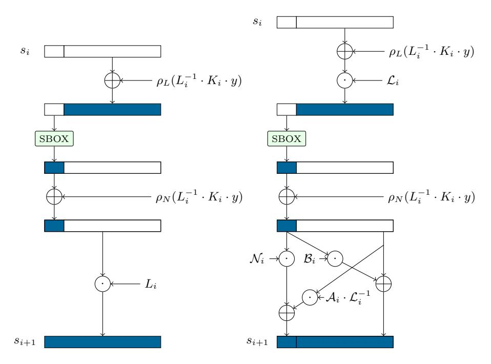
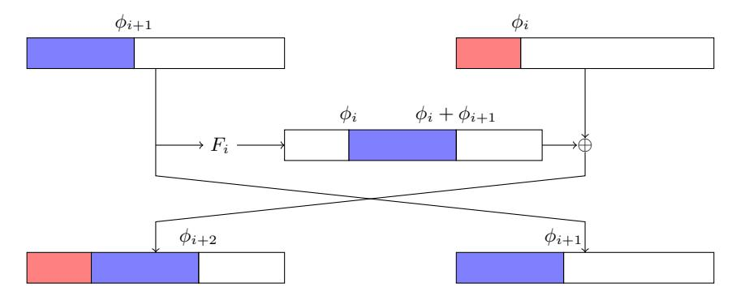
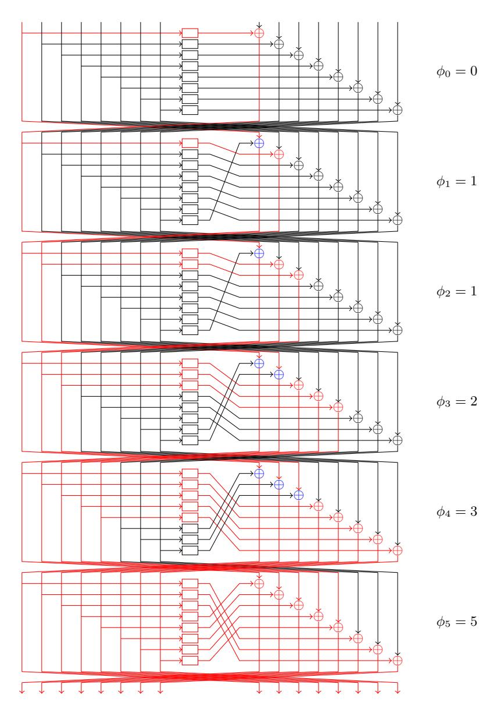
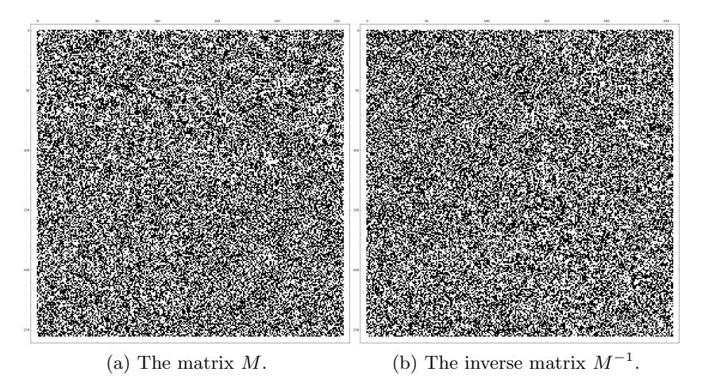

## Improvements to the Linear Operations of LowMC: A Faster Picnic

Daniel Kales<sup>1</sup> , L´eo Perrin<sup>2</sup> , Angela Promitzer<sup>3</sup> , Sebastian Ramacher<sup>1</sup> , and Christian Rechberger<sup>1</sup>

<sup>1</sup> Graz University of Technology, Austria, firstname.lastname@tugraz.at 2 INRIA, France, firstname.lastname@inria.fr 3 angela.promitzer@gmail.com

Abstract. Picnic is a practical approach to digital signatures where the security is primarily based on the existence of a one-way function, and the signature size strongly depends on the number of multiplications in the curcuit describing that one-way function. The highly parameterizable block cipher family LowMC has the most competitive properties with respect to this metric and is hence a standard choice. In this paper, we study various options for efficient implementations of LowMC in-depth. First, we investigate optimizations of the round key computation of LowMC independently of any implementation optimizations. By decomposing the round key computations based on the keys' effect on the S-box layer and general optimizations, we reduce runtime costs by up to a factor of 2 and furthermore reduce the size of the LowMC matrices by around 45 % compared to the original Picnic implementation (CCS'17). Second, we propose two modifications to the reamining matrix mulitplication in LowMC's linear layer. The first modification decomposes the multiplication into parts depending on the their effect on the S-box layer. While this requires the linear layer matrices to have an invertible submatrix, it reduces the runtime and memory costs significantly, both by up to a factor of 4 for instances used by Picnic and up to a factor of 25 for LowMC instances with only one S-box. The second modification proposes a Feistel structure using smaller matrices completely replacing the remaining large matrix multiplication in LowMC's linear layer. With this approach, we achieve an operation count logarithmic in the block size but more importantly, improve over Picnic's matrix multiplication by 60 % while retaining a constant-time algorithm. Furthermore, this technique also enables us to reduce the memory requirements for storing LowMC matrices by 60 %.

Keywords: LowMC · lightweight block cipher · Picnic · post-quantum digital signatures · efficient implementation

## 1 Introduction

Lightweight cryptographic primitives that only require a low number of multiplications have many applications ranging from reducing costs for countermeasures against side-channel attacks [DPVR00, GLSV14], over improving homomorphic encryption schemes [ARS+15, MJSC16, CCF+16, DSES14, NLV11] and multiparty computation [GRR+16, RSS17], to SNARKs [AGR+16]. Additionally, they also turned out to be useful to efficiently implement and reduce signature sizes of post-quantum signature schemes based on Σ-protocols [CDG+17a] without requiring any structured hardness assumptions. The latter in particular builds upon LowMC [ARS+15, ARS+16], a highly parameterizable block cipher with a low number of multiplications. Using LowMC in this context enables further optimizations with respect to the signature size since the LowMC parameters can be chosen to suit scenarios where an adversary can only observe one plaintext-ciphertext pair. Recently, the combination zero-knowledge proofs and instantiations of symmetric-key primitives using LowMC also resulted in the first privacy-preserving signature schemes without requiring structured hardness assumptions. Those constructions include post-quantum ring signature schemes [DRS18] and group signature schemes [BEF18].

We focus on the use of LowMC in the post-quantum digital signature scheme Picnic [CDG+17a, CDG+17b] which is based on zero-knowledge proofs of knowledge of pre-images of one-way functions. There, the one-way functions are instantiated using LowMC. Picnic relies on a proof system called ZKB++, which is based on the "MPC-in-the-head" [IKOS07] paradigm. To compute proofs in ZKB++, the circuit of the one-way function is decomposed into three branches where XOR gates and AND gates involving constants can be computed locally, but AND gates require communication between the branches. Thus the signature size depends on the total number of AND gates required the describe the one-way function as a circuit.

From the use of LowMC in Picnic, diametral constraints emerge: First, the total number of AND gates, which is a multiple of the number of rounds and the number of S-boxes, directly relates to the signature size and is thus desired to be kept small. Second, as one decreases the number of S-boxes, the number of rounds increases which leads to a three-fold increase in the number of linear layer operations, i.e. additional XORs. Thus LowMC instances used in Picnic were selected to provide a trade-off between runtime and signature size. While applications using plain LowMC could save half of the linear operations by simply pre-computing round keys for multiple encryptions and decryptions, in Picnic the key is shared into fresh secret shares before each round of the proof system. Thus simple round key pre-computation cannot be applied to this use case. Any improvements to LowMC that reduces the number of XORs required to evaluate the linear layer thus allows one to target smaller signature sizes without sacrificing performance.

In this work, we thus follow the direction of optimizing the number of XOR gates which influences the overall performance of LowMC. This goal can be achieved by finding a more efficient description of the LowMC encryption algorithm. Asking for an alternative description or finding implementation tricks which allow to improve the overall performance or make the use of the cipher viable under certain constraints in the first place, is a natural question to ask.

This approach follows the line of work during and after the AES and others competitions, where many authors worked on fast software implementations [AL00, BS08], fast hardware implementations [SME16] but also on alternative and more efficient descriptions of the algorithm [BBF<sup>+</sup>02, BB02].

The large number of XOR gates in LowMC arises from the two matrix multiplications involved in each round, where one is applied to compute the round key, and the other is applied to the state. Consequently, any improvement to matrixvector multiplication algorithms directly applies to LowMC. Fast matrix-vector multiplication over binary fields is especially interesting as lightweight cipher designs such as LowMC and Rasta [DEG<sup>+</sup>18] trade multiplicative complexity for large linear layers. Despite various improvements over the naïve matrix-vector multiplication algorithm in last decades [ADKF70, Bar06, Ber09], a runtime of  $\mathcal{O}(nm/\log(m))$  for  $n \times m$  matrices is currently the asymptotically best possible option. However, with the advent of single instruction, multiple data (SIMD) instruction sets the constant factors can be significantly decreased due the fact that 128, 256 or even 512 bits can be processed simultaneously. As an alternative to directly optimizing matrix-vector multiplication algorithms, we investigate specialized Feistel networks, which behave similarly to a matrix-vector multiplication. The exploration of Feistel Networks is as old as block ciphers itself, e.g., see [NPV17] for a recent overview. Following the line of work of Suzaki and Minematsu [SM10], we present a new Feistel network for an arbitrary number of branches with fast diffusion.

#### 1.1 Contribution

The contributions of this work can be summarized as follows:

- We propose an alternative description of LowMC with a new structure to compute round keys and apply round constants. The idea here is to split the computation into linear and non-linear parts. This change allows us to replace all round key computations only affecting the linear part by exactly one matrix multiplication. The remaining non-linear parts can then be computed by much smaller round key matrices. The addition of the round constants can also be considered as constants applied to the non-linear parts and linear parts, making it possible to move all constants applied to the linear part to the beginning. This new description of LowMC allows us to greatly reduce the size of the LowMC constants. In the signature scheme use-case, this optimization leads to performance improvements which range from a factor of 1.5 for smaller block sizes to a factor of 2 for larger block sizes. Additionally, this optimization is independent of implementation optimizations of the matrix multiplication.
- We present an optimization to the matrix multiplication in the linear layer of LowMC, where we employ similar techniques to split the computation into linear and non-linear parts<sup>4</sup>. Again, this changes allow us to reduce the

<span id="page-2-0"></span><sup>&</sup>lt;sup>4</sup> Independently, Dinur proposed and analyzed a similar optimization [Din18].

overall number of multiplications by moving computations involving linear parts of the state to the beginning of the encryption procedure. These optimizations reduce the number of operations for the linear layer computations as well as the memory requirements from  $r \cdot n^2$  to  $r \cdot (n^2 - (n-3 \cdot m)^2) + n^2$ , for instances for LowMC with r rounds, blocksize n and m S-boxes. This optimization is especially impactful for instances with low numbers of S-boxes. We evaluate these improvements in the signature scheme use-case and report significant performance improvements as the optimizations reduce the runtime to a quarter of the original runtime.

- We present Fibonacci Feistel Networks (FFNs), a variant of Generalized Feistel Networks, which provide very fast diffusion. Instantiating the network with regular matrices as permutations we obtain a compact representation of a larger matrix multiplication. The obtained equivalent of a matrix multiplication algorithm with logarithmic complexity can then be used to replace the linear layer of LowMC. This technique reduces the size of the LowMC matrices again by up to 60 %.

Albeit we focus on the Picnic use-case in the practical part of the work, both contributions will also positively affect other use-cases of LowMC. The alternative description is likely to be useful for cryptanalysis purposes as well.

#### 2 Preliminaries

In this section we briefly recall the core components of Picnic: LowMC and the (2,3)-decomposition of cuircuits.

#### 2.1 LowMC

LowMC [ARS+15, ARS+16] is a very parameterizable symmetric encryption scheme design enabling instantiation with low AND depth and low multiplicative complexity. Given any block size, a choice for the number of S-boxes per round, and security expectations in terms of time and data complexity, instantiations can be found minimizing the AND depth, the number of ANDs, or the number of ANDs per encrypted bit. Now let n be the block size, m be the number of S-boxes, k the key size, and r the number of rounds, we choose round constants  $C_i \stackrel{R}{\leftarrow} \mathbb{F}_2^n$  for  $i \in [1, r]$ , full rank matrices  $K_i \stackrel{R}{\leftarrow} \mathbb{F}_2^{n \times k}$  and regular matrices  $L_i \stackrel{R}{\leftarrow} \mathbb{F}_2^{n \times n}$  independently during the instance generation and keep them fixed. Keys for LowMC are generated by sampling from  $\mathbb{F}_2^k$  uniformly at random. LowMC consists of key whitening in the beginning and multiple rounds composed of an S-box layer, a linear layer, addition with constants and addition of the round key. Algorithm 1 gives a full description of the encryption algorithm.

To reduce the multiplicative complexity, the number of S-boxes applied in parallel can be reduced, leaving part of the substitution layer as the identity **Algorithm 1** LOWMC encryption for key matrices  $K_i \in \mathbb{F}_2^{n \times k}$  for  $i \in [0, r]$ , linear layer matrices  $L_i \in \mathbb{F}_2^{n \times n}$  and round constants  $C_i \in \mathbb{F}_2^n$  for  $i \in [1, r]$ .

```
Require: plaintext p \in \mathbb{F}_2^n and key y \in \mathbb{F}_2^k
s \leftarrow K_0 \cdot y + p
for i \in [1, r] do
s \leftarrow \operatorname{SBOX}(s)
s \leftarrow L_i \cdot s
s \leftarrow s + C_i + K_i \cdot y\nend for
return s
```

mapping. We also note that this choice has little to no influence on the efficiency of the S-box layer since a bit-sliced implementation can process all at once<sup>5</sup>.

## 2.2 (2,3)-Decomposition of Circuits in Picnic

Circuit decomposition is a protocol for jointly computing a circuit, similar to an MPC protocol but with higher efficiency. In a (2, 3)-decomposition there are three players and the protocol has 2-privacy, i.e., it remains secure even if two of the three players are corrupted. We discuss some definitions from [GMO16] and the instantiation in PICNIC [CDG<sup>+</sup>17a].

**Definition 1 ((2,3)-decomposition).** Let f be a function that is computed by an n-gate circuit  $\phi$  such that  $f(x) = \phi(x) = y$ . Let  $k_1, k_2$ , and  $k_3$  be tapes of length  $\kappa$  chosen uniformly at random from  $\{0,1\}^{\kappa}$  corresponding to players  $P_1, P_2$  and  $P_3$ , respectively. The tuple of algorithms (Share, Update, Output, Reconstruct) are defined as follows:

Share $(x, k_1, k_2, k_3)$ : On input of the secret value x, outputs the initial views for each player containing the secret share  $x_i$  of x.

Update(view<sub>i</sub><sup>(j)</sup>, view<sub>i+1</sub><sup>(j)</sup>,  $k_i$ ,  $k_{i+1}$ ): On input of the views view<sub>i</sub><sup>(j)</sup>, view<sub>i+1</sub><sup>(j)</sup> and random tapes  $k_i$ ,  $k_{i+1}$ , compute wire values for the next gate and returns the updated view view<sub>i</sub><sup>(j+1)</sup>.

Output(view<sub>i</sub><sup>(n)</sup>): On input of the final view view<sub>i</sub><sup>(n)</sup>, returns the output share  $y_i$ . Reconstruct( $y_1, y_2, y_3$ ): On input of output shares  $y_i$ , reconstructs and returns y.

Correctness requires that reconstructing a (2,3)-decomposed evaluation of a circuit  $\phi$  yields the same value as directly evaluating  $\phi$  on the input value. The 2-privacy property requires that revealing the values from two shares reveals nothing about the input value.

The  $\Sigma$ -protocol ZKB++ constructs the (2, 3)-decomposition of a circuit as follows: Let R be an arbitrary finite ring and  $\phi$  a function such that  $\phi: R^m \to R^\ell$

<span id="page-4-1"></span><sup>&</sup>lt;sup>5</sup> Given m S-boxes, the bit-sliced implementation can be implemented using  $3 \cdot m$  bit ANDs, ORs and shifts. Thus, as long as  $3 \cdot m$  bit fit into a platform's registers, the m-fold S-box can be implemented apart from 4 masking values without any overhead compared to a single S-box.

can be expressed by an n-gate arithmetic circuit over the ring using addition (respectively multiplications) by constants, and binary addition and binary multiplication gates. A (2,3)-decomposition of  $\phi$  is then given by:

Share $(x, k_1, k_2, k_3)$ : Samples random  $x_1, x_2 \in \mathbb{R}^m$  from  $k_1$  and  $k_2$  and computes  $x_3$  such that  $x_1 + x_2 + x_3 = x$ . Returns views containing  $x_1, x_2, x_3$ .

Update<sub>i</sub><sup>(j)</sup>(view<sub>i</sub><sup>(j)</sup>, view<sub>i+1</sub><sup>(j)</sup>,  $k_i$ ,  $k_i$ ,  $k_i$ ): Computes  $P_i$ 's view of the output wire of gate  $g_j$  and appends it to the view. For the k-th wire  $w_k$  where  $w_k^{(i)}$  denotes  $P_i$ 's view, the update operation is defined as follows:

Addition by constant  $(w_b = w_a + c)$ :  $w_b^{(i)} = w_a^{(i)} + c$  if i = 1 and  $w_b^{(i)} = w_a^{(i)}$  otherwise.

Multiplication by constant  $(w_b = c \cdot w_a)$ :  $w_b^{(i)} = c \cdot w_a^{(i)}$

Binary addition  $(w_c = w_a + w_b)$ :  $w_c^{(i)} = w_a^{(i)} + w_b^{(i)}$

Binary multiplication  $(w_c = w_a \cdot w_b)$ :  $w_c^{(i)} = w_a^{(i)} \cdot w_b^{(i)} + w_a^{(i+1)} \cdot w_b^{(i)} + w_a^{(i)} \cdot w_b^{(i+1)} + R_i(c) - R_{i+1}(c)$  where  $R_i(c)$  is the c-th output of a pseudorandom generator seeded with  $k_i$ .

Output<sub>i</sub>(view<sub>i</sub><sup>(n)</sup>): Return the  $\ell$  output wires stored in the view view<sub>i</sub><sup>(n)</sup>. Reconstruct $(y_1, y_2, y_3)$ : Computes  $y = y_1 + y_2 + y_3$  and returns y.

Note that  $P_i$  can compute all gate types with the exception of binary multiplication gates locally as the latter requires inputs from  $P_{i+1}$ . In other words, only outputs of binary multiplication gates need to be serialized, and thus the view size and consequentially the signature size of PICNIC depend on the size of the ring R and the number of multiplication gates.

## 3 Optimizing Linear Operations

From the use of LOWMC in PICNIC, we obtain some constraints on the optimizations we are allowed to perform. The S-box serves as a synchronization point on the first  $3 \cdot m$  bits, i.e., the bits that are actually touched by the S-box. On the other  $n-3 \cdot m$  bits the S-box is simply the identity map, and their actual values do not matter for S-box evaluations. Thus we have to ensure that the evaluation of all AND gates stays invariant under all our optimizations. Secondly, we have to assume that the secret key – or more precisely the shares representing it – changes on every encryption.

# <span id="page-5-0"></span>3.1 Splitting the Round Key Computation and Round Constant Addition

We start with the round key computation. Since the secret key is freshly shared for each LOWMC evaluation in PICNIC, the round keys cannot be pre-computed once during initialization. However, we can observe that due to the structure of the S-box layer for  $n-3\cdot m$  bits of the round key, which coincide with the part of the state where the S-box acts as identity map, it does not matter whether

those bits are added to the state before or after the application of the S-box. Due to the linear nature of all operations involved in the computation after the S-box, we can simply change the order of adding the round key and multiplying the state with  $L_i$ . We modify each round as follows:

- Modify  $s \leftarrow L_i \cdot s + K_i \cdot y + C_i$  to  $s \leftarrow L_i \cdot (L_i^{-1} \cdot K_i \cdot y + s) + C_i$ . Now split  $L_i^{-1} \cdot K_i \cdot y$  into the lower  $3 \cdot m$  bits (the "non-linear part") and the upper  $n-3 \cdot m$  bits (the "linear part") and move the addition of the upper  $n-3 \cdot m$  bits before the S-box layer.

In the following we denote by  $\rho_i^j: \mathbb{F}_2^n \to \mathbb{F}_2^{j-i+1}$  the map sending *n*-dimensional vectors to a vector consisting of the *i* to *j*-th coordinates, i.e.  $\rho_i^j(v_1,\ldots,v_n) \mapsto$  $(v_i, \ldots, v_j)$ , to simplify some notation when referring to the linear and non-linear part. In particular, we use  $\rho_L = \rho_{3\cdot m+1}^n$  to identify the linear part and  $\rho_N = \rho_1^{3\cdot m}$ for the non-linear part, respectively.

Fig. 1 now demonstrates one round of LowMC with the above modifications. Observe that this modification does not change the output of LowMC. Additionally, we can continue moving the addition of the linear part to the previous round until all those additions have been moved at the start of the algorithm.

<span id="page-6-0"></span>

Fig. 1: One round of LowMC before (left) and after (right) the splitting of the round key addition.

After iterating this procedure to move all linear parts of the round key before the round, we end up with all additions of the linear parts of the round key before the first round and are left with a reduced round key of  $3 \cdot m$  bits per round. For the computation of the linear and non-linear part, the matrix  $\overline{L_i^{-1}}$  has to be computed for each LowMC round i. By  $\overline{L_i^{-1}}$  we denote the inverse of the linear layer matrix  $L_i$  with the first  $3 \cdot m$  rows of this inverse set to 0.

The linear part can be computed by calculating the matrix  $P_L$  defined as

$$P_L = \overline{L_1^{-1}} \cdot K_1 + \sum_{j=2}^r \left( \prod_{k=1}^j \overline{L_k^{-1}} \right) \cdot K_j$$

and then multiplying it with the secret key y and adding the result to the initial state  $s_0$ . The matrix  $P_L$  can be precomputed from the LowMC matrices before any encryption and thus only the matrix multiplication with the secret key y and the addition to the initial state  $s_0$  is required at the beginning of the encryption. For the non-linear part we can define a similar matrix

$$P_{N,i} = \overline{L_i^{-1}} \cdot K_i + \sum_{j=i+1}^r \left( \prod_{k=i}^j \overline{L_k^{-1}} \right) \cdot K_j$$

for round i. This matrix  $P_{N,i}$  of dimension  $(n \times k)$  is then multiplied with the secret key y and the first  $3 \cdot m$  bits of this result are added to the state in the corresponding LowMC round after applying the S-box function to the state. However, this still implies that this multiplication  $P_{N,i} \cdot y$  is done in every LowMC round, which can be avoided by using the following structure. As only  $3 \cdot m$  bits of  $P_{N,i} \cdot y$  are used, we can combine the first  $3 \cdot m$  rows of the matrix  $P_{N,i}$ , denoted as  $\overline{P_{N,i}}^{3 \cdot m}$ , of all rounds i to one matrix  $P_N$  of dimension  $(3 \cdot m \cdot r \times k)$  given by

$$P_{N} = \underbrace{\begin{bmatrix} \overline{P_{N,i}}^{3 \cdot m} \\ \vdots \\ \overline{P_{N,r}}^{3 \cdot m} \end{bmatrix}}_{k \text{ cols}} \} 3 \cdot m \text{ rows}$$

This matrix is then multiplied with the secret key y before the first round, which results in a  $3 \cdot m \cdot r$  dimensional vector v. Now, the  $3 \cdot m$  bits starting from bit  $1+3 \cdot m \cdot (i-1)$  of the vector v are added to the non-linear part of the state in round i. So, although the non-linear part remains in each LowMC round, the computation effort is reduced from a  $(n \times k)$  matrix-vector multiplication and a n-bit XOR to a  $3 \cdot m$ -bit XOR in each round. The pre-computation of  $P_L$  and  $P_{N,i}$  can be done independently of the secret key y during the LowMC instance generation. The multiplications  $P_L \cdot y$  and  $P_N \cdot y$  have to be done once at the start of the encryption algorithm with the specific shares of y for this encryption. The same procedure can also be applied to the constants, leading to constant vectoris  $C_L$  and  $C_N$  computed in the same way as  $P_L$  and  $P_N$  with  $K_i$  replaced by  $C_i$ . Algorithm 2 depicts LowMC encryption with split round key and constants.

**Algorithm 2** LOWMC encryption with the split round key for key matrix  $K_0 \in \mathbb{F}_2^{n \times k}$ , linear layer matrices  $L_i \in \mathbb{F}_2^{n \times n}$  for  $i \in [1, r]$ , and precomputed matrices  $P_L$  and  $P_N$  and vectors  $C_L$  and  $C_N$ .

```
Require: plaintext p \in \mathbb{F}_2^n and key y \in \mathbb{F}_2^k
v \leftarrow P_N \cdot y + C_N
s \leftarrow (K_0 + P_L) \cdot y + p + C_L
for i \in [1, r] do
s \leftarrow \text{SBOX}(s)
s \leftarrow \rho_{1+3 \cdot m \cdot (i-1)}^{3 \cdot m \cdot i}(v) + s
s \leftarrow L_i \cdot s\nend for
return s
```

The sizes of matrices for the unmodified LowMC algorithm and LowMC with the reduced round key computation and constant addition (RRKC) are presented in Table 1. From the memory required to store the matrices, it can be seen that LowMC with RRKC reduces the memory consumption for the round keys from r+1 ( $n \times k$ ) matrices to a ( $n \times k$ ) and a ( $3 \cdot m \cdot r \times k$ ) matrix. Additionally, the r n dimensional vectors used as round constants are now stored as a n and a  $3 \cdot m \cdot r$  dimensional vectors. These memory savings come at the cost of computing an additional  $3 \cdot m \cdot r$  dimensional vector to store the non-linear part for each specific encryption.

<span id="page-8-1"></span>

|                    | LowMC              | LowMC with RRKC $ \begin{array}{ c c c c c c c c c c c c c c c c c c c$               |
|--------------------|--------------------|---------------------------------------------------------------------------------------|
| Linear layer       | $r$ $(n \times n)$ | $r (n \times n)$                                                                      |
| Round key matrices | $r+1 (n \times k)$ | $1 (n \times k)$ (linear part)                                                        |
|                    |                    | $1 (3 \cdot m \cdot r \times k)$ (non-linear part)                                    |
| Round constants    | r(n)               | $1 (3 \cdot m \cdot r)$                                                               |
|                    |                    | 1 (n)                                                                                 |
| Additional memory  |                    | $\begin{vmatrix} 1 & (n) \\ 1 & (3 \cdot m \cdot r) \text{ (vector } v \end{aligned}$ |

Table 1: Matrices for general LowMC and LowMC with RRKC.

#### <span id="page-8-2"></span>3.2 Reducing Linear Layer Computation

A similar modification can be applied to the linear layer matrices, where a substantial part of the linear layer computation can be moved to the first round. We take the linear layer matrix  $L_i$  and split it into 4 submatrices depending on the number of S-boxes in the linear layer:

 $3 \cdot m$  columns  $n-3 \cdot m$  columns

$$L_i = \left| \begin{array}{c|c} \mathcal{N}_i & \mathcal{A}_i \\ \mathcal{N}_i & \mathcal{A}_i \\ \mathcal{B}_i & \mathcal{L}_i \end{array} \right| \left. \begin{array}{c} 3 \cdot m \text{ rows} \\ n - 3 \cdot m \text{ rows} \end{array} \right|$$

We also split the state into the non-linear part  $s_N$   $(3 \cdot m$  bits) and the linear part  $s_L$   $(n-3 \cdot m$  bits). We rewrite the standard linear layer multiplication  $s^{i+1} = L_i \cdot s^i$  into this submatrix form:

$$\begin{bmatrix} s_N^{i+1} \\ s_L^{i+1} \end{bmatrix} = \begin{bmatrix} \mathcal{N}_i & \mathcal{A}_i \\ \mathcal{B}_i & \mathcal{L}_i \end{bmatrix} \cdot \begin{bmatrix} s_N^i \\ s_L^i \end{bmatrix} = \begin{bmatrix} \mathcal{N}_i \cdot s_N^i + \mathcal{A}_i \cdot s_L^i \\ \mathcal{B}_i \cdot s_N^i + \mathcal{L}_i \cdot s_L^i \end{bmatrix} \,.$$

With the precondition that the submatrix  $\mathcal{L}_i$  is invertible, we can now move the multiplication by  $\mathcal{L}_i$  before the other multiplications as follows:

$$\begin{bmatrix} s_N^{i+1} \\ s_L^{i+1} \end{bmatrix} = \begin{bmatrix} \mathcal{N}_i & \mathcal{A}_i \cdot \mathcal{L}_i^{-1} \\ \mathcal{B}_i & \mathbf{I} \end{bmatrix} \cdot \begin{bmatrix} s_N^i \\ \mathcal{L}_i \cdot s_L^i \end{bmatrix} = \begin{bmatrix} \mathcal{N}_i \cdot s_N^i + \mathcal{A}_i \cdot s_L^i \\ \mathcal{B}_i \cdot s_N^i + \mathcal{L}_i \cdot s_L^i \end{bmatrix} \,.$$

This process is depicted in Fig. 2. While this does not reduce the overall multiplications for a single round of LOWMC, we use the same technique as in the splitting of the round keys and move the multiplication by  $\mathcal{L}_i$  even futher back to the beginning of the previous round. We can repeat this process for multiple rounds, allowing us to group all multiplications by  $\mathcal{L}_i$  together in a single matrix  $Z_0$ , which is precomputed and multiplied with the linear part of the state before the first round. However, we need to take care to correct the introduced differences that are a result of moving the matrices  $\mathcal{L}_i$  by modifying the submatrices  $\mathcal{A}_i$  and  $\mathcal{B}_i$  accordingly. We create the new, modified linear-layer matrices  $Z_i$  as follows:

$$Z_i = \begin{bmatrix} \mathcal{N}_i & \mathcal{A}_i \cdot \prod_{k=i}^r \mathcal{L}_k^{-1} \\ \left(\prod_{k=0}^{r-(i+1)} \mathcal{L}_{r-k}\right) \cdot \mathcal{B}_i & I \end{bmatrix},$$

and combine all multiplications by  $\mathcal{L}_i$  into a new matrix  $Z_0$ :

$$Z_0 = \begin{bmatrix} I & 0 \\ 0 & \prod_{k=0}^{r-1} \mathcal{L}_{r-k} \end{bmatrix}.$$

This reduced linear layer matrices  $Z_i$  allow us to decrease the size of the matrix multiplications in the algorithm, since the  $n-3 \cdot m \times n-3 \cdot m$  submatrix

<span id="page-10-0"></span>

Fig. 2: One round of LowMC before (left) and after (right) the splitting of the linear layer computation.

of  $Z_i$  is now the identity matrix. To be precise, we reduce the multiplications from a  $n \times n \cdot n \times 1$  matrix-vector multiplication to a  $n \times 3 \cdot m \cdot 3 \cdot m \times 1$  and a  $3 \cdot m \times (n-3 \cdot m) \cdot (n-3 \cdot m) \times 1$  matrix-vector multiplication. These improvements are especially noticable when m is very small, meaning we have a small amount of S-boxes per round. These instances are also the ones with the lowest number of AND gates, and therefore the preferred instances for many use-cases. Algorithm 3 depicts LowMC encryption with reduced linear-layer matrices.

One downside to this approach is that it is not compatible with standard LowMC, as the generation of the random matrices does not ensure that the submatrix  $\mathcal{L}_i$  is indeed invertible. We can still try to apply this approach to standard LowMC, using the standard  $L_i$  matricies if  $\mathcal{L}_i$  is not invertible, and use this optimization for any consecutive rounds where  $\mathcal{L}_i$  is invertible. However, since the chance of a random  $\mathcal{L}_i$  being invertible is  $\approx \frac{1}{3}$ , the potential for optimization is pretty small. We therefore propose a new variant of LowMC, called LowMC-I, with the only difference being that for a given instance with statesize n, keysize k, number of S-boxes m and rounds r, we ensure while generating the matrices  $L_i$  that the submatrix  $\mathcal{L}_i$  of size  $(n-3 \cdot m) \times (n-3 \cdot m)$  is invertible. We however note that the matrices are still sampled at random where the sampling algorithm gains an additional rejection condition in addition to the matrices being invertible. Thus the modification is still compatible with exsting LowMC

**Algorithm 3** LOWMC encryption with the split round key for key matrix  $K_0 \in \mathbb{F}_2^{n \times k}$ , reduced linear layer matrices  $Z_i \in \mathbb{F}_2^{n \times n}$   $i \in [1, r]$ , precomputed matrices  $P_L, Z_0$  and  $P_N$ , and precomputed vectors  $C_L$  and  $C_N$ .

```
Require: plaintext p \in \mathbb{F}_2^n and key y \in \mathbb{F}_2^k
v \leftarrow P_N \cdot y + C_N
s \leftarrow (K_0 + P_L) \cdot y + p + C_L
s \leftarrow Z_0 \cdot s
for i \in [1, r] do
s \leftarrow \text{SBOX}(s)
s \leftarrow \rho_{1+3 \cdot m \cdot (i-1)}^{3 \cdot m \cdot i}(v) + s
s \leftarrow Z_i \cdot s\nend for
return s
```

security analysis. The additional rejection condition increases the complexity of the sampling algorithm at most by a constant factor of about 3.

|                    | LowMC              | $\big \operatorname{LowMC}$ with RRKC                                                         | LowMC with RLL                                                                                                                                       |
|--------------------|--------------------|-----------------------------------------------------------------------------------------------|------------------------------------------------------------------------------------------------------------------------------------------------------|
| Linear layer       | $r (n \times n)$   | $r$ $(n \times n)$                                                                            | $ \begin{vmatrix} r & (n \times 3 \cdot m) \\ r & (3 \cdot m \times (n - 3 \cdot m)) \\ 1 & ((n - 3 \cdot m) \times (n - 3 \cdot m)) \end{vmatrix} $ |
|                    |                    |                                                                                               | $r (3 \cdot m \times (n - 3 \cdot m))$                                                                                                               |
|                    |                    |                                                                                               | $1 ((n-3\cdot m)\times (n-3\cdot m))$                                                                                                                |
| Round key matrices | $r+1 (n \times k)$ | $ 1 (n \times k) $                                                                            | $1 (n \times k)$                                                                                                                                     |
|                    |                    | $1 (3 \cdot m \cdot r \times k)$                                                              | $1 (3 \cdot m \cdot r \times k)$                                                                                                                     |
| Round constants    | $r (1 \times n)$   | $ \begin{vmatrix} 1 & (3 \cdot m \cdot r \times k) \\ 1 & (3 \cdot m \cdot r) \end{vmatrix} $ | $1 (3 \cdot m \cdot r)$                                                                                                                              |
|                    |                    | 1(n)                                                                                          | 1(n)                                                                                                                                                 |
| Additional memory  |                    | $1 (3 \cdot m \cdot r \times 1)$                                                              | $1 (3 \cdot m \cdot r \times 1)$                                                                                                                     |

Table 2: Matrices for general LowMC, LowMC with RRKC and LowMC with RRKC and RLL.

#### <span id="page-11-1"></span>3.3 Fibonacci Feistel Network

Given that the cost of storing a binary matrix operating on n bits is proportional to  $n^2$ , it is possible to decrease the cost of a  $n \times n$  matrix when it can be implemented using several  $m \times m$  matrices with m < n. In this section, we describe a method for building large binary matrices using several smaller ones while still ensuring that every output bit may depend on every input bit.

Our main idea is to borrow techniques from block cipher design, in particular from Generalized Feistel Networks (GFN). In fact, we propose a new variant of this structure, called *Fibonacci Feistel Network (FFN)*, which provides very fast diffusion. As its name indicates, this structure uses the Fibonaci sequence

 $\{\phi_i\}_{i>0}$  defined by the well-known induction formula:

$$\begin{cases} \phi_0 = 0, \, \phi_1 = 1 \\ \phi_{i+1} = \phi_i + \phi_{i-1}, \end{cases}$$

so that  $\phi_0, \phi_1, \phi_2, \phi_3, \phi_4, \phi_5 = 0, 1, 1, 2, 3, 5$ . The smallest integer i such that  $\phi_i > b$  is denoted  $i = \Lambda_{\phi}(b)$ . For example,  $\phi_8 = 21$  and  $\phi_9 = 34$ , so  $\Lambda_{\phi}(32) = 9$ .

The Fibonacci-Feistel Structure. A FFN operates on  $2 \times b \times w$  bits, where  $w \geq 4$  and  $b \geq 2$ , using R rounds. The round functions are different in each round although they always use the same overall structure: each round is a classical 2-branched Feistel round where the Feistel functions maps  $b \times w$  bits to  $b \times w$  bits. The Feistel function used in round i, denoted  $F_i$ , works as follows:

- 1. the state is divided into b branches of w bits denotes as  $B_0, \ldots, B_{b-1}$ ,
- 2. each branch goes through a w-bit L-Box, that is, a linear function mapping w bits to w bits, and
- 3. the branches are rotated by  $\phi_i$ , so that  $B_j \leftarrow B_{j-\phi_i \pmod{b}}$ .

Alternatively, let us denote the  $2 \times b \times w$ -bit internal state at round i as  $X^i$  and its w-bit branch with index j as  $X^i_j$ . The full round function works as follows, for j < b:

$$X_{j+b}^{i+1} = X_{j}^{i}, \ X_{j}^{i+1} = X_{j+b}^{i} \oplus L_{j-\phi_{i}}^{i} \left( X_{j-\phi_{i}}^{i} \right),$$

where  $j - \phi_i$  is taken modulo b and where  $L_j^i$  is a w-bit L-Box. An example is given in Fig. 4 in Appendix A.

**Diffusion in a FFN.** Diffusion is very fast in such a structure. The idea of using something more sophisticated than a constant rotation for mixing the branches is not new. In [SM10], Minematsu and Suzaki proposed using complex permutations which significantly improve diffusion: for a structure operating on k branches, only  $2\log_2(k)$  rounds are needed to achieve full diffusion while a naïve constant rotation would need k rounds. Furthermore, the gain increases as the number of rounds increases, making such methods even more appealing on larger blocks. It was for example used to design the lightweight block cipher TWINE [SMMK12].

Unlike such GFN, the FFN needs a different permutation in each round. However, it works for any even number of branches, we are not restricted to powers of two. The permutations used are also much simpler and, as we explain later, they can lend themselves well to constant-time software implementations using only ANDs, XORs and rotations.

In what follows, we present two lemmas which quantify diffusion inside a FFN more formally. Lemma 1 describes how a single word diffuses through several rounds of FFN, while Lemma 2 highlights some invariant properties of such a network. These two are put together in Corollary 1 to quantify how many rounds are needed to have some form of full diffusion.

In the remainder of this section, we denote with  $X_j^i$  the word with index j at the input of round i and we say that x influences y if the expression of y involves the variable x. Our definition of diffusion is borrowed from [SM10]. In particular, we consider that we have achieved "full diffusion" when any output word is influenced by all input words.

<span id="page-13-0"></span>**Lemma 1.** Consider a FFN with i rounds, where  $\phi_{i+1} \leq b$ . Then the word  $X_0^0$  influences all words  $X_j^i$  with indices  $0 \leq j < \phi_{i+1}$  or  $b \leq j < b + \phi_i$ .

The process behind Lemma 1 is illustrated in Fig. 3. A formal proof based on this intuition is provided below.

*Proof.* We proceed by induction. Before round 0, i.e. at the beginning of the application of the FFN, only  $X_0^0$  depends on  $X_0^0$ . After round 0 (where the Feistel function contains a rotation by  $\phi_0 = 0$ ), only  $X_0^1$  and  $X_b^1$  depend on  $X_0^0$ , so that  $X_j^1$  depends on  $X_0^0$  if and only if  $0 \le j < \phi_2$  or  $b \le j < b + \phi_1$ .

Suppose now that  $X_j^i$  depends on  $X_0^0$  if and only if  $0 \le j < \phi_i$  or  $b \le j < b + \phi_{i-1}$ . The round function with index i maps  $X^i$  to  $X^{i+1}$  such that

$$\begin{cases} X_{j}^{i+1} = X_{j+b}^{i} \oplus L_{j-\phi_{i}}^{i} \left( X_{j-\phi_{i}}^{i} \right) & \text{if } j < b, \\ X_{j}^{i+1} = X_{j-b}^{i} & \text{if } j \geq b. \end{cases}$$

If  $\mathbf{j} \geq \mathbf{b}$ , then  $X_j^{i+1} = X_{j-b}^i$  which, by the induction hypothesis, depends on  $X_0^0$  if and only if  $0 \leq j-b < \phi_i$ , which is equivalent to  $b \leq j < b + \phi_i$ . Thus, the lemma holds in this case.

If  $\mathbf{j} < \mathbf{b}$ , then  $X_j^{i+1}$  depends on both  $X_{b+j}^i$  and  $X_{j-\phi_i}^i$ . By the induction hypothesis, the first depends on  $X_0^0$  if and only if  $b \le b+j < b+\phi_i$ , which is equivalent to  $0 \le j < \phi_i$ . The second depends on  $X_0^0$  if and only if  $0 \le j - \phi_i < \phi_{i+1}$  or, equivalently,  $\phi_i \le j < \phi_i + \phi_{i+1} = \phi_{i+2}$ . Thus, for any j such that  $0 \le j < \phi_{i+2}, X_j^{i+1}$  depends on  $X_0^0$ . This dependence occurs via  $X_{b+j}^i$  for  $j < \phi_i$  and via  $X_{j-\phi_i}^i$  for  $\phi_i \le j < \phi_{i+2}$ . We deduce that the lemma also holds in this case.

The propagation of a word across several rounds is illustrated in Fig. 4 in Appendix A. If we leave the details of the L-Boxes aside, a FFN is invariant under rotation of the halves of the state. This is formalized by the following lemma.

<span id="page-13-1"></span>**Lemma 2.** Let  $R_k$  be a permutation of  $\{0,...,2b-1\}$  such that

$$R_k(j) = \begin{cases} (j+k) \mod b & \text{if } j < b, \\ b + ((j-b+k) \mod b) & \text{if } j \ge b, \end{cases}$$

meaning that applying  $R_k$  to the index of the branches of FFN rotates separately the left and right branches by k. Let P be one round of FFN where all L-Boxes are the same and let  $(y_0, ..., y_{2b-1}) = P(x_0, ..., x_{2b-1})$ . Then the following always holds:

$$P(x_{R_k(0)},...x_{R_k(2b-1)}) = (y_{R_k(0)},...y_{R_k(2b-1)}).$$

<span id="page-14-1"></span>

Fig. 3: Influence of  $X_0^0$  on  $X_j^i$  for increasing *i*. The parts of the internal state which depend on  $X_0^0$  are colored; those which do not are white.

*Proof.* If the L-boxes are identical, then all operations in a FFN are invariant under a word rotations applied to both halves of the internal state.  $\Box$

<span id="page-14-0"></span>We deduce the following corollary which quantifies the speed of diffusion.

**Corollary 1.** Consider a FFN with i rounds, where  $\phi_i \geq b$ . Then each left input word  $X_j^0$ , where  $0 \leq j < b$ , influences all output words  $X_j^i$ , where  $0 \leq j < 2b$ .

Proof. Let  $k \leq i+1$  be such that  $\phi_{k-1} \leq b < \phi_k$ . By Lemma 1, we know that after k-2 rounds,  $X_0^0$  influences all words with indices j if  $0 \leq j < \phi_{k-1}$  or  $b \leq j < b + \phi_{k-2}$ . After round k-1, the words on the left all depend on  $X_0^0$  and thus, after round  $k \leq i+1$ , all output words depend on  $X_0^0$ . By Lemma 2, we can generalize this dependency to all input words from the left side. We conclude that, after round k all output words depend on  $X_i^0$  for all  $0 \leq j < b$ .

**Lemma 3.** Consider a FFN with  $\Lambda_{\phi}(b)+1$  rounds labelled  $-1,0,1,\ldots,\Lambda_{\phi}(b)-1$  and where we set  $\phi_{-1}=0$ . Then each input words  $X_k^{-1}$ , where  $0 \leq k < 2b$ , influences all output words  $X_j^{\Lambda_{\phi}(b)}$ , where  $0 \leq j < 2b$ .

*Proof.* After the initial round, each input word  $X_k^{-1}$   $(0 \le k < 2b)$  influences one left word  $X_k^0$  (mod b) which in turn (see Corollary 1) influences all output words  $X_i^{\Lambda_{\phi}(b)}$ ,  $0 \le j < 2b$ .

**Efficient Implementation.** In this section, we describe how we can build a linear layer which can be evaluated using  $\mathcal{O}(\Lambda_{\phi}(b) \cdot w)$  operations on a modern processor, where  $2 \times b \times w = n$ . This linear layer provides full diffusion. Of course, it uses a FFN with 2b branches of w bits each. The core trick is in the definition and implementation of the L-Box layer composed with the rotation by  $\phi_i$ .

Instead of using table lookups to implement the linear layer, we can use some sort of in-place bit-sliced strategy for small branch sizes<sup>6</sup>, as follows. Let x be the

<span id="page-14-2"></span><sup>&</sup>lt;sup>6</sup> For larger branch sizes, e.g.  $w \geq 32$  we can fall back on optimized matrix-vector multiplication algorithms and the branch rotation can simply be performed by index arithmetic in arrays storing the state.

bw-bit input of F<sup>i</sup> where F<sup>i</sup> consists in a layer of w-bit L-Boxes and a rotation by φ<sup>i</sup> . Then we can write

$$F_i = M^{-1} \circ \mathrm{ROT}_{\phi_i} \circ \mathcal{L}_i \circ M$$
, where

- M maps the w-bit word with index j to the bits with indices congruent to j modulo b. More formally, M is a bit permutation which maps x0, ...xbw−<sup>1</sup> to x0, xb, x2b, ...x(w−1)<sup>b</sup> , x1, xb+1..., xbw−1, i.e. each bit of the first w-bit word end up at positions k ≡ 0 (mod b), the bits of the second w-bit word at positions k ≡ 1 (mod b), etc.
- L<sup>i</sup> is parametrized by w words of size bw denoted ` i j . It maps a bw-bit word y to a value equal to

$$\mathcal{L}_i(y) = \bigoplus_{j=0}^{w-1} \ell_j^i \wedge (y \lll (j \cdot b)).$$

Thus, the output bit of L<sup>i</sup> with index k is a linear combination of w variables yk, yb+k, y2b+k, ..., y(w−1)b+k. The w output variables with indices k ≡ a (mod b) depend only on the w input variables with indices k ≡ a (mod b): Li is effectively an L-Box layer except that it operates on slices of the state defined by k (mod b) rather than bk/bc.

Basically, M changes the representation of the words and L<sup>i</sup> evaluates the L-Box layer on this alternative representation. In fact, we can simplify the functions M in each round by applying M to each half of the input of the whole FFN and M<sup>−</sup><sup>1</sup> to each half of its output. If the only aim is full diffusion, we can simply remove them.

In the end, evaluating a linear FFN with full diffusion on 2b branches with w-bit words requires Λφ(b) + 1 rounds, each of which requires

- w rotations by φ<sup>i</sup> + b · k for all k ∈ {0, ..., w − 1} applied word-wide on a bw-bit word,
- w ANDs applied word-wide on a bw-bit word, and
- w XORs applied word-wide on a bw-bit word to combine the ` i <sup>j</sup> ∧ (x ≪ bk + φi) with the other branch.

Now let us consider a 256-bit linear layer of LowMC. For n = 256 = 2 × 32 × 4, we can implement a bijective linear layer with full diffusion using 1+Λφ(32) = 10 rounds by composing a 9-round FFN with another round before it. The role of this first round is to ensure that the left input of the FFN depends on both the left and right words of the input of the structure. In this way, at the end of the FFN, all output words depend on all input words. The rotation used in this first round can be chosen freely. Evaluating such a linear layer requires 10 rounds during which we perform:

- 4 copies of the left 128-bit half into 4 different 128-bit words;
- a rotation of each of these four 128-bit words by the following number of bits: φi−1, 32 + φi−1, 64 + φi−1, 96 + φi−1; where we set φ<sup>−</sup><sup>1</sup> = 16 and where φ<sup>i</sup> for i ≥ 0 is the usual Fibonacci sequence;

- a AND of each of these four 128-bit words by 128-bit values derived from the expression of  $L_i^i$ ;
- a XOR of each of these four 128-bit words into the right half of the internal state; and
- a swap of the left and right words.

In total, we need 40 copies, 40 rotations, 40 XORs, 40 ANDs, and 10 swaps where all operations are on 128-bit words. An example of  $256 \times 256$  binary matrix which can be implemented in this fashion is provided in Appendix B.

## <span id="page-16-3"></span>4 Performance and Memory Evaluation

To verify the expected performance and memory improvements, both suggested optimizations were implemented and evaluated. Both optimizations were compared against the Picnic implementation available on GitHub<sup>7</sup>.

## 4.1 Reduced Round Key Computation and Constant Addition

We start with the evaluation of the reduced round key computation and constant addition introduced in Section 3.1. The matrix and vector pre-computations were implemented on top of the LowMC reference implementation<sup>8</sup>. We performed the benchmarks on an Intel Core i7-4790 running Ubuntu 17.04 and Raspberry Pi 3 Model B running openSUSE Leap 42.2. All measurements were repeated 1000 times and then averaged, and are presented both as milliseconds and number of cycles. We only benchmarked the Fiat-Shamir transformed variant of PICNIC, since the Unruh transformed variant does not perform any additional rounds of the proof system. Hence improvements to LowMC encryption apply to PICNIC-FS and PICNIC-UR in the same way. For the benchmarks we use the instances listed in Table 3 and denote as PICNIC-n the instance for block size n benchmarked for PICNIC-FS.

<span id="page-16-2"></span>

| Blocksize (n) | S-boxes $(m)$ | Keysize $(k)$ | Rounds $(r)$ |
|---------------|---------------|---------------|--------------|
| 128           | 10            | 128           | 20           |
| 192           | 10            | 192           | 30           |
| 256           | 10            | 256           | 38           |

Table 3: LowMC parameters (data complexity d = 1) in Picnic [CDG<sup>+</sup>17b].

From the benchmarking results presented in Table 4, we can observe small improvements with a factor of 1.1x for the 128-bit case and up to a factor of 1.8x for larger instances. The results on the Raspberry Pi 3 are presented in

<span id="page-16-0"></span><sup>7</sup> https://github.com/IAIK/Picnic

<span id="page-16-1"></span><sup>8</sup> https://github.com/LowMC/lowmc

<span id="page-17-0"></span>

|                                        | w/o   | opt.   | with 1 | RRKC   | Improv. | (old / new)<br>Verify |
|----------------------------------------|-------|--------|--------|--------|---------|-----------------------|
| Parameters                             | Sign  | Verify | Sign   | Verify | Sign    | Verify                |
| PICNIC-128<br>PICNIC-192<br>PICNIC-256 | 2.16  | 1.49   | 1.95   | 1.37   | 1.11x   | 1.09x                 |
| Picnic-192                             | 10.51 | 7.45   | 6.84   | 4.78   | 1.54x   | 1.56x                 |
| Picnic-256                             | 25.23 | 17.47  | 14.13  | 9.71   | 1.79x   | 1.80x                 |

Table 4: Benchmarks without and with RRKC on Intel Core i7 (in ms).

Table 5 and show an even larger improvement of factors 1.6 to 2 for signing and verifying with all instances. We also note that the numbers without the split round key also show improvements over the numbers published in [CDG<sup>+</sup>17a]. Those improvements are obtained via general memory usage optimizations and a more specialized optimization focusing only on the case with 10 S-boxes.

<span id="page-17-1"></span>

|                                        | w/o    | opt.   | with  | RRKC   | Improv. (old / new)<br>  Sign Verify |        |
|----------------------------------------|--------|--------|-------|--------|--------------------------------------|--------|
| Parameters                             | Sign   | Verify | Sign  | Verify | Sign                                 | Verify |
| PICNIC-128<br>PICNIC-192<br>PICNIC-256 | 17.08  | 11.61  | 10.36 | 7.12   | 1.65x                                | 1.63x  |
| Picnic-192                             | 72.05  | 48.06  | 39.94 | 26.89  | 1.80x                                | 1.79x  |
| Picnic-256                             | 172.86 | 115.42 | 84.27 | 56.45  | 2.05x                                | 2.04x  |

Table 5: Benchmarks without and with RRKC on Raspberry Pi 3 (in ms).

To give one concrete example for the memory savings discussed in Section 3.1, we calculate the memory requirements for parameter set PICNIC-256. For the round key calculations the general LowMC algorithm requires 38+1 matrices of dimension  $256\times256$ , which correspond to 312 KB. LowMC with the split round key computation only uses one  $256\times256$ , and one  $1140\times256$  matrix. The 38 256-bit round contstants, which consume 1.2 KB, are replaced with one 256-bit vector and one 1140-bit vector, which consume 0.17 KB. Hence, in the parameter set PICNIC-256 we achieve a reduction of the memory cost from 313.19 KB for the round key matrices and round constants to 43.8 KB. Thus RRKC reduced the storage requirements for rounds matrices and constants by more than 85 %. Taking the linear layer into account as well, we still save 43 % of the memory. Therefore, we can conclude that our alternative description provides both a significant performance boost and also saves a large amount of memory required to represent LowMC.

#### 4.2 Reduced Linear Layer

Next we implemented the reduced linear layer introduced in Section 3.2. In Table 6 we present the numbers obtained from benchmarking all variants without any hardware specific optimizations. When comparing an implementation without any of the optimizations to an implementation with RLL, performance is

improved by up to a factor of 4 with the instances used in Picnic. Also compared to RRKC, RLL improves the runtime performance significantly (up to a factor of 3).

<span id="page-18-0"></span>

| Parameters                             | w/o<br>Sign | opt.<br>Verify | with Sign | RRKC<br>Verify | with<br>Sign | RLL<br>Verify | Improv<br>Sign | . (old / new)<br>Verify |
|----------------------------------------|-------------|----------------|-----------|----------------|--------------|---------------|----------------|-------------------------|
| PICNIC-128<br>PICNIC-192<br>PICNIC-256 | ·           |                | ·         |                |              |               | ·              | 2.26x<br>3.41x          |
| PICNIC-256                             | 94.43       | 67.48          | 71.07     | 38.97          | 22.70        | 17.26         | 4.16x          | 3.91x                   |

Table 6: Benchmarks without optimizations, with RRKC, and RLL on Intel Core i7 (in ms).

Even better results can be obtained when selecting LowMC instances with m=1. In Table 7 we present benchmarking results for encryption of LowMC instances selected for the signature scheme use-case, i.e. with data complexity 1, and m=1, as well as the instances used in Picnic with m=10. While RRKC already reduces runtime of a single encryption to a half, which we would also obtain by pre-computing the round keys, RLL further reduces the runtime for m=1 to  $\frac{1}{12}$  and  $\frac{1}{25}$ , respectively, of the original runtime. With these performance improvements, choosing instances enabling the smallest possible signature sizes no longer comes with a significant performance penalty as conclued in [CDG+17a]. When viewed relative to RRKC and round key pre-computation, RLL reduces the runtime to around  $\frac{1}{6}$  and  $\frac{1}{13}$ , respectively. The performance improvements for m=10 are mostly consistent with those in Table 6.

<span id="page-18-1"></span>

|                                            | w/o opt. | with RRKC       | with RLL      | Improv. (old / new) |
|--------------------------------------------|----------|-----------------|---------------|---------------------|
| LowMC-128-128-1-182                        |          | 48.95           | 7.50          | 12.58x              |
| LowMC-128-128-10-20                        | 1        | 6.27            | 4.97          | 2.16x               |
| LowMC-192-192-1-284<br>LowMC-192-192-10-30 |          | 194.73<br>21.61 | 13.46<br>8.23 | 25.62x<br>4.55x     |
| LowMC-256-256-1-363                        |          | 216.98          | 17.51         | 25.31x              |
| LowMC-256-256-10-38                        | 45.18    | 25.22           | 11.23         | 4.02x               |

Table 7: Benchmarks of LowMC-n-k-m-r instances without optimization, with RRKC, and RLL on Intel Core i7 (in  $\mu$ s).

Memory-wise we observe the same memory savings for RLL as for RRKC. For example, for Picnic-256 the liner layer shrinks from 304 KB to 37.69 KB by 87 %. For instances with m=1 the savings are even better. For the 256-bit instance from Table 7 the size of the linear layer is reduced from 2904 KB to 41.45 KB, so the matrices of the linear layer can be presented using only 2 % of their

original size. In practice, the effect of this optimization has some diminishing returns when we have to perform operations that are not optimized for register sizes in modern CPUs, so we do not achieve the full theoretical speedup.

#### 4.3 Fibonacci Feistel Network

We also implemented the proposed Feistel network from Section [3.3](#page-11-1) and benchmarked it against an implementation of a constant-time matrix multiplication available used by Picnic. All measurements were repeated 1000000 times and averaged. Performance and memory consumption of a 256-bit block size Feistel network and different branch sizes are shown in Table [8.](#page-19-0) The constant-time implementation requires 2302 cycles for a 256 × 256 matrix-vector multiplication. As Table [8](#page-19-0) shows, the Feistel network performs 10 % better than the constanttime implementation if 64 bit branches are used. The constant-time algorithm consumes of 8192 bytes because to store the whole 256 × 256 matrix, while the FFN with 64 bit branches only uses 37 % less memory because the 256 × 256 matrix is represented by the 64 × 64 matrices. It is also possible to reduce the memory requirements even further if a weaker performance is acceptable.

<span id="page-19-0"></span>

| Instance |        |            |               | Performance |                       |  |
|----------|--------|------------|---------------|-------------|-----------------------|--|
| 2×       | b×     |            | w bits Rounds |             | Cycles Memory (bytes) |  |
|          | 2× 32× | 4 bits     | 10            | 4463        | 640                   |  |
|          | 2× 16× | 8 bits     | 9             | 3224        | 1152                  |  |
| 2×       |        | 8× 16 bits | 8             | 2430        | 2048                  |  |
| 2×       |        | 4× 32 bits | 6             | 3231        | 3072                  |  |
| 2×       |        | 2× 64 bits | 5             | 2047        | 5120                  |  |

Table 8: FFN instances for n = 256 bits benchmarked on Intel Core i7.

## 5 Discussion

The results we presented in Section [4](#page-16-3) let us presume that all three optimizations yield even better results for larger block sizes, e.g. larger instances as used by LowMCHash-256 [\[AGR](#page-21-2)<sup>+</sup>16], which find its application in post-quantum ring signature schemes [\[DRS18\]](#page-22-7). We note that for RRKC and RLL the number of S-boxes is essential for the performance gain. If the number of S-boxes remains constant, but the block size is increased, removing the multiplication of the round key matrix by the secret key and reducing the cost of the linear layer has a higher impact than if the number of S-boxes increased proportionally. The smaller the number of S-boxes is relative to the block size, the higher the expected performance gains are. If 3 · m is almost as large as n, then we expect no performance gain, because the modified matrices are almost as big as the original round key and linear layer matrices and therefore the multiplication is not much faster than implemetning an unmodified LowMC encryption.

Also, the proposed Feistel network will result in even higher performance gains if the block size is increased. Table [9](#page-20-0) shows the number of XOR operations in the Feistel network and in a constant-time multiplication for increasing block sizes. While the cost for the constant-time multiplication quadruples if the block size doubles, the Feistel network less than triples the cost for doubled block sizes. Additionally, the larger the block size the slower the cost grows with the Fibonacci structure.

<span id="page-20-0"></span>

| Instance  |  |    |                       |               | # XORs |              |
|-----------|--|----|-----------------------|---------------|--------|--------------|
| n = 2×    |  | b× |                       | w bits Rounds |        | FFN ct. mul. |
| 256 = 2×  |  |    | 2× 64 bits            | 5             | 640    | 1,024        |
| 512 = 2×  |  |    | 4× 64 bits            | 6             | 1,536  | 4,096        |
| 1024 = 2× |  |    | 8× 64 bits            | 8             | 4,096  | 16,384       |
|           |  |    | 2048 = 2× 16× 64 bits | 9             | 9,216  | 65,536       |
|           |  |    | 4096 = 2× 32× 64 bits | 10            | 20,480 | 262,144      |

Table 9: Number of XOR operations using FFN with 64-bit branches and constant-time multiplication for different block sizes.

From an implementation point of view the branch size for very large block sizes, e.g. 1024 bit or more, can be extended to 128-bit, 256-bit or even 512 bit using the SSE2 and NEON, AVX2 and AVX512, respectively, instruction sets. This can be an interesting approach for very large block sizes, because the number of branches and rounds can be reduced, which in turn allows to reduce the number of rounds in the FFN. Additionally, the implementation of the FFN is inherently constant-time without any dependencies on possibly secret state.

While LowMC is currently specified to use uniformly randomly sampled matrices, the cryptanalysis suggests that the involved matrices need to provide full diffusion [\[ARS](#page-21-0)+15, [ARS](#page-21-4)+16]. By replacing these matrices with a FFN providing full diffusion, we can significantly reduce the costs to store the matrices in memory and can also reduce the number of XORs. The analysis of FFNs presented in Section [3.3](#page-11-1) first of all gives a lower bound on the required number of rounds to achieve full diffusion and secondly, the performance evaluation shows that there is room for additional rounds if necessary.

Both our main contributions (improved implementation of random linear layers and investigation of potential uses of structured replacements like FFN) will likely also be useful for other cipher designs which heavily rely on large linear layers such as the very recently proposed Rasta [\[DEG](#page-22-10)<sup>+</sup>18].

Acknowledgments. We thank Tyge Tiessen for interesting ideas and discussions on optimizing LowMC's round key computation. We also thank Christoph Dobraunig, Maria Eichlseder and Eik List for comments on earlier version. S. Ramacher, and C. Rechberger have been supported by H2020 project Prismacloud, grant agreement n◦644962. C. Rechberger has additionally been supported by EU H2020 project PQCRYPTO, grant agreement n◦645622.

## References

- <span id="page-21-10"></span>ADKF70. V. Arlazarov, E. Dinic, M. Kronrod, and I. Faradzev. On economical construction of the transitive closure of a directed graph. Soviet Math Dokl., 1970.
- <span id="page-21-2"></span>AGR<sup>+</sup>16. Martin R. Albrecht, Lorenzo Grassi, Christian Rechberger, Arnab Roy, and Tyge Tiessen. Mimc: Efficient encryption and cryptographic hashing with minimal multiplicative complexity. In ASIACRYPT (1), volume 10031 of Lecture Notes in Computer Science, pages 191–219, 2016.
- <span id="page-21-6"></span>AL00. Kazumaro Aoki and Helger Lipmaa. Fast implementations of AES candidates. In AES Candidate Conference, pages 106–120, 2000.
- <span id="page-21-0"></span>ARS<sup>+</sup>15. Martin R. Albrecht, Christian Rechberger, Thomas Schneider, Tyge Tiessen, and Michael Zohner. Ciphers for MPC and FHE. In EURO-CRYPT (1), volume 9056 of Lecture Notes in Computer Science, pages 430–454. Springer, 2015.
- <span id="page-21-4"></span>ARS<sup>+</sup>16. Martin R. Albrecht, Christian Rechberger, Thomas Schneider, Tyge Tiessen, and Michael Zohner. Ciphers for MPC and FHE. IACR Cryptology ePrint Archive, 2016:687, 2016.
- <span id="page-21-11"></span>Bar06. Gregory V. Bard. Accelerating cryptanalysis with the method of four russians. IACR Cryptology ePrint Archive, 2006:251, 2006.
- <span id="page-21-9"></span>BB02. Elad Barkan and Eli Biham. In how many ways can you write rijndael? In ASIACRYPT, volume 2501 of Lecture Notes in Computer Science, pages 160–175. Springer, 2002.
- <span id="page-21-8"></span>BBF<sup>+</sup>02. Guido Bertoni, Luca Breveglieri, Pasqualina Fragneto, Marco Macchetti, and Stefano Marchesin. Efficient software implementation of AES on 32-bit platforms. In CHES, volume 2523 of Lecture Notes in Computer Science, pages 159–171. Springer, 2002.
- <span id="page-21-5"></span>BEF18. Dan Boneh, Saba Eskandarian, and Ben Fisch. Post-quantum group signatures from symmetric primitives. IACR Cryptology ePrint Archive, 2018:261, 2018.
- <span id="page-21-12"></span>Ber09. Daniel J. Bernstein. Optimizing linear maps modulo 2. 2009. [https:](https://binary.cr.yp.to/linearmod2.html) [//binary.cr.yp.to/linearmod2.html](https://binary.cr.yp.to/linearmod2.html).
- <span id="page-21-7"></span>BS08. Daniel J. Bernstein and Peter Schwabe. New AES software speed records. In INDOCRYPT, volume 5365 of Lecture Notes in Computer Science, pages 322–336. Springer, 2008.
- <span id="page-21-1"></span>CCF<sup>+</sup>16. Anne Canteaut, Sergiu Carpov, Caroline Fontaine, Tancr`ede Lepoint, Mar´ıa Naya-Plasencia, Pascal Paillier, and Renaud Sirdey. Stream ciphers: A practical solution for efficient homomorphic-ciphertext compression. In FSE, volume 9783 of Lecture Notes in Computer Science, pages 313–333. Springer, 2016.
- <span id="page-21-3"></span>CDG<sup>+</sup>17a. Melissa Chase, David Derler, Steven Goldfeder, Claudio Orlandi, Sebastian Ramacher, Christian Rechberger, Daniel Slamanig, and Greg Zaverucha. Post-quantum zero-knowledge and signatures from symmetric-key primitives. In CCS, pages 1825–1842. ACM, 2017.

- <span id="page-22-8"></span>CDG<sup>+</sup>17b. Melissa Chase, David Derler, Steven Goldfeder, Claudio Orlandi, Sebastian Ramacher, Christian Rechberger, Daniel Slamanig, and Greg Zaverucha. The Picnic Signature Algorithm Specification, 2017. [https://github.com/](https://github.com/Microsoft/Picnic/blob/master/spec.pdf) [Microsoft/Picnic/blob/master/spec.pdf](https://github.com/Microsoft/Picnic/blob/master/spec.pdf).
- <span id="page-22-10"></span>DEG<sup>+</sup>18. Christoph Dobraunig, Maria Eichlseder, Lorenzo Grassi, Virginie Lallemand, Gregor Leander, Eik List, Florian Mendel, and Christian Rechberger. Rasta: A cipher with low anddepth and few ands per bit. In CRYPTO (1), volume 10991 of Lecture Notes in Computer Science, pages 662–692. Springer, 2018.
- <span id="page-22-12"></span>Din18. Itai Dinur. Linear equivalence of block ciphers with partial non-linear layers: Application to lowmc. Cryptology ePrint Archive, Report 2018/772, 2018. <https://eprint.iacr.org/2018/772>.
- <span id="page-22-0"></span>DPVR00. Joan Daemen, Micha¨el Peeters, Gilles Van Assche, and Vincent Rijmen. Nessie Proposal: NOEKEON, 2000. [http://gro.noekeon.org/](http://gro.noekeon.org/Noekeon-spec.pdf) [Noekeon-spec.pdf](http://gro.noekeon.org/Noekeon-spec.pdf).
- <span id="page-22-7"></span>DRS18. David Derler, Sebastian Ramacher, and Daniel Slamanig. Post-quantum zero-knowledge proofs for accumulators with applications to ring signatures from symmetric-key primitives. In PQCrypto, volume 10786 of Lecture Notes in Computer Science, pages 419–440. Springer, 2018.
- <span id="page-22-3"></span>DSES14. Yarkin Dor¨oz, Aria Shahverdi, Thomas Eisenbarth, and Berk Sunar. Toward practical homomorphic evaluation of block ciphers using prince. In Financial Cryptography Workshops, volume 8438 of Lecture Notes in Computer Science, pages 208–220. Springer, 2014.
- <span id="page-22-1"></span>GLSV14. Vincent Grosso, Ga¨etan Leurent, Fran¸cois-Xavier Standaert, and Kerem Varici. Ls-designs: Bitslice encryption for efficient masked software implementations. In FSE, volume 8540 of Lecture Notes in Computer Science, pages 18–37. Springer, 2014.
- <span id="page-22-13"></span>GMO16. Irene Giacomelli, Jesper Madsen, and Claudio Orlandi. Zkboo: Faster zeroknowledge for boolean circuits. In USENIX Security Symposium, pages 1069–1083. USENIX Association, 2016.
- <span id="page-22-5"></span>GRR<sup>+</sup>16. Lorenzo Grassi, Christian Rechberger, Dragos Rotaru, Peter Scholl, and Nigel P. Smart. Mpc-friendly symmetric key primitives. In ACM Conference on Computer and Communications Security, pages 430–443. ACM, 2016.
- <span id="page-22-9"></span>IKOS07. Yuval Ishai, Eyal Kushilevitz, Rafail Ostrovsky, and Amit Sahai. Zeroknowledge from secure multiparty computation. In STOC, pages 21–30. ACM, 2007.
- <span id="page-22-2"></span>MJSC16. Pierrick M´eaux, Anthony Journault, Fran¸cois-Xavier Standaert, and Claude Carlet. Towards stream ciphers for efficient FHE with low-noise ciphertexts. In EUROCRYPT (1), volume 9665 of Lecture Notes in Computer Science, pages 311–343. Springer, 2016.
- <span id="page-22-4"></span>NLV11. Michael Naehrig, Kristin E. Lauter, and Vinod Vaikuntanathan. Can homomorphic encryption be practical? In CCSW, pages 113–124. ACM, 2011.
- <span id="page-22-11"></span>NPV17. Val´erie Nachef, Jacques Patarin, and Emmanuel Volte. Feistel Ciphers - Security Proofs and Cryptanalysis. Springer, 2017.
- <span id="page-22-6"></span>RSS17. Dragos Rotaru, Nigel P. Smart, and Martijn Stam. Modes of operation suitable for computing on encrypted data. IACR Trans. Symmetric Cryptol., 2017(3):294–324, 2017.

- <span id="page-23-1"></span>SM10. Tomoyasu Suzaki and Kazuhiko Minematsu. Improving the generalized feistel. In FSE, volume 6147 of Lecture Notes in Computer Science, pages 19–39. Springer, 2010.
- <span id="page-23-0"></span>SME16. Shady Mohamed Soliman, Baher Magdy, and Mohamed A. Abd El-Ghany. Efficient implementation of the AES algorithm for security applications. In SoCC, pages 206–210. IEEE, 2016.
- <span id="page-23-3"></span>SMMK12. Tomoyasu Suzaki, Kazuhiko Minematsu, Sumio Morioka, and Eita Kobayashi. twine: A lightweight block cipher for multiple platforms. In Selected Areas in Cryptography, volume 7707 of Lecture Notes in Computer Science, pages 339–354. Springer, 2012.

## <span id="page-23-2"></span>A An Example of Fibonacci-Feistel Network

Fig. [4](#page-24-0) depicts the propagation of the left-most bit through a 6 round FFN structure.

## <span id="page-23-4"></span>B Example of Binary Matrices Corresponding to a FFN

The matrix presented in Fig. [5](#page-25-0) has the following properties:

- It has full rank.
- 33585 ≈ 0.51 × 2 <sup>16</sup> of its coefficients are equal to 1.
- It can be evaluated using a 10-round FFN with 32 independent and random 4-bit linear permutations used as L-boxes in each round. A new L-box layer is used for each round.

Its inverse has similar properties and is also depicted in Fig. [5.](#page-25-0)

<span id="page-24-0"></span>

Fig. 4: 6 rounds of the FFN structure for b = 8. The rectangles correspond to distinct L-Box calls. A branch is red if its value depends on the left-most word of the input.

<span id="page-25-0"></span>

Fig. 5: A matrix M and its inverse M<sup>−</sup><sup>1</sup> corresponding to a 10-round 256-bit FFN with b = 32, w = 4. Black means 1, white means 0.