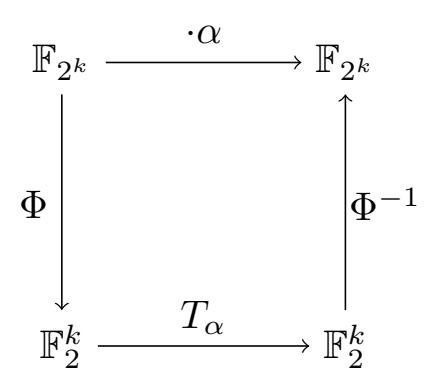
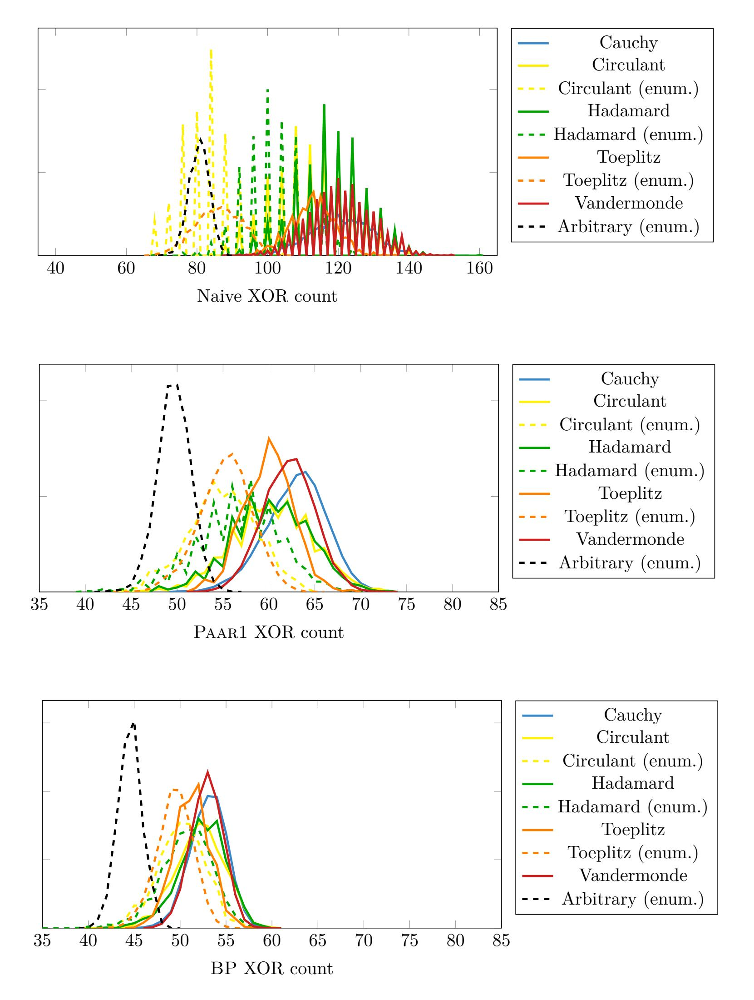
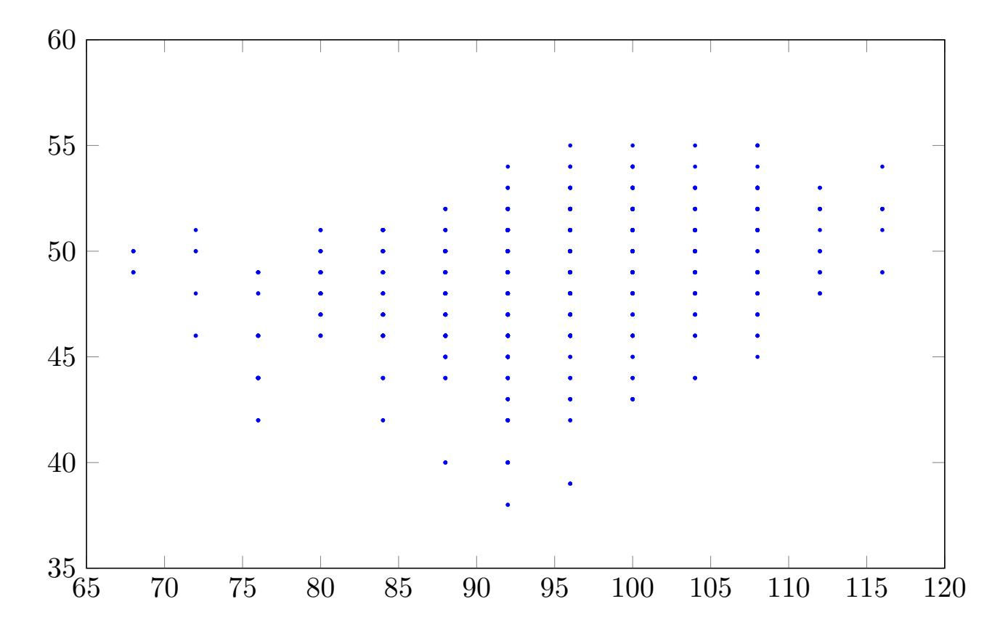
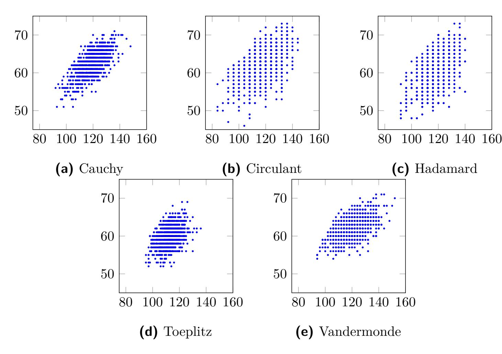
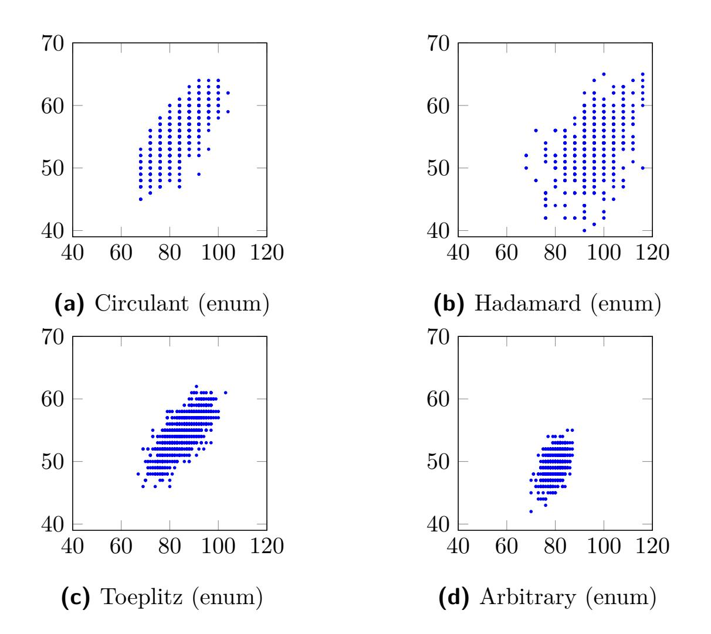
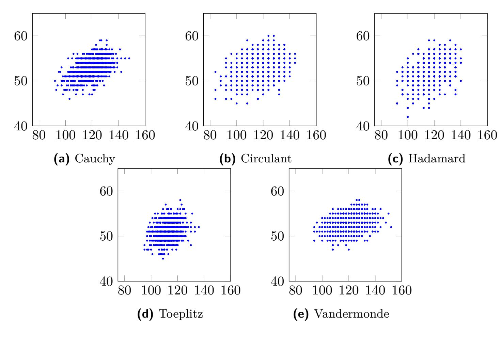
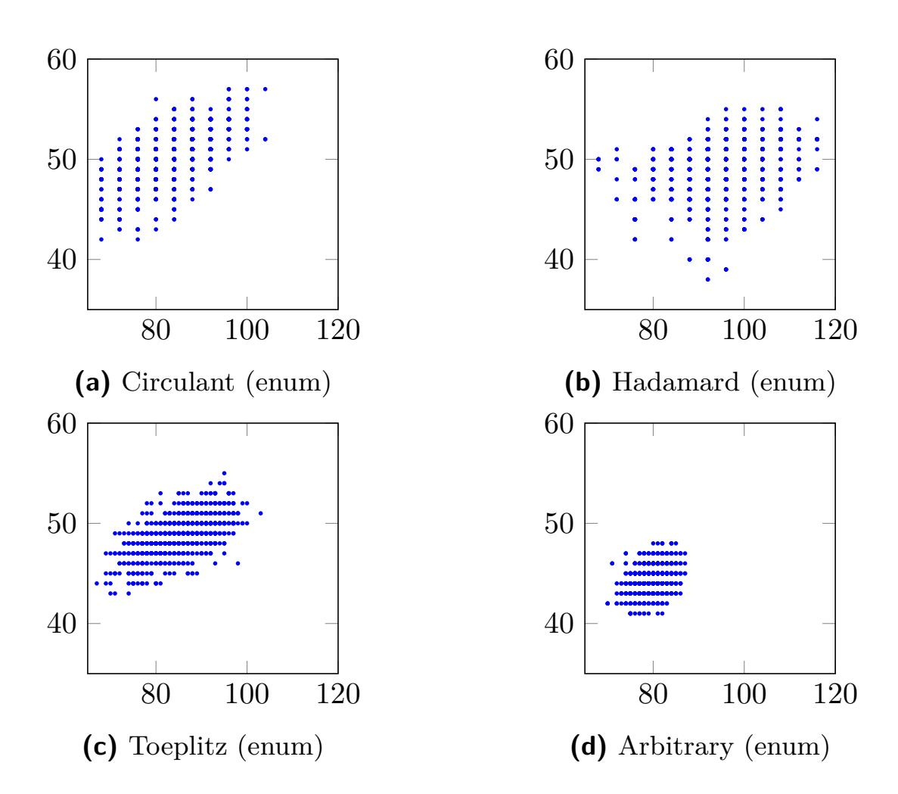

{0}------------------------------------------------

# **Shorter Linear Straight-Line Programs for MDS Matrices**

**Yet another XOR Count Paper**

Thorsten Kranz1 , Gregor Leander1 , Ko Stoffelen2 , Friedrich Wiemer1

**Abstract.** Recently a lot of attention is paid to the search for efficiently implementable MDS matrices for lightweight symmetric primitives. Most previous work concentrated on locally optimizing the multiplication with single matrix elements. Separate from this line of work, several heuristics were developed to find shortest linear straightline programs. Solving this problem actually corresponds to globally optimizing multiplications by matrices.

In this work we combine those, so far largely independent lines of work. As a result, we achieve implementations of known, locally optimized, and new MDS matrices that significantly outperform all implementations from the literature. Interestingly, almost all previous locally optimized constructions behave very similar with respect to the globally optimized implementation.

As a side effect, our work reveals the so far best implementation of the Aes Mix-Columns operation with respect to the number of XOR operations needed.

**Keywords:** XOR Count · MDS · Linear Layer · Shortest Straight-Line Program · SAT

# **1 Introduction**

Lightweight cryptography has been a major trend in symmetric cryptography for the last years. While it is not always exactly clear what lightweight cryptography actually is, the main goal can be summarized as very efficient cryptography. Here, the meaning of efficiency ranges from small chip size to low latency and low energy.

As part of this line of work, several researchers started to optimize the construction of many parts of block ciphers, with a special focus on the linear layers more recently and even more specifically the implementation of MDS matrices. That is, linear layers with an optimal branch number.

The first line of work focused solely on minimizing the chip area of the implementation. This started with the block cipher Present [\[Bog+07\]](#page-18-0) and goes over to many more designs, such as Led [\[Guo+11\]](#page-19-0) and the hash function Photon [\[GPP11\]](#page-19-1), where in the latter MDS matrices were constructed that are especially optimized for chip area by allowing a serialized implementation. However, there seem to be only a few practical applications where a small chip area is the only optimization goal and for those applications very good solutions are already available by now.

Later, starting with [\[Kho+14\]](#page-20-0), researchers focused on round-based implementations with the goal of finding MDS constructions that minimize the number of XOR operations needed for their implementation. Initially, the number of XOR operations needed was bounded by the number of ones in the binary representation of the matrix.

This article is the revised version of the final version [\[Kra+17\]](#page-20-1) submitted by the authors to the IACR and to the Ruhr-Universität Bochum, published on Dezember 15, 2017. The version published by Ruhr-Universität Bochum is available at DOI: [10.13154/tosc.v2017.i4.188-211.](https://doi.org/10.13154/tosc.v2017.i4.188-211)

1 Horst Görtz Institute for IT Security, Ruhr-Universität Bochum, Germany <{thorsten.kranz,gregor.leander,friedrich.wiemer}@rub.de>

2 Digital Security Group, Radboud University, Nijmegen, The Netherlands <k.stoffelen@cs.ru.nl>

{1}------------------------------------------------

However, as the number of ones only gives an upper bound on the number of required XORs, several papers started to deviate from this conceptually easier but less accurate definition of XOR count and started to consider more efficient ways of implementing MDS matrices. Considering an *n* × *n* MDS matrix over a finite field F2 *k* given as *M* = (*mi,j* ) the aim was to choose the elements *mi,j* in such a way that implementing all of the multiplications *x* 7→ *mi,jx* in parallel becomes as cheap as possible. In order to compute the matrix *M* entirely, those partial results have to be added together, for which an additional amount of XORs is required. It became common to denote the former cost as the overhead and the later cost, i. e., the cost of combining the partial results as a fixed, incompressible part. A whole series of papers [\[BKL16;](#page-18-1) [JPS17;](#page-19-2) [LS16;](#page-20-2) [LW16;](#page-20-3) [LW17;](#page-20-4) [Sim+15;](#page-21-0) [SS16a;](#page-21-1) [SS16b;](#page-21-2) [SS17;](#page-21-3) [ZWS17\]](#page-21-4) managed to reduce the overhead.

From a different viewpoint, what happened was that parts of the matrix, namely the cost of multiplication with the *mi,j* , were extensively optimized, while taking the overall part of combining the parts as a given. That is, researchers have focused on local optimization instead of global optimization.

Indeed the task of globally optimizing is far from trivial, and thus the local optimization is a good step forward.

Interestingly, the task to optimize the cost of implementing the multiplication with a relatively large, e. g., 32 × 32 binary matrix, is another extensively studied line of research. It is known that the problem is NP-hard [\[BMP08;](#page-18-2) [BMP13\]](#page-18-3) and thus renders quickly infeasible for increasing matrix dimension. However, quite a number of heuristic algorithms for finding the shortest linear straight-line program, which exactly corresponds to minimizing the number of XORs, have been proposed in the literature [\[BFP17;](#page-17-0) [BMP08;](#page-18-2) [BMP13;](#page-18-3) [BP10;](#page-18-4) [FS10;](#page-19-3) [FS12;](#page-19-4) [Paa97;](#page-20-5) [VSP17\]](#page-21-5). Those algorithms produce very competitive results with a rather reasonable running time for arbitrary binary matrices of dimension up to at least 32.

Thus, the natural next step in order to optimize the cost of implementing MDS matrices is to combine those two approaches. This is exactly what we are doing in our work.

Our contribution, which we achieve by applying the heuristic algorithms to find a short linear straight-line program to the case of MDS matrices, is threefold.

First, we use several well-locally-optimized MDS matrices from the literature and apply the known algorithms to all of them. This is conceptually easy, with the main problem being the implementation of those algorithms. In order to simplify this for follow-up works, we make our implementation publicly available.

This simple application leads immediately to significant improvements. For instance, we get an implementation of the Aes MixColumn matrix that outperforms all implementations in the literature, i. e., we use 97 XORs while the best implementation before used 103 XORs ([\[Jea+17\]](#page-19-5)). In the case of applying it to the other constructions, we often get an implementation using *less XOR operations than what was considered fixed costs before*. That is, when (artificially) computing it, the overhead would actually be negative. This confirms our intuition that the overhead was already very well optimized in previous work, such that now optimizing globally is much more meaningful.

Second, we took a closer look at how the previous constructions compare when being globally optimized. Interestingly, the previous best construction, i. e., the MDS matrix with smallest overhead, was most of the time *not the one with the fewest XORs*. Thus, with respect to the global optimum, the natural question was, which known construction actually performs best. In order to analyze that, we did extensive experimental computations to compare the distribution of the optimized implementation cost for the various constructions. The, somewhat disappointing, result is that all known constructions behave basically the same. The one remarkable exception is the subfield construction for MDS matrices, first introduced in Whirlwind [\[Bar+10\]](#page-17-1).

Third, we looked at finding matrices that perform exceptionally well with respect to

{2}------------------------------------------------

| Type                                                     | Prev | iously Best Known |                 | New Best Known        |  |  |
|----------------------------------------------------------|------|-------------------|-----------------|-----------------------|--|--|
| $\operatorname{GL}(4,\mathbb{F}_2)^{4\times 4}$          | 58   | [JPS17; SS16b]    | 36*             | Eq. (1) (Hadamard)    |  |  |
| $\mathrm{GL}(8,\mathbb{F}_2)^{4\times 4}$                | 106  | [LW16]            | 72              | Eq. (2) (Subfield)    |  |  |
| $\left(\mathbb{F}_2[x]/\mathtt{0x13}\right)^{8\times 8}$ | 384  | [Sim+15]          | $196^{\dagger}$ | Eq. (3) (Cauchy)      |  |  |
| $\mathrm{GL}(8,\mathbb{F}_2)^{8\times 8}$                | 640  | [LS16]            | 392             | Eq. (4) (Subfield)    |  |  |
| $(\mathbb{F}_2[x]/\mathtt{0x13})^{4\times 4}$            | 63   | [JPS17]           | 42*             | [SS16b]               |  |  |
| $\mathrm{GL}(8,\mathbb{F}_2)^{4\times 4}$                | 126  | [JPS17]           | 84              | Eq. (5) (Subfield)    |  |  |
| $\left(\mathbb{F}_2[x]/\mathtt{0x13}\right)^{8\times 8}$ | 424  | [Sim+15]          | $212^{\dagger}$ | Eq. (6) (Vandermonde) |  |  |
| $\mathrm{GL}(8,\mathbb{F}_2)^{8\times 8}$                | 736  | [JPS17]           | 424             | Eq. (7) (Subfield)    |  |  |

**Table 1:** Best known MDS matrices. Matrices in the lower half are involutory. The implementations are available on Github.

the global optimization, i. e., which can be implemented with an exceptional low *total* number of XORs. Those results are summarized in Table 1. Compared to previous known matrices, ours improve on all – with the exception of one, where the best known matrices is the already published matrix from [SS16b].

Finally, we like to point out two restrictions of our approach. First, we do not try to minimize the amount of temporary registers needed for the implementation. Second, in line with all previous constructions, we do not minimize the circuit depth. The later restriction is out of scope of the current work but certainly an interesting task for the future.

All our implementations are publicly available on Github:

https://github.com/rub-hgi/shorter\_linear\_slps\_for\_mds\_matrices

### 2 Preliminaries

Before getting into details about the XOR count and previous work, let us recall some basic notations on finite fields [LN97], their representations [War94], and on matrix constructions.

#### 2.1 Basic Notations

 $\mathbb{F}_{2^k}$  is the finite field with  $2^k$  elements, often also denoted as  $GF(2^k)$ . Up to isomorphism, every field with  $2^k$  elements is equal to the polynomial ring over  $\mathbb{F}_2$  modulo an irreducible polynomial q of degree k:  $\mathbb{F}_{2^k} \cong \mathbb{F}_2[x]/q$ . In favor of a more compact notation, we stick to the common habit and write a polynomial as its coefficient vector interpreted as a hexadecimal number, i. e.,  $x^4 + x + 1$  corresponds to 0x13.

It is well known that we can represent the elements in a finite field with characteristic 2 as vectors with coefficients in  $\mathbb{F}_2$ . More precisely, there exists a vectorspace isomorphism  $\Phi: \mathbb{F}_{2^k} \to \mathbb{F}_2^k$ . Every multiplication by an element  $\alpha \in \mathbb{F}_{2^k}$  can then be described by a left-multiplication with a matrix  $T_\alpha \in \mathbb{F}_2^{k \times k}$  as shown in the following diagram.

\* Computed with heuristic from [BMP13].

&lt;sup>† Computed with heuristic from [Paa97].

{3}------------------------------------------------

 $T_{\alpha}$  is usually called the multiplication matrix of the element  $\alpha$ . Given an  $n \times n$  matrix  $M = (\alpha_{i,j})$  with  $\alpha_{i,j} \in \mathbb{F}_{2^k}$  for  $1 \leq i,j \leq n$ , we define  $\mathcal{B}(M) := (T_{\alpha_{i,j}}) \subseteq \mathrm{GL}(k,\mathbb{F}_2)^{n \times n} \subseteq (\mathbb{F}_2^{k \times k})^{n \times n} \cong \mathbb{F}_2^{nk \times nk}$ . Its corresponding binary  $nk \times nk$  matrix is called the binary representation. Here,  $\mathrm{GL}(k,\mathbb{F}_2)$  denotes the general linear group, that is the group of invertible matrices over  $\mathbb{F}_2$  of dimension  $k \times k$ .

Given a matrix M and a vector u, the Hamming weights  $\operatorname{hw}(M)$  and  $\operatorname{hw}(u)$  are defined as the number of nonzero entries in M and u, respectively. In the case of a binary vector  $v \in \mathbb{F}_2^{nk}$ , we define  $\operatorname{hw}_k(v) \coloneqq \operatorname{hw}(v')$ , where  $v' \in (\mathbb{F}_2^k)^n$  is the vector that has been constructed by partitioning v into groups of k bits. Furthermore, the branch number of a matrix M is defined as  $\operatorname{bn}(M) \coloneqq \min_{u \neq 0} \{\operatorname{hw}(u) + \operatorname{hw}(Mu)\}$ . For a binary matrix  $B \in \mathbb{F}_2^{nk \times nk}$ , the branch number for k-bit words is defined as  $\operatorname{bn}_k(B) \coloneqq \min_{u \in \mathbb{F}_2^{nk} \setminus \{0\}} \{\operatorname{hw}_k(u) + \operatorname{hw}_k(Mu)\}$ .

In the design of block ciphers, MDS matrices play an important role.

**Definition 1.** An  $n \times n$  matrix M is MDS if and only if  $\operatorname{bn}(M) = n + 1$ .

It has been shown, that a matrix is MDS if and only if all its square submatrices are invertible [MS77, page 321, Theorem 8]. MDS matrices do not exist for every choice of n, k. The exact parameters for which MDS matrices do or do not exist are investigated in the context of the famous MDS conjecture which was initiated in [Seg55]. For binary matrices, we need to modify Definition 1.

**Definition 2.** A binary matrix  $B \in \mathbb{F}_2^{nk \times nk}$  is MDS for k-bit words if and only if  $\operatorname{bn}_k(M) = n + 1$ .

MDS matrices have a common application in linear layers of block ciphers, due to the wide trail strategy proposed for the AES, see [Dae95; DR02]. We typically deal with  $n \times n$  MDS matrices over  $\mathbb{F}_2^k$  respectively binary  $\mathbb{F}_2^{nk \times nk}$  matrices that are MDS for k-bit words where  $k \in \{4,8\}$  is the size of the S-box. In either case, when we call a matrix MDS, the size of k will always be clear from the context when not explicitly mentioned.

It is easy to see that, if  $M \in \mathbb{F}_{2^k}^{n \times n}$  is MDS, then also  $\mathcal{B}(M)$  is MDS for k-bit words. On the other hand, there might also exist binary MDS matrices for k-bit words that have no according representation over  $\mathbb{F}_2^k$ .

Other, non-MDS matrices are also common in cipher designs. To name only a few examples: Present's permutation matrix [Bog+07], lightweight implementable matrices from Prince [Bor+12], or Pride [Alb+14], or the recently used almost-MDS matrices, e.g. in Midori [Ban+15], or Qarma [Ava17].

#### 2.2 MDS Constructions

Cauchy and Vandermonde matrices are two famous constructions for building MDS matrices. They have the advantage of being provably MDS.

However, as known from the MDS conjecture, for some parameter choices, MDS matrices are unlikely to exist. E.g., we do not know how to construct MDS matrices over  $\mathbb{F}_{2^2}$  of dimension  $4 \times 4$ .

{4}------------------------------------------------

**Definition 3** (Cauchy matrix). Given two disjoint sets of n elements of a field  $\mathbb{F}_{2^k}$ ,  $A = \{a_1, \ldots, a_n\}$ , and  $B = \{b_1, \ldots, b_n\}$ . Then the matrix

$$M = \operatorname{cauchy}(a_1, \dots, a_n, b_1, \dots, b_n) := \begin{pmatrix} \frac{1}{a_1 - b_1} & \frac{1}{a_1 - b_2} & \dots & \frac{1}{a_1 - b_n} \\ \frac{1}{a_2 - b_1} & \frac{1}{a_2 - b_2} & \dots & \frac{1}{a_2 - b_n} \\ \vdots & & \ddots & \vdots \\ \frac{1}{a_n - b_1} & \frac{1}{a_n - b_2} & \dots & \frac{1}{a_n - b_n} \end{pmatrix}$$

is a Cauchy matrix.

Every Cauchy matrix is MDS, e.g. see [GR13, Lemma 1].

**Definition 4** (Vandermonde matrix). Given an *n*-tuple  $(a_1, \ldots, a_n)$  with  $a_i \in \mathbb{F}_{2^k}$ . Then the matrix

$$M = \text{vandermonde}(a_1, \dots, a_n) := \begin{pmatrix} a_1^0 & a_1^1 & \cdots & a_1^{n-1} \\ a_2^0 & a_2^1 & \cdots & a_2^{n-1} \\ \vdots & & \ddots & \vdots \\ a_n^0 & a_n^1 & \cdots & a_n^{n-1} \end{pmatrix}$$

is a Vandermonde matrix.

Given two Vandermonde matrices A and B with pairwise different  $a_i$ ,  $b_j$ , then the matrix  $AB^{-1}$  is MDS, see [LF04, Theorem 2]. Furthermore, if  $a_i = b_i + \Delta$  for all i and an arbitrary nonzero  $\Delta$ , then the matrix  $AB^{-1}$  is also involutory [LF04; Saj+12].

### 2.3 Specially Structured Matrix Constructions

Other constructions, such as circulant, Hadamard, or Toeplitz, are not per se MDS, but they have the advantage that they greatly reduce the search space by restricting the number of submatrices that appear in the matrix. For circulant matrices, this was e.g. already noted by Daemen et al. [DKR97].

In order to generate a random MDS matrix with one of these constructions, we can choose random elements for the matrix and then check for the MDS condition. Because of many repeated submatrices, the probability to find an MDS matrix is much higher then for a fully random matrix.

**Definition 5** (Circulant matrices). A right circulant  $n \times n$  matrix is defined by the elements of its first row  $a_1, \ldots, a_n$  as

$$M = \operatorname{circ}_{\mathbf{r}}(a_1, \dots, a_n) \coloneqq \begin{pmatrix} a_1 & a_2 & \cdots & a_n \\ a_n & a_1 & \cdots & a_{n-1} \\ \vdots & & \ddots & \vdots \\ a_2 & \cdots & a_n & a_1 \end{pmatrix}.$$

A left circulant  $n \times n$  matrix is analogously defined as

$$M = \operatorname{circ}_{\ell}(a_1, \dots, a_n) := \begin{pmatrix} a_1 & a_2 & \cdots & a_n \\ a_2 & a_3 & \cdots & a_1 \\ \vdots & & \ddots & \vdots \\ a_n & a_1 & \cdots & a_{n-1} \end{pmatrix}.$$

While in the literature circulant matrices are almost always right circulant, left circulant matrices are equally fine for cryptographic applications. The often noted advantage of right circulant matrices, the ability to implement the multiplication serialized and with

{5}------------------------------------------------

shifts in order to save XORs, of course also applies to left circulant matrices. Additionally, it is easy to see that  $\operatorname{bn}(\operatorname{circ}_{r}(a_{1},\ldots,a_{n})) = \operatorname{bn}(\operatorname{circ}_{\ell}(a_{1},\ldots,a_{n}))$ , since the matrices only differ in a permutation of the rows. Thus, for cryptographic purposes, it does not matter if a matrix is right circulant or left circulant and we will therefore simply talk about circulant matrices in general. The common practice of restricting the matrix entries to elements from a finite field comes with the problem that circulant involutory MDS matrices over finite fields do not exist, see [JA09]. But Li and Wang [LW16] showed that this can be avoided by taking the matrix elements from the general linear group.

**Definition 6** (Hadamard matrix). A (finite field) Hadamard matrix M is of the form

$$M = \begin{pmatrix} M_1 & M_2 \\ M_2 & M_1 \end{pmatrix},$$

where  $M_1$  and  $M_2$  are either Hadamard matrices themselves or one-dimensional.

The biggest advantage of Hadamard matrices is the possibility to construct involutory matrices. If we choose the elements of our matrix such that the first row sums to one, the resulting matrix is involutory, see [GR13].

**Definition 7** (Toeplitz matrix). An  $n \times n$  Toeplitz matrix M is defined by the elements of its first row  $a_1, \ldots, a_n$  and its first column  $a_1, a_{n+1}, \ldots, a_{2n-1}$  as

$$M = toep(a_1, \dots, a_n, a_{n+1}, \dots, a_{2n-1}) := \begin{pmatrix} a_1 & a_2 & \dots & a_n \\ a_{n+1} & a_1 & \ddots & a_{n-1} \\ \vdots & \ddots & \ddots & \vdots \\ a_{2n-1} & a_{2n-2} & \dots & a_1 \end{pmatrix},$$

that is, every element defines one minor diagonal of the matrix.

To the best of our knowledge, Sarkar and Syed [SS16b] were the first to scrutinize Toeplitz matrices in the context of XOR counts.

Finally, the subfield construction was first used to construct lightweight linear layers in the Whirlwind hash function [Bar+10, Section 2.2.2] and later used in [Alb+14; Cho+12; JPS17; Kho+14; Sim+15]. As its name suggests, the subfield construction was originally defined only for matrices over finite fields: a matrix with coefficients in  $\mathbb{F}_{2^k}$  can be used to construct a matrix with coefficients in  $\mathbb{F}_{2^{2k}}$ . Here, we use the natural extension to binary matrices.

**Definition 8** (Subfield matrix). Given an  $n \times n$  matrix M with entries  $m_{i,j} \in \mathbb{F}_2^{k \times k}$ . The subfield construction of M is then an  $n \times n$  matrix M' with

$$M' = \text{subfield}(M) := (m'_{i,i}),$$

where each 
$$m'_{i,j} = \begin{pmatrix} m_{i,j} & 0 \\ 0 & m_{i,j} \end{pmatrix} \in \mathbb{F}_2^{2k \times 2k}$$
.

This definition is straightforward to extend for more than one copy of the matrix M. The subfield construction has some very useful properties, see [Bar+10; JPS17; Kho+14; Sim+15].

**Lemma 1.** For the subfield construction, the following properties hold:

- 1. Let M be a matrix that can be implemented with m XORs. Then the matrix M' = subfield(M) can be implemented with  $2m \ XORs$ .
- 2. Let M be an MDS matrix for k-bit words. Then M' = subfield(M) is MDS for 2k-bit words.

{6}------------------------------------------------

3. Let M be an involutory matrix. Then M' = subfield(M) is also involutory.

Proof.

- (1) Due to the special structure of the subfield construction, we can split the multiplication by M' into two multiplications by M, each on one half of the input bits. Hence, the XOR count doubles.
- (2) We want to show that  $hw_{2k}(u) + hw_{2k}(M'u) \ge n + 1$  for every nonzero u. We split u into two parts  $u_1$  and  $u_2$ , each containing alternating halves of the elements of u. As described in [Kho+14], the multiplication of M' and u is the same as the multiplication of the original matrix M and each of the two  $u_i$ , if we combine the results according to our splitting. Let  $t = hw_{2k}(u) > 0$ . Then, we have  $t \ge hw_k(u_1)$  and  $t \ge hw_k(u_2)$ . Without loss of generality, let  $hw_k(u_1) > 0$ . Since M is MDS for k-bit words, we have  $hw_k(Mu_1) \ge n t + 1$  which directly leads to  $hw_{2k}(M'u) \ge n t + 1$ .
- (3) As in the above proof, this property is straightforward to see. We want to show that M'M'u = u for any vector u. Again, we split u into two parts,  $u_1$  and  $u_2$ , each containing alternating halves of the elements of u. Now, we need to show that  $MMu_i = u_i$ . This trivially holds, as M is involutory.

With respect to cryptographic designs, this means the following: assume we have a linear straight-line program with m XORs for an (involutory)  $n \times n$  MDS matrix and k-bit S-boxes. We can then easily construct a linear straight-line program with 2m XORs for an (involutory)  $n \times n$  MDS matrix and 2k-bit S-boxes.

### 3 Related Work

In 2014, [Kho+14] introduced the notion of XOR count as a metric to compare the areaefficiency of matrix multiplications. Following that, there has been a lot of work [BKL16; JPS17; LS16; LW16; LW17; Sim+15; SS16a; SS16b; SS17; ZWS17] on finding MDS matrices that can be implemented with as few XOR gates as possible in the round-based scenario.

In an independent line of research, the problem of implementing binary matrix multiplications with as few XORs as possible was extensively studied [BFP17; BMP08; BMP13; BP10; FS10; FS12; Paa97; VSP17].

In this section, we depict these two fields of research and show how they can be combined.

#### 3.1 Local Optimizations

Let us first recall the scenario. In a round-based implementation the matrix is implemented as a fully unrolled circuit. Thus, in the XOR count metric, the goal is to find a matrix that can be implemented with a circuit of as few (2-input) XOR gates as possible. Of course, the matrix has to fulfill some criteria, typically it is MDS. For finding matrices with a low XOR count, the question of how to create a circuit for a given matrix must be answered.

The usual way for finding an implementation of  $n \times n$  matrices over  $\mathbb{F}_{2^k}$  was introduced in [Kho+14]. As each of the n output components of a matrix-vector multiplication is computed as a sum over n products, the implementation is divided into two parts. Namely the single multiplications on the one hand and addition of the products on the other hand. As  $\mathbb{F}_{2^k} \cong \mathbb{F}_2^k$ , an addition of two elements from  $\mathbb{F}_2^k$  requires k XORs and thus adding up the products for all rows requires n(n-1)k XORs in the case of an MDS matrix where

{7}------------------------------------------------

every element is nonzero. If one implements the matrix like this, these n(n-1)k XORs are a fixed part that cannot be changed. Accordingly, many papers [BKL16; JPS17; LS16; LW16; ZWS17] just state the number of XORs for the single field multiplications when presenting results. The other costs are regarded as inevitable. The goal then boils down to constructing matrices with elements for which multiplication can be implemented with few XORs. Thus, the original goal of finding a global implementation for the matrix is approached by locally looking at the single matrix elements.

To count the number of XORs for implementing a single multiplication with an element  $\alpha \in \mathbb{F}_{2^k}$ , the multiplication matrix  $T_\alpha \in \mathbb{F}_2^{k \times k}$  is considered. Such a matrix can be implemented in a straightforward way with  $\text{hw}(T_\alpha) - k$  XORs by simply implementing every XOR of the output components. We call this the *naive* implementation of a matrix and when talking about the naive XOR count of a matrix, we mean the  $\text{hw}(T_\alpha) - k$  XORs required for the naive implementation. In [JPS17], this is called d-XOR. It is the easiest and most frequently used method of counting XORs. Of course, in the same way we can also count the XORs of other matrices over  $\mathbb{F}_2^{k \times k}$ , i. e., also matrices that were not originally defined over finite fields.

For improving the XOR count of the single multiplications, two methods have been introduced. First, if the matrix is defined over some finite field, one can consider different field representations that lead to different multiplication matrices with potentially different Hamming weights, see [BKL16; Sim+15; SS16a]. Second, by reusing intermediate results, a  $k \times k$  binary matrix might be implemented with less than hw(M) - k XORs, see [BKL16; JPS17]. In [JPS17], this is called s-XOR. The according definitions from [JPS17] and [BKL16] require that all operations must be carried out on the input registers. That is, in contrast to the naive XOR count, no temporary registers were allowed. However, as we consider round-based hardware implementations, there is no need to avoid temporary registers since these are merely wires between gates.

Nowadays, the XOR count of implementations is mainly dominated by the n(n-1)k XORs for putting together the locally optimized multiplications. Lastly, we seem to hit a threshold and new results often improve existing results only by very few XORs. The next natural step is to shift the focus from local optimization of the single elements to the global optimization of the whole matrix. This was also formulated as future work in [JPS17]. As described in Section 2, we can use the binary representation to write an  $n \times n$  matrix over  $\mathbb{F}_{2^k}$  as a binary  $nk \times nk$  matrix. First we note, that the naive XOR count of the binary representation is exactly the naive XOR count of implementing each element multiplication and finally adding the results. But if we look at the optimization technique of reusing intermediate results for the whole  $nk \times nk$  matrix, we now have many more degrees of freedom. For the MixColumn matrix there already exists some work that goes beyond local optimization. An implementation with 108 XORs has been presented in [BBR16a; BBR16b; Sat+01] and an implementation with 103 XORs in [Jea+17]. A first step to a global optimization algorithm was done in [Zha+16]. However, their heuristic did not yield very good results and they finally had to go back to optimizing submatrices.

Interestingly, much better algorithms for exactly this problem are already known from a different line of research.

#### 3.2 Global Optimizations

Implementing binary matrices with as few XOR operations as possible is also known as the problem of finding the *shortest linear straight-line program* [BMP13; FS10] over the finite field with two elements. Although this problem is NP-hard [BMP08; BMP13], attempts have been made to find exact solutions for the minimum number of XORs. Fuhs and Schneider-Kamp [FS10; FS12] suggested to reduce the problem to satisfiability of Boolean logic. They presented a general encoding scheme for deciding if a matrix can be implemented with a certain number of XORs. Now, for finding the optimal implementation,

{8}------------------------------------------------

they repeatedly use SAT solvers for a decreasing number of XORs. Then, when they know that a matrix can be implemented with  $\ell$  XORs, but cannot be implemented with  $\ell-1$  XORs, they are able to present  $\ell$  as the optimal XOR count. They used this technique to search for the minimum number of XORs necessary to compute a binary matrix of size  $21 \times 8$ , which is the first linear part of the AES S-box, when it is decomposed into two linear parts and a minimal non-linear core. While it worked to find a solution with 23 XORs and to show that no solution with 20 XORs exists, it turned out to be infeasible to prove that a solution with 22 XORs does not exist and that 23 is therefore the minimum. In general, this approach quickly becomes infeasible for larger matrices. Stoffelen [Sto16] applied it successfully to a small  $7 \times 7$  matrix, but did not manage to find a provably minimal solution with a specific matrix of size  $19 \times 5$ . However, there do exist heuristics to efficiently find short linear straight-line programs also for larger binary matrices.

Back in 1997, Paar [Paa97] studied how to optimize the arithmetic used by Reed-Solomon encoders. Essentially, this boils down to reducing the number of XORs that are necessary for a constant multiplier over the field  $\mathbb{F}_{2^k}$ . Paar described two algorithms that find a local optimum. Intuitively, the idea of the algorithms is to iteratively eliminate common subexpressions. Let  $T_{\alpha}$  be the multiplication matrix, to be applied to a variable field element  $x = (x_1, \dots, x_k) \in \mathbb{F}_2^k$ . The first algorithm for computing  $T_{\alpha}x$ , denoted PAAR1 in the rest of this work, finds a pair (i,j), with  $i \neq j$ , where the bitwise AND between columns i and j of  $T_{\alpha}$  has the highest Hamming weight. In other words, it finds a pair  $(x_i, x_j)$  that occurs most frequently as subexpression in the output bits of  $T_{\alpha}x$ . The XOR between those is then computed, and M is updated accordingly, with  $x_i + x_j$  as newly available variable. This is repeated until there are no common subexpressions left.

The second algorithm, denoted PAAR2, is similar, but differs when multiple pairs are equally common. Instead of just taking the first pair, it recursively tries all of them. The algorithm is therefore much slower, but can yield slightly improved results. Compared to the naive XOR count, Paar noted an average reduction in the number of XORs of 17.5% for matrices over  $\mathbb{F}_{2^4}$  and 40% for matrices over  $\mathbb{F}_{2^8}$ .

In 2009, Bernstein [Ber09] presented an algorithm for efficiently implementing linear maps modulo 2. Based on this and on [Paa97], a new algorithm was presented in [BC14]. However, the algorithms from [BC14; Ber09] have a different framework in mind and yield a higher number of XORs compared to [Paa97].

Paar's algorithms lead to so-called cancellation-free programs. This means that for every XOR operation u+v, none of the input bit variables  $x_i$  occurs in both u and v. Thus, the possibility that two variables cancel each other out is never taken into consideration, while this may in fact yield a more efficient solution in terms of the total number of XORs. In 2008, Boyar et al. [BMP08] showed that cancellation-free techniques can often not be expected to yield optimal solutions for non-trivial inputs. They also showed that, even under the restriction to cancellation-free programs, the problem of finding an optimal program is NP-complete.

Around 2010, Boyar and Peralta [BP10] came up with a heuristic that is not cancellation-free and that improved on Paar's algorithms in most scenarios. Their idea was to keep track of a distance vector that contains, for each targeted expression of an output bit, the minimum number of additions of the already computed intermediate values that are necessary to obtain that target. To decide which values will be added, the pair that minimizes the sum of new distances is picked. If there is a tie, the pair that maximizes the Euclidean norm of the new distances is chosen. Additionally, if the addition of two values immediately leads to a targeted output, this can always be done without searching further. This algorithm works very well in practice, although it is slower compared to PAAR1.

Next to using the Euclidean norm as tie breaker, they also experimented with alternative criteria. For example, choosing the pair that maximizes the Euclidean norm minus the largest distance, or choosing the pair that maximizes the Euclidean norm minus the

{9}------------------------------------------------

difference between the two largest distances. The results were then actually very similar. Another tie-breaking method is to flip a coin and choose a pair randomly. The algorithm is now no longer deterministic and can be run multiple times. The lowest result can then be used. This performed slightly better, but of course processing again takes longer.

The results of [BMP08] and [BP10] were later improved and published in [BMP13].

In early 2017, Visconti et al. [VSP17] explored the special case where the binary matrix is dense. They improved the heuristic on average for dense matrices by first computing a common path, an intermediate value that contains most variables. The original algorithm is then run starting from this common path.

At BFA 2017, Boyar et al. [BFP17] presented an improvement that simultaneously reduces the number of XORs and the depth of the resulting circuit.

We refer to this family of heuristics [BFP17; BMP08; BMP13; BP10; VSP17] as the BP heuristics.

### 4 Results

Using the techniques described above, we now give optimized XOR counts and implementations of published matrices. Next, we analyze the statistical behavior of matrix constructions. Finally we summarize the to date best known matrices.

### 4.1 Improved Implementations of Matrices

Using the heuristic methods that are described in the previous section, we can easily and significantly reduce the XOR counts for many matrices that have been used in the literature. The running times for the optimizations are in the range of seconds to minutes. All corresponding implementations are available in the GITHUB repository. Table 2 lists results for matrices that have been suggested in previous works where it was an explicit goal to find a lightweight MDS matrix. While the constructions themselves will be compared in Section 4.2, this table deals with the suggested instances.

A number of issues arise from this that are worth highlighting. First of all, it should be noted that without any exception, the XOR count for every matrix could be reduced with little effort. Second, it turns out that there are many cases where the n(n-1)k XORs for summing the products for all rows is not even a correct lower bound. In fact, all the  $4 \times 4$  matrices over  $GL(4, \mathbb{F}_2)$  that we studied can be implemented in at most 48 XORs.

What may be more interesting, is whether the XOR count as it was used previously is in fact a good predictor for the actual implementation cost as given by the heuristical methods. Here we see that there are some differences. For example, [LW16]'s circulant  $4 \times 4$  matrices over  $GL(8, \mathbb{F}_2)$  first compared very favorably, but we now find that the subfield matrix of [JPS17] requires fewer XORs.

Regarding involutory matrices, it was typically the case that there was an extra cost involved to meet this additional criterion. However, the heuristics sometimes find implementations with even fewer XORs than the non-involutory matrix that was suggested. See for example the matrices of [SS16b] in the table.

Aside from these matrices, we also looked at MDS matrices that are used by various ciphers and hash functions. Table 3 lists their results. Not all MDS matrices that are used in ciphers are incorporated here. In particular, LED [Guo+11], PHOTON [GPP11], and PRIMATES [And+14] use efficient serialized MDS matrices. Comparing these to our "unrolled" implementations would be somewhat unfair.

The implementation of the MDS matrix used in AES with 97 XORs is, to the best of our knowledge, the most efficient implementation so far and improves on the previous implementation of 103 XORs, reported by [Jea+17]. As a side note, cancellations do occur

{10}------------------------------------------------

in this implementation, we thus conjecture that such a low XOR count is not possible with cancellation-free programs.

## **4.2 Statistical Analysis**

Several constructions for building MDS matrices are known. But it is not clear which one is the best when we want to construct matrices with a low XOR count. In this section, we present experimental results on different constructions and draw conclusions for the designer. We also examine the correlation between naive and heuristically improved XOR counts. When designing MDS matrices with a low XOR count, we are faced with two major questions. First, which construction is preferable? Our intuition in this case is, a better construction has better statistical properties, compared to an inferior construction. We are aware that the statistical behavior of a construction might not be very important for a designer who only looks for a single, very good instance. Nevertheless we use this as a first benchmark. Second, is it a good approach to choose the matrices as sparse as possible? In order to compare the listed constructions, we construct random instances of each and then analyze them with statistical means.

Building Cauchy and Vandermonde matrices is straightforward as we only need to choose the defining elements randomly from the underlying field. For the other constructions, we use the following backtracking method to build random MDS constructions of dimension 4 × 4. Choose the new random elements from GL(*k,* F2) that are needed for the matrix construction in a step-by-step manner. In each step, construct all new square submatrices. If any of these is not invertible, discard the chosen element and try a new one. In the case that no more elements are left, go one step back and replace that element with a new one, then again check the according square submatrices, and so on. Eventually, we end up with an MDS matrix because we iteratively checked that every square submatrix is invertible. The method is also trivially derandomizable, by not choosing the elements randomly, but simply enumerating them in any determined order.

Apart from applying this method to the above mentioned constructions, we can also use it to construct an *arbitrary*, i. e. unstructured, matrix that is simply defined by its 16 elements. This approach was already described in [\[JPS17\]](#page-19-2).

In this manner, we generated 1 000 matrices for each construction and computed the distributions for the naive XOR count, the optimized XOR count of Paar1, and BP. [Table 4](#page-13-0) lists the statistical parameters of the resulting distributions and [Fig. 1](#page-14-0) depicts them (the sample size *N* is the same for [Table 4](#page-13-0) and [Figs. 1,](#page-14-0) [2](#page-15-0) and [3](#page-22-0) to [6\)](#page-23-0).

The most obvious characteristic of the statistical distributions is that the means *µ* do not differ much for all randomized constructions. The variance *σ* 2 on the contrary differs much more. This is most noticeable for the naive XOR count, while the differences get much smaller when the XOR count is optimized with the Paar1 or BP heuristic. One might think that the construction with the lowest optimized average XOR count, which is for matrices over GL(4*,* F2) the arbitrary construction with enumerated elements, yields the best results. However, the best matrix we could find for these dimension was a Hadamard matrix. An explanation for this might be the higher variance that leads to some particularly bad and some particularly good results.

The graphs in [Fig. 1](#page-14-0) convey a similar hypothesis. Looking only at the naive XOR count, we can notice some differences. For example circulant matrices seem to give better results than, e. g., Hadamard matrices. Additionally, the naive XOR count increases step-wise as not every possible count occurs. But when optimizing the XOR count, the distributions get smoother and more similar.

We conclude that all constructions give similarly good matrices when we are searching for the matrix with the lowest XOR count, with one important exception. For randomly generated matrices the XOR count increases by a factor of four, if we double the parameter *k*. [Table 4](#page-13-0) covers this for Cauchy and Vandermonde matrices. We do not compute the

{11}------------------------------------------------

**Table 2:** Comparison of 4 × 4 and 8 × 8 MDS matrices over GL(4*,* F2) and GL(8*,* F2).

| Matrix                          | Naive | Literature                    | Paar1 | Paar2 | BP  |
|---------------------------------|-------|-------------------------------|-------|-------|-----|
|                                 |       | 4 × 4 matrices over GL(4, F2) |       |       |     |
| [Sim+15] (Hadamard)             | 68    | 20 + 48                       | 50    | 48*   | 48  |
| [LS16] (Circulant)              | 60    | 12 + 48                       | 49    | 46*   | 44  |
| [LW16] (Circulant)†             | 60    | 12 + 48                       | 48    | 47*   | 44  |
| [BKL16] (Circulant)†            | 64    | 12 + 48                       | 48    | 47    | 42  |
| [SS16b] (Toeplitz)              | 58    | 10 + 48                       | 46    | 45*   | 43  |
| [JPS17]                         | 61    | 10 + 48                       | 48    | 47    | 43  |
| [Sim+15] (Hadamard, Involutory) | 72    | 24 + 48                       | 52    | 48*   | 48  |
| [LW16] (Hadamard, Involutory)   | 72    | 24 + 48                       | 51    | 48*   | 48  |
| [SS16b] (Involutory)            | 64    | 16 + 48                       | 50    | 48    | 42  |
| [JPS17] (Involutory)            | 68    | 15 + 48                       | 51    | 47*   | 47  |
|                                 |       | 4 × 4 matrices over GL(8, F2) |       |       |     |
| [Sim+15] (Subfield)             | 136   | 40 + 96                       | 100   | 98*   | 100 |
| [LS16] (Circulant)              | 128   | 28 + 961                      | 116   | 116   | 112 |
| [LW16]                          | 106   | 10 + 96                       | 102   | 102   | 102 |
| [BKL16] (Circulant)             | 136   | 24 + 96                       | 116   | 112*  | 110 |
| [SS16b] (Toeplitz)              | 123   | 24 + 961                      | 110   | 108   | 107 |
| [JPS17] (Subfield)              | 122   | 20 + 96                       | 96    | 95*   | 86  |
| [Sim+15] (Subfield, Involutory) | 144   | 40 + 961                      | 104   | 101*  | 100 |
| [LW16] (Hadamard, Involutory)   | 136   | 40 + 96                       | 101   | 97*   | 91  |
| [LW16] (Circulant, Involutory)  | 132   | 36 + 96                       | 104   | 104*  | 97  |
| [SS16b] (Involutory)            | 160   | 64 + 96                       | 110   | 109*  | 100 |
| [JPS17] (Subfield, Involutory)  | 136   | 30 + 96                       | 102   | 100*  | 91  |
|                                 |       | 8 × 8 matrices over GL(4, F2) |       |       |     |
| [Sim+15] (Hadamard)             | 432   | 160 + 2241                    | 210   | 209*  | 194 |
| [SS17] (Toeplitz)               | 394   | 170 + 224                     | 205   | 205*  | 201 |
| [Sim+15] (Hadamard, Involutory) | 512   | 200 + 2241                    | 222   | 222*  | 217 |
|                                 |       | 8 × 8 matrices over GL(8, F2) |       |       |     |
| [Sim+15] (Hadamard)             | 768   | 256 + 4481                    | 474   | —     | 467 |
| [LS16] (Circulant)              | 688   | 192 + 4481                    | 464   | —     | 447 |
| [BKL16] (Circulant)             | 784   | 208 + 4481                    | 506   | —     | 498 |
| [SS17] (Toeplitz)               | 680   | 232 + 448                     | 447   | —     | 438 |
| [Sim+15] (Hadamard, Involutory) | 816   | 320 + 4481                    | 430   | —     | 428 |
| [JPS17] (Hadamard, Involutory)  | 1152  | 288 + 448                     | 620   | —     | 599 |

\* Stopped algorithm after three hours runtime.

† The authors of [\[BKL16;](#page-18-1) [LW16\]](#page-20-3) did not only give one matrix, but instead whole classes of MDS matrices. For [\[BKL16\]](#page-18-1), we chose the canonical candidate from its class. For [\[LW16\]](#page-20-3), we chose the matrix presented as an example in the paper.

1 Reported by [\[JPS17\]](#page-19-2).

{12}------------------------------------------------

**Table 3:** Matrices used in ciphers or hash functions. Note that matrices in the lower part of the table, marked with  $\parallel$ , are not MDS. Additionally these matrices are commonly not a target for "XOR count"-based implementation optimizations, as they are per se very efficiently implementable.

| Cipher                                                                                  | Type                                                      | Naive | Literature    | Paar1 | Paar2     | BP             |
|-----------------------------------------------------------------------------------------|-----------------------------------------------------------|-------|---------------|-------|-----------|----------------|
| AES [DR02] ‡ (Circulant)                                                     | $(\mathbb{F}_2[x]/\mathtt{0x11b})^{4\times 4}$            | 152   | $7 + 96^{1}$  | 108   | 108*      | $97^{\dagger}$ |
| Anubis [BRa] (Hadamard, Involutory)                                                     | $\left(\mathbb{F}_2[x]/\mathtt{0x11d}\right)^{4\times 4}$ | 184   | $80 + 96^2$   | 121   | 121*      | 106            |
| Clefia M 0 [Shi+07] (Hadamard)                                               | $\left(\mathbb{F}_2[x]/\mathtt{0x11d}\right)^{4\times 4}$ | 184   | $80 + 96^2$   | 121   | $121^{*}$ | 106            |
| Clefia M 1 [Shi+07] (Hadamard)                                               | $\left(\mathbb{F}_2[x]/\mathtt{0x11d}\right)^{4\times 4}$ | 208   | 5             | 121   | $121^{*}$ | 111            |
| Fox Mu4 [JV04]                                                                          | $\left(\mathbb{F}_2[x]/\mathtt{0x11b}\right)^{4\times 4}$ | 219   | 5             | 144   | $143^*$   | 137            |
| TWOFISH [Sch+98]                                                                        | $\left(\mathbb{F}_2[x]/\mathtt{0x169}\right)^{4\times4}$  | 327   | 5             | 151   | $149^*$   | 129            |
| Fox Mu8 [JV04]                                                                          | $\left(\mathbb{F}_2[x]/\mathtt{0x11b}\right)^{8\times 8}$ | 1257  | 5             | 611   |           | 594            |
| Grøstl [Gau+] (Circulant)                                                               | $\left(\mathbb{F}_2[x]/\mathtt{0x11b}\right)^{8\times 8}$ | 1112  | $504 + 448^2$ | 493   | _         | 475            |
| Khazad [BRb] (Hadamard, Involutory)                                                     | $\left(\mathbb{F}_2[x]/\mathtt{0x11d}\right)^{8\times 8}$ | 1232  | $584 + 448^2$ | 488   |           | 507            |
| Whirlpool [BRc]§ (Circulant)                                                            | $\left(\mathbb{F}_2[x]/\mathtt{0x11d}\right)^{8\times 8}$ | 840   | $304 + 448^2$ | 481   | _         | 465            |
| Joltik [JNP14] (Hadamard, Involutory)                                                   | $\left(\mathbb{F}_2[x]/\mathtt{0x13}\right)^{4\times 4}$  | 72    | $20 + 48^2$   | 52    | 48        | 48             |
| SMALLSCALE AES [CMR05] (Circulant)                                                      | $\left(\mathbb{F}_2[x]/\mathtt{0x13}\right)^{4\times 4}$  | 72    | 5             | 54    | 54        | 47             |
| Whirlwind M 0 [Bar+10] (Hadamard, Subfield)                                  | $\left(\mathbb{F}_2[x]/\mathtt{0x13}\right)^{8\times 8}$  | 488   | $168 + 224^2$ | 218   | 218*      | 212            |
| Whirlwind $M_1$ [Bar+10] (Hadamard, Subfield)                                           | $\left(\mathbb{F}_2[x]/\mathtt{0x13}\right)^{8\times 8}$  | 536   | $184 + 224^2$ | 246   | $244^*$   | 235            |
| Qarma $128 \text{ [Ava}17]^{\parallel} \text{ (Circulant)}$                             | $\left(\mathbb{F}_2[x]/\mathtt{0x101}\right)^{4\times 4}$ | 64    | 5             | 48    | 48        | 48             |
| Aria $[Kwo+03]^{\parallel}$ (Involutory)                                                | $\left(\mathbb{F}_{2}\right)^{128\times128}$              | 768   | $480^{3}$     | 416   | _         |                |
| Midori $[Ban+15]^{\parallel,\P}$ (Circulant)                                            | $(\mathbb{F}_{2^4})^{4\times 4}$                          | 32    | 5             | 24    | 24        | 24             |
| PRINCE $\widehat{\mathrm{M}}_{0},\widehat{\mathrm{M}}_{1}[\mathrm{Bor}+12]^{\parallel}$ | $\left(\mathbb{F}_{2}\right)^{16\times16}$                | 32    | 5             | 24    | 24        | 24             |
| Pride $L_0-L_3$ [Alb+14] $^{\parallel}$                                                 | $(\mathbb{F}_2)^{16 \times 16}$                           | 32    | 5             | 24    | 24        | 24             |
| Qarma $64 [Ava17]^{\parallel} (Circulant)$                                              | $\left(\mathbb{F}_2[x]/\mathtt{0x11}\right)^{4\times 4}$  | 32    | 5             | 24    | 24        | 24             |
| Skinny64 $[Bei+16]^{\parallel}$                                                         | $\left(\mathbb{F}_{2^4}\right)^{4\times 4}$               | 16    | $12^{4}$      | 12    | 12        | 12             |

\* Stopped algorithm after three hours runtime.

&lt;sup>† For the implementation see our GITHUB repository.

&lt;sup>‡ Also used in other primitives, e.g. its predecessor SQUARE [DKR97], and MUGI [Wat+02].

§ Also used in Maelstrom [FBR06].

Also used in other ciphers, e.g. Mantis [Bei+16], and Fides [Bil+13].

 $\parallel$  Not an MDS matrix.

&lt;sup>1 Reported by [Jea+17].

&lt;sup>2 Reported by [JPS17].

&lt;sup>3 Reported by [Bir+04].

&lt;sup>4 Reported by the designers.

&lt;sup>5 We are not aware of any reported results for this matrix.

{13}------------------------------------------------

**Table 4:** Distributions for differently optimized XOR counts. By *N* we denote the sample size, *µ* is the mean, and *σ* 2 the variance.

|                                          |       | Naive |       |       | Paar1 |      | BP  |  |  |
|------------------------------------------|-------|-------|-------|-------|-------|------|-----|--|--|
| Construction                             | N     | µ     | σ2    | µ     | σ2    | µ    | σ2  |  |  |
| 4 × 4 matrices over GL(4, F2)            |       |       |       |       |       |      |     |  |  |
| Cauchy                                   | 1 000 | 120.7 | 77.3  | 62.9  | 11.0  | 53.1 | 4.0 |  |  |
| Circulant                                | 1 000 | 111.8 | 117.1 | 60.4  | 19.2  | 52.1 | 7.1 |  |  |
| Hadamard                                 | 1 000 | 117.5 | 99.6  | 60.2  | 17.8  | 52.4 | 6.9 |  |  |
| Toeplitz                                 | 1 000 | 112.8 | 39.9  | 59.9  | 7.4   | 51.3 | 3.9 |  |  |
| Vandermonde                              | 1 000 | 120.6 | 87.6  | 62.2  | 8.1   | 52.9 | 3.1 |  |  |
| enumerated 4 × 4 matrices over GL(4, F2) |       |       |       |       |       |      |     |  |  |
| Circulant                                | 1 000 | 82.9  | 53.0  | 54.9  | 13.5  | 50.1 | 6.7 |  |  |
| Hadamard                                 | 1 000 | 102.1 | 76.0  | 56.7  | 20.6  | 50.6 | 8.0 |  |  |
| Toeplitz                                 | 1 000 | 86.1  | 43.9  | 55.3  | 8.3   | 49.4 | 3.9 |  |  |
| Arbitrary                                | 1 000 | 80.5  | 8.3   | 49.7  | 3.2   | 44.5 | 1.8 |  |  |
| 4 × 4 matrices over GL(8, F2)            |       |       |       |       |       |      |     |  |  |
| Cauchy                                   | 1 000 | 454.1 | 467.2 | 215.1 | 39.6  | —    | —   |  |  |
| Vandermonde                              | 1 000 | 487.3 | 597.4 | 220.2 | 44.3  | —    | —   |  |  |
| 4 × 4 subfield matrices over GL(4, F2)   |       |       |       |       |       |      |     |  |  |
| Cauchy                                   | 1 000 | 241.1 | 312.1 | 125.8 | 44.2  | —    | —   |  |  |
| Vandermonde                              | 1 000 | 240.6 | 452.8 | 121.8 | 47.1  | —    | —   |  |  |

{14}------------------------------------------------

**Figure 1:** XOR count distributions for 4 × 4 MDS matrix constructions over GL(4*,* F2).

{15}------------------------------------------------

**Figure 2:** Correlations between naive (x-axis) and BP (y-axis) XOR counts for enumerated Hadamard matrices.

statistical properties for Circulant, Hadamard and Toeplitz matrices with elements of  $GL(8, \mathbb{F}_2)$ , as the probability to find a random MDS instance for these constructions is quite low. Thus, generating enough instances for a meaningful statistical comparison is computationally tough and – as we deduce from a much smaller sample size – the statistical behavior looks very similar to that of the Cauchy and Vandermonde matrices. Instead, and as already mentioned in Lemma 1, the subfield construction has a much more interesting behavior. It simply doubles the XOR count. The lower half of Table 4 confirms this behavior.

Thus, when it is computationally infeasible to exhaustively search through all possible matrices, it seems to be a very good strategy to use the subfield construction with the best known results from smaller dimensions. This conclusion is confirmed by the fact that our best results for matrices over  $GL(8, \mathbb{F}_2)$  are always subfield constructions based on matrices over  $GL(4, \mathbb{F}_2)$ .

Next, we want to approach the question if choosing MDS matrices with low Hamming weight entries is a good approach for finding low XOR count implementations. To give a first intuition of the correlation between naive and optimized XOR count, we plot the naive XOR count against the optimized one. For one exemplary plot see Fig. 2, which corresponds to the construction that we used to find the best  $4 \times 4$  MDS matrix for k = 4. The remaining plots are in the appendix, see Figs. 3 to 6.

In Fig. 2 one can see that several options can occur. While there is a general tendency of higher naive XOR counts leading to higher optimized XOR counts, the contrary is also possible. For example, there are matrices which have a low naive XOR count (left in the figure), while still having a somewhat high optimized XOR count (top part of the figure). But there are also matrices where a higher naive XOR count results in a much better optimized XOR count. The consequence is that we cannot restrict ourselves to very sparse matrices when searching for the best XOR count, but also have to take more dense matrices into account. A possible explanation for this behavior is that the heuristics have more possibilities for optimizations, when the matrix is not sparse.

{16}------------------------------------------------

#### 4.3 Best results

Let us conclude by specifying the currently best MDS matrices. The notation  $M_{n,k}$  denotes an  $n \times n$  matrix with entries from  $GL(k, \mathbb{F}_2)$ , an involutory matrix is labeled with the superscript i. Table 1 covers non-involutory and involutory matrices of dimension  $4 \times 4$  and  $8 \times 8$  over  $GL(4, \mathbb{F}_2)$  and  $GL(8, \mathbb{F}_2)$ .  $M_{8,4}$  and  $M_{8,4}^i$  are defined over  $\mathbb{F}_2[x]/0x13$ .

The matrices mentioned there are the following:

$$M_{4,4} = \operatorname{hadamard}\begin{pmatrix} \begin{pmatrix} 0 & 0 & 0 & 1 \\ 0 & 0 & 1 & 0 \\ 0 & 1 & 0 & 0 \\ 1 & 0 & 0 & 0 \end{pmatrix}, \begin{pmatrix} \begin{pmatrix} 0 & 0 & 1 & 1 \\ 1 & 0 & 0 & 1 \\ 1 & 1 & 0 & 0 \\ 0 & 1 & 0 & 0 \end{pmatrix}, \begin{pmatrix} \begin{pmatrix} 1 & 1 & 0 & 1 \\ 1 & 1 & 0 & 0 \\ 0 & 1 & 0 & 1 \\ 0 & 0 & 1 & 0 \end{pmatrix}, \begin{pmatrix} \begin{pmatrix} 1 & 1 & 0 & 0 \\ 0 & 1 & 0 & 1 \\ 1 & 0 & 1 & 1 \\ 0 & 0 & 0 & 1 \end{pmatrix})$$
(1)

$$M_{4,8} = \text{subfield}(M_{4,4}) \tag{2}$$

$$M_{8,4} = \operatorname{cauchy}\begin{pmatrix} x^3 + x^2, x^3, x^3 + x + 1, x + 1, 0, x^3 + x^2 + x + 1, x^2, x^2 + x + 1, \\ 1, x^2 + 1, x^3 + x^2 + x, x^3 + 1, x^3 + x^2 + 1, x^2 + x, x^3 + x, x \end{pmatrix}$$
(3)

$$M_{8,8} = \text{subfield}(M_{8,4}) \tag{4}$$

$$M_{4,8}^i$$
 is the subfield construction applied to [SS16b, Example 3] (5)

$$M_{8,4}^{i} = \text{vandermonde} \begin{pmatrix} x^{3} + x + 1, x + 1, x^{3} + x^{2} + x, x^{3} + x^{2} + 1, x^{3} + 1, x^{3}, 0, x^{3} + x \\ x^{2} + x + 1, x^{3} + x^{2} + x + 1, x, 1, x^{2} + 1, x^{2}, x^{3} + x^{2}, x^{2} + x \end{pmatrix}$$

$$(6)$$

$$M_{8.8}^i = \text{subfield}(M_{8.4}^i) \tag{7}$$

All these matrices improve over the previously known matrices, with the only exception being the involutory matrix from [SS16b] of dimension  $4 \times 4$  over  $GL(4, \mathbb{F}_2)$ .  $M_{4,4}$  was found after enumerating a few thousand Hadamard matrices, while  $M_{8,4}$  and  $M_{8,4}^i$  are randomly generated and were found after a few seconds. Every best matrix over  $GL(8, \mathbb{F}_2)$  uses the subfield construction.

With these results we want to highlight that, when applying global optimizations, it is quite easy to improve (almost) all currently best known results. We would like to mention that our results should not be misunderstood as an attempt to construct matrices, which cannot be improved. Another point that was not covered in this work is the depth of the critical path as considered in [BFP17]. This might well be a criteria for optimization in other scenarios.

# 5 Acknowledgements

We would like to thank Joan Boyar, René Peralta, Chiara Schiavo, and Andrea Visconti for valuable comments on implementations and other practical details of their heuristics. Also thanks to the anonymous reviewers for helpful comments and for pointing out an error in the generation of our straight-line programs.

This work was supported by the German Research Foundation through the DFG Research Training Group GRK 1817 (UbiCrypt) and the DFG project 267225567, and by the European Commission through Horizon 2020 project ICT-645622 (PQCRYPTO).

{17}------------------------------------------------

# **References**

- [Alb+14] Martin R. Albrecht, Benedikt Driessen, Elif Bilge Kavun, Gregor Leander, Christof Paar, and Tolga Yalçin. "Block Ciphers - Focus on the Linear Layer (feat. PRIDE)." In: *CRYPTO 2014, Part I*. Ed. by Juan A. Garay and Rosario Gennaro. Vol. 8616. LNCS. Springer, Heidelberg, Aug. 2014, pp. 57–76. doi: [10.1007/978-3-662-44371-2\\_4](https://doi.org/10.1007/978-3-662-44371-2_4).
- [And+14] Elena Andreeva, Begül Bilgin, Andrey Bogdanov, Atul Luykx, Florian Mendel, Bart Mennink, Nicky Mouha, Qingju Wang, and Kan Yasuda. *PRIMATEs v1.02*. Submission to the CAESAR competition. 2014.
- [Ava17] Roberto Avanzi. "The QARMA Block Cipher Family." In: *IACR Trans. Symm. Cryptol.* 2017.1 (2017), pp. 4–44. issn: 2519-173X. doi: [10.13154/tosc.v2017.](https://doi.org/10.13154/tosc.v2017.i1.4-44) [i1.4-44](https://doi.org/10.13154/tosc.v2017.i1.4-44).
- [Ban+15] Subhadeep Banik, Andrey Bogdanov, Takanori Isobe, Kyoji Shibutani, Harunaga Hiwatari, Toru Akishita, and Francesco Regazzoni. "Midori: A Block Cipher for Low Energy." In: *ASIACRYPT 2015, Part II*. Ed. by Tetsu Iwata and Jung Hee Cheon. Vol. 9453. LNCS. Springer, Heidelberg, Nov. 2015, pp. 411–436. doi: [10.1007/978-3-662-48800-3\\_17](https://doi.org/10.1007/978-3-662-48800-3_17).
- [Bar+10] Paulo S. L. M. Barreto, Ventzislav Nikov, Svetla Nikova, Vincent Rijmen, and Elmar Tischhauser. "Whirlwind: a new cryptographic hash function." In: *Des. Codes Cryptography* 56.2–3 (2010), pp. 141–162. doi: [10.1007/s10623-010-](https://doi.org/10.1007/s10623-010-9391-y) [9391-y](https://doi.org/10.1007/s10623-010-9391-y).
- [BBR16a] Subhadeep Banik, Andrey Bogdanov, and Francesco Regazzoni. *Atomic-AES v2.0*. Cryptology ePrint Archive, Report 2016/1005. [http://eprint.iacr.](http://eprint.iacr.org/2016/1005) [org/2016/1005](http://eprint.iacr.org/2016/1005). 2016.
- [BBR16b] Subhadeep Banik, Andrey Bogdanov, and Francesco Regazzoni. "Atomic-AES: A Compact Implementation of the AES Encryption/Decryption Core." In: *INDOCRYPT 2016*. Ed. by Orr Dunkelman and Somitra Kumar Sanadhya. Vol. 10095. LNCS. Springer, Heidelberg, Dec. 2016, pp. 173–190. doi: [10.](https://doi.org/10.1007/978-3-319-49890-4_10) [1007/978-3-319-49890-4\\_10](https://doi.org/10.1007/978-3-319-49890-4_10).
- [BC14] Daniel J. Bernstein and Tung Chou. "Faster Binary-Field Multiplication and Faster Binary-Field MACs." In: *SAC 2014*. Ed. by Antoine Joux and Amr M. Youssef. Vol. 8781. LNCS. Springer, Heidelberg, Aug. 2014, pp. 92–111. doi: [10.1007/978-3-319-13051-4\\_6](https://doi.org/10.1007/978-3-319-13051-4_6).
- [Bei+16] Christof Beierle, Jérémy Jean, Stefan Kölbl, Gregor Leander, Amir Moradi, Thomas Peyrin, Yu Sasaki, Pascal Sasdrich, and Siang Meng Sim. "The SKINNY Family of Block Ciphers and Its Low-Latency Variant MANTIS." In: *CRYPTO 2016, Part II*. Ed. by Matthew Robshaw and Jonathan Katz. Vol. 9815. LNCS. Springer, Heidelberg, Aug. 2016, pp. 123–153. doi: [10.1007/](https://doi.org/10.1007/978-3-662-53008-5_5) [978-3-662-53008-5\\_5](https://doi.org/10.1007/978-3-662-53008-5_5).
- [Ber09] Daniel J. Bernstein. "Optimizing linear maps modulo 2." In: *Workshop Record of SPEED-CC – Software Performance Enhancement for Encryption and Decryption and Cryptographic Compilers*. 2009, pp. 3–18.
- [BFP17] Joan Boyar, Magnus Gausdal Find, and René Peralta. "Low-Depth, Low-Size Circuits for Cryptographic Applications." BFA 2017. 2017.
- [Bil+13] Begül Bilgin, Andrey Bogdanov, Miroslav Knežević, Florian Mendel, and Qingju Wang. "Fides: Lightweight Authenticated Cipher with Side-Channel Resistance for Constrained Hardware." In: *CHES 2013*. Ed. by Guido Bertoni and Jean-Sébastien Coron. Vol. 8086. LNCS. Springer, Heidelberg, Aug. 2013, pp. 142–158. doi: [10.1007/978-3-642-40349-1\\_9](https://doi.org/10.1007/978-3-642-40349-1_9).

{18}------------------------------------------------

- [Bir+04] Alex Biryukov, Christophe De Cannieére, Joseph Lano, Siddika Berna Ors, and Bart Preneel. *Security and Performance Analysis of ARIA*. Jan. 2004. url: <https://www.esat.kuleuven.be/cosic/publications/article-500.pdf>.
- [BKL16] Christof Beierle, Thorsten Kranz, and Gregor Leander. "Lightweight Multiplication in GF(2*n*) with Applications to MDS Matrices." In: *CRYPTO 2016, Part I*. Ed. by Matthew Robshaw and Jonathan Katz. Vol. 9814. LNCS. Springer, Heidelberg, Aug. 2016, pp. 625–653. doi: [10.1007/978-3-662-53018-4\\_23](https://doi.org/10.1007/978-3-662-53018-4_23).
- [BMP08] Joan Boyar, Philip Matthews, and René Peralta. "On the Shortest Linear Straight-Line Program for Computing Linear Forms." In: *MFCS 2008*. Vol. 5162. LNCS. 2008, pp. 168–179. doi: [10.1007/978-3-540-85238-4\\_13](https://doi.org/10.1007/978-3-540-85238-4_13).
- [BMP13] Joan Boyar, Philip Matthews, and René Peralta. "Logic Minimization Techniques with Applications to Cryptology." In: *Journal of Cryptology* 26.2 (Apr. 2013), pp. 280–312. doi: [10.1007/s00145-012-9124-7](https://doi.org/10.1007/s00145-012-9124-7).
- [Bog+07] Andrey Bogdanov, Lars R. Knudsen, Gregor Leander, Christof Paar, Axel Poschmann, Matthew J. B. Robshaw, Yannick Seurin, and C. Vikkelsoe. "PRESENT: An Ultra-Lightweight Block Cipher." In: *CHES 2007*. Ed. by Pascal Paillier and Ingrid Verbauwhede. Vol. 4727. LNCS. Springer, Heidelberg, Sept. 2007, pp. 450–466. doi: [10.1007/978-3-540-74735-2\\_31](https://doi.org/10.1007/978-3-540-74735-2_31).
- [Bor+12] Julia Borghoff, Anne Canteaut, Tim Güneysu, Elif Bilge Kavun, Miroslav Knežević, Lars R. Knudsen, Gregor Leander, Ventzislav Nikov, Christof Paar, Christian Rechberger, Peter Rombouts, Søren S. Thomsen, and Tolga Yalçin. "PRINCE - A Low-Latency Block Cipher for Pervasive Computing Applications - Extended Abstract." In: *ASIACRYPT 2012*. Ed. by Xiaoyun Wang and Kazue Sako. Vol. 7658. LNCS. Springer, Heidelberg, Dec. 2012, pp. 208–225. doi: [10.1007/978-3-642-34961-4\\_14](https://doi.org/10.1007/978-3-642-34961-4_14).
- [BP10] Joan Boyar and René Peralta. "A New Combinational Logic Minimization Technique with Applications to Cryptology." In: *SEA 2010*. Vol. 6049. LNCS. 2010, pp. 178–189. doi: [10.1007/978-3-642-13193-6\\_16](https://doi.org/10.1007/978-3-642-13193-6_16).
- [BRa] Paulo Barreto and Vincent Rijmen. *The ANUBIS Block Cipher*. First Open NESSIE Workshop.
- [BRb] Paulo Barreto and Vincent Rijmen. *The Khazad legacy-level Block Cipher*. First Open NESSIE Workshop.
- [BRc] Paulo Barreto and Vincent Rijmen. *The* Whirlpool *Hashing Function*. First Open NESSIE Workshop.
- [Cho+12] Jiali Choy, Huihui Yap, Khoongming Khoo, Jian Guo, Thomas Peyrin, Axel Poschmann, and Chik How Tan. "SPN-Hash: Improving the Provable Resistance against Differential Collision Attacks." In: *AFRICACRYPT 12*. Ed. by Aikaterini Mitrokotsa and Serge Vaudenay. Vol. 7374. LNCS. Springer, Heidelberg, July 2012, pp. 270–286.
- [CMR05] Carlos Cid, Sean Murphy, and Matthew J. B. Robshaw. "Small Scale Variants of the AES." In: *FSE 2005*. Ed. by Henri Gilbert and Helena Handschuh. Vol. 3557. LNCS. Springer, Heidelberg, Feb. 2005, pp. 145–162. doi: [10.1007/](https://doi.org/10.1007/11502760_10) [11502760\\_10](https://doi.org/10.1007/11502760_10).
- [Dae95] Joan Daemen. "Cipher and hash function design strategies based on linear and differential cryptanalysis." PhD thesis. Doctoral Dissertation, March 1995, KU Leuven, 1995.
- [DKR97] Joan Daemen, Lars R. Knudsen, and Vincent Rijmen. "The Block Cipher Square." In: *FSE'97*. Ed. by Eli Biham. Vol. 1267. LNCS. Springer, Heidelberg, Jan. 1997, pp. 149–165. doi: [10.1007/BFb0052343](https://doi.org/10.1007/BFb0052343).

{19}------------------------------------------------

- [DR02] Joan Daemen and Vincent Rijmen. *The Design of Rijndael: AES - The Advanced Encryption Standard*. Information Security and Cryptography. Springer, 2002. isbn: 3-540-42580-2. doi: [10.1007/978-3-662-04722-4](https://doi.org/10.1007/978-3-662-04722-4).
- [FBR06] Décio Luiz Gazzoni Filho, Paulo S L M Barreto, and Vincent Rijmen. "The Maelstrom-0 Hash Function." In: 2006.
- [FS10] Carsten Fuhs and Peter Schneider-Kamp. "Synthesizing Shortest Linear Straight-Line Programs over GF(2) Using SAT." In: *SAT*. Vol. 6175. LNCS. Springer, 2010, pp. 71–84. doi: [10.1007/978-3-642-14186-7\\_8](https://doi.org/10.1007/978-3-642-14186-7_8).
- [FS12] Carsten Fuhs and Peter Schneider-Kamp. "Optimizing the AES S-Box using SAT." In: *IWIL 2010. The 8th International Workshop on the Implementation of Logics*. Ed. by Geoff Sutcliffe, Stephan Schulz, and Eugenia Ternovska. Vol. 2. EPiC Series in Computing. EasyChair, 2012, pp. 64–70.
- [Gau+] Praveen Gauravaram, Lars R. Knudsen, Krystian Matusiewicz, Florian Mendel, Christian Rechberger, Martin Schläffer, and Søren S. Thomsen. *Grøstl – a SHA-3 candidate*. Submitted to SHA-3.
- [GPP11] Jian Guo, Thomas Peyrin, and Axel Poschmann. "The PHOTON Family of Lightweight Hash Functions." In: *CRYPTO 2011*. Ed. by Phillip Rogaway. Vol. 6841. LNCS. Springer, Heidelberg, Aug. 2011, pp. 222–239. doi: [10.1007/](https://doi.org/10.1007/978-3-642-22792-9_13) [978-3-642-22792-9\\_13](https://doi.org/10.1007/978-3-642-22792-9_13).
- [GR13] Kishan Chand Gupta and Indranil Ghosh Ray. "On Constructions of Involutory MDS Matrices." In: *AFRICACRYPT 13*. Ed. by Amr Youssef, Abderrahmane Nitaj, and Aboul Ella Hassanien. Vol. 7918. LNCS. Springer, Heidelberg, June 2013, pp. 43–60. doi: [10.1007/978-3-642-38553-7\\_3](https://doi.org/10.1007/978-3-642-38553-7_3).
- [Guo+11] Jian Guo, Thomas Peyrin, Axel Poschmann, and Matthew J. B. Robshaw. "The LED Block Cipher." In: *CHES 2011*. Ed. by Bart Preneel and Tsuyoshi Takagi. Vol. 6917. LNCS. Springer, Heidelberg, Sept. 2011, pp. 326–341. doi: [10.1007/978-3-642-23951-9\\_22](https://doi.org/10.1007/978-3-642-23951-9_22).
- [JA09] Jorge Nakahara Jr. and Élcio Abrahão. "A New Involutory MDS Matrix for the AES." In: *I. J. Network Security* 9.2 (2009), pp. 109–116. url: [http:](http://ijns.femto.com.tw/contents/ijns-v9-n2/ijns-2009-v9-n2-p109-116.pdf) [//ijns.femto.com.tw/contents/ijns- v9- n2/ijns- 2009- v9- n2- p109-](http://ijns.femto.com.tw/contents/ijns-v9-n2/ijns-2009-v9-n2-p109-116.pdf) [116.pdf](http://ijns.femto.com.tw/contents/ijns-v9-n2/ijns-2009-v9-n2-p109-116.pdf).
- [Jea+17] Jérémy Jean, Amir Moradi, Thomas Peyrin, and Pascal Sasdrich. "Bit-Sliding: A Generic Technique for Bit-Serial Implementations of SPN-based Primitives - Applications to AES, PRESENT and SKINNY." In: *CHES 2017*. Ed. by Wieland Fischer and Naofumi Homma. Vol. 10529. LNCS. Springer, Heidelberg, Sept. 2017, pp. 687–707. doi: [10.1007/978-3-319-66787-4\\_33](https://doi.org/10.1007/978-3-319-66787-4_33).
- [JNP14] Jérémy Jean, Ivica Nikolić, and Thomas Peyrin. *Joltik*. Submission to the CAESAR competition. 2014.
- [JPS17] Jérémy Jean, Thomas Peyrin, and Siang Meng Sim. "Optimizing Implementations of Lightweight Building Blocks." In: *IACR Trans. Symm. Cryptol.* 2017.4 (2017). To appear, available at <http://eprint.iacr.org/2017/101>. issn: 2519-173X.
- [JV04] Pascal Junod and Serge Vaudenay. "FOX: A New Family of Block Ciphers." In: *SAC 2004*. Ed. by Helena Handschuh and Anwar Hasan. Vol. 3357. LNCS. Springer, Heidelberg, Aug. 2004, pp. 114–129. doi: [10.1007/978- 3- 540-](https://doi.org/10.1007/978-3-540-30564-4_8) [30564-4\\_8](https://doi.org/10.1007/978-3-540-30564-4_8).

{20}------------------------------------------------

- [Kho+14] Khoongming Khoo, Thomas Peyrin, Axel York Poschmann, and Huihui Yap. "FOAM: Searching for Hardware-Optimal SPN Structures and Components with a Fair Comparison." In: *CHES 2014*. Ed. by Lejla Batina and Matthew Robshaw. Vol. 8731. LNCS. Springer, Heidelberg, Sept. 2014, pp. 433–450. DOI: 10.1007/978-3-662-44709-3\_24.
- [Kra+17] Thorsten Kranz, Gregor Leander, Ko Stoffelen, and Friedrich Wiemer. "Shorter Linear Straight-Line Programs for MDS Matrices." In: *IACR Trans. Symm. Cryptol.* 2017.4 (2017), pp. 188–211. ISSN: 2519-173X. DOI: 10.13154/tosc. v2017.i4.188-211.
- [Kwo+03] Daesung Kwon, Jaesung Kim, Sangwoo Park, Soo Hak Sung, Yaekwon Sohn, Jung Hwan Song, Yongjin Yeom, E-Joong Yoon, Sangjin Lee, Jaewon Lee, Seongtaek Chee, Daewan Han, and Jin Hong. "New Block Cipher: ARIA." In: ICISC. Vol. 2971. LNCS. Springer, 2003, pp. 432–445. DOI: 10.1007/978-3-540-24691-6\_32.
- [LF04] Jérôme Lacan and Jérôme Fimes. "Systematic MDS erasure codes based on Vandermonde matrices." In: *IEEE Communications Letters* 8.9 (2004), pp. 570–572. DOI: 10.1109/LCOMM.2004.833807.
- [LN97] Rudolf Lidl and Harald Niederreiter. Finite Fields. EBL-Schweitzer. Cambridge University Press, 1997. ISBN: 9780521392310.
- [LS16] Meicheng Liu and Siang Meng Sim. "Lightweight MDS Generalized Circulant Matrices." In: FSE 2016. Ed. by Thomas Peyrin. Vol. 9783. LNCS. Springer, Heidelberg, Mar. 2016, pp. 101–120. DOI: 10.1007/978-3-662-52993-5 6.
- [LW16] Yongqiang Li and Mingsheng Wang. "On the Construction of Lightweight Circulant Involutory MDS Matrices." In: FSE 2016. Ed. by Thomas Peyrin. Vol. 9783. LNCS. Springer, Heidelberg, Mar. 2016, pp. 121–139. DOI: 10.1007/978-3-662-52993-5\_7.
- [LW17] Chaoyun Li and Qingju Wang. "Design of Lightweight Linear Diffusion Layers from Near-MDS Matrices." In: *IACR Trans. Symm. Cryptol.* 2017.1 (2017), pp. 129–155. ISSN: 2519-173X. DOI: 10.13154/tosc.v2017.i1.129-155.
- [MS77] Florence Jessie MacWilliams and Neil James Alexander Sloane. The theory of Error-Correcting Codes. North-Holland Publishing Company, 1977.
- [Paa97] Christof Paar. "Optimized Arithmetic for Reed-Solomon Encoders." In: *ISIT*. IEEE, 1997. DOI: 10.1109/ISIT.1997.613165.
- [Saj+12] Mahdi Sajadieh, Mohammad Dakhilalian, Hamid Mala, and Behnaz Omoomi. "On construction of involutory MDS matrices from Vandermonde Matrices in  $GF(2^q)$ ." In: *Designs, Codes and Cryptography* 64.3 (Sept. 2012), pp. 287–308. ISSN: 1573-7586. DOI: 10.1007/s10623-011-9578-x.
- [Sat+01] Akashi Satoh, Sumio Morioka, Kohji Takano, and Seiji Munetoh. "A Compact Rijndael Hardware Architecture with S-Box Optimization." In: *ASI-ACRYPT 2001*. Ed. by Colin Boyd. Vol. 2248. LNCS. Springer, Heidelberg, Dec. 2001, pp. 239–254. DOI: 10.1007/3-540-45682-1\_15.
- [Sch+98] Bruce Schneier, John Kelsey, Doug Whiting, David Wagner, Chris Hall, and Niels Ferguson. Twofish: A 128-Bit Block Cipher. 1998.
- [Seg55] Beniamino Segre. "Curve razionali normali ek-archi negli spazi finiti." In: Annali di Matematica Pura ed Applicata 39.1 (Dec. 1955), pp. 357–379. ISSN: 1618-1891. DOI: 10.1007/BF02410779.

{21}------------------------------------------------

- [Shi+07] Taizo Shirai, Kyoji Shibutani, Toru Akishita, Shiho Moriai, and Tetsu Iwata. "The 128-Bit Blockcipher CLEFIA (Extended Abstract)." In: FSE 2007. Ed. by Alex Biryukov. Vol. 4593. LNCS. Springer, Heidelberg, Mar. 2007, pp. 181–195. DOI: 10.1007/978-3-540-74619-5\_12.
- [Sim+15] Siang Meng Sim, Khoongming Khoo, Frédérique E. Oggier, and Thomas Peyrin. "Lightweight MDS Involution Matrices." In: *FSE 2015*. Ed. by Gregor Leander. Vol. 9054. LNCS. Springer, Heidelberg, Mar. 2015, pp. 471–493. DOI: 10.1007/978-3-662-48116-5\_23.
- [SS16a] Sumanta Sarkar and Siang Meng Sim. "A Deeper Understanding of the XOR Count Distribution in the Context of Lightweight Cryptography." In: *AFRICACRYPT 2016*. Ed. by David Pointcheval, Abderrahmane Nitaj, and Tajjeeddine Rachidi. Vol. 9646. LNCS. Springer International Publishing, 2016, pp. 167–182.
- [SS16b] Sumanta Sarkar and Habeeb Syed. "Lightweight Diffusion Layer: Importance of Toeplitz Matrices." In: *IACR Trans. Symm. Cryptol.* 2016.1 (2016). http://tosc.iacr.org/index.php/ToSC/article/view/537, pp. 95–113. ISSN: 2519-173X. DOI: 10.13154/tosc.v2016.i1.95-113.
- [SS17] Sumanta Sarkar and Habeeb Syed. "Analysis of Toeplitz MDS Matrices." In: *ACISP 17, Part II.* Ed. by Josef Pieprzyk and Suriadi Suriadi. Vol. 10343. LNCS. Springer, Heidelberg, July 2017, pp. 3–18.
- [Sto16] Ko Stoffelen. "Optimizing S-Box Implementations for Several Criteria Using SAT Solvers." In: *FSE 2016*. Ed. by Thomas Peyrin. Vol. 9783. LNCS. Springer, Heidelberg, Mar. 2016, pp. 140–160. DOI: 10.1007/978-3-662-52993-5\_8.
- [VSP17] Andrea Visconti, Chiara Valentina Schiavo, and René Peralta. Improved upper bounds for the expected circuit complexity of dense systems of linear equations over GF(2). Cryptology ePrint Archive, Report 2017/194. http://eprint.iacr.org/2017/194. 2017.
- [War94] William P. Wardlaw. "Matrix Representation of Finite Fields." In: *Mathematics Magazine* 67.4 (1994), pp. 289–293. ISSN: 0025570X, 19300980.
- [Wat+02] Dai Watanabe, Soichi Furuya, Hirotaka Yoshida, Kazuo Takaragi, and Bart Preneel. "A New Keystream Generator MUGI." In: FSE 2002. Ed. by Joan Daemen and Vincent Rijmen. Vol. 2365. LNCS. Springer, Heidelberg, Feb. 2002, pp. 179–194. DOI: 10.1007/3-540-45661-9\_14.
- [Zha+16] Ruoxin Zhao, Baofeng Wu, Rui Zhang, and Qian Zhang. Designing Optimal Implementations of Linear Layers (Full Version). Cryptology ePrint Archive, Report 2016/1118. http://eprint.iacr.org/2016/1118. 2016.
- [ZWS17] Lijing Zhou, Licheng Wang, and Yiru Sun. On the Construction of Lightweight Orthogonal MDS Matrices. Cryptology ePrint Archive, Report 2017/371. http://eprint.iacr.org/2017/371. 2017.

{22}------------------------------------------------

# **A Correlation Figures**

**Figure 3:** Correlations between naive (x-axis) and Paar1 (y-axis) XOR counts for randomly generated matrices.

**Figure 4:** Correlations between naive (x-axis) and Paar1 (y-axis) XOR counts for enumerated matrices.

{23}------------------------------------------------

**Figure 5:** Correlations between naive (x-axis) and BP (y-axis) XOR counts for randomly generated matrices.

**Figure 6:** Correlations between naive (x-axis) and BP (y-axis) XOR counts for enumerated matrices.

{24}------------------------------------------------

# **B Errata**

- [Table 1:](#page-2-0)
  - **–** third row previously best known xor count: 392 → 384
  - **–** last row previously best known xor count: 663 → 736
- Introduction: GitHub link updated
- [Table 2:](#page-11-0)
  - **–** [\[LS16\]](#page-20-2) 4 × 4 8-bit, Literature: 32+96 → 28+96
  - **–** [\[SS16b\]](#page-21-2) 4 × 4 8-bit, Literature: 27+96 → 24+96
  - **–** [\[Sim+15\]](#page-21-0) 4 × 4 8-bit involutory, Literature: 48+96 → 40+96
  - **–** [\[LW16\]](#page-20-3) 4 × 4 8-bit involutory: added a circulant matrix, which we oversaw in the first place
  - **–** [\[Sim+15\]](#page-21-0) 8 × 8 4-bit, Literature: 168+224 → 160+224
  - **–** [\[SS17\]](#page-21-3) 8 × 8 4-bit, Naive: 410 → 394, Paar: 212 → 205, BP: 204 → 201
- [Table 3:](#page-12-0)
  - **–** Anubis, Literature: 20+96 → 80+96, Paar1: 121, Paar2: 121, BP: 106
  - **–** Clefia M0 is actually the same matrix as for Anubis, thus there is a result known in the literature – we also fixed this error in the GitHub implementation
  - **–** Whirlwind M0 and M1, Literature: 200+224 → 168+224 and 200+224 → 184+224