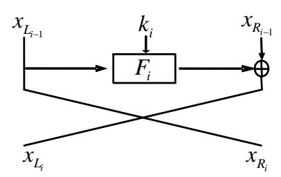
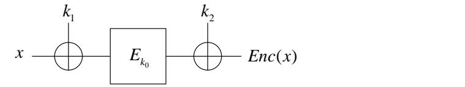
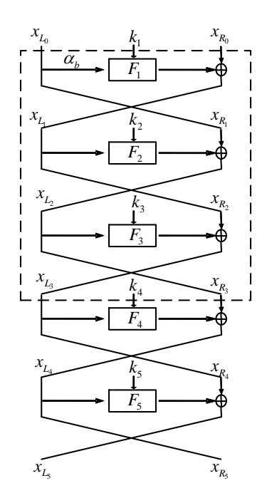

# SCIENCE CHINA

## Information Sciences

# . RESEARCH PAPER .

# Quantum key-recovery attack on Feistel structures

Xiaoyang DONG1 & Xiaoyun WANG1,2\*

1 Institute for Advanced Study, Tsinghua University, P. R. China; 2Key Laboratory of Cryptologic Technology and Information Security, Ministry of Education, Shandong University, P. R. China {xiaoyangdong,xiaoyunwang}@tsinghua.edu.cn

Received ; accepted

Abstract Post-quantum cryptography has drawn considerable attention from cryptologists on a global scale. At Asiacrypt 2017, Leander and May combined Grover's and Simon's quantum algorithms to break the FX-based block ciphers, which were introduced by Kilian and Rogaway to strengthen DES. In this study, we investigate the Feistel constructions using Grover's and Simon's algorithms to generate new quantum key-recovery attacks on different rounds of Feistel constructions. Our attacks require 2nr/4 − 3n/4 quantum queries to break an r-round Feistel construction. The time complexity of our attacks is less than that observed for quantum bruteforce search by a factor of 20.75n. When compared with the best classical attacks, i.e., Dinur et al.'s attacks at CRYPTO 2015, the time complexity is reduced by a factor of 20.5n without incurring any memory cost.

Keywords Quantum cryptanalysis, Quantum key-recovery, Feistel structure, Simon, Grover

Citation Dong X Y, Wang X Y. Quantum key-recovery attack on Feistel structures. Sci China Inf Sci, 2016, (): xxxxxx, doi: xxxxxxxxxxxxxx

## 1 Introduction

Due to the rapid development of quantum computers, the security of classical cryptographic schemes is heavily debated. The most severe and notable threat is the Shor's algorithm [\[1\]](#page-6-0) which breaks the most currently used public-key systems (such as the RSA [\[2\]](#page-6-1) and elliptic-curve cryptosystems). Recently, researchers have observed that quantum computing not only impacts public key cryptography, but also breaks several secret key schemes in polynomial time, such as Even-Mansour block ciphers [\[3,](#page-6-2) [4\]](#page-6-3) and some widely used modes of operation for authentication and authenticated encryption (e.g. CBC-MACs, PMAC, GMAC, etc.) [\[5\]](#page-6-4). Investigation of the security of several classical and relevant cryptographic schemes against quantum attacks is urgently required. At Asiacrypt 2017, Moody [\[6\]](#page-6-5) on behalf of National Institute of Standards and Technology (NIST) reported the ongoing competition for post-quantum cryptographic algorithms, including signatures, encryptions, and key-establishments. The ship for post-quantum crypto has sailed, cryptographic communities should become ready to welcome the post-quantum age.

In case of a quantum computer, the adversaries were able to generate quantum queries on some superposition quantum states of the relevant cryptosystem, which is the so-called quantum chosen-plaintext

\* Corresponding author (email: xiaoyunwang@tsinghua.edu.cn)

Figure 1 The ith round of the Feistel structure

attacks (qCPA) [7]. It is known that using the Grover's algorithm [8] could accelerate the brute force search. Given an m-bit key, the Grover's algorithm allows for the recovery of the key using  $\mathcal{O}(2^{m/2})$  quantum steps. It is observed that doubling the key length of one block cipher could achieve a similar amount of security against quantum attackers. However, Kuwakado and Morii [4] identified a new family of quantum attacks that target certain generic constructions of secret key schemes. They exhibited that the Even-Mansour ciphers could be broken in polynomial time using Simon's algorithm [9], which could estimate the period of a periodic function in polynomial time in case of a quantum computer. Kaplan et al. [5] revealed that several widely used modes of operation for authentication and authenticated encryption, such as CBC-MAC, PMAC, GMAC and some CAESAR candidates, could also be broken by Simon's algorithm.

Feistel block ciphers [10] are observed to be important and constitute one of the extensively researched cryptographic schemes. Several block cipher standards, such as DES, Triple-DES, MISTY1, Camellia, and CAST-128 [11], are based on the Feistel design. In a seminal work, Luby and Rackoff [12] proved that a three-round Feistel scheme can securely perform pseudo-random permutation. However, Kuwakado and Morii [13] introduced a quantum distinguisher attack on 3-round Feistel ciphers, that could distinguish between the cipher and a random permutation in polynomial time. In a classical setting, Dinur et al. [14] generated a series of key-recovery attacks on 5- to 32-round Feistel ciphers. However, there are no key-recovery attacks that are observed on Feistel ciphers in the qCPA setting.

In this study, we consider the quantum key-recovery attack on Feistel schemes for the very first time. As depicted in Figure 1, in the *i*th round of the Feistel structure, the *n*-bit blocks were divided into two equal parts,  $(x_{L_{i-1}}, x_{R_{i-1}})$ , whereas the n/2-bit subkeys  $k_i$  were wrapped into the round function,  $F_i$ . The output is  $(x_{L_i}, x_{R_i})$ . Similar to the attacks of Dinur *et al.* [14], our attacks also constitute generic attacks that assume that the round functions in each round of the Feistel cipher are not necessarily identical and that the round keys,  $k_i$ , are independent of each other. Hence, using Grover's algorithm to perform a brute-force search on all the subkeys,  $k_i$ , of an *r*-round Feistel cipher will require  $2^{nr/4}$  quantum queries. We combine Grover's and Simon's algorithms to generate a series of quantum key-recovery attacks on different rounds of Feistel structures. Our attacks require  $2^{nr/4-3n/4}$  quantum queries, which reduces the time complexity by a factor of  $2^{0.75n}$  as compared with that observed in the quantum brute-force search. When compared with the best classical attacks, i.e., those observed by Dinur *et al.* [14], our results reduce the time complexity by a factor of  $2^{0.5n}$  without incurring any memory cost. All the results are summarized in Table 1.

#### 2 Related Works

Our quantum attacks are based on two of the most popular quantum algorithms, namely Simon's algorithm [9] and Grover's algorithm [8].

**Simon's Problem.** Given a Boolean function,  $f: \{0,1\}^n \to \{0,1\}^n$ , that is observed to be invariant under some n-bit XOR period a, find a. In other words, find a when  $f(x) = f(y) \leftrightarrow x \oplus y \in \{0^n, a\}$  is given.

|        | Classical setting |        | qCPA setting  |       |
|--------|-------------------|--------|---------------|-------|
|        | Dinur et al. [14] |        | Trivial bound | Ours  |
| Rounds | Time              | Memory | Time          |       |
| 5      | n                 | 0.5n   | 1.25n         | 0.5n  |
|        | 2                 | 2      | 2             | 2     |
| 7      | 1.5n              | n      | 1.75n         | n     |
|        | 2                 | 2      | 2             | 2     |
| 8      | 1.75n             | 1.25n  | 2n            | 1.25n |
|        | 2                 | 2      | 2             | 2     |
| 15     | 3.5n              | 2n     | 3.75n         | 3n    |
|        | 2                 | 2      | 2             | 2     |
| 31     | 7.5n              | 4n     | 7.75n         | 7n    |
|        | 2                 | 2      | 2             | 2     |
| 32     | 7.75n             | 7.25n  | 8n            | 7.25n |
|        | 2                 | 2      | 2             | 2     |

Table 1 Summary of the key-recovery attacks on Feistel schemes in classical and qCPA settings

The optimal time to solve the problem is O(2n/2 ). However, Simon [\[9\]](#page-6-8) presents a quantum algorithm that provides exponential speedup and requires only O(n) quantum queries to find a. The algorithm includes five quantum steps that are as follows:

I. Initialization of two n-bit quantum registers to state |0i ⊗n|0i ⊗n. Then apply the Hadamard transform to the first register to attain an equal superposition in the following manner:

$$H^{\otimes n}|0\rangle|0\rangle = \frac{1}{\sqrt{2^n}} \sum_{x \in \{0,1\}^n} |x\rangle|0\rangle. \tag{1}$$

II. A quantum query to the function f maps this to

$$\frac{1}{\sqrt{2^n}} \sum_{x \in \{0,1\}^n} |x\rangle |f(x)\rangle.$$

III. While measuring the second register, the first register is observed to collapse to the following state:

$$\frac{1}{\sqrt{2}}(|z\rangle+|z\oplus a\rangle).$$

IV. Applying the Hadamard transform to the first register, we obtain:

$$\frac{1}{\sqrt{2}} \frac{1}{\sqrt{2^n}} \sum_{y \in \{0,1\}^n} (-1)^{y \cdot z} (1 + (-1)^{y \cdot a}) |y\rangle.$$

V. The vectors, y, are selected such that y · a = 1 depict an amplitude of zero. Hence, measuring the state yields a value, y, which depicts that y · a = 0.

Repeat O(n) times, we can obtain a by solving a system of linear equations.

Kuwakado and Morii [\[4\]](#page-6-3) used Simon's algorithm to break the Even-Mansour (EM) cipher [\[3\]](#page-6-2). For a given permutation P, the EM cipher is Enc(x) = P(x ⊕ k1) ⊕ k2. Classically, an EM cipher is secure for up to 2n/2 queries, where n is the input size of P. However, using Simon's algorithm [\[9\]](#page-6-8), Kuwakado and Morii [\[4\]](#page-6-3) presented a quantum key-recovery attack on EM ciphers with a time complexity of O(n). They define f(x) = Enc(x) ⊕ P(x) = P(x ⊕ k1) ⊕ P(x) ⊕ k2. Clearly, it is a periodic function that satisfies f(x ⊕ k1) = f(x).

Grover's Algorithm. Given a set, X, in which some elements are marked, the objective is to find a marked element from X. We denote the subset of the marked elements by M ⊆ X. Classically, one can solve the problem in a time of |X|/|M|. However, in a quantum computer, the problem is solved with high probability in a time of p |X|/|M| using Grover's algorithm. The steps of the algorithm are as follows:

Figure 2 FX constructions

I. Initialization of a n-bit register |0i ⊗n. Apply the Hadamard transform to the first register to attain an equal superposition that can be given as follows:

$$H^{\otimes n}|0\rangle = \frac{1}{\sqrt{2^n}} \sum_{x \in \{0,1\}^n} |x\rangle = |\varphi\rangle.$$
 (2)

- II. Construct an oracle O: |xi O −→ (−1)f(x) |xi, where f(x) = 1 if x is the correct state; otherwise, f(x) = 0.
- III. Apply Grover's iteration R ≈ π 4 √ 2 n times that can be given as follows:

$$[(2|\varphi\rangle\langle\varphi|-I)\mathcal{O}]^R|\varphi\rangle\approx|x_0\rangle.$$

IV. return x0.

Further, Brassard et al. [\[15\]](#page-7-1) generalized the Grover search as an amplitude amplification method.

Theorem 1. (Brassard, Hoyer, Mosca and Tapp [\[15\]](#page-7-1)). Let A be any quantum algorithm on q qubits that performs no measurement. Let B : F q 2 → {0, 1} be a function that classifies the outcomes of A as either good or bad state. Let p > 0 be the initial success probability that the measurement of A|0i is good. Set k = d π 4θ e, where θ is defined using sin2 (θ) = p. Furthermore, define the unitary operator Q = −AS0A−1SB, where the operator SB changes the sign of the good state,

$$|x\rangle \mapsto \begin{cases} -|x\rangle \text{ if } \mathcal{B}(x) = 1, \\ |x\rangle \text{ if } \mathcal{B}(x) = 0. \end{cases}$$

Further, S0 changes the sign of the amplitude only in case of the zero state |0i. Finally, after performing the computation of QkA|0i, the measurement yields a good state with probability a least max{1-p, p}.

Assume that |ϕi = A|0i is the initial vector, whose projections on the good and the bad subspace are denoted by |ϕ1i and |ϕ0i, respectively. The state |ϕi = A|0i exhibits an θ with a bad subspace, where sin2 (θ) = p. Each Q iteration increases the angle to 2θ. Hence, after k ≈ π 4θ , the angle is observed to be approximately equal to π/2. Therefore, the state after k iterations is almost orthogonal to that of the bad subspace. After measurement, it produces a good vector with high probability.

At Asiacrypt 2017, Leander and May [\[16\]](#page-7-2) presented a quantum key-recovery attack on FX-construction, which were introduced by Kilian and Rogaway to strengthen DES [\[17\]](#page-7-3), as shown in Figure [2:](#page-3-0) Enc(x) = Ek0 (x⊕k1)⊕k2. They introduce the function f(k, x) = Enc(x)⊕Ek(x) = Ek0 (x⊕k1)⊕k2 ⊕Ek(x). For the correct guess of the key k = k0, we have f(k, x) = f(k, x ⊕ k1) for all x. However, for k 6= k0, f(k, ·) is not periodic. They combined Simon's and Grover's algorithms to attack several FX-based ciphers (PRINCE [\[18\]](#page-7-4), PRIDE [\[19\]](#page-7-5), DESX [\[17\]](#page-7-3)) in the qCPA setting with a complexity of approximately 232 .

## 3 Quantum Key-recovery Attacks on 5-Round Feistel Structures

The Feistel structure is a very commonly used structure to build block ciphers. Here, we present a 5 round quantum key-recovery attack on Feistel structures. As depicted in Figure [3,](#page-4-0) Fi is the ith round function that absorbs the independent round key ki . Suppose the state size is n, then the length of ki is

Figure 3 Quantum key-recovery attack on 5-round Feistel structures

n/2. Dinur et al. [14] recovers the complete key  $(k_1, k_2, k_3, k_4, k_5)$  of the 5-round Feistel cipher with  $2^n$  classical queries on the cipher. In a quantum computer, we can use Grover's search algorithm to observe all the round keys with  $2^{1.25n}$  quantum queries. Therefore, we have to construct a quantum algorithm that exhibits less time complexity than both  $2^n$  and  $2^{1.25n}$ . Inspired by Leander and May's study [16], we combine Grover's and Simon's algorithms to observe the round keys.

Kuwakado and Morii [13] introduced a quantum distinguish attack on 3-round Feistel schemes by using Simon's algorithm. As depicted in Figure 3, we place the 3-round distinguisher part in the dashed box.

The following functions are defined:

$$f(b, x_{R_0}) = F_2(k_2, x_{R_0} \oplus F_1(k_1, \alpha_b)) = \alpha_b \oplus x_{R_3} = \alpha_b \oplus F_4(k_4, F_5(k_5, x_{R_5}) \oplus x_{L_5}) \oplus x_{R_5}$$
(3)

where  $b \in \mathbb{F}_2$ ,  $\alpha_b \in \mathbb{F}_2^{n/2}$  is an arbitrary constant and  $\alpha_0 \neq \alpha_1$ ,  $(x_{L_5} || x_{R_5}) = Enc(\alpha_b || x_{R_0})$ . It is easy to verify that  $f(b, x_{R_0}) = f(b \oplus 1, x_{R_0} \oplus F_1(k_1, \alpha_0) \oplus F_1(k_1, \alpha_1))$ . Therefore, using the accurate guess of the key  $(k_4, k_5)$ ,  $f(b, x_{R_0}) = \alpha_b \oplus F_4(k_4, F_5(k_5, x_{R_5}) \oplus x_{L_5})$  has a nontrivial period  $s = 1 || F_1(k_1, \alpha_0) \oplus F_1(k_1, \alpha_1)$ . However, if the guessed  $(k_4, k_5)$  is wrong,  $f(b, x_{R_0})$  will be a random function that is not periodic with high probability.

**Theorem 2.** Let  $g: \mathbb{F}_2^{n/2} \times \mathbb{F}_2^{n/2} \times \mathbb{F}_2^{n/2+1} \mapsto \mathbb{F}_2^{n/2}$  with

$$(k_4, k_5, y) \mapsto f(y) = f(b, x_{R_0}) = \alpha_b \oplus F_4(k_4, F_5(k_5, x_{R_5}) \oplus x_{L_5}) \oplus x_{R_5},$$

where  $y = b \| x_{R_0}$ ,  $\alpha_0$ ,  $\alpha_1$  are two arbitrary constants, and  $(x_{L_5} \| x_{R_5}) = Enc(\alpha_b \| x_{R_0})$ . Given quantum oracles of g and Enc,  $(k_4, k_5)$  and  $F_1(k_1, \alpha_0) \oplus F_1(k_1, \alpha_1)$  could be computed using  $n + (n+1)(n+2+2\sqrt{n/2+1})$  qubits and approximately  $2^{n/2}$  quantum queries.

Under the accurate guess of the key  $k_4, k_5, g(k_4, k_5, y) = g(k_4, k_5, y \oplus s)$ , let  $h: \mathbb{F}_2^n \times \mathbb{F}_2^{(n/2+1)^l} \mapsto \mathbb{F}_2^{(n/2)^l}$  with

$$(k_4, k_5, y_1, ..., y_l) \mapsto g(k_4, k_5, y_1) \|... \| g(k_4, k_5, y_l).$$
 (4)

Let  $U_h$  be a quantum oracle that maps

$$|k_4, k_5, y_1, ..., y_l, \mathbf{0}, ..., \mathbf{0}\rangle \mapsto |k_4, k_5, y_1, ..., y_l, h(k_4, k_5, y_1, ..., y_l)\rangle.$$
 (5)

We construct the following quantum algorithm A.

- 1. Preparing the initial (n + (n/2 + 1)l + nl/2)-qubit state  $|\mathbf{0}\rangle$ .
- 2. Apply Hadamard  $H^{\otimes n+(n/2+1)l}$  on the first n+(n/2+1)l qubits resulting in

$$\sum_{k_4, k_5 \in \mathbb{F}_2^{n/2}, y_1, \dots, y_l \in \mathbb{F}_2^{n/2+1}} |k_4, k_5\rangle |y_1\rangle \dots |y_l\rangle |\mathbf{0}\rangle, \tag{6}$$

where we omit the amplitudes  $2^{-(n+(n/2+1)l)/2}$ .

3. Applying  $U_h$  to the above state, we get:

$$\sum_{k_4, k_5 \in \mathbb{F}_2^{n/2}, y_1, \dots, y_l \in \mathbb{F}_2^{n/2+1}} |k_4, k_5\rangle |y_1\rangle \dots |y_l\rangle |h(k_4, k_5, y_1, \dots, y_l)\rangle.$$
(7)

4. Apply Hadamard to the qubits  $|y_1\rangle...|y_l\rangle$  in the above state, we get:

$$|\varphi\rangle = \sum_{k_4, k_5 \in \mathbb{F}_2^{n/2}, u_1, \dots, u_l, y_1, \dots, y_l \in \mathbb{F}_2^{n/2+1}} |k_4, k_5\rangle (-1)^{\langle u_1, y_1 \rangle} |u_1\rangle \dots (-1)^{\langle u_l, y_l \rangle} |u_l\rangle |h(k_4, k_5, y_1, \dots, y_l)\rangle.$$
(8)

If the guessed  $k_4, k_5$  is right, the period s is observed to be orthogonal to all the  $u_1, ..., u_l$  after measuring  $|\varphi\rangle$ . According to Lemma 4 of [16], choosing  $l=2(n/2+1+\sqrt{n/2+1})$  is enough to compute a unique s.

Without measuring and considering the superposition  $|\varphi\rangle$ , we assume that we had a classifier  $\mathcal{B}$ :  $\mathbb{F}_2^{n+(n/2+1)l} \mapsto \{0,1\}$ , that partitioned  $|\varphi\rangle$  into a good subspace and a bad subspace as follows:  $|\varphi\rangle = |\varphi_1\rangle + |\varphi_0\rangle$ , where  $|\varphi_1\rangle$  and  $|\varphi_0\rangle$  denotes the projection onto the good subspace and bad subspace, respectively. In case of the good subspace  $|x\rangle$ , we have  $\mathcal{B}(x) = 1$ .

Therefore, we define  $|\varphi_1\rangle$  as the sum of those basis states while accurately guessing the key  $k_4, k_5$ . However, the accuracy of  $k_4, k_5$  could not be directly verified. The classifier,  $\mathcal{B}$ , could compute the period, s, of  $g(k_4, k_5, \cdot)$  by  $k_4, k_5, u_1, ..., u_l$  and verify whether  $g(k_4, k_5, y) = g(k_4, k_5, y \oplus s)$  for a given y. Classifier  $\mathcal{B}$ . Define  $\mathcal{B}: \mathbb{F}_2^{n+(n/2+1)l} \mapsto \{0,1\}$  that maps  $(k_4, k_5, u_1, ..., u_l) \mapsto \{0,1\}$ .

- 1. Let  $\overline{U} = \langle u_1, ..., u_l \rangle$  be the linear span of all  $u_i$ . If  $dim(\overline{U}) \neq n/2$ , the output will be 0. Otherwise, use Lemma 4 of [16] to compute the unique period s.
- 2. Check  $g(k_4, k_5, y) = g(k_4, k_5, y \oplus s)$  for a randomly provided y. If the identity holds, output will be equal to one. Else output will be zero.

We classify a state  $|k_4, k_5\rangle |u_1\rangle ... |u_l\rangle$  to be good if and only if  $\mathcal{B}(k_4, k_5, u_1, ..., u_l) = 1$ . If we measure  $|\varphi\rangle$ , it produces a good state with probability p.

$$p = \Pr[|k_4, k_5\rangle | u_1\rangle \dots | u_l\rangle \text{ is good}]$$

$$= \Pr[|k_4, k_5\rangle \text{ is right}] \cdot \Pr[\mathcal{B}(k_4, k_5, u_1, \dots, u_l) = 1 | (k_4, k_5) \text{ is right}] \approx 2^{-n}.$$

$$(9)$$

Our classifier  $\mathcal{B}$  defines a unitary operator  $S_{\mathcal{B}}$  that conditionally changes the sign of the quantum states that can be given as follows:

$$|k_4, k_5\rangle |u_1\rangle ... |u_l\rangle \mapsto \begin{cases} -|k_4, k_5\rangle |u_1\rangle ... |u_l\rangle & \text{if } \mathcal{B}(k_4, k_5, u_1, ..., u_l) = 1, \\ |k_4, k_5\rangle |u_1\rangle ... |u_l\rangle & \text{if } \mathcal{B}(k_4, k_5, u_1, ..., u_l) = 0. \end{cases}$$
(10)

The complete amplification process can be realized by repeatedly applying the unitary operator,  $Q = -AS_0A^{-1}S_B$ , t times to the state  $|\varphi\rangle = A|0\rangle$ , namely  $Q^tA|0\rangle$ .

Initially, the angle between  $|\varphi\rangle = \mathcal{A}|0\rangle$  and the bad subspace  $|\varphi_0\rangle$  is  $\theta$ , where  $sin^2(\theta) = p = \langle \varphi_1|\varphi_1\rangle$ . When p is small enough,  $\theta \approx arcsin(\sqrt{p}) \approx 2^{-\frac{n}{2}}$ . According to Theorem 1, after  $k = \lceil \frac{\pi}{4\theta} \rceil = \lceil \frac{\pi}{4\times 2^{-\frac{n}{2}}} \rceil$  Grover iterations Q, the angle between the resulting state and the bad subspace was observed to be

approximately  $\pi/2$ . The probability  $P_{good}$  that is used by the measurement to yield a good state is approximately  $sin^2(\pi/2) = 1$ .

The whole attack requires  $(n+(n/2+1)l+nl/2) = n+(n+1)(n+2+2\sqrt{n/2+1})$  qubits. Approximately  $k = \lceil \frac{\pi}{4 \times 2^{-\frac{n}{2}}} \rceil = 2^{n/2}$  quantum queries are required. Similarly, we can recover  $k_1, k_2$  by placing the 3-round quantum distinguisher in the last three rounds, which indicates that a decryption quantum oracle of the 5-round Feistel structure is required.

The quantum key-recovery attacks on 7-/8-/15-/31-/32-round Feistel structures depict a similar mechanism to that of the 5-round attack. The results are summarized in Table 1.

#### 4 Conclusion

In this study, we considered the first quantum key-recovery attack against Feistel structures. Inspired by Leander and May's works, we combined Grover's and Simon's algorithms to construct the attack. Our attacks required  $2^{nr/4-3n/4}$  quantum queries. When compared with the quantum brute-force search, the time complexity is reduced by a factor of  $2^{0.75n}$ . When compared with the best classical attacks, the time complexity is reduced by a factor of  $2^{0.5n}$  without incurring any memory cost.

### Acknowledgement

This work is supported by the National Key Research and Development Program of China (No. 2017Y-FA0303903), the National Natural Science Foundation of China (No. 61672019), the Fundamental Research Funds of Shandong University (No. 2016JC029), National Cryptography Development Fund (No. MMJJ20170121), Zhejiang Province Key R&D Project (No. 2017C01062), Project funded by China Postdoctoral Science Foundation (No. 2017M620807).

Conflict of interest The authors declare that they have no conflict of interest.

#### References

- 1 Shor P W. Polynomial-time algorithms for prime factorization and discrete logarithms on a quantum computer. SIAM Journal on Computing, 1997, 26(5): 1484–1509.
- 2 Rivest R L, Shamir A, Adleman L. A Method for obtaining digital signatures and public-key cryptosystems. Commun. ACM, 1978, 21(2): 120–126.
- 3 Even S, Mansour Y. A construction of a cipher from a single pseudorandom permutation. Journal of Cryptology, 1997, 10(2): 151–161.
- 4 Kuwakado H, Morii M. Security on the quantum-type even-mansour cipher. In: International symposium on information theory and its applications, ISITA 2012. IEEE, 2012. 312–316.
- 5 Kaplan M, Leurent G, Leverrier A, et al. Breaking symmetric cryptosystems using quantum period finding. In: Robshaw M, Katz J, eds. Advances in Cryptology - CRYPTO 2016. Lecture Notes in Computer Science, Vol 9815. Berlin: Springer-Verlag, 2016. 207–237.
- 6 Takagi T, Peyrin T. Advances in Cryptology - ASIACRYPT 2017, Part I. Lecture Notes in Computer Science, Vol 10624. Berlin: Springer-Verlag, 2017. 1-813.
- 7 Boneh D, Zhandry M. Secure signatures and chosen ciphertext security in a quantum computing world. In: Canetti R, Garay J A, eds. Advances in Cryptology - CRYPTO 2013. Lecture Notes in Computer Science, Vol 8043. Berlin: Springer-Verlag, 2013. 361–379.
- 8 Grover L K. A fast quantum mechanical algorithm for database search. In: Miller G L, eds. Proceedings of STOC 1996. ACM, 1996. 212–219.
- 9 Simon D R. On the power of quantum computation. SIAM Journal on Computing, 1997, 26(5):1474–1483.
- 10 Feistel H, Notz W A, Smith J L. Some cryptographic techniques for machine-to-machine data communications. In: Proceedings of the IEEE, 1975, 63(11): 1545–1554.
- 11 International Organization for Standardization(ISO). International Standard- ISO/IEC 18033-3, Information technology-Security techniques-Encryption algorithms -Part 3: Block ciphers. 2010.
- 12 Luby M G, Rackoff C. How to construct pseudorandom permutations from pseudorandom functions. SIAM Journal on Computing, 1988, 17(2):373–386.
- 13 Kuwakado H, Morii M. Quantum distinguisher between the 3-round feistel cipher and the random permutation. In: International symposium on information theory, ISIT 2010. IEEE, 2010. 2682–2685.

- 14 Dinur I, Dunkelman O, Keller N, et al. New attacks on Feistel structures with improved memory complexities. In: Gennaro R, Robshaw M, eds. Advances in Cryptology - CRYPTO 2015, Part I. Lecture Notes in Computer Science, Vol 9215. Berlin: Springer-Verlag, 2015. 433–454.
- 15 Brassard G, Hoyer P, Mosca M, et al. Quantum amplitude amplification and estimation. arXiv: Quantum Physics, 2000.
- 16 Leander G, May A. Grover meets simon - quantumly attacking the FX-construction. In: Takagi T, Peyrin T, eds. Advances in Cryptology - ASIACRYPT 2017, Part II. Lecture Notes in Computer Science, Vol 10625. Cham: Springer, 2017. 161–178.
- 17 Kilian J, Rogaway P. How to Protect DES Against Exhaustive Key Search. In: Koblitz N, eds. Advances in Cryptology - CRYPTO 1996. Lecture Notes in Computer Science, Vol 1109. Berlin: Springer-Verlag, 1996. 252–267.
- 18 Julia Borghoff, Canteaut A, G¨uneysu T, et al. PRINCE - A Low-Latency Block Cipher for Pervasive Computing Applications - Extended Abstract. In: Wang X Y, Sako K, eds. Advances in Cryptology - ASIACRYPT 2012. Lecture Notes in Computer Science, Vol 7658. Berlin: Springer-Verlag, 2012. 208–225.
- 19 Albrecht M R, Driessen B, Kavun E B, et al. Block ciphers - focus on the linear layer (feat. PRIDE). In: Garay J A, Gennaro R, eds. Advances in Cryptology - CRYPTO 2014. Lecture Notes in Computer Science, Vol 8616. Berlin: Springer-Verlag, 2014. 57–76.