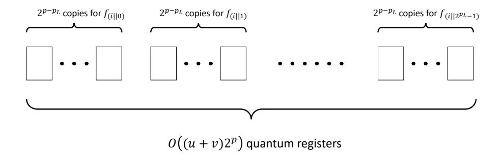
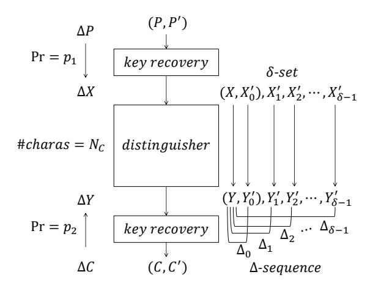
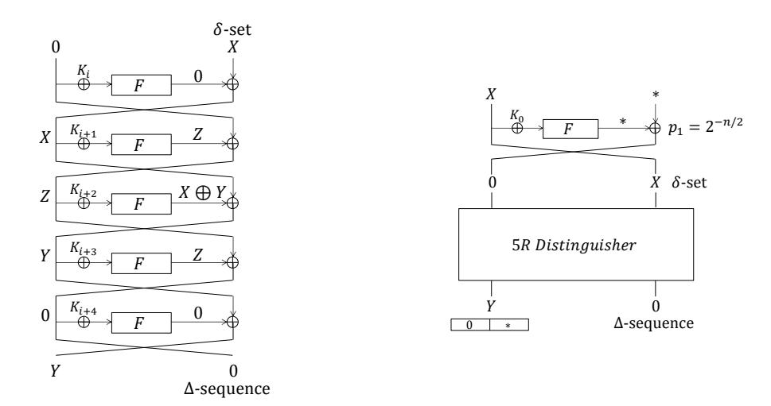
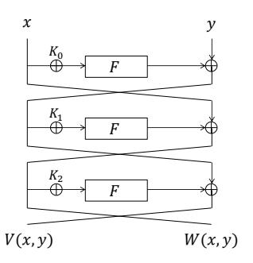

# Quantum Demiric-Sel¸cuk Meet-in-the-Middle Attacks: Applications to 6-Round Generic Feistel Constructions

Akinori Hosoyamada[0000−0003−2910−2302] and Yu Sasaki

NTT Secure Platform Laboratories, 3-9-11, Midori-cho Musashino-shi, Tokyo 180-8585, Japan. {hosoyamada.akinori,sasaki.yu}@lab.ntt.co.jp

Abstract. This paper shows that quantum computers can significantly speed-up a type of meet-in-the-middle attacks initiated by Demiric and Sel¸cuk (DS-MITM attacks), which is currently one of the most powerful cryptanalytic approaches in the classical setting against symmetric-key schemes. The quantum DS-MITM attacks are demonstrated against 6 rounds of the generic Feistel construction supporting an n-bit key and an n-bit block, which was attacked by Guo et al. in the classical setting with data, time, and memory complexities of O(23n/4 ). The complexities of our quantum attacks depend on the adversary's model and the number of qubits available. When the adversary has an access to quantum computers for offline computations but online queries are made in a classical manner (so called Q1 model), the attack complexities are O(2n/2 ) classical queries, O(2n /q) quantum computations by using about q qubits. Those are balanced at O˜(2n/2 ), which significantly improves the classical attack. Technically, we convert the quantum claw finding algorithm to be suitable in the Q1 model. The attack is then extended to the case that the adversary can make superposition queries (so called Q2 model). The attack approach is drastically changed from the one in the Q1 model; the attack is based on 3-round distinguishers with Simon's algorithm and then appends 3 rounds for key recovery. This can be solved by applying the combination of Simon's and Grover's algorithms recently proposed by Leander and May.

Keywords: post-quantum cryptography · Demiric-Sel¸cuk meet-in-the-middle attack · Feistel construction · Grover's algorithm · claw finding algorithm · classical query model

# 1 Introduction

### 1.1 Background

Post-quantum cryptography is a hot topic in the current symmetric-key cryptographic community. It has been known that Grover's quantum algorithm [\[Gro96\]](#page-14-0) and its generalized versions [\[BBHT98,](#page-14-1)[BHMT02\]](#page-14-2) reduce the cost of the exhaustive search on a k-bit key from 2k to 2k/2 . Whereas Grover's algorithm is quite generic, post-quantum security of specific constructions has also been evaluated, which includes key recovery attacks against Even-Mansour constructions [\[KM12\]](#page-15-0), distinguishers against 3-round Feistel constructions [\[KM10\]](#page-15-1), key recovery attacks against multiple encryptions [\[Kap14\]](#page-15-2), forgery attacks against CBC-like MACs [\[KLLN16a\]](#page-15-3), key recovery attacks against FX constructions [\[LM17\]](#page-15-4), and so on. Given those advancement of the quantum attacks, NIST announced that they take into account the post-quantum security in the profile of the light-weight cryptographic schemes [\[MBTM17\]](#page-15-5). It is now important to investigate how quantum computers can impact to the symmetric-key cryptography.

It is also possible to view the quantum attacks from an approach-wise. That is, several researchers converted the well-known cryptanalytic approaches in the classical setting to ones in the quantum setting. Several examples are quantum differential cryptanalysis [\[KLLN16b\]](#page-15-6), quantum meet-in-the-middle attacks [\[Kap14,](#page-15-2)[HS18\]](#page-14-3), quantum universal forgery attacks [\[KLLN16a\]](#page-15-3), and so on.

At the present time, one of the most powerful cryptanalytic approaches in the classical setting is a type of the meet-in-the-middle attacks initiated by Demiric and Sel¸cuk [\[DS08\]](#page-14-4). The attacks are often called meet-in-the-middle attacks, while we call them the DS-MITM attacks in order to distinguish them from the simple and traditional meet-in-the-middle attacks that separate the attack target into two independent parts. The DS-MITM attacks are powerful. For example, one of the current best attacks against AES-128 is the DS-MITM attacks [\[DFJ13\]](#page-14-5), which can often be applied to other SPN-based ciphers as well. The DS-MITM attacks are also effective against Feistel constructions [\[GJNS14\]](#page-14-6) and their variants [\[GJNS16\]](#page-14-7). Considering those facts, it is of great interest to investigate whether quantum computers can significantly speed-up the DS-MitM attacks.

A pioneering work of quantum attacks against symmetric-key cryptography by Kuwakado and Morii [KM12] and a remarkable work by Kaplan et al. [KLLN16a] demonstrate that security of symmetric-key primitives drops to a linear to the output size when adversaries are allowed to make superposition queries, in which the adversaries pass superposition states to oracles and receive the results also as superposition states. Such a situation may be realized in future, and this security model is theoretically interesting. Indeed, several attacks have recently been proposed in this model [Kap14,Bon17,LM17]. On the other hand, we can consider another security model such that adversaries only make queries through a classical network but have access to quantum computers in their local environment. This model is relatively realistic. Kaplan et al. [KLLN16a] called the former and the latter settings Q2 model and Q1 model, respectively.

Given the above background, our target in this paper is a quantum version of the DS-MITM attacks. As a demonstration, we improve on the classical DS-MITM attack against generic 6-round Feistel constructions proposed by Guo et al. [GJNS14]. Our main focus is the Q1 model, while we also discuss further speed-up in the Q2 model.

#### 1.2 Simple Quantum Attacks against Feistel Construction

Before we explain the summary of our results, we explain that simple applications of the quantum attacks do not strongly impact to the security of the Feistel construction. We start by introducing the target Feistel construction analyzed in this paper.

Target Feistel Construction. This paper presents cryptanalysis against a Feistel construction that is typically analyzed in the context of generic attacks. Namely, our target is a balanced Feistel construction whose block size is n bits, and the round function first XORs an n/2-bit subkey and then apply a public function  $F: \{0,1\}^{n/2} \mapsto \{0,1\}^{n/2}$ . Subkeys in each round are independently chosen, thus the key size for r rounds is nr/2 bits. The public function F can be different in different rounds. To avoid making the paper unnecessarily complicated, we denote the public function in all rounds by an identical notation F.

Classical Attacks against Feistel Construction. Generic attacks in the classical setting against the class of Feistel constructions have been studied by many papers in various approaches; the impossible differential attack [Knu02], the all-subkeys recovery attack [IS12,IS13], the DS-MITM attack [GJNS14], the dissection attack [DDKS15], and so on. The number of attacked rounds depends on the assumed key size. Considering that the block size is n bits and thus the adversaries can obtain the full codebook with  $2^n$  queries and memory, let us discuss the case that the adversaries can spend up to  $2^n$  computations. In this setting, the best attack is the DS-MITM attack [GJNS14] that recovers the key up to 6 rounds with  $O(2^{3n/4})$  complexities in all of data, time, and memory.

Application of Grover's Algorithm and Parallelization. The most simple quantum attack is applying Grover's algorithm [Gro96] to exhaustive key search. Let k denote the key length. With a quantum computer and Grover's algorithm, the exhaustive search can be performed in time  $O(2^{k/2})$ . Furthermore, if  $O(n2^p)$  qubits are available to the adversary, the Grover search can be parallelized [GR04], and the cost of the exhaustive search is reduced in time  $O(2^{(k-p)/2})$ . Thus, by applying the parallelized Grover search to the r-round Feistel construction, key recovery attacks can be performed in time  $O(2^{nr/4-p/2})$  with O(1) classical queries, using  $O(n2^p)$  qubits.

For 6 rounds (r = 6), the key can be recovered in time  $O(2^n)$ , using  $\tilde{O}(2^n)$  qubits. This does not have any advantages. Strictly speaking, the exhaustive search can be performed without guessing the last-round subkey, but the attack still does not have any advantage over the classical DS-MITM attack.

Application of Quantum Dissection Attacks. Consider an iterated block cipher, i.e., the cipher which is constructed as  $E_k^r = E_{1,K_1} \circ E_{2,K_2} \circ \cdots \circ E_{r,K_r}$ , where each  $E_i$  is an n-block cipher with m-bit key, and subkeys in  $k = (K_1, \ldots, K_r)$  are independently chosen.  $E_k^r$  is an n-bit block cipher with mr-bit key, and the iterated construction is one of the simplest ways to handle a long key only by using a block cipher for short keys.

Kaplan proposed quantum meet-in-the-middle attacks and quantum dissection attacks to recover the key against the iterated construction [Kap14]. For r=2, the quantum meet-in-the-middle attack can recover the full key in time  $O(2^{2m/3})$ , using  $O(2^{2m/3})$  qubits. For r=4, the quantum dissection attack can recover the full key in time  $O(2^{2m/3}+n/2)$ , using  $O(2^{2m/3})$  qubits.

These attacks can be applied to Feistel constructions, as Dinur et al. [DDKS15] applied the dissection attack to Feistel constructions in the classical setting. For example, 6-round Feistel constructions can be regarded as

two iterations of the 3-round Feistel construction. Thus, applying the quantum meet-in-the-middle attack, we can recover the full key in time O(2n), using O(2n) qubits. Again, this approach does not have any advantage over the classical DS-MITM attack.

## 1.3 Our Contributions

We show that quantum computers significantly speed-up the DS-MITM attacks in both of the Q1 and Q2 models. For the Q1 model, we need to solve a variant of claw finding problem to find a match between the offline and online phases. Normally, a claw between functions f 0 and g is defined to be a pair (x, y) such that f 0 (x) = g(y), and there exist quantum algorithms [\[BHT97,](#page-14-12)[Amb04](#page-14-13)[,Zha05,](#page-15-9)[Tan09\]](#page-15-10) to find a claw assuming both of f 0 and g are quantum accessible. However, we need to find a pair (x, y) such that f(x, y) = g(y), and g must be implemented in a classical manner in our Q1 model attack. Thus we describe a quantum algorithm to solve this issue.

We then apply the above algorithm in the Q1 model to improve the classical DS-MITM attack by Guo et al. [\[GJNS14\]](#page-14-6) against the 6-round Feistel construction. The data complexity, or the number of classical queries, is reduced from O(23n/4 ) of the classical attack to O(2n/2 ). The time complexity T depends on the parameter q that is the number of qubits available. In fact, T is given by a tradeoff curve T q = 2n, where q ≤ 2 n/2 . Hence, in addition to D, the quantum attack outperforms the classical attack with respect to T when q > 2 n/4 . In particular, all parameters are balanced at O˜(2n/2 ), which improves previous O(23n/4 ) in the classical setting.

We then further analyze the attack complexity against the 6-round generic Feistel construction in the Q2 model. The approach is quite different from the one in the Q1 model. We use the distinguisher against 3-round Feistel construction by Kuwakado and Morii [\[KM10\]](#page-15-1) as a base, and then append 3 more rounds for key recovery.[1](#page-0-0) The 3-round distinguisher uses Simon's algorithm [\[Sim97\]](#page-15-11) whereas the 3-round key recovery requires to use Grover's algorithm [\[Gro96\]](#page-14-0). The combination of those two algorithms has recently been studied by Leander and May [\[LM17\]](#page-15-4), which leads to significant speed-up in our setting. In this attack, T = D = 23n/4 that is the same as the classical attack, but the space, i.e. the number of qubits and the amount of classical memory is O(1). This extreme efficiency in space is only available in the Q2 model.

As pointed out in Kaplan et al. [\[KLLN16a\]](#page-15-3), the 3-round distinguisher has the following problem:

Problem 1. The 3-round distinguisher by Kuwakado and Morii only uses the right half n/2-bits of outputs of the Feistel construction. On the other hand, if the Feistel construction is implemented on a quantum circuit, then it will output all the n-bits. In the classical setting, attackers can just truncate received n bits to obtain the right half n/2-bits. However, in the quantum setting, truncating n bits to n/2-bits is non-trivial because all (quantum) bits are entangled. Hence the 3-round distinguisher is applicable only when attackers have access to a quantum circuit which outputs just the right half n/2-bits of the Feistel construction.

This paper shows a general technique to simulate "truncation" of outputs of oracles in the quantum setting. Our technique can apply not only to the 3-round distinguisher by Kuwakado and Morii but also to various situations in symmetric-key cryptography This technique solves the controversial issue of the quantum distinguisher by Kuwakado and Morii, which is pointed out by Kaplan et al [\[KLLN16a\]](#page-15-3).

The attack complexity against 6-round Feistel construction in each attack setting is summarized in Table [1.](#page-3-0) When the attacks are compared with respect to a product of the time complexity, data complexity, the number of qubits and the amount of classical memory, the Q2 model outperforms the other two. When the attacks are compared with respect to a maximum value among the time complexity, data complexity, the number of qubits and the amount of classical memory, the Q1 model becomes the best. [2](#page-0-0)

## 1.4 Paper Outline

The paper is organized as follows. Section [2.1](#page-3-1) explains attack models and quantum algorithms related to this work. Section [3](#page-4-0) extends the previous quantum claw finding algorithm to the case that one function is evaluated only in the classical manner. Section [4](#page-6-0) improves the previous DS-MITM attack against 6-round Feistel construction by

1 Dong and Wang [\[DW17\]](#page-14-14) independently pointed out the combination of the 3-round distinguisher [\[KM10\]](#page-15-1) and key recovery attack [\[LM17\]](#page-15-4).

2 Since any Q1 attack can be trivially converted to a Q2 attack by regarding quantum oracles as classical oracles, we can construct a Q2 attack with max(T, D, M, N) = N 1/2 N 3/4 from the best Q1 attack. However, such a Q2 attack requires time T = N in the case that only O(log(N)) qubits are available.

Table 1. Summary of the Attack Complexities against 6-Round Feistel Construction

|           |            |            |               |                     | Overall Complexity                  |                               |
|-----------|------------|------------|---------------|---------------------|-------------------------------------|-------------------------------|
| Setting   | Time $(T)$ | Data $(D)$ | #qubits $(N)$ | Classical Mem $(M)$ | $\overline{\text{Product } (TDMN)}$ | $\overline{\max(T, D, M, N)}$ |
| Classical | $N^{3/4}$  | $N^{3/4}$  | _             | $N^{1/2}$           | $N^{9/4}$                           | $N^{3/4}$                     |
| Q1        | N/q        | $N^{1/2}$  | q             | $N^{1/2}$           | $N^{8/4}$                           | $N^{1/2}$                     |
| Q2        | $N^{3/4}$  | $N^{3/4}$  | $\log(N)$     | 1                   | $\log N \cdot N^{6/4}$              | $N^{3/4}$                     |

The range of q in Q1 is  $q \leq N^{1/2}$ . All complexities of Q1 are balanced when  $q = N^{1/2}$ . Q1 always outperforms classical attacks in terms of the data complexity for any q. Besides, it improves classical attacks in terms of the time complexity when  $N^{1/4} \leq q \leq N^{1/2}$ .

applying the theory in Sect. 3. Section 5 discusses the attack on Feistel construction when the adversaries can make superposition queries.

#### 2 Preliminaries

This section gives attack models and a summary of the quantum algorithms that are related to our work. Throughout the paper, we assume a basic knowledge of the quantum circuit model. For a public function  $F: \{0,1\}^{n/2} \to \{0,1\}^{n/2}$ , we assume that a quantum circuit which calculates  $F, C_F: |x\rangle |y\rangle \mapsto |x\rangle |y \oplus F(x)\rangle$  is available, and  $C_F$  runs in a constant time

#### 2.1 Offline Quantum Computation

If we want to access some data or to operate table look-up in a quantum algorithm without any measurement, we have to set all data on quantum circuits so that data can be accessed in quantum superposition states. In particular, if we want to implement random access to memories, we need as many qubits (or width of the quantum circuit) as the data size. Thus, quantum memory for random access is physically equivalent to quantum processor. We regard that they are essentially identical.

Regardless of whether we use quantum computers or classical computers, the running time of an algorithm significantly depends on how a computational hardware is realized, when the algorithm needs exponentially many hardware resources. Thus if we want to use exponentially many qubits, we have to pay attention to data communication costs in quantum hardwares. In the quantum setting, Bernstein [Ber09] and Banegas and Bernstein [BB17] introduced two communication models, which they call free communication model and realistic communication model. The free communication model assumes that we can operate a unitary operation on any pairs of qubits. On the other hand, the realistic communication model assumes that  $2^p$  qubits are arranged as a  $2^{p/2} \times 2^{p/2}$  mesh, and a unitary operation can be operated only on a pair of qubits that are within a constant distance. A quantum hardware in the free communication model which has O(N) qubits can simulate a quantum hardware in the free communication model which has O(N) qubits, with time overhead  $O(\sqrt{N})$  [BBG+13].

In this paper, for simplicity, we estimate the time complexity of quantum algorithms in the free communication model. Note that this does not imply that our proposed attacks do not work in the realistic communication model. We design our algorithms so that small quantum processors (of size polynomial in n) parallelly run without any communication between each pair of small processors. Hence if the realistic communication model is applied, time complexity increases by a factor of polynomial in n.

#### 2.2 Related Quantum Algorithms

**Grover's Algorithm.** Grover's quantum algorithm, or the Grover search, is one of the most famous quantum algorithms, with which we can obtain quadratic speed up on database searching problems compared to the classical algorithms. It was originally developed by Grover [Gro96] and generalized later [BBHT98,BHMT02]. Let us consider the following problem:

Problem 2. Suppose a function  $\phi: \{0,1\}^u \to \{0,1\}$  is given as a black box, with a promise that there is x such that  $\phi(x) = 1$ . Then, find x such that  $\phi(x) = 1$ .

Grover's algorithm can solve the above problem with  $O(2^{u/2})$  evaluations of  $\phi$  using O(u) qubits, if  $\phi$  is given as a quantum oracle (or using O(v) qubits, if  $\phi$  is given as a v-qubit quantum circuit without any measurement). The algorithm is composed of iterations of an elementary step which operates O(1) evaluation of  $\phi$ , and can easily be parallelized [GR04].

If we can use a quantum computer with  $O(u2^p)$  qubits, we regard it as  $2^p$  independent small quantum processors with O(u) qubits. Then, by parallelly running  $O(\sqrt{2^u/2^p})$  iterations on each small quantum processor, we can find x such that  $\phi(x) = 1$  with high probability. This parallelized algorithm runs in time  $O(\sqrt{2^u/2^p} \cdot T_\phi)$ , where  $T_\phi$  is the time needed to evaluate  $\phi$  once.

**Simon's Algorithm.** Grover's algorithm is an exponential time algorithm. Here we introduce a quantum algorithm that can solve a problem in polynomial time. The problem is defined as follows:

Problem 3. Let  $\phi: \{0,1\}^u \to \{0,1\}^u$  be a function such that there is a unique secret value s that satisfies  $\phi(x) = \phi(y)$  if and only if x = y or  $x = y \oplus s$ . Then, find s.

Suppose  $\phi$  is given as a quantum oracle. Then, Simon's algorithm [Sim97] can solve the above problem with O(n) queries, using O(n) qubits. We have to solve a system of linear equations after making queries, which requires  $O(n^3)$  arithmetic operations. Since any classical algorithm needs exponential time to solve this problem (see the original paper [Sim97] for details), Simon's algorithm obtains exponential speed-up from classical algorithms. The algorithm can be applied to the problem of which condition " $\phi(x) = \phi(y)$  if and only if x = y or  $x = y \oplus s$ " is replaced with the weaker condition " $\phi(x \oplus s) = \phi(x)$  for any x", under the assumption that  $\phi$  satisfies some good properties [KLLN16a].

**Quantum Claw Finding Algorithms.** Let us consider two functions  $f: \{0,1\}^u \to \{0,1\}^\ell$  and  $g: \{0,1\}^v \to \{0,1\}^\ell$ . If there is a pair  $(x,y) \in \{0,1\}^u \times \{0,1\}^v$  such that f(x) = g(y), then it is called a *claw* of the functions f and g. Now we consider the following problem:

Problem 4. Let u,v be positive integers such that  $u \geq v$ . Suppose that two functions  $f:\{0,1\}^u \to \{0,1\}^\ell$  and  $g:\{0,1\}^v \to \{0,1\}^\ell$  are given as black boxes. Then, find a claw of f and g.

This problem, called *claw finding problem*, has attracted researchers' attention and is well studied. It is known that, given f and g as quantum oracles, this problem can be solved with  $O(2^{(u+v)/3})$  queries in the case  $v \le u < 2v$ , and  $O(2^{u/2})$  queries in the case  $2v \le u$  [BHT97,Amb04,Zha05,Tan09]. Quantum claw finding algorithms and their generalizations already have some applications in attacks against symmetric-key cryptosystems [Kap14,MS17]. Below we assume  $\ell = O(u+v)$ .

## 3 Claw Finding between Classical and Quantum Functions

Quantum claw finding algorithms are useful, though, they cannot be applied if one of target functions, say g, is not quantum accessible. For example, if we need some information from a classical online (i.e., keyed) oracle to calculate g(y), then we have to use other algorithms, even if we have a quantum computer.

Sections 3 and 4 focus on the Q1 model. Hence, this section considers how to find a claw of functions f, g where g can be evaluated only classically. We are particularly interested in the case that there exists only a single claw of f and g, and show that the following proposition holds.

**Proposition 1.** Suppose that f can be implemented on a quantum circuit  $C_f$  using O(u+v) qubits, g can be evaluated only classically, and we can use a quantum computer with  $O((u+v)2^p)$  qubits. Assume that there exist only a single claw of f and g. Then we can solve Problem 4 in time

$$O\left(T_{g,all}^C + 2^{u/2 + v - (p+p_L)/2} \cdot T_f^Q + 2^{v - p_L + p}\right),\tag{1}$$

where  $T_{g,all}^C$  is the time to calculate the pair (y,g(y)) for all y,  $T_f^Q$  is the time to run  $C_f$  once, and  $p_L$  is a parameter that satisfies  $p_L \leq \min\{p,n\}$ . We also use  $O(2^v)$  classical memory.

Below we give an algorithm to find a claw and confirm that it gives the upper bound 1, which shows Proposition 1.

Algorithm. First, evaluate g(y) for all y classically, and store each pair (y,g(y)) in a list L. For each  $y \in \{0,1\}^v$ , define a function  $f_y: \{0,1\}^u \to \{0,1\}$  by  $f_y(x) = 1$  if and only if f(x) = g(y). Given  $C_f$  and the list L, we can implement  $f_y$  on a quantum circuit that runs in time  $O(T_f^Q)$  using O(u+v) qubits. Note that the parallelized Grover search on  $f_y$ , which parallelly runs  $O(2^{p-p_L})$  independent small processors, can find  $x_0$  such that  $f_y(x_0) = 1$ (if there exists) in time  $O(2^{u/2-(p-p_L)/2} \cdot T_f^Q)$ . Let  $C_y^{Grover}$  denote this quantum circuit of size  $O((u+v)2^p)$ . Then, run the following procedure:

- 1. For  $0 \le i \le 2^{v-p_L} 1$ , do:
- Run  $C_{(i||j)}^{Grover}$  parallelly for  $0 \le j \le 2^{p_L} 1$  (see Fig. 1). If a pair (x, (i||j)) such that  $f_{(i||j)}(x) = 1$  is found, then return the pair (x, (i||j)).

In the above procedure, we consider that i, j are elements in  $\{0, 1\}^{v-p_L}$  and  $\{0, 1\}^{p^L}$ , respectively, and  $i | j \in \{0, 1\}^v$ .

**Fig. 1.** How to use  $O(2^p)$  qubits

Complexity analysis. To evaluate g(y) and store it for every y, we need  $O(T_{a,all}^C)$  time and  $O(2^v)$  classical memory. In Step 2 of the procedure, the parallelized Grover search on  $f_{(i||j)}$  requires time  $O(2^{u/2-(p-p_L)/2}T_f^Q)$  for each i and j as stated above. In Step 3 of the procedure, we need time  $O(2^p)$  to check whether a pair (x,(i||j)) such that  $f_{(i||j)}(x) = 1$  exists. Thus, the total running time is  $O(T_{g,all}^C + 2^{v-p_L} \cdot (2^{u/2-p/2+p_L/2}T_f^Q + 2^p)) = O(T_{g,all}^C + 2^{v-p_L})$  $2^{u/2+v-p/2-p_L/2} \cdot T_f^Q + 2^{v-p_L+p}$ ).

As for the number of qubits, for a fixed i, we use  $O((u+v)2^{p-p_L})$  qubits for the parallelized Grover search on  $f_{(i||j)}$  for each  $0 \le j \le 2^{p_L} - 1$ . Thus the total number of qubits we use is  $O((u+v)2^{p-p_L}) \cdot 2^{p_L} = O((u+v)2^p)$ .

#### Variation of Claw Finding

Next, we consider the following variant of the claw finding problem.

Problem 5. Suppose that functions  $f: \{0,1\}^u \times \{0,1\}^v \to \{0,1\}^\ell$  and  $g: \{0,1\}^v \to \{0,1\}^\ell$  are given as black boxes, with promise that there is a unique pair  $(x,y) \in \{0,1\}^u \times \{0,1\}^v$  such that f(x,y) = g(y). Then, find such a pair (x,y).

Again, we assume that g can be evaluated only classically, f can be implemented on a quantum circuit, and  $\ell = O(u+v)$ . Problem 5 appears to be different from Problem 4, however, we can also solve it by applying our algorithm introduced above with a slight modification to the definition of  $f_y$  as:  $f_y(x) = 1$  if and only if f(x,y) = 1g(y). With this small modification, we can find the pair (x,y) such that f(x,y)=g(y) with the same complexity as in Proposition 1. The next section treats this variant problem to attack Feistel constructions, instead of the original claw finding problem. In what follows, we measure  $p \leq v$  and  $2^v \leq T_{q,qll}^C$ .

Corollary 1. Suppose that f can be implemented on a quantum circuit  $C_f$  using O(u+v) qubits, g can be evaluated only classically, and we can use a quantum computer with  $O((u+v)2^p)$  qubits, where  $p \leq v$ . Assume that there is a unique claw of f and g. Then we can solve Problem 4 in time

$$O\left(T_{g,all}^C + 2^{\frac{u}{2} + v - p} \cdot T_f^Q\right),\tag{2}$$

where  $T_{g,all}^C \geq 2^v$  is the time to calculate the pair (y,g(y)) for all y and  $T_f^Q$  is the time to run  $C_f$  once. We also use  $O(2^v)$  classical memory.

The algorithms that we introduced in this section assume an ideal situation that we are given a quantum circuit that calculates f without error. However, in real applications, having some error might be inevitable (e.g. we use Grover's algorithm as a subroutine a few times to calculate f). Nevertheless, if error is small, then the above algorithms can still be applied with a small modification. (Roughly speaking, we use quantum amplitude amplification technique [BHMT02] instead of Grover's algorithm. See Section B in the appendix for details.)

# 4 Quantum DS-MITM Attacks against Feistel Constructions

In this section, we show that quantum computers can significantly speed-up the DS-MITM attacks even under the limitation that queries are made only in a classical manner (Q1 model). To demonstrate it, we improve on the previous key recovery attack against 6-round Feistel constructions presented by Guo et al. [GJNS14].

#### 4.1 Classical DS-MITM Attack on 6-Round Feistel Constructions

Overview of DS-MITM Attacks We first briefly introduce the framework of the DS-MITM attack. The attack generally consists of the distinguisher and the key-recovery parts as illustrated in Fig. 2. A truncated differential is specified to the entire cipher and suppose that the plaintext difference  $\Delta P$  propagates to the input difference  $\Delta Y$  of the distinguisher with probability  $p_1$ . Similarly, the ciphertext difference  $\Delta C$  propagates to the output difference  $\Delta Y$  of the distinguisher with probability  $p_2$  when decryption is performed. The attack is composed of two parts: distinguisher analysis and queried-data analysis.

Fig. 2. Overview of DS-MITM Attacks.

In the distinguisher analysis, the attacker enumerates all the possible differential characteristics that can satisfy the specified truncated differential. Suppose that there exist  $N_c$  such characteristics. For each of them, input paired values to the distinguisher are expected to be fixed uniquely. Let  $(X, X_0')$  be the paired values. Then, the attacker generates a set of texts called  $\delta$ -set by generating  $\delta - 1$  new texts  $X_i' \leftarrow X_0' \oplus i$  for  $i = 1, 2, \dots, \delta - 1$ . Suppose that the corresponding value at the output of the distinguisher can be computed. Let  $Y, Y_0', Y_1', Y_2', \dots, Y_{\delta-1}'$  be the corresponding values at the output of the distinguisher. The attacker then computes the differences between Y and  $Y_i'$  for  $i = 0, 1, \dots, \delta - 1$  and makes a sequence of  $\delta$  output differences at the output of the distinguisher. This sequence is called  $\Delta$ -sequence. Note that the difference between Y and  $Y_i'$  may be able to be computed only partially, say  $\gamma$  bits. Thus the bit-size of the sequence is  $\gamma \delta$ . In the end, the  $\Delta$ -sequence of the size  $\gamma \delta$  bits is computed for each of the  $N_c$  characteristics and stored in a list L.

In the queried-data analysis, the attacker makes queries to collect  $(p_1p_2)^{-1}$  paired values having the plaintext difference  $\Delta P$  and the ciphertext difference  $\Delta C$ . One pair, with a good probability, satisfies  $\Delta X$  and  $\Delta Y$  at the input and output of the distinguisher, respectively. Thus for each of  $(p_1p_2)^{-1}$  paired values, the attacker guesses subkeys for the key-recovery rounds such that  $\Delta X$  and  $\Delta Y$  appear after the first and the last key recovery parts, respectively. Then, one of the paired texts (corresponding to P') is modified to  $P'_i$  so that the  $\delta$ -set is generated at the input to the distinguisher, and those are queried to the oracle to obtain the corresponding ciphertext  $C'_{i}$ . The attacker then processes  $C'_i$  with the guessed subkeys for the last key-recovery part, and the  $\Delta$ -sequence is computed at the output of the distinguisher. Finally, those are matched the list L. If the analyzed pair is a right pair and the guessed subkeys are correct, then a match will be found. Otherwise, a match will not be found as long as  $(p_1 p_2)^{-1} N_c \times 2^{-\gamma \delta} \ll 1$ .

Application to 6-Round Feistel Constructions. Guo et al. [GJNS14] applied the DS-MITM attack to 6-round Feistel constructions. The attack needs to solve the following problems.

Problem 6. Let  $F: \{0,1\}^{n/2} \mapsto \{0,1\}^{n/2}$  be a public function and  $\Delta$  be a fixed difference.

- For a given output difference  $\Delta_o$ , how can we find all v such that  $F(v) \oplus F(v \oplus \Delta) = \Delta_o$ ? For a given input difference  $\Delta_i$ , how can we find all v such that  $F(v) \oplus F(v \oplus \Delta_i) = \Delta$ ?

In the classical attack, those problems can be solved only with 1 access to the precomputed table of size  $2^{n/2}$ . The procedure is rather straightforward. Readers are refer to the paper by Guo et al. [GJNS14] for the exact procedure.

Distinguisher Analysis. The core of the attacks is the 5-round distinguisher explained below. The input and output differences for the 5 rounds are defined as 0||X| and Y||0, respectively, where  $X,Y \in \{0,1\}^{n/2}, X \neq Y$ . For a given X,Y, the number of the 5-round differential characteristics satisfying those input and output differences is  $2^{n/2}$ . In fact, by representing the n/2-bit difference of the second round-function's output as Z, the 5-round differential characteristics can be fixed to

$$(0\|X) \stackrel{\mathrm{1stR}}{\longrightarrow} (X\|0) \stackrel{\mathrm{2ndR}}{\longrightarrow} (Z\|X) \stackrel{\mathrm{3rdR}}{\longrightarrow} (Y\|Z) \stackrel{\mathrm{4thR}}{\longrightarrow} (0\|Y) \stackrel{\mathrm{5thR}}{\longrightarrow} (Y\|0),$$

which is illustrated in the left-half of Fig. 3.

Fig. 3. Left: |Z| Differential Characteristics in the 5-Round Distinguisher. Right: 1-Round Extension for Key-Recovery.

For each Z, both input and output differences of F in the middle 3 rounds are fixed, which suggests that the paired values during F are fixed to one choice on average. Guo et al. showed that by generating a  $\delta$ -set at the right half of the distinguisher's input, the corresponding  $\Delta$ -sequence can be computed for the right-half of the distinguisher's output. Readers are referred to the paper by Guo et al. [\[GJNS14\]](#page-14-6) for the complete analysis. The computed ∆ sequences are stored in the list L. Note that the size of δ is very small. Indeed, p1 = 2−n/2 , p2 = 1, Nc = 2n/2 and γ = n/2. Hence, δ = 3 is sufficient to filter out all the wrong candidates.

To balance the complexities between the distinguisher analysis and the queried-data analysis, Guo et al. iterated the above analysis for 2n/4 different choices of Y . More precisely, the n/4 MSBs of Y are always set to 0 and n/4 LSBs of Y are exhaustively analyzed. The complexity of the procedure for each choice of Y is O(2n/2 ) both in time and memory. Hence, the entire complexity of the distinguisher part is O(23n/4 ) in both time and memory.

Queried-Data Analysis. Guo et al. appended 1-round before the 5-round distinguisher to achieve the 6-round key-recovery attack, which is illustrated in the right-half of Fig. [3.](#page-7-0) By propagating the input difference to the distinguisher, 0kX, in backwards, ∆P is set to Xk∗ where ∗ can be any n/2-bit difference. The probability p1 that a randomly chosen plaintext pair with the difference Xk∗ satisfies the difference 0kX after 1 round is 2−n/2 .

The attacker collects the pairs that satisfy the truncated differential in Fig. [3](#page-7-0) by using the structure technique. Namely, the attacker prepares 2 sets of 2n/2 plaintexts in which the first and the second sets have the form {(ck0),(ck1), · · · ,(ck2 n/2 − 1)} and {(c ⊕ Xk0),(c ⊕ Xk1), · · · ,(c ⊕ Xk2 n/2 − 1)}, respectively, where c is a randomly chosen n/2-bit constant. About 2n pairs exist whereas only O(2n/4 ) pairs satisfy ∆C in the corresponding ciphertexts. By iterating this procedure O(2n/4 ) times for different choices of c, the attacker collects O(2n/2 ) pairs satisfying the truncated differential in Fig. [3.](#page-7-0) In summary, with O(23n/4 ) queries (and thus the time complexity of O(23n/4 ) memory accesses), O(2n/2 ) pairs are obtained, in which one pair will satisfy the probabilistic differential propagation in the first round.

For each pair, the input and output differences of F in the first round are fixed, which will fix K0 uniquely. The attacker then modifies the left-half of the plaintext such that δ-set with δ = 3 is generated at the right-half of the input to the distinguisher. The right-half of the plaintext is also modified to ensure that the left-half of the input to the distinguisher is not affected. The modified plaintexts are then queried to obtain the corresponding ciphertexts. The attacker computes the corresponding ∆-sequence and matches L; the list computed during the distinguisher analysis. A match recovers K0 and Z. The other subkeys are trivially recovered from the second round one by one.

Summary of Complexity. In the distinguisher analysis, both of the time and memory complexities are O(23n/4 ). In the queried-data analysis, the data and time complexities are O(23n/4 ) and it uses a memory of size O(2n/2 ) to collect the pairs with the structure technique.

Remarks. Solving Problem [6](#page-7-1) is rather straightforward in the classical attack with O(2n/2 ) memory, whereas this is a crucial problem to the quantum adversaries. This is because the efficient table look-up cannot be executed in quantum computers.

## 4.2 Quantum DS-MITM Attack on 6-Round Feistel Constructions

We now convert the classical DS-MITM attack on 6-round Feistel constructions into quantum one, in which the adversary has access to a quantum computer to perform offline computations whereas queries are made in the classical manner. The attack complexity becomes O(2n/2 ) queries, O(2n/2 ) offline quantum computations by using O(2n/2 ) qubits.

The main idea is to introduce quantum operations to reduce the complexity of the distinguisher analysis. We show that the claw finding algorithm in Sect. [3](#page-4-0) can be used to find a match between the distinguisher and the queried-data analyses. This enables us to adjust the tradeoff between the complexities in the distinguisher and the queried-data analyses, and thus the data complexity can also be reduced.

Adjusted Truncated Differentials. After the careful analysis, we determined to analyze all 2n/2 choices of Y in the 5-round distinguisher during the distinguisher analysis part. In the classical attack, this increases the cost of the distinguisher analysis to O(2n), whereas it reduces the number of queries in the queried-data analysis. In the quantum attack, the increased cost of the distinguisher analysis can be reduced to its square root, i.e. O(2n/2 ) and eventually the cost of two analyses are balanced.

Switching Online and Offline Phases. The claw finding algorithm in Sect. 3 matches the result of the quantum computation against the results collected in the classical method. Namely, the results of the queried-data analysis must be stored before the distinguisher analysis starts.

This can be easily done by switching the order of the two analyses. In fact, such a switch has already been applied by Darbez and Perrin [DP15, Appendix E] though their goal is to optimize the classical attack complexity, which is different from ours.

Queried-Data Analysis. Because queries are made in the classical manner, the procedure of the queried-data analysis remains unchanged from the classical attack by Guo et al. However, to directly apply the claw finding algorithm to the DS-MITM attack, we explicitly separate the procedure to collect  $p_1^{-1} = 2^{n/2}$  pairs satisfying the truncated differentials (both  $\Delta P$  and  $\Delta C$ ) and the procedure to compute  $\Delta$ -sequences.

Precomputation for Collecting Pairs. The goal of this procedure is to collect  $2^{n/2}$  pairs satisfying both  $\Delta P = X \| *$  and  $\Delta C = * \| 0$ . To use the structure technique, we query 2 sets of  $2^{n/2}$  plaintexts  $\{(c\|0), (c\|1), \cdots, (c\|2^{n/2}-1)\}$  and  $\{(c \oplus X \| 0), (c \oplus X \| 1), \cdots, (c \oplus X \| 2^{n/2}-1)\}$ . About  $2^n$  pairs can be generated and  $2^{n/2}$  of them have no difference in the right-half of the ciphertexts. The generated pairs are stored in the list  $L^{pre}$  indexed by the difference Y (the left-half of  $\Delta C$ ). In summary, this procedure requires  $O(2^{n/2})$  classical queries,  $O(2^{n/2})$  memory access and  $O(2^{n/2})$  classical memory.

Generating  $\Delta$ -sequences. The goal of this procedure is to generate  $\Delta$ -sequences for all the pairs stored in  $L^{pre}$ . To make it consistent with the notations in Sect. 3, we define a classical function  $g:\{0,1\}^{n/2} \to \{0,1\}^{\delta n/2}$  that takes the difference Y (the left-half of  $\Delta C$ ) as input and outputs the  $\Delta$ -sequence as follows.

- 1. Pick up all the pairs in  $L^{pre}$  such that the difference Y matches the g's input.
- 2. Compute the  $\Delta$ -sequences as in the classical attack by assuming that the probabilistic differential propagation in the first round is satisfied.

Then, the classical queried-data analysis becomes identical with computing g(y) for all  $y \in Y$ . The cost of computing g for a single choice of y is 1. Hence, with the notation in Sect. 3,  $T_{g,all}^C$  becomes  $O(2^{n/2})$ . After this phase, a list L with a classical memory that stores  $O(2^{n/2})$   $\Delta$ -sequences is generated.

Quantum Distinguisher Analysis. The goal of the distinguisher analysis is to calculate  $\Delta$ -sequences for all  $2^{n/2}$  choices of Y and  $2^{n/2}$  choices of Z in Fig. 3 in order to find a match with L. We define a quantum function  $f: \{0,1\}^{n/2} \times \{0,1\}^{n/2} \to \{0,1\}^{\delta n/2}$  that takes Z and Y as input and calculates the corresponding  $\Delta$ -sequence. Given that L is computed before this analysis, the goal can be viewed as searching for a preimage Z such that  $\exists Y, f(Z,Y) \in L$ .

An Issue to be taken into account. Note that in our situation, the function f might be incompletely defined. We want to define f(Z,Y) to be the corresponding  $\Delta$ -sequence to (Z,Y), however, to be precise, we will have the following issue when Problem 6 is solved.

**Issue.** To calculate the corresponding  $\Delta$ -sequence, we need input/output pairs of the 2nd, 3rd, and 4th round functions that are compatible with the pair (Z, Y). Though there exists one suitable pair for each round function on average, there might be no pair or more than one pair that are compatible with the pair (Z, Y).

This issue already exists even in the classical setting, but it is trivially solved. However, solving the issue in the quantum setting is non-trivial, and deserves careful attention. In what follows, for simplicity, we first describe the attack by assuming that the above issue is naturally solved as in the classical setting, and later explain how to deal with it.

Quantum procedures and complexity. Assume that f(Z,Y) is uniquely determined for each (Z,Y). Remember that the goal of the quantum distinguisher analysis is to find Z such that  $\exists Y, f(Z,Y) \in L$ . As discussed in Corollary 1, suppose that a quantum circuit  $C_f$  that calculates f(Z,Y) for a single choice of (Z,Y) in time  $T_f^Q$  can be implemented by using O(n) qubits and we can use a quantum computer with  $O(n2^p)$  qubits. Then the time complexity to find such Z becomes  $O(2^{n/4+n/2-p} \cdot T_f^Q + 2^{n/2})$ .

We construct  $C_f$  so that it runs the following steps:

- 1. Find the input/output pair of the 2nd round function F that has input difference X and output difference Z.
- 2. Find the input/output pair of the 3rd round function F that has input difference Z and output difference  $X \oplus Y$ .
- 3. Find the input/output pair of the 4th round function F that has input difference Y and output difference Z.
- 4. Construct a  $\delta$ -set and calculate the corresponding  $\Delta$ -sequence, using the result of Steps 1, 2, and 3.
- 5. Output the  $\Delta$ -sequence obtained in Step 4.

Steps 1,2, and 3 correspond to Problem 6, which was solved using an efficient table look-up in the classical setting. However, in our circuit  $C_f$ , we use the Grover search to find the input/output pairs, since there is an obstacle that quantum computer cannot perform an efficient table look-up. Because the input and output sizes of F are n/2 bits, we can run Steps 1,2, and 3 with Grover's algorithm in time  $O(2^{n/4})$ , using O(n) qubits. The complexities of Steps 4 and 5 are much smaller than that of the application of Grover's algorithm. Hence the above  $C_f$  runs in time  $T_f^Q = O(2^{n/4})$ , using O(n) qubits. Note that  $C_f$  may return an error with a small probability since we use the Grover search as subroutines for a few times. However we can deal with this error, as explained in Sect. 3.

As described in Corollary 1, if  $O(n2^p)$  qubits are available  $(p \le n/2)$ , then we can find Z such that  $f(Z,Y) \in L$  in time  $O(2^{n/4+n/2-p+n/4}+2^{n/2})=O(2^{n-p})$ . Complexities are balanced at p=n/2. In summary, we can find a match with time complexity  $O(2^{n/2})$ , using  $O(n2^{n/2})$  qubits.

Dealing with the issue. Next, we explain how to deal with the issue described above. We regard that each element in  $\{0,1\}^{n/2}$  is a binary representation of an integer i  $(0 \le i \le 2^{n/2} - 1)$ .

As described before, to calculate the value f(Z,Y), we have to calculate input and output pairs of the 2nd, 3rd, and 4th round functions that are compatible with Z,Y (and X). More concretely, we have to calculate a tuple  $(\alpha_2, \alpha_3, \alpha_4)$  that satisfies  $F(\alpha_2) \oplus F(\alpha_2 \oplus X) = Z$  (the condition for the 2nd round function), and  $F(\alpha_3) \oplus F(\alpha_3 \oplus Z) = X \oplus Y$  (the condition for the 3rd round function), and  $F(\alpha_4) \oplus F(\alpha_4 \oplus Y) = Z$  (the condition for the 4th round function). Without loss of generality, we assume  $\alpha_2 < \alpha_2 \oplus X, \alpha_3 < \alpha_3 \oplus Z, \alpha_4 < \alpha_4 \oplus Y$ . Remember that the issue is that there might be no such tuple  $(\alpha_2, \alpha_3, \alpha_4)$ , or more than one tuples that are compatible with Z, Y.

If there is no tuple that is compatible with (Z, Y), we simply put  $f(Z, Y) := \bot$ . The problem is that there might be more than one tuples that are compatible with (Z, Y). In the classical setting, the number of solutions for a given (Z, Y) can be obtained easily by looking-up a precomputation table. On the other hand, in the quantum setting, we need to iterate Grover's algorithm multiple times if there are more than one tuples, thus the complexity of this part increases as proportional to the number of tuples.

Now we assume that the following property holds: for arbitrary  $d \neq d' \in \{0,1\}^{n/2} \setminus \{0^{n/2}\}$ , there are at most  $N_{max} := \lceil 3(\frac{n}{2}-1)/\log(\frac{n}{2}-1) \rceil$  many bit-strings  $\alpha$  that satisfies  $F(\alpha) \oplus F(\alpha \oplus d) = d'$  and  $\alpha < \alpha \oplus d$ . This is a reasonable assumption since, for a random function  $\phi : \{0,1\}^u \to \{0,1\}^u$ , we have  $\Pr[|\phi^{-1}(d')| \leq 3u/\log u] \geq 1 - 1/2^u$  (see Lemma 5.1 in [MU05]), and  $F(\cdot) \oplus F(\cdot \oplus d)$  is an almost random function if F is random (and here we consider that the domain of  $F(\cdot) \oplus F(\cdot \oplus d)$  is  $\{x | x < x \oplus d\}$ , of which cardinality is  $2^{n/2-1}$ ).

To avoid the problem that there might be more than one tuples, we divide the problem into  $N_{max}^3$  cases, and associate a triplet (i,j,k) with each case  $(0 \le i,j,k \le N_{max}-1)$ . We run the quantum distinguish analysis described above for each cases, i.e., run it  $N_{max}^3$  times. In the case (i,j,k), we search for  $\alpha_2,\alpha_3,\alpha_4$  from the sets of strings of which most significant  $\log N_{max}$  bits are i,j, and k, respectively. By our assumption described above, there is at most only one tuple  $(\alpha_2,\alpha_3,\alpha_4)$  in each case, and the problem does not occur in each case.

Trying all  $N_{max}^3$  cases increases the time complexity by a factor of  $N_{max}^3$ . However, we run the Grover search on the restricted domains for each case, and thus the time complexity decreases by a factor of  $\sqrt{N_{max}}$ . Consequently, dealing with the issue increases the time complexity by a factor of  $N_{max}^3/\sqrt{N_{max}}=N_{max}^{5/2}=O(n^{5/2})$ .

#### Complexity Summary. The complexity of the attack is as follows.

- The queried-data analysis requires  $O(2^{n/2})$  classical queries,  $O(2^{n/2})$  computations and  $O(2^{n/2})$  classical memory.
- The quantum distinguisher analysis requires  $O(n2^{n/2})$  qubits and  $O(n^{5/2}2^{n/2})$  offline computations.

In the end, all the complexities are balanced at  $\tilde{O}(2^{n/2})$ , which is significantly smaller than the classical attack by Guo et al. that requires  $\tilde{O}(2^{3n/4})$  queries and offline computations.

# 5 Attacks Using Quantum Queries

This section discusses quantum attacks in the Q2 model. That is, an adversary is allowed to make quantum superposition queries to online oracles. We show that we can recover full keys of an r-round Feistel construction (r > 3) in time O(n 32 n(r−3)/4 ), using O(n 2 ) qubits. Our idea is to combine the trivial key-recovery attack using Grover search with the quantum distinguisher of 3-round Feistel construction by Kuwakado and Morii [\[KM10\]](#page-15-1), which was later generalized by Kaplan et al. [\[KLLN16a\]](#page-15-3). To combine them, we apply the technique by Leander and May [\[LM17\]](#page-15-4), with a little adjustment. We also show in Sect. [5.2](#page-11-1) how to simulate the "half output oracle" given a usual complete encryption oracle, which solves the controversial issue in the quantum distinguisher by Kuwakado and Morii (see Problem [1\)](#page-2-0).

Again, we consider n-bit Feistel constructions such that each n/2-bit round key is added before round function F. We do not consider parallelization for quantum query attacks, since it seems unreasonable to assume that there are many copies of the online oracle and an adversary is allowed to parallelly access to them.

## 5.1 Quantum Distinguisher of 3-Round Feistel Constructions

We briefly explain the quantum attack that distinguishes 3-round Feistel constructions from a random permutation π [\[KM10](#page-15-1)[,KLLN16a\]](#page-15-3). The attack works in the Q2 model, and runs in polynomial time due to Simon's algorithm.

Assume that we are given a quantum oracle that calculates W(x, y), the right n/2-bits of the ciphertext which is encrypted with 3-round Feistel constructions (see Fig. [5.1\)](#page-11-2). Then, W(x, y) = x⊕F(K1 ⊕y⊕F(K0 ⊕x)) holds. Now,

Fig. 4. 3-round Feistel constructions

fix two different bit strings α, β ∈ {0, 1} n/2 and define f : {0, 1} n/2+1 → {0, 1} n/2 by f(0, x) := W(α, x) ⊕ β and f(1, x) := W(β, x)⊕α for x ∈ {0, 1} n/2 . Then simple calculation shows that f ((b, x) ⊕ (1, F(K0 ⊕ α) ⊕ F(K0 ⊕ β))) = f (b, x) holds, i.e., f has a period (1, F(K0 ⊕ α) ⊕ F(K0 ⊕ β)).

On the other hand, if we are given a quantum oracle that calculates the right n/2-bits of π(x, y) instead of W(x, y), and construct such a function f, then f does not have such a period with high probability. Thus, roughly speaking, we can distinguish 3-round Feistel constructions from a random permutation π with high probability by using Simon's algorithm.

## 5.2 Truncating Outputs of Quantum Oracles

The distinguishing attack described above is interesting, though, there is a controversial issue. As pointed out by Kaplan et al. [\[KLLN16a\]](#page-15-3), if we are only given the complete encryption oracle (quantum oracle that returns n-bit output values (V (x, y), W(x, y)) or π(x, y) ), then it is not trivial whether the above attack works. In the classical setting, if we are given the complete encryption oracle and want only the right half of outputs, then we can just truncate outputs of the complete oracle. However, in the quantum setting, answers to queries are in quantum superposition states, of which right n/2-bits and left n/2-bits are entangled. Since the usual truncation destroys entanglements, it is not trivial how to simulate the oracle that returns exactly the right half of the output, from the complete encryption oracle. However, it is still possible, and below we explain how to simulate truncation of outputs of quantum oracles without destroying quantum entanglements.

Let  $\mathcal{O}: |x\rangle |y\rangle |z\rangle |w\rangle \mapsto |x\rangle |y\rangle |z \oplus O_L(x,y)\rangle |w \oplus O_R(x,y)\rangle$  be the complete encryption oracle, where  $O_L, O_R$  denote the left and right n/2-bits of the complete encryption, respectively. Our goal is to simulate oracle  $\mathcal{O}_R: |x\rangle |y\rangle |w\rangle \mapsto |x\rangle |y\rangle |w \oplus O_R(x,y)\rangle$ . Instead of simulating  $\mathcal{O}_R$  itself, it suffices to simulate an operator  $\mathcal{O}_R': |x\rangle |y\rangle |w\rangle |0^{n/2}\rangle \mapsto |x\rangle |y\rangle |w \oplus O_R(x,y)\rangle |0^{n/2}\rangle$  using ancilla qubits. Let  $|+\rangle := H^{n/2} |0^{n/2}\rangle$ , where  $H^{n/2}$  is an n/2-bit Hadamard gate. Then  $\mathcal{O}|x\rangle |y\rangle |+\rangle |w\rangle = |x\rangle |y\rangle |+\rangle |w \oplus O_R(x,y)\rangle$  holds for any  $x, y, w \in \{0, 1\}^{n/2}$ .

Now, define  $\mathcal{O}_R' := (I \otimes H^{n/2}) \cdot \operatorname{Swap} \cdot \mathcal{O} \cdot \operatorname{Swap} \cdot (I \otimes H^{n/2})$ , where Swap is an operator that swaps last n-qubits:  $|x\rangle |y\rangle |z\rangle |w\rangle \mapsto |x\rangle |y\rangle |w\rangle |z\rangle$ . Then easy calculations show that  $\mathcal{O}_R' |x\rangle |y\rangle |w\rangle |0^{n/2}\rangle = |x\rangle |y\rangle |w\oplus O_R(x,y)\rangle |0^{n/2}\rangle$  holds. Hence we can simulate  $\mathcal{O}_R$  given the complete encryption oracle  $\mathcal{O}$ , using ancilla qubits.

#### 5.3 Grover Meets Simon Technique and Adjustment for Feistel Constructions

To combine the quantum distinguisher described above with key recovery using the Grover's search, we use a technique by Leander and May [LM17]. They proposed the technique that combines Grover's algorithm with Simon's algorithm, to recover keys of FX constructions.

We want to apply it to Feistel constructions, however, some adjustment is needed since their algorithm is dedicatedly designed to attack FX constructions. In this section, we first describe the original proposition by Leander and May, then describe our adjusted proposition, and finally describe difference between them.

The original technique. The following proposition is the original technique by Leander and May [LM17].

**Proposition 2 (Theorem 2 in [LM17]).** Let  $\Psi: \mathbb{F}_2^m \times \mathbb{F}_2^n \to \mathbb{F}_2^n$  be a function such that  $\Psi(k, \cdot): \mathbb{F}_2^n \to \mathbb{F}_2^n$  is a random function for any fixed  $k \in \mathbb{F}_2^n$ . Suppose  $\Psi$  is public, and an adversary can calculate it offline. For  $k_0 \in \{0,1\}^m$  and  $k_1, k_2 \in \{0,1\}^n$ , let  $\Phi_{k_0,k_1,k_2}: \mathbb{F}_2^m \times \mathbb{F}_2^n \to \mathbb{F}_2^n$  be the function defined by  $\Phi_{k_0,k_1,k_2}(x) = \Psi(k_0,x\oplus k_1) \oplus k_2$ . Then, given quantum oracle accesses to  $\Phi_{k_0,k_1,k_2}(\cdot)$ , we can recover  $(k_0,k_1,k_2)$  with a constant probability and  $O((m+n)2^{m/2})$  queries, using  $O(m+n^2)$  qubits.

Leander and May's algorithm firstly defines function  $\Phi': \mathbb{F}_2^m \times \mathbb{F}_2^n \to \mathbb{F}_2^n$  by  $\Phi'(k,x) = \Phi_{k_0,k_1,k_2}(x) \oplus \Psi(k,x)$ . Since  $\Phi'(k_0,x \oplus k_1) = \Psi(k_0,x \oplus k_1) \oplus k_2 \oplus \Psi(k,x) = \Phi'(k_0,x)$  holds,  $\Phi'(k_0,\cdot)$  has a period  $k_1$ . Roughly speaking, their algorithm searches for the correct key  $k_0$  with the Grover search, and checks whether or not each candidate key k is correct by checking whether  $\Phi'(k,\cdot)$  is periodic or not, by running many independent Simon's algorithm parallelly. The Grover search for an m-bit key  $k_0$  requires O(m) qubits. O(n) parallel Simon's algorithm requires  $O(n^2)$  qubits. Thus the above algorithm needs  $O(m+n^2)$  qubits.

Note that the above proposition refers only to query complexity, but not to time complexity. In the above algorithm,  $O(n^3)$  arithmetic are needed to solve linear equations after O(n) queries are made by Simon's algorithm (see Section 2.2). This is the essential point that makes difference between the query complexity and the time complexity. Taking these  $O(n^3)$  operations into account, the running time of their algorithm is  $O((m+n^3)2^{m/2})$ .

**Adjusted technique.** Now we describe our adjusted technique, which can be proven in the similar way as the original proposition. In the next section,  $k_0$  in Proposition 3 will correspond to subkeys of the last (r-3)-rounds  $K_3, \ldots, K_{r-1}$  of r-round Feistel constructions, and  $k_1$  will correspond to the hidden period in the quantum distinguishing attack introduced in Section 5.1.

**Proposition 3.** Let  $\Psi : \mathbb{F}_2^m \times \mathbb{F}_2^n \to \mathbb{F}_2^n$  be a function such that  $\Psi(k, \cdot) : \mathbb{F}_2^n \to \mathbb{F}_2^n$  is a random function for any fixed  $k \in \mathbb{F}_2^n$ . Let  $\Phi : \mathbb{F}_2^m \times \mathbb{F}_2^n \to \mathbb{F}_2^n$  be a function such that  $\Phi(k, \cdot) : \mathbb{F}_2^n \to \mathbb{F}_2^n$  is a random function for any fixed  $k \in \mathbb{F}_2^n \setminus \{k_0\}$ , and  $\Phi(k_0, x) = \Psi(k_0, x \oplus k_1)$ . Then, given quantum oracle accesses to  $\Phi(\cdot, \cdot)$  and  $\Psi(\cdot, \cdot)$ , we can recover  $(k_0, k_1)$  with a constant probability and  $O((m + n^2)2^{m/2})$  queries, using  $O(m + n^2)$  qubits.

Again, we search for the correct key  $k_0$  with the Grover search and check whether or not  $\Phi'(k,\cdot) = \Phi(k,\cdot) \oplus \Psi(k,\cdot)$  is periodic for the candidate key k by running Simon's algorithm parallelly. Our algorithm is not so much different from the original one, though, we give detailed descriptions of the algorithm in Appendix C, for completeness. Due to the similar reason as for Proposition 2, time complexity of this variant algorithm also becomes at most  $O((m+n^3)2^{m/2})$ .

The difference between Proposition 2 and Proposition 3. Here we explain how our algorithm (and our problem that it solves) in Proposition 3 differs from the original algorithm (Proposition 2).

In the original problem (Proposition 2),  $\Psi$  is assumed to be a public function (that is, adversary can calculate  $\Phi$  offline), and  $\Phi_{k_0,k_1,k_2}$  is given as an online oracle. On the other hand, in our problem (Proposition 3), both of two functions  $\Phi$  and  $\Psi$  are given as online oracles, and adversary cannot calculate them offline. In addition, the domain size of  $\Phi_{k_0,k_1,k_2}$  in the original problem differs from that of  $\Phi$  in our problem. These lead to the difference of query complexities between the original proposition and ours. See Appendix C for details.

In the situation that we want to combine Grover's and Simon's algorithm and we are given two keyed quantum oracles, the original proposition cannot be applied and some modification such as Proposition 3 is required.

#### 5.4 Combining the Quantum Distinguisher with Key Recovery Attacks

This section explains how to apply Proposition 3 to extend the quantum distinguisher in Section 5.1 to key recovery attacks. We begin with explaining intuition behind our attack.

Consider to guess subkeys for the last (r-3)-rounds  $K_3, \ldots, K_{r-1}$ , given the quantum encryption oracle of an r-round Feistel construction. Let us suppose the guess is correct. Then we can implement a quantum circuit that calculates the first three rounds of the Feistel construction. On the other hand, if the guess is incorrect, then the corresponding quantum circuit will be the circuit that calculates an almost random function. Hence we can check the correctness of the guess by using the 3-round quantum distinguisher. We guess  $K_3, \ldots, K_{r-1}$  by using Grover's algorithm, while we use Simon's algorithm for the 3-round distinguisher.

Next, we describe details of our attack. Assume that we are given the quantum encryption oracle of an r-round Feistel construction  $\operatorname{Enc}^r:\{0,1\}^n\to\{0,1\}^n$ . For  $k=(K_3',\ldots,K_{r-1}')\in\{0,1\}^{(r-3)n/2}$ , let  $D_k:\{0,1\}^n\to\{0,1\}^n$  denote the partial decryption of the last (r-3)-rounds with the key candidate  $(K_3',\ldots,K_{r-1}')$ . Define  $W:\{0,1\}^{(r-3)n/2}\times\{0,1\}^{n/2}\times\{0,1\}^{n/2}\to\{0,1\}^{n/2}$  be the function defined by

$$W(k, x, y) := \text{the right half } n/2\text{-bits of } D_k \circ \mathsf{Enc}^r(x, y).$$
 (3)

We can implement a quantum circuit of W using the quantum oracle of  $\operatorname{Enc}^r$  and the simulating technique we described in Section 5.2. Note that  $W(k_0, x, y) = x \oplus F(K_1 \oplus y \oplus F(K_0 \oplus x))$  holds, where  $k_0 = (K_3, \dots, K_{r-1})$  is the set of correct partial keys of the Feistel construction  $\operatorname{Enc}^r$  from the 4-th round to the last round.

Now, fix two different n/2-bit strings  $\alpha, \beta$ , and define  $\Psi, \Phi : \{0,1\}^{(r-3)n/2} \times \{0,1\}^{n/2} \to \{0,1\}^{n/2}$  by  $\Psi(k,x) := W(k,\alpha,x) \oplus \beta$  and  $\Phi(k,x) := W(k,\beta,x) \oplus \alpha$ . Then  $\Psi(k,\cdot)$  is an almost random function for each k, and  $\Phi(k,\cdot)$  is also an almost random function for each  $k \neq k_0$ . In addition,  $\Phi(k_0,x) = \Psi(K_0,x \oplus k_1)$  holds, where  $k_1 = F(\alpha \oplus K_0) \oplus F(\beta \oplus K_0)$ , since

$$\Phi(k_0, x) = W(k_0, \beta, x) \oplus \alpha = \beta \oplus F(K_1 \oplus x \oplus F(\beta \oplus K_0)) \alpha 
= \alpha \oplus F(K_1 \oplus x \oplus F(\beta \oplus K_0) \oplus F(\alpha \oplus K_0) \oplus F(\alpha \oplus K_0)) \oplus \beta = W(k_0, \alpha, x \oplus k_1) \oplus \beta = \Psi(k_0, x \oplus k_1).$$

Thus, by applying Proposition 3, we can recover the round keys  $K_3, \ldots, K_{r-1}$ . After we obtain  $K_3, \ldots, K_{r-1}$ , we can construct a quantum circuit that calculates the first 3 rounds of the Feistel construction. Hence, for arbitrary  $\alpha, \beta \in \{0,1\}^{n/2}$  such that  $\alpha \neq \beta$ , we can compute  $F(\alpha \oplus K_0) \oplus F(\beta \oplus K_0)$  in polynomial time by using the 3-round distinguisher. Then we can recover  $K_0$  in time  $O(2^{n/4})$  by using the Grover search. Once  $K_0, K_3, \ldots, K_{r-1}$  are recovered, we can easily recover  $K_1, K_2$  in time  $O(2^{n/4})$  by using the Grover search.

**Complexity.** Consequently, we can recover  $K_0, \ldots K_{r-1}$  in time  $O(n^3 2^{(r-3)n/4})$ , using  $O(n^2)$  qubits. In particular, for the case r=6, all the complexities are balanced at  $\tilde{O}(2^{n/2})$ , which is the same as the attack in Section 4:

• The attack requires  $O((m+n^2)2^n)$  queries,  $O(n^32^{n/2})$  computations, and  $O(m+n^2)$  qubits. No classical memory is required in this attack.

We do not consider parallelization here, since it seems unreasonable to assume that there exist many copies of the online quantum oracle and adversaries can parallelly access to them.

# References

- AC18. Carlisle Adams and Jan Camenisch, editors. Selected Areas in Cryptography - SAC 2017 - 24th International Conference, Ottawa, ON, Canada, August 16-18, 2017, Revised Selected Papers, volume 10719 of Lecture Notes in Computer Science. Springer, 2018.
- Amb04. Andris Ambainis. Quantum walk algorithm for element distinctness. In 45th Symposium on Foundations of Computer Science (FOCS 2004), 17-19 October 2004, Rome, Italy, Proceedings, pages 22–31. IEEE Computer Society, 2004.
- BB17. Gustavo Banegas and Daniel J. Bernstein. Low-communication parallel quantum multi-target preimage search. In Adams and Camenisch [\[AC18\]](#page-14-19), pages 325–335.
- BBG+13. Robert Beals, Stephen Brierley, Oliver Gray, Aram W Harrow, Samuel Kutin, Noah Linden, Dan Shepherd, and Mark Stather. Efficient distributed quantum computing. Proc. R. Soc. A, 469(2153):20120686, 2013.
- BBHT98. Michel Boyer, Gilles Brassard, Peter Høyer, and Alain Tapp. Tight bounds on quantum searching. Fortschritte der Physik, 46(4-5):493–505, 1998.
- Ber09. Daniel J Bernstein. Cost analysis of hash collisions: Will quantum computers make sharcs obsolete? SHARCS'09 Special-purpose Hardware for Attacking Cryptographic Systems, page 105, 2009.
- BHMT02. Gilles Brassard, Peter Høyer, Michele Mosca, and Alain Tapp. Quantum amplitude amplification and estimation. Contemporary Mathematics, 305:53–74, 2002.
- BHT97. Gilles Brassard, Peter Høyer, and Alain Tapp. Quantum cryptanalysis of hash and claw-free functions. SIGACT News, 28(2):14–19, 1997.
- Bon17. Xavier Bonnetain. Quantum key-recovery on full AEZ. In Adams and Camenisch [\[AC18\]](#page-14-19), pages 394–406.
- DDKS15. Itai Dinur, Orr Dunkelman, Nathan Keller, and Adi Shamir. New attacks on Feistel structures with improved memory complexities. In Rosario Gennaro and Matthew Robshaw, editors, Advances in Cryptology - CRYPTO 2015 - 35th Annual Cryptology Conference, Santa Barbara, CA, USA, August 16-20, 2015, Proceedings, Part I, volume 9215 of Lecture Notes in Computer Science, pages 433–454. Springer, 2015.
- DFJ13. Patrick Derbez, Pierre-Alain Fouque, and J´er´emy Jean. Improved key recovery attacks on reduced-round AES in the single-key setting. In Thomas Johansson and Phong Q. Nguyen, editors, Advances in Cryptology - EU-ROCRYPT 2013, 32nd Annual International Conference on the Theory and Applications of Cryptographic Techniques, Athens, Greece, May 26-30, 2013. Proceedings, volume 7881 of Lecture Notes in Computer Science, pages 371–387. Springer, 2013.
- DP15. Patrick Derbez and L´eo Perrin. Meet-in-the-middle attacks and structural analysis of round-reduced PRINCE. In Gregor Leander, editor, Fast Software Encryption - 22nd International Workshop, FSE 2015, Istanbul, Turkey, March 8-11, 2015, Revised Selected Papers, volume 9054 of Lecture Notes in Computer Science, pages 190–216. Springer, 2015.
- DS08. H¨useyin Demirci and Ali Aydin Sel¸cuk. A meet-in-the-middle attack on 8-round AES. In Kaisa Nyberg, editor, Fast Software Encryption, 15th International Workshop, FSE 2008, Lausanne, Switzerland, February 10-13, 2008, Revised Selected Papers, volume 5086 of Lecture Notes in Computer Science, pages 116–126. Springer, 2008.
- DW17. Xiaoyang Dong and Xiaoyun Wang. Quantum key-recovery attack on Feistel structures. IACR Cryptology ePrint Archive, 2017:1199, 2017.
- GJNS14. Jian Guo, J´er´emy Jean, Ivica Nikolic, and Yu Sasaki. Meet-in-the-middle attacks on generic Feistel constructions. In Palash Sarkar and Tetsu Iwata, editors, Advances in Cryptology - ASIACRYPT 2014 - 20th International Conference on the Theory and Application of Cryptology and Information Security, Kaoshiung, Taiwan, R.O.C., December 7-11, 2014. Proceedings, Part I, volume 8873 of Lecture Notes in Computer Science, pages 458–477. Springer, 2014.
- GJNS16. Jian Guo, J´er´emy Jean, Ivica Nikolic, and Yu Sasaki. Meet-in-the-middle attacks on classes of contracting and expanding Feistel constructions. IACR Trans. Symmetric Cryptol., 2016(2):307–337, 2016.
- GR04. Lov K. Grover and Terry Rudolph. How significant are the known collision and element distinctness quantum algorithms? Quantum Information & Computation, 4(3):201–206, 2004.
- Gro96. Lov K. Grover. A fast quantum mechanical algorithm for database search. In Gary L. Miller, editor, Proceedings of the Twenty-Eighth Annual ACM Symposium on the Theory of Computing, Philadelphia, Pennsylvania, USA, May 22-24, 1996, pages 212–219. ACM, 1996.
- HS18. Akinori Hosoyamada and Yu Sasaki. Cryptanalysis against symmetric-key schemes with online classical queries and offline quantum computations. In Topics in Cryptology - CT-RSA 2018 - The Cryptographers' Track at the RSA Conference 2018, San Francisco, CA, USA, April 16-20, 2018, Proceedings, pages 198–218, 2018.
- IS12. Takanori Isobe and Kyoji Shibutani. All subkeys recovery attack on block ciphers: Extending meet-in-the-middle approach. In Lars R. Knudsen and Huapeng Wu, editors, Selected Areas in Cryptography, 19th International Conference, SAC 2012, Windsor, ON, Canada, August 15-16, 2012, Revised Selected Papers, volume 7707 of Lecture Notes in Computer Science, pages 202–221. Springer, 2012.

IS13. Takanori Isobe and Kyoji Shibutani. Generic key recovery attack on Feistel scheme. In Kazue Sako and Palash Sarkar, editors, Advances in Cryptology - ASIACRYPT 2013 - 19th International Conference on the Theory and Application of Cryptology and Information Security, Bengaluru, India, December 1-5, 2013, Proceedings, Part I, volume 8269 of Lecture Notes in Computer Science, pages 464–485. Springer, 2013.

Kap14. Marc Kaplan. Quantum attacks against iterated block ciphers. CoRR, abs/1410.1434, 2014.

KLLN16a. Marc Kaplan, Ga¨etan Leurent, Anthony Leverrier, and Mar´ıa Naya-Plasencia. Breaking symmetric cryptosystems using quantum period finding. In Matthew Robshaw and Jonathan Katz, editors, Advances in Cryptology - CRYPTO 2016 - 36th Annual International Cryptology Conference, Santa Barbara, CA, USA, August 14-18, 2016, Proceedings, Part II, volume 9815 of Lecture Notes in Computer Science, pages 207–237. Springer, 2016.

KLLN16b. Marc Kaplan, Ga¨etan Leurent, Anthony Leverrier, and Mar´ıa Naya-Plasencia. Quantum differential and linear cryptanalysis. IACR Trans. Symmetric Cryptol., 2016(1):71–94, 2016.

KM10. Hidenori Kuwakado and Masakatu Morii. Quantum distinguisher between the 3-round Feistel cipher and the random permutation. In IEEE International Symposium on Information Theory, ISIT 2010, June 13-18, 2010, Austin, Texas, USA, Proceedings, pages 2682–2685. IEEE, 2010.

KM12. Hidenori Kuwakado and Masakatu Morii. Security on the quantum-type Even-Mansour cipher. In Proceedings of the International Symposium on Information Theory and its Applications, ISITA 2012, Honolulu, HI, USA, October 28-31, 2012, pages 312–316. IEEE, 2012.

Knu02. Lars R. Knudsen. The security of Feistel ciphers with six rounds or less. J. Cryptology, 15(3):207–222, 2002.

LM17. Gregor Leander and Alexander May. Grover meets Simon - quantumly attacking the FX-construction. In Tsuyoshi Takagi and Thomas Peyrin, editors, Advances in Cryptology - ASIACRYPT 2017 - 23rd International Conference on the Theory and Applications of Cryptology and Information Security, Hong Kong, China, December 3-7, 2017, Proceedings, Part II, volume 10625 of Lecture Notes in Computer Science, pages 161–178. Springer, 2017.

MBTM17. Kerry A. McKay, Larry Bassham, Meltem Snmez Turan, and Nicky Mouha. NISTIR 8114 Report on Lightweight Cryptography. Technical report, U.S. Department of Commerce, National Institute of Standards and Technology, 2017.

MS17. Bart Mennink and Alan Szepieniec. XOR of PRPs in a quantum world. In Tanja Lange and Tsuyoshi Takagi, editors, Post-Quantum Cryptography - 8th International Workshop, PQCrypto 2017, Utrecht, The Netherlands, June 26-28, 2017, Proceedings, volume 10346 of Lecture Notes in Computer Science, pages 367–383. Springer, 2017.

MU05. Michael Mitzenmacher and Eli Upfal. Probability and Computing: Randomized Algorithms and Probabilistic Analysis. Cambridge University Press, 2005.

Sim97. Daniel R. Simon. On the power of quantum computation. SIAM J. Comput., 26(5):1474–1483, 1997.

Tan09. Seiichiro Tani. Claw finding algorithms using quantum walk. Theor. Comput. Sci., 410(50):5285–5297, 2009.

Zha05. Shengyu Zhang. Promised and distributed quantum search. In Lusheng Wang, editor, Computing and Combinatorics, 11th Annual International Conference, COCOON 2005, Kunming, China, August 16-29, 2005, Proceedings, volume 3595 of Lecture Notes in Computer Science, pages 430–439. Springer, 2005.

# A On Quantum Amplitude Amplification

This section briefly explains the quantum amplitude amplification technique, which is developed by Brassard, Høyer, Mosca, Tapp [\[BHMT02\]](#page-14-2) since the later sections in the appendix need it.

Proposition 4 (Quantum Amplitude Amplification [\[BHMT02\]](#page-14-2)). Let A be a quantum algorithm on u qubits without any measurement. Let B : {0, 1} u → {0, 1} be a boolean function. We call an element x ∈ {0, 1} u is good if B(x) = 1, and bad otherwise. Define unitary operators SB and S0 on u-qubit states by

$$S_{\mathcal{B}}: |x\rangle \mapsto \begin{cases} -|x\rangle & \text{if } x \text{ is good,} \\ |x\rangle & \text{otherwise,} \end{cases}$$
 (4)

and

$$S_0: |x\rangle \mapsto \begin{cases} -|x\rangle & \text{if } x = 0, \\ |x\rangle & \text{otherwise.} \end{cases}$$
 (5)

Let a be the probability that we obtain a good element x when we measure A |0i. Define Q := −AS0A−1SB and let t > 0 be an integer. Then, the probability that we obtain a good x when we measure QtA |0i is equal to sin2 ((2t+1)θa), where θa ∈ [0, π/2] is the constant defined by sin2 θa = a .

We need this proposition in the appendix C. Below we call  $\mathcal{B}$  classifier, following the work by Leander and May [LM17]. Note that, if there is a O(u)-qubit quantum circuit that calculates  $\mathcal{B}$  in time  $T_{\mathcal{B}}$ , then  $S_{\mathcal{B}}$  can be implemented on a quantum circuit with O(u)-qubits so that it runs in time  $O(T_{\mathcal{B}})$ . In the above proposition, we have to know or estimate the probability a before running algorithms, which may not be possible in some situations. However, actually we can find a good element even if we do not know the probability a in advance.

**Proposition 5 (Quantum Amplitude Amplification, without knowing** a [BHMT02]). Let a be the probability that we obtain a good element x when we measure  $A|0\rangle$ . Then, there is a quantum algorithm that runs in time  $O(\sqrt{1/a}(T_A + T_B))$  that finds a good element x with constant probability. Here,  $T_A$  and  $T_B$  are the time that is required to run A and evaluate B on a quantum circuit, respectively.

The algorithm in Proposition 5 is described as the following procedures. First, a sequence of positive integers  $t_1, t_2, \ldots$  is defined. Second, the algorithm run the following procedure for each  $i \geq 1$ : run the quantum circuit  $Q^{t_i} \mathcal{A}$  on the initial state  $|0\rangle$ , and measure the final quantum state. If a good element x is obtained, then the algorithm outputs x as a result, and stops. If the algorithm cannot find such a good element, then it runs forever.

If  $\mathcal{A}$  is an Hadamard gate, quantum amplitude amplification matches the Grover search on  $\mathcal{B}$ , and thus this technique is a generalization of the Grover search. In the similar way as for the Grover search, quantum amplitude amplification can be parallelized. If  $O(u2^p)$  qubits are available, then we regard them as  $O(2^p)$  small quantum processors of size O(u). By running the algorithm on those small processors, we can find a good element in time  $O(\sqrt{1/a2^p}(T_A + T_B))$ .

# B Dealing with Small Errors of f

This section shows that Corollary 1 is still valid even if f can be calculated only with some small error. We use the quantum amplitude amplification technique (see Appendix C) instead of the Grover search. Suppose that our goal is to find x such that  $f(x, y_0) = g(y_0)$  for a fixed  $y_0 \in \{0, 1\}^v$ . Assume  $w, \ell = O(u + v)$ , and we only have a quantum circuit  $C_f'$  that calculates f with some error:

$$C_f':\left|x\right\rangle\left|y_0\right\rangle\left|0^{w+\ell}\right\rangle \mapsto \sqrt{1-\delta_{x,y_0}^2}\left|x\right\rangle\left|y_0\right\rangle\left|\psi_{x,y_0}\right\rangle\left|f(x,y_0)\right\rangle + \delta_{x,y_0}\left|x\right\rangle\left|y_0\right\rangle\left|\text{garbage}\right\rangle,$$

for some w-qubit state  $|\psi_{x,y_0}\rangle$ , which contains some necessary intermediate information to calculate  $f(x,y_0)$ , and  $(w+\ell)$ -qubit state  $|\text{garbage}\rangle$ , which corresponds to unnecessary information. Here we assume that f is calculated by using the Grover search that normally contains some small error, and we now assume that  $\delta_{x,y_0} = O(1/2^{u/2})$ . Let  $U_{\oplus y_0}$  denote the unitary operator  $|z\rangle \mapsto |z \oplus y_0\rangle$ . With the notations in Proposition 4, we put  $\mathcal{A} := C'_f \cdot (H^u \otimes U_{\oplus y_0} \otimes I_{w+\ell})$ , which suggests that

$$\begin{split} \mathcal{A} \left| 0^{u+v+w+\ell} \right\rangle &= C_f' \left( \sqrt{1/2^u} \sum_x \left| x \right\rangle \left| y_0 \right\rangle \left| 0^{w+\ell} \right\rangle \right) \\ &= \sqrt{1/2^u} \sum_x \left( \sqrt{1-\delta_{x,y_0}^2} \left| x \right\rangle \left| y_0 \right\rangle \left| \psi_{x,y_0} \right\rangle \left| f(x,y_0) \right\rangle + \delta_{x,y_0} \left| x \right\rangle \left| y_0 \right\rangle \left| \text{garbage} \right\rangle \right), \end{split}$$

where  $H^u$  is the Hadamard operator of dimension on u-qubit states and  $I_{w+\ell}$  is the identity operator on  $(w+\ell)$ -qubit states. Now we run the quantum amplitude amplification with the above  $\mathcal{A}$ , defining that the "good" element corresponds to a state such that the last  $\ell$ -qubits match  $g(y_0)$ . That is, we define  $\mathcal{B}: \{0,1\}^{u+v+w+\ell} \to \{0,1\}$  by  $\mathcal{B}(\alpha) = 1$  if and only if the last  $\ell$ -bits of  $\alpha$  is  $g(y_0)$ . A quantum circuit of  $\mathcal{B}$  can be implemented using O(u+v)-qubits since we already know  $(y_0, g(y_0))$ . Then, the good probability is roughly equals to  $1/2^u$ , which suggests that we can find x such that  $f_{y_0}(x) = 1$  in time  $O(2^{u/2})$ . Thus our algorithm works even if f can be calculated with a small error.

# C Detail Descriptions of the Algorithm in Proposition 3

Our algorithm in Proposition 2 is not so much different from the original algorithm in Proposition 3 by Leander and May, but here we give details and concrete descriptions of our algorithm in Proposition 3 for completeness.

We use similar notations as in [LM17]. The algorithm needs quantum amplitude amplification by Brassard, Høyer, Mosca and Tapp [BHMT02] (see Proposition 4).

The algorithm in Proposition 3 consists of two parts. The first part recovers  $k_0$ , and the second part recovers  $k_1$ . Since  $\Phi'(k_0, \cdot) := \Phi(k_0, \cdot) \oplus \Psi(k_0, \cdot)$  is a periodic function with the period  $k_1$ , the second part is trivial after recovering  $k_0$  (we can use Simon's algorithm to recover  $k_1$ ). Hence, in what follows, we explain the quantum algorithm to recover  $k_0$ .

Roughly speaking, the algorithm is defined as  $Q^t \mathcal{A}$  for some suitable quantum algorithm  $\mathcal{A}$ , classifier  $\mathcal{B}$ , and a parameter t. Remember that the oracle  $\Phi$  in our problem is a little different from the oracle  $\Phi_{k_0,k_1,k_2}$  in the original problem. Due to this difference of oracles, our algorithm is slightly different from the original algorithm in the construction of classifier  $\mathcal{B}$ . In our classifier  $\mathcal{B}$  described below, process branches depending on whether the condition  $\Psi(k_0, m_i \oplus k'_1) = \Psi(k_0, m_i \oplus k'_1)$  for any i holds. On the other hand, in the original algorithm by Leander and May, the corresponding branch occurs depending on a different condition. The difference of oracles does not affect algorithm  $\mathcal{A}$ , and it is almost same as the corresponding algorithm in the original one by Leander and May.

Below we give descriptions of  $\mathcal{A}$  and  $\mathcal{B}$ , and then describe the concrete description of the algorithm. Descriptions below basically follow arguments given in [LM17].

Quantum algorithm  $\mathcal{A}$  on input  $|\mathbf{0}\rangle$ .  $\mathcal{A}$  is a quantum algorithm without measurement on  $m + 2n(n + \sqrt{n})$  qubits. Let  $h: \{0,1\}^m \times (\{0,1\}^n)^{\times (n+\sqrt{n})} \to (\{0,1\}^n)^{\times (n+\sqrt{n})}$  be the function defined by

$$h(k; x_1, \dots, x_{n+\sqrt{n}}) = (\Phi'(k, x_1), \dots, \Phi'(k, x_{n+\sqrt{n}})),$$
 (6)

where  $\Phi'(k,x) = \Phi(k,x) \oplus \Psi(k,x)$ , and

$$U_h: |k\rangle |x_1, \dots, x_{n+\sqrt{n}}\rangle |y_1, \dots, y_{n+\sqrt{n}}\rangle \mapsto |k\rangle |x_1, \dots, x_{n+\sqrt{n}}\rangle |y_1 \oplus \Phi'(k, x_1), \dots, y_{n+\sqrt{n}} \oplus \Phi'(k, x_{n+\sqrt{n}})\rangle \tag{7}$$

be the corresponding unitary operator. Then the quantum algorithm  $\mathcal{A}$  on input  $|0\rangle$  is defined as follows:

1. Apply  $H^{\otimes m+n(n+\sqrt{n})}\otimes I_{n(n+\sqrt{n})}$  on  $|0\rangle$ , which produces the quantum state

$$\sum_{k,x_1,\ldots,x_{n+\sqrt{n}}} |k\rangle |x_1,\ldots,x_{n+\sqrt{n}}\rangle |0\rangle.$$

2. Apply  $U_h$ , which yields the state

$$\sum_{k,x_1,\ldots,x_{n+\sqrt{n}}} |k\rangle |x_1,\ldots,x_{n+\sqrt{n}}\rangle |\Phi'(k,x_1),\ldots,\Phi'(k,x_{n+\sqrt{n}})\rangle$$

3. Apply  $I_m \otimes H^{\otimes n(n+\sqrt{n})} \otimes I_{n(n+\sqrt{n})},$  which results in the final state

$$\sum_{\substack{k, x_1, \dots, x_{n+\sqrt{n}} \\ u_1, \dots, u_{n+\sqrt{n}} \\ u_1 \neq \sqrt{n}}} (-1)^{\sum_i u_i \cdot x_i} |k\rangle |u_1, \dots, u_{n+\sqrt{n}}\rangle |\Phi'(k, x_1), \dots, \Phi'(k, x_{n+\sqrt{n}})\rangle$$

In particular,  $\mathcal{A}$  is formally defined as  $\mathcal{A} := (I_m \otimes H^{\otimes n(n+\sqrt{n})} \otimes I_{n(n+\sqrt{n})}) \cdot U_h \cdot (H^{\otimes m+n(n+\sqrt{n})} \otimes I_{n(n+\sqrt{n})})$ .  $\mathcal{A}$  makes  $O(n+\sqrt{n})$  quantum queries (in Step 2).

Classifier  $\mathcal{B}$  (and the operator  $S_{\mathcal{B}}$ ). Here we define classifier  $\mathcal{B}: \{0,1\}^{m+n(n+\sqrt{n})} \to \{0,1\}$ . First, at the beginning of the algorithm, take  $\lceil \frac{3m+n(n+\sqrt{n})}{n} \rceil$  random messages  $\{m_i\}_i$  such that  $m_i \neq m_j$  for  $i \neq j$ . Then the value  $\mathcal{B}(k, u_1, \ldots, u_{n+\sqrt{n}})$  is determined by the following procedures:

- 1. If  $dim(Span(u_1,\ldots,u_{n+\sqrt{n}})) \neq n-1$ , then
- 2. Return 0
- 3. Else
- 4. Calculate the unique  $k'_1 \in \{0,1\}^n$  such that  $k'_1 \perp Span(u_1,\ldots,u_{n+\sqrt{n}})$ .
- 5. If  $\Psi(k, m_i \oplus k'_1) = \Psi(k, m_i \oplus k'_1)$  hold for all i, then

- 6. Return 1
- 7. Else
- 8. Return 0
- 9. End If
- 10. End If

The unitary operator, or quantum circuit, of  $S_{\mathcal{B}}$  is constructed so that it runs the above procedure and finally calculate  $S_{\mathcal{B}} |\eta\rangle = (-1)^{\mathcal{B}(\eta)} |\eta\rangle$  for each  $\eta$ . Then it is obvious that  $S_{\mathcal{B}}$  requires  $O(m + n(n + \sqrt{n}))$  queries (in Step 5) and some deterministic calculations to solve linear equations, which requires additional time time  $O(n^3)$  (in Steps 1 and 4). Eventually,  $\mathcal{B}$  can be evaluated once in time  $O(m+n^3)$ .

Remark 1. The classifier in the original algorithm by Leander and May requires no query, since it does not need online queries in the step that corresponds to Step 5 in our algorithm. This difference derives from the difference between the setting of our problem and the original one:  $\Psi$  is given as an online (keyed) oracle in our setting, whereas  $\Psi$  is assumed to be calculated offline in the original setting.

The Concrete Description of the Algorithm in Proposition 3. The concrete description of the algorithm in Proposition 3 (to recover  $k_0$ ) is as follows.

- 1. Take  $\lceil \frac{3m+n(n+\sqrt{n})}{n} \rceil$  random messages  $\{m_i\}_i$  such that  $m_i \neq m_j$  for  $i \neq j$ . 2. Set  $t := \lceil \left(\pi/\operatorname{Arcsin}(2^{-\frac{m}{2}})\right) \rceil$
- 3. Set  $|0\rangle$  as the initial state, run  $Q^t A$ , and measure the final state.
- 4. Output the first m-bit of the measurement result in Step 3.

Note that we can easily recover  $k_1$  once we recover  $k_0$ , as stated above.

Complexity analysis for our algorithm is almost same as the original one, since there is little difference between our algorithm and the original one. Thus the claim of Proposition 3 holds.