# SCIENCE CHINA

# Information Sciences

#### • RESEARCH PAPER •

# Quantum cryptanalysis on some Generalized Feistel Schemes

Xiaoyang DONG1, Zheng LI2 & Xiaoyun WANG1,2\*

1Institute for Advanced Study, Tsinghua University, P. R. China {xiaoyangdong,xiaoyunwang}@tsinghua.edu.cn;

2Key Laboratory of Cryptologic Technology and Information Security, Ministry of Education, Shandong University, P. R. China lizhengcn@mail.sdu.edu.cn

Received; accepted

Abstract Post-quantum cryptography has attracted much attention from worldwide cryptologists. In ISIT 2010, Kuwakado and Morii gave a quantum distinguisher with polynomial time against 3-round Feistel networks. However, generalized Feistel schemes (GFS) have not been systematically investigated against quantum attacks. In this paper, we study the quantum distinguishers about some generalized Feistel schemes. For d-branch Type-1 GFS (CAST256-like Feistel structure), we introduce (2d-1)-round quantum distinguishers with polynomial time. For 2d-branch Type-2 GFS (RC6/CLEFIA-like Feistel structure), we give (2d+1)-round quantum distinguishers with polynomial time. Classically, Moriai and Vaudenay proved that a 7-round 4-branch Type-1 GFS and 5-round 4-branch Type-2 GFS are secure pseudo-random permutations. Obviously, they are no longer secure in quantum setting.

Using the above quantum distinguishers, we introduce generic quantum key-recovery attacks by applying the combination of Simon's and Grover's algorithms recently proposed by Leander and May. We denote n as the bit length of a branch. For  $(d^2-d+2)$ -round Type-1 GFS with d branches, the time complexity is  $2^{(\frac{1}{2}d^2-\frac{3}{2}d+2)\cdot\frac{n}{2}}$ , which is better than the quantum brute force search (Grover search) by a factor  $2^{(\frac{1}{4}d^2+\frac{1}{4}d)n}$ . For 4d-round Type-2 GFS with 2d branches, the time complexity is  $2^{(\frac{d^2n}{2})}$ , which is better than the quantum brute force search by a factor  $2^{(\frac{3d^2n}{2})}$ .

Keywords Generalized Feistel Schemes, Simon, Grover, Quantum Key-recovery, Quantum Cryptanalysis

Citation — Dong X Y, Li Z, Wang X Y. Quantum cryptanalysis on some Generalized Feistel Schemes. Sci China Inf Sci, 2016, (): xxxxxxx, doi: xxxxxxxxxxxxxxxxxxxxxxxxxxxxxxxxxxxx

### 1 Introduction

It is well known that several public key cryptosystem standards, such as RSA and ECC, have been broken by Shor's algorithm [1] with a quantum computer. Recently, researchers find that quantum computing not only impacts the public key cryptography, but also could break many secret key schemes, which includes the key-recovery attacks against Even-Mansour ciphers [2], distinguishers against 3-round Feistel networks [3], key-recovery and forgery attacks on some MACs and authenticated encryption ciphers [4], key-recovery

\* Corresponding author (email: xiaoyunwang@tsinghua.edu.cn)

| Branches        | Distinguisher | Key-recovery Rounds | Complexity (log)                                                                        | Trivial Bound (log)    |
|-----------------|---------------|---------------------|-----------------------------------------------------------------------------------------|------------------------|
| $d \geqslant 3$ | Round $2d-1$  | $r_0 = d^2 - d + 2$ | $(\frac{1}{2}d^2 - \frac{3}{2}d + 2) \cdot \frac{n}{2}$                                 | $\frac{(d^2-d+2)n}{2}$ |
| $a \geqslant 5$ |               | $r > r_0$           | $\left(\frac{1}{2}d^2 - \frac{3}{2}d + 2\right) \cdot \frac{n}{2} + \frac{(r-r_0)n}{2}$ | $\frac{rn}{2}$         |

Table 1 Results on Type-1 (CAST256-like) GFS in quantum settings

attacks against FX constructions [5], and others. So to study the security of more classical and important cryptographic schemes against quantum attacks is urgently needed. At Asiacrypt 2017, NIST [6] reports the ongoing competition for post-quantum cryptographic algorithms, including signatures, encryptions and key-establishment. The ship for post-quantum crypto has sailed, cryptographic communities must get ready to welcome the post-quantum age.

In a quantum computer, the adversaries could make quantum queries on some superposition quantum states of the relevant cryptosystem, which is the so-called quantum-CPA setting [7]. It is known that Grover's algorithm [8] could speed up brute force search. Given an m-bit key, Grover's algorithm allows to recover the key using  $\mathcal{O}(2^{m/2})$  quantum steps. It seems that doubling the key-length of one block cipher could achieve the same security against quantum attackers. However, Kuwakado and Morii [2] identified a new family of quantum attacks on certain generic constructions of secret key schemes. They showed that the Even-Mansour ciphers could be broken in polynomial time by Simon algorithm [9], which could find the period of a periodic function in polynomial time in a quantum computer. The following works by Kaplan  $et\ al.\ [4]$  revealed that many other secret key schemes could also be broken by Simon algorithm, such as CBC-MAC, PMAC, GMAC and some CAESAR candidates.

Feistel block ciphers [10] are extremely important and extensively researched cryptographic schemes. It adopts an efficient Feistel network design. Historically, many block cipher standards such as DES, Triple-DES, MISTY1, Camellia and CAST-128 [11] are based on Feistel design. At CRYPTO 1989, Zheng et al. [12] summarised some generalized Feistel schemes (GFS) as Type-1/2/3 GFS. Many block ciphers are based on GFS designs. CAST-256 is based on Type-1 GFS, CLEFIA and RC6 are based on Type-2 GFS, MARS is based on Type-3 GFS, so Type-1/2/3 GFS are also denoted as CAST256-like Feistel scheme, RC6/CLEFIA-like Feistel scheme, and MARS-like Feistel scheme [13]. Chinese standard block cipher SMS4 is based on a different contracting Feistel scheme, we denote it as SMS4-like GFS.

In a seminal work, Luby and Rackoff [14] proved that a three-round Feistel scheme is a secure pseudorandom permutation. However, Kuwakado and Morii [3] introduced a quantum distinguisher attack on 3-round Feistel ciphers, that could distinguish the cipher and a random permutation in polynomial time. At Asiacrypt 2000, Moriai and Vaudenay [13] studied some generalized Feistel schemes (GFS) and proved a 7-round 4-branch CAST256-like GFS and 5-round 4-branch RC6/CLEFIA-like GFS are secure pseudo-random permutations. Quantum distinguishers against those generalized Feistel schemes are missing.

In this paper, we study the quantum distinguisher attacks on Type-1 GFS (CAST256-like), Type-2 GFS (RC6/CLEFIA-like) and others. For d-branch Type-1 GFS, we introduce (2d-1)-round quantum distinguishers with polynomial time. For 2d-branch Type-2 GFS (RC6/CLEFIA-like Feistel structure), we give (2d+1)-round quantum distinguishers with polynomial time. Classically, Moriai and Vaudenay [13] proved that a 7-round 4-branch Type-1 GFS and 5-round 4-branch Type-2 GFS are secure pseudo-random permutations. Obviously, they are no longer secure in quantum setting. Denote the branch size as n. We introduce generic quantum key-recovery attacks on Type-1 and Type-2 GFS by applying the combination of Simon's and Grover's algorithms recently proposed by Leander and May. As shown in Table 1, for  $(d^2-d+2)$ -round Type-1 GFS with d branches, the time complexity is  $2^{(\frac{1}{2}d^2-\frac{3}{2}d+2)\cdot\frac{n}{2}}$ , which is better than the quantum brute force search (Grover search) by a factor  $2^{(\frac{1}{4}d^2+\frac{1}{4}d)n}$ . As shown in Table 2, for 4d-round Type-2 GFS with 2d branches, the time complexity is  $2^{\frac{d^2n}{2}}$ , which is better than the quantum brute force search by a factor  $2^{(\frac{3d^2n}{2})}$ .

Branches Distinguisher Key-recovery Rounds Complexity (log) Trivial Bound (log) r0 = 4d d 2 n 2d 2n

d

2+(r−r0)d

n

rdn

Table 2 Results on Type-2 (RC6/CLEFIA-like) GFS in quantum settings

r > r0

# 2 Notations

x 0 j the jth branch in the input;

2d > 4 Round 2d + 1

- x i j the jth branch in the output of ith round, i > 1, j > 1;
- d the branch number of CAST256-like GFS;
- 2d the branch number of RC6/CLEFIA-like GFS;
- n the bit length of a branch;
- Ri the ith (i > 1) round function of Type-1 (CAST256-like) GFS, the input and output are n-bit string, n-bit key is absorbed by Ri ;
- Ri j the jth (1 6 j 6 d) round function in the ith (i > 1) round function of Type-2 ( RC6/CLEFIA -like) GFS, the input and output are n-bit string, n-bit key is absorbed by Ri j .

# 3 Related works

Our quantum attacks are based the two popular quantum algorithms, i.e. Simon algorithm [\[9\]](#page-12-8) and Grover algorithm [\[8\]](#page-12-7).

### 3.1 Simon's problem

Given a boolen function f {0, 1} n → {0, 1} n, that is known to be invariant under some n-bit XOR period a, find a. In other words, find a by given: f(x) = f(y) ↔ x ⊕ y ∈ {0 n, a}.

Classically, the optimal time to solve the problem is O(2n/2 ). However, Simon [\[9\]](#page-12-8) gives a quantum algorithm that provides exponential speedup and only requires O(n) quantum queries to find a. The algorithm includes five quantum steps:

I. Initializing two n-bit quantum registers to state |0i ⊗n|0i ⊗n, one applies Hadamard transform to the first register to attain an equal superposition:

$$H^{\otimes n}|0\rangle|0\rangle = \frac{1}{\sqrt{2^n}} \sum_{x \in \{0,1\}^n} |x\rangle|0\rangle. \tag{1}$$

II. A quantum query to the function f maps this to the state

$$\frac{1}{\sqrt{2^n}} \sum_{x \in \{0,1\}^n} |x\rangle |f(x)\rangle.$$

III. Measuring the second register, the first register collapses to the state:

$$\frac{1}{\sqrt{2}}(|z\rangle+|z\oplus a\rangle).$$

IV. Applying Hadamard transform to the first register, we get:

$$\frac{1}{\sqrt{2}} \frac{1}{\sqrt{2^n}} \sum_{y \in \{0,1\}^n} (-1)^{y \cdot z} (1 + (-1)^{y \cdot a}) |y\rangle.$$

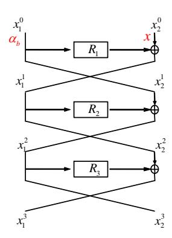

Figure 1 3-round quantum distinguisher

V. The vectors y such that  $y \cdot a = 1$  have amplitude 0. Hence, measuring the state yields a value y that  $y \cdot a = 0$ .

Repeat  $\mathcal{O}(n)$  times, one obtains a by solving a system of linear equations.

Kuwakado and Morii [3] introduced a quantum distinguish attack on 3-round Feistel scheme by using Simon algorithm. As shown in Figure 1,  $\alpha_0$  and  $\alpha_1$  are arbitrary constants:

$$f: \{0,1\} \times \{0,1\}^n \to \{0,1\}^n$$
  
 $b, x \mapsto \alpha_b \oplus x_2^3, \text{ where } (x_1^3, x_2^3) = E(\alpha_b, x),$   
 $f(b, x) = R_2(R_1(\alpha_b) \oplus x).$ 

f is periodic function that  $f(b,x) = f(b \oplus 1, x \oplus R_1(\alpha_0) \oplus R_1(\alpha_1))$ . Then using Simon's algorithm, one can get the period  $s = 1 || R_1(\alpha_0) \oplus R_1(\alpha_1)$  in polynomial time.

#### 3.2 Grover's algorithm

The task is to find a marked element from a set X. We denote by  $M \subseteq X$  the subset of marked elements. Classically, one solve the problem with time |X|/|M|. However, in a quantum computer, the problem is solve with high probability in time  $\sqrt{|X|/|M|}$  using Grover's algorithm. The steps of the algorithm is as follows:

I. Initializing a *n*-bit register  $|0\rangle^{\otimes n}$ . One applies Hadamard transform to the first register to attain an equal superposition:

$$H^{\otimes n}|0\rangle = \frac{1}{\sqrt{2^n}} \sum_{x \in \{0,1\}^n} |x\rangle = |\varphi\rangle.$$
 (2)

- II. Construct an oracle  $\mathcal{O}: |x\rangle \xrightarrow{\mathcal{O}} (-1)^{f(x)}|x\rangle$ , where f(x) = 1 if x is the correct state, and f(x) = 0 otherwise.
- III. Apply Grover iteration for  $R \approx \frac{\pi}{4} \sqrt{2^n}$  times:

$$[(2|\varphi\rangle\langle\varphi|-I)\mathcal{O}]^R|\varphi\rangle\approx|x_0\rangle.$$

IV. return  $x_0$ .

Later, Brassard et al. [15] generalized the Grover search as amplitude amplification.

Theorem 1. (Brassard, Hoyer, Mosca and Tapp [15]). Let  $\mathcal{A}$  be any quantum algorithm on q qubits that uses no measurement. Let  $\mathcal{B}: \mathbb{F}_2^q \to \{0,1\}$  be a function that classifies outcomes of  $\mathcal{A}$  as good or bad. Let p > 0 be the initial success probability that a measurement of  $\mathcal{A}|0\rangle$  is good. Set  $k = \lceil \frac{\pi}{4\theta} \rceil$ ,

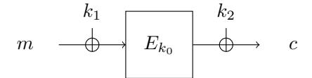

Figure 2 FX constructions

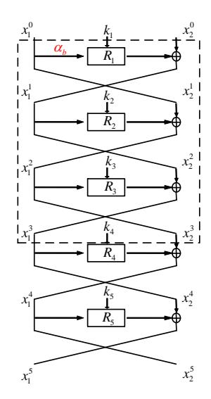

Figure 3 Quantum key-recovery attacks on 5-Round Feistel structures

where  $\theta$  is defined via  $sin^2(\theta) = p$ . Moreover, define the unitary operator  $Q = -AS_0A^{-1}S_B$ , where the operator  $S_B$  changes the sign of the good state

$$|x\rangle \mapsto \begin{cases} -|x\rangle \text{ if } \mathcal{B}(x) = 1, \\ |x\rangle \text{ if } \mathcal{B}(x) = 0, \end{cases}$$

while  $S_0$  changes the sign of the amplitude only for the zero state  $|0\rangle$ . Then after the computation of  $Q^k \mathcal{A}|0\rangle$ , a measurement yields good with probability a least max $\{1-p, p\}$ .

Assuming  $|\varphi\rangle = \mathcal{A}|0\rangle$  is the initial vector, whose projections on the good and the bad subspace are denoted  $|\varphi_1\rangle$  and  $|\varphi_0\rangle$ . The state  $|\varphi\rangle = \mathcal{A}|0\rangle$  has angle  $\theta$  with the bad subspace, where  $\sin^2(\theta) = p$ . Each Q iteration increase the angle to  $2\theta$ . Hence, after  $k \approx \frac{\pi}{4\theta}$ , the angle roughly equals to  $\pi/2$ . Thus, the state after k iterations is almost orthogonal to the bad subspace. After measurement, it produces the good vector with high probability.

#### 3.3 Combining Simon and Grover algorithms

At Asiacrypt 2017, Leander and May [5] gave a quantum key-recovery attack on FX-construction shown in Figure 2:  $Enc(x) = E_{k_0}(x + k_1) + k_2$ . They introduce the function  $f(k,x) = Enc(x) + E_k(x) = E_{k_0}(x + k_1) + k_2 + E_k(x)$ . For the correct key guess  $k = k_0$ , we have  $f(k,x) = f(k,x + k_1)$  for all x. However, for  $k \neq k_0$ ,  $f(k,\cdot)$  is not periodic. They combine Simon and Grover algorithm to attack FX ciphers (such as PRINCE [16], PRIDE [17], DESX [18]) in the quantum-CPA model with complexity roughly  $2^{32}$ .

Then Dong et al. [19] and Hosoyamada et al. [20] independently applied Leander et al.'s [5] attack to generic feistel constructions. As shown in Figure 3, they append 2-round feistel networks under the 3-round quantum distinguisher in Figure 1 to give a quantum key-recovery attack on 5-round feistel construction.

Suppose the state size is n, then the length of  $k_i$  is n/2. The following functions is defined:

$$f(b, x_{R_0}) = R_2(k_2, x_2^0 \oplus R_1(k_1, \alpha_b)) = \alpha_b \oplus x_2^3 = \alpha_b \oplus R_4(k_4, R_5(k_5, x_2^5) \oplus x_1^5) \oplus x_2^5, \tag{3}$$

where  $b \in \mathbb{F}_2$ ,  $\alpha_b \in \mathbb{F}_2^{n/2}$  is arbitrary constant and  $\alpha_0 \neq \alpha_1$ ,  $(x_1^5||x_2^5) = Enc(\alpha_b||x_2^0)$ . It is easy to verify that  $f(b, x_2^0) = f(b \oplus 1, x_2^0 \oplus R_1(k_1, \alpha_0) \oplus R_1(k_1, \alpha_1))$ . Therefore, with the right key guess  $(k_4, k_5)$ ,  $f(b, x_2^0) = \alpha_b \oplus R_4(k_4, R_5(k_5, x_2^5) \oplus x_1^5)$  has a nontrivial period  $s = 1||R_1(k_1, \alpha_0) \oplus R_1(k_1, \alpha_1)$ . However, if the guessed  $(k_4, k_5)$  is wrong,  $f(b, x_2^0)$  is a random function and not periodic with high probability.

**Theorem 2.** [19] Let  $g: \mathbb{F}_2^n \times \mathbb{F}_2^{n/2+1} \mapsto \mathbb{F}_2^{n/2}$  with

$$(k_4, k_5, y) \mapsto f(y) = f(b, x) = \alpha_b \oplus R_4(k_4, R_5(k_5, x_2^5) \oplus x_1^5) \oplus x_2^5,$$

where  $\alpha_0, \alpha_1$  are two arbitrary constants,  $(x_1^5||x_2^5) = Enc(\alpha_b||x)$ . Given quantum oracle to g and Enc,  $(k_4, k_5)$  and  $R_1(k_1, \alpha_0) \oplus R_1(k_1, \alpha_1)$  could be computed with  $n + (n+1)(n+2+2\sqrt{n/2+1})$  qubits and about  $2^{n/2}$  quantum queries.

Under the right key guess  $k_4, k_5, g(k_4, k_5, y) = g(k_4, k_5, y \oplus s)$ . Let,  $h: \mathbb{F}_2^n \times \mathbb{F}_2^{(n/2+1)^l} \mapsto \mathbb{F}_2^{(n/2)^l}$  with

$$(k_4, k_5, y_1, ..., y_l) \mapsto g(k_4, k_5, y_1) ||...|| g(k_4, k_5, y_l).$$
 (4)

Let  $U_h$  be a quantum oracle that maps

$$|k_4, k_5, y_1, ..., y_l, \mathbf{0}, ..., \mathbf{0}\rangle \mapsto |k_4, k_5, y_1, ..., y_l, h(k_4, k_5, y_1, ..., y_l)\rangle.$$
 (5)

Similar to the work [5], Dong and Wang [19] constructed the following quantum algorithm A.

- 1. Preparing the initial (n + (n/2 + 1)l + nl/2)-qubit state  $|\mathbf{0}\rangle$ .
- 2. Apply Hadamard  $H^{\otimes n+(n/2+1)l}$  on the first n+(n/2+1)l qubits resulting in

$$\sum_{k_4, k_5 \in \mathbb{F}_2^{n/2}, y_1, \dots, y_l \in \mathbb{F}_2^{n/2+1}} |k_4, k_5\rangle |y_1\rangle \dots |y_l\rangle |\mathbf{0}\rangle, \tag{6}$$

where we omit the amplitudes  $2^{-(n+(n/2+1)l)/2}$ .

3. Applying  $U_h$  to the above state, we get:

$$\sum_{k_4, k_5 \in \mathbb{F}_2^{n/2}, y_1, \dots, y_l \in \mathbb{F}_2^{n/2+1}} |k_4, k_5\rangle |y_1\rangle \dots |y_l\rangle |h(k_4, k_5, y_1, \dots, y_l)\rangle.$$
(7)

4. Apply Hadamard to the qubits  $|y_1\rangle...|y_l\rangle$  of the above state, we get:

$$|\varphi\rangle = \sum_{k_4, k_5 \in \mathbb{F}_2^{n/2}, u_1, \dots, u_l, y_1, \dots, y_l \in \mathbb{F}_2^{n/2+1}} |k_4, k_5\rangle (-1)^{\langle u_1, y_1 \rangle} |u_1\rangle \dots (-1)^{\langle u_l, y_l \rangle} |u_l\rangle |h(k_4, k_5, y_1, \dots, y_l)\rangle.$$
(8)

If the guessed  $k_4, k_5$  is right, after measurement of  $|\varphi\rangle$ , the period s is orthogonal to all the  $u_1, ..., u_l$ . According to Lemma 4 of [5], choosing  $l = 2(n/2 + 1 + \sqrt{n/2 + 1})$  is enough to compute a unique s.

Without measurement and considering the superposition  $|\varphi\rangle$ , Dong and Wang [19] introduced a classifier  $\mathcal{B}$ :

Classifier  $\mathcal{B}$ . Define  $\mathcal{B}: \mathbb{F}_2^{n+(n/2+1)l} \mapsto \{0,1\}$  that maps  $(k_4,k_5,u_1,...,u_l) \mapsto \{0,1\}$ .

- 1. Let  $\overline{U} = \langle u_1, ..., u_l \rangle$  be the linear span of all  $u_i$ . If  $dim(\overline{U}) \neq n/2$ , output 0. Else, use Lemma 4 of [5] to compute the unique period s.
- 2. Check  $g(k_4, k_5, y) = g(k_4, k_5, y \oplus s)$  for a random given y. If the identity holds, output 1. Else output 0.

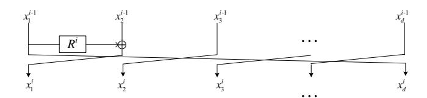

Figure 4 Round i of CAST256-like GFS with d branches

Classifier  $\mathcal{B}$  partitions  $|\varphi\rangle$  into a good subspace and a bad subspace:  $|\varphi\rangle = |\varphi_1\rangle + |\varphi_0\rangle$ , where  $|\varphi_1\rangle$  and  $|\varphi_0\rangle$  denotes the projection onto the good subspace and bad subspace, respectively. For the good one  $|x\rangle$ ,  $\mathcal{B}(x) = 1$ .

Classifier  $\mathcal{B}$  defines a unitary operator  $S_{\mathcal{B}}$  that conditionally change the sign of the quantum states:

$$|k_4, k_5\rangle |u_1\rangle ... |u_l\rangle \mapsto \begin{cases} -|k_4, k_5\rangle |u_1\rangle ... |u_l\rangle & \text{if } \mathcal{B}(k_4, k_5, u_1, ..., u_l) = 1, \\ |k_4, k_5\rangle |u_1\rangle ... |u_l\rangle & \text{if } \mathcal{B}(k_4, k_5, u_1, ..., u_l) = 0. \end{cases}$$
(9)

The complete amplification process is realized by repeatedly for t times applying the unitary operator  $Q = -\mathcal{A}S_0\mathcal{A}^{-1}S_{\mathcal{B}}$  to the state  $|\varphi\rangle = \mathcal{A}|0\rangle$ , i.e.  $Q^t\mathcal{A}|0\rangle$ .

Initially, the angle between  $|\varphi\rangle = \mathcal{A}|0\rangle$  and the bad subspace  $|\varphi_0\rangle$  is  $\theta$ , where  $sin^2(\theta) = p = \langle \varphi_1|\varphi_1\rangle$ . When p is smaller enough,  $\theta \approx arcsin(\sqrt{p}) \approx 2^{-\frac{n}{2}}$ . According to Theorem 1, after  $k = \lceil \frac{\pi}{4\theta} \rceil = \lceil \frac{\pi}{4 \times 2^{-\frac{n}{2}}} \rceil$  Grover iterations Q, the angle between resulting state and the bad subspace is roughly  $\pi/2$ . The probability  $P_{aood}$  that the measurement yields a good state is about  $sin^2(\pi/2) = 1$ .

The whole attack needs  $(n + (n/2 + 1)l + nl/2) = n + (n + 1)(n + 2 + 2\sqrt{n/2 + 1})$  qubits. About  $k = \lceil \frac{\pi}{4 \times 2^{-\frac{n}{2}}} \rceil = 2^{n/2}$  quantum queries are required to recover  $k_4, k_5$ . Thus, in our quantum cryptanalysis on GFS, the first step is to find new quantum distinguishers, and then give a similar quantum key-recovery attacks by appending several rounds to the distinguishers.

## 4 Quantum cryptanalysis on Type-1 (CAST256-like) GFS

### 4.1 Quantum distinguishers on Type-1 (CAST256-like) GFS

As shown in Figure 4, the input of the cipher is divided into d branches, i.e.  $x_j^0$  for  $1 \le j \le d$ , each of which has n-bit, so the blocksize is  $d \times n$ .  $R^i$  is the round function that absorbs n-bit secret key and n-bit input. We construct the corresponding quantum distinguisher on the (2d-1)-round cipher.

The intermediate state after the *i*th round is  $x_j^i$  for  $1 \le j \le d$ , especially the output of the (2d-1)th round is denoted as  $x_1^{2d-1}||x_2^{2d-1}||...||x_d^{2d-1}$ . For the input of round function  $R^d$ , we compute its symbolic expression with  $x_j^0$  for  $1 \le j \le d$ :

$$R^{d-1}(R^{d-2}(...R^3(R^2(R^1(x_1^0) \oplus x_2^0) \oplus x_3^0)... \oplus x_{d-2}^0) \oplus x_{d-1}^0) \oplus x_d^0.$$
 (10)

Similarly, the output of round function  $R^d$  is  $x_1^0 \oplus x_2^{2d-1}$ . Thus, we get the following equation:

$$R^{d}(R^{d-1}(R^{d-2}(...R^{3}(R^{2}(R^{1}(x_{1}^{0})\oplus x_{2}^{0})\oplus x_{3}^{0})...\oplus x_{d-2}^{0})\oplus x_{d-1}^{0})\oplus x_{d}^{0})=x_{1}^{0}\oplus x_{2}^{2d-1}. \tag{11}$$

In Equation (11), let  $x_1^0 = \alpha_b(b=0,1, \alpha_0, \alpha_1)$  are arbitrary constants,  $\alpha_0 \neq \alpha_1$ ,  $x_d^0 = x$ , and all of  $x_1^0, x_2^0, ..., x_d^0$  be constants, we get

$$R^{d}(R^{d-1}(R^{d-2}(...R^{3}(R^{2}(R^{1}(\alpha_{b})\oplus x_{2}^{0})\oplus x_{3}^{0})...\oplus x_{d-2}^{0})\oplus x_{d-1}^{0})\oplus x)=\alpha_{b}\oplus x_{2}^{2d-1}.$$
 (12)

Denote  $h(\alpha_b) = R^{d-1}(R^{d-2}(...R^3(R^2(R^1(\alpha_b) \oplus x_2^0) \oplus x_3^0)... \oplus x_{d-2}^0) \oplus x_{d-1}^0)$ , then Equation (12) becomes  $R^d(h(\alpha_b) \oplus x) = \alpha_b \oplus x_2^{2d-1}$ . We construct function f as following:

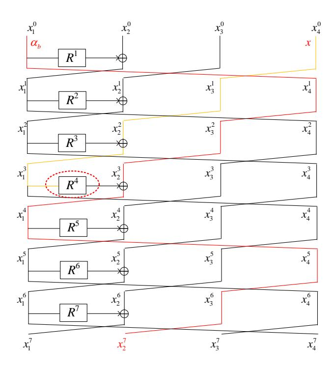

**Figure 5** 7-round distinguisher on CAST256-like GFS with d=4

$$f: \{0,1\} \times \{0,1\}^n \to \{0,1\}^n$$

$$b, x \mapsto \alpha_b \oplus x_2^{2d-1}, \text{ where } x_1^{2d-1} ||x_2^{2d-1}||...||x_d^{2d-1} = E(\alpha_b, x),$$

$$f(b, x) = R^d(h(\alpha_b) \oplus x).$$

So  $f(0,x) = f(1,x \oplus h(\alpha_0) \oplus h(\alpha_1)) = R_d(h(\alpha_0) \oplus x)$ ,  $f(1,x) = f(0,x \oplus h(\alpha_0) \oplus h(\alpha_1)) = R_d(h(\alpha_1) \oplus x)$ . Thus  $f(b,x) = f(b \oplus 1, x \oplus h(\alpha_0) \oplus h(\alpha_1))$ . Therefore, function f satisfies Simon's promise with  $s = 1 || h(\alpha_0) \oplus h(\alpha_1)$ .

#### Example case of Type-1 (CAST256-like) with d=4:

When d=4, we get 7-round quantum distinguisher as shown in Figure 5. Thus,  $h(\alpha_b)=R^3(R^2(R^1(\alpha_b)\oplus x_2^0)\oplus x_3^0)$ , where  $x_2^0$  and  $x_3^0$  are constants.

#### 4.2 Quantum key-recovery attacks on Type-1 (CAST256-like) GFS

We first study the quantum key-recovery attack on CAST256-like GFS with d=4 branches. Following the similar idea that combines Simon's and Grover's algorithms to attack Feistel structure [19] shown in Section 3.3, we append 7 rounds under the 7-round distinguisher to launch the attack. As shown in Figure 6, there are 4n-bit key needed to be guessed by Grover's algorithm, which are highlighted in the red boxes of round functions. Thus, the 14-round quantum key-recovery attack needs about  $2^{2n}$  time and  $\mathcal{O}(n^2)$  qubits. If we attack r > 14 rounds, we need guess 4n + (r - 14)n key bits by Grover's algorithm. Thus, the time complexity is  $2^{2n + \frac{(r-14)n}{2}}$ .

Generally, for  $d \ge 3$ , we could get (2d-1)-round quantum distinguisher. We append  $d^2-3d+3$  rounds under the quantum distinguisher to attack  $r_0=d^2-d+2$  rounds CAST256-like GFS. Similarly, we need to guess  $(\frac{1}{2}d^2-\frac{3}{2}d+2)n$ -bit key by Grover's algorithm. Thus, for  $r_0$  rounds, the time complexity is  $(\frac{1}{2}d^2-\frac{3}{2}d+2)\cdot\frac{n}{2}$  queries, and  $\mathcal{O}(n^2)$  qubits are needed. If we attack  $r>r_0$  rounds, we need guess  $(\frac{1}{2}d^2-\frac{3}{2}d+2)n+(r-r_0)n$  key bits by Grover's algorithm. Thus, the time complexity is  $2^{(\frac{1}{2}d^2-\frac{3}{2}d+2)\cdot\frac{n}{2}+\frac{(r-r_0)n}{2}}$ .

If we use the quantum brute force search (Grover search) to recover the key, for r-round d-branch cipher, totally, rn-bit key need to be found, the complexity is  $2^{rn/2}$ . Thus, our attack is better than the quantum brute force search (Grover search) by a factor  $2^{rn/2-((\frac{1}{2}d^2-\frac{3}{2}d+2)\cdot\frac{n}{2}+\frac{(r-r_0)n}{2})}=2^{(\frac{1}{4}d^2+\frac{1}{4}d)n}$ .

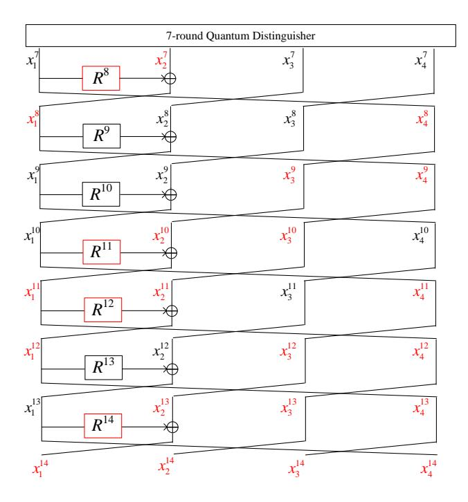

Figure 6 14-round quantum key-recovery attack on CAST256-like GFS with d=4

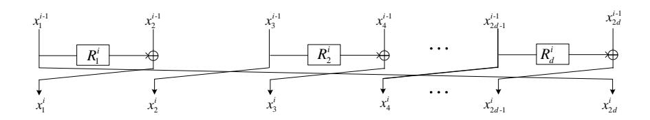

Figure 7 Round i of RC6/CLEFIA-like GFS with 2d branches

### 5 Quantum cryptanalysis on Type-2 (RC6/CLEFIA-like) GFS

#### 5.1 Quantum distinguishers on Type-2 (RC6/CLEFIA-like) GFS

As shown in Figure 7, the input of the cipher is divided into 2d branches, i.e.  $x_j^0$  for  $1 \le j \le 2d$ , each of which has n-bit, so the blocksize is  $2d \times n$ .  $R_l^i$   $(1 \le l \le d)$  is the jth round function in ith round that absorbs n-bit secret key and n-bit input. We construct the corresponding quantum distinguisher on the (2d+1)-round cipher.

The intermediate state after the ith round is  $x_j^i$  for  $1 \leqslant j \leqslant 2d$ , especially the output of the (2d+1)th round is denoted as  $x_1^{2d+1}||x_2^{2d+1}||...||x_{2d}^{2d+1}$ .

# Case study, 2d = 4:

As shown in Figure 8 with 2d=4, for the input of round function  $R_1^4$  about  $x_j^0$  for  $1 \leqslant j \leqslant 4$ , we compute its symbolic expression: $R_1^3(R_1^2(R_1^1(x_1^0) \oplus x_2^0) \oplus x_3^0) \oplus R_2^1(x_3^0) \oplus x_4^0$ . The output of  $R_1^4$  can be expressed as  $x_1^0 \oplus x_4^0 \oplus R_2^2(R_2^1(x_3^0) \oplus x_4^0)$ . Through  $R_1^4$ , we obtain the following equation

$$R_1^4(R_1^3(R_1^2(R_1^1(x_1^0) \oplus x_2^0) \oplus x_3^0) \oplus R_2^1(x_3^0) \oplus x_4^0) = x_1^0 \oplus x_4^5 \oplus R_2^2(R_2^1(x_3^0) \oplus x_4^0).$$
(13)

Let  $x_1^0 = \alpha_b, x_2^0 = x, x_3^0, x_4^0$  be constants, it becomes

$$R_1^4(R_1^3(R_1^2(R_1^1(\alpha_b) \oplus x) \oplus x_3^0) \oplus R_2^1(x_3^0) \oplus x_4^0) = \alpha_b \oplus x_4^5 \oplus R_2^2(R_2^1(x_3^0) \oplus x_4^0). \tag{14}$$

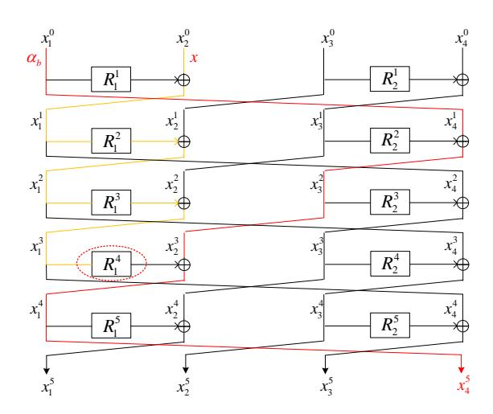

**Figure 8** 5-round distinguisher on RC6/CLEFIA-like GFS with 2d = 4

$$f_4: \{0,1\} \times \{0,1\}^n \to \{0,1\}^n$$

$$b, x \mapsto \alpha_b \oplus x_4^5 \oplus R_2^2(R_2^1(x_3^0) \oplus x_4^0), \text{ where } x_1^5 || x_2^5 || x_3^5 || x_4^5 = E(\alpha_b, x),$$

$$f_4(b, x) = R_1^4(R_1^3(R_1^2(R_1^1(\alpha_b) \oplus x) \oplus x_3^0) \oplus R_2^1(x_3^0) \oplus x_4^0).$$

Thus  $f_4(b,x) = f_4(b \oplus 1, x \oplus R_1^1(\alpha_0) \oplus R_1^1(\alpha_1))$ . Therefore, function  $f_4$  satisfies Simon's promise with  $s = 1 || R_1^1(\alpha_0) \oplus R_1^1(\alpha_1)$ .

#### Case study, 2d = 6:

As shown in Figure 9 with 2d = 6, for the input of round function  $R_1^6$  about  $x_j^0$  for  $1 \le j \le 6$ , we compute its symbolic expression:  $R_1^5(R_1^4(R_1^3(R_1^2(R_1^1(x_1^0) \oplus x_2^0) \oplus x_3^0) \oplus R_2^0(x_3^0) \oplus x_4^0) \oplus R_2^2(R_2^1(x_3^0) \oplus x_4^0) \oplus R_3^0(R_2^2(R_2^1(x_3^0) \oplus x_4^0) \oplus x_5^0) \oplus R_3^0(R_2^0(R_2^1(x_3^0) \oplus x_4^0) \oplus x_5^0) \oplus R_3^0(R_2^0(R_2^1(x_3^0) \oplus x_4^0) \oplus x_5^0) \oplus R_3^0(R_2^0(R_2^1(x_3^0) \oplus x_4^0) \oplus x_5^0) \oplus R_3^0(R_2^0(R_2^1(x_3^0) \oplus x_4^0) \oplus x_5^0) \oplus R_3^0(R_2^0(R_2^0(R_2^1(x_3^0) \oplus x_4^0) \oplus x_5^0) \oplus R_3^0(R_2^0(R_2^0(R_2^0(x_3^0) \oplus x_4^0) \oplus x_5^0)) \oplus R_3^0(R_2^0(R_2^0(x_3^0) \oplus x_4^0) \oplus x_5^0) \oplus R_3^0(R_2^0(R_2^0(x_3^0) \oplus x_4^0) \oplus x_5^0) \oplus R_3^0(R_2^0(R_2^0(x_3^0) \oplus x_4^0) \oplus x_5^0) \oplus R_3^0(R_2^0(R_2^0(x_3^0) \oplus x_4^0) \oplus x_5^0) \oplus R_3^0(R_2^0(R_2^0(x_3^0) \oplus x_4^0) \oplus x_5^0) \oplus R_3^0(R_2^0(R_2^0(x_3^0) \oplus x_4^0) \oplus x_5^0) \oplus R_3^0(R_2^0(R_2^0(x_3^0) \oplus x_4^0) \oplus x_5^0) \oplus R_3^0(R_2^0(R_2^0(x_3^0) \oplus x_5^0) \oplus x_5^0) \oplus R_3^0(R_2^0(R_2^0(x_3^0) \oplus x_5^0) \oplus x_5^0) \oplus R_3^0(R_2^0(R_2^0(x_3^0) \oplus x_5^0) \oplus x_5^0) \oplus R_3^0(R_2^0(R_2^0(x_3^0) \oplus x_5^0) \oplus x_5^0) \oplus R_3^0(R_2^0(R_2^0(x_3^0) \oplus x_5^0) \oplus x_5^0) \oplus R_3^0(R_2^0(R_2^0(x_3^0) \oplus x_5^0) \oplus x_5^0) \oplus R_3^0(R_2^0(R_2^0(x_3^0) \oplus x_5^0) \oplus x_5^0) \oplus R_3^0(R_2^0(R_2^0(x_3^0) \oplus x_5^0) \oplus x_5^0) \oplus R_3^0(R_2^0(R_2^0(x_3^0) \oplus x_5^0) \oplus x_5^0) \oplus R_3^0(R_2^0(R_2^0(x_3^0) \oplus x_5^0) \oplus x_5^0) \oplus R_3^0(R_2^0(R_2^0(x_5^0(x_5^0) \oplus x_5^0) \oplus x_5^0)) \oplus R_3^0(R_2^0(R_2^0(x_5^0(x_5^0) \oplus x_5^0) \oplus x_5^0)) \oplus R_3^0(R_2^0(x_5^0(x_5^0) \oplus x_5^0) \oplus x_5^0(R_2^0(x_5^0(x_5^0) \oplus x_5^0)) \oplus R_3^0(R_2^0(x_5^0(x_5^0) \oplus x_5^0)) \oplus R_3^0(R_2^0(x_5^0(x_5^0) \oplus x_5^0(x_5^0(x_5^0) \oplus x_5^0)) \oplus R_3^0(R_2^0(x_5^0(x_5^0) \oplus x_5^0(x_5^0(x_5^0) \oplus x_5^0)) \oplus R_3^0(R_2^0(x_5^0(x_5^0(x_5^0) \oplus x_5^0(x_5^0(x_5^0(x_5^0) \oplus x_5^0(x_5^0(x_5^0(x_5^0) \oplus x_5^0(x_5^0(x_5^0(x_5^0(x_5^0(x_5^0(x_5^0(x_5^0(x_5^0(x_5^0(x_5^0(x_5^0(x_5^0(x_5^0(x_5^0(x_5^0(x_5^0(x_5^0(x_5^0(x_5^0(x_5^0(x_5^0(x_5^0(x_5^0(x_5^0(x_5^0(x_5^0(x_5^0(x_5^0(x_5^0(x_5^0(x_5^0(x_5^0(x_5^0(x_5^0(x_5^0(x_5^0(x_5^0(x_5^0(x_5^0(x_5^0(x_5^0(x_5^0(x_5^0(x_5^0(x_5^0(x_5^$ 

The output of  $R_1^6$  can be expressed as  $x_1^0 \oplus x_6^7 \oplus R_3^2(R_3^1(x_5^0) \oplus x_6^0) \oplus R_2^4(R_2^3(R_2^2(R_2^1(x_3^0) \oplus x_4^0) \oplus x_5^0) \oplus R_3^1(x_5^0) \oplus x_6^0)$ . Through  $R_1^4$ , we obtain the following

$$R_1^6[R_1^5(R_1^4(R_1^3(R_1^2(R_1^1(x_1^0) \oplus x_2^0) \oplus x_3^0) \oplus R_2^1(x_3^0) \oplus x_4^0) \oplus R_2^2(R_2^1(x_3^0) \oplus x_4^0) \oplus x_5^0) \oplus R_2^3(R_2^2(R_2^1(x_3^0) \oplus x_4^0) \oplus x_5^0) \oplus R_2^3(R_2^2(R_2^1(x_3^0) \oplus x_4^0) \oplus x_5^0) \oplus R_2^3(R_2^2(R_2^1(x_3^0) \oplus x_4^0) \oplus x_5^0) \oplus R_2^3(R_2^2(R_2^1(x_3^0) \oplus x_4^0) \oplus x_5^0) \oplus R_2^3(R_2^2(R_2^1(x_3^0) \oplus x_4^0) \oplus x_5^0) \oplus R_2^3(R_2^2(R_2^1(x_3^0) \oplus x_4^0) \oplus x_5^0) \oplus R_2^3(R_2^2(R_2^1(x_3^0) \oplus x_4^0) \oplus x_5^0) \oplus R_2^3(R_2^2(R_2^1(x_3^0) \oplus x_4^0) \oplus x_5^0) \oplus R_2^3(R_2^2(R_2^1(x_3^0) \oplus x_4^0) \oplus x_5^0) \oplus R_2^3(R_2^2(R_2^1(x_3^0) \oplus x_4^0) \oplus x_5^0) \oplus R_2^3(R_2^2(R_2^1(x_3^0) \oplus x_4^0) \oplus x_5^0) \oplus R_2^3(R_2^2(R_2^1(x_3^0) \oplus x_4^0) \oplus x_5^0) \oplus R_2^3(R_2^2(R_2^1(x_3^0) \oplus x_4^0) \oplus x_5^0) \oplus R_2^3(R_2^2(R_2^1(x_3^0) \oplus x_5^0) \oplus R_2^3(R_2^2(R_2^1(x_3^0) \oplus x_5^0) \oplus R_2^3(R_2^1(x_5^0) \oplus x_5^0) \oplus R_2^3(R_2^2(R_2^1(x_3^0) \oplus x_5^0) \oplus R_2^3(R_2^2(R_2^1(x_3^0) \oplus x_5^0) \oplus R_2^3(R_2^2(R_2^1(x_3^0) \oplus x_5^0) \oplus R_2^3(R_2^2(R_2^1(x_3^0) \oplus x_5^0) \oplus R_2^3(R_2^2(R_2^1(x_3^0) \oplus x_5^0) \oplus R_2^3(R_2^2(R_2^1(x_3^0) \oplus x_5^0) \oplus R_2^3(R_2^2(R_2^1(x_3^0) \oplus x_5^0) \oplus R_2^3(R_2^2(R_2^1(x_3^0) \oplus x_5^0) \oplus R_2^3(R_2^2(R_2^1(x_3^0) \oplus x_5^0) \oplus R_2^3(R_2^2(R_2^1(x_3^0) \oplus x_5^0) \oplus R_2^3(R_2^2(R_2^1(x_3^0) \oplus x_5^0) \oplus R_2^3(R_2^2(R_2^1(x_3^0) \oplus x_5^0) \oplus R_2^3(R_2^2(R_2^1(x_3^0) \oplus x_5^0) \oplus R_2^3(R_2^2(R_2^1(x_5^0) \oplus x_5^0) \oplus R_2^3(R_2^2(R_2^1(x_5^0) \oplus x_5^0) \oplus R_2^3(R_2^2(R_2^1(x_5^0) \oplus x_5^0) \oplus R_2^3(R_2^2(R_2^1(x_5^0) \oplus x_5^0) \oplus R_2^3(R_2^2(R_2^1(x_5^0) \oplus x_5^0) \oplus R_2^3(R_2^2(R_2^1(x_5^0) \oplus x_5^0) \oplus R_2^3(R_2^2(R_2^1(x_5^0) \oplus x_5^0) \oplus R_2^3(R_2^2(R_2^1(x_5^0) \oplus x_5^0) \oplus R_2^3(R_2^2(R_2^1(x_5^0) \oplus x_5^0) \oplus R_2^3(R_2^2(R_2^1(x_5^0) \oplus x_5^0) \oplus R_2^3(R_2^2(R_2^1(x_5^0) \oplus x_5^0) \oplus R_2^3(R_2^2(R_2^1(x_5^0) \oplus x_5^0) \oplus R_2^3(R_2^2(R_2^1(x_5^0) \oplus x_5^0) \oplus R_2^3(R_2^2(R_2^1(x_5^0) \oplus x_5^0) \oplus R_2^3(R_2^2(R_2^1(x_5^0) \oplus x_5^0) \oplus R_2^3(R_2^2(R_2^1(x_5^0) \oplus x_5^0) \oplus R_2^3(R_2^2(R_2^1(x_5^0) \oplus x_5^0) \oplus R_2^3(R_2^2(R_2^1(x_5^0) \oplus x_5^0) \oplus R_2^3(R_2^2(R_2^1(x_5^0) \oplus x_5^0) \oplus R_2^2(R_2^2(R_2^1(x_5^0) \oplus x_5^0) \oplus R_2^2(R_2^2(R_2^1(x_5^0) \oplus x_5^0) \oplus R_2^2(R$$

Let  $x_1^0 = \alpha_b, x_2^0 = x, x_3^0, x_4^0, x_5^0, x_6^0$  be constants, it becomes

$$R_{1}^{6}[R_{1}^{5}(R_{1}^{4}(R_{1}^{3}(R_{1}^{2}(R_{1}^{1}(\alpha_{b}) \oplus x) \oplus x_{3}^{0}) \oplus R_{2}^{1}(x_{3}^{0}) \oplus x_{4}^{0}) \oplus R_{2}^{2}(R_{2}^{1}(x_{3}^{0}) \oplus x_{4}^{0}) \oplus x_{5}^{0}) \oplus R_{2}^{3}(R_{2}^{2}(R_{2}^{1}(x_{3}^{0}) \oplus x_{4}^{0}) \oplus x_{5}^{0}) \oplus R_{2}^{1}(R_{2}^{1}(x_{3}^{0}) \oplus x_{4}^{0}) \oplus R_{2}^{0}(R_{2}^{1}(R_{2}^{1}(x_{3}^{0}) \oplus x_{4}^{0}) \oplus x_{5}^{0}) \oplus R_{3}^{1}(x_{5}^{0}) \oplus x_{6}^{0}).$$

$$(16)$$

$$f_{6}: \{0,1\} \times \{0,1\}^{n} \rightarrow \{0,1\}^{n}$$

$$b, x \mapsto \alpha_{b} \oplus x_{6}^{7} \oplus R_{3}^{2}(R_{3}^{1}(x_{5}^{0}) \oplus x_{6}^{0}) \oplus R_{2}^{4}(R_{2}^{3}(R_{2}^{2}(R_{2}^{1}(x_{3}^{0}) \oplus x_{4}^{0}) \oplus x_{4}^{0}) \oplus x_{5}^{0}) \oplus R_{3}^{1}(x_{5}^{0}) \oplus x_{6}^{0}), \text{where } x_{1}^{5}||x_{2}^{5}||x_{3}^{5}||x_{4}^{5}||x_{5}^{5}||x_{6}^{5} = E(\alpha_{b}, x),$$

$$f_{6}(b, x) = R_{1}^{6}[R_{1}^{5}(R_{1}^{4}(R_{1}^{3}(R_{1}^{2}(R_{1}^{1}(\alpha_{b}) \oplus x) \oplus x_{3}^{0}) \oplus R_{2}^{1}(x_{3}^{0}) \oplus x_{4}^{0}) \oplus R_{2}^{2}(R_{2}^{1}(x_{3}^{0}) \oplus x_{4}^{0}) \oplus R_{3}^{1}(x_{5}^{0}) \oplus R_{3}^{1}(x_{5}^{0}) \oplus x_{6}^{0}].$$

Thus  $f_6(b,x) = f_6(b \oplus 1, x \oplus R_1^1(\alpha_0) \oplus R_1^1(\alpha_1))$ . Therefore, function  $f_6$  satisfies Simon's promise with  $s = 1 || R_1^1(\alpha_0) \oplus R_1^1(\alpha_1)$ .

Similarly, for the 2*d*-branch version, we can get corresponding function  $f_{2d}$  satisfies Simon's promise with  $s = 1 || R_1^1(\alpha_0) \oplus R_1^1(\alpha_1)$  at 2*d*th round.

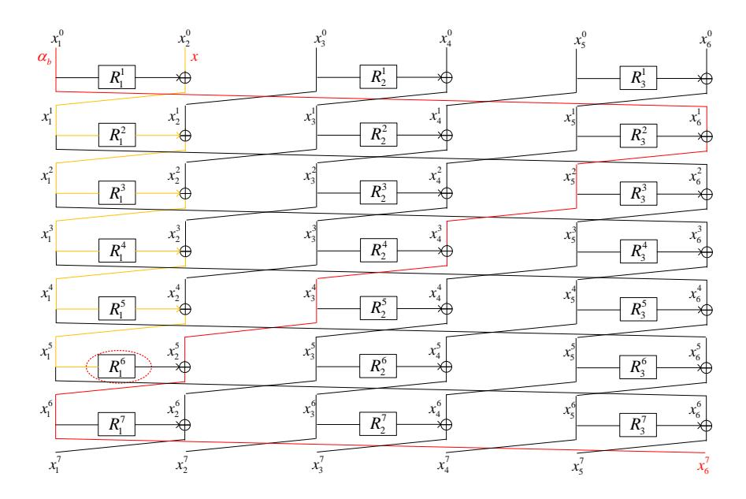

**Figure 9** 7-round distinguisher on RC6/CLEFIA-like GFS with 2d = 6

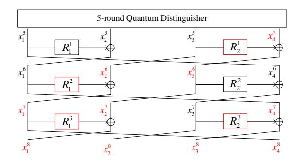

Figure 10 8-round quantum key-recovery attack on RC/CLEFIA-like GFS with 2d = 4

### 5.2 Quantum key-recovery attacks on Type-2 (RC6/CLEFIA-like) GFS

Firstly, we study the quantum key-recovery attack on RC6/CLEFIA-like GFS with 2d=4 branches. Similarly, combining Simon's and Grover's algorithms shown in Section 3.3, three rounds are appended under the 5-round distinguisher to launch the attack. As shown in Figure 10, there are 4n-bit key needed to be guessed by Grover's algorithm, which are highlighted in the red boxes of round functions. Thus, the 8-round quantum key-recovery attack needs about  $2^{2n}$  queries and  $\mathcal{O}(n^2)$  qubits. If we attack r > 8 rounds, we need guess  $4n + (r - 8) \times 2n$  key bits by Grover's algorithm. Thus, the time complexity is  $2^{2n + \frac{(r-8) \times 2n}{2}} = 2^{(r-6)n}$ .

Then, for the case of 2d=6, we append 5 rounds after the 7-round distinguisher to launch the 12-round quantum key-recovery attack as shown in Figure 11. 9n key bits highlighted in red need to be guessed by Grover's algorithm. Thus, the time complexity is  $2^{\frac{9n}{2}}$  and  $\mathcal{O}(n^2)$  qubits are needed. When we attack r>12 rounds,  $9n+(r-12)\times 3n$  key bits need to be guessed by Grover's algorithm. So the time complexity is  $2^{\frac{9n}{2}+\frac{(r-12)\times 3n}{2}}=2^{\frac{(r-9)3n}{2}}$ .

Generally, for  $2d \ge 4$ , we could get (2d+1)-round quantum distinguisher. We append 2d-1 rounds under the quantum distinguisher to attack  $r_0=4d$  round RC/CLEFIA-like GFS. Similarly, we need to guess  $d^2n$ -bit key by Grover's algorithm. Thus, for  $r_0$  rounds, the time complexity is  $\frac{d^2n}{2}$  queries, and  $\mathcal{O}(n^2)$  qubits are needed. If we attack  $r > r_0$  rounds, we need guess  $d^2n + (r - r_0)dn$  key bits by Grover's

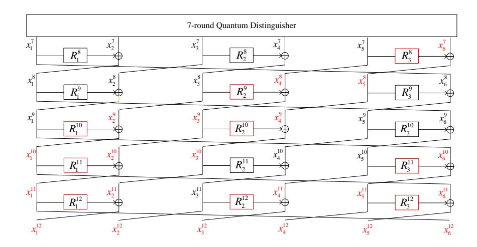

Figure 11 12-round quantum key-recovery attack on RC/CLEFIA-like GFS with 2d=6

algorithm. Thus, the time complexity is  $2^{\frac{d^2+(r-r_0)d}{2}n}$ .

If we use the quantum brute force search (Grover search) to recover the key, for r-round 2d-branch cipher, totally, rdn-bit key need to be found, the complexity is  $2^{rdn/2}$ . Thus, our attack is better than the quantum brute force search (Grover search) by a factor  $2^{rdn/2 - \frac{d^2 + (r - r_0)d}{2}n} = 2^{\frac{3d^2n}{2}}$ .

### 6 Conclusion

This paper studies quantum distinguishers and quantum key-recovery attacks on two generalized Feistel schemes (GFS): Type-1 (CAST256-like) and Type-2 (RC6/CLEFIA-like) GFS. For d-branch Type-1 GFS, we introduce (2d-1)-round quantum distinguishers with polynomial time. For 2d-branch Type-2 GFS, we give (2d+1)-round quantum distinguishers with polynomial time. Classically, Moriai and Vaudenay [13] proved that a 7-round 4-branch Type-1 GFS and 5-round 4-branch Type-2 GFS are secure pseudo-random permutations. Obviously, they are no longer secure in quantum setting.

Using the above quantum distinguishers, we introduce generic quantum key-recovery attacks by applying the combination of Simon's and Grover's algorithms recently proposed by Leander and May. We denote n as the bit length of a branch. For  $(d^2-d+2)$ -round Type-1 GFS with d branches, the time complexity is  $2^{(\frac{1}{2}d^2-\frac{3}{2}d+2)\cdot\frac{n}{2}}$ , which is better than the quantum brute force search (Grover search) by a factor  $2^{(\frac{1}{4}d^2+\frac{1}{4}d)n}$ . For 4d-round Type-2 GFS with 2d branches, the time complexity is  $2^{\frac{d^2n}{2}}$ , which is better than the quantum brute force search by a factor  $2^{\frac{3d^2n}{2}}$ .

**Open discussion:** The Chinese standard block cipher SMS4 is based on a different contracting Feistel scheme, we denote it as SMS4-like GFS. For the 4-branch case, we could find a 5-round quantum distinguisher that works with  $\mathcal{O}(n)$ . However, Zhang and Wu [21] proved that 7-round 4-branch SMS4-like GFS is a pseudo-random permutation. So our quantum distinguisher does not violate Zhang and Wu's claim. It will be interesting to find quantum distinguisher with more rounds.

#### Acknowledgement

This work is supported by the National Key Research and Development Program of China (No. 2017Y-FA0303903), Project funded by China Postdoctoral Science Foundation (No. 2017M620807), National Cryptography Development Fund (No. MMJJ20170121), Zhejiang Province Key R&D Project (No. 2017C01062), the National Natural Science Foundation of China (No. 61672019), the Fundamental Research Funds of Shandong University (No. 2016JC029).

Conflict of interest The authors declare that they have no conflict of interest.

### References

- 1 Shor P W. Polynomial-time algorithms for prime factorization and discrete logarithms on a quantum computer. SIAM Journal on Computing, 1997, 26(5):1484–1509.
- 2 Kuwakado H, Morii M. Security on the quantum-type even-mansour cipher. In: International symposium on information theory and its applications, ISITA 2012. IEEE, 2012. 312–316.
- 3 Kuwakado H, Morii M. Quantum distinguisher between the 3-round feistel cipher and the random permutation. In: International symposium on information theory, ISIT 2010. IEEE, 2010. 2682–2685.
- 4 Kaplan M, Leurent G, Leverrier A, et al. Breaking symmetric cryptosystems using quantum period finding. In: Robshaw M, Katz J, eds. Advances in Cryptology - CRYPTO 2016. Lecture Notes in Computer Science, Vol 9815. Berlin: Springer-Verlag, 2016. 207–237.
- 5 Leander G, May A. Grover meets simon - quantumly attacking the FX-construction. In: Takagi T, Peyrin T, eds. Advances in Cryptology - ASIACRYPT 2017, Part II. Lecture Notes in Computer Science, Vol 10625. Cham: Springer, 2017. 161–178.
- 6 Takagi T, Peyrin T. Advances in Cryptology - ASIACRYPT 2017, Part I. Lecture Notes in Computer Science, Vol 10624. Berlin: Springer-Verlag, 2017. 1-813.
- 7 Boneh D, Zhandry M. Secure signatures and chosen ciphertext security in a quantum computing world. In: Canetti R, Garay J A, eds. Advances in Cryptology - CRYPTO 2013. Lecture Notes in Computer Science, Vol 8043. Berlin: Springer-Verlag, 2013. 361–379.
- 8 Grover L K. A fast quantum mechanical algorithm for database search. In: Miller G L, eds. Proceedings of STOC 1996. ACM, 1996. 212–219.
- 9 Simon D R. On the power of quantum computation. SIAM Journal on Computing, 1997, 26(5):1474–1483.
- 10 Feistel H, Notz W A, Smith J L. Some cryptographic techniques for machine-to-machine data communications. In: Proceedings of the IEEE, 1975, 63(11): 1545–1554.
- 11 International Organization for Standardization(ISO). International Standard- ISO/IEC 18033-3, Information technology-Security techniques-Encryption algorithms -Part 3: Block ciphers. 2010.
- 12 Zheng Y L, Matsumoto T, Imai H. On the Construction of Block Ciphers Provably Secure and Not Relying on Any Unproved Hypotheses. In: Brassard G, eds. Advances in Cryptology - CRYPTO 1989. Lecture Notes in Computer Science, Vol 435. New York: Springer-Verlag, 1989. 461–480.
- 13 Moriai S, Vaudenay S. On the Pseudorandomness of Top-Level Schemes of Block Ciphers. In: Okamoto T,eds. Advances in Cryptology ASIACRYPT 2000. Lecture Notes in Computer Science, Vol 1976. Berlin: Springer-Verlag, 2000. 289–302.
- 14 Luby M G, Rackoff C. How to construct pseudorandom permutations from pseudorandom functions. SIAM Journal on Computing, 1988, 17(2):373–386.
- 15 Brassard G, Hoyer P, Mosca M, et al. Quantum amplitude amplification and estimation. arXiv: Quantum Physics, 2000.
- 16 Julia Borghoff, Canteaut A, G¨uneysu T, Kavun E B, et al. PRINCE - A Low-Latency Block Cipher for Pervasive Computing Applications - Extended Abstract. In: Wang X Y, Sako K, eds. Advances in Cryptology - ASIACRYPT 2012. Lecture Notes in Computer Science, Vol 7658. Berlin: Springer-Verlag, 2009. 208–225.
- 17 Albrecht M R, Driessen B, Kavun E B, et al. Block ciphers - focus on the linear layer (feat. PRIDE). In: Garay J A, Gennaro R, eds. Advances in Cryptology - CRYPTO 2014. Lecture Notes in Computer Science, Vol 8616. Berlin: Springer-Verlag, 2014. 57–76.
- 18 Kilian J, Rogaway P. How to Protect DES Against Exhaustive Key Search. In: Koblitz N, eds. Advances in Cryptology - CRYPTO 1996. Lecture Notes in Computer Science, Vol 1109. Berlin: Springer-Verlag, 1996. 252–267.
- 19 Dong X Y, Wang X Y. Quantum key-recovery attack on Feistel structures. Cryptology ePrint Archive, Report 2017/1199, 2017. [https://eprint.iacr.org/2017/1199.](https://eprint.iacr.org/2017/1199)
- 20 Hosoyamada A, Sasaki Y. Quantum meet-in-the-middle attacks: Applications to generic feistel constructions. Cryptology ePrint Archive, Report 2017/1229, 2017. [https://eprint.iacr.org/2017/1229.](https://eprint.iacr.org/2017/1229)
- 21 Zhang L T, Wu W L. Pseudorandomness and super pseudorandomness on the unbalanced feistel networks with contracting functions. Chinese Journal of Computers, 2009, 32(07).