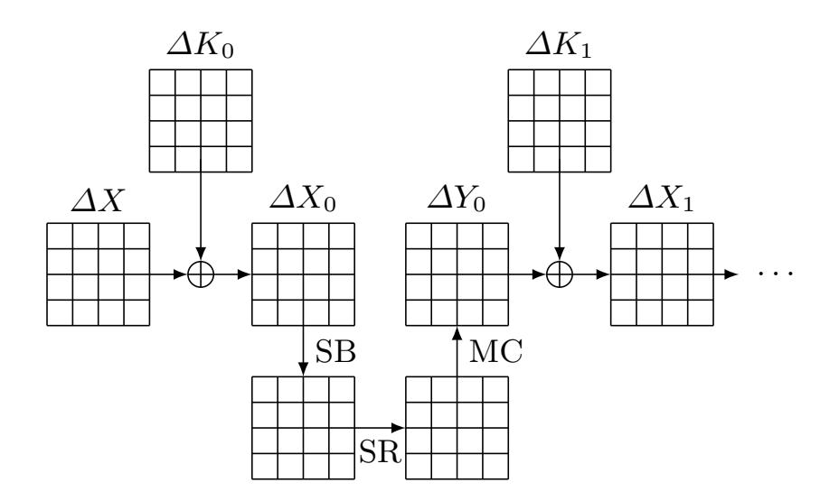
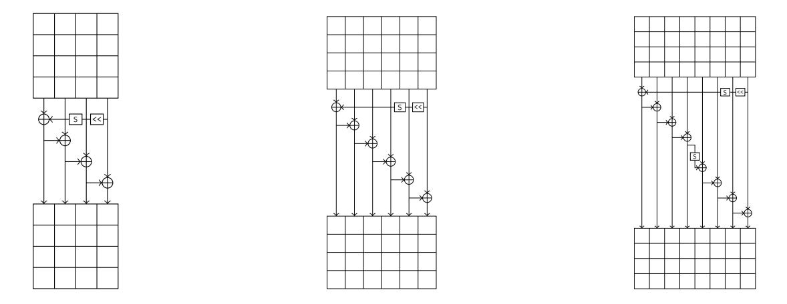

{0}------------------------------------------------

# Revisiting AES Related-Key Differential Attacks with Constraint Programming

David Gérault1, Pascal Lafourcade1, Marine Minier2, and Christine Solnon3

- 1 Université Clermont Auvergne, LIMOS, UMR 6158, F-63173, France, David.Gerault, Pascal.Lafourcade@uca.fr
  - 2 Université de Lorraine, LORIA, UMR 7503, F-54506, France, Marine.Minier@loria.fr
- 3 Université de Lyon, INSA-Lyon, F-69621, France, LIRIS, CNRS UMR5205, Christine.Solnon@insa-lyon.fr

Abstract. The Advanced Encryption Standard (AES) is one of the most studied symmetric encryption schemes. During the last years, several attacks have been discovered in different adversary models. In this paper, we focus on related-key differential attacks, where the adversary may introduce differences in plaintext pairs and also in keys. We show that Constraint Programming (CP) can be used to model these attacks, and that it allows us to efficiently find all optimal related-key differential characteristics for AES-128, AES-192 and AES-256. In particular, we improve the best related-key differential for the whole AES-256 and give the best related-key differential on 10 rounds of AES-192, which is the differential trail with the longest path. Those results allow us to improve existing related-key distinguishers, basic related-key attacks and q-multicollisions on AES-256.

## Introduction

As attacking the Advanced Encryption Standard (AES) in the unknown key model seems to be out of reach at this time, many recent results focus on the so-called related-key, known-key or chosen-key models. During the last decade, many results bring some grist to this research direction. In particular, the notion of differential q-multicollisions has been introduced in [BKN09]. A differential q-multicollision for a cipher  $E_K(\cdot)$  is defined by a non zero key difference  $\delta K$ , a non zero plaintext difference  $\delta X$  and a set of q distinct pairs  $(X^i, K^i)$  with  $i \in [1, q]$  such that all  $E_{K^i}(X^i) \oplus E_{K^i \oplus \delta K}(X^i \oplus \delta X)$  are equal (where  $\oplus$  is the XOR operator). Constructing such a q-multicollision for an ideal n-bit block cipher has a time complexity of  $\mathcal{O}(q \cdot 2^{\frac{q-2}{q+2}n})$ . However, for AES-256 the number of required AES encryptions has been shown to be equal to  $q \cdot 2^{67}$  in [BKN09].

Building such q-multicollisions requires finding optimal (in terms of probability) related-key differential characteristics. This challenging task was tackled for AES-128 with a graph traversal approach in [FJP13], and for AES-128, AES-192, and AES-256 with a depth-first search approach in [BKN09]. However, the 4-round solution for AES-128 claimed to be optimal in [BKN09,FJP13] has been

{1}------------------------------------------------

shown to be sub-optimal in [GMS16]. In this article, the authors used Constraint Programming (CP) to efficiently enumerate related-key differential characteristics on AES-128.

When using CP to solve a problem, one simply has to model the problem using a high-level declarative language: This model may be viewed as a mathematical definition of the problem by means of constraints. Then, this model is solved by generic solvers which are usually based on a Branch & Propagate approach: The search space is explored by building a search tree, and constraints are propagated at each node of the tree in order to prune branches.

Finding AES related-key differentials is a highly combinatorial problem that hardly scales. For example, the approach of [FJP13] requires about 60 GB of memory for 5 rounds of AES-128 and has not been extended to AES-192 nor AES-256. The approach of [BN10] only takes several megabytes of memory, but it requires several days of computation for AES-128, and several weeks for AES-192. Of course, each of these problems must be solved only once, and CPU time is not the main issue provided that it is "reasonable". However, during the process of designing new ciphers, this evaluation sometimes needs to be repeated several times. Hence, even though not crucial, a good CPU time is a desirable feature. Another point that should not be neglected is the time needed to design and implement these approaches: To ensure that the computation is completed within a "reasonable" amount of time, it is necessary to reduce branching by introducing clever reasoning. Of course, this hard task is also likely to introduce bugs, and checking the correctness or the optimality of the computed solutions may not be so easy. Finally, reproducibility may also be an issue. Other researchers may want to adapt these algorithms to other problems, with some common features but also some differences, and this may again be very difficult and time-consuming.

The CP approach introduced in [GMS16] opens new perspectives with respect to these points: A CP model is a mathematical model which is usually rather short compared to a full implementation. For example, the CP model of [GMS16] for AES-128 contains less than 200 lines4 . This model mainly describes the problem to be solved, by means of variables and constraints, and we argue that it is easier to check or re-use than a full program that not only describes the problem to solve, but also how to solve it. The CP approach of [GMS16] is also competitive with existing approaches for AES-128: CP solvers such as Gecode [Tea06], Choco [PFL16], or Chuffed [CS14] are able to give optimal solutions for AES-128 up to 5 rounds in less than two hours and to show that the optimal solution for 4 rounds of AES-128 has only 12 active S-boxes instead of 13 as claimed in [FJP13,BN10].

Our goal is to further investigate the interest of using CP for finding optimal related-key differential characteristics for AES-192 and AES-256. We more particularly address the following questions:

– Can CP find optimal solutions for AES-192 and AES-256 in a reasonable amount of time?

4 This model is available at http://gerault.net/resources/CP\_AES.tar.gz.

{2}------------------------------------------------

- Can CP check the consistency of characteristics previously published for AES, and explain inconsistencies if any?
- Can we use these optimal solutions to improve existing related-key differential attacks?

Contributions. A first contribution of this paper is the extension of the CP model proposed for AES-128 in [GMS16] to analyze AES-192 and AES-256. We also improve this model by introducing a new way of modeling equivalence classes at the byte level, in order to speed-up the solution process of generic CP solvers. These models are defined with the MiniZinc language [NSB+07] and with the Choco library [PFL16]5 . We show that these models may be used by generic CP solvers to find the best related-key differential paths for all possible instances of AES-128, AES-192, and AES-256 in less than 35 hours for the first step (which involves finding difference positions), and in less than 6 minutes for the second step (which involves finding actual byte values given difference positions).

A second contribution is the use of CP to prove the inconsistency of the 11 round solution proposed in [BN10] for AES-192, and to extract an explanation of this inconsistency.

Finally, our main contribution consists in new optimal solutions found with our CP approach. More precisely we obtain the following results:

AES-192: We give the optimal related-key differential characteristic probabilities for all rounds up to 10, and we show that there is no related-key differential characteristic with a probability higher than 2−192 when the number of rounds is at least 11. We give the actual optimal related-key differential characteristic for AES-192: It is on 10 rounds, and it has 29 active S-Boxes and a probability of 2−176. We also give the related-key differential characteristic with the highest probability in the state: it has 30 S-boxes with a total probability of 2−188 (2−80 in the key, and 2−108 in the state). Finally, we provide the optimal 9-round related-key differential characteristic: it has 24 S-boxes with a probability equal to 2−146 .

AES-256: Using our CP model, we rediscover the full-round related-key distinguisher on AES-256 given in [BKN09], which has a probability of 2−154 . In addition, we provide a solution with a higher probability, i.e., 2−146, and prove its optimality. Using this trail, we improve the related-key distinguisher and the basic related-key differential attack on the full AES-256 by a factor at least 26 and the q-multicollisions by a factor 2.

All these results demonstrate that CP provides a convenient declarative scheme to model cryptanalysis problems, along with powerful generic tools to efficiently solve them and to check the consistency of existing solutions.

Positioning with respect to existing related-key attacks against the AES. From the related-key differentials found using CP, we are able to derive basic relatedkey attacks, related-key distinguishers and q-multicollisions against AES-192

5 These models are available as auxiliary supporting material, joined to the submission.

{3}------------------------------------------------

or AES-256. For the last decade, several attacks in different attacker models against the different AES versions have been proposed: related-key differential distinguishers against AES-192 and AES-256 in [BKN09,BK09,BN10], known-key distinguishers in [KR07] [GP10,Gil14] and chosen-key distinguishers in [FJP13,BKN09]. Table 1 summarizes existing attacks against AES-192 and AES-256 along with our own results in the related-key and chosen-key models.

#### AES-192

| Attack                 | Nb rounds Nb keys Data Time Memory |         |           |           |          | Source      |
|------------------------|------------------------------------|---------|-----------|-----------|----------|-------------|
| RK rectangle           | 10                                 | 64      | 124 2  | 183 2  | N/A      | [KHP07]     |
| RK amplified boomerang | 12                                 | 4       | 123 2  | 176 2  | 152 2 | [BK09]      |
| RK distinguisher       | 10                                 | 80 2 | 108∗ 2 | 108∗ 2 | -        | Section 5.2 |
| basic RK differential  | 10                                 | 44 2 | 156 2  | 156 2  | 65 2  | Section 5.2 |

#### AES-256

| Attack                | Nb rounds Nb keys Data Time Memory |         |           |           |         | Source      |
|-----------------------|------------------------------------|---------|-----------|-----------|---------|-------------|
| RK boomerang          | 14                                 | 4       | 99.5 2 | 99.5 2 | 77 2 | [BK09]      |
| RK distinguisher      | 14                                 | 35 2 | 119∗ 2 | 119∗ 2 | -       | [BKN09]     |
| basic RK differential | 14                                 | 35 2 | 131 2  | 131 2  | 65 2 | [BKN09]     |
| q-multicollisions     | 14                                 | 2q      | 2q        | 67 q2  | -       | [BKN09]     |
| RK distinguisher      | 14                                 | 32 2 | 114∗ 2 | 114∗ 2 | -       | Section 5.3 |
| basic RK differential | 14                                 | 32 2 | 125 2  | 125 2  | 65 2 | Section 5.3 |
| q-multicollisions     | 14                                 | 2q      | 2q        | 66 q2  | -       | Section 5.3 |

Table 1: Summary of existing attacks against AES-192 and AES-256 in the related-key and chosen-key models. RK stands for Related-Key, N/A means Not Available and ∗ means for each key.

Related Work. Since the Matsui's fundamental work [Mat94] for automatically finding linear relations in DES, many algorithms have been proposed to automate the search for longest paths in different attack models [BN10,BN11]. However, using approaches that allow one to easily model problems which are then solved by generic solvers is more recent. Mixed Integer Linear Programming (MILP) was used in [SHW+14] to find optimal (related key) differential characteristics against bit-oriented block ciphers such as SIMON, PRESENT or LBlock or, in [ST16], to search for impossible differential paths. In [GL16], CP was used to find related-key differentials against Midori. And for the fist time (up to our knowledge), in [BJK+16], MILP was used to provide security bounds in the design of the new lightweight block cipher SKINNY. Recently, in [SGL+17], CP was also used to efficiently analyze several symmetric encryptions including AES-128, PRESENT, SKINNY, and HIGHT.

Outline of the paper. In Section 1, we introduce the notations used in the paper. In Section 2, we describe the considered CP models. In Section 3, we evaluate 

{4}------------------------------------------------

the scale-up properties of these CP models. In Section 4, we show how to use our CP models not only to check the consistency of existing solutions, but also to explain inconsistencies if any. In Section 5, we show how to use the solutions found by our CP models to improve existing related-key differential attacks for AES-192 and AES-256. Finally, in Section 6, we conclude this paper.

#### 1 Notations

We denote by r the number of rounds and by l the key length in bits. Given an  $n \times m$  matrix M, we denote by M[j][k] the byte at row  $j \in [0, n-1]$  and column  $k \in [0, m-1]$ . We use the following notations to denote plaintext and key matrix states:

- -X and X' denote the initial plaintext pair;
- $X_i$  and  $X'_i$  denote the plaintext pair at the beginning of round i, starting at round 0;
- $Y_i$  and  $Y'_i$  denote the plaintext pair at the end of round i but before the subkey addition;
- K and K' denote the master key pair. K and K' generate through the key schedule the subkeys  $K_i$  and  $K'_i$  which correspond to the subkey added at round i-1. The initial subkey addition is done with subkey  $K_0$ .

All matrices but K and K' are  $4 \times 4$  byte matrices, and K and K' are  $4 \times Nk$  byte matrices, where Nk = l/32. Given a pair of bytes A[j][k] and A'[j][k], where  $A \in \{X, X_i, Y_i, K_i\}$ , we denote by  $\delta A[j][k] = A[j][k] \oplus A'[j][k]$  the XOR difference between A[j][k] and A'[j][k].

As in [BN10] and [FJP13], we use a two-step solving process. Step 1 works with a boolean representation of differences: We note  $\Delta A[j][k]$  the boolean representation of  $\delta A[j][k]$  such that  $\Delta A[j][k] = 0 \Leftrightarrow \delta A[j][k] = 0$  and  $\Delta A[j][k] = 1 \Leftrightarrow \delta A[j][k] \in [1,255]$ . These boolean variables give difference positions, as presented in Fig. 1. Then, Step 2 uses these positions to determine difference values at the byte level, *i.e.*, to find the actual value  $\delta A[j][k] \in [1,255]$  for each boolean variable  $\Delta A[j][k]$  which is equal to 1. Note that some solutions at the boolean level (found during Step 1) cannot be transformed into solutions at the byte level during Step 2. These solutions are said to be *byte inconsistent*.

Bytes that pass through the AES S-box play a particular role: Basically, we aim at minimizing the number of differences that pass through them. All the bytes of the  $X_i$  matrices pass through S-boxes. Some bytes of the  $K_i$  subkey matrices also pass through S-Boxes, and the exact definition of these bytes depends on the key length. We note  $Sboxes_l$  (with  $l \in \{128, 192, 256\}$ ) the set of

{5}------------------------------------------------

Fig. 1: Notations used in the paper, where SB stands for the AES SubBytes operation, SR for ShiftRows, MC for MixColumns, and where AddRoundKey (ARK for short) is represented by the XOR operator with the key ∆Ki .

Fig. 2: Key shedule for AES-128, AES-192, and AES-256. Note that the bytes passing through the S-boxes in the AES key schedule are the four bytes of the last column along with, for AES-256 only, the four bytes of the middle column.

bytes that pass through an S-Box for the three AES versions:

$$Sboxes_{128} = \{X_{i}[j][k] \mid i \in [0, r - 1], j, k \in [0, 3]\}$$

$$\cup \{K_{i}[j][3] \mid i \in [0, r - 1], j \in [0, 3]\},$$

$$Sboxes_{192} = \{X_{i}[j][k] \mid i \in [0, r - 1], j, k \in [0, 3]\}$$

$$\cup \{K_{3m+1}[j][1] \mid m \in [0, \lfloor r/3 \rfloor - 1], j \in [0, 3]\}, \text{ and }$$

$$\cup \{K_{3m+2}[j][3] \mid m \in [0, \lfloor r/3 \rfloor - 1], j \in [0, 3]\}, \text{ and }$$

$$Sboxes_{256} = \{X_{i}[j][k] \mid i \in [0, r - 1], j, k \in [0, 3]\}$$

$$\cup \{K_{i}[j][3] \mid i \in [1, r - 1], j \in [0, 3]\}.$$

Finally, in Fig. 2, we recall one round of the key schedule algorithms for the three AES key lengths.

{6}------------------------------------------------

## 2 CP models for AES related-key differential attacks

When using CP to solve a problem, one "only" has to define a CP model that describes the problem by means of constraints, thanks to a declarative language. Then, this model may be solved by generic solvers such as, for example, Choco [PFL16], Chuffed [CS14], Gecode [Tea06], or Picat [ZKF15]. A same problem may be defined by different CP models, and the time needed to solve the problem both depends on the model and on the solver that are used.

In this section, we describe and compare different CP models to search for related-key differential paths on the AES. We first recall basic principles of problem modeling and solving with CP in Section 2.1. As proposed in both [BN10] and [FJP13], the solving process is decomposed into two steps (recalled in Section 1). In Sections 2.2, 2.3, and 2.4, we describe three CP models for Step 1 (at the boolean level).

- The first model, called CPBasic, basically encodes AES transformation rules by means of constraints and was first described in [MSJ14] for AES-128. We show how to extend it to AES-192 and AES-256.
- The second model, called CPEQ, improves CPBasic by adding constraints that remove many boolean solutions which are byte-inconsistent. It was first described in [GMS16] for AES-128, and we show how to extend it to AES-192 and AES-256.
- The third model, called CPClass, is a new model that improves CPEQ by using a new way for modeling equality relations at the byte level.

In Section 2.5, we describe the CP model used to solve Step 2 (at the byte level), which is the same as the one introduced in [GMS16] for AES-128, simply extended to AES-192 and AES-256.

#### 2.1 Reminders on Constraint Programming

CP is used to solve Constraint Satisfaction Problems (CSPs). A CSP is defined by a triple (X, D, C) such that

- X is a finite set of variables;
- D is a function that maps every variable xi ∈ X to its domain D(xi), that is, the finite set of values that may be assigned to xi ;
- C is a set of constraints, that is, relations between some variables which restrict the set of values that may be assigned simultaneously to these variables.

Constraints may be defined by using tables or mathematical operators. Let us consider for example a CSP with 3 variables X = {x1, x2, x3} such that D(x1) = D(x2) = D(x3) = {0, 1}, and let us consider a constraint that ensures that the sum of the variables in X is different from 1. This constraint may be defined by a table constraint that enumerates all allowed tuples:

$$(x_1, x_2, x_3) \in \{(0, 0, 0), (0, 1, 1), (1, 0, 1), (1, 1, 0), (1, 1, 1)\}.$$

{7}------------------------------------------------

Conversely, it may be defined by enumerating all forbidden tuples:

$$(x_1, x_2, x_3) \not\in \{(1, 0, 0), (0, 1, 0), (0, 0, 1)\}.$$

Finally, it may be defined by using an algebraic equation with the + and 6= operators:

$$x_1 + x_2 + x_3 \neq 1.$$

Solving a CSP involves assigning values to variables such that constraints are satisfied. More formally, an assignment A is a function which maps each variable xi ∈ X to a value A(xi) ∈ D(xi). An assignment A satisfies (resp. violates) a constraint c ∈ C if the tuple defined by the values assigned to the variables of c in A belongs (resp. does not belong) to the relation defined by c. An assignment is consistent (resp. inconsistent) if it satisfies all the constraints (resp. violates some constraints) of the CSP. A solution of a CSP is a consistent assignment.

An objective function may be added to a CSP, thus defining a Constrained Optimization Problem (COP). This objective function is defined on some variables of X and the goal is to find the solution that optimizes (minimizes or maximizes) the objective function. This solution is said to be optimal.

Constraint Programming (CP) languages provide high-level features to define CSPs and COPs in a declarative way. Then, these problems are solved by generic constraint solvers which are usually based on a systematic exploration of the search space: Starting from an empty assignment, they incrementally extend a partial consistent assignment by choosing a non-assigned variable and a consistent value for it until either the current assignment is complete (a solution has been found) or the current assignment cannot be extended without violating constraints (the search must backtrack to a previous choice point and try another extension). To reduce the search space, this exhaustive exploration of the search space is combined with constraint propagation techniques: Each time a variable is assigned to a value, constraints are propagated to filter the domains of the variables that are not yet assigned, i.e., to remove values that are not consistent with respect to the current assignment. Let us consider for example the constraint that ensures that the sum of three variables is different from 1. Whenever two of these variables are assigned and their sum is equal to 1 (resp. 0), the propagation mechanism removes the value 0 (resp. 1) from the domain of the third variable. When constraint propagation removes all values from a domain, the search must backtrack.

#### 2.2 CPBasic: Basic CP model for Step 1

This model associates one boolean variable to each differential byte, and relates these variables with constraints derived from AES operations. The only AES operation that does not imply constraints for Step 1 is SubBytes, which applies to a byte b an S-box transformation S(b). As the S-box is bijective, an input difference produces an output difference (i.e., (b⊕b 0 6= 0) ⇔ (S(b)⊕S(b 0 ) 6= 0)). As a consequence, the SubBytes transformation has no effect on the presence/absence of differences during Step 1.

{8}------------------------------------------------

Let us now describe the variables, the constraints, the objective function and ordering heuristics of the CPBasic model for Step 1.

Variables. We consider the boolean variables introduced in Section 1: ∆X[j][k], ∆Xi [j][k], ∆Yi [j][k], and ∆Ki [j][k] with i ∈ [0, r], and j, k ∈ [0, 3]. The domain of each of these variables is the set {0, 1}: A variable is assigned to 0 if there is no difference at the byte level, and to 1 otherwise.

XOR. As many AES transformations use the XOR operator, we define a constraint to model it. Suppose that, at byte level, we have δA ⊕ δB = δC. Then, we have the following relation between the three boolean values ∆A, ∆B and ∆C:

|   | ∆A ∆B | ∆C                            |
|---|-------|-------------------------------|
| 0 | 0     | 0                             |
| 0 | 1     | 1                             |
| 1 | 0     | 1                             |
| 1 | 1     | 0 if δA = δB 1 if δA 6= δB |

This table corresponds to the following constraint:

$$XOR(\Delta A, \Delta B, \Delta C) \Leftrightarrow \Delta A + \Delta B + \Delta C \neq 1.$$

where + stands for the integer addition. Note that the last line of the table creates the branches in the Branch & Bound approach proposed in [BN10].

AddRoundKey. At the beginning of the encryption process, ARK performs XOR operations on ∆X and ∆K0 to obtain ∆X0. This is modeled by the following constraint:

$$\forall (j,k) \in [0,3]^2 : \mathtt{XOR}(\Delta X[j][k], \Delta K_0[j][k], \Delta X_0[j][k]).$$

Then, for each round i ∈ [1, r], ARK performs XOR operations on ∆Yi−1 and ∆Ki to obtain ∆Xi . This is modeled by the following constraint:

$$\forall i \in [1, r], \forall (j, k) \in [0, 3]^2 : \mathtt{XOR}(\Delta Y_{i-1}[j][k], \Delta K_i[j][k], \Delta X_i[j][k]).$$

ShiftRows and MixColumns. For each round i ∈ [0, r − 1], SB, SR and MC are successively applied on δXi to obtain δYi . Recall that the SubBytes operation SB does not modify boolean values. SR rotates on the left by one byte position (resp. 2 and 3 byte positions) the second row (resp. third and fourth rows) of the current matrix. Hence, for each j, k ∈ [0, 3], we have to model the fact that ∆Xi [j][k] is moved to column (k − j) mod 4 after the application of SR. Then, MC is a linear mapping that ensures the Maximum Distance Separable (MDS) property, such that for each column the total number of differential bytes for which there is a difference, before and after the application of SR, is either equal 

{9}------------------------------------------------

to 0 or strictly greater than 4. Hence, SR and MC are modeled by the following constraint:

$$\forall i \in [0, r-1], \forall k \in [0, 3] : \left(\sum_{j=0}^{3} \Delta X_i[j][(k+j) \bmod 4] + \Delta Y_i[j][k]\right) \in \{0, 5, 6, 7, 8\}.$$

KeySchedule. The subkey at round 0,  $K_0$ , is the first four columns of the initial key K. Then, for each round i, the subkey  $K_i$  is generated from  $K_{i-1}$  and/or  $K_{i-2}$  by applying the KeySchedule transformations recalled in Fig. 2. The exact definition of this transformation depends on the key length l and the value  $Nk = \frac{l}{32}$ . In [GMS16], the constraints related to KS are described for AES-128 only. Let us recall them before extending them to AES-192 and AES-256.

For AES-128, the first column is obtained by performing XOR operations between bytes at the first and the last column of the previous round (combined with a SubBytes operation on bytes of the last column and a word rotation done at byte level). The last three columns are obtained by performing XOR operations between bytes at the previous column in the same round, and bytes at the same column in the previous round. Hence, KS for AES-128 is modeled by the following constraint:

$$\forall i \in [1, r], \forall j \in [0, 3] : \quad XOR(\Delta K_{i-1}[j][0], \Delta K_{i-1}[(j+1) \bmod 4][3], \Delta K_i[j][0]) \\ \wedge \forall k \in [1, 3] : XOR(\Delta K_{i-1}[j][k], \Delta K_i[j][k-1], \Delta K_i[j][k]).$$

For AES-192, the initial key K has Nk = 6 columns. The first four columns of K are used to initialize the four columns of  $K_0$ , and the last two columns of K are used to initialize the first two columns of  $K_1$ . The last two columns of  $K_1$  are defined by the constraint:

$$\forall j \in [0,3]: \quad \texttt{XOR}(\Delta K_0[j][0], \Delta K_1[(j+1) \bmod 4][1], \Delta K_1[j][2]) \\ \wedge \quad \texttt{XOR}(\Delta K_0[j][1], \Delta K_1[j][2], \Delta K_1[j][3]).$$

Then, each following column is obtained by performing a XOR between bytes of the previous and the  $6^{th}$  previous column, sometimes combined with a SubBytes operation on some of them and a word rotation performed at byte level, depending on the value of  $(4i \mod 6)$  (that may be equal to 0, 2, or 4). For columns 1 and 3, this corresponds to the constraint:

$$\forall i \in [2, r], \forall j \in [0, 3]: \quad \texttt{XOR}(\Delta K_{i-2}[j][3], \Delta K_{i}[j][0], \Delta K_{i}[j][1]) \\ \wedge \, \texttt{XOR}(\Delta K_{i-1}[j][1], \Delta K_{i}[j][2], \Delta K_{i}[j][3]),$$

For column 0, this corresponds to the constraint: For each round  $i \in [2, r]$ , if  $(4i \mod 6) = 0$ , then

$$\forall j \in [0,3] : \mathtt{XOR}(\Delta K_{i-2}[j][2], \Delta K_{i-1}[(j+1) \bmod 4][3], \Delta K_i[j][0])$$

else

$$\forall j \in [0,3] : XOR(\Delta K_{i-2}[j][2], \Delta K_{i-1}[j][3], \Delta K_i[j][0]).$$

{10}------------------------------------------------

For column 2, this corresponds to the constraint: For each round  $i \in [2, r]$ , if  $(4i \mod 6) = 2$ , then

$$\forall j \in [0,3] : \mathtt{XOR}(\Delta K_{i-1}[j][0], \Delta K_i[(j+1) \bmod 4][1], \Delta K_i[j][2])$$

else

$$\forall j \in [0,3] : \mathtt{XOR}(\Delta K_{i-1}[j][0], \Delta K_{i}[j][1], \Delta K_{i}[j][2].$$

For AES-256, the initial key K has Nk = 8 columns. The first four columns of K are used to initialize the four columns of  $K_0$ , and the last four columns of K are used to initialize the four columns of  $K_1$ . Then, for each round  $i \in [2, r]$ , the first column is obtained by performing a XOR between bytes of the last column of the previous round (after passing them through a SubBytes operation), and bytes at column 0 in round i - 2. Furthermore, a word rotation is applied if  $(4i \mod 8) = 0$ . This corresponds to the constraint: For each round  $i \in [2, r]$ , if  $(4i \mod 8) = 0$ , then

$$\forall j \in [0,3] : XOR(\Delta K_{i-2}[j][0], \Delta K_{i-1}[(j+1) \mod 4][3], \Delta K_i[j][0])$$

else

$$\forall j \in [0,3] : \mathtt{XOR}(\Delta K_{i-2}[j][0], \Delta K_{i-1}[j][3], \Delta K_{i}[j][0]).$$

The last three columns are obtained by performing a XOR between bytes of the previous column in the same round, and bytes at the same position in round i-2, thus leading to the constraint:

$$\forall i \in [2, r], \forall j \in [0, 3], \forall k \in [1, 3] : \mathtt{XOR}(\Delta K_{i-2}[j][k], \Delta K_i[j][k-1], \Delta K_i[j][k]).$$

Objective function. The goal is to find boolean values that minimize the number of differences passing through S-boxes, i.e., the number of 1 in all  $\Delta A$  variables such that  $A \in Sboxes_l$  (where  $Sboxes_l$  is defined in Section 1). Thus, we define an integer variable  $obj_{Step1}$  which is constrained to be equal to the number of differences passing through S-boxes:

$$obj_{Step1} = \sum_{A \in Sboxes_l} \Delta A$$

and we define the objective function as the minimization of  $obj_{Step1}$ . The domain of this variable is  $D(obj_{Step1}) = [1, \frac{l}{6}]$ . Indeed, the smallest possible value is 1 because we need to have at least one active S-box to have a differential trail. The largest possible value is  $\frac{l}{6}$  because the highest probability to pass through the AES S-box is  $2^{-6}$  [DR13], and because we want a differential trail which is more efficient than the key exhaustive search.

Note that some solutions of Step 1 may not be byte-consistent (i.e., they do not have solutions at Step 2). In particular, it may happen that none of the optimal boolean solutions is byte-consistent. In this case, we need to search for new boolean solutions, such that  $obj_{Step1}$  is minimal while being strictly greater than its previous optimal value v. This is done by adding the following constraint

$$obj_{Step1} > v$$
.

{11}------------------------------------------------

Ordering heuristics. A key point to speed up the solving process of CSPs is to define the order in which variables are assigned, and the order in which values are assigned to these variables, when building the search tree. CP languages allow the user to specify this order through variable and value ordering heuristics. As the goal is to minimize the number of active S-boxes, we define these ordering heuristics as follows: first assign variables associated with bytes of Sboxesl , and first try to assign them to 0.

### 2.3 CPEQ: Improved CP model for Step 1

The CPBasic model is complete in the sense that for any solution at the byte level (on δ variables), there exists a solution of CPBasic at the boolean level (on ∆ variables). However, some solutions of CPBasic may not correspond to a solution at the byte level. Preliminary experiments have shown us that there is a huge number of solutions of CPBasic which are byte inconsistent. For example, for AES-128, when the number of rounds is r = 3, the optimal solution of CPBasic has objStep1 = 3 active S-boxes, and there are more than five hundred different solutions of CPBasic with this number of active S-boxes. However, none of these boolean solutions is byte-consistent. Actually, the optimal byte-consistent boolean solution has objStep1 = 5 active S-boxes.

In this case, most of the Step 1 solving time is spent at generating useless boolean solutions which are discarded in Step 2. CPBasic has been refined in [GMS16], by introducing new constraints that drastically reduce the number of byte inconsistent solutions for AES-128. These new constraints exploit equality relations at the byte level and the MDS property. In this section, we describe these constraints extended to AES-192 and AES-256.

Propagation of MDS at the byte level. Due to the linearity of the MixColumns transformation and to its MDS nature, at byte level, the MDS property also holds for XOR of differences. In other words and including the ShiftRows operation, for all i1, i2 in [0, r − 1], and for all k1, k2 in [0, 3], we have:

$$\sum_{j=0}^{3} w_{H}(\delta X_{i_{1}}[j][(j+k_{1}) \bmod 4] \oplus \delta X_{i_{2}}[j][(j+k_{2}) \bmod 4])$$
$$+w_{H}(\delta Y_{i_{1}}[j][k_{1}] \oplus \delta Y_{i_{2}}[j][k_{2}]) \in \{0, 5, 6, 7, 8\}.$$

where wH(δA) is the Hamming weight of byte δA, i.e., wH(δA) = 0 if δA = 0, and wH(δA) = 1 if δA ∈ [1, 255].

To ensure this property (that removes many byte-inconsistent boolean solutions), we introduce new boolean variables, called equality variables: For each pair of differential bytes δA and δB (in δXi , δYi , and δKi matrices), we introduce the boolean equality variable EQδA,δB which is equal to 1 if δA = δB, and to 0 otherwise. Using these equality variables, the MDS property between different 

{12}------------------------------------------------

columns is ensured by the following constraint: ∀i1, i2 ∈ [0, r−1], ∀k1, k2 ∈ [0, 3],

$$\sum_{j=0}^{3} EQ_{\delta X_{i_1}[j][(j+k_1) \bmod 4], \delta X_{i_2}[j][(j+k_2) \bmod 4]} + EQ_{\delta Y_{i_1}[j][k_1], \delta Y_{i_2}[j][k_2]} \in \{0, 1, 2, 3, 8\}.$$

Constraints derived from XOR constraints. As pointed out in Section 2.2 when defining the constraint XOR(∆A, ∆B, ∆C) (where ∆A, ∆B and ∆C are boolean variables associated with differential bytes δA, δB and δC, respectively), if ∆A = ∆B = 1, then we cannot know if ∆C is equal to 0 or 1. However, whenever ∆C = 0 (resp. ∆C = 1), we know for sure that the corresponding byte δC is equal to 0 (resp. different from 0), meaning that the two bytes δA and δB are equal (resp. different), i.e., that EQδA,δB = 1 (resp. EQδA,δB = 0). The same reasoning may be done for ∆A and ∆B because (δA⊕δB = δC) ⇔ (δB ⊕δC = δA) ⇔ (δA ⊕ δC = δB). Therefore, we redefine the XOR constraint as follows:

$$\begin{split} \mathtt{XOR}(\Delta A, \Delta B, \Delta C) &\Leftrightarrow ((\Delta A + \Delta B + \Delta C \neq 1) \\ &\wedge \quad (EQ_{\delta A, \delta B} = 1 - \Delta C) \\ &\wedge \quad (EQ_{\delta A, \delta C} = 1 - \Delta B) \\ &\wedge \quad (EQ_{\delta B, \delta C} = 1 - \Delta A)). \end{split}$$

Constraints to ensure that equality variables define an equivalence relation. Symmetry and transitivity are ensured by:

$$\forall \delta A, \delta B : EQ_{\delta A, \delta B} = EQ_{\delta_B, \delta_A}$$
  
$$\forall \delta A, \delta B, \delta C : (EQ_{\delta A, \delta B} = EQ_{\delta B, \delta C} = 1) \Rightarrow (EQ_{\delta_A, \delta_C} = 1).$$

Constraints that relate equality variables with boolean differential variables. For each pair of differential bytes δA, δB such that the corresponding boolean variables are ∆A and ∆B, respectively, we have:

$$(EQ_{\delta A,\delta B} = 1) \Rightarrow (\Delta A = \Delta B)$$
  
 $EQ_{\delta A,\delta B} + \Delta A + \Delta B \neq 0.$ 

Constraints derived from KeySchedule. In the AES KeySchedule, each byte of each subkey Ki may be expressed as a combination of XOR operations between bytes of the master key K and bytes obtained by applying the AES S-box to some particular columns (depending on l). For example, with l = 128, we have:

$$K_{2}[1][1] = K_{2}[1][0] \oplus K_{1}[1][1]$$

$$= K_{1}[1][0] \oplus S(K_{1}[2][3]) \oplus K_{1}[1][0] \oplus K_{0}[1][1]$$

$$= S(K_{1}[2][3]) \oplus K_{0}[1][1].$$

When reasoning at the differential byte level, we have

$$\delta K_2[1][1] = \delta S_1[2][3] \oplus \delta K_0[1][1].$$

{13}------------------------------------------------

where δS1[2][3] is a new differential byte which is equal to S(K1[2][3])⊕S(K0 1 [2][3]). There is a finite set KSBytes of such new differential bytes, corresponding to differences of bytes that have passed through S-boxes:

$$KSBytes = \{\delta S_i[j][k] \mid K_i[j][k] \in Sboxes_l\}.$$

For each new differential byte δSi [j][k] ∈ KSBytes, we define a new boolean variable ∆Si [j][k] which is equal to 0 if δSi [j][k] = 0, and to 1 otherwise. Note that ∆Si [j][k] is a redundant variable which is equal to ∆Ki [j][k]. So, we add the following constraint:

$$\forall \delta S_i[j][k] \in KSBytes, \Delta K_i[j][k] = \Delta S_i[j][k].$$

We introduce this redundant variable because at the byte level this equality no longer holds, i.e., δKi [j][k] = A 6⇒ δSi [j][k] = S(A), and for the V sets defined below we reason at the byte level.

We exploit the fact that each differential byte of Ki is the result of a XOR between a finite set of bytes. We first build, for each i ∈ [1, r], and j, k ∈ [0, 3], the set V (i, j, k) of all differential bytes (coming either from δK0 or from KSBytes), such that:

$$\delta K_i[j][k] = \bigoplus_{\delta A \in V(i,j,k)} \delta A.$$

For example, for AES-128, V (1, 0, 0) = {δK0[0][0], δS0[1][3]}.

Note that these sets are computed before the search and do not depend on the initial values of plaintexts and keys.

For each of these sets, we introduce a set variable which contains the corresponding boolean variables which are equal to 1:

$$V_1(i,j,k) = \{ \Delta A \mid \delta A \in V(i,j,k) \land \Delta A = 1 \}.$$

For example, if ∆K0[1][1] = 1 and ∆S1[3][2] = 0, then V1(2, 1, 1) = {∆K0[1][1]}. Whenever two differential key bytes δKi1 [j1][k1] and δKi2 [j2][k2] have the same V1 sets, then we may infer that δKi1 [j1][k1] = δKi2 [j2][k2]. More precisely, we define the constraint:

$$\forall i_1, i_2 \in [1, r], \forall j_1, j_2, k_1, k_2 \in [0, 3] : (V_1(i_1, j_1, k_1) = V_1(i_2, j_2, k_2))$$
  
$$\Rightarrow (EQ_{\delta K_{i_1}[j_1][k_1], \delta K_{i_2}[j_2][k_2]} = 1).$$

Also, if V1(i, j, k) is empty (resp. contains one or two elements), we infer that ∆Ki [j][k] is equal to 0 (resp. a variable, or a XOR between 2 variables). More precisely, we define the constraints: ∀i ∈ [1, r], ∀j, k ∈ [0, 3],

$$\begin{split} V_1(i,j,k) &= \emptyset \Rightarrow \varDelta K_i[j][k] = 0 \\ V_1(i,j,k) &= \{\varDelta A\} \Rightarrow \varDelta K_i[j][k] = 1 \land EQ_{\delta K_i[j][k],\delta A} = 1 \\ V_1(i,j,k) &= \{\varDelta A, \varDelta B\} \Rightarrow \mathrm{XOR}(\varDelta A, \varDelta B, \varDelta K_i[j][k]). \end{split}$$

{14}------------------------------------------------

#### 2.4 CPClass: New CP model for Step 1

CPEQ has much less byte-inconsistent solutions than CPBasic and, therefore, it is much more efficient. However, for large numbers of rounds r and/or key length l, the solution process may become too time-consuming. In this section, we describe a new CP model which is more efficient, i.e., it allows CP solvers to find solutions quicker.

Variables. In this new model, we keep all boolean variables ∆A associated with differential bytes (as defined in Section 2.2). However, we do not use equality variables EQδA,δB (as defined in Section 2.3). Instead, we introduce an integer variable ClassδA for each boolean variable ∆A: ClassδA represents the equivalence class of all boolean variables whose associated differential bytes are equal to δA. In other words, given two boolean variables ∆A and ∆B associated with two differential bytes δA and δB, respectively, the two integer variables ClassδA and ClassδB are equal if and only if δA = δB. The domain of each integer variable ClassδA is D(ClassδA) = [0, 255], as there are 256 equivalence classes at the byte level.

Constraints. We keep all constraints of CPBasic: They ensure that the boolean variables satisfy the AES transformation rules.

We enforce the equivalence class 0 to correspond to all boolean variables assigned to 0: For each boolean variable ∆A, we add the constraint

$$(\Delta A = 0) \Leftrightarrow (Class_{\delta A} = 0).$$

We redefine the XOR constraint to propagate the fact that, whenever one of the three boolean variables is equal to 0, then the differential bytes associated with the two other boolean variables belong to the same equivalence class:

$$\begin{split} \operatorname{XOR}(\Delta A, \Delta B, \Delta C) &\Leftrightarrow \qquad ((\Delta A + \Delta B + \Delta C \neq 1) \\ &\wedge \quad ((Class_{\delta A} = Class_{\delta B}) \Leftrightarrow (\Delta C = 0)) \\ &\wedge \quad ((Class_{\delta A} = Class_{\delta C}) \Leftrightarrow (\Delta B = 0)) \\ &\wedge \quad ((Class_{\delta B} = Class_{\delta C}) \Leftrightarrow (\Delta A = 0))). \end{split}$$

We add a constraint to break symmetries due to the fact that equivalence classes may be swapped. For example, if we have two equivalence classes such that, for each differential byte δA in the first (resp. second) class, the variable ClassδA is assigned to 1 (resp. 2), then we may obtain a symmetric solution (which models the same equivalence classes) by exchanging 1 and 2. To break these symmetries (that slow down the solution process), we use a precede constraint that enforces an order on the equivalence classes (see [LL04] for more details).

Finally, all constraints of CPEQ that have been introduced in Section 2.3 to remove byte-inconsistent solutions are modified to handle equivalence class variables instead of equality variables: Each time a constraint uses an equality variable EQδA,δB, we replace it by a comparison of ClassδA and ClassδB (as EQδA,δB is equivalent to ClassδA = ClassδB).

{15}------------------------------------------------

#### 2.5 CP model for Step 2

Given a boolean solution for Step 1 (computed with  $CP_{Class}$ , for example), Step 2 aims at searching for the byte-consistent solution with the highest differential probability (or proving that there is no byte-consistent solution). In this section, we describe the CP model introduced in [GMS16] for AES-128, extended to AES-192 and AES-256 in a rather straightforward way.

Variables. For each boolean variable  $\Delta A$  of Step 1, we define an integer variable  $\delta A$ . The domain of this integer variable depends on the value of the boolean variable in the Step 1 solution: If  $\Delta A = 0$ , then the domain is  $D(\delta A) = \{0\}$  (i.e.,  $\delta A$  is also assigned to 0); otherwise, the domain is  $D(\delta A) = [1, 255]$ .

For each byte that passes through an S-Box, *i.e.*,  $\forall A \in Sboxes_l$ , we define an integer variable  $\delta S_A$  which corresponds to the difference after the S-box. Its domain is  $D(\delta S_A) = \{0\}$  if  $\Delta A$  is assigned to 0 in the Step 1 solution; Otherwise, it is  $D(\delta S_A) = [1, 255]$ .

Finally, as we look for a byte-consistent solution with maximal probability, we also add an integer variable  $P_A$  for each byte  $A \in Sboxes_l$ : This variable corresponds to the base 2 logarithm of the probability  $\Pr(\delta A \to \delta S_A)$  of obtaining the S-box output difference  $\delta S_A$  when the S-box input difference is  $\delta A$ . The domain of these variables depends on the value of the boolean variable in the Step 1 solution: If  $\Delta A = 0$ , then  $\Pr(0 \to 0) = 1$  and therefore  $D(P_A) = \{0\}$ ; otherwise,  $\Pr(\delta A \to \delta S_A) \in \{\frac{2}{256}, \frac{4}{256}\}$  and  $D(P_A) = \{-7, -6\}$  (we forbid couples  $(\delta A, \delta S_A)$  such that  $\Pr(\delta A \to \delta S_A) = 0$ ).

Constraints. The constraints basically follow the AES operations to relate variables, as described in Section 2.2 for Step 1, but consider the definition of the operations at the byte level, instead of the boolean level.

A main difference is that the SubBytes operation, which has no effect at the boolean level, must be modeled at the byte level. This is done thanks to a ternary table constraint which extensively lists all triples (X, Y, P) such that there exists two bytes  $B_1$  and  $B_2$  whose difference before and after passing through S-Boxes is equal to X and Y, respectively, and such that P is the probability of this transformation: For all  $A \in Sboxes_l$ , we add the constraint

$$(\delta A, \delta S_A, P_A) \in \{(X, Y, P) \mid \exists (B_1, B_2) \in [0, 255] \times [0, 255], X = B_1 \oplus B_2, Y = S(B_1) \oplus S(B_2), P = \log_2(\Pr(X \to Y)) \}.$$

All other constraints are defined in a rather straightforward way, using table constraints.

Objective function. The goal is to find a byte-consistent solution with maximal differential probability. As we consider logarithms, this amount to searching for a solution that maximizes the sum of all  $P_A$  variables. Hence, we introduce an integer variable  $obj_{Step2}$  which is constrained to be equal to the sum of all  $P_A$  variables:

$$obj_{Step2} = \sum_{A \in Sboxes_l} P_A$$

{16}------------------------------------------------

and we define the objective function as the maximization of objStep2. The domain of objStep2 is derived from the solution of Step 1, i.e., the value of objStep1: D(objStep2) = [−7 · objStep1, −6 · objStep1]

Ordering heuristics. We have used the following heuristic to define the order for assigning variables during the search: We first assign δXi [j][k] variables such that the total number of active S-boxes in the ∆X matrix at round i is minimal, i.e., such that P j,k∈[0,3] ∆Xi [j][k] is minimal.

## 3 Experimental results

In Section 3.1, we describe the CP solvers used to solve our CP models. In Section 3.2, we evaluate scale-up properties of these solvers on our models, and show that CP is able to solve many instances in less than 24 hours. However, some instances are more challenging and cannot be solved in less than 24 hours. In Section 3.3, we show how to decompose these instances into independent subproblems, in such a way that they may be solved within a reasonable amount of time using several computers.

#### 3.1 CP solvers

The CP models for Step 1 (described in Sections 2.2, 2.3, and 2.4) have been implemented with MiniZinc [NSB+07], a high-level modeling language. Many CP solvers accept MiniZinc models, such as Gecode [Tea06], Choco [PFL16], Chuffed [CS14], or Picat [ZKF15]. In Section 3.2, we report experimental results obtained with Chuffed, which has been shown to have better scale-up properties than Gecode and Choco in [GMS16].

The CP model for Step 2 (described in Section 2.5) has been implemented using the Java CP library Choco 3. As this implementation is able to solve all instances within a reasonable amount of time, we have not tried to solve it with other solvers.

Finally, in Section 3.3, we have used Picat and Chuffed to solve the subproblems (obtained after decomposition of the hard instances).

The MiniZinc implementation of CPClass for Step 1 and the Choco 3 implementation of Step 2 are available as auxiliary supporting material, joined to the submission. If the paper is accepted, they will be publicly available on a website. All the solvers we have used (i.e., Choco, Chuffed, and Picat) are open-source softwares and are publicly available.

#### 3.2 Evaluation of scale-up properties

In this section, we evaluate scale-up properties of the CPEQ and CPClass models for Step 1, and the CP model for Step 2. All runs have been done on a 3.5 GHz i7-4710MQ processor with 8 gigabytes of memory, and CPU times are reported in seconds. We report CPU times only if the instance has been solved in less than 24 hours: Instances that are not solved within this time limit have been 

{17}------------------------------------------------

decomposed into independent subproblems that have been solved in parallel, as explained in Section 3.3.

We do not report experimental results obtained with CPBasic as it does not scale at all, due to the fact that it has too many solutions which are not byteconsistent. For example, for AES-128 with r = 4 rounds, we find more than 90 millions of boolean solutions with CPBasic when setting the number of active S-boxes to objStep1 = 11. However, none of these solutions is byte-consistent. When using CPEQ or CPClass, all these solutions are discarded thanks to the new constraints: With these models, the smallest number of active S-boxes is objStep1 = 12, and there are 8 different boolean solutions with 12 active S-boxes, among which 2 are byte-consistent.

Table 2 reports results for a number of rounds ranging from 3 to 5, 11, and 14, for AES-128, AES-192, and AES-256, respectively. Beyond those round numbers, the number of active S-boxes becomes too large implying that the search complexity linked with the associated probability is greater than the key exhaustive search.

For each number of rounds r, we search for the optimal boolean solution, and objStep1 gives the number of active S-boxes in this optimal solution. We report the CPU time needed to enumerate all boolean solutions with this number of active S-boxes (if it is smaller than 24 hours). If none of these boolean solutions is byte-consistent, we search for the optimal boolean solution with a higher number of active S-boxes (as explained in paragraph Objective function of Section 2.2). For example, for AES-192 with r = 7 rounds, the optimal boolean solution has objStep1 = 11 active S-boxes, and there are 2 solutions with 11 active Sboxes. However, none of these 2 solutions is byte-consistent. When adding the constraint objStep1 > 11, the optimal boolean solution has objStep1 = 13 active S-boxes, and there are 7 solutions with 13 active S-boxes, among which 4 are byte-consistent. Finally, the optimal byte-consistent solution has a probability equal to 2−78 .

Table 2 shows us that, for Step 1, CPClass is more quickly solved by Chuffed than CPEQ. This comes from the fact that CPEQ introduces a quadratic number of boolean EQ variables (one for each couple of differential bytes), whereas CPClass only introduces a linear number of integer variables (one for each differential byte). However, the largest instances (when the number of rounds is greater than 8 for AES-192 and greater than 9 for AES-256) cannot be solved within a CPU time limit of 24 hours.

For Step 2, Table 2 shows us that the CP solver Choco is always able to quickly find the optimal byte-consistent solution for a given boolean solution. The largest time is 326 seconds (i.e., less than 6 minutes), for AES-256 with r = 13 and objStep1 = 24. However, this must be done for each boolean solution. Therefore, when the number of boolean solutions is large, the total time spent to find the optimal probability may become rather important. This is the case for AES-192 with r = 10 and objStep1 = 29: As there are 29678 boolean solutions, and the average time to find the optimal byte-consistent solution for a boolean 

{18}------------------------------------------------

solution is 180 seconds, the total time for finding the optimal probability is 60 days. Of course, this may be done in parallel for each boolean solution.

#### 3.3 Decomposition of large instances into independent subproblems

For the largest instances of AES-192 and AES-256, the CPU time of Chuffed with CPClass exceeds the limit of 24 hours. In this case, we have sped-up the solving process by decomposing each instance into independent subproblems that have been solved on different computers in parallel. The decomposition of an instance into independent subproblems has been done with respect to the positions of the differences in the ciphering part (i.e., ∆Xi matrices) in the r rounds. To this aim, we introduce r new integer variables, called SumXi with i ∈ [0, r − 1], and we add the constraint:

$$\forall i \in [0, r-1] : Sum X_i = \sum_{j,k \in [0,3]} \Delta X_i[j][k]$$

thus ensuring that SumXi is equal to the number of differences in the ciphering part at round i. The domain of these new variables is D(SumXi) = [0, 16].

Then, given the CP model M of an instance of AES-192 or AES-256 with r rounds (including the SumXi variables), we create r + 2 subproblems as follows:

– We create a first subproblem M0 by adding to M the following constraint:

$$\forall i \in [0, r-1] : Sum X_i > 0.$$

This constraint ensures that, for each round i ∈ [0, r − 1], there is at least one active S-box in ∆Xi .

– We create r subproblems, called M1:i with i ∈ [0, r−1], where each subproblem M1:i is obtained by adding to M the following constraint:

$$(SumX_i = 0) \land (\forall i' \in [0, r - 1] : i \neq i' \Rightarrow SumX_{i'} > 0).$$

This constraint ensures that there is no active S-box in ∆Xi , whereas there is at least one active S-box in every other ∆Xi 0 with i 0 6= i.

– We create a last subproblem, called M≥2 by adding to M the following constraint:

$$|\{i \in [0, r-1] : Sum X_i = 0\}| \ge 2.$$

This constraint ensures that there exist as least two different rounds with no active S-boxes in the ciphering part.

Obviously, each solution sol of the initial problem M is a solution of exactly one of these r+2 subproblems: sol satisfies the constraints of exactly one subproblem as the number of rounds with no active S-box in the ciphering part of sol is either 0 (i.e., sol is a solution of M0), 1 (i.e., sol is a solution of M1:i where i is the round of sol such that SumXi = 0), or 2 or more (i.e., sol is a solution of M≥2). Furthermore, a solution of any subproblem of M is necessarily a solution of M as each subproblem is obtained by adding a constraint to M.

{19}------------------------------------------------

AES-128

|   | Step 1     |                 |                       |  |      | Step 2 |    |       |            |
|---|------------|-----------------|-----------------------|--|------|--------|----|-------|------------|
|   | r objStep1 | time            | # boolean # byte time |  |      |        |    | P r   |            |
|   |            | CPEQ CPClass |                       |  |      |        |    |       |            |
| 3 | 5          | 1               | 1                     |  | 4    |        | 2  |       | −31 3 2 |
| 4 | 12         | 114             | 81                    |  | 8    |        | 2  |       | −79 5 2 |
| 5 | 17         | 2799            | 2049                  |  | 1236 |        | 97 | 248 2 | −105       |

#### AES-192

|    |            | Step 1   | Step 2  |                       |    |       |            |
|----|------------|----------|---------|-----------------------|----|-------|------------|
|    | r objStep1 | time     |         | # boolean # byte time |    |       | P r        |
|    |            | CPEQ     | CPClass |                       |    |       |            |
| 3  | 1          | 0        | 0       | 15                    | 15 | 1     | −6 2    |
| 4  | 4          | 2        | 1       | 4                     | 4  |       | −24 2 2 |
| 5  | 5          | 12       | 6       | 2                     | 2  |       | −30 4 2 |
| 6  | 10         | 573      | 298     | 6                     | 6  |       | −60 4 2 |
| 7  | 11         | 2108     | 988     | 2                     | 0  | 8     |            |
| 7  | 13         | 5833     | 2999    | 7                     | 4  |       | −78 8 2 |
| 8  |            | 16 44436 | 24619   | 4                     | 0  | 19    |            |
| 8  | 18         | -        | 81073   | 19                    | 9  | 19 2  | −108       |
| 9  | 24         | -        | -       | 240                   | 13 | 36 2  | −146       |
| 10 | 29         | -        | -       | 29678                 | 34 | 180 2 | −176       |
| 11 | 30         | -        | -       | 92                    | 0  | 93    |            |
| 11 | 31         | -        | -       | 2436                  | 0  | 110   |            |

#### AES-256

|    |            | Step 1   | Step 2  |                       |    |       |            |
|----|------------|----------|---------|-----------------------|----|-------|------------|
|    | r objStep1 | time     |         | # boolean # byte time |    |       | P r        |
|    |            | CPEQ     | CPClass |                       |    |       |            |
| 3  | 1          | 0        | 0       | 33                    | 33 | 1     | −6 2    |
| 4  | 3          | 0        | 0       | 14                    | 14 |       | −18 3 2 |
| 5  | 3          | 2        | 1       | 4                     | 4  |       | −18 4 2 |
| 6  | 5          | 30       | 16      | 3                     | 3  | 10 2  | −30        |
| 7  | 5          | 58       | 34      | 1                     | 1  | 14 2  | −30        |
| 8  | 10         | 2894     | 1722    | 3                     | 1  | 25 2  | −60        |
| 9  |            | 14 40064 | 21972   | 2                     | 0  | 12    |            |
| 9  |            | 15 85465 | 49138   | 16                    | 16 | 60 2  | −92        |
| 10 | 16         | -        | -       | 4                     | 4  | 106 2 | −98        |
| 11 | 20         | -        | -       | 4                     | 4  | 115 2 | −122       |
| 12 | 20         | -        | -       | 4                     | 4  | 238 2 | −122       |
| 13 | 24         | -        | -       | 4                     | 4  | 326 2 | −146       |
| 14 | 24         | -        | -       | 4                     | 4  | 150 2 | −146       |

Table 2: Experimental results for AES-128, AES-192, and AES-256. Each line successively displays the number of rounds r, the results of Step 1 (number of active S-boxes in boolean solutions objStep1, CPU time in seconds to enumerate all boolean solutions with this number of active S-boxes with CPEQ and CPClass, respectively, and number of boolean solutions # boolean), and the results of Step 2 (number of byte-consistent solutions # byte, average CPU time in seconds to find the optimal byte-consistent solution for one boolean solution, and probability of the optimal byte-consistent solution). '-' means that the CPU time is greater than 24 hours (see Section 3.3).

{20}------------------------------------------------

|              | M0                        | M1:0 | M1:1 | M1:2 | M1:3 | M1:4 | M1:5 | M1:6     | M1:7    | M1:8 | M1:9 | M≥2 | Total                 |
|--------------|---------------------------|------|------|------|------|------|------|----------|---------|------|------|-----|-----------------------|
| Time Picat   | 10850 3795 5072 4889 1193 |      |      |      |      | 917  |      | 741 3787 | 2716    |      |      |     | 736 5326 83580 123602 |
| Time Chuffed | -                         | -    | -    | -    | -    | 16   | -    | -        | 395     | 30   | -    | 12  | 453                   |
| # boolean    | 0                         | 0    | 0    | 0    | 0    | 112  | 0    |          | 0 29538 | 2    | 0    | 26  | 29678                 |

Table 3: Results of the decomposition of the hardest instance (AES-192 with r = 10 and objStep1 = 29) in 12 subproblems: CPU time (in seconds) spent by Picat to decide whether the subproblem contains solutions or not, CPU time (in seconds) spent by Chuffed to enumerate all solutions for the subproblems that have solutions, and number of boolean solutions for each subproblem.

Therefore, we may compute the set of solutions of M by solving each subproblem independently. Also, the optimal solution of M may be obtained by selecting the best solution, among the optimal solutions of each subproblem.

We have decomposed each instance of AES-192 and AES-256 which has not been solved within the CPU time limit of 24 hours. For each subproblem, we have first used the Picat solver [ZKF15] to decide whether the subproblem contains solutions or not (and, if the problem has solutions, to enumerate the values of the SumXi variables for which there are solutions). Then, if the subproblem contains solutions, we have used the Chuffed solver [CS14] to enumerate all these solutions, given the values of the SumXi variables computed by Picat. Indeed, on these more challenging instances, we have noticed that Picat is more efficient than Chuffed to decide if a subproblem has solutions or not, whereas Chuffed is more efficient than Picat to enumerate all the solutions of the subproblems which have solutions.

Each subproblem has been solved independently, on different computers, and we do not report detailed CPU times for each of these subproblems. Table 3 only reports results for AES-192 with r = 10 rounds and objStep1 = 29 active Sboxes. Indeed, this instance revealed to be the hardest one, among all instances of AES-192 and AES-256. This may come from the fact that it has many boolean solutions (29678). For each subproblem, Table 3 reports the CPU time spent by Picat to decide whether it has solutions or not, the CPU time spent by Chuffed to enumerate all solutions (if the subproblem has solutions), and the number of solutions. The total CPU time to solve this instance, obtained by adding the solving time of all subproblems by Picat and Chuffed, is 124, 055 seconds, i.e., less than 35 hours (and this is the largest CPU time needed to solve an instance, for all AES-192 and AES-256 instances).

## 4 Using CP to check the consistency of existing solutions

CP may be used to compute solutions, as shown in Section 3. In this Section, we show that it may also be used to check that existing solutions (computed with other approaches, for example) are consistent, i.e., they actually satisfy all the constraints. Using CP to achieve this task is very easy: We simply have to 

{21}------------------------------------------------

reduce the domain of each variable that occurs in the solution to a singleton  $\{v\}$ , where v is the value assigned to the variable in the solution.

When a solution is not consistent with the model (*i.e.*, some constraints are violated), the CP solver detects the inconsistency. In this case, it may be useful to have an explanation of the inconsistency, that allows the user to understand why the solution is not consistent. Many CP solvers (such as Choco [PFL16]) are able to provide this kind of explanations: An explanation is a subset of decisions applied during the search which justifies an inference made by the solver. They are often used to improve the solution process by learning from failures. In our case, they may be used to understand why a solution is inconsistent, *i.e.*, identify a subset of constraints which are in contradiction with the solution.

Using these principles, we analyze the related-key differential trail for AES-192 with 11 rounds and 31 active S-boxes given on page 20 (Fig. 2, right part) of [BDK+10]. We first notice that the solution satisfies the constraints of  $CP_{Basic}$ , i.e., it satisfies the basic AES transformation rules. However, some constraints of  $CP_{EQ}$  (or  $CP_{Class}$ , equivalently) are not satisfied by this solution: The violated constraints are those that exploit the key schedule to define equalities between some differential bytes of the subkeys (see the paragraph Constraints derived from KeySchedule in Section 2.3).

More precisely, for  $K_3[0][3]$ , we have:

$$V(3,0,3) = \{\delta K_0[0][1], \delta K_0[0][3], \delta S_2[1][3]\}.$$

In other words,  $\delta K_3[0][3] = \delta K_0[0][1] \oplus \delta K_0[0][3] \oplus (S(K_2[1][3]) \oplus S(K_2'[1][3]))$ , by definition of the KS. Also, for  $K_4[0][1]$ , we have:

$$V(4,0,1) = \{\delta K_0[0][1], \delta K_0[0][3], \delta K_1[0][1], \delta S_2[1][3]\}.$$

In other words,  $\delta K_4[0][1] = \delta K_0[0][1] \oplus \delta K_0[0][3] \oplus \delta K_1[0][1] \oplus (S(K_2[1][3]) \oplus S(K_2'[1][3]))$ , by definition of the KS.

In the solution of [BDK+10], the variable  $\delta K_1[0][1]$  is set to 0, whereas all other variables of V(3,0,3) and V(4,0,1) are set to 1. As a consequence, the set variables  $V_1(3,0,3)$  and  $V_1(4,0,1)$  are both assigned to

$$V_1(3,0,3) = V_1(4,0,1) = \{\Delta K_0[0][1], \Delta K_0[0][3], \Delta S_2[1][3]\}.$$

This equality is propagated by the constraint

$$\forall i_1, i_2 \in [1, r], \forall j_1, j_2, k_1, k_2 \in [0, 3] : (V_1(i_1, j_1, k_1) = V_1(i_2, j_2, k_2))$$

$$\Rightarrow (EQ_{\delta K_{i_1}[j_1][k_1], \delta K_{i_2}[j_2][k_2]} = 1),$$

to infer that  $EQ_{\delta K_3[0][3],\delta K_4[0][1]} = 1$ , i.e., that  $\delta K_3[0][3] = \delta K_4[0][1]$ .

However, in the solution of [BDK+10], we have  $\delta K_3[0][3] = 0$  and  $\delta K_4[0][1] \neq 0$ . This contradiction is detected by the CP solver.

Note that this contradiction holds for the whole column, i.e.,  $\forall j \in [0,3]$ ,  $\delta K_3[j][3] = 0$  and  $\delta K_4[j][1] \neq 0$  in the solution whereas the set variables  $V_1(3,j,3)$  and  $V_1(4,j,1)$  are equal, thus entailing a contradiction.

{22}------------------------------------------------

## 5 From related-key differentials to related-key attacks

In this Section, we summarize the new AES related-key differential paths that we have computed with CP, and describe new basic related-key attacks, relatedkey distinguishers and q-multicollisions that we are able to mount by using them for AES-192 and AES-256.

#### 5.1 AES-128

Using CP, we retrieve all the results provided in [BN10,FJP13,GMS16] for 3, 4, and 5 rounds of AES-128. As already pointed out in the introduction and as shown in Table 2, for four rounds, the minimum number of active S-boxes is 12 (instead of 13 as claimed in [BN10,FJP13]) leading to a probability equal, at the best, to 2−79 (instead of 2−81).

Unfortunately, even if we improve the best solution on 4 rounds, we cannot use this related-key differential trail to improve previous attacks as the best attacks in the related-key and chosen-key models exploit the optimal 5 rounds related-key differential trail.

#### 5.2 AES-192

Summary of related-key differential paths computed with CP. As pointed out in Table 2 for 11 rounds, even if there exist boolean solutions with objStep1 = 30 or 31, none of these solutions is byte consistent. The best related-key differential trail is on 10 rounds with 29 active S-boxes and a highest probability equal to 2 −176: 2−37 coming from the keys and 2−139 from the ciphering part. The best differential characteristic is given in Table 9 of Appendix D. We also give another trail with 30 active S-boxes where the differential characteristic has a probability equal to 2−188: 2−80 coming from the keys and 2−108 from the ciphering part. To find it, we split the objective function into two parts, one for the probability of the state and one for the probability in the key schedule. We minimize the probability in the state while keeping the overall probability greater than 2−192 . This trail is optimal for the probability in the state and is given in Table 10 of Appendix D.

The first differential characteristic, which has an optimal probability, allows us to mount a basic related-key differential attack as done in [BKN09]. The second one allows us to build a related-key distinguisher as it minimizes the probability in the state. We also provide in Table 11 of Appendix D, the best differential characteristic on 9 rounds of AES-192. This characteristic has a probability of 2−146 with 24 active S-boxes and is better than the one presented in [Nic11].

Related-key distinguisher on 10 rounds. For this distinguisher, we use the related key differential characteristic given in Table 10 in Appendix D which has a probability equal to 2−188. Considering the related-key distinguisher model, the probability that the differences correctly propagate through the internal states is 2−108 = 2−18·6 as we have 18 active S-boxes in the internal states, all with 

{23}------------------------------------------------

probability  $2^{-6}$ . It works for 1 out of  $2^{80} = 2^{6 \cdot 4} \cdot 2^{7 \cdot 8}$  keys as we have 12 additional active S-boxes in the key schedule: 8 with probability  $2^{-7}$  and the 4 others with probability  $2^{-6}$ . Therefore, the related-key distinguisher works with complexity  $2^{108}$  for 1 out of  $2^{80}$  related-key pairs on average.

Basic related-key differential attack on 10 rounds. We first change the trail given in Table 9 of Appendix D in the deciphering direction to get more active S-boxes in the two last rounds to recover the key bytes implied at the input of those S-boxes. The new trail has eight active S-boxes in the last round on two anti-diagonals and two active S-boxes in the penultimate round.

Thus, we must find the 10 key bytes  $K_{10}^*[0][2]$ ,  $K_{10}^*[1][3]$ ,  $K_{10}^*[2][0]$ ,  $K_{10}^*[3][1]$ ,  $K_{10}^*[0][3]$ ,  $K_{10}^*[1][0]$ ,  $K_{10}^*[2][1]$ ,  $K_{10}^*[3][2]$ ,  $K_{9}^*[0][2]$  and  $K_{9}^*[0][3]^6$ . We use the following procedure from the ciphertexts for each of the  $2^{37} \times 2^7$  key pairs7:

#### 1. Repeat $2^{47}$ times:

- (a) Compose two structures of  $2^{64}$  ciphertexts with all possible values for the first and second anti-diagonals. Decrypt the first structure with K and the second one with K'.
- (b) Sort the plaintexts and check for a pair with the correct input difference. Save these valid pairs if any.
- 2. For each of these pairs, derive  $2^{16}$  variants for the 10 key bytes. There are 10 S-boxes in the two last rounds for which we know the input and output differences. Therefore, there are  $2^{10} \cdot 8 \cdot 8 = 2^{16}$  possibilities for the 80 key bits per candidate pair without false alarms.
- 3. Pick the key candidate with the best occurrence.

The overall complexity of the whole procedure, which is repeated  $2^{44}$  times, is  $2^{47+65} = 2^{112}$  in data and time and  $2^{65}$  in memory. We need to repeat  $2^{47}$  times step 1.(a) and 1.(b) to keep on average  $2^{47} \cdot 2^{64-109} = 2^4 = 16$  right pairs and  $2^{47}$  wrong pairs and to completely discard false alarms. This gives us 80 key bits.

#### 5.3 AES-256

Summary of related-key differentials computed with CP. As reported in Table 2 for 14 rounds, there exist 4 boolean solutions, and each of these boolean solutions is byte-consistent. For each of the first 2 boolean solutions, there are 826 byte solutions (computed in Step 2) among which 3 have a maximal probability of  $2^{-154}$ . For the last 2 boolean solutions, the number of byte solutions is huge (several millions) and represent about 35 GB of data.

The optimal byte solution has a probability of  $2^{-146}$ , and it is given in Table 5 of Appendix B. Note that the one given in [BKN09] has a probability of  $2^{-154}$ 

&lt;sup>6 where \* stands for the classical InvMixColumns transformation applied on the keys. 7 the  $2^7$  term comes from all the possible unknown differences at the S-box output generated through the key schedule for the possible values of  $\delta K_{10}^*[0][2]$ ,  $\delta K_{10}^*[1][3]$ ,  $\delta K_{10}^*[0][3]$  and  $\delta K_{10}^*[3][2]$ .

{24}------------------------------------------------

to happen and is recalled in Table 4 of Appendix A. We also obtain 43 solutions with a probability of 2−147 .

We experimentally checked that the 7 bottom rounds of the AES conform to the expected probability by producing the wanted difference after 230 pairs on average, as predicted by the trail. We also provide in Tables 6, 7 and 8 in Appendix C a pair of keys and two pairs of partial messages that verify the trail.

q-multicollisions. Using this optimized byte consistent differential solution, we are able to improve the attacks proposed in [BKN09]. More precisely, the cost to compute a q-multicollision given in [BKN09] depends on 11 active S-boxes with probability 2−67. With the new trail, we gain a factor 2 on this complexity leading to a time complexity equal to q · 2 66 encryptions. In the same way, the time complexity to find partial q-multicollisions becomes q · 2 36 instead of q · 2 37 .

Related-key distinguisher. Considering the related-key distinguisher, the probability that the differences correctly propagate through the internal states is 2 −19·6 = 2−114 and it works for 1 out of 232 = 214 ·2 18 keys as we have 5 additional active S-boxes: 2 with probability 2−7 and 3 with probability 2−6 . Hence, the related-key distinguisher has a data/time complexity equal to 2146 = 2114 · 2 32 .

Related-key attack. The related-key attack described in [BKN09] may be directly applied using our new trail. The procedure is about to be the same as the one described for the basic related-key attack given for 10 AES-192 rounds except that the number of key bits tested in the two first rounds is equal to 80 and that for each of the 232 possible key pairs, we need to repeat 228 times the process with two structures of 264 plaintexts. Thus after Step 1, we have on average 4 right pairs, and for each pair we derive 216 possible values for the ten key bytes without false alarms. Thus, the overall complexity of this attack becomes 2125 in data and time while testing 232 keys. The required memory is 265 .

## 6 Conclusion

We have described three CP models for finding difference positions in AES related-key differential characteristics (Step 1). The first two models, CPBasic and CPEQ, are extensions to AES-192 and AES-256 of models initially defined for AES-128 in [MSJ14] and [GMS16], respectively. The third model is new and improves CPEQ by using a more efficient encoding of equality relations at the byte level. We have shown that this new model is twice as fast as CPEQ and allows Chuffed to solve all instances of AES-192 and AES-256 up to 8 and 9 rounds, respectively, in less than 24 hours. For harder instances, we have shown how to decompose them into independent subproblems, thus allowing us to solve Step 1 for all instances of AES-192 and AES-256 in less than 35 hours.

We have also described a CP model for finding the actual values of the differential bytes, given their positions (Step 2). This model is a simple extension to AES-192 and AES-256 of the CP model initially defined for AES-128 in [GMS16].

{25}------------------------------------------------

These CP models are declarative, i.e., they define the problem to solve by means of constraints, but do not specify how to solve it (except from ordering heuristics that give some indications to the solver). As a consequence, they are easier to implement, understand and check than a full program. Actually, these models allowed us to find better related-key differential characteristics than the approaches of [BKN09,FJP13].

These CP models are implemented with the MiniZinc language, and most CP solvers accept MiniZinc models. Also, most of these solvers are open-source and publicly available. The CP community is in permanent search for improving the efficiency of these generic solvers. An obvious advantage of separating the model (that describes the problem to solve) from the solver (that actually solves the problem) is that each time a solver is improved, cryptanalysts may try to model and solve harder problems. This is also a step forward for a more automatic verification of the security of symmetric encryption schemes against this kind of attacks, which might be a clear and practical criteria for determining the future symmetric encryption standard.

Finally, a last question could also be asked: Is there a way to improve the best attacks against AES-256 in the different attacker models merging the big amount of found related-key differential solutions (more than 25 GB!) even if those solutions have lower probabilities than the optimal one?

## References

- [BDK+10] Alex Biryukov, Orr Dunkelman, Nathan Keller, Dmitry Khovratovich, and Adi Shamir. Key recovery attacks of practical complexity on AES-256 variants with up to 10 rounds. In Advances in Cryptology - EUROCRYPT 2010, volume 6110 of LNCS, pages 299–319. Springer, 2010.
- [BJK+16] Christof Beierle, J´er´emy Jean, Stefan K¨olbl, Gregor Leander, Amir Moradi, Thomas Peyrin, Yu Sasaki, Pascal Sasdrich, and Siang Meng Sim. The SKINNY family of block ciphers and its low-latency variant MANTIS. In Advances in Cryptology - CRYPTO 2016 Part II, volume 9815 of LNCS, pages 123–153. Springer, 2016.
- [BK09] Alex Biryukov and Dmitry Khovratovich. Related-key cryptanalysis of the full AES-192 and AES-256. In Advances in Cryptology - ASIACRYPT 2009, volume 5912 of LNCS, pages 1–18. Springer, 2009.
- [BKN09] Alex Biryukov, Dmitry Khovratovich, and Ivica Nikolic. Distinguisher and related-key attack on the full AES-256. In Advances in Cryptology - CRYPTO 2009, volume 5677 of LNCS, pages 231–249. Springer, 2009.
- [BN10] Alex Biryukov and Ivica Nikolic. Automatic search for related-key differential characteristics in byte-oriented block ciphers: Application to aes, camellia, khazad and others. In Advances in Cryptology - EUROCRYPT 2010, volume 6110 of LNCS, pages 322–344. Springer, 2010.
- [BN11] Alex Biryukov and Ivica Nikolic. Search for related-key differential characteristics in des-like ciphers. In Fast Software Encryption - FSE 2011, volume 6733 of LNCS, pages 18–34. Springer, 2011.
- [CS14] Geoffrey Chu and Peter J. Stuckey. Chuffed solver description, 2014. Available at http://www.minizinc.org/challenge2014/description chuffed.txt.

{26}------------------------------------------------

- [DR13] Joan Daemen and Vincent Rijmen. The design of Rijndael: AES-the advanced encryption standard. Springer Science & Business Media, 2013.
- [FJP13] Pierre-Alain Fouque, J´er´emy Jean, and Thomas Peyrin. Structural evaluation of AES and chosen-key distinguisher of 9-round AES-128. In Advances in Cryptology - CRYPTO 2013 - Part I, volume 8042 of LNCS, pages 183– 203. Springer, 2013.
- [Gil14] Henri Gilbert. A simplified representation of AES. In Advances in Cryptology - ASIACRYPT 2014 - Part I, volume 8873 of LNCS, pages 200–222. Springer, 2014.
- [GL16] David G´erault and Pascal Lafourcade. Related-key cryptanalysis of midori. In Progress in Cryptology - INDOCRYPT 2016, volume 10095 of LNCS, pages 287–304, 2016.
- [GMS16] David Gerault, Marine Minier, and Christine Solnon. Constraint programming models for chosen key differential cryptanalysis. In Principles and Practice of Constraint Programming - CP 2016, volume 9892 of LNCS, pages 584–601. Springer, 2016.
- [GP10] Henri Gilbert and Thomas Peyrin. Super-sbox cryptanalysis: Improved attacks for aes-like permutations. In Fast Software Encryption - FSE 2010, volume 6147 of LNCS, pages 365–383. Springer, 2010.
- [KHP07] Jongsung Kim, Seokhie Hong, and Bart Preneel. Related-key rectangle attacks on reduced AES-192 and AES-256. In Fast Software Encryption - FSE 2007, volume 4593 of LNCS, pages 225–241. Springer, 2007.
- [KR07] Lars R. Knudsen and Vincent Rijmen. Known-key distinguishers for some block ciphers. In Advances in Cryptology - ASIACRYPT 2007, volume 4833 of LNCS, pages 315–324. Springer, 2007.
- [LL04] Yat Chiu Law and Jimmy H. M. Lee. Global Constraints for Integer and Set Value Precedence, pages 362–376. Springer Berlin Heidelberg, 2004.
- [Mat94] Mitsuru Matsui. On correlation between the order of s-boxes and the strength of DES. In Advances in Cryptology - EUROCRYPT '94, volume 950 of LNCS, pages 366–375. Springer, 1994.
- [MSJ14] M. Minier, C. Solnon, and J. Reboul. Solving a Symmetric Key Cryptographic Problem with Constraint Programming. In 13th International Workshop on Constraint Modelling and Reformulation (ModRef ), in conjunction with CP'14, pages 1–13, 2014.
- [Nic11] Ivica Nicolic. Cryptanalysis and design of symmetric primitives. PhD thesis, University of Luxembourg, Luxembourg, Luxembourg, 2011.
- [NSB+07] Nicholas Nethercote, Peter J. Stuckey, Ralph Becket, Sebastian Brand, Gregory J. Duck, and Guido Tack. Minizinc: Towards a standard CP modelling language. In Principles and Practice of Constraint Programming - CP 2007, volume 4741 of LNCS, pages 529–543. Springer, 2007.
- [PFL16] Charles Prud'homme, Jean-Guillaume Fages, and Xavier Lorca. Choco Documentation. TASC, INRIA Rennes, LINA CNRS UMR 6241, COSLING S.A.S., 2016.
- [SGL+17] Siwei Sun, David Gerault, Pascal Lafourcade, Qianqian Yang, Yosuke Todo, Kexin Qiao, and Lei Hu. Analysis of aes, skinny, and others with constraint programming. In 24th International Conference on Fast Software Encryption, 2017.
- [SHW+14] Siwei Sun, Lei Hu, Peng Wang, Kexin Qiao, Xiaoshuang Ma, and Ling Song. Automatic security evaluation and (related-key) differential characteristic search: Application to simon, present, lblock, DES(L) and other

{27}------------------------------------------------

- bit-oriented block ciphers. In Advances in Cryptology ASIACRYPT 2014 Part I, volume 8873 of LNCS, pages 158–178. Springer, 2014.
- [ST16] Yu Sasaki and Yosuke Todo. New impossible differential search tool from design and cryptanalysis aspects. Cryptology ePrint Archive, Report 2016/1181, 2016. http://eprint.iacr.org/2016/1181.
- [Tea06] Gecode Team. Gecode: Generic constraint development environment, 2006. Available from http://www.gecode.org.
- [ZKF15] Neng-Fa Zhou, Hakan Kjellerstrand, and Jonathan Fruhman. Constraint Solving and Planning with Picat. Springer, 2015.

{28}------------------------------------------------

## A The Related-Key Differential used in [BKN09] against 14 rounds of AES-256

| Round  | $\delta X_i = X_i \oplus X_i'$      | $\delta K_i = K_i \oplus K_i'$      | Pr(States)      | Pr(Key)         |
|--------|-------------------------------------|-------------------------------------|-----------------|-----------------|
| init.  | 0e070709 0e070709 0e070709 0e070709 |                                     |                 |                 |
| i = 0  | 01000000 00000000 01000000 00000000 | 0f070709 0e070709 0f070709 0e070709 |                 | _               |
| 1      | 09000000 00000000 09000000 00000000 | 371f1f21 00000000 371f1f21 00000000 |                 | -               |
| 2      | 01000000 01000000 00000000 00000000 | 0f070709 01000000 0e070709 00000000 |                 | -               |
| 3      | 09000000 09000000 00000000 00000000 | 371f1f21 371f1f21 00000000 00000000 |                 | _               |
| 4      | 01000000 00000000 00000000 00000000 | 0f070709 0e070709 00000000 00000000 |                 | -               |
| 5      | 09000000 00000000 00000000 00000000 | 371f1f21 00000000 00000000 00000000 |                 | -               |
| 6      | 01000000 01000000 01000000 01000000 | 0f070709 01000000 01000000 01000000 | $2^{-6\cdot4}$  | $2^{-7}$        |
| 7      | 00000000 00000000 00000000 00000000 | 3e1f1f21 3e1f1f21 3e1f1f21 3e1f1f21 |                 | $2^{-7\cdot 4}$ |
| 8      | 01000000 00000000 01000000 00000000 | 01000000 00000000 01000000 00000000 | $2^{-6\cdot 2}$ | _               |
| 9      | 00000000 00000000 00000000 00000000 | 3e1f1f21 00000000 3e1f1f21 00000000 |                 | -               |
| 10     | 01000000 01000000 00000000 00000000 | 01000000 01000000 00000000 00000000 | $2^{-6\cdot 2}$ | -               |
| 11     | 00000000 00000000 00000000 00000000 | 3e1f1f21 3e1f1f21 00000000 00000000 |                 | -               |
| 12     | 01000000 00000000 00000000 00000000 | 01000000 00000000 00000000 00000000 | $2^{-6}$        | -               |
| 13     | 00000000 00000000 00000000 00000000 | 3e1f1f21 00000000 00000000 00000000 | _               | -               |
| End/14 | 01000000 01000000 01000000 01000000 | 01000000 01000000 01000000 01000000 | _               | _               |

Table 4: The related-key differential described in Appendix A of [BKN09] that happens with a probability  $2^{-154}$ . The four words represent the four columns and are given in hexadecimal notation. We have the relation:  $\delta X \oplus \delta K_0 = \delta X_0$ .

## B Our own Related-Key Differential on 14 Rounds of AES-256

| Round  | $\delta X_i = X_i \oplus X_i'$      | $\delta K_i = K_i \oplus K_i'$      | Pr(States)      | Pr(Key)                            |
|--------|-------------------------------------|-------------------------------------|-----------------|------------------------------------|
| init.  | addbdb76 addbdb76 addbdb76          |                                     |                 |                                    |
| i=0    | 69000000 00000000 69000000 00000000 | c4dbdb76 addbdb76 c4dbdb76 addbdb76 |                 | _                                  |
| 1      | 9a000000 00000000 9a000000 00000000 | b59a9ab5 00000000 b59a9ab5 00000000 |                 | _                                  |
| 2      | 69000000 69000000 00000000 00000000 | c4dbdb76 69000000 addbdb76 00000000 |                 | _                                  |
| 3      | 9a000000 9a000000 00000000 00000000 | b59a9ab5 b59a9ab5 00000000 00000000 | $2^{-6\cdot 2}$ | _                                  |
| 4      | 69000000 00000000 00000000 00000000 | c4dbdb76 addbdb76 00000000 00000000 |                 | _                                  |
| 5      | 9a000000 00000000 00000000 00000000 | b59a9ab5 00000000 00000000 00000000 |                 | _                                  |
| 6      | 69000000 69000000 69000000 69000000 | c4dbdb76 69000000 69000000 69000000 | $2^{-6\cdot 4}$ | $2^{-6}$                           |
| 7      | 00000000 00000000 00000000 00000000 | 2f9a9ab5 2f9a9ab5 2f9a9ab5 2f9a9ab5 | _               | $2^{-7\cdot2} \times 2^{-6\cdot2}$ |
| 8      | 69000000 00000000 69000000 00000000 | 69000000 00000000 69000000 00000000 | $2^{-6\cdot 2}$ | _                                  |
| 9      | 00000000 00000000 00000000 00000000 | 2f9a9ab5 00000000 2f9a9ab5 00000000 | _               | _                                  |
| 10     | 69000000 69000000 00000000 00000000 | 69000000 69000000 00000000 00000000 | $2^{-6\cdot 2}$ | _                                  |
| 11     | 00000000 00000000 00000000 00000000 | 2f9a9ab5 2f9a9ab5 00000000 00000000 | _               | _                                  |
| 12     | 69000000 00000000 00000000 00000000 | 69000000 00000000 00000000 00000000 | $2^{-6}$        | _                                  |
| 13     | 00000000 00000000 00000000 00000000 | 2f9a9ab5 00000000 00000000 00000000 | _               | _                                  |
| End/14 | 69000000 69000000 69000000 69000000 | 69000000 69000000 69000000 69000000 | _               | _                                  |

Table 5: Our own related-key differential that happens with a probability  $2^{-146}$ . The four words represent the four columns and are given in hexadecimal notation. We have the relation:  $\delta X \oplus \delta K_0 = \delta X_0$ .

{29}------------------------------------------------

## C Verification of our own solution

We derive two pairs of messages/keys that verify our trail in the following way. After having chosen the pair of keys, the first pair of messages verifies the differential trail between the round 6 and the end starting numbering the round by 0 and the second pair of messages verifies the differential trail between the round 6 and the end of round 2.

Let us first specify the key pair:

| K                        | f763a263 | f263a263 | f463a263 | 00000000 |
|--------------------------|----------|----------|----------|----------|
|                          | 63636363 | 63636363 | 63636363 | 0017001a |
| K'                       | 33b87915 | 5fb87915 | 30b87915 | addbdb76 |
|                          | d6f9f9d6 | 63636363 | 63636363 | 0017001a |
| $\delta K = K \oplus K'$ |          |          | c4dbdb76 |          |
|                          | b59a9ab5 | 00000000 | b59a9ab5 | 00000000 |

Table 6: The used key pair. The eight words represent the eight columns of the keys.

| -                              | 00020202 00d70202 00c56902 0002022d |
|--------------------------------|-------------------------------------|
| ~                              | 69020202 69d70202 69c56902 6902022d |
| $\delta X_6 = X_6 \oplus X_6'$ | 69000000 69000000 69000000 69000000 |

Table 7: The pair of messages verifying the path between rounds numbered 6 to the end. The four words represent the four columns.

| $X_6$                          | 00100202 00020902 00a20c02 000202c4 |
|--------------------------------|-------------------------------------|
| v                              | 69100202 69020902 69a20c02 690202c4 |
| $\delta X_6 = X_6 \oplus X_6'$ | 69000000 69000000 69000000 69000000 |

Table 8: The pair of messages verifying in the backward direction the path between rounds numbered 6 to the end of round 2. The four words represent the four columns.

{30}------------------------------------------------

## D Our Related-Key Differentials on 9 and 10 Rounds of AES-192

| Round  | $\delta X_i = X_i \oplus X_i'$  |       | $\delta K_i = F$   | $K_i \oplus K_i'$ | Pr(States) | Pr(Key)                        |
|--------|---------------------------------|-------|--------------------|-------------------|------------|--------------------------------|
| init.  | c816ad91 dc02027a d8000000 0000 | 00000 |                    |                   |            |                                |
| i = 0  | d800a300 d800007a 00000000 0000 | 00000 | 10160e91 04020200  | d8000000 00000000 |            | _                              |
| 1      | 00000000 00000000 d4000000 0000 | 00000 | 04020206 04020206  | 04020200 00000000 |            | $2^{-7} \times 2^{-6 \cdot 3}$ |
| 2      | d8000000 d8000000 d8000000 d800 | 00000 | d8000000 d8000000  | dc020206 d8000000 |            | $2^{-6}$                       |
| 3      | 00000000 00000000 d8000000 0000 | 00000 | 04020206 04020206  | dc020206 04020206 | _          | _                              |
| 4      | d8000000 00000000 00000000 0000 | 00000 | d8000000 000000000 | 04020206 00000000 |            | _                              |
| 5      | d8000000 d8000000 00000000 0000 | 00000 | dc020206 d8000000  | 00000000 00000000 |            | _                              |
| 6      | 00000000 00000000 d8000000 0000 | 00000 | 04020206 04020206  | 0000000 00000000  | $2^{-6}$   | _                              |
| 7      | 00000000 00000000 00000000 0000 | 00000 | 00000000 00000000  | 04020206 00000000 |            | _                              |
| 8      | d8000000 d8000000 d8000000 d800 | 00000 | d8000000 d8000000  | 0000008b 0000008b |            | $2^{-6}$                       |
| 9      | 00000002 00000002 d8000002 0000 | 00002 | 04020204 04020204  | dc020204 04020204 | $2^{-6.5}$ | _                              |
| End/10 | d8000400 06000400 ???????? ???? | ????? | dc020204 04020204  | ???????? ???????? | _          | _                              |

Table 9: Our first related-key differential on 10 rounds of AES-192 that happens with a probability  $2^{-176}$ .

| Round  | $\delta X_i = X_i \oplus X_i'$      | $\delta K_i = K_i \oplus K_i'$        | Pr(States)      | Pr(Key)                                |
|--------|-------------------------------------|---------------------------------------|-----------------|----------------------------------------|
| init.  | e00411ef 00000000 140a0a1e 00000000 |                                       |                 |                                        |
| i=0    | 00000000 e4000000 00000000 00000000 | e00411ef e4000000 140a0a1e 00000000   | $2^{-6}$        | _                                      |
| 1      | e4000000 e4000000 e4000000 00000000 | e4000000 f00a0a1e e4000000 00000000   | _               | $ 2^{-7\cdot 2} \times 2^{-6\cdot 2} $ |
| 2      | 00000000 00000000 e4000000 00000000 | 140a0a1e 140a0a1e f00a0a1e 00000000   | $2^{-6}$        | _                                      |
| 3      | e4000000 e4000000 e4000000 e4000000 | e4000000 e4000000 f00a0a1e e4000000   | $2^{-6\cdot 4}$ | _                                      |
| 4      | 00000000 00000000 e4000000 00000000 | 140a0a1e 140a0a1e f00a0a1e 140a0a1e   | $2^{-6}$        | $2^{-7\cdot3} \times 2^{-6}$           |
| 5      | e4000000 00000000 00000000 00000000 | e40000000 000000000 140a0a1e 00000000 | _               | _                                      |
| 6      | e4000000 e4000000 00000000 00000000 | f00a0a1e e4000000 00000000 00000000   | $2^{-6\cdot 2}$ | $2^{-7\cdot3} \times 2^{-6}$           |
| 7      | 00000000 00000000 e4000000 00000000 | 140a0a1e 140a0a1e e4000000 00000000   | $2^{-6}$        | _                                      |
| 8      | 00000000 00000000 00000000 00000000 | 00000000 00000000 00000000 00000000   | _               | _                                      |
| 9      | e4000000 e4000000 e4000000 e4000000 | e4000000 e4000000 e4000000 e4000000   | $2^{-6\cdot4}$  | _                                      |
| End/10 | e4000000 e4000000 ???????? ???????? | f00a0a1e f00a0a1e ???????? ????????   | _               | _                                      |

Table 10: Our related-key differential on 10 rounds of AES-192 with 30 active S-boxes that happens with a probability  $2^{-188}$ .

{31}------------------------------------------------

| Round | $\delta X_i = X_i \oplus X_i'$       | $\delta K_i = K_i \oplus K_i'$      | Pr(States)      | Pr(Key)                          |
|-------|--------------------------------------|-------------------------------------|-----------------|----------------------------------|
| init. | 8e1b400c 9603039e 90000000 00000000  |                                     |                 |                                  |
| i = 0 | 90004b00 9000009e 00000000 00000000  | 1e1b0b0c 06030300 90000000 00000000 | 1               | _                                |
| 1     | 00000000 000000000 be000000 00000000 | 06030305 06030305 06030300 00000000 |                 | $ 2^{-7} \times 2^{-6 \cdot 3} $ |
| 2     | 90000000 90000000 90000000 900000000 | 90000000 90000000 96030305 90000000 | $2^{-6\cdot 4}$ | $2^{-6}$                         |
| 3     | 00000000 00000000 90000000 00000000  | 06030305 06030305 96030305 06030305 | $2^{-6}$        | _                                |
| 4     | 90000000 00000000 00000000 00000000  | 90000000 00000000 06030305 00000000 | _               | _                                |
| 5     | 90000000 90000000 00000000 00000000  | 96030305 90000000 00000000 00000000 | $2^{-6\cdot 2}$ | _                                |
| 6     | 00000000 00000000 90000000 00000000  | 06030305 06030305 90000000 00000000 | $2^{-6}$        | _                                |
| 7     | 00000000 00000000 00000000 00000000  | 00000000 00000000 06030305 00000000 | _               | _                                |
| 8     | 90000000 90000000 90000000 90000000  | 90000000 90000000 90000000 90000000 | $2^{-6\cdot 4}$ | $2^{-6}$                         |
| End/9 | 06030305 06030305 06030305 06030305  | 00000000 00000000 00000000 00000000 | _               | _                                |

Table 11: Our related-key differential on 9 rounds of AES-192 with 24 active S-boxes that happens with a probability  $2^{-146}$ .