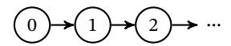
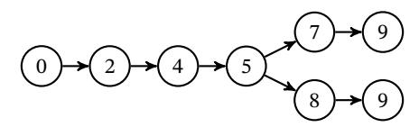
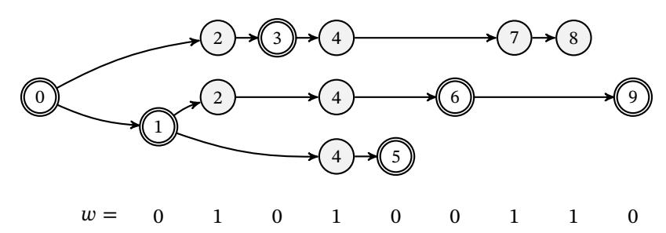
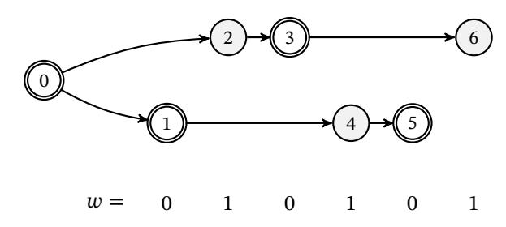
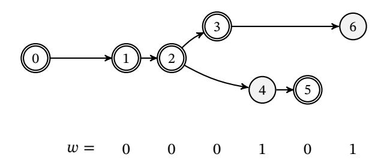
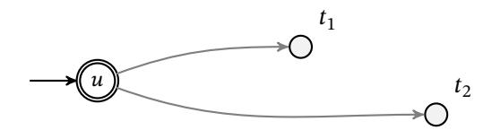
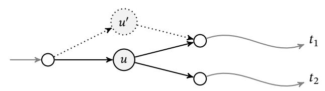
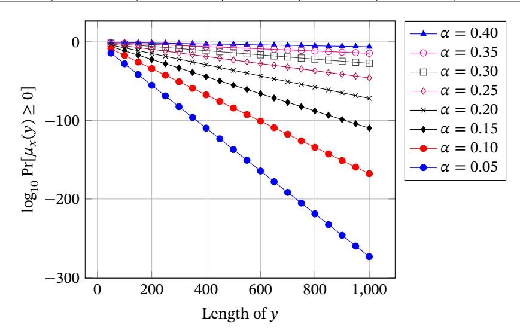

# The combinatorics of the longest-chain rule: Linear consistency for proof-of-stake blockchains

Erica Blum1 , Aggelos Kiayias2,5, Cristopher Moore3 , Saad Quader4 , and Alexander Russell4,5

> University of Maryland, College Park University of Edinburgh Santa Fe Institute University of Connecticut 5 IOHK

> > November 22, 2019

#### **Abstract**

Blockchain data structures maintained via the longest-chain rule have emerged as a powerful algorithmic tool for consensus algorithms. The technique—popularized by the Bitcoin protocol—has proven to be remarkably exible and now supports consensus algorithms in a wide variety of settings. Despite such broad applicability and adoption, current analytic understanding of the technique is highly dependent on details of the protocol's leader election scheme. A particular challenge appears in the proof-of-stake setting, where existing analyses suer from quadratic dependence on sux length.

We describe an axiomatic theory of blockchain dynamics that permits rigorous reasoning about the longestchain rule in quite general circumstances and establish bounds—optimal to within a constant—on the probability of a consistency violation. This settles a critical open question in the proof-of-stake setting where we achieve linear consistency for the rst time.

Operationally, blockchain consensus protocols achieve consistency by instructing parties to remove a sux of a certain length from their local blockchain. While the analysis of Bitcoin guarantees consistency with error 2 −𝑘 by removing 𝑂(𝑘) blocks, recent work on proof-of-stake (PoS) blockchains has suered from quadratic dependence: (PoS) blockchain protocols, exemplied by Ouroboros (Crypto 2017), Ouroboros Praos (Eurocrypt 2018) and Sleepy Consensus (Asiacrypt 2017), can only establish that the length of this sux should be Θ(𝑘 ). This consistency guarantee is a fundamental design parameter for these systems, as the length of the sux is a lower bound for the time required to wait for transactions to settle. Whether this gap is an intrinsic limitation of PoS—due to issues such as the "nothing-at-stake" problem—has been an urgent open question, as deployed PoS blockchains further rely on consistency for protocol correctness: in particular, security of the protocol itself relies on this parameter. Our general theory directly improves the required sux length from Θ(𝑘 ) to Θ(𝑘). Thus we show, for the rst time, how PoS protocols can match proof-of-work blockchain protocols for exponentially decreasing consistency error.

Our analysis focuses on the articulation of a two-dimensional stochastic process that captures the features of interest, an exact recursive closed form for the critical functional of the process, and tail bounds established for associated generating functions that dominate the failure events. Finally, the analysis provides an explicit polynomial-time algorithm for exactly computing the exponentially-decaying error function which can directly inform practice.

Erica Blum's work was partly supported by nancial assistance award 70NANB19H126 from U.S. Department of Commerce, National Institute of Standards and Technology. Aggelos Kiayias' research was partly supported by H2020 Grant #780477, PRIViLEDGE. Cristopher Moore's research was partly supported by NSF grant BIGDATA-1838251. Alexander Russell's work was partly supported by NSF Grant #1717432.

## **1 Introduction**

A blockchain is a data structure consisting of a collection of data blocks placed in linear order. It further requires that each block contains a collision-free hash of the previous block: thus blocks implicitly commit to the entire prex of the blockchain preceding them. This elementary data structure has remarkable applications in distributed computing, and now appears as an essential component of consensus protocols in a wide variety of models and settings; this notably includes both the "permissionless" setting popularized by Bitcoin and the classic "permissioned" model.

Such consensus protocols call for players to collaboratively assemble a blockchain by repeatedly selecting players to add blocks. Specically, the protocol determines a stochastic process resembling a lottery: each "leader" selected by the lottery is then responsible for broadcasting a new block. While the algorithmic details of this lottery depend heavily on the protocol, the outcome can be privately determined and provides the winning player a proof of leadership that can be publicly demonstrated. Assuming that the expected wait time for some player to win the lottery is constant, the blockchain experiences steady growth when players follow the protocol.

Network infelicities, adversarial behavior, or the possibility that two players simultaneously win the lottery can lead to disagreements among the players about the current blockchain. Thus protocols adopt a "chain selection rule" that determines how players should break ties among the various chains they observe on the network; ideally, the combination of the chain selection rule and the lottery should guarantee that the players' blockchains agree, perhaps with the exception of a short sux. The emblematic chain selection strategy among such systems is the *longest-chain rule*, which calls for players to adopt the longest chain among various contenders.

The rst blockchain protocol was the core of the sensational Bitcoin system [\[18\]](#page-32-0); it adopted a lottery mechanism based on a cryptographic puzzle [\[7,](#page-32-1) [1\]](#page-31-0)—also known as *proof-of-work or PoW, for short*—and a chain selection rule favoring chains that represent more work. The system is particularly notable for its ability to survive in a permissionless setting—where players may freely join and depart—even when a portion of the players are actively attacking the protocol. Unfortunately, the proof-of-work mechanism makes quite striking energy demands: the system currently consumes as much electricity as a small country.[1](#page-1-0) This motivated the blockchain community to exploring alternative lottery mechanisms, e.g., proof-of-stake (PoS) [\[3,](#page-31-1) [21,](#page-33-0) [13\]](#page-32-2), proof of space [\[8,](#page-32-3) [20\]](#page-32-4) and others [\[16\]](#page-32-5). The proof-of-stake mechanism is particularly attractive from the perspective of eciency, as it makes no assumption of external computational resources.

The fundamental consistency property—critical in all these blockchain systems—is *common-prex* (cf. [\[9\]](#page-32-6)). It precisely captures the intuition described above: by trimming a 𝑘-block sux from the chain held by any honest player the resulting blockchain is a prex of the blockchain possessed by any honest party at any future point of the execution. A principal goal in the analysis of these systems is a to guarantee common prex, for an appropriate value of 𝑘, even if some of the players collude to disrupt the protocol. Common prex is typically only shown to hold with high probability 1 − 𝜀, where 𝜀 is an error term that is a function of 𝑘. The exact dependency of 𝜀 on 𝑘 is critically important: it determines the length of the sux that is to be removed from a blockchain in order to ensure that the remaining prex will be retained at any future point of the execution. This directly imposes a lower bound on how long one has to wait for information in the blockchain (such as a payment transaction) to "settle." Additionally, many blockchain protocols internally rely on common prex for correctness; thus the relationship between 𝜀 and 𝑘 is critical to establishing the regime of correctness of the entire protocol.

A relatively straightforward lower bound for 𝜀 is 𝜀 ≥ exp(−𝛼𝑘) for some 𝛼 > 0. This lower bound applies when there is a coalition of adversarial players of constant fraction, the case of primary interest in practice. The result is easy to infer from the analysis of [\[18\]](#page-32-0), where a strategy is demonstrated that violates common prex with such probability (this is referred to as a "double-spending" attack in that paper). The tightness of this bound is an important open problem. For the special case of proof-of-work an upper bound of exp(−Ω(𝑘)) was shown rst in [\[9\]](#page-32-6) and further veried in extended security models by [\[11,](#page-32-7) [24\]](#page-33-1). In the proof-of-stake setting, on the other hand, the tightness of the bound remains open. While recent proof-of-stake algorithms have been presented with rigorous analyses that rival proof-of-work in many regards, they suer from a quadratic relationship between 𝑘 and log(𝜀). For example, the Ouroboros protocols [\[13,](#page-32-2) [6,](#page-32-8) [2\]](#page-31-2), as well as Snow White [\[4\]](#page-31-3), provide an upper bound

1See e.g., <https://digiconomist.net/bitcoin-energy-consumption> where it is reported that Bitcoin annual energy consumption is on the order of at least 50 Twhr at the time of writing.

on 𝜀 of exp(−Ω(√ 𝑘)); this should be compared with 𝜀 = exp(−Θ(𝑘)) for proof-of-work. The signicant gap from the known lower bound was attributed to a notable, general attack that distinguished PoS from PoW: Known as the *nothing-at-stake* problem, this refers to the ability of an adversarial coalition of players to strategically reuse a winning PoS lottery to extend multiple blockchains.

**Our results.** Our objective is to control the common-prex error 𝜀 as tightly as possible while making minimal assumptions on the underlying blockchain protocol. We work in a general model formulated by a simple family of *blockchain axioms*. The axioms themselves are easy to interpret and few in number. This permits us to abstract many features of the underlying blockchain protocol (e.g., the details of the leader-election process, the cryptographic security of the relevant signature schemes and hash functions, and randomness generation), while still establishing results that are strong enough to directly incorporate into existing specic analyses.

Our most interesting nding is a quite tight theory of common prex that depends *only on the schedule of participants certied to add a block*. Under common assumptions about this schedule, we achieve the optimal relationship 𝜀 = exp(−Θ(𝑘)). This directly improves the common prex guarantees (and settlement times) of existing proof-of-stake blockchains such as Snow White [\[4\]](#page-31-3), Ouroboros [\[13\]](#page-32-2), Ouroboros Praos [\[6\]](#page-32-8), and Ouroboros Genesis [\[2\]](#page-31-2). Specically, this improves the scaling in the exponent from √ 𝑘 to 𝑘 and establishes a tight characterization for 𝜀 = exp(−Θ(𝑘)). (In fact, we even obtain reasonable control of the constants.) We remark that our assumptions about the schedule distribution can be weakened—without any eect on the nal bounds—to apply to martingale-style distributions such as those that arise in the analysis of adaptive adversaries [\[6,](#page-32-8) [2\]](#page-31-2).

Our new analysis oers an additional, but lower order, improvement for several of these blockchains. The existing analysis of, e.g., Ouroboros Praos [\[6\]](#page-32-8), required a union bound to be taken over the entire lifetime of the protocol in order to rule out a common prex violation at a particular point of time; thus such events were actually bounded above by a function of the form 𝑇 exp(−Ω(√ 𝑘)), where 𝑇 is the lifetime of the protocol. While this event *does* depend on the entire dynamics of the protocol, we show how to avoid this pessimistic tail bound to achieve a "single shot" common prex violation—at a particular time of interest—of form exp(−Θ(𝑘)); this removes the dependence on 𝑇.

From a technical perspective, we contrast the structure of our proofs with existing techniques for the PoW case. The PoW results nd a direct connection between common-prex and the behavior of a biased, one-dimensional random walk. Interestingly, our results give a tight relationship between the general (e.g., PoS) case and a pair of *coupled* biased random walks. A major challenge in the analysis is to bound the behavior of this richer stochastic process. Our tools yield precise, explicit upper bounds on the probability of persistence violations that can be directly applied to tune the parameters of deployed PoS systems. See Appendix [A](#page-33-2) where we record some concrete results of the general theory. The importance of these results in the practice of PoS blockchain systems cannot be overstated: they provide, for the rst time, concrete error bounds for settlement times for PoS blockchains that follow the longest chain rule.

**Further analytic details.** Our approach begins with the graph-theoretic framework of *forks* and *margin* developed for the analysis of the Ouroboros [\[13\]](#page-32-2) protocol. (A fork is an abstraction of the protocol execution given the outcomes of the leader-election process.) We begin by generalizing the notion of margin to account for local, rather than global, features of a leader schedule, and provide an exact, recursive closed form for this new quantity (see Section [5\)](#page-17-0). This proof identies an optimal online adversary (i.e., a fork-building strategy whose current decisions do not depend on the future) for PoS blockchain algorithms with the remarkable property that the sequence of forks produced by this adversary *simultaneously* achieve the worst-case (slot) common-prex violations associated with all slots (see Section [8\)](#page-28-0). We then study the stochastic process generated when the *characteristic string*—a Boolean string representing the outcome of the leader election scheme—is given by a family of i.i.d. Bernoulli random variables. In this case, we identify a generating function that bounds the tail events o interest, and analytically upper bound the growth of the function. We then show how to extend the analysis to the setting where the characteristic string is drawn from a martingale sequence. As it happens, this more general distribution arises naturally in the analyses of PoS protocols that survive adaptive adversaries; e.g., Ouroboros Genesis [\[2\]](#page-31-2). We obtain the pleasing result that the common prex error probability in the martingale case is no more than that in the i.i.d. Bernoulli case.

**Direct consequences.** Our results establish consistency bounds in a quite general setting—see below: In particular, they directly imply exp(−Θ(𝑘)) consistency for the Sleepy consensus (Snow White) [\[21\]](#page-33-0), Ouroboros [\[13\]](#page-32-2), Ouroboros Praos [\[6\]](#page-32-8), and Ouroboros Genesis [\[2\]](#page-31-2) blockchain protocols. (The Ouroboros Praos and Ouroboros Genesis analyses in fact directly relied on an earlier e-print version of the present article for their settlement estimates.)

**Related work.** Blockchain protocol analysis in the PoW-setting was initiated in [\[9\]](#page-32-6) and further improved in [\[24,](#page-33-1) [11\]](#page-32-7). The established security bounds for consistency are linear in the security parameter. Sleepy consensus [\[21,](#page-33-0) Theorem 13] provides a consistency bound of the form exp(−Ω(√ 𝑘)). Note that [\[21\]](#page-33-0) is not a PoS protocol per se, but it is possible to turn it into one (as was demonstrated in [\[4\]](#page-31-3)). The analysis of the Ouroboros blockchain [\[13\]](#page-32-2) achieves exp(−Ω(√ 𝑘)). We remark that the analyses of Ouroboros Praos [\[6\]](#page-32-8) and Ouroboros Genesis [\[2\]](#page-31-2) developed signicant new machinery for handling other challenges (e.g., adaptive adversaries, partial synchrony), but directly referred to a preliminary version of this article to conclude their guarantees of exp(−Ω(𝑘)).

Our results complement the recent results of [\[5\]](#page-31-4), which also considers longest-chain PoS protocols. [\[5\]](#page-31-4) focuses on identifying dynamics unique to longest-chain PoS protocols. In particular, they show that longest-chain PoS protocols that are *predictable* (i.e., for which some portion of the schedule of slot leaders is known ahead of time) are necessarily vulnerable to "predictable double-spends." The conventional defense against such attacks is to wait for the specied settlement time to elapse before accepting a transaction, which (until now) has resulted in slow conrmation times. As such, [\[5\]](#page-31-4) raised the question of whether long conrmation times are a necessary evil in longest-chain PoS blockchains. As double-spending attacks imply a consistency violation, our results show that PoS protocols can safely decrease settlement times to asymptotically match PoW protocols without sacricing security against double-spends.

Because we focus on the longest-chain rule, our analysis is not applicable to protocols like Algorand [\[15\]](#page-32-9) which, in fact, oer settlement in expected constant time without invoking blockchain reorganisation or forks; however, Algorand lacks the ability to operate in the "sleepy" [\[21\]](#page-33-0) or "dynamic availability" [\[2\]](#page-31-2) setting. In our combinatorial analysis, synchronous operation is assumed against a rushing adversary; this is without loss of generality vis-a-vis the result of [\[6\]](#page-32-8) where it was shown how to reduce the combinatorial analysis in the partially synchronous setting to the synchronous one. We note that a number of works have shown how to use a blockchain protocol to bootstrap a cryptographic protocol that can oer faster settlement time under stronger assumptions than honest majority, e.g., Hybrid Consensus [\[22\]](#page-33-3) or Thunderella [\[23\]](#page-33-4); our results are orthogonal and synergistic to those since they can be used to improve the settlement time bounds of the blockchain protocol that operates as a fallback mechanism.

**Outline.** We begin in Section [2](#page-3-0) by describing a simple general model for blockchain dynamics. Section [3](#page-10-0) builds on this model to set down a number of basic denitions required for the proofs. The rst part of the main proof is described in Section [5,](#page-17-0) which develops a "relative" version of the theory of margin from [\[13\]](#page-32-2); most details are then relegated to Section [7](#page-25-0) in order to move quickly to the consistency estimates in Section [6.](#page-17-1) In Section [8,](#page-28-0) we present an optimal online adversary who can simultaneously maximize the relative margins for all prexes of the characteristic string. Finally, in Appendix [A,](#page-33-2) we compute exact upper bounds on 𝑘-settlement error probabilities for various values of 𝑘 and describe a simple 𝑂(𝑘 3 )-time algorithm to compute these probabilities in general.

## **2 The blockchain axioms and the settlement security model**

Typical blockchain consensus protocols call for each participant to maintain a *blockchain*; this is a data structure that organizes transactions and other protocol metadata into an ordered historical record of "blocks." A basic design goal of these systems is to guarantee that participants' blockchains always agree on a common prex; the diering suxes of the chains held by various participants roughly correspond to the possible future states of the system. Thus the major analytic challenge is to ensure that—despite evolving adversarial control of some of the participants—the portion of honest participants' blockchains that might pairwise disagree is conned to a short sux. This analysis in turn supports the fundamental guarantee of *consistency* for these algorithms, which asserts that data appearing deep enough in the chain can be considered to be stable, or "settled."

We adopt a discrete notion of time organized into a sequence of *slots* {*sl*0 ,*sl*1 , …} and assume all protocol participants have the luxury of synchronized clocks that report the current slot number. As discussed above, the protocols we consider rely on two algorithmic devices:

- A *leader election mechanism*, which randomly assigns to each time slot a set of "leaders" permitted to post a new block in that slot.
- The *longest-chain rule*, which calls for the leader(s) of each slot to add a block to the end of the longest blockchain she has yet observed, and broadcast this new chain to other participants.

The Bitcoin protocol uses a proof-of-work mechanism to carry out leader election, which can be modeled using a random oracle [\[9,](#page-32-6) [24,](#page-33-1) [11\]](#page-32-7). Proof-of-stake systems typically require more intricate leader election mechanisms; for example, the Ouroboros protocol [\[13\]](#page-32-2) uses a full multi-party private computation to distribute clean randomness, while Snow White [\[4\]](#page-31-3), Algorand [\[15\]](#page-32-9), and Ouroboros Praos [\[6\]](#page-32-8) use hashing and a family of values determined on-the-y. Despite these dierences, all existing analyses show that the leader election mechanism suitably approximates an ideal distribution, which is also the approach we will adopt for our analysis.

### **2.1 The blockchain axioms and forks**

To simplify our analysis, we assume a synchronous communication network in the presence of a *rushing* adversary: in particular, any message broadcast by an honest participant at the beginning of a particular slot is received by the adversary rst, who may decide strategically and individually for each recipient in the network whether to inject additional messages and in what order all messages are to be delivered prior to the conclusion of the slot. (See [§2.5](#page-10-1) below for comments on this network assumption.)

Given this, the behavior of the protocol when carried out by a group of honest participants (who follow the protocol in the presence of an adversary who may only reorganize messages) is clear. Assuming that the system is initialized with a common "genesis block" corresponding to *sl*0 and the leader election process in fact elects a single leader per slot, the players observe a common, linearly growing blockchain:

Here node 𝑖 represents the block broadcast by the leader of slot 𝑖 and the arrows represent the direction of increasing time. (Note that the requirement of a single leader per slot is important in this simple picture; it is possible for a network adversary to induce divergent views between the players by taking advantage of slots where more than a single honest participant is elected a leader.)

**The blockchain axioms: Informal discussion.** The introduction of adversarial participants or multiple slot leaders complicates the family of possible blockchains that could emerge from this process. To explore this in the context of our protocols, we work with an abstract notion of a blockchain which ignores all internal structure. We consider a xed assignment of leaders to time slots, and assume that the blockchain uses a proof mechanism to ensure that any block labeled with slot *sl*𝑡 was indeed produced by a leader of slot *sl*𝑡 ; this is guaranteed in practice by appropriate use of a secure digital signature scheme.

Specically, we treat a *blockchain* as a sequence of abstract blocks, each labeled with a slot number, so that:

- **A1**. The blockchain begins with a xed "genesis" block, assigned to slot *sl*0 .
- **A2**. The (slot) labels of the blocks are in strictly increasing order.

It is further convenient to introduce the structure of a directed graph on our presentation, where each block is treated as a vertex; in light of the rst two axioms above, a blockchain is a path beginning with a special "genesis" vertex, labeled 0, followed by vertices with strictly increasing labels that indicate which slot is associated with the block.

$$0 \rightarrow 2 \rightarrow 4 \rightarrow 5 \rightarrow 7 \rightarrow 9$$

The protocols of interest call for honest players to add a single block during any slot. In particular:

**A3**. If a slot  $sl_t$  was assigned to a single honest player, then a single block is created—during the entire protocol—with the label  $sl_t$ .

Recall that blockchains are *immutable* in the sense that any block in the chain commits to the entire previous history of the chain; this is achieved in practice by including with each block a collision-free hash of the previous block. These properties imply that if a specific slot  $sl_t$  was assigned to a unique honest player, then any chain that includes the unique block from  $sl_t$  must also include that block's associated prefix in its entirety.

As we analyze the dynamics of blockchain algorithms, it is convenient to maintain an entire family of blockchains at once. As a matter of bookkeeping, when two blockchains agree on a common prefix, we can glue together the associated paths to reflect this, as indicated below.

When we glue together many chains to form such a diagram, we call it a "fork"—the precise definition appears below. Observe that while these two blockchains agree through the vertex (block) labeled 5, they contain (distinct) vertices labeled 9; this reflects two distinct blocks associated with slot 9 which, in light of the axiom above, must have been produced by an adversarial participant.

Finally, as we assume that messages from honest players are delivered without delay, we note a direct consequence of the longest chain rule:

**A4**. If two honestly generated blocks  $B_1$  and  $B_2$  are labeled with slots  $sl_1$  and  $sl_2$  for which  $sl_1 < sl_2$ , then the length of the unique blockchain terminating at  $B_1$  is strictly less than the length of the unique blockchain terminating at  $B_2$ .

Recall that the honest participant assigned to slot  $sl_2$  will be aware of the blockchain terminating at  $B_1$  that was broadcast by the honest player in slot  $sl_1$  as a result of synchronicity; according to the longest-chain rule, it must have placed  $B_2$  on a chain that was at least this long. In contrast, not all participants are necessarily aware of all blocks generated by dishonest players, and indeed dishonest players may often want to delay the delivery of an adversarial block to a participant or show one block to some participants and show a completely different block to others.

Characteristic strings, forks, and the formal axioms. Note that with the axioms we have discussed above, whether or not a particular fork diagram (such as the one just above) corresponds to a valid execution of the protocol depends on how the slots have been awarded to the parties by the leader election mechanism. We introduce the notion of a "characteristic" string as a convenient means of representing information about slot leaders in a given execution.

**Definition 1** (Characteristic string). Let  $sl_1, ..., sl_n$  be a sequence of slots. A characteristic string w is an element of  $\{0,1\}^n$  defined for a particular execution of a blockchain protocol so that

$$w_t = \begin{cases} 0 & \text{if } sl_t \text{ was assigned to a single honest participant,} \\ 1 & \text{otherwise.} \end{cases}$$

For two Boolean strings x and w, we write x < w iff x is a strict prefix of w. Similarly, we write  $x \le w$  iff either x = w or x < w. The empty string  $\varepsilon$  is a prefix to any string. With this discussion behind us, we set down the formal object we use to reflect the various blockchains adopted by honest players during the execution of a blockchain protocol. This definition formalizes the blockchains axioms discussed above.

**Definition 2** (Fork; [13]). Let  $w \in \{0,1\}^n$  and let  $H = \{i \mid w_i = 0\}$ . A fork for the string w consists of a directed and rooted tree F = (V, E) with a labeling  $\ell : V \to \{0, 1, ..., n\}$ . We insist that each edge of F is directed away from the root vertex and further require that

- (F1.) the root vertex r has label  $\ell(r) = 0$ ;
- (F2.) the labels of vertices along any directed path are strictly increasing;
- (F3.) each index  $i \in H$  is the label for exactly one vertex of F;
- (F4.) for any vertices  $i, j \in H$ , if i < j, then the depth of vertex i in F is strictly less than the depth of vertex j in F.

If F is a fork for the characteristic string w, we write  $F \vdash w$ . Note that the conditions (F1.)–(F4.) are direct analogues of the axioms A1–A4 above. See Fig. 1 for an example fork. A final notational convention: If  $F \vdash x$  and  $\hat{F} \vdash w$ , we say that F is a *prefix* of  $\hat{F}$ , written  $F \sqsubseteq \hat{F}$ , if  $x \le w$  and F appears as a consistently-labeled subgraph of  $\hat{F}$ . (Specifically, each path of F appears, with identical labels, in  $\hat{F}$ .)

Figure 1: A fork F for the characteristic string w = 010100110; vertices appear with their labels and honest vertices are highlighted with double borders. Note that the depths of the (honest) vertices associated with the honest indices of w are strictly increasing. Note, also, that this fork has two disjoint paths of maximum depth.

Let w be a characteristic string. The directed paths in the fork  $F \vdash w$  originating from the root are called *tines*; these are abstract representations of blockchains. (Note that a tine might not terminate at a leaf of the fork.) We naturally extend the label function  $\ell$  for tines: i.e.,  $\ell(t) \triangleq \ell(v)$  where the tine t terminates at vertex v. The length of a tine t is denoted by length(t).

**Viable tines.** The longest-chain rule dictates that honest players build on chains that are at least as long as all previously broadcast honest chains. It is convenient to distinguish such tines in the analysis: specifically, a tine t of F is called *viable* if its length is at least the depth of any honest vertex v for which  $\ell(v) \leq \ell(t)$ . A tine t is *viable at slot s* if the portion of t appearing over slots  $0, \ldots, s$  has length at least that of any honest vertices labeled from this set. (As noted, the properties (F3.) and (F4.) together imply that an honest observer at slot s will only adopt a viable tine.) The *honest depth* function  $\mathbf{d}: H \to [n]$  gives the depth of the (unique) vertex associated with an honest slot; by (F4.),  $\mathbf{d}(\cdot)$  is strictly increasing.

### 2.2 Settlement and the common prefix property

We are now ready to explore the power of an adversary in this setting who has corrupted a (perhaps evolving) coalition of the players. We focus on the possibility that such an adversary can blatantly confound consistency of the honest player's blockchains. In particular, we consider the possibility that, at some time t, the adversary conspires to produce two blockchains of maximum length that diverge prior to a previous slot  $s \le t$ ; in this case honest players adopting the longest-chain rule may clearly disagree about the history of the blockchain after slot s. We call such a circumstance a *settlement violation*.

To reflect this in our abstract language, let  $F \vdash w$  be a fork corresponding to an execution with characteristic string w. Such a settlement violation induces two viable times  $t_1, t_2$  with the same length that diverge prior to a particular slot of interest. We record this below.

**Denition 3** (Settlement with parameters 𝑠, 𝑘 ∈ ℕ)**.** *Let* 𝑤 ∈ {0, 1}𝑛 *be a characteristic string. Let* 𝐹 ⊢ 𝑤1 … 𝑤𝑡 *be a fork for a prex of* 𝑤 *with* 𝑠 + 𝑘 ≤ 𝑡 ≤ 𝑛*. We say that a slot* 𝑠 *is* not 𝑘-settled *in* 𝐹 *if the fork contains two tines* 𝑡1 , 𝑡2 *of maximum length that "diverge prior to* 𝑠*," i.e., they either contain dierent vertices labeled with* 𝑠*, or one contains a vertex labeled with* 𝑠 *while the other does not. Note that such tines are viable by denition. Otherwise,* slot 𝑠 is 𝑘-settled in 𝐹*. We say that a slot* 𝑠 *is* 𝑘-settled *(for the characteristic string* 𝑤*) if it is* 𝑘*-settled in every fork* 𝐹 ⊢ 𝑤1 , … 𝑤𝑡 *, for each* 𝑡 ≥ 𝑠 + 𝑘*.*

**Common prex.** Settlement violations are a convenient and intuitive proxy for the notion of common prex discussed in the introduction. Indeed, as we show in Section [4,](#page-13-0) the two notions are equivalent, so we have the luxury of discussing settlement violations which have the advantage of a more ready interpretation. Concretely, we will simultaneously upper bound—using the same analytic techniques—the probability of settlement violations and common prex violations.

Recall that the common prex property with parameter 𝑘 asserts that, for any slot index 𝑠, if an honest observer at slot 𝑠 + 𝑘 adopts a blockchain 𝒞, the prex 𝒞[0 ∶ 𝑠] will be present in every honestly-held blockchain at or after slot 𝑠 + 𝑘. (Here, 𝒞[0 ∶ 𝑠] denotes the prex of the blockchain 𝒞 containing only the blocks issued from slots 0, 1, … , 𝑠.)

We translate this property into the framework of forks. Consider a tine 𝑡 of a fork 𝐹 ⊢ 𝑤. The *trimmed* tine 𝑡 ⌈𝑘 is dened as the portion of 𝑡 labeled with slots {0, … , 𝓁(𝑡) − 𝑘}. For two tines, we use the notation 𝑡1 ⪯ 𝑡2 to indicate that the tine 𝑡1 is a prex of tine 𝑡2 .

**Denition 4** (Common Prex Property with parameter 𝑘 ∈ ℕ)**.** *Let* 𝑤 *be a characteristic string. A fork* 𝐹 ⊢ 𝑤 *satises* 𝑘*-*CP𝗌𝗅𝗈𝗍 *if, for all pairs* (𝑡1 , 𝑡2 ) *of viable tines* 𝐹 *for which* 𝓁(𝑡1 ) ≤ 𝓁(𝑡2 )*, we have* 𝑡 ⌈𝑘 1 ⪯ 𝑡2 *. Otherwise, we say that the tine-pair* (𝑡1 , 𝑡2 ) *is a witness to a* 𝑘*-*CP𝗌𝗅𝗈𝗍 *violation. Finally,* 𝑤 satises 𝑘-CP𝗌𝗅𝗈𝗍 *if every fork* 𝐹 ⊢ 𝑤 *satises* 𝑘*-*CP𝗌𝗅𝗈𝗍 *.*

If a string 𝑤 does not possess the 𝑘-CP𝗌𝗅𝗈𝗍 property, we say that 𝑤 *violates* 𝑘*-*CP𝗌𝗅𝗈𝗍. Observe that we dened the common prex property in terms of deleting any blocks associated with the *last* 𝑘 *trailing slots* from a local blockchain 𝒞. Traditionally (cf. [\[10\]](#page-32-10)), this property has been dened in terms of deleting a sux of (block-)length 𝑘 from 𝒞. We denote the block-deletion-based version of the common prex property as the 𝑘-CP property. Note, however, that a 𝑘-CP violation immediately implies a 𝑘-CP𝗌𝗅𝗈𝗍 violation, so bounding the probability of a 𝑘-CP𝗌𝗅𝗈𝗍 violation is sucient to rule out both events.

### **2.3 Adversarial attacks on settlement time; the settlement game**

To clarify the relationship between forks and the chains at play in a canonical blockchain protocol, we dene a game-based model below that explicitly describes the relationship between forks and executions. By design, the probability that the adversary wins this game is at most the probability that a slot 𝑠 is not 𝑘-settled. We remark that while we focus on settlement violations for clarity, one could equally well have designed the game around common prex violations.

Consider the (𝒟, 𝑇;𝑠, 𝑘)*-settlement game*, played between an adversary 𝒜 and a challenger 𝒞 with a leader election mechanism modeled by an ideal distribution 𝒟. Intuitively, the game should reect the ability of the adversary to achieve a settlement violation; that is, to present two maximally-long viable blockchains to a future honest observer, thus forcing them to choose between two alternate histories which disagree on slot 𝑠. The challenger plays the role(s) of the honest players during the protocol.

Note that in typical PoS settings the distribution 𝒟 is determined by the combined stake held by the adversarial players, the leader election mechanism, and the dynamics of the protocol. The most common case (as seen in Snow White [\[21\]](#page-33-0) and Ouroboros [\[13\]](#page-32-2)) guarantees that the characteristic string 𝑤 = 𝑤1 … 𝑤𝑇 is drawn from an i.i.d. distribution for which Pr[𝑤𝑖 = 1] ≤ (1 − 𝜖)∕2; here the constant (1 − 𝜖)∕2 is directly related to the stake held by the adversary. Settings involving adaptive adversaries (e.g., Ouroboros Praos [\[6\]](#page-32-8) and Ouroboros Genesis [\[2\]](#page-31-2)) yield the weaker martingale-type guarantee that Pr[𝑤𝑖 = 1 ∣ 𝑤1 , … , 𝑤𝑖−1] ≤ (1 − 𝜖)∕2.

#### The $(\mathcal{D}, T; s, k)$ -settlement game

- 1. A characteristic string  $w \in \{0,1\}^T$  is drawn from  $\mathcal{D}$  and provided to  $\mathcal{A}$ . (This reflects the results of the leader election mechanism.)
- 2. Let  $A_0 \vdash \varepsilon$  denote the initial fork for the empty string  $\varepsilon$  consisting of a single node corresponding to the genesis block.
- 3. For each slot t = 1, ..., T in increasing order:
  - (a) If  $w_t = 0$ , this is an honest slot. In this case, the challenger is given the fork  $A_{t-1} \vdash w_1 \dots w_{t-1}$  and must determine a new fork  $F_t \vdash w_1 \dots w_t$  by adding a single vertex (labeled with t) to the end of a longest path in  $A_{t-1}$ . (If there are ties,  $\mathcal A$  may choose which path the challenger adopts.)
  - (b) If  $w_t = 1$ , this is an adversarial slot.  $\mathcal{A}$  may set  $F_t \vdash w_1 \dots w_t$  to be an arbitrary fork for which  $A_{t-1} \sqsubseteq F_t$ .
  - (c) (Adversarial augmentation.)  $\mathcal{A}$  determines an arbitrary fork  $A_t \vdash w_1 \dots, w_t$  for which  $F_t \sqsubseteq A_t$ .

Recall that  $F \subseteq F'$  indicates that F' contains, as a consistently-labeled subgraph, the fork F.

A wins the settlement game if slot s is not k-settled in some fork  $A_t$  (with  $t \ge s + k$ ).

**Definition 5.** Let  $\mathcal{D}$  be a distribution on  $\{0,1\}^T$ . Then define the (s,k)-settlement insecurity of  $\mathcal{D}$  to be

$$\mathbf{S}^{s,k}[\mathcal{D}] \triangleq \max_{\mathcal{A}} \Pr[\mathcal{A} \text{ wins the } (\mathcal{D}, T; s, k) \text{-settlement game}],$$

this maximum taken over all adversaries A.

**Remarks.** Observe that the adversarial augmentation step permits the adversary to "suddenly" inject new paths in the fork between two honest players at adjacent slots; this corresponds to circumstances when the adversary chooses to deliver a new blockchain to an honest participant which may consist of an earlier honest chain with some adversarial blocks appended to the end. Observe, additionally, that the behavior of the challenger in the game is entirely deterministic, as it simply plays according to the longest-chain rule (even permitting the adversary to break ties). Thus the result of the game is entirely determined by the characteristic string w drawn from  $\mathcal{D}$  and the choices of the adversary  $\mathcal{A}$ . We record the following immediate conclusion:

**Lemma 1.** Let  $s, k, T \in \mathbb{N}$ . Let  $\mathcal{D}$  be a distribution on  $\{0, 1\}^T$ . Then

$$\mathbf{S}^{s,k}[\mathcal{D}] \leq \Pr_{w \sim \mathcal{D}}[\text{slot } s \text{ is not } k\text{-settled } \text{for } w].$$

In the subsequent sections, we will develop some further notation and tools to analyze this event. We will investigate two different families of distributions, those with i.i.d. coordinates and those with martingale-type conditioning guarantees. For  $T \in \mathbb{N}$  and  $\epsilon \in (0,1)$ , let  $B_{\epsilon} = (B_1, \dots, B_n)$  denote the random variable taking values in  $\{0,1\}^n$  so that the  $B_i$  are independent and  $\Pr[B_i=1]=(1-\epsilon)/2$ ; we let  $\mathcal{B}_{\epsilon}$  denote the distribution on  $\{0,1\}^n$  associated with  $B_{\epsilon}$ . When  $\epsilon$  can be inferred from context, we simply write B and B.

We also study a more general family of distributions, defined next.

**Definition 6** ( $\varepsilon$ -martingale condition). Let  $W = (W_1, ..., W_n)$  be a random variable taking values in  $\{0, 1\}^n$ . We say that W satisfies the  $\varepsilon$ -martingale condition if for each  $t \in \{1, ..., n\}$ ,

$$\mathbb{E}[W_t \mid W_1, \cdots, W_{t-1}] \le (1 - \epsilon)/2.$$

Equivalently,  $\Pr[W_t = 1 \mid W_1, ..., W_{t-1}] \le (1 - \epsilon)/2$ . The conditioning on the variables  $W_1, ..., W_{t-1}$  is arbitrary in both cases; as a consequence,  $\Pr[W_t = 1] \le (1 - \epsilon)/2$ . As a matter of notation, we let  $\mathcal{W}$  denote the distribution

associated with the random variable W. We use the term "ε-martingale condition" to qualify both a random variable and its distribution.

There are settings, such as Genesis [2], where this martingale-type conditioning is important. Note that  $\mathcal{B}_{\varepsilon}$  satisfies the  $\varepsilon$ -martingale condition. Now we are ready to state our main theorem.

**Theorem 1** (Main theorem). Let  $\epsilon \in (0,1)$ ,  $s,k,T \in \mathbb{N}$ . Let  $\mathcal{W}$  and  $\mathcal{B}_{\epsilon}$  be two distributions on  $\{0,1\}^T$  where  $\mathcal{B}_{\epsilon}$  is defined above and  $\mathcal{W}$  satisfies the  $\epsilon$ -martingale condition. Then

$$\mathbf{S}^{s,k}[\mathcal{W}] \leq \mathbf{S}^{s,k}[\mathcal{B}_{\epsilon}] \leq \exp(-\Omega(\epsilon^3(1 - O(\epsilon))k)).$$

(Here, the asymptotic notation hides constants that do not depend on  $\epsilon$  or k.)

By techniques similar to the ones used to prove this result, we obtain the following theorem pertaining directly to k-CPslot (and k-CP).

**Theorem 2** (Main theorem; k-CP version). Let  $\epsilon \in (0,1)$  and  $T \in \mathbb{N}$ . Let  $w \in \{0,1\}^T$  be a random variable satisfying the  $\epsilon$ -martingale condition. Then

$$\Pr[w \text{ violates } k\text{-CP}] \leq \Pr[w \text{ violates } k\text{-CP}^{\mathsf{slot}}] \leq T \cdot \exp\left(-\Omega(\varepsilon^3(1 - O(\varepsilon))k)\right).$$

The proofs of these theorems are presented in Section 6.5. Additionally, we provide a  $O(k^3)$ -time algorithm for computing an explicit upper bound on these probabilities; cf. Appendix A.

### 2.4 Survey of the proofs of the main theorems

A central object in our combinatorial analysis is an "x-balanced fork" for a characteristic string w = xy. Such a fork contains two distinct, maximum-length tines that are disjoint over y; see Definition 9 for details. A settlement violation for the slot |x| + 1 implies an x-balanced fork for the string xy; see Observation 1. In particular, for any distribution on characteristic strings in  $\{0,1\}^n$  and  $s + k \le n$ ,

$$\Pr_{w}[\text{slot } s \text{ is not } k\text{-settled}] \leq \Pr_{w}\left[\begin{array}{l} \text{there is a decomposition } w = xyz \text{ and} \\ \text{a fork } F \vdash xy, \text{ where } |x| = s - 1 \text{ and} \\ |y| \geq k + 1, \text{ so that } F \text{ is } x\text{-balanced} \end{array}\right].$$

(This is a variant of Lemma 5 from Section 6.5.)

As promised above, common prefix violations can be handled the same way: we likewise establish (see Section 4; Theorem 3) that a common prefix violation implies that there exists a balanced fork for some prefix of w. Specifically, for any distribution of characteristic strings,

$$\Pr_{w}[w \text{ violates } k\text{-CP}^{\text{slot}}] \leq \Pr_{w} \begin{bmatrix} \text{there is a decomposition } w = xyz \text{ and } \\ \text{a fork } F \vdash xy, \text{ where } |y| \geq k+1, \text{ so} \\ \text{that } F \text{ is } x\text{-balanced} \end{bmatrix}. \tag{1}$$

Next, in Section 5, we give a recursive expression for the combinatorial quantity "relative margin," written  $\mu_x(y)$  (see Definition 13 in Section 3). We establish that, for an arbitrary decomposition of the characteristic string w=xy, the event "there is an x-balanced fork for xy" is equivalent to the event "the relative margin  $\mu_x(y)$  is non-negative;" this is Fact 1. In Lemma 3, we develop an exact recursive presentation for  $\mu_x(y)$ ; hence we can bound the probability of a common prefix violation (or a settlement violation) by reasoning about the non-negativity of the relative margin and, in particular, without reasoning directly about forks.

In Section 6, we prove two bounds for the probability

$$\Pr_{\substack{w=xy\\|x|=s}}[\mu_x(y)\geq 0],$$

for a fixed length s. The first bound pertains to the setting where w = xy is drawn from  $\mathcal{B}_{\varepsilon}$ . The second pertains to any distribution  $\mathcal{W}$  satisfying the  $\varepsilon$ -martingale condition. For characteristic strings with distribution  $\mathcal{B}_{\varepsilon}$ , we

identify a random variable which stochastically dominates 𝜇𝑥 (𝑦) and is amenable to exact analysis via generating functions; this yields the bound

$$\Pr_{w=xy}[\mu_x(y) \ge 0] \le \exp(-\Omega(|y|)).$$

Notice that this bound does not depend on 𝑠, the length of 𝑥. The result for distributions satisfying the 𝜖-martingale condition then follows from stochastic dominance (Lemma [4\)](#page-19-0). See Section [6](#page-17-1) for details.

It immediately follows that an (𝑠, 𝑘)-settlement violation (or a 𝑘-CP𝗌𝗅𝗈𝗍 violation) is a rare event for distributions of interest. The multiplicative factor 𝑇 in Theorem [2](#page-9-0) comes from a union bound taken over all prexes of 𝑤.

### **2.5 Comments on the model**

**Analysis in the** ∆**-synchronous setting.** The security game above most naturally models a blockchain protocol over a synchronous network with immediate delivery (because each "honest" play of the challenger always builds on a fork that contains the fork generated by previous honest plays). However, the model can be easily adapted to protocols in the ∆-synchronous model adopted by the Snow White and Ouroboros Praos protocols and analyses. In particular, David et al. [\[6\]](#page-32-8) developed a "∆-reduction" mapping on the space of characteristic strings that permits analyses of forks (and the related statistics of interest, cf. [§3\)](#page-10-0) in the ∆-synchronous setting by a direct appeal to the synchronous setting.

**Public leader schedules.** One attractive feature of this model is that it gives the adversary full information about the future schedule of leaders. The analysis of some protocols indeed demand this (e.g., Ouroboros, Snow White). Other protocols—especially those designed to oer security against adaptive adversaries (Praos, Genesis)—in fact contrive to keep the leader schedule private. Of course, as our analysis is in the more dicult "full information" model, it applies to all of these systems.

**Bootstrappingmulti-phase algorithms; stake shift.** We remark that several existing proof-of-stake blockchain protocols proceed in phases, each of which is obligated to generate the randomness (for leader election, say) for the next phase based on the current stake distribution. The blockchain security properties of each phase are then individually analyzed—assuming clean randomness—which yields a recursive security argument; in this context the game outlined above precisely reects the single phase analysis.

## **3 Denitions**

We rely on the elementary framework of forks and margin from Kiayias et al. [\[13\]](#page-32-2). We restate and briey discuss the pertinent denitions below. With these basic notions behind us, we then dene a new "relative" notion of margin, which will allow us to signicantly improve the ecacy of these tools for reasoning about settlement times.

Recall that for a given execution of the protocol, we record the result of the leader election process via a *characteristic string* 𝑤 ∈ {0, 1}𝑇 , dened such that 𝑤𝑖 = 0 when a unique and honest party is assigned to slot 𝑖 and 𝑤𝑖 = 1 otherwise. A vertex of a fork is said to be *honest* if it is labeled with an index 𝑖 such that 𝑤𝑖 = 0.

**Denition 7** (Tines, length, and height)**.** *Let* 𝐹 ⊢ 𝑤 *be a fork for a characteristic string. A* tine *of* 𝐹 *is a directed path starting from the root. For any tine* 𝑡 *we dene its* length *to be the number of edges in the path, and for any vertex* 𝑣 *we dene its* depth *to be the length of the unique tine that ends at* 𝑣*. If a tine* 𝑡1 *is a strict prex of another tine* 𝑡2 *, we write* 𝑡1 ≺ 𝑡2 *. Similarly, if* 𝑡1 *is a non-strict prex of* 𝑡2 *, we write* 𝑡1 ⪯ 𝑡2 *. The longest common prex of two tines* 𝑡1 , 𝑡2 *is denoted by* 𝑡1 ∩ 𝑡2 *. That is,* 𝓁(𝑡1 ∩ 𝑡2 ) = max{𝓁(𝑢) ∶ 𝑢 ⪯ 𝑡1 *and* 𝑢 ⪯ 𝑡2 }*. The* height *of a fork (as usual for a tree) is the length of the longest tine, denoted* height(𝐹)*.*

**Denition 8** (The ∼𝑥 relations)**.** *For two tines* 𝑡1 *and* 𝑡2 *of a fork* 𝐹*, we write* 𝑡1 ∼ 𝑡2 *when* 𝑡1 *and* 𝑡2 *share an edge; otherwise we write* 𝑡1 ≁ 𝑡2 *. We generalize this equivalence relation to reect whether tines share an edge over a particular sux of* 𝑤*: for* 𝑤 = 𝑥𝑦 *we dene* 𝑡1 ∼𝑥 𝑡2 *if* 𝑡1 *and* 𝑡2 *share an edge that terminates at some node labeled*

*with an index in* 𝑦*; otherwise, we write* 𝑡1 ≁𝑥 𝑡2 *(observe that in this case the paths share no vertex labeled by a slot associated with* 𝑦*). We sometimes call such pairs of tines* disjoint *(or, if* 𝑡1 ≁𝑥 𝑡2 *for a string* 𝑤 = 𝑥𝑦*,* disjoint over 𝑦*). Note that* ∼ *and* ∼𝜀 *are the same relation.*

The basic structure we use to use to reason about settlement times is that of a "balanced fork."

**Denition 9** (Balanced fork; cf. "at" in [\[13\]](#page-32-2))**.** *A fork* 𝐹 *is* balanced *if it contains a pair of tines* 𝑡1 *and* 𝑡2 *for which* 𝑡1 ≁ 𝑡2 *and* length(𝑡1 ) = length(𝑡2 ) = height(𝐹)*. We dene a relative notion of balance as follows: a fork* 𝐹 ⊢ 𝑥𝑦 *is* 𝑥-balanced *if it contains a pair of tines* 𝑡1 *and* 𝑡2 *for which* 𝑡1 ≁𝑥 𝑡2 *and* length(𝑡1 ) = length(𝑡2 ) = height(𝐹)*.*

Thus, balanced forks contain two completely disjoint, maximum-length tines, while 𝑥-balanced forks contain two maximum-length tines that may share edges in 𝑥 but must be disjoint over the rest of the string. See Figures [2](#page-11-2) and [3](#page-11-3) for examples of balanced forks.

Figure 2: A balanced fork

Figure 3: An 𝑥-balanced fork, where 𝑥 = 00

**Balanced forks and settlement time.** A fundamental question arising in typical blockchain settings is how to determine *settlement time*, the delay after which the contents of a particular block of a blockchain can be considered stable. The existence of a balanced fork is a precise indicator for "settlement violations" in this sense. Specically, consider a characteristic string 𝑥𝑦 and a transaction appearing in a block associated with the rst slot of 𝑦 (that is, slot |𝑥| + 1). One clear violation of settlement at this point of the execution is the existence of two chains—each of maximum length—which diverge *prior to* 𝑦; in particular, this indicates that there is an 𝑥-balanced fork 𝐹 for 𝑥𝑦. Let us record this observation below.

**Observation 1.** *Let* 𝑠, 𝑘 ∈ ℕ *be given and let* 𝑤 *be a characteristic string. Slot* 𝑠 *is not* 𝑘*-settled for the characteristic string* 𝑤 *if there exist a decomposition* 𝑤 = 𝑥𝑦𝑧*, where* |𝑥| = 𝑠 − 1 *and* |𝑦| ≥ 𝑘 + 1*, and an* 𝑥*-balanced fork for* 𝑥𝑦*.*

In fact, every 𝑘-CP𝗌𝗅𝗈𝗍 violation produces a balanced fork as well; see Theorem [3](#page-13-1) in Section [4.](#page-13-0) In particular, to provide a rigorous 𝑘-slot settlement guarantee—which is to say that the transaction can be considered settled once 𝑘 slots have gone by—it suces to show that with overwhelming probability in choice of the characteristic string determined by the leader election process (of a full execution of the protocol), no such forks are possible. Specically, if the protocol runs for a total of 𝑇 time steps yielding the characteristics string 𝑤 = 𝑥𝑦 (where

𝑤 ∈ {0, 1}𝑇 and the transaction of interest appears in slot |𝑥| + 1 as above) then it suces to ensure that there is no 𝑥-balanced fork for 𝑥𝑦̂, where 𝑦̂ is an arbitrary prex of 𝑦 of length at least 𝑘 + 1; see Corollary [1](#page-18-0) in Section [6.](#page-17-1) Note that for systems adopting the longest chain rule, this condition must necessarily involve the *entire future dynamics* of the blockchain. We remark that our analysis below will in fact let us take 𝑇 = ∞.

**Denition 10** (Closed fork)**.** *A fork* 𝐹 *is* closed *if every leaf is honest. For convenience, we say the trivial fork is closed.*

Closed forks have two nice properties that make them especially useful in reasoning about the view of honest parties. First, a closed fork must have a unique longest tine (since honest parties are aware of all previous honest blocks, and honest parties observe the longest chain rule). Second, recalling our description of the settlement game, closed forks intuitively capture decision points for the adversary. The adversary can potentially show many tines to many honest parties, but once an honest node has been placed on top of a tine, any adversarial blocks beneath it are part of the public record and are visible to all honest parties. For these reasons, we will often nd it easier to reason about closed forks than arbitrary forks.

The next few denitions are the start of a general toolkit for reasoning about an adversary's capacity to build highly diverging paths in forks, based on the underlying characteristic string.

**Denition 11** (Gap, reserve, and reach)**.** *For a closed fork* 𝐹 ⊢ 𝑤 *and its unique longest tine* 𝑡̂*, we dene the* gap *of a tine* 𝑡 *to be* gap(𝑡) = length(𝑡̂) − length(𝑡)*. Furthermore, we dene the* reserve *of* 𝑡*, denoted* reserve(𝑡)*, to be the number of adversarial indices in* 𝑤 *that appear after the terminating vertex of* 𝑡*. More precisely, if* 𝑣 *is the last vertex of* 𝑡*, then*

$$\operatorname{reserve}(t) = \left| \left\{ i \mid w_i = 1 \ and \ i > \ell(v) \right\} \right|.$$

*These quantities together dene the* reach *of a tine:* reach(𝑡) = reserve(𝑡) − gap(𝑡)*.*

The notion of reach can be intuitively understood as a measurement of the resources available to our adversary in the settlement game. Reserve tracks the number of slots in which the adversary has the right to issue new blocks. When reserve exceeds gap (or equivalently, when reach is nonnegative), such a tine could be extended—using a sequence of dishonest blocks—until it is as long as the longest tine. Such a tine could be oered to an honest player who would prefer it over, e.g., the current longest tine in the fork. In contrast, a tine with negative reach is too far behind to be directly useful to the adversary at that time.

**Denition 12** (Maximum reach)**.** *For a closed fork* 𝐹 ⊢ 𝑤*, we dene* 𝜌(𝐹) *to be the largest reach attained by any tine of* 𝐹*, i.e.,*

$$\rho(F) = \max_{t} \operatorname{reach}(t).$$

*Note that* 𝜌(𝐹) *is never negative (as the longest tine of any fork always has reach at least 0). We overload this notation to denote the maximum reach over all forks for a given characteristic string:*

$$\rho(w) = \max_{\substack{F \vdash w \\ F \ closed}} \left[ \max_{t} \ \operatorname{reach}(t) \right].$$

**Denition 13** (Margin)**.** *The* margin *of a fork* 𝐹 ⊢ 𝑤*, denoted* 𝜇(𝐹)*, is dened as*

$$\mu(F) = \max_{t_1 \sim t_2} \left( \min\{ \operatorname{reach}(t_1), \operatorname{reach}(t_2) \} \right), \tag{2}$$

*where this maximum is extended over all pairs of disjoint tines of* 𝐹*; thus margin reects the "second best" reach obtained over all disjoint tines. In order to study splits in the chain over particular portions of a string, we generalize this to dene a "relative" notion of margin: If* 𝑤 = 𝑥𝑦 *for two strings* 𝑥 *and* 𝑦 *and, as above,* 𝐹 ⊢ 𝑤*, we dene*

$$\mu_{x}(F) = \max_{t_{1} \sim_{x} t_{2}} \left( \min\{\operatorname{reach}(t_{1}), \operatorname{reach}(t_{2})\} \right).$$

*Note that* 𝜇𝜀 (𝐹) = 𝜇(𝐹)*.* For convenience, we once again overload this notation to denote the margin of a string.  $\mu(w)$  refers to the maximum value of  $\mu(F)$  over all possible closed forks F for a characteristic string w:

$$\mu(w) = \max_{\substack{F \vdash w, \\ F \ closed}} \mu(F).$$

*Likewise, if* w = xy *for two strings* x *and* y *we define*

$$\mu_{X}(y) = \max_{F \vdash w, \atop F \text{ closed}} \mu_{X}(F).$$

Note that, at least informally, "second-best" tines are of natural interest to an adversary intent on the construction of an *x*-balanced fork, which involves two (partially disjoint) long tines.

**Balanced forks and relative margin.** Kiayias et al. [13] showed that a balanced fork can be constructed for a given characteristic string w if and only if there exists some closed  $F \vdash w$  such that  $\mu(F) \ge 0$ . We record a relative version of this theorem below, which will ultimately allow us to extend the analysis of [13] to more general class of disagreement and settlement failures.

**Fact 1.** Let  $xy \in \{0,1\}^n$  be a characteristic string. Then there is an x-balanced fork  $F \vdash xy$  if and only if  $\mu_x(y) \ge 0$ .

*Proof.* The proof is immediate from the definitions. We sketch the details for completeness.

Suppose F is an x-balanced fork for xy. Then F must contain a pair of tines  $t_1$  and  $t_2$  for which  $t_1 \nsim_x t_2$  and length $(t_1) = \text{length}(t_2) = \text{height}(F)$ . We observe that (1)  $\text{gap}(t_i) = 0$  for both  $t_1$  and  $t_2$ , and (2) reserve is always a nonnegative quantity. Together with the definition of reach, these two facts immediately imply  $\text{reach}(t_i) \geq 0$ . Because  $t_1$  and  $t_2$  are edge-disjoint over y and  $\text{min}\{\text{reach}(t_1), \text{reach}(t_2)\} \geq 0$ , we conclude that  $\mu_x(y) \geq 0$ , as desired.

Suppose  $\mu_x(y) \ge 0$ . Then there is some closed fork F for xy such that  $\mu_x(F) \ge 0$ . By the definition of relative margin, we know that F has two tines  $t_1$ ,  $t_2$  such that  $t_1 \nsim_x t_2$  and reach $(t_i) \ge 0$ . Recall that we define reach by reach(t) = reserve(t) - gap(t), and so in this case it follows that  $\text{reserve}(t_i) - \text{gap}(t_i) \ge 0$ . Thus, an x-balanced fork  $F' \vdash xy$  can be constructed from F by appending a path of  $\text{gap}(t_i)$  adversarial vertices to each  $t_i$ .

As indicated above, we can define the "forkability" of a characteristic string in terms of its margin.

**Definition 14** (Forkable strings). A charactersitic string w is forkable if its margin is non-negative, i.e.,  $\mu(w) \ge 0$ . Equivalently, w is forkable if there is a balanced fork for w.

Although this definition is not necessary for our presentation, it reflects the terminology of existing literature.

## 4 Common prefix violation and balanced forks

In this section, we show that a common prefix violation implies the existence of a balanced fork. This allows us to bound consistency errors by reasoning about balanced forks. In particular, inequality (1) is a direct consequence of the theorem below.

**Theorem 3.** Let  $k, T \in \mathbb{N}$ . Let  $w \in \{0, 1\}^T$  be a characteristic string which violates k-CPslot. Then there exist a decomposition w = xyz and a fork  $\hat{F} \vdash xy$ , where  $|y| \ge k + 1$ , so that  $\hat{F}$  is x-balanced.

*Proof.* Recall that  $\ell(t)$  is the slot index of the last vertex of tine t. Define  $A \triangleq \bigcup_{F \vdash w} A_F$  where, for a given fork  $F \vdash w$ , define

$$A_F \triangleq \left\{ \begin{aligned} \tau_1, \tau_2 & \text{ are two viable tines in the fork } F, \\ (\tau_1, \tau_2) & \colon \ell(\tau_1) \leq \ell(\tau_2), \text{ and the pair } (\tau_1, \tau_2) \text{ is a} \\ & \text{witness to a } k\text{-CP}^{\text{slot}} \text{ violation} \end{aligned} \right\}.$$

Define the *slot divergence* of two tines as  $\operatorname{div}_{\operatorname{slot}}(\tau_1, \tau_2) \triangleq \ell(\tau_1) - \ell(\tau_1 \cap \tau_2)$  where  $\tau_1 \cap \tau_2$  denotes the common prefix of the tines  $\tau_1$  and  $\tau_2$ . Recalling the definition of a k-CPslot violation, it is clear that

$$\operatorname{div}_{\mathsf{slot}}(\tau_1, \tau_2) \ge k + 1 \quad \text{for all } (\tau_1, \tau_2) \in A. \tag{3}$$

Notice that there must be a tine-pair  $(t_1, t_2) \in A$  which satisfies the following two conditions:

$$\operatorname{div}_{\mathsf{slot}}(t_1, t_2)$$
 is maximal over  $A$ , and (4)

$$|\ell(t_2) - \ell(t_1)|$$
 is minimal among all tine-pairs in A for which (4) holds. (5)

The tines  $t_1$ ,  $t_2$  will play a special role in our proof; let F be a fork containing these tines.

The prefix x, fork  $F_x$ , and vertex u. Let u denote the last vertex on the tine  $t_1 \cap t_2$ , as shown in the diagram below, and let  $\alpha \triangleq \ell(u) = \ell(t_1 \cap t_2)$ . Let  $x \triangleq w_1, \dots, w_\alpha$  and let  $F_x$  be the fork-prefix of F supported on x. We will argue that u must be honest and, in addition, that  $F_x$  must contain a unique longest tine  $t_u$  terminating at the vertex u. We will also identify a substring  $y, |y| \geq k + 1$  such that w can be written as w = xyz. Then we will construct a balanced fork  $\tilde{F}_y \vdash y$  by modifying the subgraph of F supported on y. We will finish the proof by constructing an x-balanced fork by suitably appending  $\tilde{F}_y$  to  $F_x$ .

u must be an honest vertex. We observe, first of all, that the vertex u cannot be adversarial: otherwise it is easy to construct an alternative fork  $F' \vdash w$  and a pair of tines in F' that violate (4). Specifically, construct F' from F by adding a new (adversarial) vertex u' to F for which  $\ell(u') = \ell(u)$ , adding an edge to u' from the vertex preceding u, and replacing the edge of  $t_1$  following u with one from u'; then the other relevant properties of the fork are maintained, but the slot divergence of the resulting tines has increased by at least one. (See the diagram below.)

 $F_x$  has a unique, longest (and honest) tine  $t_u$ . A similar argument implies that the fork  $F_x$  has a unique vertex of depth depth(u): namely, u itself. In the presence of another vertex u' (of  $F_x$ ) with depth depth(u), "redirecting"  $t_1$  through u' (as in the argument above) would likewise result in a fork with a larger slot divergence. To see this, notice that  $\ell(u')$  must be strictly less than  $\ell(u)$  since  $\ell(u)$  is an honest slot (which means u is the only vertex at that slot). Thus  $\ell(\cdot)$  would indeed be increasing along this new tine (resulting from redirecting  $t_1$ ). As  $\alpha$  is the last index of the string x, this additionally implies that  $F_x$  has no vertices of depth exceeding depth(u). Let  $t_u \in F_x$  be the tine with  $\ell(t_u) = \alpha$ .

The honest tine
$$t_u$$
 is the unique longest tine in  $F_x$ . (6)

**Identifying** 𝑦**.** Let 𝛽 denote the smallest honest index of 𝑤 for which 𝛽 ≥ 𝓁(𝑡2 ), with the convention that if there is no such index we dene 𝛽 = 𝑇 + 1. Observe that 𝛽 − 1 ≥ 𝓁(𝑡1 ). (If 𝓁(𝑡2 ) is an honest slot then 𝛽 = 𝓁(𝑡2 ) but 𝓁(𝑡1 ) < 𝓁(𝑡2 ). The case 𝓁(𝑡1 ) = 𝓁(𝑡2 ) is possible if 𝓁(𝑡2 ) is an adversarial slot; but then 𝛽 > 𝓁(𝑡2 ).) These indices, 𝛼 and 𝛽, distinguish the substrings 𝑦 = 𝑤𝛼+1 … 𝑤𝛽−1 and 𝑧 = 𝑤𝛽 … 𝑤𝑇; we will focus on 𝑦 in the remainder of the proof. Since the function 𝓁(⋅) is strictly increasing along any tine, observe that

$$|y|=\beta-\alpha-1\geq \ell(t_1)-\ell(u)\geq k+1\,.$$

Hence 𝑦 has the desired length and it suces to establish that it is forkable. We can extract from 𝐹 a balanced fork (for 𝑦) in two steps: (i.) we subject the fork 𝐹 to some minor restructuring to ensure that all "long" tines pass through 𝑢; (ii.) we construct a at fork by treating the vertex 𝑢 as the root of a portion of the subtree of 𝐹 labeled with the indices of 𝑦. At the conclusion of the construction, the segments of the two tines 𝑡1 and 𝑡2 will yield the required "long, disjoint, equal-length" tines satisfying the denition of a balanced fork.

**Honest indices in** 𝑥𝑦 **have low depths.** The minimality assumption [\(5\)](#page-14-1) implies that any honest index ℎ for which ℎ < 𝛽 has depth no more than min(length(𝑡1 ), length(𝑡2 )): specically,

$$h < \beta \implies \mathbf{d}(h) \le \min(\operatorname{length}(t_1), \operatorname{length}(t_2)).$$
 (7)

To see this, consider an honest index ℎ, ℎ < 𝛽 and a tine 𝑡ℎ for which 𝓁(𝑡ℎ) = ℎ. Recall that 𝑡1 and 𝑡2 are viable and that ℎ < 𝓁(𝑡2 ). (If 𝓁(𝑡2 ) is honest, it is obvious. Otherwise, ℎ < 𝓁(𝑡2 ) < 𝛽 since 𝓁(𝑡2 ) is adversarial.) As 𝑡2 is viable, it follows immediately that 𝐝(ℎ) = length(𝑡ℎ) ≤ length(𝑡2 ). Similarly, if ℎ ≤ 𝓁(𝑡1 ) then 𝐝(ℎ) ≤ length(𝑡1 ) since 𝑡1 is viable as well. The remaining case, i.e., when 𝓁(𝑡1 ) < ℎ < 𝓁(𝑡2 ), can be ruled out by the argument below.

**There is no honest index between** 𝓁(𝑡1 ) **and** 𝓁(𝑡2 )**.** We claim that

There is no honest index
$$h$$
 satisfying  $\ell(t_1) < h < \ell(t_2)$ . (8)

The claim above is trivially true if 𝓁(𝑡1 ) = 𝓁(𝑡2 ). Otherwise, suppose (toward a contradiction) that ℎ is an honest index satisfying 𝓁(𝑡1 ) < ℎ < 𝓁(𝑡2 ). Let 𝑡ℎ be the (honest) tine at slot ℎ. The tine-pair (𝑡1 , 𝑡ℎ) may or may not be in 𝐴. We will show that both cases lead to contradictions.

- If (𝑡1 , 𝑡ℎ) is in 𝐴 and 𝓁(𝑡1 ∩ 𝑡ℎ) ≤ 𝓁(𝑢), div𝗌𝗅𝗈𝗍(𝑡1 , 𝑡ℎ) is at least div𝗌𝗅𝗈𝗍(𝑡1 , 𝑡2 ). In fact, due to [\(4\)](#page-14-0), this inequality must be an equality. However, the assumption 𝓁(𝑡1 ) < ℎ < 𝓁(𝑡2 ) contradicts [\(5\)](#page-14-1).
- If (𝑡1 , 𝑡ℎ) is in 𝐴 and 𝓁(𝑡1 ∩ 𝑡ℎ) > 𝓁(𝑢), it follows that div𝗌𝗅𝗈𝗍(𝑡ℎ, 𝑡2 ) > div𝗌𝗅𝗈𝗍(𝑡1 , 𝑡2 ). As the latter quantity is at least 𝑘 + 1, (𝑡ℎ, 𝑡2 ) must be in 𝐴. The preceding inequality, however, contradicts [\(4\)](#page-14-0).
- If (𝑡1 , 𝑡ℎ) ∉ 𝐴, div𝗌𝗅𝗈𝗍(𝑡1 , 𝑡ℎ) is at most 𝑘. As div𝗌𝗅𝗈𝗍(𝑡1 , 𝑡2 ) is at least 𝑘 + 1, 𝑡ℎ and 𝑡1 must share a vertex after slot 𝓁(𝑢). Since 𝓁(𝑡1 ) < ℎ < 𝓁(𝑡2 ) by assumption, div𝗌𝗅𝗈𝗍(𝑡ℎ, 𝑡2 ) > div𝗌𝗅𝗈𝗍(𝑡1 , 𝑡2 ) ≥ 𝑘 + 1 and, as a result, (𝑡ℎ, 𝑡2 ) ∈ 𝐴. However, the preceding strict inequality violates condition [\(4\)](#page-14-0).

**A fork** 𝐹 ⊳𝑢⊲ **where all long tines go through** 𝑢**.** In light of the remarks above, we observe that the fork 𝐹 may be "pinched" at 𝑢 to yield an essentially identical fork 𝐹 ⊳𝑢⊲ ⊢ 𝑤 with the exception that all tines of length exceeding depth(𝑢) pass through the vertex 𝑢. Specically, the fork 𝐹 ⊳𝑢⊲ ⊢ 𝑤 is dened to be the graph obtained from 𝐹 by changing every edge of 𝐹 directed towards a vertex of depth depth(𝑢) + 1 so that it originates from 𝑢. To see that the resulting tree is a well-dened fork, it suces to check that 𝓁(⋅) is still increasing along all tines of 𝐹 ⊳𝑢⊲. For this purpose, consider the eect of this pinching on an individual tine 𝑡 terminating at a particular vertex 𝑣—it is replaced with a tine 𝑡 ⊳𝑢⊲ dened so that:

- If length(𝑡) ≤ depth(𝑢), the tine 𝑡 is unchanged: 𝑡 ⊳𝑢⊲ = 𝑡.
- Otherwise, length(𝑡) > depth(𝑢) and 𝑡 has a vertex 𝑣 of depth depth(𝑢) + 1; note that 𝓁(𝑣) > 𝓁(𝑢) because 𝐹𝑥 contains no vertices of depth exceeding depth(𝑢). Then 𝑡 ⊳𝑢⊲ is dened to be the path given by the tine terminating at 𝑢, a (new) edge from 𝑢 to 𝑣, and the sux of 𝑡 beginning at 𝑧. (As 𝓁(𝑣) > 𝓁(𝑢) this has the increasing label property.)

Thus the tree 𝐹 ⊳𝑢⊲ is a legal fork on the same vertex set; note that the depths of vertices in 𝐹 and 𝐹 ⊳𝑢⊲ are identical. Constructing a shallow fork  $F_y \vdash y$ . By excising the tree rooted at u from this pinched fork  $F^{\triangleright u \triangleleft}$ , we may extract a fork for the string  $w_{\alpha+1} \dots w_T$ . Specifically, consider the induced subgraph  $F^{u \triangleleft}$  of  $F^{\triangleright u \triangleleft}$  given by the vertices  $\{u\} \cup \{v \mid \text{depth}(v) > \text{depth}(u)\}$ . By treating u as a root vertex and suitably defining the labels  $\ell^{u \triangleleft}$  of  $F^{u \triangleleft}$  so that  $\ell^{u \triangleleft}(v) = \ell(v) - \ell(u)$ , this subgraph has the defining properties of a fork for  $w_{\alpha+1} \dots w_T$ . In particular, considering that  $\alpha$  is honest it follows that each honest index  $h > \alpha$  has depth  $\mathbf{d}(h) > \text{length}(u)$  and hence h labels a vertex in  $F^{u \triangleleft}$ . For a tine t of  $F^{\triangleright u \triangleleft}$ , we let  $t^{u \triangleleft}$  denote the suffix of this tine beginning at u, which forms a tine in  $F^{u \triangleleft}$ . (If length(t) t depth(t), we define  $t^{u \triangleleft}$  to consist solely of the vertex t.) Note that  $t_1^{u \triangleleft}$  and  $t_2^{u \triangleleft}$  share no edges in the fork t is a share t and t is a share t in the fork t in the fork t is a share t in the fork t in the fork t in the fork t in the fork t in the fork t in the fork t in the fork t in the fork t in the fork t in the fork t in the fork t in the fork t in the fork t in the fork t in the fork t in the fork t in the fork t in the fork t in the fork t in the fork t in the fork t in the fork t in the fork t in the fork t in the fork t in the fork t in the fork t in the fork t in the fork t in the fork t in the form t in the fork t in the fork t in the fork t in the fork t in the form t in the fork t in the form t in the form t in the form t in the form t in the form t in the form t in the form t in the form t in the form t in the form t in the form t in the form t in the form t in the form t in the form t in the form t in the form t in the form t in the form t in the form t in the form t in the form t in the form t in the form t in the form t in the form t in

Finally, let  $F_y$  denote the subtree obtained from  $F^{u\triangleleft}$  as the union of all tines  $t^{u\triangleleft}$  of  $F^{u\triangleleft}$  so that all labels of  $t^{u\triangleleft}$  are drawn from y (as it appears as a prefix of  $w_{\alpha+1} \dots w_T$ ), and

$$\operatorname{length}(t^{u \triangleleft}) \le \max_{\substack{h \le |y| \\ h \text{ honest}}} \mathbf{d}(h). \tag{9}$$

It is immediate that  $F_v \vdash y$ .

**Two longest viable tines in**  $F_y$ . Consider the tines  $t_1^{u \lhd}$  and  $t_2^{u \lhd}$ . As mentioned above, they share no edges in  $F^{u \lhd}$  and hence the prefixes  $\check{t_1}$  and  $\check{t_2}$  (of  $t_1^{u \lhd}$  and  $t_2^{u \lhd}$ ) appearing in  $F_y$  share no edges. We wish to show that these prefixes have the maximal length in  $F_y$ , making  $F_y$  balanced, as desired. Let h be the largest honest index in y. Since the lengths of the tines in  $F_y$  are at most  $\mathbf{d}(h)$ , it suffices to show that the lengths of  $\check{t_i}$ ,  $i \in \{1, 2\}$  is at least  $\mathbf{d}(h)$ .

This is immediate for the tine  $\check{t}_1$  since all labels of  $t_1^{u \triangleleft}$  are drawn from y and, considering (7), its depth is at least that of all relevant honest vertices. As for  $\check{t}_2$ , observe that if  $\ell(t_2)$  is not honest then  $\beta > \ell(t_2)$  so that, as with  $\check{t}_1$ , the tine  $\check{t}_2$  is labeled by y so that the same argument, relying on (7), ensures that the length( $\check{t}_2$ ) is at least the depth of all relevant honest vertices. If  $\ell(t_2)$  is honest,  $\beta = \ell(t_2)$ , and the terminal vertex of  $t_2^{u \triangleleft}$  does not appear in  $F_y$  (as  $\ell(t_2^{u \triangleleft})$ ) falls outside y). In this case, however, length( $t_2^{u \triangleleft}$ ) >  $\mathbf{d}(h)$  for any honest index h of h. It follows that length(h), which equals length(h) – 1, is at least the depth of any honest index of h, as desired. Thus we have proved

$$\check{t}_1$$
 and  $\check{t}_2$  are two maximally long viable tines in  $F_v \vdash y$ . (10)

**Constructing a flat fork**  $\tilde{F}_y \vdash y$ . Let us identify the fork prefix  $\tilde{F}_y \sqsubseteq F_y$  which is either identical to  $F_y$  or differs from  $F_y$  in only one of the tines  $\check{t}_1, \check{t}_2$ . In particular, if length( $\check{t}_1$ ) = length( $\check{t}_2$ ), we set  $\tilde{F}_y = F_y$ . Otherwise, let  $\check{t}_a$  be the longer of the two tines  $\check{t}_1, \check{t}_2$ ; let  $\check{t}_b$  be the shorter one. We modify  $F_y$  by deleting some trailing adversarial nodes from  $\check{t}_a$  until it has the same length as  $\check{t}_b$ ; we set  $\tilde{F}_y$  as the resulting fork and, in addition, set  $\check{t}_b = \check{t}_b$  and  $\check{t}_a$  as the tine after trimming  $\check{t}_a$ .

We claim that  $\tilde{F}_y$  is balanced. The claim is obvious if length( $\check{t}_1$ ) = length( $\check{t}_2$ ). Otherwise, thanks to (10), it remains to show that the longer tine,  $\check{t}_a$ , has sufficiently many trailing adversarial nodes which, if deleted, yields length( $\tilde{t}_1$ ) = length( $\tilde{t}_2$ ). To that end, let  $h_i$  be the index of the last honest vertex on  $\check{t}_i \in F_y$ ,  $i \in \{1, 2\}$ .

Suppose length( $\check{t}_2$ ) > length( $\check{t}_1$ ). By (8), we also have length( $\check{t}_1$ )  $\geq \mathbf{d}(h_2)$  and hence we can trim some of the trailing adversarial nodes from  $\check{t}_2$  to get the tine  $\tilde{t}_2$  whose length is the same as that of  $\check{t}_1$ . Otherwise, suppose length( $\check{t}_1$ ) > length( $\check{t}_2$ ). Since  $t_2$  is a viable tine in F, we also have length( $\check{t}_2$ )  $\geq \mathbf{d}(h_1)$ . Thus we can trim some of the trailing adversarial nodes from  $\check{t}_1$  to have a tine  $\tilde{t}_1$  whose length is the same as that of  $\check{t}_2$ . In any case, the quantity min(length( $\check{t}_1$ ), length( $\check{t}_2$ )) remains the same as min(length( $\check{t}_1$ ), length( $\check{t}_2$ )). Thus the fork  $\check{F}_y$  has at least two tines,  $\check{t}_1$  and  $\check{t}_2$ , that achieve the maximum length of all tines in  $\check{F}_y$ ; hence  $\check{F}_y$  is balanced.

An x-balanced fork  $\hat{F} \sqsubseteq F$ . Let us identify the root of the fork  $\tilde{F}_y$  with the vertex u of  $F_x$  and let  $\hat{F}$  be the resulting graph (after "gluing" the root of  $\tilde{F}_y$  to u). By (6), it is easy to see that the fork  $\hat{F} \sqsubseteq F$  is indeed a valid fork on the string xy. Moreover,  $\hat{F}$  is x-balanced since  $\tilde{F}_y$  is balanced. The claim in Theorem 3 follows immediately since  $|y| \ge k + 1$ .

## **5 A simple recursive formulation of relative margin**

A signicant nding of Kiayias et al. [\[13\]](#page-32-2) is that the margin of a characteristic string 𝜇(𝑤)—the maximum value of a quantity taken over a (typically) exponentially-large family of forks—can be given a simple, mutually recursive formulation with the associated quantity of reach 𝜌(𝑤). Specically, they prove the following lemma.

**Lemma 2** ([\[13,](#page-32-2) Lemma 4.19])**.** 𝜌(𝜀) = 0 *where* 𝜀 *is the empty string, and, for all nonempty strings* 𝑤 ∈ {0, 1}∗ *,*

$$\rho(w1) = \rho(w) + 1, \quad and \quad \rho(w0) = \begin{cases} 0 & \text{if } \rho(w) = 0, \\ \rho(w) - 1 & \text{otherwise.} \end{cases}$$
 (11)

*Furthermore, margin satises the mutually recursive relationship* 𝜇(𝜀) = 0 *and for all* 𝑤 ∈ {0, 1}∗ *,*

$$\mu(w1) = \mu(w) + 1$$
, and  $\mu(w0) = \begin{cases} 0 & \text{if } \rho(w) > \mu(w) = 0, \\ \mu(w) - 1 & \text{otherwise.} \end{cases}$  (12)

*Additionally, there exists a closed fork* 𝐹 ⊢ 𝑤 *such that* 𝜌(𝐹) = 𝜌(𝑤) *and* 𝜇(𝐹) = 𝜇(𝑤)*.*

We prove an analogous recursive statement for relative margin, recorded below.

**Lemma 3** (Relative margin)**.** *Given a xed string* 𝑥 ∈ {0, 1}\**,* 𝜇𝑥 (𝜀) = 𝜌(𝑥) *where* 𝜀 *is the empty string, and, for all nonempty strings* 𝑤 = 𝑥𝑦 ∈ {0, 1}\*,

$$\mu_{x}(y1) = \mu_{x}(y) + 1, \quad and \quad \mu_{x}(y0) = \begin{cases} 0 & \text{if } \rho(xy) > \mu_{x}(y) = 0, \\ \mu_{x}(y) - 1 & \text{otherwise.} \end{cases}$$
(13)

*Additionally, there exists a closed fork* 𝐹 ⊢ 𝑥𝑦 *such that* 𝜌(𝐹) = 𝜌(𝑥𝑦) *and* 𝜇𝑥 (𝐹) = 𝜇𝑥 (𝑦)*.*

We delay the proof of Lemma [3](#page-17-2) to Section [7,](#page-25-0) preferring to immediately focus on the application to settlement times in Section [6.](#page-17-1)

**Discussion.** The proof of Lemma [3](#page-17-2) shares many technical similarities with the proof of Lemma [2](#page-17-3) given by Kiayias et al. [\[13\]](#page-32-2). However, there is an important respect in which the proofs dier. Each of the proofs requires the denition of a particular adversary (which, in eect, constructs a fork achieving the worst case reach and margin guaranteed by the lemma). The adversary constructed by [\[13\]](#page-32-2) can create a balanced fork for 𝑤 whenever 𝜇(𝑤) ≥ 0 (i.e., 𝑤 is "forkable"). However, the adversary only focuses on the problem of producing disjoint tines over the *entire string* 𝑤 (consistent with the denition of 𝜇(⋅)). The "optimal online adversary," developed in Section [8,](#page-28-0) uses a more sophisticated rule for extending chains (tines) of the fork. Notably, this adversary can *simultaneously maximize relative margin over all prexes of the string*.

## **6 General settlement guarantees and proof of main theorems**

With the recursive formulation for relative margin in hand, we study the stochastic process that arises when the characteristic string 𝑤 is chosen from a distribution satisfying the 𝜖-martingale condition. Let us write 𝑤 = 𝑥𝑦 (where the decomposition is arbitrary) and let 𝐸 be the event that the relative margin 𝜇𝑥 (𝑦) is non-negative. As Fact [1](#page-13-2) and Observation [1](#page-11-1) point out, this event has a direct bearing on the settlement violation on 𝑤.

In this section, we prove two bounds on the probability of the event 𝐸. The rst bound corresponds to the distribution ℬ𝜖 whereas the second bound applies to any distribution that satises the 𝜖-martingale condition. (Recall that the distribution ℬ𝜖 , mentioned in Theorem [1,](#page-9-2) satises the 𝜖-martingale condition with equality.) Our exposition in this section culminates in the proofs of our main theorems.

We start with the following theorem which is a direct consequences of these bounds; see Section [6.1](#page-18-1) for a proof.

**Theorem 4.** Let  $T, k \in \mathbb{N}$ . Let  $w \in \{0, 1\}^T$  be a random variable satisfying the  $\varepsilon$ -martingale condition. Consider the decomposition w = xy, |y| = k. Then

$$\Pr_{w=xy}[\text{there is an }x\text{-balanced fork for }xy] = \Pr_{w=xy}[\mu_{x}(y) \ge 0] \le \exp(-\Omega(k)).$$

(The asymptotic notation hides constants that depend only on  $\epsilon$ .)

Notice how the final bound does not depend on |x|. Indeed, as we show in Lemma 4, the reach of a Boolean string x drawn from the distribution  $\mathcal{B}_{\varepsilon}$  converges to a fixed exponential distribution as  $|x| \to \infty$ . This limiting distribution "stochastically dominates" any distribution that satisfies the  $\varepsilon$ -martingale condition; see Section 6.2. The following corollary is immediate.

**Corollary 1.** Let  $T, s, k \in \mathbb{N}$ . Let  $w \in \{0, 1\}^T$  be a random variable satisfying the  $\varepsilon$ -martingale condition. Then

$$\Pr_{w} \begin{bmatrix} \text{there is a decomposition } w = xyz, \text{ where} \\ |x| = s - 1 \text{ and } |y| \ge k, \text{ so that } \mu_{x}(y) \ge 0 \end{bmatrix} \le O(1) \cdot \exp(-\Omega(k)). \tag{14}$$

*Proof.* Notice that Theorem 4 works for *any* prefix x of the characteristic string w = xy. Thus we can fix the prefix x with length s-1 and sum the bound in Theorem 4 over all suffixes y with length at least k. This would give an upper bound to the left-hand side of our claim, the bound being  $\sum_{t>k} \exp(-\Omega(t)) = O(1) \cdot \exp(-\Omega(k))$ .

We obtain another imporant corollary by setting |x| = 0 and |y| = n in Theorem 4.

**Corollary 2.** Let  $w \in \{0,1\}^n$  be a random variable satisfying the  $\epsilon$ -martingale condition. Then

$$\Pr[w \text{ is forkable}] = \Pr[\mu(w) \ge 0] \le \exp(-\Omega(n)).$$

Thus forkable strings are rare where "forkable" is defined in Definition 14. This result significantly strengthens the  $\exp(-\Omega(\sqrt{n}))$  bound obtained in Theorem 4.13 of [13]. The improvement comes in two respects: first, Corollary 1 improves the exponent from  $\sqrt{n}$  to n, and second, the characteristic string is allowed to be drawn from any distribution satisfying the  $\epsilon$ -martingale condition. For comparison, the characteristic string in Theorem 4.13 of [13] has the distribution  $\mathcal{B}_{\epsilon}$ , i.e., the bits were i.i.d. Bernoulli random variables with expectation  $(1 - \epsilon)/2$ .

#### 6.1 Two bounds for non-negative relative margin

The main ingredients to proving Theorem 4 are two bounds on the event that for a characteristic string xy, the relative margin  $\mu_x(y)$  is non-negative.

**Bound 1.** Let  $x \in \{0,1\}^m$  and  $y \in \{0,1\}^k$  be independent random variables, each chosen according to  $\mathcal{B}_{\varepsilon}$ . Then

$$\Pr[\mu_x(y) \ge 0] \le \exp(-\epsilon^3 (1 - O(\epsilon))k/2)$$
.

**Bound 2.** Let  $x \in \{0,1\}^m$  and  $y \in \{0,1\}^k$  be random variables (jointly) satisfying the  $\epsilon$ -martingale condition with respect to the ordering  $x_1, \dots, x_m, y_1, \dots, y_k$ . Let  $x' \in \{0,1\}^m$  and  $y' \in \{0,1\}^k$  be independent random variables, each chosen independently according to  $\mathcal{B}_{\epsilon}$ . Then

$$\Pr[\mu_x(y) \ge 0] \le \Pr[\mu_{x'}(y') \ge 0] \le \exp(-\epsilon^3 (1 - O(\epsilon))k/2).$$

**Proof of Theorem 4.** The equality is Fact 1 and the inequality is Bound 2.  $\Box$

#### 6.2 A stochastically dominant prefix distribution

Stochastic dominance plays an important role in the arguments below. First of all, we observe that the distribution  $\mathcal{B}_{\varepsilon}$  stochastically dominates any distribution satisfying the  $\varepsilon$ -martingale condition; this yields the first inequality in Theorem 1. A more delicate application of stochastic dominance is used in order to achieving bounds, such as those of Section 6.1, that are independent of the length of x. This follows from the fact that reach( $\mathcal{B}_{\varepsilon}$ ) converges to a particular, dominant distribution as its argument increases in length.

For notational convenience, we denote the probability distribution associated with a random variable using uppercase script letters; for example, the distribution of a random variable R is denoted by  $\mathcal{R}$ . This usage should be clear from the context.

**Definition 15** (Monotonicity and stochastic dominance). Let  $\Omega$  be a set endowed with a partial order  $\leq$ . A subset  $A \subset \Omega$  is monotone if for all  $x \leq y$ ,  $x \in A$  implies  $y \in A$ . Let X and Y be random variables taking values in  $\Omega$ . We say that X stochastically dominates Y, written  $Y \leq X$ , if  $X(A) \geq \mathcal{Y}(A)$  for all monotone  $A \subseteq \Omega$ . As a special case, when  $\Omega = \mathbb{R}$ ,  $Y \leq X$  if  $\Pr[X \geq \Lambda] \geq \Pr[Y \geq \Lambda]$  for every  $\Lambda \in \mathbb{R}$ . We extend this notion to probability distributions in the natural way.

Observe that for any non-decreasing function u defined on  $\Omega$ ,  $Y \leq X$  implies  $u(Y) \leq u(X)$ . Finally, we note that for real-valued random variables X, Y, and Z, if  $Y \leq X$  and Z is independent of both X and Y, then  $Z + Y \leq Z + X$ .

**Lemma 4.** Suppose  $W = (W_1, ..., W_n) \in \{0,1\}^n$  satisfies the  $\epsilon$ -martingale condition. Let  $\epsilon \in (0,1)$  and  $B = (B_1, ..., B_n) \in \{0,1\}^n$  where each  $B_i$  is independent with expectation  $(1-\epsilon)/2$ . Let  $R_\infty \in \{0,1,...\}$  be a random variable whose distribution  $\mathcal{R}_\infty$  is defined as

$$\mathcal{R}_{\infty}(k) = \Pr[R_{\infty} = k] \triangleq \left(\frac{2\epsilon}{1+\epsilon}\right) \cdot \left(\frac{1-\epsilon}{1+\epsilon}\right)^{k} \qquad \text{for } k = 0, 1, 2, \dots$$
 (15)

Then  $\rho(W) \leq \rho(B) \leq R_{\infty}$ .

*Proof.* We begin by observing that B stochastically dominates W. As a matter of notation, for any fixed values  $w_1, \dots, w_k \in \{0, 1\}^k$ , let

$$\theta[w_1, ..., w_k] = \Pr[W_{k+1} = 1 \mid W_i = w_i, \text{ for } i \le k] \le (1 - \epsilon)/2$$

and  $\theta[\varepsilon] = \Pr[W_1 = 1]$  where  $\varepsilon$  is the empty string. Then consider n uniform and independent real numbers  $(A_1, \dots, A_n)$ , each taking a value in the unit interval [0, 1]; we use these random variables to construct a monotone coupling between W and B. Specifically, define  $\beta : [0, 1]^n \to \{0, 1\}^n$  by the rule  $\beta(\alpha_1, \dots, \alpha_n) = (b_1, \dots, b_n)$  where

$$b_t = \begin{cases} 1 & \text{if } \alpha_t \le (1 - \epsilon)/2, \\ 0 & \text{if } \alpha_t > (1 - \epsilon)/2, \end{cases}$$

and define  $B=(B_1,\ldots,B_n)=\beta(A_1,\ldots,A_n)$ ; these  $B_i$ s are independent zero-one Bernoulli random variables with expectation  $(1-\epsilon)/2$ . Likewise define the function  $\omega:[0,1]^n\to\{0,1\}^n$  so that  $\omega(\alpha_1,\ldots,\alpha_n)=(w_1,\ldots,w_n)$  where each  $w_t$  is assigned by the iterative rule

$$w_{t+1} = \begin{cases} 1 & \text{if } \alpha \leq \theta[w_1, \dots, w_t], \\ 0 & \text{if } \alpha > \theta[w_1, \dots, w_t], \end{cases}$$

and observe that the probability law of  $\omega(A_1, \dots, A_n)$  is precisely that of  $W = (W_1, \dots, W_n)$ . For convenience, we simply identify the random variable W with  $\omega(A_1, \dots, A_n)$ . Note that for any  $\alpha = (\alpha_1, \dots, \alpha_n)$  and for each i, the ith coordinates of  $\beta(\alpha)$  and  $\omega(\alpha)$  satisfy  $\omega(\alpha)_i \leq \beta(\alpha)_i$  (which is to say that  $W_i \leq B_i$  with probability 1). But this is equivalent to saying  $W \leq B$ . (See [14, Lemma 22.5].) Now consider the following partial order  $\leq$  on the n-bit Boolean strings: for  $x, y \in \{0, 1\}^n$ , we write  $x \leq y$  if and only if  $x_i = 1$  implies  $y_i = 1, i \in [n]$ . Since

 $\rho$  is non-decreasing with respect to this partial order, we have  $\rho(\omega(\alpha)) \leq \rho(\beta(\alpha))$  with probability 1 and hence  $\rho(W) \leq \rho(B)$  as well.

To complete the proof, we now establish that  $\rho(B) \leq R_{\infty}$ . We remark that the random variables  $\rho(B)$  (and  $R_{\infty}$ ) have an immediate interpretation in terms of the Markov chain corresponding to a biased random walk on  $\mathbb{Z}$  with a "reflecting boundary" at -1. Specifically, consider the Markov chain on  $\{0, 1, ...\}$  given by the transition diagram

where edges pointing right have probability  $(1 - \varepsilon)/2$  and edges pointing left—including the loop at 0—have probability  $(1 + \varepsilon)/2$ . Examining the recursive description of  $\rho(w)$ , it is easy to confirm that the random variable  $\rho(B_1, \dots, B_n)$  is precisely given by the result of evolving the Markov chain above for n steps with all probability initially placed at 0. It is further easy to confirm that the distribution given by (15) above is stationary for this chain.

To establish stochastic dominance, it is convenient to work with the underlying distributions and consider walks of varying lengths: let  $\mathcal{R}_n: \mathbb{Z} \to \mathbb{R}$  denote the probability distribution given by  $\rho(B_1, \dots, B_n)$ ; likewise define  $\mathcal{R}_{\infty}$ . For a distribution  $\mathcal{R}$  on  $\mathbb{Z}$ , we define  $[\mathcal{R}]_0$  to denote the probability distribution obtained by shifting all probability mass on negative numbers to zero; that is, for  $x \in \mathbb{Z}$ ,

$$[\mathcal{R}]_0(x) = \begin{cases} \mathcal{R}(x) & \text{if } x > 0, \\ \sum_{t \le 0} \mathcal{R}(t) & \text{if } x = 0, \\ 0 & \text{if } x < 0. \end{cases}$$

We observe that if  $A \leq C$  then  $[A]_0 \leq [C]_0$  for any distributions A and C on  $\mathbb{Z}$ . It will also be convenient to introduce the shift operators: for a distribution  $\mathcal{R}: \mathbb{Z} \to \mathbb{R}$  and an integer k, we define  $S^k \mathcal{R}$  to be the distribution given by the rule  $S^k \mathcal{R}(x) = \mathcal{R}(x-k)$ . With these operators in place, we may write

$$\mathcal{R}_t = \left(\frac{1-\epsilon}{2}\right) S^1 \mathcal{R}_{t-1} + \left(\frac{1+\epsilon}{2}\right) \left[S^{-1} \mathcal{R}_{t-1}\right]_0 \;,$$

with the understanding that  $\mathcal{R}_0$  is the distribution placing unit probability at 0. The proof now proceeds by induction. It is clear that  $\mathcal{R}_0 \leq \mathcal{R}_{\infty}$ . Assuming that  $\mathcal{R}_n \leq \mathcal{R}_{\infty}$ , we note that for any k

$$S^k \mathcal{R}_n \leq S^k \mathcal{R}_\infty$$
 and, additionally, that  $[S^{-1} \mathcal{R}_n]_0 \leq [S^{-1} \mathcal{R}_\infty]_0$ .

Finally, it is clear that stochastic dominance respects convex combinations, in the sense that if  $A_1 \leq C_1$  and  $A_2 \leq C_2$  then  $\lambda A_1 + (1 - \lambda)A_2 \leq \lambda C_1 + (1 - \lambda)C_2$  (for  $0 \leq \lambda \leq 1$ ). We conclude that

$$\mathcal{R}_{t+1} = \left(\frac{1-\epsilon}{2}\right)S^1\mathcal{R}_t + \left(\frac{1+\epsilon}{2}\right)\left[S^{-1}\mathcal{R}_t\right]_0 \leq \left(\frac{1-\epsilon}{2}\right)S^1\mathcal{R}_\infty + \left(\frac{1+\epsilon}{2}\right)\left[S^{-1}\mathcal{R}_\infty\right]_0 \;.$$

By inspection, the right-hand side equals  $\mathcal{R}_{\infty}$ , as desired. Hence  $\rho(B) \leq R_{\infty}$ .

**Remark.** In fact, the random variable  $\rho(B)$  actually converges to  $R_{\infty}$  as  $n \to \infty$ . This can be seen, for example, by solving for the stationary distribution of the Markov chain in the proof above. However, we will only require the dominance for our exposition. Importantly, since  $\mu_X(\varepsilon) = \rho(x)$ , and  $\Pr[\mu_X(y) \ge 0]$  increases monotonically with an increase in  $\Pr[\mu_X(\varepsilon) \ge r]$  for any  $r \ge 0$ , it suffices to take  $|x| \to \infty$  when reasoning about an upper bound on  $\Pr[\mu_X(y) \ge 0]$ .

#### 6.3 Proof of Bound 1

Anticipating the proof, we make a few remarks about generating functions and stochastic dominance. We reserve the term *generating function* to refer to an "ordinary" generating function which represents a sequence  $a_0, a_1, ...$  of non-negative real numbers by the formal power series  $A(Z) = \sum_{t=0}^{\infty} a_t Z^t$ . When  $A(1) = \sum_t a_t = 1$  we say that

the generating function is a *probability generating function*; in this case, the generating function A can naturally be associated with the integer-valued random variable A for which  $\Pr[A=k]=a_k$ . If the probability generating functions A and B are associated with the random variables A and B, it is easy to check that  $A \cdot B$  is the generating function associated with the convolution A+B (where A and B are assumed to be independent). Translating the notion of stochastic dominance to the setting with generating functions, we say that the generating function A *stochastically dominates* B if  $\sum_{t \leq T} a_t \leq \sum_{t \leq T} b_t$  for all  $T \geq 0$ ; we write  $B \leq A$  to denote this state of affairs. If  $B_1 \leq A_1$  and  $B_2 \leq A_2$  then  $B_1 \cdot B_2 \leq A_1 \cdot A_2$  and  $\alpha B_1 + \beta B_2 \leq \alpha A_1 + \beta A_2$  (for any  $\alpha, \beta \geq 0$ ). Moreover, if  $B \leq A$  then it can be checked that  $B(C) \leq A(C)$  for any probability generating function C(Z), where we write A(C) to denote the composition A(C(Z)).

Finally, we remark that if A(Z) is a generating function which converges as a function of a complex Z for |Z| < R for some non-negative R, R is called the *radius of convergence* of A. It follows from [26, Theorem 2.19] that  $\lim_{k\to\infty} a_k R^k = 0$  and  $|a_k| = O(R^{-k})$ . In addition, if A is a probability generating function associated with the random variable A then it follows that  $\Pr[A \ge T] = O(R^{-T})$ .

We define  $p = (1 - \epsilon)/2$  and q = 1 - p and as in the proof of Bound 2, consider the independent  $\{0, 1\}$ -valued random variables  $w_1, w_2, ...$  where  $\Pr[w_t = 1] = p$ . We also define the associated  $\{\pm 1\}$ -valued random variables  $W_t = (-1)^{1+w_t}$ .

Although our actual interest is in the random variable  $\mu_x(y)$  from (13) on a characteristic string w = xy, we begin by analyzing the case when |x| = 0.

**Case 1:** x **is the empty string.** In this case, the random variable  $\mu_x(y)$  is identical to  $\mu(w)$  from (12) with w = y. Our strategy is to study the probability generating function

$$L(Z) = \sum_{t=0}^{\infty} \ell_t Z^t$$

where  $\ell_t = \Pr[t \text{ is the last time } \mu_t = 0]$ . Controlling the decay of the coefficients  $\ell_t$  suffices to give a bound on the probability that  $w_1 \dots w_k$  is forkable because

$$\Pr[w_1 \dots w_k \text{ is forkable}] \le 1 - \sum_{t=0}^{k-1} \ell_t = \sum_{t=k}^{\infty} \ell_t.$$

It seems challenging to give a closed-form algebraic expression for the generating function L; our approach is to develop a closed-form expression for a probability generating function  $\hat{L} = \sum_t \hat{\ell}_t Z^t$  which stochastically dominates L and apply the analytic properties of this closed form to bound the partial sums  $\sum_{t \geq k} \hat{\ell}_k$ . Observe that if  $L \leq \hat{L}$  then the series  $\hat{L}$  gives rise to an upper bound on the probability that  $w_1 \dots w_k$  is forkable as  $\sum_{t=k}^{\infty} \ell_t \leq \sum_{t=k}^{\infty} \hat{\ell}_t$ . The coupled random variables  $\rho_t$  and  $\mu_t$  are Markovian in the sense that values  $(\rho_s, \mu_s)$  for  $s \geq t$  are entirely

The coupled random variables  $\rho_t$  and  $\mu_t$  are Markovian in the sense that values  $(\rho_s, \mu_s)$  for  $s \ge t$  are entirely determined by  $(\rho_t, \mu_t)$  and the subsequent values  $W_{t+1}$ , ... of the underlying variables  $W_t$ . We organize the sequence  $(\rho_0, \mu_0)$ ,  $(\rho_1, \mu_1)$ , ... into "epochs" punctuated by those times t for which  $\rho_t = \mu_t = 0$ . With this in mind, we define  $\mathsf{M}(Z) = \sum m_t Z^t$  to be the generating function for the first completion of such an epoch, corresponding to the least t > 0 for which  $\rho_t = \mu_t = 0$ . As we discuss below,  $\mathsf{M}(Z)$  is not a probability generating function, but rather  $\mathsf{M}(1) = 1 - \varepsilon$ . It follows that

$$L(Z) = \left(1 + (1 - \epsilon) \cdot \frac{\mathsf{M}(Z)}{\mathsf{M}(1)} + \left((1 - \epsilon) \cdot \frac{\mathsf{M}(Z)}{\mathsf{M}(1)}\right)^2 + \cdots\right) \cdot \epsilon$$

$$= (1 + \mathsf{M}(Z) + \mathsf{M}(Z)^2 + \cdots) \cdot \epsilon$$

$$= \frac{\epsilon}{1 - \mathsf{M}(Z)}.$$
(16)

The expression above represents the following geometric process: before the beginning of an epoch, we "ask" whether the walk is ever going to come back to zero. With probability  $\epsilon$ , the answer is "no" and we stop the process. Otherwise, i.e., with probability  $1 - \epsilon$ , we commence an epoch which is guaranteed to finish; then we ask again.

Below we develop an analytic expression for a generating function 𝖬̂ for which 𝖬 ⪯ 𝖬̂ and dene ̂𝖫 = 𝜖∕(1 − 𝖬̂ (𝑍)). We then proceed as outlined above, noting that 𝖫 ⪯ ̂𝖫 and using the asymptotics of ̂𝖫 to upper bound the probability that a string is forkable.

In preparation for dening 𝖬̂ , we set down two elementary generating functions for the "descent" and "ascent" stopping times. Treating the random variables 𝑊1 , … as dening a (negatively) biased random walk, dene 𝖣 to be the generating function for the *descent stopping time* of the walk; this is the rst time the random walk, starting at 0, visits −1. The natural recursive formulation of the descent time yields a simple algebraic equation for the descent generating function, 𝖣(𝑍) = 𝑞𝑍 + 𝑝𝑍𝖣(𝑍) 2 , and from this we may conclude

$$D(Z) = \frac{1 - \sqrt{1 - 4pqZ^2}}{2pZ} \,.$$

We likewise consider the generating function 𝖠(𝑍) for the *ascent stopping time*, associated with the rst time the walk, starting at 0, visits 1: we have 𝖠(𝑍) = 𝑝𝑍 + 𝑞𝑍𝖠(𝑍) 2 and

$$\mathsf{A}(Z) = \frac{1 - \sqrt{1 - 4pqZ^2}}{2qZ} \,.$$

Note that while 𝖣 is a probability generating function, the generating function 𝖠 is not: according to the classical "gambler's ruin" analysis [\[12\]](#page-32-12), the probability that a negatively-biased random walk starting at 0 ever rises to 1 is exactly 𝑝∕𝑞; thus 𝖠(1) = 𝑝∕𝑞.

Returning to the generating function 𝖬 above, we note that an epoch can have one of two "shapes": in the rst case, the epoch is given by a walk for which 𝑊1 = 1 followed by a descent (so that 𝜌 returns to zero); in the second case, the epoch is given by a walk for which 𝑊1 = −1, followed by an ascent (so that 𝜇 returns to zero), followed by the eventual return of 𝜌 to 0. Considering that when 𝜌𝑡 > 0 it will return to zero in the future almost surely, it follows that the probability that such a biased random walk will complete an epoch is 𝑝 + 𝑞(𝑝∕𝑞) = 2𝑝 = 1 − 𝜖, as mentioned in the discussion of [\(16\)](#page-21-0) above. One technical diculty arising in a complete analysis of 𝖬 concerns the second case discussed above: while the distribution of the smallest 𝑡 > 0 for which 𝜇𝑡 = 0 is proportional to 𝖠 above, the distribution of the smallest subsequent time 𝑡 ′ for which 𝜌𝑡 ′ = 0 depends on the value 𝑡. More specically, the distribution of the return time depends on the value of 𝜌𝑡 . Considering that 𝜌𝑡 ≤ 𝑡, however, this conditional distribution (of the return time of 𝜌 to zero conditioned on 𝑡) is stochastically dominated by 𝖣 𝑡 , the time to descend 𝑡 steps. This yields the following generating function 𝖬̂ which, as described, stochastically dominates 𝖬:

$$\hat{\mathsf{M}}(Z) = pZ \cdot \mathsf{D}(Z) + qZ \cdot \mathsf{D}(Z) \cdot \mathsf{A}(Z \cdot \mathsf{D}(Z)) \,.$$

It remains to establish a bound on the radius of convergence of ̂𝖫. Recall that if the radius of convergence of ̂𝖫 is exp(𝛿) it follows that Pr[𝑤1 … 𝑤𝑘 is forkable] = 𝑂(exp(−𝛿𝑘)). A sucient condition for convergence of ̂𝖫(𝑧) = 𝜖∕(1 − 𝖬̂ (𝑧)) at 𝑧 is that that all generating functions appearing in the denition of 𝖬̂ converge at 𝑧 and that the resulting value 𝖬̂ (𝑧) < 1.

The generating function 𝖣(𝑧) (and 𝖠(𝑧)) converges when the discriminant 1 − 4𝑝𝑞𝑧2 is positive; equivalently |𝑧| &lt; 1∕√ 1 − 𝜖 2 or |𝑧| < 1 + 𝜖 2∕2 + 𝑂(𝜖 4 ). Considering 𝖬̂ , it remains to determine when the second term, 𝑞𝑧𝐷(𝑧)𝖠(𝑧𝖣(𝑧)), converges; this is likewise determined by positivity of the discriminant, which is to say that

$$1 - (1 - \epsilon^2) \left( \frac{1 - \sqrt{1 - (1 - \epsilon^2)z^2}}{1 - \epsilon} \right)^2 > 0.$$

Equivalently,

$$|z| < \sqrt{\frac{1}{1+\epsilon} \left(\frac{2}{\sqrt{1-\epsilon^2}} - \frac{1}{1+\epsilon}\right)} = 1 + \epsilon^3/2 + O(\epsilon^4).$$

Note that when the series 𝑝𝑧 ⋅ 𝖣(𝑧) converges, it converges to a value less than 1∕2; the same is true of 𝑞𝑧 ⋅ 𝖠(𝑧). It follows that for |𝑧| = 1 + 𝜖 3∕2 + 𝑂(𝜖 4 ), |𝖬̂ (𝑧)| < 1 and ̂𝖫(𝑧) converges, as desired. We conclude that

$$Pr[w_1 \dots w_k \text{ is forkable}] = \exp(-\epsilon^3 (1 + O(\epsilon))k/2). \tag{17}$$

**Case 2:** x **is non-empty.** The relative margin before y begins is  $\mu_x(\varepsilon)$ . Recalling that  $\mu_x(\varepsilon) = \rho(x)$  and conditioning on the event that  $\rho(x) = r$ , let us define the random variables  $\{\tilde{\mu}_t\}$  for  $t = 0, 1, 2, \cdots$  as follows:  $\tilde{\mu}_0 = \rho(x)$  and

$$\Pr[\tilde{\mu}_t = s] = \Pr[\mu_x(y) = s \mid \rho(x) = r \text{ and } |y| = t].$$

If the  $\tilde{\mu}$  random walk makes the rth descent at some time t < n, then  $\tilde{\mu}_t = 0$  and the remainder of the walk is identical to an (k-t)-step  $\mu$  random walk which we have already analyzed. Hence we investigate the probability generating function

$$B_r(Z) = D(Z)^r L(Z)$$
 with coefficients  $b_t^{(r)} := \Pr[t \text{ is the last time } \tilde{\mu}_t = 0 \mid \tilde{\mu}_0 = r]$

where  $t = 0, 1, 2, \cdots$ . Our interest lies in the quantity

$$b_t := \Pr[t \text{ is the last time } \tilde{\mu}_t = 0] = \sum_{r \ge 0} b_t^{(r)} \mathcal{R}_m(r)$$
,

where the *reach distribution*  $\mathcal{R}_m: \mathbb{Z} \to [0,1]$  associated with the random variable  $\rho(x), |x| = m$  is defined as

$$\mathcal{R}_m(r) = \Pr_{x:|x|=m} [\rho(x) = r]. \tag{18}$$

Let  $R_m(Z)$  be the probability generating function for the distribution  $\mathcal{R}_m$ . Using Lemma 4 and Definition 15, we deduce that  $R_m \leq R_\infty$  for every  $m \geq 0$  since  $\mathcal{R}_m \leq \mathcal{R}_\infty$ . In addition, it is easy to check from (15) that the probability generating function for  $\mathcal{R}_\infty$  is in fact  $R_\infty(Z) = (1-\beta)/(1-\beta Z)$  where  $\beta := (1-\epsilon)/(1+\epsilon)$ . Thus the generating function corresponding to the probabilities  $\{b_t\}_{t=0}^\infty$  is

$$B(Z) = \sum_{t=0}^{\infty} b_t Z^t = \sum_{r=0}^{\infty} \mathcal{R}_m(r) \sum_{t=0}^{\infty} b_t^{(r)} Z^t = \sum_{r=0}^{\infty} \mathcal{R}_m(r) B_r(Z)$$

$$= L(Z) \sum_{r=0}^{\infty} \mathcal{R}_m(r) D(Z)^r = L(Z) R_m(D(Z)) \le \hat{L}(Z) R_{\infty}(D(Z))$$

$$= \frac{(1-\beta)\hat{L}(Z)}{1-\beta D(Z)}.$$
(19)

The dominance notation above follows because  $L \leq \hat{L}$  and  $R_m \leq R_{\infty}$ .

For B(Z) to converge, we need to check that D(Z) should never converge to  $1/\beta$ . One can easily check that the radius of convergence of D(Z)—which is  $1/\sqrt{1-\epsilon^2}$ —is strictly less than  $1/\beta$  when  $\epsilon > 0$ . We conclude that B(Z) converges if both D(Z) and L(Z) converge. The radius of convergence of B(Z) would be the smaller of the radii of convergence of D(Z) and L(Z). We already know from the previous analysis that  $\hat{L}(Z)$  has the smaller radius of the two; therefore, the bound in (17) applies to the relative margin  $\mu_X(y)$  for  $|x| \ge 0$ .

#### 6.4 Proof of Bound 2

Let  $\epsilon \in (0,1)$ ,  $W \in \{0,1\}^m$ ,  $W' \in \{0,1\}^k$  where both  $(W_1,\ldots,W_n)$  and  $(W'_1,\ldots,W'_n)$  satisfy the  $\epsilon$ -martingale condition. Let  $B \in \{0,1\}^m$ ,  $B' \in \{0,1\}^k$  where the components of B,B' are independent with expectation  $(1-\epsilon)/2$ . By Lemma 4,

$$W \le B$$
 and  $W' \le B'$ . (\*)

Let us define the partial order  $\leq$  on Boolean strings  $\{0,1\}^k, k \in \mathbb{N}$  as follows:  $a \leq b$  if and only if for all  $i \in [k]$ ,  $a_i = 1$  implies  $b_i = 1$ . Let  $\mu : \{0,1\}^k \to \mathbb{Z}$  be the margin function from Lemma 3. Observe that for Boolean strings a, a', b, b' with |a| = |a'| and |b| = |b'|, (i.)  $b \leq b'$  implies  $\mu_a(b) \leq \mu_a(b')$  and (ii.)  $a \leq a'$  implies  $\mu_a(b) \leq \mu_{a'}(b)$ . That is,

$$\mu_a(b)$$
 is non-decreasing in both  $a$  and  $b$ . (†)

Using (\*) and (†), it follows that  $\mu_W(W') \prec \mu_R(B')$ . Writing x = W and y = W', we have

$$\Pr[\mu_x(y) \ge 0] = \Pr[\mu_W(W') \ge 0] \le \Pr[\mu_B(B') \ge 0]$$

where the inequality comes from the definition of stochastic dominance. A bound on the right-hand side is obtained in Bound 1.  $\Box$

In Appendix B, we present a weaker bound on  $\Pr[\mu_x(y) \ge 0]$  where the sequence  $x_1, \dots, x_m, y_1, \dots, y_k$  satisfies  $\epsilon$ -martingale conditions. The proof directly uses the properties of the martingale and Azuma's inequality but it does not use a stochastic dominance argument. Although it gives a bound of  $3 \exp\left(-\epsilon^4(1-O(\epsilon))k/64\right)$ , the reader might find the proof of independent interest.

#### 6.5 Proof of main theorems

**Proof of Theorem 1.** Let us start with the following observation. It allows us to formulate the (s, k)-settlement insecurity of a distribution  $\mathcal{D}$  directly in terms of the relative margin.

**Lemma 5.** Let  $s, k, T \in \mathbb{N}$ . Let  $\mathcal{D}$  be any distribution on  $\{0, 1\}^T$ . Then

$$\mathbf{S}^{s,k}[\mathcal{D}] \leq \Pr_{w \sim \mathcal{D}} \left[ \begin{aligned} & \text{there is a decomposition } w = xyz, \text{ where} \\ & |x| = s - 1 \text{ and } |y| \geq k + 1, \text{ so that } \mu_x(y) \geq \end{aligned} \right].$$

*Proof.* Lemma 1 implies that  $\mathbf{S}^{s,k}[\mathcal{D}]$  is no more than the probability that slot s is not k-settled for the characteristic string w. By Observation 1, this probability, in turn, is no more than the probability that there exists an x-balanced fork  $F \vdash xy$  where we write  $w = xyz, |x| = s - 1, |y| \ge k + 1, |z| \ge 0$ . Finally, Fact 1 states that for any characteristic string xy, the two events "exists an x-balanced fork  $F \vdash xy$ " and " $\mu_x(y)$  is non-negative" have the same measure. Hence the claim follows.

If the distribution  $\mathcal{D}$  in the lemma above satisfies the  $\epsilon$ -martingale condition, the probability in this lemma is no more than the probability in the left-hand side of Corollary 1. Finally, by retracing the proof of Corollary 1 using the explicit probability from Bound 2, we see that the bound in Corollary 1 is  $O(1) \cdot \exp(-\Omega(\epsilon^3(1-O(\epsilon))k))$ . Since  $\mathcal{B}_{\epsilon}$  satisfies the  $\epsilon$ -martingale condition, we conclude that  $\mathbf{S}^{s,k}[\mathcal{B}_{\epsilon}]$  is no more than this quantity as well.

For any player playing the settlement game, the set of strings on which the player wins is monotone with respect to the partial order  $\leq$  defined in Section 6.4. To see why, note that if the adversary wins with a specific string w, he can certainly win with any string w' where  $w \leq w'$ . As  $\mathcal{B}_{\varepsilon}$  stochastically dominates  $\mathcal{W}$ , it follows that  $\mathbf{S}^{s,k}[\mathcal{W}] \leq \mathbf{S}^{s,k}[\mathcal{B}_{\varepsilon}]$ .

**Proof of Theorem 2** For the first inequality, observe that if w violates k-CP, it must violate k-CPslot as well. It remains to prove the second inequality. Let  $\mathcal{D}$  be any distribution on  $\{0,1\}^T$ . We can apply Fact 1 on the statement of Theorem 3 to deduce that

$$\Pr_{w \sim \mathcal{D}}[w \text{ violates } k\text{-}\mathrm{CP}^{\mathsf{slot}}] \leq \Pr_{w \sim \mathcal{D}}\left[\text{there is a decomposition } w = xyz, \\ \text{where } |y| \geq k, \text{ so that } \mu_x(y) \geq 0 \right].$$

By using a union bound over |x|, the above probability is at most

$$\sum_{s=1}^{T-k+1} \quad \Pr_{w} \left[ \text{there is a decomposition } w = xyz, \text{ where } \\ |x| = s-1 \text{ and } |y| \geq k, \text{ so that } \mu_{x}(y) \geq 0 \right].$$

Since w satisfies the  $\varepsilon$ -martingale condition, we can upper bound the probability inside the sum using Corollary 1. As we have seen in the proof of Theorem 1, the bound in Corollary 1 is  $O(1) \cdot \exp(-\Omega(\varepsilon^3(1 - O(\varepsilon))k))$ . It follows that the sum above is at most  $T \exp(-\Omega(\varepsilon^3(1 - O(\varepsilon))k))$ .

It remains to prove the recursive formulation of the relative margin from Section 5; we tackle it in the next section.

### 7 Proof of the relative margin recurrence

We set the stage by formally defining fork prefixes.

**Definition 16** (Fork prefixes). Let  $w, x \in \{0, 1\}^*$  so that  $x \le w$ . Let F, F' be two forks for x and w, respectively. We say that F is a prefix of F' if F is a consistently labeled subgraph of F'. That is, all vertices and edges of F also appear in F' and the label of any vertex appearing in both F and F' is identical. We denote this relationship by  $F \sqsubseteq F'$ .

When speaking about a tine that appears in both F and F', we place the fork in the subscript of relevant properties, e.g., writing reachF, etc.

Observe that for any Boolean strings x and  $w, x \le w$ , one can *extend* (i.e., augment) a fork prefix  $F \vdash x$  into a larger fork  $F' \vdash w$  so that  $F \sqsubseteq F'$ . A *conservative extension* is a minimal extension in that it consumes the least amount of reserve (cf. Definition 11), leaving the remaining reserve to be used in future. Extensions and, in particular, conservative extensions play a critical role in the exposition that follows.

**Definition 17** (Conservative extension of closed forks). Let w be a Boolean string, F a closed fork for w, and let s be an honest tine in F. Let F' be a closed fork for w0 so that  $F \sqsubseteq F'$  and F' contains an honest tine  $\sigma$ ,  $\ell(\sigma) = |w| + 1$ . We say that F' is an extension of F or, equivalently, that  $\sigma$  is an extension of F or, equivalently, that F' is an extension of F or, equivalently, that F' is an extension of F or, equivalently, that F' is an extension of F or, equivalently, that F' is an extension of F or, equivalently, that F' is an extension of F or, equivalently, that F' is an extension of F or, equivalently, that F' is an extension of F or, equivalently, that F' is an extension of F or, equivalently, that F' is an extension of F or, equivalently, that F' is an extension of F or, equivalently, that F' is an extension of F or, equivalently, that F' is an extension of F or, equivalently, that F' is an extension of F or, equivalently, that F' is an extension of F or, equivalently, that F' is an extension of F or, equivalently, that F' is an extension of F or equivalently, that F' is an extension of F or equivalently, that F' is an extension of F or equivalently, that F' is an extension of F or equivalently.

Clearly,  $\sigma$  is the longest tine in F'. Since  $\sigma$  is honest, it follows that length( $\sigma$ )  $\geq 1 + \text{height}(F) = 1 + \text{length}(s) + \text{gap}(s)$ . The root-to-leaf path in F' that ends at  $\sigma$  contains at least gap(s) adversarial vertices  $u \in F'$  so that  $\ell(u) \in [\ell(s) + 1, |w|]$  and  $u \notin F$ . If  $\sigma$  is a conservative extension, the number of such vertices is exactly gap(s) and, in particular, the height of F' is exactly one more than the height of F.

The main ingredients to proving Lemma 3 are a fork-building strategy for the string xy and Propositions 1 and 2. Specifically, recall equation (13). The first proposition shows that the fork  $F \vdash xy0$  built by the said strategy achieves  $\mu_x(F) \ge \mu_x(y0)$  while the second proposition shows that this value, in fact, is the largest possible, i.e.,  $\mu_x(y0) \le \mu_x(y0)$ . In addition, any fork-building strategy whose forks satisfy the premise of Proposition 1 can be used to prove Lemma 3.

### 7.1 A fork-building strategy to maximize x-relative margin

Any fork  $F \vdash xy$  contains two tines  $t_x, t_\rho$  so that  $\operatorname{reach}(t_\rho) = \rho(F)$ ,  $\operatorname{reach}_F(t_x) = \mu_x(F)$ , and the tines  $t_x, t_\rho$  are disjoint over the suffix y. We say that the tine-pair  $(t_\rho, t_x)$  is a *witness* to  $\mu_x(F)$ .

Let  $x,y\in\{0,1\}^*$  and write w=xy. Recursively build closed forks  $F_0,F_1,\ldots,F_{|w|}$  where  $F_i\vdash w_1\ldots w_i, i\geq 1$  and  $F_0\vdash \varepsilon$  is the trivial fork consisting of a single vertex corresponding to the genesis block. For  $i=0,1,\ldots,|w|-1$  in increasing order, do as follows. If  $w_{i+1}=1$ , set  $F_{i+1}\leftarrow F_i$ . If  $w_{i+1}=0$ , set  $F_{i+1}\vdash w0$  as a conservative extension of  $F_i\vdash w$  so that  $\sigma\in F_{i+1}, \ell(\sigma)=i+1$  is a conservative extension of a tine  $s\in F_i$  identified as follows. If  $F_i$  contains no zero-reach tine, s is the unique longest tine in  $F_i$ . Otherwise, first identify a maximal-reach tine  $t_\rho\in F_i$  as follows: if  $i\geq |x|+1$ ,  $t_\rho$  is a maximal-reach tine in  $F_i$  which belongs to a tine-pair witnessing  $\mu_x(F_i)$ ; otherwise,  $t_\rho$  can be an arbitrary maximal-reach tine in  $F_i$ . Finally, s is the zero-reach tine in  $F_i$  that diverges earliest from  $t_\rho$ . If there are multiple candidates for s or  $t_\rho$ , break tie arbitrarily.

**Proposition 1.** Let x, y be arbitrary Boolean strings,  $|y| \ge 1$  and w = xy. Let  $F \vdash w$  and  $F' \vdash w0$  be two closed forks built by the strategy above so that  $F \sqsubseteq F'$  and suppose, in addition, that  $\rho(F) = \rho(xy)$  and  $\mu_x(F) = \mu_x(y)$ . Then  $\rho(F') = \rho(xy0)$  and  $\mu_x(F') \ge \mu_x(y0)$ .

#### 7.2 Proof of Proposition 1

Before we proceed further, let us record two useful results related to conservative extensions and closed fork prefixes.

**Claim 1** (A conservative extension has reach zero). *Consider closed forks*  $F \vdash w, F' \vdash w0$  *such that*  $F \sqsubseteq F'$ . *If a tine t of* F' *is a conservative extension then* reach $_{F'}(t) = 0$ .

*Proof.* We have assumed that t is a conservative extension, so its terminal vertex must be the new honest node. By definition, reachE'(t) = reserveE'(t) - gapE'(t). Honest players will only place nodes at a depth strictly greater than all other honest nodes, so we infer that t is the longest tine of F', and so  $gap_{vl}(t) = 0$ . Moreover, we observe that there are no 1s occurring after this point in the characteristic string, and so reserveE'(t) = 0. Plugging these values into our definition of reach we see that  $\operatorname{reach}_{F'}(t) = 0 - 0 = 0$ .

**Claim 2** (Reach of non-extended tines). Consider a closed fork  $F \vdash w$  and some closed fork  $F' \vdash w0$  such that  $F \sqsubseteq F'$ . If  $t \in F$  then  $\operatorname{reach}_{F'}(t) \leq \operatorname{reach}_{F}(t) - 1$ . The inequality becomes and equality if F' is obtained via a conservative extension from F.

*Proof.* Definitionally, we know that  $\operatorname{reach}_{F'}(t) = \operatorname{reserve}_{F'}(t) - \operatorname{gap}_{F'}(t)$ . From F to F', the length of the longest tine increases by at least one, and the length of t does not change, so we observe that  $gap_{F'}(t) \ge gap_{F}(t) + 1$  with equality only for conservative extensions. The reserve of t does not change, because there are no new 1s in the characteristic string. Therefore,  $\operatorname{reach}_{F'}(t) = \operatorname{reserve}_{F'}(t) - \operatorname{gap}_{F'}(t) \le \operatorname{reserve}_{F}(t) - \operatorname{gap}_{F}(t) - 1 = \operatorname{reach}_{F}(t) - 1$ .

Assume the premise of Proposition 1. That is, F is a fork for xy so that  $\rho(F) = \rho(xy)$ ,  $\mu_x(F) = \mu_x(y)$ , and the tine  $t_{\rho}$  identified by the fork-building strategy in Section 7.1 belongs to an F-tine-pair  $(t_{\rho}, t_{x})$  that witnesses  $\mu_{x}(F)$ . To recap, this means reachF $(t_o) = \rho(F) = \rho(x)$ , reachF $(t_x) = \mu_x(F) = \mu_x(y)$ , and the tines  $t_o$ ,  $t_x$  are disjoint over y (i.e.,  $\ell(t_0 \cap t_x) \le |x|$ ). In addition, since  $\sigma \in F'$  is a conservative extension of s, we have reach  $F'(\sigma) = 0$ . Finally, let *S* be the set of all zero-reach tines in *F*.

We will break this part of the proof into several cases based on the relative reach and margin of the fork.

**Case 1:**  $\rho(xy) > 0$  and  $\mu_x(y) = 0$ . We wish to show that  $\rho(F') = \rho(xy0)$  and  $\mu_x(F') \ge 0$ . Since  $\rho(F) > 0$ ,  $s \ne t_0$ and therefore, By (11) and Claim 2, Thus  $\rho(F') \ge \operatorname{reach}_{F'}(t_{\rho}) = \operatorname{reach}_{F}(t_{\rho}) - 1 = \rho(xy) - 1 = \rho(xy)$ . Therefore,  $\rho(F') = \rho(xy0).$

Since  $\mu_x(y) = 0$ ,  $t_x$  is a candidate for being selected as s and hence  $\ell(s \cap t_0) \le \ell(t_x \cap t_0) \le |x|$ . Thus  $\sigma, t_0 \in F'$ are disjoint over y0 and, therefore,  $\mu_x(F') \ge \operatorname{reach}_{F'}(\sigma) = 0$ .

Case 2:  $\rho(xy) = 0$ . We wish to show that  $\rho(F') = \rho(xy0)$  and  $\mu_x(F') \ge \mu_x(y) - 1$ . Since there is at least one zero-reach tine, reachF(s) = 0 and, in addition,  $t_o \in S$ ,  $|S| \ge 1$ . Since reachF'( $\sigma$ ) = 0 =  $\rho(xy0)$  by (11),  $\sigma$  has the maximal reach in F' and, in particular,  $\rho(F') = \rho(xy0)$ . Depending on S and s, there are three possibilities. If  $s = t_{\rho}$ , this means  $S = \{t_{\rho}\}$ ,  $t_x$ 's F'-reach is one less than its F-reach, and  $\sigma$ ,  $t_x$  are still disjoint over y0. Hence  $\mu_x(F') \ge \operatorname{reach}_F(t_x) - 1 = \mu_x(y) - 1$ . If  $s = t_x$ , then  $t_o$ 's F'-reach is one less than its F-reach and  $\sigma, t_o$ are disjoint over y0. Hence  $\mu_x(F') \ge \operatorname{reach}_F(t_o) - 1 = \rho(xy) - 1 \ge \mu_x(y) - 1$ . Finally, suppose  $s \ne t_o$  and  $s \neq t_x$ . Then  $\mu_x(y) = \operatorname{reach}_F(t_x) < 0$  and, in addition, s (and  $\sigma$ ) must share an edge with  $t_{\sigma}$  somewhere over y since otherwise, we would have achieved  $\mu_x(y) = 0$ . As a result,  $t_x$  and  $\sigma$  must be disjoint over y0. Hence  $\mu_x(F') \ge \operatorname{reach}_{F'}(t_x) = \operatorname{reach}_F(t_x) - 1 = \mu_x(y) - 1.$

**Case 3:**  $\rho(xy) > 0$ ,  $\mu_X(y) \neq 0$ . We wish to show that  $\rho(F') = \rho(xy0)$  and  $\mu_X(F') \geq \mu_X(y) - 1$ . In this case,  $s \neq t_0$ and  $s \neq t_x$  and therefore, reach $_{F'}(t_i) = \operatorname{reach}_{F}(t_i) - 1$  for i = 1, 2. The tines  $t_\rho, t_x$  are still disjoint over y0. In addition,  $t_{\rho}$  will still have the maximal reach in F' since  $\operatorname{reach}_{F'}(t_{\rho}) = \rho(xy) - 1 = \rho(xy0)$  by 11. Therefore,  $\rho(F') = \rho(xy0)$  and, in addition,  $\mu_x(F') \ge \operatorname{reach}_{F'}(t_x) = \operatorname{reach}_{F}(t_x) - 1 = \mu_x(y) - 1$ .

This complete the proof of Proposition 1.

#### 7.3 Proof of Lemma 3

Let F be a closed fork for the characteristic string xy. Let  $t_o, t_x \in F$  be the two tines that witness  $\mu_x(F)$ , i.e.,  $\operatorname{reach}(t_{\rho}) = \rho(F)$ ,  $\operatorname{reach}_F(t_x) = \mu_x(F)$ , and  $t_{\rho}$ ,  $t_x$  are disjoint over y. Let  $\hat{t}$  be the longest tine in F.

In the base case, where  $y = \varepsilon$ , we observe that any two tines of F are disjoint over y. Moreover, even a single tine  $t_0$  is disjoint with itself over  $\varepsilon$ . Therefore, the relative margin  $\mu_x(\varepsilon)$  must be greater than or equal to the reach of the tine t that achieves reach $(t) = \rho(x)$ . The relative margin must also be less than or equal to  $\rho(x)$ , because that is, by definition, the maximum reach over all tines in all forks  $F \vdash w$ . Putting these facts together, we have  $\mu_x(\varepsilon) = \rho(x)$ .

Moving beyond the base case, we will consider a pair of closed forks  $F \vdash xy$  and  $F' \vdash xyb$  such that  $F \sqsubseteq F'$ ,  $x, y \in \{0, 1\}^*$ ,  $|y| \ge 1$ , and  $b \in \{0, 1\}$ . If b = 1, we have set F' = F. The reach of each tine increases by 1 from F to F' since the gap has not changed but the reserve has increased by one. Therefore,  $\mu_x(y1) = \mu_x(y) + 1$ , as desired. If b = 0, however, things are more nuanced. Consider the following proposition:

**Proposition 2.** Let x, y be arbitrary Boolean strings,  $|y| \ge 1$ , and w = xy0. Then  $\mu_x(y0) \le 0$  if  $\rho(xy) > \mu_x(y) = 0$ , and  $\mu_x(y0) \le \mu_x(y) - 1$  otherwise.

Recall that  $\mu_x(F') \ge \mu_x(y0)$  by Proposition 1. Combining this with Proposition 2 above, we conclude that  $\mu_x(F') = \mu_x(y0)$  and, in addition, that the fork F' actually achieves the maximum reach and the maximum relative margin for the characteristic string xy0. It remains to prove Proposition 2.

*Proof of Proposition 2.* Suppose  $F' \vdash xy0$  is a closed fork such that  $\rho(xy0) = \rho(F')$  and  $\mu_x(y0) = \mu_x(F')$ . Let  $t_\rho, t_x \in F'$  to be a pair of tines disjoint over y in F' such that  $\operatorname{reach}_{F'}(t_\rho) = \rho(F')$  and  $\operatorname{reach}_{F'}(t_x) = \mu_x(F') = \mu_x(y0)$ . Let  $F \vdash xy$  be the unique closed fork such that  $F \sqsubseteq F'$ . Note that while F' is an extension of F, it is not necessarily a conservative extension.

**Case 1:**  $\rho(xy) > 0$  **and**  $\mu_x(y) = 0$ . We wish to show that  $\mu_x(y0) \le 0$ . Suppose (toward a contradiction) that  $\mu_x(y0) > 0$ . Then neither  $t_\rho$  or  $t_x$  is a conservative extension because, as we proved in Claim 1, conservative extensions have reach exactly 0. This means that  $t_\rho$  and  $t_x$  existed in F, and had strictly greater reach in F than they do presently in F' (by Claim 2). Because  $t_\rho$  and  $t_x$  are disjoint over y0, they must also be disjoint over y; therefore the  $\mu_x(F)$  must be at least min{reach}\_F(t\_\rho), reach $_F(t_x)$ }. Following this line of reasoning, we have  $0 = \mu_x(y) \ge \min_{i \in \{1,2\}} \{\operatorname{reach}_{F}(t_i)\} > \min_{i \in \{1,2\}} \{\operatorname{reach}_{F}(t_i)\} = \mu_x(F') = \mu_x(y0) > 0$ , a contradiction, as desired.

Case 2:  $\rho(xy)=0$ . We wish to show that  $\mu_x(y0) \leq \mu_x(y)-1$  or, equivalently, that  $\mu_x(y0) < \mu_x(y)$ . First, we claim that  $t_\rho$  must arise from an extension. Suppose, toward a contradiction, that  $t_\rho$  is not an extension, i.e.,  $t_\rho \in F$ . The fact that  $t_\rho$  achieves the maximum reach in F' implies that  $t_\rho$  has non-negative reach since the longest honest tine always achieves reach 0. Furthermore, Claim 2 states that all tines other than the extended tine see their reach decrease. Therefore,  $t_\rho \in F$  must have had a strictly positive reach. But this contradicts the central assumption of the case, i.e., that  $\rho(xy)=0$ . Therefore, we conclude that  $t_\rho \in F'$ ,  $t_\rho \notin F$ , and, since F' differs from F by a single extension,  $t_x \in F$ .

Let  $s \in F$  be the tine-prefix of  $t_\rho \in F'$  so that  $t_\rho$  is an extension of s. Since  $\operatorname{reach}_{F'}(t_\rho) = \rho(xy0) = 0$  by (11),  $\operatorname{reach}_F(s)$  must be at least 0. Additionally, since  $\rho(xy) = 0$ ,  $\operatorname{reach}_F(s) \leq 0$ . Together, these statements tell us that  $\operatorname{reach}_F(s) = 0$ . Restricting our view to F, we see that s and  $t_x$  are disjoint over y and so it must be true that  $\min\{\operatorname{reach}_F(s), \operatorname{reach}_F(t_x)\} \leq \mu_x(y)$ . Because  $\operatorname{reach}_F(s) = 0$  and  $\operatorname{reach}_F(t_x) \leq \rho(xy) = 0$ , we can simplify that statement to  $\operatorname{reach}_F(t_x) \leq \mu_x(y)$ . Finally, since  $t_x \in F$ , Claim 2 tells us that  $\operatorname{reach}_F(t_x) < \operatorname{reach}_F(t_x)$ . Taken together, these two inequalities show that  $\mu_x(y0) = \operatorname{reach}_{F'}(t_x) < \operatorname{reach}_F(t_x) \leq \mu_x(y)$ .

**Case 3:**  $\rho(xy) > 0$ ,  $\mu_x(y) \neq 0$ . We wish to show that  $\mu_x(y0) \leq \mu_x(y) - 1$  or, equivalently, that  $\mu_x(y0) < \mu_x(y)$ . Note that by 11,  $\rho(xy0) = \rho(xy) - 1 \geq 0$ . We will break this case into two sub-cases.

- If both  $t_{\rho}, t_{x} \in F$ . Then  $t_{\rho}, t_{x} \in F$  and, consequently,  $\min\{\operatorname{reach}_{F}(t_{\rho}), \operatorname{reach}_{F}(t_{x})\} \leq \mu_{x}(y)$  since  $t_{\rho}$  and  $t_{x}$  must be disjoint over y. Furthermore, by Claim 2,  $\operatorname{reach}_{F'}(t_{i}) < \operatorname{reach}_{F}(t_{i})$  for  $i \in \{1, 2\}$ . Therefore,  $\mu_{x}(y_{0}) = \operatorname{reach}_{F'}(t_{x}) = \min\{\operatorname{reach}_{F'}(t_{\rho}), \operatorname{reach}_{F'}(t_{\rho}), \operatorname{reach}_{F}(t_{\rho}), \operatorname{reach}_{F}(t_{x})\} \leq \mu_{x}(y)$ , as desired.
- If either  $t_{\rho} \notin F$  or  $t_{x} \notin F$ . It must be true that  $\operatorname{reach}_{F'}(t_{x}) \leq 0$ , because either  $t_{x}$  is the extension (and therefore has reach exactly 0) or  $t_{\rho}$  is the extension and we have  $\operatorname{reach}_{F'}(t_{x}) = \mu_{x}(y0) \leq \rho(xy0) = \operatorname{reach}_{F'}(t_{\rho}) = 0$ . Recall that we have assumed  $\mu_{x}(y) \neq 0$ . If  $\mu_{x}(y) > 0$ , we are done: certainly  $\mu_{x}(y0) \leq 0 < \mu_{x}(y)$ . If, however,  $\mu_{x}(y) < 0$ , there is more work to do. In this case, we claim that  $t_{x} \in F$ , i.e.,  $t_{x}$  did not arise from an extension. To see why, consider the following: if  $t_{x}$  arose from extension, then there must be some  $s \in F$  so that  $s < t_{x}$  and  $\operatorname{reach}_{F}(s) \geq 0$ . Additionally, by our claim about non-extended tines, we see that

 $\operatorname{reach}_F(t_\rho) > \operatorname{reach}_{F'}(t_\rho) = \rho(xy0) \ge 0$ . Therefore,  $\mu_x(y) \ge \min\{\operatorname{reach}_F(t_\rho), \operatorname{reach}_F(s)\} \ge 0$ , contradicting our assumption that  $\mu_x(y) < 0$ . Thus  $t_x \in F$ .

The only remaining scenario is the one in which  $\mu_x(y) < 0$  and  $t_\rho$  arises from an extension of some tine  $s \in F$ , reach $_F(s) \ge 0$ . In this scenario,  $t_x$  cannot have been the extension (since there is only one). By Claim 2, reach $_F(t_x) > \operatorname{reach}_{F'}(t_x)$ . Using a now-familiar line of reasoning, note that the two tines  $t_x$  and s are disjoint over y and, therefore,  $\mu_x(y) \ge \min\{\operatorname{reach}_F(s), \operatorname{reach}_{F'}(t_x)\}$ . Since,  $\mu_x(y) < 0$  by assumption and  $\operatorname{reach}_F(s) \ge 0$ , it follows that  $\mu_x(y) \ge \operatorname{reach}_{F'}(t_x) > \operatorname{reach}_{F'}(t_x) = \mu_x(y_x)$ , as desired.

This completes the proof of Lemma 3.

## 8 Canonical forks and an optimal online adversary

Let w be a characteristic string, written w = xy, and recall the online fork-building strategy from Section 7.1. In Proposition 1, we showed that the fork produced by this strategy (for the string w) always contains a tine-pair  $(t_\rho, t_x)$  that witnesses  $\mu_x(y)$ . In this section, we present an online fork-building strategy which produces a fork that *simultaneously* contains, for every prefix  $x \le w$ , a tine-pair that witnesses  $\mu_x(y)$ . These forks are called *canonical forks*, defined below.

**Definition 18** (Canonical forks). Let  $w_1 \dots w_T \in \{0,1\}^T$ . For  $n=0,1,\dots,T$ , a canonical fork  $F_n$  for  $w=w_1\dots w_n$  is inductively defined as follows. If n=0 then  $F_0$  is the trivial fork for the empty string; it consists of a single (honest) vertex and no edge. If  $n\geq 1$ , the following holds:  $F_n$  is a closed fork so that  $F_{n-1} \sqsubseteq F_n$ .  $F_n$  contains an honest tine  $\tau_\rho$  so that reach $(\tau_\rho) = \rho(F_n) = \rho(w)$ . For every decomposition  $w=xy, x \prec w$ ,  $F_n$  contains two honest tines  $\tau_x, \tau_{\rho x}$  so that the tine-pair  $(\tau_{\rho x}, \tau_x)$  witnesses  $\mu_x(F_n) = \mu_x(y)$ . The (possibly non-distinct) designated tines  $\tau_\rho, \tau_{\rho x}, \tau_x, x \prec w$  are called the witness tines.

Note that if one's objective is to create a fork which contains many early-diverging tine-pairs witnessing large relative margins, a canonical fork is the best one can hope for.

### 8.1 An online strategy for building canonical forks

Let w be a characteristic string, written as w=xy, and let F be a fork for w. If the tines  $t_1,t_2\in F$  are disjoint over y, we say  $t_1$  and  $t_2$  are y-disjoint, or equivalently,  $t_1$  is y-disjoint with  $t_2$ . Note that this means  $\ell(t_1\cap t_2)\leq |x|$ . Let  $\leq_{\pi}$  be the lexicographical ordering of the tines where each tine is represented as the list of vertex labels appearing in the tine's root-to-leaf path. If two tines have the same vertex labels,  $\leq_{\pi}$  must break tie in an arbitrary but consistent way.

For a fixed fork, let A, B be two sets of tines. We define the *early-divergence witness for* (A, B) as follows. Let  $C_{AB}$  be an ordered set of tine-pairs  $(t'_a, t'_b), a' \in A, b' \in B$  that minimize  $\ell(t_a \cap t_b), t_a \in A, t_b \in B$ . The order of the elements in  $C_{AB}$  is the following:  $(t_1, t_2) \leq (t'_1, t'_2)$  if and only if  $t_1 \leq_{\pi} t'_1$  and  $t_2 \leq_{\pi} t'_2$ . The first element of  $C_{AB}$  is called the early-divergence witness for (A, B).

The fork-building strategy  $\mathcal{A}^*$  presented in Figure 4 builds canonical forks in an online fashion, i.e., it scans the characteristic string w once, from left to right, maintains a "current fork," and updates it after seeing each new symbol by only adding new vertices. Since the final fork  $F \vdash w$  is canonical, it satisfies  $\mu_x(F) = \mu_x(y)$  simultaeneously for all decompositions w = xy; hence we call  $\mathcal{A}^*$  the *optimal online adversary*.

**Theorem 5** ( $\mathcal{A}^*$  builds canonical forks). Let  $w \in \{0,1\}^n$  and  $b \in \{0,1\}$ . Let  $F \vdash w$  and  $F' \vdash wb$  be two closed forks built by the strategy  $\mathcal{A}^*$  so that  $F \sqsubseteq F'$  and suppose, in addition, that F is canonical. Then F' is canonical as well.

We remark that the fork-building strategy  $\mathcal{A}^*$  would certainly satisfy Proposition 1 and, therefore, satisfy the recurrence relation (13) as well.

#### The strategy $\mathcal{A}^*$

Let  $w=w_1\dots w_n\in\{0,1\}^n$  and  $w_{n+1}\in\{0,1\}$ . If n=0, set  $F_0\vdash\varepsilon$  as the trivial fork comprising a single vertex. Otherwise, for  $n\geq 0$ , let  $F_n$  be the closed fork built recursively by  $\mathcal{A}^*$  for the string w. If  $w_{n+1}=1$ , set  $F_{n+1}=F_n$ . Otherwise, the closed fork  $F_{n+1}\vdash w0$  is the result of a single conservative extension of a tine  $s\in F_n$  into a new honest tine  $\sigma\in F_{n+1}$ ,  $\ell(\sigma)=n+1$ ; The tine s can be identified as follows. If  $F_n$  contains no tine with reach zero, s is the unique longest tine in  $F_n$ . Otherwise, s is the reach-zero tine that diverges earliest with respect to the set of maximal-reach tines in  $F_n$ . If there are multiple candidates for s, select the one with the smallest  $\leq_{\pi}$ -rank.

#### Designating the witness tines

Writing  $w' = ww_{n+1}$ ,  $F = F_n$ , and  $F' = F_{n+1}$ , identify the tines  $\tau_\rho, \tau_w, \tau_x, \tau_{\rho x} \in F', x < w$  as follows. Let R (resp. R') be the set of F-tines (resp. F'-tines) with the maximal F-reach (resp. F'-reach). Set  $\tau_\rho$  as the element of R' with smallest  $\leq_{\pi}$ -rank. Set  $(\tau_w, \tau_{\rho w})$  as the early-divergence witness for (R, R'). For every decomposition w = xy,  $|y| \geq 1$ ,  $|x| \geq 0$ , do as follows. Let  $B_x$  be the set of F'-tines that are  $yw_{n+1}$ -disjoint with *some* maximal-reach tine in R'. Let  $C_x \subseteq B_x$  contain the tines with the maximal F'-reach, the maximum taken over  $B_x$ . Set  $(\tau_x, \tau_{\rho x})$  as the early-divergence witness for  $(C_x, R')$ .

Figure 4: Optimal online adversary  $A^*$

### 8.2 Winning the $(\mathcal{D}, T; s, k)$ -settlement game, optimally

Consider the player in the  $(\mathcal{D}, T; s, k)$ -settlement game who, at the first step, samples a characteristic string  $w \sim \mathcal{D}, w = w_1 w_2 \dots w_T$ . Since the challenger is deterministic, the game is completely determined by the characteristic string and the choices of the player. In particular, for a given prefix x < w, |x| = s - 1, consider the decompositions w = xyz. The player's chance of winning the game will be maximized if, for every  $y, |y| \ge k + 1$  (so that  $n = |xy| \ge s + k$ ), the fork  $F_n \vdash xy$  contains a tine-pair  $(\tau_{\rho x}, \tau_x)$  that witnesses  $\mu_x(y)$ . In fact, if  $\mu_x(y) \ge 0$  for some y then, as shown in Fact 1, the player wins the game by augmenting  $F_n$  to an x-balanced fork  $A_n \vdash xy$ .

Note, in addition, that if  $F_n$  is canonical, the player can optimally play  $(\mathcal{D}, T; s, k)$ -settlement games *simultaneously* for every  $s \in [n-k]$ . That is, given a distribution  $\mathcal{D}$ , a canonical fork  $F_n$  gives the player the largest probability of causing a settlement violation at as many slots  $s \in [n-k]$  as possible, at once.

#### 8.3 Proof of Theorem 5

For convenience, let us record the following fact which compacts Claims 1 and 2.

**Fact 2.** Let  $F \vdash w$  and  $F' \vdash w0$  be closed forks so that  $F \sqsubseteq F'$  and F' differs from F by a single conservative extension  $\sigma \in F'$ ,  $\ell(\sigma) = |w| + 1$ . Then  $\operatorname{reach}_{F'}(t) = \operatorname{reach}_{F}(t) - 1$  for every  $t \in F$  and, in addition,  $\operatorname{reach}_{F'}(\sigma) = 0$ .

In the rest of the proof, we will frequently use the above fact along with Lemma 2 and Lemma 3, often without an explicit reference.

By assumption, F is a canonical fork. Thus  $\operatorname{reach}_F(t_\rho) = \rho(w)$  and for every  $\operatorname{prefix} x \prec w$ ,  $\operatorname{reach}_F(t_x) = \mu_x(y)$ . Let w' = wb and let  $\tau_\rho, \tau_w, \tau_{\rho w}, \tau_x, \tau_{\rho x} \in F', x \prec w$  be the purported witness tines in F'. Note that  $\tau_x$  must be yb-disjoint with  $\tau_{\rho x}$  by construction. Similarly,  $\tau_w$  must be  $w_{n+1}$ -disjoint with  $\tau_{\rho w}$  since both cannot contain the unique vertex from slot n+1. It is evident from the construction that  $\rho(F') = \operatorname{reach}_{F'}(\tau_\rho) = \operatorname{reach}_{F'}(\tau_{\rho w}) = \operatorname{reach}_{F'}(\tau_{\rho x})$  for  $x \prec w$ . Therefore, we wish to show that  $\operatorname{reach}_{F'}(\tau_\rho) = \rho(wb)$ ,  $\operatorname{reach}_{F'}(\tau_w) = \mu_w(b)$  and  $\operatorname{reach}_{F'}(\tau_x) = \mu_x(yb)$  for  $x \prec w$ .

If b=1. In this case, F'=F and w'=w1. Examining the rule for assigning  $\tau_{\rho}, \tau_{x}, \tau_{\rho x}$ , and  $\tau_{w}$ , we see that  $\tau_{\rho}=t_{\rho}, \tau_{w}=t_{\rho}, \tau_{x}=t_{x}$ , and  $\tau_{\rho x}=t_{\rho x}$  for all x < w. Since F'=F and b=1, the F'-reach of every F-tine is one plus its F-reach. Thus for any x, x < w, writing w'=xy1, we have  $\mu_{x}(y1)=1+\mu_{x}(y)=1$

 $1 + \operatorname{reach}_F(t_x) = \operatorname{reach}_{F'}(t_x) = \operatorname{reach}_{F'}(\tau_x)$ . Similarly,  $\rho(w1) = 1 + \rho(w) = \operatorname{reach}_{F'}(t_\rho) = \operatorname{reach}_{F'}(\tau_\rho)$ . By construction,  $\tau_w$  has the largest reach in F; but this means  $\operatorname{reach}_{F'}(\tau_w) = \operatorname{reach}_{F'}(t_\rho) = \rho(F') = \rho(w1)$  but, on the other hand,  $\mu_w(1) = 1 + \mu_w(\varepsilon) = 1 + \rho(w) = \rho(w1)$ ; hence  $\operatorname{reach}_{F'}(\tau_w) = \mu_w(1)$ .

If b = 0. The contingencies of this case are covered by Propositions 3, 4, and 5 below.

**Proposition 3.** Assume the premise of Theorem 5 with b=0. Then F' contains a witness tine  $\tau_{\rho}$  so that reach $_{F'}(\tau_{\rho})=\rho(w0)$ .

*Proof.* Recall that the tine  $\sigma \in F'$ ,  $\ell(\sigma) = |w| + 1$  is a conservative extension to a tine  $s \in F$ , reachF(s) = 0 so that reachF' $(\sigma) = 0$ . Also recall that  $\mu_z(\varepsilon) = \rho(z)$  for any characteristic string z. Finally, note that it suffices to show that reachF' $(\tau_{\rho}) \ge \rho(w0)$ .

Suppose  $\rho(w) > 0$ . Using Fact 2, Lemma 3, and examining the rule for assigning  $\tau_{\rho}$ , we see that  $\operatorname{reach}_{F'}(\tau_{\rho}) \geq \operatorname{reach}_{F'}(t_{\rho}) = \operatorname{reach}_{F}(t_{\rho}) - 1 = \rho(w) - 1 = \rho(w0)$ . On the other hand, if  $\rho(w) = 0$  then  $\rho(w0)$  is zero as well. It follows that  $\operatorname{reach}_{F'}(\tau_{\rho}) \geq \operatorname{reach}_{F'}(\sigma) = 0 = \rho(w0)$ .

**Proposition 4.** Assume the premise of Theorem 5 with b = 0. Then F' contains a tine-pair  $(\tau_{\rho w}, \tau_w)$  that witnesses  $\mu_w(0)$ .

*Proof.* Recall that the tine  $\sigma \in F'$ ,  $\ell(\sigma) = |w| + 1$  is a conservative extension to a tine  $s \in F$ , reach $_F(s) = 0$  so that reach $_{F'}(\sigma) = 0$ . In addition, since F' contains a single vertex at slot |w| + 1,  $\tau_w$  and  $\tau_{\rho w}$  are disjoint over the suffix  $w_{n+1}$  and, moreover, reach $_{F'}(\tau_{\rho w}) = \rho(F') = \rho(w0)$  by Proposition 3. Now consider the following contingencies based on  $\rho(w)$ .

- If  $\rho(w) > 0$ . Thus  $\mu_w(0) = \mu_w(\varepsilon) 1 = \rho(w) 1 = \rho(w0)$ . There are two mutually exclusive scenarios based on  $\tau_{\rho w}$  and  $\sigma$ . If  $\tau_{\rho w} = \sigma$  then, by construction,  $\tau_w \neq \sigma$  (since  $\ell(\tau_{\rho w}, \tau_w) \leq |w|$ ) and, in addition, reach  $\ell(\tau_{\rho w}, \tau_w) \leq |w|$  and  $\ell(\tau_{\rho w}, \tau_w) \leq |w|$  and  $\ell(\tau_{\rho w}, \tau_w) \leq |w|$  and  $\ell(\tau_{\rho w}, \tau_w) \leq |w|$  and  $\ell(\tau_{\rho w}, \tau_w) \leq |w|$  and  $\ell(\tau_{\rho w}, \tau_w) \leq |w|$  and  $\ell(\tau_{\rho w}, \tau_w) \leq |w|$  and  $\ell(\tau_{\rho w}, \tau_w) \leq |w|$  and  $\ell(\tau_{\rho w}, \tau_w) \leq |w|$  and  $\ell(\tau_{\rho w}, \tau_w) \leq |w|$  and  $\ell(\tau_{\rho w}, \tau_w) \leq |w|$  and  $\ell(\tau_{\rho w}, \tau_w) \leq |w|$  and  $\ell(\tau_{\rho w}, \tau_w) \leq |w|$  and  $\ell(\tau_{\rho w}, \tau_w) \leq |w|$  and  $\ell(\tau_{\rho w}, \tau_w) \leq |w|$  and  $\ell(\tau_{\rho w}, \tau_w) \leq |w|$  and  $\ell(\tau_{\rho w}, \tau_w) \leq |w|$  and  $\ell(\tau_{\rho w}, \tau_w) \leq |w|$  and  $\ell(\tau_{\rho w}, \tau_w) \leq |w|$  and  $\ell(\tau_{\rho w}, \tau_w) \leq |w|$  and  $\ell(\tau_{\rho w}, \tau_w) \leq |w|$  and  $\ell(\tau_{\rho w}, \tau_w) \leq |w|$  and  $\ell(\tau_{\rho w}, \tau_w) \leq |w|$  and  $\ell(\tau_{\rho w}, \tau_w) \leq |w|$  and  $\ell(\tau_{\rho w}, \tau_w) \leq |w|$  and  $\ell(\tau_{\rho w}, \tau_w) \leq |w|$  and  $\ell(\tau_{\rho w}, \tau_w) \leq |w|$  and  $\ell(\tau_{\rho w}, \tau_w) \leq |w|$  and  $\ell(\tau_{\rho w}, \tau_w) \leq |w|$  are two mutually exclusive scenarios based on  $\tau_{\rho w}$  and  $\ell(\tau_{\rho w}, \tau_w) \leq |w|$  and  $\ell(\tau_{\rho w}, \tau_w) \leq |w|$  and  $\ell(\tau_{\rho w}, \tau_w) \leq |w|$  and  $\ell(\tau_{\rho w}, \tau_w) \leq |w|$  and  $\ell(\tau_{\rho w}, \tau_w) \leq |w|$  and  $\ell(\tau_{\rho w}, \tau_w) \leq |w|$  and  $\ell(\tau_{\rho w}, \tau_w) \leq |w|$  and  $\ell(\tau_{\rho w}, \tau_w) \leq |w|$  and  $\ell(\tau_{\rho w}, \tau_w) \leq |w|$  and  $\ell(\tau_{\rho w}, \tau_w) \leq |w|$  and  $\ell(\tau_{\rho w}, \tau_w) \leq |w|$  and  $\ell(\tau_{\rho w}, \tau_w) \leq |w|$  and  $\ell(\tau_{\rho w}, \tau_w) \leq |w|$  and  $\ell(\tau_{\rho w}, \tau_w) \leq |w|$  and  $\ell(\tau_{\rho w}, \tau_w) \leq |w|$  and  $\ell(\tau_{\rho w}, \tau_w) \leq |w|$  are the  $\ell(\tau_{\rho w}, \tau_w) \leq |w|$  and  $\ell(\tau_{\rho w}, \tau_w) \leq |w|$  and  $\ell(\tau_{\rho w}, \tau_w) \leq |w|$  are the  $\ell(\tau_{\rho w}, \tau_w) \leq |w|$  and  $\ell(\tau_{\rho w}, \tau_w) \leq |w|$  and  $\ell(\tau_{\rho w}, \tau_w) \leq |w|$  and  $\ell(\tau_{\rho w}, \tau_w) \leq |w|$  and  $\ell(\tau_{\rho w}, \tau_w) \leq |w|$  and  $\ell(\tau_{\rho w}, \tau_w) \leq |w|$  and  $\ell(\tau_{\rho w}, \tau_w) \leq |w|$  and  $\ell(\tau_{\rho w}, \tau_w) \leq |w|$  and  $\ell(\tau_{\rho w}, \tau_w) \leq |w|$  and  $\ell(\tau_{\rho w}, \tau_w) \leq |w|$  and  $\ell(\tau_{\rho w}, \tau_w) \leq |w|$  and  $\ell(\tau_{\rho w}, \tau_w) \leq |w|$  and  $\ell(\tau_{\rho w}, \tau_w) \leq |w|$  and  $\ell(\tau_{\rho w}, \tau_w) \leq |w|$  and  $\ell(\tau_{$
- If  $\rho(w) = 0$ . Since  $\rho(F) = \rho(w) = 0$ , Fact 2 tells us that every F-tine must have a negative reach in F'. Since  $\rho(F')$  is non-negative, it must be the case that  $\tau_{\rho w} = \sigma$ . We can reuse the argument from the subcase " $\tau_{\rho w} = \sigma$ " of the preceding case and conclude that  $\operatorname{reach}_{F'}(\tau_w) = \mu_w(0)$ .

**Proposition 5.** Assume the premise of Theorem 5 with b = 0. Let x < w and write w = xy. Then F' contains a tine-pair  $(\tau_{ox}, \tau_x)$  that witnesses  $\mu_x(y0)$ .

*Proof.* By construction, reach $_{F'}(\tau_x) = \mu_x(F')$  and, by the definition of relative margin,  $\mu_x(F') \leq \mu_x(y)$ . In light of (13), it suffices to show that reach $_{F'}(\tau_x) \geq 0$  if  $\rho(xy) > \mu_x(y) = 0$ , and reach $_{F'}(\tau_x) \geq \mu_x(y) - 1$  otherwise. Let R be the set of F-tines with the maximal F-reach and let R' be the set of R'-tines with the maximal R'-reach; thus  $\pi_{\rho x} \in R'$ . We know that  $\pi_{\rho x} \in R'$ . We know that  $\pi_{\rho x} \in R'$  is  $\pi_{\rho x} \in R'$ . Consider the following mutually exclusive cases.

- If  $\rho(w) > 0$  and  $\mu_X(y) = 0$ . In this case,  $\mu_X(y0) = 0$  using Lemma 3. Since  $\operatorname{reach}_F(s) = 0 < \operatorname{reach}_F(t_{\rho X}) = \rho(w)$ , it follows that  $s \neq t_{\rho X}$ . In addition, observe that  $t_{\rho X}$  must be in R'. By our choice of s,  $\ell(s \cap t_{\rho X}) \leq \ell(t_X \cap t_{\rho X})$  since  $\operatorname{reach}_F(t_X) = \mu_X(y) = 0 = \operatorname{reach}_F(s)$ . Since  $t_X$  is y-disjoint with  $t_{\rho X}$ , so is s. Recall that  $\operatorname{reach}_{F'}(\tau_X)$  is the largest among all tines that are y0-disjoint with  $\tau_{\rho X}$ .
  - If  $\tau_{\rho x} = t_{\rho x}$ . Thus  $t_x$  is y0-disjoint with  $\tau_{\rho x}$ . Since  $\ell(\sigma) = |w| + 1$ ,  $\sigma$  must be y0-disjoint with  $t_{\rho x} = \tau_{\rho x}$ , it follows that  $\operatorname{reach}_{F'}(\tau_x) \ge \operatorname{reach}_{F'}(\sigma) = 0 = \mu_x(y0)$ .
  - If  $\tau_{\rho x} \neq t_{\rho x}$ . This happens when  $\rho(w) = 1$ ,  $\rho(w0) = 0$ , and  $t_{\rho x}$ ,  $\sigma \in R'$ . Note that  $|R'| \geq 2$  since both  $\sigma, t_{\rho x} \in R'$  but  $\sigma \neq t_{\rho x}$ . If there are two y0-disjoint tines  $r'_1, r'_2 \in R'$  then  $\operatorname{reach}_{F'}(\tau_x) \geq 0 = \mu_x(y0)$ . Otherwise, all tines  $r' \in R'$  share a vertex indexed by y. Since  $t_x$  is y-disjoint with  $t_{\rho x}$ ,  $t_x$  must be y-disjoint (and thus y0-disjoint) with every  $r' \in R'$  as well. Examining the rule for assigning  $\tau_x$ , we conclude that  $\tau_x = t_x$  and, therefore,  $\operatorname{reach}_{F'}(\tau_x) = \operatorname{reach}_{F'}(t_x) = \mu_x(y) = 0 = \mu_x(y0)$ .

If  $\rho(w)=0$ . Let x < w and note that  $\mu_X(y0)=\mu_X(y)-1$ . Since  $\rho(w)=0$ , reach $_F(s)=0$  all F-tines will have a negative reach in F'; by Fact 2,  $\sigma$  is the only tine in F' with the maximal reach  $\rho(F')=\rho(w0)=0$ , i.e.,  $\tau_{\rho x}=\tau_{\rho}=\sigma$ . In addition, we must also have reach $_F(s)=0$ , i.e.,  $s\in R$ ; we conclude that s has the smallest  $\leq_{\pi}$  rank among all members of R and, therefore,  $s=t_{\rho}$ . It follows that  $\tau_x$  is y0-disjoint with  $s=t_{\rho}$  and, in particular,  $\tau_x\in F$ . Considering  $t_x$ , if it is y-disjoint with  $t_{\rho}$  then we must have  $\tau_x=t_x$ ; in this case,  $\operatorname{reach}_{F'}(\tau_x)=\operatorname{reach}_{F'}(t_x)=\operatorname{reach}_{F}(t_x)-1=\mu_X(y)-1=\mu_X(y0)$ . Otherwise,  $\ell(t_x\cap t_{\rho})\geq |x|+1$  and there must be a tine  $t_{\rho x}\in F$  that is y-disjoint with  $t_x$  (and hence, with  $\tau_{\rho x}$ ). Therefore,  $\operatorname{reach}_{F'}(\tau_x)\geq \operatorname{reach}_{F'}(t_{\rho x})\geq \operatorname{reach}_{F'}(t_x)=\operatorname{reach}_{F}(t_x)-1=\mu_X(y)-1$ . Here, the first inequality follows from the construction of  $\tau_x$  and the second one follows since  $t_{\rho x}$ ) has the maximal reach in F.

If  $\rho(w) > 0$  and  $\mu_x(y) \neq 0$ . There can be two cases depending on whether s has zero reach in F.

- If  $\operatorname{reach}_F(s) = 0$ . Then  $s \notin \{t_{\rho x}, t_x\}$ . Observe that  $\operatorname{reach}_{F'}(t_{\rho x}) = \operatorname{reach}_F(t_{\rho x}) 1 = \rho(w) 1 = \rho(w0)$ . It follows that  $t_{\rho x} \in R'$ . Since  $t_x$  is y0-disjoint with  $t_{\rho x} \in R'$  and, in addition, that  $\tau_x$  has the largest reach among all tines that are y0-disjoint with some member of R', we conclude that  $\operatorname{reach}_{F'}(\tau_x) \geq \operatorname{reach}_{F'}(t_x) = \operatorname{reach}_F(t_x) 1 = \mu_x(y) 1 = \mu_x(y0)$ .
- If  $\operatorname{reach}_F(s) \geq 1$ . In this case, s is the longest tine in F. Considering fork F', if some tine  $r' \in R'$  is y0-disjoint with  $t_x$  then  $\operatorname{reach}_{F'}(\tau_x) \geq \operatorname{reach}_{F'}(t_x) = \operatorname{reach}_F(t_x) 1 = \mu_x(y) 1 = \mu_x(y)$ 0. Otherwise,  $\ell(r' \cap t_x) > |x|$  for every tine  $r' \in R'$ , i.e., no maximal-reach F'-tine is y0-disjoint with  $t_x$ . Since  $\ell(t_x, t_{\rho x}) \leq |x|$  by assumption and  $\tau_{\rho x} \in R'$ , it follows that  $\ell(\tau_{\rho x} \cap t_{\rho x}) \leq |x|$ , i.e.,  $t_{\rho x}$  is y0-disjoint with  $\tau_{\rho x}$ . Therefore,  $\operatorname{reach}_{F'}(\tau_x) \geq \operatorname{reach}_{F'}(t_{\rho x}) = \operatorname{reach}_F(t_{\rho x}) 1 = \rho(w) 1 \geq \mu_x(y) 1 = \mu_x(y)$ 0. Here, the second inequality is true since  $\mu_x(y) \leq \rho(xy) = \rho(w)$ .

This completes the proof of Theorem 5.

In regards to the canonical fork  $F \vdash w$  produced by the strategy  $\mathcal{A}^*$  (see Figure 4), it is possible to maintain witness tines  $\tau_\rho, \tau_m' \in F$ , for integers  $m = -|w|, \dots, |w|$ , so that for every prefix  $x \prec w$ , the tine-pair  $(\tau_\rho, \tau_{\mu_x(y)}')$  witnesses  $\mu_x(y)$ . In particular, a single maxmimal-reach tine  $\tau_\rho$  appears in every witness tine-pair. We omit futher details.

## Acknowledgments

We are grateful to Shreyas Gandlur and Bruce Hajek (UIUC) for their suggestion about using the dominance argument in the proof of Bound 2.

#### References

- [1] Adam Back. Hashcash. http://www.cypherspace.org/hashcash, 1997.
- [2] Christian Badertscher, Peter Gazi, Aggelos Kiayias, Alexander Russell, and Vassilis Zikas. Ouroboros genesis: Composable proof-of-stake blockchains with dynamic availability. *IACR Cryptology ePrint Archive*, 2018:378, 2018.
- [3] Iddo Bentov, Ariel Gabizon, and Alex Mizrahi. Cryptocurrencies without proof of work. *CoRR*, abs/1406.5694, 2014.
- [4] Iddo Bentov, Rafael Pass, and Elaine Shi. Snow white: Provably secure proofs of stake. *IACR Cryptology ePrint Archive*, 2016:919, 2016.
- [5] Jonah Brown-Cohen, Arvind Narayanan, Christos-Alexandros Psomas, and S. Matthew Weinberg. Formal barriers to longest-chain proof-of-stake protocols. *CoRR*, abs/1809.06528, 2018.

- [6] Bernardo David, Peter Gazi, Aggelos Kiayias, and Alexander Russell. Ouroboros praos: An adaptively-secure, semi-synchronous proof-of-stake blockchain. In Nielsen and Rijmen [\[19\]](#page-32-13), pages 66–98.
- [7] Cynthia Dwork and Moni Naor. Pricing via processing or combatting junk mail. In Ernest F. Brickell, editor, *Advances in Cryptology – CRYPTO'92*, volume 740 of *Lecture Notes in Computer Science*, pages 139–147, Santa Barbara, CA, USA, August 16–20, 1993. Springer, Heidelberg, Germany.
- [8] Stefan Dziembowski, Sebastian Faust, Vladimir Kolmogorov, and Krzysztof Pietrzak. Proofs of space. In Rosario Gennaro and Matthew J. B. Robshaw, editors, *Advances in Cryptology – CRYPTO 2015, Part II*, volume 9216 of *Lecture Notes in Computer Science*, pages 585–605, Santa Barbara, CA, USA, August 16–20, 2015. Springer, Heidelberg, Germany.
- [9] Juan A. Garay, Aggelos Kiayias, and Nikos Leonardos. The bitcoin backbone protocol: Analysis and applications. In Elisabeth Oswald and Marc Fischlin, editors, *Advances in Cryptology - EUROCRYPT 2015 - 34th Annual International Conference on the Theory and Applications of Cryptographic Techniques, Soa, Bulgaria, April 26-30, 2015, Proceedings, Part II*, volume 9057 of *Lecture Notes in Computer Science*, pages 281–310. Springer, 2015.
- [10] Juan A. Garay, Aggelos Kiayias, and Nikos Leonardos. The bitcoin backbone protocol with chains of variable diculty. In Jonathan Katz and Hovav Shacham, editors, *Advances in Cryptology – CRYPTO 2017, Part I*, volume 10401 of *Lecture Notes in Computer Science*, pages 291–323, Santa Barbara, CA, USA, August 20–24, 2017. Springer, Heidelberg, Germany.
- [11] Juan A. Garay, Aggelos Kiayias, and Nikos Leonardos. The bitcoin backbone protocol with chains of variable diculty. In Jonathan Katz and Hovav Shacham, editors, *Advances in Cryptology - CRYPTO 2017 - 37th Annual International Cryptology Conference, Santa Barbara, CA, USA, August 20-24, 2017, Proceedings, Part I*, volume 10401 of *Lecture Notes in Computer Science*, pages 291–323. Springer, 2017.
- [12] Charles M. Grinstead and J. Laurie Snell. *Introduction to Probability*. American Mathematical Association, 1997.
- [13] Aggelos Kiayias, Alexander Russell, Bernardo David, and Roman Oliynykov. Ouroboros: A provably secure proof-of-stake blockchain protocol. In Jonathan Katz and Hovav Shacham, editors, *Advances in Cryptology - CRYPTO 2017 - 37th Annual International Cryptology Conference*, volume 10401 of *Lecture Notes in Computer Science*, pages 357–388. Springer, 2017.
- [14] David A Levin, Yuval Peres, and Elizabeth L Wilmer. *Markov chains and mixing times*, volume 58. American Mathematical Society, 2009.
- [15] Silvio Micali. ALGORAND: the ecient and democratic ledger. *CoRR*, abs/1607.01341, 2016.
- [16] Tal Moran and Ilan Orlov. Proofs of space-time and rational proofs of storage. Cryptology ePrint Archive, Report 2016/035, 2016. <http://eprint.iacr.org/2016/035>.
- [17] Rajeev Motwani and Prabhakar Raghavan. *Randomized Algorithms*. Cambridge University Press, New York, NY, USA, 1995.
- [18] Satoshi Nakamoto. Bitcoin: A peer-to-peer electronic cash system. http://bitcoin.org/bitcoin.pdf, 2008.
- [19] Jesper Buus Nielsen and Vincent Rijmen, editors. *Advances in Cryptology - EUROCRYPT 2018 - 37th Annual International Conference on the Theory and Applications of Cryptographic Techniques, Tel Aviv, Israel, April 29 - May 3, 2018 Proceedings, Part II*, volume 10821 of *Lecture Notes in Computer Science*, 2018. Springer.
- [20] Sunoo Park, Krzysztof Pietrzak, Albert Kwon, Joël Alwen, Georg Fuchsbauer, and Peter Gazi. Spacemint: A cryptocurrency based on proofs of space. *IACR Cryptology ePrint Archive*, 2015:528, 2015.

- [21] Rafael Pass and Elaine Shi. The sleepy model of consensus. In Tsuyoshi Takagi and Thomas Peyrin, editors, *Advances in Cryptology - ASIACRYPT 2017 - 23rd International Conference on the Theory and Applications of Cryptology and Information Security, Hong Kong, China, December 3-7, 2017, Proceedings, Part II*, volume 10625 of *Lecture Notes in Computer Science*, pages 380–409. Springer, 2017.
- [22] Rafael Pass and Elaine Shi. Hybrid consensus: Ecient consensus in the permissionless model. In Andréa W. Richa, editor, *31st International Symposium on Distributed Computing, DISC 2017, October 16-20, 2017, Vienna, Austria*, volume 91 of *LIPIcs*, pages 39:1–39:16. Schloss Dagstuhl - Leibniz-Zentrum fuer Informatik, 2017.
- [23] Rafael Pass and Elaine Shi. Thunderella: Blockchains with optimistic instant conrmation. In Nielsen and Rijmen [\[19\]](#page-32-13), pages 3–33.
- [24] Rafael Pass, Lior Seeman, and Abhi Shelat. Analysis of the blockchain protocol in asynchronous networks. In Jean-Sébastien Coron and Jesper Buus Nielsen, editors, *Advances in Cryptology - EUROCRYPT 2017 - 36th Annual International Conference on the Theory and Applications of Cryptographic Techniques, Paris, France, April 30 - May 4, 2017, Proceedings, Part II*, volume 10211 of *Lecture Notes in Computer Science*, pages 643–673, 2017.
- [25] Saad Quader and Alexander Russell. C++ source code to compute settlement error estimates. [https:](https://github.com/saad0105050/forkable-strings-code) [//github.com/saad0105050/forkable-strings-code](https://github.com/saad0105050/forkable-strings-code), 2018. Accessed: 2019-10-14.
- [26] Herbert S Wilf. *generatingfunctionology*. AK Peters/CRC Press, 3 edition, 2005.

## **A Exact settlement probabilities**

Let 𝑚, 𝑘 ∈ ℕ and 𝜖 ∈ (0, 1]. Let 𝑤 be a characteristic string of length 𝑇 = 𝑚 + 𝑘 such that the bits of 𝑤 are i.i.d. Bernoulli with expectation 𝛼 = (1 − 𝜖)∕2. Write 𝑤 as 𝑤 = 𝑥𝑦 where |𝑥| = 𝑚, |𝑦| = 𝑘. The recursive denition of relative margin (cf. Lemma [3\)](#page-17-2) implies an algorithm for computing the probability Pr[𝜇𝑥 (𝑦) ≥ 0] in time poly(𝑚, 𝑘). In typical circumstances, however, it is more interesting to establish an explicit upper bound on Pr[𝜇𝑥 (𝑦) ≥ 0] where |𝑥| → ∞; this corresponds to the case where the distribution of the initial reach 𝜌(𝑥) is the dominant distribution ℛ∞ in Lemma [4.](#page-19-0) Due to dominance, ℛ∞(𝑚) serves as an upper bound on 𝜌(𝑥) for any nite 𝑚 = |𝑥|. For this purpose, one can implicitly maintain a sequence of matrices (𝑀𝑡 ) for 𝑡 = 0, 1, 2, ⋯ , 𝑘 such that 𝑀0 (𝑟, 𝑟) = ℛ∞(𝑟) for all 0 ≤ 𝑟 ≤ 2𝑘 and the invariant

$$M_t(r, s) = \Pr_{y \sim \mathcal{B}(t, \alpha)} [\rho(xy) = r \text{ and } \mu_x(y) = s]$$

is satised for every integer 𝑡 ∈ [1, 𝑘], 𝑟 ∈ [0, 2𝑘], and 𝑠 ∈ [−2𝑘, 2𝑘]. Here, 𝑀(𝑖, 𝑗) denotes the entry at the 𝑖th row and 𝑗th column of the matrix 𝑀. Observe that 𝑀𝑡 (𝑟, 𝑠) can be computed solely from the neighboring cells of 𝑀𝑡−1, that is, from the values 𝑀𝑡−1(𝑟 ± 1, 𝑠 ± 1). Of course, only the transitions approved by the recursions in Lemma [2](#page-17-3) and Lemma [3](#page-17-2) should be considered.

Finally, one can compute Pr[𝜇𝑥 (𝑦) ≥ 0] by summing 𝑀𝑘 (𝑟, 𝑠) for 𝑟, 𝑠 ≥ 0. Table [1](#page-34-1) contains these probabilities where 𝛼 ranges from 0.05 to 0.40 and 𝑘 ranges from 50 to 1000. In addition, Figure [5](#page-34-2) shows the base-10 logarithm of these probabilities. The points corresponding to a xed 𝛼 appear to form a straight line. This means the probability decays exponentially in 𝑘, or equivalently, that the exponent depends linearly on 𝑘, as stipulated by Bound [1.](#page-18-4)

A C++ implementation of the above algorithm is publicly available at [https://github.com/saad0105050/forkable](https://github.com/saad0105050/forkable-strings-code)[strings-code](https://github.com/saad0105050/forkable-strings-code) [\[25\]](#page-33-6).

Table 1: Exact probabilities Pr[𝜇𝑥 (𝑦) ≥ 0] where the bits of the characteristic string 𝑥𝑦 are i.i.d. Bernoulli with expectation 𝛼. Each row of the table corresponds to a dierent 𝑘 = |𝑦|.

| 𝑘    | 𝛼         |           |           |          |          |          |          |          |
|------|-----------|-----------|-----------|----------|----------|----------|----------|----------|
|      | 0.05      | 0.10      | 0.15      | 0.20     | 0.25     | 0.30     | 0.35     | 0.40     |
| 50   | 5.37E-15  | 1.16E-09  | 1.02E-06  | 8.68E-05 | 1.96E-03 | 1.86E-02 | 9.36E-02 | 2.92E-01 |
| 100  | 1.23E-28  | 5.10E-18  | 3.52E-12  | 2.28E-08 | 1.03E-05 | 8.00E-04 | 1.72E-02 | 1.37E-01 |
| 150  | 2.83E-42  | 2.24E-26  | 1.22E-17  | 6.05E-12 | 5.54E-08 | 3.57E-05 | 3.30E-03 | 6.74E-02 |
| 200  | 6.49E-56  | 9.82E-35  | 4.21E-23  | 1.61E-15 | 2.98E-10 | 1.60E-06 | 6.40E-04 | 3.36E-02 |
| 250  | 1.49E-69  | 4.31E-43  | 1.46E-28  | 4.27E-19 | 1.61E-12 | 7.21E-08 | 1.25E-04 | 1.69E-02 |
| 300  | 3.42E-83  | 1.89E-51  | 5.05E-34  | 1.14E-22 | 8.67E-15 | 3.25E-09 | 2.44E-05 | 8.52E-03 |
| 350  | 7.84E-97  | 8.29E-60  | 1.75E-39  | 3.02E-26 | 4.67E-17 | 1.46E-10 | 4.78E-06 | 4.31E-03 |
| 400  | 1.80E-110 | 3.64E-68  | 6.06E-45  | 8.02E-30 | 2.52E-19 | 6.59E-12 | 9.37E-07 | 2.18E-03 |
| 450  | 4.13E-124 | 1.60E-76  | 2.10E-50  | 2.13E-33 | 1.36E-21 | 2.97E-13 | 1.84E-07 | 1.11E-03 |
| 500  | 9.47E-138 | 7.00E-85  | 7.26E-56  | 5.67E-37 | 7.32E-24 | 1.34E-14 | 3.60E-08 | 5.62E-04 |
| 550  | 2.17E-151 | 3.07E-93  | 2.51E-61  | 1.51E-40 | 3.95E-26 | 6.02E-16 | 7.05E-09 | 2.86E-04 |
| 600  | 4.98E-165 | 1.35E-101 | 8.70E-67  | 4.00E-44 | 2.13E-28 | 2.71E-17 | 1.38E-09 | 1.45E-04 |
| 650  | 1.14E-178 | 5.91E-110 | 3.01E-72  | 1.06E-47 | 1.15E-30 | 1.22E-18 | 2.71E-10 | 7.37E-05 |
| 700  | 2.62E-192 | 2.59E-118 | 1.04E-77  | 2.83E-51 | 6.19E-33 | 5.51E-20 | 5.31E-11 | 3.75E-05 |
| 750  | 6.02E-206 | 1.14E-126 | 3.61E-83  | 7.52E-55 | 3.33E-35 | 2.48E-21 | 1.04E-11 | 1.91E-05 |
| 800  | 1.38E-219 | 4.99E-135 | 1.25E-88  | 2.00E-58 | 1.80E-37 | 1.12E-22 | 2.04E-12 | 9.69E-06 |
| 850  | 3.17E-233 | 2.19E-143 | 4.33E-94  | 5.31E-62 | 9.69E-40 | 5.04E-24 | 4.00E-13 | 4.93E-06 |
| 900  | 7.27E-247 | 9.61E-152 | 1.50E-99  | 1.41E-65 | 5.23E-42 | 2.27E-25 | 7.84E-14 | 2.50E-06 |
| 950  | 1.67E-260 | 4.22E-160 | 5.19E-105 | 3.75E-69 | 2.82E-44 | 1.02E-26 | 1.54E-14 | 1.27E-06 |
| 1000 | 3.83E-274 | 1.85E-168 | 1.80E-110 | 9.98E-73 | 1.52E-46 | 4.61E-28 | 3.01E-15 | 6.48E-07 |

Figure 5: The probabilities from Table [1](#page-34-1) drawn in the base-10 logarithmic scale.

## **B A forkability bound for strings satisfying the** 𝜖**-martingale condition**

Below we present a bound (Bound [3\)](#page-35-0) on the probability that a characteristic string satisfying the 𝜖-martingale condition has a non-negative relative margin. We remark that the bound below is weaker than Bound [2.](#page-18-3) Before we proceed, recall the following standard large deviation bound for supermartingales.

**Theorem 6** (Azuma's inequality (Azuma; Hoeffding). See [17, 4.16] for a discussion). Let  $X_0, ..., X_n$  be a sequence of real-valued random variables so that, for all t,  $\mathbb{E}[X_{t+1} \mid X_0, ..., X_t] \leq X_t$  and  $|X_{t+1} - X_t| \leq c$  for some constant c. Then  $\Pr[X_n - X_0 \geq \Lambda] \leq \exp(-\Lambda^2/2nc^2)$  for every  $\Lambda \geq 0$ .

**Bound 3.** Let  $x \in \{0,1\}^m$  and  $y \in \{0,1\}^k$  be random variables, satisfying the  $\epsilon$ -martingale condition (with respect to the ordering  $x_1, \dots, x_m, y_1, \dots, y_k$ ). Then

$$\Pr[\mu_x(y) \ge 0] \le 3 \exp(-\epsilon^4 (1 - O(\epsilon))k/64)$$
.

*Proof.* Let  $w_1, w_2, ...$  be random variables obeying the  $\varepsilon$ -martingale condition. Specifically,  $\Pr[w_t = 1 \mid E] \le (1-\varepsilon)/2$  conditioned on any event E expressed in the variables  $w_1, ..., w_{t-1}$ . For convenience, define the associated  $\{\pm 1\}$ -valued random variables  $W_t = (-1)^{1+w_t}$  and observe that  $\mathbb{E}[W_t] \le -\varepsilon$ .

If x is empty. Observe that in this case, the relative margin  $\mu_x(y)$  reduces to the non-relative margin  $\mu(y)$  from Lemma 2. Since the sequence  $y_1, y_2, ...$  in the statement of the claim is identical to the sequence  $w_1, w_2, ...$  defined above, we focus on the reach and margin of the latter sequence. Specifically, define  $\rho_t = \rho(w_1 ... w_t)$  and  $\mu_t = \mu(w_1 ... w_t)$  to be the two random variables from Lemma 2 acting on the string  $w = w_1 ... w_t$ . The analysis will rely on the ancillary random variables  $\overline{\mu}_t = \min(0, \mu_t)$ . Observe that  $\Pr[w \text{ forkable}] = \Pr[\mu(w) \ge 0] = \Pr[\overline{\mu}_k = 0]$ , so we may focus on the event that  $\overline{\mu}_k = 0$ . As an additional preparatory step, define the constant  $\alpha = (1+\epsilon)/(2\epsilon) \ge 1$  and define the random variables  $\Phi_t \in \mathbb{R}$  by the inner product

$$\Phi_t = (\rho_t, \overline{\mu}_t) \cdot \begin{pmatrix} 1 \\ \alpha \end{pmatrix} = \rho_t + \alpha \overline{\mu}_t.$$

The  $\Phi_t$  will act as a "potential function" in the analysis: we will establish that  $\Phi_k < 0$  with high probability and, considering that  $\alpha \overline{\mu}_k \le \rho_k + \alpha \overline{\mu}_k = \Phi_k$ , this implies  $\overline{\mu}_k < 0$ , as desired.

Let  $\Delta_t = \Phi_t - \Phi_{t-1}$ ; we claim that—conditioned on any fixed value  $(\rho, \mu)$  for  $(\rho_t, \mu_t)$ —the random variable  $\Delta_{t+1} \in [-(1+\alpha), 1+\alpha]$  has expectation no more than  $-\epsilon$ . The analysis has four cases, depending on the various regimes of  $\rho$  and  $\mu$  from Lemma 2. When  $\rho > 0$  and  $\mu < 0$ ,  $\rho_{t+1} = \rho + W_{t+1}$  and  $\overline{\mu}_{t+1} = \overline{\mu} + W_{t+1}$ , where  $\overline{\mu} = \max(0, \mu)$ ; then  $\Delta_{t+1} = (1+\alpha)W_{t+1}$  and  $\mathbb{E}[\Delta_{t+1}] \le -(1+\alpha)\epsilon \le -\epsilon$ . When  $\rho > 0$  and  $\mu \ge 0$ ,  $\rho_{t+1} = \rho + W_{t+1}$  but  $\overline{\mu}_{t+1} = \overline{\mu}$  so that  $\Delta_{t+1} = W_{t+1}$  and  $\mathbb{E}[\Delta_{t+1}] \le -\epsilon$ . Similarly, when  $\rho = 0$  and  $\mu < 0$ ,  $\overline{\mu}_{t+1} = \overline{\mu} + W_{t+1}$  while  $\rho_{t+1} = \rho + \max(0, W_{t+1})$ ; we may compute

$$\mathbb{E}[\Delta_{t+1}] \leq \frac{1-\epsilon}{2}(1+\alpha) - \frac{1+\epsilon}{2}\alpha = \frac{1-\epsilon}{2} - \epsilon\alpha = \frac{1-\epsilon}{2} - \epsilon\left(\frac{1}{\epsilon} \cdot \frac{1+\epsilon}{2}\right) = -\epsilon\,.$$

Finally, when  $\rho=\mu=0$  exactly one of the two random variables  $\rho_{t+1}$  and  $\overline{\mu}_{t+1}$  differs from zero: if  $W_{t+1}=1$  then  $(\rho_{t+1},\overline{\mu}_{t+1})=(1,0)$ ; likewise, if  $W_{t+1}=-1$  then  $(\rho_{t+1},\overline{\mu}_{t+1})=(0,-1)$ . It follows that

$$\mathbb{E}[\Delta_{t+1}] \leq \frac{1-\epsilon}{2} - \frac{1+\epsilon}{2}\alpha \leq -\epsilon \,.$$

Thus  $\mathbb{E}[\Phi_k] = \mathbb{E}\sum_{t=1}^k \Delta_t \le -\epsilon k$ . We wish to apply Azuma's inequality to conclude that  $\Pr[\Phi_k \ge 0]$  is exponentially small. For this purpose, we transform the random variables  $\Phi_t$  to a related supermartingale by shifting them: specifically, define  $\tilde{\Phi}_t = \Phi_t + \epsilon t$  and  $\tilde{\Delta}_t = \Delta_t + \epsilon$  so that  $\tilde{\Phi}_t = \sum_i^t \tilde{\Delta}_t$ . Then

$$\mathbb{E}[\tilde{\Phi}_{t+1} \mid \tilde{\Phi}_1, \dots, \tilde{\Phi}_t] = \mathbb{E}[\tilde{\Phi}_{t+1} \mid W_1, \dots, W_t] \leq \tilde{\Phi}_t \,, \qquad \tilde{\Delta}_t \in [-(1+\alpha)+\epsilon, 1+\alpha+\epsilon] \,,$$

and  $\tilde{\Phi}_k = \Phi_k + \epsilon k$ . It follows from Azuma's inequality that

$$\begin{split} \Pr[w \text{ forkable}] &= \Pr[\overline{\mu}_k = 0] \leq \Pr[\Phi_k \geq 0] = \Pr[\tilde{\Phi}_k \geq \varepsilon k] \\ &\leq \exp\left(-\frac{\varepsilon^2 k^2}{2k(1+\alpha+\varepsilon)^2}\right) = \exp\left(-\left(\frac{2\varepsilon^2}{1+3\varepsilon+2\varepsilon^2}\right)^2 \cdot \frac{k}{2}\right) \\ &\leq \exp\left(-\frac{2\varepsilon^4}{1+35\varepsilon} \cdot k\right). \end{split} \tag{20}$$

If x is not empty. In this case, we go back to study the sequences x and y as in the statement of the claim. Recall the reach distribution (i.e., the distribution of the random variable  $\rho(x)$ )  $\mathcal{R}_m:\mathbb{Z}\to[0,1]$  from (18). Since  $x=(x_1,\ldots,x_m)$  satisfies the  $\varepsilon$ -martingale condition, Lemma 4 states that  $\mathcal{R}_m\leq\mathcal{R}_\infty$ . We reserve the symbol  $\mu_x^{(r)}$  for the relative margin random walk  $\mu_x$  which starts at a non-negative initial position r. Thus  $\rho(x)=\mu_x(\varepsilon)=r$ , and

$$\Pr[\mu_{x}(y) \ge 0] = \sum_{r \ge 0} \mathcal{R}_{m}(r) \Pr[\mu_{x}^{(r)}(y) \ge 0] \le \sum_{r \ge 0} \mathcal{R}_{\infty}(r) \Pr[\mu_{x}^{(r)}(y) \ge 0]$$
(21)

since the sequence  $(\Pr[\mu_x^{(r)}(y) \ge 0])_{r=0}^{\infty}$  is non-decreasing and  $\mathcal{R}_m \le \mathcal{R}_{\infty}$ . Fix a "large enough" positive integer  $r^*$  whose value will be assigned later in the analysis. Let us define the following events:

- Event  $B_r$ : it occurs when  $r \in [0, r^*]$  and the  $\mu_\chi^{(r)}$  walk is strictly positive on every prefix of y with length at most k/2; and
- Event  $C_{r,s}$ : it occurs when  $r \in [0, r^*]$  and  $\hat{y}$  is the smallest prefix of y of length  $s \in [r, k/2]$  such that  $\mu_x^{(r)}(\hat{y}) = 0$ . We say that  $\hat{y}$  is a witnesses to the event  $C_{r,s}$ .

The right-hand side of (21) can be written as

$$\begin{split} &\sum_{r>r^*} \mathcal{R}_{\infty}(r) \Pr[\mu_x^{(r)}(y) \geq 0] + \sum_{r \leq r^*} \mathcal{R}_{\infty}(r) \Pr[\mathsf{B}_r] \cdot \Pr\left[\mu_x^{(r)}(y) \geq 0 \mid \mathsf{B}_r\right] \\ &+ \sum_{r \leq r^*} \mathcal{R}_{\infty}(r) \sum_{s=r}^{k/2} \Pr[\mathsf{C}_{r,s}] \cdot \Pr[\mu_x^{(r)}(y) \geq 0 \mid \mathsf{C}_{r,s}] \,. \end{split}$$

We observe that the probabilities  $\Pr[\mu_x^{(r)}(y) \ge 0]$  and  $\Pr[\mu_x^{(r)}(y) \ge 0 \mid \mathsf{B}_r]$  are at most one. In addition, recall that for two non-negative sequences  $(a_i)$ ,  $(b_i)$  of equal lengths, we have  $\sum a_i b_i \le \max b_i$  if  $\sum a_i \le 1$ . Thus (21) can be simplified as

$$\begin{aligned} \Pr[\mu_{x}(y) \geq 0] &\leq \sum_{r > r^{*}} \mathcal{R}_{\infty}(r) + \sum_{r \leq r^{*}} \mathcal{R}_{\infty}(r) \Pr[\mathsf{B}_{r}] \\ &+ \sum_{r \leq r^{*}} \mathcal{R}_{\infty}(r) \max_{r \leq s \leq k/2} \Pr[\mu_{x}^{(r)}(y) \geq 0 \mid \mathsf{C}_{r,s}] \\ &\leq \sum_{r > r^{*}} \mathcal{R}_{\infty}(r) + \max_{r \leq r^{*}} \Pr[\mathsf{B}_{r}] + \max_{\substack{r \leq r^{*} \\ r \leq s \leq k/2}} \Pr[\mu_{x}^{(r)}(y) \geq 0 \mid \mathsf{C}_{r,s}]. \end{aligned} \tag{22}$$

The first term in (22) is the right-tail of the distribution  $\mathcal{R}_{\infty}$ . Using Lemma 4, this quantity is at most  $\beta^{r^*}$  where  $\beta := (1 - \epsilon)/(1 + \epsilon)$ . Furthermore, it can be easily checked that the above quantity is at most  $\exp(-5\epsilon/3)$ . The second term in (22) concerns the event  $B_r$  and calls for more care. Define

$$S_k^{(r)} := \sum_{t=0}^k W_t$$

where  $W_0 = r$  and the random variables  $W_t$  are defined at the outset of this proof for  $t \ge 1$ . We know that the  $\mu_x^{(r)}$  walk starts with  $\rho(x) = \mu(x) = r \ge 0$ . Since  $B_r$  holds, both the margin  $\mu_x(\hat{y})$  and the reach  $\rho(x\hat{y})$  remain non-negative for all prefixes  $\hat{y}$  of length  $t = 1, 2, \dots, k/2$ . These two facts imply that the random variable  $\mu_x^{(r)}(\hat{y})$  is identical to the sum  $S_t^{(r)}$  for all prefixes  $\hat{y}$  of length  $t = 1, 2, \dots, k/2$ .

To be precise,

$$\Pr[\mathsf{B}_r] = \Pr[S_t^{(r)} \ge 0 \quad \text{for all } t \le k/2].$$

The latter probability is at most  $\Pr[S_{k/2}^{(r)} \ge 0]$  because the event  $S_{k/2}^{(r)} \ge 0$  does not constrain the intermediate sums  $S_t^{(r)}$  for t < k/2. Since  $\Pr[S_{k/2}^{(r)} \ge 0]$  increases monotonically in r, we conclude that the second term in (22) is at most  $\Pr[S_{k/2}^{(r^*)} \ge 0]$ . Now we are free to shift our focus from the relative margin walk to the sum of a martingale sequence.

For notational clarity, let us write  $S:=S_{k/2}^{(r^*)}$ . Since the sequence  $(w_t)$  obeys the  $\epsilon$ -martingale condition,  $\mathbb{E} S$  is at most  $M:=r^*-k\epsilon/2$ . Let us set  $r^*=W_0=k\epsilon/4$ . Then  $\mathbb{E} S$  is at most  $-k\epsilon/4$  and Azuma's inequality gives us

$$\Pr[S \geq 0] = \Pr[(S - \mathbb{E}\,S) \geq k\varepsilon/4] \leq \exp\left(-\frac{(k\varepsilon/4)^2}{2(k/2)\cdot 2^2}\right) = \exp\left(-\frac{k\varepsilon^2}{64}\right).$$

This is an upper bound on the second term in (22).

The third term in (22) concerns the event  $C_{r,s}$  and it can be bounded using our existing analysis of the |x|=0 case. Specifically, suppose  $y=\hat{y}z$  where  $\hat{y}$  is a witness to the event  $C_{r,s}$ . Since the  $\mu_x^{(r)}$  walk remains non-negative over the entire string  $\hat{y}$ , it follows that  $\rho(x\hat{y})=\mu(x\hat{y})=0$  and as a consequence, the  $\mu_{x\hat{y}}$  walk on z is identical to the  $\mu$  walk on z. Our analysis in the |x|=0 case suggests that  $\Pr[\mu(z)\geq 0]$  is at most  $A(k-s,\varepsilon)$  where |z|=k-s and  $A(k,\varepsilon)$  is the bound in (20). Since  $A(\cdot,\varepsilon)$  decreases monotonically in the first argument,  $A(k-s,\varepsilon)$  is at most  $A(k/2,\varepsilon)$ . However, since the last quantity is independent of r, the third term in (22) is at most  $A(k/2,\varepsilon)=\exp\left(-k\varepsilon^4/(1+35\varepsilon)\right)$ .

Returning to (22) and using  $r^* = k\epsilon/4$ , we get

$$\Pr[\mu_x(y) \ge 0] \le \exp\left(-\frac{5\epsilon}{3} \cdot \frac{k\epsilon}{4}\right) + \exp\left(-\frac{2\epsilon^4}{1 + 35\epsilon} \cdot \frac{n}{2}\right) + \exp\left(-\frac{k\epsilon^2}{64}\right).$$

It is easy to check that the above quantity is at most  $3 \exp\left(-k\varepsilon^4/(64+35\varepsilon)\right) = 3 \exp\left(-\varepsilon^4(1-O(\varepsilon))k/64\right)$ .