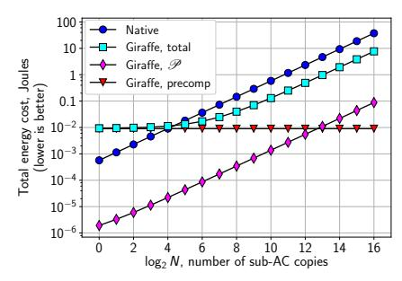
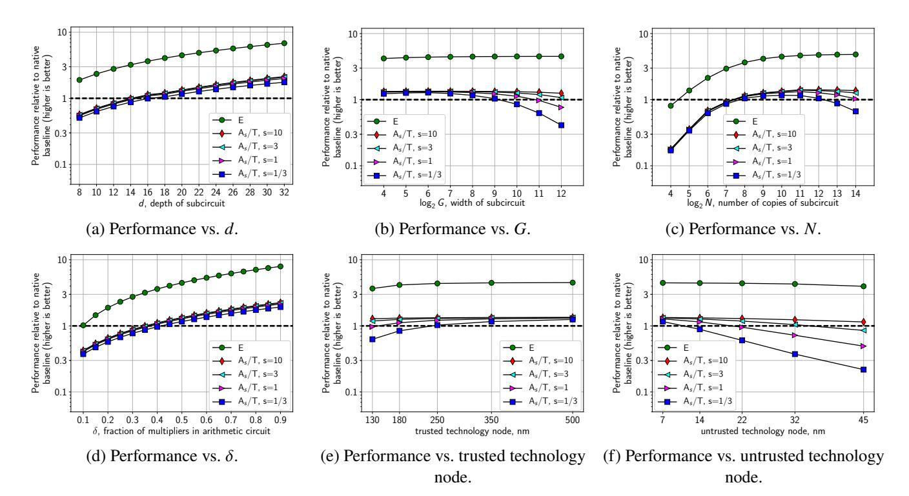
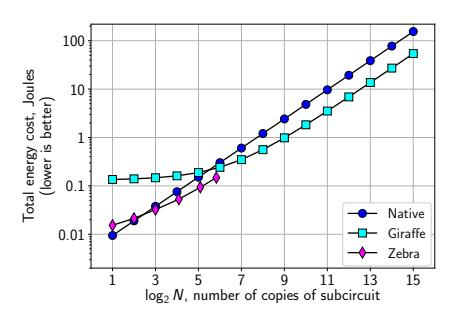
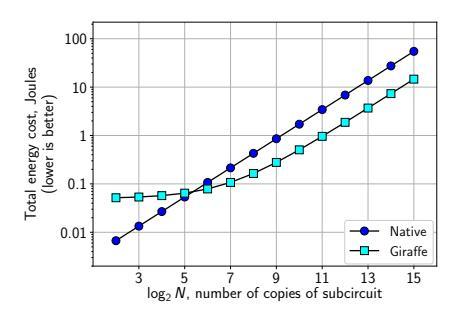

# **Full accounting for verifiable outsourcing**

Riad S. Wahby⋆ rsw@cs.stanford.edu Ye Ji◦ yj682@nyu.edu Andrew J. Blumberg† blumberg@math.utexas.edu

abhi shelat‡ abhi@neu.edu Justin Thaler△ justin.thaler@georgetown.edu Michael Walfish◦ mwalfish@cs.nyu.edu Thomas Wies◦ wies@cs.nyu.edu

<sup>⋆</sup>Stanford ◦NYU †UT Austin ‡Northeastern △Georgetown

September 5, 2017

**Abstract.** Systems for verifiable outsourcing incur costs for a *prover*, a *verifier*, and precomputation; outsourcing makes sense when the combination of these costs is cheaper than not outsourcing. Yet, when prior works impose quantitative thresholds to analyze whether outsourcing is justified, they generally ignore prover costs. Verifiable ASICs (VA)—in which the prover is a custom chip—is the other way around: its cost calculations ignore precomputation.

This paper describes a new VA system, called *Giraffe*; charges Giraffe for all three costs; and identifies regimes where outsourcing is worthwhile. Giraffe's base is an interactive proof geared to dataparallel computation. Giraffe makes this protocol *asymptotically optimal* for the prover and improves the verifier's main bottleneck by almost 3×, both of which are of independent interest. Giraffe also develops a *design template* that produces hardware designs automatically for a wide range of parameters, introduces hardware primitives molded to the protocol's data flows, and incorporates program analyses that expand applicability. Giraffe wins even when outsourcing several tens of sub-computations, scales to 500× larger computations than prior work, and can profitably outsource *parts* of programs that are not worthwhile to outsource in full.

# **1 Introduction**

In probabilistic proofs—Interactive Proofs (IPs) [\[12,](#page-25-0) [49,](#page-26-0) [50,](#page-26-1) [58,](#page-27-0) [76\]](#page-27-1), arguments [\[30,](#page-26-2) [52,](#page-26-3) [54,](#page-26-4) [62\]](#page-27-2), SNARGs [\[48\]](#page-26-5), SNARKs [\[26,](#page-25-1) [47\]](#page-26-6), and PCPs [\[9,](#page-25-2) [10\]](#page-25-3)—a *prover* efficiently convinces a *verifier* of a claim, in such a way that the verifier is highly likely to reject a false claim. These protocols are foundational in complexity theory and cryptography. There has also been substantial progress in implementations over the last six years [\[14,](#page-25-4) [15,](#page-25-5) [17–](#page-25-6)[19,](#page-25-7) [21,](#page-25-8) [22,](#page-25-9) [32,](#page-26-7) [34,](#page-26-8) [36,](#page-26-9) [37,](#page-26-10) [39,](#page-26-11) [40,](#page-26-12) [42,](#page-26-13) [45,](#page-26-14) [47,](#page-26-6) [56,](#page-26-15) [64,](#page-27-3) [66,](#page-27-4) [72–](#page-27-5)[75,](#page-27-6) [77,](#page-27-7) [79,](#page-27-8) [81–](#page-27-9) [83,](#page-27-10) [87\]](#page-27-11) (for a survey, see [\[84\]](#page-27-12)), based on theoretical refinements and systems work.

A central application example is *verifiable outsourcing*. The verifier specifies a computation and input; the prover returns the (purported) output and proves the claim that "the returned output equals the computation applied to the input." The essential property here is that the verifier's probabilistic checks are asymptotically less expensive than executing the computation; as a result, outsourcing can be worthwhile for the verifier. This picture partially motivated the original theory [\[13,](#page-25-10) [46,](#page-26-16) [49,](#page-26-0) [62\]](#page-27-2) and has reappeared in tales of outsourcing to the cloud. But to validate these stories, one must consider three kinds of costs:

- *Prover overhead.* Even in the best general-purpose probabilistic proof protocols, the prover has enormous overhead in running the protocol versus simply executing the underlying computation: the ratio between these is typically at least 10<sup>7</sup> [\[84,](#page-27-12) Fig. 5].
- *Precomputation.* Many of the implemented protocols require a setup phase, performed by the verifier or a party that the verifier trusts. This phase is required for each computation and can be reused over

different input-output instances. Its costs are usually proportional to the time to run the computation. (Precomputation can be asymptotically suppressed or even eliminated, but at vastly higher concrete cost [\[17,](#page-25-6) [21,](#page-25-8) [22,](#page-25-9) [34\]](#page-26-8); see [§10.](#page-23-0))

• *Verifier overhead.* Separate from precomputation, there are inherent costs that the verifier incurs for each input-output instance. These costs are at least linear in the input and output lengths.

More or less tacitly, "practical" work in this area has bundled in assumptions about the regimes in which these costs are reasonable for the operator of the verifier.1 For example, one way to tame the costs is not to charge the operator for precomputation. This is the approach taken in Pinocchio, which focuses on per-instance verifier overhead [\[66,](#page-27-4) [67\]](#page-27-13).2 This choice can be justified if there is a trusted third party with extremely inexpensive cycles.

Another possibility is to target data-parallel computations, meaning identical sub-computations on different inputs. Here, one can charge the operator of the verifier for the precomputation, which amortizes, and then identify *cross-over points* where the verifier saves work from outsourcing [\[32,](#page-26-7) [37,](#page-26-10) [66,](#page-27-4) [73–](#page-27-14) [75,](#page-27-6) [81,](#page-27-9) [83,](#page-27-10) [87\]](#page-27-11).

In both of these cases, prover overhead is measured but in some sense ignored (when considering whether outsourcing is worthwhile). This would make sense if the prover's cycles were vastly cheaper than the verifier's—the required ratio is approximately the prover's overhead: 107×—or if the outsourced computation could not be executed in any other way.

Recently, Zebra [\[82\]](#page-27-15) used a different justification by observing that one can gain high-assurance execution of custom chips (ASICs) by using trusted slow chips to verify the outputs of untrusted fast chips. In this *Verifiable ASICs* (VA) domain ([§2.3\)](#page-5-0), one can charge the operator for both verifier and prover and still identify regimes where their combination outperforms a baseline of executing the functionality in a trusted slow chip. However, Zebra does not charge for precomputation—and worse, introduces a preposterous assumption about daily delivery of hard drives to handle the problem.

The work of this paper is to create a system, Giraffe; to *charge the operator for all three costs*; and to seek out regimes where this combined cost is superior to the baseline. Giraffe builds on Zebra and likewise targets the VA setting. However, some of Giraffe's results and techniques apply to verifiable outsourcing more generally.

Giraffe has two high-level aspects. The first is a new probabilistic proof built on a protocol that we call *T13* [\[77,](#page-27-7) §7]. As with all work in this area, T13 requires computations to be expressed as *arithmetic circuits*, or ACs ([§2.1\)](#page-3-0). T13 has three key advantages: (a) T13 is a variant of CMT [\[36,](#page-26-9) [49\]](#page-26-0), which is Zebra's base, and thus promises amenability to hardware implementation; (b) in the VA context, T13 can in principle pay for precomputation and break even, because it is geared to the aforementioned data-parallel model: precomputation is proportional to one sub-computation, and amortizes over *N* sub-computations; and (c) T13 ought to permit breaking even for small *N*: CMT has low overhead compared to alternatives [\[84\]](#page-27-12). From this starting point, Giraffe does the following ([§3\)](#page-7-0):

<sup>1</sup>A variant of this story, exploiting the zero knowledge property of some probabilistic proofs, such as SNARKs [\[26,](#page-25-1) [47\]](#page-26-6), includes applications where the proof can incorporate input hidden from the verifier [\[18,](#page-25-11) [39,](#page-26-11) [64,](#page-27-3) [66\]](#page-27-4). Here, one does not obsess over the verifier's overhead or total cost comparisons because the verifier cannot execute locally. Nevertheless, identifying regimes where overhead is reasonable similarly requires some effort. We do not discuss in detail, but see [§9](#page-22-0) and [§10.](#page-23-0)

<sup>2</sup>Pinocchio certainly considers precomputation [\[66,](#page-27-4) §5.3], but its emphasized comparison is between native execution and verifier overhead.

- Giraffe improves T13. Most significantly, Giraffe makes the prover asymptotically time-optimal: for sufficiently large *N*, the prover's work is now only a multiple (≈ 10×) of executing the AC ([§3.1\)](#page-8-0). This can save an order of magnitude or more for any implementation of T13 in any context (for example, vSQL [\[87\]](#page-27-11)), and is of independent interest.
- Giraffe develops a *design template* that automatically instantiates physically realizable, efficient, high-throughput ASIC designs for the prover and verifier. The basic challenge is that, consistent with our search for applicable regimes, there are variables with wide ranges: small and large *N*, different hardware substrates, etc. As a result, the optimal architectures are diverse. For example, large ACs (large sub-computations and/or large *N*) must iteratively reuse the underlying hardware whereas small ACs call for high parallelism. Giraffe responds with the *RWSR*: a new hardware structure that, when applied to the data flows in T13, both runs efficiently in serial execution and parallelizes easily.
- Giraffe demonstrates algorithmic improvements that apply to all CMT-based systems [\[36,](#page-26-9) [77,](#page-27-7) [79,](#page-27-8) [81,](#page-27-9) [82,](#page-27-15) [87\]](#page-27-11). This includes reducing the verifier's main bottleneck by ≈3× ([§3.3\)](#page-12-0), eliminating a log factor from one of the verifier's other computations by shifting additional work to the prover, and other optimizations that result in constant-factor improvements (Appx. [B.2\)](#page-35-0).

The second aspect of Giraffe is motivated by our search for applicable regimes. In existing systems, protocol overhead limits the maximum size of a computation that can be outsourced. Worse, outsourcing really makes sense only if the computation is naturally expressed as an AC; otherwise, the asymptotic savings do not apply until program sizes are well beyond the aforementioned maximum. While these systems differ in the particulars, their restrictions are qualitatively similar—and there has been no fundamental progress on the expressivity issue over the last six years. As a consequence, it seems imperative to adapt to this situation. Two possible approaches are to handle these constraints by outsourcing amenable pieces of a given computation and to apply program transformations to increase the range of suitable computations. These ideas have of course appeared in the literature on compiling cryptographic protocols [\[43,](#page-26-17) [45,](#page-26-14) [59,](#page-27-16) [86\]](#page-27-17), but previous efforts in the context of verifiable outsourcing have been very limited [\[37,](#page-26-10) [83\]](#page-27-10).

We study techniques for each of these approaches, adapted to this setting ([§4\)](#page-14-0). Giraffe employs *slicing*, which takes as input an abstract cost model and a program, automatically identifies amenable subregions of the program, and generates glue code to sew the outsourced pieces into the rest of the program. Slicing is a very general technique that can work with all probabilistic proof implementations. Giraffe also uses *squashing*, which transforms sequential ACs into parallel ACs and adjusts the verifier to link these computations; this is relevant to CMT and T13, which require parallel ACs.

Our implementation of Giraffe ([§5\)](#page-15-0) applies the above transformations to programs written in a subset of C, producing one or more ACs. Giraffe's design template uses these ACs, along with several physical parameters (hardware substrates, chip area, etc.), and automatically generates concrete hardware designs for the prover and verifier, built in SystemVerilog, that can be used for cycle-accurate simulation or synthesized (i.e., compiled to a chip).

We evaluate using detailed simulation and modeling of these generated hardware designs. Accounting for all costs (prover, precomputation, verifier), Giraffe saves compared to native execution across a wide range of computation sizes and hardware substrates ([§6.2\)](#page-17-0). Giraffe breaks even on operating costs for *N*≈30 parallel sub-computations; this value is essentially independent of the size of each sub-computation ([§6.1\)](#page-16-0). Compared to prior work in the VA setting, Giraffe scales to 500× larger computation sizes, holding all else constant ([§8.1\)](#page-20-0). A disadvantage of Giraffe is that its verifier is costlier than Zebra's, and thus Giraffe's break-even point is higher than Zebra's. This is not because Zebra is fundamentally cheaper, but rather because it assumes away precomputation and thus does not have to pay for it. Furthermore, Giraffe's program analysis techniques expand applicability beyond Zebra; our experiments demonstrate that slicing enables an image-matching application that neither Zebra nor Giraffe could otherwise handle ([§8.2\)](#page-21-0).

Nevertheless, Giraffe has limitations (some of which reflect the research area itself ([§9\)](#page-22-0)). Breaking even requires data-parallel computations (to amortize precomputation), requires that the computation be naturally expressed as a layered AC, and requires a large gap between the hardware technologies used for the verifier and prover (which holds in some concrete settings; see [\[82,](#page-27-15) §1]). Moreover, the absolute cost of verifiability is still very high. Finally, the program transformation techniques have taken only a small first step.

Despite these limitations, we think that Giraffe has a substantial claim to significance: it adopts the most stringent cost regime in the verifiable outsourcing literature and (to our knowledge) is the only system that *can* profitably outsource under this accounting.

**Debts and contributions.** Giraffe builds on the T13 protocol [\[77,](#page-27-7) §7] and an optimization [\[78\]](#page-27-18) ([§2.2\)](#page-4-0). It also generalizes a prior technique [\[1–](#page-25-12)[3,](#page-25-13) [77,](#page-27-7) [82\]](#page-27-15) ([§3.2,](#page-9-0) "Algorithm"). Finally, Giraffe borrows from Zebra [\[82\]](#page-27-15), specifically: the setting ([§2.3\)](#page-5-0), how to evaluate in that setting ([§2.3,](#page-5-0) [§6.2\)](#page-17-0), a high-level design strategy (implicit in this paper), a design for a module within the prover (footnote [5\)](#page-9-0), and the application to Curve25519 ([§8.1\)](#page-20-0). Giraffe's contributions are:

- Algorithmic refinements of the T13 interactive proof, yielding an asymptotically optimal prover ([§3.1\)](#page-8-0) and a ≈3× reduction in the verifier's main bottleneck ([§3.3\)](#page-12-0).
- Hardware design templates for prover and verifier chips ([§3.2,](#page-9-0) "Computing in hardware"; [§3.3\)](#page-12-0). We note that *automatically generating a wide variety of optimized hardware designs* is a significant technical challenge; it is achieved here via the introduction of the RWSR (and other hardware primitives), and the observation that RWSRs service a wide range of possible designs.
- Techniques for compiling from a subset of C to ACs while automatically optimizing for outsourcing based on cost models ([§4\)](#page-14-0).
- An implemented pipeline that takes as input a program in a subset of C and physical parameters, and produces hardware designs automatically ([§5\)](#page-15-0).
- Evaluation of the whole system ([§6–](#page-16-1)[§8\)](#page-20-1) and a new application of verifiable outsourcing: image matching using a pyramid ([§8.2\)](#page-21-0).
- The first explicit consideration of the stringent, tripartite cost regime, and—for all of Giraffe's limitations—being the first that can at least sometimes outsource profitably in that regime.

## <span id="page-3-1"></span>**2 Background**

### <span id="page-3-0"></span>**2.1 Probabilistic proofs for verifiability**

The description below is intended to give necessary terminology; it does not cover all variations in the literature.

Systems for verifiable outsourcing enable the following. A *verifier* V specifies a computation Ψ (often expressed in a high-level language) to a *prover* P. V determines input *x*; P returns y, which is purportedly Ψ(*x*). A protocol between V and P allows V to check whether y = Ψ(*x*) but without executing Ψ. There are few (and sometimes no) assumptions about the scope of P's misbehavior.

These systems typically have a *front-end* and a *back-end*. The interface between them is an *arithmetic circuit* (AC). In an AC, the domain is a finite field F, usually F<sup>p</sup> (the integers mod a prime p); "gates" are field operations (add or multiply), and "wires" are field elements. The front-end transforms  $\Psi$  from its original expression to an AC, denoted C; this step often uses a compiler [19, 22, 31, 32, 37, 45, 66, 73, 75, 81, 83], though is sometimes done manually [18, 36, 77]. The back-end is a probabilistic proof protocol, targeting the assertion "y = C(x)"; this step incorporates tools from complexity theory and sometimes cryptography.

## <span id="page-4-0"></span>2.2 Starting point for Giraffe's back-end: T13

Giraffe's back-end builds on a line of interactive proofs [12, 49, 50, 58, 76]: GKR [49], as refined and implemented by CMT [36], Allspice [81], Thaler [77], and Zebra [82]. Our description below sometimes borrows from [81, 82].

In these works, the AC C must be *layered*: the gates are partitioned, and there are wires only between adjacent partitions (layers). Giraffe's specific base is T13 [77, §7], with an optimization [78]. T13 requires data parallelism: C must have N identical sub-circuit copies, each with its own inputs and outputs (x and y now denote the aggregate inputs and outputs). We call each copy a sub-AC. Each sub-AC has d layers. For simplicity, we assume that every sub-AC layer has the same width, G (this implies that  $|x| = |y| = N \cdot G$ ). The properties of T13 are given below; probabilities are over V's random choices (Appx. A justifies these properties, by proof and reference to the literature):

- Completeness. If y = C(x), and if  $\mathcal{P}$  follows the protocol, then  $\Pr{\mathcal{V} \text{ accepts}} = 1$ .
- Soundness. If  $y \neq C(x)$ , then  $\Pr\{\mathcal{V} \text{ accepts}\} < \epsilon$ , where  $\epsilon = (\lceil \log |y| \rceil + 6d \log (G \cdot N))/|\mathbb{F}|$ . This holds unconditionally (no assumptions about  $\mathcal{P}$ ). Typically,  $|\mathbb{F}|$  is astronomical, making this error probability tiny.
- **Verifier's running time**.  $\mathcal{V}$  requires precomputation that is proportional to executing one sub-AC:  $O(d \cdot G)$ . Then, to validate all inputs and outputs,  $\mathcal{V}$  incurs cost  $O(d \cdot \log(N \cdot G) + |x| + |y|)$  (which, under our "same-size-layer assumption", is  $O(d \cdot \log(N \cdot G) + N \cdot G)$ ). Notice that the total cost to verify C,  $O(d \cdot G + d \cdot \log N + N \cdot G)$ , is less than the cost to execute C directly, which is  $O(d \cdot G \cdot N)$ .
- **Prover's running time**.  $\mathcal{P}$ 's running time is  $O(d \cdot G \cdot N \cdot \log G)$ ; we improve this later (§3.1).

**Details.** Within a layer of C, each gate is labeled with a pair  $(n, g) \in \{0, 1\}^{b_N} \times \{0, 1\}^{b_G}$ , where  $b_N \triangleq \log N$  and  $b_G \triangleq \log G$ . (We assume for simplicity that N and G are powers of 2.) We also view labels numerically, as elements in  $\{0, \ldots, N-1\} \times \{0, \ldots, G-1\}$ . In either case, n (a gate label's upper bits) selects a sub-AC, and g (a gate label's lower bits) indexes a gate within the sub-AC.

Each layer *i* has an *evaluator function*  $V_i$ :  $\{0,1\}^{b_N} \times \{0,1\}^{b_G} \to \mathbb{F}$  that maps a gate's label to the output of that gate;<sup>3</sup> implicitly,  $V_i$  depends on the input *x*. By convention, the layers are numbered in reverse execution order. Thus,  $V_0$  refers to the output layer, and  $V_d$  refers to the inputs. For example,  $V_0(n, j_1)$  is the correct  $j_1$ th output in sub-AC n; likewise,  $V_d(n, j_2)$  is the  $j_2$ th input in sub-AC n.

Notice that  $\mathcal V$  wants to be convinced that y, the purported outputs, matches the correct outputs, as given by  $V_0$ . However,  $\mathcal V$  cannot check this directly: evaluating  $V_0$  would require re-executing  $\mathcal C$ . Instead,  $\mathcal P$  combines all  $V_0(\cdot)$  values into a digest. Then, the protocol reduces this digest to another digest, this one (purportedly) corresponding to all of the values  $V_1(\cdot)$ . The protocol proceeds in this fashion, layer by layer, until  $\mathcal V$  is left with a purported digest of the input x, which  $\mathcal V$  can then check itself.

Instantiating the preceding sketch requires some machinery. A key element is the *sum-check* protocol [58], which we will return to later (§3.1). For now, let  $P: \mathbb{F}^m \to \mathbb{F}$  be an *m*-variate polynomial.

<sup>&</sup>lt;sup>3</sup>This definition of  $V_i$  transposes the domain relative to [77, §7].

In a sum-check *invocation*,  $\mathcal{P}$  interactively establishes for  $\mathcal{V}$  a claim about the sum of the evaluations of P over the Boolean hypercube  $\{0,1\}^m$ ; the number of protocol rounds is m.

Another key element is *extensions*. Technically, an extension  $\tilde{f}$  of a function f is a polynomial that is defined over a domain that encloses the domain of f and equals f at all points where f is defined. Informally, one can think of  $\tilde{f}$  as encoding the function table of f. In this paper, extensions will always be *multilinear extensions*: the polynomial has degree at most one in each of its variables. We notate multilinear extensions with tildes.

Based on the earlier sketch, we are motivated to express  $\tilde{V}_{i-1}$  in terms of  $\tilde{V}_i$ . To that end, we define several predicates. The functions  $\operatorname{add}(\cdot)$  and  $\operatorname{mult}(\cdot)$  are wiring predicates; they have signatures  $\{0,1\}^{3b_G} \to \{0,1\}$ , and implicitly describe the structure of a sub-AC.  $\operatorname{add}_i(g,h_0,h_1)$  returns 1 iff (a) within a sub-circuit, gate g at layer i-1 is an add gate and (b) the left and right inputs of g are, respectively,  $h_0$  and  $h_1$  at layer i.  $\operatorname{mult}_i$  is defined analogously. Note that these predicates ignore the "top bits" (the n component) because all sub-ACs are identical. We also define the equality predicate eq:  $\{0,1\}^{2b_N} \to \{0,1\}$  with  $\operatorname{eq}(a,b)=1$  iff a equals b. Notice that these predicates admit extensions:  $\operatorname{add}, \operatorname{mult} \colon \mathbb{F}^{3b_G} \to \mathbb{F} \text{ and } \widetilde{\operatorname{eq}} \colon \mathbb{F}^{2b_N} \to \mathbb{F}$ . (We give explicit expressions in Appx. A.)

We can now express  $\tilde{V}_{i-1}$  in terms of a polynomial  $P_{q,i}$ :

<span id="page-5-2"></span><span id="page-5-1"></span>
$$P_{q,i}(r_{0}, r_{1}, r') \triangleq \widetilde{eq}(q', r') \\ \cdot \left[ \widetilde{add}_{i}(q, r_{0}, r_{1}) \cdot \left( \widetilde{V}_{i}(r', r_{0}) + \widetilde{V}_{i}(r', r_{1}) \right) \right. \\ \left. + \widetilde{mult}_{i}(q, r_{0}, r_{1}) \cdot \widetilde{V}_{i}(r', r_{0}) \cdot \widetilde{V}_{i}(r', r_{1}) \right]. \tag{1}$$

$$\widetilde{V}_{i-1}(q', q) = \sum_{h_{0}, h_{1} \in \{0,1\}^{b_{G}}} \sum_{n \in \{0,1\}^{b_{N}}} P_{q,i}(h_{0}, h_{1}, n). \tag{2}$$

The signatures are  $P_{q,i} : \mathbb{F}^{2b_G + b_N} \to \mathbb{F}$  and  $\tilde{V}_{i-1}, \tilde{V}_i : \mathbb{F}^{b_N} \times \mathbb{F}^{b_G} \to \mathbb{F}$ . Equation (2) follows from an observation of [78] applied to a claim in [77, §7]. For intuition, notice that (i)  $P_{q,i}$  is being summed only at points where its variables are 0-1, and (ii) at these points, if (q', q) is a gate label (rather than an arbitrary value in  $\mathbb{F}^{b_N} \times \mathbb{F}^{b_G}$ ), then the extensions of the predicates take on 0-1 values and in particular eliminate all summands except the one that contains the inputs to the gate (q', q).

An excerpt of the protocol appears in Figure 1; the remainder appears in Appendix A. It begins with  $\mathcal V$  wanting to be convinced that  $\tilde V_0$  (which is the extension of the correct C(x)) is the same polynomial as  $\tilde V_y$  (which denotes the extension of the purported output y).  $\mathcal V$  thus chooses a random point in both polynomials' domain,  $(q_0', q_0)$ , and wants to be convinced that  $\tilde V_0(q_0', q_0) = \tilde V_y(q_0', q_0) \triangleq a_0$ . Notice that (i)  $\tilde V_0(q_0', q_0)$  can be expressed as the sum over a Boolean hypercube of the polynomial  $P_{q_0,1}$  (Equation (2)), and (ii)  $P_{q_0,1}$  itself is expressed in terms of  $\tilde V_1$  (Equation (1)). Using a sum-check invocation, the protocol exploits these facts to reduce  $\tilde V_0(q_0', q_0) = a_0$  to a claim:  $\tilde V_1(q_1', q_1) = a_1$ . This continues layer by layer until  $\mathcal V$  obtains the claim:  $\tilde V_d(q_d', q_d) = a_d$ .  $\mathcal V$  checks that assertion directly.

T13 incorporates one sum-check invocation—each of which is  $2b_G + b_N$  rounds—for each polynomial  $P_{q_0,1}, \ldots, P_{q_{d-1},d}$ .

#### <span id="page-5-0"></span>2.3 Verifiable ASICs

Giraffe's back-end works in the *Verifiable ASICs* (VA) setting [82]. Giraffe also borrows evaluation metrics and some design elements from [82]; we summarize below.

Consider some *principal* (a government, fabless semiconductor company, etc.) that wants high-assurance execution of a custom chip (known as an ASIC) [82, §1,§2.1]. The ASIC must be manufactured at a trustworthy foundry, for example one that is onshore. However, for many principals, high-assurance

```
1: function Verify(ArithCircuit c, input x, output y)
          (q_0', q_0) \stackrel{R}{\leftarrow} \mathbb{F}^{\log N} \times \mathbb{F}^{\log G}
           a_0 \leftarrow \tilde{V}_y(q'_0, q_0) // \tilde{V}_y is the multilin. ext. of the output y
  3:
           SendToProver(q'_0, q_0)
  4:
  5:
           d \leftarrow \text{c.depth}
  6:
           for i = 1, ..., d do
  7:
              // Reduce \tilde{V}_{i-1}(q'_{i-1},q_{i-1})\overset{?}{=}a_{i-1} to P_{q,i}(r_0,r_1,r')\overset{?}{=}e (e,r',r_0,r_1)\leftarrow \text{SumCheckV}(i,\,a_{i-1})
  8:
  9:
10:
11:
               // Below, \mathcal{P} describes a univariate polynomial H(t),
12:
               // of degree log G, claimed to be \tilde{V}_i(r', (r_1 - r_0)t + r_0)
13:
               H \leftarrow \text{Receive from } \mathcal{P} \text{ // see Figure 14, line 47}
14:
               v_0 \leftarrow H(0)
               v_1 \leftarrow H(1)
15:
16:
               // Reduce P_{q,i}(r_0, r_1, r') \stackrel{?}{=} e to two questions:
17:
              // \tilde{V}_i(r', r_0) \stackrel{?}{=} v_0 and \tilde{V}_i(r', r_1) \stackrel{?}{=} v_1
18:
19:
               \mathbf{if}\ e \neq \widetilde{\mathrm{eq}}(q_{i-1}',\,r') \cdot \left[ \widetilde{\mathrm{add}}_i(q_{i-1},r_0,r_1) \cdot (v_0+v_1) \right.
20:
                                               +\tilde{\text{mult}}_i(q_{i-1}, r_0, r_1) \cdot v_0 \cdot v_1 then
21:
22:
23:
               // Reduce the two v_0, v_1 questions to \tilde{V}_i(q_i', q_i) \stackrel{?}{=} a_i
24:
25:
               a_i \leftarrow H(\tau_i)
26:
               (q_i', q_i) \leftarrow (r', (r_1 - r_0) \cdot \tau_i + r_0)
27:
28:
29:
               SendToProver(\tau_i)
30:
           // \tilde{V}_d(\cdot) is the multilinear extension of the input x
31:
32:
           if V_d(q'_d, q_d) = a_d then
33:
               return accept
34:
           return reject
```

FIGURE 1—V's side of T13 [77, §7], with an optimization [78]. V's side of the sum-check protocol and P's work are described in Appendix A, Figures 11 and 14.

manufacture means an orders-of-magnitude sacrifice in price and performance, relative to an advanced but untrusted foundry. This owes to the economics and scaling behavior of semiconductor technology. In the VA setup, one manufactures a prover in a state-of-the-art but untrusted foundry (we refer to the manufacturing process and hardware substrate as the *untrusted technology node*) and a verifier in a trusted foundry (the *trusted technology node*). A trusted integrator combines the two ASICs. This arrangement makes sense if their combined cost is cheaper than the *native baseline*: an ASIC manufactured in the trusted technology node.

VA is instantiated in a system called Zebra, which implements an optimized variant of CMT [36, 78, 81]. Zebra is evaluated with two metrics [82,  $\S 2.3$ ]. The first is *energy* (E, in joules/run), which is a proxy for operating cost. Energy tracks asymptotic (serial) running time: it captures the number of operations and the efficiency of their implementation. The second is *area/throughput* (A/T, in mm²/(ops/sec)). Area is a proxy for manufacturing cost; normalizing by throughput reflects cost at a given performance level.

Furthermore, Zebra is designed to respect two physical constraints. The first is a maximum area, to reflect manufacturability (larger chips have more frequent defects and hence lower yields). The second is a maximum power dissipation, to limit heat. The first constraint limits *A* (and thus the hardware design space) and the second limits the product of energy and throughput, *E* · *T*.

Zebra's prover architecture consists of a collection of pipelined *sub-provers*, each one doing the execution and proving work for one layer of an AC [\[82,](#page-27-15) §3.1–3.2]. Within a sub-prover, there is dedicated hardware for each AC gate in a layer. Zebra's verifier is also organized into layers [\[82,](#page-27-15) §3.5]. Giraffe incorporates this overall picture, including some integration details [\[82,](#page-27-15) §4]. However, Giraffe requires a different architecture, as we explain next.

## <span id="page-7-0"></span>**3 Protocol and hardware design**

Three goals drive Giraffe's hardware back-end:

**G1: Scale to large** *N* **without sacrificing** *G***.** V's precomputation scales with the size of one sub-AC ([§2.2\)](#page-4-0); it needs to amortize this over multiple sub-AC copies, *N*. Further, we have an interest in handling large computations (sub-ACs and ACs). This implies that Giraffe's design must reuse underlying hardware modules: for large *N* and sub-AC width *G*, requiring a number of modules proportional to *N* · *G* is too costly. Zebra's design is not suitable, since it requires logic proportional to the amount of work in an AC layer [\[82,](#page-27-15) Fig. 5].

**G2: Be efficient.** In this context, good efficiency implies lower cross-over points on the metrics of merit ([§2.3\)](#page-5-0). This in turn means custom hardware, which is expected in ASIC designs but, for us, is in tension with the next goal.

**G3: Produce designs automatically.** Ideally, the goal is to produce a compiler that takes as input a high-level description of the computation along with physical parameters (technology nodes, chip area, etc.; [§2.3\)](#page-5-0) and produces synthesizable hardware ([§5\)](#page-15-0). This goes beyond convenience: a goal of this work is to understand where, in terms of computations (*G*, *N*, etc.) and physical parameters (technology nodes, chip area, etc.), an abstract algorithm (T13) applies. To do this, we need to be able to optimize hardware for both the computations and the physical parameters, which poses a significant challenge: for different computations and physical parameters, different hardware designs make sense. For example, if *N* and *G* are small, iteratively reusing hardware might not consume all available chip area; one would prefer to spend this area to gain parallelism and thus increase throughput.

Giraffe answers this challenge by developing a *design template* that takes as input a description of the desired computation and a set of physical parameters, and produces as output an optimized hardware design. The template's "primitives" are custom hardware structures that enable efficient reuse (serial execution) when there are few of them, but can be automatically parallelized. To use the design template, the designer simply specifies its inputs; design generation is fully automatic.

In the rest of the section, we modify T13 to obtain an asymptotic improvement in P's work ([§3.1\)](#page-8-0); this contributes to Giraffe's scalability, and is of independent interest. We also describe aspects of the hardware design template for P ([§3.2\)](#page-9-0). Finally, we do the same for V, and also describe optimizations that help offset the cost of precomputation ([§3.3\)](#page-12-0). Compared to prior work, these optimizations reduce V's primary cost by nearly 3× and eliminate a log factor from one of V's secondary costs; since V's costs dominate, these optimizations have a direct effect on end-to-end performance.

**Notation.** [*a*, *<sup>b</sup>*] denotes {*a*, *<sup>a</sup>* <sup>+</sup> <sup>1</sup>, . . ., *<sup>b</sup>*}. For a vector *<sup>u</sup>*, *<sup>u</sup>*[ℓ] denotes the <sup>ℓ</sup>th entry, indexed from 1; *<sup>u</sup>*[ℓ1..ℓ2] denotes the sub-vector between indices <sup>ℓ</sup><sup>1</sup> and <sup>ℓ</sup>2, inclusive. Arrays are accessed similarly, but are indexed from 0. Vectors are indicated with lower-case letters, arrays with upper-case. Define  $\chi_0, \chi_1 \colon \mathbb{F} \to \mathbb{F}$  as  $\chi_1(w) = w$ ,  $\chi_0(w) = 1 - w$ . Similarly, if  $s \in \{0, 1\}^{\gamma}$  and  $u \in \mathbb{F}^{\gamma}$ ,  $\chi_s(u) \triangleq \prod_{\ell=1}^{\gamma} \chi_{s[\ell]}(u[\ell])$ . Notice that when u comprises 0-1 values,  $\chi_s(u)$  returns 1 if u = s and 0 otherwise.

### <span id="page-8-0"></span>3.1 Making $\mathcal{P}$ time-optimal

This section describes an algorithmic refinement that, by restructuring the application of the sum-check protocol, slashes  $\mathcal{P}$ 's overhead. Specifically,  $\mathcal{P}$ 's running time drops from  $O(d \cdot N \cdot G \cdot \log G)$  to  $O(d \cdot (N \cdot G + G \cdot \log G))$ . If  $N \gg \log G$ ,  $\mathcal{P}$ 's new running time is linear in the number of total gates in the AC—that is, the prover has no asymptotic overhead! Prior work [77, §5] achieved time-optimality in special cases (if the AC's structure met an ad hoc and restrictive condition); the present refinement applies in general, whenever there are repeated sub-ACs.

The  $O(\log G)$  reduction translates to concrete double digit factors (Appx. D). For example, software provers in this research area [36, 77, 79, 81, 87] typically run with G at least  $2^{18}$ ; thus, a software T13 prover's running time improves by at least  $18\times$ . For a hardware prover, the A/T metric improves by approximately  $\log G$ , as computation is the main source of area cost (Appx. C, [82, Fig. 6 and 7]). The gain is less pronounced for the E metric: storage and communication are large energy consumers but are unaffected by the refinement (Appx. C).

Before describing the refinement, we give some background on sum-check protocols; for details, see [8, §8.3; 49, §2.5; 58; 76]. Consider a polynomial P in m variables and a claim that  $\sum_{(t_1,\ldots,t_m)\in\{0,1\}^m} P(t_1,\ldots,t_m) = L$ . In round j of the sum-check protocol,  $\mathcal P$  must describe to  $\mathcal V$  a degree- $\alpha$  univariate polynomial  $F_j(t^*)$ , where  $\alpha$  depends on P and j:

$$F_j(t^*) = \sum_{(t_{j+1},\ldots,t_m)\in\{0,1\}^{m-j}} P(\rho_1,\ldots,\rho_{j-1},t^*,t_{j+1},\ldots,t_m).$$

To discharge this obligation,  $\mathcal{P}$  computes evaluations  $F_j(k)$ , for  $\alpha+1$  different values of k. Then, at the end of round j,  $\mathcal{V}$  sends  $\rho_j$ , for use in the next round. Notice the abstract pattern: in every round j,  $\mathcal{P}$  computes  $\alpha+1$  sums over a Boolean hypercube of dimension m-j. The number of hypercube vertices shrinks as j increases: variables that were previously summed become set, or *bound*, to a  $\rho_j$ .

Let us map this picture to our context. There is one sum-check run for each layer  $i \in [1, d]$ ; P is the per-layer polynomial  $P_{q,i}$  defined in Equation (1);  $m = 2b_G + b_N$ ; the  $\rho_j$  are aliases for the components of  $r_0, r_1, r'$ ; likewise, the  $t_j$  alias the components of  $h_0, h_1, n$ . Also,  $\alpha$  is 2 or 3; this follows from Equation (1), recalling that each multilinear extension ( $\widetilde{eq}$ ,  $\widetilde{add}$ , etc.) by definition has degree one in its variables.

There are now two interrelated questions: In what order should the variables be bound? How does  $\mathcal{P}$  compute the  $\alpha+1$  sums per round? In T13, the order is  $h_0, h_1, n$ , as in Equation (2). This enables  $\mathcal{P}$  to compute the needed sums in time  $O(N \cdot G \cdot \log G)$  per-layer [77, §7].  $\mathcal{P}$ 's total running time is thus  $O(d \cdot N \cdot G \cdot \log G)$ .

Giraffe's refinement changes the order in which variables are bound, and exploits that order to simplify  $\mathcal{P}$ 's work. Giraffe's order is  $n, h_0, h_1$ . From here on, we write  $P_{q,i}(h_0, h_1, n)$  as  $P_{q,i}^*(n, h_0, h_1)$ ;  $P_{q,i} \equiv P_{q,i}^*$  except for argument order. Below, we describe the structure of  $\mathcal{P}$ 's per-round obligations, fixing a layer i. This serves as background for the hardware design (§3.2) and as a sketch of the argument for the claimed running time. A proof, theorem statement, and pseudocode are in Appendix B.

The rounds decompose into two *phases*. Phase 1 is rounds  $j \in [1, b_N]$ . Observe that in this phase,  $\mathcal{P}$ 's sums seemingly have the form:  $F_j(k) = \sum_{n[j+1..b_N]} \sum_{h_0,h_1} P_{a,i}^*(r'[1..j-1], k, n[j+1..b_N], h_0, h_1)$ ,

where the outer sum is over all  $n[j+1..b_N] \in \{0,1\}^{b_N-j}$ . However, many  $(h_0,h_1)$  combinations cause  $P_{q,i}^*(\ldots,h_0,h_1)$  to evaluate to 0.4 As a result, there is a more convenient form for the inner sum. Define  $S_{\text{all},i} \subseteq \{0,1\}^{3b_G}$  as all layer-(i-1) gates with their layer-i neighbors, and  $OP_g$  as "+" if g is an addition gate and "·" if g is a multiplication gate. Then  $F_i(k)$  can be written as:

$$F_{j}(k) = \sum_{n[j+1..b_{N}]} \sum_{(g,g_{L},g_{R})\in S_{\text{all},i}} \text{termP1}_{j,n,k} \cdot \text{termP2}_{g}$$
$$\cdot \text{OP}_{g}(\text{termL}_{j,n,g_{L},k}, \text{termR}_{j,n,g_{R},k}), \tag{3}$$

where termP1 depends on j, n, k; termP2 depends on g, and so forth; these also depend on values of  $\rho$  from prior rounds and prior layers. Section 3.2 makes some of these terms explicit (Appx. B fully specifies).

Phase 2 is the remaining  $2b_G$  rounds. Here, there is only a single sum, over increasingly bound components of  $h_0$ ,  $h_1$ . As with phase 1, it is convenient to express the sum "gatewise". Specifically, for rounds  $j \in [b_N+1,\ b_N+2b_G]$ , one can write  $F_j(k) = \sum_{(g,g_L,g_R)\in S_{\text{all},i}} \text{term} P_{j,g,k} \cdot \text{OP}_g(\text{term} L_{j,g_L,k}, \text{term} R_{j,g_R,k})$ . In both phases,  $\mathcal P$  can compute each sum over  $S_{\text{all},i}$  with O(G) work. Thus, per-layer, the running time for phase 1 is  $O(G \cdot N/2) + O(G \cdot N/4) + \cdots + O(G) = O(G \cdot N)$ , and for phase 2 it is  $O(G \cdot \log G)$ , yielding the earlier claim of  $O(d \cdot (N \cdot G + G \cdot \log G))$ .

### <span id="page-9-0"></span>3.2 Design of $\mathcal{P}$

Consider  $\mathcal{P}$ 's obligations in layer i, summarized at the end of the previous section. Notice that  $\mathcal{P}$ 's phase-2 obligations are independent of N. This is a consequence of Section 3.1; there is no such independence in the original variable order [77, §7]. In the current variable order, the bulk of  $\mathcal{P}$ 's work occurs in phase 1, and so our description below focuses on phase 1.5

Within phase 1, the heaviest work item is computing termL, termR in each round. The rest of this section describes the obligation, the algorithm by which  $\mathcal{P}$  discharges it, and the hardware design that computes the algorithm.  $\mathcal{P}$ 's other obligations (computing termP1<sub>j,n,k</sub>, etc.) and algorithms for discharging them are described in Appendix B.

**Algorithm for computing termL,termR** Fixing a layer i, in round j, termL and termR are:

<span id="page-9-1"></span>
$$\operatorname{termL}_{j,n,g_L,k} \triangleq \tilde{V}_i(r'[1..j-1], k, n[j+1..b_N], g_L) \\ \operatorname{termR}_{j,n,g_R,k} \triangleq \tilde{V}_i(r'[1..j-1], k, n[j+1..b_N], g_R)$$
(4)

Notice that for each k, Equation (4) refers to  $G \cdot N/2^j$  values of  $\tilde{V}(\cdot)$ .

Figure 2 depicts an algorithm, EvalTermLR, that computes these values in time  $O(G \cdot N/2^j)$  for round j, by adapting a prior technique [77, §5.4; 82, §3.3] (see also [1–3]). EvalTermLR is oriented around a recurrence. Let h be a bottom-bit gate label at layer i. Then for all  $\sigma \in \{0,1\}^{b_N-j}$ , the following holds (derived in Appx. B.1):

<span id="page-9-2"></span>
$$\tilde{V}_{i}(r'[1..j], \sigma, h) = (1 - r'[j]) \cdot \tilde{V}_{i}(r'[1..j-1], 0, \sigma, h)
+ r'[j] \cdot \tilde{V}_{i}(r'[1..j-1], 1, \sigma, h).$$
(5)

<sup>&</sup>lt;sup>4</sup>In particular, if there is no gate at layer i-1 whose left and right inputs are  $h_0$  and  $h_1$ , then  $P_{q,i}^*(\ldots,h_0,h_1)=0$ . This is a consequence of Equation (1) in Section 2.2, and Appendix A, Equations (8) and (9).

<sup>&</sup>lt;sup>5</sup>P's phase-2 obligations are almost isomorphic to those of the Zebra prover, so Giraffe implements phase 2 with a design similar to Zebra's.

```
1: // initialize W: array of G arrays of N values
 2: for h = 0, ..., G - 1 and \sigma = 0, ..., N - 1 do
       W[h][\sigma] \leftarrow V_i(\sigma, h)
 4:
 5: function EvalTermLR(Array-of-arrays W)
       for i = 1, ..., b_N do
 6.
 7:
          look up all termL, termR in W (see text)
 8:
 9:
          r'[i] \leftarrow \text{Receive from } \mathcal{V} \text{ // see Figure 15, line 19}
10:
           for h = 0, ..., G - 1 do
11:
              Collapse(W[h], N/2^{j-1}, r'[j])
12:
13:
14: function Collapse(Array A, size len, r \in \mathbb{F})
15.
        for \sigma = 0, ..., len/2 - 1 do
           A[\sigma] \leftarrow (1-r) \cdot A[2\sigma] + r \cdot A[2\sigma+1]
16:
```

FIGURE 2—EvalTermLR: a dynamic programming algorithm for computing termL, termR for all rounds j. EvalTermLR adapts a prior technique [77, §5.4; 82, §3.3] [1–3].

EvalTermLR relies on a two-dimensional array W, and maintains the following invariant, justified shortly: at the beginning of every round j,  $W[h][\sigma]$  stores  $\tilde{V}_i(r'[1..j-1], \sigma, h)$ , for  $h \in [0, G-1]$  and  $\sigma \in [0, N/2^{j-1}-1]$ .

Given this invariant,  $\mathcal{P}$  obtains all of the termL, termR values from W (in line 7), as follows. We focus on termL. Write  $n[j+1..b_N]$  as  $n_{j+1}$ . Then, for  $k=\{0,1\}$ , termL $_{j,n,g_L,k}$  is  $W[g_L][k+2\cdot n_{j+1}]$ ; this follows from Equation (4) plus the invariant. Meanwhile, for k=-1, termL $_{j,n,g_L,-1}=2\cdot \text{termL}_{j,n,g_L,0}+(-1)\cdot \text{termL}_{j,n,g_L,1}$ . This follows from Equations (4) and (5); k=2 is similar. termR is the same, except  $g_R$  replaces  $g_L$ . The total time cost is  $O(G\cdot N/2^j)$  in round j: Collapse performs  $(N/2^{j-1})/2$  iterations, and there are G calls to Collapse.

The invariant holds for j=1 because  $\tilde{V}_i(r'[1..j-1],\sigma,h)=\tilde{V}_i(\sigma,h)=V_i(\sigma,h)$ , which initializes  $W[h][\sigma]$  (line 3); the latter equality holds because functions equal their extensions when evaluated on bit vectors. Now, at the end of j, line 16 applies Equation (5) to all  $\sigma \in [0, N/2^j-1]$ , thereby setting  $W[h][\sigma]$  to  $\tilde{V}_i(r[1..j],\sigma,h)$ . This is the required invariant at the start of round j+1.

**Computing EvalTermLR in hardware.** To produce a design template for  $\mathcal{P}$  consistent with Giraffe's goals, we must answer three questions. First, what breakdown of  $\mathcal{P}$ 's work makes sense: which portions are parallelized, and what hardware is iteratively reused in a round (G1)? Second, for iterative parts of the computation, how does  $\mathcal{P}$  load operands and store results (G2)? Finally, how can this design be adapted to a range of computations and physical parameters (G3)?

A convenient top-level breakdown is already implied by the prior formulation of W: since Collapse operates on each W[h] array independently, it is natural to parallelize work across these arrays. Giraffe allocates separate storage structures and logic implementing Collapse for each W[h] array (and, of course, reuses this hardware from round to round for each array). We therefore focus on the design of one of these modules.

To answer the second question, we first consider two straw men. The first is to imitate a software design: instantiate one module for field arithmetic and a RAM to store the W[h] array, then iterate through the  $\sigma$  loop sequentially, loading needed values, computing over them, and storing the results. In practice, however, ASIC designers often prefer to avoid building RAM circuits. This is because generality has a price (e.g., address decoding imposes overheads in area and energy), RAM often creates a throughput bottleneck, and RAM is a frequent cause of manufacturability and reliability issues. (Of

#### <span id="page-11-0"></span>**RWSR** specification

- Power-of-two storage locations, K
- Only locations 0 and 1 can be read
- The only write operation is

```
1: operator RWSR[a] \stackrel{S}{\leftarrow} v is

2: // Note that all updates happen simultaneously

3: RWSR[a] \leftarrow v

4: for \ell < K, \ell \neq a do

5: RWSR[\ell] \leftarrow RWSR[\ell + 2]

6: 7: function RWSRCollapse(RWSR R, size len, r \in \mathbb{F})

8: for \sigma = 0, \dots, \text{len}/2 - 1 do

9: R[\text{len} - 2 - \sigma] \stackrel{S}{\leftarrow} (1 - r) \cdot R[0] + r \cdot R[1]
```

FIGURE 3—Specification of a new hardware primitive, RWSR, used to implement Collapse (Fig. 2) in hardware.

course, RAMs are a dominant cost in many modern ASICs, but that doesn't mean that designers *prefer* RAM: often there is simply no alternative. For example, an unpredictable memory access pattern often necessitates RAM.)

The second straw man is essentially the opposite: instantiate a bank of registers to hold values in W[h], along with two field multipliers and one adder per pair of adjacent registers, then create a wiring pattern such that the adder for registers  $2\sigma$  and  $2\sigma+1$  connects to the input of register  $\sigma$ . This arrangement computes the entire  $\sigma$  loop in parallel. This is similar to prior work [82, §3.3], but in Giraffe O(NG) multipliers is extremely expensive when N and G are large. It is also inflexible: in this design, the number of multipliers is fixed after selecting N and G.

Giraffe's solution is a hybrid of these approaches; we first explain a serial version, then describe how to parallelize. Giraffe instantiates two multipliers and one adder that together compute one step of the  $\sigma$  loop. The remaining challenge is to get operands to the multipliers and store the result from the adder. Giraffe does so using a custom hardware structure that is tailored to the access pattern of the W[h] arrays: for each W[h], read two values, write one value, read two values, and so on. Giraffe uses RWSRs, ("random-write shift registers"), one for each W[h]. Figure 3 specifies the RWSR and shows its use for Collapse.

Compared to the first straw man, Giraffe's design has several advantages. First, an RWSR only allows two locations to be read; compared to a general-purpose RAM, this eliminates the need for most logic to handle read operations. Second, Giraffe's RWSR need not be "random-write": its  $\stackrel{s}{\leftarrow}$  operator (Fig. 3, line 1) can be specialized to the address sequence of the RWSRCollapse algorithm (Fig. 3, line 9), making its write logic far simpler than a RAM's, too. This means that an RWSR can be implemented in almost the same way as a standard shift register, and at comparable cost. Alternatively, an RWSR can be implemented like a RAM, using the same data storage circuits but dramatically simplified addressing logic. The latter approach might reduce energy consumption compared to implementing like a standard shift register, and it would still cost less than using a general-purpose RAM; but it would potentially re-introduce the above-mentioned manufacturality and reliability concerns associated with RAM circuits.

The remaining question is how this design can be efficiently and *automatically* parallelized. Notice that the loop over  $\sigma$  is serialized (because RWSRs allow only one write at a time); but what if the designer allocates enough chip area to accommodate four multipliers for W[h] instead of two? In other

words, how can Giraffe's design template automatically improve RWSRCollapse's throughput by using more chip area?

To demonstrate the approach, we refer to the pseudocode of Figure 2. First, split each W[h] array into two arrays, W1[h] and W2[h]. In place of the Collapse invocation (line 12), run two parallel invocations on W1[h] and W2[h], each of half the length. Notice that each array has increasing "empty" space as the rounds go on. In round j, the "live values" are the first  $N/2^j$  elements in each of W1[h] and W2[h]; regard W[h] as their concatenation.

To see why this gives the correct result, notice that each Collapse invocation combines neighboring values of its input array. We can thus regard the values of W[h] as the leaves of a binary tree, and Collapse as reducing the height of the tree by one, combining leaves into their parents. In this view, W1[h] and W2[h] represent the left and right subtrees corresponding to W[h]. As a result, in round  $j = b_N$ , W1[h] and W2[h] each have one value; to obtain the final value of the Collapse operation, compute  $(1-r) \cdot W1[h][0] + r \cdot W2[h][0]$ .

To implement this picture in hardware, Giraffe instantiates two RWSRs, each of half the size. For even more parallelism, observe that each RWSR corresponds to a subtree of the full computation, and thus its work can be recursively split into two even smaller RWSRs, each handling a correspondingly smaller subtree. Because of this structure, different choices of parallelism do not require the designer to do any additional design work (§5).

### <span id="page-12-0"></span>3.3 Scaling and optimizing V

In this section, we explain how  $\mathcal{V}$  meets the starting design goals of scalability, efficiency, and automation. We do so by walking through three main costs for  $\mathcal{V}$ , and how Giraffe handles them. Some of the optimizations apply to any CMT-based back-end [36, 77, 79, 81, 82, 87].

**Multilinear extensions of I/O**  $\mathcal{V}$ 's principal bottleneck is computing the multilinear extension of its input x and output y (Figure 1, lines 3 and 32). Recall (§2.2) that  $|x| = |y| = N \cdot G$ ;  $\mathcal{V}$ 's computation has at least this cost. When N and G are large, this is expensive and must be broken into parallel and serial portions. We show below that this work has a similar form to  $\mathcal{P}$ 's (termL, termR; §3.2).

Consider the input x and  $\tilde{V}_d$  (y and  $\tilde{V}_y$  are similar). V must compute  $\tilde{V}_d(q'_d, q_d)$ . For  $\sigma \in [0, N \cdot G - 1]$ ,  $\tilde{V}_d(\sigma) = V_d(\sigma)$ , the  $\sigma$ th component of the input (§2.2). For  $\sigma \in \{0, 1\}^{b_N + b_G - \ell}$ , we have

<span id="page-12-1"></span>
$$\tilde{V}_d(r[1..\ell], \sigma) = (1 - r[\ell]) \cdot \tilde{V}_d(r[1..\ell-1], 0, \sigma)
+ r[\ell] \cdot \tilde{V}_d(r[1..\ell-1], 1, \sigma).$$
(6)

This form is very close to Equation (5) (its derivation is similar to Appx. B.1). It follows that  $\mathcal V$  can use  $\mathcal P$ 's EvalTermLR to evaluate  $\tilde V_d(q'_d,q_d)$ :  $\mathcal V$  initializes an array A, setting  $A[\sigma]$  to the  $\sigma$ th input value, for  $\sigma \in [0, N \cdot G-1]$  (cf. line 3, Fig. 2).  $\mathcal V$  then invokes the algorithm MultiCollapse shown in Figure 4 on A, setting r to  $(q'_d,q_d)$ . In total, MultiCollapse costs  $2 \cdot N \cdot G-2$  multiplications. To see how, notice that the initial size of A is  $N \cdot G$ , so the first Collapse invocation costs  $N \cdot G$  multiplications; in each successive invocation, the cost is reduced by half. Summing gives the claimed cost.

MultiCollapse also applies to related systems, improving their constant factors; this is significant because in practice computing the multilinear extensions of x and y dominates  $\mathcal{V}$ 's costs. Allspice's approach to this computation has leading constant 4 [81, §5.1]. Zebra [82] reduces the constant to 3 using a hand-tuned hardware structure; this does not meet Giraffe's goal of producing designs automatically. MultiCollapse reduces this constant to 2. We now show how to reduce the constant to 1, leaving  $\mathcal{V}$  with a  $4\sqrt{N \cdot G}$  additive overhead. For the smallest problem sizes on which Giraffe breaks even (§6–8) this additive overhead is less than 25%; on large computations it is negligible.

```
1: // MultiCollapse costs 2|A| - 2 multiplications; see text
 2: function MultiCollapse(Array A, r \in \mathbb{F}^{\log |A|})
 3:
         loglen \leftarrow log |A|
 4:
         for j = 1, \ldots, \log \log do
 5:
             Collapse(A, 2^{\log \ln + 1 - j}, r[j]) // see Figure 2, line 14
 6:
         return A[0]
 7:
 8: function DotPMultiCollapse(Array A, r \in \mathbb{F}^{\log|A|})
 9:
         loglen \leftarrow log |A|
10:
         // B is computed using the algorithm of Fig. 13, Appx. A;
11:
         // this costs 2 \cdot 2^{b_{\text{tot}/2}} - 2 = 2\sqrt{N \cdot G} - 2 multiplications.
12:
         B \leftarrow \chi_{\gamma}(r[1..b_{\text{tot}}/2]), \gamma \in \{0,1\}^{b_{\text{tot}}/2}
13:
14.
         // compute 2^{b_{\text{tot}/2}} dot products of length 2^{b_{\text{tot}/2}};
15:
         // this costs N \cdot G multiplications
16:
         for j = 0, \dots, 2^{b_{\text{tot}/2}} - 1 do
17:
             A'[j] \leftarrow \langle B, A[j \cdot 2^{b_{\text{tot}/2}}..(j+1) \cdot 2^{b_{\text{tot}/2}}] \rangle // dot product
18:
19:
         // MultiCollapse on A' costs 2 \cdot 2^{b_{tot}/2} - 2 multiplications
20:
         return MultiCollapse(A', 2^{b_{\text{tot}}/2}, r[b_{\text{tot}}/2 + 1..b_{\text{tot}}])
21:
```

FIGURE 4—MultiCollapse and DotPMultiCollapse evaluate the multilinear extensions of x and y with lower overhead than prior work.

Notice that MultiCollapse describes a binary computation tree of depth  $b_{\text{tot}} = b_N + b_G$  whose leaves are the inputs and whose root is the result  $\tilde{V}_d(q_d',q_d)$ . Each node in this tree corresponds to a single step of Collapse, namely two multiplications and one addition (Fig. 2, line 16). The  $b_{\text{tot}}/2$  layers of the computation tree closest to the leaves comprise  $2^{b_{\text{tot}}/2} = \sqrt{N \cdot G}$  subtrees, each of which computes the dot product between  $2^{b_{\text{tot}}/2}$  input values and an array  $B[\gamma] = \chi_{\gamma}(r[1..b_{\text{tot}}/2]), \gamma \in \{0,1\}^{b_{\text{tot}}/2}$ . This can be seen by expanding the recurrence of Equation (6) for  $b_{\text{tot}}/2$  steps.

The key observation is that MultiCollapse repeatedly recomputes the values of the array B when computing these dot products. This means that each subtree costs  $2 \cdot 2^{b_{\text{tot}/2}} - 2$  multiplications, whereas the dot product costs just  $2^{b_{\text{tot}/2}}$  multiplications once B has been computed. DotPMultiCollapse (Fig. 4) improves on MultiCollapse's running time by precomputing B once and amortizing that cost over all  $2^{b_{\text{tot}/2}}$  subtrees. To see that two algorithms are equivalent, notice that the  $b_{\text{tot}/2}$  layers of the MultiCollapse computation tree closest to the leaves (which correspond to the first  $b_{\text{tot}/2}$  Collapse invocations) compute the same  $2^{b_{\text{tot}/2}}$  dot products that DotPMultiCollapse stores in A' (for the reasons described above), and that the two algorithms proceed identically thereafter. But DotPMultiCollapse costs just  $N \cdot G + 4 \cdot 2^{b_{\text{tot}/2}} - 4 = N \cdot G + 4\sqrt{N \cdot G} - 4$  multiplications in total (see comments in Fig. 4).6

DotPMultiCollapse's hardware design uses primitives from other parts of  $\mathcal V$  and  $\mathcal P$ . MultiCollapse reuses the same design that  $\mathcal P$  uses for EvalTermLR. The hardware for computing the array B shares its design with  $\mathcal V$ 's precomputation hardware ("Precomputation," below; Appx. B.2). The dot product computations are independent of one another and thus easily parallelized using separate multiply-and-accumulate units, which are standard.

<sup>&</sup>lt;sup>6</sup>We note that DotPMultiCollapse is a streaming algorithm that uses auxiliary space (for A' and B) totalling  $2 \cdot 2^{b_{tot}/2}$ . With slight modification, the MultiCollapse algorithm can also be made streaming, in which case it uses  $\log (N \cdot G)$  auxiliary space [80]. The latter modification also applies to the MultiCollapse invocation inside DotPMultiCollapse, which improves DotPMultiCollapse's space cost to  $2^{b_{tot}/2} + b_{tot}/2$ .

<span id="page-14-1"></span>**Polynomial evaluation.** The protocol requires  $\mathcal{V}$  to evaluate polynomials (specified by  $\mathcal{P}$ ) at randomly chosen points (specified by  $\mathcal{V}$ ). This occurs after the sum-check invocation (Fig. 1, line 26) and in each round of the sum-check protocol (Appx. B; Figure 11, line 21). Our description here focuses on the former: the degree- $b_G$  polynomial H, evaluated at  $\tau$ . Giraffe applies the same technique to the latter, namely computing  $F(r_j)$ , but those polynomials are degree-2 or 3, and thus the savings are less pronounced.

In the baseline approach [36, 77, 81, 82] to computing  $H(\tau)$ ,  $\mathcal{P}$  sends evaluations (meaning  $H(0), \ldots, H(b_G)$ ), and  $\mathcal{V}$  uses Lagrange interpolation. (Lagrange interpolation expresses  $H(\tau)$  as  $\sum_{j=0}^{b_G} H(j) \cdot f_j(\tau)$ ; the  $\{f_j(\cdot)\}$  are basis polynomials.) But interpolation costs  $O(b_G^2)$  [55] for each polynomial (one per layer), making it  $O(d \log^2 G)$  overall. Prior work [81, 82] cut this to  $O(d \log G)$ , by precomputing  $\{f_j(\tau)\}$ , and not charging for that.

Giraffe observes that the protocol works the same if  $\mathcal{P}$  describes H in terms of its *coefficients*; this is because coefficients and evaluations are informationally equivalent. Thus, in Giraffe,  $\mathcal{P}$  recovers the coefficients by interpolating the evaluations of H, incurring cost  $O(d \log^2 G)$ .  $\mathcal{V}$  uses the coefficients to evaluate  $H(\tau)$  via Horner's rule [55]. The cost to  $\mathcal{V}$  is now  $O(b_G)$  per layer, or  $O(d \log G)$  in total, *without* relying on precomputation.

Summarizing,  $\mathcal V$  shifts its burden to  $\mathcal P$ , and in return saves a factor  $\log G$ . This refinement is sensible if the same operation at  $\mathcal P$  is substantially cheaper (by at least a  $\log G$  factor) than at  $\mathcal V$ . This easily holds in the VA context. But it also holds in other contexts in which one would use a CMT-based back-end: if cycles at  $\mathcal P$  were not substantially cheaper than at  $\mathcal V$ , the latter would not be outsourcing to the former in the first place.

**Precomputation.**  $\mathcal{V}$  must compute  $P_{q,i}^*(r',r_0,r_1)$ , given claimed  $\tilde{V}_i(r',r_0)$  and  $\tilde{V}_i(r',r_1)$ : Figure 1, lines 20–21. The main costs are computing  $\tilde{\mathrm{add}}_i(q,r_0,r_1)$ ,  $\tilde{\mathrm{mult}}_i(q,r_0,r_1)$ , and  $\tilde{\mathrm{eq}}(q',r')$ . This costs O(G) per layer [81], and hence  $O(d \cdot G)$  overall. (Appx. A describes the approach; Appx. B.2 briefly discusses the hardware design.) This is the "precomputation" in our context, and what was not charged in prior work in the VA setting [82, §4]. We note that this is not *pre*computation per se—it's done alongside the rest of the protocol—but we retain the vocabulary because of the cost profile: the work is proportional to executing one sub-AC, is input-independent, and is incurred once per sum-check invocation, thereby amortizing over all N sub-ACs.

#### <span id="page-14-0"></span>4 Front-end design

Giraffe's front-end compiles a C program into one or more pieces, each of which can be outsourced using the back-end machinery. The front-end incorporates two program transformation techniques that broaden the scope of computations amenable to outsourcing:

- *Slicing* breaks up computations that are too large to be outsourced as a whole or contain parts that cannot be profitably outsourced.
- *Squashing* rearranges repeated, serial computations like loops to produce data-parallel computations. While squashing makes some sequential computations amenable to execution in Giraffe's data-parallel setting (§2.2, §3.1), slicing does not yield data-parallel ACs; thus, outsourcing a sliced computation requires executing multiple copies of the computation in parallel.

**Slicing.** One approach to handling large outsourced computations is to break the computation into smaller pieces and then to either outsource each piece or to execute it locally at the verifier.

This approach works as follows: a compiler breaks an input program into *slices* and decides, for each slice, whether to outsource or to execute locally (we describe this process below). The compiler

converts each slice to be outsourced into an AC whose inputs are the program state prior to executing the slice and whose outputs are the program state after execution. To execute a sliced computation, the verifier runs glue code that passes inputs and outputs between slices, executes non-outsourced slices, and orchestrates the back-end machinery. We call this glue code the computation's *manifest*.

Giraffe's slicing algorithm takes one parameter, a cost model for the target back-end. The algorithm's input is a C program with the following restrictions (commonly imposed by the most efficient frontends [\[37,](#page-26-10) [66,](#page-27-4) [83,](#page-27-10) [84\]](#page-27-12)): loop bounds are statically computable, no recursive functions, and no function pointers.

The algorithm first inlines all function calls. It then considers candidate slices comprising consecutive subsequences of top-level program statements. The algorithm transforms each candidate into an AC and uses the back-end cost model to determine the cost to outsource. Then, using a greedy heuristic, the algorithm chooses for outsourcing a set of non-overlapping slices, aiming to maximize savings. Finally, the algorithm handles parts of the program not in any of the outsourced slices: it adds atomic statements (e.g., assignments) to the manifest for local execution, and recursively invokes itself on non-atomic statements (e.g., the branches of if-else statements) to identify more outsourcing opportunities.

Giraffe assumes that the same back-end is used for all sliced subcomputations, but this approach generalizes to considering multiple back-ends simultaneously [\[45,](#page-26-14) [81\]](#page-27-9).

<span id="page-15-1"></span>**Squashing.** Giraffe's second technique, squashing, turns a deep but narrow computation (for example, a loop) into a data-parallel one by laying identical *chunks* of the computation (e.g., iterations of a loop) side by side.7 The result is a *squashed AC*. The intermediate values at the output of each chunk in the original computation become additional inputs and outputs of the squashed AC. P communicates these to V, which uses them to construct the input and output vectors for the squashed AC. This technique also generalizes to the case of code "between" the chunks.

Giraffe's squashing transformation takes C code as input and applies a simple heuristic: the analysis assumes that chunks start and end at loop boundaries and comprise one or more loop iterations.8 Consider a loop with *I* dependent iterations of a computation *F*, where *F* corresponds to an AC of depth *d* and uniform width *G*. The squasher chooses *N* such that each chunk contains *I*/*N* unrolled iterations, and generates a sub-AC of width *G* and depth *d* ′ = *I* · *d*/*N*, subject to a supplied cost model.

**Putting it together.** Giraffe's front-end compiles C programs by combining slicing and squashing. In particular, Giraffe's front-end applies the slicing algorithm as described above except that, when estimating the cost of candidate slices, the front-end also tries to apply the squashing transformation. If a candidate slice can be squashed, the slicer uses the squashed version of the slice instead.

## <span id="page-15-0"></span>**5 Implementation**

**Front-end.** The front-end produces an executable manifest in Python plus a high-level AC description for each outsourced slice (these are similar to the one used by Allspice [\[81\]](#page-27-9) and Zebra). Outsourced slices in the manifest are executed using the simulation framework (below). The front-end comprises about 6100 lines of Scala and 300 lines of miscellaneous glue.

**Back-end.** Giraffe's back-end has two components. The first is a compiler that takes high-level AC descriptions from the front-end along with technology node specifications, chooses P's and V's

<sup>7</sup>For some back-ends the chunks need not be identical. All CMT-derived back-ends [\[36,](#page-26-9) [81,](#page-27-9) [82\]](#page-27-15) (including T13) have lower costs when working over shallow and wide ACs (vs. narrow but deep ones), so squashing is useful even outside T13's data-parallel regime.

<sup>8</sup>This heuristic suffices in many cases because loops naturally express repeated subcomputations; more sophisticated analyses exist, e.g., automatic parallelization [\[28,](#page-26-20) [29,](#page-26-21) [33\]](#page-26-22).

hardware parallelism ([§3.2;](#page-9-0) Fig. [16,](#page-36-1) Appx. [C\)](#page-36-0) to optimize throughput and chip area ([§6.2\)](#page-17-0), and automatically produces P and V designs in fully synthesizable SystemVerilog, The second is a cycle-accurate simulation framework built on Icarus Verilog [\[85\]](#page-27-20). The back-end comprises 14 600 lines of SystemVerilog, 6800 lines of C/C++, 3300 lines of Python, and 600 lines of miscellaneous glue. The SystemVerilog and C/C++ borrow primitives from Zebra [\[4\]](#page-25-15).

## <span id="page-16-1"></span>**6 Back-end evaluation**

We evaluate Giraffe's back-end by answering:

- 1. When does Giraffe beat "native" ([§2.3\)](#page-5-0)?
- 2. What is the largest computation Giraffe supports?
- 3. How does Giraffe's performance vary with computation and physical parameters?

In Appx. [D](#page-37-0) we also measure the effect of Giraffe's protocol improvements ([§3.1\)](#page-8-0). In sum, they reduce P's cost by a log *G* factor.

Throughout the evaluation we assume that Giraffe is applied to computations most efficiently expressed as a sequence of field operations; we discuss this applicability limitation in Section [9.](#page-22-0)

## <span id="page-16-0"></span>**6.1 Cross-over and scaling**

**Method.** We consider a generic computation in the form of an arithmetic circuit C with depth *d*, sub-AC width *<sup>G</sup>*, number of parallel copies *<sup>N</sup>*, and fraction of multipliers δ. The baseline is direct evaluation of C on the same technology node as V. To measure the energy cost for the baseline, we sum the total cost of field operations plus the energy associated with receiving inputs and transmitting outputs of the computation.

For Giraffe's energy costs, we use a combination of simulation and modeling. The simulations are cycle-accurate Verilog simulations of Giraffe's execution. From these simulations we extract a model for energy costs, parameterized by technology node9 (a simplified model is given in Fig. [16,](#page-36-1) Appx. [C\)](#page-36-0), and we spot check with additional simulations to check this model. Practical considerations demand this approach: simulating Giraffe over a broad range of parameters would be prohibitively time consuming.

We account for all costs for both V and P: protocol execution, V-P communication, storage, random number generation, and the cost to receive inputs and transmit outputs. We simplify the accounting of the protocol execution's energy cost by counting just the energy consumed by field operations. This approximation neglects the energy consumed by control logic and miscellaneous circuitry associated with protocol execution. As in prior work [\[82,](#page-27-15) §7.2], we expect these costs to be negligible; confirming this is future work. Computations in this section are over <sup>F</sup>p, *<sup>p</sup>* <sup>=</sup> <sup>2</sup> <sup>61</sup> − 1. Costs for trusted and untrusted technology nodes (arithmetic, communication, storage, random number generation, and I/O circuits) are from prior work [\[82,](#page-27-15) Figs. 6–7].

**Results.** Figure [5](#page-17-1) compares Giraffe with the baseline. Giraffe's total cost is dominated by V; P's cost is at most a few percent of the total. For small *N*, V's precomputation ([§3.3\)](#page-12-0) dominates. As *N* increases, V's multilinear extension evaluation ([§3.3\)](#page-12-0) dominates.

The cross-over point for savings versus native in Figure [5](#page-17-1) is roughly 30 copies. This value is relatively insensitive to *G* because both precomputation cost and per-sub-AC savings are proportional to *G*, and they offset. Varying *G* and otherwise fixing the parameters as in Figure [5,](#page-17-1) we find crossover *<sup>N</sup>* ranges from an extreme of <sup>≈</sup>40 at *<sup>G</sup>* <sup>=</sup> <sup>8</sup> to <sup>≈</sup>20 for any *<sup>G</sup>* > <sup>2</sup> 10 .

<sup>9</sup>Speaking generally, energy and area costs grow with the cube and square of a technology node's critical dimension, respectively [\[68\]](#page-27-21). As in prior work [\[82\]](#page-27-15), we use standard CMOS scaling models when estimating performance versus technology node [\[51\]](#page-26-23).



<span id="page-17-1"></span>Figure 5—Evaluation of Giraffe's back-end. We compare Giraffe's costs to the native baseline, varying N. Giraffe beats native for  $N \approx 30$ . Fixed AC parameters are: depth d=20; width of sub-AC  $G=2^8$ ; fraction of multipliers  $\delta=0.5$ ; trusted technology = 350 nm; untrusted technology = 7 nm; maximum chip area  $A_{\rm max}=200~{\rm mm}^2$ ; maximum power dissipation  $P_{\rm max}=150~{\rm W}$ . Per-gate energy costs for trusted and untrusted nodes are the same as in prior work [82, Figs. 6–7]. In Section 6.2 we consider manufacturing costs; there, Giraffe is less competitive with native.

For the concrete costs we consider here, Giraffe can handle about  $2^{16}$  parallel executions of a sub-AC with  $G = 2^8$ , d = 20, or about 80 million gates total. It can also handle sub-ACs as large as  $\approx 1.5$  million gates. For a given hardware substrate, the maximum  $N \cdot G$  product is nearly fixed.  $\mathcal{P}$ 's costs increase with d (Fig. 16, Appx. C), so maximum size shrinks as d increases. On A/T (§2.3), Giraffe is not as competitive with the baseline (§6.2).

#### <span id="page-17-0"></span>**6.2** Parameter variation

We now explore Giraffe's performance compared to the native baseline on generic arithmetic circuits characterized by d, G, N, and  $\delta$ , and on different technology nodes.

**Method.** In addition to energy, we now consider manufacturing cost for a given performance level. Our metric is  $A_s/T$  [82]. T is throughput.  $A_s = A_{\mathcal{V}} + A_{\mathcal{P}}/s$ , a weighted sum of  $\mathcal{V}$ 's and  $\mathcal{P}$ 's chip area; s accounts for the difference between untrusted and trusted manufacturing costs. We do not know the exact value of s, as this depends on the specifics of the technology nodes being used; thus, we evaluate manufacturing cost over a range of values,  $s \in \{1/3, 1, 3, 10\}$ , consistent with prior work [82].

We use the same simulations and detailed cost modeling as in Section 6.1 to compute costs for Giraffe. As a proxy for chip area dedicated to protocol execution, we use the area occupied by field adder and multiplier circuits. This neglects area dedicated to control logic and miscellaneous circuitry associated with protocol execution, but as in prior work [82, §7.2] we expect these costs to be negligible; confirming this is future work.

For throughput, we use cycle-accurate Verilog simulations to measure the delay of each stage of the execution and proving pipeline (Appx. C). End-to-end throughput is given by the inverse of the maximum delay in any stage of the computation. Concrete costs are the same as in Section 6.1. For each experiment we vary one parameter and fix the others; fixed parameters are d = 20,  $G = 2^8$ ,  $N = 2^{10}$ ,  $\delta = 0.5$ , trusted technology node = 350 nm, and untrusted technology node = 7 nm.

For the native baseline, we optimize A/T given  $A_{\text{max}}$  subject to the arithmetic circuit's layering constraints.

**Optimizing**  $A_s/T$  **in Giraffe.** We optimize Giraffe's  $A_s/T$  by controlling the amount of hardware parallelism (Appx. C). First, we fix  $\mathcal{V}$ 's area equal to native baseline, which is no more than  $A_{\text{max}}$ . We also limit  $\mathcal{P}$ 's area to no more than  $A_{\text{max}}$  and fix  $n_{\mathcal{P},\text{pl}} = d$ . Then we optimize  $n_{\mathcal{V},\text{io}}$  and  $n_{\mathcal{V},\text{sc}}$  based on available area and relative delay of sum-check computations and multilinear extensions of inputs and

<span id="page-18-0"></span>

FIGURE 6—Giraffe's overall performance ( $\mathcal{V}$  and  $\mathcal{P}$  costs) compared to native baseline on E and  $A_s/T$  metrics (§6.2), varying AC parameters and technology nodes. In each case, we vary one parameter and fix the rest. Fixed parameters are: depth of C, d=20; width of subcircuit  $G=2^8$ ; number of sub-AC copies  $N=2^{10}$ ; fraction of multipliers  $\delta=0.5$ ; trusted technology node = 350 nm; untrusted technology node = 7 nm; maximum chip area  $A_{\text{max}}=200 \text{ mm}^2$ ; maximum power dissipation  $P_{\text{max}}=150 \text{ W}$ .

outputs. Finally, given V's optimal delay value, we search for settings of  $n_{\mathcal{P},ea}$ ,  $n_{\mathcal{P},\tilde{V}}$ , and  $n_{\mathcal{P},sc}$  that optimize  $A_s/T$ .

**Results.** Figure 6 summarizes results. Giraffe's operating cost (i.e., energy consumption) beats the baseline's over a wide range of AC parameters and hardware substrates.

As in Section 6.1, energy cost is dominated by  $\mathcal{V}$ . Savings increase with d (Fig. 6a) because  $\mathcal{V}$ 's per-layer work is much less than the native baseline's. Similarly, as  $\delta$  increases (Fig. 6d), the native baseline's costs increase but  $\mathcal{V}$ 's do not.  $\mathcal{V}$ 's savings are insensitive to G (Fig. 6b): the cost of multilinear extensions of I/O scales with G, balancing the increased savings in per-layer work.

Manufacturing costs are often dominated by  $\mathcal{P}$ . As G increases (Fig. 6b),  $\mathcal{P}$ 's area also increases (§3.2). As N increases (Fig. 6c),  $\mathcal{P}$ 's storage costs increase (Fig. 16, Appx. C). In these cases, even if Giraffe's operating costs are better than the native baseline's, its manufacturing costs at a given performance level may be worse.

Finally, as the gap between the trusted and untrusted technology nodes shrinks (Figs. 6e and 6f),  $\mathcal{P}$ 's energy cost increases relative to  $\mathcal{V}$ 's, reducing overall performance versus the native baseline. As the trusted technology node gets more advanced (i.e., smaller, Fig. 6f),  $\mathcal{V}$ 's throughput increases and thus  $\mathcal{P}$ 's size must increase to avoid becoming a bottleneck. As the untrusted technology node gets less advanced (i.e., bigger, Fig. 6e),  $\mathcal{P}$ 's area grows and throughput decreases, making  $A_s/T$  worse.

```
// x1 and x2 are inputs
         // x1 and x2 are inputs
                                                                                                                                 // y is output, x is input
         // y1 and y2 are outputs
                                                                     // y is output
                                                                                                                                 y = x;
         y1 = F1(x1);
                                                                     if (pred) y = F1(x1);
                                                                                                                                 for (i = 0; i < I; i++)
         y2 = F2(x2);
                                                                                      y = F2(x2);
                                                                     else
                                                                                                                                        y = F1(y);
                                                                                                                         (e) Squashing: dependent iterations.
  (a) Slicing: a simple computation.
                                                                     (c) Slicing: conditionals.
                                                                          slicing
          --------------------------------------
                                                                      ___
                                                           (higher is better)
0 0 0 0 0 0 0 0 0 0 0 0 0 0 0 0 0 0 0
    8.0
                                                                8.0
Performance relative to native baseline (higher is better)
              full out
                                                                      →
                                                                          full outs
                                                                                                                        Performance relative to native (higher is better)
                                                                                                                             20
                                                              0.8 paseline
0.2 paseline
    0.0
                                                                0.04
            0.1 0.2 0.3 0.4 0.5 0.6 0.7 0.8 0.9 1.0
                                                                         0.1 0.2 0.3 0.4 0.5 0.6 0.7 0.8 0.9 1.0
                                                                                                                                                 ġ
                                                                                                                                                     10
                                                                                                                                                          11
                                                                                                                                                                12
         (b) Simple slicing vs. \delta_1.
                                                                  (d) Conditional slicing vs. \delta_1.
                                                                                                                        (f) Squashing vs. number of iterations.
```

FIGURE 7—Evaluation of Giraffe's front-end. Higher is better. F1 and F2 are computations corresponding to arithmetic circuits with  $N=2^{10}$ ,  $G=2^8$ , d=20.  $\delta_1$  and  $\delta_2$  are the fraction of multipliers in F1 and F2, respectively; we fix  $\delta_2=0.05$ . Figures 7a and 7c show inputs to Giraffe's slicing transformation. In Figures 7b and 7d, we vary  $\delta_1$ , which changes whether F1 is amenable to outsourcing. We compare the efficacy of outsourcing the full computation and of first applying the slicing transform; when outsourcing would not result in savings, Giraffe executes the computation natively. Figure 7e is a deep loop with dependent iterations. Giraffe converts this to a data-parallel computation that can be outsourced, saving compared to native execution.

#### <span id="page-19-1"></span>7 Front-end evaluation

This section answers the following questions:

- 1. How does slicing result in savings compared to full outsourcing and native execution?
- 2. For deep loops with dependent iterations, how effective is squashing at extracting parallelism?

**Setup and method.** We create a sequence of programs written in C, each containing two generic blocks, F1 and F2, consisting of purely arithmetic computations. Among the programs, these blocks vary in the fraction  $\delta_1$  and  $\delta_2$  of multipliers, width of computation ( $G_1, G_2$  respectively), the depth of the computation ( $d_1, d_2$  respectively), and number of parallel instances N. Unless specified, we fix  $N = 2^{10}$ ,  $G_1 = G_2 = 2^8$ ,  $d_1 = d_2 = 20$ ,  $\delta_2 = 0.05$ .

We consider two baselines: *native execution* and *full outsourcing*. The cost of native execution is defined as in the prior section: the cost of computation in the same technology node as  $\mathcal{V}$ . We estimate the cost of full outsourcing by applying Giraffe's back-end to the raw program, *without* Giraffe's front-end transformations (§4).

To compute costs for Giraffe, we apply the selected transformation to produce a manifest (§4), then evaluate the total cost of execution, as dictated by that manifest. We use the model of Section 6 to determine the cost of the outsourced portions of the manifest. For local computations, we sum the cost of all field operations, as in the native baseline.

**Slicing.** We consider a simple case and then conditionals.

*Warmup*. Consider the computation of Figure 7a. We vary  $\delta_1$  from 0 to 1. The front-end decides for F1 and F2 either to outsource or to execute locally. Note that F1's amenability to outsourcing depends on  $\delta_1$ : native execution cost increases with  $\delta_1$  (multiplies are more expensive than adds) while  $\mathcal{V}$ 's protocol costs depend only on AC *size*. Because  $\delta_2 = 0.05$ , F2 is not amenable to outsourcing: it native execution

cost is less than the cost to outsource. For full outsourcing we generate a sub-AC that combines F1 and F2, which is conservative because it saves on precomputation.

Figure 7b plots the performance of executing the slicer's manifest and of outsourcing the entire computation, normalized to native execution. Giraffe's front-end never outsources F2 because native execution is cheaper. F1 is amenable to outsourcing when  $\delta_1 > 0.2$ . In contrast, full outsourcing pays extra costs for F2 compared to native execution. Thus, slicing always beats full outsourcing.

Conditionals. In Figure 7c we consider a similar setup, but with a conditional. We assume that pred evaluates to true, so F1 is the desired branch. Naively converting this program to an AC results in a computation that materializes both F1 and F2, and selects the result based on pred. In essence, part of the work is useless.

Figure 7d plots the performance of executing the slicer's manifest and the performance of outsourcing the entire computation, normalized to the performance of native execution. The manifest never invokes F2 because that branch is never taken. When  $\delta_1 > 0.2$ , F1 is amenable to outsourcing and Giraffe's performance is better than native. Full outsourcing, meanwhile, evaluates an AC that incurs the cost for both branches. For large enough  $\delta_1$ , though, the savings from F1 offsets the useless work and full outsourcing beats native.

**Squashing.** We also experiment with a loop comprising I iterations of F1 (Fig. 7e). Parameters are as above,  $\delta_1 = 0.5$ , and we vary I. This is deep  $(I \cdot d_1)$  and narrow  $(G_1)$ , and not data parallel. The squasher (§4) chooses N. Effective depth is  $d' = I \cdot d/N$  for each chunk, balancing  $\mathcal{V}$ 's I/O cost against the per-layer cost. This happens when depth and |x| + |y| are within a constant factor, i.e.,  $N \cdot G = d' = O\left(\sqrt{I}\right)$  (overall cost is the sum). Figure 7f shows the results: as I goes from  $2^{11}$  to  $2^{14}$ , performance improves by  $\approx 3\times$ .

## <span id="page-20-1"></span>8 Applications

#### <span id="page-20-0"></span>8.1 Curve25519

Curve25519 is a high-performance elliptic curve used in cryptographic protocols [5, 25]. This section compares three implementations of the *point multiplication* operation on this curve: a baseline, Zebra, and Giraffe. This operation takes as inputs a 255-bit scalar value v and a curve point Q, and computes the point R = [v]Q via 255 *double-and-add* steps [11], one for each bit of v. Our algorithm employs a Montgomery ladder, as is standard [11, 25, 63]. Double-and-add is naturally expressed as an AC over  $\mathbb{F}_p$ ,  $p = 2^{255} - 19$ , with d = 7 and  $G \approx 8$ .

Zebra. This implementation [82, §8.2] groups 5 Montgomery ladder steps into a block and requires  $51 = \frac{255}{5}$  iterations of this block per operation. Zebra uses a special *mux* gate for efficiency, requiring all double-and-add operations in a protocol run to use the same scalar input v. This restriction is acceptable in some applications [82, §8.2].

*Baseline implementation.* Consistent with published hardware implementations of point multiplication on Curve25519 [70, 71] and the implementation from Zebra, our baseline directly executes 5 Montgomery ladder steps.

*Giraffe*. In Giraffe there are two degrees of freedom: L, the number of parallel double-and-add steps in a sub-AC (which determines G); and N. Each copy of the sub-AC uses the same L scalars,  $\{v_1, \ldots, v_L\}$ ; this is because wiring predicates are reused across the N sub-ACs. In our experiment, we fix L = 20, and vary N; larger values of L are also possible.



<span id="page-21-1"></span>FIGURE 8—Energy cost of Giraffe, native baseline (§8.1), and Zebra [82, §8.2] versus number of copies of Curve25519 subcircuit. Each subcircuit computes 20 parallel evaluations of five sequential double-and-add steps. Untrusted technology node = 350 nm; trusted technology node = 7 nm;  $A_{\text{max}} = 200 \text{ mm}^2$ ;  $P_{\text{max}} = 150 \text{ W}$ . Zebra's scaling is limited to about 1150 parallel evaluations. Giraffe scales to more than 500× more parallel computations for the same chip area. Because of Giraffe's refinements (§3), its improvement versus native is greater than Zebra's. But Giraffe must amortize precomputation, while Zebra assumes it is free; thus, Giraffe needs larger N to break even.

**Results.** We compute energy for Giraffe and the native baseline as in Section 6.1. For Zebra, we use published results [82, §8.2]. We set the untrusted technology node = 350 nm, the trusted technology node = 7 nm, and  $A_{\text{max}} = 200 \text{ mm}^2$ , the same as in Zebra.

Figure 8 shows the results. Giraffe breaks even when  $N \approx 30$ , or at about 600 parallel double-and-add operations, while Zebra breaks even for about 100 such operations. But Giraffe pays the cost of precomputation, whereas Zebra assumes that precomputation is free. Meanwhile, Zebra handles at most 1150 parallel copies for the given chip area, whereas Giraffe can accommodate roughly 32,000 parallel operations corresponding to roughly 100M AC gates, about 500× more than Zebra, for the same technology nodes.

#### <span id="page-21-0"></span>8.2 Image pyramid

An *image pyramid* is a data structure for image processing [6] that holds multiple copies of an image at different resolutions. The "base" of the pyramid is a full resolution image and higher "layers" summarize the image at progressively lower resolutions. One application of an image pyramid is *fast pattern matching*. In the first step, a coarse pattern is matched against the coarsest layer (top) of the pyramid. Guided by the results, a finer pattern is matched against a small part of the next layer until eventually a portion of the full resolution image is matched against the finest pattern.

We use a convolution-based matching algorithm [35] where the pattern may contain "don't care" symbols that match any input. If the text is  $t = t_0 t_1 \dots t_n$  and the pattern is  $p = p_0 p_1 \dots p_m$ , then the matching algorithm uses convolutions to compute  $c_i = \sum_{j=0}^m p_j (p_j - t_{i+j})^2$ ,  $i \in \{1, \dots, n\}$ , and reports a match at i if  $c_i = 0$ .

In our implementation, the input consists of a two-layer image pyramid, a coarse pattern, and a fine pattern. The bottom layer of the pyramid has  $2^7 \times 2^7$  words, and the top layer has  $1 \times 2^7$  words. Both patterns comprise  $2^4$  words. Words are represented over  $\mathbb{F}_p$ ,  $p=2^{61}+2^{19}+1$ , and we implement convolution using the number theoretic transform over  $\mathbb{F}_p$ . The entire application processes N instances in parallel; each instance specifies its own input and pattern. The application is written as a C program.

*Baseline implementation*. In our baseline implementation, each convolution is implemented using the direct iterative implementation of the number theoretic transform (NTT) and its inverse. Energy costs are accounted as in the baseline of Section 6.



<span id="page-22-1"></span>FIGURE 9—Energy cost of Giraffe and native baseline (§8.2) versus number of parallel image pyramid matching evaluations. Each evaluation matches 16-word needles against 128-word haystacks for a two-level image pyramid (§8.2). Words are represented as elements in  $\mathbb{F}_p$ ,  $p=2^{61}+2^{19}+1$ . Untrusted technology node = 350 nm; trusted technology node = 7 nm;  $A_{\text{max}}=200 \text{ mm}^2$ ,  $P_{\text{max}}=150 \text{ W}$ . Giraffe breaks even for  $\approx 30 \text{ parallel searches}$ .

*Giraffe*. We apply Giraffe's front-end to process our C program into a manifest; the local computation selects the needed portion of the next layer. We compute energy consumption of the resulting manifest as in Section 7. Our results reflect fully automated compilation on a realistic application with no hand optimizations.

**Results.** Figure 9 compares the cost of executing the manifest to the cost of the native baseline. Trusted and untrusted technology nodes and  $A_{\text{max}}$  are as in Section 8.1. Giraffe needs roughly 30 parallel evaluations to break even, after which it uses  $5 \times$  less energy than the baseline. Giraffe can scale to handle 32,000 parallel instances within the area constraint, or about 100 million AC gates.

#### <span id="page-22-0"></span>9 Discussion and limitations

To understand Giraffe's results, it is useful to provide context about the limitations of other implemented systems for verifiable outsourcing. All such systems (including Giraffe) are reasonable only when the computation to be outsourced is naturally expressed as an AC. Otherwise, translating the computation to an AC entails such steep overheads compared to native execution that (asymptotic) savings do not kick in for reasonable computation sizes [82, §9]. Moreover, all systems built on the interactive proofs of GKR and CMT (including Giraffe) require the AC to be layered.

Another limitation of all built systems concerns their overheads and break-even points. As an example we consider SNARKs [26, 47]. Before continuing, we note that SNARKs apply more widely, for example to cryptocurrencies [18, 38] and beyond [39, 64]. In those contexts, which exploit SNARKs' zero knowledge property, overheads are less relevant. Thus, the following discussion should be understood to cover only the proposed application of SNARKs to verifiable outsourcing [27, 47, 66].

Careful examination of the SNARK literature indicates that verifier overhead is so high that very large computations are required to break even: millions of AC gates per instance [21; 66, §5.3; 83, §2; 84]. Furthermore, the required number of instances is large: even on the best-case problem of matrix multiplication, Pinocchio [66] requires more than 6,000 instances, and BCTV [20, 22] requires more than 90,000 instances to break even [84, Fig.4]. (Note that we have not even discussed keeping track of prover overhead; even for small ACs, these provers take minutes on stock hardware.)

In contrast, Giraffe's performance (keeping track of prover costs) has only a weak dependence on computation size, even for ACs of only a few hundred gates (Figs. 6a and 6b,  $\S6.2$ ). Moreover, the number of parallel copies required to amortize is small,  $\approx 30$  ( $\S6$ ,  $\S8$ ). The maximum instance size for a Giraffe sub-AC is around 1.5 million gates ( $\S6.1$ ); this is largely a function of the constraints imposed by hardware. These numbers are very encouraging (although we note that Allspice [81] achieves similar break-even points).

Of course, SNARKs have distinct advantages:10 precomputation amortizes indefinitely in the non-interactive setting (eliminating the requirement for data-parallel computations), the communication costs are much lower, and a broader class of computations can be handled (there is no requirement that ACs be layered, and computations can accept non-deterministic input).

Since Giraffe is largely focused on the hardware setting, it is also worthwhile to contrast with Zebra [\[82\]](#page-27-15). On the one hand, Zebra does not impose the requirement for data-parallel computations (to amortize precomputation), and its break-even points are lower. On the other hand, Zebra achieves these things by not paying for computation (and making a fanciful assumption about daily delivery of trusted precomputations [\[82,](#page-27-15) §4]). Giraffe, by contrast, can break even despite paying for precomputation. Furthermore, Zebra is limited to approximately 500,000 AC gates total, whereas Giraffe supports <sup>1</sup>.<sup>5</sup> million gates per sub-AC and *N* scales to about 50 in this case ([§6.1\)](#page-16-0); Giraffe is thus two orders of magnitude better than Zebra in total size (this is also demonstrated in [§8.1\)](#page-20-0). And, as the image pyramid example ([§8.2\)](#page-21-0) shows, Giraffe can be practical in situations where Zebra or Giraffe simply cannot outsource the entire computation.

To be sure, Giraffe has serious limitations. The price of verification remains high; evaluation shows that the overall win is ≈3–5× (Fig. [5,](#page-17-1) [§6;](#page-16-1) Figs. [8](#page-21-1)[–9,](#page-22-1) [§8\)](#page-20-1). Given the prover overhead, Giraffe still requires a large technology gap between the P and V technology nodes to be practical ([§6.2\)](#page-17-0), though there are scenarios when this holds [\[82,](#page-27-15) §1]. And finally, the regime of applicability is fundamentally narrow (as noted in the introduction).

## <span id="page-23-0"></span>**10 Related work**

**Probabilistic proofs.** Giraffe relates to the extensive body of recent work on verifiable outsourced computation [\[14,](#page-25-4) [15,](#page-25-5) [17](#page-25-6)[–19,](#page-25-7) [21,](#page-25-8) [22,](#page-25-9) [32,](#page-26-7) [34,](#page-26-8) [36,](#page-26-9) [37,](#page-26-10) [39,](#page-26-11) [40,](#page-26-12) [42,](#page-26-13) [45,](#page-26-14) [47,](#page-26-6) [56,](#page-26-15) [64,](#page-27-3) [66,](#page-27-4) [72](#page-27-5)[–75,](#page-27-6) [77,](#page-27-7) [79,](#page-27-8) [81–](#page-27-9) [83,](#page-27-10) [87\]](#page-27-11); see [\[84\]](#page-27-12) for a comparatively recent survey. Specifically, Giraffe descends from the GKR [\[49\]](#page-26-0) interactive proof line [\[36,](#page-26-9) [77,](#page-27-7) [79,](#page-27-8) [81,](#page-27-9) [82\]](#page-27-15). This line has historically imposed certain limitations: a more restricted class of computations, and deterministic ACs. In work done concurrently with and independently of Giraffe, vSQL [\[87\]](#page-27-11) has demonstrated how to support *non*-deterministic ACs, by composing GKR-derived protocols with polynomial commitment schemes [\[24,](#page-25-21) [41,](#page-26-27) [53,](#page-26-28) [65\]](#page-27-25). The result is exciting, and for some application lowers prover costs relative to the argument protocols, discussed below. However, the resulting prover is still much more costly than native computation; applying Giraffe's protocol refinements ([§3.1\)](#page-8-0) would reduce this overhead. Indeed, vSQL and Giraffe are complementary: future work is to combine them, and thereby handle non-deterministic ACs in Giraffe's operating model.

Another line of work uses argument protocols, both interactive [\[73–](#page-27-14)[75\]](#page-27-6) and non-interactive [\[14,](#page-25-4) [21,](#page-25-8) [26,](#page-25-1) [47,](#page-26-6) [56,](#page-26-15) [66\]](#page-27-4) ("SNARK" refers to the latter). However, these protocols seem incompatible with hardware implementation (as discussed in prior work [\[82,](#page-27-15) §9]) and impose cryptographic assumptions (strong ones in the non-interactive setting). These protocols also have higher precomputation costs (which can be tamed asymptotically, but at very high concrete cost [\[21,](#page-25-8) [22,](#page-25-9) [34\]](#page-26-8)—for example, the prover is two [\[22\]](#page-25-9) to six [\[21,](#page-25-8) [34\]](#page-26-8) orders of magnitude worse). On the other hand, non-interactive arguments can support zero knowledge (zkSNARK) protocols; this enables applications that are not possible otherwise.

Much of the work in the area fits into the cost framework outlined in the introduction: precomputation, verifier overhead, and prover overhead, with native execution as a sensible baseline. There are a few exceptions. In the zkSNARK setting, the cost assessment depends on the premium that one is willing to pay for otherwise unachievable functionality [\[14,](#page-25-4) [18,](#page-25-11) [39\]](#page-26-11). Also, two works in the verifiable outsourcing

<sup>10</sup>These advantages apply to the software regime; SNARKs do not seem easily implementable in hardware, an issue discussed in detail in [\[82,](#page-27-15) §9].

setting do not require precomputation. The first is CMT [\[36,](#page-26-9) [79\]](#page-27-8) (and [\[77\]](#page-27-7)) when applied to highly regular wiring patterns; however, such wiring patterns substantially limit applicability. The second is SCI [\[17\]](#page-25-6), which aims to be general purpose. SCI is, roughly speaking, an argument protocol built atop "short PCPs" [\[23\]](#page-25-22), and is an exciting development. But inspection of SCI reveals that some of its costs, most notably the verifier's, are orders of magnitude higher than in other works.

**PL techniques in cryptographic protocols.** Squashing ([§4\)](#page-15-1) is related to but distinct from Geppetto's [\[37\]](#page-26-10) optimizations for loops. At a high level the goals are similar (use loop transformations to adapt a computation to a protocol), but they differ in particulars because each technique leverages features of its respective back-end. In settings where they are both relevant, we believe the two approaches are complementary. (Giraffe pursues automatic inference for this optimization, which is discussed but not explored in [\[37\]](#page-26-10).)

Our work on slicing is in the tradition of a great deal of work adapting PL techniques to implementing cryptographic protocols. In the verifiable outsourcing literature, there are a handful of examples (e.g., Buffet [\[83\]](#page-27-10) uses sophisticated loop unrolling techniques to optimize loop handling, and Geppetto analyzes conditionals to minimize evaluation of "dead code").

More generally, the secure multi-party computation literature has seen a great deal of work using program analysis and transformation techniques to produce optimized protocols, starting with Fairplay [\[59\]](#page-27-16) and notably including the line of work represented by [\[86\]](#page-27-17). There has also been relevant work in the Oblivious RAM community, for example [\[57\]](#page-27-26) uses PL techniques to partition variables to ensure obliviousness. Another area in which these techniques are used is in automatic compilation for secure distributed programming [\[44\]](#page-26-29). Perhaps most similar to our slicing protocol are the various compilers for zero knowledge proofs of knowledge [\[7,](#page-25-23) [16,](#page-25-24) [61\]](#page-27-27), most notably ZQL and ZØ [\[43,](#page-26-17) [45\]](#page-26-14). The latter weaves together explicitly annotated zero knowledge regions with ordinary code, and does automatic inference for assigning functionality to tiers in client-server applications (see also [\[60\]](#page-27-28) for automatic tier partitioning). Giraffe is distinguished by performing automatic inference for slicing using a cost model, without explicit annotation.

### **11 Conclusion**

We have described a number of techniques that are relevant to verifiable outsourcing generally: an improvement to the T13 proof protocol that yields an asymptotically optimal prover and reduces concrete costs by an order of magnitude or more; algorithmic refinements for the verifier that improve its main bottleneck by ≈3× and apply to any CMT-based protocol; and two program transformations that increase the range of suitable applications: squashing, which applies to any CMT-based protocol, and slicing, which applies throughout the research area. We have also developed hardware primitives tailored to the proof protocol and a design template that automatically generates optimized hardware designs across a wide range of computations and physical substrates. And we have used all of these to build Giraffe, a system for Verifiable ASICs. For a range of computations, Giraffe meets or exceeds the performance of a chip built by a trusted manufacturer, while accounting for *all* costs: prover, verifier, and precomputation. Although the regime in which Giraffe applies is narrow, it is the first system to apply such a strict cost accounting—and win.

## **Acknowledgments**

We thank Fraser Brown, Ioanna Tzialla, and Keith Winstein for helpful comments. The authors were supported by NSF grants CNS-1423249, CNS-1514422, and CNS-1646671; AFOSR grant FA9550-15- 1-0302; ONR grant N00014-16-1-2154; DARPA grant HR0011-15-2-0047; and a Google Research Award.

Giraffe's source code is available at:

<http://www.pepper-project.org/>

## **References**

- <span id="page-25-12"></span>[1] <https://github.com/pepper-project/releases/blob/master/ginger-allspice.tar.gz>.
- [2] <http://people.cs.georgetown.edu/jthaler/code/code.htm>.
- <span id="page-25-13"></span>[3] <http://people.cs.georgetown.edu/jthaler/TRMPcode.htm>.
- <span id="page-25-15"></span>[4] <https://github.com/pepper-project>.
- <span id="page-25-16"></span>[5] Things that use Curve25519. <https://ianix.com/pub/curve25519-deployment.html>.
- <span id="page-25-19"></span>[6] E. H. Adelson, C. H. Anderson, J. R. Bergen, P. J. Burt, and J. M. Ogden. Pyramid method in image processing. *RCA Engineer*, 29(6):33–41, Nov. 1984.
- <span id="page-25-23"></span>[7] J. B. Almeida, M. Barbosa, E. Bangerter, G. Barthe, S. Krenn, and S. Z. Béguelin. Full proof cryptography: verifiable compilation of efficient zero-knowledge protocols. In *ACM CCS*, 2012.
- <span id="page-25-14"></span>[8] S. Arora and B. Barak. *Computational Complexity: A modern approach*. Cambridge University Press, 2009.
- <span id="page-25-2"></span>[9] S. Arora, C. Lund, R. Motwani, M. Sudan, and M. Szegedy. Proof verification and the hardness of approximation problems. *J. ACM*, 45(3):501–555, May 1998.
- <span id="page-25-3"></span>[10] S. Arora and S. Safra. Probabilistic checking of proofs: a new characterization of NP. *J. ACM*, 45(1):70–122, Jan. 1998.
- <span id="page-25-18"></span>[11] R. M. Avanzi, H. Cohen, C. Doche, G. Frey, T. Lange, K. Nguyen, and F. Vercauteren. *Handbook of Elliptic and Hyperelliptic Curve Cryptography*. Chapman & Hall/CRC, 2005.
- <span id="page-25-0"></span>[12] L. Babai. Trading group theory for randomness. In *STOC*, May 1985.
- <span id="page-25-10"></span>[13] L. Babai, L. Fortnow, L. A. Levin, and M. Szegedy. Checking computations in polylogarithmic time. In *STOC*, May 1991.
- <span id="page-25-4"></span>[14] M. Backes, M. Barbosa, D. Fiore, and R. M. Reischuk. ADSNARK: Nearly practical and privacy-preserving proofs on authenticated data. In *IEEE S&P*, May 2015.
- <span id="page-25-5"></span>[15] M. Backes, D. Fiore, and R. M. Reischuk. Verifiable delegation of computation on outsourced data. In *ACM CCS*, Nov. 2013.
- <span id="page-25-24"></span>[16] E. Bangerter, J. Camenisch, S. Krenn, A. Sadeghi, and T. Schneider. Automatic generation of sound zero-knowledge protocols. *IACR Cryptology ePrint Archive*, 2008. http://eprint.iacr.org/2008/471.
- <span id="page-25-6"></span>[17] E. Ben-Sasson, I. Ben-Tov, A. Chiesa, A. Gabizon, D. Genkin, M. Hamilis, E. Pergament, M. Riabzev, M. Silberstein, E. Tromer, and M. Virza. Computational integrity with a public random string from quasi-linear PCPs. In *EUROCRYPT*, 2017.
- <span id="page-25-11"></span>[18] E. Ben-Sasson, A. Chiesa, C. Garman, M. Green, I. Miers, E. Tromer, and M. Virza. Decentralized anonymous payments from Bitcoin. In *IEEE S&P*, May 2014.
- <span id="page-25-7"></span>[19] E. Ben-Sasson, A. Chiesa, D. Genkin, E. Tromer, and M. Virza. SNARKs for C: Verifying program executions succinctly and in zero knowledge. In *CRYPTO*, Aug. 2013.
- <span id="page-25-20"></span>[20] E. Ben-Sasson, A. Chiesa, D. Genkin, E. Tromer, and M. Virza. TinyRAM architecture specification, v0.991. <http://www.scipr-lab.org/system/files/TinyRAM-spec-0.991.pdf>, 2013.
- <span id="page-25-8"></span>[21] E. Ben-Sasson, A. Chiesa, E. Tromer, and M. Virza. Scalable zero knowledge via cycles of elliptic curves. In *CRYPTO*, Aug. 2014.
- <span id="page-25-9"></span>[22] E. Ben-Sasson, A. Chiesa, E. Tromer, and M. Virza. Succinct non-interactive zero knowledge for a von Neumann architecture. In *USENIX Security*, Aug. 2014.
- <span id="page-25-22"></span>[23] E. Ben-Sasson and M. Sudan. Short PCPs with polylog query complexity. *SIAM J. on Comp.*, 38(2):551–607, May 2008.
- <span id="page-25-21"></span>[24] S. Benabbas, R. Gennaro, and Y. Vahlis. Verifiable delegation of computation over large datasets. In *CRYPTO*, Aug. 2011.
- <span id="page-25-17"></span>[25] D. J. Bernstein. Curve25519: new Diffie-Hellman speed records. In *PKC*, Apr. 2006.
- <span id="page-25-1"></span>[26] N. Bitansky, R. Canetti, A. Chiesa, and E. Tromer. From extractable collision resistance to succinct non-interactive arguments of knowledge, and back again. In *ITCS*, Jan. 2012.

- <span id="page-26-26"></span>[27] N. Bitansky, R. Canetti, A. Chiesa, and E. Tromer. Recursive composition and bootstrapping for SNARKs and proof-carrying data. In *STOC*, 2013.
- <span id="page-26-20"></span>[28] U. Bondhugula, A. Hartono, J. Ramanujam, and P. Sadayappan. A practical automatic polyhedral parallelizer and locality optimizer. In *PLDI*, June 2008.
- <span id="page-26-21"></span>[29] P. Boulet, A. Darte, G. Silber, and F. Vivien. Loop parallelization algorithms: From parallelism extraction to code generation. *Parallel Computing*, 24(3-4):421–444, 1998.
- <span id="page-26-2"></span>[30] G. Brassard, D. Chaum, and C. Crépeau. Minimum disclosure proofs of knowledge. *J. of Comp. and Sys. Sciences*, 37(2):156–189, Oct. 1988.
- <span id="page-26-18"></span>[31] B. Braun. Compiling computations to constraints for verified computation. UT Austin Honors thesis HR-12-10, Dec. 2012.
- <span id="page-26-7"></span>[32] B. Braun, A. J. Feldman, Z. Ren, S. Setty, A. J. Blumberg, and M. Walfish. Verifying computations with state. In *SOSP*, Nov. 2013.
- <span id="page-26-22"></span>[33] S. Campanoni, K. Brownell, S. Kanev, T. M. Jones, G.-Y. Wei, and D. Brooks. HELIX-RC: an architecture-compiler co-design for automatic parallelization of irregular programs. In *ISCA*, June 2014.
- <span id="page-26-8"></span>[34] A. Chiesa, E. Tromer, and M. Virza. Cluster computing in zero knowledge. In *EUROCRYPT*, Apr. 2015.
- <span id="page-26-24"></span>[35] P. Clifford and R. Clifford. Simple deterministic wildcard matching. *Information Processing Letters*, 101(2):53 – 54, 2007.
- <span id="page-26-9"></span>[36] G. Cormode, M. Mitzenmacher, and J. Thaler. Practical verified computation with streaming interactive proofs. In *ITCS*, Jan. 2012.
- <span id="page-26-10"></span>[37] C. Costello, C. Fournet, J. Howell, M. Kohlweiss, B. Kreuter, M. Naehrig, B. Parno, and S. Zahur. Geppetto: Versatile verifiable computation. In *IEEE S&P*, May 2015.
- <span id="page-26-25"></span>[38] G. Danezis, C. Fournet, M. Kohlweiss, and B. Parno. Pinocchio coin: Building zerocoin from a succinct pairing-based proof system. In *Workshop on Language Support for Privacy-enhancing Technologies*, Nov. 2013.
- <span id="page-26-11"></span>[39] A. Delignat-Lavaud, C. Fournet, M. Kohlweiss, and B. Parno. Cinderella: Turning shabby X.509 certificates into elegant anonymous credentials with the magic of verifiable computation. In *IEEE S&P*, May 2016.
- <span id="page-26-12"></span>[40] D. Fiore, C. Fournet, E. Ghosh, M. Kohlweiss, O. Ohrimenko, and B. Parno. Hash first, argue later: Adaptive verifiable computations on outsourced data. In *ACM CCS*, Oct. 2016.
- <span id="page-26-27"></span>[41] D. Fiore and R. Gennaro. Publicly verifiable delegation of large polynomials and matrix computations, with applications. In *ACM CCS*, Oct. 2012.
- <span id="page-26-13"></span>[42] D. Fiore, R. Gennaro, and V. Pastro. Efficiently verifiable computation on encrypted data. In *ACM CCS*, Nov. 2014.
- <span id="page-26-17"></span>[43] C. Fournet, M. Kohlweiss, G. Danezis, and Z. Luo. ZQL: A compiler for privacy-preserving data processing. In *USENIX Security*, Aug. 2013.
- <span id="page-26-29"></span>[44] C. Fournet, G. Le Guernic, and T. Rezk. A security-preserving compiler for distributed programs: From information-flow policies to cryptographic mechanisms. In *ACM CCS*, 2009.
- <span id="page-26-14"></span>[45] M. Fredrikson and B. Livshits. ZØ: An optimizing distributing zero-knowledge compiler. In *USENIX Security*, Aug. 2014.
- <span id="page-26-16"></span>[46] R. Gennaro, C. Gentry, and B. Parno. Non-interactive verifiable computing: Outsourcing computation to untrusted workers. In *CRYPTO*, Aug. 2010.
- <span id="page-26-6"></span>[47] R. Gennaro, C. Gentry, B. Parno, and M. Raykova. Quadratic span programs and succinct NIZKs without PCPs. In *EUROCRYPT*, 2013.
- <span id="page-26-5"></span>[48] C. Gentry and D. Wichs. Separating succinct non-interactive arguments from all falsifiable assumptions. In *STOC*, June 2011.
- <span id="page-26-0"></span>[49] S. Goldwasser, Y. T. Kalai, and G. N. Rothblum. Delegating computation: Interactive proofs for muggles. *J. ACM*, 62(4):27:1–27:64, Aug. 2015. Prelim version STOC 2008.
- <span id="page-26-1"></span>[50] S. Goldwasser, S. Micali, and C. Rackoff. The knowledge complexity of interactive proof systems. *SIAM J. on Comp.*, 18(1):186–208, 1989.
- <span id="page-26-23"></span>[51] B. Hoefflinger. ITRS: The international technology roadmap for semiconductors. In *Chips 2020*. Springer, 2012.
- <span id="page-26-3"></span>[52] Y. Ishai, E. Kushilevitz, and R. Ostrovsky. Efficient arguments without short PCPs. In *IEEE CCC*, June 2007.
- <span id="page-26-28"></span>[53] A. Kate, G. M. Zaverucha, and I. Goldberg. Constant-size commitments to polynomials and their applications. In *ASIACRYPT*, Dec. 2010.
- <span id="page-26-4"></span>[54] J. Kilian. A note on efficient zero-knowledge proofs and arguments (extended abstract). In *STOC*, May 1992.
- <span id="page-26-19"></span>[55] D. E. Knuth. *Seminumerical Algorithms*, volume 2 of *The Art of Computer Programming*, chapter 4.6.4. Addison-Wesley, third edition, 1997.
- <span id="page-26-15"></span>[56] A. E. Kosba, D. Papadopoulos, C. Papamanthou, M. F. Sayed, E. Shi, and N. Triandopoulos. TrueSet: Faster verifiable set computations. In *USENIX Security*, Aug. 2014.

- <span id="page-27-26"></span>[57] C. Liu, M. Hicks, and E. Shi. Memory trace oblivious program execution. In *Computer Security Foundations Symposium (CSF)*, June 2013.
- <span id="page-27-0"></span>[58] C. Lund, L. Fortnow, H. J. Karloff, and N. Nisan. Algebraic methods for interactive proof systems. *J. ACM*, 39(4):859–868, Oct. 1992.
- <span id="page-27-16"></span>[59] D. Malkhi, N. Nisan, B. Pinkas, and Y. Sella. Fairplay—a secure two-party computation system. In *USENIX Security*, Aug. 2004.
- <span id="page-27-28"></span>[60] D. Manolescu, B. Beckman, and B. Livshits. Volta: Developing distributed applications by recompiling. *IEEE Software*, 2008.
- <span id="page-27-27"></span>[61] S. Meiklejohn, C. C. Erway, A. Küpçü, T. Hinkle, and A. Lysyanskaya. ZKPDL: a language-based system for efficient zero-knowledge proofs and electronic cash. In *USENIX Security*, 2010.
- <span id="page-27-2"></span>[62] S. Micali. Computationally sound proofs. *SIAM J. on Comp.*, 30(4):1253–1298, 2000.
- <span id="page-27-22"></span>[63] P. L. Montgomery. Speeding the Pollard and elliptic curve methods of factorization. *Math. of Computation*, 48(177):243–264, Jan. 1987.
- <span id="page-27-3"></span>[64] A. Naveh and E. Tromer. PhotoProof: Cryptographic image authentication for any set of permissible transformations. In *IEEE S&P*, May 2016.
- <span id="page-27-25"></span>[65] C. Papamanthou, E. Shi, and R. Tamassia. Signatures of correct computation. In *IACR TCC*, Mar. 2013.
- <span id="page-27-4"></span>[66] B. Parno, C. Gentry, J. Howell, and M. Raykova. Pinocchio: Nearly practical verifiable computation. In *IEEE S&P*, May 2013.
- <span id="page-27-13"></span>[67] B. Parno, C. Gentry, J. Howell, and M. Raykova. Pinocchio: Nearly practical verifiable computation. In *Communications of the ACM*, volume 59, pages 103–112, Feb. 2016.
- <span id="page-27-21"></span>[68] J. M. Rabaey, A. P. Chandrakasan, and B. Nikolic. *Digital integrated circuits*, volume 2. Prentice Hall Englewood Cliffs, 2002.
- <span id="page-27-29"></span>[69] G. N. Rothblum. *Delegating Computation Reliably: Paradigms and Constructions*. PhD thesis, Massachusetts Institute of Technology, 2009.
- <span id="page-27-23"></span>[70] P. Sasdrich and T. Güneysu. Efficient elliptic-curve cryptography using Curve25519 on reconfigurable devices. In *ARC*, Apr. 2014.
- <span id="page-27-24"></span>[71] P. Sasdrich and T. Güneysu. Implementing Curve25519 for side-channel–protected elliptic curve cryptography. *ACM TRETS*, 9(1):3:1–3:15, Nov. 2015.
- <span id="page-27-5"></span>[72] S. Setty, A. J. Blumberg, and M. Walfish. Toward practical and unconditional verification of remote computations. In *HotOS*, May 2011.
- <span id="page-27-14"></span>[73] S. Setty, B. Braun, V. Vu, A. J. Blumberg, B. Parno, and M. Walfish. Resolving the conflict between generality and plausibility in verified computation. In *EuroSys*, Apr. 2013.
- [74] S. Setty, R. McPherson, A. J. Blumberg, and M. Walfish. Making argument systems for outsourced computation practical (sometimes). In *NDSS*, Feb. 2012.
- <span id="page-27-6"></span>[75] S. Setty, V. Vu, N. Panpalia, B. Braun, A. J. Blumberg, and M. Walfish. Taking proof-based verified computation a few steps closer to practicality. In *USENIX Security*, Aug. 2012.
- <span id="page-27-1"></span>[76] A. Shamir. IP = PSPACE. *J. ACM*, 39(4):869–877, Oct. 1992.
- <span id="page-27-7"></span>[77] J. Thaler. Time-optimal interactive proofs for circuit evaluation. In *CRYPTO*, Aug. 2013. Citations refer to full version: <https://arxiv.org/abs/1304.3812>.
- <span id="page-27-18"></span>[78] J. Thaler. A note on the GKR protocol. http://people.seas.harvard.edu/ jthaler/GKRNote.pdf, 2015.
- <span id="page-27-8"></span>[79] J. Thaler, M. Roberts, M. Mitzenmacher, and H. Pfister. Verifiable computation with massively parallel interactive proofs. In *USENIX HotCloud Workshop*, June 2012.
- <span id="page-27-19"></span>[80] Victor Vu. Personal communication, 2013.
- <span id="page-27-9"></span>[81] V. Vu, S. Setty, A. J. Blumberg, and M. Walfish. A hybrid architecture for interactive verifiable computation. In *IEEE S&P*, May 2013.
- <span id="page-27-15"></span>[82] R. S. Wahby, M. Howald, S. Garg, abhi shelat, and M. Walfish. Verifiable ASICs. In *IEEE S&P*, May 2016.
- <span id="page-27-10"></span>[83] R. S. Wahby, S. Setty, Z. Ren, A. J. Blumberg, and M. Walfish. Efficient RAM and control flow in verifiable outsourced computation. In *NDSS*, Feb. 2015.
- <span id="page-27-12"></span>[84] M. Walfish and A. J. Blumberg. Verifying computations without reexecuting them: from theoretical possibility to near practicality. *Communications of the ACM*, 58(2):74–84, Feb. 2015.
- <span id="page-27-20"></span>[85] S. Williams. Icarus Verilog. <http://iverilog.icarus.com>.
- <span id="page-27-17"></span>[86] S. Zahur and D. Evans. Circuit structures for improved efficiency of security and privacy tools. In *IEEE S&P*, pages 493–507, May 2013.
- <span id="page-27-11"></span>[87] Y. Zhang, D. Genkin, J. Katz, D. Papadopoulos, and C. Papamanthou. vSQL: Verifying arbitrary SQL queries over dynamic outsourced databases. In *IEEE S&P*, May 2017.

```
1: function Verify(ArithCircuit c, input x, output y)
          (q_0', q_0) \stackrel{R}{\leftarrow} \mathbb{F}^{\log N} \times \mathbb{F}^{\log G}
          a_0 \leftarrow \tilde{V}_y(q'_0, q_0) // \tilde{V}_y is the multilin. ext. of the output y
 3:
          SendToProver(q'_0, q_0)
 4:
 5:
          d \leftarrow \text{c.depth}
 6:
          for i = 1, ..., d do
 7:
              // Reduce \tilde{V}_{i-1}(q'_{i-1}, q_{i-1}) \stackrel{?}{=} a_{i-1} to P_{q,i}(r_0, r_1, r') \stackrel{?}{=} e
 8:
              (e,r',r_0,r_1) \leftarrow \text{SumCheckV}(i, a_{i-1})
 9:
10:
              // Below, \mathcal{P} describes a univariate polynomial H(t),
11:
12:
              // of degree log G, claimed to be \tilde{V}_i(r', (r_1 - r_0)t + r_0)
13:
               H \leftarrow \text{ReceiveFromProver()} // \text{ see line 47 of Figure 14}
14:
               v_0 \leftarrow H(0)
15:
               v_1 \leftarrow H(1)
16:
              // Reduce P_{q,i}(r_0, r_1, r') \stackrel{?}{=} e to two questions:
17:
              //\tilde{V}_i(r', r_0) \stackrel{?}{=} v_0 and \tilde{V}_i(r', r_1) \stackrel{?}{=} v_1
18:
19:
20:
              if e \neq \widetilde{eq}(q'_{i-1}, r') \cdot \left[ \widetilde{add}_i(q_{i-1}, r_0, r_1) \cdot (v_0 + v_1) + \widetilde{mult}_i(q_{i-1}, r_0, r_1) \cdot v_0 \cdot v_1 \right] then
21:
                  return reject
22:
              // Reduce the two v_0, v_1 questions to \tilde{V}_i(q_i', q_i) \stackrel{?}{=} a_i
23:
              \tau_i \stackrel{R}{\longleftarrow} \mathbb{F}
24:
25:
               a_i \leftarrow H(\tau_i)
              (q_i',\,q_i) \leftarrow (r',\,(r_1-r_0)\cdot\tau_i+r_0)
26:
27:
28:
               SendToProver(\tau_i)
29:
           // \tilde{V}_d(\cdot) is the multilinear extension of the input x
30:
           if \tilde{V}_d(q'_d, q_d) = a_d then
31:
32:
               return accept
33:
           return reject
```

FIGURE 10—(Copy of Fig. 1.) V's side of T13 [77, §7] and Giraffe.

### <span id="page-28-0"></span>A Details of T13 (with an optimization)

Recall from Section 2.2 that the starting point of Giraffe's back-end is *T13* [77, §7], with an optimization [78]. A complete description of the verifier's work in this protocol can be found in Figures 10 and 11. A complete description of the prover's work can be found in Figures 12 and 14.

The following theorem restates the relevant properties of this protocol (§2.2): completeness, soundness,  $\mathcal{V}$ 's runtime, and  $\mathcal{P}$ 's runtime. The proof of this theorem is omitted for brevity; it essentially follows the analysis of [77, §7], as the only difference between the protocol of [77, §7] and the protocol of this section is the inclusion of the optimization of [78]. We do, however, provide a detailed proof of the claim about  $\mathcal{V}$ 's runtime, as Giraffe's verifier is implemented in a similar manner.

<span id="page-28-2"></span>**Theorem A.1.** Consider the protocol with verifier described in Figures 10 and 11, and prover described in Figure 14. When applied to a circuit C as in Section 2.2, the protocol satisfies completeness, and satisfies soundness with  $\epsilon = (\lceil \log |y| \rceil + 6d \log (G \cdot N))/|\mathbb{F}|$ . V requires precomputation that is  $O(d \cdot G)$ . Then, to validate all inputs and outputs, V incurs cost  $O(d \cdot \log (N \cdot G) + |x| + |y|)$ . P's running time is  $O(d \cdot G \cdot N \cdot \log G)$ .

```
1: function SumCheckV(layer i, a_{i-1})
 2:
 3:
        (r', r_0, r_1) \stackrel{R}{\leftarrow} \mathbb{F}^{b_N} \times \mathbb{F}^{b_G} \times \mathbb{F}^{b_G}
 4:
        r \leftarrow (r', r_0, r_1) // variable order is from §3.1
 5:
        // For the protocol of Theorem A.1 (variable order of §2.2)
 6:
 7:
        // replace the above line with r \leftarrow (r_0, r_1, r')
 8:
        for j = 1, 2, ..., (b_N + 2b_G) do
 9:
10:
11:
            // F_i is a degree-2 or degree-3 polynomial
            F_i \leftarrow \text{ReceiveFromProver}() \text{ // see lines } 18,46 \text{ of Fig. } 15
12:
            // For the protocol of Theorem A.1,
13:
14:
            // see lines 22 and 41 of Figure 14
15:
            if F_i(0) + F_i(1) \neq e then
16:
17:
               return reject
18:
19:
            SendToProver(r[j])
20:
21:
            e \leftarrow F_i(r[j])
22:
         return (e, r', r_0, r_1)
23:
```

FIGURE 11— $\mathcal{V}$ 's side of the sum-check protocol in T13 and Giraffe. This protocol reduces the claim that  $a_i$  equals the sum  $\sum_{n,h_0,h_1} P_{q,i}^*(n,h_0,h_1)$  (this sum equals  $\tilde{V}_{i-1}(q'_{i-1},q_{i-1})$ , per Equation (2)) to the claim  $e=P_{q,i}^*(r',r_0,r_1)$ . The depiction here follows Section 3.1: r' comes before  $r_0,r_1$  in the variable order, and the polynomial is  $P_{a,i}^*(n,h_0,h_1)$ , not  $P_{q,i}(h_0,h_1,n)$ .

It will be convenient to have the following expression for the multilinear extension. For a function  $f:\{0,1\}^{\gamma}\to\mathbb{F}$ , the multilinear extension  $\tilde{f}$  of f is given by:

<span id="page-29-1"></span>
$$\tilde{f} = \sum_{s \in \{0,1\}^{\gamma}} f(s) \cdot \chi_s. \tag{7}$$

This follows because both sides of the equality are multilinear polynomials that agree at all Boolean inputs, and hence must be equal as formal polynomials.

*Remark.*  $\tilde{f}$  can be viewed as an encoding of a table of f's values. Specifically, let us view  $f(\cdot)$  as a function table with  $2^{\gamma}$  entries, where each  $s \in \{0,1\}^{\gamma}$  is an index into that table. Notice that every point in the domain of  $\tilde{f}$  is a linear combination of all  $2^{\gamma}$  entries in this table.

<span id="page-29-2"></span> $\mathcal{V}$ 's **Precomputation.**  $\mathcal{V}$ 's precomputation evaluates  $\tilde{\text{add}}_i(q_{i-1}, r_0, r_1)$  and  $\tilde{\text{mult}}_i(q_{i-1}, r_0, r_1)$  for each  $i=1,\ldots,d$ , and all points  $(q_{i-1},r_0,r_1)\in\mathbb{F}^{\log G}\times\mathbb{F}^{\log G}\times\mathbb{F}^{\log G}$  encountered in Lines 20 and 21 of Figure 10 over the course of the protocol execution.

Hence, to show that  $\mathcal{V}$ 's precomputation work is  $O(d \cdot G)$ , it suffices to show that for each i,  $\tilde{\mathrm{add}}_i(q_{i-1},r_0,r_1)$  and  $\tilde{\mathrm{mult}}_i(q_{i-1},r_0,r_1)$  can be evaluated in O(G) time. An algorithm for achieving this was claimed by Vu et al. [81]; we present the details of such an algorithm.

<sup>&</sup>lt;sup>11</sup>Figure 10 states that the  $(q_{i-1}, r_0, r_1)$  values are only determined over the course of the protocol execution, but in fact they can be determined in precomputation, as they only depend on  $\mathcal{V}$ 's randomness.

```
1: function Prove(ArithCircuit c, input x)
2: (q'_0, q_0) \leftarrow \text{ReceiveFromVerifier}() // see line 4
3: d \leftarrow \text{c.depth}
4:
5: // each circuit layer induces one sumcheck invocation
6: for i = 1, \ldots, d do
7: r', r_0, r_1 \leftarrow \text{SumCheckP}(c, i, (q'_{i-1}, q_{i-1}))
8: \tau_i \leftarrow \text{ReceiveFromVerifier}() // see line 29 of Figure 1
9: (q'_i, q_i) \leftarrow (r', (r_1 - r_0) \cdot \tau_i + r_0)
```

Figure 12—Pseudocode for  $\mathcal P$  in T13 and Giraffe. SumCheckP is defined in Figures 14 and 15 for T13 and Giraffe, respectively.

Let  $S_{\text{add},i} \subseteq S_{\text{all},i} \subseteq \{0,1\}^{3b_G}$  denote the set of all addition gates at layer-(i-1), with their layer-i neighbors, and similarly for  $S_{\text{mult},i}$ . By Equation (7),

$$a\tilde{d}d_{i} = \sum_{u \in \{0,1\}^{3b_{G}}} add_{i}(u) \cdot \chi_{u} = \sum_{u \in S_{\text{add}, i}} \chi_{u}$$

$$= \sum_{(g, g_{L}, g_{R}) \in S_{\text{add}, i}} \chi_{g} \cdot \chi_{g_{L}} \cdot \chi_{g_{R}}$$
(8)

<span id="page-30-1"></span>Likewise,

<span id="page-30-0"></span>
$$\operatorname{mult}_{i} = \sum_{(g, g_{L}, g_{R}) \in S_{\operatorname{mult}, i}} \chi_{g} \cdot \chi_{g_{L}} \cdot \chi_{g_{R}}$$

$$\tag{9}$$

Hence,  $\mathcal{V}$ 's algorithm for evaluating  $\tilde{\text{add}}_i(q_{i-1}, r_0, r_1)$  and  $\tilde{\text{mult}}_i(q_{i-1}, r_0, r_1)$  first constructs three zero-indexed arrays, each with G elements:

$$A_q = \{\chi_0(q), \dots, \chi_{G-1}(q)\}$$

$$A_{r_0} = \{\chi_0(r_0), \dots, \chi_{G-1}(r_0)\}$$

$$A_{r_1} = \{\chi_0(r_1), \dots, \chi_{G-1}(r_1)\}.$$

To construct each array, consider the algorithm in Figure 13. This algorithm uses dynamic programming to avoid recomputing suffixes. For example, notice that for all even  $h \in [0, G-1]$ ,  $\chi_h(q) = (1-q[1]) \cdot L$  and  $\chi_{h+1}(q) = q[1] \cdot L$ , where  $L = \prod_{\ell=2}^{b_G} \chi_{h[\ell]}(q[\ell])$ ; the algorithm computes L only once. Constructing an array takes O(G) time because for each iteration of the outer loop, the number of iterations in the inner loop ascends as  $2^1, 2^2, \ldots, 2^{b_G-1}$ , making the total number of inner loop iterations  $\sum_{i=1}^{b_G-1} 2^i < 2^{b_G} = G$ . Moreover, each inner loop iteration requires 2 field multiplications, so constructing all 3 arrays requires at most  $6 \cdot G$  multiplications.

Once the three arrays are computed,  $\mathcal{V}$  computes the right hand sides of Equations (8) and Equation (9) by iterating over each gate  $s=(g,g_L,g_R)$ ; looking up the three quantities  $A_q[g]$ ,  $A_{r_0}[g_L]$ ,  $A_{r_1}[g_R]$ ; multiplying them; and adding this product to a running sum for  $\tilde{\mathrm{add}}_i(q,r_0,r_1)$  or  $\tilde{\mathrm{mult}}_i(q,r_0,r_1)$ , depending on whether the gate is an addition or multiplication gate. This requires an additional 2G multiplications, and G additions.

In summary, the above shows that both  $\tilde{\text{add}}_i(q_{i-1}, r_0, r_1)$  and  $\tilde{\text{mult}}_i(q_{i-1}, r_0, r_1)$  can be computed in O(G) time, with at most 8G field multiplications in total.

Finally,  $\mathcal{V}$  must evaluate  $H(\tau_i)$  (line 26, Fig. 10). Prior work has the prover specify the univariate polynomial H appearing in Figure 10 by specifying its evaluations at  $b_G + 1$  inputs (§3.3). In some prior work,  $\mathcal{V}$  evaluates Lagrange basis polynomials at various points in precomputation, in  $O(d \log^2 G)$  time [81, 82]. This allows  $\mathcal{V}$  to evaluate  $H(\tau_i)$  online in  $O(\log G)$  time per evaluation.

```
1: //t[\ell] \in \mathbb{F} are elements of vector t,

2: // which is indexed 1, \dots, b_G from LSB to MSB

3: // A is an array of length G

4:

5: A[0] \leftarrow 1 - t[b_G]

6: A[1] \leftarrow t[b_G]

7: for \ell = b_G - 1, b_G - 2, \dots, 1 do

8: for k = 2^{b_G - \ell} - 1, 2^{b_G - \ell} - 2, \dots, 0 do

9: A[2k] \leftarrow (1 - t[\ell]) \cdot A[k]

10: A[2k + 1] \leftarrow t[\ell] \cdot A[k]
```

FIGURE 13—Pseudocode for computing  $A_t = \{\chi_0(t), \dots, \chi_{G-1}(t)\}$  in time O(G).  $\mathcal{V}$  needs to compute  $A_q$ ,  $A_{r_0}$ , and  $A_{r_1}$ . Each of q,  $r_0$ ,  $r_1$  is in  $\mathbb{F}^{b_G}$ .

 $\mathcal{V}$ 's remaining costs. Given the results of  $\mathcal{V}$ 's precomputation, inspection of Figures 10 and 11 indicates that  $\mathcal{V}$  runs in  $O(d \cdot \log (N \cdot G) + |x| + |y|)$  time, provided that  $\mathcal{V}$  can accomplish the following tasks in the following time bounds:

- For any point  $(q'_d, q_d) \in \mathbb{F}^{b_N} \times \mathbb{F}^{b_G}$ , evaluate  $\tilde{V}_0(q'_0, q_0)$  in time O(|y|).
- For any point  $(q'_{i-1}, r') \in \mathbb{F}^{b_N} \times \mathbb{F}^{b_N}$ , evaluate  $\widetilde{eq}(q'_{i-1}, r')$  in time  $O(b_N)$ .
- For any point  $(q'_d, q_d) \in \mathbb{F}^{b_N} \times \mathbb{F}^{b_G}$ , evaluate  $\tilde{V}_d(q'_d, q_d)$  in time O(|x|).

The first and third bullets are handled as in Section 3.3 (cf. the paragraph on multilinear extensions of I/O). To establish the second bullet, note that  $\widetilde{\text{eq}} \colon \mathbb{F}^{2b_N} \to \mathbb{F}$  has the following form [69, Prop. 3.2.1] (see also [81, Appx. A.1]):<sup>12</sup>

<span id="page-31-3"></span>
$$\widetilde{\text{eq}}(q', r') = \prod_{\ell=1}^{b_N} (q'[\ell] \cdot r'[\ell] + (1 - q'[\ell]) \cdot (1 - r'[\ell]))$$
(10)

Each term simplifies to  $2q'[\ell] \cdot r'[\ell] + 1 - (q'[\ell] + r'[\ell])$ , which can be computed with one multiplication and four additions. Thus the whole computation requires  $4b_N$  additions and  $2b_N - 1$  multiplications.

#### <span id="page-31-0"></span>B Details of Giraffe's back-end

As stated in Section 3.1, Giraffe's back-end differs from T13 (the protocol of Appx. A) in that Giraffe changes the order in which variables are bound within each invocation of the sum-check protocol, and exploits that order to simplify  $\mathcal{P}$ 's work.

A complete description of the verifier's work in Giraffe can be found in Figures 10 and 11. A complete description of the prover's work can be found in Figures 12 and 15. The following theorem states the relevant properties of this protocol.

<span id="page-31-2"></span>**Theorem B.1.** Consider the protocol with verifier described in Figures 10 and 11, and prover described in Figure 15. When applied to a circuit C as in Section 2.2, the protocol satisfies completeness, and satisfies soundness with  $\epsilon = (\lceil \log |y| \rceil + 6d \log (G \cdot N))/|\mathbb{F}|$ . V requires precomputation that is  $O(d \cdot G)$ . Then, to validate all inputs and outputs, V incurs cost  $O(d \cdot \log (N \cdot G) + |x| + |y|)$ . P's running time is  $O(d \cdot (G \cdot N + G \cdot \log G))$ .

<sup>&</sup>lt;sup>12</sup>The validity of this equation can be seen by observing that the right hand side is a multilinear polynomial in the components of q' and r', and agrees with the function eq whenever q' and r' are in  $\{0,1\}^{b_N}$

```
1: function SumCheckP(ArithCircuit c, layer i, q'_{i-1}, q_{i-1})
 2:
         for j = 1, ..., 2b_G do
             // In these rounds, prover sends degree-2 polynomial F_i. Does this by computing and sending F_i(0), F_i(1), F_i(2).
 3:
 4:
             for all \sigma \in \{0, 1\}^{b_N} and all g \in \{0, 1\}^{b_G} and k \in \{0, 1, 2\} do
 5:
                 s \leftarrow (g, g_L, g_R) // g_L, g_R are labels of g's layer-i inputs in subcircuit
 6:
                 u_k \leftarrow (q_{i-1}[1], \dots, q_{i-1}[b_G], r[1], \dots, r[j-1], k)
 7:
                 \operatorname{termP} \leftarrow \widetilde{\operatorname{eq}}(q'_{i-1}, \sigma) \cdot \prod_{\ell=1}^{b_G+j} \chi_{s[\ell]}(u_k[\ell])
 8:
 9:
10:
                 if j \leq b_G then
                     termL \leftarrow \tilde{V}_i(\sigma, r[1], \dots, r[j-1], k, g_L[j+1], \dots, g_L[b_G])
11:
                    termR \leftarrow V_i(\sigma, g_R) // V_i = \tilde{V}_i on gate labels
12:
13:
                 else // b_G < j \le 2b_G
                    \operatorname{termL} \leftarrow \tilde{V}_i(\sigma, r[1], \dots, r[b_G])
14:
                    termR \leftarrow \tilde{V}_i(\sigma, r[b_G+1], \dots, r[j-1], k, g_R[j-b_G+1], \dots, g_R[b_G])
15:
16:
17:
                 if g is an add gate then
                                                              F_i[\sigma, g][k] \leftarrow \text{termP} \cdot (\text{termL} + \text{termR})
                                                                F_i[\sigma, g][k] \leftarrow \text{termP} \cdot \text{termL} \cdot \text{termR}
18:
                 else if g is a mult gate then
19:
              for k \in \{0, 1, 2\} do
20:
                 F_j[k] \leftarrow \sum_{\sigma \in \{0,1\}^{b_N}} \sum_{g \in \{0,1\}^{b_G}} F_j[\sigma,g][k]
21:
              SendToVerifier(F_i, 2)
22:
              r[j] \leftarrow \text{ReceiveFromVerifier}() // see line 19 of Figure 11
23:
24:
25:
          r_0 \leftarrow (r[1], \dots, r[b_G])
                                                  // notation
26:
          r_1 \leftarrow (r[b_G+1], \dots, r[2b_G]) // notation
27:
28:
          for j = 1, ..., b_N do
29:
             // In these rounds, prover sends degree-3 polynomial F_{2b_G+j}, so computes F_{2b_G+j}(0), \ldots, F_{2b_G+j}(3)
30:
              for all \sigma \in \{0, 1\}^{b_N - j} and k \in \{0, 1, 2, 3\} do
31:
32:
                 termP \leftarrow \widetilde{\text{eq}}(q'_{i-1}, r'[1], \dots, r'[j-1], k, \sigma[1], \dots, \sigma[b_N - j])
                 termL \leftarrow \tilde{V}_i(r'[1], \dots, r'[j-1], k, \sigma[1], \dots, \sigma[b_N-j], r_0)
33:
                 termR \leftarrow \tilde{V}_i(r'[1], \dots, r'[j-1], k, \sigma[1], \dots, \sigma[b_N-j], r_1)
34:
35:
                 // See text for computation of \tilde{\text{add}}(q_{i-1}, r_0, r_1) and \tilde{\text{mult}}(q_{i-1}, r_0, r_1)
36:
                 F_{2bG+i}[\sigma][k] \leftarrow \text{termP} \cdot (\text{add}(q_{i-1}, r_0, r_1) \cdot (\text{termL} + \text{termR}) + \text{mult}(q_{i-1}, r_0, r_1) \cdot \text{termL} \cdot \text{termR})
37:
38:
39:
              for k \in \{0, 1, 2, 3\} do
                 F_{2b_G+j}[k] \leftarrow \sum_{\sigma \in \{0,1\}^{b_N-j}} F_{2b_G+j}[\sigma][k]
40:
41:
              SendToVerifier(F_{2b_G+i}, 3)
              r'[j] \leftarrow \text{ReceiveFromVerifier}() // see line 19 of Figure 11
42:
43:
          r' \leftarrow (r'[1], \dots, r'[b_N]) // notation
44:
45:
          for \ell = \{0, \dots, b_G\}, \quad H[\ell] \leftarrow \tilde{V}_i(r', (r_1 - r_0) \cdot \ell + r_0)
46:
47:
          SendToVerifier(H, b_G)
48:
          return (r', r_0, r_1)
49:
```

FIGURE 14— $\mathcal{P}$  pseudocode in T13 [77, §7] (with optimization [78]) for the layer-i sum-check invocation.

```
1: function SumCheckP(ArithCircuit c, layer i, q'_{i-1}, q_{i-1})
          for j = 1, ..., b_N do
 3:
              // Prover sends degree-3 polynomial F_i. Does this by computing F_i(-1), F_i(0), F_i(1), F_i(2) and then interpolating.
 4:
              for all \sigma \in \{0,1\}^{b_N-j} and g \in \{0,1\}^{b_G} and k \in \{-1,0,1,2\} do
 5:
                  s \leftarrow (g, g_L, g_R) // g_L, g_R are labels of g's layer-i inputs in sub-circuit.
 6:
 7:
                  \begin{split} & \operatorname{termP} \leftarrow \widetilde{\operatorname{eq}}(q'_{i-1}, r'[1], \dots, r'[j-1], \ k, \ \sigma[1], \dots, \sigma[b_N-j]) \cdot \chi_{\mathcal{G}}(q_{i-1}) \\ & \operatorname{termL} \leftarrow \widetilde{V}_i \left( r'[1], \dots, r'[j-1], \ k, \ \sigma[1], \dots, \sigma[b_N-j], \ g_L \right) \\ & \operatorname{termR} \leftarrow \widetilde{V}_i \left( r'[1], \dots, r'[j-1], \ k, \ \sigma[1], \dots, \sigma[b_N-j], \ g_R \right) \end{split}
 8:
 9:
10:
11:
12:
                  if g is an add gate then
                                                              F_j[\sigma, g][k] \leftarrow \text{termP} \cdot (\text{termL} + \text{termR})
                  else if g is a mult gate then F_i[\sigma, g][k] \leftarrow \text{termP} \cdot \text{termL} \cdot \text{termR}
13:
14:
15:
               for k \in \{-1, 0, 1, 2\} do
                  F_j[k] \leftarrow \sum_{\sigma \in \{0,1\}^{b_N-j}} \sum_{g \in \{0,1\}^{b_G}} F_j[\sigma,g][k]
16:
17:
               // Use Lagrange interpolation to compute coefficients of F_i and send them to \mathcal V
               SendToVerifier(F_i, 3)
18:
19:
               r'[j] \leftarrow \text{ReceiveFromVerifier}() // see line 19 of Figure 11
          r' \leftarrow (r'[1], \dots, r'[b_N]) // notation
21:
22:
          for j = 1, ..., 2b_G do
23:
              // In these rounds, prover sends degree-2 polynomial F_{b_N+j}.
24:
               for all gates g \in \{0, 1\}^{b_G} and k \in \{-1, 0, 1\} do
25:
26:
                  s \leftarrow (g, g_L, g_R) // g_L, g_R are labels of g's layer-i inputs in subcircuit
27:
                  \begin{aligned} u_k &\leftarrow (q_{i-1}[1], \dots, q_{i-1}[b_G], r[1], \dots, r[j-1], k) \\ \text{termP} &\leftarrow \tilde{\text{eq}}(q'_{i-1}, r') \cdot \prod_{\ell=1}^{b_G + j} \chi_{s[\ell]}(u_k[\ell]) \end{aligned}
28:
29:
30:
                  if j \leq b_G then
31:
                      termL \leftarrow \tilde{V}_i(r', r[1], \dots, r[j-1], k, g_L[j+1], \dots, g_L[b_G])
32:
                      termR \leftarrow \tilde{V}_i(r', g_R)
33:
34:
                  else // b_G < j \le 2b_G
                      termL \leftarrow \tilde{V}_i(r', r[1], \dots, r[b_G])
35:
                      termR \leftarrow \tilde{V}_i(r', r[b_G+1], \dots, r[j-1], k, g_R[j-b_G+1], \dots, g_R[b_G])
36:
37:
38:
                  if g is an add gate then
39:
                      F_{b_N+i}[g][k] \leftarrow \text{termP} \cdot (\text{termL} + \text{termR})
40:
                   else if g is a mult gate then
41:
                      F_{b_N+j}[g][k] \leftarrow \text{termP} \cdot \text{termL} \cdot \text{termR}
42:
               for k \in \{-1, 0, 1\} do
43:
                  F_{b_N+j}[k] \leftarrow \textstyle \sum_{g \in \{0,1\}^{b_G}} F_{b_N+j}[g][k]
44:
45:
               // Use Lagrange interpolation to compute coefficients of F_{b_N+i} and send them to verifier
              {\sf SendToVerifier}(F_{b_N+j},\,2)
46:
               r[j] \leftarrow \text{ReceiveFromVerifier}() // see line 19 of Figure 11
47:
48:
49:
          r_0 \leftarrow (r[1], \dots, r[b_G])
                                                          // notation
50:
          r_1 \leftarrow (r[b_G+1], \dots, r[2b_G]) // notation
51:
52:
          for \ell = \{0, \dots, b_G\}, \quad H[\ell] \leftarrow \tilde{V}_i(r', (r_1 - r_0) \cdot \ell + r_0)
53:
          // Use Lagrange interpolation to compute coefficients of H and send them to \mathcal V
54:
          SendToVerifier(H, b_G)
55:
56:
          return (r', r_0, r_1)
```

Figure 15— $\mathcal{P}$  pseudocode in Giraffe for the layer-i sum-check invocation.

The conclusion of Theorem B.1 is identical to that of Theorem A.1, except for the improvement in  $\mathcal{P}$ 's runtime.

*Proof.* Completeness, soundness, and the bound on  $\mathcal{V}$ 's runtime are established via the analyses in [77, §7] and Appendix A. This is because the principal difference between Giraffe and T13 is the order in which variables are bound, which does not affect completeness, soundness, or  $\mathcal{V}$ 's runtime.

The remainder of the proof is devoted to bounding  $\mathcal{P}$ 's runtime. From inspection of Figure 12, the claim about  $\mathcal{P}$ 's runtime is true as long as each of the d calls to SumCheckP (cf. line 7 of Fig. 12) can be implemented in time  $O(G \cdot N + G \cdot \log G)$ .

To show this, we begin by explaining how the first for loop of the SumCheckP function (lines 2–19 in Fig. 15) can be implemented to run in time  $O(G \cdot N)$ . As in Section 3.1, we call this part of the protocol "phase 1".

We begin with the inner for loop of phase 1 (lines 5-13 in Fig. 15). This loop has  $4G \cdot N/2^j$  iterations. Lines 12 and 13 each take constant time per iteration, leading to a contribution of  $O(\sum_{j=1}^{b_N} G \cdot N/2^j) = O(G \cdot N)$ . Next, consider the computation of termL and termR in lines 9 and 10. Section 3.2 (see the "algorithm" paragraph) explained how to compute, in iteration j, all required values of termL and termR (across  $\sigma$ , g, k) in total time  $O(G \cdot N/2^j)$ , leading to another contribution of  $O(\sum_{j=1}^{b_N} G \cdot N/2^j) = O(G \cdot N)$ .

The bulk of our attention on the inner loop is on computing all required values of termP in line 8 in O(G+N) time across all iterations  $j=1,\ldots,b_N$ . This decomposes into (a) computing  $\chi_g(q_{i-1})$  for all  $g\in\{0,1\}^{b_G}$ , and (b) computing  $\widetilde{eq}(q'_{i-1},r'[1],\ldots,r'[j-1],k,\sigma[1],\ldots,\sigma[b_N-j])$ , where j ranges from 1 up to  $b_N$ ,  $\sigma$  ranges over  $\{0,1\}^{b_N-j}$ , and k ranges over  $\{-1,0,1,2\}$ . For (a), Appx A (the "precomputation" paragraph) explained precisely how to compute the  $\chi_g(q_{i-1})$  in time O(G).

To achieve (b) in time O(N), consider the function  $Z \colon \{0,1\}^{b_N} \to \mathbb{F}$  given by  $Z(\cdot) = \widetilde{\operatorname{eq}}(q'_{i-1}, \cdot)$ . Observe that  $\tilde{Z}(\cdot)$  and  $\widetilde{\operatorname{eq}}(q'_{i-1}, \cdot)$  are equal as formal polynomials, because they are both multilinear and agree at all Boolean inputs. Hence, task (b) is equivalent to evaluating  $\tilde{Z}$  at all points of the form  $(r'[1], \ldots, r'[j-1], k, \sigma[1], \ldots, \sigma[b_N-j])$ .

 $\mathcal P$  can achieve this in two steps. In the first step, prior to round  $j=1,\mathcal P$  evaluates Z on all Boolean inputs as follows. Observe that for any  $\sigma\in\{0,1\}^{b_N}$ , Equation (10) implies that  $Z(\sigma)=\widetilde{\operatorname{eq}}(q'_{i-1},\sigma)=\chi_\sigma(q'_{i-1})$ .  $\mathcal P$  can again use the technique from Appendix A, this time to build an array containing  $\chi_\sigma(q'_{i-1})$  for all  $\sigma\in\{0,1\}^{b_N}$  in time O(N).

In the second step,  $\mathcal{P}$  evaluates  $\tilde{Z}$  at all of the necessary points using the following method. Notice that when explaining how to efficiently compute termL and termR (§3.2), we more generally showed that the following is true. For any b-variate function  $f: \{0,1\}^b \to \mathbb{F}$  and any  $k \in \mathbb{F}$ , given f's values on all Boolean inputs, one can, in total time  $O(2^b)$ , evaluate  $\tilde{f}$  at all points of the form  $(r'[1], \ldots, r'[j-1], k, \sigma[1], \ldots, \sigma[b-j])$ , where j ranges from 1 up to b, and  $\sigma$  ranges over  $\{0,1\}^{b-j}$ . Hence, once  $\mathcal{P}$  has evaluated Z on all Boolean inputs,  $\mathcal{P}$  can apply the aforementioned result to f = Z in order to evaluate  $\tilde{Z}$  at the necessary points in time  $O(2^{b_N}) = O(N)$ .

In total, both steps of task (b) are dispatched in O(N) time.

By inspection, lines 15–19 of Figure 15 can be dispatched in  $\sum_{j=1}^{b_N} O(G \cdot N/2^j) = O(G \cdot N)$  time. Hence, phase 1 of the protocol can be dispatched in  $O(G \cdot N)$  time in total.

The next cost to  $\mathcal{P}$  to account for is the for loop with  $2b_G$  iterations (cf. line 23); as in Section 3.1, we refer to this as "phase 2". This for loop can be dispatched in O(G) time per iteration (hence,  $O(G \log G)$  time in total), in a manner analogous to the prover implementation of CMT [36] (indeed, the pseudocode of Fig. 15 already incorporates key insights from [36]).

In more detail, it is enough to show that for each iteration  $j \in [1, 2b_G]$  of this for loop, all 3G iterations of the inner for loop in line 25 of Figure 15 can be dispatched in O(G) total time, as this will yield a time bound of  $O(G \cdot b_G) = O(G \log G)$ . The dominant cost of these iterations is in computing the termP, termL, and termR values. The termL and termR values are handled via essentially the same method as in phase 1, requiring  $O(\sum_{j=b_N+1}^{b_N+b_G} G/2^j) = O(G)$  time in total (across all  $2b_G$  iterations j).

The bottleneck for phase 2 is the time required to compute termP (cf. line 29). The prover stores, at all iterations  $j \in [1, 2b_G]$  of the outer loop, and for each gate  $g \in \{0, 1\}^{b_G}$  and k = 0, the value  $U[g] = \widetilde{\operatorname{eq}}(q'_{i-1}, r') \cdot \prod_{\ell=1}^{b_G + j - 1} \chi_{s[\ell]}(u_k[\ell])$  (see lines 27 and 28 for the definition of s and u). Given these U[g] quantities, in each iteration j of the outer loop,  $\mathcal P$  can compute each value of termP and update U[g] in constant time. This means that for each iteration j, all O(G) values of termP can be computed in O(G) total time, resulting in the claimed  $O(G \log G)$  time bound across all  $2b_G$  iterations of the outer loop.

The final cost to account for in  $\mathcal{P}$ 's work is evaluating the degree- $b_G$  univariate polynomial  $H = \tilde{V}_i(r', (r_1 - r_0) \cdot \ell + r_0)$  at  $b_G + 1$  values of  $\ell$  (see lines 52 and 53 of Fig. 15). Consider the function  $Q \colon \{0,1\}^{b_G} \to \mathbb{F}$ , defined as  $Q(\cdot) = \tilde{V}_i(r', \cdot)$ . Then  $\tilde{Q}(\cdot)$  and  $\tilde{V}_i(r', \cdot)$  are equal as formal polynomials, because the right- and left-hand sides are multilinear polynomials that agree at all Boolean inputs.

Hence,  $\mathcal{P}$  must compute  $\tilde{Q}((r_1 - r_0) \cdot \ell + r_0)$  for  $\ell \in \{0, \dots, b_G\}$ . For this purpose, we use the following result, which is a variant of the one given earlier (in reference to task (b)): given the evaluations of a  $b_G$ -variate function Q on all Boolean inputs, one can evaluate  $\tilde{Q}$  at any point in time  $O(2^{b_G}) = O(G)$ . This follows from again applying the technique from Section 3.2 used to compute all of the termL and termR values (and is described in Section 3.3, the paragraph on multilinear extensions of I/O).

To get the evaluations of  $Q(\cdot)$  on all Boolean inputs, we need  $\tilde{V}_i(r',\sigma)$  for  $\sigma \in \{0,1\}^{b_G}$ . These evaluations can be computed in time  $O(N \cdot G)$ , again using the Section 3.2 technique. Then, we apply the previous paragraph to the  $b_G + 1$  points  $\{(r_1 - r_0) \cdot \ell + r_0 \mid \ell = 0, \dots, b_G\}$ , yielding additional computational cost of  $O(G \cdot b_G)$ .

In summary, lines 52 and 53 of Figure 15 together can be dispatched in time  $O(N \cdot G + G \cdot \log G)$ .  $\Box$

# <span id="page-35-1"></span>**B.1** Recursive expression for $\tilde{V}_i$

The Equation (5) recurrence in Section 3.2 is derived as follows:

$$\begin{split} \tilde{V}_{i}\left(r'[1..j],\sigma,h\right) &= \sum_{s \in \{0,1\}^{b_{N}+b_{G}}} V_{i}(s) \cdot \chi_{s}\left(r'[1..j],\sigma,h\right) \\ &= \sum_{s \in \{0,1\}^{b_{N}+b_{G}}: s_{j}=0} V_{i}(s) \cdot \chi_{s}\left(r'[1..j],\sigma,h\right) \\ &+ \sum_{s \in \{0,1\}^{b_{N}+b_{G}}: s_{j}=1} V_{i}(s) \cdot \chi_{s}\left(r'[1..j],\sigma,h\right) \\ &= (1-r'[j]) \cdot \tilde{V}_{i}\left(r'[1..j-1],0,\sigma,h\right) \\ &+ r'[j] \cdot \tilde{V}_{i}\left(r'[1..j-1],1,\sigma,h\right). \end{split}$$

The first and last equalities apply Equation (7).

#### <span id="page-35-0"></span>**B.2** Other implementation considerations

The choice of values  $k \in \{-1, 0, 1, 2\}$ . In phase 1, Giraffe's  $\mathcal{P}$  evaluates  $F_j(k)$ ,  $k \in \{-1, 0, 1, 2\}$ . This is a small optimization compared to, e.g.,  $k \in \{0, 1, 2, 3\}$ . Recall from Section 3.2 that for k = -1,

<span id="page-36-1"></span>

| cost    | verifier                                                                                                                                      | prover                                                                                                                                                                                                                                                                         |
|---------|-----------------------------------------------------------------------------------------------------------------------------------------------|--------------------------------------------------------------------------------------------------------------------------------------------------------------------------------------------------------------------------------------------------------------------------------|
| energy  |                                                                                                                                               |                                                                                                                                                                                                                                                                                |
| compute | $G(8d + 4N) E_{\text{mul},t} + G(d + 2N) E_{\text{add},t}$                                                                                    | $d\left[G(6N + 8\log G)E_{\text{mul},u} + G(11N + 8\log G)E_{\text{add},u} + 4G(N + \log G)\langle E_{g,u}\rangle\right]$                                                                                                                                                      |
| V-Ptx   | $(d(2\log G + \log N) + GN)E_{tx,t}$                                                                                                          | $(d(7\log G + 4\log N) + NG)E_{\mathrm{tx,u}}$                                                                                                                                                                                                                                 |
| store   | <del>-</del>                                                                                                                                  | $dNG \cdot E_{\rm sto,u}$                                                                                                                                                                                                                                                      |
| PRNG    | $d(2\log G + \log N) E_{\text{prng},t}$                                                                                                       | _                                                                                                                                                                                                                                                                              |
| V 1/0   | $2NG \cdot E_{\mathrm{io,t}}$                                                                                                                 | _                                                                                                                                                                                                                                                                              |
| area    |                                                                                                                                               |                                                                                                                                                                                                                                                                                |
| compute | $n_{V,\text{sc}} \left( 4A_{\text{mul},t} + 3A_{\text{add},t} \right) + 2n_{V,\text{io}} \left( 2A_{\text{mul},t} + A_{\text{add},t} \right)$ | $n_{\mathcal{P}, \text{sc}} \left[ \left( 4Gn_{\mathcal{P}, \text{ea}} + \frac{N}{2} + 2n_{\mathcal{P}, \tilde{V}} \log G \right) A_{\text{mul}, u} + \left( 4Gn_{\mathcal{P}, \text{ea}} + \frac{N}{2} + n_{\mathcal{P}, \tilde{V}} \log G \right) A_{\text{add}, u} \right]$ |
| V-Ptx   | $(d(2\log G + \log N) + GN)A_{tx,t}$                                                                                                          | $(d(7\log G + 4\log N) + NG)A_{tx,u}$                                                                                                                                                                                                                                          |
| store   | <del>-</del>                                                                                                                                  | $dNGn_{\mathcal{P},\mathrm{pl}}\cdot A_{\mathrm{sto,u}}$                                                                                                                                                                                                                       |
| PRNG    | $d(2\log G + \log N)A_{\text{prng,t}}$                                                                                                        | <u>.</u>                                                                                                                                                                                                                                                                       |
| V 1/0   | $2NG \cdot A_{\mathrm{io,t}}$                                                                                                                 | <u> </u>                                                                                                                                                                                                                                                                       |

**delay**: Giraffe's overall throughput is  $1/\max(\mathcal{V} \text{ delay}, \mathcal{P} \text{ delay})$ ; the expressions for  $\mathcal{V}$  and  $\mathcal{P}$  delay are given immediately below:

$$\max\left(\frac{dG}{n_{\mathcal{V},\text{sc}}}\left(3\lambda_{\text{mul},\text{t}} + \lambda_{\text{add},\text{t}}\right),\ \frac{NG}{n_{\mathcal{V},\text{io}}}\left(\lambda_{\text{mul},\text{t}} + \lambda_{\text{add},\text{t}}\right)\right) \\ = \frac{d}{n_{\mathcal{P},\text{sc}}}\left[\left(\frac{3C}{n_{\mathcal{P},\text{ea}}} + \frac{G}{n_{\mathcal{P},\tilde{\text{V}}}}\right)\left(\lambda_{\text{mul},\text{u}} + \lambda_{\text{add},\text{u}}\right)\right] \\ = n_{\mathcal{V},\text{io}}:\ \mathcal{V} \text{ template argument; trades area vs I/O delay} \\ = n_{\mathcal{V},\text{sc}}:\ \mathcal{V} \text{ template argument; trades area vs sumcheck delay}$$

 $n_{V,\text{io}}$ : V template argument; trades area vs I/O delay $n_{V,\text{sc}}$ : V template argument; trades area vs sumcheck delay $n_{\mathcal{P},\text{pl}}$ :  $\mathcal{P}$  template argument; # in-flight runs $n_{\mathcal{P},\text{se}}$ :  $\mathcal{P}$  template argument; parallelism in phase 1 (§3.2) $n_{\mathcal{P},\text{sc}}$ :  $\mathcal{P}$  template argument; trades area vs delay $n_{\mathcal{P},\tilde{V}}$ :  $\mathcal{P}$  template argument; parallelism for final  $\tilde{V}(z_3,\cdot)$  eval $\langle E_{g,u} \rangle$ : mean per-gate energy of C, untrustedd, G, N: depth, width, and number of copies of arithmetic circuit C

 $E_{\{\text{add},\text{mul},\text{tx},\text{sto},\text{prng},\text{io}\},\{\text{t},\text{u}\}} : \text{energy cost in } \{\text{trusted}, \text{untrusted}\} \text{ technology node for } \{+,\times,\mathcal{V}\text{-}\mathcal{P} \text{ interaction, store, PRNG},\mathcal{V} \text{ I/O}\} \\ A_{\{\text{add},\text{mul},\text{tx},\text{sto},\text{prng},\text{io}\},\{\text{t},\text{u}\}} : \text{area cost in } \{\text{trusted}, \text{untrusted}\} \text{ technology node for } \{+,\times,\mathcal{V}\text{-}\mathcal{P} \text{ interaction, store, PRNG},\mathcal{V} \text{ I/O}\} \\ \lambda_{\{\text{add},\text{mul}\},\{\text{t},\text{u}\}} : \text{delay in } \{\text{trusted}, \text{untrusted}\} \text{ technology node for } \{+,\times\}$

FIGURE 16— $\mathcal V$  and  $\mathcal P$  costs as a function of AC parameters and technology nodes (simplified model; low-order terms discarded). We assume  $|x| = |y| = N \cdot G$ . Energy and area constants for interaction, store, PRNG, and I/O indicate costs for a single element of  $\mathbb F_p$ .  $\mathcal V$ - $\mathcal P$  tx is the cost of interaction between  $\mathcal V$  and  $\mathcal P$ ;  $\mathcal V$  I/O is the cost for the operator to communicate with Giraffe. For  $\mathcal P$ , store is the cost of buffering pipelined computations. Transmit, store, and PRNG occur in parallel with execution, so their delay is not included under the assumption that the corresponding circuits execute quickly enough.

term $L_{j,n,g_L,-1} = 2 \cdot \text{term}L_{j,n,g_L,0} + (-1) \cdot \text{term}L_{j,n,g_L,1}$ . Multiplication by 2 and by -1 can both be implemented as an addition rather than a multiplication, while k = 3 requires either two additions or a multiplication. A further slight optimization arises in  $\mathcal{P}$ 's work interpolating  $F_j$ : interpolating a third-degree polynomial for evaluations at the chosen points allows a few more multiplications to be traded for additions. In phase 2, Giraffe uses  $k \in \{-1, 0, 1\}$  (Fig. 15) for the same reason.

V's precomputation hardware. V implements the dynamic programming algorithm of Figure 13 using an approach similar to the one described in Section 3.2. In brief, the access pattern of the algorithm is read one, write two, read one, and so forth. V instantiates two multipliers, one for each of the products in the innermost loop of Figure 13, and uses a variant of the RWSR design to store operands and results.

#### <span id="page-36-0"></span>C Cost model

Figure 16 presents a simplified cost model for Giraffe's operating cost (energy), manufacturing cost (chip area), and performance (delay, i.e., inverse throughput). Roughly speaking, energy captures the number of operations executed, area corresponds to parallelism, and throughput represents the time spent on the critical path of execution.

Both  $\mathcal P$  and  $\mathcal V$  are designed to allow the designer to trade chip area for throughput. Section 3.2 describes one such tradeoff; Giraffe applies similar techniques in other parts of both  $\mathcal P$  and  $\mathcal V$ . In addition, Giraffe's protocol requires computations expressed as layered arithmetic circuits (§2), and


<span id="page-37-1"></span>FIGURE 17— Effect of Giraffe's protocol optimizations (§3.1). We compare the performance of Giraffe's prover to T13's prover by counting field multiplications for a generic AC (§6.1) with number of sub-AC copies  $N=2^{10}$ , fraction of multipliers  $\delta=0.5$ , and depth d=20. Giraffe's protocol improves over T13 by about a factor of log G. This improvement is essentially insensitive to N,  $\delta$ , and d. Comparing field additions gives a similar result.

as with prior work [82, §3.2], Giraffe can take advantage of this requirement using pipelining. In this arrangement,  $\mathcal{P}$  and  $\mathcal{V}$  comprise a number of submodules, all running in parallel and executing different instances of the proof protocol.

To control area and throughput, Giraffe's  $\mathcal{P}$  and  $\mathcal{V}$  design templates each take several arguments. For  $\mathcal{V}$ , the arguments are  $n_{\mathcal{V},io}$ , the chip area dedicated to computing the multilinear extension of inputs and outputs; and  $n_{\mathcal{V},sc}$ , the number of sum-check instances  $\mathcal{V}$  executes simultaneously. For  $\mathcal{P}$ , the arguments are  $n_{\mathcal{P},pl}$ , the number of in-flight computations in the pipeline;  $n_{\mathcal{P},sc}$ , the number of sum-check instances  $\mathcal{P}$  executes simultaneously;  $n_{\mathcal{P},ea}$ ,  $\mathcal{P}$ 's parallelism in the early rounds of the sum-check (§3.2); and  $n_{\mathcal{P},\tilde{\mathcal{V}}}$ ,  $\mathcal{P}$ 's parallelism in the final  $\tilde{\mathcal{V}}$  evaluation (Fig. 15, line 52).

# <span id="page-37-0"></span>D Effect of protocol improvements

To measure the effect of Giraffe's protocol improvements (§3.1) versus T13, we compare the number of field multiplications that each requires when proving correct execution of a generic AC (§6.1). Here, we vary G and fix  $N = 2^{10}$ ,  $\delta = 0.5$ , and d = 20.

Figure 17 shows the ratio of T13's cost to Giraffe's (1 is equal performance; higher is better). Giraffe's prover is a factor of  $\log G$  less expensive in terms of number of field multiplications than T13. We have confirmed that this result is similar when counting field additions and that it is insensitive to N,  $\delta$ , and d.