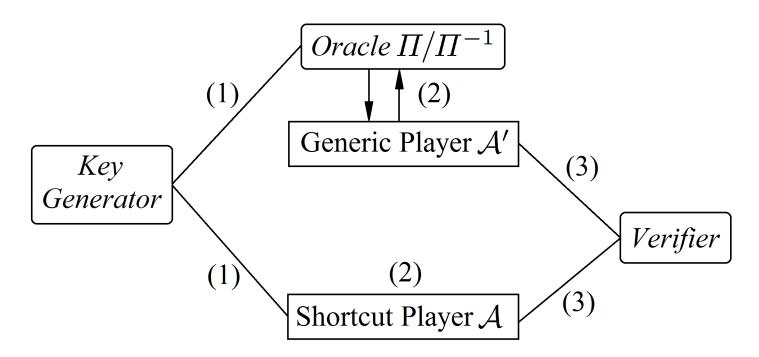
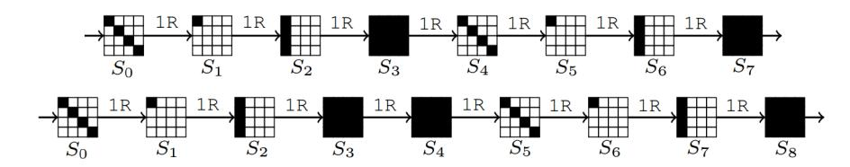
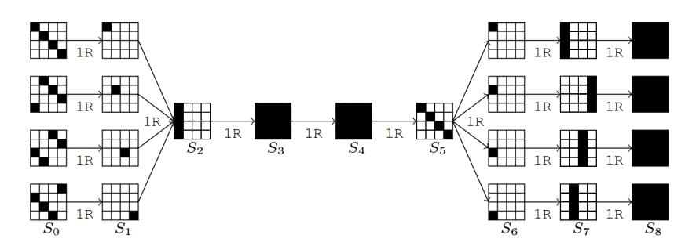
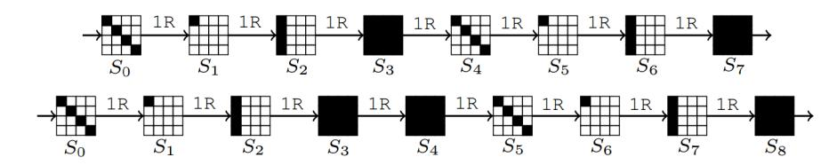
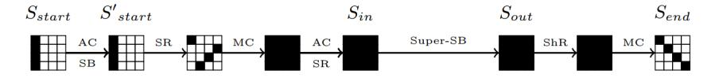
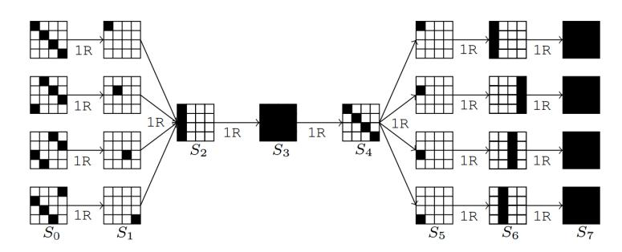

# **New and Old Limits for AES Known-Key Distinguishers**

Lorenzo Grassi<sup>1</sup> and Christian Rechberger<sup>1</sup>*,*<sup>2</sup>

1 IAIK, Graz University of Technology, Austria <sup>2</sup> DTU Compute, DTU, Denmark

[firstname.lastname@iaik.tugraz.at](mailto:firstname.lastname@iaik.tugraz.at)

**Abstract.** Known-key distinguishers have been introduced by Knudsen and Rijmen in 2007 to better understand the security of block ciphers in situations where the key can not be considered to be secret, i.e. the "thing between secret-key model and hash function use-cases".

AES is often considered as a target of such analyses, simply because AES or its building blocks are used in many settings that go beyond classical encryption. The most recent approach of Gilbert (proposed at Asiacrypt 2014) considers 8 core rounds, and extends it by one round in each direction. The resulting approach on 10-round has a time complexity of 2 <sup>64</sup>, and the best generic approach was shown to beat the proposed method with probably *<* 2 −16*.*5 and is hence referred to as a "distinguisher". Interestingly, Gilbert's work also for the first time showed that the known-key model may not be weaker than the chosen-key model, as the best chosen-key attacks on AES only cover 9 rounds so far. This current state of affairs is unsatisfying as it contradicts the original intent of the known-key model.

In this paper we pick up the work of Gilbert, further exploring the limits of the known-key model with a focus on the AES, and eventually propose a way to remedy the situation. In that work, arguments are put forward suggesting that a total of two extension rounds seem to be the limit in the known-key model, and that likely only a distinguisher that exploits the uniform distribution property can be extended in such way. We disprove both conjectures and arrive at the following results: We firstly show that the technique proposed by Gilbert can also be used to extend a known-key distinguisher based on truncated differential trails. This allows us to present improved known-key distinguishers for AES from 7 to 10 rounds of AES. In particular, we are able to set up a 9-round known-key distinguisher for AES with a time complexity of 2 <sup>23</sup> and a 10-round known-key distinguisher with a time complexity of 2 <sup>50</sup>. Secondly we are also able to show that more than two extension rounds are possible. As a result of this, we describe the first known-key distinguishers on 12 rounds of AES, by extending Gilbert's 8-round known-key distinguisher by two rounds in each direction. The time complexity is 2 <sup>66</sup>, and for this result we do have supporting formal arguments, similar to Gilbert, that the best generic approach to beat the proposed method has probably *<* 2 −25 .

This also shows that the counter-intuitive gap between the known-key and the chosenkey model may be wider than initially thought. To remedy the situation, we propose a refinement of the known-key model which restores its original intent.

**Keywords:** Block cipher · Permutation · AES · Known-Key Distinguisher

## **Contents**

| 1                                            | Introduction<br>1.1<br>Known-Key Distinguishers for AES: the State of the Art<br>1.2<br>Our contributions                                                                                                                                                                                            |                            |  |  |  |  |  |
|----------------------------------------------|------------------------------------------------------------------------------------------------------------------------------------------------------------------------------------------------------------------------------------------------------------------------------------------------------|----------------------------|--|--|--|--|--|
| 2                                            | Preliminary - Description of AES                                                                                                                                                                                                                                                                     |                            |  |  |  |  |  |
| 3                                            | 6<br>Subspace trails<br>7<br>3.1<br>Subspace trails of AES<br>7                                                                                                                                                                                                                                      |                            |  |  |  |  |  |
| 4                                            | Known-Key Distinguishers for AES<br>4.1<br>Definition of Known-Key Distinguisher<br>4.2<br>7- and 8-Round Known-Key Distinguisher<br>4.3<br>Multiple Limited-Birthday 8-Round Known-Key Distinguisher<br>                                                                                            | 8<br>8<br>11<br>12         |  |  |  |  |  |
| 5                                            | Gilbert's Known-Key Distinguisher for 10-round AES<br>5.1<br>Uniform Distribution 8-round Known-Key Distinguisher<br><br>5.2<br>Extension to 10 Rounds of AES<br>5.2.1<br>Generic Considerations<br><br>5.3<br>Another Strategy for the Verifier<br>                                                 | 12<br>12<br>15<br>17<br>17 |  |  |  |  |  |
| 6                                            | Key-Recovery Extensions using Truncated Differentials<br>6.1<br>Attack for the Case of 1-Round Extension<br>6.2<br>Attack for the Case of 2-Round Extension                                                                                                                                          | 20<br>20<br>21             |  |  |  |  |  |
| 7<br>9-Round Known-Key Distinguisher for AES |                                                                                                                                                                                                                                                                                                      |                            |  |  |  |  |  |
| 8                                            | 10-Round Distinguisher of AES - Full AES-128<br>8.1<br>Independent Subkeys: No Key Schedule<br><br>8.2<br>The Key Schedule Case<br><br>8.2.1<br>Number n of Tuples: Oracle-Queries<br>8.2.2<br>Number n of Tuples: Oracle-Queries and Cost of Generic Player                                         | 25<br>26<br>27<br>28<br>29 |  |  |  |  |  |
| 9                                            | 12-Round Distinguisher of AES                                                                                                                                                                                                                                                                        | 29                         |  |  |  |  |  |
|                                              | 10 Gilbert's Distinguisher for 12-round AES<br>10.0.1<br>The Verification Process<br>10.0.2<br>On the Meaningfulness of this Distinguisher                                                                                                                                                           | 31<br>32<br>34             |  |  |  |  |  |
|                                              | 11 Infeasibility of a 14-round Known-Key Distinguisher                                                                                                                                                                                                                                               | 35                         |  |  |  |  |  |
|                                              | 12 Discussion of Results and Proposal for a New Model                                                                                                                                                                                                                                                | 36                         |  |  |  |  |  |
| A                                            | A possible Variant of Gilbert's Distinguisher - Details                                                                                                                                                                                                                                              | 39                         |  |  |  |  |  |
| B                                            | The Rebound Attack - Details                                                                                                                                                                                                                                                                         | 40                         |  |  |  |  |  |
| C                                            | Known-Key Distinguishers for 7- and 8-round AES based on Uniform<br>Distribution and Balance Property<br>C.1<br>Known-Key Distinguisher based on Balance Property<br><br>C.2<br>Known-Key Distinguisher based on Uniform Distribution<br><br>C.3<br>Zero-Sum Distinguisher - Scenario of Sect. 4<br> | 41<br>41<br>42<br>44       |  |  |  |  |  |

| D |     | Details of Known-Key Distinguisher when the Computational Cost of |    |
|---|-----|-------------------------------------------------------------------|----|
|   |     | the Generic Player is Considered                                  | 46 |
|   | D.1 | Known-Key Distinguisher on 9-Round AES<br>                        | 47 |
|   | D.2 | Known-Key Distinguisher on 10-Round AES with Key Schedule         | 48 |
| E |     | New 7-, 8- and 9-round AES Known-Key Distinguishers               | 48 |
|   | E.1 | 7-Round Known-Key Distinguisher                                   | 49 |
|   | E.2 | 8-Round Known-Key Distinguisher                                   | 49 |
|   | E.3 | 9-Round Known-Key Distinguisher                                   | 50 |
|   |     | E.3.1<br>Independent Subkeys: No Key Schedule                     | 51 |
|   |     | E.3.2<br>The Key Schedule Case                                    | 51 |
|   | E.4 | Considerations and Comparison with Gilbert's Distinguisher        | 51 |
| F |     | Proof of Proposition 2 - Sect. 8.2                                | 52 |
|   |     | G The Herds Attack                                                | 52 |

## <span id="page-3-0"></span>**1 Introduction**

Block ciphers play an important role in symmetric cryptography providing the basic tool for encryption. They are the oldest and most scrutinized cryptographic tools. Consequently, they are the most trusted cryptographic algorithms that are often used as the underlying tool to construct other cryptographic algorithms, whose proofs of security are performed under the assumption that the underlying block cipher is ideal.

The concept of known-key distinguishers was introduced by Knudsen and Rijmen in [\[KR07\]](#page-38-0). In the classical single secret-key setting, the attacker does not know the randomly generated key and aims to recover it or builds a (secret-key) distinguisher that allows to distinguish the cipher from a random permutation. The security model in known-key attacks is quite different though: the attacker knows the randomly drawn key the block cipher operates with and aims to find a structural property for the cipher under the known key - a property which an ideal cipher (a permutation drawn at random) would not have. Only for completeness, a more relaxed version - called chosen-key distinguisher - can be considered, where the adversary is assumed to have a full control over the key. This model was introduced in [\[BKN09\]](#page-37-0), and has been extended to a related-key attack on the full-round AES-256, while the best chosen-key distinguisher for AES-128 [\[FJP13\]](#page-38-1) currently present in literature covers 9-round out of 10. In this paper however we focus on the known-key model and do not allow or assume related keys.

Since their introductions, known-key attacks have been a major research topic in the symmetric-key community. Indeed, if known-key distinguishers could be considered less relevant than secret-key ones, they anyway allow to learn something about the security margin of a cipher. For example, if it is not possible to find distinguishers for a block cipher when the key is given, then one cannot find a distinguisher when the key is secret. Secondly and more important, block ciphers and hash functions are very close cryptographic primitives, as the latter can be built from the former and vice versa. For example, the Davies-Meyer construction or the Miyaguchi-Preneel construction can transform a secure block cipher into a secure compression function. In a hash setting, block cipher security models such as the known-key model (or the chosen-key model) make sense since in practice the attacker has full access and control over the internal computations. Moreover, an attack in these models depicts a structural flaw of the cipher, while it should be desired to work with a primitive that doesn't have any flaw, even in the most generous security model for the attacker. A classical example is the devastating effect on the compression function security of weak keys for a block cipher [\[WPS](#page-39-1)<sup>+</sup>12], which are usually considered as a minor flaw for a block cipher if the set of these weak-keys is small. Therefore, the security notions to consider for a block cipher will vary depending if this block cipher will be used in a hash function setting or not.

The known-key model received scrutiny from a more theoretical side too. In [\[ABM13\]](#page-37-1) a model derived form the indifferentiability framework is used to formalize the known-key security of block ciphers based on the underlying building blocks, while in [\[MP15\]](#page-38-2) the impact of attacks in the known-key model on hash functions is studied.

Citing Knudsen and Rijmen [\[KR07\]](#page-38-0), "*imagine a block cipher*" for which a known-key distinguisher exists, "*but where no efficient attacks are known in the traditional black-box model. Should we recommend the use of such a cipher? We don't think so!*"

## <span id="page-3-1"></span>**1.1 Known-Key Distinguishers for AES: the State of the Art**

In the known-key model, a full access to an instance of the encryption function associated with a *known* random key and its inverse is given. The purpose is to simultaneously control the inputs and the outputs of the primitive, i.e. to achieve input-output correlations that one could not efficiently achieve with inputs and outputs of a perfect random permutation to which would have an oracle access. A formal definition of a known-key distinguisher

<span id="page-4-1"></span>**Table 1:** *AES known-key distinguishers.* The computation cost is the sum of the computational cost to generate *N*-tuples of plaintexts/ciphertexts and of the verification cost. The word "Extended" refers to a distinguisher which exploits the technique introduced by Gilbert [\[Gil14\]](#page-38-3) (in this case we also highlight which distinguisher is extended), while "MultDT" refers to Multiple Differential Trail. A detailed table with all the distinguishers presented in this paper is given in Sect. [4.](#page-8-0)

| Rounds Computations Memory |                    |                               | Property                     | Reference        |  |
|----------------------------|--------------------|-------------------------------|------------------------------|------------------|--|
| 7                          | 56<br>2            | 56<br>2                       | Zero-Sum                     | [KR07]           |  |
| 7                          | 24<br>2            | 16<br>2                       | Differential Trail           | [MPRS09]         |  |
| 7                          | 20<br>2            | 16<br>2                       | Multiple Diff. Trail         | App. E.1         |  |
| 8                          | 64<br>2            | 64<br>2                       | Uniform Distribution         | [Gil14] - App. C |  |
| 8                          | 48<br>2            | 32<br>2<br>Differential Trail |                              | [GP10]           |  |
| 8                          | 44<br>2            | 32<br>2                       | Multiple Diff. Trail         | [JNPP14]         |  |
| 8                          | 23<br>2            | 16<br>2                       | Extended 7-Round MultDT      | App. E.2         |  |
| 9                          | 50<br>2            | 32<br>2                       | Extended 8-Round MultDT      | Sect. 7          |  |
| 9                          | 23<br>2            | 16<br>2                       | Extended 7-Round MultDT      | App. E.3         |  |
| 10                         | 64<br>2            | 64<br>2                       | Extended 8-Round Unif. Dist. | [Gil14]          |  |
| 50<br>32<br>10<br>2<br>2   |                    | Extended 8-Round MultDT       | Sect. 8.1                    |                  |  |
| 12                         | 82<br>2            | 32<br>2                       | Extended 8-Round MultDT      | Sect. 9          |  |
| 12                         | 66<br>64<br>2<br>2 |                               | Extended 8-Round Unif. Dist. | Sect. 10         |  |

is provided in Sect. [4,](#page-8-0) where we propose and describe in details a generic scenario for known-key distinguisher. We emphasize that *all the known-key distinguishers currently present in the literature - including the one presented in this paper - implicitly exploit (and can be described in) the scenario proposed in Sect. [4](#page-8-0)*.

AES and related constructions served as a benchmark for cryptanalytic techniques since the very introduction of this model by Knudsen and Rijmen [\[KR07\]](#page-38-0) with a 7-round result. Subsequently, 8-round results were obtained using truncated differentials [\[GP10\]](#page-38-5), which were later on improved in [\[JNPP14\]](#page-38-6). Currently, this last one - which exploits the rebound technique [\[LMS](#page-38-7)<sup>+</sup>15] and the so called "multiple limited-birthday problem" - is the best 8-round known-key distinguisher in literature. Recently, Gilbert [\[Gil14\]](#page-38-3) found a way to extend an 8-round known-key distinguisher (using a novel representation of AES) into a more intricate 10-round distinguisher and hence presented for the first time a known-key distinguisher for full AES-128.

All the known-key distinguishers on AES currently present in the literature are briefly recalled in Sect. [4](#page-8-0) using the "subspace trail notation"[1](#page-4-0) , recently introduced at FSE 2017. In Table [1](#page-4-1) we list the known-key distinguishers for AES, including our main results (we refer to Table [2](#page-10-0) in Sect. [4](#page-8-0) for more details about the AES known-key distinguishers obtained by extending distinguishers based on Multiple Differential Trails).

#### **On Gilbert's Approach**

As we will describe in more detail in Sect. [4.1,](#page-8-1) the approach of [\[Gil14\]](#page-38-3) makes use of a freedom in the know-key model that was actually always there but never spelled out explicitly. In more detail, there is always the role of a "verifier", in addition to a "shortcutplayer" and a "generic player". In [\[Gil14\]](#page-38-3) the verifier has perhaps for the first time some

<span id="page-4-0"></span><sup>1</sup>Our choice to use the subspace trail notation is due to the fact that it allows in some cases an easier and more formal description than the original notation.

non-negligible computations to do. The details of the definitions are such that it is still not possible to simply "peel-off" an arbitrary number of rounds, on the contrary it seemed that only the detection of a very specific property (the "uniform distribution property") could take advantage of computations of the verifier.

## <span id="page-5-0"></span>**1.2 Our contributions**

We have two types of contributions in this paper. The first type is a progress in cryptanalysis, improving in various ways distinguishers (or conjectures thereof in case we can not prove that no generic attack is better) on AES in the model of [\[Gil14\]](#page-38-3). Even though this leads to statements on more rounds of AES than ever before (without related keys) that seem meaningful, it is not clear if such statements can become useful in the sense to e.g. have an impact of hash function use-cases of block ciphers. For the sake of completeness, it should be indeed mentioned that even if the strategy proposed by Gilbert allows to set up efficient known-key distinguishers, its "*impact on the security of [...] AES when used as a known key primitive, e.g. in a hash function construction, is questionable*" (see abstract of [\[Gil14\]](#page-38-3)).

The second type of contribution is the high level insight that the details of the knownkey model need to be changed if we want to restore the original intent of the known-key model. The reason is that with our new result the difference between the chosen-key model and what is currently thought of as the known-key model is counter-intuitive: As we show it is now possible to have cryptanalytic results on many more rounds of AES in the known-key model than in the chosen-key model and this is true for more than a single property. Hence we propose a simple restriction of the verifier in the known-key model to remedy the situation.

In the following we summarize two aspects of our cryptanalytic results first. In the conclusion of his paper, Gilbert claims that it seems technically difficult to use a stronger property than the uniform distribution one to extend an 8-round known-key distinguisher to a 10-round one. In particular, he left "*the investigation of improved 10-round known-key distinguishers and associated proofs - or even plausible heuristic arguments if rigorous proofs turn out to be too difficult to obtain - as an open issue.*"

In this paper, we pick up this challenge, and using a strategy similar to the one proposed by Gilbert in [\[Gil14\]](#page-38-3), we show how to construct more efficient 8-, 9- and 10 round distinguishers. To achieve this result, we exploit known-key distinguishers based on truncated differential trails. In particular, we use as starting point the 8-round known-key distinguisher presented in [\[JNPP14\]](#page-38-6), and we extend it at the end or/and at the beginning using the same strategy proposed by Gilbert. This allows to set up a 9-round known-key distinguisher (see Sect. [7\)](#page-22-0) and a 10-round known-key distinguisher for AES (see Sect. [8.1\)](#page-26-0) with time complexity approximately of 2 <sup>50</sup>. Moreover, starting from the 7-round known-key distinguisher presented in [\[MPRS09\]](#page-38-4) - improved in App. [E.1](#page-49-0) using the "multiple limitedbirthday problem" proposed in [\[JNPP14\]](#page-38-6) - and using exactly the same technique presented for the previous cited distinguishers, we are able to set up 8- and 9-round known-key distinguisher for AES (see App. [E.2](#page-49-1) and [E.3\)](#page-50-0), both with complexity approximately of 2 23 .

As a main cryptanalytic result, in Sect. [9](#page-29-1) we show that it is possible to extend our 10-round distinguisher up to 12 rounds Moreover, in Sect. [10](#page-31-0) we show that the same strategy can be used to extend Gilbert's 10-round distinguisher based on the uniform distribution property up to 12 rounds. These are the *first known-key distinguisher for full AES-192*, and they also provide counter-examples of the claim made in [\[Gil14\]](#page-38-3) about the (im)possibility to use Gilbert's technique to extend a 8-round distinguisher more than 2 rounds: "*The reader might wonder whether the technique we used to derive a known-key distinguisher for the 10-round AES from a known-key distinguisher for the 8-round AES does not allow to extend this 8-round known distinguisher by an arbitrary number of rounds. It is easy however to see that the argument showing that 10-round relation* R *is efficiently*

checkable does not transpose for showing that the relations over r>10 rounds one could derive from the 8-round relation by expressing that the r-round inputs and outputs are related by r-8>2 outer rounds to intermediate blocks that satisfy the 8-round relation are efficiently checkable."

Finally, we discuss why our results no longer exclude known-key distinguishers up to 14 rounds, but at the same time why this seems currently not feasible. Using our results presented in the paper as starting point, we show that one of the main problem (but not the only one) about the possibility to extend a known-key distinguisher exploiting the strategy initially proposed by Gilbert is related to the existence of key-recovery attack on AES with more than a single extension at the end and a computational complexity lower than  $2^{128}$  computations<sup>2</sup>. We refer to Sect. 11 for a complete discussion. We conclude in Sect. 12, with a discussion of the results and a proposal of a refinement of the known-key model which restores its original intent (in which the role of the verifier gets back to being marginal).

## <span id="page-6-0"></span>2 Preliminary - Description of AES

The Advanced Encryption Standard [DR02] is a Substitution-Permutation network that supports key sizes of 128, 192 and 256 bits. The 128-bit plaintext initializes the internal state as a  $4 \times 4$  matrix of bytes as values in the finite fields  $\mathbb{F}_{256}$ , defined using the irreducible polynomial  $x^8 + x^4 + x^3 + x + 1$ . Depending on the version of AES,  $N_r$  round are applied to the state:  $N_r = 10$  for AES-128,  $N_r = 12$  for AES-192 and  $N_r = 14$  for AES-256. An AES round applies four operations to the state matrix:

- SubBytes (S-Box) applying the same 8-bit to 8-bit invertible S-Box 16 times in parallel on each byte of the state (it provides non-linearity in the cipher);
- ShiftRows (SR) cyclic shift of each row to the left;
- $MixColumns\ (MC)$  multiplication of each column by a constant  $4\times 4$  invertible matrix  $M_{MC}\ (MC\ \text{and}\ SR\ \text{provide diffusion in the cipher}^3);$
- AddRoundKey (ARK) XORing the state with a 128-bit subkey.

One round of AES can be described as  $R(x) = K \oplus MC \circ SR \circ S\text{-Box}(x)$ . In the first round an additional AddRoundKey operation (using a whitening key) is applied, and in the last round the MixColumns operation is omitted.

Finally, as we don't use the details of the AES key schedule in this paper, we refer to [DR02] for a complete description.

The Notation Used in the Paper. Let x denote a plaintext, a ciphertext, an intermediate state or a key. Then  $x_{i,j}$  with  $i,j \in \{0,...,3\}$  denotes the byte in the row i and in the column j. We denote by  $k^r$  the key of the r-th round, where  $k^0$  is the secret key. If only the key of the final round is used, then we denote it by k to simplify the notation. Finally, we denote by R one round of AES, while we denote r rounds of AES by  $R^r$ . We sometimes use the notation  $R_K$  instead of R to highlight the round key K. As last thing, in the paper we often use the term "partial collision" (or "collision") when two texts belong to the same coset of a given subspace X.

<span id="page-6-1"></span><sup>&</sup>lt;sup>2</sup>Note that given an attack on r rounds with a complexity lower than  $2^{128}$ , one can attack r+1 rounds of AES-256 by guessing the entire first/last secret subkey.

<span id="page-6-2"></span> $<sup>^3</sup>SR$  makes sure column values are spread, MC makes sure each column is mixed.

## <span id="page-7-0"></span>3 Subspace trails

Invariant subspace cryptanalysis can be a powerful cryptanalytic tool, and subspace trails [GRR17] - introduced at FSE 2017 - are a recent generalization of it.

Let F denote a round function in a iterative block cipher and let  $V \oplus a$  denote a coset of a vector space V. Then if  $F(V \oplus a) = V \oplus a$  we say that  $V \oplus a$  is an *invariant coset* of the subspace V for the function F. This concept can be generalized to *trails of subspaces*.

**Definition 1.** Let  $(V_1, V_2, ..., V_{r+1})$  denote a set of r+1 subspaces with  $\dim(V_i) \leq \dim(V_{i+1})$ . If for each i=1,...,r and for each  $a_i \in V_i^{\perp}$ , there exist (unique)  $a_{i+1} \in V_{i+1}^{\perp}$  such that  $F(V_i \oplus a_i) \subseteq V_{i+1} \oplus a_{i+1}$ , then  $(V_1, V_2, ..., V_{r+1})$  is subspace trail of length r for the function F. If all the previous relations hold with equality, the trail is called a constant-dimensional subspace trail.

This means that if  $F^t$  denotes the application of t rounds with fixed keys, then  $F^t(V_1 \oplus a_1) = V_{t+1} \oplus a_{t+1}$ . We refer to [GRR17] for more details about the concept of subspace trails. Our treatment here is however meant to be self-contained.

#### <span id="page-7-1"></span>3.1 Subspace trails of AES

In this section, we recall the subspace trails of AES presented in [GRR17]. For the following, we only work with vectors and vector spaces over  $\mathbb{F}_{2^8}^{4\times 4}$ , and we denote by  $\{e_{0,0},...,e_{3,3}\}$  the unit vectors of  $\mathbb{F}_{2^8}^{4\times 4}$  (e.g.  $e_{i,j}$  has a single 1 in row i and column j). We also recall that given a subspace X, the cosets  $X \oplus a$  and  $X \oplus b$  (where  $a \neq b$ ) are equivalent (that is  $X \oplus a \sim X \oplus b$ ) if and only if  $a \oplus b \in X$ .

**Definition 2.** The column spaces  $C_i$  are defined as  $C_i = \langle e_{0,i}, e_{1,i}, e_{2,i}, e_{3,i} \rangle$ .

For instance,  $C_0$  corresponds to the symbolic matrix

$$\mathcal{C}_0 = \left\{ \begin{bmatrix} x_1 & 0 & 0 & 0 \\ x_2 & 0 & 0 & 0 \\ x_3 & 0 & 0 & 0 \\ x_4 & 0 & 0 & 0 \end{bmatrix} \middle| \forall x_1, x_2, x_3, x_4 \in \mathbb{F}_{2^8} \right\} \equiv \begin{bmatrix} x_1 & 0 & 0 & 0 \\ x_2 & 0 & 0 & 0 \\ x_3 & 0 & 0 & 0 \\ x_4 & 0 & 0 & 0 \end{bmatrix}.$$

**Definition 3.** The diagonal spaces  $\mathcal{D}_i$  and the inverse-diagonal spaces  $\mathcal{ID}_i$  are respectively defined as  $\mathcal{D}_i = SR^{-1}(\mathcal{C}_i) \equiv \langle e_{0,i}, e_{1,i+1}, e_{2,i+2}, e_{3,i+3} \rangle$  and  $\mathcal{ID}_i = SR(\mathcal{C}_i) \equiv \langle e_{0,i}, e_{1,i-1}, e_{2,i-2}, e_{3,i-3} \rangle$ , where the indexes are taken modulo 4.

For instance,  $\mathcal{D}_0$  and  $\mathcal{I}\mathcal{D}_0$  correspond to symbolic matrix

$$\mathcal{D}_0 \equiv \begin{bmatrix} x_1 & 0 & 0 & 0 \\ 0 & x_2 & 0 & 0 \\ 0 & 0 & x_3 & 0 \\ 0 & 0 & 0 & x_4 \end{bmatrix}, \qquad \mathcal{ID}_0 \equiv \begin{bmatrix} x_1 & 0 & 0 & 0 \\ 0 & 0 & 0 & x_2 \\ 0 & 0 & x_3 & 0 \\ 0 & x_4 & 0 & 0 \end{bmatrix}.$$

**Definition 4.** The *i-th mixed spaces*  $\mathcal{M}_i$  are defined as  $\mathcal{M}_i = MC(\mathcal{ID}_i)$ .

For instance,  $\mathcal{M}_0$  corresponds to symbolic matrix

$$\mathcal{M}_0 \equiv \begin{bmatrix} 0 \text{x} 02 \cdot x_1 & x_4 & x_3 & 0 \text{x} 03 \cdot x_2 \\ x_1 & x_4 & 0 \text{x} 03 \cdot x_3 & 0 \text{x} 02 \cdot x_2 \\ x_1 & 0 \text{x} 03 \cdot x_4 & 0 \text{x} 02 \cdot x_3 & x_2 \\ 0 \text{x} 03 \cdot x_1 & 0 \text{x} 02 \cdot x_4 & x_3 & x_2 \end{bmatrix}.$$

**Definition 5.** For  $I \subseteq \{0, 1, 2, 3\}$ , let  $C_I$ ,  $D_I$ ,  $\mathcal{I}D_I$  and  $\mathcal{M}_I$  defined as

$$\mathcal{C}_I = \bigoplus_{i \in I} \mathcal{C}_i, \qquad \mathcal{D}_I = \bigoplus_{i \in I} \mathcal{D}_i, \qquad \mathcal{I}\mathcal{D}_I = \bigoplus_{i \in I} \mathcal{I}\mathcal{D}_i, \qquad \mathcal{M}_I = \bigoplus_{i \in I} \mathcal{M}_i.$$

As shown in detail in [GRR17]:

- for any coset  $\mathcal{D}_I \oplus a$  there exists unique  $b \in \mathcal{C}_I^{\perp}$  such that  $R(\mathcal{D}_I \oplus a) = \mathcal{C}_I \oplus b$ ;
- for any coset  $C_I \oplus a$  there exists unique  $b \in \mathcal{M}_I^{\perp}$  such that  $R(C_I \oplus a) = \mathcal{M}_I \oplus b$ .

This simply states that a coset of a sum of diagonal spaces  $\mathcal{D}_I$  encrypts to a coset of a corresponding sum of column spaces. Similarly, a coset of a sum of column spaces  $\mathcal{C}_I$  encrypts to a coset of the corresponding sum of mixed spaces.

**Theorem 1.** For each I and for each  $a \in \mathcal{D}_I^{\perp}$ , there exists one and only one  $b \in \mathcal{M}_I^{\perp}$  such that

$$R^2(\mathcal{D}_I \oplus a) = \mathcal{M}_I \oplus b. \tag{1}$$

We refer to [GRR17] for a complete proof of this theorem. Observe that b depends on a and on the secret key k, and that this theorem doesn't depend on the particular choice of the S-Box (i.e. it is independent of the details of the S-Box).

Observe that if X is a generic subspace,  $X \oplus a$  is a coset of X and x and y are two elements of the (same) coset  $X \oplus a$ , then  $x \oplus y \in X$ . It follows that:

**Lemma 1.** For all x, y and for all  $I \subseteq \{0, 1, 2, 3\}$ :

$$Prob(R^{2}(x) \oplus R^{2}(y) \in \mathcal{M}_{I} \mid x \oplus y \in \mathcal{D}_{I}) = 1.$$
 (2)

As demonstrated in [GRR17], we finally recall that for each  $I, J \subseteq \{0, 1, 2, 3\}$ :

<span id="page-8-4"></span>
$$\mathcal{M}_I \cap \mathcal{D}_J = \{0\}$$
 if and only if  $|I| + |J| \le 4$ , (3)

<span id="page-8-3"></span>**Theorem 2.** Let  $I, J \subseteq \{0, 1, 2, 3\}$  such that  $|I| + |J| \le 4$ . For all  $x \ne y$ :

$$Prob(R^{4}(x) \oplus R^{4}(y) \in \mathcal{M}_{I} \mid x \oplus y \in \mathcal{D}_{J}) = 0.$$
(4)

For completeness, we briefly describe the subspace trail notation using a more "classical" one. If two texts  $t^1$  and  $t^2$  are equal expect for the bytes in the i-th diagonal<sup>4</sup> for each  $i \in I$ , then they belong in the same coset of  $\mathcal{D}_I$ . Two texts  $t^1$  and  $t^2$  belong in the same coset of  $\mathcal{M}_I$  if the bytes of their difference  $MC^{-1}(t^1 \oplus t^2)$  in the i-th anti-diagonal for each  $i \notin I$  are equal to zero. Similar considerations hold for the column space  $\mathcal{C}_I$  and the inverse-diagonal space  $\mathcal{I}\mathcal{D}_I$ .

# <span id="page-8-0"></span>4 Known-Key Distinguishers for AES

Before we present our new known-key distinguishers for AES, we review the most relevant ones to our work. First, we give a formal definition of the known-key distinguisher scenario, using the one proposed in [Gil14] by Gilbert as starting point.

## <span id="page-8-1"></span>4.1 Definition of Known-Key Distinguisher

Informally, a known-key distinguisher exploits the fact that it is in general harder for an adversary who doesn't know the key to derive an N-tuple of input blocks of the considered block cipher E that is "abnormally correlated" with the corresponding N-tuple of output blocks than for one who knows the secret key. This difficulty is well expressed by the T-intractable definition, first proposed in [CGH04] and [ABM14], and then re-expressed by Gilbert as follows:

<span id="page-8-2"></span><sup>&</sup>lt;sup>4</sup>The *i*-th diagonal of a  $4 \times 4$  matrix A is defined as the elements that lie on row r and column c such that  $r-c=i \mod 4$ . The *i*-th anti-diagonal of a  $4 \times 4$  matrix A is defined as the elements that lie on row r and column c such that  $r+c=i \mod 4$ .

<span id="page-9-0"></span>

Figure 1: A Known-Key Distinguisher Scenario. Step (0): a relationship  $\mathcal{R}$  is chosen. Step (1): the secret key is given to the Oracle  $\Pi/\Pi^{-1}$  and to the Shortcut Player  $\mathcal{A}$ . Step (2): the Shortcut Player  $\mathcal{A}$  and the Generic Player  $\mathcal{A}'$  generate the N-tuples that satisfy the required relationship  $\mathcal{R}$ . Step (3): the Verifier receives the N-tuple and checks if  $\mathcal{R}$  is satisfied or not. The faster player to generate the N-tuple wins the "game".

<span id="page-9-1"></span>**Definition 6.** Let  $E:(K,X)\in\{0,1\}^k\times\{0,1\}^n\to E_K(X)\in\{0,1\}^n$  denote a block cipher of block size n bits. Let  $N\geq 1$  and  $\mathcal R$  denote an integer and any relation over the set S of N-tuples of n-bit blocks.  $\mathcal R$  is said to be T-intractable relatively to E if, given any algorithm  $\mathcal A'$  that is given an oracle access to a perfect random permutation  $\Pi$  of  $\{0,1\}^n$  and its inverse, it is impossible for  $\mathcal A'$  to construct in time  $T'\leq T$  two N-tuples  $\mathcal X'=(X_i')$  and  $\mathcal Y'=(Y_i')$  such that  $Y_i'=\Pi(X_i')$ , i=1,...,N and  $\mathcal X'\mathcal R\mathcal Y'$  with a success probability  $p'\geq 1/2$  over  $\Pi$  and the random choices of  $\mathcal A'$ . The computing time T' of  $\mathcal A'$  is measured as an equivalent number of computations of E, with the convention that the time needed for one oracle query to  $\Pi$  or  $\Pi^{-1}$  is equal to 1. Thus if q' denotes the number of queries of  $\mathcal A'$  to  $\Pi$  or  $\Pi^{-1}$ , then  $q'\leq T'$ .

<span id="page-9-2"></span>**Definition 7.** Let  $E: (K,X) \in \{0,1\}^k \times \{0,1\}^n \to E_K(X) \in \{0,1\}^n$  denote a block cipher of block size n bits. A known-key distinguisher  $(\mathcal{R},\mathcal{A})$  of order  $N \geq 1$  consists of (1) a relation  $\mathcal{R}$  over the N-tuples of n-bit blocks (2) an algorithm  $\mathcal{A}$  that on input a k-bit key K produces in time  $T_{\mathcal{A}}$ , i.e. in time equivalent with  $T_{\mathcal{A}}$  computations of E, an N-tuple  $\mathcal{X} = (X_i)$  i = 1, ..., N of plaintext blocks and an N-tuple  $\mathcal{Y} = (Y_i)$  i = 1, ..., N of ciphertext blocks related by  $Y_i = E_K(X_i)$  and by  $\mathcal{X} \mathcal{R} \mathcal{Y}$ . The two following conditions must be met:

- The relation  $\mathcal{R}$  must be  $T_{\mathcal{A}}$ -intractable relatively to E;
- The validity of  $\mathcal{R}$  must be efficiently checkable: we formalize this requirement by incorporating the time for checking whether two N-tuples are related by  $\mathcal{R}$  in the computing time  $T_{\mathcal{A}}$  of algorithm  $\mathcal{A}$ .

We emphasize that while the algorithm  $\mathcal{A}$  takes a random key K as input, the relation  $\mathcal{R}$  satisfied by the N-tuples of input and output blocks constructed by  $\mathcal{A}$  or  $\mathcal{A}'$  is the same for all values of K (in other words, it is independent of K) and must be efficiently checkable without knowing K.

#### The Known-Key Distinguisher Scenario

To better understand these definitions, we propose and describe in more details a generic scenario for a known-key distinguisher, which is depicted in Fig. 1. This scenario is composed of five characters, which are a key generator, an oracle, two players and a verifier. First of all - step (0), we assume that a relation  $\mathcal{R}$  defined as in Def. 6 is chosen. At step (1), the key generator generates a key, which is given to the oracle and to one of the two

<span id="page-10-0"></span>**Table 2:** Details of AES known-key distinguishers presented in this paper, obtained by extending distinguishers based on Multiple Differential Trails. "Rounds" denotes the number of rounds of the basic distinguisher + the number of rounds of the extensions (if even, the number of extension rounds is equal at the end and at the beginning). "Cost Case 1" denotes the cost of the shortcut player when the total cost of the generic player is approximated by the number of oracle-queries, while "Cost Case 2" refers to the case in which the total cost of the generic player is the sum of number of queries and of its computational cost. "Cost Verifier" denotes the cost of the verifier. A check-mark  $\checkmark$  in the "KS" column denotes the case in which the key schedule holds,  $\nearrow$  denotes the case in which the sub-keys are independent, while white-space/no-mark denotes the case in which the two previous cases are equivalent (for the distinguisher purposes).

| Rounds | KS | Cost Case 1 | Cost Case 2 | Cost Verifier | Memory   | Reference            |
|--------|----|-------------|-------------|---------------|----------|----------------------|
| 7 + 1  |    | $2^{23}$    | $2^{21}$    | $2^{11.8}$    | $2^{16}$ | App. E.2             |
| 8 + 1  |    | $2^{50}$    | $2^{45.6}$  | $2^{11.6}$    | $2^{32}$ | Sect. 7 - App. D.1   |
| 7 + 2  | X  | $2^{23}$    | $2^{21}$    | $2^{12.6}$    | $2^{16}$ | App. E.3             |
| 7 + 2  | 1  | $2^{21}$    | $2^{21}$    | $2^{12.6}$    | $2^{16}$ | App. E.3             |
| 8 + 2  | Х  | $2^{50}$    | $2^{45.6}$  | $2^{12.5}$    | $2^{32}$ | Sect. 8.1            |
| 8 + 2  | 1  | $2^{46}$    | $2^{45}$    | $2^{12.5}$    | $2^{32}$ | Sect. 8.2 - App. D.2 |
| 8 + 4  |    | $2^{82}$    | 282         | 271.1         | $2^{32}$ | Sect. 9              |

player. For the following, we call "shortcut player" the player that knows the key and "generic player" the player that doesn't know it. Referring to the previous definitions by Gilbert, the generic player can be identified with the algorithm  $\mathcal{A}'$ , while the shortcut player can be identified with the algorithm A. At step (2), the two players generate the N-tuple of (plaintexts, ciphertexts) which satisfy the required relation  $\mathcal{R}$ . Since the generic player doesn't know the key, he must ask the oracle (identified with  $\Pi$  and/or  $\Pi^{-1}$ in the previous definitions) for the encryption (resp. decryption) of random plaintexts (resp. ciphertexts). In the more general case, the oracle can generate the ciphertexts (resp. the plaintexts) using a random permutation instead of the encryption (resp. decryption) process. We stress that this step doesn't consist only on the generation of (plaintext, ciphertext) pairs, but also includes any computational cost that the player must do in order to find the N-tuple with the required property. When a player finds the N-tuple which satisfies the required relation  $\mathcal{R}$ , he sends it to the verifier - step (3). The verifier finally checks if the N-tuple satisfied the relation  $\mathcal{R}$  (remember that the verifier doesn't know the key). The first/fastest player who sends the N-tuple with the required property wins the "game".

Before going on, we emphasize that the role of the verifier is only to prevent one or both of the two players from cheating. In other words, in the case of honest players, the verifier can be omitted, and the winner of the game is simply the first/fastest player that claims to have found the N-tuple of (plaintexts, ciphertexts) which satisfy the required relation  $\mathcal{R}$ . We highlight that such a verifier is implicitly present in all the distinguishers currently present in literature.

A distinguisher is meaningful if the cost of the generic player - we assume that the cost of one oracle-query is equal to the cost of one encryption - to generate the N-tuple is higher than the cost of the shortcut player, when the probability of success is equal for the two players. Equivalently, a distinguisher is meaningful if the probability of the generic player to win the game is higher than the probability of the shortcut player, when the number of tuples of (plaintexts, ciphertexts) that the two players can generate is fixed and equal for both players. In other words, in the first case one considers the computational costs of the

<span id="page-11-1"></span>

Figure 2: 7- and 8-round differential paths for AES-128.

two players to generate the N-tuples with a fixed probability of success (equal for both the players). In the second case, the computational cost (equivalent to the number of oracle queries for the generic player and the number of N-tuple generated by the shortcut one) is fixed and one considers the probabilities of success of the two players to win the game.

Both for the distinguisher that we are going to present and for the Gilbert's one, the computational cost of the verification step is not negligible. Thus, in order to compare our distinguishers to the others present in literature, we define the cost of the distinguisher as the sum of the cost of the verification step (i.e. the cost of the verifier) and of the cost to construct the set of plaintexts/ciphertexts with the required property (that is, the cost of the shortcut player - the cost of the other player is higher). For this reason, we assume for the following that a relationship  $\mathcal R$  is efficiently checkable if and only if the computational cost of the verifier is negligible with respect to the player ones. This implies that the cost of the distinguisher can be approximated with the computational cost of the shortcut player (the cost of the other player is always higher). Moreover, this assumption prevents the construction of meaningless known-key distinguishers, as discussed in Sect. 11.

Table 2 summarizes the main details of all the known-key distinguishers based on Multiple Differential Trails presented in this paper with respect to the above scenario. To better understand this table, some considerations must be done. Since the generic player depends by the oracle to generate the N-tuple (i.e. he cannot work alone to generate it), two possible settings can be analyzed. In the first one, only the number of oracle queries is considered to determine the computational cost of this player, that is the number of encryptions/decryptions required by the generic player to the oracle - this case is denoted by "Case 1" in Table 2. In the second one, both the number of oracle queries and any other computational cost of the generic player (which is in general not negligible) are considered - this case is denoted by "Case 2" in Table 2. Intuitively this second setting is weaker than the first one, in the sense that a known-key distinguisher in the first setting works also in the second one but not viceversa. In other words, one can expect that the required number Nof tuples is higher in the first setting than in the second one (or equal in the best case). If the total cost of the generic player is well approximated by the number of queries, these two settings are completely equivalent. In the following, we recall the known-key distinguishers present in literature in the above scenario.

#### <span id="page-11-0"></span>4.2 7- and 8-Round Known-Key Distinguisher

In the 7- and 8-round known-key distinguishers proposed in [MPRS09] and [GP10], the goal of the two players is to find two pairs of (plaintexts, ciphertexts) - i.e.  $(p^1, c^1)$  and  $(p^2, c^2)$  - with the following properties: the two plaintexts belong to the same coset of  $\mathcal{D}_i$  - i.e.  $p^1 \oplus p^2 \in \mathcal{D}_i$  - and the two ciphertexts belong to the same coset of  $\mathcal{M}_i$  - i.e.  $c^1 \oplus c^2 \in \mathcal{M}_i$  - for a fixed  $i \in \{0, 1, 2, 3\}$ .

In the above known-key distinguisher setting, the best technique that the shortcut player (i.e. the player who knows the key) can use to win the game is the *Rebound Attack*. The rebound attack is a differential attack and it was proposed in [MRST09] for the cryptanalysis of AES-based hash functions. Since it is a differential attack, one needs a "good" (truncated) differential trail in order to exploit it. Examples of truncated differential

<span id="page-12-3"></span>

Figure 3: 8-round differential characteristic for known-key distinguisher of AES-128.

trails used for 7- and 8-round AES are depicted in Fig. 2. The rebound attack consists of two phases, called inbound and outbound phase. In the first one, the attacker uses the knowledge of the key to find pairs of texts that satisfy the middle rounds of the truncated differential trail. In the second one, he propagates the solutions found in the first phase in the forward and in the backward directions, and checks if at least one of them satisfies the entire differential trail. A complete description of the rebound attack is given in App. B, with particular attention to the AES case.

As proved in [GP10], in the case of a perfect random permutation  $2^{64}$  operations are required to find (plaintexts, ciphertexts) pairs  $(p_1, c_1)$  and  $(p_2, c_2)$  that have the required properties with good probability. Instead, for the AES case and using the rebound attack,  $2^{48}$  computations are sufficient to find them with the same probability (besides a memory cost of  $16 \times 2^{32} = 2^{36}$  bytes).

## <span id="page-12-0"></span>4.3 Multiple Limited-Birthday 8-Round Known-Key Distinguisher

An improvement of the previous known-key distinguisher on 8-round of AES was proposed in [JNPP14]. Using the subspace trail notation, in this modified version of the 8-round known-key distinguisher, the goal of the two players is to find two pairs of (plaintexts, ciphertexts) such that the two plaintexts belong to the same coset of  $\mathcal{D}_i$  for an arbitrary i and the two ciphertexts belong to the same coset of  $\mathcal{M}_j$  for an arbitrary j, where i and j are not fixed in advance and it is not required that they are equal (i.e. no condition is imposed on i and j) - an example is given in Fig. 3. For arbitrary initial and final subspaces, the computational cost is reduced from  $2^{48}$  to  $2^{44}$  (note that there are 4 initial and final different subspaces  $\mathcal{D}_i$  and  $\mathcal{M}_j$ , for a total of  $4^2 = 2^4$  possibilities) while the required memory is still  $2^{32}$ , as shown in detail in [JNPP14]. In App. E.1 we show that the same technique can be used to improve the 7-round known-key distinguisher of AES presented in [MPRS09].

# <span id="page-12-1"></span>5 Gilbert's Known-Key Distinguisher for 10-round AES

## <span id="page-12-2"></span>5.1 Uniform Distribution 8-round Known-Key Distinguisher

Another 8-round known-key distinguisher for AES is based on the uniform distribution property and it was proposed by Gilbert in [Gil14]. In this case, the goal of the two players is to find a set of  $2^{64}$  (plaintext, ciphertext) pairs - that is  $(p^i,c^i)$  for  $i=0,...,2^{64}-1$  - with the following properties:

• for each  $K \subseteq \{0,1,2,3\}$  with |K|=3 the plaintexts are uniform distributed in cosets of the diagonal space  $\mathcal{D}_K$  - equivalently, for each K with |K|=3 and for each  $a \in \mathcal{D}_K^{\perp}$  there are  $2^{32}$  plaintexts  $p^j$  for  $j \in J \subseteq \{0,...,2^{64}-1\}$  with  $|J|=2^{32}$  such that  $p^j \in \mathcal{D}_K \oplus a$  for all  $j \in J$ ;

• for each  $K \subseteq \{0,1,2,3\}$  with |K|=3 the ciphertexts are uniform distributed in cosets of the mixed space  $\mathcal{M}_K$  - equivalently, for each K with |K|=3 and for each  $a \in \mathcal{M}_K^{\perp}$  there are  $2^{32}$  ciphertexts  $c^j$  for  $j \in J \subseteq \{0,...,2^{64}-1\}$  with  $|J|=2^{32}$  such that  $c^j \in \mathcal{M}_K \oplus a$  for all  $j \in J$ .

If the final MixColumns is omitted, an equivalent condition holds on the ciphertexts by replaying the mixed space  $\mathcal{M}_K$  with the inverse-diagonal one  $\mathcal{ID}_K$ .

In the case in which the final MixColumns operation is omitted, it is possible to reformulate the goal of the two players as following: find a set of  $2^{64}$  (plaintext, ciphertext) pairs - that is  $(p^i,c^i)$  for  $i=0,...,2^{64}-1$  - such that the bytes of the plaintexts and the ciphertexts are uniform distributed, that is:

- for each j,k=0,1,2,3 and for each  $x\in\mathbb{F}_{2^8}$ , there are  $2^{56}$  plaintexts  $p^i$  for  $i\in I\subseteq\{0,...,2^{64}-1\}$  with  $|I|=2^{56}$  that satisfy  $p^i_{j,k}=x$  for all  $i\in I$ ;
- for each j, k = 0, 1, 2, 3 and for each  $x \in \mathbb{F}_{2^8}$ , there are  $2^{56}$  ciphertexts  $c^i$  for  $i \in I \subseteq \{0, ..., 2^{64} 1\}$  with  $|I| = 2^{56}$  that satisfy  $c^i_{j,k} = x$  for all  $i \in I$ .

We prove that these two properties are equivalent for the ciphertexts (the same argumentation applies on the plaintexts as well). First of all, if the bytes of the ciphertexts are uniform distributed, then the ciphertexts are uniform distributed in cosets of the inverse-diagonal space  $\mathcal{ID}_K$  for each K with |K|=3 by definition of  $\mathcal{ID}_K$ . Viceversa, consider the case in which the ciphertexts are uniform distributed in cosets of  $\mathcal{ID}_K$  for each K with |K|=3. By definition, there are  $2^{32}$  ciphertexts  $\hat{c}^i$  with  $i\in I\subseteq\{0,\ldots,2^{64}-1\}$  and  $|I|=2^{32}$  that belong to the same coset of  $\mathcal{ID}_{0,1,2}\oplus a$  for a certain  $a\in\mathcal{ID}_{0,1,2}^\perp$  (equivalent for the other spaces  $\mathcal{ID}_K$  with |K|=3). By definition,  $a\in\mathcal{ID}_{0,1,2}^\perp$  if and only if  $a_{k,j}=0$  for  $(k,j)\neq(0,3),(1,2),(2,1),(3,0)$ , i.e. for each  $k+j\neq 3$ . In other words,  $\hat{c}^i\in\mathcal{ID}_{0,1,2}\oplus a$  for each  $i\in I$  if and only if  $\hat{c}^i_{k,j}=a_{k,j}$  for each  $i\in I$  and for each k+j=3. Working independently on each byte, it follows that the bytes of  $c^i$  are uniform distributed (for example, working on the first byte and considering all  $a\in\mathcal{ID}_{0,1,2}^\perp$  with  $a_{0,3}$  fixed, it follows that there are  $2^{24}\cdot 2^{32}=2^{56}$  ciphertexts  $c^i$  s.t.  $c^i_{0,3}=a_{0,3}$ ).

For completeness, note that the property of uniform distribution doesn't survive the final MixColumns matrix<sup>5</sup>. If the final MixColumns is not omitted, the goal of the two players becomes to find a set of  $2^{64}$  (plaintext, ciphertext) pairs - that is  $(p^i, c^i)$  for  $i = 0, ..., 2^{64} - 1$  - such that the bytes of the  $p^i$  and of  $MC^{-1}(c^i)$  are uniform distributed. On the other hand, we highlight that the uniform distribution implies the balance/zero-sum property both on the plaintexts and on the ciphertexts, and that the balance property is not destroyed by the (final) MixColumns operation (since this operation is linear). For completeness, we remember that texts  $\{t^i\}_{i\in I}$  have the balance property if  $\bigoplus_{i\in I} t^i = 0$ .

The Strategy of the Shortcut Player. Here, we briefly recall the best strategy that the shortcut player can use to win the game using the subspace trails notation instead of the Super-SB notation  $(Super-SB(\cdot) \equiv S\text{-Box} \circ ARK \circ MC \circ S\text{-Box}(\cdot))$  - we refer to App. C for all the details. The idea is to start in the middle with a set S of texts defined

<span id="page-13-0"></span><sup>&</sup>lt;sup>5</sup>We highlight that distinguisher proposed by Gilbert is in the case in which the final MixColumns is omitted. Indeed, in [Gil14] - Sect. 2: [...] to refer to the variant of  $AES_r$  where the MixColumns transformation is kept in the last round: we will denote this variant by  $AES_{r+}$  [...]. The distinguishjer proposed in [Gil14] are for  $AES_8$  and  $AES_{10}$  and not  $AES_{8+}$  and  $AES_{10+}$ . Moreover, consider the following fact. In the untwisted representation proposed by Gilbert,  $AES_{2r+}$  is equivalent to  $AES_{2r+} \equiv FP \circ (R \circ S)^r \circ IP \circ AK$  while  $AES_{2r} \equiv AK \circ SR \circ P \circ S \circ (R \circ S)^{r-1} \circ IP \circ AK$ , where  $S, R, \ldots$  are defined in [Gil14]. In Property 1 of Sect. 4 of [Gil14], it is proved that the bytes of the encryption of each coset of  $C_i$  under  $S \circ R \circ S$  are uniform distributed. Due to the previous representation, this is equivalent to consider 4 rounds of AES without the final MixColumns.

as  $S := \mathcal{D}_i \oplus \mathcal{M}_j \oplus c$  for a constant c, where  $|S| = 2^{64}$ . Observe that

$$\mathcal{D}_i \oplus \mathcal{M}_j \oplus c \equiv \bigcup_{b \in \mathcal{D}_i \oplus c} \mathcal{M}_j \oplus b = \bigcup_{a \in \mathcal{M}_j \oplus c} \mathcal{D}_i \oplus a,$$

i.e. the set S can be re-written as union of cosets of the space  $\mathcal{D}_i$  or as union of cosets of the space  $\mathcal{M}_j$ . The ciphertexts are given by the 4-round encryption of S, while the plaintexts by the 4-round decryption of S.

After encrypting S for 4 rounds, the texts are uniform distributed in each coset of  $\mathcal{M}_I$  of dimension 12 (i.e. |I|=3). That is, after 4 rounds, each coset of  $\mathcal{M}_I$  for |I|=3 contains exactly  $2^{32}$  elements. Indeed, by Theorem 2 note that given two elements in the same coset of  $\mathcal{D}_I$ , they can not belong to the same coset of  $\mathcal{M}_J$  for  $|I|+|J|\leq 4$  after 4-round. Thus, given a coset of  $\mathcal{D}_i$  with |i|=1, after 4 rounds each element is distributed in a different cosets of  $\mathcal{M}_J$  for |J|=3. Since a coset of  $\mathcal{D}_i$  contains  $2^{32}$  elements and since there are exactly  $2^{32}$  cosets of  $\mathcal{M}_J$ , the elements of  $\mathcal{D}_i \oplus \mathcal{M}_j$  are uniformly distributed in each coset of  $\mathcal{M}_I$ . The same happens if one decrypts S for 4 rounds. In this case, after decrypting S for 4 rounds, the texts are uniform distributed in each coset of  $\mathcal{D}_I$  of dimension 12 (i.e. |I|=3), that is each coset of  $\mathcal{D}_I$  for |I|=3 contains exactly  $2^{32}$  elements.

On the Meaningfulness of this Distinguisher. For the following, we briefly recall the argumentation given by Gilbert about the meaningfulness of such distinguisher.

First of all,  $2^{64}$  texts satisfy the uniform distribution on each byte with probability

$$p = \left(\prod_{i=0}^{255} {2^{64} - i \cdot 2^{56} \choose 2^{56}} \cdot (2^{-8})^{2^{64}}\right)^{16}.$$

Indeed, consider the following problem. Given N texts and 2 sets, assume that each text belongs to one of the two sets with probability  $2^{-1}$ . It follows that the N texts are uniform distributed among the two sets with prob.  $\binom{N}{N/2} \cdot 2^{-N}$ . In a similar way, given  $d \geq 2$  sets, they are uniform distributed with probability  $\binom{1}{N-1} \binom{N-i\cdot N/d}{N/d} \cdot d^{-N}$ .

Using Stirling's formula  $n! \simeq n^n \cdot e^{-n} \cdot \sqrt{2\pi \cdot n}$ , the previous probability is well approximated by

<span id="page-14-1"></span>
$$p = \left(\frac{2^{64}!}{(2^{56}!)^{256}} \cdot (2^{-8})^{2^{64}}\right)^{16} \simeq \left(\frac{1}{2^{49} \cdot \pi}\right)^{128} \cdot (256!)^{-1/2} \simeq 2^{-7328.1} \equiv 2^{-2^{12.84}}.$$
 (5)

In other words, given  $2^{64}$  plaintexts whose bytes are uniform distributed, this represents the probability that the bytes of the corresponding ciphertexts are uniform distributed. For comparison, given  $2^{64}$  plaintexts whose sum is zero, then the sum of the corresponding ciphertexts is equal to zero with probability  $2^{-128}$ .

What is the minimum number  $N \equiv 2^{64} + M > 2^{64}$  of - random - (plaintext, ciphertext) pairs such that there is a subset of  $2^{64}$  pairs whose bytes are uniform distributed both on the plaintexts and on the ciphertexts with non-negligible property? Given  $2^{64} + M$  texts, it is possible to construct

$$\binom{2^{64}+M}{2^{64}} \simeq \frac{1}{\sqrt{2\pi \cdot M}} \cdot \left(\frac{2^{64}+M}{M}\right)^M$$

<span id="page-14-0"></span>Geomsider the case  $N=2^{64}$  and d=256. The product of the binomial coefficients is explained as follows. For each one of the 16 bytes, there must exist  $2^{64}/256=2^{56}$  texts for each one of the 256 possible values. Thus, there are  $\binom{2^{64}}{2^{56}}$  possible sets of  $2^{56}$  texts for each the byte as value 0,  $\binom{2^{64}-2^{56}}{2^{56}}$  possible sets of  $2^{56}$  texts for each the byte as value 1 and so on.

different sets of  $2^{64}$  texts (where the approximation is given using the Stirling's formula and by the assumption  $M \ll 2^{64}$ ). This number is always higher than  $p^{-2} \equiv 2^{2^{13.84}}$  for each  $M \geq 2^{12}$ . In other words, given  $2^{64} + 2^{12}$  random pairs, there is a good probability to find  $2^{64}$  (plaintext, ciphertext) pairs such that the bytes of the plaintexts and of the ciphertexts are uniform distributed. It follows that if the cost of the generic player is approximated by the number of oracle queries, then his cost is approximately of  $2^{64} + 2^{12} \simeq 2^{64}$  encryptions vs  $2^{64}$  encryption of the shortcut player.

So, why is this distinguisher meaningful? Instead to focus on the cost of the players, Gilbert shows that the probability of the generic player to win the game given  $2^{64}$  texts is negligible. To do this, Gilbert claims that this probability is upper bounded by the probability of the following game: given  $2^{64} - 1$  (plaintext, ciphertext) pairs whose bytes are "almost uniform" - see the definition in the following, find a text for which the bytes of the corresponding  $2^{64}$  texts are uniform distributed. Since this probability is upper bounded by  $2^{-127}$  - see proof of Prop. 4 of [Gil14] - and since this second game is (strong) "related" to the original one<sup>7</sup>, the conclusion follows immediately.

For completeness, we formal define what "almost uniform" means. Consider  $2^{64}-1$  texts  $t^i \in \mathbb{F}_{2^8}^{4\times 4}$  for i=0,...,N-2. We say that the bytes of  $2^{64}-1$  texts  $t^i$  are "almost uniform" if for each row and column j,k=0,1,2,3 (1) there exists  $x\in\mathbb{F}_{2^8}$  s.t. there are  $2^{56}-1$  texts that satisfy  $t^i_{j,k}=x$  and (2) for each  $y\in\mathbb{F}_{2^8}\setminus x$ , there are  $2^{56}$  texts that satisfy  $t^i_{j,k}=y$ . More generally:

**Definition 8.** Consider  $2^N - d$  texts  $t^i \in \mathbb{F}_{2^8}^{4 \times 4}$  for i = 0, ..., N - d - 1 for  $d \ge 1$ . We say that the bytes of  $2^N - 1$  texts  $t^d$  are "almost uniform" if for each row and column j, k = 0, 1, 2, 3:

- there exists a set  $X \equiv \{x_1, ..., x_s \in \mathbb{F}_{2^8}\}$  with cardinality  $s \leq d$  such that for each  $x_l \in X$  with  $1 \leq l \leq s$  there are  $2^{N-8} d \leq \hat{s}_l \leq 2^{N-8} s$  texts that satisfy  $t^i_{j,k} = x_l$  where  $\sum_{l=1}^s \hat{s}_l = d$ ;
- for each  $y \in \mathbb{F}_{2^8} \setminus X$ , there are  $2^{N-8}$  texts that satisfy  $t_{j,k}^i = y$ .

**Proposition 1.** Consider a set of  $2^N$  texts whose bytes are uniform distributed. The bytes of each subset of  $2^N - d$  texts are "almost uniform" distributed w.r.t. the previous definition.

#### <span id="page-15-0"></span>5.2 Extension to 10 Rounds of AES

This distinguisher is the starting point used by Gilbert in order to set up the first 10-round known-key distinguisher for AES. The basic idea is to extend this 8-round distinguisher based on the uniform distribution property adding one round at the end and one at the beginning. Assume for simplicity that the final MixColumns is omitted. In the known-key distinguisher scenario presented above, the players have to send to the verifier  $2^{64}$  (plaintext, ciphertext) pairs, that is  $(p^i, c^i)$  for  $i = 0, ..., 2^{64} - 1$ , with the following properties<sup>8</sup>:

1. there exists a key  $k^0$  s.t. the bytes of  $\{R_{k^0}(p^i)\}_i$  are uniform distributed, or equivalently that the texts  $\{R_{k^0}(p^i)\}_i$  are uniform distributed among the cosets of  $\mathcal{D}_I$  for each I with |I|=3;

<span id="page-15-1"></span> $<sup>^{7}</sup>$ For completeness, we mention that no formal proof is provided in [Gil14] in order to support this claim. In other words, it is not proved that the fact that this second game is "hard" implies the hardness of the original game, and/or viceversa.

<span id="page-15-2"></span><sup>&</sup>lt;sup>8</sup>For this and the following distinguishers, we abuse the notation  $k^r$  to denote a key of a certain round r. We emphasize that  $k^r$  is not necessarily equal to the secret key, that is  $k^r$  can be different from the r-th subkey. Remember that it is only required that such a key exists, and not that it is equal to the real secret key.

2. there exists a key  $k^{10}$  s.t. the bytes of  $\{MC^{-1} \circ R_{k^{10}}^{-1}(c^i)\}_i$  are uniform distributed, or equivalently that the texts  $\{R_{k^{10}}^{-1}(c^i)\}_i$  are uniform distributed among the cosets of  $\mathcal{M}_J$  for each J with |J|=3;

where  $MC^{-1}$  denotes the inverse MixColumns operation. In this game, the subkeys  $k^0$  and  $k^{10}$  are assumed to be independent (argumentations are given by Gilbert to show that the same distinguisher is applicable also to the case in which the key-schedule holds - we discuss this topic in details in the following).

Since uniform distribution implies balance property - viceversa is not true in general, if the previous properties are satisfied then for the key  $k^0$  the sum of the plaintexts after one round is equal to zero, i.e.  $\bigoplus_{i=0}^{2^{64}-1} R_{k^0}(p^i) = 0$ , and for the key  $k^{10}$  the sum of the ciphertexts one round before is equal to zero, i.e.  $\bigoplus_{i=0}^{2^{64}-1} R_{k^{10}}^{-1}(c^i) = 0$ .

We emphasize that even if this is a known-key distinguisher, the verifier must be able to check the previous properties without the knowledge of the key or the subkeys. Since the verifier has no information of the key, one must show that the above conditions are efficiently checkable. The only way to verify these requirements is to find these two subkeys in an efficient way, which is not possible using a brute force attack ( $k^0$  and  $k^{10}$  have 128 bits). Instead to check all the  $2 \cdot 2^{128} = 2^{129}$  possible values of  $k^0$  and  $k^{10}$ , the idea proposed by Gilbert is to check uniform distribution working on single columns of  $SR(c^i)$  and of  $SR^{-1}(p^i)$  (the strategy proposed by Gilbert<sup>9</sup> is similar to the one proposed in Algorithm 1). In this way, the verifier must guess only 32 bits instead of 128, and she has to repeat this operation 4 times (one for each anti-diagonal/diagonal) for each key. In the following, we discuss a way to improve this procedure working independently on each byte of  $k^0$  and  $k^{10}$  instead of entire anti-diagonal/diagonal. The idea is simply to use integral attack [DKR97]-[KW02] to filter wrong keys.

In conclusion, the shortcut player (i.e. the one who knows the key) can construct these  $2^{64}$  (plaintext, ciphertext) pairs using the same strategy proposed for the 8 rounds distinguisher (note that in this case the keys  $k^0$  and  $k^{10}$  correspond to the secret sub-keys). Instead, as proved by Gilbert in Prop. 6 of [Gil14], the probability that the generic player (i.e. the one who doesn't know the secret key) successfully outputs (input, output) pairs that satisfy the previous properties (both in the input and in the output) is upper bounded by  $2^{-16.5}$ . Finally, the verifier can find the keys  $k^0$  and  $k^{10}$  that satisfy the required property (if exist) with a computational cost which is smaller than the cost of the two players.

On the Meaningfulness of this Distinguisher. For the following, we briefly recall the argumentation given by Gilbert about the meaningfulness of this distinguisher.

First of all, what is the probability that given a set of  $2^{64}$  texts there exists a key  $\hat{k}$  such that the bytes of 1-round encryption (resp. decryption) of such texts are uniform distributed? Using the previous calculation and since there are  $2^{128}$  different keys, this probability is equal to  $2^{128} \cdot p \simeq 2^{128} \cdot 2^{-7328.1} = 2^{-7200.1} \equiv 2^{-2^{12.81}}$  where p is defined in (5). Similar to the 8-round case, it follows that  $2^{64} + 2^{12} \simeq 2^{64}$  (plaintext, ciphertext) pairs are sufficient to have good probability to win the game.

So, as before, why is this distinguisher meaningful? As for the 8-round case, instead to focus on the cost of the players, Gilbert shows that the probability of the generic player to win the game given  $2^{64}$  texts is negligible. To do this, Gilbert claims that this probability is upper bounded by the probability of the following game. Consider  $2^{64} - d$  (plaintext,

<span id="page-16-0"></span><sup>&</sup>lt;sup>9</sup>Algorithm 1 is presented in order to propose a 12-round distinguisher based on the uniform distribution property as extension of 10-round Gilbert's distinguisher. The difference between this algorithm and the one proposed by Gilbert is the fact that in our case some wrong-key candidates can be eliminated using the zero-sum property. In other words, in order to turn our algorithm in the one proposed by Gilbert, it is sufficient to check all the keys  $k \equiv (k_{0,0}, k_{1,3}, k_{2,2}, k_{3,1})$  from (0x00, 0x00, 0x00, 0x00) to (0xff, 0xff, 0xff, 0xff), and not only the ones found by Algorithm 2.

ciphertext) pairs for  $d \geq 5$ , that is  $(p^i,c^i)$  for each  $i=0,...,2^{64}-d-1$ , with the property that there exist a set of keys  $k^0$  and  $k^{10}$  - this set can correspond to the entire set of keys for which the bytes of  $R_{k^0}(p^i)$  and of  $MC^{-1} \circ R_{k^{10}}^{-1}(c^i)$  (that is 1-round encryption of  $p^i$  and the 1-round decryption of the ciphertexts) are "almost uniform" distributed. The goal of the player is to find the remaining d texts for which the bytes of the corresponding  $2^{64}$  texts after 1-round encryption/decryption are uniform distributed. Since this probability is upper bounded by  $(2^{128})^2 \cdot \left(\frac{5^{16}}{2^{128}-2^{64}+1}\right)^3 \simeq 2^{-16.5}$  - see proof of Prop. 6 of [Gil14] - and since this second game is "related" to the original one, the conclusion follows immediately.

#### <span id="page-17-0"></span>5.2.1 Generic Considerations

The previous 10-round distinguisher proposed by Gilbert is different from all the previous distinguishers up to 8 rounds present in literature. For all distinguishers up to 8-round, the relation  $\mathcal{R}$  that the N-tuple of (plaintexts, ciphertexts) must satisfy doesn't involve any operation of the block cipher E. As a consequence, it allows the verifier to check whether the N-tuple of (plaintexts, ciphertexts) satisfy the required relation  $\mathcal{R}$  without knowing anything of the key. When  $\mathcal{R}$  doesn't re-use operations of E, this provides some heuristic evidence that this distinguisher can be considered meaningful.

On the other hand, the previous 10-round distinguisher and the ones that we are going to propose don't satisfy this requirement, i.e. in these cases the relation  $\mathcal{R}$  involves and re-uses some operations of E. The novelty of Gilbert's work is not just the possibility to extend the distinguisher up to 10-round AES, but rather the introduction of a new distinguisher model. Requiring the existence of round keys for which the 1-round encryption of the plaintexts (respectively, 1-round decryption of the ciphertexts) satisfy the relation  $\mathcal{R}$ , or in other words considering relations  $\mathcal{R}$  that depend on some operations of E, allows to set up new distinguishers that penetrate more round of the block cipher. For a detailed discussion on the reasons why such known-key distinguishers should not be systematically ruled out as if they were artificial we refer to Sect. 3 of [Gil14]. We emphasize that the goal of this paper is not to disprove or to give more argumentations about the validity of such model. Rather, under the assumption of validity of such model, the contributions of our paper are to show the possibility to set up distinguishers based on the truncated differential property instead of the uniform distribution one in the Gilbert's framework, and the possibility to extend such distinguishers for up to 12-round AES, that is two more beyond the claimed given by Gilbert in [Gil14].

A Variant of Gilbert's Distinguisher. Before we go on, we highlight a variant of the Gilbert's distinguisher - that also applies to all our proposed distinguishers present in the paper - which allows to better understand it. Consider the case in which the two players have to send to the verifier the N-tuple that verify the required relation  $\mathcal{R}$  together with the subkeys for which such relation is satisfied. As an example, in the 10-round distinguisher just presented, the players have to send  $2^{64}$  (plaintexts, ciphertexts) pairs  $(p^i,c^i)$  and the two subkeys  $k^0$  and  $k^{10}$  such that the bytes of  $R_{k^0}(p^i)$  and  $MC^{-1} \circ R_{k^{10}}^{-1}(c^i)$  are uniform distributed. Thus, since the task of the verifier is to check that the relation  $\mathcal{R}$  is satisfied only for the keys she received, it follows that her computational cost is negligible. On the other hand, we show in details in App. A that such variant of the distinguisher is meaningless, since it can be set up for any number of rounds of AES.

#### <span id="page-17-1"></span>5.3 Another Strategy for the Verifier

In order to extend the Gilbert's distinguisher on 12-round AES by exploiting the uniform distribution property, we present another strategy that the verifier can use in order to check the existence of keys  $k^0$  and  $k^{10}$  for which the required property  $\mathcal{R}$  is verified. The

```
Data: 2^{64} texts t^i for i = 0, ..., 2^{64} - 1
Result: One anti-diagonal of k - e.g. (k_{0,0}, k_{1,3}, k_{2,2}, k_{3,1}) - s.t. each byte of
             MC^{-1} \circ R_k(t^i) is uniform distributed
Let A[0, ..., 2^{32} - 1] and B^1[0, ..., 255], B^2[0, ..., 255], B^3[0, ..., 255], B^4[0, ..., 255] five
 arrays initialized to zero;
for i from \theta to 2^{64} - 1 do
    x \leftarrow t_{0,0}^{i} + 2^{8} \cdot t_{3,1}^{i} + 2^{16} \cdot t_{2,2}^{i} + 2^{24} \cdot t_{3,1}^{i};
    A[x] \leftarrow A[x] + 1;
\mathbf{end}
Use Algorithm 2 to find k_{0,0}, k_{1,3}, k_{2,2}, k_{3,1} - i.e. to filter wrong candidates;
for each k \equiv (k_{0.0}, k_{1.3}, k_{2.2}, k_{3.1}) found using Algorithm 2 do
     for s from (0x00, 0x00, 0x00, 0x00) to (0xff, 0xff, 0xff, 0xff) do
          Let s \equiv (s^0, s^1, s^2, s^3) \in \mathbb{F}_{2^8}^4 be a column of 4 bytes;
         Compute x \equiv MC^{-1} \circ R_k(s); // partial decryption of s w.r.t. to k - note: x \equiv (x^1, x^2, x^3, x^4) \in \mathbb{F}_{2^8}^4 is a column of 4 bytes Increment B^1, B^2, B^3, B^4[x]: B^j[x^j] \leftarrow B^j[x^j] + A[x] for each j = 1, 2, 3, 4;
      \mbox{if uniform distribution - i.e. } B^{j}[x] = 2^{56} \mbox{ for each } x = 0,...,255 \mbox{ and for each }
       j = 1, 2, 3, 4 then
      identify k as possible candidate;
    end
end
return candidates for (k_{0,0}, k_{1,3}, k_{2,2}, k_{3,1}).
```

<span id="page-18-0"></span>Algorithm 1: Verifier Strategy: find one anti-diagonal (e.g. the first one) of the last

round-key k - equivalent for the other anti-diagonals and for the first round key - s.t. the bytes of  $MC^{-1} \circ R_k^{-1}(t^i)$  are uniform distributed. For simplicity, we omit the final MixColumns - if it is not omitted, it is sufficient to swap it with the final AddRoundKey operation.

goal of the following strategy is not to improve the computational cost of the verifier, but to show the possibility to check the existence of such keys working independently on each bute of the key instead of combinations of 4 bytes. The idea is simply to filter wrong key candidates using the integral attack [DKR97]-[KW02].

As we have just seen, the two players have to find  $2^{64}$  (plaintext, ciphertext) pairs, i.e.  $(p^i, c^i)$  for  $i = 0, ..., 2^{64} - 1$ , s.t. there exist keys  $k^0$  and  $k^{10}$  for which bytes of  $R_{k^0}(p^i)$ and  $MC^{-1} \circ R_{\iota_{10}}^{-1}(c^{i})$  are uniform distributed. When the verifier receives the set of  $2^{64}$ (plaintext, ciphertext) pairs from the players, she checks if the required properties are satisfied or not by finding the two keys. Under Gilbert's assumption - no key-schedule holds, the verifier can work independently on  $k^0$  and  $k^{10}$ . Both for  $k^0$  and  $k^{10}$ , Gilbert proposes to work on 4 bytes of the key at the same time, that is to work on entire antidiagonal in the case of  $k^{10}$  (for simplicity the last MixColumns operation is omitted) and to work on entire diagonal in the case of  $k^0$ . Here we show that a different strategy can be used to verify the existence of these two keys.

As we are going to show, it is not necessary to work on 4 bytes of the subkeys  $k^0$ and  $k^{10}$  simultaneously, but it is possible to find  $k^0$  and  $k^{10}$  working on single bytes (independently of the others). The idea is to exploit the fact that uniform distribution implies zero-sum property. Thus, the verifier first looks for subkeys  $k^0$  and  $k^{10}$  that satisfy  $\bigoplus_{i=0}^{2^{64}-1} R_{k^0}(p^i) = 0$  and  $\bigoplus_{i=0}^{2^{64}-1} R_{k^{10}}^{-1}(c^i) = 0$  working independently on each byte. Only for keys that satisfy zero-sum, she then checks if the uniform property is verified, working simultaneously on 4 bytes of the subkeys. We emphasize that if zero-sum is not satisfied, then also uniform distribution is not satisfied. Moreover, we highlight that the number of

```
Data: 2^{64} texts t^i for i = 0, ..., 2^{64} - 1
Result: One byte of k - e.g. k_{0,0} - s.t. \bigoplus_{i} S-Box<sup>-1</sup>(p_{0,0}^{i} \oplus k_{0,0}) = 0
Let A[0,...,2^8-1] an array initialized to zero;
for i from \theta to 2^{64} - 1 do
   A[t_{0,0}^i] \leftarrow (A[t_{0,0}^i] + 1) \mod 2; // A[x] denotes the value stored in the
     x-th address of the array A
end
for k from 0x00 to 0xff do
   x \leftarrow 0;
    for i from 0 to 255 do
    x \leftarrow x \oplus A[i] \cdot \text{S-Box}^{-1}(i \oplus k);
                                                                // A[i] can only be 0 or 1
    end
    if x = \theta then
    identify k as candidate for k_{0,0};
    end
end
return candidates for k_{0,0}.
```

<span id="page-19-0"></span>**Algorithm 2:** First Part of Verifier Strategy: working on each byte of the key independently of the others, filter wrong key candidates using zero-sum property.

subkeys that satisfy zero-sum is very small compared to the number of all possible keys. Indeed, note that that since zero-sum is satisfied with prob.  $2^{-128}$  and since there are only  $2^{128}$  keys, on average only one key passes the first step. It follows that the second step of this strategy - i.e. checking uniform distribution when zero-sum is satisfied - has negligible cost compared to the total cost. For completeness, note that the only case in which no key is filtered occurs when all the values of the vector A defined in Algorithm 2 are even. Since the probability that at least one value of vector A defined in Algorithm 2 is odd is given by  $1-(2^{-1})^{256}=1-2^{-256}\simeq 1$ , this implies that only few candidates survive Algorithm 2 - i.e. only few candidates are tested in Algorithm 1 - with very high probability.

In more details, if the bytes of  $MC^{-1} \circ R_{k^{10}}^{-1}(c^i)$  are uniform distributed then  $\bigoplus_i MC^{-1} \circ R_{k^{10}}^{-1}(c^i) = \bigoplus_i R_{k^{10}}^{-1}(c^i) = 0$ . The subkeys  $k^{10}$  that satisfy this requirement can be found using a classical square attack - see Algorithm 2. For completeness, if the final MixColumns operation is not omitted, then one simply changes the positions of the final MixColumns operation and of the final AddRoundKey operation, using the fact that the MixColumns is linear. Exactly in the same way, if the bytes of  $R_{k^0}(p^i)$  are uniform distributed then  $\bigoplus_i R_{k^0}(p^i) = 0$ . Since a set of balanced texts  $\{t^i\}_{i\in I}$  is mapped into a set of balanced texts by the MixColumns operation (indeed, since MC is linear, it follows that  $\bigoplus_{i=0}^{2^{64}-1} MC(t^i) = MC(\bigoplus_{i\in I}(t^i)) = 0$ ), the verifier can simply check if the condition  $\bigoplus_{i=0}^{2^{64}-1} S$ -Box $(p^i_{j,l} \oplus k^0_{j,l}) = 0$  holds for each byte (i.e.  $\forall j,l=0,...,3$ ) in order to verify that  $\bigoplus_{i=0}^{2^{64}-1} R_{k^0}(p^i) = 0$ . It follows that the verifier can work on single bytes of  $k^0$  and  $k^{10}$  to filter wrong key candidates.

Using this proposed strategy, the verification cost is a little lower than the one given in the original strategy of Gilbert (approximately  $^{10}$   $2 \cdot 2^{64}$  vs  $10 \cdot 2^{64}$  look-ups table, that  $2^{57.36}$  vs  $2^{59.7}$  ten-round encryptions assuming 1 S-Box look-up  $\approx$  1 table look-up). In particular, observe that all the arrays A defined in Algorithms 1 and 2 can be computed simultaneously and stored, and that we expect that only few (on average only one) keys pass Algorithms 2 - that is, the cost of the verification step is well approximated by the

<span id="page-19-1"></span> $<sup>^{10}</sup>$ Note that both Algorithm 1 and 2 can be optimized such that it is possible to compute the array A simultaneously for each row and column of the text  $t^i$ , for a total cost of  $2^{64}$  table look-ups. It follows that the cost of our strategy corresponds to the cost to prepare the array A for the two algorithm, that it  $2^{65}$  table look-ups.

cost to compute the array A. On the other hand, we emphasize that the goal of this strategy is to show the possibility to work on single byte of the key independently of the others, and not to improve the verification cost in a significant way.

## <span id="page-20-0"></span>6 Key-Recovery Extensions using Truncated Differentials

Our known-key distinguishers exploit the same idea proposed for the first time by Gilbert. In particular, our idea is to extend the 8-round distinguishers recalled in Sect. 4.3 at the end or/and at the beginning, in the same way used by Gilbert to extend the 8-round distinguisher based on the uniform distribution property.

Since we are going to extend known-key distinguishers based on truncated differential properties, we need an efficient key-recovery attack that allows the verifier to check the required property on the N-tuple of (plaintexts, ciphertexts) that she receives by the players. For this reason, we re-propose the low-data complexity truncated differential attacks<sup>11</sup> on 3- and 4-round AES-128 presented in [GRR17]. The attacks that we present here are a little modified with respect to those presented in [GRR17] due to different scope of this work. In particular, the attack on 3 rounds of [GRR17] is described here as an attack on a single round, while the attack on 4 rounds is described here as an attack on 2 rounds (besides other changes for this second case, which are described in the following).

## <span id="page-20-1"></span>6.1 Attack for the Case of 1-Round Extension

Consider three plaintexts in the same coset of  $\mathcal{M}_i$  for |i|=1 and the corresponding ciphertexts after one round<sup>12</sup>, that is  $(p^j,c^j)$  for j=1,2,3. The goal of the attack is to find the key k such that the ciphertexts belong to the same coset of  $\mathcal{M}_i$  one round before, that is k has to satisfy the following condition<sup>13</sup>:

$$R_k^{-1}(c^1) \oplus R_k^{-1}(c^2) \in \mathcal{M}_i$$
 and  $R_k^{-1}(c^1) \oplus R_k^{-1}(c^3) \in \mathcal{M}_i$ .

For simplicity, we assume that the final MixColumns operation is omitted (otherwise one simply switches the final MixColumns and the final AddRoundKey operation, as usual in literature). Since each column of  $\mathcal{M}_i$  depends on different and independent variables, the idea of the attack is to work independently on each column of  $\mathcal{M}_i$  or equivalently of  $SR^{-1}(k)$ , and to exploit the relationships that hold among the bytes that lie in the same column of  $\mathcal{M}_i$ .

Without loss of generality, we assume  $I = \{0\}$  and we present the attack only for the first column of  $SR^{-1}(k)$  (analogous for the others). The conditions that the bytes of the first column of  $SR^{-1}(k)$  must satisfy are:

<span id="page-20-5"></span>
$$s_{0,0}^h = 0x02 \cdot s_{1,3}^h, \qquad s_{2,2}^h = s_{1,3}^h, \qquad s_{3,1}^h = 0x03 \cdot s_{1,3}^h,$$
 (6)

where  $s_{i,j}^h = \text{S-Box}^{-1}(c_{i,j}^1 \oplus k_{i,j}) \oplus \text{S-Box}^{-1}(c_{i,j}^h \oplus k_{i,j})$  for h = 2, 3. For each value of  $k_{1,3}$  (2<sup>8</sup> possible values in total), the idea is to find the values of  $k_{0,0}$ ,  $k_{2,2}$  and  $k_{3,1}$  that satisfy the previous relationships. On average, using a single pair of ciphertexts and working in this way, it is possible to find 2<sup>8</sup> combinations of these four bytes (i.e. one for each possible value of  $k_{1,3}$ ). The idea is to test them using the second pair of ciphertexts: on average, only the right combination passes the test. The same procedure is used for the others columns.

<span id="page-20-3"></span><span id="page-20-2"></span><sup>&</sup>lt;sup>11</sup>We emphasize that both these attacks have been practical verified (see [GRR17] for details).

<sup>&</sup>lt;sup>12</sup>More generally, consider two couples of (plaintexts, ciphertexts) pairs, that is  $\{(p_0^j, c_0^j), (p_1^j, c_1^j)\}$  for j = 1, 2 such that  $p_0^j \oplus p_1^j \in \mathcal{M}_i$ .

<span id="page-20-4"></span>j=1,2 such that  $p_0^j\oplus p_1^j\in\mathcal{M}_i$ .

<sup>13</sup>Note that if  $R_k^{-1}(c^1)\oplus R_k^{-1}(c^2)\in\mathcal{M}_i$  and  $R_k^{-1}(c^1)\oplus R_k^{-1}(c^3)\in\mathcal{M}_i$ , it follows that also  $R_k^{-1}(c^2)\oplus R_k^{-1}(c^3)\in\mathcal{M}_i$  since  $\mathcal{M}_i$  is a subspace.

```
Data: 2 ciphertexts pairs (c^1,c^2) and (c^1,c^3), whose corresponding plaintexts belong in the same coset of \mathcal{D}_0.

Result: First diagonal of the secret key k (i.e. k_{i,i} for each i=0,...,3). (Note: the same procedure with the same ciphertexts can be used to recover the other diagonals of the key.)

for all values of k_{1,3} do

for all values of k_{0,0} do

check if s_{0,0}^h = 0 \times 02 \cdot s_{1,3}^h is satisfied for both pairs of ciphertexts, where s_{i,j}^h = \text{S-Box}^{-1}(c_{i,j}^1 \oplus k_{i,j}) \oplus \text{S-Box}^{-1}(c_{i,j}^h \oplus k_{i,j}) for h=2,3
\nif satisfied then

| identify candidates for k_{1,3} and k_{0,0};
| repeat the same procedure for k_{2,2} and k_{3,1}, that is check if the equivalence s_{2,2}^h = s_{1,3}^h and s_{3,1}^h = 0 \times 03 \cdot s_{1,3}^h are satisfied;
| end end
```

**return** candidate of the first diagonal of k

**Algorithm 3:** Key-recovery Attack - Pseudo Code. For simplicity, in this pseudo-code, we show how to find only the first diagonal of the secret key that verify relationship  $\mathcal{R}$ . To recover the entire key, it is sufficient to repeat the same attack for the other diagonals using the same pairs of ciphertexts. For more details, see Algorithm 5 of [GRR17].

The total computational cost of the attack is well approximated by the cost of the first phase, that is by the cost to find (on average) the  $2^8$  combinations of  $k_{0,0},...,k_{3,1}$  that satisfy (6) for the first column and similar for the others (the cost to check them with the second pair of texts is negligible). In particular, the computational cost of this attack using 3 chosen plaintexts can be approximated by  $2^{17.1}$  S-Box look-ups (and negligible memory cost), or approximately  $2^{11.6}$  table look-ups and a memory cost of  $16 \times 2^{12} = 2^{16}$  using a precomputation phase. We refer to [GRR17] for all the details.

For the following, we emphasize that the same attack works exactly in the same way also in the decryption direction (chosen ciphertexts attack) with the same complexity. In this case the idea is to consider three ciphertexts in the same coset of  $\mathcal{D}_i$ , and to look for a key such that the corresponding plaintexts belong to the same coset of  $\mathcal{D}_i$  after one round (see [GRR17] for details).

## <span id="page-21-0"></span>6.2 Attack for the Case of 2-Round Extension

To set up the first 12-round known-key distinguisher of AES-128, we also need to recall (a modified version of) the low-data complexity truncated differential attack on 4-round of AES-128, which is obtained by extending the previous attack on 3 rounds at the end. We refer to [GRR17] for a complete description of the attack - see Algorithm 6 for a complete pseudo-code, and for simplicity we assume that the final MixColumns is omitted.

Consider plaintexts in the same coset of  $\mathcal{M}_i$  for |i|=1 and the corresponding ciphertexts after two rounds. The goal of the attack is to find the key such that the ciphertexts belong to the same coset of  $\mathcal{M}_i$  two rounds before. The idea of the attack is to guess two columns of  $SR^{-1}(k^2)$ , where  $k^2$  is the final key. Given 5 plaintexts and the corresponding ciphertexts  $(p^j,c^j)$  for j=1,...,5, for each one of the  $2^{64}$  possible values of these two columns of  $SR^{-1}(k^2)$ , the idea is to partially decrypt these 5 ciphertexts one round, that is to compute the eight bytes  $s^j:=R_{k^2}^{-1}(c^j)$  for each i=1,...,5. Due to the ShiftRows operation, these 8 bytes are distributed in two columns. Thus, the idea is to simply to repeat the previous attack on 3 rounds. However, due to the ShiftRows operation, the

eight bytes of  $s^i$  are uniform distributed in the four columns, i.e. two byte for each column, that is for each column one can only exploit the relationship that holds among these two bytes (see [GRR17] for details).

Using two pairs of ciphertexts (e.g.  $(c^1, c^2)$  and  $(c^1, c^3)$ ), it is possible to find (on average) at most one combination of eight bytes of  $k^2$  for each possible guess of the eight bytes of  $k^2$ , for a total of  $2^{64}$  possibilities. The idea is to test these found values against other pairs of ciphertexts, that is to check if the relationships among the bytes of the keys hold also for these other pairs of ciphertexts<sup>14</sup>. Since each relationship is satisfied with probability  $2^{-32}$  (there are four relationships, each one satisfied with probability  $2^{-8}$ ), it is sufficient to test the found values of  $k^1$  and  $k^2$  against only other two pairs of ciphertexts, in order to eliminate all the wrong candidates with high probability. Thus, using 5 chosen plaintexts (i.e. 4 pairs with a common plaintext<sup>15</sup>), it is possible to recover 8 bytes of  $k^1$  and of  $k^2$ . To discover the complete key, the idea is essentially to repeat the same procedure on the last two columns of  $k^2$  (we refer to [GRR17] for details).

As shown in [GRR17], the computational cost of this attack is well approximated by  $2^{81}$  S-Box look-ups (with negligible cost of memory) or  $2^{76}$  table look-ups and a memory cost of  $16 \cdot 2^{12} = 2^{16}$  bytes. Moreover, the same attack works also in the decryption direction, with the same complexity. In particular, given ciphertexts in the same coset of  $\mathcal{D}_i$  for |i| = 1 and the corresponding plaintexts two rounds before, the idea is to look for the keys such that the plaintexts belong to the same coset of  $\mathcal{D}_i$  after two rounds.

## <span id="page-22-0"></span>7 9-Round Known-Key Distinguisher for AES

Exploiting the same idea proposed by Gilbert, we set up our known-key distinguisher for 9 rounds of AES by extending the 8-round distinguisher presented in [JNPP14] (and recalled in Sect. 4.3) at the end (or at the beginning).

In the above defined known-key scenario, the players have to send to the verifier n different tuples of (plaintext, ciphertext) pairs, that is  $\{(p_i^1,c_i^1),(p_i^2,c_i^2)\}$  for i=0,...,n-1, with the following properties <sup>16</sup>:

1. for each tuple, there exists j s.t. the two plaintexts belong to the same coset of  $\mathcal{D}_j$ , that is

$$\forall i = 0, ..., n-1, \quad \exists j \in \{0, ..., 3\} \quad \text{s.t.} \quad p_i^1 \oplus p_i^2 \in \mathcal{D}_j;$$

2. there exists a key k s.t. for each tuple there exists l for which the two ciphertexts belong to the same coset of  $\mathcal{M}_l$  one round before, that is

$$\exists k \text{ s.t. } \forall i = 0, ..., n-1, \exists l \in \{0, ..., 3\} \text{ s.t. } R_k^{-1}(c_i^1) \oplus R_k^{-1}(c_i^2) \in \mathcal{M}_l.$$

The fastest player to construct these n-tuples wins the game.

We stress that the key k must be equal for all the tuples. In other words, if there exist two different tuples  $(c_0, c_1)$  and  $(c_2, c_3)$  such that  $R_k^{-1}(c_0) \oplus R_k^{-1}(c_1) \in \mathcal{M}_l$  and  $R_{\tilde{k}}^{-1}(c_2) \oplus R_{\tilde{k}}^{-1}(c_3) \in \mathcal{M}_{\tilde{l}}$  for two different keys  $k \neq \tilde{k}$ , then the above defined relationship  $\mathcal{R}$  is not satisfied. Note that without this request on the secret key k, it is extremely easy to construct tuples such that the two ciphertexts belong to the same coset of  $\mathcal{M}_l$  one round

<span id="page-22-1"></span><sup>&</sup>lt;sup>14</sup>This step is different from the one proposed in [GRR17]. In that case, the idea is to find the right key by a brute force attack in order to keep the data complexity as low as possible. For our distinguisher, we propose to test the found key against other pairs of plaintexts and ciphertexts, since it is not possible to use a brute force attack.

<span id="page-22-2"></span><sup>&</sup>lt;sup>15</sup>Note that 4 different pairs can be obtained by 3 chosen plaintexts. However, such pairs are not useful for the attack, essentially for the same reason given in footnote 13. We refer to [GRR17] for a complete and detailed explanation.

<span id="page-22-3"></span> $<sup>^{16} \</sup>text{We say that the } \textit{tuples are different} \text{ if } p_i^1 \neq p_i^2 \text{ for each } i \text{ and if } (p_i^1, p_i^2) \neq (p_j^1, p_j^2) \text{ and } (p_i^1, p_i^2) \neq (p_j^2, p_j^1) \text{ for each } i \neq j.$

before. Indeed, as we have seen for the attack of Sect. 6, given two ciphertexts  $c^1$  and  $c^2$ , on average there exist  $4 \cdot (2^8)^4 = 2^{34}$  different keys such that  $R^{-1}(c^1) \oplus R^{-1}(c^2) \in \mathcal{M}_l$  for a certain l. Thus, it is straightforward to construct n different tuples with the above defined relationship  $\mathcal{R}$  but without any condition on the key<sup>17</sup> k.

Before we go on, it is also important to emphasize that no condition on the key k is imposed, except that it exists and it is equal for all the tuples. That is, it is not required that this key is equal to the real secret subkey. The same consideration holds also for the next distinguishers presented in this paper, and for the 10-round distinguisher presented by Gilbert in [Gil14].

In the following, we present the distinguisher in details. To obtain a suitable value for n, we consider the best strategy that the generic player can adopt to win the game. A value of n is suitable when the computational cost of the generic player using this best strategy is worse than the one of the other player.

As we show in details in the following, to do this one has to consider the numbers of oracle-queries done by the two player and any further cost of the generic player. In particular, if only the number of oracle-queries is taken in account, then n must be equal or greater than 8, which implies that the computational cost for the shortcut player is of  $2^{48.9}$ . In order to make the advantage of the shortcut player more significant, we have chosen an (arbitrary) value of n=64, which implies a cost for the shortcut player of  $2^{50}$  computations and of  $2^{65.6}$  computations for the generic player. Instead, if all the costs are considered (number of oracle-queries + cost of the generic player), then a suitable value of n is 3, the computational cost for the shortcut player is  $2^{45.6}$  and for the generic player is approximately  $2^{109.5}$ . In both cases, the computational cost of the verifier is well approximated by  $2^{11.6}$ .

**The Verifier.** Given n tuples, for each one of them the verifier can easily check if the two plaintexts belong (or not) to the same cosets of  $\mathcal{D}_j$  for a certain j, by computing their XOR sum and checking that three diagonals are equal to zero.

More complicated is to check if there exists a (unique) key k for which the requirement on the ciphertexts is fulfilled. The idea is to find such key (if exists), using the attack described in Sect. 6.1. First of all, given a single tuple, there exist on average  $4 \cdot (2^8)^4 = 2^{34}$  keys of the final round such that the two ciphertexts belong to the same coset of  $\mathcal{M}_l$  one round before for a certain l. Given two tuples, the probability that such key exists is only  $(2^{34})^2 \cdot 2^{-128} = 2^{-60}$ , while more generally, given n tuples, the probability that at least one key exists (for which the previous requirements are satisfied) is given by:

$$2^{34n} \cdot 2^{-128(n-1)} = 2^{-94 \cdot n + 128}.$$

This is due to the fact that for each tuple there are one average  $2^{34}$  different keys and that the probability that two keys are equal is  $2^{-128}$ . By this preliminary analysis, it is already possible to deduce that the number of tuples should be at least 2 (i.e.  $n \ge 2$ ). Indeed, for n=1 such a key always exists (which implies that using a random tuple it is possible to win the game), while for n=2 the probability that such key exists for two random tuples is only  $2^{-60}$ .

Thus, assume that the verifier receives  $n \geq 2$  tuples. The idea is to use two tuples and the attack described in Sect. 4.3 to recover (if exists) the key that satisfies the required property. If n > 2, the verifier simply checks if the relation  $\mathcal{R}$  is satisfied by the found key for the other n-2 tuples.

In more details, working independently on each column, the attacker uses the first tuple to

<span id="page-23-0"></span> $<sup>^{17}</sup>$ We observe that the claim "the transposition of our technique to the 8-round distinguisher of [GP10] does not allow to derive a valid 10-round distinguisher" made in [Gil14] is justified only when no assumption on the key k is done. In other words, the above defined relationship  $\mathcal R$  together with the requirement of uniqueness of the key k allows to extend the 8-round distinguisher of [GP10] as in [Gil14].

find  $2^8$  combinations for each column of  $SR^{-1}(k)$  and checks immediately them with the second tuple. Since she repeats this attack for each possible  $\mathcal{M}_i$  (i.e. 4 times), the cost of this step is of  $4 \cdot 2^{17.1} = 2^{19.1}$  S-Box look-ups. In this way, the verifier finds on average only one key (if exists). If at least one possible key is found using two tuples, she simply checks if the other n-2 tuples satisfy the relation  $\mathcal{R}$  for this found key (more generally, she repeats this step for all the keys found using the first two tuples). The cost of this operation is well approximated by  $2 \cdot 16 = 2^5$  S-Box look-ups for each tuple (note that she must decrypt one round two ciphertexts).

In conclusion, given  $n \geq 2$  tuples, the cost of the verifier is well approximated by  $2^{19.1} + (n-2) \cdot 2^5$  S-Box look-ups, that is approximately  $2^{11.6}$  9-round encryptions if  $n \ll 2^{14}$ .

The Shortcut Player. The shortcut player can simply use the same strategy described in [JNPP14] and in Sect. 4.3 for the known-key distinguisher on 8 rounds to find the n tuples that satisfy the above defined relation  $\mathcal{R}$ . Indeed, it is straightforward to prove that all the properties are satisfied, since for each tuple the two plaintexts belong to the same coset of  $\mathcal{D}_i$  (for a certain i) and the two ciphertexts belong to the same coset of  $\mathcal{M}_j$  (for a certain j) one round before with respect to the known key - by construction. Since the computational cost to build one tuple is of  $2^{44}$  encryptions, the cost to construct n tuples is well approximated by  $n \cdot 2^{44}$ .

The Generic Player. Here we analyze and present the (intuitively) best strategy that the generic player can use to find n tuples with the required properties, and the corresponding computational cost. Intuitively, the best strategy for this player is to choose tuples such that for each one of them the two plaintexts belong to the same coset of  $\mathcal{D}_j$  for a certain j. In this way, the required condition on the plaintexts is (obviously) satisfied. Then, the player asks the oracle for the corresponding ciphertexts. The idea is to check if there exists a key k and n tuples such that the two ciphertexts of each of these n tuples belong to the same coset of  $\mathcal{M}_l$  one round before. We remember that it is not necessary that the key for which this condition is satisfied is the real one.

As we have already seen, given a single tuple there exist on average  $2^{34}$  keys such that the two ciphertexts belong to the same coset of  $\mathcal{M}_j$  one round before. To set up a meaningful distinguisher, a value of n is suitable if the number of oracle-queries of the generic player is higher than the cost of the shortcut player. By previous observations, given a set of n tuples, the probability that at least one common key exists for which the property on the ciphertexts is satisfied is  $2^{-94n+128}$ . Thus, the idea is to estimate the number of (plaintext, ciphertext) pairs that this player has to generate in order to win the game (that is, in order to find with high probability n tuples with the required property). If this number is higher than  $2^{44} \cdot n$  for a fixed n, then the other player wins the game.

Since each coset of  $\mathcal{D}_j$  contains  $2^{32}$  different plaintexts, it is possible to construct approximately  $2^{63}$  different couples  $\{(p^1,c^1),(p^2,c^2)\}$ . Given t different cosets of  $\mathcal{D}_j$ , it is possible to construct  $s=2^{63}\cdot t$  different couples. It follows that one can construct approximately

$$\binom{s}{n} \approx \frac{s^n}{n!}$$

different sets of n different tuples (i.e. n different couples  $\{(p^1,c^1),(p^2,c^2)\}$ ), where the approximation holds for  $n \ll s$ . Since the probability that a set of n tuples satisfy the above defined relation  $\mathcal{R}$  is  $2^{-94n+128}$ , the generic player must consider at least s different

<span id="page-24-0"></span> $<sup>^{18}</sup>$ We don't exclude the possibility of some trade-offs that could allow to reduce the computational cost to construct n tuples, i.e. such that the total computational which increases less than linear. However, for our results, the "roughly" linear approximation is sufficient.

couples such that  $s^n/n! \simeq 2^{94n-128}$  or equivalently

<span id="page-25-1"></span>
$$s \simeq 2^{94 - \frac{128}{n}} \cdot (n!)^{\frac{1}{n}}. \tag{7}$$

By this formula, for n=8 this player has to consider approximately  $2^{79.9}$  different tuples, or equivalently  $2^{48.9}$  (plaintext, ciphertext) pairs (that is,  $2^{16.9}$  initial different cosets of  $\mathcal{D}_j$ ). Indeed, given  $2^{16.9}$  initial different cosets of  $\mathcal{D}_j$ , it is possible to construct approximately  $2^{16.9} \cdot 2^{63} = 2^{79.9}$  different couples, that is approximately  $2^{624}$  different sets of 8 tuples. Since each of these sets satisfies the required properties with probability  $2^{-94\cdot8+128} = 2^{-624}$ , he has a good probability to find 8 different tuples with the required property. The cost to generate these  $2^{48.9}$  (plaintexts, ciphertexts) pairs is of  $2^{48.9}$  oracle-queries (with the assumption 1 oracle-query  $\simeq$  1 encryption). On the other hand, the cost to generate these 8 tuples for the shortcut player is of  $8 \cdot 2^{44} = 2^{47}$  (which is smaller). We emphasize that the cost of the generic player is higher than the cost of the shortcut player is satisfied for any value n with  $n \geq 8$ .

Finally, the same strategy can be used to extend the 7-round known-key distinguisher of App. E.1 in order to set up a 8-round known-key distinguisher with a time complexity of  $2^{21.6}$ . All the details are given in App. E.2.

#### The Computational Cost of Generic Player is Not Negligible!

Until now, we haven't considered the (further) cost of the generic player to identify the n tuples with the required relationship  $\mathcal{R}$  that he must send to the verifier. That is, we have only considered the cost (as number of oracle-queries) to generate a sufficient number of (plaintexts, ciphertexts) pairs to guarantee that n tuples with the required properties exist with a good probability. However, note that the player has to identify the n tuples with the required properties before to send them to the verifier. As we show in App. D.1, the computational cost of this step is not negligible. In particular, we propose a modified version of the attack presented in Sect. 6.1 that allows to find the required n-tuples and to minimize the total computational cost. As a final result, it follows that if the cost of this step is taken into account, then n=3 tuples are sufficient to set up our distinguisher on 9 rounds of AES. We refer to App. D.1 for all the details.

# <span id="page-25-0"></span>8 10-Round Distinguisher of AES - Full AES-128

Using the same strategy proposed by Gilbert in [Gil14], we set up our 10-round distinguisher by extending the 8-round one presented in [JNPP14] and in Sect. 4.3 both at the beginning and at the end, or equivalently by extending our 9-round distinguisher presented in the previous section at the beginning.

In the above defined known-key distinguisher scenario, the players have to send to the verifier n different tuples of (plaintext, ciphertext) pairs, that is  $\{(p_i^1, c_i^1), (p_i^2, c_i^2)\}$  for i = 0, ..., n-1, with the following properties:

1. there exists a key  $k^0$  s.t. for each tuple there exists j for which the two plaintexts belong to the same coset of  $\mathcal{D}_j$  after one round, that is

$$\exists k^0 \text{ s.t. } \forall i = 0, ..., n-1, \exists j \in \{0, ..., 3\} \text{ s.t. } R_{k^0}(p_i^1) \oplus R_{k^0}(p_i^2) \in \mathcal{D}_j;$$

2. there exists a key  $k^{10}$  s.t. for each tuple there exists l for which the two ciphertexts belong to the same coset of  $\mathcal{M}_l$  one round before, that is

$$\exists \, k^{10} \quad \text{s.t.} \quad \forall i=0,...,n-1, \quad \exists l \in \{0,...,3\} \quad \text{s.t.} \quad R_{k^{10}}^{-1}(c_i^1) \oplus R_{k^{10}}^{-1}(c_i^2) \in \mathcal{M}_l.$$

We stress that the keys  $k^0$  and  $k^{10}$  must be equal for all the tuples, otherwise it is straightforwards to generate tuples with the required properties (same argumentation of the 9-round case). However, a difference with the previous 9-round distinguisher arises. In the previous case, the verifier must verify the existence of a single key (by finding it, if exists), since the property on the plaintexts can be verified directly on them without guessing any secret-key material. For the 10-round case instead, the verifier has to check the existence of both  $k^0$  and  $k^{10}$ . Thus, two possible scenarios can be considered and studied:

- 1. no key-schedule holds  $k^0$  and  $k^{10}$  are independent;
- 2. AES key-schedule among  $k^0$  and  $k^{10}$ .

Intuitively, the second case (i.e. with key schedule) is harder than the first one (i.e. without key schedule) for the generic player, since a further property must be verified. In other words, the time required by this player to generate the tuples for the second scenario is not lower than for the first one, or in other words the probability of success in the second scenario is not higher than in the first one.

Before we present this distinguisher in detail, we highlight that the same strategy can be used to extend the 7-round known-key distinguisher of App. E.1 both at the beginning and at the end in order to set up the best 9-round known-key distinguisher from the computational point of view - its time complexity is approximately of  $2^{23}$  computations. All the details are given in App. E.3.

The Shortcut Player. First of all, we study the computational cost of the player who knows the key. For this player, the two scenarios (with/without key schedule) are completely identical. Indeed, using the 8-round distinguisher described in [JNPP14] and in Sect. 4.3, he is able to generate n tuples that satisfy all the conditions (included the key schedule without any additional cost). The computational cost of this player is well approximated by  $n \cdot 2^{44}$  computations.

## <span id="page-26-0"></span>8.1 Independent Subkeys: No Key Schedule

The strategies used by the verifier and by the generic player depend on which scenario one considers, that is depend on the fact that the two keys  $k^0$  and  $k^{10}$  are independent or that a key schedule holds. Following the same strategy adopted by Gilbert in [Gil14], as first case we assume that these two keys are independent.

The Generic Player. For the 9-round distinguisher, the best strategy that the generic player could adopt was to choose plaintexts in the same coset of  $\mathcal{D}_j$ , in order to fulfill the requested property on the plaintexts. The idea is simply to adapt this strategy for this case, that is the idea is to choose plaintexts such that the condition on the plaintexts is fulfilled with probability 1.

To do this, the generic player must fix a random key  $\hat{k}$ , and computes for a certain  $j \in \{0, ..., 3\}$  and for a random  $a \in \mathcal{D}_{j}^{\perp}$  the following set:

<span id="page-26-1"></span>
$$D_a := R_{\hat{k}}^{-1}(\mathcal{D}_j \oplus a). \tag{8}$$

The idea is choose/use plaintexts in this set  $D_a$  just defined. In other words, the player works in the same way described for the 9-round distinguisher but using  $D_a$  defined above instead of a coset of  $\mathcal{D}_j$ . The corresponding ciphertexts are simply got by oraclequeries. Since the cardinality of a coset of  $\mathcal{D}_j$  is  $2^{32}$ , the computation of a set  $D_a$  requires  $2^{32+4} = 2^{36}$  S-Box look-ups for each coset  $\mathcal{D}_j \oplus a$ . Note that if the player needs more than  $2^{32}$  (plaintext, ciphertext) pairs, he simply chooses another  $a' \in \mathcal{D}_j^{\perp}$  (or/and another j)

and, using the *same* key  $\hat{k}$ , he computes the corresponding set  $D_{a'}$  defined as before. We emphasize that the player must use always the same key  $\hat{k}$  to compute these sets, in order to fulfill the property on the plaintexts.

Given the set  $D_a$ , the idea is to use the same strategy presented for the 9-round distinguisher in the previous section in order to find the n tuples with the required properties. Since the procedure to choose tuples such that the requirement on the ciphertexts is fulfilled is identical to the one presented for the 9-round distinguisher, we refer to that section for more details. We stress that given plaintexts in the same set  $D_a$ , the requirement on the plaintexts is always fulfilled since by construction there exists a key (which is  $\hat{k}$ ) such that the plaintexts of each tuple belong to the same coset of  $\mathcal{D}_j$  after one round.

As a result, the strategy and the computational cost used to find these n tuples are (approximately) identical to the one presented in the previous section - note that the cost to compute the set  $D_a$  is negligible compared to the total cost. It follows that  $n \geq 8$  tuples are sufficient for the case in which the cost of the generic player is approximated by the number of oracle-queries, while  $n \geq 3$  tuples are sufficient for the case in which all the costs (oracle-queries + cost of the player) are considered. As before, we choose an (arbitrary) value of n = 64 in order to make the advantage of the shortcut player more significant.

The Verifier. Given n tuples, the verifier has to check the existence of keys  $k^0$  and  $k^{10}$  as defined previously. Since no key schedule is considered, the idea is simply to work independently on the plaintexts (in order to find  $k^0$ ) and on the ciphertexts (in order to find  $k^{10}$ ). Since the verifier performs two independent attacks (as described in Sect. 6.1) on the plaintexts and on the ciphertexts, the cost doubles with respect to the 9-round case. As for the previous case, note that the verification cost is much lower than the players costs.

#### <span id="page-27-0"></span>8.2 The Key Schedule Case

The scenario in which a key schedule holds is more complicated to analyze. Before we present our strategy, we recall the one adopted by Gilbert to set up his 10-round distinguisher. First he considers the case of AES with independent subkeys - denoted by AES $_{10}^*$ , and he presents a 10-round known-key distinguisher for AES $^*$ . Then, he simply observes that this known-key distinguisher on AES $_{10}^*$  "is obviously applicable without any modification to  $AES_{10}$ , i.e. the full AES-128" (see Sect. 4.2 - page 221 of [Gil14]). Using the same argumentation, we can easily conclude that also our distinguisher can be applied to real AES, i.e. to the case in which the key schedule holds. Indeed, as we have already pointed out, note that nothing changes for the shortcut player, while this scenario is more complicated for the generic player who doesn't know the key, since a further condition on  $k^0$  and  $k^{10}$  (the key schedule) is imposed. Even if it is possible to refer to previous results, here we show that a less number of tuples can be sufficient to set up this distinguisher in the case in which the key schedule holds.

The Verifier. Given n tuples, the verifier has to check the existence of  $k^0$  and  $k^{10}$  that satisfy the AES key schedule and for which the properties on the plaintexts and on the ciphertexts are fulfilled. Working as before, the verifier can use several (equivalent) strategies, and here we focus on two of them.

In the first case, the idea is to work again independently on the plaintexts and on the ciphertexts, and find independently the two keys. Only as final step, she checks if there exist keys  $k^0$  and  $k^{10}$  (among the ones found previously) that satisfy the key schedule. In the second case, the idea is to work only on the plaintexts and to find  $k^0$  such that the property on the plaintexts is satisfied. When a candidate for  $k^0$  is found using the n

tuples, the verifier finds  $k^{10}$  using the key schedule and checks if the requirement on the ciphertexts is satisfied.

For both these two cases, since on average only one key  $k^0$  and one key  $k^{10}$  is found if the number of tuples n is greater or equal than 2, the computational cost for the verifier is comparable and well approximated by the cost of the (previous) case in which the subkeys are independent.

The Generic Player. When the key schedule holds, the strategy presented before for the generic player must be modified since it is no more the best one. Indeed, suppose this player fixes a key  $k^0 = \hat{k}$  as before. It follows that the probability that  $\hat{k}$  (fixed) and a suitable  $k^{10}$  satisfy the key schedule is only  $2^{-128}$ , which implies that the probability of success is very low.

For this reason, we present a modified strategy that he can use in this scenario. The idea is to look for plaintexts that maximize the number of keys  $k^0$  and  $k^{10}$  for which the requirements are satisfied (included the key-schedule). If we consider two random pairs of texts  $(p^1,c^1)$  and  $(p^2,c^2)$ , there are on average  $2^{34}$  keys  $k^0$  such that  $R_{k^0}(p^1) \oplus R_{k^0}(p^2) \in \mathcal{D}_j$  and  $2^{34}$  keys  $k^{10}$  such that  $R_{k^{10}}(c^1) \oplus R_{k^{10}}(c^2) \in \mathcal{M}_l$  for certain j and l. Thus, an initial key and a final one that satisfy the key schedule exist only with probability  $(2^{34})^2 \cdot 2^{-128} = 2^{-60}$ . Consider instead two plaintexts that belong to the same coset of  $\mathcal{D}_j$ . Since a coset of  $\mathcal{D}_j$  is mapped into a coset of  $\mathcal{C}_j$  (see Sect. 3.1), after one round the two texts belong to the same coset of  $\mathcal{C}_j$  for all the possible keys with probability 1. At the same time, it is possible to prove that there exist  $2^{106}$  keys for which the two plaintexts belong to the same coset of  $\mathcal{C}_j \cap \mathcal{D}_l \subseteq \mathcal{D}_l$  after one round.

<span id="page-28-1"></span>**Proposition 2.** Let  $p^1$  and  $p^2$  two plaintexts that belong to the same coset of  $\mathcal{D}_j$  for a certain j, that is  $p^1 \oplus p^2 \in \mathcal{D}_j$ . Moreover, assume that  $p^1 \oplus p^2 \notin \mathcal{D}_j \cap \mathcal{C}_L$  for each  $L \subseteq \{0,1,2,3\}$  with  $|L| \leq 3$ . Then there exist on average  $2^{106}$  different keys k such that  $R_k(p^1) \oplus R_k(p^2) \in \mathcal{D}_l$  for a certain  $l \in \{0,1,2,3\}$ .

The proof is given in App. F. Thus, if one considers two couples  $(p^1,c^1)$  and  $(p^2,c^2)$  that satisfy the hypothesis of the previous proposition (in particular,  $p^1 \oplus p^2 \in \mathcal{D}_l$  for a certain l), then there are on average  $2^{106}$  keys  $k^0$  such that  $R_{k^0}(p^1) \oplus R_{k^0}(p^2) \in \mathcal{D}_l$  and  $2^{34}$  keys  $k^{10}$  such that  $R_{k^{10}}(c^1) \oplus R_{k^{10}}^{-1}(c^2) \in \mathcal{M}_j$ . It follows that there exist on average  $2^{106} \cdot 2^{34} \cdot 2^{-128} = 2^{12}$  combinations of initial and final subkeys  $k^0$  and  $k^{10}$  that satisfy the key schedule. Even if we don't exclude better strategies, we conjecture that this is one of the best strategy that this player can use in order to maximize the number of keys  $(k^0, k^{10})$  that satisfy the key schedule and the other required properties.

#### <span id="page-28-0"></span>8.2.1 Number n of Tuples: Oracle-Queries.

Starting by these considerations, we show that n=4 tuples are sufficient to set up the distinguisher when a key-schedule holds and when only the number of oracle-queries is considered (remember that for independent subkeys n must be equal or greater than 8). First of all, working as in Sect. 7, note that given n tuples (where the plaintexts are chosen as described previously), the probability that there exist keys  $(k^0, k^{10})$  that satisfy the key schedule and for which the properties on the plaintexts/ciphertexts are satisfied is  $2^{12 \cdot n} \cdot 2^{-128 \cdot (n-1)} = 2^{-116 \cdot n + 128}$  instead of  $2^{-94 \cdot n + 128}$  (see Eq. (7)), since for each couple there are only  $2^{12}$  possible combinations  $2^{19}$  of keys  $2^{19}$  instead of  $2^{34}$ . Thus, using similar argumentation as before, in order to win the game the generic player must consider  $2^{34}$  different couples, where  $2^{34}$  is given by

<span id="page-28-3"></span>
$$s \simeq 2^{116 - \frac{128}{n}} \cdot (n!)^{\frac{1}{n}}. \tag{9}$$

<span id="page-28-2"></span><sup>&</sup>lt;sup>19</sup>If two combinations  $(\tilde{k}^0, \tilde{k}^{10})$  and  $(\hat{k}^0, \hat{k}^{10})$  satisfy the key schedule, then they are equal with prob.  $2^{-128}$  (e.g. if  $\tilde{k}^0 = \hat{k}^0$  then  $\tilde{k}^{10} = \hat{k}^{10}$  due to the key schedule).

In particular, he has to consider at least  $2^{85.14}$  different couples in order to find n=4 tuples that satisfy the requirements. Since each coset of  $\mathcal{D}_j$  contains  $2^{32}$  different plaintexts (or approximately  $2^{63}$  different couples), in order to generate n couples that satisfy  $\mathcal{R}$  the generic player must do approximately

$$2^{116 - \frac{128}{n}} \cdot (n!)^{\frac{1}{n}} \cdot 2^{32 - 63} \approx 2^{84 - \frac{128}{n}} \cdot n \cdot \frac{(2\pi \cdot n)^{\frac{1}{2n}}}{e}$$

oracle-queries, where the last approximation is given by Stirling formula  $n! \approx n^n \cdot e^{-n} \cdot \sqrt{2\pi \cdot n}$ . Thus, for n=4 he must consider approximately  $2^{22.14}$  different cosets of  $\mathcal{D}_j$  defined as in (8), for a total of  $2^{54.14}$  (plaintexts, ciphertexts) pairs. Thus, in the case in which the cost of the generic player is approximated by the number of oracle-queries, his cost is of approximately  $2^{54.2}$  oracle-queries. On the other hand, the cost for the shortcut player to generate the same number of different tuples with the required properties is approximately of  $4 \cdot 2^{44} = 2^{46}$  computations, which is lower.

#### <span id="page-29-0"></span>8.2.2 Number n of Tuples: Oracle-Queries and Cost of Generic Player.

As for the 9-round case, if one considers all the costs (that is the number of oracle-queries and the computational cost of the generic player) and if the key-schedule holds, it turns that a lower number of tuples (precisely n=2) is sufficient. We refer to App. D.2 for details.

## <span id="page-29-1"></span>9 12-Round Distinguisher of AES

As one of the major contributions of this paper, in this section we present the first known-key distinguisher for 12 rounds of AES. This distinguisher is obtained by extending the previous 10-round distinguisher both at the end and at the beginning, or equivalently by extending two times at the end and at the beginning the 8-round known-key distinguisher presented in [JNPP14] and in Sect. 4.3. We highlight that this is the *first known-key distinguisher for full AES-192* (and on 12 rounds of AES-128, i.e. full AES-128 with two more rounds) and it also provides a counterexample to the claims made in [Gil14].

In the know-key distinguisher scenario, the players have to send to the verifier n different tuples of (plaintext, ciphertext) pairs, that is  $\{(p_i^1,c_i^1),(p_i^2,c_i^2)\}$  for i=0,...,n-1, with the following properties:

1. there exist keys  $k^0, k^1$  s.t. for each tuple there exists j for which the two plaintexts belong to the same coset of  $\mathcal{D}_i$  after two rounds, that is

$$\exists\, k^0, k^1 \text{ s.t. } \forall i=0,...,n-1 \quad \exists j \in \{0,...,3\} \text{ s.t. } R^2_{k^0,k^1}(p^1_i) \oplus R^2_{k^0,k^1}(p^2_i) \in \mathcal{D}_j;$$

2. there exist keys  $k^{11}$ ,  $k^{12}$  s.t. for each tuple there exists l for which the two ciphertexts belong to the same coset of  $\mathcal{M}_l$  two rounds before, that is

$$\exists k^{11}, k^{12} \text{ s.t. } \forall i = 0, ..., n-1 \ \exists l \in \{0, ..., 3\} \text{ s.t. } R_{k^{11}, k^{12}}^{-2}(c_i^1) \oplus R_{k^{11}, k^{12}}^{-2}(c_i^2) \in \mathcal{M}_l;$$

where
$$R_{k^0,k^1}^2(\cdot) \equiv R_{k^1}(R_{k^0}(\cdot))$$
 and  $R_{k^{11},k^{12}}^{-2}(\cdot) \equiv R_{k^{11}}^{-1}(R_{k^{12}}^{-1}(\cdot))$ .

As for the known-key distinguisher for 10-round AES, two scenarios can be considered, that is the case of independent subkeys and the case in which the key schedule holds. For the following, we consider only the first scenario, that is we limit ourselves to present a known-key distinguisher for 12-round of AES with independent subkeys. However, using similar argumentation as before, we claim that the same distinguisher can be applied to the case in which the key schedule holds. In particular, we remember that nothing change for

the shortcut player (who knows the key) in this second case, while the challenge becomes much harder for the other player.

The strategy used by the players and by the verifier is very similar to the one presented for the 10-round distinguisher in the case of no key-schedule. Thus, we refer to the previous section for all the details, and we limit here to highlight the idea and the major differences.

The Two Players. Exactly as before, the shortcut player can generate n tuples with the required properties for a cost of  $n \cdot 2^{44}$  computations.

The generic player exploits the same strategy proposed for the 10-round distinguisher with no key-schedule. First he fixes random keys  $\hat{k}^0$ ,  $\hat{k}^1$  and  $\hat{k}^{12}$ , and using the keys  $\hat{k}^0$  and  $\hat{k}^1$ , he computes the set  $D_a = R_{\hat{k}^0}^{-1}(R_{\hat{k}^1}^{-1}(\mathcal{D}_j \oplus a))$ . Similar to the previous case, the idea is to work with plaintexts in the same set  $D_a$ . He then gets the corresponding ciphertexts by oracle-queries, and the idea is simply to decrypt them using the key  $\hat{k}^{12}$ . As a result, using the same strategy proposed for the 9- and 10-round distinguisher, he can construct n tuples that satisfy the relation  $\mathcal{R}$ , that is he is able to find n tuples for which a common key  $k^{11}$  exists such that the requirement on the ciphertexts is satisfied.

By analogous calculation as before, at least  $n \ge 8$  tuples are sufficient to set up the distinguisher when only the number of the oracle-queries is considered.

The Verifier. When the verifier receives the n tuples, she can use the following strategy to check if the required properties are satisfied or not. First of all, since there is no key schedule, the verifier can work independently on  $k^0$ ,  $k^1$  (that is on the plaintexts) and on  $k^{11}$ ,  $k^{12}$  (that is on the ciphertexts). Similarly to the previous cases where the verifier uses the key-recovery attack of Sect. 6.1 to find the keys, for this 12-round distinguisher the idea is to exploit the key-recovery attack presented in Sect. 6.2 to find (if exist) the four keys  $k^0$ ,  $k^1$  and  $k^{11}$ ,  $k^{12}$ .

We present in details the verification procedure for the ciphertexts case (analogous for the plaintexts). Given the first tuple and using the strategy described in Sect. 6.2, the verifier guesses eight bytes of the final subkey  $k^{12}$  (two diagonals), decrypts partially, and finds  $2^{34}$  values for eight bytes of  $k^{11}$  working as in Sect. 6.1, for a total of  $2^{34} \cdot 2^{64} = 2^{98}$  candidates. Then, she eliminates wrong candidates by testing them using the other tuples - to reduce the computational cost, she can work independently on each column of  $k^{11}$ . Note that the probability that found subkeys  $k^{11}$  and  $k^{12}$  satisfy the required property for another tuple is  $4 \cdot 2^{-32} = 2^{-30}$ . Thus, using other four tuples, with high probability the verifier finds approximately only on pair of subkeys  $k^{11}$  and  $k^{12}$  for which the property on the ciphertexts is satisfied (note  $2^{98} \cdot (2^{-30})^4 = 2^{-22}$ ). The cost of this step is of  $2^{76}$  table look-ups (using the pre-computation phase), as shown in Sect. 6.2 or in [GRR17] in more details. The remaining eight bytes of  $k^{11}$  and of  $k^{12}$  and the subkeys  $k^0$  and  $k^1$  can be found in a similar way.

As a result, given 5 different tuples, the total cost for this attack is approximately of  $4 \cdot 2^{76} = 2^{78}$  table look-ups (using the pre-computation phase). When the verifier has found possible candidates for the four keys, she checks that also the other n-5 tuples satisfy the relation  $\mathcal R$  for the found keys. In conclusion, given  $n \geq 5$  tuples, the total cost for the verifier can be approximated at  $2 \cdot (2^{78} + 2^6 \cdot (n-5))$  table look-ups. If  $n \ll 2^{72}$ , then the computational cost of the verifier is approximately  $2^{71.1}$  twelve-round encryptions.

#### Number n of Tuples.

As we have just seen, it is possible to set up the distinguisher for n equal or greater than 8. However, if n = 8 then the cost of the shortcut player ( $2^{47}$  computations) is much lower than the cost of the verifier ( $2^{71.1}$  computations), which is not consistent with the given definition of known-key distinguisher (see Sect. 4.1). Indeed, by definition the verification cost must be less than the cost of the shortcut players (and so the cost of the generic

player), that is the entire cost of the distinguisher (computational cost of the shortcut player + verification cost) must be well approximated by the cost of the shortcut player. In order to fulfill this condition, it is sufficient to choose a number of tuple n that satisfy the condition  $n \cdot 2^{44} \gg 2^{71.1}$  (and  $n \ll 2^{72}$ ). It follows that a good (arbitrary) choice for this distinguisher<sup>20</sup> could be  $n \ge 2^{38}$ .

In conclusion, to win the game, the two players have to send  $2^{38}$  tuples of (plaintext, ciphertext) pairs with the required properties. The cost for the shortcut player is of  $2^{82}$  computations, while the verification cost is of  $2^{71.1}$  computations. Note that even if this result is obtained considering only the number of the oracle-queries and the case of independent subkeys, it holds also for the cases in which all the costs are considered and/or the key schedule holds. Indeed, it is simple to observe that also in these cases (1) the choice of a suitable number n is more influenced by the request that the verification cost is lower than the cost to generate the n tuples and (2) the game becomes harder for the generic player, while nothing changes for the shortcut one.

## <span id="page-31-0"></span>10 Gilbert's Distinguisher for 12-round AES

In this section, we show that the Gilbert's 10-round distinguisher can be extended to 12-round still exploiting the uniform distribution property. In [Gil14], the main argumentation about the impossibility of such extension regards the impossibility to efficiently check the relationship  $\mathcal{R}$  when more than a single round is add a the beginning (resp. at the end) of the 8-round distinguisher<sup>21</sup>. In Sect. 5.3 we have proposed another strategy that the verifier can used in order to check the property on 10-round of the Gilbert's 10-round distinguisher. In particular, we have showed that the verifier can filter (almost all) wrong key candidates working independently on each byte of the key. This is the starting point in order to extend the distinguisher based on the uniform distribution property on 12 rounds. In the following, we first formal define the 12-round distinguisher based on the uniform distribution property, and - after showing that  $\mathcal{R}$  is efficiently checkable - we prove that this new 12-round distinguisher is meaningful using the same argumentations given by Gilbert in [Gil14] for the 10-round case.

## 12-round Gilbert's Distinguisher based on Uniform Distribution

Using the Gilbert's 10-round distinguisher as starting point, a formal definition of the 12-round known-key distinguisher based on the uniform distribution property is given in the following. In the known-key distinguisher scenario, the players have to send to the verifier  $n \geq 1$  different sets of  $2^{64}$  (plaintext, ciphertext) pairs, that is  $(p_i^j, c_i^j)$  for  $i = 0, ..., 2^{64} - 1$  and j = 0, ..., n - 1, with the following properties:

- 1. there exist keys  $k^0, k^1$  such that for all j = 0, ..., n 1 the texts  $\{R_{k^1}(R_{k^0}(p_i^j))\}_i$  are uniform distributed among the cosets of  $\mathcal{D}_I$  for each  $I \subseteq \{0, 1, 2, 3\}$  with |I| = 3, or equivalently such that for all j = 0, ..., n 1 the bytes of the texts  $\{R_{k^1}(R_{k^0}(p_i^j))\}_i$  are uniform distributed;
- 2. there exist keys  $k^{11}, k^{12}$  such that for all j=0,...,n-1 the texts  $\{R_{k^{11}}^{-1}(R_{k^{12}}^{-1}(c_i^j))\}_i$  are uniform distributed among the cosets of  $\mathcal{M}_J$  for each  $J\subseteq\{0,1,2,3\}$  with |J|=3, or equivalently such that for all j=0,...,n-1 the bytes of the texts  $\{MC^{-1}\circ R_{k^{11}}^{-1}(R_{k^{12}}^{-1}(c_i^j))\}_i$  are uniform distributed.

<span id="page-31-1"></span> $<sup>^{20}</sup>$ By previous analysis, we remember that the cost of the shortcut player is always lower than the cost of the generic player for each value of n that satisfies  $n \ge 8$ .

<span id="page-31-2"></span> $<sup>^{21}</sup>$ Observe that in [Gil14] the verifier works simultaneously on 4 bytes of the key. If one adds another round, it follows that the only way to decrypt two rounds to check a particular property is to guess one full subkey. This implies that the cost of the verifier is higher than  $2^{128}$ , that is higher than the costs of the two players.

As for Gilbert's distinguisher, we assume that all the subkeys are independent, that is no key-schedule holds. However, the same distinguisher distinguisher works exactly in the same way also in the case in which a key-schedule holds. Indeed, as we have just seen, in the case in which the key-schedule holds the game becomes harder for the generic player (since more conditions on the keys are imposed), while there is no difference for the shortcut player. We emphasize that the keys  $k^0, k^1, k^{11}$  and  $k^{12}$  for which the previous properties are satisfied must be the same for all the sets of  $2^{64}$  texts. In other words, given n sets such that the first set satisfies the property of uniform distribution for keys  $k^0, k^1$ , the second for keys  $\hat{k}^0, \hat{k}^1$  and so on, then the required properties can not be considered fulfilled.

In the following, we show that such distinguisher is meaningful if  $n \geq 2$ . In particular, using the same argumentation proposed by Gilbert for the 8- and 10-round cases, we have chosen to set up a distinguisher on 12 rounds for  $n \geq 4$ - even if the distinguisher can be set up also for n=2, our choice of n=4 is due in order to make the advantage of the shortcut player more significant. Using the same strategy proposed for the 8-round distinguisher and for the 10-round one (note that the keys  $k^0, k^1$  and  $k^{11}, k^{12}$  correspond to the secret sub-keys), the cost of the shortcut player to construct the n=4 sets of  $2^{64}$  (plaintext, ciphertext) pairs with the required properties is of  $2^{66}$  encryptions. In the following, we show that (1) the verification cost is lower than  $2^{66}$  encryptions and that (2) the probability of victory of the shortcut player using  $2^{66}$  oracle queries is negligible.

#### <span id="page-32-0"></span>10.0.1 The Verification Process

In order to prove that such distinguisher is meaningful if  $n \ge 2$ , we study the verifier role. As before, the idea is to set up the verification process by filtering wrong keys by checking zero-sum property, and then to check if the uniform distribution property is satisfied only for those keys for which the balance property holds.

Consider the case in which the final MixColumns operation is omitted - if it is not omitted, it is sufficient to swap the final MixColumns and the final AddRoundKey - and the case in which the attacker looks for keys  $k^{11}, k^{12}$  (analogous for  $k^0, k^1$ ). Using a classical square attack with the extension at the end - see [DR02] for all the details - the verifier guesses 5 bytes of the keys, that is 4 bytes (i.e. one anti-diagonal) of the last subkey  $k^{12}$  and 1 byte of the subkey  $k^{11}$ . She first uses the 4 bytes of the last key to partially decrypt one round, and then working on each byte independently of the others she simply checks that the zero-sum property holds 2-round before. The complete pseudo-code is given in Algorithm 4, where the verifier looks for 4 bytes of the last subkey  $k^{12}$  and (simultaneously) for 4 of the subkey  $k^{11}$ .

Working on 4 bytes, the zero-sum property is satisfied with prob.  $2^{-32}$ . Since the verifier tests  $2^{32}$  values of 4 bytes of  $k^{12}$  and  $2^{32}$  of 4 bytes of  $k^{11}$ , we expect that using a single set (i.e. n=1) of  $2^{64}$  texts, then  $2^{64} \cdot 2^{-32} = 2^{32}$  combinations of these 8 bytes pass this first test (analogous for the other 4 combinations of 8 bytes). The idea is to test these  $2^{32}$  combinations using the second set of texts (thus,  $n \ge$ ). It follows that on average only 1 combination of these 8 bytes of the keys passes the test. Using the same procedure, the verifier is able to find keys  $k^{12}$  and  $k^{11}$  for which the zero-sum property is satisfied. The idea is finally to use Algorithm 1 to check if also the uniform distribution property is satisfied, as for the 10-round case. Observe that choosing n > 2, the probability that wrong-guessed keys pass the zero-sum property becomes lower.

What is the computational cost of the verifier? First of all, given 2 sets of  $2^{64}$  texts the verifier must compute the array A as defined in Algorithm 4 and Algorithm 1. The cost of this step is given by  $2 \cdot 2^{64}$  look-ups table (note that all these arrays can be computed and stored at the same time).

Focusing on Algorithm 4, in order to compute the arrays B, the verifier must compute  $2^{32} \cdot 2^{32} \cdot 4 = 2^{66}$  S-Box and  $2^{32} \cdot 2^{32} \cdot 2 = 2^{65}$  look-ups table. Given the arrays B, the

```
Data: 2 sets of 2^{64} texts t^i and \hat{t}^i for i = 0, ..., 2^{64} - 1
Result: One anti-diagonal of k^{12} - e.g. (k_{0,0}^{12}, k_{1,3}^{12}, k_{12,2}^{12}, k_{3,1}^{1}) - and one column of k^{11} - (k_{0,0}^{11}, k_{1,0}^{11}, k_{1,0}^{11}, k_{3,0}^{11}) - s.t. \bigoplus_i R_{k+1}^{-1} \circ R_{k+2}^{-12}(p^i)_{j,k} = 0 for each j = k
Let A_j[0, ..., 2^{32} - 1] and B_j^0[0, ..., 255], B_j^1[0, ..., 255], B_j^2[0, ..., 255], B_j^3[0, ..., 255] ten arrays initialized to zero for j = 0, 1; for i from 0 to 2^{64} - 1 do

 x \leftarrow t_{0,0}^i + 2^{8} \cdot t_{1,3}^i + 2^{16} \cdot t_{2,2}^i + 2^{24} \cdot t_{3,1}^i;
 A_0[x] \leftarrow (A_0[x] + 1) \mod 2; \qquad // A[x] \text{ denotes the value stored in the } x-th address of the array A \ \hat{x} \leftarrow \hat{t}_{0,0}^i + 2^{8} \cdot \hat{t}_{1,3}^i + 2^{16} \cdot \hat{t}_{2,2}^i + 2^{24} \cdot \hat{t}_{3,1}^i;
 A_1[\hat{x}] \leftarrow (A_1[x] + 1) \mod 2;\nend

for k^{12} from (0x00, 0x00, 0x00, 0x00) to (0xff, 0xff, 0xff, 0xff) do

 \begin{bmatrix} \text{for } s \text{ from } (0x00, 0x00, 0x00, 0x00) \text{ ox}(0), 0x0f, 0x0f, 0xff, 0xff) \text{ ox} ff, 0xff, 0xff, 0xff, 0xff, 0xff, 0xff, 0xff, 0xff, 0xff, 0xff, 0xff, 0xff, 0xff, 0xff, 0xff, 0xff, 0xff, 0xff, 0xff, 0xff, 0xff, 0xff, 0xff, 0xff, 0xff, 0xff, 0xff, 0xff, 0xff, 0xff, 0xff, 0xff, 0xff, 0xff, 0xff, 0xff, 0xff, 0xff, 0xff, 0xff, 0xff, 0xff, 0xff, 0xff, 0xff, 0xff, 0xff, 0xff, 0xff, 0xff, 0xff, 0xff, 0xff, 0xff, 0xff, 0xff, 0xff, 0xff, 0xff, 0xff, 0xff, 0xff, 0xff, 0xff, 0xff, 0xff, 0xff, 0xff, 0xff, 0xff, 0xff, 0xff, 0xff, 0xff, 0xff, 0xff, 0xff, 0xff, 0xff, 0xff, 0xff, 0xff, 0xff, 0xff, 0xff, 0xff, 0xff, 0xff, 0xff, 0xff, 0xff, 0xff, 0xff, 0xff, 0xff, 0xff, 0xff, 0xff, 0xff, 0xff, 0xff, 0xff, 0xff, 0xff, 0xff, 0xff, 0xff, 0xff, 0xff, 0xff, 0xff, 0xff, 0xff, 0xff, 0xff, 0xff, 0xff, 0xff, 0xff, 0xff, 0xff, 0xff, 0xff, 0xff, 0xff, 0xff, 0xff, 0xff, 0xff, 0xff, 0xff, 0xff, 0xff, 0xff, 0xff, 0xff, 0xff, 0xff, 0xff, 0xff, 0xff, 0xff, 0xff, 0xff, 0xff, 0xff, 0xff, 0xff, 0xff, 0xff, 0xff, 0xff, 0xff, 0xff, 0xff, 0xff, 0xff, 0xff, 0xff, 0xff, 0xff, 0xff, 0xff, 0xff, 0xff, 0xff, 0xff, 0xff
```

<span id="page-33-0"></span>**return** candidates for  $k^{12}$  and  $k^{11}$ . **Algorithm 4:** First Part of Verifier Strategy: filter wrong key candidates using zero-sum property.

cost to find the candidates for 4 bytes of the key  $k^{12}$  and 4 bytes of key  $k^{11}$  is given by  $2^{32}$  ( $\equiv k^{12}$ )  $\cdot (4 \cdot 2^8)$  ( $\equiv k^{11}$ )  $\cdot 2^8 \cdot 2 = 2^{51}$  S-Box and  $2^{51}$  table look-ups. Assuming that the cost of 1 S-Box look-up is equivalent to the cost of 1 table look-up<sup>22</sup>, the total cost of the verifier to compute Algorithm 4 and to find the entire keys (i.e.  $k^0, k^1$  and  $k^{11}, k^{12}$ ) is given by  $2 \cdot 4 \cdot (2^{66} + 2^{65} + 2 \cdot 2^{51}) \simeq 2^{69.6}$  table look-ups, or equivalently  $2^{61.8}$  12-round encryptions.

For the (few) candidates of the key that satisfy zero-sum, the verifier tests the uniform distribution property. Given n sets of texts and using Algorithm 1 only for the keys found by Algorithm 4, the total cost is well approximated by  $2^{69.6} + n \cdot 2^{64}$  table look-ups (note that the cost of the 2-round decryption/encryption is approximately  $n \cdot 16 \cdot 4 \cdot 2^{32} \simeq n \cdot 2^{38}$  S-Box look-ups, so it is negligible), that is  $2^{61.8} + n \cdot 2^{56.1}$  12-round encryptions. It follows that the cost of the verifier is lower than the costs of the two players (which is higher than  $n \cdot 2^{64}$  encryptions).

<span id="page-33-1"></span> $<sup>^{22}</sup>$ We highlight that even if this approximation is not formally correct - the size of the table of an S-Box look-up is lower than the size of the table used for our proposed distinguisher, it allows to give a comparison between our proposed distinguisher and the others currently present in literature. At the same time, we note that the same approximation is largely used in literature, as for example in [Gil14].

Only for completeness, we highlight that the verifier can use the "Partial-Sum" key-recovery attack  $[FKL^+01]$  - [Tun12] in order to find the required keys faster.

#### <span id="page-34-0"></span>10.0.2 On the Meaningfulness of this Distinguisher

First of all, what is the probability that given a set of  $2^{64}$  texts there exist keys  $\hat{k}^1$  and  $\hat{k}^2$  such that the bytes of 2-round encryptions (resp. decryptions) of such texts are uniform distributed? Using the previous calculation and since there are  $(2^{128})^2 = 2^{256}$  different keys, this probability is equal to  $2^{256} \cdot p \simeq 2^{256} \cdot 2^{-7328.1} = 2^{-7072.1} \equiv 2^{-2^{12.78}}$  where p is defined in (5). In other words, this is the probability that, given  $2^{64}$  (plaintext, ciphertext) pairs such that the bytes of the plaintexts are uniform distributed after 2-round, there exist keys  $k^{11}$ ,  $k^{12}$  for which the bytes of the ciphertexts are uniform distributed 2-round before.

More generally, given  $2^{64}$  random pairs of texts, the probability that exist keys  $k^0, k^1$  and  $k^{11}, k^{12}$  for which the bytes of the plaintexts/ciphertexts are uniform distributed after 2-round encryption/decryption is  $2^{512} \cdot 2^{-7328.1} = 2^{-6816.1} \equiv 2^{-2^{12.73}}$ . Thus, similar to the 8-round case, it follows that  $2^{64} + 2^{12} \simeq 2^{64}$  - random - (plaintext, ciphertext) pairs are sufficient to have good probability to win the game. In other words, the generic player can find n sets of  $2^{64}$  texts with the required property by doing approximately  $n \cdot (2^{64} + 2^{12}) \simeq n \cdot 2^{64}$  oracle queries - with random plaintexts/ciphertets (as before this number doesn't take into account the cost to find the required pairs of texts). Before we go on, we emphasize that if the keys schedule holds (i.e. the subkeys are not independent), then the number of different subkeys is  $2^{128}$  and not  $2^{512}$ .

As before, a natural question arises: why is this distinguisher meaningful? As for the 8- and the 10-round cases, instead to focus on the cost of the players and using similar argumentation to the ones proposed by Gilbert, we show that the probability of the generic player to win the game given  $n \geq 2$  sets of  $2^{64}$  texts is negligible. To do this, we claim that this probability is upper bounded by the probability of the following "related" game. Assume n=2 and consider 2 sets of  $2^{64}-d$  (plaintext, ciphertext) pairs for  $d \geq 5$ , that is  $(p^i,c^i)$  for each  $i=0,...,2^{64}-d-1$ , with the following property: there is a set of keys  $k^0,k^1$  and  $k^{11},k^{12}$  - which can correspond to the set of the entire keys - such that for each one of the two sets, the bytes of  $R_{k^1} \circ R_{k^0}(p^i)$  and of  $MC^{-1} \circ R_{k^{11}}^{-1} \circ R_{k^{12}}^{-1}(c^i)$  (that is 2-round encryption of  $p^i$  and the 2-round decryption of the ciphertexts) are "almost uniform" w.r.t. the definition given before. The goal of the player is to find  $2 \cdot d$  texts such that - for each one of the two sets - the bytes of the  $2^{64}$  texts of each set after 2-round encryption/decryption are uniform distributed. Since this probability is upper bounded by  $2^{-25}$  - as we are going to show - and since this second game is "related" to the original one, the conclusion follows immediately.

More formally, using the same argumentation proposed by Gilbert, we prove the following statement.

**Proposition 3.** For any oracle algorithm  $\mathcal{A}$  that makes  $\leq N = 2 \cdot 2^{64} = 2^{65}$  oracle queries to a perfect random permutation  $\Pi$  or  $\Pi^{-1}$  of  $\{0,1\}^{128}$ , the probability that  $\mathcal{A}$  outputs  $n \geq 2$  sets of  $2^{64}$ -tuple  $(X_i, Y_i)$  for  $i = 0, ..., 2^{64} - 1$  of  $\Pi$  that satisfies  $Y_i = \Pi(X_i)$  and also satisfies  $\mathcal{R}$  defined previously is upper bounded by  $\binom{10}{5} \times 2^{512} \times \left(\frac{5^{16}}{2^{128} - (2^{64} - 5)}\right)^6 \approx 2^{-25}$ .

*Proof.* If at least one of the N pairs  $(X_i, Y_i)$  output by  $\mathcal{A}$  does not result from a query  $X_i$  to  $\Pi$  or a query  $Y_i$  to  $\Pi^{-1}$ , then the probability that for this pair  $Y_i = \Pi(X_i)$  and consequently the success probability of  $\mathcal{A}$  is upper bounded by  $\frac{1}{2^n - (N-1)}$ . So from now on we only consider the opposite case, i.e. all the  $(X_i, Y_i)$  result from queries to  $\Pi$  or  $\Pi^{-1}$ .

As we have already said, a set of N texts is uniform distributed if any subset is "almost" uniform distributed w.r.t. the definition given before. Following the same argumentation provided by Gilbert for the 10-round case, we consider 2 sets of  $2^{64}-5$  (plaintext, ciphertext)

pairs which are "almost" uniform distributed for a set of keys  $k^0, k^1$  and  $k^{11}, k^{12}$  after 2-rounds decryption/encryption, and we study the probability of the generic player to find the remaining  $2 \cdot 5 = 10$  pairs such that there exist keys  $k^0, k^1$  and  $k^{11}, k^{12}$  for which the bytes of the 2 corresponding sets of  $2^{64}$  are uniform distributed after 2-round encryption/decryption. As shown by Gilbert - see proof of Prop. 6 in [Gil14], for each one of the two sets the probability that 5 pairs satisfy this condition is upper bounded by  $\left(\frac{5^{16}}{2^{128}-(2^{64}-5)}\right)^3$ . Moreover, observe that the player does 10 oracle queries, which can be divided in  $\binom{10}{5} = 252$  different sets of 5 elements. Since the  $2^{512}$  four subkeys are considered to be independent and must be equal for the two sets, one gets the claimed upper bound about the total probability of  $\binom{10}{5} \times 2^{512} \times \left(\frac{5^{16}}{2^{128}-(2^{64}-5)}\right)^6 \approx 2^{-25}$ .  $\square$

The same strategy applies for any  $n \geq 2$ . In particular, if n = 4 the probability becomes  $\binom{20}{5} \times \binom{15}{5} \times \binom{10}{5} \times 2^{512} \times \left(\frac{5^{16}}{2^{128} - (2^{64} - 5)}\right)^{12} \approx 2^{-544.7}$ .

## <span id="page-35-0"></span>11 Infeasibility of a 14-round Known-Key Distinguisher

In this paper, we have shown that Gilbert's known-key distinguisher model can lead to results on more rounds than previous expected. Even though the core distinguisher remains at 8 rounds, 12 instead of 10 rounds are achieved. This may raise the question: *How meaningful is this distinguisher model?* We claim that it appears meaningful in the sense that it does not seem to allow results on an arbitrary number of rounds.

We analyze this claim in more details, assuming by contradiction the existence of a meaningful known-key distinguisher on 14 rounds of AES (to be meaningful, we assume that the probability of the shortcut player to win the game is higher than the one of the generic player). The main criticism in order to extend a known-key distinguisher both at the end and at the beginning as in the Gilbert model regards the computational cost to verify the existence of keys such that the n tuples of (plaintexts, ciphertexts) pairs satisfy the relation  $\mathcal{R}$ . We stress that the verification cost must be lower than the players costs. Thus, consider the known-key distinguishers that exploit the uniform distribution property - where zero-sum property is used to filter wrong keys - or a truncated differential trail. In order to extend 1 round at the beginning and at the end, a classical key recovery attack - as the integral attack [DKR97] and the truncated differential attack [GRR17] is sufficient for this task. In order to extend 2 rounds as for the distinguishers presented in this paper, the idea is to use a key recovery attack with an extension at the end, e.g. the integral attack with an extension at the end [DKR97] and the truncated differential attack of Sect. 6.2. In a similar way, in order to extend for  $r \geq 3$  rounds, one needs a key-recovery attack with two extensions at the end, that is more than a single one<sup>23</sup>. Since balance and/or truncated differential attacks with this property don't exist in literature for AES-128<sup>24</sup> and since it seems very unlikely to set up them without guessing an entire subkey (which leads to a brute force attack), we claim that it is not possible to extend the 8-round distinguishers currently present in the literature for more than 4 rounds, that is 2 rounds at the end and 2 at the beginning. We leave the open problem to confute our claims for future investigations.

<span id="page-35-1"></span> $<sup>^{23}</sup>$ In App. G we show why attacks with both an extension at the end and at the beginning are completely useless for this scope, taking as example the partial-sum attack on 7 rounds of AES-128 presented in [FKL $^{+}$ 01] - also known as herds attack.

<span id="page-35-2"></span> $<sup>^{24}</sup>$ Note that for AES-256 it is possible to set up such attacks by simply guessing an entire subkey. However, since the complexity of such attacks is higher than  $2^{128}$  (an entire subkey is guessed), the verification cost is higher than the costs of the players.

## <span id="page-36-0"></span>**12 Discussion of Results and Proposal for a New Model**

In this paper, we improve all the known-key distinguishers (or present conjectures for such known-key distinguishers) currently present in the literature for AES from 7 up to 10 rounds of AES and we set up the first known-key distinguishers on 12 rounds of AES, by extending distinguishers based on truncated differential trails and uniform distribution property using the technique proposed by Gilbert in [\[Gil14\]](#page-38-3).

In order to extend Gilbert's distinguisher up to 12-round AES based on the uniform distribution property, we propose a different strategy that can be used by the verifier and we present a formal proof which is based on the same argumentation proposed by Gilbert in order to justify the 8- and the 10-round distinguisher presented in [\[Gil14\]](#page-38-3). For our new distinguishers using truncated-differential properties the situation is different: The problem to formally prove that no generic attack is better than those conjectured distinguishers remains open.

Taking a step back from the concrete results, what we also showed is that the gap between the known-key model and the chosen-key model may be even larger. Among the possibilities to remedy this counter-intuitive situation, we propose to define a new model that better capture the desire to have something "in-between" the chosen-key and the known-key model. Our proposal is to distinguish "classical" Known-Key distinguisher - where the verifier can directly verify the relation R on the plaintexts and ciphertexts without guessing any key material - and the "Gilbert" Known-Key distinguisher. To achieve this result, we simply have to adapt Def. [7](#page-9-2) for the first case

**Definition 9.** Let *E* : (*K, X*) ∈ {0*,* 1} *<sup>k</sup>* × {0*,* 1} *<sup>n</sup>* → *EK*(*X*) ∈ {0*,* 1} *<sup>n</sup>* denote a block cipher of block size *n* bits. A *"classical" known-key distinguisher* (R*,* A) of order *N* ≥1 consists of (1) a relation R over the *N*-tuples of *n*-bit blocks (2) an algorithm A that on input a *k*-bit key *K* produces in time *T*A, i.e. in time equivalent with *T*<sup>A</sup> computations of *E*, an *N*-tuple X = (*Xi*) *i* = 1*, ..., N* of plaintext blocks and an *N*-tuple Y = (*Yi*) *i* = 1*, ..., N* of ciphertext blocks related by *Y<sup>i</sup>* = *EK*(*Xi*) and by

$$L_{\mathcal{X}}(\mathcal{X})$$
  $\mathcal{R}$   $L_{\mathcal{Y}}(\mathcal{Y})$

*where L*<sup>X</sup> (·) *and L*<sup>Y</sup> (·) *are linear operations that operates respectively on* X *and on* Y*, that is L*<sup>X</sup> (X ) = {*L*<sup>X</sup> (*x*)| ∀*x* ∈ X } *and L*<sup>X</sup> (·) *is linear (analogous for L*<sup>Y</sup> (·)*)*. The following conditions must be met:

- *The relation* R *doesn't have to involve any operation that defined E (with the only exception of a group addition, usually XOR)*;
- The relation R must be *T*A-intractable relatively to *E*;
- The validity of R must be efficiently checkable: we formalize this requirement by incorporating the time for checking whether two *N*-tuples are related by R in the computing time *T*<sup>A</sup> of algorithm A.

We emphasize that all the "classical" known-key distinguishers present in literature satisfy this definition, but not the "extended Gilbert distinguishers"[25](#page-36-1). In particular, while this is simple to verify for zero-sum distinguishers and the ones based on the truncated differential trails where *L*<sup>X</sup> (·) and *L*<sup>Y</sup> (·) are the identity function, we focus on the 8-round Gilbert's distinguisher based on the uniform distribution property in order to clarify the relation *L*<sup>X</sup> (X ) R *L*<sup>Y</sup> (Y) instead of X R Y. The distribution property holds on the ciphertexts if and only if the final MixColumns operation is omitted (see Sect. [5](#page-12-1) for more details). However, since R must hold between *L*<sup>X</sup> (X ) and *L*<sup>Y</sup> (Y) - by definition, if the

<span id="page-36-1"></span><sup>25</sup>Observe that the AddRoundKey operation is an affine operation, but not a linear one. Indeed, *ARK*(*x* ⊕ *y*) = *x* ⊕ *y* ⊕ *k* 6= *x* ⊕ *y* = *x* ⊕ *k* ⊕ *y* ⊕ *k* = *ARK*(*x*) ⊕ *ARK*(*y*).

final MixColumns operation is not omitted, the distinguisher still holds since one can still compute the inverse MixColumns operation on the ciphertexts.

**Acknowledgments.** The work in this paper has been partially supported by the Austrian Science Fund (project P26494-N15).

## **References**

- <span id="page-37-1"></span>[ABM13] Elena Andreeva, Andrey Bogdanov, and Bart Mennink. Towards understanding the known-key security of block ciphers. In Shiho Moriai, editor, *Fast Software Encryption - 20th International Workshop, FSE 2013, Singapore, March 11-13, 2013. Revised Selected Papers*, volume 8424 of *Lecture Notes in Computer Science*, pages 348–366. Springer, 2013.
- <span id="page-37-4"></span>[ABM14] Elena Andreeva, Andrey Bogdanov, and Bart Mennink. Towards Understanding the Known-Key Security of Block Ciphers. In *FSE 2013*, volume 8424 of *LNCS*, pages 348–366, 2014.
- <span id="page-37-6"></span>[AM] Jean-Philippe Aumasson and Willi Meier. Zero-sum distinguishers for reduced Keccak-f and for the core functions of Luffa and Hamsi. Presented at the Rump Session of Cryptographic Hardware and Embedded Systems - CHES 2009, <https://131002.net/data/papers/AM09.pdf>.
- <span id="page-37-10"></span>[BC10] Christina Boura and Anne Canteaut. A zero-sum property for the KECCAK-*f* permutation with 18 rounds. In *IEEE International Symposium on Information Theory 2010*, pages 2488–2492, 2010.
- <span id="page-37-7"></span>[BCD11] Christina Boura, Anne Canteaut, and Christophe De Cannière. Higher-Order Differential Properties of Keccak and Luffa. In *FSE 2011*, volume 6733 of *LNCS*, pages 252–269, 2011.
- <span id="page-37-9"></span>[BDPV] Guido Bertoni, Joan Daemen, Michaël Peeters, and Gilles Van Assche. Note on zero-sum distinguishers of Keccak-f. [http://keccak.noekeon.org/](http://keccak.noekeon.org/NoteZeroSum.pdf) [NoteZeroSum.pdf](http://keccak.noekeon.org/NoteZeroSum.pdf).
- <span id="page-37-11"></span>[Bel97] Bellare, Mihir and Micciancio, Daniele. A New Paradigm for Collision-Free Hashing: Incrementality at Reduced Cost. In *EUROCRYPT 1997*, volume 1233 of *LNCS*, pages 163–192, 1997.
- <span id="page-37-0"></span>[BKN09] Alex Biryukov, Dmitry Khovratovich, and Ivica Nikolić. Distinguisher and Related-Key Attack on the Full AES-256. In *CRYPTO 2009*, volume 5677 of *LNCS*, pages 231–249, 2009.
- <span id="page-37-3"></span>[CGH04] Ran Canetti, Oded Goldreich, and Shai Halevi. The Random Oracle Methodology, Revisited. *Journal ACM*, 51(4):557–594, 2004.
- <span id="page-37-5"></span>[DKR97] Joan Daemen, Lars R. Knudsen, and Vincent Rijmen. The Block Cipher Square. In *FSE 1997*, volume 1267 of *LNCS*, pages 149–165, 1997.
- <span id="page-37-8"></span>[DL12] Ming Duan and XueJia Lai. Improved zero-sum distinguisher for full round Keccak-*f* permutation. *Chinese Science Bulletin*, 57(6):694–697, 2012.
- <span id="page-37-2"></span>[DR02] Joan Daemen and Vincent Rijmen. *The Design of Rijndael: AES - The Advanced Encryption Standard*. Information Security and Cryptography. Springer, 2002.

- <span id="page-38-1"></span>[FJP13] Pierre-Alain Fouque, Jérémy Jean, and Thomas Peyrin. Structural Evaluation of AES and Chosen-Key Distinguisher of 9-Round AES-128. In *CRYPTO 2013*, volume 8042 of *LNCS*, pages 183–203, 2013.
- <span id="page-38-11"></span>[FKL<sup>+</sup>01] Niels Ferguson, John Kelsey, Stefan Lucks, Bruce Schneier, Mike Stay, David Wagner, and Doug Whiting. Improved Cryptanalysis of Rijndael. In *FSE 2000*, volume 1978 of *LNCS*, pages 213–230, 2001.
- <span id="page-38-3"></span>[Gil14] Henri Gilbert. A Simplified Representation of AES. In *ASIACRYPT 2014*, volume 8873 of *LNCS*, pages 200–222, 2014.
- <span id="page-38-5"></span>[GP10] Henri Gilbert and Thomas Peyrin. Super-Sbox Cryptanalysis: Improved Attacks for AES-Like Permutations. In *FSE 2010*, volume 6147 of *LNCS*, pages 365–383, 2010.
- <span id="page-38-8"></span>[GRR17] Lorenzo Grassi, Christian Rechberger, and Sondre Rønjom. Subspace Trail Cryptanalysis and its Applications to AES. *IACR Transactions on Symmetric Cryptology*, 2016(2):192–225, 2017.
- <span id="page-38-6"></span>[JNPP14] Jérémy Jean, María Naya-Plasencia, and Thomas Peyrin. Multiple limitedbirthday distinguishers and applications. In *SAC 2013*, volume 8282 of *LNCS*, pages 533–550, 2014.
- <span id="page-38-0"></span>[KR07] Lars R. Knudsen and Vincent Rijmen. Known-Key Distinguishers for Some Block Ciphers. In *ASIACRYPT 2007*, volume 4833 of *LNCS*, pages 315–324, 2007.
- <span id="page-38-10"></span>[KW02] Lars Knudsen and David Wagner. Integral Cryptanalysis. In *FSE 2002*, volume 2365 of *LNCS*, pages 112–127, 2002.
- <span id="page-38-7"></span>[LMS<sup>+</sup>15] Mario Lamberger, Florian Mendel, Martin Schläffer, Christian Rechberger, and Vincent Rijmen. The Rebound Attack and Subspace Distinguishers: Application to Whirlpool. *J. Cryptology*, 28(2):257–296, 2015.
- <span id="page-38-2"></span>[MP15] Bart Mennink and Bart Preneel. On the impact of known-key attacks on hash functions. In Tetsu Iwata and Jung Hee Cheon, editors, *Advances in Cryptology - ASIACRYPT 2015 - 21st International Conference on the Theory and Application of Cryptology and Information Security, Auckland, New Zealand, November 29 - December 3, 2015, Proceedings, Part II*, volume 9453 of *Lecture Notes in Computer Science*, pages 59–84. Springer, 2015.
- <span id="page-38-4"></span>[MPRS09] Florian Mendel, Thomas Peyrin, Christian Rechberger, and Martin Schläffer. Improved Cryptanalysis of the Reduced Grøstl Compression Function, ECHO Permutation and AES Block Cipher. In *SAC 2009*, volume 5867 of *LNCS*, pages 16–35, 2009.
- <span id="page-38-9"></span>[MRST09] Florian Mendel, Christian Rechberger, Martin Schläffer, and Søren S. Thomsen. The Rebound Attack: Cryptanalysis of Reduced Whirlpool and Grøstl. In *FSE 2009*, volume 5665 of *LNCS*, pages 260–276, 2009.
- <span id="page-38-14"></span>[MS12] Lorenz Minder and Alistair Sinclair. The extended k-tree algorithm. *Journal of Cryptology*, 25(2):349–382, 2012.
- <span id="page-38-12"></span>[Tun12] Michael Tunstall. Improved "Partial Sums"-based Square Attack on AES. In *SECRYPT 2012*, pages 25–34, 2012.
- <span id="page-38-13"></span>[Wag02] David Wagner. A Generalized Birthday Problem. In *CRYPTO 2002*, volume 2442 of *LNCS*, pages 288–303, 2002.

<span id="page-39-1"></span>[WPS<sup>+</sup>12] Lei Wei, Thomas Peyrin, Przemysław Sokołowski, San Ling, Josef Pieprzyk, and Huaxiong Wang. On the (In)Security of IDEA in Various Hashing Modes. In *FSE 2012*, volume 7549 of *LNCS*, pages 163–179, 2012.

## <span id="page-39-0"></span>A A possible Variant of Gilbert's Distinguisher - Details

In Sect. 5, we proposed a possible variant of the Gilbert's distinguisher - that also applies to all our proposed distinguishers present in the paper - which allows to better understand it. Consider the case in which the two players have to send to the verifier the N-tuple that verify the required relation  $\mathcal{R}$  together with the subkeys for which such relation is satisfied.

In more details, assume that the relationship  $\mathcal{R}$  depends on the existence of subkey(s) such that the required property is not directly verified on the plaintexts or/and on the ciphertexts but one (or more) round(s) before/after. As an example, consider the 10-round known-key distinguisher proposed by Gilbert and based on the balance propoerty. In this case, the two players have to send  $2^{64}$  (plaintexts, ciphertexts) pairs, i.e.  $(p^i, c^i)$  for  $i=0,...,2^{64}-1$  and the two subkeys  $k^0$  and  $k^{10}$  such that the plaintexts are uniformly distributed after one round in the cosets of  $\mathcal{D}_I$  and the ciphertexts are uniformly distributed one round before in the cosets of  $\mathcal{M}_J$ .

In this case, the task of the verifier is to check if the relation  $\mathcal{R}$  is satisfied (or not) only for the subkeys she received by the players. It follows that her computational cost is negligible, in the sense that it is comparable to the computational cost of the 8-round integral distinguisher presented in [Gil14] where the required property  $\mathcal{R}$  can be directly verified on the plaintexts/ciphertexts (or equivalently comparable to the computational costs of the other known-key distinguishers present in literature up to 8 rounds). Here we show in details why such distinguisher is meaningless.

The main problem of such a distinguisher regards the fact that it can be set up for any number of rounds. To explain this problem, consider our known-key distinguisher on  $r=8+2\cdot r'$  rounds of AES, for  $r'\geq 1$  (the same considerations apply e.g. to the Gilbert integral distinguisher). The players have to send to the verifier n different tuples of (plaintext, ciphertext) pairs, that is  $\{(p_i^1,c_i^1),(p_i^2,c_i^2)\}$  for i=0,...,n-1, and  $2\cdot r'$  subkeys  $k^0,...,k^{r'-1}$  and  $k^r,...,k^{r-r'+1}$  such that

1. for each tuple there exists  $\in \{0,...,3\}j$  for which the two plaintexts belong to the same coset of  $\mathcal{D}_i$  after r' rounds, that is

$$\forall i = 0, ..., n - 1 \,\exists j \in \{0, ..., 3\}$$
 s.t.  $R_{k^0, ..., k^{r'-1}}(p_i^1) \oplus R_{k^0, ..., k^{r'-1}}(p_i^2) \in \mathcal{D}_j;$

2. for each tuple there exists  $l \in \{0, ..., 3\}$  for which the two ciphertexts belong to the same coset of  $\mathcal{M}_l$  r' rounds before, that is

$$\forall i = 0, ..., n - 1 \,\exists l \in \{0, ..., 3\} \quad \text{s.t.} \quad R_{k^r, ..., k^{r-r'+1}}^{-1}(c_i^1) \oplus R_{k^r, ..., k^{r-r'+1}}^{-1}(c_i^2) \in \mathcal{M}_l,$$

where
$$R_{k^0,...,k^{r'-1}}(\cdot) \equiv R_{k^{r'-1}} \circ ... \circ R_{k^0}(\cdot)$$
 and  $R_{k^r,...,k^{r-r'+1}}^{-1}(\cdot) \equiv R_{k^{r-r'+1}}^{-1} \circ ... \circ R_{k^r}^{-1}(\cdot)$ .

Consider now the costs of the verifier and of the two players. As we have already said, the cost of the verifier is negligible, since she has to check if the relation  $\mathcal{R}$  is satisfied only for the received subkeys. The cost of the shortcut player is approximately of  $n \cdot 2^{44}$  computations for n tuples, since he can use the rebound attack - as showed in Sect. 4.2 - to find them. The generic player instead can use the strategy proposed in details Sect. 8 for the 10 rounds case and in Sect. 9 for the 12 rounds one in order to win the game. Such strategy allows the player to find plaintexts (or ciphertexts) that satisfy the required condition with negligible computational cost. However, the only way to satisfy both the conditions (i.e. the relation  $\mathcal{R}$ ) is to test the texts found in the first step by brute force. It

follows that when the number n of required tuples increases (and the number of rounds r'), the computational cost of the generic player grows faster than the cost of the shortcut player. In other words, even if we don't exclude that a better strategy exists, it seems hard that the cost of the generic player can be lower than the cost of the shortcut one. By definition of known-key distinguisher given in Sect. 4.1, it follows that such a distinguisher can be set up for any number of rounds (of AES), which is meaningless according to our argumentations/discussions given in Sect. 11.

## <span id="page-40-0"></span>B The Rebound Attack - Details

In the 7- and 8-round known-key distinguishers proposed in [MPRS09] and [GP10], the goal of the two players is to find two pairs of (plaintexts, ciphertexts) - i.e.  $(p^1, c^1)$  and  $(p^2, c^2)$  - with the following property: the two plaintexts belong to the same coset of  $\mathcal{D}_i$  - i.e.  $p^1 \oplus p^2 \in \mathcal{D}_i$  - and the two ciphertexts belong to the same coset of  $\mathcal{M}_i$  - i.e.  $c^1 \oplus c^2 \in \mathcal{M}_i$  - for a fixed index i.

Consider the known-key distinguisher setting of the two players proposed in Sect. 4.1. In order to win the proposed game, the technique that the shortcut player (i.e. the player that knows the key) should use is the  $Rebound\ Attack$ .

The rebound attack was proposed in [MRST09] for the cryptanalysis of AES-based hash functions. The rebound attack consists of two phases, called inbound and outbound phase. According to these phases, the internal permutation of the hash function is split into three sub-parts. Let f be the permutation, then we get  $f = f_{fw} \circ f_{in} \circ f_{bw}$ . The part of the inbound phase is placed in the middle of the permutation and the two parts of the outbound phase are placed next to the inbound part. In the outbound phase, two high-probability (truncated) differential trails are constructed, which are then connected in the inbound phase.

Since the rebound attack is a differential attack, as first thing an attacker needs to construct a "good" (truncated) differential trail. A good trail used for a rebound attack should have a high probability in the outbound phases and can have a rather low probability in the inbound phase. In particular, two properties are important: first, the system of equations that determine whether a pair follows the differential trail in the inbound phase should be under-determined. This contributes to the fact that many solutions (starting points for the outbound phase) can be found efficiently by using guess-and-determine strategies. Second, the outbound phases need to have high probability in the outward direction.

When searching for solutions of the *inbound part*, the attacker first guesses some variables such that the remaining system is easier to solve. Hence, the inbound phase of the attack is similar to message modification in an attack on hash functions. The available freedom in terms of the actual values of the internal variables is used to find a solution deterministically or with a very high probability.

In the *outbound phase*, the attacker verifies whether the solutions of the inbound phase also follow the differential trail in the outbound parts. Note that in the outbound phase, there are usually only a few or no free variables left. Hence, a solution of the inbound phase will lead to a solution of the outbound phase with a low probability. Therefore, the attacker aims for narrow (truncated) differential trails in the outbound parts, which can be fulfilled with a probability as high as possible (in the outward directions). The advantage of using an inbound phase in the middle and two outbound phases at the beginning and end is that one can construct differential trails with a higher probability in the outbound phase and at the same time cover a relatively high number of rounds.

The AES Case. Here we consider in details the strategy of the shortcut player for 7- and 8-round of AES. The truncated differential trails used for 7- and 8-round AES are

<span id="page-41-2"></span>

Figure 4: 7- and 8-round differential paths for AES-128.

<span id="page-41-3"></span>

Figure 5: A detail of the inbound phase (rounds 2 - 4) of the 8-round differential.

depicted in Fig. 4. Referring to the 8-round trail (the 7-round case is analogous), the inbound phase is composed of the states from  $S_2$  to  $S_5$ , which are highlight in Fig. 5. The player chooses differences in 8 bytes, that is 4 bytes in  $S'_{start}$  (i.e.  $S_2$  after the S-Box) and the 4 output bytes in  $S_{end}$  (i.e.  $S_5$  before the S-Box). Since ShiftRows and MixColumns are linear operations, the player can propagate these difference through these operations in order to compute  $S_{in}$  and  $S_{out}$ . We define the operations between these two states as Super-SB:

$$Super-SB(\cdot) := S-Box \circ ARK \circ MC \circ S-Box(\cdot), \tag{10}$$

where note that the key is known. The player has to look for two states  $S_{in}$  and  $S_{out}$  such that the differential trail is satisfied though this Super-SB operation. When the player finds these two states, he can easily compute the corresponding states  $S_2$  and  $S_5$ .

In the outbound phase, the player simply propagates the results found in the previous step in the backward and in the forward directions, and checks if they satisfy the entire differential trail.

As proved in [GP10], in the case of a perfect random permutation on average  $2^{64}$  operations are required to find two (plaintexts, ciphertexts) pairs that satisfy the 8-round differential trail. Instead, in the AES case and when the initial and the final subspaces are fixed, it requires  $2^{48}$  computations and  $2^{32}$  memory.

# <span id="page-41-0"></span>C Known-Key Distinguishers for 7- and 8-round AES based on Uniform Distribution and Balance Property

## <span id="page-41-1"></span>C.1 Known-Key Distinguisher based on Balance Property

The 7- and the 8-round known-key distinguisher based on the balance property are a direct application of the 3- and 4-round secret-key distinguishers based on the square property and used in an inside-out fashion.

First of all, we re-call some definitions. Given a set of texts, we say that a byte X could be:

- Active (A): Every value in  $\mathbb{F}_{2^8}$  appears the same number of times in X;
- Balance (B): The XOR of all values in X is 0;
- Constant (C): The value is fixed to a constant for all texts in X.

First, we formally define the 7- and the 8-round known-key distinguisher based on the balance property. Assume there are two players - one knows the key and the other not,

and the verifier. To win the game, the players have to send to the verifier  $2^n$  (plaintext, ciphertext) pairs, that is  $(p^i, c^i)$  for  $i = 0, ..., 2^n - 1$ , such that the balance property holds both on the plaintexts and on the ciphertexts:

$$\bigoplus_{i=0}^{2^{n}-1} p^{i} = \bigoplus_{i=0}^{2^{n}-1} c^{i} = 0.$$

A suitable value of n is 56 for 7 rounds of AES and 64 for 8 rounds case.

What is the best strategy that the shortcut player can use to win the game? Consider  $2^{32}$  plaintexts with one active diagonal (i.e. 4 bytes), and all the others 12 bytes constants. It is a well-known fact that the sum of  $2^{32}$  corresponding ciphertexts after four rounds is equal to zero. A similar property holds in the decryption direction, that is the following integral properties hold:

$$\begin{bmatrix} B & B & B & B \\ B & B & B & B \\ B & B &$$

where  $\mathbb{R}^{(4)}$  denotes 4 consecutive AES encryption rounds and  $\mathbb{R}^{(-3)}$  denotes 3 full AES decryption rounds.

Equivalent, this means that if one takes a coset of  $\mathcal{D}_i$  for a certain i, then the sum of the corresponding ciphertexts after 4 rounds is equal to zero. Again, if one takes a coset of  $\mathcal{C}_j$  for a certain j as the set of ciphertexts, the sum of the corresponding plaintexts 3 rounds before is equal to 0. Thus, starting in the middle with a coset of  $\mathcal{D}_i \oplus \mathcal{C}_j$  for a certain i and j, then the sum of the corresponding plaintexts 3 rounds before and the ciphertexts after 4 rounds is equal to 0:

$$\begin{bmatrix} B & B & B & B \\ B & B & B & B \\ B & B &$$

This distinguisher on 7 rounds AES was proposed for the first time by Knudsen and Rijmen in [KR07], and it has a complexity of  $2^{56}$ . In particular, in this case it is possible to prove that the probability of success of the player who doesn't know the key is strictly less than 1. In other words, the other player needs more computations to generate a set of (plaintexts, ciphertexts) pairs with the required properties.

Since a coset of  $C_j$  is mapped into a coset of  $\mathcal{M}_j$  after one round with prob. 1, then given a coset of  $\mathcal{M}_j$  for a certain j as the set of ciphertexts, the sum of the corresponding plaintexts 4 rounds before is equal to 0. Equivalently, starting in the middle with a coset of  $\mathcal{D}_i \oplus \mathcal{M}_j$  for a certain i and j, then the sum of the corresponding plaintexts 4 rounds before and of the ciphertexts after 4 rounds is equal to 0:

$$\begin{bmatrix} B & B & B & B \\ B & B & B & B \\ B & B &$$

for a constant a. A similar distinguisher was proposed for the first time by Gilbert in [Gil14], and it has a complexity of  $2^{64}$ .

#### <span id="page-42-0"></span>C.2 Known-Key Distinguisher based on Uniform Distribution

To set up a known-key distinguisher on 8 rounds, the idea is simply to connect two 4-round trails in the middle and to choose a middle space  $\mathcal{D}_i \oplus \mathcal{M}_j$  for i and j fixed (with

|i|=|j|=1). In the middle, the set  $\mathcal{D}_i\oplus\mathcal{M}_j$  can be re-written as

$$\bigcup_{b\in\mathcal{D}_i} \mathcal{M}_j \oplus b = \bigcup_{a\in\mathcal{M}_i} \mathcal{D}_i \oplus a,$$

that is as union of cosets of the space  $\mathcal{D}_i$  or as union of cosets of the space  $\mathcal{M}_i$ .

Forward Direction. If one encrypts  $\mathcal{D}_i \oplus a$  for four rounds  $(a \in \mathcal{M}_j)$ , then the set  $R^{(4)}(\mathcal{D}_i \oplus a)$  is a set of  $(2^8)^4 = 2^{32}$  ciphertexts where each ciphertext belongs to a different coset of a mixed space  $\mathcal{M}_I$  of dimension 12. Thus if one encrypts all  $2^{32}$  cosets of  $\mathcal{D}_i$ , we get all the  $2^{32}$  cosets of  $\mathcal{M}_I$ , where each coset contains exactly  $2^{32}$  ciphertexts. Only for completeness, if the final MixColumns operation is omitted, then the encryption of all  $2^{32}$  cosets of  $\mathcal{D}_i$  results in all the  $2^{32}$  cosets of  $\mathcal{ID}_I$ , where each coset contains exactly  $2^{32}$  ciphertexts.

Indeed, note that by Theorem 2 two elements that belong to the same coset of  $\mathcal{D}_I$  can not belong to the same coset of  $\mathcal{M}_J$  for  $|I|+|J|\leq 4$ . Thus, given a coset of  $\mathcal{D}_i$  with |i|=1, after 4 rounds each element is distributed in a different coset of  $\mathcal{M}_J$  for |J|=3. Note that  $\mathcal{D}_i\oplus\mathcal{M}_j=\bigcup_{a\in\mathcal{M}_j}\mathcal{D}_i\oplus a$ . Thus, since the coset of  $\mathcal{D}_i$  contains  $2^{32}$  elements and since there are exactly  $2^{32}$  cosets of  $\mathcal{M}_J$ , the elements of  $\mathcal{D}_i\oplus\mathcal{M}_j$  are uniformly distributed in each coset of  $\mathcal{M}_I$ .

**Backward Direction.** If one decrypts  $\mathcal{M}_j \oplus b$  for four rounds  $(b \in \mathcal{D}_i)$ , then - due to Theorem 2 - the set  $R^{(-4)}(\mathcal{M}_j \oplus b)$  is a set of  $2^{32}$  plaintexts where each plaintext belongs to a different coset of a diagonal space  $\mathcal{D}_J$  of dimension 12. If one decrypts all  $2^{32}$  cosets of  $\mathcal{M}_j$ , one gets all the  $2^{32}$  cosets of  $\mathcal{D}_J$ , where each coset contains exactly  $2^{32}$  plaintexts.

#### A Distinguisher with complexity 264: Uniform Distribution

Suppose to start in the middle with  $2^{64}$  texts in the same coset of  $\mathcal{D}_i \oplus \mathcal{M}_j$ , and let J and I fixed such that |I| = |J| = 3. As we have seen, the ciphertexts are uniform distributed in all the cosets of  $\mathcal{M}_I$ , that is each coset contains exactly  $2^{32}$  ciphertexts. In the same way, the plaintexts are uniform distributed in all the cosets of  $\mathcal{D}_J$ , that is each coset contains exactly  $2^{32}$  plaintexts. Thus, one needs only to count the number of elements in the ciphertexts and plaintexts that belongs to each coset to distinguish an 8-round AES permutation from a random one.

**Description as Zero-Sum Distinguisher.** An even simpler approach is possible: the simplest method is to XOR the  $2^{64}$  plaintexts *and* ciphertexts and verify that the result is zero. The complexity is  $2^{64}$ . This is the distinguisher which exploits the integral property proposed by Gilbert in [Gil14].

Even if we've already presented it, we recall it using the subspace trail notation, which allows an easier explanation than using the Super-SB operation

$$Super-SB(\cdot) := S-Box \circ ARK \circ MC \circ S-Box(\cdot)$$
(11)

introduced by Gilbert. To do this, we recall the 7-round AES distinguisher proposed by Knudsen and Rijmen in [KR07], which has a complexity of  $2^{56}$  and which exploits the following integral property:

Zero-Sum
$$\stackrel{R^{-3}}{\longleftarrow} \mathcal{D}_0 \oplus \mathcal{C}_0 \oplus a \xrightarrow{R^4}$$
 Zero-Sum,

where  $a \in (\mathcal{D}_0 \oplus \mathcal{C}_0)^{\perp}$ . Equivalently, this means that if one starts from a (collection of) coset(s) of  $\mathcal{D}_0$  then after four rounds (without the final MixColumns operation) the integral

property holds. In a similar way, if one starts from a (collection of) coset(s) of  $C_0$ , then the integral property holds three rounds before.

As shown in detail in [GRR17] and in Sect. 3, for each  $a \in \mathcal{C}_0^{\perp}$  there exists unique  $b \in \mathcal{M}_0^{\perp}$  such that  $R^{-1}(\mathcal{M}_0 \oplus b) = \mathcal{C}_0 \oplus a$ . This means that if one starts from a coset of  $\mathcal{M}_0$ , then the integral property holds four rounds before. Indeed, this coset of  $\mathcal{M}_0$  is mapped into a coset of  $\mathcal{C}_0$ , and then the integral property holds. Thus if one takes a collection of cosets of  $\mathcal{M}_0$ , then the integral property holds four rounds before. In conclusion, if one starts in the middle with a coset of  $\mathcal{D}_0 \oplus \mathcal{M}_0$  instead of a coset of  $\mathcal{D}_0 \oplus \mathcal{C}_0$ , then the integral property holds both after four rounds and four rounds before:

Zero-Sum
$$\stackrel{R^{-4}}{\longleftarrow} \mathcal{D}_0 \oplus \mathcal{M}_0 \oplus a' \stackrel{R^4}{\longrightarrow} Zero-Sum$$

where  $a' \in (\mathcal{D}_0 \oplus \mathcal{M}_0)^{\perp}$ . The complexity is  $2^{64}$  since  $|\mathcal{D}_0 \oplus \mathcal{M}_0 \oplus a'| = 2^{64}$ .

## <span id="page-44-0"></span>C.3 Zero-Sum Distinguisher - Scenario of Sect. 4

To better formalize this scenario, we describe the zero-sum distinguisher in the scenario of the two players and of the verifierier described in Sect. 4. As we have already said, the goal of the two players is to find an N-tuple of (plaintexts, ciphertexts)  $(p^i, c^i)$  for  $i = 0, ..., N-1 = 2^n - 1$  such that the sums of the plaintexts and of the ciphertexts are equal to zero, i.e.

$$\bigoplus_{i=0}^{N-1} p^i = \bigoplus_{i=0}^{N-1} c^i = 0.$$

We analyze the scenario for the two players and of the verifier. We remember that a distinguisher is meaningful if (1) the cost of the generic player - we assume that the cost of 1 oracle-query is equal to the cost of 1 encryption - to generate the N -tuple is higher than the cost of the shortcut player when both the players have the same probability of success, and if (2) the cost to verify  $\mathcal{R}$  - given plaintexts and the corresponding ciphertexts - is (much) lower than the costs of the two players to generate the required N-tuple.

**Shortcut Player.** Assume that the shortcut player knows a set of texts  $X = \{x^i\}_i$  and a set of texts  $Y = \{y^i\}_i$  with the following properties:  $\bigoplus_i R^s(x^i) = 0$  and  $\bigoplus_i R^{s-r}(y^i) = 0$ . for 0 < s < r and such that  $dim(X \oplus Y) = n$ .  $R^s$  means s-round encryptions and  $R^{s-r}$  means (r-s)-round decryptions in this paper. For the following, note that  $X \oplus Y = \bigcup_{y \in Y} X \oplus y = \bigcup_{x \in X} Y \oplus x$ . Since he can work with the intermediate states, he simply chooses texts in  $X \oplus Y$  and simply defines the plaintexts as the r-s rounds decryption of  $X \oplus Y$  and the corresponding ciphertexts as the s rounds encryptions of s of s of s of s of s or s of s of s of s or s or s or s or s or s or s or s or s or s or s or s or s or s or s or s or s or s or s or s or s or s or s or s or s or s or s or s or s or s or s or s or s or s or s or s or s or s or s or s or s or s or s or s or s or s or s or s or s or s or s or s or s or s or s or s or s or s or s or s or s or s or s or s or s or s or s or s or s or s or s or s or s or s or s or s or s or s or s or s or s or s or s or s or s or s or s or s or s or s or s or s or s or s or s or s or s or s or s or s or s or s or s or s or s or s or s or s or s or s or s or s or s or s or s or s or s or s or s or s or s or s or s or s or s or s or s or s or s or s or s or s or s or s or s or s or s or s or s or s or s or s or s or s or s or s or s or s or s or s or s or s or s or s or s or s or s or s or s or s or s or s or s or s or s or s or s or s or s or s or s or s or s or s or s or s or s or s or s or s or s or s or s or s or s or s or s or s or s or s or s or s or s or

We emphasize that the players must send only a set of N plaintexts s.t. the sum of the plaintexts and the sum of the ciphertexts is equal to zero. It follows that starting in the middle, the shortcut player has to compute only  $s/r \cdot N$  computations/encryptions. Thus, the cost for such a player is of  $s/r \cdot N$  computations/encryptions - we assume 1 round encryption has the same cost of 1 round decryption. Consider for example the case  $r=2\cdot s$ . It follows that to generate such set N/2 encryptions are sufficient.

Such a strategy is well accepted in literature. To provide examples to this claim, consider the zero-sum distinguishers of Keccak-f [AM] - [BCD11] - [DL12] recently published in literature. In all these works, the computational complexity difference between the inside-out approach and the generic method is usually very small (a factor 2). Even if a distinguisher can be considered meaningful only if this difference is significant, the Keccak Team published a note "Note on zero-sum distinguishers of Keccak-f" [BDPV] where they confirmed the validity of such distinguishers: "[...] the zero-sum distinguishers of

[AM, BC10] are valid, albeit with a very small advantage".

Generic Player. One possible strategy that the generic player can use is the one proposed by Wagner in [Wag02] in order to solve the k-sum problem. Given a function fon n bits, the k-sum problem is to find  $x_1, \ldots, x_k$  such that  $\sum_{i=1}^k f(x_i) = 0$ . A solution to this problem is given in [Wag02] with a running time of  $\mathcal{O}(N \cdot 2^{k/(1 + \log_2 N)})$ . This strategy has used by Knudsen and Rijmen in [KR07] - the first authors that propose zero-sum distinguisher - in order to estimate the computational cost of the Generic Player. In particular, using the solution provided in [Wag02], they conjecture that the complexity of the Generic Player to find an N-tuple for which the sum in k bits is approximated by  $\mathcal{O}(N \cdot 2^{k/(1+\log_2 N)})$ . encryptions. The approach to estimate the complexity comes close to an answer to this is the one to solve the k-sum problem [Wag02]. Given a function fon n bits, the k-sum problem is to find  $x_1, \ldots, x_k$  such that  $\sum_{i=1}^k f(x_i) = 0$ . A solution to this problem is given in [Wag02] with a running time of  $(N \cdot 2^{k/(1 + \log_2 N)})$ . Before we go on, we remember that the same authors highlight that "[...] this is a very inaccurate estimation of the complexity we are looking for: the complexity estimate above is in the big O notation, thus ignoring smaller constants<sup>26</sup>, the approach requires memory (more than for the AES distinguisher), but much more important, the k-sum problem does not give us the structure that we get for reduced AES, merely a collection of texts whose sum through the function f is zero with no conditions of balance on the values of  $x_i^{27}$ . [...]".

Another possible strategy that can be used is inspired by the attack against XHASH in [Bel97] (brought to attention of Keccak Team [BDPV] by Jean-Philippe Aumasson). The strategy is the following. Assume we are looking for a set  $\mathcal{Z} = \{z_i\}$  of N elements in  $\mathbb{F}_{2^n}$  such that

$$\bigoplus_{i} z_i = \bigoplus_{i} f(z_i) = 0.$$

As first step, one consider N random value  $x_i \in \mathbb{F}_{2^n}$  and compute  $\mathcal{X} = \{x_i || f(x_i)\}_i$  where  $x_i || f(x_i) \in \mathbb{F}_{2^{2n}}$ . Let  $S_0 = \bigoplus_{\mathcal{X}} x_i || f(x_i) \equiv \bigoplus_{\mathcal{X}} x_i || \bigoplus_{\mathcal{X}} f(x_i)$ . If  $S_0$  is equal to zero (prob.  $2^{-2n}$ ), then the problem is solved. Assume  $S_0 \neq 0$ . The idea is to consider other M random elements - for a certain M -  $y_i \in \mathbb{F}_{2^n}$  and compute  $\{y_i || f(y_i)\}_i$ . Then, one computes binary coefficients  $\{a_i\}_{i=0,\dots,M}$  that satisfy the following inequality:

<span id="page-45-2"></span>
$$\bigoplus_{i=0}^{M} a_i \cdot (x_i||f(x_i) \oplus y_i||f(y_i)) = A.$$
(12)

Observe that such condition is satisfied with non-negligible property if M>2n - in particular, it is satisfied with probability higher than 99.99% if M=2n+10. For the following, we assume  $M=2n+\varepsilon$ , where  $\varepsilon\geq 0$ . As we are going to show, the value of  $\varepsilon$  determines the priori probability that the system of equations (12) has a solution: by increasing  $\varepsilon$  the probability that it has no solution decreases exponentially. Assume that a solution of the previous equality is found. The set  $\mathcal{Z}=\{z_i\}$  is defined as

$$z_i \equiv \left\{ \begin{array}{cc} a_i \cdot y_i \oplus (1 \oplus a_i) \cdot x_i & \text{if } i \leq M \\ x_i & \text{if } i > M \end{array} \right.$$

<span id="page-45-1"></span><span id="page-45-0"></span> $<sup>^{26}\</sup>mathrm{A}$  detailed study of this problem can be found in [MS12], where authors give an estimate of the probability of success/failure of Wagner Algorithm. It follows that the constant should be higher than 1.  $^{27}\mathrm{For}$  completeness, we show that this problem has a simple solution. Considering the AES-case, we can assume  $x_i \in \mathbb{F}_2^{4\times 4}$  and that f is the 7-round AES encryption function. Under this assumption, one obtains a set of plaintexts, which XOR-sum is equal to zero after 7 rounds. To fix the problem, one can consider elements  $x_i$  as in  $\mathbb{F}_2^{4\times 8}$ , defined as  $x_i \equiv p_i || Enc^7(p_i)$  where  $Enc^7(p_i)$  denotes the corresponding ciphertext of  $p_i$  after 7 round. In this case, the function f is simply the identity function. It follows that  $\bigoplus x_i \equiv \bigoplus p_i || Enc^7(p_i) = 0$  implies  $\bigoplus p_i = 0$  and  $\bigoplus Enc^7(p_i) = 0$ , i.e. zero-sum both on the plaintexts and on the ciphertexts. Moreover, it follows that the complexity of such a problem becomes of  $\mathcal{O}(N \cdot 2^{2 \cdot k/(1 + \log_2 N)})$ , since we are working on  $\mathbb{F}_{28}^{4\times 8}$  instead of  $\mathbb{F}_{28}^{4\times 4}$ .

Note that  $a_i \cdot y_i \oplus (1 \oplus a_i) \cdot x_i$  is equal to  $y_i$  for  $a_i = 1$  and equal to  $x_i$  otherwise. It is simple to observe that

$$\bigoplus_{i} z_{i}||f(z_{i}) = \bigoplus_{i \leq M} (a_{i} \cdot y_{i}||f(y_{i}) \oplus (1 \oplus a_{i}) \cdot x_{i}||f(x_{i})) \oplus \bigoplus_{i > M} x_{i}||f(x_{i}) =$$

$$= \bigoplus_{i \leq M} (a_{i} \cdot (y_{i}||f(y_{i}) \oplus x_{i}||f(x_{i})) \oplus \bigoplus_{i \leq M} x_{i}||f(x_{i}) = 0.$$

It follows that the computational cost is well approximated by:

- $N + 2n + \varepsilon$  encryptions;
- solve a linear system of  $2n + \varepsilon$  equations<sup>28</sup>.

If  $N \gg 2n + \varepsilon$ , such a cost is well approximated by N computations/encryptions, that is it is "always" larger than the cost of the shortcut player of a factor 2. For completeness, such strategy can be used also in the case of Partial Balance.E.g. let  $\phi : \mathbb{F}_{2^n} \to \mathbb{F}_{2^n}$  defined as  $\phi(x) = x \wedge \Phi$  where  $\Phi \in \mathbb{F}_{2^n}$  is fixed and  $\wedge$  is the AND logic. The algorithm works as well, where the set  $\mathcal{Z} = \{z_i\}$  must satisfy  $\bigoplus_i \phi(z_i) = \bigoplus_i f(z_i) = 0$ .

Come back to problem of  $\varepsilon$ . Given a fixed set  $\{a_i\}_i$ , they satisfy (12) with probability  $2^{-2n}$ . It follows that given  $2n + \varepsilon$  sets, at least one of them satisfy (12) with probability

$$1 - (1 - 2^{-2n})^{2n+\varepsilon} \approx 1 - e^{\varepsilon}$$
.

assuming  $2n \gg 1$ . For a probability of success higher than 99.99% (remember that the probability of success of shortcut player is 1), it follows  $\varepsilon \geq 10$ .

As last things, note that such an algorithm is faster than Wagner's one if

$$N + 2n + 10 \le N \cdot 2^{2n/(1 + \log N)}.$$

which is always satisfied e.g. if  $1 + \log N \le 2n \ll N$  (that is,  $N + 2n + 10 \approx N$  and  $1 < 2^{2n/(1+\log N)}$ ).

**Verifier.** Given the (plaintext, ciphertext) pairs, it's simple to note that the cost of the verifier is of  $2^n \cdot 2 = 2 \cdot N$  XOR-sum operations, which is much smaller than the costs of the two players. We emphasize that the cost of the verifier must be smaller than the cost of the players when the plaintexts and the corresponding ciphertexts are given. In other words, even if the verifier receives from the shortcut player only the plaintexts that satisfy  $\mathcal{R}$ , the verification cost doesn't include the cost to compute the corresponding ciphertexts (remember that the advantage of the shortcut player w.r.t. the generic player is the fact that he doesn't need to work both on the plaintexts and on the ciphertexts).

# <span id="page-46-0"></span>D Details of Known-Key Distinguisher when the Computational Cost of the Generic Player is Considered

Referring to the known-key distinguisher scenario described in Sect. 4.1, the generic player depends by the oracle to generate the N-tuple (i.e. he cannot work alone to generate it). As a consequence, note that two possible settings can be analyzed. In the first one, only the number of oracle queries is considered to determine the computational cost of this player, that is the number of encryptions/decryptions required by the generic player to the oracle. In the second one, both the number of oracle queries and any further computational

<span id="page-46-1"></span><sup>&</sup>lt;sup>28</sup>The computational cost for a  $m \times m$  matrix is  $\mathcal{O}(m^3)$ . Since  $2n + \varepsilon \ll N$ , we emphasize that the cost of this step is negligible with the cost of the first step.

cost of the generic player (which is in general not negligible) are considered. As we have already said, we expect that a known-key distinguisher in the first setting works also in the second one but not viceversa. If the total cost of the generic player is well approximated by the number of queries (assuming 1 oracle-query  $\approx$  1 computation/encryption), these two settings are completely equivalent.

In the main text, we have focused only on the first case, that is we have approximated the cost of the generic player by the number of oracle-queries necessary to generate a sufficient number of (plaintexts, ciphertexts) pairs such that n tuples with the required properties exist with a good probability. However, note that the player has also to identify the n tuples with the required properties before sending them to the verifier. As we are going to show, this computational cost is not negligible. In this section, we present the details of this case both for the 9-round distinguisher presented in Sect. 7 and for the 10-round one with key schedule presented in Sect. 8.2.

## <span id="page-47-0"></span>D.1 Known-Key Distinguisher on 9-Round AES

For a complete description of the 9-round known-key distinguisher for AES, we refer to Sect. 7. Here we limit to consider the cost of the generic player to find the n tuples with the required properties. In particular, we are going to show that if this cost is taken into account, then n=3 tuples are sufficient for our distinguisher on 9 rounds of AES.

By formula (7), if n=3 then  $2^{52.2}$  different couples, or approximately  $2^{26.6}$  plain-texts/ciphertexts pairs are sufficient to find the 3-tuples with the required properties (where the plaintexts belong to the same coset of  $\mathcal{D}_i$ ). Indeed, note that with  $2^{52.2}$  different couples it is possible to construct approximately  $2^{154}$  different sets of 3 tuples. Since the probability that a set satisfies the required properties is  $2^{-154}$ , there is at least one set that satisfies the property with non-negligible property. Thus, the cost to generate them is of  $2^{26.6}$  oracle-queries.

Given these  $2^{26.6}$  (plaintexts, ciphertexts) pairs, the generic player must work on the ciphertexts (note that the property on the plaintexts is already satisfied) in order to find the 3-tuples with the required properties. For each couple  $\{(p^1,c^1),(p^2,c^2)\}$ , a possible strategy is to find the key k such that  $R_k^{-1}(c^1) \oplus R_k^{-1}(c^2) \in \mathcal{M}_i$ , using the attack of Sect. 6.1, and then to find 3 couples with a common key k. In the following, we present a modified strategy that allows to reduce the computational cost.

A possible way to reduce the total computational cost is to work first on only two couples (instead of three), that is to find two couples with the same key for which the required property is satisfied. Since there are  $2^{52.2}$  couples, the player can construct approximately 2<sup>103.4</sup> 2-tuples (i.e. different sets of two different couples). Approximately, there are  $2^{103.4} \cdot (4 \cdot 2^{32})^2 \cdot 2^{-128} = 2^{43.4}$  different sets with on average one key in common for the two couples. For this step and using the attack of Sect. 6.1, the cost can be approximated at  $2^{103.4} \cdot 4 \cdot 2^{11.6} = 2^{117}$  table look-ups. Then, given two couples with a common key k, the attacker looks for a third couple for which the required property is satisfied by the found key k. Note that for a given key, the probability that a pair of ciphertexts belong to the same coset of  $\mathcal{M}_l$  one round before for that key is only  $2^{34-128} = 2^{-94}$ . It follows that the player has to consider all the  $2^{43.4}$  possible sets of two couples just found and all the possible  $2^{52.4}$  couples (for a total of approximately  $2^{43.4} \cdot 2^{52.2} = 2^{95.6}$  possibilities) in order to find the three tuples. Thus, given two couples with a common key, the idea is simply to test this found key on all the other couples, until one couple that satisfies the required property is found. To do this, the player computes  $2^{43.4} \cdot 2^{52.2} \cdot 2 \cdot 2^4 = 2^{100.6}$  S-Box look-ups tables. It follows that the attacker is able to find the three desired couples, with a cost of approximately  $2^{117}$  table look-ups or  $2^{109.5}$ nine-round encryptions, besides the (non-negligible) memory cost to store the couples found at the first step with the corresponding key.

The cost of the shortcut player can instead be approximated by  $3 \cdot 2^{44} = 2^{45.6}$  nineround encryptions. Thus, n=3 tuples are sufficient to set up the 9-round known-key distinguisher when all the costs (oracle queries + computational cost of generic player). Even if we don't exclude that the generic player can use better strategies to find these three couples, it seems improbable that the generic player is able to find the 3-tuples faster than the shortcut player when all the costs are considered. It follows that if the two players have to send 3 different tuples with the desired properties, then the game is win (with very high probability) by the player who knows the key. We leave as an open problem the research of a better strategy that the generic player can use to find these n tuples. For completeness, using the above strategy it is possible to prove that n=2 tuples are not sufficient to set up this distinguisher<sup>29</sup>.

## <span id="page-48-0"></span>D.2 Known-Key Distinguisher on 10-Round AES with Key Schedule

For a complete description of the 10-round known-key distinguisher for AES with key schedule, we refer to Sect. 8.2. Here we limit to consider the cost of the generic player to find the n tuples with the required properties. In this case, it turns that n=2 tuples are sufficient.

Indeed, in this case the cost for the shortcut player is of  $2^{45}$  computations. Instead, if n=2 and using formula (9), the other player must consider at least  $s=2^{52.5}$  different couples, that is approximately  $2^{26.75}$  different (plaintext, ciphertext) pairs (with a cost of  $2^{26.75}$  oracle-queries), where all the plaintexts belong to the same coset of  $\mathcal{D}_j$ . The player can construct approximately  $2^{104}$  2-tuples. First of all, for each one the player look for a final key  $k^{10}$  (if exists). Since the probability that such key exists for a given 2-tuple is only  $2^{-60}$ , only  $2^{44}$  2-tuples survive this step. The cost of this step is well approximated by  $2^{104} \cdot 4 \cdot 2^{11.6} = 2^{117.6}$  table look-ups, using the attack described in Sect. 6.1.

Given these  $2^{44}$  2-tuples just found with the corresponding key  $k^{10}$ , for each key  $k^{10}$  the player can simply find the j-th column of the first key  $k^0$  (note that three columns of  $k^0$  can take any possible values), and checks if the property on the plaintexts is satisfied. Since this happens with probability  $2^{30}$   $2^{-44}$ , such key usually exists. The cost of this step is well approximated by  $2^{44} \cdot 2^{34} \cdot 40 = 2^{83.1}$  S-Box look-ups to check the key schedule, that is approximately  $2^{75.5}$  ten-round encryptions, besides the (not-negligible) memory cost. It follows that the computational cost for this player is much higher than the one of the shortcut player. However, since we don't exclude that the generic player can use a better strategy to win the game, we leave the open problem to improve the strategy that we have just presented here. On the other hand, even if a better strategy is found, it seems improbable that the generic player is able to find the 2-tuples faster than the shortcut player when all the costs are considered.

## <span id="page-48-1"></span>E New 7-, 8- and 9-round AES Known-Key Distinguishers

In this section, we propose new 8- and 9-round known-key distinguisher for AES, which are obtained extending at the end or/and at the beginning a 7-round known-key distinguisher for AES. The strategy to set up them is the same used in Sect. 7 and 8. For this reason, we refer to those sections for all the details. We highlight that the 9-round known-key

<span id="page-48-2"></span> $<sup>^{29}</sup>$ In this case,  $2^{30.5}$  different couples instead of  $2^{52.2}$  are sufficient, that is  $2^{16.75}$  different (plaintexts, ciphertexts) pairs, for a cost of  $2^{16.75}$  oracle-queries. In order to find the key, the total cost can be approximated at  $2^{42.1}$  table look-ups, or  $2^{34.6}$  nine-round encryptions. The cost for the player who knows the key is of  $2^{45}$  nine-round encryptions. It follows that n=2 tuples are not sufficient.

<span id="page-48-3"></span><sup>&</sup>lt;sup>30</sup>Remember that we're working with plaintexts in the same coset of  $\mathcal{D}_j$ . After one round, they are mapped into the same coset of  $\mathcal{C}_j$ . Thus, two texts belong to the same coset of  $\mathcal{C}_j \cap \mathcal{D}_i$  for a certain i, if three bytes of the j-th column are equal to zero. This happens with probability  $4 \cdot 2^{-24} = 2^{-22}$ .

<span id="page-49-2"></span>

Figure 6: 7-round differential characteristic for known-key distinguisher of AES-128.

distinguisher proposed in this section is the best one both for the computational and data cost among those currently present in the literature.

## <span id="page-49-0"></span>E.1 7-Round Known-Key Distinguisher

For the following, we briefly recall the currently best known distinguisher on 8 rounds of AES (proposed in [JNPP14] and already presented in Sect. 4.3). This distinguisher is obtained starting from the 8-round distinguisher presented in [GP10], and depicted in Fig. 4. Using the subspace trail notation and the known-key distinguisher scenario, the goal of the two players in this distinguisher is to find a pair of (plaintexts, ciphertexts) - i.e.  $(p^1, c^1)$  and  $(p^2, c^2)$  - with the following properties: the two plaintexts belong to the same coset of  $\mathcal{D}_i$  - i.e.  $p^1 \oplus p^2 \in \mathcal{D}_i$  - and the two ciphertexts belong to the same coset of  $\mathcal{M}_i$  - i.e.  $c^1 \oplus c^2 \in \mathcal{M}_i$ , where the index i is fixed. The idea proposed in [JNPP14] to improve this distinguisher is simply to not fix the initial subspace  $\mathcal{D}_i$  and the final one  $\mathcal{M}_j$ , that is to leave i and j completely arbitrary (i.e. they can take any possible values). It follows that the probability that a solution of the inbound phase of the rebound attack satisfies the outbound phase is higher, which implies that a complexity of  $2^{44}$  is sufficient (instead of  $2^{48}$ ) for the shortcut player.

The same strategy can be applied to the 7 rounds distinguisher presented in [MPRS09] and recalled in Sect. 4.2. In particular, using the same argumentation of [JNPP14], the computational cost of the distinguisher illustrated in Fig. 6 is  $2^{20}$  instead of  $2^{24}$ . Indeed, note that for free  $\mathcal{D}_i$  and  $\mathcal{M}_j$ , the probability that a solution of the inbound phase satisfies the outbound phase increases of a factor  $4^2 = 2^4$ .

## <span id="page-49-1"></span>E.2 8-Round Known-Key Distinguisher

A possible 8-round known-key distinguisher can be set up starting from the 7-round distinguisher just presented and extending it at the end (or at the beginning) using a similar technique presented in Sect. 7 for the 9-round distinguisher. We refer to Sect. 7 for a complete discussion of this technique and we limit here to give a formal definition of the distinguisher and to do some considerations about the data and the computational cost.

In the known-key distinguisher scenario, the two players have to send to the verifier n different tuples of (plaintext, ciphertext) pairs, that is  $\{(p_i^1,c_i^1),(p_i^2,c_i^2)\}$  for i=0,...,n-1, with the following properties:

1. for each tuple, there exists j s.t. the two plaintexts belong to the same coset of  $\mathcal{D}_j$ , that is

$$\forall i = 0, ..., n-1, \quad \exists j \in \{0, ..., 3\} \quad \text{s.t.} \quad p_i^1 \oplus p_i^2 \in \mathcal{D}_j;$$

2. there exists a key k s.t. for each tuple there exists l for which the two ciphertexts

belong to the same coset of  $\mathcal{M}_l$  one round before, that is

$$\exists ! k \text{ s.t. } \forall i = 0, ..., n-1, \exists l \in \{0, ..., 3\} \text{ s.t. } R_k^{-1}(c_i^1) \oplus R_k^{-1}(c_i^2) \in \mathcal{M}_l.$$

If only the number of oracle-queries is considered, it is possible to prove that  $n \geq 3$  tuples are sufficient to set up this distinguisher. Indeed, using the same argumentation of Sect. 7, the generic player has to consider approximately  $2^{52.18}$  different couples (see (7)), that is approximately  $2^{26.59}$  different (plaintexts, ciphertexts) pairs, for a cost of  $2^{26.6}$  oracle-queries, in order to have good probability to construct 3 tuples with the required properties. On the other hand, the cost for the shortcut player is only of  $3 \cdot 2^{20} = 2^{21.6}$  computations. In order to make the advantage of the shortcut player more significant, we choose an (arbitrary) value of n = 8, which implies a cost for the shortcut player of  $2^{23}$  computations and of  $2^{48.9}$  computations for the generic player.

In a similar way, it is possible to prove that n=2 tuples are sufficient to set up this 8-round distinguisher when all the costs (number of oracle-queries + cost of generic player) are taken into account. Indeed, in this case and in order to construct 2 tuples that satisfy the required property for the same key, the second player has to consider approximately  $2^{30.4}$  different tuples, that is  $2^{15.74}$  different (plaintexts, ciphertexts) pairs. Using the same analysis proposed in App. D.1, the cost to find the 2-tuples that satisfy the relation  $\mathcal R$  can be approximated at  $2^{30.4} \cdot 2^{11.6} = 2^{42}$  table look-ups, that is  $2^{34.68}$  eight-round AES encryptions. On the other hand, the cost of the player that knows the key is of  $2 \cdot 2^{20} = 2^{21}$  computations, which is (much) lower than  $2^{35.68}$ .

For both cases, the verifier uses the same strategy presented in Sect. 7, and her cost is well approximated by  $2^{11.6}$  eight-round encryptions.

## <span id="page-50-0"></span>E.3 9-Round Known-Key Distinguisher

An efficient 9-round known-key distinguisher can be set up by extending the previous 8-round distinguisher at the beginning, or equivalent by extending the 7-round known-key distinguisher both at the beginning and at the end. Such a distinguisher is the best one both for the computational and data cost among those presented in literature.

In order to set up this distinguisher on 9 rounds, we exploit the same strategy proposed for 10-round one. For this reason, we refer to Sect. 8 for a complete discussion. In the known-key distinguisher scenario, the two players have to send to the verifier n different tuples of (plaintext, ciphertext) pairs, that is  $\{(p_i^1,c_i^1),(p_i^2,c_i^2)\}$  for i=0,...,n-1, with the following properties:

1. there exists a key  $k^0$  s.t. for each tuple there exists j for which the two plaintexts belong to the same coset of  $\mathcal{D}_j$  after one round, that is

$$\exists ! k^0 \text{ s.t. } \forall i = 0, ..., n-1, \exists j \in \{0, ..., 3\} \text{ s.t. } R_{k^0}(p_i^1) \oplus R_{k^0}(p_i^2) \in \mathcal{D}_i;$$

2. there exists a key  $k^9$  s.t. for each tuple there exists l for which the two ciphertexts belong to the same coset of  $\mathcal{M}_l$  one round before, that is

$$\exists ! \ k^9 \quad \text{s.t.} \quad \forall i = 0, ..., n-1, \quad \exists l \in \{0, ..., 3\} \quad \text{s.t.} \quad R_{k^9}^{-1}(c_i^1) \oplus R_{k^9}^{-1}(c_i^2) \in \mathcal{M}_l.$$

We discuss here the two scenarios in which (1) the subkeys are independent and in which (2) a key schedule holds. Since the strategies used by the players are equivalent of the ones proposed in Sect. 8, we refer to that section for all the details and we limit here to do some considerations about the computational and data cost.

#### <span id="page-51-0"></span>E.3.1 Independent Subkeys: No Key Schedule.

As for the 10-round known-key distinguisher, we first consider the case in which there is no key schedule. The idea for the generic player is to choose an initial key  $\hat{k}$  and to choose the plaintexts in the set  $D_a = R_{\hat{k}}^{-1}(\mathcal{D}_i \oplus a)$ . If this player needs more plaintexts, the idea is to compute other  $D_{a'}$  sets for another  $a' \in \mathcal{D}_i^{\perp}$  using the same key  $\hat{k}$ , as for the 10-round distinguisher case.

In a similar way as before,  $n \geq 3$  tuples are sufficient for the case in which only the number of oracle-queries is considered, while  $n \geq 2$  tuples are sufficient to set up the distinguisher for the case in which all the cost are considered. As before, we choose an (arbitrary) value of n=8 to make the advantage of the shortcut player more significant. The costs of the two players are well approximated by the costs given for the previous 8-round distinguisher (note that the cost to compute  $R_{\hat{k}}^{-1}(\mathcal{D}_i \oplus a)$  is negligible compared to the total cost). Finally, the cost of the verifier is double with respect the previous case (since she has to check the existence of two keys).

#### <span id="page-51-1"></span>E.3.2 The Key Schedule Case.

Similar to what done in Sect. 8, the idea for the generic player is to choose the plaintexts in the same coset of  $\mathcal{D}_i$  in order to maximize the possible number of key  $k^0$  and  $k^{10}$  for which the required properties are satisfied - we refer to Sect. 8 - Prop. 2 for all the details. By analogous calculation of Sect. 8, if n=2 then this player needs approximately  $2^{52.48}$  different couples in order to have a good probability of success, that is he must do approximately  $2^{26.74}$  oracle-queries. On the other hand, the computational cost for the shortcut player is of  $2^{21}$ . Thus, n=2 tuple is sufficient for this setting. Since n=1 must be at least equal to 2, note that the same result holds also for the case in which we consider the total computational cost (oracle cost + player cost). The verification cost is (approximately) equivalent to the one given for the case of independent subkeys, due to the (same) argumentations given in Sect. 8.

## <span id="page-51-2"></span>E.4 Considerations and Comparison with Gilbert's Distinguisher

Using the technique described in Sect. 9, one can theoretically extend again the previous 9-round known-key distinguisher at the end or/and at the beginning, obtaining a 10-or/and 11-round known-key distinguisher. Even if this is possible, we show that this distinguisher is (much) less competitive than the one described in Sect. 8 - obtained by a single extension at the end and at the beginning of a 8-round distinguisher - and the one proposed by Gilbert in [Gil14]. The main problem of a 10-round distinguisher obtained extending a 7-round distinguisher two times at the end and one at the beginning (or viceversa) regards the computational cost of the verifier. Indeed, it is possible to show that this cost is much higher than  $2^{64}$ , using similar argumentations proposed in Sect. 9 and due to the complexity of the key-recovery attack described in Sect. 6.2. Thus, since by definition the computational cost of verifier must be smaller than the costs of the two players, it follows that the overall computational cost of such a distinguisher is much higher than  $2^{64}$ , that is it is much higher than the computational cost of our 10-round known-key distinguisher proposed in Sect. 8 and the one proposed by Gilbert in [Gil14].

A final observation regards the possibility to set up a 8- and 9-round known-key distinguisher by extending at the beginning or/and at the end the 7-round known-key distinguisher based on the uniform distribution property (in a similar way of what Gilbert did to set up his distinguisher on 10-round). Note that the 7-round distinguisher based on this property has a complexity of  $2^{56}$ ). Thus, the 8-round known-key distinguisher obtained by extending the 7-round distinguisher at the end (or at the beginning) has at least a complexity of  $2^{56}$ , which is higher than the 8-round known-key distinguisher

proposed in [JNPP14] (complexity of  $2^{44}$ ) and our one proposed in App. E.2 (complexity of  $2^{23}$ ). Similar argumentation holds for the 9-round distinguisher (obtained by extending at the beginning and at the end the cited 7-round distinguisher). It follows that such distinguishers are not competitive with respect to the others currently present in literature.

## <span id="page-52-0"></span>F Proof of Proposition 2 - Sect. 8.2

**Proposition 4.** Let  $p^1$  and  $p^2$  two plaintexts that belong to the same coset of  $\mathcal{D}_j$  for a certain j, that is  $p^1 \oplus p^2 \in \mathcal{D}_j$ . Moreover, assume that  $p^1 \oplus p^2 \notin \mathcal{D}_j \cap \mathcal{C}_L$  for each  $L \subseteq \{0,1,2,3\}$  with  $|L| \leq 3$ . Then there exist on average  $2^{106}$  different keys k such that  $R_k(p^1) \oplus R_k(p^2) \in \mathcal{D}_l$  for a certain  $l \in \{0,1,2,3\}$ .

*Proof.* First of all, suppose by contradiction that  $p^1 \oplus p^2 \in \mathcal{D}_j \cap \mathcal{C}_L$  for a certain  $L \subseteq \{0,1,2,3\}$  with  $|L| \leq 3$ . Since  $\mathcal{D}_j \cap \mathcal{C}_L \subseteq \mathcal{C}_L$ , it follows that  $R(p^1) \oplus R(p^2) \in \mathcal{C}_j \cap \mathcal{M}_L \subseteq \mathcal{M}_L$  for  $|L| \leq 3$ . By (3), it follows that if  $R(p^1) \oplus R(p^2) \in \mathcal{M}_L$  for  $|L| \leq 3$ , then  $R(p^1) \oplus R(p^2) \notin \mathcal{D}_j$  for |j| = 1.

Now, without loss of generality assume j=0 (the proof can be easily generalized for each j). The idea is to look for the number of keys such that  $R_k(p^1) \oplus R_k(p^2) \in \mathcal{C}_j \cap \mathcal{D}_l \subseteq \mathcal{D}_l$  for a certain  $l \in \{0, 1, 2, 3\}$ .

By definition,  $p_{i,l}^1 = p_{i,l}^2$  for each  $i \neq l$ . Thus, it is easy to note that for each value of  $k_{i,l}$  for  $i \neq l$  (that is 12 bytes) then  $R(p^1)_{i,l} = R(p^2)_{i,l}$  for each i and for each l = 1, 2, 3 (i.e. the second, the third and the fourth columns of  $R(p^1)$  and  $R(p^1)$  are equal), for a total of  $2^{96}$  possibilities.

Consider now the bytes on the first diagonal, that is in positions i=l. In this case, one has to guarantee that after one round three bytes of the two texts are equal, in order to have  $R_k(p^1) \oplus R_k(p^2) \in \mathcal{C}_j \cap \mathcal{D}_l$ . As shown in the attack on 3 rounds of Sect. 6.1, for each l on average there are  $2^8$  possible combinations of these four bytes such that this condition is satisfied. Since there are four different possible values of l, the number of possible keys for this second point are on average  $4 \cdot 2^8 = 2^{10}$ .

In conclusion, the number of keys such that  $R_k(p^1) \oplus R_k(p^2) \in \mathcal{C}_j \cap \mathcal{D}_l$  for a certain l are  $(2^8)^{12} \cdot 2^{10} = 2^{106}$ .

Let  $p^1$  and  $p^2$  in the same coset of  $\mathcal{D}_j$  (that is  $p^1 \oplus p^2 \in \mathcal{D}_j$ ), and without loss of generality assume  $j = \{0\}$ . We do a consideration about the hypothesis that  $p^1 \oplus p^2 \notin \mathcal{D}_0 \cap \mathcal{C}_L$  for each  $L \subseteq \{0,1,2,3\}$  with  $|L| \leq 3$ . If  $p^1 \oplus p^2 \in \mathcal{D}_0$ , then  $p^1 \oplus p^2 \notin \mathcal{D}_0 \cap \mathcal{C}_L$  for each  $L \subseteq \{0,1,2,3\}$  with  $|L| \leq 3$  if and only if  $p^1_{i,i} \neq p^2_{i,i}$  for each i=0,...,3. By simple calculation, this happens with probability  $(255/256)^4 \simeq 2^{-0.0225}$ .

Thus, given a coset of  $\mathcal{D}_0$ , it is possible to construct approximately  $2^{31} \cdot (2^{32} - 1) = 2^{62.9999...} \simeq 2^{63}$  different couples. If one eliminates all the pairs  $(p^1, p^2)$  for which there exists at least one i such that  $p^1_{i,i} = p^2_{i,i}$ , then the number of survived pairs is  $2^{62.9999...} \cdot (255/256)^4 = 2^{62.9775...}$ , which is still well approximated by  $2^{63}$  for our scope. The cases for the other subspaces  $\mathcal{D}_j$  are similar.

## <span id="page-52-1"></span>**G** The Herds Attack

N. Ferguson et al. [FKL<sup>+</sup>01] presented the first (and unique) integral attack on 7 rounds of AES-128. The attack is obtained by extending at the beginning the integral attack on 6 rounds of AES-128 [DKR97]-[KW02]. This attack requires  $2^{128}-2^{119}$  chosen plaintexts, which are distributed in  $2^{96}-2^{87}$  different cosets of  $\mathcal{D}_i$  for a certain  $i \subseteq \{0,1,2,3\}$  with |i|=1, it has a computational complexity of  $2^{120}$  seven-round AES-encryptions and a memory cost of  $2^{64}$  bits of memory.

Here we show why this attack can not be used to set up a 14-round known-key distinguisher for AES, based on the balanced property. Moreover, the same argumentation can also be used to justify why key-recovery attacks with both an extension at the end and at the beginning can not be used to set up known-key distinguisher in the Gilbert model.

We briefly recall the idea used in [FKL<sup>+</sup>01] to set up the attack on 7 rounds of AES. As we have already seen, given  $2^{32}$  plaintexts in the same coset of a diagonal space  $\mathcal{D}_i$ , their sum after 4 rounds is equal to zero for each key. Thus, it is possible to set up an integral attack on 5 rounds of AES (working independently on each byte of the final subkey), and on 6 rounds. In this second case, assuming that the final MixColumns is omitted (otherwise the idea is simply to exchange the final MixColumns operation and the final AddRoundKey operation - they are linear), the idea is to guess one column of SR(k) -where k is the final round, decrypt one round and repeat the attack on 5 rounds. We refer to [DKR97] for more details.

In order to attack 7 rounds, a first possibility is to extend the previous attack at the end, by guessing the entire final subkey, decrypting one round and repeating the attack on 6 rounds. However, while for AES-192 and AES-256 this attack is better than a brute force one, this is not true for AES-128. The idea of Ferguson  $et\ al.$  is the following. Consider the entire codebook, that is  $2^{128}$  plaintexts (which can be seen as the union of  $2^{96}$  different cosets of a diagonal space  $\mathcal{D}_i$ ). Their sum after 5 rounds is equal to zero for each key. Similar to the previous attack on 6 rounds, the idea is to guess 4 byte of the final key (i.e. one column of SR(k)), decrypt one round and do a classical integral attack (as the one already described for 5-round). However, as the authors observe, the sum is zero also for wrong keys and not only for the right one, since the full codebook is used.

To solve the problem, the idea is not to consider the sum of all the ciphertexts, but only of part of them. In particular, given a byte  $x \in \mathbb{F}_{2^8}$  fixed, one guesses four byte of the initial key and computes one-round encryption of each plaintext. The idea is to select the plaintexts such that after one round the byte in the j-th row and l-th column of the corresponding text is equal to x, for a total of  $2^{120}$  plaintexts. Then, the idea is to consider only the sum of the ciphertexts of these  $2^{120}$  plaintexts, which is equal to zero only for the right key. Thus, by guessing 4 bytes of the final key and working independently on each byte of the second to last key, one checks if the sum is equal to zero.

Finally the authors show how to improve this technique in order to use only  $2^{128} - 2^{119}$  chosen plaintexts instead of the full codebook, besides other improvements on the computational cost. We refer to [FKL $^+$ 01] for a complete description of the attack, and we limit ourselves to explain why it can not be used for a known-key distinguisher.

Given the details of the herds attack, we now focus on the 14-round known-key distinguisher. Suppose by contradiction that such distinguisher can be set up. Without being too formal, we first give a more precise idea of this distinguisher. In the known-key distinguisher scenario, the players have to send to the verifier  $2^n$  (plaintext, ciphertext) pairs, that is  $(p^i, c^i)$  for  $i = 0, ..., 2^n - 1$  where  $n \ge 64$ , with the following properties:

- 1. there exist keys  $k^0, k^1, k^2$  such that the texts  $\{R_{k^2}(R_{k^1}(R_{k^0}(p^i)))\}_i$  are uniform distributed among the cosets of  $\mathcal{D}_I$  for each  $I \subseteq \{0, 1, 2, 3\}$  with |I| = 3;
- 2. there exist keys  $k^{12}$ ,  $k^{13}$ ,  $k^{14}$  such that the texts  $\{R_{k^{12}}^{-1}(R_{k^{13}}^{-1}(R_{k^{14}}^{-1}(c^i))))\}_i$  are uniform distributed among the cosets of  $\mathcal{M}_J$  for each  $J\subseteq\{0,1,2,3\}$  with |J|=3.

First of all, note  $2^n$  must be greater or equal than  $2^{128} - 2^{119}$ , that is  $2^n \ge 2^{128} - 2^{119}$ . Indeed, this is the minimum number of texts for which the attacker is able to use the herds attack (i.e. the computational cost is lower than a brute force one). Assuming that this distinguisher is meaningful, we analyze the strategies of the players and of the verifier.

First consider the shortcut player, i.e. the player who knows the key. As for the 8-round known-key distinguisher based on the integral property (see App. C for details), in order to guarantee the balanced property holds both on the plaintexts and on the ciphertexts,

the best strategy for this player is to consider the union of at least  $2^{64} - 2^{55}$  different cosets of  $\mathcal{D}_i \cap \mathcal{M}_j$ , that is

$$\bigcup_{k=0}^{2^{64}-2^{55}-1} (\mathcal{D}_i \oplus \mathcal{M}_j \oplus a_k)$$

for  $2^{64} - 2^{55}$  different  $a_k \in (\mathcal{D}_i \oplus \mathcal{M}_j)^{\perp}$  (where  $|(\mathcal{D}_i \oplus \mathcal{M}_j)^{\perp}| = 2^{64}$ ). Note that the previous union of cosets can be rewritten in the following way:

$$\bigcup_{k=0}^{2^{64}-2^{55}-1} (\mathcal{D}_i \oplus \mathcal{M}_j \oplus a_k) = \bigcup_{k=0}^{2^{64}-2^{55}-1} (\bigcup_{b \in \mathcal{M}_j} \mathcal{D}_i \oplus (b \oplus a_k)) = \bigcup_{k=0}^{2^{96}-2^{87}-1} \mathcal{D}_i \oplus \hat{a}_k,$$

that is the player is considering in the middle a union of cosets of  $\mathcal{D}_i$  (analogous for  $\mathcal{M}_j$ ). In particular, the computational cost of this player is at least  $2^{128} - 2^{119}$ .

Consider now the verification strategy. As before, the idea is to filter wrong keys by checking zero sum, that is to look for subkeys  $k^0$ ,  $k^1$ ,  $k^2$  and  $k^{12}$ ,  $k^{13}$ ,  $k^{14}$  such that

$$\bigoplus_{i=0}^{2^{n}-1} R_{k^{2}}(R_{k^{1}}(R_{k^{0}}(p^{i}))) = 0 \quad \text{and} \quad \bigoplus_{i=1}^{2^{64}} R_{k^{12}}^{-1}(R_{k^{13}}^{-1}(R_{k^{14}}^{-1}(c^{i}))) = 0.$$

The idea is to use the herds attack to find the subkeys and so to prove their existences. However, as we are going to show, a problem arises for the verifier, since when she receives the plaintexts and the ciphertexts by the player, the only way in which she can check the existence of the six subkeys is using a brute force attack. In other words, the verifier can not use in any way the herds attack presented before. Indeed, to do this, she has to know the "intermediate" texts, which corresponds to the 7-round encryption of the plaintexts or to the 7-round decryption of the ciphertexts. Since she doesn't know them, she can not divide the texts in set of  $2^{120}$  elements. In other words, the extension at the beginning of the herds attack creates a problem for the verifier, since she doesn't have any access to the intermediate values of the plaintexts/ciphertexts. This justifies why this attack can not be used in order to set up a 14-round known-key distinguisher, and more generally why an attack with both the extension at the end and the beginning can not be used to set up a known-key distinguisher in the Gilbert model.