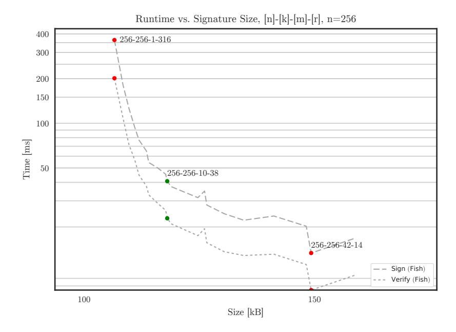
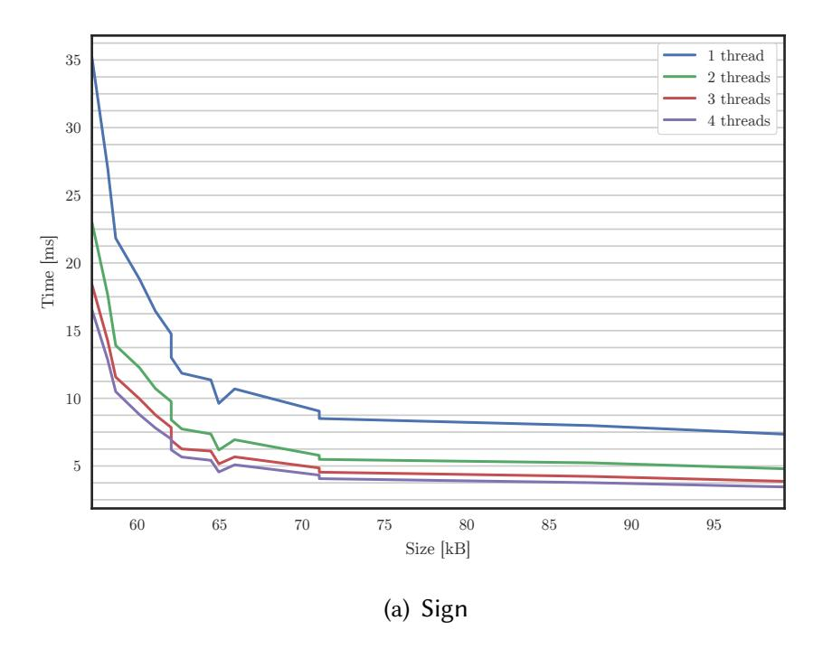
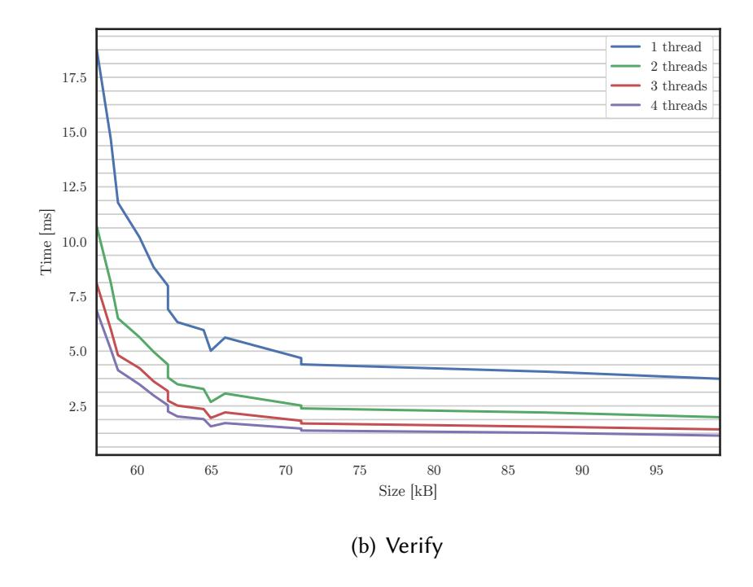

{0}------------------------------------------------

# Post-Quantum Zero-Knowledge and Signatures from Symmetric-Key Primitives\*

Melissa Chase Microsoft Research melissac@microsoft.com

> Claudio Orlandi Aarhus University orlandi@cs.au.dk

David Derler Graz University of Technology david.derler@tugraz.at

Sebastian Ramacher Graz University of Technology sebastian.ramacher@tugraz.at Steven Goldfeder Princeton University stevenag@cs.princeton.edu

Christian Rechberger Graz University of Technology & Denmark Technical University christian.rechberger@tugraz.at

Daniel Slamanig
AIT Austrian Institute of Technology
daniel.slamanig@ait.ac.at

#### **ABSTRACT**

We propose a new class of *post-quantum* digital signature schemes that: (a) derive their security entirely from the security of symmetric-key primitives, believed to be quantum-secure, and (b) have extremely small keypairs, and, (c) are highly parameterizable.

In our signature constructions, the public key is an image y = f(x) of a one-way function f and secret key x. A signature is a non-interactive zero-knowledge proof of x, that incorporates a message to be signed. For this proof, we leverage recent progress of Giacomelli et al. (USENIX'16) in constructing an efficient  $\Sigma$ -protocol for statements over general circuits. We improve this  $\Sigma$ -protocol to reduce proof sizes by a factor of two, at no additional computational cost. While this is of independent interest as it yields more compact proofs for any circuit, it also decreases our signature sizes.

We consider two possibilities to make the proof non-interactive: the Fiat-Shamir transform and Unruh's transform (EUROCRYPT'12, '15,'16). The former has smaller signatures, while the latter has a security analysis in the quantum-accessible random oracle model. By customizing Unruh's transform to our application, the overhead is reduced to 1.6x when compared to the Fiat-Shamir transform, which does not have a rigorous post-quantum security analysis.

We implement and benchmark both approaches and explore the possible choice of f, taking advantage of the recent trend to strive for practical symmetric ciphers with a particularly low number of multiplications and end up using LowMC (EUROCRYPT'15).

# **KEYWORDS**

Post-quantum cryptography, zero-knowledge, signatures, block cipher, Fiat-Shamir, Unruh, implementation

Greg Zaverucha Microsoft Research gregz@microsoft.com

# 1 INTRODUCTION

More than two decades ago Shor published his polynomial-time quantum algorithm for factoring and computing discrete logarithms [81]. Since then, we know that a sufficiently powerful quantum computer is able to break nearly all public key cryptography used in practice today. This motivates the invention of cryptographic schemes with *post quantum* (PQ) security, i.e., security against attacks by a quantum computer. Even though no sufficiently powerful quantum computer currently exists, NIST recently announced a post-quantum crypto project<sup>1</sup> to avoid a rushed transition from current cryptographic algorithms to PQ secure algorithms. The project is seeking proposals for public key encryption, key exchange and digital signatures thought to have PQ security. The deadline for proposals is fall 2017.

In this paper we are concerned with constructing signature schemes for the post-quantum era. The building blocks of our schemes are interactive honest-verifier zero-knowledge proof systems ( $\Sigma$ -protocols) for statements over general circuits and symmetric-key primitives, that are conjectured to remain secure in a post-quantum world.

**Post-Quantum Signatures.** Perhaps the oldest signature scheme with post-quantum security are one-time Lamport signatures [63], built using hash functions. As Grover's quantum search algorithm can invert any black-box function [52] with a quadratic speed-up over classical algorithms, one has to double the bit size of the hash function's domain, but still requires no additional assumptions to provably achieve post-quantum security. Combined with Merkletrees, this approach yields stateful signatures for any polynomial number of messages [71], where the state ensures that a one-time signature key from the tree is not reused. By making the tree very large, and randomly selecting a key from it (cf. [47]), along with other optimizations, yields practical stateless hash-based signatures [17].

There are also existing schemes that make structured (or number-theoretic) assumptions. Code-based signature schemes can be obtained from identification schemes based on the syndrome decoding (SD) problem [70, 82, 86] by applying a variant of the well-known

<sup>\*</sup>The performance figures presented here are somewhat outdated. For up to date figures see https://microsoft.github.io/Picnic/. This is the full version of a paper which appears in CCS'17: 2017 ACM SIGSAC Conference on Computer and Communications Security, CCS 2017, Dallas, TX, USA, October 30 - November 03, 2017. ACM, New York, NY, USA. This paper is a merge of [34, 46].

<span id="page-0-0"></span><sup>&</sup>lt;sup>1</sup>http://csrc.nist.gov/groups/ST/post-quantum-crypto/

{1}------------------------------------------------

Fiat-Shamir (FS) transform [40]. Lattice-based signature schemes secure under the short integer solution (SIS) problem on lattices following the Full-Domain-Hash (FDH) paradigm [13] have been introduced in [43]. More efficient approaches [7, 9, 65, 66] rely on the FS transform instead of FDH. BLISS [36], a very practical scheme, also relies on the FS transform, but buys efficiency at the cost of more pragmatic assumptions, i.e., a ring version of the SIS problem. For signatures based on problems related to multivariate systems of quadratic equations only recently provably secure variants relying on the FS transform have been proposed [56].

When it comes to confidence in the underlying assumptions, hash-based signatures are arguably the preferred candidate among all existing approaches. All other practical signatures require an additional structured assumption (in addition to assumptions related to hash functions).

#### 1.1 Contributions

We contribute a novel class of practical post-quantum signature schemes. Our approach only requires symmetric key primitives like hash functions and block ciphers and *does not* require additional structured hardness assumptions.

Along the way to building our signature schemes, we make several contributions of general interest to zero-knowledge proofs both in the classical and post-quantum setting:

- We improve ZKBoo [44], a recent Σ-protocol for proving statements over general circuits. We reduce the transcript size by more than half without increasing the computational cost. We call the improved protocol ZKB++. This improvement is of general interest outside of our application to post-quantum signatures as it yields significantly more concise zero knowledge proofs even in the classical setting.
- We also show how to apply Unruh's generic transform [83–85] to obtain a non-interactive counterpart of ZKB++ that is secure in the quantum-accessible random oracle model (QROM; see [18]). To our knowledge, we are the first to apply Unruh's transform in an efficient signature scheme.
- Unruh's construction is generic, and does not immediately yield compact proofs. However, we specialize the construction to our application, and we find the overhead was surprisingly low whereas a generic application of Unruh's transform incurs a 4x increase in size when compared to FS, we were able to reduce the size overhead of Unruh's transform to only 1.6x. Again, this has applications wider than our signature schemes as the protocol can be used for non-interactive post-quantum zero knowledge proofs secure in the QROM.

We build upon these results to achieve our central contribution: two concrete signature schemes. In both schemes the public key is set up to be an image y = f(k) with respect to one-way function f and secret key k. We then turn an instance of ZKB++ to prove knowledge of k into two signature schemes – one using the FS transform and the other using Unruh's transform. The FS variant, dubbed Fish, yields a signature scheme that is secure in the ROM, whereas the Unruh variant, dubbed Picnic, yields a signature

scheme that is secure in the QROM, and we include a complete security proof.

We review symmetric-key primitives with respect to their suitability to serve as f in our application and conclude that the LowMC family of block ciphers [4, 6] is well suited. We explore the parameter space of LowMC and show that we can obtain various trade-offs between signature size and computation time. Thereby, our approach turns out to be very flexible as besides the aforementioned trade-offs we are also able to adjust the security parameter of our construction in a very fine-grained way.

We provide an implementation of both schemes for 128-bit postquantum security, demonstrating the practical relevance of our approach. In particular, we provide two reference implementations on GitHub<sup>2,3</sup>. Moreover, we rigorously compare our schemes with other practical provably secure post-quantum schemes.

#### 1.2 Related Work

We now give a brief overview of other candidate schemes and defer a detailed comparison of parameters and performance to Section 7. We start with the only existing instantiation that solely relies on standard assumptions, i.e., comes with a security proof in the standard model (SM). The remaining existing schemes rely on structured assumptions related to codes, lattices and multivariate systems of quadratic equations that are assumed to be quantum safe and have a security proof in the ROM. At the end of the section, we review the state of the art in zero-knowledge proofs for non-algebraic statements.

Hash-Based Signatures (SM). Hash-based signatures are attractive as they can be proven secure in the standard model (i.e., without ROs) under well-known properties of hash functions such as second pre-image resistance. Unfortunately, highly efficient schemes like XMSS [22] are stateful, which seems to be problematic for practical applications [68]. Stateless schemes like SPHINCS [17] are thus more desirable, but this comes at reduced efficiency and increased signature sizes. SPHINCS has a tight security reduction to security of its building blocks, i.e., hash functions, PRGs and PRFs. At the 128-bit post-quantum security level, signatures are about 41 kB in size, and keys are of size about 1 kB each.

**Code-Based Signatures (ROM).** In the code-based setting the most prominent and provably secure approach is to convert identification schemes due to Stern [82] and Véron [86] to signatures using FS. For the 128-bit PQ security level one obtains signature sizes of around  $\approx$  129 kB (in the best case) and public key size of  $\approx$  160 bytes.<sup>4</sup> We note that there are also other code-based signatures [27] based on the Niederreiter [72] dual of the McEliece cryptosystem [67], which do not come with a security reduction, have shown to be insecure [38] and also do not seem practical [64]. There is a more recent provably secure approach [37], however, it is not immediate if this leads to efficient signatures.

Lattice-Based Signatures (ROM). For lattice based signatures there are two major directions. The first are schemes that rely on

<span id="page-1-0"></span><sup>&</sup>lt;sup>2</sup>https://github.com/Microsoft/Picnic

<span id="page-1-1"></span><sup>&</sup>lt;sup>3</sup>https://github.com/IAIK/fish-begol

<span id="page-1-2"></span><sup>&</sup>lt;sup>4</sup>The given estimates are taken from a recent talk of Nicolas Sendrier (available at https://pqcrypto.eu.org/mini.html), as, unfortunately, there are no free implementations available.

{2}------------------------------------------------

the hardness of worst-to-average-case problems in standard lattices [7, 9, 30, 43, 66]. Although they are desirable from a security point of view, they suffer from huge public keys, i.e., in the orders of a few to some 10 MBs. TESLA [7] (based upon [9, 66]) improves all aspects in the performance of GPV [43], but still has keys on the order of 1 MB. More efficient lattice-based schemes are based on ring analogues of classical lattice problems [3, 10, 11, 36, 53] whose security is related to hardness assumptions in ideal lattices. These constructions drop key sizes to the order of a few kBs. Most notable is BLISS [35, 36], which achieves performance nearly comparable to RSA. However, it must be noted, that ideal lattices have not been investigated nearly as deeply as standard lattices and thus there is less confidence in the assumptions (cf. [75]).

MQ-Based Signatures (ROM). Recently, Hülsing et al. in [56] proposed a post-quantum signature scheme (MQDSS) whose security is based on the problem of solving a multivariate system of quadratic equations. Their scheme is obtained by building upon the 5-pass (or 3-pass) identification scheme in [79] and applying the FS transform. For 128-bit post-quantum security, signature sizes are about 40 kB, public key sizes are 72 bytes and secret key sizes are 64 bytes. We note that there are other MQ-based approaches like Unbalanced Oil-and-Vinegar (UOV) variants [74] or FHEv-variants (cf. [76]), having somewhat larger keys (order of kBs) but much shorter signatures. However, they have no provable security guarantees, the parameter choice seems very aggressive, there are no parameters for conservative (post-quantum) security levels, and no implementations are available.

**Supersingular Isogenies (QROM).** Yoo et al. in [87] proposed a post-quantum signature scheme whose security is based on supersingular isogeny problems. The scheme is obtained by building upon the identification scheme in [39] and applying the Unruh transform. For 128-bit post-quantum security, signature sizes are about 140 kB, public key sizes are 768 bytes, and secret key sizes are 49 bytes.

At the same time, Galbraith et al. [41] published a preprint containing one conceptually identical isogeny-based construction, and one based on endomorphism rings. They report improved signature sizes using a time-space trade-off and only present their improvements in terms of classical security parameters.

**Zero-Knowledge for Arithmetic Circuits.** Zero-knowledge (ZK) proofs [49] are a powerful tool and exist for any language in NP [48]. Nevertheless, practically efficient proofs were until recently only known for restricted languages covering algebraic statements in certain algebraic structures, e.g., discrete logarithms [28, 80] or equations over bilinear groups [51]. Expressing any NP language as a combination of algebraic circuits could be done for example by expressing the relation as a circuit, however for circuits of practical interest (such as hash functions or block ciphers), this quickly becomes prohibitively expensive. Even SNARKS, where proof size can be made small (and constant) and verification is highly efficient, have very costly proofs (cf. [15, 26, 42] and the references therein).<sup>5</sup> Unfortunately, signatures require small proof computation times (efficient signing procedures), and this direction is not suitable.

Quite recently, dedicated ZK proof systems for statements expressed as Boolean circuits by Jawurek et al. [58] and statements expressed as RAM programs by Hu et al. [55] have been proposed. As we exclusively focus on circuits, let us take a look at [58]. They proposed using garbled circuits to obtain ZK proofs, which allow efficient proofs for statements like knowledge of x for y = SHA-256(x). Unfortunately, this approach is inherently interactive and thus not suitable for the design of practical signature schemes. The very recent ZKBoo protocol due to Giacomelli et al. [44], which we build upon, for the first time, allows to construct non-interactive zero-knowledge (NIZK) proofs with performance being of interest for practical applications.

QROM vs ROM. One way of arguing security for signatures obtained via the FS heuristic in the stronger QROM is to assume that it simply holds as long as the underlying protocol and the hash function used to instantiate the random oracle (RO) are quantumsecure. However, it is known [18] that there are signature schemes secure in the ROM that are insecure in the quantum-accessible ROM (QROM), i.e., when the adversary can issue quantum queries to the RO. One central issue in this context is how to handle the rewinding of adversaries within security reductions as in the FS transform [31]. Possibilities to circumvent this issue are via historyfree reductions [18] or the use of oblivious commitments within the FS transform, which is not applicable to our approach. Although many existing schemes ignore QROM security, given the general uncertainty of the capabilities of quantum adversaries, we prefer to avoid this assumption. Building upon results from Unruh [83– 85], we achieve provable security in the QROM under reasonable assumptions.

# 2 BUILDING BLOCKS

Below, we informally recall the notion of  $\Sigma$ -protocols and other standard primitives.

**Sigma Protocol.** A *sigma protocol* (or  $\Sigma$ -protocol) is a three flow protocol between a prover Prove and a verifier Verify, where transcripts have the form (r, c, s). Thereby, r and s are computed by Prove and c is a challenge chosen by Verify. Let f be a relation such that f(x) = y, where y is common input and x is a witness known only to Prove. Verify accepts if  $\phi(y, r, c, s) = 1$  for an efficiently computable predicate  $\phi$ . There also exists an efficient simulator, given g and a randomly chosen g0, outputs a transcript g1, g2, g3 for g3 that is indistinguishable from a real run of the protocol for g3, g4.

*n-Special Soundness.* A  $\Sigma$ -protocol has *n-special soundness* if *n* transcripts  $(r, c_1, s_1), \ldots, (r, c_n, s_n)$  with distinct  $c_i$  guarantee that a witness may be efficiently extracted.

Fiat-Shamir. The FS transform [40] converts a Σ-protocol into a non-interactive zero knowledge proof of knowledge. A Σ-protocol consists of a transcript (r, c, s). The corresponding non-interactive proof (r', c', s') generates r' and s' as in the interactive case, but obtains  $c' \leftarrow H(r')$  instead of receiving it from the verifier. This is known to be a secure NIZK in the random oracle model against standard (non-quantum) adversaries [40].

Other Building Blocks. This paper requires other common primitives, namely one-way functions, pseudorandom generators, and

<span id="page-2-0"></span><sup>&</sup>lt;sup>5</sup>Using SNARKS is reasonable in scenarios where provers are extremely powerful (such as verifiable computing [42]) or the runtime of the prover is not critical (such as Zerocash [14]).

{3}------------------------------------------------

commitments. We use the canonical hash-based commitment and require commitments to be hiding and binding. Definitions are given in Appendix C, where we also recall the definition of signature schemes, and existential unforgeability under chosen message attacks (EUF-CMA), which is the standard security notion for signature schemes.

#### 3 ZKBOO AND ZKB++

ZKBoo is a proof system for zero-knowledge proofs on arbitrary circuits described in [45]. We recall the protocol here, and present ZKB++, an improved version of ZKBoo with proofs that are less than half the size.

#### 3.1 ZKBoo

While ZKBoo is presented with various possible parameter options, we present only the final version from [45] with the best parameters. Moreover, while ZKBoo presents both interactive and non-interactive protocol versions, we present only the non-interactive version since our main goal is building a signature scheme.

**Overview.** ZKBoo builds on the MPC-in-the-head paradigm of Ishai *et al.* [57], that we describe only informally here. The multiparty computation protocol (MPC) will implement the relation, and the input is the witness. For example, the MPC could compute y = SHA-256(x) where players each have a share of x and y is public. The idea is to have the prover simulate a multiparty computation protocol "in their head", commit to the state and transcripts of all players, then have the verifier "corrupt" a random subset of the simulated players by seeing their complete state. The verifier then checks that the computation was done correctly from the perspective of the corrupted players, and if so, he has some assurance that the output is correct and the prover knows x. Iterating this for many rounds then gives the verifier high assurance.

ZKBoo generalizes the idea of [57] by replacing MPC with so-called "circuit decompositions", which do not necessarily need to satisfy the properties of an MPC protocol and therefore lead to more efficient proofs in practice. Fix the number of players to three. In particular, to prove knowledge of a witness for a relation  $R := \{(x,y), \phi(x) = y\}$ , we begin with a circuit that computes  $\phi$ , and then find a suitable circuit decomposition. This contains a Share function (that splits the input into three shares), three functions  $\text{Output}_{i \in \{1,2,3\}}$  (that take as input all of the input shares and some randomness and produce an output share for each of the parties), and a function Reconstruct (that takes as input the three output shares and reconstructs the circuit's final output). This decomposition must satisfy *correctness* and 2-*privacy* which intuitively means that revealing the views of any two players does not leak information about the witness x.

The decomposition is used to construct a proof as follows: the prover runs the computation  $\phi$  using the decomposition and commits to the views – three views per run. Then, using the FS heuristic, the prover sends the commitments and output shares from each view to the random oracle to compute a challenge – the challenge tells the prover which two of the three views to open for each of the t runs. Because of the 2-privacy property, opening two views for each run does not leak information about the witness. The number of runs, t, is chosen to achieve negligible soundness error – i.e.,

intuitively it would be infeasible for the prover to cheat without getting caught in at least one of the runs. The verifier checks that (1) the output of each of the three views reconstructs to y, (2) each of the two open views were computed correctly, and (3) the challenge was computed correctly.

We now give a detailed description of the non-interactive ZKBoo protocol. Throughout this paper, when we perform arithmetic on the indices of the players, we omit the implicit mod 3 to simplify the notation.

<span id="page-3-0"></span>Definition 3.1 ((2,3)-decomposition). Let  $f(\cdot)$  be a function that is computed by an n-gate circuit  $\phi$  such that  $f(x) = \phi(x) = y$ , and let  $\kappa$  be the security parameter. Let  $k_1, k_2$ , and  $k_3$  be tapes chosen uniformly at random from  $\{0, 1\}^{\kappa}$  corresponding to players  $P_1, P_2$  and  $P_3$ , respectively. Consider the following set of functions,  $\mathcal{D}$ :

$$\begin{split} (\mathsf{view}_1^{(0)}, \mathsf{view}_2^{(0)}, \, \mathsf{view}_3^{(0)}) &\leftarrow \mathsf{Share}(x, k_1, k_2, k_3) \\ \mathsf{view}_i^{(j+1)} &\leftarrow \mathsf{Update}(\mathsf{view}_i^{(j)}, \mathsf{view}_{i+1}^{(j)}, k_i, k_{i+1}) \\ y_i &\leftarrow \mathsf{Output}(\mathsf{View}_i) \\ y &\leftarrow \mathsf{Reconstruct}(y_1, y_2, y_3) \end{split}$$

such that Share is a potentially randomized invertible function that takes x as input and outputs the initial view for each player containing the secret share  $x_i$  of x, i.e.  $\operatorname{view}_i^{(0)} = x_i$ . The function Update computes the wire values for the next gate and updates the view accordingly. The function  $\operatorname{Output}_i$  takes as input the final view,  $\operatorname{View}_i \equiv \operatorname{view}_i^{(n)}$  after all gates have been computed and outputs player  $P_i$ 's output share,  $y_i$ .

We require correctness and 2-privacy as informally outlined before. We defer a formal definition to Appendix A.1. The concrete decomposition used by ZKBoo is presented in Appendix A.2.

3.1.1 ZKBoo Complete Protocol. Given a (2,3)-decomposition  $\mathcal{D}$  for a function  $\phi$ , the ZKBoo protocol is a  $\Sigma$ -protocol for languages of the form  $L := \{y \mid \exists \ x : y = \phi(x)\}$ . We note that this directly yields a non-interactive zero-knowledge (NIZK) proof system for the same relation using well known results. We recall the details of ZKBoo in Appendix A.

Serializing the Views. In the (2,3)-decomposition, the view is updated with the output wire value for each gate. While conceptually a player's view includes the values that they computed locally, when the view is serialized, it is sufficient to include only the wire values of the gates that require non-local computations (i.e., the binary multiplication gates). The verifier can recompute the parts of the view due to local computations, and they do not need to be serialized. Giving the verifier locally computed values does not even save any computation as the verifier will still need to recompute the values in order to check them.

In ZKBoo, the serialized view includes: (1) the input share, (2) output wire values for binary multiplication gates, and (3) the output share.

The size of a view depends on the circuit as well as the ring that it is computed over. Let  $\phi: (\mathbb{Z}_{2^{\ell}})^m \to (\mathbb{Z}_{2^{\ell}})^n$  be the circuit being computed over  $\mathbb{Z}_{2^{\ell}}$  such that there are m input wires, n output wires, and each wire can be expressed with  $\ell$  bits. Moreover, assume that the circuit has b binary-multiplication gates. The size of a view in bits is thus given by:  $|\text{View}_i| = \ell(m+n+b)$ .

{4}------------------------------------------------

**ZKBoo Proof Size.** Using the above notation, we can now calculate the size of ZKBoo proofs. Let  $\kappa$  be the (classical) security-parameter. The random tapes will be of size  $\kappa$  as mentioned above. Furthermore, let c be the size of the commitments  $c_i$  (in bits) for a commitment scheme secure at the given security level. In ZKBoo, hash-based commitments were used and instantiated with SHA-256, and thus c=256. In ZKBoo, the openings D of the commitments contain the value being committed to as well as the randomness used for the commitments. Let s denote the size of the randomness in bits used for each commitment. The size of the output share  $y_i$  is the same as the output size of the circuit,  $(\ell \cdot n)$ . Let t denote the number of parallel repetitions that we must run, and from ZKBoo we know that to achieve soundness error of  $2^{-\kappa}$ , we must set  $t = \lceil \kappa (\log_2 3 - 1)^{-1} \rceil$ . The total proof size is given by

$$|p| = t \cdot [3 \cdot (|y_i| + |c_i|) + 2 \cdot (|View_i| + |k_i| + s)]$$

$$= t \cdot [3 \cdot (\ell n + c) + 2 \cdot (\ell \cdot (m + n + b) + \kappa + s)]$$

$$= t \cdot [3c + 2\kappa + 2s + \ell \cdot (5n + 2m + 2b)]$$

$$= [\kappa (\log_2 3 - 1)^{-1}] \cdot [3c + 2\kappa + 2s + \ell \cdot (5n + 2m + 2b)]$$

#### <span id="page-4-1"></span>3.2 ZKB++

We now present ZKB++, an improved version of ZKBoo with NIZK proofs that are less than half the size of ZKBoo proofs. Moreover, our benchmarks show that this size reduction comes at no extra computational cost.<sup>6</sup>

We present the ZKB++ optimizations in an incremental way over the original ZKBoo protocol.

**O1: The Share Function.** We make the Share function sample the shares pseudorandomly as:

$$(x_1, x_2, x_3) \leftarrow \text{Share}(x, k_1, k_2, k_3) :=$$

$$x_1 = R_1(0 \cdots |x - 1|)$$

$$x_2 = R_2(0 \cdots |x - 1|)$$

$$x_3 = x - x_1 - x_2$$

where  $R_i$  is a pseudorandom generator seeded with  $k_i$ , and by  $R_i(0 \cdots |x-1|)$  we denote the first |x| bits output by  $R_i$ .

We note that sampling in this manner preserves the 2-privacy of the decomposition. In particular, given only two of  $\{(k_1, x_1), (k_2, x_2), (k_3, x_3)\}$ , x remains uniformly distributed over the choice of the third unopened  $(k_i, x_i)$ .

We specify the Share function in this manner as it will lead to more compact proofs. For each round, the prover is required to "open" two views. In order to verify the proof, the verifier must be given both the random tape and the input share for each opened view. If these values are generated independently of one another, then the prover will have to explicitly include both of them in the proof. However, with our sampling method, in View<sub>1</sub> and View<sub>2</sub>, the prover only needs to include  $k_i$ , as  $x_i$  can be deterministically computed by the verifier.

The exact savings depend on which views the prover must open, and thus depend on the challenge. The expected reduction in proof size resulting from using the ZKB++ sampling technique instead of the technique used in ZKBoo is  $(4t \cdot |x|)/3$  bits.

**O2: Not Including Input Shares.** Since the input shares are now generated pseudorandomly using the seed  $k_i$ , we do not need to include them in the view when e = 1. However, if e = 2 or e = 3, we still need to send one input share for the third view for which the input share cannot be derived from the seed. Since the challenge is generated uniformly at random from  $\{1, 2, 3\}$ , the expected number of input shares that we'll need to include for a single iteration is 2/3.

O3: Not Including Commitments. In ZKBoo proofs, the commitments of all three views are sent to the verifier. This is unnecessary as for the two views that are opened, the verifier can recompute the commitment. Only for the third view that the verifier is not given the commitment needs to be explicitly sent.

We stress that there is no lost security here (in some sense we use *e* as a "commitment to the commitments") as even when the prover sends the commitments, the verifier must check that the prover has sent the correct commitments by hashing the commitments to recompute the challenge. Here too, the verifier checks that the commitments that it computed are the same ones that were used by the prover by hashing them as part of the input to recompute the challenge.

There is also no extra computational cost in this approach — whereas the verifier now must recompute the commitments, in the original ZKBoo protocol, the verifier needed to verify the commitments in step 2 ( see Scheme 3 in Appendix A ). For the hash-based commitment scheme used in ZKBoo, the function to verify the commitment first recomputes the commitment and thus there is no extra computation.

**O4: No Additional Randomness for Commitments.** Since the first input to the commitment is the seed value  $k_i$  for the random tape, the protocol input to the commitment doubles as a randomization value, ensuring that commitments are hiding. Further, each view included in the commitment must be well randomized for the security of the MPC protocol. In the random oracle model the resulting commitments are hiding (the RO model is needed here since  $k_i$  is used both as seed for the PRG and as randomness for the commitment. Since one already needs the RO model to make the proofs non-interactive, there is no extra assumption here).

**O5:** Not Including the Output Shares. In ZKBoo proofs, as part of a, the output shares  $y_i$  are included in the proof. Moreover, for the two views that are opened, those output shares are included a second time.

First, we do not need to send two of the output shares twice. However, we actually do not need to send any output shares at all as they can be deterministically computed from the rest of the proof as follows:

For the two views that are given as part of the proof, the output share can be recomputed from the remaining parts of the view. Essentially, the output share is just the value on the output wires. Given the random tapes and the communicated bits from the binary multiplication gates, all wires for both views can be recomputed.

For the third view, recall that the Reconstruct function simply XORs the three output shares to obtain y. But the verifier is given y,

<span id="page-4-0"></span><sup>&</sup>lt;sup>6</sup>Our analysis of the original ZKBoo source code uncovered some errors which were corrected in the new implementation.

{5}------------------------------------------------

and can thus instead recompute the third output share. In particular, given  $y_i$ ,  $y_{i+1}$  and y, the verifier can compute:  $y_{i+2} = y + y_i + y_{i+1}$ . Computational Trade-Off. While we would expect some computational cost from recomputing rather than sending the output shares, our benchmarks show that there is no additional computational cost incurred by this modification, perhaps because it is a small part of the overall verification. For the challenge view, View<sub>e</sub>, the verifier anyway needs to recompute all of the wire values in order to do the verification, so there is no added cost.

For the second view,  $View_{e+1}$ , the verifier must recompute the wire values as well since the verifier will need to compute the values which must be stored as output of the (2,3)-decomposition, so there is effectively no cost.

For the third view, the extra cost of recomputing the output share is just two additions in the ring, which is exactly the cost of a single call to Reconstruct.

However, in step 2 of the verification in ZKBoo, the verifier has to call Reconstruct in order to verify that the three output shares given are correct (see Scheme 3 in Appendix A). But in our optimization, the verifier no longer needs to perform this check as the derivation of the third share guarantees that it will reconstruct correctly. Thus, the verifier is adding one Reconstruct but saving one, and thus no cost is incurred.

We note that the outputs will be checked as the  $y_i$ 's are hashed with H to determine the challenge. The verifier recomputes the challenge and if the  $y_i$  values used by the verifier do not match those used by the prover, the challenge will be different (by the collision resistance property of H), and the proof will fail.

**O6:** Not Including View<sub>e</sub>. In step 2 of the proof, the verifier recomputes every wire in View<sub>e</sub> and checks as he goes that the received values are correct. However we note that this is not necessary.

The verifier can recompute  $View_e$  given just the random tapes  $k_e, k_{e+1}$  and the wire values of  $View_{e+1}$ . But the verifier does not need to explicitly check that each wire value in  $View_e$  is computed correctly. Instead, the verifier will recompute the view, and check the commitments using the recomputed view. By the binding property of the commitment scheme, the commitments will only verify if the verifier has correctly recomputed every value stored in the view.

Notice that this modification reduces the computational time as the verifier does not need to perform part of step 2, i.e., there is no need to check every wire as checking the commitment will check these wires for us. But more crucially, this modification reduces the proof size significantly. There is no need to send the AND wire values for  $View_e$  as we can recompute them and check their correctness. Indeed, for this view, the prover only needs to send the input wire value and nothing else.

*3.2.1 Putting it All Together: ZKB++.* This series of optimizations results in our new protocol ZKB++ which is presented in Scheme 1.

Notice that in ZKB++, the prover explicitly sends the challenge *e* to the verifier. In the original ZKBoo protocol, the verifier is explicitly given all of the inputs to the challenge random oracle, so it can compute the challenge right away, and then check the proofs. However, in our protocol, the verifier is no longer explicitly given these inputs. Thus our verifier must first recompute all implicitly

given values. To be able to compute those values, the challenge e is required which is why we explicitly include e in the proof.

There are 3 possible challenges for each iteration, so the cost of sending e for a t iteration proof is  $t \cdot \log_2(3)$ .

**ZKB++ Proof Size.** The expected proof size is

$$|p| = t[|c_i| + 2|k_i| + 2/3|x_i| + b|w_i| + |e_i|]$$

$$= t[c + 2\kappa + 2/3\ell m + b\ell + \log_2(3)]$$

$$= t[c + 2\kappa + \log_2(3) + \ell \cdot (2/3 \cdot m + b)]$$

$$= \lceil \kappa(\log_2 3 - 1)^{-1} \rceil [c + 2\kappa + \log_2(3) + \ell \cdot (2/3 \cdot m + b)]$$

The ZKB++ improvements reduce the proof size compared to ZKBoo by a factor of 2; independent of the concrete circuit.

As an example, we can consider the concrete case of proving knowledge of a SHA-256 pre-image. For this example, we set  $\ell=1$  (for Boolean circuits), c=256 (we use SHA-256 as a commitment scheme), and  $s=\kappa$  (the randomness for the commitment in ZKB00 that we eliminated in ZKB++). For the circuit, we use the SHA-256 boolean circuit from [23], for which m=512, n=256, and b=22272. Given these parameters, if we set  $\kappa=128$ , then the ZKB++ proof size is 618 kilobytes, which is only 48% of ZKB00 proof size (1287 kilobytes). At the 80-bit security level, the ZKB++ proof size is 385 kilobytes, and at the 40-bit security level, the proof size is 193 kilobytes. For all these figures, we used 256-bit commitments, and thus in practice they may be slightly reduced by using a weaker commitment scheme.

**ZKB++ Security.** From our argumentation above we conclude that the security of ZKB00 directly implies security of ZKB++ in the (Q)ROM.

#### 4 THE FISH SIGNATURE SCHEME

The FS transform is an elegant way to obtain EUF-CMA secure signature schemes. The basic idea is similar to constructing NIZK proofs from  $\Sigma$ -protocols, but the challenge c is generated by hashing the prover's first message r and the message m to be signed, i.e.,  $c \leftarrow H(r,m)$ . In the following we will index the non-interactive PPT algorithms (Prove $_H$ , Verify $_H$ ) by the hash function H, which we model as a random oracle. Let us consider a language  $L_R$  with associated witness relation R of pre-images of a one-way function  $f_k: D_\kappa \to R_\kappa$ , sampled uniformly at random from a family of one-way functions  $\{f_k\}_{k\in K_\kappa}$ , indexed by key k and security parameter  $\kappa$ :

$$((y,k),x) \in R \iff y = f_k(x).$$

Henceforth, we may use  $\{f_k\}$  for brevity. The function family  $\{f_k\}$  could be any one-way function family, but since we found that function families based on block ciphers gave the most efficient signatures, we tailor our description to this choice of  $\{f_k\}$ . Here we have that

$$f_k(x) := \operatorname{Enc}(x, k),$$

where  $\operatorname{Enc}(x,k)$  denotes the encryption of a single block  $k \in \{0,1\}^{c \cdot \kappa}$  with respect to key  $x \in \{0,1\}^{c \cdot \kappa}$ . One can sample a one-way function  $\{f_k\}$  with respect to security parameter  $\kappa$  uniformly at random by sampling a uniformly random block  $k \in \{0,1\}^{c \cdot \kappa}$ . In Appendix D we formally argue that we can use a block cipher (viewed as a PRF) in this way to instantiate an OWF. In the classical setting we set c=1, whereas we set c=2 in the post-quantum setting to account

{6}------------------------------------------------

<span id="page-6-0"></span>For public  $\phi$  and  $y \in L_{\phi}$ , the prover has x such that  $y = \phi(x)$ . The prover and verifier use the hash functions  $G(\cdot)$  and  $H(\cdot)$  and  $H'(\cdot)$  which will be modeled as random oracles (H' will be used to commit to the views). The integer t is the number of parallel iterations.  $p \leftarrow \text{Prove}(x)$ :

1. For each iteration  $r_i, i \in [1, t]$ : Sample random tapes  $k_1^{(i)}, k_2^{(i)}, k_3^{(i)}$  and simulate the MPC protocol to get an output view  $\text{View}_j^{(i)}$  and output share  $y_j^{(i)}$ . For each player  $P_j$  compute  $(x_1^{(i)}, x_2^{(i)}, x_3^{(i)}) \leftarrow \text{Share}(x, k_1^{(i)}, k_2^{(i)}, k_3^{(i)}) = (G(k_1^{(i)}), G(k_2^{(i)}), x \oplus G(k_1^{(i)}) \oplus G(k_2^{(i)})),$ 

$$\begin{split} \overset{(i)}{_{1}}, x_{2}^{(i)}, x_{3}^{(i)}) &\leftarrow \mathsf{Share}(x, k_{1}^{(i)}, k_{2}^{(i)}, k_{3}^{(i)}) = (G(k_{1}^{(i)}), G(k_{2}^{(i)}), x \oplus G(k_{1}^{(i)}) \oplus G(k_{2}^{(i)})) \\ &\mathsf{View}_{j}^{(i)} \leftarrow \mathsf{Update}(\mathsf{Update}(\cdots \mathsf{Update}(x_{j}^{(i)}, x_{j+1}^{(i)}, k_{j}^{(i)}, k_{j+1}^{(i)}, \ldots) \ldots), \\ &y_{j}^{(i)} \leftarrow \mathsf{Output}(\mathsf{View}_{j}^{(i)}). \end{split}$$

 $\text{Commit} \ [C_j^{(i)}, D_j^{(i)}] \leftarrow [H'(k_j^{(i)}, x_j^{(i)}, \mathsf{View}_j^{(i)}), k_j^{(i)} | | \mathsf{View}_j^{(i)}], \ \text{and let} \ a^{(i)} = (y_1^{(i)}, y_2^{(i)}, y_3^{(i)}, C_1^{(i)}, C_2^{(i)}, C_3^{(i)}).$ 

- 2. Compute the challenge:  $e \leftarrow H(a^{(1)}, \dots, a^{(t)})$ . Interpret the challenge such that for  $i \in [1, t], e^{(i)} \in \{1, 2, 3\}$
- 3. For each iteration  $r_i$ ,  $i \in [1, t]$ : let  $b^{(i)} = (y_{e^{(i)}+2}^{(i)}, C_{e^{(i)}+2}^{(i)})$  and set

$$z^{(i)} \leftarrow \begin{cases} (\mathsf{View}_2^{(i)}, k_1^{(i)}, k_2^{(i)}) & \text{if } e^{(i)} = 1, \\ (\mathsf{View}_3^{(i)}, k_2^{(i)}, k_3^{(i)}, x_3^{(i)}) & \text{if } e^{(i)} = 2, \\ (\mathsf{View}_1^{(i)}, k_3^{(i)}, k_1^{(i)}, x_3^{(i)}) & \text{if } e^{(i)} = 3. \end{cases}$$

4. Output  $p \leftarrow [e, (b^{(1)}, z^{(1)}), (b^{(2)}, z^{(2)}), \cdots, (b^{(t)}, z^{(t)})]$ .

# $b \leftarrow \mathsf{Verify}(y,p)$ :

1. For each iteration  $r_i$ ,  $i \in [1, t]$ : Run the MPC protocol to reconstruct the views, input and output shares that were not explicitly given as part of the proof p. In particular:

$$x_{e^{(i)}}^{(i)} \leftarrow \begin{cases} G(k_1^{(i)}) & \text{if } e^{(i)} = 1, \\ G(k_2^{(i)}) & \text{if } e^{(i)} = 2, \\ x_3^{(i)} \text{ given as part of } z^{(i)} & \text{if } e^{(i)} = 3. \end{cases} \leftarrow \begin{cases} G(k_2^{(i)}) & \text{if } e^{(i)} = 1, \\ x_3^{(i)} \text{ given as part of } z^{(i)} & \text{if } e^{(i)} = 2, \\ G(k_1^{(i)}) & \text{if } e^{(i)} = 3. \end{cases}$$

Obtain View $_{e^{(i)}+1}^{(i)}$  from  $z^{(i)}$  and compute

$$\begin{aligned} & \text{View}_{e}^{(i)} \leftarrow \text{Update}(\dots \text{Update}(x_{e}^{(i)}, x_{e+1}^{(i)}, k_{e}^{(i)}, k_{e+1}^{(i)}) \dots), \\ & y_{e^{(i)}}^{(i)} \leftarrow \text{Output}(\text{View}_{e^{(i)}}^{(i)}), \ y_{e^{(i)}+1}^{(i)} \leftarrow \text{Output}(\text{View}_{e^{(i)}+1}^{(i)}), y_{e^{(i)}+2}^{(i)} \leftarrow y \oplus y_{e^{(i)}}^{(i)} \oplus y_{e^{(i)}+1}^{(i)} \end{aligned}$$

Compute the commitments for views  $\mathsf{View}_{e^{(i)}}^{(i)}$  and  $\mathsf{View}_{e^{(i)}}^{(i)}$ . For  $j \in \{e^{(i)}, e^{(i)} + 1\}$ :

$$[C_j^{(i)},D_j^{(i)}] \leftarrow [H'(k_j^{(i)},x_j^{(i)},\mathsf{View}_j^{(i)}),k_j^{(i)}||\mathsf{View}_j^{(i)}]$$
 Let  $a'^{(i)} = (y_1^{(i)},y_2^{(i)},y_3^{(i)},C_1^{(i)},C_2^{(i)},C_3^{(i)})$  and note that  $y_{e^{(i)}+2}^{(i)}$  and  $C_{e^{(i)}+2}^{(i)}$  is a part of  $z^{(i)}$ .

2. Compute the challenge:  $e' \leftarrow H(a'^{(1)}, \dots, a'^{(t)})$ . If, e' = e, output Accept, otherwise output Reject.

Scheme 1: The ZKB++ proof system, made non-interactive using the Fiat-Shamir transform.

for the generic speedup imposed by Grover's algorithm [52]. The rationale for using a random instead of a fixed block k when creating the signature keypair is to improve security against multi-user key recovery attacks and generic time-memory trade-off attacks like [54]. To reduce the size of the public key, one could choose a smaller value that is unique per user, or use a fixed value (with a potential decrease in security). Since public keys in our schemes are small (at most 64 bytes), our design uses a full random block.

When using ZKBoo to prove knowledge of such a pre-image, we know [44] that this  $\Sigma$ -protocol provides 3-special soundness. We apply the FS transform to this  $\Sigma$ -protocol to obtain an EUF-CMA secure signature scheme. In the so-obtained signature scheme the public verification key pk contains the image y and the value k determining  $f_k$ . The secret signing key sk is a random value x from  $D_K$ . The corresponding signature scheme, dubbed Fish, is illustrated in Scheme 2.

If we view ZKBoo as a canonical identification scheme that is secure against passive adversaries one just needs to keep in mind that most definitions are tailored to 2-special soundness, and the 3-special soundness of ZKBoo requires an additional rewind. In particular, an adapted version of the proof of [61, Theorem 8.2] which considers this additional rewind attests the security of Scheme 2. The security reduction, however, is a non-tight one, like most signature schemes constructed from  $\Sigma$ -protocols. We obtain the following:

COROLLARY 4.1. Scheme 2 instantiated with ZKB++ and a secure one-way function yields an EUF-CMA secure signature scheme in the ROM.

<span id="page-6-1"></span><sup>&</sup>lt;sup>7</sup>There are numerous works on signatures from (three move) identification schemes [1, 2, 12, 32, 62, 73, 77]. Unfortunately existing proof techniques do not give tight security reductions.

{7}------------------------------------------------

```
\frac{\text{Gen}(1^{\kappa}): \text{ Choose } k \overset{R}{\leftarrow} \mathsf{K}_{\kappa}, x \overset{R}{\leftarrow} \mathsf{D}_{\kappa}, \text{ compute } y \leftarrow f_{k}(x), \text{ set pk} \leftarrow (y, k) \text{ and sk} \leftarrow (\mathsf{pk}, x) \text{ and return } (\mathsf{sk}, \mathsf{pk}).}{\frac{\mathsf{Sign}(\mathsf{sk}, m): \mathsf{Parse sk} \text{ as } (\mathsf{pk}, x), \mathsf{compute } p = (r, s) \leftarrow \mathsf{Prove}_{H}((y, k), x) \text{ and return } \sigma \leftarrow p, \text{ where internally the challenge is computed}}{\mathsf{as } c \leftarrow H(r, m).} \\ \frac{\mathsf{Verify}(\mathsf{pk}, m, \sigma): \mathsf{Parse pk} \text{ as } (y, k), \mathsf{and } \sigma \text{ as } p = (r, s). \mathsf{Return 1} \text{ if the following holds, and 0 otherwise:}}{\mathsf{Verify}_{H}((y, k), p) = 1,}} \\ \text{where internally the challenge is computed as } c \leftarrow H(r, m).}
```

Scheme 2: Generic description the Fish and Picnic signature schemes. In both schemes Prove is implemented with ZKB++, in Fish it is made non-interactive with the FS transform, while in Picnic, Unruh's transform is used.

#### <span id="page-7-2"></span>5 THE PICNIC SIGNATURE SCHEME

The Picnic signature scheme is the same as Fish, except for the transform used to make ZKB++ noninteractive. Unruh [83] presents an alternative to the FS transform that is provably secure in the QROM. Indeed, Unruh even explicitly presents a construction for a signature scheme and proves its security given a secure a  $\Sigma$ -protocol. Unruh's construction requires a  $\Sigma$ -protocol and a hard instance generator, but he does not give an instantiation. We use his approach to argue that with a few modifications, our signature scheme is also provably secure in the QROM. One interesting aspect is that, while on first observation Unruh's transform seems much more expensive than the standard FS transform, we show how to make use of the structure of ZKB++ to reduce the cost significantly.

**Unruh's Transform: Overview.** At a high level, Unruh's transform works as follows: Given a  $\Sigma$ -protocol with challenge space C, an integer t, a statement x, and a random permutation G, the prover will

- (1) Run the first phase of the  $\Sigma$ -protocol t times to produce  $r_1, \ldots, r_t$ .
- (2) For each  $i \in \{1, ..., t\}$ , and for each  $j \in C$ , compute the response  $s_{ij}$  for  $r_i$  and challenge j. Compute  $g_{ij} = G(s_{ij})$ .
- (3) Compute  $H(x, r_1, \ldots, r_t, g_{11}, \ldots, g_{t|C|})$  to obtain a set of indices  $J_1, \ldots, J_t$ .
- (4) Output  $\pi = (r_1, \dots, r_t, s_{1J_1}, \dots, s_{tJ_t}, g_{11}, \dots, g_{t|C|}).$

Similarly, the verifier will verify the hash, verify that the given  $s_{iJ_i}$  values match the corresponding  $g_{iJ_i}$  values, and that the  $s_{iJ_i}$  values are valid responses w.r.t. the  $r_i$  values.

Informally speaking, in Unruh's security analysis, zero knowledge follows from HVZK of the underlying  $\Sigma$ -protocol: the simulator just generates t transcripts and then programs the random oracle to get the appropriate challenges. The proof of knowledge property is more complex, but the argument is that any adversary who has non-trivial probability of producing an accepting proof will also have to output some  $g_{ij}$  for  $j \neq J_i$  which is a correct response for a different challenge - then the extractor can invert G and get the second response, which by special soundness allows it to produce a witness.

To instantiate the function G in the protocol, Unruh shows that one does not need a random oracle that is actually a permutation. Instead, as long as the domain and co-domain of G have the same length, it can be used, since it is indistinguishable from a random permutation.

**Applying the Unruh transform to ZKB++: The Direct Approach.** We can apply Unruh to ZKB++ in a relatively straightforward manner by modifying our protocol. Although ZKB++ has

3-special soundness, whereas Unruh's transform is only proven for  $\Sigma$ -protocols with 2-special soundness, the proof is easily modified to 3-special soundness.

Since ZKB++ has 3-special soundness, we would need at least three responses for each iteration. Moreover, since there only are three possible challenges in ZKB++, we would run Unruh's transform with  $C = \{1, 2, 3\}$ , i.e., every possible challenge and response. We would then proceed as follows:

Let  $G: \{0,1\}^{\hat{s}_{ij}} \to \{0,1\}^{|s_{ij}|}$  be a hash function modeled as a random oracle. Non-interactive ZKB++ proofs would then proceed as follows:

- (1) Run the first ZKB++ phase t times to produce  $r_1, \ldots, r_t$ .
- (2) For each  $i \in \{1, ..., t\}$ , and for each  $j \in \{1, 2, 3\}$ , compute the response  $s_{ij}$  for  $r_i$  and challenge j. Compute  $q_{ij} = G(s_{ij})$ .
- (3) Compute  $H(x, r_1, \ldots, r_t, g_{11}, \ldots, g_{t3})$  to obtain a set of indices  $J_1, \ldots, J_t$ .
- (4) Output  $\pi = (r_1, \dots, r_t, s_{1J_1}, \dots, s_{tJ_t}, g_{11}, \dots, g_{t3}).$

While this works, it comes as a significant overhead in the size of the proof. That is, we have to additionally include  $g_{11}, \ldots, g_{t3}$ . Each  $g_{ij}$  is a permutation of an output share and there are 3t such values, so in particular the extra overhead would yield a proof size of

$$t \cdot [c + 2\kappa + \log_2(3) + \ell \cdot (2/3 \cdot m + b)] + 3t \cdot [2\kappa + \ell \cdot (2/3 \cdot m + b)] = t \cdot [c + 8\kappa + \log_2(3) + \ell \cdot (8/3m + 4b)].$$

Since for most functions, the size of the proof is dominated by  $t \cdot \ell b$ , this proof is roughly four times as large as in the FS version. To this end, we again introduce some optimizations.

**O1: Making Use of Overlapping Responses.** We can make use of the structure of the ZKB++ proofs to achieve a significant reduction in the proof size. Although we refer to three separate challenges, in the case of the ZKB++ protocol, there is a large overlap between the contents of the responses corresponding to these challenges. In particular, there are only three distinct views in the ZKB++ protocol, two of which are opened for a given challenge.

Instead of computing a permutation of each *response*,  $s_{ij}$ , we can compute a permutation of each *view*,  $v_{ij}$ . For each  $i \in \{1, ..., t\}$ , and for each  $j \in \{1, 2, 3\}$ , the prover computes  $g_{ij} = G(v_{ij})$ .

The verifier checks the permuted value for each of the two views in the response. In particular, for challenge  $i \in \{1, 2, 3\}$ , the verifier will need to check that  $g_{ij} = G(v_{ij})$  and  $g_{i(j+1)} = G(v_{i(j+1)})$ .

<span id="page-7-1"></span><sup>&</sup>lt;sup>8</sup>Actually, the size of the response changes depending on what the challenge is. If the challenge is 0, the response is slightly smaller as it does not need to include the extra input share. So more precisely, this is actually two hash functions,  $G_0$  used for the 0-challenge response and  $G_{1,2}$  used for the other two.

{8}------------------------------------------------

**O2: Omit Re-Computable Values.** Moreover, since G is a public function, we do not need to include  $G(v_{ij})$  in the transcript if we have included  $v_{ij}$  in the response. Thus for the two views (corresponding to a single challenge) that the prover sends as part of the proof, we do not need to include the permutations of those views. We only need to include  $G(v_{i(j+2)})$ , where  $v_{i(j+2)}$  is the view that the prover does not open for the given challenge.

**Putting it Together: New Proof Size.** Combining these two modifications yields a major reduction in proof size. For each of the t iterations of ZKB++, we include just a single extra G(v) than we would in the FS transform.

As G is a permutation, the per-iteration overhead of ZKB++/Unruh over ZKB++/FS is the size of a single view. This overhead is less that one-third of the overhead that would be incurred from the naive application of Unruh as described before. In particular, the expected proof size of our optimized version is then

$$t \cdot [c + 2\kappa + \log_2(3) + \ell \cdot (2/3 \cdot m + b)] + t \cdot [\kappa + \ell \cdot (1/3 \cdot m + b)] = t \cdot [c + 3\kappa + \log_2(3) + \ell \cdot (m + 2b)].$$

The overhead depends on the circuit. For LowMC, we found the overhead ranges from 1.6 to 2 compared to the equivalent ZKB++/FS proof.

**Security of the Modified Unruh Transform.** For zero knowledge, we can take the same approach as in Unruh [84]: to simulate the proof we choose the set of challenges  $J_1, \ldots, J_t$ , run the (2,3)-decomposition simulator to obtain views for each pair of dishonest parties  $J_i, J_{i+1}$ , honestly generate  $g_{iJ_i}$  and  $g_{iJ_{i+1}}$  and the commitments to those views, and choose  $g_{J_{i+2}}$  and the corresponding commitment at random. Then we program the random oracle to output  $J_1, \ldots, J_t$  on the resulting tuple. The analysis follows exactly as in [84].

For the soundness argument, our protocol has two main differences from Unruh's general version: (1) the underlying protocol we use only has 3-special soundness, rather than the normal 2-special soundness, and (2) we have one commitment for each view, and one G(v) for each view, rather than having a separate  $G(view_i, view_{i+1})$  for each i.

As mentioned above, the core of Unruh's argument [84, Lemma 17], says that the probability that the adversary can find a proof such that the extractor cannot extract but the proof still verifies is negligible.

For our case, the analysis is as follows: For a given tuple of commitments  $r_1 \dots r_t$ , and G-values  $g_{11}, g_{t|C|}$  that is queried to the random oracle either one of the following is true: (1) There is some i for which  $(G^{-1}(g_{i1}), G^{-1}(g_{i2})), (G^{-1}(g_{i2}), G^{-1}(g_{i3})), (G^{-1}(g_{i3}), G^{-1}(g_{i1}))$ , are valid responses for challenges 1, 2, 3 respectively<sup>9</sup>, or (2) For all i at least one of these pairs is not a valid response. In particular this means that if this is the challenge produced by the hash function,  $\mathcal{A}$  will not be able to produce an accepting response. From that, we can argue that if the extractor cannot extract from a given tuple, then the probability (over the choice of a RO) that there exists an accepting response for  $\mathcal{A}$  to output is at most  $(2/3)^t$ . Then, we can rely on [84, Lemma 7], which tells us that given  $g_H$ 

queries, the probability that  $\mathcal{A}$  produces a tuple from which we cannot extract but  $\mathcal{A}$  can produce an accepting response is at most  $2(q_H + 1)(2/3)^t$ .

The rest of our argument can proceed exactly as in Unruh's proof and we obtain the following:

COROLLARY 5.1. Scheme 2 instantiated with ZKB++, a secure permutation and one-way function yields an EUF-CMA secure signature scheme in the QROM.

The full proof is given in Appendix F. The security reduction in our proof is non-tight, the gap is proportional to the number of RO queries.

Unruh's Transform with Constant Overhead? We conjecture that we may be able to further reduce the overhead of Unruh's transform to a fixed size that does not depend on the circuit being used. We leave this as a conjecture for now as it does not follow from Unruh's proof, and we have not proved it.

If we were to include just the hash using G of the seeds (and the third input share that is not derivable from its seed), it seems that this would be enough for the extractor to produce a witness. Combining this with the previous optimizations, we only need to explicitly give the extractor a permutation of the input share of the third view. For the first two views, the views are communicated in the open, and the extractor can compute the permutation himself. This would reduce the overhead when compared to FS from about 1.6x to 1.16x.

# **6 SELECTING AN UNDERLYING PRIMITIVE**

We require one or more symmetric primitives suitable to instantiate a one-way function. We now first investigate how choosing a primitive with certain properties impacts the instantiations of our schemes. From this, we derive concrete requirements, and present our choice, LowMC.

## **6.1 Survey of Suitable Primitives**

The signature size depends on constants that are close to the security expectation (cf. Section 7 for our choices). The only exceptions are the number of binary multiplication gates, and the size of the rings, which all depend on the choice of the primitive. Hence we survey existing designs that can serve as a one-way function subsequently.

**Standardized General-Purpose Primitives.** The smallest known Boolean circuit of AES-128 needs 5440 AND gates, AES-192 needs 6528 AND gates, and AES-256 needs 7616 AND gates [20]. An AES circuit in  $\mathbb{F}_{2^4}$  might be more efficient in our setting, as in this case the number of multiplications is lower than 1000 [25]. This results in an impact on the signature size that is equivalent to 4000 AND gates. Even though collision resistance is often not required, hash functions like SHA-256 are a popular choice for proof-of-concept implementations. The number of AND gates of a single call to the SHA-256 compression function is about 25000 and a single call to the permutation underlying SHA-3 is 38400.

**Lightweight Ciphers.** Most early designs in this domain focused on small area when implemented in hardware where an XOR gate is by a small factor larger than an AND or NAND gate. Notable designs with a low number of AND gates at the 128-bit security

<span id="page-8-0"></span> $<sup>^{9}</sup>$ In fact G is not exactly a permutation, but we ignore that here. We can make this formal exactly as in Unruh's proof, by considering the set of pre-images.

{9}------------------------------------------------

level are the block ciphers Noekeon [29] (2048) and Fantomas [50] (2112). Furthermore, one should mention Prince [19] (1920), or the stream cipher Trivium [33] (1536 AND gates to compute 128 output bits) with 80-bit security.

Custom Ciphers with a Low Number of Multiplications. Motivated by applications in SHE/FHE schemes, MPC protocols and SNARKs, recently a trend to design symmetric encryption primitives with a low number of multiplications or a low multiplicative depth started to evolve. This is a trend we can take advantage of.

We start with the LowMC [6] block cipher family. In the most recent version of the design [4], the number of AND gates can be below 500 for 80-bit security, below 800 for 128-bit security, and below 1400 for 256-bit security. The stream cipher Kreyvium [24] needs similarly to Trivium 1536 AND gates to compute 128 output bits, but offers a higher security level of 128 bits. Even though FLIP [69] was designed to have especially low depth, it needs hundreds of AND gates per bit and is hence not competitive in our setting.

Last but not least there are the block ciphers and hash functions around MiMC [5] which need less than  $2 \cdot s$  multiplications for s-bit security in a field of size close to  $2^s$ . Note that MiMC is the only design in this category which aims at minimizing multiplications in a field larger than  $\mathbb{F}_2$ . However, since the size of the signature depends on both the number of multiplications and the size of the field, this leads to a factor  $2s^2$  which, for all arguably secure instantiations of MiMC, is already larger than the number of AND gates in the AES circuit.

LowMC has two important advantages over other designs: It has the lowest number of AND gates for every security level: The closest competitor Kreyvium needs about twice as many AND gates and only exists for the 128-bit security level. The fact that it allows for an easy parameterization of the security level is another advantage. We hence use LowMC for our concrete proposal and discuss it in more detail in the following.

# 6.2 LowMC

LowMC is a flexible block cipher family based on a substitution-permutation network. The block size n, the key size k, the number of 3-bit S-boxes m in the substitution layer and the allowed data complexity d of attacks can independently be chosen. To reduce the multiplicative complexity, the number of S-boxes applied in parallel can be reduced, leaving part of the substitution layer as the identity mapping. The number of rounds r needed to achieve the goals is then determined as a function of all these parameters. For the sake of completeness we include a brief description of LowMC in Appendix B.

To minimize the number of AND gates for a given k and d, we want to minimize  $r \cdot m$ . A natural strategy would be to set m to 1, and to look for an n that minimizes r. Examples of such an approach are already given in the document describing version 2 of the design [4]. In our setting, this approach may not lead to the best results, as it ignores the impact of the large amount of XOR operations it requires. To find the most suitable parameters, we thus explore a larger range of values for m.

Whenever we want to instantiate our signature scheme with LowMC with *s*-bit PQ-security, we set  $k = n = 2 \cdot s$ . This choice to

double the parameter in the quantum setting takes into account current knowledge of quantum-cryptanalysis for models that are very generous to the attacker [59, 60]. Note that setting s = 64, 96, 128 matches the requirements of the upcoming NIST selection process<sup>10</sup> for security levels 1, 3 and 5, respectively. Section 7 gives benchmarks for levels 1, 3, and 5.

Furthermore, we observe that the adversary only ever sees a single plaintext-ciphertext pair. In the security proof given in Appendix D, we build a distinguisher that only needs to see one additional pair. This is why we can set the data complexity d = 1.<sup>11</sup>

# <span id="page-9-0"></span>7 IMPLEMENTATION AND PARAMETERS

We pursue two different directions. First, we present a general purpose implementation for the Fish signature scheme. This library exposes an API to generate LowMC instances for a given parameter set, as well as an easy to use interface for key generation, signature generation/verification in both schemes. Using this library we explore the whole design space of LowMC to find the most suitable instances. Second, we present a library which implements the Picnic signature scheme This implementation is parameterized with the previously selected LowMC instance, since the QROM instantiation imposes a constant overhead which is independent of the LowMC instance. Both libraries are implemented in C using the OpenSSL and m4ri libraries. We have released both our libraries as open source under the MIT License.

# 7.1 Implementation of Building Blocks

The building blocks in the protocol are instantiated similar to the implementation of ZKBoo [44]. In Appendix C and D, we give more formal arguments regarding our choices.

**PRG.** Random tapes are generated pseudorandomly using AES in counter mode, where the keys are generated using OpenSSL's secure random number generator. In the linear decomposition of the AND gates we use a function that picks the random bits from the bit stream generated using AES. Since the number of AND gates is known a-priori, we can pre-compute all random bits at the beginning. Concretely, we assume that AES-256 in counter mode provides 128 bits of PRG security, when used to expand 256-bit seeds to outputs  $\approx$  1kB in length.

**Commitments.** The commitment function (used to commit to the views) is implemented using SHA-256.

**Challenge Generation.** For both schemes the challenge is computed with a hash function  $H: \{0,1\}^* \to \{0,1,2\}^t$  implemented using SHA-256 and rejection sampling: we split the output bits of SHA-256 in pairs of two bits and reject all pairs with both bits set.

**One-Way Function.** The OWF function family  $\{f_k\}_{k \in K_\kappa}$  used for key generation in both signature schemes is instantiated with LowMC. Concretely, we instantiate  $\{f_k\}$  using a block cipher with

$$f_k(x) := \operatorname{Enc}(x, k),$$

<span id="page-9-1"></span><sup>10</sup>http://csrc.nist.gov/groups/ST/post-quantum-crypto/

<span id="page-9-2"></span> $<sup>^{11}</sup>d$  is given in units of  $\log_2(n)$ , where n is the number of pairs. Thus setting d=1 corresponds to 2-pairs, which is exactly what we need for our signature schemes.

<span id="page-9-3"></span><sup>12</sup> https://github.com/IAIK/fish-begol

<span id="page-9-4"></span><sup>13</sup> https://github.com/Microsoft/Picnic

<span id="page-9-5"></span><sup>&</sup>lt;sup>14</sup>https://openssl.org

<span id="page-9-6"></span><sup>&</sup>lt;sup>15</sup>https://bitbucket.org/malb/m4ri

{10}------------------------------------------------

where Enc(x,k) denotes the LowMC encryption of a single block  $k \in \{0,1\}^K$  with respect to key  $x \in \{0,1\}^K$ . For such an instantiation we assume that we have  $\kappa/2$  bit security. In Appendix D we provide further details on this choice. There, to make our results more general, we also show that a block cipher with k = n = 2s when viewed as a PRF can be used as an OWF with 2s-bit classical security, and thus gives us the s-bit post-quantum security that we desire. Our implementations support multiple LowMC parameter sets.

**Function** *G*. As explained in Section 5, *G* may be implemented with a random function with the same domain and range. We implement G(x) as h(0||x)||h(1||x)..., where h is SHA-256 and the output length is |x|.

**Hash Function Security.** We make the following concrete assumptions for the security of our schemes. We assume that SHA-256 provides 128 bits of pre-image resistance against quantum adversaries. For collision resistance, when considering quantum algorithms, in theory it may be possible to find collisions using a generic algorithm of Brassard et al. [21] with cost  $O(2^{n/3})$ . A detailed analysis of the costs of the algorithm in [21] by Bernstein [16] found that in practice the quantum algorithm is unlikely to outperform the  $O(2^{n/2})$  classical algorithm. Multiple cryptosystems have since made the assumption that standard hash functions with n-bit digests provide n/2 bits of collision resistance against quantum attacks (for examples, see papers citing [16]). We make this assumption as well, and in particular, that SHA-256 provides 128 bits of PQ collision-resistance.

# 7.2 Circuit for LowMC

For the linear (2,3)-decomposition we view LowMC as circuit over  $\mathbb{F}_2$ . The circuit consists only of AND and XOR gates. The number of bits we have to store per view is  $3 \cdot r \cdot m$ , where r is the number of rounds and m is the number of S-boxes.

Since the affine layer of LowMC only consists of AND and XOR operations, it benefits from using block sizes such that all computations of this layer can be performed using SIMD instruction sets like SSE2, AVX2 and NEON, i.e., 128-bit or 256-bit. Since our implementation uses (arrays of) native words to store the bit vectors, the implementation benefits from a choice of parameters such that  $3 \cdot m$  is close to the word size. This choice allows us to maximize the number of parallel S-box evaluations in the bitsliced implementation.

# 7.3 Experimental Setup and Results

Our experiments were performed on an Intel Core i7-4790 CPU (4 cores with 3.60 GHz) and 16 GB RAM running Ubuntu 16.10. Henceforth, we target the 128 bit post-quantum setting.

Number of Parallel Repetitions. While we already established that ZKB++ is a suitable  $\Sigma$ -protocol (see the discussion at the end of Section 3.2), we must set the number of parallel repetitions to achieve the desired soundness error. For a single repetition we have a soundness error of 2/3, which means that we need 219 parallel repetitions for 128-bit security ( $(3/2)^{219} \geq 2^{128}$ ). For 128-bit PQ security, we must set our repetition count to t := 438. This is double the repetition count required for classical security due to Grover's algorithm [52]. To see the effects of the search algorithm,

an adversary at first computes t views such that it can answer two of the three possible challenges honestly for each view. Considering the possible permutations of the individual views, the adversary is thus able to answer  $2^t$  out of the  $3^t$  challenges. Grover's algorithm is then tasked to find a permutation of the views such that they correspond to one of the  $2^t$  challenges. Out of the  $2^t$  permutations, the expected number of solutions is  $(4/3)^t$ , hence Grover's algorithm reduces the time to find a solution to  $(3/2)^{t/2}$ . So for the 128-bit PQ security level, we require t be large enough to satisfy  $(3/2)^{t/2} \ge 2^{128}$ , and so t = 438 is the smallest possible repetition count.

Each of the parallel repetitions are largely independent. Thus, we can split the signature generation/verification among multiple cores. In Appendix E we discuss the benefits of using multiple cores.

**Selection of the Most Suitable LowMC Instances.** We now explore the design space of LowMC. Figure 1 shows that choosing a concrete LowMC instance allows a trade-off between computational efficiency and signature size, parameterized by the number of rounds and by the number of S-boxes.

<span id="page-10-0"></span>

Figure 1: Measurements for instance selection (128-bit post-quantum security, average over 100 runs).

Using the notation [blocksize]-[keysize]-[#sboxes]-[#rounds], we recommend the 256-256-10-38 instance as a good balance between speed and size.

To support our choice of LowMC, we note that running the implementation for the SHA-256 circuit from [44] with t=438 repetitions on the same machine yields roughly 2.7MB proof size, signing times of 237ms, and verification times of 137ms. Informally speaking, this can be seen as a baseline instantiation of our scheme Fish with SHA-256 instead of LowMC and ZKBoo instead of ZKB++ (cf. Table 1 for our results when using LowMC).

# 7.4 Comparison with Related Work

To compare our schemes to other post-quantum signature candidates, we focused on those that have a reference implementation available and ran the benchmarks on our machine. Table 1 gives an overview of the results, including MQDSS [56], the lattice

{11}------------------------------------------------

based schemes TESLA [7]<sup>16</sup>, ring-TESLA [3] and BLISS [36], the hash-based scheme SPHINCS-256 [17], the supersingular isogeny-based scheme SIDHp751 [87], and also give sizes for the code-based scheme FS-Véron [86] to complete the picture.<sup>17</sup> For our schemes, we include LowMC instances with 128, 192, and 256 bit block- and keysize for levels 1, 3, and 5, respectively. For all three levels we use 10 S-boxes for LowMC. Additionally, for level 5 we also include the extreme points from the instance selection. Note however, that the implementations for levels 1 and 5 profit more from our SIMD-based optimizations then the implementation for level 3.

<span id="page-11-20"></span>

| Scheme          | Gen         | Sign   | Verify | sk      | pk      | $ \sigma $ | M . 1.1 |
|-----------------|-------------|--------|--------|---------|---------|------------|---------|
|                 | [ms]        | [ms]   | [ms]   | [bytes] | [bytes] | [bytes]    | Model   |
| Fish-L1-10-20   | 0.01        | 3.94   | 1.69   | 16      | 32      | 37473      | ROM     |
| Fish-L3-10-30   | 0.01        | 51.33  | 32.01  | 24      | 48      | 73895      | ROM     |
| Fish-L5-1-316   | 0.01        | 364.11 | 201.17 | 32      | 64      | 108013     | ROM     |
| Fish-L5-10-38   | 0.01        | 29.73  | 17.46  | 32      | 64      | 118525     | ROM     |
| Fish-L5-42-14   | 0.01        | 13.27  | 7.45   | 32      | 64      | 152689     | ROM     |
| Picnic-L5-10-38 | 0.01        | 31.31  | 16.30  | 32      | 64      | 195458     | QROM    |
| MQ 5pass        | 0.96        | 7.21   | 5.17   | 32      | 74      | 40952      | ROM     |
| SPHINCS-256     | 0.82        | 13.44  | 0.58   | 1088    | 1056    | 41000      | SM      |
| BLISS-I         | 44.16       | 0.12   | 0.02   | 2048    | 7168    | 5732       | ROM     |
| Ring-TESLA*     | 16 <i>k</i> | 0.06   | 0.03   | 12288   | 8192    | 1568       | ROM     |
| TESLA-768*      | 48k         | 0.65   | 0.36   | 3216k   | 4128k   | 2336       | (Q)ROM  |
| FS-Véron        | n/a         | n/a    | n/a    | 32      | 160     | 129024     | ROM     |
| SIDHp751        | 16.41       | 7.3k   | 5.0k   | 48      | 768     | 141312     | QROM    |

Table 1: Timings and sizes of private keys (sk), public keys (pk) and signatures ( $\sigma$ ) at the post-quantum 128-bit security level. \*An errata to [3] says that this parameter set is not supported by the security analysis (due to a flaw).

Our implementation is a highly parameterizable implementation, flexible enough to cover the entire design spectrum of our approaches. In contrast, the implementations of other candidates used for comparison come with a highly optimized implementation targeting a specific security level (and often also specific instances). Thus, our timings are more conservative than the ones of the other schemes. Yet, while timings and sizes can largely not compete with efficient lattice-based schemes using ideal lattices, they are comparable to all other existing post-quantum candidates. We want to stress that ideal lattices have not been investigated nearly as deeply as standard lattices and thus there is less confidence in the assumptions (cf. [75]) and also the choice of parameters of these schemes can be seen as quite aggressive.

# 8 SUMMARY

We have proposed two post-quantum signature schemes, i.e., Fish and Picnic. On our way, we optimize ZKBoo to obtain ZKB++. For Fish, we then apply the FS transform ZKBoo, whereas we optimize the Unruh transform and apply it to ZKB++ for Picnic. Fish is secure in the ROM, while Picnic is secure in the QROM. ZKB++ optimizes ZKBoo by reducing the proof sizes by a factor of two, at no additional computational cost. While this is of independent

interest as it yields more compact (post-quantum) zero-knowledge proofs for any circuit, it also decreases our signature sizes. Our work establishes a new direction to design post-quantum signature schemes and we believe that this is an interesting direction for future work, e.g., by the design of new symmetric primitives especially focusing on optimizing the metrics required by our approach. Also, as ZKBoo/ZKB++ are still relatively young it is likely that we will see further improvements in the next few years (for a recent example see [78]).

Acknowledgments. D. Derler, S. Ramacher, C. Rechberger, and D. Slamanig have been supported by H2020 project Prismacloud, grant agreement n°644962. C. Rechberger has additionally been supported by EU H2020 project PQCRYPTO, grant agreement n°645622. Steven Goldfeder is supported by the NSF Graduate Research Fellowship under grant number DGE 1148900. C. Orlandi has been supported by COST Action IC1306 and the Danish Council for Independent Research.

#### **REFERENCES**

- <span id="page-11-12"></span>[1] ABDALLA, M., AN, J. H., BELLARE, M., AND NAMPREMPRE, C. From identification to signatures via the fiat-shamir transform: Minimizing assumptions for security and forward-security. In *EUROCRYPT* (2002).
- <span id="page-11-13"></span>[2] ABDALLA, M., FOUQUE, P., LYUBASHEVSKY, V., AND TIBOUCHI, M. Tightly-secure signatures from lossy identification schemes. In *EUROCRYPT* (2012).
- <span id="page-11-7"></span>[3] AKLEYLEK, S., BINDEL, N., BUCHMANN, J. A., KRÄMER, J., AND MARSON, G. A. An efficient lattice-based signature scheme with provably secure instantiation. In *AFRICACRYPT* (2016).
- <span id="page-11-5"></span>[4] Albrecht, M., Rechberger, C., Schneider, T., Tiessen, T., and Zohner, M. Ciphers for MPC and FHE. Cryptology ePrint Archive, Report 2016/687, 2016.
- <span id="page-11-17"></span>[5] Albrecht, M. R., Grassi, L., Rechberger, C., Roy, A., and Tiessen, T. MiMC: Efficient encryption and cryptographic hashing with minimal multiplicative complexity. In *ASIACRYPT* (2016), pp. 191–219.
- <span id="page-11-6"></span>[6] Albrecht, M. R., Rechberger, C., Schneider, T., Tiessen, T., and Zohner, M. Ciphers for MPC and FHE. In EUROCRYPT (2015).
- <span id="page-11-2"></span>[7] Alkim, E., Bindel, N., Buchmann, J., Dagdelen, Ö., and Schwabe, P. Tesla: Tightly-secure efficient signatures from standard lattices. Cryptology ePrint Archive, Report 2015/755, 2015.
- <span id="page-11-23"></span>[8] Alkim, E., Bindel, N., Buchmann, J. A., Dagdelen, Ö., Eaton, E., Gutoski, G., Krämer, J., and Pawlega, F. Revisiting TESLA in the quantum random oracle model. In *PQCrypto 2017* (2017), pp. 143–162.
- <span id="page-11-3"></span>[9] BAI, S., AND GALBRAITH, S. D. An improved compression technique for signatures based on learning with errors. In *CT-RSA* (2014).
- <span id="page-11-8"></span>[10] BANSARKHANI, R. E., AND BUCHMANN, J. A. Improvement and efficient implementation of a lattice-based signature scheme. In *SAC* (2013).
- <span id="page-11-9"></span>[11] BARRETO, P. S. L. M., LONGA, P., NAEHRIG, M., RICARDINI, J. E., AND ZANON, G. Sharper ring-lwe signatures. *IACR Cryptology ePrint Archive 2016* (2016), 1026.
- <span id="page-11-14"></span>[12] Bellare, M., Poettering, B., and Stebila, D. From identification to signatures, tightly: A framework and generic transforms. In *ASIACRYPT* (2016).
- <span id="page-11-1"></span>[13] Bellare, M., and Rogaway, P. Random oracles are practical: A paradigm for designing efficient protocols. In *ACM CCS* (1993).
- <span id="page-11-11"></span>[14] BEN-SASSON, E., CHIESA, A., GARMAN, C., GREEN, M., MIERS, I., TROMER, E., AND VIRZA, M. Zerocash: Decentralized anonymous payments from bitcoin. In *IEEE SP* (2014).
- <span id="page-11-10"></span>[15] Ben-Sasson, E., Chiesa, A., Genkin, D., Tromer, E., and Virza, M. Snarks for C: verifying program executions succinctly and in zero knowledge. In *CRYPTO* (2013).
- <span id="page-11-19"></span>[16] Bernstein, D. J. Cost analysis of hash collisions: Will quantum computers make SHARCS obsolete? http://cr.yp.to/hash/collisioncost-20090823.pdf.
- <span id="page-11-0"></span>[17] Bernstein, D. J., Hopwood, D., Hülsing, A., Lange, T., Niederhagen, R., Papachristodoulou, L., Schneider, M., Schwabe, P., and Wilcox-O'Hearn, Z. SPHINCS: practical stateless hash-based signatures. In *EUROCRYPT* (2015).
- <span id="page-11-4"></span>[18] Boneh, D., Dagdelen, Ö., Fischlin, M., Lehmann, A., Schaffner, C., and Zhandry, M. Random oracles in a quantum world. In *ASIACRYPT* (2011).
- <span id="page-11-16"></span>[19] BORGHOFF, J., CANTEAUT, A., GÜNEYSU, T., KAVUN, E. B., KNEZEVIC, M., KNUDSEN, L. R., LEANDER, G., NIKOV, V., PAAR, C., RECHBERGER, C., ROMBOUTS, P., THOMSEN, S. S., AND YALÇIN, T. PRINCE - a low-latency block cipher for pervasive computing applications - extended abstract. In ASIACRYPT (2012).
- <span id="page-11-15"></span>[20] BOYAR, J., MATTHEWS, P., AND PERALTA, R. Logic minimization techniques with applications to cryptology. *Journal of Cryptology 26*, 2 (2013), 280–312.
- <span id="page-11-18"></span>[21] Brassard, G., Høyer, P., and Tapp, A. Quantum cryptanalysis of hash and claw-free functions. In *LATIN 1998* (Apr. 1998), C. L. Lucchesi and A. V. Moura,

<span id="page-11-21"></span><sup>&</sup>lt;sup>16</sup>Due to an erroneous security analysis the scheme has been revised [8]. But since this happened after we performed our benchmark computations, we present the performance of the original TESLA scheme.

<span id="page-11-22"></span><sup>&</sup>lt;sup>17</sup>Key sizes and signature sizes from BLISS were taken from [36], as they were not readily available in the implementation. Sizes for FS-Véron are taken from https://pqcrypto.eu.org/mini.html.

{12}------------------------------------------------

- Eds., vol. 1380 of LNCS, Springer, Heidelberg, pp. 163-169.
- <span id="page-12-19"></span>[22] Buchmann, J. A., Dahmen, E., and Hülsing, A. XMSS - A practical forward secure signature scheme based on minimal security assumptions. In *PQCrypto* (2011).
- <span id="page-12-49"></span>[23] CAMPANELLI, M., GENNARO, R., GOLDFEDER, S., AND NIZZARDO, L. Zero-knowledge contingent payments revisited: Attacks and payments for services. In *Proceedings of the 2017 ACM SIGSAC Conference on Computer and Communications Security* (2017), ACM.
- <span id="page-12-61"></span>[24] CANTEAUT, A., CARPOV, S., FONTAINE, C., LEPOINT, T., NAYA-PLASENCIA, M., PAILLIER, P., AND SIRDEY, R. Stream ciphers: A practical solution for efficient homomorphic-ciphertext compression. In *FSE* (2016).
- <span id="page-12-57"></span>[25] CARLET, C., GOUBIN, L., PROUFF, E., QUISQUATER, M., AND RIVAIN, M. Higher-order masking schemes for s-boxes. In *FSE* (2012).
- <span id="page-12-42"></span>[26] COSTELLO, C., FOURNET, C., HOWELL, J., KOHLWEISS, M., KREUTER, B., NAEHRIG, M., PARNO, B., AND ZAHUR, S. Geppetto: Versatile verifiable computation. In IEEE SP (2015).
- <span id="page-12-21"></span>[27] COURTOIS, N., FINIASZ, M., AND SENDRIER, N. How to achieve a mceliece-based digital signature scheme. In *ASIACRYPT* (2001).
- <span id="page-12-39"></span>[28] Cramer, R., Damgård, I., and Schoenmakers, B. Proofs of partial knowledge and simplified design of witness hiding protocols. In *CRYPTO* (1994).
- <span id="page-12-58"></span>[29] DAEMEN, J., PEETERS, M., VAN ASSCHE, G., AND RIJMEN, V. Nessie proposal: Noekeon. In *First Open NESSIE Workshop* (2000).
- <span id="page-12-27"></span>[30] Dagdelen, Ö., Bansarkhani, R. E., Göpfert, F., Güneysu, T., Oder, T., Pöppelmann, T., Sánchez, A. H., and Schwabe, P. High-speed signatures from standard lattices. In *LATINCRYPT* (2014).
- <span id="page-12-46"></span>[31] DAGDELEN, Ö., FISCHLIN, M., AND GAGLIARDONI, T. The fiat-shamir transformation in a quantum world. In *ASIACRYPT* (2013).
- <span id="page-12-52"></span>[32] DAGDELEN, Ö., GALINDO, D., VÉRON, P., ALAOUI, S. M. E. Y., AND CAYREL, P. Extended security arguments for signature schemes. *Des. Codes Cryptography* 78, 2 (2016), 441–461.
- <span id="page-12-60"></span>[33] DE CANNIÈRE, C., AND PRENEEL, B. Trivium. In New Stream Cipher Designs - The eSTREAM Finalists. 2008.
- <span id="page-12-0"></span>[34] DERLER, D., ORLANDI, C., RAMACHER, S., RECHBERGER, C., AND SLAMANIG, D. Digital signatures from symmetric-key primitives. Cryptology ePrint Archive, Report 2016/1085, 2016. http://eprint.iacr.org/2016/1085.
- <span id="page-12-29"></span>[35] Ducas, L. Accelerating bliss: the geometry of ternary polynomials. *IACR Cryptology ePrint Archive 2014* (2014).
- <span id="page-12-14"></span>[36] Ducas, L., Durmus, A., Lepoint, T., and Lyubashevsky, V. Lattice signatures and bimodal gaussians. In *CRYPTO* (2013).
- <span id="page-12-26"></span>[37] EZERMAN, M. F., LEE, H. T., LING, S., NGUYEN, K., AND WANG, H. A provably secure group signature scheme from code-based assumptions. In *Advances in Cryptology - ASIACRYPT* (2015), pp. 260–285.
- <span id="page-12-24"></span>[38] Faugère, J., Gauthier-Umaña, V., Otmani, A., Perret, L., and Tillich, J. A distinguisher for high-rate meeliece cryptosystems. *IEEE Trans. Information Theory* 59, 10 (2013), 6830–6844.
- <span id="page-12-35"></span>[39] Feo, L. D., Jao, D., and Plût, J. Towards quantum-resistant cryptosystems from supersingular elliptic curve isogenies. *J. Mathematical Cryptology 8*, 3 (2014), 209–247.
- <span id="page-12-10"></span>[40] Fiat, A., and Shamir, A. How to prove yourself: Practical solutions to identification and signature problems. In *CRYPTO* (1986), pp. 186–194.
- <span id="page-12-36"></span>[41] GALBRAITH, S. D., PETIT, C., AND SILVA, J. Signature schemes based on supersingular isogeny problems. *IACR Cryptology ePrint Archive 2016* (2016), 1154.
- <span id="page-12-43"></span>[42] GENNARO, R., GENTRY, C., PARNO, B., AND RAYKOVA, M. Quadratic span programs and succinct nizks without pcps. In *EUROCRYPT* (2013).
- <span id="page-12-11"></span>[43] GENTRY, C., PEIKERT, C., AND VAIKUNTANATHAN, V. Trapdoors for hard lattices and new cryptographic constructions. In *STOC* (2008).
- <span id="page-12-16"></span>[44] GIACOMELLI, I., MADSEN, J., AND ORLANDI, C. ZKBoo: Faster zero-knowledge for boolean circuits. In *USENIX Security* (2016).
- <span id="page-12-47"></span>[45] GIACOMELLI, I., MADSEN, J., AND ORLANDI, C. ZKBoo: Faster zero-knowledge for boolean circuits. Cryptology ePrint Archive, Report 2016/163, 2016. http://eprint.iacr.org/2016/163.
- <span id="page-12-1"></span>[46] GOLDFEDER, S., CHASE, M., AND ZAVERUCHA, G. Efficient post-quantum zero-knowledge and signatures. Cryptology ePrint Archive, Report 2016/1110, 2016. http://eprint.iacr.org/2016/1110.
- <span id="page-12-6"></span>[47] GOLDREICH, O. Two remarks concerning the goldwasser-micali-rivest signature scheme. In *CRYPTO* (1986).
- <span id="page-12-38"></span>[48] GOLDREICH, O., MICALI, S., AND WIGDERSON, A. How to prove all np-statements in zero-knowledge, and a methodology of cryptographic protocol design. In *CRYPTO* (1986).
- <span id="page-12-37"></span>[49] GOLDWASSER, S., MICALI, S., AND RACKOFF, C. The knowledge complexity of interactive proof-systems (extended abstract). In *STOC* (1985).
- <span id="page-12-59"></span>[50] GROSSO, V., LEURENT, G., STANDAERT, F., AND VARICI, K. Ls-designs: Bitslice encryption for efficient masked software implementations. In *FSE* (2014).
- <span id="page-12-41"></span>[51] Groth, J., and Sahai, A. Efficient Non-interactive Proof Systems for Bilinear Groups. In *EUROCRYPT* (2008).
- <span id="page-12-4"></span>[52] Grover, L. K. A fast quantum mechanical algorithm for database search. In *STOC* (1996).

- <span id="page-12-28"></span>[53] GÜNEYSU, T., LYUBASHEVSKY, V., AND PÖPPELMANN, T. Practical lattice-based cryptography: A signature scheme for embedded systems. In *CHES* (2012).
- <span id="page-12-50"></span>[54] Hellman, M. A cryptanalytic time-memory trade-off. *IEEE transactions on Information Theory 26*, 4 (1980), 401–406.
- <span id="page-12-45"></span>[55] Hu, Z., Mohassel, P., and Rosulek, M. Efficient zero-knowledge proofs of non-algebraic statements with sublinear amortized cost. In *CRYPTO* (2015).
- <span id="page-12-15"></span>[56] Hülsing, A., Rijneveld, J., Samardjiska, S., and Schwabe, P. From 5-pass mq-based identification to mq-based signatures. In *Cryptology ePrint Archive*, *Report 2016/708*, to appear in Asiacrypt 2016 (2016).
- <span id="page-12-48"></span>[57] ISHAI, Y., KUSHILEVITZ, E., OSTROVSKY, R., AND SAHAI, A. Zero-knowledge proofs from secure multiparty computation. *SIAM Journal on Computing 39*, 3 (2009), 1121–1152.
- <span id="page-12-44"></span>[58] JAWUREK, M., KERSCHBAUM, F., AND ORLANDI, C. Zero-knowledge using garbled circuits: how to prove non-algebraic statements efficiently. In *ACM CCS* (2013).
- <span id="page-12-63"></span>[59] KAPLAN, M., LEURENT, G., LEVERRIER, A., AND NAYA-PLASENCIA, M. Quantum Differential and Linear Cryptanalysis. *ArXiv e-prints* (Oct. 2015).
- <span id="page-12-64"></span>[60] KAPLAN, M., LEURENT, G., LEVERRIER, A., AND NAYA-PLASENCIA, M. Breaking symmetric cryptosystems using quantum period finding. In *CRYPTO* (2016).
- <span id="page-12-51"></span>[61] KATZ, J. Digital Signatures. Springer, 2010.
- <span id="page-12-53"></span>[62] Kiltz, E., Masny, D., and Pan, J. Optimal security proofs for signatures from identification schemes. In *CRYPTO* (2016).
- <span id="page-12-3"></span>[63] LAMPORT, L. Constructing digital signatures from one-way functions. Tech. Rep. SRI-CSL-98, SRI Intl. Computer Science Laboratory, 1979.
- <span id="page-12-25"></span>[64] LANDAIS, G., AND SENDRIER, N. Cfs software implementation. Cryptology ePrint Archive, Report 2012/132, 2012.
- <span id="page-12-12"></span>[65] LYUBASHEVSKY, V. Fiat-shamir with aborts: Applications to lattice and factoring-based signatures. In *ASIACRYPT* (2009).
- <span id="page-12-13"></span>[66] LYUBASHEVSKY, V. Lattice signatures without trapdoors. In EUROCRYPT (2012).
- <span id="page-12-23"></span>[67] McEliece, R. J. A public-key cryptosystem based on algebraic coding theory. Tech. Rep. DSN PR 42-44, 1978.
- <span id="page-12-20"></span>[68] McGrew, D. A., Kampanakis, P., Fluhrer, S. R., Gazdag, S., Butin, D., and Buchmann, J. A. State management for hash-based signatures. In *Security Standardisation Research* (2016).
- <span id="page-12-62"></span>[69] MÉAUX, P., JOURNAULT, A., STANDAERT, F., AND CARLET, C. Towards stream ciphers for efficient FHE with low-noise ciphertexts. In *EUROCRYPT* (2016).
- <span id="page-12-7"></span>[70] Melchor, C. A., Gaborit, P., and Schrek, J. A new zero-knowledge code based identification scheme with reduced communication. In *ITW* (2011).
- <span id="page-12-5"></span>[71] MERKLE, R. C. A certified digital signature. In CRYPTO (1989).
- <span id="page-12-22"></span>[72] NIEDERREITER, H. Knapsack-type cryptosystems and algebraic coding theory. *Problems of Control and Information Theory* (1986).
- <span id="page-12-54"></span>[73] Ohta, K., and Okamoto, T. On concrete security treatment of signatures derived from identification. In *CRYPTO* (1998).
- <span id="page-12-32"></span>[74] PATARIN, J., COURTOIS, N., AND GOUBIN, L. Quartz, 128-bit long digital signatures. In *CT-RSA* (2001).
- <span id="page-12-30"></span>[75] Peikert, C. A decade of lattice cryptography. Foundations and Trends in Theoretical Computer Science 10, 4 (2016).
- <span id="page-12-33"></span>[76] Petzoldt, A., Chen, M., Yang, B., Tao, C., and Ding, J. Design principles for hfev-based multivariate signature schemes. In *ASIACRYPT* (2015).
- <span id="page-12-55"></span>[77] POINTCHEVAL, D., AND STERN, J. Security proofs for signature schemes. In *EUROCRYPT* (1996).
- <span id="page-12-65"></span>[78] S. AMES, C. HAZAY, Y. I., AND VENKITASUBRAMANIAM, M. Ligero: Lightweight sublinear arguments without a trusted setup. In *Proceedings of the 2017 ACM SIGSAC Conference on Computer and Communications Security* (2017), ACM.
- <span id="page-12-31"></span>[79] SAKUMOTO, K., SHIRAI, T., AND HIWATARI, H. Public-key identification schemes based on multivariate quadratic polynomials. In *CRYPTO* (2011).
- <span id="page-12-40"></span>[80] Schnorr, C. Efficient signature generation by smart cards. J. Cryptology 4, 3 (1991).
- <span id="page-12-2"></span>[81] Shor, P. W. Polynominal time algorithms for discrete logarithms and factoring on a quantum computer. In *ANTS-I* (1994).
- <span id="page-12-8"></span>[82] STERN, J. A new identification scheme based on syndrome decoding. In *CRYPTO* (1993).
- <span id="page-12-17"></span>[83] UNRUH, D. Quantum proofs of knowledge. In EUROCRYPT 2012 (Apr. 2012), D. Pointcheval and T. Johansson, Eds., vol. 7237 of LNCS, Springer, Heidelberg, pp. 135–152.
- <span id="page-12-56"></span>[84] UNRUH, D. Non-interactive zero-knowledge proofs in the quantum random oracle model. In *EUROCRYPT 2015*, *Part II* (Apr. 2015), E. Oswald and M. Fischlin, Eds., vol. 9057 of *LNCS*, Springer, Heidelberg, pp. 755–784.
- <span id="page-12-18"></span>[85] UNRUH, D. Computationally binding quantum commitments. In *EUROCRYPT* (2016).
- <span id="page-12-9"></span>[86] VÉRON, P. Improved identification schemes based on error-correcting codes. *Appl. Algebra Eng. Commun. Comput. 8*, 1 (1996).
- <span id="page-12-34"></span>[87] Yoo, Y., Azarderakhsh, R., Jalali, A., Jao, D., and Soukharev, V. A post-quantum digital signature scheme based on supersingular isogenies. Cryptology ePrint Archive, Report 2017/186, 2017. http://eprint.iacr.org/2017/186.

{13}------------------------------------------------

# <span id="page-13-2"></span>A ADDITIONAL MATERIAL ON ZKBOO

In Scheme 3 we restate the full ZKBoo protocol.

# <span id="page-13-0"></span>A.1 (2,3)-Decomposition

We define the experiment  $\mathsf{EXP}_{\mathsf{decomp}}^{(\phi,\mathsf{x})}$  in Scheme 4, which runs the decomposition over a circuit  $\phi$  on input x: We say that  $\mathcal D$  is a (2,3)-decomposition of  $\phi$  if the following two properties hold when running  $\mathsf{EXP}_{\mathsf{decomp}}^{(\phi,\mathsf{x})}$ :

(Correctness) For all circuits  $\phi$ , for all inputs x and for the  $y_i$ 's produced by , for all circuits  $\phi$ , for all inputs x,

$$\Pr[\phi(x) = \text{Reconstruct}(y_1, y_2, y_3)] = 1$$

**(2-Privacy)** Let  $\mathcal{D}$  be correct. Then for all  $e \in \{1, 2, 3\}$  there exists a PPT simulator  $\mathcal{S}_e$  such that for any probabilistic polynomial-time (PPT) algorithm  $\mathcal{A}$ , for all circuits  $\phi$ , for all inputs x, and for the distribution of views and  $k_i$ 's produced by  $\mathsf{EXP}_{\mathsf{decomp}}^{(\phi, x)}$  we have that  $|\Pr[\mathcal{A}(x, y, k_e, \mathsf{View}_e, k_{e+1}, \mathsf{View}_{e+1}, y_{e+2}) = 1] - \Pr[\mathcal{A}(x, y, \mathcal{S}_e(\phi, y)) = 1]|$  is negligible.

# <span id="page-13-1"></span>A.2 Linear Decomposition of a Circuit

ZKBoo uses an explicit (2,3)-decomposition, which we recall here. Let R be an arbitrary finite ring and  $\phi$  a function such that  $\phi: R^m \to R^\ell$  can be expressed by an n-gate arithmetic circuit over the ring using addition by constant, multiplication by constant, binary addition and binary multiplication gates. A (2, 3)-decomposition of  $\phi$  is given by the following functions. In the notation below, arithmetic operations are done in  $R^s$  where the operands are elements of  $R^s$ ):

- $(x_1, x_2, x_3) \leftarrow \text{Share}(x, k_1, k_2, k_3) \text{ samples random } x_1, x_2, x_3 \in \mathbb{R}^m \text{ such that } x_1 + x_2 + x_3 = x.$
- $y_i \leftarrow \text{Output}_i(\text{view}_i^{(n)})$  selects the  $\ell$  output wires of the circuit as stored in the view  $\text{view}_i^{(n)}$ .
- $y \leftarrow \text{Reconstruct}(y_1, y_2, y_3) = y_1 + y_2 + y_3$
- view<sub>i</sub><sup>(j+1)</sup> ← Update<sub>i</sub><sup>(j)</sup>(view<sub>i</sub><sup>(j)</sup>, view<sub>i+1</sub><sup>(j)</sup>, k<sub>i</sub>, k<sub>i+1</sub>) computes P<sub>i</sub>'s view of the output wire of gate g<sub>j</sub> and appends it to the view. Notice that it takes as input the views and random tapes of both party P<sub>i</sub> as well as party P<sub>i+1</sub>. We use w<sub>k</sub> to refer to the k-th wire, and we use w<sub>k</sub><sup>(i)</sup> to refer to the value of w<sub>k</sub> in party P<sub>i</sub>'s view. The update operation depends on the type of gate g<sub>j</sub>.

The gate-specific operations are defined as follows.

Addition by Constant  $(w_b = w_a + k)$ .

$$w_b^{(i)} = \begin{cases} w_a^{(i)} + k & \text{if } i = 1, \\ w_a^{(i)} & \text{otherwise.} \end{cases}$$

Multiplication by Constant ( $w_b = w_a \cdot k$ ).

$$w_h^{(i)} = k \cdot w_a^{(i)}$$

Binary Addition ( $w_c = w_a + w_b$ ).

$$w_c^{(i)} = w_a^{(i)} + w_b^{(i)}$$

| Blocksize | S-boxes | Keysize | Rounds |
|-----------|---------|---------|--------|
| n         | m       | k       | r      |
| 256       | 1       | 256     | 316    |
| 256       | 10      | 256     | 38     |
| 256       | 42      | 256     | 14     |

<span id="page-13-4"></span>Table 2: A range of different parameter sets for LowMC. All parameters are computed for data complexity d=1

Binary Multiplication ( $w_c = w_a \cdot w_b$ ).

$$w_c^{(i)} = w_a^{(i)} \cdot w_b^{(i)} + w_a^{(i+1)} \cdot w_b^{(i)} + w_a^{(i)} \cdot w_b^{(i+1)} + R_i(c) - R_{i+1}(c),$$

where  $R_i(c)$  is the c-th output of a pseudorandom generator seeded with  $k_i$ .

Note that with the exception of the constant addition gate, the gates are symmetric for all players. Also note that  $P_i$  can compute all gate types locally with the exception of binary multiplication gates as this requires inputs from  $P_{i+1}$ . In other words, for every operation except binary multiplication, the Update function does not use the inputs from the second party, i.e.,  $\text{view}_{i+1}^{(j)}$  and  $k_{i+1}$ .

While we do not give the details here, [45] shows that this decomposition meets the correctness and 2-privacy requirements of Definition 3.1.

# <span id="page-13-3"></span>**B** DESCRIPTION OF LOWMC

LowMC by Albrecht et al. [4, 6] is very parameterizable symmetric encryption scheme design enabling instantiation with low AND depth and low multiplicative complexity. Given any blocksize, a choice for the number of S-boxes per round, and security expectations in terms of time and data complexity, instantiations can be created minimizing the AND depth, the number of ANDs, or the number of ANDs per encrypted bit. Table 2 lists the choices for the parameters which are also highlighted in the figures.

The description of LowMC is possible independently of the choice of parameters using a partial specification of the S-box and arithmetic in vector spaces over  $\mathbb{F}_2$ . In particular, let n be the blocksize, m be the number of S-boxes, k the key size, and k the number of rounds, we choose round constants  $C_i \stackrel{R}{\leftarrow} \mathbb{F}_2^n$  for  $i \in [1, r]$ , full rank matrices  $K_i \stackrel{R}{\leftarrow} \mathbb{F}_2^{n \times k}$  and regular matrices  $L_i \stackrel{R}{\leftarrow} \mathbb{F}_2^{n \times n}$  independently during the instance generation and keep them fixed. Keys for LowMC are generated by sampling from  $\mathbb{F}_2^k$  uniformly at random.

LowMC encryption starts with key whitening which is followed by several rounds of encryption. A single round of LowMC is composed of an S-box layer, a linear layer, addition with constants and addition of the round key, i.e.

LowMCRound(i) = KeyAddition(i)

- $\circ$  ConstantAddition(i)
- $\circ$  LinearLayer(i)  $\circ$  SboxLayer.

SBOXLAYER is an m-fold parallel application of the same 3-bit S-box on the first  $3 \cdot m$  bits of the state. The S-box is defined as  $S(a,b,c) = (a \oplus bc, a \oplus b \oplus ac, a \oplus b \oplus c \oplus ab)$ .

The other layers only consist of  $\mathbb{F}_2$ -vector space arithmetic. LinearLayer(i) multiplies the state with the linear layer matrix  $L_i$ , ConstantAdditon(i) adds the round constant  $C_i$  to the state, and

{14}------------------------------------------------

<span id="page-14-1"></span>For public  $\phi$  and  $y \in L_{\phi}$ , the prover has x, such that  $y = \phi(x)$ . Com(·) is a secure commitment scheme. The prover and verifier use the hash function  $H(\cdot)$ , which is modeled as random oracle. The integer t is the number of parallel iterations.  $p \leftarrow \text{Prove}(x)$ :

1. For each iteration  $r_i$ ,  $i \in [1, t]$ : Sample random tapes  $k_1^{(i)}$ ,  $k_2^{(i)}$ ,  $k_3^{(i)}$  and run the decomposition to get an output view  $\text{View}_j^{(i)}$  and output share  $y_j^{(i)}$ . In particular, for each player  $P_j$ :

$$\begin{split} (x_1^{(i)}, x_2^{(i)}, x_3^{(i)}) \leftarrow \mathsf{Share}(x, k_1^{(i)}, k_2^{(i)}, k_3^{(i)}), \\ \mathsf{View}_j^{(i)} \leftarrow \mathsf{Update}(\mathsf{Update}(\cdots \mathsf{Update}(x_j^{(i)}, x_{j+1}^{(i)}, k_j^{(i)}, k_{j+1}^{(i)}, \ldots) \ldots), \\ y_i^{(i)} \leftarrow \mathsf{Output}(\mathsf{View}_i^{(i)}) \end{split}$$

 $\text{Commit} \ [C_j^{(i)}, D_j^{(i)}] \leftarrow \text{Com}(k_j^{(i)}, \text{View}_j^{(i)}) \ \text{and let} \ a^{(i)} = (y_1^{(i)}, y_2^{(i)}, y_3^{(i)}, C_1^{(i)}, C_2^{(i)}, C_3^{(i)}).$ 

- 2. Compute the challenge:  $e \leftarrow H(a^{(1)}, \dots, a^{(t)})$ . Interpret the challenge such that for  $i \in [1, t], e^{(i)} \in \{1, 2, 3\}$
- 3. For each iteration  $r_i$ ,  $i \in [1, t]$ , let  $z^{(i)} = (D_e^{(i)}, D_{e+1}^{(i)})$
- 4. Output  $p = [(a^{(1)}, z^{(1)}), (a^{(2)}, z^{(2)}), \cdots, (a^{(t)}, z^{(t)})]$

# $b \leftarrow \mathsf{Verify}(y,p)$ :

- 1. Compute the challenge:  $e' \leftarrow H(a^{(1)}, \dots, a^{(t)})$ . Interpret the challenge such that for  $i \in [1, t], e'^{(i)} \in \{1, 2, 3\}$ .
- 2. For each iteration  $r_i$ ,  $i \in [1, t]$ : If there exists  $j \in \{e'^{(i)}, e'^{(i)} + 1\}$  such that  $Open(C_j^{(i)}, D_j^{(i)}) = \bot$ , output Reject. Otherwise, for all  $j \in \{e'^{(i)}, e'^{(i)} + 1\}$ , set  $\{k_i^{(i)}, View_i^{(i)}\} \leftarrow Open(C_i^{(i)}, D_j^{(i)})$ .
- 3. If Reconstruct $(y_1^{(i)}, y_2^{(i)}, y_3^{(i)}) \neq y$ , output Reject. If there exists  $j \in \{e'^{(i)}, e'^{(i)} + 1\}$  such that  $y_j^{(i)} \neq \text{Output}(\text{View}_j^{(i)})$ , output Reject. For each wire value  $w_j^{(e)} \in \text{View}_e$ , if  $w_j^{(e)} \neq \text{Update}(\text{view}_e^{(j-1)}, \text{view}_{e+1}^{(j-1)}, k_e, k_{e+1})$  output Reject.
- 4. Output Accept.

# Scheme 3: The ZKBoo non-interactive proof system

# <span id="page-14-2"></span> $\mathsf{EXP}_{\mathsf{decomp}}^{(\phi,\mathsf{x})}$ :

- (1) First run the Share function on x:  $\text{view}_1^{(0)}$ ,  $\text{view}_2^{(0)}$ ,  $\text{view}_3^{(0)} \leftarrow \text{Share}(x, k_1, k_2, k_3)$
- (2) For each of the three views, call the update function successively for every gate in the circuit:  $\text{view}_i^{(j)} = \text{Update}(\text{view}_i^{(j-1)}, \text{view}_{i+1}^{(j-1)}, k_i, k_{i+1})$  for  $i \in [1, 3], j \in [1, n]$
- (3) From the final views, compute the output share of each view:  $y_i \leftarrow \text{Output}(\text{View}_i)$

#### **Scheme 4: Decomposition Experiment**

KeyAddition(i) adds the round key to the state, where the round key is generated by multiplying the master key with the key matrix  $K_i$ .

Algorithm 1 gives a full description of the encryption algorithm.

<span id="page-14-3"></span>**Algorithm 1** LowMC encryption for key matrices  $K_i \in \mathbb{F}_2^{n \times k}$  for  $i \in [0, r]$ , linear layer matrices  $L_i \in \mathbb{F}_2^{n \times n}$  and round constants  $C_i \in \mathbb{F}_2^n$  for  $i \in [1, r]$ .

```
Require: plaintext p \in \mathbb{F}_2^n and key y \in \mathbb{F}_2^k s \leftarrow K_0 \cdot y + p for i \in [1, r] do s \leftarrow Sbox(s) s \leftarrow L_i \cdot s s \leftarrow C_i + s s \leftarrow K_i \cdot y + s end for return s
```

# <span id="page-14-0"></span>C BUILDING BLOCKS

**Commitments.** Formally a (non-interactive) commitment scheme consists of three algorithms KG, Com, Open with the following properties:

- $KG(1^{\kappa})$ : The key generation algorithm, on input the security parameter  $\kappa$  it outputs a public key pk (we henceforth assume pk to be an implicit input to the subsequent algorithms).
- Com(M): On input of a message M, the commitment algorithm outputs  $(C(M), D(M)) \leftarrow Com(M; R)$ , where R are the coin tosses. C(M) is the commitment string, while D(M) is the decommitment string which is kept secret until opening time.
- Open(C, D): On input C, D, the verification algorithm either outputs a message M or  $\bot$ .

We note that if the sender refuses to open a commitment we can set  $D = \bot$  and Open(pk, C,  $\bot$ ) =  $\bot$ . Computationally secure commitments must satisfy the following properties

{15}------------------------------------------------

**Correctness** If (C(M), D(M)) = Com(M) then Open(pk, C(M), D(M)) = M.

**Hiding** For every message pair M, M' the probability ensembles  $\{C(M)\}_{\kappa \in \mathbb{N}}$  and  $\{C(M')\}_{\kappa \in \mathbb{N}}$  are computationally indistinguishable for security parameter  $\kappa$ .

**Binding** We say that an adversary  $\mathcal{A}$  wins if it outputs C, D, D' such that Open(C, D) = M, Open(C, D') = M' and  $M \neq M'$ . We require that for all efficient algorithms  $\mathcal{A}$ , the probability that  $\mathcal{A}$  wins is negligible in the security parameter.

To simplify our notation, we will often not explicitly generate the public key pk when we make use of commitments.

Our implementation uses hash-based commitments, which requires modeling the hash function as a random oracle in our security analysis. Note also that randomizing the Com function may not be necessary if M has high entropy.

**One-Way Functions.** We define the notion of families of one-way functions.

<span id="page-15-2"></span>Definition C.1. A family of functions  $\{f_k\}_{k\in K_\kappa}$  with  $f_k: D_\kappa \to R_\kappa$  is called one-way, if (1) for all  $\kappa$  and for all  $k\in K_\kappa$  there exists a PPT algorithm  $\mathcal{A}_1$  so that  $\forall x\in D_\kappa: \mathcal{A}_1(x)=f_k(x)$ , and (2) for every PPT algorithm  $\mathcal{A}_2$  there is a negligible function  $\epsilon(\cdot)$  such that it holds that

$$\Pr\left[k \stackrel{R}{\leftarrow} \mathsf{K}_{\kappa}, x \stackrel{R}{\leftarrow} \mathsf{D}_{\kappa}, x^* \leftarrow \mathcal{A}_2(1^{\kappa}, f_k(x)) \ : \ f(x) = f(x^*)\right] \leq \epsilon(\kappa).$$

**Pseudorandom Functions and Generators.** We require the notion of pseudorandom functions and generators, which we formally recall below.

<span id="page-15-1"></span>Definition C.2 (Pseudorandom Function). Let  $\{f_k\}_{k\in \mathsf{K}_\kappa}$  be an efficiently computable, length-preserving function family with  $f_k: \{0,1\}^\kappa \to \{0,1\}^\kappa$ . We say that  $\{f_k\}$  is a pseudorandom function (PRF) family, if for all PPT distinguishers D,

$$|\Pr[D^{f_k}(1^{\kappa}) = 1] - \Pr[D^{F_{\kappa}}(1^{\kappa}) = 1]|$$

is negligible in  $\kappa$ , where  $k \leftarrow \{0, 1\}^{\kappa}$  is chosen uniformly at random and  $F_{\kappa}$  is chosen uniformly at random from the set of functions mapping  $\kappa$ -bit strings to  $\kappa$ -bit strings.

We now define a weaker notion of a pseudorandom function in which we put an upper bound on the number of queries that the distinguisher can make to its oracle.

Definition C.3 (q-Pseudorandom Function). Let  $\{f_k\}$  and  $F_{\kappa}$  be as defined in Definition C.2, and let q be a positive integer constant. We say that F is a q-pseudorandom function (q-PRF) if for all PPT distinguishers D that make at most q queries to their oracle,

$$|\Pr[D^{f_k}(1^{\kappa}) = 1] - \Pr[D^{F_{\kappa}}(1^{\kappa}) = 1]|$$

is negligible in  $\kappa$ .

Note that a pseudorandom function is also a q-pseudorandom function for any constant q. When considering concrete security of PRFs against quantum attacks, we assume that an n-bit function provides n/2 bits of security.

**Pseudorandom Generators.** We require the notion of pseudorandom generators, which we formally recall below.

Definition C.4 (Pseudorandom Generator). An  $(n, \ell)$  pseudorandom generator (PRG) is a function  $P : \{0, 1\}^n \to \{0, 1\}^\ell$  that expands an n-bit seed to an  $\ell$ -bit random string. Informally, the PRG is said to be *secure* if for randomly chosen seeds, the output is indistinguishable from the uniform distribution on  $\{0, 1\}^\ell$ .

Concretely, we assume that AES-256 in counter mode provides 128 bits of PRG security, when used to expand 256-bit seeds to outputs less than 1kB in length.

**Signature Schemes.** Below we recall a standard definition of signature schemes.

*Definition C.5.* A signature scheme  $\Sigma$  is a triple (Gen, Sign, Verify) of PPT algorithms, which are defined as follows:

Gen(1<sup> $\kappa$ </sup>): This algorithm takes a security parameter  $\kappa$  as input and outputs a secret (signing) key sk and a public (verification) key pk with associated message space  $\mathcal{M}$  (we may omit to make the message space  $\mathcal{M}$  explicit).

Sign(sk, m): This algorithm takes a secret key sk and a message  $m \in \mathcal{M}$  as input and outputs a signature  $\sigma$ .

Verify(pk, m,  $\sigma$ ): This algorithm takes a public key pk, a message  $m \in \mathcal{M}$  and a signature  $\sigma$  as input and outputs a bit  $b \in \{0, 1\}$ .

Besides the usual correctness property,  $\Sigma$  needs to provide some unforgeability notion. In this paper we are only interested in schemes that provide existential unforgeability under adaptively chosen message attacks (EUF-CMA security), which we define below.

*Definition C.6* (EUF-CMA). A signature scheme Σ is EUF-CMA secure, if for all PPT adversaries  $\mathcal A$  there is a negligible function  $\varepsilon(\cdot)$  such that

$$\begin{split} \Pr \left[ \ (\mathsf{sk}, \mathsf{pk}) \leftarrow \mathsf{Gen}(1^\kappa), \ (m^*, \sigma^*) \leftarrow \mathcal{A}^{\mathsf{Sign}(\mathsf{sk}, \cdot)}(\mathsf{pk}) \ : \\ \mathsf{Verify}(\mathsf{pk}, m^*, \sigma^*) = 1 \ \land \ m^* \notin Q^{\mathsf{Sign}} \ \right] \leq \varepsilon(\kappa), \end{split}$$

where the environment keeps track of the queries to the signing oracle via  $Q^{Sign}$ .

#### <span id="page-15-0"></span>**D** SECURITY OF KEY GENERATION

In this section, we argue that using the block cipher in the way we use it can serve as our hard instance generator to generate keys for our signature scheme. Below, we recall the definition of hard instance generators as presented in [84]:

Definition D.1 (Hard Instance Generators). An algorithm G is called a **hard instance generator** for a relation R if

(1) there is a negligible function  $\epsilon_1(\cdot)$  so that it holds that

$$\Pr[(y,x) \leftarrow G(1^{\kappa}) : (y,x) \in R] \ge 1 - \epsilon_1(\kappa),$$

(2) and for every PPT algorithm *A* there is a negligible function  $\epsilon_2(\cdot)$  so that it holds that

$$Pr[(y, x) \leftarrow G(1^K), x^* \leftarrow A(y) : (y, x^*) \in R] \le \epsilon_2(\kappa).$$

To establish a relation between public and secret keys, we use a family of block-cipher-based one-way functions  $\{f_k\}$  where

$$f_k(x) := \operatorname{Enc}(x, k)$$
.

That is, Enc(x, k) denotes the encryption of a single block  $k \in \{0, 1\}^{c \cdot \kappa}$  with respect to key  $x \in \{0, 1\}^{c \cdot \kappa}$ . Upon key generation,

{16}------------------------------------------------

one first samples a concrete one-way function  $\{f_k\}$  with respect to security parameter  $\kappa$  uniformly at random by sampling a uniformly random block  $k \in \{0,1\}^{c \cdot \kappa}$ . This function is then fixed by including k in the public key of the scheme, which implicitly defines the relation R. That is

$$(y, x) \in R \iff y = f_k(x).$$

Now, we assume that using LowMC in this way yields a suitable one-way function. As already mentioned by Unruh in [84], a one-way function directly yields a suitable hard instance generator (observe the similarity in the definitions). To make our results more general, we show that any block-cipher where the keysize is equal to the blocksize, and in particular equal to  $c \cdot \kappa$  (where we set c = 1 in the classical setting, whereas we set c = 2 in the post-quantum setting to account for the generic speedup imposed by Grover's algorithm [52]), when viewed as a family of PRFs, also yields a suitable one-way function family.

THEOREM D.2. Let  $\{f_k\}_{k \in K_{\kappa}}$  with  $f_k : M_{\kappa} \to M_{\kappa}$  be a family of pseudorandom functions, then  $\{f_k\}_{k \in K_{\kappa}}$  is also a family of one-way functions with respect to k for any input  $x \in M_{\kappa}$ .

*Proof.* The first condition of Definition C.1 clearly holds, as for any  $\kappa$ , any  $k \in K_{\kappa}$ , and any  $x \in M_{\kappa}$  we can efficiently compute  $y = f_k(x)$  by definition C.2. What remains is to prove the second condition. In particular, we need to show that for every PPT algorithm  $\mathcal{A}$  there is a negligible function  $\epsilon(\cdot)$  so that it holds that

$$\Pr[k \stackrel{R}{\leftarrow} \mathsf{K}_{\kappa}, k^* \leftarrow \mathcal{A}(1^{\kappa}, f_k(x)) : f_k(x) = f_{k^*}(x)] \le \epsilon(\kappa),$$

for any  $x \in M_{\kappa}$ . We denote by keyset(y) the set of keys  $\mathcal{B}$  such that for all  $k \in \mathcal{B}$ ,  $f_k(r) = y$ . If there is no such satisfying key, keyset(y) returns the empty set. For an algorithm  $\mathcal{A}$ , denote by  $t_y$  the probability that  $\mathcal{A}$  will output a key k' on input y such that  $f_{k'}(r) = y$ . Then, using this notation we can rewrite the probability above as

$$P_1 := \sum_{y} \frac{|\mathsf{keyset}(y)|}{|\mathsf{K}_{\kappa}|} \cdot t_y$$

and we need to show that  $P_1$  is negligible for any  $\mathcal{A}$ .

First, we define, probability  $P_2$ , which is the probability that  $\mathcal{A}$  will output the "correct key", by which we mean the same key that was chosen to generate y. Since the key was chosen uniformly at random, information-theoretically, there is no way for  $\mathcal{A}$  to distinguish between the "correct key" and any other valid key (i.e. any k' for which  $f_{k'}(r) = y$ ). Thus, the only strategy that  $\mathcal{A}$  has is to output any valid key and with probability 1/keyset(y), the key that it outputs will be the "correct key". Thus, we have:

$$P_{2} := \Pr[k \stackrel{R}{\leftarrow} \mathsf{K}_{\kappa}, k^{*} \leftarrow \mathcal{A}(1^{\kappa}, f_{k}(x)) : k = k^{*}]$$

$$= \sum_{y} \frac{|\mathsf{keyset}(y)|}{|\mathsf{K}_{\kappa}|} \cdot t_{y} \cdot \frac{1}{|\mathsf{keyset}(y)|}$$

$$= \frac{1}{|\mathsf{K}_{\kappa}|} \sum_{y} t_{y}$$

We now show that  $P_2$  is negligible. Assume that there exists an  $\mathcal{A}$  for which  $P_2$  is equal to a non-negligible  $\epsilon$ . Then we can build a

distinguisher *D* that distinguishes between *F* and a random function as follows:

$$D^{O}(1^{|k|})$$

- (1)  $y' \leftarrow O(r)$ . Queries the oracle on x and receive response y'.
- (2) Invoke  $\mathcal{A}$  on input y'.
  - (a) if  $\perp \leftarrow \mathcal{A}(y')$ , output 0.
  - (b) if  $k^* \leftarrow \mathcal{A}(y')$ , check that this is the "correct key" as follows
    - (i) First check that  $f_{k^*}(r) = y$ . If not, output 0. Else, continue
    - (ii) Next, choose a value  $q \leftarrow M_{\kappa}$  uniformly at random and query on that value i.e. query for  $z \leftarrow O(q)$ .
    - (iii) Check that  $z = f_{k^*}(q)$ . If it does not, output 0. If it does, output 1.

Now, let's analyze the output of D. Whenever  $\mathcal{A}$  outputs the "correct key", D will output 1. Moreover,  $\mathcal{A}$  will output the correct key with probability  $\epsilon$ . Thus, if D's oracle is a pseudorandom function – i.e. if  $O = f_k$ , then with probability at least  $\epsilon$ , D will output 1. To see that this is true notice that when  $O = f_k$ , the key k for  $f_k$  is chosen from the same distribution as in a real execution, and thus  $\mathcal{A}$ 's success probability on outputting the "correct key" will be exactly  $\epsilon$ . <sup>18</sup>

If, however, O is a random function – i.e.  $O = F_n$ , then D will only output 1 in the event that  $F_n(q) = f_{k^*}(q)$ . In step (iii), once we have chosen a key  $k^*$ , the probability of the random function agreeing with  $F_{k^*}$  on q is  $\delta = \frac{1}{|\mathcal{M}|-1}$ , which is negligible in |k| since  $|\mathcal{M}| \ge |\mathcal{K}| = 2^{|k|}$ .

Thus, we have built a good distinguisher since:

$$|\Pr[D^{f_k}(1^{|k|}) = 1] - \Pr[D^{F_n}(1^{|k|}) = 1]| \ge \epsilon - \delta$$

which is non-negligible.

This contradicts our assumption that  $\{f_k\}$  is a pseudorandom function family, and we therefore conclude that  $P_2$  is negligible.

We now show that  $|P_1 - P_2|$  is negligible. Once again, consider an algorithm  $\mathcal{A}$  that on input y outputs a key k' such that  $f_{k'}(x) = y$  with probability  $t_y$ . Consider the following two games.

*Game 1.* A key  $k \leftarrow K_{\kappa}$  is chosen uniformly at random and  $y = f_k(x)$  is given to the adversary. The adversary wins if it can produce a key k' such that  $f_{k'}(x) = y$ . The probability of  $\mathcal{A}$  succeeding at this game is exactly  $P_1$ :

$$\sum_{y} \frac{|\mathsf{keyset}(y)|}{|\mathsf{K}_{\kappa}|} \cdot t_{y}$$

Game 2.  $y \leftarrow \mathcal{M}$  is chosen uniformly at random and given to the adversary. The adversary wins if it can output a key k' such that  $F_{k'}(r) = y$ . The difference between this game and the previous one is that now we choose y uniformly irrespective of the keys. Thus all y's will be chosen with equal probability no matter how many keys (if any) map r to y. The success probability of  $\mathcal{A}$  in this game is

<span id="page-16-0"></span> $<sup>^{18}</sup>$  It is possible that when  $O=f_k,D$  will output 1 with probability greater than  $\epsilon$  –i.e. if  $\mathcal A$  outputs the wrong key that happens to agree with the "correct key" on the queried values, but for the sake of our argument it suffices to show that it outputs 1 with probability at least  $\epsilon.$ 

{17}------------------------------------------------

$$P_3 := \frac{1}{|\mathsf{M}_{\kappa}|} \sum_{y} t_y$$

Now, if you could distinguish between Game 1 and Game 2, you could build an algorithm D that distinguishes f from a random function. D simply queries its oracle at r, and send the response g to A. If the oracle is a pseudorandom function, then the success probability will be exactly the same as Game 1, namely g1. If it is a random function, the success probability is exactly the same as Game 2, namely g3. Thus, by Definition C.2, we know that g4 is negligible.

Since  $|K_{\kappa}| \leq |M_{\kappa}|$ , then  $P_2 \leq P_3$ , and in particular, when  $|K_{\kappa}| = |M_{\kappa}|$ ,  $P_2 = P_3$ . We thus have that  $|P_1 - P_2|$  is negligible. Since we have shown that both  $P_2$  and  $|P_1 - P_2|$  are negligible, it follows that  $P_1$  is negligible as well.  $\square$ 

## <span id="page-17-1"></span>**E PARALLELIZATION OF PROOFS**

One positive aspect regarding the *t* parallel repetitions is that they are independent of each other. This observation was also made for ZKBoo in [44]. In particular, this holds for all steps in the signing and verification algorithm up to the initial requests to OpenSSL's random number generator and the computation of the challenge. This allows us to take advantage of the multi-core architecture of modern processors using OpenMP.<sup>19</sup> As exemplified for Fish in Figure 2, we can observe a significant performance increase until the number of threads matches the actual number of CPU cores<sup>20</sup>. We note that exactly the same effects also occur for instantiations of Picnic. Furthermore, they also occur regardless of the LowMC parameters. The speed-up is not linear with our current implementation. The speed-up from one to two threads is about 2x, but becomes smaller as additional cores are added, likely because memory access becomes a bottleneck.

# <span id="page-17-0"></span>F SECURITY OF THE PROOF SYSTEM IN THE QUANTUM RANDOM ORACLE MODEL

Here we prove that the proof system we get by applying our modified Unruh transform to ZKB++ as described in Section 5 is both zero knowledge and simulation-extractable in the quantum random oracle model.

Before we begin, we note that the quantum random oracle model is highly non-trivial, and a lot of the techniques used in standard random oracle proofs do not apply. The adversary is a quantum algorithm that may query the oracle on quantum inputs which are a superposition of states and receive superposition of outputs. If we try to measure those states, we change the outcome, so we do not for example have the same ability to view the adversary's input and program the responses that we would in the standard ROM.

Here we rely on lemmas from Unruh's work on quantum-secure Fiat-Shamir like proofs [84]. We follow his proof strategy as closely as possible, modifying it to account for the optimizations we made and the fact that we have only 3-special soundness in our underlying  $\Sigma$ -protocol.

**Zero Knowledge** This proof very closely follows the proof from [84]. The main difference is that we also use the random oracle to

<span id="page-17-3"></span>



Figure 2: Runtime of the parallelized version of Sign and Verify of Fish using an increasing number of threads. The x-axis shows the running time, while y-axis shows the various LowMC parameter sets, sorted by signature size (as in Figure 1).

form our commitments, which is addressed in the transition from game 2 to game 3 below.

Consider the simulator described in Figure 5. From this point on we assume for simplicity of notation that  $View_3$  includes  $x_3$ .

We proceed via a series of games.

Game 1: This is the real game in the quantum random oracle model. Let  $H_{com}$  be the random oracle used for forming the commitments,  $H_{chal}$  be the random oracle used for forming the challenge, and G be the additional random permutation.

Game 2: We change the prover so that it first chooses random  $e^* = e^{*(1)}, \dots, e^{*(t)}$ , and then on step 2, it programs  $H_{chal}(a^{(1)}, \dots, a^{(t)}, h^{(1)}, \dots, h^{(t)}) = e^*$ .

<span id="page-17-2"></span><sup>&</sup>lt;sup>19</sup>http://openmp.org

<span id="page-17-4"></span> $<sup>^{20}\</sup>mbox{HyperThreading}$  was disabled to reduce noise in the benchmarks.

{18}------------------------------------------------

<span id="page-18-0"></span> $\underline{p} \leftarrow \text{Sim}(x)$ : In the simulator, we follow Unruh, and replace the initial state (before programming) of the random oracles with random polynomials of degree 2q - 1 where q is an upper bound on the number of queries the adversary makes.

- 1. For  $i \in [1, t]$ , choose random  $e^{(i)} \leftarrow \{1, 2, 3\}$ . Let e be the corresponding binary string.
- 2. For each iteration  $r_i$ ,  $i \in [1, t]$ : Sample random seeds  $k_{e^{(i)}}^{(i)}$ ,  $k_{e^{(i)+1}}^{(i)}$  and run the circuit decomposition simulator to generate  $\text{View}_{e^{(i)}}^{(i)}$ ,  $\text{View}_{e^{(i)}+1}^{(i)}$ , output shares  $y_1^{(i)}$ ,  $y_2^{(i)}$ ,  $y_3^{(i)}$ , and if  $e^{(i)} = 1$   $x_3^{(i)}$ .

 $\text{For } j = e^{(i)}, e^{(i)} + 1 \text{ commit } [C_j^{(i)}, D_j^{(i)}] \leftarrow [H(k_j^{(i)}, \mathsf{View}_j^{(i)}), k_j^{(i)} | | \mathsf{View}_j^{(i)}], \text{ and compute } g_j^{(i)} = G(k_j^{(i)}, \mathsf{View}_j^{(i)}).$ 

Choose random  $C_{e^{(i)}+2}, g_{e^{(i)}}^{(i)}$ 

Let  $a^{(i)} = (y_1^{(i)}, y_2^{(i)}, y_3^{(i)}, C_1^{(i)}, C_2^{(i)}, C_3^{(i)})$ . And  $h^{(i)} = g_1^{(i)}, g_2^{(i)}, g_3^{(i)}$ .

- 2. Set the challenge: program  $H(a^{(1)}, \ldots, a^{(t)}) := e$ .
- 3. For each iteration  $r_i$ ,  $i \in [1, t]$ : let  $b^{(i)} = (y_{e^{(i)}+2}^{(i)}, C_{e^{(i)}+2}^{(i)})$  and set

$$z^{(i)} \leftarrow \begin{cases} (\mathsf{View}_2^{(i)}, k_1^{(i)}, k_2^{(i)}) & \text{if } e^{(i)} = 1, \\ (\mathsf{View}_3^{(i)}, k_2^{(i)}, k_3^{(i)}, x_3^{(i)}) & \text{if } e^{(i)} = 2, \\ (\mathsf{View}_1^{(i)}, k_3^{(i)}, k_1^{(i)}, x_3^{(i)}) & \text{if } e^{(i)} = 3. \end{cases}$$

4. Output  $p \leftarrow [e, (b^{(1)}, z^{(1)}), (b^{(2)}, z^{(2)}), \cdots, (b^{(t)}, z^{(t)})]$ .

Scheme 5: The zero knowledge simulator

Note that each the  $a^{(1)},\ldots,a^{(t)},h^{(1)},\ldots,h^{(t)}$  has sufficient collision-entropy, since it includes  $\{h^{(i)}=(g_1^{(i)},g_2^{(i)},g_3^{(i)})\}$ , the output of a permutation on input whose first k bits are chosen at random (the  $k_j^{(i)}$ ), so we can apply Corollary 11 from [84] (using a hybrid argument) to argue that Game 1 and Game 2 are indistinguishable.

Game 3: We replace the output of each  $H_{com}(k_{e^{*(i)}}, \mathsf{View}_{e^{*(i)}})$  and  $G(k_{e^{*(i)}}, \mathsf{View}_{e^{*(i)}})$  with a pair of random values.

First, note that  $H_{com}$  and G are always called (by the honest party) on the same inputs, so we will consider them as a single random oracle with a longer output space, which we refer to as H for this proof.

Now, to show that Games 2 and 3 are indistinguishable, we proceed via a series of hybrids, where the *i*-th hybrid replaces the first *i* such outputs with random values.

To show that the *i*-th and i + 1-st hybrid are indistinguishable, we rely on Lemma 9 from [84]. This lemma says the following: For any quantum  $A_0$ ,  $A_1$  which make  $q_0$ ,  $q_1$  queries to H respectively and classical  $A_C$ , all three of which may share state, let  $P_C$  be the probability if we choose a random function H and a random output B, then run  $A_0^H$  followed by  $A_C$  to generate x, and then run  $A_1^H(x, B)$ , that for a random j, the j-th query  $A_1^H$  makes is measured as x' = x. Then as long as the output of  $A_C$  has collisionentropy at least k, the advantage with which  $A_1^H$ , when run after  $A_0$ ,  $A_C$  as described, distinguishes (x, B) from (x, H(x)) is at most  $(4 + \sqrt{2})\sqrt{q_0}2^{-k/4} + 2q_1\sqrt{P_C}$ .

In other words, if we can divide our game into three such algorithms and argue that the  $A_1$  queries H on something that collapses to x with only negligible probability, then we can conclude that the two games are indistinguishable. Let  $A_0$  run the game up until just before the i th iteration in the proof generation. Let  $A_C$  be the process which chooses  $k_1^{(i)}$ ,  $k_2^{(i)}$ ,  $k_3^{(i)}$  and generates  $\operatorname{View}_1^{(i)}$ ,  $\operatorname{View}_2^{(i)}$ ,  $\operatorname{View}_3^{(i)}$ ,

and outputs  $x = k_{e*(i)}$ , View<sub>e\*(i)</sub>. (Note that this has collision entropy  $|k_{e*(i)}|$  which is sufficient.) Let  $A_1$  be the process which runs the rest of the proof, and then runs the adversary on the response.

Now we just have to argue that the probability that we make a measurement of  $A_1$ 's j-th query to H and get x is negligible. To do this, we reduce to the security of the PRG used to generate the random tapes (and hence the views). Note that besides the one RO query,  $k_{e^{*(i)}}$  is only used as input to the PRG. So, suppose there exists a quantum adversary A for which the resulting  $A_1$  has non-negligible probability of making an H-query that collapses to x. Then we can construct a quantum attacker for the PRG: we run the above  $A_0, A_C$ , but instead of choosing  $k_{e_*(i)}$  we use the PRG challenge as the resulting random tape, and return a random value as the RO output. Then we run  $A_1$ , which continues the proof (which should query  $k_{e*(i)}$  only with negligible probability since ks are chosen at random), and then runs the adversary. We pick a random j, and on the adversary's j-th query, we make a measurement and if it gives us a seed consistent with our challenge tape, we output 1, otherwise a random bit. If  $P_C$  is non-negligible then we will obtain the correct seed and distinguish with non-negligible probability.

Game 4: For each i instead of choosing random  $k_{e*(i)}$  and expanding it via the PRG to get the random tape used to compute the views, we choose those tapes directly at random.

Note that in Game 3,  $k_{e*(i)}$  are now only used as seeds for the PRG, so this follow from pseudorandomness via a hybrid argument.

Game 5: We use the simulator to generate the views that will be opened, i.e.  $j \neq e^{(i)}$  for each i. We note that now the simulator no longer uses the witness.

{19}------------------------------------------------

This is identical by perfect privacy of the circuit decomposition.

Game 6: To allow for extraction in the simulation-extractability game we replace the random oracles with random polynomials whose degree is larger than the number of queries the adversary makes. The argument here identical to that in [84].

**Online Extractability** Before we prove online simulation-extractability, we define some notation to simplify the presentation:

For any proof  $\pi = e$ ,  $\{b^{(i)}, g^{(i)}, z^{(i)}\}_{i=1...t}$ , let hash-input $(\pi)$  =  $\{a^{(i)}, h^{(i)} = (g_1^{(i)}, g_2^{(i)}, g_3^{(i)})\}$  be the values that the verifier uses as input to  $H_{chal}$  in the verification of  $\pi$  as described in Figure 1.

For a proof  $\pi=(e,\{b^{(i)},g^{(i)},z^{(i)}\}_{i=1...t})$ , let  $\operatorname{open}_0(z^{(i)})$ ,  $\operatorname{open}_1(z^{(i)})$  denote the values derived from  $z^{(i)}$  and used to compute  $C_{e_i}^{(i)}$  and  $C_{e_i+1}^{(i)}$  respectively in the description of Ver in Figure 1.

We say a tuple  $(a, j, (o_1, o_2))$  is valid if  $a = (y_1, y_2, y_3, C_1, C_2, C_3)$ ,  $C_j = H_{com}(o_1)$ ,  $C_{j+1} = H_{com}(o_2)$  and  $o_1, o_2$  consist of k, View pairs for player j, j+1 that are consistent according to the circuit decomposition. We say  $(a, j, (O_1, O_2))$  is set-valid if there exists  $o_1 \in O_1$  and  $o_2 \in O_2$  such that  $(a, j, (o_1, o_2))$  is valid and set-invalid if not.

We first restate lemma 16 from [84] tailored to our application, in particular the fact that our proofs do not explicitly contain the commitment but rather the information the verifier needs to recompute it.

<span id="page-19-1"></span>LEMMA F.1. Let  $q_G$  be the number of queries to G made by the adversary A and the simulator S in the simulation extractability game, and let n be the number of proofs generated by S. Then the probability that A produces  $x, \pi^* \notin \text{simproofs where } x, \pi^* \text{ is accepted by } \text{Ver}^H$ , and hash-input( $\pi^*$ ) =

hash-input( $\pi'$ ) for a previous proof  $\pi'$  produced by the simulator, is at most  $n(n+1)/2(2^{-k})^{3t} + O((q_G+1)^32^{-k})$  (Call this event MallSim.)

*Proof.* This proof follows almost exactly as in [84].

First, we argue that G is indistinguishable from a random function exactly in [84].

Then, observe that there are only two ways MallSim can occur: Let e' be the hash value in  $\pi'$ . Then either S reprograms H sometime after  $\pi'$  is generated so that  $H(\mathsf{hash}\text{-input}(\pi'))$  is no longer e', or  $\pi^*$  also contains the same e as  $\pi$ , i.e. e = e'. S only reprograms H if it chooses the same hash-input in a later proof - and hash-input includes  $g_j^{(i)}$ , i.e. a random function applied to an input which includes a randomly chosen seed. Thus, the probability that S chooses the same hash-input twice is at most  $n(n+1)/2(2^{-k})^{3t} + O((q_G+1)^32^{-k})$ , where  $(2^{-k})^{3t}$  is the probability that two proofs use all the same seeds, and  $O((q_G+1)^32^{-k})$  is the probability that two different seeds result in a collision in G, where the latter follows from Theorem 8 in [84].

The other possibility is that hash-input( $\pi^*$ ) = hash-input( $\pi'$ ), and e = e', but  $b^{(i)}, g^{(i)}, z^{(i)} \neq b'^{(i)}, g'^{(i)}, z'^{(i)}$  for some i. First note, that if e = e' and hash-input( $\pi^*$ ) = hash-input( $\pi'$ ), then  $g^{(i)} = g'^{(i)}$  and  $b^{(i)} = b'^{(i)}$  for all i, by definition of hash-input. Thus, the only remaining possibility is that  $z^{(i)} \neq z'^{(i)}$  for some i. But since  $h^{(i)} = h'^{(i)}$  for all i, this implies a collision in G, which again by Theorem 8 in [84] occurs with probability at most  $O((q_G + 1)^3 2^{-k})$ .

We conclude that MallSim occurs with probability at most  $n(n + 1)/2(2^{-k})^{3t} + O((q_G + 1)^3 2^{-k})$ .

Here, next we present our variant of lemma 17 from [84]. Note that this is quoted almost directly from Unruh with two modifications to account for the fact that our proofs do not explicitly contain the commitment but rather the information the verifier needs to recompute it, and the fact that our underlying  $\Sigma$ -protocol has only 3 challenges and satisfies 3-special soundness.  $H_0$  in this lemma will correspond in our final proof to the initial state of  $H_{chal}$ .

<span id="page-19-0"></span>LEMMA F.2. Let G,  $H_{com}$  be arbitrarily distributed functions, and let  $H_0: \{0,1\}^{\leq \ell} \to \{0,1\}^{2t}$  be uniformly random (and independent of G)., Then, it is hard to find x and  $\pi$  such that for  $\{a^{(i)}, (g_1^{(i)}, g_2^{(i)}, g_3^{(i)})\} = hash-input(\pi)$  and  $J_1||\ldots||J_t:=H_0(hash-input(\pi))$ 

- (i)  $g_{J_i}^{(i)} = G(open_0(z^{(i)}))$  and  $g_{J_i+1}^{(i)} = G(open_1(z^{(i)}))$  for all i.
- (ii)  $(a^{(i)}, J_i, (open_0(z^{(i)}), open_1(z^{(i)})))$  is valid for all i.
- (iii) For every i, there exists a j such that  $(a^{(i)}, j, G^{-1}(g_{i,j}), G^{-1}(g_{i,j+1}))$  is set-invalid.

More precisely, if  $A^{G,H_0}$  makes at most  $q_H$  queries to  $H_0$ , it outputs  $(x,\pi)$  with these properties with probability at most  $2(q_H+1)(\frac{2}{3})^{t/2}$ 

*Proof.* Without loss of generality, we can assume that  $G, H_{com}$  are fixed functions which A knows, so for this lemma we only treat  $H_0$  as a random oracle.

For any given value of  $H_0$ , we call a tuple  $c = (x, \{a^{(i)}\}_i, \{g_j^{(i)}\}_{i,j})$  a candidate iff: for each i, among the three transcripts,  $(a^{(i)}, 1, G^{-1}(g_1)^{(i)}, G^{-1}(g_2^{(i)})), (a^{(i)}, 2, G^{-1}(g_2^{(i)}),$ 

 $G^{-1}(g_3^{(i)})$ ), and  $(a^{(i)}, 3, G^{-1}(g_3^{(i)}), G^{-1}(g_1^{(i)}))$  at least one is set-valid, and at least one is set-invalid. Let  $n_{\mathsf{twovalid}}(c)$  be the number of i's for which there are 2 set-valid transcripts. Let  $\mathsf{E}_{\mathsf{valid}}(c)$  be the set of challenge tuples which correspond to only set-valid conversations. (Note that  $|\mathsf{E}_{\mathsf{valid}}(c)| = 2^{n_{\mathsf{twovalid}}(c)}$ .) We call a candidate an  $H_0$ -solution if the challenge produced by  $H_0$  only opens set-valid conversations, i.e. in lies in  $\mathsf{E}_{\mathsf{valid}}(c)$ . We now aim to prove that  $A^H$  outputs an  $H_0$  solution with negligible probability.

For any given candidate c, for uniformly random  $H_0$ , the probability that c is an  $H_0$ -solution is  $\leq (\frac{2}{3})^t$ . In particular, for candidate c the probability is  $(\frac{2}{3})^t * 2^{n_{\text{twovalid}}(c)-t}$ .

Let Cand be the set of all candidates. Let  $F : \text{Cand} \to \{0, 1\}$  be a random function such that for each c F(c) is i.i.d. with  $Pr[F_1(c) = 1] = (2/3)^t$ .

Given F, we construct  $H_F: \{0,1\}^* \to \mathbb{Z}_3^t$  as follows:

- For each  $c \notin C$  and,  $H_F(c)$  is set to a uniformly random  $y \in \mathbb{Z}_3^t$ .
- For each  $c \in \text{Cand}$  such that F(c) = 0,  $H_F(c)$  is set to a uniformly random  $y \in \mathbb{Z}_3^t \setminus \mathsf{E}_{\mathsf{valid}}(c)$ .
- For each  $c \in \text{Cand with } F(c) = 1$ , with probability  $2^{n_{\text{twovalid}} t}$ , choose a random challenge tuple e from  $\mathsf{E}_{\text{valid}}(c)$ , and set  $H_F(c) := e$ . Otherwise  $H_F(c)$  is set to a uniformly random  $y \in \mathbb{Z}_3^t \setminus \mathsf{E}_{\text{valid}}(c)$ .

Note that for each c, and e the probability of H(c) being set to e is  $3^{-t}$ . Suppose  $A_0^H$  outputs an  $H_0$ -solution with probability  $\mu$ , then since  $H_F$  has the same distribution as  $H_0$ ,  $A^{H_F}()$  outputs an  $H_F$  solution c with probability  $\mu$ . By our definition of  $H_F$ , if c is an  $H_F$ 

{20}------------------------------------------------

solution, then F(c) = 1. Thus,  $A^{H_F}()$  outputs c such that F(c) = 1 with probability at least  $\mu$ .

As in [84], we can simulate  $A^{H_F}()$  with another algorithm which generates  $H_F$  on the fly, and thus makes at most the same number of queries to F that A makes to  $H_F$ . Thus by applying Lemma 7 from [84], we get

$$\mu \le 2(q_H + 1)(\frac{2}{3})^{t/2}.$$

Finally, as the sigma protocol underlying our proofs is only computationally sound (because we use  $H_{com}$  for our commitment scheme), we need to argue that an extractor can extract from 3 valid transcripts with all but negligible probability.

<span id="page-20-0"></span>LEMMA F.3. There exists an extractor  $E_{\Sigma}$  such that for any ppt quantum adversary A, the probability that A can produce  $(a, \{(v_{1,j}, v_{2,j})\}_{j=1,2,3})$  such that  $(a, j, (v_{1,j}, v_{2,j}))$  is a valid transcript for j = 1, 2, 3, but  $E_{\Sigma}(a, \{(v_{1,j}, v_{2,j})\}_{j=1,2,3})$  fails to extract a proof, is negligible.

*Proof.* Recall that  $a=(y_1,y_2,y_3,C_1,C_2,C_3)$ , and if all three transcripts are valid,  $C_j=H_{com}(v_{1,j})=H_{com}(v_{2,j-1})$  for j=1,2,3. Thus, either we have  $v_{1,j}=v_{2,j-1}$  for all j or  $\mathcal A$  has found a collision in  $H_{com}$ . But, Theorem 8 in [84] tells us that the probability of finding a collision in a random function with k-bit output using at most q queries is at most  $O((q+1)^32^{-k})$ , which is negligible. If  $v_{1,j}=v_{2,j-1}$  for all j, then we have  $3k_j||\text{View}_j \text{ values}$ , all of which are pairwise consistent, so we conclude by the correctness of the circuit decomposition, and the fact that  $(x=y,w) \in R$  iff  $\phi(w)=y$  that if we sum the input share in  $\text{View}_1, \text{View}_2, \text{View}_3$ , we get a witness such that  $(x,w) \in R$ . □

THEOREM F.4. Our version of the Unruh protocol satisfies simulationextractability against a quantum adversary.

*Proof.* We define the following extractor:

- (1) On input  $\pi$ , compute hash-input $(\pi)=\{a^{(i)},h^{(i)}=(g_1^{(i)},g_2^{(i)},g_3^{(i)})\}$
- (2) For  $i \in 1, ..., t$ : For  $j \in 1, 2, 3$ , check whether there is a solution  $v_{1,j} \in G^{-1}(g_j^{(i)}), v_{2,j} \in G^{-1}(g_{j+1}^{(i)})$  such that  $(a^{(i)}, j, (v_{1,j}, v_{2,j}))$  is a valid transcript. If there is a valid transcript for all j, output  $E_{\Sigma}(a^{(i)}, \{(v_{1,j}, v_{2,j})\}_{j=1,2,3})$  as defined by Lemma F.3 and halt.
- (3) If no solution is found, output  $\perp$ .

First we define some notation, again borrowed heavily from [84]:

Let  $Ev_i$ ,  $Ev_{ii}$ ,  $Ev_{iii}$  be events denoting that A in the simulation extractability game produces a proof satisfying conditions (i), (ii), and (iii) from Lemma F.2 respectively.

Let SigExtFail be the event that the extractor finds a successful  $(a, \{(v_{1,j}, v_{2,j})\}_{j=1,2,3})$ , but  $E_{\Sigma}$  fails to produce a valid witness.

Let ShouldExt denote the event that *A* produces  $x, \pi$  such that  $\text{Ver}^H$  accepts and  $(x, \pi) \notin simproofs$ .

Then our goal is to prove that the w produced by the extractor is such that  $(x, w) \in R$ . I.e., we want to prove that the following probability is negligible.

```
\Pr[\mathsf{ShouldExt} \land (x, w) \notin R]
\leq \Pr[\mathsf{ShouldExt} \land (x, w) \notin R \land \neg \mathsf{MallSim}]
   + Pr[MallSim]
= Pr[ShouldExt \land (x, w) \notin R \land \negMallSim \land \neg Ev_{iii}]
   + Pr[ShouldExt \land (x, w) \notin R \land \negMallSim \land Ev<sub>iii</sub>]
   + Pr[MallSim]
\leq \Pr[(x, w) \notin R \land \neg \mathsf{Ev}_{iii}]
   + \Pr[\mathsf{ShouldExt} \land (x, w) \notin R \land \neg \mathsf{MallSim} \land \mathsf{Ev}_{iii}]
   + Pr[MallSim]
= Pr[SigExtFail]
   + Pr[ShouldExt \land (x, w) \notin R \land ¬MallSim \land Ev<sub>iii</sub>]
   + Pr[MallSim]
= Pr[SigExtFail]
   + Pr[ShouldExt \land (x, w) \notin R \land \negMallSim \land Ev<sub>i</sub> \land Ev<sub>ii</sub> \land Ev<sub>iii</sub>]
   + Pr[MallSim]
\leq \Pr[SigExtFail]
   + \Pr[\mathsf{Ev}_i \wedge \mathsf{Ev}_{ii} \wedge \mathsf{Ev}_{iii}]
```

Here, the second equality follows from the definition of SigExtFail and  $Ev_{iii}$ , and the description of the extractor. The third equality follows from the fact that  $\neg$ MallSim means that the hash function on hash-input( $\pi$ ) has not been reprogrammed, and the fact that ShouldExt means verification succeeds, which means that conditions (i) and (ii) are satisfied.

+ Pr[MallSim]

Finally, by Lemmas F.3, F.2, and F.1, we conclude that this probability is negligible.  $\Box$