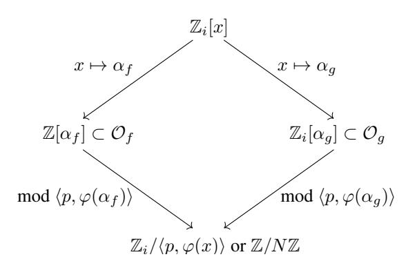
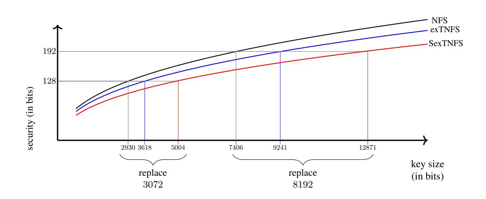
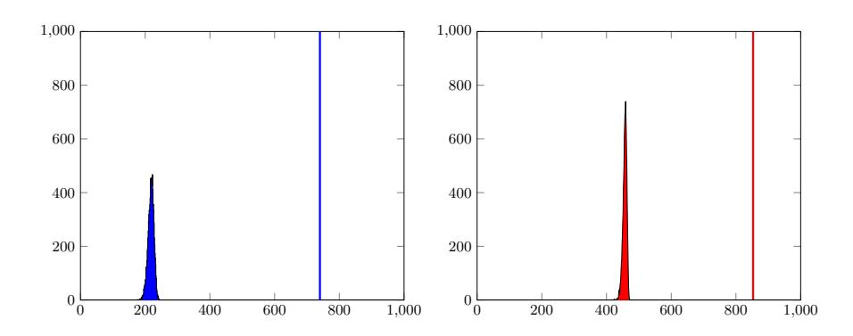

# Updating key size estimations for pairings

Razvan Barbulescu<sup>1</sup> and Sylvain Duquesne<sup>2</sup>

```
1 IMJ-PRG, UMR CNRS 7586, Univ Paris 6, Univ Paris 7
```

**Abstract.** Recent progress on NFS imposed a new estimation of the security of pairings. In this work we study the best attacks against some of the most popular pairings and propose new key sizes using an analysis which is more precise than the analysis in a recent article of Menezes, Sarkar and Singh. We also select pairing-friendly curves for standard security levels.

#### Introduction

Pairing based cryptography has been introduced in the beginning of the century allowing new protocols that could not be realized otherwise such as identity based cryptography [BF01], short signature schemes [BLS04] or broadcast encryption [BGW05]. It has now many more practical applications in various fields. A pairing is a non degenerate bilinear map

$$e: \mathbb{G}_1 \times \mathbb{G}_2 \to \mathbb{G}_3$$
.

It is usually realized thanks to elliptic curves. More precisely, the groups  $\mathbb{G}_1$  and  $\mathbb{G}_2$  are subgroups or quotient groups of an elliptic curve defined over a finite field  $\mathbb{F}_q$  or one of its extensions and  $\mathbb{G}_3$  is a subgroup or a quotient group of  $\mathbb{F}_{q^k}^*$  where k is called the embedding degree. A suitable pairing for cryptographic applications requires that the discrete logarithm problem is sufficiently difficult on these three groups. The security of pairings defined over  $\mathbb{F}_q$  having embedding degree k and group order r is determined by:

- 1. the cost of the discrete logarithm problem (DLP) on an order r subgroup or quotient group of an elliptic curve defined over  $\mathbb{F}_q$  (the curve side);
- 2. the cost of the DLP in a quotient of the multiplicative group of  $\mathbb{F}_{q^k}$  (the finite field side).

The security evaluation on the curve side is simple: if s is the desired level of security, we select r such that  $\log_2 r \ge 2s$  because of Pollard's rho algorithm (and by consequence  $\log_2 q \ge 2s$ ).

Attacks on the field side however are harder to estimate since the best algorithms belong to the Index Calculus family and their complexity is hard to write down explicitly. The recommended key sizes can be found in the reports of the standardization organizations: ISO [ISO15], IEEE [IEE17]. The NIST hasn't standardized pairing-based cryptography but it published reports [MPP+] which do specify key sizes. The recommendations of ECRYPT [Sma12], which were published by ENISA [NA13], corroborate with those of the ISO, the IEEE and the NIST.

Since 2013 there have been a series of attacks on the field side of pairings of small characteristic which completely invalidated the use of these pairings. The classical algorithms, Coppersmith [Cop84] and the function field sieve [Adl94], [AH99], [JL02], [JL06], were replaced by algorithms of smaller complexity [Jou13a], [Jou13b], [GGMZ13b], followed by a heuristic quasi-polynomial algorithm [BGJT14]. ENISA reacted immediately and in its standard document from October 2013 [NA13, page 32] the agency forbid the use of small characteristic pairings. Improvements and records continued [GGMZ13a], [AMORH15], [JP14] and a second quasi-polynomial algorithm was proposed [GKZ14b,GKZ17]. Two record computations broke 128-bit pairings in characteristic 2 [GKZ14a] and respectively 3 [ACMC+16].

In the case of non-small characteristic the best-known algorithm is the number field sieve [Gor93], [Sch93], [Sch00], [Sem02], [JL03], [CS06], [JLSV06]. Since 2013 there have been a series of new variants and improvements [JP13], [BP14], [BGGM14], [BGGM15a], [Pie15], [SS16c,SS16d,SS16b], [BGK15] and record computations [BGGM14], [BGGM15b], [GMT16], [FGHT17] and [KDL+16]. The extended tower number field [KB16,JK16] changed considerably the complexity of the attacks and a precise analysis in the same article of a popular pairing, Baretto-Naehrig of 128 bits of security, showed that the key sizes must be reevaluated.

The implementation of SexTNFS requires to code from scratch a subprogram which can be called "sieving in higher dimension". The first implementations of this subprogram [Zaj10], [HAKT15] and [GGV16], were all accompanied by algorithmic improvements, and the latest was used in a record computation [GGMT17]. The CADO-NFS software package [BGI+14] has a branch called nfs-hd which corresponds to sieving in higher dimension, but it could take years before its development is finished (CADO-NFS has more than 200000 lines of code and its development has already lasted 10 years, with continuous improvements in all the stages of NFS).

The goal of this paper is to give a precise evaluation of the complexity of these algorithms in the absence of computational records. In the case of pairings, where the characteristic of the base field is parametrized by a polynomial, we obtain parameters sizes for the 128, 192 and 256-bits security levels and propose pairing-friendly curves which have this security. We compare our analysis to that of a contemporaneous article of Menezes, Sarkar and Singh [MSS16]. The cost of an attack with SexTNFS depends on the size of the norms of the algebraic numbers in the sieving domain. The two analysis differ in the way in which the size of the norms is estimated: in their approach the mathematical upper bound is used whereas we rely on the experimental values.

**Roadmap.** After explaining the necessity of a new and more precise evaluation of key sizes in Section 1 we recall the most popular families of pairings in Section 2 and identify the best variant of NFS that an attacker can use against these families in Section 3. Then we estimate the best parameters by seeing it as an optimization problem (Section 4). At the end of the same section we explain the difference between the analysis of [MSS16] and that of this work. The proposal of new curves is done in three steps: first we solve the optimization problem on the precise case of the most popular pairings families and find what are the field sizes which correspond to 128, 192 and 256 bits of security (Section 5), then we search for curves of this size (Section 6) and finally we do an analysis even more precise than before for each of the curves we propose (Section 7). We conclude the article by estimating the complexity of an optimal ate pairing for the new curves proposed for 128 bits of security (Section 8).

# <span id="page-1-0"></span>1 Big lines of NFS and a simple estimation of complexity

Whether the goal is to factor a composite integer N or to compute discrete logarithms in a field of  $p^n$  elements, NFS works in a similar manner. We select a number ring  $\mathbb{Z}_i$ , which is simply  $\mathbb{Z}$  when factoring and is such that p is inert for discrete logarithms. Then we select two polynomials  $f,g\in\mathbb{Z}_i[x]$  having a common factor  $\varphi$  modulo q, where q=N for factoring and q=p for discrete logarithms. This allows to draw a commutative diagram which is the core of NFS:



where  $\alpha_f$  and  $\alpha_g$  are roots of f and g in their number fields and where  $\mathcal{O}_f$  and  $\mathcal{O}_g$  are the rings of integers of these same number fields.

The algorithm starts with a stage in which small polynomials  $\phi(x)$  are enumerated and put in the top of the diagram. What a small polynomial is changes from variant to variant but the degree and the coefficients are small, the simplest example being  $\phi(x) = a - bx$  with integers a, b smaller in absolute value than some parameter. If  $\phi(\alpha_f)$  and  $\phi(\alpha_g)$  are B-smooth for a parameter B (factor into ideals of norm less than B) then we obtain a multiplicative relation in  $\mathbb{Z}_i[x]/\langle q,\varphi\rangle$ . At this step the two variants of NFS split: either one transforms multiplicative relations into linear equations and computes a right kernel to obtain a large number of discrete logarithms or one writes a matrix of valuations and computes a left kernel to obtain a non-trivial solution to the equation  $x^2 \equiv 1 \mod N$ . In both cases one finishes with a step of negligible cost.

The classical variant of NFS has complexity  $L_Q[64]^{1+o(1)}$  where Q=N or  $p^n$  and

$$L_Q[c] = \exp\left((c/9)^{\frac{1}{3}}(\log Q)^{\frac{1}{3}}(\log\log Q)^{\frac{2}{3}}\right).$$

Each of the variants of NFS requires its own complexity analysis but it is always of the form  $L_Q[c]^{1+o(1)}$  for some constant. Joux and Pierrot [JP13] invented a method of polynomial selection which obtains c=32 for some finite fields where the characteristic p has a special form. Barbulescu, Gaudry, Guillevic and Morain [BGGM15a] proposed new methods of polynomial selection which achieve c=48 in some cases that are intractable with the previous method. Later Barbulescu, Gaudry and Kleinjung [BGK15] proposed to replace  $\mathbb{Z}$  by a larger number ring  $\mathbb{Z}_i$  and also obtained c=32 for some finite fields, in particular proving that a popular pairings curve estimated to 128 bits can be the target of this variant. Finally, Kim and Barbulescu [KB16] showed how to use the new methods of polynomial selection together with the new choices of  $\mathbb{Z}_i$  and obtained c=32 for a very large range of finite fields. It is reassuring to note that one can give arguments that one cannot go below the c=32 constant (cf. Appendix B).

o(1)-less estimation. What is the impact of these new constants in the complexity on the real-life security? To get a first idea one can start by dropping the o(1) term, so that the cost of each variant of NFS is  $2^{\kappa}L_Q[c]$  where  $\kappa$  and c are two constants. We use the same convention as in [Len01a, Section 2.4.6] and count a clock cycle as one operation. Thanks to real-life record computations we have a relatively good estimation of  $\kappa$  as summarized in Table 1 and we conclude on the security estimations in Figure 1. For those fields where the fastest variant applies it seems that we have to use 5004 bit fields for 128 bits of security and 12871 for 192 bits of security.

| variant  | classical NFS   | classical MNFS   | composite $n$ NFS | composite $n$ MNFS | SNFS            |
|----------|-----------------|------------------|-------------------|--------------------|-----------------|
| c        | 64              | 61.93            | 48                | 45.00              | 32              |
| $\kappa$ | $-8[KDL^{+}16]$ | $-8 [KDL^{+}16]$ | -7[BGGM15a]       | -7 [BGGM15a]       | $-7[AFK^{+}07]$ |

**Table 1.** Value of  $\kappa$  to match the formula cost(NFS)= $2^{\kappa}L_{Q}[c]$

<span id="page-2-0"></span>

Fig. 1. Modification of key sizes according to the o(1)-less formula.

<span id="page-2-1"></span>Note that the previous analysis is very similar to that of [MSS16, Section 6.2], but they didn't consider the curve corresponding to SexTNFS as they argue in Remark 4..

The goal of this article is to go beyond the o(1)-less estimation and to study in each case what is the best variant of NFS which applies, concluding on new key sizes. This type of estimations seem to be rare but we can note the works of Lenstra [Len01b] and of Bos et al. [BKK<sup>+</sup>] who evaluate the security of RSA, DSA and DH.

# <span id="page-3-0"></span>2 Families of pairing-friendly curves

Depending on the required embedding degree, some families of curves have been built [FST10]. We recall here the most popular ones.

#### <span id="page-3-1"></span>2.1 BN curves

A BN curve [BN05] is an elliptic curve E defined over a finite field  $\mathbb{F}_p$ ,  $p \geq 5$ , such that its order r and p are prime numbers parametrized by

$$p = 36u^4 + 36u^3 + 24u^2 + 6u + 1,$$

$$r = 36u^4 + 36u^3 + 18u^2 + 6u + 1,$$

for some well chosen u in  $\mathbb{Z}$ . It has an equation of the form  $y^2=x^3+b$ , where  $b\in\mathbb{F}_p^*$ . BN curves have an embedding degree equal to 12. They were widely used for the 128-bit security level until the recent results on the discrete logarithm problem in  $\mathbb{F}_{p^{12}}^*$ . Indeed, a 256-bits prime p leads to a 256-bits curve and to pairings taking values in  $\mathbb{F}_{p^{12}}^*$ , which is a 3072-bits multiplicative group. Both groups involved are then supposed to match the 128-bit security level according to the NIST recommendations [oSN12] (which are however now invalidate by [KB16]). Incidentally, BN curves have been the object of numerous recent publications ([DSD07,AKL+11,CSF+11,GSNB11,NNS10,GAL+13,UW14]).

Finally, BN curves always have order 6 twists. If  $\xi$  is an element which is neither a square nor a cube in  $\mathbb{F}_{p^2}$ , the twisted curve E' of E is defined over  $\mathbb{F}_{p^2}$  by the equation  $y^2 = x^3 + b'$  with  $b' = b/\xi$  or  $b' = b\xi$ . In order to simplify the computations, the element  $\xi$  should also be used to represent  $\mathbb{F}_{p^{12}}$  as a degree 6 extension of  $\mathbb{F}_{p^2}$  ( $\mathbb{F}_{p^{12}} = \mathbb{F}_{p^2}[\gamma]$  with  $\gamma^6 = \xi$ ) [DSD07], [LN97].

#### 2.2 BLS curves

BLS curves were introduced in [BLS03]. They are also defined over a parametrized prime field  $\mathbb{F}_p$  by an equation of the form  $y^2 = x^3 + b$  and have a twist of order 6 defined in the same way as BN curves. Contrary to BN curves, they do not have prime order but their order is divisible by a large parametrized prime r and the pairing will be defined on the r-torsions points. They are available for different embedding degrees but we are only interested here by the BLS12 and BLS24 families having embedding degrees 12 and 24 with respect to r. Until now, they were used for the 192-bis security level [AFCK+13]. The parametrizations are given by

BLS12 BLS24
$$p = (u-1)^2(u^4 - u^2 + 1)/3 + u \qquad p = (u-1)^2(u^8 - u^4 + 1)/3 + u$$

$$r = u^4 - u^2 + 1 \qquad r = u^8 - u^4 + 1.$$

#### 2.3 KSS curves

KSS curves are also available for different embedding degrees [KSS08]. If the required embedding degree is 18, this is very similar to BLS curves (same defining equation, degree 6 twist, parametrized primes p and  $r|\#E(\mathbb{F}_p)$ ). In this case, the parametrization is given by

$$p = (u^8 + 5u^7 + 7u^6 + 37u^5 + 188u^4 + 259u^3 + 343u^2 + 1763u + 2401)/21$$

$$r = (u^6 + 37u^3 + 343)/343.$$

If the required embedding degree is 16, the KSS16 curves are defined over a parametrized prime field  $\mathbb{F}_p$  by an equation of the form  $y^2 = x^3 + ax$  and have a twist of order only 4. Again they do not have a prime order but it is divisible by a parametrized prime r and the pairing will be defined on the r-torsions points. In this case, the parametrization is

$$p = (u^{10} + 2u^9 + 5u^8 + 48u^6 + 152u^5 + 240u^4 + 625u^2 + 2398u + 3125)/980$$

$$r = (u^8 + 48u^4 + 625)/61250.$$

Whatever the family, a curve is always obtained by finding a parameter u such that both p and r are prime numbers. The curve and its twist are generated by finding suitable coefficients which can usually be chosen small. More details on the generation process are given in Section 6.

## 2.4 Optimal ate pairing

There are several available pairings (Weil, Tate, ate, R-ate, ...) but the most efficient pairing is always the so-called optimal ate pairing [Ver09]. Let us recall this pairing in the context of ordinary elliptic curves defined over prime fields and more precisely in the case of the considered families.

Let E be an elliptic curve defined over the prime field  $\mathbb{F}_p$ . Let r be a prime divisor of  $\#E(\mathbb{F}_p)$  and k the embedding degree relatively to r. We also assume that  $r^2 \nmid p^k - 1$  to ensure the non-degeneracy of the pairing. Let  $\tilde{E}$  be a degree d twist of E defined over  $\mathbb{F}_{p^e}$  where e = k/d [HSV06]. The optimal ate pairing is defined over  $\mathbb{G}_1 \times \mathbb{G}_2$  and takes its values in  $\mathbb{G}_3$  where

- $\mathbb{G}_1$  is the set of rational points on E of order r.
- $\mathbb{G}_2$  is the image of  $\tilde{E}(\mathbb{F}_{p^e})[r]$  in  $E(\mathbb{F}_{p^k})$  by the twisting isomorphism.
- $\mathbb{G}_3$  is the order r subgroup of  $\mathbb{F}_{n^k}^*$

For the considered parametrized curves, the optimal ate pairing of P and Q is mainly made of 2 parts. The first one (usually called the Miller loop) is the computation of  $f_{u,Q}(P)$ , where u is (usually) the family parameter and the second one is an exponentiation to the power  $\frac{p^k-1}{r}$ . Assuming  $\ell_{A,B}$  denotes the line through points A and B, the precise pairings are given in Table 2 [HSV06, Ver09].

| Curve | Miller loop of $P$ and $Q$                                                    | final exponent |
|-------|-------------------------------------------------------------------------------|----------------|
| BN    | $f_{6u+2,Q}(P) \cdot \ell_{[6u+2]Q,[p]Q}(P) \cdot \ell_{[6u+2+p]Q,[p^2]Q}(P)$ | $(p^{12}-1)/r$ |
| BLS12 | $f_{u,Q}(P)$                                                                  | $(p^{12}-1)/r$ |
| KSS16 | $\left(f_{u,Q}(P) \cdot \ell_{[u]Q,[p]Q}(P)\right)^{p^3} \cdot \ell_{Q,Q}(P)$ | $(p^{16}-1)/r$ |
| KSS18 | $f_{u,Q}(P) \cdot f_{3,Q}(P)^p \cdot \ell_{[u]Q,[3p]Q}(P)$                    | $(p^{18}-1)/r$ |

Table 2. Optimal ate pairings

## <span id="page-4-1"></span><span id="page-4-0"></span>3 The spectrum of possibilities for an attack on the field side

An attacker who uses an algorithm of Index calculus type can make a series of choices: decide which algorithm and variant to use, make practical improvements, select polynomials, and optimize the main parameters. In this section we explain what are the reasonable choices for an attacker and give arguments to eliminate other choices.

## <span id="page-5-0"></span>3.1 Choice of algorithm

Let us make a list of the algorithms which can be implemented on a classical computer.

We discard the FFS algorithm [Adl94,AH99,JL02,JL06] and its pinpointing variant [Jou13a] by estimating the size of the factor base. Indeed, when the target is  $\mathbb{F}_{p^k}$ , the factor base of FFS is formed of all the monic polynomials  $\mathbb{F}_p[x]$  of degree less than a parameter b. This has been confirmed by implementations of FFS [JL06,HSW+10,HSST12] and pinpointing [Jou13a,SS16a]. Hence the factor base has at least p elements and then the linear algebra step has a cost of at least  $p^2$  operations, which is more than the security on the curve side evaluated to  $p^{\frac{1}{2}}$  operations.

We also discard the MNFS variants, i.e. the variants of NFS in which more than two sides are used. Indeed, the asymptotic complexity is close to that of NFS ([KB16, Table 2] so the "o(1)-less" extrapolation leads us to results which are similar to those of the classical case (see Figure 1). Detrey [Det14] and Lenstra and al. [KBL14] made proof-of-concept implementations of FFS and NFS for factoring, which are similar to NFS for discrete logarithms. Their results seem to show that the crossing point between classical and MNFS variants of NFS is around 1000 bits, but the gain is small, say less than 2 bits of security, so that we can ignore it in this article.

The three variants of NFS, classical [Gor93,Sch93,JL03], TNFS [Sch00,BGK15] and JLSV [JLSV06], can be seen as particular cases of exTNFS [KB16], which remains the only algorithm to consider.

When p can be written as P(u)/v, for some polynomial  $P \in \mathbb{Z}[x]$  and some integers u and v (as it is the case for pairing applications), the polynomial selection is done differently and one of f and g has small coefficients. To emphasize this difference we give a different name to the algorithm by adding the letter S: the "special" variant of NFS is called SNFS, the special variant of exTNFS is called SexTNFS, the corresponding variant of TNFS is STNFS and the special variant of JLSV will be called S-JLSV or simply Joux-Pierrot. This case encompasses but is not restricted to low-weight primes p, e. g. in an article [Sch10] discussing the complexity of NFS on numbers which are midway between having a general form (NFS) and a polynomial form.(SNFS), these numbers are described as "low weigh numbers".

In order to fix the notations we recall the **SexTNFS algorithm** [KB16]:

- 1. Polynomial selection. Given a parameter  $\eta$ , chosen among the divisors of n, one selects a polynomial  $h \in \mathbb{Z}[x]$  of degree  $\eta$  which is irreducible modulo p. Then one selects two polynomials f and g in  $\mathbb{Z}[t,x]$  so that f mod  $\langle h(t),p\rangle$  and g mod  $\langle h(t),p\rangle$ , seen as elements of  $\mathbb{F}_{p^{\eta}}[x]$ , have a common factor  $\varphi(x)$  which is irreducible of degree  $\kappa:=k/\eta$ . In the particular case  $\gcd(\eta,\kappa)=1$  we can take  $f,g\in\mathbb{Z}[x]$  which share an irreducible factor of degree  $\kappa$ , whereas in the case  $\gcd(\eta,\kappa)\neq 1$  we have to guarantee that f and g are not defined over a proper subfield of the number field of h.
- 2. Sieve. Given two parameters A and B, one collects all (up to sign) the degree 1 polynomials in  $\mathbb{F}_{p^k}[x]$  or equivalently tuples in the set  $\{(a_0,\ldots,a_{\eta-1},b_0,\ldots,b_{\eta-1}\in[-A,A]^{2\eta}\mid a_0\geq 0\}$ , called sieving domain, so that  $N_f$  and  $N_g$  are B-smooth (all prime factors are less than B), where

$$N_f = \text{Res}_t \left( \text{Res}_x \left( \sum_{i=0}^{\eta - 1} a_i t^i - x \sum_{i=0}^{\eta - 1} b_i t^i, f(t, x) \right), h(t) \right)$$

is the norm on the f side, and similarly for g instead of f. In order to emphasize the analogy with the simpler variants of NFS, we put  $E = A^{\eta}$  which is a good approximation of the square root of the cardinality of the sieving domain.

- 3. Filtering. Unknowns which occur in a single relation are called singletons and are deleted together with the corresponding equation. Additionally, using elementary transformations of the matrix one can create new singletons. This leads to a smaller matrix and hence a faster resolution of the linear system.
- 4. <u>Linear algebra step.</u> One computes the right kernel of the sparse matrix obtained after the filtering using the Wiedemann algorithm [Wie86] or the Lanczos algorithm [Lan52,LO90] or their block variants [Cop94] and [Cop93,Mon95]. The coordinates of the kernel vector are called virtual logarithms.
- 5. Individual logarithms. Given a generator g of  $\mathbb{F}_{p^n}$  and an element h, compute the discrete logarithm  $\log_g h$  using the virtual logarithms.

## <span id="page-6-1"></span>3.2 Practical improvements

Although the complexity of NFS for DLP in F<sup>p</sup> hasn't changed for almost 30 years, its real-life speed has been improving continuously. In the jargon of the NFS community an improvement which changes only the o(1) term in the complexity is called a practical improvement.

<span id="page-6-2"></span>3.2.1 Filtering. If an ideal occurs in a single relation then we can erase this ideal and its relation from the matrix. Thanks to the exceeding number of relations compared to the cardinality of the factor base, one can erase rows and do linear operations on the rows in order to create new singletons [\[CH02,](#page-24-19) Ch 3]. Table [3](#page-6-0) summarizes how does the filtering behave in practice. It is hard to compare the different rows of the table because the authors of different records made different choices, some of which collected much more relations than needed (oversieved) and hence helped the filtering step reduce considerably the matrix.

| record             | rows before filtering rows after filtering reduction factor log2 |        |     | B  |
|--------------------|------------------------------------------------------------------|--------|-----|----|
| SNFS-1039 (factor) | 13.8G                                                            | 82.8M  | 167 | 38 |
| NFS-768 (factor)   | 47.7G                                                            | 192.8M | 247 | 40 |
| FFS-809            | 67.4M                                                            | 3.6M   | 19  | 28 |
| SNFS-1024 (DLP)    | 249M                                                             | 28M    | 9   | 31 |
| NFS-768 (DLP)      | 9.0G                                                             | 23.5M  | 382 | 36 |

Table 3. Behavior of filtering in practice

<span id="page-6-0"></span>We made an asymptotic estimation of the number of ideals which might be used to reduce the matrix and we obtained the following statement.

*Conjecture 1.* In the filtering step of NFS one reduces the matrix by a factor (log B) 1+o(1), where B is the smoothness bound.

*Justification:* Let q be an ideal in the factor base of NFS lying above a prime q and let N denote the size of the norms product and B the smoothness bound. We shall argue that the following statements are true:

- 1. If q < B/(log B) 1+ with > 0 then q occurs in a number of relations which tends to infinity as B and N go to infinity.
- 2. If q > B/(log B) <sup>1</sup>− with > 0 then q will occur in a number of relations which tends to 0 as B and N go to infinity.

The sieving domain has B<sup>2</sup> elements (parameter tuning in NFS implies E = B where E is the square root of the number of sieved pairs [\[BLJP93\]](#page-24-20)) and a proportion of 1/q are divisible by q. They produce relations if the cofactor of size N/q is B-smooth, for which we have no proven formula, but which is approximated by the proportion of integers in the interval [1, N/q] which are B-smooth. Due to the theorem of Canfield, Erdos and Pomerance [ ¨ [CEP83\]](#page-24-21) this proportion is ρ log(N/q) log B where ρ is Dickman's function, i.e. the function such that ρ(v) = 1 for v ≤ 1 and ρ 0 (v) = −ρ(v − 1)/v for v > 1.

number of relations where q occurs
$$\approx B^2/q \cdot \rho\left(\frac{\log(N/q)}{\log B}\right)$$
 .

Recall that in NFS we set B so that ρ log N log B <sup>−</sup><sup>1</sup> = B (once again see [\[BLJP93\]](#page-24-20)). We put v = log N log B , so that we have log B = v log v, log N = v 2 log v and q > B/v1+2 (resp. q < B/v<sup>1</sup>−2 ). We replace all variables on the right hand side by their expressions in terms of v and obtain that its logarithm is equivalent to v 1+ − v. It tends to ∞ if > 0 so the ideals of norm  $q < B/(\log B)$  occur in a very large number of relations and are unlikely to create singletons, so they are not erased during filtering. The right hand side tends to  $-\infty$  if  $\epsilon < 0$  so the ideals of norm  $q > B/\log(B)$  occur in almost no relations, and are very likely to be used during filtering.

Hence the filtering erases most of the ideals of norm larger than  $B/(\log B)^{1+o(1)}$  and keeps all but a negligible fraction of the others, so that the matrix size is reduced by a factor  $(\log B)^{1+o(1)}$ .

It seems then plausible that the filtering gain is a constant times log(B), and by comparing it with Table 3 we model the gain by  $log_2 B$ .

<span id="page-7-0"></span>**3.2.2 Exploiting automorphisms.** Record computations with FFS [HSW<sup>+</sup>10,HSST12] and NFS [BGGM15a] showed that if the target field is of the form  $p^{\kappa\eta}$  for two integers  $\eta$  and  $\kappa$  so that  $\kappa$  is small, then one can gain a factor  $\kappa$  in the sieve and a factor  $\kappa^2$  in the linear algebra.

Kim and Barbulescu [KB16] explained that one has a similar gain in SexTNFS, where  $\kappa$  is to be replaced by  $\mathcal{A}$ , the number of automorphisms of h which fix g times the number of automorphisms of g. If  $\kappa=1$  and h has  $\eta$  automorphisms then the exact number of automorphisms is  $\mathcal{A}=\eta$ , e.g.  $\mathcal{A}=\ell-1$  if  $h=\Phi_\ell$ , the  $\ell$ -th cyclotomic polynomial, for some prime  $\ell$ . If  $\kappa=2$  one doubles the number of automorphisms thanks to the automorphisms of g. For example if  $h=\Phi_7$  and  $g=x^2+\alpha x+\beta+t^4+t^2+t-u$  for some integers  $\alpha$ ,  $\beta$  then  $\mathcal{A}=6$  because any automorphism in the set  $\{\tau^i\sigma^j, 0\leq i\leq 1, 0\leq j\leq 2\}$  can be used (here  $\sigma:t\mapsto t^2$  and  $\tau:x\mapsto -\alpha-x$ ). Finally, if  $\kappa=3$  and  $\eta=4$  an attacker might use  $h=\phi_8$  and find polynomials g which have three automorphisms, so for a worst case analysis we count  $\mathcal{A}=12$ .

## <span id="page-7-2"></span>3.3 Selection of polynomials

The polynomial selection consists of selecting h, f and g.

**3.3.1** Choice of h. The polynomial  $h \in \mathbb{Z}[x]$  has two constraints, its degree is  $\eta$  and it is irreducible modulo p. Among the possible choices we select those having small norms for  $N_f$  and  $N_g$ , which generally corresponds to the case when h has small coefficients. In all examples we could select h with coefficients in  $\{0, -1, 1\}$  and experiments confirmed that the best choice is never much better than  $h = t^{\eta} - t - 1$ .

In Section 3.2.2 we saw that in order to use the Galois automorphisms the attacker has to find a polynomial h with non-trivial automorphisms. We ran an exhaustive search on the polynomials in  $\mathbb{Z}[x]$  of degree less than 19 having coefficients less than 6 in absolute value. In this set, the only polynomials that have automorphisms of order different from 2 are those listed in Table 4.

| degree      | 6                                      | 12                     | 16                     | 18                     |  |
|-------------|----------------------------------------|------------------------|------------------------|------------------------|--|
| polynomials | $\Phi_7, \Phi_9, \Phi_{14}, \Phi_{18}$ | $\Phi_{13}, \Phi_{26}$ | $\Phi_{17}, \Phi_{34}$ | $\Phi_{19}, \Phi_{38}$ |  |

<span id="page-7-1"></span>**Table 4.** List of all monic polynomials  $h \in \mathbb{Z}[x]$  of degree between 6 and 20 such that  $||h|| \le 10$  and Aut(h) has elements of order larger than 2.

**3.3.2** Construction of f and g. One produces a large number of pairs of polynomials using one of the following methods: base-m [BLJP93], base-m-SNFS [LLJMP90], Joux-Pierrot [JP13], Conjugation [BGGM15a], JLSV1 [JLSV06, Section 2.3], GJL [BGGM15a,Mat06], algorithms A,B,C or D of Sarkar and Singh [SS16c,SS16d,SS16b].

In this article we focus on families of pairings where p is parametrized, then one choice of polynomials is by far the most natural. Let  $P(x) \in \mathbb{Z}[x]$  and the integers u,v be such that p = P(u)/v. Then one can take  $f = P(x^{\kappa} + S(t,x))$  and  $g = x^{\kappa} + S(t,x) - u$  for some  $S \in \mathbb{Z}[t,x]$  of degree in x less than  $\kappa$  so that g is irreducible in  $(\mathbb{F}_p[t]/h)[x]$ . In most

cases this is the only choice but for instance in the case of KSS 18 one can also take f = P(x - 2) and g = x - 2 - u, with a non negligible effect on the complexity estimation.

How can we be sure that the attacker cannot find choices of f that we could not predict? See [FGHT17] for a discussion about the consequences of this question on discrete logarithms in  $\mathbb{F}_p$ . The attacker cannot use the fastest versions of NFS (SNFS, STNFS, SexTNFS, Joux-Pierrot) unless he finds three polynomials,  $T(x,y) \in \mathbb{Z}[x,y]$  and  $U, V \in \mathbb{Z}(x)$  whose coefficients are bounded by an absolute constant, so that p = T(U(u), V(u)) for some integer u, in which case he sets

$$f = T(x)$$
 and  $g = V(u)x - U(u)$ .

In the case of SexTNFS, the coefficients of f occur at large powers in the norms and hence we can restrict the search to very small constants. We ran the exhaustive search and obtained that the only alternative choices are f = P(x-1) for KSS 16, f = P(x-2) for KSS 18 and  $f = 4x^4 - 4x^3 + 12x^2 - 10x + 7$  and g = x - (3u+1) for BN. In the rest of the security evaluation we considered the alternative choices together with the natural ones.

**3.3.3 Optimization.** Murphy [Mur98] introduced a map  $\alpha:\mathbb{Q}[x]\to\mathbb{R}$  which allows to decide which are the best polynomials for NFS. Barbulescu and Lachand [BL17] proved, when f is quadratic of fundamental negative discriminant, that for a random pair of relatively prime integers the norm  $N=\mathrm{Res}_x(a-bx,f)$  has the same probability to be B-smooth (for a parameter B) as a random integer less than  $e^{\alpha(f)}N$ . Because of the uncertainty on  $\alpha$  we cannot predict the exact cost of a DLP computation with NFS. In the previous paragraph we saw that in the case of parametrized pairings we only have one or two choices of f and g. For each choice we verify directly that  $\alpha(f)\approx 0$  whereas for linear polynomials the value of  $\alpha$  is constant equal to 0.56..., which is also the average value of  $\alpha$  on all polynomials [BL17].

# <span id="page-8-0"></span>4 Optimization of parameters

Given a field  $\mathbb{F}_{p^n}$  where the characteristic is parametrized by a polynomial P(u)/v of degree d, we decided to use SexTNFS with  $f=P(x^\kappa+S(t,x))$  and  $g=x^\kappa+S(t,x)-u$  for some polynomial S of degree in x less than n. We also decided to use, if possible, h from Table 4 and otherwise  $h=t^{n/\kappa}-t-1$  because it is the simplest one and then the one providing the smallest norms. This choice is the best possible for the attacker. At this point we need to decide which value of  $\kappa$  to use and to optimize parameters A and B.

#### 4.1 Choice of $\kappa$ .

According to [KB16, Section 4.1] the parameter  $\kappa$  is chosen to minimize the norms product  $N_f N_g \approx E^{(d+1)\kappa} Q^{\frac{1}{d\kappa}}$ , where E is the square root of the cardinality of the sieve space and Q is  $p^n$ . This corresponds to

$$\kappa \approx \sqrt{\frac{\log_2 Q}{d(d+1)\log_2 E}}.$$

It was useful for us to guess the optimal value of  $\kappa$ , which is the most likely to be optimal, but we do nevertheless an exhaustive search. Our method was to approximate  $\log_2 Q$  from Figure 1 and to take  $E^2 = 2^s$  where s is the security level, which leads to Table 5. We verified that in every case the best value is in this table.

| security level | d=4    | d = 6  | d = 8  | d = 10 |
|----------------|--------|--------|--------|--------|
|                | 2 or 3 |        |        |        |
| 192            | 2 or 3 | 1 or 2 | 1 or 2 | 1 or 2 |

<span id="page-8-1"></span>**Table 5.** Rule of thumb values for  $\kappa$ . Here d is the degree of the polynomial P(x) such that p = P(u) for some integer u.

#### 4.2 Optimization of the bounds A and B.

As before B denotes the smoothness bound and A the bound on the coefficients of the sieved polynomials. A pair of values is valid if the sieve produces enough relations, so we need to estimate the number of relations. The sieving space is formed of the pairs a(t), b(t) in  $\mathbb{Z}(t)/h$  so that  $\deg a, \deg b \leq \eta - 1$ . If  $\mu(t)$  is a root of unity of the number field of h then the pairs  $(\mu a, \mu b)$  and (a, b) give the same multiplicative relation. In Section 3.1 we restricted  $a_0$  to positive values to account for the unit -1, here the sieving space shrinks further by the number of roots of unity divided by two.

sieving space=
$$(2A+1)^{2\eta}/(2w)$$
,

where w is the index of  $\{1,-1\}$  in the group of roots of unity. By a Monte Carlo integration (Appendix  $\bf A$ ) we estimate the bit size of the norms: we considered random tuples  $(a_0,\ldots,a_{\eta-1},b_0,\ldots,b_{\eta-1})$  each of the components being uniformly chosen in the interval [-A,A]. We call bit size of the norms the arithmetic mean of the bits sizes of the norms for each tuple in a sample of 25600 tuples (see Appendix  $\bf A$  for more details). We emphasize that we average the logarithms  $\log_2(N_f)$  and  $\log_2(N_g)$ , rather than  $N_f$  and  $N_g$ , because the logarithms are used to compute the smoothness probabilities  $p_f = \rho\left(\frac{\log_2 N_f}{\log_2 B}\right)$  and  $p_g = \rho\left(\frac{\log_2 N_g}{\log_2 B}\right)$ . This gives us the total number of relations which is

relations = (sieving space)
$$\cdot p_f \cdot p_q$$
.

The factor base is formed of the prime ideals of norm less than B in the number fields of f and g, so the cardinality of the factor base is asymptotically equal to  $2B/\log(B)$ . In some record computations the number of relations is less than the cardinality of the factor base, e.g. 68% in [AFK+07], but for simplicity and without changing the complexity results by more than one bit, we consider that the attacker must collect at least as many relations as elements in the factor base. Hence the validity condition is

<span id="page-9-0"></span>
$$\frac{(2A+1)^{2\eta}}{2w} \cdot p_f \cdot p_g \ge \frac{2B}{\log(B)}.$$
 (1)

Due to Galois automorphisms (see the discussion in Section 3.2.2)  $\frac{2B}{A \log(B)}$  non-conjugate relations can be used to obtain  $2B/\log(B)$  relations (where  $\mathcal{A}$  is the number of automorphisms of h times the number of automorphisms of  $\mathbb{F}_{p^n}/\mathbb{F}_{p^n}$  which fix f and g). Equivalently, we collect only  $\frac{2B}{A \log(B)}$  relations and we keep one ideal in each class of conjugacy so that the cardinality of the reduced factor base becomes  $\frac{2B}{A \log(B)}$ . Each relation is obtained on average after testing  $p_f^{-1}p_g^{-1}$  elements of the sieving space, so the total number of enumerated (or sieved) elements is  $2B/(A \log(B)p_fp_g)$ .

The ratio between the real cost of the sieve and the number of tuples enumerated (or sieved) in the sieve is hard to evaluate so we call it  $c_{\text{sieve}}$ . According to Table 6,  $c_{\text{sieve}}$  is almost constant in various computations realized with various variants of NFS. We stay on the safe side and model  $c_{\text{sieve}}$  to be a constant equal to 1.

One might ask if in the case of the new variants, TNFS, exTNFS and SexTNFS, one can approximate  $c_{\text{sieve}}$  by its value in the classical variants. Examples abound where new attacks with better asymptotic complexity were actually slower in practice beacuse of hidden constants [MSS16]. In a recent record computation [GGMT17, Section 2.1], Grémy, Guillevic and Morain sieved a dimension three lattice with  $A = 2^{16}$  in 359 CPU hours, which accounts for  $c_{\text{sieve}} \approx 27$ . This value can decrease with the size of A and thaks to practical improvements. However, it is safe to assume that  $c_{\text{sieve}}$  will remain  $\geq 1$ .

In the rest of the analysis we consider  $c_{\text{sieve}} = 1$  which means that the sieving time equals the number of elements of the sieving domain. Finally we obtain

sieve cost =
$$\frac{2B}{A \log(B) \cdot p_f \cdot p_q}.$$

The size of the matrix sent to filtering is  $2B/\mathcal{A}\log(B)$ . As explained in Section 3.2 it is reduced by a factor  $\log_2 B$ . The number of non-zero entries per row in the reduced matrix varies between 100 and 200 in all records that we consider and we will approximate it by 128. Let then  $c_{\text{lin.alg}}$  be such that the cost of the linear algebra is  $c_{\text{lin.alg}} 2^7 B^2/(\mathcal{A}\log(B)\log_2(B))^2$ , as it is expected to be using Wiedemann's algorithm. The factor  $c_{\text{lin.alg}}$  accounts for

| record             | $\log_2 E$ | $\log_2(\text{cost of sieve})$ | $\log_2 B$ | $\log_2(\text{cost of lin.alg.})$ | $\log_2(c_{\text{sieve}})$ | $\log_2(c_{lin.alg.})$ |
|--------------------|------------|--------------------------------|------------|-----------------------------------|----------------------------|------------------------|
| SNFS-1039 (factor) | 31.0       | 63.0                           | 38         | 63.0                              | 1                          | 1                      |
| NFS-768 (factor)   | 33.0       | 66.5                           | 40         | 64.5                              | 0.5                        | -2                     |
| FFS-809            | 27.0       | 57.5                           | 28         | 55.0                              | 3.5                        | 2                      |
| SNFS-1024 (DLP)    | 31.5       | 64.5                           | 31         | 63.5                              | 1.5                        | 2                      |
| NFS-768 (DLP)      | 35.0       | 68.0                           | 36         | 66.0                              | -2                         | -4                     |

Table 6. A list of records and their parameters.

<span id="page-10-0"></span>the cost of a multiplication in  $\mathbb{F}_r$ , where r is the order of the pairings group. Since  $\log_2 r$  varies by at most a factor 2 between various types of pairings and various security levels between 128 and 256, we expect  $c_{\text{lin.alg}}$  to be a constant. The records we summarized in Table 6 confirm that  $c_{\text{lin.alg}}$  is a constant close to 1.

We conclude this section with a model of the cost:

<span id="page-10-1"></span>
$$cost = \frac{2B}{A \log B} \rho \left( \frac{\log_2(N_f)}{\log_2 B} \right)^{-1} \rho \left( \frac{\log_2(N_g)}{\log_2 B} \right)^{-1} + 2^7 \frac{B^2}{A^2 (\log B)^2 (\log_2 B)^2}, \tag{2}$$

where  $\mathcal{A}$  can be upper bounded by  $\eta \kappa / \gcd(\eta, \kappa)$ .

For each pairing curve and choice of polynomials one has to solve an optimization problem: find the values of  $\log_2 A$  and  $\log_2 B$  which minimize the cost in Equation 2 under the condition in Equation 1.

## 4.3 Comparison to the analysis of Menezes, Sarkar and Singh

At this point of the article we can explain the difference between our analysis and that of [MSS16].

<span id="page-10-2"></span>**4.3.1** Impreciseness in the estimation of  $\log_2 N_f$  and  $\log_2 N_g$ . In order to estimate the bit size of the norms  $N_f$  and  $N_g$ , Menezes, Sarkar and Singh used the mathematical upper bounds. In an experiment we computed the distribution of the bit sizes of norms, and we present our results in Figure 4.3.1. A script to reproduce the experiment on the same sample of 1000 pairs  $(\mathbf{a}, \mathbf{b})$  is available online at [BD17]. The target is the 3072-bit finite field corresponding to a BN curve in Section 5.2. The bitsize  $\log_2 N_f$  (in the left) varies between 175 and 244, which is much smaller than 740, the mathematical upper bound. Similarly,  $\log_2 N_g$  varies between 417 and 472 which is much smaller than 853, the mathematical upper bound. In a similar experiment [MSS16, Table 3], Menezes, Sarkar and Singh observed a similar



Fig. 2. Experimental distribution of  $\log_2 N_f$  (in the left) and  $\log_2 N_g$  (in the right) on the sieving domain of SexTNFS. The vertical line shows the mathematical upper bound used in [MSS16].

situation: "It is possible that a non-negligible fraction of these have norms close to the upper bounds. Our experiments

only indicate that this fraction is less than 1/1000". This corroborates with our results but the figure shows at which point the upper bound used in [MSS16] is far away from 99.9% of the values. We remark however that their method is adapted for a practitioner to convince himself that a NFS computation is feasible, because it gives an upper bound on the complexity, but it cannot be used to obtain security estimations which ideally would require a lower bound.

This difference is well known to practitioners of factoring and discrete logarithm. Hence, the CADO-NFS software package  $[BGI^+14]$  sacrifices a few percents of relations by skipping the pairs  $(\mathbf{a}, \mathbf{b})$  having large norms. For example, from file params.c90 in the parameters directory of CADO-NFS we learn that "lambda0/lambda1 is the early abort sieving parameter, and if [...] the approximation of the log of the remaining cofactor is larger than lambda times lpb, we reject", where lambda0, lambda1 and lpb are parameters which control the percentage of relations we sacrifice. In this light, the size of the largest 0.1% of the norms has no impact on the behavior of NFS implementations.

**4.3.2 Other differences.** Moreover, the analysis of Menezes, Sarkar and Singh in Section 6.3 does not mention a series of aspects which can decrease the running time of SexTNFS.

- 1. **Filtering.** On page 13 of [MSS16] one reads "the linear algebra phase will have a cost approximatively  $B^2$ ". This ignores that the number of rows and columns of the matrix is reduced during the filtering step. There is no evidence that the reduction factor is a constant and in Section 3.2.1 we give heuristic arguments that it is approximatively  $\log_2 B$ . Moreover the size of the factor base is  $2B/\log(B)$  rather than B. The discussion on the arithmetic modulo  $r(\ell)$  in their notations) on the same page is not necessary because elements of  $\mathbb{F}_r$  are implemented on two or three machine words already in the records that we list in Table 6, and elements in  $\mathbb{F}_r$  are stored on at most 4 machine words even for 256 bits of security.
- 2. (2A+1) instead of A. We didn't find in [MSS16] a discussion on the relation between E and A other than the asymptotic relation  $E \sim A^{\eta}$ . An attacker can use (and is likely to do so) as sieving domain the set of tuples  $(\mathbf{a},\mathbf{b}) \in \mathbb{Z}^{2\eta}$  which have the smallest value of  $\max(\|a\|_{\infty},\|b\|_{\infty}) \leq A$ , with A as small as possible so that the cardinality of the sieving domain allows to obtain enough relations. In this case we have the relation  $(2A+1)^{2\eta}=E^2$ . To our understanding, Menezes, Sarkar and Singh used the formula  $A=E^{1/\eta}$ , which is less precise, especially when the quotient  $\eta/\log_2 E$  is not very small.
- 3. **Automorphisms and roots of unity.** Menezes, Sarkar and Sing do not use the Galois automorphisms that we discussed in Section 3.2.2.

## <span id="page-11-0"></span>5 Estimating SexTNFS complexity on the most popular pairings

In this section, we use the results of the previous section to estimate the security level provided by a given finite field  $\mathbb{F}_{p^k}$  when p is parametrized by a polynomial P(x).

#### <span id="page-11-1"></span>5.1 Summarizing the process for computing SexTNFS cost

Let us first summarize the way to estimate the complexity of the SexTNFS algorithm. It is made of 4 steps.

- Step 1: Parameter selection. The first choice to be made is the one of the  $\kappa$ . All divisors of k must be tested so that the following steps are done once for each  $\kappa$ . However, the first values to try are the ones in Table 5. Then one has to choose the polynomial h such that  $\mathcal{A}$  is as large as possible and h is as simple as possible (small and few coefficients) and the polynomials f and g to define the commutative diagram given in the introduction. The details on the ways to choose these polynomials are given in Section 3.3. In this step, we also determine the number of roots of unity divided by two w and the number of automorphisms  $\mathcal{A}$ .
- Step 2: Choice of the bounds A and B. These bounds will define the number of enumerated relations and the size of the factor basis so they have a direct impact on the complexity. As already explained they must be chosen to minimize the cost in Equation 2 under the condition in Equation 1. This optimization problem will be solve by brute force because we do not need a very high accuracy. We first enumerate only integer values of  $\log_2 A \in [1, \frac{100}{\eta}]$  and  $\log_2 B \in [1, 100]$  because the cost is lower bounded by  $(A^{2\eta} + B^2)/1000$  which is more than  $2^{192}$  for larger values of A and B. We call  $\log_2 A_0$  and  $\log_2 B_0$  the optimum of this integer search. In a second time we test

all values of  $\log_2 A$  in the set  $\{\log_2 A_0 + i/100 \mid i \text{ integer in } [-100, 100]\}$  and all values of  $\log_2 B$  in the set  $\{\log_2 B_0 + j/5 \mid j \text{ integer in } [-25, 25]\}$ . When the optimal values of A is less than 10, we switch from enumerating values of  $\log_2 A$  to enumerating integer values of A.

- Step 3: Verification. At this point we know what is the security level. For completeness we continue by verifying once again by hand that the values of A and B, which were found by a non-proven program, are indeed valid parameters for SexTNFS by checking that the number of relations is larger than the cardinality of the factor base.
- Step 4: Conclusion. We inject A and B in Equation 2 an verify once again that the cost of SexTNFS is that found
  by our unproven solver of the optimization problem.

## <span id="page-12-0"></span>5.2 Example: a BN curve where the finite field has 3072 bits

One of the most popular BN curve is the one associated to  $u = -2^{62} - 2^{55} - 1$  which was evaluated to 128 bits of security before the recent developments on NFS. Let us follow Section 5.1 to estimate its real security level.

- Step 1: Parameter selection. We decide to use the SexTNFS algorithm with  $\kappa=2$  and  $\eta=6$  because it gives the best result from the viewpoint of the attacker. The intermediate field will be defined by  $h=t^6-t^3-t-1$  which is irreducible modulo p. Indeed the cyclotomic polynomials  $\Phi_7, \Phi_9, \Phi_{14}$  and  $\Phi_{18}$  are not irreducible in this case and h is the "smallest" irreducible polynomial (it has only 4 non-zero coefficients which moreover equal  $\pm 1$ ). We tried several polynomials and found that  $x^2+t-u$  is irreducible in  $\mathbb{F}_{p^6}=\mathbb{F}_p[t]/h(t)$  so that  $\mathbb{F}_{p^{12}}=\mathbb{F}_{p^6}[x]/(x^2+t-u)$ . Hence we can take  $f=P(x^2+t)$  (where P is the polynomial parametrizing p given in Section 2.1) and  $g=x^2+t-u$ . In this case, we have no non-trivial roots of unity (w=1) and A=2 because g has degree two (as explained in Section 3.2.2).
- Step 2: Choice of the bounds A and B. As explained in Section 5.1, we applied Steps 3 and 4 for many values of A and B to find that  $\log_2 A = 7.36$  and  $\log_2(B) = 57$  are minimizing the cost given by the Equation 2.
- Step 3: Verification. The total number of tuples in the sieving space is  $(2A+1)^{2\eta}/(2w)$ , where w=1 is the number of roots of unity of the number field of h, divided by 2, so the size of the sieving space is  $2^{99.45}$ . By Monte Carlo integration (Appendix A) we estimate the norms on the two sides of the commutative diagram and then one can approximate the smoothness probability using Dickman's function

$$\log_2(N_f) \approx 414.7 \Rightarrow \rho\left(\frac{\log_2(N_f)}{\log_2(B)}\right) \approx 2^{-21.41} \ \ \text{and} \ \ \log_2(N_g) \approx 460.8 \Rightarrow \rho\left(\frac{\log_2(N_g)}{\log_2(B)}\right) \approx 2^{-25.30}$$

Hence the number of relations is approximatively  $2^{99.45-21.41-25.30} \approx 2^{52.74}$

On the other hand, the cardinality of the factor base is approximatively  $2B/\log(B) \approx 2^{52.70}$ , which is less than the number of relations, so we have enough relations (Equation 1 is satisfied).

- Step 4: Conclusion. Equation 2 gives a security level of 99.69 bits. The details are as follows: the number of relations we need to collect is  $2^{51.70}$  and each relation is obtained after testing on average  $2^{21.41+25.30} = 2^{46.71}$  pairs (a,b); hence the cost of the sieve is  $c_{\text{sieve}}2^{51.70+46.71} \approx 2^{98.41}$  assuming  $c_{\text{sieve}} \approx 1$ ; on the other hand, the filtering stage allows to reduce the matrix size by a factor around  $\log_2 B = 57$ , its new size being  $N = 2^{51.70}/57 \approx 2^{46.87}$ ; the cost of the algorithms of sparse linear algebra is given by  $2^5N^2 = 2^{98.73}$  times the cost of an addition modulo p, which counts here for an elementary operation.

Finally, we get the overall cost by adding the cost of the relation collection and the one of the linear algebra  $:2^{98.65} + 2^{98.73} = 2^{99.69}$  which means that the BN curve used in most of the existing implementations ensures no more than the 100-bits security level.

#### <span id="page-12-1"></span>5.3 General results and recommendations

The goal of this section is to determine the required size of the finite field involved in the pairings given in Section 2 to ensure the 128, 192 and 256-bits security levels. For this, we follow the strategy given in Section 5.1 for each family of curves making at each step the most favorable choice (for the attacker). For example we assumed that the number of automorphisms  $\mathcal{A}$  is maximal. If the parameter u (and therefore p) is selected such that the attacker cannot use the best polynomials listed in Table 7 then we observed an increase of up to 3 bits of security (Sections 7.1.1 and 7.1.2).

However, for the purpose of general recommendations, we consider that the attacker can use the best polynomials. The results are given in Tables [8,](#page-13-2) [9](#page-13-3) and [10,](#page-13-4) which then contain our recommendations for the size of p <sup>k</sup> where k is the embedding degree. Note that in the case of KSS16 and KSS18 curves for 128 bits of security the parameter A is very small (A = 9), and one might want to compute the proportion of elements in the sieving space having each possible value of norms bit size. In every other case in this article we checked that such a precise analysis arrives to the same results as our analysis.

| Family      | η | h      | g                   | w A   |
|-------------|---|--------|---------------------|-------|
| BN, BLS12 6 |   | Φ7     | 2 −<br>x<br>u + t 7 | 6     |
| KSS16       |   | 16 Φ17 | x − u               | 17 16 |
| KSS18       |   | 18 Φ19 | x − u               | 19 18 |

Table 7. Best choices of h and g at 128 bits of security

| Family log2 | k<br>(p        | ) κ | A | log2<br>B    |
|-------------|----------------|-----|---|--------------|
| BN          | 5534           |     |   | 2 1145 74.00 |
| BLS12       | 5530           |     |   | 2 1098 73.65 |
|             | KSS16 ≈ 4400 1 |     | 9 | 76.5         |
|             | KSS18 ≈ 4300 1 |     | 9 | 76           |

<span id="page-13-2"></span><span id="page-13-1"></span>Table 8. Size of finite fields associated to pairing-friendly curves which have a DLP cost of 2 <sup>128</sup> operations. Note that in the KSS case the curve side is weaker than the field side and additionally the field side security is particularly difficult to evaluate.

| Family log2 |    | k<br>u log2<br>(p |     | ) κ A log2<br>B |
|-------------|----|-------------------|-----|-----------------|
| KSS18       | 85 | 12200             |     | 1 44 110.2      |
| BLS24       | 56 | 13300             | 1 9 | 109.4           |

<span id="page-13-3"></span>Table 9. Recommended parameters for pairings of 192 bits of security

| Family log2 |     | k<br>u log2<br>(p | ) κ | A             | log2<br>B |
|-------------|-----|-------------------|-----|---------------|-----------|
| KSS18       | 185 | 26900             |     | 2 12855 137.8 |           |
| BLS24       | 86  | 24700             | 1   | 23            | 141.0     |

Table 10. Recommended parameters for pairings of 256 bits of security

# <span id="page-13-4"></span><span id="page-13-0"></span>6 New parameters for the 128, 192 and 256-bit security level

The goal of this section is to propose new parameters for the 128-bits security level for the main families of curves given in Section [2](#page-3-0) (BN, BLS12, KSS16 and KSS18). This is done in 2 steps. The first one consists in finding the size of the

extension field ensuring this security level in the general case which means that we assume that all the improvements of the NFS-like algorithms can be used. This was done in Section 5.3 and the results are given in Table 8. We must also take care that the r-torsion subgroup of the elliptic curve involved in the pairing computation ensures the 128-bits security level. For example, this is the limiting factor in the KSS cases. Then, for each family, we know the size of the curve parameter u that should be used to ensure the 128-bits security level (Table 11) in the general case. These sizes guarantee the security level as soon as the parameter u has the required bit size.

| Curve       | BN  | BLS12 | KSS16 | KSS18 |
|-------------|-----|-------|-------|-------|
| $\log_2(u)$ | 114 | 77    | 34    | 44    |

**Table 11.** Bit size of the parameter u ensuring the 128-bits security level

<span id="page-14-0"></span>The second step is to generate the best possible parameter u having the good bit size. Let us start with the generation of a BN curve.

## 6.1 New BN parameter for level 128

The way to build the parameter u is detailed in [DMHR15]: it should be chosen sparse and congruent to 7 or 11 mod 12 so that building  $\mathbb{F}_{p^{12}}$  can be done via  $Y^6-(1+\mathbf{i})$  over  $\mathbb{F}_{p^2}=\mathbb{F}_p[\mathbf{i}]$ . We also impose the condition that the curve obtained is twist-secure [VLFR08] which means that p+1+t should have a 256-bits prime factor (where t is the trace of the Frobenius as usual). We then performed an exhaustive search on u having increasing Hamming weight. There are no results of weight 2. We found some values having Hamming weight 3 but not satisfying the congruence. More precisely, the extension tower should be built using  $\sqrt{-5}$  which is much less interesting in terms of  $\mathbb{F}_{p^{12}}$  arithmetic. Finally, we found the value  $u=2^{114}+2^{101}-2^{14}-1$  which satisfies all the required conditions. The curve E defined over  $\mathbb{F}_p$  by

$$E: y^2 = x^3 - 4$$

is twist-secure (p+1+t) has a 280-bits prime factor) and  $u=7 \mod 12$  so that  $\mathbb{F}_{p^2}$  is defined by  $X^2+1$  and  $\mathbb{F}_{p^{12}}$  by  $Y^6-(1+\mathbf{i})$ . The twisted curve E' is defined over  $\mathbb{F}_{p^2}$  by

$$E': y^2 = x^3 - 4(1 + \mathbf{i}).$$

## 6.2 New BLS12 parameter for level 128

Most of the results of [DMHR15] can be used for BLS curves because the extension degree is also 12. Again, we performed an exhaustive search on the parameter u having increasing Hamming weight. We did not find any value of weight 2 but we found two having Hamming weight 3,  $-2^{77}+2^{50}+2^{33}$  and  $-2^{77}-2^{59}+2^{9}$ . In both cases  $\mathbb{F}_{p^{12}}$  can be built via  $Y^6-(1+\mathbf{i})$  over  $\mathbb{F}_{p^2}=\mathbb{F}_p[\mathbf{i}]$ , which provides the best possible  $\mathbb{F}_{p^{12}}$  arithmetic. We recommend to use the first one because if the second one is used, the cyclotomic polynomial  $\Phi_7$  is irreducible and can be used for h, which improves the SexNFS attack. Then, for  $u=-2^{77}+2^{50}+2^{33}$ , the elliptic curve E (resp. its twist E') is defined over  $\mathbb{F}_p$  (resp.  $\mathbb{F}_{p^2}$ ) by

$$E: y^2 = x^3 + 4, \qquad E': y^2 = x^3 + 4(1 + \mathbf{i})$$

E is of course twist-secure (thanks to a 273 prime factor).

#### 6.3 New KSS16 parameter for level 128

In this case, the parameter u should have at least 34 bits to ensure the 128-bits security level on the elliptic curve side. Unfortunately, an exhaustive search does not provide any suitable value of the parameter having Hamming weight less than or equal to 5. The sparser parameter we found is  $-2^{34} + 2^{27} - 2^{23} + 2^{20} - 2^{11} + 1$ . In this case, the extension

field is defined by  $X^{16}-2$  which provides the best possible  $\mathbb{F}_{p^{16}}$  arithmetic. The elliptic curve E (resp. its twist E') is defined over  $\mathbb{F}_p$  (resp.  $\mathbb{F}_{p^4}$ ) by

$$E: y^2 = x^3 + x, \qquad E': y^2 = x^3 + 2^{\frac{1}{4}}x$$

And again, E is twist-secure (thanks to a 318-bits prime factor). However we found a suitable 35-bits parameter having Hamming weight 5. Such a parameter will of course involve an additional doubling/squaring step in the exponentiation algorithms but it will also involve one addition/multiplication step less. The impact on the Miller loop is negligible, but in the final exponentiation this means that a  $\mathbb{F}_{p^{16}}$  multiplication is replaced by a cyclotomic squaring and this happens 9 times since 9 exponentiations by u are performed (see Section 8 for details). Since a cyclotomic squaring is more than twice faster than a  $\mathbb{F}_{p^{16}}$  multiplication, it is better to use the 35-bits parameter as long as  $\mathbb{F}_p$  arithmetic is not impacted. For example, p has 330 bits for the 34-bits value of u and 340 for the 35-bits value. Hence, if a 32-bits device is used, both values of p require 11 words so the  $\mathbb{F}_p$  arithmetic is not impacted. On the contrary, if a 16-bits device is used, choosing the 35-bits value of u implies that p requires 22 words instead of 21. Then the 34-bits value may be preferred in this case. This parameter is  $u=2^{35}-2^{32}-2^{18}+2^8+1$ ,  $\mathbb{F}_{p^{16}}$  is also defined by  $X^{16}-2$  and the elliptic curve E (resp. its twist E') is defined over  $\mathbb{F}_p$  (resp.  $\mathbb{F}_{p^4}$ ) by

$$E: y^2 = x^3 + x,$$
  $E': y^2 = x^3 + 2^{-\frac{1}{4}}x$

E is of course twist-secure (thanks to a 281-bits prime factor).

## 6.4 New KSS18 parameter for level 128

Again, the limiting factor for the security level is the elliptic curve size so that u should have at least 44 bits. Our exhaustive search provides no values having weight 2 or 3 and only one having weight 4. It is  $u=2^{44}+2^{22}-2^9+2$ . In this case,  $\mathbb{F}_{p^{18}}$  cannot be defined by  $X^{18}-2$  but by  $X^{18}-3$ . The elliptic curves are defined by

$$E: y^2 = x^3 + 3,$$
  $E': y^2 = x^3 + 3.3^{\frac{1}{3}}$  (or  $3.3^{-\frac{1}{3}}$ ).

The curve E is twist-secure (thanks to a 333-bits prime factor).

#### 6.5 Discussion on subgroup-secure curves for level 128

All the curves provided are not protected against the so-called subgroup attacks. These attacks use the fact that the three groups involved in the pairing may have small cofactors [LL97]. They can be prevented by choosing resistant parameters. However they do not occur for all protocols. They can also be prevented by the use of some (potentially expensive) subgroup membership tests. Then subgroup-secure parameters are not always used in the literature and in real-life implementations. That is the reason why we provided non subgroup-secure parameters in the general case (better efficiency) and subgroup-secure ones in this higher security section (that should be preferred in some situations).

The definition of subgroup security for pairing is given in [BCM+15] and implies that one should be able to find factors of  $\mathbb{G}_1$ ,  $\mathbb{G}_2$  and  $\mathbb{G}_3$ . This can be done using the ECM method but it is very costly so one cannot perform an exhaustive search checking subgroup security at each step. As explained in [BCM+15], the most reasonable way to find a subgroup-secure curve for pairing applications is to find a parameter u such that  $\#\mathbb{G}_2/r$  and  $\#\mathbb{G}_3/r$  are primes. This is of course much easier to check but on the other hand there are much fewer candidates.

According Section 8, we are only interested in BLS12 and KSS16 curves in the case of security level 128. We then made an exhaustive search of increasing Hamming weight values of u satisfying this condition. For BLS12 curves, we find some parameters in weight 7. We give only one here but the other ones are not so difficult to find:  $u=-2^{77}-2^{71}-2^{64}+2^{37}+2^{35}+2^{22}-2^5$ . In this cases  $\mathbb{F}_{p^{12}}$  can be built via  $Y^6-(1+\mathbf{i})$  over  $\mathbb{F}_{p^2}=\mathbb{F}_p[\mathbf{i}]$  which provides the best possible  $\mathbb{F}_{p^{12}}$  arithmetic. The elliptic curve E (resp. its twist E') is defined over  $\mathbb{F}_p$  (resp.  $\mathbb{F}_{p^2}$ ) by

$$E: y^2 = x^3 - 2,$$
  $E': y^2 = x^3 - 2/(1 + i)$

E is of course twist-secure (thanks to a 433 prime factor).

The case of KSS16 curves is more complicated. We first remark that  $\#\mathbb{G}_2/r$  and  $\#\mathbb{G}_3/r$  are always even and often divisible by 17 [GF16] so we have interest to relax the condition. Unfortunately it was not sufficient to find a parameter of Hamming weight less than or equal to 10. This is due to the fact that  $\log_2(u) = 34$  implies that there are not enough possibilities for u to have a reasonable probability that all the numbers involved  $(p, r, \#\mathbb{G}_2/2r, \#\mathbb{G}_3/2r)$  are primes together (up to some  $17^n$  factor). As a consequence, it is probably more interesting to choose the previous subgroup-secure BLS curve or the non subgroup-secure KSS16 curve given in Section 7.1.3 together with the necessary subgroup membership tests (depending on the protocol).

## 6.6 New parameters for level 192

In the case of higher levels of security we prefer to be more cautious. Instead of a comparison of the best curves we simply give our own proposals. In terms of security we are once again cautious, our curves having more than 192 bits of security. This is due to the nature of our approach (the targeted extension field size is first determined in the worst case). We give only a KSS18 and a BLS24 curve since there is no doubt that BN, BLS12 and KSS16 will be less efficient.

**6.6.1** New KSS18 parameter for level 192 We saw in Table 9 that the parameter u should be chosen such that  $\log_2(u) \geq 85$ . As in the 128-bits case, we perform an exhaustive search of low Hamming weight values for u. The best value we found is  $u = -2^{85} - 2^{31} - 2^{26} + 2^6$ . In this case,  $\mathbb{F}_{p^{18}}$  can be defined by  $X^{18} - 2$ . The elliptic curves are defined by

$$E: y^2 = x^3 + 2, \qquad E': y^2 = x^3 + 2.2^{\frac{1}{3}} \text{ (or } 2.2^{-\frac{1}{3}})$$

The curve E is twist-secure (thanks to a 652-bits prime factor).

**6.6.2** New BLS24 parameter for level 192 We saw in Table 9 that the parameter u should be chosen such that  $\log_2(u) \geq 56$ . As in the 128-bits case, we perform an exhaustive search of low Hamming weight values for u. The best value we found is  $u = -2^{56} - 2^{43} + 2^9 - 2^6$ . In this case,  $\mathbb{F}_{p^{24}}$  can be built via  $Y^{12} - (1 + \mathbf{i})$  over  $\mathbb{F}_{p^2} = \mathbb{F}_p[\mathbf{i}]$  which provides the best possible  $\mathbb{F}_{p^{24}}$  arithmetic. The elliptic curves are defined by

$$E: y^2 = x^3 - 2,$$
  $E': y^2 = x^3 - 2/(1 + \mathbf{i})$

E is of course twist-secure (thanks to a 427 prime factor).

#### 6.7 New parameters for lever 256

As in the case of level 192, the fast pairings correspond to KSS18 and BLS24, thanks to theirs embedding degrees which are higher than that of BN, BLS12 and KSS16.

In order to keep the complexity low we use only values of u which can be written as a small number of terms of the form  $2^a$  for some integers a. A side effect is that  $u \approx 2^a$  for some a and therefore  $p \approx u^{18}$  and  $p \approx u^{24}$  in the cases of KSS18 and respectively BLS24. This makes it difficult to tune  $\log_2 p^k$  precisely.

#### 6.7.1 New KSS18 parameter for level 256 The parameter

$$u = 2^{186} - 2^{75} - 2^{22} + 2^4$$

allows to have a finite field bit size of 26700. In this case,  $\mathbb{F}_{p^{18}}$  can be defined by  $X^{18}-2$ . The elliptic curves are defined by

$$E: y^2 = x^3 - 2, \qquad E': y^2 = x^3 - 2.2^{\frac{1}{3}} \text{ (or } 2.2^{-\frac{1}{3}})$$

The curve E is twist-secure (thanks to a 1205-bits prime factor).

## **6.7.2** New BLS24 parameter for level 256 We propose parameter

$$u = -2^{103} - 2^{101} + 2^{68} + 2^{50},$$

which allows to have a finite field of bit size 24760. In this case,  $\mathbb{F}_{p^{24}}$  can be also built via  $Y^{12} - (1+\mathbf{i})$  over  $\mathbb{F}_{p^2} = \mathbb{F}_p[\mathbf{i}]$ . The elliptic curves are defined by

$$E: y^2 = x^3 - 2, \qquad E': y^2 = x^3 - 2/(1 + \mathbf{i})$$

E is of course twist-secure (thanks to a 581 prime factor).

# <span id="page-17-0"></span>**Effective security of the selected curves**

Let us now apply the strategy given in Section 5.1 to evaluate the real security of the proposed curves.

## 7.1 Level 128

- <span id="page-17-1"></span>**7.1.1** BN We study the BN curve proposed in the previous section, which has parameter  $u = 2^{114} + 2^{101} - 2^{14} - 1$ .
  - Step 1. The best results are obtained with  $\kappa=2$  and  $\eta=6$ . The best choices for the polynomials are h=6 $t^6 - t^4 + t^2 + 1$ ,  $q = x^2 - t - u$  and  $f = P(x^2 - t)$ . In this case, we have w = 1 and A = 2 as in Section 5.2. As a consequence we will find a higher security level here than in the general case.
- Step 2.  $A = 1098 \approx 2^{10.10}$  and  $B = 2^{74.2}$  are minimizing Equation 2 and satisfying Equation 1.
- Step 3. The size of the sieving space is  $(2A+1)^{12}/2 \approx 2^{132.21}$ . The Monte Carlo integration (Appendix A) gives  $\log_2(N_f) \approx 557.0$  and  $\log_2(N_g) \approx 808.9$ . Then the smoothness probabilities are approximatively equal to  $\rho\left(\frac{\log_2(N_f)}{\log_2(B)}\right) \approx 2^{-22.87}$  and  $\rho\left(\frac{\log_2(N_g)}{\log_2(B)}\right) \approx 2^{-40.52}$ . Hence we expect a number of  $2^{132.21-22.87-40.52} \approx 2^{68.82}$ relations which is larger than the cardinality of the factor base which is around  $2^{68.78}$ .
- Step 4. Evaluating Equation 2 with these data finally gives an overall complexity of  $2^{131.3}$ .

Remark 1. The size of the parameters for this pairing are so that they guarantee 128 bits of security for arbitrary parameters in the BN family. However this particular choice offers 131 bits of security.

# <span id="page-17-2"></span>**7.1.2** BLS 12 The recommended parameter is $u = -2^{77} + 2^{50} + 2^{33}$ .

- Step 1. We chose  $\kappa = 2$  and  $\eta = 6$ . The best polynomials are  $h = t^6 t 1$ ,  $f = P(x^2 + t + t^2 + t^4 + 1)$  where  $P(x) = (x-1)^2(x^4-x^2+1) + 3x$  and  $q = x^2+t+t^2+t^4+1-u$ . In this case, we have w = 7 and A = 2(because g is quadratic).
- Step 2. A = 1169 and  $\log_2 B = 73.50$
- Step 3.
  - $\log_2(\text{sieve space}) = 133.30$
  - $\log_2(N_f) = 791.2 \Rightarrow \log_2(\text{smoothness probability on the } f \text{ side}) = -39.17$
  - $\log_2(N_q) = 584.8 \Rightarrow \log_2(\text{smoothness probability on the } g \text{ side}) = -24.67$
  - $\log_2(\text{relations}) = 69.46$
  - $\log_2(\text{reduced factor base}) = 67.83 \text{ (enough relations)}$
- **Step 4.** security=131.8

Remark 2. Zhaohui Cheng communicated to us two choices of BLS12 curses which have 127 bits of security:

- $\begin{array}{l} \textbf{-- equation } y^2 = x^3 + 9 \text{ and parameter } u = -(2^{73} + 2^{72} + 2^{50} + 2^{24}); \\ \textbf{-- equation } y^2 = x^3 + 7 \text{ and parameter } u = -(2^{12} + 2^{48} + 2^{49} + 2^{50} + 2^{51} + 2^{52} + 2^{53} + 2^{54} + 2^{55} + 2^{56} + 2^{57} + 2^{58} + 2^{59} + 2^{60} + 2^{61} + 2^{62} + 2^{63} + 2^{64} + 2^{65} + 2^{66} + 2^{67} + 2^{68} + 2^{69} + 2^{70} + 2^{72} + 2^{73}). \end{array}$

The field  $p^k$  is 5280 bits long instead of the 5530 bits required by the general estimations in Table 7. Hence, our approach of first finding general recommendations for each family (assuming the attacker can apply all improvements), then checking specific values of u, only loses 5% in length.

- <span id="page-18-0"></span>**7.1.3** KSS 16 The recommended parameter is  $u = 2^{35} - 2^{32} - 2^{18} + 2^8 + 1$ .
- Step 1. We chose  $\kappa=1$  and  $\eta=16$ . The best polynomials are  $h=\Phi_{17}, f=P(x-1)$  and g=x-u-1. In this case, we have w=17 and  $\mathcal{A}=16$ .
- Step 2. A=12 and  $\log_2 B=80$
- Step 3.
  - $\log_2(\text{sieve space}) = 143.52$
  - $\log_2(N_f) = 920.4 \Rightarrow \log_2(\text{smoothness probability on the } f \text{ side}) = -43.23$
  - $\log_2(N_q) = 628.9 \Rightarrow \log_2(\text{smoothness probability on the } g \text{ side}) = -24.21$
  - $\log_2(\text{relations}) = 76.08$
  - $log_2(reduced factor base) = 71.20 (enough relations)$
- **Step 4.** security=139.0. Note that this is the security only on the finite field side. The security on the elliptic curve side is 128 as required.
- **7.1.4** KSS 18 The recommended parameter is  $u = 2^{44} + 2^{22} 2^9 + 2$ .
- Step 1. We chose  $\kappa=1$  and  $\eta=18$ . The best polynomials are  $h=t^{18}-t^4-t^2-t-1$ , f=P(x-2) and g=x-u-2. In this case, we have w=1 and  $\mathcal{A}=1$ .
- **Step 2.** A = 11 and  $\log_2 B = 82.5$
- Step 3.
  - $\log_2(\text{sieve space}) = 161.85$
  - $\log_2(N_f) = 920.4 \Rightarrow \log_2(\text{smoothness probability on the } f \text{ side}) = -36.21$
  - $\log_2(N_g) = 628.9 \Rightarrow \log_2(\text{smoothness probability on the } g \text{ side}) = -38.33$
  - $\log_2(\text{relations}) = 87.31$
  - $\log_2(\text{reduced factor base}) = 77.66 \text{ (enough relations)}$
- **Step 4.** security=152.4. Note that this is the security only on the finite field side. The security on the elliptic curve side is 128 as required.

#### 7.2 Level 192

- 7.2.1 KSS18 for level 192 To evaluate its real security, we use the way described in Section 5.1 and we get
  - Step 1. We chose  $\kappa=1$  and  $\eta=18$ . The best polynomials are  $h=t^{18}-t^4-t^2-t-1$ , f=P(x-2) and g=x-u-2. In this case, we have w=1 and  $\mathcal{A}=1$ .
- **Step 2.** A = 34 and  $\log_2 B = 108.9$
- Step 3.
  - $\log_2(\text{sieve space}) = 161.85$
  - $\log_2(N_f) = 1114 \Rightarrow \log_2(\text{smoothness probability on the } f \text{ side}) = -36.29$
  - $\log_2(N_q) = 1642 \Rightarrow \log_2(\text{smoothness probability on the } g \text{ side}) = -63.99$
  - $\log_2(\text{relations}) = 118.62$
  - $\log_2(\text{reduced factor base}) = 103.66 \text{ (enough relations)}$
- **Step 4.** security = 204.09.
- 7.2.2 BLS24 for level 192 To evaluate its real security, we use the way described in Section 5.1 and we get
- Step 1. We chose  $\kappa=1$  and  $\eta=24$ . The best polynomials are  $h=t^{24}+t^4-t^3-t-1, f=P(x)$  and g=x-u. In this case, we have w=1 and  $\mathcal{A}=1$ .
- **Step 2.** A = 9 and  $\log_2 B = 109.8$
- Step 3.
  - $\log_2(\text{sieve space}) = 202.90$
  - $\log_2(N_f) = 1295 \Rightarrow \log_2(\text{smoothness probability on the } f \text{ side}) = -44.85$
  - $\log_2(N_g) = 1460 \Rightarrow \log_2(\text{smoothness probability on the } g \text{ side}) = -53.42$
  - $\log_2(\text{relations}) = 104.63$
  - $\log_2(\text{reduced factor base}) = 104.55 \text{ (enough relations)}$
- **Step 4.** security = 203.72.

#### 7.3 Level 256

#### 7.3.1 KSS18

- **Step 1.** We chose  $\kappa = 2$  and  $\eta = 9$ . The best polynomials are  $h = t^9 + t^8 + t^7 t^6 1$ ,  $f = P(x^2 2)$  where  $P = x^8 + 5x^7 + 7x^6 + 37x^5 + 188x^4 + 259x^3 + 343x^2 + 1763x + 240$ ,  $g = x^2 2 u$ .
- Step 2. A = 11747 and  $\log_2 B = 137.7$
- Step 3.
  - $\log_2(\text{sieve space}) = 260.36$
  - $\log_2(N_f) = 2185$  and  $\log_2(N_q) = 1928$
  - $\log_2(\text{relations}) = 134.35 \text{ } \log_2(\text{factor base}) = 131.12 \text{ (enough relations)}$
- **Step 4.** security = 257.13

#### 7.3.2 BLS24

- **Step 1.** We choose  $\kappa = 1$  and  $\eta = 24$ . The best polynomials are  $h = t^{24} t^{23} t^{21} + t^{20} 1$ ,  $f = P = (x-1)^2 * (x^8 x^4 + 1) + 3 * x$ , g = x u.
- **Step 2.** A = 23 and  $\log_2 B = 138.5$
- Step 3.
  - $\log_2(\text{sieving domain}) = 262.62$
  - $\log_2(N_f) = 1522$  and  $\log_2(N_g) = 2619$
  - $\log_2(\text{relations}) = 137.28 > 131.92 = \log_2(\text{factor base})$  (enough relations)
- **Step 4.** security = 260.9

# <span id="page-19-0"></span>8 Complexity estimations and comparisons for the 128 bits security level

The goal of this section is to compare the pairing computation cost for the curves given in section 6 at the 128 bits security level. For this, we evaluate the cost of an optimal pairing [Ver09] (because it is by far the most efficient at this security level) computation in each case (BN, BLS12, KSS16 and KSS18). Let us first recall the steps of the computation.

## 8.1 Optimal ate pairing computation

We do not give here the detailed algorithm to compute pairings but only what is necessary to analyze its complexity. More details can be found for example in [EMJ17].

- **8.1.1** The Miller loop. Miller explains how to compute  $f_{u,Q}$  in [Mil04]. The algorithm is based on the computation of [u]Q using the double and add algorithm. At each step of this algorithm, f is updated with the line function involved in the elliptic curve operation. This algorithm has been improved by many authors in particular using the twisted curve to eliminate denominators and replace  $\mathbb{F}_{p^k}$  multiplications by sparse ones. The best known complexity for each step are obtained using projective coordinates [GS10]. They are given below
  - If d=6, the doubling step requires one squaring in  $\mathbb{F}_{p^k}$ , denoted  $S_k$ , one sparse multiplication in  $\mathbb{F}_{p^k}$ , denoted  $sM_k$  (for updating f) together with 2 multiplications in  $\mathbb{F}_{p^e}$ , denoted  $M_e$ , 7 squarings in  $\mathbb{F}_{p^e}$  and 2e multiplications in  $\mathbb{F}_p$ , denoted M (for doubling on the curve and computing the line involved in this doubling). If d=4, the curve side requires one additional  $S_e$ .
- If d=6, the mixed addition step requires one  $sM_k$  for updating f together with  $11M_e$ ,  $2S_e$  and 2eM (or  $9M_e$ ,  $5S_e$  and 2eM if d=4).
- Additional lines in the pairing given in Table 2 are nothing but extra addition steps. In term of complexity, the last one is usually less expensive ( $4M_e$  and 2eM for the curve side) because the resulting point on the curve is useless.
- The computation of points of the form [p]Q is very easy because Q is in the p-eigenspace of the Frobenius map. Then it requires no more than 2 Frobenius mapping in  $\mathbb{F}_{p^k}$ , denoted  $F_k$ . In practice, it requires even less but there is no interest to get into these kind of details for this comparison work.

**8.1.2** The final exponentiation. It is usually split in 2 parts, an easy one with the exponent  $\frac{p^k-1}{\phi_k(p)}$  (where  $\phi_k$  is the k-th cyclotomic polynomial) and a hard one with the exponent  $\frac{\phi_k(p)}{r}$ . The easy part is made of an inversion, denoted  $I_k$ , and few multiplications and Frobenius mappings in  $\mathbb{F}_{p^k}$ . The hard part is much more expensive but Scott et al. [SBC+09] reduce this cost by writing the exponent in base p (because p-th powering is only a Frobenius mapping). As p is polynomially parametrized by p, the result is obtained thanks to p0 degree by considering powers of the pairing [FKR11]. Note also that, thanks to the easy part of the final exponentiation, the squaring operations (which are widely used during the hard part) can be simplified. We can either use cyclotomic squarings [GS10], denoted p1, denoted p2, or compressed squarings [Kar13,AKL+11], denoted p3. Compressed squarings are usually more efficient. However, this method has been developed in the case of degree 6 twists [Kar13,AKL+11]. There is no doubt that it can be adapted to the case of degree 4 twists (and then to KSS16 curves) but we did not find explicit formulas in the literature. Then, for a fairer comparison between the curves, we chose to consider both squaring methods in the following.

#### <span id="page-20-1"></span>8.2 Finite field arithmetic

In order to compare the different candidates, we need a common base. It cannot be the field  $\mathbb{F}_p$  because p has not the same size in all cases. So we have to go to the data-words level. We will only give global estimates so we need to make some assumptions that are close to an average environment. Then, we assume that we work on a 32 bits device because it is a good average between software, FPGA and embedded devices. We will also assume that  $\mathbb{F}_p$  arithmetic is quadratic (even if the multiplication complexity can be subquadratic, the reduction usually stays quadratic). Finally, for simplicity, we will assume that  $\mathbb{F}_p$  multiplications and squarings have almost the same cost and we will neglect additions. Of course, these assumptions are very dependent on the device so we do not pretend that our result is valid in every case. Anyway, our goal here is not to get an universal comparison (which is not possible) but to have an idea of which curve has to be chosen to get the best efficiency. For a given precise device or context, such general estimates cannot replace a real implementation for a fair comparison.

Pairing computation makes a large use of  $\mathbb{F}_{p^e}$  arithmetic. Let us first recall them in Table 12 for the considered values of e.

|                |    |    | $\mathbb{F}_{p^4}$ |
|----------------|----|----|--------------------|
| Multiplication |    |    |                    |
| Squaring       | 2M | 5M | 6M                 |

**Table 12.** Complexities of  $\mathbb{F}_{p^e}$  arithmetic

<span id="page-20-0"></span>Concerning the  $\mathbb{F}_{p^k}$  arithmetic, the complexities are given in the literature in the pairing context for extensions of degree 12 [AFCK+13,DMHR15], 16 [ZL12] and 18 [AFCK+13]. They are summarized in Table 13.

We made the simplistic assumption that the cost of Frobenius mapping in  $\mathbb{F}_{p^k}$  is always (k-1)M which is not always the case (for example for  $p^2$  or  $p^3$  powering) but this has negligible impact on our comparison (there are few such mapping and this remark holds for all the considered cases).

#### 8.3 $\mathbb{F}_p$ complexities estimations

**8.3.1 BN curve.** In this case, the optimal ate pairing is given by

$$\left(f_{6u+2,Q}(P).\ell_{[6u+2]Q,[p]Q}(P).\ell_{[6u+2+p]Q,[p^2]Q}(P)\right)^{\frac{p^{12}-1}{r}}$$

It is explained in Section 6 that  $u = 2^{114} + 2^{101} - 2^{14} - 1$  should be chosen to ensure the 128-bits security level and the best possible extension field arithmetic. Then 6u + 2 has length 116 and Hamming weight 7. As a consequence, the

|                         | Fp12         | Fp16     | Fp18           |
|-------------------------|--------------|----------|----------------|
| Multiplication          | 54M          | 81M      | 108M           |
| Sparse multiplication   | 39M          | 63M      | 78M            |
| Inversion               | I + 97M      | I + 134M | I + 172M       |
| Frobenius               | 11M          | 15M      | 17M            |
| Squaring                | 36M          | 54M      | 66M            |
| Cyclotomic squaring     | 18M          | 36M      | 36M            |
| Compressed squaring     | 12M          | –        | 24M            |
| Simult. decompression I |              | –        | I + (51n − 6)M |
| of n elements           | + (24n − 5)M |          |                |

Table 13. Complexities of Fp<sup>k</sup> arithmetic

<span id="page-21-0"></span>Miller loop requires 116 doubling steps and 6 addition steps. Extra lines computations require 4 Frobenius mapping (to compute [p]Q and [p 2 ]Q), one addition step and one incomplete addition step. Then the overall cost is

$$116(2M_2 + 7S_2 + 4M) + 115(S_{12} + sM_{12}) + 7(11M_2 + 2S_2 + 4M) + 4M_2 + 4M + 8sM_{12} + 4F_{12} + 4M + 8sM_{12} + 4F_{13} + 4M + 8sM_{14} + 4M + 8sM_{15} + 4M + 8sM_{15} + 4M + 8sM_{15} + 4M + 8sM_{15} + 4M + 8sM_{15} + 4M + 8sM_{15} + 4M + 8sM_{15} + 4M + 8sM_{15} + 4M + 8sM_{15} + 4M + 8sM_{15} + 4M + 8sM_{15} + 4M + 8sM_{15} + 4M + 8sM_{15} + 4M + 8sM_{15} + 4M + 8sM_{15} + 4M + 8sM_{15} + 4M + 8sM_{15} + 4M + 8sM_{15} + 4M + 8sM_{15} + 4M + 8sM_{15} + 4M + 8sM_{15} + 4M + 8sM_{15} + 4M + 8sM_{15} + 4M + 8sM_{15} + 4M + 8sM_{15} + 4M + 8sM_{15} + 4M + 8sM_{15} + 4M + 8sM_{15} + 4M + 8sM_{15} + 4M + 8sM_{15} + 4M + 8sM_{15} + 4M + 8sM_{15} + 4M + 8sM_{15} + 4M + 8sM_{15} + 4M + 8sM_{15} + 4M + 8sM_{15} + 4M + 8sM_{15} + 4M + 8sM_{15} + 4M + 8sM_{15} + 4M + 8sM_{15} + 4M + 8sM_{15} + 4M + 8sM_{15} + 4M + 8sM_{15} + 4M + 8sM_{15} + 4M + 8sM_{15} + 4M + 8sM_{15} + 4M + 8sM_{15} + 4M + 8sM_{15} + 4M + 8sM_{15} + 4M + 8sM_{15} + 4M + 8sM_{15} + 4M + 8sM_{15} + 4M + 8sM_{15} + 4M + 8sM_{15} + 4M + 8sM_{15} + 4M + 8sM_{15} + 4M + 8sM_{15} + 4M + 8sM_{15} + 4M + 8sM_{15} + 4M + 8sM_{15} + 4M + 8sM_{15} + 4M + 8sM_{15} + 4M + 8sM_{15} + 4M + 8sM_{15} + 4M + 8sM_{15} + 4M + 8sM_{15} + 4M + 8sM_{15} + 4M + 8sM_{15} + 4M + 8sM_{15} + 4M + 8sM_{15} + 4M + 8sM_{15} + 4M + 8sM_{15} + 4M + 8sM_{15} + 4M + 8sM_{15} + 4M + 8sM_{15} + 4M + 8sM_{15} + 4M + 8sM_{15} + 4M + 8sM_{15} + 4M + 8sM_{15} + 4M + 8sM_{15} + 4M + 8sM_{15} + 4M + 8sM_{15} + 4M + 8sM_{15} + 4M + 8sM_{15} + 4M + 8sM_{15} + 4M + 8sM_{15} + 4M + 8sM_{15} + 4M + 8sM_{15} + 4M + 8sM_{15} + 4M + 8sM_{15} + 4M + 8sM_{15} + 4M + 8sM_{15} + 4M + 8sM_{15} + 4M + 8sM_{15} + 4M + 8sM_{15} + 4M + 8sM_{15} + 4M + 8sM_{15} + 4M + 8sM_{15} + 4M + 8sM_{15} + 4M + 8sM_{15} + 4M + 8sM_{15} + 4M + 8sM_{15} + 4M + 8sM_{15} + 4M + 8sM_{15} + 4M + 8sM_{15} + 4M + 8sM_{15} + 4M + 8sM_{15} + 4M + 8sM_{15} + 4M + 8sM_{15} + 4M + 8sM_{15} + 4M + 8sM_{15} + 4M + 8sM_{15} + 4M + 8sM_{15} + 4M + 8sM_{15} + 4M + 8sM_{15} + 4M + 8sM_{15} + 4M + 8sM_{15} + 4M + 8sM_{15} + 4M + 8sM_{$$

Using Tables [12](#page-20-0) and [13,](#page-21-0) this step requires 12068 multiplications in Fp.

There are many ways to compute the final exponentiation for BN curves. The most efficient one is given in [\[FKR11\]](#page-25-26) and requires I<sup>12</sup> + 12M<sup>12</sup> + 3cS<sup>12</sup> + 4F<sup>12</sup> in addition to the 3 exponentiation by u (because p has degree 4 in u). As u has length 114 and Hamming weight 4, each of these exponentiations requires 114 squarings and 3 multiplications. If the cyclotomic squaring are used, we need 114cS<sup>12</sup> + 3M<sup>12</sup> = 2214M according Table [13.](#page-21-0) If the compressed squaring technique is used, we additionally need the simultaneous decompression of 4 elements. Then, according to Table [13](#page-21-0) each exponentiation by u requires 1621M + I.

The final exponentiation then requires 7485M + I or 5706M + 4I depending on the way to perform squarings. Finally computing the optimal ate pairing for BN curve ensuring the 128-bits security level requires 19553M + I or 17774M + 4I depending on the way to perform squarings during the final exponentiation.

## 8.3.2 BLS12 curve. The optimal ate pairing is simpler in this case since it is given by

$$(f_{u,Q}(P))^{\frac{p^{12}-1}{r}}$$

We have seen that the best choice of u is −2 <sup>77</sup> + 2<sup>50</sup> + 2<sup>33</sup> so that the Miller loop is made of 77 doubling steps and 2 addition steps. Then, its cost is

$$77(2M_2 + 7S_2 + 4M) + 76(S_{12} + sM_{12}) + 2(11M_2 + 2S_2 + 4M) + 2sM_{12} = 7708M$$

According [\[AFCK](#page-23-3)<sup>+</sup>13], the final exponentiation requires I<sup>12</sup> + 12M<sup>12</sup> + 2cS<sup>12</sup> + 4F<sup>12</sup> = 825M + I in addition to the 5 exponentiation by u (because p has degree 6 in u). As u has length 77 and Hamming weight 3, each of these exponentiations requires 77 squarings and 2 multiplications. If the cyclotomic squaring are used, we need 77cS<sup>12</sup> + 2M<sup>12</sup> = 1494M. If the compressed squaring technique is used, we additionally need the simultaneous decompression of 3 elements so that each exponentiation by u requires 1099M + I.

The final exponentiation then requires 8295M + I or 6320M + 6I depending on the way to perform squarings. Finally computing the optimal ate pairing for BLS12 curve ensuring the 128-bits security level requires 16003M + I or 14028M + 6I.

#### 8.3.3 KSS16 curve. For KSS16 curves, the optimal ate pairing is given by

$$\left(\left(f_{u,Q}(P).\ell_{[u]Q,[p]Q}(P)\right)^{p^3}.\ell_{Q,Q}(P)\right)^{\frac{p^{16}-1}{r}}$$

and u has been chosen to be  $2^{35} - 2^{32} - 2^{18} + 2^8 + 1$  in section 6. Then the Miller loop requires 35 doubling steps and 4 addition steps. According [ZL12], extra lines computations require 3 Frobenius mapping (2 to compute [p]Q and one to raise to  $p^3$ ) and two incomplete addition steps. The overall cost is then

$$35(2M_4 + 8S_4 + 8M) + 34(S_{16} + 8M_{16}) + 4(9M_4 + 5S_4 + 8M) + 3F_{16} + 5M_4 + S_4 + 16M + 6sM_{16} = 7534M$$

According [GF16], the final exponentiation requires  $I_{16} + 32M_{16} + 34cS_{16} + 24M_4 + 8F_{16}$  in addition to the 9 exponentiation by u (because p has degree 10 in u). As u has length 35 and Hamming weight 5, each of these exponentiations requires 35 cyclotomic squarings and 4 multiplications. According Table 13, each exponentiation by u then requires 1584M. Note that we do not find in the literature formulas for compressed squaring in the KSS16 case. The final exponentiation then requires 18542M + I. Finally computing the optimal ate pairing for KSS16 curve ensuring the 128-bits security level requires 26076M + I.

## **8.3.4** KSS18 curve. In this case, the optimal ate pairing is given by

$$(f_{u,Q}(P).f_{3,Q}(P)^p.\ell_{[u]Q,[3p]Q}(P))^{\frac{p^{18}-1}{r}}$$

The best choice of u to ensure the 128-bits security level is  $2^{44} + 2^{22} - 2^9 + 2$  so that the Miller loop is made of 44 doubling steps and 3 addition steps. Extra lines computations requires one addition step and one Frobenius mapping (to compute  $f_{3,Q}(P)^p$ ) together with one  $\mathbb{F}_{p^{18}}$  multiplication (to multiply the result by  $f_{u,Q}(P)$ ), 2 Frobenius mappings and one incomplete addition step [AFCK+13]. Then its cost is

$$44(2M_3+7S_3+6M)+43(S_{18}+sM_{18})+4(11M_3+2S_3+6M)+4sM_{18}+M_{18}+3F_{18}+4M_3+6M+sM_{18}=9431M$$

According [FKR11,AFCK+13], the final exponentiation requires  $I_{18}+54M_{18}+8cS_{18}+29F_{18}=6785M+I$  in addition to the 7 exponentiation by u (because p has degree 8 in u). As u has length 44 and Hamming weight 4, each of these exponentiations requires 44 squarings and 3 multiplications. If the cyclotomic squaring are used, we need  $44cS_{18}+3M_{18}=1908M$ . If the compressed squaring technique is used, we additionally need the simultaneous decompression of 4 elements so that each exponentiation by u requires 1578M+I.

The final exponentiation then requires 20141M + I or 17831M + 8I depending on the way to perform squarings. Finally computing the optimal ate pairing for KSS18 curve ensuring the 128-bits security level requires 29572M + I or 27262M + 8I.

#### 8.4 Comparison

Let us first summarize the complexities obtained in the previous subsections.

|       | Using cyclotomic squarings | Using compressed squarings | Base field size |
|-------|----------------------------|----------------------------|-----------------|
| BN    | 19553M + I                 | 17774M + 4I                | 461 bits        |
| BLS12 | 16003M + I                 | 14028M + 6I                | 461 bits        |
| KSS16 | 26076M + I                 | _                          | 340 bits        |
| KSS18 | 29572M + I                 | 27262M + 8I                | 348 bits        |

**Table 14.**  $\mathbb{F}_p$  complexities of optimal ate pairing computation

<span id="page-22-0"></span>We can obviously conclude that BLS12 curve is more efficient than BN one and that KSS16 is better than KSS18. It is more complicated to compare BLS12 and KSS16 because the base fields are not the same. For this, let us first compare the costs of M which is depending of p. As explained in Section 8.2, we assumed that we are working on a 32-bits architecture but the theoretical results would be similar with another choice and, in any case, this will not

replace real life implementations. For BN and BLS12 curves, p has 461 bits so that 15 32-bits words are necessary. For the KSS curves, 11 32-bits words are necessary. As a consequence, we can assume that M = 15<sup>2</sup> = 225 for BN and BLS12 curves while M = 11<sup>2</sup> = 121 for KSS ones. Reporting these values in Table [14,](#page-22-0) we get the comparative table [15.](#page-23-4) In any case, the KSS16 curve gives the best result which was not expected at the beginning of this work. Of course

|       |             | Using cyclotomic Using compressed |
|-------|-------------|-----------------------------------|
|       | squarings   | squarings                         |
| BN    | 4399425 + I | 3999150 + 4I                      |
| BLS12 | 3600675 + I | 3156300 + 6I                      |
| KSS16 | 3155196 + I | –                                 |
| KSS18 | 3578212 + I | 3298702 + 8I                      |

Table 15. Comparative complexities of optimal ate pairing computation

<span id="page-23-4"></span>the complexity for the BLS12 curve using compressed squaring is very close to the complexity of the KSS16 curve with cyclotomic squarings and a practical implementation should be done to confirm the estimated result obtained here. But KSS16 curves have not been studied as much as the BN curves and, more generally, as curves having a degree 6 twist. Then we are quite confident that optimal pairing on the KSS16 curve given in section [7.1.3](#page-18-0) can be improved for example by computing the formulas for compressed squaring in this case.

## Conclusion

It was already known that the BN curves, widely used in the literature for the 128-bits security level, do not ensure this security level because of the SexTNFS algorithm. In a recent paper, Menezes, Sarkar and Singh [\[MSS16\]](#page-26-13) proposed new key sizes but their analysis is not precise enough. In this paper, we carefully estimated the complexity of this algorithm in the context of most common pairing families. We also explained why it is much more realistic than the one given in [\[MSS16\]](#page-26-13) for any real life SexTNFS implementation. As a consequence, we give the updated security level of this curve which is in fact 100 bits. We also use this complexity estimation to determine the sizes of the finite field extensions that has to be used to ensure the 128, 192 and 256-bit security levels, and obtained values which are more than 66% larger than the formerly used ones. According to these recommendations, we generate new pairing parameters especially in the 128,192 and 256-bit security levels that are twist-secure (but also some that are twist and subgroup-secure). Finally, for the curves ensuring 128 bits of security we estimated the complexity of the optimal ate pairing for each proposed curve and concluded that BLS12 and, more surprisingly, KSS16 are the most efficient choices. Therefore we encourage the community to study more precisely these curves and to propose software or hardware implementation to confirm our conclusions. This study which is focused on the most popular families is probably not complete since other families and/or embedding degrees could be more interesting.

# References

- <span id="page-23-1"></span>ACMC<sup>+</sup>16. G. Adj, I. Canales-Mart´ınez, N. C. Cortes, A. Menezes, T. Oliveira, L. Rivera-Zamarripa, and F. Rodr ´ ´ıguez-Henr´ıquez. Computing discrete logarithms in cryptographically-interesting characteristic-three finite fields. Cryptology ePrint Archive, Report 2016/914, 2016.
- <span id="page-23-0"></span>Adl94. L. M. Adleman. The function field sieve. In *Algorithmic number theory symposium – ANTS I*, volume 877 of *Lecture notes in computer science*, pages 108–121, 1994.
- <span id="page-23-3"></span>AFCK<sup>+</sup>13. D. F. Aranha, L. Fuentes-Castaneda, E. Knapp, A. Menezes, and F. Rodr ˜ ´ıguez-Henr´ıquez. Implementing pairings at the 192-bit security level. In *Pairing-Based Cryptography – PAIRING 2012*, volume 7708 of *Lecture notes in computer science*, 2013.
- <span id="page-23-2"></span>AFK<sup>+</sup>07. K. Aoki, J. Franke, T. Kleinjung, A. Lenstra, and D. A. Osvik. A kilobit special number field sieve factorization. In *Advances in Cryptology – ASIACRYPT 2007*, volume 4833 of *Lecture notes in computer science*, pages 1–12, 2007.

- <span id="page-24-4"></span>AH99. L. M. Adleman and M. D. A. Huang. Function field sieve method for discrete logarithms over finite fields. *Information and Computation*, 151(1):5–16, 1999.
- <span id="page-24-15"></span>AKL<sup>+</sup>11. D. Aranha, K. Karabina, P. Longa, C. H. Gebotys, and J Lopez. Faster explicit formulas for computing pairings over ´ ordinary curves. In *Advances in Cryptology EUROCRYPT 2011*, volume 6632 of *"Lecture notes in computer science"*, pages 48–68, 2011.
- <span id="page-24-6"></span>AMORH15. G. Adj, A. Menezes, T. Oliveira, and F. Rodriguez-Henriquez. Weakness of F36·<sup>1429</sup> and F24·<sup>3041</sup> for discrete logarithm cryptography. *Finite Fields and Their Applications*, 32:148–170, 2015.
- <span id="page-24-24"></span>BCM<sup>+</sup>15. Paulo S. L. M. Barreto, Craig Costello, Rafael Misoczki, Michael Naehrig, Geovandro C. C. F. Pereira, and Gustavo Zanon. Subgroup security in pairing-based cryptography. In Kristin Lauter and Francisco Rodr´ıguez-Henr´ıquez, editors, *Progress in Cryptology – LATINCRYPT 2015: 4th International Conference on Cryptology and Information Security in Latin America, Guadalajara, Mexico, August 23-26, 2015, Proceedings*, pages 245–265, Cham, 2015. Springer International Publishing.
- <span id="page-24-23"></span>BD17. R. Barbulescu and S. Duquesne. Online supplement for "updating keysizes of pairings"., 2017. Downloadable from [https://webusers.imj-prg.fr/˜razvan.barbaud/Pairings/Pairings.html](https://webusers.imj-prg.fr/~razvan.barbaud/Pairings/Pairings.html).
- <span id="page-24-0"></span>BF01. D. Boneh and M. Franklin. Identity-based encryption from the Weil pairing. In *Advances in Cryptology – CRYPTO 2001*, volume 2139 of *Lecture notes in computer science*, pages 213–229, 2001.
- <span id="page-24-8"></span>BGGM14. R. Barbulescu, P. Gaudry, A. Guillevic, and F. Morain. Discrete logarithms in GF(p 2 ) — 160 digits, 2014. Announcement available at the NMBRTHRY archives, item 004706.
- <span id="page-24-9"></span>BGGM15a. R. Barbulescu, P. Gaudry, A. Guillevic, and F. Morain. Improving NFS for the discrete logarithm problem in non-prime finite fields. In *Advances in Cryptology - EUROCRYPT 2015*, volume 9056 of *Lecture notes in computer science*, pages 129–155, 2015.
- <span id="page-24-11"></span>BGGM15b. R. Barbulescu, P. Gaudry, A. Guillevic, and F. Morain. New record in Fp<sup>3</sup> , 2015. Available online at [https:](https://webusers.imj-prg.fr/~razvan.barbaud/p3dd52.pdf) [//webusers.imj-prg.fr/˜razvan.barbaud/p3dd52.pdf](https://webusers.imj-prg.fr/~razvan.barbaud/p3dd52.pdf).
- <span id="page-24-12"></span>BGI<sup>+</sup>14. C. Bouvier, P. Gaudry, L. Imbert, H. Jeljeli, and E. Thome. Discrete logarithms in GF(p) — 180 digits, 2014. ´ Announcement available at the NMBRTHRY archives, item 004703.
- <span id="page-24-5"></span>BGJT14. R. Barbulescu, P. Gaudry, A. Joux, and E. Thome. A heuristic quasi-polynomial algorithm for discrete logarithm in ´ finite fields of small characteristic. In *Advances in Cryptology - EUROCRYPT 2014*, volume 8441 of *Lecture notes in computer science*, pages 1–16, 2014.
- <span id="page-24-10"></span>BGK15. R. Barbulescu, P. Gaudry, and T. Kleinjung. The tower number field sieve. In *Advances in Cryptology – ASIACRYPT 2015*, volume 9453 of *Lecture notes in computer science*, pages 31–55, 2015.
- <span id="page-24-2"></span>BGW05. D. Boneh, C. Gentry, and B. Waters. Collusion resistant broadcast encryption with short ciphertexts and private keys. In *Advances in Cryptology - CRYPTO 2005*, volume 3621 of *Lecture notes in computer science*, pages 258–275, 2005.
- <span id="page-24-13"></span>BKK<sup>+</sup>. J. Bos, M. Kaihara, T. Kleinjung, A. Lenstra, and P Montgomery. On the security of 1024-bit RSA and 160-bit elliptic curve cryptography. Cryptology ePrint Archive, Report 2009/389.
- <span id="page-24-22"></span>BL17. R. Barbulescu and A. Lachand. Some mathematical remarks on the polynomial selection in NFS. *Mathematics of Computation*, 86(303):397–418, 2017.
- <span id="page-24-20"></span>BLJP93. J. P. Buhler, H. Lenstra Jr., and C. Pomerance. Factoring integers with the number field sieve. In *The development of the number field sieve*, volume 1554 of *Lecture notes in mathematics*, pages 50–94. 1993.
- <span id="page-24-16"></span>BLS03. P. Barreto, B. Lynn, and M. Scott. Constructing elliptic curves with prescribed embedding degrees. In *Security in Communication Networks*, volume 2576 of *Lecture notes in computer science*, pages 257–267, 2003.
- <span id="page-24-1"></span>BLS04. D. Boneh, B. Lynn, and H. Shacham. Short signatures from the Weil pairing. *Journal of cryptology*, 17(4):297–319, 2004.
- <span id="page-24-14"></span>BN05. P. Barreto and M. Naehrig. Pairing-friendly elliptic curves of prime order. In *Selected Areas in Cryptography–SAC 2005*, volume 3006 of *Lecture notes in computer science*, pages 319–331, 2005.
- <span id="page-24-7"></span>BP14. R. Barbulescu and C. Pierrot. The multiple number field sieve for medium- and high-characteristic finite fields. *LMS Journal of Computation and Mathematics*, 17:230–246, 2014. The published version contains an error which is corrected in version 2 available at <https://hal.inria.fr/hal-00952610>.
- <span id="page-24-21"></span>CEP83. E. R. Canfield, P. Erdos, and C. Pomerance. On a problem of Oppenheim concerning "factorisatio numerorum". ¨ *Journal of Number Theory*, 17(1):1–28, 1983.
- <span id="page-24-19"></span>CH02. S. Cavallar Hedwig. *On the number field sieve integer factorisation algorithm*. PhD thesis, Universiteit Leiden, 2002.
- <span id="page-24-3"></span>Cop84. D. Coppersmith. Fast evaluation of logarithms in fields of characteristic two. *IEEE transactions in information theory*, 30(4):587–594, 1984.
- <span id="page-24-18"></span>Cop93. D. Coppersmith. Solving linear equations over GF(2): block Lanczos algorithm. *Linear algebra and its applications*, 192:33–60, 1993.
- <span id="page-24-17"></span>Cop94. D. Coppersmith. Solving homogeneous linear equations over GF(2) via block Wiedemann algorithm. *Mathematics of Computation*, 62(205):333–350, 1994.

- <span id="page-25-7"></span>CS06. A. Commeine and I. Semaev. An algorithm to solve the discrete logarithm problem with the number field sieve. In *Public Key cryptography – PKC 2006*, volume 3958 of *Lecture notes in computer science*, pages 174–190, 2006.
- <span id="page-25-15"></span>CSF<sup>+</sup>11. R. Cheung, S.Duquesne, J. Fan, N. Guillermin, I. Verbauwhede, and G. X. Yao. FPGA implementation of pairings using residue number system and lazy reduction. In *Cryptographic Hardware and Embedded Systems - CHES 2011*, volume 6917 of *Lecture notes in computer science*, pages 421–441, 2011.
- <span id="page-25-21"></span>Det14. J. Detrey. FFS factory: Adapting Coppersmith's "factorization factory" to the function field sieve. Cryptology ePrint Archive, Report 2014/419, 2014.
- <span id="page-25-22"></span>DMHR15. S. Duquesne, N. El Mrabet, S. Haloui, and F. Rondepierre. Choosing and generating parameters for low level pairing implementation on BN curves. Cryptology ePrint Archive, Report 2015/1212, 2015.
- <span id="page-25-14"></span>DSD07. A. J. Devegili, M. Scott, and R. Dahab. Implementing cryptographic pairings over Barreto-Naehrig curve. In *Pairing-based cryptography – Pairing 2007*, volume 4575 of *Lecture notes in computer science*, pages 197–207, 2007.
- <span id="page-25-24"></span>EMJ17. N. El Mrabet and M. Joye. *Guide to Pairing-Based Cryptography*. Chapman & Hall/CRC Cryptography and Network Security Series. CRC Press, 2017.
- <span id="page-25-9"></span>FGHT17. J. Fried, P. Gaudry, N. Heninger, and E. Thomé. A kilobit hidden SNFS discrete logarithm computation. In *Annual International Conference on the Theory and Applications of Cryptographic Techniques*, volume 10210 of *Lecture notes in computer science*, pages 202–231, 2017.
- <span id="page-25-26"></span>FKR11. L. Fuentes-Castañeda, E. Knapp, and F. Rdríuez-Henríquez. Faster hashing to  $\mathbb{G}_2$ . In *Selected Areas in Cryptography - SAC 2011*, volume 7118 of *Lecture Notes in Computer Science*, pages 412–430, 2011.
- <span id="page-25-13"></span>FST10. D. Freeman, M. Scott, and E. Teske. A taxonomy of pairing-friendly elliptic curves. *Journal of cryptology*, 23(2):224–280, 2010.
- <span id="page-25-17"></span>GAL<sup>+</sup>13. G. Grewal, R. Azarderakhsh, P. Longa, S. Hu, and D. Jao. Efficient implementation of bilinear pairings on ARM processors. In *Selected Areas in Cryptography*, volume 7707 of *Lecture Notes in Computer Science*, pages 149–165, 2013.
- <span id="page-25-23"></span>GF16. L. Ghammam and E. Fouotsa. Adequate elliptic curves for computing the product of n pairings. In *Arithmetic of Finite Fields – WAIFI 2016*, volume 10064 of *Lecture notes in computer science*, pages 36–352, 2016.
- <span id="page-25-12"></span>GGMT17. L. Grémy, A. Guillevic, F. Morain, and E. Thomé. Computing discrete logarithms in GF( $p^6$ ). In *Selected Areas in Cryptography – SAC 2017*, Lecture notes in computer science, 2017.
- <span id="page-25-2"></span>GGMZ13a. F. Göloğlu, R. Granger, G. McGuire, and J. Zumbrägel. Solving a 6120-bit DLP on a desktop computer. In *Selected Areas in Cryptography–SAC*, volume 8282 of *Lecture notes in computer science*, pages 136–152, 2013.
- <span id="page-25-1"></span>GGMZ13b. F. Göloğlu, R. Granger, G. McGuire, and J. Zumbrägel. On the function field sieve and the impact of higher splitting probabilities: Application to discrete logarithms in  $\mathbb{F}_{2^{1971}}$ , 2013. Cryptology ePrint Archive, Report 2013/074.
- <span id="page-25-11"></span>GGV16. P. Gaudry, L. Grémy, and M. Videau. Collecting relations in the number field sieve in GF(p<sup>6</sup>). *LMS Journal of Computation and Mathematics*, 19(A):332–350, 2016.
- <span id="page-25-5"></span>GKZ14a. R. Granger, T. Kleinjung, and J. Zumbrägel. Breaking '128-bit secure' supersingular binary curves. In *Advances in cryptology – CRYPTO 2014*, volume 8617 of *Lecture notes in computer science*, pages 126–145, 2014.
- <span id="page-25-3"></span>GKZ14b. R. Granger, T. Kleinjung, and J. Zumbrägel. On the powers of 2. Cryptology ePrint Archive, Report 2014/300, 2014.
- <span id="page-25-4"></span>GKZ17. R. Granger, T. Kleinjung, and J. Zumbrägel. On the discrete logarithm problem in finite fields of fixed characteristic. *Transactions of the American Mathematical Society*, 2017.
- <span id="page-25-8"></span>GMT16. A. Guillevic, F. Morain, and E. Thomé. Solving discrete logarithms on a 170-bit MNT curve by pairing reduction. In *Selected Areas in Cryptography – SAC 2016*, volume 10532 of *Lecture notes of computer science*, 2016.
- <span id="page-25-6"></span>Gor93. D. Gordon. Discrete logarithms in GF(p) using the number field sieve. SIAM J. Discret. Math., 6(1):124–138, 1993.
- <span id="page-25-25"></span>GS10. R. Granger and M. Scott. Faster squaring in the cyclotomic subgroup of sixth degree extensions. In *Public Key Cryptography - PKC 2010*, volume 6056 of *Lecture notes in computer science*, pages 209–223, 2010.
- <span id="page-25-16"></span>GSNB11. C. C. F. Pereira Geovandro, M. A. Jr. Simplicio, M. Naehrig, and P. Barreto. A family of implementation-friendly BN elliptic curves. *Journal of Systems and Software*, 84(8):1319–1326, 2011.
- <span id="page-25-10"></span>HAKT15. K. Hayasaka, K. Aoki, T. Kobayashi, and T. Takagi. A construction of 3-dimensional lattice sieve for number field sieve over  $GF(p^n)$ . Cryptology ePrint Archive, Report 2015/1179, 2015. http://eprint.iacr.org/2014/300.
- <span id="page-25-20"></span>HSST12. T. Hayashi, T. Shimoyama, N. Shinohara, and T. Takagi. Breaking pairing-based cryptosystems using  $\eta_t$  pairing over  $GF(3^{97})$ . In *Advances in cryptology – ASIACRYPT 2012*, volume 7658 of *Lecture notes in computer science*, pages 43–60, 2012.
- <span id="page-25-18"></span>HSV06. F. Hess, N. Smart, and F. Vercauteren. The Eta pairing revisited. *IEEE Transactions on Information Theory*, 52(10):4595–4602, 2006.
- <span id="page-25-19"></span>HSW<sup>+</sup>10. T. Hayashi, N. Shinohara, L. Wang, S. Matsuo, M. Shirase, and T. Takagi. Solving a 676-bit discrete logarithm problem in GF(3<sup>6n</sup>). In *Public Key cryptography – PKC 2010*, volume 6056 of *Lecture notes in computer science*, pages 351–367, 2010.
- <span id="page-25-0"></span>IEE17. IEEE. 1363.3-2013 - IEEE standard for identity-based cryptographic techniques using pairings, 2017. can be purchased online at http://ieeexplore.ieee.org/document/6662370/.

- <span id="page-26-0"></span>ISO15. ISO. Iso/iec 18033-5:2015, 2015. can be purchased online at [https://www.iso.org/obp/ui/#iso:std:](https://www.iso.org/obp/ui/#iso:std:59948:en) [59948:en](https://www.iso.org/obp/ui/#iso:std:59948:en).
- <span id="page-26-12"></span>JK16. J. Jeong and T. Kim. Extended tower number field sieve with application to finite fields of arbitrary composite extension degree. Cryptology ePrint Archive, Report 2016/526, 2016. <http://eprint.iacr.org/2016/526>.
- <span id="page-26-2"></span>JL02. A. Joux and R. Lercier. The function field sieve is quite special. In *Algorithmic number theory symposium – ANTS V*, volume 2369 of *Lecture notes in computer science*, pages 431–445, 2002.
- <span id="page-26-7"></span>JL03. A. Joux and R. Lercier. Improvements to the general number field for discrete logarithms in prime fields. *Mathematics of Computation*, 72(242):953–967, 2003.
- <span id="page-26-3"></span>JL06. A. Joux and R. Lercier. The function field sieve in the medium prime case. In *Advances in Cryptology –EUROCRYPT 2006*, volume 4005 of *Lecture notes in computer science*, pages 254–270, 2006.
- <span id="page-26-8"></span>JLSV06. A. Joux, R. Lercier, N. Smart, and F. Vercauteren. The number field sieve in the medium prime case. In *Advances in Cryptology - CRYPTO 2006*, volume 4117 of *Lecture notes in computer science*, pages 326–344, 2006.
- <span id="page-26-4"></span>Jou13a. A. Joux. Faster index calculus for the medium prime case application to 1175-bit and 1425-bit finite fields. In *Advances in cryptology – EUROCRYPT 2013*, volume 7881 of *Lecture notes in computer science*, pages 177–193, 2013.
- <span id="page-26-5"></span>Jou13b. A. Joux. Faster index calculus for the medium prime case application to 1175-bit and 1425-bit finite fields. In *Advances in Cryptology – EUROCRYPT 2013*, volume 7881 of *Lecture notes in computer science*, pages 177–193, 2013.
- <span id="page-26-9"></span>JP13. A. Joux and C. Pierrot. The special number field sieve in Fp<sup>n</sup> – application to pairing-friendly constructions. In *Pairing-Based Cryptography - Pairing 2013*, volume 8365 of *Lecture notes in computer science*, pages 45–61, 2013.
- <span id="page-26-6"></span>JP14. Antoine Joux and Cecile Pierrot. Improving the polynomial time precomputation of Frobenius representation discrete ´ logarithm algorithms. In *Advances in Cryptology – ASIACRYPT 2014*, volume 8873 of *Lecture notes in computer science*, pages 378–397, 2014.
- <span id="page-26-26"></span>Kar13. K. Karabina. Squaring in cyclotomic subgroups. *Mathematics of Computation*, 82(281), 2013.
- <span id="page-26-11"></span>KB16. T. Kim and R. Barbulescu. The extended tower number field sieve: A new complexity for the medium prime case. In *Advances in Cryptology – CRYPTO 2016*, volume 9814 of *Lecture notes in computer science*, pages 543–571, 2016.
- <span id="page-26-18"></span>KBL14. T. Kleinjung, J. Bos, and A. Lenstra. Mersenne factorization factory. In *International Conference on the Theory and Application of Cryptology and Information Security*, volume 8873 of *Lecture notes in computer science*, pages 358–377, 2014.
- <span id="page-26-10"></span>KDL<sup>+</sup>16. T. Kleinjung, C. Diem, A. Lenstra, C. Priplata, and C. Stahlke. Discrete logarithms in GF(p) — 768 bits, 2016. Announcement available at the NMBRTHRY archives, item 004917.
- <span id="page-26-17"></span>KSS08. E. J. Kachisa, E. F. Schaefer, and M. Scott. Constructing Brezing-Weng pairing-friendly elliptic curves using elements in the cyclotomic field. In *Pairing-Based Cryptography – Pairing 2008*, volume 5209 of *Lecture notes in computer science*, pages 126–135, 2008.
- <span id="page-26-19"></span>Lan52. C. Lanczos. Solution of systems of linear equations by minimized iterations. *J. Res. Nat. Bur. Standards*, 49(1):33–53, 1952.
- <span id="page-26-14"></span>Len01a. A. Lenstra. Unbelievable security matching AES security using public key systems. In *International Conference on the Theory and Application of Cryptology and Information Security*, volume 2188 of *Lecture notes in computer science*, pages 67–86, 2001.
- <span id="page-26-15"></span>Len01b. A. Lenstra. Unbelievable security: Matching AES security using public key systems. In *Advances in cryptology – ASIACRYPT 2001*, volume 2248 of *Lecture notes in computer science*, pages 67–86, 2001.
- <span id="page-26-24"></span>LL97. C. H. Lim and P. J. Lee. A key recovery attack on discrete log-based schemes using a prime order subgroup. In *Advances in Cryptology — CRYPTO '97*, volume 1294 of *Lecture notes in computer science*, pages 249–263, 1997.
- <span id="page-26-22"></span>LLJMP90. A. Lenstra, H. Lenstra Jr., M. Manasse, and J. Pollard. The number field sieve. In *Proceedings of the twenty-second annual ACM symposium on Theory of computing*, pages 564–572. ACM, 1990.
- <span id="page-26-16"></span>LN97. R. Lidl and H. Niederreiter. *Finite Fields*. Cambridge University Press, 1997.
- <span id="page-26-20"></span>LO90. B. LaMacchia and A. Odlyzko. Solving large sparse linear systems over finite fields. In *Advances in cryptology – CRYPTO 1990*, volume 537 of *Lecture notes in computer science*, pages 109–133, 1990.
- <span id="page-26-23"></span>Mat06. D. Matyukhin. Effective version of the number field sieve for discrete logarithms in the field GF(p k ) (in Russian). *Trudy po Discretnoi Matematike*, 9:121–151, 2006.
- <span id="page-26-25"></span>Mil04. V. Miller. The Weil pairing and its efficient calculation. *Journal of Cryptology*, 17(4):235–261, 2004.
- <span id="page-26-21"></span>Mon95. P. Montgomery. A block Lanczos algorithm for finding dependencies over GF(2). In *Advances in cryptology – EUROCRYPT 1995*, volume 95, pages 106–120. Springer, 1995.
- <span id="page-26-1"></span>MPP<sup>+</sup>. Dustin Moody, Rene C. Peralta, Ray A. Perlner, Andrew R. Regenscheid, Allen L. Roginsky, and Lidong Chen. Report on pairing-based cryptography-2015. can be freely downloaded from [http://nvlpubs.nist.gov/](http://nvlpubs.nist.gov/nistpubs/jres/120/jres.120.002.pdf) [nistpubs/jres/120/jres.120.002.pdf](http://nvlpubs.nist.gov/nistpubs/jres/120/jres.120.002.pdf).
- <span id="page-26-13"></span>MSS16. A. Menezes, P. Sarkar, and S. Singh. Challenges with assessing the impact of NFS advances on the security of pairing-based cryptography. In *Paradigms in cryptology – Mycrypt 2016*, volume 10311 of *Lecture notes in computer science*, 2016.

<span id="page-27-17"></span>Mur98. B. Murphy. Modelling the yield of number field sieve polynomials. In *Algorithmic number theory symposium– ANTS III*, volume 1423 of *Lecture notes in computer science*, pages 137–150, 1998.

<span id="page-27-1"></span>NA13. European Network and Information Security Agency. Algorithms, key sizes and parameters report - 2013, 2013.

<span id="page-27-11"></span>NNS10. M. Naehrig, R. Niederhagen, and P. Schwabe. New software speed records for cryptographic pairings. In *Progress in cryptology – LATINCRYPT 2010*, volume 6212 of *Lecture notes in computer science*, pages 109–123, 2010.

<span id="page-27-10"></span>oSN12. National Institute of Standards and Technology (NIST). NIST special publication 800-57 part 1 (revised) : Recommendation for key management, part 1: General (revised), July 2012. Publication available online at [http://csrc.](http://csrc.nist.gov/publications/nistpubs/800-57/sp800-57-Part1-revised2_Mar08-2007.pdf) [nist.gov/publications/nistpubs/800-57/sp800-57-Part1-revised2\\_Mar08-2007.pdf](http://csrc.nist.gov/publications/nistpubs/800-57/sp800-57-Part1-revised2_Mar08-2007.pdf).

<span id="page-27-5"></span>Pie15. C. Pierrot. The multiple number field sieve with conjugation and generalized Joux-Lercier methods. In *Advances in Cryptology - EUROCRYPT 2015*, volume 9056 of *Lecture notes in computer science*, pages 156–170, 2015.

<span id="page-27-20"></span>SBC<sup>+</sup>09. M. Scott, N. Benger, M. Charlemagne, L. J. Dominguez Perez, and E. J. Kachisa. On the final exponentiation for calculating pairings on ordinary elliptic curves. In *Pairing-Based Cryptography - PAIRING 2009*, volume 5671 of *Lecture Notes in Computer Science*, pages 78–88, 2009.

<span id="page-27-2"></span>Sch93. O. Schirokauer. Discrete logarithms and local units. *Philosophical Transactions of the Royal Society of London A: Mathematical, Physical and Engineering Sciences*, 345(1676):409–423, 1993.

<span id="page-27-3"></span>Sch00. O. Schirokauer. Using number fields to compute logarithms in finite fields. *Mathematics of Computation*, 69(231):1267– 1283, 2000.

<span id="page-27-15"></span>Sch10. O. Schirokauer. The number field sieve for integers of low weight. *Mathematics of Computation*, 79(269):583–602, 2010.

<span id="page-27-4"></span>Sem02. I. Semaev. Special prime numbers and discrete logs in finite prime fields. *Mathematics of Computation*, 71(237):363– 377, 2002.

<span id="page-27-0"></span>Sma12. N. Smart. ECRYPT II yearly report on algorithms and key sizes (2011-2012), 2012.

<span id="page-27-14"></span>SS16a. P. Sarkar and S. Singh. Fine tuning the function field sieve algorithm for the medium prime case. *IEEE Transactions on Information Theory*, 62(4):2233–2253, 2016.

<span id="page-27-8"></span>SS16b. P. Sarkar and S. Singh. A generalisation of the conjugation method for polynomial selection for the extended tower number field sieve algorithm. Cryptology ePrint Archive, Report 2016/537, 2016.

<span id="page-27-6"></span>SS16c. P. Sarkar and S. Singh. New complexity trade-offs for the (multiple) number field sieve algorithm in non-prime fields. In *Annual International Conference on the Theory and Applications of Cryptographic Techniques*, pages 429–458, 2016.

<span id="page-27-7"></span>SS16d. P. Sarkar and S. Singh. Tower number field sieve variant of a recent polynomial selection method. Cryptology ePrint Archive, Report 2016/401, 2016.

<span id="page-27-12"></span>UW14. T. Unterluggauer and E. Wenger. Efficient pairings and ECC for embedded systems. In *Cryptographic Hardware and Embedded Systems - CHES 2014*, volume 8731 of *Lecture Notes in Computer Science*, pages 298–315, 2014.

<span id="page-27-13"></span>Ver09. F. Vercauteren. Optimal pairings. *IEEE Transactions of Information Theory*, 56:455–461, 2009.

<span id="page-27-19"></span>VLFR08. F. Valette, R. Lercier, P.-A. Fouque, and D. Real. Fault attack on elliptic curve Montgomery ladder implementation. In ´ *5th Workshop on Fault Diagnosis and Tolerance in Cryptography*, pages 92–98. IEEE, 2008.

<span id="page-27-16"></span>Wie86. D. Wiedemann. Solving sparse linear equations over finite fields. *IEEE Trans. Inform. Theory*, 32(1):54–62, 1986.

<span id="page-27-9"></span>Zaj10. Pavol Zajac. On the use of the lattice sieve in the 3D NFS. *Tatra Mountains Mathematical Publications*, 45(1):161–172, 2010.

<span id="page-27-21"></span>ZL12. X. Zhang and D. Lin. Analysis of optimum pairing products at high security levels. In *Progress in Cryptology - INDOCRYPT 2012*, volume 7668 of *Lecture Notes in Computer Science*, pages 412–430, 2012.

# <span id="page-27-18"></span>A Numerical integration

The size of the norms can by computed via numerical methods. Due to the known upper bounds we can certify that our results are correct up to an error probability of 2 <sup>−</sup><sup>128</sup>, so that our chances to be wrong are equal to the chances of an attacker to break the system by pure luck.

Given a polynomial f and a sieve parameter A let c(f, A) be the average of value of {log<sup>2</sup> N<sup>f</sup> (e) | e tuple in sieving domain} and U(f, A) an upper bound on the norms on the f side for pairs in the sieving domain. Let e1, . . ., e<sup>T</sup> be random tuples in the sieving domain, uniformly and independently chosen. Then the Chernoff theorem applied to the random variables log<sup>2</sup> <sup>N</sup><sup>f</sup> (e1) log<sup>2</sup> U(f) ,. . ., log<sup>2</sup> N<sup>f</sup> (e<sup>T</sup> ) log<sup>2</sup> U(f) states that for any constant ε > 0

$$\operatorname{Prob}\left(\left|c(f,A) - +\frac{1}{T}\sum_{i=1}^{T}\log_{2}N_{f}(e_{i})\right| < \varepsilon\log_{2}U(f,A)\right) \le 2e^{-2\varepsilon^{2}T}.$$
(3)

For ε = 0.05 we solve the equation e −2ε <sup>2</sup><sup>T</sup> = 2<sup>−</sup><sup>128</sup> and obtain T = 25600.

## <span id="page-28-0"></span>B One cannot change the complexity inside the frame of NFS

Variants of NFS where p is parametrized (SNFS, STNFS, SexTNFS, Joux-Pierrot) are considered to be the dream situation for an attacker. Fried et al. [FGHT17, Sec 4.1] made a series of arguments very similar to the arguments that we use below.

**Fact 1** Let  $p^n$  be a prime power and let  $f, g \in \mathbb{Z}[x]$  two polynomials which have a common factor  $\varphi$  modulo p which is irreducible of degree n. A variant of NFS which uses these polynomials and find all relations in a time proportional to or larger than the size of the sieving space (enumeration or sieving) has complexity at least  $L[32]^{1+o(1)}$  where  $L[c] = \exp(c^{1/3} \log p^{n/3} \log \log(p^n)^{2/3})$ .

Argument:

**step 1** We start by proving that  $p^n$  divides the resultant of f and  $g:p^n\mid \mathrm{Res}(f,g)$ . Indeed, the resultant is the discriminant of the Sylvester matrix and further the volume of the lattice  $L=f\mathbb{Z}[x]+g\mathbb{Z}[x]$  inside of  $\mathbb{Z}[x]$ . Since  $L'=p\mathbb{Z}[x]+\varphi\mathbb{Z}[x]$  is a lattice which contains L we conclude that the volume of the latter divides the volume of the former:  $p^n$  divides  $\mathrm{Res}(f,g)$ .

**step 2** Let  $d_f$  and  $d_g$  be the degrees of f and g and let E be the sieve parameter ( $E = A^{\eta}$  in STNFS and SexTNFS). We have  $\operatorname{Res}(f,g) \leq d_f \log_2 \|g\| + d_g \log_2 \|f\|$  which creates the constraint

$$d_f \log_2 ||g|| + d_g \log_2 ||f|| \ge n \log_2 p.$$

We easily compute the size of the norms as  $\log_2 \|f\| + \log_2 \|g\| + (d_f + d_g) \log_2 E$ . At this point we note that we have to solve an optimization problem for which we set  $K := \log_2(p^n)$  and  $\log_2 E$ , which are constants, and we set the variables  $x_1 = d_f \log_2 E$ ,  $x_2 = d_g \log_2 E$ ,  $y_1 = \max(1, \log_2 \|g\|)$  et  $y_2 = \max(1, \log_2 \|f\|)$ . Hence the problem becomes:

$$\begin{aligned} \text{subject to } x_1y_1+x_2y_2 &\geq K\\ y_1,y_2 &\geq 1\\ x_1,x_2 &\geq \log_2 E\\ \text{minimize } x_1+y_1+x_2+y_2. \end{aligned} \tag{4}$$

step 3 Put  $F(x_1, y_1, x_2, y_2) = x_1y_1 + x_2y_2$  and  $G(x_1, y_1, x_2, y_2) = x_1 + y_1 + x_2 + y_2$ . The local extrema of G on an set where F is constant are obtained in one of the three situations:

- 1.  $\nabla F \parallel \nabla G$
- 2. One of the variables is on the boundary  $(y_1 = 1, y_2 = 1, x_1 = \log_2 E \text{ or } x_2 = \log_2 E)$ , say  $y_1 = 1$ , and  $\nabla F \mid_{\{y_1 = 1\}} \parallel \nabla G \mid_{\{y_1 = 1\}}$
- 3. Two or more variables are on the boundary.

We check that all extrema of points (i) and (ii) are maxima, so we are left with case (iii) which further divides in four cases:

- 1.  $y_1 = y_2 = 1$  i.e.  $\log_2 ||f|| \le 1$  and  $\log_2 ||g|| \le 1$ ;
- 2.  $x_1 = x_2 = \log_2 E$  i.e.  $d_f = d_g = 1$ ;
- 3.  $y_2 = 1$  and  $x_1 = \log_2 E$  i.e.  $\log_2 ||f|| \le 1$  and  $d_f = 1$  or vice-versa.
- 4.  $x_1 = \log_2 E$  and  $y_1 = 1$  or the same for  $x_2$  and  $y_2$ . This is the NFS case with  $\log_2 ||f|| = d_q = 1$ .

In case (1), the minimum is  $x_1+x_2+y_1+y_2=K+2$  while in the case (2) the minimum is  $2\log_2 E+K/\log_2 E$ . In case (3) we find that the optimized expression becomes  $x_2+(K-x_2\log_2 E)+1+\log_2 E$  whose minimum is obtained when  $y_1=1$  and we are again in case (2). Finally, in case (4) we have  $x_2y_2=K-1$  and we have to minimize  $2+x_2+y_2$ . This happens when  $x_2=y_2=\sqrt{K-1}$  and  $x_1+y_1+x_2+y_2=2+2\sqrt{K-1}$ .

We can now compare the local minima and conclude that the global minimum is

$$\min G \mid_{\{F=K\}} = 2 + 2\sqrt{K - 1}.$$

Note that the minimum is independent on the value of E.

step 4 It is classical to estimate the cost of NFS as Bρ( log<sup>2</sup> N log<sup>2</sup> B ) + B<sup>2</sup> where N is the norms product and ρ is Dickman's function, which is 2 + 2<sup>√</sup> K − 1 ≈ 2 p log<sup>2</sup> (p <sup>n</sup>). Then the classical analysis of NFS leads to the complexity of SexTNFS: L[32]1+o(1) .

Fried et al [\[FGHT17\]](#page-25-9) noted that a multiple variant of SexTNFS is impossible, so it is safe to say that Figure [1](#page-2-1) cannot contain a curve below the one used in this article to approximate the security of parametrized pairings.

Practical improvements will continue to come but they will modify only the o(1) term. A hypothetical algorithm which would beat SexTNFS needs to produce relations faster than by enumerating all elements of a sieving space, as it happened in small characteristic with pinpointing, or it would have to completely abandon the NFS diagram. Such an algorithm would be a great discontinuity, comparable to a possible sub-exponential algorithm for DLP on elliptic curves.