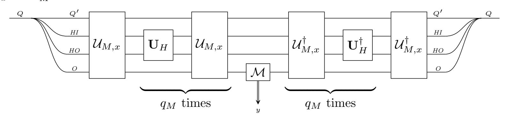

{0}------------------------------------------------

# <span id="page-0-0"></span>Post-Quantum Security of Fiat-Shamir

# Dominique Unruh University of Tartu

May 16, 2018

Abstract. The Fiat-Shamir construction (Crypto 1986) is an efficient transformation in the random oracle model for creating non-interactive proof systems and signatures from sigmaprotocols. In classical cryptography, Fiat-Shamir is a zero-knowledge proof of knowledge assuming that the underlying sigma-protocol has the zero-knowledge and special soundness properties. Unfortunately, Ambainis, Rosmanis, and Unruh (FOCS 2014) ruled out nonrelativizing proofs under those conditions in the quantum setting.

In this paper, we show under which strengthened conditions the Fiat-Shamir proof system is still post-quantum secure. Namely, we show that if we require the sigma-protocol to have computational zero-knowledge and statistical soundness, then Fiat-Shamir is a zero-knowledge simulation-sound proof system (but not a proof of knowledge!). Furthermore, we show that Fiat-Shamir leads to a post-quantum secure unforgeable signature scheme when additionally assuming a "dual-mode hard instance generator" for generating key pairs.

Finally, we study the extractability (proof of knowledge) property of Fiat-Shamir. While we have no proof of the extractability itself, we show that if we can prove extractability, then other desired properties such as simulation-sound extractability (i.e., non-malleability), and unforgeable signatures follow.

| 1 | Introduction                             | 2  |              | 7.4                      | Simulation-soundness                    | 28 |
|---|------------------------------------------|----|--------------|--------------------------|-----------------------------------------|----|
|   | 1.1<br>Background                        | 2  |              | 7.5                      | Simulation-sound extractability .       | 32 |
|   | 1.2<br>Our contribution<br>              | 5  |              |                          |                                         |    |
|   |                                          |    | 8            |                          | Signatures                              | 37 |
| 2 | Preliminaries                            | 7  |              | 8.1                      | Security proof using simulation         |    |
|   |                                          |    |              |                          | soundness<br>                           | 41 |
| 3 | Oracle machines                          | 8  |              | 8.2                      | Security proof using simulation         |    |
|   |                                          |    |              |                          | sound extractability<br>                | 43 |
| 4 | Sigma protocols                          | 12 |              |                          |                                         |    |
|   |                                          |    | 9            | Concrete security bounds |                                         | 47 |
| 5 | Non-interactive<br>proof<br>systems      |    |              | 9.1                      | Proof systems                           | 47 |
|   | (Definitions)                            | 14 |              | 9.2                      | Signatures                              | 51 |
|   | 5.1<br>Extractability                    | 15 |              |                          |                                         |    |
|   | 5.2<br>Simulation-sound extractability . | 20 | A            |                          | Problems<br>with<br>concurrent<br>execu |    |
|   |                                          |    |              | tions of Fiat-Shamir     |                                         | 54 |
| 6 | Auxiliary lemmas                         | 22 |              |                          |                                         |    |
|   |                                          |    |              | Index                    |                                         | 57 |
| 7 | Fiat-Shamir                              | 22 |              |                          |                                         |    |
|   | 7.1<br>Completeness<br>                  | 23 | Symbol index |                          |                                         | 59 |
|   | 7.2<br>Zero-knowledge                    | 23 |              |                          |                                         |    |
|   | 7.3<br>Soundness                         | 27 |              | References               |                                         | 61 |
|   |                                          |    |              |                          |                                         |    |

{1}------------------------------------------------

# <span id="page-1-0"></span>1 Introduction

### <span id="page-1-1"></span>1.1 Background

Fiat-Shamir signatures. Signatures are (next to encryption) probably one of the most important constructs in modern cryptography. In search for efficient signature schemes, Fiat-Shamir [\[FS87\]](#page-61-0) gave a construction for transforming many three-round identification schemes into signatures, using the random oracle. (The transformation was stated only for a specific case, but the general construction is an easy generalization. [\[FS87\]](#page-61-0) also does not contain a complete security proof, but a proof was later provided by Pointcheval and Stern [\[PS96b\]](#page-61-1).) The Fiat-Shamir transform and variations thereof have since been used in a large number of constructions (signatures [\[Sch91,](#page-61-2) [PS00\]](#page-61-3), group signatures [\[BBS04\]](#page-60-1), anonymous credentials [\[CL01\]](#page-60-2), e-voting [\[Adi08\]](#page-60-3), anonymous attestation [\[BCC04\]](#page-60-4), etc.) The benefit of the Fiat-Shamir transform is that it combines efficiency with universality: The underlying identification scheme can be any so-called sigma-protocol (see below), this allows for great flexibility in how public and secret key are related and enables the construction of more advanced signature schemes and related schemes such as group signatures, etc.

Non-interactive zero-knowledge proofs. At the first glance unrelated, but upon closer inspection intimately connected to signatures are non-interactive zero-knowledge proof of knowledge (NIZKPoK). In fact, Fiat-Shamir can also be seen as a highly efficient construction for NIZKPoKs in the random oracle model [\[FKMV12\]](#page-61-4). Basically, a NIZKPoK allows a prover to show his knowledge of a witness sk that stands in a given relation to a publicly known statement pk. From a NIZKPoK, we can derive a signature scheme: To sign a message m, the signer constructs a proof that he knows the secret key corresponding to the public key pk. (Of course, the message m needs to be included in the proof as well, we omit the details for now.) For this construction to work, the NIZKPoK needs to satisfy certain advanced security notions ("simulation-sound extractability");[1](#page-1-2) Fiat-Shamir satisfies this notion in the classical setting [\[FKMV12\]](#page-61-4). Thus Fiat-Shamir doubles both as a signature scheme and as a NIZKPoK, leading to simple and highly efficient constructions of both.

The construction. In order to understand the rest of this introduction more easily, we sketch the construction of Fiat-Shamir (the precise definition is given in [Definition 17\)](#page-21-2). We will express it as a NIZKPoK since this makes the analysis more modular. (We study Fiat-Shamir as a signature scheme in [Section 8.](#page-36-0))

A sigma-protocol Σ is a three-message protocol: The prover (given a statement x and a corresponding valid witness w) sends a message com, called "commitment", to the verifier. The verifier (who knowns only the statement x) responds with a uniformly random "challenge" ch. Then the prover answers with his "response" resp, and the verifier checks whether (com, ch, resp) is a valid interaction. If so, he accepts the proof of the statement x. In the following, we will assume that ch has superlogarithmic length, i.e., there are superpolynomially many different challenges. This can always be achieved by parallel-composing the sigma-protocol.

Given the sigma-protocol Σ, the Fiat-Shamir transform yields a non-interactive proof system: The prover PFS internally executes the prover of the sigma-protocol to get the commitment com. Then he computes the challenge as ch := H(xkcom) where H is a hash function, modeled as a random oracle. That is, instead of letting the verifier generate a random challenge, the prover produces it by hashing. This guarantees, at least on an intuitively level, that the prover does not have any control over the challenge, it is as if it was chosen randomly. Then the prover internally

<span id="page-1-2"></span><sup>1</sup>We do not know where this was first shown, a proof in the quantum case can be found in [\[Unr15\]](#page-62-0).

{2}------------------------------------------------

produces the response resp corresponding to com and ch and sends the non-interactive proof comkresp to the verifier.

The Fiat-Shamir verifier VFS computes ch := H(xkcom) and checks whether (com, ch, resp) is a valid interaction of the sigma-protocol.

Note that numerous variants of the Fiat-Shamir are possible. For example, one could compute ch := H(com) (omitting x). However, this variant of Fiat-Shamir is malleable, see [\[FKMV12\]](#page-61-4).

Difficulties with Fiat-Shamir. The Fiat-Shamir transform is a deceptively simple construction, but proving its security turns out to be more involved that one would anticipate. To prove security (specifically, the unforgeability property in the signature setting, or the extractability in the NIZKPoK setting), we need simulate the interaction of the adversary with the random oracle, and then rerun the same interaction with slightly changed random oracle responses ("rewinding"). The first security proof by Fiat and Shamir [\[FS87\]](#page-61-0) overlooked that issue.[2](#page-2-0) Bellare and Rogaway [\[BR93,](#page-60-5) Section 5.2] also prove the security of the Fiat-Shamir transform (as a proof system) but simply claim the soundness without giving a proof (we assume that they also overlooked the difficulties involved).[3](#page-2-1) The first complete security proof of the Fiat-Shamir as a signature scheme is by Pointcheval and Stern [\[PS96b\]](#page-61-1) who introduced the so-called "forking lemma", a central tool for analyzing the security of Fiat-Shamir (it allows us to analyze the rewinding used in the security proof). When considering Fiat-Shamir as a NIZKPoK, the first proof was given by Faust, Kohlweiss, Marson and Venturi [\[FKMV12\]](#page-61-4); they showed that Fiat-Shamir is zero-knowledge and simulation-sound extractable.[4](#page-2-2) This short history of the security proofs indicates that Fiat-Shamir is more complicated than it may look at the first glance.

Further difficulties were noticed by Shoup and Gennaro [\[SG02\]](#page-61-5) who point out that the fact that the Fiat-Shamir security proof uses rewinding can lead to considerable difficulties in the analysis of more complex security proofs (namely, it may lead to an exponential blowup in the running time of a simulator; Pointcheval and Stern [\[PS96a\]](#page-61-6) experienced similar problems). Fischlin [\[Fis05\]](#page-60-6) notes that the rewinding also leads to less tight reductions, which in turn may lead to longer key sizes etc. for protocols using Fiat-Shamir.

Another example of unexpected behavior: Assume Alice gets a n pairs of public keys (pki<sup>0</sup> , pki<sup>1</sup> ), and then can ask for one of the secret keys for each pair (i.e., ski<sup>0</sup> or ski<sup>1</sup> is revealed, never both), and then Alice is supposed to prove using Fiat-Shamir that he knows both secret keys for one of the pairs. Intuitively, we expect Alice not to be able to do that (if Fiat-Shamir is indeed a proof of knowledge), but as we show in [Appendix A,](#page-53-0) Fiat-Shamir does not guarantee that Alice cannot successfully produce a proof in this situation!

To circumvent all those problems, Fischlin [\[Fis05\]](#page-60-6) gave an alternative construction of NIZKPoKs and signature schemes in the random oracle model whose security proof does not use rewinding. However, their construction seems less efficient in terms of the computation performed by the prover (although this is not fully obvious if the tightness of the reduction is taken into account), and their construction requires an additional property (unique responses[5](#page-2-3) ) from the

<span id="page-2-0"></span><sup>2</sup>The proof of [\[FS87,](#page-61-0) Lemma 6] claims without proof that a successful adversary cannot find a square root mod n of Q<sup>k</sup> <sup>j</sup>=1 v cj j . In hindsight, this proof step would implicitly use the forking lemma [\[PS96b\]](#page-61-1) that was developed only nine years later. [\[FS87\]](#page-61-0) also mentions a full version of their paper, but to the best of our knowledge no such full version has ever appeared.

<span id="page-2-2"></span><span id="page-2-1"></span><sup>3</sup>A "final paper" is also mentioned, but to the best of our knowledge never appeared.

<sup>4</sup>They only sketch the zero-knowledge property, though. Their proof sketch overlooks one required property of the sigma-protocol: unpredictable commitments [\(Definition 4\)](#page-12-0). Without this (easy to achieve) property, at least the simulator constructed in [\[FKMV12\]](#page-61-4) will not work correctly. Concurrently and independently, [\[BPW12\]](#page-60-7) also claims the same security properties, but the theorems are given without any proof or proof idea.

<span id="page-2-3"></span><sup>5</sup>Unique responses: It is computationally infeasible to find two valid responses for the same commitment/challenge pair. See [Definition 4](#page-12-0) below.

{3}------------------------------------------------

underlying sigma-protocol.

We do not claim that those difficulties in proving and using Fiat-Shamir necessarily speak against Fiat-Shamir. But they show one needs to carefully analyze which precise properties Fiat-Shamir provably has, and not rely on what Fiat-Shamir intuitively achieves.

Post-quantum security. In this paper we are interested in the post-quantum security of Fiat-Shamir. That is, under what conditions is Fiat-Shamir secure if the adversary has a quantum computer? In the post-quantum setting, the random oracle has to be modeled as a random function that can be queried in superposition[6](#page-3-0) since a normal hash function can be evaluated in superposition as well (cf. [\[BDF](#page-60-8)<sup>+</sup>11]). Ambainis, Rosmanis, and Unruh [\[ARU14\]](#page-60-9) showed that in this model, Fiat-Shamir is insecure in general. More precisely, they showed that relative to certain oracles, there are sigma-protocols such that: The sigma-protocol satisfies the usual security properties. (Such as zero-knowledge and special soundness. These are sufficient for security in the classical case.) But when applying the Fiat-Shamir transform to it, the resulting NIZKPoK is not sound (and thus, as a signature, not unforgeable). Since this negative result is relative to specific oracles, it does not categorically rule out a security proof. However, it shows that no relativizing security proof exists, and indicates that it is unlikely that Fiat-Shamir can be shown post-quantum secure in general. Analogous negative results [\[ARU14\]](#page-60-9) hold for Fischlin's scheme [\[Fis05\]](#page-60-6).

Unruh [\[Unr15\]](#page-62-0) gave a construction of a NIZKPoK/signature scheme in the random oracle model that is avoids these problems and is post-quantum secure (strongly simulation-sound extractable zero-knowledge / strongly unforgeable). However, Unruh's scheme requires multiple executions of the underlying sigma-protocol, leading to increased computational and communication complexity in comparison with Fiat-Shamir which needs only a single execution.[7](#page-3-1) Furthermore, Fiat-Shamir is simpler (in terms of the construction, if not the proof), and more established in the crypto community. In fact, a number of papers have used Fiat-Shamir to construct post-quantum secure signature schemes (e.g., [\[GKV10,](#page-61-7) [LNW15,](#page-61-8) [LLM](#page-61-9)+16b, [BK16,](#page-60-10) [LLM](#page-61-10)+16a, [BrOP16\]](#page-60-11)). The negative results by Ambainis et al. show that the post-quantum security of these schemes is hard to justify.[8](#page-3-2) Thus the post-quantum security of Fiat-Shamir would be of great interest, both from a practical and theoretical point of view.

<span id="page-3-4"></span>Is there a possibility to show the security of Fiat-Shamir notwithstanding the negative results from [\[ARU14\]](#page-60-9)? There are two options (besides non-relativizing proofs): (a) Unruh [\[Unr12\]](#page-62-1) introduced an additional condition for sigma-protocols, so-called "perfectly unique responses".[9](#page-3-3) Unique responses means that for any commitment and challenge in a sigma-protocol, there exists at most one valid response. They showed that a sigma-protocol that additionally has perfect unique responses is a proof of knowledge while [\[ARU14\]](#page-60-9) showed that without unique responses, a sigma protocol will not in general be a proof of knowledge (relative to some oracle). Similarly, [\[ARU14\]](#page-60-9) does not exclude that Fiat-Shamir is post-quantum secure when the underlying

<span id="page-3-1"></span><span id="page-3-0"></span><sup>6</sup>E.g., the adversary can produce states such as P x 2−|x|/<sup>2</sup> |xi ⊗ |H(x)i.

<sup>7</sup>This assumes that the underlying sigma-protocol has a large challenge space. If the underlying sigma-protocol has a small challenge space (e.g., the challenge is a bit) then for Fiat-Shamir the sigma-protocol needs to be parallel composed first to increase its challenge space. In this case, the complexity of Fiat-Shamir and Unruh are more similar. (See, e.g., [\[GCZ16\]](#page-61-11) that compares (optimizations of) Fiat-Shamir and Unruh for a specific sigma-protocol and concludes that Unruh has an overhead in communication complexity of merely 60% compared to Fiat-Shamir.)

<span id="page-3-2"></span><sup>8</sup>We stress that the classical security of these schemes is not in question. Also, not all these papers explicitly claim to have post-quantum security. However, they all give constructions that are based on supposedly quantum hard assumptions. Arguably, one of the main motivations for using such assumptions is post-quantum security. Thus the papers do not claim wrong results, but they would be considerably strengthened by a proof of the post-quantum security of Fiat-Shamir.

<span id="page-3-3"></span><sup>9</sup> It is called "strict soundness" in [\[Unr12\]](#page-62-1) but we use the term "unique responses" to match the language used elsewhere in the literature, e.g., [\[Fis05\]](#page-60-6).

{4}------------------------------------------------

<span id="page-4-2"></span>sigma-protocol has perfectly unique responses.[10](#page-4-1) (b) If we do not require extractability, but only require soundness (i.e., if we only want to prove that there exists a witness, not that we know it), then [\[ARU14\]](#page-60-9) does not exclude a proof that Fiat-Shamir is sound based on a sigma-protocol with perfect special soundness (but (computational) special soundness is not sufficient). In this paper, we mainly follow approach [\(b\)](#page-4-2), but we also have some results related to research direction [\(a\)](#page-3-4).

### <span id="page-4-0"></span>1.2 Our contribution

Security of Fiat-Shamir as a proof system. We prove that Fiat-Shamir is post-quantum secure as a proof system. More precisely, we prove that it is zero-knowledge (using random-oracle programming techniques from [\[Unr15\]](#page-62-0)), and that it is sound (i.e., a proof of knowledge, using a reduction to quantum search). More precisely:

Theorem 1 (Post-quantum security of Fiat-Shamir – informal) Assume that Σ has honest-verifier zero-knowledge and statistical soundness.

Then the Fiat-Shamir proof system (PFS , VFS ) is zero-knowledge and sound.[11](#page-4-3)

The assumptions are the same as in the classical setting, except that instead of computational special soundness (as in in the classical case), we need statistical soundness.[12](#page-4-4) This is interesting, because it means that we need one of the properties of the sigma-protocol to hold unconditionally, even though we only want computational security in the end. However, [\[ARU14\]](#page-60-9) shows that this is necessary: when assuming only computational (special) soundness, they construct a counter-example to the soundness of Fiat-Shamir (relative to some oracle).

Simulation-soundness. In addition to the above, we also show that Fiat-Shamir has strong simulation-soundness. Strong simulation-soundness is a property that guarantees non-malleability, i.e., that an adversary cannot take a proof gotten from, say, an honest participant and transform it into a different proof (potentially for a different but related statement).[13](#page-4-5) This is particularly important when using Fiat-Shamir to construct signatures (see below) because we would not want the adversary to transform one signature into a different signature. Our result is:

Theorem 2 (Strong simulation-soundness of Fiat-Shamir – informal) Assume that Σ has honest-verifier zero-knowledge, statistical soundness, and unique responses.

Then the Fiat-Shamir proof system (PFS , VFS ) has strong simulation-soundness.

Note that unique responses are needed for this result even in the classical case. If we only require a slightly weaker form of simulation-soundness ("weak" simulation-soundness), then we can omit that requirement.

Signatures. Normally, the security of Fiat-Shamir signatures is shown by reducing it to the strong simulation-sound extractability of Fiat-Shamir (implicitly or explicitly). Unfortunately, we do not know whether Fiat-Shamir is extractable in the quantum setting. Thus, we need a new proof of the security of Fiat-Shamir signatures that only relies on strong simulation-soundness. We can do so by making additional assumptions about the way the key generator works: We call an algorithm G a "dual-mode hard instance generator" if G outputs a key pair (pk, sk) in

<span id="page-4-1"></span><sup>10</sup>Interestingly, computational unique responses as in [footnote 5](#page-2-3) are shown not to be sufficient, even when we want only computational extractability / unforgeability.

<span id="page-4-3"></span><sup>11</sup>We stress: It is sound in the sense of a proof system, but not known to be a proof of knowledge.

<span id="page-4-5"></span><span id="page-4-4"></span><sup>12</sup>That is, soundness has to hold against computationally unlimited adversaries.

<sup>13</sup>Formally, strong simulation-soundness is defined by requiring that soundness holds even when the adversary has access to a simulator that produces fake proofs.

{5}------------------------------------------------

such a way that pk is computationally indistinguishable from an invalid pk (i.e., a pk that has no corresponding sk). An example of such an instance generator would be: sk is chosen uniformly at random, and pk := F(sk) for a pseudo-random generator F. Then we have:

Theorem 3 (Fiat-Shamir signatures – informal) Assume that G is a dual-mode hard instance generator. Fix a sigma-protocol Σ (for showing that a given public key has a corresponding secret key). Assume that Σ has honest-verifier zero-knowledge, statistical soundness.

<span id="page-5-0"></span>Then the Fiat-Shamir signature scheme is unforgeable.

Note that classically, we only require that G is a hard instance generator. That is, given pk, it is hard to find sk. We leave it as an open problem whether this is sufficient in the post-quantum setting, too.

On extractability. Although we were not able to prove that Fiat-Shamir is extractable, we make several steps towards a better understanding of the extractability and related questions:

- (i) We formalize the definition of extractability of non-interactive zero-knowledge proofs in the quantum random oracle model. (Unruh [\[Unr15\]](#page-62-0) already gave a definition of extractability in the quantum random oracle model, but their definition is only applicable to so-called online-extractable non-interactive proofs. Fiat-Shamir is not online-extractable, thus Unruh's definition cannot be used here.) The definition of extractability poses non-trivial challenges that do not occur in the classical setting: In the quantum setting, the extractor's actions may disturb the adversary's state (due to its measurements), the definition needs to reflect this.
- (ii) We further define strong simulation-sound extractability in the quantum random oracle model. (Again, Unruh [\[Unr15\]](#page-62-0) defined this property, but only for online-extractable proofs.) Roughly speaking, strong simulation-sound extractability guarantees that extractability even holds when the adversary has access to a simulator that produces fake proofs. This property is standard in the classical setting and ensures that proofs are non-malleable. That is, given a proof for some statement, it is not possible to transform it into a proof for a related statement. Strong simulation-sound extractability is, among other uses, very important for constructing signature schemes from Fiat-Shamir (see below).
- (iii) Although we do not know how to prove that Fiat-Shamir is extractable (not even for a subclass of sigma-protocols), we can show: If Fiat-Shamir is extractable (for some sigma-protocol), then Fiat-Shamir is strongly simulation-sound extractable (for the same sigma-protocol).
- (iv) We show that if a non-interactive proof system is zero-knowledge and strongly simulationsound extractable, then it can be used as a strongly unforgeable signature scheme, using only standard assumptions about the key generator (namely, the secret key is hard to guess given the public key). In particular, this implies that if Fiat-Shamir is extractable, then Fiat-Shamir is a post-quantum secure signature scheme.

These latter contributions, although all based on the assumption that Fiat-Shamir is extractable, give us valuable insight into future research: They narrow down what is left to prove to a single property (extractability), from which then all remaining desired properties follow (such as simulation-sound extractability or unforgeability). And for existing post-quantum signature schemes that use Fiat-Shamir whose security does not already follow from [Theorem 3,](#page-5-0) our research at least rules out some forms of attacks – if those signature schemes are insecure, then the attacks must be related to the lack of extractability (and not, e.g., to the zero-knowledge property, or to malleability).

Subsequent work. In subsequent work, Kiltz, Lyubashevsky, and Schaffner [\[KLS18\]](#page-61-12) presented a security proof for Fiat-Shamir signatures under a more specific assumption ("lossy identification

{6}------------------------------------------------

<span id="page-6-1"></span>schemes"), and applied their result to a specific construction, the Dilithium signature scheme, for which they derive concrete parameter suggestions. Their proof uses techniques similar to ours (but is performed directly for unforgeability, without going through the properties of non-interactive proof systems), except for their proof of the implication "UF-NMA  $\Longrightarrow$  UF-CMA" (which corresponds roughly to our proof of the zero-knowledge property). That part of the proof is proven differently from our setting, using specific properties of the lossy identification schemes to achieve better parameters. For a comparison of their concrete security bounds with ours, see [KLS18].

Organization. In Section 2, we fix some simple notation. In Section 3, we formalize oracle machines, this is important for a precise formalization of extractability but can be skipped at first reading. In Section 6, we state some auxiliary lemmas needed throughout the paper. In Section 4, we discuss the (relatively standard) security notions for sigma-protocols used in this paper. In Section 5, we define security notions for non-interactive proof systems in the random oracle model. In particular, we give definitions of extractability and simulation-sound extractability, which are novel. In Section 7 we give out main results, the security properties of Fiat-Shamir (zero-knowledge, soundness, simulation-soundness, ...). In Section 8, we show how to construct signature schemes from non-interactive zero-knowledge proof systems, in particular from Fiat-Shamir. Concrete security bounds for most results are given in Section 9.

Readers who are interested solely in conditions under which Fiat-Shamir signatures are post-quantum secure but not in the security proofs may restrict their attention to Sections 4 and 8 (in particular Corollary 33).

### <span id="page-6-0"></span>2 Preliminaries

Fun(n, m) is the set of all functions from  $\{0, 1\}^n$  to  $\{0, 1\}^m$ .

A function  $f: F \to \mathbb{R}$  with  $F = \mathbb{N}, \mathbb{R}$  is negligible iff for all c > 0 such that  $f(x) \le x^{-c}$  for sufficiently large x. A function  $f: F \to \mathbb{R}$  with  $F = \mathbb{N}, \mathbb{R}$  is noticeable iff there exist some c > 0 such that  $f(x) \ge x^{-c}$  for sufficiently large x.

<span id="page-6-8"></span><span id="page-6-7"></span><span id="page-6-3"></span> $a \oplus b$  denotes the bitwise XOR between bitstrings (of the same length).

A density operator is a positive Hermitian operator of trace  $\leq 1$  on some Hilbert space. I denotes the identity matrix/operator.

<span id="page-6-2"></span>The fidelity  $F(\rho, \sigma)$  between density operators  $\rho$  and  $\sigma$  is defined as  $F(\rho, \sigma) := \operatorname{tr} \sqrt{\rho^{1/2} \sigma \rho^{1/2}}$ .  $\mathcal{M}$  always stands for a complete measurement in the computational basis.

If H is a function, we write H(x := y) for the function H' with H'(x) = y and H'(x') = H(x') for  $x' \neq x$ . We call a list  $ass = (x_1 := y_1, \dots, x_n := y_n)$  an assignment-list. We then write H(ass) for  $H(x_1 := y_1)(x_2 := y_2) \dots (x_n := y_n)$ . (That is, H is updated to return  $y_i$  on input  $x_i$ , with assignments occurring later in ass taking precedence.)

<span id="page-6-5"></span><span id="page-6-4"></span>We write  $x \leftarrow A(...)$  to denote that the result of the algorithm/measurement A is assigned to x. We write  $Q \leftarrow |\Psi\rangle$  or  $Q \leftarrow \rho$  to denote that the quantum register Q is initialized with the quantum state  $|\Psi\rangle$  or  $\rho$ , respectively. We write  $x \stackrel{\$}{\leftarrow} M$  to denote that x is assigned a uniformly randomly chosen element of the set M.

<span id="page-6-6"></span>We write  $\Pr[P:G]$  for the probability that P holds after executing G. Here P is a predicate, and G is a sequence of instructions that define the free variables of P (i.e., G defines the distribution of those variables). For example  $\Pr[a=b:a \xleftarrow{\$} \{0,1\}, b \xleftarrow{\$} \{0,1\}] = \frac{1}{2}$  denotes the probability that a=b holds when a and b are uniformly random from  $\{0,1\}$ .

{7}------------------------------------------------

#### <span id="page-7-1"></span><span id="page-7-0"></span>3 Oracle machines

In this section, we introduce our formalism for modeling oracle algorithms. Some of the definitions are standard, but for defining extractability and simulation-sound extractability, we need some more advanced concepts, e.g., we need to be able to model an oracle algorithm that has access to several oracles and then is in turn passed itself as an oracle to another algorithm. These advanced definitions are only needed for the results related to extractability and simulation-sound extractability. We mark them with "(extractability only)", they can be safely skipped for understanding the concepts in this paper that are unrelated to extractability. And when only an informal understanding of the results in this paper is required, the definitions can be skipped altogether.

<span id="page-7-2"></span>**Oracles.** An oracle  $\mathcal{O}$  consists of a state space  $\mathcal{H}_{\mathcal{O}}$  and a quantum operation  $\mathcal{E}_{\mathcal{O}}$  on  $\mathbb{C}^{2^n} \otimes \mathcal{H}_{\mathcal{O}}$ for some n. We call  $\mathbb{C}^{2^n}$  its  $input/output\ space$ .

The intuition is that  $\mathcal{H}_{\mathcal{O}}$  will contain the hidden state of the oracle, while  $\mathbb{C}^{2^n}$  contains the *n*-qubit oracle input/output before/after a query.

<span id="page-7-3"></span>**Functions as oracles.** Given a function  $H:\{0,1\}^n \to \{0,1\}^m$ , let  $\mathbf{U}_H:|x||y\rangle \mapsto |x||(y\oplus x)$  $H(x)\rangle$  for  $x\in\{0,1\}^n$ ,  $y\in\{0,1\}^m$ . H then induces an (n+m)-bit oracle with state space  $\mathcal{H}=\mathbb{C}$ (zero qubit state) and  $\mathcal{E}_H(\rho) := \mathbf{U}_H \rho(\mathbf{U}_H)^{\dagger}$  We call this oracle the oracle for H and denote it with H. (That is, we use denote the oracle for a function f with f. Context will always allow to decide whether we mean the oracle or the function.)

Pure oracle circuits (extractability only). A pure oracle circuit C consists of the following:

- t the number of oracles that C expects.
- For each  $j=1,\ldots,t$ , an integer  $\ell_{C,j}^{oracle}$ . This indicates that the *i*-th oracle is expected to be have an  $\ell_{C,j}^{oracle}$ -qubit input/output register.

  • An integer  $\ell_C^{output}$ . This indicates that the circuit has an  $\ell_C^{output}$ -bit classical output.
- $\ell_C^{state}$  the number of qubits in the state of C.
- $\mathcal{U}_C$  a unitary operating on registers  $O_C, I_1, \ldots, I_t, S_C$ , Here  $O_C$  has  $\ell_C^{output}$  qubits (and is supposed to contain the final classical output),  $I_i$  has  $\ell_{C,i}^{oracle}$  qubits (and is used to contain input/output for oracle queries),  $S_C$  has  $\ell_C^{state}$  qubits (and contains the internal state of C).  $\mathcal{U}_C$  specifies the actual computation performed by C between oracle queries.
- $\mathbf{op}_C$  the execution schedule of C, that is, a sequence  $\mathbf{op}_C = op_1, \ldots, op_s$  for some s where each  $op_i$  is either compute or call j for some  $j \in \{1, ..., t\}$ .  $op_i =$ compute means that the i-th action in the circuit is to apply  $\mathcal{U}_C$ , and  $op_i = \mathsf{call}_j$  means that the i-th action is to invoke the j-th oracle.

For oracles  $\mathcal{O}_1, \ldots, \mathcal{O}_t$  with state spaces  $\mathcal{H}_1, \ldots, \mathcal{H}_t$ , we denote an execution of the oracle by  $x \leftarrow C^{\mathcal{O}_1(S_1),...,\mathcal{O}_t(S_t)}(S_C)$ .  $S_C$  is an  $\ell_C^{state}$ -qubit register (the initial state of C).  $S_i$  is a quantum register with space  $\mathcal{H}_i$  (the initial state of the *i*-th oracle). And x will contain the classical output after the execution. (And  $S_C$  will contain a possibly modified state.) Formally,  $x \leftarrow C^{\mathcal{O}_1(S_1), \dots, \mathcal{O}_t(S_t)}(S_C)$  is described by the following algorithm:

{8}------------------------------------------------

```
O_C \leftarrow |0^{\ell_C^{output}}\rangle
for j = 1, ..., t do
 | I_j \leftarrow |0^{\ell_{C,j}^{oracle}} \rangle
 for i = 1 to m do
        \begin{array}{ll} \textbf{if} & op_i = \mathsf{call}_j & (for \ some \ j) \ \textbf{then} \\ \mid & \mathbf{apply} \ \mathcal{E}_{\mathcal{O}_j} \ \text{to the registers} \ I_j, S_j \end{array}
         else if op_i = \text{compute then}
         | apply \mathcal{U}_C to O_C, (I_i)_i, S_C
                                                                                                           // measure \mathcal{O}_{\mathcal{C}} in computational basis
 let x \leftarrow \mathcal{M}(O_C)
```

We write  $\mathcal{E}_C^{\mathcal{O}_1,\dots,\mathcal{O}_t}$  for the superoperator operating on registers  $O_C,(I_j)_j,S_C,(S_j)_j$  that is given by the second loop in the above algorithm. With that notation,  $x \leftarrow C^{\mathcal{O}_1(S_1),\dots,\mathcal{O}_t(S_t)}(S_C)$ denotes the following program: " $O_C \leftarrow |0\rangle$ .  $I_j \leftarrow |0\rangle$  for all j. Apply  $\mathcal{E}_C^{\mathcal{O}_1, \dots, \mathcal{O}_t}$ .  $x \leftarrow \mathcal{M}(O_C)$ ." Let

<span id="page-8-2"></span><span id="page-8-1"></span>
$$\mathbf{shape}_C := (t, (\ell_{C,j}^{oracle})_{j=1,...,t}, \ell_C^{output}, \mathbf{op}_C)$$

where all integers are encoded in unary. (This ensure that algorithms that run in polynomial-time in the length of  $\mathbf{shape}_C$  will run in polynomial-time in those integers, too.) We call  $\mathbf{shape}_C$ the shape of C. The shape contains all information that refers to communication performed by C (i.e., queries to oracles, input/output), but it does not contain information about the actual computation ( $\mathcal{U}_C$  or the size  $\ell_C^{state}$  of the state).

Projective measurement circuits (extractability only). A projective measurement circuit M consists of:

- An integer  $\ell_M^{outcome} \geq 0$ . The length of the outcome of the measurement. An integer  $\ell_M^{quantum} \geq 0$ . Length of the quantum state that is to be measured. An integer  $\ell_M^{input} \geq 0$ . The length of the classical input of the measurement. (I.e., a classical parametrization of the measurement.)
- An integer  $q_M$ . This indicates how many oracle queries M performs.
- Integers  $\ell_M^{ora,in}, \ell_M^{ora,out} \ge 0$ . These describe the number of input/output bits of the function H that is queried by M.
- A family of unitaries  $\mathcal{U}_{M,x}$  on  $\ell_M^{quantum}$  qubits, parametrized by  $x \in \{0,1\}^{\ell_M^{input}}$ . This is the

computation performed by M between oracle queries, given classical input x.

• We assume that  $\ell_M^{quantum} \geq \ell_M^{outcome} + \ell_M^{ora,in} + \ell_M^{ora,out}$ .

For any  $H: \{0,1\}^{\ell_M^{ora,in}} \to \{0,1\}^{\ell_M^{ora,out}}$  and  $x \in \{0,1\}^{\ell_M^{input}}$ , M induces the projective measurement  $M_x^H$  on  $\ell_M^{quantum}$  qubits given by the following circuit:



Here  $\mathcal{M}$  is a measurement in the computational basis. Q is an  $\ell_M^{quantum}$  qubit register. HI, HO, Oare  $\ell_M^{ora,in}$ ,  $\ell_M^{ora,out}$ ,  $\ell_M^{outcome}$  qubit registers, respectively. Q' is a  $(\ell_M^{quantum} - \ell_M^{ora,in} - \ell_M^{ora,out} - \ell_M^{ora,out})$  $\ell_M^{outcome}$ ) qubit register.

We denote this measurement with  $M_x^H$  and write  $y \leftarrow M_x^H(Q)$  to denote an application of the measurement on register Q and with outcome y.

{9}------------------------------------------------

<span id="page-9-0"></span>**Oracle algorithms.** An oracle algorithm A consists of:

- t the number of oracles that A expects.
- $T_A$  a probabilistic Turing machine with the special states query and quantum, as well as a special oracle tape.

For concrete oracles  $\mathcal{O}_1, \ldots, \mathcal{O}_t$  with state spaces  $\mathcal{H}_i$ , and for quantum registers  $R_i$  with spaces  $\mathcal{H}_i$  (containing the internal states of the oracles) and an quantum register Q (assumed to consist of a finite number of qubits) and a classical value y, we write  $x \leftarrow A^{\mathcal{O}_1(R_1), \ldots, \mathcal{O}_t(R_t)}(y, Q)$  to denote the following process:

- Let  $\ell_Q$  denote the number of qubits in Q.
- The Turing machine is executed with classical input  $(y, \ell_Q)$  (according to the usual execution semantics of probabilistic Turing machines).
- When the Turing machine reaches the state query, then the content of the oracle tape is interpreted as an index  $j \in \{1, ..., t\}$ . Let  $n_j$  be the number of qubits of the input/output space of  $\mathcal{O}_j$ . Then  $\mathcal{E}_{\mathcal{O}_j}$  is applied to  $Q', R_j$  where Q' denotes the first  $n_j$  qubits of Q. Then the Turing machine continues execution (the oracle tape is not modified)
- When the Turing machine reaches the state *quantum*, then the content of the oracle tape is parsed as one of the following:
  - (gate,  $G, n_1, \ldots, n_m$ ) where G is an m-qubit gate from some fixed finite universal set of unitary gates. Then G is applied to qubits  $n_1, \ldots, n_m$  of Q.
  - (**measure**, n). Then the n-th qubit of Q is measured in the computational basis, and the outcome is written on the oracle tape.
  - (**destroy**). Then the last qubit of Q (i.e., the qubit with the highest index) is destroyed (traced out).
  - (**create**). Then one additional qubit will be created in Q (and given index n + 1 if Q had n qubits before).

Then the Turing machine continues execution.

• When a final state is reached, the content of the output tape is assigned to y.

Note that in this definition, the Turing machine  $T_A$  does not directly get an answer when performing an oracle query. However, it can, e.g., measure the answer or perform quantum computations on the answer by entering the *quantum* state.

<span id="page-9-1"></span>Oracle access to pure oracle circuits (extractability only). When studying the rewinding of adversaries that have access to oracles, we will construct algorithms E that have oracle access to the adversary A who is in turn a pure oracle circuit that accesses further oracles. And E will in turn implement those oracles for A. To model this formally, we have to give E oracle access to the unitary  $U_A$  that describes the computation performed by A. Then A can repeatedly invoke  $U_A$  to simulate the computations performed by A, and in between answer A's oracle queries. However, given only  $U_A$ , E cannot know which of its oracles A is currently calling. So E will need to get the execution schedule  $\mathbf{op}_A$  of A as classical input (as well as the rest of the information provided in  $\mathbf{shape}_A$ ). Furthermore, we want E to be able not only to invoke  $U_A$ , but also  $U_A^{\dagger}$ . And finally, we want E to be able to perform a controlled- $U_A$  operation (i.e., maintain a superposition between invoking E and not invoking E and not invoking E and not invoking E are E is a 2-qubit register (used for controlling whether E is applied forward, backward, or not at all), and E are as in the description of pure oracle circuits

{10}------------------------------------------------

above.  $\mathcal{U}_A^{\mathbf{rewind}}$  is then the following unitary:

$$\mathcal{U}_A^{\mathbf{rewind}}: \begin{cases} |00\rangle_R \otimes |\Psi\rangle_Q \mapsto |00\rangle \otimes |\Psi\rangle, \ |01\rangle_R \otimes |\Psi\rangle_Q \mapsto |01\rangle \otimes |\Psi\rangle, \ |10\rangle_R \otimes |\Psi\rangle_Q \mapsto |11\rangle \otimes \mathcal{U}_A |\Psi\rangle, \ |11\rangle_R \otimes |\Psi\rangle_Q \mapsto |10\rangle \otimes \mathcal{U}_A^\dagger |\Psi\rangle, \end{cases}$$

where Q stands for the registers  $(I_j)_j$ ,  $S_A$  together. That is, the first qubit in R controls whether  $\mathcal{U}_A$  is to be applied at all, and the second qubit in R controls whether  $\mathcal{U}_A$  is supposed to be applied forward or backward. (For convenience, we flip the second qubit in the last two lines. This makes  $\mathcal{U}_A^{\text{rewind}}$  self-inverse.)

We define the oracle  $A^{\text{rew}}$ : Its state space is the space of register  $S_A$  (i.e.,  $\ell_A^{state}$  qubits), and its input/output space is R,  $(I_j)_j$  (i.e.,  $2 + \sum_j \ell_{C,j}^{oracle}$  qubits). The quantum operation of  $A^{\text{rew}}$  is  $\mathcal{E}_{A^{\text{rew}}}$ :  $\rho \mapsto \mathcal{U}_A^{\text{rewind}} \rho(\mathcal{U}_A^{\text{rewind}})^{\dagger}$ . That is,  $A^{\text{rew}}$  gives access to the unitary  $\mathcal{U}_A^{\text{rewind}}$  defined above. (Thus the algorithm invoking  $A^{\text{rew}}$  has access to R,  $(I_j)_j$ , but not to  $S_C$ . The invoking algorithm can control whether  $\mathcal{U}_A$  or its inverse is invoked, and can access the inputs and supply the outputs of the oracles queried by A, but it cannot access the internal state of A.)

Then, to give E oracle access to the oracle circuit A where A has initial state in register  $S_A$ , we invoke E as:

$$x \leftarrow E^{A^{\mathbf{rew}}(S_A)}(\mathbf{shape}_A).$$

Note that E provides the responses to the oracle queries performed by A. It is important that E knows  $\operatorname{shape}_A$ , otherwise it would not know, e.g., how many times to invoke  $A^{\operatorname{rew}}$ , nor which oracle to simulate after which invocation, or what the sizes of the registers  $I_j$  used by  $A^{\operatorname{rew}}$  are.

Oracle access to projective measurement circuits (extractability only). Similarly, we need to give our algorithms oracle access to projective measurement circuits. However, there is a crucial difference to the case of oracle access to a pure oracle circuit. Namely, a projective measurement circuit  $M^H$  is supposed to implement a projective measurement. If we were to define oracle access to M analogously to oracle access to pure oracle circuits, we would give the invoking algorithm E access to  $U_{M,x}$ , and leave it to E to implement the oracle H for M whenever M makes an oracle query. However, if we do this, E can invoke  $M^H$  in ways that do not guarantee that  $M^H$  implements a projective measurement. (E.g., if the function H changes between different invocations of H by M.) To avoid this, we take a different approach: E is given oracle access to  $M^H$  as a whole. (I.e.,  $M^H$  will be executed within a single oracle query.) And E does not simulate the oracle H for M, instead the oracle  $M^H$  comes with H "built-in". This would lead to the following tentative definition: The oracle corresponding to  $M^H$  is given by the unitary

$$U_M^{\mathbf{tentative},H}: |x\rangle \otimes |y'\rangle \otimes |\Psi\rangle \mapsto \sum_y |x\rangle \otimes |y' \oplus y\rangle \otimes M_x^{H,y} |\Psi\rangle$$

where  $M_x^{H,y}$  is the projector corresponding to outcome  $y \in \{0,1\}^{\ell_M^{outcome}}$  of  $M_x^H$ . Intuitively, this unitary measures the third register using  $M_x^H$  and XORs the outcome onto the second register.

However, we will later need to give the invoking algorithm E the possibility to program H. That is, instead of giving H to the projective measurement circuit M, E will have to give H(ass) to M. Here ass is an assignment-list, and H(ass) is H updated according to ass (see Section 2).

So we use the following definition: Given an integer  $\ell \geq 0$ , let X be an  $\ell_M^{input}$  qubit register, let Y be an  $\ell_M^{outcome}$  qubit register, let T be a register large enough to contain the encoding of an

{11}------------------------------------------------

<span id="page-11-2"></span>assignment-list ass of length  $\ell$ . Define the unitary

<span id="page-11-7"></span>
$$U_{M}^{\mathbf{oracle},H,\ell}:|x\rangle_{X}\otimes|ass\rangle_{T}\otimes|y'\rangle_{Y}\otimes|\Psi\rangle_{Q}\mapsto\sum_{y}|x\rangle\otimes|ass\rangle\otimes|y'\oplus y\rangle\otimes M_{x}^{H(ass),y}|\Psi\rangle$$

where  $M_x^{H(ass),y}$  is the projector corresponding to outcome  $y \in \{0,1\}^{\ell_M^{outcome}}$  of  $M_x^{H(ass)}$ , and H(ass) is H updated using assignment-list ass (see Section 2). Intuitively, this unitary measures the register Q using  $M_x^{H(ass)}$  (where x comes from register X and ass from register T) and XORs the outcome onto register Y.

We then define the oracle  $M^{\mathbf{oracle},H,\ell}$ : Its state space is the space of register Q, and its input/output space is X,T,Y. The quantum operation of  $A^{\mathbf{rew}}$  is  $\mathcal{E}_{A^{\mathbf{rew}}}: \rho \mapsto U_M^{\mathbf{oracle},H,\ell} \rho(U_M^{\mathbf{oracle},H,\ell})^{\dagger}$ .

Note that we have to explicitly specify an upper bound on the length  $\ell$  of the assignment-list ass since according to our definition of oracles, an oracle has fixed length input/output.

Two things are worth noting: In the definition of  $A^{\mathbf{rew}}$  (the oracle corresponding to the pure oracle circuit A) we explicitly encoded the possibility to control with another qubit whether the oracle is invoked or not. In the present case this is not necessary:  $U_M^{\mathbf{oracle},H,\ell}$  is self-inverse, and when register Y contains  $|+\rangle^{\otimes \ell_M^{outcome}}$ , then  $U_M^{\mathbf{oracle},H,\ell}$  acts as the identity.

Polynomial-time families (extractability only). We call a family  $C_{\eta}$  of pure oracle circuits (parametrized by an integer  $\eta$ ) polynomial-time if there exist a deterministic polynomial-time Turing machine M such that  $M(1^{\eta}) = (t, (\ell_{C,j}^{oracle})_j, \ell_C^{output}, \ell_C^{state}, \mathbf{op}C, desc)$  where desc is a description of  $\mathcal{U}_{C_{\eta}}$ . In this context, a description of a unitary is an explicit description of a circuit D that implements  $\mathcal{U}_{C_{\eta}}$ , using only the CNOT, Toffoli, Hadamard, and phase gate (which is a universal set of gates), and arbitrarily many auxiliary qubits (which are assumed to be initialized with  $|0\rangle$ , and are required to be in state  $|0\rangle$  after the execution of the circuit D).

We call a family  $M_{\eta}$  of projective measurement circuits polynomial-time if there exist deterministic polynomial-time Turing machines  $T_1, T_2$  such that  $T_1(1^{\eta}) = (\ell_M^{outcome}, \ell_M^{quantum}, \ell_M^{input}, q_M, \ell_M^{ora,in}, \ell_M^{ora,out})$ , and  $T_2(1^{\eta}, x)$  is a description of  $\mathcal{U}_{M_{\eta}, x}$ .

# <span id="page-11-0"></span>4 Sigma protocols

In this paper, we will consider only proof systems for fixed-length relations. A fixed-length relation  $R_{\eta}$  is a family of relations on bitstrings such that:

<span id="page-11-5"></span><span id="page-11-4"></span>For every  $\eta$ , there are values  $\ell^x_{\eta}$  and  $\ell^w_{\eta}$  such that  $(x, w) \in R_{\eta}$  implies  $|x| = \ell^x_{\eta}$  and  $|w| = \ell^w_{\eta}$ , and such that  $\ell^x_{\eta}, \ell^w_{\eta}$  can be computed in time polynomial in  $\eta$ . Given x, w, it can be decided in polynomial-time in  $\eta$  whether  $(x, w) \in R_{\eta}$ .

We now define sigma protocols and related concepts. The notions in this section are standard in the classical setting, and easy to adapt to the quantum setting. Note that the definitions are formulated without the random oracle, we only use the random oracle later for constructing non-interactive proofs out of sigma protocols.

<span id="page-11-8"></span><span id="page-11-6"></span>A sigma protocol for a fixed-length relation  $R_{\eta}$  is a three-message proof system. It is described by the lengths  $\ell_{\eta}^{com}$ ,  $\ell_{\eta}^{ch}$ ,  $\ell_{\eta}^{resp}$  of the "commitments", "challenges", and "responses" (those lengths may depend on  $\eta$ ), by a quantum-polynomial-time<sup>14</sup> prover  $(P_{\Sigma}^{1}, P_{\Sigma}^{2})$  and a deterministic polynomial-time verifier  $V_{\Sigma}$ . We will commonly denote statement and witness with x and w (with  $(x, w) \in R$  in the honest case). The first message from the prover is  $com \leftarrow P_{\Sigma}^{1}(1^{\eta}, x, w)$  and is

<span id="page-11-9"></span><span id="page-11-3"></span><span id="page-11-1"></span>Typically,  $P_{\Sigma}^1$  and  $P_{\Sigma}^2$  will be classical, but we do not require this since our results also hold for quantum  $P_{\Sigma}^1, P_{\Sigma}^2$ . But the inputs and outputs of  $P_{\Sigma}^1, P_{\Sigma}^2$  are classical.

{12}------------------------------------------------

<span id="page-12-3"></span><span id="page-12-1"></span>called the *commitment* and satisfies  $com \in \{0,1\}^{\ell^{com}}$ , the uniformly random reply from the verifier is  $ch \stackrel{\$}{\leftarrow} \{0,1\}^{\ell^{ch}}$  (called *challenge*), and the prover answers with a message  $resp \leftarrow P_{\Sigma}^2(1^{\eta}, x, w, ch)$  (the response) that satisfies  $resp \in \{0,1\}^{\ell^{resp}}$ . We assume  $P_{\Sigma}^1, P_{\Sigma}^2$  to share classical or quantum state. Finally  $V_{\Sigma}(1^{\eta}, x, com, ch, resp)$  outputs 1 if the verifier accepts, 0 otherwise.

<span id="page-12-0"></span>**Definition 4 (Properties of sigma protocols)** Let  $(\ell_{\eta}^{com}, \ell_{\eta}^{ch}, \ell_{\eta}^{resp}, P_{\Sigma}^{1}, P_{\Sigma}^{2}, V_{\Sigma})$  be a sigma protocol. We define:

• Completeness: For any quantum-polynomial-time algorithm A, there is a negligible  $\mu$  such that for all  $\eta$ ,

<span id="page-12-2"></span>
$$\Pr[(x,w) \in R_{\eta} \land V_{\Sigma}(1^{\eta}, x, com, ch, resp) = 0 : (x,w) \leftarrow A(1^{\eta}),$$

$$com \leftarrow P_{\Sigma}^{1}(1^{\eta}, x, w), ch \stackrel{\$}{\leftarrow} \{0, 1\}^{\ell_{\eta}^{ch}}, resp \leftarrow P_{\Sigma}^{2}(1^{\eta}, x, w, ch)] \leq \mu(\eta).$$

• Statistical soundness: There is a negligible  $\mu$  such that for any stateful classical (but not necessarily polynomial-time) algorithm A and all  $\eta$ , we have that

$$\Pr[ok = 1 \land x \notin L_R : (x, com) \leftarrow A(1^{\eta}), ch \stackrel{\$}{\leftarrow} \{0, 1\}^{\ell^{ch}}, \\ resp \leftarrow A(1^{\eta}, ch), ok \leftarrow V_{\Sigma}(1^{\eta}, x, com, ch, resp)] \leq \mu(\eta).$$

• **Perfect special soundness:** There is a quantum-polynomial-time algorithm  $E_{\Sigma}$  such that for all  $\eta, x, com, ch, resp, ch', resp'$  with  $ch \neq ch'$  and  $V_{\Sigma}(1^{\eta}, x, com, ch, resp) = V_{\Sigma}(1^{\eta}, x, com, ch', resp') = 1$ , we have that

<span id="page-12-4"></span>
$$\Pr[(x, w) \in R_{\eta} : w \leftarrow E_{\Sigma}(1^{\eta}, x, com, ch, resp, ch', resp')] = 1.$$

• Special soundness: There is a quantum-polynomial-time algorithm  $E_{\Sigma}$  such that for any quantum-polynomial-time A, the following is negligible:

$$\Pr[(x, w) \notin R_{\eta} \land ch \neq ch' \land ok = ok' = 1 : (x, com, ch, resp, ch', resp') \leftarrow A(1^{\eta}),$$

$$ok \leftarrow V_{\Sigma}(1^{\eta}, x, com, ch, resp), ok' \leftarrow V_{\Sigma}(1^{\eta}, x, com, ch', resp'),$$

$$w \leftarrow E_{\Sigma}(1^{\eta}, x, com, ch, resp, ch', resp').$$

• Honest-verifier zero-knowledge (HVZK): There is a quantum-polynomial-time algorithm  $S_{\Sigma}$  (the simulator) such that for any stateful quantum-polynomial-time algorithm A there is a negligible  $\mu$  such that for all  $\eta$  and  $(x, w) \in R_{\eta}$ ,

<span id="page-12-5"></span>
$$\left|\Pr[b=1:(x,w)\leftarrow A(1^{\eta}),com\leftarrow P_{\Sigma}^{1}(1^{\eta},x,w),ch\stackrel{\$}{\leftarrow}\{0,1\}^{\ell_{\eta}^{ch}},\right.$$

$$\left.resp\leftarrow P_{\Sigma}^{2}(1^{\eta},x,w,ch),b\leftarrow A(1^{\eta},com,ch,resp)\right]\right.$$

$$\left.-\Pr[b=1:(x,w)\leftarrow A(1^{\eta}),(com,ch,resp)\leftarrow S(1^{\eta},x),\right.$$

$$\left.b\leftarrow A(1^{\eta},com,ch,resp)\right]\right|\leq \mu(\eta).$$

- Perfectly unique responses: There exist no values  $\eta, x, com, ch, resp, resp'$  with  $resp \neq resp'$  and  $V_{\Sigma}(1^{\eta}, x, com, ch, resp) = 1$  and  $V_{\Sigma}(1^{\eta}, x, com, ch', resp') = 1$ .
- Unique responses: For any quantum-polynomial-time A, the following is negligible:

$$\Pr[resp \neq resp' \land V_{\Sigma}(1^{\eta}, x, com, ch, resp) = 1 \land V_{\Sigma}(1^{\eta}, x, com, ch', resp') = 1 : (x, com, ch, resp, resp') \leftarrow A(1^{\eta})].$$

{13}------------------------------------------------

<span id="page-13-5"></span>• Unpredictable commitments: The commitment has superlogarithmic collision-entropy. In other words, there is a negligible  $\mu$  such that for all  $\eta$  and  $(x, w) \in R_{\eta}$ ,

<span id="page-13-8"></span>
$$\Pr[com_1 = com_2 : com_1 \leftarrow P_{\Sigma}^1(1^{\eta}, x, w), \ com_2 \leftarrow P_{\Sigma}^1(1^{\eta}, x, w)] \leq \mu(\eta).$$

Note: the "unpredictable commitments" property is non-standard, but satisfied by all sigma-protocols we are aware of. However, any sigma-protocol without unpredictable commitments can be transformed into one with unpredictable commitments by appending superlogarithmically many random bits to the commitment (that are then ignored by the verifier).

# <span id="page-13-0"></span>5 Non-interactive proof systems (Definitions)

In the following, let H always denote a function  $\{0,1\}^{\ell_{\eta}^{in}} \to \{0,1\}^{\ell_{\eta}^{out}}$  where  $\ell_{\eta}^{in}, \ell_{\eta}^{out}$  may depend on the security parameter  $\eta$ . Let  $\operatorname{Fun}(\ell_{\eta}^{in}, \ell_{\eta}^{out})$  denote the set of all such functions.

<span id="page-13-7"></span>A non-interactive proof system  $(P, \dot{V})$  for a relation  $R_{\eta}$  consists of a quantum-polynomial-time algorithm P and a deterministic polynomial-time algorithm V, both taking an oracle  $H \in \operatorname{Fun}(\ell^{in}_{\eta}, \ell^{out}_{\eta})$ .  $\pi \leftarrow P^H(1^{\eta}, x, w)$  is expected to output a proof  $\pi$  for the statement x using witness w. We require that  $|\pi| = \ell^{\pi}_{\eta}$  for some length  $\ell^{\pi}_{\eta}$ . (I.e., the length of a proof  $\pi$  depends only on the security parameter.) And  $ok \leftarrow V^H(1^{\eta}, x, \pi)$  is supposed to return ok = 1 if the proof  $\pi$  is valid for the statement x. Formally, we define:

**Definition 5 (Completeness)** (P, V) has completeness for a fixed-length relation  $R_{\eta}$  iff for any polynomial-time oracle algorithm A there is a negligible  $\mu$  such that for all  $\eta$ ,

<span id="page-13-4"></span>
$$\Pr[(x, w) \in R_{\eta} \land V^{H}(1^{\eta}, x, \pi) = 0 : H \stackrel{\$}{\leftarrow} \operatorname{Fun}(\ell_{\eta}^{in}, \ell_{\eta}^{out}),$$

$$(x, w) \leftarrow A^{H}(1^{\eta}), \ \pi \leftarrow P^{H}(1^{\eta}, x, w)] \leq \mu(\eta).$$

For the following definition, a *simulator* is a classical stateful algorithm S. Upon invocation,  $S(1^{\eta}, x)$  returns a proof  $\pi$ . Additionally, S may reprogram the random oracle. That is, S may choose an assignment-list ass, and H will then be replaced by H(ass).

<span id="page-13-3"></span>**Definition 6 (Zero-knowledge)** Given a simulator S, the oracle S'(x, w) runs  $S(1^{\eta}, x)$  and returns the latter's output. Given a prover P, the oracle P'(x, w) runs  $P(1^{\eta}, x, w)$  and returns the latter's output.

A non-interactive proof system (P, V) is zero-knowledge iff there is a quantum-polynomial-time simulator S such that for every quantum-polynomial-time oracle algorithm A there is a negligible  $\mu$  such that for all  $\eta$ ,

<span id="page-13-2"></span>
$$\left| \Pr[b = 1 : H \stackrel{\$}{\leftarrow} \operatorname{Fun}(\ell_{\eta}^{in}, \ell_{\eta}^{out}), \ b \leftarrow A^{H,P'}(1^{\eta}) \right] - \Pr[b = 1 : H \stackrel{\$}{\leftarrow} \operatorname{Fun}(\ell_{\eta}^{in}, \ell_{\eta}^{out}), \ b \leftarrow A^{H,S'}(1^{\eta}) \right| \leq \mu(\eta).$$

$$(1)$$

Here we quantify only over A that never query  $(x, w) \notin R$  from the P' or S'-oracle.

<span id="page-13-1"></span>**Definition 7 (Soundness)** A non-interactive proof system (P, V) is sound iff for any quantum-polynomial-time oracle algorithm A, there is a negligible function  $\mu$ , such that for all  $\eta$ ,

<span id="page-13-6"></span>
$$\Pr[ok_V = 1 \land x \notin L_R : (x, \pi) \leftarrow A^H(1^{\eta}, \rho), ok_V \leftarrow V^H(1^{\eta}, x, \pi)] \le \mu(\eta).$$

Here  $L_R := \{x : \exists w . (x, w) \in R\}.$ 

{14}------------------------------------------------

<span id="page-14-5"></span>In some applications, soundness as defined above is not sufficient. Namely, consider a security proof that goes along the following lines: We start with a game in which the adversary interacts with an honest prover. We replace the honest prover by a simulator. From the zero-knowledge property it follows that this leads to an indistinguishable game. And then we try to use soundness to show that the adversary in the new game cannot prove certain statements.

The last proof step will fail: soundness guarantees nothing when the adversary interacts with a simulator that constructs fake proofs. Namely, it could be that the adversary can take a fake proof for some statement and changes it into a fake proof for another statement of its choosing. (Technically, soundness cannot be used because the simulator programs the random oracle, and [Definition 7](#page-13-1) provides no guarantees if the random oracle is modified.)

An example where this problem occurs is the proof of [Theorem 30](#page-39-0) below (unforgeability of Fiat-Shamir signatures).

To avoid these problems, we adapt the definition of simulation-soundness [\[Sah99\]](#page-61-13) to the quantum setting. Roughly speaking, simulation-soundness requires that the adversary cannot produce wrong proofs π, even if it has access to a simulator that it can use to produce arbitrary fake proofs. (Of course, it does not count if the adversary simply outputs one of the fake proofs it got from the simulator. But we require that the adversary cannot produce any other wrong proofs.)

<span id="page-14-3"></span>Definition 8 (Simulation-soundness) A non-interactive proof system (P, V ) is strongly simulation-sound with respect to the simulator S iff for any quantum-polynomial-time oracle algorithm A, there is a negligible function µ, such that for all η,

<span id="page-14-1"></span>
$$\Pr[ok_V = 1 \land x \notin L_R \land (x, \pi) \notin \text{S-queries}:$$

$$(x, \pi) \leftarrow A^{H,S''}(1^{\eta}), ok_V \leftarrow V^{H_{final}}(1^{\eta}, x, \pi)] \leq \mu(\eta).$$
(2)

Here the oracle S <sup>00</sup>(x) invokes S(1<sup>η</sup> , x). And Hfinal refers to the value of the random oracle H at the end of the execution (recall that invocations of S may change H). S-queries is a list containing all queries made to S <sup>00</sup> by A, as pairs of input/output. (Note that the input and output of S <sup>00</sup> are classical, so such a list is well-defined.)

We call (P, V ) weakly simulation-sound if the above holds with the following instead of [\(2\)](#page-14-1), where S-queries contains only the query inputs to S 00:

<span id="page-14-4"></span>
$$\Pr[ok_V = 1 \land x \notin L_R \land x \notin S\text{-queries}:$$

$$(x, \pi) \leftarrow A^{H,S''}(1^{\eta}), ok_V \leftarrow V^{H_{final}}(1^{\eta}, x, \pi)] \leq \mu(\eta).$$
(3)

When considering simulation-sound zero-knowledge proof systems, we will always implicitly assume that the same simulator is used for the simulation-soundness and for the zero-knowledge property.

### <span id="page-14-0"></span>5.1 Extractability

The basic idea behind extractability is to model the idea that whenever an adversary manages to produce a valid proof for a statement x, it also knows a corresponding witness w with (x, w) ∈ R. This is typically formalized (see, e.g., [\[BG93\]](#page-60-12)) by requiring that an extractor (with blackbox access to the adversary) can compute a valid witness for x with high probability when the adversary can produce a proof.

<span id="page-14-2"></span>A very first attempt to formalize this in the quantum setting with random oracle would lead to, roughly, the following definition:

{15}------------------------------------------------

Definition 9 (Extractability, too weak, informal) A non-interactive proof system (P, V ) is extractable iff there is a quantum polynomial-time oracle algorithm E and a constant d > 0, such that for any polynomial-time adversary A there is a polynomial p > 0 such that for all initial states in the register SA:

$$\Pr[(x, w) \in R : \mathbf{Extract}] \ge \frac{1}{p} \Pr[ok_V = 1 : \mathbf{Prove}]^d - negligible.$$

Here Prove is the following game:

$$(x,\pi) \leftarrow A^H(S_A), \quad ok_V \leftarrow V^H(x,\pi)$$

And Extract is the following game:

<span id="page-15-0"></span>
$$(x,w) \leftarrow E^{A(S_A),H}()$$

Basically, this requires that when the adversary (with oracle access to the random oracle H, and initial state in SA) produces a valid proof with probability q, then the extractor (with blackbox access to A) manages to compute a valid witness with probability q/poly −negligible. This ensures that the success probability of the extractor is non-negligible whenever that of A is. However, this definition has one very big problem: There is no guarantee that the statement x chosen by the extractor E is the same as the statement x chosen by A. For example, the definition would be satisfied if the extractor E always outputs some fixed pair (x0, w0) ∈ R, regardless of what the adversary does. So, obviously, we need to somehow enforece that the x returned by E is "the same" as the x returned by A. One way is the following definition sketch where x is fixed (via an all-quantifier) and given to both A and E:

Definition 10 (Extractability, non-adaptive, too weak, informal) A non-interactive proof system (P, V ) is extractable iff there is a quantum polynomial-time oracle algorithm E and a constant d > 0, such that for any polynomial-time adversary A there is a polynomial p > 0 such that for all x and all initial states in the register SA:

$$\Pr[(x, w) \in R : \mathbf{Extract}] \ge \frac{1}{p} \Pr[ok_V = 1 : \mathbf{Prove}]^d - negligible.$$

Here Prove is the following game:

$$\underline{\boldsymbol{x}}, \pi \leftarrow A^H(\boldsymbol{x}, S_A), \quad ok_V \leftarrow V^H(\boldsymbol{x}, \pi)$$

And Extract is the following game:

$$x, w \leftarrow E^{A(S_A), H}(x)$$

This definition indeed enforces that A and E use the same x. However, it has one big problem:

• It is non-adaptive. That is, it does not capture attacks in which the adversary produces the statement x depending on, e.g., the results of random oracle queries. Thus, this definition would only be useful in a context where the statement is used without any adversarial influence. For example, when we try to use Fiat-Shamir to construct signature schemes [\(Section 8\)](#page-36-0), the statement x will contain the public key (which is indeed not under adversarial influence) and the message m that is to be signed. In case of a chosen message attack, m would be chosen or influenced by the adversary, and therefore could, e.g., contain outputs of the random oracle. Thus, also in the case of constructing signatures, [Definition 10](#page-15-0) is not suitable.

{16}------------------------------------------------

• In addition, we have a phenomenon unique to the quantum setting. Namely, when we run the extractor with oracle access to the adversary A, this indirectly affects the register S<sup>A</sup> that contains the state of A. This means that we cannot simultaneously get access to the final state of the adversary, and to the extracted x, w. This is very different from the classical setting: in the classical setting, we can simply copy the adversary's initial state before running the extractor (and get the final state by rerunning the adversary). For example, in our security proof for signatures [\(Theorem 31\)](#page-39-1), we make use of the fact that the adversary's state is available simultaneously with the extracted (x, w).

One solution to both problems is to require "online-extractability" [\[Fis05,](#page-60-6) [Unr15\]](#page-62-0). Onlineextractability requires that the extractor can run side-by-side with the adversary, without in any way disturbing (or even accessing) the adversary's state. (For example, in the classical setting this can be achieved by using an extractor that extracts given merely a list of oracle-queries [\[Fis05\]](#page-60-6), and in the quantum setting it can be achieved by using an extractor that sets up a fake random oracle with a trapdoor, and then can extract a witness from any valid proof by using that trapdoor [\[Unr15\]](#page-62-0).) Since an online-extractor does not influence the adversary, both problems are easily solved: Since extractor and adversary are part of the same execution, it makes sense to require that the extractor uses the same x as was chosen by the adversary. And the adversary's state is not modified by the extractor since the extractor never interacts with the adversary (except for passively receiving x and the proof).

Unfortunately, for proof systems such as Fiat-Shamir, constructing online-extractors does not seem possible, even in the classical case. This is because to extract a witness from the underlying sigma-protocol (using the special soundness property), we need to extract two valid sigma-protocol interactions from the adversary. Although we have no proof of this, it seems unlikely that two such interactions can be extracted without rewinding the adversary (or doing something comparable to it). In fact, the difficulty of constructing online-extractors for Fiat-Shamir was what motivated the construction of the classical online-extractable non-interactive proof system from [\[Fis05\]](#page-60-6).

One alternative solution to the two problems would be the following definition. In this definition, we require that there is an extractor that produces a faithful simulation of the uninfluenced execution of the adversary A, while at the same time extracting a witness. More precisely, we require that when running the extractor (with oracle access to an adversary A running with an internal state register SA), the extractor outputs x, w, π such that: x, π, S<sup>A</sup> are indistinguishable from the results of a normal execution of the adversary (without extractor). And whenever π is a valid proof for x, then w is a valid witness for x.

The following definition makes this more precise:

<span id="page-16-0"></span>Definition 11 (Extractability, too strong, informal) A non-interactive proof system (P, V ) is extractable iff there is an expected-polynomial-time quantum oracle algorithm E such that for any polynomial-time adversary A and all initial states in the register SA:

$$\Pr[(x, w) \notin R \land ok_V = 1 : \mathbf{Extract}]$$
 is negligible

and

$$(x, \pi, S_A)$$
 after **Prove** is indistinguishable from  $(x, \pi, S_A)$  after **Extract**

Here Prove is the following game:

$$(x,\pi) \leftarrow A^H(S_A), \quad ok_V \leftarrow V^H(x,\pi)$$

And Extract is the following game:

$$(x, w, \pi) \leftarrow E^{A(S_A), H}(), \quad ok_V \leftarrow V^H(x, \pi)$$

{17}------------------------------------------------

We believe that having a proof system that satisfies this definition would be ideal. And indeed, it is easy to see that online-extractable proof systems (satisfying the definition from [\[Unr15\]](#page-62-0)) satisfy this definition. However, we believe that in the quantum setting, this definition is too much to hope for when it comes to the security of Fiat-Shamir. As discussed above, it seems that the only way to extract a witness from a Fiat-Shamir proof is to rewind the adversary. Even in the case of extraction from direct executions of sigma-protocols [\[Unr12\]](#page-62-1) (which can be seen as a special case of Fiat-Shamir where the adversary can make only a single classical query to the random oracle) we do not know how to perform such a rewinding without at least partially disturbing the state. Thus, although we have no proof that [Definition 11](#page-16-0) cannot be satisfied by Fiat-Shamir, it would at least require major breakthroughs in quantum rewinding techniques.

To avoid running into this problem, we weaken the [Definition 11](#page-16-0) somewhat.

In many situations, we would use the extractability property as in [Definition 11](#page-16-0) in roughly the following way: We start out with an adversary that produces some statement x and proves knowledge of a corresponding witness w in a situation S where the adversary cannot produce such a witness (e.g., x contains the public key of the signature scheme, and w would then have to be the secret key that is unguessable by assumption). Then we apply extractability and get an extractor that produces both x and w. Since the output of the extractor (without w) is indistinguishable from the output of the adversary, we conclude that the extractor is also in situation S. (Of course, whether this is a valid conclusion depends very much on how S is defined in the specific proof.) Finally, we conclude that an extractor that find x, w in situation S is a contradiction to our assumptions (e.g., the extractor would compute the secret key from the public key).

In such a proof, we will usually not need that the extractor's output is indistinguishable from the adversary's output. Instead, it is sufficient to be able to conclude that, if the adversary produces a valid proof while being in situation S with non-negligible probability, then the extractor produces a valid witness while being in situation S with (possibly smaller) non-negligible probability. In the classical setting, a "situation" might be described by a predicate on the adversaries output and final state. (E.g., the predicate could be "the first part of x is the public key stored in the adversary's state".) Thus, we would require a definition roughly as follows:

For any predicate P and adversary A we have: If with probability p, the adversary produces a valid proof π for a statement x and has final state SA, such that (x, π, SA) satisfies the predicate P, then the extractor (with black-box access to A and P) will output x, π, w such that (x, w) ∈ R, and (x, π, SA) satisfies P (where S<sup>A</sup> is the final state of the black-box adversary A).[15](#page-17-0) In the quantum setting, S<sup>A</sup> would be a quantum state, so we cannot define a classical predicate P that is applied to SA. Instead, in the quantum setting we use a projective measurement Π on x, w, S<sup>A</sup> instead to define which final states are acceptable.

These ideas lead to the following definition:

<span id="page-17-1"></span>Definition 12 (Extractability, informal) A non-interactive proof system (P, V ) is extractable iff there is a quantum polynomial-time oracle algorithm E and a constant d > 0, such that for any polynomial-time adversary A<sup>η</sup> and any polynomial-time measurement Π<sup>H</sup> x,π (that may depend on the oracle H and on some values x, π), there exist a polynomial p > 0 such that for all initial states in the register SA:

$$\Pr[(x,w) \in R \land ok_A = 1 : \mathbf{Extract}] \ge \frac{1}{p(\eta)} \Pr[ok_V = 1 \land ok_A = 1 : \mathbf{Prove}]^d - \mu(\eta).$$

<span id="page-17-0"></span><sup>15</sup>We give the extractor access to the predicate P. One can also conceive a stronger definition where the extractor does not get access to P. However, we do not know of a situation where this stronger definition would be helpful, and we believe that in the quantum case, giving the extractor access to P might help in constructing an extractor. (For example, some amplitude amplification technique might need to know what property the final state is supposed to have.)

{18}------------------------------------------------

<span id="page-18-1"></span>Here **Prove** is the following game:

$$(x,\pi) \leftarrow A^H(S_A), \quad ok_V \leftarrow V^H(x,\pi), \quad ok_A \leftarrow \Pi_{x,\pi}^H(S_A).$$

And Extract is the following game:

$$(x, w, \pi, ass) \leftarrow E^{A(S_A), \Pi(S_A), H}(), \quad ok_A \leftarrow \Pi_{x, \pi}^{H(ass)}(S_A).$$

where ass is an assignment-list and H(ass) is the result of assigning ass in H (see Section 2).

In this definition, the game **Prove** represents a normal execution of the adversary  $A^H$ . The Boolean  $ok_V$  represents whether the proof  $\pi$  is valid, and  $ok_A$  represents whether the projective measurement  $\Pi_{x,\pi}^H$  on the state of the adversary succeeded. The projective measurement is parametrized by  $x, \pi$ , which means that is can check conditions that depend on x and  $\pi$ . (It is even possible that  $\Pi_{x,\pi}^H$  is just a predicate on  $x,\pi$ . To achieve this, we let  $\Pi_{x,\pi}^H$  be a measurement that always succeeds for certain  $x, \pi$ , and always fails for other  $x, \pi$ .) In addition, we allow  $\Pi$  to depend on the random oracle H. Namely we assume  $\Pi$  to be implemented by a circuit making a polynomial-number of queries to H. In the game **Extract**, the extractor tries to mimic the results from the game **Prove**, while additionally trying to extract the witness w. The extractor E has black-box access to A and the family  $\Pi_{x,w}^H$ . Both black-box oracles operate on the same register  $S_A$  (to which E has no direct access). E can provide the original or a reprogrammed oracle H to the black-box A and  $\Pi$ . E can also provide the values x, w used by the black-box Π. (The details of these oracle access mechanisms are formalized in Section 3.) Finally, when the extractor returns  $x, \pi, w$ , we check whether  $(x, w) \in R$  and whether the final state  $S_A$  of the adversary satisfies the measurement  $\Pi$  (represented by the Boolean  $ok_A$ ). This final measurement  $\Pi$  gets the values  $x, \pi$  produced by the extractor, and it gets oracle access to H(ass) instead of H. H(ass) is the oracle H reprogrammed at a list ass of locations chosen by E. (Because E may have to reprogram the oracle H during its extraction process.)

We stress that we also do not have a proof that this definition is satisfied by Fiat-Shamir. However, it seems more likely that we can show that Fiat-Shamir satisfies Definition 12 than Definition 11. Namely, Definition 11 had the problem that it requires the extractor to perform its extraction without disturbing the state  $S_A$  of the adversary in the least. (We require computational indistinguishability.) This seems to make rewinding very difficult. In contrast, in Definition 12, the extractor may disturb  $S_A$  to some degree, as long as the extractor can make sure that there is a small probability that  $S_A$  will still satisfy  $\Pi$ .

At the same time, the definition seems still strong enough for non-trivial proofs such as the security of signatures (when combined with the concept of simulation-soundness, see Theorem 31).

Note that many variations of this definition are possible. For example, we could weaken it if we only quantify over  $\Pi_{x,\pi}$  that measure in the computational basis (representing a classical predicate), or by not giving  $\Pi_{x,\pi}$  access to H (i.e., the predicate that is checked does not depend on the random oracle). At least our proof of unforgeability of signatures (Theorem 31 still works with this weakened definition).

We now state Definition 12 precisely. Definition 13 is essentially the same definition as Definition 12, except that we use precise notation, and do not elide any arguments to the various algorithms (e.g.,  $\mathbf{shape}_{A_{\eta}}$  which informs E about the number and kind of oracle queries performed by A, see Section 3).

<span id="page-18-0"></span>**Definition 13 (Extractability)** A non-interactive proof system (P, V) is extractable iff there is a quantum polynomial-time oracle algorithm E and a constant d > 0, such that for any

{19}------------------------------------------------

polynomial-time family of pure oracle circuits  $A_{\eta}$  (with  $\ell_{A_{\eta}}^{output} = \ell_{\eta}^{x} + \ell_{\eta}^{\pi}$ ) there exists a polynomial  $\ell \geq 0$  such that for any polynomial-time family of projective measurement circuits  $\Pi_{\eta}$ , there exist a polynomial p > 0 and a negligible function  $\mu$  such that for all  $\eta$  and all  $\ell_{A_{\eta}}^{state}$ -qubit density operators  $\rho$ ,  $\ell_{\eta}^{16}$  we have that:

$$\Pr[(x, w) \in R \land ok_A = 1 : \mathbf{Extract}] \ge \frac{1}{p(\eta)} \Pr[ok_V = 1 \land ok_A = 1 : \mathbf{Prove}]^d - \mu(\eta).$$
 (4)

Here **Prove** is the following game:

$$H \stackrel{\$}{\leftarrow} \operatorname{Fun}(\ell_{\eta}^{in}, \ell_{\eta}^{out}),$$

$$S_{A} \leftarrow \rho,$$

$$x \| \pi \leftarrow A_{\eta}^{H}(S_{A}),$$

$$ok_{V} \leftarrow V^{H}(1^{\eta}, x, \pi),$$

$$ok_{A} \leftarrow \Pi_{\eta, x \| \pi}^{H}(S_{A}).$$

Here  $|x| = \ell_{\eta}^{x}, |\pi| = \ell_{\eta}^{\pi}$ .

And Extract is the following game:

$$H \stackrel{\$}{\leftarrow} \operatorname{Fun}(\ell_{\eta}^{in}, \ell_{\eta}^{out}),$$

$$S_{A} \leftarrow \rho,$$

$$(x, w, \pi, ass) \leftarrow E^{A_{\eta}^{\mathbf{rew}}(S_{A}), \Pi_{\eta}^{\mathbf{oracle}, H, \ell(\eta)}(S_{A}), H}(1^{\eta}, \ell(\eta), \mathbf{shape}_{A_{\eta}}),$$

$$ok_{A} \leftarrow \Pi_{\eta, x \parallel \pi}^{H(ass)}(S_{A}).$$

where ass is an assignment-list and H(ass) is the result of assigning ass in H (see Section 2).

Finally, we would like to stress that showing that Fiat-Shamir satisfies *any* of the definitions in this section (except the trivial Definition 9) would constitute a major step forward in understanding quantum Fiat-Shamir. We leave it as an open problem to prove extractability of Fiat-Shamir with respect to any of those definitions.

#### <span id="page-19-0"></span>5.2 Simulation-sound extractability

As described above after Definition 8 (simulation-soundness), there are cases where in a proof one needs to use the soundness property in a situation where the adversary has access to a simulator that produces fake proofs. Analogously, we may also need the extractability property in a situation where the adversary has access to a simulator. (For example in the proof of Theorem 31 (unforgeability of Fiat-Shamir signatures) below.) Otherwise, it would be possible for the adversary to receive a proof for a statement x from some party which it does not know the witness of (in the signature setting, an honestly signed signature would constitute such a proof),

<span id="page-19-1"></span> $<sup>^{16}</sup>$ The state  $\rho$  is an auxiliary input. The reader may wonder why all other definitions in this paper do not include an auxiliary input (i.e., are in the uniform setting), while the extractability definition does include an auxiliary input. This is because in the case of extractability the auxiliary input is needed to model information from prior protocol steps in a larger context. For example,  $\rho$  might contain partial information about the witness of some statement that A will try to prove. Also, our security proofs of signature schemes (Section 8.2) rely on the auxiliary input. We could remove the non-uniformity of this definition by including an additional quantum-polynomial-time algorithm that chooses the auxiliary input, but that would make the definition more lengthy, so to keep things simple, we opted for switching to the non-uniform setting for the definition of extractability.

{20}------------------------------------------------

<span id="page-20-3"></span>and transform it into a new proof for a related statement x' without knowing the witness of the new statement x' (in the signature setting, that new proof might constitute a forged signature for a different message).

We highlight the differences to Definition 13 (extractability) in blue.

<span id="page-20-2"></span>**Definition 14 (Simulation-sound extractability)** A non-interactive proof system (P, V) is strong simulation-sound extractable with respect to the simulator S iff there is a quantum polynomial-time oracle algorithm E and a constant d>0, such that for any polynomial-time family of pure oracle circuits  $A_{\eta}$  (with  $\ell_{A_{\eta}}^{output} = \ell_{\eta}^{x} + \ell_{\eta}^{\pi}$ ) there is a polynomial  $\ell \geq 0$  such that for any polynomial-time family of projective measurement circuits  $\Pi_{\eta}$ , there exists a polynomial p>0 and a negligible function  $\mu$  such that for all  $\eta$  and all  $\ell_{A_{\eta}}^{state}$ -qubit density operators  $\rho$ , we have that:

$$\Pr[(x, w) \in R \land ok_A = 1 : \mathbf{Extract}]$$

$$\geq \frac{1}{p(\eta)} \Pr[ok_V = 1 \land ok_A = 1 \land (x, \pi) \notin \mathsf{S-queries} : \mathbf{Prove}]^d - \mu(\eta). \quad (5)$$

Here **Prove** is the following game:

<span id="page-20-0"></span>
$$H \stackrel{\$}{\leftarrow} \operatorname{Fun}(\ell_{\eta}^{in}, \ell_{\eta}^{out}),$$

$$S_{A} \leftarrow \rho,$$

$$x \| \pi \leftarrow A_{\eta}^{H,S''}(S_{A}),$$

$$ok_{V} \leftarrow V^{H_{final}}(1^{\eta}, x, \pi),$$

$$ok_{A} \leftarrow \Pi_{\eta, x \| \pi}^{H_{final}}(S_{A}).$$

Here the oracle S''(x) invokes  $S(1^{\eta}, x)$ . And  $H_{final}$  refers to the value of the random oracle H at the end of the execution (recall that invocations of S may change H). S-queries is a list containing all queries made to S'' by A, as pairs of input/output. (Note that the input and output of S'' are classical, so such a list is well-defined.) And  $|x| = \ell^x_{\eta}$ ,  $|\pi| = \ell^{\pi}_{\eta}$ .

And Extract is the following game:

<span id="page-20-1"></span>
$$H \stackrel{\$}{\leftarrow} \operatorname{Fun}(\ell_{\eta}^{in}, \ell_{\eta}^{out}),$$

$$S_{A} \leftarrow \rho,$$

$$(x, w, \pi, ass) \leftarrow E^{A_{\eta}^{\mathbf{rew}}(S_{A}), \Pi_{\eta}^{\mathbf{oracle}, H, \ell(\eta)}(S_{A}), H}(1^{\eta}, \ell(\eta), \mathbf{shape}_{A_{\eta}}),$$

$$ok_{A} \leftarrow \Pi_{\eta, \tau \parallel \pi}^{H(ass)}(S_{A}).$$

where ass is an assignment-list and H(ass) is the result of assigning ass in H (see Section 2).

We call (P, V) weakly simulation-sound extractable if the above holds with the following instead of (5), where S-queries contains only the query inputs to S'':

$$\Pr[(x, w) \in R \land ok_A = 1 : \mathbf{Extract}]$$

$$\geq \frac{1}{p(\eta)} \Pr[ok_V = 1 \land ok_A = 1 \land x \notin \mathsf{S-queries} : \mathbf{Prove}]^d - \mu(\eta). \quad (6)$$

When considering simulation-sound extractable zero-knowledge proof systems, we will always implicitly assume that the same simulator is used for the simulation-sound extractability and for the zero-knowledge property.

{21}------------------------------------------------

# <span id="page-21-5"></span><span id="page-21-0"></span>6 Auxiliary lemmas

<span id="page-21-3"></span>**Theorem 15 (Random oracle programming [Unr15])** Let  $\ell^{in}$ ,  $\ell^{out} \geq 1$  be a integers. Let  $A_C$  be an algorithm, and  $A_0$ ,  $A_2$  be oracles algorithms, where  $A_0^H$  makes at most  $q_A$  queries to H,  $A_C$  is classical, and the output of  $A_C$  has collision-entropy at least k given  $A_C$ 's initial state (which is classical).  $A_0$ ,  $A_C$ ,  $A_2$  may share state.

Then

$$\left| \Pr[b = 1 : H \stackrel{\$}{\leftarrow} \operatorname{Fun}(\ell_{\eta}^{in}, \ell_{\eta}^{out}), A_0^H(), xcom \leftarrow A_C(), ch := H(xcom), b \leftarrow A_2^H(ch)] \right| 
- \Pr[b = 1 : H \stackrel{\$}{\leftarrow} \operatorname{Fun}(\ell_{\eta}^{in}, \ell_{\eta}^{out}), A_0^H(), xcom \leftarrow A_C(), ch \stackrel{\$}{\leftarrow} \{0, 1\}^m, H(xcom) := ch, b \leftarrow A_2^H(ch)] \right| 
\leq (4 + \sqrt{2})\sqrt{q_A} \, 2^{-k/4}.$$

<span id="page-21-4"></span>**Lemma 16 (Hardness of search [HRS16])** Let  $H: \{0,1\}^n \to \{0,1\}^m$  be a uniformly random function. For any q-query algorithm A, it holds that  $\Pr[H(x) = 0 : x \leftarrow A^H()] \leq 32 \cdot 2^{-m} \cdot (q+1)^2$ .

Proof. Let  $p := \Pr[H(x) = 0 : x \leftarrow A^H()]$ .

Let  $f:\{0,1\}^n \to \{0,1\}$  be a random function such that f(x)=1 with probability  $2^{-m}$ . (And all f(x) are independent.) And the algorithm  $B^f()$  does the following: It picks a uniformly random function  $G:\{0,1\}^n \to \{0,1\}^m \setminus \{0^m\}$ . It defines H'(x):=G(x) if f(x)=0 and  $H'(x):=0^m$  otherwise. Then  $B^f$  executes  $x \leftarrow A^{H'}()$  and returns x.

Notice that given oracle access to f, one can implement H' using two queries to f. (We need two queries because when computing H'(x) in superposition, the intermediate result f(x) needs to be uncomputed after computing H'(x).) Thus B makes  $\leq 2q$  queries. Furthermore, if f is distributed as described above, then H' is uniformly distributed. Thus  $x \leftarrow A^{H'}()$  returns x with  $H'(x) = 0^m$  with probability p. Since  $H'(x) = 0^m$  iff f(x) = 1,  $x \leftarrow B^f()$  returns x with f(x) = 1 with probability p. [HRS16, Theorem 1] states that any q-query algorithm finds a 1-preimage in a function distributed like f with probability at most  $8(2^{-m})(q+1)^2$ . Since B makes 2q queries, it follows that  $p \leq 8 \cdot 2^{-m} \cdot (2q+1)^2 \leq 32 \cdot 2^{-m} \cdot (q+1)^2$ .

# <span id="page-21-1"></span>7 Fiat-Shamir

For the rest of this paper, fix a sigma-protocol  $\Sigma = (\ell_{\eta}^{com}, \ell_{\eta}^{ch}, \ell_{\eta}^{resp}, P_{\Sigma}^{1}, P_{\Sigma}^{2}, V_{\Sigma})$  for a fixed-length relation  $R_{\eta}$ . Let  $H : \{0, 1\}^{\ell_{\eta}^{x} + \ell_{\eta}^{com}} \to \{0, 1\}^{\ell_{\eta}^{ch}}$  be a random oracle.

<span id="page-21-6"></span><span id="page-21-2"></span>**Definition 17** The Fiat-Shamir proof system  $(P_{FS}, V_{FS})$  consists of the algorithms  $P_{FS}$  and  $V_{FS}$  defined in Figure 1.

In the remainder of this section, we show the following result, which is an immediate combination of Theorems 20, 22, 23, and Lemma 19 below.

**Theorem 18** If  $\Sigma$  has completeness, unpredictable commitments, honest-verifier zero-knowledge, statistical soundness, then Fiat-Shamir  $(P_{FS}, V_{FS})$  has completeness, zero-knowledge, and weak simulation-soundness.

If  $\Sigma$  additionally has unique responses, then Fiat-Shamir has strong simulation-soundness.

{22}------------------------------------------------

#### <span id="page-22-0"></span>7.1 Completeness

<span id="page-22-3"></span>**Lemma 19** If  $\Sigma$  has completeness and unpredictable commitments, then Fiat-Shamir  $(P_{FS}, V_{FS})$  has completeness.

(Concrete security bounds are given in Corollary 34.)

Interestingly, without unpredictable commitments, the lemma does not hold. Consider the following example sigma-protocol: Let  $R_{\eta} := \{(x,w) : |x| = |w| = \eta\}, \ \ell^{com} := \ell^{ch} := \ell^{resp} := \eta$ . Let  $P_{\Sigma}^1(1^{\eta}, x, w)$  output  $com := 0^{\eta}$ . Let  $P_{\Sigma}^2(1^{\eta}, x, w, ch)$  output resp := ch if  $ch \neq w$ , and  $resp := \overline{ch}$  else  $(\overline{ch})$  is the bitwise negation of ch). Let  $V_{\Sigma}(1^{\eta}, x, com, ch, resp) = 1$  iff  $|x| = \eta$  and ch = resp. This sigma-protocol has all the properties from Definition 4 except unpredictable commitments. Yet  $(P_{FS}, V_{FS})$  does not have completeness: A can chose  $x := 0^{\eta}$  and  $w := H(0^{\eta}||0^{\eta})$ . For those choices of (x, w),  $P_{FS}(x, w)$  will chose  $com = 0^{\eta}$  and ch = H(x||com) = w and thus  $resp = \overline{ch}$  and return  $\pi = (com, \overline{ch})$ . This proof will be rejected by  $V_{FS}$  with probability 1.

<span id="page-22-4"></span>*Proof of Lemma 19.* Fix a polynomial-time oracle algorithm A. We need to show that Pr[win = 1 : Game 1] is negligible for the following game:

Game 1 (Completeness)  $H \stackrel{\$}{\leftarrow} \operatorname{Fun}(\ell_{\eta}^{in}, \ell_{\eta}^{out}), (x, w) \leftarrow A^{H}(1^{\eta}), \pi \leftarrow P_{FS}^{H}(1^{\eta}, x, w), ok_{V} \leftarrow V_{FS}^{H}(1^{\eta}, x, \pi), win := ((x, w) \in R_{\eta} \wedge ok_{V} = 0).$ 

Let  $P_{\Sigma}^{1,class}, P_{\Sigma}^{2,class}$  be classical implementations of  $P_{\Sigma}^{1}, P_{\Sigma}^{2}$ . (I.e.,  $P_{\Sigma}^{1,class}, P_{\Sigma}^{2,class}$  have the same output distribution but do not perform quantum computations or keep a quantum state.  $P_{\Sigma}^{1,class}, P_{\Sigma}^{2,class}$  might not be polynomial-time, and the state they keep might not be polynomial space.)

We use Theorem 15 to transform Game 1. For a fixed  $\eta$ , let  $A_0^H$  run  $(x, w) \leftarrow A^H(1^{\eta})$  (and return nothing). Let  $A_C()$  run  $com \leftarrow P_{\Sigma}^{1,class}(1^{\eta}, x, w)$  and return  $x \parallel com$ . Let  $A_2^H(ch)$  run  $resp \leftarrow P_{\Sigma}^{2,class}(1^{\eta}, x, w, ch)$  and  $ok_V \leftarrow V_{\Sigma}(1^{\eta}, x, com, ch, resp)$  and return  $b := win := ((x, w) \in R_{\eta} \land ok_V = 0)$ . (Note:  $A_C$  and  $A_2^H$  are not necessarily polynomial-time, we will only use that  $A_0^H$  is polynomial-time.)

Let  $p_1, p_2$  denote the first and second probability in Theorem 15, respectively. By construction,  $p_1 = \Pr[win = 1 : \text{Game 1}].$ 

<span id="page-22-5"></span>Furthermore,  $p_2 = \Pr[win = 1 : \text{Game 2}]$  for the following game:

**Game 2**  $H \stackrel{\$}{\leftarrow} \text{Fun}(\ell_{\eta}^{in}, \ell_{\eta}^{out}), (x, w) \leftarrow A^{H}(1^{\eta}), com \leftarrow P_{\Sigma}^{1}(1^{\eta}, x, w), ch \stackrel{\$}{\leftarrow} \{0, 1\}^{\ell^{ch}}, resp \leftarrow P_{\Sigma}^{2}(1^{\eta}, x, w, ch), ok_{V} \leftarrow V_{\Sigma}(1^{\eta}, x, com, ch, resp), win := ((x, w) \in R_{\eta} \land ok_{V} = 0).$ 

Then Theorem 15 implies that

<span id="page-22-6"></span>
$$\left| \Pr[win = 1 : \text{Game 1}] - \Pr[win = 1 : \text{Game 2}] \right| = |p_1 - p_2| \le (4 + \sqrt{2})\sqrt{q_A}2^{-k/4} =: \mu$$
 (7)

where  $q_A$  is the number of queries performed by  $A_0^H$ , and k the collision-entropy of  $x \parallel com$ . Since A is polynomial-time,  $q_A$  is polynomially bounded. And since  $\Sigma$  has unpredictable commitments, k is superlogarithmic. Thus  $\mu$  is negligible.

Since  $\Sigma$  has completeness,  $\Pr[win = 1 : \text{Game 2}]$  is negligible. From (7) it then follows that  $\Pr[win = 1 : \text{Game 1}]$  is negligible. This shows that  $(P_{FS}, V_{FS})$  has completeness.

#### <span id="page-22-1"></span>7.2 Zero-knowledge

<span id="page-22-2"></span>Theorem 20 (Fiat-Shamir is zero-knowledge) Assume that  $\Sigma$  is honest-verifier zero-knowledge and has completeness and unpredictable commitments.

Then the Fiat-Shamir proof system  $(P_{FS}, V_{FS})$  is zero-knowledge.

{23}------------------------------------------------

#### $P_{FS}$ :

```
Input: 1^{\eta}, x, w
Oracles: Classical queries to H.

com \leftarrow P_{\Sigma}^{1}(1^{\eta}, x, w)
ch := H(x || com)
resp \leftarrow P_{\Sigma}^{2}(1^{\eta}, x, w, ch)
return \ \pi := com || resp
```

# $V_{FS}$ :

```
Input: 1^{\eta}, x, \pi
Oracles: Classical queries to H.

com \| resp := \pi
ch := H(x \| com)
\mathbf{return} \ V_{\Sigma}(1^{\eta}, x, com, ch, resp)
```

#### $S_{FS}$ :

```
Input: 1^{\eta}, x
Oracles: Write access to H.

(com, ch, resp) \leftarrow S_{\Sigma}(1^{\eta}, x)\nif V_{\Sigma}(1^{\eta}, x, com, ch, resp) = 1
then
|H(x||com) := ch
return \pi := com||resp|
```

<span id="page-23-0"></span>Figure 1: Prover  $P_{FS}$  and verifier  $V_{FS}$  of the Fiat-Shamir proof system.  $S_{FS}$  is the simulator constructed in the proof of Theorem 20.

(Concrete security bounds are given in Corollary 35.)

*Proof.* In this proof, we will in many places omit the security parameter  $\eta$  for readability. (E.g., we write  $\{0,1\}^{\ell^{ch}}$  instead of  $\{0,1\}^{\ell^{ch}}$  and  $S_{\Sigma}(x)$  instead of  $S_{\Sigma}(1^{\eta},x)$ .) It is to be understood that this is merely a syntactic omission, the variables and algorithms still depend on  $\eta$ .

To show that Fiat-Shamir is zero-knowledge, we first define a simulator  $S_{FS}$ , see Figure 1. In the definition of  $S_{FS}$  we use the honest-verifier simulator  $S_{\Sigma}$  for  $\Sigma$  (see Definition 4) which exists since  $\Sigma$  is HVZK by assumption. Fix a quantum-polynomial-time adversary A. Let  $q_H$  and  $q_P$  denote polynomial upper bounds on the number of queries performed by A to the random oracle H and the prover/simulator, respectively. We need to show that (1) is negligible (with  $P := P_{FS}$  and  $S := S_{FS}$ ). For this, we transform the lhs of (1) into the rhs of (1) using a sequences of games.

<span id="page-23-1"></span>Game 1 (Real world)  $b \leftarrow A^{H,P_{FS}}()$ .

<span id="page-23-2"></span>Game 2 (Programming H)  $b \leftarrow A^{H,P^*}()$  with the following oracle  $P^*$ :

 $P^*(x,w)$  runs  $com \leftarrow P^1_{\Sigma}(x,w)$ ,  $ch \stackrel{\$}{\leftarrow} \{0,1\}^{\ell^{ch}}$ ,  $H(x\|com) := ch$ ,  $resp \leftarrow P^2_{\Sigma}(x,w,ch)$ . Then it returns  $\pi := com\|resp$ .

Notice that  $P^*$  reprograms the random oracle in a similar way as the simulator does. Thus,  $P^*$  is not a valid prover any more, but the game is well-defined nonetheless.

<span id="page-23-3"></span>In order to relate Game 1 and Game 2, we define a hybrid game:

**Game 3**<sub>i</sub> (**Hybrid**)  $b \leftarrow A^{H,P'}()$  where P' behaves as  $P_{FS}$  in the first i invocations, and as  $P^*$  (see Game 2) in all further invocations.

Fix some  $i \geq 0$  and some  $\eta$ . We will now bound  $|\Pr[b=1: \text{Game } 3_i] - \Pr[b=1: \text{Game } 3_{i+1}]|$  by applying Theorem 15. Let  $A_0^H()$  be an algorithm that executes  $A^{H,P'}()$  until just before the i-th query to P'. Note that at that point, the query input x, w for the (i+1)-st P'-query are fixed. Let  $P_{\Sigma}^{1,class}, P_{\Sigma}^{2,class}$  be classical implementations of  $P_{\Sigma}^{1}, P_{\Sigma}^{2}$ . (I.e.,  $P_{\Sigma}^{1,class}, P_{\Sigma}^{2,class}$  have

{24}------------------------------------------------

the same output distribution but do not perform quantum computations or keep a quantum state.  $P_{\Sigma}^{1,class}, P_{\Sigma}^{2,class}$  might not be polynomial-time.) Let  $A_C()$  compute  $com \leftarrow P_{\Sigma}^{1,class}(x,w)$  and return x || com if  $(x,w) \in R$ . (If  $(x,w) \notin R$ ,  $A_C()$  instead outputs a  $\eta$  uniformly random bits.) Let  $A_2^H(ch)$  compute  $resp \leftarrow P_{\Sigma}^{2,class}(x,w,ch)$ , set  $\pi := com || resp$ , and then finish the execution of  $A^H$  using  $\pi$  as the response of the (i+1)-st P'-query.  $A_2^H$  outputs the output of  $A^H$ . Note that in the execution of  $A_2^H$ , P' will actually behave like  $P^*$  and thus reprogram the random oracle H.  $A_2^H$  does not actually reprogram H (it only has readonly access to it), but instead maintains a list of all changes performed by  $P^*$  to simulate queries to H performed by A accordingly.

Since  $\Sigma$  has unpredictable commitments, the output of  $P_{\Sigma}^1$  has collision-entropy  $\geq k(\eta)$  for some superlogarithmic k, assuming  $(x, w) \in R$ . Hence the output of  $A_C$  has collision-entropy  $\geq k' := \min\{\eta, k\}$ .

Since A makes at most  $q_H$  queries to H, and at most  $q_P$  queries to the prover, and since  $P_{FS}$  and  $P^*$  make one and zero queries to H, respectively,  $A_0^H$  makes at most  $q_A := q_H + q_P$  queries to H.

Let

$$P_{lhs} := \Pr[b = 1 : H \stackrel{\$}{\leftarrow} \operatorname{Fun}(\ell^{x} + \ell^{com}, \ell^{ch}), A_{0}^{H}(), x \| com \leftarrow A_{C}(),$$

$$ch := H(x \| com), b \leftarrow A_{2}^{H}(ch)],$$

$$P_{rhs} := \Pr[b = 1 : H \stackrel{\$}{\leftarrow} \operatorname{Fun}(\ell^{x} + \ell^{com}, \ell^{ch}), A_{0}^{H}(), x \| com \leftarrow A_{C}(),$$

$$ch \stackrel{\$}{\leftarrow} \{0, 1\}^{\ell^{ch}}, H(x \| com) := ch, b \leftarrow A_{2}^{H}(ch)]$$

Then, by Theorem 15,

<span id="page-24-1"></span>
$$|P_{lhs} - P_{rhs}| \le (4 + \sqrt{2})\sqrt{q_A}2^{-k/4} =: \mu_1.$$
 (8)

Since k is superlogarithmic, and  $q_A = q_H + q_P$  is polynomially bounded, we have that  $\mu_1$  is negligible.

With those definitions, we have that

$$P_{lhs} = \Pr[b = 1 : \text{Game } 3_{i+1}] \tag{9}$$

because  $x \| com \leftarrow A_C()$ ,  $ch := H(x \| com)$  together with the steps  $resp \leftarrow P_{\Sigma}^{2,class}(x, w, ch)$  and  $\pi := com \| resp$  executed by  $A_2^H$  compute what  $P_{FS}$  would compute,<sup>17</sup> hence the (i+1)-st query is exactly what it would be in Game  $3_{i+1}$ .

And we have that

<span id="page-24-2"></span>
$$P_{rhs} = \Pr[b = 1 : \text{Game } 3_i] \tag{10}$$

because  $x \| com \leftarrow A_C()$ ,  $ch \stackrel{\$}{\leftarrow} \{0,1\}^{\ell^{ch}}$ ,  $H(x \| com) := ch$ , together with the steps  $resp \leftarrow P_{\Sigma}^{2,class}(x,w,ch)$  and  $\pi := com \| resp$  executed by  $A_2^H$  compute what  $P^*$  would compute, hence the *i*-st query is exactly what it would be in Game  $3_i$ .

From (8)–(10), we have (for all i and  $\eta$ ):

<span id="page-24-4"></span>
$$\left| \Pr[b = 1 : \text{Game } 3_{i+1}] - \Pr[b = 1 : \text{Game } 3_i] \right| \le \mu_1$$
 (11)

Furthermore, we have that

<span id="page-24-3"></span>
$$\Pr[b=1: \text{Game } 3_0] = \Pr[b=1: \text{Game } 2]$$
  
and 
$$\Pr[b=1: \text{Game } 3_{q_P}] = \Pr[b=1: \text{Game } 1]$$
 (12)

<span id="page-24-0"></span>The case that  $A_C()$  outputs  $\eta$  random bits when  $(x, w) \notin R$  does not occur since A queries the prover only with  $(x, w) \in R$  by Definition 6, and hence  $A_0^H$  only chooses x, w with  $(x, w) \in R$ .

{25}------------------------------------------------

by definition of the involved games. (For the second equality, we use that  $A^{H,P'}$  makes at most  $q_P$  queries to P'.)

Thus we have

<span id="page-25-2"></span>
$$\begin{aligned} & \left| \Pr[b = 1 : \text{Game 1}] - \Pr[b = 1 : \text{Game 2}] \right| \\ & \stackrel{\text{(12)}}{=} \left| \Pr[b = 1 : \text{Game 3}_{q_P}] - \Pr[b = 1 : \text{Game 3}_{0}] \right| \\ & \leq \sum_{i=0}^{q_P - 1} \left| \Pr[b = 1 : \text{Game 3}_{i+1}] - \Pr[b = 1 : \text{Game 3}_{i}] \right| \\ & \stackrel{\text{(11)}}{\leq} \sum_{i=0}^{q_P - 1} \mu_1 = q_P \mu_1 =: \mu_2. \end{aligned} \tag{13}$$

Since  $\mu_1$  is negligible and  $q_P$  is polynomially bounded,  $\mu_2$  is negligible.

<span id="page-25-0"></span>**Game 4**  $b \leftarrow A^{H,P^{**}}()$  with the following oracle  $P^{**}$ :

$$P^{**}(x,w)$$
 runs:  $com \leftarrow P^1_{\Sigma}(x,w), ch \stackrel{\$}{\leftarrow} \{0,1\}^{\ell^{ch}}, resp \leftarrow P^2_{\Sigma}(x,w,ch), if$   
 $V_{\Sigma}(x,com,ch,resp) = 1$  then  $H(x\|com) := ch$ . Then it returns  $\pi := com\|resp$ .

By assumption,  $\Sigma$  has completeness. Furthermore, A never queries  $(x, w) \notin R$  from  $P^{**}$  (see Definition 6). Thus with overwhelming probability,  $V_{\Sigma}(x, com, ch, resp) = 1$  holds in each query to  $P^{**}$ . Thus with overwhelming probability, the condition  $V_{\Sigma}(x, com, ch, resp) = 1$  in the if-statement is satisfied in each invocation of  $P^{**}$ , and  $P^{**}$  performs the same steps as  $P^{*}$ . Thus for some negligible  $\mu_3$  we have

<span id="page-25-1"></span>
$$|\Pr[b=1: \text{Game 2}] - \Pr[b=1: \text{Game 4}]| \le \mu_3.$$
 (14)

Let  $S_{FS}$  be as in Figure 1.

**Game 5**  $b \leftarrow A^{H,S'_{FS}}$ . (Here  $S'_{FS}(x,w)$  runs  $S_{FS}(x)$ , analogous to S' in Definition 6.)

By definition,  $P^{**}(x, w)$  performs the following steps:

•  $com \leftarrow P_{\Sigma}^{1}(x, w), ch \leftarrow \{0, 1\}^{\ell^{ch}}, resp \leftarrow P_{\Sigma}^{2}(x, w, ch), \text{ if } V_{\Sigma}(x, com, ch, resp) = 1 \text{ then } H(x || com) := ch.$ 

In constract,  $S'_{FS}$  performs:

•  $(com, ch, resp) \leftarrow S_{\Sigma}(x)$ , if  $V_{\Sigma}(x, com, ch, resp) = 1$  then H(x || com) := ch.

By definition of honest-verifier zero-knowledge, (com, ch, resp) as chosen in the first item is indistinguishable by a quantum-polynomial-time algorithm from (com, ch, resp) as chosen second item, assuming  $(x, w) \in R$ . (And  $(x, w) \in R$  is guaranteed since by Definition 6, A only queries  $(x, w) \in R$  from the prover/simulator.) A standard hybrid argument then shows that no quantum-polynomial-time adversary can distinguish oracle access to  $P^{**}$  from oracle access to  $S'_{FS}$ . Hence

<span id="page-25-3"></span>
$$|\Pr[b=1: \text{Game 4}] - \Pr[b=1: \text{Game 5}]| \le \mu_4$$
 (15)

for some negligible  $\mu_4$ .

Altogether, we have

$$\left| \Pr[b = 1 : \text{Game 1}] - \Pr[b = 1 : \text{Game 5}] \right|^{(13) - (15)} \le \mu_2 + \mu_3 + \mu_4.$$

Since  $\mu_2$ ,  $\mu_3$ , and  $\mu_4$  are negligible, so is  $\mu_2 + \mu_3 + \mu_4$ . Thus (1) from Definition 6 is negligible. This shows that  $S_{FS}$  is a simulator as required by Definition 6, thus Fiat-Shamir is zero-knowledge.

{26}------------------------------------------------

#### <span id="page-26-0"></span>7.3 Soundness

<span id="page-26-1"></span>**Theorem 21** Assume that  $\Sigma$  has statistical soundness. Then the Fiat-Shamir proof system  $(P_{FS}, V_{FS})$  is sound.

(Concrete security bounds are given in Corollary 36.)

It may seem surprising that we need an information-theoretical property (statistical soundness of  $\Sigma$ ) to get a computational property (soundness of  $(P_{FS}, V_{FS})$ ). Might it not be sufficient to assume that  $\Sigma$  has computational soundness (or the somewhat stronger, computational special soundness)? Unfortunately, [ARU14] shows that (relative to certain oracles), there is a sigma-protocol  $\Sigma$  with computational special soundness such that  $(P_{FS}, V_{FS})$  is not sound. So, we cannot expect Theorem 21 to hold assuming only computational special soundness, at least not with a relativizing proof.<sup>18</sup>

The proof is based on the following observation: To produce a fake Fiat-Shamir proof, the adversary needs to find an input (x, com) to the random oracle H such that ch := H(x||com) is a challenge for which there exists a valid response. We call such a challenge promising. (Additionally, the adversary needs to also find that response, but we do not make use of that fact.) So, to show that forging a proof is hard, we need to show that outputs of H that are promising are hard to find. Since the sigma-protocol has statistical soundness, there cannot be too many promising challenges (otherwise, an unlimited adversary would receive a promising challenge with non-negligible probability, compute the corresponding response, and break the statistical soundness of the sigma-protocol). By reduction to existing bounds on the quantum hardness of search in a random function, we then show that finding a promising challenge in H is hard.

Proof of Theorem 21. In this proof, we will in most places omit the security parameter  $\eta$  for readability. (E.g., we write  $\ell^{ch}$  instead of  $\ell^{ch}_{\eta}$  and  $S_{\Sigma}(x)$  instead of  $S_{\Sigma}(\eta, x)$ .) It is to be understood that this is merely a syntactic omission, the variables and algorithms still depend on  $\eta$ .

Let  $x \in \{0,1\}^{\ell^x}$ ,  $com \in \{0,1\}^{com}$ . We call a  $ch \in \{0,1\}^{\ell^{ch}}$  promising for (x,com) iff there exists a  $resp \in \{0,1\}^{\ell^{resp}}$  such that  $V_{\Sigma}(x,com,ch,resp) = 1$ .

<span id="page-26-4"></span>Claim 1 There is a negligible  $\mu$  such that for any  $x \in \{0,1\}^{\ell^x} \setminus L_R$  and any  $com \in \{0,1\}^{\ell^{com}}$ , there exist at most  $\mu 2^{\ell^{ch}}$  promising ch.

Since  $\Sigma$  has statistical soundness, by definition (Definition 4) there exists a negligible function  $\mu$  such that for all  $x \notin L_R$ , all  $com \in \{0,1\}^{\ell^{com}}$ , and all A, we have:

<span id="page-26-3"></span>
$$\Pr[V_{\Sigma}(x, com, ch, resp) = 1 : ch \stackrel{\$}{\leftarrow} \{0, 1\}^{\ell^{ch}}, resp \leftarrow A(x, com, ch)] \le \mu.$$
 (16)

Let A be the adversary that, given (x, com, ch) outputs some resp with  $V_{\Sigma}(x, com, ch, resp) = 1$  if it exists, and an arbitrary output otherwise. That is, whenever ch is promising for (x, com), A outputs resp such that  $V_{\Sigma}(x, com, ch, resp) = 1$ . For any x, com, let  $prom_{x, com}$  denote the number of promising ch. Then for all  $x \notin L_R$  and all  $com \in \{0,1\}^{\ell^{com}}$ , we have

$$\begin{aligned} prom_{x,com} &= 2^{\ell^{ch}} \Pr[ch \text{ is promising for } (x,com) : ch \overset{\$}{\leftarrow} \{0,1\}^{\ell^{ch}}] \\ &\leq 2^{\ell^{ch}} \Pr[V_{\Sigma}(x,com,ch,resp) = 1 : ch \overset{\$}{\leftarrow} \{0,1\}^{\ell^{ch}}, resp \leftarrow A(x,com,ch)] \overset{\text{(16)}}{\leq} 2^{\ell^{ch}} \mu. \end{aligned}$$

<span id="page-26-2"></span> $<sup>^{18}[</sup>ARU14]$  leaves the possibility of a relativizing proof that Fiat-Shamir is secure if  $\Sigma$  has perfectly unique responses and computational special soundness, though. But then we have another information-theoretical assumption, namely perfectly unique responses.

{27}------------------------------------------------

This shows the claim.

We now define an auxiliary distribution D on functions f : {0, 1} ` <sup>x</sup>+` com → {0, 1} ` ch as follows: For each x, com, let f(xkcom) be an independently chosen uniformly random promising ch. If no promising ch exists for (x, com), f(xkcom) := 0` ch .

Let A be a quantum-polynomial-time adversary that breaks the soundness of Fiat-Shamir. That is, δ is non-negligible where

$$\delta := \Pr[ok_V = 1 \land x \notin L_R : (x, com || resp) \leftarrow A^H(), ok_V \leftarrow V_{FS}^H(x, com || resp)].$$

By definition of VFS , we have that ok<sup>V</sup> = 1 implies that VΣ(x, com, ch, resp) = 1 where ch := H(xkcom). In particular, ch = H(xkcom) is promising for (x, com). Thus, if ok<sup>V</sup> = 1 ∧ x ∈/ L<sup>R</sup> then f(xkcom) = H(xkcom) with probability at least 1/(µ2 ` ch ) for f ← D. Hence

<span id="page-27-3"></span>
$$\Pr[f(x\|com) = H(x\|com) : (x, com\|resp) \leftarrow A^{H}()] \ge \frac{\delta}{\mu 2^{\ell^{ch}}}$$
(17)

for uniformly random H.

Let B<sup>H</sup>() perform the following steps: It defines H<sup>0</sup> (xkcom) := H(xkcom) ⊕ f(xkcom). It invokes (x, comkresp) ← AH<sup>0</sup> (). It returns xkcom.

Let q be a polynomial upper bound for the number of queries performed by A. Although B may not be quantum-polynomial-time (f may not be efficiently computable), B performs only q queries since each query to H<sup>0</sup> can be implemented using one query to H. [19](#page-27-2)

If H is uniformly random, then H<sup>0</sup> is uniformly random. Thus by [\(17\)](#page-27-3), H<sup>0</sup> (xkcom) = f(xkcom) with probability ≥ 2 −` ch δ/µ. Thus H(xkcom) = 0` ch with probability ≥ 2 −` ch δ/µ. In other words, B finds a zero-preimage of H with probability ≥ 2 −` ch δ/µ. By [Lemma 16,](#page-21-4) this implies that 2 −` ch δ/µ ≤ 32 · 2 −` ch ·(q + 1)<sup>2</sup> . Hence δ ≤ 32µ ·(q + 1)<sup>2</sup> . Since q is polynomially bounded (as A is quantum-polynomial-time) and µ is negligible, we have that δ is negligible.

Since this holds for all quantum-polynomial-time A, it follows that (PFS , VFS ) is sound.

# <span id="page-27-0"></span>7.4 Simulation-soundness

We give two theorems on simulation-soundness, depending on whether the sigma-protocol has unique responses or not.

<span id="page-27-1"></span>Theorem 22 (Fiat-Shamir is weakly simulation-sound) Assume that Σ has statistical soundness.

Then the Fiat-Shamir proof system (PFS , VFS ) is weakly simulation-sound with respect to the simulator SFS from [Figure 1.](#page-23-0)

(Concrete security bounds are given in [Corollary 37.](#page-49-0))

Proof. In this proof, we will in most places omit the security parameter η for readability. (E.g., we write ` ch instead of ` ch <sup>η</sup> and SΣ(x) instead of SΣ(η, x).) It is to be understood that this is merely a syntactic omission, the variables and algorithms still depend on η. For brevity, we will also omit the choosing of the random oracle H from all games. That is, every game implicitly starts with H \$← Fun(` in, `out).

Fix a quantum-polynomial-time adversary A. Let q<sup>H</sup> and q<sup>P</sup> denote polynomial upper bounds on the number of queries performed by A to the random oracle H and the prover/simulator,

<span id="page-27-2"></span><sup>19</sup>To implement the unitary UH<sup>0</sup> : |akbi 7→ |ak(b ⊕ H<sup>0</sup> (a))i, B first invokes U<sup>H</sup> : |akbi 7→ |ak(b ⊕ H(a))i by using the oracle H, and then U<sup>f</sup> : |akbi 7→ |ak(b ⊕ f(a))i which B implements on its own.

{28}------------------------------------------------

respectively. We need to show that (3) holds with  $V := V_{FS}$  and  $S := S_{FS}$  for some negligible  $\mu$ . For this, we transform the game from (3) using a sequence of games until we reach a game where the adversary has a negligible success probability. The following game encodes the game from (3): (We write com || resp instead of  $\pi$  to be able to explicitly refer to the two components of  $\pi$ .)

<span id="page-28-0"></span>Game 1 (Real world)  $x \| com \| resp \leftarrow A^{H,S_{FS}}()$ .  $ok_V \leftarrow V_{FS}^{H_{final}}(x, com \| resp)$ .  $win := (ok_V = 1 \land x \notin L_R \land x \notin S$ -queries).

Here we use H to refer to the initial value of the random oracle H, and  $H_{final}$  to the value of H after it has been reprogrammed by  $S_{FS}$ . (See Definition 8.)

We now show that in Game 1, we have

<span id="page-28-1"></span>
$$V_{FS}^{H_{final}}(x, com || resp) = 1 \land x \notin S$$
-queries  $\Longrightarrow V_{FS}^{H}(x, com || resp) = 1.$  (18)

Assume for contradiction that (18) does not hold, i.e., that  $V_{FS}^{H_{final}}(x, com || resp) = 1$  and  $x \notin S$ -queries, but  $V_{FS}^{H}(x, com || resp) = 0$  in some execution of Game 1. Since  $V_{FS}^{H}$  queries H only for input x || com, this implies that  $H_{final}(x || com) \neq H(x || com)$ . Since H is only reprogrammed by invocations of  $S_{FS}$ , H(x || com) must have been reprogrammed by  $S_{FS}$ . Consider the last query to  $S_{FS}$  that programmed H(x || com) (in case there are several). By construction of  $S_{FS}$ , that query had input x, in contradiction to  $x \notin S$ -queries. Thus our assumption that (18) does not hold was false. Thus (18) follows.

We now consider a variant of Game 1 where the verifier in the end gets access to H instead of  $H_{final}$ . (That is, we can think of H being reset to its original state without the simulator's changes.)

(In this and the following games, we will not need to refer to com and resp individually any more, so we just write  $\pi$  instead of com || resp.)

<span id="page-28-2"></span>Game 2 (Unchanged H)  $x \| \pi \leftarrow A^{H,S_{FS}}()$ .  $ok_V \leftarrow V_{FS}^{\mathbf{H}}(x,\pi)$ .  $win := (ok_V = 1 \land x \notin L_R \land x \notin S$ -queries).

By (18), we get 
$$\Pr[win : \text{Game 2}] \ge \Pr[win : \text{Game 1}]. \tag{19}$$

Furthermore, we have

<span id="page-28-3"></span>
$$\Pr[ok_V = 1 \land x \notin L_R : \text{Game } 2] \ge \Pr[win : \text{Game } 2].$$

We define an oracle algorithm B. When invoked as  $B^H(S_A)$ , it simulates an execution of  $A^{H,S_{FS}}(S_A)$ . Note that  $S_{FS}$  can program the random oracle H. In order to simulate this,  $B^H$  keeps track of the assignments  $ass_S$  made by  $S_{FS}$ , and then provides A with the oracle  $H(ass_S)$  (i.e., H reprogrammed according to the assignment-list  $ass_S$ ) instead of H. Then  $B^H(S_A)$  will have the same distribution of outputs as  $A^{H,S_{FS}}(S_A)$ . (But of course, any reprogramming of H performed by the  $S_{FS}$  simulated by B will not have any effect beyond the execution of B. That is, the function H before and after the invocation of  $B^H$  will be the same.)

By construction of B (and because  $V_{FS}$  gets access to H and not  $H_{final}$  in (19)), we then have

$$\Pr[win : \text{Game } 3] = \Pr[ok_V = 1 \land x \notin L_R : \text{Game } 2].$$

<span id="page-28-4"></span>Game 3 (Adversary B)  $x \| \pi \leftarrow B^H()$ .  $ok_V \leftarrow V_{FS}^H(x,\pi)$ .  $win := (ok_V = 1 \land x \notin L_R \land x \notin S$ -queries).

{29}------------------------------------------------

By Theorem 21,  $(P_{FS}, V_{FS})$  is sound. Furthermore, since A and  $S_{FS}$  are quantum-polynomial-time, B is quantum-polynomial-time. Thus by definition of soundness (Definition 7), there is a negligible  $\mu$  such that

$$\Pr[win : \text{Game } 3] \leq \mu.$$

Combining the inequalities from this proof, we get

$$\Pr[win : \text{Game 1}] \leq \mu.$$

And  $\mu$  is negligible. Since Game 1 is the game from the definition of weak simulation soundness (Definition 8) for  $(P_{FS}, V_{FS})$ , and since A was an arbitrarily quantum-polynomial-time oracle algorithm, it follows that  $(P_{FS}, V_{FS})$  is weakly simulation-sound.

If we add another assumption about the sigma-protocol, we even can get strong simulation-soundness:

<span id="page-29-0"></span>Theorem 23 (Fiat-Shamir is strongly simulation-sound) Assume that  $\Sigma$  has statistical soundness and unique responses.

Then the Fiat-Shamir proof system  $(P_{FS}, V_{FS})$  is strongly simulation-sound with respect to the simulator  $S_{FS}$  from Figure 1.

(Concrete security bounds are given in Corollary 38.)

Unique responses are necessary in this theorem. As pointed out in [FKMV12], if  $\Sigma$  does not have unique responses, it cannot be strongly simulation-sound, even in the classical case. Namely, if we do not require unique responses, it could be that whenever (com, ch, resp||0) is a valid proof in  $\Sigma$ , so is (com, ch, resp||1), and vice versa. Thus any valid Fiat-Shamir proof com||(resp||0) could be efficiently transformed into another valid Fiat-Shamir proof com||(resp||1) for the same statement. This would contradict the strong simulation-soundness of  $(P_{FS}, V_{FS})$ .

Proof. In this proof, we will in most places omit the security parameter  $\eta$  for readability. (E.g., we write  $\ell^{ch}$  instead of  $\ell^{ch}_{\eta}$  and  $S_{\Sigma}(x)$  instead of  $S_{\Sigma}(\eta, x)$ .) It is to be understood that this is merely a syntactic omission, the variables and algorithms still depend on  $\eta$ . For brevity, we will also omit the choosing of the random oracle H from all games. That is, every game implicitly starts with  $H \stackrel{\$}{\leftarrow} \operatorname{Fun}(\ell^{in}, \ell^{out})$ .

Fix a quantum-polynomial-time adversary A. Let  $q_H$  and  $q_P$  denote polynomial upper bounds on the number of queries performed by A to the random oracle H and the prover/simulator, respectively. We need to show that (2) holds with  $V := V_{FS}$  and  $S := S_{FS}$  for some negligible  $\mu$ . For this, we transform the game from (2) using a sequence of games until we reach a game where the adversary has a negligible success probability. The following game encodes the game from (2): (We write com || resp instead of  $\pi$  to be able to explicitly refer to the two components of  $\pi$ .)

<span id="page-29-1"></span>Game 1 (Real world)  $x \| com \| resp \leftarrow A^{H,S_{FS}}()$ .  $ok_V \leftarrow V_{FS}^{H_{final}}(x, com \| resp)$ .  $win := (ok_V = 1 \land x \notin L_R \land (x, com \| resp) \notin S$ -queries).

Here we use H to refer to the initial value of the random oracle H, and  $H_{final}$  to the value of H after it has been reprogrammed by  $S_{FS}$ . (See Definition 8.)

We define a variant of the random variable S-queries. Let S-queries\* be the list of all  $S_{FS}$ -queries (x', com' || resp', ch') where x' was the input to  $S_{FS}$ , com' || resp' was the response of  $S_{FS}$ , and ch' was the value of H(x' || com') right after the query to  $S_{FS}$ . (Note that H(x' || com') may change later due to reprogramming.) Notice that the only difference between S-queries and S-queries\* is that in the latter, we additionally track the values ch' = H(x' || com').

{30}------------------------------------------------

Let RespConflict denote the event that  $V_{\Sigma}(x, com, H_{final}(x||com), resp) = 1$  and that there is a query  $(x', com'||resp', ch') \in S$ -queries\* with x' = x, com' = com,  $ch' = H_{final}(x||com)$ , and  $resp' \neq resp$  and  $V_{\Sigma}(x, com', ch', resp') = 1$ .

Since  $\Sigma$  has unique responses, it follows that

<span id="page-30-0"></span>
$$\Pr[\mathsf{RespConflict} : \mathsf{Game} \ 1] \le \mu'$$

for some negligible  $\mu'$ . (Otherwise, we could construct an adversary that simulates Game 1, and then searches for  $(x, com || resp', ch) \in S$ -queries with  $V_{\Sigma}(x, com, ch, resp') = 1$  and  $resp' \neq resp$ .)

Thus

$$\Big| \Pr[win : \text{Game 1}] - \Pr[win \land \neg \text{RespConflict} : \text{Game 1}] \Big| = \mu'.$$

We now show that in Game 1, we have

$$V_{FS}^{H_{final}}(x,com\|resp) = 1 \land (x,com\|resp) \notin S$$
-queries  $\land \neg \mathsf{RespConflict}$   $\implies V_{FS}^{H}(x,com\|resp) = 1.$  (20)

Assume for contradiction that (20) does not hold, i.e., that  $V_{FS}^{H_{final}}(x,com||resp)=1$  and  $(x,com||resp) \notin S$ -queries and  $\neg RespConflict$ , but  $V_{FS}^{H}(x,com||resp)=0$  in some execution of Game 1. Since  $V_{FS}^{H}$  queries H only for input x||com, this implies that  $H_{final}(x||com) \neq H(x||com)$ . Since H is only reprogrammed by invocations of  $S_{FS}$ , H(x||com) must have been reprogrammed by  $S_{FS}$ . Consider the last query to  $S_{FS}$  that programmed H(x||com) (in case there are several). By construction of  $S_{FS}$ , that query had input x, and returns (com, resp') for some resp'. In particular,  $(x, com||resp') \in S$ -queries. Let ch be the challenge chosen by  $S_{FS}$  in that query. Then  $(x, com||resp', ch) \in S$ -queries\*. By construction of  $S_{FS}$ , we have  $V_{\Sigma}(x, com, ch, resp') = 1$  (else H would not have been reprogrammed in that query) and  $H_{final}(x||com) = ch$  (because we are considering the last  $S_{FS}$ -query that programmed H(x||com)). Since  $(x, com||resp) \notin S$ -queries and  $(x, com||resp') \in S$ -queries, we have  $resp \neq resp'$ . Since  $V_{FS}^{H_{final}}(x, com||resp) = 1$  and  $ch = H_{final}(x||com)$ , we have that  $V_{\Sigma}(x, com, ch, resp) = 1$  by definition of  $V_{FS}$ . Summarizing, we have  $V_{\Sigma}(x, com, ch, resp) = 1$  and  $ch = H_{final}(x||com)$  and  $V_{\Sigma}(x, com, ch, resp') = 1$  and  $(x, com||resp', ch) \in S$ -queries\* and  $resp \neq resp'$ . By definition of RespConflict, this contradicts  $\neg RespConflict$ . Thus our assumption that (20) does not hold was false. Thus (20) follows.

We now consider a variant of Game 1 where the verifier in the end gets access to H instead of  $H_{final}$ . (That is, we can think of H being reset to its original state without the simulator's changes.)

(In this and the following games, we will not need to refer to com and resp individually any more, so we just write  $\pi$  instead of com || resp.)

<span id="page-30-1"></span>Game 2 (Unchanged H)  $x \| \pi \leftarrow A^{H,S_{FS}}()$ .  $ok_V \leftarrow V_{FS}^H(x,\pi)$ .  $win := (ok_V = 1 \land x \notin L_R \land (x,\pi) \notin S$ -queries).

By (20), we get

<span id="page-30-2"></span>
$$\Pr[win : \text{Game 2}] \ge \Pr[win \land \neg \text{RespConflict} : \text{Game 1}].$$
 (21)

Furthermore, we have

$$\Pr[ok_V = 1 \land x \notin L_R : \text{Game 2}] \ge \Pr[win : \text{Game 2}].$$

We define an oracle algorithm B. When invoked as  $B^H(S_A)$ , it simulates an execution of  $A^{H,S_{FS}}(S_A)$ . Note that  $S_{FS}$  can program the random oracle H. In order to simulate this,  $B^H$ 

{31}------------------------------------------------

keeps track of the assignments  $ass_S$  made by  $S_{FS}$ , and then provides A with the oracle  $H(ass_S)$  (i.e., H reprogrammed according to the assignment-list  $ass_S$ ) instead of H. Then  $B^H(S_A)$  will have the same distribution of outputs as  $A^{H,S_{FS}}(S_A)$ . (But of course, any reprogramming of H performed by the  $S_{FS}$  simulated by B will not have any effect beyond the execution of B. That is, the function H before and after the invocation of  $B^H$  will be the same.)

By construction of B (and because  $V_{FS}$  gets access to H and not  $H_{final}$  in (21)), we then have

$$\Pr[win : \text{Game } 3] = \Pr[ok_V = 1 \land x \notin L_R : \text{Game } 2].$$

<span id="page-31-1"></span>Game 3 (Adversary B)  $x \| \pi \leftarrow B^H()$ .  $ok_V \leftarrow V_{FS}^H(x,\pi)$ .  $win := (ok_V = 1 \land x \notin L_R \xrightarrow{} (x,\pi) \notin S$ -queries).

By Theorem 21,  $(P_{FS}, V_{FS})$  is sound. Furthermore, since A and  $S_{FS}$  are quantum-polynomial-time, B is quantum-polynomial-time. Thus by definition of soundness (Definition 7), there is a negligible  $\mu$  such that

$$\Pr[win : \text{Game } 3] \leq \mu.$$

Combining the inequalities from this proof, we get

$$\Pr[win : \text{Game 1}] \leq \mu + \mu'.$$

And  $\mu + \mu'$  is negligible. Since Game 1 is the game from Definition 8 for  $(P_{FS}, V_{FS})$ , and since A was an arbitrarily quantum-polynomial-time oracle algorithm, it follows that  $(P_{FS}, V_{FS})$  is strongly simulation-sound.

### <span id="page-31-0"></span>7.5 Simulation-sound extractability

<span id="page-31-3"></span>Theorem 24 (Fiat-Shamir is (conditionally) weakly simulation-sound extractable) Assume that the Fiat-Shamir proof system  $(P_{FS}, V_{FS})$  based on  $\Sigma$  is extractable.

Then the Fiat-Shamir proof system  $(P_{FS}, V_{FS})$  is weakly simulation-sound extractable with respect to the simulator  $S_{FS}$  from Figure 1.

*Proof.* In this proof, we will in most places omit the security parameter  $\eta$  for readability. (E.g., we write  $\ell^{ch}$  instead of  $\ell^{ch}_{\eta}$  and  $S_{\Sigma}(x)$  instead of  $S_{\Sigma}(\eta, x)$ .) It is to be understood that this is merely a syntactic omission, the variables and algorithms still depend on  $\eta$ . For brevity, we will also omit the choosing of the random oracle H from all games. That is, every game implicitly starts with  $H \stackrel{\$}{\leftarrow} \operatorname{Fun}(\ell^{in}, \ell^{out})$ .

Fix a quantum-polynomial-time adversary A, and a density operator  $\rho$ . Let  $q_H$  and  $q_P$  denote polynomial upper bounds on the number of queries performed by A to the random oracle H and the prover/simulator, respectively. We need to show that (6) holds with  $V := V_{FS}$  and  $S := S_{FS}$  for some constant d > 0, some polynomials  $p, \ell$ , and some negligible  $\mu$ , and for some quantum-polynomial-time E (where  $\ell$  is independent of  $\Pi$ , and E is independent of  $\Pi, A$ ). For this, we transform the game **Prove** from (6) into the game **Extract** from (6) using a sequence of games. The following game encodes the game **Prove**: (We write com || resp instead of  $\pi$  to be able to explicitly refer to the two components of  $\pi$ .)

<span id="page-31-2"></span>Game 1 (Real world)  $S_A \leftarrow \rho$ .  $x \| com \| resp \leftarrow A^{H,S_{FS}}(S_A)$ .  $ok_V \leftarrow V_{FS}^{H_{final}}(x, com \| resp)$ .  $ok_A \leftarrow \Pi_{x \| com \| resp}^{H_{final}}(S_A)$ .  $win := (ok_V = 1 \land ok_A = 1 \land x \notin S$ -queries).

{32}------------------------------------------------

Here we use H to refer to the initial value of the random oracle H, and  $H_{final}$  to the value of H after it has been reprogrammed by  $S_{FS}$ . (See Definition 14.)

We now show that in Game 1, we have

<span id="page-32-0"></span>
$$V_{FS}^{H_{final}}(x, com || resp) = 1 \land x \notin S$$
-queries  $\Longrightarrow V_{FS}^{H}(x, com || resp) = 1.$  (22)

Assume for contradiction that (22) does not hold, i.e., that  $V_{FS}^{H_{final}}(x, com || resp) = 1$  and  $x \notin S$ -queries, but  $V_{FS}^{H}(x, com || resp) = 0$  in some execution of Game 1. Since  $V_{FS}^{H}$  queries H only for input x || com, this implies that  $H_{final}(x || com) \neq H(x || com)$ . Since H is only reprogrammed by invocations of  $S_{FS}$ , H(x || com) must have been reprogrammed by  $S_{FS}$ . Consider the last query to  $S_{FS}$  that programmed H(x || com) (in case there are several). By construction of  $S_{FS}$ , that query had input x, in contradiction to  $x \notin S$ -queries. Thus our assumption that (22) does not hold was false. Thus (22) follows.

We now consider a variant of Game 1 where the verifier in the end gets access to H instead of  $H_{final}$ . (That is, we can think of H being reset to its original state without the simulator's changes.)

(In this and the following games, we will not need to refer to com and resp individually any more, so we just write  $\pi$  instead of com || resp.)

<span id="page-32-1"></span>Game 2 (Unchanged H)  $S_A \leftarrow \rho$ .  $x \| \pi \leftarrow A^{H,S_{FS}}(S_A)$ .  $ok_V \leftarrow V_{FS}^H(x,\pi)$ .  $ok_A \leftarrow \Pi_{x \| \pi}^{H_{final}}(S_A)$ .  $win := (ok_V = 1 \land ok_A = 1 \land x \notin S$ -queries).

By (22), we get

$$\Pr[win : \text{Game 2}] \ge \Pr[win : \text{Game 1}]. \tag{23}$$

Furthermore, we have

<span id="page-32-3"></span>
$$\Pr[ok_V = ok_A = 1 : \text{Game 2}] \ge \Pr[win : \text{Game 2}]. \tag{24}$$

Let  $ass_S$  denote the assignments performed by  $S_{FS}$  to H. (These can be obtained by keeping a log of the classical computations performed by  $S_{FS}$ .) Note that  $H_{final} = H(ass_S)$ .

Let  $\ell_{ass}$  be a polynomial upper bound on the length of  $ass_S$  (encoded as a bitstring). Such  $\ell_{ass}$  exists since A performs only polynomially many queries and  $S_{FS}$  programs the random oracle at only one location upon each query.

Let T be an  $\ell_{ass}$  qubit register. For given H, let  $\tilde{\Pi}^H$  be the projective measurement that does the following: If T contains  $|ass\rangle$ , then  $\tilde{\Pi}^H_{x\|\pi}$  measures  $S_A$  using  $\Pi^{H(ass)}_{x\|\pi}$ . (Recall that H(ass)denotes the function H, updated according to the assignment ass.) Formally: Let  $\Pi^{H,b}_{x\|\pi}$  denote the projector corresponding to outcome  $b \in \{0,1\}$  of the measurement  $\Pi^H_{x\|\pi}$ . Then  $\tilde{\Pi}^{H,b}_{x\|\pi}$  is the projector on  $S_A$ , T defined by:

<span id="page-32-2"></span>
$$\tilde{\Pi}^{H,b}_{x\parallel\pi} = \sum_{ass \in \{0,1\}^{\ell_{ass}}} \Pi^{H(ass),b}_{x\parallel\pi} \otimes |ass\rangle \langle ass|_T.$$

And  $\tilde{\Pi}_{x\parallel\pi}^H$  is the projective measurement on  $S_A$ , T defined by the projectors  $\tilde{\Pi}_{x\parallel\pi}^{H,0}$ ,  $\tilde{\Pi}_{x\parallel\pi}^{H,1}$ . (If ass is not a valid encoding of an assignment, then we interpret it as the empty assignment. I.e., H(ass) = H in that case.)

Note that if we initialize  $T \leftarrow |ass_S\rangle$ , then  $ok_A \leftarrow \tilde{\Pi}_{x\parallel\pi}^H(S_A,T)$  is equivalent to  $ok_A \leftarrow \Pi_{x\parallel\pi}^{H(ass_S)}(S_A)$ . And  $ok_A \leftarrow \Pi_{x\parallel\pi}^{H(ass_S)}(S_A)$  is the same as  $ok_A \leftarrow \Pi_{x\parallel\pi}^{H_{final}}(S_A)$  by definition of  $H_{final}$  and  $ass_S$ .

Thus we can rewrite Game 2 as follows:

{33}------------------------------------------------

Game 3  $S_A \leftarrow \rho$ .  $x \| \pi \leftarrow A^{H,S_{FS}}(S_A)$ .  $T \leftarrow |ass_S\rangle$ .  $ok_V \leftarrow V_{FS}^H(x,\pi)$ .  $ok_A \leftarrow \tilde{\Pi}_{x\|\pi}^H(S_A,T)$ .  $win := (ok_V = 1 \land ok_A = 1 \rightarrow (x,\pi) \notin S$ -queries).

We then have

<span id="page-33-6"></span>
$$\Pr[ok_V = ok_A = 1 : \text{Game 2}] = \Pr[win = 1 : \text{Game 3}].$$
 (25)

We define a pure oracle circuit B. This oracle circuit takes an oracle H, and operates on quantum registers  $S_A$ , T, and performs the following steps: It maintains an assignment-list  $ass_S$  that tracks where the random oracle has been reprogrammed. It then executes the oracle circuit A on register  $S_A$ . Whenever A performs a query to  $S_{FS}$ , B simulates the behavior of  $S_{FS}$ , and when  $S_{FS}$  programs the random oracle as H(x||com) := ch, then B appends (x||com := ch) to  $ass_S$ . When A performs a query to H, B instead invokes  $H(ass_S)$ . After executing A, B initializes  $T \leftarrow |ass_S\rangle$ . The final state of B is then in the registers  $S_A$ , T.

Note that all of this can be done using only unitary operations (i.e., B is a pure oracle circuit, using a sufficiently large number of auxiliary qubits). Furthermore, given  $\operatorname{shape}_A$  and a description of  $\mathcal{U}_A$  (the unitary implemented by A), one can compute  $\operatorname{shape}_B$  and the description of  $\mathcal{U}_B$ . Thus  $B = B_{\eta}$  is a polynomial-time family of pure oracle circuits.

We then have

<span id="page-33-5"></span><span id="page-33-0"></span>
$$Pr[win = 1 : Game 4] = Pr[win = 1 : Game 3]$$
(26)

using the following game:

Game 4 (Simulating 
$$S_{FS}$$
)  $S_A, T \leftarrow \rho \otimes |0\rangle\langle 0|$ .  $x \|\pi \leftarrow B^H(S_A, T)$ .  $ok_V \leftarrow V_{FS}^H(x, \pi)$ .  $ok_A \leftarrow \tilde{\Pi}_{x \|\pi}^H(S_A, T)$ .  $win := (ok_V = 1 \land ok_A = 1)$ .

By assumption,  $(P_{FS}, V_{FS})$  is extractable. Game 4 is the game **Prove** from Definition 13 (with  $P_{FS}, V_{FS}, B, H, \tilde{\Pi}$ , and  $(S_A, T)$  in Game 4 being  $P, V, A, H, \Pi$ , and  $S_A$  in **Prove**). Thus there is and extractor  $E_0$ , a constant d > 0, a negligible function  $\mu$ , a polynomial  $\ell_0$ , and a polynomial p (where  $E_0, d$  are independent of  $B, \tilde{\Pi}$ , while  $\ell_0$  depends on B, and  $\mu, p$  depend on  $B, \tilde{\Pi}$ ) such that

<span id="page-33-4"></span><span id="page-33-1"></span>
$$\Pr[win = 1 : \text{Game } 5] \ge \frac{1}{p} \Pr[win = 1 : \text{Game } 4]^d - \mu$$
 (27)

for the following game:

Game 5 (Extraction for B)  $S_A, T \leftarrow \rho \otimes |0\rangle\langle 0|$ .  $(x, w, \pi, ass_E) \leftarrow E_0^{B^{\mathbf{rew}}(S_A,T),\tilde{\Pi}^{\mathbf{oracle},H,\ell_0}(S_A,T),H}(\ell_0, \mathbf{shape}_B), ok_A \leftarrow \tilde{\Pi}_{x\|\pi}^{H(ass_E)}(S_A,T), win := ((x,w) \in R \wedge ok_A = 1).$ 

Without loss of generality, we can assume  $d \geq 1$ .

By definition of  $\tilde{\Pi}$ , we have that " $ok_A \leftarrow \tilde{\Pi}_{x\|\pi}^f(S_A, T)$ " is equivalent to " $ass_S \leftarrow \mathcal{M}(T)$ ,  $ok_A \leftarrow \Pi_{x\|\pi}^{f(ass_S)}(S_A)$ " for any function f. (As long as the register T is not used afterwards.) Here  $\mathcal{M}$  is a measurement in the computational basis. In particular, this holds for  $f := H(ass_E)$ , in which case we have  $f(ass_S) = H(ass_E)(ass_S) = H(ass)$  for  $ass := ass_E \| ass_S$ .

Thus we can rewrite Game 5 as follows:

Game 6 
$$S_A \leftarrow \rho$$
.  $T \leftarrow |0\rangle\langle 0|$ .  $(x, w, \pi, ass_E) \leftarrow E_0^{B^{\mathbf{rew}}(S_A, T), \tilde{\Pi}^{\mathbf{oracle}, H, \ell_0}(S_A, T), H}(\ell_0, \mathbf{shape}_B),$   
 $ass_S \leftarrow \mathcal{M}(T)$ .  $ass := ass_E \| ass_S$ .  $ok_A \leftarrow \Pi_{x \| \pi}^{H(ass)}(S_A), \ win := ((x, w) \in R \land ok_A = 1).$ 

And we have

<span id="page-33-3"></span><span id="page-33-2"></span>
$$\Pr[win = 1 : Game 6] = \Pr[win = 1 : Game 5]$$
(28)

Let  $\ell_1$  be a polynomial upper bounds the length of  $ass_S$ . (Such a bound exists, since  $E_0$  is polynomial-time.) Let  $\ell := \ell_0 + \ell_1$ . (Then  $\ell$  is independent of  $\Pi$ , and  $\ell_1$  depends only on  $E_0$ .)

{34}------------------------------------------------

Let E be a quantum algorithm that, given oracle access to  $A^{\mathbf{rew}}(S_A)$  and  $\Pi^{\mathbf{oracle},H,\ell}(S_A)$  and input  $\ell$ , executes the steps " $T \leftarrow |0\rangle\langle 0|$ .  $(x,w,\pi,ass_E) \leftarrow E_0^{B^{\mathbf{rew}}(S_A,T),\tilde{\Pi}^{\mathbf{oracle},H,\ell_0}(S_A,T),H}(\ell_0,\mathbf{shape}_B)$ ,  $ass_S \leftarrow \mathcal{M}(T)$ .  $ass:=ass_E \|ass_S$ ." from the above game and returns  $(x,w,\pi,ass)$ . (Here E can compute  $\ell_0=\ell-\ell_1$ , so that E will only depend on  $\ell_1$ , and not on  $\ell_0$ . Thus E depends on  $E_0$ , but not on  $\Pi$  or A.)

Such an algorithm E exists because queries to  $B^{\mathbf{rew}}(S_A, T)$  can be simulated using oracle access to  $A^{\mathbf{rew}}(S_A)$  (by construction of B), and queries to  $\tilde{\Pi}^{\mathbf{oracle},H,\ell_0}(S_A,T)$  can be simulated using oracle access to  $\Pi^{\mathbf{oracle},H,\ell}(S_A)$  (by construction of  $\tilde{\Pi}$  and since  $\ell=\ell_0+\ell_1$  and since T contains at most  $\ell_1$  assignments). Note also that E is polynomial-time since  $E_0$  is.

Then we have

<span id="page-34-2"></span><span id="page-34-1"></span><span id="page-34-0"></span>
$$Pr[win : Game 6] = Pr[win : Game 7]$$
(29)

for the following game:

Game 7 (Extraction)  $S_A \leftarrow \rho$ .  $(x, w, \pi, ass) \leftarrow E^{A^{\mathbf{rew}}(S_A),\Pi^{\mathbf{oracle},H,\ell}(S_A),H}(\ell, \mathbf{shape}_A), ok_A \leftarrow \Pi_{x||\pi}^{H(ass)}(S_A), win := ((x, w) \in R \land ok_A = 1).$ 

And we have

$$\Pr[win : \text{Game } 7] \stackrel{(29),(28)}{=} \Pr[win : \text{Game } 5] \stackrel{(27)}{\geq} \frac{1}{p} \Pr[win = 1 : \text{Game } 4]^d - \mu$$

$$\stackrel{(26),(25)}{\geq} \frac{1}{p} \Pr[ok_V = ok_A = 1 : \text{Game } 2]^d - \mu$$

$$\stackrel{(26),(24)}{\geq} \frac{1}{p} \Pr[win = 1 : \text{Game } 1]^d - \mu$$
(30)

Since Game 7 is the game **Extract** from (6) in Definition 14, and Game 1 is the game **Prove** from (6), and since p is polynomially-bounded and  $\mu$  is negligible, this shows that  $(P_{FS}, V_{FS})$  is weakly simulation-sound extractable.

If we add the assumption that  $\Sigma$  has unique responses, we even get strong simulation-sound extractability (instead of weak simulation-sound extractability):

<span id="page-34-3"></span>Theorem 25 (Fiat-Shamir is (conditionally) strongly simulation-sound extractable) Assume that  $\Sigma$  has unique responses. Assume that the Fiat-Shamir proof system  $(P_{FS}, V_{FS})$  based on  $\Sigma$  is extractable.

Then the Fiat-Shamir proof system  $(P_{FS}, V_{FS})$  is strongly simulation-sound extractable with respect to the simulator  $S_{FS}$  from Figure 1.

*Proof.* In this proof, we will in most places omit the security parameter  $\eta$  for readability. (E.g., we write  $\ell^{ch}$  instead of  $\ell^{ch}_{\eta}$  and  $S_{\Sigma}(x)$  instead of  $S_{\Sigma}(\eta, x)$ .) It is to be understood that this is merely a syntactic omission, the variables and algorithms still depend on  $\eta$ . For brevity, we will also omit the choosing of the random oracle H from all games. That is, every game implicitly starts with  $H \stackrel{\$}{\leftarrow} \operatorname{Fun}(\ell^{in}, \ell^{out})$ .

Fix a quantum-polynomial-time adversary A, and a density operator  $\rho$ . Let  $q_H$  and  $q_P$  denote polynomial upper bounds on the number of queries performed by A to the random oracle H and the prover/simulator, respectively. We need to show that (5) holds with  $V := V_{FS}$  and  $S := S_{FS}$  for some constant d > 0, some polynomials  $p, \ell$ , and some negligible  $\mu$ , and for some quantum-polynomial-time E (where  $\ell$  is independent of  $\Pi$ , and E is independent of  $\Pi, A$ ). For this, we transform the game **Prove** from (5) into the game **Extract** from (5) using a sequence of games. The following game encodes the game **Prove**: (We write com || resp instead of  $\pi$  to be able to explicitly refer to the two components of  $\pi$ .)

{35}------------------------------------------------

Game 1 (Real world)  $S_A \leftarrow \rho$ .  $x \| com \| resp \leftarrow A^{H,S_{FS}}(S_A)$ .  $ok_V \leftarrow V_{FS}^{H_{final}}(x, com \| resp)$ .  $ok_A \leftarrow \Pi_{x \| com \| resp}^{H_{final}}(S_A)$ .  $win := (ok_V = 1 \land ok_A = 1 \land (x, com \| resp) \notin S$ -queries).

Here we use H to refer to the initial value of the random oracle H, and  $H_{final}$  to the value of H after it has been reprogrammed by  $S_{FS}$ . (See Definition 14.)

We define a variant of the random variable S-queries. Let S-queries\* be the list of all  $S_{FS}$ -queries (x', com' || resp', ch') where x' was the input to  $S_{FS}$ , com' || resp' was the response of  $S_{FS}$ , and ch' was the value of H(x' || com') right after the query to  $S_{FS}$ . (Note that H(x' || com') may change later due to reprogramming.) Notice that the only difference between S-queries and S-queries\* is that in the latter, we additionally track the values ch' = H(x' || com').

Let RespConflict denote the event that  $V_{\Sigma}(x, com, H_{final}(x || com), resp) = 1$  and that there is a query  $(x', com' || resp', ch') \in S$ -queries\* with x' = x, com' = com,  $ch' = H_{final}(x || com)$ , and  $resp' \neq resp$  and  $V_{\Sigma}(x, com, ch', resp') = 1$ .

Since  $\Sigma$  has unique responses, it follows that

<span id="page-35-0"></span>
$$\Pr[\mathsf{RespConflict} : \mathsf{Game} \ 1] \leq \mu'$$

for some negligible  $\mu'$ . (Otherwise, we could construct an adversary that simulates Game 1, and then searches for  $(x, com || resp', ch) \in S$ -queries with  $V_{\Sigma}(x, com, ch, resp') = 1$  and  $resp' \neq resp$ .)

Thus

<span id="page-35-1"></span>
$$\left| \Pr[win : \text{Game 1}] - \Pr[win \land \neg \text{RespConflict} : \text{Game 1}] \right| \le \mu'.$$
 (31)

We now show that in Game 1, we have

$$V_{FS}^{H_{final}}(x,com\|resp) = 1 \land (x,com\|resp) \notin S$$
-queries  $\land \neg \mathsf{RespConflict}$   $\implies V_{FS}^{H}(x,com\|resp) = 1. \quad (32)$ 

Assume for contradiction that (32) does not hold, i.e., that  $V_{FS}^{H_{final}}(x, com || resp) = 1$  and  $(x, com || resp) \notin S$ -queries and  $\neg RespConflict$ , but  $V_{FS}^{H}(x, com || resp) = 0$  in some execution of Game 1. Since  $V_{FS}^{H}$  queries H only for input x || com, this implies that  $H_{final}(x || com) \neq H(x || com)$ . Since H is only reprogrammed by invocations of  $S_{FS}$ , H(x || com) must have been reprogrammed by  $S_{FS}$ . Consider the last query to  $S_{FS}$  that programmed H(x || com) (in case there are several). By construction of  $S_{FS}$ , that query had input x, and returns (com, resp') for some resp'. In particular,  $(x, com || resp') \in S$ -queries. Let ch be the challenge chosen by  $S_{FS}$  in that query. Then  $(x, com || resp', ch) \in S$ -queries\*. By construction of  $S_{FS}$ , we have  $V_{\Sigma}(x, com, ch, resp') = 1$  (else H would not have been reprogrammed in that query) and  $H_{final}(x || com) = ch$  (because we are considering the last  $S_{FS}$ -query that programmed H(x || com)). Since  $(x, com || resp) \notin S$ -queries and  $(x, com || resp') \in S$ -queries, we have  $resp \neq resp'$ . Since  $V_{FS}^{H_{final}}(x, com || resp) = 1$  and  $ch = H_{final}(x || com)$ , we have that  $V_{\Sigma}(x, com, ch, resp) = 1$  by definition of  $V_{FS}$ . Summarizing, we have  $V_{\Sigma}(x, com, ch, resp) = 1$  and  $ch = H_{final}(x || com)$  and  $V_{\Sigma}(x, com, ch, resp') = 1$  and  $(x, com || resp', ch) \in S$ -queries\* and  $resp \neq resp'$ . By definition of RespConflict, this contradicts  $\neg RespConflict$ . Thus our assumption that (32) does not hold was false. Thus (32) follows.

We now consider a variant of Game 1 where the verifier in the end gets access to H instead of  $H_{final}$ . (That is, we can think of H being reset to its original state without the simulator's changes.)

(In this and the following games, we will not need to refer to com and resp individually any more, so we just write  $\pi$  instead of com || resp.)

Game 2 (Unchanged 
$$H$$
)  $S_A \leftarrow \rho$ .  $x \| \pi \leftarrow A^{H,S_{FS}}(S_A)$ .  $ok_V \leftarrow V_{FS}^H(x,\pi)$ .  $ok_A \leftarrow \Pi_{x \| \pi}^{H_{final}}(S_A)$ .  $win := (ok_V = 1 \land ok_A = 1 \land (x,\pi) \notin S$ -queries).

{36}------------------------------------------------

By (32), we get

<span id="page-36-2"></span>
$$\Pr[win : \text{Game 2}] \ge \Pr[win \land \neg \text{RespConflict} : \text{Game 1}].$$
 (33)

Furthermore, we have

<span id="page-36-1"></span>
$$\Pr[ok_V = ok_A = 1 : \text{Game 2}] \ge \Pr[win : \text{Game 2}]. \tag{34}$$

Consider the following game:

Game 3 (Extraction) 
$$S_A \leftarrow \rho$$
.  $(x, w, \pi, ass) \leftarrow E^{A^{\mathbf{rew}}(S_A), \Pi^{\mathbf{oracle}, H, \ell}(S_A), H}(\ell, \mathbf{shape}_A), ok_A \leftarrow \Pi_{x \parallel \pi}^{H(ass)}(S_A), win := ((x, w) \in R \land ok_A = 1).$ 

Note that Game 2 is the same as Game 2 from the proof of Theorem 24 (except for the definition of win). And Game 3 is the same as Game 7 from the proof of Theorem 24. Thus, exactly as in the proof of Theorem 24, we get (see (30) there),

$$\Pr[win : \text{Game } 3] \ge \frac{1}{p} \Pr[ok_V = ok_A = 1 : \text{Game } 2]^d - \mu$$

for constant d > 0, polynomially bounded p, and negligible  $\mu$ .

Thus we have

$$\Pr[win : \text{Game 3}] \geq \frac{1}{p} \Pr[ok_V = ok_A = 1 : \text{Game 2}]^d - \mu$$

$$\stackrel{(34),(33)}{\geq} \frac{1}{p} \Pr[win = 1 \land \neg \text{RespConflict} : \text{Game 1}]^d - \mu$$

$$\stackrel{(31)}{\geq} \frac{1}{p} \left( \Pr[win = 1 : \text{Game 1}] - \mu' \right)^d - \mu$$

$$\stackrel{(*)}{\geq} \frac{1}{p} \left( \Pr[win = 1 : \text{Game 1}]^d - \mu' \right) - \mu$$

$$= \frac{1}{p} \Pr[win = 1 : \text{Game 1}]^d - \mu'' \qquad \text{for } \mu'' := \mu'/p + \mu.$$

Here (\*) holds whenever  $\mu \leq \Pr[win = 1 : \text{Game 1}]$ , because  $x^d$  has a derivative smaller than 1 for  $x \in [0,1]$ . (And whenever  $\mu > \Pr[win = 1 : \text{Game 1}]$ , we trivially have  $\Pr[win : \text{Game 3}] \geq \frac{1}{p} \Pr[win = 1 : \text{Game 1}]^d - \mu''$ .)

Since Game 3 is the game **Extract** from Definition 14, and Game 1 is the game **Prove** from Definition 14, and since p is polynomially-bounded and  $\mu''$  is negligible, this shows that  $(P_{FS}, V_{FS})$  is strongly simulation-sound extractable.

# <span id="page-36-0"></span>8 Signatures

Originally, Fiat-Shamir was constructed as a signature scheme [FS87]. Only later, [BR93] used the same idea to construct a non-interactive zero-knowledge proof. The fact that Fiat-Shamir gives rise to a secure signature scheme can be seen as a special case of its properties as a proof system. Namely, any non-interactive zero-knowledge proof system with simulation-sound extractability can be used as a signature scheme. In the quantum setting, [Unr15] showed that their construction of simulation-sound extractable non-interactive proofs gives rise to a signature scheme in the same way. In this section, we show that this is also the case for our definition of simulation-sound extractability. (This is a non-trivial generalization, since their definition assumed online-extractors and is thus much stronger than ours.) This proof can be seen as a sanity check for our definition of simulation-sound extractability (i.e., that our definition is not accidentally too weak). (Sometimes

{37}------------------------------------------------

a definition is perfectly reasonable in the classical setting while its natural quantum counterpart is almost useless. An example is the classical definition of "computationally binding commitments" which was shown to imply almost no security in the quantum setting [ARU14].)

However, this result does not imply that Fiat-Shamir gives rise to a secure signature scheme because we are not able to prove that Fiat-Shamir is extractable. For analyzing Fiat-Shamir, we present a second result that shows under which conditions a simulation-sound zero-knowledge non-interactive proof system gives rise to a signature scheme. Combined with our results from Section 7, this implies security for Fiat-Shamir based signatures.

The basic idea of the construction of signatures from non-interactive proof systems (e.g., Fiat-Shamir) is the following: To sign a message m, one needs to show the knowledge of one's secret key. Thus, we need a relation  $R_{\eta}$  between public and secret keys, and we need an algorithm G to generate public/secret key pairs such that it is hard to guess the secret key (a "hard instance generator"). We will formalize two different variants of hard instance generators below (Definitions 28 and 29).

An example of a hard instance generator would be:  $R_{\eta} := \{(x, w) : |w| = \eta \land x = f(w)\}$  for some quantum-one-way function f, and G picks w uniformly from  $\{0,1\}^{\eta}$ , sets x:=f(w), and returns (x, w).

Now a signature is just a proof of knowledge of the secret key. That is, the statement is the public key, and the witness is the secret key. However, a signature should be bound to a particular message. For this, we include the message m in the statement that is proven. That is, the statement that is proven consists of a public key and a message, but the message is ignored when determining whether a given statement has a witness or not. (In the definition below, this is formalized by considering an extended relation R'.) The simulation-soundness of the proof system will then guarantee that a proof/signature with respect to one message cannot be transformed into a proof/signature with respect to another message because this would mean changing the statement.

<span id="page-37-5"></span><span id="page-37-4"></span>A signature scheme consists of three oracle algorithms: Keys are generated with  $(pk, sk) \leftarrow$  $KeyGen^H(1^{\eta})$ . The secret key sk is used to sign a message m using the signing algorithm  $\sigma \leftarrow Sign^H(1^{\eta}, sk, m)$  to get a signature  $\sigma$ . And the signature is considered valid iff  $Verify^H(1^{\eta}, pk, \sigma, m) = 1.$ 

<span id="page-37-3"></span>An instance generator for a relation  $R_{\eta}$  is an algorithm G such that  $G(1^{\eta})$  outputs  $(x, w) \in R_{\eta}$ with overwhelming probability.

We now describe how to use a simulation-sound zero-knowledge protocol (e.g., Fiat-Shamir) to construct a signature scheme:

<span id="page-37-1"></span>**Definition 26 (Signatures from non-interactive proofs)** Let G be an instance generator for a relation  $R_{\eta}$ . Fix a length  $\ell_{\eta}^m$ . Let  $R'_{\eta} := \{(x||m,w) : |m| = \ell_{\eta}^m \land (x,w) \in R_{\eta}\}$ . Let (P,V) be a non-interactive proof system for  $R'_{\eta}$  (in the random oracle model). Then we construct the signature scheme (KeyGen, Sign, Verify) with message space  $\{0,1\}^{\ell_{\eta}^{m}}$  as follows: •  $KeyGen^{H}(1^{\eta})$ :  $Pick(x,w) \leftarrow G(1^{\eta})$ . Let pk := x, sk := (x,w). Return (pk,sk).

- <span id="page-37-2"></span>
- $Sign^H(1^{\eta}, sk, m)$  with sk = (x, w):  $Run \ \sigma \leftarrow P^H(1^{\eta}, x || m, w)$ .  $Return \ \sigma$ .
- Verify  $H(1^{\eta}, pk, \sigma, m)$  with pk = x: Run  $ok \leftarrow V^{H}(1^{\eta}, x || m, \sigma)$ . Return ok.

Note that we use a proof system for the relation  $R'_{\eta}$  instead of  $R_{\eta}$ . However, in most cases (including Fiat-Shamir) it is trivial to construct a proof system for  $R'_{\eta}$  given one for  $R_{\eta}$ . This is because any sigma-protocol for  $R_{\eta}$  is also a sigma-protocol for  $R'_{\eta}$ . The only reason why we need to use  $R'_{\eta}$  is that we want to include the message m inside the statement (without logical

<span id="page-37-0"></span>This is made formal by the construction of  $\Sigma'$  in the proof of Corollary 33.

{38}------------------------------------------------

<span id="page-38-5"></span>significance), and R<sup>0</sup> <sup>η</sup> allows us to do precisely that. (In the case of Fiat-Shamir, the overall effect will simply be to include m in the hash, see [Definition 32.](#page-39-2))

The security property we will prove is unforgeability. Unforgeability comes in two variants: weak unforgeability that ensures that the adversary cannot forge a signature for a message that has not been signed before, and strong unforgeability that additionally ensures that the adversary cannot even produce a different signature for a message that has been signed before. (Weak unforgeability is often just called unforgeability.) The definitions are standard, we include them here for completeness:

<span id="page-38-4"></span>Definition 27 (Strong/weak unforgeability) A signature scheme (KeyGen, Sign, Verify) is strongly unforgeable iff for all polynomial-time oracle algorithms A there exists a negligible µ such that for all η, we have

<span id="page-38-3"></span>
$$\Pr[ok = 1 \land (m^*, \sigma^*) \notin \mathbf{Sig}\text{-queries} : H \leftarrow \operatorname{Fun}(\ell_{\eta}^{in}, \ell_{\eta}^{out}), (pk, sk) \leftarrow KeyGen^H(1^{\eta}), (\sigma^*, m^*) \leftarrow A^{H, \mathbf{Sig}}(1^{\eta}, pk), ok \leftarrow Verify^H(1^{\eta}, pk, \sigma^*, m^*)] \leq \mu(\eta). \quad (35)$$

<span id="page-38-6"></span>Here Sig is a classical[21](#page-38-2) oracle that upon classical input m returns Sign<sup>H</sup>(1<sup>η</sup> , sk, m). (But queries to H are quantum.) And Sig-queries is the list of all queries made to Sig. (I.e., when Sig is queried with m and σ, (m, σ) is added to the list Sig-queries.) And ` in η , `out <sup>η</sup> denote the input/output length of the random oracle used by the signature scheme.

We call (KeyGen, Sign, Verify) weakly unforgeable if the above holds with the following instead of [\(35\)](#page-38-3), where Sig-queries contains only the query inputs made to Sig (i.e., m instead of (m, σ)):

$$\Pr[ok = 1 \ \land \ m^* \notin \mathbf{Sig}\text{-queries}: H \leftarrow \operatorname{Fun}(\ell_{\eta}^{in}, \ell_{\eta}^{out}), (pk, sk) \leftarrow KeyGen^H(1^{\eta}), (\sigma^*, m^*) \leftarrow A^{H,\mathbf{Sig}}(1^{\eta}, pk), ok \leftarrow Verify^H(1^{\eta}, pk, \sigma^*, m^*)] \leq \mu(\eta).$$

In the discussion above, we deferred the definition of hard instance generators. In fact, the definition we have to use depends on the properties of the non-interactive proof system we have. If the proof system has simulation-sound extractability, we can make use of a weaker property, "hard instance generator". But if the proof system has only simulation-soundness, we need a stronger property, "dual-mode hard instance generator". A hard instance generator outputs (x, w) ∈ R such that it is hard to find a witness for x:

<span id="page-38-0"></span>Definition 28 (Hard instance generators) We call an algorithm G a hard instance generator for a fixed-length relation R<sup>η</sup> iff

- G is quantum-polynomial-time, and
- there is a negligible µ such that for every η, Pr[(x, w) ∈ R<sup>η</sup> : (x, w) ← G(1<sup>η</sup> )] ≥ 1 − µ(η), and
- for any polynomial-time A, there is a negligible µ such that for every η, Pr[(x, w<sup>0</sup> ) ∈ R<sup>η</sup> : (x, w) ← G(1<sup>η</sup> ), w<sup>0</sup> ← A(1<sup>η</sup> , x)] ≤ µ(η).

As mentioned above, an example of a hard instance generator is: Let R<sup>η</sup> := {(x, w) : |w| = η ∧ x = f(w)} for some quantum-one-way function f, and G picks w uniformly from {0, 1} η , sets x := f(w), and returns (x, w).

In contrast, a dual-mode hard instance generator requires more. While a hard instance generator requires that is it hard to find a witness for x, a dual-mode hard instance generator requires that it is hard to distinguish whether x even has a witness. In other words, we should not be able to distinguish x as returned by G from x <sup>∗</sup> as returned by an algorithm G<sup>∗</sup> that returns statements that do not have a witness (except with negligible probability). Formally:

<span id="page-38-2"></span><span id="page-38-1"></span><sup>21</sup>Formally, this means that Sig measures its input at the beginning of the each query.

{39}------------------------------------------------

<span id="page-39-3"></span>**Definition 29 (Dual-mode hard instance generators)** We call an algorithm G a dual-mode hard instance generator for a fixed-length relation  $R_{\eta}$  iff

- G is quantum-polynomial-time, and
- there is a negligible  $\mu$  such that for every  $\eta$ ,  $\Pr[(x, w) \in R_{\eta} : (x, w) \leftarrow G(1^{\eta})] \ge 1 \mu(\eta)$ , and
- for all quantum-polynomial-time algorithm A, there is a quantum-polynomial-time algorithm  $G^*$  and negligible  $\mu_1, \mu_2$  such that for all  $\eta$ ,

$$\left| \Pr[b = 1 : (x, w) \leftarrow G(1^{\eta}), \ b \leftarrow A(1^{\eta}, x)] - \Pr[b = 1 : x \leftarrow G^{*}(1^{\eta}), \ b \leftarrow A(1^{\eta}, x)] \right| \leq \mu_{1}(\eta).$$
and

$$\Pr[x \in L_R : x \leftarrow G^*(1^{\eta})] \le \mu_2(\eta).$$

Note that we allow  $G^*$  to depend on A. This is a slightly weaker requirement than requiring a universal  $G^*$ . We chose the weaker variant because it is sufficient for our proof below.

An example of a dual-mode hard instance generator is: Let  $R_{\eta} := \{(x, w) : |w| = \eta \land x = F(w)\}$  for some quantum pseudorandom generator  $F : \{0, 1\}^{\eta} \to \{0, 1\}^{2\eta}$ , and G picks w uniformly from  $\{0, 1\}^{\eta}$ , sets x := F(w), and returns (x, w). The conditions from Definition 29 are satisfied for  $G^*$  which returns  $x \stackrel{\$}{\leftarrow} \{0, 1\}^{2\eta}$ .

With this definition, we can state the two main results of this section, namely the unforgeability of signatures constructed from non-interactive zero-knowledge proof systems that are simulation-sound and simulation-sound extractable, respectively:

<span id="page-39-0"></span>Theorem 30 (Unforgeability from simulation-soundness) Fix a relation  $R_{\eta}$ . Let  $R'_{\eta}$  be defined as in Definition 26. If (P, V) is zero-knowledge and strongly simulation-sound (weakly simulation-sound) for  $R'_{\eta}$ , and G is a dual-mode hard instance generator for  $R_{\eta}$ , then the signature scheme (KeyGen, Sign, Verify) from Definition 26 is strongly unforgeable (weakly unforgeable).

(Concrete security bounds are given in Corollary 39.)

<span id="page-39-1"></span>Theorem 31 (Unforgeability from simulation-sound extractability) If (P, V) is zero-knowledge and has strong simulation-sound extractability (weak simulation-sound extractability) for  $R'_{\eta}$ , and G is a hard instance generator for  $R_{\eta}$ , then the signature scheme (KeyGen, Sign, Verify) from Definition 26 is strongly unforgeable (weakly unforgeable).

The theorems are proven in Section 8.1 and Section 8.2, respectively.

**Fiat-Shamir.** The two preceding theorems are formulated for generic simulation-sound (extractable) zero-knowledge proof systems. By specializing Theorem 30 to the case that (P, V) is the Fiat-Shamir proof system, we get a signature scheme based on a dual-mode hard instance generator and a zero-knowledge sigma-protocol with statistical soundness. The resulting signature scheme is the following:

<span id="page-39-2"></span>**Definition 32 (Fiat-Shamir signatures)** Let G be an instance generator for a relation  $R_{\eta}$ . Fix a length  $\ell_{\eta}^{m}$ . Then we construct the signature scheme (KeyGen, Sign, Verify) with message space  $\{0,1\}^{\ell_{\eta}^{m}}$  as follows:

- $KeyGen^H(1^{\eta})$ :  $Pick(x, w) \leftarrow G(1^{\eta})$ . Let pk := x, sk := (x, w). Return (pk, sk).
- $Sign^H(1^{\eta}, sk, m)$  with sk = (x, w):  $com \leftarrow P_{\Sigma}^1(1^{\eta}, x, w)$ .  $resp \leftarrow P_{\Sigma}^2(1^{\eta}, x, w, H(x||m||com))$ .  $Return \ \sigma := com||resp$ .

{40}------------------------------------------------

•  $Verify^H(1^{\eta}, pk, \sigma, m)$  with pk = x and  $\sigma = com||resp: Run ok \leftarrow V_{\Sigma}(1^{\eta}, x, com, H(x||m||com), resp)$ . Return ok.

<span id="page-40-1"></span>Corollary 33 (Fiat-Shamir signatures) Assume that  $\Sigma$  is honest-verifier zero-knowledge, has completeness, has unpredictable commitments, and has statistical soundness for  $R_{\eta}$ , and that  $\ell_{\eta}^{ch}$  is superlogarithmic. Assume that G is a dual-mode hard instance generator for  $R_{\eta}$ .

Then the signature scheme ( $KeyGen_{FS}$ ,  $Sign_{FS}$ ,  $Verify_{FS}$ ) from Definition 32 is weakly unforgeable.

If  $\Sigma$  additionally has unique responses, the signature scheme is strongly unforgeable.

(Concrete security bounds are given in Corollary 40.)

Proof. Let  $\Sigma'$  be the following sigma-protocol for R': The message lengths  $\ell_{\eta}^{com}, \ell_{\eta}^{ch}, \ell_{\eta}^{resp}$  are the same as for  $\Sigma$ . For  $x \in \{0,1\}^{\ell_{\eta}^{x}}$ ,  $m \in \{0,1\}^{\ell_{\eta}^{m}}$ , the prover  $P_{\Sigma'}^{1}(1^{\eta}, (x||m), w)$  runs  $P_{\Sigma}^{1}(1^{\eta}, x, w)$ , and  $P_{\Sigma'}^{2}(1^{\eta}, (x||m), w, ch)$  runs  $P_{\Sigma}^{2}(1^{\eta}, x, w, ch)$ . And  $V_{\Sigma'}(1^{\eta}, x||m, com, ch, resp)$  runs  $V_{\Sigma}(1^{\eta}, x, com, ch, resp)$ .

It is easy to check that  $\Sigma'$  is honest-verifier zero-knowledge, has completeness, has unpredictable commitments, and has statistical soundness for  $R'_{\eta}$ . (Using the fact that  $\Sigma$  has these properties for  $R_{\eta}$ .) And  $\ell^{ch}$  is superlogarithmic.

We apply the Fiat-Shamir construction (Definition 17) to  $\Sigma'$ . The resulting proof system  $(P_{FS}, V_{FS})$  is zero-knowledge and weakly simulation-sound for  $R'_{\eta}$  by Theorems 20 and 22. Then we apply the construction of signatures (Definition 26) to  $(P_{FS}, V_{FS})$  and G. By Theorem 30, the resulting signature scheme S is weakly unforgeable.

Finally, notice that this signature scheme S is the signature scheme from Definition 32. (By explicitly instantiating the constructions from Definition 17 and Definition 26 and the definition of  $\Sigma'$ .)

If  $\Sigma$  additionally has unique responses, then  $\Sigma'$  also has unique responses. Thus by Theorem 23,  $(P_{FS}, V_{FS})$  is strongly simulation-sound. Hence by Theorem 30, S is strongly unforgeable.  $\square$ 

If we can prove that Fiat-Shamir is extractable (under suitable conditions on the underlying sigma-protocol), then we get a similar result by combining Theorems 20, 24, 25, and 31.

#### <span id="page-40-0"></span>8.1 Security proof using simulation-soundness

Proof of Theorem 30. We prove the case of strong unforgeability (assuming strong simulation-soundness). The case of weak unforgeability (assuming weak simulation-soundness) is proven almost identically, we just have to replace all occurrences of  $(m^*, \sigma^*) \notin \mathbf{Sig}$ -queries by  $m^* \notin \mathbf{Sig}$ -queries and  $(x^*, \pi^*) \notin \mathbf{S}$ -queries by  $x^* \notin \mathbf{S}$ -queries.

In this proof, we will in many places omit the security parameter  $\eta$  for readability. (E.g., we write  $\ell^m$  instead of  $\ell^m_\eta$  and Sign(sk, m) instead of  $Sign(1^\eta, sk, m)$ .) It is to be understood that this is merely a syntactic omission, the variables and algorithms still depend on  $\eta$ .

In the following, H will always denote a uniformly random function from  $\operatorname{Fun}(\ell^{in},\ell^{out})$ . That is, every game written below implicitly starts with  $H \stackrel{\$}{\leftarrow} \operatorname{Fun}(\ell^{in},\ell^{out})$ .

Fix a polynomial-time oracle algorithm A. By definition of strong unforgeability (Definition 27), we need to show

<span id="page-40-2"></span>
$$\Pr[win = 1 : \text{Game } 1] \leq \mu(\eta)$$

for some negligible  $\mu$  and the following game:

Game 1 (Unforgeability)  $(pk, sk) \leftarrow KeyGen^H(), (\sigma^*, m^*) \leftarrow A^{H, \mathbf{Sig}}(pk), ok \leftarrow Verify^H(pk, \sigma^*, m^*). win := (ok = 1 \land (m^*, \sigma^*) \notin \mathbf{Sig}\text{-queries}).$ 

{41}------------------------------------------------

We will transform this game in several steps. First, we inline the definitions of **Sig** (Definition 27) and *KeyGen*, *Sign*, and *Verify* (Definition 26). This leads to the following game:

**Game 2**  $(x, w) \leftarrow G()$ .  $(x^*, \pi^*) \leftarrow B^{H,P^H}(x, w)$ .  $ok \leftarrow V^H(x^*, \pi^*)$ .  $win := (ok = 1 \land (x^*, \pi^*) \notin S$ -queries).

Here B is a polynomial-time oracle algorithm that runs A with input pk := x, and that, whenever A queries  $\mathbf{Sig}$  with input m, invokes  $P^H$  with input (x||m,w) instead. And when A returns some  $(m^*,\sigma^*)$ , then B returns  $(x^*,\pi^*)$  with  $x^* := x||m^*$  and  $\pi^* := \sigma^*$ . And  $\mathbf{S}$ -queries is the list of queries made to  $P^H$ . More precisely, when  $P^H$  is invoked with (x',w') and responds with  $\pi'$ , then  $(x',\pi')$  is appended to  $\mathbf{S}$ -queries.

We then have:

<span id="page-41-0"></span>
$$Pr[win = 1 : Game 1] = Pr[win = 1 : Game 2]$$

We now use the zero-knowledge property of (P, V). Let S be the simulator whose existence is guaranteed by Definition 6. Let S' be the oracle that on input  $(x, w) \in R'$  runs S(x) and returns the latter's output (as in Definition 6).

Then

<span id="page-41-1"></span>
$$\left| \Pr[win = 1 : \text{Game 2}] - \Pr[win = 1 : \text{Game 3}] \right| \le \mu_1$$

for some negligible  $\mu_1$ , and with the following game:

**Game 3** 
$$(x,w) \leftarrow G()$$
.  $(x^*,\pi^*) \leftarrow B^{H,S'^H}(x,w)$ .  $ok \leftarrow V^{H_{final}}(x^*,\pi^*)$ .  $win := (ok = 1 \land (x^*,\pi^*) \notin S$ -queries).

Here  $H_{final}$  is as in Definition 8, i.e., the value of the random oracle H after it has been reprogrammed by S.

By  $x \leq x^*$ , we mean that x consists of the first  $\ell^x$  bits of  $x^*$ . (I.e.,  $x^* = x || m$  for some m.)

<span id="page-41-2"></span>**Game 4** 
$$(x, w) \leftarrow G()$$
.  $(x^*, \pi^*) \leftarrow B^{H,S'^H}(x, w)$ .  $ok \leftarrow V^{H_{final}}(x^*, \pi^*)$ .  $win := (ok = 1 \land x \le x^* \land (x^*, \pi^*) \notin S$ -queries).

Since B by construction always outputs  $x^* = x || m^*$ , we have

$$Pr[win = 1 : Game 3] = Pr[win = 1 : Game 4]$$

Let  $C^{H,S^H}(x)$  be a polynomial-time oracle algorithm that runs A with input pk := x, and that, whenever A queries  $\mathbf{Sig}$  with input m, instead invokes  $S^H$  with input  $x \| m$ . And when A returns some  $(m^*, \sigma^*)$ , then C returns  $(x^*, \pi^*)$  with  $x^* := x \| m^*$  and  $\pi^* := \sigma^*$ .

Note that there are two differences between  $B^{H,S'}$  and  $C^{H,S'}$ : First, C does not take w as input. Second, C invokes  $S^H$  instead of  $S'^H$ . Since S'(x||m,w) invokes S(x||m) whenever  $(x||m,w) \in R'$ , B and C will differ only when  $(x||m,w) \notin R'$ . By definition of R', this happens only when  $(x,w) \notin R$ . And this, in turn, happens with negligible probability since (x,w) are chosen by G, and G is a dual-mode hard instance generator. Thus there exists a negligible  $\mu_2$  such that

$$\left| \Pr[win = 1 : \text{Game 4}] - \Pr[win = 1 : \text{Game 5}] \right| \le \mu_2$$

<span id="page-41-3"></span>with

**Game 5**  $(x, w) \leftarrow G()$ .  $(x^*, \pi^*) \leftarrow C^{H,S^H}(x, w)$ .  $ok \leftarrow V^{H_{final}}(x^*, \pi^*)$ .  $win := (ok = 1 \land x \le x^* \land (x^*, \pi^*) \notin S$ -queries).

{42}------------------------------------------------

Since G is a dual-mode hard instance generator, and since the computation in Game 5 after  $(x, w) \leftarrow G()$  is quantum-polynomial-time<sup>22</sup> and does not use w, we have (by Definition 29) that there exists a quantum-polynomial-time  $G^*$  and a negligible  $\mu_3$  such that:

$$\left| \Pr[win = 1 : \text{Game 5}] - \Pr[win = 1 : \text{Game 6}] \right| \le \mu_3$$

<span id="page-42-2"></span>with

**Game 6** 
$$x \leftarrow G^*()$$
.  $(x^*, \pi^*) \leftarrow C^{H,S^H}(x)$ .  $ok \leftarrow V^{H_{final}}(x^*, \pi^*)$ .  $win := (ok = 1 \land x \le x^* \land (x^*, \pi^*) \notin S$ -queries).

Since  $G^*$  was chosen as in Definition 29, we have that  $x \in L_R$  with some negligible probability  $\mu_4$  in Game 6. Thus

$$\left| \Pr[win = 1 : \text{Game 6}] - \Pr[win = 1 : \text{Game 7}] \right| \le \mu_4$$

<span id="page-42-3"></span>with

Game 7 
$$x \leftarrow G^*()$$
.  $(x^*, \pi^*) \leftarrow C^{H,S^H}(x)$ .  $ok \leftarrow V^{H_{final}}(x^*, \pi^*)$ .  $win := (ok = 1 \land x \notin L_R \land x \leq x^* \land (x^*, \pi^*) \notin S$ -queries).

By definition of R', we have that

$$x \notin L_R \land x \le x^* \implies x^* \notin L_R.$$

Thus

$$\Pr[win : \text{Game } 7] \leq \Pr[ok = 1 \land x^* \notin L_R \land (x^*, \pi^*) \notin \text{S-queries} : \text{Game } 7].$$

Since (P, V) is strongly simulation-sound (Definition 8), and " $x \leftarrow G^*()$ .  $(x^*, \pi^*) \leftarrow C^{H,S^H}(x)$ " can be executed by a quantum-polynomial-time oracle algorithm with oracle access to H and  $S^H$ , we have that there is a negligible  $\mu_5$  such that

$$\Pr[ok = 1 \land x^* \notin L_R \land (x^*, \pi^*) \notin S$$
-queries : Game 7]  $\leq \mu_5$ .

Combining all inequalities from this proof, we get that

$$\Pr[win : \text{Game 1}] \leq \mu_1 + \dots + \mu_5 =: \mu.$$

The function  $\mu$  is negligible since  $\mu_1, \ldots, \mu_5$  are. Since A was arbitrary and quantum-polynomial-time, and Game 1 is the game from Definition 27, it follows that (KeyGen, Sign, Verify) is strongly unforgeable.

#### <span id="page-42-0"></span>8.2 Security proof using simulation-sound extractability

*Proof of Theorem 31.* We prove the case of strong unforgeability (assuming strong simulation-soundness). The case of weak unforgeability is proven almost identically, we just have to replace all occurrences of  $(m^*, \sigma^*) \notin \mathbf{Sig}$ -queries by  $m^* \notin \mathbf{Sig}$ -queries and  $(x^*, \pi^*) \notin \mathbf{S}$ -queries by  $x^* \notin \mathbf{S}$ -queries.

<span id="page-42-1"></span> $<sup>^{22}</sup>$ Note: to simulate the oracle H (which is a random function and thus has an exponentially large value-table), we use the fact from [Zha12] that a 2q-wise hash function cannot be distinguished from random by a q-query adversary. This allows us to simulate H using a 2q-wise hash function for suitable polynomially-bounded q (that may depend on A).

{43}------------------------------------------------

In this proof, we will in many places omit the security parameter  $\eta$  for readability. (E.g., we write  $\ell^m$  instead of  $\ell^m_{\eta}$  and Sign(sk, m) instead of  $Sign(1^{\eta}, sk, m)$ .) It is to be understood that this is merely a syntactic omission, the variables and algorithms still depend on  $\eta$ .

In the following, H will always denote a uniformly random function from  $\operatorname{Fun}(\ell^{in}, \ell^{out})$ . That is, every game written below implicitly starts with  $H \stackrel{\$}{\leftarrow} \operatorname{Fun}(\ell^{in}, \ell^{out})$ .

Fix a polynomial-time oracle algorithm A. By definition of strong unforgeability (Definition 27), we need to show

<span id="page-43-1"></span><span id="page-43-0"></span>
$$\Pr[win = 1 : \text{Game } 1] \leq \mu(\eta)$$

for some negligible  $\mu$  and the following game:

Game 1 (Unforgeability) 
$$(pk, sk) \leftarrow KeyGen^H(), (\sigma^*, m^*) \leftarrow A^{H, \mathbf{Sig}}(pk), ok \leftarrow Verify^H(pk, \sigma^*, m^*). win := (ok = 1 \land (m^*, \sigma^*) \notin \mathbf{Sig}\text{-queries}).$$

We will transform this game in several steps. First, we inline the definitions of **Sig** (Definition 27) and *KeyGen*, *Sign*, and *Verify* (Definition 26). This leads to the following game:

**Game 2** 
$$(x, w) \leftarrow G()$$
.  $(x^*, \pi^*) \leftarrow B^{H,P^H}(x, w)$ .  $ok \leftarrow V^H(x^*, \pi^*)$ .  $win := (ok = 1 \land (x^*, \pi^*) \notin S$ -queries).

Here B is a polynomial-time oracle algorithm that runs A with input pk := x, and that, whenever A queries  $\mathbf{Sig}$  with input m, invokes  $P^H$  with input (x||m,w) instead. And when A returns some  $(m^*,\sigma^*)$ , then B returns  $(x^*,\pi^*)$  with  $x^* := x||m^*$  and  $\pi^* := \sigma^*$ . And  $\mathbf{S}$ -queries is the list of queries made to  $P^H$ . More precisely, when  $P^H$  is invoked with (x',w') and responds with  $\pi'$ , then  $(x',\pi')$  is appended to  $\mathbf{S}$ -queries.

We then have:

$$Pr[win = 1 : Game 1] = Pr[win = 1 : Game 2]$$

We now use the zero-knowledge property of (P, V). Let S be the simulator whose existence is guaranteed by Definition 6. Let S' be the oracle that on input  $(x, w) \in R'$  runs S(x) and returns the latter's output (as in Definition 6).

Then

<span id="page-43-2"></span>
$$\left| \Pr[win = 1 : \text{Game 2}] - \Pr[win = 1 : \text{Game 3}] \right| \le \mu_1$$

for some negligible  $\mu_1$ , and with the following game:

**Game 3** 
$$(x, w) \leftarrow G()$$
.  $(x^*, \pi^*) \leftarrow B^{H,S'H}(x, w)$ .  $ok \leftarrow V^{H_{final}}(x^*, \pi^*)$ .  $win := (ok = 1 \land (x^*, \pi^*) \notin S$ -queries).

Here  $H_{final}$  is as in Definition 14, i.e., the value of the random oracle H after it has been reprogrammed by S.

By  $x \leq x^*$ , we mean that x consists of the first  $\ell^x$  bits of  $x^*$ . (I.e.,  $x^* = x || m$  for some m.)

<span id="page-43-3"></span>**Game 4** 
$$(x, w) \leftarrow G()$$
.  $(x^*, \pi^*) \leftarrow B^{H,S'^H}(x, w)$ .  $ok \leftarrow V^{H_{final}}(x^*, \pi^*)$ .  $win := (ok = 1 \land x \le x^* \land (x^*, \pi^*) \notin S$ -queries).

Since B by construction always outputs  $x^* = x || m^*$ , we have

$$\Pr[win = 1 : \text{Game } 3] = \Pr[win = 1 : \text{Game } 4]$$

Let  $C^{H,S^H}(x)$  be a polynomial-time oracle algorithm that runs A with input pk := x, and that, whenever A queries **Sig** with input m, instead invokes  $S^H$  with input x || m. And when A returns some  $(m^*, \sigma^*)$ , then C returns  $(x^*, \pi^*)$  with  $x^* := x || m^*$  and  $\pi^* := \sigma^*$ .

{44}------------------------------------------------

Note that there are two differences between  $B^{H,S'}^H$  and  $C^{H,S'}^H$ : First, C does not take w as input. Second, C invokes  $S^H$  instead of  $S'^H$ . Since S'(x||m,w) invokes S(x||m) whenever  $(x||m,w) \in R'$ , B and C will differ only when  $(x||m,w) \notin R'$ . By definition of R', this happens only when  $(x,w) \notin R$ . And this, in turn, happens with negligible probability since (x,w) are chosen by G, and G is a hard instance generator. Thus there exists a negligible  $\mu_2$  such that

$$\left| \Pr[win = 1 : \text{Game 4}] - \Pr[win = 1 : \text{Game 5}] \right| \le \mu_2$$

<span id="page-44-0"></span>with

**Game 5**  $(x, w) \leftarrow G()$ .  $(x^*, \pi^*) \leftarrow C^{H,S^H}(x, w)$ .  $ok \leftarrow V^{H_{final}}(x^*, \pi^*)$ .  $win := (ok = 1 \land x \le x^* \land (x^*, \pi^*) \notin S$ -queries).

Let X, X' be quantum registers of lengths  $\ell^x$ . Let

$$\rho := \sum_{x'} |x'\rangle\langle x'| \otimes |x'\rangle\langle x'| \cdot \Pr[x = x' : (x, w) \leftarrow G()].$$

be a density operator on X, X'. (Intuitively,  $\rho$  represents the state where we picked x using G() and stored the same x in both X and X'.) Let D denote the oracle algorithm that behaves like C, except that it takes two quantum registers X, X' as input, and invokes C with the classical value stored in X as input. (I.e., X is measured and X' is not used.) We have:

$$Pr[win = 1 : Game 5] = Pr[win = 1 : Game 6]$$

<span id="page-44-1"></span>with

**Game 6**  $X, X' \leftarrow \rho$ .  $(x^*, \pi^*) \leftarrow D^{H,S^H}(X, X')$ .  $ok \leftarrow V^{H_{final}}(x^*, \pi^*)$ .  $win := (ok = 1 \land x \le x^* \land (x^*, \pi^*) \notin S$ -queries).

Let F be a purification of D. That is, let F be a pure oracle circuit, and let Z be a quantum register (containing the ancillae for F), such that " $(x^*, \pi^*) \leftarrow D^{H,S^H}(X, X')$ " and " $Z \leftarrow |0\rangle$ ,  $x^* || \pi^* \leftarrow F^{H,S^H}(Z, X, X')$ " perform the same operation. Then

<span id="page-44-3"></span>
$$Pr[win = 1 : Game 6] = Pr[win = 1 : Game 7]$$

<span id="page-44-2"></span>with

Game 7  $X, X', \mathbf{Z} \leftarrow \rho \otimes |0\rangle \langle 0|$ .  $x^* || \pi^* \leftarrow \mathbf{F}^{H,S^H}(\mathbf{Z}, X, X')$ .  $ok \leftarrow V^{H_{final}}(x^*, \pi^*)$ .  $x \leftarrow \mathcal{M}(X')$ .  $win := (ok = 1 \ \land \ x \leq x^* \ \land \ (x^*, \pi^*) \notin \mathsf{S-queries})$ .

Here  $x \leftarrow \mathcal{M}(X')$  represents a measurement of X' in the computational basis, with outcome assigned to x. Note that F does not use the register X'.

Let  $\Pi^H$  be a projective measurement circuit on Z, X, X' such that  $\Pi^H_{x^* \parallel \pi^*}$  measures whether X' contains a prefix of  $x^*$ . That is, the projector corresponding to outcome 1 of  $\Pi^H_{x^* \parallel \pi^*}$  is  $I_Z \otimes I_X \otimes |x\rangle \langle x|_{X'}$  for the unique  $x \in \{0,1\}^{\ell^x}$  with  $x \leq x^*$ . ( $\Pi^H_{x^* \parallel \pi^*}$  does not use query H.) Then we can rewrite Game 7 as:

Game 8  $X, X', Z \leftarrow \rho \otimes |0\rangle\langle 0|$ .  $x^* || \pi^* \leftarrow F^{H,S^H}(Z, X, X')$ .  $ok \leftarrow V^{H_{final}}(x^*, \pi^*)$ .  $x \leftarrow \mathcal{M}(X')$ .  $ok_A \leftarrow \prod_{x^* || \pi^*}^{H_{final}}(Z, X, X')$ .  $win := (ok = 1 \land ok_A = 1 \land (x^*, \pi^*) \notin S$ -queries).

{45}------------------------------------------------

And we have

$$Pr[win = 1 : Game 7] = Pr[win = 1 : Game 8].$$

Now we can use the strong simulation-sound extractability of (P, V ) for the relation R<sup>0</sup> . By [Definition 14,](#page-20-2) we have

<span id="page-45-0"></span>
$$\Pr[win = 1 : \text{Game } 9] \ge \frac{1}{p} \Pr[win = 1 : \text{Game } 8]^d - \mu$$

for some polynomial-time oracle algorithm E, some polynomials p > 0, ` ≤ 0, some negligible µ, and some constant d > 0 and with the following game:

Game 9 
$$X, X', Z \leftarrow \rho \otimes |0\rangle\langle 0|$$
.  $(x^*, w^*, \pi^*, ass) \leftarrow E^{F^{\mathbf{rew}}(X, X', Z), \Pi^{\mathbf{oracle}, H, \ell}(X, X', Z), H}(\ell, \mathbf{shape}_F)$ .  $ok_A \leftarrow \Pi_{x^* \parallel \pi^*}^{H(ass)}(X, X', Z)$ .  $win := ((x^*, w^*) \in R' \wedge ok_A = 1)$ .

From this we get

$$\Pr[win = 1 : \text{Game } 8] \leq \sqrt[d]{p \cdot \Pr[win = 1 : \text{Game } 9] + \mu_3}.$$

By definition of ρ, we can rewrite X, X<sup>0</sup> , Z ← ρ ⊗ |0i as follows:

Game 10 (x, w) ← G(), X ← |xi, X<sup>0</sup> ← |xi, Z ← |0i. (x ∗ , w<sup>∗</sup> , π<sup>∗</sup> , ass) ← E<sup>F</sup> rew(X,X<sup>0</sup> ,Z),Π oracle,H,`(X,X<sup>0</sup> ,Z),H(`, shapeF<sup>η</sup> ). ok <sup>A</sup> ← Π H(ass) <sup>x</sup>∗kπ<sup>∗</sup> (X, X<sup>0</sup> , Z). win := (x ∗ , w<sup>∗</sup> ) ∈ R<sup>0</sup> ∧ ok <sup>A</sup> = 1 .

We have

<span id="page-45-1"></span>
$$Pr[win = 1 : Game 9] = Pr[win = 1 : Game 10].$$

Note that E cannot directly access the quantum register X<sup>0</sup> (it is part of the state of F rew and Πrew). F rew does not access X<sup>0</sup> . So X<sup>0</sup> is only accessed by applications of Πrew. However, Π is a measurement in the computational basis. Thus, if X<sup>0</sup> is in state |xi before the invocation of E, it will also be in state |xi after the invocation of E. Thus the measurement ΠH(ass) <sup>x</sup>∗kπ<sup>∗</sup> (X, X<sup>0</sup> , Z) will return 1 iff x ≤ x ∗ . Thus

$$Pr[win = 1 : Game 10] = Pr[win = 1 : Game 11]$$

<span id="page-45-2"></span>with

Game 11 (x, w) ← G(), X ← |xi, X<sup>0</sup> ← |xi, Z ← |0i. (x ∗ , w<sup>∗</sup> , π<sup>∗</sup> , ass) ← E<sup>F</sup> rew(X,X<sup>0</sup> ,Z),Π oracle,H,`(X,X<sup>0</sup> ,Z),H(`, shape<sup>F</sup> ). ok <sup>A</sup> := (x ≤ x ∗ ). win := (x ∗ , w<sup>∗</sup> ) ∈ R<sup>0</sup> ∧ ok <sup>A</sup> = 1 .

If win = 1, then (x ∗ , w<sup>∗</sup> ) ∈ R<sup>0</sup> and x ≤ x ∗ . By definition of R<sup>0</sup> , this implies (x, w<sup>∗</sup> ) ∈ R. Thus we have

$$\Pr[win = 1 : \text{Game } 11] \le \Pr[(x, w^*) \in R : \text{Game } 11].$$

And finally, since G is a hard instance generator for R, and all steps in the game (x, w) ← G() can be simulated by a quantum-polynomial-time algorithm,[23](#page-45-3) we have that

$$\Pr[(x, w^*) \in R : \text{Game } 11] \le \mu_4$$

<span id="page-45-3"></span><sup>23</sup>Note that a naive implementation of the game involves choosing H, which would take exponential space and time. However, [\[Zha12\]](#page-62-2) showed that we can use a 2q-wise independent function instead, where q is the number of H-queries performed by the rest of the game. This leads to a quantum-polynomial-time implementation.

{46}------------------------------------------------

for some negligible µ4.

Collecting all inequalities and equalities from this proof, we get:

$$\Pr[win = 1 : \text{Game } 1] \le \sqrt[d]{p\,\mu_4 + \mu_3} + \mu_1 + \mu_2 =: \mu.$$

Since d > 0 is a constant, p is a polynomial, and µ1, . . . , µ<sup>4</sup> are negligible, we have that µ is negligible. Thus we have showed that the probability of an attack against the strong unforgeability game is negligible, it follows that (KeyGen, Sign, Verify) is strongly unforgeable [\(Definition 27\)](#page-38-4). 

# <span id="page-46-0"></span>9 Concrete security bounds

Throughout this section, we state the concrete security bounds of the constructions analyzed in the preceding sections.

In this section, when computing runtimes, we assume that oracle queries take unit time. Furthermore, we assume that every algorithm (even the ones not getting explicit access to a random oracle) can simulate additional an random oracle at unit cost. (I.e., if we write "A picks a random oracle H, and performs q queries to it", then A will run in O(q)-time.)

Recall that ` x , `m, `com, `ch , `resp are the upper bounds for the lengths of statements, messages, commitments, challenges, and responses, respectively. In the following, let ` all be some upper bound on all of these.

### <span id="page-46-1"></span>9.1 Proof systems

Completeness. A sigma protocol has ε-completeness if it has completeness (as in [Definition 4\)](#page-12-0) with advantage µ := ε(τ ) for all τ -time adversaries A. It has ε-unpredictable commitments if it has unpredictable commitments (as in [Definition 4\)](#page-12-0) with µ := ε. A non-interactive proof system has ε-completeness if it has completeness (as in [Definition 5\)](#page-13-4) with µ := ε(τ, q) for all τ -time adversaries A performing ≤ q queries to the random oracle H.

<span id="page-46-2"></span>Corollary 34 Assume that Σ has εc-completeness and εu-unpredictable commitments. Then (PFS , VFS ) has ε-completeness where

$$\varepsilon(\tau, q) := (4 + \sqrt{2})q^{1/2}\varepsilon_u^{1/4} + \varepsilon_c(\tau).$$

We stress that in most cases, one would probably not use this bound, but instead prove the completeness of Fiat-Shamir directly for a specific sigma-protocol, yielding much better bounds (often ε(τ, q) = 0).

Proof. Consider the proof of [Lemma 19.](#page-22-3) (We will use the notation from that proof.) Consider a τ -time adversary A against the completeness of (PFS , VFS ) making q queries to H.

It was shown in [\(7\)](#page-22-6) that

$$\varepsilon_1 := \left| \Pr[win = 1 : \text{Game 1}] - \Pr[win = 1 : \text{Game 2}] \right| \le (4 + \sqrt{2})\sqrt{q}2^{-k/4}.$$
 (36)

Here k is the collision-entropy of xkcom. Since Σ has εu-unpredictable commitments, we have that com has collision-entropy ≥ − log εu. Thus xkcom also has collision-entropy k ≥ − log εu.

Thus 
$$\varepsilon_1 = (4 + \sqrt{2})q^{1/2}\varepsilon_u^{1/4}$$
.

Furthermore, [Game 2](#page-22-5) is the game from the definition of completeness [\(Definition 4\)](#page-12-0), thus Pr[win = 1 [: Game 2\]](#page-22-5) ≤ εc(τ ).

Thus we have Pr[win = 1 : [Game](#page-22-4) 1] ≤ ε<sup>1</sup> + εc(τ ) = ε(τ, q). Since [Game 1](#page-22-4) is the game from the definition of completeness [\(Definition 5\)](#page-13-4), we have that (PFS , VFS ) has ε-completeness. 

{47}------------------------------------------------

**Zero-knowledge.** A sigma-protocol is  $(\varepsilon, \sigma)$ -HVZK iff it is honest-verifier zero-knowledge (as in Definition 4) with a  $\sigma$ -time simulator  $S_{\Sigma}$  and with advantage  $\mu := \varepsilon(\tau, q)$  for all  $\tau$ -time adversaries A.

A non-interactive proof system is  $(\varepsilon, \sigma_s, \sigma_h)$ -zero-knowledge iff it is zero-knowledge (as in Definition 6) where  $\mu := \varepsilon(\tau, q_P, q_H)$  for  $\tau$ -time adversaries making  $q_P, q_H$  queries to the prover and the random oracle, respectively, and where  $\sigma_s(q_P, q_H), \sigma_h(q_P, q_H)$  are upper bounds on the (total) runtime of the simulator, and of the random oracle queries.<sup>24</sup>

<span id="page-47-0"></span>Corollary 35 (Fiat-Shamir is Zero-knowledge, concrete security) Assume that  $\Sigma$  is  $(\varepsilon_z, \sigma_z)$ -HVZK, has  $\varepsilon_c$ -completeness, and  $\varepsilon_u$ -unpredictable commitments. Assume that  $V_{\Sigma}$  is a  $\sigma_v$ -time algorithm, and that computing an honest proof using  $\Sigma$  takes time  $\leq \sigma_p$ .

Then the Fiat-Shamir proof system  $(P_{FS}, V_{FS})$  is  $(\varepsilon, \sigma_s, \sigma_h)$ -zero-knowledge where

$$\varepsilon(\tau, q_P, q_H) := (4 + \sqrt{2})q_P(q_P + q_H)^{1/2}\varepsilon_u^{1/4} + q_P\varepsilon_c(\tau) + q_P\varepsilon_z(\tau_{hyb})$$

$$\sigma_s(q_P, q_H) := q_P\sigma_z + q_P\sigma_v + q_P\ell^{all},$$

$$\sigma_h(q_P, q_H) := O(q_H\sigma_{look})$$

$$\tau_{hyb}(\tau, q_P, q_H) := \tau + q_P \max\{\sigma_z + \sigma_v + O(\ell^{all}), \sigma_p + \sigma_v\} + O(q_H\sigma_{look}).$$

Here  $\sigma_{look}$  depends on the computational model: If we assume access to QRAM,  $^{25}$   $\sigma_{look} = O(\ell^{all})$ . If we assume no access to QRAM,  $\sigma_{look} = O(q_P \ell^{all})$ .

*Proof.* Consider the proof of Theorem 20. Fix a  $\tau$ -time adversary A against the zero-knowledge property of  $(P_{FS}, V_{FS})$ .

First, we analyze the runtime of the simulator  $S_{FS}$  from Figure 1. On each invocation, it invokes the simulator  $S_{\Sigma}$ , this takes time  $\sigma_z$ . It invokes  $V_{\Sigma}$ . This takes time  $\sigma_v$ . And finally it reprograms the random oracle. This means, (x||com, ch) is inserted into a suitable data structure D. Let  $\sigma_{ins}$  denote the time needed for that (we discuss the value of  $\sigma_{ins}$  later, once we have discussed the choice of data structure). Thus, the runtime of  $S_{FS}$  (per invocation) is  $\sigma_z + \sigma_v + \sigma_{ins}$ . Thus  $\sigma_s(q_P, q_h)$  is an upper bound on the total runtime of  $S_{FS}$ .

Furthermore, we need to discuss the time needed for random oracle queries. Since the simulator can reprogram the oracle, a random oracle query performed by A consists of a lookup in D, and the query to a random function itself. These queries need to be performed in superposition. The query to the random function takes O(1) time since in our computational model queries to random functions take unit time. The query to D takes some time  $\sigma_{look}$  (which depends on the data structure and will be fixed later). Thus, each query by A to the random oracle takes time  $O(\sigma_{look})$ . Thus  $\sigma_h(q_P, q_h)$  is an upper bound on the runtime of all oracle queries.

If we have access to QRAM, the data structure we use is a trie (a trie can be used since the keys  $x \parallel com$  indexing the data structure are bitstrings). A trie can be accessed (by a RAM machine, and thus in superposition by a QRAM machine) in time  $O(\ell_{key} + \ell_{value})$  where  $\ell_{key}$ ,  $\ell_{value}$  are the length of the stored keys and values. In our case,  $\ell_{key} = |x| |com| \le 2\ell^{all}$  and  $\ell_{value} = |ch| = \ell^{ch} \le \ell^{all}$ . Thus in this case,  $\sigma_{ins}$ ,  $\sigma_{look} \in O(\ell^{all})$ .

<span id="page-47-1"></span><sup>&</sup>lt;sup>24</sup>Since the simulator reprograms the random oracle, answering the random oracle queries can take more than unit time since a lookup is needed in a data structure that keeps track of the reprogramming.

<span id="page-47-2"></span><sup>&</sup>lt;sup>25</sup>In the QRAM model, an algorithm can have an array A of qubits, and perform queries of the form  $|a,i,y\rangle \mapsto |a,i,y\oplus a_i\rangle$  in unit time, i.e., access the memory in superposition. For our results, it does not matter whether there is additionally a unit time write operation in superposition, it will be sufficient that classical write operations can be performed in unit time.

QRAM is used in some prominent quantum algorithms (e.g., [BHT98]).

{48}------------------------------------------------

If we do not have access to QRAM, we use an association list instead (more precisely, a mutable array of key-value pairs). Then insertion (not in superposition) takes  $O(\ell_{key} + \ell_{value})$ , and lookup takes  $O(q_P(\ell_{key} + \ell_{value}))$  (a scan of the whole list in superposition, which has at most  $q_P$  entries of length  $\ell_{key} + \ell_{value}$ . Thus  $\sigma_{ins} \in O(\ell^{all})$  and  $\sigma_{look} = O(q_P\ell^{all})$ .

In the proof of Theorem 20, it was shown that

$$|\Pr[b=1: \text{Game 1}] - \Pr[b=1: \text{Game 5}]|^{(13)-(15)} \le \mu_2 + \mu_3 + \mu_4 =: \mu$$

where  $\mu_2, \mu_3, \mu_4$  were bounds derived in the proof. The games in this equation are the games from (1) in Definition 6.

Thus  $(P_{FS}, V_{FS})$  is  $(\mu, \sigma_s, \sigma_h)$ -zero-knowledge.

The bound  $\mu_2$  was defined as

$$\mu_2 := q_P \mu_1 = q_P (4 + \sqrt{2}) \sqrt{q_P + q_H} 2^{-k/4} \stackrel{(*)}{\leq} (4 + \sqrt{2}) q_P (q_P + q_H)^{1/2} \varepsilon_u^{1/4}$$

where k was the collision-entropy of  $x \| com$ . (\*) holds since  $k \ge -\log \varepsilon_u$  (as was already shown in the proof of Corollary 34).

The bound  $\mu_3$  was the probability that in some query to the oracle  $P^{**}$  in Game 4,  $V_{\Sigma}(x, com, ch, resp) = 0$  where (com, ch, resp) was an honestly constructed proof for  $(x, w) \in R$ . Since  $\Sigma$  is  $\varepsilon_c$ -complete, the probability of  $V_{\Sigma}(x, com, ch, resp) = 0$  is at most  $\varepsilon_c(\tau)$  in each invocation. Thus  $\mu_3 = q_P \varepsilon_c(\tau)$ .

Finally,  $\mu_4$  was defined as the probability of distinguishing between Games 4 and 5 where Game 5 runs  $A^{H,S_{FS}}$ , while Game 4 runs  $A^{H,P^{**}}$  where  $P^{**}$  is defined like  $S_{FS}$ , except that it runs the honest prover of  $\Sigma$  instead of  $S_{\Sigma}$ . Thus the distinguishing probability between the two games is  $\mu_4 := q_P \varepsilon_z(\tau_{hyb})$  where  $\tau_{hyb}$  is an upper bound on the running time of the hybrid games between Games 4 and 5. These hybrid games run A,  $q_P$  invocations of  $S_{FS}$  or  $P^{**}$ ,  $q_H$  invocations of a possibly reprogrammed oracle. The runtime of A is  $\tau$ . The runtime of each  $S_{FS}$  query is at most  $\sigma_z + \sigma_v + \sigma_{ins}$  (see above). The runtime of each  $P^{**}$  query is at most  $\sigma_p + \sigma_v$ . And the total runtime of the oracle queries is  $\sigma_h(q_P, q_H)$ . Hence we can choose  $\tau_{hyb}$  as in the statement of the lemma.

Altogether we have

$$\mu = \mu_2 + \mu_3 + \mu_4 \le \varepsilon(\tau, q_P, q_H).$$

Thus  $(P_{FS}, V_{FS})$  is  $(\varepsilon, \sigma_s, \sigma_h)$ -zero-knowledge.

**Soundness.** A sigma-protocol is  $\varepsilon$ -statistically sound iff it is statistically sound (as in Definition 4) with advantage  $\mu := \varepsilon$ .

A non-interactive proof system is  $\varepsilon$ -sound iff it is sound (as in Definition 7) where  $\mu := \varepsilon(\tau, q)$  for  $\tau$ -time adversaries making q queries to the random oracle.

A non-interactive proof system is  $\varepsilon$ -weakly simulation-sound iff it is weakly simulation-sound (as in Definition 8) where  $\mu := \varepsilon(\tau, q_P, q_H)$  for  $\tau$ -time adversaries that make  $q_P, q_H$  queries to the simulator and the random oracle, respectively.

A non-interactive proof system is  $\varepsilon$ -strongly simulation-sound iff it is strongly simulation-sound (as in Definition 8) where  $\mu := \varepsilon(\tau, q_P, q_H)$  for  $\tau$ -time adversaries that makes  $q_P, q_H$  queries to the simulator and the random oracle, respectively.

<span id="page-48-0"></span>A sigma-protocol has  $\varepsilon$ -unique responses if it has unique responses (as in Definition 4) where  $\mu := \varepsilon(\tau)$  for  $\tau$ -time adversaries.

{49}------------------------------------------------

Corollary 36 Assume that  $\Sigma$  has  $\varepsilon_s$ -statistical soundness. Then the Fiat-Shamir proof system  $(P_{FS}, V_{FS})$  is  $\varepsilon$ -sound where

$$\varepsilon(\tau, q) := 32\varepsilon_s \cdot (q+1)^2.$$

*Proof.* Consider the proof of Theorem 21. There, Claim 1 shows that there are at most  $\mu 2^{\ell^{ch}}$  promising ch. Here  $\mu$  is the advantage against the statistical soundness of  $\Sigma$ , thus  $\mu = \varepsilon_s$ .

Then the proof of Theorem 21 continues to show that the success probability of a q-query adversary A is bounded by  $32\mu \cdot (q+1)^2 = \varepsilon$ . Thus Fiat-Shamir is  $\varepsilon$ -sound.

<span id="page-49-0"></span>Corollary 37 Assume that  $\Sigma$  has  $\varepsilon_s$ -statistical soundness.

Then the Fiat-Shamir proof system  $(P_{FS}, V_{FS})$  is  $\varepsilon$ -weakly simulation-sound with respect to the simulator  $S_{FS}$  from Figure 1 where

$$\varepsilon(\tau, q_P, q_H) = 32\varepsilon_s \cdot (q_H + 1)^2.$$

*Proof.* Consider the proof of Theorem 22. Fix a  $\tau$ -time adversary A that makes  $q_P, q_H$  queries to the simulator and the random oracle, respectively.

In that proof, the advantage of A against weak simulation-soundness is bounded by  $\mu$ , where  $\mu$  is the advantage of an adversary B against soundness.

That adversary B simulates A and  $S_{FS}$ , and answers the H-queries of A with the oracle  $H(ass_S)$  where  $ass_S$  is the list of assignments performed by  $S_{FS}$ . Simulating a query to  $H(ass_S)$  can be done using a single query to H. Simulating a query to  $S_{FS}$  uses no H-queries. Thus H makes H queries to H. By Corollary 36, H has advantage H and H are H has advantage H and H are H has advantage H and H are H are H and H are H are H and H are H are H as H and H are H are H and H are H are H are H are H are H are H are H are H are H are H are H are H are H are H are H are H are H are H are H are H are H are H are H are H are H are H are H are H are H are H are H are H are H are H are H are H are H are H are H are H are H are H are H are H are H are H are H are H are H are H are H are H are H are H are H are H are H are H are H are H are H are H are H are H are H are H are H are H are H are H are H are H are H are H are H are H are H are H are H are H are H are H are H are H are H are H are H are H are H are H are H are H are H are H are H are H are H are H are H are H are H are H are H are H are H are H are H are H are H are H are H are H are H are H are H are H are H are H are H are H are H are H are H are H are H are H are H are H are H are H are H are H are H are H are H are H are H are H are H are H are H are H are H are H are H are H are H are H are H are H are H are H are H are H are H are H are H are H are H are H are H are H are H are H are H are H are H are H are H are H are H are H are H are H are H are H are H are H are H are H are H are H are H are H are H are H are

<span id="page-49-1"></span>Corollary 38 Assume that  $\Sigma$  has  $\varepsilon_s$ -statistical soundness and  $\varepsilon_{ur}$ -unique responses, and is  $(\varepsilon_z, \sigma_z)$ -HVZK. Let  $\sigma_v$  be an upper bound on the runtime of  $V_{\Sigma}$ .

Then the Fiat-Shamir proof system  $(P_{FS}, V_{FS})$  is  $\varepsilon$ -strongly simulation-sound with respect to the simulator  $S_{FS}$  from Figure 1 where

$$\varepsilon(\tau, q_P, q_H) := 32\varepsilon_s \cdot (q_H + 1)^2 + \varepsilon_{ur}(\tau_C)$$
$$\tau_C := \tau + q_P \sigma_z + O(q_H \sigma_{look}) + O(q_P \ell^{all}) + 2q_P \sigma_v$$

Here  $\sigma_{look}$  is defined in Corollary 35.

*Proof.* Consider the proof of Theorem 23. Fix a  $\tau$ -time adversary A that makes  $q_P, q_H$  queries to the simulator and the random oracle, respectively.

In that proof, the advantage of A against strong simulation-soundness is bounded by  $\mu + \mu'$ , where  $\mu$  is the advantage of an adversary B against soundness (Game 3), and  $\mu' := \Pr[\mathsf{RespConflict} : \mathsf{Game 1}]$  (with  $\mathsf{RespConflict}$  and  $\mathsf{Game 1}$  as in the proof of Theorem 23).

That adversary B simulates A and  $S_{FS}$ , and answers the H-queries of A with the oracle  $H(ass_S)$  where  $ass_S$  is the list of assignments performed by  $S_{FS}$ . Simulating a query to  $H(ass_S)$  can be done using a single query to H. Simulating a query to  $S_{FS}$  uses no H-queries. Thus B makes  $q_H$  queries to H. By Corollary 36, B has advantage  $\mu = 32\varepsilon_s \cdot (q_H + 1)^2$ .

Define the adversary C as follows: First, it executes  $x \| com \| resp \leftarrow A^{H,S_{FS}}()$ . Then it searches for  $(x', com' \| resp', ch') \in S$ -queries\* such that x' = x, com' = com,  $ch' = H_{final}(x \| com)$ ,  $resp' \neq resp$  and  $V_{\Sigma}(x, com', ch', resp') = 1$ . (S-queries\* is defined in the proof of Theorem 23.) If it finds such values, C outputs (x, com, ch', resp, resp'), else arbitrary values.

{50}------------------------------------------------

By definition of C, RespConflict, and Game 1, we have

$$\mu' = \Pr[\mathsf{RespConflict} : \mathsf{Game} \ 1] \leq \Pr[\mathit{resp} \neq \mathit{resp'} \land V_{\Sigma}(x, \mathit{com}, \mathit{ch'}, \mathit{resp}) = 1 \\ \land V_{\Sigma}(x, \mathit{com}, \mathit{ch'}, \mathit{resp'}) = 1 : (x, \mathit{com}, \mathit{ch'}, \mathit{resp}, \mathit{resp'}) \leftarrow C()] = \varepsilon_{ur}(\tau_C)$$

if  $\tau_C$  is an upper bound on the runtime of C.

We compute an upper bound  $\tau_C$  on the runtime of C: Simulating A takes time  $\tau$ . Simulating the random oracle and simulator queries of A takes time and  $\sigma_h(q_P, q_H)$ ,  $\sigma_s(q_P, q_H)$ , respectively, where  $\sigma_h, \sigma_s$  are defined in Corollary 35. Searching for (x', com', resp', ch') in S-queries\* takes  $O(q_P\ell^{all}) + q_P\sigma_v$ . Thus

$$\tau + \sigma_h(q_P, q_H) + \sigma_s(q_P, q_H) + O(q_P \ell^{all}) + q_P \sigma_v = \tau_C$$

is an upper bound on the runtime of C.

Hence A has advantage  $\mu + \mu' = \varepsilon(\tau, q_P, q_H)$ . Thus Fiat-Shamir has  $\varepsilon$ -strong simulation-soundness.

### <span id="page-50-0"></span>9.2 Signatures

From non-interactive proof systems. G is a  $(\varepsilon_0, \varepsilon_1, \varepsilon_2, \sigma_{G^*})$ -dual-mode hard instance generator iff G is a dual-mode hard instance generator (in the sense of Definition 29) with  $\mu := \varepsilon_0$ ,  $\mu_1 := \varepsilon_1(\tau)$  and  $\mu_2 := \varepsilon_2$  for all  $\tau$ -time adversaries, and  $G^*$  has runtime at most  $\sigma_{G^*}$ , respectively. (Where  $G^*$  is assumed to be independent of the adversary, different from Definition 29.)

A signature scheme is  $\varepsilon$ -strongly/weakly unforgeable iff it is strongly/weakly unforgeable (in the sense of Definition 27) with  $\mu := \varepsilon(\tau, q_P, q_H)$  for all  $\tau$ -time adversaries performing  $q_P$  signing and  $q_H$  random oracle queries.

<span id="page-50-1"></span>Corollary 39 Fix a relation R. Let R' be defined as in Definition 26. Assume (P, V) is  $(\varepsilon_z, \sigma_s, \sigma_h)$ -zero-knowledge and  $\varepsilon_{ss}$ -strongly/weakly simulation-sound for R', and G is an  $(\varepsilon_0, \varepsilon_1, \varepsilon_2, \sigma_{G^*})$ -dual-mode hard instance generator for R.

Let  $\sigma_v$  and  $q_{VH}$  be upper bounds on the runtime and number of random oracle queries of V. Let  $\sigma_G$  be an upper bound on the runtime of G.

Then the signature scheme (KeyGen, Sign, Verify) from Definition 26 is  $\varepsilon$ -strongly/weakly unforgeable where

$$\varepsilon(\tau, q_P, q_H) := \varepsilon_z \left( \tau + \sigma_G + \sigma_v + O(q_P \ell^{all}), \ q_P, \ q_H + q_{VH} \right) + \varepsilon_0$$

$$+ \varepsilon_1 \left( \tau + \sigma_s (q_P, q_H + q_{VH}) + \sigma_h (q_P, q_H + q_{VH}) + \sigma_v + O(q_P \ell^{all}) \right)$$

$$+ \varepsilon_2 + \varepsilon_{ss} \left( \tau + \sigma_{G^*} + O(q_P \ell^{all}) \right), q_P, q_H \right).$$

*Proof.* Since the proof for the strong and the weak case is almost identical, we write just a single proof, with the words "simulation-sound" and "unforgeable" both referring to either their strong or the weak variant. Whenever we write  $(x^*, \pi^*) \in S$ -queries or similar, this refers to the strong unforgeability case. In the weak unforgeability case, this has to be replaced with  $x^* \in S$ -queries.

Consider the proof of Theorem 30 (both the strong and weak unforgeability case) in Section 8.1. Fix a  $\tau$ -time adversary A that performs  $q_P$  signing and  $q_H$  random oracle queries.

In that proof, we showed  $\Pr[win = 1 : Game 1] \leq \mu$  where Game 1 is the unforgeability game, and  $\mu = \mu_1 + \cdots + \mu_5$  for values  $\mu_i$  defined in the proof. Thus (KeyGen, Sign, Verify) is  $\mu$ -unforgeable.

{51}------------------------------------------------

The bound  $\mu_1$  is a bound on the difference between  $\Pr[win = 1 : \text{Game 2}]$  and  $\Pr[win = 1 : \text{Game 3}]$ . Here Game 3 differs from Game 2 by replacing the oracle access to P by oracle access to S' where S' is the simulator that exists since (P, V) is  $(\varepsilon_z, \sigma_s, \sigma_h)$ -zero-knowledge. Thus  $\mu_1 \leq \varepsilon_z(\tau_2, q_{P2}, q_{H2})$  where  $\tau_2$  is the runtime of Game 2, and  $q_{P2}, q_{H2}$  are the number of queries to the prover/simulator and the random oracle, respectively (excluding the runtime of and queries performed by P). Queries to the simulator are performed only by the adversary P0 which performs one prover-query for every signing-oracle query of P1, hence P2 and random oracle queries are forwarded by P3 to the simulated P3, so P4 performs P4 queries. Furthermore, the invocation of P4 performs up to P4 queries. So P4 queries. So P4 queries.

The runtime of Game 2 can be bounded as follows: The call to G takes time  $\sigma_G$ . The call to V takes time  $\sigma_v$ . B runs A internally, it takes time  $\tau$ , plus the time needed for converting inputs and outputs of the oracle queries (stripping and adding the public key pk = x) which takes  $O(q_P \ell^{all})$  since  $O(\ell^{all})$  is an upper bound on the size of the inputs/outputs. Testing whether win = 1 also takes at most  $O(q_P \ell^{all})$  steps (a search of S-queries). Thus  $\tau_3 := \tau + \sigma_G + \sigma_v + O(q_P \ell^{all})$  upper bounds the runtime of Game 2.

Thus

$$\mu_1 \le \varepsilon_z (\tau + \sigma_G + \sigma_v + O(q_P \ell^{all}), q_P, q_H + q_{VH}).$$

The bound  $\mu_2$  bounds the probability that G produces (x, w) with  $(x, w) \notin R$ . Since G is a  $(\varepsilon_0, \varepsilon_1, \varepsilon_2, \sigma_{G^*})$ -dual-mode hard instance generator, we have  $\mu_2 \leq \varepsilon_0$ .

The bound  $\mu_3$  bounds the difference between  $\Pr[win = 1 : \text{Game 5}]$  and  $\Pr[win = 1 : \text{Game 6}]$  where the only difference between the games is that G is replaced by  $G^*$ . Thus  $\mu_3 = \varepsilon_1(\tau_5)$  where  $\tau_5$  bound the runtime of Game 5 (excluding the runtime of G). That runtime consists of the runtime of the adversary C which is bounded by  $\tau + O(q_P \ell^{all})$  (analogous to that of B), of the runtime of the simulator queries, i.e.,  $\sigma_s(q_P, q_H + q_{VH})$ , the runtime of the random oracle queries, i.e.,  $\sigma_h(q_P, q_H + q_{VH})$ , the time for executing V, i.e.,  $\sigma_v$ , and the time for checking whether  $x^* \notin \text{S-queries}$  (resp.,  $(x^*, \pi^*) \notin \text{S-queries}$ ), i.e.,  $O(q_P \ell^{all})$  (assuming S-queries is implemented as a list). So, in total,

$$\mu_3 = \varepsilon_1(\tau_5)$$
 with  $\tau_5 = \tau + \sigma_s(q_P, q_H + q_{VH}) + \sigma_h(q_P, q_H + q_{VH}) + \sigma_v + O(q_P \ell^{all}).$ 

The bound  $\mu_4$  bounds the probability that  $G^*$  outputs  $x \in L_R$ . Thus  $\mu_4 \leq \varepsilon_2$ . The bound  $\mu_5$  bounds the probability

$$\Pr[ok = 1 \land x^* \notin L_R \land (x^*, \pi^*) \notin S$$
-queries : Game 7]

which is the advantage of an adversary  $D^{H,S^H}$  against the simulation-soundness of (P,V), where  $D^{H,S^H}$  performs the steps " $x \leftarrow G^*()$ .  $(x^*, \pi^*) \leftarrow C^{H,S^H}(x)$ ". Thus  $\mu_5 = \varepsilon_{ss}(\tau_7, q_{S7}, q_{H7})$  where  $\tau_7, q_{S7}, q_{H7}$  are the runtime, number of simulator-queries, and number of random oracle queries performed by D, respectively (not including the runtime and queries performed by S). Since the runtime of C is bounded by  $\tau + O(q_P \ell^{all})$  (see above), we have  $\tau_7 \leq \tau + \sigma_{G^*} + O(q_P \ell^{all})$ . And D performs the same number of oracle queries as C, thus  $q_{S7} = q_P$  and  $q_{H7} = q_H$ . Thus

$$\mu_5 \le \varepsilon_{ss}(\tau + \sigma_{G^*} + O(q_P \ell^{all}), q_P, q_H).$$

Thus  $\mu = \mu_1 + \cdots + \mu_5 \leq \varepsilon(\tau, q_P, q_H)$  for  $\varepsilon$  as defined in the statement of this corollary. Since (KeyGen, Sign, Verify) is  $\mu$ -unforgeable (see above), this implies that (KeyGen, Sign, Verify) is  $\varepsilon$ -unforgeable.

{52}------------------------------------------------

#### <span id="page-52-0"></span>Fiat-Shamir signatures.

Corollary 40 Assume that  $\Sigma$  is  $\varepsilon_c$ -complete, has  $\varepsilon_s$ -statistical soundness, is  $(\varepsilon_z, \sigma_z)$ -HVZK, and has  $\varepsilon_u$ -unpredictable commitments for R. [And that  $\Sigma$  has  $\varepsilon_{ur}$ -unique responses.]

Assume that G is an  $(\varepsilon_0, \varepsilon_1, \varepsilon_2, \sigma_{G^*})$ -dual-mode hard instance generator for R. Let  $\sigma_G$  be an upper bound on the runtime of G.

Then the signature scheme  $(KeyGen_{FS}, Sign_{FS}, Verify_{FS})$  from Definition 32 is  $\varepsilon$ -weakly unforgeable  $[\varepsilon$ -strongly unforgeable where

$$\varepsilon(\tau, q_P, q_H) := (4 + \sqrt{2})q_P(q_P + q_H + 1)^{1/2}\varepsilon_u^{1/4} + q_P\varepsilon_c(\tau + \sigma_G + \sigma_v + O(q_P\ell^{all}))$$

$$+ q_P\varepsilon_z\Big(\tau + \sigma_G + \sigma_v + O(q_P\ell^{all}) + q_P\max\{\sigma_z + \sigma_v, \sigma_p + \sigma_v\} + O(q_H\sigma_{look})\Big)$$

$$+ \varepsilon_0 + \varepsilon_1\Big(\tau + q_P\sigma_z + (q_P + 1)\sigma_v + q_PO(\ell^{all}) + O(q_H\sigma_{look})\Big)$$

$$+ \varepsilon_2 + 32\varepsilon_s \cdot (q_H + 1)^2$$

$$\left[ + \varepsilon_{ur}(\tau + \sigma_{G^*} + q_P\sigma_z + O(q_H\sigma_{look}) + O(q_P\ell^{all}) + 2q_P\sigma_v)\right].$$

and

$$\sigma_{look} := \begin{cases} O(\ell^{all}) & (with \ QRAM) \\ O(q_P \ell^{all}) & (with \ QRAM) \end{cases}$$

This bound is somewhat hard to read because of all the small parameters. To get a better feeling for the bound, we restate it here assuming that all small values (namely,  $\ell^x, \ell^m, \ell^{com}, \ell^{ch}, \sigma_G, \sigma_v, \sigma_P, \sigma_z, \sigma_{G^*}$ ) are O(1):

$$\varepsilon(\tau, q_P, q_H) = O(q_P(q_P + q_H)^{1/2} \varepsilon_u^{1/4}) + q_P \varepsilon_c (\tau + O(q_P)) + q_P \varepsilon_z (\tau + O(q_P) + O(q_H \sigma_{look}))$$

$$+ \varepsilon_0 + \varepsilon_1 (\tau + O(q_P) + O(q_H \sigma_{look})) + \varepsilon_2 + O(\varepsilon_s q_H^2)$$

$$[ + \varepsilon_{ur} (\tau + O(q_H \sigma_{look}) + O(q_P)) ].$$

where  $\sigma_{look} = O(1)$  with QRAM and  $\sigma_{look} = O(q_P)$  without QRAM.

Proof. Let  $\Sigma'$  be defined as in the proof of Corollary 33. To distinguish the parameters of  $\Sigma'$  from those of  $\Sigma$ , we decorate those of  $\Sigma'$  with a prime. (E.g.,  $\ell^{x'}$  is the length of a statement of the relation R' of  $\Sigma'$ , and  $\sigma'_v$  the runtime of the verifier  $V'_{\Sigma}$  of  $\Sigma'$ .) We then have  $\sigma'_v = \sigma_v + O(\ell^{all})$ ,  $\sigma'_z = \sigma_z + O(\ell^{all})$ ,  $\sigma'_p = \sigma_p + O(\ell^{all})$ ,  $\ell^{ch'} = \ell^{ch} \leq \ell^{all}$ ,  $\ell^{com'} = \ell^{com} \leq \ell^{all}$ ,  $\ell^{x'} = \ell^x + \ell^m \leq 2\ell^{all}$ .  $\Sigma'$  has  $\varepsilon_u$ -unpredictable commitments since  $\Sigma$  has. And  $\Sigma'$  is  $\varepsilon'_c$ -complete for  $\varepsilon'_c(\tau) := \varepsilon_c(\tau + O(\ell^{all}))$ . And  $\Sigma'$  is  $(\varepsilon'_z, \sigma'_z)$ -HVZK for  $\varepsilon'_z(\tau) := \varepsilon_z(\tau + O(\ell^{all}))$  and  $\sigma'_z := \sigma_z + O(\ell^{all})$ . And  $\Sigma'$  has  $\varepsilon_s$ -statistical soundness. [And  $\Sigma'$  has  $\varepsilon'_{ur}$ -unique responses for  $\varepsilon'_{ur}(\tau) := \varepsilon_{ur}(\tau + O(\ell^{all}))$ .]

We apply the Fiat-Shamir construction (Definition 17) to  $\Sigma'$ , and we call the resulting proof system  $(P_{FS}, V_{FS})$ . By Corollary 35,  $(P_{FS}, V_{FS})$  is  $(\varepsilon_{zz}, \sigma_s, \sigma_h)$ -zero-knowledge where

$$\varepsilon_{zz}(\tau, q_P, q_H) := (4 + \sqrt{2})q_P(q_P + q_H)^{1/2}\varepsilon_u^{1/4} + q_P\varepsilon_c'(\tau) + q_P\varepsilon_z'(\tau_{hyb})$$

$$\sigma_s(q_P, q_H) := q_P\sigma_z' + q_P\sigma_v' + q_PO(\ell^{all}),$$

$$\sigma_h(q_P, q_H) := O(q_H\sigma_{look})$$

$$\tau_{hyb}(\tau, q_P, q_H) := \tau + q_P \max\{\sigma_z' + \sigma_v' + O(\ell^{all}), \sigma_p' + \sigma_v'\} + O(q_H\sigma_{look})$$

$$\sigma_{look} := \begin{cases} O(\ell^{all}) & \text{(with QRAM)} \\ O(q_P\ell^{all}) & \text{(without QRAM)} \end{cases}$$

{53}------------------------------------------------

Inserting the definition of the various primed variables, this becomes:

$$\varepsilon_{zz}(\tau, q_P, q_H) := (4 + \sqrt{2})q_P(q_P + q_H)^{1/2}\varepsilon_u^{1/4} + q_P\varepsilon_c(\tau + O(\ell^{all})) + q_P\varepsilon_z(\tau_{hyb} + O(\ell^{all})) 
\sigma_s(q_P, q_H) := q_P\sigma_z + q_P\sigma_v + q_PO(\ell^{all}), 
\sigma_h(q_P, q_H) := O(q_H\sigma_{look}) 
\tau_{hyb}(\tau, q_P, q_H) := \tau + q_P \max\{\sigma_z + \sigma_v + O(\ell^{all}), \sigma_p + \sigma_v + O(\ell^{all})\} + O(q_H\sigma_{look}) 
\sigma_{look} := \begin{cases} O(\ell^{all}) & \text{(with QRAM)} \\ O(q_P\ell^{all}) & \text{(without QRAM)} \end{cases}$$

By Corollary 37 [Corollary 38],  $(P_{FS}, V_{FS})$  is  $\varepsilon_{ss}$ -weakly simulation-sound [ $\varepsilon_{ss}$ -strongly simulation-sound] where

$$\varepsilon_{ss}(\tau, q_P, q_H) := 32\varepsilon_s \cdot (q_H + 1)^2 \left[ + \varepsilon'_{ur}(\tau + q_P\sigma'_z + O(q_H\sigma_{look}) + O(q_P\ell^{all}) + 2q_P\sigma'_v) \right]$$
$$= 32\varepsilon_s \cdot (q_H + 1)^2 \left[ + \varepsilon_{ur}(\tau + q_P\sigma_z + O(q_H\sigma_{look}) + O(q_P\ell^{all}) + 2q_P\sigma_v) \right].$$

We then apply the construction of signatures (Definition 26) to  $(P_{FS}, V_{FS})$  and G. By Corollary 39, the resulting signature scheme S is  $\varepsilon'$ -weakly unforgeable  $[\varepsilon'$ -strongly unforgeable where

$$\varepsilon'(\tau, q_P, q_H) := \varepsilon_{zz} \left( \tau + \sigma_G + \sigma_v + O(q_P \ell^{all}), \ q_P, \ q_H + q'_{VH} \right) + \varepsilon_0$$
$$+ \varepsilon_1 \left( \tau + \sigma_s(q_P, q_H + q'_{VH}) + \sigma_h(q_P, q_H + q'_{VH}) + \sigma'_v + O(q_P \ell^{all}) \right)$$
$$+ \varepsilon_2 + \varepsilon_{ss} \left( \tau + \sigma_{G^*} + O(q_P \ell^{all}), q_P, q_H \right)$$

where  $q'_{VH}$  is the number of oracle queries performed by  $V'_{\Sigma}$ , namely  $q'_{VH} = 1$ .

By substituting  $q_{VH} = 1$  and the definitions of  $\varepsilon_{zz}$  and  $\varepsilon_{ss}$  and  $\sigma'_v$ , and simplifying terms involving O-notation, we get that  $\varepsilon' = \varepsilon$  where  $\varepsilon$  is as in the statement of the corollary. Thus S is  $\varepsilon$ -weakly unforgeable  $\llbracket \varepsilon$ -strongly unforgeable  $\rrbracket$ .

Finally, as already noticed in the proof of Corollary 33, the signature scheme S is the signature scheme  $(KeyGen_{FS}, Sign_{FS}, Verify_{FS})$  from Definition 32. Thus  $(KeyGen_{FS}, Sign_{FS}, Verify_{FS})$  is  $\varepsilon$ -weakly unforgeable  $\varepsilon$ -strongly unforgeable.

**Acknowledgments.** I thank Andris Ambainis, Ali El Kaafarani, and Eike Kiltz for valuable discussions, and Alexander Belov for breaking the Quantum Forking Conjecture upon which earlier versions of this work were based. This work was supported by institutional research funding IUT2-1 of the Estonian Ministry of Education and Research, the Estonian ICT program 2011-2015 (3.2.1201.13-0022), and by the Estonian Centre of Exellence in IT (EXCITE) funded by ERDF.

# <span id="page-53-0"></span>A Problems with concurrent executions of Fiat-Shamir

This section given an example of the intricacies of Fiat-Shamir when used concurrently in a protocol. Everything in this section applies both to the classical and the quantum case.

{54}------------------------------------------------

Construction of the sigma-protocol. Consider a fixed-length relation  $R_0$ . Assume that for any pk, there is at most one sk with  $(pk, sk) \in R_0$ . Define the fixed-length relation R such that  $(pk_{10}||pk_{11}||\dots||pk_{\eta 0}||pk_{\eta 1}, sk_0||sk_1) \in R \text{ iff } (pk_{i0}, sk_0) \in R \land (pk_{i1}, sk_1) \in R \text{ for some } i.$ 

Let  $\Sigma = (\ell_{\eta}^{com}, \ell_{\eta}^{ch}, \ell_{\eta}^{resp}, P_{\Sigma}^1, P_{\Sigma}^2, V_{\Sigma})$  be a sigma protocol for R that satisfies all conditions from Definition 4. We assume for simplicity that  $\ell^{ch} = \eta$  and  $\ell^{resp} \geq \eta \cdot |sk_i|$ . We construct a new sigma-protocol  $\Sigma' := (\ell_{\eta}^{com}, \ell_{\eta}^{ch}, \ell_{\eta}^{resp}, P_{\Sigma}^{1}, P_{\Sigma}^{2}, V_{\Sigma}')$  for R (i.e., everything is the same except the definition of the verifier) with the following  $V_{\Sigma}'(x, com, ch, resp)$ :

- If  $com \neq 0^{\ell^{com}}$ , invoke  $ok \leftarrow V_{\Sigma}(x, com, ch, resp)$  and return ok. If  $com = 0^{\ell^{com}}$ :
- - Parse x as  $x = pk_{10} || pk_{11} || \dots || pk_{\eta 0} || pk_{\eta 1},$  $sk_1 || \dots || sk_{\eta} || 0^{\ell^{resp} \eta |sk_1|}.$ and parse resp as resp =
  - Check whether  $(pk_{ich_i}, sk_i) \in R_0$  for all  $i = 1, \ldots, \eta$ .
  - If the parsing and the check succeeded, return 1.

**Properties of the sigma-protocol.** The sigma-protocol  $\Sigma'$  still has all properties from Definition 4:

- Completeness: the output of  $V'_{\Sigma}$  differs from  $V_{\Sigma}$  only when  $com = 0^{\ell^{com}}$ . This happens with negligible probability in the game defining completeness since  $\Sigma$  has unpredictable commitments. Thus the success probability in the definition of completeness for  $\Sigma$  and for  $\Sigma'$  differs only by a negligible amount.
- Perfect special soundness: We define the extractor  $E'_{\Sigma}(x, com, ch, resp, ch', resp')$  as follows: If  $com \neq 0^{\ell^{com}}$ ,  $E'_{\Sigma}$  invokes  $E_{\Sigma}$ . If  $com = 0^{\ell^{com}}$ :  $E'_{\Sigma}$  parses  $resp =: sk_1 \| \dots \| sk_n \| 0^{\ell^{resp} - n | sk_1 |}$  and  $resp' =: sk'_1 \| \dots \| sk'_{\eta} \| 0^{\ell^{resp} - \eta | sk_1 |}$ . It finds an index i such that  $ch_i = 0$ ,  $ch'_i = 1$  or  $ch_i = 1, ch'_i = 0$ . Then it returns the witness  $sk_i ||sk'_i|$  or  $sk'_i ||sk_i|$ , respectively. It is easy to verify that this extractor satisfies the definition of perfect special soundness (since  $\Sigma$  has perfect special soundness).
- Statistical special soundness: This follows immediately from perfect special soundness and the fact that  $\ell^{ch} = \eta$  is superlogarithmic.
- Honest-verifier zero-knowledge and unpredictable commitments: These properties do not depend on the verifier, so they follow immediately from the corresponding properties of  $\Sigma$ .
- Perfectly unique responses: Perfectly unique responses for the case  $com \neq 0^{\ell^{com}}$  follows from the perfectly unique responses of  $\Sigma$ . Assume that there are x, com, ch, resp, resp' with com = $0^{\ell^{com}}$  and  $V'_{\Sigma}(\eta, x, com, ch, resp) = 1$  and  $V'_{\Sigma}(\eta, x, com, ch, resp') = 1$ . By definition of  $V'_{\Sigma}$ , this implies that  $x = pk_{10} || pk_{11} || \dots || pk_{\eta 0} || pk_{\eta 1}$  and  $resp = sk_1 || \dots || sk_n || 0^{\ell^{resp} - n|sk_1|}$  and  $resp' = sk'_1 \parallel \dots \parallel sk'_n \parallel 0^{\ell^{resp} - n \mid sk'_1 \mid}$  and  $resp \neq resp'$  and  $(pk_{ich_i}, sk_i) \in R_0$  and  $(pk_{ich_i}, sk'_i) \in R_0$  $R_0$ . Since  $resp \neq resp'$ , there is an i such that  $sk_i \neq sk'_i$ . Thus with  $pk := pk_{ich_i}$ ,  $sk := sk_i$ ,  $sk' := sk'_i$ , we have  $(pk, sk), (pk, sk') \in R_0$ , in contradiction to the assumptions we made about  $R_0$  in the beginning of this section.

Summarizing,  $\Sigma'$  is a reasonable (in terms of its security properties) if somewhat artificial sigmaprotocol for the relation R'. We would thus assume that Fiat-Shamir based on  $\Sigma'$  is a good non-interactive proof system. Yet the following example illustrates that this is not always the case.

**Toy protocol.** Consider the following toy protocol  $\Pi$  that uses a non-interactive proof system (P,V) for the relation R:

<span id="page-54-0"></span><sup>&</sup>lt;sup>26</sup>If we drop this requirement, the only change will be that the sigma-protocol  $\Sigma'$  constructed below does not have unique responses. And example of a suitable relation would be  $(x, w) \in R_0$  iff x = f(w) for some injective quantum-one-way permutation f

{55}------------------------------------------------

- Let G be a hard instance generator for  $R_0$  (see Definition 28). Bob generates  $2\eta$  key pairs  $(pk_{ib}, sk_{ib}) \leftarrow G(1^{\eta})$  with  $i = 1, \ldots, \eta$  and b = 0, 1. Then Bob sends  $x = pk_{10} ||pk_{11}|| \ldots ||pk_{\eta 0}||pk_{\eta 1}$  to Alice.
- Alice picks bits  $b_1, \ldots, b_{\eta} \in \{0, 1\}$  and sends them to Bob.
- Bob sends  $sk_{ib_i}$  for all  $i = 1, ..., \eta$  to Alice.
- Then Bob expects a proof  $\pi$  from Alice.<sup>27</sup>
- Bob checks using P whether  $\pi$  is a valid proof for the statement x with respect to the relation R. (I.e.,  $\pi$  is interpreted as a proof that Alice knows both secret keys  $(sk_{i0}, sk_{i1})$  for at least one index i.) Formally, Bob runs  $ok \leftarrow V(1^{\eta}, x, \pi)$ .

Intuitively, we would expect that for honest Bob (and polynomial-time Alice), we will have ok = 0 with overwhelming probability, at least if (P, V) is extractable (an argument of knowledge). This is because an extractable proof of knowledge should (intuitively!) guarantee that Alice can produce a valid proof  $\pi$  only when she knows  $(sk_{i0}, sk_{i1})$  for at least one index i. But she will never know such  $(sk_{i0}, sk_{i1})$  because she is given only one  $sk_{ib}$  for each i.

Unfortunately, this intuition is not correct (at least in the case of Fiat-Shamir):

**Attack.** Assume that (P, V) is constructed by applying the Fiat-Shamir construction to the sigma-protocol  $\Sigma'$ . Then a malicious Alice can perform the following attack against the toy protocol:

- Alice receives x.
- Alice sets  $com := 0^{\ell^{com}}$  and computes ch := H(x || com).
- Alice sets  $b_i := ch_i$  and sends the bits  $b_1, \ldots, b_{\eta}$  to Bob.
- Bob sends  $sk_{ib_i} = sk_{ich_i}$  to Alice for all i.
- Alice computes  $resp := sk_{1ch_1} \| \dots \| sk_{\eta ch_{\eta}} \| 0^*$ . (Here  $0^*$  is a zero-string of the expected length.)
- Alice sends  $\pi := com || resp.$
- Bob runs  $ok \leftarrow V(1^{\eta}, x, \pi)$ . By definition of  $V = V_{FS}$  (Figure 1), this leads to the following computation:
  - V computes  $com || resp := \pi$  and ch := H(x || com). That is, V has the same com, ch, resp as Alice.
  - V invokes  $V'_{\Sigma}(1^{\eta}, x, com, ch, resp)$ . This leads to the following steps by definition of  $\Sigma'$ :
    - \* x is parsed as  $x = pk_{10}||pk_{11}|| \dots ||pk_{\eta 0}||pk_{\eta 1}$ . These are the same  $pk_{ib}$  as chosen by Bob. resp is parsed as  $sk_1||\dots||sk_{\eta}||0^*$ . Then  $sk_i = sk_{ich_i}$  by definition of resp.
    - \*  $V'_{\Sigma}$  checks whether  $(pk_{ich_i}, sk_i) \in R_0$  for all  $i = 1, ..., \eta$ . Since  $sk_i = sk_{ich_i}$ , and all  $(pk_{ib}, sk_{ib})$  pairs were chosen by a hard instance generator for  $R_0$  (and are thus valid key pairs with respect to  $R_0$  with overwhelming probability), we have that  $(pk_{ich_i}, sk_i) \in R_0$  with overwhelming probability for all i.
    - \* Thus ok = 1 with overwhelming probability.

Note that this attack makes specific use of the design of Fiat-Shamir. For example, it is easy to see that schemes with online-extractability such as the ones from Fischlin [Fis05] (in the classical case) and Unruh [Unr15] (in the quantum case) indeed satisfy the intuition that ok = 0 with overwhelming probability in the toy protocol.

<span id="page-55-0"></span>Thouse Alice will not send such a proof. However, as we will see, dishonest Alice can send a valid proof here. One can easily imagine a more realistic protocol in which the proof  $\pi$  also serves an honest purpose (e.g., it may depend on Alice's authorization whether she can produce such a proof); in order to keep the example minimal we opted not to include such extensions.

{56}------------------------------------------------

# <span id="page-56-0"></span>Index

| assignment-list, 7                         | projective, 9                             |  |  |
|--------------------------------------------|-------------------------------------------|--|--|
|                                            | measurement circuits                      |  |  |
| challenge                                  | projective, polynomial-time family of, 12 |  |  |
| (in sigma protocol), 13                    |                                           |  |  |
| circuit                                    | negligible, 7                             |  |  |
| projective measurement, 9                  | noticeable, 7                             |  |  |
| circuits                                   |                                           |  |  |
| projective measurement, polynomial-time    | operator                                  |  |  |
| family of, 12                              | density, 7                                |  |  |
| pure oracle, polynomial-time family of, 12 | oracle, 8                                 |  |  |
| commitment                                 | for a function, 8                         |  |  |
| (in sigma protocol), 13                    | oracle circuits                           |  |  |
| commitments                                | pure, polynomial-time family of, 12       |  |  |
| unpredictable, 14                          | oracle tape, 10                           |  |  |
| completeness                               |                                           |  |  |
| (non-interactive proof), 14                | perfect special soundness                 |  |  |
| (of sigma protocol), 13                    | (of sigma protocol), 13                   |  |  |
|                                            | perfectly unique responses, 13            |  |  |
| density operator, 7                        | polynomial-time family                    |  |  |
| description                                | of projective measurement circuits, 12    |  |  |
| (of a unitary), 12                         | of pure oracle circuits, 12               |  |  |
| dual-mode hard instance generator, 40      | projective measurement circuits           |  |  |
|                                            | polynomial-time family of, 12             |  |  |
| execution schedule, 8                      | pure oracle circuits                      |  |  |
| extractability                             | polynomial-time family of, 12             |  |  |
| weak simulation-sound, 21                  | relation                                  |  |  |
| extractable, 19                            | fixed-length, 12                          |  |  |
| strongly simulation-sound, 21              | response                                  |  |  |
| Fiat-Shamir proof, 22                      | (in sigma protocol), 13                   |  |  |
| fidelity, 7                                | responses                                 |  |  |
| fixed-length relation, 12                  | perfectly unique, 13                      |  |  |
|                                            | unique, 13                                |  |  |
| generator                                  |                                           |  |  |
| dual-mode hard instance, 40                | shape                                     |  |  |
| hard instance, 39                          | (of pure oracle circuit), 9               |  |  |
|                                            | sigma protocol, 12                        |  |  |
| hard instance generator, 39                | simulation-sound extractability           |  |  |
| dual-mode, 40                              | weak, 21                                  |  |  |
| honest-verifier zero-knowledge             | simulation-sound extractable              |  |  |
| (of sigma protocol), 13                    | strongly, 21                              |  |  |
| HVZK, see honest-verifier zero-knowledge   | simulation-soundness                      |  |  |
|                                            | strong, 15                                |  |  |
| input/output space, 8                      | weak, 15                                  |  |  |
| instance generator                         | simulator, 14                             |  |  |
| dual-mode hard, 40                         | soundness, 14                             |  |  |
| hard, 39                                   | perfect special (of sigma protocol), 13   |  |  |
|                                            | special (of sigma protocol), 13           |  |  |
| measurement circuit                        |                                           |  |  |

{57}------------------------------------------------

```
statistical, 13
    strong simulation-, 15
    weak simulation-, 15
space
    input/output, 8
    state, 8
special soundness
    (of sigma protocol), 13
    perfect (of sigma protocol), 13
state space, 8
statistical soundness, 13
strong simulation-soundness, 15
strongly simulation-sound extractable, 21
strongly unforgeable, 39
tape
    oracle, 10
unforgeable
    strongly, 39
    weakly, 39
unique responses, 13
    perfectly, 13
unpredictable commitments, 14
weak simulation-sound extractability, 21
weak simulation-soundness, 15
weakly unforgeable, 39
zero-knowledge, 14
    honest-verifier (of sigma protocol), 13
```

{58}------------------------------------------------

# <span id="page-58-0"></span>Symbol index

| $\ell_{C,j}^{oracle}$                                                | Number of qubits in the input/output of the $j$ -th oracle to              |     |
|----------------------------------------------------------------------|----------------------------------------------------------------------------|-----|
|                                                                      | pure oracle circuit $C$                                                    |     |
| $\mathbf{shape}_C$                                                   | Shape of the pure oracle circuit $C$                                       | 9   |
| $\ell_M^{outcome}$                                                   | Length of the measurement outcome of projective measure-                   |     |
|                                                                      | ment circuit $M$                                                           |     |
| $\ell_M^{ora,in}$                                                    | Length of oracle query inputs of projective measurement                    |     |
| 1V1                                                                  | circuit $M$                                                                |     |
| $n_{C}^{oracles}$                                                    | Number of oracles that the pure oracle circuit $C$ uses                    |     |
| $n_C^{oracles} \ \ell_M^{input}$                                     | Length of the classical input of projective measurement                    |     |
| $^{c}M$                                                              | circuit M                                                                  |     |
| $_{\it o}output$                                                     |                                                                            |     |
| ${}^\ell C$                                                          | Length of the output register of pure oracle circuit C                     |     |
| erra out                                                             | Number of qubits in the state of pure oracle circuit $C$                   |     |
| $\ell_C^{output} \ \ell_C^{state} \ \ell_C^{ora,out} \ \ell_M^{ora}$ | Length of oracle query outputs of projective measurement                   |     |
|                                                                      | circuit $M$                                                                |     |
| $\ell_M^{quantum}$                                                   | Length of quantum input of projective measurement cir-                     |     |
|                                                                      | $\operatorname{cuit}M$                                                     |     |
| ${\rm tr} A$                                                         | Trace of $A$                                                               |     |
| $\lceil x \rceil$                                                    | Rounding up                                                                |     |
| resp                                                                 | Response (third message in sigma protocol)                                 | 13  |
| ch                                                                   | Challenge (second message in sigma protocol)                               | 13  |
| S-queries                                                            | List of queries made to the simulator                                      |     |
| $\operatorname{tr}_X \rho$                                           | Partial trace (tracing out $X$ )                                           |     |
| com                                                                  | Commitment (first message in sigma protocol)                               | 12  |
| $H_{final}$                                                          | Random oracle after all changes by simulator                               |     |
| x                                                                    | Absolute value / cardinality of $x$                                        |     |
| $\mathcal{M}$                                                        | A measurement in the computational basis                                   | 7   |
|                                                                      | -                                                                          | 1   |
| $q_{decpl}(A B)$                                                     | Decoupling accuracy between $A$ and $B$<br>Norm of $x$                     |     |
| x                                                                    |                                                                            | 20  |
| $\mathbf{Sig}(m)$                                                    | Signing oracle, returns a signature for m                                  | 39  |
| Sig-queries                                                          | List of queries made to the signing oracle <b>Sig</b>                      |     |
| $Verify_{FS}(pk, \sigma, m)$                                         | Verification algorithm of Fiat-Shamir signature scheme                     |     |
| $\frac{\ell^m_\eta}{R'}$                                             | Length of message to be signed                                             | 0.5 |
|                                                                      | Extended relation $R$ , containing message in statement                    | 38  |
| $\ell^{all}$                                                         | Joint upper bound for $\ell^x, \ell^m, \ell^{com}, \ell^{ch}, \ell^{resp}$ |     |
| $L_R$                                                                | Language induced by relation $R$                                           | 14  |
| RespConflict                                                         | Event: two responses for the same commitment                               |     |
| $\mathcal{E}_{\mathcal{O}}$                                          | Superoperator implementing to oracle $\mathcal{O}$                         | 8   |
| $N_{+}$                                                              | Natural numbers (excluding 0)                                              |     |
| $H_{\min}(A B)$                                                      | Conditional min-entropy                                                    |     |
| $H_{\max}(A B)$                                                      | Conditional max-entropy                                                    |     |
| $H_{\max}(A B) \ \ell^{out}_{\eta} \ \ell^{in}_{\eta}$               | Output length of the random oracle $H$                                     |     |
| $\ell_n^{'I}$                                                        | Input length of the random oracle $H$                                      |     |
| $\overset{\circ}{\mathcal{U}}_{M,x_1,,x_n}^{\eta}$                   | Unitary performed by projective measurement circuit $M$                    |     |
| $\alpha_{M,x_1,,x_n}$                                                | in each step, given inputs $x_1, \ldots, x_n$                              |     |
|                                                                      |                                                                            |     |
| $\mathcal{U}_{M,x_1,,x_n}$                                           | Unitary performed by projective measurement circuit $M$                    |     |
|                                                                      | in each step, given inputs $x_1, \ldots, x_n$                              |     |

{59}------------------------------------------------

| $\ell^\pi_\eta$                                                                                                                                                                                         | Length of proofs                                                                                                                                                   | 14              |
|---------------------------------------------------------------------------------------------------------------------------------------------------------------------------------------------------------|--------------------------------------------------------------------------------------------------------------------------------------------------------------------|-----------------|
| $\ell^{\eta}_{\eta}$ $\ell^{w}_{\eta}$ $\ell^{x}_{\eta}$ $\mathcal{E}^{\mathcal{O}_{1},,\mathcal{O}_{n}}$ $\ell^{resp}_{\eta}$ $\ell^{ch}_{\eta}$ $\ell^{com}_{\eta}$ $\ell^{com}_{\eta}$ $\{0,1\}^{n}$ | Length of witnesses in the relation $R_{\eta}$                                                                                                                     | 12              |
| $\ell_{n}^{\dot{x}}$                                                                                                                                                                                    | Length of statements in the relation $R_{\eta}$                                                                                                                    | 12              |
| $\mathcal{E}_C^{\mathcal{O}_1,,\mathcal{O}_n}$                                                                                                                                                          | Superoperator implemented by pure oracle circuit $C$                                                                                                               | 9               |
| $\ell_n^{resp}$                                                                                                                                                                                         | Length of responses resp                                                                                                                                           | 12              |
| $\ell_n^{'ch}$                                                                                                                                                                                          | Length of challenges ch                                                                                                                                            | 12              |
| $\ell_{com}^{'\prime}$                                                                                                                                                                                  | Length of commitments com                                                                                                                                          | 12              |
| $\{ \stackrel{\eta}{0}, 1 \}^n$                                                                                                                                                                         | Bitstrings of length $n$                                                                                                                                           |                 |
| $P_{FS}$                                                                                                                                                                                                | Fiat-Shamir prover                                                                                                                                                 | 22              |
| $V_{FS}$                                                                                                                                                                                                | Fiat-Shamir verifier                                                                                                                                               | $\overline{22}$ |
| $S_{FS}$                                                                                                                                                                                                | Fiat-Shamir simulator                                                                                                                                              | ${24}$          |
| $\eta$                                                                                                                                                                                                  | Security parameter                                                                                                                                                 |                 |
| $E_{\Sigma}(x,com,ch,resp,ch',resp')$                                                                                                                                                                   | Special soundness extractor for sigma protocol $\Sigma$                                                                                                            | 13              |
| $S_{\Sigma}$                                                                                                                                                                                            | Honest-verifier simulator extractor for sigma protocol $\Sigma$                                                                                                    | 13              |
| H(ass)                                                                                                                                                                                                  | H updated with assignment-list ass                                                                                                                                 | 7               |
| $\mathbb{R}$                                                                                                                                                                                            | Real numbers                                                                                                                                                       | •               |
| $\mathcal{E}$                                                                                                                                                                                           | A quantum operation                                                                                                                                                |                 |
| $\mathbb C$                                                                                                                                                                                             | Complex numbers                                                                                                                                                    |                 |
| ${\cal H}$                                                                                                                                                                                              | A Hilbert space                                                                                                                                                    |                 |
| $\mathcal{O}$                                                                                                                                                                                           | An oracle                                                                                                                                                          |                 |
|                                                                                                                                                                                                         | Execution schedule of pure oracle circuit $C$                                                                                                                      |                 |
| $\begin{array}{c} \mathbf{op}_C \ \mathcal{H}_{state} \end{array}$                                                                                                                                      | State space of a pure oracle circuit                                                                                                                               |                 |
| $call_i$                                                                                                                                                                                                | Instruction that oracle circuit invokes oracle $i$ in this step                                                                                                    |                 |
| ·                                                                                                                                                                                                       | -                                                                                                                                                                  |                 |
| compute<br>T                                                                                                                                                                                            | Instruction that oracle circuit computes in this step  Unitary evaluating the function $H$ , $\Pi$ , $\pi$ , $\pi$ , $\pi$ , $\pi$ , $\pi$ , $\pi$ , $\pi$ , $\pi$ | 0               |
| $\mathbf{U}_H$                                                                                                                                                                                          | Unitary evaluating the function $H$ , $\mathbf{U}_H x,y\rangle =  x,y\oplus H(x)\rangle$                                                                           | 8               |
| $\mathcal{U}_C$                                                                                                                                                                                         | Unitary performed by circuit C in each step                                                                                                                        |                 |
| $\ket{\Psi}$                                                                                                                                                                                            | Vector in a Hilbert space (usually a quantum state)                                                                                                                |                 |
| $\langle \Psi  $                                                                                                                                                                                        | Conjugate transpose of $ \Psi\rangle$                                                                                                                              | 7               |
| $x \leftarrow A$                                                                                                                                                                                        | x is assigned the output of algorithm $A$                                                                                                                          | 7               |
| $x \stackrel{\$}{\leftarrow} S$                                                                                                                                                                         | x chosen uniformly from set $S$ /according to distribution $S$                                                                                                     | 7               |
| $\Pr[P:G]$                                                                                                                                                                                              | Probability of $P$ after $G$                                                                                                                                       | 7               |
| I                                                                                                                                                                                                       | Identity                                                                                                                                                           | 7               |
| Arew                                                                                                                                                                                                    | Pure oracle circuit $A$ as a rewindable oracle                                                                                                                     |                 |
| $M^{\mathbf{oracle},H,\ell}$                                                                                                                                                                            | Oracle access to projective measurement circuit $M^H$ , with                                                                                                       | 12              |
|                                                                                                                                                                                                         | $\leq \ell$ assignments to $H$                                                                                                                                     |                 |
| $\operatorname{Fun}(n,m)$                                                                                                                                                                               | Set of functions $\{0,1\}^n \to \{0,1\}^m$                                                                                                                         | 14              |
| $U^{\mathbf{rewind}}$                                                                                                                                                                                   | Rewindable version of unitary $U$                                                                                                                                  | 10              |
| $F(\sigma,\rho)$                                                                                                                                                                                        | Fidelity                                                                                                                                                           | 7               |
| N                                                                                                                                                                                                       | Natural numbers (including 0)                                                                                                                                      |                 |
| $\operatorname{im} A$                                                                                                                                                                                   | Image of function/operator $A$                                                                                                                                     |                 |
| $\mathit{Verify}(\mathit{pk},\sigma,m)$                                                                                                                                                                 | Verifies a signature $\sigma$ on message $m$ using public key $pk$                                                                                                 | 38              |
| Sign(sk,m)                                                                                                                                                                                              | Produces a signature on $m$ using signing key $sk$                                                                                                                 | 38              |
| KeyGen()                                                                                                                                                                                                | Produces a public/secret key pair                                                                                                                                  | 38              |
| sk                                                                                                                                                                                                      | Secret key                                                                                                                                                         |                 |
| pk                                                                                                                                                                                                      | Public key                                                                                                                                                         |                 |
| $P_{\Sigma}^2$                                                                                                                                                                                          | Second round of prover of sigma protocol $\Sigma$                                                                                                                  | 12              |
| $P^2_\Sigma \ P^1_\Sigma$                                                                                                                                                                               | First round of prover of sigma protocol $\Sigma$                                                                                                                   | 12              |
| $V_{\Sigma}^{^{2}}$                                                                                                                                                                                     | Verifier of sigma protocol $\Sigma$                                                                                                                                | 12              |
| $\ddot{Sign}_{FS}(sk,m)$                                                                                                                                                                                | Signing algorithm of Fiat-Shamir signature scheme                                                                                                                  |                 |
| J PO \ / /                                                                                                                                                                                              |                                                                                                                                                                    |                 |

{60}------------------------------------------------

# <span id="page-60-0"></span>References

- <span id="page-60-3"></span>[Adi08] Ben Adida. Helios: Web-based open-audit voting. In USENIX Security Symposium 08, pages 335–348. USENIX, 2008. Online at [http://www.usenix.org/events/](http://www.usenix.org/events/sec08/tech/full_papers/adida/adida.pdf) [sec08/tech/full\\_papers/adida/adida.pdf](http://www.usenix.org/events/sec08/tech/full_papers/adida/adida.pdf).
- <span id="page-60-9"></span>[ARU14] Andris Ambainis, Ansis Rosmanis, and Dominique Unruh. Quantum attacks on classical proof systems (the hardness of quantum rewinding). In FOCS 2014, pages 474–483. IEEE, 2014.
- <span id="page-60-1"></span>[BBS04] Dan Boneh, Xavier Boyen, and Hovav Shacham. Short group signatures. In Crypto 2004, volume 3152 of LNCS, pages 41–55. Springer, 2004.
- <span id="page-60-4"></span>[BCC04] Ernie Brickell, Jan Camenisch, and Liqun Chen. Direct anonymous attestation. In ACM CCS '04, pages 132–145, New York, NY, USA, 2004. ACM.
- <span id="page-60-8"></span>[BDF+11] Dan Boneh, Ozg ¨ ur Dagdelen, Marc Fischlin, Anja Lehmann, Christian Schaffner, ¨ and Mark Zhandry. Random oracles in a quantum world. In ASIACRYPT 2011, pages 41–69, Berlin, Heidelberg, 2011. Springer-Verlag.
- <span id="page-60-12"></span>[BG93] Mihir Bellare and Oded Goldreich. On defining proofs of knowledge. In Crypto '92, number 740 in LNCS, pages 390–420. Springer, 1993. Extended version online available at <http://www-cse.ucsd.edu/users/mihir/papers/pok.ps>.
- <span id="page-60-13"></span>[BHT98] Gilles Brassard, Peter HØyer, and Alain Tapp. Quantum cryptanalysis of hash and claw-free functions. In Cl´audio L. Lucchesi and Arnaldo V. Moura, editors, LATIN'98: Theoretical Informatics, pages 163–169, Berlin, Heidelberg, 1998. Springer Berlin Heidelberg.
- <span id="page-60-10"></span>[BK16] Rachid El Bansarkhani and Ali El Kaafarani. Post-quantum attribute-based signatures from lattice assumptions. IACR ePrint [2016/823,](https://eprint.iacr.org/2016/823) 2016.
- <span id="page-60-7"></span>[BPW12] David Bernhard, Olivier Pereira, and Bogdan Warinschi. How not to prove yourself: Pitfalls of the Fiat-Shamir heuristic and applications to Helios. In Asiacrypt 2012, volume 7658 of LNCS, pages 626–643. Springer, 2012.
- <span id="page-60-5"></span>[BR93] Mihir Bellare and Phillip Rogaway. Random oracles are practical: A paradigm for designing efficient protocols. In CCS '93, pages 62–73. ACM, 1993.
- <span id="page-60-11"></span>[BrOP16] Carsten Baum, Ivan Damg˚ard, Sabine Oechsner, and Chris Peikert. Efficient commitments and zero-knowledge protocols from ring-SIS with applications to lattice-based threshold cryptosystems. IACR ePrint [https://eprint.iacr.org/2016/997,](#page-0-0) 2016.
- <span id="page-60-2"></span>[CL01] Jan Camenisch and Anna Lysyanskaya. An efficient system for non-transferable anonymous credentials with optional anonymity revocation. In Eurocrypt 2001, pages 93–118. Springer, 2001.
- <span id="page-60-6"></span>[Fis05] Marc Fischlin. Communication-efficient non-interactive proofs of knowledge with online extractors. In Crypto 2005, volume 3621 of LNCS, pages 152–168. Springer, 2005.

{61}------------------------------------------------

- <span id="page-61-4"></span>[FKMV12] Sebastian Faust, Markulf Kohlweiss, Giorgia Azzurra Marson, and Daniele Venturi. On the non-malleability of the Fiat-Shamir transform. In Indocrypt 2012, volume 7668 of LNCS, pages 60–79. Springer, 2012. Preprint is IACR ePrint [2012/704.](http://eprint.iacr.org/2012/704)
- <span id="page-61-0"></span>[FS87] Amos Fiat and Adi Shamir. How to prove yourself: Practical solutions to identification and signature problems. In Crypto '86, number 263 in Lecture Notes in Computer Science, pages 186–194. Springer-Verlag, 1987.
- <span id="page-61-11"></span>[GCZ16] Steven Goldfeder, Melissa Chase, and Greg Zaverucha. Efficient post-quantum zero-knowledge and signatures. IACR ePrint [2016/1110,](https://eprint.iacr.org/2016/1110) 2016.
- <span id="page-61-7"></span>[GKV10] S. Dov Gordon, Jonathan Katz, and Vinod Vaikuntanathan. A group signature scheme from lattice assumptions. In Asiacrypt 2010, volume 6477, pages 395–412. Springer, 2010.
- <span id="page-61-14"></span>[HRS16] Andreas Hulsing, Joost Rijneveld, and Fang Song. ¨ Mitigating Multi-target Attacks in Hash-Based Signatures, pages 387–416. Springer, 2016.
- <span id="page-61-12"></span>[KLS18] Eike Kiltz, Vadim Lyubashevsky, and Christian Schaffner. A concrete treatment of fiat-shamir signatures in the quantum random-oracle model. In Eurocrypt 2018, volume 10822 of LNCS, pages 552–586. Springer, 2018.
- <span id="page-61-10"></span>[LLM+16a] Benoˆıt Libert, San Ling, Fabrice Mouhartem, Khoa Nguyen, and Huaxiong Wang. Signature schemes with efficient protocols and dynamic group signatures from lattice assumptions. In Asiacrypt 2016, volume 10032 of LNCS, pages 373–403. Springer, 2016. Full version IACR ePrint [2016/101.](https://eprint.iacr.org/2016/101)
- <span id="page-61-9"></span>[LLM+16b] Benoˆıt Libert, San Ling, Fabrice Mouhartem, Khoa Nguyen, and Huaxiong Wang. Zero-knowledge arguments for matrix-vector relations and lattice-based group encryption. In Asiacrypt 2016, volume 10032 of LNCS, pages 101–131. Springer, 2016.
- <span id="page-61-8"></span>[LNW15] San Ling, Khoa Nguyen, and Huaxiong Wang. Group signatures from lattices: Simpler, tighter, shorter, ring-based. In PKC 2015, volume 9020, pages 427–449. Springer, 2015.
- <span id="page-61-6"></span>[PS96a] David Pointcheval and Jacques Stern. Provably secure blind signature schemes. In Asiacrypt 1996, volume 1163 of LNCS, pages 252–265. Springer, 1996.
- <span id="page-61-1"></span>[PS96b] David Pointcheval and Jacques Stern. Security proofs for signature schemes. In Eurocrypt 96, volume 1070 of LNCS, pages 387–398. Springer, 1996.
- <span id="page-61-3"></span>[PS00] David Pointcheval and Jacques Stern. Security arguments for digital signatures and blind signatures. Journal of Cryptology, 13(3):361–396, 2000.
- <span id="page-61-13"></span>[Sah99] Amit Sahai. Non-malleable non-interactive zero knowledge and adaptive chosenciphertext security. In FOCS '99. IEEE, 1999.
- <span id="page-61-2"></span>[Sch91] Claus-Peter Schnorr. Efficient Signature Generation by Smart Cards. Journal of Cryptology, 4(3):161–174, 1991.
- <span id="page-61-5"></span>[SG02] Victor Shoup and Rosario Gennaro. Securing threshold cryptosystems against chosen ciphertext attack. J Cryptology, 15(2):75–96, 2002.

{62}------------------------------------------------

- <span id="page-62-1"></span>[Unr12] Dominique Unruh. Quantum proofs of knowledge. In Eurocrypt 2012, volume 7237 of LNCS, pages 135–152. Springer, April 2012. Preprint on IACR ePrint 2010/212.
- <span id="page-62-0"></span>[Unr15] Dominique Unruh. Non-interactive zero-knowledge proofs in the quantum random oracle model. In Eurocrypt 2015, volume 9057, pages 755–784. Springer, 2015. Full version IACR ePrint [2014/587.](http://eprint.iacr.org/2014/587)
- <span id="page-62-2"></span>[Zha12] Mark Zhandry. Secure identity-based encryption in the quantum random oracle model. In Crypto 2012, volume 7417 of LNCS, pages 758–775. Springer, 2012.