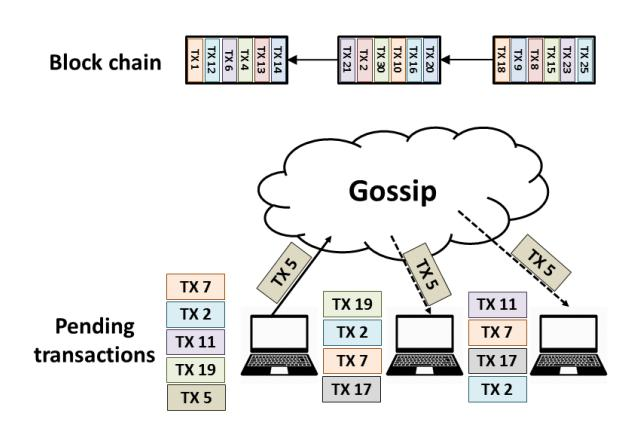
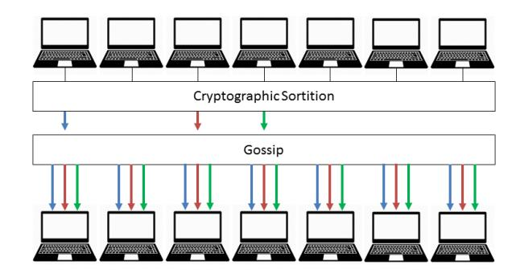
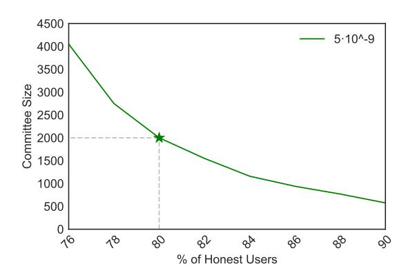
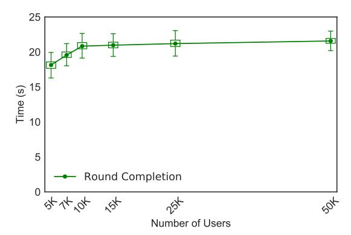
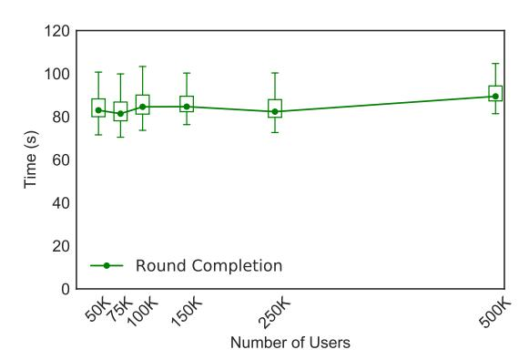
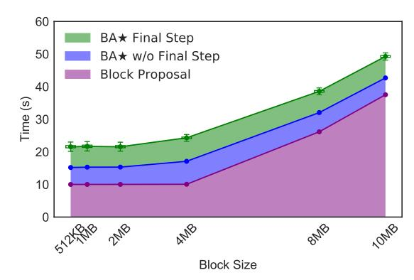
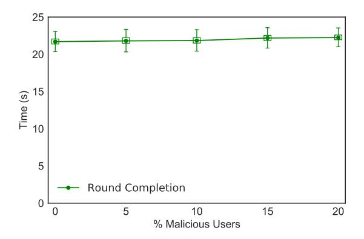

# Algorand: Scaling Byzantine Agreements for Cryptocurrencies

Yossi Gilad, Rotem Hemo, Silvio Micali, Georgios Vlachos, Nickolai Zeldovich MIT CSAIL

#### **ABSTRACT**

Algorand is a new cryptocurrency that confirms transactions with latency on the order of a minute while scaling to many users. Algorand ensures that users never have divergent views of confirmed transactions, even if some of the users are malicious and the network is temporarily partitioned. In contrast, existing cryptocurrencies allow for temporary forks and therefore require a long time, on the order of an hour, to confirm transactions with high confidence.

Algorand uses a new Byzantine Agreement (BA) protocol to reach consensus among users on the next set of transactions. To scale the consensus to many users, Algorand uses a novel mechanism based on Verifiable Random Functions that allows users to privately check whether they are selected to participate in the BA to agree on the next set of transactions, and to include a proof of their selection in their network messages. In Algorand's BA protocol, users do not keep any private state except for their private keys, which allows Algorand to replace participants immediately after they send a message. This mitigates targeted attacks on chosen participants after their identity is revealed.

We implement Algorand and evaluate its performance on 1,000 EC2 virtual machines, simulating up to 500,000 users. Experimental results show that Algorand confirms transactions in under a minute, achieves 125× Bitcoin's throughput, and incurs almost no penalty for scaling to more users.

#### 1 INTRODUCTION

Cryptographic currencies such as Bitcoin can enable new applications, such as smart contracts [24, 49] and fair protocols [2], can simplify currency conversions [12], and can avoid trusted centralized authorities that regulate transactions. However, current proposals suffer from a trade-off between latency and confidence in a transaction. For example, achieving a high confidence that a transaction has been confirmed in Bitcoin requires about an hour long wait [7]. On the other hand, applications that require low latency cannot be certain that their transaction will be confirmed, and must trust the payer to not double-spend [45].

Double-spending is the core problem faced by any cryptocurrency, where an adversary holding \$1 gives his \$1 to two different users. Cryptocurrencies prevent double-spending by reaching consensus on an ordered log ("blockchain") of transactions. Reaching consensus is difficult because of the

open setting: since anyone can participate, an adversary can create an arbitrary number of pseudonyms ("Sybils") [21], making it infeasible to rely on traditional consensus protocols [15] that require a fraction of honest users.

Bitcoin [41] and other cryptocurrencies [23, 53] address this problem using proof-of-work (PoW), where users must repeatedly compute hashes to grow the blockchain, and the longest chain is considered authoritative. PoW ensures that an adversary does not gain any advantage by creating pseudonyms. However, PoW allows the possibility of *forks*, where two different blockchains have the same length, and neither one supersedes the other. Mitigating forks requires two unfortunate sacrifices: the time to grow the chain by one block must be reasonably high (e.g., 10 minutes in Bitcoin), and applications must wait for several blocks in order to ensure their transaction remains on the authoritative chain (6 blocks are recommended in Bitcoin [7]). The result is that it takes about an hour to confirm a transaction in Bitcoin.

This paper presents Algorand, a new cryptocurrency designed to confirm transactions on the order of one minute. The core of Algorand uses a Byzantine agreement protocol called  $BA\star$  that scales to many users, which allows Algorand to reach consensus on a new block with low latency and without the possibility of forks. A key technique that makes  $BA\star$  suitable for Algorand is the use of verifiable random functions (VRFs) [38] to randomly select users in a private and non-interactive way.  $BA\star$  was previously presented at a workshop at a high level [37], and a technical report by Chen and Micali [16] described an earlier version of Algorand.

Algorand faces three challenges. First, Algorand must avoid Sybil attacks, where an adversary creates many pseudonyms to influence the Byzantine agreement protocol. Second,  $BA\star$  must scale to millions of users, which is far higher than the scale at which state-of-the-art Byzantine agreement protocols operate. Finally, Algorand must be resilient to denial-of-service attacks, and continue to operate even if an adversary disconnects some of the users [29, 51].

Algorand addresses these challenges using several techniques, as follows.

**Weighted users.** To prevent Sybil attacks, Algorand assigns a weight to each user.  $BA\star$  is designed to guarantee consensus as long as a weighted fraction (a constant greater than 2/3) of the users are honest. In Algorand, we weigh users based on the money in their account. Thus, as long as

more than some fraction (over 2/3) of the money is owned by honest users, Algorand can avoid forks and double-spending.

Consensus by committee.  $BA\star$  achieves scalability by choosing a committee—a small set of representatives randomly selected from the total set of users—to run each step of its protocol. All other users observe the protocol messages, which allows them to learn the agreed-upon block.  $BA\star$  chooses committee members randomly among all users based on the users' weights. This allows Algorand to ensure that a sufficient fraction of committee members are honest. However, relying on a committee creates the possibility of targeted attacks against the chosen committee members.

**Cryptographic sortition.** To prevent an adversary from targeting committee members,  $BA\star$  selects committee members in a private and non-interactive way. This means that every user in the system can independently determine if they are chosen to be on the committee, by computing a function (a VRF [38]) of their private key and public information from the blockchain. If the function indicates that the user is chosen, it returns a short string that proves this user's committee membership to other users, which the user can include in his network messages. Since membership selection is non-interactive, an adversary does not know which user to target until that user starts participating in  $BA\star$ .

**Participant replacement.** Finally, an adversary may target a committee member once that member sends a message in  $BA\star$ .  $BA\star$  mitigates this attack by requiring committee members to speak just once. Thus, once a committee member sends his message (exposing his identity to an adversary), the committee member becomes irrelevant to  $BA\star$ .  $BA\star$  achieves this property by avoiding any private state (except for the user's private key), which makes all users equally capable of participating, and by electing new committee members for each step of the Byzantine agreement protocol.

We implement a prototype of Algorand and  $BA\star$ , and use it to empirically evaluate Algorand's performance. Experimental results running on 1,000 Amazon EC2 VMs demonstrate that Algorand can confirm a 1 MByte block of transactions in ~22 seconds with 50,000 users, that Algorand's latency remains nearly constant when scaling to half a million users, that Algorand achieves 125× the transaction throughput of Bitcoin, and that Algorand achieves acceptable latency even in the presence of actively malicious users.

#### 2 RELATED WORK

**Proof-of-work.** Bitcoin [41], the predominant cryptocurrency, uses proof-of-work to ensure that everyone agrees on the set of approved transactions; this approach is often called "Nakamoto consensus." Bitcoin must balance the length of time to compute a new block with the possibility of wasted work [41], and sets parameters to generate a new block every 10 minutes on average. Nonetheless, due to the possibility of forks, it is widely suggested that users wait for the blockchain to grow by at least six blocks before considering their transaction to be confirmed [7]. This

means transactions in Bitcoin take on the order of an hour to be confirmed. Many follow-on cryptocurrencies adopt Bitcoin's proof-of-work approach and inherit its limitations. The possibility of forks also makes it difficult for new users to bootstrap securely: an adversary that isolates the user's network can convince the user to use a particular fork of the blockchain [28].

By relying on Byzantine agreement, Algorand eliminates the possibility of forks, and avoids the need to reason about mining strategies [8, 25, 46]. As a result, transactions are confirmed on the order of a minute. To make the Byzantine agreement robust to Sybil attacks, Algorand associates weights with users according to the money they hold. Other techniques have been proposed in the past to resist Sybil attacks in Byzantine-agreement-based cryptocurrencies, including having participants submit security deposits and punishing those who deviate from the protocol [13].

Byzantine consensus. Byzantine agreement protocols have been used to replicate a service across a small group of servers, such as in PBFT [15]. Follow-on work has shown how to make Byzantine fault tolerance perform well and scale to dozens of servers [1, 17, 33]. One downside of Byzantine fault tolerance protocols used in this setting is that they require a fixed set of servers to be determined ahead of time; allowing anyone to join the set of servers would open up the protocols to Sybil attacks. These protocols also do not scale to the large number of users targeted by Algorand.  $BA \star$  is a Byzantine consensus protocol that does not rely on a fixed set of servers, which avoids the possibility of targeted attacks on well-known servers. By weighing users according to their currency balance, BA★ allows users to join the cryptocurrency without risking Sybil attacks, as long as the fraction of the money held by honest users is at least a constant greater than 2/3.  $BA\star$ 's design also allows it to scale to many users (e.g., 500,000 shown in our evaluation) using VRFs to fairly select a random committee.

Most Byzantine consensus protocols require more than 2/3 of servers to be honest, and Algorand's  $BA\star$  inherits this limitation (in the form of 2/3 of the money being held by honest users). BFT2F [35] shows that it is possible to achieve "fork\*-consensus" with just over half of the servers being honest, but fork\*-consensus would allow an adversary to double-spend on the two forked blockchains, which Algorand avoids.

Honey Badger [39] demonstrated how Byzantine fault tolerance can be used to build a cryptocurrency. Specifically, Honey Badger designates a set of servers to be in charge of reaching consensus on the set of approved transactions. This allows Honey Badger to reach consensus within 5 minutes and achieve a throughput of 200 KBytes/sec of data appended to the ledger using 10 MByte blocks and 104 participating servers. One downside of this design is that the cryptocurrency is no longer decentralized; there are a fixed set of servers chosen when the system is first configured. Fixed servers are also problematic in terms of targeted at-

tacks that either compromise the servers or disconnect them from the network. Algorand achieves better performance (confirming transactions in about a minute, reaching similar throughput) without having to choose a fixed set of servers ahead of time.

Bitcoin-NG [26] suggests using the Nakamoto consensus to elect a leader, and then have that leader publish blocks of transactions, resulting in an order of magnitude of improvement in latency of confirming transactions over Bitcoin. Hybrid consensus [30, 32, 42] refines the approach of using the Nakamoto consensus to periodically select a group of participants (e.g., every day), and runs a Byzantine agreement between selected participants to confirm transactions until new servers are selected. This allows improving performance over standard Nakamoto consensus (e.g., Bitcoin); for example, ByzCoin [32] provides a latency of about 35 seconds and a throughput of 230 KBytes/sec of data appended to the ledger with an 8 MByte block size and 1000 participants in the Byzantine agreement. Although Hybrid consensus makes the set of Byzantine servers dynamic, it opens up the possibility of forks, due to the use of proof-of-work consensus to agree on the set of servers; this problem cannot arise in Algorand.

Pass and Shi's paper [42] acknowledges that the Hybrid consensus design is secure only with respect to a "mildly adaptive" adversary that cannot compromise the selected servers within a day (the participant selection interval), and explicitly calls out the open problem of handling fully adaptive adversaries. Algorand's  $BA\star$  explicitly addresses this open problem by immediately replacing any chosen committee members. As a result, Algorand is not susceptible to either targeted compromises or targeted DoS attacks.

Stellar [36] takes an alternative approach to using Byzantine consensus in a cryptocurrency, where each user can trust quorums of other users, forming a trust hierarchy. Consistency is ensured as long as all transactions share at least one transitively trusted quorum of users, and sufficiently many of these users are honest. Algorand avoids this assumption, which means that users do not have to make complex trust decisions when configuring their client software.

**Proof of stake.** Algorand assigns weights to users proportionally to the monetary value they have in the system, inspired by proof-of-stake approaches, suggested as an alternative or enhancement to proof-of-work [3, 10]. There is a key difference, however, between Algorand using monetary value as weights and many proof-of-stake cryptocurrencies. In many proof-of-stake cryptocurrencies, a malicious leader (who assembles a new block) *can create a fork* in the network, but if caught (e.g., since two versions of the new block are signed with his key), the leader loses his money. The weights in Algorand, however, are only to ensure that the attacker cannot amplify his power by using pseudonyms; as long as the attacker controls less than 1/3 of the monetary value, Algorand can guarantee that the probability for forks is negligible. Algorand may be extended to "detect and punish"

malicious users, but this is not required to prevent forks or double spending.

Proof-of-stake avoids the computational overhead of proof-of-work and therefore allows reducing transaction confirmation time. However, realizing proof-of-stake in practice is challenging [4]. Since no work is involved in generating blocks, a malicious leader can announce one block, and then present some other block to isolated users. Attackers may also split their credits among several "users", who might get selected as leaders, to minimize the penalty when a bad leader is caught. Therefore some proof-of-stake cryptocurrencies require a master key to periodically sign the correct branch of the ledger in order to mitigate forks [31]. This raises significant trust concerns regarding the currency, and has also caused accidental forks in the past [43]. Algorand answers this challenge by avoiding forks, even if the leader turns out to be malicious.

Ouroboros [30] is a recent proposal for realizing proof-of-stake. For security, Ouroboros assumes that honest users can communicate within some bounded delay (i.e., a strongly synchronous network). Furthermore, it selects some users to participate in a joint-coin-flipping protocol and assumes that most of them are incorruptible by the adversary for a significant epoch (such as a day). In contrast Algorand assumes that the adversary may temporarily fully control the network and immediately corrupt users in targeted attacks.

Trees and DAGs instead of chains. GHOST [47], SPECTRE [48], and Meshcash [5] are recent proposals for increasing Bitcoin's throughput by replacing the underlying chainstructured ledger with a tree or directed acyclic graph (DAG) structures, and resolving conflicts in the forks of these data structures. These protocols rely on the Nakamoto consensus using proof-of-work. By carefully designing the selection rule between branches of the trees/DAGs, they are able to substantially increase the throughput. In contrast, Algorand is focused on eliminating forks; in future work, it may be interesting to explore whether tree or DAG structures can similarly increase Algorand's throughput.

#### 3 GOALS AND ASSUMPTIONS

Algorand allows users to agree on an ordered log of transactions, and achieves two goals with respect to the log:

**Safety goal.** With overwhelming probability, all users agree on the same transactions. More precisely, if one honest user accepts transaction A (i.e., it appears in the log), then any future transactions accepted by other honest users will appear in a log that already contains A. This holds even for isolated users that are disconnected from the network—e.g., by Eclipse attacks [28].

**Liveness goal.** In addition to safety, Algorand also makes progress (i.e., allows new transactions to be added to the log) under additional assumptions about network reachability that we describe below. Algorand aims to reach consensus on a new set of transactions within roughly one minute.

**Assumptions.** Algorand makes standard cryptographic assumptions such as public-key signatures and hash functions. Algorand assumes that honest users run bug-free software. As mentioned earlier, Algorand assumes that the fraction of money held by honest users is above some threshold h (a constant greater than 2/3), but that an adversary can participate in Algorand and own some money. We believe that this assumption is reasonable, since it means that in order to successfully attack Algorand, the attacker must invest substantial financial resources in it. Algorand assumes that an adversary can corrupt targeted users, but that an adversary cannot corrupt a large number of users that hold a significant fraction of the money (i.e., the amount of money held by honest, non-compromised users must remain over the threshold).

To achieve liveness, Algorand makes a "strong synchrony" assumption that most honest users (e.g., 95%) can send messages that will be received by most other honest users (e.g., 95%) within a known time bound. This assumption allows the adversary to control the network of a few honest users, but does not allow the adversary to manipulate the network at a large scale, and does not allow network partitions.

Algorand achieves safety with a "weak synchrony" assumption: the network can be asynchronous (i.e., entirely controlled by the adversary) for a long but bounded period of time (e.g., at most 1 day or 1 week). After an asynchrony period, the network must be strongly synchronous for a reasonably long period again (e.g., a few hours or a day) for Algorand to ensure safety. More formally, the weak synchrony assumption is that in every period of length b (think of b as a day or a week), there must be a strongly synchronous period of length s < b (an s of a few hours suffices).

Finally, Algorand assumes loosely synchronized clocks across all users (e.g., using NTP) in order to recover liveness after weak synchrony. Specifically, the clocks must be close enough in order for most honest users to kick off the recovery protocol at approximately the same time. If the clocks are out of sync, the recovery protocol does not succeed.

# 4 OVERVIEW

Algorand requires each user to have a public key. Algorand maintains a log of transactions, called a blockchain. Each transaction is a payment signed by one user's public key transferring money to another user's public key. Algorand grows the blockchain in asynchronous *rounds*, similar to Bitcoin. In every round, a new block, containing a set of transactions and a pointer to the previous block, is appended to the blockchain. In the rest of this paper, we refer to Algorand software running on a user's computer as that user.

Algorand users communicate through a gossip protocol. The gossip protocol is used by users to submit new transactions. Each user collects a block of pending transactions that they hear about, in case they are chosen to propose the next block, as shown in Figure 1. Algorand uses  $BA\star$  to reach consensus on one of these pending blocks.



<span id="page-3-0"></span>Figure 1: An overview of transaction flow in Algorand.

 $BA \star$  executes in steps, communicates over the same gossip protocol, and produces a new agreed-upon block. BA★ can produce two kinds of consensus: final consensus and tentative consensus. If one user reaches final consensus, this means that any other user that reaches final or tentative consensus in the same round must agree on the same block value (regardless of whether the strong synchrony assumption held). This ensures Algorand's safety, since this means that all future transactions will be chained to this final block (and, transitively, to its predecessors). Thus, Algorand confirms a transaction when the transaction's block (or any successor block) reaches final consensus. On the other hand, tentative consensus means that other users may have reached tentative consensus on a different block (as long as no user reached final consensus). A user will confirm a transaction from a tentative block only if and when a successor block reaches final consensus.

 $BA\star$  produces tentative consensus in two cases. First, if the network is strongly synchronous, an adversary may, with small probability, be able to cause  $BA\star$  to reach tentative consensus on a block. In this case,  $BA\star$  will not reach consensus on two different blocks, but is simply unable to confirm that the network was strongly synchronous. Algorand will eventually (in a few rounds) reach final consensus on a successor block, with overwhelming probability, and thus confirm these earlier transactions.

The second case is that the network was only weakly synchronous (i.e., it was entirely controlled by the adversary, with an upper bound on how long the adversary can keep control). In this case,  $BA\star$  can reach tentative consensus on two different blocks, forming multiple forks. This can in turn prevent  $BA\star$  from reaching consensus again, because the users are split into different groups that disagree about previous blocks. To recover liveness, Algorand periodically invokes  $BA\star$  to reach consensus on which fork should be used going forward. Once the network regains strong synchrony, this will allow Algorand to choose one of the forks, and then reach final consensus on a subsequent block on that fork.

We now describe how Algorand's components fit together.

**Gossip protocol.** Algorand implements a gossip network (similar to Bitcoin) where each user selects a small random

set of peers to gossip messages to. To ensure messages cannot be forged, every message is signed by the private key of its original sender; other users check that the signature is valid before relaying it. To avoid forwarding loops, users do not relay the same message twice. Algorand implements gossip over TCP and weighs peer selection based on how much money they have, so as to mitigate pollution attacks.

Block proposal (§6). All Algorand users execute cryptographic sortition to determine if they are selected to propose a block in a given round. We describe sortition in §5, but at a high level, sortition ensures that a small fraction of users are selected at random, weighed by their account balance, and provides each selected user with a *priority*, which can be compared between users, and a *proof* of the chosen user's priority. Since sortition is random, there may be multiple users selected to propose a block, and the priority determines which block everyone should adopt. Selected users distribute their block of pending transactions through the gossip protocol, together with their priority and proof. To ensure that users converge on one block with high probability, block proposals are prioritized based on the proposing user's priority, and users wait for a certain amount of time to receive the block.

Agreement using  $BA \star (\$7)$ . Block proposal does not guarantee that all users received the same block, and Algorand does not rely on the block proposal protocol for safety. To reach consensus on a single block, Algorand uses  $BA \star$ . Each user initializes  $BA \star$  with the highest-priority block that they received. BA★ executes in repeated steps, illustrated in Figure 2. Each step begins with sortition (§5), where all users check whether they have been selected as committee members in that step. Committee members then broadcast a message which includes their proof of selection. These steps repeat until, in some step of  $BA \star$ , enough users in the committee reach consensus. (Steps are not synchronized across users; each user checks for selection as soon as he observes the previous step had ended.) As discussed earlier, an important feature of  $BA \star$  is that committee members do not keep private state except their private keys, and so can be replaced after every step, to mitigate targeted attacks on them.

**Efficiency.** When the network is strongly synchronous,  $BA\star$  guarantees that if all honest users start with the same initial block (i.e., the highest priority block proposer was honest), then  $BA\star$  establishes final consensus over that block and terminates precisely in 4 interactive steps between users. Under the same network conditions, and in the worst case of a particularly lucky adversary, all honest users reach consensus on the next block within expected 13 steps, as analyzed in Appendix C.

# <span id="page-4-0"></span>5 CRYPTOGRAPHIC SORTITION

Cryptographic sortition is an algorithm for choosing a random subset of users according to per-user weights; that is, given a set of weights  $w_i$  and the weight of all users



**Figure 2**: An overview of one step of  $BA \star$ . To simplify the figure, each user is shown twice: once at the top of the diagram and once at the bottom. Each arrow color indicates a message from a particular user.

<span id="page-4-1"></span> $W = \sum_i w_i$ , the probability that user i is selected is proportional to  $w_i/W$ . The randomness in the sortition algorithm comes from a publicly known random seed; we describe later how this seed is chosen. To allow a user to prove that they were chosen, sortition requires each user i to have a public/private key pair,  $(pk_i, sk_i)$ .

Sortition is implemented using verifiable random functions (VRFs) [38]. Informally, on any input string x,  $VRF_{sk}(x)$  returns two values: a hash and a proof. The hash is a *hashlen*-bit-long value that is uniquely determined by sk and x, but is indistinguishable from random to anyone that does not know sk. The proof  $\pi$  enables anyone that knows pk to check that the hash indeed corresponds to x, without having to know sk. For security, we require that the VRF provides these properties even if pk and sk are chosen by an attacker.

# 5.1 Selection procedure

Using VRFs, Algorand implements cryptographic sortition as shown in Algorithm 1. Sortition requires a *role* parameter that distinguishes the different roles that a user may be selected for; for example, the user may be selected to propose a block in some round, or they may be selected to be the member of the committee at a certain step of  $BA\star$ . Algorand specifies a threshold  $\tau$  that determines the expected number of users selected for that role.

```
procedure Sortition(sk, seed, \tau, role, w, W):
\langle hash, \pi \rangle \leftarrow \text{VRF}_{sk}(seed||role)
p \leftarrow \frac{\tau}{W}
j \leftarrow 0
while \frac{hash}{2^{hashlen}} \notin \left[ \sum_{k=0}^{j} B(k; w, p), \sum_{k=0}^{j+1} B(k; w, p) \right] \mathbf{do}
```

<span id="page-4-2"></span>**Algorithm 1:** The cryptographic sortition algorithm.

It is important that sortition selects users in proportion to their weight; otherwise, sortition would not defend against Sybil attacks. One subtle implication is that users may be chosen more than once by sortition (e.g., because they have a high weight). Sortition addresses this by returning the j parameter, which indicates how many times the user was chosen. Being chosen j times means that the user gets to participate as j different "sub-users."

To select users in proportion to their money, we consider each unit of Algorand as a different "sub-user." If user i owns  $w_i$  (integral) units of Algorand, then simulated user (i,j) with  $j \in \{1,\ldots,w_i\}$  represents the  $j^{th}$  unit of currency i owns, and is selected with probability  $p = \frac{\tau}{W}$ , where W is the total amount of currency units in Algorand.

As shown in Algorithm 1, a user performs sortition by computing  $\langle hash, \pi \rangle \leftarrow VRF_{sk}(seed||role)$ , where sk is the user's secret key. The pseudo-random hash determines how many sub-users are selected, as follows. The probability that exactly k out of the w (the user's weight) sub-users are selected follows the binomial distribution,  $B(k; w, p) = {w \choose k} p^k (1-p)^{w-k}$ , where  $\sum_{k=0}^w B(k; w, p) = 1$ . Since  $B(k_1; n_1, p) + B(k_2; n_2, p) = B(k_1 + k_2; n_1 + n_2, p)$ , splitting a user's weight (currency) among Sybils does not affect the number of selected sub-users under his/her control.

To determine how many of a user's w sub-users are selected, the sortition algorithm divides the interval [0,1) into consecutive intervals of the form  $I^j = \left[\sum_{k=0}^j B(k;w,p), \sum_{k=0}^{j+1} B(k;w,p)\right]$  for  $j \in \{0,1,\ldots,w\}$ . If  $hash/2^{hashlen}$  (where hashlen is the bit-length of hash) falls in the interval  $I^j$ , then the user has exactly j selected sub-users. The number of selected sub-users is publicly verifiable using the proof  $\pi$  (from the VRF output).

Sortition provides two important properties. First, given a random seed, the VRF outputs a pseudo-random hash value, which is essentially uniformly distributed between 0 and  $2^{hashlen} - 1$ . As a result, users are selected at random based on their weights. Second, an adversary that does not know  $sk_i$  cannot guess how many times user i is chosen, or if i was chosen at all (more precisely, the adversary cannot guess any better than just by randomly guessing based on the weights).

The pseudocode for verifying a sortition proof, shown in Algorithm 2, follows the same structure to check if that user was selected (the weight of the user's public key is obtained from the ledger). The function returns the number of selected sub-users (or zero if the user was not selected at all).

```
procedure VerifySort(pk, hash, \pi, seed, \tau, role, w, W):

if \neg VerifyVRF_{pk}(hash, \pi, seed || role) then return 0;

p \leftarrow \frac{\tau}{W}

j \leftarrow 0

while \frac{hash}{2^{hashlen}} \notin \left[ \sum_{k=0}^{j} B(k; w, p), \sum_{k=0}^{j+1} B(k; w, p) \right] do

\downarrow j++

return j
```

<span id="page-5-0"></span>**Algorithm 2:** Pseudocode for verifying sortition of a user with public key *pk*.

# <span id="page-5-2"></span>5.2 Choosing the seed

Sortition requires a seed that is chosen at random and publicly known. For Algorand, each round requires a seed that is publicly known by everyone for that round, but cannot be controlled by the adversary; otherwise, an adversary may be able to choose a seed that favors selection of corrupted users.

In each round of Algorand a new seed is published. The seed published at Algorand's round r is determined using VRFs with the seed of the previous round r-1. More specifically, during the block proposal stage of round r-1, every user u selected for block proposal also computes a proposed seed for round r as  $\langle seed_r, \pi \rangle \leftarrow \text{VRF}_{sk_u}(seed_{r-1}||r)$ . Algorand requires that  $sk_u$  be chosen by u well in advance of the seed for that round being determined (§5.3). This ensures that even if u is malicious, the resulting  $seed_r$  is pseudo-random.

This seed (and the corresponding VRF proof  $\pi$ ) is included in every proposed block, so that once Algorand reaches agreement on the block for round r-1, everyone knows  $seed_r$  at the start of round r. If the block does not contain a valid seed (e.g., because the block was proposed by a malicious user and included invalid transactions), users treat the entire proposed block as if it were empty, and use a cryptographic hash function H (which we assume is a random oracle) to compute the associated seed for round r as  $seed_r = H(seed_{r-1}||r)$ . The value of  $seed_0$ , which bootstraps seed selection, can be chosen at random at the start of Algorand by the initial participants (after their public keys are declared) using distributed random number generation [14].

To limit the adversary's ability to manipulate sortition, and thus manipulate the selection of users for different committees, the selection seed (passed to Algorithm 1 and Algorithm 2) is refreshed once every R rounds. Namely, at round r Algorand calls the sortition functions with  $seed_{r-1-(r \mod R)}$ .

# <span id="page-5-1"></span>5.3 Choosing $sk_u$ well in advance of the seed

Computing seed<sub>r</sub> requires that every user's secret key  $sk_u$ is chosen well in advance of the selection seed used in that round, i.e.,  $seed_{r-1-(r \mod R)}$ . When the network is not strongly synchronous, the attacker has complete control over the links, and can therefore drop block proposals and force users to agree on empty blocks, such that future selection seeds can be computed. To mitigate such attacks Algorand relies on the weak synchrony assumption (in every period of length b, there must be a strongly synchronous period of length s < b). Whenever Algorand performs cryptographic sortition for round r, it checks the timestamp included in the agreed-upon block for round  $r - 1 - (r \mod R)$ , and uses the keys (and associated weights) from the last block that was created *b*-time before block  $r - 1 - (r \mod R)$ . The lower bound s on the length of a strongly synchronous period should allow for sufficiently many blocks to be created in order to ensure with overwhelming probability that at least one block was honest. This ensures that, as long as s is suitably large, an adversary u choosing a key  $sk_u$  cannot predict the seed for round r.

This look-back period b has the following trade-off: a large b mitigates the risk that attackers are able break the weak synchronicity assumption, yet it increases the chance that users have transferred their currency to someone else and therefore have nothing to lose if the system's security breaks. This is colloquially known as the "nothing at stake" problem; one possible way to avoid this trade-off, which we do not explore in Algorand, is to take the minimum of a user's current balance and the user's balance from the look-back block as the user's weight.

Appendix A formally analyzes the number of blocks that Algorand needs to be created in the period s when the network is strongly connected. We show that to ensure a small probability of failure F, the number of blocks is logarithmic in  $\frac{1}{F}$ , which allows us to obtain high security with a reasonably low number of required blocks.

# <span id="page-6-0"></span>6 BLOCK PROPOSAL

To ensure that some block is proposed in each round, Algorand sets the sortition threshold for the block-proposal role,  $\tau_{PROPOSER}$ , to be greater than 1 (although Algorand will reach consensus on at most one of these proposed blocks). Appendix B proves that choosing  $\tau_{PROPOSER} = 26$  ensures that a reasonable number of proposers (at least one, and no more than 70, as a plausible upper bound) are chosen with very high probability (e.g.,  $1-10^{-11}$ ).

Minimizing unnecessary block transmissions. One risk of choosing several proposers is that each will gossip their own proposed block. For a large block (say, 1 MByte), this can incur a significant communication cost. To reduce this cost, the sortition hash is used to prioritize block proposals: For each selected sub-user  $1, \ldots, j$  of user i, the priority for the block proposal is obtained by hashing the (verifiably random) *hash* output of VRF concatenated with the sub-user index. The highest priority of all the block proposer's selected sub-users is the priority of the block.

Algorand users discard messages about blocks that do not have the highest priority seen by that user so far. Algorand also gossips two kinds of messages: one contains just the priorities and proofs of the chosen block proposers (from sortition), and the other contains the entire block, which also includes the proposer's sortition hash, and proof. The first kind of message is small (about 200 Bytes), and propagates quickly through the gossip network. These messages enable most users to learn who is the highest priority proposer, and thus quickly discard other proposed blocks.

Waiting for block proposals. Each user must wait a certain amount of time to receive block proposals via the gossip protocol. Choosing this time interval does not impact Algorand's safety guarantees but is important for performance. Waiting a short amount of time will mean no received proposals. If the user receives no block proposals, he or she initializes  $BA\star$  with the empty block, and if many users do so, Algorand will reach consensus on an empty block. On the

other hand, waiting too long will receive all block proposals but also unnecessarily increase the confirmation latency.

To determine the appropriate amount of time to wait for block proposals, we consider the plausible scenarios that a user might find themselves in. When a user starts waiting for block proposals for round r, they may be one of the first users to reach consensus in round r-1. Since that user completed round r-1, sufficiently many users sent a message for the last step of  $BA \star$  in that round, and therefore, most of the network is at most one step behind this user. Thus, the user must somehow wait for others to finish the last step of  $BA \star$ from round r-1. At this point, some proposer in round rthat happens to have the highest priority will gossip their priority and proof message, and the user must somehow wait to receive that message. Then, the user can simply wait until they receive the block corresponding to the highest priority proof (with a timeout  $\lambda_{\text{BLOCK}}$ , on the order of a minute, after which the user will fall back to the empty block).

It is impossible for a user to wait exactly the correct amount for the first two steps of the above scenario. Thus, Algorand estimates these quantities ( $\lambda_{\text{STEPVAR}}$ , the variance in how long it takes different users to finish the last step of  $BA\star$ , and  $\lambda_{\text{PRIORITY}}$ , the time taken to gossip the priority and proof message), and waits for  $\lambda_{\text{STEPVAR}} + \lambda_{\text{PRIORITY}}$  time to identify the highest priority. §10 experimentally shows that these parameters are, conservatively, 5 seconds each. As mentioned above, Algorand would remain safe even if these estimates were inaccurate.

**Malicious proposers.** Even if some block proposers are malicious, the worst-case scenario is that they trick different Algorand users into initializing  $BA\star$  with different blocks. This could in turn cause Algorand to reach consensus on an empty block, and possibly take additional steps in doing so. However, it turns out that even this scenario is relatively unlikely. In particular, if the adversary is *not* the highest priority proposer in a round, then the highest priority proposer will gossip a consistent version of their block to all users. If the adversary is the highest priority proposer in a round, they can propose the empty block, and thus prevent any real transactions from being confirmed. However, this happens with probability of at most 1-h, by Algorand's assumption that at least h > 2/3 of the weighted user are honest.

## <span id="page-6-1"></span>7 *BA*★

The execution of  $BA\star$  consists of two phases. In the first phase,  $BA\star$  reduces the problem of agreeing on a block to agreement on one of two options. In the second phase,  $BA\star$  reaches agreement on one of these options: either agreeing on a proposed block, or agreeing on an empty block.

Each phase consists of several interactive *steps*; the first phase always takes two steps, and the second phase takes two steps if the highest-priority block proposer was honest (sent the same block to all users), and as we show in our analysis an expected 11 steps in the worst case of a malicious

highest-priority proposer colluding with a large fraction of committee participants at every step.

In each step, every committee member casts a vote for some value, and all users count the votes. Users that receive more than a threshold of votes for some value will vote for that value in the next step (if selected as a committee member). If the users do not receive enough votes for any value, they time out, and their choice of vote for the next step is determined by the step number.

In the common case, when the network is strongly synchronous and the highest-priority block proposer was honest,  $BA\star$  reaches *final* consensus by using its final step to confirm that there cannot be any other agreed-upon block in the same round. Otherwise,  $BA\star$  may declare *tentative* consensus if it cannot confirm the absence of other blocks due to possible network asynchrony.

A key aspect of  $BA\star$ 's design is that it keeps no secrets, except for user private keys. This allows any user observing the messages to "passively participate" in the protocol: verify signatures, count votes, and reach the agreement decision.

# 7.1 Main procedure of $BA \star$

The top-level procedure implementing  $BA \star$ , as invoked by Algorand, is shown in Algorithm 3. The procedure takes a context ctx, which captures the current state of the ledger, a round number, and a new proposed block, from the highest-priority block proposer (§6). Algorand is responsible for ensuring that the block is valid (by checking the proposed block's contents and using an empty block if it is invalid, as described in §8). The context consists of the seed for sortition, the user weights, and the last agreed-upon block.

For efficiency,  $BA \star$  votes for hashes of blocks, instead of entire block contents. At the end of the  $BA \star$  algorithm, we use the BlockOfHash() function to indicate that, if  $BA \star$  has not yet received the pre-image of the agreed-upon hash, it must obtain it from other users (and, since the block was agreed upon, many of the honest users must have received it during block proposal).

The  $BA \star$  algorithm also determines whether it established final or tentative consensus. We will discuss this check in detail when we discuss Algorithm 8.

```
procedure BA \star (ctx, round, block):

hblock \leftarrow \text{Reduction}(ctx, round, H(block))

hblock_{\star} \leftarrow \text{Binary}BA \star (ctx, round, hblock)

// Check if we reached "final" or "tentative" consensus r \leftarrow \text{CountVotes}(ctx, round, \text{Final}, T_{\text{Final}}, \tau_{\text{Final}}, \lambda_{\text{STEP}})
\nif hblock_{\star} = r then
```

<span id="page-7-0"></span>**Algorithm 3:** Running  $BA \star$  for the next *round*, with a proposed *block*. H is a cryptographic hash function.

```
procedure CommitteeVote(ctx, round, step, τ, value):

// check if user is in committee using Sortition (Alg. 1)

role ← ⟨"committee", round, step⟩
⟨sorthash, π, j⟩ ← Sortition(user.sk, ctx.seed, τ, role,

ctx.weight[user.pk], ctx.W)

// only committee members originate a message
\nif j > 0 then

Gossip(⟨user.pk, Signed<sub>user.sk</sub>(round, step,

sorthash, π, H(ctx.last_block), value)⟩)
```

<span id="page-7-1"></span>**Algorithm 4:** Voting for *value* by committee members. *user.sk* and *user.pk* are the user's private and public keys.

# 7.2 Voting

**Sending votes (Algorithm 4).** Algorithm 4 shows the pseudocode for CommitteeVote(), which checks if the user is selected for the committee in a given *round* and *step* of  $BA\star$ . The CommitteeVote() procedure invokes Sortition() from Algorithm 1 to check if the user is chosen to participate in the committee. If the user is chosen for this step, the user gossips a signed message containing the value passed to CommitteeVote(), which is typically the hash of some block. To bind the vote to the context, the signed message includes the hash of the previous block.

Counting votes (Algorithm 5 and Algorithm 6). The CountVotes() procedure (Algorithm 5) reads messages that belong to the current round and step from the <code>incomingMsgs</code> buffer. (For simplicity, our pseudocode assumes that a background procedure takes incoming votes and stores them into that buffer, indexed by the messages' round and step.) It processes the votes by calling the ProcessMsg() procedure for every message (Algorithm 6), which ensures that the vote is valid. Note that no private state is required to process these messages.

ProcessMsg() returns not just the value contained in the message, but also the number of votes associated with that value. If the message was not from a chosen committee member, ProcessMsg() returns zero votes. If the committee member was chosen several times (see §5), the number of votes returned by ProcessMsg() reflects that as well. ProcessMsg() also returns the sortition hash, which we will use later in Algorithm 9.

As soon as one value has more than  $T \cdot \tau$  votes, CountVotes() returns that value.  $\tau$  is the expected number of users that Sortition() selects for the committee, and is the same for each step ( $\tau_{\text{STEP}}$ ) with the exception of the final step ( $\tau_{\text{FINAL}}$ ). T is a fraction of that expected committee size ( $T > \frac{2}{3}$ ) that defines  $BA \star$ 's voting threshold; this is also the same for every step except the final step, and we analyze it in §7.5. If not enough messages were received within the allocated  $\lambda$  time window, then CountVotes() produces TIMEOUT. The threshold ensures that if one honest user's CountVotes() returns a particular value, then all other honest users will return either the same value or TIMEOUT, even under the weak synchrony assumption (see Lemma 1 in Appendix C.2).

```
procedure CountVotes(ctx, round, step, T, \tau, \lambda):
start \leftarrow Time()
counts \leftarrow \{\}
                 // hash table, new keys mapped to 0
voters \leftarrow \{\}
msgs \leftarrow incomingMsgs[round, step].iterator()
while TRUE do
    m \leftarrow msgs.next()
    if m = \bot then
     if Time() > start + \lambda then return TIMEOUT;
    else
         \langle votes, value, sorthash \rangle \leftarrow \operatorname{ProcessMsg}(ctx, \tau, m)
         if pk \in voters or votes = 0 then continue;
         voters \cup = \{pk\}
         counts[value] += votes
         // if we got enough votes, then output this value
         if counts[value] > T \cdot \tau then
          ∟ return value
```

<span id="page-8-0"></span>**Algorithm 5:** Counting votes for *round* and *step*.

```
procedure ProcessMsg(ctx, τ, m):

⟨pk, signed_m⟩ ← m

if VerifySignature(pk, signed_m) ≠ OK then
```

<span id="page-8-1"></span>**Algorithm 6:** Validating incoming vote message *m*.

## 7.3 Reduction

The Reduction() procedure, shown in Algorithm 7, converts the problem of reaching consensus on an arbitrary value (the hash of a block) to reaching consensus on one of two values: either a specific proposed block hash, or the hash of an empty block. Our reduction is inspired by Turpin and Coan's two-step technique [50]. This reduction is important to ensure liveness.

In the first step of the reduction, each committee member votes for the hash of the block passed to Reduction() by  $BA\star$ (). In the second step, committee members vote for the hash that received at least  $T \cdot \tau$  votes in the first step, or the hash of the default empty block if no hash received enough votes. Reduction() ensures that there is at most one non-empty block that can be returned by Reduction() for all honest users.

In the common case when the network is strongly synchronous and the highest-priority block proposer was honest, most (e.g., 95%) of the users will call Reduction() with the same *hblock* parameter, and Reduction() will return that same *hblock* result to most users as well.

```
procedure Reduction(ctx, round, hblock):
// step 1: gossip the block hash
CommitteeVote(ctx, round, REDUCTION_ONE,
         \tau_{\text{STEP}}, hblock)
// other users might still be waiting for block proposals,
// so set timeout for \lambda_{\text{BLOCK}} + \lambda_{\text{STEP}}
hblock_1 \leftarrow CountVotes(ctx, round, REDUCTION ONE,
         T_{\text{STEP}}, \tau_{\text{STEP}}, \lambda_{\text{BLOCK}} + \lambda_{\text{STEP}})
// step 2: re-gossip the popular block hash
empty\_hash \leftarrow H(Empty(round, H(ctx.last\_block)))
if hblock_1 = TIMEOUT then
     CommitteeVote(ctx, round, REDUCTION_TWO,
              \tau_{\text{STEP}}, empty_hash)
else
     CommitteeVote(ctx, round, REDUCTION TWO,
              \tau_{\text{STEP}}, hblock_1
hblock_2 \leftarrow CountVotes(ctx, round, REDUCTION_TWO,
         T_{\text{STEP}}, \tau_{\text{STEP}}, \lambda_{\text{STEP}})
if hblock<sub>2</sub> = TIMEOUT then return empty_hash;
else return hblock<sub>2</sub>;
```

<span id="page-8-2"></span>**Algorithm 7:** The two-step reduction.

On the other hand, if the highest-priority block proposer was dishonest, different users may start Reduction() with different *hblock* parameters. In this case, no single *hblock* value may be popular enough to cross the threshold of votes. As a result, Reduction() will return *empty hash*.

# 7.4 Binary agreement

Algorithm 8 shows Binary  $BA\star()$ , which reaches consensus on one of two values: either the hash passed to Binary  $BA\star()$  or the hash of the empty block. Binary  $BA\star()$  relies on Reduction() to ensure that at most one non-empty block hash is passed to Binary  $BA\star()$  by all honest users.

**Safety with strong synchrony.** In each step of Binary  $BA\star()$ , a user who has seen more than  $T\cdot \tau$  votes for some value will vote for that same value in the next step (if selected). However, if no value receives enough votes, Binary  $BA\star()$  chooses the next vote in a way that ensures consensus in a strongly synchronous network.

Specifically, user A may receive votes from an adversary that push the votes observed by A past the threshold, but the adversary might not send the same votes to other users (or might not send them in time). As a result, A returns consensus on a block, but other users timed out in that step. It is crucial that Binary $BA\star()$  chooses the votes for the next step in a way that will match the block already returned by A. Algorithm 8 follows this rule: every **return** statement is coupled with a check for TIMEOUT that sets the next-step vote to the same value that could have been returned.

It is also crucial that Binary $BA\star()$  is able to collect enough votes in the next step to carry forward the value that A already reached consensus on. If there are many users like A that have already returned consensus, Binary $BA\star()$  may

```
procedure Binary BA \star (ctx, round, block\_hash):
step \leftarrow 1
r ← block_hash
empty_hash \leftarrow H(Empty(round, H(ctx.last_block)))
while step < MaxSteps do
    CommitteeVote(ctx, round, step, \tau_{STEP}, r)
    r \leftarrow \text{CountVotes}(ctx, round, step, T_{\text{STEP}}, \tau_{\text{STEP}}, \lambda_{\text{STEP}})
    if r = TIMEOUT then
     r \leftarrow block\_hash
    else if r \neq empty hash then
         for step < s' \le step + 3 do
          CommitteeVote(ctx, round, s', \tau_{STEP}, r)
         if step = 1 then
          CommitteeVote(ctx, round, FINAL, \tau_{FINAL}, r)
        return r
    step++
    CommitteeVote(ctx, round, step, \tau_{STEP}, r)
    r \leftarrow \text{CountVotes}(\textit{ctx}, \textit{round}, \textit{step}, T_{\text{STEP}}, \tau_{\text{STEP}}, \lambda_{\text{STEP}})
    if r = TIMEOUT then
     r \leftarrow empty\_hash
    else if r = empty hash then
         for step < s' \le step + 3 do
          CommitteeVote(ctx, round, s', \tau_{STEP}, r)
       _ return r
    step++
    CommitteeVote(ctx, round, step, \tau_{STEP}, r)
    r \leftarrow \text{CountVotes}(ctx, round, step, T_{\text{STEP}}, \tau_{\text{STEP}}, \lambda_{\text{STEP}})
    if r = TIMEOUT then
         if CommonCoin(ctx, round, step, \tau_{STEP}) = 0 then
          r \leftarrow block\_hash
         else
          r \leftarrow empty\_hash
  step++
// No consensus after MaxSteps; assume network
// problem, and rely on §8.2 to recover liveness.
HangForever()
```

<span id="page-9-0"></span>**Algorithm 8:** Binary  $BA \star$  executes until consensus is reached on either *block\_hash* or *empty\_hash*.

not have enough users to push CountVotes() in the next step past the threshold. To avoid this problem, whenever a user returns consensus, that user votes in the next three steps with the value they reached consensus on.

In the common case, when the network is strongly synchronous and the block proposer was honest, Binary  $BA\star()$  will start with the same  $block\_hash$  for most users, and will reach consensus in the first step, since most committee members vote for the same  $block\_hash$  value.

**Safety with weak synchrony.** If the network is not strongly synchronous (e.g., there is a partition), Binary  $BA \star ()$  may return consensus on two different blocks. For example, suppose that, in the first step of Binary  $BA \star ()$ , all users vote for  $block\_hash$ , but only one honest user, A, receives those

votes. In this case, A will return consensus on  $block\_hash$ , but all other users will move on to the next step. Now, the other users vote for  $block\_hash$  again, because CountVotes() returned timeout. However, let's assume the network drops all of these votes. Finally, the users vote for  $empty\_hash$  in the third step, the network becomes well behaved, and all votes are delivered. As a result, the users will keep voting for  $empty\_hash$  until the next iteration of the loop, at which point they reach consensus on  $empty\_hash$ . This is undesirable because Binary $BA\star()$  returned consensus on two different hashes to different honest users.

 $BA\star$ () addresses this problem by introducing the notion of *final* and *tentative* consensus. Final consensus means that  $BA\star$ () will not reach consensus on any other block for that round. Tentative consensus means that  $BA\star$ () was unable to guarantee safety, either because of network asynchrony or due to a malicious block proposer.

 $BA\star()$  designates consensus on value V as "final" if Binary $BA\star()$  reached consensus on V in the very first step, and if enough users observed this consensus being reached. Specifically, Binary $BA\star()$  sends out a vote for the special FINAL step to indicate that a user reached consensus on some value in the very first step, and  $BA\star()$  collects these votes to determine whether final consensus was achieved. In a strongly synchronous network with an honest block proposer, Binary $BA\star()$  will reach consensus in the first step, most committee members will vote for the consensus block in the special FINAL step in Binary $BA\star()$ , and will receive more than a threshold of such votes in  $BA\star()$ , thus declaring the block as final. The FINAL step is analogous to the final confirmation step implemented in many Byzantine-resilient protocols [15, 34].

Intuitively, this guarantees safety because a large threshold of users have already declared consensus for V, and will not vote for any other value in the same round. In our example above, where user A reached consensus on a different block than all other users, neither block would be designated as final, because only one user (namely, A) observed consensus at the first step, and there would never be enough votes to mark that block as final. Appendix C.1 formalizes and proves this safety property.

One subtle issue arises due to the fact that  $BA\star$  relies on a committee to declare final consensus, instead of relying on all participants. As a result, even if one user observes final consensus, an adversary that controls the network may be able to prevent a small fraction of other users from reaching any kind of consensus (final or tentative) for an arbitrary number of steps. Each of these steps give the adversary an additional small probability of reaching consensus on a different value (e.g., the empty block). To bound the total probability of an adversary doing so,  $BA\star$  limits the total number of allowed steps; Appendix C.1 relies on this. If the protocol runs for more than MAXSTEPS steps,  $BA\star$  halts without consensus and relies on the recovery protocol described in §8.2 to recover liveness.

```
procedure CommonCoin(ctx, round, step, τ):

minhash ← 2<sup>hashlen</sup>

for m ∈ incomingMsgs[round, step] do

⟨votes, value, sorthash⟩ ← ProcessMsg(ctx, τ, m)

for 1 ≤ j < votes do

| h ← H(sorthash||j)
| if h < minhash then minhash ← h;

return minhash mod 2
```

<span id="page-10-0"></span>Algorithm 9: Computing a coin common to all users.

**Getting unstuck.** One remaining issue is that consensus could get stuck if the honest users are split into two groups, A and B, and the users in the two groups vote for different values (say, we are in step 1, A votes for empty\_hash, and B votes for block hash). Neither group is large enough to gather enough votes on their own, but together with the adversary's votes, group A is large enough. In this situation, the adversary can determine what every user will vote for in the next step. To make some user vote for empty hash in the next step, the adversary sends that user the adversary's own votes for *empty\_hash* just before the timeout expires, which, together with A's votes, crosses the threshold. To make the user vote for block hash, the adversary does not send any votes to that user; as a result, that user's CountVotes() will return TIMEOUT, and the user will choose block\_hash for the next step's vote, according to the Binary $BA \star ()$  algorithm. This way, the adversary can split the users into two groups in the next step as well, and continue this attack indefinitely.

The attack described above requires the adversary to know how a user will vote after receiving TIMEOUT from CountVotes(). The third step of Binary $BA\star$ () is designed to avoid this attack by pushing towards accepting either block\_hash or empty\_hash based on a random "common coin," meaning a binary value that is predominantly the same for all users. Although this may sound circular, the users need not reach formal consensus on this common coin. As long as enough users observe the same coin bit, and the bit was not known to the attacker in advance of the step, Binary $BA\star$ () will reach consensus in the next iteration of the loop with probability 1/2 (i.e., the probability that the attacker guessed wrong). By repeating these steps, the probability of consensus quickly approaches 1.

To implement this coin we take advantage of the VRF-based committee member hashes attached to all of the messages. Every user sets the common coin to be the least-significant bit of the lowest hash it observed in this step, as shown in Algorithm 9. If a user gets multiple votes (i.e., several of their sub-users were selected), then Common-Coin() considers multiple hashes from that user, by hashing that user's sortition hash with the sub-user index. Notice that hashes are random (since they are produced by hashing the pseudo-random VRF output), so their least-significant bits are also random. The common coin is used only when CountVotes() times out, giving sufficient time for all votes to propagate through the network. If the committee member



<span id="page-10-2"></span>**Figure 3**: The committee size,  $\tau$ , sufficient to limit the probability of violating safety to  $5 \times 10^{-9}$ . The x-axis specifies h, the weighted fraction of honest users.  $\star$  marks the parameters selected in our implementation.

with the lowest hash is honest, then all users that received his message observe the same coin.

If a malicious committee-member happens to hold the lowest hash, then he might send it to only some users. This may result in users observing different coin values, and thus will not help in reaching consensus. However, since sortition hashes are pseudo-random, the probability that an honest user has the lowest hash is h (the fraction of money held by honest users), and thus there is at least an  $h > \frac{2}{3}$  probability that the lowest sortition hash holder will be honest, which leads to consensus with probability  $\frac{1}{2} \cdot h > \frac{1}{3}$  at each loop iteration. This allows Appendix C.3 to show that, with strong synchrony,  $BA\star$  does not exceed MaxSteps with overwhelming probability.

#### <span id="page-10-1"></span>7.5 Committee size

The fraction  $h > \frac{2}{3}$  of weighted honest users in Algorand must translate into a "sufficiently honest" committee for  $BA \star$ .  $BA \star$  has two parameters at its disposal:  $\tau$ , which controls the *expected* committee size, and T, which controls the number of votes needed to reach consensus  $(T \cdot \tau)$ . We would like T to be as small as possible for liveness, but the smaller T is, the larger  $\tau$  needs to be, to ensure that an adversary does not obtain enough votes by chance. Since a larger committee translates into a higher bandwidth cost, we choose two different parameter sets:  $T_{\text{FINAL}}$  and  $\tau_{\text{FINAL}}$  for the FINAL step, which ensures an overwhelming probability of safety regardless of strong synchrony, and  $T_{\text{STEP}}$  and  $\tau_{\text{STEP}}$  for all other steps, which achieve a reasonable trade-off between liveness, safety, and performance.

To make the constraints on  $\tau_{\text{STEP}}$  and  $T_{\text{STEP}}$  precise, let us denote the number of honest committee members by g and the malicious ones by b; in expectation,  $b+g=\tau_{\text{STEP}}$ , but b+g can vary since it is chosen by sortition. To ensure liveness, as we prove in Appendix C.2,  $BA\star$  requires  $\frac{1}{2}g+b \leq T_{\text{STEP}} \cdot \tau_{\text{STEP}}$  and  $g > T_{\text{STEP}} \cdot \tau_{\text{STEP}}$ .

Due to the probabilistic nature of how committee members are chosen, there is always some small chance that the b and

g for some step fail to satisfy the above constraints, and  $BA\star$ 's goal is to make this probability negligible. Figure 3 plots the expected committee size  $\tau_{\text{STEP}}$  that is needed to satisfy both constraints, as a function of h, for a probability of violation of  $5\times 10^{-9}$ ; Appendix B describes this computation in more detail. The figure shows a trade-off: the weaker the assumption on the fraction of money held by honest users (h), the larger the committee size needs to be. The results show that, as h approaches  $\frac{2}{3}$ , the committee size grows quickly. However, at h=80%,  $\tau_{\text{STEP}}=2,000$  can ensure that these constraints hold with probability  $1-5\times 10^{-9}$  (using  $T_{\text{STEP}}=0.685$ ).

The constraints on  $\tau_{\text{FINAL}}$  and  $T_{\text{FINAL}}$  are dictated by the proof of safety under weak synchrony; Appendix C.1 shows that  $\tau_{\text{FINAL}} = 10,000$  suffices with  $T_{\text{FINAL}} = 0.74$ .

With these parameters,  $BA\star$  ensures safety even if the lowest-priority block proposer is malicious (proposes different blocks). Appendix C provides proofs of  $BA\star$ 's safety under weak synchrony (§C.1), liveness under strong synchrony (§C.2), and efficiency (§C.3).

#### <span id="page-11-0"></span>8 ALGORAND

Building Algorand on top of the primitives we have described so far requires Algorand to address a number of higher-level issues, which this section discusses.

## 8.1 Block format

Algorand's blocks consist of a list of transactions, along with metadata needed by  $BA\star$ . Specifically, the metadata consists of the round number, the proposer's VRF-based seed (§6), a hash of the previous block in the ledger, and a timestamp indicating when the block was proposed. The list of transactions in a block logically translates to a set of weights for each user's public key (based on the balance of currency for that key), along with the total weight of all outstanding currency.

Once a user receives a block from the highest-priority proposer, the user validates the block contents before passing it on to  $BA\star$ . In particular, the user checks that all transactions are valid; that the seed is valid; that the previous block hash is correct; that the block round number is correct; and that the timestamp is greater than that of the previous block and also approximately current (say, within an hour). If any of them are incorrect, the user passes an empty block to  $BA\star$ .

# <span id="page-11-1"></span>8.2 Safety and liveness

To a large extent, Algorand relies on  $BA\star$  to reach consensus on blocks in the ledger. Algorand confirms transactions only when they appear in a final block, or in the predecessor of a final block. Final blocks guarantee that no other block could have reached consensus in the same round. This means that all final blocks are totally ordered with respect to one another, since (1) blocks form a linear chain, and (2) there can be exactly one final block at any given position in the chain. In other words, given two final blocks, one of them (the one with the smaller round number  $r_1$ ) must be a predecessor of

the other (the one with the higher round number  $r_2$ ), since there must be *some* predecessor of the  $r_2$  block in round  $r_1$ , and the safety condition guarantees that the  $r_1$  block is the only possible such block.

The remaining issue is that, if the network is not strongly synchronous,  $BA\star$  may create forks (i.e., different users reach consensus on different blocks). This does not violate safety, because  $BA\star$  will return *tentative* consensus in this situation. However, forks do impact liveness: users on different forks will have different  $ctx.last\_block$  values, which means they will not count each others' votes. As a result, at least one of the forks (and possibly all of the forks) will not have enough participants to cross the vote threshold, and  $BA\star$  will not be able to reach consensus on any more blocks on that fork.

To resolve these forks, Algorand periodically proposes a fork that all users should agree on, and uses  $BA\star$  to reach consensus on whether all users should, indeed, switch to this fork. To determine the set of possible forks, Algorand users passively monitor all  $BA\star$  votes (i.e., even votes whose  $prev\_hash$  value does not match the current user's chain), and keep track of all forks. Users then use loosely synchronized clocks to stop regular block processing and kick off the recovery protocol at every time interval (e.g., every hour), which will propose one of these forks as the fork that everyone should agree on.

The recovery protocol starts by having users propose a fork using the block proposal mechanism (§6). Specifically, if a user is chosen to be a "fork proposer," that user proposes an empty block whose predecessor hash is the longest fork (by the number of blocks) observed by the user so far. Each user waits for the highest-priority fork proposal, much as in the block proposal mechanism. Each user validates the proposed block, by ensuring that the block's parent pointer is a chain that is as long as the longest chain seen by that user. Choosing the longest fork ensures that this fork will include all final blocks. Finally, the user invokes  $BA \star$  to reach consensus on this block, passing the round number found in the proposed block.

In order for  $BA\star$  to reach consensus on one of the forks, all Algorand users must use the same seed and user weights. This means that Algorand must use user weights and seeds from before any possible forks occurred. To do this, Algorand relies on the weak synchrony assumption—namely, that in every period of length b (think of b as 1 day), there must be a strongly synchronous period of length s < b (think of s as a few hours). Under this assumption, using the block timestamps, Algorand quantizes time into b-long periods (think days), and finds the most recent block from the next-to-last complete b-long period. Algorand then uses the seed from this block, and uses user weights from the last block that was agreed upon at least b-long time before it (§5.3).

Algorand takes the seed from the block from the *next-to-last b-*long period because the most recent *b-*long period may still have an unresolved fork. Such a fork would prevent users from agreeing on the seed and weights used in the

recovery. However, as long as Algorand can recover within the *s*-long strongly synchronous period in the most recent *b*-long period, all users will agree on the same block from the next-to-last period (as long as their clocks are roughly synchronized).

To ensure that Algorand recovers from a fork (i.e., most honest users switch to the same fork) within the s-long synchronous period, Algorand users repeatedly attempt to reach consensus on a fork (applying a hash function to the seed each time to produce a different set of proposers and committee members), until they achieve consensus. Since, by assumption, Algorand is operating in a strongly synchronous period, it is not important whether  $BA\star$  returns "final" or "tentative" consensus in this case. When Algorand is recovering outside of a strongly synchronous period, we cannot ensure recovery within s time.

# <span id="page-12-0"></span>8.3 Bootstrapping

**Bootstrapping the system.** To deploy Algorand, a common genesis block must be provided to all users, along with the initial cryptographic sortition seed. The value of  $seed_0$  specified in the genesis block is decided using distributed random number generation [14], after the public keys and weights for the initial set of participants are publicly known.

**Bootstrapping new users.** Users that join the system need to learn the current state of the system, which is defined to be the result of a chain of  $BA\star$  consensus outcomes. To help users catch up, Algorand generates a *certificate* for every block that was agreed upon by  $BA\star$  (including empty blocks). The certificate is an aggregate of the votes from the last step of Binary $BA\star$ () (not including the FINAL step) that would be sufficient to allow any user to reach the same conclusion by processing these votes (i.e., there must be at least  $\lfloor T_{STEP} \cdot \tau_{STEP} \rfloor + 1$  votes). Importantly, the users must check the sortition hashes and proofs just like in Algorithm 6, and that all messages in the certificate are for the same Algorand round and  $BA\star$  step.

Certificates allow new users to validate prior blocks. Users validate blocks in order, starting from the genesis block. This ensures that the user knows the correct weights for verifying sortition proofs in any given round. Users can also request a certificate proving the safety of a block; this is simply the collection of votes for the final step. Since final blocks are totally ordered, users need to check the safety of only the most recent block.

One potential risk created by the use of certificates is that an adversary can provide a certificate that appears to show that  $BA\star$  completed after some large number of steps. This gives the adversary a chance to find a  $BA\star$  step number (up to MaxSteps) in which the adversary controls more than a threshold of the selected committee members (and to then create a signed certificate using their private keys). We set the committee size to be sufficiently large to ensure the attacker has negligible probability of finding such a step

number. For  $\tau_{\text{STEP}} > 1,000$ , the probability of this attack is less than  $2^{-166}$  at every step, making this attack infeasible.

**Storage.** The block history and matching certificates allow new users to catch-up, and are not required for users who are already up-to-date with the current ledger. Therefore Algorand distributes certificate and block storage across users. For N shards, users store blocks/certificates whose round number equals their public key modulo N.

#### 8.4 Communication

Gossiping blocks and relaying messages. Algorand's block proposal protocol (§6) assumed that chosen users can gossip new blocks before an adversary can learn the user's identity and mount a targeted DoS attack against them. In practice, Algorand's blocks are larger than the maximum packet size, so it is inevitable that some packets from a chosen block proposer will be sent before others. A particularly fast adversary could take advantage of this to immediately DoS any user that starts sending multiple packets, on the presumption that the user is a block proposer.

Formally, this means that Algorand's liveness guarantees are slightly different in practice: instead of providing liveness in the face of immediate targeted DoS attacks, Algorand ensures liveness as long as an adversary cannot mount a targeted DoS attack within the time it takes for the victim to send a block over a TCP connection (a few seconds). We believe this does not matter significantly; an adversary with such a quick reaction time likely also has broad control over the network, and thus can prevent Algorand nodes from communicating at all. Another approach may be to rely on Tor [19] to make it difficult for an adversary to quickly disconnect a user.

To avoid an adversary from sending garbage messages and overwhelming Algorand's gossip network, Algorand nodes must validate messages before relaying them. Specifically, Algorand nodes should validate each message using Algorithm 6, and avoid relaying more than one message signed by a given public key per (round, step).

**Scalability.** The communication costs for each user depend on the expected size of the committee and the number of block proposers, which Algorand sets through  $\tau_{\text{PROPOSER}}$ ,  $\tau_{\text{STEP}}$ , and  $\tau_{\text{FINAL}}$  (independent of the number of users). As more users join, it takes a message longer to disseminate in the gossip network. Algorand's gossip network forms a random network graph (each user connects to random peers). Our theoretical analysis suggests that almost all users will be part of one connected component in the graph, and that dissemination time grows with the diameter of that component, which is logarithmic in the number of users [44]. Experiments confirm that Algorand's performance is only slightly affected by more users (§10).

Since our random graph uses a fixed number of peers, one potential concern is that it may contain disconnected components [22]. However, only a small fraction of users might end up in a disconnected component, which does

| Parameter                   | Meaning                                                | Value         |
|-----------------------------|--------------------------------------------------------|---------------|
| h                           | assumed fraction of honest weighted users              | 80%           |
| R                           | seed refresh interval (# of rounds)                    | 1,000 (§5.2)  |
| $\tau_{\text{PROPOSER}}$    | expected # of block proposers                          | 26 (§B.1)     |
| $\tau_{\text{STEP}}$        | expected # of committee members                        | 2,000 (§B.2)  |
| $T_{\mathtt{STEP}}$         | threshold of $\tau_{\text{STEP}}$ for $BA \star$       | 68.5% (§B.2)  |
| $\tau_{\text{FINAL}}$       | expected # of final committee members                  | 10,000 (§C.1) |
| $T_{\rm FINAL}$             | threshold of $\tau_{\text{\tiny FINAL}}$ for $BA\star$ | 74% (§C.1)    |
| MAXSTEPS                    | maximum number of steps in BinaryBA★                   | 150 (§C.1)    |
| $\lambda_{\text{priority}}$ | time to gossip sortition proofs                        | 5 seconds     |
| $\lambda_{\text{block}}$    | timeout for receiving a block                          | 1 minute      |
| $\lambda_{\text{step}}$     | timeout for $BA \star$ step                            | 20 seconds    |
| $\lambda_{\text{stepvar}}$  | estimate of $BA \star$ completion time variance        | 5 seconds     |

<span id="page-13-1"></span>Figure 4: Implementation parameters.

not pose a problem for  $BA \star$ . Moreover, Algorand replaces gossip peers each round, which helps users recover from being possibly disconnected in a previous round.

#### 9 IMPLEMENTATION

We implemented a prototype of Algorand in C++, consisting of approximately 5,000 lines of code. We use the Boost ASIO library for networking. Signatures and VRFs are implemented over Curve 25519 [6], and we use SHA-256 for a hash function. We use the VRF outlined in Goldberg et al [27: §4].

In our implementation each user connects to 4 random peers, accepts incoming connections from other peers, and gossips messages to all of them. This gives us 8 peers on average. We currently provide each user with an "address book" file listing the IP address and port number for every user's public key. In a real-world deployment we imagine users could gossip this information, signed by their keys, or distribute it via a public bulletin board. This naïve design of the gossip protocol in our prototype implementation is potentially susceptible to Sybil attacks, since it does not prevent an adversary from joining the gossip network with a large number of identities. We leave the problem of implementing a Sybil-resistant gossip network to future work.

One difference between our implementation and the pseudocode shown in §7 lies in the Binary BA\*() function. The pseudocode in Algorithm 8 votes in the next 3 steps after reaching consensus. For efficiency, our implementation instead looks back to the previous 3 steps before possibly returning consensus in a future step. This logic produces equivalent results but is more difficult to express in pseudocode.

Figure 4 shows the parameters in our prototype of Algorand; we experimentally validate the timeout parameters in  $\S10$ . h=80% means that an adversary would need to control 20% of Algorand's currency in order to create a fork. By analogy, in the US, the top 0.1% of people own about 20% of the wealth [40], so the richest 300,000 people would have to collude to create a fork.

 $\lambda_{\text{PRIORITY}}$  should be large enough to allow block proposers to gossip their priorities and proofs. Measurements of message propagation in Bitcoin's network [18] suggest that gos-

siping 1 KB to 90% of the Bitcoin peer-to-peer network takes about 1 second. We conservatively set  $\lambda_{PRIORITY}$  to 5 seconds.

 $\lambda_{\text{BLOCK}}$  ensures that Algorand can make progress even if the block proposer does not send the block. Our experiments (§10) show that about 10 seconds suffices to gossip a 1 MB block. We conservatively set  $\lambda_{\text{BLOCK}}$  to be a minute.

 $\lambda_{\text{STEP}}$  should be high enough to allow users to receive messages from committee members, but low enough to allow Algorand to make progress (move to the next step) if it does not hear from sufficiently many committee members. We conservatively set  $\lambda_{\text{STEP}}$  to 20 seconds. We set  $\lambda_{\text{STEPVAR}}$ , the estimated variance in  $BA\star$  completion times, to 10 seconds.

#### <span id="page-13-0"></span>10 EVALUATION

Our evaluation quantitatively answers the following:

- What is the latency that Algorand can achieve for confirming transactions, and how does it scale as the number of users grows? (§10.1)
- What throughput can Algorand achieve in terms of transactions per second? (§10.2)
- What are Algorand's CPU, bandwidth, and storage costs? (§10.3)
- How does Algorand perform when users misbehave? (§10.4)
- Does Algorand choose reasonable timeout parameters? (§10.5)

To answer these questions, we deploy our prototype of Algorand on Amazon's EC2 using 1,000 m4.2xlarge virtual machines (VMs), each of which has 8 cores and up to 1 Gbps network throughput. To measure the performance of Algorand with a large number of users, we run multiple Algorand users (each user is a process) on the same VM. By default, we run 50 users per VM, and users propose a 1 MByte block. To simulate commodity network links, we cap the bandwidth for each Algorand process to 20 Mbps. To model network latency we use inter-city latency and jitter measurements [52] and assign each machine to one of 20 major cities around the world; latency within the same city is modeled as negligible. We assign an equal share of money to each user; the equal distribution of money maximizes the number of messages that users need to process. Graphs in the rest of this section plot the time it takes for Algorand to complete an entire round, and include the minimum, median, maximum, 25th, and 75th percentile times across all users.

#### <span id="page-13-2"></span>10.1 Latency

Figure 5 shows results with the number of users varying from 5,000 to 50,000 (by varying the number of active VMs from 100 to 1,000). The results show that Algorand can confirm transactions in well under a minute, and the latency is near-constant as the number of users grows. (Since  $\tau_{\text{FINAL}} = 10,000$ , the time it takes to complete the FINAL step increases until there are 10,000 users in the system; before this point, users



<span id="page-14-2"></span>**Figure 5**: Latency for one round of Algorand, with 5,000 to 50,000 users.



<span id="page-14-3"></span>**Figure 6**: Latency for one round of Algorand in a configuration with 500 users per VM, using 100 to 1,000 VMs.

are selected more than once and send fewer votes with higher weights.)

To determine if Algorand continues to scale to even more users, we run an experiment with 500 Algorand user processes per VM. This configuration runs into two bottlenecks: CPU time and bandwidth. Most of the CPU time is spent verifying signatures and VRFs. To alleviate this bottleneck in our experimental setup, for this experiment we replace verifications with sleeps of the same duration. We are unable to alleviate the bandwidth bottleneck, since each VM's network interface is maxed out; instead, we increase  $\lambda_{\text{STEP}}$  to 1 minute.

Figure 6 shows the results of this experiment, scaling the number of users from 50,000 to 500,000 (by varying the number of VMs from 100 to 1,000). The latency in this experiment is about 4× higher than in Figure 5, even for the same number of users, owing to the bandwidth bottleneck. However, the scaling performance remains roughly flat all the way to 500,000 users, suggesting that Algorand scales well.

# <span id="page-14-0"></span>10.2 Throughput

In the following set of experiments we deploy 50,000 users on our 1,000 VMs (50 users per machine). Figure 7 shows the results with a varying block size. The figure breaks the Algorand round into three parts. Block proposal (§6), at the bottom of the graph, is the time it takes a user to obtain the



<span id="page-14-4"></span>**Figure 7**: Latency for one round of Algorand as a function of the block size.

proposed block. The block proposal time for small block sizes is dominated by the  $\lambda_{\text{PRIORITY}} + \lambda_{\text{STEPVAR}}$  wait time. For large block sizes, the time to gossip the large block contents dominates.  $BA\star$  except for the final step, in the middle of the graph, is the time it takes for  $BA\star$  to reach the final step. Finally,  $BA\star$ 's final step, at the top of the graph, is the time it takes  $BA\star$  to complete the final step. We break out the final step separately because, for the purposes of throughput, it could be pipelined with the next round (although our prototype does not do so).

The results show that Algorand's agreement time (i.e.,  $BA\star$ ) is independent of the block size, and stays about the same (12 seconds) even for large blocks. The throughput can be further increased by pipelining the Final step, which takes about 6 seconds, with the next round of Algorand. The fixed time for running  $BA\star$  and the linear growth in block propagation time (with the size of the block) suggest that increasing the block size allows one to amortize the time it takes to run  $BA\star$  to commit more data, and therefore reach a throughput that maximizes the network capability.

At its lowest latency, Algorand commits a 2 MByte block in about 22 seconds, which means it can commit 327 MBytes of transactions per hour. For comparison, Bitcoin commits a 1 MByte block every 10 minutes, which means it can commit 6 MBytes of transactions per hour [9]. As Algorand's block size grows, Algorand achieves higher throughput at the cost of some increase to latency. For example, with a 10 MByte block size, Algorand commits about 750 MBytes of transactions per hour, which is 125× Bitcoin's throughput.

# <span id="page-14-1"></span>10.3 Costs of running Algorand

Users running Algorand incur CPU, network, and storage costs. The CPU cost of running Algorand is modest; when running 50 users per VM, CPU usage on the 8-core VM was about 40% (most of it for verifying signatures and VRFs), meaning each Algorand process uses about 6.5% of a core. In terms of bandwidth, each user in our experiment with 1 MByte blocks and 50,000 users uses about 10 Mbit/sec (empirically computed as the total amount of data sent, divided by the duration of the experiment). We note that the communication cost per user is independent of the number of



<span id="page-15-3"></span>**Figure 8**: Latency for one round of Algorand with a varying fraction of malicious users, out of a total of 50,000 users.

users running Algorand, since users have an expected fixed number of neighbors they gossip messages to, and the number of messages in the consensus protocol depends on the committee size (rather than the total number of users).

In terms of storage cost, Algorand stores block certificates in order to prove to new users that a block was committed. This storage cost is in addition to the blocks themselves. Each block certificate is 300 KBytes, independent of the block size; for 1 MByte blocks, this would be a  $\sim\!30\%$  storage overhead. Sharding block storage across users (§8.3) reduces storage costs proportionally. For example, sharding modulo 10 would require each user to store, on average, 130 KB for every 1MB block that is appended to the ledger.

# <span id="page-15-1"></span>10.4 Misbehaving users

Algorand's safety is guaranteed by  $BA \star (\S7)$ , but proving this experimentally would require testing all possible attacker strategies, which is infeasible. However, to experimentally show that our Algorand prototype handles malicious users, we choose one particular attack strategy. We force the block proposer with the highest priority to equivocate about the proposed block: namely, the proposer sends one version of the block to half of its peers, and another version to others (note that as an optimization, if a user receives to conflicting versions of a block from the highest priority block proposer before the block proposal step is complete, he discards both proposals and starts  $BA \star$  with the empty block). Malicious users that are chosen to be part of the  $BA \star$  committee vote for both blocks. Figure 8 shows how Algorand's performance is affected by the weighted fraction of malicious users. The results show that, at least empirically for this particular attack, Algorand is not significantly affected.

# <span id="page-15-2"></span>10.5 Timeout parameters

The above results confirm that  $BA\star$  steps finish in well under  $\lambda_{\text{STEP}}$  (20 seconds), that the difference between 25th and 75th percentiles of  $BA\star$  completion times is under  $\lambda_{\text{STEPVAR}}$  (5 seconds), and that blocks are gossiped within  $\lambda_{\text{BLOCK}}$  (1 minute). We separately measure the time taken to propagate a block proposer's priority and proof; it is consistently

around 1 second, well under  $\lambda_{PRIORITY}$  (5 seconds), confirming the measurements by Decker and Wattenhofer [18].

# 11 FUTURE WORK

This paper focused on the consensus mechanism for committing transactions, and addressing the associated scalability and security challenges. There remain a number of open problems in designing permissionless cryptocurrencies:

**Incentives.** In order to encourage Algorand users to participate, i.e., be online when selected and pay the network cost of operating Algorand, the system may need to include incentives, possibly in form of a reward mechanism. Designing and analyzing an incentive mechanism includes many challenges, such as ensuring that users do not have perverse incentives (e.g., to withhold votes), and that malicious users cannot "game the system" to obtain more rewards than users who follow the protocol (e.g., by influencing seed selection).

**Cost of joining.** To join Algorand, new users fetch all existing blocks with their accompanying certificates, which can comprise a large amount of data. Other cryptocurrencies face a similar problem, but since the throughput of Algorand is relatively high, this may create a scalability challenge.

Forward security. Attackers may attempt to corrupt users over time, since identities of committee members are revealed after they send a message. If an attacker manages to obtain enough user keys, he could construct a fake certificate to create a fork. One solution would be for users to forget the signing key before sending out a signed message (and commit to a series of signing keys ahead of time, perhaps using identity-based encryption [11, 20]).

# 12 CONCLUSION

Algorand is a new cryptocurrency that confirms transactions on the order of a minute with a negligible probability of forking. Algorand's design is based on a cryptographic sortition mechanism combined with the  $BA\star$  Byzantine agreement protocol. Algorand avoids targeted attacks at chosen participants using participant replacement at every step. Experimental results with a prototype of Algorand demonstrate that it achieves sub-minute latency and  $125\times$  the throughput of Bitcoin, and scales well to 500,000 users.

#### **ACKNOWLEDGMENTS**

Thanks to Iddo Bentov, Ethan Heilman, Jelle van den Hooff, and our shepherd, Robbert van Renesse, for their helpful comments and suggestions. Gilad, Hemo, and Zeldovich were supported by NSF awards CNS-1413920 and CNS-1414119.

#### REFERENCES

<span id="page-15-0"></span>[1] M. Abd-El-Malek, G. R. Ganger, G. R. Goodson, M. K. Reiter, and J. J. Wylie. Fault-scalable Byzantine fault-tolerant services. In *Proceedings of the 20th ACM Symposium on Operating Systems Principles (SOSP)*, pages 59–74, Brighton, UK, Oct. 2005.

- <span id="page-16-1"></span>[2] I. Bentov and R. Kumaresan. How to use Bitcoin to design fair protocols. In *Proceedings of the 34th Annual International Cryptology Conference (CRYPTO)*, Santa Barbara, CA, Aug. 2014.
- <span id="page-16-14"></span>[3] I. Bentov, C. Lee, A. Mizrahi, and M. Rosenfeld. Proof of activity: Extending Bitcoin's proof of work via proof of stake. In *Proceedings of the 2014 Joint Workshop on Pricing and Incentives in Networks and Systems*, Austin, TX, June 2014.
- <span id="page-16-16"></span>[4] I. Bentov, A. Gabizon, and A. Mizrahi. Cryptocurrencies without proof of work. In *Proceedings of the 2016 Financial Cryptography and Data Security Conference*, 2016.
- <span id="page-16-17"></span>[5] I. Bentov, P. Hubáček, T. Moran, and A. Nadler. Tortoise and hares consensus: the Meshcash framework for incentive-compatible, scalable cryptocurrencies. Cryptology ePrint Archive, Report 2017/300, Apr. 2017. http://eprint.iacr.org/.
- <span id="page-16-21"></span>[6] D. J. Bernstein. Curve25519: New Diffie-Hellman speed records. In Proceedings of the 9th International Conference on Theory and Practice in Public-Key Cryptography (PKC), pages 207–228, New York, NY, Apr. 2006.
- <span id="page-16-3"></span>[7] Bitcoin Wiki. Confirmation. https://en.bitcoin.it/wiki/Confirmation, 2017.
- <span id="page-16-9"></span>[8] BitcoinWiki. Mining hardware comparison, 2016. https://en.bitcoin.it/wiki/Mining\_ hardware\_comparison.
- <span id="page-16-24"></span>[9] BitcoinWiki. Bitcoin scalability. https://en. bitcoin.it/wiki/Scalability, 2017.
- <span id="page-16-15"></span>[10] BitcoinWiki. Proof of stake. https://en.bitcoin. it/wiki/Proof\_of\_Stake, 2017.
- <span id="page-16-25"></span>[11] D. Boneh and M. K. Franklin. Identity-based encryption from the Weil pairing. In *Proceedings of the 21st Annual International Cryptology Conference (CRYPTO)*, Santa Barbara, CA, Aug. 2001.
- <span id="page-16-2"></span>[12] G. Brockman. Stellar, July 2014. https://stripe. com/blog/stellar.
- <span id="page-16-11"></span>[13] V. Buterin. Minimal slashing conditions. https://medium.com/@VitalikButerin/minimal-slashing-conditions-20f0b500fc6c, Mar. 2017.
- <span id="page-16-18"></span>[14] C. Cachin, K. Kursawe, F. Petzold, and V. Shoup. Secure and efficient asynchronous broadcast protocols. In Proceedings of the 21st Annual International Cryptology Conference (CRYPTO), pages 524–541, Santa Barbara, CA, Aug. 2001.
- <span id="page-16-5"></span>[15] M. Castro and B. Liskov. Practical Byzantine fault tolerance and proactive recovery. *ACM Transactions on Computer Systems*, 20(4), Nov. 2002.

- <span id="page-16-7"></span>[16] J. Chen and S. Micali. Algorand. Technical report, 2017. URL http://arxiv.org/abs/1607.01341.
- <span id="page-16-12"></span>[17] A. Clement, E. L. Wong, L. Alvisi, M. Dahlin, and M. Marchetti. Making Byzantine fault tolerant systems tolerate Byzantine faults. In *Proceedings of the 6th Symposium on Networked Systems Design and Implementation (NSDI)*, pages 153–168, Boston, MA, Apr. 2009.
- <span id="page-16-23"></span>[18] C. Decker and R. Wattenhofer. Information propagation in the Bitcoin network. In *Proceedings of the 13th IEEE International Conference on Peer-to-Peer Computing*, Sept. 2013.
- <span id="page-16-19"></span>[19] R. Dingledine, N. Mathewson, and P. Syverson. Tor: The second-generation onion router. In *Proceedings of the 13th Usenix Security Symposium*, pages 303–320, San Diego, CA, Aug. 2004.
- <span id="page-16-26"></span>[20] N. Döttling and S. Garg. Identity-based encryption from the Diffie-Hellman assumption. In *Proceedings* of the 37th Annual International Cryptology Conference (CRYPTO), pages 537–569, Santa Barbara, CA, Aug. 2017.
- <span id="page-16-4"></span>[21] J. R. Douceur. The Sybil attack. In *Proceedings of the 1st International Workshop on Peer-to-Peer Systems (IPTPS '02)*, Cambridge, MA, Mar. 2002.
- <span id="page-16-20"></span>[22] P. Erdős and A. Rényi. On the evolution of random graphs. *Publications of the Mathematical Institute of the Hungarian Academy of Sciences*, 5:17–61, 1960.
- <span id="page-16-6"></span>[23] Ethereum Foundation. Ethereum, 2016. https://www.ethereum.org/.
- <span id="page-16-0"></span>[24] Ethereum Foundation. Create a democracy contract in Ethereum, 2016. https://www.ethereum.org/dao.
- <span id="page-16-10"></span>[25] I. Eyal and E. G. Sirer. Majority is not enough: Bitcoin mining is vulnerable. In *Proceedings of the 2013 Financial Cryptography and Data Security Conference*, Mar. 2014.
- <span id="page-16-13"></span>[26] I. Eyal, A. E. Gencer, E. G. Sirer, and R. van Renesse. Bitcoin-NG: A scalable blockchain protocol. In *Proceedings of the 13th Symposium on Networked Systems Design and Implementation (NSDI)*, pages 45–59, Santa Clara, CA, Mar. 2016.
- <span id="page-16-22"></span>[27] S. Goldberg, M. Naor, D. Papadopoulos, and L. Reyzin. NSEC5 from elliptic curves: Provably preventing DNSSEC zone enumeration with shorter responses. Cryptology ePrint Archive, Report 2016/083, Mar. 2016. http://eprint.iacr.org/.
- <span id="page-16-8"></span>[28] E. Heilman, A. Kendler, A. Zohar, and S. Goldberg. Eclipse attacks on Bitcoin's peer-to-peer network. In *Proceedings of the 24th Usenix Security Symposium*, pages 129–144, Washington, DC, Aug. 2015.

- <span id="page-17-6"></span>[29] S. Higgins. Bitcoin mining pools targeted in wave of DDoS attacks. Mar. 2015. https://www.coindesk.com/bitcoin-mining-pools-ddos-attacks/.
- <span id="page-17-12"></span>[30] A. Kiayias, I. Konstantinou, A. Russell, B. David, and R. Oliynykov. Ouroboros: A provably secure proof-ofstake blockchain protocol. Cryptology ePrint Archive, Report 2016/889, 2016. http://eprint.iacr.org/.
- <span id="page-17-16"></span>[31] S. King and S. Nadal. PPCoin: Peer-to-peer cryptocurrency with proof-of-stake, Aug. 2012. https: //peercoin.net/assets/paper/peercoinpaper.pdf.
- <span id="page-17-13"></span>[32] E. Kokoris-Kogias, P. Jovanovic, N. Gailly, I. Khoffi, L. Gasser, and B. Ford. Enhancing Bitcoin security and performance with strong consistency via collective signing. In *Proceedings of the 25th Usenix Security Symposium*, pages 279–296, Austin, TX, Aug. 2016.
- <span id="page-17-9"></span>[33] R. Kotla, L. Alvisi, M. Dahlin, A. Clement, and E. L. Wong. Zyzzyva: Speculative Byzantine fault tolerance. *ACM Transactions on Computer Systems*, 27(4):7:1–39, 2009.
- <span id="page-17-22"></span>[34] L. Lamport. The part-time parliament. *ACM Transactions on Computer Systems*, 16(2):133–169, 1998.
- <span id="page-17-10"></span>[35] J. Li and D. Mazières. Beyond one-third faulty replicas in Byzantine fault tolerant systems. In *Proceedings of* the 4th Symposium on Networked Systems Design and Implementation (NSDI), Cambridge, MA, Apr. 2007.
- <span id="page-17-15"></span>[36] D. Mazières. The Stellar consensus protocol: A federated model for internet-level consensus. https://www.stellar.org/papers/stellar-consensus-protocol.pdf, 2014.
- <span id="page-17-5"></span>[37] S. Micali. Fast and furious Byzantine agreement. In *Proceedings of the Innovations in Theoretical Computer Science (ITCS) Conference*, 2017.
- <span id="page-17-4"></span>[38] S. Micali, M. O. Rabin, and S. P. Vadhan. Verifiable random functions. In *Proceedings of the 40th Annual IEEE Symposium on Foundations of Computer Science (FOCS)*, New York, NY, Oct. 1999.
- <span id="page-17-11"></span>[39] A. Miller, Y. Xia, K. Croman, E. Shi, and D. Song. The Honey Badger of BFT protocols. In *Proceedings of the 23rd ACM Conference on Computer and Communications Security (CCS)*, pages 31–42, Vienna, Austria, Oct. 2016.
- <span id="page-17-24"></span>[40] A. Monaghan. US wealth inequality: top 0.1% worth as much as the bottom 90%, Nov. 2014. https://www.theguardian.com/business/2014/nov/13/us-wealth-inequality-top-01-worth-as-much-as-the-bottom-90.
- <span id="page-17-2"></span>[41] S. Nakamoto. Bitcoin: A peer-to-peer electronic cash system. https://bitcoin.org/bitcoin.pdf, 2008.

- <span id="page-17-14"></span>[42] R. Pass and E. Shi. Hybrid consensus: Efficient consensus in the permissionless model. Cryptology ePrint Archive, Report 2016/917, 2016. http://eprint.iacr.org/.
- <span id="page-17-17"></span>[43] Peercointalk. Peercoin invalid checkpoint. https://www.peercointalk.org/t/invalid-checkpoint/3691, 2015.
- <span id="page-17-23"></span>[44] O. Riordan and N. Wormald. The diameter of sparse random graphs. *Combinatorics, Probability and Computing*, 19(5-6):835–926, Nov. 2010.
- <span id="page-17-1"></span>[45] P. Rizzo. BitGo launches "instant" Bitcoin transaction tool, Jan. 2016. http://www.coindesk.com/bitgo-instant-bitcoin-transaction-tool/.
- <span id="page-17-8"></span>[46] J. Rubin. The problem of ASICBOOST, Apr. 2017. http://www.mit.edu/~jlrubin/public/ pdfs/Asicboost.pdf.
- <span id="page-17-18"></span>[47] Y. Sompolinsky and A. Zohar. Secure high-rate transaction processing in Bitcoin. In *Proceedings of the 2015 Financial Cryptography and Data Security Conference*, 2015.
- <span id="page-17-19"></span>[48] Y. Sompolinsky, Y. Lewenberg, and A. Zohar. SPECTRE: A fast and scalable cryptocurrency protocol. Cryptology ePrint Archive, Report 2016/1159, 2016. http://eprint.iacr.org/.
- <span id="page-17-0"></span>[49] N. Szabo. Smart contracts: Formalizing and securing relationships on public networks. *First Monday*, 2(9), Sept. 1997. http://firstmonday.org/ojs/index.php/fm/article/view/548/469.
- <span id="page-17-21"></span>[50] R. Turpin and B. A. Coan. Extending binary Byzantine agreement to multivalued Byzantine agreement. *Information Processing Letters*, 18(2):73–76, Feb. 1984.
- <span id="page-17-7"></span>[51] M. Vasek, M. Thornton, and T. Moore. Empirical analysis of denial-of-service attacks in the Bitcoin ecosystem. In Proceedings of the 18th International Financial Cryptography and Data Security Conference, Barbados, Mar. 2014.
- <span id="page-17-25"></span>[52] WonderNetwork. Global ping statistics: Ping times between WonderNetwork servers, Apr. 2017. https://wondernetwork.com/pings.
- <span id="page-17-3"></span>[53] Zerocoin Electric Coin Company. ZCash: All coins are created equal, 2017. https://z.cash.

# <span id="page-17-20"></span>A NUMBER OF REQUIRED BLOCKS FOR UNPREDICTABLE SELECTION SEED

**Theorem 1.** Under strong synchrony, the probability that the attacker can compute the next k selection seeds decreases exponentially with k.

*Proof.* Let *h* denote the fraction of honest users. When the block that was agreed upon for round r is proposed by an honest user i, then  $seed_{r+1}$ , which sets the priorities among block proposers for round r + 1, takes a uniformly random value. Therefore, the highest priority for proposing a block at round r + 1 has probability h of belonging to an honest user, and so does every priority in the increasing sequence (i.e., the second highest priority also has probability h, and so on). If the priority belongs to an honest user, then that user will propose a non-empty block which will become the unique certified block for round r + 1. If the c highest priorities belong to malicious users instead, then the adversary can make any of those *c* users propose the next block (and have that block agreed upon by all honest users), or he might force the round r + 1 block to be the empty block (by sending the proof of selection with the highest priority, and then not sending the actual block). So the adversary has c + 1 choices for the value of  $seed_{r+1}$ . These options give the adversary the power to influence future seeds and ensure a malicious block proposer with probability greater than 1 - h. We now prove that the adversary has limited power to influence future seeds.

For the proof, we build a tree, where each node represents a user's priority value, and contains the next selection seed, as set by that user (if the associated priority is the highest announced); each node in the tree can belong to an honest or a malicious user. The root of this tree belongs to the last honest user who proposed a block that was agreed upon. The selection seed in the root is  $seed_r$ , which is the last seed that was in a block proposed by an honest user. The children of the root represent the users ordered from left to right, in decreasing priority order, determined by  $seed_r$ , and each child node also contains a possible value for  $seed_{r+1}$ . We define the children of each child node using the same procedure we used for the root. Each node's children define an order of the users, which is sampled with a pseudo-random permutation of all user priorities (set by the selection seed in the father node).

We refer to blocks set by honest/malicious users as honest/malicious blocks (respectively). We wish to bound the expected number of blocks between two consecutive honestblocks. For the proof, we give the adversary the power to, given a selection seed, know the positions of the users in the decreasing order of priorities. If the leftmost child of the root represents an honest user, then block at round r + 1 will be honest, so the number of malicious blocks between the two honest blocks is 0. If the leftmost child is malicious, then number of malicious blocks before the next honest block is at least 1. This happens with probability 1 - h, so the probability that at least one non-honest block appears before the next honest block is 1 - h. If we let f(k) denote the probability that at least k non-honest blocks appear before the next honest block, then f(1) = 1 - h. We will now inductively compute an upper bound on f(k), using f(1) as the base case.

For f(k+1), if the root has exactly c malicious children left of the first honest child, then the adversary has c+1 options for  $seed_{r+1}$ . The adversary can generate k+1 malicious blocks iff he can generate at least k malicious blocks starting from one of the c+1 options he has for the block following the root. The probability that at least one of c+1 options does generate k non-honest blocks is less than (c+1)f(k) by union bound. So we get the recursive formula:

$$\begin{split} f(k+1) &\leq \\ \sum_{c=1}^{\infty} \Pr[\text{adv. has exactly } c \text{ leftmost children}] \cdot (c+1) f(k) = \\ &\sum_{c=1}^{\infty} (1-h)^c h \cdot (c+1) f(k) = \frac{(1-h)(1+h)}{h} f(k) \end{split}$$

So by induction,

$$f(k) \le \left(\frac{(1-h)(1+h)}{h}\right)^{k-1} f(1) = \left(\frac{(1-h)(1+h)}{h}\right)^{k-1} (1-h) \tag{1}$$

Since  $h \ge \frac{2}{3}$  it holds that,

$$f(k) \le \frac{1}{3} \cdot (0.84)^{k-1} \le (0.84)^k$$

Thus, for failure probability f that the attacker can control k blocks in a row, it is sufficient to chose  $k = \log_{0.84} f$ . For  $f = 10^{-18}$ , it is sufficient to use k = 238. If we assume a somewhat higher honesty rate, e.g.,  $h = \frac{3}{4}$ , then it is sufficient to use k = 77.

# <span id="page-18-0"></span>**B NUMBER OF SELECTED USERS**

We have at least  $h \cdot U$  honest sub-users, where U is the total number of minimal Algorand units in the system. We assume a large number of currency units in Algorand (namely, U can be made arbitrarily large). At each round, the number of sub-users selected for a given role varies, but the expected number of selected sub-users,  $\tau$ , is fixed. The probability p of a sub-user to be selected is given by the formula  $p = \frac{\tau}{U}$ . What is the probability that exactly K sub-users are sampled?

There are  $\binom{U}{K}$  subsets of U, consisting of exactly K sub-users. For each such set, the probability that exactly the sub-users of that set are sampled form U is  $p^K(1-p)^{U-K}$ . So the probability that exactly  $K \in \{0,1,\ldots\}$  sub-users are sampled is:

$$\binom{U}{K} p^K (1-p)^{U-K}$$

This is equal to:

$$\frac{U!}{K!(U-K)!} (\frac{\tau}{U})^K (1 - \frac{\tau}{U})^{U-K} = \frac{U \cdots (U-K+1)}{U^K} \frac{\tau^K}{K!} (1 - \frac{\tau}{U})^{U-K}$$

For the purposes of Algorand, we can take U to be arbitrarily

large and fix K, so that effectively,

$$\frac{U\cdots(U-K+1)}{U^K}=1$$

and

$$(1 - \frac{\tau}{U})^{U - K} = \frac{(1 - \frac{\tau}{U})^U}{(1 - \frac{\tau}{U})^K} = \frac{e^{-\tau}}{1} = e^{-\tau}$$

<span id="page-19-4"></span>So the probability of sampling exactly K sub-users is:

$$\frac{(\tau)^K}{K!}e^{-\tau} \tag{2}$$

# <span id="page-19-2"></span>**B.1** Block proposers

We need that at least one proposer is selected every round, but not too many users are selected. Let the expected number of proposers be  $\tau_{\text{PROPOSER}}$ . We can use the formula in Equation 2 to obtain the probability of 0 good proposers as:

$$\frac{(\tau_{\text{PROPOSER}})^0}{0!}e^{-\tau_{\text{PROPOSER}}}=e^{-\tau_{\text{PROPOSER}}}$$

For  $\tau_{PROPOSER} = 26$ , the probability that we get at least one proposer but no more than 70 is:

$$\sum_{K=1}^{70} \frac{26^K}{K!} e^{-26} > 1 - 10^{-11}$$

# <span id="page-19-3"></span>**B.2** Committee members

If #good is the number of honest committee members and #bad is the number of malicious committee members, then we want the following conditions to be satisfied for some predetermined threshold  $T_{\text{STEP}} \cdot \tau_{\text{STEP}}$ . We give explicit formulas for the probability that each condition is violated.

**Condition (1),** #good >  $T_{\mathtt{STEP}} \cdot \tau_{\mathtt{STEP}}$ . This condition is violated when the number of honest committee members is  $\leq T_{\mathtt{STEP}} \cdot \tau_{\mathtt{STEP}}$ . From Equation 2, the probability that we have exactly K honest committee members is  $\frac{(h\tau_{\mathtt{STEP}})^K}{K!}e^{-h\tau_{\mathtt{STEP}}}$ . Thus, the probability that the condition is violated is given by the formula:

$$\sum_{k=0}^{T_{\text{STEP}} \cdot \tau_{\text{STEP}}} \frac{(h\tau_{\text{STEP}})^K}{K!} e^{-h\tau_{\text{STEP}}}$$

**Condition (2),**  $\#\frac{1}{2}good + \#bad \le T_{\textbf{STEP}} \cdot \tau_{\textbf{STEP}}$ . As above, the probability that #bad = L is

$$\frac{((1-h)\tau_{\text{STEP}})^L}{L!}e^{-(1-h)\tau_{\text{STEP}}}$$

So the probability that both #good = K and #bad = L is:

$$\frac{(h\tau_{\text{STEP}})^K}{K!}e^{-h\tau_{\text{STEP}}}\frac{((1-h)\tau_{\text{STEP}})^L}{L!}e^{-(1-h)\tau_{\text{STEP}}} =$$

$$\frac{(h\tau_{\text{STEP}})^K}{K!} \frac{((1-h)\tau_{\text{STEP}})^L}{L!} e^{-\tau_{\text{STEP}}}$$

The condition is violated when  $K + 2L > 2T_{\text{STEP}} \cdot \tau_{\text{STEP}}$ , so the probability that condition (2) is violated is given by the formula:

$$\sum_{K+2L>2T_{\mathtt{STEP}}\cdot\tau_{\mathtt{STEP}}}^{\infty}\frac{(h\tau_{\mathtt{STEP}})^{K}}{K!}\frac{((1-h)\tau_{\mathtt{STEP}})^{L}}{L!}e^{-\tau_{\mathtt{STEP}}}=$$

$$\sum_{L=0}^{\infty} \sum_{K=\max\{T_{\text{STEP}} \cdot \tau_{\text{STEP}} - 2L, 0\}}^{\infty} \frac{(h\tau_{\text{STEP}})^K}{K!} \frac{((1-h)\tau_{\text{STEP}})^L}{L!} e^{-\tau_{\text{STEP}}}$$

This sum converges and we upper-bound its value for particular choice of  $h, T_{\text{STEP}}, \tau_{\text{STEP}}$  parameters.

In particular, the parameters  $T_{\rm STEP}$  and  $\tau_{\rm STEP}$  are selected so as to ensure that both conditions hold with probability F in a randomly generated committee. Here, F is a parameter which marks a negligible probability for failure of either condition, which we usually set to  $F=10^{-12}$  or  $F=10^{-18}$ .

Analysis behind Figure 3. For a given fraction of honest committee members h (x-axis of Figure 3), the goal is to minimize the expected committee size, while maintaining the probability that conditions (1) or (2) fail to be at most F. If some value of  $\tau_{\text{STEP}}$  satisfies both conditions with probability 1-F for some appropriate value of  $T_{\text{STEP}}$ , then any larger value of  $\tau_{\text{STEP}}$  also does for the same  $T_{\text{STEP}}$  with probability at least 1-F. So to find the optimal  $\tau_{\text{STEP}}$ , we start with an arbitrary high value for  $\tau_{\text{STEP}}$ , say 10,000, and then see if we can find a  $T_{\text{STEP}} > \frac{2}{3}$  that satisfies conditions (1) and (2). If such threshold exists, then we decrease  $\tau_{\text{STEP}}$  and test whether a good threshold exists too. We continue this iterative process until finding the minimal committee size and corresponding threshold  $T_{\text{STEP}}$  that ensure both conditions.

To check if a particular value for  $\tau_{\text{STEP}}$  works, we do a binary search to find the highest  $T_{\text{STEP}} \in (\frac{2}{3},1]$  value such that condition (1),  $\#good > T_{\text{STEP}} \cdot \tau_{\text{STEP}}$ , fails with probability  $\leq \frac{1}{2}F$ , then check if, for that particular value of  $T_{\text{STEP}}$ , condition (2) also fails with probability  $\leq \frac{1}{2}F$ . By the union bound, the probability that either condition fails is F, so the expected committee size  $\tau_{\text{STEP}}$  works.

With the above approach, we find an approximation of the optimal value for  $\tau_{\text{STEP}}$  that is within 1% of the true optimal value for  $\tau_{\text{STEP}}$ .

#### <span id="page-19-0"></span>C $BA \star ANALYSIS$

In this section we analyze the safety, liveness, and efficiency of  $BA \star$ , presented in §7.

# <span id="page-19-1"></span>C.1 Safety with weak synchrony

<span id="page-19-5"></span>**Theorem 2.** Assume the parameters  $T_{FINAL} = 0.74$ ,  $\tau_{FINAL} = 10,000$  and  $T_{STEP} = 0.685$ ,  $\tau_{STEP} = 2000$  (as in Figure 4). Fix a round  $r = 0 \mod R$  (where R is the selection seed refresh interval, see §5.2). The probability that there exists a round  $r \le r' < r + R$ , such that BA + A (Algorithm 3) returns for one honest user a final consensus for block A, and for another honest user a consensus (final or tentative) for block A + A, is A + A is A + A.

**Corollary 3.** Given Theorem 2 and since  $R = 10^3$  (i.e., every  $10^3$  consecutive rounds starting with an integral multiple of R get their committees from the same selection seed), we expect  $BA \star$  to return for one honest user a final consensus for block A, and for another honest user a consensus (final or tentative) for block  $B \neq A$  for the same round, only once every  $10^3 \cdot 10^7 = 10^{10}$  rounds.

*Proof.* We next prove Theorem 2. In §5.3 and Appendix A we showed that the weak synchrony assumption allows Algorand to select the users' public keys (and associated weights) before the adversary knows the selection seed, ensuring random sampling of users for  $BA\star$  committees. We next leverage this property to, informally, show that the committee members for the final step represent well all the users in the system. Therefore, if sufficiently many of them vote for a block to be final, then sufficiently many of the users have finished  $BinaryBA\star$  at the first step and will not vote in future steps (so no other block can be approved).

We set  $\tau_{\text{FINAL}} = 10,000$  and assume that the weighted honest fraction of users is h = 0.8. Thus, the expected number of honest members in the FINAL step committee is  $0.8 \cdot 10,000 = 8000$ , while the expected number of malicious members for that step is  $0.2 \cdot 10,000 = 2000$ . We next show that the probability that 7400 step-FINAL votes for a round-r' block A are produced, but another block B is also certified for the same round, is negligible.

Let  $seed_{r-1-(r \bmod R)}$  be the seed used for selecting the committees for round  $r' \in [r,r+R)$ . If the round when that seed was published, i.e. round  $r-1-(r \bmod R)$ , happens when the network is not strongly synchronous, then the adversary may manipulate the selection of the seed ( $seed_{r-1-(r \bmod R)}$ ) by discarding block proposals from honest users. We first show that despite the ability of the attacker to manipulate the seed, it is infeasible to compute a seed that: (1) gives i malicious committee members in the r' round final step, and (2) j malicious committee members in some other step of round r', where i+3j>4,100.

The expected numbers for i and j are  $0.2 \cdot 1000 = 2000$  and  $0.2 \cdot 2000 = 400$  respectively. So for a fixed round and step, we apply the formula in Equation 2, to find the probability that a random seed gives i + 3j > 4,100:

$$\sum_{i+3j>4,100} \frac{2000^i}{i!e^{2000}} \frac{400^j}{j!e^{400}} \simeq 2^{-100}$$

To check if a seed value satisfies i+3j>4, 100, the adversary has to do at least one cryptographic hash or VRF operation. Each round has committees for at most MAXSTEPS = 150 steps. For each round, only 2/3 of those 150 (i.e., 100) committees can create a certificate (only those that vote in the first or second step in the  $BinaryBA \star loop$ ). So by union bound, the probability that a seed value gives i+3j>4, 100 for a specific round (and any step of that round) is  $\simeq 2^{-93}$ . So it is infeasible for the adversary to find such a seed.

Notice that our argument above does not exclude the possibility that more than a single pair of round FINAL committee

has i malicious members and a targeted  $BinaryBA \star$  committee has j malicious members, where i+3j=4,100. Intuitively, however, if the adversary concentrates all of his computational power on finding a round (with highly malicious FINAL committee to finalize block A) and a targeted step within that round (with a highly malicious committee to certify block B) such that i+3j=4,100, then for all other rounds and steps, the number of malicious committee members is random, which makes the probability that the attacker succeeds in one of those round/step pairs negligible ( $< 10^{-20}$ ).

More precisely, if the adversary targets two round/step pairs where i+3j>3850, then both of those pairs will have i+3j<3950. This is true, because the probability that i+3j>3850 is approximately  $0.41\cdot 10^{-18}$ , while the probability that i+3j>3950 is approximately  $0.6\cdot 10^{-23}$ , so the probability that both events happen for two specific round-step pairs is less than  $2.5\cdot 10^{-41}$ . Since for a specific selection seed there are  $R=10^3$  rounds with  $10^2$  steps each, there are  $\binom{10^2\cdot 10^3}{2}=\frac{1}{2}10^{10}$  possible pairs of round/step. The probability that the attacker manages to target more than one round/step where i+3j>3950 is therefore, by union bound, less than  $2.5\cdot 10^{-41}\cdot 0.5\cdot 10^{10}=1.25\cdot 10^{-31}<2^{-93}$ , so it should never happen.

In sum, the attacker has two strategies: (1) target one round and step within that round such that  $i+3j \le 4,100$ , or (2) target multiple step/round pairs where  $i+3j \le 3950$ . We next analyze these two strategies.

Strategy 1: one round/step pair where  $i + 3j \le 4100$ . If the FINAL step committee at round r' has i malicious members, then any other committee at the same round has at most  $\frac{4100-i}{3}$  malicious members. Clearly, the worst case is when i + 3j = 4100. Thus, in order to prove that the probability of failure is  $10^{-7}$ , we need to show that for all integral tuples (i, j) on the line i + 3j = 4100, the probability that both committees have enough users is less than 10<sup>-7</sup>. Equivalently, for each integral value j in the interval  $\left[0, \frac{4100}{3}\right]$ , we need to prove that for i = 4100 - 3j, the probability that both committees have enough honest members (i.e., the FINAL committee has  $0.74 \cdot 10,000 - i = 7400 - i$  and the other committee has  $0.685 \cdot 2000 - j = 1370 - j$  honest members) is less than  $10^{-7}$  (since  $T_{\text{FINAL}} = 0.74$ ,  $\tau_{\text{FINAL}} = 1000$  and  $T_{\text{STEP}} = 0.685$ ,  $\tau_{\text{\tiny STEP}}=2000).$  For each integral value  $j\in\left[0,\frac{4100}{3}\right]$  we did a separate calculation to prove that the desired probability always is less than  $10^{-7}$ .

We next describe the method used to upper-bound the probability for each tuple (i,j) = (4100 - 3j, j).

Fix (i,j). The i malicious votes go towards the final block A, while the j votes go towards certifying another block B. So 7400-i more signatures are required for the Final committee and 1370-j more signatures for the other committee. Let  $\dot{A}$  denote the set of honest users who would vote to approve block A as final (if completed  $BinaryBA\star$  at the first step and selected to the Final committee), and  $\dot{B}$  the set of honest users who would vote to certify another block B ( $\neq A$ ) if they were in a committee and did not finish  $BinaryBA\star$  at the first step. Clearly,  $\dot{A} \cap \dot{B} = \emptyset$ . So each honest user eventually

becomes a member of at most one of the two sets. For the 7400 and 1370 thresholds to both be reached, set  $\dot{A}$  must include 7400 – i committee members for FINAL, while set  $\dot{B}$  must include 1370 – i committee members for another step.

We say that an honest user "joins" set  $\dot{A}$  when that user counts sufficiently many (more than  $T_{\text{STEP}} \cdot \tau_{\text{STEP}}$ ) votes for  $block\_hash$  to complete Binary $BA\star$  in its first step. Else (after the first step of Binary $BA\star$ ), we say that the honest user "joins" set  $\dot{B}$ . Without strong synchrony, the network is under the attacker's control, so the attacker can choose whether a user joins set  $\dot{A}$  or  $\dot{B}$  (by delivering votes to that user). This allows the attacker to get some feedback: if the attacker lets a user join set  $\dot{A}$ , then he can observe whether that user is selected to the FINAL committee (i.e., see if that user votes). In this fashion the attacker can let users join set  $\dot{A}$  one by one until sufficiently many votes are produced to approve block A as FINAL, and then join the rest of the honest users to set  $\dot{B}$ .

Therefore, users join set  $\dot{A}$  in some order. Let n be the size of  $\dot{A}$  when the users in set  $\dot{A}$  can, for the first time, produce 7400-i final step votes in the targeted round. Let H be the total number of units of Algorand currency held by honest users; to simplify our proof, we assume that each user has exactly one unit of currency so H is also the number of users (if a user has more than one unit, we consider that user to be represented by multiple "subusers" each with one unit of currency). For a fixed value of n, at most H-n users join set  $\dot{B}$ . For the attacker to succeed, these H-n users must produce 1370-j votes for block B in the targeted step of Binary  $BA \star$ . Let  $P_k$  denote the probability that: (1) n=k, and (2) the remaining H-k users in set  $\dot{B}$  produce 1370-j votes for block B.  $P_k$  is given by:

<span id="page-21-0"></span> $P_k = Pr[n=k]Pr[\text{the H-k users in } \dot{B} \text{ produce at least 1370-j votes}] = \\ Pr[n=k] \sum_{c=1370-j}^{\infty} Pr[\text{the H-k users in } \dot{B} \text{ produce exactly c votes}]$

Using the formula in Equation 2 we can compute  $Pr[\text{the H-k users in } \dot{B} \text{ produce exactly c votes}]$ . The expected number of honest users selected for the committee in the set  $\dot{B}$  (which includes H-k users) is  $h \cdot 2000 \cdot \frac{H-k}{H}$ , so for h=0.8 the expected number of users is  $1600 \cdot \frac{H-k}{H}$ . Therefore, the expression in Equation 3 equals to:

$$Pr[n=k] \left( \sum_{c=1370-j}^{\infty} \frac{(1600 \frac{H-k}{H})^c}{c! e^{1600 \frac{H-k}{H}}} \right)$$

The adversary succeeds with probability  $\sum_{k=0}^{H} P_k$ , which is equal to:

$$\sum_{k=0}^{H} P_k = \sum_{k=0}^{H} Pr[n=k] \left( \sum_{c=1370-j}^{\infty} \frac{(1600 \frac{H-k}{H})^c}{c! e^{1600 \frac{H-k}{H}}} \right)$$

The inner sum converges and can be evaluated. However, the outer sum iterates over total number amount of honest currency units which might be arbitrarily large. We therefore evaluate an upper bound:

$$\leq \sum_{f=1}^{100} Pr\left[\frac{f-1}{100}H \leq n \leq \frac{f}{100}H\right] \left(\sum_{c=1370-j}^{\infty} \frac{(1600\frac{H-\frac{f-1}{100}H}{H})^c}{c!e^{1600\frac{H-\frac{f-1}{100}H}{H}}}\right)$$

The above is the upper Riemann sum of the integral of  $\sum_{c=1370-j}^{\infty} \frac{(1600\frac{H-\int_{-100}^{-1}H}{H})^c}{c!e^{1600}\frac{H-\int_{-100}^{-1}H}{H}}$  from 0 to H, where the interval [0,H] is partitioned into 100 equal parts. Since the function  $\sum_{c=1370-j}^{\infty} \frac{(1600\frac{H-K}{H})^c}{c!e^{1600}\frac{H-K}{H}}$  is decreasing in k, this is an upper bound. It is evaluated as follows:

$$Pr\left[\frac{f-1}{100}H \le n \le \frac{f}{100}H\right] =$$

 $Pr[\text{the } \frac{f}{100}\text{H honest users in } \dot{A} \text{ produce 7400-i votes}]$

 $Pr[\text{the } \frac{f-1}{100}\text{H honest users in } \dot{A} \text{ produce 7400-i votes}] =$

$$\frac{(8000\frac{f}{100})^{7400-i}}{(7400-i)!e^{8000\frac{f}{100}}} - \frac{(8000\frac{f-1}{100})^{7400-i}}{(7400-i)!e^{8000\frac{f-1}{100}}}$$

Thus, the probability of failure is upper-bounded by the following formula, which can be computed:

$$\leq \sum_{f=1}^{100} \left( \frac{(8000\frac{f}{100})^{7400-i}}{(7400-i)!e^{8000\frac{f}{100}}} - \frac{(8000\frac{f-1}{100})^{7400-i}}{(7400-i)!e^{8000\frac{f-1}{100}}} \right) \left( \sum_{c=1370-j}^{\infty} \frac{(1600(1-\frac{f-1}{100})^c}{c!e^{1600(1-\frac{f-1}{100})}} \right)$$

Strategy 2: multiple round/step pairs where  $i + 3i \le$ 3950. We first show that the adversary cannot target 3 round/step pairs, where the FINAL committee has at least imalicious members and the step committee has *i* malicious members where i + 3j > 3850. This is because the probability of targeting one round/step pair where i + 3i > 3850 is at most  $0.41 \cdot 10^{-18}$ , so the probability to target three such pairs is  $(0.41 \cdot 10^{-18})^3 < 10^{-51}$ . For each selection seed there are  $R = 10^3$  rounds and each round has at most  $10^2$  steps that the attacker can target (i.e. steps where *BinaryBA*★ can conclude and certify a block). So we have at most  $10^3 \cdot 10^2$ step committees set for every selection seed, therefore the number of step/round pairs that the attacker can target is  $\binom{10^2 \cdot 10^3}{3}$  < 10<sup>15</sup>. The probability of attacker success is thus bounded by  $10^{15} \cdot 10^{-51} = 10^{-36}$ . Thus, the attacker can have at most two pairs with i + 3j > 3850, in which case for both we will have i + 3j < 3950. This allows us to analyze the following two cases (within the above attacker strategy):

• Two targeted round/step pairs where  $3850 < i + 3j \le 3950$ . It can be shown (with similar calculations to the case  $i + 3j \le 4100$ ) that the probability of success for the adversary success is less than  $10^{-9}$  for one targeted round/step pair, and therefore less than  $2 \cdot 10^{-9}$  in total.

• All round/step pairs have  $i + 3j \le 3850$ . It can be similarly shown that probability of success for the adversary is less than  $10^{-20}$ . Since each round has at most  $10^2$  steps and there are  $R = 10^3$  rounds set by the same selection seed, the attacker's probability for success is bounded by  $10^2 \cdot 10^3 \cdot 10^{-20} = 10^{-15}$ .

In conclusion, strategy 2 provides a lower attacker success rate than strategy 1, where the attacker's success rate is bounded by  $10^{-7}$  for every sequence of  $R = 10^3$  rounds.  $\Box$

# <span id="page-22-1"></span>C.2 Liveness with strong synchrony

In this section we show that under the strong synchrony assumption, Algorand maintains liveness.

**Theorem 4.** Under strong synchrony, all users will eventually reach consensus on a block. If the highest priority block proposer is honest, then all honest users reach final consensus on that block

*Proof.* The proof of the liveness theorem above follows from several properties of  $BA \star$  under strong synchrony which we next prove. First, in Lemma 1, we show that under weak synchrony the CountVotes procedure (Algorithm 5) does not return two different non TIMEOUT values for two users in the same round and step. Second, we prove Theorem 2, which shows that this property of CountVotes guarantees that if a final block exists for an Algorand round, then no other block was agreed upon in that round. Third, given this property, we show, in Lemma 2, that if  $BA \star$  executed by an honest user returns that consensus was achieved on some value for a particular round, then for all other honest users  $BA \star$  indicates consensus on the same value. Fourth, in Lemma 3, we prove that  $BA \star$  executed by an honest user always eventually returns a value. Finally, in Lemma 4, we show that if all honest users called  $BA\star$  with the same value and round, then they all agree on that value for the round and furthermore, the consensus is final.

<span id="page-22-0"></span>**Lemma 1.** The probability that CountVotes, called for the same round and step by two honest users, returns some value  $v_1 \neq \text{TIMEOUT}$  for one honest user, and returns a value  $v_2 \notin \{\text{TIMEOUT}, v_1\}$  for another honest user is negligible.

*Proof.* Under strong synchrony, the two conditions about the committee from §7.5 (analyzed in §B.2) hold with overwhelming probability. Since CountVotes returned  $v_1 \neq \texttt{TIMEOUT}$  for an honest user, that user counted more than  $T_{\texttt{STEP}} \cdot \tau_{\texttt{STEP}}$  votes for  $v_1$  by committee members in the particular round and step of  $BA \star$ . In order to cross the  $T_{\texttt{STEP}} \cdot \tau_{\texttt{STEP}}$  threshold  $v_1$  must receive more than half of the honest committee members' votes. We select a committee large enough such that the safety condition,  $\frac{1}{2} \# good + \# bad \leq T_{\texttt{STEP}} \cdot \tau_{\texttt{STEP}}$ , holds with overwhelming probability. Since honest committee members only vote for one value, then when the safety condition holds, no other value  $v_2$  can receive enough votes. □

<span id="page-22-2"></span>**Lemma 2.** Under strong synchrony, if an honest user completes  $BA \star$  for round r with consensus on value v, then all honest users complete  $BA \star$  for round r with the same value.

*Proof.* Under strong synchrony, we assume that all users are in consensus on the block for round r-1 (if there was a fork due to an earlier non-strongly-synchronous period, the fork resolution protocol in §8 has resolved it). In this case, the Reduction procedure (Algorithm 7) returns for each honest user one of two values: either the empty block's hash, which is completely determined by the previous block and therefore the same for all users, or the Reduction procedure returns the same *block\_hash* (applying Lemma 1 we observe that only a single value can cross the threshold for CountVotes in the first step of the reduction, and hence only a single value different than the hash of the empty block is possible).

Since  $BA \star$  returns consensus on what Binary  $BA \star$  returns, it is sufficient to show that if Binary  $BA \star$  returns for an honest user with a value v, then it does so for all other honest users.

Without loss of generality, let us assume that a user completed  $BinaryBA \star$  with  $block\_hash$ . Therefore the CountVotes procedure called by that user with round r and step 1 (mod 3) returned  $block\_hash$ . By Lemma 1 other users have either concluded that step with  $block\_hash$  too, or with TIMEOUT. Therefore, all honest users who did not finish the protocol in that step will next vote for  $block\_hash$  (since the step index was 1 mod 3). The users who completed the protocol will gossip all the votes they received for  $block\_hash$ .

In the following step (indexed 2 mod 3), since all honest users who timed out in the previous step (and therefore did not finish) will vote  $block\_hash$ , the CountVotes procedure called by any honest user will return  $block\_hash$ . Furthermore, honest committee members for this step, who finished in the previous step, have also sent their votes. Therefore, since we select a committee sufficiently large such that with high probability  $\#good > T_{\text{STEP}} \cdot \tau_{\text{STEP}}$ , CountVotes will return  $block\_hash$ . This consensus will carry forward until the next step indexed 1 mod 3, where all users will agree on  $block\_hash$ .

<span id="page-22-3"></span>**Lemma 3.** Under strong synchrony, Algorand eventually confirms a block in each round.

*Proof.* Algorand confirms a block when  $BA\star$  reaches consensus. It is sufficient to show that Binary $BA\star$  eventually reaches consensus, which implies that  $BA\star$  also reaches consensus, since the rest of  $BA\star$  has a limited number of steps.

By Lemma 2, it is sufficient to show that only one honest user confirms a block (since the rest will finish after that user within at most 3 steps). Let us consider the steps of  $BA\star$  in sequences of three, as in one loop iteration in Algorithm 8. So if an honest user finished Binary $BA\star$  in the first two steps, we are done.

Let us assume that this is not the case, and therefore, all honest users reach the third "common coin" step of Binary $BA\star$ . If in that step all honest users receive more

than  $T_{\text{STEP}} \cdot \tau_{\text{STEP}}$  votes for value v (one of two possible options), then they will all vote for that value in the next steps, and reach consensus on that value within the next two steps.

Let us now assume the complementary case, that at least some honest users change their vote according to the common coin. Assume further that the user setting the coin (according to Algorithm 9) is honest; therefore, all honest users who did not observe sufficiently many votes for a value  $\boldsymbol{v}$  in the coin step see the same random coin and change their vote to that coin (since the network is strongly synchronous, all honest users receive messages within a bounded delay). Therefore, there are only three cases to consider:

- Some honest users counted enough votes for *block\_hash* and the rest observe the coin. In this case at the end of the coin step, all honest users will vote for *block\_hash* if the common coin is 0 (that is, with probability 1/2).
- Some honest users counted enough votes for *empty\_block* and the rest observe the coin. In this case at the end of the coin step, all honest users will vote for *empty\_hash* if the common coin is 1 (that is, with probability 1/2).
- All honest users observe the coin. In this case all honest users will vote for the common coin. The agreement will carry forward until BinaryBA★ completes in the next two steps.

Importantly, the case where some honest users counted enough votes for *empty\_block* while others counted enough votes for *block\_hash* has negligible probability. See Lemma 1.

Therefore, if the user setting the coin is honest, we reach consensus with probability of at least 1/2. Since the user setting the coin is selected at random out of the committee, and in the committee at least 2/3 of the members are honest, then the probability of reaching consensus is at least  $\frac{1}{2} \cdot \frac{2}{3} = \frac{1}{3}$ . Since the probability of reaching consensus in every sequence of 3 steps is greater than 0, the protocol eventually reaches consensus.

<span id="page-23-1"></span>**Lemma 4.** Under strong synchrony, if all honest users start  $BA \star$  with the same value for the same round, then they reach a final consensus on that value.

*Proof.* Let us follow the  $BA\star$  protocol and show that this is correct. All honest users will call the reduction with the same hash of the block, call it  $block\_hash$ . Therefore in the first step of the reduction all honest users will count more than a threshold votes for  $block\_hash$ , and will also vote for it in the second step of the reduction, where they will again count more than a threshold of votes for  $block\_hash$ , and therefore all honest users will call Binary $BA\star$  with  $block\_hash$  and return after exactly one step, and therefore also vote on  $block\_hash$  as a final consensus. □

# <span id="page-23-0"></span>C.3 Efficiency

**Theorem 5.** Under strong synchrony,  $BA\star$  reaches final consensus in 4 steps if the highest priority block proposer was honest, and otherwise is expected to reach consensus in 13 steps. The probability Binary $BA\star$  does not complete within MAXSTEPS = 150 steps even in the worst case is negligible  $(< 3 \cdot 10^{-9})$ .

*Proof.* The first part of the theorem (reaching fast and final consensus when the highest priority block proposer is honest) was shown in Lemma 4. We focus on the second part, that  $BA \star$  is expected to reach consensus within 13 steps in the worst case.

Let us analyze the probability that the common coin leads to consensus. The binary-agreement phase of  $BA\star$  consists of three repeated steps. A malicious highest-priority block proposer can make the first two steps of Binary $BA\star$  go without consensus, but after every "common coin" step, the honest users will reach consensus with probability 1/3 in the following two steps (see Lemma 3). Therefore, following the first 2 steps, every sequence of three steps reaches consensus with probability 1/3. Thus, in total, binary-agreement requires an expected number of 2+3\*3=11 steps in the worst case, and  $BA\star$  has two extra initial steps for the reduction to binary-agreement, i.e., expected 13 steps in total.

Since in each sequence of 3 steps of Binary  $BA\star$  (except the first iteration), it holds that  $BA\star$  reaches consensus with probability 1/3, then after MAXSTEPS = 150 steps is  $\frac{2}{3}^{\frac{150}{3}-1} < 3 \cdot 10^{-9}$ .