# **Modes of Operation Suitable for Computing on Encrypted Data<sup>∗</sup>**

Dragos Rotaru, Nigel P. Smart and Martijn Stam

University of Bristol, United Kingdom.

[dragos.rotaru@bristol.ac.uk,nigel@cs.bris.ac.uk,stam@cs.bris.ac.uk](mailto:dragos.rotaru@bristol.ac.uk,nigel@cs.bris.ac.uk,stam@cs.bris.ac.uk)

**Abstract.** We examine how two parallel modes of operation for Authenticated Encryption (namely CTR+PMAC and OTR mode) work when evaluated in a multiparty computation engine. These two modes are selected because they suit the PRFs examined in previous works. In particular the modes are highly parallel, and do not require evaluation of the inverse of the underlying PRF. In order to use these modes one needs to convert them from their original instantiation of being defined on binary blocks of data, to working on elememts in a large prime finite field. The latter fitting the use case of many secret-sharing based MPC engines. In doing this conversion we examine the associated security proofs of PMAC and OTR, and show that they carry over to this new setting.

**Keywords:** Modes-of-Operation · Multi-Party Computation

## **1 Introduction**

The development of low complexity blockciphers and pseudorandom functions (PRFs) has attracted considerable interest lately. The initial motivation was their suitability to low power devices, as used in IoT applications [\[LK06,](#page-29-0) [DPAR00,](#page-29-1) [BCG](#page-28-0)<sup>+</sup>12]. Recently, these ciphers found a second application for use in systems which compute on encrypted data, such as Multi-Party Computation (MPC) systems and Fully Homomorphic Encryption (FHE) mechanisms. In these latter contexts, evaluating the AES function has long been a standard benchmark [\[PSSW09,](#page-30-0) [DK10,](#page-28-1) [DKL](#page-29-2)<sup>+</sup>12, [NNOB12,](#page-30-1) [LR15\]](#page-29-3), however we contend that AES is unsuitable for many secure computation applications.

Grassi et al. [\[GRR](#page-29-4)<sup>+</sup>16] already make the case for using blockciphers and PRFs over finite fields of large prime characteristic in MPC applications, as especially MPC systems based on secret sharing typically provide efficient arithmetic operations over such prime fields[1](#page-0-0) . A key application of blockciphers and PRFs is to authenticate and encrypt data. In an MPC context, the symmetric key and the data would typically reside in the MPC system, where encryption and decryption would take place to create ciphertexts for storage or transmission of sensitive information *outside* the MPC system. The trivial solution would be to encrypt parties shares separately in such applications, producing a linear (in the number of players) increase in the communication and/or storage of such encrypted data. The next (slightly less) trivial solution would be to use a standard mode-of-operation based on a standard PRF such as AES. But, continual conversion to and from a binary

<sup>∗</sup>The work in this paper was partially supported by ERC Advanced Grant ERC-2015-AdG-IMPaCT, by EPSRC via grant EP/N021940/1, and by the Defense Advanced Research Projects Agency (DARPA) and Space and Naval Warfare Systems Center, Pacific (SSC Pacific) under contract No. N66001-15-C-4070.

<span id="page-0-0"></span><sup>1</sup> In this work we focus exclusively on secret-sharing based MPC over large prime fields. It would be an interesting extension to examine what happens for binary field based secret-sharing based MPC, or garbled-circuit based MPC.

field as required for say AES would be prohibitively expensive in this context. Thus, a mode of operation based on a PRF over the underlying finite field of the MPC system would seem to offer advantages.

The usual modes of operation for authenticated encryption have a strong binary focus, moreover due to the different cost metrics for secret sharing based MPC, conventional wisdom on what makes for an efficient mode of operation no longer applies. Hence authenticated encryption (AE) suitable for MPC should be benchmarked directly; as the different environment is likely to produce different cost considerations.

When benchmarking AE for MPC, the two main metrics of interest are the overall throughput and latency of what is called the online phase. Both metrics are driven primarily by communication between the various parties and much less by the local computation (which traditionally plays a dominant role). Our focus will be on the paradigm of secret sharing based MPC, as typified by the BDOZ [\[BDOZ11\]](#page-28-2), SPDZ [\[DPSZ12,](#page-29-5) [DKL](#page-29-6)<sup>+</sup>13], or VIFF [\[DGKN09\]](#page-28-3) systems. In these systems, the data to be kept secure is secret shared amongst the parties. The computation itself is typically expressed as algebraic operations over a large finite field F*<sup>p</sup>* where, loosely speaking, the secret shared values behave a little like vectors with any open values being treated as scalars. Consequently, additions of secret shared data and scalar multiplications are both cheap (can be performed locally), yet multiplication of secret shared data is expensive. Indeed, this last step requires communication and is often performed by consuming a so-called "Beaver triple," which has been precomputed in an offline phase.

As a crude estimate, the latency of an overall computation is then dominated by the multiplicative depth (of secret shared values), whereas the throughput is a function of the total number of such multiplications. However, the physical limitations of the network's bandwidth and latency also play a major part in determining overall throughput and latency. The differences in the computational model affect the design of PRFs and blockciphers in the MPC arena, as exemplified by the blockcipher MiMC [\[AGR](#page-27-0)<sup>+</sup>16] and pseudorandom function Leg [\[GRR](#page-29-4)<sup>+</sup>16]. However, the effect on possible modes of operation, to transform these primitives in practically more relevant authenticated encryption, has thus far not been explored in detail.

**Our Contribution** We examine how the currently best PRFs for secret shared MPC over F*p*, namely MiMC and Leg, can be used to enable nonce-based authenticated encryption, where we benchmark a number of orthogonal options. As alluded to before, we are assuming that the key and the plaintext message are held in secret shared form, but that the nonce and the resulting ciphertext are in the clear. This assumption crucially informs our study.

Our first step is to select potential modes of operation for secret-sharing based MPCdriven, nonce-based AE. In making such a selection there are a number of design desiderata to take into account the somewhat unusual computational model. Firstly, the underlying PRF is only ever evaluated in the forward direction, both during encryption and decryption (even though MiMC as a blockcipher does have an inverse, it is rather inefficient). Secondly, the mode should allow a high degree of parallelism of the PRF calls to take full advantage of the ability of secret-sharing based MPC engines to evaluate many operations in parallel. Finally, the further computational overhead (beyond PRF calls) may be complicated, provided it can be performed locally. To enable local computation, it can be worth opening secret shared elements, provided this opening does not negatively affect security.

When examining various possible modes for authenticated encryption, we found two candidates that best met our overall design criteria: on the one hand, a single combined mode based on OTR [\[Min14\]](#page-29-7), and on the other an Encrypt-then-MAC methodology using either CTR-Mode plus PMAC [\[BR02\]](#page-28-4), or CTR-Mode plus Hash-then-Encrypt (where in both cases the CTR-Mode is nonce-based by exploiting a tweakable PRF). We converted the original PMAC and OTR algorithms (which use finite fields of characteristic two) into variants that process blocks consisting of finite field elements in  $\mathbb{F}_p$ , where p is a large prime (say  $p > 2^{128}$ ). The resulting algorithms we dub pPMAC and pOTR. Here we took care to ensure that the modifications made do not invalidate any of the original security proofs.

Modern modes of operation, including PMAC and OTR, are usually cleanest described based on a tweakable primitive, and we follow suit. This obviously does necessitate the investigation of tweakable PRFs in our MPC context. Luckily, creating tweakable PRFs turns out much easier than in the traditional, binary field setting. In that latter setting, Rogaway's XE transform [Rog04] takes a PRF  $\mathsf{E}_{\mathsf{k}}(m)$  and turns it into a tweakable PRF  $\mathsf{E}_{\mathsf{k}}^{i,N}(m)$  with a tweak (i,N) using a sequence of constants  $M_i$  in the following manner:

$$\widetilde{\mathsf{E}}_{\mathsf{k}}^{i,N}(m) = \mathsf{E}_{\mathsf{k}}(m \oplus (M_i \cdot \mathsf{E}_{\mathsf{k}}(N)))$$
.

It is important that the constants  $M_i$  do not repeat, and be easy to compute. This led many authors to select  $M_i = 2^{T_1} \cdot 3^{T_2}$  for two functions  $T_1, T_2$  depending on i. This choice is prompted by the characteristic two field, with the exact tweak applied depending on the field order. In our setting of large prime characteristic, we obtain a trivial schedule by using a standard integer representation of the field:

$$\widetilde{\mathsf{E}}_{\mathsf{k}}^{i,N}(m) = \mathsf{E}_{\mathsf{k}}(m + (i \cdot \mathsf{E}_{\mathsf{k}}(N))) \ .$$

With CTR-then-pPMAC as an encryption methodology on a message consisting of  $\ell$  finite field elements (i.e.  $\ell$  blocks in this context), we apply one round of  $\ell$  tweakable-PRF evaluations to encrypt the  $\ell$  message blocks, then another round of  $\ell-1$  tweakable-PRF evaluations to produce a final MAC block, to which a final tweakable-PRF evaluation is performed. Ignoring non-message dependent PRF evaluations this means we need to evaluate  $2 \cdot \ell$  PRF evaluations in a total of three parallel rounds. For the CTR+Hash-then-MAC mode we apply one round of  $\ell$  tweakable-PRF evaluations to encrypt the  $\ell$  message blocks, then a hash function in the clear to produce an intermediate open value, to which a final tweakable-PRF evaluation is performed. This means we need to evaluate  $\ell+1$  PRF evaluations in a total of two parallel rounds. For the OTR mode we evaluate first a PRF on a nonce block, then apply  $\ell$  PRF calls in two rounds (essentially performing a two round Feistel network). A final PRF evaluation produces the tag. Overall, we require  $\ell+2$  PRF evaluations over four parallel rounds to evaluate OTR mode. Not surprisingly, we find that CTR+Hash-then-MAC turns out to be the most efficient of these modes of operation.

In a second step we implemented the modes using the above two PRFs to see which performed better in practice. Our experiments are carried out using the publicly available SPDZ engine [DPSZ12, DKL $^+$ 13], though any classical protocol based on Shamir secret sharing could also be used. Previously, Grassi et al. [GRR $^+$ 16] conducted experiments under the assumptions that the input and the output to the PRF need to be kept in secret shared form. However, when used within one of the above modes of operation this may no longer true, enabling further optimizations to be made into precisely how the PRFs are evaluated within the MPC system. A topic which we explore in this paper.

Grassi et al. furthermore imply that the Leg PRF is to be preferred over the MiMC PRF, as the Leg PRF (based on the Legendre symbol) had both a lower online round cost and lower offline pre-processing costs. Their experiments seemed to confirm this preference. Interestingly, when used within a mode of operation supporting parallel processing of the blocks, we find that the MiMC PRF performs much better. Though the Leg PRF has low round complexity and low computational cost (when computational cost is measured in an MPC environment), its per-round communication cost is high. Thus for each round of communication the number of bits sent between the MPC servers is much larger than that for MiMC. When many PRF applications are done in parallel this high per round communication cost causes network bottlenecks, resulting in a linear scaling in the runtime

as the number of blocks processed increases. For MiMC, reaching network saturation takes longer and so, as the number of blocks processed is increased, the runtime only degrades sub-linearly. Hence, MiMC will often significantly outperform Leg.

**Related Work** Several recent papers have examined new low complexity blockciphers and PRFs in the context of both MPC and FHE applications. For example, a blockcipher called LowMC [ARS+15] is suitable for both MPC and FHE applications, whereas a a stream cipher called Kreyvium [CCF+16], based on the Trivium stream cipher, is targeted at FHE applications. Another stream cipher, FLIP, was cryptanalysed shortly after it was presented [MJSC16, DLR16]. The blockcipher MiMC [AGR+16] was originally targeted at SNARK applications, but later found to have potential for MPC style applications: Grassi et al. [GRR+16] discuss the MiMC blockcipher and a new PRF based on the Legendre symbol in the context of the SPDZ MPC engine.

As well as examining the basic PRF primitives, Grassi et al. [GRR<sup>+</sup>16] also touched upon basic techniques to provide domain extension, concentrating on the established CBC-MAC construction and the Merkle–Damgård construction. However, both of these methods are sequential in nature, and hence are significantly less efficient in an MPC context than the highly parallel modes examined by us. Moreover, Grassi et al. [GRR<sup>+</sup>16] neither address codomain extension (notwithstanding one of their section headings) nor authenticated encryption, even though both are crucial for encryption applications.

#### 2 Preliminaries

In this section we recall the basic notions of authenticated encryption (AE) and its constituent building block pseudorandom function (PRF), as well as generic design considerations in the context of multiparty computation (MPC), including details on the two existing PRFs designed for MPC that we will build upon. Throughout we will write  $\mathcal{A}^{O_1,\ldots,O_c}$  for an algorithm  $\mathcal{A}$  with access to c oracles  $O_1,\ldots,O_c$ . For a finite field  $\mathbb{F}_p$  we let  $\mathbb{F}_p^{\times} = \mathbb{F}_p \setminus \{0\}$ .

#### 2.1 Tweakable Pseudorandom Functions

A Pseudo-Random Function (PRF) is a keyed function  $F: \mathcal{K} \times \mathcal{X} \to \mathcal{Y}$ , where  $\mathcal{K}$  is called the key space. The key  $k \in \mathcal{K}$  is typically chosen at random and the function keyed with k is denoted  $F_k$ .

A PRF is pseudorandom if an adversary cannot tell the difference between oracle access to  $F_k$ , for undisclosed k uniformly chosen at random from  $\mathcal{K}$ , on the one hand and oracle access to a function selected uniformly at random from the set  $\operatorname{Rand}(\mathcal{X},\mathcal{Y})$  of all functions which map  $\mathcal{X}$  to  $\mathcal{Y}$ , on the other. More formally, for an adversary  $\mathcal{A}$  the PRF advantage against F (or  $F_k(\cdot)$ ) is defined as

$$\mathsf{Adv}_F^{\mathsf{prf}} \stackrel{\mathrm{def}}{=} \left| \Pr \left[ \ \mathsf{k} \stackrel{\$}{\leftarrow} \mathcal{K} : \mathcal{A}^{F_{\mathsf{k}}(\cdot)} \Rightarrow 1 \ \right] - \Pr \left[ \ \rho \stackrel{\$}{\leftarrow} \mathrm{Rand}(\mathcal{X}, \mathcal{Y}) : \mathcal{A}^{\rho(\cdot)} \Rightarrow 1 \ \right] \right|$$

where we will informally say F is a PRF if this advantage is sufficiently small for all reasonably resourced adversaries. It is easy to formalize our work to an asymptotic setting where security equates to negligible advantages with respect to all probabilistic polynomial-time adversaries operating against function families (indexed by a security parameter).

In analogy with tweakable blockciphers, we shall also consider PRFs. A tweakable PRF (tPRF) takes as additional input a tweak T chosen from a set of tweaks  $\mathcal{T}$ , thus  $\tilde{F}: \mathcal{K} \times \mathcal{T} \times \mathcal{X} \to \mathcal{Y}$ . Security is defined in much the same way as for a PRF, except that the adversary can query the function on tweak–message pairs and the adversary's goal

is to distinguish  $\tilde{F}_k$  from a random function  $\tilde{\rho} \in \text{Rand}(\mathcal{T} \times \mathcal{X}, \mathcal{Y})$ . More formally, for an adversary  $\mathcal{A}$  the tPRF advantage against  $\tilde{F}$  is defined as

$$\mathsf{Adv}^{\mathsf{tprf}}_{\tilde{F}} \stackrel{\mathrm{def}}{=} \left| \Pr \left[ \, \mathsf{k} \xleftarrow{\$} \mathcal{K} : \mathcal{A}^{\tilde{F}_{\mathsf{k}}(\cdot,\cdot)} \Rightarrow 1 \, \right] - \Pr \left[ \, \widetilde{\rho} \xleftarrow{\$} \mathrm{Rand}(\mathcal{T} \times \mathcal{X}, \mathcal{Y}) : \mathcal{A}^{\widetilde{\rho}(\cdot,\cdot)} \Rightarrow 1 \, \right] \right|$$

When considering PRFs with domain and co-domain such that  $\mathcal{X} = \mathcal{Y} = \mathbb{F}_p$ , we shall write  $\mathsf{E}_\mathsf{k}(m)$ , without requiring  $\mathsf{E}_\mathsf{k}(\cdot)$  being a permutation. And in the tweakable setting, for the special case that  $\mathcal{X} = \mathcal{Y} = \mathbb{F}_p$  we introduce the notation  $\widetilde{\mathsf{E}}_\mathsf{k}^{i,N}(m)$ , with the tweak  $(i,N) \in \mathbb{F}_p^\times \times \mathbb{F}_p = \mathcal{T}$ . Given a PRF  $\mathsf{E}_\mathsf{k}(\cdot)$  we can create a tweakable PRF  $\widetilde{\mathsf{E}}_\mathsf{k}^{i,N}(\cdot)$  using Rogaway's XE framework [Rog04] adapted to  $\mathbb{F}_p$  by setting  $\widetilde{\mathsf{E}}_\mathsf{k}^{i,N}(m) = \mathsf{E}_\mathsf{k}(m+(i\cdot\mathsf{E}_\mathsf{k}(N)))$ , for  $i\neq 0$ , as in Figure 1.

```
Algorithm \widetilde{\mathsf{E}}_{\mathsf{k}}^{i,N}(m):

1: L \leftarrow \mathsf{E}_{\mathsf{k}}(N)

2: \Delta \leftarrow i \cdot L

3: Y \leftarrow \mathsf{E}_{\mathsf{k}}(\Delta + m)

4: return Y
```

**Figure 1:** XE-based tweakable pseudorandom function over  $\mathbb{F}_p$

**Theorem 1.** Let  $\mathsf{E}$  be any PRF with  $\mathcal{X} = \mathcal{Y} = \mathbb{F}_p$  and let  $\widetilde{\mathsf{E}}$  be the tweakable PRF with tweak space  $\mathbb{F}_p^\times \times \mathbb{F}_p$  as defined in Figure 1. Let  $\mathcal{A}$  be an arbitrary adversary against the PRF advantage of  $\widetilde{\mathsf{E}}$  making at most q queries to its oracle, then there exists a similarly resourced adversary  $\mathcal{B}$  against  $\mathsf{E}$  satisfying

$$\mathsf{Adv}^\mathsf{tprf}_{\widetilde{\mathsf{E}}}(\mathcal{A}) \leq \mathsf{Adv}^\mathsf{prf}_{\mathsf{E}}(\mathcal{B}) + 3q^2/2p \ .$$

*Proof.* We closely follow Rogaway's original proof for XE [Rog04, Theorem 7], making only minimal changes to adapt from the  $\mathbb{F}_2^n$  case to the more forgiving  $\mathbb{F}_p$  case and to take advantage of operating on functions, as opposed to permutations. The latter allows us to avoid two PRP–PRF switches in the proof, resulting in a slightly tighter bound as a result. As is customary, without loss of generality we assume the adversary does not repeat queries.

Let game  $G_0$  be the original game where an adversary has access to  $\widetilde{\mathsf{E}}$  that calls  $\mathsf{E}$  in the background and let  $G_1$  be the game where the internal calls to  $\mathsf{E}$  are replaced by calls to a random function. This standard hop incurs the tPRF advantage, that is

$$\Pr\left[ \ \mathcal{A}^{G_0} \Rightarrow 1 \ \right] - \Pr\left[ \ \mathcal{A}^{G_1} \Rightarrow 1 \ \right] \leq \mathsf{Adv}^{\mathsf{prf}}_{\mathsf{E}}(\mathcal{B}) \ ,$$

where  $\mathcal{B}$  is the adversary that runs  $\mathcal{A}$  and answers the latter's queries by evaluating  $\widetilde{\mathsf{E}}$  using calls to its own oracle. The number of queries  $\mathcal{B}$  makes is at most twice that of  $\mathcal{A}$  and the runtime overhead is limited to a few finite field operations per query.

Next consider the games  $G_2$  and  $G_3$  as depicted in Figure 2. Game  $G_2$  is identical to  $G_1$  where the internal random function has been implemented using lazy sampling. By inspection, games  $G_2$  and  $G_3$  are identical until bad, and game  $G_3$  is identical to providing access to a random tweakable function, hence

$$\begin{split} \mathsf{Adv}^\mathsf{tprf}_{\widetilde{\mathsf{E}}}(\mathcal{A}) & \leq \Pr\left[ \, \mathcal{A}^{G_0} \Rightarrow 1 \, \right] - \Pr\left[ \, \mathcal{A}^{G_3} \Rightarrow 1 \, \right] \\ & = \Pr\left[ \, \mathcal{A}^{G_0} \Rightarrow 1 \, \right] - \Pr\left[ \, \mathcal{A}^{G_1} \Rightarrow 1 \, \right] + \Pr\left[ \, \mathcal{A}^{G_2} \Rightarrow 1 \, \right] - \Pr\left[ \, \mathcal{A}^{G_3} \Rightarrow 1 \, \right] \\ & = \mathsf{Adv}^\mathsf{prf}_{\mathsf{E}}(\mathcal{B}) + \Pr\left[ \, \mathcal{A} \text{ sets bad in } G_3 \, \right] \, . \end{split}$$

```
Oracle \widetilde{\mathbb{E}}_{k}^{i,N}(m):

1: if N \not\in \mathcal{N} then

2: \mathcal{N} \stackrel{\smile}{\leftarrow} N

3: if N \in \mathcal{X} then

4: set \operatorname{bad}_{xn}

5: L_{N} \stackrel{\$}{\leftarrow} \mathbb{F}_{p}

6: else

7: L_{N} \stackrel{\$}{\leftarrow} \mathbb{F}_{p}

8: X \leftarrow m + i \cdot L_{N}

9: if X \in \mathcal{X} then

10: set \operatorname{bad}_{xx}

11: L_{X} \stackrel{\$}{\leftarrow} \mathbb{F}_{p}

12: else if X \in \mathcal{N} then

13: set \operatorname{bad}_{nx}

14: L_{X} \stackrel{\$}{\leftarrow} \mathbb{F}_{p}

15: else

16: L_{X} \stackrel{\$}{\leftarrow} \mathbb{F}_{p}

17: \mathcal{X} \stackrel{\smile}{\leftarrow} X

18: return L_{X}
```

**Figure 2:** Games  $G_2$  and  $G_3$ , where only  $G_3$  includes the boxed statements.

What remains to bound is the probability  $\mathcal{A}$  sets bad in  $G_3$ . The first observation here is that in  $G_3$  the oracle's output is independent of the input, which allows us to consider non-adaptive adversaries only: given a sequence of queries  $(N_j, i_j, m_j)$  what is the probability that the lazy sampling results in bad being set?

Without loss of generality, we assume that the queries are sorted on their first component. This allows us to track the probability that one of the bad events happens as  $L_N$  gets sampled (see Figure 3). Furthermore, we rely on  $i_j \in \mathbb{F}_p^{\times}$  means it has a multiplicative inverse so that, for a given triple  $(X, m_j, i_j)$ , it holds that

$$\Pr\left[L_n \stackrel{\$}{\leftarrow} \mathbb{F}_p : X = m_j + i_j L_n\right] = \Pr\left[L_n \stackrel{\$}{\leftarrow} \mathbb{F}_p : L_n = i_j^{-1}(X - m_j)\right] = 1/p.$$

Bounding the probability that in the **for** loop  $\mathsf{bad}_{\mathsf{xx}}$  gets set is then easy: by using a union bound over  $X \in \mathcal{X}$  this equals  $|\mathcal{X}|/p$ . Similarly, the probability that  $\mathsf{bad}_{\mathsf{xn/nx}}$  gets set is at most  $|\mathcal{N}|/p$ . The overall probability can then be bounded by union bound by

$$\Pr\left[ \, \mathcal{A} \, \operatorname{sets} \, \mathsf{bad} \, \right] \leq \sum_{l=1}^q (q+l-1)/p \leq \frac{3q^2}{2p} \,\, ,$$

where we used  $|\mathcal{X}| \leq l - 1$  and  $\mathcal{N} \leq q$ .

Pseudorandom functions can double as message authentication codes (MACs). While it is possible to consider MACs in a more general context than PRFs (for instance allow probabilistic tagging and introduce a separate verification function) and with a weaker unforgeability security notion, we will treat MACs as a deterministic keyed function  $\mathsf{MacGen}: \mathcal{K} \times \mathcal{X} \to \mathcal{Y}$  whose security notion coincides with that of a PRF.

We are primarily interested in pPMAC, which is an adaptation of PMAC—or more accurately of PMAC1 [Rog04]—to  $\mathbb{F}_p$ . It can be considered a domain extension of  $\mathsf{E}_\mathsf{k}(\cdot)$

```
Oracle (N, (i_j, m_j)_j):

1: L_N \stackrel{\$}{\leftarrow} \mathbb{F}_p

2: for j do

3: X \leftarrow m_j + i_j L_N

4: if X \in \mathcal{X} then

5: set bad<sub>xx</sub>

6: else if X \in \mathcal{N} then

7: set bad<sub>xn/nx</sub>

8: \mathcal{X} \stackrel{\cup}{\leftarrow} X
```

**Figure 3:** Bounding bad; here  $\mathcal{N}$  is initialized to contain all N to be queried.

with domain (and codomain)  $\mathbb{F}_p$  to MacGen with domain  $\mathcal{X} = \mathbb{F}_p^*$  and codomain  $\mathcal{Y} = \mathbb{F}_p$ , where  $\mathbb{F}_p^*$  denotes the arbitrary length strings of  $\mathbb{F}_p$  elements, though there will be an effective upper bound on the maximum length we can cope with.

### 2.2 Authenticated Encryption

For simplicity, we only consider AE schemes without associated data, although we are confident that the techniques we develop in later sections apply in equal measure to AEAD schemes. An AE scheme is defined by two algorithms (AE- $\mathcal{E}_{\mathbb{F}}$ , AE- $\mathcal{D}_{\mathbb{F}}$ ), where we use the subscript  $\mathbb{F}$  to denote that both the input and output will be vectors of elements in a finite field (typically  $\mathbb{F} = \mathbb{F}_p$  due to their relevance to MPC applications).

The encryption  $\mathsf{AE}\text{-}\mathcal{E}_{\mathbb{F}}$  always takes as input a key  $\mathbf{k}$ , a message  $\mathbf{m} \in \mathbb{F}^*$ , and an additional input  $N \in \mathbb{F}$  or  $\mathsf{IV} \in \mathbb{F}$ , where the difference in notation refers to the distinction between nonce-based security (N) versus IV-based security  $(\mathsf{IV})$ . The output consists of a ciphertext  $\mathbf{c} \in \mathbb{F}^*$  and a separate tag  $T \in \mathbb{F}$ . Thus we have that

$$(\mathbf{c}, T) \leftarrow \mathsf{AE}\text{-}\mathcal{E}_{\mathbb{F}}(\mathbf{k}, N, \mathbf{m})$$

with N possibly replaced by IV depending on the context. Henceforth we will assume that the scheme is length-preserving, meaning that  $|\mathbf{c}| = |\mathbf{m}|$  irrespective of  $\mathsf{AE}\text{-}\mathcal{E}_\mathbb{F}$ 's inputs. The decryption function  $\mathsf{AE}\text{-}\mathcal{D}_\mathbb{F}$  receives as input a key  $\mathbf{k}$ , and  $(N, \mathbf{c}, T)$  (or  $(\mathsf{IV}, \mathbf{c}, T)$ ) and outputs a purported plaintext  $\mathbf{m} \in \mathbb{F}^*$  or  $\bot$  if the input is deemed invalid. We impose both correctness and tidiness [NRS14] on the pair  $(\mathsf{AE}\text{-}\mathcal{E}_\mathbb{F}, \mathsf{AE}\text{-}\mathcal{D}_\mathbb{F})$ , so that

```
(correctness) for all inputs \mathsf{AE-}\mathcal{D}_{\mathbb{F}}(\mathbf{k},N,\mathsf{AE-}\mathcal{E}_{\mathbb{F}}(\mathbf{k},N,\mathbf{m}))=\mathbf{m} and (tidiness) for all inputs, if \mathsf{AE-}\mathcal{D}_{\mathbb{F}}(\mathbf{k},N,c)=m\neq \perp, then \mathsf{AE-}\mathcal{E}_{\mathbb{F}}(\mathbf{k},N,m)=c
```

which implies that as functions  $AE-\mathcal{D}_{\mathbb{F}}$  is completely defined by  $AE-\mathcal{E}_{\mathbb{F}}$ .

Our choice for a separate tag in the syntax is customary in part of the literature and preempts later constructions where there is a clear authentication tag, although especially for encode-then-encipher constructions the split would be artificial.

Security for an AE scheme is defined by two notions: **PRIV** and **AUTH**. Informally, the first property defines what it means for a ciphertext to keep the message hidden, whereas the second defines what it means for the ciphertext to be authenticated. The PRIV adversary works as a basic IND-CPA adversary against the encryption scheme. In particular the adversary AE has access to an encryption oracle implementing either AE- $\mathcal{E}_{\mathbb{F}}$  for the underlying AE scheme, or an oracle \$\\$ which just outputs random finite field elements of the correct length. The adversary will query this oracle with  $(N_i, \mathbf{m}_i)$  (resp. just  $\mathbf{m}_i$ ) in the nonce-based (resp. IV-based) setting, to obtain tuple  $(\mathbf{c}_i, T_i)$  (resp.  $(\mathbf{c}_i, T_i)$  plus the  $IV_i$  chosen by the experiment). The only constraint on the adversary's calls to this oracle come in the nonce-based setting, where the calls must be nonce-respecting, i.e. if  $i \neq j$

then  $N_i \neq N_j$ . For an adversary  $\mathcal{A}$  we let q denote the number of queries and  $\sigma_M$  the total length of all messages queried to the oracle, so  $\sigma_M \stackrel{\text{def}}{=} \sum_{i=1}^q |\mathbf{m}_i|$ .

The adversary's goal is to distinguish between a genuine encryption oracle (which also outputs the IV) and one that just outputs random values  $(\mathbf{c}_i, T_i)$  (resp.  $(\mathsf{IV}_i, \mathbf{c}_i, T_i)$ ) of the corresponding length. Thus we define the advantage of an adversary as follows:

$$\mathsf{Adv}^{\mathsf{priv}}_{\mathsf{AE}[\mathbb{F}]}(\mathcal{A}) \stackrel{\mathrm{def}}{=} \left| \Pr \left[ \left. \mathbf{k} \stackrel{\$}{\leftarrow} \mathcal{K} : \mathcal{A}^{\mathsf{AE-}\mathcal{E}_{\mathbb{F}}} \Rightarrow 1 \right. \right] - \Pr \left[ \left. \mathcal{A}^{\$} \Rightarrow 1 \right. \right] \right| \,.$$

An AUTH adversary  $\mathcal{A}$  can access both oracles  $\mathsf{AE-}\mathcal{E}_{\mathbb{F}}$  and  $\mathsf{AE-}\mathcal{D}_{\mathbb{F}}$ , where it can make q encryption queries and  $q_v$  decryption queries. The encryption queries we denote by  $(N_1,\mathbf{m}_1),\ldots,(N_q,\mathbf{m}_q)$  (resp.  $\mathbf{m}_1,\ldots,\mathbf{m}_q$ ), and as above we require that, in the nonce-based setting, they are nonce-respecting. Decryption queries are denoted by  $(N_1',\mathbf{c}_1',T_1'),\ldots,(N_{q_v}',\mathbf{c}_{q_v}',T_{q_v}')$ , (resp.  $(\mathsf{IV}_1',\mathbf{c}_1',T_1'),\ldots,(\mathsf{IV}_{q_v}',\mathbf{c}_{q_v}',T_{q_v}')$ ); there are no restrictions on what can be passed to the decryption oracle by the adversary. We let  $\sigma_M$  be as above and additionally use  $\sigma_C$  to denote the total length of the ciphertexts passed to the decryption oracle, so  $\sigma_{C'} \stackrel{\mathrm{def}}{=} \sum_{i=1}^{q_v} |\mathbf{c}_i'|$ . The adversary wins, or is said to have forged a message, if it passes a query to  $\mathsf{AE-}\mathcal{D}_{\mathbb{F}}$  which does not return  $\bot$  and which was not obtained from a query to  $\mathsf{AE-}\mathcal{E}_{\mathbb{F}}$ . Let this query be denoted by  $(N_{i^*}',\mathbf{c}_{i^*}',T_{i^*}')$  (resp.  $(\mathsf{IV}_{i^*}',C_{i^*}',T_{i^*}')$ ) for some  $i^* \in \{1,\ldots,q_v\}$ . In other words, the adversary wins if there is no  $j \in \{1,\ldots,q\}$  for which  $\mathbf{c}_{i^*}' = \mathbf{c}_j, T_{i^*}' = T_j$  and  $N_{i^*}' = N_j$  (resp.  $\mathsf{IV}_{i^*}' = \mathsf{IV}_j$ ). We define the adversary's advantage by

$$\mathsf{Adv}^{\mathsf{auth}}_{\mathsf{AE}[\mathbb{F}]}(\mathcal{A}) \stackrel{\mathrm{def}}{=} \Pr \left[ \ \mathbf{k} \stackrel{\$}{\leftarrow} \mathcal{K} : \mathcal{A}^{\mathsf{AE-}\mathcal{E}_{\mathbb{F}},\mathsf{AE-}\mathcal{D}_{\mathbb{F}}} \ \mathrm{forges} \ \right] \ .$$

#### 2.3 MPC Model

MPC systems ideally support an arbitrary number of players and various collusions of dishonest parties. The most efficient MPC systems of this type, such as BDOZ [BDOZ11], SPDZ [DPSZ12, DKL $^+$ 13], and VIFF [DGKN09], are based on secret sharing and are typified by a number of shared properties and constraints.

The inputs to the computation are elements of a finite field  $\mathbb{F}_p$ . Those elements x that have to be kept secret are held in secret shared form. To denote that a variable is held in secret shared form we shall write [x]. A variable which is not secret shared will be said to be in the *clear*. A secret shared value can be turned into a clear value at any point in the computation; such an operation is called an *opening*.

Computation itself is split between a relatively inefficient pre-processing phase followed by a more efficient online phase. The pre-processing phase is often called the offline phase and is mostly independent of any inputs from the parties; it is mainly tasked with producing shared Beaver triples  $([x], [y], [x \cdot y])$ . However, the offline phase can also produce other shared data that may depend on persistent user inputs, for instance we will assume that the sharing  $[\mathbf{k}]$  of some symmetric primitive's key will be available during the offline phase. Consequently, by producing more complex pre-processed data one can perform more complex operations in the online phase more cheaply. At a minimum, we also assume the pre-processing produces shared random bits [b] where  $b \in \{0,1\}$  and shared random squares  $([r], [r^2])$  where  $r \in \mathbb{F}_p$ .

To measure the MPC complexity of a function we concentrate on the online phase. The function evaluation will require parties to both perform local computations and to communicate with one another (this holds both for the offline and online phase by the way). The local computation is usually mostly ignored when considering MPC complexity, instead the focus is strongly on the communication. This communication is performed in rounds, where all parties can send as much data to any other party as they wish, based on the information they have received in previous rounds. The two main metrics for the communication are the round complexity and the number of openings (how many

secret shared elements are opened to elements in the clear). Unless the amount of data communicated in a single round floods the network capacity, the round complexity strongly determines the latency required to compute the desired function securely. The number of openings is a strong indicator of throughput as it indicates how much data the network has to accommodate. Openings themselves take one round, but in one round many openings could potentially be performed in parallel.

The main operations over F*<sup>p</sup>* are addition and multiplication. Both addition of secret shared values and scalar multiplication by clear values can be performed locally (i.e. without interaction) and are deemed efficient: neither contributes to the number of rounds or openings of the overall computation. On the other hand, multiplication of secret shared values does require a round of interaction between the players: it requires two *openings*, which can be done in parallel thus consuming one round. Additionally, the multiplication will consume one of the pre-processed Beaver Triples. A value can also be squared by consuming a shared random square; this only requires one opening, yet still takes one round of interaction.

To reduce the number of online rounds when optimizing MPC, the main techniques are moving input-independent computation to the pre-processing stage, parallelizing computations during the online stage, and performing early openings to allow cheaper, subsequent operations on clear instead of shared elements. We will see examples of all three techniques in what follows.

### **2.4 Two Candidate PRFs for MPC**

#### **2.4.1 MiMC**

Minimal multiplicative depth cipher (MiMC) is a cipher which works in both binary and prime fields [\[AGR](#page-27-0)<sup>+</sup>16, [GRR](#page-29-4)<sup>+</sup>16], though we will only consider the prime field variant MiMC : F*<sup>p</sup>* × F*<sup>p</sup>* → F*<sup>p</sup>* with *p* ≡ 2 mod 3. The cipher is a classical iterated Even–Mansour cipher using a simple algebraic round permutation inspired by a cipher by Nyberg and Knudsen [\[NK95\]](#page-30-5). When incorporating the key addition prior to applying the permutation, the round function is defined by

$$F_i(x) = (x + \mathbf{k} + c_i)^3 ,$$

where the *c<sup>i</sup>* ∈ F*<sup>p</sup>* are randomly chosen round constants that "are fixed once and can be hard-coded into the implementation" [\[AGR](#page-27-0)<sup>+</sup>16]. This round function is iterated *r* times, with a final key addition for whitening purposes:

$$F_{\mathsf{MiMC}}(\mathbf{k}, x) = (F_{r-1} \circ F_{r-2} \circ \dots \circ F_0)(x) + \mathbf{k}$$
.

Originally, *r* = dlog<sup>3</sup> *p*e rounds were suggested for security [\[AGR](#page-27-0)<sup>+</sup>16, Section 5]. For a prime *p* of 128 bits this would lead to *r* = 82 rounds for full keyed-permutation security. However, if the attacker only has access to a limited number *n* ≤ 2 <sup>115</sup> of plaintext/ciphertext pairs then the number of rounds can be reduced to *r* = 73 [\[AGR](#page-27-0)<sup>+</sup>16, Section 4.3].

#### **2.4.2 Legendre Symbol Leg**

In 1988 Damgård proposed the use of the Legendre symbol to yield a PRF with input and output in F*<sup>p</sup>* [\[Dam90\]](#page-28-6). Although at that time there was no security proof that the resulting PRF is secure, several reductions were made later to the decision shifted Legendre symbol (DSLS) problem [\[vDHI03,](#page-30-6) [Cv07\]](#page-28-7).

The PRF Legbit : F*<sup>p</sup>* × F ∗ *<sup>p</sup>* −→ {0*,* 1} is initialized with a random key *k* \$ ← F*p*. To evaluate it on input *x*, we simply call the Legendre symbol on *k* + *x* and normalise the output to be in {0*,* 1} as opposed to {−1*,* 1}. It is known that Legbit is a pseudorandom function if there is no probabilistic polynomial time adversary to solve DSLS efficiently [GRR+16].

This function can be extended to produce a field element by selecting a vector of keys  $\mathbf{k} = (k_i) \in \mathbb{F}_p^L$  and by computing  $\mathrm{Leg}(x) = \sum_{i=0}^{L-1} 2^i \cdot \mathrm{Leg_{bit}}(k_i, x) \pmod{p}$ , for some value L. Assuming Leg outputs an unbiased random bit, for general p one still needs to select  $L = \lceil 2 \cdot \log_2 p \rceil$  to ensure statistical closeness to the uniform distribution over  $\mathbb{F}_p$ , however if p is chosen sufficiently close to a power of two then one can relax to  $L = \lceil \log_2 p \rceil$  [GRR<sup>+</sup>16].

## 3 MPC Complexity of MiMC and Leg

When evaluating a tweakable PRF in an MPC setting, the key will always be secret and the tweak will always be in the clear, but whether the main input and output are held in the clear or are secret shared will depend on the application. Consequently, when optimizing MiMC and Leg we need to make a distinction between four cases, depending on whether the input and/or output is held in the clear or is secret shared. These four variants we will denote by the notation in Figure 4 in subsequent diagrams, with an opening operation denoted by a coloured circle (red denoting a shared data item, and blue a data item held in the clear).

<span id="page-9-0"></span>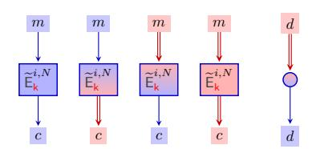

Figure 4: Pictorial notation to define processing of open versus shared data.

In prior work on the MPC evaluation of MiMC and Leg, only the fourth and, for Leg only, the third variant were discussed [GRR<sup>+</sup>16]. As we will see, the other variants are more useful when defining modes of operation, and they can have a remarkably reduced MPC complexity. Another major consideration is whether one is interested in online times subject to standard pre-processing (in which multiplication triples, random squares and random bits are prepared ahead of time), or whether one is interested in key dependent pre-processing for the specific PRF in question, or even tweak (and key) dependent pre-processing for the specific tweakable PRF in question.

In the tweakable context, we can express the design in a similar pictorial way as in Figure 5. However, the distinction as to whether the actual message is in the clear disappears, as even in this case the input to the second PRF call is made on shared data due to the need to keep the output of the first PRF shared. Thus we really only have two cases to consider for general PRFs, although specific PRFs may have additional optimizations (see below for one such optimization in the case of the Leg PRF).

#### 3.1 MiMC in MPC

Recall the MiMC PRF is defined by

$$\mathsf{E}_{\mathsf{k}}(x) = F_{\mathsf{MiMC}}(\mathbf{k}, x) = (F_{r-1} \circ F_{r-2} \circ \cdots \circ F_0)(x) + \mathbf{k}$$

where

$$F_i(x) = (x + k + c_i)^3$$
.

<span id="page-10-0"></span>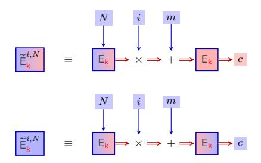

**Figure 5:** Composing a tweakable PRF from a non-tweakable PRF in the case of clear text message/shared output (resp. clear message and clear output)

Grassi et al. [GRR<sup>+</sup>16] consider two methods for computing MiMC in an MPC setting: MiMC<sup>basic</sup> and MiMC<sup>cube</sup>. Given our focus on online times for latency and throughput, only MiMC<sup>cube</sup> is of interest to us; henceforth we'll simply call it MiMC.

Using Standard Pre-Processing The computation of  $[y] \leftarrow [x] + [k] + c_i$  can always be performed locally, so of interest is the cubing  $[y^3]$ . The standard MPC method to compute MiMC uses a special pre-processed tuple  $([v], [v^2], [v^3])$  for which  $v \stackrel{\$}{\leftarrow} \mathbb{F}_p$ . This pre-processed tuple itself could be computed using squaring and multiplication during the offline phase, or it can be done in the online phase. Given this tuple, to obtain  $[y^3]$  from [y] we open z = y - v to all parties and then compute locally:

$$[y^3] = 3 \cdot z \cdot [v^2] + 3 \cdot z^2 \cdot [v] + z^3 + [v^3] \ .$$

Assuming the required r tuples  $([v], [v^2], [v^3])$  have been computed during the offline phase, the online phase reduces to one opening and one communication round per cipher round, for a total of r openings and r communication rounds for full evaluation of the cipher. If the tuple is produced in the online phase then we require  $3 \cdot r$  openings and r+1 rounds of communication (as all r tuples can be processed simultaneously). In the case where the output is in the clear we require an additional opening and round.

Using Key Dependent Pre-Processing If the input to MiMC is in the clear then a marginal improvement in performance results from the local evaluation of the first round function  $F_0([k],x)=(x+[k]+c_0)^3$ , where we need the values  $([k],[k^2],[k^3])$  to be precomputed. As the improvement is only minor over the general method above, we ignore this optimization in what follows.

**Using Tweak Dependent Pre-Processing** When evaluating the tweakable-PRF on a fixed nonce N known at pre-processing time, say N=0 or N=1, we could precompute the value of  $[M]=\mathsf{E}_{[k]}(N)$ . We treat this case as tweak dependent pre-processing, as opposed to key dependent pre-processing, as it assumes knowledge of the application usage of the PRF at pre-processing time.

#### 3.2 Leg in MPC

Recall the Leg PRF is defined by

$$\mathsf{E}_{\mathsf{k}}(x) = \mathsf{Leg}(x) = \sum_{i=0}^{L-1} 2^{i} \cdot \mathsf{Leg}_{\mathsf{bit}}(k_{i}, x) \pmod{p}$$

where  $\mathsf{k} = \{k_i\}_{i=0}^{L-1}$ . When evaluating Leg it suffices to compute the L invocations of  $\mathsf{Leg}_\mathsf{bit}$  in parallel, followed by local computations for the linear combination of the  $\mathsf{Leg}_\mathsf{bit}$  outputs into  $\mathsf{Leg}(x)$  (after all, multiplications by public constants and additions can be done locally without any interaction between parties). If the final output of  $\mathsf{Leg}$  should be in the clear, then the  $\mathsf{Leg}_\mathsf{bit}$  already may be in the clear (implicitly this observation uses that the indistinguishability of  $\mathsf{Leg}$  follows from that of  $\mathsf{Leg}_\mathsf{bit}$ ). Thus the MPC complexity of  $\mathsf{Leg}$  is equivalent to that of computing  $\mathsf{Leg}_\mathsf{bit}$  in parallel.

Note, we could use a tweak to also define the extra keys needed in the extension of  $\mathsf{Leg}_{\mathsf{bit}}$  to  $\mathsf{Leg}$ , thus saving storage at the expense of the evaluation of the tweak. Thus the tweakable  $\mathsf{Leg}$ , would be built out of a tweakable  $\mathsf{Leg}_{\mathsf{bit}}$  with two tweak inputs (one for the domain extension to  $\mathsf{Leg}$  and one for the actual tweak on the  $\mathsf{Leg}$  function itself).

Using Standard Pre-Processing Grassi et al. [GRR<sup>+</sup>16] present an efficient method to compute  $\mathsf{Leg_{bit}}$  (reproduced in Figure 6) when the input [x] and output [y] are both secret shared. Grassi et al. already observe that the two steps leading up to the computation of u can be pre-processed and that the step following the computation of u can be performed locally. The computation of u itself takes one round (containing two openings) to compute  $[t] \cdot ([k] + [x])$  and one to open the result. Thus if a fixed quadratic non-residue  $\alpha$  and the data tuples ([b], [t]) are produced during the offline phase, then the online computation of the PRF  $\mathsf{Leg_{bit}}([x])$  will require two rounds of communication and three openings. Without the special pre-processed tuples we would require an extra round and two extra openings.

<span id="page-11-0"></span>Let  $\alpha$  be a fixed, quadratic non-residue modulo p and [k] the shared secret key.

**Eval:** To evaluate  $Leg_{bit}$  on input [x] with key [k]:

- 1. Take a random square  $[s^2]$  and a random bit [b] from the offline phase.
- 2.  $[t] \leftarrow [s^2] \cdot ([b] + \alpha \cdot (1 [b]))$
- 3.  $u \leftarrow \mathsf{Open}([t] \cdot ([k] + [x]))$
- 4. Output  $[y] \leftarrow \left( \left( \frac{u}{p} \right) \cdot (2 \cdot [b] 1) + 1 \right) / 2$

**Figure 6:** Securely computing the Leg<sub>bit</sub> PRF with secret-shared input and output (Redacted copy of [GRR<sup>+</sup>16, Figure 7]).

Grassi et al. additionally suggest an alternative, conceptually easier evaluation when the input is shared but the output should be in the clear: on input [x] take a preprocessed square  $[s^2]$ , evaluate  $\mathsf{Open}([s^2]\cdot([k]+[x]))$  and output the Legendre symbol of the result. This version still requires two rounds of interaction and three openings, but it only consumes standard pre-processed data.

Using Key Dependent Pre-Processing However, the implementation suggestions by Grassi et al. are not the end of the story. We first investigate what happens when the input x is provided in the clear, and we allow key dependent pre-processing.

Our key observation is that if the input x is in the clear, then we can store  $([b], [t], [t \cdot k])$  in the offline phase. This allows simplification of Step 3 from Figure 6 to  $u \leftarrow \mathsf{Open}([t \cdot k] + x \cdot [t])$ , which requires only one round of interaction as multiplication by clear values is free. Step 4 proceeds (locally) as before, leading to a shared output.

If both input and output are in the clear, the product  $[s^2 \cdot k]$  can be preprocessed and the only online communication remaining is for  $\mathsf{Open}([s^2 \cdot k] + x \cdot [s^2])$ , namely one round and one opening. The advantage of this method over the one with shared output is a

reduction in the consumption of offline material. However, in our tweakable PRF setting we see this optimization is never used.

```
Let α be a fixed, quadratic non-residue modulo p and [ki] the shared secret key (for position i)
Preprocess: For each future evaluation prepare tuples as follows:
         1. For j ∈ {1, . . . , L}
                • Take random squares [s
                                              (n)
                                              j
                                                 2
                                                  ] and random bits [b
                                                                          (n)
                                                                          j
                                                                             ].
                • [t
                    (n)
                    j
                       ] ← [s
                              (n)
                              j
                                 2
                                  ] · ([b
                                        (n)
                                        j
                                           ] + α · (1 − [b
                                                          (n)
                                                          j
                                                             ]))
                • [(tk)
                        (n)
                           ] ← [t
                                 (n)
                                    ] · [ki]
```

2. For *i* ∈ {1*, . . . , L*}

*i*

- Take random squares [*s* (*x*) *i* 2 ] and random bits [*b* (*x*) *i* ].
- [*t* (*x*) *i* ] ← [*s* (*x*) *i* 2 ] · ([*b* (*x*) *i* ] + *α* · (1 − [*b* (*x*) *i* ]))

*i*

- [(*tk*) (*x*) *i* ] ← [*t* (*x*) *i* ] · [*ki*]
- 3. For *i, j* ∈ {1*, . . . , L*}
  - [(*tb*)*ij* ] ← [*t* (*x*) *i* ] · [*b* (*n*) *j*
- 4. Output all the shares

<span id="page-12-1"></span>3. For *i* ∈ {1*, . . . , L*}

**Eval:** To evaluate Leg on input [*x*] with key [*k*] and tweaks *i* and *N*, leading to shared output.

- 1. Retrieve a preprocessed tuple.
- <span id="page-12-2"></span>2. For *i* = *j* ∈ {1*, . . . , L*} (a) *v<sup>j</sup>* ← Open([(*tk*) (*n*) *j* ] + *N* · [*t* (*n*) *j* ]) (b) [*xt*(*x*) *i* ] ← [*x*] · [*t* (*x*) *i*
  - Locally compute [(*tL*)*i*] ← P*<sup>L</sup> <sup>j</sup>*=1 2 *j*−1 · *<sup>v</sup><sup>j</sup> p* · (2 · [(*tb*)*ij* ] − [*t* (*x*) *i* ]) + [*t* (*x*) *i* ]
  - *u<sup>i</sup>* ← Open([(*tk*) (*x*) *i* ] + [*xt*(*x*) *i* ] + *i* · [*tLi*])
  - Locally compute [*yi*] ← *ui p* · (2 · [*b* (*x*) *i* ] <sup>−</sup> 1) + 1 */*2
- 4. Output [*y*] ← P*<sup>L</sup> <sup>i</sup>*=1 2 *i*−1 · [*yi*]

**Figure 7:** Securely computing the tweakable Leg PRF with shared input, fresh *N*-tweak, and shared output.

[Figure 7](#page-12-0) presents a method to compute Leg as a whole for key dependent pre-processing of the tweakable cipher when presented with a fresh value *N*. The method presented works for a shared input [*x*], requiring multiplications in Step [2b.](#page-12-1) These can be done in parallel with the openings of Step [2a,](#page-12-2) thus for a shared input, the online costs amounts to two rounds of interaction and 3*L* + 1 openings. If *x* is clear, then Step [2b](#page-12-1) can be performed locally, reducing the total number of openings to *L* + 1; the number of rounds remains 2.

For more complicated calculations, such as re-use of the same *N* in a future *sequential* call to the tweakable PRF, some pipelining might be feasible. For instance, the respective Steps [2a](#page-12-2) can still be performed in parallel. However, the gains over a straightforward approach—treating the sequential composition of two tweakable PRF calls as three sequential PRF calls—are not worth the significant increase in consumption of pre-processed data. Whereas standard pre-processing only precomputes *O*(*L*) elements, for [Figure 7](#page-12-0) we need to pre-process *O*(*L* 2 ) elements instead. Due to the high pre-processing cost for

relatively marginal on-line gains, we discard the method of [Figure 7](#page-12-0) for the remainder of this paper.

**Using Tweak Dependent Pre-Processing** Recall that we adapted XE-tweaking of the form

$$\widetilde{\mathsf{E}}_{\mathsf{k}}^{i,N}(m) = \mathsf{E}_{\mathsf{k}}(m + (i \cdot \mathsf{E}_{\mathsf{k}}(N)))$$
 , for  $i \neq 0$  .

Due to the linearity of Leg as a function of Legbit, we are essentially interested in the evaluation of

$$\mathsf{Leg}_{\mathsf{bit}}(m + (i \cdot \mathsf{E}_{\mathsf{k}}(N))) \ ,$$

in a number of scenarios, depending on whether the input *m*, resp. output, are clear or shared, and whether *N* is fixed or fresh (we will always assume *i* to be fresh and in the clear, and *N* to be in the clear).

For the scenario with a clear input *m* and a shared output, [Figure 8](#page-13-0) presents a method to compute Legbit, when the *N* part of the tweak is fixed (and hence can be pre-processed). This method requires, in the online phase, only a single round of openings. In the case where *m* is shared, one can save pre-processing [*t* · *k*] and compute the second line of the Evaluation method by *u* ← Open([*t*] ·([*k*] + [*m*]) + *i* · [*t* · *M*])); which requires an additional round of interaction and an additional two openings.

<span id="page-13-0"></span>Let *α* be a fixed, quadratic non-residue modulo *p* and [*k*] the shared secret key.

**Preprocess:** Assume [*M*] ← E[k](*N*) has already been computed. Then for each future evaluation prepare tuples as follows:

- 1. Take a random square [*s* 2 ] and a random bit [*b*].
- 2. [*t*] ← [*s* 2 ] · ([*b*] + *α* · (1 − [*b*]))
- 3. [*t* · *k*] ← [*t*] · [*k*]
- 4. [*t* · *M*] ← [*t*] · [*M*]
- 5. Output ([*b*]*,* [*t*]*,* [*t* · *k*]*,* [*t* · *M*])

**Eval:** To evaluate Legbit on input *m* with key [*k*] and tweaks *i* and *N*, leading to shared output.

- 1. Retrieve a preprocessed tuple ([*b*]*,* [*t* · *k*]*,* [*t* · *M*])
- 2. *u* ← Open([*t* · *k*] + *m* · [*t*] + *i* · [*t* · *M*]))
- 3. Output [*y*] ← *u p* · (2 · [*b*] <sup>−</sup> 1) + 1 */*2

**Figure 8:** Securely computing the tweakable Legbit PRF with clear input, fixed *N*-tweak, and shared output.

### **3.3 Summary**

It is clear the design choices for implementation depend very much on how much specialised pre-processing one wants to perform. In the rest of this paper we restrict ourselves to the case where we allow key-dependent, but not tweak dependent pre-processing. In this context our tweakable PRF this is then produced via our non-tweakable PRF via the methodology given in [Figure 5.](#page-10-0) Note, when the message in this diagram is given in the clear, this makes *no difference* to the execution of the second PRF call, as the input is already in shared form.

In addition, any second call to the tweakable PRF with the same value *N* in the tweak can be done without the need to call the first PRF again. When the output of the tweakable PRF is to be returned in an open form, the second PRF call can be performed more efficiently in the case of Leg by using the key-dependent pre-processing variant. This leads to the online costs given in [Table 1.](#page-14-0)

<span id="page-14-0"></span>**Table 1:** Summary of costs for our PRFs MiMC and Leg. The first line for each PRF is the cost of the first such tweakable PRF call, and the second is the cost of subsequent PRF tweakable calls with the same *N* component in the tweak (clearly their is no second line when we use tweakable pre-processing). The values SP, KP, and TP stand for standard pre-processing, key dependent pre-processing and tweak dependent pre-processing. Note the costs when the input message is in the clear are identical to when the input message is in shared form. The pre-processing costs are given in the number of data items needed to be preduced by the pre-preprocessing.

|           |           | i,N<br>Ee<br>k |       | i,N<br>Ee<br>k |           |       |  |
|-----------|-----------|----------------|-------|----------------|-----------|-------|--|
|           | Rnds      | Open           | Prep  | Rnds           | Open      | Prep  |  |
|           | 2 · r + 1 | 6 · r          | 4 · r | 2 · r + 2      | 6 · r + 1 | 4 · r |  |
| MiMC (SP) | r         | 3 · r          | 2 · r | r + 1          | 3 · r + 1 | 2 · r |  |
| MiMC (TP) | r         | 3 · r          | 2 · r | r + 1          | 3 · r + 1 | 2 · r |  |
|           | 4         | 10 · L         | 8 · L | 5              | 8 · L     | 6 · L |  |
| Leg (SP)  | 2         | 5 · L          | 4 · L | 2              | 3 · L     | 2 · L |  |
|           | 3         | 4 · L          | 8 · L | 3              | 4 · L     | 6 · L |  |
| Leg (KP)  | 2         | 3 · L          | 4 · L | 2              | 3 · L     | 2 · L |  |
| Leg (TP)  | 2         | 3 · L          | 2 · L | 3              | 3 · L + 1 | 2 · L |  |

## **4 Encrypt-then-MAC in Characteristic** *p*

In this section we examine an Encrypt-then-MAC paradigm to obtain AE for messages/ciphertexts consisting of vectors in F*p*. To enable the efficient computation we select a nonce-based IND-CPA encryption mode which is highly parallel (specifically a modification of CTR mode). For the MAC algorithm we present two possibilities, a Hash-then-MAC method (which is suitable as we always MAC clear data), as well as a new MAC algorithm which we call pPMAC. Here pPMAC is the obvious port of PMAC from binary fields to the field F*p*, where we examine the PMAC proof to ensure that the scheme is still secure.

#### **4.1 Encrypt-then-MAC**

The encrypt-then-MAC paradigm originally applied probabilistic encryption followed by authentication of the resulting ciphertext [\[BN08\]](#page-28-8). The probabilistic encryption itself only needs to be PRIV or IND-CPA secure. Moving to a nonce-setting is relatively straightforward [\[NRS14\]](#page-30-4): assuming one has a MAC function, one simply needs to combine a nonce based encryption (E*,* D) scheme which is just PRIV (i.e. IND-CPA) secure, and then authenticate the nonce and the obtained ciphertext with a tag generated from a secure MAC function MacGen. This composition corresponds to scheme 'N2' as studied by Namprempre et al. [\[NRS14\]](#page-30-4). This scheme is the only one of the four secure schemes (N1 up to N4) that feeds the ciphertext as opposed to the message to the MAC function. As in our context ciphertext is in the clear whereas messages is shared—and we do not

believe that the slightly increased parallellism allowed by N1's encrypt-and-MAC approach outweighs this advantage—we opted for this N2 mode.

To obtain a nonce based scheme two variants of CTR mode are possible, either

$$\begin{split} c_i \leftarrow m_i + \widetilde{\mathsf{E}}_{\mathsf{k}}^{1,N}(i) &= m_i + \mathsf{E}_{\mathsf{k}}(i + \mathsf{E}_{\mathsf{k}}(N))), \\ c_i \leftarrow m_i + \widetilde{\mathsf{E}}_{\mathsf{k}}^{i,1}(N) &= m_i + \mathsf{E}_{\mathsf{k}}(N + i \cdot \mathsf{E}_{\mathsf{k}}(1))). \end{split}$$

The latter variants is preferred as  $\mathsf{E}_{\mathsf{k}}(1)$  can be precomputed when allowing key dependent pre-processing; it corresponds to a simplified variant of CTR-in-Tweak [PS16].

To this CTR mode nonce-based IND-CPA encryption we then add authentication via a MAC function. See Figure 9, where we use this CTR mode as the underlying encryption scheme and an arbitrary MAC function. In this figure we present the algorithm, making specific reference to what data is shared and what is open. The reader should note that in decryption we need to perform a secure comparison between the input tag (in the clear), and the computed tag (in shared form). This is easily accomplished, by opening the value  $[r] \cdot ([\mathsf{Tag'}] - \mathsf{Tag})$ , for a random value r from the pre-processing, and comparing the value to zero.

```
Given a message [\mathbf{m}] = [m_1], \ldots, [m_\ell] for m_i \in \mathbb{F}_p and a pair of keys [\mathbf{k}] = ([\mathbf{k}], [\mathbf{k}']) for the PRF \mathsf{E}_{[\mathbf{k}]}(\cdot) we define the AE mode CTR+MAC as:

 \begin{aligned}
\mathsf{AE-}\mathcal{E}_{\mathbb{F}}([\mathbf{k}], N, [\mathbf{m}]) &: & \mathsf{AE-}\mathcal{D}_{\mathbb{F}}([\mathbf{k}], N, \mathbf{c}, \mathsf{Tag}) \\
\mathsf{1:} & \mathbf{for} \ i = 1, \ell \ \mathbf{do} \\
\mathsf{2:} & [c_i] \leftarrow [m_i] + \left[\widetilde{\mathsf{E}}_{\mathsf{k}}^{i,1}(N)\right] \\
\mathsf{3:} & \mathsf{Open} \ [c_i]. \\
\mathsf{4:} & \mathsf{c} \leftarrow c_1, \ldots, c_\ell. \\
\mathsf{5:} & \mathsf{Tag} \leftarrow \mathsf{MacGen}([\mathsf{k}'], N \| \mathbf{c}). \\
\mathsf{6:} & \mathsf{Return} \ (\mathbf{c}, \mathsf{Tag}). \end{aligned} \qquad \begin{aligned}
\mathsf{AE-}\mathcal{D}_{\mathbb{F}}([\mathbf{k}], N, \mathbf{c}, \mathsf{Tag}) \\
\mathsf{1:} & \mathsf{for} \ i = 1, \ell \ \mathbf{do} \\
\mathsf{2:} & [m_i] \leftarrow c_i - \left[\widetilde{\mathsf{E}}_{\mathsf{k}}^{i,1}(N)\right] \\
\mathsf{3:} & [\mathbf{m}] \leftarrow [m_1], \ldots, [m_\ell]. \\
\mathsf{4:} & [\mathsf{Tag}'] \leftarrow \mathsf{MacGen}([\mathsf{k}'], N \| \mathbf{c}). \\
\mathsf{5:} & \mathsf{if} \ [\mathsf{Tag}'] \neq \mathsf{Tag} \ \mathsf{then} \ \mathsf{return} \ \bot. \\
\mathsf{6:} & \mathsf{Return} \ [\mathbf{m}]. \end{aligned}
```

Figure 9: AE mode CTR+MAC in the nonce-based setting

## 4.2 The PMAC Algorithm over $\mathbb{F}_p$

The original PMAC algorithm [BR02] operates (after suitable padding) on elements in the finite field  $\mathbb{F}_{2^n}$ . The algorithm makes use of various constants, which in the original PMAC are taken to be from a Gray code to enable efficient computation. In addition a "large" constant called Huge is defined, which is equal to 1/x for x being the formal root of the defining polynomial for the field. The tag is produced by utilizing an encryption function defined by  $\mathbb{E}_k(m): \mathbb{F}_{2^n} \longrightarrow \mathbb{F}_{2^n}$ .

PMAC1 [Rog04] is a conceptually simpler version of PMAC that recasts the masked blockcipher calls as direct, tweakable blockcipher ones instead. This abstraction is especially potent when moving to  $\mathbb{F}_p$  and using a tweakable PRF. As we will be using  $\mathbb{F}_p^{\times}$  as tweak space, we can set Huge = p-1 (to be used by the final  $\widetilde{\mathsf{E}}$  call) and use tweak i to process message block  $m_i$ , for  $i \in \{1, \ldots, p-2\}$ . Hence our  $\mathbb{F}_p$  variant of PMAC1, henceforth referred to as pPMAC, takes in a message which is at most p-2 finite field elements long and produces an element of the finite field  $\mathbb{F}_p$  as final tag; the precise pPMAC algorithm is given in Figure 10.

While the security of PMAC over  $\mathbb{F}_{2^n}$  has achieved ample attention [MM07, DY15, LPSY16], the security for our pPMAC version doesn't seem to follow directly from prior work. Hence we present Theorem 2 to bound an adversary's distinguishing advantage.

```
The algorithm pPMAC-Gen(k, m) is defined by:

1: Write \mathbf{m} as \ell finite field elements m_1, \ldots, m_\ell where m_i \in \mathbb{F}_p.

2: if \ell \geq p then return \perp.

3: for i = 1, \ell - 1 do

4: Y_i \leftarrow \widetilde{\mathsf{E}}_k^{i,0}(m_i)

5: \Sigma \leftarrow Y_1 + \cdots + Y_{\ell-1} + m_\ell

6: \mathsf{Tag} \leftarrow \widetilde{\mathsf{E}}_k^{p-1,0}(\Sigma).
```

**Figure 10:** pPMAC in  $\mathbb{F}_p$

Luckily, the proof is a fairly straightforward adaptation of Rogaway's [Rog04, Section 11], where the use of a tweakable PRF instead of a tweakable blockcipher allows some simplifications and tightening of the bound.

<span id="page-16-1"></span>**Theorem 2.** Let  $\mathcal{A}$  be a PRF-adversary against pPMAC making q queries having a total message length of  $\sigma$  finite field elements. Then there exists an adversary  $\mathcal{B}$  attacking  $\widetilde{\mathsf{E}}$  making at most  $\sigma+q$  oracle queries and running in time comparable to that of  $\mathcal{A}$  such that

$$\mathsf{Adv}^{\mathsf{prf}}_{\mathsf{pPMAC}[\widetilde{\mathsf{E}}]}(\mathcal{A}) \leq \mathsf{Adv}^{\mathsf{tprf}}_{\widetilde{\mathsf{E}}}(\mathcal{B}) + \frac{q(q-1)}{2p}.$$

*Proof.* Let  $G_0$  be the original pPMAC game and let  $G_1$  be the game with the keyed  $\widetilde{\mathsf{E}}$  replaced by an ideal tweakable random function. Let  $\mathcal{B}$  be the adversary against  $\widetilde{\mathsf{E}}$  that runs  $\mathcal{A}$  and uses its  $\widetilde{\mathsf{E}}$  oracle to evaluate pPMAC for  $\mathcal{A}$ , then

$$\Pr\big[\,\mathcal{A}^{G_0} \Rightarrow 1\,\big] - \Pr\big[\,\mathcal{A}^{G_1} \Rightarrow 1\,\big] = \mathsf{Adv}^{\mathsf{tprf}}_{\widetilde{\mathsf{E}}}(\mathcal{B}) \;,$$

where the number of  $\widetilde{\mathsf{E}}$  calls induced by  $\mathcal{A}$ 's queries is at most  $\sigma + q$  and  $\mathcal{B}$ 's overhead otherwise is minimal.

Let  $G_2$  be the game where bad is set if two inputs cause colliding final  $\widetilde{\mathbb{E}}$  calls (with tweak Huge). As the tweak Huge cannot be used for any other  $\widetilde{\mathbb{E}}$  calls, if no such collisions appear we can replace the tag output by a freshly drawn  $\mathbb{F}_p$  elements in  $G_2$ . Then  $G_1$  and  $G_2$  are identical until bad. Morever, to analyse the probability that  $\mathcal{A}$  sets bad in  $G_2$  we may restrict without loss of generality to non-adaptive adversaries.

For any given pair of distinct queries, there has to be at least one  $\widetilde{E}$  call that is made with distinct inputs (if the messages are identical until the final message block, no collision is possible). For a collision to occur, fix the outputs for all the other message blocks (of this query pair) and one of the distinct message blocks of the colliding pair, then the  $\widetilde{E}$  value (for the corresponding distinct input) has to hit a specific value, which happens only with probability 1/p. A union bound over all  $\binom{q}{2}$  pairs results in the stated bound.

In an MPC context, we are primarily interested in an implementation where both the message and the tag are available in the clear, as our use case concentrates on the Encrypt-then-MAC setting where pPMAC will be applied on an already opened ciphertext. Figure 11 shows the implications for the underlying tweakable PRF calls, in the key dependent pre-processing setting. Note that the 'N'-tweak is fixed to N=0 which allows preprocessing of  $[M]=\mathsf{E}_{[k]}(0)$  as required in each call to  $\widetilde{\mathsf{E}}_{[k]}^{i,0}(m)$ . Also, notice that a naive implementation of the tweakable PRF will result that the remaining PRF applications will be on shared inputs even if m itself is clear, courtesy of [M] being shared. When combined with our CTR mode encryption we obtain an AE method given in Figure 12.

<span id="page-17-0"></span>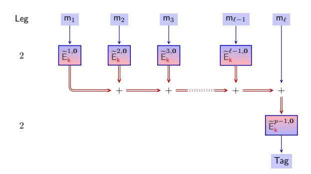

**Figure 11:** Implementing pPMAC in MPC for clear inputs and clear outputs. The number of rounds of interaction for the Leg tweakable PRF using key dependent pre-processing are given to the left.

#### 4.3 Hash-then-MAC

Whilst having pPMAC as a general MAC function might be useful in some other contexts, in terms of creating a MAC for use in an Encrypt-then-MAC AE scheme the pPMAC function is overkill. A simpler alternative, described in Figure 13 is to simply hash the clear ciphertext values  $c_i$  and then apply a single invocation of the PRF to the output Note, the tweak N value can be the same for this PRF call, as for the PRF calls in the CTR mode.

One has to convert the output of the hash function function H into an element modulo p, so it can be passed into our PRF. We require that the value passed to the PRF satisfies the collision resistance property. If H is chosen to be a standard hash function such as SHA-256 or SHA-3, then simply truncating the hash value to  $\log_2 p$  bits and treating the result as an integer modulo p will suffice.

<span id="page-18-0"></span>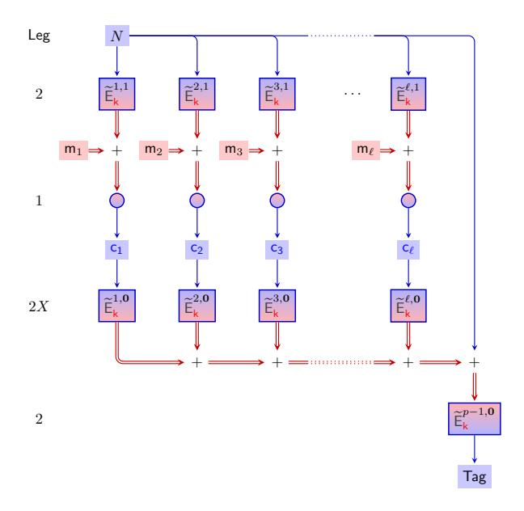

**Figure 12:** CTR+pPMAC Encryption Mode. The number of rounds of interaction for the Leg tweakable PRF using key dependent pre-processing are given to the left.

<span id="page-18-1"></span>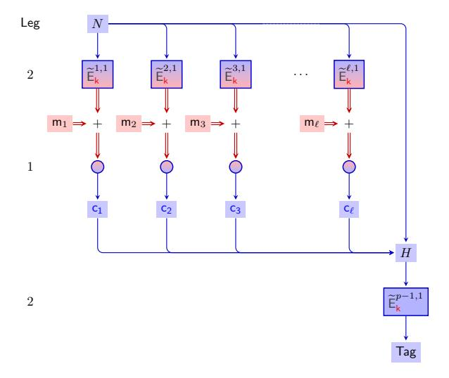

**Figure 13:** CTR and Hash-then-MAC Encryption Mode The number of rounds of interaction for the Leg tweakable PRF using key dependent pre-processing are given to the left.

## 5 OTR in Characteristic p

OTR is a nonce-based AE mode of operation for blockciphers [Min14]. It has a number of advantages that make it eminently suitable for adaptation to an MPC context, in particular its use of the forward direction of the blockcipher only (even for decryption) and its high level of parallellization for both encryption and decryption. The original OTR mode allows the encryption of arbitrary length bitstrings using arbitrary length bitstrings of associated data. In this section we will adapt Minematsu's OTR to encrypt arbitrary vectors of  $\mathbb{F}_p$  elements based on a tweakable pseudorandom function, where we discard any associated data. Consequently, much of the complexity of the original OTR, for instance related to padding to some multiple of the blocklength, disappears. Although OTR strictly speaking is a blockcipher mode of operation, Minematsu already presents OTR as a tweakable blockcipher mode of operation instantiated with a specific tweakable blockcipher. Our version of  $\mathbb{F}_p$  will be based on this perspective, making use of an  $\mathbb{F}_p$ tweakable PRF  $\tilde{E}$  (which need not need be invertible). The tweaks needed in our  $\mathbb{F}_n$  variant are fairly straightforward. This contrasts with a relatively complex tweak schedule in the original OTR to avoid colliding masks over the finite field  $\mathbb{F}_{2^n}$  (cf. [BS16]). Finally, in order to present a cleaner implementation we removed the final block switch.

```
1: Write \mathbf{m} as \ell finite field elements m_1, \dots, m_\ell

2: if \ell \geq p/2 then return \perp.

3: \Sigma \leftarrow 0 where m_i \in \mathbb{F}_p.

4: for i = 1, \lfloor \ell/2 \rfloor do

5: c_{2 \cdot i - 1} \leftarrow \widetilde{\mathsf{E}}_k^{2 \cdot i - 1, N}(m_{2 \cdot i - 1}) + m_{2 \cdot i}

6: c_{2 \cdot i} \leftarrow \widetilde{\mathsf{E}}_k^{2 \cdot i, N}(c_{2 \cdot i - 1}) + m_{2 \cdot i - 1}

7: \Sigma \leftarrow \Sigma + m_{2 \cdot i}

8: if \ell is odd then

9: c_{\ell} \leftarrow \widetilde{\mathsf{E}}_k^{\ell, N}(0) + m_{\ell}

10: \Sigma \leftarrow \Sigma + m_{\ell}

11: \mathbf{c} \leftarrow (c_1, \dots, c_{\ell})

12: \mathsf{Tag} \leftarrow \widetilde{\mathsf{E}}_k^{-\ell, N}(\Sigma)

13: return (\mathbf{c}, \mathsf{Tag})
```

**Figure 14:** The Algorithm OTR-E $(N, \mathbf{m})$

Our modified construction is presented in Figure 14 and Figure 15: encryption takes the key k as well as a nonce  $N \in \mathbb{F}_p$  and a message  $\mathbf{m} \in \mathbb{F}_p^*$ , producing a ciphertext  $\mathbf{c} \in \mathbb{F}_p^*$  and a tag Tag  $\in \mathbb{F}_p$ , whereas decryption takes the key k as well as  $N \in \mathbb{F}_p$ , a ciphertext  $\mathbf{c}$ , and a tag Tag to produce a message  $\mathbf{m}$  (or an invalid ciphertext symbol  $\bot$ ). Encryption only works for messages with fewer than p/2 elements, with longer messages (and ciphertexts) rejected out of hand.

A diagramatic representation of encryption is given in Figure 16, where we additionally highlight some MPC implementation details. OTR's core encryption component is a two-round Feistel structure, Here one cannot use an output in the clear for the PRF—which would potentially be faster, especially for Leg—as this would be tantamount to using a public string as one-time pad and hence woefully insecure.

Decryption follows in a similar manner, see Figure 17. Note that, as for our previous MAC-then-Encrypt constructions, a secure comparison is needed to process the computed tag in the decryption algorithm.

```
1: Write c as \ell finite field elements c_1, \ldots, c_\ell where c_i \in \mathbb{F}_p.
   2: if \ell \geq p/2 then return \perp.
   3: \Sigma \leftarrow 0
   4: for i = 1, \lfloor \ell/2 \rfloor do
                    m_{2\cdot i-1} \leftarrow c_{2\cdot i} - \widetilde{\mathsf{E}}_{\mathsf{k}}^{2\cdot i,N}(c_{2\cdot i-1}) \\ m_{2\cdot i} \leftarrow c_{2\cdot i-1} - \widetilde{\mathsf{E}}_{\mathsf{k}}^{2\cdot i-1,N}(m_{2\cdot i-1})
                     \Sigma \leftarrow \Sigma + m_{2\cdot i}
   7:
   8: if \ell is odd then
                     m_{\ell} \leftarrow c_{\ell} - \widetilde{\mathsf{E}}_{\mathsf{k}}^{\ell,N}(0)
   9:
                     \Sigma \leftarrow \Sigma + m_{\ell}
 10:
11: \mathbf{m} \leftarrow (m_1, \dots, m_\ell)
12: \mathsf{Tag}' \leftarrow \widetilde{\mathsf{E}}_{\mathsf{k}}^{-\ell, N}(\Sigma)
13: if \mathsf{Tag}' = \mathsf{Tag} then
14:
                     return m
 15: return \perp
```

**Figure 15:** The Algorithm OTR-D $(N, \mathbf{c}, \mathsf{Tag})$

<span id="page-20-1"></span>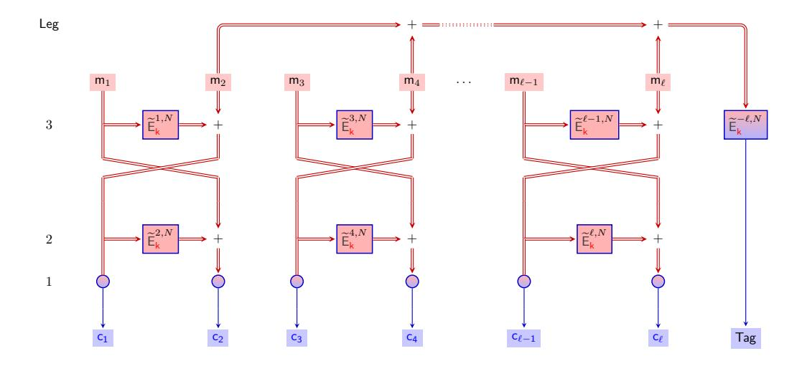

**Figure 16:** The OTR encryption mode. On the left hand side we present the number of rounds of interaction of each stage for the Leg PRF, assuming key dependent preprocessing.

#### 5.1 Security of pOTR

Minematsu proved that the original (bit-oriented) OTR is a secure AEAD scheme against nonce-respecting adversaries. Our modified  $\mathbb{F}_p$  largely inherits the original properties, but for completeness we provide the relevant theorems and proofs below, where we of course draw heavily on Minematsu's work. For OTR's security analysis Minematsu uses an alternative and conceptually cleaner mode, dubbed  $\mathbb{OTR}$  [Min14, Fig. 5], that is based on a tweakable n-bit URF. This mode already matches ours a lot closer, as we use a tweakable PRF and the switch from a tweakable PRF to a tweakable URF is standard (incurring precisely the tweakable PRF advantage). We will ignore the parameter  $\tau$  (in  $\mathbb{OTR}[\tau]$ ) for the length of tags, as it becomes moot in our  $\mathbb{F}_p$  setting. Minematsu additionally introduces  $\mathbb{OTR}'$ , but in the absence of associated data this mode collapses to  $\mathbb{OTR}$ . Thus we can safely refer to the security result for  $\mathbb{OTR}'$  [Min14, Theorem 3] and its proof [Min14, Appendix A]. The proof for privacy is essentially unchanged (and still straightforward),

whereas for authenticity we can simplify the proof considerably as there are fewer cases to consider due to our switch from bitstrings to elements of  $\mathbb{F}_p$ .

**Theorem 3.** Let  $\mathcal{A}$  be a PRIV adversary against OTR making q queries having a total message length of  $\sigma$  finite field elements. Then there exists an adversary  $\mathcal{B}$  attacking  $\widetilde{\mathsf{E}}$  making at most  $\sigma+q$  oracle queries and running in time comparable to that of  $\mathcal{A}$  such that

$$\mathsf{Adv}^{\mathsf{priv}}_{\mathsf{OTR}}(\mathcal{A}) \leq \mathsf{Adv}^{\mathsf{tprf}}_{\widetilde{\mathsf{E}}}(\mathcal{B})$$

*Proof.* The first, standard step is to substitute the tweakable PRF with its ideal cousin, the tweakable URF, throughout. An adversary  $\mathcal{A}$  that could distinguish between these two worlds can be turned into a reduction  $\mathcal{B}$  that wins the PRF's security game by explicitly evaluating the OTR construction using a tweakable PRF/URF oracle. A counting exercise will show that  $\mathcal{A}$ 's queries to the construction induce exactly  $\sigma + q$  queries to the underlying tweakable primitive.

With the tweakable URF in place, the key observation is that  $\mathcal{A}$  is nonce-respecting and that, for the encryption of a single message, the tweaks count from  $1,\ldots,\ell$  and, as we enforce  $\ell < p/2$ , the tweak  $-\ell$  used for authentication will be distinct from these tweaks (modulo p). Consequently, each tweak (i,N) is used at most once and we can replace the outputs of the tweakable URF with independently and uniformly drawn  $\mathbb{F}_p$  elements, ignoring the input. These random  $\mathbb{F}_p$  elements act as a one-time pad; inspection shows that all ciphertext elements  $c_i$  as well as the Tag are thus affected, making them perfectly indistinguishable from independently and uniformly drawn  $\mathbb{F}_p$  elements as desired.

**Theorem 4.** Let  $\mathcal{A}$  be an AUTH adversary against OTR making  $q_e$  encryption queries and  $q_v$  decryption queries, jointly having a total message length of  $\sigma$  finite field elements. Then there exists an adversary  $\mathcal{B}$  attacking  $\widetilde{\mathsf{E}}$  making at most  $\sigma + q_e + q_v$  oracle queries and running in time comparable to that of  $\mathcal{A}$  such that

$$\mathsf{Adv}^{\mathsf{auth}}_{\mathsf{OTR}[\widetilde{\mathsf{E}}]}(\mathcal{A}) \leq \mathsf{Adv}^{\mathsf{tprf}}_{\widetilde{\mathsf{E}}}(\mathcal{B}) + 3q_v/p$$

*Proof.* Again, the first, standard step is to substitute the tweakable PRF with its ideal cousin, the tweakable URF  $\widetilde{\mathsf{R}}$ , throughout, incurring the same term as in the bound above.

With the tweakable URF in place, Minematsu's original security proof consists of a number of steps. Firstly, we only need to consider an adversary making a single forgery attempt using the decryption oracle, so  $q_v = 1$ , and then extend it to an arbitrary number of decryptions using a standard guessing argument [BGM04]. Furthermore, without loss of generality, we may assume that  $\mathcal{A}$  makes all its encryption queries before the final decryption query.

We denote the adversary's forgery attempt by  $(N', \mathbf{c}', \mathsf{Tag}')$ . For the forgery to be counted, it needs to be fresh, that is  $(N', \mathbf{c}', \mathsf{Tag}') \neq (N_j, \mathbf{c}_j, \mathsf{Tag}_j)$  for all encryption queries  $j \in [1, \ldots, q]$ . As for each nonce and ciphertext vector there is one unique valid tag (by inspection of the decryption algorithm), we in fact need that  $(N', \mathbf{c}') \neq (N_j \mathbf{c}_j)$  for all j. For the forgery attempt  $(N', \mathbf{c}')$ , we will use  $\mathsf{Tag}^*$  to denote the unique valid tag corresponding to it, whereas for all internal variables related to  $(N', \mathbf{c}')$  we will use a prime, for instance  $m_1'$  for the first tentative message block and  $\Sigma'$  for the unique input (used by decryption) to the tweakable URF that produces  $\mathsf{Tag}^*$ .

The adversary's advantage is upper bounded by the maximum probability it can find a forgery  $(N', \mathbf{c}', \mathsf{Tag}')$  given an transcript of encryption queries  $\{(N_j, \mathbf{m}_j, \mathbf{c}_j, T_j)\}, j \in [1, \ldots, q]$ . Here the maximum is over all possible transcript and the probability is over the 'residual' randomness of the tweakable URF, that is to sample the tweakable URF on values that are needed to evaluate  $\mathsf{Tag}^*$  and have not yet been sampled during the encryption queries. As is customary, at this stage we can restrict to deterministic, computationally unbounded adversaries.

To upper bound this maximum probability  $\mathsf{FP}_{\mathbf{z}}$ , we will consider four cases (down from the original's 13): the forgery uses a fresh nonce; the forgery uses a nonce for an encryption query and matches the *even* message length; the forgery uses a past nonce and matches the *odd* message length; and finally the forgery uses a past nonce, but using a different message length.

Case 1:  $N' \neq N_j$  for all  $j \in [1, ..., q]$ .

In this case, during decryption the tweak is fresh and hence the  $\mathsf{Tag}^*$  will be an independent, uniformly random value, so the probability that  $\mathsf{Tag}'$  is correct satisfies  $\mathsf{FP}_{\mathbf{z}} = 1/p$ .

Case 2:  $N' = N_j$  with  $|\mathbf{c}'| = |\mathbf{c}_j|$ , even, for some  $j \in [1, ..., q]$ .

Let's write  $(c'_1, \ldots, c'_\ell)$  for  $\mathbf{c}'$  and  $(c_1, \ldots, c_\ell)$  for  $\mathbf{c}_j$ , so dropping the j index. As  $\mathbf{c}' \neq \mathbf{c}$  we know that for some i it holds that  $c'_i \neq c_i$ , where we will concentrate on the largest such i. As  $\ell$  is even, all ciphertext blocks come with a 'twin' that is processed as part of the same Feistel structure. Let  $h = \lceil (i+1)/2 \rceil$ , then the indices of the two blocks (i.e. i and its twin) are 2h - 1 and 2h. For the remainder of this case analysis, we will deal with this structure only, ignoring whether both of only one (and which) of the ciphertext blocks differ between  $\mathbf{c}'$  and  $\mathbf{c}_j$ .

Figure 17 provides an overview of how decryption works, where we annotated three special collision events:  $e_3$  corresponds to the event  $\mathsf{Tag}^* = \mathsf{Tag}'$ ,  $e_2$  corresponds to the event that  $\Sigma' = \Sigma_j$ , and finally  $e_1$  corresponds to the event that  $m'_{2 \cdot h - 1} = m_{2 \cdot h - 1}$ . Our overall strategy will be to bound

$$FP_{\mathbf{z}} \le Pr[e_3] \le Pr[e_3|\neg e_2] + Pr[e_2|\neg e_1] + Pr[e_1]$$
,

where all constituent three probabilities turn out to be at most 1/p, so the sum is at most 3/p.

Let's start with  $\Pr[e_3|\neg e_2]$ . In this case,  $\mathsf{Tag}^*$  is the result of a fresh query  $\widetilde{\mathsf{R}}^{\langle \mathsf{N}, -\ell \rangle}(\Sigma')$ , so the probability that it hits the adversary's  $\mathsf{Tag}'$  is exactly 1/p.

If on the other hand  $e_2$  occurred, then  $\mathsf{Tag}^* = \mathsf{Tag}_j$  so if the adversary had indeed set  $\mathsf{Tag}' = \mathsf{Tag}_j$ , the forgery attempt will be successful. To bound the probability of  $e_2$  occurring, we go back to the point where  $m'_{2\cdot h}$  gets added to the checksum. Let's denote with  $\Sigma_{h-1}$  the checksum so far (for the j-the query) and with  $\Sigma_h$  the checksum after adding  $m_{2\cdot h}$ , with similar primed notation for the values when running decryption on the forgery attempt. Then  $e_2$  occurs iff  $\Sigma_h = \Sigma'_h$ .

Tracing through the decryption algorithm (and see Figure 17) tells us that

$$\begin{split} m_{2\cdot h-1}' &= c_{2\cdot h}' - \widetilde{\mathsf{R}}^{\langle \mathsf{N}, 2\cdot \mathsf{h}\rangle}(m_{2\cdot h}') \text{ and} \\ m_{2\cdot h}' &= c_{2\cdot h-1}' - \widetilde{\mathsf{R}}^{\langle \mathsf{N}, 2\cdot \mathsf{h}-1\rangle}(m_{2\cdot h-1}') \end{split}$$

and therefore that

$$\begin{split} \Sigma_h &= \Sigma_h' \\ \Sigma_{h-1} + m_{2 \cdot h} &= \Sigma_{h-1}' + m_{2 \cdot h}' \\ \Sigma_{h_1} + m_{2 \cdot h} &= \Sigma_{h-1}' + c_{2 \cdot h-1}' - \widetilde{\mathsf{R}}^{\langle \mathsf{N}, 2 \cdot \mathsf{h} - 1 \rangle} (m_{2 \cdot h-1}') \\ \widetilde{\mathsf{R}}^{\langle \mathsf{N}, 2 \cdot \mathsf{h} - 1 \rangle} (m_{2 \cdot h-1}') &= \Sigma_{h-1}' - \Sigma_{h_1} + c_{2 \cdot h-1}' - m_{2 \cdot h} \end{split}$$

If  $e_1$  didn't occur, the  $\widetilde{\mathsf{R}}^{\langle \mathsf{N}, 2 \cdot \mathsf{h} - 1 \rangle}(m'_{2' \cdot h - 1})$  call is fresh, so the probability it hits the value on the right hand side is exactly 1/p.

Finally, we are left with the event  $e_1$ , namely that  $m'_{2\cdot h-1} = m_{2\cdot h-1}$ . Although it is not a given that an adversary will be able to turn this event into a forgery, we are generously granting a win regardless. We will assume that  $c'_{2\cdot h-1} \neq c_{2\cdot h-1}$ , because otherwise the event  $e_1$  is not possible (by inspection). Our assumption implies that the  $\widetilde{\mathsf{R}}^{\langle \mathsf{N}, 2\cdot \mathsf{h}\rangle}(c'_{2\cdot h-1})$  call is fresh, and since it needs to hit a unique value in order for  $e_1$  to occur,  $e_1$  happens with probability 1/p.

Case 3:  $N' = N_j$  with  $|\mathbf{c}'| = |\mathbf{c}_j|$ , odd, for some  $j \in [1, ..., q]$ .

As before, we write  $(c'_1, \ldots, c'_{\ell})$  for  $\mathbf{c}'$  and  $(c_1, \ldots, c_{\ell})$  for  $\mathbf{c}_j$ , so dropping the j index. As  $\mathbf{c}' \neq \mathbf{c}$  we know that for some i it holds that  $c'_i \neq c_i$ , where we will concentrate on the largest such i, where we use a special ordering that makes the final, odd block  $(i = \ell)$  the smallest. If, under this ordering,  $i > \ell$  there is a difference in one of the blocks used in the Feistel structure and the analysis for  $\ell$  even from above applies. Otherwise if  $i = \ell$ , the *only* difference occurs for the  $\ell$ <sup>th</sup> block, so  $c'_{\ell} \neq c_{\ell}$ . Observing that

$$m'_{\ell} = c'_{\ell} - \widetilde{\mathsf{R}}^{\langle \mathsf{N}, \ell \rangle}(0)$$
 and  $m_{\ell} = c_{\ell} - \widetilde{\mathsf{R}}^{\langle \mathsf{N}, \ell \rangle}(0)$

we obtain that  $m'_{\ell}$  and  $m_{\ell}$  always differ, and as a consequence so will  $\Sigma'$  and  $\Sigma$ . This means that  $\mathsf{Tag}^* = \widetilde{\mathsf{R}}^{\langle \mathsf{N}, -\ell \rangle}(\Sigma')$  is the result of a fresh call, hitting the adversary's  $\mathsf{Tag}'$  with probability exactly 1/p.

Case 4:  $N' = N_j$  with  $|\mathbf{c}'| \neq |\mathbf{c}_j|$  for some  $j \in [1, ..., q]$ . The length  $\ell' = |\mathbf{c}'|$  is used as part of the tweak for the final  $\widetilde{\mathsf{R}}$  call, as  $\mathsf{Tag}^* = \widetilde{\mathsf{R}}^{\langle \mathsf{N}, -\ell' \rangle}(\Sigma')$ . Irrespective of  $\Sigma'$ , this  $-\ell' \neq -\ell_j$  and therefore the tweak  $(N, -\ell')$  is fresh and the output  $\mathsf{Tag}^*$  is random and independent, hitting the adversary's  $\mathsf{Tag}'$  with probability exactly 1/p.

<span id="page-23-0"></span>Overall we obtain that  $\mathsf{FP}_{\mathbf{z}} \leq 3/p$  gives an AUTH bound for any number of queries  $q_v$  greater or equal than one, and so  $\mathsf{Adv}^{\mathsf{auth}}_{\mathbb{OTR}}(\mathcal{A}) \leq 3q_v/p$ .

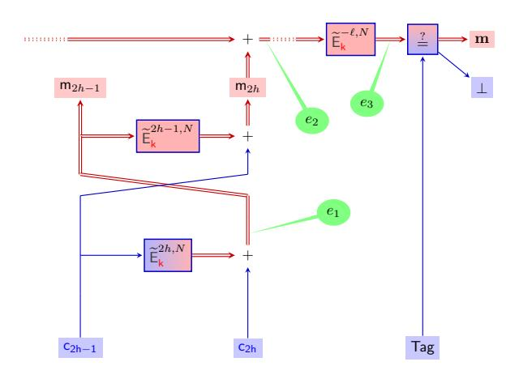

Figure 17: The OTR decryption case.

## 6 Experimental Results

We consider two measurements latency and throughput, with various message lengths. Latency shows the total time required for a message to be encrypted and authenticated

whereas throughput gives the maximum number of executions which can be done in parallel. The experiments were ran between two machines each with Intel i7-4790 CPUs running at 3.60GHz, 16GB of RAM connected through a LAN network of 1Gbps with an average ping of 0.3ms (roundtrip) and implemented using the SPDZ software<sup>2</sup>. WAN experiments were simulated using Linux tc tool with an average ping latency of 100ms (roundtrip). To give precise timings, each experiment was averaged with at least 5 executions where each execution authenticated at least 1000 messages. We choose to exclude the times in the online phase for computing the key dependent pre-processing such as  $\mathsf{E}_{\mathsf{k}}(0)$  or  $\mathsf{E}_{\mathsf{k}}(1)$  since this is done just once before the start of authentication.

Table 2 contains the preprocessing costs for encryption (similar costs apply for decryption). For this we counted the number of triples and bits required to evaluate each mode of operation instantiated with different PRF's, these costs are given in terms of the message length  $\ell$ ; i.e. the number of finite field elements being encrypted. For Leg we assume a finite field size of  $p\approx 2^{128}$ , where p is chosen such that we can select L=128 in the construction of the Leg PRF. The amount of data sent per party and computational cost is estimated, in the table, using the currently best-known method for producing triples and bits in  $\mathbb{F}_p$  with active security [KOS16]. According to [KOS16] bits and triples have the same cost in arithmetic circuits  $\mathbb{F}_p$  so we merge the costs into one column which is called Triples. As expected, OTR has a lower preprocessing cost, than using CTR+pPMAC, since the number of PRF calls is reduced by half compared to pPMAC. Whilst CTR+HtMAC is slightly better than OTR in terms of pre-processing costs.

<span id="page-24-1"></span>**Table 2:** Preprocessing costs for Encryption using OTR, CTR+pPMAC, and CTR+Hash-then-MAC (HtMAC) in MPC for an  $\ell$  length message.

| PRF  | Mode      | Triples                 |
|------|-----------|-------------------------|
| Leg  | CTR+pPMAC | $1024 \cdot \ell - 256$ |
| MiMC | CTR+pPMAC | $292\cdot\ell$          |
| Leg  | CTR+HtMAC | $512 \cdot \ell + 128$  |
| MiMC | CTR+HtMAC | $146 \cdot \ell + 146$  |
| Leg  | OTR       | $512 \cdot \ell + 728$  |
| MiMC | OTR       | $146 \cdot \ell + 292$  |

<span id="page-24-2"></span>**Table 3:** Preprocessing cost (MBytes) and throughput (seconds) for encrypting message blocks of size  $\ell$ , with two parties over a LAN and a simulated WAN network using CTR+HtMAC and MASCOT [KOS16].

|                              |   | PRF         | $\ell = 1$    | 2              | 4              | 8              | 16              | 32               |
|------------------------------|---|-------------|---------------|----------------|----------------|----------------|-----------------|------------------|
| MBytes<br>per party          | { | Leg<br>MiMC | 14.42<br>6.58 | 25.95<br>9.87  | 49.02<br>16.45 | 95.16<br>29.60 | 187.43<br>55.91 | 371.98<br>108.54 |
| LAN Throughput<br>per second | { | Leg<br>MiMC | 7.57<br>16.58 | 4.20<br>11.05  | 2.23<br>6.63   | 1.15<br>3.68   | $0.58 \\ 1.95$  | 0.29<br>1.00     |
| WAN Throughput<br>per second | { | Leg<br>MiMC | 0.38<br>0.82  | $0.21 \\ 0.55$ | 0.11<br>0.33   | $0.06 \\ 0.18$ | 0.03<br>0.10    | 0.01<br>0.05     |

For the case of CTR and Hash-then-MAC in Table 3 we give what these offline estimates would translate into in terms of MBytes of communication per party and throughput per

<span id="page-24-0"></span><sup>&</sup>lt;sup>2</sup>https://github.com/bristolcrypto/SPDZ-2

second, for varying values of the number of message blocks *`* for a LAN and WAN setting. These numbers are derived from the estimates in the MASCOT paper [\[KOS16\]](#page-29-11), which is currently the most efficient offline processing step for engines such as SPDZ. In [Table 4](#page-25-0) we present our results for the online phase, in terms of latency and throughput for CTR and Hash-then-MAC, in the LAN and WAN setting.

<span id="page-25-0"></span>**Table 4:** Online phase latency (ms) and best throughput (seconds) for encrypting message blocks of size *`*, with two parties over a LAN and a simulated WAN network, using CTR+HtMAC.

|                |   | PRF  | ` = 1 | 2     | 4     | 8     | 16    | 32    |
|----------------|---|------|-------|-------|-------|-------|-------|-------|
| LAN Latency    | n | Leg  | 1.17  | 1.97  | 2.75  | 4.61  | 8.20  | 15.68 |
| (ms)           |   | MiMC | 6.63  | 13.27 | 13.42 | 13.74 | 14.25 | 15.35 |
| WAN Latency    | n | Leg  | 154   | 256   | 258   | 262   | 274   | 295   |
| (ms)           |   | MiMC | 3760  | 7521  | 7521  | 7521  | 7521  | 7523  |
| LAN Throughput | n | Leg  | 1389  | 895   | 527   | 285   | 149   | 76    |
| per second     |   | MiMC | 8853  | 5697  | 3589  | 2010  | 1079  | 561   |
| WAN Throughput | n | Leg  | 151   | 100   | 59    | 33    | 17    | 8     |
| per second     |   | MiMC | 428   | 234   | 203   | 127   | 74    | 39    |

In [Table 5](#page-25-1) we present the online costs, as a function of *`* for our various constructions. For each variant we give the number of rounds and the number of openings. As we have selected highly parallel modes of operation, the round complexity does not depend on the message length. Intuitively, the online round complexity should define the latency of a protocol and the online opening complexity should define the throughput. However, due to the nature of actual physical networks we expect that as soon as we reach the maximum capacity of the network, in terms of data sent (i.e. openings) per round, the latency will drop off rapidly. Thus as *`* increases we expect to see an increase in latency, despite latency "theoretically" being a constant. The key question is then how big does *`* need to be before the latency for a specific PRF and mode decreases linearly in *`*?

**Table 5:** Online Costs for OTR and CTR+pPMAC in MPC.

<span id="page-25-1"></span>

| PRF  | Mode      | Online cost      |                      |  |
|------|-----------|------------------|----------------------|--|
|      |           | Rounds (Enc/Dec) | Openings             |  |
| Leg  | CTR+pPMAC | 7/6              | 768 · ` + `          |  |
| MiMC | CTR+pPMAC | 221/147          | 146 · ` + ` + 1      |  |
| Leg  | CTR+HtMAC | 5/4              | 384 · (` + 1) + `    |  |
| MiMC | CTR+HtMAC | 148/75           | 73 · (` + 1) + ` + 1 |  |
| Leg  | OTR       | 6/9              | 384 · (` + 128) + `  |  |
| MiMC | OTR       | 220/295          | 73 · (` + 2) + ` + 1 |  |

To investigate this potential drop off in latency we carried out experiments in the LAN setting, the results of which are detailed in [Figure 18](#page-26-0) (for small messages) and [Figure 19](#page-26-1) (for long messages for the MiMC PRF). We see that despite ciphers based on the Leg PRF having lower round complexity, this does not translate into low latency as soon as the size of *`* increases. For small values of *`* we do benefit from using Leg, but not for larger values. This is because we reach network capacity for only a few parallel calls to Leg; as evaluting the PRF itself takes up a lot of network capacity. On the other hand

<span id="page-26-0"></span>with MiMC we require more rounds, but in each round we need to send much less data, so even as *`* increases the latency does not increase that much. Eventually we see that for large messages MiMC ends up having the same growth as we experience with Leg for smaller messages.

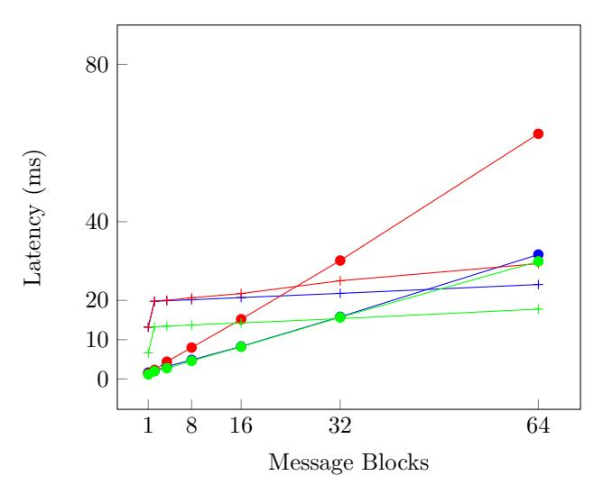

**Figure 18:** Latency of Encryption for OTR vs CTR+pPMAC vs CTR+Hash-then-MAC with MiMC and Leg. In this and in other figures in this section: OTR is marked in blue, CTR+pMAC is marked in red, and CTR+Hash-then-MAC is marked in Green. Use of the Leg PRF is marked with a dot on the line, and use of the MiMC PRF is marked with a cross.

<span id="page-26-1"></span>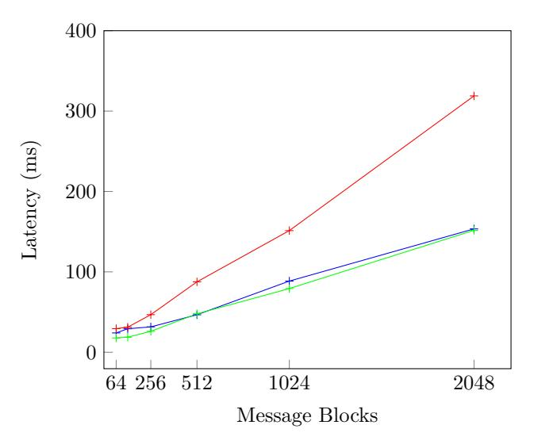

**Figure 19:** Latency of Encryption for OTR vs CTR+pPMAC vs CTR+HtMAC with MiMC, for large message sizes.

In [Figure 20](#page-27-2) and [Figure 21](#page-27-3) we examine throughput for both Leg and MiMC in the LAN setting. Not surprisingly for all options throughput decreases as *`* increases, and we get a better throughput if we select MiMC and use the CTR+HtMAC cipher. Indeed contrary to the conclusion in [\[GRR](#page-29-4)<sup>+</sup>16] we conclude that MiMC is better than Leg for both throughput and latency. The primary reason for this conclusion is that, unlike the

<span id="page-27-2"></span>work in [\[GRR](#page-29-4)<sup>+</sup>16], we consider how these MPC-friendly PRFs work in a larger application and not in isolation.

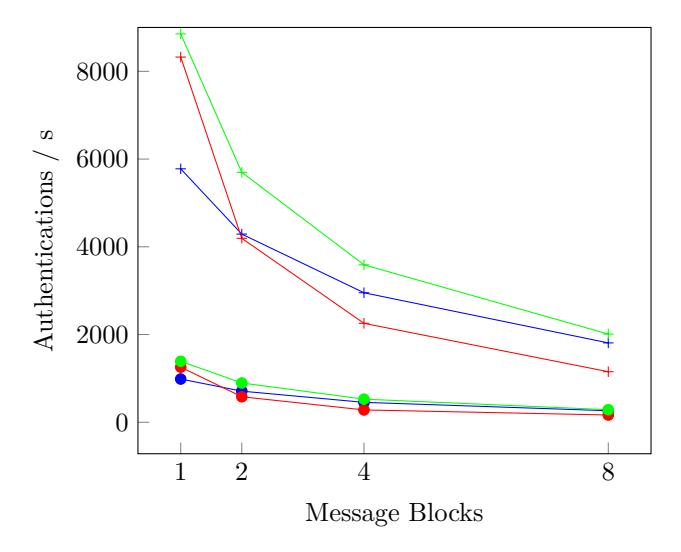

<span id="page-27-3"></span>**Figure 20:** Throughput of OTR vs CTR+pPMAC vs CTR+HtMAC with MiMC and Leg

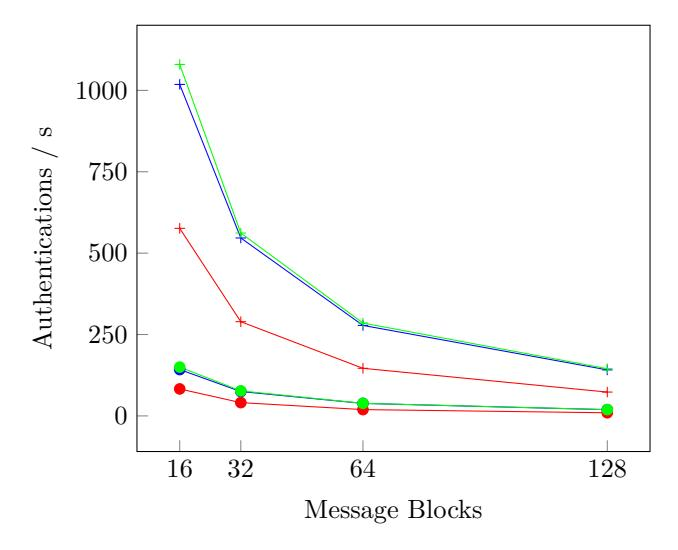

**Figure 21:** Throughput of OTR vs CTR+pPMAC vs CTR+HtMAC with MiMC and Leg

## **References**

<span id="page-27-0"></span>[AGR<sup>+</sup>16] Martin R. Albrecht, Lorenzo Grassi, Christian Rechberger, Arnab Roy, and Tyge Tiessen. MiMC: Efficient encryption and cryptographic hashing with minimal multiplicative complexity. In Jung Hee Cheon and Tsuyoshi Takagi, editors, *ASIACRYPT 2016, Part I*, volume 10031 of *LNCS*, pages 191–219. Springer, Heidelberg, December 2016.

<span id="page-27-1"></span>[ARS<sup>+</sup>15] Martin R. Albrecht, Christian Rechberger, Thomas Schneider, Tyge Tiessen, and Michael Zohner. Ciphers for MPC and FHE. In Elisabeth Oswald and

- Marc Fischlin, editors, *EUROCRYPT 2015, Part I*, volume 9056 of *LNCS*, pages 430–454. Springer, Heidelberg, April 2015.
- <span id="page-28-0"></span>[BCG<sup>+</sup>12] Julia Borghoff, Anne Canteaut, Tim Güneysu, Elif Bilge Kavun, Miroslav Knežević, Lars R. Knudsen, Gregor Leander, Ventzislav Nikov, Christof Paar, Christian Rechberger, Peter Rombouts, Søren S. Thomsen, and Tolga Yalçin. PRINCE - A low-latency block cipher for pervasive computing applications - extended abstract. In Xiaoyun Wang and Kazue Sako, editors, *ASIACRYPT 2012*, volume 7658 of *LNCS*, pages 208–225. Springer, Heidelberg, December 2012.
- <span id="page-28-2"></span>[BDOZ11] Rikke Bendlin, Ivan Damgård, Claudio Orlandi, and Sarah Zakarias. Semihomomorphic encryption and multiparty computation. In Kenneth G. Paterson, editor, *EUROCRYPT 2011*, volume 6632 of *LNCS*, pages 169–188. Springer, Heidelberg, May 2011.
- <span id="page-28-10"></span>[BGM04] Mihir Bellare, Oded Goldreich, and Anton Mityagin. The power of verification queries in message authentication and authenticated encryption. Cryptology ePrint Archive, Report 2004/309, 2004. <http://eprint.iacr.org/2004/309>.
- <span id="page-28-8"></span>[BN08] Mihir Bellare and Chanathip Namprempre. Authenticated encryption: Relations among notions and analysis of the generic composition paradigm. *Journal of Cryptology*, 21(4):469–491, October 2008.
- <span id="page-28-4"></span>[BR02] John Black and Phillip Rogaway. A block-cipher mode of operation for parallelizable message authentication. In *International Conference on the Theory and Applications of Cryptographic Techniques*, pages 384–397. Springer, 2002.
- <span id="page-28-9"></span>[BS16] Raphael Bost and Olivier Sanders. Trick or tweak: On the (in)security of OTR's tweaks. In Jung Hee Cheon and Tsuyoshi Takagi, editors, *ASIACRYPT 2016, Part I*, volume 10031 of *LNCS*, pages 333–353. Springer, Heidelberg, December 2016.
- <span id="page-28-5"></span>[CCF<sup>+</sup>16] Anne Canteaut, Sergiu Carpov, Caroline Fontaine, Tancrède Lepoint, María Naya-Plasencia, Pascal Paillier, and Renaud Sirdey. Stream ciphers: A practical solution for efficient homomorphic-ciphertext compression. In Thomas Peyrin, editor, *FSE 2016*, volume 9783 of *LNCS*, pages 313–333. Springer, Heidelberg, March 2016.
- <span id="page-28-7"></span>[Cv07] Andrew M. Childs and Wim van Dam. Quantum algorithm for a generalized hidden shift problem. In Nikhil Bansal, Kirk Pruhs, and Clifford Stein, editors, *18th SODA*, pages 1225–1232. ACM-SIAM, January 2007.
- <span id="page-28-6"></span>[Dam90] Ivan Damgård. On the randomness of legendre and jacobi sequences. In Shafi Goldwasser, editor, *CRYPTO'88*, volume 403 of *LNCS*, pages 163–172. Springer, Heidelberg, August 1990.
- <span id="page-28-3"></span>[DGKN09] Ivan Damgård, Martin Geisler, Mikkel Krøigaard, and Jesper Buus Nielsen. Asynchronous multiparty computation: Theory and implementation. In Stanislaw Jarecki and Gene Tsudik, editors, *PKC 2009*, volume 5443 of *LNCS*, pages 160–179. Springer, Heidelberg, March 2009.
- <span id="page-28-1"></span>[DK10] Ivan Damgård and Marcel Keller. Secure multiparty AES. In Radu Sion, editor, *FC 2010*, volume 6052 of *LNCS*, pages 367–374. Springer, Heidelberg, January 2010.

- <span id="page-29-2"></span>[DKL<sup>+</sup>12] Ivan Damgård, Marcel Keller, Enrique Larraia, Christian Miles, and Nigel P. Smart. Implementing AES via an actively/covertly secure dishonest-majority MPC protocol. In Ivan Visconti and Roberto De Prisco, editors, *SCN 12*, volume 7485 of *LNCS*, pages 241–263. Springer, Heidelberg, September 2012.
- <span id="page-29-6"></span>[DKL<sup>+</sup>13] Ivan Damgård, Marcel Keller, Enrique Larraia, Valerio Pastro, Peter Scholl, and Nigel P. Smart. Practical covertly secure MPC for dishonest majority or: Breaking the SPDZ limits. In Jason Crampton, Sushil Jajodia, and Keith Mayes, editors, *ESORICS 2013*, volume 8134 of *LNCS*, pages 1–18. Springer, Heidelberg, September 2013.
- <span id="page-29-8"></span>[DLR16] Sébastien Duval, Virginie Lallemand, and Yann Rotella. Cryptanalysis of the FLIP family of stream ciphers. In Matthew Robshaw and Jonathan Katz, editors, *CRYPTO 2016, Part I*, volume 9814 of *LNCS*, pages 457–475. Springer, Heidelberg, August 2016.
- <span id="page-29-1"></span>[DPAR00] J. Daemen, M. Peeters, G. Van Assche, and V. Rijmen. Nessie Proposal: Noekeon, 2000.
- <span id="page-29-5"></span>[DPSZ12] Ivan Damgård, Valerio Pastro, Nigel P. Smart, and Sarah Zakarias. Multiparty computation from somewhat homomorphic encryption. In Reihaneh Safavi-Naini and Ran Canetti, editors, *CRYPTO 2012*, volume 7417 of *LNCS*, pages 643–662. Springer, Heidelberg, August 2012.
- <span id="page-29-9"></span>[DY15] Nilanjan Datta and Kan Yasuda. Generalizing PMAC under weaker assumptions. In Ernest Foo and Douglas Stebila, editors, *ACISP 15*, volume 9144 of *LNCS*, pages 433–450. Springer, Heidelberg, June / July 2015.
- <span id="page-29-4"></span>[GRR<sup>+</sup>16] Lorenzo Grassi, Christian Rechberger, Dragos Rotaru, Peter Scholl, and Nigel P. Smart. MPC-friendly symmetric key primitives. In Edgar R. Weippl, Stefan Katzenbeisser, Christopher Kruegel, Andrew C. Myers, and Shai Halevi, editors, *ACM CCS 16*, pages 430–443. ACM Press, October 2016.
- <span id="page-29-11"></span>[KOS16] Marcel Keller, Emmanuela Orsini, and Peter Scholl. MASCOT: Faster malicious arithmetic secure computation with oblivious transfer. In Edgar R. Weippl, Stefan Katzenbeisser, Christopher Kruegel, Andrew C. Myers, and Shai Halevi, editors, *ACM CCS 16*, pages 830–842. ACM Press, October 2016.
- <span id="page-29-0"></span>[LK06] Chae Hoon Lim and Tymur Korkishko. mCrypton - a lightweight block cipher for security of low-cost RFID tags and sensors. In Jooseok Song, Taekyoung Kwon, and Moti Yung, editors, *WISA 05*, volume 3786 of *LNCS*, pages 243–258. Springer, Heidelberg, August 2006.
- <span id="page-29-10"></span>[LPSY16] Atul Luykx, Bart Preneel, Alan Szepieniec, and Kan Yasuda. On the influence of message length in PMAC's security bounds. In Marc Fischlin and Jean-Sébastien Coron, editors, *EUROCRYPT 2016, Part I*, volume 9665 of *LNCS*, pages 596–621. Springer, Heidelberg, May 2016.
- <span id="page-29-3"></span>[LR15] Yehuda Lindell and Ben Riva. Blazing fast 2PC in the offline/online setting with security for malicious adversaries. In Indrajit Ray, Ninghui Li, and Christopher Kruegel:, editors, *ACM CCS 15*, pages 579–590. ACM Press, October 2015.
- <span id="page-29-7"></span>[Min14] Kazuhiko Minematsu. Parallelizable rate-1 authenticated encryption from pseudorandom functions. In Phong Q. Nguyen and Elisabeth Oswald, editors, *EUROCRYPT 2014*, volume 8441 of *LNCS*, pages 275–292. Springer, Heidelberg, May 2014.

- <span id="page-30-3"></span>[MJSC16] Pierrick Méaux, Anthony Journault, François-Xavier Standaert, and Claude Carlet. Towards stream ciphers for efficient FHE with low-noise ciphertexts. In Marc Fischlin and Jean-Sébastien Coron, editors, *EUROCRYPT 2016, Part I*, volume 9665 of *LNCS*, pages 311–343. Springer, Heidelberg, May 2016.
- <span id="page-30-8"></span>[MM07] Kazuhiko Minematsu and Toshiyasu Matsushima. New bounds for PMAC, TMAC, and XCBC. In Alex Biryukov, editor, *FSE 2007*, volume 4593 of *LNCS*, pages 434–451. Springer, Heidelberg, March 2007.
- <span id="page-30-5"></span>[NK95] Kaisa Nyberg and Lars R. Knudsen. Provable security against a differential attack. *Journal of Cryptology*, 8(1):27–37, 1995.
- <span id="page-30-1"></span>[NNOB12] Jesper Buus Nielsen, Peter Sebastian Nordholt, Claudio Orlandi, and Sai Sheshank Burra. A new approach to practical active-secure two-party computation. In Reihaneh Safavi-Naini and Ran Canetti, editors, *CRYPTO 2012*, volume 7417 of *LNCS*, pages 681–700. Springer, Heidelberg, August 2012.
- <span id="page-30-4"></span>[NRS14] Chanathip Namprempre, Phillip Rogaway, and Thomas Shrimpton. Reconsidering generic composition. In Phong Q. Nguyen and Elisabeth Oswald, editors, *EUROCRYPT 2014*, volume 8441 of *LNCS*, pages 257–274. Springer, Heidelberg, May 2014.
- <span id="page-30-7"></span>[PS16] Thomas Peyrin and Yannick Seurin. Counter-in-tweak: Authenticated encryption modes for tweakable block ciphers. In Matthew Robshaw and Jonathan Katz, editors, *CRYPTO 2016, Part I*, volume 9814 of *LNCS*, pages 33–63. Springer, Heidelberg, August 2016.
- <span id="page-30-0"></span>[PSSW09] Benny Pinkas, Thomas Schneider, Nigel P. Smart, and Stephen C. Williams. Secure two-party computation is practical. In Mitsuru Matsui, editor, *ASI-ACRYPT 2009*, volume 5912 of *LNCS*, pages 250–267. Springer, Heidelberg, December 2009.
- <span id="page-30-2"></span>[Rog04] Phillip Rogaway. Efficient instantiations of tweakable blockciphers and refinements to modes OCB and PMAC. In Pil Joong Lee, editor, *ASIACRYPT 2004*, volume 3329 of *LNCS*, pages 16–31. Springer, Heidelberg, December 2004.
- <span id="page-30-6"></span>[vDHI03] Wim van Dam, Sean Hallgren, and Lawrence Ip. Quantum algorithms for some hidden shift problems. In *14th SODA*, pages 489–498. ACM-SIAM, January 2003.