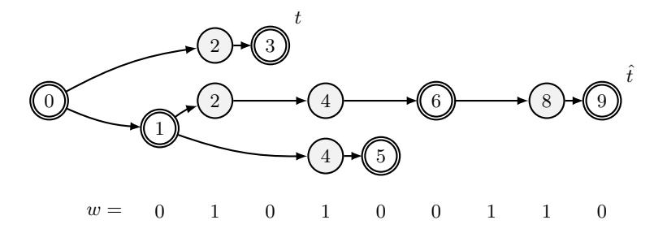
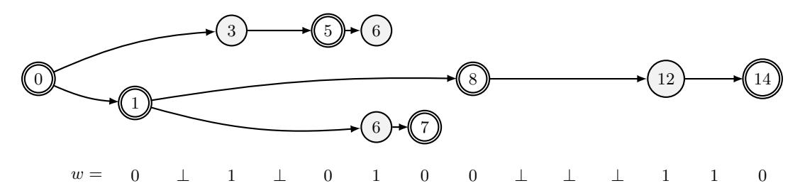
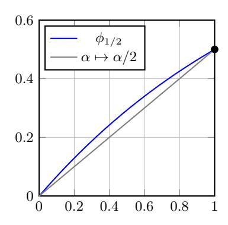

# Ouroboros Praos: An adaptively-secure, semi-synchronous proof-of-stake blockchain

Bernardo David⋆ , Peter Gaˇzi⋆⋆, Aggelos Kiayias⋆ ⋆ ⋆, and Alexander Russell† April 27, 2023

Abstract. We present "Ouroboros Praos", a proof-of-stake blockchain protocol that, for the first time, provides security against fully-adaptive corruption in the semi-synchronous setting: Specifically, the adversary can corrupt any participant of a dynamically evolving population of stakeholders at any moment so long as the stakeholder distribution maintains an honest majority of stake; furthermore, the protocol tolerates an adversarially-controlled message delivery delay unknown to protocol participants.

To achieve these guarantees we formalize and realize in the universal composition setting a suitable form of forward secure digital signatures and a new type of verifiable random function that maintains unpredictability under malicious key generation. Our security proof develops a general combinatorial framework for the analysis of semi-synchronous blockchains that may be of independent interest. We prove our protocol secure under standard cryptographic assumptions in the random oracle model.

# 1 Introduction

The design of proof-of-stake blockchain protocols was identified early on as an important objective in blockchain design; a proof-of-stake blockchain substitutes the costly proof-of-work component in Nakamoto's blockchain protocol [\[Nak08\]](#page-32-0) while still providing similar guarantees in terms of transaction processing in the presence of a dishonest minority of users, where this "minority" is to be understood here in the context of stake rather than computational power.

The basic stability and security properties of blockchain protocols were first rigorously formulated in [\[GKL15\]](#page-31-0) and further studied in [\[KP15,](#page-31-1)[PSs17\]](#page-32-1); these include common prefix, chain quality and chain growth and refer to resilient qualities of the underlying data structure of the blockchain in the presence of an adversary that attempts to subvert them.

Proof-of-stake protocols typically possess the following basic characteristics. Based on her local view, a party is capable of deciding, in a publicly verifiable way, whether she is permitted to produce the next block. Assuming the block is valid, other parties update their local views by adopting the block, and proceed in this way continuously. At any moment, the probability of being permitted to issue a block is proportional to the relative stake a player has in the system, as reported by the blockchain itself.

A particularly challenging design aspect is that the above probabilistic mechanism should be designed so that the adversary cannot bias it to its advantage. As the stake shifts, together with the evolving population of stakeholders, so does the honest majority assumption, and hence the function that appoints stakeholders should continuously take the ledger status into account. Preventing the biasing of the election mechanism in a context of a blockchain protocol is a delicate task that so far has eluded a practical solution that is secure against all attacks.

Our Results. We present "Ouroboros Praos", a provably secure proof-of-stake protocol that is the first to be secure against adaptive attackers and scalable in a truly practical sense. Our protocol is based on a previous proof-of-stake protocol, Ouroboros [\[KRDO17\]](#page-31-2), as its analysis builds on some of the core combinatorial arguments that were developed to analyze that scheme. Nevertheless,

⋆ IT University of Copenhagen, bernardo@bmdavid.com.

⋆⋆ IOG, peter.gazi@iohk.io. Work partly done while the author was a postdoc at IST Austria, supported by the ERC consolidator grant 682815-TOCNeT.

⋆ ⋆ ⋆ University of Edinburgh and IOG. akiayias@inf.ed.ac.uk. Work partly supported by H2020 Project #653497, PANORAMIX.

† University of Connecticut and IOG. acr@cse.uconn.edu. This material is based upon work supported by the National Science Foundation under Grant No. 1717432.

the protocol construction has a number of novel elements that require a significant recasting and generalization of the previous combinatorial analysis. In more detail, our results are as follows.

In Ouroboros Praos, deciding whether a certain participant of the protocol is eligible to issue a block is decided via a private test that is executed locally using a special verifiable random function (VRF) on the current time-stamp and a nonce that is determined for a period of time known as an "epoch". A special feature of this VRF primitive, novel to our approach, is that the VRF must have strong security characteristics even in the setting of malicious key generation: specifically, if provided with an input that has high entropy, the output of the VRF is unpredictable even when an adversary has subverted the key generation procedure. We call such VRF functions "VRF with unpredictability under malicious key generation" and we present a strong embodiment of this notion with a novel Universal Composable (UC) formulation. We also present a very efficient realization of this primitive under the Computational Diffie Hellman (CDH) assumption in the random oracle model. Beyond this VRF notion, we also formalize in a UC fashion key evolving signatures that provide the forward security that is necessary for handling the adaptive corruption setting.

In more detail, we analyze our protocol in the partial or semi-synchronous model [\[DLS88,](#page-31-3)[PSs17\]](#page-32-1). In this setting, we still divide the protocol execution in time units which, as in [\[KRDO17\]](#page-31-2), are called slots, but there is a maximum delay of ∆ slots that is applied to message delivery and it is unknown to the protocol participants.[1](#page-1-0) In order to cope with the ∆-semisynchronous setting we introduce the concept of "empty slots" which occur with sufficient frequency to enable short periods of silence that facilitate synchronization. This feature of the protocol gives also its moniker, "Praos", meaning "mellow", or "gentle". Ensuring that the adversary cannot exploit the stakeholder keys that it possesses to confuse or out-maneuver the honest parties, we develop a combinatorial analysis to show that the simple rule of following the longest chain still enables the honest parties to converge to a unique view with high probability. To accomplish this we revisit and expand the forkable strings and divergence analysis of [\[KRDO17\]](#page-31-2). We remark that significant alterations are indeed necessary: As we demonstrate in Appendix [D,](#page-36-0) the protocol of [\[KRDO17\]](#page-31-2) and its analysis are critically tailored to synchronous operation and is susceptible to a desynchronization attack that can completely violate the common prefix property. Our new combinatorial analysis introduces a new concept of characteristic strings and "forks" that reflects silent periods in protocol execution and network delays. To bound the density of forkable strings in this ∆-semisynchronous setting we establish a syntactic reduction from ∆-semisynchronous characteristic strings to synchronous strings of [\[KRDO17\]](#page-31-2) that preserves the structure of the forks they support. This is followed by a probabilistic analysis that controls the distortion caused by the reduction and concludes that ∆-semisynchronous forkable strings are rare. Finally, we control the effective power of adaptive adversaries in this setting with a stochastic dominance argument that permits us to carry out the analysis of the underlying blockchain guarantees (e.g., common prefix) with a single distribution that provably dominates all distributions on characteristic strings generated by adaptive adversaries. We remark that these arguments yield graceful degradation of the analysis as a function of network delays (∆), in the sense that the effective stake of the adversary is amplified by a function of ∆.

The above combinatorial analysis is nevertheless only sufficient to provide a proof of the static stake case, i.e., the setting where the stake distribution relevant to the honest majority assumption remains fixed at the onset of the computation and prior to the selection of the random genesis data that are incorporated in the genesis block. For a true proof-of-stake system, we must permit the set of stakeholders to evolve over time and appropriately adapt our honest stakeholder majority assumption. Achieving this requires a bootstrapping argument that allows the protocol to continue unboundedly by revising its stakeholder distribution as it evolves. We bootstrap our protocol in two conceptual steps. First we show how bootstrapping is possible if a randomness beacon is available to all participants. At regular intervals the beacon can be trusted to emit a new random value; the participants can then reseed the election process so the stakeholder distribution used for sampling can be brought closer to the one that is current. A key observation here is that our protocol is resilient even if the randomness beacon is weakened in the following two ways: (i) it leaks its value to the adversary ahead of time by a bounded number of time units, (ii) it allows the adversary to reset its value if it wishes within a bounded time window. We call the resulting primitive a

1 It is worth pointing out that the notion of slots we use in this work can be substantially shorter in terms of real time elapsed compared to the slots of [\[KRDO17\]](#page-31-2), where each slot represented a full round of interaction between all participants.

"leaky resettable beacon" and show that our bootstrapping argument still holds in this stronger adversarial setting.

In the final refinement of our protocol, we show how it is possible to implement the leaky resettable beacon via a simple algorithm that concatenates the VRF outputs that were contributed by the participants from the blockchain and subjects them to a hash function that is modeled as a random oracle. This implementation explains the reasons behind the beacon relaxation we introduced: leakiness stems from the fact that the adversary can complete the blockchain segment that determines the beacon value before revealing it to the honest participants, while resettability stems from the fact that the adversary can try a bounded number of different blockchain extensions that will stabilize the final beacon value to a different preferred value.

Putting all the above together, we show how our protocol provides a "robust transaction ledger" in the sense that an immutable record of transactions is built that also guarantees that new transactions will be always included. Our security definition is in the ∆-semisynchronous setting with full adaptive corruptions. As mentioned above, security degrades gracefully as ∆ increases, and this parameter is unknown to the protocol participants.

Note that implementing the beacon via hashing VRF values will make feasible a type of "grinding attack" where the adversary can trade hashing power for a slight bias of the protocol execution to its advantage. We show how this bias can be controlled by suitably increasing the relevant parameters depending on the hashing power that is available to the adversary.

Comparison to related work. The idea of proof-of-stake protocols has been discussed extensively in the bitcoin forum.[2](#page-2-0) The manner that a stakeholder determines eligibility to issue a block is always publicly verifiable and the proof of eligibility is either computed publicly (via a calculation that is verifiable by repeating it) or by using a cryptographic mechanism that involves a secret-key computation and a public-key verification. The first example of the former approach appeared in PPCoin [\[KN12\]](#page-31-4), and was followed by others including Ouroboros and Snow White [\[BGM14](#page-31-5)[,KRDO17,](#page-31-2)[DPS19\]](#page-31-6); while the first example of the latter approach (that we also employ in our work) appeared in NXT (cf. Section 2.4.1 of [\[Com14\]](#page-31-7)) and was then also used elsewhere, most notably in Algorand [\[Mic16\]](#page-32-2). The virtue of the latter approach is exactly in its potential to control adaptive corruptions: due to the fact that the adversary cannot predict the eligibility of a stakeholder to issue a block prior to corrupting it, she cannot gain an advantage by directing its corruption quota to specific stakeholders. Nevertheless, none of these previous works isolated explicitly the properties of the primitives that are required to provide a full proof of security in the setting of adaptive corruptions. Injecting high quality randomness in the PoS blockchain was proposed by Bentov et al. [\[BLMR14](#page-31-8)[,BGM16\]](#page-31-9), though their proposal does not have a full formal analysis. The Ouroboros proof-of-stake protocol [\[KRDO17\]](#page-31-2) is provably secure in a corruption model that excludes fully adaptive attacks by imposing a corruption delay on the corruption requests of the adversary. The Snow White proof-of-stake [\[DPS19\]](#page-31-6) is the first to prove security in the ∆-semi-synchronous model but—as in the case of Ouroboros—adopts a weak adaptive corruption model.

A recent work close to ours is Algorand [\[Mic16\]](#page-32-2) that also provides a proof-of-stake ledger that is adaptively secure. It follows an entirely different construction approach that runs a Byzantine agreement protocol for every block and achieves adaptive-corruption security via a novel, appealing concept of player-replaceability. However, Algorand is only secure against a 1/3 adversary bound; and while the protocol itself is very efficient, it yields an inherently slower block production rate compared to an "eventual consensus" protocol (like Bitcoin, Snow White, and Ouroboros). In principle, proof-of-stake blockchain protocols can advance at the theoretical maximum speed (of one block per communication round), while protocols relying on Byzantine agreement, like Algorand, would require a larger number of rounds to settle each block.

Sleepy consensus [\[PS17\]](#page-32-3) puts forth a technique for handling adaptive corruptions in a model that also encompasses fail-stop and recover corruptions; however, the protocol can be applied directly only in a static stake (i.e., permissioned) setting. We note that in fact our protocol can be also proven secure in such mixed corruption setting, where both fail-stop and recover as well as Byzantine corruptions are allowed (with the former occurring at an arbitrarily high rate); nevertheless this is out of scope for the present exposition and we omit further details.

2 Refer e.g., to the posts by QuantumMechanic and others from 2011 [https://bitcointalk.org/index.](https://bitcointalk.org/index.php?topic=27787.0) [php?topic=27787.0](https://bitcointalk.org/index.php?topic=27787.0) (Last Accessed 19/09/2017).

Note that the possibility of adversarial grinding in Ouroboros Praos is also present in previous work that derives randomness by hashing [\[Mic16,](#page-32-2)[DPS19\]](#page-31-6), as opposed to a dedicated coin-tossing protocol as in [\[KRDO17\]](#page-31-2). Following the examples of [\[Mic16](#page-32-2)[,DPS19\]](#page-31-6), we show that security can be guaranteed despite any adversarial bias resulting from grinding. In fact, we show how to use the q-bounded model of [\[GKL15\]](#page-31-0) to derive a bound that shows how to increase the relevant security parameters given the hashing power that is available to the adversary.

Finally, in the present exposition we also put aside incentives; nevertheless, it is straightforward to adapt the mechanism of input endorsers from the protocol of [\[KRDO17\]](#page-31-2) to our setting and its approximate Nash equilibrium analysis can be ported directly.

## 2 Preliminaries

Throughout the paper, let N = {0, 1, 2, . . .} denote the set of natural numbers (including zero). We say a function negl(x) is negligible if, for every c > 0, there exists an n > 0 such that negl(x) < 1/xc for all x ≥ n. The length of a string w is denoted by |w|; ε denotes the empty string, and v ∥ w denotes concatenation of strings.

#### 2.1 The Semi-Synchronous Model

On a high level, we consider the security model of [\[KRDO17\]](#page-31-2) with simple modifications to account for adversarially-controlled message delays and immediate adaptive corruption. Namely, we allow the adversary A to selectively delay any messages sent by honest parties for up to ∆ ∈ N slots; and corrupt parties without delay.

Time and slots. We consider a setting where time is divided into discrete units called slots that are indexed by natural numbers. We often use the notation sl, sli , etc. to denote variables representing slot numbers. Players are equipped with (roughly) synchronized clocks that indicate the current slot: we assume that any clock drift is subsumed in the slot length.

Security Model. We adopt the model introduced by [\[GKL15\]](#page-31-0) for analyzing security of blockchain protocols enhanced with an ideal functionality F. We note that multiple different "functionalities" can be encompassed by F. In our model we employ the "Delayed Diffuse" functionality, which allows for adversarially-controlled delayed delivery of messages diffused among stakeholders.

The Diffuse Functionality. This functionality is parameterized by ∆ ∈ N and denoted as DDiffuse∆. It maintains rounds, executing one round per slot. DDiffuse∆ interacts with the environment Z, stakeholders U1, . . . , Un and an adversary A, proceeding as follows for each round:

- 1. DDiffuse∆ maintains an incoming string for each party Ui that participates. A party, if activated, is allowed at any moment to fetch the contents of its incoming string, hence one may think of this as a mailbox. Furthermore, parties can give an instruction to the functionality to diffuse a message. Activated parties are allowed to diffuse once in a round.
- 2. When the adversary A is activated, it is allowed to: (a) Read all inboxes and all diffuse requests and deliver messages to the inboxes in any order it prefers; (b) For any message m obtained via a diffuse request and any party Ui , A may move m into a special string delayedi instead of the inbox of Ui . A can decide this individually for each message and each party; (c) For any party Ui , A can move any message from the string delayedi to the inbox of Ui .
- 3. At the end of each round, the functionality also ensures that every message that was either (a) diffused in this round and not put to the string delayedi or (b) removed from the string delayedi in this round is delivered to the inbox of party Ui . If any message currently present in delayedi was originally diffused at least ∆ slots ago, then the functionality removes it from delayedi and appends it to the inbox of party Ui , being available to Ui by the beginning of next round.
- 4. Upon receiving (Create, U, C) from the environment, the functionality spawns a new stakeholder with chain C as its initial local chain (as it was the case in [\[KRDO17\]](#page-31-2)).

Protocol Execution and Adaptive Corruptions. Given the above we will assume that the execution of the protocol is with respect to a functionality F that incorporates DDiffuse as well as possibly additional functionalities to be explained in the following sections. The environment issues transactions on behalf of any stakeholder Ui by requesting a signature on the transaction as described in Protocol πSPoS of Figure [4](#page-11-0) and handing the transaction to stakeholders to put them into blocks. Beyond any restrictions imposed by F, the adversary can only corrupt a stakeholder Ui if it is given permission by the environment Z running the protocol execution. The permission is in the form of a message (Corrupt, Ui) which is provided to the adversary by the environment. Upon receiving permission from the environment, the adversary immediately corrupts Ui without any delay, differently from [\[KRDO17](#page-31-2)[,DPS19\]](#page-31-6), where corruptions only take place after a given delay. Note that a corrupted stakeholder Ui will relinquish its entire state to A; from this point on, the adversary will be activated in place of the stakeholder Ui . The adversary is able to control transactions and blocks generated by corrupted parties by interacting with FDSIG,FKES and FVRF, as described in Protocol πSPoS of Section [3.](#page-5-0) In summary, regarding activations we have the following: (a) At each slot, the environment Z activates all honest stakeholders.[3](#page-4-0) (b) The adversary is activated at least as the last entity in each slot (as well as during all adversarial party activations and invocations from the ideal functionalities as prescribed); (c) If a stakeholder does not fetch in a certain slot the messages written to its incoming string from the diffuse functionality they are flushed.

Restrictions imposed on the environment. It is easy to see that the model above confers such sweeping power on the adversary that one cannot establish any significant guarantees on protocols of interest. It is thus important to restrict the environment suitably (taking into account the details of the protocol) so that we may be able to argue security. We require that in every slot, at most a minority fraction δ < 1/2 of the stake is controlled by the adversary in the view of any honest stakeholder; for a value δ to be specified later as part of the protocol analysis. If this is violated, an event Badδ becomes true for the given execution. When the environment spawns a new stakeholder by sending message (Create, U, C) to the Key and Transaction functionality, the initial local chain C can be the chain of any honest stakeholder even in the case of "lazy honest" stakeholders as described in Appendix [H,](#page-41-0) without requiring this stakeholder to have been online in the past slot as in [\[KRDO17\]](#page-31-2). Finally, we note that in all of our proofs, whenever we say that a property Q holds with high probability over all executions, we will in fact argue that Q ∨ Badδ holds with high probability over all executions. This captures the fact that we exclude environments and adversaries that trigger Badδ with non-negligible probability.

Random Oracle. We also assume the availability of a random oracle. As usually, this is a function H: {0, 1} ∗ → {0, 1} w available to all parties that answers every fresh query with an independent, uniformly random string from {0, 1} w, while any repeated queries are answered consistently.

Erasures. We assume that honest users can carry out secure erasure, a standard assumption for protocols with security against adaptive adversaries; see, for example, [\[Lin09\]](#page-32-4).

#### 2.2 Transaction Ledger Properties

We adopt the same definitions for transaction ledger properties as [\[KRDO17\]](#page-31-2). A protocol Π implements a robust transaction ledger provided that the ledger that Π maintains is divided into "blocks" attributed to slots so that each slot is associated with at most one ledger block; this association then determines the order with which transactions are incorporated in the ledger. It should also satisfy the following two properties.

Persistence with parameter k ∈ N. Once a node of the system proclaims a certain transaction tx in the stable part of its ledger, the remaining nodes, if queried, will either report tx in the same position of that ledger or report a stable ledger which is a prefix of that ledger. Here the notion of stability is a predicate that is parameterized by a security parameter k; specifically, a transaction is declared stable if and only if it is in a block that is more than k blocks deep in the ledger.

3 We assume this to simplify our formal treatment, a variant of our protocol can actually accommodate "lazy honesty" as introduced in [\[Mic16\]](#page-32-2). In this variant, honest stakeholders only come online at the beginning of each epoch and at a few infrequent, predictable moments, see Appendix [H.](#page-41-0)

**Liveness with parameter**  $u \in \mathbb{N}$ . If all honest nodes in the system attempt to include a certain transaction then, after the passing of time corresponding to u slots (called the transaction confirmation time), all nodes, if queried and responding honestly, will report the transaction as stable.

In [KP15,PSs17] it was shown that persistence and liveness can be derived from elementary "chain properties" provided that protocol  $\Pi$  derives the ledger from a data structure in the form of a blockchain. We work with an adaptation of these properties formulated in [KRDO17]:

- Common Prefix (CP); with parameter  $k \in \mathbb{N}$ . The chains  $\mathcal{C}_1, \mathcal{C}_2$  adopted by two honest parties at the onset of the slots  $\mathsf{sl}_1 \leq \mathsf{sl}_2$  are such that  $\mathcal{C}_1^{\lceil k} \preceq \mathcal{C}_2$ , where  $\mathcal{C}_1^{\lceil k}$  denotes the chain obtained by removing the last k blocks from  $\mathcal{C}_1$ , and  $\preceq$  denotes the prefix relation.
- Honest-Bounded Chain Growth (HCG); with parameters  $\tau \in (0, 1]$  and  $s \in \mathbb{N}$ . Consider the chain  $\mathcal{C}$  adopted by an honest party. Let  $\mathsf{sl}_2$  be the slot associated with the last block of  $\mathcal{C}$  and let  $\mathsf{sl}_1$  be a prior slot in which  $\mathcal{C}$  has an honestly-generated block. If  $\mathsf{sl}_2 \geq \mathsf{sl}_1 + s$ , then the number of blocks appearing in  $\mathcal{C}$  after  $\mathsf{sl}_1$  is at least  $\tau s$ . The parameter  $\tau$  is called the speed coefficient.
- Existential Chain Quality ( $\exists CQ$ ); with parameter  $s \in \mathbb{N}$ . Consider the chain  $\mathcal{C}$  adopted by an honest party at the onset of a slot and any portion of  $\mathcal{C}$  spanning s prior slots; then at least one honestly-generated block appears in this portion.

We remark that  $\exists CQ$  and HCG can be combined in a straightforward way to yield a more general notion of chain growth, described below.

- Chain Growth (CG); with parameters  $\tau \in (0,1]$  and  $s \in \mathbb{N}$ . Consider the chain  $\mathcal{C}$  possessed by an honest party at the onset of a slot and any portion of  $\mathcal{C}$  spanning s contiguous prior slots; then the number of blocks appearing in this portion of the chain is at least  $\tau s$ . We call  $\tau$  the speed coefficient.

Our choice to focus on  $\exists \mathsf{CQ}$  and  $\mathsf{HCG}$  is motivated by analytic concerns.

#### 3 The Static Stake Protocol

We first consider the static stake case, where the stake distribution is fixed throughout protocol execution. The general structure of the protocol in the semi-synchronous model is similar to that of (synchronous) Ouroboros [KRDO17] but introduces several fundamental modifications to the leader selection process: not all slots will be attributed a slot leader, some slots might have multiple slot leaders, and slot leaders' identities remain unknown until they act. The first modification is used to deal with delays in the semi-synchronous network as the *empty slots*—where no block is generated—assist the honest parties to synchronize. The last modification is used to deal with adaptive corruptions, as it prevents the adversary from learning the slot leaders' identity ahead of time and using this knowledge to strategically corrupt coalitions of parties with large (future) influence. Moreover, instead of using concrete instantiations of the necessary building blocks, we describe the protocol with respect to ideal functionalities, which we later realize with concrete constructions. This difference allows us to reason about security in the ideal model through a combinatorial argument without having to deal with the probability that the cryptographic building blocks fail. Before describing the specifics of the new leader selection process and the new protocol, we first formally define the static stake scenario and introduce basic definitions as stated in [KRDO17] following the notation of [GKL15].

In the static stake case, we assume that a fixed collection of n stakeholders  $U_1, \ldots, U_n$  interact throughout the protocol. Stakeholder  $U_i$  is attributed stake  $s_i$  at the beginning of the protocol.

**Definition 1 (Genesis Block).** The genesis block  $B_0$  contains the list of stakeholders identified by a label  $U_i$ , their respective public keys and respective stakes

$$\mathbb{S}_0 = \left( (U_1, v_1^{\text{vrf}}, v_1^{\text{kes}}, v_1^{\text{dsig}}, s_1), \dots, (U_n, v_n^{\text{vrf}}, v_n^{\text{kes}}, v_n^{\text{dsig}}, s_n) \right) ,$$

and a nonce  $\eta$ .

We note that the nonce  $\eta$  will be used to seed the slot leader election process and that  $v_i^{\text{vrf}}, v_i^{\text{kes}}, v_i^{\text{dsig}}$  will be determined by  $\mathcal{F}_{\text{VRF}}$ ,  $\mathcal{F}_{\text{KES}}$  and  $\mathcal{F}_{\text{DSIG}}$ , respectively.

**Definition 2 (Epoch, State, Block Proof, Block, Blockchain).** An epoch starting at some slot sl is a set of R adjacent slots  $S = \{sl, ..., sl + R - 1\}$ . (The value R is a parameter of the protocol we analyze in this section.) A state is a string  $st \in \{0,1\}^{\lambda}$ . A block proof is a value (or set of values) crt containing information that allows stakeholders to verify if a block is valid. A block  $B = (sl, st, d, crt_j, \sigma_j)$  generated at a slot  $sl \in S$  contains the current state  $st \in \{0,1\}^{\lambda}$ , data  $d \in \{0,1\}^*$ , the slot number sl, a block proof  $crt_j$  and  $\sigma_j$ , a signature on  $(st, d, sl, crt_j)$  under the signing key for the time period of slot sl of the stakeholder  $U_i$  generating the block.

A blockchain (or simply chain) relative to the genesis block  $B_0$  is a sequence of blocks  $B_1, \ldots, B_n$  associated with a strictly increasing sequence of slots for which the state  $st_i$  of  $B_i$  is equal to  $H(B_{i-1})$ , where H is a prescribed collision-resistant hash function. The length of a chain  $len(\mathcal{C}) = n$  is its number of blocks. The block  $B_n$  is the head of the chain, denoted  $head(\mathcal{C})$ . We treat the empty string  $\varepsilon$  as a legal chain and by convention set  $head(\varepsilon) = \varepsilon$ . Let  $\mathcal{C}$  be a chain of length n and k be any non-negative integer. We denote by  $\mathcal{C}^{\lceil k \rceil}$  the chain resulting from removal of the k rightmost blocks of  $\mathcal{C}$ . If  $k \geq len(\mathcal{C})$  we define  $\mathcal{C}^{\lceil k \rceil} = \varepsilon$ . We let  $\mathcal{C}_1 \preceq \mathcal{C}_2$  indicate that the chain  $\mathcal{C}_1$  is a prefix of the chain  $\mathcal{C}_2$ .

We consider as valid blocks that are generated by a stakeholder in the slot leader set of the slot to which the block is attributed. Later in Section 3.3 we discuss slot leader sets and how they are selected.

**Definition 3 (Absolute and Relative Stake).** Let  $U_{\mathcal{P}}$ ,  $U_{\mathcal{A}}$  and  $U_{\mathcal{H}}$  denote the sets of all stakeholders, the set of stakeholders controlled by an adversary  $\mathcal{A}$ , and the remaining (honest) stakeholders, respectively. For any party (resp. set of parties) X we denote by  $s_X^+$  (resp.  $s_X^-$ ) the maximum (resp. minimum) absolute stake controlled by X in the view of all honest stakeholders at a given slot, and by  $\alpha_X^+ \triangleq s_X^+/s_{\mathcal{P}}$  and  $\alpha_X^- \triangleq s_X^-/s_{\mathcal{P}}$  its relative stake taken as maximum and minimum respectively across the views of all honest stakeholders. For simplicity, we use  $s_X^s$ ,  $\alpha_X^s$  instead of  $s_{U_X}$ ,  $\alpha_{U_X}$  for all  $X \in \{\mathcal{P}, \mathcal{A}, \mathcal{H}\}$ ,  $s \in \{+, -\}$ . We also call  $\alpha_{\mathcal{A}} \triangleq \alpha_{\mathcal{A}}^+$  and  $\alpha_{\mathcal{H}} \triangleq \alpha_{\mathcal{H}}^-$  the adversarial stake ratio and honest stake ratio, respectively.

#### 3.1 Forward Secure Signatures and $\mathcal{F}_{KES}$

In regular digital signature schemes, an adversary who compromises the signing key of a user can generate signatures for any messages it wishes, including messages that were (or should have been) generated in the past. Forward secure signature schemes [BM99] prevent such an adversary from generating signatures for messages that were issued in the past, or rather allows honest users to verify that a given signature was generated at a certain point in time. Basically, such security guarantees are achieved by "evolving" the signing key after each signature is generated and erasing the previous key in such a way that the actual signing key used for signing a message in the past cannot be recovered but a fresh signing key can still be linked to the previous one. This notion is formalized through key evolving signature schemes, which allow signing keys to be evolved into fresh keys for a number of time periods. We remark that efficient constructions of key evolving signature schemes with forward security exist [IR01] but no previous work has fully specified them in the UC setting. Previous (game-based) definitions are presented in Appendix A.3.

We present a UC definition of the type of key-evolving signatures that we will take advantage of in our constructions.  $\mathcal{F}_{\mathsf{KES}}$  allows us to achieve forward security with erasures (*i.e.*, assuming that parties securely delete old signing keys as the protocol proceeds). This functionality embodies ideal key evolving signature schemes allowing an adversary that corrupts the signer to forge signatures only under the current and future signing keys, but not under a previous signing key that has been updated. Our starting point for  $\mathcal{F}_{\mathsf{KES}}$  is the standard digital signature functionality defined in [Can04] with the difference that packs together with the signing operation a key-evolving operation. During verification,  $\mathcal{F}_{\mathsf{KES}}$  lets the adversary set the response to a verification query (taking as input a given time period) only if no key update has been performed since that time period and no entry exists in its internal table for the specific message, signature and time period specified in the query. We present  $\mathcal{F}_{\mathsf{KES}}$  in Figure 1. In Appendix B, we will show that  $\mathcal{F}_{\mathsf{KES}}$  can be realized by a construction based on key evolving signature schemes as defined in Appendix A.3.

#### Functionality FKES

FKES is parameterized by the total number of signature updates T, interacting with a signer US and stakeholders Ui as follows:

- Key Generation. Upon receiving a message (KeyGen, sid, US) from a stakeholder US, send (KeyGen, sid, US) to the adversary. Upon receiving (VerificationKey, sid, US, v) from the adversary, verify that v is unique and send (VerificationKey, sid, v) to US, record the triple (sid, US, v) and set counter kctr = 1.
- Sign and Update. Upon receiving a message (USign, sid, US, m, j) from US, verify that (sid, US, v) is recorded for some sid and that kctr ≤ j ≤ T. If not, then ignore the request. Else, set kctr = j + 1 and send (Sign, sid, US, m, j) to the adversary. Upon receiving (Signature, sid, US, m, j, σ) from the adversary, verify that no entry (m, j, σ, v, 0) is recorded. If it is, then output an error message to US and halt. Else, send (Signature, sid, m, j, σ) to US, and record the entry (m, j, σ, v, 1).
- Signature Verification. Upon receiving a message (Verify, sid, m, j, σ, v′ ) from some stakeholder Ui do:
  - 1. If v ′ = v and the entry (m, j, σ, v, 1) is recorded, then set f = 1. (This condition guarantees completeness: If the verification key v ′ is the registered one and σ is a legitimately generated signature for m, then the verification succeeds.)
  - 2. Else, if v ′ = v, the signer is not corrupted, and no entry (m, j, σ′ , v, 1) for any σ ′ is recorded, then set f = 0 and record the entry (m, j, σ, v, 0). (This condition guarantees unforgeability: If v ′ is the registered one, the signer is not corrupted, and never signed m, then the verification fails.)
  - 3. Else, if there is an entry (m, j, σ, v′ , f′ ) recorded, then let f = f ′ . (This condition guarantees consistency: All verification requests with identical parameters will result in the same answer.)
  - 4. Else, if j < kctr, let f = 0 and record the entry (m, j, σ, v, 0). Otherwise, if j = kctr, hand (Verify, sid, m, j, σ, v′ ) to the adversary. Upon receiving (Verified, sid, m, j, ϕ) from the adversary let f = ϕ and record the entry (m, j, σ, v′ , ϕ). (This condition guarantees that the adversary is only able to forge signatures under keys belonging to corrupted parties for time periods corresponding to the current or future slots.)

Output (Verified, sid, m, j, f) to Ui.

Fig. 1: Functionality FKES.

Theorem 1. The πKES construction presented in Appendix [B,](#page-34-0) realizes FKES with erasures assuming KES = (Gen, Sign, Verify,Update) is a key evolving signature scheme with forward security as per Definition [17](#page-33-1) and Definition [19.](#page-34-1)

Remark 1. Note that the signing operation in a key-evolving signature is a local operation performed by the signer. To reflect this in our formalism, we require that whenever the adversary is activated to provide a signature, she has to provide the answer (i.e. the signature string) to this request immediately (no other output to another protocol machine is allowed) and return the activation token back to the functionality FKES. We remark that while we do not aim for a fully composable security analysis of Ouroboros Praos in this work, this type of restriction can also be captured in the full UC setting, as is done in [\[BGK](#page-31-13)+18] using the formalism proposed by Camenisch et al. [\[CEK](#page-31-14)+16].

#### 3.2 UC-VRFs with Unpredictability Under Malicious Key Generation

The usual pseudorandomness definition for VRFs (as stated in Appendix [A.1,](#page-32-5) Definition [16\)](#page-32-6) captures the fact that an attacker, seeing a number of VRF outputs and proofs for adversarially chosen inputs under a key pair that is correctly generated by a challenger, cannot distinguish the output of the VRF on a new (also adversarially chosen) input from a truly random string. This definition is too weak for our purposes for two reasons: first, we need a simulation-based definition so that the VRF can be composed directly within our protocol; second, we need the primitive to provide some level of unpredictability even under malicious key generation, i.e., against adversaries who are allowed to generate the secret and public key pair.

Our UC formulation of VRFs cannot be implied by the standard VRF security definition or even the simulatable VRF notion of [\[CL07\]](#page-31-15). For instance, the VRF proofs in our setting have to be simulatable without knowlege of the VRF output (which is critical as we would like to ensure that the VRF output is not leaked to the adversary prematurely); it is easy to construct a VRF that is secure in the standard definition, but it is impossible to simulate its proofs without knowledge of the VRF output. Furthermore, if the adversary is allowed to generate its own key pair it is easy to see that the distribution of the VRF outputs cannot be guaranteed. Indeed, even for known constructions (e.g. [\[DY05\]](#page-31-16)), an adversary that maliciously generates keys can easily and significantly skew the output distribution.

We call the latter property unpredictability under malicious key generation and we present, in Figure [2,](#page-9-0) a UC definition for VRF's that captures this stronger security requirement.[4](#page-8-1) The functionality operates as follows. Given a key generation request from one of the stakeholders, it returns a new verification key v that is used to label a table. Two methods are provided for computing VRF values. The first provides just the VRF output and does not interact with the adversary. In the second, whenever invoked on an input m that has not been asked before by a stakeholder that is associated to a certain table labeled by v, the functionality will query the adversary for the value of the proof π, and subsequently sample a random element ρ to associate with m. Verification is always consistent and will validate outputs that have already been inserted in a table. Unpredictability against malicious key generation is captured by imposing the same random selection of outputs even for the function tables that correspond to keys of corrupted stakeholders. Finally, the adversary is allowed to query all function tables maintained by the functionality for which either a proof has been computed, or they correspond to adversarial keys. In Appendix [C,](#page-35-0) we show how to realize FVRF in the random oracle model under the CDH assumption based on the 2-Hash-DH verifiable oblivious PRF construction of [\[JKK14\]](#page-31-17).

Theorem 2. The 2Hash-DH construction presented in Appendix [C,](#page-35-0) realizes FVRF in the random oracle model assuming the CDH.

#### 3.3 Oblivious Leader Selection

As in (synchronous) Ouroboros, for each slot 0 < sl ≤ R, a slot leader for sl is a stakeholder who is elected to generate a block at slot sl. However, our leader selection process differs from Ouroboros [\[KRDO17\]](#page-31-2) in three points: (1) potentially, multiple slot leaders may be elected for a particular slot (forming a slot leader set); (2) frequently, slots will have no leaders assigned to them; and (3) a priori, only a slot leader is aware that it is indeed a leader for a given slot; this assignment is unknown to all the other stakeholders—including other slot leaders of the same slot—until the other stakeholders receive a valid block from this slot leader. The combinatorial analysis presented in Section [4](#page-11-1) shows (with an honest stake majority) that (i.) blockchains generated according to these dynamics are well-behaved even if multiple slot leaders are selected for a slot and that (ii.) sequences of slots with no leader provide sufficient stability for honest stakeholders to effectively synchronize. As a matter of terminology, we call slots with an associated nonempty slot leader set active slots and slots that are not assigned a slot leader empty slots.

The idealized slot leader assignment and the active slots coefficient. The fundamental leader assignment process calls for a stakeholder Ui to be independently selected as a leader for a particular slot sl with probability pi depending only on its relative stake. (In this static-stake analysis, relative stake is simply determined by the genesis block B0.) The exact relationship between pi and the relative stake αi is determined by a parameter f of the protocol which we refer to as the active slots coefficient. Specifically,

$$p_i = \phi_f(\alpha_i) \triangleq 1 - (1 - f)^{\alpha_i} , \qquad (1)$$

where αi is the relative stake held by stakeholder Ui . We occasionally drop the subscript f and write ϕ(αi) when f can be inferred from context. As the events "Ui is a leader for sl" are independent, this process may indeed generate multiple (or zero) leaders for a given slot.

4 In fact our UC formulation captures a stronger notion: even for adversarial keys the VRF function will act as a random oracle. We note that while we can achieve this notion in the random oracle model, a weaker condition of mere unpredictability can be sufficient for the security of our protocol. A UC version of the notion of verifiable pseudorandom permutations, cf. [\[DP07\]](#page-31-18), could potentially be used towards a standard model instantiation of the primitive.

#### Functionality FVRF.

FVRF interacts with stakeholders U1, . . . , Un as follows:

- Key Generation. Upon receiving a message (KeyGen, sid) from a stakeholder Ui, hand (KeyGen, sid, Ui) to the adversary. Upon receiving (VerificationKey, sid, Ui, v) from the adversary, if Ui is honest, verify that v is unique, record the pair (Ui, v) and return (VerificationKey, sid, v) to Ui. Initialize the table T(v, ·) to empty.
- Malicious Key Generation. Upon receiving a message (KeyGen, sid, v) from S, verify that v has not being recorded before; in this case initialize table T(v, ·) to empty and record the pair (S, v).
- VRF Evaluation. Upon receiving a message (Eval, sid, m) from Ui, verify that some pair (Ui, v) is recorded. If not, then ignore the request. Then, if the value T(v, m) is undefined, pick a random value y from {0, 1} ℓVRF and set T(v, m) = (y, ∅). Then output (Evaluated, sid, y) to Ui, where y is such that T(v, m) = (y, S) for some S.
- VRF Evaluation and Proof. Upon receiving a message (EvalProve, sid, m) from Ui, verify that some pair (Ui, v) is recorded. If not, then ignore the request. Else, send (EvalProve, sid, Ui, m) to the adversary. Upon receiving (EvalProve, sid, m, π) from the adversary, if value T(v, m) is undefined, verify that π is unique, pick a random value y from {0, 1} ℓVRF and set T(v, m) = (y, {π}). Else, if T(v, m) = (y, S), set T(v, m) = (y, S ∪ {π}). In any case, output (Evaluated, sid, y, π) to Ui.
- Malicious VRF Evaluation. Upon receiving a message (Eval, sid, v, m, π) from S for some v, do the following. First, if (S, v) is recorded and T(v, m) is undefined, then choose a random value y from {0, 1} ℓVRF and set T(v, m) = (y, S) and output (Evaluated, sid, y) to S. The same is performed in case (Ui, v) is recorded and Ui corrupted. Else, if T(v, m) = (y, S′ ) for some S ′ ≠ ∅, union S to S ′ and output (Evaluated, sid, y) to S, else ignore the request.
- Verification. Upon receiving a message (Verify, sid, m, y, π, v′ ) from some party P, send (Verify, sid, m, y, π, v′ ) to the adversary. Upon receiving (Verified, sid, m, y, π, v′ ) from the adversary do:
  - 1. If v ′ = v for some (·, v) and the entry T(v, m) equals (y, S) with π ∈ S, then set f = 1.
  - 2. Else, if v ′ = v for some recorded pair of the form (·, v), but no entry T(v, m) of the form (y, {. . . , π, . . .}) is recorded, then set f = 0.
  - 3. Else, initialize the table T(v ′ , ·) to empty, and set f = 0. Output (Verified, sid, m, y, π, f) to P.

Fig. 2: Functionality FVRF.

Remarks about ϕf (·). Observe that ϕf (1) = f; in particular, the parameter f is the probability that a party holding all the stake will be selected to be a leader for given slot. On the other hand, ϕf () is not linear, but slightly concave; see Figure [7.](#page-18-0) To motivate the choice of the function ϕf , we note that it satisfies the "independent aggregation" property:

$$1 - \phi\left(\sum_{i} \alpha_{i}\right) = \prod_{i} (1 - \phi(\alpha_{i})). \tag{2}$$

In particular, when leadership is determined according to ϕf , the probability of a stakeholder becoming a slot leader in a particular slot is independent of whether this stakeholder acts as a single party in the protocol, or splits its stake among several "virtual" parties. In particular, consider a party U with relative stake α who contrives to split its stake among two virtual subordinate parties with stakes α1 and α2 (so that α1 + α2 = α). Then the probability that one of these virtual parties is elected for a particular slot is 1 − (1 − ϕ(α1))(1 − ϕ(α2)), as these events are independent. Property [\(2\)](#page-9-1) guarantees that this is identical to ϕ(α). Thus this selection rule is invariant under arbitrary reapportionment of a party's stake among virtual parties.

#### 3.4 The Protocol in the FINIT-hybrid Model

We will construct our protocol for the static stake case in the FINIT-hybrid model, where the genesis stake distribution S0 and the nonce η (to be written in the genesis block B0) are determined by the ideal functionality FINIT defined in Figure [3.](#page-10-0) Moreover, FINIT also incorporates the diffuse functionality from Section [2.1,](#page-3-0) which is implicitly used by all parties to send messages and keep synchronized with a global clock. FINIT also takes stakeholders' public keys from them and packages them into the genesis block at the outset of the protocol. Note that  $\mathcal{F}_{INIT}$  halts if it is not possible to create a genesis block; all security guarantees we provide later in the paper are conditioned on a successful creation of the genesis block.

#### Functionality $\mathcal{F}_{INIT}$

 $\mathcal{F}_{\mathsf{INIT}}$  incorporates the delayed diffuse functionality from Section 2.1 and is parameterized by the number of initial stakeholders n and their respective stakes  $s_1, \ldots, s_n$ .  $\mathcal{F}_{\mathsf{INIT}}$  interacts with stakeholders  $U_1, \ldots, U_n$  as follows:

- In the first round, upon a request from some stakeholder  $U_i$  of the form  $(\text{ver-keys}, sid, U_i, v_i^{\text{vrf}}, v_i^{\text{kes}}, v_i^{\text{dsig}})$ , it stores the verification keys tuple  $(U_i, v_i^{\text{vrf}}, v_i^{\text{kes}}, v_i^{\text{dsig}})$  and acknowledges its receipt. If any of the n stakeholders does not send a request of this form to  $\mathcal{F}_{\text{INIT}}$ , or if two different stakeholders provide two identical keys, it halts. Otherwise, it samples and stores a random value  $\eta \overset{\$}{\leftarrow} \{0,1\}^{\lambda}$  and constructs a genesis block  $(\mathbb{S}_0,\eta)$ , where  $\mathbb{S}_0 = \left((U_1, v_1^{\text{vrf}}, v_1^{\text{kes}}, v_1^{\text{dsig}}, s_1), \ldots, (U_n, v_n^{\text{vrf}}, v_n^{\text{kes}}, v_n^{\text{dsig}}, s_n)\right)$ .
- In later rounds, upon a request of the form (genblock\_req, sid,  $U_i$ ) from some stakeholder  $U_i$ ,  $\mathcal{F}_{\mathsf{INIT}}$  sends (genblock, sid,  $\mathbb{S}_0$ ,  $\eta$ ) to  $U_i$ .

Fig. 3: Functionality  $\mathcal{F}_{INIT}$ .

Blocks are signed with a forward secure signature scheme modelled by  $\mathcal{F}_{KES}$ , while transactions are signed with a regular EUF-CMA secure digital signature modelled by  $\mathcal{F}_{DSIG}$  (described in Appendix A).

Notice that the implicit leader assignment process described in  $\pi_{SPoS}$  calls for a party  $U_i$  to act as a leader for a slot sl when  $y < T_i$ ; this is an event that occurs with probability (exponentially close to)  $\phi_f(\alpha_i)$  as y is uniform according to the functionality  $\mathcal{F}_{VRF}$ .

We are interested in applications where transactions are inserted in the ledger. For simplicity, transactions are assumed to be simple assertions of the form "Stakeholder  $U_i$  transfers stake s to Stakeholder  $(U_j, v_j^{\text{vrf}}, v_j^{\text{kes}}, v_j^{\text{dsig}})$ " (In an implementation the different public-keys can be hashed into a single value). Protocol  $\pi_{\text{SPoS}}$  ensures that the environment learns every stakeholder's public keys and provides an interface for the environment to request signatures on arbitrary transactions. A transaction will consist of a transaction template tx of this format accompanied by a signature of tx by stakeholder  $U_i$ . We define a valid transaction as follows:

**Definition 4 (Valid Transaction).** A pair  $(tx, \sigma)$  is considered a valid transaction by a verifier  $\forall$  if the following holds:

- The transaction template tx is of the format "Stakeholder  $U_i$  transfers stake s to Stakeholder  $(U_j, v_j^{\text{vrf}}, v_j^{\text{kes}}, v_j^{\text{dsig}})$ " where  $U_i$  and  $U_j$  are stakeholders identified by tuples  $(U_i, v_i^{\text{vrf}}, v_i^{\text{kes}}, v_i^{\text{dsig}})$  and  $(U_j, v_j^{\text{vrf}}, v_j^{\text{kes}}, v_j^{\text{dsig}})$  contained in the current stake distribution  $\mathbb S$  and  $x \in \mathbb Z$ .
- The verifier V obtains (Verified, m, 1) as answer upon sending (Verify, tx,  $\sigma$ ,  $v_i^{\text{dsig}}$ ) to  $\mathcal{F}_{\text{DSIG}}$ .
- Stakeholder  $U_i$  possesses x coins at the moment the transaction is issued (or registered in the blockchain) according to the view of the verifier V.

Given Definitions 2 and 4, we define a valid chain as a blockchain (according to Definition 2) where all transactions contained in every block are valid (according to Definition 4). The stakeholders  $U_1, \ldots, U_n$  interact among themselves and with  $\mathcal{F}_{\mathsf{INIT}}$  through Protocol  $\pi_{\mathsf{SPoS}}$  described in Figure 4. The protocol relies on a  $\mathsf{maxvalid}_S(\mathcal{C}, \mathbb{C})$  function that chooses a chain given the current chain  $\mathcal{C}$  and a set of valid chains  $\mathbb{C}$  that are available in the network. In the static stake case we analyze the simple "longest chain" rule.

Function  $\mathsf{maxvalid}(\mathcal{C}, \mathbb{C})$ : Returns the longest chain from  $\mathbb{C} \cup \{\mathcal{C}\}$ . Ties are broken in favor of  $\mathcal{C}$ , if it has maximum length, or arbitrarily otherwise.

#### Protocol $\pi_{SPoS}$

The protocol  $\pi_{\text{SPoS}}$  is run by stakeholders  $U_1, \ldots, U_n$  interacting among themselves and with ideal functionalities  $\mathcal{F}_{\text{INIT}}, \mathcal{F}_{\text{VRF}}, \mathcal{F}_{\text{KES}}, \mathcal{F}_{\text{DSIG}}$ , H over a sequence of slots  $S = \{1, \ldots, R\}$ . Define  $T_i \triangleq 2^{\ell_{\text{VRF}}} \phi_f(\alpha_i)$  as the threshold for a stakeholder  $U_i$ , where  $\alpha_i$  is the relative stake of  $U_i$ ,  $\ell_{\text{VRF}}$  denotes the output length of  $\mathcal{F}_{\text{VRF}}, f$  is the active slots coefficient and  $\phi_f$  is the mapping from equation (1). Then  $\pi_{\text{SPoS}}$  proceeds as follows for each stakeholder  $U_i$ :

#### 1. Initialization.

- (a)  $U_i$  sends (KeyGen,  $sid, U_i$ ) to  $\mathcal{F}_{\text{VRF}}$ ,  $\mathcal{F}_{\text{KES}}$  and  $\mathcal{F}_{\text{DSIG}}$ ; receiving (VerificationKey,  $sid, v_i$ ) for  $v_i \in \{v_i^{\text{vrf}}, v_i^{\text{kes}}, v_i^{\text{dsig}}\}$ , respectively. Then, in case it is the first round, it sends (ver\_keys,  $sid, U_i, v_i^{\text{vrf}}, v_i^{\text{kes}}, v_i^{\text{dsig}}$ ) to  $\mathcal{F}_{\text{INIT}}$  to claim stake from the genesis block. In any case, it terminates the round by returning  $(U_i, v_i^{\text{vrf}}, v_i^{\text{kes}}, v_i^{\text{dsig}})$  to  $\mathcal{Z}$ .
- (b) In the next round,  $U_i$  sends (genblock\_req, sid,  $U_i$ ) to  $\mathcal{F}_{\mathsf{INIT}}$ , receiving (genblock, sid,  $\mathbb{S}_0$ ,  $\eta$ ). If  $U_i$  is initialized in the first round, it sets the local blockchain to  $\mathcal{C} = B_0 = (\mathbb{S}_0, \eta)$  otherwise it receives the local blockchain  $\mathcal{C}$  from the environment.

After initialization, for every slot  $\mathsf{sl}_{\mathsf{now}} \in S$ , every online stakeholder  $U_i$  performs the following steps:

#### 2. Chain Update.

- (a)  $U_i$  collects all valid chains received via diffusion into a set  $\mathbb{C}$ , verifying that for every chain  $\mathcal{C}' \in \mathbb{C}$ , every block  $B = (st, d, \mathsf{sl}, crt, \sigma) \in \mathcal{C}'$  with  $crt = (U_s, y, \pi)$  satisfies:
  - (i)  $sl \leq sl_{now}$  and  $y < T_s$ ,
  - (ii)  $\mathcal{F}_{\mathsf{VRF}}$  answers (Verify,  $sid, \eta \parallel \mathsf{sl}, y, \pi, v_s^{\mathsf{vrf}}$ ) by (Verified,  $sid, \eta \parallel \mathsf{sl}, y, \pi, 1$ );
  - (iii)  $\mathcal{F}_{\mathsf{KES}}$  answers (Verify, sid,  $(st, d, \mathsf{sl}, crt)$ ,  $\mathsf{sl}$ ,  $\sigma$ ,  $v_s^{\mathsf{kes}}$ ) by (Verified, sid,  $(st, d, \mathsf{sl}, crt)$ ,  $\mathsf{sl}$ , 1).
- (b)  $U_i$  computes  $\mathcal{C} := \mathsf{maxvalid}(\mathcal{C}, \mathbb{C})$  and sets  $\mathcal{C}$  as the new local chain.
- 3. Chain Extension.  $U_i$  receives from the environment the transaction data  $d^* \in \{0,1\}^*$  to be inserted into the blockchain, and performs the following steps:
  - (a)  $U_i$  sends (EvalProve, sid,  $\eta \parallel \mathsf{sl}_{\mathsf{now}}$ ) to  $\mathcal{F}_{\mathsf{VRF}}$ , receiving (Evaluated, sid, y,  $\pi$ ).
  - (b)  $U_i$  checks whether  $y < T_i$ . If yes, it chooses a maximal sequence d' of transactions in  $d^*$  such that adding a block with d' to  $\mathcal C$  results in a valid chain, and attempts to include d' as follows: It generates a new block  $B = (st, d', \mathsf{sl}_{\mathsf{now}}, crt, \sigma)$  where  $st = \mathsf{H}(\mathsf{head}(\mathcal C)), crt = (U_i, y, \pi)$  and  $\sigma$  is a signature obtained by sending (USign, sid,  $U_i$ ,  $(st, d', \mathsf{sl}_{\mathsf{now}}, crt), \mathsf{sl}_{\mathsf{now}})$  to  $\mathcal F_{\mathsf{KES}}$  and receiving (Signature, sid,  $(st, d', \mathsf{sl}_{\mathsf{now}}, crt), \mathsf{sl}_{\mathsf{now}}, \sigma)$ .  $U_i$  computes  $\mathcal C = \mathcal C \parallel B$ , sets it as the new local chain and diffuses  $\mathcal C$ .
- 4. **Signing Transactions.** Upon receiving (sign\_tx, sid', tx) from the environment,  $U_i$  sends (Sign,  $sid, U_i, tx$ ) to  $\mathcal{F}_{\text{DSIG}}$ , receiving (Signature,  $sid, tx, \sigma$ ). Then,  $U_i$  sends (signed\_tx,  $sid', tx, \sigma$ ) back to the environment.

Fig. 4: Protocol  $\pi_{SPoS}$ .

#### 4 Combinatorial Analysis of the Static Stake Protocol

Throughout this section, we focus solely on analysis of the protocol  $\pi_{SPoS}$  using the idealized functionalities  $\mathcal{F}_{VRF}$  and  $\mathcal{F}_{KES}$  for VRFs and digital signatures, respectively—we refer to it as the hybrid experiment. As argued in Theorems 1 and 2, any property of the protocol that we prove true in the hybrid experiment (such as achieving common prefix, chain growth and chain quality) will remain true (with overwhelming probability) in the setting where  $\mathcal{F}_{VRF}$  and  $\mathcal{F}_{KES}$  are replaced by their real-world implementations—in the so-called real experiment.

The hybrid experiment yields a stochastic process for assigning slots to parties which we now abstract and study in detail. Our analysis of the resulting blockchain dynamics proceeds roughly as follows: We begin by generalizing the framework of "forks" [KRDO17] to our semi-synchronous setting—forks are a natural bookkeeping tool that reflect the valid chains adopted (or observed) by honest players during an execution of the protocol. We then establish a simulation rule that associates with each execution of the semi-synchronous protocol an execution of a related "virtual" synchronous protocol. Motivated by the special case of a *static* adversary—which simply corrupts a family of parties at the outset of the protocol—we identify a natural "generic" probability distribution for this simulation theorem which we prove controls the behavior of adaptive adversaries by stochastic domination. Finally, we prove that this simulation amplifies the effective power of the adversary in a controlled fashion and, furthermore, permits forks of the semi-synchronous protocol to be projected to forks of the virtual protocol in a way that preserves their relevant combinatorial properties. This

allows us to apply the density theorems and divergence result of [KRDO17,RMKQ17] to provide strong common prefix, chain growth, and chain quality (4.7) guarantees for the semi-synchronous protocol with respect to an adaptive adversary.

We begin in Section 4.1 with a discussion of characteristic strings, semi-synchronous forks, and their relationship to executions of  $\pi_{SPoS}$  in the hybrid experiment. Section 4.3 then develops the combinatorial reduction from the semi-synchronous to the synchronous setting. The "generic, dominant" distribution on characteristic strings is then motivated and defined in Section 4.4, where the effect of the reduction on this distribution is also described. Section 4.7, as described above, establishes various guarantees on the resulting blockchain under the dominant distribution. The full power of adaptive adversaries is considered in Section 4.8. Finally, in preparation for applying the protocol in the dynamic stake setting, we formulate a "resettable setting" which further enlarges the power of the adversary by providing some control over the random nonce that seeds the protocol.

#### 4.1 Chains, Forks and the Abstract Chain Properties

We begin by suitably generalizing the framework of characteristic strings, forks, and divergence developed in [KRDO17] to our semi-synchronous setting.

The leader assignment process given by protocol  $\pi_{\text{SPoS}}$  in the hybrid experiment assigns leaders to slots with the following guarantees: (i.) a party with relative stake  $\alpha$  becomes a slot leader for a given slot with probability  $\phi_f(\alpha) \triangleq 1 - (1 - f)^{\alpha}$ ; (ii.) the event of becoming a slot leader is independent for each party and for each slot (both points follow from the construction of  $\pi_{\text{SPoS}}$  and the independent random sampling of every new output in  $\mathcal{F}_{\text{VRF}}$ ). Clearly, these dynamics may lead to slots with multiple slot leaders and, likewise, slots with no slot leader. For a given (adaptive) adversary  $\mathcal{A}$  and environment  $\mathcal{Z}$ , we reflect the outcome of this process with a *characteristic string*, as described below.

**Definition 5 (Execution).** For an (adaptive) adversary  $\mathcal{A}$  and an environment  $\mathcal{Z}$ , an execution  $\mathcal{E}$  of  $\pi_{\mathrm{SPoS}}$  is a transcript including the inputs provided by  $\mathcal{Z}$ , the random coins of the parties, the random coins of the adversary, the responses of the ideal functionalities and the random oracle. This data determines the entire dynamics of the protocol: messages sent and delivered, the internal states of the parties at each step, the set of corrupt parties at each step, etc.

**Definition 6 (Characteristic string).** Let  $R \in \mathbb{N}$ , let  $S = \{1, \ldots, R\}$  be a sequence of slots of length R and let  $\mathcal{E}$  be an execution (with adversary  $\mathcal{A}$  and environment  $\mathcal{Z}$ ) over S. For a slot  $j \in S$ , let  $\mathcal{P}(j)$  denote the set of parties assigned to be slot leaders for slot j by the protocol  $\pi_{SPoS}$  (specifically, those parties  $U_i$  for which  $y < 2^{\ell_{VRF}} \phi_f(\alpha_i)$ , where  $(y, \pi) \leftarrow \mathsf{Prove}_{VRF.sk_i}(\eta \parallel j)$ ). We define the characteristic string  $w \in \{0, 1, \bot\}^R$  of S to be the random variable so that

$$w_{j} = \begin{cases} \bot & \text{if } \mathcal{P}(j) = \emptyset, \\ 0 & \text{if } |\mathcal{P}(j)| = 1 \text{ and the assigned party is honest,} \\ 1 & \text{if } |\mathcal{P}(j)| > 1 \text{ or a party in } \mathcal{P}(j) \text{ is adversarial.} \end{cases}$$
(3)

For such a characteristic string  $w \in \{0,1,\perp\}^*$  we say that the index j is uniquely honest if  $w_j = 0$ , tainted if  $w_j = 1$ , and empty if  $w_j = \perp$ . We say that an index is active if  $w_j \in \{0,1\}$ . Note that an index is "tainted" according to this terminology in cases where multiple honest parties (and no adversarial party) have been assigned to it.

We denote by  $\mathcal{D}_{\mathcal{Z},\mathcal{A}}^f$  the distribution of the random variable  $w=w_1...w_R$  in the hybrid experiment with the active slots coefficient f, adversary  $\mathcal{A}$ , and environment  $\mathcal{Z}$ . For a fixed execution  $\mathcal{E}$ , we denote by  $w_{\mathcal{E}}$  the (fixed) characteristic string resulting from that execution.

We emphasize that in an execution of  $\pi_{SPoS}$ , the resulting characteristic string is determined by both the nonce (and the effective leader selection process), the adaptive adversary  $\mathcal{A}$ , and the environment  $\mathcal{Z}$  (which, in particular, determines the stake distribution).

From executions to forks. The notion of a "fork", defined in [KRDO17], is a bookkeeping tool that reflects the chains observed by honest players during an idealized execution of a blockchain protocol. We now adapt the synchronous notion of [KRDO17] to reflect the effect of message delays.

An execution of Protocol  $\pi_{\mathrm{SPoS}}$  induces a collection of blocks delivered to the participants. As we now focus merely on the structural properties of the resulting blockchain, for each delivered block we now retain only two features: the *slot* associated with the block and the *previous block* to which it is "attached" by the idealized digital signature  $\sigma_j$ . (Of course, we only consider blocks with legal structure that meet the verification criteria of  $\pi_{\mathrm{SPoS}}$ .) Note that multiple blocks may be associated with a particular slot, either because multiple parties are assigned to the slot or an adversarial party is assigned to a slot (who may choose to deviate from the protocol by issuing multiple blocks). In any case, these blocks induce a natural directed tree by treating the blocks as vertices and introducing a directed edge between each pair of blocks (b,b') for which b' identifies b as the previous block. In the  $\Delta$ -semisynchronous setting, the maxvalid rule enforces a further critical property on this tree: the depth of any block broadcast by an honest player in some slot t must exceed the depths of any honestly-generated blocks from slots up to  $t-1-\Delta$ . (This follows because such previously broadcast blocks would have been available to the honest player, who always builds on a chain of maximal length.) We call a directed tree with these structural properties a  $\Delta$ -fork, and define them precisely below.

We may thus associate with any execution of  $\pi_{SPoS}$  a fork. While this fork disregards many of the details of the execution, it retains enough structure to reason about the chain properties discussed in Section 2. Thus a significant portion of our analysis relies on controlling the structure of the forks that can be induced in this way for a given characteristic string (which determines which slots have been assigned to uniquely honest parties). In more detail, we define "abstract" analogues of the chain properties CP, CG, and  $\exists$ CQ in the language of forks and bound the probability that there exists a fork for which these properties are violated over a characteristic drawn from a suitable distribution. The correspondence between forks and executions permits us to lift this argument to reason about the blockchain protocol.

We begin with the formal definition of  $\Delta$ -fork.

**Definition 7** ( $\Delta$ -fork). Let  $w \in \{0, 1, \bot\}^k$  and  $\Delta$  be a non-negative integer. Let  $A = \{i \mid w_i \neq \bot\}$  denote the set of active indices, and let  $H = \{i \mid w_i = 0\}$  denote the set of uniquely honest indices. A  $\Delta$ -fork for the string w is a directed, rooted tree F = (V, E) with a labeling  $\ell : V \to \{0\} \cup A$  so that

- (i) the root  $r \in V$  is given the label  $\ell(r) = 0$ ;
- (ii) each edge of F is directed away from the root;
- (iii) the labels along any directed path are strictly increasing;
- (iv) each uniquely honest index  $i \in H$  is the label of exactly one vertex of F;
- (v) the function  $\mathbf{d}: H \to \{1, \dots, k\}$ , defined so that  $\mathbf{d}(i)$  is the depth in F of the unique vertex v for which  $\ell(v) = i$ , satisfies the following  $\Delta$ -monotonicity property: if  $i, j \in H$  and  $i + \Delta < j$ , then  $\mathbf{d}(i) < \mathbf{d}(j)$ .

As a matter of notation, we write  $F \vdash_{\Delta} w$  to indicate that F is a  $\Delta$ -fork for the string w. We typically refer to a  $\Delta$ -fork as simply a "fork".

See Figures 5 and 6 for examples of forks. Also note that our notion of a fork deliberately models the behavior of honest parties that may not necessarily have full information about previous blocks thanks to the delivery guarantees provided by the DDiffuse functionality. Additionally, the modeling places special emphasis on uniquely honest slots, in which there is a unique honest leader; specifically, observe that honest leaders of "crowded" slots (with multiple leaders) are not afforded any special properties by the definition. Nonetheless, it remains true that any execution of the hybrid experiment leads to a fork as defined above, a relationship that we make fully formal in Appendix F. Given this relationship, we can later focus on investigating the properties of forks for characteristic strings drawn according to the distribution  $\mathcal{D}_{Z,\mathcal{A}}^f$ . Roughly speaking, if we prove that a characteristic string sampled from  $\mathcal{D}_{Z,\mathcal{A}}^f$ , with overwhelming probability, does not allow for any "harmful" forks, then this also implies that an execution results in a "harmless" outcome with overwhelming probability.

Now we continue to adapt the framework from [KRDO17] to the semi-synchronous setting.

**Definition 8 (Tines, length, and viability).** A path in a fork F originating at the root is called a tine. For a tine t we let length(t) denote its length, equal to the number of edges on the path.

Fig. 5: A (synchronous) fork F for the string w=010100110. Vertices appear with their labels and vertices belonging to (uniquely) honest slots are highlighted with double borders. Note that the depths of the (honest) vertices associated with the honest indices of w are strictly increasing. Two tines are distinguished in the figure: one, labeled  $\hat{t}$ , terminates at the vertex labeled 9 and is the longest tine in the fork; a second tine t terminates at the vertex labeled 3. The divergence of t and  $\hat{t}$  is  $\operatorname{div}(t,\hat{t})=2$ .

Fig. 6: A 3-fork F' for the characteristic string  $w = 0 \pm 1 \pm 01001 \pm 10$ . Note that F' is not a 2-fork since  $\mathbf{d}(8) = 2 \ge 2 = \mathbf{d}(5)$ . Indices  $\{1, 5, 7, 8, 14\}$  are uniquely honest,  $\{3, 6, 12, 13\}$  are tainted, and  $\{2, 4, 9, 10, 11\}$  are empty. The index 8 is 4-right-isolated, but not 5-right-isolated.

For a vertex v, we call the length of the tine terminating at v the depth of v. For convenience, we overload the notation  $\ell(\cdot)$  so that it applies to tines by defining  $\ell(t) \triangleq \ell(v)$ , where v is the terminal vertex on the tine t. We say that a tine t is  $\Delta$ -viable if

$$length(t) \ge \max_{h+\Delta < \ell(t)} \mathbf{d}(h),$$

this maximum extended over all uniquely honest indices h (appearing more than  $\Delta$  slots before  $\ell(t)$ ). Note that any tine terminating in a uniquely honest vertex is necessarily viable by the  $\Delta$ -monotonicity property.

The notion of viability, defined above, demands that the length of a tine t be no less than that of all tines broadcast by uniquely honest slot leaders prior to slot  $\ell(t) - \Delta$ . Observe that such a tine could, in principle, be selected according to the maxvalid() rule by an honest player online at time  $\ell(t)$ : in particular, if all blocks broadcast by honest parties in slots  $\ell(t) - \Delta, \ldots, \ell(t)$  are maximally delayed, the tine can favorably compete with all other tines that the adversary is obligated to deliver by slot  $\ell(t)$ .

Before articulating the abstract chain properties below we set down some further notation. Given a tine t (of a fork  $F \vdash w$ ) and a natural number k, we let  $t^{\lfloor k}$  denote the result of removing the last k vertices from t. If  $k \geq \operatorname{length}(t)$ , we define  $t^{\lfloor k}$  to be the length 0 path containing only the root. Given a tine t and a sequence of slots S such that  $\ell(t) \geq \max S$ , we refer to a "portion of t spanning S" as the subgraph t' of t induced from all vertices with labels in S. We use the notation t(S) to denote this subgraph. We continue to use interval notation for sequences of slots: that is,  $[\mathsf{sl}_1:\mathsf{sl}_2] = \{\mathsf{sl}_1,\ldots,\mathsf{sl}_2\}$  and parentheses in place of brackets indicate that the endpoint is left out. Thus  $[\mathsf{sl}_1:\mathsf{sl}_2] = \{\mathsf{sl}_1,\ldots,\mathsf{sl}_2-1\}$ . As a final matter of notation, we often elide the parentheses in expressions such as  $t([\mathsf{sl}_1,\mathsf{sl}_2])$ , simply writing  $t[\mathsf{sl}_1,\mathsf{sl}_2]$ . We will refer to a "portion of t spanning s slots" when the particular sequence of slots is not specified.

The abstract chain properties. Let  $w \in \{\bot, 0, 1\}^n$  be a characteristic string. In the context of a particular choice of  $\Delta$ , we define the following abstract analogues of the general protocol properties defined in Section 2. These abstract versions of the properties can be formulated merely in terms of a characteristic string rather than the full details of an execution of a protocol.

- Common Prefix (cp); with parameter  $k \in \mathbb{N}$ . A characteristic string w possesses cp with parameter k (written k-cp) if, for every fork  $F \vdash_{\Delta} w$  and every pair of viable times  $t_1$  and  $t_2$  of F for which  $\ell(t_1) \leq \ell(t_2)$ , the time  $t_1^{\lceil k}$  is a prefix of  $t_2$ . (Equivalently, length $(t_1)$ -length $(t_1 \cap t_2) \leq k$ , where  $t_1 \cap t_2$  denotes the common prefix of the two times.)
- Honest-Bounded Chain Growth (hcg); with parameters  $\tau \in (0,1]$  and  $s \in \mathbb{N}$ . A characteristic string w possesses hcg with parameters  $\tau$  and s (written  $(\tau,s)$ -hcg) if, for every fork  $F \vdash_{\Delta} w$ , every viable tine t of F, and every honest vertex v on t for which  $\ell(v) + s \leq \ell(t)$ , the path  $t(\ell(v), \ell(t)]$  contains at least  $\tau s$  vertices.
- Existential Chain Quality ( $\exists cq$ ); with parameter  $s \in \mathbb{N}$ . A characteristic string w possesses  $\exists cq$  with parameter s (written s- $\exists cq$ ) if, for every fork  $F \vdash_{\Delta} w$  and every viable tine t of F, any portion of t spanning s slots contains at least one honest vertex.

As with the protocol properties, it is convenient to separately articulate a chain growth property, which can be directly inferred from  $\exists cq$  and hcg.

- Chain Growth (cg); with parameters  $\tau \in (0,1]$  and  $s \in \mathbb{N}$ . A characteristic string w possesses  $(\tau, s)$ -cg if, for every fork  $F \vdash_{\Delta} w$  and every viable tine t of F, any portion of t spanning s slots contains at least  $\tau s$  vertices.

Observe that these properties depend on a choice of  $\Delta$  which is not made explicit in the notation; in our usage, the parameter  $\Delta$  will always be clear from context.

#### 4.2 Abstract Common Prefix Formulated as Divergence

The major analytic challenge, both in the synchronous case and in our semisynchronous setting, is to control the possibility of a *common prefix* violation, which occurs when the adversary can manipulate the protocol to produce a fork with two viable tines with a relatively short common prefix. We define this precisely by introducing the notion of divergence.

**Definition 9 (Divergence).** Let F be a  $\Delta$ -fork for a string  $w \in \{0, 1, \bot\}^*$ . For two  $\Delta$ -viable times t and t' of F, we define the notation t/t' by the rule

$$t/t' = \operatorname{length}(t) - \operatorname{length}(t \cap t')$$

where  $t \cap t'$  denotes the common prefix of t and t'. Then define the divergence of two viable tines  $t_1$  and  $t_2$  to be the quantity

$$\operatorname{div}(t_1, t_2) = \begin{cases} t_1/t_2 & \text{if } \ell(t_1) < \ell(t_2), \\ t_2/t_1 & \text{if } \ell(t_2) < \ell(t_1), \\ \max(t_1/t_2, t_2/t_1) & \text{if } \ell(t_1) = \ell(t_2). \end{cases}$$

We extend this notation to the fork F by maximizing over viable tines:  $\operatorname{div}_{\Delta}(F) \triangleq \max_{t_1,t_2} \operatorname{div}(t_1,t_2)$ , taken over all pairs of  $\Delta$ -viable tines of F. Finally, we define the  $\Delta$ -divergence of a characteristic string w to be the maximum over all  $\Delta$ -forks:

$$\operatorname{div}_{\Delta}(w) \triangleq \max_{F \vdash_{\Delta} w} \operatorname{div}_{\Delta}(F).$$

Our primary goal in this section is to prove that, with high probability, the characteristic strings induced by protocol  $\pi_{SPoS}$  have small divergence and hence provide strong guarantees on common prefix.

The Synchronous Case. The original development of [\[KRDO17\]](#page-31-2) assumed a strictly synchronous environment. Their definitions of characteristic string, fork, and divergence correspond to the case ∆ = 0, where characteristic strings are elements of {0, 1} ∗ . As this setting will play an important role in our analysis—fulfilling the role of the "virtual protocol" described at the beginning of this section—we set down some further terminology for this synchronous case and establish a relevant combinatorial statement based on a result in [\[KRDO17\]](#page-31-2) that we will need for our analysis.

Definition 10 (Synchronous characteristic strings and forks). A synchronous characteristic string is an element of {0, 1} ∗ . A synchronous fork F for a (synchronous) characteristic string w is a 0-fork F ⊢0 w.

An immediate conclusion of the results obtained in [\[KRDO17,](#page-31-2)[RMKQ17\]](#page-32-8) is the following bound on the probability that a synchronous characteristic string with independent identically distributed (i.i.d.) symbols has large divergence.

Theorem 3. Let ℓ, k ∈ N and ϵ ∈ (0, 1). Let w = w1, . . . , wℓ ∈ {0, 1} ℓ be a sequence of i.i.d. random variables for which Pr[wi = 1] = (1 − ϵ)/2. Then Pr[div0(w) ≥ k] ≤ exp(ln ℓ − Ω(k)).

Note that the Ω() notation hides a constant that depends on ϵ.

#### 4.3 The Semisynchronous to Synchronous Reduction

We will make use of the following mapping, carrying characteristic strings to synchronous characteristic strings.

Definition 11 (Reduction of characteristic strings). For ∆ ∈ N, we define the function ρ∆ : {0, 1, ⊥}∗ → {0, 1} ∗ inductively as follows: ρ∆(ε) = ε, ρ∆(⊥ ∥ w ′ ) = ρ∆(w ′ ),

$$\rho_{\Delta}(1 \parallel w') = 1 \parallel \rho_{\Delta}(w'),$$

$$\rho_{\Delta}(0 \parallel w') = \begin{cases} 0 \parallel \rho_{\Delta}(w') & \text{if } w' \in \perp^{\Delta} \parallel \{0, 1, \perp\}^*, \\ 1 \parallel \rho_{\Delta}(w') & \text{otherwise.} \end{cases}$$
(4)

We call ρ∆ the reduction mapping for delay ∆.

A critical feature of the map ρ∆ is that it can be coupled with a natural reduction mapping on forks that monotonically preserves many structural features of interest including divergence, chain quality, and chain growth.

Definition 12 (Reduction of forks). Let w ∈ {0, 1, ⊥}n, w ′ = ρ∆(w), and let F ⊢ w. The fork F can be naturally interpreted as a fork of the reduced string w ′ by suitably adjusting vertex labels. To make this correspondence precise, define F ′ to be the labeled graph with the same set of vertices and directed edges as F; the labeling function ℓ ′ of F ′ is given by the reduction mapping. Specifically, let A = {i | wi ̸= ⊥} denote the set of active indices and note that |ρ∆(w)| = |A|; each non-⊥ symbol of w corresponds to a unique symbol in w ′ . We let π : A → {1, . . . , |A|} be the (bijective, increasing) function which records the position in w ′ corresponding to a particular active index i in w. Then the labeling ℓ ′ (for F ′ ) is given by the rule ℓ ′ (v) = π(ℓ(v)); of course, ℓ ′ (r) = 0 for the root vertex r. For convenience, we overload the notation ρ∆ by defining ρ∆(F) = F ′ .

It remains to confirm that the labeled graph ρ∆(F) defined above is indeed a fork of ρ∆(w).

Proposition 1. Let w ∈ {0, 1, ⊥}n and let F ⊢ w. Then ρ∆(F) ⊢0 ρ∆(w). The situation is summarized by the following diagram.

$$\begin{array}{ccc} F & \vdash & w \\ \downarrow^{\rho_{\Delta}} & & \downarrow^{\rho_{\Delta}} \\ F' & \vdash & w' \end{array}$$

Proof. Adopting the same notation as above, define  $w' = \rho_{\Delta}(w)$  and  $F' = \rho_{\Delta}(F)$ . To verify that  $F' \vdash_0 w' = \rho_{\Delta}(w)$ , we recall the necessary properties from the definition. Properties (i) and (ii) of the Definition 7 are immediate; property (iii) follows because  $\pi$  is strictly increasing. For the remaining properties, we recall the definition of  $\rho_{\Delta}$ : According the rule,  $w_i = 1 \Rightarrow w'_{\pi(i)} = 1$  from which property (iv) follows immediately. It remains to check property (v). When  $w_i = 0$  the value  $w'_{\pi(i)}$  is determined by the  $\Delta$  following symbols of w: if  $|w| \geq i + \Delta$  and  $w_{i+1} = w_{i+2} = \cdots = w_{i+\Delta} = \bot$ , we say that i is  $\Delta$ -right-isolated (cf. [GKL15], where a similar feature arises in a proof-of-work setting) and in this case  $w'_{\pi(i)} = 0$ ; otherwise  $w'_{\pi(i)} = 1$ . In particular, if  $w'_{\pi(i)} = 0$  we must have  $w_i = 0$  and  $w_{i+s} = \bot$  for  $1 \leq s \leq \Delta$ . As we wish to conclude that F' is a synchronous fork, it must satisfy the  $\Delta$ -monotonicity property with  $\Delta = 0$ , which is to say that  $\mathbf{d}(\cdot)$  is strictly increasing on the set of uniquely honest indices (of w'). However, in light of the discussion above, any two uniquely honest indices of w' must correspond to uniquely honest indices of w separated by at least  $\Delta$  intervening  $\bot$  symbols; thus the  $\Delta$ -monotonicity property of F ensures the 0-monotonicity property of F', as desired.

**Lemma 1.** Let  $w \in \{0, 1, \bot\}^*$ . Then  $\operatorname{div}_{\Delta}(w) \le \operatorname{div}_{0}(\rho_{\Delta}(w))$ .

*Proof.* Let  $w \in \{0, 1, \bot\}^*$  be a characteristic string with  $\operatorname{div}_{\Delta}(w) = k$  and let  $F \vdash_{\Delta} w$  be a  $\Delta$ -fork for which  $\operatorname{div}_{\Delta}(F) = k$ . Let  $w' = \rho_{\Delta}(w)$ ; to prove that  $\operatorname{div}_{0}(w') \ge k$ , we establish that  $\operatorname{div}(F') \ge k$  where, as above,  $F' = \rho_{\Delta}(F)$ .

In preparation for establishing that  $\operatorname{div}_0(F') \geq \operatorname{div}(F) = k$ , we note that a  $\Delta$ -viable time t of  $F \vdash_{\Delta} w$  is 0-viable when viewed as a time of  $F' \vdash w'$ . In particular, let h' be a uniquely honest index of w' for which  $h' < \ell'(t)$  and let h be the uniquely honest index of w for which  $\pi(h) = h'$ . As  $\pi(h)$  is uniquely honest in w', h is  $\Delta$ -right isolated in w, and we conclude that length $(t) \geq \mathbf{d}(h)$ , because t is  $\Delta$ -viable. This t is hence 0-viable in F'.

Finally, let  $t_1$  and  $t_2$  be two  $\Delta$ -viable tines of F for which  $\ell(t_1) \leq \ell(t_2)$  and  $t_1/t_2 = \operatorname{div}_{\Delta}(w)$ . In light of the discussion above, these tines are 0-viable in F'. Note, additionally, that  $\pi(\ell(t_1)) \leq \pi(\ell(t_2))$  and—as the two forks have the same structure as graphs—the quantity  $t_1/t_2$  takes the same value in the two forks. We conclude that  $\operatorname{div}_0(w') \geq t_1/t_2 = \operatorname{div}_{\Delta}(w)$ , as desired.

#### 4.4 The Dominant Characteristic Distribution

The high-probability results for our desired chain properties depend on detailed information about the distribution on characteristic strings  $\mathcal{D}^f_{\mathcal{Z},\mathcal{A}}$  determined by the adversary  $\mathcal{A}$ , the environment  $\mathcal{Z}$ , and the parameters f and R. In this section we define a distinguished distribution on characteristic strings which we will see "dominates" the distributions produced by any static adversary. Later in Section 4.8 we show that the same is true also for adaptive adversaries. We then study the effect of  $\rho_{\Delta}$  on this distribution in preparation for studying common prefix, chain growth, and chain quality.

Motivating the Dominant Distribution: Static Adversaries. To motivate the dominant distribution, consider the distribution induced by a *static* adversary who corrupts—at the outset of the protocol—a set  $U_{\mathcal{A}}$  of parties with total relative stake  $\alpha_{\mathcal{A}}$ . (Formally, one can model this by restricting to environments that only allow static corruption.) Recalling Definition 1, a party with relative stake  $\alpha_i$  is independently assigned to be a leader for a slot with probability

$$\phi_f(\alpha_i) \triangleq \phi(\alpha_i) \triangleq 1 - (1 - f)^{\alpha_i}$$
.

Figure 7 shows a plot of  $\phi_{1/2}$  for illustration. As suggested by the figure,  $\phi_f(x) \approx f \cdot x$  and as  $f \to 0$  this approximation is increasingly faithful. This behavior, among other relevant properties of  $\phi_f$ , is expressed by following proposition.

**Proposition 2.** The function  $\phi_f(\alpha)$  satisfies the following properties.

$$\phi_f\left(\sum_i \alpha_i\right) = 1 - \prod_i (1 - \phi_f(\alpha_i)) \le \sum_i \phi_f(\alpha_i), \qquad \alpha_i \ge 0, \qquad (5)$$

$$\alpha \leq \frac{\phi_f(\alpha)}{\phi_f(1)} = \frac{1 - \prod_i (1 - \phi_f(\alpha_i))}{f} \leq \sum_i \phi_f(\alpha_i), \qquad \alpha_i \geq 0, \qquad (5)$$

$$\alpha \leq \frac{\phi_f(\alpha)}{\phi_f(1)} = \frac{\phi_f(\alpha)}{f} \leq \alpha \frac{-\ln(1 - f)}{f} = \alpha(1 + f/2 + f^2/3 + \cdots), \qquad \alpha \in [0, 1]. \qquad (6)$$

*Proof.* The properties follow immediately from the first two derivatives:

$$\frac{\partial}{\partial \alpha} \phi_f(\alpha) = -(1-f)^{\alpha} \ln(1-f), \qquad \frac{\partial^2 \phi_f}{\partial \alpha^2}(\alpha) = -(1-f)^{\alpha} (\ln(1-f))^2.$$

As the second derivative is strictly negative (for all  $f \in (0,1)$  and  $\alpha \in [0,1]$ ), the function  $\phi_f$  is concave on [0,1]. Considering that  $\phi_f(0) = 0$  and  $\phi_f(1) = f$ , concavity implies that  $\phi_f(\alpha) \ge f\alpha$  for  $\alpha \in [0,1]$ ; this yields the first inequality of (6). Appealing again to concavity, and the fact that  $\phi_f(0) = 0$ , the function lies (strictly) below the line  $\ell(x) = \phi_f'(0) \cdot x = -x \ln(1-f)$ ; this yields the second inequality of (6).

As  $\phi_f(0) \ge 0$  and  $\phi_f$  is concave, the function  $\phi_f$  is subadditive; this yields (5).

Fig. 7: The function  $\phi_{1/2}(\alpha) = 1 - (1/2)^{\alpha}$  and the linear function  $\alpha \mapsto \alpha/2$ , for comparison. The point (1, 1/2) is marked in solid black.

Recalling Definition 6, this (static) adversary  $\mathcal{A}$  determines a distribution  $\mathcal{D}_{\mathcal{Z},\mathcal{A}}^f$  on strings  $w \in \{0,1,\perp\}^R$  by independently assigning each  $w_i$  so that

$$p_{\perp}^{\mathcal{A}} \triangleq \Pr[w_i = \perp] = \prod_{i \in \mathcal{P}} (1 - \phi(\alpha_i)) = \prod_{i \in \mathcal{P}} (1 - f)^{\alpha_i} = (1 - f),$$

$$p_0^{\mathcal{A}} \triangleq \Pr[w_i = 0] = \sum_{h \in \mathcal{H}} (1 - (1 - f)^{\alpha_h}) \cdot (1 - f)^{1 - \alpha_i},$$

$$p_1^{\mathcal{A}} \triangleq \Pr[w_i = 1] = 1 - p_{\perp}^{\mathcal{A}} - p_0^{\mathcal{A}}.$$

$$(7)$$

Here  $\mathcal{H}$  denotes the set of all honest parties in the stake distribution  $\mathcal{S}$  determined by  $\mathcal{Z}$ . As before,  $\mathcal{P}$  denotes the set of all parties.

It is convenient to work with some bounds on the above quantities that depend only on "macroscopic" features of S and A: namely, the relative stake of the honest and adversarial parties, and the parameter f. For this purpose we note that

$$p_0^{\mathcal{A}} \ge \sum_{h \in \mathcal{H}} \phi(\alpha_h) \cdot \prod_{i \in \mathcal{P}} (1 - \phi(\alpha_i)) \ge \phi(\alpha_{\mathcal{H}}) \cdot p_{\perp}^{\mathcal{A}} = \phi(\alpha_{\mathcal{H}}) \cdot (1 - f),$$
 (8)

where  $\alpha_{\mathcal{H}}$  denotes the total relative stake of the honest parties. Note that this bound applies to all static adversaries  $\mathcal{A}$  that corrupt no more than a  $1 - \alpha_{\mathcal{H}}$  fraction of all stake. With this in mind, we define the dominant distribution as follows.

**Definition 13 (The dominant distribution**  $\mathcal{D}_{\alpha}^{f}$ ). For two parameters f and  $\alpha$ , define  $\mathcal{D}_{\alpha}^{f}$  to be the distribution on strings  $w \in \{0,1,\perp\}^{R}$  that independently assigns each  $w_{i}$  so that

$$p_{\perp} \triangleq \Pr[w_i = \perp] = 1 - f,$$

$$p_0 \triangleq \Pr[w_i = 0] = \phi(\alpha) \cdot (1 - f), \quad and$$

$$p_1 \triangleq \Pr[w_i = 1] = 1 - p_{\perp} - p_0.$$

$$(9)$$

The distribution  $\mathcal{D}_{\alpha}^{f}$  "dominates"  $\mathcal{D}_{\mathcal{Z},\mathcal{A}}^{f}$  for any static adversary  $\mathcal{A}$  that corrupts no more than a relative  $1-\alpha$  share of the total stake, in the sense that nonempty slots are more likely to be tainted under  $\mathcal{D}_{\alpha}^{f}$  than they are under  $\mathcal{D}_{\mathcal{Z},\mathcal{A}}^{f}$ .

To make this relationship precise, we introduce the partial order  $\leq$  on the set  $\{\bot,0,1\}$  so that  $x \leq y$  if and only if x = y or y = 1. We extend this partial order to  $\{\bot,0,1\}^R$  by declaring  $x_1 \ldots x_R \leq y_1 \ldots y_R$  if and only if  $x_i \leq y_i$  for each *i*. Intuitively, the relationship x < y asserts that y is "more adversarial than" x; concretely, any legal fork for x is also a legal fork for y. Finally, we define a notion of stochastic dominance for distributions on characteristic strings, and  $\alpha$ -dominated adversaries.

**Definition 14 (Stochastic dominance).** We say that a subset  $E \subseteq \{\bot, 0, 1\}^R$  is monotone if  $x \in E$  and  $x \leq y$  implies that  $y \in E$ . Let  $\mathcal{D}$  and  $\mathcal{D}'$  be two distributions on the set of characteristic strings  $\{\bot, 0, 1\}^R$ . Then we say that  $\mathcal{D}'$  dominates  $\mathcal{D}$ , written  $\mathcal{D} \preceq \mathcal{D}'$ , if  $\Pr_{\mathcal{D}}[E] \leq \Pr_{\mathcal{D}'}[E]$  for every monotone set E. An adversary  $\mathcal{A}$  is called  $\alpha$ -dominated if the distribution  $\mathcal{D}_{\mathcal{Z}, \mathcal{A}}^f$  that it induces on the set of characteristic strings satisfies  $\mathcal{D}_{\mathcal{Z}, \mathcal{A}}^f \preceq \mathcal{D}_{\alpha}^f$ .

As noted above, this notion of stochastic dominance is consistent with the chain-theoretic definitions of interest, in the sense that failures of the abstract chain properties form monotone events. We record this in the lemma below.

**Lemma 2.** Let x and y be characteristic strings in  $\{0,1,\perp\}^R$  for which  $x \leq y$ . Then:

- 1.) For every fork F,  $F \vdash_{\Delta} x \Longrightarrow F \vdash_{\Delta} y$ .
- 2.) For every  $\Delta$ ,  $\operatorname{div}_{\Delta}(x) \leq \operatorname{div}_{\Delta}(y)$ .
- 3.) More generally, let  $\mathcal{P}$  be a subset of all forks of characteristic strings of length R (that is,  $\mathcal{P}$  is a subset of  $\{F \vdash w \mid w \in \{0,1,\perp\}^R\}$ ); then  $\{w \in \{0,1,\perp\}^R \mid \exists F \vdash w, F \in \mathcal{P}\}$  is a monotone set.

The proof is immediate from the definitions.

As an example in our setting, for abstract common prefix the events of interest are  $D_{\Delta} = \{x \mid \operatorname{div}_{\Delta}(x) \geq k\}$  which is a monotone set by Lemma 2. We note that any static adversary that corrupts no more than a  $1 - \alpha$  fraction of stake is  $\alpha$ -dominated, and it follows that

$$\Pr_{\mathcal{D}_{\mathcal{Z},\mathcal{A}}^{f}}[\operatorname{div}_{\Delta}(w) \geq k] \leq \Pr_{\mathcal{D}_{\alpha}^{f}}[\operatorname{div}_{\Delta}(w) \geq k].$$

This motivates a particular study of the "dominant" distribution  $\mathcal{D}_{\alpha}^{f}$ .

The Induced Distribution  $\rho_{\Delta}(\mathcal{D}_{\alpha}^f)$ . The dominant distribution  $\mathcal{D}_{\alpha}^f$  on  $\{0,1,\bot\}^R$  in conjunction with the definition of  $\rho_{\Delta}$  of (4) above implicitly defines a family of random variables  $\rho_{\Delta}(w) = x_1 \dots x_{\ell} \in \{0,1\}^*$ , where  $w \in \{0,1,\bot\}^R$  is distributed according to  $\mathcal{D}_{\alpha}^f$ . Observe that  $\ell = R - \#_{\bot}(w)$  is precisely the number of active indices of w. We now note a few properties of this resulting distribution that will be useful to us later. In particular, we will see that the  $x_i$  random variables are roughly independent, but subject to an exotic stochastic "stopping time" condition in tandem with some distortion of the last  $\Delta$  variables.

**Lemma 3 (Structure of the induced distribution).** Let  $x_1 \dots x_\ell = \rho_\Delta(w)$  where  $w \in \{0, 1, \bot\}^R$  is distributed according to  $\mathcal{D}^f_\alpha$ . There is a sequence of independent random variables  $z_1, z_2, \dots$  with each  $z_i \in \{0, 1\}$  so that

$$\Pr[z_i = 0] = \left(\frac{p_0}{p_0 + p_1}\right) p_{\perp}^{\Delta} \ge \alpha \cdot (1 - f)^{\Delta + 1},$$
(10)

and
$$x_1 \dots x_{\ell-\Delta} = \rho_{\Delta}(w_1 \dots, w_R)^{\lceil \Delta}$$
 is a prefix of  $z_1 z_2 \dots$  (11)

(Note that while the  $z_i$  are independent with each other, they are not independent with w.)

*Proof.* It simplifies our analysis to treat w as the first R symbols of an infinite string  $w_1w_2...$  of independent random variables with distribution given by Definition 13 above. (We use the same name for this infinite sequence as it will cause no confusion.) The distribution of the infinite

sequence w can be given an alternative description as  $b_0e_1b_1e_2b_2...$ , where the (independent) random variables  $e_i \in \{0,1\}$  and  $b_i \in \{\bot\}^*$  have the probability laws

$$e_i = \begin{cases} 0 & \text{with probability } p_0/(p_0 + p_1), \\ 1 & \text{with probability } p_1/(p_0 + p_1), \end{cases}$$

and  $b_i = \bot^t$  with probability  $p_{\bot}^t(1 - p_{\bot})$ . In this description, the random variables  $b_i$  generate the contiguous sequences of  $\bot$  symbols that appear between appearances of 0 and 1. Now we observe that  $z_1 z_2 \ldots = \rho_{\Delta}(b_0 e_1 b_1 \ldots)$ —which we temporarily treat as operating on an infinite sequence—has an immediate description in terms of the  $e_i, b_i$  random variables:

$$z_i = \begin{cases} 1 & \text{if } e_i = 1 \text{ or } |b_i| < \Delta, \\ 0 & \text{if } e_i = 0 \text{ and } |b_i| \ge \Delta. \end{cases}$$

It follows that the variables  $z_i \in \{0,1\}$  are independent with the further property that

$$\Pr[z_i = 0] = \left(\frac{p_0}{p_0 + p_1}\right) p_{\perp}^{\Delta} \stackrel{(9)}{=} \frac{\phi(\alpha)}{f} \cdot (1 - f)^{\Delta + 1} \stackrel{(6)}{\geq} \alpha \cdot (1 - f)^{\Delta + 1}, \tag{12}$$

where we use the equality  $p_0 + p_1 = 1 - p_{\perp}$  as well as equations (9) and (6).

In our setting, the reduction function  $\rho_{\Delta}(\cdot)$  is applied to a prefix of the string w of finite length R. In fact, the resulting "stopping criteria" on the random variables  $z_1, z_2, \ldots$  can both introduce correlations and distort the coordinatewise distribution. However, we note that  $\rho_{\Delta}(w_1 \ldots w_R)$  produces a prefix of the sequence  $z_1, z_2, \ldots$  with the irritating possibility that the last  $\Delta$  of the  $z_i$  in this prefix may be altered by the fact that there are not sufficient symbols in the string w to satisfy the criteria for  $z_i = 0$ . Thus we observe (11):

$$x_1 \dots x_{\ell-\Delta} = \rho_{\Delta}(w_1 \dots, w_R)^{\lceil \Delta \rceil}$$
 is a prefix of  $z_1 z_2 \dots$

where  $\cdot^{\lceil \Delta}$  denotes the truncation operator that removes the last  $\Delta$  symbols, and the sequence  $z_1z_2...$  is determined by the infinite string  $w_1w_2...$  Recall that the  $z_i$  are Bernoulli random variables with parameter  $\approx 1 - \alpha(1-f)^{\Delta+1}$ .

#### 4.5 Abstract Common Prefix and the Divergence of the Dominant Distribution

Our goal is to apply the reduction map  $\rho_{\Delta}$ , Lemma 1, and Theorem 3 to establish an upper bound on the probability that a string drawn from the dominant distribution  $\mathcal{D}_{\alpha}^{f}$  has large  $\Delta$ -divergence. The difficulty is that the distribution resulting from applying  $\rho_{\Delta}$  to a string drawn from  $\mathcal{D}_{\alpha}^{f}$  is no longer a sequence of independent random variables, so we cannot apply Theorem 3 directly. We resolve this obstacle in the proof of the following theorem.

**Theorem 4 (Abstract Common Prefix (cp)).** Let  $f \in (0,1]$ ,  $\Delta \in \mathbb{N}$ , and  $\alpha$  be such that  $\alpha(1-f)^{\Delta+1} = (1+\epsilon)/2$  for some  $\epsilon > 0$ . Let w be a string drawn from  $\{0,1,\bot\}^R$  according to  $\mathcal{D}^f_{\alpha}$ . Then we have

$$\Pr[w \ violates \ (k+\Delta)\text{-cp}] = \Pr[\operatorname{div}_{\Delta}(w) > k+\Delta] = 2^{-\Omega(k) + \log R},$$

where the asymptotic notation hides a constant that depends on  $\epsilon$ .

*Proof.* Observe that  $\operatorname{div}_0(\cdot)$  is monotone in the sense that if  $\check{y}$  is a prefix of y then  $\operatorname{div}_0(\check{y}) \leq \operatorname{div}_0(y)$ ; this follows because any fork  $\check{F} \vdash_0 \check{y}$  can be "extended" to a fork  $F \vdash y$  which includes all times of  $\check{F}$ . Additionally, we note that  $\operatorname{div}_0(\cdot)$  has a straightforward "Lipshitz property": if  $|y| \leq |\check{y}| + s$  then  $\operatorname{div}_0(y) \leq \operatorname{div}_0(\check{y}) + s$ ; this follows because any fork  $F \vdash_0 y$  can be restricted to a fork  $\check{F} \vdash_0 \check{y}$  by retaining only vertices labeled by  $\check{y}$ —this can trim no more than s vertices from any tine.

In light of Lemma 1 we conclude that

$$\operatorname{div}_{\Delta}(w) \leq \operatorname{div}_{0}(\rho_{\Delta}(w)) \leq \operatorname{div}_{0}(\rho_{\Delta}(w)^{\lceil \Delta}) + \Delta \leq \operatorname{div}_{0}(z_{1} \dots z_{R}) + \Delta,$$

where the last inequality follows because the random variable  $\rho_{\Delta}(w_1 \dots w_R)$  can certainly have length no more than R. As the random variables  $z_i$  are i.i.d. with  $\Pr[z_i = 0] \ge \alpha (1 - f)^{\Delta + 1}$ , the conclusion of Theorem 4 now follows directly from the assumption that  $\alpha (1 - f)^{\Delta + 1} \ge (1 + \epsilon)/2$  and Theorem 3.

Remark. Intuitively, the theorem asserts that sampling the characteristic string in the  $\Delta$ -semi-synchronous setting with protocol parameter f according to  $\mathcal{D}_{\alpha}^{f}$  is, for the purpose of analyzing divergence, comparable to the *synchronous* setting in which the honest stake has been reduced from  $\alpha$  to  $\alpha(1-f)^{\Delta+1}$ . Note that this can be made arbitrarily close to  $\alpha$  by adjusting f to be small; however, this happens at the expense of longer periods of silence in the protocol.

#### 4.6 Abstract Chain Growth and Chain Quality

In this section, we establish Abstract Chain Growth and Abstract Chain Quality under the distribution  $\mathcal{D}_{\alpha}^{f}$ . These results directly imply the corresponding properties for executions of the protocol via stochastic dominance—this connection is discussed in Section 4.7.

We begin with chain growth, the simpler of the two. We again consider  $\Delta$ -right-isolated uniquely honest slots as introduced in Section 4.3. Intuitively, the leader of such a slot has already received all blocks that were created in previous such slots and therefore the block it creates will have larger depth. We then observe that, using an honest block as an initial point of reference, the length of any viable tine grows by at least one for each such slot.

**Theorem 5 (Abstract Honest-Bounded Chain Growth (hcg)).** Let  $f \in (0,1]$ ,  $\Delta \in \mathbb{N}$ , and  $\alpha > 0$ . Let w be a string drawn from  $\{0,1,\bot\}^R$  according to  $\mathcal{D}^f_{\alpha}$ . Then for  $s \geq 6(\Delta+1)$  and  $\tau = c\alpha/3$ ,

$$\Pr[w \text{ does not satisfy } (s,\tau)\text{-hcg}] \leq e^{3/8}R^2(\Delta+1)\exp\left(-\frac{c\alpha s}{8(\Delta+1)}\right)\,,$$

where c denotes the constant  $c := c(f, \Delta) = f(1 - f)^{\Delta + 1}$ .

*Proof.* Recall the definition of (Honestly-Bounded) Chain Growth: for any fork F of w, any suffix of a viable tine t that spans s slots and begins right after an honestly generated block must contain  $\tau s$  blocks.

Consider a fixed characteristic string w and a pair  $\mathsf{sl}_1 < \mathsf{sl}_2$  of slots; we say that the pair  $(\mathsf{sl}_1, \mathsf{sl}_2)$  witnesses a  $(s,\tau)$ -hcg violation in w if there is a fork  $F \vdash w$  and a viable tine t for which (i.)  $\mathsf{sl}_2 = \ell(t)$ , (ii.)  $\mathsf{sl}_1 + s \leq \mathsf{sl}_2$ , (iii.) t has an honest vertex t with label  $\mathsf{sl}_1$ , and (iv.) the length of the path  $t(\mathsf{sl}_1,\mathsf{sl}_2)$  is less than t. Note that if t violates t violates t violates t violates is some pair t violates that witnesses this.

Consider now a pair  $(\mathsf{sl}_1,\mathsf{sl}_2)$  that witnesses an  $(s,\tau)$ -hcg violation in w via a fork  $F \vdash w$  and a viable tine t in F, let u be a vertex as above. Let  $\hat{\mathsf{sl}}_1,\ldots,\hat{\mathsf{sl}}_h$  be the increasing sequence of all  $\Delta$ -right-isolated uniquely honest slots among the slots in  $T:=(\mathsf{sl}_1+\Delta,\mathsf{sl}_2-\Delta)$  and let  $v_1,\ldots v_h$  be the (unique) vertices labeled with these slots (so  $\ell(v_i)=\hat{\mathsf{sl}}_i$ ). Let u' denote the last vertex on t, labeled by  $\mathsf{sl}_2$ . It is an easy matter to confirm that the depths of the honest vertices  $u,v_1,\ldots,v_h$ , are strictly increasing (in this order), while the depth of u' is at least that of  $v_h$ : First, considering that  $\hat{\mathsf{sl}}_1>\mathsf{sl}_1+\Delta$  and  $\hat{\mathsf{sl}}_1$  is uniquely honest, depth( $v_1$ ) > depth( $v_1$ ). Analogously, (for each relevant  $v_1$ ) as  $\hat{\mathsf{sl}}_{i-1}$  is  $v_2$ -right-isolated and both  $\hat{\mathsf{sl}}_{i-1}$  and  $\hat{\mathsf{sl}}_i$  are uniquely honest, depth( $v_i$ ) > depth( $v_i$ ). Finally,  $v_i$  is viable,  $v_i$  is honest, and  $\hat{\mathsf{sl}}_i+\Delta<\mathsf{sl}_2$ ; this implies that depth( $v_i$ ) > depth( $v_i$ ). It follows that length( $v_i$ ) - length( $v_i$ ) - length( $v_i$ ) - length( $v_i$ ) - length( $v_i$ ) - length( $v_i$ ) - length( $v_i$ ) - length( $v_i$ ) - length( $v_i$ ) - length( $v_i$ ) - length( $v_i$ ) - length( $v_i$ ) - length( $v_i$ ) - length( $v_i$ ) - length( $v_i$ ) - length( $v_i$ ) - length( $v_i$ ) - length( $v_i$ ) - length( $v_i$ ) - length( $v_i$ ) - length( $v_i$ ) - length( $v_i$ ) - length( $v_i$ ) - length( $v_i$ ) - length( $v_i$ ) - length( $v_i$ ) - length( $v_i$ ) - length( $v_i$ ) - length( $v_i$ ) - length( $v_i$ ) - length( $v_i$ ) - length( $v_i$ ) - length( $v_i$ ) - length( $v_i$ ) - length( $v_i$ ) - length( $v_i$ ) - length( $v_i$ ) - length( $v_i$ ) - length( $v_i$ ) - length( $v_i$ ) - length( $v_i$ ) - length( $v_i$ ) - length( $v_i$ ) - length( $v_i$ ) - length( $v_i$ ) - length( $v_i$ ) - length( $v_i$ ) - length( $v_i$ ) - length( $v_i$ ) - length( $v_i$ ) - length( $v_i$ ) - length( $v_i$ ) - length( $v_i$ ) - length( $v_i$ ) - length( $v_i$ ) - length( $v_i$ ) - length( $v_i$ ) - length( $v_i$ ) - length( $v_i$ ) - length( $v_i$ ) - length(v

To complete the proof, we estimate the probability of a violation with a  $(\mathsf{sl}_1,\mathsf{sl}_2)$  witness, for a fixed pair  $\mathsf{sl}_1,\mathsf{sl}_2$ , and apply the union bound over all such pairs to yield the final bound. For this purpose, for the random variable  $x \leftarrow \mathcal{D}_{\alpha}^f$  let  $H_T(x)$  denote the number of  $\Delta$ -right-isolated uniquely honest slots among the slots from  $T = (\mathsf{sl}_1 + \Delta, \mathsf{sl}_2 - \Delta)$ . In particular, we identify the event  $E \triangleq \{x \in \{0,1,\bot\}^R \mid H_T(x) < c\alpha s/3\}$  where  $c = c(f,\Delta) = f(1-f)^{\Delta+1}$ .

For each  $t \in T$ , let  $X_t$  be the indicator random variable for the event that slot t is  $\Delta$ -right-isolated uniquely honest. Observe that  $\mu \triangleq \mathbb{E}[X_t] = p_0 p_\perp^\Delta \geq \alpha f (1-f)^{\Delta+1}$  according to Definition 13 and (6), and that the random variables  $X_t$  and  $X_{t'}$  are independent if  $|t-t'| \geq \Delta + 1$  (as they depend on the leader sets of non-overlapping sets of slots). If we let  $T_z = \{t \in T \mid t \equiv z \mod \Delta + 1\}$ , then the family of variables  $X_t$  indexed by  $T_z$  are independent. Note also that

 $|T_z| > \lfloor (s - 2(\Delta + 1))/(\Delta + 1) \rfloor \ge s/(\Delta + 1) - 3$  and that we may write T as the disjoint union  $T_0 \cup \cdots \cup T_\Delta$ . By the Chernoff bound of Appendix E with  $\delta = 1/2$ , for each  $T_z$

$$\Pr\left[\sum_{t \in T_z} X_t < \mu |T_z|/2\right] \le e^{-(\frac{1}{2})^2 \mu |T_z|/2} \le e^{-\frac{\mu}{8} \left(\frac{s}{\Delta + 1} - 3\right)}.$$

Observe that if  $\sum_{t \in T_z} X_t \ge \mu |T_z|/2$  for each z then also  $H_T(x) = \sum_{t \in T} X_t \ge \mu |T|/2 \ge \mu \widehat{s}/2$ , where we let  $\widehat{s} \triangleq s - 2(\Delta + 1) \le |T|$ . It follows from the union bound that

$$\Pr_{x \leftarrow \mathcal{D}_{\alpha}^{f}} [H_{T}(x) < \mu \hat{s}/2] \le (\Delta + 1) \cdot e^{-\frac{\mu(s - 3(\Delta + 1))}{8(\Delta + 1)}}.$$
 (13)

As  $\mu \ge \alpha f(1-f)^{\Delta+1}$  (and  $\mu \le f(1-f) \le 1/4$ ), we obtain

$$\Pr_{x \leftarrow \mathcal{D}_{\alpha}^{f}} \left[ H_{T}(x) < c\alpha \widehat{s}/2 \right] \leq \Pr_{x \leftarrow \mathcal{D}_{\alpha}^{f}} \left[ H_{T}(x) < \mu \widehat{s}/2 \right] \leq (\Delta + 1) \cdot e^{-\frac{c\alpha s}{8(\Delta + 1)} + \frac{3}{8}} .$$

Since  $s \ge 6(\Delta + 1)$ , we have  $\hat{s} \ge 2s/3$  and hence that

$$\Pr_{x \leftarrow \mathcal{D}_{\alpha}^{f}} [H_{T}(x) < c\alpha s/3] \leq (\Delta + 1) \cdot e^{-\frac{c \cdot \alpha s}{8(\Delta + 1)} + \frac{3}{8}}.$$

Applying the union bound over the  $R^2$  pairs ( $\mathsf{sl}_1, \mathsf{sl}_2$ ), we conclude that the probability that there is a chain growth violation with parameters s and  $\tau = c\alpha/3$  is no more than

$$e^{3/8}R^2(\varDelta+1)\exp(-c\alpha s/(8(\varDelta+1))).$$

We now turn to chain quality. This argument follows similar reasoning as above, but contrasts the chain growth guaranteed by isolated honest slots with the growth available from other active slots.

**Theorem 6 (Abstract Existential Chain Quality (\exists cq)).** Let  $f \in (0,1]$ ,  $\Delta \in \mathbb{N}$ , and  $\alpha$  be such that  $\alpha(1-f)^{\Delta+1} = (1+\epsilon)/2$  for some  $\epsilon > 0$ . Let w be a string drawn from  $\{0,1,\bot\}^R$  according to  $\mathcal{D}_{\alpha}^f$ . Then for  $s \geq 2(\Delta+1)/\epsilon$ ,

$$\Pr[w \text{ does not satisfy s-} \exists \textit{cq}] \leq R^2(\varDelta + 2) \cdot \exp\left(-\frac{f\epsilon^2(1-\epsilon)s}{16(\varDelta + 2)} + f\epsilon^2/4\right) \,.$$

Proof. Consider a characteristic string  $w \in \{0, 1, \bot\}^R$ . We say that a pair of slots  $(\mathsf{sl}_1, \mathsf{sl}_2)$  witness an  $\exists \mathsf{cq}$  violation if there is a  $\Delta$ -fork  $F \vdash w$  and a viable tine t so that (i.)  $\mathsf{sl}_2 > \mathsf{sl}_1 + s$ , (ii.) t has an honest vertex labeled by slot  $\mathsf{sl}_1$ , (iii.)  $t[0, \mathsf{sl}_2]$  is viable, and (iv.) every vertex on  $t(\mathsf{sl}_1, \mathsf{sl}_2)$  is adversarial. It is a fact that if w violates s- $\exists \mathsf{cq}$  then there is a pair of slots  $(\mathsf{sl}_1, \mathsf{sl}_2)$  with the properties above: Starting with a nominal violation (a fork with a viable tine t with no honest vertex over a window  $[\mathsf{sl}_1, \mathsf{sl}_2]$  of s slots), one may naturally extend the left end of this window (reducing  $\mathsf{sl}_1$ ) until t possesses an honest vertex (which may be the root) and extend the right end of this window (increasing  $\mathsf{sl}_2$ ) until  $t[0, \mathsf{sl}_2]$  is viable—this may occur because t has an honest vertex labeled with  $\mathsf{sl}_2$ , or because  $\mathsf{sl}_2 = \ell(t)$ .

For convenience, let us call a slot good if it is  $\Delta$ -right-isolated uniquely honest, and bad if it is neither empty nor good. Moreover, we call a block good (resp., bad) if it is labeled with a good (resp., bad) slot. As in the proof of Theorem 5, for a window T and a characteristic string x, let  $H_T(x)$  denote the number of good slots appearing in the window T. Similarly, let  $A_T(x)$  denote the number of bad slots (so that  $H_T(x) + A_T(x)$  is equal to the number of non-empty slots in T). We note that if  $T = (\mathsf{sl}_1 + \Delta, \mathsf{sl}_2 - \Delta)$  and  $T' = (\mathsf{sl}_1, \mathsf{sl}_2)$  then  $(\mathsf{sl}_1, \mathsf{sl}_2)$  cannot witness a s- $\exists$ cq violation unless  $H_T(x) \leq A_{T'}(x)$ . To see this, consider a fork  $F \vdash x$  and a tine t realizing the conditions that  $(\mathsf{sl}_1, \mathsf{sl}_2)$  is a witness. By the same argument in the proof of Theorem 5, t must have at least  $H_T(x)$  vertices over the region T'. On the other hand, at most  $A_{T'}(x)$  of these vertices can be adversarial. Thus the conditions require  $A_{T'}(x) \geq H_T(x)$ .

To conclude the proof, we consider the random variable  $x \leftarrow \mathcal{D}_{\alpha}^f$  and show, for a specific fixed pair  $(\mathsf{sl}_1,\mathsf{sl}_2)$ , that the probability that  $A_{T'}(x) \geq H_T(x)$  is small (for the appropriate T and T'); taking the union bound over all such pairs then upper-bounds the probability of a  $\exists \mathsf{cq}$  failure. Fixing  $\mathsf{sl}_1$  and  $\mathsf{sl}_2$ , note that  $|T'| \geq s$  while  $|T| = |T'| - 2(\Delta + 1)$ . Let  $H_i$   $(i \in T)$  be the indicator random variable for the event that slot i is good; let  $A_i$   $(i \in T')$  be the indicator random variable for the event that slot i is bad. Then

$$\mathbb{E}[H_i] = p_0 p_\perp^{\Delta} \ge \alpha f (1 - f)^{\Delta + 1} = \alpha \cdot c(f, \Delta) = f (1 + \epsilon)/2, \quad \text{and}$$

$$\mathbb{E}[A_i] = 1 - p_\perp - p_0 p_\perp^{\Delta} = f - p_0 p_\perp^{\Delta} \le f (1 - \epsilon)/2.$$

Applying the very reasoning leading to equation (13) but with  $\delta = \epsilon/2$  and  $\mu = \mathbb{E}[H_i]$  we have

$$\Pr\left[H_T(x) \leq \underbrace{\frac{1 + (\epsilon/2)(1 - \epsilon)}{2} f \cdot \hat{s}}_{(\dagger)}\right] = \Pr\left[H_T(x) \leq (1 - \epsilon/2) \frac{(1 + \epsilon)}{2} f \cdot \hat{s}\right]$$

$$\leq \Pr[H_T(x) \leq (1 - \delta)\mu \hat{s}] \leq (\Delta + 1) \exp\left(-\mu \frac{\delta^2(\frac{s}{\Delta + 1} - 3)}{2}\right) \leq (\Delta + 1) \exp\left(-\frac{f\epsilon^2(s - 3(\Delta + 1))}{16(\Delta + 1)}\right)$$

where  $\hat{s} = |T| = |T'| - 2(\Delta + 1)$ . On the other hand,

$$\Pr\left[A_{T'}(x) \ge \underbrace{\frac{1 - (\epsilon/2)(1 + \epsilon)}{2} f \cdot |T'|}_{(\ddagger)}\right] = \Pr\left[A_{T'}(x) \ge \left(1 + \frac{\epsilon}{2}\right) \left(f\frac{1 - \epsilon}{2}\right) |T'|\right]$$

$$\le \exp\left(-\frac{f(1 - \epsilon)\epsilon^2}{32}s\right).$$

As our goal is to ensure that  $H_T(x) > A_{T'}(x)$ , we examine the thresholds— $(\dagger)$  and  $(\ddagger)$ —appearing in these bounds. We note that  $(\dagger) \geq (\ddagger)$  so long as  $s \geq (2+\varepsilon)(\Delta+1)/\epsilon$ ; for brevity we assume the stronger condition that  $s \geq 3(\Delta+1)/\epsilon$ . With this assumption it follows that  $H_T(x) > A_{T'}(x)$  except with probability

$$(\Delta+1)\exp\left(-\frac{f\epsilon^2(s-3(\Delta+1))}{16(\Delta+1)}\right) + \exp\left(-\frac{f(1-\epsilon)\epsilon^2}{32}s\right)$$

$$\leq (\Delta+2)\exp\left(-\frac{f\epsilon^2(1-\epsilon)(s-3(\Delta+1))}{16(\Delta+2)}\right). \quad (14)$$

Summing this over all pairs  $(sl_1, sl_2)$  yields the final statement

For completeness, we also state the simple observation that  $\exists cq$  and hcg together imply cg. The following statement (for the actual chain properties, rather than their "abstract" counterparts) first appeared in  $[BGK^+18]$ .

**Lemma 4** ([BGK+18, Lemma 10]). Consider a characteristic string w that satisfies  $\exists cq$  with parameter  $s_{\exists cq}$  and hcg with parameters  $\tau_{hcg}$  and  $s_{hcg}$ ; then it satisfies cg with parameters

$$s = 2s_{\exists cq} + s_{hcg}$$
 and  $\tau = \tau_{hcg} \cdot \left(\frac{s_{hcg}}{s_{hcg} + 2s_{\exists cq}}\right)$ .

In particular, assuming  $s_{hcg} \geq 2s_{\exists cg}$ , the execution satisfies cg with parameter  $\tau \geq \tau_{hcg}/2$ .

*Proof.* Let  $F \vdash w$  be a fork and let t be a viable tine. Consider a portion of t spanning  $\hat{s} \geq s = 2s_{\exists \mathsf{cq}} + s_{\mathsf{hcg}}$  slots. By  $\exists \mathsf{cq}$ , there must be an honest vertex of t associated with the first  $s_{\exists \mathsf{cq}}$  and last  $s_{\exists \mathsf{cq}}$  slots. As these two honest blocks are separated by at least  $s_{\mathsf{hcg}}$  slots, applying  $\mathsf{hcg}$  to the tine that terminates at the later honest block (which is necessarily viable) guarantees that at least

$$\tau_{\mathsf{hcg}} \cdot (\hat{s} - 2s_{\mathsf{\exists CQ}}) = \tau_{\mathsf{hcg}} \cdot \underbrace{\left(\frac{\hat{s} - 2s_{\mathsf{\exists cq}}}{\hat{s}}\right)}_{(\dagger)} \hat{s} \geq \tau_{\mathsf{hcg}} \cdot \left(\frac{s_{\mathsf{hcg}}}{s_{\mathsf{hcg}} + 2s_{\mathsf{\exists cq}}}\right) \hat{s}$$

vertices appear in the region. (The last inequality follows because the function  $f_{\lambda}(x) = (x - \lambda)/x$ , for any  $\lambda > 0$ , is strictly increasing for x > 0—thus (†) is minimized when  $\hat{s} = s_{\mathsf{HCG}} + 2s_{\mathsf{\exists CQ}}$ .) The statement of the lemma follows.

# 4.7 The Transition to Protocol Executions: Common Prefix, Chain Growth, and Chain Quality

Applying the failure probability estimates for the abstract, fork-theoretic, notions of common prefix, chain growth, and chain quality, we establish the analogous estimates for protocol executions.

Beginning with common prefix, the results on  $\Delta$ -divergence from Section 4.5 allow us to easily establish common prefix.

**Theorem 7 (Common prefix).** Let  $k, R, \Delta \in \mathbb{N}$  and  $\varepsilon \in (0,1)$ . Let  $\mathcal{A}$  be an  $\alpha$ -dominated adversary against the protocol  $\pi_{SPoS}$  for some  $\alpha$  satisfying  $\alpha(1-f)^{\Delta+1} \geq (1+\epsilon)/2$ . Then the probability that  $\mathcal{A}$ , when executed in a  $\Delta$ -semisynchronous environment, makes  $\pi_{SPoS}$  violate the common prefix property with parameter k throughout a period of R slots is no more than  $\exp(\ln R + \Delta - \Omega(k))$ . The constant hidden by the  $\Omega(\cdot)$ -notation depends on  $\epsilon$ .

*Proof.* Observe that an execution of protocol  $\pi_{SPoS}$  violates the common prefix property with parameter k precisely when the  $\Delta$ -fork F induced by this execution has  $\operatorname{div}_{\Delta}(F) \geq k$ . We have

$$\Pr[\operatorname{div}_{\Delta}(F) \geq k] \leq \Pr_{\mathcal{D}_{\mathcal{Z},\mathcal{A}}^{f}}[\operatorname{div}_{\Delta}(w) \geq k] \leq \Pr_{\mathcal{D}_{\alpha}^{f}}[\operatorname{div}_{\Delta}(w) \geq k] \leq \exp(\ln R - \Omega(k - \Delta))$$

where the first inequality follows from the definition of  $\operatorname{div}_{\Delta}(\cdot)$ ; the second one holds since  $\mathcal{D}^f_{\mathcal{Z},\mathcal{A}} \preceq \mathcal{D}^f_{\alpha}$  and the set

$$D_{\Delta} = \{ x \mid \operatorname{div}_{\Delta}(x) \ge k \}$$

is monotone; and the last one follows from Theorem 4. (For convenience, we have moved the  $\Delta$  outside the asymptotic notation, which only makes the bound weaker as the hidden constant is less than 1.)

As for Chain Growth, this follows directly from Theorem 5.

**Theorem 8 (Honest-Bounded Chain Growth).** Let  $f \in (0,1]$ ,  $R, \Delta \in \mathbb{N}$ , and  $\alpha > 0$ . Let A be an  $\alpha$ -dominated adversary against the protocol  $\pi_{SPoS}$ . Then the probability that A, when executed in a  $\Delta$ -semisynchronous environment, makes  $\pi_{SPoS}$  violate the Honest-Bounded Chain Growth with parameters  $s \geq 6(\Delta + 1)$  and  $\tau = \alpha f(1 - f)^{\Delta + 1}/3$  over a period of R slots, is no more than  $\exp(-\Omega(\alpha s) + O(\ln R))$ , where the asymptotic notation hides constants that depend on  $\Delta$  and f.

(A more exact expression for error may be read off from Theorem 5.)

*Proof.* In light of the development of Section 4.4, we note that  $\mathcal{D}_{\mathcal{Z},\mathcal{A}}^f \preceq \mathcal{D}_{\alpha}^f$ , where  $\mathcal{D}_{\mathcal{Z},\mathcal{A}}^f$  is the distribution of characteristic strings generated by this adversary and environment. Let  $G_{s,\tau} = \{w \mid w \text{ violates } (s,\tau)\text{-hcg}\}$ . By Lemma 2, this is a monotone set and the result follows from Theorem 5. Specifically,

$$\Pr[\mathcal{A}, \mathcal{Z} \text{ violates } (s,\tau)\text{-HCG}] = \Pr_{\mathcal{D}_{\mathcal{Z},\mathcal{A}}^f}[w \text{ violates } (s,\tau)\text{-hcg}] \leq \Pr_{\mathcal{D}_{\alpha}^f}[w \text{ violates } (s,\tau)\text{-hcg}]\,,$$

as desired.

Finally, we record the analogous result for Existential Chain Quality. Theorem 6 directly implies the following theorem.

**Theorem 9 (Existential Chain quality).** Let  $f \in (0,1], R, \Delta \in \mathbb{N}$  and  $\epsilon \in (0,1)$ . Let  $\mathcal{A}$  be an  $\alpha$ -dominated adversary against the protocol  $\pi_{\mathrm{SPoS}}$  for some  $\alpha > 0$  satisfying  $\alpha(1-f)^{\Delta+1} \geq (1+\epsilon)/2$ . Then the probability that  $\mathcal{A}$ , when executed in a  $\Delta$ -semisynchronous environment, makes  $\pi_{\mathrm{SPoS}}$  violate Existential Chain Quality with parameter s over a period of R slots is no more than  $\exp(O(\ln R) - \Omega(s))$ . Here the constants hidden by the asymptotic notation may depend on  $\epsilon$ , f, and  $\Delta$ .

(A more exact expression for error may be read off from Theorem 6.)

*Proof.* In light of the development of Section 4.4, we note that  $\mathcal{D}_{\mathcal{Z},\mathcal{A}}^f \preceq \mathcal{D}_{\alpha}^f$ , where  $\mathcal{D}_{\mathcal{Z},\mathcal{A}}^f$  is the distribution of characteristic strings generated by this adversary and environment. Let  $Q_s = \{w \mid w \text{ violates } s\text{-}\exists \mathsf{cq}\}$ . By Lemma 2, this is a monotone set and the result follows from Theorem 5. Specifically,

$$\Pr[\mathcal{A}, \mathcal{Z} \text{ violates } s\text{-}\exists \mathsf{CQ}] = \Pr_{\mathcal{D}_{\mathcal{Z}}^f}[w \text{ violates } s\text{-}\exists \mathsf{cq}] \leq \Pr_{\mathcal{D}_{\alpha}^f}[w \text{ violates } s\text{-}\exists \mathsf{cq}] \,,$$

as desired.

#### 4.8 Adaptive Adversaries

The statements in the previous sections give us guarantees on the common prefix, chain growth, and chain quality properties as long as the adversary is  $\alpha$ -dominated for some suitable value of  $\alpha$ . In Section 4.4 we argued that any *static* adversary that corrupts at most  $(1-\alpha)$ -fraction of stake is  $\alpha$ -dominated. In this section we extend this claim also to *adaptive* adversaries, showing that as long as they corrupt no more than  $(1-\alpha)$ -fraction of stake adaptively throughout the whole execution, they are still  $\alpha$ -dominated.

**Theorem 10.** Every adaptive adversary A that corrupts at most  $(1-\alpha)$ -fraction of stake throughout the whole execution is  $\alpha$ -dominated.

Proof (sketch). Let us start by taking a different (but equivalent) view on the choice of slot leaders in the execution of  $\pi_{SPoS}$ . Assuming that we have a fixed number C of coins (corresponding to equally-sized units of stake), consider a family of independent, identically distributed Boolean random variables  $\{c_{t,i} \mid 1 \le t \le R, 1 \le i \le C\}$  such that for every  $c_{t,i}$  we have

$$c_{t,i} = \begin{cases} 1 & \text{with probability } \phi_f(1/C) = 1 - (1-f)^{1/C}, \\ 0 & \text{otherwise.} \end{cases}$$

We can view each of the random variables  $c_{t,i}$  as being associated with a particular coin owned by one of the parties. These random variables provide an alternative view of the slot leader election process: the owner of coin i becomes a slot leader for slot t if  $c_{t,i} = 1$ . Thanks to the "independent aggregation property" (2), sampling the random variables  $c_{t,i}$  yields a distribution on slot leaders equivalent to the method used by  $\pi_{\text{SPoS}}$ , i.e., switching to this method of assigning slot leaders does not affect  $\mathcal{D}_{Z,\mathcal{A}}^f$  for any adversary  $\mathcal{A}$ .

We now make the adversary stronger by allowing it to corrupt not only stakeholders, but individual coins. (Formally, we can see each stakeholder with stake  $s_i$  as  $s_i$  separate stakeholders where each controls a single coin; corrupting a coin then means corrupting such single-coin stakeholder. In particular, this means that after corrupting coin i in some slot t, the adversary also learns the values of the random variables  $c_{t',i}$  for all  $t' \geq t$ .) To see that this only extends the class of considered adversaries, observe that any adversary  $\mathcal{A}$  corrupting stakeholders can be trivially modified into a coin-corrupting adversary  $\mathcal{A}_1$  that simply corrupts all the coins belonging to the stake of a player corrupted by  $\mathcal{A}$ , maintaining  $\mathcal{D}_{\mathcal{Z},\mathcal{A}}^f = \mathcal{D}_{\mathcal{Z},\mathcal{A}_1}^f$ .

It is now important to observe that at any point during the execution, all the uncorrupted coins are identical from the perspective of the adversary due to symmetry. Therefore, for any coin-corrupting adversary  $\mathcal{A}_1$  one can construct another coin-corrupting adversary  $\mathcal{A}_2$  that achieves the same outcomes, but corrupts the coins according to some fixed ordering: whenever  $\mathcal{A}_1$  corrupts a new coin,  $\mathcal{A}_2$  instead corrupts the next coin in this ordering. The only difference this makes from the perspective of the adversary is that with any corruption of a coin in slot t, the index i of random variables  $c_{t',i}$  for  $t' \geq t$ , that are disclosed to it, changes. However, all these variables are independent and identically distributed, hence we again have  $\mathcal{D}_{\mathcal{Z}_i}^f$ ,  $\mathcal{D}_{\mathcal{Z}_i}^f$ ,  $\mathcal{D}_{\mathcal{Z}_i}^f$ .

independent and identically distributed, hence we again have  $\mathcal{D}_{Z,\mathcal{A}_1}^f = \mathcal{D}_{Z,\mathcal{A}_2}^f$ . Finally, consider a static adversary  $\mathcal{A}_3$  that corrupts the first  $\lfloor (1-\alpha)C \rfloor$  coins with respect to the ordering used by  $\mathcal{A}_2$ . Then, during the execution, it acts exactly like  $\mathcal{A}_2$  would, except for corruptions; this is possible, since any coins corrupted by  $\mathcal{A}_2$  must be already corrupted by  $\mathcal{A}_3$  from the beginning. Note that if we consider the natural coupling of the two executions with  $\mathcal{A}_2$  and  $\mathcal{A}_3$ ,

where the same randomness is used, then the sets of coins chosen for slot leaders will be the same in both executions; and moreover, in each slot the set of coins corrupted by  $\mathcal{A}_3$  is a superset of those corrupted by  $\mathcal{A}_2$ . This implies that  $\Pr[w^{(2)} \leq w^{(3)}] = 1$ , where  $w^{(i)}$  is the random variable corresponding to the characteristic string resulting from the execution with  $\mathcal{A}_i$ . Using Theorem 13 from Appendix E, this in turn implies  $\mathcal{D}_{\mathcal{Z},\mathcal{A}_2}^f \leq \mathcal{D}_{\mathcal{Z},\mathcal{A}_3}^f$ . The proof is now concluded by observing that  $\mathcal{D}_{\mathcal{Z},\mathcal{A}_3}^f \leq \mathcal{D}_{\alpha}^f$  follows from Section 4.4, since  $\mathcal{A}_3$  is static and corrupts at most  $(1-\alpha)$ -share of the stake.

Theorems 7, 8, 9 and 10 together give us the following corollary.

Corollary 1. Let A be an adaptive adversary against the protocol  $\Pi_{SPoS}$  that corrupts at most  $(1-\alpha)$ -fraction of stake. Then the bounds on common prefix, chain growth and chain quality given in Theorems 7, 8, 9 are satisfied for A.

#### 4.9 The Resettable Protocol

With the analysis of these basic structural events behind us, we remark that the same arguments apply to a modest generalization of the protocol which permits the adversary some control over the nonce. Specifically, we introduce a "resettable" initialization functionality  $\mathcal{F}_{\mathsf{INIT}}^r$ , which permits the adversary to select the random nonce from a family of r independent and uniformly random nonces. Specifically,  $\mathcal{F}_{\mathsf{INIT}}^r$  is identical to  $\mathcal{F}_{\mathsf{INIT}}$ , with the following exception:

- Upon receiving the first request of the form (genblock\_req,  $U_i$ ) from some stakeholder  $U_i$ ,  $\mathcal{F}_{\mathsf{INIT}}^r$  samples a nonce  $\eta \overset{\$}{\leftarrow} \{0,1\}^{\lambda}$ , defines a "nonce candidate" set  $H = \{\eta\}$ , and permits the adversary to carry out up to r-1 reset events: each reset event draws an independent element from  $\{0,1\}^{\lambda}$ , adds the element to the set H, and permits the adversary to replace the current nonce  $\eta$  with any element of H. Finally, (genblock,  $\mathbb{S}_0$ ,  $\eta$ ) is sent to  $U_i$ . Later requests from any stakeholder are answered using the same value  $\eta$ .

Looking ahead, our reason to introduce the resettable functionality  $\mathcal{F}_{\mathsf{INIT}}^r$  is to capture the limited grinding capabilities of the adversary. A simple application of the union bound shows that this selection of  $\eta$  from among a set of size r uniformly random candidate nonces can inflate the probability of events during the run of  $\pi_{\mathsf{SPoS}}$  by a factor no more than r. We record this as a corollary below.

Corollary 2 (Corollary to Theorems 7, 8, 9). The protocol  $\Pi_{SPoS}$ , with initialization functionality  $\mathcal{F}_{INIT}^r$ , satisfies the bounds of Theorems 7, 8, 9 with all probabilities scaled by r.

#### 5 The Full Protocol

In this section, we construct a protocol that handles the dynamic case, where the stake distribution changes as the protocol is executed. As in Ouroboros [KRDO17], we divide protocol execution in a number of independent epochs. Each epoch consists of R=24k/f slots (we will ignore rounding for readability) during which the stake distribution used for sampling slot leaders remains unchanged. The strategy we use to bootstrap the static protocol is, at a high level, similar: we first show how the protocol can accommodate dynamic stake utilizing an ideal "leaky beacon" functionality and then we show this beacon functionality can be simulated via an algorithm that collects randomness from the blockchain.

In order to facilitate the implementation of our beacon, we need to allow the leaky beacon functionality to be adversarially manipulated by allowing a number of "resets" to be performed by the adversary. Specifically, the functionality is parameterized by values  $\tau$  and r. First, it leaks to the adversary, up to  $\tau$  slots prior to the end of an epoch, the beacon value for the next epoch. (Looking ahead, we remark that it is essential that the stake distribution used for sampling slot leaders in the next epoch is determined prior to this leakage.) Second, the adversary can reset the value returned by the functionality as many as r times. As expected for a beacon, it reports to honest parties the beacon value only once the next epoch starts. After the epoch is started no more resets are allowed for the beacon value. This mimics the functionality  $\mathcal{F}_{\mathsf{INIT}}$  and its resettable

version  $\mathcal{F}_{\mathsf{INIT}}^r$ . Note that the ability of the adversary to reset the beacon can be quite influential in the protocol execution: for instance, any event that depends deterministically on the nonce of an epoch and happens with probability 1/2 can be easily forced to happen almost always by the adversary using a small number of resets.

Naturally, we do not want to assume the availability of a randomness beacon in the final protocol, even if it is leaky and resettable. In our final iteration of the protocol we show how it is possible to simulate such beacon using a hash function that is modeled as a random oracle. This hash function is applied to the concatenation of VRF values that are inserted into each block during the first 16k/f slots of an epoch5 that lasts 24k/f slots in entirety. (The "quiet" period of the final 8k/f slots in each epoch will ensure that the nonce is stable before the next epoch begins.) The verifiability of those values is a key property that we exploit in the proof.

Our proof strategy is to reduce any adversary against the basic properties of the blockchain to a resettable-beacon adversary that will simulate the random oracle. The key point of this reduction is that whenever the random oracle adversary makes a query with a sequence of values that is a candidate sequence for determining the nonce for the next epoch, the resettable attacker detects this as a possible reset opportunity and resets the beacon; it obtains the response from the beacon and sets this as the answer to the random oracle query.

The final issue is to bound the number of resets: towards this, note that the adversary potentially controls a constant fraction of the 16k/f slots associated with nonce selection, and this allows him to explore an a priori large space of independent random potential nonces (and, ultimately, select one as the next epoch nonce). The size of this space is however upper-bounded by the number of random oracle queries that the adversary can afford during the sequence of the middle 8k/f slots, which will contain at least one honest block. To formalize this bound we utilize the q-bounded model of [GKL15] that bounds the number of queries the adversary can pose per round: in that model, the adversary is allowed q queries per adversarial party per round ("slot" in our setting). Assuming that the adversary controls t parties, we obtain a rough bound of 8qtk/f.

#### 5.1 The Dynamic Stake Case with a Resettable Leaky Beacon

First we construct a protocol for the dynamic stake case assuming access to a resettable leaky beacon that provides a fresh nonce for each epoch. This beacon is leaky in the sense that it allows the adversary to obtain the nonce for the next epoch before the epoch starts, and resettable in the sense that it allows the adversary to reset the nonce a number of times. We model the resettable leaky randomness beacon in functionality  $\mathcal{F}_{RLB}^{\tau,r}$  presented in Figure 8.

leaky randomness beacon in functionality  $\mathcal{F}_{RLB}^{\tau,r}$  presented in Figure 8. We now describe protocol  $\pi_{\text{DPoS}}$ , which is a modified version of  $\pi_{\text{SPoS}}$  that updates its genesis block  $B_0$  (and thus the assignment of slot leader sets) for every new epoch. The protocol also adopts an adaptation of the static maxvalidS function, defined so that it narrows selection to those chains which share common prefix. Specifically, it adopts the following rule, parametrized by a prefix length k:

Function  $\mathsf{maxvalid}(\mathcal{C},\mathbb{C})$ . Returns the longest chain from  $\mathbb{C} \cup \{\mathcal{C}\}$  that does not fork from  $\mathcal{C}$  more than k blocks (i.e., not more than k blocks of  $\mathcal{C}$  are discarded). If multiple exist it returns  $\mathcal{C}$ , if this is one of them, or it returns the one that is listed first in  $\mathbb{C}$ .

The protocol  $\pi_{\mathrm{DPoS}}$  is described in Figure 9 and functions in the  $\mathcal{F}_{RLB}^{\tau,r}$ -hybrid model.

Lazy players. Note that while the protocol  $\pi_{\text{DPoS}}$  in Figure 9 is stated for a stakeholder that is permanently online, this requirement can be easily relaxed. Namely, it is sufficient for an honest stakeholder to join at the beginning of each epoch, determine whether she belongs to the slot leader set for any slots within this epoch (using the Eval interface of  $\mathcal{F}_{\text{VRF}}$ ), and then come online and act on those slots while maintaining online presence at least every k slots. We sketch this variant of the protocol in Appendix H.

&lt;sup>5 To simplify notation, our protocol description mandates inserting these values into all created blocks, however it is clearly sufficient to do this only for blocks in the first 16k/f slots of each epoch.

&lt;sup>6 Note that we utilize the q-bounded model only to provide a more refined analysis; given that the total length of the execution is polynomial in  $\lambda$  one may also use the total execution length as a bound.

### Functionality $\mathcal{F}_{RLB}^{\tau,r}$

 $\mathcal{F}_{RLB}^{\tau,r}$  incorporates the diffuse functionality from Section 2.1 and is parameterized by the number of initial stakeholders n and their respective stakes  $s_1, \ldots, s_n$ , a nonce leakage parameter  $\tau$  and a number of allowed resets r.  $\mathcal{F}_{RLB}^{r,r}$  interacts with stakeholders  $U_1,\ldots,U_n$  and an adversary  $\mathcal{A}$  as follows:

- In the first round,  $\mathcal{F}_{RLB}^{\tau,r}$  operates exactly as  $\mathcal{F}_{\mathsf{INIT}}$ .
- Upon receiving (genblock\_req, sid,  $U_i$ ) from stakeholder  $U_i$  it operates as functionality  $\mathcal{F}_{\mathsf{INIT}}$  on
- For every epoch j, at slot  $jR \tau$ ,  $\mathcal{F}_{RLB}^{\tau,r}$  samples the next epoch's nonce  $\eta_{j+1} \stackrel{\$}{\leftarrow} \{0,1\}^{\lambda}$  and leaks it by sending (epochrnd\_leak, sid, j,  $\eta_{j+1}$ ) to the adversary  $\mathcal{A}$ . Additionally,  $\mathcal{F}_{RLB}^{\tau,r}$  sets an internal reset request counter resets = 0 and sets  $\mathbb{P} = \emptyset$ .
- Upon receiving (epochrnd\_req, sid,  $U_i$ , j) from stakeholder  $U_i$ , if  $j \geq 2$  is the current epoch,  $\mathcal{F}_{RLB}^{\tau,r}$ sends (epochrnd, sid,  $\eta_i$ ) to  $U_i$ .
- Upon receiving (epochrnd\_reset, sid, A) from A at epoch j, if resets < r and if the current slot is past slot  $jR - \tau$ ,  $\mathcal{F}_{RLB}^{\tau,r}$  samples a fresh nonce for the next epoch  $\eta_{j+1} \stackrel{\$}{\leftarrow} \{0,1\}^{\lambda}$  and leaks it by sending (epochrnd\_leak, sid,  $\eta_{j+1}$ ) to  $\mathcal{A}$ . Finally,  $\mathcal{F}_{RLB}^{\tau,r}$  increments resets and adds  $\eta_{j+1}$  to  $\mathbb{P}$ .

  Upon receiving (epochrnd\_set, sid,  $\mathcal{A}$ ,  $\eta$ ) from  $\mathcal{A}$  at epoch j, if the current slot is past slot  $jR - \tau$
- and if  $\eta \in \mathbb{P}$ ,  $\mathcal{F}_{RLB}^{\tau,r}$  sets  $\eta_{j+1} = \eta$  and sends (epochrnd\_leak, sid,  $\eta_{j+1}$ ) to  $\mathcal{A}$ .

Fig. 8: The resettable leaky beacon Functionality  $\mathcal{F}_{RLB}^{\tau,r}$ .

We proceed to the security analysis of the full protocol in the hybrid world where the functionality  $\mathcal{F}_{RLB}^{\tau,r}$  is available to the protocol participants. A key challenge is that in the dynamic stake setting, the honest majority assumption that we have in place refers to the stakeholder view of the honest stakeholders in each slot. Already in the first few slots this assumption may diverge rapidly from the stakeholder distribution that is built-in the genesis block.

To accommodate the issues that will arise from the movement of stake throughout protocol execution, we recall the notion of stake shift defined in [KRDO17].

**Definition 15.** Consider two slots  $sl_1, sl_2$  and an execution  $\mathcal{E}$ . The stake shift between  $sl_1, sl_2$  is the maximum possible statistical distance of the two weighted-by-stake distributions that are defined using the stake reflected in the chain  $\mathcal{C}_1$  of some honest stakeholder active at  $\mathsf{sl}_1$  and the chain  $\mathcal{C}_2$ of some honest stakeholder active at  $sl_2$ .

Finally, the security of  $\pi_{DPoS}$  is stated below. We slightly abuse the notation from previous sections and denote by  $\alpha_{\mathcal{H}}$  a lower bound on the honest stake ratio throughout the whole execution.

Theorem 11 (Security of  $\pi_{DPoS}$  with access to  $\mathcal{F}_{RLB}^{\tau,r}$ ). Fix parameters  $k, R, \Delta, L \in \mathbb{N}, \epsilon, \sigma \in$ (0,1) and r. Let R=24k/f be the epoch length, L the total lifetime of the system, and

$$(\alpha_{\mathcal{H}} - \sigma)(1 - f)^{\Delta} \ge (1 + \epsilon)/2. \tag{15}$$

The protocol  $\pi_{DPoS}$ , with access to  $\mathcal{F}_{RLB}^{\tau,r}$ , with  $\tau \leq 8k/f$  satisfies persistence with parameters k and liveness with parameters u = 8k/f throughout a period of L slots of  $\Delta$ -semisynchronous execution with probability  $1 - \exp(\ln L + \Delta + \log(r) - \Omega(k))$  assuming that  $\sigma$  is the maximum stake shift over 2R slots.

*Proof (sketch)*. We first observe that due to the conditions imposed on the leakiness of the  $\mathcal{F}_{RLB}^{\tau,r}$ oracle, its level of resettability, and the domination of honest stake even after the stake shift is taken into account, Corollary 2 still applies for the whole execution over L slots. The critical observation is the fact that the stakeholder distribution is determined in each epoch i > 2 by the block that has time stamp up to (j-2)R. Since  $R \geq 16k/f$  and  $\tau \leq 8k/f$  it holds that at least  $R-\tau \geq 8k/f$  slots will pass before the leaky beacon releases the random value of the next epoch. By applying the chain growth theorem with s = 8k/f we obtain that, except with error  $\exp\left(-f(1-f)^{\Delta}\alpha s/(20\Delta) + \ln L\Delta + O(1)\right) = \exp\left(-\Omega(k) + \ln L + \ln \Delta\right)$  the chain will grow

&lt;sup>7 While  $\pi_{\rm DPoS}$  fixes R = 24k/f, for Theorem 11 it is sufficient to assume  $R \geq 16k/f$ , and hence we only use this weaker assumption in the proof.

#### Protocol $\pi_{\mathrm{DPoS}}$

The protocol  $\pi_{\text{DPoS}}$  is run by stakeholders, initially equal to  $U_1, \ldots, U_n$  interacting among themselves and with ideal functionalities  $\mathcal{F}_{RLB}^{\tau,r}$  (or  $\mathcal{F}_{\text{INIT}}$ ),  $\mathcal{F}_{\text{VRF}}$ ,  $\mathcal{F}_{\text{KES}}$ ,  $\mathcal{F}_{\text{DSIG}}$ , H over a sequence of L = ER slots  $S = \{1, \ldots, L\}$  consisting of E epochs with R = 24k/f slots each. Define  $T_i^j \triangleq 2^{\ell_{\text{VRF}}} \phi_f(\alpha_i^j)$  as the threshold for a stakeholder  $U_i$  for epoch  $e_j$ , where  $\alpha_i^j$  is the relative stake of stakeholder  $U_i$  at epoch  $e_j$ ,  $\ell_{\text{VRF}}$  denotes the output length of  $\mathcal{F}_{\text{VRF}}$ , f is the active slots coefficient and  $\phi_f$  is the mapping from equation (1). Then  $\pi_{\text{DPoS}}$  proceeds as follows for each stakeholder  $U_i$ :

1. **Initialization.** This step is the same as Step 1 in  $\pi_{SPoS}$  except that any messages for  $\mathcal{F}_{INIT}$  are sent to  $\mathcal{F}_{RLB}^{\tau,r}$  if it is available instead.

After initialization, for every slot  $\mathsf{sl}_{\mathsf{now}} \in S$ , every online stakeholder  $U_i$  performs the following steps:

- 2. **Epoch Update.** If a new epoch  $e_{j^*}$ , with  $j^* \geq 2$ , has started,  $U_i$  defines  $\mathbb{S}_{j^*}$  to be the stakeholder distribution drawn from the most recent block with time stamp up to (j-2)R as reflected in  $\mathcal{C}$  and sends (epochrnd\_req, sid,  $U_i$ ,  $e_{j^*}$ ) to  $\mathcal{F}_{RLB}^{\tau,r}$ , receiving (epochrnd, sid,  $\eta_{j^*}$ ) as answer.
- 3. Chain Update.
  - (a)  $U_i$  collects all valid chains received via diffusion into a set  $\mathbb{C}$ , verifying that for every chain  $\mathcal{C}' \in \mathbb{C}$ , every block  $B = (st, d, \mathsf{sl}, crt, \rho, \sigma) \in \mathcal{C}'$  with  $crt = (U_s, y, \pi) \ \rho = (y_\rho, \pi_\rho)$ , and  $\mathsf{sl}$  belonging to some epoch  $e_j$  satisfies:
    - (i)  $sl \leq sl_{now}$  and  $y < T_s^j$ ,
    - (ii)  $\mathcal{F}_{VRF}$  answers (Verify, sid,  $\eta_i \parallel sl \parallel TEST$ , y,  $\pi$ ,  $v_s^{vrf}$ ) by (Verified, sid,  $\eta \parallel sl \parallel TEST$ , y,  $\pi$ , 1);
    - (iii)  $\mathcal{F}_{\mathsf{VRF}}$  answers (Verify, sid,  $\eta_j \parallel \mathsf{sl} \parallel \mathsf{NONCE}, y_\rho, \pi_\rho, v_s^{\mathsf{vrf}}$ ) by responding with (Verified, sid,  $\eta_j \parallel \mathsf{sl} \parallel \mathsf{NONCE}, y_\rho, \pi_\rho, 1$ );
    - (iv)  $\mathcal{F}_{\mathsf{KES}}$  answers (Verify, sid,  $(st, d, \mathsf{sl}, crt, \rho)$ ,  $\mathsf{sl}, \sigma, v_s^{\mathsf{kes}}$ ) by (Verified, sid,  $(st, d, \mathsf{sl}, crt, \rho)$ ,  $\mathsf{sl}, 1$ ).
  - (b)  $U_i$  computes  $\mathcal{C} := \mathsf{maxvalid}(\mathcal{C}, \mathbb{C})$  and sets  $\mathcal{C}$  as the new local chain.
- 4. Chain Extension.  $U_i$  receives from the environment the transaction data  $d^* \in \{0,1\}^*$  to be inserted into the blockchain, and performs the following steps:
  - (a)  $U_i$  sends (EvalProve, sid,  $\eta_{j^*} \parallel \mathsf{sl}_{\mathsf{now}} \parallel \mathsf{NONCE})$  to  $\mathcal{F}_{\mathsf{VRF}}$ , obtaining (Evaluated, sid,  $y_\rho$ ,  $\pi_\rho$ ),
  - (b)  $U_i$  sends (EvalProve, sid,  $\eta_{i*}$  | | slnow | TEST) to  $\mathcal{F}_{VRF}$ , receiving (Evaluated, sid, y,  $\pi$ ).
  - (c)  $U_i$  checks whether  $y < T_i^{j^*}$ . If yes, it chooses a maximal sequence d' of transactions in  $d^*$  such that adding a block with d' to  $\mathcal C$  results in a valid chain, and attempts to include d' as follows: It generates a new block  $B = (st, d', \mathsf{sl}_{\mathsf{now}}, crt, \rho, \sigma)$  where  $st = \mathsf{H}(\mathsf{head}(\mathcal C))$ ,  $crt = (U_i, y, \pi)$ ,  $\rho = (y_\rho, \pi_\rho)$  and  $\sigma$  is a signature obtained by sending (USign, sid,  $U_i$ ,  $(st, d', \mathsf{sl}_{\mathsf{now}}, crt, \rho)$ ,  $\mathsf{sl}_{\mathsf{now}}$ ) to  $\mathcal F_{\mathsf{KES}}$  and receiving (Signature, sid,  $(st, d', \mathsf{sl}_{\mathsf{now}}, crt, \rho)$ ,  $\mathsf{sl}_{\mathsf{now}}, \sigma)$ .  $U_i$  computes  $\mathcal C = \mathcal C \parallel B$ , sets it as the new local chain and diffuses  $\mathcal C$ .
- 5. Signing Transactions. This step is the same as Step 4 in  $\pi_{SPoS}$ .

Fig. 9: Protocol  $\pi_{DPoS}$

by  $f(1-f)^{\Delta}\alpha_{\mathcal{H}}/4 \cdot s \geq (1+\epsilon)/8 \cdot s \geq k$  blocks in that period of slots and thus the stakeholder distribution is completely determined prior to the leaky beacon releasing the random value of the next epoch. Based on the above, we observe that any violation of persistence in the execution with parameter k results in the violation of common prefix with parameter k. Applying a union bound, we obtain an error of  $\exp(\ln L + \Delta + \log(r) - \Omega(k))$ .

We then examine liveness. Consider any transaction that is provided to the honest parties for a sequence of u = 8k/f slots. It will follow as before that by chain growth the chain will grow by k blocks in this interval, and by the chain quality property this means that at least one honest block will be added and hence this block will contain the transaction posted.

Note that while Theorem 11 (and also Corollary 3 below) formulates the bound (15) in terms of the *overall* upper bound on honest stake ratio  $\alpha_{\mathcal{H}}$  and *maximum* stake shift  $\sigma$  over any 2R-slots interval, one could easily prove more fine-grained statements that would only require inequality (15) to hold for each epoch (with respect to the honest stake ratio in that epoch, and the stake shift occurring for that epoch's stake distribution).

# 5.2 Instantiating $\mathcal{F}_{RLB}^{\tau,r}$

In this section, we show how to substitute the oracle  $\mathcal{F}_{RLB}^{\tau,r}$  of protocol  $\pi_{\text{DPoS}}$  with a subprotocol  $\pi_{RLB}$  that simulates  $\mathcal{F}_{RLB}^{\tau,r}$ . The resulting protocol can then operate directly in the  $\mathcal{F}_{\text{INIT}}$ -hybrid

model as in Section 3 (without resets) while utilizing a random oracle  $H(\cdot)$ . The sub-protocol  $\pi_{RLB}$  is described in Figure 10.

#### Protocol $\pi_{RLB}$

Let  $H(\cdot)$  be a random oracle.  $\pi_{RLB}$  is a sub-protocol of  $\pi_{DPoS}$  proceeding as follows:

1. Upon receiving (epochrnd\_req, sid,  $U_i$ ,  $e_{j^*}$ ) from stakeholder  $U_i$ , if  $e_{j^*} \geq 2$  is the current epoch, it performs the following: for every block  $B' = (st', d', \mathsf{sl}', crt', \rho', \sigma_{j'}) \in \mathcal{C}$  (where  $\mathcal{C}$  is the callee's  $U_i$ 's internal chain) belonging to epoch  $e_{j^*-1}$  up to the slot with timestamp up to  $(j^*-2)R+16k/f$ , concatenate the values  $y'_\rho$  from each  $\rho' = (y'_\rho, \pi'_\rho)$  into a value v. Compute  $\eta_j = \mathsf{H}(\eta_{j-1}||j||v)$  and return (epochrnd, sid,  $\eta_j$ ).

Fig. 10: Protocol  $\pi_{RLB}$ .

We will show next that the sub-protocol  $\pi_{RLB}$  can safely substitute  $\mathcal{F}_{RLB}^{\tau,r}$  when called from protocol  $\pi_{\text{DPoS}}$ . We will perform our analysis in the q-bounded model of [GKL15] assuming that the adversary is capable of issuing q queries per round of protocol execution per corrupted party and there are t corrupted parties.

**Lemma 5.** Consider the event of violating one of common prefix, chain quality, chain growth in an execution of  $\pi_{DPoS}$  using sub-protocol  $\pi_{RLB}$  in the  $\mathcal{F}_{INIT}$ -hybrid model with adversary  $\mathcal{A}$  and environment  $\mathcal{Z}$  with the same parameter choices as Theorem 11. We construct an adversary  $\mathcal{A}'$  so that the corresponding event happens with the same probability in an execution of  $\pi_{DPoS}$  in the  $\mathcal{F}_{RLB}^{\tau,r}$ -hybrid world with adversary  $\mathcal{A}'$  and environment  $\mathcal{Z}$  assuming that r=8tqk/f.

Proof (sketch). The adversary  $\mathcal{A}'$  simulates  $\mathcal{A}$  by maintaining locally the table for the random oracle  $\mathsf{H}(\cdot)$ . The key point in the simulation of  $\mathcal{A}$  is to detect when is appropriate for  $\mathcal{A}'$  to issue a reset query to its  $\mathcal{F}_{RLB}^{\tau,r}$  oracle. Specifically, a reset query will be triggered whenever  $\mathcal{A}$  queries  $\mathsf{H}(\cdot)$  with concatenated valid VRF values  $\eta_{j-1} \parallel j \parallel y_{\rho}^{(i)} \parallel \cdots \parallel y_{\rho}^{(i')}$  that are drawn from a valid chain and, specifically, from the first block of epoch  $e_{j-1}$  to a block of that epoch with time stamp between 8k/f and 16k/f after the epoch start. We observe that by chain growth and chain quality at least one honest block in the middle 8k/f slots of an epoch will be included in the chain of all honest parties and contribute to the calculation of the hash. Finally, when the epoch  $e_{j-1}$  reaches an end,  $\mathcal{A}'$  will issue (epochrnd\_set, w) query to  $\mathcal{F}_{RLB}^{\tau,r}$  to set the value of the beacon to the correct value w of the  $\mathsf{H}(\cdot)$  table as it has been determined by the chain that is on the common prefix that consists of all the blocks of the epoch that contains blocks produced in the first 16k/f slots of the epoch. Note that the event that the  $\eta_{j-1} \parallel j \parallel y_{\rho}^{(i)} \parallel \cdots \parallel y_{\rho}^{(i')}$  sequence corresponding to that chain in the common prefix was never queried to  $\mathsf{H}(\cdot)$  happens with negligible probability.

Based on the above lemma, it is now easy to revisit Theorem 11, and show that the same result holds when using  $\mathcal{F}_{\text{INIT}}$  and  $\pi_{RLB}$  instead of  $\mathcal{F}_{RLB}^{\tau,r}$ , assuming the q-bounded model, r = 8tkq/f and  $\tau \leq 8k/f$ .

Corollary 3 (Security of  $\pi_{\text{DPoS}}$  with subprotocol  $\pi_{RLB}$ ). Fix parameters  $k, R, \Delta, L \in \mathbb{N}, \epsilon, \sigma \in (0,1)$ . Let R = 24k/f be the epoch length, L the total lifetime of the system, and  $(\alpha_{\mathcal{H}} - \sigma)(1-f)^{\Delta} \geq (1+\epsilon)/2$ . The protocol  $\pi_{\text{DPoS}}$  using subprotocol  $\pi_{RLB}$  in the  $\mathcal{F}_{\text{INIT}}$ -hybrid model satisfies persistence with parameters k and liveness with parameters u = 8k/f throughout a period of L slots of  $\Delta$ -semisynchronous execution with probability  $1 - \exp(\ln L + \Delta - \Omega(k - \log tkq))$  assuming that  $\sigma$  is the maximum stake shift over 2R slots.

Acknowledgement. We thank Leonid Reyzin and the Horizen team for pointing out a bug in our earlier implementation of  $\mathcal{F}_{VRF}$ . We also thank Christian Badertscher, Nicolas Frisby, Vanishree Rao, and the anonymous reviewers for several useful suggestions improving the presentation of the paper.

# References

- BGK+18. Christian Badertscher, Peter Gazi, Aggelos Kiayias, Alexander Russell, and Vassilis Zikas. Ouroboros genesis: Composable proof-of-stake blockchains with dynamic availability. In David Lie, Mohammad Mannan, Michael Backes, and XiaoFeng Wang, editors, ACM CCS 2018, pages 913–930. ACM Press, October 2018.
- BGM14. Iddo Bentov, Ariel Gabizon, and Alex Mizrahi. Cryptocurrencies without proof of work. CoRR, abs/1406.5694, 2014.
- BGM16. Iddo Bentov, Ariel Gabizon, and Alex Mizrahi. Cryptocurrencies without proof of work. In Jeremy Clark, Sarah Meiklejohn, Peter Y. A. Ryan, Dan S. Wallach, Michael Brenner, and Kurt Rohloff, editors, FC 2016 Workshops, volume 9604 of LNCS, pages 142–157. Springer, Heidelberg, February 2016.
- BLMR14. Iddo Bentov, Charles Lee, Alex Mizrahi, and Meni Rosenfeld. Proof of activity: Extending bitcoin's proof of work via proof of stake. SIGMETRICS Performance Evaluation Review, 42(3):34–37, 2014.
- BM99. Mihir Bellare and Sara K. Miner. A forward-secure digital signature scheme. In Michael J. Wiener, editor, CRYPTO'99, volume 1666 of LNCS, pages 431–448. Springer, Heidelberg, August 1999.
- Can04. Ran Canetti. Universally composable signature, certification, and authentication. In 17th IEEE Computer Security Foundations Workshop, (CSFW-17 2004), page 219. IEEE Computer Society, 2004.
- CEK+16. Jan Camenisch, Robert R. Enderlein, Stephan Krenn, Ralf K¨usters, and Daniel Rausch. Universal composition with responsive environments. In Jung Hee Cheon and Tsuyoshi Takagi, editors, ASIACRYPT 2016, Part II, volume 10032 of LNCS, pages 807–840. Springer, Heidelberg, December 2016.
- CL07. Melissa Chase and Anna Lysyanskaya. Simulatable VRFs with applications to multi-theorem NIZK. In Alfred Menezes, editor, CRYPTO 2007, volume 4622 of LNCS, pages 303–322. Springer, Heidelberg, August 2007.
- Com14. The NXT Community. Nxt whitepaper. [https://bravenewcoin.com/assets/Whitepapers/](https://bravenewcoin.com/assets/Whitepapers/NxtWhitepaper-v122-rev4.pdf) [NxtWhitepaper-v122-rev4.pdf](https://bravenewcoin.com/assets/Whitepapers/NxtWhitepaper-v122-rev4.pdf), July 2014.
- DLS88. Cynthia Dwork, Nancy A. Lynch, and Larry J. Stockmeyer. Consensus in the presence of partial synchrony. J. ACM, 35(2):288–323, 1988.
- DP07. Yevgeniy Dodis and Prashant Puniya. Feistel networks made public, and applications. In Moni Naor, editor, EUROCRYPT 2007, volume 4515 of LNCS, pages 534–554. Springer, Heidelberg, May 2007.
- DPS19. Phil Daian, Rafael Pass, and Elaine Shi. Snow white: Robustly reconfigurable consensus and applications to provably secure proof of stake. In Ian Goldberg and Tyler Moore, editors, FC 2019, volume 11598 of LNCS, pages 23–41. Springer, Heidelberg, February 2019.
- DY05. Yevgeniy Dodis and Aleksandr Yampolskiy. A verifiable random function with short proofs and keys. In Serge Vaudenay, editor, PKC 2005, volume 3386 of LNCS, pages 416–431. Springer, Heidelberg, January 2005.
- GKL15. Juan A. Garay, Aggelos Kiayias, and Nikos Leonardos. The bitcoin backbone protocol: Analysis and applications. In Elisabeth Oswald and Marc Fischlin, editors, EUROCRYPT 2015, Part II, volume 9057 of LNCS, pages 281–310. Springer, Heidelberg, April 2015.
- IR01. Gene Itkis and Leonid Reyzin. Forward-secure signatures with optimal signing and verifying. In Joe Kilian, editor, CRYPTO 2001, volume 2139 of LNCS, pages 332–354. Springer, Heidelberg, August 2001.
- JKK14. Stanislaw Jarecki, Aggelos Kiayias, and Hugo Krawczyk. Round-optimal password-protected secret sharing and T-PAKE in the password-only model. In Palash Sarkar and Tetsu Iwata, editors, ASIACRYPT 2014, Part II, volume 8874 of LNCS, pages 233–253. Springer, Heidelberg, December 2014.
- KKO77. T. Kamae, U. Krengel, and G. L. O'Brien. Stochastic inequalities on partially ordered spaces. Ann. Probab., 5(6):899–912, 12 1977.
- Kla00. Bernhard Klar. Bounds on tail probabilities of discrete distributions. Probab. Eng. Inf. Sci., 14(2):161–171, April 2000.
- KN12. Sunny King and Scott Nadal. Ppcoin: Peer-to-peer crypto-currency with proof-of-stake. [https:](https://peercoin.net/assets/paper/peercoin-paper.pdf) [//peercoin.net/assets/paper/peercoin-paper.pdf](https://peercoin.net/assets/paper/peercoin-paper.pdf), August 2012.
- KP15. Aggelos Kiayias and Giorgos Panagiotakos. Speed-security tradeoffs in blockchain protocols. Cryptology ePrint Archive, Report 2015/1019, 2015. <https://eprint.iacr.org/2015/1019>.
- KRDO17. Aggelos Kiayias, Alexander Russell, Bernardo David, and Roman Oliynykov. Ouroboros: A provably secure proof-of-stake blockchain protocol. In Jonathan Katz and Hovav Shacham, editors, CRYPTO 2017, Part I, volume 10401 of LNCS, pages 357–388. Springer, Heidelberg, August 2017.

- Lin09. Andrew Y. Lindell. Adaptively secure two-party computation with erasures. In Marc Fischlin, editor, CT-RSA 2009, volume 5473 of LNCS, pages 117–132. Springer, Heidelberg, April 2009.
- Mic16. Silvio Micali. ALGORAND: the efficient and democratic ledger. CoRR, abs/1607.01341, 2016.
- MR95. Rajeev Motwani and Prabhakar Raghavan. Randomized Algorithms. Cambridge University Press, New York, NY, USA, 1995.
- Nak08. Satoshi Nakamoto. "the proof-of-work chain is a solution to the byzantine generals' problem". The Cryptography Mailing List, https://www.mailarchive.com/cryptography@metzdowd.com/msg09997.html, November 2008.
- PS17. Rafael Pass and Elaine Shi. The sleepy model of consensus. In Tsuyoshi Takagi and Thomas Peyrin, editors, ASIACRYPT 2017, Part II, volume 10625 of LNCS, pages 380–409. Springer, Heidelberg, December 2017.
- PSs17. Rafael Pass, Lior Seeman, and abhi shelat. Analysis of the blockchain protocol in asynchronous networks. In Jean-Sébastien Coron and Jesper Buus Nielsen, editors, *EUROCRYPT 2017*, *Part II*, volume 10211 of *LNCS*, pages 643–673. Springer, Heidelberg, April / May 2017.
- PWH+17. Dimitrios Papadopoulos, Duane Wessels, Shumon Huque, Moni Naor, Jan Včelák, Leonid Reyzin, and Sharon Goldberg. Making NSEC5 practical for DNSSEC. Cryptology ePrint Archive, Report 2017/099, 2017. https://eprint.iacr.org/2017/099.
- RMKQ17. Alexander Russell, Cristopher Moore, Aggelos Kiayias, and Saad Quader. Forkable strings are rare. Cryptology ePrint Archive, Report 2017/241, 2017. https://eprint.iacr.org/2017/241.
- Str65. V. Strassen. The existence of probability measures with given marginals. *Ann. Math. Statist.*, 36(2):423–439, 04 1965.

#### A Definitions

In this appendix, we present formal definitions of Verifiable Random Functions and Key Evolving Signature Schemes with Forward Security.

#### A.1 Verifiable Random Functions

We present formal definitions of Verifiable Random Functions from [DY05].

**Definition 16 (Verifiable Random Function).** A function family  $\mathsf{F}.(\cdot):\{0,1\}^\ell \to \{0,1\}^{\ell_{\mathsf{VRF}}}$  is a family of VRFs if there exist algorithms (Gen, Prove, Ver) such that (i.) Gen $(1^k)$  outputs a pair of keys (VRF.pk, VRF.sk), (ii.) ProveVRF.sk(x) outputs a pair ( $\mathsf{F}_{\mathsf{VRF.}sk}(x)$ ,  $\pi_{\mathsf{VRF.}sk}(x)$ ), where  $\mathsf{F}_{\mathsf{VRF.}sk}(x) \in \{0,1\}^{\ell_{\mathsf{VRF}}}$  is the function value and  $\pi_{\mathsf{VRF.}sk}(x)$  is the proof of correctness, and (iii.) VerVRF.pk $(x,y,\pi_{\mathsf{VRF.}sk}(x))$  verifies that  $y=\mathsf{F}_{\mathsf{VRF.}sk}(x)$  using proof  $\pi_{\mathsf{VRF.}sk}(x)$ , outputting 1 if y is valid and 0 otherwise. Additionally, we require the following properties:

1. Uniqueness: no values (VRF.pk,  $x, y, y', \pi_{VRF.sk}(x), \pi_{VRF.sk}(x)'$ ) can satisfy both

$$\mathsf{Prove}_{\mathsf{VRF}.pk}(x,y,\pi_{\mathsf{VRF}.sk}(x)) = 1 \qquad and \qquad \mathsf{Prove}_{\mathsf{VRF}.pk}(x,y',\pi_{\mathsf{VRF}.sk}(x)') = 1$$

unless y = y'.

- $\textit{2. Provability: } if \ y, \pi_{\mathsf{VRF}.sk}(x) = \mathsf{Prove}_{\mathsf{VRF}.sk}(x), \ then \ \mathsf{Ver}_{\mathsf{VRF}.pk}(x,y,\pi_{\mathsf{VRF}.sk}(x)) = 1.$
- 3. **Pseudorandomness:** for any PPT algorithm  $A = (A_E, A_J)$ , which runs for a total of s(k) steps when its first input is  $1^k$ , and does not query the Prove $(\cdot)$  oracle on x,

$$\Pr\left[b = b' \begin{vmatrix} (\mathsf{VRF}.pk, \mathsf{VRF}.sk) \leftarrow \mathsf{Gen}(1^k); \\ (x, A_{st}) \leftarrow A_E^{\mathsf{Prove}(\cdot)}(\mathsf{VRF}.pk); \\ y_0 = \mathsf{F}_{\mathsf{VRF}.sk}(x); y_1 \leftarrow \{0, 1\}^{\ell_{\mathsf{VRF}}}; \\ b \leftarrow \{0, 1\}; b' \leftarrow A_J^{\mathsf{Prove}(\cdot)}(y_b, A_{st}) \end{vmatrix} \leq \frac{1}{2} + negl(k).$$

#### A.2 Digital Signatures and $\mathcal{F}_{\mathsf{DSIG}}$

In Figure 11, we present Functionality  $\mathcal{F}_{DSIG}$  as defined in [Can04], where it is also shown that EUF-CMA signature schemes realize  $\mathcal{F}_{DSIG}$ . This functionality will be used to model signatures on transactions.

#### Functionality FDSIG

FDSIG interacts with a signer US and stakeholders U1, . . . , Un as follows:

- Key Generation. Upon receiving a message (KeyGen, sid, US) from a stakeholder US, hand (KeyGen, sid, US) to the adversary. Upon receiving (VerificationKey, sid, US, v) from the adversary, output (VerificationKey, sid, v) to Ui, and record the triple (sid, US, v).
- Signature Generation. Upon receiving a message (Sign, sid, US, m) from US, verify that (sid, US, v) is recorded for some sid . If not, then ignore the request. Else, send (Sign, sid, US, m) to the adversary. Upon receiving (Signature, sid, US, m, σ) from the adversary, verify that no entry (m, σ, v, 0) is recorded. If it is, then output an error message to US and halt. Else, output (Signature, sid, m, σ) to US, and record the entry (m, σ, v, 0).
- Signature Verification. Upon receiving a message (Verify, sid, m, σ, v′ ) from some stakeholder Ui, hand (Verify, sid, m, σ, v′ ) to the adversary. Upon receiving (Verified, sid, m, ϕ) from the adversary do:
  - 1. If v ′ = v and the entry (m, σ, v, 1) is recorded, then set f = 1. (This condition guarantees completeness: If the verification key v ′ is the registered one and σ is a legitimately generated signature for m, then the verification succeeds.)
  - 2. Else, if v ′ = v, the signer is not corrupted, and no entry (m, σ′ , v, 1) for any σ ′ is recorded, then set f = 0 and record the entry (m, σ, v, 0). (This condition guarantees unforgeability: If v ′ is the registered one, the signer is not corrupted, and never signed m, then the verification fails.)
  - 3. Else, if there is an entry (m, σ, v′ , f′ ) recorded, then let f = f ′ . (This condition guarantees consistency: All verification requests with identical parameters will result in the same answer.)
  - 4. Else, let f = ϕ and record the entry (m, σ, v′ , ϕ).

Output (Verified, sid, m, f) to Ui.

Fig. 11: Functionality FDSIG.

#### A.3 Forward Secure Signatures Schemes

We present the formal definitions of key evolving signature schemes and forward security of [\[BM99](#page-31-10)[,IR01\]](#page-31-11).

Definition 17 (Key Evolving Signature Schemes). A key evolving signature scheme KES = (Gen, Sign, Verify,Update) is a tuple of algorithms such that:

- 1. Gen(1k , T) is a probabilistic key generation algorithm that takes as input a security parameter 1 k and the total number of periods T, outputting a key pair (KES.sk1,KES.vk), where KES.vk is the verification key and KES.sk1 is the initial signing key (we assume that the period j to which a signing key KES.skj corresponds is encoded in the signing key itself ).
- 2. SignKES.skj (m) is a probabilistic signing algorithm that takes as input a secret key KES.skkest for the time period j ≤ T and a message m, outputting a signature σj on m for time period j (we assume that the period j for which a signature σj was generated is encoded in the signature itself ).
- 3. VerifyKES.vk(m, σj ) is a deterministic verification algorithm that takes as input a public key KES.vk, a message m and a signature σj , outputting 1 if σj is a valid signature on message m for time period j and 0 otherwise.
- 4. Update(KES.skj ) is a probabilistic secret key update algorithm that takes as input a secret key KES.skj for the current time period j and outputs a new secret key KES.skj+1 for time period j + 1. We define KES.skT +1 as the empty string and set it as the output of Update(KES.skT ).

Correctness: for every key pair (KES.sk1,KES.vk) ← Gen(1k , T), every message m and every time period j ≤ T,

VerifyKES.vk(m, SignKES.skj (m)) = 1.

Given a key evolving signature scheme, forward security is defined by a game that starts as the standard Chosen Message Attack (CMA) experiment but after a number of queries to the signing oracle allows the adversary to learn the signing key for the current time period. The adversary is successful if it can produce a valid signature on a message of its choice for an earlier time period. The experiment and forward security are formally defined as follows.

**Definition 18 (Forward Security Experiment).** A forger is a pair of algorithms  $F = (F_{\mathsf{cma}}, F_{\mathsf{forge}})$  such that  $F_{\mathsf{cma}}$  has access to a signing oracle. For a key pair  $(\mathsf{KES}.vk, \mathsf{KES}.sk_1) \leftarrow \mathsf{Gen}(1^k, T)$ ,  $F_{\mathsf{cma}}$  is given  $\mathsf{KES}.vk$  and T and queries the signing oracle  $q_{sig}$  times with adaptively chosen message and time period pairs, outputting the set of queried message and time period pairs CM, the set of corresponding signatures sign(CM) and a time period b. Given CM, sign(CM) and the signing key  $\mathsf{KES}.sk_b$  for time period b,  $F_{\mathsf{forge}}$  outputs  $(m, \sigma_j) \leftarrow F_{\mathsf{forge}}(CM, sign(CM), \mathsf{KES}.sk_b)$ . F is successful if  $(m, j) \notin CM$ , j < b and  $\mathsf{Verify}_{\mathsf{KES}.vk}(m, \sigma_j) = 1$ . (The two components of F can communicate the necessary information, including T and b through CM.)

**Definition 19 (Forward Security).** Let  $\mathbf{Succ}^{fwsig}(\mathsf{KES}[k,T],F)$  be the probability (over the random coins of KES and F) that F is successful in the forward security experiment of Definition 18. Let the function  $\mathbf{InSec}^{fwsig}(\mathsf{KES}[k,T],t,q_sig)$  (the insecurity function) be the maximum of  $\mathbf{Succ}^{fwsig}(\mathsf{KES}[k,T],F)$ , over all algorithms F that are restricted to running time t and  $q_sig$  signature queries. A key evolving signature scheme KES is forward secure against an adversary that runs in time t and makes  $q_sig$  signature queries if  $\mathbf{Succ}^{fwsig}(\mathsf{KES}[k,T],F)$  is negligible in k.

# B Realizing $\mathcal{F}_{\mathsf{KES}}$

We will follow the proof strategy of [Can04] to show that a construction based on a key evolving signature scheme (Definition 17) realizes  $\mathcal{F}_{\mathsf{KES}}$ . Our construction  $\pi_{KES}$  is based on a key evolving signature scheme  $\mathsf{KES} = (\mathsf{Gen}, \mathsf{Sign}, \mathsf{Verify}, \mathsf{Update})$ . The signature protocol  $\pi_{KES}$  is run between a stakeholder  $U_S$  and stakeholders  $U_1, \ldots, U_n$ , proceeding as follows:

- **Key Generation:** When  $U_S$  receives an input (KeyGen, sid,  $U_S$ ), it runs  $Gen(1^k, T)$ , records the signing key (sid, KES.sk1,), sets counter  $k_{ctr} = 1$  and outputs (VerificationKey, sid, KES.vk).
- **Signature and Update:** When  $U_S$  receives an input (Sign, sid,  $U_S$ , m, j) for a sid for which it has the signing key (sid,  $U_S$ , KES.skkctr,) and that  $k_{ctr} \geq j \leq T$ . Otherwise, it ignores the input. First,  $U_S$  performs the following steps until  $k_{ctr} = j$ : run Update(KES. $sk_{kctr}$ ) to obtain KES. $sk_{kctr}$ , securely erase KES. $sk_{kctr}$  and increment  $k_{ctr}$ . Next, It runs SignKES. $sk_{kctr}$  (m) to obtain  $\sigma_{kctr}$ , runs Update(KES. $sk_{kctr}$ ) to obtain KES. $sk_{kctr}$ +1, securely erases KES. $sk_{kctr}$ , outputs (Signature, sid, m,  $k_{ctr}$ ,  $\sigma_{kctr}$ ) and increments  $k_{ctr}$ .
- **Verification:** When a stakeholder  $U_i$  receives an input (Verify,  $sid, m, j, \sigma_j$ , KES.vk'), it outputs (Verified, sid, m, j, VerifyKES.vk' $(m, \sigma_j)$ ).

**Theorem 1** The  $\pi_{KES}$  construction presented above, realizes  $\mathcal{F}_{KES}$  with erasures assuming KES = (Gen, Sign, Verify, Update) is a key evolving signature scheme with forward security as per Definition 17 and Definition 19.

*Proof.* We follow the approach of [Can04] by showing that an environment  $\mathcal{Z}$  that distinguishes an ideal execution with a prescribed simulator  $\mathcal{S}$  and  $\mathcal{F}_{\mathsf{KES}}$  from a real execution with an adversary  $\mathcal{A}$  and  $\pi_{KES}$  can be used to construct a forger for the underlying key evolving signature scheme  $\sigma$  that is successful in the forward security experiment of Definition 18 with non-negligible probability, thus contradicting the forward security guarantee of  $\sigma$ . We argue that since  $\mathcal{Z}$  can distinguish the real world execution from the idea world execution for any  $\mathcal{Z}$ , it will also succeed for an specific simulator  $\mathcal{S}$ . Simulator  $\mathcal{S}$  runs an internal copy of  $\mathcal{A}$ , proceeding as follows:

- $-\mathcal{S}$  forwards any inputs from  $\mathcal{Z}$  to  $\mathcal{A}$  and any outputs from  $\mathcal{A}$  to  $\mathcal{Z}$ .
- Upon receiving (KeyGen, sid,  $U_S$ ) from  $\mathcal{F}_{KES}$ ,  $\mathcal{S}$  runs  $Gen(1^k, T)$ , records the signing key (sid,  $U_S$ , KES.sk1,), sets counter  $k_{ctr} = 1$  and sends (VerificationKey, sid,  $U_S$ KES.vk) to  $\mathcal{F}_{KES}$ .
- − Upon receiving (Signature, sid,  $U_S$ , j, m) from  $\mathcal{F}_{\mathsf{KES}}$ ,  $\mathcal{S}$  checks that  $\mathsf{k}_{\mathsf{ctr}} \geq j \leq T$ . Otherwise, it ignores the request. First,  $\mathcal{S}$  performs the following steps until  $\mathsf{k}_{\mathsf{ctr}} = j$ : run Update(KES. $sk_{\mathsf{k}_{\mathsf{ctr}}}$ ) to obtain KES. $sk_{\mathsf{k}_{\mathsf{ctr}}+1}$ , securely erase KES. $sk_{\mathsf{k}_{\mathsf{ctr}}}$  and increment  $\mathsf{k}_{\mathsf{ctr}}$ . Next,  $\mathcal{S}$  runs SignKES. $sk_{\mathsf{k}_{\mathsf{ctr}}}$  (m) to obtain  $\sigma_{\mathsf{k}_{\mathsf{ctr}}}$ , runs Update(KES. $sk_{\mathsf{k}_{\mathsf{ctr}}}$ ) to obtain KES. $sk_{\mathsf{k}_{\mathsf{ctr}}+1}$ , securely erases KES. $sk_{\mathsf{k}_{\mathsf{ctr}}}$ , sends (Signature, sid,  $U_S$ , m,  $\mathsf{k}_{\mathsf{ctr}}$ ,  $\sigma_{\mathsf{k}_{\mathsf{ctr}}}$ ) to  $\mathcal{F}_{\mathsf{KES}}$  and increments  $\mathsf{k}_{\mathsf{ctr}}$ .
- Upon receiving (Verify,  $sid, m, j, \sigma$ , KES.vk') from  $\mathcal{F}_{\mathsf{KES}}$ ,  $\mathcal{S}$  sends (Verified, sid, m, j, VerifyKES.vk' $(m, \sigma_j)$ ) to  $\mathcal{F}_{\mathsf{KES}}$ .

– When  $\mathcal{A}$  corrupts a party U',  $\mathcal{S}$  corrupts U' in the ideal world. If  $U' = U_S$  (i.e. the signer),  $\mathcal{S}$  reveals the signing key KES. $sk_{\mathsf{k}_{\mathsf{ctr}}}$  and the internal state of Sign (if there's any) as the state of  $U_t$ .

Given an environment  $\mathcal{Z}$  that distinguishes an ideal execution with simulator  $\mathcal{S}$  and  $\mathcal{F}_{\mathsf{KES}}$  from a real execution with  $\mathcal{A}$  and  $\pi_{KES}$ , we will construct a forger  $F = (F_{\mathsf{cma}}, F_{\mathsf{forge}})$  for the underlying key evolving signature scheme  $\sigma$ . Our forger F will run an internal copy of  $\mathcal{Z}$ , simulating for  $\mathcal{Z}$  the interactions with  $\mathcal{S}$  and  $\mathcal{F}_{\mathsf{KES}}$  (i.e. acting as  $\mathcal{S}$  and  $\mathcal{F}_{\mathsf{KES}}$  towards  $\mathcal{Z}$ ). Moreover, F will run an internal copy of  $\mathcal{A}$  as in the case of  $\mathcal{S}$ .

Forger F starts execution as  $F_{\mathsf{cma}}$  in the first phase of the forward security game (as per Definition 18), where it is given a verification key  $\mathsf{KES}.vk$  for total number of time periods T and has access to signing oracle. When F is activated, it gives  $\mathcal{A}$  the verification key  $\mathsf{KES}.vk$  obtained in the forward security experiment. Whenever F has to generate a signature as  $\mathcal{S}$ , it calls its signing oracle with the given message and current  $\mathsf{k}_{\mathsf{ctr}}$ , which are added the set of queried message and time period pairs CM. The signatures obtained from the oracle are used in the answers of the simulated  $\mathcal{S}$  and added the set of signatures sign(CM) corresponding to CM. Whenever the internal  $\mathcal{Z}$  activates an uncorrupted party with (Verify, sid, m, j,  $\sigma$ ,  $\mathsf{KES}.vk'$ ), F tests whether  $(m,j) \notin CM$ ,  $\mathsf{Verify}_{\mathsf{KES}.vk'}(m,\sigma_j)$  and  $j < \mathsf{k}_{\mathsf{ctr}}$ . If this condition is met and the signer is not corrupted, the triple  $(m,j,\sigma)$  can be used by F to succeed in the forward security experiment. F outputs CM, sign(CM) and  $\mathsf{k}_{\mathsf{ctr}}$  ending the first phase of the forward security game. Next, acting as  $F_{\mathsf{forge}}$  in the forward security game, it outputs  $(m,\sigma_j)$ , succeeding in the experiment. If  $\mathcal A$  corrupts the signer, F outputs  $\mathcal L$  and halts.

Following the same reasoning as in [Can04], we argue that given the correctness property of  $\sigma$ , the internal environment  $\mathcal{Z}$  would not issue a query (Verify,  $sid, m, j, \sigma, \text{KES}.vk'$ ), F such that  $(m, j) \notin CM$ , VerifyKES.vk' $(m, \sigma_j)$  and  $j < \mathsf{k}_{\mathsf{ctr}}$  in the case that the signer is not corrupted. If this query indeed does not happen,  $\mathcal{Z}$  would not be able to distinguish between an ideal and a real executions. However, this query happens with non-negligible probability since we assume that  $\mathcal{Z}$  does distinguish real from ideal executions. Moreover, notice that the interactions with  $\mathcal{F}_{\mathsf{KES}}$  from the point of view of  $\mathcal{A}$  and  $\mathcal{Z}$  are the same in a real world execution with  $\pi_{KES}$ , guaranteeing that a forgery is obtained.

#### C Realizing $\mathcal{F}_{VRF}$

We provide an implementation of  $\mathcal{F}_{VRF}$  in the random oracle model. It makes use of a cyclic group  $\langle g \rangle$  with a generator g, the description of which is assumed to be publicly known, and two hash functions H, H' with ranges  $\{0,1\}^{\ell_{VRF}}$  and  $\langle g \rangle$  respectively, with  $|\langle g \rangle| = q$ . The implementation is based on the 2-Hash-DH verifiable oblivious PRF construction of [JKK14], and is basically identical to the construction of [PWH+17].

Specifically, the public-key is equal to  $v=g^k$  and the output is y=H(m,u) where  $u=H'(m)^k$ , while the proof is set to  $\pi=(u,\operatorname{EQDL}(k:\log_{H'(m)}(u)=\log_g(v);m,v))$ . The verification of  $(m,y,\pi,v)$  proceeds as follows. First it parses  $\pi$  as  $(u,\pi')$  where  $\pi'$  is a proof of equality of discrete logarithms. It verifies y=H(m,u) as well as the proof  $\pi'$  and returns 1 if and only if both tests pass. The proof notation  $\operatorname{EQDL}(k:\log_{H'(m)}(u)=\log_g(v);m,v)$  stands for the string (c,s) where  $c=H(m,u,v,g^r,H'(m)^r)$ ,  $s=r+kc \mod q$ , while the verification of (c,s) on context m,v is performed by checking the equality

$$c = H(m, u, v, g^s v^{-c}, H'(m)^s u^{-c}).$$

**Theorem 2** The 2Hash-DH construction presented above, realizes  $\mathcal{F}_{VRF}$  in the random oracle model assuming the CDH.

*Proof.* We describe a simulator S that controls the random oracles H, H' and operates in the following manner.

1. Upon receiving a message (KeyGen, sid,  $U_i$ ) from  $\mathcal{F}_{VRF}$ , a new value  $v = g^k$  is selected for a random k and  $\mathcal{S}$  inserts ( $U_i$ , v) in its internal registry of keys; in case the key exists already,  $\mathcal{S}$  returns FAIL and terminates. It returns to  $\mathcal{F}_{VRF}$  the message (VerificationKey, sid,  $U_i$ , v).

- 2. Upon receiving a message (EvalProve, sid,  $U_i$ , m) from  $\mathcal{F}_{VRF}$ , this is matched to the verification key v of  $U_i$  and is checked whether m has been queried before. In such case, the value u that corresponds to m in the table for v is recovered. In case m was not queried before, it is checked whether H'(m) is defined. In such case the entry (base, m, t) is recovered, the value u is set to  $v^t$  and the triple (v, m, u) is stored for future reference. In case the value H'(m) is undefined  $\mathcal{S}$  selects t at random, stores (base, m, t) and sets  $H'(m) = g^t$ . Subsequently random c, s values are selected by  $\mathcal{S}$ ; the pair  $((m, u, v, g^s v^{-c}, H'(m)^s u^{-c}), c)$  is inserted to the table of the random oracle H. In case this is not feasible (because that would make the table inconsistent),  $\mathcal{S}$  outputs FAIL and terminates. Finally,  $\pi$  is set to (u, (c, s)) and the message (Eval, sid, m,  $\pi$ ) is returned to  $\mathcal{F}_{VRF}$ .
- 3. Upon receiving (Verify, sid, m, y,  $\pi$ , v') from  $\mathcal{F}_{\mathsf{VRF}}$ , parse  $\pi$  as (u', (c, s)) and verify the proof (c, s) as a proof of equality of discrete logarithms,  $\log_g(v') = \log_{H'(m)}(u')$ , to obtain a bit b. If b = 1, then submit (Eval, sid, v', m,  $\{\pi\}$ ) to  $\mathcal{F}_{\mathsf{VRF}}$  (as it is a valid proof and in case v' is a corrupted key it should be registered with  $\mathcal{F}_{\mathsf{VRF}}$ ). Now observe that (base, m, t) must be recorded, and set  $b' = ((u')^{1/t} = v') \wedge (H(m, u) = y)$ . If  $b = 1 \wedge b' = 0$  output FAIL and terminate. In any other case, t return (Verified, sid, m, y,  $\pi$ , v') to  $\mathcal{F}_{\mathsf{VRF}}$  (in particular note that if  $b = 0 \wedge b' = 1$ , the proof  $\pi$  will not be recorded with  $\mathcal{F}_{\mathsf{VRF}}$  and hence  $\mathcal{F}_{\mathsf{VRF}}$  will return the correct output 0 to the verifier).
- 4. Upon receiving a query m for the random oracle H', select t at random, store (base, m, t) and return  $g^t$ .
- 5. Upon receiving a query for the random oracle H of the form (m, u), and the value (base, m, t) is stored previously, S performs the following. First, if  $v = u^{1/t}$  is not registered as a public-key it registers (KeyGen, sid, v) with  $\mathcal{F}_{VRF}$ . Then it submits (Eval,  $sid, u^{1/t}, m, \emptyset$ ) to the  $\mathcal{F}_{VRF}$  ignores the request S terminates with fail. Else it obtains the response y which is set as the random oracle output to the query (m, u). In case (base, m, t) is not stored, then perform the step that corresponds to the query H'(m) above and repeat the current step. Other queries to H are handled by returning random elements of  $\{0,1\}^{\ell_{VRF}}$ .

We observe that unless  $\mathcal{S}$  outputs FAIL the simulation of protocol 2Hash-DH is perfect. We next argue that the probability to output FAIL is negligible.  $\mathcal{S}$  outputs FAIL in the case that  $\mathcal{F}_{VRF}$  ignores a request (Eval, sid,  $u^{1/t}$ , m). This means that the key  $v=u^{1/t}$  is registered with an honest party that has not evaluated m. It follows that the event an adversary that produces such u can be turned to solver for the CDH assumption. The other cases where  $\mathcal{S}$  produces FAIL, specifically, step 1 and step 3 can be easily seen to be negligible probability events.

## D Insecurity of the Original Ouroboros Against Adversarial Message Delays

This appendix informally describes several attacks against the Proof-of-Stake protocol Ouroboros proposed in [KRDO17], when used in various environments that allow the adversary to control message delays to some extent.

We consider two variants of the semi-synchronous model. With *sender-side delays*, each message can be delayed on the side of its sender, and hence after being delayed, it arrives to all recipients in the same round. On the other hand, if we allow for *recipient-side delays*, the each message can be delayed for a different time period for each of its recipients. The latter model is the one that we consider for our positive results in the main body of the paper. Clearly this latter model gives more power to the adversary, hence we explore it first here.

#### D.1 Recipient-Side Delays

The Model. The model for recipient-side delays is identical to the one given in Section 2.1.

Attack Description. Intuitively, the adversary aims to violate the common prefix property by maintaining two tines that are growing at approximately the same rate: so that their lengths never differ by more than one block. This is achieved by disclosing the blocks mined in the past  $\Delta$  rounds (which are distributed via the DDiffuse functionality and hence can be delayed by  $\mathcal{A}$ ) in a controlled

way to affect the decision of the current slot leader (in case he is honest) about which of the two tines to extend.

The attack can be performed even in the simple setting with a static stake and slot leaders sampled by an idealized beacon. Moreover, it can be carried out without any corrupted parties at all (i.e., also if the adversarial stake ratio αA = 0), as long as A maintains control over message delays.

In detail, A behaves as follows:

- 1. Internally, A maintains two tines T0 and T1, initially empty. Whenever any party diffuses a chain C such that some Ti is a prefix of C, A replaces Ti with C (except for the trivial initial case when any chain is a prefix of both T0 and T1, here A only replaces T0).
- 2. In each slot slr:
  - (a) Determine Ts, the tine that is currently not longer, i.e., such that it satisfies |Ts| ≤ |T1−s|.
  - (b) Let Ui denote the slot leader for the upcoming slot slr+1. If a message containing Ts was diffused in this round, A delivers it to the inbox of Ui and to the delayedj -strings for all other parties j ≠ i. Otherwise, if a message containing Ts is already present in delayedi , A removes it from delayedi and delivers it to the inbox of party Ui .
  - (c) A moves all messages diffused in this round into the delayed-strings of all parties.

#### D.2 Sender-Side Delays

We now argue that the original Ouroboros protocol is insecure even against sender-side adversarial message delays.

The Model. We consider an ideal functionality SDiffuse∆ that is defined exactly as the functionality Diffuse given in [\[KRDO17\]](#page-31-2), except for two differences:

- 1. When the adversary A is activated, besides performing any of the actions that were allowed by the Diffuse functionality, it is also allowed to:
  - move any message obtained in a diffuse request from a party to a special string delayed,
  - move any message from the string delayed to the inboxes of all parties.
- 2. At the end of each round, the functionality ensures that for every message that was either (a) diffused in this round and not put to the string delayed or (b) removed from the string delayed in this round, it is present in the inboxes of all parties. If any message currently present in delayed was originally diffused at least ∆ slots ago, then the functionality removes it from delayed and appends it to the inbox of all parties.

We again define our model by replacing Diffuse by SDiffuse∆ in the model of [\[KRDO17\]](#page-31-2) (this gives us a class of models parametrized by ∆, setting ∆ = 0 again results in the original model of [\[KRDO17\]](#page-31-2)).

Attack Description. The adversary again aims to violate the common prefix property by maintaining two tines that are growing at approximately the same rate. However, this time it cannot deliver messages selectively to future slot leaders, and hence the attack requires a slight modification.

The details of the attack depend on the exact definition of the maxvalid function that honest parties use to choose the winning chain, namely on how it does tie-breaking in case of several equal-length chains. According to [\[KRDO17\]](#page-31-2), maxvalid should favor the current chain C if it is the longest, otherwise choose arbitrarily. There are several natural possibilities to perform this choice:

- (i) Choose a chain that was delivered first out of those with maximal length.
- (ii) Choose a chain at random out of those with maximal length.
- (iii) Prefer an extension of the current chain C. This is not fully specified, a rule to choose among several extensions of C with maximal length is also needed.
- (iv) Apply some fixed ordering rule, e.g. take the lexicographically first out of the chains with maximal length.

We now sketch an attack for each of the cases above. The attacks can again be performed even in the simple setting with a static stake, slot leaders sampled by an idealized beacon, and without any corrupted parties.

- Case (i). The adversary starts by partitioning the stakeholders into two sets  $S_0$  and  $S_1$  so that each of these sets controls about one half of the total stake. It again maintains two tines  $T_0$  and  $T_1$ , and also keeps track of the prefixes  $T'_i$  of each  $T_i$  that were already delivered by SDiffuse to all parties. The goal of  $\mathcal{A}$  is to maintain  $|T'_0| = |T'_1|$ , and make all parties in  $S_i$  believe that  $T'_i$  is their current chain. This is achieved as follows:
  - In each slot  $sl_j$ , the slot leader  $U_j \in S_i$  will extend  $T'_i$ .
  - $\mathcal{A}$  will delay this new block unless there is already also an existing block in  $T_{1-i} \setminus T'_{1-i}$  that can be used to extend both  $T'_0$  and  $T'_1$  by one block at the same time.
  - If this is the case,  $\mathcal{A}$  delivers both delayed blocks, extends both  $T'_0$  and  $T'_1$  by one block, and uses its power to reorder messages in the inboxes of honest parties to maintain that parties in  $S_i$  still consider the new  $T'_i$  to be their current chain (note that parties follow the rule ((i)) above).

The probability that a message would need to be delayed by  $\mathcal{A}$  for more than  $\Delta$  slots to follow this strategy decreases exponentially with  $\Delta$ .

- Case (ii). A similar approach as in the case (i) will work, with one small change. Here  $\mathcal{A}$  does not need to choose partitions  $S_0$  and  $S_1$  and maintain them using its inbox-reordering capability. Instead, it can simply observe which of the chains  $T'_0$  and  $T'_1$  are being extended, and again only deliver extensions for both of them at the same time. By rule (ii), each stakeholder will choose its current chain by choosing at random between the new  $T'_0$  and  $T'_1$ . This will guarantee a quite even distribution of parties into  $S_0$  and  $S_1$  unless there are parties with a very large stake.
- Case (iii). The same attack as in the case (i) will work. Here the partitions  $S_0$  and  $S_1$  don't need to be maintained by inbox-reordering, each party will stay in the same partition thanks to following the rule (iii).
- Case (iv). The attacker  $\mathcal{A}$  again maintains two times  $T_0$  and  $T_1$ , and also keeps track of the prefixes  $T_i'$  of each  $T_i$  that were already delivered by  $\mathsf{SDiffuse}_{\Delta}$  to all parties. The goal of  $\mathcal{A}$  is to make  $T_0$  and  $T_1$  grow at roughly the same speed.

The attack starts by letting the honest slot leaders mine two separate length-1 tines from the genesis block (by delaying the first one). Denote these blocks  $B_0^{(1)}$  and  $B_1^{(1)}$ , these will be the first blocks of  $T_0$  and  $T_1$ , respectively. Now,  $\mathcal{A}$  delivers to all parties the one of these two blocks (say  $B_i^{(1)}$ ) that has lower preference in the fixed ordering given by the rule (iv), and hence the next honest slot leader will extend this tine by mining some block  $B_i^{(2)}$  on top of  $B_i^{(1)}$ .  $\mathcal{A}$  witholds  $B_i^{(2)}$  but now publishes  $B_{1-i}^{(1)}$  and due to the rule (iv), the next honest slot leader will mine a block on top of  $B_{1-i}^{(1)}$ , call it  $B_{1-i}^{(2)}$ . Now  $\mathcal{A}$  is in the same situation as before, hence it again delivers the one of the blocks  $B_0^{(2)}$  and  $B_1^{(2)}$  that has lower preference according to the rule (iv). The attack continues analogously.

This attack only requires  $\Delta \geq 2$ .

# E Probability-Theoretic Tools

In our arguments, we are using the following standard variant of the Chernoff bound. See, e.g., [MR95] for a proof.

**Theorem 12 (Chernoff bound).** Let  $X_1, \ldots, X_T$  be independent random variables with  $X_i \in [0,1]$  and  $\mathbb{E}[X_i] = p_i$ . Let  $X = \sum_{i=1}^T X_i$  and  $\mu = \sum_{i=1}^T p_i = \mathbb{E}[X]$ .

$$\begin{split} &- \textit{ For all } 0 < \delta \leq 1, \ \mathsf{P}[X \leq (1-\delta)\mu] \leq e^{-\frac{\delta^2\mu}{2}}. \\ &- \textit{ For all } 0 < \delta, \ \mathsf{P}[X \geq (1+\delta)\mu] \leq \left(\frac{e^{\delta}}{(1+\delta)^{1+\delta}}\right)^{\mu}. \\ &- \textit{ For all } 0 < \delta < 2e-1, \ \mathsf{P}[X \geq (1+\delta)\mu] \leq e^{-\frac{\delta^2\mu}{4}}. \end{split}$$

We also employ the following theorem.

**Theorem 13 ([Str65]).** Let  $\mathcal{D}_1$  and  $\mathcal{D}_2$  be two distributions on a finite partially ordered set V with partial order  $\preceq$ . Then  $\mathcal{D}_1 \preceq \mathcal{D}_2$  iff there is a pair of (typically dependent) random variables,  $X_1$  and  $X_2$ , taking values in V so that each  $X_i$  is distributed according to  $\mathcal{D}_i$ , and  $\Pr[X_1 \preceq X_2] = 1$ .

(Note that the statement of this theorem overloads the notation  $\leq$ , applying it both to distributions in the sense of Definition 14 and elements of the partial order.) This result is implicit in Strassen's 1965 article [Str65]; a presentation with terminology closer to ours appears in Kamae et al. [KKO77].

Theorem 14 (Tail bounds for negative binomial distributions). Let N be a random variable with a negative binomial distribution with parameters r > 1 (a positive integer) and p (a "success" probability), so that

$$D_n \triangleq \Pr[N=n] = \binom{n+r-1}{n} p^r (1-p)^n.$$

Then, for  $n \ge r(p-1)/p$ ,

$$\frac{1}{p}D_n \le \Pr[N \ge n] \le \left(1 - \frac{n+r}{n+1}(1-p)\right)D_n$$

This particular bound is developed and discussed in [Kla00].

#### F From Executions to Forks

We define the useful notion of an *execution tree* that captures the structure formed by all chains that are observed by any honest party during an execution.

**Definition 20 (Execution tree).** Consider an execution  $\mathcal{E}$  of the hybrid experiment. The execution tree for this execution is a directed, rooted tree  $T_{\mathcal{E}} = (V, E)$  with a labeling  $\ell : V \to \mathbb{N}_0$  that is constructed during the execution as follows:

- (i) At the beginning,  $V = \{r\}$ ,  $E = \emptyset$  and  $\ell(r) = 0$ .
- (ii) Every chain C' that is input to maxvalid as a part of  $\mathbb{C}$  in Step 2a or created as a new local chain in Step 3b of  $\pi_{SPoS}$  run by any honest party is immediately processed block-by-block from the genesis block to head(C'). For every block  $B = (st', d', sl', crt', \sigma_{j'})$  processed for the first time:
  - a new vertex  $v_B$  is added to V;
  - a new edge  $(v_{B^-}, v_B)$  is added to E where  $B^-$  is the unique block such that  $H(B^-) = st'$ ;
  - the labeling  $\ell$  is extended by setting  $\ell(v_B) = \mathsf{sl}'$ .

We now observe that as desired, the execution tree of every execution is among the forks for the characteristic string of that execution. Note that technically, this conclusion is conditioned on no collisions in the random oracle outputs. For the sake of improved readability, we neglect the possibility of such collisions in our further considerations.

**Lemma 6.** For any execution  $\mathcal{E}$  of the hybrid experiment we have  $T_{\mathcal{E}} \vdash_{\Delta} w_{\mathcal{E}}$ , unless a collision in the responses of the random oracle occurs.

Proof (sketch). Given an execution  $\mathcal{E}$  and the resulting execution tree  $T_{\mathcal{E}}$ , we need to prove that it satisfies the properties (i)–(v) of Definition 7 with respect to  $w_{\mathcal{E}}$ . Property (i) follows directly from the definition of  $T_{\mathcal{E}}$ , while (ii) follows from the order in which vertices in  $T_{\mathcal{E}}$  are created: every edge is directed from an older vertex to a newer one and the root is the first vertex created. Property (iii) is satisfied due to the requirement in Definition 2 that the sequence of slots in a valid blockchain is strictly increasing (otherwise, the chain is rejected by  $\pi_{\rm SPoS}$  as invalid). To see property (iv), note that by  $\pi_{\rm SPoS}$ , every uniquely honest slot leader will create a block and this is immediately processed, resulting in a vertex with the respective label in  $T_{\mathcal{E}}$ . Finally, property (v) is satisfied as every uniquely honest slot leader will be aware of any other such slot leader's block created at least  $\Delta$  slots ago due to the guarantees provided by DDiffuse, and will hence extend a chain that is at least as long as the one containing this block. Note that several of our arguments above assume no random oracle collisions.

Given Lemma 6, we can later focus on investigating the properties of the distribution  $\mathcal{D}^f_{\mathcal{Z},\mathcal{A}}$ . Roughly speaking, if we prove that a characteristic string sampled from  $\mathcal{D}^f_{\mathcal{Z},\mathcal{A}}$ , with overwhelming probability, does not allow for *any* "harmful" forks for it, then this also implies that a random execution with overwhelming probability results in a "harmless" execution tree.

## G Further Details on Forks, Forkability and Divergence

We introduce the notion of a forkable string that was central to the analysis in [\[KRDO17\]](#page-31-2).

Definition 21 (Height and tine intersection). The height of a fork (as usual for a tree) is defined to be the length of the longest tine. For two tines t1 and t2 of a fork F, we write t1 ∼ t2 if they share an edge. Note that ∼ is an equivalence relation on the set of nontrivial tines; on the other hand, if tϵ denotes the "empty" tine consisting solely of the root vertex then tϵ ̸∼ t for any tine t.

The common prefix property in the synchronous case is studied by focusing on a local property of "forkability".

Definition 22 (Flat forks and forkable strings). We say that a synchronous fork is flat if it has two tines t1 ̸∼ t2 of length equal to the height of the fork. A string w ∈ {0, 1} ∗ is said to be forkable if there is a flat synchronous fork F ⊢0 w.

A fundamental tool in the security analysis in the synchronous case is an estimate of the number of forkable strings of a particular length k. The original bound of 2−Ω( √ k) in [\[KRDO17\]](#page-31-2) was strengthened to 2−Ω(k) in [\[RMKQ17\]](#page-32-8).

Theorem 15 ([\[KRDO17](#page-31-2)[,RMKQ17\]](#page-32-8)). Let ϵ ∈ (0, 1) and let w be a string drawn from {0, 1} k by independently assigning each wi = 1 with probability (1 − ϵ)/2. Then Pr[w is forkable] = 2−Ω(k) . The constant hidden by the Ω(·) notation depends only on ϵ.

As mentioned above, the notion of forkability is directly related to (synchronous) divergence; this is reflected by the theorem below.

Theorem 16 ([\[KRDO17\]](#page-31-2)). Let w ∈ {0, 1} ∗ with div0(w) ≥ k. Then there is a forkable substring wˇ of w with |wˇ| ≥ k.

An immediate conclusion of Theorems [15](#page-40-0) and Theorem [16](#page-40-1) is the following bound on the probability that a synchronous characteristic string drawn with i.i.d. symbols has large divergence.

Theorem 17 (Restatement of Theorem [3\)](#page-16-2). Let ℓ, k ∈ N and ϵ ∈ (0, 1). Let w = w1 . . . wℓ ∈ {0, 1} ℓ be drawn by independently assigning each symbol to the value 1 with probability (1 − ϵ)/2. Then

$$\Pr[\operatorname{div}_0(w) \ge k] \le \exp(\ln \ell - \Omega(k))$$
.

A proof of a weaker bound of the form exp(ln ℓ − Ω( √ k)) appears in [\[KRDO17\]](#page-31-2). Russell et al. [\[RMKQ17\]](#page-32-8) then strengthened the basic probabilistic tools used in [\[KRDO17\]](#page-31-2) to achieve a bound of the form exp(ln ℓ − Ω(k)) for the local notion of forkability. For completeness, we include a proof of Theorem [3](#page-16-2) relying on the results of [\[RMKQ17\]](#page-32-8).

Proof (of Theorem [3\)](#page-16-2). It follows from Theorem [16](#page-40-1) that if div0(w) ≥ k, there is a forkable substring wˇ of length at least k. Thus

$$\begin{split} \Pr[\operatorname{div}_0(w) \geq k] \leq \Pr\left[ &\frac{\exists \alpha, \beta \in \{1, \dots, \ell\} \text{ so that } \alpha + k - 1 \leq \beta \text{ and}}{w_\alpha \dots w_\beta \text{ is forkable}} \right] \\ \leq & \sum_{1 \leq \alpha \leq \ell} \sum_{\alpha + k - 1 \leq \beta \leq \ell} \Pr[w_\alpha \dots w_\beta \text{ is forkable}] \ . \end{split}$$

According to Theorem [15](#page-40-0) the probability that a string of length t drawn from this distribution is forkable is no more than exp(−ct) for a positive constant c. Note that for any α ≥ 1,

$$\sum_{t=\alpha+k-1}^{\ell} e^{-ct} \le \int_{k-1}^{\infty} e^{-ct} dt = (1/c)e^{-c(k-1)} = e^{-\Omega(k)}$$

and it follows that the sum (∗) above is exp(−Ω(k)). Thus

$$\Pr[\operatorname{div}_0(w) \ge k] \le \ell \cdot \exp(-\Omega(k)) \le \exp(\ln \ell - \Omega(k)),$$

as desired. ⊓⊔

#### H A Lazy Variant of $\pi_{\text{DPoS}}$

This section sketches how the protocol  $\pi_{\mathrm{DPoS}}$  can be easily modified to significantly weaken the requirement of all honest parties being online all the time. In the modified protocol  $\pi_{\mathrm{DPoS}}^{\mathsf{lazy}}$  given in Figure 12, every stakeholder comes online only at the beginning of each epoch, determining for which of the slots in that epoch he belongs into the slot leader set. Consequently, the stakeholder can only come online in those slots and create blocks as usually. Additionally, the stakeholder also makes sure that it is not offline for k or more slots.

Note that this requires a slightly different mechanism of distributing existing chains, as the lazy stakeholder needs a way to obtain a copy of the current chain the moment he comes online. In theory, this can be achieved by letting all stakeholders diffuse their current chain even if they haven't added a block to it; in practice this would be handled by a request mechanism where a stakeholder can ask for chains from other nodes upon coming online.

# Protocol $\pi_{\mathrm{DPoS}}^{\mathsf{lazy}}$

The protocol  $\pi_{\rm DPoS}^{\rm lazy}$  is run in the same setting as  $\pi_{\rm DPoS}$ , with the same definition of  $T_i^j$ . It proceeds as follows for each stakeholder  $U_i$ :

- 1. **Initialization.** This step is the same as Step 1 in  $\pi_{DPoS}$ . Additionally,  $U_i$  initializes  $\mathcal{L} = \emptyset$ . After initialization, every stakeholder  $U_i$  acts as described below. If none of the conditions below occurs,  $U_i$  can go online and offline arbitrarily, with the requirement that it is never offline for k or more consecutive slots.
- 2. **Epoch Update.** If a new epoch  $e_{j^*}$  has started,  $U_i$  performs Step 2 of  $\pi_{\text{DPoS}}$ . Afterwards, for every slot  $\hat{\mathsf{sl}}$  of the upcoming epoch  $e_{j^*}$ ,  $U_i$  sends (Eval, sid,  $\eta_{j^*} \parallel \hat{\mathsf{sl}} \parallel \text{TEST}$ ) to  $\mathcal{F}_{\text{VRF}}$ , receiving (Evaluated, sid, y).  $U_i$  checks whether it is in the slot leader set of slot  $\hat{\mathsf{sl}}$  with respect to the upcoming epoch  $e_{j^*}$  by checking that  $y < T_j^{j^*}$ . If yes, it adds  $\hat{\mathsf{sl}}$  to a set  $\mathcal{L}$ .
- 3. Chain Update and Extension. Upon a slot in  $\mathcal{L}$ ,  $U_i$  comes online, processes all queued incoming chains according to Step 3 of  $\pi_{\text{DPoS}}$ , and performs the Step 4 of  $\pi_{\text{DPoS}}$ .
- 4. Signing Transactions. Whenever  $U_i$  is online, it performs Step 5 of  $\pi_{DPoS}$ .

Fig. 12: Protocol  $\pi_{\rm DPoS}^{\sf lazy}$ .