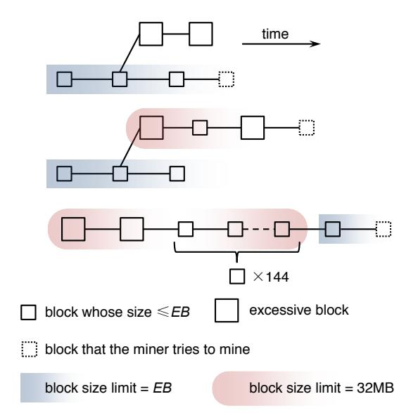
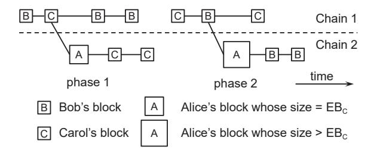
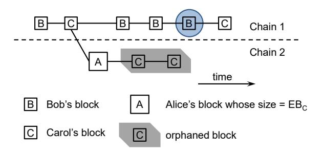
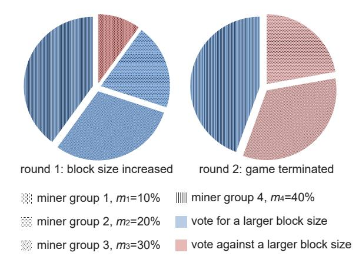

# On the Necessity of a Prescribed Block Validity Consensus: Analyzing Bitcoin Unlimited Mining Protocol

Ren Zhang imec-COSIC, KU Leuven, Belgium ren.zhang@esat.kuleuven.be Bart Preneel imec-COSIC, KU Leuven, Belgium bart.preneel@esat.kuleuven.be

#### **ABSTRACT**

Bitcoin has not only attracted many users but also been considered as a technical breakthrough by academia. However, the expanding potential of Bitcoin is largely untapped due to its limited throughput. The Bitcoin community is now facing its biggest crisis in history as the community splits on how to increase the throughput. Among various proposals, Bitcoin Unlimited recently became the most popular candidate, as it allows miners to collectively decide the block size limit according to the real network capacity. However, the security of BU is heatedly debated and no consensus has been reached as the issue is discussed in different miner incentive models. In this paper, we systematically evaluate BU's security with three incentive models via testing the two major arguments of BU supporters: the block validity consensus is not necessary for BU's security; such consensus would emerge in BU out of economic incentives. Our results invalidate both arguments and therefore disprove BU's security claims. Our paper further contributes to the field by addressing the necessity of a prescribed block validity consensus for cryptocurrencies.

### **CCS CONCEPTS**

• Security and privacy → Security protocols; • Computing methodologies → Markov decision processes; • Theory of computation → Algorithmic game theory and mechanism design;

#### **KEYWORDS**

cryptocurrency, Bitcoin Unlimited, incentive compatibility

#### 1 INTRODUCTION

Bitcoin [32], a decentralized payment system, attracts many users [3] with its novel mechanism of maintaining a public ledger. The ledger, called *blockchain*, groups all settled transactions as a chain of *blocks*. New blocks are generated via a process called *mining*. Participants of the process—*miners*, compete in solving a cryptographic puzzle composed of a set of new transactions and the last blockchain block. Once solved, the puzzle and its solution are combined into a block and broadcast to the network. Every network participant—*node*, be it a miner or a non-miner, stores a copy of the ledger. All nodes recognize the longest chain composed entirely of valid blocks as the blockchain. Miners of blockchain blocks receive new bitcoins as rewards to their contributed computational power.

Despite the rapid growth, the expanding potential of Bitcoin is largely untapped as it can only process transactions at a speed

lower than four per second on average [2]. This is because the current design prescribes a ten-minute-average block generation interval and a one-megabyte block size upper bound. The Bitcoin community is divided on what technical approach to follow in order to increase the throughput [17].

One most popular approach to address this problem is a project named Bitcoin Unlimited (BU) [34]. Based on the argument that "the blocksize limit should never have been a consensus rule in the first place" [35], BU allows miners to decide the block size limit collectively through a deliberative process. Specifically, every node signals an individual excessive block size EB, the maximum acceptable block size. A block larger than the local EB is called an excessive block and is considered invalid by the node until a certain number of blocks are built on top of it. By design, any block that is too large for the network will be ignored by the majority of the miners, and only blocks with appropriate sizes would be included in the blockchain. Eventually, BU aims to gradually increase the block size limit at a speed matching the network capacity, thus ending the divergence on the block size limit once and for all. In April 2017, the time of this writing, BU is supported by 40% of mining power, which makes it the largest among competing designs [26].

However, the popularity of BU kindled heated debate within the Bitcoin community, mainly regarding its security. Critics claim that when block validity consensus (BVC) is absent, the blockchain would more frequently fork into different versions, and be more vulnerable to various attacks [13, 49, 51]. BU supporters react to such challenges with conflicting arguments, mainly differing on the presence and necessity of BVC in BU. The first type of reaction acknowledges the necessity of BVC, but argues that although a BVC is not prescribed, participants would soon reach an emergent consensus [9, 11]. In other words, all nodes will choose the same EB, as either the nodes with lower storage and network capacity would be crowded out by "people and organizations with deeper pockets" [10], or the miners who prefer larger blocks would lower their EBs to avoid economic loss [48]. The second type of reaction takes an even stronger position by discarding BVC as a pillar of Bitcoin. The BU homepage claims that since such attacks would "cost the attacker far more than the victim", no malicious party can "arbitrarily game the system" [35].

In this paper, we evaluate BU's security by testing the two aforementioned claims of BU supporters with an analytical approach. In particular, by scrutinizing the ongoing debate, we identify that one major obstacle preventing BU supporters and objectors from reaching an agreement is that they discuss the issue with different miner incentive models, which leads to different understandings on BU's security. Therefore, to establish a framework for our analysis

This paper appeared in the 13th International Conference on emerging Networking EXperiments and Technologies (CoNEXT '17). Last revised on Oct. 17, 2017.

and provide a common ground for the discussion, we categorize known attacks towards mining protocols into three attacker incentive models: *compliant and profit-driven, non-compliant and profit driven,* and *non-profit driven.* Furthermore, a utility function for strategic miners is chosen for each incentive model based on its most well-known attack, to help quantifying different protocols' attack resistance. We argue that a comprehensive analysis of a mining protocol should consider all three models.

Based on this framework, we first test against the stronger statement of BU supporters on the dispensability of BVC by evaluating BU's security in the absence of BVC. We formally define a strategy space in which a miner can utilize the absence of BVC to cause blockchain forks. The mining process within this strategy space is then encoded as a Markov decision process (MDP)2, which models decision making in a partly stochastic environment. Such encoding allows us to compute the optimal strategies of the attacker within the strategy space that maximize our utility functions. Our MDP results demonstrate that:

- In compliant and profit-driven incentive model, unlike Bitcoin, BU is not incentive compatible even when all miners fully comply with the protocol: a strategic miner can gain block rewards unproportional to the mining power.
- In non-compliant and profit-driven incentive model, an attacker can trigger long block forks more frequently and with lower effort in BU than in Bitcoin, resulting in more profitable double-spending attacks.
- At last, in non-profit-driven incentive model, an attacker can invalidate up to 1.77 blocks with each attacker block, whereas in Bitcoin this number is no more than one.

Second, given that BVC is indispensible for BU's security, we further test against BU supporters' claims on emergent consensus with game-theoretic analysis. We construct two games to model the social choice of parameters of all BU miners and analyze the equilibrium and termination state of these games. Our analysis reveals that miners supporting large blocks have both the incentive and the ability to keep mining large blocks, in order to force small miners to exit the business. We argue that the resulting block size may not necessarily match the "actual network capacity" as the supporters believe [8, 48].

The contributions of this work are as follows:

- (1) To the best of our knowledge, this is the first study that systematically analyzes BU mining protocol. We conclude that the absence of BVC magnifies the effectiveness of existing attacks on Bitcoin. Moreover, emergent consensus will not be reached for a large space of mining power and block size preference distributions; for the remaining circumstances, the BVC is very fragile. A countermeasure is proposed accordingly.
- (2) We provide an analytical framework with three different incentive models, which is indispensable to initiate effective communication on the security of BU. This framework is of independent interest: it can be used in general for evaluating mining protocol security.
- (3) By indicating that the crux of BU's insecurity is its forsaking of BVC and inability to achieve it, we want to raise

awareness on the importance of a prescribed BVC. Future cryptocurrency designs should avoid opening attack vectors that allow miners/attackers to deliberately fork the network. Furthermore, we list several technical approaches to design secure mining protocols with a prescribed adjustable BVC or without a prescribed BVC.

#### 2 PRELIMINARIES

# 2.1 Bitcoin Mining Protocol

Bitcoin establishes consensus on the blockchain in a decentralized, pseudonymous way [32]. Each block in the blockchain contains its distance from the first block, called height, the hash value of the preceding parent block, a set of transactions, and a nonce. Information about the parent block guarantees that a miner must choose which chain to mine on before starting. To construct a valid block, miners work on finding the right nonce so that the hash of the block is smaller than the block difficulty target. This target is adjusted every 2016 blocks so that on average a block is generated every ten minutes. The protocol assumes that miners publish valid blocks to the network the moment they are found. Miners are incentivized by two kinds of rewards. First, a fixed block reward is allocated to the miner of every blockchain block. Second, the difference between the amount of inputs and outputs in a transaction is called the transaction fee, which goes to the miner who includes the transaction in the blockchain.

All Bitcoin participants follow the same prescribed *block validity consensus* (BVC), namely a block is either valid or invalid to everyone. When more than one valid block extends the same preceding block, a miner adopts and mines on the longest chain, or the first received block when several chains are of the same length. We refer to this *forked* situation as a *block race*, and an equal-length block race as a *tie*. In the latter situation, eventually one chain would be longer than the others, and blocks that are not on this chain are discarded by all miners. We call these blocks *orphaned*. Orphaned blocks receive no reward.

### 2.2 Bitcoin Unlimited Mining Protocol

The BU mining protocol does not have an official specification. Here we summarize the protocol according to our understanding of the March 2017 BU release source code [18].

BU abandons BVC by introducing three new parameters to the Bitcoin mining protocol. Participants choose these parameters locally and broadcast their choices to the network. First, maximum generation size MG indicates the maximum block size a miner will generate. Second, excessive block size EB is the maximum block size the participant considers valid and accepts. Similar to Bitcoin, participants recognize the longest valid chain as the blockchain. A block that is larger than the local EB is called an excessive block and is considered invalid. Since a valid block for some miners might be excessive for the others, BU does not have a prescribed BVC. As a block with the exact size EB is not an excessive block, we will drop the term "excessive block size" and use EB instead to avoid confusion. Third, the excessive acceptance depth AD represents the length of a chain that needs to be built on an excessive block, starting from and including the block itself, before it is considered valid. In other words, if a chain of AD - 1 blocks are mined after

&lt;sup>2Source code available at https://github.com/nirenzang/Analyzing-Bitcoin-Unlimited

Figure 1: A BU miner's choice of parent block, assuming AD=3. In the upper figure, the excessive blocks are rejected. In the middle figure, two blocks are mined after the excessive block, the chain is then considered valid and accepted as the longest chain. As the sticky gate is open, the block size limit on that chain is released to 32MB. In the lower figure, the sticky gate is closed on a chain after 144 consecutive non-excessive blocks.

the excessive block, the excessive block and the subsequent chain are accepted.

According to the project's Chief Scientist Rizun [39], once an excessive block is accepted, a *sticky gate*, also referred to as *excessive-block gate*, is opened for the chain starting with the excessive block on the participant's client. When the sticky gate is open, the block size on that chain is only limited by the size of a network message, which is 32 MB (cf. Figure 1). The sticky gate will be closed after 144 consecutive non-excessive blocks appear on the chain, which takes roughly a day. The sticky gate mechanism is designed to prevent a miner with small *EB* from working on a shorter chain indefinitely when the majority of mining power chooses a larger *MG*.

BU's source code is inconsistent with Rizun's description. According to the source code, a chain whose latest block has height h is considered valid if either the latest AD blocks are all non-excessive, or there is an excessive block in the chain whose height is between h-AD+1 and h-AD-143 inclusive. The latter rule results in some counter-intuitive edge cases. For example, a chain is valid if it contains only two excessive blocks at height h and h-AD-143 respectively, but would be invalidated if another block is added, excessive or non-excessive. We believe this is an implementation error rather than the designers' intention, therefore we model the system according to Rizun's description in this paper.

Currently, all BU miners choose MG = EB = 1 MB, meeting Bitcoin's BVC. However, miners and nodes signaling BU are already choosing different sets of parameters. The majority of BU's mining

power chooses AD = 6, whereas BitClub Network, a miner, chooses AD = 20. Almost all BU public nodes choose AD = 12, EB = 16 MB.

### 2.3 Existing Analyses

BU project members conducted some preliminary analysis on the protocol and its rationality. Our results do not contradict these, but instead consider an expanded strategy space; unlike these prior models, ours includes strategies that *deliberately* cause forks and strategies that *deviate* from the protocol.

Rizun pointed out that when there is no block size limit, a rational miner's block size is a tradeoff between higher transaction fees and lower orphan rate [38]. A corollary of this result is that miners have different block size preferences according to their mining costs and network capacity. This corollary justifies our setting in the block size increasing game in Sect. 5.2. As an additional contribution, Rizun briefly mentioned that a mining cartel with high internal bandwidth might form and negatively affect the network health, which is indeed confirmed by our results. However, his model does not consider the possibility of chain-splitting attacks, which are the crux of BU's insecurity in our model.

Andrew Stone, the Lead Developer of BU, demonstrated with simulations that forks happen relatively rare in BU and are quickly resolved [47]. However, his model does not allow miners to change their block sizes and *EB*s during the simulation. Our results in Sect. 4 prove that forks happen frequently when the attacker's block size is flexible.

An attack on BU was described in a reddit post by Cryptoconomy [13]. We generalize the attack to a series of attacks with different incentive models and quantify the results. Van Wirdum discussed the implications of some other possible scenarios, e.g., when miners choose different ADs or not all miners switch to BU [51].

#### 2.4 Threat Model

When analyzing BU mining protocol in Sect. 4 and Sect. 5, we follow the threat model of most studies on Bitcoin mining [1, 16, 20, 24, 27, 33, 41, 44, 52]. In this model, every miner controls strictly less than 50% of the total mining power. Moreover, no attacker has the power to downgrade the propagation speed of blocks found by other miners. For brevity, in this paper we use "the attacker" instead of "the non-compliant strategic miner". Every miner is capable of creating blocks of any size: when there is not enough transactions, the miner can always generate some. We assume all miners are honest with their signals, therefore do not distinguish the *EBs* they signal and their actual *EBs*.

Also in this model, miners' profits are estimated according to the number of blocks eventually in the blockchain. In other words, we do not consider the effect of transaction fees. To the best of our knowledge, the only study that models the effect of transaction fees on mining strategy is by Carlsten et al. [6]. However they only study the period when block rewards are reduced to zero. Currently, block rewards are still miners' main income, and the transaction fees of a miner are generally proportional to the number of blocks [2].

# 3 INCENTIVE MODELS OF STRATEGIC MINERS

When discussing the security of BU, supporters and objectors often use different miner incentive models. Supporters assume that all miners are profit-driven [8, 9, 11, 31, 35] and claim that any deviation from the protocol designers' desired behavior would "negatively affect the BTC market price, and miner profitability" [8]. However, we argue that the security of a protocol should take into account all participant incentives. In this section we enumerate three incentive models of strategic miners to establish a framework for evaluating mining protocols. A utility function is chosen for each incentive model based on its most well-known attack, which shall be used in our later analysis.

# 3.1 Compliant and Profit-Driven

The compliant and profit-driven miner believes that any observable deviation from the protocol weakens the public confidence of the cryptocurrency, leading to lower exchange rate and economic loss even for the attacker [5]. Therefore, strategic miners always follow the protocol unless the deviation is unobservable. In the absence of a prescribed BVC, every party chooses the parameters that maximize its profits.

We use *relative revenue* [1, 16, 20, 24, 27, 33, 41, 52], namely the proportion of the strategic miner's blocks among all blocks, to represent this incentive model:

$$u_{\rm A,1} = \frac{\sum R_{\rm A}}{\sum R_{\rm A} + \sum R_{\rm others}} , \qquad (1)$$

where  $\sum R_{\rm A}$  is the total revenue received by the strategic miner during a certain period of time, in the unit of block reward;  $\sum R_{\rm others}$  is the total block rewards of other miners. When all miners are compliant and the propagation delay is negligible, to the best of our knowledge, Bitcoin mining protocol is *incentive compatible*: the expected relative revenue of a miner equals the miner's mining power share [32]. In other words, we are not aware of any compliant and profit-driven attack on Bitcoin.

# 3.2 Non-Compliant and Profit-Driven

A non-compliant and profit-driven attacker may deviate from the prescribed protocol to gain profits in a way undesirable to the protocol designer. Unlike in the previous model, the drops in exchange rate do not affect the attacker's profits. This is because either the attacker's profits are not in the form of the cryptocurrency, or the attacker believes when the attack stops, either voluntarily or because the relevant vulnerabilities are fixed, the exchange rate would recover. Indeed the exchange rates of both Bitcoin and Ethereum, the two cryptocurrencies with largest market capitalization, frequently break their all time highs at the time of this writing, despite multiple attacks throughout their histories [25, 36].

The double-spending attack arises from this incentive model. The attacker sends funds in a transaction to a merchant for some products, and reverses the transaction after these products are received. By convention, a transaction embedded in a block is considered settled and products would be delivered when there are five blockchain blocks mined after the block. Therefore the attacker needs to publish a longer chain that does not contain this transaction after it is

settled to reverse the transaction. A successful double-spending in Bitcoin happened in March 2013 when a blockchain fork occurred during a protocol update [29].

Sompolinsky and Zohar pointed out in [44] that an attacker can gain higher profits by combining double-spending with a selfish mining attack [16, 33, 41]: the attacker keeps mining in secret to perform double-spending attacks, and when there is little hope to orphan six blocks in a row, publishes the secret blocks to claim the block rewards and invalidate other miners' blocks.

In our later analysis we use the *absolute reward* [20, 44], the time-averaged revenue of the combined selfish mining and double spending attack to represent this incentive model:

$$u_{\rm A,2} = \frac{\sum R_{\rm A} + \sum R_{\rm DS}}{t} , \qquad (2)$$

where  $\sum R_{\rm DS}$  is the total double-spending revenue received by the attacker, in the unit of block reward; t is the time span of the attack.

#### 3.3 Non-Profit-Driven

A non-profit-driven attacker does not try to gain profits directly from the attack. The attacker's goals may include preventing certain transactions from entering the blockchain, or lowering the quality of service of the cryptocurrency, so that, for example, users would turn to a competing cryptocurrency. Although profits made during the attack are not in the attacker's consideration, the attacker still tries to achieve the goal with the lowest cost.

The 51% attack, also referred to as Goldfinger attack [5, 28], is in line with this incentive model. In this attack, the attacker controls more than 50% of mining power and constantly overrides the blockchain with longer chains to prevent transactions from being confirmed. A Bitcoin mining pool Eligius deployed this attack to destroy Coiledcoin, a cryptocurrency with lower mining capacity [30].

We adopt the average number of other miners' blocks orphaned by each attacker block to evaluate the effectiveness of non-profitdriven attacks:

$$u_{A,3} = \frac{\sum O_{\text{others}}}{\sum R_A + \sum O_A} , \qquad (3)$$

where  $O_{\rm A}$  and  $O_{\rm others}$  denote the number of orphaned blocks mined by the attacker and other miners, respectively.

# 4 IS CONSENSUS NECESSARY: MODELING A STRATEGIC MINER IN THE ABSENCE OF BLOCK VALIDITY CONSENSUS

To establish a common ground on the necessity of BVC, in this section we evaluate the security of BU mining protocol when BVC is absent. First, we describe a series of strategies that utilize the absence of BVC to cause forks, and model the strategy space with an MDP. Afterwards, we evaluate the security of BU with attackers of different incentive models by comparing the efficacy of the optimal strategies within the space with the best results of known attacks on Bitcoin. Note that since our strategy space covers only a subset of the attacker strategies in BU, the optimal strategies within our space are not necessarily the optimal strategies with certain incentive model. However by showing that a certain strategy in a reasonable setting outperforms the best attack on Bitcoin, we can conclude

Figure 2: Two states in different phases. In phase 1, Alice mines a block of size  $EB_C$  so that Carol mines on this block and Bob rejects it; in phase 2, Bob's sticky gate is open, Alice mines a block of size  $> EB_C$  so that it is accepted by Bob but rejected by Carol.

that the new attack vector introduced by BU weakens Bitcoin's security.

# 4.1 The Strategy Space and MDP Design

4.1.1 System Setting and Strategy Description. In this strategy space, a miner deliberately causes forks and could mine on either chain when the blockchain is forked. We generalize the attack proposed by Cryptoconomy [13] to allow diversified miner incentive models.

There are three miners Alice, Bob and Carol in the system, among which Alice is the only strategic miner. Bob and Carol have the same MG and AD but different EBs:  $EB_B < EB_C$ . The mining power shares of Alice, Bob and Carol are  $\alpha$ ,  $\beta$  and  $\gamma$ , respectively, which satisfy  $\alpha + \beta + \gamma = 1$ . Bob and Carol might be groups of miners so that one of them can control more than half of the mining power. We assume  $\alpha \leq \min\{\beta,\gamma\}$ , and whenever Bob and Carol reach a consensus on the blockchain, Alice accepts and mines on the latest block in that chain. In other words, we do not consider the situation in which Alice mines on a shorter chain just by herself. Neither do we consider selfish mining attacks: Alice always publishes her blocks immediately after mined.

The system can be in one of three *phases*, according to the sticky gates' situation. In phase 1, both Bob's and Carol's sticky gates are closed. If Bob and Carol mine on the same chain, which is denoted as Chain 1, Alice may try to mine a block of size EBC so that Carol mines on Alice's block while Bob considers this block excessive and mines on its predecessor. In this situation, we refer to Bob's chain as Chain 1 and Carol's chain as Chain 2. Alice may mine either on Chain 1 or Chain 2, depending on which action maximizes her utility. The left part in Figure 2 illustrates this forked situation. If Chain 1 outgrows Chain 2 at any time, Carol switches back to Chain 1; if Chain 2 reaches AD before Chain 1 does, Bob abandons his own chain, adopts all AD blocks in Chain 2 and opens his sticky gate. When Bob's sticky gate is open and Carol's is closed, the system enters phase 2. In phase 2, Alice may mine a block slightly larger than EBC so that Bob accepts this block and keeps mining on it while Carol rejects the block. If Alice chooses to do so and succeeds, we refer to Carol's chain as Chain 1 and Bob's chain as Chain 2 (cf. right part of Figure 2). Similar to phase 1, Bob switches back to Chain 1 if it outgrows Chain 2; if Chain 2 reaches AD before Chain

1 does, Carol's sticky gate opens and the system enters phase 3. When both Bob and Carol open their sticky gates, a BVC is reached.

Since we are mainly interested in the situation when BVC is absent in this section, we exclude phase 3 in our MDP. In reality the strategic miner can pause the strategy in phase 3. Note that during phase 3, the system is vulnerable to other attacks, such as embedding large blocks in the blockchain. Research conducted in 2016 by Croman et al. indicates that the block size cannot exceed 4MB to ensure 90% of public nodes have sufficient throughput at that time [12]. Although new technologies are deployed to accelerate block propagation and reduce bandwidth consumption, a consensus has not been reached on whether a block size limit of 32MB is feasible for the current Bitcoin network. By embedding giant blocks in the blockchain, a malicious miner can, for example, waste disk storage for all public nodes, or utilize the difference in receiving time among miners to separate their mining power and earn unfair profits. We consider the identification and analysis of possible attacks during phase 3 orthogonal to this paper.

Since the risk of sticky gates is also recognized by some BU supporters, a Bitcoin Unlimited Improvement Proposal (BUIP) is submitted to remove this mechanism [23]. If sticky gates are removed, the system stays in phase 1 permanently. This setting is also considered in our MDP.

At last we note that this setup with two "static" miner groups of different EBs is the weakest form of the attack. When there are more than two EBs in the network:  $EB_1 < EB_2 < \cdots < EB_k$ , Alice can choose arbitrary  $1 \le d < k$  and split other miners into two groups of  $EB_1, \ldots, EB_d$  and  $EB_{d+1}, \ldots, EB_k$  with the same set of strategies. This can be achieved by substituting  $EB_B$  in our model with  $EB_1$ ,  $EB_C$  with  $EB_{d+1}$ , and blocks of size  $EB_C$  with size  $EB_k$ . In other words, having more EBs in the network only gives Alice more options to split other miners' mining power in her advantage. Next we formally define the MDP.

4.1.2 MDP Design. MDP is commonly used by researchers to analyze the security of mining protocols [20, 41, 44, 52]. Modeling a system as an MDP allows us to compute the strategy that maximizes the utility of a strategic player with well-studied algorithms [7]. To achieve this goal, we need to encode all status and history information that might influence the player's decision into a state, and the player's available decisions into several actions. Moreover, a state transition matrix describes the probability distribution of the next state over every (state, action) pair. At last, a reward is allocated to the player if some transition happens, which is used to compute the utility. Converting mining rewards into a complex utility function is a non-trivial task, we refer to the paper by Sapirshtein et al. [41] for more details.

State Space. A state is represented as a 5-tuple  $(l_1, l_2, a_1, a_2, r)$ . The lengths of Chain 1 and Chain 2 are encoded as  $l_1$  and  $l_2$ , respectively. The number of blocks mined by Alice in these chains are  $a_1$  and  $a_2$ . The parameter r denotes the number of blocks that need to be mined on Bob's chain before he closes his sticky gate. When r=0, the system is in phase 1; when  $1 \le r \le 144$ , the system is in phase 2. Phase 3 is only a temporary state during state transition.

Actions. Two actions are always possible: OnChain1 and OnChain2. When Bob and Carol are mining on the same chain, which is Chain 1 by our definition, mining OnChain2 means Alice tries to mine a big block to divide the mining power of Bob's and Carol's. Upon success, Alice may mine either OnChain1 or OnChain2, depending on which action maximizes her utility. When Alice is non-profit-driven, a third action Wait is also possible. When choosing Wait, the next block can only be mined by Bob or Carol.

*State Transition.* The system starts at the base state (0, 0, 0, 0, 0), in which Alice mines OnChain2. In each step, one block is found by Alice, Bob or Carol, with probabilities according to their mining capacities. At the base state, if the next block is found by Bob or Carol, the system stays at the base state and the block is locked in the blockchain. We call some blocks locked if all miners agree on these blocks. Whenever some blocks are locked, rewards are distributed and these blocks are excluded from the state, as they do not affect Alice's strategy. When Alice finds a block at the base state, the system turns to state (0, 1, 0, 1, 0) and the blockchain is forked. During the forked period, both chains grow according to the mining power working on that chain. For example, if the current state is (3, 4, 0, 1, 0) and Alice works OnChain1, the next state might be: (4, 4, 1, 1, 0) with probability  $\alpha$ , (4, 4, 0, 1, 0) with probability  $\beta$ , and (3, 5, 0, 1, 0) with probability y. If at any moment  $l_1$  outgrows l2, both Bob and Carol would mine on Chain 1, the system jumps back to the base state and all blocks on Chain 1 are locked. If  $l_2$ reaches AD, the system turns to (0, 0, 0, 0, 144) and blocks in Chain 2 are locked. State transition in phase 2 is very similar to that in phase 1 with two differences. First, the roles of Bob and Carol are exchanged: when the system forks, Bob works on Chain 2 and Carol works on Chain 1. Second, the state transition when Bob and Carol reach a consensus is slightly different. Whenever Chain 1 blocks are locked, r is reduced by  $l_1$ ; when r reaches 0 the system goes back to phase 1. If Chain 2 blocks are locked, the system temporarily goes to phase 3 and turns back to the base state.

Solving for the Optimal Policy. We adopt the algorithm developed by Sapirshtein et al. to convert a mining model into an undiscounted average reward MDP [41]. The MDP is able to output the strategy that achieves the maximum utility of Alice and the utility. Alice's utility is defined according to her incentive model, which we defined in Sect. 3 and will further specify in the rest of this section. As the total number of states within our MDP is finite, our results reflect Alice's optimal expected utility within the strategy space with our predefined maximum error of  $10^{-4}$ .

As for the parameters, we choose AD=6 for both Bob and Carol in line with current BU miners. Seven different  $\alpha$  values are chosen: 1%, 2.5%, 5%, 10%, 15%, 20% and 25%. We split the rest of the mining power between Bob and Carol with nine most basic ratios: 1:4, 1:3, 1:2, 2:3, 1:1, 3:2, 2:1, 3:1 and 4:1. Although we are only able to compute a limited set of parameters due to our limited computational resources, our results are sufficient to reveal BU's vulnerabilities. All sets of parameters that satisfy  $\alpha \leq \min\{\beta,\gamma\}$  are computed under two different settings. In the first setting, the sticky gate is disabled, thus only phase 1 is permitted. In the second setting, the sticky gate is enabled, thus both phases are permitted. Another way to understand the settings is that in the first setting, the attacker is only allowed to launch the attack at phase 1; in the

second setting, the attacker can launch the attack at both phases. A complete description of state transition and reward distribution of setting 1 with compliant and profit-driven Alice is in Table 1.

# 4.2 A Compliant and Profit-Driven Alice

In our three-miner setting,  $\sum R_{\text{others}}$  in Equation (1) is the block rewards of Bob's and Carol's combined. We program the MDP to output  $\sum R_{\text{A}}$  and  $\sum R_{\text{others}}$  whenever some blocks are locked, as described in Table 1. The maximum  $u_{\text{A},1}$  values can be found in Table 2. All parameter sets not displayed in teable satisfy  $\max\{u_{A,1}\} = \alpha$ . Our results show that  $\max\{u_{A,1}\} > \alpha$ , namely Alice gains unfair relative revenue, for multiple parameter sets. For comparison, Bitcoin always has  $\max\{u_{\text{A},1}\} = \alpha$  when all miners are compliant.

A closer look at Table 2 reveals that Alice only gains unfair rewards when  $\alpha+\gamma>\beta$ . This is because in phase 1, when Alice mines a block of size EBC to "introduce" Chain 2 and fork the network, the maximum mining power share working on Chain 2 is  $\alpha+\gamma$ , whereas Chain 1 has at least  $\beta$ . When  $\alpha+\gamma\leq\beta$ , Chain 1 has at least equal chance to win the block race, in which case Alice's first block on Chain 2 is orphaned, decreasing her utility. Consequently, Alice's optimal strategy is to keep mining on Chain 1. As the system does not enter phase 2 in this case, setting 2 has similar results.

ANALYTICAL RESULT 1. When BVC is absent, BU is not incentive compatible even when all miners follow the protocol.

# 4.3 A Non-Compliant and Profit-Driven Alice

We adopt a modified version of the setting in [44] to determine when to issue double-spending rewards in Bitcoin. In our setting, a transaction to the merchant is embedded in every block mined by compliant miners. Every time Alice overrides k>3 other miners' blocks in a block race, she receives  $(k-3)\times R_{\rm DS}$ , plus block rewards for all her blocks in the blockchain. We choose four confirmations instead of six to facilitate the comparison, as double-spending is hardly profitable in Bitcoin with six confirmations for Alice's small mining power. For the same reason, we set the amount of  $R_{\rm DS}$  ten times of a block reward. Failed double-spending attempts have no punishment.

In BU, whenever Alice successfully forks the blockchain, she embeds a transaction in each block during the fork and a conflicting transaction spending the same inputs in the competing chain. The merchants receiving these transactions are chosen carefully so that merchants accepting Chain 1 transactions do not see Chain 2, and vise versa. She receives  $(k-3)\times R_{\rm DS}$  as double-spending rewards if either Chain 2 wins the block race and k>3 blocks in Chain 1 are orphaned, or Chain 1 wins the block race and k>3 blocks in Chain 2 are orphaned.

As one block is found in each step in our model, we set t in Equation (2) equal to  $\sum R_{\rm A} + \sum R_{\rm Others} + \sum O_{\rm A} + \sum O_{\rm others}$ . Therefore, the  $u_{\rm A,2}$  value can be interpreted as the expected reward Alice receives for each block that is mined in the network, or roughly every 10 minutes, in the unit of block reward. For example,  $\max\{u_{\rm A,2}\} = \alpha$  means Alice's most profitable strategy is to keep mining on Chain 1 and never perform double-spending attack, so that  $\alpha$  proportion of the block rewards are Alice's.

Table 1: State transition and reward distribution for compliant and profit-driven Alice, setting 1. Note that setting 1 considers only phase 1, namely Bob's sticky gate is never open. The fifth entry in the state tuple is omitted as it is always zero in phase 1. When multiple events lead to the same state, the probability is defined as the total probability of these events, and the reward is weighted according to the distribution. In the table,  $\alpha' = \alpha/(\alpha + \beta)$ ,  $\alpha' = \beta/(\alpha + \beta)$ ,  $\alpha'' = \alpha/(\alpha + \gamma)$ ,  $\gamma'' = \gamma/(\alpha + \gamma)$ . OnChain1 and OnChain2 are abbreviated as onC1 and onC2, respectively.

| $(State \times Action)$                                 | Resulting State                | Probability       | Reward $(R_A, R_{others})$                                            |
|---------------------------------------------------------|--------------------------------|-------------------|-----------------------------------------------------------------------|
| (0, 0, 0, 0), onC1                                      | (0,0,0,0)                      | 1                 | $(\alpha, \beta + \gamma)$                                            |
| (0,0,0,0), on C2                                        | (0,0,0,0)                      | $\beta + \gamma$  | (0, 1)                                                                |
|                                                         | (0, 1, 0, 1)                   | $\alpha$          | (0,0)                                                                 |
| $(l_1, l_2, a_1, a_2), onC1$ $l_1 < l_2 \neq AD - 1$ | $(l_1+1,l_2,a_1+1,a_2)$        | $\alpha$          |                                                                       |
|                                                         | $(l_1+1,l_2,a_1,a_2)$          | β                 | (0, 0)                                                                |
|                                                         | $(l_1, l_2 + 1, a_1, a_2)$     | γ                 |                                                                       |
| $(l_1, l_2, a_1, a_2)$ , on C2                          | $(l_1, l_2 + 1, a_1, a_2 + 1)$ | $\alpha$          |                                                                       |
| $(l_1, l_2, u_1, u_2), onC2$ $l_1 < l_2 \neq AD - 1$ | $(l_1+1,l_2,a_1,a_2)$          | β                 | (0, 0)                                                                |
| $l_1 < l_2 \neq AD - 1$                                 | $(l_1, l_2 + 1, a_1, a_2)$     | γ                 |                                                                       |
| $(l_1, l_2, a_1, a_2), onC1$                            | (0,0,0,0)                      | $\alpha + \beta$  | $(\alpha'(a_1+1)+\beta'a_1, \alpha'(l_1-a_1)+\beta'(l_1+1-a_1))$      |
| $l_1 = l_2 \neq AD - 1$                                 | $(l_1, l_2 + 1, a_1, a_2)$     | γ                 | (0,0)                                                                 |
| (1. 1- a. a-) on C2                                     | $(l_1, l_2 + 1, a_1, a_2 + 1)$ | α                 | (0,0)                                                                 |
| $(l_1, l_2, a_1, a_2), onC2$ $l_1 = l_2 \neq AD - 1$ | (0,0,0,0)                      | β                 | $(a_1, l_1 + 1 - a_1)$                                                |
|                                                         | $(l_1, l_2 + 1, a_1, a_2)$     | γ                 | (0,0)                                                                 |
| $(l_1, l_2, a_1, a_2), onC1$                            | $(l_1+1,l_2,a_1+1,a_2)$        | α                 | (0,0)                                                                 |
| $(l_1, l_2, a_1, a_2), onC1$ $l_1 < l_2 = AD - 1$    | $(l_1+1,l_2,a_1,a_2)$          | β                 | (0,0)                                                                 |
| $l_1 < l_2 = AD - 1$                                    | (0,0,0,0)                      | γ                 | $(a_2, l_2 + 1 - a_2)$                                                |
| $(l_1, l_2, a_1, a_2), onC2$                            | (0,0,0,0)                      | $\alpha + \gamma$ | $(\alpha''(a_2+1)+\gamma''a_2,\alpha''(l_2-a_2)+\gamma''(l_2+1-a_2))$ |
| $l_1 < l_2 = AD - 1$                                    | $(l_1+1,l_2,a_1,a_2)$          | β                 | (0,0)                                                                 |
| $(l_1, l_2, a_1, a_2)$ , on C1                          | (0, 0, 0, 0)                   | 1                 | $(\alpha(a_1+1)+\beta a_1+\gamma a_2,$                                |
| $l_1 = l_2 = AD - 1$                                    | (0,0,0,0)                      |                   | $\alpha(l_1 - a_1) + \beta(l_1 + 1 - a_1) + \gamma(l_2 - a_2))$       |
| $(l_1, l_2, a_1, a_2), onC2$                            | (0, 0, 0, 0)                   | 1                 | $(\alpha(a_2+1)+\beta a_1+\gamma a_2,$                                |
| $l_1 = l_2 = AD - 1$                                    | (0,0,0,0)                      | 1                 | $\alpha(l_2-a_2)+\beta(l_1-a_1)+\gamma(l_2+1-a_2))$                   |

Table 2: Alice's expected relative revenue (compliant and profit-driven, defined in Equation (1)). Setting is abbreviated as "Set."

| Set. 1                           |        |        |        |        | Set. 2 |
|----------------------------------|--------|--------|--------|--------|--------|
| $\beta: \gamma \setminus \alpha$ | 10%    | 15%    | 20%    | 25%    | 25%    |
| 3:2                              | 10%    | 15%    | 20%    | 25%    | 25.29% |
| 1:1                              | 10%    | 15%    | 20%    | 26.24% | 26.24% |
| 2:3                              | 10%    | 15.05% | 21.15% | 27.39% | 25.29% |
| 1:2                              | 10%    | 15.62% | 21.56% | 27.56% | 25%    |
| 1:3                              | 10.26% | 15.87% | 21.58% |        |        |
| 1:4                              | 10.34% | 15.84% |        |        |        |

In both Bitcoin and BU, the merchant might wait for more confirmations before delivery when forks happen constantly. Therefore choosing "four confirmations" as the delivery condition is an oversimplification of the reality. However this simplified setting already

demonstrates that long forks can be triggered more easily and more frequently in BU, which is adequate for our comparison.

Selected results are shown in Table 3. We omit the ratios 3:1,3:2,2:3,1:3 as they follow the same pattern with the rest of the data. In BU, Alice profits from double-spending attacks with almost all sets of parameters, even when she controls only 1% of mining power; whereas in Bitcoin, even when the attacker wins all equal-length block races, double-spending is not profitable with less than 10% of mining power.

ANALYTICAL RESULT 2. When BVC is absent, double-spending in BU is often more profitable than the optimal combined attack on Bitcoin of double-spending and selfish mining. Unlike in Bitcoin, in BU even a 1% miner can launch double-spending attacks with nonnegligible success rate.

### 4.4 A Non-Profit-Driven Alice

For non-profit-driven Alice, we introduce another action *Wait* to our MDP so that Alice can sometimes stop her mining equipment and watch Bob and Carol orphan each other's blocks. The results

Table 3: Alice's expected absolute revenue (non-compliant and profit-driven, defined in Equation (2)).

| Setting 1                         |       |       |       |       |       |
|-----------------------------------|-------|-------|-------|-------|-------|
| $\alpha \setminus \beta : \gamma$ | 4:1   | 2:1   | 1:1   | 1:2   | 1:4   |
| 1%                                | 0.013 | 0.035 | 0.042 | 0.025 | 0.013 |
| 2.5%                              | 0.038 | 0.089 | 0.10  | 0.063 | 0.033 |
| 5%                                | 0.090 | 0.18  | 0.20  | 0.13  | 0.067 |
| 10%                               | 0.24  | 0.39  | 0.40  | 0.26  | 0.14  |
| 15%                               | 0.44  | 0.61  | 0.59  | 0.40  | 0.23  |
| 20%                               |       | 0.83  | 0.78  | 0.55  |       |
| 25%                               |       | 1.1   | 0.97  | 0.71  |       |

| Setting 2                         |       |       |       |       |       |
|-----------------------------------|-------|-------|-------|-------|-------|
| $\alpha \setminus \beta : \gamma$ | 4:1   | 2:1   | 1:1   | 1:2   | 1:4   |
| 1%                                | 0.01  | 0.025 | 0.034 | 0.024 | 0.011 |
| 2.5%                              | 0.027 | 0.064 | 0.084 | 0.063 | 0.028 |
| 5%                                | 0.063 | 0.13  | 0.16  | 0.13  | 0.064 |
| 10%                               | 0.16  | 0.27  | 0.31  | 0.27  | 0.16  |
| 15%                               | 0.28  | 0.41  | 0.46  | 0.41  | 0.29  |
| 20%                               |       | 0.55  | 0.59  | 0.55  |       |
| 25%                               |       | 0.69  | 0.73  | 0.69  |       |

| Selfish Mining + Double-Spending on Bitcoin |      |      |      |      |
|---------------------------------------------|------|------|------|------|
| P(win a tie)\ $\alpha$                      | 10%  | 15%  | 20%  | 25%  |
| 50%                                         | 0.1  | 0.15 | 0.2  | 0.38 |
| 100%                                        | 0.11 | 0.18 | 0.30 | 0.52 |

Figure 3: An example in which two blocks are orphaned by one Alice's block. Carol switches to Chain 1 after the block in the blue circle is mined.

are displayed in Table 4. We only display the case when  $\alpha=1\%$  as the results are almost identical for all  $\alpha$  values. In other words, the effectiveness of the optimal strategy is constant no matter how small Alice's mining power is. Our results show that Alice can orphan more than one block mined by Bob and Carol for almost all parameter sets. An example of this scenario can be found in Figure 3. The damage increases when Bob's and Carol's mining power shares are close, as in this case it takes longer to decide a winner once the blockchain is forked. For comparison, in Bitcoin,  $\max\{u_{A,3}\} \leq 1$ . With selfish mining, Alice can orphan an honest block with one block only if she can propagate her blocks strictly faster than all compliant miners; with 51% attack,  $u_{A,3}=1$ .

Table 4: Number of Bob's and Carol's blocks orphaned by each Alice's block ( $\alpha = 1\%$ , non-profit-driven Alice, defined in Equation (3)).

| $\beta: \gamma \backslash Setting$ | 1    | 2    |
|------------------------------------|------|------|
| 4:1                                | 0.61 | 0.62 |
| 3:1                                | 0.83 | 0.85 |
| 2:1                                | 1.22 | 1.26 |
| 3:2                                | 1.50 | 1.55 |
| 1:1                                | 1.76 | 1.76 |
| 2:3                                | 1.77 | 1.77 |
| 1:2                                | 1.62 | 1.62 |
| 1:3                                | 1.30 | 1.30 |
| 1:4                                | 1.06 | 1.06 |
|                                    |      |      |

Analytical Result 3. When BVC is absent, BU allows a non-profit-driven attacker to orphan more than one compliant miners' block with each attacker block.

# 5 WHEN WILL EMERGENT CONSENSUS EMERGE?

As BU's security is weakened when BVC is absent, a natural question to ask is whether a BVC would emerge out of BU miners' economic incentives. This section studies miners' social choice of parameters with two games. These two games reveal the inconsistency between BU supporters' belief and miners' incentives.

Both games are discussed in compliant and profit-driven incentive model, in line with BU project members. An ongoing attack might also be a driving force of emergent consensus, however we do not consider this case for two reasons. First, Sect. 4 reveals that it is difficult to draw the boundaries between compliant behaviors and attacks in BU. Second, we believe a secure system design should prevent attacks from happening instead of relying on them. The loss of some attacks, including double-spending attacks, cannot be recovered afterwards.

#### 5.1 When All Miners Can Choose Any EB

In this part we model a simple game with the following assumption:

Assumption 1. Every miner can choose any EB value without affecting the profitability.

We first formally define the game and explain the rationality behind this game, then present our analysis on its equilibrium.

5.1.1 The EB Choosing Game. In this game, n miners in the system control positive mining power share  $m_1, m_2, \ldots, m_n$  respectively, that satisfy  $\sum_{i=1}^n m_i = 1$ . There are two possible EB values:  $EB_1$  and  $EB_2$ . A miner may choose either of them and mine blocks of exactly that size. The set of miners who choose  $EB_j$  is denoted as  $S_j$ , where j=1,2. Define  $S_0=\emptyset$  for completeness. Let  $M_j=\sum_{i\in S_j}m_i$ , namely the total mining power that chooses  $EB_j$ . When  $M_1\neq M_2$ , let  $M_b$  be the bigger one between  $M_1$  and  $M_2$ , and  $M_s$  the smaller one, where b,s=1 or 2; if  $M_1=M_2$ , b=s=0. The utility of miner i is defined as follows: if  $i\in S_b, u_i=m_i/\sum_{k\in S_b}m_k$ ; otherwise  $u_i=0$ . In other words, if one EB value is chosen by more

mining power than the other, the mining rewards are distributed among miners who choose this value, according to their mining power share; other miners do not get any reward.

5.1.2 Rationality. In reality, miners mine blocks of size EB either for more transaction fees or to cause a fork to orphan other miners' blocks, as in Sect. 4.2. In this game, miners in group  $S_h$  with stronger mining power will get more expected relative rewards than miners in  $S_s$ . We justify this utility setting in two ways. First, a close examination of the optimal strategies in Sect. 4.2 shows that Alice mines with the stronger miner group unless the other group has a large lead, as the stronger group has a better chance to win the block race. Second, the following reasoning yields the same result. If  $EB_s < EB_h$ , miners in  $S_s$  will consider  $EB_h$  blocks excessive, therefore ignore them. As miners in  $S_s$  control less mining power than miners in  $S_h$ , their chains of EBs blocks would be shorter and or phaned more frequently than the chains of  $\mathrm{EB}_b$  blocks. Otherwise if  $EB_s > EB_b$ , blocks mined by miners in  $S_s$  are ignored by miners in  $S_b$ , and can only be recognized if they build a chain of length ADfaster than miners in  $S_b$ . As they control less mining power than miners in  $S_h$ , their chains would be orphaned more often. In reality, the sticky gate of a group could be triggered occasionally, therefore the losing group should still get positive rewards rather than the value zero as we defined. This simplification does not affect our analysis, since we only care about the equilibrium of this game. When  $M_1 = M_2$ , the result becomes unpredictable, which is a bad situation for all miners.

5.1.3 Nash Equilibrium. In the EB choosing game, a Nash equilibrium (NE) exists when all miners choose the same EB.

PROOF. Recall that in an NE, no player can change its action to achieve higher utility. When all miners choose  $\mathrm{EB}_b$ , every miner's utility is positive. Consider a miner i who switches to another EB. As i controls less than 50% of total mining power, in the new setting, we have  $M_s = m_i < 1 - m_i = M_b$ . Therefore in the new setting, the utility of i is 0.

The key factor in this equilibrium is that miners can freely choose between these two *EB* values. We use two *EB* values just to simplify the analysis regarding utility. When more *EB* values are in the market, the same equilibrium holds. This game reveals the crucial insight behind BU's design:

ANALYTICAL RESULT 4. When all miners are profitable with any EB value, there is an equilibrium in which miners choose the same EB to avoid economic loss.

# 5.2 Every Miner has a Maximum Profitable Block Size

Although the *EB* choosing game has a desirable equilibrium, it does not reflect the reality as Assumption 1 is apparently too strong. In this part we study a more complex situation with a different yet more realistic assumption:

Assumption 2. Every miner has a maximum profitable block size (MPB). If most blockchain blocks are larger than a miner's MPB, the miner is no longer profitable, thus forced to leave the business.

After all, miners' diverse bandwidth and mining capacity is the motivation why BU allows them to signal their *EB* values.

5.2.1 The Block Size Increasing Game. In this game, all miners are honest and know each other's MPBs. There are n distinct MPB values: MPB1, MPB2, ..., MPBn, in increasing order. Miners with  $MPB_i$  are considered as a group, which control positive mining power share  $m_i$ . Apparently  $\sum_{i=1}^{n} m_i = 1$ . It is possible for a miner group to control more than half of mining power. At the beginning, all miners mine with the block size MPB1. The game proceeds in rounds. We use  $S_i$  to denote the remaining miner groups before round j + 1,  $S_0 = \{1, 2, ..., n\}$ . In round j, all remaining miner groups vote on whether to increase the block size MG to  $MPB_{i+1}$ . If at least half of the remaining mining power vote to increase the value, the block size is raised and miner group *j* leaves the game,  $S_{i+1} = S_i - \{j\}$ . The game terminates when more than half of the remaining mining power votes "no". Assuming the game terminates after round t, the utility function of miner i is: if  $i \in S_t$ ,  $u_i = m_i / \sum_{k \in S_t} m_k$ ; otherwise  $u_i = 0$ . In other words, the rewards are split among the miners who survive until the game terminates. When the game terminates, all remaining miners announce the same EB to prevent attackers from splitting the network.

5.2.2 Rationality. Miners with the same MPB naturally group together as they share the same interests. When all miners are profit-driven, it is rational to deliberately create larger blocks to force the weakest miner to leave the business, so that the remaining miners receive larger share of the mining rewards. As can be seen from our analysis of the previous game, miners with the larger block size will succeed when more than half of mining power is on their side. However, by doing so, miners with moderate MPBs also increase their chance of being abandoned. Consider a system of three miner groups:  $m_1 = m_2 = 0.3$ ,  $m_3 = 0.4$ . If miner 2 votes "yes" in the first round, in the second round miner 3 would raise MG to MPB3 and force miner 2 out of the business. Therefore, further analysis is required to learn when the game terminates.

5.2.3 Termination State. We call  $S_j$  a stable set of miner groups if one of the following conditions hold: (1) j=n; (2)  $S_k$  is the largest true stable subset of  $S_j$ , and have  $\sum_{i=j}^{k-1} m_i > \sum_{i=k}^n m_i$  and  $\sum_{i=j+1}^{k-1} m_i \leq \sum_{i=k}^n m_i$ . The block size increasing game terminates when the remaining miner groups form a stable set.

PROOF. We prove by backward induction. When j=n, the system terminates, as no miner would mine blocks larger than its MPB. Assuming  $S_k$  is the largest true stable subset of  $S_j$  and the system terminates if  $S_k$  is the remaining set. We claim that if  $S_j$  is a stable set, miners from j to k-1 would vote "no" on a larger block size to terminate the game. This is because if j leaves, miners in  $S_k$  would remove all miners between j+1 and k-1 with no risk in the following rounds. Similarly, if  $S_j$  is not a stable set, by definition we have  $\sum_{i=j}^{k-1} m_i \leq \sum_{i=k}^n m_i$  or  $\sum_{i=j+1}^{k-1} m_i > \sum_{i=k}^n m_i$ . The latter case contradicts the fact that  $S_k$  is the largest true stable subset of  $S_j$ , whereas in the former case, miners from j to k-1 would be forced to leave.

Our analysis shows that for many initial settings, the consensus on MG and EB does not hold. Such consensus requires a delicate

Figure 4: A block size increasing game. In round 1, miner group 2, 3 and 4 vote for larger blocks, thus group 1 is forced to leave. In round 2, group 2 and 3 vote against larger blocks, because if group 2 leaves, group 4 can also force group 3 to leave.

condition, which is easily disrupted even when it holds. When all miners are rational, any change in the system, like a strong miner increases its mining capacity or network bandwidth, might break the consensus and result in an increase in the block size limit. During the transition period, people might broadcast different *EBs* to advocate their preferred block size and threaten other miners [31, 48], leaving the system in a vulnerable state as shown by Sect. 4. Moreover, if block size keeps rising in the system, eventually some public nodes will not be able to handle these large blocks and the decentralized nature of Bitcoin is damaged. In other words, in BU, the profit-driven nature of miners is inconsistent with Bitcoin's decentralized philosophy.

ANALYTICAL RESULT 5. When every miner has a maximum profitable block size, unless all miners form a stable set, miners who can handle large blocks can form a coalition and increase their block size, so that other miners are forced to exit the business.

#### 6 DISCUSSION

#### 6.1 Attack Likelihood

The attacks described in this paper cannot be deployed to the current Bitcoin network, as all BU miners signal EB = 1 MB, which is equivalent to Bitcoin's BVC. This observation can be explained by our EB choosing game: when the majority mining power chooses a certain EB, it is rational for the rest to follow, maintaining an equilibrium. Unfortunately, such equilibrium does not hold when all miners adopt BU.

Some BU supporters believe that our work, along with all game theoretic analyses on mining, is not practical as it "does not take miners' interest in a healthy network into consideration." [42]. We argue that first, there are plenty of examples where miners are malicious. Miners deployed 51% attack to destroy Coiledcoin [30] and to double spend on Krypton [40]. Even BU miners prepare to launch a 51% attack on the original Bitcoin when they reach super-majority, in order to force users and other miners to adopt

BU [50]. Second, some mining-protocol attacks do not require the miners' interest, such as bribery attacks [4]. At last, when upgrading the mining protocol, we, as researchers, usually think of how to avoid new attack vectors instead of opening them. Security should be built in the protocol instead of relying on external forces. An analogy can be made between the attacks in this paper and selfish mining attack. Although the latter has not been observed in reality, almost all mining protocols designed after its discovery introduced extra mechanisms to mitigate the attack, such as Ethereum [15], SPECTRE [43], Decred [14], etc.

# 6.2 The Necessity of a Prescribed BVC

By abandoning the prescribed BVC, BU provides a brave attempt not only in addressing the deficiency in the current Bitcoin system, but also in the design of cryptocurrencies in general. However, contrary to the designers' beliefs, the absence of a prescribed BVC opens multiple attack vectors. BU developers believe that the security of BU can be strengthened by adjusting the parameters [46, 48]. However, we argue that adjusting the parameters only trades one risk for another. For example, a large AD allows an attacker to keep the blockchain forked for longer periods of time, whereas a small AD lowers the attacker's effort to trigger all sticky gates and embed giant blocks in the blockchain. Similarly, a longer sticky gate period gives the attacker more time to mine giant blocks, whereas a shorter period allows the attacker to split the network more frequently.

Another attempt to mitigate the attacks is BUIP55 [37], which allows miners to signal their next *EB*s and their intended dates to upgrade in advance. By facilitating compliant miners to coordinate their choices of *EB*s, the designers hope that miners will reach a consensus before a new *EB* comes into effect. However, as a miner can change the signal without any negative consequence, BUIP55 cannot bond the miners with their promises, neither can it prevent miners from maliciously increasing the block size. Moreover, it gives the attacker another tool to influence other miners' future *EB*s.

We believe there is a fundamental reason lying behind the fact that BU, in the absence of BVC, weakens Bitcoin's security: the absence of BVC allows an attacker to separate the mining power of other miners, then utilize some miner's mining power against the others' for the attacker's own purpose. In contrast, in Bitcoin, as all compliant miners' behaviors are homogeneous, they act as a whole to defend against malicious behaviors. Unfortunately, an "emergent" BVC is not guaranteed. This is because the profit-driven nature of miners is inconsistent with Bitcoin's decentralized philosophy. To date, a prescribed BVC is the only mechanism to keep them aligned in Bitcoin. When not all miners are profit-driven, it should be even harder to reach a BVC.

#### 6.3 Countermeasures

We do not exclude the possibility of a secure blockchain protocol without a prescribed BVC. One approach is to prove that the blockchain cannot be deliberately forked with less than 50% of malicious mining power, so that no extra security assumption is introduced. To the best of our knowledge, to date, no proof-of-work consensus protocol achieves this goal.

In the context of Bitcoin, we believe a more practical way to defend against these attacks is to bring back the prescribed BVC. Note that having a prescribed BVC does not mean the rules cannot be dynamically adjusted. As long as the protocol guarantees a BVC at any given time, the detailed rules does not need to be prescribed. This approach is followed by BIP 100 [\[19\]](#page-11-48), a younger cryptocurrency named Decred [\[14\]](#page-11-45), as well as the following countermeasure we propose.

In this countermeasure, miners can vote for or against a block size increase with their blocks. If in a 2016-block difficulty adjustment period, the proportion of blocks that vote for an increase is above a certain threshold, and the proportion that vote against is below a certain threshold, the block size limit increases by a small fixed value. As the blockchain might be forked at the end of the period, resulting in different understandings on whether the thresholds are reached, the adjustment should only be effective after a significant number of blocks, say two hundred, are mined in the next period. The limit can also decrease in a similar manner. This scheme follows BU's philosophy that the effective block size limit is dynamically adjusted by miners, yet still maintains BVC at all time. At last we note that currently there is no secure solution that dynamically adjusts the block size limit according to the network and storage capacity of both mining and non-mining participants.

# 6.4 Complex Consequences of Larger Blocks

Finding the optimal block size is a difficult task. On the surface, larger blocks lead to higher transaction confirmation throughput, encouraging more transactions with lower fees, which helps Bitcoin reach its expanding potential. These new transactions incur three aspects of extra costs from the public nodes: (1) higher network bandwidth to receive and broadcast transactions, (2) longer verification time to check their signatures, and (3) more memory space to store the unspent transaction output set, as the entire set is stored in memory in Bitcoin's current implementation. Furthermore, lower fees result in higher proportion of small-size transactions [\[22\]](#page-11-49), which consumes higher bandwidth and verification time per byte when comparing with large-size transactions. Early analyses on the consequences of large blocks can be found in [\[12,](#page-11-36) [21\]](#page-11-50). As predicting the new transaction arrival rate is highly non-trivial, it is not certain whether the current public nodes can handle these transactions. If these extra costs drive a significant number of public nodes offline, the network's quality of service would be damaged and the ecosystem is further centralized.

BU's approach to explore the optimal block size is via trial and error. Even if we do not consider the attacks in this paper, this approach is controversial as constant exploration on the block size limit would lower the performance of Bitcoin and leave the network vulnerable to other attacks. Moreover, when miners' interests are misaligned with other participants, there is no mechanism in BU to reach a compromise, as miners are fully in charge of the block size.

# 6.5 The Long Road to Decentralization

Although most people in the cryptocurrency community recognize the value of decentralization, most cryptocurrencies, including Bitcoin, only partially achieve that goal [\[45\]](#page-11-51). Mining activities tend to geographically located in places with cheap electricity; all proofof-work schemes, which allocate new coins according to the current wealth distribution, suffer from Matthew Effect.

Any decentralized system has two levels of power struggles: rule setting and execution. In analogy to a democratic country, the rule setting level decides who can vote, the execution level makes important decisions such as who gets elected. In Bitcoin, the rule setting level decides who makes the block validity rules, the execution level decides which blocks end up in the main chain and/or which blocks get relayed by the network, etc. By allowing consensus rules to be dynamically adjusted, BU aims to decentralize the rule setting level of Bitcoin. However, as our analysis shows, such attempt risks leading to a centralized blockchain where big miners rule by forcing small miners and slow public nodes to leave the network. On the other hand, current Bitcoin is arguably centralized in rule setting, but allows a more decentralized decision-making process in the blockchain. Before having an ideal solution to decentralize both levels, we argue that it is better to rely on some centralized power to lower the threshold so that everyone has a voice. After all, in a democracy, women and the poor are "prescribed" with voting rights so that the entire system can be more decentralized.

## 7 CONCLUSION

Although deployed by miners who control almost half of the mining power in Bitcoin, BU's security has not been thoroughly analyzed. The debate on BU's security shows no sign of consensus, due to different miner incentive models assumed by BU supporters and objectors. In this study, we aim to end this debate by evaluating BU's security within three incentive models. The results invalidate the two major arguments from BU supporters, namely a BVC is not necessary and a non-prescribed BVC would emerge. Our further analysis shows that at the core of the newly introduced attack vectors is BU's abandonment of a prescribed BVC. Based on this conclusion, we propose a countermeasure to BU's vulnerabilities, which allows miners to collectively decide the block size limit without abandoning BVC.

Departing from our confirmation on the necessity of a prescribed BVC, we argue that now is the time to establish a series of principles in cryptocurrency protocol design in order to reduce the trial and error space, so that we can avoid energy-and-resource-consuming battles such as the one around BU. We hope our study can trigger discussions on such principles and their boundary conditions, such as different incentive models in this case. Therefore we, the cryptocurrency community, could move our discussion on security issues to a macro level, and therefore improve the efficiency of knowledge accumulation in the field.

# ACKNOWLEDGMENTS

This work was supported in part by the Research Council KU Leuven: C16/15/058. In addition, this work was supported by the imec High Impact initiative Distributed Trust project on Blockchain and Smart contracts. We would like to thank Kaiyu Shao, Andrew Miller, Alex Petrov, Güneş Acar, Alan Szepieniec, Yonatan Sompolinsky and the anonymous reviewers for their valuable comments and suggestions.

#### REFERENCES

- Lear Bahack. 2013. Theoretical Bitcoin Attacks with less than Half of the Computational Power (draft). arXiv preprint arXiv:1312.7013 (2013).
- [2] Blockchain. 2017. Bitcoin Block Explorer. (2017). Retrieved March 31, 2017 from https://blockchain.info/
- [3] Blockchain. 2017. Bitcoin Blockchain Wallet Users. (2017). Retrieved March 31, 2017 from https://blockchain.info/charts/my-wallet-n-users
- [4] Joseph Bonneau, Edward W. Felten, Steven Goldfeder, Joshua A. Kroll, and Arvind Narayanan. 2016. Why buy when you can rent?. In *International Conference on Financial Cryptography and Data Security*. Springer, 19–26.
- [5] Joseph Bonneau, Andrew Miller, Jeremy Clark, Arvind Narayanan, Joshua A Kroll, and Edward W Felten. 2015. Sok: Research perspectives and challenges for Bitcoin and cryptocurrencies. In Security and Privacy (SP), 2015 IEEE Symposium on. IEEE, 104–121.
- [6] Miles Carlsten, Harry Kalodner, S. Matthew Weinberg, and Arvind Narayanan. 2016. On the Instability of Bitcoin Without the Block Reward. In Proceedings of the 2016 ACM SIGSAC Conference on Computer and Communications Security (CCS '16). ACM, New York, NY, USA, 154–167. https://doi.org/10.1145/2976749.2978408
- [7] Iadine Chadès, Guillaume Chapron, Marie-Josée Cros, Frédérick Garcia, and Régis Sabbadin. 2014. MDPtoolbox: a multi-platform toolbox to solve stochastic dynamic programming problems. *Ecography* 37, 9 (2014), 916–920.
- [8] Andrew Clifford. 2016. Decentralizing the Block Size Limit. (Oct. 2016). https://keepingstock.net/decentralizing-the-block-size-limit-1fe8f86730c
- [9] Andrew Clifford. 2016. OCS Emergent Consensus. (Dec. 2016). https://www.dropbox.com/sh/0y8jpbb2w8f4d1h/AABfzxJEq9Q23xjihtFFasova? dl=0&preview=OCS+Emergent+Consensus.pptx
- [10] Andrew Clifford. 2016. Time for Bitcoin 1.x. (July 2016). https://medium.com/ @solex1/time-for-bitcoin-1-x-17b54eed2c4a
- [11] Andrew Clifford. 2017. Introduction to Emergent Consensus. (March 2017). https://medium.com/@solex1/introduction-to-emergent-consensus-c318c6c0e1bd
- [12] Kyle Croman, Christian Decker, Ittay Eyal, Adem Efe Gencer, Ari Juels, Ahmed Kosba, Andrew Miller, Prateek Saxena, Elaine Shi, Emin Gün Sirer, et al. 2016. On scaling decentralized blockchains. In *International Conference on Financial Cryptography and Data Security*. Springer, 106–125.
- [13] Cryptoconomy. 2017. The median EB attack against BU explained. (March 2017). https://np.reddit.com/r/Bitcoin/comments/5yjh8b/the\_median\_eb\_attack\_ against\_bu\_explained\_im/
- [14] Decred Developers. 2017. Decred - decentralized credit. (2017). https://www.decred.org/
- [15] Vitalik Buterin et al. 2016. Ethereum White Paper: Modified Ghost Implementation. (2016). https://github.com/ethereum/wiki/wiki/White-Paper#modified-ghost-implementation
- [16] Ittay Eyal and Emin Gün Sirer. 2014. Majority is not enough: Bitcoin mining is vulnerable. In Financial Cryptography and Data Security. Springer, 436–454.
- [17] Corin Faife. 2017. Will 2017 Bring an End to Bitcoin's Great Scaling Debate? (Jan. 2017). http://www.coindesk.com/2016-bitcoin-protocol-block-size-debate/
- [18] gandrewstone et al. 2017. Bitcoin Unlimited integration/staging tree. (2017). https://github.com/BitcoinUnlimited/BitcoinUnlimited Accessed: 2017-04-05.
- [19] Jeff Garzik, Tom Harding, and Dagur Valberg Johannsson. 2015. BIP 100: Dynamic maximum block size by miner vote. (June 2015). https://github.com/jgarzik/ bip100/blob/master/bip-0100.mediawiki
- [20] Arthur Gervais, Ghassan O. Karame, Karl Wüst, Vasileios Glykantzis, Hubert Ritzdorf, and Srdjan Capkun. 2016. On the Security and Performance of Proof of Work Blockchains. In Proceedings of the 2016 ACM SIGSAC Conference on Computer and Communications Security (CCS '16). ACM, New York, NY, USA, 3-16. https://doi.org/10.1145/2976749.2978341
- [21] BitFury Group. 2015. Block Size Increase. (Sept. 2015). http://bitfury.com/content/ 5-white-papers-research/block-size-1.1.1.pdf
- [22] BitFury Group. 2016. The distribution of transactions with different sizes. (Jan. 2016). https://imgur.com/4Lec4VY
- [23] Tom Harding. 2016. BUIP038: Revert "sticky gate". (Nov. 2016). https://github.com/BitcoinUnlimited/BUIP/blob/master/038.mediawiki
- [24] Ethan Heilman. 2014. One Weird Trick to Stop Selfish Miners: Fresh Bitcoins, A Solution for the Honest Miner. Cryptology ePrint Archive, Report 2014/007. (2014). https://eprint.iacr.org/2014/007.
- [25] Alyssa Hertig. 2016. So, Ethereum's Blockchain is Still Under Attack? (2016). https://www.coindesk.com/so-ethereums-blockchain-is-still-under-attack/
- [26] icodeforbitcoin. 2017. Nodecounter.com. (2017). Retrieved April 21, 2017 from http://xtnodes.com/
- [27] Aggelos Kiayias, Elias Koutsoupias, Maria Kyropoulou, and Yiannis Tselekounis. 2016. Blockchain mining games. In Proceedings of the 2016 ACM Conference on Economics and Computation. ACM, 365–382.
- [28] Joshua A Kroll, Ian C Davey, and Edward W Felten. 2013. The economics of Bitcoin mining, or Bitcoin in the presence of adversaries. In *Proceedings of WEIS*, Vol. 2013. Citeseer.
- [29] macbook air. 2013. A successful DOUBLE SPEND USD 10000 against OKPAY this morning. (Dec. 2013). https://bitcointalk.org/index.php?topic=152348

- [30] makomk. 2013. Coiledcoin. (2013). http://altcoin.wikia.com/wiki/Coiledcoin
- [31] Mengerian. 2016. The Market for Consensus. (Dec. 2016). https://medium.com/ @Mengerian/the-market-for-consensus-203de92ed844
- [32] Satoshi Nakamoto. 2008. Bitcoin: A peer-to-peer electronic cash system. (2008). http://www.bitcoin.org/bitcoin.pdf
- [33] Kartik Nayak, Srijan Kumar, Andrew Miller, and Elaine Shi. 2016. Stubborn mining: Generalizing selfish mining and combining with an eclipse attack. In IEEE European Symposium on Security and Privacy (EuroS&P). IEEE, 305–320.
- [34] The Bitcoin Unlimited Community Organization. 2017. Bitcoin Unlimited. (2017). Retrieved June 1, 2017 from https://www.bitcoinunlimited.info/
- [35] The Bitcoin Unlimited Community Organization. 2017. Bitcoin Unlimited: FAQ. (2017). Retrieved June 1, 2017 from https://www.bitcoinunlimited.info/faq
- [36] Luke Parker. 2017. Bitcoin 'spam attack' stressed network for at least 18 months, claims software developer. (2017). https://bravenewcoin.com/news/bitcoin-spamattack-stressed-network-for-at-least-18-months-claims-software-developer/
- [37] Peter Rizun. 2017. BUIP055: Increase the Block Size Limit at a Fixed Block Height. (May 2017). https://bitco.in/forum/threads/buip055-passed-increase-the-block-size-limit-at-a-fixed-block-height.2103/
- [38] Peter R Rizun. 2015. A Transaction Fee Market Exists Without a Block Size Limit. (Aug. 2015). https://www.bitcoinunlimited.info/resources/feemarket.pdf
- [39] Peter R. Rizun. 2016. the Excessive-Block Gate: How a Bitcoin Unlimited Node Deals With "Large" Blocks. (Nov. 2016). https://medium.com/@peter\_r/the-excessive-block-gate-how-a-bitcoin-unlimited-node-deals-with-large-blocks-22a4a5c322d4
- [40] Rocky. 2016. Krypton recovers from a new type of 51% network attack. (2016). https://cryptohustle.com/krypton-recovers-from-a-new-type-of-51-network-attack
- [41] Ayelet Sapirshtein, Yonatan Sompolinsky, and Aviv Zohar. 2016. Optimal Selfish Mining Strategies in Bitcoin. Financial Cryptography and Data Security (2016), 515–532.
- [42] satoshis\_sockpuppet. 2017. Gold collapsing. Bitcoin UP. (2017). https://bitco.in/ forum/threads/gold-collapsing-bitcoin-up.16/page-1002
- [43] Yonatan Sompolinsky, Yoad Lewenberg, and Aviv Zohar. 2016. SPECTRE: A Fast and Scalable Cryptocurrency Protocol. (2016). http://www.cs.huji.ac.il/~yoni\_ sompo/pubs/16/SPECTRE\_complete.pdf
- [44] Yonatan Sompolinsky and Aviv Zohar. 2016. Bitcoin's security model revisited. arXiv preprint arXiv:1605.09193 (2016).
- [45] Balaji S. Srinivasan. 2017. Quantifying Decentralization. (2017). https://news.21. co/quantifying-decentralization-e39db233c28e
- [46] Andrew Stone. 2016. BUIP041 (BUIP038 Counter): Prevent Minority Hash Power From Injecting Very Large Blocks into the Blockchain. (Dec. 2016). https://medium.com/@g.andrew.stone/buip041-buip038-counter-prevent-minority-hash-power-from-injecting-very-large-blocks-into-the-4690deba0892
- [47] Andrew Stone. 2016. Emergent Consensus Simulations. (Dec. 2016). https://medium.com/@g.andrew.stone/emergent-consensus-simulations-99604190fa31
- [48] Andrew Stone. 2016. The Median EB "Attack" Against BU Explained. (March 2016). https://medium.com/@g.andrew.stone/the-median-eb-attack-against-bu-explained-daeadc3b43ba
- [49] Kyle Torpey. 2017. BitPay CEO Stephen Pair: Bitcoin Unlimited Would Materially Degrade the Network. (April 2017). https://bitcoinmagazine.com/articles/bitpay-ceo-stephen-pair-bitcoin-unlimited-would-materially-degrade-network/
- [50] Aaron van Wirdum. 2017. Bitcoin Unlimited Miners May Be Preparing a 51% Attack on Bitcoin. (May 2017). https://bitcoinmagazine.com/articles/bitcoin-unlimited-miners-may-be-preparing-51-attack-bitcoin/
- [51] Aaron van Wirdum. 2017. How Bitcoin Unlimited Users May End Up on Different Blockchains. (Jan. 2017). https://bitcoinmagazine.com/articles/how-bitcoinunlimited-users-may-end-different-blockchains/
- [52] Ren Zhang and Bart Preneel. 2017. Publish or Perish: A Backward-Compatible Defense Against Selfish Mining in Bitcoin. In Topics in Cryptology – CT-RSA 2017: The Cryptographers' Track at the RSA Conference 2017, San Francisco, CA, USA, February 14–17, 2017, Proceedings, Helena Handschuh (Ed.). Springer International Publishing, Cham, 277–292. https://doi.org/10.1007/978-3-319-52153-4\_16