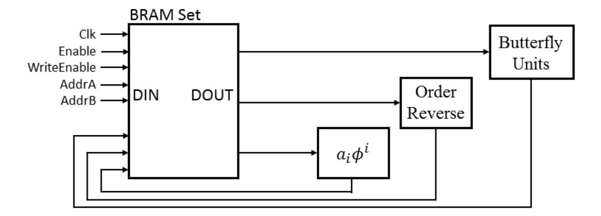
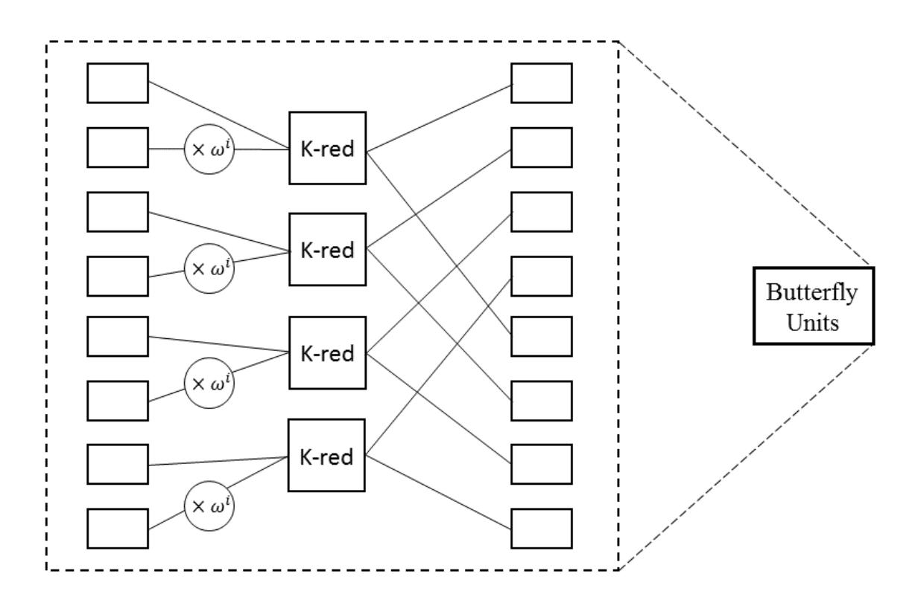
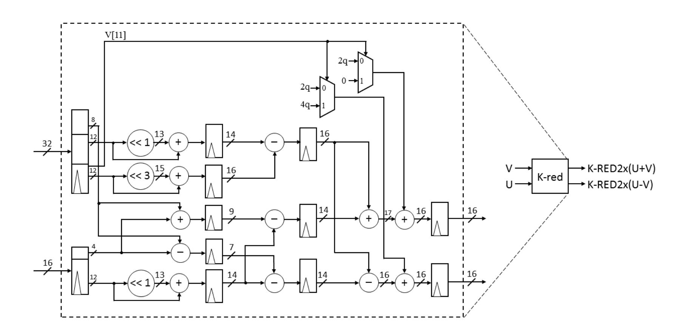

{0}------------------------------------------------

# **High Performance Post-Quantum Key Exchange on FPGAs**

Po-Chun Kuo1*,*2*<sup>a</sup>* , Wen-Ding Li2*<sup>a</sup>* , Yu-Wei Chen1*<sup>b</sup>* , Yuan-Che Hsu1*<sup>b</sup>* , Bo-Yuan Peng2*<sup>a</sup>* , Chen-Mou Cheng1*<sup>a</sup>* , and Bo-Yin Yang2*<sup>a</sup>*

**Abstract.** Lattice-based cryptography is a highly potential candidate that protects against the threat of quantum attack. At Usenix Security 2016, Alkim, Ducas, Pöpplemann, and Schwabe proposed a post-quantum key exchange scheme called NewHope, based on a variant of lattice problem, the ring-learning-with-errors (RLWE) problem. In this work, we propose a high performance hardware architecture for NewHope. Our implementation requires 6,680 slices, 9,412 FFs, 18,756 LUTs, 8 DSPs and 14 BRAMs on Xilinx Zynq-7000 equipped with 28mm Artix-7 7020 FPGA. In our hardware design of NewHope key exchange, the three phases of key exchange costs 51.9, 78.6 and 21.1 *µs*, respectively. It achieves more than 4.8 times better in terms of area-time product comparing to previous results of hardware implementation of NewHope-Simple from Oder

**Keywords.** Post-quantum cryptography, lattice-based cryptography, LWE, RLWE, key exchange, FPGA implementation.

# **1 Introduction**

and Güneysu at Latincrypt 2017.

In the last decade, post-quantum cryptography has drawn widespread interest. Not only will postquantum cryptography potentially save us from the threat from large quantum computers, but also provide provable security in many cases. Lattice-based cryptography is a candidate for postquantum cryptography that provides strong theoretical security guarantees such as worst-case to average-case reduction. It also provides the initial constructions of many new cryptographic functionalities, e.g., fully-homomorphic encryption [Gen09]. Furthermore, such cryptosystems are usually very efficient. For example, the computation of some public-key encryption based on (Ring-)LWE is faster than RSA/ECC, even though the key size is usually larger [GFS+12,FY14].

Recently, National Institute of Standards and Technology (NIST) announced a post-quantum crypto project, aiming to select new standard cryptographic primitives for the post-quantum era [oSN16]. The key establishment algorithm is one of the most important primitives in this project. At Usenix 2016, Alkim, Ducas, Pöpplemann, and Schwabe proposed the NewHope post-quantum key agreement scheme, based on the ring-learning-with-errors (RLWE) problem [ADPS16]. Google conducted a set of experiments using NewHope on internet through the Google Chrome Canary Browser starting from July, 2016. The results show that NewHope is computationally inexpensive, with only a slight increase in latency for some slow internet connections.

In the era of heterogeneous computing, special purpose computing device can be accessed by the CPU to offload the computation to achieve lower cost or higher power efficiency[PCC<sup>+</sup>14].

<sup>1</sup> Department of Electrical Engineering, National Taiwan University, Taipei, Taiwan 2 Institute of Information Science, Acamedia Sinica, Taipei, Taiwan,

*a* {kbj,thekev,bypeng,doug,by}@crypto.tw *<sup>b</sup>* {r05921032,r05921056}@ntu.edu.tw

{1}------------------------------------------------

However, application-specific integrated circuits (ASICs) are very expensive, so a more cost-effective way to deploy hardware accelerators is to use Field-Programmable Gate Arrays (FP-GAs).

As a result, FPGAs are one of the most popular ways today to deploy hardware accelerators. An FPGA contains an array of programmable logic components and a hierarchy of reconfigurable interconnects. In fact, people can now launch instances with FPGAs attached on Amazon Web Service (AWS). Therefore, many foresee the use of cloud services with on-demand FPGAs to increase computation resource when load is high.

### 2 Background

**Notation.** Let  $\chi$  be a probability distribution over a set S. We use  $x \stackrel{\$}{\leftarrow} \chi(S)$  to denote x sampled from S according to  $\chi$ , and  $x \stackrel{\$}{\leftarrow} S$  to denote x uniformly sampled from S. We define ring  $\mathcal{R} = \mathbb{Z}[X]/(X^n+1)$  as the ring of integer polynomials modulo  $X^n+1$  and  $\mathcal{R}_q = \mathcal{R}/q\mathcal{R}$  as the ring of  $\mathcal{R}$ , where each coefficient is reduced modulo q.

**LWE and RLWE.** The LWE problem is first introduced by Regev [Reg09] and can be quantum-reduced to certain worst-case lattice problems. Moreover, Peikert [Pei09] and Brakerski *et al.* [BLP<sup>+</sup>13] further improve the situation by providing classical reductions to lattice problems. LWE based public key cryptosystem is proposed in various variant schemes [ABB10b,ABB10a,Pei09,BV11b,BV11a,LP11]. One important variant of LWE is Ring-LWE, which introduces ring structure into play [LPR10]. The RLWE problem is defined as following: let  $s \in \mathcal{R}_q$  be the secret, generate  $a \stackrel{\$}{\leftarrow} \mathcal{R}_q$  and  $e \stackrel{\$}{\leftarrow} \chi(\mathcal{R}_q)$ , compute b = a \* s + e, and the search version of RLWE is to find s given a list of (a,b). For the setting of most cryptosystems, only one pair of (a,b) is given.

Post-Quantum Key Exchange. Recently there are two majority ways to construct a post-quantum key exchange: lattice-based and isogeny-based. Supersingular isogeny Diffie-Hellman key exchange is the key exchange scheme based on isogeny [CLN16]. However, the best hardware implementation of SIDH to date has the running time which is typically an order of magnitude larger than similar schemes based on (R-)LWE. Thus, RLWE may still be the most efficient choice of post-quantum key exchange scheme so far.

The first LWE-based key exchange is proposed by Ding [Din12], subsequently modified by Peikert [Pei14]. At 2015, Bos *et al.* implemented Peikert's version of RLWE key exchange with a parameter set of their choice [BCNS15]. They also integrated their implementation into the TLS protocol into OpenSSL.

NewHope is the key exchange scheme proposed by Alkim et al. [ADPS16], which further improves the performance from [BCNS15] by choosing a different set of parameters. Their analysis shows that the new scheme still remains secure while using a smaller modulus, efficient noise sampling, and fast reconciliation. The details of NewHope will be introduced in next section. Frodo is the key exchange scheme based on LWE problem instead of RLWE problem, proposed by Bos et al. after NewHope [BCD<sup>+</sup>16]. Without the additional assumption of ring-structure, they selected the parameter with a smaller security margin. Because it based on LWE rather than RLWE, Frodo is still less efficient than NewHope. More precisely, the computation cost of Frodo is around ten times larger, and the communication size is around six times larger than NewHope. However, Frodo is an alternative choice for post-quantum key exchange since RLWE-based cryptosystem might be potentially insecure [ELOS15,CIV16] due to the ring structure.

{2}------------------------------------------------

#### 2.1 NewHope Protocol

As mentioned earlier, NewHope is a variant of Ding's and Peikert's protocols [Din12,Pei14]. The protocol is described in Protocol 1. All the variables except for  $\mathbf{r} \in \mathbb{R}^4$  are in the ring  $R_q = \mathbb{Z}[X]/(X^n + 1)$ , where n = 1024 and q = 12289. This parameter setting is suitable for a number-theoretic transform (NTT) since  $q \equiv 1 \mod 2n$ .

The key idea of the protocol is: Use the property of  $ass' + es' = bs' \approx us = ass' + e's$ , where Alice can compute the left-hand side part and Bob can compute the right-hand side part. A problem arises in this situation: The codeword is decided by ass', so the rounding technique usually used in a LWE-based cryptosystem does not work. More precisely, the value of ass' may be near the boundary between where a point rounds to 0 and where it rounds to 1. Then Alice and Bob will add different noise vectors, which may lead to different rounding results. The technique to solve this problem is called reconciliation. The main idea is that one party (in NewHope, Bob) sends a hint to the other party (in NewHope, Alice), and the two parties can use the hint to decode the message into the same shared secret. The algorithm to generate hint is shown in Algorithm 1, and the reconciliation algorithm is shown in Algorithm 2.

Finally, to transmit a 256-bits key with 1024 coefficients, NewHope encodes 1 bit of codeword into 4 coefficients in order to increase the error resilience and better security.

Protocol 1: NewHope Key Exchange Scheme

Parameters:  $q = 12289 < 2^{14}$ , n = 1024Error Distribution:  $\psi_{16}$ Alice (server) Bob (client)  $seed \stackrel{\$}{\leftarrow} \{0,1\}^{256}$   $a \leftarrow \text{Parse}(\text{SHAKE-}128(seed))$   $s, e \stackrel{\$}{\leftarrow} \psi_{16} \qquad s', e', e'' \stackrel{\$}{\leftarrow} \psi_{16}$   $b \leftarrow as + e \xrightarrow{(b,seed)} a \leftarrow \text{Parse}(\text{SHAKE-}128(seed))$   $u \leftarrow as' + e'$   $v \leftarrow bs' + e''$   $v' \leftarrow us \stackrel{(u,r)}{\leftarrow} r \stackrel{\$}{\leftarrow} \text{HelpRec}(v)$   $v \leftarrow \text{Rec}(v', r) \qquad v \leftarrow \text{Rec}(v, r)$   $\mu \leftarrow \text{SHA3-}256(v) \qquad \mu \leftarrow \text{SHA3-}256(v)$ 

#### 2.2 Algorithms

**Reconciliation** We follow [ADPS16] in implementing the reconciliation function. The main idea of the recovery mechanism is to encode and decode over the lattice  $\tilde{D}_4$ , which is the densest lattice sphere packing in dimension 4 so that it provides the lowest failure rate.  $\tilde{D}_4$  consists the two shifted copies  $\mathbb{Z}^4$  with the shift vector  $\mathbf{g} = (1/2, 1/2, 1/2, 1/2)^t$ . The basis of  $\tilde{D}_4$  is  $(\mathbf{e}_1, \mathbf{e}_2, \mathbf{e}_3, \mathbf{g})$ .

$$\tilde{D}_4 = \mathbb{Z}^4 \cup (\mathbb{Z}^4 + \boldsymbol{g})$$

The encoding method is to equally split the 4-dimensional space by the 1-norm distance to g, that is, the regular 24-cells isositetrachoron shape. The r-bit assisted reconciliation algorithm, the algorithm to generate hints, is shown in Algorithm 1, the reconciliation algorithm is shown in Algorithm 2, and NewHope selects the parameter r=2.

{3}------------------------------------------------

```
Algorithm 1: HelpRec

Parameter: r-bits reconciliation information
Input: w \in \mathbb{Z}_q^4
Output: 4 dimension r-bits reconciliation information \{0,1,...,2^r-1\}^4

1: b \stackrel{\$}{\leftarrow} \{0,1\}
2: x \leftarrow (\frac{2^r}{q}(w+b\cdot(\frac{1}{2},\frac{1}{2},\frac{1}{2},\frac{1}{2})^t))
3: v_0 \leftarrow \lfloor x \rceil
4: v_1 \leftarrow \lfloor x - (\frac{1}{2},\frac{1}{2},\frac{1}{2},\frac{1}{2})^t \rceil
5: k \leftarrow (\parallel x - v_0 \parallel_1 < 1)?0: 1
6: (v_0,v_1,v_2,v_3)^t \leftarrow v_k
7: return (v_0,v_1,v_2,k)^t + v_3 \cdot (-1,-1,-1,2)^t \mod 2^r
```

```
Algorithm 2: Rec

Parameter: r-bits reconciliation information

Input: w \in \mathbb{Z}_q^4, r = (r_0, r_1, r_2, r_3)

Output: 1-bit shared information

1: x \leftarrow (\frac{1}{q}w - \frac{1}{2^r} \cdot (r_0 + \frac{r_3}{2}, r_1 + \frac{r_3}{2}, r_2 + \frac{r_3}{2}, \frac{r_3}{2})^t))

2: v = x - \lfloor x \rfloor

3: return 0 if \parallel v \parallel_1 \leq 1, and 1 otherwise
```

**Number-Theoretic Transform.** Direct multiplication (using school-book algorithm) between two elements in polynomial ring costs  $n^2$  multiplications and roughly as many additions or subtractions. The best way to accelerate the computation is to use fast Fourier transform. The number theoretic transform (NTT) is a discrete version of fast Fourier transform defined over a finite ring  $\mathbb{Z}_p$ . The NTT algorithm is shown in Algorithm 3, and the inverse number theoretic transform, INTT is very similar to NTT except for an additional final multiplication by  $n^{-1}$  for each coefficient of the polynomial.

**Negative Wrapped Convolution.** The NewHope uses the anti-cyclic ideal  $\mathbb{Z}_q[X]/(X^n+1)$ , which does not lead to a classical cyclic convolution when we multiply two ring elements. We use what is called "negative wrapped convolution" to solve the problem. Negative wrapped convolution is first introduced in [LMPR08], and Chen *et al.* implemented the algorithm on FPGA [CMV<sup>+</sup>15]. Let  $\mathbf{c} = (c_0, c_1, ..., c_{n-1})$  be the negative wrapped convolution of  $\mathbf{a} = (a_0, a_1, ..., a_{n-1})$  and  $\mathbf{b} = (b_0, b_1, ..., b_{n-1})$ , it is defined by

$$c_i = \sum_{j=0}^{i} a_j b_{i-j} - \sum_{j=i+1}^{n-1} a_j b_{n+i-j}.$$

This is exactly the polynomial multiplication over  $\mathbb{Z}_q[X]/(X^n+1)$ . Using the NTT multiplication with negative wrapped convolution, the complexity of multiplication over the polynomial ring  $\mathbb{Z}_q[X]/(X^n+1)$  becomes  $O(n \log n)$ . The pseudo-code of negative wrapped convolution is shown in Algorithm 4.

**Noise Sampling.** The Knuth-Yao algorithm [KY76] is a common way to sample high-precision discrete Gaussian distribution, which is implemented in [RVV13]. However, such near optimality

{4}------------------------------------------------

```
Algorithm 3: Number-Theoretic Transform, NTT
     Parameter: \omega is a primitive n-th root of unity in \mathbb{Z}_q[X], n and q
                              : \boldsymbol{a} \in \mathbb{Z}_q[X]/(X^n+1)
    Input
                              : \mathbf{A} = NTT_{\omega}^{n}(\mathbf{a})
     Output
\mathbf{1} \ \mathbf{a} \leftarrow Order\_reverse(\mathbf{a})
2 for i = 0 to \log_2 n - 1 do
      for j = 0 to n/2 - 1 do
\begin{bmatrix}
P_{ij} \leftarrow \lfloor \frac{j}{2^{\log_2 n - 1 - i}} \rfloor \times 2^{\log_2 n - 1 - i} \\
A_j \leftarrow a_{2j} + a_{2j+1} \omega^{P_{ij}} \mod q \\
A_{j+n/2} \leftarrow a_{2j} - a_{2j+1} \omega^{P_{ij}} \mod q
\end{bmatrix}
3
4
5
6
            if i \neq \log_2 n - 1 then
7
              a \leftarrow A
8
\mathbf{9} return A
```

```
Algorithm 4: Polynomial Multiplication using NTT over \mathbb{Z}_q[X]/(X^n+1)
     Parameter: \omega is a primitive n-th root of unity in \mathbb{Z}_q[X], \phi^2 = \omega, n, and q
                             : \boldsymbol{a}, \boldsymbol{b} \in \mathbb{Z}_q[X]/(X^n+1)
      Input
     Output
                         : \mathbf{c} = \mathbf{a} * \mathbf{b} \in \mathbb{Z}_q[X]/(X^n + 1)
 1 Precompute: \omega^i, \omega^{-i}, \phi^i, \phi^{-i}, where i = 0, 1, ..., n-1
 2 for i = 0 to n - 1 do
 \mathbf{3} \quad | \quad \overline{a}_i \leftarrow a_i \phi^i \mod q
 \mathbf{4} \quad | \quad \overline{b}_i \leftarrow b_i \phi^i \mod q
 5 \overline{\boldsymbol{A}} \leftarrow NTT_{\omega}^{n}(\overline{\boldsymbol{a}})
 6 \overline{\bm{B}} \leftarrow NTT^n_{\omega}(\overline{\bm{b}})
 7 for i = 0 to n - 1 do
 \mathbf{8} \quad | \quad \overline{C}_i \leftarrow \overline{A}_i \overline{B}_i \mod q
 9 \overline{\bm{c}} \leftarrow INTT^n_{\omega}(\overline{\bm{C}})
| 10 \text{ for } i = 0 \text{ to } n - 1 \text{ do } |
11 \quad c_i \leftarrow \overline{c}_i \phi^{-i} \mod q
12 return c
```

{5}------------------------------------------------

may result in non-constant execution time, which might lead to side-channel attack. Thus, we do not use the algorithm in this work. NewHope samples the noise from the binomial distribution instead of discrete Gaussian distribution, which needs high precision and much more computation resources. Moreover, sampling from the centered binomial distribution  $\psi_{16}$  is cheap in both hardware and software. One can use the property that the centered binomial distribution follows  $\sum_{i=0}^{15} b_i - b'_i$ , where the  $b_i, b'_i$  are random bits. Thus, the sampling algorithm needs 32 random bits to generate one coefficient.

#### 2.3 **FPGA**

The basic building block of FPGAs is the look-up tables (LUTs). In Xilinx 7 series FPGA, each LUT can be programmed either as a 6-input 1-output function or two 5-input 1-output functions. To implement sequential circuits, each LUT can be connected to two flip-flops. Certain number of LUTs are then grouped into a slice, and a few slices are grouped into a configurable logic block (CLB). Building around CLBs, FPGAs have other circuitries for, e.g., multiplexing input and output, carry-propagation chains for accelerating arithmetic computation, as well as routing fabrics for connecting LUTs. Furthermore, FPGAs also have fixed multipliers in so-called "DSP slices" that can carry out (fixed-point) arithmetic operations, as well as block RAM as the fast on-die working memory. We use Xilinx Zynq-7000 all programmable SoC (AP SoC), which is equipped with a dual-core ARM Cortex-A9 processors running at 667 MHz and integrated with 28nm Artix-7 Z-7020 FPGA. This FPGA has 46,200 look-up tables and 220 DSP slices.

#### 3 Implementation

The block diagram is in Figure 1. There are three main blocks in the diagram representing the flowchart of our hardware implementation of NewHope. First, Alice (Server) uses the TRNG and PRNG to generate the seed of  $\hat{a}$ , and computes b = as + e in NTT domain. Bob (Client) receives the seed of  $\hat{a}$  and  $\hat{b}$  (b in NTT domain), computes u = as' + e' in NTT domain and the his shared secrete v = bs' + e'', and compute the reconciliation information and the shared key. In the last step, Alice (Server) receives  $\hat{u}$  (u in NTT domain) and reconciliation information r, compute their shared secret v = us, and derive the shared key though the reconciliation function with r. We explain the techniques in our implementation.

#### 3.1 Random Number Generator

There are two phases in generating the randomness: TRNG (true random number generator) and PRNG (pseudorandom number generator). In the TRNG phase, we use a credible way from Wold and Tan's work to generate the randomness by oscillator rings, which has passed NIST and DIEHARD statistical tests [WT09]. The throughput of the implementation from Wold and Tan is 100Mbps with less than 100 logic elements in an Altera Cyclone II FPGA. In our implementation, we use 32 oscillators rings to generate the randomness, and their experiment showed if the number of oscillator rings exceeds 25, the result can pass the statistical tests. In the PRNG phase, NewHope uses SHAKE128 as the PRNG, which is the Extendable Output Functions (XOF's) of SHA-3 family. NewHope uses the extendable property to generate 1024 uniform coefficients in  $\mathbb{Z}_p$  with 256 bits true randomness since the randomness is sufficient resist either classic brute-force attack or quantum attack (Grover's algorithm). We extract the SHAKE128 portion from open-source code [Ope12], which usually provides only standard SHA-3 on FPGA.

{6}------------------------------------------------

Fig. 1: Flowchart of our implementation

#### **3.2 Number-Theoretical Transform**

We use the design of optimized NTT hardware implementation in [CMV+15,RVM+14]. The main differences are that we use 4 butterfly units, and the modulus is different.

Figure 2 is the high level design of our NTT implementation, it combined both NTT and INTT. For NTT, it processes multiplication on *ϕ i* , order reverse, and butterfly units in order. In contrast, INTT processes order reverse, butterfly units and multiplication on *ϕ i* in order.

Fig. 2: Overview of our NTT implementation, which consists three components of circuit: multiplication on *ϕ i* , order reverse, and butterfly units.



**Order-Reverse** Unlike software implementation, the order-reverse part , whose latency is shown in table. 2, is one of the bottleneck of NTT in hardware implementation. We point out that this 

{7}------------------------------------------------

part can be ignored since we can assume that either the input generated from random number generator is ordered as the input of the butterfly units in NTT or it is not necessary to reverse the order in INTT by both of two parties. But, both of the two parties have to agree to do or not to do the order-reverse precess in order to reconcile the same shared-key. Thus, we can remove this part in order to accelerate NTT around 40%.

Butterfly Units. In [CMV<sup>+</sup>15], they use 8 and 2 butterfly units and compare the performance. In [RVM<sup>+</sup>14]'s implementation, they use a single butterfly unit to compute the NTT function in order to optimize the area usage. We use 4 butterfly units to compute the NTT since our implementation aims to be more speed-optimized. Also, we follow the idea of [CMV<sup>+</sup>15] we use the architecture shown in Figure 3 that places the data into the memory in the correct positive in order to achieve higher efficiency.



Fig. 3: Illustration of the design of the butterfly unit

Modular Reduction. A common way to do modular reduction is Barrett reduction.

$$c \mod p = c - \lfloor (c \cdot \frac{1 \ll 32}{12289}) \gg 32 \rfloor \cdot 12289$$

In this viewpoint, we can use DSP to multiply the reciprocal of 12289 without computing the floating number. Since the algorithm chops rather than rounds the result, the result is possibly slightly large than p. Thus, the algorithm subtracts p if it is larger than p in the final step. We can further improve the computation since  $12289 = (1 \ll 13) + (1 \ll 12) + 1$  by following equation, where  $\bar{a}$  is the complement of  $\lfloor (c \cdot \frac{1 \ll 32}{12289}) \gg 32 \rfloor$ 

$$c \mod p = (c + (\bar{a} \ll 13)) + ((\bar{a} \ll 12) + \bar{a})$$

So a Barrett modular reduction with q = 12289 is around 5 cycles. But there is a multiplication between 32 bit- and 19-bit numbers leading to a long critical path and limiting the frequency.

Therefore we opt for the efficient reduction method from [LN16] for modular reduction. The method is a variant of Montgomery reduction with the auxiliary modulus k, which is defined by

{8}------------------------------------------------

```
\begin{array}{ll} \text{function K-RED(C)} & \text{function K-RED-2x(C)} \\ C_0 \leftarrow C \mod 2^m & C_0 \leftarrow C \mod 2^m \\ C_1 \leftarrow C/2^m & C_1 \leftarrow C/2^m \mod 2^m \\ \text{return } kC_0 - C_1 & C_2 \leftarrow C/2^{2m} \\ \text{end function} & \text{return } k^2C_0 - kC_1 + C_2 \\ & \text{end function} \end{array}
```

```
q = k \cdot 2^m + 1. For q = 12289, we have m = 12 and k = 3.
```

This algorithm is suitable for hardware implementation, since the operations in the function K-RED and K-RED2x are bit selections plus a final step which is equal to  $(C_0 \ll 1) + C_0 - C_1$  and  $(C_0 \ll 3) + C_0 - (C_1 \ll 1) - C_1 + C_2$ , respectively. Using this technique, we replace Line 5&6 in Algorithm 3 and get Algorithm 5.

```
Algorithm 5: Number-Theoretic Transform with K-RED
     Parameter: \omega is a primitive n-th root of unity in \mathbb{Z}_q[X], n and q
                           : a \in \mathbb{Z}_q[X]/(X^n + 1)
     Input
                            : \mathbf{A} = NTT_{\omega}^{n}(\mathbf{a})
     Output
 \mathbf{1} \ \mathbf{a} \leftarrow Order\_reverse(\mathbf{a})
 2 for i = 0 to \log_2 n - 1 do
           for j = 0 \ to \ n/2 - 1 \ do
 3
                 P_{ij} \leftarrow \lfloor \frac{j}{2^{\log_2 n - 1 - i}} \rfloor \times 2^{\log_2 n - 1 - i}U \leftarrow \mathbf{K} - \mathbf{RED}(a_{2j})
 4
 5
                 V \leftarrow \mathbf{K}\text{-}\mathbf{RED2x}(a_{2j+1}\omega^{P_{ij}})
A_j \leftarrow U + V
A_{j+n/2} \leftarrow U - V
 6
 7
 8
           if i \neq \log_2 n - 1 then
 9
                 a \leftarrow A
10
11 return A
```

We replace Line 3, 4, 8, 9 and 11 in Algorithm 4 to get Algorithm 6.

Note that K-RED function does not compute the exact value  $C \mod q$  but  $kC \mod q$ . Correspondingly K-RED2x function computes  $k^2C \mod q$ , and we eliminate the extra factor of k by storing  $\omega_{ij}^P k^{-1}$  instead of  $\omega_{ij}^P$ . Thus, after multiplication of  $\omega_{ij}^P k^{-1}$  and K-RED2x function, the result kC has the correct value. Since  $n=1024=2^{10}$ , there are ten stages in NTT function, the output vector from NTT with K-RED is  $k^{10}v$ , where v is the correct output vector of NTT. It is easy to transform the output vector to correct one, but we wait until the last step of INTT, which now becomes a final multiplication by the pre-computable  $n^{-1}k^{-14}$ .

One trick in the modified algorithm is to pre-compute  $\phi^i k^{-(2+\log n)}$  instead of  $\phi^i$ . This ensures that the output of our modified algorithm is exactly the same as that from the original NTT. We also replace  $INTT^n_{\omega}$  by  $NTT^n_{-\omega}$ , and multiply instead by  $n^{-1}\phi^{-i}$  (which can also be precomputed and stored in the block RAM) in Line 11,. This way we only need 1024 multiplications.

Note that the output of both functions are bounded by not a fixed value but by  $q + |C|/2^m$  which is related the input value C. Applying results of [LN16] to our algorithm, the input size of function K-RED and K-RED2x are 16 bits and 32 bits, respectively. One technique to maintain

{9}------------------------------------------------

```
Algorithm 6: Polynomial Multiplication using NTT with K-RED over \mathbb{Z}_q[X]/(X^n+1)
     Parameter: \omega is a primitive n-th root of unity in \mathbb{Z}_q[X], \phi^2 = \omega, n, and q
                            : a, b \in \mathbb{Z}_q[X]/(X^n + 1)
     Input
                        : c = a * b \in \mathbb{Z}_q[X]/(X^n + 1)
     Output
 1 Precompute: \omega^i, \omega^{-i}, \phi^i, \phi^{-i}, where i = 0, 1, ..., n-1
 2 for i = 0 to n - 1 do
            \overline{a}_i \leftarrow \mathbf{K}\text{-}\mathbf{RED2x}(a_i(\phi^i k^{-(2+\log n)}))
 3
       \bar{b}_i \leftarrow \mathbf{K}\text{-}\mathbf{RED2x}(b_i(\phi^i k^{-(2+\log n)}))
 4
 5 \overline{\boldsymbol{A}} \leftarrow NTT_{\omega}^{n}(\overline{\boldsymbol{a}})
 6 \overline{\boldsymbol{B}} \leftarrow NTT_{\omega}^{n}(\overline{\boldsymbol{b}})
 7 for i = 0 \ to \ n - 1 \ do
 \mathbf{8} \quad \bigsqcup \ \overline{C}_i \leftarrow \mathbf{K}\text{-}\mathbf{RED2x}(\overline{A}_i\overline{B}_i)
 9 \overline{\bm{c}} \leftarrow NTT^n_{-\omega}(\overline{\bm{C}})
10 for i = 0 \text{ to } n - 1 \text{ do}
      c_i \leftarrow \mathbf{K}\text{-}\mathbf{RED2x}(\overline{c}_i(\phi^{-i}k^{-(4+\log n)}n^{-1}))
11
12 return c
```

a plus sign for the output of these two functions (in order to multiply using DSP slices in the next stage) is to add multiples of q = 12289. It can be verified that U + V and U - V are larger than -2q and -4q, respectively. But directly adding 2q and 4q to U + V and U - V causes a new problem: it may exceeds 16 bits. BRAM reads 64 bit at a time, so 17 bits as the input of K-RED slows each BRAM read to 3 data points.

Thus, we propose the method to solve the problem: Let s be bit 11 (corresponding to 2048) of  $a_{2j+1}\omega^{P_{ij}}$  in Line 6 in Algorithm 5.

If 
$$s = 0$$
,  $A_j \leftarrow U + V + 2q$  and  $A_{j+n/2} \leftarrow U - V + 2q$ .  
If  $s = 1$ ,  $A_j \leftarrow U + V$  and  $A_{j+n/2} \leftarrow U - V + 4q$ .

Note that both sets of values are computed and then selected using s to avoid side-channels. This modification makes sure that the results of that step are positive. This method is a consequence of the properties of the K-RED and K-RED2x functions, and we give the proof in Appendix A. Note that the outputs of function K-RED and K-RED2x are signed 14 bits and signed 16 bits, respectively. Combined all the techniques describe above, the design of K-RED in the butterfly unit is shown in Figure 4.

Previous Method According to our knowledge, most of the previous method to achieve modular reduction is long division with pipeline. A nature problem with this method is the stage number of the pipeline is decided by  $\lceil \log(\text{dividend}) - \log(\text{divisor}) \rceil$ . But our method for specific modular number has much less stages (which is 4, long division is 13), which reduces the area.

#### 3.3 Reconciliation

A naive way to implement the HelpRec and Rec function on FPGA is to pre-compute 1/q and to use DSPs to compute the multiplication in runtime. This way is inefficient and wastes many logic elements. In our implementation of reconciliation, instead of trying to determine  $\sum_{n=0}^{3} x_i/q < 1$  or not, we determine where  $\sum_{n=0}^{3} x_i$  is less than q or not, in order to avoid floating-point number computation. Other divisors do not need this trick because they are all powers of 2. We designed

{10}------------------------------------------------

Fig. 4: illustration of the design of K-RED



6 stages pipeline architecture for HelpRec modulo and 3 stages pipeline architecture for Rec modulo.

# 4 Results

The three phases of key exchange cost 51.9, 70.1 and 21.1  $\mu s$ , respectively. The resource consumption of each component is shown in Table 2 and the design of hardware architecture is shown in Figure 5. The area of PRNG (SHAKE from SHA-3) is quite large among the components. It occupies 44.3% of FFs and 18.7% of LUTs in our implementation. However, it is not the focus of this work. In theory we could have taken any FPGA SHA-3 implementation, such as the area-optimized one from [KDV<sup>+</sup>11] which only uses one tenth of the area. Alternatively, one can use a lightweight PRNG to generate the randomness for  $\psi_{16}$ .

The implementation of SHAKE outputs 1344 bits per 24 cycles with a few cycles for setting up. To generate the uniform coefficient  $\bar{a}$ , we use reject sampling with 16 bits: if the number is less than 5q, accept it, otherwise, reject it. Thus, the accept rate is  $5*12289/2^{16} \sim 93.76\%$  and the expected number of SHAKE is 13. For the binomial random variable  $\psi_{16}$ , 32 bits randomness is required to generate one coefficient. Thus, the total latency is around 2 times of the latency of generating  $\bar{a}$ . The area of NTT component is reasonable since it is around 4 times that of [RVM+14]. Note that we use 4 butterfly units in each NTT component, and they use only one. For the reconciliation, we use 2 copies of HelpRec / Rec circuits in order to get high performance. Therefore, the latency of HelpRec+Rec and Rec in our implementation are 141 and 135 cycles, respectively. Note that, the output of HelpRec immediately sends to Rec in Bob part. Thus, the latency can be hidden and it is only 6 clocks slower than Rec in Alice part.

{11}------------------------------------------------

Share Secret (final result) 128 Multiplier and Adder 16x4 128 Collector 128 K-reduction (x8) 128 BRAM Output for Bob (x8) (âŝ+ê), (ûŝ) Ring Oscillator (a) Module (ĥ, û) Input from Bob (TRNG) BRAM Uniform Sampler 16x4 NTT / INTT (ŝ) (x4) Module SHAKE 256 / > 16x4 Input from Bob (PRNG) r register Binomial Sampler (x4) Modular Module (x8) Rec (<5q) Module (x2) Seed ➤ Output for Bob register (a) Alice(Server) side Share Secret (final result) Multiplier and Adder 16x4 128 128 Collector K-reduction (x8) BRAM Output for Alice (âŝ'+ê') (b̂ŝ') Ring Oscillator (â) Module (ĥ, û) Input from Alice (TRNG) BRAM 16x4 Uniform Sampler NTT / INTT (ŝ') (x4) 256 256 Module SHAKE 16x4 (PRNG) Binomial Sampler (x4) Adder Modular Module (x8)

HelpRec+Rec

Modula (x2) (x8) (+e'') r register Output for Alice Module (x2) (<6q) Collector 128 (e'') Seed Input from Alice register

Fig. 5: Our design of hardware architecture

Table 2: The resource consumption of each component

(b) Bob(Client) side

|                          |       | A                    | rea   |        |             |                 |
|--------------------------|-------|----------------------|-------|--------|-------------|-----------------|
| Component                | #LUTs | #Slices<br>Registers | #DSPs | #BRAMs | Clock Count | Max Freq. (MHz) |
| TRNG                     | 310   | 258                  | 0     | 0      | 1           | -               |
| PRNG (SHA-3)             | 3,516 | 2,976                | 0     | 0      | 24          | 355             |
| -generate $\overline{a}$ | _     | -                    | -     | -      | 312         | -               |
| -generate $\psi_{16}$    | _     | -                    | -     | -      | 613         | -               |
| pipelined NTT            | 2,832 | 1,381                | 8     | 10     | 2616        | 150             |
| -multiply $\phi^i$       | _     | -                    | -     | -      | 132         | -               |
| -Order Reverse           | _     | -                    | -     | -      | 1024        | -               |
| -Butterfly Units         | _     | -                    | -     | -      | 1330        | -               |
| HelpRec+Rec (Bob)        | 968   | 406                  | 0     | 0      | 269         | 229             |
| Rec (Alice)              | 557   | 127                  | 0     | 0      | 263         | 229             |

{12}------------------------------------------------

To date, our implementation is the fastest post-quantum key exchange, which is 222, 138 and 19.1 times faster than that of SIDH [KAKJ17], [BK16] and [OG17], respectively. In Fig 3, we also show the best record of hardware implementation of lattice-based PKE.

*Comparing to implementation of NewHope-Simple.* [OG17] uses 1,483 and 1,708 slices for client and server side, and our implementation uses 6,680 and 7,153 slices. For post-quantum key exchange, the resource we use is less than four times larger than NewHope-Simple implementation [OG17], but the total time is 19.1 times faster. That is, the time-area product is more than 4.8 times better. The first reason is that we design 4 stages of pipeline in the K-RED modulo and second reason is we adapted the Longa-Naehrig modular reduction to reduce the resource. Also, one can observe that the reconciliation is relatively cheap and would not be the bottleneck of the key exchange scheme.

*Comparing to lattice-based PKE.* At first glance, our results is worse than the hardware implementation of PKE. But the computation of NewHope is about 3.3 times larger than the computation of RLWE with (*p, q, σ*) = (512*,* 12289*,* 4*.*92). The computation of NTTs dominates both schemes (in fact, NewHope has higher load because it has to expand *a* and compute Rec and HelpRec) Totally, NewHope has 6 NTT parts (include INTT) and RLWE-based PKE typically has 4 NTT parts (include INTT). And considering that the size of the NTT is *n* log *n*, the overall computation ratio is at least 3.3. The total time of our implementation is 151.6 *µs*, and the total time of RLWE(512,12289,4.92) is 68.9*µs*. However, the two primitives are different. For a public-key encryption scheme to provide forward secrecy, a one-time public key needs to be generated and transmitted every time before being used. That would probably make up much of the difference.

However, as we mentioned in the introduction, the functionality of key transport is not the same as key agreement. Therefore, there is a need for a post-quantum key exchange scheme as well as its hardware implementation.

## **5 Conclusion**

In this work, we propose a high performance hardware implementation of lattice-based key exchange, which is also the fastest hardware implementation of post-quantum key exchange so far. Compare to the previous NewHope-Simple hardware implementation, our implementation did 4*.*8*×* better in time-area product. This is the first pipeline implementation of lattice-based key exchange, and is the first work to adapt Longa-Naehrig modular reduction into hardware design. We also show the cost of reconciliation, which is quite cheap. Our code will be made public available.

#### **5.1 Future Work**

A countermeasure for side channel attacks (SCA) is an urgent priority. For example, we may use a method such as the masked RLWE decryption implementation resistant to first-order SCA is proposed in [RRVV15] and apply it in our implementation. It is also interesting to optimize the SCA countermeasures for post-quantum key exchange scheme.

## **References**

[ABB10a] Shweta Agrawal, Dan Boneh, and Xavier Boyen. Efficient lattice (H)IBE in the standard model. In *Advances in Cryptology - EUROCRYPT 2010, 29th Annual International Conference on the Theory and Applications of Cryptographic Techniques, French Riviera, May 30 - June 3, 2010. Proceedings*, pages 553–572, 2010.

{13}------------------------------------------------

Table 3: Hardware comparison of post-quantum key exchange and some post-quantum public key encryption. In the column of area and frequency, the slash serve to denote the cost of Alice-modulo and Bob-modulo. In the column of latency and total time, the slash serve to denote the cost of Alice0, Bob, and Alice1, the three phases.

| Scheme                 | Parameters              | Security                          | Area   |                                  |          |          | Time    |                  |                 |
|------------------------|-------------------------|-----------------------------------|--------|----------------------------------|----------|----------|---------|------------------|-----------------|
| Scheme                 | rarameters              | Parameter                         | #FFc   | #I IITc                          | #DSDg    | #BRAMs   | Freq    | Latency          | Total time      |
|                        |                         |                                   | #1.1.8 | #1018                            | #DSI 8   | #DITAMS  | (MHz)   | $(\times 10^3)$  | $(\mu s)$       |
| SIDH [KAKJ17]          | prime: 511 bits         | 128 bits                          | 30,031 | 24,499                           | 192      | 27       | 177     | 5,967            | 33,700          |
| SIDH [BK16]            | prime: 503 bits         | 125 bits                          | 26,659 | 19,882                           | 192      | 40       | 181.4   | 3,800            | 20,900          |
| NewHope                | n = 1024, p = 12289,    | 128 bits                          | 9,412  | 18,756                           | 8/8      | 14/14    | 133/131 | 6.9/10.3         | 51.9/78.6       |
| (This Work)            | noise dist. $\psi_{16}$ | 120 0108                          | /9,975 | /20,826                          | 0/0      | 14/14    |         | /2.8             | /21.1           |
| NewHope-Simple         | n = 1024, p = 12289,    | 128 bits                          | 4,452  | 5,142                            | 2        | 4        | 125/117 | 171/179          | 988/1434        |
| [OG17]                 | noise dist. $\psi_{16}$ | 120 0108                          |        |                                  |          |          |         |                  | /473            |
| RLWE(PKE)              | n = 256, q = 7681,      | 80 bits                           | 860    | 1,349                            | 1        | 2        | 313     | 6.3/2.8          | 20.1/9.1        |
| $[RVM^+14]$            | $\sigma = 4.516$        | SO DIES                           | 300    | 1,049                            | 1        |          | 919     | 0.5/2.8          | 20.1/9.1        |
|                        | n = 512, q = 12289,     | 128 bits                          | 953    | 1,536                            | 1        | 3        | 278     | 13.3/5.8         | 47.9/21         |
|                        | $\sigma = 4.92$         | 120 0105                          | 300    | 1,000                            | <b>1</b> | <b>.</b> | 210     | 13.3/3.0         | 41.3/21         |
| RLWE(PKE)              | n = 256, q = 7681,      | 80 bits                           | 3,624  | 4,549                            | 1        | 12       | 262     | 7 24 /6 86 /4 40 | 27.6/26.19/16.8 |
| [PG13]                 | $\sigma = 11.32$        | 00 0163                           | 3,024  | 4,043                            | 1        | 12       | 202     | 1.24/0.00/4.40   | 21.0/20.13/10.0 |
|                        | n = 512, q = 12289,     | 128 bits                          | 4,760  | 5,595                            | 1        | 14       | 251     | 145/138/88       | 57.9/54.9/35.4  |
|                        | $\sigma = 12.18$        | 120 0105                          | 4,700  | 0,000                            |          | 14       | 201     | 14.0/10.0/0.0    | 01.3/04.3/00.4  |
| LWE (PKE)              | n = 256, q = 4096,      | 128 bits                          | 4,804  | 6,152                            | 1        | 73       | 125     | 98.3/32.8        | 786/262         |
| $[\mathrm{HMO}^{+}16]$ | $\sigma = 3.39$         | 120 0168                          | 4,004  | 0,102                            |          | 10       | 120     | 30.9/32.0        | 100/202         |
| NTRU[LW16]             | n = 761, q = 2048,      | 128 bits                          | #logic | #logic elm: 42,642, #reg: 16,746 |          |          | 75.36   | 0.44             | 5.89            |
| ees761ep1              | p=3                     | #10gic eiii: 42,042, #reg: 10,740 |        | 10.00                            | 0.44     | 0.09     |         |                  |                 |

- [ABB10b] Shweta Agrawal, Dan Boneh, and Xavier Boyen. Lattice basis delegation in fixed dimension and shorter-ciphertext hierarchical IBE. In Advances in Cryptology CRYPTO 2010, 30th Annual Cryptology Conference, Santa Barbara, CA, USA, August 15-19, 2010. Proceedings, pages 98–115, 2010.
- [ADPS16] Erdem Alkim, Léo Ducas, Thomas Pöppelmann, and Peter Schwabe. Post-quantum key exchange A new hope. In 25th USENIX Security Symposium, USENIX Security 16, Austin, TX, USA, August 10-12, 2016., pages 327–343, 2016.
- [BCD<sup>+</sup>16] Joppe W. Bos, Craig Costello, Léo Ducas, Ilya Mironov, Michael Naehrig, Valeria Nikolaenko, Ananth Raghunathan, and Douglas Stebila. Frodo: Take off the ring! practical, quantum-secure key exchange from LWE. In *Proceedings of the 2016 ACM SIGSAC Conference on Computer and Communications Security, Vienna, Austria, October 24-28, 2016*, pages 1006–1018, 2016.
- [BCNS15] Joppe W. Bos, Craig Costello, Michael Naehrig, and Douglas Stebila. Post-quantum key exchange for the TLS protocol from the ring learning with errors problem. In 2015 IEEE Symposium on Security and Privacy, SP 2015, San Jose, CA, USA, May 17-21, 2015, pages 553–570, 2015.
- [BK16] Mehran Mozaffari Kermani Brian Koziel, Reza Azarderakhsh. Fast hardware architectures for supersingular isogeny diffie-hellman key exchange on fpga. Cryptology ePrint Archive, Report 2016/1044, 2016. http://eprint.iacr.org/2016/1044.
- [BLP<sup>+</sup>13] Zvika Brakerski, Adeline Langlois, Chris Peikert, Oded Regev, and Damien Stehlé. Classical hardness of learning with errors. In *Symposium on Theory of Computing Conference*, STOC'13, Palo Alto, CA, USA, June 1-4, 2013, pages 575–584, 2013.
- [BV11a] Zvika Brakerski and Vinod Vaikuntanathan. Efficient fully homomorphic encryption from (standard) lwe. Electronic Colloquium on Computational Complexity (ECCC), 18:109, 2011.

{14}------------------------------------------------

- [BV11b] Zvika Brakerski and Vinod Vaikuntanathan. Fully homomorphic encryption from ring-lwe and security for key dependent messages. In *Advances in Cryptology - CRYPTO 2011 - 31st Annual Cryptology Conference, Santa Barbara, CA, USA, August 14-18, 2011. Proceedings*, pages 505–524, 2011.
- [CIV16] Wouter Castryck, Ilia Iliashenko, and Frederik Vercauteren. Provably weak instances of ringlwe revisited. In *Advances in Cryptology - EUROCRYPT 2016 - 35th Annual International Conference on the Theory and Applications of Cryptographic Techniques, Vienna, Austria, May 8-12, 2016, Proceedings, Part I*, pages 147–167, 2016.
- [CLN16] Craig Costello, Patrick Longa, and Michael Naehrig. Efficient algorithms for supersingular isogeny diffie-hellman. In *Advances in Cryptology - CRYPTO 2016 - 36th Annual International Cryptology Conference, Santa Barbara, CA, USA, August 14-18, 2016, Proceedings, Part I*, pages 572–601, 2016.
- [CMV<sup>+</sup>15] Donald Donglong Chen, Nele Mentens, Frederik Vercauteren, Sujoy Sinha Roy, Ray C. C. Cheung, Derek Pao, and Ingrid Verbauwhede. High-speed polynomial multiplication architecture for ring-lwe and SHE cryptosystems. *IEEE Trans. on Circuits and Systems*, 62-I(1):157– 166, 2015.
- [Din12] Jintai Ding. A simple provably secure key exchange scheme based on the learning with errors problem. *IACR Cryptology ePrint Archive*, 2012:688, 2012.
- [ELOS15] Yara Elias, Kristin E. Lauter, Ekin Ozman, and Katherine E. Stange. Provably weak instances of ring-lwe. In *Advances in Cryptology - CRYPTO 2015 - 35th Annual Cryptology Conference, Santa Barbara, CA, USA, August 16-20, 2015, Proceedings, Part I*, pages 63–92, 2015.
- [FY14] Heba Mohammed Fadhil and Mohammed Issam Younis. Article: Parallelizing rsa algorithm on multicore cpu and gpu. *International Journal of Computer Applications*, 87(6):15–22, February 2014. Full text available.
- [Gen09] Craig Gentry. Fully homomorphic encryption using ideal lattices. In *Annual ACM Symposium on Theory of Computing — STOC* , pages 169–178, 2009.
- [GFS<sup>+</sup>12] Norman Göttert, Thomas Feller, Michael Schneider, Johannes A. Buchmann, and Sorin A. Huss. On the design of hardware building blocks for modern lattice-based encryption schemes. In *Cryptographic Hardware and Embedded Systems - CHES 2012 - 14th International Workshop, Leuven, Belgium, September 9-12, 2012. Proceedings*, pages 512–529, 2012.
- [HMO<sup>+</sup>16] James Howe, Ciara Moore, Máire O'Neill, Francesco Regazzoni, Tim Güneysu, and K. Beeden. Standard lattices in hardware. In *Proceedings of the 53rd Annual Design Automation Conference, DAC 2016, Austin, TX, USA, June 5-9, 2016*, pages 162:1–162:6, 2016.
- [KAKJ17] Brian Koziel, Reza Azarderakhsh, Mehran Mozaffari Kermani, and David Jao. Post-quantum cryptography on FPGA based on isogenies on elliptic curves. *IEEE Trans. on Circuits and Systems*, 64-I(1):86–99, 2017.
- [KDV<sup>+</sup>11] Stéphanie Kerckhof, François Durvaux, Nicolas Veyrat-Charvillon, Francesco Regazzoni, Guerric Meurice de Dormale, and François-Xavier Standaert. Compact FPGA implementations of the five SHA-3 finalists. In *Smart Card Research and Advanced Applications - 10th IFIP WG 8.8/11.2 International Conference, CARDIS 2011, Leuven, Belgium, September 14-16, 2011, Revised Selected Papers*, pages 217–233, 2011.
- [KY76] D. Knuth and A. Yao. *Algorithms and Complexity: New Directions and Recent Results*, chapter The complexity of nonuniform random number generation. Academic Press, 1976.
- [LMPR08] Vadim Lyubashevsky, Daniele Micciancio, Chris Peikert, and Alon Rosen. SWIFFT: A modest proposal for FFT hashing. In *Fast Software Encryption, 15th International Workshop, FSE 2008, Lausanne, Switzerland, February 10-13, 2008, Revised Selected Papers*, pages 54– 72, 2008.
- [LN16] Patrick Longa and Michael Naehrig. Speeding up the number theoretic transform for faster ideal lattice-based cryptography. In *Cryptology and Network Security - 15th International Conference, CANS 2016, Milan, Italy, November 14-16, 2016, Proceedings*, pages 124–139, 2016.
- [LP11] Richard Lindner and Chris Peikert. Better key sizes (and attacks) for lwe-based encryption. In *CT-RSA*, pages 319–339, 2011.

{15}------------------------------------------------

- [LPR10] Vadim Lyubashevsky, Chris Peikert, and Oded Regev. On ideal lattices and learning with errors over rings. In *EUROCRYPT*, pages 1–23, 2010.
- [LW16] Bingxin Liu and Huapeng Wu. Efficient multiplication architecture over truncated polynomial ring for ntruencrypt system. In *IEEE International Symposium on Circuits and Systems, ISCAS 2016, Montréal, QC, Canada, May 22-25, 2016*, pages 1174–1177, 2016.
- [OG17] Tobias Oder and Tim Güneysu. Implementing the newhope-simple key exchange on lowcost fpgas. In *Progress in Cryptology - LATINCRYPT 2017 - 6th International Conference on Cryptology and Information Security in Latin America, Cuba, Sepŋtemŋber 20-22, 2017, Proceedings*, 2017.
- [Ope12] OpenCores. SHA3(KECCAK). https://opencores.org/project,sha3, 2012. [Online; accessed 09-November-2012, updated 02-December-2016].
- [oSN16] National Institute of Standards and Technology (NIST). POST-QUANTUM CRYPTO PROJECT. http://csrc.nist.gov/groups/ST/post-quantum-crypto/, 2016. [Online; accessed 29-February-2016].
- [PCC<sup>+</sup>14] A. Putnam, A. M. Caulfield, E. S. Chung, D. Chiou, K. Constantinides, J. Demme, H. Esmaeilzadeh, J. Fowers, G. P. Gopal, J. Gray, M. Haselman, S. Hauck, S. Heil, A. Hormati, J. Y. Kim, S. Lanka, J. Larus, E. Peterson, S. Pope, A. Smith, J. Thong, P. Y. Xiao, and D. Burger. A reconfigurable fabric for accelerating large-scale datacenter services. In *2014 ACM/IEEE 41st International Symposium on Computer Architecture (ISCA)*, pages 13–24, June 2014.
- [Pei09] Chris Peikert. Public-key cryptosystems from the worst-case shortest vector problem: extended abstract. In *Proceedings of the 41st Annual ACM Symposium on Theory of Computing, STOC 2009, Bethesda, MD, USA, May 31 - June 2, 2009*, pages 333–342, 2009.
- [Pei14] Chris Peikert. Lattice cryptography for the internet. In *Post-Quantum Cryptography 6th International Workshop, PQCrypto 2014, Waterloo, ON, Canada, October 1-3, 2014. Proceedings*, pages 197–219, 2014.
- [PG13] Thomas Pöppelmann and Tim Güneysu. Towards practical lattice-based public-key encryption on reconfigurable hardware. In *Selected Areas in Cryptography - SAC 2013 - 20th International Conference, Burnaby, BC, Canada, August 14-16, 2013, Revised Selected Papers*, pages 68–85, 2013.
- [Reg09] Oded Regev. On lattices, learning with errors, random linear codes, and cryptography. *J. ACM*, 56(6):1–40, 2009.
- [RRVV15] Oscar Reparaz, Sujoy Sinha Roy, Frederik Vercauteren, and Ingrid Verbauwhede. A masked ring-lwe implementation. In *Cryptographic Hardware and Embedded Systems - CHES 2015 - 17th International Workshop, Saint-Malo, France, September 13-16, 2015, Proceedings*, pages 683–702, 2015.
- [RVM<sup>+</sup>14] Sujoy Sinha Roy, Frederik Vercauteren, Nele Mentens, Donald Donglong Chen, and Ingrid Verbauwhede. Compact ring-lwe cryptoprocessor. In *Cryptographic Hardware and Embedded Systems - CHES 2014 - 16th International Workshop, Busan, South Korea, September 23-26, 2014. Proceedings*, pages 371–391, 2014.
- [RVV13] Sujoy Sinha Roy, Frederik Vercauteren, and Ingrid Verbauwhede. High precision discrete gaussian sampling on fpgas. In *Selected Areas in Cryptography - SAC 2013 - 20th International Conference, Burnaby, BC, Canada, August 14-16, 2013, Revised Selected Papers*, pages 383– 401, 2013.
- [WT09] Knut Wold and Chik How Tan. Analysis and enhancement of random number generator in FPGA based on oscillator rings. *Int. J. Reconfig. Comp.*, 2009:501672:1–501672:8, 2009.

{16}------------------------------------------------

# **A Proof of the input size and output size of K-RED butterfly**

Here we consider the case of *q* = 12289, *k* = 3. The input *U, V* satisfies the following condition.

$$V = V_0 + V_1 \cdot 2^{12} + V_2 \cdot 2^{24}$$
$$U = U_0 + U_1 \cdot 2^{12}$$

where

$$0 \le V_0 < 2^{12}$$

$$0 \le V_1 < 2^{12}$$

$$0 \le V_2 < 2^6$$

$$0 \le U_0 < 2^{12}$$

$$0 \le U_1 < 2^4$$

$$A = \operatorname{K-RED}(U) = 3U_0 - U_1$$
 
$$B = \operatorname{K-RED2x}(V) = 9V_0 - 3V_1 + V_2$$

Thus, the output of the butterfly unit is:

$$A + B = 9V_0 + 3U_0 + V_2 - (3V_1 + U_1)$$
$$A - B = 3(U_0 + V_1) - (9V_0 + V_2 + U_1)$$

Define *s* = (*V*<sup>0</sup> *≫* 11) mod 2; let's first consider *s* = 0, i.e. *V*<sup>0</sup> *<* 2 ,

$$9V_0 + 3U_0 + V_2 \ge A + B \ge -(3V_1 + U_1)$$

$$9 \cdot 2^{11} + 3 \cdot 2^{12} + 2^{12} \ge A + B \ge -(3 \cdot 2^{12} + 2^{12})$$

$$2^{16} - 2q \ge A + B > -2q$$

$$2^{16} > A + B + 2q > 0$$

$$A - B \ge -(9V_0 + V_2 + U_1) \ge -(9 \cdot 2^{11} + 2^6 + 2^4) > -2q$$

$$A - B \le 3(U_0 + V_1) < 3 \cdot (2^{11} + 2^{11}) < 2^{16} - 2q$$

$$2^{16} > A - B + 2q \ge 0$$

Thus, we prove that when *s* = 0, adding 2*q* always make the output between 0 and 2 When *s* = 1, i.e. 2 *<sup>≤</sup> <sup>V</sup>*<sup>0</sup> *<sup>&</sup>lt;* <sup>2</sup> ,

$$9V_0 + 3U_0 + V_2 \ge A + B \ge 9V_0 - (3V_1 + U_1)$$
$$9 \cdot 2^{12} + 3 \cdot 2^{12} + 2^6 > A + B > 9 \cdot 2^{11} - 2^{14}$$
$$2^{16} > A + B > 0$$

$$A - B \ge -(9V_0 + V_2 + U_1) \ge -(9 \cdot 2^{12} + 2^{12} + 2^{12}) > -4q$$

$$A - B \le 3(U_0 + V_1) - 9 \cdot 2^{11} < 3(2^{12} + 2^{12}) - 9 \cdot 2^{11} < 2^{16} - 4q$$

$$2^{16} > A - B + 4q \ge 0$$

We prove that adding 4*q* to *B − A* makes the output between 0 and 2 .