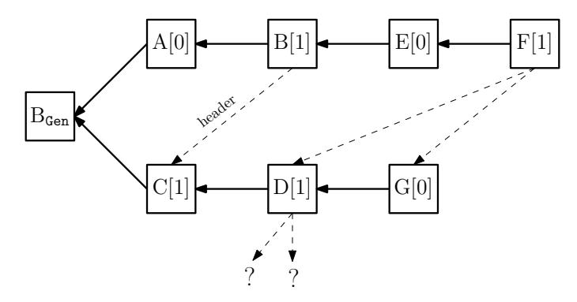
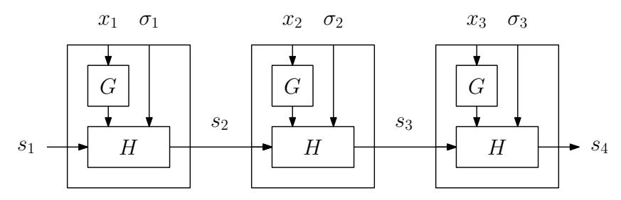
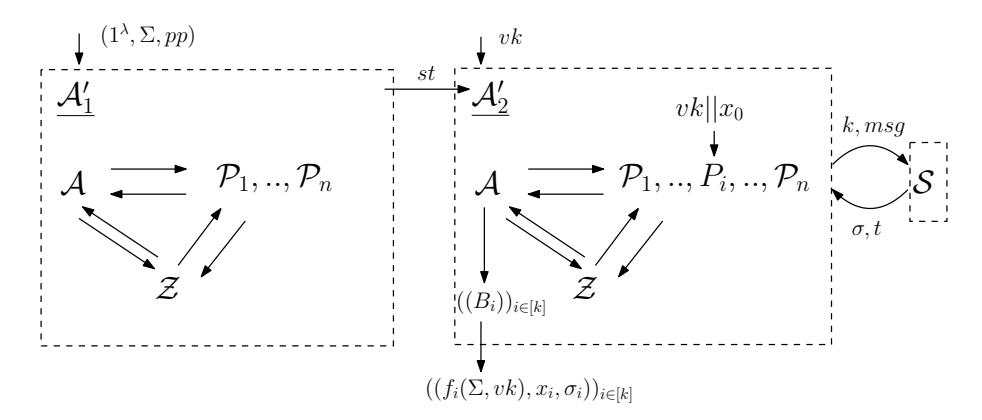

# Consensus from Signatures of Work

Juan A. Garay Texas A&M University garay@cse.tamu.edu

Aggelos Kiayias\* University of Edinburgh & IOHK akiayias@inf.ed.ac.uk

Giorgos Panagiotakos University of Edinburgh giorgos.pan@ed.ac.uk

April 13, 2020

#### Abstract

Assuming the existence of a public-key infrastructure (PKI), digital signatures are a fundamental building block in the design of secure consensus protocols with optimal resilience. More recently, with the advent of blockchain protocols like Bitcoin, consensus has been considered in the "permissionless" setting where no authentication or even point-to-point communication is available. Yet, despite some positive preliminary results, all attempts to formalize a building block that is sufficient for designing consensus protocols in this setting, rely on a very strong independence assumption about adversarial accesses to the underlying computational resource.

In this work, we relax this assumption by putting forth a primitive, which we call signatures of work (SoW). Distinctive features of our new notion are a lower bound on the number of steps required to produce a signature; fast verification; moderate unforgeability—producing a sequence of SoWs, for chosen messages, does not provide an advantage to an adversary in terms of running time; and honest signing time independence—most relevant in concurrent multi-party applications, as we show.

Armed with SoW, we then present a new permissionless consensus protocol which is secure assuming an honest majority of computational power, thus in a sense providing a blockchain counterpart to the classical Dolev-Strong consensus protocol. The protocol is built on top of a SoW-based blockchain and standard properties of the underlying hash function, thus improving on the known provably secure consensus protocols in this setting, which rely on the strong independence property mentioned above in a fundamental way.

<sup>\*</sup>Research partly supported by Horizon 2020 project PANORAMIX, No. 653497.

### Contents

| 1 | Introduction                                                 |    |  |  |
|---|--------------------------------------------------------------|----|--|--|
| 2 | Preliminaries                                                |    |  |  |
| 3 | Signatures of Work                                           |    |  |  |
| 4 | Applications                                                 | 13 |  |  |
|   | 4.1<br>The Permissionless Model, Revisited<br>               | 13 |  |  |
|   | 4.2<br>Public Transaction Ledger from Signatures of Work<br> | 15 |  |  |
|   | 4.2.1<br>The Bitcoin backbone protocol.<br>                  | 15 |  |  |
|   | 4.2.2<br>Security properties of the blockchain.<br>          | 17 |  |  |
|   | 4.2.3<br>Security proof.<br>                                 | 18 |  |  |
|   | 4.3<br>Consensus from Signatures of Work<br>                 | 28 |  |  |
| 5 | SoW Constructions from Idealized Assumptions                 | 31 |  |  |

## <span id="page-2-0"></span>1 Introduction

The consensus problem—reaching agreement distributedly in the presence of faults—has been extensively studied in the literature starting with the seminal work of Shostak, Pease and Lamport [\[48,](#page-38-0) [42\]](#page-37-0). The problem formulation has a number of servers (parties) starting with an individual input which should agree at the end to a joint output that has to match the input in the case where all non-faulty servers happened to have the same input value. One of the critical measures of effectiveness for consensus protocols is maximizing their resilience to Byzantine faults, typically denoted by t. It is known that t < n/2 is necessary to achieve consensus, where n is the total number of parties, while protocols have been designed that reach that level of resilience assuming synchrony and a way to authenticate messages using digital signatures [\[22\]](#page-36-0) [1](#page-2-1) (or "pseudosignatures" [\[49\]](#page-38-1)). This result is known to be tight since lack of synchrony would imply t < n/3 [\[24\]](#page-36-1) (as well as randomization [\[27\]](#page-36-2)), while lack of a message authentication mechanism has a similar effect [\[18\]](#page-36-3).

Recently, with the advent of blockchain protocols like Bitcoin, the problem has experienced renewed interest from a much wider community of researchers and has seen its application expand to various novel settings, such as the so-called "permissionless" setting, where participation in the protocol is both unrestricted and unauthenticated. In fact, this setting was initially studied in [\[45,](#page-37-1) [46\]](#page-37-2), where it was shown that deterministic consensus algorithms are impossible for even a single failure but that probabilistic consensus is still feasible by suitably adapting the protocols of [\[13,](#page-36-4) [26\]](#page-36-5). Nevertheless, the resulting protocol required exponentially many rounds in n.

The first efficient solutions for the consensus problem in the permissionless setting were formally shown to be possible utilizing an abstraction of the Bitcoin blockchain protocol in [\[31\]](#page-37-3), against adversaries controlling less than half of the computational power which, in a uniform configuration (meaning parties are endowed with the same computational power), corresponds to a number of Byzantine faults t < n/2 in the original setting. At a high level, these protocols (as well as the Bitcoin blockchain protocol itself) rely on a concept known as proofs of work (PoW), which, intuitively, enables one party to convince others that he has invested some computational effort for solving a given task. While being formulated a while back [\[25\]](#page-36-6) and used for a variety of purposes—e,g, spam mitigation [\[25\]](#page-36-6), sybil attacks [\[23\]](#page-36-7), and denial of service protection [\[38,](#page-37-4) [5\]](#page-35-0)—their role in the design of permissionless blockchain protocols [\[44\]](#page-37-5), is arguably their most impactful application.

In the context of permissionless blockchain protocols, the way a PoW-like primitive helps is by slowing down message generation for all parties indiscriminately, thus generating opportunities for honest parties to converge to a unique view under the assumption that the aggregate computational power of honest parties sufficiently exceeds that of the adversary. Now, while this intuition matches the more rigorous analyses of the Bitcoin protocol that have been carried out so far [\[31,](#page-37-3) [47,](#page-37-6) [32,](#page-37-7) [7\]](#page-35-1), these works have refrained from formally defining such enabling functionality as a stand-alone cryptographic primitive, and relied instead on the random oracle (RO) model [\[11\]](#page-35-2) or similar idealized assumptions (cf. the Ftree functionality in [\[47\]](#page-37-6)) to prove directly the properties of the blockchain protocol. The same is true for other provably secure PoW-based distributed protocols [\[3,](#page-35-3) [39,](#page-37-8) [33\]](#page-37-9).

The core of the hardness (or even impossibility [\[20\]](#page-36-8)) of implementing the assumed idealized resources is that they satisfy a strong independence property: Each bit output on a new query to the resource is independently sampled, even if the adversary is the one who is accessing the resource. This is indeed a very strong property, as it directly implies that the best way to compute a PoW for both an honest party and the adversary is brute force. Moreover, the same property is explicitly used to argue the security of the proposed consensus protocols in the PoW setting [\[31,](#page-37-3) [3\]](#page-35-3), as we explain in

<span id="page-2-1"></span><sup>1</sup>Recall that the protocol in [\[22\]](#page-36-0) tolerates an arbitrary number of Byzantine faults (n > t), but in the version of the problem of a single sender (a.k.a. "Byzantine Generals," or just broadcast); in the case of consensus, t < n/2 is necessary regardless of the resources available to the parties in the protocol execution (see, e.g., [\[28,](#page-36-9) [29\]](#page-36-10)).

detail later.

In this work we make progress in relaxing this assumption, by putting forth a formalization of a PoW-like primitive, which we call signatures of work (SoW). An SoW can be implemented in the RO model or by using Ftree, but the adversarial SoW computation process does not necessarily satisfy such strong guarantees as the ones mentioned above. Indeed, in contrast to previous approaches, only an upper bound on the rate at which the adversary generates SoWs needs to be assumed. We then present a new permissionless consensus protocol based on SoWs that can be proven secure without relying on such strong independence guarantees. The protocol utilizes a SoW-based blockchain and standard properties of the underlying hash function, and is secure assuming an honest majority of computational power. As a result, this protocol can be seen as an exemplar of how a permissionless signature-like primitive enables honest majority consensus in the same way that classical digital signatures imply honest-majority consensus protocols in the traditional setting.

Why signatures of work? We first provide some intuition behind the relevance of SoW as a useful primitive for the design of permissionless distributed protocols. Recall the main property of a digital signature in the design of classical consensus protocols: It enables parties to communicate to each other their protocol view and inputs at a certain stage of the protocol execution in a way that is transferable and non-repudiable. Indeed, Bob, upon receiving Alice's signed message, can show it to Charlie in a way that the latter is unequivocally convinced of the message's origin. It follows that Bob cannot modify Alice's messages, playing man-in-the-middle between Alice and Charlie, and thus Alice can be held accountable in case she provides conflicting views to the two parties. A SoW scheme provides a similar capability: Using a SoW, a party like Alice can invest effort into a specific protocol view and inputs, so that when Bob is presented with a SoW produced by Alice it will be infeasible for Alice to provide a conflicting view and inputs to Charlie, unless she invests twice the effort. Moreover, the above argument holds without establishing any set of identities among the parties, so for example Bob does not need to know he talks to Alice per se but rather to an arbitrary party that invested some effort with respect to a specific protocol view. Furthermore, exactly like digital signatures, SoWs can be chained recursively, enabling the parties to build on each other's protocol view.

While the above functionalities hint to the usefulness of SoWs in the distributed permissionless setting, formalizing and applying them properly is no simple task. Firstly, in contrast with classical signatures, there is no secret key involved in this primitive. This make sense, since in a permisionless setting signing messages using some kind of secret information is meaningless, as parties do no have any secret setup to begin with. Hence, if they are to sign any message, they should use some other kind of resource that only they have access to, such as their computational power. Secondly, in classical signatures, the exact time when the verification key becomes available to different parties is irrelevant; The key is only useful for verification, up to polynomial-time differences. In the context of SoWs, however, this time is of great importance. For example, allowing a party to learn the verification key, say, two days earlier than other parties, means that this party will be able to compute two days worth of signatures more than them. Hence, in contexts where counting the number of generated signatures matters, as is the case in blockchain protocols, great care should be taken on guaranteeing that the verification key is "fresh" enough for the relevant application.

#### Our results. Our contributions are are as follows:

1) Formalization of an SoW scheme. The syntax of an SoW scheme entails four algorithms: Public parameter generation, key generation, signing and verification—PPub,KeyGen, Sign and Verify, respectively. PPub is invoked on input 1<sup>λ</sup> , where λ is the security parameter, and outputs public security parameters pp. KeyGen is invoked on input pp, and outputs a random verification key vk. Sign is invoked on input (pp, vk, msg, h), where msg is the message to be signed, and h is the hardness level of the signature generation. Expectedly, Verify is invoked on input (pp, vk, msg, h, σ), where σ is (possibly) an output of Sign. We require a SoW scheme to be:

- Correct: As in the case of classical signatures, we require that signatures produced by Sign should be accepted by the Verify algorithm.
- (t, α)-Successful: This property lower-bounds the probability that an honest signer will successfully produce a SoW in a certain number of steps t; α is a function of the hardness level h.
- t-Verifiable: The verifier should be able to verify a SoW in t steps. (Typically, t is a lot smaller than the time need to produce a signature.)
- Moderately Unforgeable against Tampering and Chosen-Message Attacks ((β, )-MU-TCMA): This property is akin to the property of existential unforgeability under chosen-message attacks of digital signatures (EU-CMA). It captures the fact that producing a sequence of SoWs, for chosen messages, does not provide an advantage to an adversary in terms of running time. Specifically, the chances to produce more than β · t SoWs in t steps (for any t) are less than . [2](#page-4-0) Further, this should hold against an adversary able to tamper with the keys, and even in the presence of a Sign oracle.
- Run-time independent: This final property captures the setting where honest signers are potentially invoked on adversarial inputs and ensures that their running time enjoys some degree of independence. Specifically, the random variables defined as the running time of each Sign invocation is a set of almost independent random variables (cf. [\[1\]](#page-35-4)). We stress that the adversarial signing algorithm may not satisfy this property.

As a "sanity check," we show in the full version of the paper that a SoW scheme can be easily designed and proven secure in the random oracle model (or by using Ftree), and hence in practice can be instantiated by a cryptographic hash function such as SHA-256.

2) Consensus from SoW. Next, we design a consensus protocol for an honest majority of computational power that can be reduced to the SoW primitive above. The core idea behind our new protocol is as follows. First, the parties build a blockchain using SoWs in a way reminiscent of the Bitcoin blockchain. Using SoWs we show how to emulate the Bitcoin backbone protocol [\[31\]](#page-37-3) by having parties compute a SoW in parallel, "on top" of the current view that incorporates the largest number of SoWs, i.e., the longest chain. However, in contrast with the consensus protocol of [\[31\]](#page-37-3), to generate a block, the parties include not only their input to the consensus protocol, but also the headers of "orphan" blocks that exist in forks stemming off their main chain and which have not been included so far, where the header of a block contains the hash of the previous block in the chain, the signature, the input to the consensus protocol, and a hash of the block's contents.

Using this mechanism, as shown in Figure [1,](#page-5-0) we prove that it is possible to reconstruct the whole tree of block headers from the blockchain contents, and thus in this way preserve all block headers produced by the honest parties. This ensures that the resulting ledger will reflect the number of parties and hence a consensus protocol may now be easily reduced to this blockchain protocol.

Our new consensus protocol relying on the SoW primitive in the setting where no PKI is available, exemplifies the contrast with consensus in the classical setting, relying on standard signatures and a PKI setup [\[22\]](#page-36-0) (cf. [\[29\]](#page-36-10)). It is worth noting that the only known blockchain-based provably secure and optimally resilient consensus protocol is given in [\[31\]](#page-37-3), using a technique called "2-for-1 PoW" where two PoW-based protocols can be run concurrently and create a blockchain where the number of honest-party contributions is proportional to their actual number, but which relies on the strong independence property of the RO model, discussed earlier, in a fundamental way. Indeed, in the RO model, each witness for a PoW can be rearranged in a certain way so as to obtain a test for a witness for another PoW in a way that is independent from the first solution. Our new protocol gets rid of

<span id="page-4-0"></span><sup>2</sup>Note that, unlike previous unforgeability definitions (e.g, [\[12\]](#page-36-11)), this definition is parameterized by the rate β at which the adversary can produce signatures, instead of the number of steps it needs to compute one. We feel that this formulation is more appropriate for the moderate unforgeability game where the adversary tries to produce multiple signatures. For further details, see Definition [7.](#page-10-0)

<span id="page-5-0"></span>

Figure 1: The data structure maintained by the consensus protocol. Block F has consensus input 1, and includes the headers of blocks D and G, with input 1 and 0, respectively. Block D includes the headers of invalid blocks. This is not a problem, since any chain that contains D will be invalid and not selected by any party, while D's consensus input is correctly counted as a valid block header.

this need. The only other (non-blockchain) PoW-based consensus protocol [\[3\]](#page-35-3) also relies on the RO model.

As intermediate steps in our analysis, we first introduce an appropriate adaptation of the model of [\[31\]](#page-37-3) that allows for a standard model analysis and which may be of independent interest. We then recall the three basic properties of the blockchain data structure presented in [\[31\]](#page-37-3): (strong) common prefix, chain quality and chain growth, and show how our SoW-based blockchain protocol satisfies them assuming, beyond the security of SoW, standard collision resistance from the underlying hash function that is used to "glue" the blocks together. This is achieved as follows: We first prove that using the MU-TCMA property and assuming the adversarial hashing power is suitably bounded, it is unlikely in any sufficiently long time window for the adversary to exceed the number of SoWs of the honest parties. Then, using the (t, α)-Successful and (β, )-MU-TCMA properties in conjunction with run-time independence, we establish that summations of running times of successive Sign invocations have the variance needed to ensure that "uniquely successful rounds" (i.e., rounds where exactly one of the honest parties produces a SoW) happen with high density in any sufficiently long time window. Using these last two core results, and under suitable constraints for the basic SoW parameters α, β, , h and number of parties n, we prove that the the security of the Bitcoin backbone protocol implements a robust transaction ledger [\[31\]](#page-37-3). Further, and as a sanity check, in the full version of the paper, we argue that the results we get from our black-box analysis (and the RO-based SoW construction mentioned earlier), are similar to those from the random-oracle analysis of [\[31\]](#page-37-3).

Our analysis is carried out in the synchronous setting. It is relatively straightforward to extend our results to the ∆-synchronous setting of [\[47\]](#page-37-6), by using the same techniques as in [\[30\]](#page-37-10) (Section 7)]. We leave as an open question extending our results to the variable difficulty setting of [\[32\]](#page-37-7).

3) Other applications. In addition to the blockchain and consensus applications of SoW, we note that the security properties we put forth are suitable for the more traditional DDOS setting, with considerable advantages over existing approaches (cf. [\[54\]](#page-38-2)). The problem is as follows: A server wants to protect itself from malicious actors in the network which send network packets to eat up its resources. The canonical defense for this attack is for the server to run a PoW challenge-response protocol with the sender, in order to make sending a message costly. The MU-TCMA property, we have defined, directly implies exactly this property in the strongest sense: For any, adaptively selected, set of messages sent, the adversary must consume computational resources proportional to the number of messages, even if it can also see SoWs sent by other parties. Moreover, this process can be made non-interactive by delegating the generation of the verification key to some public randomness service, e.g., the NIST beacon, and only accept messages that include a SoW with respect to this key. Finally, note that the same security guarantees can be easily extended to multiple servers who use the same beacon, by requiring that the sent messages contain some unique identification string.

Prior and related work. We have already mentioned above relevant related work regarding classical and blockchain-based consensus protocols. For a more exhaustive recent survey, refer to [29]. We also note that the focus of the paper is the original consensus problem [48, 42], and not so-called "ledger consensus" (sometimes referred to as "Nakamoto consensus"), which is an instance of the state machine replication problem [51]; see also [29] for an overview of such protocols. The idea of referencing off-chain blocks has been considered early on in the ledger consensus literature (see, e.g., [43, 53, 52, 14]) as a way to obtain fairness, better throughput and faster confirmation times. Our novelty is that we leverage this technique along with the new SoW notion to build a provably secure consensus protocol, which, unlike prior results, is not based on the "2-for-1 PoW" technique described earlier.

There have been a number of attempts to formalize a proof of work (PoW) primitive that it is also sufficient to imply the security of a blockchain protocol. Nevertheless, such works were either informal [6, 50, 37], or they did not produce a correctness proof for a blockchain or consensus protocol, focusing instead on other applications [16, 2, 17, 8, 35]. We proceed to give a partial list of such considerations.

In [35], Garay et al. study the necessary hardness condition that the underlying computational problem should satisfy in order for Bitcoin to implement a public ledger. In contrast to our work, an enhanced version of that security notion is shown to be sufficient to implement a public ledger against an adversary controlling only 1/3 (as opposed to 1/2) of the computational power. Further, it is unclear whether such notion can be used to solve the original consensus problem.

Another effort to formalize an intermediate PoW-like building block for the Bitcoin protocol was made in [47]. The proposed ideal functionality,  $\mathcal{F}_{\text{TREE}}^p$ , keeps track of a tree of messages, which both the honest parties and the adversary can extend with probability p. The outcome of each such trial is independent of the others, even if it is made by the adversary.  $\mathcal{F}_{\text{TREE}}^p$  satisfies the strong independence property mentioned before, and hence it is not suitable for the goals of this paper. Moreover, we note that any protocol instantiating this functionality must necessarily be *interactive*, as two parties can use  $\mathcal{F}_{\text{TREE}}^p$  to communicate at least one bit. Finally, in [47], it was shown how to implement a transaction ledger, but not how to achieve consensus; the techniques introduced in this paper can be adapted to implement a consensus protocol using  $\mathcal{F}_{\text{TREE}}$ .

Another relevant work, is that of Back et al. [6] and of Poelstra [50], where the concept of "dynamic membership multi-party signatures" (DMMS) is proposed to describe the underlying primitive used in Bitcoin. The author of the latter work also argues the security of Bitcoin, based on a DMMS scheme. While the properties described there bear some similarities to our work, the treatment is not formal.

Another related work, is that of Dwork and Naor [25], which considered PoWs under the term "pricing functions," as a means of protection against spam e-mail. The main properties discussed in their work are amortization resistance, "moderate hardness" and the existence of trapdoors ("shortcuts" in their terms). Interestingly, among the three constructions described there, one of them is a partially "broken" signature scheme, i.e., while it is hard for an attacker to obtain the signing key, it is moderately hard to forge signatures.

In a different direction, Juels and Jacobsson [37] and Back [4, 5] use PoWs to construct electronic payment systems. In [37], the authors consider the following properties: Amortization resistance, fast verification, and some special "useful work" property which states that generating a PoW for some scheme may help in generating a PoW for another scheme. As acknowledged by the authors themselves, the definitions they provide are only sketches. In [4, 5] another set of closely related properties is considered, including amortization and "trapdoor-freeness." Amortization refers to the ability to combine PoWs of lesser difficulty in order to construct PoWs of greater difficulty. "Trapdoor-freeness" dictates that the party which generates the initial parameters of the scheme should not be able to also generate a trapdoor regarding these parameters. Again the approach is not rigorous.

Bitansky et al. [16] construct time-lock puzzles as well as PoW schemes from randomized encod-

ings. Since the focus of their work is time-lock puzzles, the properties of PoW schemes—amortization resistance, moderate hardness and fast verification—are only briefly investigated, although they do instantiate a PoW scheme based on randomized encodings and the existence of non-amortizing languages in the worst case.

Another interesting approach is that of Ball *et al.* [8], who construct a PoW from worst case assumptions. They base the security of their PoW system on the worst case hardness of classical complexity theory problems, e.g., the Orthogonal Vectors problem. As many of the previously mentioned works, they also adopt a proof-system view in their security definitions.

In [2], Alwen and Tackmann study moderately hard functions (MoHF), providing simulation based definitions for what they call "non-interactive proofs of effort" (niPoE), which—as explicitly acknowledged by the authors—cannot be used to analyze Bitcoin. The main impediment is that the adversary can only invoke the same MoHF only once per protocol session, while for the Bitcoin protocol multiple invocations of the same MoHF should be allowed.

Another related moderately hard (albeit in a sequential manner) primitive is the recently introduced notion of Verifiable Delay Functions (VDF) [17]. However, while the authors explicitly mention the encoding of messages using the primitive, the provided security definitions do not capture CMA security, a property which is necessary in a concurrent multi-party setting.

Summary of differences with a previous version [34]. The most important difference of this version of the paper from [34] is the introduction of the notion of SoW, replacing the Proof of Work (PoW) notion. Moreover, many proofs have been rewritten in a clearer fashion, and the properties required from the underlying computational primitive have been simplified. Finally, additional related work regarding consensus protocols has been added.

Organization of the paper. The basic computational model, definitions and cryptographic building blocks used by our constructions are presented in Section 2. Formal definition of the SoW primitive and its security properties are presented in Section 3. Section 4 is dedicated to applications of SoW: First, we introduce an appropriate model for our applications (Section 4.1). We then analyze the Bitcoin backbone protocol based on (and reducing its security to) SoW (Section 4.2), followed by the new blockchain-based consensus protocol (Section 4.3). Further, and as a "sanity check," in Section 5 we show how to implement SoW in the RO model, or using  $\mathcal{F}_{TREE}$ .

### <span id="page-7-0"></span>2 Preliminaries

In this section we introduce basic notation and definitions that are used in the rest of the paper. For  $k \in \mathbb{N}^+$ , [k] denotes the set  $\{1,\ldots,k\}$ . For strings x,z,x||z is the concatenation of x and z, and |x| denotes the length of x. We denote sequences by  $(a_i)_{i\in I}$ , where I is the index set. For a set X,  $x \leftarrow X$  denotes sampling a uniform element from X. For a distribution  $\mathcal{U}$  over a set  $X,x\leftarrow\mathcal{U}$  denotes sampling an element of X according to  $\mathcal{U}$ . By  $\mathcal{U}_{\lambda}$  we denote the uniform distribution over  $\{0,1\}^{\lambda}$ . We denote the statistical distance between two random variables X,Z with range  $\mathcal{U}$  by  $\Delta[X,Y]$ , i.e.,  $\Delta[X,Z]=\frac{1}{2}\sum_{v\in\mathcal{U}}|\Pr[X=v]-\Pr[Z=v]|$ . For  $\epsilon>0$ , we say that X,Y are  $\epsilon$ -close when  $\Delta(X,Y)\leq\epsilon$ . We let  $\lambda$  denote the security parameter. In this paper we will follow a more concrete ("exact") approach [12,9,36,15] to security evaluation rather than an asymptotic one. We will use functions  $t,\epsilon$ , whose ranges are  $\mathbb{N},\mathbb{R}$ , respectively, and have possibly many different arguments, to denote concrete bounds on the running time (number of steps) and probability of adversarial success of an algorithm in some fixed computational model, respectively. When we speak about running time this will include the execution time plus the length of the code (cf. [15]; note also that we will be considering uniform machines). We will always assume that t is a polynomial in the security parameter  $\lambda$ , although we will sometimes omit this dependency for brevity.

Instead of using interactive Turing machines (ITMs) as the underlying model of distributed computation, we will use (interactive) RAMs. The reason is that we need a model where subroutine access and simulation do not incur a significant overhead. ITMs are not suitable for this purpose, since one needs to account for the additional steps to go back-and-forth all the way to the place where the subroutine is stored. A similar choice was made by Garay et al. [\[36\]](#page-37-15); refer to [\[36\]](#page-37-15) for details on using interactive RAMs in a UC-like framework, as well as to Section [4.1.](#page-12-1) Given a RAM M, we will denote by StepsM(1<sup>λ</sup> , x) the random variable that corresponds to the number of steps of M given as input the security parameter 1<sup>λ</sup> and x. We will say that M is t-bounded if it holds that Pr[StepsM(1<sup>λ</sup> , x) ≤ t(λ)] = 1.

Finally, we remark that in our analyses there will be asymptotic terms of the form negl(λ) and concrete terms; throughout the paper, we will assume that λ is large enough to render the asymptotic terms insignificant compared to the concrete terms.

Cryptographic hash functions. We will make use of the following notion of security for cryptographic hash functions:

<span id="page-8-1"></span>Definition 1. Let H = {{H<sup>k</sup> : M(λ) → Y (λ)}k∈K(λ)}λ∈<sup>N</sup> be a hash-function family, and A be a PPT adversary. Then H is collision resistant if and only if for any λ ∈ N and corresponding {Hk}k∈<sup>K</sup> in H,

$$\Pr[k \leftarrow K; (m, m') \leftarrow \mathcal{A}(1^{\lambda}, k); (m \neq m') \land (H_k(m) = H_k(m'))] \leq \mathsf{negl}(\lambda).$$

Robust public transaction ledgers. The notion of a public transaction ledger was introduced in [\[31\]](#page-37-3) to describe the functionality implemented by the Bitcoin protocol. It is defined with respect to a set of valid ledgers L and a set of valid transactions T , each one possessing an efficient membership test. A ledger x ∈ L is a vector of sequences of transactions tx ∈ T . Ledgers correspond to chains in the Bitcoin protocol. It is possible for the adversary to create two transactions that are conflicting; valid ledgers must not contain conflicting transaction. Moreover, it is assumed that in the protocol execution there also exists an oracle Txgen that generates valid transactions, and is unambiguous, i.e., the adversary cannot create transactions that come in 'conflict' with the transactions generated by the oracle. A transaction is called neutral if there does not exist any transactions that comes in conflict with it.

<span id="page-8-0"></span>Definition 2. A protocol Π implements a robust public transaction ledger if it organizes the ledger as a chain of blocks of transactions and satisfies the following two properties:

- Persistence: Parameterized by k ∈ N (the "depth" parameter), if in a certain round an honest player reports a ledger that contains a transaction tx in a block more than k blocks away from the end of the ledger, then tx will always be reported in the same position in the ledger by any honest player from this round on.
- Liveness: Parameterized by u, k ∈ N (the "wait time" and "depth" parameters, resp.), provided that a transaction either (i) issued by Txgen, or (ii) is neutral, is given as input to all honest players continuously for u consecutive rounds, then all honest parties will report this transaction at a block more than k blocks from the end of the ledger.

The consensus problem. Next, we give the definition of the well-known consensus problem (a.k.a. Byzantine agreement) [\[48,](#page-38-0) [42\]](#page-37-0). There are n parties, t < n of which might be corrupted, taking an initial input x ∈ V (without loss of generality, we can assume V = {0, 1}).

Definition 3. A protocol Π solves the consensus problem provided it satisfies the following properties:

- Agreement. All honest parties will output the same value eventually.
- Validity. If all the honest parties have the same input, then they all output this value.

## <span id="page-9-0"></span>3 Signatures of Work

The main goal of this paper is to implement consensus in the permissionless setting without relying on the strong independence property of the underlying computational resource. Towards that goal, in this section we introduce the signature of work (SoW) primitive. At a high level, a SoW enables one party to convince others that she has invested some computational power during some specific time interval and with respect to a "message." Next, we formalize this notion and present its desired security properties.

SoW syntax. Given a security parameter λ, let P P be the public parameter space, HP ⊆ N the hardness parameter space, K the key space, M the message space, and S the signature space. With foresight, the role of the key is to provide "freshness" for the signature computation, thus certifying that the signature was computed in the given time interval.

Definition 4. A SoW scheme consists of four algorithms SoW = (PPub,KeyGen, Sign, Verify), where:

- PPub(1<sup>λ</sup> ) is a randomized algorithm that takes as input the security parameter λ, and returns a set of public parameters pp ∈ P P.
- KeyGen(pp) is a randomized algorithm that takes as input the public parameters pp, and returns a key vk ∈ K. (See Remark [1](#page-9-1) below on the role of keys in SoW schemes.)
- Sign(pp, vk, msg, h) is a randomized algorithm that takes as input public parameters pp ∈ P P, a key vk ∈ K, a message msg ∈ M and hardness parameter h ∈ HP, and returns a signature (of work) σ ∈ S.
- Verify(pp, vk, msg, h, σ) is a deterministic algorithm that takes as input public parameters pp ∈ P P, a key vk ∈ K, message msg ∈ M, hardness parameter h ∈ HP and a signature σ ∈ S, and returns true or false to indicate the validity of the signature.

<span id="page-9-1"></span>Remark 1. SoW schemes only have a public verification key. The role of this key is to guarantee that the computational work spent in order to create a signature of work is "fresh," i.e., executed during a specific time interval (say, from the time the key became known to the signer). In contrast, classical digital signatures also have a secret key that serves as a trapdoor to compute signatures. In the applications we consider, the existence of trapdoor information is not meaningful, and in fact may hurt the security of the respective constructions.

Security properties. Next, we present a number of security properties that we will require SoW schemes to satisfy. We start with the correctness property.

Definition 5. We say that a SoW scheme is correct if for every λ ∈ N, pp ∈ P P, vk ∈ K, h ∈ HP, and msg ∈ M:

$$\Pr\left[\mathsf{Verify}(pp, vk, msg, h, \mathsf{Sign}(pp, vk, msg, h)) = \mathsf{true} \quad \right] \geq 1 - \mathsf{negl}(\lambda).$$

Next, we require that the time to verify a signature be upper bounded.

Definition 6. We say that a SoW scheme is t-verifiable, if Verify takes time at most t (on all inputs).

Next, we capture the case of a malicious signer (resp., verifier) in the context of SoWs. In the first case, the adversary's objective is to compute a number of signatures a lot faster than an honest signer would, while in the second case it is to make the honest signer take too much time to generate a signature.

We deal with malicious signers first. We put forth an attack that we will use to express a class of adversaries that attempt to forge signatures faster than expected. Intuitively, this constitutes an attack against an honest verifier that may be trying to gauge a certain measure using the number of signatures. The game defining the attack is shown in Figure 2; we call the corresponding security property  $Moderate\ Unforgeability\ against\ Tampering\ and\ Chosen\ Message\ Attack\ (MU-TCMA).$  As in the security definitions of standard signatures (e.g., EU-CMA), we allow the adversary to have access to a signing oracle  $\mathcal{S}$ . Every time the oracle is queried, we assume that it runs the Sign procedure with uniformly sampled randomness. A subtle point in the modeling of security in the presence of such oracle is that  $\mathcal{S}$  should also "leak" the number of steps it took for a query to be processed. In an actual execution while interacting with honest parties that are producing signatures, time is a side channel that may influence the adversarial strategy; in order to preserve the dependency on this side channel we will require from  $\mathcal{S}$  to leak this information. We note that in the classical signatures literature, timing attacks have also been a serious consideration [41].

In addition, we require that the key used by the adversary to construct signatures be fresh, i.e., we want to avoid situations where the adversary outputs signatures that he has precomputed a long time ago. We model this by providing the fresh key after the adversary has finished running his precomputation phase. Further, we allow the adversary to tamper with the key by manipulating it via tampering functions belonging to a family of functions  $\mathcal{F}$ .

Looking ahead, the tampering function in our applications will be related to a keyed hash function, where the key of the hash is part of a common random string (CRS). Hence, we choose to model functions in  $\mathcal{F}$  to have two inputs:  $\Sigma$  (the CRS) and vk. Moreover, the output of the adversary is deemed invalid if he tampers vk with functions  $f_1, f_2$  in such a way that  $f_1(\Sigma, vk) = f_2(\Sigma, vk)$ . Otherwise, the adversary could launch a generic attack that is unrelated to the SoW scheme, and produce signatures at twice the rate of an honest signer, as follows. The adversary first finds  $f_1, f_2$  that have this property, and then computes signatures using the tampered key  $f_1(\Sigma, vk)$ . The trick is that each of them will also correspond to a signature with key  $f_2(\Sigma, vk)$ . Hence, he effectively can double the rate at which he produces signatures.

Formally, the adversary will have access to  $S(\cdot, \cdot)$ , an SoW oracle that on input (vk', msg), where  $vk' \in K$  and  $msg \in M$ , returns the pair  $(\sigma, t)$  where  $\sigma$  is the output of  $\mathsf{Sign}(pp, vk', msg, h)$  and t is the number of steps taken by the  $\mathsf{Sign}$  algorithm on these parameters. Function  $\mathsf{Asked}(vk', msg, \sigma)$  is true if  $\sigma$  was the response of S to some query (vk', msg).

We are now ready to formulate the security property of Moderate Unforgeability against Tampering and Chosen Message Attacks (MU-TCMA). It has two parameters,  $\beta$  and  $\epsilon$ , and, informally, it states that no adversary  $\mathcal{A}$  exists in the experiment of Figure 2 that takes at most t steps after receiving key vk and produces  $\ell \geq \beta \cdot t$  signatures with probability better than  $\epsilon$ . Note that in total we allow  $\mathcal{A}$  to take any polynomial number of steps, i.e., the adversary is allowed to execute a precomputation stage that permits it to obtain an arbitrary number of signatures before learning vk. In the definition below, we allow  $\beta$  to depend on the hardness level h, and  $\epsilon$  on h, t and  $q_{\mathcal{S}}$ , the number of queries the adversary makes to the signing oracle.

<span id="page-10-0"></span>**Definition 7.** Let  $\mathcal{F} = \{F_{\lambda}\}_{{\lambda} \in \mathbb{N}}$ , where  $F_{\lambda}$  is a family of functions  $f: \{0,1\}^{\lambda} \times K \to K$ . A SoW scheme is  $(\beta,\epsilon)$ -Moderately Unforgeable against Tampering and Chosen-Message Attacks (MUTCMA) with respect to tampering function class  $\mathcal{F}$ , if for any polynomially large  $t_1, t_2$ , any adversary  $\mathcal{A} = (\mathcal{A}_1, \mathcal{A}_2)$ , where  $\mathcal{A}_1$  is  $t_1$ -bounded and  $\mathcal{A}_2$  is  $t_2$ -bounded and makes at most  $q_{\mathcal{S}}$  queries to oracle  $\mathcal{S}$ , for any  $\lambda \in \mathbb{N}$ , and any  $h \in HP$ , the probability of  $\mathcal{A}$  winning in  $\mathsf{Exp}_{\mathcal{A},\mathcal{F}}^{\mathsf{MU-TCMA}}(1^{\lambda}, h, \lfloor \beta(h) \cdot t_2 \rfloor)$  (Figure 2) is less than  $\epsilon(h, t_2, q_{\mathcal{S}})$ .

Remark 2. As mentioned in Section 1, unlike previous unforgeability definitions (e.g., [12]), Definition 7 is parameterized by the *rate* at which the adversary can produce signatures, instead of the number of steps it needs to compute one, which is more appropriate for the moderate unforgeability game where the adversary tries to produce multiple signatures.

<span id="page-10-1"></span> $<sup>^3</sup>K$  is the key space of the SoW scheme.

```
ExpMU-TCMA
                             A,F (1λ
                                     , h, `)
Σ ← Uλ; pp ← PPub(1λ
               ); (Public parameters)
st ← A1(1λ
       , Σ, pp); (Precomputation)
vk ← KeyGen(pp); (Verification key)
(fi, msgi
     , σi)i∈[`] ← AS(·,·)
             2
                (1λ
                  , vk, st); (SoW computation)
return V`
     i=1
         Verify(pp, fi(Σ, vk), msgi
                        , σi) ∧ ¬Asked(fi(Σ, vk), msgi
                                           , σi)
         ∧ (fi ∈ Fλ) ∧ (∀j ∈ [`] : fi(Σ, vk) = fj (Σ, vk) ⇒ i = j)
                                              !
```

Figure 2: The Moderate Unforgeability against Tampering and Chosen-Message Attack (MU-TCMA) experiment for a SoW scheme.

In the MU-TCMA definition we are going to consider tampering functions classes that at the very least preserve the unpredictability of vk. Otherwise, the adversary can generically attack any SoW scheme by predicting the tampered key and precomputing signatures. Formally, we will say that F is computationally unpredictable if the adversary, given the CRS Σ, cannot guess a value y that he will be able to "hit" when he gains access to vk through some f ∈ F.

<span id="page-11-1"></span>Definition 8. Let F = {Fλ}λ∈N, where F<sup>λ</sup> is a family of functions f : {0, 1} <sup>λ</sup> × K → K. We say that F is computationally unpredictable with respect to a SoW scheme SoW, if for any PPT RAM A = (A1, A2), and for any λ ∈ N, it holds that:

$$\Pr_{\substack{pp \leftarrow \mathsf{PPub}(1^\lambda);\\ vk \leftarrow \mathsf{KeyGen}(pp);\\ \Sigma \leftarrow \mathcal{U}_\lambda}} \begin{bmatrix} (st,y) \leftarrow \mathcal{A}_1(1^\lambda, \Sigma, pp); f \leftarrow \mathcal{A}_2(1^\lambda, st, vk) :\\ f \in F_\lambda \land f(\Sigma, vk) = y \end{bmatrix} \leq \mathsf{negl}(\lambda).$$

Next, we consider the case of attacking an honest signer. Attacking an honest signer amounts to finding a certain set of keys over which the honest signer algorithm fails to produce SoWs sufficiently fast and regularly. We say that a SoW scheme is (t, α)-successful when the probability that the signer computes a signature in t steps is at least α.

Definition 9. We say that SoW scheme is (t, α)-successful if for any λ ∈ N and any h ∈ HP, it holds that:

$$\Pr_{\substack{pp \leftarrow \mathsf{PPub}(1^\lambda);\\ vk \leftarrow \mathsf{KeyGen}(pp);\\ msg \leftarrow M}} \left[ \mathsf{Steps}_{\mathsf{Sign}}(pp, vk, msg, h) \leq t \right] \geq \alpha(h).$$

Finally, in the same corrupt-verifier setting, we will require the signing time of honest signers to have some (limited) independence, which will be important for the applications we have in mind. This property, in combination with the efficiency and MU-TCMA properties, will prove crucial in ensuring that when multiple signers work together, the distribution of the number of them who succeed in producing a signature has some "good" variance and concentration properties.

Definition 10. We say that a SoW scheme has almost-independent runtime iff for any polynomial p(·), any λ ∈ N, any h ∈ HP, there exists a set of mutually independent random variables {Yi}i∈[p(λ)] such that for any pp ∈ P P,((vk<sup>i</sup> , mi))i∈[p(λ)] ∈ (K×M) p(λ) it holds that ∆[(StepsSign(pp, vk<sup>i</sup> , m<sup>i</sup> , h))<sup>i</sup> ,(Yi)<sup>i</sup> ] ≤ negl(λ).

Independence assumptions. As mentioned earlier, MU-TCMA does not enforce any independence assumption, and only bounds the probability that the rate at which the adversary computes SoWs is high. In contrast, the independent-runtime property does so, but only for honest signers. We remark that achieving such property is considerably easier for the honest case, as we can be sure that signers will use independently sampled coins if instructed; a guarantee that we cannot have for the adversary.

**Parameters' range.** Let SoW be a scheme that is  $(t_{\text{sign}}, \alpha)$ -Successful. SoW trivially satisfies the MU-TCMA property for  $\beta(h) > 1$ , since the adversary does not have enough time to output the signatures it has computed. On the other hand, assuming  $\epsilon(h, t, q_S)$  is a negligible function of t,  $\alpha(h)$  must be smaller than  $\beta(h) \cdot t_{\text{sign}}$ , otherwise the expected number of SoWs computed by the Sign function would exceed that allowed by the MU-TCMA property. Hence, for optimal security, it should hold that  $\alpha(h)$  is close to  $\beta(h) \cdot t_{\text{sign}}$ .

Next, we turn to applications of our SoW primitive.

## <span id="page-12-0"></span>4 Applications

In this section we showcase applications of SoWs, the first one being implementing robust transaction ledgers: Using our primitive and standard properties of the underlying hash function, we establish the security of the Bitcoin backbone protocol [31]. The second application is realizing consensus in the permisionless setting: We construct a new blockchain-based consensus protocol for an honest majority provably secure under the same assumptions as above, thus providing a blockchain counterpart to the classical result in the cryptographic setting with a trusted (PKI) setup [22].

In both applications we assume the existence of a SoW scheme with the security properties defined bellow.

<span id="page-12-3"></span>**Assumption 1** (SoW Assumption). For parameters  $\beta, \epsilon, t'_{\mathcal{H}}, \alpha$  and  $t_{\text{ver}}$  we assume that SoW = (PPub, KeyGen, Sign, Verify) is:

- Correct;
- $(\beta, \epsilon)$ -MU-TCMA with respect to any computationally unpredictable tampering function class (cf. Definition 8);
- $(t'_{\mathcal{H}}, \alpha)$ -successful;<sup>4</sup>
- almost run-time independent; and
- $t_{\text{ver}}$ -verifiable,

where  $\epsilon(h,t,q_S) \in \mathsf{negl}(\beta(h) \cdot t)$ . Moreover, we assume that the parameter spaces K,M,S of the scheme are equal to  $\{0,1\}^{\log |K|}, \{0,1\}^*, \{0,1\}^{\log |S|}$ , respectively.

For a SoW scheme to be used in the context of the Bitcoin protocol, choosing K, M, S as above is important due to the underlying hash-chain structure of the blockchain: The hash of each block acts as a key of the SoW scheme, thus the output of the hash function should match the key space of the SoW.

We start with some pertinent details about the model that the two applications mentioned above will be analyzed under.

#### <span id="page-12-1"></span>4.1 The Permissionless Model, Revisited

All the security models proposed for the analysis of PoW-based blockchain protocols [31, 47] rely on bounding the number of queries to an idealized functionality to model limited computational resources. In contrast, we do not wish to restrict the way the adversary accesses the computational resource, and thus we model limited computational resources in a more general manner, i.e., by limiting the exact number of steps parties take. Next, we present a revised version of the model of [31] that captures our considerations.

<span id="page-12-2"></span><sup>&</sup>lt;sup>4</sup>Parameter  $t'_{\mathcal{H}}$  corresponds to a lower bound on the running time of honest parties that we introduce in detail later.

For the reasons explained in Section 2, we substitute IRAMs for ITMs. The execution of a protocol  $\Pi$  is driven by an "environment" program  $\mathcal Z$  that may spawn multiple instances running the protocol  $\Pi$ . The programs in question can be thought of as "interactive RAMs" communicating through registers in a well-defined manner, with instances and their spawning at the discretion of a control program which is also an IRAM and is denoted by C. In particular, the control program C forces the environment to perform a "round-robin" participant execution sequence for a fixed set of parties.

Specifically, the execution driven by  $\mathcal{Z}$  is defined with respect to a protocol  $\Pi$ , an adversary  $\mathcal{A}$  (also an IRAM) and a set of parties  $P_1, ..., P_n$ ; these are hardcoded in the control program C. The protocol  $\Pi$  is defined in a "hybrid" setting and has access to one "ideal functionality," called the *diffusion channel* (see below). It is used as subroutine by the programs involved in the execution (the IRAMs of  $\Pi$  and  $\mathcal{A}$ ) and is accessible by all parties once they are spawned.

Initially, the environment  $\mathcal{Z}$  is restricted by C to spawn the adversary  $\mathcal{A}$ . Each time the adversary is activated, it may communicate with C via messages of the form (Corrupt,  $P_i$ ). The control program C will register party  $P_i$  as corrupted, only provided that the environment has previously given an input of the form (Corrupt,  $P_i$ ) to  $\mathcal{A}$  and that the number of corrupted parties is less or equal t, a bound that is also hardcoded in  $\mathcal{C}$ . The first party to be spawned running protocol  $\Pi$  is restricted by C to be party  $P_1$ . After a party  $P_i$  is activated, the environment is restricted to activate party  $P_{i+1}$ , except when  $P_n$  is activated in which case the next party to be activated is always the adversary  $\mathcal{A}$ . Note that when a corrupted party  $P_i$  is activated the adversary  $\mathcal{A}$  is activated instead.

Next, we describe how different parties communicate. Initially, the diffusion functionality sets the variable round to be 1. It also maintains a Receive() string defined for each party  $P_i$ . A party is allowed at any moment to fetch the messages sent to it at the previous round that are contained in its personal Receive() string. Moreover, when the functionality receives an instruction to diffuse a message m from party  $P_i$  it marks the party as complete for the current round and forwards the message to the adversary; note that m is allowed to be empty. At any moment, the adversary A is allowed to specify the contents of the Receive() string for each party  $P_i$ . The adversary has to specify when it is complete for the current round. When all parties are complete for the current round, the functionality inspects the contents of all Receive() strings and includes any messages that were diffused by the parties in the current round but not contributed by the adversary to the Receive() tapes. The variable round is then incremented.

Based on the above, we denote by  $\{\text{VIEW}_{\Pi,\mathcal{A},\mathcal{Z}}^{P,t,n}(z)\}_{z\in\{0,1\}^*}$  the random variable ensemble that corresponds to the view of party P at the end of an execution where  $\mathcal{Z}$  takes z as input. We will consider stand-alone executions, hence z will always be of the form  $1^{\lambda}$ , for  $\lambda \in \mathbb{N}$ . For simplicity, to denote this random variable ensemble we will use  $\text{VIEW}_{\Pi,\mathcal{A},\mathcal{Z}}^{P,t,n}$ . By  $\text{VIEW}_{\Pi,\mathcal{A},\mathcal{Z}}^{t,n}$  we denote the concatenation of the views of all parties. The probability space where these variables are defined depends on the coins of all honest parties,  $\mathcal{A}$  and  $\mathcal{Z}$ .

Next, we consider the complications in the modeling due to the analysis of Bitcoin in the concrete security setting. Both in [31] and [47] a modified version of the standard simulation-based paradigm of [19] is followed, where there exist both a malicious environment and a malicious adversary. In addition, the SoW scheme (called PoW in [31, 47]) is modeled in a non black-box way using a random oracle (RO), and the computational power of the adversary is then bounded by limiting the number of queries it can make to the RO per round. Since in this work the SoW scheme is modeled in a black-box way, an alternative approach to bound the adversary's power is needed.

A naïve first approach is to only bound the computational power of  $\mathcal{A}$ . Unfortunately this will not work for several reasons. Firstly, nothing stops the environment from aiding the adversary, i.e., computing signatures, and then communicating with it through their communication channel or some other subliminal channel. Secondly, even if we bound the *total* number of steps of  $\mathcal{A}$ , it is not clear how to bound the steps it is taking per round in the model of [19], which we build on. Lastly, another issue arising is that if the adversary is able to send, say,  $\theta$  messages in each round, it can force each

honest party to take  $\theta \cdot t_{\text{ver}}$  extra steps per round. If we don't bound  $\theta$ , then the adversary will be able to launch a DOS attack and spend all the resources the honest parties have<sup>5</sup>.

In order to capture these considerations we are going to define a predicate on executions and prove our properties in disjunction with this predicate, i.e., either the property holds or the execution is not good.

**Definition 11.** Let  $(t_A, \theta)$ -good be a predicate defined on executions in the hybrid setting described above. Then E is  $(t_A, \theta)$ -good, where E is one such execution, if

- the total number of steps taken by  $\mathcal{A}$  and  $\mathcal{Z}$  per round is no more than  $t_{\mathcal{A}}$ ;
- the adversary sends at most  $\theta$  messages per round.

Finally, we assume the existence of a *common reference string* (CRS), that becomes available to all parties at the start of the execution. This is also implicitly assumed in previous models, where either parties have access to a special "genesis" block at the beginning of the execution [47], or they do not have access to the RO before the beginning of the execution [31].

**Definition 12.** Given a predicate Q and bounds  $t_{\mathcal{A}}, \theta, t, n \in \mathbb{N}$ , with t < n, we say that protocol  $\Pi$  satisfies property Q for n parties assuming the number of corruptions is bounded by t, provided that for all PPT  $\mathcal{Z}, \mathcal{A}$ , the probability that  $Q(\text{VIEW}_{\Pi, \mathcal{A}, \mathcal{Z}}^{t,n})$  is false and the execution is  $(t_{\mathcal{A}}, \theta)$ -good is negligible in  $\lambda$ .

### <span id="page-14-0"></span>4.2 Public Transaction Ledger from Signatures of Work

Next, we take a reduction approach to the underlying cryptographic primitive—SoW, as defined in Section 3—to prove the security of the Bitcoin backbone protocol [31]. We start with a description of the protocol based on SoW, and then continue with the security proof.

#### <span id="page-14-1"></span>4.2.1 The Bitcoin backbone protocol.

The Bitcoin backbone protocol [31], parameterized by functions  $V(\cdot), R(\cdot), I(\cdot)$ , is an abstraction of the Bitcoin protocol. First, we introduce some notation needed to understand the description of the algorithms, and then cast the protocol making use of our SoW primitive.

We will use the terms block and chain to refer to tuples of the form  $\langle s, x, \sigma \rangle$  and sequences of such tuples, respectively. The rightmost (resp. leftmost) block of chain  $\mathcal{C}$  is denoted by  $head(\mathcal{C})$  (resp.  $tail(\mathcal{C})$ ). Each block contains a seed, data, and a signature denoted by  $s, x, \sigma$ , respectively. As mentioned, all parties have access to a CRS at the beginning of the execution that contains: the public parameter pp of the SoW scheme, a verification key vk generated by KeyGen(pp), and the key k of the hash functions H, G used later. We will refer to  $\langle 0^{\lambda}, pp||vk||k, 0^{\lambda} \rangle$  as the genesis block  $genetic B_{Gen}$ . A chain  $\mathcal{C} = B_1 \dots B_m$  is valid with respect to the CRS if and only if (i)  $genetic B_1$  is the genesis block, (ii) for any two consecutive blocks  $genetic B_1$  is the late genesis block, besides  $genetic B_2$  contains a valid SoW, i.e.,  $genetic B_3$  is the genesis block  $genetic B_4$  (iii) each block, besides  $genetic B_4$  contains a valid SoW, i.e.,  $genetic B_4$  is the genesis block  $genetic B_4$  and denote it by  $genetic B_4$  is the genesis block  $genetic B_4$  in  $genetic B_4$  in  $genetic B_4$  in  $genetic B_4$  in  $genetic B_4$  in  $genetic B_4$  in  $genetic B_4$  in  $genetic B_4$  in  $genetic B_4$  in  $genetic B_4$  in  $genetic B_4$  in  $genetic B_4$  in  $genetic B_4$  in  $genetic B_4$  in  $genetic B_4$  in  $genetic B_4$  in  $genetic B_4$  in  $genetic B_4$  in  $genetic B_4$  in  $genetic B_4$  in  $genetic B_4$  in  $genetic B_4$  in  $genetic B_4$  in  $genetic B_4$  in  $genetic B_4$  in  $genetic B_4$  in  $genetic B_4$  in  $genetic B_4$  in  $genetic B_4$  in  $genetic B_4$  in  $genetic B_4$  in  $genetic B_4$  in  $genetic B_4$  in  $genetic B_4$  in  $genetic B_4$  in  $genetic B_4$  in  $genetic B_4$  in  $genetic B_4$  in  $genetic B_4$  in  $genetic B_4$  in  $genetic B_4$  in  $genetic B_4$  in  $genetic B_4$  in  $genetic B_4$  in  $genetic B_4$  in  $genetic B_4$  in  $genetic B_4$  in  $genetic B_4$  in  $genetic B_4$  in  $genetic B_4$  in  $genetic B_4$  in  $genetic B_4$  in  $genetic B_4$  in  $genetic B_4$  in

At each round, each party chooses the longest valid chain amongst the ones it has received and tries to extend it by computing (mining) another valid block. If it succeeds, it diffuses the new block to the network. In more detail, each party will run the Sign procedure, with the message parameter being determined by the input contribution function  $I(\cdot)$ , and the key parameter being the hash of the

<span id="page-14-3"></span><span id="page-14-2"></span><sup>&</sup>lt;sup>5</sup>This problem is extensively discussed in [3], Section 3.4.

<sup>&</sup>lt;sup>6</sup>The adversary cannot use the running time of honest parties that it has corrupted; it is activated instead of them during their turn. Also, note that it is possible to compute this number by counting the number of configurations that  $\mathcal{A}$  or  $\mathcal{Z}$  are activated per round.

last block. We assume that the hardness parameter h is fixed for all executions. Finally, if the party is queried by the environment, it outputs R(C) where C is the chain selected by the party; the chain reading function R(·) interprets C differently depending on the higher-level application running on top of the backbone protocol. Each honest party runs for at most t<sup>H</sup> steps per round. We summarize the modifications with respect to the original [\[31\]](#page-37-3) protocol: In Algorithm [1](#page-15-0) (signature of work function) the Sign function of the underlying SoW scheme is invoked for a limited number of steps so that the total number of steps of the invoking party does not exceed the t<sup>H</sup> bound per round; in Algorithm [2](#page-15-1) (chain validation predicate) the Verify predicate is replaced with a call to the Verify algorithm of the SoW scheme; and in Algorithm [3](#page-16-1) (backbone protocol) we assume that the honest parties start the execution with a "genesis" block. We leave Algorithm [4](#page-16-2) intact.

<span id="page-15-0"></span>Algorithm 1 The signature of work function, parameterized by pp, h and hash functions H(·), G(·). The input is (x, C).

```
1: function sow(x, C)
2: s ← H(head(C))
3: σ ← Sign(pp, s, x, h) . Run the prover of the SoW scheme.
4: B ← ε
5: if σ 6= ⊥ then
6: B ← hs, x, σi
7: end if
8: C ← CB . Extend chain
9: return C
10: end function
```

<span id="page-15-1"></span>Algorithm 2 The chain validation predicate, parameterized by pp, h, BGen, the hash functions G(·), H(·), and the input validation predicate V (·). The input is C.

```
1: function validate(C)
2: b ← V(xC) ∧ (tail(C) = BGen) . xC describes the contents of chain C.
3: if b = True then . The chain is non-empty and meaningful w.r.t. V (·)
4: s
       0 ← H(head(C))
5: while (C 6= BGen) ∧ (b = True) do
6: hs, x, σi ← head(C)
7: if Verify(pp, s, x, h, σ) ∧ (H(head(C)) = s
                                  0
                                   ) then
8: s
           0 ← s . Retain hash value
9: C ← Cd1 . Remove the head from C
10: else
11: b ← False
12: end if
13: end while
14: end if
15: return (b)
16: end function
```

In order to turn the backbone protocol into a protocol realizing a public transaction ledger suitable definitions were given for functions V(·), R(·),I(·) in [\[31\]](#page-37-3). We change these definitions slightly as shown in Table [1,](#page-17-1) to ensure two things: Firstly, that the data contained in the hash chain is encoded with <span id="page-16-1"></span>**Algorithm 3** The Bitcoin backbone protocol, parameterized by the *input contribution function*  $I(\cdot)$  and the *chain reading function*  $R(\cdot)$ .

```
1: \mathcal{C} \leftarrow B_{\mathsf{Gen}}
                                                                                                                               \triangleright Initialize \mathcal{C} to the genesis block.
 2: st \leftarrow \varepsilon
 3: round \leftarrow 0
 4: while True do
             \tilde{\mathcal{C}} \leftarrow \mathsf{maxvalid}(\mathcal{C}, \mathsf{any\ chain\ } \mathcal{C}' \mathsf{\ found\ in\ Receive}())
             \langle st, x \rangle \leftarrow I(st, \tilde{\mathcal{C}}, round, Input(), Receive())
                                                                                                                                                \triangleright Determine the x-value.
 6:
             \mathcal{C}_{\mathsf{new}} \leftarrow \mathsf{sow}(x, \tilde{\mathcal{C}})
 7:
             if C \neq C_{new} then
 8:
                    \mathcal{C} \leftarrow \mathcal{C}_{\mathsf{new}}
 9:
                    Broadcast(\mathcal{C})
10:
             end if
11:
12:
             round \leftarrow round + 1
             if Input() contains Read then
13:
                     write R(\mathbf{x}_{\mathcal{C}}) to OUTPUT()
14:
             end if
15:
16: end while
```

<span id="page-16-2"></span>**Algorithm 4** The function that finds the "best" chain, parameterized by function  $\max(\cdot)$ . The input is  $\{C_1, \ldots, C_k\}$ .

```
1: function \max \operatorname{valid}(\mathcal{C}_1, \dots, \mathcal{C}_k)

2: temp \leftarrow \varepsilon

3: \mathbf{for} \ i = 1 \ \operatorname{to} \ k \ \mathbf{do}

4: \mathbf{if} \ \operatorname{validate}(\mathcal{C}_i) \ \mathbf{then}

5: temp \leftarrow \max(\mathcal{C}, temp)

6: \mathbf{end} \ \mathbf{if}

7: \mathbf{end} \ \mathbf{for}

8: \mathbf{return} \ temp

9: \mathbf{end} \ \mathbf{function}
```

a suffix-free code; this is important to ensure that no collisions occur [10] as we show later. And, secondly, to ensure that any block created by an honest party contains sufficient entropy, thus the adversary will not be able to use blocks that it has precomputed to extend this block. We call the resulting protocol  $\Pi_{Pl}^{SoW}$ .

#### <span id="page-16-0"></span>4.2.2 Security properties of the blockchain.

A number of desired basic properties for the blockchain were introduced in [31, 40, 47]. At a high level, the first property, called *common prefix*, has to do with the existence, as well as persistence in time, of a common prefix of blocks among the chains of honest players. Here we will consider a stronger variant of the property, presented in [47], which allows for the black-box proof of application-level properties (such as the *persistence* of transactions entered in a public transaction ledger built on top of the Bitcoin backbone).

We will use  $\mathcal{C} \leq \mathcal{C}'$  to denote that some chain  $\mathcal{C}$  is a prefix of some other chain  $\mathcal{C}'$ , and  $\mathcal{C}^{\lceil k \rceil}$  to denote the chain resulting from removing the last k blocks of  $\mathcal{C}$ . We will call a block honest, if it was

<span id="page-17-1"></span>

| Content validation pre-           | $V(\cdot)$ is true if its input $\langle x_1, \ldots, x_m \rangle$ is a valid ledger, i.e., it is in $\mathcal{L}$ , |
|-----------------------------------|----------------------------------------------------------------------------------------------------------------------|
| dicate $V(\cdot)$                 | and each $x_i$ starts with a neutral transaction of the form $r  i $ , where                                         |
|                                   | $r$ is a string of length $\log  K $ and $i$ is the "height" of the respective                                       |
|                                   | block.                                                                                                               |
| Chain reading function $R(\cdot)$ | $R(\cdot)$ returns the contents of the chain if they constitute a valid ledger,                                      |
|                                   | otherwise it is undefined.                                                                                           |
| Input contribution function       | $I(\cdot)$ returns the largest subsequence of transactions in the input and                                          |
| $I(\cdot)$                        | receive registers that constitute a valid ledger, with respect to the                                                |
|                                   | contents of the chain $ C $ the party already has, preceded by a neutral                                             |
|                                   | transaction of the form $KeyGen(pp)   \mathcal{C} $ .                                                                |

Table 1: The instantiation of functions  $I(\cdot), V(\cdot), R(\cdot)$  for protocol  $\Pi^{\texttt{SoW}}_{\texttt{PL}}$ .

diffused for the first time in the execution by some honest party, and adversarial otherwise.

**Definition 13** ((Strong) Common Prefix). The strong common prefix property  $Q_{cp}$  with parameter  $k \in \mathbb{N}$  states that the chains  $C_1, C_2$  reported by two, not necessarily distinct honest parties  $P_1, P_2$ , at rounds  $r_1, r_2$  in VIEW $_{\Pi, A, Z}^{t, n}$ , with  $r_1 \leq r_2$ , satisfy  $C_1^{\lceil k} \leq C_2$ .

The next property relates to the proportion of honest blocks in any portion of some honest player's chain.

**Definition 14** (Chain Quality). The *chain quality property*  $Q_{cq}$  with parameters  $\mu \in \mathbb{R}$  and  $k \in \mathbb{N}$  states that for any honest party P with chain C in  $VIEW_{\Pi,\mathcal{A},\mathcal{Z}}^{t,n}$  it holds that for any k consecutive blocks of C the ratio of adversarial blocks is at most  $\mu$ .

Further, in the derivations in [31] an important lemma was established relating to the rate at which the chains of honest players were increasing as the Bitcoin backbone protocol was run. This was explicitly considered in [40] as a property under the name *chain growth*.

**Definition 15** (Chain Growth). The chain growth property  $Q_{cg}$  with parameters  $\tau \in \mathcal{R}$  (the "chain speed" coefficient) and  $s, r_0 \in \mathbb{N}$  states that for any round  $r > r_0$ , where honest party P has chain  $C_1$  at round r and chain  $C_2$  at round r + s in  $VIEW_{\Pi, \mathcal{A}, \mathcal{Z}}^{t,n}$ , it holds that  $|C_2| - |C_1| \ge \tau \cdot s$ .

#### <span id="page-17-0"></span>4.2.3 Security proof.

We now prove that  $\Pi_{PL}^{SoW}$  implements a robust public transaction ledger (Definition 2), assuming the underlying SoW scheme satisfies Assumption 1 for appropriate parameters, related to the running time of honest parties and the adversary. First, we formalize this relation.

Let  $t_{\rm bb}$  (bb for backbone) be an upper bound on the number of steps needed to run the code of an honest party in one round, besides the Sign and Verify calls. By carefully analyzing the backbone protocol one can extract an upper bound on this value.<sup>7</sup> To aid our presentation, we will use  $t'_{\mathcal{A}}$  and  $t'_{\mathcal{H}}$  to denote: (i) the time needed by a RAM machine to simulate one round in the execution of the Bitcoin protocol, without taking into account calls made to the Sign routine by the honest parties, and (ii) the minimum number of steps that an honest party takes running the Sign routine per round, respectively.

$$t'_{\mathcal{A}} = t_{\mathcal{A}} + n \cdot t_{\mathsf{bb}} + \theta t_{\mathsf{ver}}$$
 and  $t'_{\mathcal{H}} = t_{\mathcal{H}} - t_{\mathsf{bb}} - \theta t_{\mathsf{ver}}$

<span id="page-17-2"></span><sup>&</sup>lt;sup>7</sup>Note that  $t_{bb}$  depends on the running time of three external functions:  $V(\cdot), I(\cdot)$  and  $R(\cdot)$ . For example, in Bitcoin these functions include the verification of digital signatures, which would require doing modular exponentiations. In any case  $t_{bb}$  is at least linear in  $\lambda$ .

It holds that at least n-t (non-corrupted) parties will run the Sign routine for at least  $t'_{\mathcal{H}}$  steps at every round.

In previous works [31, 33, 47], the security assumptions regarding the computational power of the parties participating in the protocol were twofold: (1) The total running time of honest parties per round should exceed that of the adversary, and (2) the rate at which parties produce blocks at each round should be bounded. More realistically, in our approach the running time of the adversary and the running time of honest parties do not have the same quality, as the adversary may use a superior signing algorithm. To take this into account, we additionally need to assume that the efficiency of the adversarial signing algorithm, i.e.,  $\beta$ , is close to that of the honest parties. Finally, note that if SoW is close to optimal, i.e.,  $\alpha(h) \approx \beta t_{\mathcal{H}}'$ , and the block generation rate is a lot less than 1, our assumption holds as long as the honest parties control the majority of the computational power.

We now state the computational power assumption formally. The second and the third conditions are similar to the ones already found in previous works, while the first one is the new condition we introduce regarding the underlying computational primitive.

<span id="page-18-0"></span>**Assumption 2** (Computational Power Assumption). There exist  $\delta_{SoW}$ ,  $\delta_{Steps}$ ,  $\delta \in (0,1)$ , such that for sufficiently large  $\lambda \in \mathbb{N}$ , there exists an  $h \in HP$ , such that:

```
- \alpha(h) \ge (1 - \delta_{SoW})\beta t_{\mathcal{H}}' > \text{negl}(\lambda)
                                                                (signatures generation rate gap)
```

-
$$(n-t)t'_{\mathcal{H}}(1-\delta_{\mathsf{Steps}}) \ge t'_{\mathcal{A}}$$
 (steps gap)

$$- (n-t)t'_{\mathcal{H}}(1-\delta_{\mathsf{Steps}}) \geq t'_{\mathcal{A}} \qquad (steps \ gap)$$

$$- \frac{\delta_{\mathsf{Steps}}-\delta_{\mathsf{SoW}}}{2} \geq \delta > \beta(h)(t'_{\mathcal{A}}+nt_{\mathcal{H}}) \qquad (bounded \ block \ generation \ rate)$$

From now on, we will assume that the hardness parameter used in our protocols, is one satisfying the above conditions.

Remark 3. The better the adversarial signing algorithm may be compared to the honest one, the closer  $\delta_{\mathsf{SoW}}$  is to 0, while the closer the number of adversarial steps  $t_{\mathcal{A}}'$  are to that of the honest parties, the closer  $\delta_{\mathsf{Steps}}$  is to 0. Assumption 2 implies, in a quantitative manner, that the better the adversarial signing algorithm, the smaller the computational power of the adversary we can tolerate.

We introduce some additional notation. For each round j, we define the Boolean random variables  $X_i$  and  $Y_j$  as follows. Let  $X_j = 1$  if and only if j was a successful round, i.e., at least one honest party computed a SoW at round j, and let  $Y_j = 1$  if and only if j was a uniquely successful round, i.e., exactly one honest party computed a SoW at round j. With respect to a set of rounds S, let  $X(S) = \sum_{j \in S} X_j$  and define Y(S) similarly. Moreover, with respect to some block B computed by an honest party P at some round r, let  $Z_B(S)$  denote the number of distinct blocks broadcast by the adversary during S that have B as their ancestor. Define  $X_B(S)$  similarly.

Next, we focus on the hash functions used by Bitcoin, and the necessary security assumptions to avoid cycles in the blockchains. First, note that in the actual implementation of Bitcoin an unkeyed hash function is used, namely, a double invocation of SHA-256. In previous analyses of the protocol this was modeled as a random oracle. We choose to model it in a strictly weaker way, as a keyed hash function family:

$$\mathcal{H} = \{H_k : \{0,1\}^{\log|K| + \lambda + \log|S|} \to \{0,1\}^{\log|K|}\}_{k \in K'}.$$

that is collision resistant (Definition 1); the CRS we have already assumed will contain the key of our hash function. Moreover, as depicted in Figure 3, the protocol makes use of another hash function Gto compress the input x of each block, which may be of arbitrary size. In our analysis we will require Gto be collision resistant. It is well known (see, e.g., [21, 10]) that given a fixed-length collision-resistant hash function family, we can construct an arbitrary-length collision-resistant hash function family. To aid readability, we will sometimes omit the keys of both functions (as we already do in the description of the protocol). Furthermore, observe that the hash structure of any blockchain (depicted in Figure 3) is similar to the Merkle-Damgaard transform [21]:

$$\mathsf{MD}_k(IV,(x_i)_{i\in[m]}): z=IV; \text{ for } i=1 \text{ to } m \text{ do } z=H_k(z,x_i); \text{ return } z,$$

where the fixed-length hash function family used is always assumed to be  $\mathcal{H}$ . To show that the adversary cannot find distinct chains with the same hash, we are going to take advantage of the following property of the MD transform.

<span id="page-19-1"></span><span id="page-19-0"></span>Fact 1. For any non-empty valid chain  $C = B_1, \ldots, B_k$ , where  $B_i = \langle s_i, x_i, \sigma_i \rangle$ , it holds that for any  $j \in [k]$ :  $H_k(\text{head}(C)) = \text{MD}_k(H_k(B_j), ((G_k(x_i), \sigma_i))_{i \in \{j+1, \ldots, k\}})$ .



Figure 3: The hash structure of the blocks in the Bitcoin protocol.

<span id="page-19-3"></span>**Lemma 16.** The probability that any PPT RAM A can find two distinct valid chains  $C_1, C_2$  such that  $H(C_1) = H(C_2)$  is negligible in  $\lambda$ .

Proof. Let  $C_1 = B_{\text{Gen}}, B_1, \ldots, B_{[|C_1|]}, C_2 = B_{\text{Gen}}, B'_1, \ldots, B'_{[|C_2|]}, m_1 = ((G(x_i), \sigma_i))_{i \in [|C_1|]}$  and  $m_2 = ((G(x'_i), \sigma'_i))_{i \in [|C_2|]}$ . For the sake of contradiction, assume that the lemma does not hold and there exists an adversary A that can find valid chains  $C_1$ ,  $C_2$  such that  $H(C_1) = H(C_2)$ , with non-negligible probability. By Fact 1, this implies that  $MD(H(B_{\text{Gen}}), m_1) = MD(H(B_{\text{Gen}}), m_2)$ .

We will construct an adversary  $\mathcal{A}'$  that breaks the collision resistance of H also with non-negligible probability. We take two cases. In the first case,  $|\mathcal{C}_1| \neq |\mathcal{C}_2|$ . Then, since the height of the chain is included in a fixed position in  $x_{|\mathcal{C}_1|}, x'_{|\mathcal{C}_2|}$  (cf. Table 1), it follows that  $x_{|\mathcal{C}_1|} \neq x'_{|\mathcal{C}_2|}$  and with overwhelming probability  $G(x_{|\mathcal{C}_1|}) \neq G(x'_{|\mathcal{C}_2|})$ , which in turn implies that  $B_{|\mathcal{C}_1|} \neq B'_{|\mathcal{C}_2|}$ . Since  $H(\text{head}(\mathcal{C}_1)) = H(\text{head}(\mathcal{C}_2))$ , it follows that a collision in H has been found. In the second case, where  $|\mathcal{C}_1| = |\mathcal{C}_2|$ , following the classical inductive argument for the MD transform, it can be shown that there exists  $\ell$  less or equal to  $|\mathcal{C}_1|$ , such that  $MD(H(\text{Gen}), ((G(x_i), \sigma_i))_{i \in [\ell]}) = MD(H(\text{Gen}), ((G(x_i'), \sigma_i'))_{i \in [\ell]})$  and  $(G(x_\ell), \sigma_\ell) \neq (G(x_\ell'), \sigma_\ell')$ . The lemma follows.

The following two properties<sup>8</sup>, introduced in [31], regarding the way blocks are connected are implied by Lemma 16.

**Definition 17.** An insertion occurs when, given a chain  $\mathcal{C}$  with two consecutive blocks B and  $B_0$ , a block  $B^*$  created after  $B_0$  is such that  $B, B^*$ ,  $B_0$  form three consecutive blocks of a valid chain. A copy occurs if the same block exists in two different positions.

<span id="page-19-4"></span>Corollary 18. Let  $\{H_k(\cdot)\}_{k\in K}$  and  $\{G_k(\cdot)\}_{k\in K}$  be collision-resistant hash functions. Then, no insertions and no copies occur with probability  $1 - \text{negl}(\lambda)$ .

Next, we prove that the adversary cannot mine blocks that extend an honest block created recently at a very high rate with probability better than that of breaking the MU-TCMA property. For a summary of our notation we refer to Table 2.

<span id="page-19-2"></span><sup>&</sup>lt;sup>8</sup>A third property, called "prediction," also introduced in [31], is not needed in our proof as it is captured by the fact that SoW is MU-TCMA secure even in the presence of adversarial precomputation.

<span id="page-20-0"></span>λ: security parametern: number of parties

 $t_{\mathcal{H}}$ : number of steps per round per honest party  $t_{\mathcal{A}}$ : total number of adversarial steps per round

 $\theta$ : upper bound on the number of messages sent by the adversary per round

 $\beta:\quad$  upper bound on SoW computation rate per step

 $\gamma$ : lower bound on the rate of uniquely successful rounds

f: lower bound on the rate of successful rounds

 $\delta$ : advantage from the Computational Power Assumption (Assumption 2)

k: number of blocks for the common-prefix property  $\ell$ : number of blocks for the chain-quality property

Table 2: The parameters in our analysis.

<span id="page-20-1"></span>**Lemma 19.** For any set of consecutive rounds S and for any party P, the probability that P mined some honest block B at some round  $i \in S$  and  $Z_B(S) \ge \beta t'_A|S|$ , is at most  $\epsilon(h, t'_A \cdot |S|, n \cdot |S|)$ .

Proof. W.l.o.g., assume that i is the first round of  $S = \{i' | i \leq i' < i + s\}$ , and let E be the event where in VIEW $_{\Pi,\mathcal{A},\mathcal{Z}}^{t,n}$  the adversary has mined at least  $\beta t'_{\mathcal{A}}s$  blocks until round i+s that descend some honest block B mined by party P at round i. For the sake of contradiction, assume that the lemma does not hold, and thus the probability that E holds is greater than  $\epsilon(h, t'_{\mathcal{A}} \cdot s, n \cdot s)$ . Using  $\mathcal{A}$ , we will construct an adversary  $\mathcal{A}'$  that wins the MU-TCMA game with probability greater than that.  $\mathcal{A}'$  is going to run internally  $\mathcal{A}$  and  $\mathcal{Z}$ , while at the same time perfectly simulating the view of honest parties using the signing oracle that he has in his disposal on the MU-TCMA game. This way, the view of  $\mathcal{A}, \mathcal{Z}$  will be indistinguishable both in the real and the simulated runs, and thus the probability that E happens will be the same in both cases.

We are going to describe the two stages of  $\mathcal{A}'$  separately, i.e. before and after obtaining vk. First,  $\mathcal{A}'_1$  creates the genesis block and sets the fixed length hash key and the SoW public parameters to be  $\Sigma$  and pp, respectively. Then, he perfectly simulates honest parties up to round i-1 and at the same time runs  $\mathcal{A}$  and  $\mathcal{Z}$  in a black-box way. Finally, it outputs the contents of the registers of  $\mathcal{A}$  and  $\mathcal{Z}$  as variable st. He can do this since he has polynomial time on  $\lambda$  on his disposal. Note, that up until this point in the eyes of  $\mathcal{A}$  and  $\mathcal{Z}$  the simulated execution is indistinguishable compared to the real one.

For the second stage,  $\mathcal{A}'_2$ , is first going to use st to reset  $\mathcal{A}$  and  $\mathcal{Z}$  to the same state that they were. We assume that this can be done efficiently, e.g., by having  $\mathcal{A}$  and  $\mathcal{Z}$  read from the registers where st is stored whenever they perform some operation on their registers. Moreover, it is again going to simulate honest parties behavior, from round i until round i+s, but in a different way. Instead of running the Sign algorithm for each non-corrupted honest party at every round, it makes a query to the signing oracle  $\mathcal{S}$  with the respective parameters. Then, it checks if the honest party succeeded in making a signature in this round by comparing the number of steps needed to make this signature to the number of steps available to the party at this round. Hence,  $\mathcal{A}'_2$  has to do n queries to the signing oracle per round. The adversary can also send up to  $\theta$  messages per round to honest parties which they have to verify, thus inducing an additional  $\theta \cdot t_{\text{ver}}$  overhead in the simulation. Note that  $\mathcal{A}'_2$  has to run the verification procedure only once per message.

Continuing with the description of  $\mathcal{A}'_2$ , as shown in Figure 4, it takes as input a key vk generated from  $\mathsf{KeyGen}(pp)$ . We should somehow relate vk to the blocks the internal adversary is going to produce. In our reduction, this is achieved by: (i) relating the block B that party P generates at round i with vk through the input contribution function  $I(\cdot)$ , and (ii) by the fact that the seed of all blocks that have B as an ancestor is related to H(B). In more detail, at round i,  $\mathcal{A}'_2$  will use vk in the neutral transaction included in  $I(\cdot)$  for P; denote by  $vk||x_0$  the output of I for P at this round. If

P is successful at this round and mines a block  $B = \langle s_0, vk || x_0, \sigma_0 \rangle$  (this can be simulated using S), then any block  $B' = \langle s, x, \sigma \rangle$  descending B will be related to it as follows:

$$\begin{split} s &= \mathsf{MD}(H_\Sigma(B), ((G_\Sigma(x_i), \sigma_i))_i) \\ &= \mathsf{MD}(H_\Sigma(s, G_\Sigma(vk||x_0), \sigma_0), ((G_\Sigma(x_i), \sigma_i))_i) \\ &\stackrel{\mathrm{def}}{=} f_{(s, \{x_i, \sigma_i\}_i)}(\Sigma, vk) \end{split}$$

for some  $((x_i, \sigma_i))_i$  due to Fact 1. Observe, that the seed of B' is a function of  $\Sigma$  and vk, as required by the MU-TCMA game. In fact the tampering function class we will consider is going to be exactly the set of all these functions f. More formally, let C be the set of sequences  $((x_i, \sigma_i))_i$  that correspond to a valid chain in the way described before. Then, the tampering function class we will be considering is defined as follows:

$$\mathcal{F} = \{f_{s,a}\}_{s \in \{0,1\}^{\lambda}, a \in C}$$

We show next, that  $\mathcal{F}$  is computationally unpredictable as required by our assumption regarding the signature scheme.

Claim 1.  $\mathcal{F}$  is computationally unpredictable.

*Proof.* For the sake of contradiction, assume that there exists a PPT adversary  $\mathcal{A} = (\mathcal{A}_1, \mathcal{A}_2)$  that breaks the computational unpredictability property of  $\mathcal{F}$ . This implies that

$$\Pr_{\substack{pp \leftarrow \mathsf{PPub}(1^{\lambda});\\ vk \leftarrow \mathsf{KeyGen}(pp);\\ \Sigma \leftarrow \mathcal{U}_{\lambda}:}} \begin{bmatrix} (st,y) \leftarrow \mathcal{A}_{1}(\Sigma, pp);\\ f \leftarrow \mathcal{A}_{2}(st, vk):\\ f \in \mathcal{F} \land f(\Sigma, vk) = y \end{bmatrix}$$

is non-negligible. We are going to describe an adversary  $\mathcal{A}'$  that uses  $\mathcal{A}$  to break the collision resistance property of H. Given  $\Sigma$ ,  $\mathcal{A}'$  first runs  $\mathcal{A}_1(\Sigma, pp)$  and obtains a prediction y and state st. Next,  $\mathcal{A}'$  randomly samples  $vk_1, vk_2$  using KeyGen and runs  $\mathcal{A}_2$  twice on inputs  $st, vk_1$  and  $st, vk_2$  respectively. By an application of the splitting lemma we can show that with non-negligible probability  $\mathcal{A}_2$  will output (not necessarily different) functions  $f_1, f_2$  such that  $y = f_1(\Sigma, vk_1) = f_2(\Sigma, vk_2)$ . As noted earlier, this corresponds to the hash of two chains, that due to the entropy of  $vk_1, vk_2$  and the collision resistance of G start with different honestly mined blocks. Using similar techniques as in Lemma 16, we can show that  $\mathcal{A}'$  can find a collision in H using  $f_1, f_2, vk_1, vk_2$  with non-negligible probability in  $\lambda$ , which is a contradiction.

Since  $\mathcal{A}$  and  $\mathcal{Z}$  cannot distinguish between the bitcoin execution and the one we described above, E will occur with probability at least  $\epsilon(h, t'_{\mathcal{A}}s, ns)$ , i.e.  $\mathcal{A}$  will compute at least  $\beta t'_{\mathcal{A}}s$  blocks starting from round i and up to round i + s that descend B. Note, that these blocks are also valid signatures, whose keys are of the form  $f(\Sigma, vk)$ , for (possibly different) f's. Moreover, the event that the adversary outputs different  $f_i$ ,  $f_j$  such that  $f_i(\Sigma, vk) = f_j(\Sigma, vk)$ , corresponds to finding chains  $\mathcal{C}_1, \mathcal{C}_2$  such that  $H(\mathcal{C}_1) = H(\mathcal{C}_2)$ . By Lemma 16, this happens with negligible probability. Hence,  $\mathcal{A}'$  will win the MUTCMA game with respect to tampering function class  $\mathcal{F}$  with probability greater than  $\epsilon(h, t'_{\mathcal{A}}s, ns)$ , while being  $s \cdot (t_{\mathcal{A}} + \theta \cdot t_{\text{ver}} + t_{\text{bb}} \cdot n) = s \cdot t'_{\mathcal{A}}$ -bounded and having made at most ns queries to the signing oracle, which is a contradiction to our initial assumption. A sketch of the reduction is given at Figure 4.

Note that we can do exactly the same reduction without using the oracle to simulate the signing procedure of the honest parties. Then, the total running time of the second stage of  $\mathcal{A}'$  is on the worst

<span id="page-22-0"></span>

Figure 4: The figure depicts a schematic of the reduction from the Bitcoin backbone to the MU-TCMA game of Lemma 19.

case  $s \cdot (t_A + nt_H)$ -bounded and hence the probability he can win is  $\epsilon(h, s \cdot (t_A + nt_H), 0)$ . Hence, we can derive the following bound on the total number of blocks produced by both honest and malicious parties during a certain number of rounds.

<span id="page-22-2"></span>**Corollary 20.** For any set of consecutive rounds S and for any party P, the probability that P mined some honest block B at some round  $i \in S$  and  $Z_B(S) + X_B(S) \ge \beta(t_A + nt_H) \cdot |S|$  is less than  $\epsilon(h, |S| \cdot (t_A + nt_H), 0)$ .

Next, we prove lower bounds on the rate of successful and uniquely successful rounds. Our proof crucially depends on the runtime independence property of the SoW scheme. More specifically, the property implies that for some set of rounds the sum of the Bernoulli random variables of the event that a round is uniquely successful, concentrate around the mean. Which in turn, implies that we can lower-bound the rate of uniquely successful rounds with good probability.

<span id="page-22-1"></span>**Lemma 21.** Let  $\gamma = (n-t) \cdot \alpha(h) \cdot (1-\beta t_{\mathcal{H}})^{n-1}$ ,  $f = (1-(1-\alpha(h))^{n-t})$ . For any set of consecutive rounds S, with  $|S| \geq \frac{\lambda}{\gamma \delta^2}$ , the following two events occur with negligible probability in  $\lambda$ :

- The number of uniquely successful rounds in S is less or equal to  $(1 \frac{\delta}{4})\gamma \cdot |S|$ ;
- the number of successful rounds in S is less or equal to  $(1 \frac{\delta}{4})f \cdot |S|$ .

*Proof.* For some fixed execution we will denote by the array  $\mathbf{T}_{S\times n}=(t_{i,j})\in\mathbb{N}^{|S|\times n}$  the number of steps each honest party takes running the Sign routine, for each round in the set S. It holds that at most t elements of each column are zero, i.e. corrupted, and the rest are lower bounded by  $t_{\mathcal{H}}$  and upper bounded by  $t_{\mathcal{H}}$ . W.l.o.g let  $S=\{1,\ldots,s\}$ .

Since this lemma talks about the steps taken by the Sign function, we are going to use the almost independent runtimes property of the SoW scheme, and do all the analysis on the independent random variable defined by this property. For the rest of this proof, unless explicitly stated, assume that the Steps<sub>Sign</sub>(pp, vk, m, h) random variable refers to its idealized independent version. We first buildup some notation to help in our analysis. For  $pp \in PP$ , arrays  $(vk_{i,j}) \in K^{s \times n}, (msg_{i,j}) \in M^{s \times n}$  and for  $h \in \mathbb{N}$  let:

- random variable  $P_{i,j} = 1$  if  $\mathsf{Steps}_{\mathsf{Sign}}(pp, vk_{i,j}, msg_{i,j}, h) \leq t_{i,j}$ , and 0 otherwise;
- random variable  $Y_i = 1$  if  $\sum_{j=1}^n P_{i,j} = 1$  and 0 otherwise.
- random variable  $X_i = 1$  if  $\sum_{j=1}^n P_{i,j} \ge 1$ , and 0 otherwise.
- random variable  $Y = \sum_{i \in [s]} Y_i, X = \sum_{i \in [s]} X_i$ .

It easily follows from the Successful property that Pr[Pi,j = 1] ≥ α(h). Moreover, it holds that Pr[Pi,j = 1] ≤ βtH. Otherwise, the honest solving algorithm would produce signatures with a rate bigger than β, which contradicts the MU-TCMA property. Next, we show that the random variables we have defined are mutually independent.

Claim 2. The random variable families (Pi,j )i∈[s],j∈[n] , (Yi)i∈[s] , (Xi)i∈[s] are mutually independent.

Proof. First, notice that the runtime independence of the scheme implies independence of (Pi,j ). We will show this for two random variables and the extension to m variables will be obvious. Let P1, P<sup>2</sup> ∈ (Pi,j )i,j and x1, x<sup>2</sup> ∈ {0, 1}, then

$$\begin{split} &\Pr[P_1 = &x_1 \land P_2 = x_2] = \Pr[\mathsf{Steps}_{\mathsf{Sign}}(pp, vk_1, m_1, h) \in S_1 \land \mathsf{Steps}_{\mathsf{Sign}}(pp, vk_2, m_2, h) \in S_2] \\ &= \sum_{(s_1, s_2) \in S_1 \times S_2} \Pr[\mathsf{Steps}_{\mathsf{Sign}}(pp, vk_1, m_1, h) = s_1 \land \mathsf{Steps}_{\mathsf{Sign}}(pp, vk_2, m_2, h) = s_2] \\ &= \sum_{(s_1, s_2) \in S_1 \times S_2} \Pr[\mathsf{Steps}_{\mathsf{Sign}}(pp, vk_1, m_1, h) = s_1] \cdot \Pr[\mathsf{Steps}_{\mathsf{Sign}}(pp, vk_2, m_2, h) = s_2] \\ &= \sum_{s_1 \in S_1} \Pr[\mathsf{Steps}_{\mathsf{Sign}}(pp, vk_1, m_1, h) = s_1] \cdot \sum_{s_2 \in S_2} \Pr[\mathsf{Steps}_{\mathsf{Sign}}(pp, vk_2, m_2, h) = s_2] \\ &= \Pr[\mathsf{Steps}_{\mathsf{Sign}}(pp, vk_1, m_1, h) \in S_1] \cdot \Pr[\mathsf{Steps}_{\mathsf{Sign}}(pp, vk_2, m_2, h) \in S_2] \\ &= \Pr[P_1 = x_1] \cdot \Pr[P_2 = x_2] \end{split}$$

where S1, S<sup>2</sup> are either [0, t] or (t, ∞) depending on x1, x2, and pp, vk1, m1, vk2, m<sup>2</sup> are the parameters of the random processes. We use the independence property on the third line.

Next, we prove the second point of the claim. Again, w.l.o.g we only show it for 2 random variables, Y1, Y<sup>2</sup> and the extension to m is obvious. Let y1, y<sup>2</sup> ∈ {0, 1}, then

$$\begin{split} \Pr[Y_1 = y_1 \land Y_2 = y_2] &= \Pr[\sum_{j \in [n]} P_{1,j} \in S_1 \land \sum_{j \in [n]} P_{2,j} \in S_2] \\ &= \sum_{(s_1, s_2) \in S_1 \times S_2} \Pr[\sum_{j \in [n]} P_{1,j} = s_1 \land \sum_{j \in [n]} P_{2,j} = s_2] \\ &= \sum_{(s_1, s_2) \in S_1 \times S_2} \Pr[\sum_{j \in [n]} P_{1,j} = s_1] \cdot \Pr[\sum_{j \in [n]} P_{2,j} = s_2] \\ &= \sum_{s_1 \in S_1} \Pr[\sum_{j \in [n]} P_{1,j} = s_1] \cdot \sum_{s_2 \in S_2} \Pr[\sum_{j \in [n]} P_{2,j} = s_2] \\ &= \Pr[Y_1 = y_1] \cdot \Pr[Y_2 = y_2] \end{split}$$

.

where S1, S<sup>2</sup> are {1} or {0, 2, 3, . . .} depending on y1, y2. The same follows for (Xi)i∈[s] . a

Next, we lower bound the expected value of random variables (Yi)<sup>i</sup> and (Xi)<sup>i</sup>

Claim 3. It holds that for any i ∈ S : E[Y<sup>i</sup> ] ≥ γ Proof of Claim.

$$\begin{split} \mathbb{E}[Y_i] &= \Pr[Y_i = 1] = \Pr[\sum_{j \in [n]} P_{i,j} = 1] \\ &= \sum_{j \in [n]} \Pr[P_{i,j} = 1] \cdot \prod_{m \in [n] \backslash \{j\}} \Pr[P_{i,m} = 0] \\ &\geq \sum_{j \in [n]} \alpha(h, t_{i,j}) \prod_{m \in [n] \backslash \{j\}} (1 - \Pr[P_{i,m} = 1]) \\ &\geq (n - t) \cdot \alpha(h) \cdot (1 - \beta t_{\mathcal{H}})^{n - 1} = \gamma \end{split}$$

The inequalities follow from the efficiency and MU-TCMA properties. Note, that in order for  $\mathbb{E}[Y_i]$  to be big,  $\alpha$  must be as big as possible, and  $\beta t_{\mathcal{H}}$  must be as small as possible.

Claim 4. It holds that for any  $i \in S : \mathbb{E}[X_i] \geq f$

Proof.

$$\mathbb{E}[X_i] = \Pr[X_i = 1] = \Pr[\sum_{j \in [n]} P_{i,j} \ge 1]$$

$$= 1 - \Pr[\sum_{j \in [n]} P_{i,j} = 0]$$

$$= 1 - \prod_{m \in [n]} \Pr[P_{i,m} = 0]$$

$$\ge 1 - (1 - \alpha(h))^{n-t} = f$$

The inequality follows from the Successful property.

By the linearity of expectation we have that  $\mathbb{E}[Y(S)] \geq \gamma |S|$  and  $\mathbb{E}[X(S)] \geq f|S|$ . Since all variables in  $(Y_i)_i$  and  $(X_i)_i$  are mutually independent and  $\delta \in (0,1)$ , by an application of the Chernoff Bound it holds that:

 $\dashv$

$$\Pr[Y(S) \le (1 - \frac{\delta}{4})\gamma |S|] \le \Pr[Y(S) \le (1 - \frac{\delta}{4})\mathbb{E}[Y(S)]] \le e^{-\Omega(\delta^2 \gamma |S|)}$$

Similarly, we can show that  $\Pr[X(S) \leq (1 - \frac{\delta}{4})f|S|] \leq e^{-\Omega(\delta^2 f|S|)}$ .

These results, with only negligible difference in probability, follow for the random variables in the real execution due to the almost runtime independence property, and the fact that Y and X are functions of the joint distribution referred by this property.

Next, we show that  $\gamma$ , the rate at which uniquely successful rounds occur, is lower bounded by  $\beta t'_{\mathcal{A}}$ , which corresponds to the rate at which the adversary is producing blocks.

<span id="page-24-0"></span>Lemma 22.  $\gamma \geq (1+\delta)\beta t'_{\mathcal{A}}$

*Proof.* It holds that:

$$\begin{split} \gamma = & (n-t) \cdot \alpha(h) \cdot (1-\beta t_{\mathcal{H}})^{n-1} \geq (n-t) \cdot \alpha(h) \cdot (1-\beta t_{\mathcal{H}} n) \\ \geq & (n-t) \cdot (1-\delta_{\mathsf{SoW}}) \cdot \beta t_{\mathcal{H}}' \cdot (1-\delta) \geq \frac{(1-\delta_{\mathsf{SoW}})(1-\delta)}{(1-\delta_{\mathsf{Steps}})} \cdot \beta t_{\mathcal{A}}' \cdot \geq (1+\delta)\beta t_{\mathcal{A}}' \end{split}$$

where we have first used Bernouli's inequality, and then the three conditions from Assumption 2 (the Computational Power Assumption). The last inequality follows from the fact that  $\frac{\delta_{\mathsf{Steps}} - \delta_{\mathsf{SoW}}}{2} \geq \delta$ .

We are now ready to define the set of *typical executions* for this setting. This strategy was also followed in [31]. However, here we will need to adapt the definition due to the difficulties associated with performing a reduction to the security of the SoW scheme.

<span id="page-25-0"></span>**Definition 23.** [Typical execution] An execution is *typical* if and only if for any set S of consecutive rounds with  $|S| \ge \frac{2\lambda}{\gamma\delta^2}$ , the following hold:

- 1.  $Y(S) > (1 \frac{\delta}{4})\gamma |S|$  and  $X(S) > (1 \frac{\delta}{4})f|S|$ ;
- 2. for any block B mined by an honest party at the some round in S,  $Z_B(S) < \frac{\gamma}{1+\delta} \cdot |S|$  and  $Z_B(S) + X_B(S) < \beta(t_A + nt_H) \cdot |S|$ ; and
- <span id="page-25-1"></span>3. no insertions and no copies occurred.

**Theorem 24.** An execution is typical with overwhelming probability in  $\lambda$ .

Proof. In order for an execution to not be typical, one of the three points of Definition 23 must not hold with non-negligible probability for some big enough set of rounds. Point 3 is implied by Corollary 18. For a specific set of rounds S, where  $|S| \geq \frac{2\lambda}{\gamma\delta^2}$ , point 1 is implied by Lemma 21 with overwhelming probability in  $\lambda$ . Regarding point 2, by an application of Lemma 19 for  $t'_{\mathcal{A}} = \frac{\gamma}{(1+\delta)\beta}$ , it follows that  $Z_B(S) < \frac{\gamma}{1+\delta} \cdot |S|$  with probability  $\operatorname{negl}(\beta \cdot t'_{\mathcal{A}} \cdot |S|)$ . Note, that this is w.l.o.g., due to Lemma 22, and that  $\beta t'_{\mathcal{A}} \cdot |S| \geq \beta \frac{\gamma}{(1+\delta)\beta} \cdot \frac{2\lambda}{\gamma\delta^2} = \Omega(\lambda)$ . Moreover, using the fact that  $\beta t_{\mathcal{H}} \geq \alpha$  argued in Lemma 21 and due to the definition of  $\gamma$ , it holds that  $\beta(t_{\mathcal{A}} + nt_{\mathcal{H}}) \cdot \frac{2\lambda}{\gamma\delta^2} \geq \frac{2\lambda}{\delta} = \Omega(\lambda)$ , which in turn implies that Corollary 20 is sufficient to imply point 2 with overwhelming probability in  $\lambda$ . Hence, we can bound the probability that an execution is not typical by applying the union bound on the negation of these events over all sets of consecutive rounds of sufficiently large size, where the probability of each event occurring is negligible in  $\lambda$ .

Next, taking advantage of the Computational Power Assumption (Assumption 2, we show that the rate at which the adversary computes blocks in a typical execution, is bounded by the rate at which uniquely successful rounds occur. With foresight, we note that this relation is going to be at the core of our security proof.

**Lemma 25.** For any set S of at least  $\frac{2\lambda}{\gamma\delta^2}$  rounds in a typical execution and for any block B mined by an honest party during S, it holds that  $Z_B(S) < (1 - \frac{\delta}{4})Y(S)$ .

*Proof.* It holds that:

$$Z_B(S) < \frac{1}{1+\delta}\gamma|S| \le (1-\frac{\delta}{4})Y(S)$$

where, the first inequality follows from the assumption that the execution is typical.

We can now use the machinery built in [31] to prove the common prefix, chain quality and chain growth properties, and eventually Persistence and Liveness, with only minor changes. Using these properties we prove that the modified Bitcoin backbone protocol implements a robust transaction ledger.

**Higher level properties.** The notion of a typical execution is at the core of the proof of security of Bitcoin in [31]. Here, we describe the minor changes one has to do after proving the typical execution theorem with respect to the analysis of [31], in order to prove the security of the protocol in our model. We only give brief proof sketches of lemmas or theorems from [31] that are exactly the same for our own setting.

<span id="page-26-1"></span><span id="page-26-0"></span>**Lemma 26.** (Chain-Growth Lemma). Suppose that at round r an honest party has a chain of length  $\ell$ . Then, by round  $s \geq r$ , every honest party has adopted a chain of length at least  $\ell + \sum_{i=r}^{s-1} X_i$ . *Proof.* The main idea of the proof of this lemma is that, after each successful round at least one honest party will have received a chain that is at least one block longer than the chain it had, and all parties pick only chains that are longer than the ones they had. **Theorem 27.** (Chain-Growth). In a typical execution the chain-growth property holds with parameters  $\tau = (1 - \frac{\delta}{4})f$  and  $s \ge \frac{2\lambda}{\gamma\delta^2}$ . *Proof.* Let S be any set of at least s consecutive rounds. Then, since the execution is typical:  $X(S) \geq$  $(1-\frac{\delta}{4})f\cdot |S|\geq \tau\cdot |S|$ . By Lemma 26, each honest player's chain will have grown by that amount of blocks at the end of this round interval. Hence, the chain growth property follows. **Lemma 28.** Let B be some honest block or the genesis block in a typical execution. Any sequence of  $k \geq \frac{2\lambda}{\gamma\delta}$  consecutive blocks in some chain C, where the first block in the sequence directly descends B, have been computed in at least  $k/\delta$  rounds, starting from the round that B was computed. *Proof.* First, note that due to the Computational Power Assumption it holds that  $\beta(t_A + nt_H) < \delta$ . For some  $k \geq \frac{2\lambda}{\gamma\delta}$ , assume there is a set of rounds S', such that  $|S'| < k/\delta$ , and more than k blocks that descend block B have been computed. This implies that there is a set of rounds S, where  $|S| \geq \frac{2\lambda}{\gamma \delta^2}$ , such that  $X(S) + Z_B(S) \ge k \ge |S| \delta > |S| \beta(t_A + nt_H)$ . This contradicts the typicality of the execution, hence the lemma follows. **Lemma 29.** (Common-prefix Lemma). Assume a typical execution and consider two chains  $\mathcal{C}_1$  and  $C_2$  such that  $len(C_2) \ge len(C_1)$ . If  $C_1$  is adopted by an honest party at round r, and  $C_2$  is either adopted by an honest party or diffused at round r, then  $C_1^{\lceil k} \leq C_2$  and  $C_2^{\lceil k} \leq C_1$ , for  $k \geq \frac{2\lambda}{\sqrt{\delta}}$ . *Proof.* In Lemma 19, instead of bounding the number of blocks mined by the adversary in a set of rounds, we bound the number of blocks mined by the adversary with the additional condition that these blocks extend some specific honest block. If we also use the previous lemma, the proof is exactly the same as in [31]. Note, that all adversarial blocks in the matching between uniquely successful rounds and adversarial blocks are descendants of the last honest block in the common prefix of  $\mathcal{C}_1$  and  $\mathcal{C}_2$ . **Theorem 30.** (Common-prefix). In a typical execution the common-prefix property holds with parameter  $k \geq \frac{2\lambda}{\gamma\delta}$ . *Proof.* The main idea of the proof is that if there exists a deep enough fork between two chains, then the previously proved lemma cannot hold. Hence, the theorem follows. **Theorem 31.** (Chain-Quality). In a typical execution the chain-quality property holds with parameter  $\mu < 1 - \delta/4$  and  $\ell \ge \frac{2\lambda}{\gamma\delta}$ . *Proof.* The main idea of the proof is the following: a large enough number of consecutive blocks will have been mined in a set rounds that satisfies the properties of Definition 23. Hence, the number of blocks that belong to the adversary will be upper bounded, and all other blocks will have been mined

Finally, the Persistence and Liveness properties follow from the three basic properties, albeit with different parameters than in [31].

by honest parties.

**Lemma 32.** (Persistence). It holds that  $\Pi_{\mathsf{PL}}$  with  $k = \frac{2\lambda}{\gamma\delta}$  satisfies Persistence with overwhelming probability in  $\lambda$ .

*Proof.* The main idea is that if persistence is violated, then the common-prefix property will also be violated. Hence, if the execution is typical the lemma follows.  $\Box$

**Lemma 33.** (Liveness). It holds that  $\Pi_{\mathsf{PL}}$  with  $u = \frac{2k}{(1-\frac{\delta}{4})f}$  rounds and  $k = \frac{2\lambda}{\gamma\delta}$  satisfies Liveness with overwhelming probability in  $\lambda$ .

*Proof.* The main idea here is that after u rounds at least 2k successful rounds will have occurred. Thus, by the chain growth lemma the chain of each honest party will have grown by 2k blocks, and by the chain quality property at least one of these blocks that is deep enough in the chain, is honest.  $\Box$

<span id="page-27-2"></span>**Theorem 34.** Assuming the existence of a collision-resistant hash function and a SoW scheme that complies with Assumption 1 and 2, protocol  $\Pi_{\mathsf{PL}}^{\mathsf{SoW}}$  implements a robust public transaction ledger with parameters  $u = \frac{2k}{(1-\frac{\delta}{A})f}$  and  $k = \frac{2\lambda}{\gamma\delta}$  except with negligible probability in  $\lambda$ .

As a "sanity check," we show in in the full version of the paper that the Bitcoin SoW scheme we outline there, is secure both in the random oracle and the  $\mathcal{F}_{TREE}$  model [47] according to our definitions; moreover, according to the security parameters we obtain for the scheme, the security guarantees we get from our black-box analysis of the Bitcoin backbone are similar to those proved in [31, 47].

### <span id="page-27-0"></span>4.3 Consensus from Signatures of Work

In this section we show how to achieve consensus (a.k.a. Byzantine agreement [48, 42]) under exactly the same assumptions used for proving the security of the Bitcoin backbone protocol in Section 4.2.

As mentioned earlier, in [31] consensus is achieved under the Honest Majority Assumption by using a proof-of-work construction in a *non-black-box* way, through a mining technique called "2-for-1 PoWs." In more detail, the technique shows how miners can compute proofs of work for two different PoW schemes at the cost of one, while at the same time ensuring that their resources cannot be used in favor of one of the two schemes. However, the security proof for the resulting protocol crucially relies on the fact that each of the bits of the strings output by the random oracle are independently sampled, and thus goes again our stated goal of designing a SoW scheme that does not make such a strong independence assumption.

Here we get rid of this requirement, by showing how blockchain-based consensus can be achieved by only using the security properties we have defined, directly, and without the extra non-black-box machinery used in [31]. This yields the first consensus protocol for honest majority reducible to a SoW primitive in the permissionless setting. The protocol is based on the Bitcoin backbone protocol, and formally specified by providing adequate definitions for the V, R, I functions presented in Section 4.2.

First, we define some additional notation and terminology that will be used in the remainder of the section. We will use the terms "input" and "vote" interchangeably, referring to the parties' input to the consensus problem. We will use  $header(\langle s,x||vote,\sigma\rangle)$  to denote the "compressed" version of block  $\langle s,x||vote,\sigma\rangle^9$ , equal to  $\langle s,G(x)||vote,\sigma\rangle$ . Note that, as defined, the header of any block is of a fixed size. We also extend the definition of our hash function H as applied to headers of blocks. The hash of the header of some block B will be equal to the hash of B, i.e.,  $H((header(B)) = H(B) = H(s,G(x)||vote,\sigma)$  (note that the header of B provides all the information needed to calculate the hash of B).

<span id="page-27-1"></span> $<sup>^{9}</sup>$ We augment the block content x with a vote bit. This does not change the results of the analysis of the previous section.

We now present a high-level description of the protocol. The basic idea is that during block mining, parties are going to include in their blocks not only their own votes, but also headers of other blocks that they have seen and that are not part of their chain. Then, after a predetermined number of rounds, the parties will count the votes "referenced" in a prefix of their chain, including the votes found in the headers of the blocks referenced. In this way, they can take advantage of the robust transaction ledger built in Section [4.2.](#page-14-0) The Persistence property implies that the honest parties will all agree on which votes should be counted, while the Liveness property guarantees that the majority of the counted votes come from honest parties.

The reader may wonder about the reason behind honest parties including in their blocks also headers of other blocks that they have seen but that are not part of their chain. It's because, as shown in [\[31\]](#page-37-3), the adversary is able to add more blocks in the main chain than his ratio of mining power (e.g., using a selfish-mining attack). This does not hold if the honest parties are able to also count off-chain blocks as our protocol does.

<span id="page-28-0"></span>Algorithm 5 The content validation predicate. The input is the contents of the blocks of some chain.

```
1: function V(hx1, . . . , xmi)
2: D ← new AVL() . Create a new (empty) AVL tree.
3: D.add(H(BGen)) . Add the hash of the genesis block on the tree.
4: for i = 1, ..., m do
5: queue ← references(xi) . Add all block references in a queue.
6: hr||heighti ← queue.top()
7: if height 6= i then
8: return False . Check for the correct block "height".
9: end if
10: while queue 6= ∅ do
11: hs, G(x)||vote, wi ← queue.top()
12: if ((D.exists(s)) ∧ Verify(s, G(x)||vote, h, w)) then
13: D.add(H(hs, G(x)||vote, wi)) . Add new entry on the tree.
14: queue.pop()
15: else
16: return False . If not, the chain is invalid.
17: end if
18: end while
19: end for
20: return True
21: end function
```

A main technical challenge is to be able to add the block references without making the honest parties' chains grow too large, and at the same time to ensure that the number of honest votes exceeds the adversarial ones. To overcome this challenge, we modify the Sign algorithm so that it is run on the header of the block, i.e., Sign(pp, s, G(x)||vote, h) and Verify(pp, s, G(x)||vote, h, σ), respectively. This way we are able to verify the validity of a block as a SoW and determine the block's vote by only knowing its header. These are exactly the properties we need for the consensus application.

Moreover, we should be able to tell whether the referenced blocks are "fresh"; that is, the adversary should not be able to reference blocks that it has precomputed and are not related to the genesis block. We achieve this by requiring blockchain contents to have a special structure in order to be considered valid by the content validation predicate V(·) (Algorithm [5\)](#page-28-0). A chain will be valid when the referenced blocks on every prefix of the chain form a tree that has the genesis block at its root. In order to check

this efficiently, we require that the block headers listed in each block are ordered, so that each entry extends some block header found in previous entries of the same or parent blocks.

In more detail, to efficiently check for membership in the hash tree, in line 2 of Algorithm 5 we use an AVL tree. (Any other data structure supporting efficient updates and search would also work.) In line 5 the referenced blocks are extracted and pushed into a queue. We note that during this process it is checked that: (i) the contents of the block have a correct format, i.e., a vote field and list of block headers, (ii) each header in the list is a valid SoW and extends a chain starting from the genesis block, and (iii) that the first reference includes a string r and the height of the block as required in the security analysis of Section 4.2.3 and described in Table 1.

<span id="page-29-0"></span>

| Content validation pre-           | As defined in Algorithm 5.                                                            |
|-----------------------------------|---------------------------------------------------------------------------------------|
| dicate $V(\cdot)$                 |                                                                                       |
| Chain reading function $R(\cdot)$ | $R(\cdot)$ outputs the majority of the votes found in the block headers of            |
|                                   | the first $M$ blocks of the selected chain.                                           |
| Input contribution function       | The input function $I(\cdot)$ maintains state of which blocks have been               |
| $I(\cdot)$                        | received, and outputs an input value $x$ that contains (i) the headers                |
|                                   | of all valid blocks that extend the genesis and are not mentioned in the              |
|                                   | chain $C$ that the party is currently extending, (ii) a neutral transaction           |
|                                   | of the form $KeyGen(pp)   \mathcal{C} $ , and (iii) the party's input (i.e., 0 or 1). |

Table 3: The instantiation of functions  $I(\cdot), V(\cdot), R(\cdot)$  for protocol  $\Pi_{RA}^{SoW}$ .

The algorithm runs for L rounds, after which it outputs the majority of the votes found in a prefix of the selected chain, of a predetermined length M. We call the resulting protocol  $\Pi_{\mathsf{BA}}^{\mathsf{SoW}}$  ("BA" for Byzantine agreement). A description of the consensus protocol (specifically, the V, R, I functions) is presented in Table 3, and also recall the example in Figure 1. Note that all parties terminate the protocol simultaneously.

**Theorem 35.** Assuming the existence of a collision-resistant hash function and a SoW scheme that complies with Assumptions 1 and 2. Protocol  $\Pi_{\mathsf{BA}}^{\mathsf{SoW}}$  solves consensus in  $O(\frac{\lambda}{\gamma^3\delta})$  rounds with overwhelming probability in  $\lambda$ .

*Proof.* We are going to show that protocol  $\Pi_{\mathsf{BA}}^{\mathsf{SoW}}$ , parameterized with  $k = \frac{2\lambda}{\gamma\delta}$ ,  $M = k + \frac{8k}{\gamma}$  number of blocks, and  $L = \frac{M+k}{(1-\frac{\delta}{4})\gamma}$  number of rounds solves consensus with overwhelming probability in  $\lambda$ . Our analysis uses many of the intermediate lemmas established for the proof of Theorem 34.

We start, by proving that the Agreement property holds. First, note that our definition of  $V(\cdot)$  guarantees that if an honest party accepts a chain as valid, all other parties are also going to accept it as valid, since the validation predicate only depends on the chain that is being validated. Assume that an execution is  $\delta$ -typical. Since  $L \geq \frac{2\lambda}{\gamma\delta}$ , after L rounds: (i) due to chain growth the chains of all honest parties will have length at least M+k blocks, and (ii) due to the common prefix property they will all agree on the first M blocks of their chains. Hence, all honest parties will decide on their output values based on the "votes" mentioned in the same blocks, and thus they will all agree on the same value.

Regarding Validity, we are going to show that the majority of the counted "votes," i.e., from blocks and block headers found in blocks  $B_1, \ldots, B_M$  of the common prefix, have been mined by honest parties. Due to the chain quality property at least one block from  $B_{M-k}, \ldots, B_M$  is honest. Assume that the last honest block in this chain has been diffused in the network at round r. Since  $M-k \geq \frac{8k}{\gamma} \geq k$ , by an application of Lemma 28 starting from the genesis block, it holds that  $r \geq \frac{8k}{\gamma\delta}$ . Hence, at round  $r + \frac{2k}{(1-\frac{\delta}{4})\gamma}$ , by the chain growth property all parties will have chains of length at least M+k, and by the common-prefix property all blocks up to the M-th position will be fixed for the rest

of the execution. Hence, the last adversarial block in  $B_1, \ldots, B_M$  must have been computed before round  $r + \frac{2k}{(1-\frac{\delta}{4})\gamma}$ .

Let  $r' = r + \frac{2k}{(1-\frac{\delta}{4})\gamma}$ . It remains to show that for  $S_1 = \{1,\ldots,r\}$  and  $S_2 = \{1,\ldots,r'\}$  it holds that  $Z(S_2) < X(S_1)$ :

$$Z(S_2) < \frac{1}{1+\delta} \gamma r' \le (1-\frac{\delta}{4})(1-\frac{\delta}{4})\gamma r' \le (1-\frac{\delta}{4})\gamma r \le X(S_1).$$

The first and the last inequalities hold due to the fact that the execution is typical. The fourth inequality follows by the size of r. The theorem follows since the majority of the referenced blocks in the chain agreed upon, have been mined by honest parties.

Concluding, notice that the total size of any chain is bounded by the total number of blocks mined, since each block's header is mentioned at most once in a single chain. Hence, in s rounds of a typical execution a chain has size at most  $O(s \cdot \lambda)$  bits.

## <span id="page-30-0"></span>5 SoW Constructions from Idealized Assumptions

In this section, and as a sanity check, we outline a SoW scheme that is secure both in the random oracle and the  $\mathcal{F}_{TREE}$  model [47]. Moreover, according to the security parameters we obtain for the scheme, the security guarantees we get from our black-box analysis of the Bitcoin backbone are similar to those proved in [31, 47].

SoW in the RO model. Our first step is to show that the SoW scheme used in the Bitcoin protocol (call it BSOW) is secure in the random oracle model according to our definitions. Bitcoin's Sign algorithm tries to find a block header with a small hash. The main components of the header are as follows: (i) the hash of the header of the previous block, (ii) the hash of the root of the Merkle tree of the transactions that are going to be added to Bitcoin's ledger, including the randomly created coinbase transaction, and (iii) a counter. The algorithm works by first fetching available transactions from the network, then computing a random public key that will be used for the coinbase transaction, and then iteratively incrementing the counter and calculating the hash of the header of the block until a small value is found. Casting this in our terms, the key is the hash of the previous block, which by itself depends on Bitcoin's genesis block, while the transactions received by the network as well as the coinbase transaction constitute the message. It is important to note that it is not possible to consider the key to be the coinbase transaction, as there is no guarantee it has any entropy when produced by an adversarial signer. To abstract the randomization of the signing procedure, which in the actual implementation is captured by the coinbase transaction, we hash msqtogether with a randomly generated string. This should be part of the signature in our SoW syntax since it is produced by the signing process and is necessary for verification. Similarly, the counter is also part of the signature produced by the signing process. BSOW, a simplified version of the scheme described above with the transaction semantics omitted for simplicity, is presented in Figure 6.

Remark 4. In the Bitcoin implementation, the hash of the root of the Merkle tree of the transactions is not "salted." This means that if we consider the adversary to be non-uniform, she could get collisions for free in her advice string and use them to compute two SoWs at the cost of one. This would be problematic for our MU-TCMA security game. Thus, in order to strengthen the security of the scheme, we choose to also include the key in the hash of the message.

We will assume that H is an idealized hash function, i.e., our analysis is in the random oracle, and  $G_k$  is sampled from a collision resistant hash function family.

<span id="page-30-1"></span>**Theorem 36.** If G is a collision resistant hash function family, and H is modeled as a Random Oracle, then for any  $\sigma \in (0,1)$ , Algorithm 6 is

<span id="page-31-0"></span>**Algorithm 6** Bitcoin's SoW implementation based on the ROM. H is modeled as a RO, while  $G_k$  is sampled from a collision resistant hash function family  $\mathcal{G}$ .

```
1: function PPub(1^{\lambda})
          k \leftarrow K(\lambda)
                                                                                            \triangleright Sample the key of hash function G.
          return (1^{\lambda}, k)
 3:
 4: end function
 6: function KeyGen(pp)
          vk \leftarrow \mathcal{U}_{\lambda}
 7:
          return vk
 8:
 9: end function
11: function Sign(pp = (1^{\lambda}, k), vk, msg, h)
          while true do
12:
               \sigma_1 \leftarrow \mathcal{U}_{\lambda}
13:
               dig \leftarrow G_k(vk, \sigma_1, msg)
14:
               for \sigma_2 = 0^{\lambda}|_2 to 1^{\lambda}|_2 do
15:
                    if (H(vk, dig, \sigma_2) < 2^{\lambda} - h) then
16:
                         return (\sigma_1, \sigma_2)
17:
                    end if
18:
               end for
19:
          end while
20:
21: end function
22:
23: function Verify(pp = (1^{\lambda}, k), vk, msg, h, \sigma = (\sigma_1, \sigma_2))
          return (H(vk, G_k(vk, \sigma_1, msq), \sigma_2) < 2^{\lambda} - h)
24:
25: end function
```

- correct;
- $O(\lambda)$ -verifiable;
- $(t_{sign}, 1 (\frac{h}{2^{\lambda}})^{t_{sign}})$ -successful, for  $h \in [2^{\lambda} 1]$ ;
- run-time independent;
- $((1+\sigma)(1-\frac{h}{2^{\lambda}}),e^{-\frac{\beta(h)t\sigma^2}{6}}+\text{negl}(\lambda))$ -MU-TCMA secure w.r.t. any computationally unpredictable function family  $\mathcal{F}$ , for  $h \in [2^{\lambda}-1]$ .

*Proof.* Let  $p_h = 1 - \frac{h}{2^{\lambda}}$  be the probability that a query to the random oracle returns a value less than  $2^{\lambda} - h$ , and let  $q_{\mathcal{H}}$  be the number of queries the adversary makes to the RO. We consider each property in turn.

Correct. By the collision resistance of G, it follows that  $|\{G(vk, \sigma_1, msg) | \sigma_1 \in \{0, 1\}^{\lambda}\}|$  is greater than  $\lambda$  with overwhelming probability in  $\lambda$ . Hence, the probability that the Sign algorithm cannot find any signature for the given parameters is upper bounded by the probability that  $\lambda \cdot 2^{\lambda}$  different queries to the  $\mathcal{RO}$  return a value greater or equal than  $2^{\lambda} - h$ . This is upper bounded by:

$$\left(\frac{h}{2^{\lambda}}\right)^{\lambda 2^{\lambda}} \le \left(1 - \frac{1}{2^{\lambda}}\right)^{\lambda 2^{\lambda}} \le e^{-\lambda}$$

The correctness property follows.

MU-TCMA. Let  $\ell = \beta(h)t$ . W.l.o.g., assume  $\ell \geq 1$ , since if  $\ell < 1$  there exists a trivial adversary that wins with probability 1. First, we show that for any adversary  $\mathcal{A}$  there exists an adversary  $\mathcal{A}'$  that succeeds in winning  $\mathsf{Exp}^{\mathrm{MU-TCMA}}_{\mathcal{A}',\mathcal{F}}$  (Figure 2) with almost the same time complexity and probability that  $\mathcal{A}$  wins, without using the signing oracle  $\mathcal{S}$ .  $\mathcal{A}'$  is going to run  $\mathcal{A}$  internally, and all calls made by  $\mathcal{A}$  to  $\mathcal{S}$  are going to be simulated, i.e., assuming  $\mathcal{A}$  queries  $\mathcal{S}$  with values (k, msq),  $\mathcal{A}'$  will respond with some number t' sampled from the time distribution of  $\mathcal{S}$  (t' can be efficiently sampled from a geometric distribution, since queries are i.i.d Bernoulli trials) and some random signature  $\sigma = (\sigma_1, \sigma_2)$ , where  $\sigma_2 < t'$ .  $\mathcal{A}'$  is also going to store this query in some efficient data structure that allows for search in logarithmic time. Any calls made by the adversary afterwards to the RO that are related to (k, msg) will be answered accordingly; if  $\mathcal{A}_2$  queries the RO with some string  $k||G(k, \sigma_1, msg)||\sigma'_2$ , where  $\sigma_2' = \sigma_2$ , then  $\mathcal{A}'$  will respond with the same value he responded on the initial query to  $\mathcal{S}$ , otherwise if  $\sigma'_2 < \sigma_2$ , he responds by  $2^{\lambda} - h + (y \mod h)$ , where y is the output of the real RO in this query. Note, that since  $\sigma_1$  is chosen at random and RO is unpredictable, the probability that  $\mathcal{A}$  has queried the RO with a string of this format before querying  $\mathcal S$  is negligible. Hence, the view of  $\mathcal A$  in both experiments is computationally indistinguishable, and he will output  $\ell$  valid SoWs with respect to the simulated view with the same probability that he wins in the real experiment.

We next have to show that  $\mathcal{A}'$  can use the output of  $\mathcal{A}$  to win in the real experiment. The only case this will not happen, is if the output of  $\mathcal{A}$  contains a SoW related to the queries asked to (the simulated) oracle  $\mathcal{S}$ , and thus it does not correspond to a winning output for  $\mathcal{A}'$ , i.e.,  $\mathcal{A}'$  has set the value of this SoW to be small enough, while this does not necessarily hold for the actual RO. This implies, that there exists a SoW on the output of  $\mathcal{A}$  of the form  $\langle f, msg, (\sigma_1, \sigma_2) \rangle$  and a query  $\langle (k, msg'), (\sigma'_1, \sigma'_2) \rangle$  on  $\mathcal{S}$ , such that  $f(\Sigma, vk)||G(f(\Sigma, vk), \sigma_1, msg)||\sigma_2 = k||G(k, \sigma'_1, msg')||\sigma'_2$ . In order for this to be a winning output for  $\mathcal{A}$ , it must not correspond to the asked query, and thus it should hold that either  $msg \neq msg'$  or  $\sigma_1 \neq \sigma'_1$ . This implies that the adversary has found a collision in G, which only happens with negligible probability in  $\lambda$ . Hence,  $\mathcal{A}'$  will win  $\text{Exp}_{\mathcal{A}',\mathcal{F}}^{\text{MU-TCMA}}$  with the same probability (minus some negligible term in  $\lambda$ ) as  $\mathcal{A}$ . Moreover, the overhead incurred to  $\mathcal{A}'$ 's running time will be only logarithmic on  $q_{\mathcal{S}}$  i.e.  $\mathcal{A}'$  can simulate the t steps taken by  $\mathcal{A}_2$  in time  $t' = t \cdot (1 + \log(q_{\mathcal{S}}))$ ; he has to maintain a heap of the queries made to  $\mathcal{S}$  and search it each time the RO is queried. Note, that  $\mathcal{A}'$  queries the real RO at most t times.

Let  $A_{\ell}$  be the event where  $\mathcal{A}'$  asks t queries the RO after receiving vk, and receives at least  $\ell$  responses that have value less than  $2^{\lambda} - h$ . Let random variable X be equal to the number of these responses that are less than  $2^{\lambda} - h$ . Since the queries are i.i.d. Bernoulli random variables with probability of success  $p_h$ , we can use the Chernoff bound to bound the probability of  $A_{\ell}$ . For any  $\sigma \in (0,1)$ , since  $\ell = \beta t \geq (1+\sigma)p_h t$ , it follows that:

$$\Pr[A_{\ell}] = \Pr[X \ge \ell] \le \Pr[X \ge (1+\sigma)p_h t]$$
$$= \Pr[X \ge (1+\sigma)\mathbb{E}[X]] \le e^{-\frac{\mathbb{E}[X]\sigma^2}{3}} \le e^{-\frac{(1+\sigma)p_h t\sigma^2}{6}}.$$

Let B be the event where  $\mathcal{A}'_2$  outputs  $f, m, \sigma$  such that  $f \in \mathcal{F}$  and there exists a query made to the random oracle by  $\mathcal{A}'_1$  of the form  $f(\Sigma, vk)||x||\sigma$ , for some  $x \in \{0, 1\}^*$ . We will show that B happens with only negligible probability in  $\lambda$ . For the sake of contradiction, assume that B happens with non-negligible probability. Then, we can use  $\mathcal{A}'$  to break the computational unpredictability of  $\mathcal{F}$ . Let  $\mathcal{A}'' = (\mathcal{A}''_1, \mathcal{A}''_2)$  be the attacker in the computational unpredictability game.  $\mathcal{A}''_1$  on input  $(1^{\lambda}, \Sigma, pp)$  will first run  $\mathcal{A}'_1(1^{\lambda}, \Sigma, pp)$ . It will output st' = st||y, where st is the output of  $\mathcal{A}_1$ , and y the prefix of a random query that  $\mathcal{A}'_1$  made to the RO with length equal to the size of a verification key. Then,  $\mathcal{A}''_2$  on input (st', vk) will run  $\mathcal{A}'_2(1^{\lambda}, vk, st)$ , until it halts and possibly outputs a number of SoWs. Since  $\mathcal{A}'$  is a PPT algorithm, the number of queries made to the RO is at most polynomial in number. Hence, with non-negligible probability B will occur and y will be the prefix of the RO query that matches the

key of the SoW output by  $\mathcal{A}'$ . This violates the computational unpredictability property, and hence B only occurs with negligible probability.

Let C be the event where the adversary wins and outputs two distinct SoWs that correspond to the same query to the RO. This implies that the adversary can find a collision on G. In time  $L = t' + t_{pre}$  polynomial in  $\lambda$ , the probability that  $\mathcal{A}'$  finds a collision is  $\binom{L}{2} 2^{-\lambda+1} = e^{-\Omega(\lambda)} = \text{negl}(\lambda)$ .

Finally, note that if  $A_{\ell}, B, C$  do not occur, it is implied that  $\mathcal{A}'$  will lose in the MU-TCMA experiment. Thus:

$$\begin{split} \Pr[\mathsf{Exp}^{\mathsf{MU\text{-}TCMA}}_{\mathcal{A},\mathcal{F}}(1^{\lambda},h,\ell) &= 1] = \Pr[\mathsf{Exp}^{\mathsf{MU\text{-}TCMA}}_{\mathcal{A}',\mathcal{F}}(1^{\lambda},h,\ell) = 1] \\ &\leq \Pr[A_{\ell} \vee B \vee C] \\ &\leq \Pr[A_{\ell}] + \Pr[B] + \Pr[C] \\ &\leq \Pr[A_{\ell}] + \mathsf{negl}(\lambda) \\ &\leq e^{-\frac{(1+\sigma)p_ht\sigma^2}{6}} + \mathsf{negl}(\lambda) \end{split}$$

where we have used the union bound for the third inequality.

Verifiability. Assuming H and G take constant time, verification takes time  $c_{\text{ver}}\lambda$ , for some small constant  $c_{\text{ver}}$  which can be easily computed by careful inspection of the verification protocol.

Successful. Let E be the event that in an execution of the Sign function no collisions occur. By the collision resistance property of H and G, it holds that  $\Pr[\neg E] \leq \mathsf{negl}(\lambda)$ . For any  $t \in \mathbb{N}$ ,  $pp \in PP$ ,  $vk \in K$ ,  $msg \in M$  and  $h \in \mathbb{N}$  it follows that:

$$\Pr\left[\mathsf{Steps}_{\mathsf{Sign}}(pp, vk, msg, h) < t\right] \geq 1 - (1 - p_h)^t - \mathsf{negl}(\lambda)$$

Independence. Let  $\{Y_i\}_{i\in I}$  be the same as  $\{X_i\}_{i\in I}=\{\mathsf{Steps}_{\mathsf{Sign}}(pp,vk_i,m_i,h_i)\}_{i\in I}$  with the only difference that the random oracle is replaced with a random function, i.e., every time  $\mathsf{Sign}$  is called and the oracle H is queried it generates a random output. Obviously the random variables in  $\{Y_i\}_{i\in I}$  are mutually independent, since their output only depends on their own local coins.

Regarding the second property, let E be the event that all  $\sigma_1$  sampled are different among all the invocations of Sign, and that no collisions occurs in G. Note, for polynomially big I, this event happens with overwhelming probability in  $\lambda$ . Moreover, conditioned E, it holds that  $\Pr[\{X_i\}_{i\in I}=z|E]$  is equal to  $\Pr[\{Y_i\}_{i\in I}=z|E]$ , for any z, since the random oracle behaves exactly as the random function we have replaced it with. Therefore, if  $p(\cdot)$  is a polynomial that upper bounds the number of steps of Sign, it holds that for any  $z \in [p(\lambda)]^{|I|}$

$$\begin{aligned} &\Pr[\{X_i\}_{i \in I} = z] - \Pr[\{Y_i\}_{i \in I} = z] = \\ &= \Pr[\{X_i\}_{i \in I} = z | E] \Pr[E] + \Pr[\{X_i\}_{i \in I} = z | \neg E] \Pr[\neg E] \\ &- \Pr[\{Y_i\}_{i \in I} = z | E] \Pr[E] - \Pr[\{Y_i\}_{i \in I} = z | \neg E] \Pr[\neg E] \\ &= (\Pr[\{X_i\}_{i \in I} = z | \neg E] - \Pr[\{Y_i\}_{i \in I} = z | \neg E]) \Pr[\neg E] \end{aligned}$$

Hence, it follows that the two distributions are  $negl(\lambda)$ -close:

$$\begin{split} 2\Delta[\{X_i\}_{i\in I}, &\{Y_i\}_{i\in I}] = \sum_z |\Pr[\{X_i\}_{i\in I} = z] - \Pr[\{Y_i\}_{i\in I} = z]| \\ &\leq \sum_z |(\Pr[\{X_i\}_{i\in I} = z|\neg E] - \Pr[\{Y_i\}_{i\in I} = z|\neg E]) \Pr[\neg E]| \\ &\leq \Pr[\neg E] \sum_z |(\Pr[\{X_i\}_{i\in I} = z|\neg E] - \Pr[\{Y_i\}_{i\in I} = z|\neg E])| \\ &\leq \operatorname{negl}(\lambda) (\sum_z \Pr[\{X_i\}_{i\in I} = z|\neg E] + \sum_z \Pr[\{Y_i\}_{i\in I} = z|\neg E]) \leq \operatorname{negl}(\lambda) \end{split}$$

The last inequality follows from the fact that each of the sums should be less or equal to 1, as the events described are disjoint and their union covers the entire sample space.  $\Box$

SoW in the  $\mathcal{F}_{\text{tree}}$  model. Next, we argue that we can use the  $\mathcal{F}_{\text{TREE}}^p$  functionality from [47] to realize a secure SoW scheme.

We start by reciting the  $\mathcal{F}^p_{\text{TREE}}$  description.  $\mathcal{F}^p_{\text{TREE}}$  is parametrized by some hardness parameter p and keeps track of records on a tree. Initially, the tree contains  $\bot$ . On invocation of  $extend((m_1, \ldots, m_{\ell-1}), m)$ ,  $\mathcal{F}^p_{\text{TREE}}$  checks if  $(m_1, \ldots, m_{\ell-1})$  is a valid path on the tree, and if yes with probability p extends this path by m and returns 1. Otherwise, returns 0. On invocation of  $ver(m_1, \ldots, m_\ell)$ ,  $\mathcal{F}^p_{\text{TREE}}$  returns 1 if  $m_1, \ldots, m_\ell$  is a valid path, and 0 otherwise. For simplicity, here we assume that extend and ver take one computational step each.

The SoW protocol is constructed in a similar way as in the ROM; we only have to replace the " $H(...) < 2^{\lambda} - h$ " checks in Sign and Verify, with invocations to extend and ver on  $\mathcal{F}_{\text{TREE}}^{(2^{\lambda} - h)/2^{\lambda}}$ , respectively (see Algorithm 7). We will consider a slightly stronger version of  $\mathcal{F}_{\text{TREE}}$ , where the hardness parameter p is a parameter of the function calls. That is because SoW schemes allow for different hardness levels, while the original  $\mathcal{F}_{\text{TREE}}$  functionality has a fixed hardness level. We note, that the results of [47] can be easily proved for the strengthened functionality.

<span id="page-34-0"></span>**Algorithm 7** Bitcoin's SoW implementation based on functionality  $\mathcal{F}_{TREE}$ . H is modeled as a RO, while  $G_k$  is sampled from a collision resistant hash function family  $\mathcal{G}$ . We omit functions PPub, KeyGen which are exactly the same as in Algorithm 6, while differences in Sign, Verify are depicted in red.

```
1: function Sign(pp = (1^{\lambda}, k), vk, msg, h)
              while true do
 2:
                    \sigma_1 \leftarrow \mathcal{U}_{\lambda}
 3:
                    dig \leftarrow G_k(vk, \sigma_1, msg)
  4:
                    for \sigma_2 = 0^{\lambda}|_2 to 1^{\lambda}|_2 do
  5:
                           if (\mathcal{F}_{\text{TREE}}^{(2^{\lambda}-h)/2^{\lambda}}.extend(\perp,vk||dig||\sigma_2)=1) then
  6:
                                  return (\sigma_1, \sigma_2)
  7:
                           end if
  8:
                    end for
 9:
              end while
10:
11: end function
13: function Verify(pp = (1^{\lambda}, k), vk, msg, h, \sigma = (\sigma_1, \sigma_2))
14: return \mathcal{F}_{\text{TREE}}^{(2^{\lambda} - h)/2^{\lambda}}.ver(\bot, vk||G(vk, \sigma_1, msg)||\sigma_2)
15: end function
```

The proof that Algorithm 7 implements a secure SoW scheme follows the same arguments as the proof of Theorem 36. We omit the details for the full version of the paper.

**Theorem 37.** If  $\mathcal{G}$  is a collision resistant hash function family, and we are in the  $\mathcal{F}_{TREE}$ -hybrid world, then for any  $\sigma \in (0,1)$ , Algorithm 7 is

```
- correct;

- O(\lambda)-verifiable;

- (t_{sign}, 1 - \left(\frac{h}{2^{\lambda}}\right)^{t_{sign}})-successful, for h \in [2^{\lambda} - 1];

- run-time independent;
```

-  $((1+\sigma)(1-\frac{h}{2^{\lambda}}),e^{-\frac{\beta(h)t\sigma^2}{6}}+\text{negl}(\lambda))$ -MU-TCMA secure w.r.t. any computationally unpredictable function family  $\mathcal{F}$ , for  $h\in[2^{\lambda}-1]$ .

Comparison with the results of [31]. Since parameter  $\epsilon$  of the MU-TCMA property of BSOW is negligible in  $\beta(h) \cdot t$  and the scheme is runtime independent, we can use Theorem 36 and obtain meaningful bounds for the  $\gamma$ , f quantities introduced in the previous subsection. These quantities are important since  $\gamma$  determines how powerful the adversary our system can handle can be, and f is related to how fast blocks are produced. Replacing with the parameters proved for BPOW, for  $\sigma \ll 1$ ,  $\gamma$  and f are equal to:

$$\gamma = (n-t) \cdot \left(1 - \left(\frac{h}{2^{\lambda}}\right)^{t'_{\mathcal{H}}}\right) \cdot \left(\frac{h}{2^{\lambda}}\right)^{(n-1)t_{\mathcal{H}}}, f = 1 - \left(\frac{h}{2^{\lambda}}\right)^{t'_{\mathcal{H}}(n-t)}$$

Both of these quantities appear in [31] and are well approximated by our results. Hence,  $\Pi_{PL}^{BSoW}$  implements a robust transaction ledger with overwhelming probability in  $\lambda$  and with bounds comparable to those in [31], and achieves consensus when the honest parties have the honest majority of the computational power.

### References

- <span id="page-35-4"></span>[1] N. Alon, O. Goldreich, J. Håstad, and R. Peralta. Simple construction of almost k-wise independent random variables. *Random Struct. Algorithms*, 3(3):289–304, 1992.
- <span id="page-35-6"></span>[2] J. Alwen and B. Tackmann. Moderately hard functions: Definition, instantiations, and applications. In Theory of Cryptography - 15th International Conference, TCC 2017, Baltimore, MD, USA, November 12-15, 2017, Proceedings, Part I, pages 493–526, 2017.
- <span id="page-35-3"></span>[3] M. Andrychowicz and S. Dziembowski. Pow-based distributed cryptography with no trusted setup. In R. Gennaro and M. Robshaw, editors, Advances in Cryptology - CRYPTO 2015 - 35th Annual Cryptology Conference, Santa Barbara, CA, USA, August 16-20, 2015, Proceedings, Part II, volume 9216 of Lecture Notes in Computer Science, pages 379–399. Springer, 2015.
- <span id="page-35-8"></span>[4] A. Back. Hashcash-amortizable publicly auditable cost functions. Early draft of paper, 2000.
- <span id="page-35-0"></span>[5] A. Back. Hashcash–a denial of service counter-measure, 2002.
- <span id="page-35-5"></span>[6] A. Back, M. Corallo, L. Dashjr, M. Friedenbach, G. Maxwell, A. Miller, A. Poelstra, J. Timón, and P. Wuille. Enabling blockchain innovations with pegged sidechains. *URL: http://www. opensciencereview.* com/papers/123/enablingblockchain-innovations-with-pegged-sidechains, 2014.
- <span id="page-35-1"></span>[7] C. Badertscher, U. Maurer, D. Tschudi, and V. Zikas. Bitcoin as a transaction ledger: A composable treatment. In Advances in Cryptology - CRYPTO 2017 - 37th Annual International Cryptology Conference, Santa Barbara, CA, USA, August 20-24, 2017, Proceedings, Part I, pages 324-356, 2017.
- <span id="page-35-7"></span>[8] M. Ball, A. Rosen, M. Sabin, and P. N. Vasudevan. Proofs of work from worst-case assumptions. In Advances in Cryptology - CRYPTO 2018 - 38th Annual International Cryptology Conference, Santa Barbara, CA, USA, August 19-23, 2018, Proceedings, Part I, pages 789–819, 2018.
- <span id="page-35-9"></span>[9] M. Bellare, A. Desai, E. Jokipii, and P. Rogaway. A concrete security treatment of symmetric encryption. In 38th Annual Symposium on Foundations of Computer Science, FOCS '97, Miami Beach, Florida, USA, October 19-22, 1997, pages 394-403, 1997.
- <span id="page-35-10"></span>[10] M. Bellare, J. Jaeger, and J. Len. Better than advertised: Improved collision-resistance guarantees for md-based hash functions. In *Proceedings of the 2017 ACM SIGSAC Conference on Computer and Com*munications Security, CCS '17, pages 891–906, New York, NY, USA, 2017. ACM.
- <span id="page-35-2"></span>[11] M. Bellare and P. Rogaway. Random oracles are practical: A paradigm for designing efficient protocols. In CCS '93, Proceedings of the 1st ACM Conference on Computer and Communications Security, Fairfax, Virginia, USA, November 3-5, 1993, pages 62–73, 1993.

- <span id="page-36-11"></span>[12] M. Bellare and P. Rogaway. The exact security of digital signatures - how to sign with RSA and rabin. In Advances in Cryptology - EUROCRYPT '96, International Conference on the Theory and Application of Cryptographic Techniques, Saragossa, Spain, May 12-16, 1996, Proceeding, pages 399–416, 1996.
- <span id="page-36-4"></span>[13] M. Ben-Or. Another advantage of free choice: Completely asynchronous agreement protocols (extended abstract). In R. L. Probert, N. A. Lynch, and N. Santoro, editors, Proceedings of the Second Annual ACM SIGACT-SIGOPS Symposium on Principles of Distributed Computing, Montreal, Quebec, Canada, August 17-19, 1983, pages 27–30. ACM, 1983.
- <span id="page-36-12"></span>[14] I. Bentov, P. Hub'avcek, T. Moran, and A. Nadler. Tortoise and hares consensus: the meshcash framework for incentive-compatible, scalable cryptocurrencies. IACR Cryptology ePrint Archive, 2017:300, 2017.
- <span id="page-36-15"></span>[15] D. J. Bernstein and T. Lange. Non-uniform cracks in the concrete: The power of free precomputation. In Advances in Cryptology - ASIACRYPT 2013 - 19th International Conference on the Theory and Application of Cryptology and Information Security, Bengaluru, India, December 1-5, 2013, Proceedings, Part II, pages 321–340, 2013.
- <span id="page-36-13"></span>[16] N. Bitansky, S. Goldwasser, A. Jain, O. Paneth, V. Vaikuntanathan, and B. Waters. Time-lock puzzles from randomized encodings. In M. Sudan, editor, Proceedings of the 2016 ACM Conference on Innovations in Theoretical Computer Science, Cambridge, MA, USA, January 14-16, 2016, pages 345–356. ACM, 2016.
- <span id="page-36-14"></span>[17] D. Boneh, J. Bonneau, B. B¨unz, and B. Fisch. Verifiable delay functions. In Advances in Cryptology - CRYPTO 2018 - 38th Annual International Cryptology Conference, Santa Barbara, CA, USA, August 19-23, 2018, Proceedings, Part I, pages 757–788, 2018.
- <span id="page-36-3"></span>[18] M. Borderding. Levels of authentication in distributed agreement. In O. Babaoglu and K. Marzullo, ¨ editors, Distributed Algorithms, 10th International Workshop, WDAG '96, Bologna, Italy, October 9-11, 1996, Proceedings, volume 1151 of Lecture Notes in Computer Science, pages 40–55. Springer, 1996.
- <span id="page-36-16"></span>[19] R. Canetti. Security and composition of multiparty cryptographic protocols. J. Cryptology, 13(1):143–202, 2000.
- <span id="page-36-8"></span>[20] R. Canetti, O. Goldreich, and S. Halevi. The random oracle methodology, revisited. J. ACM, 51(4):557–594, July 2004.
- <span id="page-36-17"></span>[21] I. Damg˚ard. A design principle for hash functions. In Advances in Cryptology - CRYPTO '89, 9th Annual International Cryptology Conference, Santa Barbara, California, USA, August 20-24, 1989, Proceedings, pages 416–427, 1989.
- <span id="page-36-0"></span>[22] D. Dolev and H. R. Strong. Authenticated algorithms for byzantine agreement. SIAM J. Comput., 12(4):656–666, 1983.
- <span id="page-36-7"></span>[23] J. R. Douceur. The sybil attack. In P. Druschel, M. F. Kaashoek, and A. I. T. Rowstron, editors, Peerto-Peer Systems, First International Workshop, IPTPS 2002, Cambridge, MA, USA, March 7-8, 2002, Revised Papers, volume 2429 of Lecture Notes in Computer Science, pages 251–260. Springer, 2002.
- <span id="page-36-1"></span>[24] C. Dwork, N. A. Lynch, and L. J. Stockmeyer. Consensus in the presence of partial synchrony. J. ACM, 35(2):288–323, 1988.
- <span id="page-36-6"></span>[25] C. Dwork and M. Naor. Pricing via processing or combatting junk mail. In Proceedings of the 12th Annual International Cryptology Conference on Advances in Cryptology, CRYPTO '92, pages 139–147, London, UK, UK, 1993. Springer-Verlag.
- <span id="page-36-5"></span>[26] P. Feldman and S. Micali. An optimal probabilistic protocol for synchronous byzantine agreement. SIAM J. Comput., 26(4):873–933, 1997.
- <span id="page-36-2"></span>[27] M. J. Fischer, N. A. Lynch, and M. Paterson. Impossibility of distributed consensus with one faulty process. J. ACM, 32(2):374–382, 1985.
- <span id="page-36-9"></span>[28] M. Fitzi. Generalized communication and security models in Byzantine agreement. PhD thesis, ETH Zurich, Z¨urich, Switzerland, 2003.
- <span id="page-36-10"></span>[29] J. A. Garay and A. Kiayias. SoK: A consensus taxonomy in the blockchain era. IACR Cryptology ePrint Archive, 2018:754, 2018.

- <span id="page-37-10"></span>[30] J. A. Garay, A. Kiayias, and N. Leonardos. The Bitcoin Backbone Protocol: Analysis and Applications. IACR Cryptology ePrint Archive, 2014:765, 2014.
- <span id="page-37-3"></span>[31] J. A. Garay, A. Kiayias, and N. Leonardos. The bitcoin backbone protocol: Analysis and applications. In Advances in Cryptology - EUROCRYPT 2015, pages 281–310, 2015.
- <span id="page-37-7"></span>[32] J. A. Garay, A. Kiayias, and N. Leonardos. The bitcoin backbone protocol with chains of variable difficulty. In Advances in Cryptology - CRYPTO 2017 - 37th Annual International Cryptology Conference, Santa Barbara, CA, USA, August 20-24, 2017, Proceedings, Part I, pages 291–323, 2017.
- <span id="page-37-9"></span>[33] J. A. Garay, A. Kiayias, N. Leonardos, and G. Panagiotakos. Bootstrapping the blockchain, with applications to consensus and fast PKI setup. In Public-Key Cryptography - PKC 2018 - 21st IACR International Conference on Practice and Theory of Public-Key Cryptography, Rio de Janeiro, Brazil, March 25-29, 2018, Proceedings, Part II, pages 465–495, 2018.
- <span id="page-37-14"></span>[34] J. A. Garay, A. Kiayias, and G. Panagiotakos. Consensus from signatures of work. Cryptology ePrint Archive, Report 2017/775, 2017. <https://eprint.iacr.org/2017/775>.
- <span id="page-37-13"></span>[35] J. A. Garay, A. Kiayias, and G. Panagiotakos. Iterated search problems and blockchain security under falsifiable assumptions. Cryptology ePrint Archive, Report 2019/315, 2019. [https://eprint.iacr.org/](https://eprint.iacr.org/2019/315) [2019/315](https://eprint.iacr.org/2019/315).
- <span id="page-37-15"></span>[36] J. A. Garay, P. MacKenzie, M. Prabhakaran, and K. Yang. Resource fairness and composability of cryptographic protocols. Journal of cryptology, 24(4):615–658, 2011.
- <span id="page-37-12"></span>[37] M. Jakobsson and A. Juels. Proofs of work and bread pudding protocols. In Proceedings of the IFIP TC6/TC11 Joint Working Conference on Secure Information Networks: Communications and Multimedia Security, CMS '99, pages 258–272, Deventer, The Netherlands, The Netherlands, 1999. Kluwer, B.V.
- <span id="page-37-4"></span>[38] A. Juels and J. G. Brainard. Client puzzles: A cryptographic countermeasure against connection depletion attacks. In Proceedings of the Network and Distributed System Security Symposium, NDSS 1999, San Diego, California, USA. The Internet Society, 1999.
- <span id="page-37-8"></span>[39] J. Katz, A. Miller, and E. Shi. Pseudonymous secure computation from time-lock puzzles. IACR Cryptology ePrint Archive, 2014:857, 2014.
- <span id="page-37-17"></span>[40] A. Kiayias and G. Panagiotakos. Speed-security tradeoffs in blockchain protocols. Technical report, IACR: Cryptology ePrint Archive, 2015.
- <span id="page-37-16"></span>[41] P. C. Kocher. Timing attacks on implementations of diffie-hellman, rsa, dss, and other systems. In Advances in Cryptology - CRYPTO '96, 16th Annual International Cryptology Conference, Santa Barbara, California, USA, August 18-22, 1996, Proceedings, pages 104–113, 1996.
- <span id="page-37-0"></span>[42] L. Lamport, R. E. Shostak, and M. C. Pease. The byzantine generals problem. ACM Trans. Program. Lang. Syst., 4(3):382–401, 1982.
- <span id="page-37-11"></span>[43] Y. Lewenberg, Y. Sompolinsky, and A. Zohar. Inclusive block chain protocols. In Financial Cryptography and Data Security, 2015, 2015.
- <span id="page-37-5"></span>[44] S. Nakamoto. Bitcoin: A peer-to-peer electronic cash system. http://bitcoin.org/bitcoin.pdf, 2008.
- <span id="page-37-1"></span>[45] M. Okun. Agreement among unacquainted byzantine generals. In P. Fraigniaud, editor, DISC, volume 3724 of Lecture Notes in Computer Science, pages 499–500. Springer, 2005.
- <span id="page-37-2"></span>[46] M. Okun. Distributed computing among unacquainted processors in the presence of byzantine distributed computing among unacquainted processors in the presence of byzantine failures. Ph.D. Thesis Hebrew University of Jerusalem, 2005.
- <span id="page-37-6"></span>[47] R. Pass, L. Seeman, and A. Shelat. Analysis of the blockchain protocol in asynchronous networks. In J. Coron and J. B. Nielsen, editors, Advances in Cryptology - EUROCRYPT 2017 - 36th Annual International Conference on the Theory and Applications of Cryptographic Techniques, Paris, France, April 30 - May 4, 2017, Proceedings, Part II, volume 10211 of Lecture Notes in Computer Science, pages 643–673, 2017.

- <span id="page-38-0"></span>[48] M. C. Pease, R. E. Shostak, and L. Lamport. Reaching agreement in the presence of faults. J. ACM, 27(2):228–234, 1980.
- <span id="page-38-1"></span>[49] B. Pfitzmann and M. Waidner. Unconditional byzantine agreement for any number of faulty processors. In STACS 92, 9th Annual Symposium on Theoretical Aspects of Computer Science, Cachan, France, February 13-15, 1992, Proceedings, pages 339–350, 1992.
- <span id="page-38-6"></span>[50] A. Poelstra. On stake and consensus (2015). URL https://download. wpsoftware. net/bitcoin/pos. pdf.
- <span id="page-38-3"></span>[51] F. B. Schneider. Implementing fault-tolerant services using the state machine approach: A tutorial. ACM Comput. Surv., 22(4):299–319, Dec. 1990.
- <span id="page-38-5"></span>[52] Y. Sompolinsky, Y. Lewenberg, and A. Zohar. SPECTRE: A fast and scalable cryptocurrency protocol. IACR Cryptology ePrint Archive, 2016:1159, 2016.
- <span id="page-38-4"></span>[53] Y. Sompolinsky and A. Zohar. Secure high-rate transaction processing in bitcoin. In Financial Cryptography and Data Security - 19th International Conference, FC 2015, San Juan, Puerto Rico, January 26-30, 2015, Revised Selected Papers, pages 507–527, 2015.
- <span id="page-38-2"></span>[54] D. Stebila, L. Kuppusamy, J. Rangasamy, C. Boyd, and J. M. G. Nieto. Stronger difficulty notions for client puzzles and denial-of-service-resistant protocols. In Topics in Cryptology - CT-RSA 2011 - The Cryptographers' Track at the RSA Conference 2011, San Francisco, CA, USA, February 14-18, 2011. Proceedings, pages 284–301, 2011.