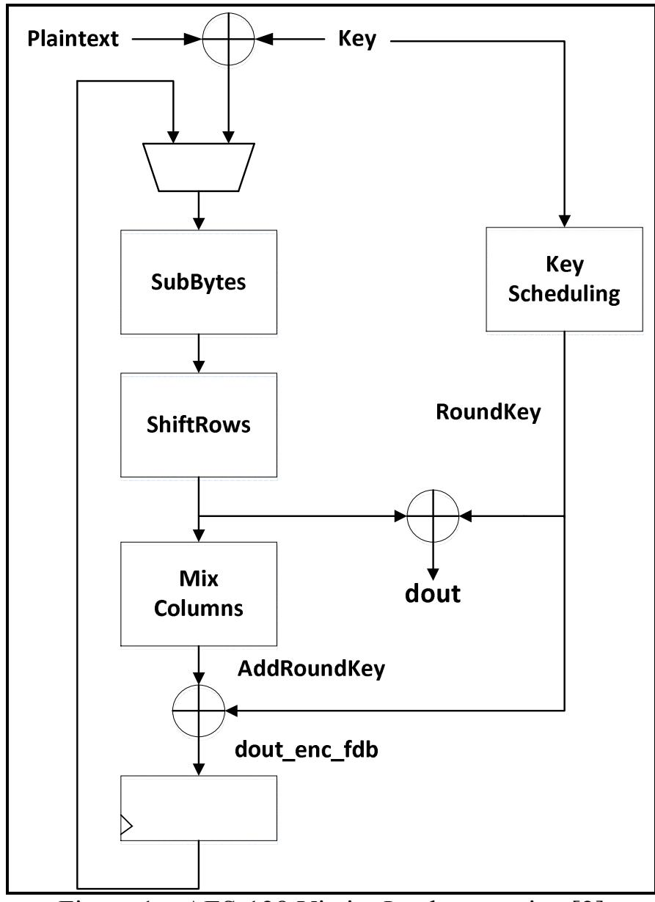

{0}------------------------------------------------

# Attack on AES Implementation Exploiting Publicly-visible Partial Result William Diehl<sup>1</sup>

George Mason University, Fairfax VA 22033, USA wdiehl@gmu.edu

**Abstract.** Although AES is designed to be secure against a wide variety of linear and differential attacks, security ultimately depends on a combination of the engineering implementation and proper application by intended users. In this work, we attack a publicly-available VHDL implementation of AES by exploiting a partial result visible at the top-level public interface of the implementation. The vulnerability renders the security of the implementation equivalent to a one-round version of AES. An algorithm is presented that exploits this vulnerability to recover the secret key in 2<sup>31</sup> operations. The algorithm is coded in an interpreted high-level language and successfully recovers secret keys, with one set of known plaintext, using a generalpurpose CPU in an average of 30 minutes.

**Keywords:** Encryption, cipher, cryptography, cryptanalysis, field programmable gate array, AES

## 1 Introduction

In 2001, the U.S. Government prescribed the use of the Advanced Encryption Standard (AES) in [1]. AES was selected after a multi-year competition of open submissions. Selection was based on security, flexibility, and efficiency in hardware and software. Since 2001, there have been many software and hardware implementations of AES. Although the AES standard states that "any implementation that produces the same output (ciphertext or plaintext) as the algorithm specified in this standard is an acceptable implementation of the AES," it also issues the caveat that "cryptographic security depends on many factors besides the correct implementation of an encryption algorithm" [1]. As such, it is possible for efficient implementations of AES to suffer critical weaknesses due to implementation vulnerabilities, or to be weak due to misunderstandings of the implementation's intended use, even when vulnerabilities are understood by the engineers.

This paper outlines an attack that exploits a critical weakness in a hardware implementation of AES, available at [2]. The attack exploits the public availability of a partial result which exposes an intermediate variable during the first round of computation to recover the entire secret key in 2<sup>31</sup> operations, given one known arbitrary plaintext. The methodology and algorithm for the attack is described subsequently. The recovery algorithm is then coded in Python, and used to recover a number of secret keys based on observed AES simulations of the implementation at [2].

## 2 Related Research

There are several documented studies of linear and differential attacks against AES, as discussed in [3]. However, since the Rijndael algorithm was designed with linear and differential cryptanalysis in mind, there are few known attacks which successfully reduce the key search time below that required for brute-force attacks on AES-128 with 10 full round encryptions [4] (a notable exception is Biclique Cryptanalysis which recovers an AES-128 key in 2126.1 operations, documented in [5]). However, the ultimate success of algebraic attacks against AES is unknown and is an ongoing area of study [3]. Additionally, techniques have been shown to reduce the complexity of attacks against AES-192 and AES-256 to less than that required for brute-force attacks required for the prescribed key strengths of the respective ciphers [5 – 7].

There are several examples in literature which present analogies to the approach applied in this paper. The main area of analogies is in reduced-round attacks. Many block ciphers are designed to eliminate statistical groupings of possible

<sup>1</sup> William Diehl is a PhD Candidate in the Department of Electrical and Computer Engineering (ECE) at George Mason University, Fairfax, U.S.A.

{1}------------------------------------------------

linear combinations of plaintext, ciphertext, and key, as well as eliminate differential branches with non-uniform probability, provided that a number of rounds are used [3]. Taking this minimum number of rounds into account, a "safety factor" is added which forms the number of rounds prescribed by cryptographic specifications for a given algorithm, key strength, and use case. For example, AES-128 has 10 prescribed rounds, while AES-192 has 12 rounds, and AES-256 uses 14 rounds [1].

Reduced-round attacks are able to examine a set of plaintext (e.g. often chosen plaintext) and ciphertext for a subset of rounds which is less than the prescribed number of rounds in order to determine the security implications. Usually, the secret key is predictably recovered more easily when considering fewer rounds, and attacks become more difficult as the number of rounds are increased. Some examples of reduced-round attacks against AES include [4 – 8]. Reduced-round attacks are not restricted to AES; examples of reduced-round attacks which exploit particular features of other block ciphers include SIMON, PRINCE, Midori64, and pi-Cipher, as documented in [9 - 12], respectively.

A second analogy is attacks on "white-box" implementations of AES. White-box implementations are designed to include additional encoding and decoding features that provide some level of protection, even if the attacker has complete access to the internal state of the cipher and is able to measure intermediate variables [13]. Although the victim implementation attacked in this paper is not designed as a white-box implementation, the attack methodology is similar in that the attacker is (unwittingly) allowed to access an internal state variable to simplify the attack.

A third analogy is the "guess and determine" method discussed in [8]. This attack takes a system of equations that describe a function or operation, assumes some constraints on the plaintext and ciphertext, checks "guesses" to see if they are correct, and recomputes if guesses are wrong. A one-round attack using one set of known plaintext is documented to recover a secret key in 2<sup>32</sup> operations [8].

The final analogous attack, documented in [14], most closely resembles the attack discussed in this paper. The purpose of [14] was to refute the claim by the Rijndael authors that there is no security implication resulting from lack of a MixColumns in the final AES encryption. The authors of [14] showed that, while this is true for 10-round (or greater) versions of AES, there is a significant reduction of security when MixColumns is omitted from a one-round AES. In fact, the secret key is recovered to within a few valid candidates in an order of 2<sup>16</sup> operations [14].

In contrast to the above works, however, it is emphasized that that the method used in this paper is not an attack against the AES algorithm in general, but rather against the specific implementation available at [2]. Therefore, the emphasis of this paper is on engineering rather than mathematical analysis.

## 3 Methodology

The AES implementation at [2] has a top-level interface where the port dout contains the correct block encryption (or decryption) on the 10th clock cycle. This makes sense, because the 10th clock cycle does not conduct a MixColumns or AddRoundKey, and it is desirable for the AES result to be available to an application on the 10th clock cycle.

There is a vulnerability, however, in allowing the value of dout to be accessed publicly prior to the completion of the block encryption. In fact, if an attacker knows the plaintext and is allowed to access the contents of dout after the 1st round, the attacker can recover the entire secret key with relatively minimal effort. The victim implementation is shown in Fig. 1

{2}------------------------------------------------



Figure 1 – AES-128 Victim Implementation [2]

The below procedure assumes a known plaintext<sup>2</sup> and the ability to observe the contents of the port dout after one clock cycle. The details of the AES algorithm, including SubBytes, ShiftRows, and Round Key Scheduling, are outlined in [1].

Assume a known plaintext such as Plaintext =  $0^{128}$ . Let y equal the value of dout observed during the  $1^{st}$  clock cycle, where  $y_i$  represents the  $i^{th}$  byte of dout. Let S() represent the S-Box of byte () (i.e., SubBytes), and  $S^{-1}()$  be the Inverse S-Box of byte (). Let  $k_i$  be the  $i^{th}$  byte of the secret key. Let  $rk_i$  be the  $i^{th}$  byte of the  $RoundKey_{Round \ 1}$ . Let  $\{K\}$  be the set of all possible valid keys, where  $\{Valid\ Keys\} \subseteq \{K\}$ , and where the target secret key  $K_S \in \{Valid\ Keys\}$ .  $\{K\}$  is the solution set of the simultaneous equations in Figs. 2 and 3, and  $\{Valid\ Keys\}$  is the subset of  $\{K\}$  that reproduces the correct value of dout after one round. Note that if the number of  $\{Valid\ Keys\} > 1$ , it is not possible to uniquely identify Ks by observing dout after only one round; observations of at least one subsequent round are required.

After the 1<sup>st</sup> round,  $y = ShiftRows[S(K_s)] \oplus RoundKey_{Round 1}$ . In matrix form (Fig. 2), this can be expressed as:

| L | $S(k_0)$    | $S(k_4)$    | $S(k_8)$    | $S(k_{12})$ |   | $y_0 \oplus rk_0$ | $y_4 \oplus rk_4$ | $y_8 \oplus rk_8$       | $y_{12} \oplus rk_{12}$ |
|---|-------------|-------------|-------------|-------------|---|-------------------|-------------------|-------------------------|-------------------------|
|   | $S(k_5)$    | $S(k_9)$    | $S(k_{13})$ | $S(k_1)$    |   | $y_1 \oplus rk_1$ | $y_5 \oplus rk_5$ | $y_9 \oplus rk_9$       | $y_{13} \oplus rk_{13}$ |
| ſ | $S(k_{10})$ | $S(k_{14})$ | $S(k_2)$    | $S(k_6)$    | = | $y_2 \oplus rk_2$ | $y_6 \oplus rk_6$ | $y_{10} \oplus rk_{10}$ | $y_{14} \oplus rk_{14}$ |
|   | $S(k_{15})$ | $S(k_3)$    | $S(k_7)$    | $S(k_{11})$ |   | $y_3 \oplus rk_3$ | $y_7 \oplus rk_7$ | $y_{11} \oplus rk_{11}$ | $y_{15} \oplus rk_{15}$ |
|   |             |             |             |             |   |                   |                   | _                       |                         |

Figure 2 – Relation of Secret Key  $K_S$  to value observed at dout in Matrix Form Since we are interpreting the output of a function of the round key on the first clock cycle, there is a direct relationship between the bytes of the round key and the secret key. The computation of RoundKey<sub>Round 1</sub> (also labeled  $RK_1$ ) is shown in Fig. 3. This allows us, in all cases, to replace  $rk_i$  and rewrite equations in Fig. 2 as functions of  $k_i$ .

<sup>&</sup>lt;sup>2</sup> A null plaintext is chosen as a slight simplification; the procedure, however, works with any known plaintext.

{3}------------------------------------------------

| $rk_0 = S(k_{13}) \oplus k_0 \oplus 1$ | $rk_4 = rk_0 \oplus k_4$ | $rk_8 = rk_4 \oplus k_8$       | $rk_{12} = rk_8 \oplus k_{12}$    |
|----------------------------------------|--------------------------|--------------------------------|-----------------------------------|
| $rk_1 = S(k_{14}) \oplus k_1$          | $rk_5 = rk_1 \oplus k_5$ | $rk_9 = rk_5 \oplus k_9$       | $rk_{13} = rk_9 \oplus k_{13}$    |
| $rk_2 = S(k_{15}) \oplus k_2$          | $rk_6 = rk_2 \oplus k_6$ | $rk_{10} = rk_6 \oplus k_{10}$ | $rk_{14} = rk_{10} \oplus k_{14}$ |
| $rk_3 = S(k_{12}) \oplus k_3$          | $rk_7 = rk_3 \oplus k_7$ | $rk_{11} = rk_7 \oplus k_{11}$ | $rk_{15} = rk_{11} \oplus k_{15}$ |

Figure 3 – Computation of Round Key  $RK_1$  as a function of the Secret Key in Round 1

Given the matrices in Figs. 2 and 3, it remains for the attacker to solve for  $k_0$  through  $k_{15}$ , where many of the variables are dependent. The below procedure, consisting of steps 1-5 and algorithms 1-5, exploits dependencies between  $k_0$  through  $k_{15}$  to recover a set  $\{K\}$  of possibly valid secret keys:

Step 1. Recover {  $k_0$  ,  $k_4$  ,  $k_8$  ,  $k_{12}$  ,  $k_{13}$  }

Step 1.a. Given  $y_0$ ,  $k_0 = S^{-1}$  ( $S(k_{13}) \oplus k_0 \oplus 1 \oplus y_0$ ), and  $rk_0 = S(k_{13}) \oplus k_0 \oplus 1$ , find all { $k_0$ ,  $k_{13}$ } pairs.

```
Algorithm 1a Recover \{k_0, k_{13}\}
        function Recover \{\,k_0\, , \,k_{13}\,\}
1:
2:
            for i = 0 to 255 do
3:
                for j = 0 to 255 do
                If i == S^{-1} (S(j) \oplus i \oplus 1 \oplus y_0)
4:
5:
                         rk_0[i] \leftarrow S(j) \oplus i \oplus 1
6:
                         \{rk_0, k_{13}\}[i] \leftarrow j
7:
                end for j
8:
            end for i
9:
        return \{k_0, k_{13}\}
```

Step 1.b. Given  $y_4$ ,  $k_4 = S^{-1}$  ( $rk_0 \oplus k_4 \oplus y_4$ ), and  $rk_4 = rk_0 \oplus k_4$ , find all { $k_4$ ,  $rk_0$ } pairs.

```
Algorithm 1b Recover \{k_4, rk_0\}
        function Recover \{k_4, rk_0\}
1:
2:
           for i = 0 to 255 do
3:
               for j = 0 to 255 do
                      if i == S^{-1} (rk_0[j] \oplus i \oplus y_4)
4:
                           rk_4[i] \leftarrow rk_0[j] \oplus i
5:
6:
                           \{rk_4, rk_0\}[i] \leftarrow j
7:
               end for j
8:
           end for i
9:
        return \{k_4, rk_0\}
```

Step 1.c. Given  $y_8$ ,  $k_8 = S^{-1}$  ( $rk_4 \oplus k_8 \oplus y_8$ ), and  $rk_8 = rk_4 \oplus k_8$ , Find all { $k_8$ ,  $rk_8$ } pairs.

```
Algorithm 1c Recover{ k_8, rk_8}
       function Recover{ k_8 , rk_8}
2:
           for i = 0 to 255 do
3:
               for j = 0 to 255 do
                  if i == S^{-1} (rk_4[j] \oplus i \oplus y_8)
4:
                     rk_8[i] \leftarrow rk_4[j] \oplus i
5:
                     \{rk_8,rk_4\}[i] \leftarrow j
6:
7:
               end for j
8:
           end for i
       return { k_8 , rk_8 }
9:
```

{4}------------------------------------------------

Step 1.d. Given  $y_{12}$ ,  $k_{12} = S^{-1}$  (  $rk_8 \oplus k_{12} \oplus y_{12}$ ), and  $rk_{12} = rk_8 \oplus k_4$ , find all {  $k_{12}$ ,  $rk_{12}$  } pairs.

```
Algorithm 1d Recover{ k_{12}, rk_{12}}
        function Recover{ k_{12} , rk_{12}}
1:
            for i = 0 to 255 do
2:
3:
                for j = 0 to 255 do
                   if i == S^{-1} (rk_8[j] \oplus i \oplus y_{12})
4:
5:
                      rk_{12}[i] \leftarrow rk_8[j] \oplus i
6:
                       \{rk_{12}, rk_{8}\}[i] \leftarrow j
7:
                end for j
           end for i
8:
9:
        return \{k_{12}, rk_{12}\}
```

Step 1.e. Traverse the tree of valid pairs to find all valid  $\{k_0, k_4, k_8, k_{12}, k_{13}\}$  sets.

```
Algorithm 1e Build Valid Combinations of \{k_0, k_4, k_8, k_{12}, k_{13}\}
        function Recover \{k_0, k_4, k_8, k_{12}, k_{13}\}
 1:
2:
            for i = 0 to 255 do
3:
                k_0 \leftarrow i
                k_{13} \leftarrow k_{13} \ \in \{rk_0,\ k_{13}\}[i]
4:
5:
                for j = 0 to 255
6:
                     \{rk_4, rk_0\}[j] \leftarrow i
 7:
                      k_4 \leftarrow j
                     \{k_8, k_{12}\} \leftarrow \text{find } \{k_8, k_{12}\} (j)
8:
9:
                end for j
10:
            end for i
        return \{k_0, k_4, k_8, k_{12}, k_{13}\}
11:
12:
        function find \{k_8, k_{12}\} (j)
13:
             for k = 0 to 255 do
                 if \{rk_8, rk_4\}[k] == j
14:
15:
                        k_8 \leftarrow k
                        k_{12} \leftarrow \text{find } \{k_{12}\}(j)
16:
17:
             end for k
18:
        return\{k_8, k_{12}\}
19:
        function find \{k_{12}\}(k)
20:
            for 1 = 0 to 255 do
               if \{rk_{12}, rk_8\}[l] == k
21:
22:
               k_{12} \leftarrow l
23:
            end for 1
24: return \{k_{12}\}
```

Step 2. Recover {  $k_1$  ,  $k_5$  ,  $k_9$  ,  $k_{14}$  }

Given  $y_1, y_5, y_9, y_{13}$ ;  $k_5 = S^{-1}$  (  $S(k_{14}) \oplus k_1 \oplus y_1$ ),  $rk_1 = S(k_{14}) \oplus k_1$ ,  $rk_5 = rk_1 \oplus k_5$ ,  $k_9 = S^{-1}$  (  $rk_5 \oplus y_5$ ),  $rk_9 = rk_5 \oplus k_9$ ,  $k_{13} = S^{-1}$  (  $rk_9 \oplus y_9$ ),  $rk_{13} = rk_9 \oplus k_{13}$ ,  $k_1 = S^{-1}$  (  $rk_{13} \oplus y_{13}$ ), and all valid sets of  $\{k_0, k_4, k_8, k_{12}, k_{13}\}$ , find all  $\{k_0, k_1, k_4, k_5, k_8, k_9, k_{12}, k_{13}, k_{14}\}$  sets.

```
Algorithm 2 Recover \{k_1, k_5, k_9, k_{14}\}

1: function Recover \{k_1, k_5, k_9, k_{14}\}

2: c \leftarrow 0 /* array index for recovered \{k_0, k_1, k_4, k_5, k_8, k_9, k_{12}, k_{13}, k_{14}\} sets */

3: for i = 0 to 255 do /* assumed k_1 */

4: for j = 0 to 255 do /* assumed k_5 */

5: for k = 0 to 255 do /* assumed k_{14} */
```

{5}------------------------------------------------

```
if j == S^{-1} (S(k) \oplus i \oplus y_1)
6:
7:
                               rk_5 \leftarrow S(k) \oplus i \oplus j
                               k_9 \leftarrow S^{-1} ( rk_5 \oplus y_5)
8:
9:
                              rk_9 \leftarrow rk_5 \oplus k_9
                               k_{13} \leftarrow S^{-1} (rk_9 \oplus y_9)
10:
11:
                               \forall \ k_{13}: \ k_{13} \in \{ \ k_0 \ , \ k_4 \ , k_8 \ , \ k_{12} \ , \ k_{13} \ \}
                                    if i == S^{-1} (rk_9 \oplus k_{13} \oplus y_{13}) /* check to see if assumed k_1 was correct */
12:
                                       \{\,k_1\,,\,k_5\,,k_9\,,\,k_{14}\,\}\leftarrow \{\,i,\,j,\,k_9,k\}
13:
14:
                                       \{k_0, k_1, k_4, k_5, k_8, k_9, k_{12}, k_{13}, k_{14}\}[c] \leftarrow
                                                                              \{k_0, k_4, k_8, k_{12}, k_{13}\}[i] \cup \{k_1, k_5, k_9, k_{14}\}
15:
                                       c \leftarrow c + 1
16:
                          end for k
17:
                    end for j
18:
               end for i
           return \{k_0, k_1, k_4, k_5, k_8, k_9, k_{12}, k_{13}, k_{14}\}
19:
```

Step 3. Recover {  $k_2$  ,  $k_6$  ,  $k_{10}$  ,  $k_{15}$  }

Given  $y_2, y_6, y_{10}, y_{14}$ ;  $k_{10} = S^{-1}$  (  $S(k_{15}) \oplus k_2 \oplus y_2$ ),  $rk_2 = S(k_{14}) \oplus k_2$ ,  $rk_6 = rk_2 \oplus k_6$ ,  $k_{14} = S^{-1}$  (  $rk_6 \oplus y_6$ ),  $rk_{10} = rk_6 \oplus k_{10}$ ,  $k_2 = S^{-1}$  (  $rk_{10} \oplus y_{10}$ ),  $rk_{14} = rk_{10} \oplus k_{14}$ ,  $k_6 = S^{-1}$  (  $rk_{14} \oplus y_{14}$ ), and all valid sets of {  $k_0$ ,  $k_1$ ,  $k_4$ ,  $k_5$ ,  $k_8$ ,  $k_9$ ,  $k_{12}$ ,  $k_{13}$ ,  $k_{14}$  } where c is the number of valid sets, find all { $k_0, k_1, k_2, k_4, k_5, k_6, k_8, k_9, k_{10}, k_{12}, k_{13}, k_{14}, k_{15}$ } sets.

```
Algorithm 3 Recover \{k_2, k_6, k_{10}, k_{15}\}
          function Recover \{k_2 , k_6 , k_{10} , k_{15} \}
1:
             d \leftarrow 0 /* array index for recovered \{k_0, k_1, k_2, k_4, k_5, k_6, k_8, k_9, k_{10}, k_{12}, k_{13}, k_{14}, k_{15}\} sets */
2:
3:
            for i = 0 to 255 do /* assumed k_2 */
4:
                for j = 0 to 255 do /* assumed k_{10} */
5:
                     for k = 0 to 255 do /* assumed k_{15} */
                      if j == S^{-1} (S(k) \oplus i \oplus y_2)
6:
7:
                          rk_2 \leftarrow S(k) \oplus i
                         for l = 0 to c do
8:
9:
                              k_{14} \leftarrow k_{14} \text{ where } k_{14} \in \{k_1, k_5, k_9, k_{14}\}[l]
                              for m = 0 to 255 do /* k_6 guess */
10:
                                 if k_{14} == S^{-1} (rk_2 \oplus m \oplus y_6)
11:
                                     rk_6 \leftarrow rk_2 \oplus m
12:
                                     If i == S^{-1} (rk_6 \oplus j \oplus y_{10})
13:
                                         if m == S^{-1} (rk_6 \oplus j \oplus k_{14} \oplus y_{14})
14:
15:
                                            \{k_2, k_6, k_{10}, k_{15}\} \leftarrow \{i, m, j, k\}
16:
                                           \{k_0, k_1, k_2, k_4, k_5, k_6, k_8, k_9, k_{10}, k_{12}, k_{13}, k_{14}, k_{15}\}[d] \leftarrow
                                               \{k_0, k_1, k_4, k_5, k_8, k_9, k_{12}, k_{13}, k_{14}\}[i]
                                              \cup \{k_2, k_6, k_{10}, k_{15}\}
17:
                                             d \leftarrow d + 1
18:
                               end for m
19:
                           end for l
20:
                       end for k
21:
                    end for i
22:
                end for i
23:
          return \{k_0, k_1, k_2, k_4, k_5, k_6, k_8, k_9, k_{10}, k_{12}, k_{13}, k_{14}, k_{15}\}
```

Step 4. Recover  $\{k_3, k_7, k_{11}\}$ 

Given  $y_3, y_7, y_{11}$ ;  $k_3 = S(k_{15}) \oplus S(k_{12}) \oplus y_3, k_7 = S(k_3) \oplus S(k_{12}) \oplus k_3 \oplus y_7, k_{11} = S(k_7) \oplus S(k_{12}) \oplus k_3 \oplus k_7 \oplus y_{11}$ , and all valid sets  $\{k_0, k_1, k_2, k_4, k_5, k_6, k_8, k_9, k_{10}, k_{12}, k_{13}, k_{14}, k_{15}\}$  where d is the number of valid sets, find all  $\{K\}$  sets.

{6}------------------------------------------------

```
Algorithm 4 Recover \{k_3, k_7, k_{11}\}
           function Recover \{k_3, k_7, k_{11}\}
1:
2:
               for i = 0 to d do
3:
                    k_3 \leftarrow S(k_{15}) \oplus S(k_{12}) \oplus y_3
4:
                    k_7 \leftarrow S(k_3) \oplus S(k_{12}) \oplus k_3 \oplus y_7
                    k_{11} \leftarrow S(k_7) \oplus S(k_{12}) \oplus k_3 \oplus k_7 \oplus y_{11}
5:
                   \{K\}[i] \leftarrow \{k_0, k_1, k_2, k_4, k_5, k_6, k_8, k_9, k_{10}, k_{12}, k_{13}, k_{14}, k_{15}\}[i] \cup \{k_3, k_7, k_{11}\}
6:
7:
                end for i
8:
           return \{K\}
```

Step 5. Find the set of all valid keys {*Valid Keys*}

Given  $\{K\}$  and the number of possible keys d, find  $\{Valid Keys\}$ .

```
Algorithm 5 Recover {Valid Keys}
         function Recover {Valid Keys}
1:
2:
            \{Valid\ Keys\} \leftarrow \emptyset
3:
            for i = 0 to d do
              RK_1 \leftarrow RoundKey_{Round\ 1}(K[i])
4:
              if ShiftRows(S(K[i])) \oplus RK_1 == y /*  check against dout (e.g. y) during 1st round */
5:
6:
                  \{Valid\ Keys\} \leftarrow \{Valid\ Keys\} \cup \{K\}[i]
7:
            end for i
8:
         return {Valid Keys}
```

#### 4 Results

The victim AES implementation at [2] is implemented in Xilinx Vivado Simulator. Using the set of target secret keys  $(K_S)$  listed in Table 1, values of dout are generated. Since dout is publicly available as a port in the top-level interface, the value of dout is a partial result observed by the attacker at intermediate points, including during the first round of calculations.

The above algorithm is implemented in the Python language, and tested on a CPU with Intel Core i7 with 8 GB RAM and two 1 TB hard drives. Table 1 shows statistics for successful secret key recoveries. To date, all recovery attempts have been successful.

| Key      | Target $K_s$                                    | Run Time (min) | Number          | Number  |
|----------|-------------------------------------------------|----------------|-----------------|---------|
| Recovery |                                                 |                | of { <i>K</i> } | of      |
| Event    |                                                 |                |                 | { Valid |
|          |                                                 |                |                 | Keys}   |
| 1        | 01 23 45 67 89 AB CD EF AA BB CC DD EE FF 00 11 | 28             | 242             | 3       |
| 2        | 09 CA B4 7D FE 87 AC 2E 86 53 BC 7D 6A EC 52 A9 | 29             | 228             | 1       |
| 3        | 89 AB CD EF 01 23 45 67 AA BB CC DD EE FF 00 11 | 33             | 294             | 1       |
| 4        | 00 00 00 00 00 00 00 00 00 00 00 00 00          | 81             | 770             | 4       |
| 5        | 01 23 45 67 89 AB CD EF 01 23 45 67 89 AB CD EF | 27             | 252             | 2       |

Table 1 – Secret Key Recovery Attempts

#### 5 Conclusion

The victim AES implementation at [2] is exploited by a key recovery algorithm which performs the equivalent of a reduced-round (i.e., one round) known plaintext attack. The attack is possible due to the engineering of the implementation, which makes internal intermediate variables visible to an attacker during all rounds of calculation, including the first round. The attack recovers the secret key to a finite number of possible valid keys (between 1 and

{7}------------------------------------------------

4 valid keys, depending on target , in the trials conducted in this research) in 2<sup>31</sup> operations. Running on a CPU in a high-level interpreted language (e.g., Python), the recovery takes approximately 30 minutes for most cases.

The recovery order of 2<sup>16</sup> described in an analogous attack in [14], and the relatively low recovery time described in the "guess and determine" attack in [8], suggest that the algorithm of this attack can be made more efficient by improved search, tree traversal, and solution techniques. Additionally, a compiled implementation using a language such as C would run faster on similar hardware.

Finally, the purpose of this work was to expose vulnerabilities that could occur given shortcomings in engineering design, misuse, or misunderstanding of the proper use of the implementation by intended users. In fact, the vulnerability in this implementation can be eliminated by registering the value of dout so that no partial results or intermediate values are available before the final result is computed, or by using this AES implementation as a component of a higher-level authenticated cipher where values at the output interface are protected from public disclosure.

## References

- 1. FIPS 197, FIPS 197, Advanced Encryption Standard (AES) November 26, 2001, Internet: http://nvlpubs.nist.gov/nistpubs/FIPS/NIST.FIPS.197.pdf [Mar. 9, 2017]
- 2. Source Code for AES (RTL VHDL), Cryptographic Engineering Research Group (CERG), George Mason University, Fairfax, VA, https://cryptography.gmu.edu/athena/index.php?id=CAESAR\_source\_codes [Mar. 10, 2017]
- 3. A. Kaminsky, M. Kurdziel and S. Radziszowski, "An overview of cryptanalysis research for the advanced encryption standard," *MILCOM 2010 Military Communications Conference,* San Jose, CA, 2010, pp. 1310-1316.
- 4. A. Biryukov, O. Dunkelman, N. Keller, D. Khovratovich, and A. Shamir, "Key Recovery Attacks of Practical Complexity on AES Variants With Up To 10 Rounds," https://eprint.iacr.org/2009/374.pdf [Mar. 10, 2017]
- 5. A. Bogdanov, D. Khovratovich, C. Rechberger, "Biclique Cryptanalysis of the Full AES," (eds.) D. Lee and X Wang, Advances in Cryptology -- ASIACRYPT 2011: 17th International Conference on the Theory and Application of Cryptology and Information Security, Seoul, South Korea, December 4-8, 2011, Springer Berlin Heidelberg, pp. 344-371
- 6. P. Derbez, P.A. Fouque, J. Jean, "Improved Key Recovery Attacks on Reduced-Round AES in the Single-Key Setting," T. Johansson and P. Nguyen (eds.), Advances in Cryptology -- EUROCRYPT 2013: 32nd Annual International Conference on the Theory and Applications of Cryptographic Techniques, Athens, Greece, May 26-30, 2013. Proceedings, 2013, Springer Berlin Heidelberg, pp. 371-387
- 7. A. Biryukov, "The Boomerang Attack on 5 and 6-round Reduced AES," Proceedings of the 4th International Conference on Advanced Encryption Standard, 2005, Bonn, Germany,pps.11-15,Springer-Verlag, Berlin, Heidelberg
- 8. C. Bouillaguet, P. Derbez, P. A. Fouque, "Automatic Search of Attacks on Round-Reduced AES and Applications", P. Rogaway (ed.), Advances in Cryptology -- CRYPTO 2011: 31st Annual Cryptology Conference, Santa Barbara, CA, USA, August 14-18, 2011. Proceedings, 2011, Springer Berlin Heidelberg, Berlin, Heidelberg, pps. 169-187
- 9. Y. Hao, W. Meier, "Truncated differential based known-key attacks on round-reduced SIMON," Designs, Codes and Cryptography, 2016, pp. 1-26
- 10. S. Rasoolzadeh and H. Raddum, "Faster Key Recovery Attack on Round-Reduced PRINCE," https://eprint.iacr.org/2016/828.pdf [Mar. 10, 2017]
- 11. X. Dong, Y. Shen, "Cryptanalysis of Reduced-Round Midori64 Block Cipher," https://eprint.iacr.org/2016/676.pdf [Mar. 10, 2017]
- 12. C. Boura, A. Chakraborti, G. Leurent, G. Paul, D. Saha, H. Soleimany, V. Suder, "Key Recovery Attack against 2.5-round pi-Cipher", Cryptology ePrint Archive, Report 2016/502
- 13. T. Lepoint, M. Rivain, Y. Mulder, P. Roelse, B. Preneel, "Two Attacks on a White-Box AES Implementation," Revised Selected Papers on Selected Areas in Cryptography -- SAC 2013 - Volume 8282, 2014, pp. 265-285, Springer-Verlag New York
- 14. O. Dunkelman, N. Keller, "The Effects of the Omission of Last Round's MixColumns on AES," Inf. Process. Lett., April, 2010, Vol. 110, No. 8-9, pp. 304-308, Elsevier North-Holland, Inc., Amsterdam, The Netherlands