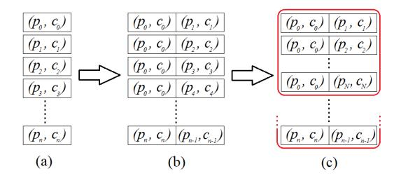
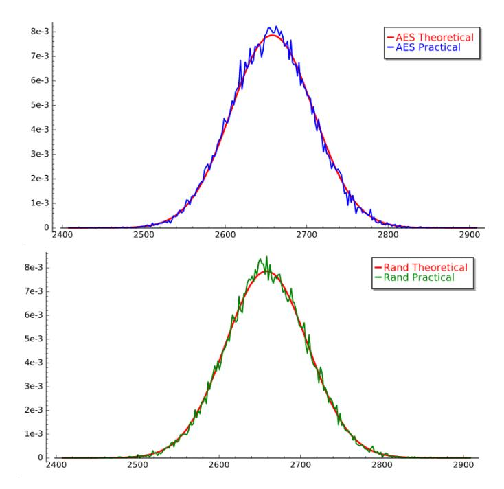

# **Mixture Differential Cryptanalysis and Structural Truncated Differential Attacks on round-reduced AES**

# Lorenzo Grassi

IAIK, Graz University of Technology, Austria [lorenzo.grassi@iaik.tugraz.at](mailto:lorenzo.grassi@iaik.tugraz.at)

**Abstract.** At Eurocrypt 2017 the first secret-key distinguisher for 5-round AES - based on the "multiple-of-8" property - has been presented. Although it allows to distinguish a random permutation from an AES-like one, it seems rather hard to implement a key-recovery attack different than brute-force like using such a distinguisher.

In this paper we introduce "*Mixture Differential Cryptanalysis*" on round-reduced AESlike ciphers, a way to translate the (complex) "multiple-of-8" 5-round distinguisher into a simpler and more convenient one (though, on a smaller number of rounds). Given a pair of chosen plaintexts, the idea is to construct new pairs of plaintexts by *mixing* the generating variables of the original pair of plaintexts. Here we theoretically prove that for 4-round AES the corresponding ciphertexts of the original pair of plaintexts lie in a particular subspace if and only if the corresponding pairs of ciphertexts of the new pairs of plaintexts have the same property. Such secret-key distinguisher - which is independent of the secret-key, of the details of the S-Box and of the MixColumns matrix (except for the branch number equal to 5) - can be used as starting point to set up new key-recovery attacks on round-reduced AES. Besides a theoretical explanation, we also provide a practical verification both of the distinguisher and of the attack.

As a second contribution, we show how to combine this new 4-round distinguisher with a modified version of a truncated differential distinguisher in order to set up new 5-round distinguishers, that exploit properties which are independent of the secret key, of the details of the S-Box and of the MixColumns matrix. As a result, while a "classical" truncated differential distinguisher exploits the probability that a couple of texts satisfies or not a given differential trail independently of the others couples, our distinguishers work with sets of *N* 1 (related) couples of texts. In particular, our new 5-round AES distinguishers exploit the fact that such sets of texts satisfy some properties with a different probability than a random permutation.

Even if such 5-round distinguishers have higher complexity than e.g. the "multipleof-8" one present in the literature, one of them can be used as starting point to set up the *first* key-recovery attack on 6-round AES that exploits *directly* a 5-round secret-key distinguisher. The goal of this paper is indeed to present and explore new approaches, showing that even a distinguisher like the one presented at Eurocrypt believed to be hard to exploit - can be used to set up a key-recovery attack.

**Keywords:** AES · Secret-Key Distinguisher · Key-Recovery Attack · Mixture Differential Cryptanalysis · Truncated Differential · Subspace Trail Cryptanalysis

# **Contents**

| 1 | Introduction<br>2                                                                                                                                                                                                                                                                                                       |                      |  |  |  |  |
|---|-------------------------------------------------------------------------------------------------------------------------------------------------------------------------------------------------------------------------------------------------------------------------------------------------------------------------|----------------------|--|--|--|--|
| 2 | Preliminary - Description of AES<br>7                                                                                                                                                                                                                                                                                   |                      |  |  |  |  |
| 3 | Subspace Trails<br>3.1<br>Subspace Trails of AES<br><br>3.2<br>Intersections of Subspaces and Useful Probabilities<br>                                                                                                                                                                                                  | 8<br>8<br>10         |  |  |  |  |
| 4 | "Multiple-of-8" Secret-Key Distinguisher for 5-round AES                                                                                                                                                                                                                                                                | 11                   |  |  |  |  |
| 5 | New 4-round Secret-Key Distinguisher for AES<br>5.1<br>Mixture Differential Distinguisher for 4-round AES<br>5.2<br>Generic Mixture Differential Distinguishers for 4-round AES<br>5.3<br>Comparison with Other 4-round Secret-Key Distinguishers                                                                       | 13<br>14<br>18<br>19 |  |  |  |  |
| 6 | New Key-Recovery Attack on 5-round AES<br>6.1<br>Data and Computational Costs<br><br>6.2<br>Practical Verification                                                                                                                                                                                                      | 21<br>23<br>24       |  |  |  |  |
| 7 | A new 5-round Secret-Key Distinguisher for AES<br>7.1<br>5-round Probabilistic Mixture Differential Secret-Key Distinguisher<br>7.2<br>Data and Computational Complexity<br>7.3<br>Practical Verification on small scale AES                                                                                            | 25<br>25<br>29<br>33 |  |  |  |  |
| 8 | Key-Recovery Attack on 6 rounds of AES-128                                                                                                                                                                                                                                                                              | 34                   |  |  |  |  |
| 9 | Other Secret-Key Distinguishers for 5-round AES<br>9.1<br>Threshold Mixture Differential Secret-Key Distinguisher<br><br>9.2<br>Impossible Mixture Differential Secret-Key Distinguisher                                                                                                                                | 37<br>38<br>41       |  |  |  |  |
| A | Proof - Probabilities of Sect. 3.2<br>A.1<br>How to Compute the Number of Pairs with n Equal Generating Variables<br>A.2<br>Discussion about the Given Approximations                                                                                                                                                   | 46<br>48<br>49       |  |  |  |  |
| B | 4-round Secret-Key Distinguisher for AES - Details                                                                                                                                                                                                                                                                      |                      |  |  |  |  |
| C | Variants of the 5-round AES Secret-Key Distinguisher of Sect. 7<br>C.1<br>First Variant of the 5-round Distinguisher of Sect. 7<br><br>C.2<br>Second Variant of the 5-round Distinguisher of Sect. 7<br>C.3<br>Key-Recovery Attack on 6-round AES of Sect. 8 - Chosen Plaintexts in<br>Cosets of DI<br>with  I  = 2<br> | 51<br>52<br>55<br>58 |  |  |  |  |
| D | Other Variants of the 5-round AES Secret-Key Distinguisher of Sect. 7<br>D.1<br>Variant of the 5-round Distinguisher of Sect. 7<br><br>D.2<br>Key-Recovery Attack on 6-round AES<br><br>D.3<br>Practical Verification on small scale AES                                                                                | 59<br>59<br>61<br>61 |  |  |  |  |
| E | Different Implementation of the 5-round Distinguisher proposed in Sect.<br>7.2.2<br>62                                                                                                                                                                                                                                  |                      |  |  |  |  |
| F | Integral Attack on 5-round AES<br>64                                                                                                                                                                                                                                                                                    |                      |  |  |  |  |

# <span id="page-2-0"></span>**1 Introduction**

Block ciphers are certainly among the most important cryptographic primitives. They are designed by iterating an efficiently implementable round function many times in the hope that the resulting composition behaves like a randomly drawn permutation. In the compromise, a round function is iterated enough times to make sure that any symmetries and structural properties that might exist in the round function vanish.

One of the most important tools that a cryptanalyst has at hand when trying to evaluate the security of ciphers or hash functions is - without doubt - differential cryptanalysis. Since its conception by Biham and Shamir [\[BS90,](#page-44-0) [BS91\]](#page-44-1) in their effort to break the Data Encryption Standard (DES), it has been successfully applied in many cases such that any modern cipher is expected to have strong security arguments against this attack.

The methodology of differential cryptanalysis has been extended several times with a number of attack vectors, most importantly truncated differentials [\[Knu95\]](#page-45-0), impossible differentials [\[Knu98,](#page-45-1) [BBS99\]](#page-43-0), higher-order differentials [\[Knu95\]](#page-45-0), boomerang attacks [\[Wag99\]](#page-45-2) and differential-linear attacks [\[LH94\]](#page-45-3).

With today's knowledge, designing a secure block cipher is a problem that is largely considered solved. Especially with the AES we have at hand a very well analyzed and studied cipher that, after more than 20 years of investigation still withstands all cryptanalytic attacks. However, new results on the AES still appear regularly, especially within the last couple of years (e.g. polytopic cryptanalysis [\[Tie16\]](#page-45-4), "multiple-of-8" distinguisher [\[GRR17a\]](#page-45-5) and yoyo distinguisher [\[RBH17\]](#page-45-6)). While those papers do not pose any practical thread to the AES, they do give new insights into the internals of what is arguably the cipher that is responsible for the largest fraction of encrypted data worldwide.

"Multiple-of-8" distinguisher [\[GRR17a\]](#page-45-5) proposed at Eurocrypt 2017 by Grassi, Rechberger and Rønjom is the first 5-round secret-key distinguisher for AES that exploits a property which is independent of the secret key and of the details of the S-Box. This distinguisher is based on a new structural property for up to 5 rounds of AES: by appropriate choices of a number of input pairs it is possible to make sure that the number of times that the difference of the resulting output pairs lie in a particular subspace is *always* a multiple of 8. This distinguisher allows to distinguish an AES permutation from a random one with a success probability greater than 99% using 2 <sup>32</sup> chosen texts and a computational cost of 2 35*.*6 look-ups. On the other hand, as this distinguisher is based on a property of the whole state in the output of AES, it makes it challenging to convert it into a key-recovery attack over more rounds, since e.g. it requires guessing the whole subkey in the last round.

In this paper we introduce "*mixture differential cryptanalysis*" on round-reduced AES-like ciphers, a way to translate the (complex) "multiple-of-8" 5-round distinguisher [\[GRR17a\]](#page-45-5) into a simpler and more convenient one (though, on a smaller number of rounds). As we are going to show, such new proposed technique leads to a new distinguisher and key-recovery attacks on 4- and 5-round AES (respectively) with data and computational complexity similar than other attacks in literature. As second contribution, we show how to extend such distinguisher to 5 rounds, combining the 4-round mixture differential distinguisher with a modified version of a truncated differential distinguisher. As a result, even if the obtained 5-round secret-key distinguishers have higher data and computational complexities than other ones present in the literature (e.g. [\[GRR17a\]](#page-45-5)), one of them allows to set up *the first 6 rounds key-recovery attack on AES that exploits directly a 5-round secret-key distinguisher* (which exploits a property which is independent of the secret key).

Such distinguishers and attacks - fully practically verified - are also general enough to be applied to any AES-like cipher, and they might be valuable as a reference framework. In particular, many constructions employ reduced round AES as part of their design (e.g. among many others, AEGIS [\[WP\]](#page-45-7) - one of the finalist of the on-going CAESAR competition [\[CAE\]](#page-44-2) - uses five AES round-functions in the state update functions). Reduced versions of AES have nice and well-studied properties that can be favorably as components

of larger designs (see for instance Simpira [\[GM16\]](#page-44-3)). As a result, distinguishers and attacks on round-reduced AES can be also useful in analyzing those primitives. To give a concrete example, in [\[BEK16\]](#page-43-1) authors exploit - in a new way - known properties of round-reduced AES to set up a new attack on ELmD [\[DN\]](#page-44-4), another finalist of the on-going CAESAR competition.

# **Related Work**

To the best of our knowledge, the concept of mixture differential cryptanalysis is new and has not been used in cryptanalysis before. Nonetheless there are other works that share some similarities with mixture differential cryptanalysis.

Before going on, as first thing we recall the notion of secret-key distinguisher, one of the weakest attacks that can be launched against a secret-key cipher. In this attack, there are two oracles: one that simulates the cipher for which the cryptographic key has been chosen at random and one that simulates a truly random permutation. The adversary can query both oracles and her task is to decide which oracle is the cipher and which is the random permutation. The attack is considered to be successful if the number of queries required to make a correct decision is below a well defined level.

**Differential Attacks.** Differential attacks [\[BS90\]](#page-44-0) exploit the fact that couples of plaintexts with certain differences yield other differences in the corresponding ciphertexts with a non-uniform probability distribution. The resulting pair of differences is called a *differential*. Such a property can be used both to distinguish a cipher permutation from a random one, and to recover the secret key. Possible variants of this attack/distinguisher are the truncated differential attack [\[Knu95\]](#page-45-0), in which the attacker considers only part of the difference between pairs of texts (i.e. a differential attack where only part of the difference in the ciphertexts can be predicted), and impossible differential attack [\[Knu98,](#page-45-1) [BBS99\]](#page-43-0), in which the attacker considers differential with zero-probability.

In the original version of differential cryptanalysis [\[BS90\]](#page-44-0), a unique differential is exploited. A generalization of such attack is multiple differential cryptanalysis [\[BG11\]](#page-43-2), where several input differences are considered together and the corresponding output differences can be different from an input difference to another, that is the set of considered differentials has no particular structure.

The common feature of all these distinguishers/attacks is the fact that - in all these cases - the attacker focuses on the probability that a single pair of plaintexts with a certain input difference yield other difference in the corresponding pair of ciphertexts, working *independently* on each pair of texts.

**Recent Results.** Recently, new differential distinguishers have been proposed in the literature, precisely the polytopic cryptanalysis [\[Tie16\]](#page-45-4) at Eurocrypt 2016 and the yoyo distinguisher on SPN constructions [\[RBH17\]](#page-45-6) at Asiacrypt 2017, which present an important difference with respect to the previously recalled attacks. Instead of working on each couple[1](#page-3-0) of two (plaintext, ciphertext) pairs independently of the others as in the previous scenario, in these cases the attacker works on the relations that hold among the couples of pairs of texts. In other words, *given a couple of two (plaintext, ciphertext) pairs with a certain input/output differences, one focuses and studies how such couple influences other couples of two (plaintext, ciphertext) pairs to satisfy particular input/output differences*.

More precisely, polytopic cryptanalysis is similar to multiple differential cryptanalysis. However, as opposed to assuming independence of the differentials (which does not hold in general, as showed in [\[Mur11\]](#page-45-8)), the authors explicitly take their correlation into account

<span id="page-3-0"></span><sup>1</sup>*Notation:* we use the term "*pair*" to denote a plaintext and its corresponding ciphertext. A "*couple*" denotes a set of two such pairs.

**Table 1:** *Secret-Key Distinguishers for round-reduced AES*. The complexity is measured in minimum number of chosen plaintexts/ciphertexts (CP/CC) or/and adaptive chosen plaintexts/ciphertexts (ACP/ACC) which are needed to distinguish the AES permutation from a random one with probability higher than 95% (all distinguishers work both in the encryption and in the decryption mode). Time complexity is measured in equivalent encryptions (E), memory accesses (M) or XOR operations (XOR) - using the common approximation 20 M ≈ 1 Round of Encryption. The distinguisher of this paper is in bold.

| Property                | Rounds | Data                          | Cost                          | Ref.      |
|-------------------------|--------|-------------------------------|-------------------------------|-----------|
| Yoyo Game               | 4      | 2 CP + 2 ACC                  | 2 XOR                         | [RBH17]   |
| Impossible Differential | 4      | 16.25 CP<br>2                 | 22.3 M<br>16 E<br>2<br>≈ 2    | [BK01]    |
| Mixture Diff.           | 4      | 17 CP<br>2                    | 23.1 M<br>16.75 E<br>≈ 2<br>2 | Sect. 5   |
| Integral                | 4      | 32 CP<br>2                    | 32 XOR<br>2                   | [DKR97]   |
| Multiple-of-8           | 4      | 33 CP<br>2                    | 40 M<br>33.7 E<br>≈ 2<br>2    | [GRR17a]  |
| Yoyo                    | 5      | 25.8 ACC<br>12 CP +<br>2<br>2 | 24.8 XOR<br>2                 | [RBH17]   |
| Multiple-of-8           | 5      | 32 CP<br>2                    | 35.6 M<br>29 E<br>2<br>≈ 2    | [GRR17a]  |
| Variance Diff.          | 5      | 34 CP<br>2                    | 37.6 M<br>31 E<br>2<br>≈ 2    | [GR18]    |
| Truncated Diff.         | 5      | 48.96 CP<br>2                 | 52.6 M<br>46 E<br>2<br>≈ 2    | [GR18]    |
| Prob. Mixture Diff.     | 5      | 52 CP<br>2                    | 71.5 M<br>64.9 E<br>≈ 2<br>2  | Sect. 7   |
| Threshold M.D.          | 5      | 89 CP<br>2                    | 98.1 M<br>91.5 E<br>2<br>≈ 2  | Sect. 9.1 |
| Imp. Mixture Diff.      | 5      | 82 CP<br>2                    | 97.8 M<br>91.1 E<br>2<br>≈ 2  | Sect. 9.2 |

Prob. Mixture Diff.: Probabilistic Mixture Differential, Imp. Mixture Diff.: Impossible Mixture Differential, Threshold M.D.: Threshold Mixture Differential

and use it in their framework, considering interdependencies between larger sets of texts and as they traverse through the cipher.

The strategy exploited by the yoyo game on SPN constructions proposed at Asiacrypt 2017 is similar to the one that we are going to exploit to set up our new distinguisher. Given a pair of chosen plaintexts and the corresponding ciphertexts, the attacker constructs new pair of ciphertexts related to the other ones by linear and differential relations. Authors prove that the corresponding new pair of plaintexts of this new second pair of ciphertexts satisfies - with prob. 1 - a difference related "in some sense" to the input difference of the original pair of plaintexts, independently of the secret-key. This allows to distinguish e.g. round-reduced AES from a random permutation, or to set up key-recovery attack.

# **Our Contribution**

## **"Mixture Differential Cryptanalysis" on 4-round AES**

As first contribution, in this paper we present "mixture differential cryptanalysis" on 4-round AES. This 4-round secret-key distinguisher - proposed in Sect. [5](#page-13-0) - is similar in nature to polytopic cryptanalysis and the yoyo distinguishers just recalled.

Given plaintexts in the same coset of a subspace C, the attacker first divides the couples of two (plaintext, ciphertext) pairs into sets of *N* ≥ 2 *non-independent* couples. These sets are defined such that particular relationships (that involve differential and linear relationships) hold among the plaintexts of the couples that belong to the same set. Due to the particular way - explained in detail the following - in which these sets are defined, we call our new technique as *Mixture Differential Cryptanalysis*. As already pointed out, the way in which these sets are constructed resemble the "multiple-of-8" distinguisher [\[GRR17a\]](#page-45-5) recently proposed at Eurocrypt 2017.

<span id="page-5-1"></span>

**Figure 1:** *New Differential Secret-Key Distinguishers for round-reduced AES*. Consider *N* (plaintext, ciphertext) pairs (a). In a "classical" differential attack (b), one works independently on each couple of two (plaintext, ciphertext) pairs and exploits the probability that it satisfies a certain differential trail. In our attack (c), one divides the couples into non-random sets, and exploits particular relationships (based on differential trails) that hold among the couples that belong to the same set in order to set up a distinguisher.

Such sets have the property that the two ciphertexts of a certain couple belong to the same coset[2](#page-5-0) of a particular subspace M if and only if the two ciphertexts of all the other couples in that set have the same property. In other words, it is not possible that two ciphertexts of some couples belong to the same coset of M, and that two ciphertexts of other couples don't have this property. Since this last event can occur for a random permutation, it is possible to distinguish 4-round AES from a random permutation.

In more detail and referring to Fig. [1,](#page-5-1) given *n* chosen (plaintext, ciphertext) pairs, in a "classical" (differential) attack one works on each couple of two (plaintext, ciphertext) pairs independently of the others - case (b). In our distinguishers/attacks instead, one first divides the couples in (non-random) sets of *N* ≥ 2 couples - case (c), and then she works on each set of couples independently of the other sets, exploiting the property just given.

We remark that our new mixture differential distinguisher *is independent of the secret key (and of the key-schedule), of the details of the S-Box and of the MixColumns matrix.* Such distinguisher works both in the encryption and in the decryption process, and it is general enough to be applied to any AES-like cipher. Compared to the yoyo distinguisher proposed at Asiacrypt 2017 that requires adaptive chosen plaintexts/ciphertexts, ours requires only chosen plaintexts. A complete and detailed comparison among our new proposed distinguisher and the other ones present in the literature is proposed in Sect. [5.3.](#page-19-0)

#### **Properties exploited by the new proposed 5-round Secret-Key Distinguishers**

Using the previous 4-round distinguisher as starting point, we present three different properties that can be exploited to distinguish 5-round AES from a random permutation. Given a set of *N* ≥ 2 *non-independent* couples of two (plaintext, ciphertext) pairs, it is possible to prove the following:

**Probabilistic Mixture Differential:** consider the number of sets for which two ciphertexts of at least one couple belong to the same coset of particular subspace M; if the sets are properly defined, then this number of sets is (a little) lower for 5-round AES than for a random permutation (details are given in Sect. [7\)](#page-25-0);

**Threshold Mixture Differential:** consider the number of sets with the following property: the number of couples for which the two ciphertexts belong to the same coset of a particular subspace M is higher than a certain threshold *Z* ∈ N; if this number *Z* and the sets are properly defined, then this number of sets is higher for 5-round AES than for a random permutation (details are given in Sect. [9.1\)](#page-38-0);

<span id="page-5-0"></span><sup>2</sup>*A pair of texts has a certain difference if and only if the texts belong to the same coset of a particular subspace* X.

**Table 2:** *Comparison of Attacks on round-reduced AES-128.* Data complexity is measured in number of required chosen plaintexts/ciphertexts (CP/CC) and/or adaptive chosen plaintexts/ciphertexts (ACP/ACC). Time complexity is measured in round-reduced AES encryption equivalents (E) - the number in the brackets denotes the pre-computation cost (if not negligible). Memory complexity is measured in texts (16 bytes). *RDist* denotes the number of rounds of the secret-key distinguisher exploited to set up the attack. Attack presented in this paper is in bold.

| Attack            | Rounds | Data          | Computation Memory RDist |            |   | Ref.                |
|-------------------|--------|---------------|--------------------------|------------|---|---------------------|
| MitM              | 5      | 8 CP          | 64<br>2                  | 56<br>2    | - | [Der13, Sec. 7.5.1] |
| Imp. Polytopic    | 5      | 15 CP         | 70<br>2                  | 41<br>2    | 3 | [Tie16]             |
| Partial Sum       | 5      | 8 CP<br>2     | 38<br>2                  | small      | 4 | [Tun12]             |
| Integral (EE)     | 5      | 11 CP<br>2    | 45.7<br>2                | small      | 3 | [DR02]              |
| Yoyo Game         | 5      | 11.3 ACC<br>2 | 31<br>2                  | small      | 4 | [RBH17]             |
| Imp. Differential | 5      | 31.5 CP<br>2  | 33 (+ 238)<br>2          | 38<br>2    | 4 | [BK01]              |
| Integral (EE)     | 5      | 32 CP<br>2    | 25.4<br>2                | 5<br>2     | 4 | App. F              |
| Integral (EB)     | 5      | 33 CP<br>2    | 37.7<br>2                | 32<br>2    | 4 | [DR02]              |
| Mixture Diff.     | 5      | 33.6 CP<br>2  | 33.3<br>2                | 34<br>2    | 4 | Sect. 6             |
| MitM              | 6      | 8 CP<br>2     | 106.2<br>2               | 106.2<br>2 | - | [DF13]              |
| Partial Sum       | 6      | 32 CP<br>2    | 42<br>2                  | 40<br>2    | 4 | [Tun12]             |
| Integral          | 6      | 35 CP<br>2    | 69.7<br>2                | 32<br>2    | 4 | [DR02]              |
| Prob. Mix Diff.   | 6      | 72.8 CP<br>2  | 105<br>2                 | 33<br>2    | 5 | Sect. 8             |
| Imp. Differential | 6      | 91.5 CP<br>2  | 122<br>2                 | 89<br>2    | 4 | [CKK+02]            |

MitM: Meet-in-the-Middle, EE: Extension at End, EB: Extension at Beginning

**Impossible Mixture Differential:** if the sets are properly defined, for 5-round AES there exists at least one set for which the two ciphertexts of *each* couple in that set don't belong to the same coset of a particular subspace M; in contrast, for a random permutation, for each set there exists at least one couple for which the two ciphertexts belong to the same coset of a particular subspace M (details are given in Sect. [9.2\)](#page-41-0).

# **New Key-Recovery Attack on round-reduced AES-128**

Finally, we show that mixture differential cryptanalysis and the previous distinguishers are not only theoretically intriguing, but indeed relevant for practical cryptanalysis. In particular, in Sect. [6](#page-21-0) we propose an attack on 5-round AES that exploits the distinguisher on 4 rounds proposed in Sect. [5.](#page-13-0) Such attack has then been improved in [\[BODK](#page-44-10)<sup>+</sup>18], becoming the one with the *lowest computational cost* among the attacks currently present in the literature (that don't use adaptive chosen plaintexts/ciphertexts).

In this attack, the attacker chooses plaintexts in the same coset of a particular subspace D which is mapped after one round into a coset of another subspace C. Using the mixture differential distinguisher just introduced and the facts that

- the way in which the couples of two (plaintext, ciphertext) pairs are divided in sets depends on the (partially) guessed key
- the behavior of a set for a wrongly guessed key is (approximately) the same as the case of a random permutation,

she can filter wrong candidates of the key, and finally finds the right one.

Using a similar strategy, in Sect. 8 we propose the first 6 rounds key-recovery attack on AES that exploits directly a 5-round secret-key distinguisher, namely the 5-round "probabilistic mixture differential" distinguisher (which is based on a property which is independent of the secret key).

#### **Generic Considerations**

Before we go on, we do some preliminary considerations about our work, in particular about the fact that our distinguishers and key-recovery attacks presented in this paper have higher complexities than the ones currently present in the literature.

Even if all the attacks on AES-like ciphers currently present in the literature are constantly improved, they seem not be able to break full-AES - with the only exception of the Biclique attack [BKR11], which can be considered as brute force<sup>3</sup>. Thus, besides improving the known attacks present in the literature, we believe that it is important and crucial to propose new ideas and techniques. Even if they are not initially competitive, they can provide new directions of research and can lead to new competitive attacks. To provide a first example, consider the impossible differential attack on AES. When it was proposed in 2001 by Biham and Keller [BK01], it could attack ("only") 5 rounds of AES and it was not competitive with respect to others attacks, as the integral one. It took approximately 6 years before that such attack was extended and set up against 7-round AES-128 [ZWF07], becoming one of the few attacks (together with Meet-in-the-Middle [DFJ13]) on such number of rounds. Another concrete example regards the "Mixture Differential Cryptanalysis" proposed here. In [BODK+18], authors combine such attack with several other techniques in order to obtain (1st) the best known-key recovery attack on 5-round AES and (2nd) the best known attacks which use practical amounts of data and memory on 7-round AES, breaking the record for such attacks which was obtained 18 years ago by the classical Square Attack.

We believe that similar considerations can be done for the attacks/distinguisher proposed in this paper. In particular, we are able to show for the first time that even a distinguisher of the type [GRR17a] - believed to be hard to exploit - can be used to set up key-recovery attacks, which potentially opens up the way for new and interesting applications in cryptanalysis.

# <span id="page-7-0"></span>2 Preliminary - Description of AES

The Advanced Encryption Standard [DR02] is a Substitution-Permutation network that supports key sizes of 128, 192 and 256 bits. The 128-bit plaintext initializes the internal state represented by a  $4 \times 4$  matrix of bytes seen as values in the finite field  $\mathbb{F}_{256}$ , defined using the irreducible polynomial  $x^8 + x^4 + x^3 + x + 1$ . Depending on the version of AES,  $N_r$  rounds are applied to the state:  $N_r = 10$  for AES-128,  $N_r = 12$  for AES-192 and  $N_r = 14$  for AES-256. An AES round applies four operations to the state matrix:

- SubBytes (S-Box) applying the same 8-bit to 8-bit invertible S-Box 16 times in parallel on each byte of the state (provides non-linearity in the cipher);
- ShiftRows (SR) cyclic shift of each row (*i*-th row is shifted by *i* bytes to the left);
- $MixColumns\ (MC)$  multiplication of each column by a constant  $4\times 4$  invertible matrix over the field  $GF(2^8)$  (together with the ShiftRows operation, it provides diffusion in the cipher);
- AddRoundKey (ARK) XORing the state with a 128-bit subkey.

<span id="page-7-1"></span> $<sup>\</sup>overline{\phantom{a}}^3$ The biclique attack on 10-round AES-128 requires  $2^{88}$  chosen texts and it has a computational cost of approximately  $2^{126.2}$  encryptions.

One round of AES can be described as  $R(x) = K \oplus MC \circ SR \circ S\text{-Box}(x)$ . In the first round an additional AddRoundKey operation (using a whitening key) is applied, and in the last round the MixColumns operation is omitted.

**Notation Used in the Paper.** Let x denote a plaintext, a ciphertext, an intermediate state or a key. Then  $x_{i,j}$  with  $i, j \in \{0, ..., 3\}$  denotes the byte in the row i and in the column j. We denote by  $k^r$  the subkey of the r-th round (where  $k^0$  is the secret key for AES-128). If only one subkey is used (e.g. the first subkey  $k^0$ ), then we denote it by k to simplify the notation. Finally, we denote by R one round<sup>4</sup> of AES, while we denote r rounds of AES by  $R^r$ . As last thing, in the paper we often use the term "partial collision" (or "collision") when two texts belong to the same coset of a given subspace  $\mathcal{X}$ .

# <span id="page-8-0"></span>3 Subspace Trails

Let F denote a round function in an iterative block cipher and let  $V \oplus a$  denote a coset of a vector space V. Then if  $F(V \oplus a) = V \oplus a$  we say that  $V \oplus a$  is an *invariant coset* of the subspace V for the function F. This concept can be generalized to *trails of subspaces* [GRR17b], which has been recently introduced as generalization of the invariant subspace cryptanalysis.

**Definition 1.** Let  $(V_1, V_2, ..., V_{r+1})$  denote a set of r+1 subspaces with  $\dim(V_i) \leq \dim(V_{i+1})$ . If for each i=1,...,r and for each  $a_i$ , there exist  $a_{i+1}$  such that  $F(V_i \oplus a_i) \subseteq V_{i+1} \oplus a_{i+1}$ , then  $(V_1, V_2, ..., V_{r+1})$  is subspace trail of length r for the function F. If all the previous relations hold with equality, the trail is called a *constant-dimensional subspace trail*.

This means that if  $F^t$  denotes the application of t rounds with fixed keys, then  $F^t(V_1 \oplus a_1) = V_{t+1} \oplus a_{t+1}$ . We refer to [GRR17b] for more details about the concept of subspace trails. Our treatment here is however meant to be self-contained.

# <span id="page-8-1"></span>3.1 Subspace Trails of AES

Here we recall the subspace trails of AES presented in [GRR17b], working with vectors and vector spaces over  $\mathbb{F}_{2^8}^{4\times 4}$ . For the following, we denote by  $\{e_{0,0},...,e_{3,3}\}$  the unit vectors of  $\mathbb{F}_{2^8}^{4\times 4}$  (e.g.  $e_{i,j}$  has a single 1 in row i and column j). We recall that given a subspace  $\mathcal{X}$ , the cosets  $\mathcal{X} \oplus a$  and  $\mathcal{X} \oplus b$  (where  $a \neq b$ ) are equal (that is  $\mathcal{X} \oplus a \equiv \mathcal{X} \oplus b$ ) if and only if  $a \oplus b \in \mathcal{X}$ .

**Definition 2.** The column spaces  $C_i$  are defined as  $C_i = \langle e_{0,i}, e_{1,i}, e_{2,i}, e_{3,i} \rangle$ .

For instance,  $C_0$  corresponds to the symbolic matrix

$$\mathcal{C}_0 = \left\{ \begin{bmatrix} x_1 & 0 & 0 & 0 \\ x_2 & 0 & 0 & 0 \\ x_3 & 0 & 0 & 0 \\ x_4 & 0 & 0 & 0 \end{bmatrix} \middle| \forall x_1, x_2, x_3, x_4 \in \mathbb{F}_{2^8} \right\} \equiv \begin{bmatrix} x_1 & 0 & 0 & 0 \\ x_2 & 0 & 0 & 0 \\ x_3 & 0 & 0 & 0 \\ x_4 & 0 & 0 & 0 \end{bmatrix}.$$

**Definition 3.** The diagonal spaces  $\mathcal{D}_i$  and the inverse-diagonal spaces  $\mathcal{I}\mathcal{D}_i$  are defined as  $\mathcal{D}_i = SR^{-1}(\mathcal{C}_i)$  and  $\mathcal{I}\mathcal{D}_i = SR(\mathcal{C}_i)$ .

For instance,  $\mathcal{D}_0$  and  $\mathcal{I}\mathcal{D}_0$  correspond to symbolic matrices

$$\mathcal{D}_0 \equiv \begin{bmatrix} x_1 & 0 & 0 & 0 \\ 0 & x_2 & 0 & 0 \\ 0 & 0 & x_3 & 0 \\ 0 & 0 & 0 & x_4 \end{bmatrix}, \qquad \mathcal{ID}_0 \equiv \begin{bmatrix} x_1 & 0 & 0 & 0 \\ 0 & 0 & 0 & x_2 \\ 0 & 0 & x_3 & 0 \\ 0 & x_4 & 0 & 0 \end{bmatrix}$$

<span id="page-8-2"></span><sup>&</sup>lt;sup>4</sup>Sometimes we use the notation  $R_k$  instead of R to highlight the round key k.

for each  $x_1, x_2, x_3, x_4 \in \mathbb{F}_{2^8}$ .

**Definition 4.** The *i-th mixed spaces*  $\mathcal{M}_i$  are defined as  $\mathcal{M}_i = MC(\mathcal{ID}_i)$ .

For instance,  $\mathcal{M}_0$  corresponds to symbolic matrix

$$\mathcal{M}_0 \equiv \begin{bmatrix} 0 \text{x} 02 \cdot x_1 & x_4 & x_3 & 0 \text{x} 03 \cdot x_2 \\ x_1 & x_4 & 0 \text{x} 03 \cdot x_3 & 0 \text{x} 02 \cdot x_2 \\ x_1 & 0 \text{x} 03 \cdot x_4 & 0 \text{x} 02 \cdot x_3 & x_2 \\ 0 \text{x} 03 \cdot x_1 & 0 \text{x} 02 \cdot x_4 & x_3 & x_2 \end{bmatrix}.$$

**Definition 5.** For  $I \subseteq \{0, 1, 2, 3\}$ , let  $C_I$ ,  $D_I$ ,  $\mathcal{I}D_I$  and  $\mathcal{M}_I$  be defined as

$$\mathcal{C}_I = \bigoplus_{i \in I} \mathcal{C}_i, \qquad \mathcal{D}_I = \bigoplus_{i \in I} \mathcal{D}_i, \qquad \mathcal{I}\mathcal{D}_I = \bigoplus_{i \in I} \mathcal{I}\mathcal{D}_i, \qquad \mathcal{M}_I = \bigoplus_{i \in I} \mathcal{M}_i.$$

As shown in detail in  $[GRR17b]^5$ :

- for any coset  $\mathcal{D}_I \oplus a$  there exists unique  $b \in \mathcal{C}_I^{\perp}$  such that  $R(\mathcal{D}_I \oplus a) = \mathcal{C}_I \oplus b$ ;
- for any coset  $C_I \oplus a$  there exists unique  $b \in \mathcal{M}_I^{\perp}$  such that  $R(C_I \oplus a) = \mathcal{M}_I \oplus b$ .

<span id="page-9-3"></span>**Theorem 1** ([GRR17b]). For each I and for each  $a \in \mathcal{D}_I^{\perp}$ , there exist unique  $b \in \mathcal{C}_I^{\perp}$  and  $c \in \mathcal{M}_I^{\perp}$  (which depend on a and on the secret key k) such that

$$R^{2}(\mathcal{D}_{I} \oplus a) = R(\mathcal{C}_{I} \oplus b) = \mathcal{M}_{I} \oplus c. \tag{1}$$

We refer to [GRR17b] for a complete proof of the Theorem. Moreover, note that if  $\mathcal{X}$  is a generic subspace,  $\mathcal{X} \oplus a$  is a coset of  $\mathcal{X}$  and x and y are two elements of the (same) coset  $X \oplus a$ , then  $x \oplus y \in \mathcal{X}$ . It follows that:

**Lemma 1** ([GRR17b]). For all x, y and for all  $I \subseteq \{0, 1, 2, 3\}$ :

<span id="page-9-4"></span>
$$Prob(R^{2}(x) \oplus R^{2}(y) \in \mathcal{M}_{I} \mid x \oplus y \in \mathcal{D}_{I}) = 1.$$
 (2)

We finally recall that for each  $I, J \subseteq \{0, 1, 2, 3\}$ :

<span id="page-9-5"></span>
$$\mathcal{M}_I \cap \mathcal{D}_J = \{0\}$$
 if and only if  $|I| + |J| \le 4$ , (3)

as demonstrated in [GRR17b]. It follows that:

<span id="page-9-6"></span>**Proposition 1** ([GRR17b]). Let  $I, J \subseteq \{0, 1, 2, 3\}$  such that  $|I| + |J| \le 4$ . For all x, y with  $x \ne y$ :

$$Prob(R^{4}(x) \oplus R^{4}(y) \in \mathcal{M}_{I} \mid x \oplus y \in \mathcal{D}_{I}) = 0.$$
(4)

We remark that all these results can be re-described using a more "classical" truncated differential notation<sup>6</sup>, as formally pointed out in [BLN17]. To be more concrete, if two texts  $t^1$  and  $t^2$  are equal except for the bytes in the *i*-th diagonal<sup>7</sup> for each  $i \in I$ , then they belong to the same coset of  $\mathcal{D}_I$ . A coset of  $\mathcal{D}_I$  corresponds to a set of  $2^{32 \cdot |I|}$  texts with |I| active diagonals. Again, two texts  $t^1$  and  $t^2$  belong to the same coset of  $\mathcal{M}_I$  if the bytes of their difference  $MC^{-1}(t^1 \oplus t^2)$  in the *i*-th anti-diagonal for each  $i \notin I$  are equal to zero. Similar considerations hold for the column space  $\mathcal{C}_I$  and the inverse-diagonal space  $\mathcal{I}\mathcal{D}_I$ .

We finally introduce some notation that we largely use in the following.

<span id="page-9-0"></span>

<span id="page-9-1"></span><sup>&</sup>lt;sup>6</sup>Our choice to use the subspace trail notation to present our new distinguisher and attack is motivated by the fact that it allows to describe them in a more formal way than using the "classical" notation.

<span id="page-9-2"></span><sup>&</sup>lt;sup>7</sup>The *i*-th diagonal of a  $4 \times 4$  matrix A is defined as the elements that lie on row r and column c such that  $r-c=i \mod 4$ . The *i*-th anti-diagonal of a  $4 \times 4$  matrix A is defined as the elements that lie on row r and column c such that  $r+c=i \mod 4$ .

<span id="page-10-3"></span>**Definition 6.** Given two different texts  $t^1, t^2 \in \mathbb{F}_{2^8}^{4 \times 4}$ , we say that  $t^1 \leq t^2$  if  $t^1 = t^2$  or if there exists  $i, j \in \{0, 1, 2, 3\}$  such that (1)  $t^1_{k,l} = t^2_{k,l}$  for all  $k, l \in \{0, 1, 2, 3\}$  with  $k+4 \cdot l < i+4 \cdot j$  and (2)  $t^1_{i,j} < t^2_{i,j}$ . Moreover, we say that  $t^1 < t^2$  if  $t^1 \leq t^2$  (with respect to the definition just given) and  $t^1 \neq t^2$ .

**Definition 7.** Let  $\mathcal{X}$  be one of the previous subspaces, that is  $\mathcal{C}_I$ ,  $\mathcal{D}_I$ ,  $\mathcal{I}\mathcal{D}_I$  or  $\mathcal{M}_I$ . Let  $x_0,...,x_{n-1} \in \mathbb{F}_{2^8}^{4\times 4}$  be a basis of  $\mathcal{X}$  - i.e.  $\mathcal{X} \equiv \langle x_0,x_1,...,x_{n-1} \rangle$  where  $n=4\cdot |I|$  - s.t.  $x_i < x_{i+1}$  for each i=0,...,n-1. Let t be an element of an arbitrary coset of  $\mathcal{X}$ , that is  $t \in \mathcal{X} \oplus a$  for arbitrary a. We say that t is "generated" by the generating variables  $(t^0,...,t^{n-1})$  - for the following,  $t \equiv (t^0,...,t^{n-1})$  - if and only if

$$t \equiv (t^0, ..., t^{n-1})$$
 iff  $t = a \oplus \bigoplus_{i=0}^{n-1} t^i \cdot x_i$ .

As an example, let  $\mathcal{X} = \mathcal{M}_0 \equiv \langle MC(e_{0,0}), MC(e_{3,1}), MC(e_{2,2}), MC(e_{1,3}) \rangle$ , and let  $p \in \mathcal{M}_0 \oplus a$ . Then  $p \equiv (p^0, p^1, p^2, p^3)$  if and only if

<span id="page-10-2"></span>
$$p \equiv p^{0} \cdot MC(e_{0,0}) \oplus p^{1} \cdot MC(e_{1,3}) \oplus p^{2} \cdot MC(e_{2,2}) \oplus p^{3} \cdot MC(e_{3,1}) \oplus a.$$
 (5)

Similarly, let  $\mathcal{X} = \mathcal{C}_0 \equiv \langle e_{0,0}, e_{1,0}, e_{2,0}, e_{3,0} \rangle$ , and let  $p \in \mathcal{C}_0 \oplus a$ . Then  $p \equiv (p^0, p^1, p^2, p^3)$  if and only if  $p \equiv a \oplus p^0 \cdot e_{0,0} \oplus p^1 \cdot e_{1,0} \oplus p^2 \cdot e_{2,0} \oplus p^3 \cdot e_{3,0}$ .

# <span id="page-10-0"></span>3.2 Intersections of Subspaces and Useful Probabilities

Here we list some useful probabilities largely used in the following<sup>8</sup>. For our goal, we focus on the mixed space  $\mathcal{M}$ , but the same results can be easily generalized for the other subspaces  $\mathcal{D}, \mathcal{C}, \mathcal{ID}$ . A *proof* of the following probabilities is provided in App. A.1.

Let  $I, J \subseteq \{0, 1, 2, 3\}$ . We first recall that a random element x belongs to the subspace  $\mathcal{M}_I$  with probability  $Prob(x \in \mathcal{M}_I) \simeq 2^{-32 \cdot (4-|I|)}$ . Moreover, as shown in detail in [GRR17b], given two random elements  $x \neq y$  in the same coset of  $\mathcal{M}_I$ , they belong after one round to the same coset of  $\mathcal{M}_J$  with probability:

$$Prob(R(x) \oplus R(y) \in \mathcal{M}_J \mid x \oplus y \in \mathcal{M}_I) \simeq (2^8)^{-4 \cdot |I| + |I| \cdot |J|}.$$

By definition, it's simple to observe that  $\mathcal{M}_I \cap \mathcal{M}_J = \mathcal{M}_{I \cap J}$  (where  $\mathcal{M}_I \cap \mathcal{M}_J = \{0\}$  if  $I \cap J = \emptyset$ ). Thus, the probability  $p_{|I|}$  that a random text x belongs to the subspace  $\mathcal{M}_I$  for a certain  $I \subseteq \{0, 1, 2, 3\}$  with |I| = l fixed is well approximated by

<span id="page-10-4"></span>
$$p_{|I|} \equiv Prob(\exists I \ |I| = l \ \text{s.t.} \ x \in \mathcal{M}_I) = (-1)^{|I|} \cdot \sum_{i=4-|I|}^{3} (-1)^i \cdot c_{|I|,i} \cdot \binom{4}{i} \cdot 2^{-32 \cdot i}.$$
 (6)

where  $c_{2,3} = 3$  and  $c_{|I|,i} = 1$  for  $\{|I|, i\} \neq \{2, 3\}$ .

Let x,y be two random elements with  $x \neq y$ . Assume there exists  $I \subseteq \{0,1,2,3\}$  such that  $x \oplus y \in \mathcal{M}_I$  ( $x \oplus y \notin \mathcal{M}_L$  for each L s.t. |L| < |I|). The probability  $p_{|J|,|I|}$  that there exists  $J \subseteq \{0,1,2,3\}$  - with |J| = l fixed - such that  $R(x) \oplus R(y) \in \mathcal{M}_J$  is well approximated by

$$p_{|J|,|I|} \equiv Prob(\exists J |J| = l \text{ s.t. } R(x) \oplus R(y) \in \mathcal{M}_J | x \oplus y \in \mathcal{M}_I) =$$

$$= (-1)^{|J|} \cdot \sum_{i=4-|J|}^{3} (-1)^i \cdot c_{|J|,i} \cdot {4 \choose i} \cdot 2^{-8 \cdot i \cdot |I|}.$$

$$(7)$$

<span id="page-10-5"></span><span id="page-10-1"></span><sup>&</sup>lt;sup>8</sup>We mention that the following probabilities are "sufficiently good" approximations for the target of the paper, that is the errors of these approximations can be considered negligible for the target of this paper. For a complete discussion, we refer to App. A.1.

where  $c_{2,3} = 3$  and  $c_{|J|,i} = 1$  for  $\{|J|, i\} \neq \{2, 3\}$ .

Assume that  $x \oplus y \notin \mathcal{M}_I$  for each  $I \subseteq \{0, 1, 2, 3\}$ . Then, the probability  $\hat{p}_{|J|,3}$  that  $\exists J \subseteq \{0,1,2,3\}$  with |J|=l fixed such that  $R(x) \oplus R(y) \in \mathcal{M}_J$  is well approximated by

<span id="page-11-3"></span>
$$\hat{p}_{|J|,3} \equiv Prob(\exists J \text{ s.t. } R(x) \oplus R(y) \in \mathcal{M}_J \mid x \oplus y \notin \mathcal{M}_I \forall I) = \frac{p_{|J|} - p_{|J|,3} \cdot p_3}{1 - p_3}.$$
(8)

Finally, assume that  $x \oplus y \notin \mathcal{M}_I$  for each  $I \subseteq \{0,1,2,3\}$ . Then, the probability that  $\exists J \subseteq \{0,1,2,3\}$  with |J|=l fixed and with  $|I|+|J|\leq 4$  such that  $R^2(x)\oplus R^2(y)\in \mathcal{M}_J$

$$\tilde{p}_{|J|,3} \equiv Prob(\exists J \text{ s.t. } R^2(x) \oplus R^2(y) \in \mathcal{M}_J \mid x \oplus y \notin \mathcal{M}_I) = \frac{p_{|J|}}{1 - p_3}.$$
 (9)

Note that the inequality  $\hat{p}_{|J|,3} < p_{|J|} < \tilde{p}_{|J|,3}$  holds for each J.

To provide a numerical example, if |I| = |J| = 3 the previous probabilities are well approximated by

$$p_3 = 2^{-30} - 3 \cdot 2^{-63} + 2^{-94}$$

$$p_{3,3} = 2^{-22} - 3 \cdot 2^{-47} + 2^{-70}$$

$$\hat{p}_{3,3} = 2^{-30} - 2043 \cdot 2^{-63} + 390661 \cdot 2^{-94} + \dots$$

where  $p_3$  and  $\hat{p}_{3,3}$  are usually approximated by  $2^{-30}$  and  $p_{3,3}$  by  $2^{-22}$

#### <span id="page-11-0"></span>"Multiple-of-8" Secret-Key Distinguisher for 5-round AES 4

The starting point of our secret-key distinguisher is the property proposed and exploited in [GRR17a] to set up the first 5-round secret-key distinguisher of AES (independent of the secret key). For this reason, in this section we recall the main idea of that paper, and we refer to [GRR17a] for a complete discussion.

Consider a set of plaintexts in the same coset of the diagonal space  $\mathcal{D}_I$ , that is  $2^{32 \cdot |I|}$ plaintexts with |I| active diagonals, and the corresponding ciphertexts after 5 rounds. The 5-round AES distinguisher proposed in [GRR17a] exploits the fact that the number of different pairs of ciphertexts that belong to the same coset of  $\mathcal{M}_J$  for a fixed J (that is, the number of different pairs of ciphertexts that are equal on |J| fixed anti-diagonals, omitting the final MixColumns operation) is always a multiple of 8 with probability 1 independently of the secret key, of the details of the S-Box and of the MixColumns matrix. In more details, given a set of plaintexts/ciphertexts  $(p^i, c^i)$  for  $i = 0, ..., 2^{32 \cdot |I|} - 1$  (where all the plaintexts belong to the same coset of  $\mathcal{D}_I$ ), the number of different pairs<sup>10</sup> of ciphertexts  $(c^i, c^j)$  that satisfy  $c^i \oplus c^j \in \mathcal{M}_J$  for a certain fixed  $J \subset \{0, 1, 2, 3\}$  has the special property to be a multiple of 8 with prob. 1. Since for a random permutation the same number doesn't have any special property (e.g. it has the same probability to be even or odd), this allows to distinguish 5-round AES from a random permutation.

Since each coset of  $\mathcal{D}_I$  is mapped into a coset of  $\mathcal{M}_I$  after 2 rounds with prob. 1 - see Theorem 1 - and vice-versa, in order to prove the result given in [GRR17a] it is sufficient to show that given plaintexts in the same coset of  $\mathcal{M}_I$ , then the number of collisions after one round in the same coset of  $\mathcal{D}_J$  is a multiple of 8 (see [GRR17a] for details).

**Theorem 2** ([GRR17a]). Let  $\mathcal{M}_I$  and  $\mathcal{D}_J$  be the subspaces defined as before for certain fixed I and J with  $1 \le |I| \le 3$ . Given an arbitrary coset of  $\mathcal{M}_I$  - that is  $\mathcal{M}_I \oplus a$  for a

<span id="page-11-1"></span> $<sup>{}^{9}\</sup>text{Since }p_{|J|,3}>p_{|J|}\text{, it follows that }\hat{p}_{|J|,3}\equiv\frac{p_{|J|}-p_{|J|,3}\cdot p_{3}}{1-p_{3}}<\frac{p_{|J|}-p_{|J|}\cdot p_{3}}{1-p_{3}}=p_{|J|}.$   ${}^{10}\text{Two pairs }(c^{i},c^{j})\text{ and }(c^{j},c^{i})\text{ are considered equivalent.}}$

<span id="page-11-2"></span>

fixed  $a \in \mathcal{M}_I^{\perp}$ , let  $(p^i, c^i)$  for  $i = 0, ..., 2^{32 \cdot |I|} - 1$  be the  $2^{32 \cdot |I|}$  plaintexts in  $\mathcal{M}_I \oplus a$  (i.e.  $p^i \in \mathcal{M}_I \oplus a$  for each i) and the corresponding ciphertexts after 1 round (i.e.  $c^i = R(p^i)$ ). The number n of different pairs of ciphertexts  $(c^i, c^j)$  for  $i \neq j$  such that  $c^i \oplus c^j \in \mathcal{D}_J$  (i.e.  $c^i$  and  $c^j$  belong to the same coset of  $\mathcal{D}_J$ ) is always a multiple of 8 with prob. 1.

We refer to [GRR17a] for a detailed proof, and we limit here to recall and to highlight the main concepts that are useful for the following.

Without loss of generality (w.l.o.g.), we focus on the case |I|=1 and we assume  $I=\{0\}$ . Given two texts p and q in  $\mathcal{M}_0 \oplus a$ , by definition there exist  $p^0, p^1, p^2, p^3 \in \mathbb{F}_{2^8}$  and  $q^0, q^1, q^2, q^3 \in \mathbb{F}_{2^8}$  such that

$$p = a \oplus \begin{bmatrix} 2 \cdot p^0 & p^1 & p^2 & 3 \cdot p^3 \\ p^0 & p^1 & 3 \cdot p^2 & 2 \cdot p^3 \\ p^0 & 3 \cdot p^1 & 2 \cdot p^2 & p^3 \\ 3 \cdot p^0 & 2 \cdot p^1 & p^2 & p^3 \end{bmatrix}, \qquad q = a \oplus \begin{bmatrix} 2 \cdot q^0 & q^1 & q^2 & 3 \cdot q^3 \\ q^0 & q^1 & 3 \cdot q^2 & 2 \cdot q^3 \\ q^0 & 3 \cdot q^1 & 2 \cdot q^2 & q^3 \\ 3 \cdot q^0 & 2 \cdot q^1 & q^2 & q^3 \end{bmatrix}$$

where  $2 \equiv 0 \times 02$  and  $3 \equiv 0 \times 03$ , or equivalently  $p \equiv (p^0, p^1, p^2, p^3)$  and  $q \equiv (q^0, q^1, q^2, q^3)$  -see (5). As first thing, we recall that if  $1 \le r \le 3$  generating variables are equal, then the two texts cannot belong to the same coset of  $\mathcal{D}_J$  for  $|J| \le r$  after one round - this is due to the branch number of the MixColumns matrix (which is 5).

Case: Different Generating Variables. If the two texts p and q defined as before are generated by different variables (i.e.  $p^i \neq q^i$  for each i = 0, ..., 3), then they can belong to the same coset of  $\mathcal{D}_J$  for a certain J with  $|J| \geq 1$  after one round. It is possible to prove that  $p \equiv (p^0, p^1, p^2, p^3)$  and  $q \equiv (q^0, q^1, q^2, q^3)$  satisfy  $R(p) \oplus R(q) \in \mathcal{D}_J$  for  $|J| \geq 1$  if and only if others pairs of texts generated by different combinations of the previous variables have the same property. A formal statement is provided in Lemma 2.

<span id="page-12-0"></span>**Lemma 2.** Let p and q be two different elements in  $\mathcal{M}_I \oplus a$  (i.e. a coset of  $\mathcal{M}_I$ ) for  $I \subseteq \{0,1,2,3\}$  and |I|=1, with  $p \equiv (p^0,p^1,p^2,p^3)$  and  $q \equiv (q^0,q^1,q^2,q^3)$ , such that  $p^i \neq q^i$  for each i=0,...,3. Independently of the secret key, of the details of the S-Box and of the MixColumns matrix, R(p) and R(q) belong to the same coset of a particular subspace  $\mathcal{D}_J$  for  $J \subseteq \{0,1,2,3\}$  (that is  $R(p) \oplus R(q) \in \mathcal{D}_J$ ) if and only if the pairs of texts in  $\mathcal{M}_I \oplus a$  generated by the following combinations of variables

$$\begin{array}{llllllllllllllllllllllllllllllllllll$$

have the same property.

Case: Equal Generating Variables. Similar results can be obtained if one or two variables are equal. For the following, we focus on the case in which two variables are equal (the case of one equal variable is analogous).

<span id="page-12-1"></span>**Lemma 3.** Let p and q be two different elements in  $\mathcal{M}_I \oplus a$  for  $I \subseteq \{0, 1, 2, 3\}$  and |I| = 1, with  $p \equiv (p^0, p^1, p^2, p^3)$  and  $q \equiv (q^0, q^1, q^2, q^3)$ , such that  $p^i \neq q^i$  for i = 0, 1 and  $p^i = q^i$  for i = 2, 3 (similar for the other cases). Independently of the secret key, of the details of the S-Box and of the MixColumns matrix, R(p) and R(q) belong to the same coset of a particular subspace  $\mathcal{D}_J$  for  $J \subseteq \{0, 1, 2, 3\}$  if and only if the pairs of texts in  $\mathcal{M}_I \oplus a$  generated by the following combinations of variables

$$1.(p^0, p^1, z, w)$$
 and  $(p^0, p^1, z, w);$   $2.(p^0, q^1, z, w)$  and  $(q^0, p^1, z, w);$

where z and w can take any possible value in  $\mathbb{F}_{2^8}$ , have the same property.

Case  $|\mathbf{I}| = \mathbf{2}$  and  $|\mathbf{I}| = \mathbf{3}$ . Finally, we mention that similar considerations can be done for the cases  $|I| \geq 2$ . W.l.o.g consider |I| = 2 and assume  $I = \{0, 1\}$  (the other cases are analogous). Given two texts p and q in the same coset of  $\mathcal{M}_I$ , that is  $\mathcal{M}_I \oplus a$  for a given  $a \in \mathcal{M}_I^{\perp}$ , there exist  $p_0', p_0'', p_1'', p_1'', p_2', p_2'', p_3', p_3'' \in \mathbb{F}_{2^8}$  and  $p_0', p_0'', p_1', p_1'', p_2', p_3'', p_3'' \in \mathbb{F}_{2^8}$  such that:

$$p = a \oplus MC \cdot \begin{bmatrix} p_0' & p_1'' & 0 & 0 \\ p_0'' & 0 & 0 & p_3' \\ 0 & 0 & p_2' & p_3' \\ 0 & p_1' & p_2' & 0 \end{bmatrix}, \qquad q = a \oplus MC \cdot \begin{bmatrix} q_0' & q_1'' & 0 & 0 \\ q_0'' & 0 & 0 & q_3' \\ 0 & 0 & q_2' & q_3' \\ 0 & q_1' & q_2' & 0 \end{bmatrix}.$$

As for the case |I|=1, the idea is to consider all the possible combinations of the variables  $p_0\equiv(p_0',p_0''), p_1\equiv(p_1',p_1''), p_2\equiv(p_2',p_2''), p_3\equiv(p_3',p_3'')$  and  $q_0\equiv(q_0',q_0''), q_1\equiv(q_1',q_1''), q_2\equiv(q_2',q_2''), q_3\equiv(q_3',q_3'')$ . In other words, the idea is to consider variables in  $(\mathbb{F}_{2^8})^2\equiv\mathbb{F}_{2^8}\times\mathbb{F}_{2^8}$  and not in  $\mathbb{F}_{2^8}$ . For |I|=3, the idea is to work with variables in  $(\mathbb{F}_{2^8})^3$ .

For the following, given texts in the same cosets of  $C_I$  or  $\mathcal{M}_I$  for  $I \subseteq \{0, 1, 2, 3\}$ , we recall that the number of couples of texts with n "equal generating variable(s) in  $(\mathbb{F}_{2^8})^{|I|}$ " (as just defined) for  $0 \le n \le 3$  is given by

<span id="page-13-1"></span>
$$\binom{4}{n} \cdot 2^{32 \cdot |I| - 1} \cdot (2^{8 \cdot |I|} - 1)^{4 - n} \tag{10}$$

as proved in App. A.1.

# Why is it (rather) hard to set up key-recovery attacks that exploit such distinguisher?

Given this 5-round distinguisher, a natural question regards the possibility to exploit it in order to set up a key-recovery attack on 6-round AES-128 which is better than a brute force one. A possible way is the following. Consider  $2^{32}$  chosen plaintexts in the same coset of a diagonal space  $\mathcal{D}_i$ , and the corresponding ciphertexts after 6 rounds. A possibility is to guess the final key, decrypt the ciphertexts and check if the number of collisions in the same coset of  $\mathcal{M}_J$  is a multiple of 8. If not, the guessed key is wrong. However, since a coset of  $\mathcal{M}_J$  is mapped into the full space, it seems hard to check this property one round before without guessing the entire key. It follows that it is rather hard to set up an attack different than a brute force one that exploits directly the 5-round distinguisher proposed in [GRR17a]. For comparison, note that such a problem doesn't arise for the other distinguishers for up to 4-round AES (e.g. the impossible differential or the integral ones) present in the literature, for which it is sufficient to guess only part of the secret key in order to verify if the required property is satisfied or not.

# <span id="page-13-0"></span>5 New 4-round Secret-Key Distinguisher for AES

In this section, we re-exploit the property proposed in [GRR17a] to set up a new 4-round secret-key distinguisher for AES. Before we go into the details, we present the general idea.

As we have just seen, given  $2^{32}$  plaintexts in the same coset of  $\mathcal{M}_I$  for |I|=1 and the corresponding ciphertexts after 1 round, that is  $(p^i,c^i)$  for  $i=0,...,2^{32}-1$  where  $p^i \in \mathcal{M}_I \oplus a$  and  $c^i = R(p^i)$ , then the number n of different pairs of ciphertexts  $(c^i,c^j)$  for  $i \neq j$  that satisfy  $c^i \oplus c^j \in \mathcal{D}_J$  is always a multiple of 8. This is due to the fact that if one pair of texts belong to the same coset of  $\mathcal{D}_J$  after one round, then other pairs of texts have the same property.

Thus, consider a pair of plaintexts  $p^1$  and  $p^2$  such that the corresponding texts after one round belong (or not) to the same coset of  $\mathcal{D}_J$ . As we have seen, there exist other pairs of plaintexts  $\hat{p}^1$  and  $\hat{p}^2$  whose ciphertexts after one round have the same property.

The crucial point is that the pairs  $(p^1, p^2)$  and  $(\hat{p}^1, \hat{p}^2)$  are not independent in the sense that the variables that generate the first pair of texts are the same that generate the other pairs, but in a different combination. The idea is to exploit this property in order to set up a new distinguisher for round-reduced AES. In other words, instead of limiting to count the number of collisions and check that it is a multiple of 8 as in [GRR17a], the idea is to check if these relationships between the variables that generate the plaintexts (whose ciphertexts belong or not the same coset of a given subspace  $\mathcal{M}_J$ ) hold or not.

# <span id="page-14-0"></span>5.1 Mixture Differential Distinguisher for 4-round AES

A formal description of the proposed Mixture Differential Distinguisher for 4-round AES is given in the following Lemma<sup>11</sup>.

<span id="page-14-2"></span>**Lemma 4.** Given the subspace  $C_0 \cap D_{0,3} \equiv \langle e_{0,0}, e_{1,0} \rangle \subseteq C_0$ , consider two plaintexts  $p^1$  and  $p^2$  in the same coset  $(C_0 \cap D_{0,3}) \oplus a$  generated by  $p^1 \equiv (z^1, w^1)$  and  $p^2 \equiv (z^2, w^2)$ . Let  $\hat{p}^1, \hat{p}^2 \in (D_{0,3} \cap C_0) \oplus a$  be two other plaintexts generated by  $\hat{p}^1 \equiv (z^1, w^2)$  and  $\hat{p}^2 \equiv (z^2, w^1)$ . The following event

$$R^4(p^1) \oplus R^4(p^2) \in \mathcal{M}_J$$
 if and only if  $R^4(\hat{p}^1) \oplus R^4(\hat{p}^2) \in \mathcal{M}_J$

holds with prob. 1 for 4-round AES, independently of the secret key, of the details of the S-Box and of the MixColumns matrix (except for the branch number equal to 5).

Since for a random permutation the same event happens with approximately probability  $2^{-32\cdot(4-|J|)}$  - i.e close to 0 (note that this probability is maximized by |J|=3), it is possible to exploit this fact to set up a 4-round distinguisher. Due to the fact that the variables of  $p^1$  and  $p^2$  are "mixed" in order to generate  $\hat{p}^1$  and  $\hat{p}^2$ , we name this distinguisher as Mixture Differential distinguisher.

## <span id="page-14-3"></span>5.1.1 Proof using the "super-Sbox" Notation

As first thing, we prove the previous result using the "super-Sbox" notation - introduced in [DR06] by the designers of AES, where

$$super-Sbox(\cdot) = S-Box \circ ARK \circ MC \circ S-Box(\cdot)$$
 (11)

Consider two pairs of texts  $(p^1, p^2)$  and  $(\hat{p}^1, \hat{p}^2)$  in a coset of  $C_0 \cap D_{0,3}$  - that is  $(C_0 \cap D_{0,3}) \oplus a$  for a fixed a, such that

$$p^{i} \equiv a \oplus \begin{bmatrix} z^{i} & 0 & 0 & 0 \\ w^{i} & 0 & 0 & 0 \\ 0 & 0 & 0 & 0 \\ 0 & 0 & 0$$

for i=1,2, that is  $p^i\equiv(z^i,w^i)$  and  $\hat{p}^i\equiv(z^i,w^{3-i}).$

The goal is to prove that

$$R^4(p^1) \oplus R^4(p^2) \in \mathcal{M}_{\text{J}} \quad \text{ if and only if } \quad R^4(\hat{p}^1) \oplus R^4(\hat{p}^2) \in \mathcal{M}_{\text{J}}.$$

Since  $Prob(R^2(x) \oplus R^2(y) \in \mathcal{M}_I \mid x \oplus y \in \mathcal{D}_I) = 1$  (see (2)), this is equivalent to prove that

$$R^2(p^1) \oplus R^2(p^2) \in \mathcal{D}_J$$
 if and only if  $R^2(\hat{p}^1) \oplus R^2(\hat{p}^2) \in \mathcal{D}_J$ .

<span id="page-14-1"></span> $<sup>^{11}\</sup>mathrm{We}$  mention that the result proposed in Lemma 4 is already included - as a special case - in the results proposed in Theorem 3.

First of all, observe that  $p^1 \oplus p^2 \in (\mathcal{C}_0 \cap \mathcal{D}_{0,3}) \subseteq \mathcal{D}_{0,3}$ , and that  $R^2(p^1) \oplus R^2(p^2) \in \mathcal{M}_{0,3}$ . Since  $\mathcal{M}_{0,3} \cap \mathcal{D}_J \neq \{0\}$  if and only if |J| = 3 (see (3) for details),  $R^2(p^1) \oplus R^2(p^2) \in \mathcal{D}_J$  can occur if and only if |J| = 3.

As it is well known, 2-round encryption can be rewritten using the super-Sbox notation

$$R^{2}(\cdot) = ARK \circ MC \circ SR \circ super-Sbox \circ SR(\cdot).$$

Since ShiftRows and MixColumns operations are linear, it is sufficient to prove that

 $super-Sbox(q^1) \oplus super-Sbox(q^2) \in \mathcal{W}_J \quad iff \quad super-Sbox(\hat{q}^1) \oplus super-Sbox(\hat{q}^2) \in \mathcal{W}_J$

where

$$q^i = SR(p^i) \equiv SR(a) \oplus \begin{bmatrix} z^i & 0 & 0 & 0 \\ 0 & 0 & 0 & w^i \\ 0 & 0 & 0 & 0 \\ 0 & 0 & 0 & 0 \end{bmatrix} \quad \text{and} \quad \hat{q}^i = SR(\hat{p}^i) \equiv SR(a) \oplus \begin{bmatrix} z^i & 0 & 0 & 0 \\ 0 & 0 & 0 & w^{3-i} \\ 0 & 0 & 0 & 0 \\ 0 & 0 & 0 & 0 \end{bmatrix}$$

for i=1,2 (note that  $SR(\mathcal{D}_{0,3}\cap\mathcal{C}_0)=\mathcal{C}_{0,3}\cap\mathcal{ID}_0$  by definition) and where the subspace  $\mathcal{W}_I$  is defined as

<span id="page-15-1"></span>
$$\mathcal{W}_J := SR^{-1} \circ MC^{-1}(\mathcal{D}_J). \tag{12}$$

Since each column of  $q^1$  and  $q^2$  depends on different and independent variables, since the super-Sbox works independently on each column and since the XOR-sum is commutative, it follows that

$$super-Sbox(q^1) \oplus super-Sbox(q^2) = super-Sbox(\hat{q}^1) \oplus super-Sbox(\hat{q}^2)$$

which implies the thesis.

## <span id="page-15-0"></span>5.1.2 Data and Computational Cost

**Data Cost.** Since a coset of  $C_0 \cap D_{0,3}$  contains  $2^{16}$  plaintexts, it is possible to construct  $2^{15} \cdot (2^{16} - 1) \simeq 2^{31}$  different couples. For our goal, we consider only the pairs of texts  $p^1 \equiv (z^1, w^1)$  and  $p^2 \equiv (z^2, w^2)$  with different generating variables, that is  $z^1 \neq z^2$  and  $w^1 \neq w^2$  (if  $z^1 = z^2$  or  $w^1 = w^2$ , then  $p^1 \oplus p^2 \in (C_0 \cap D_k) \subseteq D_k$  for a certain  $k \in \{0, 3\}$ , which implies that  $R^4(p^1) \oplus R^4(p^2) \notin \mathcal{M}_J$  for each J due to Prop. 1). Using formula (10), the number of pairs with two different generating variables is given by  $2^{15} \cdot (2^8 - 1)^2 \simeq 2^{30.989}$ . As we have just seen, only half of them - that is,  $2^{29.989}$  - are independent.

In order to distinguish 4-round AES from a random permutation, one has to check that

$$c^1 \oplus c^2 = R^4 (p^1 \equiv (z^1, w^1)) \oplus R^4 (p^2 \equiv (z^2, w^2)) \in \mathcal{M}_J$$

if and only if

$$\hat{c}^1 \oplus \hat{c}^2 = R^4 (\hat{p}^1 \equiv (z^1, w^2)) \oplus R^4 (\hat{p}^2 \equiv (z^2, w^1)) \in \mathcal{M}_J.$$

If this property is not satisfied for at least one couple, then it is possible to conclude that the analyzed permutation is a random one.

Given a random permutation  $\Pi(\cdot)$ , what is the probability that  $c^1 \oplus c^2 \equiv \Pi(p^1) \oplus \Pi(p^2) \in \mathcal{M}_J$  and  $\hat{c}^1 \oplus \hat{c}^2 \equiv \Pi(\hat{p}^1) \oplus \Pi(\hat{p}^2) \notin \mathcal{M}_J$  - or vice-versa - for a certain  $J \subset \{0, 1, 2, 3\}$  with |J| = 3? Since there are 4 different indexes J with |J| = 3 and since  $Prob(t \in \mathcal{M}_J) = 2^{-32 \cdot (4-|J|)}$ , this event happens with probability (approximately) equal to

$$2 \cdot 4 \cdot 2^{-32} \cdot (1 - 2^{-32}) \simeq 2^{-29}$$

As a result, in order to distinguish a random permutation from 4-round AES with probability higher than pr, it is sufficient that the previous event occurs for at least one couple of

```
Data: 2 cosets of \mathcal{D}_{0,3} \cap \mathcal{C}_0 (e.g. (\mathcal{C}_0 \cap \mathcal{D}_{0,3}) \oplus a_i for a_0, a_1 \in (\mathcal{D}_{0,3} \cap \mathcal{C}_0)^{\perp}) and
             corresponding ciphertexts after 4 rounds
Result: 0 \equiv \text{Random permutation } or 1 \equiv 4\text{-round AES} - \text{Prob. } 95\%
for each coset (\mathcal{D}_{0,3} \cap \mathcal{C}_0) \oplus a_x for x = 0, 1 do
      for each I\subseteq\{0,1,2,3\} with |I|=3 do | let (p^i,c^i) for i=0,...,2^{16}-1 be the 2^{16} (plaintexts, ciphertexts) of
              (\mathcal{D}_{0.3} \cap \mathcal{C}_0) \oplus a_x;
            re-order this set of elements w.r.t. the partial order \leq described in Def. 10
              s.t. c^k \leq c^{k+1} for each k;
                                                                                                                        // \leq depends on I
            \begin{aligned} i \leftarrow 0; \ \text{while} \ i < 2^{16} - 1 \ \text{do} \ | \ j \leftarrow i; \ \text{while} \ c^j \oplus c^{j+1} \in \mathcal{M}_I \ \text{do} \ | \ j \leftarrow j+1; \end{aligned}
                   for each k from i to j do
                         for each l from k+1 to j do
                             given p^k \equiv (z^1, w^1) and p^l \equiv (z^2, w^2), let q^1 \equiv (z^1, w^2) and q^2 \equiv (z^2, w^1) in (\mathcal{D}_{0,3} \cap \mathcal{C}_0) \oplus a_i; if R^4(q^1) \oplus R^4(q^2) \notin \mathcal{M}_I // Remember that R^4(p^k) \oplus R^4(p^l) \in \mathcal{M}_I then
                                                                                                               // Random permutation
      end
end
                                                                                 // 4-round AES permutation - Prob. 95\%
return 1.
                  Algorithm 1: Secret-Key Distinguisher for 4-round of AES.
```

two pairs of texts with probability higher than pr (in order to recognize the random permutation). It follows that one needs approximately n different *independent* pairs of texts such that  $pr \geq 1 - (1 - 2^{-29})^n$ , that is

$$n \ge \frac{\log(1-pr)}{\log(1-2^{-29})} \approx -2^{29} \cdot \log(1-pr).$$

For pr = 95%, one needs approximately  $n \ge 2^{30.583}$  different *independent* pairs of texts, that is approximately 2 different cosets  $C_0 \cap D_{0,3}$  for a total data cost of  $2^{16} \cdot 2 = 2^{17}$  chosen plaintexts.

<span id="page-16-0"></span>Computational Cost. We limit here to report the computational cost of the distinguisher, and we refer to App. B for all the details. In order to implement the distinguisher, the idea is to re-order the ciphertexts using a particular partial order  $\leq$  as defined in Def. 10, and to work in the way described in Algorithm 1.

Instead of checking the previous property for all possible couples of texts, the idea is to check it only for the couples of texts for which the two ciphertexts belong to the same coset of  $\mathcal{M}_J$ . In other words, if  $c^1 \oplus c^2 \in \mathcal{M}_J$ , then one checks that  $\hat{c}^1 \oplus \hat{c}^2 \in \mathcal{M}_J$  (prob. 1 for 4-round AES vs prob.  $2^{-32}$  for a random permutation). Instead, if  $c^1 \oplus c^2 \notin \mathcal{M}_J$ , then one doesn't check that  $\hat{c}^1 \oplus \hat{c}^2 \notin \mathcal{M}_J$ . Note that the probability of this last event is very close for the AES and for the random permutation (prob. 1 for 4-round AES vs prob.

 $1-2^{-32}$  for a random permutation). In other words, checking that "if  $c^1 \oplus c^2 \in \mathcal{M}_J$  then  $\hat{c}^1 \oplus \hat{c}^2 \in \mathcal{M}_J$ " is sufficient to distinguish 4-round AES from a random permutation.

The reason of this strategy is that it allows to save and minimize the computational cost, which is well approximated by  $2^{23.09}$  table look-ups, or approximately  $2^{16.75}$  four-round encryptions (assuming  $^{12}$  20 table look-ups  $\approx 1$  round of encryption), where we limit to remember that the cost to re-order a set of n texts w.r.t. a given partial order is

$$\mathcal{O}(n \cdot \log n)$$
 table look-ups.

**Definition 8.** Let  $I \subset \{0,1,2,3\}$  with |I| = 3 and let  $l \in \{0,1,2,3\} \setminus I$ . Let  $t^1, t^2 \in \mathbb{F}_{2^8}^{4 \times 4}$  with  $t^1 \neq t^2$ . Text  $t^1$  is less or equal than text  $t^2$  w.r.t. the partial order  $\preceq$  (i.e.  $t^1 \preceq t^2$ ) if and only if one of the two following conditions is satisfied (indexes are taken modulo 4):

- there exists  $j \in \{0,1,2,3\}$  s.t.  $MC^{-1}(t^1)_{i,l-i} = MC^{-1}(t^2)_{i,l-i}$  for all i < j and  $MC^{-1}(t^1)_{j,l-j} < MC^{-1}(t^2)_{j,l-j}$ ;
- $MC^{-1}(t^1)_{i,l-i} = MC^{-1}(t^2)_{i,l-i}$  for all i=0,....,3, and  $MC^{-1}(t^1) < MC^{-1}(t^2)$  where < is defined in Def. 6.

#### 5.1.3 Practical Verification

Using a C/C++ implementation<sup>13</sup>, we have practically verified the distinguishers just described both for full size AES and a small scale variant of AES, as presented in [CMR05]. While for full size AES each word is composed of 8 bits, in the small scale variant each word is composed of 4 bits (we refer to [CMR05] for a complete description of this small scale AES). We highlight that the previous results hold exactly in the same way also for this small scale variant of AES, since the previous argumentation is independent of the fact that each word of AES is of 4 or 8 bits.

The distinguisher just presented works in the same way for full and small scale AES, and it is able to distinguish AES from a random permutation using  $2 \cdot (2^8)^2 = 2^{17}$  chosen plaintexts in the first case and  $2 \cdot (2^4)^2 = 2^9$  in the second one (i.e. 2 cosets of  $\mathcal{C}_0 \cap \mathcal{D}_{0,3}$ , each one of size  $2^{16}$  and  $2^8$  respectively for full and small scale AES<sup>14</sup>) as expected. For full size AES, while the theoretical computational cost is of  $2^{23}$  table look-ups, the practical one is on average  $2^{22}$  in the case of a random permutation and  $2^{24}$  in the case of an AES permutation. We emphasize that for a random permutation, it is sufficient to find *one* couple of two pairs of texts that doesn't satisfy the required property (to recognize the random permutation). In the case of the AES permutation, the difference between the theoretical and the practical cases (i.e. a factor 2) is due to the fact that the cost of the merge sort algorithm is  $O(n \cdot \log n)$  and by the definition of the big  $O(\cdot)$  notation<sup>15</sup>.

For the small scale AES, using 2 different initial cosets of  $C_0 \cap D_{0,3}$ , the theoretical computational cost is well approximated by  $2 \cdot 4 \cdot 2^8 \cdot (\log 2^8 + 1) \simeq 2^{14.2}$  table look-ups. The practical cost is approximately  $2^{13.5}$  for the case of a random permutation and  $2^{15}$  for the AES case.

<span id="page-17-0"></span> $<sup>^{12}</sup>$ We highlight that even if this approximation is not formally correct - the size of the table of an S-Box look-up is lower than the size of the table used for ours distinguisher, it allows to give a comparison between our distinguishers and the others currently present in the literature. This approximation is largely used in the literature.

<span id="page-17-1"></span><sup>&</sup>lt;sup>13</sup>The source codes of the distinguishers/attacks are available at https://github.com/Krypto-iaik/Distinguisher\_5RoundAES

<span id="page-17-2"></span>Distinguisher\_5RoundAES

<sup>14</sup>Following the same analysis proposed in Sect. 5.1, here we show that 2 initial cosets are necessary to set up the attack also for the small scale case. Using the same notation of Sect. 5.1.1, the probability that  $R^4(p^1) \oplus R^4(p^2) \in \mathcal{M}_J$  and  $R^4(\hat{p}^1) \oplus R^4(\hat{p}^2) \notin \mathcal{M}_J$  (or vice-versa) for a (small scale) random permutation is  $2 \cdot 4 \cdot 2^{-16} \cdot (1-2^{-16}) = 2^{-13}$ . It follows that one needs  $n \geq 2^{14.583}$  different independent pairs of texts to set up the attack with probability higher than 95%, that is approximately 2 different cosets  $\mathcal{C}_0 \cap \mathcal{D}_{0,3}$  (note that for each coset it is possible to construct  $\frac{1}{2} \cdot {2^8 \choose 2} \approx 2^{14}$  independent pairs of texts).

<span id="page-17-3"></span><sup>&</sup>lt;sup>15</sup>A similar difference among the theoretical and the practical cases was present also in [GRR17a].

### <span id="page-18-0"></span>5.2 Generic Mixture Differential Distinguishers for 4-round AES

Using results presented in [GRR17a] and recalled in detail in Sect. 4, it is possible to set up alternative 4-round "mixture differential" distinguishers also for any pair of plaintexts  $p^1$  and  $p^2$  that have different generating variables or that belong to the same coset of a subspace  $\mathcal{C}_I$  for each  $I \subseteq \{0,1,2,3\}$ . For sake of simplicity, we don't list all possible cases, but we limit to (formally) present two cases that are used to set up new secret-key distinguishers - see Sect. 7 for details - and new key-recovery attacks for AES - see Sect. 6. The proof of the following distinguishers is based on the one just proposed, adapted to the analyzed case. As before, also the following distinguishers work in both the decryption and encryption direction<sup>16</sup>.

Starting Point for 5-round Distinguisher proposed in Sect. 7. As first case, we present a generalization of the result proposed in Lemma 4.

<span id="page-18-1"></span>**Theorem 3.** Given the subspace  $C_0 \cap D_{0,3} \equiv \langle e_{0,0}, e_{1,0} \rangle \subseteq C_0$ , consider two plaintexts  $p^1$  and  $p^2$  in the same coset  $(C_0 \cap D_{0,3}) \oplus a$  generated by  $p^1 \equiv (z^1, w^1)$  and  $p^2 \equiv (z^2, w^2)$ . Let  $\tilde{p}^1, \tilde{p}^2 \in C_0 \oplus a$  be two other plaintexts generated by

$$\tilde{p}^1 \equiv (z^1, w^1, x, y), \ \tilde{p}^2 \equiv (z^2, w^2, x, y) \quad or \quad \tilde{p}^1 \equiv (z^1, w^2, x, y), \ \tilde{p}^2 \equiv (z^1, w^2, x, y)$$

where x and y can take any possible value in  $\mathbb{F}_{2^8}$ . The following event

$$R^4(p^1) \oplus R^4(p^2) \in \mathcal{M}_J$$
 if and only if  $R^4(\tilde{p}^1) \oplus R^4(\tilde{p}^2) \in \mathcal{M}_J$

holds with prob. 1 for 4-round AES, independently of the secret key, of the details of the S-Box and of the MixColumns matrix (except for the branch number equal to 5).

The proof of this result is equivalent to the one proposed in Sect. 5.1.1. In particular, let  $q^1 = SR(p^1)$  and  $q^2 = SR(p^2)$  as before. If a column of  $q^1$  is equal to the corresponding column of  $q^2$ , it follows that the difference super-Sbox $(q^1) \oplus$  super-Sbox $(q^2)$  is independent of the value of such column. As a result, the difference  $R^2(p^1) \oplus R^2(p^2)$  is independent of the generating variables which are equal for  $p^1$  and  $p^2$ . It follows that

$$R^{2}(p^{1}) \oplus R^{2}(p^{2}) = R^{2}(\tilde{p}^{1} \equiv (z^{1}, w^{1}, x, y)) \oplus R(\tilde{p}^{2} \equiv (z^{2}, w^{2}, x, y)) =$$

$$= R^{2}(\tilde{p}^{1} \equiv (z^{1}, w^{2}, x, y)) \oplus R(\tilde{p}^{2} \equiv (z^{2}, w^{1}, x, y)),$$

which implies the result since  $Prob(R^2(x) \oplus R^2(y) \in \mathcal{M}_J \mid x \oplus y \in \mathcal{D}_J) = 1$ .

Such result is the starting point for new 5-round secret-key distinguisher of AES, as proposed in Sect. 7. We finally emphasize that the previous result is based on Lemma 3 (proposed in [GRR17a]).

Starting Point for Key-Recovery Attack of Sect. 6. As second case, we consider two plaintexts in a coset of  $C_0$  (or more generally  $C_I$  for |I| = 1) generated by different generating variables.

**Theorem 4.** Given the subspace  $C_0 \equiv \langle e_{0,0}, e_{1,0}, e_{2,0}, e_{3,0} \rangle$ , consider two plaintexts  $p^1$  and  $p^2$  in the same coset  $C_0 \oplus a$  generated by  $p^1 \equiv (x^1, y^1, z^1, w^1)$  and  $p^2 \equiv (x^2, y^2, z^2, w^2)$ . Let  $\tilde{p}^1, \tilde{p}^2 \in C_0 \oplus a$  be two other plaintexts generated by

$$\begin{array}{llllllllllllllllllllllllllllllllllll$$

<span id="page-18-2"></span><sup>&</sup>lt;sup>16</sup>This is due to the fact that such distinguishers re-exploit the one proposed in [GRR17a], which has the property to work in both directions.

$$R^4(p^1) \oplus R^4(p^2) \in \mathcal{M}_J$$
 if and only if  $R^4(\tilde{p}^1) \oplus R^4(\tilde{p}^2) \in \mathcal{M}_J$

holds with prob. 1 for 4-round AES, independently of the secret key, of the details of the S-Box and of the MixColumns matrix (except for the branch number equal to 5).

The proof of this result is equivalent to the one proposed in Sect. 5.1.1. In particular, let  $q^1 = SR(p^1)$  and  $q^2 = SR(p^2)$  as before. Since (1st) the super-Sbox(·) works independently on each column of  $q^1$  and  $q^2$ , (2nd) the columns of  $q^1$  and  $q^2$  depend on different and independent variables and (3rd) the XOR sum is commutative, it follows that

$$super-Sbox(q^1) \oplus super-Sbox(q^2) = super-Sbox(\tilde{q}^1) \oplus super-Sbox(\tilde{q}^2)$$

where  $\tilde{q}^i = SR(\tilde{p}^i)$  and where  $\tilde{p}^i$  are defined as before. Thus,  $R^2(p^1) \oplus R^2(p^2) = R^2(\tilde{p}^1) \oplus R^2(\tilde{p}^2)$ , which implies the result since  $Prob(R^2(x) \oplus R^2(y) \in \mathcal{M}_J \mid x \oplus y \in \mathcal{D}_J) = 1$ .

Such result is used in Sect. 6 to set up a new key-recovery attack on 5-round AES. We finally emphasize that the previous result is based on Lemma 2 (proposed in [GRR17a]).

# <span id="page-19-0"></span>5.3 Comparison with Other 4-round Secret-Key Distinguishers

Here we highlight the major differences with respect to the other 4-round AES secret-key distinguishers present in the literature. Omitting the integral one (which exploits a completely different property), we focus on the impossible and the truncated differential distinguishers, on the polytopic cryptanalysis, on the "multiple-of-8" distinguisher (adapted - in a natural way - to the 4-round case) and on the yoyo distinguisher.

**Impossible Differential.** The impossible differential distinguisher is based on Prop. 1, that is it exploits the property that  $\mathcal{M}_I \cap \mathcal{D}_J = \{0\}$  for  $|I| + |J| \le 4$ . In our case, we consider plaintexts in the same coset of  $\mathcal{C}_0 \cap \mathcal{D}_I \subseteq \mathcal{D}_I$  where  $|I| \ge 2$  (e.g.  $I = \{0, 3\}$ ) and looks for collisions in  $\mathcal{M}_J$  with |J| = 3. Since  $|I| + |J| \ge 5$ , the property exploited by the impossible differential distinguisher cannot be applied here.

**Truncated Differential.** The truncated differential distinguisher has instead some aspects in common with our distinguisher. In this case, given pairs of plaintexts with certain difference on certain bytes (i.e. that belong to the same coset of a subspace  $\mathcal{X}$ ), one considers the probability that the corresponding ciphertexts belong to the same coset of a subspace  $\mathcal{Y}$ . For 2-round AES it is possible to exploit truncated differential trails with probability 1, while for the 3-round case there exist truncated differential trails with probability lower than 1 but higher than for the random case<sup>17</sup> (in both cases,  $\mathcal{X} \equiv \mathcal{D}_I$  and  $\mathcal{Y} \equiv \mathcal{M}_J$ ).

Our distinguisher works in a similar way and exploits a similar property. However, instead of working with a single couple of texts independently of the others, in our distinguisher one basically considers sets of 2 "non-independent" couples of texts and exploits the relationships that hold among the couples of texts that belong to the same set.

**Polytopic Cryptanalysis.** Polytopic cryptanalysis [Tie16] has been introduced by Tiessen at Eurocrypt 2016, and it can be viewed as a generalization of standard differential cryptanalysis. Consider a set of  $d \geq 2$  couples of plaintexts  $(p^0, p^0 \oplus \alpha^1), (p^0, p^0 \oplus \alpha^2), ...(p^0, p^0 \oplus \alpha^d)$  with one plaintext in common (namely  $p^0$ ), called d-poly. The idea of polytopic cryptanalysis is to exploit the probability that the input set of differences

<span id="page-19-1"></span>Target 3-round AES it holds that  $Prob(R^3(x) \oplus R^3(y) \in \mathcal{M}_J \mid x \oplus y \in \mathcal{D}_I) = \left(2^{8\cdot |I|}\right)^{-4+|J|}$ , while for a random permutation  $\Pi(\cdot)$  it holds that  $Prob(\Pi(x) \oplus \Pi(y) \in \mathcal{M}_J \mid x \oplus y \in \mathcal{D}_I) = \left(2^{32}\right)^{-4+|J|}$ .

 $\alpha \equiv (\alpha^1, \alpha^2, ..., \alpha^d)$  is mapped into an output set of differences  $\beta \equiv (\beta^1, \beta^2, ..., \beta^d)$  after r rounds. If this probability  $^{18}$  - which depends on the S-Box details - is different from the corresponding probability in the case of a random permutation, it is possible to set up distinguishers or key-recovery attacks. Impossible polytopic cryptanalysis focuses on the case in which the probability of the previous event is zero. In [Tie16], an impossible 8-polytopic is proposed for 2-round AES, which allows to set up key-recovery attacks on 4- and 5-round AES.

Our proposed distinguisher works in a similar way, since also in our case we consider sets of "non-independent" couples of texts and we focus on the input/output differences. However, instead of working with a set of couples of plaintexts with one plaintext in common, we consider sets of couples of texts for which particular relationships between the generating variables of the texts hold. Moreover, instead of considering the probability that "generic" input differences  $\alpha$  are mapped into output differences  $\beta$ , the way in which the texts are divided in sets guarantees the two ciphertexts of all couples satisfy or not an output (truncated) difference independently of the S-Box details (that is, it is not possible that some of them satisfy this output difference and some others not).

"Multiple-of-8" Distinguisher. The "multiple-of-8" distinguisher [GRR17a] can be adapted to the 4-round case, e.g. considering plaintexts in the same coset of  $C_J$ , counting the number of collisions of the ciphertexts in the same coset of  $\mathcal{M}_I$  and checking if it is (or not) a multiple of 8. Since our distinguisher exploits more information (that is, the relationships that hold among the generating variables of the couples of plaintexts in the same set, beside the fact that the previous number is a multiple of 8), its data and computational costs are lower than [GRR17a], in particular  $2^{17}$  chosen plaintexts/ciphertexts instead of  $2^{33}$  and approximately  $2^{23}$  table look-ups instead of  $2^{40}$ .

**Yoyo Distinguisher.** The basic idea exploited by the *yoyo distinguisher* [RBH17] proposed at Asiacrypt 2017 is similar to the one exploited by our distinguisher. Consider 4-round AES, where the initial and the final ShiftRows and the final MixColumns operations are omitted <sup>19</sup>. Given a pair of plaintexts in the same coset of a column space  $\mathcal{C}_I$  - that is  $p^1, p^2 \in \mathcal{C}_I \oplus a$ , consider the corresponding ciphertexts  $c^1$  and  $c^2$  after 4 rounds. In the yoyo game, the idea is to construct a new pair of ciphertexts  $\hat{c}^1$  and  $\hat{c}^2$  by swapping the columns of  $c^1$  and  $c^2$ . E.g., if  $c^i \equiv (c^i_0, c^i_1, c^i_2, c^i_3)$  for i=1,2 where  $c^i_j$  denotes the j-th column of  $c^i$ , one can define the new pair of ciphertexts as  $\hat{c}^1 \equiv (c^0_0, c^1_1, c^1_2, c^1_3)$  and  $\hat{c}^2 \equiv (c^1_0, c^2_1, c^2_2, c^2_3)$ . As proved in [RBH17], the corresponding plaintexts  $\hat{p}^1 = R^{-4}(\hat{c}^1)$  and  $\hat{p}^2 = R^{-4}(\hat{c}^2)$  belong to the same coset of  $\mathcal{C}_I$  with prob. 1 for 4-round AES (that is,  $\hat{p}^1 \oplus \hat{p}^2 \in \mathcal{C}_I$  with prob. 1), while this happens with prob.  $2^{-32\cdot(4-|I|)}$  for a random permutation.

Our distinguisher and the yoyo one are very similar. Both ones exploit particular relationships that hold among the generating variables of a pair of texts and particular properties which depend on such relations to distinguish 4-round AES from a random permutation. However, we emphasize that while the yoyo distinguisher requires adaptive chosen ciphertexts in order to construct new pairs of texts related to the original one, in our case such new pairs of texts are constructed directly from the chosen plaintexts. In other words, ours distinguisher doesn't require adaptive chosen plaintexts/ciphertexts.

<span id="page-20-0"></span><sup>&</sup>lt;sup>18</sup>We mention that the probability of polytopic trails is usually much lower than the probability of trails in differential cryptanalysis, that is simple polytopic cryptanalysis can not in general outperform standard differential cryptanalysis - see Sect. 2 of [Tie16] for details.

<span id="page-20-1"></span> $<sup>^{19}</sup>$ The distinguisher works as well also in the case in which these linear operations are not omitted. We refer to [RBH17] for all the details.

# <span id="page-21-0"></span>6 New Key-Recovery Attack on 5-round AES

The modified version of the previous 4-round secret-key distinguisher proposed in Sect. 5.2 can be used as starting point to set up a new (practical verified) key-recovery attack on 5-round AES.

W.l.o.g. consider two plaintexts  $p^1$  and  $p^2$  in the same coset of  $\mathcal{D}_0$ , e.g.  $\mathcal{D}_0 \oplus a$  for  $a \in \mathcal{D}_0^{\perp}$ , such that  $p^i = x^i \cdot e_{0,0} \oplus y^i \cdot e_{1,1} \oplus z^i \cdot e_{2,2} \oplus w^i \cdot e_{3,3} \oplus a$  or equivalently  $p^i \equiv (x^i, y^i, z^i, w^i)$ . By Theorem 1, there exists  $b \in \mathcal{C}_0^{\perp}$  such that

$$R(p^i) = \begin{bmatrix} \hat{x}^i & 0 & 0 & 0 \\ \hat{y}^i & 0 & 0 & 0 \\ \hat{z}^i & 0 & 0 & 0 \\ \hat{w}^i & 0 & 0 & 0 \end{bmatrix} \oplus b \equiv MC \cdot \begin{bmatrix} \text{S-Box}(x^i \oplus k_{0,0}) & 0 & 0 & 0 \\ \text{S-Box}(y^i \oplus k_{1,1}) & 0 & 0 & 0 \\ \text{S-Box}(z^i \oplus k_{2,2}) & 0 & 0 & 0 \\ \text{S-Box}(w^i \oplus k_{3,3}) & 0 & 0 & 0 \end{bmatrix} \oplus b$$

for i = 1, 2, that is

$$R(p^{i}) \equiv (\hat{x}^{i}, \hat{y}^{i}, \hat{z}^{i}, \hat{w}^{i}) \equiv \hat{x}^{i} \cdot e_{0,0} \oplus \hat{y}^{i} \cdot e_{1,0} \oplus \hat{z}^{i} \cdot e_{2,0} \oplus \hat{w}^{i} \cdot e_{3,0} \oplus b.$$

The idea is to filter wrongly guessed keys of the first round by exploiting the previous distinguisher.

In particular, given plaintexts in the same coset of  $\mathcal{D}_0$ , the idea of the attack is simply to guess 4 bytes of the first diagonal of the secret key k, that is  $k_{i,i}$  for each  $i \in \{0, 1, 2, 3\}$ , to (partially) compute  $R_k(p^1)$  and  $R_k(p^2)$  and to exploit the following consideration: if the guessed key is the right one, then

$$R^4[R_k(p^1)] \oplus R^4[R_k(p^2)] \in \mathcal{M}_J$$

if and only if there exist other pairs of texts  $R_k(q^1)$  and  $R_k(q^2)$  with the same property, that is

$$R^4[R_k(q^1)] \oplus R^4[R_k(q^2)] \in \mathcal{M}_J$$

where  $R_k(q^1)$  and  $R_k(q^2)$  are defined by a different combination of the generating variables of  $R_k(p^1)$  and  $R_k(p^2)$ . If this property is not satisfied and due to the distinguisher just proposed, then it is possible to claim that the guessed key is a wrong candidate. As we are going to show, this attack works because the variables that define the (other) pairs of texts  $R_k(q^1)$  and  $R_k(q^2)$  depend on the guessed key (besides on the texts  $p^1$  and  $p^2$ ).

#### **Details of the Attack**

In the following we give all the details of the attack. As for the distinguisher just presented, consider a pair of texts  $p^1$  and  $p^2$  in the same coset of  $\mathcal{D}_0$  such that

- $c^1 \oplus c^2 \equiv R^5(p^1) \oplus R^5(p^2) \in \mathcal{M}_J$  (observe that this condition is independent of the (partially) guessed key);
- $R(p^i) \equiv (\hat{x}^i, \hat{y}^i, \hat{z}^i, \hat{w}^i)$  for i = 1, 2 as before, s.t.  $\hat{x}^1 \neq \hat{x}^2, \ \hat{y}^1 \neq \hat{y}^2, \ \hat{z}^1 \neq \hat{z}^2$  and  $\hat{w}^1 \neq \hat{w}^2$ .

For completeness, we emphasize that the attack works even if one or two generating variables of  $R(p^1)$  and  $R(p^2)$  are equal (e.g. if two generating variables are equal, in the following it is sufficient to exploit Lemma 3 instead of Lemma 2). We limit to discuss the case in which the generating variables are all different *only* for sake of simplicity, and since this is the event that happens with highest probability (the probability that all the generating variables are different is  $[(256 \cdot 255)/256^2]^4 = \frac{255^4}{256^4} \simeq 98.45\%$ ). Due to the definition of  $\hat{x}^i, \hat{y}^i, \hat{z}^i, \hat{w}^i$

$$[\hat{x}^i,\,\hat{y}^i\,\hat{z}^i\,\hat{w}^i]^T\equiv MC\cdot[\operatorname{S-Box}(x^i\oplus k_{0,0}),\,\operatorname{S-Box}(y^i\oplus k_{1,1}),\,\operatorname{S-Box}(z^i\oplus k_{2,2}),\,\operatorname{S-Box}(w^i\oplus k_{3,3})]^T,$$

note that the second condition depends on the (partially) guessed key.

Given  $p^1$  and  $p^2$  as before, we have to define  $R_k(q^1)$  and  $R_k(q^2)$  in order to set up the distinguisher. Using Lemma 2 and the "super-Sbox" argumentation given in Sect. 5.1.1, it is possible to construct 7 different pairs of - intermediate - texts  $R_k(q^1)$  and  $R_k(q^2)$  in  $\mathcal{C}_0 \oplus b$  defined by the following combinations of generating variables

$$\begin{array}{llllllllllllllllllllllllllllllllllll$$

that must satisfy the required property

$$R^4[R_k(p^1)] \oplus R^4[R_k(p^2)] \in \mathcal{M}_J \quad iff \quad R^4[R_k(q^1)] \oplus R^4[R_k(q^2)] \in \mathcal{M}_J.$$

Using this observation, it is possible to filter all the wrong keys. Again, since  $R^5(p^1) \oplus R^5(p^2) \in \mathcal{M}_J$ , all these pairs of - intermediate - texts  $(R_k(q^1), R_k(q^2))$  must belong to the same coset of  $\mathcal{M}_J$  after 4 rounds if the guessed key is the right one. If this property is not satisfied, then one can simply deduce that the guessed key is wrong (for a wrong guessed key, the behavior is similar to the one of a random permutation).

Why does the attack work? Wrong-Key Randomization Hypothesis! One of the assumption required by the proposed attack is the "wrong-key randomization hypothesis". This hypothesis states that when decrypting one or several rounds with a wrong key guess creates a function that behaves like a random function. For our setting, we formulate it as following:

Wrong-key randomization hypothesis. When the pairs of - intermediate - texts  $R_k(q^1)$  and  $R_k(q^2)$  are generated using a wrongly guessed key, the probability that the resulting pairs of ciphertexts satisfy the required property is equal to the probability given for the case of a random permutation.

In the following we show that such assumption holds. The crucial point is that the new pairs of texts  $R_k(q^1)$  and  $R_k(q^2)$  (and the way in which they are constructed) depend on the guessed key.

In the proposed attack, the wrong-key randomization hypothesis follows immediately from the definition of the generating variables and from the fact that the S-Box is a non-linear operation. To have more evidence of this fact, let k be the secret key and  $\tilde{k}$  be a guessed key. Given  $R_k(p^1) \equiv (x^1, y^1, z^1, w^1)$  and  $R_k(p^2) \equiv (x^2, y^2, z^2, w^2)$  in  $C_0 \oplus b$  as before, the generating variables of  $R_{\tilde{k}}(q^1) \equiv (\tilde{x}^1, \tilde{y}^1, \tilde{z}^1, \tilde{w}^1)$  and  $R_{\tilde{k}}(q^2) \equiv (\tilde{x}^2, \tilde{y}^2, \tilde{z}^2, \tilde{w}^2)$  in  $C_0 \oplus b$  are given by

$$\begin{bmatrix} \tilde{x}^i \\ \tilde{y}^i \\ \tilde{z}^i \\ \tilde{w}^i \end{bmatrix} = MC \circ \text{S-Box} \circ \begin{pmatrix} \begin{bmatrix} \tilde{k}_{0,0} \oplus k_{0,0} \\ \tilde{k}_{1,1} \oplus k_{1,1} \\ \tilde{k}_{2,2} \oplus k_{2,2} \\ \tilde{k}_{3,3} \oplus k_{3,3} \end{bmatrix} \oplus \text{S-Box}^{-1} \circ MC^{-1} \circ \begin{bmatrix} x^h \\ y^j \\ z^k \\ w^l \end{bmatrix} \end{pmatrix}$$

for certain  $h, j, k, l \in \{1, 2\}$ . For a wrongly guessed key  $\tilde{k} \neq k$ , the relations among the generating variables  $[\tilde{x}^i, \tilde{y}^i, \tilde{z}^i, \tilde{w}^i] = [x^h, y^j, z^k, w^l]$  do not hold<sup>20</sup>. It follows that if  $k \neq \tilde{k}$ , then the attacker is considering random pairs of texts, which implies that the required property is - in general - not satisfied (as for the case of a random permutation).

<span id="page-22-0"></span>Note that if  $k = \tilde{k}$ , then  $\tilde{x}^i = x^h$ ,  $\tilde{y}^i = y^j$ ,  $\tilde{z}^i = z^k$  and  $\tilde{w}^i = w^l$  (which implies that the required property is satisfied) as expected.

```
Data: 1 coset of \mathcal{D}_0 (e.g. \mathcal{D}_0 \oplus a for a \in \mathcal{D}_0^{\perp}) and corresponding ciphertexts after 5
         rounds - more generally a coset of \mathcal{D}_i for i \in \{0, 1, 2, 3\}
Result: 4 bytes of the secret key - (k_{0,0}, k_{1,1}, k_{2,2}, k_{3,3})
let (p^i, c^i) for i = 0, ..., 2^{32} - 1 be the 2^{32} (plaintexts, ciphertexts) of \mathcal{D}_0 \oplus a;
do
    find indexes j and h s.t. c^j \oplus c^h \in \mathcal{M}_I;
    for each one of the 2^{32} combinations of \hat{k} = (k_{0.0}, k_{1.1}, k_{2.2}, k_{3.3}) do
         (partially) compute R_{\hat{k}}(p^j) and R_{\hat{k}}(p^h);
         for each couple (q^1, R^5(q^1)) and (q^2, R^5(q^2)) where R_{\hat{k}}(q^1) and R_{\hat{k}}(q^2) are
           constructed by a different combination of the generating variables of R_k(p^j)
           and R_{\hat{k}}(p^h) do
              if R^{5}(q^{1}) \oplus R^{5}(q^{2}) \notin \mathcal{M}_{I} then
                   flag \leftarrow 1;
                  fiag \leftarrow 1;
next combination of (k_{0,0}, k_{1,1}, k_{2,2}, k_{3,3});
              end
         if flag = 0 then
          identify (k_{0.0}, k_{1.1}, k_{2.2}, k_{3.3}) as candidate of the key;
         end
```

<span id="page-23-1"></span>while more than a single candidate of the key is found - Repeat the procedure for different indexes j, h (and I) // usually not necessary - only one candidate is found; return  $(k_{0,0}, k_{1,1}, k_{2,2}, k_{3,3})$

**Algorithm 2:** 5-round AES Key-Recovery Attack. The attack exploits the 4-round distinguisher presented in Sect. 5.2. For sake of simplicity, in this pseudo-code we limit to describe the attack of 4 bytes - 1 diagonal of the secret key (the same attack can be used to recover the entire key).

Before going on, we emphasize that this result also implies the *impossibility to set up a* 5-round distinguisher similar to the one just presented in this section choosing plaintexts in the same coset of a diagonal space  $\mathcal{D}_I$  instead of a column space  $\mathcal{C}_I$ . Indeed, given  $p^1$  and  $p^2$  as before in the same coset of  $\mathcal{D}_I$  (instead of  $\mathcal{C}_I$ ), since the key k is secret and the S-Box is non-linear, there is no way to find  $\hat{p}^1$  and  $\hat{p}^2$  in the coset of  $\mathcal{D}_I$  s.t.  $R^5(p^1) \oplus R^5(p^2) \in \mathcal{M}_J$  if and only if  $R^5(\hat{p}^1) \oplus R^5(\hat{p}^2) \in \mathcal{M}_J$  without guessing the secret key.

# <span id="page-23-0"></span>6.1 Data and Computational Costs

**Data Cost.** First of all, since the cardinality of a coset of  $\mathcal{D}_I$  for |I|=1 is  $2^{32}$  and since  $Prob(t \in \mathcal{M}_J) = 4 \cdot 2^{-32} = 2^{-30}$  for |J|=3, the average number of collisions for each coset of  $\mathcal{D}_I$  is approximately  $2^{-30} \cdot \binom{2^{32}}{2} \simeq 2^{-30} \cdot 2^{63} \simeq 2^{33}$ , so it's very likely that two (plaintexts, ciphertexts) pairs  $(p^1, c^1)$  and  $(p^2, c^2)$  exist such that  $c^1 \oplus c^2 \in \mathcal{M}_J$  and for which the two plaintexts have different generating variables.

Given a couple of plaintexts  $p^1$  and  $p^2$  for which the corresponding ciphertext  $c^1$  and  $c^2$  belong to the same coset of  $\mathcal{M}_J$ , consider the other 7 couples of plaintexts  $q^1$  and  $q^2$  defined as before (that is, such that  $R(q^1)$  and  $R(q^2)$  are defined by a different combination of the generating variables of  $R(p^1)$  and  $R(p^2)$ ). For a wrong key, the probability that the two ciphertexts of each one of the other 7 couples belong to the same coset of  $\mathcal{M}_J$  for a fixed J (that is, the probability that a wrong key passes the test) is  $(2^{-32})^7 = 2^{-224}$ .

Since there are  $2^{32}-1$  wrong candidates for the diagonal of the key, the probability that at least one of them passes the test is approximately  $1-(1-2^{-224})^{2^{32}-1} \simeq 2^{-192}$ . Thus, one couple of plaintexts  $p^1$  and  $p^2$  (for which the corresponding ciphertexts belong

to the same coset of  $\mathcal{M}_J$ ) together with the corresponding other 7 couples of texts  $q^1$  and  $q^2$  are (largely) sufficient to discard all the wrong candidates for a diagonal of the key. Actually, in general only two different couples  $q^1$  and  $q^2$  (that is, two couples of texts given by two different combinations of the generating variables) are sufficient to discard all the wrong candidates, so it is not necessary to consider all the 7 pairs of texts  $q^1$  and  $q^2$ . Indeed, given two couples, the probability that at least one wrong key passes the test is approximately  $1 - (1 - 2^{-32 \cdot 2})^{2^{3^2} - 1} \simeq 2^{-32} \ll 1$ , which means that all the wrong candidates are discarded with high probability.

As a result, the attack requires  $2^{33.6}$  chosen plaintexts.

Computational Cost. Each coset of  $\mathcal{D}_I$  with |I|=1 is composed of  $2^{32}$  texts, thus on average  $2^{63} \cdot 2^{-32} = 2^{31}$  different pairs of ciphertexts belong to the same coset of  $\mathcal{M}_J$  for a fixed J with |J|=3. However, it is sufficient to find one collision in order to implement the attack and to find the key.

In order to find it, the best strategy is to re-order the ciphertexts with respect to the partial order  $\leq$  and then to work on consecutive elements, as done in Sect. 5.1.2. For each initial coset of  $\mathcal{D}_I$  and for a fixed J, the cost to re-order the ciphertexts with respect to the partial order  $\leq$  (for  $\mathcal{M}_J$  with J fixed - |J|=3) and to find a collision is approximately of  $2^{32} \cdot (\log 2^{32} + 1) = 2^{37}$  table look-ups.

When such a collision is found, one has to guess 4 bytes of the key and to construct at least - two other different couples given by a different combination of the generating variables of  $R(p^1)$  and  $R(p^2)$  (observe that the condition  $\hat{x}^1 \neq \hat{x}^2$ ,  $\hat{y}^1 \neq \hat{y}^2$ ,  $\hat{z}^1 \neq \hat{z}^2$  and  $\hat{w}^1 \neq \hat{w}^2$  is satisfied with probability  $(255/256)^4 \approx 1$ ). In order to perform this step efficiently, the idea is to re-order - and to store separately a second copy of - the (plaintexts, ciphertexts) pairs w.r.t. the partial order  $\leq$  as defined in Def. 6 s.t.  $p^i \leq p^{i+1}$  for each i. Using the same strategy proposed for the 4-round distinguisher (see App. B for all details), this allows to construct these two new different couples (and to check if the corresponding ciphertexts satisfy or not the required property) with only 4 table look-ups. As a result, the cost of this step is of  $2^{32} \cdot 2 \cdot 4 = 2^{35}$  S-Box and of  $2^{32} \cdot 4 = 2^{34}$  table look-ups.

It follows that the cost to find one diagonal of the key is well approximated by  $2^{35}$  S-Box look-ups and  $2^{37.17}$  table look-ups, that is approximately  $2^{30.95}$  five-round encryptions. The idea is to use this approach for three different diagonals, and to find the last one by brute force. As a result, the total computational cost is of  $2^{32} + 3 \cdot 2^{30.95} = 2^{33.28}$  five-round encryptions, while the data cost is of  $3 \cdot 2^{32} = 2^{33.6}$  chosen plaintexts.

**Summary.** As a result, the attack - practical verified on a small scale AES - requires  $2^{33.6}$  chosen plaintexts and has a computational cost of  $2^{33.28}$  five-round encryptions. The pseudo-code of the attack is given in Algorithm 2. We remark for completeness that the same attack works also in the decryption/reverse direction, using chosen ciphertexts instead of plaintexts.

#### <span id="page-24-0"></span>6.2 Practical Verification

Using a C/C++ implementation, we have practically verified the attack just described<sup>21</sup> on the small scale AES [CMR05]. We emphasize that since the proposed attack is independent of the fact that each word of AES is composed of 4 or 8 bits, our verification on the small scale variant of AES is strong evidence for it to hold for the real AES.

**Practical Results.** For simplicity, we limit to report the result for a single diagonal of the key. First of all, a single coset of a diagonal space  $\mathcal{D}_i$  is largely sufficient to find one

<span id="page-24-1"></span><sup>&</sup>lt;sup>21</sup>The source codes of the distinguishers/attacks are available at https://github.com/Krypto-iaik/Distinguisher\_5RoundAES

diagonal of the key. In more detail, given two (plaintexts, ciphertexts) pairs  $(p^1, c^1)$  and  $(p^2, c^2)$ , then other two different couples  $q^1$  and  $q^2$  (out of the seven possible ones) are sufficient to discard all the wrong candidates of the diagonal of the key, as predicted.

About the computational cost, the theoretical cost for the small scale AES case is well approximated by  $4 \cdot 2^{16} \cdot (\log 2^{16} + 1) + 2^{16} \cdot 4 = 2^{21}$  table look-ups and  $2^{16} \cdot 4 \cdot 3 = 2^{19.6}$  S-Box look-ups, for a total of  $2^{19.6} + 2^{21} = 2^{21.5}$  table look-ups (assuming that the cost of 1 S-Box look-up is approximately equal to the cost of 1 table look-up). The average practical computational cost is of  $2^{21.5}$  table look-ups, approximately the same as the theoretical one.

# <span id="page-25-0"></span>7 A new 5-round Secret-Key Distinguisher for AES

Using the 4-round distinguisher just presented in Theorem 3 as starting point, we propose a way to extend it by 1 round at the end. As a result, we are able to set up a new probabilistic 5-round secret-key distinguisher for AES which exploits a property which is independent of the secret key, of the details of the S-Box and of the MixColumns matrix (expect for the branch number equal to 5). Even if such a distinguisher has higher complexity than the deterministic one presented in [GRR17a], it can be used to set up a key-recovery attack on 6-round AES (better than a brute-force one) exploiting a distinguisher of the type [GRR17a] - believed to be hard to exploit. As a result, this is the first key-recovery attack for 6-round AES set up by a 5-round secret-key distinguisher for AES. For completeness, since the 4-round distinguisher works also in the decryption direction, this new 5-round distinguisher - and the corresponding 6-round key-recovery attack - can also be set up in the reverse direction (i.e. using chosen ciphertexts instead of plaintexts).

# <span id="page-25-1"></span>7.1 5-round Probabilistic Mixture Differential Secret-Key Distinguisher

Given n (plaintexts, ciphertexts) pairs, the idea is to divide them in sets such that particular relations hold among the variables that define the plaintexts that lie in the same set (similar to before). The distinguisher that we are going to present exploits the following property:

• consider the number of sets for which two ciphertexts of at least one couple lie in the same subspace  $\mathcal{M}_J$  for |J|=3 (in other words, the number of sets for which two ciphertexts of at least one couple are equal in one anti-diagonal - if the final MixColumns operation is omitted). If the sets are properly defined, it is possible to prove that this number of sets is a little lower for 5-round AES than for a random permutation, independently of the secret key.

This property allows to set up a new distinguisher which is independent of the secret key, of the details of the S-Box and of the MixColumns matrix, and a new key-recovery attack on 6-round. In the following, we give all the details.

#### 7.1.1 Details of the 5-round "Probabilistic Mixture Diff." Distinguisher

Consider  $2^{32}$  chosen plaintexts with one active column (4 active bytes), e.g. a coset of  $C_0$ , and the corresponding ciphertexts after 5-round. For each  $(x_0, x_1), (y_0, y_1) \in \mathbb{F}^2_{2^8}$  such that  $x_0 \neq y_0$  and  $x_1 \neq y_1$ , let the set  $S^{0,1}_{(x_0,x_1),(y_0,y_0)}$  of couples of plaintexts be defined as follows

$$\mathcal{S}_{(x_0,x_1),(y_0,y_1)}^{0,1} = \left\{ (p,q) \in \mathbb{F}_{2^8}^{4 \times 4} \times \mathbb{F}_{2^8}^{4 \times 4} \,\middle|\, p \equiv (x_0,x_1,A,B), q \equiv (y_0,y_1,A,B) \right.$$
or  $p \equiv (x_0,y_1,A,B), q \equiv (y_0,x_1,A,B)$  for each  $A,B \in \mathbb{F}_{2^8} \right\}.$

In other words, the couples of plaintexts  $p,q\in\mathcal{C}_0\oplus a$  in  $\mathcal{S}^{0,1}_{(x_0,x_1),(y_0,y_1)}$  are of the form

$$p \equiv a \oplus \begin{bmatrix} x_0 & 0 & 0 & 0 \\ x_1 & 0 & 0 & 0 \\ A & 0 & 0 & 0 \\ B & 0 & 0 & 0 \end{bmatrix} \qquad q \equiv a \oplus \begin{bmatrix} y_0 & 0 & 0 & 0 \\ y_1 & 0 & 0 & 0 \\ A & 0 & 0 & 0 \\ B & 0 & 0 & 0 \end{bmatrix},$$

or

$$p \equiv a \oplus \begin{bmatrix} x_0 & 0 & 0 & 0 \\ y_1 & 0 & 0 & 0 \\ A & 0 & 0 & 0 \\ B & 0 & 0 & 0 \end{bmatrix} \qquad q \equiv a \oplus \begin{bmatrix} y_0 & 0 & 0 & 0 \\ x_1 & 0 & 0 & 0 \\ A & 0 & 0 & 0 \\ B & 0 & 0 & 0 \end{bmatrix}.$$

Similar definitions can be given for the set  $S_{(x_0,x_1),(y_0,y_1)}^{i,j}$  for  $i \neq j$ , where the active bytes are in row i and j. Given  $2^{32}$  plaintexts as before, it is possible to construct  $\frac{1}{2^{17}} \cdot 6 \cdot 2^{31} \cdot (2^8 - 1)^2 \simeq 2^{32.574}$  different sets (the number of pairs of texts with 2 equal generating variables is given by formula (10)), where each set contains exactly  $2^{17}$  different couples of plaintexts (we emphasize that these couples of plaintexts are not independent, in the sense that a particular relationship - among the generating variables - holds).

Consider  $n \gg 1$  sets, and count the number of sets that contain at least one couple of plaintexts for which the corresponding ciphertexts (generated by 5-round AES or by a random permutation) belong to the same coset of a subspace  $\mathcal{M}_J$  for  $J \subseteq \{0,1,2,3\}$  and |J|=3. As we are going to prove, this number is on average lower for AES than for a random permutation, independently of the secret key, of the details of the S-Box and of the MixColumns matrix. In more details, the numbers of sets that satisfy the required property for 5-round AES - denoted by  $n_{AES}$  - and for a random permutation - denoted by  $n_{rand}$  - are well approximated by

$$n_{AES} \simeq n \cdot p_{AES}$$
  $n_{rand} \simeq n \cdot p_{rand}$

where

$$p_{AES} \simeq 2^{-13} - 524287 \cdot 2^{-46} - \underbrace{22370411853 \cdot 2^{-77}}_{\approx 2.604 \cdot 2^{-44}} + \dots$$
$$p_{rand} \simeq 2^{-13} - 524287 \cdot 2^{-46} + \underbrace{45812722347 \cdot 2^{-77}}_{\approx 5.333 \cdot 2^{-44}} + \dots$$

Even if the difference between the two probabilities is small, it is possible to distinguish the two cases with probability higher than 95% if the number n of sets  $\mathcal{S}^{i,j}_{(x_0,x_1),(y_0,y_1)}$  -  $\mathcal{S}$  for simplicity - satisfies  $n \geq 2^{71.243}$ .

In the following, we prove this result (which has been practically tested on a small scale AES) and we give all the details about the data and the computational costs.

Similarity with "classical" Truncated Differential Attack. Before going on, we emphasize the similarity with the 3-round distinguisher that exploits a truncated differential trail. In that case, the idea is to count the number of pairs of texts that satisfies the truncated differential trail. In particular, given pairs of plaintexts in the same coset of a diagonal space  $\mathcal{D}_i$ , one counts the number of pairs for which the corresponding ciphertexts belong in the same coset of a mixed space  $\mathcal{M}_J$  for |J|=3. Since the probability of this event is higher for an AES permutation than for a random one<sup>22</sup>, one can distinguish the two cases simply counting the number of pairs that satisfy the previous property. The idea of our disitinguisher is similar. However, instead of working on single couples,

<span id="page-26-0"></span> $<sup>\</sup>overline{\ ^{22}}$ As recalled in Sect. 3.2, this probability is approximately equal to  $2^{-6}$  for the AES case and  $2^{-30}$  for the random case.

one works with particular sets S of couples and counts the number of sets for which at least one couple satisfies the (given) differential trail. Similar considerations hold for the distinguisher proposed in Sect. 9.1.

#### <span id="page-27-0"></span>7.1.2 **Proof**

#### Proof - 5-round AES

As first thing, we prove the results just given, starting with the 5-round AES case.

Initial Considerations - 5-round AES. Our 5-round distinguisher is based on Theorem 3. Given plaintexts in the same coset of  $C_0$  and for a fixed  $J \subseteq \{0, 1, 2, 3\}$ , each set  $S_{(x_0, x_1), (y_0, y_1)}^{i, j}$  just defined has the following property after 4 rounds:

- 1. for each couple, the two texts after 4-round belong to the same coset of  $\mathcal{M}_I$ ;
- 2. for each couple, the two texts after 4-round don't belong to the same coset of  $\mathcal{M}_I$ .

In other words, for a given set  $S_{(x_0,x_1),(y_0,y_1)}$ , it is not possible that the two texts of somenot all - couples belong to the same coset of  $\mathcal{M}_J$  after 4-round and others not, while this can happen for a random permutation.

What is the probability of the two previous events for an AES permutation? Given a set  $\mathcal{S}^{i,j}_{(x_0,x_1),(y_0,y_1)}$ , the probability that the two texts of each couple belong to the same coset of  $\mathcal{M}_J$  after 4-round is approximately  $2^{-30}$ .

To prove this fact, let the event  $\mathcal{E}_i^r$  be defined as following.

**Definition 9.** Let  $J \subseteq \{0,1,2,3\}$  be fixed. Given a set  $\mathcal{S}_{(x_0,x_1),(y_0,y_1)}$ , we define  $\mathcal{E}_i^r$  as the event that the *i*-th couple of  $\mathcal{S}_{(x_0,x_1),(y_0,y_1)}$  for  $i=1,2,...,2^{17}$  belong to the same coset of  $\mathcal{M}_J$  after r rounds.

For the following, let  $\overline{\mathcal{E}_i^r}$  be the complementary event of  $\mathcal{E}_i^r$ . It follows that

$$Prob(\mathcal{E}_{1}^{4} \wedge \mathcal{E}_{2}^{4} \wedge ... \wedge \mathcal{E}_{2^{17}}^{4}) = Prob(\mathcal{E}_{1}^{4}) \cdot Prob(\mathcal{E}_{2}^{4} \wedge ... \wedge \mathcal{E}_{2^{17}}^{4} | \mathcal{E}_{1}^{4}) =$$

$$= Prob(\mathcal{E}_{1}^{4}) \equiv p_{3} = 2^{-30} - 3 \cdot 2^{-63} + 2^{-94},$$

where  $p_3$  is defined as in (6). Indeed, note that  $Prob(\mathcal{E}_i^4 | \mathcal{E}_1^4) = 1$  for each  $i = 2, ..., 2^{17}$  since if two texts of one couple belong (or not) to the same coset of  $\mathcal{M}_J$  after 4 rounds, then the texts of all the other couples have the same property. We remark again that this is due to the way in which the sets  $\mathcal{S}$  are defined/constructed.

Using these initial considerations as starting point, we analyze in detail our proposed 5-round distinguisher.

1st Case. As we have just seen, the two texts of all the couples of each set belong to the same coset of a subspace  $\mathcal{M}_I$  for |I|=3 after 4-round with probability  $p_3\simeq 2^{-30}$ . In other words, on average there are  $2^{-30}\cdot n$  sets  $\mathcal{S}$  such that the two texts of all the couples belong to the same coset of a subspace  $\mathcal{M}_J$  for |J|=3 after 4-round.

Let |J|=3. Since  $Prob(R(x) \oplus R(y) \in \mathcal{M}_J | x \oplus y \in \mathcal{M}_I) = p_{3,3} \simeq 2^{-22}$  (see (7) for details) and since each set is composed of  $2^{17}$  different couples, the probability that the two ciphertexts of at least one couple of  $\mathcal{S}$  belong to the same coset of  $\mathcal{M}_J$  for |J|=3 after 5 rounds is well approximated by

$$1 - \left(1 - \hat{p}_{3,3}\right)^{2^{17}} = 1 - \left(1 - \frac{p_3 \cdot (1 - p_{3,3})}{1 - p_3}\right)^{2^{17}} = 2^{-13} - 526327 \cdot 2^{-46} + \dots$$

where  $\hat{p}_{3,3}$  is defined in (8).

**2nd** Case. In the same way, the two texts of all the couples of each set don't belong to the same coset of a subspace  $\mathcal{M}_J$  for |J|=3 after 4-round with probability  $1-p_3\simeq 1-2^{-30}$ . In other words, on average there are  $(1-2^{-30})\cdot n$  sets  $\mathcal{S}$  such that the two ciphertexts of all the couples of each set don't belong to the same coset of a subspace  $\mathcal{M}_J$  for |J|=3 after 4-round.

Let |J|=3. Since  $Prob(R(x)\oplus R(y)\in \mathcal{M}_J\,|\,x\oplus y\notin \mathcal{M}_I)=\hat{p}_{3,3}\simeq 2^{-30}$  (see (8) for details) and since each set is composed of  $2^{17}$  different couples, the probability that the two texts of at least one couple of  $\mathcal{S}$  belong to the same coset of  $\mathcal{M}_J$  for |J|=3 after 5 rounds is well approximated by

$$1 - (1 - p_{3,3})^{2^{17}} = 2^{-5} - 524287 \cdot 2^{-30} + 45812722347 \cdot 2^{-53} + \dots$$

**Final Result.** The desired result is finally obtained using the law (or formula) of total probability

$$Prob(A) = \sum_{i} Prob(A \mid B_i) \cdot Prob(B_i)$$

which holds for each event A such that  $\bigcup_i B_i$  is the *sample space*, i.e. the set of all the possible outcomes.

Given a set S, the probability that two ciphertexts  $c^1$  and  $c^2$  of at least one couple satisfy the required property (i.e.  $c^1 \oplus c^2 \in \mathcal{M}_J$  for |J| = 3) is given by

$$p_{AES} = \left[1 - Prob(\overline{\mathcal{E}}_{1}^{5} \wedge \overline{\mathcal{E}}_{2}^{5} \wedge \dots \wedge \overline{\mathcal{E}}_{2^{17}}^{5} \mid \mathcal{E}_{i}^{4})\right] \cdot Prob(\mathcal{E}_{i}^{4}) + \\ + \left[1 - Prob(\overline{\mathcal{E}}_{1}^{5} \wedge \overline{\mathcal{E}}_{2}^{5} \wedge \dots \wedge \overline{\mathcal{E}}_{2^{17}}^{5} \mid \overline{\mathcal{E}}_{i}^{4})\right] \cdot Prob(\overline{\mathcal{E}}_{i}^{4}) = \\ = (1 - p_{3}) \cdot \left[1 - \left(1 - \frac{p_{3} \cdot (1 - p_{3,3})}{1 - p_{3}}\right)^{2^{17}}\right] + p_{3} \cdot \left[1 - \left(1 - p_{3,3}\right)^{2^{17}}\right] = \\ = 2^{-13} - 524287 \cdot 2^{-46} - \underbrace{22370411853 \cdot 2^{-77}}_{\approx 2.604 \cdot 2^{-44}} + \dots \right]$$

$$(13)$$

for a certain  $i \in \{1, ..., 2^{17}\}$ . Note that  $Prob(\mathcal{E}_i^5 \wedge \mathcal{E}_j^5) = Prob(\mathcal{E}_i^5) \times Prob(\mathcal{E}_j^5)$  since the events  $\mathcal{E}_i^5$  and  $\mathcal{E}_i^5$  are independent for  $i \neq j$ .

#### **Proof** - Random Permutation

For a random permutation, given a set S defined as before, what is the probability that two ciphertexts - generated by a random permutation - of at least one couple satisfy the required property? By simple computation, such event occurs with (approximately) probability

$$p_{rand} = 1 - (1 - p_3)^{2^{17}} = 1 - \left[1 - (2^{-30} - 3 \cdot 2^{-63} + 2^{-94})\right]^{2^{17}} =$$

$$= 2^{-13} - 524287 \cdot 2^{-46} + \underbrace{45812722347 \cdot 2^{-77}}_{\approx 5.333 \cdot 2^{-44}} + \dots$$
(14)

<span id="page-28-0"></span>**Remark.** Before going on, we emphasize again that while a "classical" truncated differential distinguisher counts the number of pairs of texts that satisfy a particular differential trail, in our case we consider the number of sets of texts for which at least one pair satisfies a particular differential trail. This implies a difference between the probabilities that the previous event occurs for a random permutation -  $p_{rand}$  - and for 5-round AES -  $p_{AES}$ .

### <span id="page-29-0"></span>7.2 Data and Computational Complexity

## <span id="page-29-1"></span>7.2.1 Data Complexity

First of all, given a single coset of a column space  $C_I$  for |I|=1, the number of different couples with two equal generating variables is given by  $6 \cdot 2^{16} \cdot 2^{15} \cdot (2^8 - 1)^2 \simeq 2^{49.574}$  (see Eq. (10)), while the number of sets S that one can construct is well approximated by  $2^{49.574}/2^{17} \simeq 2^{32.574}$ .

As we have just said, the difference between the number of sets that satisfy the required property for the AES case (i.e.  $n_{AES}$ ) and for the random case (i.e.  $n_{rand}$ ) is very small compared to the total number  $n_{AES}$  or  $n_{rand}$ :

$$\frac{|n_{AES} - n_{rand}|}{n_{AES}} \simeq \frac{|n_{AES} - n_{rand}|}{n_{rand}} \ll 1.$$

Since the difference between the two probabilities is very small, what is the minimum number of sets S (or equivalently of cosets  $C_I$ ) to guarantee that the distinguisher works with high probability? Our goal here is to derive a good approximation for the number of initial cosets of  $C_I$  that is sufficient to appreciate this difference with probability prob.

To solve this problem, note that given n sets S of  $2^{17}$  couples defined as before, the distribution probability of our model is simply described by a binomial distribution. By definition, a binomial distribution with parameters n and p is the discrete probability distribution of the number of successes in a sequence of n independent yes/no experiments, each of which yields success with probability p. In our case, given n sets S, each of them satisfies or not the above property/requirement with a certain probability. Thus, this model can be described using a binomial distribution. We recall that for a random variable Z that follows the binomial distribution, that is  $Z \sim \mathcal{B}(n,p)$ , the mean  $\mu$  and the variance  $\sigma^2$  are respectively given by  $\mu = n \cdot p$  and  $\sigma^2 = n \cdot p \cdot (1-p)$ .

To derive concrete numbers for our distinguisher and based on De Moivre-Laplace theorem, we approximate the binomial distribution with a normal one. Moreover, we can simply consider the difference of the two distributions, which is again a normal distribution. That is, given  $X \sim \mathcal{N}(\mu_1, \sigma_1^2)$  and  $Y \sim \mathcal{N}(\mu_2, \sigma_2^2)$ , then  $X - Y \sim \mathcal{N}(\mu, \sigma^2) = N(\mu_1 - \mu_2, \sigma_1^2 + \sigma_2^2)$ . Indeed, in order to distinguish the two cases, note that it is sufficient to guarantee that the number of sets that satisfy the required property in the random case is higher than for the 5-round AES case. As a result, the mean  $\mu$  and the variance  $\sigma^2$  of the difference between the AES distribution and the random one are given by:

$$\mu = n \cdot |p_{rand} - p_{AES}|$$
  $\sigma^2 = n \cdot [p_{rand} \cdot (1 - p_{rand}) + p_{AES} \cdot (1 - p_{AES})].$

Since the probability density of the normal distribution is  $f(x \mid \mu, \sigma^2) = \frac{1}{\sigma\sqrt{2\pi}} e^{-\frac{(x-\mu)^2}{2\sigma^2}}$ , it follows that

$$prob = \int_{-\infty}^{0} \frac{1}{\sigma\sqrt{2\pi}} e^{-\frac{(x-\mu)^2}{2\sigma^2}} dx = \int_{-\infty}^{-\mu/\sigma} \frac{1}{\sqrt{2\pi}} e^{-\frac{x^2}{2}} dx = \frac{1}{2} \left[ 1 + \text{erf}\left(\frac{-\mu}{\sigma\sqrt{2}}\right) \right],$$

where  $\operatorname{erf}(x)$  is the error function, defined as the probability of a random variable with normal distribution of mean 0 and variance 1/2 falling in the range [-x, x]. We emphasize that the integral is computed in the range  $(-\infty, 0]$  since we work in the case in which the number of sets with the required property for AES is lower than for the random case.

To have a probability of success higher than prob, the number of sets n has to satisfy:

$$n > \frac{2 \cdot [p_{rand} \cdot (1 - p_{rand}) + p_{AES} \cdot (1 - p_{AES})]}{(p_{rand} - p_{AES})^2} \cdot \left[ \text{erfinv} \left( 2 \cdot prob - 1 \right) \right]^2.$$

where erfinv(x) is the inverse error function. For the case  $p_{rand}, p_{AES} \ll 1$ , a good approximation of n is given by<sup>23</sup>

<span id="page-30-2"></span>
$$n > \frac{4 \cdot \max(p_{rand}, p_{AES})}{(p_{rand} - p_{AES})^2} \cdot \left[ \operatorname{erfinv} \left( 2 \cdot prob - 1 \right) \right]^2.$$
 (15)

We emphasize that the formula given in (15) is equivalent to the one proposed by Matsui in [Mat94] for the linear cryptanalysis case, which has been rigorously studied in the literature (e.g. in [BJV04], [Sel08]). Without going into the details, in linear cryptanalysis one has to construct "good" linear equations relating plaintext, ciphertext and key bits. In order to find the secret key, the idea is to exploit the fact that such linear approximation holds with probability 1/2 for a wrong key, while they hold with probability  $1/2 \pm \varepsilon$  for the right key. Exploiting this (usually small) difference between the two probabilities, one can discover the secret key. Note that also these events can be described by binomial variables, that is  $\mathcal{B}(n,1/2)$  for a wrongly guessed key and  $\mathcal{B}(n,1/2\pm\varepsilon)$  for the right guessed key, where n is the number of texts used. Our case is completely equivalent, since the probability  $p_{AES}$  for the AES case is related to the probability  $p_{rand}$  for the random case by  $p_{AES} = p_{rand} \pm \varepsilon$ , for a small difference  $\varepsilon$ .

**Data Cost.** For a probability of success of approximately 95% and since  $|p_{AES} - p_{rand}| \simeq 2^{-41.01}$  and  $p_{AES} \simeq p_{rand} \simeq 2^{-13}$ , it follows that n must satisfy  $n > 2^{71.243}$ . Since a single coset of  $C_I$  for |I| = 1 contains approximately  $2^{32.574}$  different sets S, one needs approximately  $2^{71.243} \cdot 2^{-32.574} \simeq 2^{38.669}$  different initial cosets of  $C_I$ , that is approximately  $2^{38.669} \cdot 2^{32} \simeq 2^{70.67}$  chosen plaintexts.

For completeness, we mention that it is possible to set up a modified version of this distinguisher that requires lower data (and computational) cost(s). In particular, in App. C.2 we show that a similar distinguisher can be set up using only  $2^{52}$  chosen plaintexts in the same initial coset of  $C_I$  with |I| = 2. Our choice to present a "less competitive" distinguisher is due to the fact that it will be the starting point for a key-recovery attack on 6-round, as shown in detail in the next section.

Remark – On the Approximation of a Binomial Distribution using a Normal One. As well known, the binomial distribution is well approximated by a Poisson distribution. However, we recall that a normal distribution is a valid approximation in the case in which the skewness (i.e. the asymmetry) of the binomial distribution is close to zero (see [Ser80] for more details). The skewness  $\gamma$  of a binomial distribution  $\mathcal{B}(n,p)$  is given by  $\gamma = \frac{1-2p}{\sqrt{np(1-p)}}$ , that is it is close to zero when p = 1/2 and/or  $n \cdot p \gg 1$ . Since we are working under the assumption  $n \cdot p \gg 1$ , the normal distribution is a valid approximation<sup>24</sup>.

## <span id="page-30-0"></span>7.2.2 Computational Complexity

Here we discuss the computational cost for the case of cosets of  $\mathcal{C}_I$  with |I|=1. As for the 4-round distinguisher, a first possibility is to construct all the couples, to divide them in sets  $\mathcal{S}$  defined above, and to count the number of sets that satisfy the required property working on each set separately. Since just the cost to construct all the couples given  $2^{38.67}$  cosets is approximately of  $2^{38.67} \cdot 2^{31} \cdot (2^{32} - 1) \simeq 2^{101.67}$  table look-ups, we present a more efficient way to implement the distinguisher. Before presenting the details, we highlight

<span id="page-30-3"></span><span id="page-30-1"></span> $<sup>\</sup>overline{^{23}\text{Observe:}}\ p_{rand} \cdot (1 - p_{rand}) + p_{AES} \cdot (1 - p_{AES}) < p_{rand} + p_{AES} < 2 \cdot \max(p_{rand}, p_{AES}).$

 $<sup>^{24}</sup>$ We also highlight that such approximation is largely used in literature, especially in the case of linear approximation as discussed in [Sel08] and in [SS16]. In particular, also in the case of linear cryptanalysis, the common assumption is to approximate the binomial distributions by normal ones, under the assumption that the skew is  $\approx 0$ .

```
Data: 2^{32} plaintexts in 1 coset of C_0 (e.g. C_0 \oplus a) and corresponding ciphertexts after 5 rounds
```

**Result:** Number of sets S such that two ciphertexts of at least one couple of plaintexts belong to the same coset of  $\mathcal{M}_J$  for a certain J with |J|=3 Let A[0,...,N-1] be an array initialized to zero, where  $N=3\cdot 2^{15}\cdot (2^8-1)^2//A[i]$  refers to the i-th set S

```
for each j from 0 to 3 let J = \{0, 1, 2, 3\} \setminus j \ (|J| = 3) do
     let (p^i, c^i) for i = 0, ..., 2^{32} - 1 be the (plaintexts, ciphertexts) in \mathcal{C}_0 \oplus a;
     re-order this set of elements w.r.t. the partial order \leq defined in Def. 10; //\leq
     i \leftarrow 0:
     while i < 2^{32} - 1 do
          while c^j \oplus c^{j+1} \in \mathcal{M}_J do j \leftarrow j+1;
          for each k from i to j do
               for each l from k+1 to j do
                    if p^k \oplus p^l \in D_I for a certain |I| = 2 (p^k and p^l have two equal
                      generating variables)
                                                        // necessary condition s.t. p^k \oplus p^l \in \mathcal{S}^{x,y} for
                      x, y \in \{0, 1, 2, 3\} with x \neq y then
                         A[\varphi(p^k, p^l)] \leftarrow 1; \ // \ \varphi(p^k, p^l) defined in (16) returns the index of the set \mathcal{S}^{x,y} s.t. p^k \oplus p^l \in \mathcal{S}^{x,y} - this step can be improved if one considers
                           ordered plaintexts - see App. E for details
               end
n \leftarrow \sum_{i=0}^{N-1} A[i];
```

<span id="page-31-1"></span>**Algorithm 3:** Given (plaintexts, ciphertexts) pairs in the same coset of  $C_0$ , this algorithm counts the number of sets S for which two ciphertext of at least one couple belong in the same coset of  $\mathcal{M}_J$  for |J| = 3.

that the same analysis works also for modified version of the distinguisher proposed in App. C.2. The computational cost of this modified version (that requires only  $2^{52}$  chosen plaintexts) is well approximated by  $2^{71.5}$  table look-ups or equivalently  $2^{64.9}$  five-round encryptions.

First of all, we introduce a partial order  $\leq$ .

<span id="page-31-0"></span>**Definition 10.** Let  $I \subset \{0, 1, 2, 3\}$  with |I| = 3 and let  $l \in \{0, 1, 2, 3\} \setminus I$ . Let  $t^1, t^2 \in \mathbb{F}_{2^8}^{4 \times 4}$  with  $t^1 \neq t^2$ . Text  $t^1$  is less or equal than text  $t^2$  w.r.t. the partial order  $\preceq$  (i.e.  $t^1 \preceq t^2$ ) if and only if one of the two following conditions is satisfied (indexes are taken modulo 4):

- there exists  $j \in \{0,1,2,3\}$  s.t.  $MC^{-1}(t^1)_{i,l-i} = MC^{-1}(t^2)_{i,l-i}$  for all i < j and  $MC^{-1}(t^1)_{j,l-j} < MC^{-1}(t^2)_{j,l-j}$ ;
- $MC^{-1}(t^1)_{i,l-i} = MC^{-1}(t^2)_{i,l-i}$  for all i = 0,....,3, and  $MC^{-1}(t^1) < MC^{-1}(t^2)$  where < is defined in Def. 6.

Let  $J \subseteq \{0,1,2,3\}$  with |J|=3. First of all, one has to re-order the ciphertexts with

respect to a partial order  $\leq$  just defined. The cost to re-order a set of n texts w.r.t. a given partial order is  $\mathcal{O}(n \cdot \log n)$  table look-ups.

For each coset of  $C_0$ , given ordered (plaintexts, ciphertexts) and working only on consecutive ciphertexts, the idea is to count the number of collisions for each set  $S^{i,j}_{(x_0,x_1),(y_0,y_1)}$ . In more details, for each coset of  $C_0$  it is possible to construct  $N=3\cdot 2^{15}\cdot (2^8-1)^2$  different sets  $S^{i,j}_{(x_0,x_1),(y_0,y_1)}$  for each  $i,j\in\{0,1,2,3\}$  with  $i\neq j$  and for each  $x_0\neq y_0$  and  $x_1\neq y_1$ . The idea is to consider a vector A[0,...,N-1] such that

$$A[x] = \begin{cases} 1 & \text{if the } x\text{-th set } \mathcal{S} \text{ satisfies the required property;} \\ 0 & \text{otherwise} \end{cases}$$

All details are given in the following – pseudo-code is given in Algorithm 3.

To set up the distinguisher, it is sufficient to define a function  $\varphi$  that returns the index of a set  $\mathcal{S}^{i,j}_{(x_0,x_1),(y_0,y_1)}$  (where i< j) in the vector A[0,...,N-1]. Assuming  $x_0< y_0$  and  $x_1< y_1$  (note that a set  $\mathcal{S}$  contains all plaintexts generated by different combinations of these four variables, so this condition is always fulfilled), the function  $\varphi(\cdot): (\mathbb{F}_{2^8})^4\times (\{0,1,2,3\})^2\to \mathbb{N}$  can be defined as

<span id="page-32-0"></span>
$$\varphi(x_0, x_1, y_0, y_1, i, j) = 1065369600 \times \phi(i, j) + \Phi(x_0, x_1, y_0, y_1)$$
(16)

where  $1\,065\,369\,600 = 32\,640^2$  (where  $32\,640 = 2^{n-1}\cdot(2^n-1)$  for n=8), where  $\phi(0,1)=0$ ,  $\phi(0,2)=1,\ \phi(0,3)=2,\ \phi(1,2)=3,\ \phi(1,3)=4,\ \phi(2,3)=5$  and

$$\Phi(x_0, x_1, y_0, y_1) = \left[x_0 + \frac{y_0 \times (y_0 - 1)}{2}\right] + 32640 \times \left[x_1 + \frac{y_1 \times (y_1 - 1)}{2}\right]$$

where each value of  $x_0, x_1, y_0, y_1 \in \mathbb{F}_{2^8}$  is replaced by its corresponding number in  $\{0, 1, ..., 255\}$ . The previous formula for  $\Phi$  is obtained by observing that

- 1. for a fixed  $y \ge 1$ , there are exactly y different pairs (x,y) that satisfy  $x \ge 0$  and x < y;
- 2. for a fixed  $z \ge 1$ , there are exactly  $\sum_{i=1}^{z-1} i = \frac{z \cdot (z-1)}{2}$  different pairs (x,y) that satisfy  $x,y \ge 0$  and  $x < y \le z$ .
- 3. given a pair (w, z) (where  $0 \le w < z$ ), there are exactly

$$w + \frac{z \cdot (z-1)}{2}$$

different pairs (x, y) that satisfy (1) y < z or (2) y = z and  $x \le w$ .

As a result, using Algorithm 3 to implement the distinguisher, the computational cost is well approximated by

$$4 \cdot \left[ 2^{32} \cdot \log(2^{32}) \text{ (re-ordering process) } + \left( 2^{32} + 2^{31} \right) \text{ (access to } (p^i, c^i) \text{ and to } A[\cdot] - \left( 2^{32} + 2^{31} \right) \right] \right]$$

- increment number of collisions)
$$\left] + \frac{1}{2^{18}} \cdot 6 \cdot 2^{16} \cdot (2^8 - 1)^2 \text{ (final "for")} \simeq 2^{39.07} \right]$$

table look-ups for each initial coset, where  $\binom{2^{3^2}}{2} \cdot 2^{-32} \simeq 2^{31}$  is the average number of couples such that the two ciphertexts belong to the same coset of  $\mathcal{M}_J$  for J fixed with |J|=3. Since the attacker must use  $2^{38.66}$  different initial cosets to have a probability of success higher than 95%, the *total computational cost* is of  $2^{39.07} \cdot 2^{38.66} = 2^{77.73}$  table look-ups, or equivalently  $2^{71.1}$  five-round encryptions.

For completeness, we mention that the proposed implementation can be (in some cases) slightly improved<sup>25</sup>. The idea - described in detail in App. E - is to order both the ciphertexts and the plaintexts with respect to particular partial orders. As a result, consider a set of ciphertexts  $c^i, c^{i+1}, ..., c^j$  s.t.  $c^l \oplus c^k \in \mathcal{M}_J$  for each  $i \leq k, l \leq j$ . Instead of constructing all the possible pairs of plaintexts and to check if they belong to the same coset of  $\mathcal{D}_I$ , the idea is to work with ordered plaintexts w.r.t. a partial order similar to  $\leq$  as defined in Def. 10 s.t. two plaintexts are consecutive if they belong to the same coset of  $\mathcal{D}_I$ . In this way, it is not necessary to construct all the possible pairs of plaintexts - as also highlighted in Algorithm 3.

## <span id="page-33-0"></span>7.3 Practical Verification on small scale AES

In order to have a practical verification of the proposed distinguisher (and of the following key-recovery attack), we have practically verified the probabilities  $p_{AES}$  and  $p_{rand}$  given above<sup>26</sup>. In particular, we verified them using a small scale AES, as proposed in [CMR05]. We emphasize that our verification on the small scale variant of AES is strong evidence for it to hold for the real AES, since the strategy used to theoretically compute such probabilities is independent of the fact that each word of AES is of 4 or 8 bits.

To compare the practical values with the theoretical ones, we list the theoretical probabilities  $p_{AES}$  and  $p_{rand}$  for the small scale case. First of all, for small scale AES the probabilities  $p_3$  and  $p_{3,3}$  are respectively equal to  $p_3 = 2^{-14} - 3 \cdot 2^{-31} + 2^{-46}$  and  $p_{3,3} = 2^{-10} - 3 \cdot 2^{-23} + 2^{-34}$ .

W.l.o.g. we used cosets of  $\mathcal{C}_0$  to practically test the two probabilities. Using the previous procedure and formula, the (approximately) probabilities that a set  $\mathcal{S}$  satisfies the required property for 5-round small scale AES and for the random case are respectively

$$p_{AES} = 2^{-5} - 2047 \cdot 2^{-22} - \underbrace{221773 \cdot 2^{-37}}_{\approx 3.384 \cdot 2^{-21}} + \dots$$
$$p_{rand} = 2^{-5} - 2047 \cdot 2^{-22} + \underbrace{698027 \cdot 2^{-37}}_{\approx 10.651 \cdot 2^{-21}} + \dots$$

As a result, using formula (15) for  $p_{rand} \simeq p_{AES} \simeq 2^{-5}$  and  $|p_{rand} - p_{AES}| \simeq 2^{-17.19}$ , it follows that  $n \geq 2^{31.6}$  different sets S are sufficient to set up the distinguisher with probability higher than 95%.

Note that for small scale AES, a single coset of  $\mathcal{C}_0$  contains  $2^{16}$  (plaintexts, ciphertexts) pairs, or approximately  $2^{15} \cdot (2^{16}-1) \simeq 2^{31}$  different couples. Since the number of couples with two equal generating variables is given by  $6 \cdot 2^8 \cdot 2^7 \cdot (2^4-1)^2 \simeq 2^{25.4}$  (also tested by computer test), it is possible to construct  $3 \cdot 2^7 \cdot (2^4-1)^2 = 86400 \simeq 2^{16.4}$  sets  $\mathcal{S}$  of  $2^9$  couples. As a result, it follows that  $2^{31.6} \cdot 2^{-16.4} = 2^{15.2}$  different initial cosets of  $\mathcal{C}_0$  must be used, for a cost of  $2^{47.2}$  chosen plaintexts.

For our tests, we used  $2^{16}$  different initial cosets of  $C_0$  (keys used to encrypt the plaintexts in the AES case are randomly chosen and different for each coset - the key is not fixed). For each coset, we have used Algorithm 3 to count the number of sets S that satisfy the required property (i.e. the number of sets for which two ciphertexts of at least one couple are in the same coset of  $\mathcal{M}_J$  for certain J with |J|=3). As a result, for each initial coset  $C_0$  the (average) theoretical number of sets S that satisfy the required property for the random case - given by  $n_{rand}^T = 86\,400 \cdot p_{rand}$  - and the (average) practical one found in our experiments - denoted by  $n_{rand}^P$  - are respectively:

$$n_{rand}^T \simeq 2\,658.27 \qquad \qquad n_{rand}^P \simeq 2\,658.23$$

<span id="page-33-1"></span><sup>&</sup>lt;sup>25</sup>We highlight that the proposed improvement doesn't affect the computational cost of the distinguisher proposed in this section, but it is exploited e.g. for the ones proposed in Sect. 9.1 and in App. C.2.

<span id="page-33-2"></span><sup>&</sup>lt;sup>26</sup>The source codes of the distinguishers/attacks are available at https://github.com/Krypto-iaik/Distinguisher\_5RoundAES

<span id="page-34-1"></span>

**Figure 2:** Probabilistic distributions of the number of sets S that satisfy the required property for 5-round small scale AES and for a random permutation - using 20 000 initial cosets.

Similarly, the (average) theoretical number of sets  $\mathcal S$  that satisfy the required property for 5-round small scale AES - given by  $n_{AES}^T=86\,400\cdot p_{AES}$  - and the (average) practical one found in our experiments - denoted by  $n_{AES}^P$  - are respectively:

$$n_{AES}^T \simeq 2\,657.69$$
  $n_{AES}^P \simeq 2\,657.65$

In more details, the *total* numbers of sets S - for all the  $2^{16}$  different initial cosets of  $C_0$  - that satisfy the required property for 5-round small scale AES and for a random permutation are given by

$$n_{rand}^T \simeq 174\,212\,383$$
  $n_{AES}^T \simeq 174\,174\,372$   $n_{rand}^P \simeq 174\,209\,761$   $n_{AES}^P \simeq 174\,171\,751$

Note that the numbers of sets found in our experiments are close to the theoretical ones, and that the average number of sets for AES case is lower than for the random one, as predicted.

For completeness, the probabilistic distributions of the number of collisions for the AES and the random cases are given in Fig. 2. In both cases, the practical distribution is obtained using  $20\,000 \equiv 2^{14.3}$  initial cosets. It is possible to observe that e.g. the theoretical variance matches the practical one in both cases.

# <span id="page-34-0"></span>8 Key-Recovery Attack on 6 rounds of AES-128

Using the previous distinguisher on 5-round AES (based on a property which is independent of the secret key) as starting point, we propose the first key-recovery attack on 6 rounds of AES that exploits a 5-round secret-key distinguisher. The strategy of the attack is similar to the one largely exploited by linear and differential cryptanalysis.

For the distinguisher just presented, the idea is to consider plaintexts in cosets of  $C_I$  for  $I \subseteq \{0,1,2,3\}$  with |I|=1, construct all the possible couples of two (plaintexts, ciphertexts) pairs with two equal generating variables, divide them into sets S of  $2^{17}$  couples and count the number of sets for which two ciphertexts of at least one couple belong to the same coset of  $\mathcal{M}_J$  for |J|=3. To set up the key-recovery attack, the idea is simply to start with cosets of  $\mathcal{D}_I$  for  $I \in \{0,1,2,3\}$ , and to repeat the previous procedure for each guessed combination of the I-th diagonal of the secret key. The crucial point is that the guessed 4-bytes of the key influence the way in which the couples of texts are divided into the sets S. As a consequence, if the 4 guessed bytes are wrong (i.e. different from the right ones), the couples are divided into sets S in a random way.

As we are going to prove, for a wrongly guessed key the probability that a set S satisfies the required property (that is, two ciphertexts of at least one couple belong to the same coset of  $\mathcal{M}_J$ ) is (approximately) equal to the probability of the random case  $p_{rand}$ , which is higher than the probability  $p_{AES}$  for the case of the right key. As a result, the number of sets S for which two ciphertexts of at least one couple belong to the same coset of  $\mathcal{M}_J$  for |J|=3 is minimum for the right key. This allows to recover one diagonal of the secret key. In the following we present all the details.

## Key-Recovery Attack - Details

Consider texts in a coset of  $\mathcal{C}_I$  which is obtained by 1-round encryption of a coset of  $\mathcal{D}_I$  with respect to a (partially) guessed key. Here we theoretically compute the probability that a set  $\mathcal{S}$  satisfies the required property (that is, two ciphertexts of at least one couple belong to the same coset of  $\mathcal{M}_J$ ) when the guessed key is not the right one. In other words, we are going to show that the behavior in the case of a wrongly guessed key (for the following denoted by "AES with a wrong key") is similar to the one of a random permutation.

Observe that the main difference between "AES with a wrong key" and a random permutation is given by the possibility in the first case to study the distribution of the couples after each round - note that for a random permutation it is meaningless to consider the distribution of the texts after (e.g.) one round. In particular, a coset of a diagonal space  $\mathcal{D}_I$  is always mapped into a coset of a column space  $\mathcal{C}_I$  after one round independently of the key. On the other hand, we stress that the way in which the couples are distributed in the sets  $\mathcal{S}$  depends on the guessed key.

Consider a key-recovery attack on 6-round AES

$$\mathcal{D}_{I} \oplus a \xrightarrow{R(\cdot)} \underbrace{\text{5-round Secret-Key Distinguisher of Sect. 7}}_{\text{(x,y)}} \mathcal{S}^{i,j}_{\mathbf{x,y}} \subseteq \mathcal{C}_{I} \oplus b \xrightarrow{R(\cdot)} \underbrace{\mathcal{M}_{I} \oplus c \xrightarrow{R(\cdot)} \mathcal{D}_{J} \oplus a' \xrightarrow{R^{2}(\cdot)} \mathcal{M}_{J} \oplus c'}_{\text{prob. 1}} \mathcal{M}_{J} \oplus c' \xrightarrow{R(\cdot)} \mathcal{M}_{K} \oplus c''}$$

and focus on the middle round  $\mathcal{M}_I \oplus c \xrightarrow{R(\cdot)} \mathcal{D}_J \oplus a'$  for |I| = 1 and |J| = 3. Assume the guessed key is wrong, and consider one set  $\mathcal{S}^{i,j}_{(x_0,x_1),(y_0,y_1)}$ . For this set, the number of couples that belong to the same coset of  $\mathcal{M}_J$  after four rounds can take any possible value between 0 and  $2^{17}$  (that is, 0, 1, 2, ... or  $2^{17}$ ). Indeed, since the couples are divided in sets  $\mathcal{S}^{i,j}_{(x_0,x_1),(y_0,y_1)}$  in a random way, it is not possible to guarantee that the number of couples that belong to the same coset of  $\mathcal{M}_J$  after 4 rounds is only 0 or  $2^{17}$  (as for "AES with the right key").

Using the same calculation as before and for a wrongly guessed key, given a set  $S_{(x_0,x_1),(y_0,y_1)}^{i,j}$ , the probability  $p_{AES}^{WrongKey}$  that two texts of at least one couple belong to the same coset of  $\mathcal{M}_K$  for a certain |K|=3 after 6 rounds is given by

$$p_{AES}^{WrongKey} = \sum_{n=0}^{2^{17}} \binom{2^{17}}{n} \cdot p_3^n \cdot (1-p_3)^{2^{17}-n} \cdot \left[1 - \left(1-p_{3,3}\right)^n \cdot \left(1 - \frac{p_3 \cdot (1-p_{3,3})}{1-p_3}\right)^{2^{17}-n}\right],$$

which is well approximated by

$$p_{AES}^{WrongKey} = 2^{-13} - 524\,287 \cdot 2^{-46} + 45\,812\,722\,347 \cdot 2^{-77} + \dots$$

Note that this probability is approximately equal to the one of the random case (see (14) for details), while we remember that the probability for "AES with the right key" is

$$p_{AES} = 2^{-13} - 524287 \cdot 2^{-46} - 22370411853 \cdot 2^{-77} + \dots$$

where the difference between these two probabilities is approximately  $|p_{AES}^{WrongKey}-p_{AES}|\simeq 2^{-41.011}$ .

## **Data and Computational Costs**

**Data Cost.** Assume the goal is to discover the *I*-th diagonal of the key with probability higher than 95%. Equivalently, the goal is to guarantee that the number of sets  $S_{(x_0,x_1),(y_0,y_1)}^{i,j}$  that satisfy the required property is the lowest one for the right key with probability higher than 95%.

To compute the data cost, the idea is to use the same analysis proposed for the 5-round distinguisher in Sect. 7.2. In particular, since there are  $2^{32}$  candidates for each diagonal of the keys, one has to guarantee that the number of sets  $S_{(x_0,x_1),(y_0,y_1)}^{i,j}$  that satisfy the previous required property is the lowest one for the right key with probability higher than  $(0.95)^{2^{-32}}$  (note that the  $2^{32}$  tests - one for each candidate - are all independent).

Using formula (15), one needs approximately  $2^{73.343}$  different sets  $S_{(x_0,x_1),(y_0,y_1)}^{i,j}$  for each candidate of the *i*-th diagonal of the key. Since it is possible to construct approximately  $3 \cdot 2^{15} \cdot (2^8 - 1)^2 \approx 2^{32.574}$  different sets for each initial coset of  $\mathcal{D}_I$ , one needs approximately  $2^{73.343} \cdot 2^{-32.573} = 2^{40.77}$  different initial cosets of  $\mathcal{D}_I$  to discover the *I*-th diagonal of the key with probability higher than 95%, for a total cost of  $2^{40.77} \cdot 2^{32} = 2^{72.77}$  chosen plaintexts.

When one diagonal of the key is found<sup>27</sup>, due to the computational cost of this step we propose to find the entire key (i.e. the other three diagonals) using a brute force attack.

Computational Cost. In order to implement the attack, the idea is to use Algorithm 3 for each possible guessed key in order to count the number of sets S that satisfy the required property (i.e. two ciphertexts of at least one couple belong to the same coset of  $\mathcal{M}_J$  for a certain J with |J|=3). Since this number of sets is higher for a wrongly guessed key than for the right one, it is possible to recover the right candidate of the key.

An implementation of the attack is described by the pseudo-code given in Algorithm 4. To compute the computational cost, it is sufficient to re-consider the cost of the 5-round distinguisher. Given a coset of  $C_0$ , the cost to count the number of sets S with the required property is  $2^{39.1}$  table look-ups. This step is repeated for each one of the  $2^{32}$  (partially) guessed key and for each one of the  $2^{40.77}$  initial cosets of  $D_0$ , for a cost of  $2^{39.05} \cdot 2^{40.77} \cdot 2^{32} = 2^{111.82}$  table look-ups. Moreover, one needs to partially compute 1-round encryption for each possible guessed key and for each initial coset, for a cost of  $4 \cdot 2^{32} \cdot 2^{40.77} \cdot 2^{32} = 2^{106.77}$  S-Box look-ups. As a result, the total cost to find one diagonal of the key is well approximated by  $2^{111.82}$  table look-ups, or equivalently  $2^{104.92}$  six-round encryptions (under the assumption 20 table/S-Box look-ups  $\approx$  1-round encryption). The total cost to find the entire key (using brute force on the last three diagonal) is of  $2^{104.92} + 2^{96} = 2^{104.93}$  six-round encryptions.

As last thing, in App. C.3 we explain why it is *not* possible to set up the key-recovery attack using cosets of  $\mathcal{D}_I$  with |I|=2 instead of |I|=1 (that is, why it is not possible to

<span id="page-36-0"></span> $<sup>^{27}</sup>$ For completeness, we mention that it is possible to (slightly) reduce the data cost by relaxing the property that the number of sets S that satisfy the required property is the lowest one for the right key.

```
Data: 2^{40.77} cosets of \mathcal{D}_0 (e.g. \mathcal{D}_0 \oplus a_i for a_i \in \mathcal{D}_0^{\perp}) and corresponding ciphertexts
         after 6 rounds
Result: 4 bytes of the secret key - (k_{0,0}, k_{1,1}, k_{2,2}, k_{3,3})
Let N[0,...,2^{32}-1] be an array initialized to zero; //N[k] denotes the number of sets
 S that satisfy the required property for the key k
/* 1st Step: for each guessed key, count the number of sets S with the required property */
for each \hat{k} from (0x00, 0x00, 0x00, 0x00) to (0xff, 0xff, 0xff, 0xff) do
    for each coset \mathcal{D}_0 \oplus a_i do
        (partially) encrypt the 2^{32} plaintexts w.r.t. the guessed key \hat{k};
        use Algorithm 3 to count the number n of sets S that satisfy the required
       property; N[\psi(\hat{k})] \leftarrow N[\psi(\hat{k})] + n; // where \psi(\hat{k} \equiv (k_0, k_1, k_2, k_3)) = \sum_{i=0}^{3} k_i \cdot 2^{8 \cdot i}
end
/* 2nd Step: look for the key for which number of sets S is minimum
min \leftarrow N[0];
                                                                      // minimum number of sets
\delta \leftarrow (0x00, 0x00, 0x00, 0x00);
for each \hat{k} from (0x00, 0x00, 0x00, 0x00) to (0xff, 0xff, 0xff, 0xff) do
    if N[\varphi(\hat{k})] < min then
   end
return \delta - candidate of (k_{0,0}, k_{1,1}, k_{2,2}, k_{3,3})
```

<span id="page-37-1"></span>**Algorithm 4:** 6-round key-recovery attack on AES exploiting a 5-round secret-key distinguisher. The goal of the attack is to find 4 bytes of the secret key. The remaining bytes (the entire key) are found by brute force.

exploit the modified version of the previous distinguisher proposed in App. C.2). Without going into the details, one has to guess 64 bits of the key instead of 32 for the attack that exploits the distinguisher proposed in App. C.2. As a consequence, this modified attack requires approximately  $2^{88.1}$  chosen plaintexts (in  $2^{24.1}$  different initial cosets of  $\mathcal{D}_I$  with |I|=2) and it has a total computational cost of approximately  $2^{176.2}$  six-round encryptions, which is (much) higher than the cost of a brute force attack.

# <span id="page-37-0"></span>9 Other Secret-Key Distinguishers for 5-round AES

To conclude, we present other possible properties that are *independent* of the secret key and that can be exploited to set up secret-key distinguishers for 5-round AES. Given sets of (plaintexts, ciphertexts) pairs - defined in a similar way to the previous ones, it is possible to exploit the following properties:

- consider the number of sets with the following property: the number of couples for which the two ciphertexts belong to the same coset of  $\mathcal{M}_I$  for |I|=2 is higher than a certain number  $Z \in \mathbb{N}$ ; if this number Z and the sets are properly defined, then this number of sets is higher for 5-round AES than for a random permutation:
- if the sets are properly defined, for 5-round AES there exists at least one set for which the two ciphertexts of *each* couple in that set don't belong to the same coset of  $\mathcal{M}_I$  for each I with |I| = 3; in contrast, for a random permutation, for each set

there exists at least one couple for which the two ciphertexts belong to the same coset of  $\mathcal{M}_I$  for |I| = 3.

In the following, we give all the details and a theoretical explanation of the previous properties. We also highlight that these two distinguishers work both in the encryption (i.e. using chosen plaintexts) and in the decryption direction (i.e. using chosen ciphertexts)

# <span id="page-38-0"></span>9.1 Threshold Mixture Differential Secret-Key Distinguisher

The first distinguisher that we are going to present exploits the following property:

• consider the number of sets  $\mathcal{Z}$  with the following property: the number of couples for which the two ciphertexts belong to the same coset of  $\mathcal{M}_I$  for |I|=2 is higher than a certain threshold  $Z \in \mathbb{N}$ ; if this number Z and the sets Z are properly defined, then this number of sets is higher for 5-round AES than for a random permutation.

As first thing, we define the sets  $\mathcal{Z}_{(\mathbf{x},\mathbf{y})}$  - where  $\mathbf{x}=(x_0,x_1,...,x_7)$  and  $\mathbf{y}=(y_0,y_1,...,y_7)$  such that  $(x_0,x_1,x_2,x_3)\neq (y_0,y_1,y_2,y_3)$  and  $(x_4,x_5,x_6,x_7)\neq (y_4,y_5,y_6,y_7)$  - that we are going to use

$$\mathcal{Z}_{(\mathbf{x},\mathbf{y})} \equiv \left\{ (p,q) \in \mathbb{F}_{2^8}^{4 \times 4} \times \mathbb{F}_{2^8}^{4 \times 4} \,\middle|\, p = a \oplus \begin{bmatrix} x_0 & C & E & x_7 \\ x_4 & x_1 & F & G \\ A & x_5 & x_2 & H \\ B & D & x_6 & x_3 \end{bmatrix} \, q = a \oplus \begin{bmatrix} y_0 & C & E & y_7 \\ y_4 & y_1 & F & G \\ A & y_5 & y_2 & H \\ B & D & y_6 & y_3 \end{bmatrix} \right.$$
or  $p = a \oplus \begin{bmatrix} x_0 & C & E & y_7 \\ y_4 & x_1 & F & G \\ A & y_5 & x_2 & H \\ B & D & y_6 & x_3 \end{bmatrix} \, q = a \oplus \begin{bmatrix} y_0 & C & E & x_7 \\ x_4 & y_1 & F & G \\ A & x_5 & y_2 & H \\ B & D & x_6 & y_3 \end{bmatrix} \quad \forall A, B, C, ..., H \in \mathbb{F}_{2^8} \, \right\}$

for a fixed  $a \in \mathbb{F}_{2^8}^{4 \times 4}$ . Each set contains  $2^{65}$  different couples of two (plaintext, ciphertext) pairs, and it is possible to construct approximately  $\frac{1}{4} \cdot (2^{32} \cdot (2^{32} - 1))^2 = 2^{126}$  different sets.

To set up the distinguisher, consider (at least)  $2^{47}$  different sets  $\mathcal{Z}$  (each one of  $2^{65}$  different couples), and count the number of sets with the following property: the number of different couples for which the two ciphertexts belong to the same coset of  $\mathcal{M}_I$  for a certain I with |I|=2 is higher than a given number  $Z=3\cdot 2^{18}=786\,432$ . Independently of the secret key, of the details of the S-Box and of the MixColumns matrix, it is possible to prove that

- for 5-round AES, the number of sets  $\mathcal{Z}$  with the required property is on average *higher* than  $2^{16}$ ;
- for a random permutation, the number of sets  $\mathcal{Z}$  with the required property is on average *lower* than  $2^{11.415}$ .

This allows to distinguish the two cases. All details are given in the following. We emphasize that - for our goal - it is sufficient to prove that a lower bound of the number of sets that satisfy the required property for the AES case is higher than an upper bound of the corresponding number for the random permutation case.

#### 9.1.1 Details and Proof

For the following, we recall the *Chebyshev Inequality*

$$Prob(|X - \mu| \ge k \cdot \sigma) \le \frac{1}{k^2} \qquad \forall k > 0$$

where X is a random variable with mean  $\mu$  and variance  $\sigma^2$ .

#### **Proof - AES**

As first thing, we prove the results just given, starting with the 5-round AES case.

**Initial Considerations - 4-round AES.** Our 5-round distinguisher is based on Theorem 3. Given a set  $\mathcal{Z}$  just defined, after 4-round encryption, only two events can happen:

- 1. for each  $(p,q) \in \mathcal{Z}$ , then  $R^4(p) \oplus R^4(q) \in \mathcal{M}_J$  for a certain  $J \subseteq \{0,1,2,3\}$ ;
- 2. for each  $(p,q) \in \mathcal{Z}$ , then  $R^4(p) \oplus R^4(q) \notin \mathcal{M}_J$  for all  $J \subseteq \{0,1,2,3\}$ .

Observe that  $p \oplus q \in \mathcal{D}_{0,3}$  by definition, that is  $R^2(p) \oplus R^2(q) \in \mathcal{M}_{0,3}$ . Thus, the event  $R^4(p) \oplus R^4(q) \in \mathcal{M}_J$  can happen if and only if |J| = 3.

Moreover, as showed in Sect. 7.1.2, if |J| = 3 then the first event occurs with (approximately) prob.  $2^{-30}$ , while the second one occurs with (approximately) prob.  $1 - 2^{-30}$ .

**Proof.** In order to obtain a lower bound for the AES case (and so the desired result), it is sufficient to consider the first event, that is the set  $\mathcal{Z}$  for which  $R^4(p) \oplus R^4(q) \in \mathcal{M}_J$  for all  $(p,q) \in \mathcal{Z}$  and for |J|=3. Given  $2^{47}$  initial sets  $\mathcal{Z}$ , the average number of sets that satisfy this property is  $2^{47} \cdot p_3 = 2^{47} \cdot (2^{-30} - 3 \cdot 2^{-63} + 2^{-94}) = 2^{17} - 2^{-14} + 2^{-47} \simeq 2^{17}$ .

Given a set as before, what is the number of couples for which the two ciphertexts belong to the same coset of  $\mathcal{M}_I$  for |I|=2 after 5-round? Considering sets  $\mathcal{Z}$  that satisfy the first event, since  $Prob(R(x) \oplus R(y) \in \mathcal{M}_I | x \oplus y \in \mathcal{M}_J) = p_{2,3} \simeq 3 \cdot 2^{-47}$  (see (7) for details) and since each set is composed of  $2^{65}$  different couples, the average number of couples of ciphertexts that belong to the same coset of  $\mathcal{M}_I$  after 5-round for |I|=2 is  $2^{65} \cdot 3 \cdot 2^{-47} = 3 \cdot 2^{18}$  (which is equal to the number Z).

As we are going to show in the following, on average half of the previous sets satisfy the required property (that is, that the number of couples of ciphertexts that belong to  $\mathcal{M}_I$  is higher than Z). As a result, the average number of sets Z that satisfy the required property is (higher<sup>28</sup> than)  $2^{16}$ .

Proof - Half of the Sets  $\mathcal{Z}$  satisfy the Required Property. Working on sets  $\mathcal{Z}$  for which  $R^4(p) \oplus R^4(q) \in \mathcal{M}_J$  for all  $(p,q) \in \mathcal{Z}$  and for |J|=3, in order to prove the previous result, we must show that on average half of the previous sets  $\mathcal{Z}$  satisfy the required property. To do this, note that the probabilistic distribution of the number of different pairs of ciphertexts of a set  $\mathcal{Z}$  that belong to the same coset of  $\mathcal{M}_I$  is well described by a binomial distribution<sup>29</sup>  $\mathcal{B}(n,p)$ . In particular, if we limit to consider the sets  $\mathcal{Z}$  for which  $R^4(p) \oplus R^4(q) \in \mathcal{M}_J$  for all  $(p,q) \in \mathcal{Z}$  and for |J|=3, then the mean value is given by  $\mu=n\cdot p_{2,3}=3\cdot 2^{18}$  and the variance is given by  $\sigma^2=n\cdot p_{2,3}\cdot (1-p_{2,3})=3\cdot 2^{18}$ .

If the previous distribution is symmetric with respect to the mean value, given a set Z as before, then the number of pairs for which the two ciphertexts are in the same coset of  $\mathcal{M}_I$  is higher than  $\mu = 3 \cdot 2^{18} = Z$  with probability 50%. A parameter that measures the asymmetry of a probabilistic distribution is the  $skewness^{30}$ , where the skewness is zero if and only if the distribution is symmetric. For the particular case of a binomial distribution  $\mathcal{B}(n,p)$ , the skewness is given by

$$\gamma = \frac{1 - 2 \cdot p}{\sqrt{n \cdot p \cdot (1 - p)}}.$$

<span id="page-39-0"></span><sup>&</sup>lt;sup>28</sup>Note that this is a lower bound, since we are considering only the sets  $\mathcal{Z}$  s.t.  $R^4(s) \oplus R^4(t) \in \mathcal{M}_J$  for all  $(p,q) \in \mathcal{Z}$  and for |J| = 3.

<span id="page-39-1"></span> $<sup>^{29}</sup>$ We refer to Sect. 7.2.1 for a discussion of the binomial distribution. Observe that given a set  $\mathcal{Z}$  with n pairs, each of them satisfies or not the above property (the two ciphertexts belong to the same coset of  $\mathcal{M}_I$ ) with a certain probability.

<span id="page-39-2"></span><sup>&</sup>lt;sup>30</sup>The skewness  $\gamma$  of a random variable X is defined as  $\gamma = \mathbb{E}\left[\left(\frac{X-\mu}{\sigma}\right)^3\right] = \frac{\mathbb{E}\left[(X-\mu)^3\right]}{(\mathbb{E}\left[(X-\mu)^2\right])^{3/2}}$ .

Since in our case  $n=2^{65}$  and  $p=3\cdot 2^{-47}$ , it follows that the skewness is well approximated by  $\gamma\simeq 2^{-9.8}\simeq 0.001128$ , which implies that the distribution is *almost* symmetric with respect to the mean. By definition of positive skewness, it follows that the mass of the (binomial) distribution is concentrated on the left of the mode (i.e. the value at which its probability mass function takes its maximum value). For a binomial distribution  $\mathcal{B}(n,p)$ , the mode is given by  $\lfloor (n+1)\cdot p\rfloor$ , that is the mode for our particular case is  $\lfloor (2^{65}+1)\cdot (3\cdot 2^{-47}-3\cdot 2^{-70})\rfloor = 3\cdot 2^{18}$  (equal to the mean value). As a result, given a set  $\mathcal{Z}$ , the probability of the event "the number of pairs for which the two ciphertexts are in the same coset of  $\mathcal{M}_I$  is higher than  $\mu=3\cdot 2^{18}=Z$ " is at least 50%, that is 50% is a lower bound for the required probability. This concludes the proof.

#### **Proof - Random Permutation**

As second thing, we prove the previous result for the case of a random permutation. Since  $Prob(x \in \mathcal{M}_I) = p_2 \simeq 3 \cdot 2^{-63}$  for |I| = 2, given a set of  $2^{65}$  pairs, the number of couples that belong to the same coset of  $\mathcal{M}_I$  for |I| = 2 is on average  $3 \cdot 2^{-63} \cdot 2^{65} = 12$ .

What is the probability that the previous number of couples that satisfy the required property - denoted by X - is higher than  $Z=3\cdot 2^{18}$ ? To compute this probability, we exploit (1) the Chebyshev Inequality and (2) the fact that probabilistic distribution of the number of collisions of each set is well described by a binomial distribution  $\mathcal{B}(\mu,\sigma^2)$  with mean  $\mu=2^{65}\cdot p_2=12$  and variance  $\sigma^2=2^{65}\cdot p_2\cdot (1-p_2)=12$ . Thus, using the Chebyshev Inequality, it follows that

$$Prob(X \ge Z = 3 \cdot 2^{18}) = Prob(X - \mu \ge Z - \mu) \le Prob(|X - \mu| \ge Z - \mu) \le \frac{\sigma^2}{(Z - \mu)^2}$$

where  $Z - \mu > 0$ . It follows that the previous event occurs with probability less than  $12/(3 \cdot 2^{18} - 12)^2 \simeq 2^{-35.585}$ .

As a result, given  $2^{47}$  sets Z and for a random permutation, the number of set Z with the required property (i.e. for which the number of couples of ciphertexts that belong to the same coset of  $\mathcal{M}_I$  is higher than  $Z = 3 \cdot 2^{18}$ ) is on average less than  $2^{47} \cdot 2^{-35.585} = 2^{11.415}$ .

#### 9.1.2 Data and Computational Costs

In order to set up the distinguisher, one needs at least  $2^{47}$  different sets  $\mathcal{Z}$ , each one of  $2^{65}$  different couples of two (plaintext, ciphertext) pairs. Given a set of  $2^{89}$  plaintexts of the form

$$\begin{bmatrix} A & A & A & C \\ A & cccaaaaa & A & A \\ A & ccccaaaa & C & A \\ A & A & C & C \end{bmatrix}$$

where *cccaaaaa* denotes a byte with 5 active bits and 3 constant bits (similar for *ccccaaaa*), then it is possible to construct  $\frac{1}{4} \cdot (2^{13} \cdot (2^{13} - 1)) \cdot (2^{12} \cdot (2^{12} - 1)) = 2^{48}$  sets  $\mathcal{Z}$  defined as before. As a result,  $2^{89}$  chosen plaintexts are (largely) sufficient to set up the distinguisher.

What about the computational cost? The idea is to use Algorithm 3 modified as proposed in App. E in order to implement the distinguisher, where the plaintexts and the ciphertexts are re-order w.r.t. the partial order  $\sqsubseteq$  as defined in Def. 11. It follows that the computational cost is well approximated by

$$6 \cdot \left[2^{89} \cdot \log 2^{89} + \left(2^{89} + 2^{49}\right)\right] + 2^{48} \simeq 2^{98.1}$$
table look-ups

where  $\binom{2^{89}}{2} \cdot 2^{-64} \cdot 2^{-64} = 2^{49}$  is the average number of couples such that the two ciphertexts belong to the same coset of  $\mathcal{M}_J$  for a fixed J with |J|=2 and the two plaintexts are in the same coset of  $\mathcal{D}_{0,3}$  (by definition of  $\mathcal{Z}$ ). Equivalently, the total computational cost is well approximated by  $2^{91.5}$  five-round encryptions.

### <span id="page-41-0"></span>9.2 Impossible Mixture Differential Secret-Key Distinguisher

The second distinguisher that we are going to present exploits the following property:

• if the sets  $\mathcal{Q}$  are properly defined, for 5-round AES there exists at least one set for which the two ciphertexts of each couple in that set don't belong to the same coset of  $\mathcal{M}_I$  for each I with |I|=3; in contrast, for a random permutation, for each set there exists at least one couple for which the two ciphertexts belong to the same coset of  $\mathcal{M}_I$  for |I|=3.

As first thing, we define the sets  $\mathcal{Q}_{(\mathbf{x},\mathbf{y})}$  - where  $\mathbf{x} = (x_0, x_1, ..., x_7)$  and  $\mathbf{y} = (y_0, y_1, ..., y_7)$  such that  $x_i \neq y_i$  for each i - that we are going to use. Sets  $\mathcal{Q}_{(\mathbf{x},\mathbf{y})}$  are similar to the set  $\mathcal{Z}$  previously defined, with the only difference that in this case we consider *all* the possible different combinations of these 16 variables. That is, a set  $\mathcal{Q}_{(\mathbf{x},\mathbf{y})}$  is defined as

$$\mathcal{Q}_{(\mathbf{x},\mathbf{y})} \equiv \left\{ (p,q) \in \mathbb{F}_{2^8}^{4 \times 4} \times \mathbb{F}_{2^8}^{4 \times 4} \,\middle|\, p = a \oplus \begin{bmatrix} x_0 & 0 & C & x_7 \\ x_4 & x_1 & 0 & 0 \\ A & x_5 & x_2 & 0 \\ 0 & B & x_6 & x_3 \end{bmatrix} q = a \oplus \begin{bmatrix} y_0 & 0 & C & y_7 \\ y_4 & y_1 & 0 & 0 \\ A & y_5 & y_2 & 0 \\ 0 & B & y_6 & y_3 \end{bmatrix} \right\}$$
or  $p = a \oplus \begin{bmatrix} y_0 & 0 & C & x_7 \\ x_4 & x_1 & 0 & 0 \\ A & x_5 & x_2 & 0 \\ 0 & B & x_6 & x_3 \end{bmatrix} q = a \oplus \begin{bmatrix} x_0 & 0 & C & y_7 \\ y_4 & y_1 & 0 & 0 \\ A & y_5 & y_2 & 0 \\ 0 & B & y_6 & y_3 \end{bmatrix}$  or  $\dots \forall A, B, C \in \mathbb{F}_{2^8} \right\}$

where we emphasize that with respect to the previous set  $\mathcal{Z}$ , here we consider all the possible combinations of the 16 variables, that is we don't limit to consider the combinations of the two diagonals as before. As a result, since there are  $2^{24}$  different possible values of A, B, C and since it is possible to consider  $2^{15}$  different combinations of  $\mathbf{x}$  and  $\mathbf{y}$ , each set  $\mathcal{Q}_{(\mathbf{x},\mathbf{y})}$  is composed of  $2^{24} \cdot 2^{15} = 2^{39}$  different couples of two (plaintext, ciphertext) pairs. Moreover, it is possible to construct approximately  $\frac{1}{2^{15}} \cdot 2^{63} \cdot (2^8 - 1)^8 \simeq 2^{111.954}$  different sets  $\mathcal{Q}_{(\mathbf{x},\mathbf{y})}$  just defined.

To set up the distinguisher, consider (at least)  $3 \cdot 2^{96}$  different sets  $\mathcal{Q}$ , each one of  $2^{39}$  different couples of two (plaintext, ciphertext) pairs, and check if there exists at least one set  $\mathcal{Q}$  for which the two ciphertexts of each couple don't belong to the same coset of  $\mathcal{M}_I$  for |I| = 3 after 5-round. Independently of the secret key, of the details of the S-Box and of the MixColumns matrix, it is possible to prove that

- for 5-round AES, there exists at least one set Q that satisfy the previous property with approximately prob. 99.9995%;
- for a random permutation, for each set Q there exists at least one couple for which the two ciphertexts belong to the same coset of  $\mathcal{M}_I$  for |I| = 3 with prob. close to 1.

This allows to distinguish the two cases. In the following we present all the details.

Similarity with "classical" Impossible Differential Attack. Before going on, note that this distinguisher on 5 rounds has something in common with the 4-round distinguisher based on impossible differential trails first proposed by Biham and Keller in [BK01], in the same way in which the 5-round distinguisher just presented in Sect. 7 has something in common with the 3-round distinguisher based on the truncated differential cryptanalysis. For an impossible differential trail, one exploits the fact that given two plaintexts in the same coset of  $\mathcal{D}_I$ , then they don't belong to the same coset of  $\mathcal{M}_J$  after four rounds for each  $I,J\in\{0,1,2,3\}$  with  $|I|+|J|\leq 4$  (see Prop. 1), while this happens with a probability different from zero for a random permutation. Here we use the same technique, but working on sets of couples of texts and not on single couples of texts independently of the others.

#### 9.2.1 Details and Proof

#### **Proof - AES**

**Initial Considerations - 1-round AES.** Our 5-round distinguisher is based on the following property. Consider a set Q just defined. *After 1-round encryption*, only two events can happen:

- 1. for each  $(p,q) \in \mathcal{Q}$ , then  $R(p) \oplus R(q) \in \mathcal{D}_J$  for a certain  $J \subseteq \{0,1,2,3\}$ ;
- 2. for each  $(p,q) \in \mathcal{Q}$ , then  $R(p) \oplus R(q) \notin \mathcal{D}_J$  for all  $J \subseteq \{0,1,2,3\}$ .

Observe that  $p \oplus q \notin \mathcal{C}_I$  for each I s.t.  $|I| \leq 3$ , by definition. Since  $R(p) \oplus R(q) \notin \mathcal{M}_I$  for each I s.t.  $|I| \leq 3$ , the event  $R(p) \oplus R(q) \in \mathcal{D}_J$  can occur for each  $|J| \geq 1$ .

To prove the previous result, we exploit a strategy similar to the one proposed in Sect. 5.1.1 in order to prove the mixture differential distinguisher. To do this, note that

$$R(p) \oplus R(q) \in \mathcal{D}_J$$
 if and only if S-Box $(p) \oplus$  S-Box $(q) \in \mathcal{W}_J$

where  $W_J := SR^{-1} \circ MC^{-1}(\mathcal{D}_J)$ , as defined in (12). Since the S-Box(·) works on each byte independently of the others and since the XOR sum is commutative, it follows that

$$S\text{-Box}(p) \oplus S\text{-Box}(q) = S\text{-Box}(p') \oplus S\text{-Box}(q')$$

where the texts p' and q' are given by a different combinations of the generating variables of the texts p and q.

For the following, we also recall that the first case occurs with approximately probability  $\binom{4}{|J|} \cdot 2^{-32 \cdot (4-|J|)}$ , while the second one occurs with approximately probability  $1 - \binom{4}{|J|} \cdot 2^{-32 \cdot (4-|J|)}$  (as we have seen in Sect. 7.1.2).

**Proof.** To obtain the desired result, we focus on the first event only, that is  $R(p) \oplus R(q) \in \mathcal{D}_J$  for all  $(p,q) \in \mathcal{Q}$  and for |J| = 1. Since this event happens with prob.  $2^{-94}$ , given  $3 \cdot 2^{96}$  initial sets  $\mathcal{Q}$ , then the average number of sets that satisfy this property is  $3 \cdot 2^{96} \cdot 2^{-94} = 12$ .

Due to Prop. 1,  $\operatorname{Prob}(R^4(x) \oplus R^4(y) \in \mathcal{M}_I \mid x \oplus y \in \mathcal{D}_J) = 0$  if  $I, J \subseteq \{0, 1, 2, 3\}$  such that  $|I| + |J| \leq 4$  and  $x \neq y$ . It follows that if  $R(p) \oplus R(q) \in \mathcal{D}_J$  for all  $(p, q) \in \mathcal{Q}$  and for |J| = 1, then  $R^5(p) \oplus R^5(q) \notin \mathcal{M}_I$  for all  $(p, q) \in \mathcal{Q}$  and for |I| = 3. As a result, on average 12 sets satisfy the required property.

In other words, what is the probability that at least one set Q satisfies the required property? By simple computation, it is approximately

$$1 - (1 - 2^{-94})^{3 \cdot 2^{96}} \simeq 1 - e^{-12} \approx 99.9995\%.$$

#### **Proof - Random Permutation**

As second thing, we prove the previous result for the case of a random permutation. The goal is to show that for a random permutation, for each set there exists at least one couple for which the two ciphertexts belong to the same coset of  $\mathcal{M}_I$  for |I|=3 for each set.

First of all, since  $Prob(x \in \mathcal{M}_I) = p_3 \simeq 2^{-30}$  for |I| = 3, given a set of  $2^{39}$  couples, the number of couples of ciphertexts that belong to the same coset of  $\mathcal{M}_I$  for |I| = 3 is on average  $2^{-30} \cdot 2^{39} = 2^9 = 512$ .

What is the probability that for each set at least one couple for which the two ciphertexts that belong to the same coset of  $\mathcal{M}_I$  for |I|=3? By simple computation

$$\left[1 - (1 - 2^{-30})^{2^{39}}\right]^{3 \cdot 2^{96}} \simeq \left[1 - e^{-2^9}\right]^{3 \cdot 2^{96}} \simeq \exp\left(-\frac{1}{2^{415.8}}\right) \simeq 1.$$

## 9.2.2 Data and Computational Costs

In order to set up the distinguisher, one needs at least  $3 \cdot 2^{96} \simeq 2^{97.6}$  different sets Q, each one of  $2^{39}$  different couples of two (plaintext, ciphertext) pairs. Given a set of  $2^{82}$  plaintexts of the form

$$\begin{bmatrix} A & C & A & cccaaaaa \\ A & A & C & C \\ A & A & A & C \\ C & A & A & cccaaaaa \end{bmatrix}$$

where *cccaaaaa* denotes a byte with 5 active bits and 3 constant bits, then it is possible to construct  $\frac{1}{2^{15}} \cdot 2^{58} \cdot (2^8 - 1)^6 \cdot (2^5 - 1)^2 = 2^{100.8}$  sets  $\mathcal{Q}$  defined as before. As a result,  $2^{82}$  chosen plaintexts are (largely) sufficient to set up the distinguisher.

What about the computational cost? The idea is to use Algorithm 3 as described in Sect. 7.2 to implement the distinguisher. It follows that the computational cost is well approximated by

$$4 \cdot \left[2^{82} \cdot \log 2^{82} + \left(2^{82} + 2^{65}\right)\right] + 3 \cdot 2^{96} \simeq 2^{97.8}$$
 table look-ups

where  $\binom{2^{82}}{2} \cdot 2^{-96} = 2^{65}$  is the average number of couples such that two ciphertexts are in the same coset of  $\mathcal{M}_J$  for fixed J with |J|=1. Equivalently, the total computational cost is well approximated by  $2^{91.1}$  five-round encryptions.

**Acknowledgements.** The author thanks Christian Rechberger for fruitful discussions and comments that helped to improve the quality of the paper. The author also thanks the anonymous reviewers and Anne Canteaut for their valuable comments and suggestions.

# References

- <span id="page-43-0"></span>[BBS99] Eli Biham, Alex Biryukov, and Adi Shamir. Cryptanalysis of Skipjack Reduced to 31 Rounds Using Impossible Differentials. In *Advances in Cryptology*— *EUROCRYPT 1999*, volume 1592 of *LNCS*, pages 12–23, 1999.
- <span id="page-43-1"></span>[BEK16] Asli Bay, Oguzhan Ersoy, and Ferhat Karakoç. Universal Forgery and Key Recovery Attacks on ELmD Authenticated Encryption Algorithm. In Advances in Cryptology - ASIACRYPT 2016, volume 10031 of LNCS, pages 354–368, 2016.
- <span id="page-43-2"></span>[BG11] Céline Blondeau and Benoît Gérard. Multiple Differential Cryptanalysis: Theory and Practice. In Fast Software Encryption - FSE 2011, volume 6733 of LNCS, 2011.
- <span id="page-43-6"></span>[BJV04] Thomas Baignères, Pascal Junod, and Serge Vaudenay. How Far Can We Go Beyond Linear Cryptanalysis? In *Advances in Cryptology - ASIACRYPT* 2004, number 3329 in LNCS, pages 432–450, 2004.
- <span id="page-43-3"></span>[BK01] Eli Biham and Nathan Keller. Cryptanalysis of Reduced Variants of Rijndael. unpublished, 2001. http://csrc.nist.gov/archive/aes/round2/conf3/papers/35-ebiham.pdf.
- <span id="page-43-4"></span>[BKR11] Andrey Bogdanov, Dmitry Khovratovich, and Christian Rechberger. Biclique Cryptanalysis of the Full AES. In *Advances in Cryptology – ASIACRYPT* 2011, number 7073 in LNCS, pages 344–371, 2011.
- <span id="page-43-5"></span>[BLN17] Céline Blondeau, Gregor Leander, and Kaisa Nyberg. Differential-Linear Cryptanalysis Revisited. *Journal of Cryptology*, 30(3):859–888, 2017.

- <span id="page-44-10"></span>[BODK<sup>+</sup>18] Achiya Bar-On, Orr Dunkelman, Nathan Keller, Eyal Ronen, and Adi Shamir. Improved Key-Recovery Attacks on AES with Practical Data and Memory Complexities, 2018. Accepted at CRYPTO 2018.
- <span id="page-44-0"></span>[BS90] Eli Biham and Adi Shamir. Differential Cryptanalysis of DES-like Cryptosystems. In *Advances in Cryptology - CRYPTO 1990*, volume 537 of *LNCS*, pages 2–21. Springer, 1990.
- <span id="page-44-1"></span>[BS91] Eli Biham and Adi Shamir. Differential Cryptanalysis of DES-like Cryptosystems. *Journal of Cryptology*, 4(1):3–72, 1991.
- <span id="page-44-2"></span>[CAE] CAESAR: Competition for Authenticated Encryption: Security, Applicability, and Robustness. <http://competitions.cr.yp.to/caesar.html>.
- <span id="page-44-9"></span>[CKK<sup>+</sup>02] Jung Hee Cheon, MunJu Kim, Kwangjo Kim, Lee Jung-Yeun, and SungWoo Kang. Improved Impossible Differential Cryptanalysis of Rijndael and Crypton. In *Information Security and Cryptology — ICISC 2001*, volume 2288 of *LNCS*, pages 39–49, 2002.
- <span id="page-44-13"></span>[CMR05] Carlos Cid, Sean Murphy, and Matthew J. B. Robshaw. Small Scale Variants of the AES. In *Fast Software Encryption - FSE 2005*, volume 3557 of *LNCS*, pages 145–162, 2005.
- <span id="page-44-6"></span>[Der13] Patrick Derbez. Meet-in-the-middle attacks on AES. PhD Thesis, Ecole Normale Supérieure de Paris - ENS Paris, 2013. [https://tel.](https://tel.archives-ouvertes.fr/tel-00918146) [archives-ouvertes.fr/tel-00918146](https://tel.archives-ouvertes.fr/tel-00918146).
- <span id="page-44-8"></span>[DF13] Patrick Derbez and Pierre-Alain Fouque. Exhausting demirci-selçuk meet-inthe-middle attacks against reduced-round AES. In *Fast Software Encryption - FSE 2013*, volume 8424 of *LNCS*, pages 541–560, 2013.
- <span id="page-44-11"></span>[DFJ13] Patrick Derbez, Pierre-Alain Fouque, and Jérémy Jean. Improved Key Recovery Attacks on Reduced-Round AES in the Single-Key Setting. In *Advances in Cryptology – EUROCRYPT 2013*, volume 7881 of *LNCS*, pages 371–387, 2013.
- <span id="page-44-5"></span>[DKR97] Joan Daemen, Lars R. Knudsen, and Vincent Rijmen. The Block Cipher Square. In *Fast Software Encryption - FSE 1997*, volume 1267 of *LNCS*, pages 149–165, 1997.
- <span id="page-44-4"></span>[DN] Nilanjan Datta and Mridul Nandi. ELmD. [https://competitions.cr.yp.](https://competitions.cr.yp.to/round1/elmdv10.pdf) [to/round1/elmdv10.pdf](https://competitions.cr.yp.to/round1/elmdv10.pdf).
- <span id="page-44-7"></span>[DR02] Joan Daemen and Vincent Rijmen. *The Design of Rijndael: AES - The Advanced Encryption Standard*. Information Security and Cryptography. Springer, 2002.
- <span id="page-44-12"></span>[DR06] Joan Daemen and Vincent Rijmen. Understanding Two-Round Differentials in AES. In *Security and Cryptography for Networks - SCN 2006:, 5th International Conference, Italy. Proceedings*, volume 4116 of *LNCS*, pages 78–94, 2006.
- <span id="page-44-3"></span>[GM16] Shay Gueron and Nicky Mouha. Simpira v2: A Family of Efficient Permutations Using the AES Round Function. In *Advances in Cryptology - ASIACRYPT 2016*, volume 10031 of *LNCS*, pages 95–125, 2016.

- <span id="page-45-16"></span>[GR17] Lorenzo Grassi and Christian Rechberger. New and Old Limits for AES Known-Key Distinguishers. Cryptology ePrint Archive, Report 2017/255, 2017. <https://eprint.iacr.org/2017/255>.
- <span id="page-45-9"></span>[GR18] Lorenzo Grassi and Christian Rechberger. New Rigorous Analysis of Truncated Differentials for 5-round AES. Cryptology ePrint Archive, Report 2018/182, 2018. <https://eprint.iacr.org/2018/182>.
- <span id="page-45-5"></span>[GRR17a] Lorenzo Grassi, Christian Rechberger, and Sondre Rønjom. A New Structural-Differential Property of 5-Round AES. In *Advances in Cryptology - EURO-CRYPT 2017*, volume 10211 of *LNCS*, pages 289–317. Springer, 2017.
- <span id="page-45-11"></span>[GRR17b] Lorenzo Grassi, Christian Rechberger, and Sondre Rønjom. Subspace Trail Cryptanalysis and its Applications to AES. *IACR Transactions on Symmetric Cryptology*, 2016(2):192–225, 2017.
- <span id="page-45-0"></span>[Knu95] Lars R. Knudsen. Truncated and higher order differentials. In *Fast Software Encryption - FSE 1994*, volume 1008 of *LNCS*, pages 196–211, 1995.
- <span id="page-45-1"></span>[Knu98] Lars Ramkilde Knudsen. DEAL - a 128-bit block cipher. Technical Report 151, Department of Informatics, University of Bergen, Norway, Feb. 1998.
- <span id="page-45-3"></span>[LH94] Susan K. Langford and Martin E. Hellman. Differential-Linear Cryptanalysis. In *Advances in Cryptology - CRYPTO 1994*, volume 839 of *LNCS*, pages 17–25, 1994.
- <span id="page-45-12"></span>[Mat94] Mitsuru Matsui. Linear Cryptanalysis Method for DES Cipher. In *Advances in Cryptology — EUROCRYPT 1993*, number 765 in LNCS, pages 386–397, 1994.
- <span id="page-45-8"></span>[Mur11] Sean Murphy. The Return of the Cryptographic Boomerang. *IEEE Trans. Information Theory*, 57(4):2517–2521, 2011.
- <span id="page-45-6"></span>[RBH17] Sondre Rønjom, Navid Ghaedi Bardeh, and Tor Helleseth. Yoyo Tricks with AES. In *Advances in Cryptology - ASIACRYPT 2017*, volume 10624 of *LNCS*, pages 217–243, 2017.
- <span id="page-45-13"></span>[Sel08] Ali Aydın Selçuk. On Probability of Success in Linear and Differential Cryptanalysis. *Journal of Cryptology*, 21(1):131–147, 2008.
- <span id="page-45-14"></span>[Ser80] Robert J. Serfling. *Approximation Theorems of Mathematical Statistics*. Wiley Series in Probability and Mathematical Statistics, 1980.
- <span id="page-45-15"></span>[SS16] Subhabrata Samajder and Palash Sarkar. Another look at normal approximations in cryptanalysis. *Journal of Mathematical Cryptology*, 10(2):69–99, 2016.
- <span id="page-45-4"></span>[Tie16] Tyge Tiessen. Polytopic Cryptanalysis. In *Advances in Cryptology - EURO-CRYPT 2016*, volume 9665 of *LNCS*, pages 214–239, 2016.
- <span id="page-45-10"></span>[Tun12] Michael Tunstall. Improved "Partial Sums"-based Square Attack on AES. In *International Conference on Security and Cryptography - SECRYPT 2012*, volume 4817 of *LNCS*, pages 25–34, 2012.
- <span id="page-45-2"></span>[Wag99] David A. Wagner. The Boomerang Attack. In *Fast Software Encryption - FSE 1999*, volume 1636 of *LNCS*, pages 156–170, 1999.
- <span id="page-45-7"></span>[WP] Hongjun Wu and Bart Preneel. A Fast Authenticated Encryption Algorithm. <http://competitions.cr.yp.to/round1/aegisv11.pdf>.

<span id="page-46-1"></span>[ZWF07] Wentao Zhang, Wenling Wu, and Dengguo Feng. New Results on Impossible Differential Cryptanalysis of Reduced AES. In *Information Security and Cryptology - ICISC 2007*, number 4817 in LNCS, pages 239–250, 2007.

# <span id="page-46-0"></span>**A Proof - Probabilities of Sect. [3.2](#page-10-0)**

In this section, we prove the probabilities given in Sect. [3.2.](#page-10-0) Let *I, J* ⊆ {0*,* 1*,* 2*,* 3}. We recall that

<span id="page-46-3"></span>
$$\mathcal{M}_I \cap \mathcal{M}_J = \mathcal{M}_{I \cap J}. \tag{17}$$

where M*<sup>I</sup>* ∩ M*<sup>J</sup>* = {0} if *I* ∩ *J* = ∅. Moreover, referring to [\[GRR17b\]](#page-45-11), we recall that the probability that a random text *x* belongs to M*<sup>I</sup>* is well approximated by *P rob*(*x* ∈ M*<sup>I</sup>* ) = 2 −32·(4−|*I*|) , while given two random texts *x* 6= *y*

$$Prob(R(x) \oplus R(y) \in \mathcal{M}_J \mid x \oplus y \in \mathcal{M}_I) = (2^8)^{-4 \cdot |I| + |I| \cdot |J|}.$$

**Proposition 2.** *The probability p*|*I*<sup>|</sup> *that a random text x belongs to the subspace* M*<sup>I</sup> for a certain I* ⊆ {0*,* 1*,* 2*,* 3} *with* |*I*| = *l fixed is well approximated by*

$$p_{|I|} = Prob(\exists I \subseteq \{0, 1, 2, 3\} \, |I| = l \ \text{s.t.} \ x \in \mathcal{M}_I) = (-1)^{|I|} \cdot \sum_{i=4-|I|}^3 (-1)^i \cdot c_{|I|,i} \cdot \binom{4}{i} \cdot 2^{-32 \cdot i}$$

*where c*2*,*<sup>3</sup> = 3 *and c*<sup>|</sup>*I*|*,i* = 1 *for* {|*I*|*, i*} 6= {2*,* 3}*.*

*Proof.* By definition, given the events *A*1*, ..., A<sup>n</sup>* in a probability space (Ω*,* F*,* P) then:

$$Prob\left(\bigcup_{i=1}^{n} A_i\right) = \sum_{k=1}^{n} \left((-1)^{k-1} \sum_{\substack{I \subset \{1,\dots,n\}\\|I|=k}} Prob(A_I)\right),$$

where the last sum runs over all subsets *I* of the indexes 1*, ..., n* which contain exactly *k* elements[31](#page-46-2) and

$$A_I := \bigcap_{i \in I} A_i$$

denotes the intersection of all those *A<sup>i</sup>* with index in *I*.

Due to [\(17\)](#page-46-3), it follows that for |*I*| = 1

$$Prob(\exists I \subseteq \{0, 1, 2, 3\} | I| = 1 \text{ s.t. } x \oplus y \in \mathcal{M}_I) =$$

=  $\sum_{I \subseteq \{0, 1, 2, 3\}, |I| = 1} Prob(x \oplus y \in \mathcal{M}_I) = 4 \cdot 2^{-96}.$

For |*I*| = 3, the probability is given by:

$$\begin{split} & Prob(\exists I \subseteq \{0,1,2,3\} \ |I| = 3 \ \text{s.t.} \ x \in \mathcal{M}_I) = \\ & = \sum_{I \subseteq \{0,1,2,3\}, \ |I| = 3} Prob(x \in \mathcal{M}_I) - \sum_{I \subseteq \{0,1,2,3\}, \ |I| = 2} Prob(x \in \mathcal{M}_I) + \\ & + \sum_{I \subseteq \{0,1,2,3\}, \ |I| = 1} Prob(x \in \mathcal{M}_I) = 4 \cdot 2^{-32} - 6 \cdot 2^{-64} + 4 \cdot 2^{-96}, \end{split}$$

<span id="page-46-2"></span><sup>31</sup>For example for *n* = 2, it follows that *P rob*(*A*<sup>1</sup> ∪ *A*2) = *P rob*(*A*1) + *P rob*(*A*2) − P(*A*<sup>1</sup> ∩ *A*2), while for *n* = 3 it follows that *P rob*(*A*<sup>1</sup> ∪ *A*<sup>2</sup> ∪ *A*3) = *P rob*(*A*1) + *P rob*(*A*2) + *P rob*(*A*3) − *P rob*(*A*<sup>1</sup> ∩ *A*2) − *P rob*(*A*<sup>1</sup> ∩ *A*3) − *P rob*(*A*<sup>2</sup> ∩ *A*3) + *P rob*(*A*<sup>1</sup> ∩ *A*<sup>2</sup> ∩ *A*3).

since given 4 different sets  $\mathcal{M}_I$  for |I|=3 there are  $\binom{4}{2}=6$  possible intersections of 2 sets and  $\binom{4}{3}=4$  possible intersections of 3 sets (all intersections are not empty). Finally for |I|=2

$$Prob(\exists I \subseteq \{0, 1, 2, 3\} | I| = 2 \text{ s.t. } x \oplus y \in \mathcal{M}_I) =$$

$$= \sum_{I \subseteq \{0, 1, 2, 3\}, |I| = 2} Prob(x \oplus y \in \mathcal{M}_I) - \sum_{I \subseteq \{0, 1, 2, 3\}, |I| = 1} Prob(x \oplus y \in \mathcal{M}_I) =$$

$$= 6 \cdot 2^{-64} - 12 \cdot 2^{-96},$$

since given 6 different sets  $\mathcal{M}_I$  for |I|=2 there are  $\binom{6}{2}=15$  possible intersections of 2 sets. However, note that only 12 of them are not empty (since  $\mathcal{M}_{0,1}\cap\mathcal{M}_{2,3}=\mathcal{M}_{0,2}\cap\mathcal{M}_{1,3}=\mathcal{M}_{0,3}\cap\mathcal{M}_{1,2}=\emptyset$ ).

$$\mathcal{M}_{0,3} \cap \mathcal{M}_{1,2} = \emptyset$$
).
Since  $\binom{6}{1} = \binom{4}{2} = 6$  and  $\binom{6}{2} - 3 = \binom{4}{3} \cdot 3 = 12$ , we obtain the desired result.

**Proposition 3.** Let x, y be two random elements. Assume that there exists  $I \subseteq \{0, 1, 2, 3\}$  such that  $x \oplus y \in \mathcal{M}_I$  ( $x \oplus y \notin \mathcal{M}_L$  for all  $L \subseteq \{0, 1, 2, 3\}$  with |L| < |I|). The probability that  $\exists J \subseteq \{0, 1, 2, 3\}$  with |J| = l fixed such that  $R(x) \oplus R(y) \in \mathcal{M}_J$  is well approximated by

$$p_{|J|,|I|} \equiv Prob(\exists J \, |J| = l \ s.t. \ R(x) \oplus R(y) \in \mathcal{M}_J \, | \, x \oplus y \in \mathcal{M}_I) =$$
$$= (-1)^{|J|} \cdot \sum_{i=4-|J|}^{3} (-1)^i \cdot c_{|J|,i} \cdot \binom{4}{i} \cdot 2^{-8 \cdot i \cdot |I|}.$$

where  $c_{2,3} = 3$  and  $c_{|J|,i} = 1$  for  $\{|J|, i\} \neq \{2, 3\}$ .

*Proof.* As before, for |J| = 3:

$$Prob(\exists J | J| = 3 \text{ s.t. } R(x) \oplus R(y) \in \mathcal{M}_{J} | x \oplus y \in \mathcal{M}_{I}) =$$

$$= \sum_{J \subseteq \{0,1,2,3\}, |J| = 3} Prob(R(x) \oplus R(y) \in \mathcal{M}_{J} | x \oplus y \in \mathcal{M}_{I}) +$$

$$- \sum_{J \subseteq \{0,1,2,3\}, |J| = 2} Prob(R(x) \oplus R(y) \in \mathcal{M}_{J} | x \oplus y \in \mathcal{M}_{I}) +$$

$$+ \sum_{J \subseteq \{0,1,2,3\}, |J| = 1} Prob(R(x) \oplus R(y) \in \mathcal{M}_{J} | x \oplus y \in \mathcal{M}_{I}) =$$

$$= 4 \cdot 2^{-8 \cdot |I|} - 6 \cdot 2^{-16 \cdot |I|} + 4 \cdot 2^{-24 \cdot |I|} =$$

$$= (-1)^{3} \cdot \sum_{i=1}^{3} (-1)^{i} \cdot {4 \choose i} \cdot 2^{-8 \cdot i \cdot |I|}.$$

By simple computation, it is possible to obtain similar results for |J|=2 and |J|=1, that is the thesis.

**Proposition 4.** Let x, y be two random elements such that  $x \oplus y \notin \mathcal{M}_I$  for each  $I \subseteq \{0, 1, 2, 3\}$ . Then, the probability that  $\exists J \subseteq \{0, 1, 2, 3\}$  for |J| = l fixed such that  $R(x) \oplus R(y) \in \mathcal{M}_J$  is well approximated by

$$\hat{p}_{|J|,3} \equiv Prob(\exists J \ s.t. \ R(x) \oplus R(y) \in \mathcal{M}_J \mid x \oplus y \notin \mathcal{M}_I \, \forall I) = \frac{p_{|J|} - p_{|J|,3} \cdot p_3}{1 - p_3}.$$

*Proof.* Let A and B be two events, and let C be the event such that  $A \cup C$  is equal to the sample space and such that  $A \cap C = \emptyset$ . By definition

$$Prob(B) = Prob(B \mid A) \cdot Prob(A) + Prob(B \mid C) \cdot Prob(C).$$

Thus

$$\begin{aligned} p_{|J|} &\equiv Prob(\exists J \text{ s.t. } R(x) \oplus R(y) \in \mathcal{M}_J) = \\ &= Prob(\exists J \text{ s.t. } R(x) \oplus R(y) \in \mathcal{M}_J \,|\, x \oplus y \notin \mathcal{M}_I \,\forall I) \cdot Prob(x \oplus y \notin \mathcal{M}_I \,\forall I) + \\ &+ Prob(\exists J \text{ s.t. } R(x) \oplus R(y) \in \mathcal{M}_J \,|\, \exists I \text{ s.t. } x \oplus y \in \mathcal{M}_I) \cdot Prob(\exists I \text{ s.t. } x \oplus y \in \mathcal{M}_I). \end{aligned}$$

Note that  $^{32}$

$$\begin{split} &Prob(\exists I \text{ s.t. } x \oplus y \in \mathcal{M}_I) = Prob\bigg(x \oplus y \in \bigcup_{\forall I \subseteq \{0,1,2,3\}} \mathcal{M}_I\bigg) = \\ &= &Prob\bigg(x \oplus y \in \bigcup_{I \subseteq \{0,1,2,3\}, \, |I| = 3} \mathcal{M}_I\bigg) \equiv p_3. \end{split}$$

It follows that

$$p_{|J|} = p_{|J|,3} \cdot p_3 + \hat{p}_{|J|,3} \cdot (1 - p_3),$$

П

that is the thesis.

**Proposition 5.** Let x and y such that  $x \oplus y \notin \mathcal{M}_I$  for each  $I \subseteq \{0, 1, 2, 3\}$ . Then, the probability that  $\exists J \subseteq \{0, 1, 2, 3\}$  with |J| = l fixed and  $|I| + |J| \le 4$  such that  $R^2(x) \oplus R^2(y) \in \mathcal{M}_J$  is well approximated by

$$\tilde{p}_{|J|,3} \equiv Prob(\exists J \ s.t. \ R^2(x) \oplus R^2(y) \in \mathcal{M}_J \mid x \oplus y \notin \mathcal{M}_I) = \frac{p_{|J|}}{1 - p_3}.$$

Proof. Remember that

$$Prob(\exists J \text{ s.t. } R^2(x) \oplus R^2(y) \in \mathcal{M}_J \mid \exists I \text{ s.t. } x \oplus y \notin \mathcal{M}_I) = 0.$$

Since

$$Prob(\exists J \text{ s.t. } R^{2}(x) \oplus R^{2}(y) \in \mathcal{M}_{J}) =$$

$$= Prob(\exists J \text{ s.t. } R^{2}(x) \oplus R^{2}(y) \in \mathcal{M}_{J} \mid x \oplus y \notin \mathcal{M}_{I} \forall I) \cdot Prob(x \oplus y \notin \mathcal{M}_{I} \forall I) +$$

$$+ Prob(\exists J \text{ s.t. } R^{2}(x) \oplus R^{2}(y) \in \mathcal{M}_{J} \mid \exists I \text{ s.t. } x \oplus y \in \mathcal{M}_{I}) \cdot Prob(\exists I \text{ s.t. } x \oplus y \in \mathcal{M}_{I})$$

and using the same argumentation as before, it follows that

$$p_{|J|} = \tilde{p}_{|J|,3} \cdot (1 - p_3),$$

that is the thesis.

# <span id="page-48-0"></span>A.1 How to Compute the Number of Pairs with n Equal Generating Variables

Given texts in the same cosets of  $C_I$  (and similar for  $\mathcal{M}_I$ ) for  $I \subseteq \{0, 1, 2, 3\}$ , the number of couples of texts with n equal "generating variable(s) in  $(\mathbb{F}_{2^8})^{|I|}$ " for  $0 \le n \le 3$  is given by

$$\binom{4}{n} \cdot 2^{32 \cdot |I| - 1} \cdot (2^{8 \cdot |I|} - 1)^{4 - n}.$$

Here we prove this result.

W.l.o.g. consider for simplicity the case |I|=1. First of all, note that there are  $\binom{4}{n}$  different combinations of  $n \leq 4$  variables. If  $n \geq 1$ , the n variables that must be equal for the two texts of the couple can take  $(2^8)^n$  different values. For each one of the remaining 4-n variables, the variables must be different for the two texts of each couple. Thus, these 4-n variables can take exactly  $\left[(2^8)^{4-n} \cdot (2^8-1)^{4-n}\right]/2$  different values. The result follows immediately. In particular, for |I|=1 there are:

<span id="page-48-1"></span><sup>&</sup>lt;sup>32</sup>If  $x \oplus y \in \overline{\mathcal{M}_I}$  for |I| < 3, then  $\exists J$  with |J| = 3 and  $I \subseteq J$  such that  $x \oplus y \in \mathcal{M}_J$ .

- 2 63 · (2<sup>8</sup> − 1)<sup>4</sup> couples for which the two texts have different generating variables;
- 2 33 · (2<sup>8</sup> − 1)<sup>3</sup> couples for which the two texts have one equal generating variable;
- 3 · 2 32 · (2<sup>8</sup> − 1)<sup>2</sup> couples for which the two texts have two equal generating variables;
- 2 33 · (2<sup>8</sup> − 1) couples for which the two texts have three equal generating variables.

Note that the total number of all the possible couples is 2 31 · (2<sup>32</sup> − 1).

The formula for the other cases is obtained in an analogous way.

*Remark.* The proposed formula is used in the context of the 5-round distinguisher presented in [\[GRR17a\]](#page-45-5), and for the distinguishers proposed in this paper. As explained in Sect. [4,](#page-11-0) in these distinguishers we work with "generating variables" in (F<sup>2</sup> 8 ) |*I*| . If |*I*| = 1, then this corresponds to work independently on each variable. In the other cases, this means to work with *sets of variables* in (F<sup>2</sup> 8 ) |*I*| for |*I*| ≥ 2.

For example, given *p* 1 *, p*<sup>2</sup> ∈ C0*,*<sup>1</sup> ⊕ *a* s.t. *p <sup>i</sup>* = *a* ⊕ L<sup>3</sup> *j*=0 L<sup>1</sup> *<sup>k</sup>*=0 *p i j,k* · *ej,k*, one works with the following sets of variables: (*p i* 0*,*0 *, p<sup>i</sup>* 1*,*1 )*,*(*p i* 1*,*0 *, p<sup>i</sup>* 2*,*1 )*,*(*p i* 2*,*0 *, p<sup>i</sup>* 3*,*1 )*,*(*p i* 3*,*0 *, p<sup>i</sup>* 0*,*1 ) (and not independently on each variable).

As a result, *this formula doesn't apply if one works independently on each generating variable also in the cases* |*I*| ≥ 2*,* that is with generating variables in F<sup>2</sup> <sup>8</sup> also for |*I*| ≥ 2. In this last case, the required formula becomes

$$\binom{4}{n} \cdot 2^{32 \cdot |I| - 1} \cdot (2^8 - 1)^{(4-n) \cdot |I|}.$$

(note that the two formulæ are identical only for |*I*| = 1).

# <span id="page-49-0"></span>**A.2 Discussion about the Given Approximations**

In Sect. [3.2,](#page-10-0) we list some useful probabilities largely used in the following. As we have already said, *all those probabilities are not the exact ones, but "good enough" approximations useful for the target of the paper*. Here we give more details about this statement.

As first thing, consider the following simple example. Consider the probability that a pair of texts *t* <sup>1</sup> and *t* <sup>2</sup> belong to the same coset of M*<sup>I</sup>* . This probability is usually approximated by *P rob*(*x* ∈ M*<sup>I</sup>* ) = 2<sup>−</sup>32·(4−|*I*|) . On the other hand, in order to set up a (truncated) differential attack, one is interested to the case *t* <sup>1</sup> 6= *t* 2 (equivalently, *x* 6= 0). Thus, the "correct" probability should be

$$Prob(x \in \mathcal{M}_I \mid x \neq 0) = \frac{2^{32 \cdot |I|} - 1}{2^{128} - 1} = 2^{-32 \cdot (4 - |I|)} - 2^{-128} + 2^{-128 - 32 \cdot (4 - |I|)} + \dots$$

We also remark that it is important to have in mind that *the assumption behind the probabilities given in Sect. [3.2](#page-10-0) is that the elements x and y are uniform distributed, or (at least) very close to be uniform distributed. In particular, we emphasize that this assumption is satisfied for all the events considered in this paper to set up distinguishers and key-recovery attacks on 5- and 6-round AES.*

To understand the importance of this assumption, consider the following example regarding the 4-round AES impossible differential trail. Consider plaintexts in the same coset of D*<sup>I</sup>* , and the corresponding ciphertexts after 4-round. It is well known that

$$Prob(R^4(x) \oplus R^4(y) \in \mathcal{M}_J \mid x \oplus y \in \mathcal{D}_I) = 0 \quad \forall J \text{ s.t. } |I| + |J| \le 4.$$

On the other hand, one can compute this probability using the probabilities given in Sect. [3.2.](#page-10-0) Assume for simplicity *I* fixed with |*I*| = 1. By Theorem [1,](#page-9-3) each coset of D*<sup>I</sup>* is mapped

into a coset of  $\mathcal{M}_I$  after 2-round. Moreover, remember that

$$Prob(R(x) \oplus R(y) \in \mathcal{M}_K \mid x \oplus y \in \mathcal{M}_I) = (-1)^{|K|} \cdot \sum_{i=4-|K|}^{3} (-1)^i \cdot {4 \choose i} \cdot 2^{-8 \cdot i}.$$

for each K. Thus

$$Prob(R^{4}(x) \oplus R^{4}(y) \in \mathcal{M}_{J} \mid x \oplus y \in \mathcal{D}_{I}) =$$

$$= \sum_{K \subset \{0,1,2,3\}} Prob(R^{4}(x) \oplus R^{4}(y) \in \mathcal{M}_{J} \mid R^{3}(x) \oplus R^{3}(y) \in \mathcal{M}_{K} \text{ and } x \oplus y \in \mathcal{D}_{I}) \times$$

$$\times Prob(R^{3}(x) \oplus R^{3}(y) \in \mathcal{M}_{K} \mid x \oplus y \in \mathcal{D}_{I}) +$$

$$+Prob(R^{4}(x) \oplus R^{4}(y) \in \mathcal{M}_{J} \mid R^{3}(x) \oplus R^{3}(y) \notin \mathcal{M}_{K} \forall K \text{ and } x \oplus y \in \mathcal{D}_{I}) \times$$

$$\times Prob(R^{3}(x) \oplus R^{3}(y) \notin \mathcal{M}_{K} \forall K \mid x \oplus y \in \mathcal{D}_{I}).$$

If one approximates the probability  $Prob(R^4(x) \oplus R^4(y) \in \mathcal{M}_J \mid R^3(x) \oplus R^3(y) \in \mathcal{M}_K$  and  $x \oplus y \in \mathcal{D}_I$ ) with  $Prob(R^4(x) \oplus R^4(y) \in \mathcal{M}_J \mid R^3(x) \oplus R^3(y) \in \mathcal{M}_K)$ , by simple computation it follows that

$$Prob(R^4(x) \oplus R^4(y) \in \mathcal{M}_J \,|\, x \oplus y \in \mathcal{D}_I) \approx 2^{-28} + 2^{-30} + \dots$$

which is obviously wrong, since for all  $|I| + |J| \le 4$

$$Prob(R^{4}(x) \oplus R^{4}(y) \in \mathcal{M}_{J} \mid R^{3}(x) \oplus R^{3}(y) \in \mathcal{M}_{K} \text{ and } x \oplus y \in \mathcal{D}_{I}) =$$

$$= Prob(R^{4}(x) \oplus R^{4}(y) \in \mathcal{M}_{J} \mid R^{3}(x) \oplus R^{3}(y) \in \mathcal{M}_{K} \text{ and } R^{2}(x) \oplus R^{2}(y) \in \mathcal{D}_{I}) = 0.$$

# <span id="page-50-0"></span>B 4-round Secret-Key Distinguisher for AES - Details

In this section, we give all the details about the computational cost of the 4-round secret-key distinguisher for AES presented in Sect. 5. We refer to Sect. 5 for all the details about the distinguisher.

Given  $2^{16}$  chosen plaintexts in the same coset of  $(\mathcal{C}_0 \cap \mathcal{D}_{0,3}) \oplus a$  and the corresponding ciphertexts, a first possibility is to construct all the possible pairs, to divide them in sets S of non-independent pairs defined as

$$S = \left\{ (p^{1}, p^{2}), (\hat{p}^{1}, \hat{p}^{2}) \in \left( \mathcal{C}_{0} \cap \mathcal{D}_{0,3} \oplus a \right)^{2} \, \middle| \, \left[ \left( p^{1} \equiv (x^{1}, x^{2}), c^{1} = R^{4}(p^{1}) \right), \left( p^{2} \equiv (y^{1}, y^{2}), c^{2} = R^{4}(p^{1}) \right) \right]; \left[ \left( \hat{p}^{1} \equiv (y^{1}, x^{2}), \hat{c}^{1} = R^{4}(\hat{p}^{1}) \right), \left( \hat{p}^{2} \equiv (x^{1}, y^{2}), \hat{c}^{2} = R^{4}(\hat{p}^{2}) \right) \right] \right\}$$

where  $(\mathcal{C}_0 \cap \mathcal{D}_{0,3} \oplus a)^2 \equiv ((\mathcal{C}_0 \cap \mathcal{D}_{0,3}) \oplus a) \times ((\mathcal{C}_0 \cap \mathcal{D}_{0,3}) \oplus a)$ , and to check for each set if the required property is satisfied (or not).

The cost to check if the property

$$c^1 \oplus c^2 \in \mathcal{M}_J$$
 if and only if  $\hat{c}^1 \oplus \hat{c}^2 \in \mathcal{M}_J$

is satisfied (or not) is equal to 2 XOR and 2 MixColumns operations<sup>33</sup>, which is negligible with respect to the total cost to construct all the couples of two pairs of texts. For this reason, we focus on the cost to construct the sets S. Using the previous strategy, since the number of pairs is approximately  $2^{31}$  for each coset, the cost is of approximately  $2 \cdot 2^{31} = 2^{32}$  table look-ups.

<span id="page-50-1"></span><sup>33</sup>Given x, y, then  $x \oplus y \in \mathcal{M}_I$  if and only if  $MC^{-1}(x \oplus y) \in \mathcal{ID}_I$  for each I.

In order to reduce the computational cost, a possibility is to re-order the ciphertexts with respect to a partial order  $\leq$  as defined in Def. 10 (see also [GRR17a]). Note that  $\leq$  depends on an index J. Using a merge-sort algorithm, the cost to re-order n texts is of  $O(n \cdot \log n)$  table look-ups. When the ciphertexts have been re-ordered, it is no more necessary to construct all the possible pairs and it is sufficient to work only on consecutive texts with respect to  $\leq$ .

In more detail, first one stores all the plaintext/ciphertext pairs twice, (1) once in which the plaintexts are ordered with respect to the partial order  $\leq$  defined in Def. 6 and (2) once in which the ciphertexts are ordered with respect to the partial order  $\leq$  defined in Def. 10. Then, working on this second set, one focuses only on consecutive ciphertexts  $c^i$  and  $c^{i+1}$  for each i, and checks if  $c^i \oplus c^{i+1} \in \mathcal{M}_J$  or not. Assume that  $c^i \oplus c^{i+1} \in \mathcal{M}_J$  for a certain J fixed previously. The idea is to take the corresponding plaintexts  $p^i \equiv (x^1, y^1)$  and  $p^{i+1} \equiv (x^2, y^2)$ , to construct the corresponding set S and to check if the ciphertexts  $\hat{c}^1$  and  $\hat{c}^2$  of the corresponding plaintexts  $\hat{p}^1 \equiv (x^1, y^2)$  and  $\hat{p}^2 \equiv (x^2, y^1)$  satisfy the condition  $\hat{c}^1 \oplus \hat{c}^2 \in \mathcal{M}_J$  for the same J. If not, by previous observations one can simply deduce that this is a random permutation. Note that if there are r consecutive ciphertexts  $c^i, c^{i+1}, ..., c^{i+r-1}$  such that  $c^j \oplus c^l \in \mathcal{M}_J$  for  $i \leq j, l < i + r$ , then one has to repeat the above procedure for all these  $\binom{r}{2} = r \cdot (r-1)/2$  possible pairs<sup>34</sup>.

To optimize the computational cost, note that the plaintexts  $\hat{p}^1$  and  $\hat{p}^2$  are respectively in positions  $x^1 + 2^8 \cdot y^2$  and  $x^2 + 2^8 \cdot y^1$  in the first set of plaintext/ciphertext pairs (i.e. in the set where the plaintexts are ordered with respect to the partial order  $\leq$ ). Thus, the cost to get these two elements is only of 2 table look-ups. Moreover, we emphasize that it is sufficient to work only on (consecutive) ciphertexts  $c^i$  and  $c^j$  such that  $c^i \oplus c^j \in \mathcal{M}_J$ . Indeed, consider the case in which the two ciphertexts  $c^i$  and  $c^j$  don't belong to the same coset of  $\mathcal{M}_J$ , i.e.  $c^i \oplus c^j \notin \mathcal{M}_J$ . If the corresponding ciphertexts  $\hat{c}^1$  and  $\hat{c}^2$  - defined as before - don't belong to the same coset of  $\mathcal{M}_J$ , then the property is (obviously) verified. Instead if  $\hat{c}^1 \oplus \hat{c}^2 \in \mathcal{M}_J$ , then this case is surely analyzed. The pseudo-code of such strategy can be found in Algorithm 1.

Using this procedure, the memory cost is well approximated by  $4 \cdot 2^{17} \cdot 16 = 2^{23}$  bytes—the same plaintext/ciphertext pairs in two different ways. The cost to order the ciphertexts for each possible J with |J|=3 and for each one of the two cosets is approximately of  $2 \cdot 4 \cdot 2^{16} \cdot \log 2^{16} \simeq 2^{23}$  table look-ups, while the cost to construct all the possible pairs of consecutive ciphertexts is of  $2 \cdot 4 \cdot 2^{16} = 2^{19}$  table look-ups. Since the probability that a pair of ciphertexts belong to the same coset of  $\mathcal{M}_J$  for |J|=3 is  $2^{-30}$  and since each coset contains approximately  $2^{31}$  different pairs, then one has to do on average  $2 \cdot 4 \cdot 2^{-30} \cdot 2^{31} = 2^4$  table look-ups in the plaintext/ciphertext pairs ordered with respect to the plaintexts. Thus, the total cost of this distinguisher is well approximated by  $2^{23} + 2^{19} + 16 \simeq 2^{23.09}$  table look-ups, or approximately  $2^{16.75}$  four-round encryptions (using the approximation 20 table look-ups  $\approx 1$  round of encryption).

# <span id="page-51-0"></span>C Variants of the 5-round AES Secret-Key Distinguisher of Sect. 7

In this section, we propose two variants of the 5-round secret-key distinguisher proposed in Sect. 7. The second one is the most competitive distinguisher (from the point of view of the data and the computational costs), but it can not be used for a key-recovery attacks, as discuss in the following.

To set up the distinguisher, we must recall one result from [GRR17a]:

<span id="page-51-2"></span>**Theorem 5.** Given the subspace  $C_0 \cap D_{0,2,3} \equiv \langle e_{0,0}, e_{1,0}, e_{2,0} \rangle \subseteq C_0$ , consider two plaintexts  $p^1$  and  $p^2$  in the same coset of  $(C_0 \cap D_{0,2,3}) \oplus a$  generated by  $p^1 \equiv (x^1, y^1, w^1)$  and

<span id="page-51-1"></span><sup>&</sup>lt;sup>34</sup>Since  $\mathcal{M}_J$  is a subspace, given a, b, c such that  $a \oplus b \in \mathcal{M}_J$  and  $b \oplus c \in \mathcal{M}_J$ , then  $a \oplus c \in \mathcal{M}_J$ .

 $p^2 \equiv (x^2, y^2, w^2)$ . Let  $\hat{p}^1, \hat{p}^2 \in (\mathcal{D}_{0,2,3} \cap \mathcal{C}_0) \oplus a$  be other two plaintexts generated by

1.
$$(x^1, y^1, w^1, z)$$
 and  $(x^2, y^2, w^2, z)$ ; 2.  $(x^2, y^1, w^1, z)$  and  $(x^1, y^2, w^2, z)$ ; 3.  $(x^1, y^2, w^1, z)$  and  $(x^2, y^1, w^2, z)$ : 4.  $(x^1, y^1, w^2, z)$  and  $(x^2, y^2, w^1, z)$ .

where z can take any possible value in  $\mathbb{F}_{2^8}$ . The following event

$$R^4(p^1) \oplus R^4(p^2) \in \mathcal{M}_J$$
 if and only if  $R^4(\hat{p}^1) \oplus R^4(\hat{p}^2) \in \mathcal{M}_J$

holds with prob. 1 for 4-round AES, independently of the secret key, of the details of the S-Box and of the MixColumns matrix.

In the following, we give all the details of the distinguisher.

# <span id="page-52-0"></span>C.1 First Variant of the 5-round Distinguisher of Sect. 7

## C.1.1 Details of the Distinguisher

Consider  $2^{32}$  chosen plaintexts with one active column (4 active bytes), e.g. a coset of  $C_0$ , and the corresponding ciphertexts after 5-round. For each  $(x_0, x_1, x_2), (y_0, y_1, y_2) \in \mathbb{F}_{2^8}^6$  such that  $x_i \neq y_i$  for each i = 0, 1, 2, let the set  $\mathcal{T}^3_{(x_0, x_1, x_2), (y_0, y_0, y_2)}$  of pairs of plaintexts be defined as follows

$$\begin{split} \mathcal{T}^3_{(x_0,x_1,x_2),(y_0,y_1,y_2)} &= \left\{ (p,q) \in \mathbb{F}_{2^8}^{4\times 4} \times \mathbb{F}_{2^8}^{4\times 4} \,\middle|\, p \equiv (x_0,x_1,x_2,A), q \equiv (y_0,y_1,y_2,A) \right. \\ &\text{or} \quad p \equiv (y_0,x_1,x_2,A), q \equiv (x_0,y_1,y_2,A) \quad \text{or} \quad p \equiv (x_0,y_1,x_2,A), q \equiv (y_0,x_1,y_2,A) \\ &\text{or} \quad p \equiv (x_0,x_1,y_2,A), q \equiv (y_0,y_1,x_2,A) \quad \text{for each } A \in \mathbb{F}_{2^8} \right\}. \end{split}$$

In other words, the pair of plaintexts  $p, q \in \mathcal{C}_0 \oplus a$  can be of the form

$$p \equiv a \oplus \begin{bmatrix} x_0 & 0 & 0 & 0 \\ x_1 & 0 & 0 & 0 \\ x_2 & 0 & 0 & 0 \\ A & 0 & 0 & 0 \end{bmatrix} \qquad q \equiv a \oplus \begin{bmatrix} y_0 & 0 & 0 & 0 \\ y_1 & 0 & 0 & 0 \\ y_2 & 0 & 0 & 0 \\ A & 0 & 0 & 0 \end{bmatrix},$$

or

$$p \equiv a \oplus \begin{bmatrix} y_0 & 0 & 0 & 0 \\ x_1 & 0 & 0 & 0 \\ x_2 & 0 & 0 & 0 \\ A & 0 & 0 & 0 \end{bmatrix} \qquad q \equiv a \oplus \begin{bmatrix} x_0 & 0 & 0 & 0 \\ y_1 & 0 & 0 & 0 \\ y_2 & 0 & 0 & 0 \\ A & 0 & 0 & 0 \end{bmatrix}$$

and so on. Similar definitions can be given for the set  $\mathcal{T}^i_{(x_0,x_1,x_2),(y_0,y_1,y_2)}$  for each  $i \in \{0,1,2,3\}$ , where the constant bytes is in row i. Given  $2^{32}$  plaintexts as before, it is possible to construct  $\frac{1}{2^{10}} \cdot 4 \cdot 2^{31} \cdot (2^8 - 1)^3 \simeq 2^{46.983}$  different sets (using formula (10) to count the number of pairs of texts with 1 equal generating variable), where each set contains exactly  $2^{10}$  different pairs of plaintexts (we emphasize that these pairs of plaintexts are not independent, in the sense that a particular relationships among the generating variable holds).

Consider  $n \gg 1$  random sets, and count the number of sets for which two ciphertexts (generated by 5-round AES or by a random permutation) of at least one pairs of plaintexts belong to the same coset of a subspace  $\mathcal{M}_J$  for  $J \subseteq \{0,1,2,3\}$  and |J|=3. As we are going to prove, this number is on average lower for AES than for a random permutation, independently of the secret key, of the details of the S-Box and of the MixColumns matrix.

In more details, the numbers of sets for 5-round AES  $n_{AES}$  and for a random permutation  $n_{rand}$  are well approximated by  $n_{AES} \simeq n \cdot p_{AES}$  and  $n_{rand} \simeq n \cdot p_{rand}$  where

$$\begin{split} p_{AES} &\simeq 2^{-20} - 4095 \cdot 2^{-53} - \underbrace{529\,370\,445 \cdot 2^{-84}}_{\approx \, 3.945 \cdot 2^{-57}} + \underbrace{374\,996\,306\,937\,593 \cdot 2^{-117}}_{\approx \, 2.665 \cdot 2^{-70}} + \dots \\ p_{rand} &\simeq 2^{-20} - 4095 \cdot 2^{-53} + \underbrace{2\,794\,155 \cdot 2^{-84}}_{\approx \, 2.665 \cdot 2^{-64}} + \dots \end{split}$$

Even if the difference between the two probabilities is small, it is possible to distinguish the two cases with probability higher than 95% if  $n \ge 2^{92.246}$ .

In the following, we prove this result (which has been practically tested on a small scale AES) and we give all the details about the data and the computational cost.

#### C.1.2 Proof

#### Proof - 5-round AES

As first thing, we prove the results just given, starting with the 5-round AES case.

**Initial Considerations - 5-round AES.** Our 5-round distinguisher is based on Theorem 5. Given plaintexts in the same coset of  $C_0$  and for a fixed  $J \subseteq \{0, 1, 2, 3\}$ , each set  $\mathcal{T}_{(x_0, x_1, x_2), (y_0, y_1, y_2)}$  just defined has the following property after 4 rounds:

- 1. for each couple, the two texts after 4-round belong to the same coset of  $\mathcal{M}_I$ ;
- 2. for each couple, the two texts after 4-round don't belong to the same coset of  $\mathcal{M}_I$ .

In other words, for a given set  $\mathcal{T}_{(x_0,x_1,x_2),(y_0,y_1,y_2)}$ , it is not possible that the two texts of only some - not all - couples belong to the same coset of  $\mathcal{M}_J$  after 4-round, while this can happen for a random permutation.

What is the probability of the two previous events for an AES permutation? As showed in Sect. 7.1.2, given a set  $\mathcal{T}_{(x_0,x_1,x_2),(y_0,y_1,y_2)}$ , the probability that the two texts of each couple belong to the same coset of  $\mathcal{M}_J$  after 4-round is approximately  $p_3 \simeq 2^{-30}$ .

Using these initial considerations as starting point, we analyze in details our proposed 5-round distinguisher.

1st Case. As we have just seen, the two ciphertexts of each couple belong to the same coset of a subspace  $\mathcal{M}_I$  for |I|=3 after 4-round with probability  $p_3\simeq 2^{-30}$ . In other words, on average there are  $2^{-30}\cdot n$  sets  $\mathcal{T}$  such that the two texts of each couple belong to the same coset of a subspace  $\mathcal{M}_J$  for |J|=3 after 4-round.

Let |J| = 3. Since  $\operatorname{Prob}(R(x) \oplus R(y) \in \mathcal{M}_J | x \oplus y \in \mathcal{M}_I) = p_{3,3} \simeq 2^{-22}$  (see (7) for details) and since each set is composed of  $2^{10}$  different pairs, the probability that for at least one pair of  $\mathcal{S}$ , the two ciphertexts of at least one couple belong to the same coset of  $\mathcal{M}_J$  for |J| = 3 after 5 rounds is well approximated by  $1 - (1 - \hat{p}_{3,3})^{2^{10}}$ , where  $\hat{p}_{3,3}$  is defined in (8).

**2nd Case.** In the same way, the two ciphertexts of each couple don't belong to the same coset of a subspace  $\mathcal{M}_J$  for |J|=3 after 4-round with probability  $1-p_3\simeq 1-2^{-30}$ . In other words, on average there are  $(1-2^{-30})\cdot n$  sets  $\mathcal{T}$  such that the two texts of each couple don't belong to the same coset of a subspace  $\mathcal{M}_J$  for |J|=3 after 4-round.

Let |I| = 3 and remember that  $\operatorname{Prob}(R(x) \oplus R(y) \in \mathcal{M}_I \mid x \oplus y \notin \mathcal{M}_J) = \hat{p}_{3,3} \simeq 2^{-30}$  (see (8) for details). What is the probability that for at least one pair of  $\mathcal{S}$ , the two ciphertexts belong to the same coset of a subspace  $\mathcal{M}_I$  after 5-round? By simple computation, this happens with probability  $1 - \left(1 - p_{3,3}\right)^{2^{10}}$ .

**Final Result.** We finally obtain the desired result using the *law* (or formula) of total probability  $Prob(A) = \sum_{i} Prob(A \mid B_i) \cdot Prob(B_i)$  which holds for each event A such that  $\bigcup_{i} B_i$  is the *sample space*, i.e. the set of all the possible outcomes.

Given a set  $\mathcal{T}$ , the probability that the two ciphertexts of at least one couple of texts satisfy the required property is given by

$$\begin{split} p_{AES} = & \left[ 1 - Prob(\overline{\mathcal{E}_{1}^{5}} \wedge \overline{\mathcal{E}_{2}^{5}} \wedge \dots \wedge \overline{\mathcal{E}_{1024}^{5}} \, | \, \mathcal{E}_{i}^{4}) \right] \cdot Prob(\mathcal{E}_{i}^{4}) + \\ & + \left[ 1 - Prob(\overline{\mathcal{E}_{1}^{5}} \wedge \overline{\mathcal{E}_{2}^{5}} \wedge \dots \wedge \overline{\mathcal{E}_{1024}^{5}} \, | \, \overline{\mathcal{E}_{i}^{4}}) \right] \cdot Prob(\overline{\mathcal{E}_{i}^{4}}) = \\ = & (1 - p_{3}) \cdot \left[ 1 - \left( 1 - \frac{p_{3} \cdot (1 - p_{3,3})}{1 - p_{3}} \right)^{1024} \right] + p_{3} \cdot \left[ 1 - \left( 1 - p_{3,3} \right)^{1024} \right] = \\ = & 2^{-20} - 4095 \cdot 2^{-53} - \underbrace{529\,370\,445 \cdot 2^{-84}}_{\approx \, 3.945 \cdot 2^{-57}} + \underbrace{374\,996\,306\,937\,593 \cdot 2^{-117}}_{\approx \, 2.665 \cdot 2^{-70}} + \dots \end{split}$$

for a certain  $i \in \{1, ..., 2^{10}\}$ . Note that  $Prob(\mathcal{E}_i^5 \wedge \mathcal{E}_j^5) = Prob(\mathcal{E}_i^5) \times Prob(\mathcal{E}_j^5)$  since the events  $\mathcal{E}_i^5$  and  $\mathcal{E}_j^5$  are independent for  $i \neq j$ .

#### **Proof** - Random Permutation

For a random permutation, what is the probability that the two ciphertexts (generated by a random permutation) of at least one couple satisfy the required property? By simple computation, such event occurs with (approximately) probability

$$p_{rand} = 1 - (1 - p_3)^{1024} = 1 - \left[1 - (2^{-30} - 3 \cdot 2^{-63} + 2^{-94})\right]^{1024} =$$

$$= 2^{-20} - 4095 \cdot 2^{-53} + \underbrace{2794155 \cdot 2^{-84}}_{\approx 2.665 \cdot 2^{-64}} + \dots$$

## C.1.3 Data and Computational Costs

**Data Cost.** In order to compute the data cost, we use the same argumentation of Sect. 7.2.1. Since  $|p_{AES} - p_{rand}| \simeq 2^{-55.013}$  and  $p_{AES} \simeq p_{rand} \simeq 2^{-20}$ , it follows that n must satisfy  $n > 2^{92.246}$  for a probability of success of approximately 95%. Since a single coset of  $C_I$  for |I| = 1 contains approximately  $2^{46.983}$  different sets  $\mathcal{T}$ , it follows that  $2^{92.246} \cdot 2^{-46.983} \simeq 2^{45.263}$  initial cosets of  $C_I$  for |I| = 1 are sufficient, for a total data cost of  $2^{32} \cdot 2^{45.263} \simeq 2^{77.263}$  chosen plaintexts.

Computational Cost. About the computational cost, the idea is to exploit Algorithm 3 as defined in Sect. 7.2.2 and adapted to the sets  $\mathcal{T}$  (observe that  $p \oplus q \in \mathcal{T}$  iff  $p \oplus q \in \mathcal{D}_I$  for |I| = 3). Working on a single coset of  $\mathcal{C}_I$  for |I| = 1, the cost to count the number of sets  $\mathcal{T}$  for which two ciphertexts of at least one pair of plaintexts belong to the same coset of  $\mathcal{M}_I$  is

$$4 \cdot \left[ 2^{32} \cdot \log(2^{32}) \text{ (re-ordering process)} \right. \\ \left. + \left( 2^{32} + 2^{31} \right) \text{ (access to } (p^i, c^i) \text{ and to } A[\cdot] \text{ - increment number of collisions)} \right] \\ + 2^{46.983} \text{ (final "for")} \\ \simeq 2^{46.99}$$

table look-ups, where  $\binom{2^{32}}{2} \cdot 2^{-32} \simeq 2^{31}$  is the average number of couples such that the two ciphertexts belong to the same coset of  $\mathcal{M}_J$  for a fixed J with |J|=3. Since the attacker must repeat this algorithm for each initial coset, the *total computational cost* is of  $2^{46.99} \cdot 2^{45.263} = 2^{92.253}$  table look-ups, or equivalently  $2^{85.61}$  five-round encryptions.

#### C.1.4 Practical Verification on small scale AES

In order to have a practical verification of the proposed distinguisher (and of the following key-recovery attack), we have practically verified the probabilities  $p_{AES}$  and  $p_{rand}$  given above. In particular, we verified them using a small scale AES, proposed in [CMR05]. We emphasize that our verification on the small scale variant of AES is strong evidence for it to hold for the real AES, since the strategy used to theoretically compute such probabilities is independent of the fact that each word of AES is of 4 or 8 bits.

Thus, in order to compare the practical values with the theoretical ones, we compute the theoretical probabilities  $p_{AES}$  and  $p_{rand}$  for the small scale case. First of all, for small scale AES the probabilities  $p_3$  and  $p_{3,3}$  are respectively equal to  $p_3 = 2^{-14} - 3 \cdot 2^{-31} + 2^{-46}$  and  $p_{3,3} = 2^{-10} - 3 \cdot 2^{-23} + 2^{-34}$ .

**Practical Results.** W.l.o.g. we used cosets of  $C_0$  to practically test the two probabilities. Using the previous procedure and formula, (approximately) the probabilities that a set  $\mathcal{T}$  satisfies the required property for 5-round AES and the random case are respectively

$$\begin{split} p_{AES} &= 2^{-8} - 255 \cdot 2^{-25} - 102\,605 \cdot 2^{-40} + \dots \\ p_{rand} &= 2^{-8} - 255 \cdot 2^{-25} + 10\,795 \cdot 2^{-40} + \dots \end{split}$$

As a result, using formula (15) for  $p_{rand} \simeq p_{AES} \simeq 2^{-8}$  and  $|p_{rand} - p_{AES}| \simeq 2^{-23.21}$ , it follows that  $n \geq 2^{40.64}$  different sets  $\mathcal{T}$  are sufficient to set up the distinguisher with probability higher than 95%.

Since we work with small scale AES, a single coset of  $\mathcal{C}_0$  contains  $4 \cdot 2^4 \cdot 2^{11} \cdot (2^4 - 1)^3 \simeq 2^{29 \cdot 71}$  couples for which the two plaintexts have only one different generating variable (also tested by computer test). Thus, it is possible to construct  $2^{11} \cdot (2^4 - 1)^3 = 6\,912\,000 \simeq 2^{23 \cdot 721}$  sets  $\mathcal{T}$  such that all the generating variables of the couples of each of these sets are different. As a result, it follows that  $2^{40.64} \cdot 2^{-23 \cdot 721} = 2^{16.92}$  different initial cosets of  $\mathcal{C}_0$  must be used, for a cost of  $2^{38.566}$  chosen plaintexts.

For our tests, we used  $2^{17}$  different initial cosets of  $C_0$  (keys used to encrypt the plaintexts in the AES case are randomly chosen and different for each coset - the key is not fixed). For each coset we exploited Algorithm 3 to count the number of sets  $\mathcal{T}$  that satisfy the required property (i.e. the number of sets for which two ciphertexts of at least one couple are in the same coset of  $\mathcal{M}_J$  for certain J with |J|=3). As a result, for each initial coset  $C_0$  the (average) theoretical numbers of sets  $\mathcal{T}$  that satisfy the required property for the random and the AES cases - given by  $n_X^T=6\,912\,000\cdot p_X$  - and the (average) practical ones found in our experiments - denoted by  $n_X^P$  - are given are:

$$n_{rand}^T \simeq 26\,497.54$$
  $n_{AES}^T \simeq 26\,496.83$   $n_{rand}^P \simeq 26\,497.57$   $n_{AES}^P \simeq 26\,496.91$

Note that these two numbers are close to the theoretical ones, and that the average number of sets for AES case is lower than for the random one, as predicted.

## <span id="page-55-0"></span>C.2 Second Variant of the 5-round Distinguisher of Sect. 7

#### C.2.1 Details of the Distinguisher

Consider  $2^{64}$  chosen plaintexts with two active column (8 active bytes), e.g. a coset of  $C_{0,1}$ , and the corresponding ciphertexts after 5-round. For each  $(\mathbf{x}, \mathbf{y}) \in \mathbb{F}_{2^8}^6 \times \mathbb{F}_{2^8}^6$  where  $\mathbf{x} = (x_0, x_1, x_2, ..., x_5)$  and  $\mathbf{y} = (y_0, y_1, y_2, ..., y_5)$  such that  $(x_0, x_1) \neq (y_0, y_1)$ ,  $(x_2, x_3) \neq (y_2, y_3)$  and  $(x_4, x_5) \neq (y_4, y_5)$ , let the set  $\mathcal{T}_{(\mathbf{x}, \mathbf{y})}^3$  of pairs of plaintexts be defined

as follows

$$\begin{split} \mathcal{T}^3_{(\mathbf{x},\mathbf{y})} &= \bigg\{ \big(p,q\big) \in \mathbb{F}_{2^8}^{4\times 4} \times \mathbb{F}_{2^8}^{4\times 4} \text{ s.t. for each } A, B \in \mathbb{F}_{2^8} : \\ p &\equiv \big( \big(x_0,x_2,x_3,A\big), \big(B,x_1,x_3,x_5\big) \big), q \equiv \big( \big(y_0,y_2,y_3,A\big), \big(B,y_1,y_3,y_5\big) \big) \text{ or } \\ p &\equiv \big( \big(y_0,x_2,x_3,A\big), \big(B,y_1,x_3,x_5\big) \big), q \equiv \big( \big(x_0,y_2,y_3,A\big), \big(B,x_1,y_3,y_5\big) \text{ or } \\ p &\equiv \big( \big(x_0,y_2,x_3,A\big), \big(B,x_1,y_3,x_5\big) \big), q \equiv \big( \big(y_0,x_2,y_3,A\big), \big(B,y_1,x_3,y_5\big) \text{ or } \\ p &\equiv \big( \big(x_0,x_2,y_3,A\big), \big(B,x_1,x_3,y_5\big) \big), q \equiv \big( \big(y_0,y_2,x_3,A\big), \big(B,y_1,y_3,x_5\big) \bigg\}. \end{split}$$

In other words, the pair of plaintexts  $p, q \in \mathcal{C}_0 \oplus a$  can be of the form

$$p \equiv a \oplus \begin{bmatrix} x_0 & B & 0 & 0 \\ x_2 & x_1 & 0 & 0 \\ x_4 & x_3 & 0 & 0 \\ A & x_5 & 0 & 0 \end{bmatrix} \qquad q \equiv a \oplus \begin{bmatrix} y_0 & B & 0 & 0 \\ y_2 & y_1 & 0 & 0 \\ y_4 & y_3 & 0 & 0 \\ A & y_5 & 0 & 0 \end{bmatrix},$$

or

$$p \equiv a \oplus \begin{bmatrix} y_0 & B & 0 & 0 \\ x_2 & y_1 & 0 & 0 \\ x_4 & x_3 & 0 & 0 \\ A & x_5 & 0 & 0 \end{bmatrix} \qquad q \equiv a \oplus \begin{bmatrix} x_0 & B & 0 & 0 \\ y_2 & x_1 & 0 & 0 \\ y_4 & y_3 & 0 & 0 \\ A & y_5 & 0 & 0 \end{bmatrix},$$

and so on. Similar definitions can be given for the set  $\mathcal{T}^i_{(\mathbf{x},\mathbf{y})}$  for each  $i \in \{0,1,2,3\}$ , where the constant bytes is in the *i*-th diagonal. Given  $2^{64}$  plaintexts as before, it is possible to construct  $\frac{1}{2^{18}} \cdot 4 \cdot 2^{63} \cdot (2^{16} - 1)^3 \simeq 2^{95}$  different sets, where each set contains exactly  $2^{18}$  different pairs of plaintexts (we emphasize that these pairs of plaintexts are not independent, in the sense that a particular relationships among the generating variable holds).

Consider  $n\gg 1$  random sets, and count the number of sets for which two ciphertexts (generated by 5-round AES or by a random permutation) of at least one couple of texts belong to the same coset of a subspace  $\mathcal{M}_J$  for  $J\subseteq\{0,1,2,3\}$  and |J|=3. As we are going to prove, this number is on average lower for AES than for a random permutation, independently of the secret key, of the details of the S-Box and of the MixColumns matrix. In more details, the numbers of sets for 5-round AES  $n_{AES}$  and for a random permutation  $n_{rand}$  are well approximated by  $n_{AES} \simeq n \cdot p_{AES}$  and  $n_{rand} \simeq n \cdot p_{rand}$  where

$$p_{AES} \simeq 2^{-12} - 1048575 \cdot 2^{-45} + \underbrace{46\,884\,625\,075 \cdot 2^{-76}}_{\approx 2.73 \cdot 2^{-42}} + \dots$$

$$p_{rand} \simeq 2^{-12} - 1048575 \cdot 2^{-45} + \underbrace{183\,251\,413\,675 \cdot 2^{-76}}_{\approx 10.667 \cdot 2^{-42}} + \dots$$

Even if the difference between the two probabilities is small, it is possible to distinguish the two cases with probability higher than 95% if  $n \ge 2^{68.243}$ .

In the following, we prove this result (which has been practically tested on a small scale AES) and we give all the details about the data and the computational cost.

## C.2.2 Proof

#### Proof - 5-round AES

As first thing, we prove the results just given, starting with the 5-round AES case.

Initial Considerations - 5-round AES. Our 5-round distinguisher is based on Theorem 5. Given plaintexts in the same coset of  $C_0$  and for a fixed  $J \subseteq \{0, 1, 2, 3\}$ , each set  $\mathcal{T}_{(\mathbf{x}, \mathbf{y})}$  just defined has the following property after 4 rounds:

- 1. for each couple, the two texts after 4-round belong to the same coset of  $\mathcal{M}_I$ ;
- 2. for each couple, the two texts after 4-round don't belong to the same coset of  $\mathcal{M}_I$ .

In other words, for a given set  $\mathcal{T}_{(\mathbf{x},\mathbf{y})}$ , it is not possible that the two texts of only somenot all - couples belong to the same coset of  $\mathcal{M}_J$  after 4-round, while this can happen for a random permutation.

What is the probability of the two previous events for an AES permutation? As showed in Sect. 7.1.2, given a set  $\mathcal{T}_{(\mathbf{x},\mathbf{y})}$ , the probability that the two texts of each couple belong to the same coset of  $\mathcal{M}_J$  after 4-round is approximately  $p_3 \simeq 2^{-30}$ .

Using these initial considerations as starting point, we analyze in details our proposed 5-round distinguisher.

**Proof - AES.** Using the same computation as before, given a set  $\mathcal{T}$ , the probability that two ciphertexts of at least one couple satisfy the required property is given by

$$\begin{split} p_{AES} = & \left[ 1 - Prob(\overline{\mathcal{E}_{1}^{5}} \wedge \overline{\mathcal{E}_{2}^{5}} \wedge \dots \wedge \overline{\mathcal{E}_{2^{18}}^{5}} \,|\, \mathcal{E}_{i}^{4}) \right] \cdot Prob(\mathcal{E}_{i}^{4}) + \\ & + \left[ 1 - Prob(\overline{\mathcal{E}_{1}^{5}} \wedge \overline{\mathcal{E}_{2}^{5}} \wedge \dots \wedge \overline{\mathcal{E}_{2^{18}}^{5}} \,|\, \overline{\mathcal{E}_{i}^{4}}) \right] \cdot Prob(\overline{\mathcal{E}_{i}^{4}}) = \\ = & (1 - p_{3}) \cdot \left[ 1 - \left( 1 - \frac{p_{3} \cdot (1 - p_{3,3})}{1 - p_{3}} \right)^{2^{18}} \right] + p_{3} \cdot \left[ 1 - \left( 1 - p_{3,3} \right)^{2^{18}} \right] = \\ = & 2^{-12} - 1048575 \cdot 2^{-45} + \underbrace{46\,884\,625\,075 \cdot 2^{-76}}_{\approx 2.73 \cdot 2^{-42}} + \dots \end{split}$$

for a certain  $i \in \{1, ..., 2^{18}\}$ . Note that  $Prob(\mathcal{E}_i^5 \wedge \mathcal{E}_j^5) = Prob(\mathcal{E}_i^5) \times Prob(\mathcal{E}_j^5)$  since the events  $\mathcal{E}_i^5$  and  $\mathcal{E}_i^5$  are independent for  $i \neq j$ .

#### Proof - Random Permutation

For a random permutation, what is the probability that two ciphertexts (generated by a random permutation) of at least one couple satisfy the required property? By simple computation, such event occurs with (approximately) probability

$$p_{rand} = 1 - (1 - p_3)^{2^{18}} = 1 - \left[1 - (2^{-30} - 3 \cdot 2^{-63} + 2^{-94})\right]^{2^{18}} =$$

$$= 2^{-12} - 1048575 \cdot 2^{-45} + \underbrace{183251413675 \cdot 2^{-76}}_{\approx 10.667 \cdot 2^{-42}} + \dots$$
(19)

#### C.2.3 Data and Computational Costs

**Data Cost.** In order to compute the data cost, we use the same argumentation of Sect. 7.2.1. Since  $|p_{AES} - p_{rand}| \simeq 2^{-39.011}$  and  $p_{AES} \simeq p_{rand} \simeq 2^{-12}$ , it follows that n must satisfy  $n > 2^{68.243}$  for a probability of success of approximately 95%. Since a single coset of  $C_I$  for |I| = 2 contains approximately  $2^{95}$  different sets  $\mathcal{T}$ , less than a single coset is sufficient to implement the distinguisher. In particular, a set of the form

$$\left\{a \oplus \begin{bmatrix} x_0 & y_1 & 0 & 0 \\ z_0 & x_1 & 0 & 0 \\ w_0 & z_1 & 0 & 0 \\ y_0 & w_1 & 0 & 0 \end{bmatrix} \middle| \forall x_0, x_1, y_0, y_1, z_0, z_1 \in \mathbb{F}^2_{2^8}, \forall w_0, w_1 \in \{0x00, 0x01, 0x02, 0x03\} \right\}$$

for a certain constant a is sufficient to set up the distinguisher (note that this is a subset of the coset  $C_{0,1} \oplus a$ ). Indeed, for such a set it is possible to construct approximately  $\frac{1}{2^{18}} \cdot 3 \cdot (2^{48} \cdot 4^2) \cdot [(2^{16} - 1)^2 \cdot (16 - 1)] \simeq 2^{71.5}$  different sets  $\mathcal{T}$  (remember that we are

working with variables in  $\mathbb{F}_{2^8}^2$ ), for a total of  $(2^8)^6 \cdot 4^2 \simeq 2^{52}$  chosen plaintexts.

Computational Cost. About the computational cost, the idea is to exploit Algorithm 3 opportunely modified as proposed in App. E and adapted to the sets  $\mathcal{T}$  in order to implement the distinguisher, where the plaintexts and the ciphertexts are re-order w.r.t. the partial order  $\sqsubseteq$  defined in Def. 11. Using  $2^{52}$  chosen plaintexts in the same coset of  $\mathcal{C}_I$  for |I|=2, the cost to count the number of sets  $\mathcal{T}$  for which two ciphertexts of at least one pair of plaintexts belong to the same coset of  $\mathcal{M}_J$  is

$$4^2 \cdot \left[ 2^{52} \cdot \log(2^{52}) \text{ (re-ordering process) } + \left( 2^{52} + 2^{57} \right) \text{ (access to } (p^i, c^i) \text{ and to } A[\cdot] \text{ - increment number of collisions) } \right] + 2^{71.5} \text{ (final "for")} \simeq 2^{71.5}$$

table look-ups, where  $\binom{2^{52}}{2} \cdot 2^{-32} \cdot (4 \cdot 2^{-16}) \simeq 2^{57}$  is the average number of couples such that the two ciphertexts belong to the same coset of  $\mathcal{M}_J$  for a fixed J with |J|=3 and the two plaintexts are in the same coset of  $\mathcal{C}_{0,1} \cap \mathcal{D}_I$  for a certain I with |I|=3 (by definition of  $\mathcal{T}$ ). Equivalently, the total cost is well approximated by  $2^{64.86}$  five-round encryptions.

About the computational cost, the idea is to exploit the re-ordering Algorithm 3 as defined in Sect. 7.2.2 and adapted to the sets  $\mathcal{T}$

# <span id="page-58-0"></span>C.3 Key-Recovery Attack on 6-round AES of Sect. 8 - Chosen Plaintexts in Cosets of $\mathcal{D}_I$ with |I|=2

Referring to the key-recovery attack on 6-round AES of Sect. 8, here we explain why it is not possible to use cosets of  $\mathcal{D}_I$  with |I|=2 for a key-recovery attack, focusing on the set  $\mathcal{T}$  just defined. As we have already said in Sect. 8, the problem regards the computational cost (which is higher than the one of a brute force attack).

In this case and using the same strategy proposed in Sect. 8, since  $2^{64}$  different combinations of 8 bytes of the key (i.e. 2 diagonals) must be tested, one has to use the 5-round distinguisher with a probability higher  $(0.95)^{2^{-64}}$ . This requires approximately  $2^{118.9}$  sets  $\mathcal{T}$  for each guessed combination of the key. Since each coset of  $\mathcal{D}_I$  with |I| = 2 contains approximately  $2^{95}$  sets  $\mathcal{T}$ , one needs approximately  $2^{118.9} \cdot 2^{-95} = 2^{24.1}$  different cosets of  $\mathcal{D}_I$  with |I| = 2, for a total cost of  $2^{24.1} \cdot 2^{64} = 2^{88.1}$  chosen plaintexts.

On the other hand, using the algorithm described in Sect. 7.2.2 opportunely modified as proposed in App. E (as just seen for the distinguisher), the cost to count the number of sets  $\mathcal T$  that satisfy the required property is

$$4^2 \cdot \left[2^{64} \cdot \log(2^{64}) \text{ (re-ordering process) } + \left(2^{64} + 2^{81}\right) \text{ (access to } (p^i, c^i) \text{ and to } A[\cdot] \text{ - increment number of collisions) } \right] + 2^{95} \text{ (final "for")} \simeq 2^{95}$$

table look-ups for each guessed key, where  $\binom{2^{64}}{2} \cdot 2^{-32} \cdot (4 \cdot 2^{-16}) \simeq 2^{81}$  is the average number of couples such that the two ciphertexts belong to the same coset of  $\mathcal{M}_J$  for a fixed J with |J|=3 and the two plaintexts are in the same coset of  $\mathcal{C}_{0,1} \cap \mathcal{D}_I$  for a certain I with |I|=3 (by definition of  $\mathcal{T}$ ). Since one has to repeat this process for  $2^{24.1}$  initial cosets and since one has to partially encrypt each one of them, the total cost for each guessed key is of  $2^{119.1}$  table look-ups and  $2^{91.1}$  S-Box look-ups, that is  $2^{112.2}$  six-round encryptions. The total cost to find two diagonals of the key is  $2^{64} \cdot 2^{112.2} = 2^{176.2}$  six-round encryptions. If the last two diagonals are found by brute force, the total cost is well approximated by  $2^{64} + 2^{176.2} \simeq 2^{176.2}$  six-round encryptions, which is much higher than the brute force attack.

# <span id="page-59-0"></span>D Other Variants of the 5-round AES Secret-Key Distinguisher of Sect. 7

In this section, we propose a variant of the 5-round secret-key distinguisher proposed in Sect. 7. Such a variant is competitive as the other distinguishers just presented, and exploited the result of [GRR17a] recalled in Lemma 2.

# <span id="page-59-1"></span>D.1 Variant of the 5-round Distinguisher of Sect. 7

# D.1.1 Details of the Used Property

Consider  $2^{32}$  chosen plaintexts with one active column (4 active bytes), e.g. a coset of  $C_0$ , and the corresponding ciphertexts after 5-round. For each  $(x_0, x_1, x_2, x_3), (y_0, y_1, y_2, y_3) \in \mathbb{F}^8_{2^8}$  such that  $x_i \neq y_i$  for each i = 0, 1, 2, 3, let the set  $\mathcal{T}^{(y_0, y_1, y_2, y_3)}_{(x_0, x_1, x_2, x_4)}$  of pairs of plaintexts be defined as follows

$$\mathcal{T}_{(x_0,x_1,x_2,x_4)}^{(y_0,y_1,y_2,y_3)} = \left\{ (p,q) \in \mathbb{F}_{2^8}^{4\times 4} \times \mathbb{F}_{2^8}^{4\times 4} \,\middle|\, p \equiv (x_0,x_1,x_2,x_3), q \equiv (y_0,y_1,y_2,y_3) \right.$$
or  $p \equiv (y_0,x_1,x_2,x_3), \equiv (x_0,y_1,y_2,y_3)$  or  $p \equiv (x_0,y_1,x_2,x_3), \equiv (y_0,x_1,y_2,y_3)$
or... or  $p \equiv (y_0,x_1,x_2,y_3), q \equiv (x_0,y_1,y_2,x_3) \right\}.$

In other words, the pair of plaintexts  $p, q \in \mathcal{C}_0 \oplus a$  can be of the form

$$p \equiv a \oplus \begin{bmatrix} x_0 & 0 & 0 & 0 \\ x_1 & 0 & 0 & 0 \\ x_2 & 0 & 0 & 0 \\ x_3 & 0 & 0 & 0 \end{bmatrix} \qquad q \equiv a \oplus \begin{bmatrix} y_0 & 0 & 0 & 0 \\ y_1 & 0 & 0 & 0 \\ y_2 & 0 & 0 & 0 \\ y_3 & 0 & 0 & 0 \end{bmatrix},$$

or

$$p \equiv a \oplus \begin{bmatrix} y_0 & 0 & 0 & 0 \\ x_1 & 0 & 0 & 0 \\ x_2 & 0 & 0 & 0 \\ x_3 & 0 & 0 & 0 \end{bmatrix} \qquad q \equiv a \oplus \begin{bmatrix} x_0 & 0 & 0 & 0 \\ y_1 & 0 & 0 & 0 \\ y_2 & 0 & 0 & 0 \\ y_3 & 0 & 0 & 0 \end{bmatrix}$$

and so on. Given  $2^{32}$  plaintexts as before, it is possible to construct  $\frac{1}{8} \cdot 2^{31} \cdot (2^8 - 1)^4 \simeq 2^{59.978}$  different sets (using formula (10) to count the number of pairs of texts with no equal generating variables), where each set contains exactly 8 different pairs of plaintexts (we emphasize that these pairs of plaintexts are not independent, in the sense that a particular relationships among the generating variable holds).

Consider  $n \gg 1$  random sets, and count the number of sets for which two ciphertexts (generated by 5-round AES or by a random permutation) of at least one couple belong to the same coset of a subspace  $\mathcal{M}_J$  for  $J \subseteq \{0,1,2,3\}$  and |J|=3. As we are going to prove, this number is on average lower for AES than for a random permutation, independently of the secret key, of the details of the S-Box and of the MixColumns matrix. In more details, the numbers of sets for 5-round AES  $n_{AES}$  and for a random permutation  $n_{rand}$  are well approximated by  $n_{AES} \simeq n \cdot p_{AES}$  and  $n_{rand} \simeq n \cdot p_{rand}$  where

$$p_{AES} \simeq 2^{-27} - 31 \cdot 2^{-60} - \underbrace{3641245 \cdot 2^{-91}}_{\approx 3.475 \cdot 2^{-71}} + \underbrace{20628528753 \cdot 2^{-124}}_{\approx 2.4 \cdot 2^{-91}} + \dots$$

$$p_{rand} \simeq 2^{-27} - 31 \cdot 2^{-60} + 155 \cdot 2^{-91} + \dots$$

Even if the difference between the two probabilities is small, it is possible to distinguish the two cases with probability higher than 95% if  $n \ge 2^{113.84}$ .

In the following, we prove this result (which has been practically tested on a small scale AES) and we give all the details about the data and the computational cost.

#### D.1.2 Proof

As first thing, we prove the results just given. Since the proof is very similar to the ones just given, we limit to give the final results.

**Proof - 5-round AES.** Using the same computation as before, given a set  $\mathcal{T}$ , the probability that two ciphertexts of at least one couple satisfy the required property is given by

$$\begin{split} p_{AES} = & \left[ 1 - Prob(\overline{\mathcal{E}_{1}^{5}} \wedge \overline{\mathcal{E}_{2}^{5}} \wedge \dots \wedge \overline{\mathcal{E}_{8}^{5}} \, | \, \mathcal{E}_{i}^{4}) \right] \cdot Prob(\mathcal{E}_{i}^{4}) + \\ & + \left[ 1 - Prob(\overline{\mathcal{E}_{1}^{5}} \wedge \overline{\mathcal{E}_{2}^{5}} \wedge \dots \wedge \overline{\mathcal{E}_{8}^{5}} \, | \, \overline{\mathcal{E}_{i}^{4}}) \right] \cdot Prob(\overline{\mathcal{E}_{i}^{4}}) = \\ = & (1 - p_{3}) \cdot \left[ 1 - \left( 1 - \frac{p_{3} \cdot (1 - p_{3,3})}{1 - p_{3}} \right)^{8} \right] + p_{3} \cdot \left[ 1 - \left( 1 - p_{3,3} \right)^{8} \right] = \\ = & 2^{-27} - 31 \cdot 2^{-60} - \underbrace{3641245 \cdot 2^{-91}}_{\approx 3.475 \cdot 2^{-71}} + \underbrace{20628528753 \cdot 2^{-124}}_{\approx 2.4 \cdot 2^{-91}} + \dots \end{split}$$

for a certain  $i \in \{1, ..., 8\}$ .

**Proof -** Random Permutation. For a random permutation, what is the probability that two ciphertexts (generated by a random permutation) of at least one couple satisfy the required property? By simple computation, such event occurs with (approximately) probability

$$p_{rand} = 1 - (1 - p_3^8) = 1 - [1 - (2^{-30} - 3 \cdot 2^{-63} + 2^{-94})]^8 = 2^{-27} - 31 \cdot 2^{-60} + 155 \cdot 2^{-91} + \dots$$

## D.1.3 Data and Computational Costs

**Data Cost.** In order to compute the data cost, we use the same argumentation of Sect. 7.2.1. Note that  $|p_{AES} - p_{rand}| \simeq 2^{-69.204}$  and  $p_{AES} \simeq p_{rand} \simeq 2^{-27}$ . Using (15), it follows that n must satisfy  $n > 2^{113.84}$  for a prob. of success higher than 95%. Since a single coset of  $C_I$  for |I| = 1 contains approximately  $2^{31} \cdot (2^8 - 1)^4 \cdot 2^{-3} \simeq 2^{59.978}$  different sets  $\mathcal{T}$  of eight couples, one needs approximately  $2^{113.84} \cdot 2^{-60} \simeq 2^{53.84}$  different initial cosets of  $C_I$ , that is approximately  $2^{85.84}$  chosen plaintexts.

Equivalently, it is possible also possible to use cosets of  $C_I$  for |I| = 2. In this case, a single coset of  $C_I$  for |I| = 2 contains approximately  $2^{63} \cdot (2^{16} - 1)^4 \cdot 2^{-3} \simeq 2^{124}$  different sets  $\mathcal{T}$  of eight couples. Thus, using a single coset of  $C_I$  for |I| = 2, it is possible to construct approximately  $2^{124}$  different sets  $\mathcal{S}$  of eight couples, which is more than one needs to set up the distinguisher. It follows that  $2^{59}$  chosen plaintexts in the same coset of  $C_I$  with |I| = 2 (e.g. equivalent to the case of set  $\mathcal{T}$  studied in details in Sect. C.2) are sufficient to implement the distinguisher.

Computational Cost. About the computational cost, the idea is to exploit Algorithm 3 as defined in Sect. 7.2.2 and adapted to the sets  $\mathcal{T}$  (observe that  $p \oplus q \in \mathcal{T}$  iff  $p \oplus q \notin \mathcal{D}_I$  for each I s.t.  $|I| \leq 3$ ). Working with coset of  $\mathcal{C}_I$  for |I| = 1, the cost to count the number of set  $\mathcal{T}$  with the required property is

$$\begin{aligned} &4 \cdot \left[ 2^{32} \cdot \log(2^{32}) \text{ (re-ordering process) } + \left( 2^{32} + 2^{31} \right) \text{ (access to } (p^i, c^i) \text{ and to } A[\cdot] \text{ - increment number of collisions) } \right] + 2^{59.978} \text{ (final "for")} &\simeq 2^{59.98} \end{aligned}$$

table look-ups. Since the attacker must repeat this algorithm for each initial coset, the total computational cost is of  $2^{53.84} \cdot 2^{59.98} = 2^{113.82}$  table look-ups, or equivalently  $2^{107.18}$ five-round encryptions.

Instead, using  $2^{59}$  chosen plaintexts in the same coset of  $C_I$  for |I|=2, the cost to count the number of sets  $\mathcal{T}$  for which two ciphertexts of at least one pair of plaintexts belong to the same coset of  $\mathcal{M}_I$  is

$$\begin{aligned} &4 \cdot \left[ 2^{59} \cdot \log(2^{59}) \text{ (re-ordering process) } + \left( 2^{59} + 2^{85} \right) \text{ (access to } (p^i, c^i) \text{ and to } A[\cdot] \text{ - increment number of collisions) } \right] + 2^{113.84} \text{ (final "for")} &\simeq 2^{113.84} \end{aligned}$$

table look-ups (where the average number of collisions is  $\binom{2^{59}}{2} \cdot 2^{-32} = 2^{85}$ ), or equivalently  $2^{107.2}$  five-round encryptions.

# <span id="page-61-0"></span>**Key-Recovery Attack on 6-round AES**

For completeness, we show that also this distinguisher can be used to set up a key-recovery

attack on 6-round, as the one proposed in Sect. 8. For this reason, we give the probability  $p_{AES}^{WrongKey}$  that for a set  $\mathcal{T}$  two texts of at least one couple belong to the same coset of  $\mathcal{M}_K$  for a certain |K|=3 after six rounds, - when the quessed key is wrong. Such probability is equal to

$$p_{AES}^{WrongKey} = \sum_{n=0}^{8} \binom{8}{n} \cdot p_3^n \cdot (1-p_3)^{8-n} \cdot \left[1 - \left(1-p_{3,3}\right)^n \cdot \left(1 - \frac{p_3 \cdot (1-p_{3,3})}{1-p_3}\right)^{8-n}\right],$$

which is well approximated by

$$p_{AES}^{WrongKey} = 2^{-27} - 31 \cdot 2^{-60} - 3\,989 \cdot 2^{-91} + \dots$$

Note that this probability is similar but not equal to the one of the random case (which is  $p_{rand} = 2^{-27} - 31 \cdot 2^{-60} + 155 \cdot 2^{-91} + \ldots), \text{ while we remember that the probability for "AES with the right key" is } p_{AES} = 2^{-27} - 31 \cdot 2^{-60} - 3641245 \cdot 2^{-91} + \ldots, \text{ where the difference between these two probabilities is approximately } |p_{AES}^{WrongKey} - p_{AES}| \simeq 2^{-69.2053}.$

## <span id="page-61-1"></span>Practical Verification on small scale AES

In order to have a practical verification of the proposed distinguisher (and of the following key-recovery attack), we have practically verified the probabilities  $p_{AES}$  and  $p_{rand}$  given above. In particular, we verified them using a small scale AES, proposed in [CMR05]. We emphasize that our verification on the small scale variant of AES is strong evidence for it to hold for the real AES, since the strategy used to theoretically compute such probabilities is independent of the fact that each word of AES is of 4 or 8 bits.

Thus, in order to compare the practical values with the theoretical ones, we compute the theoretical probabilities  $p_{AES}$  and  $p_{rand}$  for the small scale case. First of all, for small scale AES the probabilities  $p_3$  and  $p_{3,3}$  are respectively equal to  $p_3 = 2^{-14} - 3 \cdot 2^{-31} + 2^{-46}$ and  $p_{3,3} = 2^{-10} - 3 \cdot 2^{-23} + 2^{-34}$ .

**Practical Results.** W.l.o.g. we used cosets of  $\mathcal{C}_0$  to practically test the two probabilities. Using the previous procedure and formula, the (approximately) probabilities that a set T satisfies the required property for 5-round AES and the random case are respectively

$$p_{AES} = 2^{-11} - 31 \cdot 2^{-28} - \underbrace{12445 \cdot 2^{-43}}_{\approx 3.05 \cdot 2^{-31}} + \underbrace{4848753 \cdot 2^{-60}}_{\approx 37 \cdot 2^{-43}} + \dots$$
$$p_{rand} = 2^{-11} - 31 \cdot 2^{-28} + 155 \cdot 2^{-43} + \dots$$

As a result, using formula (15) for  $p_{rand} \simeq p_{AES} \simeq 2^{-11}$  and  $|p_{rand} - p_{AES}| \simeq 2^{-29.379}$ , it follows that  $n \geq 2^{50.194}$  different sets  $\mathcal{S}^{\mathcal{C}_0 \oplus a}$  are sufficient to set up the distinguisher with probability higher than 95%.

Since we work with small scale AES, a single coset of  $\mathcal{C}_0$  contains  $2^{16}$  (plaintexts, ciphertexts) pairs, or approximately  $2^{15} \cdot (2^{16}-1) \simeq 2^{31}$  different couples. Since the number of couples with different generating variables is given by  $2^{16} \cdot (2^4-1)^4$  (also tested by computer test), it is possible to construct  $8^{-1} \cdot 2^{16} \cdot (2^4-1)^4 = 207\,360\,000 \simeq 2^{27.628}$  sets  $\mathcal{T}$  such that all the generating variables of the couples of each of these sets are different. As a result, it follows that  $2^{50.194} \cdot 2^{-27.628} = 2^{22.566}$  different initial cosets of  $\mathcal{C}_0$  must be used, for a cost of  $2^{38.566}$  chosen plaintexts.

For our tests, we used  $2^{23}$  different initial cosets of  $C_0$  (keys used to encrypt the plaintexts in the AES case are randomly chosen and different for each coset - the key is not fixed). For each coset we exploited Algorithm 3 to count the number of sets  $\mathcal{T}$  that satisfy the required property (i.e. the number of sets for which two ciphertexts of at least one couple are in the same coset of  $\mathcal{M}_J$  for certain J with |J|=3). As a result, for each initial coset  $C_0$  the (average) theoretical numbers of sets  $\mathcal{T}$  that satisfy the required property for the random and the AES cases - given by  $n_X^T=207\ 360\ 000 \cdot p_X$  - and the (average) practical ones found in our experiments - denoted by  $n_X^P$  - are given are:

$$n_{rand}^T \simeq 101\,226.057$$
  $n_{AES}^T \simeq 101\,225.76$   $n_{rand}^P \simeq 101\,226.105$   $n_{AES}^P \simeq 101\,225.68$

Note that these two numbers are close to the theoretical ones, and that the average number of sets for AES case is lower than for the random one, as predicted.

# <span id="page-62-0"></span>E Different Implementation of the 5-round Distinguisher proposed in Sect. 7.2.2

As we have already mention in Sect. 7.2.2, in some cases it is possible to improve the implementation of the distinguisher (and so the total computational cost) by considering a partial order  $\sqsubseteq$  that involves both the plaintexts and the ciphertexts.

Let  $I, J \subseteq \{0, 1, 2, 3\}$  be fixed in advance, and assume for simplicity |J| = 3 (analogous for the other cases). The idea is to set up a partial order  $\sqsubseteq$  that involves both the plaintexts and the ciphertexts in order to achieve the following order: if ciphertexts belong to the same coset of  $\mathcal{M}_J$  and the corresponding plaintexts belong to the same coset of  $\mathcal{C}_0 \cap \mathcal{D}_I$  for a certain |I| (which is a necessary condition to belong to a set  $\mathcal{S}/\mathcal{Z}/\mathcal{T}$  as defined respectively in Sect. 7/Sect. 9.1/App. C.2), then they must be consecutive. The following partial order  $\sqsubseteq$  - for simplicity, we define  $\sqsubseteq$  over the space  $\mathcal{I}\mathcal{D}_J$  (equivalent to  $\mathcal{M}_J$  but without the final MixColumns) - satisfies these requests.

<span id="page-62-1"></span>**Definition 11.** Consider a subspace  $\mathcal{ID}_J$  for  $J \subseteq \{0,1,2,3\}$  for |J|=3 s.t.  $l=\{0,1,2,3\}\setminus J$ , and a subspace  $\mathcal{D}_I$  for |I|=2. Given two pairs of plaintexts/ciphertexts  $(p^1,c^1)$  and  $(p^2,c^2)$  s.t.  $p^1\oplus p^2\in \mathcal{C}_i$  for a certain  $i\in\{0,1,2,3\}$ , we say that

$$(p^1,c^1) \sqsubseteq (p^2,c^2)$$

if the following conditions hold:

- if  $c^1 \oplus c^2 \notin \mathcal{ID}_J$ , then there exists  $j \in \{0, 1, 2, 3\}$  s.t.  $c^1_{h, l-h} = c^2_{h, l-h}$  for all h < j and  $c^1_{j, l-j} < c^2_{j, l-j}$ ;
- if  $c^1 \oplus c^2 \in \mathcal{ID}_J$  (i.e.  $c^1_{i,l-i} = c^2_{i,l-i}$  for each  $i \in \{0,1,2,3\}$ ) and  $p^1 \oplus p^2 \notin \mathcal{D}_I$  (which implies  $p^1$  and  $p^2$  don't belong to the same set  $\mathcal{S}/\mathcal{Z}/\mathcal{T}$ ), then there exists  $j \in \{0,1,2,3\}$  s.t.  $p^1_{h,i} = p^2_{h,i}$  for all h < j and  $p^1_{j,i} < p^2_{j,i}$  (remember that  $p^1 \oplus p^2 \in \mathcal{C}_i$ );

```
Data: Two pairs of texts (p^1, c^1) \neq (p^2, c^2) where p^1 \oplus p^2 \in \mathcal{C}_i
   Result: (p^1, c^1) \sqsubseteq (p^2, c^2) or (p^2, c^2) \sqsubseteq (p^1, c^1) w.r.t. \mathcal{D}_I (for the plaintexts - I
                      fixed) and \mathcal{ID}_{\{0,1,2,3\}\setminus l} (for the ciphertexts - l fixed)
   if c^1 \oplus c^2 \notin \mathcal{ID}_J \equiv \mathcal{ID}_{\{0,1,2,3\} \setminus l} then
          for each j from 0 to 3 do
                 \begin{array}{l} \text{if } c_{j,l-j}^1 < c_{j,l-j}^2 \text{ then} \\ \mid \text{ return } (p^1,c^1) \sqsubseteq (p^2,c^2) \end{array}
                 \begin{array}{l} \mathbf{end} \\ \mathbf{if} \ \ c_{j,l-j}^2 < c_{j,l-j}^1 \ \mathbf{then} \\ \mid \ \mathbf{return} \ \ (p^2,c^2) \sqsubseteq (p^1,c^1) \end{array}
   end
   if p^1 \oplus p^2 \notin \mathcal{D}_I
                                                                                                         // remember that p^1 \oplus p^2 \in \mathcal{C}_i then
          for each j \notin I from 0 to 3 (I \subseteq \{0, 1, 2, 3\}) do
                 \begin{array}{c} \textbf{if} \ p_{j,i}^1 < p_{j,i}^2 \ \textbf{then} \\ \mid \ \textbf{return} \ (p^1,c^1) \sqsubseteq (p^2,c^2) \end{array}
                \begin{array}{c} \mathbf{end} \\ \mathbf{if} \ \ p_{j,i}^2 < p_{j,i}^1 \ \mathbf{then} \\ \mid \ \mathbf{return} \ (p^2,c^2) \sqsubseteq (p^1,c^1) \end{array}
         end
   if c^1 \leq c^2 w.r.t. \leq defined in Def. 6 then
    return (p^1, c^1) \sqsubseteq (p^2, c^2)
   else
    return (p^2, c^2) \sqsubseteq (p^1, c^1)
Algorithm 5: Given two pairs of texts (p^1, c^1) \neq (p^2, c^2), this algorithm returns (p^1, c^1) \sqsubseteq
(p^2,c^2) or (p^2,c^2) \sqsubseteq (p^1,c^1), where \sqsubseteq is defined in Def. 11.
```

<span id="page-63-0"></span>• if  $c^1 \oplus c^2 \in \mathcal{ID}_I$  and  $p^1 \oplus p^2 \in \mathcal{D}_I$ , then  $c^1 \leq c^2$  with respect to the partial order  $\leq$  defined in Def. 6.

Pseudo-code provided in Algorithm 5 implements this partial order  $\sqsubseteq$ .

Algorithm 6 is the modified version of Algorithm 3 proposed in Sect. 7.2.2, where we exploit the partial order  $\sqsubseteq$  just defined. To understand the main difference, consider for simplicity the cases |J|=3 and |I|=2. For each J,I, the idea is to re-order (plaintext, ciphertext) pairs with respect the partial order  $\sqsubseteq$  just defined. As a result, consider a set of ordered texts for which ciphertexts  $c^i, c^{i+1}, ..., c^j$  s.t.  $c^l \oplus c^k \in \mathcal{M}_J$  for each  $i \leq k, l \leq j$ . Given the corresponding plaintexts, every pairs of them belong to the same coset of  $\mathcal{D}_I$ , and so to a particular set  $\mathcal{S}$ . As a result, given a set of ordered ciphertexts  $c^i, c^{i+1}, ..., c^j$  as before, it is not necessary to check that the corresponding pairs of plaintexts belongs to the same coset of  $\mathcal{D}_I$  or not.

On the other hand, we emphasize that this modified version doesn't improve the total cost of the distinguisher proposed in Sect. 7, but it is useful e.g. for the distinguishers proposed in Sect. 9.1 and in App. C.2.

```
Data: 2^{32} plaintexts in 1 coset of C_0 (e.g. C_0 \oplus a) and corresponding ciphertexts
          after 5 rounds
Result: Number of sets S such that two ciphertexts of at least one couple of
            plaintexts belong to the same coset of \mathcal{M}_J for a certain J with |J|=3
Let A[0,...,N-1] be an array initialized to zero, where N=3\cdot 2^{15}\cdot (2^8-1)^2//A[i]
 refers to the i-th set S
for each I \subseteq \{0, 1, 2, 3\} with |I| = 2 do
    for each j from 0 to 3 let J = \{0, 1, 2, 3\} \setminus j (|J| = 3) do | let (p^i, c^i) for i = 0, ..., 2^{32} - 1 be the (plaintexts, ciphertexts) in \mathcal{C}_0 \oplus a;
         re-order this set of elements w.r.t. the partial order \sqsubseteq defined in Def. 11;// \sqsubseteq
           depends on I and on J
         while i < 2^{32} - 1 do
              while c^j \oplus c^{j+1} \in \mathcal{M}_J and p^j \oplus p^{j+1} \in D_I for a certain |I| = 2 (p^j \text{ and }
               p^{j+1} have two equal generating variables) // necessary condition s.t.
               p^j \oplus p^{j+1} \in \mathcal{S}^{x,y} for x, y \in \{0, 1, 2, 3\} with x \neq y do
               j \leftarrow j + 1;
              end
              for each k from i to j do
                   for each l from k+1 to j do
                      A[\varphi(p^k,p^l)] \leftarrow 1; //\varphi(p^k,p^l) defined in (16) returns the index of the set \mathcal{S}^{x,y} s.t. p^k \oplus p^l \in \mathcal{S}^{x,y}
                  \mathbf{end}
```

**return** n. **Algorithm 6:** This pseudo-code is a modified version of the one proposed in Algorithm 3 and exploits the partial order  $\sqsubseteq$  defined in Def. 11. Given (plaintexts, ciphertexts) pairs in the same coset of  $C_0$ , this algorithm counts the number of sets S for which two ciphertext of at least one couple belong in the same coset of  $\mathcal{M}_J$  for |J| = 3.

# <span id="page-64-0"></span>F Integral Attack on 5-round AES

Here we recall a strategy that allows to improve the computational cost of an integral attack on 5-round AES. Such a strategy has been proposed by an anonymous reviewer $^{35}$ .

Integral Attack [DR02] on 5-round AES. It is well known that given  $2^{32}$  chosen plaintexts with one active diagonal (i.e. a coset of a diagonal space  $\mathcal{D}_I \oplus a$ ), then the XOR-sum of the corresponding texts after four encryption is equal 0 independently of the value of the secret key, that is

$$\bigoplus_{p^i \in \mathcal{D}_I \oplus a} R^4(p^i) = 0$$

for each  $I \in \{0, 1, 2, 3\}$ .

end

end

<span id="page-64-1"></span> $n \leftarrow \sum_{i} A[i];$

Such a property can be used to set up an integral attack on 5-round AES, by guessing - byte per byte - the final key and checking that the XOR-sum is equal to zero one round

<span id="page-64-2"></span> $<sup>^{35}</sup>$ A similar strategy has also been exploited e.g. in [GR17] in order to set up a "known-key" distinguisher for 12-round AES.

```
Data: 2^{32} texts p^i \in \mathcal{D}_I \oplus a for i=0,...,2^{32}-1 and for I \in \{0,1,2,3\}, and the corresponding ciphertexts c^i \equiv R^5(p^i)

Result: One byte of k - e.g. k_{0,0} - s.t. \bigoplus_i \text{S-Box}^{-1}(c^i_{0,0} \oplus k_{0,0}) = 0

Let A[0,...,2^8-1] an array initialized to zero; for i from 0 to 2^{32}-1 do

A[c^i_{0,0}] \leftarrow (A[c^i_{0,0}]+1) \text{ mod } 2; // A[x] \text{ denotes the value stored in the } x\text{-th address of the array } A\nend

for k from 0x00 to 0xff do

x \leftarrow 0;
for i from 0 to 255 do

x \leftarrow x \oplus A[i] \cdot \text{S-Box}^{-1}(i \oplus k);
x \leftarrow 0\nif x = 0 then

\text{identify } k \text{ as candidate for } k_{0,0};\nend\nend
```

return candidates for  $k_{0,0}$ .

<span id="page-65-1"></span>**Algorithm 7:** Integral attack on 5-round AES: working on each byte of the key independently of the others, filter wrong key candidates using zero-sum property. Other bytes of the key can be found in a similar way.

before. In particular, assume the final Mix Columns is omitted, and let  $k_{j,l}$  be the guessed byte in row j and column l of the final subkey. Due to the previous property, such guessed byte of the key is certainly  $wrong\ if$

<span id="page-65-0"></span>
$$\bigoplus_{p^i \in \mathcal{D}_I \oplus a} \text{S-Box}^{-1}(c^i_{j,l} \oplus k_{j,l}) \neq 0$$
 (20)

where  $c^i \equiv R^5(p^i)$  and  $I \in \{0,1,2,3\}$ . By simple computation, the attack requires  $2^{32}$  chosen plaintexts and  $16 \cdot 2^8 \cdot 2^{32} = 2^{44}$  S-Box operations, that is approximately  $2^{37.36}$  5-round encryptions (assuming 20 S-Box  $\equiv$  1-round encryption).

Note that the probability that a wrong byte key satisfies the zero-sum property is  $2^{-8}$ . As a result, if a wrong key survives the test, then it can simply filtered using a brute force attack. Finally, if the final MixColumns is not omitted, one can simply repeat the previous attack by swapping the final MixColumns operation and the final subkey (we refer to [DR02] for more details) - remember that the MixColumns operation is linear.

Improved Integral Attack on 5-round AES. Here a way to improve the previous attack is proposed. The crucial point is the following. Working at byte level, note that Eq. (20) is the sum of  $2^{32}$  bytes. Since each byte can take "only"  $2^8$  different values, it turns out that many bytes of the form S-Box<sup>-1</sup> $(c_{j,l}^i \oplus k_{j,l})$  in (20) are equal. Thus, the total computational cost can be reduced using a precomputation process, as showed in the following.

The pseudo-code of the attack is given in Algorithm 7. Given 16 tables (one for each byte of the state) of size  $2^8$  bits, for each ciphertext the idea is to record in each hash table the value of the corresponding byte. The crucial point is that in order to compute the XOR-sum (20), we are interested only in the parity of the number of times each value appears. As a result, given a guessed byte of the key, the cost to check if the XOR-sum (20) is zero or not is of  $2^8$  S-Box operations instead of  $2^{32}$ . It follows that the overall cost is dominated by the cost to prepare the array  $A[\cdot]$ . It turns out that the attack requires  $2^{32}$  chosen plaintexts,  $2^{32}$  memory look-ups, that is approximately  $2^{25.4}$  5-round encryptions (assuming 20 memory look-ups  $\equiv$  1-round encryption) and  $16 \cdot 2^8 = 2^{12}$  bits of memory.