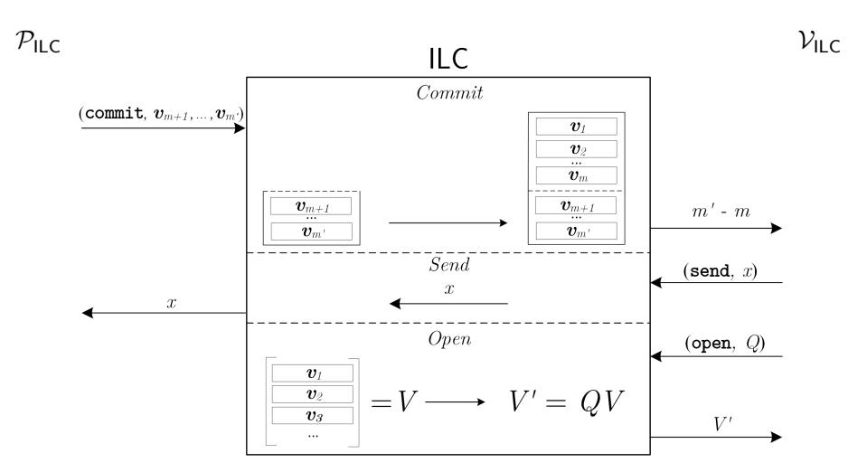
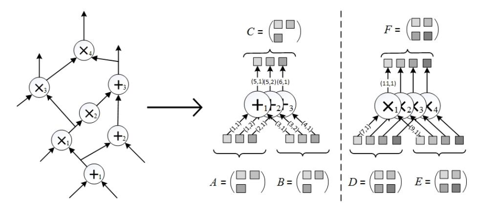

# Linear-Time Zero-Knowledge Proofs for Arithmetic Circuit Satisfiability<sup>∗</sup>

Jonathan Bootle<sup>1</sup> , Andrea Cerulli<sup>1</sup> , Essam Ghadafi2† , Jens Groth<sup>1</sup> , Mohammad Hajiabadi3† , and Sune K. Jakobsen<sup>1</sup>

<sup>1</sup> University College London, London, UK {jonathan.bootle.14,andrea.cerulli.13,j.groth,s.jakobsen}@ucl.ac.uk

> <sup>2</sup> University of the West of England, Bristol, UK essam.ghadafi@uwe.ac.uk

<sup>3</sup> University of California, Berkeley, CA, USA mdhajiabadi@berkeley.edu

Abstract. We give computationally efficient zero-knowledge proofs of knowledge for arithmetic circuit satisfiability over a large field. For a circuit with N addition and multiplication gates, the prover only uses O(N) multiplications and the verifier only uses O(N) additions in the field. If the commitments we use are statistically binding, our zero-knowledge proofs have unconditional soundness, while if the commitments are statistically hiding we get computational soundness. Our zero-knowledge proofs also have sub-linear communication if the commitment scheme is compact.

Our construction proceeds in three steps. First, we give a zero-knowledge proof for arithmetic circuit satisfiability in an ideal linear commitment model where the prover may commit to secret vectors of field elements, and the verifier can receive certified linear combinations of those vectors. Second, we show that the ideal linear commitment proof can be instantiated using error-correcting codes and non-interactive commitments. Finally, by choosing efficient instantiations of the primitives we obtain linear-time zero-knowledge proofs.

Keywords. Zero-knowledge, arithmetic circuit, ideal linear commitments.

### 1 Introduction

A zero-knowledge proof [GMR85] is a protocol between two parties: a prover and a verifier. The prover wants to convince the verifier that an instance u belongs

<sup>∗</sup>The research leading to these results has received funding from the European Research Council under the European Union's Seventh Framework Programme (FP/2007- 2013) / ERC Grant Agreement n. 307937.

<sup>†</sup>Part of the work was done while at University College London.

to a specific language L<sup>R</sup> in NP. She has a witness w such that (u, w) belongs to the NP relation R defining the language, but wants to convince the verifier that the statement u ∈ L<sup>R</sup> is true without revealing the witness or any other confidential information.

Zero-knowledge proofs are widely used in cryptography since it is often useful to verify that a party is following a protocol without requiring her to divulge secret keys or other private information. Applications range from digital signatures and public-key encryption to secure multi-party computation and verifiable cloud computing.

Efficiency is crucial for large and complex statements such as those that may arise in the latter applications. Important efficiency parameters include the time complexity of the prover, the time complexity of the verifier, the amount of communication measured in bits, and the number of rounds the prover and verifier need to interact. Three decades of research on zero-knowledge proofs have gone into optimizing these efficiency parameters and many insights have been learned.

For zero-knowledge proofs with unconditional soundness where it impossible for any cheating prover to convince the verifier of a false statement, it is possible to reduce communication to the witness size [IKOS09, KR08, GGI+14]. For zeroknowledge arguments where it is just computationally intractable for the prover to cheat the verifier we can do even better and get sub-linear communication complexity [Kil92].

There are many constant-round zero-knowledge proofs and arguments, for instance Bellare, Jakobsson and Yung [BJY97] construct four round arguments based on one-way functions. In the common reference string model, it is even possible to give non-interactive proofs where the prover computes a convincing zero-knowledge proof directly without receiving any messages from the verifier [BFM88].

The verifier computation is in general at least proportional to the instance size because the verifier must read the entire instance in order to verify it. However, the verifier computation can be sub-linear in the time it takes for the relation to verify a witness for the statement being true [GKR08], which is useful in both zero-knowledge proofs and verifiable computation.

Having reduced the cost of many other efficiency parameters, today the major bottleneck is the prover's computation. Classical number-theoretic constructions for circuit satisfiability such as [CD98] require a linear number of exponentiations, i.e., the cost is O(λN) group multiplications where N is the number of gates and λ is a security parameter. Relying on different techniques and underlying cryptography [DIK10] has reduced the computational overhead further to being O(log(λ)). This leaves a tantalizing open question of whether we can come all the way down to constant overhead O(1), i.e., make the prover's cost within a constant factor of the time it takes to verify (u, w) ∈ R directly.

### 1.1 Our Contributions

We construct zero-knowledge proofs of knowledge for the satisfiability of arithmetic circuits. An instance is an arithmetic circuits with N fan-in 2 addition and multiplication gates over a finite field F and a specification of the values of some of the wires. A witness consists of the remaining wires such that the values are consistent with the gates and the wire values specified in the instance.

Our zero-knowledge proofs are highly efficient asymptotically:

- Prover time is O(N) field additions and multiplications.
- Verifier time is O(N) field additions.

This is optimal up to a constant factor for both the prover and verifier. The prover only incurs a constant overhead compared to the time needed to evaluate the circuit from scratch given an instance and a witness, and for instances of size equivalent to Ω(N) field elements the verifier only incurs a constant overhead compared to the time it takes to read the instance. The constants are large, so we do not recommend implementing the zero-knowledge proof as it is, but from a theoretical perspective we consider it a big step forward to get constant overhead for both prover and verifier.

Our zero-knowledge proofs have perfect completeness, i.e., when the prover knows a satisfactory witness she is always able to convince the verifier. Our constructions are proofs of knowledge, that is, not only does the prover demonstrate the statement is true but also that she knows a witness. The proofs have special honest-verifier zero-knowledge, which means that given a set of verifier challenges it is possible to simulate a proof answering the challenges without knowing a witness. The flavour of knowledge soundness and special honest-verifier zero-knowledge depends on the underlying commitment scheme we use. When instantiated with statistically binding commitment schemes, we obtain proofs (statistically knowledge sound) with computational zero-knowledge. When we use statistically hiding commitments we obtain arguments of knowledge with statistical special honest verifier zero-knowledge. The communication complexity of our proofs with unconditional soundness is only O(N) field elements, while our arguments with computational soundness have sub-linear communication of poly(λ) √ N field elements when the commitments are compact. Round complexity is also low, when we optimize for computational efficiency for prover and verifier we only use O(log log N) rounds.

### 1.2 Construction and Techniques

Our construction is modular and consists of three steps. First, we construct a proof in a communication model we call the Ideal Linear Commitment (ILC) channel. In the ILC model, the prover can commit vectors of secret field elements to the channel. The verifier may later query openings to linear combinations of the committed vectors, which the channel will answer directly. We show that idealizing the techniques by Groth et al. [Gro09, BCC<sup>+</sup>16] gives us efficient proofs in the ideal linear commitment model. By optimizing primarily for prover computation and secondarily for round efficiency, we get a round complexity of O(log log N) rounds, which is better than the O(log N) rounds of Bootle et al. [BCC+16] that optimized for communication complexity.

Next, we compile proofs in the ILC model into proof and argument systems using non-interactive commitment schemes; however, unlike previous works we do not commit directly to the vectors. Instead, we encode the vectors as randomized codewords using a linear error-correcting code. We now consider the codewords as rows of a matrix and commit to the columns of that matrix. When the verifier asks for a linear combination of the vectors, the prover simply tells the verifier what the linear combination is. However, the verifier does not have to have blind confidence in the prover because she can ask for openings of some of the committed columns and use them to spot check that the resulting codeword is correct.

Finally, we instantiate the scheme with concrete error-correcting codes and non-interactive commitment schemes. We use the error-correcting codes of Druk and Ishai [DI14], which allow the encoding of k field elements using O(k) additions in the field. Statistically hiding commitment schemes can be constructed from collision-resistant hash functions, and using the recent hash functions of Applebaum et al. [AHI+17] we can hash t field elements at a cost equivalent to O(t) field additions. Statistically binding commitment schemes on the other hand can be built from pseudorandom number generators. Using the lineartime computable pseudorandom number generators of Ishai et al. [IKOS08] we get linear-time computable statistically binding commitments. Plugging either of the commitment schemes into our construction yields zero-knowledge proofs with linear-time computation for both prover and verifier.

### 1.3 Related Work

There is a rich body of research on zero-knowledge proofs. Early practical zeroknowledge proofs such as Schnorr [Sch91] and Guillou-Quisquater [GQ88] used number-theoretic assumptions. There have been several works extending these results to prove more general statements [CDS94, CD98, Gro09, BCC+16] with the latter giving discrete-logarithm based arguments for arithmetic circuit satisfiability with logarithmic communication complexity and a linear number of exponentiations for the prover, i.e., a computation cost of O(λN) group multiplications for λ-bit exponents and a circuit with N multiplication gates.

Ishai et al. [IKOS09] showed how to use secure multi-party computation (MPC) protocols to construct zero-knowledge proofs. The intuition behind this generic construction is that the prover first executes in her head an MPC protocol for computing a circuit verifying some relation R and then commits to the views of all the virtual parties. The verifier asks the prover to open a subset of those views and then verifies their correctness and consistency with each other. Soundness and zero-knowledge follow from robustness and privacy of the MPC protocol. Applying this framework to efficient MPCs gives asymptotically efficient zero-knowledge proofs. For example, the perfectly secure MPC of [DI06] is used in [IKOS09] to obtain zero-knowledge proofs for the satisfiability of Boolean circuits with communication linear in the circuit size, O(N), and a computational cost of Ω(λN), for circuits of size N and security parameter λ. Damg˚ard et al. [DIK10] used the MPC framework to construct zero-knowledge proofs for the satisfiability of arithmetic circuits. Their construction has more balanced efficiency and achieves O(polylog(λ)N) complexity for both computation and communication.

Jawurek et al. [JKO13] gave a very different approach to building zeroknowledge proofs based on garbled circuits. Their approach proved [FNO15, CGM16] to be very efficient in practice for constructing proofs for languages represented as Boolean circuits. These techniques are appealing for proving small statements as they require only a constant number of symmetric-key operations per gate, while the main bottleneck is in their communication complexity. Asymptotically, this approach yields computational and communication complexity of O(λN) bit operations and bits, respectively, when λ is the cost of a single symmetric-key operation. Recently, these techniques found applications in zero-knowledge proofs for checking the execution of RAM programs [HMR15, MRS17]. For instances that can be represented as RAM programs terminating in T steps and using memory of size M, these zero-knowledge proofs yield communication and computation with polylog(M) overhead compared to the running time T of the RAM program.

Cramer et al. [CDP12] introduce zero-knowledge proofs for verifying multiplicative relations of committed values using techniques related to ours. When applied to zero-knowledge proofs for the satisfiability of Boolean circuits, the asymptotic communication and computation complexities of [CDP12] are close to [IKOS09], although the constants are smaller. Unlike [CDP12], we do not require any homomorphic property from the commitment scheme, and instead of relying on linear secret sharing schemes with product reconstruction, we use linear error-correcting codes.

In past years, a lot of attention has been dedicated to the study of succinct non-interactive arguments of knowledge (SNARKs) [Gro10, BCCT12, GGPR13, BCCT13, PHGR13, BCG+13, Gro16]. These are very compact arguments offering very efficient verification time. In the most efficient cases, the arguments consist of only a constant number of group elements and verification consists of a constant number of pairings and a number of group exponentiations that is linear in the instance size but independent of the witness size. The main bottleneck of these arguments is the computational complexity of the prover which requires O(N) group exponentiations.

Recently, Ben-Sasson, Chiesa and Spooner [BSCS16] proposed the notion of interactive oracle proofs (IOPs), which are interactive protocols where the prover may send a probabilisticaly checkable proof (PCP) in each round. Ben-Sasson et al. [BSCG<sup>+</sup>16] construct a 3-round public-coin IOP (with soundness error 1/2) for Boolean circuit satisfiability with linear proof length and quasi-linear running times for both the prover and the verifier. Moreover, the constructed IOP has constant query complexity (the number of opening queries requested by the verifier), while prior PCP constructions require sub-linear query complexity. Another follow-up work by Ben-Sasson et al. [BSCGV16] gives 2-round zero-knowledge IOPs (duplex PCPs) for any language in NTIME(T(n)) with quasi-linear prover computation in n + T(n).

Efficiency Comparison. All the proofs we list above have super-linear cost for the prover. This means our zero-knowledge proofs are the most efficient zero-knowledge proofs for arithmetic circuits for the prover. We also know that our verification time is optimal for an instance of size  $\Omega(N)$  field elements since the verification time is comparable to the time it takes just to read the instance.

Another well-studied class of languages is Boolean circuit satisfiability but here our techniques do not fare as well since there would be an overhead in representing bits as field elements. We therefore want to make clear that our claim of high efficiency and a significant performance improvement over the state of the art relates only to arithmetic circuits. Nevertheless, we find the linear cost for arithmetic circuits a significant result in itself. This is the first time for any general class of NP-complete language that true linear cost is achieved for the prover when compared to the time it takes to evaluate the statement directly given the prover's witness.

### 2 Preliminaries

### 2.1 Notation and Computational Model

We write  $y \leftarrow A(x)$  for an algorithm outputting y on input x. When the algorithm is randomized, and we wish to explicitly refer to a particular choice of random coins r chosen by the algorithm, we write  $y \leftarrow A(x;r)$ . We write PPT/DPT for algorithms running in probabilistic polynomial time and deterministic polynomial time in the size of their inputs. Typically, the size of inputs and output will be polynomial in a security parameter  $\lambda$ , with the intention that larger  $\lambda$  means better security. For functions  $f,g:\mathbb{N}\to[0,1]$ , we write  $f(\lambda)\approx g(\lambda)$  if  $|f(\lambda)-g(\lambda)|=\frac{1}{\lambda^{\omega(1)}}$ . We say a function f is overwhelming if  $f(\lambda)\approx 1$  and f is negligible if  $f(\lambda)\approx 0$ .

Throughout the paper, we will be working over a finite field  $\mathbb F$ . To get negligible risk of an adversary breaking our zero-knowledge proofs, we need the field to be large enough such that  $\log |\mathbb F| = \omega(\lambda)$ . When considering efficiency of our zero-knowledge proofs, we will assume the prover and verifier are RAM machines where operations on W-bit words have unit cost. We assume a field element is represented by  $\mathcal{O}(\frac{\log |\mathbb F|}{W})$  words and that additions in  $\mathbb F$  carry a cost of  $\mathcal{O}\left(\frac{\log |\mathbb F|}{W}\right)$  machine operations. We expect multiplications to be efficiently computable as well but at a higher cost of  $\omega\left(\frac{\log |\mathbb F|}{W}\right)$  machine operations.

For a positive integer n, [n] denotes the set  $\{1,\ldots,n\}$ . We use bold letters such as  $\boldsymbol{v}$  for row vectors. For  $\boldsymbol{v} \in \mathbb{F}^n$  and a set  $J = \{j_1,\ldots,j_k\} \subset [n]$  with  $j_1 < \cdots < j_k$  we define the vector  $\boldsymbol{v}|_J$  to be  $(\boldsymbol{v}_{j_1},\ldots,\boldsymbol{v}_{j_k})$ . Similarly, for a matrix  $V \in \mathbb{F}^{m \times n}$  we let  $V|_J \in \mathbb{F}^{m \times k}$  be the submatrix of V restricted to the columns indicated in J.

#### 2.2 Proofs of Knowledge

A proof system is defined by a triple of stateful PPT algorithms (K,P, V), which we call the setup generator, the prover and verifier, respectively. The setup generator K creates public parameters pp that will be used by the prover and the verifier. We think of pp as being honestly generated, however, in the proofs we construct it consists of parts that are either publicly verifiable or could be generated by the verifier, so we use the public parameter model purely for simplicity and efficiency of our proofs, not for security.

The prover and verifier communicate with each other through a communication channel chan ←→. When P and V interact on inputs s and t through a communication channel chan ←→ we let view<sup>V</sup> ← hP(s) chan ←→ V(t)i be the view of the verifier in the execution, i.e., all inputs he gets including random coins and let trans<sup>P</sup> ← hP(s) chan ←→ V(t)i denote the transcript of the communication between prover and channel. This overloads the notation ← hP(s) chan ←→ V(t)i but it will always be clear from the variable name if we get the verifier's view or the prover's transcript. At the end of the interaction the verifier accepts or rejects. We write hP(s) chan ←→ V(t)i = b depending on whether the verifier rejects (b = 0) or accepts (b = 1).

In the standard channel ←→, all messages are forwarded between prover and verifier. We also consider an ideal linear commitment channel, ILC ←→, or simply ILC, described in Figure 1. When using the ILC channel, the prover can submit a commit command to commit to vectors of field elements of some fixed length k, specified in ppILC. The vectors remain secretly stored in the channel, and will not be forwarded to the verifier. Instead, the verifier only learns how many vectors the prover has committed to. The verifier can submit a send command to the ILC to send field elements to the prover. In addition, the verifier can also submit open queries to the ILC for obtaining the opening of any linear combinations of the vectors sent by the prover. We stress that the verifier can request several linear combinations within a single open query, as depicted in Figure 1.

In a proof system over the ILC channel, sequences of commit, send and open queries could alternate in an arbitrary order. We call a proof system over the ILC channel non-adaptive if the verifier only makes one open query to the ILC channel before terminating his interaction with the channel, otherwise we call it adaptive. Although adaptive proof systems are allowed by the model, in this paper we will only consider non-adaptive ILC proof systems to simplify the exposition.

We remark that ILC proof systems are different from linear interactive proofs considered in [BCI<sup>+</sup>13]. In linear interactive proofs both the prover and verifier send vectors of field elements, but the prover can only send linear (or affine) transformations of the verifier's previously sent vectors. However, for our constructions it is important that the prover can compute on field elements received by the verifier and for instance evaluate polynomials.

We say a proof system is public coin if the verifier's messages to the communication channel are chosen uniformly at random and independently of the



Fig. 1: Description of the ILC channel.

actions of the prover, i.e., the verifier's messages to the prover correspond to the verifier's randomness  $\rho$ .

We will consider relations  $\mathcal{R}$  consisting of tuples (pp, u, w), and define  $\mathcal{L}_{\mathcal{R}} = \{(pp, u) | \exists w : (pp, u, w) \in \mathcal{R}\}$ . We refer to u as the *instance* and w as the *witness* that  $(pp, u) \in \mathcal{L}_{\mathcal{R}}$ . The *public parameter pp* will specify the security parameter  $\lambda$ , perhaps implicitly through its length, and may also contain other parameters used for specifying the specific relation, e.g. a description of a field. Typically, pp will also contain parameters that do not influence membership of  $\mathcal{R}$  but may aid the prover and verifier, for instance, a description of an encoding function that they will use.

We will construct SHVZK proofs of knowledge for the relation  $\mathcal{R}_{\mathsf{AC}}$ , where the instances are arithmetic circuits over a field  $\mathbb{F}$  specified by pp. An instance consists of many fan-in 2 addition and multiplication gates over  $\mathbb{F}$ , a description of how wires in the circuit connect to the gates, and values assigned to some of the input wires. Witnesses w are the remaining inputs such that the output of the circuit is 0. For an exact definition of how we represent an arithmetic circuit, see Section 3. We would like to stress the fact that the wiring of the circuit is part of the instance and we allow a fully adaptive choice of the arithmetic circuit. This stands in contrast to pairing-based SNARKs that usually only consider circuits with fixed wires, i.e., the arithmetic circuit is partially non-adaptive, and getting full adaptivity through a universal circuit incurs an extra efficiency overhead.

The protocol  $(\mathcal{K}, \mathcal{P}, \mathcal{V})$  is called a *proof of knowledge* over communication channel  $\stackrel{\text{chan}}{\longleftrightarrow}$  for relation  $\mathcal{R}$  if it has perfect completeness and computational knowledge soundness as defined below.

**Definition 1 (Perfect Completeness).** The proof is perfectly complete if for all PPT adversaries A

$$\Pr\left[\begin{array}{c} pp \leftarrow \mathcal{K}(1^{\lambda}); (u,w) \leftarrow \mathcal{A}(pp): \\ (pp,u,w) \notin \mathcal{R} \ \lor \ \langle \mathcal{P}(pp,u,w) \stackrel{\text{chan}}{\longleftrightarrow} \mathcal{V}(pp,u) \rangle = 1 \end{array}\right] = 1.$$

**Definition 2 (Knowledge soundness).** A public-coin proof system has computational (strong black-box) knowledge soundness if for all  $DPT\mathcal{P}^*$  there exists an expected PPT extractor  $\mathcal{E}$  such that for all PPT adversaries  $\mathcal{A}$

$$\Pr\left[\begin{array}{c} pp \leftarrow \mathcal{K}(1^{\lambda}); (u,s) \leftarrow \mathcal{A}(pp); w \leftarrow \mathcal{E}^{\langle \mathcal{P}^*(s) \overset{\text{chan}}{\longleftrightarrow} \mathcal{V}(pp,u) \rangle}(pp,u) : \\ b = 1 \ \land \ (pp,u,w) \notin \mathcal{R} \end{array}\right] \approx 0.$$

Here the oracle  $\langle \mathcal{P}^*(s) \overset{\text{chan}}{\longleftrightarrow} \mathcal{V}(pp,u) \rangle$  runs a full protocol execution and if the proof is successful it returns a transcript of the prover's communication with the channel. The extractor  $\mathcal{E}$  can ask the oracle to rewind the proof to any point in a previous transcript and execute the proof again from this point on with fresh public-coin challenges from the verifier. We define  $b \in \{0,1\}$  to be the verifier's output in the first oracle execution, i.e., whether it accepts or not, and we think of s as the state of the prover. The definition can then be paraphrased as saying that if the prover in state s makes a convincing proof, then we can extract a witness.

If the definition holds also for unbounded  $\mathcal{P}^*$  and  $\mathcal{A}$  we say the proof has statistical knowledge soundness.

If the definition of knowledge soundness holds for a non-rewinding extractor, i.e., a single transcript of the prover's communication with the communication channel suffices, we say the proof system has knowledge soundness with straight-line extraction.

We will construct public-coin proofs that have special honest-verifier zero-knowledge. This means that if the verifier's challenges are known, or even adversarially chosen, then it is possible to simulate the verifier's view without the witness. In other words, the simulator works for verifiers who may use adversarial coins in choosing their challenges but they follow the specification of the protocol as an honest verifier would.

**Definition 3 (Special Honest-Verifier Zero-Knowledge).** The proof of knowledge is computationally special honest-verifier zero-knowledge (SHVZK) if there exists a PPT simulator S such that for all stateful interactive PPT adversaries A that output (u, w) such that  $(pp, u, w) \in R$  and randomness  $\rho$  for the verifier

$$\begin{split} & \Pr \left[ \begin{array}{c} pp \leftarrow \mathcal{K}(1^{\lambda}); (u, w, \rho) \leftarrow \mathcal{A}(pp); \\ \mathsf{view}_{\mathcal{V}} \leftarrow \langle \mathcal{P}(pp, u, w) \overset{\mathrm{chan}}{\longleftrightarrow} \mathcal{V}(pp, u; \rho) \rangle : \mathcal{A}(\mathsf{view}_{\mathcal{V}}) = 1 \end{array} \right] \\ \approx & \Pr \left[ pp \leftarrow \mathcal{K}(1^{\lambda}); (u, w, \rho) \leftarrow \mathcal{A}(pp); \mathsf{view}_{\mathcal{V}} \leftarrow \mathcal{S}(pp, u, \rho) : \mathcal{A}(\mathsf{view}_{\mathcal{V}}) = 1 \right]. \end{split}$$

We say the proof is statistically SHVZK if the definition holds also against unbounded adversaries, and we say the proof is perfect SHVZK if the probabilities are exactly equal.

From Honest-Verifier to General Zero-Knowledge. Honest-verifier zeroknowledge only guarantees the simulator works for verifiers following the proof system specifications. It might be desirable to consider general zero-knowledge where the simulator works for arbitrary malicious verifiers that may deviate from the specification of the proof. However, honest-verifier zero-knowledge is a first natural stepping stone to get efficient zero-knowledge proofs. We recall that our proofs are public coin, which means that the verifier's messages are chosen uniformly at random and independently from the messages received from the verifier. Below we recall few options to obtain general zero-knowledge proofs from a public-coin SHVZK proof. All these transformations are very efficient in terms of computation and communication such that the efficiency properties of our special honest-verifier zero-knowledge protocols are preserved.

In the Fiat-Shamir transform [FS86] the verifier's challenges are computed using a cryptographic hash function applied to the transcript up to the challenge. The Fiat-Shamir transform is more generally used to turn a public-coin proof into a non-interactive one. Since interaction with the verifier is no longer needed, general zero-knowledge is immediately achieved. If the hash function can be computed in linear time in the input size, then the Fiat-Shamir transform only incurs an additive linear overhead in computation for the prover and verifier. The drawback of the Fiat-Shamir transform is that security is usually proved in the random oracle model [BR93] where the hash function is modelled as an ideal random function.

Assuming a common reference string and relying on trapdoor commitments, Damg˚ard [Dam00] gave a transformation yielding concurrently secure protocols for Σ-Protocols. The transformation can be optimized [Gro04] using the idea that for each public-coin challenge x, the prover first commits to a value x 0 , then the verifier sends a value x <sup>00</sup>, after which the prover opens the commitment and uses the challenge x = x <sup>0</sup> + x <sup>00</sup>. The coin-flipping can be interleaved with the rest of the proof, which means the transformation preserves the number of rounds and only incurs a very small efficiency cost to do the coin-flipping for the challenges.

If one does not wish to rely on a common reference string for security, one can use a private-coin transformation where the verifier does not reveal the random coins used to generate the challenges sent to the prover (hence the final protocol is no longer public coin). One example is the Micciancio and Petrank [MP03] transformation (yielding concurrently secure protocols) while incurring a small overhead of ω(log λ) with respect to the number of rounds as well as the computational and communication cost in each round. The transformation preserves the soundness and completeness errors of the original protocol; however, it does not preserve statistical zero-knowledge as the obtained protocol only has computational zero-knowledge.

There are other public-coin transformations to general zero-knowledge e.g. Goldreich et al. [GSV98]. The transformation relies on a random-selection protocol between the prover and verifier to specify a set of messages and restricting the verifier to choose challenges from this set. This means to get negligible soundness error these transformations require  $\omega(1)$  sequential repetitions so the round complexity goes up.

#### 2.3 Linear-Time Linear Error-Correcting Codes

A code over an alphabet  $\Sigma$  is a subset  $\mathcal{C} \subseteq \Sigma^n$ . A code  $\mathcal{C}$  is associated with an encoding function  $E_{\mathcal{C}}: \Sigma^k \to \Sigma^n$  mapping messages of length k into codewords of length n. We assume there is a setup algorithm  $\operatorname{Gen}_{\mathsf{E}_{\mathcal{C}}}$  which takes as input a finite field  $\mathbb{F}$  and the parameter  $k \in \mathbb{N}$ , and outputs an encoding function  $E_{\mathcal{C}}$ .

In what follows, we restrict our attention to  $\mathbb{F}$ -linear codes for which the alphabet is a finite field  $\mathbb{F}$ , the code  $\mathcal{C}$  is a k-dimensional linear subspace of  $\mathbb{F}^n$ , and  $E_{\mathcal{C}}$  is an  $\mathbb{F}$ -linear map. The rate of the code is defined to be  $\frac{k}{n}$ . The Hamming distance between two vectors  $\boldsymbol{x}, \boldsymbol{y} \in \mathbb{F}^n$  is denoted by  $\mathsf{hd}(\boldsymbol{x}, \boldsymbol{y})$  and corresponds to the number of coordinates in which  $\boldsymbol{x}, \boldsymbol{y}$  differ. The (minimum) distance of a code is defined to be the minimum Hamming distance  $\mathsf{hd}_{\min}$  between distinct codewords in  $\mathcal{C}$ . We denote by  $[n, k, \mathsf{hd}_{\min}]_{\mathbb{F}}$  a linear code over  $\mathbb{F}$  with length n, dimension k and minimum distance  $\mathsf{hd}_{\min}$ . The Hamming weight of a vector  $\boldsymbol{x}$  is  $\mathsf{wt}(\boldsymbol{x}) = |\{i \in [n] : \boldsymbol{x}_i \neq 0\}|$ .

In the next sections, we will use families of linear codes achieving asymptotically good parameters. More precisely, we require codes with linear length,  $n = \Theta(k)$ , and linear distance,  $\mathsf{hd}_{\min} = \Theta(k)$ , in the dimension k of the code. We recall that random linear codes achieve with high probability the best trade-off between distance and rate. However, in this work we are particularly concerned with computational efficiency of the encoding procedure and random codes are not known to be very efficient.

To obtain zero-knowledge proofs and arguments with linear cost for prover and verifier, we need to use codes that can be encoded in linear time. Starting from the seminal work of Spielman [Spi95], there has been a rich stream of research [GI01, GI02, GI03, GI05, DI14, CDD $^+$ 16] regarding linear codes with linear-time encoding. Our construction can be instantiated, for example, with one of the families of codes presented by Druk and Ishai [DI14]. These are defined over a generic finite field  $\mathbb F$  and meets all the above requirements.

**Theorem 1** ([DI14]). There exist constants  $c_1 > 1$  and  $c_2 > 0$  such that for every finite field  $\mathbb{F}$  there exists a family of  $[\lceil c_1 k \rceil, k, \lfloor c_2 k \rfloor]_{\mathbb{F}}$  linear codes, which can be encoded by a uniform family of linear-size arithmetic circuit of addition gates.

#### 2.4 Commitment Schemes

A non-interactive commitment scheme allows a sender to commit to a secret message and later reveal the message in a verifiable way. Here we are interested in commitment schemes that take as input an arbitrary length message so the message space is  $\{0,1\}^*$ . A commitment scheme is defined by a pair of PPT algorithms (Setup, Commit).

Setup $(1^{\lambda}) \to ck$ : Given a security parameter, this returns a commitment key ck.

Commit<sub>ck</sub> $(m) \to c$ : Given a message m, this picks a randomness  $r \leftarrow \{0,1\}^{\text{poly}(\lambda)}$  and computes a commitment  $c = \mathsf{Commit}_{ck}(m;r)$ .

A commitment scheme must be *binding* and *hiding*. The binding property means that it is infeasible to open a commitment to two different messages, whereas the hiding property means that the commitment does not reveal anything about the committed message.

**Definition 4 (Binding).** A commitment scheme is computationally binding if for all PPT adversaries A

$$\Pr\left[\begin{array}{c} ck \leftarrow \mathsf{Setup}(1^\lambda); \ (m_0, r_0, m_1, r_1) \leftarrow \mathcal{A}(ck): \\ m_0 \neq m_1 \ \land \ \mathsf{Commit}_{ck}(m_0; r_0) = \mathsf{Commit}_{ck}(m_1; r_1) \end{array}\right] \approx 0.$$

If this holds also for unbounded adversaries, we say the commitment scheme is statistically binding.

**Definition 5 (Hiding).** A commitment scheme is computationally hiding if for all PPT stateful adversaries A

$$\Pr\left[ \begin{matrix} ck \leftarrow \mathsf{Setup}(1^\lambda); \ (m_0, m_1) \leftarrow \mathcal{A}(ck); \ b \leftarrow \{0, 1\}; \\ c \leftarrow \mathsf{Commit}_{ck}(m_b): \ \mathcal{A}(c) = b \end{matrix} \right] \approx \frac{1}{2},$$

where A outputs messages of equal length  $|m_0| = |m_1|$ . If the definition holds also for unbounded adversaries, we say the commitment scheme is statistically hiding.

We will be interested in using highly efficient commitment schemes. We say a commitment scheme is linear-time if the time to compute  $Commit_{ck}(m)$  is  $\operatorname{poly}(\lambda) + \mathcal{O}(|m|)$  bit operations, which we assume corresponds to  $\operatorname{poly}(\lambda) +$  $\mathcal{O}(\frac{|m|}{W})$  machine operations on our W-bit RAM machine. We will also be interested in having small size commitments. We say a commitment scheme is compact if there is a polynomial  $\ell(\lambda)$  such that commitments have size at most  $\ell(\lambda)$  regardless of how long the message is. We say a commitment scheme is public coin if there is a polynomial  $\ell(\lambda)$  such that  $\mathsf{Setup}(1^{\lambda})$  picks the commitment key uniformly at random as  $ck \leftarrow \{0,1\}^{\ell(\lambda)}$ . We will now discuss some candidate linear-time commitment schemes. Applebaum et al. [AHI<sup>+</sup>17] gave constructions of low-complexity families of collision-resistant hash functions, where it is possible to evaluate the hash function in linear time in the message size. Their construction is based on the binary shortest vector problem assumption, which is related to finding non-trivial low-weight vectors in the null space of a matrix over  $\mathbb{F}_2$ . To get down to linear-time complexity, they conjecture the binary shortest vector problem is hard when the matrix is sparse, e.g., an LDPC parity check matrix [Gal62]. Halevi and Micali [HM96] show that a collision-resistant hash function gives rise to a compact statistically hiding commitment scheme. Their transformation is very efficient, so starting with a linear-time hash function, one obtains a linear-time statistically hiding compact commitment scheme. Moreover, if we instantiate the hash function with the one by Applebaum et al. [AHI+17], which is public coin, we obtain a linear-time public-coin statistically hiding commitment scheme. Ishai et al. [IKOS08] propose linear-time computable pseudorandom generators. If we have statistically binding commitment scheme this means we can commit to an arbitrary length message m by picking a seed s for the pseudorandom generator, stretch it to t = PRG(s) of length |m| and let (Commitck(s), t ⊕ m) be the commitment to m. Assuming the commitment scheme is statistically binding, this gives us a linear-time statistically binding commitment scheme for arbitrary length messages. It can also easily be seen that commitments have the same length as the messages plus an additive polynomial overhead that depends only on the security parameter. The construction also preserves the public-coin property of the seed commitment scheme.

## 3 Zero-Knowledge Proofs for Arithmetic Circuit Satisfiability in the Ideal Linear Commitment Model

In this section, we construct a SHVZK proof of knowledge for arithmetic circuit satisfiability relations RAC in the ILC model. Our proof can be seen as an abstraction of the zero-knowledge argument of Groth [Gro09] in an idealized vector commitment setting. In the ILC model, the prover can commit to vectors in F <sup>k</sup> by sending them to the channel. The ILC channel stores the received vectors and communicates to verifier the number of vectors it received. The verifier can send messages to the prover via the ILC channel, which in the case of Groth's and our proof system consist of field elements in F. Finally, the verifier can query the channel to open arbitrary linear combinations of the committed vectors sent by the prover. The field F and the vector length k is specified by the public parameter ppILC. It will later emerge that to get the best communication and computation complexity for arithmetic circuits with N gates, k should be approximately <sup>√</sup> N.

Consider a circuit with a total of N fan-in 2 gates, which can be either addition gates or multiplication gates over a field F. Each gate has two inputs (left and right) and one output wire, and each output wire can potentially be attached as input to several other gates. In total, we have 3N inputs and outputs to gates. Informally, the description of an arithmetic circuit consists of a set of gates, the connection of wires between gates and known values assigned to some of the inputs and outputs. A circuit is said to be satisfiable if there exists an assignment complying with all the gates, the wiring, and the known values specified in the instance.

At a high level, the idea of the proof is for the prover to commit to the 3N inputs and outputs of all the gates in the circuit, and then prove that these assignments are consistent with the circuit description. This amounts to performing the following tasks:

– Prove for each value specified in the instance that this is indeed the value the prover has committed to.

- Prove for each addition gate that the committed output is the sum of the committed inputs.
- Prove for each multiplication gate that the committed output is the product of the committed inputs.
- Prove for each wire that all committed values corresponding to this wire are the same

To facilitate these proofs, we arrange the committed values into row vectors  $v_i \in \mathbb{F}^k$  similarly to [Gro09]. Without loss of generality we assume both the number of addition gates and the number of multiplication gates are divisible by k, which can always be satisfied by adding few dummy gates to the circuit. We can then number addition gates from (1,1) to  $(m_A,k)$  and multiplication gates  $(m_A+1,1)$  to  $(m_A+m_M,k)$ . We insert assignments to left inputs, right inputs and outputs of addition gates into entries of three matrices  $A,B,C\in\mathbb{F}^{m_A\times k}$ , respectively. We sort entries to the matrices so that wires attached to the same gate correspond to the same entry of the three matrices, as shown in Figure 2. A valid assignment to the wires then satisfies A+B=C. We proceed in a similar way for the  $m_M \cdot k$  multiplication gates to obtain three matrices  $D, E, F \in \mathbb{F}^{m_M \times k}$  such that  $D \circ E = F$ , where  $\circ$  denotes the Hadamard (i.e. entry-wise) product of matrices. All the committed wires then constitute a matrix

$$V = \begin{pmatrix} A \\ B \\ C \\ D \\ E \\ F \end{pmatrix} \in \mathbb{F}^{(3m_A + 3m_M) \times k}$$

Without loss of generality, we also assume the gates to be sorted so that the wire values specified in the instance correspond to full rows in V. Again, this is without loss of generality because we can always add a few dummy gates to the circuit and to the instance to complete a row.

With these transformations in mind, let us write the arithmetic circuit relation as follows

$$\mathcal{R}_{\mathsf{AC}} = \left\{ \begin{array}{l} (pp, u, w) = \left( (\mathbb{F}, k, *) \;,\; (m_A, m_M, \pi, \{ v_i \}_{i \in S}) \;,\; (\{ v_i \}_{i \in \bar{S}}) \right) \;; \\ m = 3m_A + 3m_M \wedge \pi \in \Sigma_{[m] \times [k]} \\ \wedge \; S \subseteq [m] \qquad \wedge \; \bar{S} = [m] \setminus S \\ \wedge \; A = (v_i)_{i=1}^{m_A} \qquad \wedge \; D = (v_i)_{i=3m_A+1}^{3m_A+m_M} \\ \wedge \; B = (v_i)_{i=m_A+1}^{2m_A} \quad \wedge \; E = (v_i)_{i=3m_A+2m_M}^{3m_A+2m_M} \\ \wedge \; C = (v_i)_{i=2m_A+1}^{3m_A} \wedge \; F = (v_i)_{i=3m_A+2m_M+1}^{3m_A+2m_M+1} \\ \wedge \; A + B = C \qquad \wedge \; D \circ E = F \\ \wedge \; V = (v_i)_{i=1}^{m} \qquad \wedge \; V_{i,j} = V_{\pi(i,j)} \; \forall \; (i,j) \in [m] \times [k] \end{array} \right\}$$

The role of the permutation  $\pi$  is to specify the wiring of the arithmetic circuit. For each wire, we can write a cycle  $((i_1, j_1), \ldots, (i_t, j_t))$  that lists the location of the committed values corresponding to this wire. Then we let  $\pi \in \Sigma_{[m] \times [k]}$  be the



Fig. 2: Representation of an arithmetic circuit and arrangements of the wires into 6 matrices.

product of all these cycles, which unambiguously defines the wiring of the circuit. To give an example using the circuit in Figure 2, the output wire of the first addition gate also appears as input of the first multiplication gate and the second addition gate. Therefore, if they appear as entries (5, 1),(9, 1),(1, 2) in the matrix V defined by the rows v<sup>i</sup> , then we would have the cycle ((5, 1),(9, 1),(1, 2)) indicating entries that must to be identical. The output of the second addition gate feeds into the third addition gate, so this might give us a cycle ((5, 2),(4, 1)) of entries that should have the same value. The permutation π is the product of all these cycles that define which entries should have the same value.

In the proof for arithmetic circuit satisfiability, the prover starts by committing to all values {vi} m <sup>i</sup>=1. She will then call suitable sub-proofs to handle the four constraints these committed values should specify. We describe all the sub-proofs after the main proof given in Figure 3 and refer to Appendix A for the detailed constructions.

Here we use the convention that when vectors or matrices are written in square brackets, i.e., when we write [A] in the instance, it means that these are values that have already been committed to the ILC channel. The prover knows these values, but the verifier may not know them. The first sub-proof D <sup>P</sup>eq ppILC, {vi}i∈S, [U] ILC ←→ Veq ppILC, {ui}i∈S, [U] E allows the verifier to check that values included in the instance are contained in the corresponding commitments the prover previously sent to the ILC channel. The second subproof D <sup>P</sup>sum ppILC, [A], [B], [C] ILC ←→ Vsum ppILC, [A], [B], [C] E is used to prove the committed matrices A, B and C satisfy A + B = C. The sub-proof D <sup>P</sup>prod ppILC, [D], [E], [F] ILC ←→ Vprod ppILC, [D], [E], [F] E is used to prove that the committed matrices D, E and F satisfy D ◦ E = F. The last sub-proof D <sup>P</sup>perm ppILC, π, [A], [B] ILC ←→ Vperm ppILC, π, [A], [B] E is used to prove that A has the same entries as B except they have been permuted according to the

```
\mathcal{P}_{\mathsf{ILC}}(pp_{\mathsf{ILC}}, u, w)
                                                                                    \mathcal{V}_{\mathsf{ILC}}(pp_{\mathsf{ILC}}, u)
  - Parse u = (m_A, m_M, \pi, \{v_i\}_{i \in S})
                                                                                       - Parse u = (m_A, m_M, \pi, \{u_i\}_{i \in S})
  - Parse w = (\{\boldsymbol{v}_i\}_{i \in \bar{S}})
                                                                                       - Run \mathcal{V}_{eq}(pp_{\mathsf{ILC}}, (\{\boldsymbol{u}_i\}_{i \in S}, [U]))
   - Send (commit, \{v_i\}_{i=1}^m) to the ILC channel
                                                                                       - Run \mathcal{V}_{\text{sum}}(pp_{\mathsf{ILC}},([A],[B],[C]))
  - The vectors define V \in \mathbb{F}^{m \times k} and sub- - Run \mathcal{V}_{\text{prod}}(pp_{\mathsf{ILC}},([D],[E],[F]))
       matrices A, B, C, D, E, F as described earlier
                                                                                      - Run \mathcal{V}_{perm}(pp_{\mathsf{ILC}},(\pi,[V],[V]))
   - Let U = (\boldsymbol{v}_i)_{i \in S}

    Return 1 if all the sub-proofs are

   - Run \mathcal{P}_{eq}(pp_{\mathsf{ILC}}, (\{\boldsymbol{v}_i\}_{i \in S}, [U]))
                                                                                           accepted and 0 otherwise
  - Run \mathcal{P}_{\text{sum}}(pp_{\mathsf{ILC}},([A],[B],[C]))
   - Run \mathcal{P}_{\text{prod}}(pp_{\mathsf{ILC}},([D],[E],[F]))
   - Run \mathcal{P}_{perm}(pp_{\mathsf{ILC}},(\pi,[V],[V]))
```

Fig. 3: Arithmetic circuit satisfiability proof in the ILC model.

permutation  $\pi$ . Note that when we call the permutation sub-proof with B=A, then the statement is that A remains unchanged when we permute the entries according to  $\pi$ . This in turn means that all committed values that lie on the same cycle in the permutation must be identical, i.e., the matrix A respects the wiring of the circuit.

**Theorem 2.**  $(\mathcal{K}_{ILC}, \mathcal{P}_{ILC}, \mathcal{V}_{ILC})$  is a proof system for  $\mathcal{R}_{AC}$  in the ILC model with perfect completeness, statistical knowledge soundness with straight-line extraction, and perfect special honest-verifier zero-knowledge.

 ${\it Proof.}$  Perfect completeness follows from the perfect completeness of the subproofs.

Perfect SHVZK follows from the perfect SHVZK of the sub-proofs. A simulated transcript is obtained by combining the outputs of the simulators of all the sub-proofs.

Also statistical knowledge soundness follows from the knowledge soundness of the sub-proofs. The statistical knowledge soundness of the equality sub-proof guarantees that commitments to values included in the instance indeed contain the publicly known values. The correctness of the addition gates and multiplication gates follows from the statistical knowledge soundness of the respective sub-proofs. Finally, as we have argued above, the permutation sub-proof guarantees the committed values respect the wiring of the circuit.

Since all sub-proofs have knowledge soundness with straight line extraction, so does the main proof.

The efficiency of our arithmetic circuit satisfiability proof in the ILC model is given in Figure 4. A detailed breakdown of the costs of each sub-protocol can be found in Appendix A. The asymptotic results displayed below are obtained when the parameter k specified by  $pp_{\text{ILC}}$  is approximately  $\sqrt{N}$ . The query complexity

qc is the number of linear combinations the verifier queries from the ILC channel in the opening query. The verifier communication  $C_{\text{ILC}}$  is the number of messages sent from the verifier to the prover via the ILC channel and in our proof system it is proportional to the number of rounds. Let  $\mu$  be the number of rounds in the ILC proof and  $t_1, \ldots, t_{\mu}$  be the numbers of vectors that the prover sends to the ILC channel in each round, and let  $t = \sum_{i=1}^{\mu} t_i$ .

| Prover computation                | $T_{\mathcal{P}_{ILC}} = \mathcal{O}(N)$ multiplications in $\mathbb{F}$ |
|-----------------------------------|--------------------------------------------------------------------------|
| Verifier computation              | $T_{\mathcal{V}_{ILC}} = \mathcal{O}(N)$ additions in $\mathbb{F}$       |
| Query complexity                  | qc = 20                                                                  |
| Verifier communication            | $C_{ILC} = \mathcal{O}(\log\log(N))$ field elements                      |
| Round complexity                  | $\mu = \mathcal{O}(\log\log(N))$                                         |
| Total number of committed vectors | $t = \mathcal{O}\left(\sqrt{N}\right) \text{ vectors in } \mathbb{F}^k$  |

Fig. 4: Efficiency of our arithmetic circuit satisfiability proof in the ILC model  $(\mathcal{K}_{\mathsf{ILC}}, \mathcal{V}_{\mathsf{ILC}})$  for  $(pp, u, w) \in \mathcal{R}_{\mathsf{AC}}$ .

### 4 Compiling Ideal Linear Commitment Proofs into Standard Proofs

In this section, we show how to compile a proof of knowledge with straight-line extraction for relation  $\mathcal R$  over the communication channel ILC into a proof of knowledge without straight-line extraction for the same relation over the standard channel. Recall that the ILC channel allows the prover to submit vectors of length k to the channel and the verifier can then query linear combinations of those vectors.

The idea behind the compilation of an ILC proof is that instead of committing to vectors  $v_{\tau}$  using the channel ILC, the prover encodes each vector  $v_{\tau}$  as  $\mathsf{E}_{\mathcal{C}}(v_{\tau})$  using a linear error-correcting code  $\mathsf{E}_{\mathcal{C}}$ . In any given round, we can think of the codewords as rows  $\mathsf{E}_{\mathcal{C}}(v_{\tau})$  in a matrix  $\mathsf{E}_{\mathcal{C}}(V)$ . However, instead of committing to the rows of the matrix, the prover commits to the columns of the matrix. When the verifier wants to open a linear combination of the original vectors, he sends the coefficients  $q=(q_1,\ldots,q_t)$  of the linear combination to the prover, and the prover responds with the linear combination  $v_{(q)}\leftarrow qV$ . Notice that we will use the notation  $v_{(q)}$ , and later on  $v_{(\gamma)}$ , to denote vectors that depend on q and  $\gamma$ : the q and  $\gamma$  are not indices. Now, to spot check that the prover is not giving a wrong  $v_{(q)}$ , the verifier may request the jth element of each committed codeword  $e_{\tau}$ . This corresponds to revealing the jth column of error-corrected matrix  $\mathsf{E}_{\mathcal{C}}(V)$ . Since the code  $\mathsf{E}_{\mathcal{C}}$  is linear, the revealed elements should satisfy  $\mathsf{E}_{\mathcal{C}}(v_{(q)})_j = \sum_{\tau=1}^t q_{\tau} \mathsf{E}_{\mathcal{C}}(v_{\tau})_j = q(\mathsf{E}_{\mathcal{C}}(V)|_j)$ . The verifier will spot check on multiple columns, so that if the code has sufficiently large minimum distance

and the prover gives a wrong  $v_{(q)}$ , then with overwhelming probability, the verifier will open at least one column j where the above equality does not hold.

Revealing entries in a codeword may leak information about the encoded vector. To get SHVZK, instead of using  $\mathsf{E}_{\mathcal{C}}$ , we use a randomized encoding  $\tilde{\mathsf{E}}_{\mathcal{C}}$  defined by  $\hat{\mathsf{E}}_{\mathcal{C}}(\boldsymbol{v};\boldsymbol{r})=(\mathsf{E}_{\mathcal{C}}(\boldsymbol{v})+\boldsymbol{r},\boldsymbol{r})$ . This doubles the code-length to 2n but ensures that when you reveal entry j, but not entry j+n, then the verifier only learns a random field element. The spot checking technique using  $\tilde{\mathsf{E}}_{\mathcal{C}}$  is illustrated in Fig. 5. In the following, we use the notation  $\boldsymbol{e}_{\tau}=(\mathsf{E}_{\mathcal{C}}(\boldsymbol{v}_{\tau})+\boldsymbol{r}_{\tau},\boldsymbol{r}_{\tau})$  and  $E=(\mathsf{E}_{\mathcal{C}}(V)+R,R)$ . We also add a check, where the verifier sends an extra

$$\begin{array}{ccccc} \left( \begin{array}{c} \boldsymbol{v}_0 & & & & & & & & & & & & & & & & & & &$$

Fig. 5: Vectors  $\mathbf{v}_{\tau}$  organized in matrix V are encoded row-wise as matrix  $E = \tilde{\mathsf{E}}_{\mathcal{C}}(V;R)$ . The vertical line in the right matrix and vector denotes concatenation of matrices respectively vectors. The prover commits to each column of E. When the prover given  $\mathbf{q}$  wants to reveal the linear combination  $\mathbf{v}_{(\mathbf{q})} = \mathbf{q}V$  she also reveals  $\mathbf{r}_{(\mathbf{q})} = \mathbf{q}R$ . The verifier now asks for openings of  $2\lambda$  columns  $J = \{j_1, \ldots, j_{2\lambda}\}$  in E and verifies for these columns that  $\mathbf{q}E|_J = \tilde{\mathsf{E}}_{\mathcal{C}}(\mathbf{v}_{(\mathbf{q})}; \mathbf{r}_{(\mathbf{q})})|_J$ . To avoid revealing any information about  $\mathsf{E}_{\mathcal{C}}(V)$ , we must ensure that  $\forall j \in [n]: j \in J \Rightarrow j+n \notin J$ . If the spot checks pass, the verifier believes that  $\mathbf{v}_{(\mathbf{q})} = \mathbf{q}V$ .

random linear combination  $\gamma \in \mathbb{F}^t$  to ensure that if a malicious prover commits to values of  $e_{\tau}$  that are far from being codewords, the verifier will most likely reject. The reason the challenges q from the ILC proof are not enough to ensure this is that they are not chosen uniformly at random. One could, for instance, imagine that there was a vector  $v_{\tau}$  that was never queried in a non-trivial way, and hence the prover could choose it to be far from a codeword. To make sure this extra challenge  $\gamma$  does not reveal information to the verifier, the prover picks a random blinding vector  $v_0$ , which is added as the first row of V and will be added to the linear combination of the challenge  $\gamma$ .

#### 4.1 Construction

Let  $(\mathcal{K}_{\mathsf{ILC}}, \mathcal{P}_{\mathsf{ILC}}, \mathcal{V}_{\mathsf{ILC}})$  be a *non-adaptive*  $\mu$ -round SHVZK proof of knowledge with straight-line extraction over ILC for a relation  $\mathcal{R}$ . Here, non-adaptive means that

the verifier waits until the last round before querying linear combinations of vectors and they are queried all at once instead of the queries depending on each other.<sup>4</sup> Let  $\operatorname{Gen}_{\mathsf{E}_{\mathcal{C}}}$  be a generator that given field  $\mathbb{F}$  and length parameter k outputs a constant rate linear code  $\mathsf{E}_{\mathcal{C}}$  that is linear-time computable given its description and has linear minumum distance. Define the  $\tilde{\mathsf{E}}_{\mathcal{C}}$  with code length 2n as above:  $\tilde{\mathsf{E}}_{\mathcal{C}}(v;r)=(\mathsf{E}_{\mathcal{C}}(v)+r,r)$ . Finally, let (Setup, Commit) be a non-interactive commitment scheme.

We now define a proof of knowledge  $(\mathcal{K}, \mathcal{P}, \mathcal{V})$  in Fig. 6, where we use the following notation: given matrices  $V_1, \ldots, V_{\mu}, R_1, \ldots, R_{\mu}$  and  $E_1, \ldots, E_{\mu}$  we define

$$V = \begin{pmatrix} V_1 \\ \vdots \\ V_{\mu} \end{pmatrix} \qquad R = \begin{pmatrix} R_1 \\ \vdots \\ R_{\mu} \end{pmatrix} \qquad E = \begin{pmatrix} E_1 \\ \vdots \\ E_{\mu} \end{pmatrix}.$$

The matrices  $V_1, \ldots, V_{\mu}$  are formed by the row vectors  $\mathcal{P}_{\mathsf{ILC}}$  commits to, and we let  $t_1, \ldots, t_{\mu}$  be the numbers of vectors in each round, i.e., for all i we have  $V_i \in \mathbb{F}^{t_i \times k}$ .

We say that a set  $J \subset [2n]$  is allowed if  $|J \cap [n]| = \lambda$  and  $|J \setminus [n]| = \lambda$  and there is no  $j \in J$  such that  $j + n \in J$ . In the following we will always assume codewords have length  $n \geq 2\lambda$ . We use  $\tilde{\mathsf{E}}_{\mathcal{C}}(V;R)$  to denote the function that applies  $\tilde{\mathsf{E}}_{\mathcal{C}}$  row-wise. In the protocol for  $\mathcal{V}$ , we are using that  $\tilde{\mathsf{E}}_{\mathcal{C}}(\boldsymbol{v};r)|_J$  can be computed from just  $\boldsymbol{v}$  and  $\boldsymbol{r}|_{\{j\in[n]:j\in J\vee j+n\in J\}}$ . We use  $\mathsf{Commit}(E;\boldsymbol{s})$  to denote the function that applies  $\mathsf{Commit}$  column-wise on E and returns a vector  $\boldsymbol{c}$  of 2n commitments. We group all  $\mathcal{V}_{\mathsf{ILC}}$ 's queries in one matrix  $Q \in \mathbb{F}^{qc \times t}$ , where t is the total number of vectors committed to by  $\mathcal{P}$  and qc is the query complexity of  $\mathcal{V}_{\mathsf{ILC}}$ , i.e., the total number of linear combinations  $\boldsymbol{q}$  that  $\mathcal{V}_{\mathsf{ILC}}$  requests to be opened.

#### 4.2 Security Analysis

**Theorem 3 (Completeness).** If  $(\mathcal{K}_{\mathsf{ILC}}, \mathcal{P}_{\mathsf{ILC}}, \mathcal{V}_{\mathsf{ILC}})$  is complete for relation  $\mathcal{R}$  over  $\mathsf{ILC}$ , then  $(\mathcal{K}, \mathcal{P}, \mathcal{V})$  in Fig. 6 is complete for relation  $\mathcal{R}$ .

Proof. All the commitment openings are correct, so they will be accepted by the verifier. In the execution of  $\langle \mathcal{P}(pp,u,w) \longleftrightarrow \mathcal{V}(pp,u) \rangle$ , the fact that  $\mathsf{E}_{\mathcal{C}}$  is linear implies  $\tilde{\mathsf{E}}_{\mathcal{C}}$  is linear and hence all the linear checks will be true. If  $(pp,u,w) \in \mathcal{R}$  then  $(pp_{\mathsf{ILC}},u,w) \in \mathcal{R}$  and being complete  $\langle \mathcal{P}_{\mathsf{ILC}}(pp_{\mathsf{ILC}},u,w) \longleftrightarrow \mathcal{V}_{\mathsf{ILC}}(pp_{\mathsf{ILC}},stm) \rangle = 1$  so  $\mathcal{V}$ 's internal copy of  $\mathcal{V}_{\mathsf{ILC}}$  will accept. Thus, in this case,  $\langle \mathcal{P}(pp,u,w) \longleftrightarrow \mathcal{V}(pp,u) \rangle = 1$ , which proves completeness.

**Theorem 4 (Knowledge Soundness).** If  $(\mathcal{K}_{ILC}, \mathcal{P}_{ILC}, \mathcal{V}_{ILC})$  is statistically knowledge sound with a straight-line extractor for relation  $\mathcal{R}$  over ILC and (Setup, Commit) is computationally (statistically) binding, then  $(\mathcal{K}, \mathcal{P}, \mathcal{V})$  as constructed above is computationally (statistically) knowledge sound for relation  $\mathcal{R}$ .

<sup>&</sup>lt;sup>4</sup>The construction can be easily modified to an adaptive ILC proof. For each round of queries in the ILC proof, there will one extra round in the compiled proof.

| $\mathcal{P}(pp, u, w)$                                                                                                                                                                                                                                                                                                                                                                                                                                                                                                                                                                                                                                                                                                                                                                                                    | $\mathcal{K}(1^{\lambda})$                                                                                                                                                                                                                                                                                                                                                                                                                                                                                                                                                                                                                                                                                                                                                                                                                                                                                                                                                                                                                                                                                                                                                |
|----------------------------------------------------------------------------------------------------------------------------------------------------------------------------------------------------------------------------------------------------------------------------------------------------------------------------------------------------------------------------------------------------------------------------------------------------------------------------------------------------------------------------------------------------------------------------------------------------------------------------------------------------------------------------------------------------------------------------------------------------------------------------------------------------------------------------|---------------------------------------------------------------------------------------------------------------------------------------------------------------------------------------------------------------------------------------------------------------------------------------------------------------------------------------------------------------------------------------------------------------------------------------------------------------------------------------------------------------------------------------------------------------------------------------------------------------------------------------------------------------------------------------------------------------------------------------------------------------------------------------------------------------------------------------------------------------------------------------------------------------------------------------------------------------------------------------------------------------------------------------------------------------------------------------------------------------------------------------------------------------------------|
| $P(pp, u, w)$ - Parse input: • Parse $pp = (pp_{ILC}, E_{\mathcal{C}}, ck)$ • Parse $pp_{ILC} = (\mathbb{F}, k)$ • Get $n$ from $E_{\mathcal{C}}$ - Round 1: • $v_0 \leftarrow \mathbb{F}^k$ • $e_0 \leftarrow \tilde{E}_{\mathcal{C}}(v_0; r_0)$ • (commit, $V_1$ ) $\leftarrow \mathcal{P}_{ILC}(pp_{ILC}, u, w)$ • $E_1 \leftarrow \tilde{E}_{\mathcal{C}}(V_1; R_1)$ • Let $E_{01} = \begin{pmatrix} e_0 \\ E_1 \end{pmatrix}$ • $c_1 = Commit(E_{01}; s_1)$ • Send $(c_1, t_1)$ to $\mathcal{V}$ - Rounds $2 \le i \le \mu$ : • Get challenge $x_{i-1}$ from $\mathcal{V}$ • (commit, $V_i$ ) $\leftarrow \mathcal{P}_{ILC}(x_{i-1})$ • $E_i \leftarrow \tilde{E}_{\mathcal{C}}(V_i; R_i)$ • $c_i = Commit(E_i; s_i)$ • Send $(c_i, t_i)$ to $\mathcal{V}$ - Round $\mu + 1$ : • Get $(\gamma, Q)$ from $\mathcal{V}$ | $\mathcal{K}(1^{\lambda})$ $-pp_{ILC} \leftarrow \mathcal{K}_{ILC}(1^{\lambda})$ $- \operatorname{Parse} pp_{ILC} = (\mathbb{F}, k)$ $- \operatorname{E}_{\mathcal{C}} \leftarrow \operatorname{Gen}_{E_{\mathcal{C}}}(\mathbb{F}, k)$ $- \operatorname{ck} \leftarrow \operatorname{Setup}(1^{\lambda})$ $- \operatorname{Return} pp = (pp_{ILC}, E_{\mathcal{C}}, \operatorname{ck})$ $\boxed{\mathcal{V}(pp, u)}$ $- \operatorname{Parse} \operatorname{input}$ $\bullet \operatorname{Parse} pp = (pp_{ILC}, E_{\mathcal{C}}, \operatorname{ck})$ $\bullet \operatorname{Parse} pp_{ILC} = (\mathbb{F}, k)$ $\bullet \operatorname{Get} n \operatorname{from} E_{\mathcal{C}}$ $\bullet \operatorname{Give} \operatorname{input} (pp_{ILC}, u) \operatorname{to} \mathcal{V}_{ILC}$ $- \operatorname{Rounds} 1 \leq i < \mu:$ $\bullet \operatorname{Receive} (c_i, t_i)$ $\bullet (\operatorname{send}, x_i) \leftarrow \mathcal{V}_{ILC}(t_i)$ $\bullet \operatorname{Send} x_i \operatorname{to} \mathcal{P}$ $- \operatorname{Round} \mu:$ $\bullet \operatorname{Receive} (c_{\mu}, t_{\mu})$ $\bullet \mathcal{Y} \leftarrow \mathbb{F}^{\sum_{i=1}^{\mu} t_i}$ |
| $ \bullet \ v_{(\gamma)} \leftarrow v_0 + \gamma V $ $ \bullet \ r_{(\gamma)} \leftarrow r_0 + \gamma R $ $ \bullet \ V_{(Q)} \leftarrow QV $ $ \bullet \ R_{(Q)} \leftarrow QR $ $ \bullet \ \operatorname{Send} \ (v_{(\gamma)}, r_{(\gamma)}, V_{(Q)}, R_{(Q)}) \text{ to } \mathcal{V} $ $ - \ \operatorname{Round} \ \mu + 2: $ $ \bullet \ \operatorname{Get} \ J \subset [2n] \ \operatorname{from} \ \mathcal{V} $ $ \bullet \ \operatorname{Send} \ (E_{01} _J, s_1 _J, \dots, E_{\mu}, s_{\mu} _J) \text{ to } \mathcal{V} $                                                                                                                                                                                                                                                                                     | • (open, $Q$ ) $\leftarrow \mathcal{V}_{ILC}(t_{\mu})$<br>• Send $(\gamma, Q)$ to $\mathcal{P}$<br>- Round $\mu + 1$ :<br>• Receive $(v_{(\gamma)}, r_{(\gamma)}, V_{(Q)}, R_{(Q)})$<br>• Choose random allowed $J \subset [2n]$<br>• Send $J$ to $\mathcal{P}$<br>- Round $\mu + 2$ :                                                                                                                                                                                                                                                                                                                                                                                                                                                                                                                                                                                                                                                                                                                                                                                                                                                                                    |

Fig. 6: Construction of  $(\mathcal{K}, \mathcal{P}, \mathcal{V})$  from  $(\mathcal{K}_{ILC}, \mathcal{P}_{ILC}, \mathcal{V}_{ILC})$ , commitment scheme (Setup, Commit) and error-correcting code  $\mathcal{C}$ .

*Proof.* We prove the computational case. The statistical case is similar.

In order to argue that  $(\mathcal{K}, \mathcal{P}, \mathcal{V})$  is computationally knowledge sound, we will first show that for every DPT  $\mathcal{P}^*$  there exists a deterministic (but not necessarily

efficient)  $\mathcal{P}_{\parallel C}^*$  such that for all PPT  $\mathcal{A}$  we have

$$\Pr\left[\begin{array}{c} pp \leftarrow \mathcal{K}(1^{\lambda}); (pp_{\mathsf{ILC}}, \cdot) = pp; (u, s) \leftarrow \mathcal{A}(pp) : \\ \langle \mathcal{P}^{*}(s) \longleftrightarrow \mathcal{V}(pp, u; (\rho_{\mathsf{ILC}}, \rho)) \rangle = 1 \\ \wedge \langle \mathcal{P}^{*}_{\mathsf{ILC}}(s, pp, u) \longleftrightarrow \mathcal{V}_{\mathsf{ILC}}(pp_{\mathsf{ILC}}, u; \rho_{\mathsf{ILC}}) \rangle = 0 \end{array}\right] \approx 0. \tag{1}$$

Note that the randomness  $\rho_{\mathsf{ILC}}$  in  $\mathcal{V}$  which comes from the internal  $\mathcal{V}_{\mathsf{ILC}}$  in line two is the same as the randomness used by  $\mathcal{V}_{\mathsf{ILC}}$  in line three.

Our constructed  $\mathcal{P}^*_{\mathsf{ILC}}$  will run an internal copy of  $\mathcal{P}^*$ . When the internal  $\mathcal{P}^*$  in round i sends a message  $(c_i, t_i)$ ,  $\mathcal{P}^*_{\mathsf{ILC}}$  will simulate  $\mathcal{P}^*$  on every possible continuation of the transcript, and for each  $j=1,\ldots,2n$  find the most frequently occurring correct opening  $((E_i)_j,(s_i)_j)$  of  $(c_i)_j$ .  $\mathcal{P}^*_{\mathsf{ILC}}$  will then use this to get matrices  $E_i^*$ . For each row  $e_\tau^*$  of these matrices,  $\mathcal{P}^*_{\mathsf{ILC}}$  finds a vector  $v_\tau$  and randomness  $r_\tau$  such that  $\mathsf{hd}(\tilde{\mathsf{E}}_{\mathcal{C}}(v_\tau,r_\tau),e_\tau^*)<\frac{\mathsf{hd}_{\min}}{3}$  if such a vector exists. If for some  $\tau$  no such vector  $v_\tau$  exists, then  $\mathcal{P}^*_{\mathsf{ILC}}$  aborts. Otherwise we let  $V_i$  and  $R_i$  denote the matrices formed by the row vectors  $v_\tau$  and  $r_\tau$  in round i and  $\mathcal{P}^*_{\mathsf{ILC}}$  sends  $V_i$  to the ILC. Notice that since the minimum distance of  $\tilde{\mathsf{E}}_{\mathcal{C}}$  is at least  $\mathsf{hd}_{\min}$ , there is at most one such vector  $v_\tau$  for each  $e_\tau^*$ .

The internal copy of  $\mathcal{P}^*$  will expect to get two extra rounds, where in the first it should receive  $\gamma$  and Q and should respond with  $\boldsymbol{v}_{(\gamma)}^*, \boldsymbol{r}_{(\gamma)}^*, V_{(Q)}$  and  $R_{(Q)}$ , and in the second it should receive J and send  $E_{01}|_{J}, \boldsymbol{s}_{1}|_{J}, \ldots, E_{\mu}, \boldsymbol{s}_{\mu}|_{J}$ . Since  $\mathcal{P}_{\text{ILC}}^*$  does not send and receive corresponding messages,  $\mathcal{P}_{\text{ILC}}^*$  does not have to run this part of  $\mathcal{P}^*$ . Of course, for each commitment sent by  $\mathcal{P}^*$ , these rounds are internally simulated many times to get the most frequent opening. Notice that a  $\mathcal{V}_{\text{ILC}}$  communicating over ILC with our constructed  $\mathcal{P}_{\text{ILC}}^*$  will, on challenge Q receive  $V_{(Q)} = QV$  from the ILC.

The verifier  $\mathcal{V}$  accepts only if its internal copy of  $\mathcal{V}_{\mathsf{ILC}}$  accepts. Hence, the only three ways  $\langle \mathcal{P}^*(s) \longleftrightarrow \mathcal{V}(pp,u;(\rho_{\mathsf{ILC}},\rho)) \rangle$  can accept without  $\langle \mathcal{P}^*_{\mathsf{ILC}}(s,pp,u) \overset{\mathsf{ILC}}{\longleftrightarrow} \mathcal{V}_{\mathsf{ILC}}(pp_{\mathsf{ILC}},u;\rho_{\mathsf{ILC}}) \rangle$  being accepting are

- 1. if  $\mathcal{P}^*$  makes an opening of a commitment that is not its most frequent opening of that commitment, or
- 2. if  $\mathcal{P}^*_{\mathsf{ILC}}$  has an error because for some  $\tau$  no  $v_{\tau}, r_{\tau}$  with  $\mathsf{hd}(\tilde{\mathsf{E}}_{\mathcal{C}}(v_{\tau}, r_{\tau}), e_{\tau}^*) < \frac{\mathsf{hd}_{\min}}{2}$  exists, or
- 3. if  $\mathcal{P}^*$  sends some  $V_{(Q)}^* \neq V_{(Q)}$ .

We will now argue that for each of these three cases, the probability that they happen and V accepts is negligible.

Since  $\mathcal{P}^*$  runs in polynomial time and the commitment scheme is computationally binding, there is only negligible probability that  $\mathcal{P}^*$  sends a valid opening that is not the most frequent. Since  $\mathcal{V}$  will reject any opening that is not valid, the probability of  $\mathcal{V}$  accepting in case 1 is negligible.

Next, we consider the second case. To do so, define the event Err that  $E^*$  is such that for some  $\gamma^* \in \mathbb{F}^t$  we have  $\mathsf{hd}(\tilde{\mathcal{C}}, \gamma^* E^*) \geq \frac{\mathsf{hd}_{\min}}{3}$ . Here  $\tilde{\mathcal{C}}$  denotes the image of  $\tilde{\mathsf{E}}_{\mathcal{C}}$ , i.e.  $\tilde{\mathcal{C}} = \{(c+r,r): c \in \mathcal{C}, r \in \mathbb{F}^n\}$ . Clearly, if  $\mathcal{P}^*_{\mathsf{ILC}}$  returns an error because no  $v_i, r_i$  with  $\mathsf{hd}(\tilde{\mathsf{E}}_{\mathcal{C}}(v_i, r_i), e_i^*) < \frac{\mathsf{hd}_{\min}}{3}$  exist then we have Err.

The proof of the following claim can be found in Appendix B.

Claim. Let  $e_0^*, \dots, e_t^* \in \mathbb{F}^{2n}$ . If Err occurs, then for uniformly chosen  $\gamma \in \mathbb{F}^t$ , there is probability at most  $\frac{1}{|\mathbb{F}|}$  that  $\mathsf{hd}(\tilde{\mathcal{C}}, e_0^* + \gamma E^*) < \frac{\mathsf{hd}_{\min}}{6}$ .

Thus, if Err then with probability at least  $1-\frac{1}{|\mathbb{F}|}$  the vector  $\gamma$  is going to be such that  $\mathsf{hd}(\tilde{\mathcal{C}}, e_0^* + \gamma E^*) \geq \frac{\mathsf{hd}_{\min}}{6}$ . If this happens, then for the vectors  $(v_{(\gamma)}^*, r_{(\gamma)}^*)$  sent by  $\mathcal{P}^*$ , we must have  $\mathsf{hd}(\tilde{\mathsf{E}}_{\mathcal{C}}(v_{(\gamma)}^*, r_{(\gamma)}^*), e_0^* + \gamma E^*) \geq \frac{\mathsf{hd}_{\min}}{6}$ . This means that either in the first half of the codeword  $\tilde{\mathsf{E}}_{\mathcal{C}}(v_{(\gamma)}^*, r_{(\gamma)}^*)$  or in the second half, there will be at least  $\frac{\mathsf{hd}_{\min}}{12}$  values of j where it differs from  $e_0^* + \gamma E^*$ . It is easy to see that the  $\lambda$  values of j in one half of [2n] are chosen uniformly and independently at random conditioned on being different.

For each of these j, there is a probability at most  $1 - \frac{\mathsf{hd}_{\min}}{12n}$  that  $\tilde{\mathsf{E}}_{\mathcal{C}}(v_{(\gamma)}, r_{(\gamma)})_j = e_{0,j}^* + \gamma E^*|_j$ , and since the j's are chosen uniformly under the condition that they are distinct, given that this holds for the first i values, the probability is even smaller for the i+1'th. Hence, the probability that it holds for all j in this half is negligible. This shows that the probability that Err happens and  $\mathcal V$  accepts is negligible.

Now we turn to case 3, where Err does not happen but  $\mathcal{P}^*$  sends a  $V_{(Q)}^* \neq V_{(Q)}$ . In this case, for all  $\boldsymbol{\gamma}^* \in \mathbb{F}^t$ , we have  $\mathsf{hd}(\tilde{\mathcal{C}}, \sum_{\tau=1}^t \boldsymbol{\gamma}_\tau^* \boldsymbol{e}_\tau^*) < \frac{\mathsf{hd}_{\min}}{3}$ . In particular, this holds for the vector  $\boldsymbol{\gamma}$  given by  $\boldsymbol{\gamma}_\tau = 1$  and  $\boldsymbol{\gamma}_{\tau'} = 0$  for  $\tau' \neq \tau$ , so the  $\boldsymbol{v}_\tau$ 's are well-defined.

For two matrices A and B of the same dimensions, we define their Hamming distance  $\mathsf{hd}_2(A,B)$  to be the number of j's such that the jth column of A and jth column of B are different. This agrees with the standard definition of Hamming distance, if we consider each matrix to be a string of column vectors. The proof of the following claim can be found in Appendix B.

Claim. Assume  $\neg Err$  and let V and R be defined as above. Then for any  $q \in \mathbb{F}^t$  there exists an  $r_{(q)}$  with  $\mathsf{hd}(\tilde{\mathsf{E}}_{\mathcal{C}}(qV, r_{(q)}), qE^*) < \frac{\mathsf{hd}_{\min}}{3}$ .

there exists an  $r_{(q)}$  with  $\mathsf{hd}(\tilde{\mathsf{E}}_{\mathcal{C}}(qV,r_{(q)}),qE^*)<\frac{\mathsf{hd}_{\min}}{3}$ . In particular, for any  $V_{(Q)}^*\neq QV$ , and any  $R_{(Q)}^*$  we have

$$\mathsf{hd}_2\left(\tilde{\mathsf{E}}_{\mathcal{C}}\left(V_{(Q)}^*,R_{(Q)}^*\right),QE^*\right) \geq 2\frac{\mathsf{hd}_{\min}}{3}.$$

This means that if  $\neg Err$  occurs and  $\mathcal{P}^*$  attempts to open a  $V_{(Q)}^* \neq V_{(Q)} = QV$  then

$$\mathsf{hd}_2\left(\tilde{\mathsf{E}}_{\mathcal{C}}\left(V_{(Q)}^*,R_{(Q)}^*\right),QE^*\right) \geq 2\frac{\mathsf{hd}_{\min}}{3}.$$

As argued above, if the distance between two strings of length 2n is at least  $\frac{\mathsf{hd}_{\min}}{3}$ , the probability that J will not contain a j such that the two strings differ in position j is negligible. Hence, the probability that  $\tilde{\mathsf{E}}_{\mathcal{C}}\left(V_{(Q)}^*, R_{(Q)}^*\right)|_J = QE^*|_J$  is negligible. Thus, the probability that  $\neg Err$  and  $\mathcal V$  accepts while  $\mathcal V_{\mathsf{ILC}}$  does not is negligible. This proves (1).

Next, we want to define a transcript extractor  $\mathcal{T}$  that given rewindable access to  $\langle \mathcal{P}^*(s) \longleftrightarrow \mathcal{V}(pp,u) \rangle$  outputs  $\mathsf{trans}_{\mathcal{P}_{\mathsf{ILC}}}$ , which we would like to correspond to all messages sent between  $\mathcal{P}^*_{\mathsf{ILC}}$  and the channel in  $\langle \mathcal{P}^*_{\mathsf{ILC}}(s,pp,u) \overset{\mathsf{ILC}}{\longleftrightarrow}$

 $\mathcal{V}_{\mathsf{ILC}}(pp_{\mathsf{ILC}}, u; \rho_{\mathsf{ILC}})$ . Here  $\rho_{\mathsf{ILC}}$  is the randomness used by the  $\mathcal{V}_{\mathsf{ILC}}$  inside  $\mathcal{V}$  in the first execution of  $\mathcal{T}$ 's oracle  $\langle \mathcal{P}^*(s) \longleftrightarrow \mathcal{V}(pp,u) \rangle$ . However, we allow  $\mathcal{T}$  to fail if  $\mathcal{V}$  does not accept in this first transcript and further to fail with negligible probability. Formally, we want  $\mathcal T$  to run in expected PPT such that for all PPT  $\mathcal{A}$ :

$$\Pr\begin{bmatrix} pp \leftarrow \mathcal{K}(1^{\lambda}); (pp_{\mathsf{ILC}}, \cdot) = pp; (u, s) \leftarrow \mathcal{A}(pp); \\ \operatorname{trans}_{\mathcal{P}_{\mathsf{ILC}}} \leftarrow \mathcal{T}^{\langle \mathcal{P}^{*}(s) \longleftrightarrow \mathcal{V}(pp, u) \rangle}(pp, u); \\ \operatorname{trans}_{\mathcal{P}_{\mathsf{ILC}}} \leftarrow \langle \mathcal{P}^{*}_{\mathsf{ILC}}(s, pp, u) \overset{\mathsf{ILC}}{\longleftrightarrow} \mathcal{V}_{\mathsf{ILC}}(pp_{\mathsf{ILC}}, u; \rho_{\mathsf{ILC}}) \rangle : \\ b = 1 \wedge \operatorname{trans}_{\mathcal{P}_{\mathsf{ILC}}} \neq \operatorname{trans}_{\mathcal{P}_{\mathsf{ILC}}} \end{cases} \approx 0.$$
 (2)

Here b is the value output by V the first time T's oracle runs  $\langle \mathcal{P}^*(s) \longleftrightarrow$  $\mathcal{V}(pp,u)$ , and the randomness  $\rho_{\mathsf{ILC}}$  used by  $\mathcal{V}_{\mathsf{ILC}}$  in the third line is identical to the random value used by the  $\mathcal{V}_{\mathsf{ILC}}$  inside  $\mathcal{V}$  in the first transcript. On input (pp, u), the transcript extractor  $\mathcal{T}$  will first use its oracle to get a transcript of  $\langle \mathcal{P}^*(s) \longleftrightarrow \mathcal{V}(pp, u; (\rho_{\mathsf{ILC}}, \rho)) \rangle$ . If  $\mathcal{V}$  rejects,  $\mathcal{T}$  will just abort. If  $\mathcal{V}$  accepts,  $\mathcal{T}$  will rewind the last message of  $\mathcal{P}^*$  to get a transcript for a new random challenge J.  $\mathcal{T}$  continues this way, until it has an accepting transcript for 2nindependently chosen sets J. Notice that if there is only one choice of J that results in  $\mathcal{V}$  accepting,  $\mathcal{P}^*$  will likely have received each allowed challenge around 2n times and  $\mathcal{T}$  will get the exact same transcript 2n times before it is done rewinding. Still,  $\mathcal{T}$  runs in expected polynomial time: if a fraction p of all allowed set J results in accept, the expected number of rewindings given that the first transcripts accepts is  $\frac{2n-1}{p}$ . However, the probability that the first run accepts is p, and if it does not accept,  $\mathcal{T}$  does not do any rewindings. In total, that gives  $\frac{(2n-1)p}{n} = 2n-1$  rewindings in expectation.

We let  $J_1, \ldots, J_{2n}$  denote the set of challenges J in the accepting transcripts obtained by  $\mathcal{T}$ . If  $\bigcup_{i=1}^{2n} J_i$  has less than  $2n - \frac{\mathsf{hd}_{\min}}{3}$  elements,  $\mathcal{T}$  terminates. Otherwise,  $\mathcal{T}$  is defined similarly to  $\mathcal{P}^*_{\mathsf{ILC}}$ : it uses the values of the openings to get at least  $2n - \frac{\text{hd}_{\min}}{3}$  columns of each  $E_i$ . For each of the row vectors,  $e_{\tau}$ , it computes  $v_{\tau}$  and  $r_{\tau}$  such that  $\mathsf{E}_{\mathcal{C}}(v_{\tau}, r_{\tau})$  agrees with  $e_{\tau}$  in all entries  $(e_{\tau})_j$  for which the j'th column have been revealed, if such v exists. Since  $\mathcal{T}$  will not correct any errors, finding such  $v_{\tau}$  and  $r_{\tau}$  corresponds to solving a linear set of equations. Notice that since the minimum distance is more than  $2\frac{hd_{\min}}{2}$  there is at most one such  $v_{\tau}$  for each  $\tau \in [t]$ . If for some  $\tau$  there is no such  $v_{\tau}$ , then Taborts, otherwise  $\mathcal{T}$  use the resulting vectors  $\boldsymbol{v}_{\tau}$  as the prover messages to define

If  $|\bigcup_{i=1}^{\kappa} J_i| < 2n - \frac{\mathsf{hd}_{\min}}{3}$ , there are at least  $\frac{\mathsf{hd}_{\min}}{6}$  numbers in  $[n] \setminus \bigcup_{i=1}^{\kappa} J_i$  or in  $\{n+1,\ldots,2n\} \setminus \bigcup_{i=1}^{\kappa} J_i$ . In either case, a random allowed J has negligible probability of being contained in  $\bigcup_{i=1}^{\kappa} J_i$ . Since  $\mathcal{T}$  runs in expected polynomial time, this implies by induction that there is only negligible probability that  $|\bigcup_{i=1}^{\kappa} J_i| < \min(\kappa, 2n - \frac{\mathsf{hd}_{\min}}{3})$  and therefore  $|\bigcup_{i=1}^{2n} J_i| < 2n - \frac{\mathsf{hd}_{\min}}{3}$ . Finally, we need to show

Claim. The probability that for some  $\tau$  there are no  $\boldsymbol{v}_{\tau}$  and  $\boldsymbol{r}_{\tau}$  such that  $\tilde{\mathsf{E}}_{\mathcal{C}}(\boldsymbol{v}_{\tau}, \boldsymbol{r}_{\tau})$  agrees with  $\boldsymbol{e}_{\tau}$  on the opened  $j \in \bigcup_{i=1}^{2n} J_i$  and b=1 is negligible.

In particular, the probability that b = 1 but  $\mathcal{T}$  does not extract the transcript of  $\mathcal{P}_{\mathsf{ILC}}^*$  is negligible.

*Proof.* Since we can ignore events that happen with negligible probability, and the expected number of rewindings is polynomial, we can assume that in all the rewindings,  $\mathcal{P}^*$  only makes openings to the most common openings. We showed that the probability that b=1 but  $\mathcal{P}^*$  sends a  $V_{(Q)}^* \neq V$  is negligible and by the same argument the probability that b=1 but  $\mathcal{P}^*$  sends  $\mathbf{v}_{(\gamma)}^* \neq \mathbf{v}_{(\gamma)}$  is negligible. Therefore, in the following, we will assume  $\mathbf{v}_{(\gamma)}^* = \mathbf{v}_{(\gamma)}$ .

Now suppose that there is some  $e_{\tau}$  such that the opened values are inconsistent with being  $\tilde{\mathsf{E}}_{\mathcal{C}}(v_{\tau}, r_{\tau})$  for any  $r_{\tau}$ . That is, there is some j such that  $j, n+j \in \bigcup_{i=1}^{2n} J_i$  and  $(e_{\tau})_j - (e_{\tau})_{n+j} \neq \mathsf{E}_{\mathcal{C}}(v)_j$ . For uniformly chosen  $\gamma_{\tau} \in \mathbb{F}$ , we get that  $\gamma_{\tau}((e_{\tau})_j - (e_{\tau})_{n+j} - \mathsf{E}_{\mathcal{C}}(v)_j)$  is uniformly distributed in  $\mathbb{F}$ . Hence for a random  $\gamma \in \mathbb{F}^t$ , we have that  $\gamma \cdot ((e)_j - (e)_{n+j} - \mathsf{E}_{\mathcal{C}}(v)_j)$  is uniformly distributed. When  $\mathcal{V}$  sends  $\gamma$ ,  $\mathcal{P}^*$  will respond with  $v_{(\gamma)}^* = v_{(\gamma)}$  and some  $r_{(\gamma)}^*$ .  $\mathcal{V}$  will only accept on a challenge J if for all  $j \in J$  we have  $(e_0 + \gamma e)_j = \tilde{\mathsf{E}}_{\mathcal{C}}(v_{(\gamma)}, r_{(\gamma)}^*)_j$ . Since  $j, n+j \in \bigcup_{i=1}^{2n} J_i$  we have  $(e_0 + \gamma e)_j = \tilde{\mathsf{E}}_{\mathcal{C}}(v_{(\gamma)}, r_{(\gamma)}^*)_j$  and  $(e_0 + \gamma e)_{n+j} = \tilde{\mathsf{E}}_{\mathcal{C}}(v_{(\gamma)}, r_{(\gamma)}^*)_{n+j}$  so

$$\begin{aligned} (\boldsymbol{e}_0)_j - (\boldsymbol{e}_0)_{n+j} + \boldsymbol{\gamma} \boldsymbol{e}_j - \boldsymbol{\gamma} \boldsymbol{e}_{n+j} &= & \tilde{\mathsf{E}}_{\mathcal{C}}(\boldsymbol{v}_{(\boldsymbol{\gamma})}, \boldsymbol{r}^*_{(\boldsymbol{\gamma})})_j - \tilde{\mathsf{E}}_{\mathcal{C}}(\boldsymbol{v}_{(\boldsymbol{\gamma})}, \boldsymbol{r}^*_{(\boldsymbol{\gamma})})_{n+j} \ &= & \tilde{\mathsf{E}}_{\mathcal{C}}(\boldsymbol{v}_{(\boldsymbol{\gamma})})_j \ &= & \tilde{\mathsf{E}}_{\mathcal{C}}(\boldsymbol{v}_{(\boldsymbol{\gamma})})_j \end{aligned}$$

that is,

$$\boldsymbol{\gamma}\boldsymbol{e}_j - \boldsymbol{\gamma}\boldsymbol{e}_{n+j} - \boldsymbol{\gamma}\mathsf{E}_{\mathcal{C}}(\boldsymbol{v})_j = \mathsf{E}_{\mathcal{C}}(\boldsymbol{v}_0)_j - (\boldsymbol{e}_0)_j + (\boldsymbol{e}_0)_{n+j}$$

For random  $\gamma$  the left-hand side is uniform and the right-hand side is fixed, hence equality only happens with negligible probability. That proves the claim.

Since  $\mathcal{E}_{\mathsf{ILC}}^{\langle \mathcal{P}_{\mathsf{ILC}}^*(s,pp,u) \overset{\mathsf{ILC}}{\longleftrightarrow} \mathcal{V}_{\mathsf{ILC}}(pp_{\mathsf{ILC}},u) \rangle}(pp,u)$  is a straight-line extractor, we can simply assume that it gets the transcript as an input, and can be written as  $\mathcal{E}_{\mathsf{ILC}}(pp_{\mathsf{ILC}},u,\mathsf{trans}_{\mathcal{P}_{\mathsf{ILC}}})$ . For any PPT  $\mathcal{A}$  consider the following experiment.

$$\begin{bmatrix} pp \leftarrow \mathcal{K}(1^{\lambda}); (pp_{\mathsf{ILC}}, \cdot) = pp; (u, s) \leftarrow \mathcal{A}(pp); \\ \operatorname{trans}_{\mathcal{P}_{\mathsf{ILC}}} \leftarrow \mathcal{T}^{\langle \mathcal{P}^{*}(s) \longleftrightarrow \mathcal{V}(pp, u)}(pp, u); \\ \operatorname{trans}_{\mathcal{P}_{\mathsf{ILC}}} \leftarrow \langle \mathcal{P}^{*}_{\mathsf{ILC}}(s, pp, u) \overset{\mathsf{ILC}}{\longleftrightarrow} \mathcal{V}_{\mathsf{ILC}}(pp_{\mathsf{ILC}}, u; \rho_{\mathsf{ILC}}) \rangle = b_{\mathsf{ILC}}; \\ w \leftarrow \mathcal{E}_{\mathsf{ILC}}(pp_{\mathsf{ILC}}, u, \operatorname{trans}_{\mathcal{P}_{\mathsf{ILC}}}); \\ \widetilde{w} \leftarrow \mathcal{E}_{\mathsf{ILC}}(pp_{\mathsf{ILC}}, u, \operatorname{trans}_{\mathcal{P}_{\mathsf{ILC}}}); \end{bmatrix}$$

$$(3)$$

We have shown that when doing this experiment, the probability that  $b = 1 \wedge b_{\mathsf{ILC}} = 0$  and the probability that  $b = 1 \wedge \mathsf{trans}_{\mathcal{P}_{\mathsf{ILC}}} \neq \mathsf{trans}_{\mathcal{P}_{\mathsf{ILC}}}$  are both negligible. By knowledge soundness of  $(\mathcal{K}_{\mathsf{ILC}}, \mathcal{P}_{\mathsf{ILC}}, \mathcal{V}_{\mathsf{ILC}})$ , the probability that  $b_{\mathsf{ILC}} = 1 \wedge (pp, u, w) \notin \mathcal{R}$  is also negligible. Finally, if  $\mathsf{trans}_{\mathcal{P}_{\mathsf{ILC}}} = \mathsf{trans}_{\mathcal{P}_{\mathsf{ILC}}}$  then clearly  $w = \widetilde{w}$ . Taken together this implies that the probability of  $b = 1 \wedge (pp, u, \widetilde{w}) \notin \mathcal{R}$  is negligible. We now define  $\mathcal{E}^{\langle \mathcal{P}^*(s) \longleftrightarrow \mathcal{V}(pp, u) \rangle}(pp, u)$  to compute  $\mathcal{E}_{\mathsf{ILC}}(pp_{\mathsf{ILC}}, u, \mathcal{T}^{\langle \mathcal{P}^*(s) \longleftrightarrow \mathcal{V}(pp, u) \rangle}(pp, u))$ . The above experiment shows that  $(\mathcal{K}, \mathcal{P}, \mathcal{V})$  is knowledge sound with  $\mathcal{E}$  as extractor.

**Theorem 5 (SHVZK).** If  $(\mathcal{K}_{\mathsf{ILC}}, \mathcal{P}_{\mathsf{ILC}}, \mathcal{V}_{\mathsf{ILC}})$  is perfect SHVZK and (Setup, Commit) is computationally (statistically) hiding then  $(\mathcal{K}, \mathcal{P}, \mathcal{V})$  is computationally (statistically) SHVZK.

*Proof.* To prove we have SHVZK we describe how the simulator  $\mathcal{S}(pp, u, \rho)$  should simulate the view of  $\mathcal{V}$ . Along the way, we will argue why, the variables output by  $\mathcal{S}$  have the correct joint distribution. To keep the proof readable, instead of saying that "the joint distribution of [random variable] and all previously defined random variables is identical to the distribution in the real view of  $\mathcal{V}$  in  $\langle \mathcal{P}(pp, u, w) \longleftrightarrow \mathcal{V}(pp, u) \rangle$ " we will simply say that "[random variable] has the correct distribution".

Using the randomness  $\rho$  the simulator learns the queries  $\rho_{\mathsf{ILC}} = (x_1, \dots, x_{\mu-1}, Q)$  the internal  $\mathcal{V}_{\mathsf{ILC}}$  run by the honest  $\mathcal{V}$  will send.  $\mathcal{S}$  can therefore run  $\mathcal{S}_{\mathsf{ILC}}(pp_{\mathsf{ILC}}, u, \rho_{\mathsf{ILC}})$  to simulate the view of the internal  $\mathcal{V}_{\mathsf{ILC}}$ . This gives it  $(t_1, \dots, t_\mu, V_{(Q)})$ . By the SHVZK property of  $(\mathcal{K}_{\mathsf{ILC}}, \mathcal{P}_{\mathsf{ILC}}, \mathcal{V}_{\mathsf{ILC}})$  these random variables will all have the correct joint distribution.

Then S reads the rest of  $\rho$  to learn also the challenges  $\gamma$  and J that  $\mathcal V$  will send. The simulator picks uniformly at random  $\mathbf v_{(\gamma)} \leftarrow \mathbb F^k$ . Since in a real proof  $\mathbf v_0$  is chosen at random, we see that the simulated  $\mathbf v_{(\gamma)}$  has the correct distribution. Now S picks  $E_{01}|_J,\ldots,E_\mu|_J$  uniformly at random. Recall that we defined  $\tilde{\mathsf E}_{\mathcal C}(\mathbf v;\mathbf r)=(\mathsf E_{\mathcal C}(\mathbf v)+\mathbf r,\mathbf r)$  and by definition of J being allowed, we have for all  $j\in J$  that  $j+n\notin J$ . This means for any choice of  $\mathbf v_0\in\mathbb F^k$  and  $V\in\mathbb F^{t\times k}$  that when we choose random  $\mathbf v_0\leftarrow\mathbb F^n$  and  $R\leftarrow\mathbb F^{t\times n}$  we get uniformly random  $\tilde{\mathsf E}_{\mathcal C}(\mathbf v_0;\mathbf v_0)|_J$  and  $\tilde{\mathsf E}_{\mathcal C}(V;R)$ . Consequently,  $E_{01}|_J,\ldots,E_\mu|_J$  have the correct distribution.

Next, the simulator picks  $\mathbf{r}_{(\gamma)} \in \mathbb{F}^n$  and  $R_{(Q)} \in \mathbb{F}^{t \times n}$  one entry and column at a time. For all j such that  $j \notin J$  and  $j + n \notin J$  the simulator picks random  $(\mathbf{r}_{(\gamma)})_j \leftarrow \mathbb{F}$  and random  $R_j \leftarrow \mathbb{F}^t$ . For all j such that  $j \in J$  or  $j + n \in J$ , the simulator then computes the unique  $(\mathbf{r}_{(\gamma)})_j \in \mathbb{F}$  and  $R_j \in \mathbb{F}^t$  such that we get  $\tilde{\mathsf{E}}_{\mathcal{C}}(\mathbf{v}_{(\gamma)}; \mathbf{r}_{(\gamma)}) = \mathbf{e}_0|_J + \gamma E|_J$  and  $\tilde{\mathsf{E}}_{\mathcal{C}}(V_{(Q)}; R_{(Q)}) = QE|_J$ .

Finally, S defines  $E_{01}|_{\bar{J}},\ldots,E_{\mu}|_{\bar{J}}$  to be 0 matrices. It then picks  $s_1,\ldots,s_{\mu}$  at random and makes the commitments  $c_1,\ldots,c_{\mu}$  as in the protocol. For  $j\in J$  we see that all the  $c_i|_j$  commitments are computed as in the real execution from values that have the same distribution as in a real proof. Hence, they will have the correct distribution. The  $c_i|_j$ s for  $j\notin J$  are commitments to different values than in a real proof. However, by the computational (statistical) hiding property of the commitment scheme, they have a distribution that is computationally (statistically) indistinguishable from the correct distribution.

#### 4.3 Efficiency

We will now estimate the efficiency of a compiled proof of knowledge  $(\mathcal{K}, \mathcal{P}, \mathcal{V})$  for  $(pp, u, w) \in \mathcal{R}$ . Let  $\mu$  be the number of rounds,  $t = \sum_{i=1}^{\mu} t_i$ , k, n given in  $\mathsf{E}_{\mathcal{C}}$ , and qc the query complexity, i.e.,  $Q \in \mathbb{F}^{\mathsf{qc} \times t}$ . Let  $T_{\mathcal{P}_{\mathsf{ILC}}}$  be the running time of  $\mathcal{P}_{\mathsf{ILC}}(pp_{\mathsf{ILC}}, u, w)$ ,  $T_{\mathsf{E}_{\mathcal{C}}}(k)$  be the encoding time for a vector in  $\mathbb{F}^k$ ,  $T_{\mathsf{Commit}}(t_i)$  be

the time to commit to  $t_i$  field elements,  $T_{\text{Mmul}}(\text{qc}, t, b)$  be the time it takes to multiply matrices in  $\mathbb{F}^{\text{qc} \times t}$  and  $\mathbb{F}^{t \times b}$ , and  $T_{\mathcal{V}_{\text{ILC}}}$  is the running time of  $\mathcal{V}_{\text{ILC}}(pp_{\text{ILC}}, u)$ . Let furthermore  $C_{\text{ILC}}$  be the communication from the verifier to the prover in  $\langle \mathcal{P}_{\text{ILC}} \stackrel{\text{ILC}}{\longleftrightarrow} \mathcal{V}_{\text{ILC}} \rangle$ ,  $C_{\text{Commit}}(t_i)$  be the combined size of commitment and randomness for a message consisting of  $t_i$  field elements. We give the dominant factors of efficiency of the compiled proof in Fig. 7. The estimates presume  $T_{\text{Commit}}(t_1+1)$  is not too far from  $T_{\text{Commit}}(t_1)$ .

| Measure            | Cost                                                                                                                                                                                                          |
|--------------------|---------------------------------------------------------------------------------------------------------------------------------------------------------------------------------------------------------------|
| Prover Computation | $T_{\mathcal{P}_{ILC}} + t \cdot T_{\tilde{E}_{\mathcal{C}}}(k) + 2n \cdot \sum_{i=1}^{\mu} T_{Commit}(t_i) + T_{\mathrm{Mmul}}(\mathrm{qc} + 1, t, k + n)$                                                   |
|                    | $\left T_{\mathcal{V}_{ILC}} + (\operatorname{qc} + 1) \cdot T_{\tilde{E}_{\mathcal{C}}}(k) + 2\lambda \cdot \sum_{i=1}^{\mu} T_{Commit}(t_i) + T_{\mathrm{Mmul}}(\operatorname{qc} + 1, t, 2\lambda)\right $ |
| Communication      | $\left C_{ILC} + 2n \cdot \sum_{i=1}^{\mu} C_{Commit}(t_i) + (qc+1) \cdot (k+n) + (qc+1) \cdot t + 2\lambda \cdot t\right $                                                                                   |
| Round Complexity   | $\mu + 2$                                                                                                                                                                                                     |

Fig. 7: Efficiency of a compiled proof of knowledge  $(\mathcal{K}, \mathcal{P}, \mathcal{V})$  for  $(pp, u, w) \in \mathcal{R}$ . Communication is measured in field elements and computation in field operations.

### 5 Instantiations and Conclusion

Putting together the sequence of proofs and sub-proofs in the ILC model, compiling into the standard model using an error-correcting code and a commitment scheme, and finally instantiating the commitment scheme yields special honest-verifier zero-knowledge proofs for arithmetic circuit satisfiability.

Let us now analyze the efficiency of the compilation we get from Fig. 7. If the error-correcting code is linear-time computable, we get  $T_{\tilde{\mathsf{E}}_{\mathcal{C}}}(k) = \mathcal{O}(k)$  operations in  $\mathbb{F}$ , and with the code from Druk and Ishai [DI14] is will actually be  $\mathcal{O}(k)$  additions in  $\mathbb{F}$ .

Let us now plug in the efficiency of our ILC proof given in Fig. 4 into the efficiency formulas in Fig. 7. We use  $k \approx \sqrt{N}$ ,  $n = \mathcal{O}(k)$ ,  $t = \mathcal{O}(\sqrt{N})$ ,  $\mu = \mathcal{O}(\log\log N)$ ,  $\mathrm{qc} = 20 = \mathcal{O}(1)$  and assume  $k \gg \lambda$ . We then get prover computation  $T_{\mathcal{P}} = \mathcal{O}(N)$  multiplications  $+2n \cdot \sum_{i=1}^{\mu} T_{\mathsf{Commit}}(t_i)$ , verifier computation  $T_{\mathcal{V}} = \mathcal{O}(N)$  additions  $+2\lambda \cdot \sum_{i=1}^{\mu} T_{\mathsf{Commit}}(t_i)$ , communication  $C = 2n \cdot \sum_{i=1}^{\mu} C_{\mathsf{Commit}}(t_i) + \mathcal{O}(\lambda\sqrt{N})$  field elements, and round complexity  $\mu = \mathcal{O}(\log\log N)$ .

Instantiating with the commitment scheme from Applebaum et al. [AHI<sup>+</sup>17] we get computational knowledge soundness and statistical SHVZK. The commitments are compact, a commitment has size  $C_{\mathsf{Commit}}(t_i) = \mathrm{poly}(\lambda)$  regardless of the message size, giving us sub-linear communication. The commitments can be computed in linear time at a cost of  $T_{\mathsf{Commit}}(t_i) = \mathrm{poly}(\lambda) + \mathcal{O}(t_i)$  additions., giving us linear time computation for prover and verifier.

Instantiating with the commitment from Ishai et al. [IKOS08] we get statistical knowledge soundness and computational SHVZK. The commitments have

linear size  $C_{\mathsf{Commit}}(t_i) = \mathrm{poly}\lambda + t_i$  giving us linear communication overall. The commitments can be computed in linear time at a cost of  $T_{\mathsf{Commit}}(t_i) = \mathrm{poly}(\lambda) + \mathcal{O}(t_i)$  additions, again giving us linear time computation for prover and verifier.

We summarize the costs in Table 8 below and conclude that we now have SHVZK proof systems for arithmetic circuit satisfiability where the prover computation only has constant overhead compared to direct computation of the arithmetic circuit given the witness. Moreover, the verifier computation is a linear number of *additions*, which is proportional to the time it takes simply to read the instance.

| $\boxed{ Measure \backslash Instantiation }$ | Using [AHI <sup>+</sup> 17]                           | Using [IKOS08]                                   |  |
|----------------------------------------------|-------------------------------------------------------|--------------------------------------------------|--|
| Prover Computation                           | $\mathcal{O}(N)$ multiplications in $\mathbb{F}$      | $\mathcal{O}(N)$ multiplications in $\mathbb{F}$ |  |
| Verifier Computation                         | $\mathcal{O}(N)$ additions in $\mathbb{F}$            | $\mathcal{O}(N)$ additions in $\mathbb{F}$       |  |
| Communication                                | $\operatorname{poly}(\lambda)\sqrt{N}$ field elements | $\mathcal{O}(N)$ field elements                  |  |
| Round Complexity                             | $\mathcal{O}(\log \log N)$                            | $\mathcal{O}(\log \log N)$                       |  |
| Completeness                                 | Perfect                                               | Perfect                                          |  |
| Knowledge Soundness                          | Computational                                         | Statistical                                      |  |
| SHVZK                                        | Statistical                                           | Computational                                    |  |

Fig. 8: Efficiency of two instantiations of our SHVZK proofs.

#### References

- [AHI<sup>+</sup>17] B. Applebaum, N. Haramaty, Y. Ishai, E. Kushilevitz, and V. Vaikuntanathan. Low-complexity cryptographic hash functions. Cryptology ePrint Archive, Report 2017/036, 2017. http://eprint.iacr.org/2017/036.
- [BCC<sup>+</sup>16] J. Bootle, A. Cerulli, P. Chaidos, J. Groth, and C. Petit. Efficient zero-knowledge arguments for arithmetic circuits in the discrete log setting. In Advances in Cryptology–EUROCRYPT, LNCS. Springer, 2016.
- [BCCT12] N. Bitansky, R. Canetti, A. Chiesa, and E. Tromer. From extractable collision resistance to succinct non-interactive arguments of knowledge, and back again. In Innovations in Theoretical Computer Science Conference—ITCS. ACM, 2012.
- [BCCT13] N. Bitansky, R. Canetti, A. Chiesa, and E. Tromer. Recursive composition and bootstrapping for SNARKS and proof-carrying data. In ACM Symposium on Theory of Computing–STOC. ACM, 2013.
- [BCG<sup>+</sup>13] E. Ben-Sasson, A. Chiesa, D. Genkin, E. Tromer, and M. Virza. *SNARKs* for C: Verifying program executions succinctly and in zero knowledge. In Advances in Cryptology–CRYPTO, LNCS. Springer, 2013.
- [BCI+13] N. Bitansky, A. Chiesa, Y. Ishai, R. Ostrovsky, and O. Paneth. Erratum: Succinct non-interactive arguments via linear interactive proofs. In Theory of Cryptography-TCC, LNCS. Springer, 2013.

- [BFM88] M. Blum, P. Feldman, and S. Micali. Non-interactive zero-knowledge and its applications. In ACM Symposium on Theory of Computing–STOC. ACM, 1988.
- [BJY97] M. Bellare, M. Jakobsson, and M. Yung. Round-optimal zero-knowledge arguments based on any one-way function. In Advances in Cryptology– EUROCRYPT, LNCS. Springer, 1997.
- [BR93] M. Bellare and P. Rogaway. Random oracles are practical: A paradigm for designing efficient protocols. In ACM Conference on Computer and Communications Security (ACM CCS). ACM, 1993.
- [BSCG<sup>+</sup>16] E. Ben-Sasson, A. Chiesa, A. Gabizon, M. Riabzev, and N. Spooner. Short interactive oracle proofs with constant query complexity, via composition and sumcheck. In Electronic Colloquium on Computational Complexity (ECCC). 2016.
- [BSCGV16] E. Ben-Sasson, A. Chiesa, A. Gabizon, and M. Virza. Quasi-linear size zero knowledge from linear-algebraic PCPs. In Theory of Cryptography– TCC, LNCS. Springer, 2016.
- [BSCS16] E. Ben-Sasson, A. Chiesa, and N. Spooner. Interactive oracle proofs. In Theory of Cryptography–TCC, LNCS. Springer, 2016.
- [CD98] R. Cramer and I. Damg˚ard. Zero-knowledge proofs for finite field arithmetic; or: Can zero-knowledge be for free? In Advances in Cryptology– CRYPTO, LNCS. Springer, 1998.
- [CDD<sup>+</sup>16] I. Cascudo, I. Damg˚ard, B. David, N. D¨ottling, and J. B. Nielsen. Rate-1, linear time and additively homomorphic UC commitments. In Advances in Cryptology–CRYPTO, LNCS. Springer, 2016.
- [CDP12] R. Cramer, I. Damg˚ard, and V. Pastro. On the amortized complexity of zero knowledge protocols for multiplicative relations. In Information Theoretic Security–ICITS, LNCS. Springer, 2012.
- [CDS94] R. Cramer, I. Damg˚ard, and B. Schoenmakers. Proofs of partial knowledge and simplified design of witness hiding protocols. In Advances in Cryptology–CRYPTO, LNCS. Springer, 1994.
- [CGM16] M. Chase, C. Ganesh, and P. Mohassel. Efficient zero-knowledge proof of algebraic and non-algebraic statements with applications to privacy preserving credentials. Cryptology ePrint Archive, Report 2016/583, 2016. http://eprint.iacr.org/2016/583.
- [Dam00] I. Damg˚ard. Efficient concurrent zero-knowledge in the auxiliary string model. In Advances in Cryptology–EUROCRYPT, LNCS. Springer, 2000.
- [DI06] I. Damg˚ard and Y. Ishai. Scalable secure multiparty computation. In Advances in Cryptology–CRYPTO, LNCS. Springer, 2006.
- [DI14] E. Druk and Y. Ishai. Linear-time encodable codes meeting the Gilbert-Varshamov bound and their cryptographic applications. In Innovations in Theoretical Computer Science Conference–ITCS. ACM, 2014.
- [DIK10] I. Damg˚ard, Y. Ishai, and M. Krøigaard. Perfectly secure multiparty computation and the computational overhead of cryptography. In Advances in Cryptology–EUROCRYPT, LNCS. Springer, 2010.
- [FNO15] T. K. Frederiksen, J. B. Nielsen, and C. Orlandi. Privacy-free garbled circuits with applications to efficient zero-knowledge. In Advances in Cryptology–EUROCRYPT, LNCS. Springer, 2015.
- [FS86] A. Fiat and A. Shamir. How to prove yourself: Practical solutions to identification and signature problems. In Advances in Cryptology–CRYPTO, LNCS. Springer, 1986.

- [Gal62] R. G. Gallager. Low-density parity-check codes. IRE Trans. Information Theory, 8(1):21, 1962.
- [GGI<sup>+</sup>14] C. Gentry, J. Groth, Y. Ishai, C. Peikert, A. Sahai, and A. Smith. Using fully homomorphic hybrid encryption to minimize non-interative zeroknowledge proofs. Journal of Cryptology, 2014.
- [GGPR13] R. Gennaro, C. Gentry, B. Parno, and M. Raykova. Quadratic span programs and succinct NIZKs without PCPs. In Advances in Cryptology– EUROCRYPT, LNCS. Springer, 2013.
- [GI01] V. Guruswami and P. Indyk. Expander-based constructions of efficiently decodable codes. In Symposium on Foundations of Computer Science–FOCS. IEEE Computer Society, 2001.
- [GI02] V. Guruswami and P. Indyk. Near-optimal linear-time codes for unique decoding and new list-decodable codes over smaller alphabets. In ACM Symposium on Theory of Computing–STOC. ACM, 2002.
- [GI03] V. Guruswami and P. Indyk. Linear time encodable and list decodable codes. In ACM Symposium on Theory of Computing–STOC. ACM, 2003.
- [GI05] V. Guruswami and P. Indyk. Linear-time encodable/decodable codes with near-optimal rate. IEEE Trans. Information Theory, 51(10):3393, 2005.
- [GKR08] S. Goldwasser, Y. T. Kalai, and G. N. Rothblum. Delegating computation: interactive proofs for muggles. In ACM Symposium on Theory of Computing–STOC. ACM, 2008.
- [GMR85] S. Goldwasser, S. Micali, and C. Rackoff. The knowledge complexity of interactive proof-systems (extended abstract). In ACM Symposium on Theory of Computing–STOC. ACM, 1985.
- [GQ88] L. C. Guillou and J.-J. Quisquater. A practical zero-knowledge protocol fitted to security microprocessor minimizing both trasmission and memory. In Advances in Cryptology–EUROCRYPT, LNCS. Springer, 1988.
- [Gro04] J. Groth. Honest verifier zero-knowledge arguments applied. BRICS, 2004.
- [Gro09] J. Groth. Linear algebra with sub-linear zero-knowledge arguments. In Advances in Cryptology–CRYPTO, LNCS. Springer, 2009.
- [Gro10] J. Groth. Short pairing-based non-interactive zero-knowledge arguments. In Advances in Cryptology–ASIACRYPT, LNCS. Springer, 2010.
- [Gro16] J. Groth. On the size of pairing-based non-interactive arguments. In Advances in Cryptology–EUROCRYPT, LNCS. Springer, 2016.
- [GSV98] O. Goldreich, A. Sahai, and S. Vadhan. Honest-verifier statistical zeroknowledge equals general statistical zero-knowledge. In ACM Symposium on Theory of Computing–STOC. ACM, 1998.
- [HM96] S. Halevi and S. Micali. Practical and provably-secure commitment schemes from collision-free hashing. In Advances in Cryptology–CRYPTO, vol. 1109 of LNCS. Springer, 1996.
- [HMR15] Z. Hu, P. Mohassel, and M. Rosulek. Efficient zero-knowledge proofs of non-algebraic statements with sublinear amortized cost. In Advances in Cryptology–CRYPTO, LNCS. Springer, 2015.
- [IKOS08] Y. Ishai, E. Kushilevitz, R. Ostrovsky, and A. Sahai. Cryptography with constant computational overhead. In ACM Symposium on Theory of Computing–STOC. ACM, 2008.
- [IKOS09] Y. Ishai, E. Kushilevitz, R. Ostrovsky, and A. Sahai. Zero-knowledge proofs from secure multiparty computation. SIAM Journal on Computing, 39(3):1121, 2009.

- [JKO13] M. Jawurek, F. Kerschbaum, and C. Orlandi. Zero-knowledge using garbled circuits: how to prove non-algebraic statements efficiently. In ACM Conference on Computer and Communications Security (ACM CCS). ACM, 2013.
- [Kil92] J. Kilian. A note on efficient zero-knowledge proofs and arguments. In ACM Symposium on Theory of Computing–STOC. ACM, 1992.
- [KR08] Y. T. Kalai and R. Raz. Interactive PCP. In Automata, Languages and Programming: International Colloquium – ICALP, LNCS. Springer, 2008.
- [MP03] D. Micciancio and E. Petrank. Simulatable commitments and efficient concurrent zero-knowledge. In Advances in Cryptology–EUROCRYPT, LNCS. Springer, 2003.
- [MRS17] P. Mohassel, M. Rosulek, and A. Scafuro. Sublinear zero-knowledge arguments for RAM programs. In Advances in Cryptology–EUROCRYPT, LNCS. Springer, 2017.
- [PHGR13] B. Parno, J. Howell, C. Gentry, and M. Raykova. Pinocchio: Nearly practical verifiable computation. In IEEE Symposium on Security and Privacy. IEEE Computer Society, 2013.
- [Sch91] C.-P. Schnorr. Efficient signature generation by smart cards. Journal of Cryptology, 4(3):161, 1991.
- [Spi95] D. A. Spielman. Linear-time encodable and decodable error-correcting codes. In ACM Symposium on Theory of Computing–STOC. ACM, 1995.

### A Sub-proofs in the ILC Model

We will now give full descriptions of all the sub-proofs used in Section 3. Some of the sub-proofs require additional sub-proofs, the full structure of the arithmetic circuit satisfiability proof in the ILC model is given in Fig. 9.


Fig. 9: ILC proof for arithmetic circuit satisfiability decomposed into sub-proofs.

Many of the sub-proofs are presented as stand-alone proofs, but when run as part of a larger arithmetic circuit protocol, it may be that certain vectors will already have been committed to the ILC channel. This is emphasized by putting square brackets around committed values. As most of the proofs involves relations over previously committed vectors, we introduce a new notation for them. A relation R consists of pairs (pp, u) for which instances u can contain committed vectors, denoted by the presence of square brackets around the vectors. Whenever the prover P gets as input a pair (pp, u), we use the bracket notation to indicate that she knows the content of committed elements in u. Differently, we use the bracket notation to denote that the verifier V does not learn what is inside the commitments, apart that these are already stored in the ILC channel and how many vectors there are.

In the proof of knowledge soundness of each sub-protocol, we assume that the knowledge extractor for the sub-protocols will have access to any values that the prover has committed to as part of the larger arithmetic circuit protocol.

#### A.1 Proof for the Correct Opening of Committed Vectors

Next, we give a proof for checking consistency of committed vectors with values in the statement. In this proof the prover Peq simply commits to a set of vectors by sending (commit,u1, . . . ,ut) to the ILC. As we use this sub-proof as a building block for more complex proofs, the vectors will be already stored in the ILC at earlier stages of the proof, thus the prover is not required any further action. Let  $U = (u_i)_{i=1}^t$ , we denote with [U] the commitments stored in the ILC. The description of the verifier  $\mathcal{V}_{eq}$  is given in Figure 10. The verifier asks for a random linear combination of the corresponding vectors and checks it against the values in the statement. The corresponding relation is

$$\mathcal{R}_{eq} = \left\{ \begin{array}{l} (pp_{\mathsf{ILC}}, u) = ((\mathbb{F}, k), (\boldsymbol{u}_1, \dots, \boldsymbol{u}_t, [U])) : \\ \boldsymbol{u}_1, \dots, \boldsymbol{u}_t \in \mathbb{F}^k \quad \land \quad U = (\boldsymbol{u}_i)_{i=1}^t \end{array} \right\}.$$

| $\mathcal{P}_{\mathrm{eq}}((\mathbb{F},k),(\boldsymbol{u}_1,\ldots,\boldsymbol{u}_t),[U])$                                                                                                                                           | $\mathcal{P}_{\mathrm{sum}}((\mathbb{F},k),([A],[B],[C]))$                                                                                                                                                                              |
|--------------------------------------------------------------------------------------------------------------------------------------------------------------------------------------------------------------------------------------|-----------------------------------------------------------------------------------------------------------------------------------------------------------------------------------------------------------------------------------------|
| - Do nothing                                                                                                                                                                                                                         | - Do nothing                                                                                                                                                                                                                            |
| $\overline{\mathcal{V}_{\mathrm{eq}}((\mathbb{F},k),(\boldsymbol{u}_1,\ldots,\boldsymbol{u}_t),[U])}$                                                                                                                                | $\mathcal{V}_{\mathrm{sum}}((\mathbb{F},k),([A],[B],[C]))$                                                                                                                                                                              |
| - Pick random $x \leftarrow \mathbb{F}$<br>- Set $X = (x^1, \dots, x^m)$<br>- Query ILC on (open, $X$ ) and get response $\boldsymbol{v}$<br>- Return 1 if $\boldsymbol{v} = \sum_{j=1}^m x^j \boldsymbol{u}_j$ , Return 0 otherwise | - Pick $x \leftarrow \mathbb{F}$ and set $X = (x^1, \dots, x^m, x^1, \dots, x^m, -x^1, \dots, -x^m)$ - Query ILC on (open, $X$ ) and get response $\boldsymbol{v}$ - Return 1 if $\boldsymbol{v} = \boldsymbol{0}$ , Return 0 otherwise |

Fig. 10: Left hand side has equality check; right hand side has sum check.

**Theorem 6.**  $(\mathcal{K}_{ILC}, \mathcal{P}_{eq}, \mathcal{V}_{eq})$  is a proof system for the relation  $\mathcal{R}_{eq}$  in the ILC model with perfect completeness, statistical knowledge soundness with straightline extraction and perfect special honest verifier zero-knowledge.

*Proof.* The proof is perfectly complete, as it follows by inspection.

The proof has statistical knowledge soundness with straight-line extraction. This is because the knowledge extractor already has access to the committed vectors of [U], having seen all messages sent between the prover  $\mathcal{P}_{eq}$  and the ILC. By the Schwartz-Zippel Lemma we have that if the committed vectors are not equal to the  $u_j$ , then they pass the consistency check with probability at most  $\frac{m}{|\mathbb{F}|}$ , which is negligible.

The proof is perfect zero-knowledge as the verifier knows the values in the statement and can compute the response directly.  $\hfill\Box$

**Efficiency.** Since the prover is inactive, the efficiency is easy to analyze. There is no communication between prover and verifier, so the round complexity is  $\mu = 0$ .

The verifier makes a single query to the ILC channel, so the query complexity is qc = 1. The prover has computation time  $T_{\mathcal{P}_{eq}} = 0$  and commits to t = 0 vectors during the proof (we do not count the already committed vectors that are part of the instance).

The computational cost of the verifier would be around mk multiplications in  $\mathbb{F}$  if the verifier checks everything. Perhaps surprisingly, one can reduce the cost of this check to a linear number of additions  $\mathcal{O}(mk)$  in  $\mathbb{F}$ . The verifier can achieve this by encoding both the response  $\mathbf{v}$  and the vectors  $\mathbf{u}_j$  using a linear error correcting code as the one in Theorem 1. Then, instead of checking the entire encoded vectors, he can perform the check only on a subset of positions of the codewords. This is made possible since the code has linear minimum distance.

| $T_{\mathcal{P}_{\text{eq}}}$ | $T_{\mathcal{V}_{\mathrm{eq}}}$             | qc | #rounds | t |
|-------------------------------|---------------------------------------------|----|---------|---|
| 0                             | $\mathcal{O}(mk)$ additions in $\mathbb{F}$ | 1  | 0       | 0 |

#### A.2 Proof for the Sum of Committed Matrices

In this section, we introduce a proof of knowledge of matrices  $A, B, C \in \mathbb{F}^{m \times k}$  such that A+B=C. As for the previous sub-proof, we assume that the matrices have already been stored in the ILC, in which case the prover  $\mathcal{P}_{\text{sum}}$  is not required to do any further action. We let [A], [B], [C] be the commitments to the rows of the matrices A, B, C, respectively. Moreover, we assume the prover committed the rows of the matrices in order, starting with all the rows of A, B and then C. The verifier picks a challenge x and queries the ILC on linear combinations the vectors, weighted on powers of the challenge. The idea is that entries in A, B, C are associated with the same power of x but the ones in C have opposite sign. Therefore, we expect them to sum up to zero if A+B-C=0 holds. The description of  $\mathcal{V}_{\text{sum}}$  is given in Figure 10 and the corresponding relation is

$$\mathcal{R}_{\mathrm{sum}} = \left\{ \begin{array}{l} (pp_{\mathsf{ILC}}, u) = ((\mathbb{F}, k) \ , \ ([A], [B], [C])) : \\ A, B, C \in \mathbb{F}^{m \times k} \quad \land \quad A + B = C \end{array} \right\}.$$

**Theorem 7.**  $(\mathcal{K}_{LC}, \mathcal{P}_{sum}, \mathcal{V}_{sum})$  is a proof system for the relation  $\mathcal{R}_{sum}$  in the ILC model with perfect completeness, statistical knowledge soundness with straight-line extraction, and perfect special honest verifier zero-knowledge.

*Proof.* The proof is perfectly complete, as it follows by inspection.

The proof has statistical knowledge soundness with straight-line extraction. This is because the knowledge extractor already has access to the committed vectors committed as [A], [B] and [C], having seen all messages sent between the prover and the ILC. By the Schwartz-Zippel Lemma, the probability that committed vectors not satisfying the addition gates pass the sum check is at most  $\frac{m}{|\mathbb{F}|}$ , which is negligible.

The proof is perfect zero-knowledge as the verifier only sees the zero vector, which can be trivially simulated.  $\hfill\Box$

**Efficiency.** The efficiency is easy to analyze and given in the table below. The verifier's computation is dominated by m-1 multiplications required to compute the query.

| $T_{\mathcal{P}_{\mathrm{sum}}}$ | $T_{\mathcal{V}_{\text{sum}}}$        | qc | #rounds | t |
|----------------------------------|---------------------------------------|----|---------|---|
| 0                                | $m-1$ multiplications in $\mathbb{F}$ | 1  | 0       | 0 |

#### A.3 Proof for the Hadamard Product of Committed Matrices

We now describe a proof of knowledge of matrices  $A,B,C\in\mathbb{F}^{\mathfrak{mn}\times k}$  such that  $A\circ B=C,$  where  $A\circ B$  is the Hadamard (entry-wise) product of the matrices. We assume that the prover has already committed to A,B,C which we will write with square brackets in the instance ([A],[B],[C]). The corresponding relation is

$$\mathcal{R}_{\mathrm{prod}} = \left\{ \begin{array}{l} (pp_{\mathsf{ILC}}, u) = ((\mathbb{F}, k) \;,\; ([A], [B], [C])) : \\ A, B \in \mathbb{F}^{\mathfrak{nm} \times k} \; \wedge \; A \circ B = C \end{array} \right\}.$$

First, parse matrix A as a collection of  $\mathfrak{mn}$  row vectors  $\mathbf{a}_{i,j} \in \mathbb{F}^k$  for  $0 \le i \le \mathfrak{m} - 1$ ,  $1 \le j \le \mathfrak{n}$ , and similarly obtain  $\mathbf{b}_{i,j}$  and  $\mathbf{c}_{i,j}$ . If  $A \circ B = C$ , then  $\mathbf{a}_{i,j} \circ \mathbf{b}_{i,j} = \mathbf{c}_{i,j}$  for  $0 \le i \le \mathfrak{m} - 1$ ,  $1 \le j \le \mathfrak{n}$ .

Without loss of generality we assume  $\mathfrak{m}=2^{\mu}$  for some integer  $\mu$ . We will use  $\mu$  challenges  $X_0,\ldots,X_{\mu-1}$  to compress  $2\mathfrak{m}\mathfrak{n}$  vectors  $\mathbf{a}_{i,j},\mathbf{b}_{i,j}$  of length k, corresponding to left and right inputs of multiplication gates, into  $2\mathfrak{m}$  vectors  $\dot{\mathbf{a}}_j,\dot{\mathbf{b}}_j$  of the same length. The compressed vectors are computed by inserting vectors  $\mathbf{a}_{i,j}$  (resp.  $\mathbf{b}_{i,j}$ ) into distinct coefficients of  $\mathfrak{n}$  multivariate polynomials in  $X_0,\ldots X_{\mu-1}$ . More precisely, vector  $\mathbf{a}_{i,j}$  is positioned in the jth polynomial as coefficient of  $X_0^{i_0}\cdots X_{\mu-1}^{i_{\mu-1}}$ , where  $i_{\mu-1}i_{\mu-2}\ldots i_0$  are the digits of the binary expansion of i. The  $2\mathfrak{n}$  vectors of length k are then obtained by evaluating the multivariate polynomials into challenges  $(x_0,x_1\ldots,x_{\mu-1})$ , as shown in what follows.

$$\dot{\boldsymbol{a}}_{j}(x_{0},\ldots,x_{\mu-1}) = \sum_{i=0}^{\mathfrak{m}-1} \boldsymbol{a}_{i,j} y^{i} x_{0}^{i_{0}} x_{1}^{i_{1}} \ldots x_{\mu-1}^{i_{\mu-1}}$$

$$\dot{\boldsymbol{b}}_{j}(x_{0},\ldots,x_{\mu-1}) = \sum_{i=0}^{\mathfrak{m}-1} \boldsymbol{b}_{i,j} x_{0}^{-i_{0}} x_{1}^{-i_{1}} \ldots x_{\mu-1}^{-i_{\mu-1}}$$

for  $1 \leq j \leq \mathfrak{n}$  and  $(i_0, i_1, \ldots, i_{\mu-1}) \in \{0, 1\}^{\mu}$  such that  $i = \sum_{t=0}^{\mu-1} 2^{i_t}$ . These expressions can be efficiently evaluated. More details are given in the efficiency analysis following the protocol.

Following a similar process as above, we then embed the above 2n vectors into the coefficients of two polynomials in X of degree n.

$$\dot{a}(X, x_0, \dots, x_{\mu-1}) = \sum_{j=1}^{n} \dot{a}_j(x_0, \dots, x_{\mu-1}) y^{j\mathfrak{m}} X^j$$

$$\dot{b}(X, x_0, \dots, x_{\mu-1}) = \sum_{j=1}^{n} \dot{b}_j(x_0, \dots, x_{\mu-1}) X^{-j}$$

Note that when we take the Hadamard product of the two vectors of polynomials, the Hadamard products  $\dot{a}_j \circ \dot{b}_j$  end up in the constant coefficient, i.e.,  $X^0$ . Similarly, all other waste products  $\dot{a}_j \circ \dot{b}_{j'}$ , for  $j \neq j'$ , end up in coefficients of other powers of X. The verifier will check the following polynomial expression evaluated in a random challenge x, connecting the Hadamard products of the  $a_{i,j}$  and  $b_{i,j}$  with the  $c_{i,j}$ .

$$\dot{a} \circ \dot{b} = \sum_{i=0, j=1}^{\mathfrak{m}-1, \mathfrak{n}} c_{i,j} y^{i+j\mathfrak{m}} + \sum_{t=0}^{\mu-1} \left( d_t^+ x_t + d_t^- x_t^{-1} \right) + \sum_{r=1-\mathfrak{n}, r \neq 0}^{\mathfrak{n}-1} e_r x^r$$

In this expression, the vectors  $d_j^+, d_j^-$  are compression factors to make up for the lossy compression, and the  $e_r$  are coefficients containing waste Hadamard products. Observe that different Hadamard products are separated by different powers of y.

Finally, note that the polynomials chosen above leak information about the wire values, so we must also incorporate some random blinders into the real protocol to achieve zero-knowledge.

The proof is presented as a stand-alone protocol, but when run as part of a larger arithmetic circuit proof, the vectors  $a_{i,j}, b_{i,j}$  and  $c_{i,j}$  will already have been sent to ILC. This is emphasized by putting square brackets around committed values.

**Formal Description.** Next, we provide a formal description of the proof of knowledge of committed matrices satisfying Hadamard product relation  $\mathcal{R}_{prod}$ .

#### **Proof:**

Instance: The prover has already sent  $[a_{i,j}, b_{i,j}, c_{i,j}]_{i=0,j=1}^{\mathfrak{m}-1,\mathfrak{n}}$  to the ILC channel.

 $\mathcal{P}_{\mathrm{prod}} \to \mathsf{ILC}$ : The prover picks  $\dot{\boldsymbol{a}}_0, \dot{\boldsymbol{b}}_0 \leftarrow \mathbb{F}^k$ . The prover computes  $\dot{\boldsymbol{c}}_0 = \dot{\boldsymbol{a}}_0 \circ \dot{\boldsymbol{b}}_0$ .

The prover sends  $\dot{a}_0, \dot{b}_0, \dot{c}_0$  to ILC.

 $\mathsf{ILC} \leftarrow \mathcal{V}_{\mathsf{prod}}$ : Verifier sends  $y \leftarrow \mathbb{F}^{\times}$  to  $\mathsf{ILC}$

 $\mathcal{P}_{\text{prod}} \to \text{ILC:}$  The prover computes polynomials with vector coefficients in the variables  $X_0, \ldots, X_{\mu-1}$ , where  $\mathfrak{m} = 2^{\mu}$ . Here,  $i_0, \ldots, i_{\mu-1}$  represent the digits of the binary expansion of i.

$$\dot{a}_{j}(X_{0},\ldots,X_{\mu-1}) = \sum_{i=0}^{\mathfrak{m}-1} a_{i,j} y^{i} X_{0}^{i_{0}} X_{1}^{i_{1}} \ldots X_{\mu-1}^{i_{\mu-1}}$$

$$\dot{b}_{j}(X_{0},\ldots,X_{\mu-1}) = \sum_{i=0}^{\mathfrak{m}-1} b_{i,j} X_{0}^{-i_{0}} X_{1}^{-i_{1}} \ldots X_{\mu-1}^{-i_{\mu-1}}$$

for  $1 \leq j \leq \mathfrak{n}$ .

The prover computes the following polynomials with vector coefficients in the variable X.

$$\dot{a}(X, X_0, \dots, X_{\mu-1}) = \dot{a}_0 + \sum_{j=1}^{\mathfrak{n}} \dot{a}_j(X_0, \dots, X_{\mu-1}) y^{j\mathfrak{m}} X^j
\dot{b}(X, X_0, \dots, X_{\mu-1}) = \dot{b}_0 + \sum_{j=1}^{\mathfrak{n}} \dot{b}_j(X_0, \dots, X_{\mu-1}) X^{-j}$$

The prover writes the Hadamard product of the above vectors of polynomials

$$\begin{split} \dot{\boldsymbol{a}}(X,X_0,\dots,X_{\mu-1}) \circ \dot{\boldsymbol{b}}(X,X_0,\dots,X_{\mu-1}) &= \dot{\boldsymbol{a}}_0 \circ \dot{\boldsymbol{b}}_0 \\ &+ \sum_{i=0,j=1}^{\mathfrak{m}-1,\mathfrak{n}} \boldsymbol{a}_{i,j} \circ \boldsymbol{b}_{i,j} y^{i+j\mathfrak{m}} \\ &+ \boldsymbol{d}_0^+ X_0 + \boldsymbol{d}_0^- X_0^{-1} \\ &+ \boldsymbol{d}_1^+ (X_0) X_1 + \boldsymbol{d}_1^- (X_0) X_1^{-1} \\ &\vdots \\ &+ \boldsymbol{d}_{\mu-1}^+ (X_0,\dots,X_{\mu-2}) X_{\mu-1} \\ &+ \boldsymbol{d}_{\mu-1}^- (X_0,\dots,X_{\mu-2}) X_{\mu-1}^{-1} \\ &+ \sum_{r=-\mathfrak{n},r\neq 0}^{\mathfrak{n}} \boldsymbol{e}_r(X_0,\dots,X_{\mu-1}) X^r \end{split}$$

The prover sends  $d_0^+, d_0^-$  to ILC.

 $\mathsf{ILC} \leftarrow \mathcal{V}_{\mathrm{prod}}$  : The verifier sends  $x_0 \leftarrow \mathbb{F}^\times$  to  $\mathsf{ILC}$

 $\mathcal{P}_{\text{prod}} \to \mathsf{ILC}$ : The prover sends  $\boldsymbol{d}_1^+ = \boldsymbol{d}_1^+(x_0), \boldsymbol{d}_1^- = \boldsymbol{d}_1^-(x_0)$  to  $\mathsf{ILC}$ .

For t = 1 to  $\mu - 2$ :

– ILC ← Vprod : The verifier sends x<sup>t</sup> ← F <sup>×</sup> to ILC

$$-\mathcal{P}_{\text{prod}} \to \text{ILC:}$$
 The prover sends  $\boldsymbol{d}_{t+1}^+ = \boldsymbol{d}_{t+1}^+(x_0,\ldots,x_t)$  and  $\boldsymbol{d}_{t+1}^- = \boldsymbol{d}_{t+1}^-(x_0,\ldots,x_t)$  to ILC.

ILC← Vprod : The verifier sends xµ−<sup>1</sup> ← F <sup>×</sup> to ILC

Pprod → ILC: The prover computes e<sup>r</sup> = er(x0, . . . , xµ−1) for −n ≤ r ≤ n, r 6= 0.

The prover sends {er} n <sup>r</sup>=−n,r6=0 to ILC.

### Verification:

ILC← Vprod : The verifier selects x ← F <sup>×</sup> uniformly at random. The verifier queries the ILC channel to get

$$\begin{split} \dot{\boldsymbol{a}} &= \quad \dot{\boldsymbol{a}}_0 + \sum_{i=0,j=1}^{\mathfrak{m}-1,\mathfrak{n}} \boldsymbol{a}_{i,j} y^{i+j\mathfrak{m}} x_0^{i_0} x_1^{i_1} \dots x_{\mu-1}^{i_{\mu-1}} x^j \\ \dot{\boldsymbol{b}} &= \quad \dot{\boldsymbol{b}}_0 + \sum_{i=0,j=1}^{\mathfrak{m}-1,\mathfrak{n}} \boldsymbol{b}_{i,j} x_0^{i_0} x_1^{i_1} \dots x_{\mu-1}^{i_{\mu-1}} x^{-j} \\ \dot{\boldsymbol{c}} &= \quad \dot{\boldsymbol{c}}_0 + \sum_{i=0,j=1}^{\mathfrak{m}-1,\mathfrak{n}} \boldsymbol{c}_{i,j} y^{i+j\mathfrak{m}} + \sum_{t=0}^{\mu-1} \left( \boldsymbol{d}_t^+ x_t + \boldsymbol{d}_t^- x_t^{-1} \right) + \sum_{r=-\mathfrak{n},r\neq 0}^{\mathfrak{n}} \boldsymbol{e}_r x^r \end{split}$$

The verifier then checks whether the following equation holds and in that case accepts.

$$\dot{a} \circ \dot{b} \stackrel{?}{=} \dot{c}$$

Security Analysis. Before analysing the security of the above protocol, we prove a variation of the Schwarz-Zippel Lemma. This will be used when analysing the knowledge soundness of both the Hadamard product proof and the doubleshift proof described in the next section.

Lemma 1. Let F be a field. Let P be a function of the following form, where p0,i<sup>0</sup> are constant values, and p1,i<sup>1</sup> (Z0), . . . , pu,i<sup>u</sup> (Z0, . . . , Zu−1) are arbitrary functions and not necessarily polynomials.

$$P(Z_0, \dots, Z_u) = \sum_{i_0 = -d_0}^{d_0} p_{0,i_0} Z_0^{i_0} + \sum_{i_1 = -d_1, i_1 \neq 0}^{d_1} p_{1,i_1}(Z_0) Z_1^{i_1} + \dots + \sum_{i_u = -d_u, i_u \neq 0}^{d_u} p_{u,i_u}(Z_0, \dots, Z_{u-1}) Z_u^{i_u}$$

Let S be a finite subset of F <sup>×</sup>. Let z0, . . . , z<sup>u</sup> be selected at random independently and uniformly from S. Let F be the event that at least one value among p0,i<sup>0</sup> or ps,i<sup>s</sup> (z0, . . . , zs−1) is not zero.

Then

$$\Pr\left[\left\{P(z_0, \dots, z_u) = 0\right\} \land F\right] \le \frac{\sum_{t=0}^{u} (2d_t + 1)}{|S|}$$

Proof. We prove the lemma by induction on u. The case u = 0 follows from the fact that a Laurent polynomial of degree (2d<sup>0</sup> + 1) has at most (2d<sup>0</sup> + 1) roots. Assume that the result holds for u − 1. We prove the lemma for u. Write

$$P(Z_0, \dots, Z_u) = Q(Z_0, \dots, Z_{u-1}) + \sum_{i_u = -d_u, i_u \neq 0}^{d_u} p_{u, i_u}(Z_0, \dots, Z_{u-1}) Z_u^{i_u}$$

For fixed values of z0, . . . , zu−1, this is a polynomial of degree d<sup>u</sup> in Zu. Let G be the event that P is the zero polynomial in Zu. Let F<sup>P</sup> and F<sup>Q</sup> be the event F interpreted in the obvious way for P and Q.

$$\Pr [\{P(z_0, \dots, z_u) = 0\} \land F_P] = \Pr [\{P(z_0, \dots, z_u) = 0\} \land F_P \land G] + \Pr [\{P(z_0, \dots, z_u) = 0\} \land F_P \land \neg G]$$

If G holds, then P is the zero polynomial in Zu, so since Q is the constant term, then Q is necessarily zero. On the other hand, if G and F<sup>P</sup> hold simultaneously, then each value pu,i<sup>u</sup> (z0, . . . , zu−1) must be zero, so the non-zero value must occur among p0,i<sup>0</sup> or ps,i<sup>s</sup> (z0, . . . , zs−1) for s < u. Therefore, F<sup>Q</sup> holds. We use these facts to bound the first probability. We bound the second probability by simply removing the event F<sup>P</sup> .

$$\Pr [\{P(z_0, \dots, z_u) = 0\} \land F] \le \Pr [\{Q(z_0, \dots, z_{u-1}) = 0\} \land F_Q] + \Pr [\{P(z_0, \dots, z_u) = 0\} \land \neg G]$$

Apply the induction hypothesis to bound the first probability. To bound the second probability, observe that for any values of z0, . . . , zu−<sup>1</sup> such that ¬G holds, P is a non-zero Laurent polynomial of degree at most (2d<sup>u</sup> + 1) in Zu, and has at most (2d<sup>u</sup> + 1) roots zu. The result follows. ut

Theorem 8. (KILC,Pprod, Vprod) is a proof of knowledge for the relation Rprod in the ILC model with perfect completeness, statistical knowledge soundness with straight-line extraction and perfect special honest verifier zero-knowledge.

Proof. Perfect completeness follows by careful inspection of the polynomial expressions computed by the prover in the above protocol.

Next, we show that the proof has statistical knowledge soundness with straightline extraction. This is because the knowledge extractor already has access to

the vectors committed as [A], [B] and [C], having seen all messages sent between the prover and the ILC. It remains to show that for any deterministic malicious prover  $\mathcal{P}_{\text{prod}}^*$ , if the committed vectors are not a valid witness for  $\mathcal{R}_{\text{prod}}$ , then there is negligible probability of accept. Recall that verifier queries the following values.

$$\begin{split} \dot{\boldsymbol{a}} &= \dot{\boldsymbol{a}}_0 + \sum_{i=0,j=1}^{\mathfrak{m}-1,\mathfrak{n}} \boldsymbol{a}_{i,j} y^{i+j\mathfrak{m}} x_0^{i_0} x_1^{i_1} \dots x_{\mu-1}^{i_{\mu-1}} x^j \\ \dot{\boldsymbol{b}} &= \dot{\boldsymbol{b}}_0 + \sum_{i=0,j=1}^{\mathfrak{m}-1,\mathfrak{n}} \boldsymbol{b}_{i,j} x_0^{i_0} x_1^{i_1} \dots x_{\mu-1}^{i_{\mu-1}} x^{-j} \\ \dot{\boldsymbol{c}} &= \dot{\boldsymbol{c}}_0 + \sum_{i=0,j=1}^{\mathfrak{m}-1,\mathfrak{n}} \boldsymbol{c}_{i,j} y^{i+j\mathfrak{m}} + \sum_{t=0}^{\mu-1} \left( \boldsymbol{d}_t^+ x_t + \boldsymbol{d}_t^- x_t^{-1} \right) + \sum_{r=-\mathfrak{n},r\neq 0}^{\mathfrak{n}} \boldsymbol{e}_r x^r \end{split}$$

Now, substitute the expressions for  $\dot{a}$  and  $\dot{b}$  into the left-hand side of the third equality. The verifier only accepts if the equation holds. By assumption  $\mathcal{P}_{\text{prod}}^*$  is deterministic, and we know when it made it's commitments. Hence,  $\dot{a}_0, \dot{b}_0$  and  $\dot{c}_0$  are constants,  $d_0^+, d_0^-$  are functions of  $y, d_1^+, d_1^-$  are functions of y and  $x_0, \ldots, x_{\mu-1}$  and the  $e_r$  are functions of  $y, x_0, \ldots, x_{\mu-1}$ . We can now apply Lemma 1. The coefficient of  $y^{i+j\mathfrak{m}}$  on the right-hand side is  $e_{i,j}$  while on the left-hand side it is  $e_{i,j} \circ b_{i,j}$ . If there exist i and j such that  $e_{i,j} \circ b_{i,j} \neq e_{i,j}$ , that means we have  $e_{i,j} \circ b_{i,j} = e_{i,j}$  and  $e_{i,j} \circ b_{i,j} = e_{i,j}$  that the probability that the committed values does not satisfy the product relation but verifier accepts is negligible, which proves statistical knowledge soundness.

For honest-verifier zero-knowledge, we describe how to simulate the verifier's view efficiently. Since  $\dot{a}_0, \dot{b}_0 \leftarrow \mathbb{F}^k$ , and these are added to  $\dot{a}$  and  $\dot{b}$  respectively in an honest transcript, we see that  $\dot{a}$  and  $\dot{b}$  are also uniformly distributed. This is trivial to simulate. In an accepting transcript the answer to the last query is always  $\dot{a} \circ \dot{b}$  which can be computed from  $\dot{a}$  and  $\dot{b}$ , so we have special honest verifier zero knowledge.

**Efficiency.** The verifier sends  $\mu + 1$  field elements to the prover through the ILC channel and has a computational cost dominated by  $\mathfrak{mn}$  multiplications in  $\mathbb{F}$  to compute the queries to the channel. The query complexity is qc = 3 and the prover's communication consists of commitments to  $2\mu + 2\mathfrak{n} + 3$  vectors in  $\mathbb{F}^k$ .

In the protocol as written, the prover has computed on multivariate polynomials with vector coefficients. However, the prover only needs to commit to elements of  $\mathbb{F}^k$ . Therefore, the prover can save considerable computational effort by computing mostly on vectors, and using challenges  $y, x_0, \ldots, x_{\mu-1}$  as they become available to partially evaluate expressions and 'collapse' multiple vectors into fewer vectors. We analyse the prover's computation from the final round to the first round. Details follow.

After receiving  $x_{\mu-1}$ , and computing  $\dot{\boldsymbol{a}}_j, \dot{\boldsymbol{b}}_j$ , the prover must compute the values  $\boldsymbol{e}_r$ . This is done by expressing  $\dot{\boldsymbol{a}}, \dot{\boldsymbol{b}}$  as polynomials in X of degree  $\mathfrak{n}$ , with vector coefficients  $\dot{\boldsymbol{a}}_j, \dot{\boldsymbol{b}}_j$ . Then, the  $\boldsymbol{e}_r$  are the coefficients of the Hadamard product polynomial. Using FFT techniques for each vector component, the cost is  $O(k\mathfrak{n}\log\mathfrak{n})$ .

Now we explain how the prover computes the values  $d_j^+, d_j^-$  by computing the values of  $\dot{a}_j, \dot{b}_j$  and  $\dot{a}_j \circ \dot{b}_j$  recursively. Consider the following expressions, assuming that the prover has already evaluated in all challenges preceding  $X_{\mu-1}$ .

$$\begin{split} \dot{\boldsymbol{a}}_{j}(x_{0},\ldots,x_{\mu-2},X_{\mu-1}) &= \sum_{i=0}^{\mathfrak{m}-1} \boldsymbol{a}_{i,j} y^{i} x_{0}^{i_{0}} x_{1}^{i_{1}} \ldots x_{\mu-2}^{i_{\mu-2}} X_{\mu-1}^{i_{\mu-1}} &= \boldsymbol{A}_{0,j} + \boldsymbol{A}_{1,j} X_{\mu-1} \\ \dot{\boldsymbol{b}}_{j}(x_{0},\ldots,x_{\mu-2},X_{\mu-1}) &= \sum_{i=0}^{\mathfrak{m}-1} \boldsymbol{b}_{i,j} x_{0}^{-i_{0}} x_{1}^{-i_{1}} \ldots x_{\mu-2}^{-i_{\mu-2}} X_{\mu-1}^{-i_{\mu-1}} &= \boldsymbol{B}_{0,j} + \boldsymbol{B}_{1,j} X_{\mu-1}^{-1} \end{split}$$

By assumption,  $A_{0,j}$ ,  $A_{1,j}$ ,  $B_{0,j}$ ,  $B_{1,j}$  have already been computed at this stage. The cost of evaluating  $\dot{a}_j$ ,  $\dot{b}_j$  and  $\dot{a}_j \circ \dot{b}_j$  and its  $X_{\mu-1}$  coefficients is then 5k multiplications to compute the necessary Hadamard products and multiply by  $x_{\mu-1}$  and its inverse, giving  $5\mathfrak{n}k$  multiplications, since we do the computation for  $1 \leq j \leq \mathfrak{n}$ . Now,  $d_{\mu-1}^+ = \sum_{j=1}^{\mathfrak{n}} A_{1,j} \circ B_{0,j}$ , and  $d_{\mu-1}^-$  can be computed using a similar expression, which costs only  $(\mathfrak{n}-1)k$  additions, given that the Hadamard products, such as  $A_{1,j} \circ B_{0,j}$ , were already computed in evaluating  $\dot{a}_j$  and  $\dot{b}_j$ .

Clearly  $A_{0,j}, A_{1,j}, B_{0,j}, B_{1,j}$  have the same structure as  $\dot{a}_j, \dot{b}_j$ , but without the variable  $X_{\mu-1}$ . Splitting into coefficients of  $X_{\mu-2}$  in a similar way as with  $X_{\mu-1}$ , and assuming that we already have evaluations with respect to  $X_0, \ldots, X_{\mu-3}$ , we can use the same techniques as above twice to obtain  $A_{0,j}, A_{1,j}, B_{0,j}, B_{1,j}$ , associated Hadamard products  $A_{0,j} \circ B_{0,j}, A_{1,j} \circ B_{1,j}$ , and  $d_{\mu-2}^+, d_{\mu-2}^-$  using  $2 \cdot 5\mathfrak{n}k$  multiplications.

By repeatedly splitting and applying this procedure  $\mu$  times, we can use the same techniques 4, then 8, up to  $2^{\mu-1}$  times. Summing up, the overall cost is dominated by  $5k\mathfrak{n}(2^{\mu}-1)$  multiplications, which is  $\mathcal{O}(k\mathfrak{n}\mathfrak{m})$  multiplications.

Altogether, the computational costs for the prover are  $\mathcal{O}(k\mathfrak{n}\log\mathfrak{n}+k\mathfrak{n}\mathfrak{m})$  multiplications in  $\mathbb{F}$ .

| $T_{\mathcal{P}_{\mathrm{prod}}}$                                              | $T_{\mathcal{V}_{\mathrm{prod}}}$    | qc | #rounds                 | t                          |
|--------------------------------------------------------------------------------|--------------------------------------|----|-------------------------|----------------------------|
| $\mathcal{O}(k\mathfrak{n}\log\mathfrak{n} + k\mathfrak{m}\mathfrak{n})$ mult. | $\mathcal{O}(\mathfrak{mn}+k)$ mult. | 3  | $\log \mathfrak{m} + 2$ | $2\mu + 2\mathfrak{n} + 3$ |

#### A.4 Proof for the Double-Shift of Committed Matrices

The following double-shift proof is used in the construction of a proof to show that the product of all entries in one matrix is equal to the product of all entries in another matrix.

Consider the matrices A and B, which have  $\mathfrak{mn}$  rows, given respectively by vectors  $\mathbf{a}_{i,j}$ ,  $\mathbf{b}_{i,j} \in \mathbb{F}^k$ , with  $0 \le i \le \mathfrak{m} - 1, 1 \le j \le \mathfrak{n}$ . The top-right element of A is a 1. Columns 2 up to k of A are equal to columns 1 up to k-1 of B. Further, we can obtain the final column of B from the first column of A by deleting the first entry and appending c. In this case, A is said to be the *shift* of B.

$$\begin{array}{c} \mathbf{a}_{0,1} \\ \mathbf{a}_{1,1} \\ \vdots \\ \mathbf{a}_{\mathfrak{m}-1,\mathfrak{n}} \end{array} \begin{pmatrix} 1 & a_{1,2} & \cdots & a_{1,k} \\ a_{2,1} & a_{2,2} & \cdots & a_{2,k} \\ \vdots & \vdots & \ddots & \vdots \\ a_{\mathfrak{mn},1} & a_{\mathfrak{mn},2} & \cdots & a_{\mathfrak{mn},k} \end{pmatrix} \quad \begin{array}{c} \mathbf{b}_{0,1} \\ \mathbf{b}_{1,1} \\ \vdots \\ \mathbf{b}_{\mathfrak{m}-1,\mathfrak{n}} \end{array} \begin{pmatrix} a_{1,2} & a_{1,3} & \cdots & a_{1,k} & a_{2,1} \\ a_{2,2} & a_{2,3} & \cdots & a_{2,k} & a_{3,1} \\ \vdots & \vdots & \ddots & \vdots & \vdots \\ a_{\mathfrak{mn},2} & a_{\mathfrak{mn},3} & \cdots & a_{\mathfrak{mn},k} & c \end{pmatrix}$$

Here, we give an proof which allows a prover to convince a verifier in zero-knowledge that for committed matrices A, B, C and D, we have A the shift of B, C the shift of D, and B and D have the same bottom-right-most entry  $b_{mn,k} = d_{mn,k}$ . This is referred to as the double-shift condition. The corresponding relation is

$$\mathcal{R}_{\mathrm{shift}} = \left\{ \begin{aligned} (pp_{\mathsf{ILC}}, u) &= ((\mathbb{F}, k) \ , \ ([A], [B], [C], [D])) : \\ A, B, C, D \ \text{satisfy the double-shift condition} \end{aligned} \right\}.$$

Parsing each matrix as a collection of row vectors as above, we now describe a proof of knowledge of vectors satisfying the stated shift condition.

The double-shift condition can be encoded as many linear consistency constraints between the entries of A, B, C and D. For example, for the double shift condition to hold, it is necessary that  $(\mathbf{a}_{0,1})_2 - (\mathbf{b}_{0,1})_1 = 0$ . We will use a random challenge y to embed all linear consistency constraints into one, with each individual constraint embedded with a different power of y.

Similarly to the Hadamard product proof, we use challenges  $X_0, \ldots, X_{\mu-1}$ , where  $\mathfrak{m} = 2^{\mu}$ , for compression, and reduce the number of vectors from  $4\mathfrak{m}\mathfrak{n}$  to  $4\mathfrak{n}$ . Vectors are compressed as follows

$$\hat{a}_j(x_0,\ldots,x_{\mu-1}) = \sum_{i=0}^{\mathfrak{m}-1} a_{i,j} x_0^{i_0} x_1^{i_1} \ldots x_{\mu-1}^{i_{\mu-1}}$$

with similar expressions when a is replaced by b, c and d.

We then embed the compressed vectors into polynomials in X, again with similar expressions for a replaced by b, c and d.

$$\hat{\boldsymbol{a}}(X, x_0, \dots, x_{\mu-1}) = \sum_{j=1}^{n} \hat{\boldsymbol{a}}_j(x_0, \dots, x_{\mu-1}) X^j$$

We embed all linear consistency constraints into vectors  $\hat{\boldsymbol{w}}_a$ ,  $\hat{\boldsymbol{w}}_b$ ,  $\hat{\boldsymbol{w}}_c$  and  $\hat{\boldsymbol{w}}_d$  as follows. Set  $\boldsymbol{y} = (1, y, \dots, y^{k-1})$ . Set

$$\hat{\boldsymbol{w}}_{a}(y, X, x_{0}, \dots, x_{\mu}) = \boldsymbol{y} \sum_{i=0, j=1}^{\mathfrak{m}-1, \mathfrak{n}} y^{k(i+(j-1)\mathfrak{m})} x_{0}^{-i_{0}} \dots x_{\mu-1}^{-i_{\mu-1}} X^{-j}$$

$$\hat{\boldsymbol{w}}_b(y, X, x_0, \dots, x_{\mu}) = -y \; \hat{\boldsymbol{w}}_a(y, X, x_0, \dots, x_{\mu})$$

$$\hat{\boldsymbol{w}}_c(y, X, x_0, \dots, x_{\mu}) = -y^{2N} \hat{\boldsymbol{w}}_a(y^{-1}, X, x_0, \dots, x_{\mu})$$

$$\hat{\boldsymbol{w}}_d(y, X, x_0, \dots, x_{\mu}) = y^{2N-1} \hat{\boldsymbol{w}}_a(y^{-1}, X, x_0, \dots, x_{\mu})$$

To explain our choice of linear consistency constraint vectors, consider computing the scalar product of  $\hat{a}(y,X,x_0,\ldots,x_\mu)$  and  $\hat{w}_a(y,X,x_0,\ldots,x_\mu)$ . Focussing on the constant term in  $X,x_0,\ldots,x_\mu$ , we see that the only contributions come from perfect cancellation of a monomial  $x_0^{i_0}x_1^{i_1}\ldots x_{\mu-1}^{i_{\mu-1}}X^j$  in  $\hat{a}$  with a corresponding monomial  $x_0^{-i_0}\ldots x_{\mu-1}^{-i_{\mu-1}}X^{-j}$  in  $\hat{w}_a$ . In addition, each monomial in  $\hat{w}_a$  is multiplied by a unique power of  $y^k$ . Since  $\hat{w}_a$  also contains y as a factor, the constant term of the expression is a sum of all elements of the matrix A, each separated by a unique power of y. Substituting  $y^{-1}$  for y produces the elements in the opposite order, and we can also multiply by powers of y to move all elements of the matrix to different powers of y. It is then straightforward to see that we can encode the double shift condition for A, B, C and D by using these two tricks.

Careful calculation shows that

$$\hat{a} \cdot \hat{w}_{a}(y, X, x_{0}, \dots, x_{\mu-1}) + \hat{b} \cdot \hat{w}_{b}(y, X, x_{0}, \dots, x_{\mu-1}) + \hat{c} \cdot \hat{w}_{c}(y, X, x_{0}, \dots, x_{\mu-1}) + \hat{d} \cdot \hat{w}_{d}(y, X, x_{0}, \dots, x_{\mu-1})$$

has constant term in  $X, x_0, \ldots, x_{\mu}$  equal to  $1 - y^{2N}$  if and only if A, B, C and D satisfy the double-shift condition. This happens because when we take the scalar products of the vectors of polynomials, all of the the linear consistency constraints end up in the constant term in X, separated by different powers of y. All other waste terms end up in other coefficients.

The verifier will check the following polynomial expression evaluated in x.

$$\hat{\boldsymbol{a}} \cdot \hat{\boldsymbol{w}}_a(X, x_0, \dots, x_{\mu-1}) \\ + \hat{\boldsymbol{b}} \cdot \hat{\boldsymbol{w}}_b(X, x_0, \dots, x_{\mu-1}) \\ + \hat{\boldsymbol{c}} \cdot \hat{\boldsymbol{w}}_c(X, x_0, \dots, x_{\mu-1}) \\ + \hat{\boldsymbol{d}} \cdot \hat{\boldsymbol{w}}_d(X, x_0, \dots, x_{\mu-1}) = 1 - y^{2N} + \sum_{t=0}^{\mu-1} (f_t^+ x_t + f_t^- x_t^{-1}) + \sum_{r=1-\mathfrak{n}, r \neq 0}^{\mathfrak{n}-1} g_r X^r$$

In this expression, the values  $f_j^+, f_j^-$  can be seen as compression factors to make up for the lossy compression, and the  $g_r$  are coefficients containing waste values.

As part of this protocol, the prover is required to send single values to ILC rather than vectors, but this is easily incorporated into the model by padding, and has no impact on the asymptotic efficiency.

Note that the polynomials chosen above leak information about the wire values, so we must also incorporate some random blinders  $\hat{a}_0$ ,  $\hat{b}_0$ ,  $\hat{c}_0$  and  $\hat{d}_0$  into the real protocol to achieve zero-knowledge.

**Formal Description.** Next, we provide a formal description of the proof of knowledge of committed matrices satisfying the double-shift relation  $\mathcal{R}_{\text{shift}}$ .

#### **Proof:**

Instance: The prover has already sent  $[a_{i,j}, b_{i,j}, c_{i,j}, d_{i,j}]_{i=0,j=1}^{\mathfrak{m}-1,\mathfrak{n}}$  to the ILC channel.

 $\mathcal{P}_{\mathrm{shift}} \to \mathsf{ILC}$ : The prover randomly selects  $\hat{\boldsymbol{a}}_0, \hat{\boldsymbol{b}}_0, \hat{\boldsymbol{c}}_0, \hat{\boldsymbol{d}}_0 \leftarrow \mathbb{F}^k$ . The prover sends  $\hat{\boldsymbol{a}}_0, \hat{\boldsymbol{b}}_0, \hat{\boldsymbol{c}}_0$  and  $\hat{\boldsymbol{d}}_0$  to  $\mathsf{ILC}$ .

 $\mathsf{ILC} \leftarrow \mathcal{V}_{\mathsf{shift}}$ : Verifier sends  $y \leftarrow \mathbb{F}^{\times}$  to  $\mathsf{ILC}$ .

 $\mathcal{P}_{\text{shift}} \to \mathsf{ILC}$ : The prover computes the following polynomial with vector coefficients in the variables  $X_0, \ldots, X_{\mu-1}$ , where  $\mathfrak{m} = 2^{\mu}$ , and similar polynomials with a replaced by b, c and d. Here,  $i_0, \ldots, i_{\mu-1}$  represent the digits of the binary expansion of i.

$$\hat{\boldsymbol{a}}_{j}(X_{0},\ldots,X_{\mu-1}) = \sum_{i=0}^{\mathfrak{m}-1} \boldsymbol{a}_{i,j} X_{0}^{i_{0}} X_{1}^{i_{1}} \ldots X_{\mu-1}^{i_{\mu-1}}$$

The prover computes the following polynomials with vector coefficients in the variable X, and similarly for b, c and d.

$$\hat{a}(X, X_0, \dots, X_{\mu-1}) = \hat{a}_0 + \sum_{j=1}^{n} \hat{a}_j(X_0, \dots, X_{\mu-1})X^j$$

$$\hat{\boldsymbol{w}}_{a}(y, X, x_{0}, \dots, x_{\mu}) = \boldsymbol{y} \sum_{i=0, j=1}^{\mathfrak{m}-1, \mathfrak{n}} y^{k(i+(j-1)\mathfrak{m})} x_{0}^{-i_{0}} \dots x_{\mu-1}^{-i_{\mu-1}} X^{-j}$$

The prover finally takes the scalar product of the previous vectors of polynomials

$$\begin{split} \hat{a}(X,X_0,\dots,X_{\mu-1})\cdot \hat{w}_a(X,X_0,\dots,X_{\mu-1}) \\ + \hat{b}(X,X_0,\dots,X_{\mu-1})\cdot \hat{w}_b(X,X_0,\dots,X_{\mu-1}) \\ + \hat{c}(X,X_0,\dots,X_{\mu-1})\cdot \hat{w}_c(X,X_0,\dots,X_{\mu-1}) \\ + \hat{d}(X,X_0,\dots,X_{\mu-1})\cdot \hat{w}_d(X,X_0,\dots,X_{\mu-1}) &= 1-y^{2N}+f_0^+X_0+f_0^-X_0^{-1} \\ &\qquad \qquad + f_1^+(X_0)X_1+f_1^-(X_0)X_1^{-1} \\ &\qquad \qquad \vdots \\ &\qquad \qquad + f_{\mu-1}^+(X_0,\dots,X_{\mu-2})X_{\mu-1} \\ &\qquad \qquad + f_{\mu-1}^-(X_0,\dots,X_{\mu-2})X_{\mu-1}^{-1} \\ &\qquad \qquad + \sum_{r=-\mathfrak{n},r\neq 0}^{\mathfrak{n}-1}g_r(X_0,\dots,X_{\mu-1})X^r \end{split}$$

The prover sends  $f_0^+, f_0^-$  to ILC.

ILC $\leftarrow \mathcal{V}_{\text{shift}}$ : The verifier sends  $x_0 \leftarrow \mathbb{F}^{\times}$  to ILC.

 $\mathcal{P}_{\text{shift}} \to \text{ILC: The prover sends } f_1^+ = f_1^+(x_0), f_1^- = f_1^-(x_0) \text{ to ILC.}$

For t = 1 to  $\mu - 2$ :

- ILC $\leftarrow \mathcal{V}_{\text{shift}}$ : The verifier sends  $x_t \leftarrow \mathbb{F}^{\times}$  to ILC
- $\mathcal{P}_{\text{shift}} \to \text{ILC: The prover sends } f_{t+1}^+ = f_{t+1}^+(x_0, \dots, x_t), f_{t+1}^- = f_{t+1}^-(x_0, \dots, x_t)$  to ILC.

 $\mathsf{ILC} \leftarrow \mathcal{V}_{\mathsf{shift}}$ : The verifier sends  $x_{\mu-1} \leftarrow \mathbb{F}^{\times}$  to  $\mathsf{ILC}$ .

 $\mathcal{P}_{\text{shift}} \to \text{ILC:}$  The prover computes  $g_r = g_r(x_0, \dots, x_{\mu-1})$  for  $-\mathfrak{n} \leq r \leq \mathfrak{n} - 1, r \neq 0$ .

The prover sends  $\{g_r\}_{r=-\mathfrak{n},r\neq 0}^{\mathfrak{n}-1}$  to ILC.

**Verification:** The verifier selects  $x \leftarrow \mathbb{F}^{\times}$  uniformly at random. The verifier queries the ILC channel to get

$$\hat{a} = \hat{a}_0 + \sum_{i=0,j=1}^{\mathfrak{m}-1,\mathfrak{n}} a_{i,j} x_0^{i_0} x_1^{i_1} \dots x_{\mu-1}^{i_{\mu-1}} x^j$$

and similarly for b, c and d. The verifier also queries the ILC channel to get

$$\hat{e} = \sum_{t=0}^{\mu-1} \left( f_t^+ x_t + f_t^- x_t^{-1} \right) + \sum_{r=-\mathfrak{n}, r \neq 0}^{\mathfrak{n}-1} g_r x^r$$

The verifier then checks whether the following equation holds and in that case accepts.

$$\hat{\boldsymbol{a}} \cdot \hat{\boldsymbol{w}}_{a}(x, x_{0}, \dots, x_{\mu-1})
+ \hat{\boldsymbol{b}} \cdot \hat{\boldsymbol{w}}_{b}(x, x_{0}, \dots, x_{\mu-1})
+ \hat{\boldsymbol{c}} \cdot \hat{\boldsymbol{w}}_{c}(x, x_{0}, \dots, x_{\mu-1})
+ \hat{\boldsymbol{d}} \cdot \hat{\boldsymbol{w}}_{d}(x, x_{0}, \dots, x_{\mu-1}) \stackrel{?}{=} 1 - y^{2N} + \hat{\boldsymbol{e}}$$

Security Analysis.

**Theorem 9.**  $(\mathcal{K}_{\text{ILC}}, \mathcal{P}_{\text{shift}}, \mathcal{V}_{\text{shift}})$  is a proof system for the relation  $\mathcal{R}_{\text{shift}}$  in the ILC model with perfect completeness, statistical knowledge soundness with straight-line extraction, and perfect special honest verifier zero-knowledge.

*Proof.* Perfect completeness follows by careful inspection of the protocol and considering the various polynomial expressions computed by the prover.

Next, we show that the proof has statistical knowledge soundness with straight-line extraction. This is because the knowledge extractor already has access to the committed matrices [A], [B], [C] and [D], having seen all messages sent between the prover and the ILC. It remains to show that for any deterministic malicious prover  $\mathcal{P}_{\mathrm{shift}}^*$ , if the committed vectors are not a valid witness for  $\mathcal{R}_{\mathrm{shift}}$ , then there is negligible probability of accept. Recall that verifier queries to get the right-hand side of the following equations.

$$\begin{split} \hat{a} &= \hat{a}_0 + \sum_{i=0,j=1}^{\mathfrak{m}-1,\mathfrak{n}} a_{i,j} x_0^{i_0} x_1^{i_1} \dots x_{\mu-1}^{i_{\mu-1}} x^j \\ \hat{b} &= \hat{b}_0 + \sum_{i=0,j=1}^{\mathfrak{m}-1,\mathfrak{n}} b_{i,j} x_0^{i_0} x_1^{i_1} \dots x_{\mu-1}^{i_{\mu-1}} x^j \\ \hat{c} &= \hat{c}_0 + \sum_{i=0,j=1}^{\mathfrak{m}-1,\mathfrak{n}} c_{i,j} x_0^{i_0} x_1^{i_1} \dots x_{\mu-1}^{i_{\mu-1}} x^j \\ \hat{d} &= \hat{d}_0 + \sum_{i=0,j=1}^{\mathfrak{m}-1,\mathfrak{n}} d_{i,j} x_0^{i_0} x_1^{i_1} \dots x_{\mu-1}^{i_{\mu-1}} x^j \end{split}$$

$$\hat{\boldsymbol{a}} \cdot \hat{\boldsymbol{w}}_{a}(x, x_{0}, \dots, x_{\mu-1}) + \hat{\boldsymbol{b}} \cdot \hat{\boldsymbol{w}}_{b}(x, x_{0}, \dots, x_{\mu-1}) + \hat{\boldsymbol{c}} \cdot \hat{\boldsymbol{w}}_{c}(x, x_{0}, \dots, x_{\mu-1}) + \hat{\boldsymbol{d}} \cdot \hat{\boldsymbol{w}}_{d}(x, x_{0}, \dots, x_{\mu-1}) = 1 - y^{2N} + \sum_{t=1}^{\mu-1} \left( f_{t}^{+} x_{t} + f_{t}^{-} x_{t}^{-1} \right) + \sum_{r=-n}^{n-1} g_{r} x^{r}.$$

Now, substitute in the expressions for  $\hat{\boldsymbol{a}}$ ,  $\hat{\boldsymbol{b}}$ ,  $\hat{\boldsymbol{c}}$  and  $\hat{\boldsymbol{d}}$  into the left-hand side of the final equality. The verifier only accepts if the last equation holds. By assumption,  $\mathcal{P}_{\text{shift}}^*$  is deterministic, and we know when it made its commitments. Hence,  $\hat{\boldsymbol{a}}_0, \dots \hat{\boldsymbol{d}}_0$  are constants,  $f_0^+, f_0^-$  are functions of y, and  $f_1^+, f_1^-$  are functions of y and  $x_0, \dots, x_{\mu-1}$ , and the  $g_r$  are functions of  $y, x_0, \dots, x_{\mu-1}$ . We can now apply Lemma 1. Let  $\boldsymbol{A}$  denote the concatenation of all the  $\boldsymbol{a}$  vectors, indexed from 0 so that  $\boldsymbol{A}_{l-1+k(i+(j-1)\mathfrak{m})} = (\boldsymbol{a}_{i,j})_l$ , and similarly for b, c and d. Suppose the committed vectors  $\boldsymbol{a}_{i,j}, \boldsymbol{b}_{i,j}, \boldsymbol{c}_{i,j}, \boldsymbol{d}_{i,j}$  do not satisfy the double-shift relation. This can happen in five ways:

```
1. A_0 \neq 1

2. A_i \neq B_{i-1} for some i \in [N-1]

3. B_{N-1} \neq D_{N-1}

4. C_i \neq D_{i-1} for some i \in [N-1]

5. C_0 \neq 1
```

Consider the coefficients of the powers of y in the equation obtained when substituting the expressions for  $\hat{a}$ ,  $\hat{b}$ ,  $\hat{c}$  and  $\hat{d}$  into the left-hand side of the above equation. The constant is  $A_0$  on the left hand side and 1 on the right-hand side. Hence, in the first of the five cases, the constant term would be different and we have the event F. For i from 1 to N-1, we see that the coefficient of  $y^i$  is  $A_i - B_{i-1}$  on the left-hand side and 0 on the right-hand side, so in the second case, we will also have event F. The coefficient of  $y^N$  is  $D_{N-1} - B_{N-1}$  on the left-hand side and 0 on the right-hand side, so the third case also implies F. The coefficients of  $y^{N+1}, y^{N+2}, \ldots, y^{2N}$  show that the fourth and fifth cases also imply F. So if the input does not satisfy the double-shift relation, we have event F. Now Lemma 1 implies that there is negligible probability that the equation will be satisfied, and hence negligible probability that verifier will accept.

Finally, we show that the proof is honest-verifier zero-knowledge. We describe how to simulate the verifier's view efficiently, given values  $y, x_0, \ldots, x_{\mu-1}, x \leftarrow \mathbb{F}^{\times}$  for the random challenges used in the protocol. In an honest transcript,  $\hat{a}_0$  is chosen uniformly at random and added to something independent of  $\hat{a}_0$  to obtain  $\hat{a}$ . Hence  $\hat{a}$  is uniformly distributed and can easily be simulated. Similarly for b, c and d. The final value to simulate is  $\hat{e}$ , but for an accepting transcript this is uniquely determined and easy to compute given  $\hat{a}, \hat{b}, \hat{c}$  and  $\hat{d}$ . Therefore, we can simulate the transcript and the proof system has special honest verifier zero knowledge.

**Efficiency.** The verifier has a query complexity of 5 and sends  $\mu + 1$  field elements to the prover. The prover commits to a total of  $2\mu + 2\mathfrak{n} + 3$  vectors in  $\mathbb{F}^k$ .

Most of the terms in this proof have a similar structure to those in the Hadamard product proof. The prover must on compute more compressed vectors than before as part of the double-shift proof, but this does not change the asymptotic costs of the protocol. The major differences are that scalar products are computed instead of Hadamard products, and that both prover and verifier must compute  $\hat{\boldsymbol{w}}_a(y,x,x_0,\ldots,x_{\mu-1})$ , and similarly for b,c and d, in terms of the random challenges. We have that  $\boldsymbol{y}=(1,y,\ldots,y^{k-1})$  and

$$\hat{\boldsymbol{w}}_{a}(y,x,x_{0},\ldots,x_{\mu}) = \boldsymbol{y} \sum_{i=0,j=1}^{\mathfrak{m}-1,\mathfrak{n}} y^{k(i+(j-1)\mathfrak{m})} x_{0}^{-i_{0}} \ldots x_{\mu-1}^{-i_{\mu-1}} x^{-j}$$

This can be done using  $\mathcal{O}(\mathfrak{mn}+k)$  multiplications in  $\mathbb{F}$ , since  $\boldsymbol{y}$  requires  $\mathcal{O}(k)$  multiplications to compute, and the sum requires  $\mathcal{O}(\mathfrak{mn})$ . Aside from that, the dominant costs of the other parts of the protocol are the same, resulting in a cost of  $\mathcal{O}(k\mathfrak{n}\log\mathfrak{n}+k\mathfrak{mn})$  multiplications in  $\mathbb{F}$  for the prover, and  $\mathcal{O}(\mathfrak{mn}+k)$  multiplications in  $\mathbb{F}$  for the verifier.

| $T_{\mathcal{P}_{\mathrm{shift}}}$                                             | $T_{\mathcal{V}_{\text{shift}}}$     | qc | #rounds                 | t                          |
|--------------------------------------------------------------------------------|--------------------------------------|----|-------------------------|----------------------------|
| $\mathcal{O}(k\mathfrak{n}\log\mathfrak{n} + k\mathfrak{m}\mathfrak{n})$ mult. | $\mathcal{O}(\mathfrak{mn}+k)$ mult. | 5  | $\log \mathfrak{m} + 2$ | $2\mu + 2\mathfrak{n} + 3$ |

#### A.5 Proof for the Same-Product of Matrices

Now that we have an proof for the double-shift condition, and a Hadamard-product proof, it is easy to construct an proof which shows that the product of all entries in a matrix A is the same of the product of all entries of a matrix B. The corresponding relation is

$$\mathcal{R}_{\text{same-prod}} = \left\{ A, B \in \mathbb{F}^{m \times k} \land A = (a_{i,j}) \land B = (b_{i,j}) \\ \land \prod_{i,j} a_{i,j} = \prod_{i,j} b_{i,j} \right\}.$$

This is achieved by computing the partial products of entries of the matrix A, beginning with 1, and storing them in a matrix  $A_1$  with the same dimensions as A. The partial products, ending with the product of all elements of A, are stored in another matrix  $A_2$ , and similarly for  $B, B_1, B_2$ . Now,  $A_2 = A \circ A_1$ , and  $B_2 = B \circ B_1$  by design. Note that the product of all entries in A is the same as the product of the entries in B if and only if  $A_1, A_2, B_1$  and  $B_2$  satisfy the double shift condition. This gives rise to the Same-Product proof shown in Fig. 11. An example follows.

$$A = \begin{pmatrix} a_{1,1} & a_{1,2} \\ a_{2,1} & a_{2,2} \end{pmatrix}, \qquad B = \begin{pmatrix} b_{1,1} & b_{1,2} \\ b_{2,1} & b_{2,2} \end{pmatrix},$$

$$A_{1} = \begin{pmatrix} 1 & a_{1,1} \\ a_{1,1}a_{1,2} & a_{1,1}a_{1,2}a_{2,1} \end{pmatrix}, \qquad B_{1} = \begin{pmatrix} 1 & b_{1,1} \\ b_{1,1}b_{1,2} & b_{1,1}b_{1,2}b_{2,1} \end{pmatrix},$$

$$A_{2} = \begin{pmatrix} a_{1,1} & a_{1,1}a_{1,2} \\ a_{1,1}a_{1,2}a_{2,1} & a_{1,1}a_{1,2}a_{2,1}a_{2,2} \end{pmatrix}, \qquad B_{2} = \begin{pmatrix} b_{1,1} & b_{1,1}b_{1,2} \\ b_{1,1}b_{1,2}b_{2,1} & b_{1,1}b_{1,2}b_{2,1}b_{2,2} \end{pmatrix},$$

```
 \begin{array}{|c|c|c|c|c|} \hline \mathcal{P}_{\text{same-prod}}(pp_{\mathsf{ILC}},([A],[B])) & \hline \\ \hline & \mathcal{V}_{\text{same-prod}}(pp_{\mathsf{ILC}},([A],[B])) \\ \hline \\ \hline \\ \hline \\ \hline \\ \hline \\ \hline \\ \hline \\ \hline \\ \hline \\
```

Fig. 11: Same-Product Argument for two committed matrices.

**Theorem 10.**  $(\mathcal{K}_{LC}, \mathcal{P}_{same-prod}, \mathcal{V}_{same-prod})$  is a proof system for the relation  $\mathcal{R}_{same-prod}$  in the LC model with perfect completeness, statistical knowledge soundness with straight-line extraction, and perfect special honest verifier zero-knowledge.

*Proof.* Perfect completeness follows by inspection.

For statistical knowledge soundness with straight-line extraction, let matrices A and B be given. If there exists  $A_1, A_2, B_1, B_2$  such that  $((\mathbb{F}, k), (A, A_1, A_2)) \in \mathcal{R}_{prod}$ ,  $((\mathbb{F}, k), (B, B_1, B_2)) \in \mathcal{R}_{prod}$  and  $((\mathbb{F}, k), (A_1, A_2, B_1, B_2)) \in \mathcal{R}_{shift}$  then  $((\mathbb{F}, k), (A, B)) \in \mathcal{R}_{same-prod}$ . So by the soundness property of the underlying protocols, if  $((\mathbb{F}, k), (A, B)) \notin \mathcal{R}_{same-prod}$ , one of the sub-protocol will have negligible probability of accept. Since the extractor can read the committed values, we have statistical knowledge soundness with straight-line extractions.

To see we have perfect special honest verifier zero-knowledge, simulate that the verifier receives commitments to two matrices in  $\mathbb{F}^{m\times k}$ , commit to random matrices  $A_1,A_2,B_1$  and  $B_2$  in in  $\mathbb{F}^{m\times k}$  and run the perfect special honest verifier zero-knowledge simulators on the product and double-shift proofs.

**Efficiency.** The same-product proof involves running two product proofs and one double-shift proof. Asymptotically, these two sub-protocols have the same

communication costs. Therefore, the cost of the same-product proof is asymptotically the same.

The verifier has query complexity qc = 11 and the total number of committed vectors is  $O(\mathfrak{mn})$ .

The protocol has computational costs of  $O(k\mathfrak{n}\log\mathfrak{n} + k\mathfrak{m}\mathfrak{n})$  multiplications in  $\mathbb{F}$  for the prover, and  $O(\mathfrak{m}\mathfrak{n} + k)$  multiplications in  $\mathbb{F}$  for the verifier.

| $T_{\mathcal{P}_{\mathrm{same-prod}}}$                                         | $T_{\mathcal{V}_{\mathrm{same-prod}}}$ | qc | #rounds                 | t                            |
|--------------------------------------------------------------------------------|----------------------------------------|----|-------------------------|------------------------------|
| $\mathcal{O}(k\mathfrak{n}\log\mathfrak{n} + k\mathfrak{m}\mathfrak{n})$ mult. | $\mathcal{O}(\mathfrak{mn}+k)$ mult.   | 11 | $\log \mathfrak{m} + 2$ | $\mathcal{O}(\mathfrak{mn})$ |

#### A.6 Proof for Known Permutation of Matrices

We will now give a known permutation proof for matrices. We deviate from [Gro09] here, since Groth's known permutation argument relies on computing powers of a challenge, which would cause the verifier to use a linear number of multiplications, where we get a verifier that uses a linear number of additions. Suppose the prover has committed to the rows of two matrices  $A, B \in \mathbb{F}^{m \times k}$ , which we will write with square brackets and let the instance contain a permutation  $\pi \in \Sigma_{[m] \times [k]}$ , i.e.  $u = (\pi, [A], [B])$ . Then the claim is that the committed matrices satisfy  $B = A^{\pi}$ , where the notation  $A^{\pi}$  means the matrix with entries  $a_{i,j}^{\pi} = a_{\pi(i,j)}$ . The corresponding relation is

$$\mathcal{R}_{\mathrm{perm}} = \left\{ \begin{aligned} &(pp_{\mathsf{ILC}}, u) = ((\mathbb{F}, k) \ , \ (\pi, [A], [B])) : \\ &A, B \in \mathbb{F}^{m \times k} \ \land \quad \pi \in \varSigma_{[m] \times [k]} \quad \text{and} \quad A = B^{\pi} \end{aligned} \right\}.$$

Given a permutation  $\pi \in \Sigma_{[m] \times [k]}$ , implicitly using an equivalence  $(i, j) \leftrightarrow (i-1)m+j$ , we define matrices

$$V = \begin{pmatrix} 1 & 2 & \cdots & k \\ k+1 & k+2 & \cdots & 2k \\ & & \ddots & \\ & & & \cdots & mk \end{pmatrix} \qquad V^{\pi} = \begin{pmatrix} \pi(1) & \pi(2) & \cdots & \pi(k) \\ \pi(k+1) & \pi(k+2) & \cdots & \pi(2k) \\ & & \ddots & \\ & & & \cdots & \pi(mk) \end{pmatrix}$$

Assuming integers in [mk] are mapped injectively into  $\mathbb{F}$  we can think of these matrices as belonging to  $\mathbb{F}^{m\times k}$ . Let us also define  $J\in\mathbb{F}^{m\times k}$  to be the matrix

that has 1 in all entries, i.e.,
$$J = \begin{pmatrix} 1 & 1 \\ & \ddots \\ 1 & 1 \end{pmatrix}$$
.

We give the permutation proof for  $\mathcal{R}_{perm}$  in Fig. 12. The idea behind the construction is to let the verifier pick random challenges x, y and let the prover commit to A + yV - xJ and  $B + yV^{\pi} - xJ$ . Notice that if  $B = A^{\pi}$  then  $B + yV^{\pi}$  contains a permutation of the entries in A + yV, however, if  $B \neq A^{\pi}$  then with overwhelming probability over y there will be entries in  $B + yV^{\pi}$  that do not

appear anywhere in A + yV. The prover will now convince the verifier that the product of the entries in A + yV - xJ is equal to the product of the entries in  $B + yV^{\pi} - xJ$ . What happens if the prover is trying to cheat and  $B \neq A^{\pi}$ ? Writing out the products of entries, we then get that to cheat the prover must have

$$\prod_{i,j} (a_{i,j} + yv_{i,j} - x) = \prod_{i,j} (b_{i,j} + y\pi(v_{i,j}) - x).$$

By the Schwartz-Zippel lemma this is unlikely to hold over the random choice of x unless indeed  $B + yV^{\pi}$  contains a permutation of the entries in A + yV.

| $\mathcal{P}_{\mathrm{perm}}(pp_{ILC},(\pi,[A],[B])$                                                                                                                                                                                                                                                                                                                                                                                                                                                                                            | $\mathcal{V}_{ILC}(pp_{ILC},(\pi,[A],[B]))$                                                                                                                                                                                                                                                                                                                                                                                                                                                                                         |
|-------------------------------------------------------------------------------------------------------------------------------------------------------------------------------------------------------------------------------------------------------------------------------------------------------------------------------------------------------------------------------------------------------------------------------------------------------------------------------------------------------------------------------------------------|-------------------------------------------------------------------------------------------------------------------------------------------------------------------------------------------------------------------------------------------------------------------------------------------------------------------------------------------------------------------------------------------------------------------------------------------------------------------------------------------------------------------------------------|
| - Get challenges $x, y \in \mathbb{F}$ from ILC<br>- Let $U = yV - xJ$ and $U^{\pi} = yV^{\pi} - xJ$<br>- Let $A' = A + yV - xJ$ and $B' = B + yV^{\pi} - xJ$<br>- Commit to the rows in $U, U^{\pi}, A', B'$<br>- Run $\mathcal{P}_{eq}(pp_{\text{ILC}}, (U, [U]))$<br>- Run $\mathcal{P}_{eq}(pp_{\text{ILC}}, (U^{\pi}, [U^{\pi}]))$<br>- Run $\mathcal{P}_{sum}(pp_{\text{ILC}}, ([A], [U], [A']))$<br>- Run $\mathcal{P}_{sum}(pp_{\text{ILC}}, ([B], [U^{\pi}], [B']))$<br>- Run $\mathcal{P}_{same-prod}(pp_{\text{ILC}}, ([A'], [B']))$ | - Pick $x, y \leftarrow \mathbb{F}$ and send them to $\mathcal{P}_{perm}$<br>- Compute $U = yV - xJ$ and $U^{\pi} = yV^{\pi} - xJ$<br>- Run $\mathcal{V}_{eq}(pp_{\mathbb{ILC}}, (U, [U]))$<br>- Run $\mathcal{V}_{eq}(pp_{\mathbb{ILC}}, (U^{\pi}, [U^{\pi}]))$<br>- Run $\mathcal{V}_{sum}(pp_{\mathbb{ILC}}, ([A], [U], [A'])$<br>- Run $\mathcal{V}_{sum}(pp_{\mathbb{ILC}}, ([B], [U^{\pi}], [B'])$<br>- Run $\mathcal{V}_{same-prod}(pp_{\mathbb{ILC}}, ([A'], [B']))$<br>- Return 1 if all proofs accept, Return 0 otherwise |

Fig. 12: Known permutation proof for two committed matrices.

**Theorem 11.**  $(\mathcal{K}_{ILC}, \mathcal{P}_{perm}, \mathcal{V}_{perm})$  is a proof system for the relation  $\mathcal{R}_{perm}$  in the ILC model with perfect completeness, statistical knowledge soundness with straight-line extraction, and perfect special honest verifier zero-knowledge.

*Proof.* Perfect completeness follows by inspection.

For statistical soundness, note that by the knowledge soundness of the equality and sum proofs we know the prover has indeed committed correctly to A+yV-xJ and  $B+yV^\pi-xJ$  and can extract these committed values. By the knowledge soundness of the same product proof, we get  $\prod_{i,j}(a_{i,j}+yv_{i,j}-x)=\prod_{i,j}(b_{i,j}+y\pi(v_{i,j})-x)$ . The Schwartz-Zippel Lemma tells us that if A+yV and  $B+yV^\pi$  have different entries, then the probability over the random choice of  $x\leftarrow\mathbb{F}$  of this equality to hold is at most  $\frac{mk}{|\mathbb{F}|}$ , which is negligible. If B is not equal to  $A^\pi$  then we have with probability  $\frac{mk}{|\mathbb{F}|}$  over the choice of  $y\leftarrow\mathbb{F}$  that one of the entries in  $B+yV^\pi$  does not appear as an entry in A+yV. Finally, note that each sub-protocol has straight-line extraction.

To see we have perfect special honest verifier zero-knowledge, simulate that the verifier receives commitments to four matrices in  $\mathbb{F}^{m\times k}$  and run the perfect

special honest verifier zero-knowledge simulators on the equality, sum and same product proofs.  $\Box$

**Efficiency.** The efficiency of the proof system is given in the table below, where  $\mathfrak{m}, \mathfrak{n}$  are chosen to get good performance in the sub-proofs on the condition  $m = \mathfrak{mn}$ . The computational cost for the verifier includes  $\mathcal{O}(\mathfrak{mn} + k)$  multiplications for the verifier, but for sufficiently large parameters this is dwarfed by  $\mathcal{O}(k\mathfrak{mn}) = \mathcal{O}(mk)$  additions used in the equivalence sub-proofs.

| $T_{\mathcal{P}_{\mathrm{perm}}}$                                              | $T_{\mathcal{V}_{\mathrm{perm}}}$             | qc | #rounds                 | t                            |
|--------------------------------------------------------------------------------|-----------------------------------------------|----|-------------------------|------------------------------|
| $\mathcal{O}(k\mathfrak{n}\log\mathfrak{n} + k\mathfrak{m}\mathfrak{n})$ mult. | $\mathcal{O}(k\mathfrak{m}\mathfrak{n})$ add. | 15 | $\log \mathfrak{m} + 2$ | $\mathcal{O}(\mathfrak{mn})$ |

#### A.7 Efficiency of the Proof for Arithmetic Circuit Satisfiability

```
\mathcal{P}_{\mathsf{ILC}}(pp_{\mathsf{ILC}}, u, w)
                                                                                      \mathcal{V}_{\mathsf{ILC}}(pp_{\mathsf{ILC}}, u)
                                                                                         - Parse u = (m_A, m_M, \pi, \{\boldsymbol{u}_i\}_{i \in S})
  - Parse u = (m_A, m_M, \pi, \{v_i\}_{i \in S})
  - Parse w = (\{\boldsymbol{v}_i\}_{i \in \bar{S}})
                                                                                         - Run \mathcal{V}_{eq}(pp_{\mathsf{ILC}}, (\{\boldsymbol{u}_i\}_{i \in S}, [U]))
  - Send (commit, \{v_i\}_{i=1}^m) to the ILC
                                                                                         - Run \mathcal{V}_{\text{sum}}(pp_{\mathsf{ILC}},([A],[B],[C]))
  – The vectors define V \in \mathbb{F}^{m \times k}
                                                                     and sub- - Run \mathcal{V}_{\text{prod}}(pp_{\mathsf{ILC}},([D],[E],[F]))
       matrices A, B, C, D, E, F as described earlier - \text{Run } \mathcal{V}_{perm}(pp_{\mathsf{ILC}}, (\pi, [V], [V]))
                                                                                         - Return 1 if all the proofs accept
   - Let U = (\boldsymbol{v}_i)_{i \in S}
   - Run \mathcal{P}_{eq}(pp_{\mathsf{ILC}}, (\{\boldsymbol{v}_i\}_{i \in S}, [U]))
                                                                                              Return 0 otherwise
  - Run \mathcal{P}_{\text{sum}}(pp_{\mathsf{ILC}},([A],[B],[C]))
   - Run \mathcal{P}_{\text{prod}}(pp_{\mathsf{ILC}},([D],[E],[F]))
  - Run \mathcal{P}_{perm}(pp_{\mathsf{ILC}},(\pi,[V],[V]))
```

Fig. 3: Arithmetic circuit satisfiability proof in the ILC model.

By observing the efficiency of all sub-protocols used in the main protocol, shown in Figure 3 and repeated above for convenience, we get the efficiency table below. The computational cost is dominated by the permutation proof, where the matrices have higher dimensions, so we choose  $\mathfrak{m},\mathfrak{n}$  such that  $m=3m_A+3m_M=\mathfrak{m}\mathfrak{n}$ . The total number of gates is  $N=\frac{k\mathfrak{m}\mathfrak{n}}{3}$ . Setting  $\mathfrak{m}=\mathcal{O}(\log N)$  and  $k\approx \sqrt{N}$  we get the asymptotic complexities indicated in the table.

#### A.8 Amortized Sub-linear Verification Time

We have given proof systems for arbitrary adaptively chosen arithmetic circuits with N gates, where the verifier's cost is  $\mathcal{O}(N)$  additions. Field additions can

| $T_{\mathcal{P}_ILC}$                                                          | $T_{\mathcal{V}_ILC}$                         | qc | #rounds                    | t                            |
|--------------------------------------------------------------------------------|-----------------------------------------------|----|----------------------------|------------------------------|
| $\mathcal{O}(k\mathfrak{n}\log\mathfrak{n} + k\mathfrak{m}\mathfrak{n})$ mult. | $\mathcal{O}(k\mathfrak{m}\mathfrak{n})$ add. | 20 | $\log \mathfrak{m} + 2$    | $\mathcal{O}(\mathfrak{mn})$ |
| $\mathcal{O}(N)$ multiplications                                               | $\mathcal{O}(N)$ additions                    | 20 | $\mathcal{O}(\log \log N)$ | $\mathcal{O}(\sqrt{N})$      |

be implemented in  $\mathcal{O}(\frac{\log |\mathbb{F}|}{W})$  operations on a RAM machine with W-bit words, so the computational cost is proportional to the word-length of the circuit description. The verifier complexity is therefore optimal up to a constant factor, since it will take  $\Omega(N\frac{\log |\mathbb{F}|}{W})$  operations just to read the entire instance unless it is represented in more compact form.

However, if we consider a non-adaptive setting where the same circuit wiring is used many times, then it is possible to amortize the verifier's computational cost. The place where the verifier's pays a linear computational cost is when encoding the wiring of the circuit into matrices V and  $V^{\pi}$  in the known permutation proof, and when testing the correct constants  $\{v_i\}_{i\in S}$  have been committed to using an equality proof. But if the wiring is fixed, we do not have to re-compute the encoding, and if the instance is small, i.e., |S| is small, then these costs diminish. In this special setting, which is commonly used in the SNARK world, we get verifier computation that is sub-linear in the size of the arithmetic circuit.

#### Proof of Claims in Section 4 В

Claim. Let  $e_0^*, \dots e_t^* \in \mathbb{F}^{\nu}$ . If Err occurs, then for uniformly chosen  $\gamma \in \mathbb{F}^t$ , there is probability at most  $\frac{1}{|\mathbb{F}|}$  that  $\mathsf{hd}(\tilde{\mathcal{C}}, e_0^* + \gamma E^*) < \frac{\mathsf{hd}_{\min}}{6}$ .

*Proof.* Assume Err, that is, there exist  $\gamma^* \in \mathbb{F}^t$  with  $\mathsf{hd}\left(\tilde{\mathcal{C}}, \gamma^* E^*\right) \geq \frac{\mathsf{hd}_{\min}}{3}$ . We will show that for any  $r \in \mathbb{F}^{\times}$  we have

$$\operatorname{hd}\left(\tilde{\mathcal{C}},\boldsymbol{e}_{0}^{*}+\boldsymbol{\gamma}\boldsymbol{E}^{*}\right)+\operatorname{hd}\left(\tilde{\mathcal{C}},\boldsymbol{e}_{0}^{*}+(\boldsymbol{\gamma}+r\boldsymbol{\gamma}^{*})\boldsymbol{E}^{*}\right)\geq\operatorname{hd}\left(\tilde{\mathcal{C}},\boldsymbol{\gamma}^{*}\boldsymbol{E}^{*}\right)\geq\frac{\operatorname{hd}_{\min}}{3}.\tag{4}$$

This implies that at most one of  $e_0^* + \gamma E^*$  and  $e_0^* + (\gamma + r\gamma^*)E^*$  can have distance less than  $\frac{hd_{\min}}{6}$  to  $\tilde{\mathcal{C}}$ . That is, for at most one  $\gamma \in \mathbb{F}^t$  in each equivalence class in  $\mathbb{F}^t/\gamma^*\mathbb{F}$  can  $e_0^* + \gamma E^*$  have distance less than  $\frac{\mathsf{hd}_{\min}}{6}$  to  $\tilde{\mathcal{C}}$ . Since each such equivalence class contains  $|\mathbb{F}|$  elements, there is probability at most  $\frac{1}{|\mathbb{F}|}$  that a random  $\gamma \in \mathbb{F}^t$  satisfies  $\operatorname{hd}\left(\tilde{\mathcal{C}}, e_0^* + \gamma E^*\right) < \frac{\operatorname{hd_{\min}}}{6}$ .

To finish the proof, we need to prove (4). Write  $e_0^* + \gamma E^* = c_1 + v_1$  and  $e_0^* + c_0^* + v_0^* = c_0^* + v_0^* = c_0^* + v_0^* = c_0^* + v_0^* = c_0^* + v_0^* = c_0^* + v_0^* = c_0^* + v_0^* = c_0^* + v_0^* = c_0^* + v_0^* = c_0^* + v_0^* = c_0^* + v_0^* = c_0^* + v_0^* = c_0^* + v_0^* = c_0^* + v_0^* = c_0^* + v_0^* = c_0^* + v_0^* = c_0^* + v_0^* = c_0^* + v_0^* = c_0^* + v_0^* = c_0^* + v_0^* = c_0^* + v_0^* = c_0^* + v_0^* = c_0^* + v_0^* = c_0^* + v_0^* = c_0^* + v_0^* = c_0^* + v_0^* = c_0^* + v_0^* = c_0^* + v_0^* = c_0^* + v_0^* = c_0^* + v_0^* = c_0^* + v_0^* = c_0^* + v_0^* = c_0^* + v_0^* = c_0^* + v_0^* = c_0^* + v_0^* = c_0^* + v_0^* = c_0^* = c_0^* + v_0^* = c_0^* = c_0^* = c_0^* = c_0^* = c_0^* = c_0^* = c_0^* = c_0^* = c_0^* = c_0^* = c_0^* = c_0^* = c_0^* = c_0^* = c_0^* = c_0^* = c_0^* = c_0^* = c_0^* = c_0^* = c_0^* = c_0^* = c_0^* = c_0^* = c_0^* = c_0^* = c_0^* = c_0^* = c_0^* = c_0^* = c_0^* = c_0^* = c_0^* = c_0^* = c_0^* = c_0^* = c_0^* = c_0^* = c_0^* = c_0^* = c_0^* = c_0^* = c_0^* = c_0^* = c_0^* = c_0^* = c_0^* = c_0^* = c_0^* = c_0^* = c_0^* = c_0^* = c_0^* = c_0^* = c_0^* = c_0^* = c_0^* = c_0^* = c_0^* = c_0^* = c_0^* = c_0^* = c_0^* = c_0^* = c_0^* = c_0^* = c_0^* = c_0^* = c_0^* = c_0^* = c_0^* = c_0^* = c_0^* = c_0^* = c_0^* = c_0^* = c_0^* = c_0^* = c_0^* = c_0^* = c_0^* = c_0^* = c_0^* = c_0^* = c_0^* = c_0^* = c_0^* = c_0^* = c_0^* = c_0^* = c_0^* = c_0^* = c_0^* = c_0^* = c_0^* = c_0^* = c_0^* = c_0^* = c_0^* = c_0^* = c_0^* = c_0^* = c_0^* = c_0^* = c_0^* = c_0^* = c_0^* = c_0^* = c_0^* = c_0^* = c_0^* = c_0^* = c_0^* = c_0^* = c_0^* = c_0^* = c_0^* = c_0^* = c_0^* = c_0^* = c_0^* = c_0^* = c_0^* = c_0^* = c_0^* = c_0^* = c_0^* = c_0^* = c_0^* = c_0^* = c_0^* = c_0^* = c_0^* = c_0^* = c_0^* = c_0^* = c_0^* = c_0^* = c_0^* = c_0^* = c_0^* = c_0^* = c_0^* = c_0^* = c_0^* = c_0^* = c_0^* = c_0^* = c_0^* = c_0^* = c_0^* = c_0^* = c_0^* = c_0^* = c_0^* = c_0^* = c_0^* = c_0^* = c_0^* =$

 $(\gamma + r\gamma^*)E^* = c_2 + v_2 \text{ with } c_1, c_2 \in \tilde{\mathcal{C}} \text{ and } \mathsf{wt}(v_1) = \mathsf{hd}\left(\tilde{\mathcal{C}}, e_0^* + \gamma E^*\right), \mathsf{wt}(v_2) = c_1 + c_2 + c_3 + c_4 + c_4 + c_4 + c_4 + c_4 + c_4 + c_4 + c_4 + c_4 + c_4 + c_4 + c_4 + c_4 + c_4 + c_4 + c_4 + c_4 + c_4 + c_4 + c_4 + c_4 + c_4 + c_4 + c_4 + c_4 + c_4 + c_4 + c_4 + c_4 + c_4 + c_4 + c_4 + c_4 + c_4 + c_4 + c_4 + c_4 + c_4 + c_4 + c_4 + c_4 + c_4 + c_4 + c_4 + c_4 + c_4 + c_4 + c_4 + c_4 + c_4 + c_4 + c_4 + c_4 + c_4 + c_4 + c_4 + c_4 + c_4 + c_4 + c_4 + c_4 + c_4 + c_4 + c_4 + c_4 + c_4 + c_4 + c_4 + c_4 + c_4 + c_4 + c_4 + c_4 + c_4 + c_4 + c_4 + c_4 + c_4 + c_4 + c_4 + c_4 + c_4 + c_4 + c_4 + c_4 + c_4 + c_4 + c_4 + c_4 + c_4 + c_4 + c_4 + c_4 + c_4 + c_4 + c_4 + c_4 + c_4 + c_4 + c_4 + c_4 + c_4 + c_4 + c_4 + c_4 + c_4 + c_4 + c_4 + c_4 + c_4 + c_4 + c_4 + c_4 + c_4 + c_4 + c_4 + c_4 + c_4 + c_4 + c_4 + c_4 + c_4 + c_4 + c_4 + c_4 + c_4 + c_4 + c_4 + c_4 + c_4 + c_4 + c_4 + c_4 + c_4 + c_4 + c_4 + c_4 + c_4 + c_4 + c_4 + c_4 + c_4 + c_4 + c_4 + c_4 + c_4 + c_4 + c_4 + c_4 + c_4 + c_4 + c_4 + c_4 + c_4 + c_4 + c_4 + c_4 + c_4 + c_4 + c_4 + c_4 + c_4 + c_4 + c_4 + c_4 + c_4 + c_4 + c_4 + c_4 + c_4 + c_4 + c_4 + c_4 + c_4 + c_4 + c_4 + c_4 + c_4 + c_4 + c_4 + c_4 + c_4 + c_4 + c_4 + c_4 + c_4 + c_4 + c_4 + c_4 + c_4 + c_4 + c_4 + c_4 + c_4 + c_4 + c_4 + c_4 + c_4 + c_4 + c_4 + c_4 + c_4 + c_4 + c_4 + c_4 + c_4 + c_4 + c_4 + c_4 + c_4 + c_4 + c_4 + c_4 + c_4 + c_4 + c_4 + c_4 + c_4 + c_4 + c_4 + c_4 + c_4 + c_4 + c_4 + c_4 + c_4 + c_4 + c_4 + c_4 + c_4 + c_4 + c_4 + c_4 + c_4 + c_4 + c_4 + c_4 + c_4 + c_4 + c_4 + c_4 + c_4 + c_4 + c_4 + c_4 + c_4 + c_4 + c_4 + c_4 + c_4 + c_4 + c_4 + c_4 + c_4 + c_4 + c_4 + c_4 + c_4 + c_4 + c_4 + c_4 + c_4 + c_4 + c_4 + c_4 + c_4 + c_4 + c_4 + c_4 + c_4 + c_4 + c_4 + c_4 + c_4 + c_4 + c_4 + c_4 + c_4 + c_4 + c_4 + c_4 + c_4 + c_4 + c_4 + c_4 + c_4 + c_4 + c_4 + c_4 + c_4 + c_4 + c_4 + c_4 + c_4 + c_4 + c_4 + c_4 + c_4 + c_4 + c_4 + c_4 + c_4 + c_4 + c_4 + c_4 + c_4 + c_4 + c_4 + c_4 + c_4 + c_4 + c_4 + c_4 + c_4 + c_4 + c_4 + c_4 + c$  $\operatorname{hd}\left(\tilde{\mathcal{C}},e_0^*+(\boldsymbol{\gamma}+r\boldsymbol{\gamma}^*)E^*\right)$ . Now

$$\gamma^* E^* = (e_0^* + (\gamma + r\gamma^*) E^* - (e_0^* + \gamma E^*)) r^{-1}$$

$$= (c_2 + v_2 - c_1 - v_1) r^{-1}$$

$$= (c_2 - c_1) r^{-1} + (v_2 - v_1) r^{-1}$$

Here  $(c_2-c_1)r^{-1} \in \tilde{\mathcal{C}}$  and  $(v_2-v_1)r^{-1}$  has at most

$$\mathsf{wt}(v_1) + \mathsf{wt}(v_2) = \mathsf{hd}\left(\tilde{\mathcal{C}}, \boldsymbol{e}_0^* + \boldsymbol{\gamma} E^*\right) + \mathsf{hd}\left(\tilde{\mathcal{C}}, e_0^* + (\boldsymbol{\gamma} + r\boldsymbol{\gamma}^*) E^*\right)$$

non-zero elements. This proves inequality (4), and hence the claim.

Claim. Assume that  $\neg Err$  and let V and R be defined as above. Then for any  $\bm{q} \in \mathbb{F}^t$  there exists a  $\bm{r}_{(\bm{q})}$  with  $\mathsf{hd}(\tilde{\mathsf{E}}_{\mathcal{C}}(\bm{q}V, \bm{r}_{(\bm{q})}), \bm{q}E^*) < \frac{\mathsf{hd}_{\min}}{3}$ . In particular, for any  $V_{(Q)}^* \neq QV$ , and any  $R'^*$  we have

$$\mathsf{hd}_2\left(\tilde{\mathsf{E}}_{\mathcal{C}}\left(V_{(Q)}^*,R_{(Q)}^*\right),QE^*\right) \geq 2\frac{\mathsf{hd}_{\min}}{3}.$$

*Proof.* Assume that  $\neg Err$ , that is for all  $\mathbf{q} \in \mathbb{F}^t$  we have  $\mathsf{hd}(\tilde{\mathcal{C}}, \mathbf{q}E^*) < \frac{\mathsf{hd}_{\min}}{3}$ . Informally, we need to strengthen this by showing that the elements in  $\tilde{\mathcal{C}}$  that are close to each  $qE^*$ , are themselves linear in q.

We have chosen  $v_{\tau}$ 's and  $r_{\tau}$ 's such that  $\mathsf{hd}(\tilde{\mathsf{E}}_{\mathcal{C}}(v_{\tau}, r_{\tau}), e_{\tau}^*) < \frac{\mathsf{hd}_{\min}}{3}$ , and Vis the matrix where the  $\tau$ th row is  $v_{\tau}$ . We will show by induction on number of non-zero elements  $\mathsf{wt}(q)$  in q that there exists  $r_{(q)}$  with  $\mathsf{hd}(\mathsf{E}_{\mathcal{C}}(qV, r_{(q)}), qE^*) < 0$  $\frac{\mathsf{hd}_{\min}}{3}$ .

This is trivially true for  $\mathsf{wt}(q) = 0$ . For  $\mathsf{wt}(q) = 1$  it follows from our choice of  $v_\tau$ . Assume for induction that it is true for all q with  $\mathsf{wt}(q) \le \kappa$  and consider a q with  $\mathsf{wt}(q) \le 2\kappa$ . We can now write q = q' + q'' where  $\mathsf{wt}(q'), \mathsf{wt}(q'') \le \kappa$ . By the induction hypothesis, there exists  $r_q$  such that  $\mathsf{hd}(\tilde{\mathsf{E}}_{\mathcal{C}}(q'V, r_{(q')}), q'E^*) < \frac{\mathsf{hd}_{\min}}{3}$  and similar for q''. Since q = q' + q'' this implies

$$\begin{split} &\operatorname{hd}\left(\tilde{\operatorname{E}}_{\mathcal{C}}\left(qV, r_{(q')} + r_{(q'')}\right), qE^*\right) \\ &= \operatorname{hd}\left(\tilde{\operatorname{E}}_{\mathcal{C}}\left((q' + q'')V, r_{(q')} + r_{(q'')}\right), (q' + q'')E^*\right) \\ &\leq \operatorname{hd}\left(\tilde{\operatorname{E}}_{\mathcal{C}}\left(q'V, r_{(q')}\right), q'E^*\right) + \operatorname{hd}\left(\tilde{\operatorname{E}}_{\mathcal{C}}\left(q''V, r_{(q'')}\right), q''E^*\right) \\ &< 2\frac{\operatorname{hd}_{\min}}{3}. \end{split}$$

Since we assume  $\neg Err$ , we know that there exist *some*  $v_{(q)}$  and  $r_{(q)}$  such that  $\mathsf{hd}(\tilde{\mathsf{E}}_{\mathcal{C}}(v_{(q)},r_{(q)}),qE^*)<\frac{\mathsf{hd}_{\min}}{3}$ . Now, by the triangle inequality for Hamming distance, this implies

$$\begin{split} & \operatorname{hd}\left(\tilde{\operatorname{E}}_{\mathcal{C}}\left(\boldsymbol{v}_{(\boldsymbol{q})},\boldsymbol{r}_{(\boldsymbol{q})}\right),\tilde{\operatorname{E}}_{\mathcal{C}}\left(\boldsymbol{q}\boldsymbol{V},\boldsymbol{r}_{(\boldsymbol{q}')}+\boldsymbol{r}_{(\boldsymbol{q}'')}\right)\right) \\ & \leq \operatorname{hd}\left(\tilde{\operatorname{E}}_{\mathcal{C}}\left(\boldsymbol{v}_{(\boldsymbol{q})},\boldsymbol{r}_{(\boldsymbol{q})}\right),\boldsymbol{q}\boldsymbol{E}^*\right) + \operatorname{hd}\left(\boldsymbol{q}\boldsymbol{E}^*,\tilde{\operatorname{E}}_{\mathcal{C}}\left(\boldsymbol{q}\boldsymbol{V},\boldsymbol{r}_{(\boldsymbol{q}')}+\boldsymbol{r}_{(\boldsymbol{q}'')}\right)\right) \\ & < \frac{\operatorname{hd}_{\min}}{3} + 2\frac{\operatorname{hd}_{\min}}{3} = \operatorname{hd}_{\min} \end{split}$$

Since  $\mathsf{hd}_{\min}$  is the minimum distance of  $\tilde{\mathsf{E}}_{\mathcal{C}}$ , we must have  $v_{(q)} = qV$ , and hence  $\mathsf{hd}(\tilde{\mathsf{E}}_{\mathcal{C}}(qV,r_{(q)}),qE^*) < \frac{\mathsf{hd}_{\min}}{3}$ . This finishes the induction argument. The triangle inequality for Hamming distance shows that for any  $(v_{(q)}^*,r_{(q)}^*)$

The triangle inequality for Hamming distance shows that for any  $(v_{(q)}^*, r_{(q)}^*)$  with  $v_{(q)}^* \neq qV$  we have  $\operatorname{hd}(\tilde{\mathsf{E}}_{\mathcal{C}}(v_{(q)}^*, r_{(q)}^*), qE^*) \geq 2\frac{\operatorname{hd_{\min}}}{3}$ . Now for any  $V_{(Q)}^* \neq QV$  there is a row  $\tau$  where the two matrices differ. Let q be the  $\tau$ th row of Q. Then  $\operatorname{hd}(\tilde{\mathsf{E}}_{\mathcal{C}}(v_{(q)}^*, r_{(q)}^*), qE^*) \geq 2\frac{\operatorname{hd_{\min}}}{3}$  tells us that the  $\tau$ th row of  $\tilde{\mathsf{E}}_{\mathcal{C}}(V_{(Q)}^*, R_{(Q)}^*)$  and  $\tau$ th row of  $QE^*$  differs in at least  $2\frac{\operatorname{hd_{\min}}}{3}$  positions. In particular,  $\operatorname{hd}_2\left(\tilde{\mathsf{E}}_{\mathcal{C}}\left(V_{(Q)}^*, R_{(Q)}^*\right), QE^*\right) \geq 2\frac{\operatorname{hd_{\min}}}{3}$ .