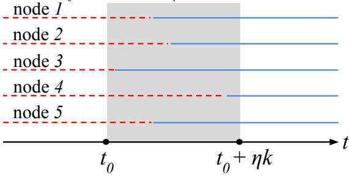
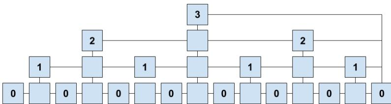
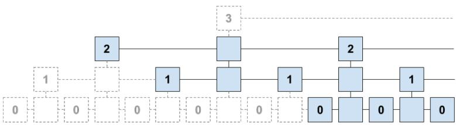
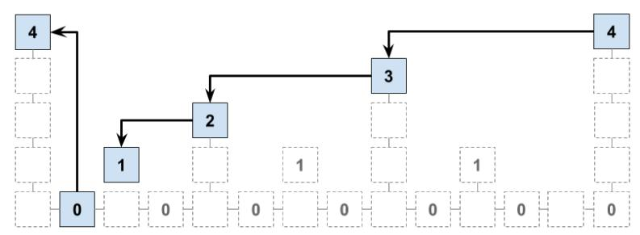
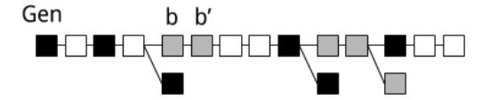
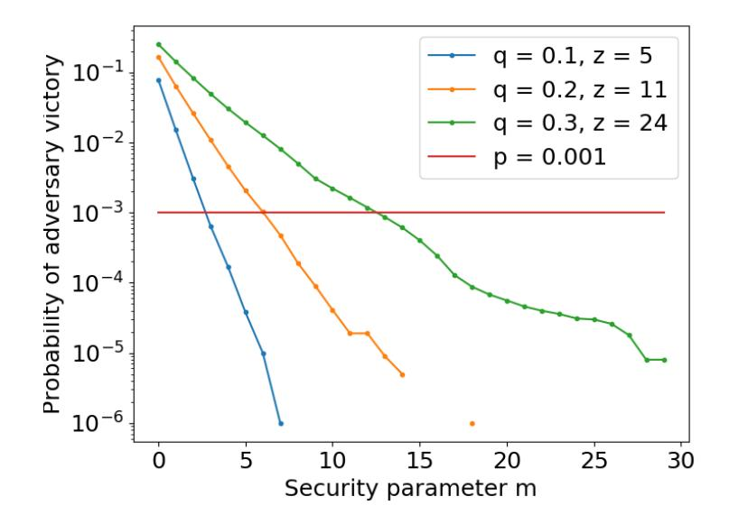
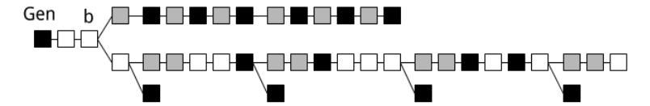
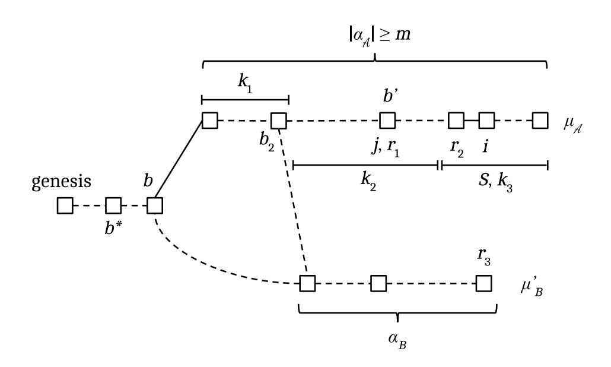

# Non-Interactive Proofs of Proof-of-Work

Aggelos Kiayias<sup>1</sup> , Andrew Miller<sup>2</sup> , and Dionysis Zindros<sup>3</sup>

<sup>1</sup> University of Edinburgh, IOHK

<sup>2</sup> University of Illinois at Urbana-Champaign, Initiative for Cryptocurrencies and Contracts <sup>3</sup> National and Kapodistrian University of Athens, IOHK

May 31, 2018

Abstract. Open consensus protocols based on proof-of-work (PoW) mining are at the core of cryptocurrencies such Bitcoin and Ethereum, as well as many others. In this work, we construct a new primitive called Non-Interactive-Proofs-of-Proof-of-Work (NIPoPoWs) that can be adapted into existing PoW-based cryptocurrencies to improve their performance and extend their functionality. Unlike a traditional blockchain client which must verify the entire linearly-growing chain of PoWs, clients based on NIPoPoWs require resources only logarithmic in the length of the blockchain. NIPoPoWs are thus succinct proofs and require only a single message between the prover and the verifier of the transaction.

With our construction we are able to prove a broad array of useful predicates in the context of cross PoW-based blockchain transfers of assets, including predicates about facts buried deep within a blockchain which is necessary for the basic application of accepting payments. We provide empirical validation for NIPoPoWs through an implementation and benchmark study, in the context of two new applications: First, we consider a multi-client blockchain that supports all proof-of-work currencies rather than just one, with up to 90% reduction in bandwidth. Second, we discuss a "cross-chain ICO" application that spans multiple independent blockchains. Using our experimental data, we provide concrete parameters for our scheme.

# 1 Introduction

Today, Bitcoin and Ethereum remain the two largest proof-of-work cryptocurrencies by market cap. However, the ecosystem has grown diverse, with dozens of viable "altcoin" competitors. Given such an environment, it becomes increasingly important to be able to efficiently handle multiple blockchains by the same client and reliably transfer assets between them.

The first objective requires optimizing the "SPV client" described in the original Bitcoin paper [\[19\]](#page-41-0) which requires processing an amount of data growing linearly with the size of the blockchain.

The second objective has received significant attention in the context of "cross-chain" applications, i.e., logical transactions that span multiple separate blockchains. Simple cross-chain transactions are feasible today: the most well-known is the atomic exchange [\[14,](#page-41-1) [20\]](#page-41-2), e.g., a trade of bitcoin for ether. However, more sophisticated applications [\[6,](#page-40-0)[9,](#page-40-1)[16,](#page-41-3)[25,](#page-41-4) [27,](#page-41-5)[30\]](#page-41-6) could be enabled by a more efficient proof process, which would allow the blockchain of one cryptocurrency to embed a client of a separate cryptocurrency. This concept, initially popularized by a proposal by Back et al. [\[2\]](#page-40-2) can be used to avoid a difficult upgrade process: a new blockchain with additional features, such as experimental opcodes, can be backed by deposits in the original bitcoin currency, obviating the need to transfer capital to the new cryptocurrency. As one example of cross-chain interfacing, we describe an initial coin offering (ICO) [\[26\]](#page-41-7) which distributes tokens issued on one blockchain, but allows paying for them using coins in another blockchain.

# 1.1 Our contributions

Our main technical contribution is the introduction and instantiation of a new cryptographic primitive called Non-Interactive Proofs of Proof-of-Work (NIPoPoW).

We present a formal model and a provably secure instantiation of NIPoPoWs. Our contribution builds on previous work of the backbone model [\[12\]](#page-40-3) in terms of modeling and [\[15\]](#page-41-8) who introduced the concept of (interactive) Proofs of Proof-of-Work, which, in turn, are based on previous discussion of such concepts in the bitcoin forums [\[18\]](#page-41-9). In fact, we present an attack against the construction of [\[15\]](#page-41-8) that can be mounted by an adversary with less than 50% of hashing power. As a result our construction is the first Proof of Proofof-Work (regardless of interactivity) that is secure assuming honest majority. Furthermore, our solution is non-interactive making it the first protocol of this kind.

Regarding to the predicates that are to be demonstrated, previous work allowed only proving that the k-sized suffix of the currently adopted blockchain is as claimed. We generalize this notion to prove any predicate across a class of predicates which we call infix sensitive. This enables proving powerful statements pertaining to the blockchain such as the fact that a transaction took place, that a smart contract method ran with certain parameters, or that a payment was made into an account. The most basic application of such proofs, payment verification, require more general predicates than what is covered in previous work, and we enable these.

We prove the proofs are optimistically succinct meaning that they are logarithmic in size in honest conditions. Improving previous work, we show that, in the optimistic model of no adversarial mining power, succinctness can be achieved for even adversariallygenerated proofs by introducing the novel concept of certificates of badness. Our definition fills the gap in terms of security modeling and design that existed in previous proposals, e.g., the notion of cumulative "Dynamic Member Multisignature" [\[2\]](#page-40-2).

We provide concrete parameterization and empirical analysis showing the savings of our approach versus existing clients. Using real data from the Bitcoin and other networks, we quantify the savings of NIPoPoWs over the previous techniques of constructing SPV verifiers. For a multi-blockchain client that receives 100 payments per day, we offer a 90% reduction in bandwidth compared to na¨ıve SPV.

In summary, we make the following contributions:

- 1. We construct the first provably secure Proofs of Proof-of-Work.
- 2. We make them non-interactive.
- 3. We describe an attack against the previously known proof-of-proof-of-work construction.
- 4. We extend proofs to prove generic infix predicates pertaining to transactions deep within the blockchain.
- 5. We improve succinctness of previous proofs by weakening the optimality assumptions.
- 6. We provide experimental data which measure the efficiency and security of our scheme as well as concrete parameters based on these experiments.

# 2 Model and Definitions

Our model for describing our results is based on the standard "backbone" model for proof-of-work cryptocurrencies [\[12\]](#page-40-3), extended with the widely used Simplified Payment Verification (SPV) mode due to Nakamoto [\[19\]](#page-41-0). We consider three roles in our setting: lightweight clients, full nodes, and miners. [4](#page-1-0)

Nodes and miners run the Bitcoin backbone protocol, maintaining a copy of the blockchain and committing new transactions they receive from clients. Clients do not store the entire blockchain, but instead connect to nodes for service and request up-todate information about the blockchain, for example whether a particular payment has

<span id="page-1-0"></span><sup>4</sup> Full nodes can be thought of as miners with zero hashpower.

been finalized. Our main challenge is to design a protocol so that clients can sieve through the responses they receive from the network and reach a conclusion that should never disagree with the conclusion of a full node who is faced with the same objective and infers it from its local blockchain state.

# 2.1 Backbone model

The entities on the blockchain network are of 3 kinds: (1) miners, who try to mine new blocks on top of the longest known blockchain and broadcast them as soon as they are discovered (for simplicity we assume that difficulty is constant and thus the "longest chain rule" sufficiently describes honest miner behavior); (2) full nodes, who maintain the longest blockchain without mining and also act as the provers in the network; (3) verifiers or stateless clients, who connect to provers and ask for proofs in regards to which blockchain is the largest. The verifiers attempt to determine the value of a predicate on these chains.

We model proof-of-work discovery attempts by using a random oracle [\[4\]](#page-40-4) as in [\[12\]](#page-40-3). For clarity, we present our results in the backbone model [\[12\]](#page-40-3), although we suspect our results transfer easily to more refined models, such as Pass et al. [\[21\]](#page-41-10). More specifically, we remark that we assume a synchronous model in this paper. While we suspect our results carry over in a treatment in a partially synchronous model with bounded delay, this is left for future work.

The random oracle produces κ-bit strings, where κ is the system's security parameter. The network is synchronized into numbered rounds, which correspond to moments in time. n denotes the total number of miners in the game, while t denotes the total number of adversarial miners. Each miner is assumed to have equal mining power captured by the number of queries q available per player to the random oracle, each query of which succeeds independently with probability p (a successful query produces a block with valid proof-ofwork). Mining pools and miners of different computing power can be captured by assuming multiple players combine their computing power. This is made explicit for the adversary, as they do not incur any network overhead to achieve communication between adversarial miners. On the contrary, honest players discovering a block must diffuse it (broadcast it) to the network at a given round and wait for it to be received by the rest of the honest players at the beginning of the next round. A round during which an honest block is diffused is called a successful round; if the number of honest blocks diffused is one, it is called uniquely successful round. We assume there is an honest majority, i.e., that t/n < 0.5 with a significant gap [\[12\]](#page-40-3). We further assume that the network is adversarial, but that there is no eclipsing attacks [\[13\]](#page-41-11). More specifically, we allow the adversary to reorder messages transmitted at a particular round, to inject new messages thereby capturing Sybil attacks [\[10\]](#page-40-5), but not to drop messages. Each honest miner maintains a local chain C which they consider the current active blockchain. Upon receiving a different blockchain from the network, the current active blockchain is changed if the received blockchain is longer than the currently adopted one. Receiving a different blockchain of the same length as the currently adopted one does not change the adopted blockchain.

Blockchain blocks are generated by including the following data in them: ctr, the nonce used to achieve the proof-of-work; x the Merkle tree [\[17\]](#page-41-12) root of the transactions confirmed in this block; and interlink [\[15\]](#page-41-8), a vector containing pointers to previous blocks, including the id of the previous block. The interlink data structure contains pointers to more blocks than just the previous block. We will explain this further in Section [3.](#page-5-0) Given two hash functions H and G modelled as random oracles, the id of a block is defined as id = H(ctr, G(x, interlink)). In bitcoin's case, both H and G would be SHA256.

#### 2.2 The prover and verifier model

In our protocol, the nodes include a proof along with their responses to clients. We need to assume that clients are able to connect to at least one correctly functioning node (i.e., that they cannot be eclipsed from the network [\[1,](#page-40-6) [13\]](#page-41-11)). Each client makes the same request to every node, and by verifying the proofs the client identifies the correct response. Henceforth we will call clients verifiers and nodes provers. Note that in the interactive protocol from prior work [\[15\]](#page-41-8), the prover and verifier may engage in more than one round of message passing.

The prover-verifier interaction is parameterized by a predicate (e.g. "the transaction t is committed in the blockchain"). The predicates of interest in our context are predicates on the active blockchain. Some of the predicates are more suitable for succinct proofs than others. We focus our attention in stable predicates having the property that all honest miners share their view of them in a way that is updated in a predictable manner, with a truth-value that persists as the blockchain grows (an example of an unstable predicate is e.g., the least significant bit of the hash of last block). Following the work of [\[12\]](#page-40-3), we wait for k blocks to bury a block before we consider it confirmed and thereby the predicates depending on it stable. k is the common prefix security parameter, which in bitcoin folklore is often taken to be k = 6.

In our setting, for a given predicate Q, several provers (including adversarial ones) will generate proofs claiming potentially different truth values for Q based on their claimed local longest chains. The verifier receives these proofs and accepts one of the proofs, determining the truth value of the predicate. We denote a blockchain proof protocol for a predicate Q as a pair (P, V ) where P is the prover and V is the verifier. P is a PPT algorithm that is spawned by a full node when they wish to produce a proof, accepts as input a full chain C and produces a proof π as its output. V is a PPT algorithm which is spawned at some round, receives a pair of proofs (πA, πB) from both an honest party and the adversary and returns its decision d ∈ {T, F} before the next round and terminates. The honest miners produce proofs for V using P, while the adversary produces proofs following some arbitrary strategy. Before we introduce the security properties for blockchain proof protocols we introduce some necessary notation for blockchains.

# 2.3 Blockchain addressing

Our development makes use of several notation conventions for manipulating blockchain data structures, which we introduce here. Blockchains are finite block sequences obeying the blockchain property that in every block in the chain there exists a pointer to its previous block. A chain is anchored if its first block is genesis, denoted Gen.

For chain addressing we use Python brackets C[·] as in [\[22\]](#page-41-13). A zero-based positive number in a bracket indicates the indexed block in the chain. A negative index indicates a block from the end, e.g., C[−1] is the tip of the blockchain. A range C[i : j] is a subarray starting from i (inclusive) to j (exclusive).

Given chains C1, C<sup>2</sup> and blocks A, Z we concatenate them as C1C<sup>2</sup> or C1A. C2[0] must point to C1[−1] and A must point to C1[−1]. We denote C{A : Z} the subarray of the chain from A (inclusive) to Z (exclusive). We can omit blocks or indices from either side of the range to take the chain to the beginning or end respectively.

The id function returns the id of a block given its data, i.e., id = H(ctr, G(x, interlink)).

## 2.4 Provable chain predicates

Our aim is to prove statements about the blockchain, such as "The transaction t is included in the current blockchain." We consider a general class of predicates that take on values

true or false. Since a Bitcoin-like blockchain can experience delays and intermittent forks, not all honest parties will be in exact agreement about the entire chain. However, when all honest parties are in agreement about the truth value of the predicate, we will soon require in our security definition that the verifier also arrives at the same truth value.

To aid the construction of our proofs, we focus on predicates that are monotonic; they start with the value false and, as the blockchain grows, can change their value to true but not back.

Definition 1. (Monotonicity) A chain predicate Q(C) is monotonic if for all chains C and for all blocks B we have that Q(C) ⇒ Q(CB).

Additionally, we require that our predicates only depend on the stable portion of the blockchain, blocks that are buried under k subsequent blocks. This ensures that the value of the predicate will not change due to a blockchain reorganization.

Definition 2. (Stability) Parameterized by k ∈ N, a chain predicate Q is k-stable if its value only depends on the prefix C[: −k].

# 2.5 Desired properties

We now define two desired properties of a non-interactive blockchain proof protocol, succinctness and security.

Definition 3. (Security) A blockchain proof protocol (P, V ) about a predicate Q is secure if for all environments and for all PPT adversaries A and for all rounds r ≥ ηk, if V receives a set of proofs P at the beginning of round r, at least one of which has been generated by the honest prover P, then the output of V at the end of round r has the following constraints:

- If the output of V is false, then the evaluation of Q(C) for all honest parties must be false at the end of round r − ηk.
- If the output of V is true, then the evaluation of Q(C) for all honest parties must be true at the end of round r + ηk.

Fig. 1. The truth value of a fixed predicate Q about the blockchain, as seen from the point of view of 5 honest nodes, drawn on the vertical axis, over time, drawn as the horizontal axis. The truth value evolves over time starting as false at the beginning, indicated by a dashed red line. At some point in time t0, the predicate is ready to be evaluated as true, indicated by the solid blue line. The various honest nodes each realize this independently over a period of ηk duration, shaded in gray. The predicate remains false for everyone before t<sup>0</sup> and true for everyone after t<sup>0</sup> + ηk.



Some explanation is needed for the rationale of the above definition. The parameter η is borrowed from the Backbone [\[12\]](#page-40-3) work and indicates the rate at which new blocks are produced, i.e., the number of rounds needed on average to produce a block. If the scheme is secure, this means that the output of the verifier should match the output of a potential honest full node. However, in various executions, not all potential honest full node behaviors will be instantiated. Therefore, we require that, if the output of the proof verifier is true then, consistently with honest behavior, all other honest full nodes will converge to the value true. Conversely, if the output of the proof verifier is false then, consistently with honest behavior, all honest full nodes must not have indicated true sufficiently long in the past. The period ηk is the period needed for obtaining sufficient confirmations (k) in a blockchain system. A predicate's value has the potential of being true as seen by an honest party starting at time t0. Before time t0, all honest parties agree that the predicate is false. It takes ηk time for all parties to agree that the predicate is true, which is certain after time t0+ηk. The adversary may be able to convince the verifier that the predicate has any value during the period from t<sup>0</sup> to t<sup>0</sup> +ηk. However, our security definition mandates that before time t<sup>0</sup> the verifier will necessarily output false and after time t<sup>0</sup> + ηk the verifier will necessarily output true.

Remark. The above security definition, which works in the synchronous model, strictly requires that all NIPoPoW proofs have all been generated at some round r. In a partially synchronous setting, NIPoPoW proofs could be generated for a period of time of a certain length ηk. Without loss of generality, it can be assumed that, in such a setting, the honest party P generates the NIPoPoW proof at time r while the adversary generates her proof at time r + ηk, gaining some advantage. The security definition can be altered to allow for such a setting by requiring the truth value to alter only within the period r − 2ηk to r + 2ηk.

Definition 4. (Succinctness) A blockchain proof protocol (P, V ) about a predicate Q is succinct if for all PPT provers A, any proof π produced by A at some round r, the verifier V only reads a O(polylog(r))-sized portion of π.

It is easy to construct a secure but not succinct protocol for any computable predicate Q: The prover provides the entire chain C as a proof and the verifier simply selects the longest chain: by the common-prefix property of the backbone protocol (c.f. [\[12\]](#page-40-3)), this is consistent with the view of every honest party (as long as Q depends only on a prefix of the chain, as we explain in more detail shortly). In fact this is how widely-used cryptocurrency clients (including SPV clients) operate today.

It is also easy to build succinct but insecure clients: The prover simply sends the predicate value directly. This is roughly what hosted wallets do [\[5\]](#page-40-7).

The challenge we will solve is to provide a non-interactive protocol that at the same time achieves security and (optimistic) succinctness over a large class of useful predicates.

### <span id="page-5-0"></span>3 Consensus layer support

# 3.1 The interlink pointers data structure

In order to construct our protocol, we rely on the same interlink data structure used by PoPoW [\[15\]](#page-41-8). This is an additional hash-based data structure that is proposed to include in the header of each block. The interlink data structure is a skip-list [\[23\]](#page-41-14) that makes it efficient for a verifier to process a sparse subset of the blockchain, rather than only consecutive blocks.

Valid blocks satisfy the proof-of-work condition: id ≤ T, where T is the mining target. Throughout this work, we make the simplifying assumption that T is constant. Some blocks will achieve a lower id. If id ≤ T 2 <sup>µ</sup> we say that the block is of level µ. All blocks are level 0. Blocks with level µ are called µ-superblocks. µ-superblocks for µ > 0 are also (µ−1)-superblocks. The level of a block is given as µ = blog(T) − log(id(B))c and denoted level(B). By convention, for Gen we set id = 0 and µ = ∞.

Observe that in a blockchain protocol execution it is expected half of the blocks will be of level 1, 1/4 of the blocks will be of level 2, 1/8 will be of level 3 and 1/2 <sup>µ</sup> blocks will be of level µ. In expectation, the number of superblock levels of a chain C will be Θ(log(C)) [\[15\]](#page-41-8). Figure [2](#page-6-0) illustrates the blockchain superblocks starting from level 1 and going up to level 4 in case these blocks are distributed exactly according to expectation. Here, each level contains half the blocks of the level below.

In our protocol, the verifier must roughly scan along one level at a time. To enable this, instead of just the previous block, the interlink vector also points to the most recent preceding block of every level µ. Genesis is of infinite level and hence a pointer to it is included in every block at the first available index within the interlink data structure. The number of pointers that need to be included per block is in expectation log(|C|).

Figure [2](#page-6-0) illustrates the blockchain superblocks starting from level 1 and going up to level 4 in case these blocks are distributed exactly according to expectation. Note that each level contains half the blocks of the level below.

<span id="page-6-0"></span>Fig. 2. The hierarchical blockchain. Higher levels have achieved a lower target (higher difficulty) during mining.



The algorithm for this construction is shown in Algorithm [1](#page-6-1) and is borrowed from [\[15\]](#page-41-8). The interlink data structure turns the blockchain into a skiplist-like [\[23\]](#page-41-14) data structure.

The updateInterlink algorithm accepts a block B<sup>0</sup> , which already has an interlink data structure defined on it. The function evaluates the interlink data structure which needs to be included as part of the next block. It copies the existing interlink data structure and then modifies its entries from level 0 to level(B<sup>0</sup> ) to point to the block B<sup>0</sup> .

## Algorithm 1 updateInterlink

```
1: function updateInterlink(B
                             0
                             )
2: interlink ← B
                  0
                   .interlink
3: for µ = 0 to level(B
                         0
                          ) do
4: interlink[µ] ← id(B
                           0
                            )
5: end for
6: return interlink
7: end function
```

Traversing the blockchain. As we have now extended blocks to contain multiple pointers to previous blocks, if certain blocks are omitted from a chain we will obtain a subchain, as long as the blockchain property that each block must contain a pointer to its previous block in the sequence is maintained.

Blockchains are sequences, but it is more convenient to use set notation for some operations. Specifically, B ∈ C; C<sup>1</sup> ⊆ C<sup>2</sup> and ∅ have the obvious meaning. C<sup>1</sup> ∪ C<sup>2</sup> is the chain obtained by sorting the blocks contained in both C<sup>1</sup> and C<sup>2</sup> into a sequence (this may be not always defined). We will freely use set builder notation {B ∈ C : p(B)}. C<sup>1</sup> ∩ C<sup>2</sup> is the chain {B : B ∈ C<sup>1</sup> ∧ B ∈ C2}. In all cases, the blockchain property must be maintained. The lowest common ancestor is LCA(C1, C2) = (C<sup>1</sup> ∩ C2)[−1]. If C1[0] = C2[0] and C1[−1] = C2[−1], we say the chains C1, C<sup>2</sup> span the same block range.

It will soon become clear that it is useful to construct a chain containing only the superblocks of another chain. Given C and level µ, the upchain C↑<sup>µ</sup> is defined as {B ∈ C : level(B) ≥ µ}. A chain containing only µ-superblocks is called a µ-superchain. It is also useful, given a µ-superchain C 0 to go back to the regular chain C. Given chains C <sup>0</sup> ⊆ C, the downchain C <sup>0</sup>↓ <sup>C</sup> is defined as C[C 0 [0] : C 0 [−1]]. C is the underlying chain of C 0 . The underlying chain is often implied by context, so we will simply write C <sup>0</sup>↓ . By the above definition, the C↑ operator is absolute: (C↑<sup>µ</sup> ) <sup>µ</sup>+<sup>i</sup> = C↑µ+<sup>i</sup> . Given a set of consecutive rounds S = {r, r + 1, · · · , r + j} ⊆ N, we define C <sup>S</sup> = {B ∈ C : B was generated during S}.

# 4 Non-interactive blockchain suffix proofs

In this section, we modify the PoPoW scheme introduced in KLS [\[15\]](#page-41-8) to make it noninteractive. With foresight, we caution the reader that the non-interactive construction we present in this section is insecure, because the PoPoW scheme it is based on is also insecure. A very small patch will later allow us to modify our construction to achieve security.

Their scheme only allowed proving suffix predicates, predicates that pertain to the suffix of the blockchain. We continue along those lines to give our NIPoPoW construction which allows proving certain predicates Q of the chain C. Among the predicates which are stable, in this section, we will limit ourselves to suffix sensitive predicates (similar to previous work which did not make this distinction explicit). We extend the protocol to support more flexible predicates (such as transaction inclusion, as needed for our applications) in Section [5.](#page-10-0)

Definition 5 (Suffix sensitivity). A chain predicate Q is called k-suffix sensitive if for all chains C, C <sup>0</sup> with |C| ≥ k and |C<sup>0</sup> | ≥ k such that C[−k :] = C 0 [−k :] we have that Q(C) = Q(C 0 ).

Notice that if a predicate Q is suffix-sensitive, then then its value must be determined only by the k-suffix of the chain.

Example. In general our applications will require predicates that are not suffix-sensitive. However, as an example, consider the predicate "an Ethereum contract at address C has been initialized with code h at least k blocks ago" where h does not invoke the selfdestruct opcode. This can be implemented in a suffix-sensitive way because, in Ethereum, each block includes a Merkle Trie over all of the contract codes [\[8,](#page-40-8) [29\]](#page-41-15), which cannot be changed after initializtion. This predicate is thus also monotonic and k-stable.

# 4.1 Construction

We next present a generic form of the verifier first and the prover afterwards. The generic form of the verifier works with any practical suffix proof protocol. Therefore, we describe the generic verifier first before we talk about the specific instantiation of our protocol. The generic verifier is given access to call a protocol-specific proof comparison operator ≤<sup>m</sup> that

#### Algorithm 2 The Verify algorithm for the NIPoPoW protocol

```
1: function \mathsf{Verify}_{m,k}^Q(\mathcal{P})
2:
           \tilde{\pi} \leftarrow (\text{Gen})
                                                                                                                             ▷ Trivial anchored blockchain
 3:
           for (\pi, \chi) \in \mathcal{P} do
                                                                                                                      \triangleright Examine each proof (\pi, \chi) in \mathcal{P}
 4:
                 if validChain(\pi \chi) \wedge |\chi| = k \wedge \pi \geq_m \tilde{\pi} then
 5:
 6:
                       \tilde{\chi} \leftarrow \chi
                                                                                                                                         ▶ Update current best
                 end if
 7:
 8:
            end for
           return \tilde{Q}(\tilde{\chi})
9.
10: end function
```

we define. We begin the description of our protocol by first illustrating the generic verifier. Next, we describe the prover specific to our protocol. Finally, we show the instantiation of the  $\leq_m$  operator, which plugs into the generic verifier to make a concrete verifier for our protocol.

The generic verifier. The Verify function of our NIPoPoW construction for suffix predicates is described in Algorithm 2. The verifier algorithm is parameterized by a chain predicate Q and security parameters k, m; k pertains to the amount of proof-of-work needed to bury a block so that it is believed to remain stable (e.g., k = 6); m is a security parameter pertaining to the prefix of the proof, which connects the genesis block to the k-sized suffix. The verifier receives several proofs by different provers in a collection of proofs  $\mathcal{P}$  at least one of which will be honest. Iterating over these proofs, it extracts the best.

Each proof is a chain. For honest provers, these are subchains of the adopted chain. Proofs consist of two parts,  $\pi$  and  $\chi$ ;  $\pi\chi$  must be a valid chain;  $\chi$  is the proof suffix;  $\pi$  is the prefix. We require  $|\chi| = k$ . For honest provers,  $\chi$  is the last k blocks of the adopted chain, while  $\pi$  consists of a selected subset of blocks from the rest of their chain preceding  $\chi$ . The method of choice of this subset will become clear soon.

The verifier compares the proof prefixes provided to it by calling the  $\geq_m$  operator. We will get to the operator's definition shortly. Proofs are checked for validity before comparison by ensuring  $|\chi| = k$  and calling validChain which checks if  $\pi\chi$  is an anchored blockchain.

At each loop iteration, the verifier compares the next candidate proof prefix  $\pi$  against the currently best known proof prefix  $\tilde{\pi}$  by calling  $\pi \geq_m \tilde{\pi}$ . If the candidate prefix is better than the currently best known proof prefix, then the currently known best prefix is updated by setting  $\tilde{\pi} \leftarrow \pi$ . When the best known prefix is updated, the suffix  $\tilde{\chi}$  associated with the best known prefix is also updated to match the suffix  $\chi$  of the candidate proof by setting  $\tilde{\chi} \leftarrow \chi$ . While  $\tilde{\chi}$  is needed for the final predicate evaluation, it is not used as part of any comparison, as it has the same size k for all proofs. The best known proof prefix is initially set to (Gen), the trivial anchored chain containing only the genesis block. Any well-formed proof compares favourably against the trivial chain.

After the end of the for loop, the verifier will have determined the best proof  $(\tilde{\pi}, \tilde{\chi})$ . We will later prove that this proof will necessarily belong to an honest prover with overwhelming probability. Since the proof has been generated by an honest prover, it is associated with an underlying honestly adopted chain  $\mathcal{C}$ . The verifier then extracts the value of the predicate Q on the underlying chain. Note that, because the full chain is not available to the verifier, the verifier here must evaluate the predicate on the suffix. Because the predicate is suffix-sensitive, it is possible to do so. As a technical detail, we denote  $\tilde{Q}$  the

predicate which accepts only a k-suffix of a blockchain and outputs the same value that Q would have output if it had been evaluated on a chain with that suffix.

### Algorithm 3 The Prove algorithm for the NIPoPoW protocol

```
1: function Provem,k,δ(C)
2: B ← C[0] . Genesis
3: for µ = |C[−k].interlink| down to 0 do
4: α ← C[: −k]{B :}↑µ
5: π ← π ∪ α; B ← α[−m]
6: end for
7: χ ← C[−k :]
8: return πχ
9: end function
```

The concrete prover. The NIPoPoW prover construction is shown in Algorithm [3.](#page-9-0) The honest prover is supplied with an honestly adopted chain C and security parameters m, k, δ and returns proof πχ, which is a chain. The suffix χ is the last k blocks of C. The prefix π is constructed by selecting various blocks from C[: −k] and adding them to π, which consists of a number of blocks for every level µ. At the highest possible level at which at least m blocks exist, all these blocks are included. Then, inductively, for every superchain of level µ that is included in the proof, the suffix of length m is taken. Then the underlying superchain of level µ−1 spanning the same blocks as that suffix is also included, until level 0 is reached. This underlying superchain will have 2m blocks in expectation and always at least m blocks.

The algorithm returns a chain πχ. In this chain, χ is the suffix of an honestly adopted blockchain containing the most recent k blocks. π is a subchain of the underlying blockchain with the last k blocks removed, C[: −k].

In each iteration of the for loop, blocks of level µ are considered, starting from the topmost level |C[−k].interlink| and descending down to level 0. When we take a µ-superchain and are interested in its last m blocks, we fill the same range of blocks with blocks from the superchain of level µ − 1 below. All the µ-superblocks which are within this m blocks range will also be (µ − 1)-superblocks and so we do not want to keep them in the proof twice. Note that no check is necessary to make sure the top-most level has at least m blocks, even though the verifier requires this. The reason is the following: Assume the blockchain has at least m blocks in total. Then, when a superchain of level µ has less than m blocks in total, these blocks will all be necessarily included into the proof by a lower-level superchain µ − i for some i > 0. Therefore, it does not hurt to add them to π earlier.

Figure [3](#page-10-1) contains an example proof constructed for parameters m = k = 3. The top superchain level which contains at least m blocks is level µ = 3. For the m-sized suffix of that level, 5 blocks of superblock level 2 are included for support spanning the same range. For the last 3 blocks of the level 2 superchain, blocks of level 1 are included for support. The concrete verifier. The ≥<sup>m</sup> operator which performs the comparison of proofs is presented in Algorithm [4.](#page-10-2) It takes proofs π<sup>A</sup> and π<sup>B</sup> and returns true if the first proof is winning, or false if the second is winning. It first computes the LCA block b between the proofs. As parties A and B agree that the blockchain is the same up to block b, arguments will then be taken for the diverging chains after b. The best possible argument from each player's proof is extracted by calling the best-arg<sup>m</sup> function. We call the willingness of the verifier to allow each prover to be evaluated based on their best argument the

Fig. 3. NIPoPoW prefix π for m = 3.

<span id="page-10-1"></span>

principle of charity. To find the best argument of a proof π given b, best-arg<sup>m</sup> collects all the µ indices which point to superblock levels that contain valid arguments after block b. Argument validity requires that there are at least m µ-superblocks following block b, which is captured by the comparison |π↑ <sup>µ</sup> {b :}| ≥ m. 0 is always considered a valid level, regardless of how many blocks are present there. These level indices are collected into set M. For each of these levels, the score of their respective argument is evaluated by weighting the number of blocks by the level as 2<sup>µ</sup> |π↑ <sup>µ</sup> {b :}|. The highest possible score across all levels is returned. Once the score of the best argument of both A and B is known, they are directly compared and the winner returned. An advantage is given to the first proof in case of a tie by using the ≥ operator favouring A.

Algorithm 4 The algorithm implementation for the ≥ operator to compare two proofs in the NIPoPoW protocol parameterized with security parameter m. Returns True if the underlying chain of player A is deemed longer than the underlying chain of player B

```
1: function best-argm(π, b)
2: M ← {µ : |π↑
              µ
               {b :}| ≥ m} ∪ {0}
3: return maxµ∈M{2
                  µ
                   · |π↑
                      µ
                       {b :}|}
4: end function
5: operator πA ≥m πB
6: b ← (πA ∩ πB)[−1] . LCA
7: return best-argm(πA, b) ≥ best-argm(πB, b)
8: end operator
```

## <span id="page-10-0"></span>5 Non-interactive blockchain infix proofs

In the previous section we have seen how to construct proofs for suffix predicates. As mentioned, the main purpose of this construction is to serve as a stepping stone for the construction of this section that presents a most useful class of proofs allow proving more general predicates that can depend on multiple blocks even buried deep within the blockchain.

More specifically, the generalized prover for infix proofs allows proving any predicate Q(C) that depends on a number of blocks that can appear anywhere within the chain (except the k suffix for stability). These blocks constitute a subset C <sup>0</sup> of blocks, the witness, which may not necessarily be a stand-alone subchain. This allows proving powerful statements such as, for example, whether a transaction is confirmed. We define next formally the class of predicates that will be of interest.

<span id="page-10-3"></span>Definition 6 (Infix sensitivity). A chain predicate Qd,k is infix sensitive if it can be written in the form

$$Q_{d,k}(\mathcal{C}) = \begin{cases} true, & \text{if } \exists \mathcal{C}' \subseteq \mathcal{C}[:-k] : |\mathcal{C}'| \leq d \land D(\mathcal{C}') \\ false, & \text{otherwise} \end{cases}$$

Where D is an arbitrary computable predicate.

Note that  $\mathcal{C}'$  is a blockset and may not necessarily be a blockchain. Furthermore, observe that for all block sets  $\mathcal{C}' \subseteq \mathcal{C}$  we have that  $Q(\mathcal{C}') \Rightarrow Q(\mathcal{C})$ . This will allow us to later argue that adding more blocks to a blockchain cannot invalidate its witness.

Similarly to suffix-sensitive predicates, infix-sensitive predicates Q can be evaluated very efficiently. Intuitively this is possible because of their localized nature and dependency on the  $D(\cdot)$  predicate which requires only a small number of blocks to conclude whether the predicate should be true.

**Example.** We next show how to express the predicate that asks whether a certain transaction with id txid has been confirmed as an infix sensitive predicate. We define the predicate  $D^{txid}$  that receives a single block and tests whether a transaction with id txidis included. The predicate  $Q_{1,k}^{txid}$  is defined as in Definition 6 using the predicate  $D^{txid}$  and the parameter k which in this case determines the desired stability of the assertion that txid is included (such as, for instance k=6). Note in this case that auxiliary data will have to be supplied by the prover to aid the provability of D. In particular, for example, the Merkle Tree proof-of-inclusion path to the Merkle Tree root of transactions will need to be included in the case of Bitcoin or the Merkle Patricia Trie proof-of-inclusion path to the Transaction Trie root will need to be included in the case of Ethereum, similar to an SPV proof. Both of these will be logarithmic in the number of transactions included in the block and, hence, constant with respect to the size of the blockchain. In case of a vendor awaiting transaction confirmation to ship a product, the proof that a certain transaction paid into a designated address for the particular order should be sufficient. Note that, in this scheme, it is impossible to determine whether the money has subsequently been spent by the vendor in a future block, and so can only be used by the vendor holding the respective secret keys.

In the above example, note that if the verifier outputs false, this behavior will generally be inconclusive in the sense that the verifier could be outputting false either because the payment has not yet been confirmed or because the payment was never made. We can easily modify the scheme to allow the payer to claim that the payment was made at some particular block height  $\ell$ . The vendor can then bail out after a number of blocks  $\ell$  and conclude that the payment was never made. In order to do that formally, two different infix predicates must be evaluated by the NIPoPoW protocol. The first predicate  $Q_1$  as above simply checks for transaction confirmation. The second predicate  $Q_2$  attests to the size of the underlying blockchain and in particular returns true if the blockchain has grown beyond  $\ell$  blocks long. The payment is deemed successful if  $Q_1$  outputs true and unsuccessful if  $Q_2$  outputs true. While both predicates are false the result of the experiment is inconclusive. The predicate  $Q_2$  can be implemented in blockchains which include a verified block depth in their block headers such as Ethereum. As always, the block whose header is checked for block depth must be a stable block in  $\mathcal{C}[:-k]$  to ensure that a malicious miner is not able to tamper with it.

#### 5.1 Construction

The construction of these proofs is shown in Algorithm 5. The infix prover accepts two parameters: The chain  $\mathcal{C}$  which is the full blockchain and  $\mathcal{C}'$  which is a sub-blockset of the blockchain whose blocks are of interest for the predicate in question. The prover calls the

<span id="page-12-1"></span>Fig. 4. An infix proof descend. Only blue blocks are included in the proof. Blue blocks of level 4 are part of π, while the blue blocks of level 1 through 3 are produced by followDown to get to the block of level 0 which is part of C 0 .



previous suffix prover to produce a proof as usual. Then, having the prefix π and suffix χ of the suffix proof in hand, the infix prover adds a few auxiliary blocks to the prefix π. The prover ensures that these auxiliary blocks form a chain with the rest of the proof π. Such auxiliary blocks are collected as follows: For every block B of the subchain C 0 , the immediate previous (E<sup>0</sup> ) and next (E) blocks in π are found. Then, a chain of blocks R which connects E back to B<sup>0</sup> is found by the algorithm followDown. If E<sup>0</sup> is of level µ, there can be no other µ-superblock between E<sup>0</sup> and B<sup>0</sup> , otherwise it would have been included in π. Therefore, B<sup>0</sup> already contains a pointer to E<sup>0</sup> in its interlink, completing the chain.

## Algorithm 5 The Prove algorithm for infix proofs

```
1: function ProveInfixm,k(C, C
                       0
                        , depth)
2: (π, χ) ← Provem,k(C)
3: for B
         0 ∈ C0 do
4: for E ∈ π do
5: if depth[E] ≥ depth[B
                          0
                           ] then
6: R ← followDown(E, B0
                             , depth)
7: aux ← aux ∪ R
8: break
9: end if
10: E
            0 ← E
11: end for
12: end for
13: return (aux ∪ π, χ)
14: end function
```

The way to connect a superblock to a previous lower-level block is implemented in Algorithm [6.](#page-13-0) Block B<sup>0</sup> cannot be of higher or equal level than E, otherwise it would be equal to E and the followDown algorithm would return. The algorithm proceeds as follows: Starting at block hi = E, it tries to follow a pointer to as far as possible. If following the pointer surpasses lo = B<sup>0</sup> , then the following is aborted and a lower level is tried, which will cause a smaller step within the skiplist. If a pointer was followed without surpassing B0 , the operation continues from the new block, until eventually B<sup>0</sup> will be reached, which concludes the algorithm.

Algorithm 6 The followDown function which produces the necessary blocks to connect a superblock hi to a preceeding regular block lo.

```
1: function followDown(hi, lo, depth)
2: B ← hi; aux ← [ ]; µ ← level(hi)
3: while B 6= lo do
4: B
         0 ← blockById[B.interlink[µ]]
5: if depth[B
                0
                 ] < depth[lo] then
6: µ ← µ − 1
7: else
8: aux ← aux ∪ {B}
9: B ← B
                 0
10: end if
11: end while
12: return aux
13: end function
```

An example of the output of followDown is shown in Figure [4.](#page-12-1) This is a portion of the proof shown at the point where the superblock levels are at level 4. A descend to level 0 was necessary so that a regular block would be included in the chain. The level 0 block can jump immediately back up to level 4 because it has a high-level pointer.

The verification algorithm must then be modified as in Algorithm [7.](#page-13-1)

The algorithm works by calling the suffix verifier. It also maintains a blockDAG collecting blocks from all proofs (it is a DAG because interlink can be adversarially defined). This DAG is maintained in the blockById hashmap. Using it, ancestors uses simple graph search to extract the set of ancestor blocks of a block. In the final predicate evaluation, the set of ancestors of the best blockchain tip is passed to the predicate. The ancestors are included to avoid an adversary who presents an honest chain but skips the blocks of interest.

# Algorithm 7 The verify algorithm for the NIPoPoW infix protocol

```
1: function ancestors(B, blockById)
2: if B = Gen then
3: return {B}
4: end if
5: C ← ∅
6: for B
         0 ∈ B.interlink do
7: C ← C ∪ ancestors(B
                      0
                      ) . Collect into DAG
8: end for
9: return C ∪ {B}
10: end function
11: function verify-infxD
                 `,m,k(P)
12: blockById ← ∅ . Initialize empty hashmap
13: for (π, χ) ∈ P do
14: for B ∈ π do
15: blockById[B.id] ← B
16: end for
17: end for
18: π˜ ← best π ∈ P according to suffix verifier
19: return D(ancestors(˜π[−1], blockById))
20: end function
```

#### <span id="page-14-1"></span>6 Superchain quality

In order to argue formally about the security properties of blockchains that are equipped with the interlink data structure we will introduce a new concept of *superchain quality*, which generalizes the chain quality property from the backbone model [12]. Superchain quality is a new contribution in this paper and is essential for identifying and overcoming the attack on PoPoW.

We first define a notion of "goodness" that bounds the deviation of superblocks of a certain level from their expected mean. Using this we then define superchain quality.

Intuitively, these definitions tell us that  $\mu$ -superblocks occur approximately once every  $2^{\mu}$  blocks. Below, we make this notion more formal.

**Definition 7 (Locally good superchain).** A superchain C' of level  $\mu$  with underlying chain C is said to be  $\mu$ -locally-good with respect to security parameter  $\delta$ , written local-good $_{\delta}(C', C, \mu)$ , if  $|C'| > (1 - \delta)2^{-\mu}|C|$ .

**Definition 8 (Superchain quality).** The  $(\delta, m)$  superquality property  $Q_{scq}^{\mu}$  of a chain  $\mathcal{C}$  pertaining to level  $\mu$  with security parameters  $\delta \in \mathbb{R}$  and  $m \in \mathbb{N}$  states that for all  $m' \geq m$ , it holds that local-good $_{\delta}(C\uparrow^{\mu}[-m':], C\uparrow^{\mu}[-m':]\downarrow, \mu)$ . That is, all sufficiently large suffixes are locally good.

**Definition 9 (Multilevel quality).** A  $\mu$ -superchain C' is said to have multilevel quality, written multi-good<sub> $\delta,k_1$ </sub>( $\mathcal{C},\mathcal{C}',\mu$ ) with respect to an underlying chain  $\mathcal{C}=\mathcal{C}'\downarrow$  with security parameters  $k_1,\delta$  if for all  $\mu'<\mu$  it holds that for any  $\mathcal{C}^*\subseteq\mathcal{C}$ , if  $|\mathcal{C}^*\uparrow^{\mu'}|\geq k_1$ , then  $|\mathcal{C}^*\uparrow^{\mu}|\geq (1-\delta)2^{\mu'-\mu}|\mathcal{C}^*\uparrow^{\mu'}|$ .

Putting the above together we conclude with the notion of a *qood* superchain.

**Definition 10 (Good superchain).** A  $\mu$ -superchain C' is said to be good, written  $\operatorname{good}_{\delta,k_1}(C,C',\mu)$ , with respect to an underlying chain  $C = C' \downarrow$  if it has both superquality and multilevel quality with parameters  $(\delta,m)$ .

It is not hard to see that the above good statistical properties are attained with overwhelming probability by all chains that are generated in optimistic environments, i.e. if no adversary tries to violate them. This is proven formally in the appendix.

#### <span id="page-14-0"></span>7 An attack

We now show that our above construction is insecure by illustrating an explicit attack against our scheme. We show that this attack is applicable in the same manner against our construction as it is applicable against the previous PoPoW work [15]. PoPoW serves as the starting point and inspiration for our protocol. The security proof is incorrect, and in fact the PoPoW protocol is susceptible to a double-spending attack within the model (i.e., that can be carried out by an attacker with less than 50% hash power). During the exposition of this attack, a patch for our construction, which will also lead to a correct generic security proof, will become clear.

We focus on illustrating why the PoPoW construction of previous work is insecure against an adversary controlling less than 50% of hashing power. The attack immediately carries over to our straw man construction introduced above, a vulnerability we will address in later sections. We proceed in two steps. We first show that a powerful attacker can break chain superquality with non-negligible probability. Then we construct a concrete

double spending attack based on this observation assuming an attacker of sufficiently high hashing power (but still below 50%). Note that maintaining chain superquality was not in the original security model; however, we show how the property affects the security of the underlying blockchain proofs.

#### 7.1 Interactive proofs of proof-of-work

In PoPoW, the main algorithm of the verifier aims at distinguishing between two candidate proofs  $(\pi_A, \chi_A)$  and  $(\pi_B, \chi_B)$ . The honest prover, having adopted  $\mathcal{C}_B$  during mining, initially produces the proof  $(\pi_B, \chi_B)$  as follows. First, the last k blocks are sent as  $\chi_B = \mathcal{C}_B[-k:]$ . Then for the first part of the chain,  $\mathcal{C}_B[:-k]$ , the prover sets  $\pi_B$  to be the  $\mu$ -superchain spanning  $\mathcal{C}_B$  for the largest  $\mu$  such that  $|\pi_B| = m$ , where m is the protocol's security parameter. The verifier ensures that  $|\pi_A| \geq m, |\pi_B| \geq m$  so that the proofs are not shorter than m and then checks whether  $\pi_A = \pi_B$ ; if so, the decision is drawn immediately based on  $\chi_A, \chi_B$  without interaction. Otherwise, the verifier queries the provers for their claimed anchored superchains  $\mathcal{C}_A \uparrow^{\mu}$ ,  $\mathcal{C}_B \uparrow^{\mu}$  at some level  $\mu$ . The verifier starts querying at the highest possible level  $\mu$  and descends until level  $\mu$  is sufficiently low such that  $b = LCA(\pi_A \uparrow^{\mu}, \pi_B \uparrow^{\mu})$  is m blocks from the tip of the chain for one of the proofs. That is, the querying stops at such  $\mu$  when  $max(|\pi_A\uparrow^{\mu} \{b:\}|, |\pi_B\uparrow^{\mu} \{b:\}|) \geq m$ . The winner is designated as the prover with the most blocks after b at that level; i.e., A, if  $|\pi_A\uparrow^{\mu}\{b:\}| \geq |\pi_B\uparrow^{\mu}\{b:\}|$ , and B otherwise. The communication overhead is reduced by only requesting blocks after the purported LCA. The security parameter m is chosen to ensure that the probability of the attacker producing a long superchain is negligible.

## <span id="page-15-1"></span>7.2 Attacking chain superquality

We construct an adversary  $\mathcal{A}$  that breaks the superchain quality at level  $\mu$ .  $\mathcal{A}$  works as follows. Assume she wants to attack the honest party B in order to have him adopt chain  $\mathcal{C}_B$  which has a bad distribution of superblocks, i.e. such that local goodness is violated in some sufficiently long subchain. She continuously determines the current chain  $\mathcal{C}_B$  adopted by B. The adversary starts playing after  $|\mathcal{C}_B| \geq 2$ . If  $level(\mathcal{C}_B[-1]) < \mu$ , then  $\mathcal{A}$  remains idle. However, if  $level(\mathcal{C}_B[-1]) \geq \mu$ , then  $\mathcal{A}$  attempts to mine an adversarial block b on top of  $\mathcal{C}_B[-2]$ . If successful, she attempts to mine another block b' on top of b. If successful again, she broadcasts b and b'. The adversarial mining continues until B adopts a new chain, which can be due to two reasons: Either the adversary successfully mined b, b' on top of  $\mathcal{C}_B[-2]$  and B adopts them; or one of the honest parties mined a block which was adopted by B. In either case, the adversary restarts the strategy by inspecting  $\mathcal{C}[-1]$  and acting accordingly. An execution of this attack is illustrated in Figure 5.

<span id="page-15-0"></span>**Fig. 5.** Superquality attack on prior work (PoPoW) [15]. The adversary performs a selfish-mining [11] attack (gray blocks) whenever any honest parties have recently mined a rare  $\mu$ -superblock (black). The attack reduces the honest chain's superquality, while the attacker's private chain is unaffected.



Assume now that an honestly-generated  $\mu$ -superblock was adopted by B at position  $\mathcal{C}_B[i]$  at round r. We now examine the probability that  $\mathcal{C}_B[i]$  will remain a  $\mu$ -superblock in

the long run. Suppose r <sup>0</sup> > r is the first round after r during which a block is generated. A will succeed in this attack with non-negligible probability and cause B to abandon the µ-superblock from their adopted chain. Therefore, there exists δ such that the adversary will be able to cause δ-variance with non-negligible probability in m. This suffices to show that superquality is violated.

As seen in the illustration, while the honest parties have generated several µ-superblocks, some of them are in blockchain forks which have been abandoned, causing a superquality harm.

# 7.3 A double-spending attack

Extending the above attack, we modify the superquality attacker into an attacker that causes a double spending attack in the PoPoW construction. We first give a sketch of the attack[5](#page-16-0) .

As before, A targets the proofs generated by honest party B by violating µ-superquality in B's adopted chain. A begins by remaining idle until a certain chosen block b. After block b is produced, A starts mining a secret chain which forks off from b akin to a selfish mining attacker [\[11\]](#page-40-9). The adversary performs a normal spending transaction on the honestly adopted blockchain and has it confirmed in the block immediately following block b. She also produces a double spending transaction which she secretly confirms in her secret chain in the block immediately following b.

A keeps extending her own secret chain as usual. However, whenever a µ-superblock is adopted by B, she temporarily pauses mining in her secret chain and devotes her mining power to harm the µ-superquality of B's adopted chain. Intuitively, for large enough µ, the time spent trying to harm superquality will be limited, because the probability of a µ-superblock occurring will be small. Therefore, the adversary's superchain quality will be larger than the honest parties' superchain quality (which will be harmed by the adversary) and therefore, even though the adversary's 0-chain will be shorter than the honest parties' 0-chain, the adversary's µ-superchain will be longer than the honest parties' µ-superchain and thus will be favored by the verifier! The formal calculation of the probability of this attack succeeding is in the appendix. We note that actually, for appropriate choice of system parameters, the attack can be made to succeed with overwhelming probability.

### <span id="page-16-1"></span>8 Security

Based on the attack explored above, it is now easy to see that our construction can be patched in a straightforward manner to achieve security. In particular, since the manner in which the adversary was able to subvert the prover was by the violation of goodness, we can mandate that the prover only tries to use succinct proofs to prove claims about chains that are good at every level. In case goodness is violated, the prover simply falls back to providing the whole chain. This allows us to argue that the construction is secure by distinguishing two cases. In case goodness is violated, the honest prover will fall back to providing the whole chain, in which case security will be reduced to the security of the standard blockchain protocol choosing the longest 0-chain. In case goodness is not violated, we will argue that the adversary is unable to win in these comparisons.

The previous construction was designed to prevent Bahack-style attacks [\[3\]](#page-40-10), where the adversary constructs "lucky" high-difficulty superblocks without filling in the underlying proof-of-work in the lower levels. We now patch our protocol which, while retaining this

<span id="page-16-0"></span><sup>5</sup> We thank Giorgos Panagiotakos, Peter Ga˘zi, and Nikos Leonardos for their insights in this construction.

highlevel approach, adds a defence against the double-spending attack of Section 7. The attack is neutralized since our verifier is more permissive, allowing the prover to construct a proof that takes superquality "goodness" into account when comparing forks. The modified construction is shown in Algorithm 8. The algorithm has been modified to check the current portion of the subchain  $\alpha$  for goodness prior to moving to the lower superchain level. If goodness is indeed maintained at the current level  $\mu$ , the prover only tries to cover the span of the last m blocks of level  $\mu$  at level  $\mu - 1$ , as seen in Line 7. Otherwise, if goodness is violated at the part of the subchain  $\alpha$  at level  $\mu$ , then the prover completely ignores level  $\mu$  and tries to use the lower level  $\mu - 1$  to cover the whole span of  $\alpha$ .

#### **Algorithm 8** The goodness aware Prove algorithm for the NIPoPoW protocol

```
1: function \mathsf{Prove}_{m,k,\delta}^{\mathsf{good}}(\mathcal{C})
 2:
             B \leftarrow \mathcal{C}[0]
                                                                                                                                                                               ▶ Genesis
 3:
             for \mu = |\mathcal{C}[-k].interlink down to 0 do
 4:
                   \alpha \leftarrow \mathcal{C}[:-k]\{B:\}\uparrow^{\mu}
 5:
                   \pi \leftarrow \pi \cup \alpha
 6:
                   if good_{\delta,m}(\mathcal{C},\alpha,\mu) then
                         B \leftarrow \alpha[-m]
 7:
 8:
                   end if
 9:
             end for
10:
             \chi \leftarrow \mathcal{C}[-k:]
11:
             return \pi \chi
12: end function
```

Only the concrete prover needs to be modified. The verifier and  $\leq_m$  operator remain as defined previously.

To aid intuition, we will first give a sketch of the proof before giving the full technical proof.

<span id="page-17-1"></span>**Theorem 1 (Security).** Assuming honest majority, the non-interactive proofs-of-proof-of-work construction for computable k-stable monotonic suffix-sensitive predicates is secure with overwhelming probability in  $\kappa$ .

Proof (Sketch). Suppose an adversary produces a proof  $\pi_{\mathcal{A}}$  and an honest party produces a proof  $\pi_{\mathcal{B}}$  such that the two proofs cause the predicate Q to evaluate to different values, while at the same time all honest parties have agreed that the correct value is the one obtained by  $\pi_{\mathcal{B}}$ . Because of bitcoin's security,  $\mathcal{A}$  will be unable to make these claims for an actual underlying 0-level chain.

We now argue that the operator  $\leq_m$  will signal in favour of the honest parties. Suppose b is the LCA block between  $\pi_A$  and  $\pi_B$ . If the chain forks at b, there can be no more adversarial blocks after b than honest blocks after b, provided there are at least k honest blocks (due to the Common Prefix property). We will now argue that, further, there can be no more disjoint  $\mu_A$ -level superblocks than honest  $\mu_B$ -level superblocks after b.

To see this, let b be an honest block generated at some round  $r_1$  and let the honest proof have been generated at some round  $r_3$ . Then take the sequence of consecutive rounds  $S = (r_1, \dots, r_3)$ . Because the verifier requires at least m blocks from each of the provers, the adversary must have  $m \mu_{\mathcal{A}}$ -superblocks in  $\pi_{\mathcal{A}}\{b:\}$  which are not in  $\pi_{\mathcal{B}}\{b:\}$ . Therefore, using a negative binomial tail bound argument, we see that |S| must be long; intuitively, it takes a long time to produce a lot of blocks  $|\pi_{\mathcal{A}}\{b:\}|$ . Given that |S| is long and that the honest parties have more mining power, they must have been able to produce a longer

 $\pi_B\{b:\}$  argument (of course, this comparison will have the superchain lengths weighted by  $2^{\mu_A}, 2^{\mu_B}$  respectively). To prove this, we use a binomial tail bound argument; intuitively, given a long time |S|, a lot of  $\mu_B$ -superblocks  $|\pi_B\{b:\}|$  will have been honestly produced.

We therefore have a fixed value for the length of the adversarial argument, a negative binomial random variable for the number of rounds, and a binomial random variable for the length of the honest argument. By taking the expectations of the above random variables and applying a Chernoff bound, we see that the actual values will be close to their means with overwhelming probability, completing the proof.

We formalize the above proof sketch in the Appendix.

#### <span id="page-18-0"></span>9 Succinctness

We will illustrate why our construction is succinct in the honest setting. For techniques to make the construction succinct in broader adversarial settings, consult the appendix.

Having established security in the general case of the standard honest majority model, we now concentrate on establishing performance guarantees. We analyse the patched scheme we saw in Algorithm 8.

We first observe that full succinctness in the standard honest majority model is impossible to prove for our construction. To see why, recall that an adversary with sufficiently large mining power can significantly harm superquality as described in Section 7.2. By reducing superquality for a sufficiently low level  $\mu$ , for example  $\mu = 3$ , the adversary can cause the honest prover to digress in their proofs from high-level superchains down to low-level superchains, causing a linear proof to be produced.

For instance, if superquality is harmed at  $\mu = 3$ , the prover will need to digress down to level  $\mu = 2$  and include the whole 2-superchain, which, in expectation, will be of size  $|\mathcal{C}|/2$ .

Having established security in the general case of the standard honest majority model, we now concentrate our succinctness claims to the particular "optimistic" case where the adversary does not use their (minority) computational power or network power. Therefore, the superquality of the chain must be the same as a fully honestly-generated chain generated with no network adversary. Last, for now, we will not allow the adversary to produce any proofs; that is, all proofs consumed by the verifier are honestly-generated. This security assumption is akin to [15]. We will lift this last assumption shortly.

**Theorem 2 (Number of levels).** The number of superblock levels which have at least m blocks are at most  $\log(|S|)$ , where S is the set of all blocks produced, with overwhelming probability in m.

Proof. Let S be the set of all blocks successfully produced by the honest parties or the adversary. Each block id is generated by the random oracle, so  $\Pr[\mathrm{id} \leq T2^{-\mu}] = 2^{-\mu}$ . These are independent Bernoulli trials. For each  $B \in S$ , let  $X_B^{\mu} \in \{0,1\}$  be the random variable indicating whether the block belongs to level  $\mu$  and let  $D_{\mu}$  indicate their sum, which is a Binomial distribution with parameters  $(|S|, 2^{-\mu})$  and expectation  $E[D_{\mu}] = |S|2^{-\mu}$ .

For level  $\mu$  to exist in any valid proof, at least m blocks of level  $\mu$  must have been produced by the honest parties or the adversary. We show that m blocks of level  $\mu = \log(|S|)$  are produced with negligible probability in m.

All of the  $X^{\mu}$  are independent. We apply a Binomial Chernoff bound to the sum. We have  $\Pr[D_{\mu} \geq (1+\Delta)E[D_{\mu}]] \leq \exp(-\frac{\Delta^2}{2+\Delta}E[D_{\mu}])$ . But for this  $\mu$  we have that  $E[D_{\mu}] = 1$ . Therefore  $\Pr[D_{\mu} \geq 1 + \Delta] \leq \exp(-\frac{\Delta^2}{2+\Delta})$ . Requiring  $1 + \Delta = m$ , we get  $\Pr[D_{\mu} \geq m] \leq \exp(-\frac{(m-1)^2}{m+1})$ , which is negligible in m.

The above theorem establishes that the number of superchains is small. What remains to be shown is that few blocks will be included at each superchain level.

Theorem 3 (Large upchain expansion). Let C be an honestly generated chain and let C <sup>0</sup> = C↑µ−<sup>1</sup> [i : i + `] with ` ≥ 4m. Then |C0↑ µ | ≥ m with overwhelming probability in m.

Proof. Assume the (µ−1)-level superchain has 4m blocks. Because each block of level µ−1 was generated as a query to the random oracle, it constitutes an independent Bernoulli trial and the number of blocks in level µ, namely π↑ µ , is a Binomial distribution with parameters (4m, 1/2). Clearly Pr[|π↑ µ | = m] ≤ Pr[|π↑ µ | ≤ m]. Observing that E[π↑ µ ] = 2m and applying a Chernoff bound, we get Pr[|π↑ µ | ≤ (1 − 1 2 )2m] ≤ exp(− (1/2)<sup>2</sup> 2 2m) which is negligible in m.

This probability bounds the probability of fewer than m blocks occurring in the µ level restriction of (µ − 1)-level superchains of more than 4m blocks. ut

Lemma 1 (Small downchain support). Assume an honestly generated chain C and let C <sup>0</sup> = C↑<sup>µ</sup> [i : i + m]. Then |C0↓↑µ−<sup>1</sup> | ≤ 4m with overwhelming probability in m.

Proof. Assume the (µ − 1)-level superchain had at least 4m blocks. Then by Theorem [9](#page-37-0) it follows that more than m blocks exist in level µ with overwhelming probability in m, which is a contradiction. ut

This last theorem establishes the fact that the support of blocks needed under the m-sized chain suffix to move from one level to the one below is small. Based on this, we can establish our theorem on succinctness:

Theorem 4 (Optimistic succinctness). If all players are honest and the network scheduling is random, non-interactive proofs-of-proof-of-work produced by honest provers are succinct with the number of blocks bounded by 4m log(|C|), with overwhelming probability in m.

Proof. Assume C is an honest parties' chain. From Theorem [8,](#page-36-0) the number of levels in the NIPoPoW is at most log(|C|) with overwhelming probability in m. First, observe that the count of blocks in the highest level will be less than 4m from Theorem [9;](#page-37-0) otherwise a higher superblock level would exist. From Corollary [5,](#page-28-0) we know that at all levels µ the chain will be good. Therefore, for each µ superchain C the supporting (µ − 1)-superchain will only need to span the m-long suffix of the µ-superchain above. For the m-long suffix of each superchain of level µ, the supporting superchain of level µ − 1 will have at most 4m blocks from Lemma [9.](#page-37-1) Therefore the size of the proof is 4m log(|C|). ut

In the above theorem, note the linear dependency between the round r that a proof is generated and the length |C| of the chain of each honest prover.

# 10 Implementation & Parameters

We now discuss the size of NIPoPoW proofs and evaluate concrete parameters. Organizing the interlink data structure as a Merkle tree of log(|C|) items, a proof-of-inclusion is provided in log log(|C|) space; the proof need not include 0-level pointers, must include the genesis block. The root of the tree can be proved to be included in the block header in log(|x|) using the standard Merkle tree of transactions, where x denotes the vector of all transactions included in the particular block. This makes the proof size require log(|x|) + log log(|C|) hashes per block for a total of m(log(|C|) − log(m))(log(|x|) + log log(|C|)) hashes. In addition, m(log(|C|) − log(m)) headers and coinbase transactions are needed. As an example, given that currently in bitcoin |C| = 464, 185 and |x| = 2000, we have log(|C|) = 18, log log(|C|) = 5, log(|x|) = 11. For the k-suffix, only k headers are needed. We set k = 6 and see that headers are 80 bytes and hashes 32 bytes. For the k-suffix as well as the 2m 0-blocks in π, neither coinbase data nor prev ids are needed, limiting header size to 48 bytes. The root and leaves of the pointers tree can be omitted from coinbase when transmitting the proof. In fact, no block ids need to be transmitted. From these observations, we estimate our scheme's proof sizes for various parameterizations of m in Table [1.](#page-20-0)

Concrete parameterization. To determine concrete values for security parameter m, we focus on a particular adversarial strategy and analyze its probability of success. The attack is an extension of the stochastic processes described in [\[19\]](#page-41-0) and [\[24\]](#page-41-16).

The experiment works as follows: m is fixed and some adversarial computational power percentage q of the total network computational power is chosen; k is chosen based on q according to Nakamoto [\[19\]](#page-41-0). The number of blocks y during which parallel mining will occur is also fixed. The experiment begins with the adversary and honest parties sharing a common blockchain which ends in block B. After B is mined, the adversary starts mining in secret and in parallel with the honest parties on her own private fork on top of B. She ignores the honest chain, so that the two chains remain disjoint after B. As soon as y blocks have been mined in total, the adversary attempts a double spend via a NIPoPoW by creating two conflicting transactions which are committed to an honest block and an adversarial block respectively on top of each current chain. Finally, the adversary mines k blocks on top of the double spending transaction within her private chain. After these k blocks have been mined, she publishes her private chain in an attempt to overcome the honest chain.

<span id="page-20-0"></span>Table 1. Size of NIPoPoWs applied to Bitcoin today (≈450k blocks) for various values of m, setting k = 6.

| m  | NIPoPoW size Blocks Hashes |      |       |
|----|----------------------------|------|-------|
| 6  | 70 kB                      | 108  | 1440  |
| 15 | 146 kB                     | 231  | 2925  |
| 30 | 270 kB                     | 426  | 5400  |
| 50 | 412 kB                     | 656  | 8250  |
|    | 100 750 kB                 | 1206 | 15000 |
|    | 127 952 kB                 | 1530 | 19050 |

We measure the probability of success of this attack. We experiment with various values of m for y = 100, indicating 100 blocks of secret parallel mining. We make the assumption that honest party communication is perfect and immediate. We ran 1, 000, 000 Monte Carlo executions [6](#page-20-1) of the experiment for each value of m from 1 to 30. We ran the simulation for values of computational power percentage q = 0.1, q = 0.2 and q = 0.3. The results are plotted in Figure [6.](#page-21-0)

Based on this data, we conclude that m = 5 is sufficient to achieve a 0.001 probability of failure against an adversary with 10% mining power. To secure against an adversary with more than 30% mining power, a choice of m = 15 is needed.

<span id="page-20-1"></span><sup>6</sup> Our experiment can be reproduced by running our code available under an open source MIT license at <https://github.com/dionyziz/popow/tree/master/experiment>

<span id="page-21-0"></span>Fig. 6. Simulation results for a private mining attacker with k according to Nakamoto and parallel mining parameter y = 100. Probabilities in logarithmic scale. The horizontal line indicates the threshold probability of [\[19\]](#page-41-0) is indicated by the horizontal line.



# <span id="page-21-2"></span>11 Evaluation & Applications

In this section we evaluate the cost of NIPoPoWs when used in realistic blockchain applications. First we simulated the resources savings resulting from the use of a NIPoPoW-based client compared to ordinary SPV. We model the arrival of payments in each cryptocoin as a Poisson process and assume that the market cap of a cryptocoin is a proxy for usage. Currently, a total of 731 cryptocurrencies are listed on coin market directories[7](#page-21-1) . We narrow our focus to the 80 cryptocurrencies that have their own PoW blockchains (i.e., no PoS) with a market cap of over USD \$100,000.

In Table [2](#page-22-0) we show aggregate statistics about these 80 cryptocurrencies, grouped according to the their PoW puzzle. While the entire chain in Bitcoin only amounts to 40 MB, taken together, the 80 cryptocurrencies comprise 10 GB of proofs-of-work, and generate 10 MB more each day. In Table [3](#page-22-1) we show the resulting bandwidth costs from simulating a period of 60 days with m = 24, k = 6, with varying rates of payments received. For the na¨ıve SPV client, the total bandwidth cost is dominated by fetching the entire chain of headers, which the NIPoPoW client avoids. The marginal cost for na¨ıve SPV depends on the number of blocks generated per day, as well as the transaction inclusion proofs associated with each payment. The NIPoPoW based client provides the most savings when the number of transactions per day is smallest, reducing the necessary bandwidth per day (excluding the initial sync up) by 90%.

Multi-blockchain wallets. An application of our technique is an efficient multi-cryptocoin client. Consider a merchant who wishes to accept payments in any cryptocoin, not just the popular ones. The na¨ıve approach would be to install an SPV client for each known cryptocoin. This approach would entail downloading the header chain for each cryptocoin, and periodically syncing up by fetching any newly generated block headers. An alternative would be to use an online service supporting multiple currencies, but this introduces reliance on a third party (e.g. Jaxx and Coinomi rely on third party networks).

<span id="page-21-1"></span><sup>7</sup> <https://coinmarketcap.com/>

<span id="page-22-0"></span>Table 2. Cost of header chains for all active PoW-based cryptocoins (collected from <coinwarz.com>)

| Hash          |    |          | Coins Size today Growth rate |
|---------------|----|----------|------------------------------|
| Scrypt        | 44 | 4.3 GB   | 5.5 MB / day                 |
| SHA-256       | 15 | 1.4 GB   | 937.0 kB / day               |
| X11           | 5  | 581.1 MB | 556.3 kB / day               |
| Quark         | 3  | 647.9 MB | 518.4 kB / day               |
| CryptoNight 2 |    | 199.0 MB | 115.2 kB / day               |
| EtHash        | 2  | 588.6 MB | 921.6 kB / day               |
| Groestl       | 2  | 300.3 MB | 184.2 kB / day               |
| NeoScrypt     | 2  | 310.6 MB | 153.6 kB / day               |
| Others        | 5  | 266.2 MB | 311.1 kB / day               |
| Total         | 80 | 8.5 GB   | 9.2 MB / day                 |

<span id="page-22-1"></span>Table 3. Simulated bandwidth of multi-blockchain clients after two months (Averaged over 10 trials each)

| tx/ | Naive SPV         | NIPoPoW |         |                                                 |
|-----|-------------------|---------|---------|-------------------------------------------------|
|     | day Total (Daily) | Total   | (Daily) | Savings                                         |
| 100 |                   |         |         | 5.5 GB (5.5 MB) 31.7 MB (507 kB) 99% (91%)      |
| 500 |                   |         |         | 5.5 GB (5.7 MB) 68.2 MB (1.1 MB) 99% (81%)      |
|     |                   |         |         | 1000 5.5 GB (6.0 MB) 99.1 MB (1.6 MB) 98% (73%) |
|     |                   |         |         | 3000 5.6 GB (7.0 MB) 192 MB (3.1 MB) 97% (56%)  |

A NIPoPoW-based client would not download the entire header chain, but would intead only receive NIPoPoW proofs each time a payment is received. When a peer informs the client about a payment, they include a block index ` and NIPoPoW proof of transaction inclusion. The peer must then query all of their connected peers, requesting any better better proof for the same predicate. After waiting a short time period for a response, the client runs the verify-infix routine on all received proofs, and accepts the transaction if the output is true. Although initially such proofs must be relative genesis, the client may store the most recently-known (k-stable) blockhash for each cryptocoin, such that future payments can include NIPoPoW proofs relative to that. Thus for popluar cryptocoins, the NIPoPoW-based client downloads nearly every block header, like an ordinary SPV client; but for cryptocoins used infrequently, the NIPoPoW-based client can skip over most blocks.

Cross-chain ICOs. As an example use-case of our construction, we present the case of an ICO in which tokens are distributed in one blockchain, but funds are raised in another. It works as follows: There are two designated blockchains, the source and the destination blockchain. The source is the blockchain where the fund-raising will take place, while the destination is the blockchain where the newly issued tokens will be distributed and subsequently exchanged. The destination blockchain must be smart-contract-enabled in order to allow for the distribution of ERC-20-style [\[28\]](#page-41-17) tokens. In addition, the smart contracts on the destination blockchain must allow for programming the verification of a NIPoPoW proof by including, for example, the appropriate hash functions. The source blockchain must be NIPoPoW-enabled via one of the mechanism described in the upgrade section. This setup allows the creation of NIPoPoWs about the source blockchain which will be included in the destination blockchain. For example, a source blockchain can be Litecoin and a destination blockchain Ethereum.

In order to run the ICO, the fund-raising entity first creates a designated account in the source blockchain in which funds will be deposited. It then creates the ERC-20-style smart contract in the destination blockchain. When someone wishes to participate in the ICO, they transfer funds into the designated account on the source blockchain. Once she has made the transfer and it becomes confirmed, the payer generates a NIPoPoW about the transaction paying into the designated account. That NIPoPoW is then sent as a parameter to a method call on the ICO smart contract on the destination blockchain. The method call stores the proof and waits for a certain period of time for possible contestations, which can be accepted and compared using the ≤<sup>m</sup> mechanism previously described. If no contesting proof is presented within the contestation period, the prover receives their respective ICO tokens on the target blockchain. In order for only the rightful owner to be able to receive the tokens, they are required to sign the destination address on the destination blockchain using the private key corresponding to their source account used to make the payment within the source blockchain.

# Appendix

Our Appendix is structured as follows. In Section [A,](#page-24-0) we illustrate gradual deployment paths. One of our techniques allows adoption of our scheme without requiring miner consensus. We term this technique a velvet fork in contrast to the classical soft and hard forks which require approval by a majority of miners. This technique is a novel contribution and may be of independent interest for other blockchain protocols. Section [B](#page-28-1) gives the lemmas and associated proofs showing how superchains are distributed. This provides the necessary tools to show that the construction is optimistically succinct. Section [C](#page-28-2) contains the full formality of our attack against previous work, together with a proof that our attack succeeds with overwhelming probability, given the correct strategy and protocol parameters. Section [D](#page-32-0) gives a formal proof of our security claims through a cryptographic reduction. Section [E](#page-36-1) includes the remaining proofs that were omitted from the body of the paper with the goal of proving optimistic succinctness, a central result of our paper. It also proves succinctness in more adversarial settings, which is another novel contribution, as succinctness in any kind of adversarial setting has not been explored in previous work. We conclude with Section [F](#page-40-11) which includes experimental data of our Solidity implementation for the ICO application.

# <span id="page-24-0"></span>A Gradual Deployment Paths

Our construction requires an upgrade to the consensus layer. We envision that new cryptocurrencies will adopt our construction in order to support efficient light clients. However, existing cryptocurrencies could also benefit by adopting our construction as an upgrade. In this section we outline several possible upgrade paths. We also contribute a novel upgrade approach, a "velvet fork," which allows for gradual deployment without harming unupgraded miners.

## A.1 Hard Forks and Soft Forks

The obvious way to upgrade a cryptocoin to support our protocol is a hard fork: the block header is modified to include the interlink structure, and the validation rules modified to require that new blocks (after a "flag day") contain a correctly-formed interlink hash.

The safety of a hard fork is debated [\[7\]](#page-40-12), as they are not "forward compatible,". NIPoPoWs can also be implemented by a soft fork. A soft fork construction requires including the interlink not in the block header, but in the coinbase transaction. It is enough to only store a hash of the interlink structure. The only requirement for the NIPoPoWs to work is that the PoW commits to all the pointers within the interlink so that the adversary cannot cause a chain reorganization. If we take that route, then each NIPoPoW will be required to present not only the block header, but also a proof-of-inclusion path within the Merkle tree of transactions proving that the coinbase transaction is indeed part of the block. Once that is established, the coinbase data can be presented, and the verifier will thereby know that the hash of the interlink data structure is correct. Given that in Bitcoin implementation there is a block size limit, observe that including such proofs-of-inclusion will only increase the NIPoPoW sizes by a constant factor per block, allowing for the communication complexity to remain polylogarithmic.

### A.2 Velvet Forks

We now describe a novel upgrade path that avoids the need for a fork at all. The key idea is that clients can make use of our scheme, even if only some blocks in the blockchain include the interlink structure. Given that intuitively the changes we will propose require no rule modifications to the consensus layer, we call this technique a velvet fork [8](#page-25-0) .

We require upgraded miners to include the interlink data structure in the form of a new Merkle tree root hash in their coinbase data, similar to a soft fork. An unupgraded miner will ignore this data as comments. We further require the upgraded miners to accept all previously accepted blocks, regardless of whether they have included the interlink data structure or not. Even if the interlink data structure is included and contains invalid data, we require the upgraded miners to accept their containing blocks. Malformed interlink data could be simply of the wrong format, or the pointers could be pointing to superblocks of incorrect levels. Furthermore, the pointers could be pointing to superblocks of the correct level, but not to the most recent block. By requiring upgraded miners to accept all such blocks, we do not modify the set of accepted blocks. Therefore, the upgrade is simply a "recommendation" for miners and not an actual change in the consensus rules. Hence, while a hard fork makes new upgraded blocks invalid to unupgraded clients and a soft fork makes new unupgraded blocks invalid to upgraded clients, the velvet fork has the effect that blocks produced by either upgraded or unupgraded clients are valid for either. In reality, the blockchain is never forked. Only the codebase is upgraded, and the data on the blockchain is interpreted differently.

The reason this can work is because provers and verifiers of our protocol can check the validity of the claims of miners who make false interlink chain claims. An upgraded prover can check whether a block contains correct interlink data and use it. If a block does not contain correct interlink data, the prover can opt not to use those pointers in their proofs. The Verifier verifies all claims of the prover, so adversarial miners cannot cause harm by including invalid data. The one thing the Verifier cannot verify in terms of interlink claims is whether the claimed superblock of a given level is the most recent previous superblock of that level. However, an adversarial prover cannot make use of that to construct winning proofs, as they are only able to present shorter chains in that case. The honest prover can simply ignore such pointers as if they were not included at all.

The velvet prover works as usual, but additionally maintains a realLink data structure, which stores the correct interlink for each block. Whenever a new winning chain is received from the network, the prover checks it for blocks that it hasn't seen before. For those blocks, it maintains its own realLink data structure which it updates accordingly to make sure it is correct regardless of what the interlink data structure of the received block claims.

The velvet C↑ operator shown in Algorithm [9](#page-26-0) is implemented identically as before, except that instead of following the interlink pointer blindly it now calls the helper function followUp, shown in Algorithm [10.](#page-26-1) It accepts block B and level µ and creates a connection from B back to the most recent preceding µ-superblock, by following the interlink pointer if it is correct. Otherwise, it follows the previd link which is available in all blocks, and tries to follow the interlink pointer again from there. Finally, the velvet prover shown in Algorithm [11](#page-26-2) simply applies the velvet C↑ operator and includes the auxiliary connecting nodes within the final proof. No changes in the verifier are needed; note that in the case of infix proofs the index of the block is used by the verifier; if this information is not provided by the underlying blockchain headers, the index should be included in the interlink structure.

<span id="page-25-0"></span><sup>8</sup> After the first manuscript of the present paper was published on the ePrint archive, velvet forks were subsequently explored in detail in the excellent follow-up work by Zamyatin et. al. [\[31\]](#page-41-18)

#### Algorithm 9 The modified constructInnerChain that allows for a velvet fork.

```
1: function constructInnerChain'(C, µ, b, realLink, blockById)
2: B ← C[−1]
3: aux ← [B]
4: π ← [B]
5: while B 6= b do
6: (B, aux') ←
                 followUp(B, µ,realLink, blockById)
7: aux.append(aux')
8: π.append(B)
9: end while
10: return π, aux
11: end function
```

# Algorithm 10 followUp produces the blocks to connect two superblocks in velvet forks.

```
1: function followUp(B, µ, realLink, blockById)
2: aux ← [B]
3: while B 6= Gen do
4: if B.interlink[µ] = realLink[id(B)][µ] then
5: id ← B.interlink[µ]
6: else . Invalid interlink
7: id ← B.interlink[0]
8: end if
9: B ← blockById[id]
10: aux ← aux ∪ {B}
11: if level(B) = µ then
12: return B, aux
13: end if
14: end while
15: return B, aux
16: end function
```

#### Algorithm 11 The Prove algorithm for the NIPoPoW protocol, modified for a velvet fork.

```
1: function Prove'm,k(C,realLink, blockById)
2: size ← |C| − (k − 1)
3: i ← |C[size].interlink|
4: b ← C[0] . Genesis block
5: Π˜ ← ∅
6: for µ = |realLink[C[−k − 1]]| down to 0 do
7: π, aux ← constructInnerChain'
               (C[: −k], µ, b,realLink, blockById)
8: if |π| ≥ m then
9: b ← π[−m]
10: end if
11: Π˜ ← Π˜ ∪ aux
12: end for
13: return Π˜
14: end function
```

Velvet NIPoPoWs preserve security. Additionally, if a constant minority of miners has upgraded their nodes, then succinctness is also preserved as there is only a constant factor penalty as proven in the following theorem.

Theorem 5. Velvet non-interactive proofs-of-proof-of-work on honest chains by honest provers remain succinct as long as a constant percentage g of miners has upgraded, with overwhelming probability.

Proof. From Theorem [10](#page-37-2) we know that the proofs π contain only a O(polylog(m)) amount of blocks. For each of these blocks, the velvet client needs to include a followUp tail of blocks. Assume a percentage 0 < g ≤ 1 of miners have upgraded with NIPoPoW support. Then the question of whether each block in the honest chain is upgraded follows a Bernoulli distribution. If the velvet proof were to be larger than ∆ times the soft fork proof in the number of blocks included, then this would require at least one of the followUp tails to include at least ∆ sequential unupgraded blocks. But since the upgrade status of each block is independent, the probability of this occurring is g <sup>∆</sup>, which is negligible in ∆. ut

The reason we were able to upgrade using a velvet fork was because the changes we made were helpful but verifiable by those looking at the chain. We would not have been able to pull off this upgrade without modifications to the consensus layer in the sense that the interlink data structure could not have been maintained somewhere independently of the blockchain: It is critical that the proof-of-work commits to the interlink data structure. Interestingly, the interlink data structure does not need to be part of coinbase and can be produced and included in regular transactions by users (such as OP RETURN transactions). Thus, the miners can be completely oblivious to it, while users and provers make use of the feature. Interested users regularly create transactions containing the most recent interlink pointers so that they are included in the next block. If the transaction makes it to the next block, it can be used by the prover who keeps track of these. Otherwise, if it becomes part of a subsequent block, in which case some of the pointers it contains are invalid, it can be ignored or only partially used.

The necessary changes needed in the various construction algorithms in order to support a velvet fork are shown in Algorithm [9,](#page-26-0) Algorithm [10,](#page-26-1) and Algorithm [11.](#page-26-2) Algorithm [9](#page-26-0) defines the innerChain method, which replaces the upchain/downchain abstraction that can be easily used in a fully upgraded chain.

The following theorem establishes the security of NIPoPoWs in velvet forks.

Theorem 5. Velvet non-interactive proofs-of-proof-of-work on honest chains by honest provers remain succinct as long as a constant percentage g of miners has upgraded, with overwhelming probability.

Proof. From Theorem [10](#page-37-2) we know that the proofs π contain only a O(polylog(m)) amount of blocks. For each of these blocks, the velvet client needs to include a followUp tail of blocks. Assume a percentage 0 < g ≤ 1 of miners have upgraded with NIPoPoW support. Then the question of whether each block in the honest chain is upgraded follows a Bernoulli distribution. If the velvet proof were to be larger than ∆ times the soft fork proof in the number of blocks included, then this would require at least one of the followUp tails to include at least ∆ sequential unupgraded blocks. But since the upgrade status of each block is independent, the probability of this occurring is g <sup>∆</sup>, which is negligible in ∆. ut

Supporting clients with different beliefs. The interlink format does not depend on parameters m, k. Therefore, it is not necessary to agree on a particular value of these parameters. Instead, the choice of m and k can be a user-configurable parameter to clients. Clients would send a particular m and k as part of their requirement to the prover.

#### <span id="page-28-1"></span>B Superchain Quality Distributions

We now provide proofs that the definitions explored in Section 6 regarding the distributions of superchains are attained.

**Lemma 2 (Local goodness).** Assume C contains only honestly-generated blocks in an optimistic execution. For all levels  $\mu$ , for all constant  $\delta > 0$ , all continuous subchains C' = C[i:j] with  $|C'| \geq m$  are locally good, local-good $_{\delta}(C',C,\mu)$ , with overwhelming probability in m.

*Proof.* Observing that for each honestly generated block the probability of being a  $\mu$ -superblock for any level  $\mu$  follows an independent Bernoulli distribution, we can apply a Chernoff bound to show that the number of superblocks within a chain will be close to its expectation, which is what is required for local goodness.

<span id="page-28-4"></span>**Lemma 3 (Multilevel quality).** For all  $\mu$ ,  $0 < \delta \leq 0.5$ , chain C containing only honestly-generated blocks in an optimistic execution has  $(\delta, k_1)$  multilevel quality at level  $\mu$  with overwhelming probability in  $k_1$ .

Proof. Identical.

<span id="page-28-3"></span>**Lemma 4 (Superquality).** For all  $\mu, \delta > 0$ , a chain C adopted in an optimistic execution has  $(\delta, m)$ -superquality at level  $\mu$  with overwhelming probability in m.

Proof. Let  $\mathcal{C}' = \mathcal{C}\uparrow^{\mu}$  and let  $\mathcal{C}^* = \mathcal{C}'[-m':]$  for some  $m' \geq m$ . Then let  $B \in \mathcal{C}^*\downarrow$  and let  $X_B$  be the random variable equal to 1 if  $level(B) \geq \mu$  and 0 otherwise.  $\{X_B : B \in \mathcal{C}^*\}$  are mutually independent Bernoulli random variables with expectation  $E(X_B) = 2^{-\mu}|\mathcal{C}^*\downarrow|$ . Let  $X = \sum_{B \in \mathcal{C}^*\downarrow} X_B$ . Then X follows a Binomial distribution with parameters  $(m', 2^{-\mu})$  and note that  $|\mathcal{C}^*| = X$ . Then  $\mathbb{E}(|\mathcal{C}^*\downarrow|) = 2^{-\mu}|\mathcal{C}^*|$ . Applying a Chernoff bound on  $|\mathcal{C}^*\downarrow|$  we obtain  $\Pr[|\mathcal{C}^*\downarrow| \leq (1-\delta)2^{-\mu}|\mathcal{C}^*\downarrow| \leq \exp(-\delta^2 2^{-\mu-1}|\mathcal{C}^*|)$ .

<span id="page-28-0"></span>Lemma 5 (Optimistic superchain distribution). For any level  $\mu$ , and any  $0 < \delta < 0.5$ , a chain  $\mathcal C$  containing only honestly-generated blocks adopted by an honest party in an execution with random network scheduling is  $(\delta, m)$ -good at level  $\mu$  with overwhelming probability in m.

*Proof.* This is a direct consequence of Lemma 4 and Lemma 3.

#### <span id="page-28-2"></span>C Proof of attack on PoPoW

We now calculate the exact probability of success of the attack sketched in Section 7.

The attack is parameterized by parameters  $r, \mu$  which are picked by the adversary.  $\mu$  is the superblock level at which the adversary will produce a proof longer than the honest proof. The modified attack works as follows: Without loss of generality, fix block b to be Genesis. The adversary always mines on the secret chain which forks off from genesis, unless a superblock generation event occurs. If a superblock generation event occurs, then the adversary pauses mining on the secret chain and attempts a block suppression attack on the honest chain. The adversary devotes exactly r rounds to this suppression attack; then resumes mining on the secret chain. We show that, despite this simplification (of fixing r)

which is harmful to the adversary, the probability of a successful attack is non-negligible for certain values of the protocol parameters <sup>9</sup>.

The adversary monitors the network for superblocks. Whenever an honest party diffuses an honestly-generated  $\mu$ -superblock, at the end of a given round  $r_1$ , the adversary starts devoting their mining power to block suppression starting from the next round.

The block suppression attack works as follows. Let b be the honestly generated  $\mu$ -superblock which was diffused at the end of the previous round. If the round was not uniquely successful, let b be any of the diffused honestly-generated  $\mu$ -superblocks. Let b be the tip of an honest chain  $\mathcal{C}_B$ . The adversary first mines on top of  $\mathcal{C}_B[-2]$ . If she is successful in mining a block b', she continues extending the chain ending at b' (to mine b'' and so on). The value r is fixed, so the adversary devotes exactly r rounds to this whole process; the adversary will keep mining on top of  $\mathcal{C}_B[-2]$  (or one of the adversarially-generated extensions of it) for exactly r rounds, regardless of whether b' or b'' have been found. At the same time, the honest parties will be mining on top of b (or a competing block in the case of a non-uniquely successful round). Again, further successful block diffusion by the honest parties shall not affect that the adversary is going to spend exactly r rounds for suppression. This attack will succeed with overwhelming probability for the right choice of protocol values.

**Theorem 6 (Double-spending attack).** There exist parameters  $p, n, t, q, \mu, \delta$ , with  $t \le (1 - \delta)(n - t)$ , and a double spending attack against KLS PoPoW that succeeds with overwhelming probability.

Proof. Recall that in the backbone notation n denotes the total number of parties, t denotes the number of adversarial parties, t denotes the number of the random oracle queries allowed per party per round and t is the probability that one random oracle query will be successful and remember that t is the mining target and t is the security parameter (or hash function bit count). Then t denotes the probability that a given round is successful and we have that t is the the honest majority assumption is satisfied, that is that  $t \leq (1-\delta)(n-t)$  were t is the the honest majority assumption is satisfied, that is that t is the quality of the concentration of the random variables.

Denote  $\alpha_{\mathcal{A}}$  the secret chain generated by the adversary and  $\alpha_B$  the honest chain belonging to any honest party. We will show that for certain protocol values we have that  $\Pr[|\alpha_{\mathcal{A}}\uparrow^{\mu}| \geq |\alpha_{B}\uparrow^{\mu}|]$  is overwhelming.

Assume that, to the adversary's harm and to simplify the analysis, the adversary plays at beginning of every round and does not perform adversarial scheduling. At the beginning of the round when it is the adversary's turn to play, she has access to the blocks diffused during the previous round by the honest parties.

First, observe that at the beginning of each round, the adversary finds herself in one of two different situations: Either she has been forced into an r-round-long period of suppression, or she is not in that period. If she is within that period, she blindly performs the suppression attack without regard for the state of the world. If she is not within that period, then she must initially observe the blocks diffused at the end of the previous round by the honest parties. Call these rounds during which the diffused data must be examined by the adversary decision rounds. Let there be  $\omega$  decision rounds in total. In each such decision round, it is possible that the adversary discovers a diffused  $\mu$ -superblock and therefore decides that a suppression attack must be performed starting with the current round. Call these rounds during which this discovery is made by the adversary migration

<span id="page-29-0"></span><sup>&</sup>lt;sup>9</sup> The attack could be further optimized, but we simplify it for exposition.

Fig. 7. The double spending attack. The top chain fork is wholly adversarially mined, while the bottom is honestly adopted. Gray blocks are adversarially mined 0-blocks. Black blocks are μ-superblocks.



rounds. Let there be y migration rounds in total. The adversary devotes the migration round to performing the suppression attack as well as r-1 non-migration rounds after the migration round. Call these rounds, including the migration round, suppression rounds. In the rest of the decision rounds, the adversary will not find any  $\mu$ -superblocks diffused. Call these secret chain rounds; these are rounds where the adversary devotes her queries to mining on the secret chain. Let there be x secret chain rounds. If the adversary devotes  $\omega$  decision rounds to the attack in total, then clearly we have that  $\omega = x + y$ . If the total number of rounds during which the attack is running is s then we also have that s = x + ry, because for each migration round there are r-1 non-decision rounds that follow.

We will analyze the honest and adversarial superchain lengths with respect to  $\omega$ , which roughly corresponds to time (because note that  $\omega \geq s/r$ , and so  $\omega$  is proportional to the number of rounds). Let us calculate the probability  $p_{SB}$  ("superblock probability") that a decision round ends up being a migration round. Ignoring the negligible event that there will be random oracle collisions, we have that  $p_{SB} = (n-t)qp2^{-\mu}$ .

Given this, note that the decision taken at the beginning of each decision round follows independent Bernoulli distributions with probability  $p_{SB}$ . Denote  $z_i$  the indicator random variable indicating whether the decision round was a migration round. Therefore we can readily calculate the expectations for the random variables x and y, as  $x = \omega - y$ ,  $y = \sum_{i=1}^{\omega} z_i$ . We have  $E[x] = (1 - p_{SB})\omega$  and  $E[y] = p_{SB}\omega$ . Applying a Chernoff bound to the random variables x and y, we observe that they will attain values close to their mean for large  $\omega$  and in particular  $\Pr[y \geq (1 + \delta)E[y]] \leq \exp(-\frac{\delta^2}{3}E[y])$  and similarly  $\Pr[x \leq (1 - \delta)E[x]] \leq \exp(-\frac{\delta^2}{2}E[x])$ , which are negligible in  $\omega$ .

Given that there will be x secret chain rounds, we observe that the random variable indicating the length of the secret adversarial superchain follows the binomial distribution with xtq repetitions and probability  $p2^{-\mu}$ . We can now calculate the expected secret chain length as  $E[|\alpha_{\mathcal{A}}\uparrow^{\mu}|] = xtqp2^{-\mu}$ . Observe that in this probability we have given the adversary the intelligence to continue using her random oracle queries during a round even after a block has been found during a round and not to wait for the next round. Applying a Chernoff bound, we obtain that  $\Pr[|\alpha_{\mathcal{A}}\uparrow^{\mu}| \leq (1-\delta)E[|\alpha_{\mathcal{A}}\uparrow^{\mu}|]] \leq exp(-\frac{\delta^2}{2}E[|\alpha_{\mathcal{A}}\uparrow^{\mu}|])$ , which is negligible in  $\omega$  (because we know that with overwhelming probability  $x > (1-\delta)(1-p_{SB})\omega$ ).

It remains to calculate the behavior of the honest superchain. Suppose that a migration round occurs during which at least one superblock B is diffused. We will now calculate the probability  $p_{sup}$  that the adversary is able to suppress that block after r rounds by performing the suppression attack and cause all honest parties to adopt a chain not containing B.

One way for this to occur is if the adversary has generated exactly 2 shallow blocks (blocks which are not  $\mu$ -superblocks) after exactly r rounds and the honest parties having generated exactly 0 blocks after exactly r rounds. This provides a lower bound for the probability, which is sufficient for our purposes. Call ADV-WIN the event where the adversary has generated exactly 2 shallow blocks after exactly r rounds since the diffusion

of B and call HON-LOSE the event where the honest parties have generated exactly 0 blocks after exactly r rounds since the diffusion of B.

The number of blocks generated by the adversary after the diffusion of B follows the binomial distribution with r repetitions and probability  $p_{LB}$ , where  $p_{LB}$  denotes the probability that the adversary is able to produce a shallow block ("low block probability") during a single round. We have that  $p_{LB} = tqp(1-2^{-\mu})$ . To evaluate  $\Pr[\text{ADV-WIN}]$ , we evaluate the binomial distribution for 2 successes to obtain  $\Pr[\text{ADV-WIN}] = \frac{r(r-1)}{2}p_{LB}^2(1-p_{LB})^{r-2}$ . The number of blocks generated by the honest parties after the diffusion of B follows the binomial distribution with r repetitions and probability f. To evaluate  $\Pr[\text{HON-LOSE}]$ , we evaluate the binomial distribution for 0 successes to obtain  $\Pr[\text{HON-LOSE}] = (1-f)^r$ . Note that this is an upper bound in the probability, in particular because there can be multiple blocks during a non-uniquely successful round during which a  $\mu$ -superblock was generated.

Then observe that the two events ADV-WIN and HON-LOSE are independent and therefore  $p_{sup} = \Pr[\text{ADV-WIN}] \Pr[\text{HON-LOSE}] = \frac{r(r-1)}{2} p_{LB}^2 (1-p_{LB})^{r-2} (1-f)^r$ .

Now that we have evaluated  $p_{sup}$ , we will calculate the honest chain length in two chunks: The superblocks generated and adopted by the honest parties during secret chain rounds,  $C_1$ , and the superblocks generated and adopted by the honest parties during suppression rounds,  $C_2$  (and note that these sets of blocks are not blockchains on their own).

 $|\mathcal{C}_1|$  is a random variable following the binomial distribution with s(n-t)q repetitions and probability  $p2^{-\mu}(1-p_{sup})$ . In the evaluation of this distribution, we give the honest parties the liberty to belong to a mining pool and share mining information within a round, an assumption which only makes matters for the adversary worse. We can now calculate the expected length of  $\mathcal{C}_1$  to find  $E[|\mathcal{C}_1|] = s(n-t)qp2^{-\mu}(1-p_{sup})$ . Applying a Chernoff bound, we find that  $\Pr[|\mathcal{C}_1| \geq (1+\delta)E[|\mathcal{C}_1|]] \leq exp(-\frac{\delta^2}{3}E[|\mathcal{C}_1|])$ , which is negligible in s.

Finally, some additional  $\mu$ -superblocks could have been generated by the honest parties while the adversary is spending r rounds attempting to suppress a previous  $\mu$ -superblock. These  $\mu$ -superblocks will be adopted in the case the adversary fails to suppress the previous  $\mu$ -superblock. As the adversary does not devote any decision rounds to these new  $\mu$ -superblocks, they will never be suppressed if the previous  $\mu$ -superblock is not suppressed. We collect these in the set  $\mathcal{C}_2$ . To calculate  $|\mathcal{C}_2|$ , observe that the number of unsuppressed  $\mu$ -superblocks which caused an adversarial suppression period is  $|\mathcal{C}_1|$ . For each of these blocks, the honest parties spend r rounds attempting to form further  $\mu$ -superblocks on top. The total number of such attemps is  $r|\mathcal{C}_1|$ . Therefore, the number of further honestly generated  $\mu$ -superblocks attained during the  $|\mathcal{C}_1|$  different r-round periods follows a binomial distribution with  $|C_1|rq(n-t)$  repetitions and probability  $p2^{-\mu}$ . Here we allow the honest parties to use repeated queries within a round even after a shallow success and to work in a pool to obtain an upper bound for the expectation. Therefore  $E[|\mathcal{C}_2|] = |\mathcal{C}_1| rq(n-t) p2^{-\mu}$ and applying a Chernoff bound we obtain that  $\Pr[|\mathcal{C}_2| \geq (1+\delta)E[|\mathcal{C}_2|]] \leq \exp(-\frac{\delta}{3}E[|\mathcal{C}_2|])$ , which is negligible in s and has a quadratic error term. We deduce that  $|\mathcal{C}_2|$  will have a very small length compared to the rest of the honest chain, as it is a vanishing term in  $\mu$ .

Concluding the calculation of the adversarial superchain, we get  $E[|\alpha_B\uparrow^{\mu}|] = E[|\mathcal{C}_1|] + E[|\mathcal{C}_2|]$ .

Finally, it remains to show that there exist values  $p, n, t, q, r, \mu, \delta$  such that a  $E[|\alpha_A \uparrow^{\mu}|] \ge (1+\delta)E[|\alpha_B \uparrow^{\mu}|]$ . Using the values  $p=10^{-5}, q=1, n=1000, t=489, \mu=25, r=200$ , we observe that the honest majority assumption is preserved. Replacing these values into the expectations formulae above, we obtain  $E[|\alpha_A \uparrow^{\mu}|] \approx 1.457 * 10^{-10} * \omega$  and  $E[|\alpha_B \uparrow^{\mu}|] \approx 1.424 * 10^{-10} * \omega$ , which result to a constant gap  $\delta$ . Because the adversarial chain grows linearly in  $\omega$ , the adversary only has to wait sufficient rounds for obtaining m blocks to

create a valid proof. Therefore, for these values, the adversary will be able to generate a convincing PoPoW at some level  $\mu$  which is longer than the honest parties' proof, even when the adversary does not have a longer underlying blockchain.

**Remark.** It is worth isolating the mistake in the security proof from the interactive construction paper [15]. Suppose player B is honest and player A is adversarial and suppose b, the LCA block, was honestly generated and suppose that the superchain comparison happens at level  $\mu$ . Their security proof then correctly argues that there will have been more honestly- than adversarially-generated  $\mu$ -superblocks after block b. Nevertheless, we observe that the mere fact that there have been more honestly- than adversarially-generated  $\mu$ -superblocks after b does not imply that  $|\pi_A\uparrow^\mu \{b:\}| \leq |\pi_B\uparrow^\mu \{b:\}|$ . The reason is that some of these superblocks could belong to blocktree forks that have been abandoned by B. Thus, the security conclusion does not follow. Regardless, their basic argument and construction is what we will use as a basis for constructing a system that is both provably secure and succinct under the same assumptions, albeit requiring a more complicated construction structure to obtain security.

# <span id="page-32-0"></span>D Formal security treatment

Here, we give a formal treatment of the security proof which was sketched in Section 8.

Assume t adversarial and n total parties, each with q PoW random oracle queries per round. We will call a query to the RO  $\mu$ -successful if the RO returns a value h such that  $h \leq 2^{-\mu}T$ .

We define boolean random variables  $X_r^{\mu}$ ,  $Y_r^{\mu}$  and  $Z_r^{\mu}$ . Fix some round r, query index j and adversarial party index k (out of t). If at round i an honest party obtains a PoW with  $id < 2^{-\mu}T$ , set  $X_r^{\mu} = 1$ , otherwise  $X_r^{\mu} = 0$ . If at round r exactly one honest party obtains a PoW with  $id < 2^{-\mu}T$ , set  $Y_r^{\mu} = 1$ , otherwise  $Y_r^{\mu} = 0$ . If at round r the j-th query of the k-th corrupted party is  $\mu$ -successful, set  $Z_{ijk}^{\mu} = 1$ , otherwise  $Z_{ijk}^{\mu} = 0$ . Let  $Z_r^{\mu} = \sum_{k=1}^t \sum_{j=1}^q Z_{ijk}^{\mu}$ . For a set of rounds S, let  $X^{\mu}(S) = \sum_{r \in S} X_r$  and similarly define  $Y^{\mu}(S), Z^{\mu}(S)$ .

**Definition 11 (Typical execution).** An execution of the protocol is  $(\epsilon, \eta)$ -typical if: **Block counts don't deviate.** For all  $\mu \geq 0$  and any set S of consecutive rounds with  $|S| \geq 2^{\mu} \eta \kappa$ , we have:

```
 \begin{array}{l} - \ (1-\epsilon)E[X^{\mu}(S)] < X^{\mu}(S) < (1+\epsilon)E[X^{\mu}(S)] \ \ and \ (1-\epsilon)E[Y^{\mu}(S)] < Y^{\mu}(s). \\ - \ Z^{\mu}(S) < (1+\epsilon)E[Z^{\mu}(S)]. \end{array}
```

Round count doesn't deviate. Let S be a set of consecutive rounds such that  $Z^{\mu}(S) \geq k$  for some security parameter k. Then  $|S| \geq (1 - \epsilon)2^{\mu} \frac{k}{pqt}$  with overwhelming probability in k.

Chain regularity. No insertions, no copies, and no predictions [12] have occurred.

<span id="page-32-1"></span>**Theorem 7 (Typicality).** Executions are  $(\epsilon, \eta)$ -typical with overwhelming probability in  $\kappa$ .

*Proof.* Block counts and regularity. For the blocks count and regularity, we refer the reader to [12] for the full proof.

**Round count.** First, observe that  $Z_{ijk}^{\mu} \sim \text{Bern}(2^{-\mu}p)$  and these are jointly independent. Therefore  $Z_S^{\mu} \sim \text{Bin}(tq|S|, 2^{-\mu}p)$  and  $|S| \sim \text{NB}(Z_S, 2^{-\mu}p)$ . So  $\mathbb{E}(|S|) = 2^{\mu} \frac{Z_S}{pqt}$ . Applying a tail bound to the negative binomial distribution, we obtain that  $\Pr[|S| < (1-\epsilon)\mathbb{E}(|S|)] \in \Omega(\epsilon^2 m)$ .

The following lemma is at the heart of the security proof that will follow.

<span id="page-33-1"></span>**Lemma 6.** Suppose S is a set of consecutive rounds  $r_1 ldots r_2$  and  $C_B$  is a chain adopted by an honest party at round  $r_2$  of a typical execution. Let  $C_B^S = \{b \in C_B : b \text{ was generated during } S\}$ . Let  $\mu_A, \mu_B \in \mathbb{N}$ . Suppose  $C_B^S \uparrow^{\mu_B}$  is good. Suppose  $C_A'$  is a  $\mu_A$ -superchain containing only adversarially generated blocks generated during S and suppose that  $|C_A'| \geq k$ . Then  $2^{\mu_A} |C_A'| < \frac{1}{3} 2^{\mu_B} |C_B^S \uparrow^{\mu_B}|$ .

Proof. From  $|\mathcal{C}'_{\mathcal{A}}| \geq k$  we know that  $Z_S \geq k$ . Applying Theorem 7, we conclude that  $|S| \geq (1-\epsilon')2^{\mu_A}\frac{1}{pqt}|\mathcal{C}'_{\mathcal{A}}|$ . Applying the chain growth theorem [12] we obtain that  $|\mathcal{C}^S_B| \geq (1-\epsilon)f|S|$ . But from the goodness of  $\mathcal{C}^S_B \uparrow^{\mu_B}$ , we know that  $|\mathcal{C}^S_B \uparrow^{\mu_B}| \geq (1-\delta)2^{-\mu_B}|\mathcal{C}^S_B|$ . Therefore  $|\mathcal{C}^S_B \uparrow^{\mu_B}| \geq 2^{-\mu_B}(1-\delta)(1-\epsilon)f(1-\epsilon')2^{\mu_A}\frac{1}{pqt}|\mathcal{C}'_{\mathcal{A}}|$  and so  $2^{\mu_A}|\mathcal{C}'_{\mathcal{A}}| < \frac{pqt}{(1-\delta)(1-\epsilon')(1-\epsilon)f}2^{\mu_B}|\mathcal{C}^S_B \uparrow^{\mu_B}|$ .

**Definition 12 (Adequate level of honest proof).** Let  $\pi$  be an honestly generated proof constructed upon some adopted chain C and let  $b \in \pi$ .

Then  $\mu'$  is defined as  $\mu' = \max\{\mu : |\pi\{b:\}\uparrow^{\mu}| \geq \max(m+1,(1-\delta)2^{-\mu}|\pi\{b:\}\uparrow^{\mu}|)\}$ . We call  $\mu'$  the adequate level of proof  $\pi$  with respect to block b with security parameters  $\delta$  and m. Note that the adequate level of a proof is a function of both the proof  $\pi$  and the chosen block b.

<span id="page-33-0"></span>**Lemma 7.** Let  $\pi$  be some honest proof generated with security parameters  $\delta$ , m. Let  $\mathcal{C}$  be the underlying chain,  $b \in \mathcal{C}$  be any block and  $\mu'$  be the adequate level of the proof with respect to b and the same security parameters.

Then  $C\{b:\}\uparrow^{\mu'}=\pi\{b:\}\uparrow^{\mu'}$ .

*Proof.*  $\pi\{b:\}\uparrow^{\mu'}\subseteq \mathcal{C}\{b:\}\uparrow^{\mu'}$  is trivial. For the converse, we show that for all  $\mu^*>\mu'$ , we have that in the iteration of the Prove for loop with  $\mu=\mu^*$ , the block stored in variable B precedes b in  $\mathcal{C}$ .

Suppose  $\mu = \mu^*$  is the first for iteration during which the property is violated. This cannot be the first iteration, as there  $B = \mathcal{C}[0]$  and Genesis precedes all blocks. By induction hypothesis we see that during the iteration  $\mu = \mu^* + 1$ , B preceded b. From the definition of  $\mu'$  we know that  $\mu'$  is the highest level for which  $|\pi\{b:\}\uparrow^{\mu'}[1:]| \geq \max(m, (1-\delta)2^{-\mu'}|\pi\{b:\}\uparrow^{\mu'}[1:]\downarrow|)$ .

Hence, this property cannot hold for  $\mu^* > \mu'$  and therefore  $|\pi_B\{b:\}\uparrow^{\mu_B^*}[1:]| < m$  or  $\neg \mathsf{local\text{-}good}_{\delta}(\pi\{b:\}\uparrow \mu^*[1:], \mathcal{C}, \mu^*)$ .

In case local-good is violated, variable B remains unmodified and the induction step holds. If local-good is not violated, then  $|\pi\{b:\}\uparrow^{\mu^*}[1:]| < m$  and so  $\pi\uparrow^{\mu^*}[-m]$  precedes b

**Lemma 8.** Suppose the verifier evaluates  $\pi_A \geq \pi_B$  in a protocol interaction where B is honest and assume during the comparison that the compared level of the honest party is  $\mu_B$ . Let  $b = \mathsf{LCA}(\pi_A, \pi_B)$  and let  $\mu_B'$  be the adequate level of  $\pi_B$  with respect to b. Then  $\mu_B' \geq \mu_B$ .

Proof. Because  $\mu_B$  is the compared level of the honest party we have  $2^{\mu_B}|\mathcal{C}\{b:\}\uparrow^{\mu_B}| > 2^{\mu_B}|\mathcal{C}\{b:\}|$ . The proof is by contradiction. Suppose  $\mu_B' < \mu_B$ . By definition,  $\mu_B'$  is the maximum level such that  $|\pi_B\{b:\}\uparrow^{\mu}[1:]| \geq \max(m, (1-\delta)2^{-\mu}|\pi_B\{b:\}\uparrow^{\mu}[1:]] > 1)$ , therefore  $\mu_B$  does not satisfy this condition. But we know that  $|\pi_B\{b:\}\uparrow^{\mu_B}[1:]| \geq m$  because  $\mu_B$  was selected by the Verifier. Therefore  $2^{\mu_B}|\mathcal{C}_B\{b:\}\uparrow^{\mu_B}| < (1-\delta)|\mathcal{C}\{b:\}|$ . But  $\mu_B'$  satisfies goodness, so  $2^{\mu_B'}|\mathcal{C}_B\{b:\}\uparrow^{\mu_B'}> (1-\delta)|\mathcal{C}\{b:\}|$ . From the last two equations, we obtain  $(1-\delta)|\mathcal{C}\{b:\}| > 2^{\mu_B'}|\mathcal{C}\{b:\}\uparrow^{\mu_B'}|$ , which contradicts the previous equation.

**Theorem 1 (Security).** Assuming honest majority, the non-interactive proofs-of-proof-of-work construction for computable k-stable monotonic suffix-sensitive predicates is secure with overwhelming probability in  $\kappa$ .

*Proof.* By contradiction. Let  $m=k_1+k_2+k_3$  and let  $k_1,k_2,k_3$  be polynomial functions of  $\kappa$ . Let Q be a k-stable monotonic suffix-sensitive chain predicate. Assume NIPoPoWs on Q is insecure. Then, during an execution at some round  $r_3$ ,  $Q(\mathcal{C})$  is defined and the verifier V disagrees with *some* honest participant. Assume the execution is typical. V communicates with adversary  $\mathcal{A}$  and honest prover B. The verifier receives proofs  $\pi_{\mathcal{A}}, \pi_B$ . Because B is honest,  $\pi_B$  is a proof constructed based on underlying blockchain  $\mathcal{C}_B$  (with  $\pi_B \subseteq \mathcal{C}_B$ ) which B has adopted during round  $r_3$  at which  $\pi_B$  was generated. Furthermore,  $\pi_{\mathcal{A}}$  was generated at round  $r_3' \leq r_3$ .

The verifier outputs  $\neg Q(\mathcal{C}_B)$ , and so  $\mathsf{Verify}_{m,k}^Q = \neg Q(\mathcal{C}_B)$ . Thus it is necessary that  $\pi_A \geq \pi_B$ , otherwise, because Q is suffix sensitive,  $\mathsf{Verify}^Q$  would have returned  $Q(\mathcal{C}_B)$ . We now show that  $\pi_A \geq \pi_B$  is a negligible event.

Let  $b = \mathsf{LCA}(\pi_A, \pi_B)$  and let  $b^*$  be the most recent honestly generated block in  $\mathcal{C}_B$  preceding b (and note that  $b^*$  necessarily exists because Genesis is honestly generated). Let the levels of comparison decided by the verifier be  $\mu_A$  and  $\mu_B$  respectively. Let  $\mu_B'$  be the adequate level of proof  $\pi_B$  with respect to block b. Call  $\alpha_A = \pi_A \uparrow^{\mu_A} \{b:\}$ ,  $\alpha_B' = \pi_B \uparrow^{\mu_B'} \{b:\}$ .

We now show three successive claims: First,  $\alpha_{\mathcal{A}}$  and  $\alpha'_{B}\downarrow$  are mostly disjoint. Second,  $\alpha_{\mathcal{A}}$  contains mostly adversarially-generated blocks. And third, the adversary is able to produce this  $\alpha_{\mathcal{A}}$  with negligible probability.

Claim 1a: If  $\mu'_B \leq \mu_A$  then  $\alpha_A[1:]$  and  $\alpha_B[1:] \downarrow$  are completely disjoint.

Applying Lemma 7 to  $C_B\{b:\}\uparrow^{\mu'_B}$  we see that  $C_B\{b:\}\uparrow^{\mu'_B}=\pi_B\uparrow^{\mu'_B}\{b:\}$  and so  $\pi_B\uparrow^{\mu'_B}\{b:\}[1:]\cap\pi_A\uparrow^{\mu_A}\{b:\}[1:]=\emptyset$ .

Claim 1b: If  $\mu_{\mathcal{A}} < \mu_{B}'$  then  $|\alpha_{\mathcal{A}}[1:] \cap \alpha_{B} \downarrow [1:]| \leq 2^{\mu_{B}' - \mu_{\mathcal{A}}} k_{1}$ .

First, observe that, because the adversary is winning, therefore  $|\alpha_{\mathcal{A}}| > 2^{\mu_B' - \mu_{\mathcal{A}}} m$ . Suppose for contradiction that  $|\alpha_{\mathcal{A}}[1:] \cap \alpha_{\mathcal{B}}\downarrow [1:]| > 2^{\mu_{\mathcal{B}}' - \mu_{\mathcal{A}}} k_1$ . This means there are indices  $1 \leq i < j$  such that  $|\mathcal{C}_{\mathcal{B}}\uparrow^{\mu_{\mathcal{A}}}[i:j]| > 2^{\mu_{\mathcal{B}}' - \mu_{\mathcal{A}}} k_1$  but  $|\mathcal{C}_{\mathcal{B}}\uparrow^{\mu_{\mathcal{A}}}[i:j]\downarrow\uparrow^{\mu_{\mathcal{B}}}| = 0$ . But this contradicts the goodness of  $\mathcal{C}_{\mathcal{B}}\uparrow^{\mu_{\mathcal{B}}'}$ . Therefore there are more than  $2^{\mu_{\mathcal{B}}' - \mu_{\mathcal{A}}}(k_2 + k_3)$  blocks in  $\alpha_{\mathcal{A}}$  that are not in  $\alpha_{\mathcal{B}}$ , and clearly also more than  $k_2 + k_3$  blocks.

From Claim 1a and Claim 1b, we conclude that there are at least  $k_2 + k_3$  blocks after block b in  $\alpha_A$  which do not exist in  $\alpha_B$ . We now set  $b_2 = \mathsf{LCA}(\mathcal{C}_B, \alpha_A)$ .

Claim 2: At least  $k_3$  superblocks of  $\alpha_A$  are adversarially generated.

We show this by showing that  $\alpha_{\mathcal{A}}[k_2+1:]$  contains no honestly mined blocks. By contradiction, assume that the block  $\alpha_{\mathcal{A}}[i]$  for some  $i \geq k_1 + k_2 + 1$  was honestly generated. This means that an honest party had adopted the chain  $\alpha_{\mathcal{A}}[i-1]$  at some round  $r_2 \leq r_3$ . Because of the way the honest parties adopt chains, the superchain  $\alpha_{\mathcal{A}}[:i-1]$  has an underlying properly constructed 0-level anchored chain  $\mathcal{C}_{\mathcal{A}}$  such that  $\mathcal{C}_{\mathcal{A}} \subseteq \alpha_{\mathcal{A}}[:i-1]$ . Let j be the index of block  $b_2$  within  $\mathcal{C}_{\mathcal{A}}$ . As  $\alpha_{\mathcal{A}} \subseteq \mathcal{C}_{\mathcal{A}}$ , observe that  $|\mathcal{C}_{\mathcal{A}}[j+1:]| > i-1 \geq k_2+k_1$ . Therefore  $\mathcal{C}_{\mathcal{A}}[:-(k_2+k_1)] \not\preccurlyeq \mathcal{C}_{\mathcal{B}}$ . But  $\mathcal{C}_{\mathcal{A}}$  was adopted by an honest party at round  $r_2$  which is prior to round  $r_3$  during which  $\mathcal{C}_{\mathcal{B}}$  was adopted by an honest party. This contradicts the Common Prefix [12] property with parameter  $k_2$ . It follows that with overwhelming probability in  $k_2$ , the  $k_3 = m - k_2 - k_1$  last blocks of the adversarial proof have been adversarially mined.

Claim 3:  $\mathcal{A}$  is able to produce a  $\alpha_{\mathcal{A}}$  that wins against  $\alpha_{\mathcal{B}}$  with negligible probability. Let b' be the latest honestly generated block in  $\alpha_{\mathcal{A}}$ , or  $b^*$  if no such block exists in  $\alpha_{\mathcal{A}}$ . Let  $r_1$  be the round when  $b^*$  was generated. Let j be the index of  $b^*$ . Consider the set S of consecutive rounds  $r_1 \ldots r_3$ . Every block in  $\alpha_{\mathcal{A}}[-k_3:]$  has been adversarially generated

Fig. 8. Two competing proofs at different levels.



during S and  $|\alpha_{\mathcal{A}}[-k_3:]| = k_3$ .  $\mathcal{C}_B$  is a chain adopted by an honest party at round  $r_3$  and filtering the blocks by the rounds during which they were generated to obtain  $\mathcal{C}_B^S$ , we see that  $\mathcal{C}_B^S = \mathcal{C}_B\{b^*:\}$ . But chain  $\mathcal{C}_B^S \uparrow^{\mu'_B}$  is good with respect to  $\mathcal{C}_B^S$ . Applying Lemma 6, we obtain that with overwhelming probability  $2^{\mu_{\mathcal{A}}}|\alpha_{\mathcal{A}}\{b':\}| < \frac{1}{3}2^{\mu_{\mathcal{B}}}|\mathcal{C}_B^S \uparrow \mu'_{\mathcal{B}}|$ .

But  $|\alpha_B| \geq |\mathcal{C}_B^S \uparrow \mu_B'|$  and  $|\alpha_A\{b':\}| \geq |\alpha_A| - k_2$ , therefore  $2^{\mu_A} |\alpha_A| - k_2 < \frac{1}{3} 2^{\mu_B'} |\alpha_B|$ . But  $|\alpha_A| - k_2 \geq k_3$ , therefore  $\frac{1}{3} 2^{\mu_B'} |\alpha_B| > k_3$  and so  $2^{\mu_B'} |\alpha_B| > 3k_3$  Taking  $k_2 = k_3$ , we obtain  $2^{\mu_A} |\alpha_A| < \frac{1}{3} 3k_3 + k_3 = 2k_3 < 2^{\mu_B'} |\alpha_B|$ . But this contradicts the fact that  $\pi_A \geq \pi_A$ , and so the claim is proven.

Therefore we have proven that  $2^{\mu'_B}|\pi_B\uparrow^{\mu'_B}| > 2^{\mu_A}|\pi_A^{\mu_A}|$ . From the definition of  $\mu_B$ , we know that  $2^{\mu_B}|\pi_B\uparrow^{\mu_B}| \geq 2^{\mu'_B}|\pi_B\uparrow^{\mu'_B}|$ , and therefore we conclude that  $2^{\mu_B}|\pi_B\uparrow^{\mu_B}| > 2^{\mu_A}|\pi_A\uparrow^{\mu_A}|$ .

Remark 1 (Variance attacks). The critical issue addressed by this security proof is to avoid Bahack-style attack [3] where the adversary constructs "lucky" high-difficulty superblocks without filling in the underlying proof-of-work in the lower levels. Observe that, while setting m=1 "preserves" the proof-of-work in the sense that expectations remain the same, the probability of an adversarial attack becomes approximately proportional to the adversary power if the adversary follows a suitable strategy (for a description of such a strategy, see the parameterization section). With higher values of m, the probability of an adversarial attack drops exponentially in m, even though they maintain constant computational power, and hence satisfy a strong notion of security.

**Remark.** Intuitively, the attack of Section 7 is neutralized, because our prover takes "goodness" of blockchains into account and the verifier does not compare proofs strictly at the same level.

**Remark.** We have explored security in the *synchronous* model. We remark that the same construction can work in a *partially synchronous* model by setting k' = 2k, where k' is the security parameter of the partially synchronous model and k is the security parameter in the synchronous model. We leave the full treatment of this for future work.

## D.1 Infix security

We observe that now that we have proven the modified suffix construction secure, the security of infix proofs follows without any modifications in the infix construction. We formally state this in the following corollary.

Corollary 1. Under honest majority, the infix NIPoPoW protocol (P, V) is secure for all computable infix-sensitive k-stable monotonic predicates Q, except with negligible probability in  $\kappa$ .

Proof. Assume a typical execution. It suffices to show that the verifier will output the same value  $Q(\mathcal{C})$  as some honest prover. Assume honest prover B has adopted a chain  $\mathcal{C}$  with  $Q(\mathcal{C}) = v$  and has provided proof  $\pi_B$ . By Theorem 1 and because the evaluation of  $\tilde{\pi}$  is identical in the suffix-sensitive and in the infix-sensitive case, we deduce that  $b = \tilde{\pi}[-1]$  will be an honestly adopted block. Furthermore, due to the Common Prefix property [12], b will belong to all honest parties' chains and in the same position, as it is buried under  $|\tilde{\chi}| = k$  blocks.

Because Q is infix-sensitive, it will be defined using a witness predicate D. Because Q is stable, we will have  $\exists \mathcal{C}' \subseteq \mathcal{C}[:-k] : D(\mathcal{C}')$ . But  $\mathcal{C}' \subseteq \pi_B$ . Let  $S = \mathsf{ancestors}(b)$  be the ancestors evaluated by the verifier. As  $\mathcal{C}' \subseteq S$ , therefore  $Q(\mathcal{C}') = Q(S) = v$ .

#### <span id="page-36-1"></span>E More on succinctness

#### E.1 Proof of succinctness

<span id="page-36-0"></span>We now prove the optimistic succinctness claims of Section 9.

**Theorem 8 (Number of levels).** The number of superblock levels which have at least m blocks are at most  $\log(|S|)$ , where S is the set of all blocks produced, with overwhelming probability in m.

*Proof.* Let S be the set of all blocks successfully produced by the honest parties or the adversary. Each block id is generated by the random oracle, so  $\Pr[\mathrm{id} \leq T2^{-\mu}] = 2^{-\mu}$ . These are independent Bernoulli trials. For each  $B \in S$ , let  $X_B^{\mu} \in \{0,1\}$  be the random variable indicating whether the block belongs to level  $\mu$  and let  $D_{\mu}$  indicate their sum, which is a Binomial distribution with parameters  $(|S|, 2^{-\mu})$  and expectation  $E[D_{\mu}] = |S|2^{-\mu}$ .

For level  $\mu$  to exist in any valid proof, at least m blocks of level  $\mu$  must have been produced by the honest parties or the adversary. We show that m blocks of level  $\mu = \log(|S|)$  are produced with negligible probability in m.

All of the  $X^{\mu}$  are independent. We apply a Binomial Chernoff bound to the sum. We have  $\Pr[D_{\mu} \geq (1+\Delta)E[D_{\mu}]] \leq \exp(-\frac{\Delta^2}{2+\Delta}E[D_{\mu}])$ . But for this  $\mu$  we have that  $E[D_{\mu}] = 1$ . Therefore  $\Pr[D_{\mu} \geq 1 + \Delta] \leq \exp(-\frac{\Delta^2}{2+\Delta})$ . Requiring  $1 + \Delta = m$ , we get  $\Pr[D_{\mu} \geq m] \leq \exp(-\frac{(m-1)^2}{m+1})$ , which is negligible in m.

<span id="page-37-0"></span>Theorem 9 (Large upchain expansion). Let C be an honestly generated chain and let C <sup>0</sup> = C↑µ−<sup>1</sup> [i : i + `] with ` ≥ 4m. Then |C0↑ µ | ≥ m with overwhelming probability in m.

Proof. Assume the (µ−1)-level superchain has 4m blocks. Because each block of level µ−1 was generated as a query to the random oracle, it constitutes an independent Bernoulli trial and the number of blocks in level µ, namely π↑ µ , is a Binomial distribution with parameters (4m, 1/2). Clearly Pr[|π↑ µ | = m] ≤ Pr[|π↑ µ | ≤ m]. Observing that E[π↑ µ ] = 2m and applying a Chernoff bound, we get Pr[|π↑ µ | ≤ (1 − 1 2 )2m] ≤ exp(− (1/2)<sup>2</sup> 2 2m) which is negligible in m.

This probability bounds the probability of fewer than m blocks occurring in the µ level restriction of (µ − 1)-level superchains of more than 4m blocks. ut

<span id="page-37-1"></span>Lemma 9 (Small downchain support). Assume an honestly generated chain C and let C <sup>0</sup> = C↑<sup>µ</sup> [i : i + m]. Then |C0↓↑µ−<sup>1</sup> | ≤ 4m with overwhelming probability in m.

Proof. Assume the (µ − 1)-level superchain had at least 4m blocks. Then by Theorem [9](#page-37-0) it follows that more than m blocks exist in level µ with overwhelming probability in m, which is a contradiction. ut

<span id="page-37-2"></span>Theorem 10 (Optimistic succinctness). If all players are honest and the network scheduling is random, non-interactive proofs-of-proof-of-work produced by honest provers are succinct with the number of blocks bounded by 4m log(|C|), with overwhelming probability in m.

Proof. Assume C is an honest parties' chain. From Theorem [8,](#page-36-0) the number of levels in the NIPoPoW is at most log(|C|) with overwhelming probability in m. First, observe that the count of blocks in the highest level will be less than 4m from Theorem [9;](#page-37-0) otherwise a higher superblock level would exist. From Corollary [5,](#page-28-0) we know that at all levels µ the chain will be good. Therefore, for each µ superchain C the supporting (µ − 1)-superchain will only need to span the m-long suffix of the µ-superchain above. For the m-long suffix of each superchain of level µ, the supporting superchain of level µ − 1 will have at most 4m blocks from Lemma [9.](#page-37-1) Therefore the size of the proof is 4m log(|C|). ut

## E.2 Succinctness of adversarial proofs

In the stronger adversarial setting, however, it is possible for the adversary to produce large dummy (incorrect) proofs that expand the verification time; security will not be hurt but it would take more time to complete verification. One may dismiss this as a trivial denial of service attack and have a resource bounded verifier simply stop if it is confronted with such a processing task. However, simply dismissing superpolylogarithmic proofs is an incorrect strategy, as honest provers can produce such longer proofs in case an adversarial miner harms the goodness of the blockchain.

It would therefore be useful for honest provers to have the ability to signal to the verifier that such time expansion is indeed necessary because of an attack on superchain quality, rather than because a malicious prover is simply sending long proofs that will eventually be rejected. With such signaling mechanism, a resource bounded verifier can distinguish between a denial of service attack that may be directed solely to it from a denial of service attack that is launched by an attacker that has the ability to interfere globally with superchain quality.

To facilitate the above signaling, we offer a simple generalization of our construction that achieves this. Our extended construction allows the verifier to stop processing input early, in a streaming fashion, thereby only requiring logarithmic communication complexity per proof received. To achieve this, observe that honest proofs need to be large only if there is a violation of *goodness*. However, goodness is not harmed when the chain is not under attack by the adversarial computational power or network. Therefore, we require the prover to produce a *certificate of badness* in case there is a violation of *goodness* in the blockchain. This certificate will always be logarithmic in size and must be sent prior to the rest of the proof by the prover to the verifier. Because the certificate will be logarithmic in size even in the case of an adversarial attack on the chain, the honest verifier can stop processing the certificate after a logarithmic time bound. If the certificate is claimed to be longer, the honest verifier can reject early by deciding that the prover is adversarial. Looking at the certificate, the honest verifier determines whether there is a possibility for a lack of goodness in the underlying chain. If there's no adversarial computational power in use, the certificate is impossible to produce.

The certificates of badness are produced easily as follows. First, the honest verifier finds the maximum level max- $\mu$  at which there are at least m max- $\mu$ -superblocks and includes it in the certificate. Then, because there is a violation of goodness there must exist two levels  $\mu < \mu'$  such that  $2^{\mu}|\mathcal{C}\uparrow^{\mu}| > (1+\delta)2^{\mu'}|\mathcal{C}\uparrow^{\mu'}|$  in some part  $\mathcal{C}$  of the honestly adopted chain. But  $\mu' - \mu \leq \max_{-\mu}$ . Therefore, there must exist two adjacent levels  $\mu_1 < \mu_2$  which break goodness but with error parameter  $(1+\delta)^{1/\max_{-\mu}}$ . In particular, it will hold that  $2^{\mu_1}|\mathcal{C}\uparrow^{\mu_1}| > (1+\delta)^{1/\max_{-\mu}2^{\mu_2}}|\mathcal{C}\uparrow^{\mu_2}|$ . This condition is direct for the prover to find and trivial for the verifier to check and completes the construction. Note that it is possible that a certificate of badness is produceable where two adjacent levels have more than  $(1+\delta)^{1/\max_{-\mu}}$  error even if there is no harm to global goodness; however, these certificates cannot be produced when no adversarial power is in use. The algorithm to do this is shown in Algorithm 12.

Algorithm 12 The badness prover which generates a succinct certificate of badness

```
1: function badness<sub>m,\delta</sub>(\mathcal{C})
             M \leftarrow \{\mu : |\mathcal{C}\uparrow^{\mu}| \geq m\} \setminus \{0\}
 3:
             \rho \leftarrow 1/\max(M)
 4:
             for \mu \in M do
                   for B \in \mathcal{C} \uparrow^{\mu} \mathbf{do}
 5:
                         \mathcal{C}' \leftarrow \mathcal{C} \uparrow^{\mu} \{B :\}[:m]
 6:
                         if |\mathcal{C}'| = m then
 7:
                               \triangleright Sliding m-sized window
 8:
                               \mathcal{C}^* \leftarrow \mathcal{C}' \!\!\downarrow \uparrow^{\mu-1}
 9:
10:
                               if 2|\mathcal{C}'| < (1-\delta)^{\rho}|\mathcal{C}^*| then
                                     return C^*
11:
                                                                                                                                                                   ▷ Chain is bad
12:
                               end if
13:
                         end if
14:
                   end for
15:
             end for
16:
             return \perp
                                                                                                                                                                 ▷ Chain is good
17: end function
```

Therefore, we augment the NIPoPoW construction as follows. The honest prover sends a tuple of two items. The first item is empty if the second item is polylogarithmic in the size of the chain; otherwise it is a certificate of badness. The second item is the NIPoPoW proof as in the previous construction. The verifier processes only the first polylogarithmic

number of bytes from the incoming proof. If within that portion a certificate of badness is found, it is checked for validity. If it is found to be valid, the whole proof is checked, regardless of size. If it is found to be invalid or no certificate has been provided, then the proof is rejected as invalid. We call the augmented construction certified NIPoPoWs.

<span id="page-39-0"></span>Lemma 10 (Certified NIPoPoWs succinctness). If all miners are honest and the network scheduling is random, certified non-interactive proofs-of-proof-of-work produced by the adversary are processed in polylogarithmic time in the size of the chain by honest verifiers, except with negligible probability in m.

Proof. Because all miners are honest and the network scheduling is random, therefore certificates of badness exist with negligible probability in m. Conditioning on the event that certificates of badness do not exist, the honest verifier will reject the proof in polylogarithmic time. ut

We also establish that the modified construction does not harm security below. Security is established in the general case where the adversary has minority mining power.

Theorem 11 (Certified NIPoPoWs security). Assuming honest majority, certified non-interactive proofs-of-proof-of-work are secure, except with negligible probability in κ.

Proof. We distinguish two cases: Either goodness has been violated; or it has not been violated. Suppose that goodness has been violated. In that case, an honest prover will include a certificate of badness in their proof and their proof will be processed by an honest verifier.

In the case where goodness is not violated, all honest proofs will be logarithmic in size as established by Lemma [10.](#page-39-0) Therefore, all honest proofs will be processed by an honest verifier.

Under the condition that all honest proofs will be processed, the rest of the security argument follows immediately from Theorem [1.](#page-17-1) ut

We note that, compared to previous work [\[15\]](#page-41-8), the adversarial model in which we have proven our succinctness is stronger in that the adversary is able to produce proofs.

# E.3 Infix succinctness

Having established the succinctness of the modified suffix construction, the succinctness of the infix construction follows in the next corollary.

Corollary 2. The infix NIPoPoW protocol (P, V ) is succinct for all computable infixsensitive k-stable predicates Q in which the witness predicate D depends on a constant number of blocks d.

Proof. As long as the number of blocks on which the predicate depends is polylogarithmic (< d) with respect to the chain length, our proofs remain succinct. Specifically, the proof size for the suffix has exactly the same size. Then the part of the proof that is of interest is the output of the followDown algorithm. However, notice that this algorithm will on average produce as many blocks as the difference of levels between B<sup>0</sup> and E, which is at most logarithmic in the chain size. Hence the proof sizes will be in expectation (m + |C<sup>0</sup> |) log(|C|), which remains succinct if |C<sup>0</sup> | ∈ O(polylog(|C|)). ut

## <span id="page-40-11"></span>F Cross-chain ICO evaluation

In order to support the cross-chain ICO application discussed in Section [11](#page-21-2) and to present concrete data about the cost of executing NIPoPoW-style proofs, we implemented the NIPoPoW verifier algorithm as a Solidity smart contract[10](#page-40-13). The contract consists of two functions. The submit nipopow function is used by the provers to provide their proof vectors. Instead of passing the block headers of the proof, the provers pass the hashes of the block headers and the hashes of the interlink vector. The reason is that the full data of the block header (especially the Merkle tree root) is only useful for the blocks of interest. Thus, we reduce the amount of data needed for the proof by a factor of 2. The rest of the parameters are used in the inclusion proof of the block. After confirming the validity of the proof, the compare proofs function is called between the current and the best proof. If the current proof is better then it is assigned to the best proof in the contract's storage. The gas costs are summarized in Table [4.](#page-40-14) The \$USD column represents the current price of this much gas on Ethereum.

Table 4. Verifier contract functions

| Function                  | Data | Gas cost \$USD |      |
|---------------------------|------|----------------|------|
| compare proofs ∼8Kb       |      | ∼5M            | \$4  |
| submit nipopow ∼65Kb ∼40M |      |                | \$32 |

# <span id="page-40-14"></span>References

- <span id="page-40-6"></span>1. Maria Apostolaki, Aviv Zohar, and Laurent Vanbever. Hijacking bitcoin: Routing attacks on cryptocurrencies. In Security and Privacy (SP), 2017 IEEE Symposium on, pages 375–392. IEEE, 2017.
- <span id="page-40-2"></span>2. Adam Back, Matt Corallo, Luke Dashjr, Mark Friedenbach, Gregory Maxwell, Andrew Miller, Andrew Poelstra, Jorge Tim´on, and Pieter Wuille. Enabling blockchain innovations with pegged sidechains. URL: http://www. opensciencereview. com/papers/123/enablingblockchain-innovationswith-pegged-sidechains, 2014.
- <span id="page-40-10"></span>3. Lear Bahack. Theoretical bitcoin attacks with less than half of the computational power (draft). arXiv preprint arXiv:1312.7013, 2013.
- <span id="page-40-4"></span>4. Mihir Bellare and Phillip Rogaway. Random oracles are practical: A paradigm for designing efficient protocols. In Proceedings of the 1st ACM conference on Computer and communications security, pages 62–73. ACM, 1993.
- <span id="page-40-7"></span>5. Joseph Bonneau, Andrew Miller, Jeremy Clark, Arvind Narayanan, Joshua A Kroll, and Edward W Felten. Sok: Research perspectives and challenges for bitcoin and cryptocurrencies. In Security and Privacy (SP), 2015 IEEE Symposium on, pages 104–121. IEEE, 2015.
- <span id="page-40-0"></span>6. Ethan Buchman. Tendermint: Byzantine fault tolerance in the age of blockchains. PhD thesis, 2016.
- <span id="page-40-12"></span>7. Vitalik Buterin. Hard forks, soft forks, defaults and coercion, 2017.
- <span id="page-40-8"></span>8. Vitalik Buterin et al. A next-generation smart contract and decentralized application platform. white paper, 2014.
- <span id="page-40-1"></span>9. Johnny Dilley, Andrew Poelstra, Jonathan Wilkins, Marta Piekarska, Ben Gorlick, and Mark Friedenbach. Strong federations: An interoperable blockchain solution to centralized third party risks. CoRR, abs/1612.05491, 2016.
- <span id="page-40-5"></span>10. John R Douceur. The sybil attack. In International Workshop on Peer-to-Peer Systems, pages 251–260. Springer, 2002.
- <span id="page-40-9"></span>11. Ittay Eyal and Emin G¨un Sirer. Majority is not enough: Bitcoin mining is vulnerable. In International conference on financial cryptography and data security, pages 436–454. Springer, 2014.
- <span id="page-40-3"></span>12. Juan Garay, Aggelos Kiayias, and Nikos Leonardos. The bitcoin backbone protocol: Analysis and applications. In Annual International Conference on the Theory and Applications of Cryptographic Techniques, pages 281–310. Springer, 2015.

<span id="page-40-13"></span><sup>10</sup> The source code of the smart contract is available under an open source MIT license at [https://](https://github.com/dionyziz/popow/blob/master/experiment/contractNipopow.sol) [github.com/dionyziz/popow/blob/master/experiment/contractNipopow.sol](https://github.com/dionyziz/popow/blob/master/experiment/contractNipopow.sol)

- <span id="page-41-11"></span>13. Ethan Heilman, Alison Kendler, Aviv Zohar, and Sharon Goldberg. Eclipse attacks on bitcoin's peerto-peer network. In USENIX Security Symposium, pages 129–144, 2015.
- <span id="page-41-1"></span>14. Maurice Herlihy. Atomic cross-chain swaps. arXiv preprint arXiv:1801.09515, 2018.
- <span id="page-41-8"></span>15. Aggelos Kiayias, Nikolaos Lamprou, and Aikaterini-Panagiota Stouka. Proofs of proofs of work with sublinear complexity. In International Conference on Financial Cryptography and Data Security, pages 61–78. Springer, 2016.
- <span id="page-41-3"></span>16. Sergio Demian Lerner. Drivechains, sidechains and hybrid 2-way peg designs, 2016.
- <span id="page-41-12"></span>17. Ralph C Merkle. A digital signature based on a conventional encryption function. In Conference on the Theory and Application of Cryptographic Techniques, pages 369–378. Springer, 1987.
- <span id="page-41-9"></span>18. Andrew Miller. The high-value-hash highway, bitcoin forum post, 2012.
- <span id="page-41-0"></span>19. Satoshi Nakamoto. Bitcoin: A peer-to-peer electronic cash system, 2008.
- <span id="page-41-2"></span>20. Tier Nolan. Alt chains and atomic transfers. <bitcointalk.org>, May 2013.
- <span id="page-41-10"></span>21. Rafael Pass, Lior Seeman, and Abhi Shelat. Analysis of the blockchain protocol in asynchronous networks. In Annual International Conference on the Theory and Applications of Cryptographic Techniques, pages 643–673. Springer, 2017.
- <span id="page-41-13"></span>22. Rafael Pass and Elaine Shi. Fruitchains: A fair blockchain. In Proceedings of the ACM Symposium on Principles of Distributed Computing, pages 315–324. ACM, 2017.
- <span id="page-41-14"></span>23. William Pugh. Skip lists: a probabilistic alternative to balanced trees. Communications of the ACM, 33(6):668–676, 1990.
- <span id="page-41-16"></span>24. Meni Rosenfeld. Analysis of hashrate-based double spending. arXiv preprint arXiv:1402.2009, 2014.
- <span id="page-41-4"></span>25. Paul Sztorc. Drivechain - the simple two way peg, November 2015. [http://www.truthcoin.info/](http://www.truthcoin.info/blog/drivechain/) [blog/drivechain/](http://www.truthcoin.info/blog/drivechain/).
- <span id="page-41-7"></span>26. Jason Teutsch, Vitalik Buterin, and Christopher Brown. Interactive coin offerings. Available at: [https: // people. cs. uchicago. edu/](https://people.cs.uchicago.edu/~teutsch/papers/ico.pdf) ~ teutsch/ papers/ ico. pdf , 2017.
- <span id="page-41-5"></span>27. Stefan Thomas and Evan Schwartz. A protocol for interledger payments. https://interledger.org/interledger.pdf.
- <span id="page-41-17"></span>28. Fabian Vogelsteller and Vitalik Buterin. Erc-20 token standard. sept. 2017. URl: https://github.com/ethereum/EIPs/blob/master/EIPS/eip-20-tokenstandard.md, 2015.
- <span id="page-41-15"></span>29. Gavin Wood. Ethereum: A secure decentralised generalised transaction ledger. Ethereum Project Yellow Paper, 151:1–32, 2014.
- <span id="page-41-6"></span>30. Gavin Wood. Polkadot: Vision for a heterogeneous multi-chain framework, 2016.
- <span id="page-41-18"></span>31. A Zamyatin, N Stifter, A Judmayer, P Schindler, E Weippl, and W Knottenbelt. (short paper) a wild velvet fork appears! inclusive blockchain protocol changes in practice.