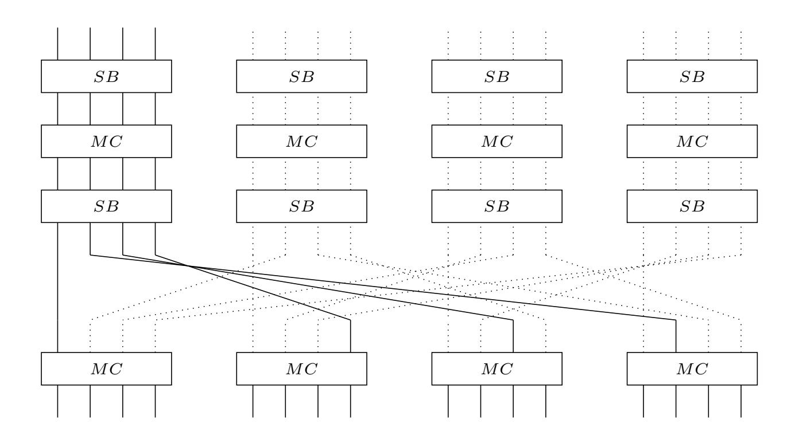
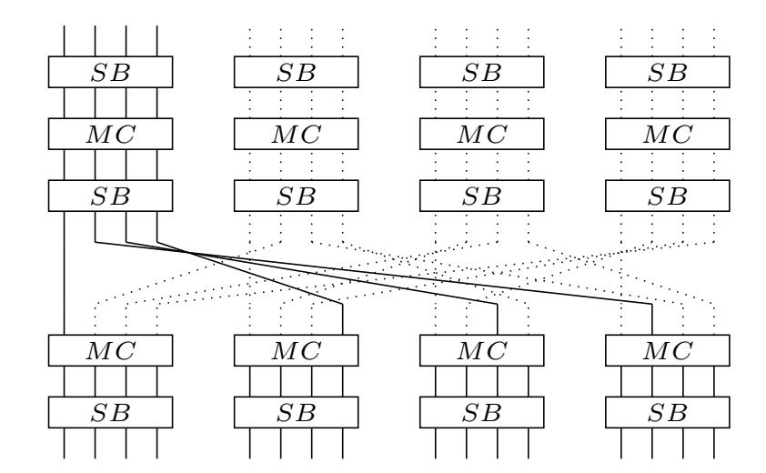
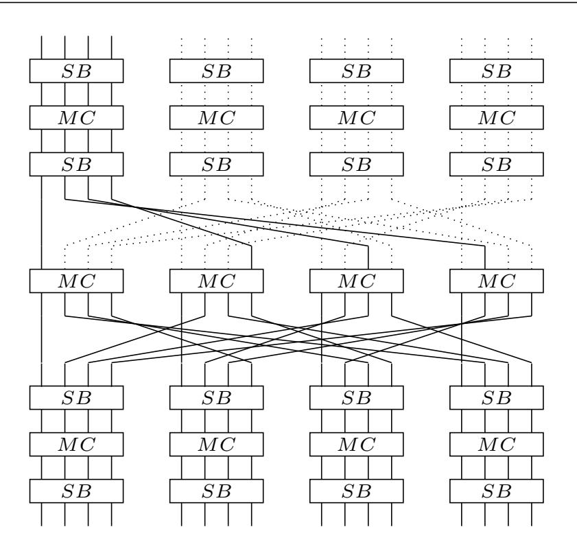
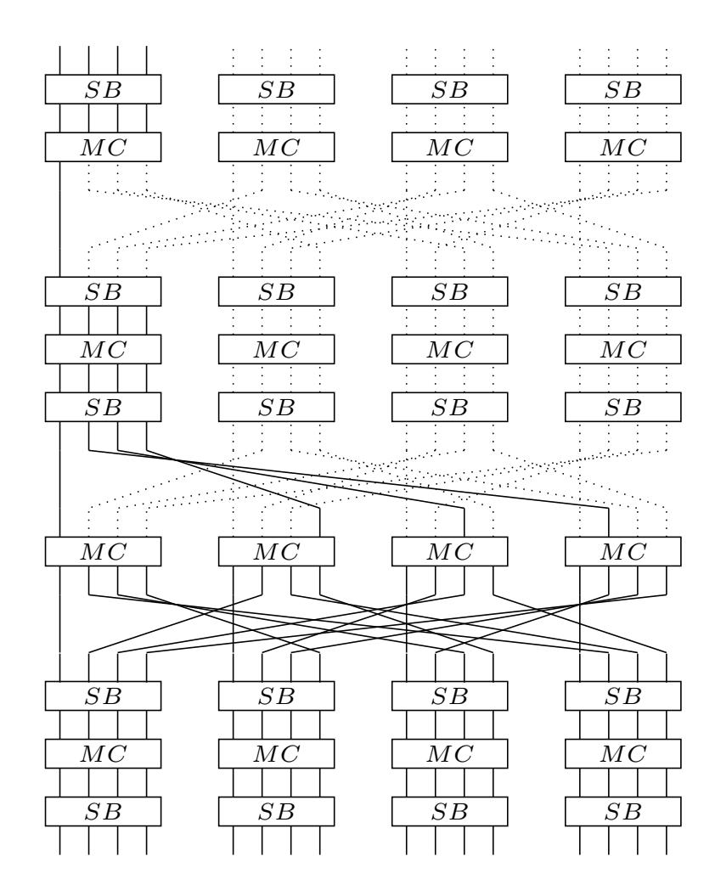
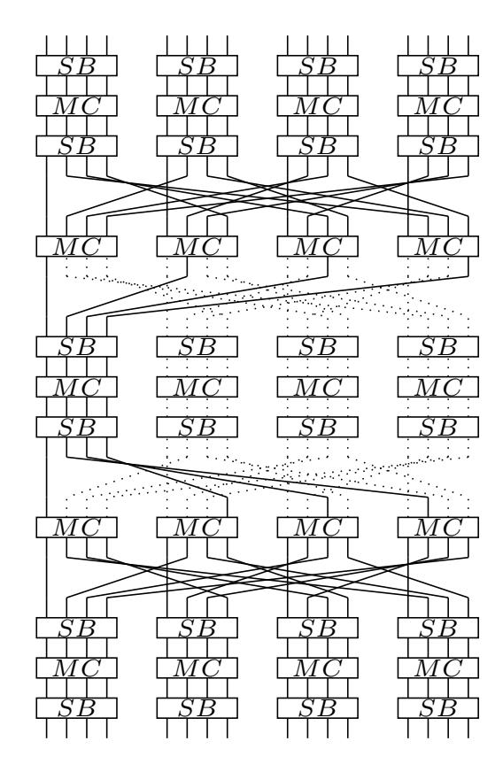

{0}------------------------------------------------

# Yoyo Tricks with AES

Sondre Rønjom1*,*2, Navid Ghaedi Bardeh2, Tor Helleseth2*,*<sup>3</sup>

 Nasjonal sikkerhetsmyndighet, Oslo, Norway Department of Informatics, University of Bergen, Norway Forsvarets Forskningsinstitutt (FFI), Norway firstname.lastname@uib.no

Abstract. In this paper we present new fundamental properties of SPNs. These properties turn out to be particularly useful in the adaptive chosen ciphertext/plaintext setting and we show this by introducing for the first time key-independent *yoyo-distinguishers* for 3- to 5-rounds of AES. All of our distinguishers beat previous records and require respectively 3*,* 4 and 2<sup>25</sup>*.*<sup>8</sup> data and essentially zero computation except for observing differences. In addition, we present the first key-independent distinguisher for 6-rounds AES based on yoyos that preserve impossible zero di↵erences in plaintexts and ciphertexts. This distinguisher requires an impractical amount of 2<sup>122</sup>*.*<sup>83</sup> plaintext/ciphertext pairs and essentially no computation apart from observing the corresponding di↵erences. We then present a very favorable key-recovery attack on 5-rounds of AES that requires only 2<sup>11</sup>*.*<sup>3</sup> data complexity and 2<sup>31</sup> computational complexity, which as far as we know is also a new record. All our attacks are in the adaptively chosen plaintext/ciphertext scenario.

Our distinguishers for AES stem from new and fundamental properties of generic SPNs, including generic SAS and SASAS, that can be used to preserve zero di↵erences under the action of exchanging values between existing ciphertext and plaintext pairs. We provide a simple distinguisher for 2 generic SP-rounds that requires only 4 adaptively chosen ciphertexts and no computation on the adversaries side. We then describe a generic and deterministic yoyo-game for 3 generic SP-rounds which preserves zero di↵erences in the middle but which we are not capable of exploiting in the generic setting.

Keywords: SPN, AES, Zero-Di↵erences, Secret-key distinguisher, Impossible Di↵erences, Key-recovery

# 1 Introduction

Block ciphers are typically designed by iterating an eciently implementable round function many times in the hope that the resulting composition behaves like a randomly drawn permutation. The designer is typically constrained by various practical criterion, e.g. security target, implementation boundaries, and specialised applications, that might lead the designer to introduce symmetries and structures in the round function as a compromise between eciency and 

{1}------------------------------------------------

security. In the compromise, a round function is iterated enough times to make sure that any symmetries and structural properties that might exist in the round function vanish. Thus, a round function is typically designed to increasingly decorrelate with structure and symmetries after several rounds.

Yoyo game cryptanalysis was introduced by Biham et al. in [1] for cryptanalysis of 16 rounds of SKIPJACK. The yoyo game, similarly to Boomerang attacks [2], is based on adaptively making new pairs of plaintexts and ciphertexts that preserve a certain property inherited from the original pair. The ciphertext and/or plaintext space can in this case typically be partitioned into subsets of plaintexts or pairs of plaintexts closed under exchange operations where all pairs in a set satisfy the same property. A typical situation is that a pair of plaintexts and/or ciphertexts satisfy a certain zero di↵erence after a few rounds and where new pairs of ciphertexts and plaintexts that satisfy the same zero di↵erence can be formed simply by swapping words or bytes between the corresponding ciphertexts or plaintexts that preserve the same property. This type of cryptanalysis is typically structural and has previously been particularly successful on Feistel designs. Recently, Biryukov et. al. [3] used the yoyo game to provide generic distinguishers against Feistel Networks with secret round functions up to 7 rounds. Boomerang attacks are quite similar to yoyos and in [4], Biryukov describes 5- and 6-round Boomerang key-recovery attacks on AES. Other types of structural attacks relevant in our setting include *invariant subspace attacks* [5, 6] and *subspace trail cryptanalysis* [7, 8]. Moreover, one may also note the paper by Ferguson et al. [9] and its implied result on 5-round AES.

Low data- and computational-complexity distinguishers and key-recovery attacks on round-reduced block ciphers have recently gained renewed interest in the literature. There are several reasons for this. In one direction cryptanalysis of block ciphers have focused on maximising the number of rounds that can be broken without exhausting the full codebook and key space. This often leads to attacks marginally close to that of pure brute force. These are attacks that typically have been improved over time based on many years of cryptanalysis. The most successful attacks often become de-facto standard methods of cryptanalysis for a particular block cipher and might discourage anyone from pursuing new directions in cryptanalysis that do not reach the same number of rounds. This in itself might hinder new breakthroughs, thus it can be important to investigate new promising ideas that might not have reached their full potential yet. New methods of cryptanalysis that break or distinguish fewer rounds faster and with lower complexity than established cryptanalysis are therefore interesting in this process. Many constructions employ reduced round AES as part of their design. Reduced versions of AES have nice and well-studied properties that can be favorably as components of larger designs (see for instance Simpira [10]). The state of the art analysis of low-complexity cryptanalysis of AES was presented in Bouillaguet et al. [11] and further improved by Derbez et al. [12] using automatic search tools. When it comes to distinguishers, the best attacks on 3-round AES are either based on truncated di↵erentials [13] or integral cryptanalysis [14]. While the integral attack needs 2<sup>8</sup> chosen plaintexts, a truncated di↵erential 

{2}------------------------------------------------

needs 24*.*<sup>3</sup> texts at the expense of a little more computation. When it comes to 4 rounds of AES, an impossible di↵erential attack requires 216*.*<sup>25</sup> chosen plaintexts and roughly the same amount of computation. Then at Crypto 2016, Sun et al. [15] presented the first 5-round key-dependent distinguisher for AES that was later improved to 298*.*<sup>2</sup> chosen plaintexts with 2<sup>107</sup> computations. Later, at Eurocrypt 2017, Grassi et al. [8] proposed a 5-round *key-independent* distinguisher for 5-rounds AES that requires 2<sup>32</sup> chosen texts and computational cost of 235*.*<sup>6</sup> look-ups into memory of size 2<sup>36</sup> bytes with a 99% probability success rate.

### 1.1 Our Contribution

We present for the first time applications of cryptanalysis based on the yoyo game introduced in [1] to generic Substitution Permutation Networks(SPNs) that iterate a generic round function *A S* where *S* is a non-linear layer consisting of at least two concatenated s-boxes and *A* is a generic ane transformation. The s-boxes and ane layers can be all di↵erent. This way it resembles the setting of SAS and SASAS [16] cryptanalysis.

First we provide a generic framework for the yoyo game on generic SPnetworks. Then we show that distinguishing two generic SP rounds with a yoyo game requires encryption and decryption of in total one pair of plaintexts and one pair of ciphertexts respectively and no computational e↵ort on the adversaries part; the distinguisher is purely structural and immediate. We then provide a generic framework for analysing 3 rounds generic SPN which seems to be the maximum possible number of generic rounds achievable with a deterministic yoyo game and a generic SPN. We then apply our generic results to the most well-studied block cipher in use today, AES. Since an even number of AESrounds can be viewed as a generic SPN with half the number of rounds, our 2- and 3-round generic SPN distinguishers apply directly to 4- and 6-rounds of AES. We extend the generic distinguishers to cover 3- and 5-rounds AES in a natural way, including a new secret key recovery for 5 rounds. All of our secret key distinguishers improve on previously published results both in terms of time and data complexity.

### 1.2 Overview of This Paper and Main Results

In Section 2 we analyse generic SPNs formed by iterating a round function consisting of concatenated layers of s-boxes and generic ane linear transformations. In Section 2.1 we describe a simple yoyo distinguisher for two non-secret but generic SPN rounds that is purely structural and requires only one chosen pair of plaintexts and one (adaptively) chosen pair of ciphertexts. The distinguisher involves no computation. In Section 2.2 we describe generic zero di↵erential properties for 3-round SPN that are preserved in a yoyo game. If the di↵erence of a pair of plaintexts (or ciphertexts) is zero in particular words in the middle rounds, then the yoyo game preserves this property and can be used to generate "infinitely" many new pairs with the exact same zero di↵erence pattern in the 

{3}------------------------------------------------

middle rounds with probability 1. The current drawback in the generic setting is that the adversary needs a way to distinguish this condition. In Section 3 we

Table 1. *Comparison of key-recovery on 5 rounds of AES*

| Attack      | Rounds | Data      | Computation Memory |       | Ref.      |
|-------------|--------|-----------|--------------------|-------|-----------|
| MitM        | 5      | 8 CP      | 264                | 256   | [17]      |
| Imp. Polyt. | 5      | 15 CP     | 270                | 241   | [18]      |
| Integral    | 5      | 211 CP    | 245.7              | small | [19]      |
| Imp. Di↵.   | 5      | 231.5 CP  | 233                | 238   | [20]      |
| Boomerang   | 5      | 239 ACC   | 239                | 233   | [4]       |
| Yoyo        | 5      | 211.3 ACC | 231                | small | Sect. 3.5 |

Table 2. *Secret-Key Distinguishers for AES*

| Property     | Rounds | Data        | Cost        | Key-Independent | Ref.      |
|--------------|--------|-------------|-------------|-----------------|-----------|
| Trun. Di↵.   | 3      | 24.3 CP     | 211.5 XOR   | X               | [21, 7]   |
| Integral     | 3      | 28 CP       | 28 XOR      | X               | [14]      |
| Yoyo         | 3      | 3 ACC       | 2 XOR       | X               | Sect. 3.1 |
| Imp. Di↵.    | 4      | 216.25 CP   | 222.3 M     | X               | [20]      |
| Integral     | 4      | 232 CP      | 232 XOR     | X               | [14]      |
| Yoyo         | 4      | 4 ACC       | 2 XOR       | X               | Sect. 3.2 |
| Struct. Di↵. | 5      | 233         | 236.6 M     | X               | [8]       |
| Imp. Di↵.    | 5      | 298.2 CP    | 2107 M      |                 | [7]       |
| Integral     | 5      | 2128 CC     | 2128 XOR    |                 | [15]      |
| Yoyo         | 5      | 225.8 ACC   | 224.8 XOR   | X               | Sect. 3.3 |
| Yoyo         | 6      | 2122.83 ACC | 2121.83 XOR | X               | Sect. 3.4 |

apply our generic results to AES. Two rounds of AES, essentially corresponding to four parallel superboxes and a large linear super-mixlayer, can essentially be viewed as one generic SP-round and thus our generic method can be applied directly to it. We begin Section 3.1 by presenting a simple distinguisher for 3 rounds of AES. It requires one chosen pair of plaintexts and one chosen ciphertext and no computation. Then in Section 3.2 we directly apply the generic yoyo distinguisher presented in Section 2.1 to 4 rounds of AES. It requires one chosen pair of plaintexts and one chosen pair of ciphertexts, and no computation. In Section 3.3 we extend the 4-round yoyo distinguisher to 5 rounds by testing for pairs derived by the yoyo game that obey unusual byte collisions in the plaintext (or ciphertext) di↵erences. Then, in Section 3.4 we apply the theory on 3 generic 

{4}------------------------------------------------

SP-rounds presented in Section 2.2 directly to form the first 6-round AES secret key distinguisher using  $2^{122.83}$  texts derived from multiple yoyo-games.

The current best key-recovery attacks for 5-rounds of AES are found in Table 1, while a list of the current best secret-key distinguishers for 3 to 6 rounds is given in Table 2. We have adopted that the data complexity is measured in minimum number of chosen plaintexts/ciphertexts CP/CC or/and adaptive chosen plaintexts/ciphertexts ACP/ACC. Time complexity is measured in equivalent encryptions (E), memory accesses (M) or XOR operations (XOR) - adopting that 20 M  $\approx$  1 Round of Encryption.

### 2 Yoyo Analysis of Generic SPNs

We start off by analysing permutations on  $\mathbb{F}_q^n$  for  $q=2^k$  of the form

$$F(x) = S \circ L \circ S \circ L \circ S \tag{1}$$

where S is a large s-box formed by concatenating n smaller s-boxes s over  $\mathbb{F}_q$  and where L is a linear transformation acting on elements of  $\mathbb{F}_q^n$ . Notice that our results apply directly to  $S \circ A \circ S \circ A \circ S$  where A are affine transformations, however restricting to linear transformations L slightly simplifies our presentation. We call an element of  $\mathbb{F}_q$  a word and a vector of words  $\alpha = (\alpha_0, \alpha_1, \ldots, \alpha_{n-1}) \in \mathbb{F}_q^n$  is called a state to emphasize that we are thinking of states in a block cipher. A vector of words in  $\mathbb{F}_q^n$  can also be viewed as a list of k-bit vectors of length n. The Hamming weight of a vector  $x = (x_0, x_1, \ldots, x_{n-1})$  is defined as the number of nonzero components in the vector and is denoted by wt(x).

We refer to the small s-boxes operating on words in  $\mathbb{F}_q$  as *component* s-boxes to not confuse them with the large s-box S they are part of and that operates on  $\mathbb{F}_q^n$ .

Two vectors (or a pair of differences of two vectors) that are different can be zero in the same positions, and we will be interested in comparing two differences according to their zero positions so it is useful to define the following.

**Definition 1** (The zero difference pattern). Let  $\alpha \in \mathbb{F}_q^n$  and define the zero difference pattern

$$\nu(\alpha) = (z_0, z_1, \dots, z_{n-1})$$

that returns a binary vector in  $\mathbb{F}_2^n$  where  $z_i = 1$  indicates that  $\alpha_i$  is zero or  $z_i = 0$  otherwise.

The complement of a zero difference pattern is often called *activity pattern* in literature. For a linear transformation L on  $\mathbb{F}_q^n$  we generally do not have that the differences  $\alpha \oplus \beta$  and  $L(\alpha) \oplus L(\beta)$  are zero in the same positions for random values of  $\alpha$  and  $\beta$ . However, permutations S do and the zero difference pattern is thus an invariant of S.

**Lemma 1.** For two states  $\alpha, \beta \in \mathbb{F}_q^n$ , the zero pattern of their difference is preserved through S, hence

$$\nu(\alpha \oplus \beta) = \nu(S(\alpha) \oplus S(\beta)).$$

{5}------------------------------------------------

*Proof.* Since S is a permutation s-box this leads to  $\alpha_i \oplus \beta_i = 0$  if and only if  $s(\alpha_i) \oplus s(\beta_i) = 0$ , thus the pattern vector of the difference is preserved through S.

Although this is rather trivial, we leave it as a lemma for later reference. The following definition is central to the paper.

**Definition 2.** For a vector  $v \in \mathbb{F}_2^n$  and a pair of states  $\alpha, \beta \in \mathbb{F}_q^n$  define a new state  $\rho^v(\alpha, \beta) \in \mathbb{F}_q^n$  such that the i'th component is defined by

$$\rho^{v}(\alpha,\beta)_{i} = \alpha_{i}v_{i} \oplus \beta_{i}(v_{i} \oplus 1).$$

This is equivalent to

$$\rho^{v}(\alpha,\beta)_{i} = \begin{cases} \alpha_{i} & \text{if } v_{i} = 1, \\ \beta_{i} & \text{if } v_{i} = 0. \end{cases}$$

Notice that  $(\alpha', \beta') = (\rho^v(\alpha, \beta), \rho^v(\beta, \alpha))$  is a new pair of states formed by swapping individual words between  $\alpha$  and  $\beta$  according to the binary coefficients of v. From the definition it can be seen that

$$\rho^{v}(\alpha,\beta) \oplus \rho^{v}(\beta,\alpha) = \alpha \oplus \beta. \tag{2}$$

Let  $\overline{v}$  be the complement of v. Note that  $\rho^{\overline{v}}(\alpha,\beta) = \rho^v(\beta,\alpha)$  and therefore  $\{\rho^v(\alpha,\beta),\rho^v(\beta,\alpha))\} = \{\rho^{\overline{v}}(\alpha,\beta),\rho^{\overline{v}}(\beta,\alpha)\}$ , implying that v and  $\overline{v}$  result in the same pair. The maximum number of possible unique pairs  $(\alpha',\beta')$  generated this way is  $2^{n-1}$  (including the original pair). The maximum is only attainable if  $\alpha_i \neq \beta_i$  for all  $0 \leq i < n$ . Assume this is the case. If we restrict v to the  $2^{n-1}$  binary vectors in  $\mathbb{F}_2^n$  with the last coefficient set to 0 we span exactly  $2^{n-1}$  unique pairs, including  $(\alpha,\beta)$ . If  $v=(0,0,0,\ldots,0)$  is avoided, we generate only new pairs  $(\rho^v(\alpha,\beta),\rho^v(\beta,\alpha))$  all unequal to  $(\alpha,\beta)$ .

The function  $\rho^v$  has some interesting properties. We leave the following in as a lemma for further reference.

**Lemma 2.** Let  $\alpha, \beta \in \mathbb{F}_q^n$  and  $v \in \mathbb{F}_2^n$ . Then we have that  $\rho$  commutes with the s-box layer,

$$\rho^v(S(\alpha), S(\beta)) = S(\rho^v(\alpha, \beta))$$

and thus

$$S(\alpha) \oplus S(\beta) = S(\rho^{v}(\alpha, \beta)) \oplus S(\rho^{v}(\beta, \alpha)).$$

*Proof.* S operates independently on individual words and so the result follows trivially from the definition of  $\rho^v$ .

**Lemma 3.** For a linear transformation  $L(x) = L(x_0, x_1, x_2, \dots, x_{n-1})$  acting on n words we have that

$$L(\alpha) \oplus L(\beta) = L(\rho^{v}(\alpha, \beta)) \oplus L(\rho^{v}(\beta, \alpha))$$

for any  $v \in \mathbb{F}_2^n$ .

{6}------------------------------------------------

*Proof.* Due to the linearity of L it follows that  $L(x) \oplus L(y) = L(x \oplus y)$ . Moreover, due to relation (2),  $\rho^{v}(\alpha,\beta) \oplus \rho^{v}(\beta,\alpha) = \alpha \oplus \beta$  and thus  $L(\rho^{v}(\alpha,\beta)) \oplus L(\rho^{v}(\beta,\alpha)) = L(\alpha) \oplus L(\beta)$ .

So from Lemma 3 we have that  $L(\alpha) \oplus L(\beta) = L(\rho^v(\alpha, \beta)) \oplus L(\rho^v(\beta, \alpha))$  and from Lemma 2 we showed that  $S(\alpha) \oplus S(\beta) = S(\rho^v(\alpha, \beta)) \oplus S(\rho^v(\beta, \alpha))$ . This implies that

$$L(S(\alpha)) \oplus L(S(\beta)) = L(S(\rho^{v}(\alpha,\beta))) \oplus L(S(\rho^{v}(\beta,\alpha)))$$
(3)

however it does not generally hold that

$$S(L(\alpha)) \oplus S(L(\beta)) = S(L(\rho^{v}(\alpha,\beta))) \oplus S(L(\rho^{v}(\beta,\alpha))). \tag{4}$$

However it is easy to see that the zero difference pattern does not change when we apply L or S to any pair  $\alpha' = \rho^v(\alpha, \beta)$  and  $\beta' = \rho^v(\beta, \alpha)$ . As described in Lemma 3 we clearly have that

$$\nu(L(\alpha) \oplus L(\beta)) = \nu(L(\rho^{v}(\alpha,\beta)) \oplus L(\rho^{v}(\beta,\alpha)))$$

and the differences are zero in exactly the same positions. For the function S we notice that if the difference between two words  $\alpha_i$  and  $\beta_i$  before a component s-box is zero, then it is also zero after the component s-box. In other words,

$$\nu(S(\alpha) \oplus S(\beta)) = \nu(S(\rho^{v}(\alpha, \beta)) \oplus S(\rho^{v}(\beta, \alpha))).$$

Thus it follows that, although (4) does not hold, we do have that

$$\nu(S(L(\alpha)) \oplus S(L(\beta))) = \nu(S(L(\rho^{v}(\alpha,\beta))) \oplus S(L(\rho^{v}(\beta,\alpha))))$$
 (5)

always holds, i.e. words are zero in exactly the same positions in the difference for any pair  $\alpha' = \rho^v(\alpha, \beta)$  and  $\beta' = \rho^v(\beta, \alpha)$  through L and S.

The yoyo attack is heavily based on the simple result in the lemma below that summarises the properties above.

**Theorem 1.** Let 
$$\alpha, \beta \in \mathbb{F}_q^n$$
 and  $\alpha' = \rho^v(\alpha, \beta), \ \beta' = \rho^v(\beta, \alpha)$  then

$$\nu(S \circ L \circ S(\alpha) \oplus S \circ L \circ S(\beta)) = \nu(S \circ L \circ S(\alpha') \oplus S \circ L \circ S(\beta'))$$

*Proof.* The proof follows from the three steps below:

- Lemma 2 implies that  $S(\alpha) \oplus S(\beta) = S(\alpha') \oplus S(\beta')$ .
- The linearity of L gives  $L(S(\alpha)) \oplus L(S(\beta)) = L(S(\alpha')) \oplus L(S(\beta'))$ .
- Using Lemma 1 it follows, since S is a permutation and preserves the zero difference pattern, that

$$\nu(S(L(S(\alpha))) \oplus S(L(S(\beta)))) = \nu(S(L(S(\alpha'))) \oplus S(L(S(\beta')))).$$

{7}------------------------------------------------

#### 2.1 Yoyo Distinguisher for Two Generic SP-Rounds

Two full generic rounds are equal to  $G_2' = L \circ S \circ L \circ S$ . However, to simplify the presentation, we remove the final linear layer and restrict our attention to

$$G_2 = S \circ L \circ S. \tag{6}$$

We show that  $G_2$  can be distinguished, with probability 1, using two plaintexts and two ciphertexts. The distinguisher is general, in the sense that each of the S and L transformations can be different and does not require any computation on the adversaries part.

The idea is simple. If we fix a pair of plaintexts  $p^0, p^1 \in \mathbb{F}_q^n$  with a particular zero difference pattern  $\nu(p^0 \oplus p^1)$ , then from the corresponding ciphertexts  $c^0 = G_2(p^0)$  and  $c^1 = G_2(p^1)$  we can construct a pair of new ciphertexts  $c'^0$  and  $c'^1$  that decrypt to a pair of new plaintexts  $p'^0, p'^1$  whose difference has exactly the same zero difference pattern. Moreover this is deterministic and holds with probability 1.

**Theorem 2.** (Generic yoyo game for 2-rounds) Let  $p^0 \oplus p^1 \in \mathbb{F}_q^n$ ,  $c^0 = G_2(p^0)$  and  $c^1 = G_2(p^1)$ . Then for any  $v \in \mathbb{F}_2^n$  let  $c'^0 = \rho^v(c^0, c^1)$  and let  $c'^1 = \rho^v(c^1, c^0)$ . Then

$$\nu(G_2^{-1}(c'^0) \oplus G_2^{-1}(c'^1)) = \nu(p'^0 \oplus p'^1)$$
$$= \nu(p^0 \oplus p^1).$$

*Proof.* This follows directly from Equation 3 and we have that

$$L^{-1}(S^{-1}(c^0)) \oplus L^{-1}(S^{-1}(c^1)) = L^{-1}(S^{-1}(\rho^v(c^0, c^1))) \oplus L^{-1}(S^{-1}(\rho^v(c^1, c^0))).$$

Since the differences are equal the r.h.s. difference and the l.h.s. differences are zero in exactly the same words. Thus we must have that  $\nu(G_2^{-1}(c'^0) \oplus G_2^{-1}(c'^1)) = \nu(p^0 \oplus p^1)$ .

By symmetry, the exact same property obviously also holds in the decryption direction.

What Theorem 2 states is that if we pick a pair of plaintexts  $p^0$  and  $p^1$  with a zero difference  $\nu(p^0 \oplus p^1)$ , we can encrypt the pair to a pair of ciphertexts  $c^0$  and  $c^1$ , construct a new set of ciphertexts  $c'^0 = \rho^v(c^0, c^1)$  and  $c'^1 = \rho^v(c^1, c^0)$  (simply interchanging words between the original pair) then decrypt to a pair of new plaintexts with the exact same zero difference pattern. Thus this leaves us with a straight-forward distinguisher that requires two plaintexts and two adaptively chosen ciphertexts. There is no need for any computation on the adversaries part as the result is immediate.

By symmetry we could of course instead have started with a pair of ciphertexts with a given zero difference pattern and instead adaptively picked a new pair of plaintexts that would decrypt to a new pair of ciphertexts whose zero difference pattern corresponds to the first ciphertext pair.

{8}------------------------------------------------

#### 2.2 Analysis of Three Generic SP-Rounds

In this section we show that there is a powerful deterministic difference symmetry in 3 generic SPN rounds, where we cut away the final linear L-layer, and analyse

$$G_3 = S \circ L \circ S \circ L \circ S \tag{7}$$

where we also omit numbering the transformations to indicate that they can be all different.

The three round property follows from the two round property. We have already shown in Theorem 2 that for two states  $\alpha$  and  $\beta$  it follows that

$$\nu(G_2^{-1}(\rho^v(G_2(\alpha), G_2(\beta))) \oplus G_2^{-1}(\rho^v(G_2(\beta), G_2(\alpha)))) = \nu(\alpha \oplus \beta).$$

Since  $G_2$  and  $G_2^{-1}$  have identical forms, it also follows that

$$\nu(G_2(\rho^v(G_2^{-1}(\alpha), G_2^{-1}(\beta))) \oplus G_2(\rho^v(G_2^{-1}(\beta), G_2^{-1}(\alpha)))) = \nu(\alpha \oplus \beta)$$

Also, from Lemma 1 we know that zero difference patterns are preserved through s-box layers S, that is

$$\nu(\alpha \oplus \beta) = \nu(S(\alpha) \oplus S(\beta)).$$

Thus, assuming a particular zero difference pattern in front of the middle S-layer in (7) is equivalent to assuming the same zero difference pattern after it. Hence, the following Theorem follows straightforwardly.

**Theorem 3.** (Generic yoyo game for 3-rounds) Let  $G_3 = S \circ L \circ S \circ L \circ S$ . If  $p^0, p^1 \in \mathbb{F}_q^n$  and  $c^0 = G_3(p^0)$  and  $c^1 = G_3(p^1)$ . Then

$$\nu(G_2(\rho^{v_1}(p^0, p^1)) \oplus G_2(\rho^{v_1}(p^1, p^0))) = \nu(G_2^{-1}(\rho^{v_2}(c^0, c^1)) \oplus G_2^{-1}(\rho^{v_2}(c^1, c^0)))$$

for any  $v_1, v_2 \in \mathbb{F}_2^n$ . Moreover, for any  $z \in \mathbb{F}_2^n$ , let  $R_P(z)$  denote the pairs of plaintexts where  $\nu(G_2(p^0) \oplus G_2(p^1)) = z$  and  $R_C(z)$  the pairs of ciphertexts where  $\nu(G_2^{-1}(c^0) \oplus G_2^{-1}(c^1)) = z$ . Then it follows that

$$(G_3(\rho^v(p^0, p^1)), G_3(\rho^v(p^1, p^0))) \in R_C(z)$$

for any  $(p^0, p^1) \in R_P(z)$  while

$$(G_3^{-1}(\rho^v(c^0,c^1)), G_3^{-1}(\rho^v(c^1,c^0))) \in R_P(z)$$

for any  $(c^0, c^1) \in R_C(z)$ .

Thus, from a single pair of plaintexts  $p_1, p_2$ , we can continuously generate new elements that with probability 1 belong to  $R_C(z)$  and  $R_P(z)$ , which contain exactly the pairs of plaintexts and ciphertexts that have difference pattern z in the middle.

A distinguisher for this requires first to test a number of pairs until there is one that has a particular Hamming weight of the zero difference pattern, then

{9}------------------------------------------------



Fig. 1. Two rounds AES in the super-box representation

try to distinguish this case when it happens. The probability that a random pair of plaintexts has a sum with zero difference pattern containing exactly m zeros (the difference is non-zero in exactly m words) in the middle is  $\binom{n}{m} \frac{(q-1)^{-m}}{q^n}$  where  $q = 2^k$ . Thus we need to test approximately the inverse of that number of pairs to expect to find one correct pair, and thus require that the complexity of any distinguisher which succeeds in detecting the right condition times the number of pairs to be checked is substantially less than brute force.

We leave this case with a small observation. Assume that we have in fact found a pair of plaintexts that belongs to  $R_P(z)$  for a particular zero difference pattern of Hamming weight n-m. In this case we will continuously generate new pairs that are guaranteed to be contained in  $R_P(z)$  and  $R_C(z)$ . However we need a way to distinguish that this is in fact happening. Let A be the affine layer in an SASAS construction. Assume that  $S^{-1}(c_1) = x \oplus z$  while  $S^{-1}(c_2) = y \oplus z$  where  $A^{-1}(x)$  and  $A^{-1}(y)$  are non-zero only in the positions where z is zero, while  $A^{-1}(z)$  is non-zero only in the positions where z is zero. It follows that x and y belong to a linear subspace U of dimension m-n while z must belong to the complementary subspace V of dimension m such that  $U \oplus V = \mathbb{F}_q^n$ . Hence, a problem for further study is to investigate whether  $c_1 \oplus c_2 = S(x \oplus z) \oplus S(y \oplus z)$  for  $x, y \in U$  and  $z \in V$  has particular generic distinguishing properties. A distinguisher for this would of course apply equally well to the plaintext side, i.e.  $p_1 \oplus p_2 = S^{-1}(x' \oplus z') \oplus S^{-1}(y' \oplus z')$  for  $x', y' \in U'$  and  $z' \in V'$ .

# 3 Applications to AES

The round function in AES [19] is most often presented in terms of operations on  $4 \times 4$  matrices over  $\mathbb{F}_q$  where  $q = 2^8$ . One round of AES consists of Sub-

{10}------------------------------------------------

Bytes (SB), ShiftRows (SR), MixColumns (MC) and AddKey (AK). SubBytes applies a fixed 8-bit s-box to each byte of the state, ShiftRows rotates each row a number of times, while MixColumns applies a fixed linear transformation to each column. Four-round AES can be described with the *superbox* representation [22–24] operating on four parallel 32-bit words (or elements of  $\mathbb{F}_{28}^4$ ) instead of bytes where leading and trailing linear layers are omitted for sake of clarity. A similar description of AES is given in [25]. The superbox representation of AES now consists of iterating four parallel keyed 32-bit sboxes and a large linear "super"-layer. Thus while one round is a composition  $AK \circ MC \circ SR \circ SB$ , two rounds of AES is equal to the composition

$$(AK \circ MC \circ SR \circ SB) \circ (AK \circ MC \circ SR \circ SB). \tag{8}$$

Since we are only considering differences, we can leave out AddKey(AK) for sake of clarity. Now since SR commutes with SB we can rewrite (8) as

$$R^{2\prime} = MC \circ SR \circ (SB \circ MC \circ SB) \circ SR. \tag{9}$$

The initial SR has no effect in our analysis, thus we leave it out and only consider

$$R^2 = MC \circ SR \circ (SB \circ MC \circ SB) = MC \circ SR \circ S$$

where  $S = SB \circ MC \circ SB$  constitutes four parallel super-boxes acting independently on 32-bits of the state. In terms of the generic SPN-analysis in the previous section, the state of AES consists of four words where each word contains four bytes. This is equivalent to the superbox [23] representation shown in Figure 1 where the initial ShiftRows has been omitted. Thus, let  $S = SB \circ MC \circ SB$  and  $L = SR \circ MC \circ SR$ . Four rounds of AES can be viewed in a similar way simply by repeating the composition of (9)

$$R^{4\prime} = MC \circ SR \circ S \circ L \circ S \circ SR$$

and we end up with

$$R^4 = S \circ L \circ S \tag{10}$$

if we omit the linear layers before the first and after the last s-box layer. The designers of AES used this representation to provide an elegant proof that the lower bound on the number of active s-boxes over 4 rounds is  $5 \cdot 5 = 25$ . The number of active super-boxes in Figure 3 due to the linear layer L is at least 5, while the minimum number of active s-boxes inside a super-box is also 5 due to the MixColumns matrix, thus the total number of active s-boxes is at least 25.

Similarly, 6 rounds of AES is equal to

$$R^{6\prime} = MC \circ SR \circ S \circ L \circ S \circ L \circ S \circ SR \tag{11}$$

which, when the leading and trailing linear layers are removed, becomes

$$R^6 = S \circ L \circ S \circ L \circ S. \tag{12}$$

{11}------------------------------------------------

Thus two rounds of AES can be viewed as one generic SPN-round consisting of a state-vector of 4 words from  $\mathbb{F}_{28}^4$  consisting of one s-box layer of 4 parallel concatenated superboxes and one large linear layer. Therefore can any even number of rounds be seen as half the number of generic SP rounds. It follows that our generic analysis presented in the previous section applies directly to 4 and 6 rounds of AES.

Since two rounds of AES correspond to one generic SPN-round, our generic analysis on SP-rounds does not cover odd rounds of AES. However, we extend the 2- and 4-round distinguishers by one round in a natural way by exploiting properties of one AES round. The following observation is used to extend our distinguishers to 3 and 5 rounds. First, 3 rounds of AES can be written as  $Q \circ S$  where  $Q = SB \circ MC \circ SR$  by adding a round at the end and 5 rounds of AES can be written as  $S \circ L \circ S \circ Q'$  where  $Q' = SR \circ MC \circ SB$  where a round is added at the beginning of 4 AES rounds. We have again omitted the trailing and leading linear layers. Both our 3-rounds distinguisher and our 5-round distinguishers exploit properties of one AES-round, and in particular the effect of MixColumns in Q and Q'.

**Definition 3.** Let  $Q = SB \circ MC \circ SR$ .

For a binary vector  $z \in \mathbb{F}_2^4$  of weight t let  $V_z$  denote the subspace of  $q^{4\cdot(4-t)}$  states  $x = (x_0, x_1, x_2, x_3)$  formed by setting  $x_i$  to all possible values of  $\mathbb{F}_q^4$  if  $z_i = 0$  or to zero otherwise. Then, for any state  $a = (a_0, a_1, a_2, a_3)$ , let

$$T_{z,a} = \{ Q(a \oplus x) \mid x \in V_z \}.$$

It is important to note that the sets  $T_{z,a}$  in Definition 3 in practice depend on variable round keys xored in between layers which we assume are implicit from the context in which we use them.

Let  $H_i$  denote the image of the it'h word in  $SR(a \oplus x)$  when x is in  $V_z$ . Observe that  $|H_i| = q^{4-t}$ . Then define

$$T_i^{z,a} = SB \circ MC(H_i).$$

Since SB and MC operate on each word individually then  $T_{z,a}$  has  $T_i^{z,a}$  as its *i*'th word.

**Lemma 4.** The set  $T_{z,a}$  satisfies

$$T_{z,a} = T_0^{z,a} \times T_1^{z,a} \times T_2^{z,a} \times T_3^{z,a}$$

where 
$$|T_i^{z,a}| = q^{4-wt(z)}$$
.

*Proof.* In Figure 2 it is easy to see that each word contributes one independent byte to each word after SR. Thus if 4-t words are nonzero, and each word contributes a single independent byte to each word after applying SR, it follows that each word after SR can take on exactly  $q^{4-t}$  independent values. Since  $H_i$  denotes the set of  $q^{4-t}$  possible values that word i can have after SR and MC and SB operate independently and in parallel on words, it follows that  $T_i^{z,a} = SB \circ MC(H_i)$ .

{12}------------------------------------------------

It is not hard to see that the inverse of Q',  $Q'^{-1}$ , enjoys the same property.

We ask the reader to keep one thing in mind. In our analysis, the last  $MC \circ SR$  layers and first SR layers are omitted for simplicity of presentation. Thus, when we say that we swap ciphertexts  $c^0$  and  $c^1$  to form  $c'^0 = \rho^v(c^0, c^1)$  and  $c'^1 = \rho^v(c^1, c^0)$ , then for it to work for the real full round AES, we instead apply the transformation

$$c'^{0} = MC \circ SR(\rho^{v}(SR^{-1} \circ MC^{-1}(c^{0}), SR^{-1} \circ MC^{-1}(c^{1})))$$

and

$$c'^{1} = MC \circ SR(\rho^{v}(SR^{-1} \circ MC^{-1}(c^{1}), SR^{-1} \circ MC^{-1}(c^{0}))).$$

Similarly, when we swap words in the plaintexts we need to account for the extra SR-layer in the full rounds, i.e.

$$p'^{0} = SR^{-1}(\rho^{v}(SR(p^{0}), SR(p^{1})))$$

and

$$p'^{1} = SR^{-1}(\rho^{v}(SR(p^{1}), SR(p^{0}))).$$

All our results, except for the 6-round distinguisher, have been, and are easy, to verify experimentally on a laptop and require only to implement very simple operations. In the following sections we present our results on AES.

Algorithm 1 Swaps the first word where texts are different and returns one text

```
function SIMPLESWAP(x^0, x^1)
```

For the pseudo-codes we use Algorithm 1 to simplify the presentation. If the input pairs are distinct in at least two words, which happens with probability  $(1-2^{-94})$ , then this algorithm always returns a new text. If a pair in fact is equal in exactly three words, then the pair is simply discarded. Since we use a simplified swap operation, we have to go a few more rounds back and forth in the yoyo game to construct pairs, instead of returning all possible swap-pairs at once for a ciphertext pair or plaintext pair.

<sup>&</sup>lt;sup>4</sup> C-code for our attacks can be found at https://github.com/sondrer/YoyoTricksAES.

{13}------------------------------------------------



**Fig. 2.** Three rounds  $SB \circ MC \circ SR \circ S = Q \circ S$ 

### 3.1 Yoyo Distinguisher for Three Rounds of AES

Two rounds of AES correspond to one generic SPN round and can be distinguished trivially. If we consider three full AES rounds minus the linear layer before the first and after the last s-box layer, we have that

$$R^3 = SB \circ MC \circ SR \circ S$$
$$= Q \circ S$$

which is depicted in Figure 2. The basis for our distinguisher is implicit in Lemma 4. Let  $p^0$  and  $p^1$  denote two plaintexts with  $z = \nu(p^0 \oplus p^1)$  and wt(z) = t, i.e. the difference between the plaintexts is zero in t of the words. Due to Lemma 1 we have that  $\nu(S(p^0) \oplus S(p^1)) = \nu(p^0 \oplus p^1)$  thus the zero difference pattern is preserved through the superbox layer S. Then, since  $S(p^0)$  and  $S(p^1)$  can be regarded as two states that differ only in 4-t words, it follows from Lemma 4 that both  $Q(S(p^0)) = c^0$  and  $Q(S(p^1)) = c^1$  belong to the same set  $T_{z,a}$ , which are generally unknown due to the addition of secret keys. However, the ciphertexts themselves span subsets of  $T_{z,a}$ . Since both  $c^0$  and  $c^1$  are in the same set  $T_{z,a}$ , it follows that each word  $c_i^0$  and  $c_i^1$  of  $c^0 = (c_0^0, c_1^0, c_2^0, c_3^0)$  and  $c^1 = (c_0^1, c_1^1, c_2^1, c_3^1)$  are drawn from the same subsets  $T_i^{z,a} \subset \mathbb{F}_q^4$  of size  $q^{4-t}$ . In particular, the set

$$T_{z,a}' = \{c_0^0, c_0^1\} \times \{c_1^0, c_1^1\} \times \{c_2^0, c_2^1\} \times \{c_3^0, c_3^1\}$$

must be a subset of  $T_{z,a}$  of at most size  $2^4$ , where  $\{c_i^0, c_i^1\}$  is a subset of  $T_i^{z,a}$  as shown in Lemma 4. In other words, if we pick any ciphertext  $c' \neq c^0, c^1$  from  $T'_{z,a}$  it follows that  $\nu(Q^{-1}(c') \oplus S(p^0)) = \nu(Q^{-1}(c') \oplus S(p^1)) = \nu(S(p^0) \oplus S(p^1))$  and in particular,  $\nu(R^{-3}(c') \oplus p^0) = \nu(R^{-3}(c') \oplus p^1) = \nu(p^0 \oplus p^1)$ . This implies a straightforward distinguisher for 3 rounds of AES that requires two chosen plaintexts and one adaptively chosen ciphertext. To simplify, the adversary picks two plaintexts  $p^0$  and  $p^1$  that differ in only one word such that  $t = wt(\nu(p^0 \oplus p^1)) = 3$ . The corresponding ciphertexts  $c^0$  and  $c^1$  specify a subset  $T'_{z,a} \subset T_{z,a}$  of size  $2^4$  including the original ciphertexts. Thus if the adversary picks any ciphertext  $c' = \rho^v(c^0, c^1) \in T'_{z,a}$  not equal to  $c^0$  or  $c^1$  and asks for the decryption

{14}------------------------------------------------

### **Algorithm 2** Distinguisher for 3 rounds of AES

```
Input: A pair of plaintext with wt(\nu(p^0\oplus p^1))=3
Output: 1 for an AES, -1 otherwise.

// r-round AES enc/dec without first SR and last SR\circ MC

c^0\leftarrow enc_k(p^0,3),\,c^1\leftarrow enc_k(p^1,3)

c'\leftarrow SIMPLESWAP(c^0,c^1)

p'\leftarrow dec_k(c',3)
\nif \nu(p'\oplus p^1)=\nu(p^0\oplus p^1) then

return 1.
\nelse

return -1\nend if
```



**Fig. 3.** The structure of  $S \circ L \circ S$ 

of it p', then with probability 1 we have that  $\nu(p'\oplus p^0) = \nu(p'\oplus p^1) = \nu(p^0\oplus p^1)$ . Thus the difference of p' and any of the initial plaintexts  $p^i$  is zero in exactly the same words as the initially chosen difference  $p^0\oplus p^1$ . This can only happen at random with probability  $2^{-96}$ .

### 3.2 Yoyo Distinguisher for Four Rounds of AES

In this section we present a remarkably simple and efficient distinguisher for 4-rounds AES. For 4 rounds of AES we simply apply the distinguisher for 2 rounds generic SPN in Section 2.1. Four rounds of AES is equal to

$$R'^4 = MC \circ SR \circ S \circ L \circ S \circ SR$$

where  $S \circ L \circ S$  consists of the "super-layers" in AES. To simplify the notation, we omit the last layer of  $MC \circ SR$  together with the initial SR-layer and apply

{15}------------------------------------------------

#### **Algorithm 3** Distinguisher for 4 rounds of AES

```
Input: A pair of plaintexts with wt(\nu(p^0\oplus p^1))=3
Output: 1 for an AES, -1 otherwise.

// r-round AES enc/dec without first SR and last SR\circ MC

c^0\leftarrow enc_k(p^0,4),\,c^1\leftarrow enc_k(p^1,4)

c'^0\leftarrow SIMPLESWAP(c^0,c^1),\,c'^1\leftarrow SIMPLESWAP(c^1,c^0)

p'^0\leftarrow dec_k(c'^0,4),\,p'^1\leftarrow dec_k(c'^1,4)
\nif \nu(p'^0\oplus p'^1)=\nu(p^0\oplus p^1) then

return 1.
\nelse

return -1\nend if
```

the distinguisher directly to

$$R^4 = S \circ L \circ S.$$

Following Section 2.1, the adversary picks a pair of plaintexts  $p^0$  and  $p^1$  whose difference is zero in exactly t out of four words. The adversary then asks for the encryption of the plaintexts and receives the corresponding ciphertexts  $c^0$  and  $c^1$  and picks a new pair of ciphertexts  $c'^0 = \rho^v(c^0, c^1)$  and  $c'^1 = c'^0 \oplus c^0 \oplus c^1$  for any  $v \in \mathbb{F}_2^4$ . That is, he makes a new pair of ciphertexts simply by exchanging any words between the  $c^0$  and  $c^1$ . The new pair of ciphertexts now decrypts to a pair of new plaintexts  $p'^0$  and  $p'^1$  that has exactly the same zero difference pattern as  $p^0$  and  $p^1$ . By symmetry, the same distinguisher works in the decryption direction.

#### 3.3 Yoyo Distinguisher for Five Rounds of AES

We can extend the 4-round distinguisher to a 5-round distinguisher by combining the 4-round yoyo distinguisher together with the observation used in the 3-rounds distinguisher and described in Lemma 4. We add a round  $MC \circ SB$ , shifting out the SR-layer in that round, at the beginning of 4 rounds  $S \circ L \circ S \circ SR$  and get

$$R^{5} = S \circ L \circ S \circ SR \circ MC \circ SB$$
$$= S \circ L \circ S \circ Q'$$
$$= R^{4} \circ Q'$$

as depicted in Figure 4 where  $Q' = SR \circ MC \circ SB$ . Notice that  $Q'^{-1} = SB^{-1} \circ MC^{-1} \circ SR^{-1}$  enjoys the same property as Q in Lemma 4, though with inverse components. The main idea of our distinguisher is that if the difference between two plaintexts after the first round (essentially after Q') is zero in t out of 4 words, we apply the yoyo game and return new plaintext pairs that are zero in exactly the same words after one round. Then, due to Lemma 4, the plaintexts must reside in the same sets and this is a property we will exploit in our distinguisher. In particular, assume that we have two plaintexts  $p^0$  and  $p^1$  where  $Q'(p^0) \oplus$ 

{16}------------------------------------------------



**Fig. 4.** Five Rounds  $R^4 \circ Q'$ 

 $Q'(p^1)=a^0\oplus a^1$  is zero in 3 out of 4 words. Then since each byte of a word is mapped to distinct words through  $SR^{-1}$ , it follows from Lemma 4 that  $p^0$  and  $p^1$  belongs to the same set  $T_{z,a}=T_0^{z,a}\times T_1^{z,a}\times T_2^{z,a}\times T_3^{z,a}$  for wt(z)=3 and where each set  $T_i^{z,a}\subset \mathbb{F}_q^4$  has size exactly  $q=q^{4-wt(z)}$ . In other words, if a pair of plaintexts  $p^0$  and  $p^1$  encrypt one round (through Q') to a pair of intermediate states whose difference is zero in 3 out of 4 words, then  $p^0$  and  $p^1$  have probability  $q^{-1}$  of having the same value in a particular word. We do not actually know the sets  $T_i^{z,a}$  since they are key-dependent, but we know their size. However, due to the MixColumns matrix M we can add an even more fine grained property and we now explain the last property that we use in our distinguisher. The  $4\times 4$  MixColumns matrix M satisfy  $wt(x)+wt(xM)\geq 5$  for any non-zero  $x\in \mathbb{F}_{2^8}^2$ . In particular, if x has t>0 non-zero bytes, then  $x\cdot M$  has at least 5-t non-zero bytes. In other words, if x has 4-t zeros, then  $x\cdot M$  can not contain t or more zeros. This follows because the total number of non-zero bytes before and after M can not be less than 5, and this therefore means that the total number of zeros before and after M can not be more than 8-5=3. The same property holds for the inverse  $M^{-1}$  of M. We add it as a Lemma for reference.

**Lemma 5.** Let M denote a  $4 \times 4$  MixColumns matrix and  $x \in \mathbb{F}_q^4$ . If t bytes in x are zero, then  $x \cdot M$  or  $x \cdot M^{-1}$  can not contain 4 - t or more zeros.

*Proof.* Follows directly from the well-known properties of M.

{17}------------------------------------------------

### Algorithm 4 Distinguisher for 5 rounds of AES

```
Output: 1 for an AES, -1 otherwise.
  // r-round AES enc/dec without first SR and last SR \circ MC
  cnt1 \leftarrow 0
  while cnt1 < 2^{13.4} \text{ do}
       cnt1 \leftarrow cnt1 + 1
       p^0, p^1 \leftarrow \text{generate random pair with } wt(\nu(p^0 \oplus p^1)) = 3
       cnt2 \leftarrow 0, \, WrongPair \leftarrow False
       while cnt2 < 2^{11.4} & WrongPair = False do
           cnt2 \leftarrow cnt2 + 1
           c^0 \leftarrow enc_k(p^0, 5), c^1 \leftarrow enc_k(p^1, 5)
           c'^0 \leftarrow \text{SIMPLESWAP}(c^0, c^1), c'^1 \leftarrow \text{SIMPLESWAP}(c^1, c^0)
           p'^0 \leftarrow dec_k(c'^0, 5), p'^1 \leftarrow dec_k(c'^1, 5)
           p \leftarrow (p'^0 \oplus p'^1)
           for i from 0 to 3 do
               if wt(\nu(p_i)) \geq 2 then
                    WrongPair \leftarrow True
               end if
           end for
           p^0 \leftarrow \text{SIMPLESWAP}(p'^0, p'^1), p^1 \leftarrow \text{SIMPLESWAP}(p'^1, p'^0)
       end while
       if WrongPair = False then
           return 1.
                                               //Did not find difference with two or more zeros
       end if
  end while
  return -1.
```

Thus, if a pair of plaintexts encrypt one round to a pair of states Q'(a) and Q'(b) that has a zero difference pattern of weight t (only 4-t out of four words are active), we have the following, where  $Q' = SR \circ MC \circ SB$ .

**Theorem 4.** Let a and b denote two states where the zero difference pattern  $\nu(Q'(a) \oplus Q'(b))$  has weight t. Then the probability that any 4-t bytes are simultaneously zero in a word in the difference  $a \oplus b$  is  $q^{t-4}$ . When this happens, all bytes in the difference are zero.

Proof. The proof follows from the explanation above. First of all, it follows from Lemma 4 that two words in the same position of a and b are drawn from a same set  $T_i^{z,a}$  of size  $q^{4-t}$  where wt(z) = t. Thus words in the same positions of a and b are equal with probability  $q^{-(4-t)} = q^{t-4}$ . Since t out of 4 words are zero in  $Q'(a) \oplus Q'(b)$ , we have that t bytes are zero in each word in the difference  $SR^{-1}(a) \oplus SR^{-1}(b)$  at the input to  $SB^{-1} \circ MC^{-1}$ . Due to Lemma 5, it follows that 4-t bytes can not be zero in each word in the difference after  $MC^{-1}$ . This is preserved in the difference through  $SB^{-1}$  and xor with constants.

We now have the machinery to build a distinguisher for 5 rounds of AES. First the adversary picks enough pairs of plaintexts so that he can expect to find one that the difference has exactly t zero words after one round. Let B =

{18}------------------------------------------------

 $MC \circ s^4$  where  $s^4$  denotes the concatenation of 4 copies of the AES s-box. Then  $Q' = SR \circ MC \circ SB$  can be seen as four parallel applications of B, one on each word, composed with ShiftRows. If two words are equal on input to B, they are equal at the output and thus their difference is zero. So the adversary picks pairs whose difference is nonzero in exactly one word. Then he tries enough pairs  $(p^0, p^1)$  until the difference of the output word of the active B contains t zero bytes. When this difference is passed through the SR-layer, it means that t words are zero in the state difference  $Q'(p^0) \oplus Q'(p^1)$ . If he then plays the yoyo game on the next four rounds, the yoyo returns with at most 7 new pairs of plaintexts  $(p'^0, p'^1)$  that satisfy the exact same zero difference pattern after one round. Hence, if the initial pair  $(p^0, p^1)$  satisfy  $z = \nu(Q'(p^0) \oplus Q'(p^1))$ , then each of the new pairs returned by the yoyo obey the same property. In particular, each returned pair of plaintexts obey Theorem 4 which can then be used to distinguish on probability of collisions in bytes of words.

The distinguisher is now straightforward. The probability that a pair  $p^0$  and  $p^1$ , with zero difference pattern of weight 3, is encrypted through Q' (essentially one round) to a pair of states, with zero difference pattern of weight t, can be well approximated by

$$p_b(t) = \binom{4}{t} q^{-t}$$

where  $q = 2^8$ . Thus, in a set of  $p_b(t)^{-1}$  pairs  $\mathcal{P}$  we expect to find one satisfying pair. Now, for each pair in  $\mathcal{P}$  we need a way to distinguish the case when we hit a correct pair. For a random pair of plaintexts, the probability that 4 - t bytes are zero simultaneously in any of the 4 words is roughly

$$4p_b(4-t) = 4 \cdot \binom{4}{t} \cdot q^{t-4}$$

while, for a correct case, it is  $4 \cdot q^{t-4}$ . Hence, for each pair of initial plaintexts in  $\mathcal{P}$ , we need to generate roughly  $p_b(4-t)^{-1}/4$  pairs with the yoyo game to distinguish wrong pairs from the right pair. Thus, in total, the adversary needs to test a set  $\mathcal{P}$  containing at least  $p_b(t)^{-1}$  pairs, and for each pair he needs to generate roughly  $p_b(4-t)^{-1}/4$  new plaintext pairs using the yoyo game. Thus, the total data complexity is

$$2 \cdot (p_b(t)^{-1} \cdot (4 \cdot p_b(4-t))^{-1}) = \frac{p_b(t)^{-1} \cdot p_b(4-t)^{-1}}{2}.$$

For  $t \in \{1,3\}$  we get a data complexity of  $2^{27}$  while for t=2 we get away with roughly  $2^{25.8}$ . Since the yoyo returns at most 7 new pairs per plaintext pair, we have to repeat the yoyo on new received plaintext pairs by applying the swaptechnique in Definition 2 to new plaintexts back and forth over 5 rounds until enough pairs are gathered. Thus, the adversary can always continue the test a few times on a right pair to ensure that the condition is met, but this does not contribute to the overall data complexity.

{19}------------------------------------------------



**Fig. 5.** Six Rounds  $S \circ L \circ S \circ L \circ S$ 

#### 3.4 Impossible Differential Yoyo Distinguisher for 6 Rounds

In this section we present for the first time a secret key distinguisher for 6 rounds of AES that requires  $2^{122.83}$  adaptively chosen plaintexts and ciphertexts. We apply the 3-rounds yoyo game described in Section 2.2 for generic SPNs directly to 6 rounds of AES in the superbox form  $R^6 = S \circ L \circ S \circ L \circ S$  where S is a superbox and  $L = SR \circ MC \circ SR$  is the linear superlayer. In Section 2.2, we were unable to come up with a generic distinguisher for 3 generic SP-rounds. However, for AES we can exploit impossible zero difference conditions induced by the L layer. Moreover, we use the fact that the total number of active super-boxes over four full AES rounds is at least 5 (see for instance [23]). This also means that the minimal number of active words over the first  $L \circ S$  layer is 5. Moreover, if we pick a pair of plaintexts  $(p^0, p^1)$  whose difference is zero in exactly two words after  $L \circ S$ , it follows that the plaintexts themselves must differ in at least three words since the total number of active words is at least 5. In other words, a pair of plaintexts with a difference containing two zero-words can not partially decrypt through the inverse of  $L \circ S$  to a pair whose difference is zero in two or more words also. Now, if a pair of plaintexts  $(p^0, p^1)$  partially encrypt through  $L \circ S$ to a pair of states that are zero in two words with zero difference pattern z, then using the yoyo game on new ciphertext and plaintext pairs back and forth generates "infinitely" many pairs that have the exact same zero difference pattern after  $L \circ S$ . But since  $\nu(L \circ S(p^0) \oplus L \circ S(p^1)) = \nu(S \circ L \circ S(p^0) \oplus S \circ L \circ S(p^1)) = z$ , it follows that the difference between pairs of ciphertexts can not contain two or more zero-words either. Hence, if the adversary has one pair of plaintexts  $(p^0, p^1)$  that satisfy  $\nu(L \circ S(p^0) \oplus L \circ S(p^1)) = 2$ , he can generate as many new pairs of plaintext and ciphertext pairs as he wants using the yoyo, and all of

{20}------------------------------------------------

#### **Algorithm 5** Distinguisher for 6 rounds of AES

```
Input: Set \mathcal{P} contains 2^{61.4} plaintext pairs (p^0, p^1)
Output: 1 for an AES, -1 otherwise.
  // r-round AES enc/dec without first SR and last SR \circ MC
  for (p^0, p^1) \in \mathcal{P} do
       WrongPair \leftarrow False, counter \leftarrow 0
      while counter < 2^{60.4} & WrongPair = False do
           if wt(\nu(p^0 \oplus p^1)) \ge 2 then
               WrongPair \leftarrow True
                                                                   //Too many zeros in difference
           end if
           c^0 \leftarrow enc_k(p^0, 6), c^1 \leftarrow enc_k(p^1, 6)
           if wt(\nu(c^0 \oplus c^1)) \geq 2 then
               WrongPair \leftarrow True
                                                                    //Too many zeros in difference
           end if
           c'^0 \leftarrow \text{SimpleSWAP}(c^0, c^1), c'^1 \leftarrow \text{SimpleSWAP}(c^1, c^0)
           p'^0 \leftarrow dec_k(c'^0, 6), p' \leftarrow dec_k(c'^1, 6)
           p^0 \leftarrow \text{SIMPLESWAP}(p'^0, p'^1), p^1 \leftarrow \text{SIMPLESWAP}(p'^1, p'^0)
           counter \leftarrow counter + 1
       end while
       if WrongPair = False then
           return 1.
      end if
  end for
  return -1.
```

these will have the exact same zero difference in the middle. Moreover, none of these plaintext and ciphertext pairs can ever collide in two or more words. This suggests a simple, though impractical, distinguisher for 6 rounds of AES.

First we have that  $wt(\nu(L\circ S(p^0)\oplus L\circ S(p^1)))=t$  with a probability  $\binom{4}{t}(2^{32}-1)^{4-t}/2^{32\cdot 4}$  that can be well approximated by

$$p_w(t) = \binom{4}{t} 2^{-t \cdot 32}$$

for a random pair of plaintexts. If the pair is correct, there is generally a

$$p_w(4-t) = {4 \choose 4-t} 2^{(4-t)\cdot(-32)}$$

probability of a collision in 4-t words at the same time in either the ciphertext or the plaintext. Thus by testing both plaintext and ciphertext pairs, the probability becomes  $2 \cdot p_w(4-t)$  that the difference of random pairs of plaintexts or ciphertexts are zero in 4-t words. But this is impossible in AES for right pairs, since the total number of zero words in the differences  $p^0 \oplus p^1$  and  $L \circ S(p^0) \oplus L \circ S(p^1)$  can not be more than 3 due to the *L*-layer. Thus a straightforward distinguisher is as follows. We prepare  $p_w(t)^{-1}$  pairs in a set  $\mathcal{P}$ . For each 

{21}------------------------------------------------

pair, we run the yoyo game back and forth until we have generated  $\frac{p_w(4-t)^{-1}}{2}$  pairs. If there is a collision in 4-t words we discard the pair from  $\mathcal{P}$  and continue with a new pair until there are no such collisions. In that case, we conclude a success for the distinguisher. The total data complexity of the 6-rounds distinguisher is

$$D(t) = p_w(t)^{-1} \cdot p_w(4-t)^{-1}$$

where the lowest data-complexity is found by setting t = 2 such that  $D(t) = 2^{122.83}$ .

This is as far as we know the first 6-round secret key distinguisher for AES that does not use the full codebook. Philosophically, one could argue that  $2 \cdot r$  AES-rounds should exhibit the same properties as r generic SP-round consisting of four s-boxes and one large linear layer. However, to conclude that 6 rounds of AES is weaker than the 3 rounds generic SP, requires a deeper study of the 3-rounds yoyo game in Section 2.1.

### 3.5 A 5-Round Key Recovery Yoyo on AES

The 5-round key-recovery is formed by adding a round  $Q' = SR \circ MC \circ SB$  in front of  $S \circ L \circ S$ , just like in Section 3.3, and aim at finding the first round-key xored in front of  $R^5 = S \circ L \circ S \circ Q$ . The MixColumns matrix M in AES is defined by the circular matrix

$$\left[\begin{array}{ccccc} \alpha & \alpha \oplus 1 & 1 & 1 \ 1 & \alpha & \alpha \oplus 1 & 1 \ \alpha \oplus 1 & 1 & 1 & \alpha \end{array}\right].$$

The function  $MC \circ SB$  works on each word of the state independently, thus assume we pick two pairs of plaintexts  $p^0$  and  $p^1$  where the first words are given by  $p_0^0 = (0, i, 0, 0)$  and  $p_0^1 = (z, z \oplus i, 0, 0)$  where z is a random non-zero element of  $\mathbb{F}_q$ . The three other words are equal for the two plaintexts. Let  $k_0 = (k_{0,0}, k_{0,1}, k_{0,2}, k_{0,3})$  denote the key-bytes XORed with the first word of the plaintext. Then the difference between the first words after the partial encryption of the two plaintexts through  $MC \circ SB \circ AK$  becomes

$$\alpha b_0 \oplus (\alpha \oplus 1)b_1 = y_0$$
$$b_0 \oplus \alpha b_1 = y_1$$
$$b_0 \oplus b_1 = y_2$$
$$(\alpha \oplus 1)b_0 \oplus b_1 = y_3.$$

where  $b_0 = s(k_{0,0}) \oplus s(z \oplus k_{0,0})$  and  $b_1 = s(k_{0,1} \oplus z \oplus i) \oplus s(k_{0,1} \oplus i)$ , where s(x) is the AES-sbox. Since the plaintexts are equal in the last two bytes, this part cancels out in the difference. In particular, if we look at the third equation,

$$s(k_{0,0}) \oplus s(z \oplus k_{0,0}) \oplus s(k_{0,1} \oplus z \oplus i) \oplus s(k_{0,1} \oplus i) = y_2$$

{22}------------------------------------------------

it is not hard to see that it is zero for  $i \in \{k_{0,0} \oplus k_{0,1}, z \oplus k_{0,0} \oplus k_{0,1}\}$ . Thus, if we let i run through all values of  $\mathbb{F}_q$ , we are guaranteed that there are at least two values for which the third equation is zero.

We prepare a set  $\mathcal{P}$  of plaintext pairs as follows. For each i, generate a pair of plaintexts  $p^0$  and  $p^1$  where the first word of  $p^0$  is  $p_0^0 = (0, i, 0, 0)$  while the first word in the second text is  $p_0^1 = (z, z \oplus i, 0, 0)$ . Then encrypt this pair with five rounds to ciphertexts  $c^0$  and  $c^1$ . Then pick 5 new ciphertext pairs  $c'^0, c'^1 = (\rho^v(c^0, c^1), \rho^v(c^1, c^0))$  and return the corresponding plaintexts  $p'^0$  and  $p'^1$ . If a pair is of the correct form, the first words of  $p'^0$  and  $p'^1$  will satisfy

$$M \circ s^4(p_0^{\prime 0} \oplus k_0) \oplus M \circ s^4(p_0^{\prime 1} \oplus k_0) = (z_0, z_1, 0, z_3)$$
 (13)

where M is the MC matrix and  $s^4$  is the concatenation of 4 parallel s-boxes. The adversary can now test each of the  $2^{24}$  remaining candidate keys and determines whether the third coordinate in (13) is zero for all 5 pairs of plaintexts returned by the yoyo, where we already known that  $k_{0,0} \oplus k_{0,1} \in \{i, i \oplus z\}$  for known values i and z. This equation holds for all 5 pairs at random with probability  $2^{-8.5} = 2^{-40}$  thus a false positive might occur with probability  $2^{-16}$  when testing  $2^{24}$  keys. In practice, the adversary can always remove uncertainty by generating a few more pairs when the test succeeds on the first five pairs, since this happens rarely and does not affect the total data complexity per attack. Thus, the total number of adaptively chosen plaintexts needed for finding a correct pair is  $2^8 \cdot 5$  pairs, which corresponds to

$$D = 2 \cdot 2^8 \cdot 5 \approx 2^{11}$$

ciphertexts and plaintexts.

For the total computational complexity, testing key guesses for one set should be  $2^{24}$  instead of  $2 \cdot 2^{24}$ , because it is sufficient to test  $k_{0,1} = k_{0,0} \oplus i$  and there is no need to test  $k_{0,1} = k_{0,0} \oplus i \oplus z$ , considering i will run over all  $2^8$  possible values and  $k_{0,0}$  also runs over all  $2^8$  possible values. This corresponds to  $2^{29.3}$  s-box look-ups because to check that the third component in equation (13) is zero for each key on 5 pairs one needs  $2 \cdot 4$  s-box look-ups for each of the 5 pairs. This has to be done  $2^8$  times, one run for each pair in  $\mathcal{P}$ . Thus the total number of s-box look-ups corresponds to  $2^{24} \cdot 2 \cdot 4 \cdot 5 \cdot 2^8 = 2^{29.3+8} = 2^{37.3}$ . This roughly corresponds to  $2^{31}$  5-rounds of AES where we assume that one round costs 16 s-box lookups. Notice that when we have found one of the correct subkeys, it is trivial (and extremely efficient) to determine the rest of the subkeys.

Since the adversary now knows the first subkey  $k_0$ , he can make a pair of words  $a'_0, b'_0 \in \mathbb{F}^4_{28}$  that differ only in their first byte. He then makes a new pair by first applying the inverse MixColumns matrix  $M^{-1}$  and then applying the inverse s-box to each byte of the pair of words. Finally he XORs the first subkey  $k_0$  to each word which results in a pair of words  $a_0$  and  $b_0$ . He can now make a pair of full plaintexts  $p^0 = (a_0, 0, 0, 0)$  and  $p^1 = (b_0, 0, 0, 0)$  (they must be equal in the last three words) whose difference after  $SR \circ MC \circ SB \circ AK$  is guaranteed to be non-zero in only the first word. However, this first initial pair of plaintexts  $p^0$  and  $p^1$  is useless for recovering the remaining subkeys since they

{23}------------------------------------------------

### Algorithm 6 Key recovery for 5 rounds of AES

```
Input: Set \mathcal{P} contains 2^8 plaintext pairs (p^0, p^1) where p_0^0 = (0, i, 0, 0) and p_0^1 =
   (1, 1 \oplus i, 0, 0) for i = 0, ..., 2^8 - 1 (p_j^0 = p_j^1 = 0) for j = 1, 2, 3)
Output: Secret key k_0
   // r-round AES enc/dec without first SR and last SR \circ MC
  for i from 0 to 2^8 - 1 do
       p^0 \leftarrow 0, \, p^1 \leftarrow 0
                                                                                  //initialize to all zero state
       p_0^0 \leftarrow (0, i, 0, 0), p_0^1 \leftarrow (1, 1 \oplus i, 0, 0)
        \mathcal{S} \leftarrow \{(p^0, p^1)\}
        while len(S) < 5 do
                                                                           //generate 4 new plaintext pairs
            c^0 \leftarrow enc_k(p^0, 5), c^1 \leftarrow enc_k(p^1, 5)
            c'^0 \leftarrow \text{SIMPLESWAP}(c^0, c^1), c'^1 \leftarrow \text{SIMPLESWAP}(c^1, c^0)
            p'^0 \leftarrow dec_k(c'^0, 5), p'^1 \leftarrow dec_k(c'^1, 5)

p^0 \leftarrow \text{SIMPLESWAP}(p'^0, p'^1), p^1 \leftarrow \text{SIMPLESWAP}(p'^1, p'^0)
            \mathcal{S} \leftarrow \mathcal{S} \cup \{(p^0, p^1)\}
        end while
       for all 2^{24} remaining key candidates k_0 do
            for all (p^0, p^1) \in \mathcal{S} do
                  //Check if third equation l_3(a \oplus b) = 0 in (13) holds
                 if l_3(s^4(p_0^0 \oplus k_0) \oplus s^4(p_0^1 \oplus k_0)) \neq 0 then
                      break and jump to next key
                 end if
            end for
                                                       //Eq. 13 is zero for all values and k_0 is correct
            return k_0;
        end for
   end for
```

are equal in the three last words. But the adversary can now use this initial pair to generate m new plaintext pairs  $p'^0$  and  $p'^1$  using the yoyo that are with high probability different in their three last words and satisfy the same condition after  $SR \circ MC \circ SB \circ AK$ . In particular,  $MC \circ SB \circ AK(p'^0) \oplus MC \circ SB \circ AK(p'^1)$  has exactly one active byte in each word which yields simple relations that can be used for recovering the remaining subkeys. If we continue with attacking the second subkey  $k_1$ , it follows that each of the m pairs returned by the yoyo now satisfy a relation

$$M \circ s^4(p_1^{\prime 0} \oplus k_1) \oplus M \circ s^4(p_1^{\prime 1} \oplus k_1) = (0, w, 0, 0)$$
 (14)

for an unknown plaintext pair dependent variable w and fixed  $k_1$ . Since (14) holds, we must also have that the relation

$$M^{-1} \cdot (0, w, 0, 0) = w \cdot (\alpha_0, \alpha_1, \alpha_2, \alpha_3) = s^4(p_1^{\prime 0} \oplus k_1) \oplus s^4(p_1^{\prime 1} \oplus k_1)$$
 (15)

holds for an unknown variable w and known values  $(\alpha_0, \alpha_1, \alpha_2, \alpha_3)$  determined by the second column in  $M^{-1}$ . Thus, when one keybyte of  $k_1$  is guessed, the remaining keybytes are determined by simple relations between byte values in Equation 15 and leaves out at most spending  $4 \cdot 2^8$  guesses to find the correct 

{24}------------------------------------------------

key. The remaining subkeys are found by solving similar equations determined by the cyclically equivalent columns of *M*1.

The adversary needs at least 2 pairs of plaintexts to recover a unique solution for one of the remaining subkeys. However, since he is recovering 3 subkeys at once, and wants all of them to be correct, he should test the solutions against 4 pairs to leave a comfortable margin against false positives in repeated attacks. Thus, since the first initial pair is useless, the adversary typically uses 5 pairs to recover the full key with a comfortable margin. However, even if the attacker brute-forced each 32-bit subkey individually against the relations in (15) above it would not a↵ect the total complexity. Thus, guessing the remaining subkeys does not add to the total time and data complexity, and so recovering the full round key is dominated by guessing the first subkey which costs roughly 2<sup>31</sup> 5 round AES encryptions and 211*.*<sup>32</sup> adaptively chosen ciphertexts and plaintexts (corresponding to 210*.*<sup>32</sup> pairs).

# 4 Conclusion

In this paper we describe new and fundamental properties of SPNs. Our new analysis show that AES is particularly susceptible to adaptive cryptanalysis for up to 6 rounds. We emphasize this by providing new key-independent secret key distinguishers for 3- to 5-rounds AES that breaks all previous records in the literature, in addition to the first key-independent secret-key distinguisher for 6-rounds AES. In addition, we have described a 5-round secret key recovery that requires only 2<sup>11</sup>*.*<sup>3</sup> plaintexts/ciphertexts and 2<sup>31</sup> computations. Our results apply directly to similar designs and opens up the way for new and interesting applications in cryptanalysis.

*Acknowledgements.* We thank the anonymous reviewers for their valuable comments and suggestions. This Research was supported by the Norwegian Research Council.

# References

- 1. Biham, E., Biryukov, A., Dunkelman, O., Richardson, E., Shamir, A.: Initial Observations on Skipjack: Cryptanalysis of Skipjack-3XOR. In: Selected Areas in Cryptography: 5th Annual International Workshop, SAC'98 Kingston, Ontario, Canada, August 17–18, 1998 Proceedings, Berlin, Heidelberg, Springer Berlin Heidelberg (1999) 362–375
- 2. Wagner, D.: The Boomerang Attack. In: Fast Software Encryption: 6th International Workshop, FSE'99 Rome, Italy, March 24–26, 1999 Proceedings, Berlin, Heidelberg, Springer Berlin Heidelberg (1999) 156–170
- 3. Biryukov, A., Leurent, G., Perrin, L.: Cryptanalysis of Feistel Networks with Secret Round Functions. In: Selected Areas in Cryptography – SAC 2015: 22nd International Conference, Sackville, NB, Canada, August 12–14, 2015, Revised Selected Papers, Cham, Springer International Publishing (2016) 102–121

{25}------------------------------------------------

- 4. Biryukov, A.: The Boomerang Attack on 5 and 6-round Reduced AES. In: Proceedings of the 4th International Conference on Advanced Encryption Standard. AES'04, Berlin, Heidelberg, Springer-Verlag (2005) 11–15
- 5. Leander, G., Abdelraheem, M.A., AlKhzaimi, H., Zenner, E.: A Cryptanalysis of PRINTcipher: The Invariant Subspace Attack. In: Advances in Cryptology – CRYPTO 2011: 31st Annual Cryptology Conference, Santa Barbara, CA, USA, August 14-18, 2011. Proceedings, Berlin, Heidelberg, Springer Berlin Heidelberg (2011) 206–221
- 6. Leander, G., Minaud, B., Rønjom, S.: A Generic Approach to Invariant Subspace Attacks: Cryptanalysis of Robin, iSCREAM and Zorro. In: Advances in Cryptology – EUROCRYPT 2015: 34th Annual International Conference on the Theory and Applications of Cryptographic Techniques, Sofia, Bulgaria, April 26-30, 2015, Proceedings, Part I, Berlin, Heidelberg, Springer Berlin Heidelberg (2015) 254–283
- 7. Grassi, L., Rechberger, C., Rønjom, S.: Subspace Trail Cryptanalysis and its Applications to AES. IACR Trans. Symmetric Cryptol. 2016(2) (2016) 192–225
- 8. Grassi, L., Rechberger, C., Rønjom, S.: A New Structural-Di↵erential Property of 5-Round AES. In: Advances in Cryptology – EUROCRYPT 2017: 36th Annual International Conference on the Theory and Applications of Cryptographic Techniques, Paris, France, April 30 – May 4, 2017, Proceedings, Part II, Cham, Springer International Publishing (2017) 289–317
- 9. Ferguson, N., Kelsey, J., Lucks, S., Schneier, B., Stay, M., Wagner, D., Whiting, D.: Improved Cryptanalysis of Rijndael. In Goos, G., Hartmanis, J., van Leeuwen, J., Schneier, B., eds.: Fast Software Encryption: 7th International Workshop, FSE 2000 New York, NY, USA, April 10–12, 2000 Proceedings, Berlin, Heidelberg, Springer Berlin Heidelberg (2001) 213–230
- 10. Gueron, S., Mouha, N.: Simpira v2: A Family of Ecient Permutations Using the AES Round Function. In Cheon, J.H., Takagi, T., eds.: Advances in Cryptology – ASIACRYPT 2016: 22nd International Conference on the Theory and Application of Cryptology and Information Security, Hanoi, Vietnam, December 4-8, 2016, Proceedings, Part I, Berlin, Heidelberg, Springer Berlin Heidelberg (2016) 95–125
- 11. Bouillaguet, C., Derbez, P., Dunkelman, O., Fouque, P.A., Keller, N., Rijmen, V.: Low-Data Complexity Attacks on AES. IEEE Transactions on Information Theory 58(11) (Nov 2012) 7002–7017
- 12. Derbez, P., Fouque, P.A.: Automatic Search of Meet-in-the-Middle and Impossible Di↵erential Attacks. In: Advances in Cryptology – CRYPTO 2016: 36th Annual International Cryptology Conference, Santa Barbara, CA, USA, August 14-18, 2016, Proceedings, Part II, Berlin, Heidelberg, Springer Berlin Heidelberg (2016) 157–184
- 13. Knudsen, L.R.: Truncated and higher order di↵erentials. In: Fast Software Encryption: Second International Workshop Leuven, Belgium, December 14–16, 1994 Proceedings, Berlin, Heidelberg, Springer Berlin Heidelberg (1995) 196–211
- 14. Daemen, J., Knudsen, L.R., Rijmen, V., et al.: The Block Cipher Square. In: Fse. Volume 97. (1997) 149–165
- 15. Sun, B., Liu, M., Guo, J., Qu, L., Rijmen, V.: New Insights on AES-Like SPN Ciphers. In Robshaw, M., Katz, J., eds.: Advances in Cryptology – CRYPTO 2016: 36th Annual International Cryptology Conference, Santa Barbara, CA, USA, August 14-18, 2016, Proceedings, Part I, Berlin, Heidelberg, Springer Berlin Heidelberg (2016) 605–624
- 16. Biryukov, A., Shamir, A.: Structural Cryptanalysis of SASAS. Journal of Cryptology 23(4) (2010) 505–518

{26}------------------------------------------------

- 17. Derbez, P.: Meet-in-the-middle on AES. In: PhD Thesis, Ecole normale supieure de Paris - ENS Paris, 2013. (2013)
- 18. Tiessen, T.: Polytopic Cryptanalysis. In Fischlin, M., Coron, J.S., eds.: Advances in Cryptology – EUROCRYPT 2016: 35th Annual International Conference on the Theory and Applications of Cryptographic Techniques, Vienna, Austria, May 8-12, 2016, Proceedings, Part I, Berlin, Heidelberg, Springer Berlin Heidelberg (2016) 214–239
- 19. Daemen, J., Rijmen, V.: The Design of Rijndael: AES The Advanced Encryption Standard. In: Springer. (2002)
- 20. Biham, E., Keller, N.: Cryptanalysis of reduced variants of Rijndael. In: 3rd AES Conference. Volume 230. (2000)
- 21. Biryukov, A., Khovratovich, D.: Two New Techniques of Side-Channel Cryptanalysis. In: CHES. Volume 4727 of Lecture Notes in Computer Science., Springer (2007) 195–208
- 22. Rijmen, V.: Cryptanalysis and design of iterated block ciphers. Doctoral Dissertation, K.U.Leuven (1997)
- 23. Daemen, J., Rijmen, V.: Plateau characteristics. IET Information Security 1(1) (2007) 11–17
- 24. Daemen, J., Rijmen, V.: Understanding Two-Round Di↵erentials in AES. In: Security and Cryptography for Networks: 5th International Conference, SCN 2006, Maiori, Italy, September 6-8, 2006. Proceedings, Berlin, Heidelberg, Springer Berlin Heidelberg (2006) 78–94
- 25. Gilbert, H.: A Simplified Representation of AES. In Sarkar, P., Iwata, T., eds.: Advances in Cryptology – ASIACRYPT 2014: 20th International Conference on the Theory and Application of Cryptology and Information Security, Kaoshiung, Taiwan, R.O.C., December 7-11, 2014. Proceedings, Part I, Berlin, Heidelberg, Springer Berlin Heidelberg (2014) 200–222