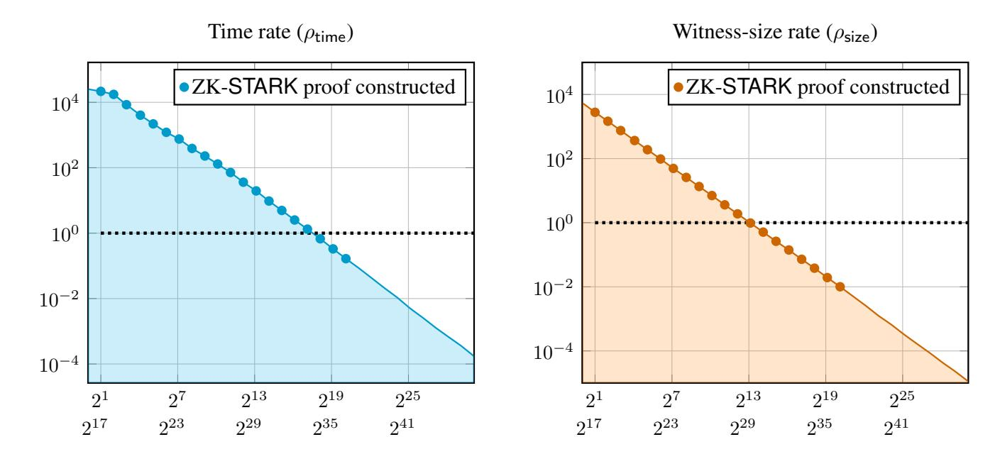
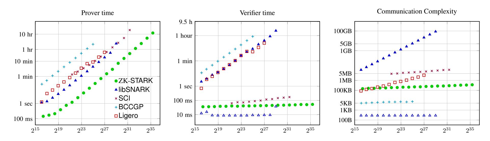
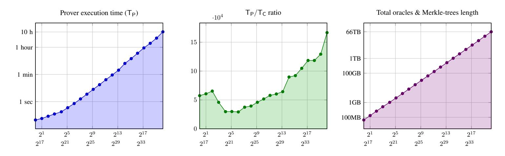
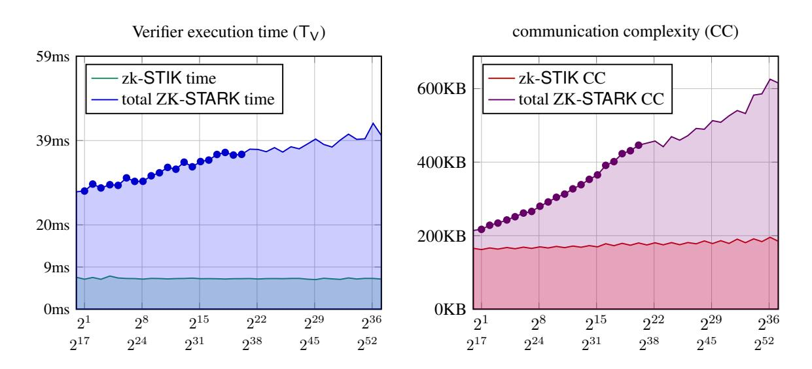
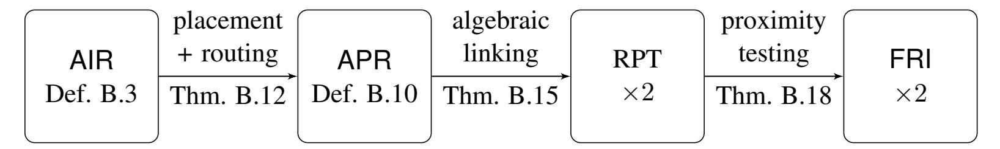
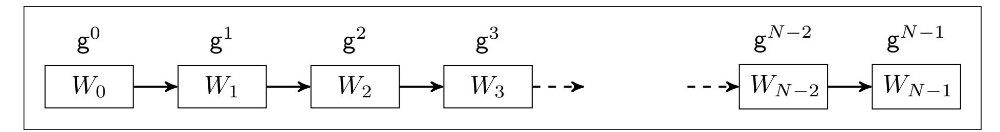

{0}------------------------------------------------

# Scalable, transparent, and post-quantum secure computational integrity

Eli Ben-Sasson\* Iddo Bentov† Yinon Horesh\* Michael Riabzev\* March 6, 2018

#### Abstract

Human dignity demands that personal information, like medical and forensic data, be hidden from the public. But veils of secrecy designed to preserve privacy may also be abused to cover up lies and deceit by institutions entrusted with Data, unjustly harming citizens and eroding trust in central institutions.

Zero knowledge (ZK) proof systems are an ingenious cryptographic solution to this tension between the ideals of personal *privacy* and institutional *integrity*, enforcing the latter in a way that does not compromise the former. Public trust demands *transparency* from ZK systems, meaning they be set up with no reliance on any trusted party, and have no trapdoors that could be exploited by powerful parties to bear false witness. For ZK systems to be used with Big Data, it is imperative that the public verification process scale sublinearly in data size. Transparent ZK proofs that can be verified *exponentially* faster than data size were first described in the 1990s but early constructions were impractical, and no ZK system realized thus far in code (including that used by crypto-currencies like Zcash™) has achieved *both* transparency and exponential verification speedup, simultaneously, for general computations.

Here we report the first realization of a transparent ZK system (ZK-STARK) in which verification scales exponentially faster than database size, and moreover, this exponential speedup in verification is observed concretely for meaningful and sequential computations, described next. Our system uses several recent advances on interactive oracle proofs (IOP), such as a "fast" (linear time) IOP system for error correcting codes.

Our proof-of-concept system allows the Police to prove to the public that the DNA profile of a Presidential Candidate does not appear in the forensic DNA profile database maintained by the Police. The proof, which is generated by the Police, relies on no external trusted party, and reveals no further information about the contents of the database, nor about the candidate's profile. In particular, no DNA information is disclosed to any party outside the Police. The proof is shorter than the size of the DNA database, and verified faster than the time needed to examine that database na¨ıvely.

<sup>\*</sup>Technion — Israel Institute of Technology, Haifa, Israel; supported by the Israel Science Foundation (grant # 1501/14), the US–Israel Binational Science Foundation, and the European Union's Horizon 2020 Research And Innovation Programme under grant agreement no. 693423.

<sup>†</sup>Cornell University, Ithaca, NY, USA.

{1}------------------------------------------------

## Contents

| 1 |      | Introduction                                                                       | 4  |
|---|------|------------------------------------------------------------------------------------|----|
|   | 1.1  | Main contribution<br>                                                              | 6  |
|   | 1.2  | Discussion — Applications to decentralized societal functions<br>                  | 8  |
|   | 1.3  | Comparison to other realized universal ZK systems<br>                              | 9  |
|   |      | 1.3.1<br>Theoretical discussion<br>                                                | 9  |
|   |      | 1.3.2<br>Concrete performance<br>                                                  | 11 |
|   |      |                                                                                    |    |
| 2 |      | Methods                                                                            | 14 |
|   | 2.1  | Fast Reed-Solomon Interactive Oracle Proof of Proximity (FRI3rd)<br>               | 14 |
|   | 2.2  | Arithmetization I — Algebraic Intermediate Representation (AIR)<br>                | 14 |
|   | 2.3  | Arithmetization II — Algebraic Linking Interactive Oracle Proof (ALI)<br>          | 15 |
|   | 2.4  | Low degree extension and composition degree<br>                                    | 17 |
|   | 2.5  | Minimizing Authentication Path Complexity (APC) and Communication Complexity (CC)  | 17 |
|   | 2.6  | Organization of the remaining sections<br>                                         | 18 |
|   |      |                                                                                    |    |
| 3 | On   | STIKs and<br>STARKs — formal definitions and prior constructions                   | 19 |
|   | 3.1  | Scalable Transparent IOP of Knowledge (STIK)<br>                                   | 19 |
|   | 3.2  | Main Theorems<br>                                                                  | 21 |
|   | 3.3  | Scalable Transparent ARgument of Knowledge (STARK) as a realization of<br>STIK<br> | 22 |
|   | 3.4  | Prior<br>STIK<br>and<br>STARK<br>constructions<br>                                 | 23 |
|   |      |                                                                                    |    |
| A |      | Measurements of the ZK-STARK<br>for the DNA profile match                          | 31 |
|   |      | A.0.1<br>Prover<br>                                                                | 31 |
|   |      | A.0.2<br>Verifier<br>                                                              | 32 |
|   |      |                                                                                    |    |
| B | From | AIR<br>to ZK-STARK                                                                 | 33 |
|   | B.1  | Preliminaries and notation<br>                                                     | 34 |
|   | B.2  | Algebraic Intermediate Representation (AIR)<br>                                    | 35 |
|   | B.3  | Algebraic placement and routing (APR)<br>                                          | 39 |
|   | B.4  | APR<br>reduction<br>                                                               | 40 |
|   | B.5  | Algebraic linking IOP (ALI)<br>                                                    | 42 |
|   |      | ALI<br>B.5.1<br>On the soundness error of the<br>protocol<br>                      | 44 |
|   | B.6  | Fast Reed-Solomon (RS) IOP of Proximity (IOPP) (FRI)<br>                           | 45 |
|   | B.7  | Proof of main theorems<br>                                                         | 45 |
|   |      | B.7.1<br>Proof of Main Theorem<br>3.4<br>                                          | 46 |
|   |      | B.7.2<br>Proof of Main Lemma<br>B.6<br>                                            | 46 |
|   |      | B.7.3<br>Proof of Lemma<br>B.7<br>                                                 | 48 |
|   |      | Proof of ZK-STIK<br>B.7.4<br>Theorem<br>3.5<br>                                    | 50 |
|   | B.8  | Realization considerations<br>                                                     | 51 |
|   |      |                                                                                    |    |
| C |      | Algebraic placement and routing (APR) reduction                                    | 52 |
|   | C.1  | APR<br>The<br>reduction for space bounded computation<br>                          | 52 |
|   |      | C.1.1<br>Common definitions<br>                                                    | 52 |
|   |      | C.1.2<br>Instance reduction<br>                                                    | 52 |
|   |      |                                                                                    |    |

{2}------------------------------------------------

|   |     | C.1.3<br>Witness reduction<br>                                     | 53 |
|---|-----|--------------------------------------------------------------------|----|
|   | C.2 | Proof of Theorem<br>B.12<br>for space bounded computation<br>      | 53 |
|   |     | C.2.1<br>Proof of completeness (Item<br>1)<br>                     | 53 |
|   |     | C.2.2<br>Proof of soundness (Item<br>2)<br>                        | 54 |
|   |     | C.2.3<br>Knowledge extraction (Item<br>3)<br>                      | 55 |
|   |     | C.2.4<br>Instance properties (Item<br>4h)<br>                      | 55 |
|   | C.3 | APR<br>The<br>reduction for general computation<br>                | 56 |
|   |     | C.3.1<br>Common definitions<br>                                    | 56 |
|   |     | C.3.2<br>Instance reduction<br>                                    | 57 |
|   |     | C.3.3<br>Witness reduction<br>                                     | 59 |
|   | C.4 | Proof of Theorem<br>B.13<br>for general computation<br>            | 59 |
|   |     | C.4.1<br>Proof of completeness (Item<br>1)<br>                     | 59 |
|   |     | C.4.2<br>Proof of soundness (Item<br>2)<br>                        | 61 |
|   |     | C.4.3<br>Knowledge extraction (Item<br>3)<br>                      | 62 |
|   |     | C.4.4<br>Instance properties (Item<br>4h)<br>                      | 62 |
| D |     | Algebraic linking IOP (ALI)                                        | 63 |
|   | D.1 | The Algebraic Linking IOP (ALI) protocol<br>                       | 63 |
|   | D.2 | Proof of the<br>ALI<br>reduction Theorem<br>B.15<br>               | 64 |
|   |     | D.2.1<br>Completeness — Part<br>2<br>                              | 64 |
|   |     | D.2.2<br>Soundness — Part<br>3<br>                                 | 64 |
|   |     | D.2.3<br>Knowledge Extraction — Part<br>4<br>                      | 67 |
|   |     | D.2.4<br>Perfect Zero-Knowledge — Part<br>5<br>                    | 68 |
|   |     | D.2.5<br>Arithmetic complexity — Part<br>6<br>                     | 70 |
|   | D.3 | Conjectured soundness<br>                                          | 70 |
| E |     | An algebraic intermediate representation of the DNA profile match  | 71 |
|   | E.1 | Algebraic description of the Rijndael cipher<br>                   | 72 |
|   | E.2 | Implementation technique of the Rijndael cipher<br>                | 72 |
|   | E.3 | State machine of the Rijndael cipher<br>                           | 73 |
|   | E.4 | From encryption to hash function: Davies-Meyer<br>                 | 74 |
|   | E.5 | DNA profile match (DPM)<br>                                        | 76 |
| F | The | AIR<br>of the SHA2 hash function                                   | 80 |
| G |     | Affine rearrangeable networks                                      | 80 |
|   | G.1 | Combinatorial representation of back-to-back De Bruijn routing<br> | 80 |
|   | G.2 | Affine embedding of back-to-back De Bruijn routing<br>             | 81 |

{3}------------------------------------------------

## <span id="page-3-0"></span>1 Introduction

Scalable verification of computational integrity over confidential datasets The problem addressed here is best illustrated by a hypothetical example: Suppose the Police (P), that is in charge of the national forensic DNA profile database (D), claims that the DNA profile (p) of a soon-to-be-appointed and alleged-to-becorrupt Presidential Candidate, does not appear in D. Can cryptographic protocols convince the doubtful public to believe this claim, without compromising D or p, without relying on any external trusted party (e.g., the Chief Justice), and with "reasonable" computational resources?

The *DNA profile match (DPM)* example is a special case of a more general problem. A party (P) executing a computation (C) on a dataset (D) may have incentive to misreport the correct output (C(D)), raising the problem of *computational integrity (CI)*[1](#page-3-1) — ensuring that P indeed reports C(D) rather than an output more favorable to P. When the dataset D is public, any party (V) interested in *verifying* CI can na¨ıvely re-execute C on D and compare its output to that reported by P, as a customer might inspect a restaurant bill, or as a new Bitcoin node will verify its blockchain [\[86\]](#page-27-0). This na¨ıve solution does not *scale* because the time spent by the verifier (TV) is as large as the time required to execute the program (TC) and V must read the full dataset D. Commitment schemes based on cryptographic hash functions [\[33\]](#page-25-0) are commonly used to compute a short immutable "fingerprint" cm<sup>t</sup> for the state at time t of a large dataset D<sup>t</sup> [\[33\]](#page-25-0). Typically cm<sup>t</sup> is negligible in length[2](#page-3-2) compared to D<sup>t</sup> , and may be easily posted on a block-chain to serve as a public notice[3](#page-3-3) . Thus, the CI solution we seek should have *scalable verification*, one in which verification time and communication complexity scale roughly like log T<sup>C</sup> and |cm<sup>t</sup> | (the bit-length of cmt), rather than like T<sup>C</sup> and |D<sup>t</sup> |; at the very least verification time/communication should be strictly less than T<sup>C</sup> and |D<sup>t</sup> |.

When the dataset D contains confidential data, the na¨ıve solution can no longer be implemented and the party P in charge of D may conceal violations of computational integrity under the veil of secrecy. Prevailing methods for enforcing CI over confidential data rely on a "trusted party", like an auditor or accountant to na¨ıvely verify the computation on behalf of the public. This solution still offers no scaling, much like when the data is public. Worse still, it requires the public to trust a third party, which creates a potential single point of failure in the protocol, as this third party — to the extent it can be agreed upon — can be breached, bribed, or coerced by malicious parties.

Zero knowledge (ZK) proof and argument systems are automated protocols that replace human auditors as a means of guaranteeing computational integrity over confidential data for any efficient computation[4](#page-3-4) , eliminating corruptibility and reducing costs [\[59\]](#page-26-0). A ZK system S for a computation C is a pair of randomized algorithms, S = (P, V); the prover P is the algorithm used to prove computational integrity and the verifier V checks such proofs. The completeness and soundness of S imply that P can efficiently prove all truisms but will fail to convince V of any falsities (with all but negligible probability). The very first theoretical constructions of ZK systems with scalable verifiers for general computations[5](#page-3-5) , discussed in the early 1990s, were based on *Probabilistically Checkable Proofs* (PCP). (See Section [1.3](#page-8-0) for recent alternative ZK constructions.) The celebrated PCP Theorem [\[7,](#page-23-0) [6,](#page-23-1) [3,](#page-23-2) [2\]](#page-23-3) offered a surprising trade-off between the running time spent by the prover constructing the proof (TP), and the running time consumed by the verifier

<span id="page-3-1"></span><sup>1</sup>This problem is also known as *delegation of computation* [\[58\]](#page-26-1), *certified computation* [\[41\]](#page-25-1) and *verifiable computation* [\[52\]](#page-26-2).

<span id="page-3-3"></span><span id="page-3-2"></span><sup>2</sup>Commonly, cm<sup>t</sup> is the SHA2 hash of D<sup>t</sup> which is 256 bits long for any dataset length.

<sup>3</sup>A recent report by the World Economic Forum mentions several use cases, among them monitoring blood diamonds and curbing human trafficking [\[68\]](#page-27-1).

<span id="page-3-4"></span><sup>4</sup> In the interactive oracle proof model that we consider, as in the model of multi-prover interactive proofs, ZK proof systems exist for any language in nondeterministic exponential time (NEXP) [\[11,](#page-23-4) [15\]](#page-23-5).

<span id="page-3-5"></span><sup>5</sup> Special cases for ZK, like proving membership/non-membership in a hidden-and-committed set — the "ZK-set" problem are efficiently solved by other cryptographic means [\[84\]](#page-27-2)

{4}------------------------------------------------

checking it (TV); this trade-off means proving time increases *polynomially* compared to na¨ıve computation time (T<sup>P</sup> = T O(1) C ) whereas verification time decreases *exponentially* with respect to it (T<sup>V</sup> = logO(1) TC).

A ZK system based on the PCP Theorem (ZK-PCP) [\[74,](#page-27-3) [85,](#page-27-4) [49,](#page-25-2) [75,](#page-27-5) [71\]](#page-27-6) has three additional advantages that are essential for ongoing public trust in computational integrity. First, the assumptions on which the security of these constructions is founded — the existence of collision-resistant hash functions [\[74\]](#page-27-3) for interactive solutions, and common access to a random function[6](#page-4-0) (the "random oracle model" [\[50\]](#page-25-3)) for noninteractive ones [\[85\]](#page-27-4) — are not known to be susceptible to attacks by large-scale quantum computers; we call such solutions *post-quantum secure*. The anticipated increase in scale of quantum computers [\[43\]](#page-25-4) and the call for post-quantum cryptographic protocols, e.g., by the USA National Institute of Standards and Technology (NIST) [\[37\]](#page-25-5), highlight the importance of a post-quantum secure ZK solution.

Second, ZK-PCPs are *proof of knowledge* (POK) systems, or, when realized as described above, *argument of knowledge* (ARK) systems [\[33,](#page-25-0) [9\]](#page-23-6). Informally, in the context of the DPM example, a ZK-ARK is a proof that convinces the public that the Police has used "the true" dataset D<sup>t</sup> and Presidential Candidate DNA profile p whose commitments were previously announced (see Definition [3.3\)](#page-19-0).

Third, and most important, ZK-PCPs are *transparent* (or "public randomness"[7](#page-4-1) ), which means that the randomness[8](#page-4-2) used by the verifier is *public*; in particular, setting up a ZK-PCP requires no external trusted setup phase, in contrast to newer ZK solutions, including the one used by the Zcash™ cryptocurrency (see Section [1.3\)](#page-8-0). Transparency is essential for ongoing public trust because it severely limits the ability of even the most powerful of parties P to abuse the system, and thus transparent systems are ones which the public may reliantly trust as long as there exists something unpredictable in the observable universe.

Summarizing, ZK-PCPs are an excellent method for ensuring public trust in CI over confidential data, and possess six core virtues: (i) *transparency*, (ii) *universality* — apply to any efficient computation C, even if it requires auxiliary (and possibly confidential) input like D<sup>t</sup> above, (iii) *confidentiality (ZK)* — do not compromise auxiliary inputs like D<sup>t</sup> , (iv) *post-quantum security*, (v) *proof/argument of knowledge* and (vi) *scalable verification*. Although ZK-PCPs have been known since the mid-1990's, none have been realized in code thus far because, in the words of a recent survey [\[110\]](#page-29-0), *"the proofs arising from the PCP theorem (despite asymptotic improvements) were so long and complicated that it would have taken thousands of years to generate and check them, and would have needed more storage bits than there are atoms in the universe."* Consequently, recent realization efforts of ZK systems for general computations (surveyed in Section [1.3\)](#page-8-0) focused on alternative techniques that do not achieve all of (i)–(vi), though some are extremely efficient in practice for concrete circuit sizes and for amortized computations.

Interactive Oracle Proofs (IOP) with scalable proofs To improve prover scalability without sacrificing properties (i)–(vi), a new model was recently suggested [\[22,](#page-24-0) [94\]](#page-28-0), called an *interactive oracle proof (IOP)*[9](#page-4-3) , a common generalization of the IP, PCP, and interactive PCP (IPCP) models [\[72\]](#page-27-7). As in the PCP setting, the IOP verifier need not read prover messages in entirety but rather may query them at random locations; as in the IP setting, prover and verifier interact over several rounds. As was the case for ZK-PCPs, a ZK-IOP system can be converted into an interactive ARK assuming a family of collision-resistant hash functions, and can be turned into a non-interactive argument in the random oracle model [\[22\]](#page-24-0), which is typically realized using a standard hash function. As a strict generalization of IP/PCP/IPCP, the IOP model offers several

<span id="page-4-0"></span><sup>6</sup>Even though the random oracle model, per se, is unattainable, it's use is prevalent in cryptography and the theoretical justification for it discussed, e.g., in [\[10\]](#page-23-7) and following works.

<span id="page-4-1"></span><sup>7</sup>Transparent systems are also known as *Arthur-Merlin* protocols [\[4\]](#page-23-8).

<span id="page-4-2"></span><sup>8</sup>Randomness is necessary for ZK proof systems for non-trivial computations [\[57,](#page-26-3) Section 3.2].

<span id="page-4-3"></span><sup>9</sup>Reingold et al. [\[94\]](#page-28-0) use the name "Probabilistically Checkable Interactive Proofs" (PCIP).

{5}------------------------------------------------

advantages. Most relevant to this work is the improved *prover scalability* of IOPs, described below; this advantage holds both asymptotically — as input size n → ∞ (cf. [\[15,](#page-23-5) [16\]](#page-23-9)) — and for concrete input lengths that arise in practice. Based on this efficiency, a proof-of-concept implementation of an IOP, codenamed SCI, was recently reported[10](#page-5-1) [\[13\]](#page-23-10); however, SCI does not have ZK and it's concrete argument length and proving time are still quite large. IOPs with (perfect) ZK and scalable verifiers were recently described, first for NP [\[17\]](#page-24-1), then for NEXP [\[15\]](#page-23-5). In both works, prover running time (TP) is bounded by T<sup>C</sup> · logO(1) TC; we refer to this as *scalable proving time* (also known as *quasi-linear* proving time).

Henceforth, we shall call a (universal) ZK system (vi') *fully scalable*, or, simply *scalable*, if both prover and verifier running times are scalable; this is justified because both running times are nearly-optimal, up to poly-logarithmic factors. A ZK-IOP system satisfying properties (i)–(v) *and* full scalability (vi') will be called a *Scalable Transparent IOP of Knowledge* (ZK-STIK); see Section [3](#page-18-0) for formal definitions. Summarizing, *theoretical* constructions of ZK-STIK systems were recently presented, but their concrete efficiency and applicability to "practical" computations have not been demonstrated thus far.

## <span id="page-5-0"></span>1.1 Main contribution

We present a new construction of a (doubly) scalable and transparent ZK system in the IOP model (a ZK-STIK); see Theorems [3.4](#page-20-1) and [3.5](#page-20-2) for details. We realize this system as a ZK-STARK and apply it to a proofof-concept "meaningful" computation that is highly sequential in nature — the DPM problem presented earlier. Our realization achieves (i) verification time that is strictly smaller than na¨ıve running time (T<sup>V</sup> < TC) and (ii) communication complexity that is strictly smaller than witness size. The core innovation and main source of improved performance in this system is the extended reliance on the IOP model, including the *Fast Reed-Solomon (RS) IOP of Proximity (IOPP)* (FRI) protocol discussed in Section [2](#page-13-0) (cf. [\[14\]](#page-23-11)) and a new arithmetization procedure (see Section [2.3\)](#page-14-0). We stress that the exponential speedup in verification time and witness-size described next (and displayed in Figure [1\)](#page-7-1) apply to any computation that is defined for arbitrarily large witness size, though the particular point at which this speedup materializes depends on the complexity of the computation (as defined in Section [2.2\)](#page-13-2) [11](#page-5-2) .

DNA profile match computation As a proof-of-concept "meaningful" computation we construct a ZK-STARK for the *DNA profile match (DPM)* problem, which we describe informally next (see Appendix [E](#page-70-0) for details). This computation addresses the following hypothetical scenario: Suppose that the Police (acting as the prover P) is in charge of the national forensic DNA profile database (D), and at previous time t has posted (say, on a block-chain) a hiding commitment cm<sup>t</sup> to the state D<sup>t</sup> of the database at that point in time. The Police now claims that the DNA profile p of the soon-to-be-appointed and alleged-to-be-corrupt Presidential Candidate, does not appear in D<sup>t</sup> and thus wishes to create, in a scalable manner, a proof that will convince the public that the DPM computation was carried out correctly, and the output reported by the Police is correct (with respect to p and Dt).

The prevailing standard for DNA profiles, used in over 50 countries, is the *Combined DNA Index System* (CODIS) format; according to this standard an individual is represented by the Short Tandem Repeat (STR) count of his/her DNA, measured for a set of 20 "core loci" [\[87\]](#page-27-8) (the number of core loci increased from 13 to 20 starting January 2017). The commitment cm<sup>t</sup> to the state D<sup>t</sup> of a CODIS database is assumed to be public information (say, published at time t on a blockchain), as is a commitment cm<sup>p</sup> to the profile

<span id="page-5-2"></span><span id="page-5-1"></span><sup>10</sup><https://github.com/elibensasson/SCI-POC>

<sup>11</sup>In particular, a computation with parameters similar to the last row of Figure [4](#page-15-0) will behave similarly to the DPM computation displayed on Figure [1.](#page-7-1)

{6}------------------------------------------------

<span id="page-6-0"></span>p of the Presidential Candidate; we assume p was extracted by an independent laboratory that handed it (confidentially) to the Police while publishing  $\mathsf{cm}_p$  publicly. Assume that the Police declares

"The value  $\alpha$  is the result of the match search for the profile with commitment cm<sub>p</sub> in the database with commitment cm<sub>t</sub>" (\*)

The answer  $\alpha$  is one of three possibilities: "no match", "partial match", or "full match". The public (open source) computation C is the one that would have been executed by a trusted third party verifying the claim above. This computation requires three public inputs —  $\operatorname{cm}_t$ ,  $\operatorname{cm}_p$  and A — and two confidential inputs: (i) a DNA profile database D' and individual DNA profile p. The computation C terminates successfully if and only if the public inputs ( $\operatorname{cm}_t$ ,  $\operatorname{cm}_p$ , A) and the confidential ones (D', p') satisfy three conditions: (i) the commitment  $\operatorname{cm}'$  of the confidential input D' equals the public input  $\operatorname{cm}_t$ ; (ii) the commitment  $\operatorname{cm}'_p$  of the confidential input p' equals the public input  $\operatorname{cm}_p$ ; and (iii) the output of the match search for the confidential input p' in the confidential dataset D' leads to the publicly announced outcome  $\alpha$ ; see Appendix E.5 for details.

Let |D(n)| denote the bit-length of a dataset D(n) that contains n profiles (each profile is 40 bytes long); let CC(n) denote the communication complexity of the ZK-STARK for D(n), i.e., the total number of bits communicated between prover and verifier; similarly, let  $T_C(n)$  denote the time needed to naïvely verify C by executing it on D with n entries, and let  $T_V(n)$  denote the time required by V to verify it, (both measured on a fixed physical computer.)

**Realizing time and witness-size compression** Consider a computation C which requires auxiliary confidential input D that varies in size, like the DPM example. Any ZK-system S = (P, V) for C induces a pair of *rate measures* for time and witness-size, respectively:

$$\rho_{\mathsf{time}}(n) = \frac{\mathsf{T}_{\mathsf{V}}(n)}{\mathsf{T}_{\mathsf{C}}(n)}; \qquad \rho_{\mathsf{size}}(n) = \frac{\mathsf{CC}(n)}{|\mathsf{D}(n)|} \tag{1}$$

The rate measures (and thresholds defined next) depend on C and the system S, so the notation  $\rho_{\text{time}}^{(S;C)}$  would be more precise, but we prefer notational simplicity and assume C and S are known.

A rate value smaller than 1 indicates *compression*, meaning verification in S is more efficient than naïve verification. In fully scalable ZK systems verifier complexity is poly-logarithmic in prover complexity. Therefore eventually, for large enough n, the system achieves compression. Our main claim here is that we exhibit, for the first time, time and witness-size compression for a ZK-STARK for a large-scale sequential computation. Define the *compression threshold* to be the smallest value  $n_0$  such that for all  $n \ge n_0$  the rate is less than 1,

$$\theta_{\mathsf{time}} = \min \left\{ n_0 \mid \forall n \ge n_0 \ \rho_{\mathsf{time}}(n) < 1 \right\}; \qquad \theta_{\mathsf{size}} = \min \left\{ n_0 \mid \forall n \ge n_0 \ \rho_{\mathsf{size}}(n) < 1 \right\} \tag{2}$$

Figure 1 shows the rate measures for the DPM problem on a double logarithmic scale. The time compression threshold is at  $\theta_{\text{time}} = 2.8 \times 10^5$  and the witness-size threshold is  $\theta_{\text{size}} = 9 \times 10^3$ . The largest database for which we could generate a proof during our tests is  $n_{\text{max}} = 2^{20} \approx 1.14 \times 10^6$  DNA profiles; larger databases require more disk space and RAM than was available to us. Each profile occupies 40 bytes so  $|\mathsf{D}_{n_{\text{max}}}| \approx 43$  megabytes. The time-rate for  $n_{\text{max}}$  is  $\rho_{\text{time}}(n_{\text{max}}) = 1/6$  and the witness-size rate is  $\rho_{\text{size}}(n_{\text{max}}) = 1/100$ . This figure also demonstrates that compression will improve if supported by stronger hardware than that on which our tests were executed. (see Appendix A for more measurements.)

{7}------------------------------------------------

<span id="page-7-1"></span>

Figure 1: The time (left) and witness-size (right) rate functions of the DPM benchmark ZK-STARK as a function of (i) number of entries (n) in the database (upper horizontal axis) and (ii) number of multiplication gates (lower horizontal axis). Database size, in bytes, is  $40 \cdot n$  and processing a single profile corresponds to a circuit with  $\approx 2^{16}$  multiplication gates (bottom right entry of Figure 4, explained in Sections 1.3.2 and 2.2). Verifier complexity is independent of prover complexity, so it was measured (on a "standard" laptop; cf. Appendix A.0.2 for machine specifications) even for values of n that are larger than those for which a proof was generated; the values of n for which a proof was generated are marked by full circles.

## <span id="page-7-0"></span>1.2 Discussion — Applications to decentralized societal functions

Cryptocurrencies, led by Bitcoin, are disrupting established financial systems by suggesting a fully decentralized monetary system to replace fiat currency. Money is but one of the *societal functions* that could be decentralized, and legal contracts are already being replaced by automated *smart contracts* [103] in the Ethereum blockchain. We end this section by discussing the two expected impacts of ZK-STARK systems on decentralized public ledgers.

Scalability A heated discussion is taking place in blockchains today, surrounding the proper way to *scale* the transaction throughput without over-taxing the time and space of nodes participating in the network. As first pointed out by one of the co-authors [12] and embraced recently by several crypto-currency initiatives [66, 34, 76], fully scalable proof systems (even without zero-knowledge) could solve the scalability problem by exponentially decreasing verification time. In more detail, a single "prover node" can generate in quasilinear time a proof that will convince all other nodes to accept the validity of the current state of the ledger, without requiring those nodes to naïvely re-execute the computation, nor to store the entire blockchain's state, which would be required for such a naïve verification.

**Privacy** The confidentiality of ZK proofs is already being used to enhance coin fungibility and financial privacy in cryptocurrencies. The Zerocash protocol [18] — recently implemented in the Zcash<sup>TM</sup> cryptocurrency [89, 67] — uses a particular kind of ZK proofs called Succinct Non-interactive ARguments of Knowledge (ZK-SNARK) based on cryptographic *knowledge of exponent (KOE)* assumptions [53, 21] to maintain with integrity a decentralized registry whose entries are hiding commitments of unspent funds. These ZK-SNARKs are non-transparent as they require a "setup phase" which uses non-public randomness that, if compromised, could be used to compromise the system's security (see Section 1.3). Looking forward, ZK-STARKs could replace ZK-SNARKs and achieve the fungibility and confidentiality of Zcash<sup>TM</sup>, transparently. Currently, ZK-SNARKs are roughly  $1000 \times$  shorter than ZK-STARK proofs so replacing ZK-SNARKs with STARKs calls for more research to either shorten proof length, or aggregate and compress

{8}------------------------------------------------

several ZK-STARK proofs using incrementally verifiable computation [\[105\]](#page-28-3) (cf. [\[29\]](#page-24-4)).

## <span id="page-8-0"></span>1.3 Comparison to other realized universal ZK systems

Recent years have seen a dramatic effort to realize in code zero knowledge proof systems using various theoretical approaches that differ from that of our ZK-STARK. Many of these systems outperform our ZK-STARK for sufficiently small-size computations, for low-depth parallel computations, and/or for batched and amortized computations; all of these cases are extremely useful in practice. But for large scale computations, especially *sequential ones*, the improved full scalability of our IOP-based approach is, eventually, noticeable.

Next, we briefly survey the different *implemented* approaches that are *universal*, i.e., apply to general computations and languages in NP; the interested reader is referred to [\[110\]](#page-29-0) and [\[13\]](#page-23-10) for more information on computational integrity solutions, including ones that are non-universal and/or without zero-knowledge. We start by an "asymptotic" discussion in Section [1.3.1](#page-8-1) and continue with a comparison of concrete parameters for published and realized systems (Section [1.3\)](#page-8-0).

#### <span id="page-8-1"></span>1.3.1 Theoretical discussion

Within the vast (and growing) literature on realizations of ZK systems, we must limit the scope of our discussion and do so somewhat arbitrarily, by considering only systems that are ZK, Turing complete, and which have been realized in code. We compare these for the most general class of computational integrity statements (see Definition [3.1](#page-18-2) for a formal definition) and consider four properties: asymptotic (i) prover scalability (quasilinear running time), (ii) asymptotic verifier scalability (poly-logarithmic verification), (iii) transparency, and (iv) post-quantum security. The first three terms are formally defined in Definition [3.3,](#page-19-0) and the last one is informal, but could be replaced with the property of *reliance only on collision resistant hash functions*[12](#page-8-2). Figure [2](#page-9-0) summarizes our discussion, and we provide details next.

• Homomorphic public-key cryptography (hPKC): This approach, initiated by Ishai et al. [\[69\]](#page-27-10) (for the "designated verifier" case) and Groth [\[60\]](#page-26-7) (for the "publicly verifiable" case), uses an efficient information-theoretic model called a "linear PCP" that is then "compiled" into a cryptographic system using hPKC. An extremely efficient instantiation, based on Quadratic Span Programs, was introduced by Gennaro et. al [\[53\]](#page-26-6) (see [\[64,](#page-26-8) [52,](#page-26-2) [81,](#page-27-11) [30,](#page-24-5) [62,](#page-26-9) [63\]](#page-26-10) for related work and further improvements). It serves, e.g., as the proof system behind Zerocash and Zcash™. The first implementation of a QSP based system is called Pinocchio [\[88\]](#page-27-12), with subsequent implementations including lib-SNARK [\[21,](#page-24-3) [96\]](#page-28-4) (discussed in the next section) which is used in the Zerocash and Zcash™ implementations; additional implementations appear in [\[98,](#page-28-5) [101,](#page-28-6) [100,](#page-28-7) [99,](#page-28-8) [24,](#page-24-6) [108,](#page-29-1) [46\]](#page-25-7).

The theoretical differences between hPKC and ZK-STARK are that of transparency and post-quantum security — hPKC lacks both. Verification time in hPKC is scalable (i.e., poly-logarithmic in TC) only for computations that are repeated many times, because the hPKC "setup phase" requires time ≥ TC.

• Discrete logarithm problem (DLP): An approach initiated by Groth [\[61\]](#page-26-11) (cf. [\[97\]](#page-28-9)) and implemented in [\[31\]](#page-24-7), relies on the hardness of the DLP to construct a system that is transparent. Shor's quantum factoring algorithm solves the DLP efficiently, rendering this approach quantum-susceptible. Additionally, verifier complexity in the DLP approach requires time ≥ T<sup>C</sup> hence it is non-scalable (according

<span id="page-8-2"></span><sup>12</sup>This assumption covers only the interactive setting; see discussion in Section [3.3.](#page-21-0)

{9}------------------------------------------------

to our definition of the term), although communication complexity in the DLP approach is logarithmic. We refer to the initial implementation of this system as BCCGP [\[31\]](#page-24-7), and a recent improved version is called BulletProofs [\[35\]](#page-25-8).

• Interactive Proofs (IP) based: IP protocols can be performed with zero knowledge [\[11\]](#page-23-4) but only recently have IP protocols been efficiently "scaled down" to small depth (non-sequential) computations via so-called "proofs for muggles" of Goldwasser et al. [\[58,](#page-26-1) [94\]](#page-28-0). This led to a line of realizations in code, early works lacked ZK [\[42,](#page-25-9) [41,](#page-25-1) [104,](#page-28-10) [107\]](#page-29-2), but the state-of-the-art ones, like [\[112\]](#page-29-3) and Hyrax [\[109\]](#page-29-4), do have it.

Like ZK-STARK, these recent IP-based proofs are transparent and have a scalable prover, but are quantum-susceptible and their verifier is not scalable, as it scales linearly with computation time for "standard" (i.e., sequential) computations (like other approaches, it is quite efficient for batched and amortized computations and for small circuits).

• Secure multi-party computation (MPC): This approach, suggested by Ishai et al. [\[70\]](#page-27-13) and implemented first in the ZKBoo [\[55\]](#page-26-12) system, and more recently, in Ligero [\[1\]](#page-23-13), "compiles" secure MPC protocols into ZK-PCP systems, by requiring the prover to commit to the transcript of a secure MPC protocol, and then reveal the view of one of the parties.

Like ZK-STARK, the MPC-based proofs are transparent, post-quantum secure and have scalable (quasilinear) proving time. However, MPC based systems have a non-scalable verifier, one that runs in time <sup>≥</sup> <sup>T</sup><sup>C</sup> and communication complexity is non-scalable, it is <sup>√</sup> T<sup>C</sup> in the state of the art system [\[1\]](#page-23-13); for concrete circuits and amortized computations it is, nevertheless, extremely efficient.

• Incrementally Verifiable Computation (IVC): This approach, suggested by Valiant [\[105\]](#page-28-3) (cf. [\[39,](#page-25-10) [29\]](#page-24-4)) reduces prover space consumption by relying on knowledge extraction assumptions; this approach can be applied on top of other proof systems with succinct (sub-linear) verifiers, including ZK-STARK, but thus far has been realized only for a single hPKC system [\[23\]](#page-24-8).

Compared with ZK-STARK, systems built this way inherit most properties from the underlying proof system. In particular, the hPKC-based IVC is non-transparent and quantum-susceptible; however the verifier is scalable even for a computation executed only once, because the setup phase runs in poly-logarithmic time.

<span id="page-9-0"></span>

| prover scalability<br>(quasilinear time) |     | verifier scalability<br>(polylogarithmic time) | Transparency<br>(public randomness) | Post-quantum<br>security |  |
|------------------------------------------|-----|------------------------------------------------|-------------------------------------|--------------------------|--|
| hPKC                                     | Yes | Only repeated computation                      | No                                  | No                       |  |
| DLP                                      | Yes | No                                             | Yes                                 | No                       |  |
| IP                                       | Yes | No                                             | Yes                                 | No                       |  |
| MPC                                      | Yes | No                                             | Yes                                 | Yes                      |  |
| IVC+hPKC                                 | Yes | Yes                                            | No                                  | No                       |  |
| ZK-STARK                                 | Yes | Yes                                            | Yes                                 | Yes                      |  |

Figure 2: Theoretical comparison of universal (NP complete) realized ZK systems.

{10}------------------------------------------------

#### <span id="page-10-0"></span>1.3.2 Concrete performance

Different ZK proof systems are based on different cryptographic assumptions and are designed for different computational problems. Their realizations are written in different programming languages and tested on varied hardware. Therefore, exact "apples to apples" comparisons are difficult, if not impossible, to perform. Having said that, in this section we *attempt* to qualitatively compare the realized proof systems reported in the previous section in terms of verifier, prover, and communication complexity for computational problems that are similar in nature to the DPM.

Arithmetic circuit complexity as standard measuring yard All realized proof systems surveyed here (including our ZK-STARK) use arithmetization to reduce computational integrity (CI) statements to statements about systems of low-degree polynomials over finite fields (see Section 2). All other surveyed systems use prime fields  $\mathbb{F}_p$ , though some (like MPC- and IP-based) could operate also over binary fields, like ZK-STARK; we stress that ZK-STARK could also operate over prime fields  $^{13}$  but we have not realized this in code. Most systems (ZK-STARK not included) reduce CI statements to *arithmetic circuits*, i.e., ones that correspond to constraints that are *quadratic* polynomials; ZK-STARK reduces to systems of higher-degree polynomials, e.g., for our DPM benchmark this degree is 8.

Arithmetic circuit complexity is a a reasonable metric to use in order to compare various proof-systems. The main parameters that influence proof-system complexity (and are mentioned in prior works) are *circuit depth*, *circuit width* (number of gates in each "level" of the circuit), *nondeterministic witness size*, and *multiplication complexity*, i.e., the number of multiplication gates. (Addition complexity is also relevant, but most proof systems are less affected by it.)

Our DPM computation corresponds to an arithmetic circuit with the following parameters, when applied to a database with n entries (see Figure 4):

- circuit depth is depth<sub>n</sub> =  $62 \cdot n$ ;
- circuit width is w = 81;
- witness complexity is wit<sub>n</sub> =  $40 \cdot n$  bytes;
- multiplication complexity is  $\operatorname{mult}_n = 1467 \cdot 62 \cdot n = 90954 \cdot n \approx 2^{16.4} \cdot n$ .

As discussed at length in Appendix A, we measured the full ZK-STARK system (prover+verifier) with 60 bits of security for  $n=2^k, k=1,\ldots,20$ , i.e., for arithmetic circuits with depth up to depth<sub>n</sub>  $\approx 2^{25.9}$ , and with up to  $\approx 2^{36.4}$  multiplication gates over  $\mathbb{F}_{2^{64}}$ ; the (nonadaptive) verifier alone was measured even for larger inputs, up to  $n=2^{36}$  (see Appendix A).

To attempt an "apples to apples" comparison with other systems, we ran several of them on a single machine — one that is different than that used to measure the DPM code<sup>14</sup> — using the same benchmark computation based on the "exhaustive subset-sum" computation measured in prior work [13]; the results are summarized by Figure 3. The systems measured thus far this way are

- libSNARK (commit dc78fd, September 7, 2017) with 80-bit security
- SCI (same measurements used in [13]) with 80-bit security

<span id="page-10-1"></span><sup>&</sup>lt;sup>13</sup>the FRI system requires p to contain a sufficiently large multiplicative subgroup of order  $2^{t+O(1)}$ ; such prime fields abound, as implied by Linnik's Theorem [80].

<span id="page-10-2"></span><sup>&</sup>lt;sup>14</sup>The machine used to measure the DPM code was kindly offered to us by Intel<sup>TM</sup> for a limited time, whereas for the "apples-to-apple" comparison we needed to provide other teams with access to a machine, for long periods of time.

{11}------------------------------------------------

- BCCGP with logarithmic communication complexity and 128-bit security, single threaded (same system used in [31])
- Ligero with 60 bits of security (same system as reported in [1]);
- our ZK-STARK, with 60-bit security ZK-STARK; we estimate prover prover time for 80 bits to be at most 5% longer; cf. Appendix B.5.1.

We now briefly discuss the performance of these (and other prior reported works), focusing on the following complexity parameters: prover time, verifier time, and communication complexity.

**Prover complexity** Nearly all systems surveyed earlier have prover complexity that scales either linearly or nearly-linearly in computation size. As shown in Figure 3, our ZK-STARK prover is at least  $10 \times$  faster than the other measured systems across the full range of compared computations (all systems were tested up to maximal proving time of 12 hours). We hope to perform similar "apples-to-apples" comparisons (i.e., same machine, circuit depth, width and size) with other systems like Hyrax and BulletProofs in future work.

<span id="page-11-0"></span>

Figure 3: An "apples-to-apples" comparison of different realized proof systems as function of computation size, measured by number of multiplication gates. All systems were tested on the same server (specs below) and executed a computation of size and structure corresponding to the "exhaustive subset-sum" program from [13, Section 3]. The compared systems are SCI (purple x-marks), which lacks ZK, libSNARK (blue triangles), BCCGP (cyan +-marks), executed in single-thread mode, Ligero (red squares) and ZK-STARK (green circles). From left to right, we measure prover time, verifier time and communication complexity. For libSNARK, the hollow marks in the middle and right plots measure *only post-processing* verification time and CC, respectively; the full marks measure *total* verification time and CC, and this includes the (non-transparent) key-generation phase. Server specification: 32 AMD cores at clock speed of 3.2GHz, with 512GB of DDR3 RAM. (Each pair of cores shares memory; this roughly corresponds to a machine with 16 cores and hyper-threading.)

**Verifier complexity** Different proof systems excel on different circuit topologies. For example, Ligero achieves best performance for circuits of size s that are iterated s times (i.e., when depth  $\approx w \approx \sqrt{\text{mult}}$ ), and Hyrax works best on small depth, massively parallel, circuits (depth = O(1) and w, mult  $\gg$  depth). The concrete performance of IOP-based systems on such circuit topologies is an interesting question, left for future work.

For "deep" and "narrow" circuits, like the ones arising from the DPM, verifier arithmetic complexity of prior works scales at least like  $\sqrt{\text{mult}}$  (and, often, like mult), whereas our ZK-STARK scales like w + log mult (see Theorems 3.4 and 3.5). Consequently, for medium- and large-scale sequential computations our ZK-STARK verifier time is better than other solutions, as shown by the middle plot of Figure 3. We

{12}------------------------------------------------

expect the comparison with other works, like Hyrax and BulletProofs, to behave similarly; in particular, the Hyrax prover reaches  $\approx 10$  seconds for a circuit with  $\approx 2^{28}$  gates (but measured on a different machine than ours); BCCGP and BulletProofs require even greater running time [109, Figure 4.(i)]. For comparison, the ZK-STARK verifier for the DPM computation requires less than 50 ms (on a different machine), even for huge circuits<sup>15</sup>, with  $n=2^{36}$  entries (profiles), wit<sub>n</sub>  $\approx 2.5$ -terabyte size witnesses and arithmetic circuits with mult<sub>n</sub> =  $2^{52}$  multiplication gates and depth  $\approx 2^{40}$  (cf. Figure 7).

The hPKC systems like Pinocchio and libSNARK, and IVC+hPKC systems like that of [23], are different in this respect. They have a pre-processing phase that is performed only once per circuit. For Pinocchio and libSNARK pre-processing time grows *linearly* with circuit size. E.g., the libSNARK system requires  $\approx 16$  seconds for a computation with  $2^{20}$  gates. For the IVC+hPKC system, pre-processing time is *constant* and does not depend on circuit size; however, this constant is quite large compared to our verifier time, it is  $\approx 10$  seconds for a computation similar to our DPM.

Communication complexity (CC) The use of a pre-processing phase in the hPKC and IVC+hPKC systems leads to extremely small post-processing CC; the BCCGP system also enjoys extremely short CC and, because its pre-processing is transparent, can be effectively replaced with a short seed to a pseudo-random generator. Concretely, for all computations measured in practice, post-processing CC of Pinocchio, lib-SNARK and the IVC+hPKC system are less than 300 bytes, and that of BCCGP is less than 7KB [31] (see also Figure 3). However, pre-processing key length scales linearly with circuit size for hPKC; the IVC+hPKC system is different in this respect, it has succinct pre-processing length even for large computation size, but once again, this length is concretely large — more than 40 MB for a computation like our DPM.

For Ligero, communication complexity scales like  $70\sqrt{\mathrm{mult}_n}$  field elements [1, Section 5.3], and for Hyrax it scales like  $\mathrm{wit}^{1/k}+10\cdot\mathrm{depth}\cdot\log\mathrm{w}$  field elements for arbitrary integer k [109, Section 1]; increasing k decreases CC but also increases verification time (which is at least  $\mathrm{wit}/(\mathrm{wit}^{1/k})$ ). Using the estimate for Hyrax, a quick calculation shows that for a circuit arising from our DPM computation with, say  $n=2^{13}$  profiles, the CC of Hyrax would reach several megabytes, compared with ZK-STARK CC that is less than 1 megabyte even for  $n=2^{36}$  profiles.

Summary Among all ZK systems tested in the "apples-to-apples" manner described above, our ZK-STARK has the fastest prover for all circuit-sizes we were able to measure; in particular, it is  $\approx 10 \times$  faster than the second fastest measured system — libSNARK. Other systems perform better (shorter communication, faster verification) on small circuits (ZKBoo, Ligero), small-depth circuits (Hyrax), and on computations repeated many times with the same fixed circuit (BulletProofs, Pinocchio, libSNARK). However, for general large scale computations our ZK-STARK has verification time and communication complexity outperform all other *transparent* systems published thus far for this range of parameters. In other words, our particular ZK-STARK realization shows that the asymptotic benefits of full scalability and transparency are manifested already for concrete computations that are practically relevant, like the DPM, and suggest that our type of system is potentially useful for constructing scalability solutions, e.g., for decentralized crypto-currencies (as discussed in Section 1.2).

<span id="page-12-0"></span><sup>&</sup>lt;sup>15</sup>We stress that current hardware does not support generating proofs for such large instances, as discussed later.

{13}------------------------------------------------

## <span id="page-13-0"></span>2 Methods

This section highlights the main innovative components that underlie the (double) scalability and concrete efficiency of our ZK-STARK; the exposition is short and informal. Later, in Section [3](#page-18-0) we shall formally define the theoretical model which our ZK-STARK uses, and state the main theorems for this model (Theorems [3.4](#page-20-1) and [3.5\)](#page-20-2); then, in Appendix [B](#page-32-0) we formally present the steps of the reduction (proved in subsequent sections).

Overview Many ZK systems (including ours) use *arithmetization*, a technique first[16](#page-13-3) used to prove circuit lower bounds [\[93,](#page-28-11) [102\]](#page-28-12), then adopted to interactive proof systems [\[5,](#page-23-14) [82\]](#page-27-15). Arithmetization is the reduction of *computational* problems to *algebraic* problems, that involve "low degree" polynomials over a finite field F; in this context, "low degree" means degree is significantly smaller than field size.

The start point for arithmetization in all proof systems is a computational integrity statement which the prover wishes to prove, like

<span id="page-13-4"></span>*"*α *is the result of executing* C *for* T *steps on (public) input* x*"* (\*\*)

Notice the DPM statement [\(\\*\)](#page-6-0) is a special case of [\(\\*\\*\)](#page-13-4). For our ZK-STARK, and for related prior systems [\[27,](#page-24-9) [25,](#page-24-10) [13\]](#page-23-10), the end point of arithmetization is a pair of *Reed-Solomon (RS) proximity testing (RPT)* problems[17](#page-13-5), and the scalability of our ZK-STARK relies on a new solution to the RPT problem, discussed first; later we explain the arithmetization process in more detail.

## <span id="page-13-1"></span>2.1 Fast Reed-Solomon Interactive Oracle Proof of Proximity (FRI3rd)

For S ⊂ F and rate parameter ρ ∈ (0, 1), the Reed-Solomon code RS[F, S, ρ] is the family of functions f : S → F that are evaluations of polynomials of degree < ρ|S|. The RPT problem assumes a verifier is given oracle access to f, and to auxiliary information like a probabilistically checkable proof of proximity (PCPP) [\[25,](#page-24-10) [48\]](#page-25-11) or an interactive oracle proof of proximity (IOPP) [\[22,](#page-24-0) [94,](#page-28-0) [15\]](#page-23-5); the verifier's task is to distinguish with high probability and with a small number of queries to f and the auxiliary PCPP/IOPP oracle(s), between the case that f ∈ RS[F, S, ρ] and the case that f is 0.1-far from (all members of) RS[F, S, ρ] in relative Hamming distance. Finding solutions to the RPT problem (a special case of the "low-degree testing" problem) is a major bottleneck for transparent systems.

Our ZK-STARK uses a new protocol to solve RPT, called the *Fast RS IOPP (*FRI*)*. FRI is the first RPT solution to achieve prover arithmetic complexity that is *strictly linear* — 6 · |S| arithmetic operations in F — and verifier arithmetic complexity that is *strictly logarithmic*: 21 · log |S| arithmetic operations; additionally, the proof can be constructed in log |S| cycles on a parallel machine, and is structured as to lead to short arguments (see Section [2.5\)](#page-16-1). FRI improves significantly, both asymptotically and concretely, on the previous RPT solutions which required *quasilinear* prover arithmetic complexity (θ(|S| · logO(1) |S|)). See [\[14\]](#page-23-11) for a detailed description.

## <span id="page-13-2"></span>2.2 Arithmetization I — Algebraic Intermediate Representation (AIR)

Having discussed its end point, we return to describe the innovative components of our ZK-STARK within the arithmetization process itself. The arithmetization is comprised of several phases that are similar to other

<span id="page-13-3"></span><sup>16</sup>Earlier reductions, such as the one used in Godel's Incompleteness Theorem, involved ¨ *infinite* algebraic domains, in particular the natural numbers [\[56\]](#page-26-13).

<span id="page-13-5"></span><sup>17</sup>The other solutions described in Section [1.3](#page-8-0) have different end points.

{14}------------------------------------------------

program and circuit compilation processes, so we borrow terminology used there and adapt it to our process.

The first phase of arithmetization is that of constructing an *algebraic intermediate representation (*AIR*)* of the program C. Informally, the AIR is a set

$$\mathcal{P} = \left\{ P_1(\vec{X}, \vec{Y}), \dots, P_{\mathsf{s}}(\vec{X}, \vec{Y}) \right\}$$

of low degree polynomials with coefficients in F over a pair of variable sets X~ = (X1, . . . , Xw) and Y~ = (Y1, . . . , Yw) that represent respectively the current and next state of the computation[18](#page-14-1) (see Appendix [C](#page-51-0) and Definition [B.3](#page-34-1) for more details). The AIR defines the *transition relation* of the computation C in the sense that a pair (~x, ~y) ∈ F <sup>w</sup> × F <sup>w</sup> corresponds to a single valid transition (or "cycle") of C if and only if

$$P_1(\vec{x}, \vec{y}) = \ldots = P_s(\vec{x}, \vec{y}) = 0,$$

i.e., if and only if (~x, ~y) is a common solution of the AIR system P. The following parameters of P determine prover and verifier complexity, so minimizing them is a major goal of this phase. The *degree* of the AIR is deg(P) = max<sup>s</sup> <sup>i</sup>=1 deg(Pi); the *(state) width* is the number of variables (w) needed to represent a state; the *(*AIR*) size* is the number of constraints (s), and the *cycle count* is the number of machine cycles needed to execute[19](#page-14-2) C; when the program processes a large number (n) of data elements, as is the case for the DPM benchmark, we are interested in the number of cycles per element, denoted c; the total cycle count for n elements is c·n. If the computation is "expanded" to a circuit (as commonly done in the other solutions described in Section [1.3\)](#page-8-0), the cycle count is a lower bound on circuit depth; for the sake of comparison with those other systems, we compute in the rightmost column of Figure [4](#page-15-0) the total number of multiplication gates for this expanded circuit, as this measure along with circuit depth, are the complexity measures that dictate prover and verifier complexity.

A major contributor to prover complexity in our benchmarks is the cost of proving computational integrity of repeated invocations of a cryptographic hash function; other computations are negligible compared to this cost. Thus, choice of the particular hash function (H) is of great importance, as is its definition in terms of P. Our ZK-STARK uses the binary (characteristic 2) field F<sup>2</sup> <sup>64</sup> because (i) it has efficient arithmetic operations (e.g., addition is equivalent to exclusive-or) and (ii) its algebraic structure is needed for the FRI3rd protocol. Therefore, the cryptographic hash function we seek is one that is *"binary field friendly"*, meaning, informally, its AIR has small complexity parameters when defined over binary fields. Figure [4](#page-15-0) summarizes the main AIR complexity parameters for the DPM benchmark described in Section [1](#page-3-0) and for three hash functions: the Secure Hash Algorithm 2 (SHA2) family [\[92\]](#page-28-13) and the Davies–Meyer [\[111\]](#page-29-5) hash based on the Rijndael block cipher [\[44\]](#page-25-12) with 128 bits (AES128+DM) and with 160 bits (Rij160+DM). See Appendices [E](#page-70-0) and [F](#page-79-0) for details.

## <span id="page-14-0"></span>2.3 Arithmetization II — Algebraic Linking Interactive Oracle Proof (ALI)

The main bottleneck for prover time and space complexity is the cost of performing *polynomial interpolation* and its inverse operation — multi-point *polynomial evaluation*; we discuss both in Section [2.4.](#page-16-0) The complexity measure that dominates this bottleneck is the *maximal degree* of a polynomial which the prover must interpolate and/or evaluate; for a computation on a dataset of size n denote this degree by d max(n). Prior state-of-the-art [\[27,](#page-24-9) [20,](#page-24-11) [38,](#page-25-13) [13\]](#page-23-10) gave

$$\mathsf{d}_{\mathsf{old}}^{\max}(n) = n \cdot \mathsf{c} \cdot \mathsf{w} \cdot \mathsf{d} + n \cdot \mathsf{c} \cdot \mathsf{s}. \tag{3}$$

<span id="page-14-2"></span><span id="page-14-1"></span><sup>18</sup>This informal description omits, for simplicity, the *boundary conditions*, like public inputs and outputs of the computation.

<sup>19</sup>In general, this number may depend arbitrarily on the particular input, however, in all our benchmarks it depends linearly on the size (n) of the input dataset.

{15}------------------------------------------------

<span id="page-15-0"></span>

| State size<br>Cycles<br>Degree |    | #×<br>System size |    | #+   | #×<br>total |       |                       |
|--------------------------------|----|-------------------|----|------|-------------|-------|-----------------------|
|                                | w  | c                 | d  | s    | gates       | gates | gates                 |
| SHA2                           | 56 | 3762              | 11 | 1065 | 720         | 3194  | 21.3<br>2708640≈<br>2 |
| AES128+DM                      | 62 | 48                | 8  | 327  | 486         | 1033  | 14.5<br>23328≈<br>2   |
| Rij160+DM                      | 68 | 58                | 8  | 318  | 891         | 1390  | 15.7<br>51678≈<br>2   |
| DPM                            | 81 | 62                | 8  | 626  | 1467        | 1520  | 16.4<br>90954≈<br>2   |

Figure 4: Main complexity parameters of basic cryptographic primitives and the benchmark DNA profile match search program. The first four measures are explained in Section [2.2.](#page-13-2) The 5th and 6th columns measure total number of multiplication and addition gates in the AIR; the last column measures total number of multiplication gates (product of second and 5th columns) for the sake of comparison with other ZK systems that use this measure (cf. Section [1.3.2\)](#page-10-0).

which leads to concretely large values (see first column of Figure [5\)](#page-16-2). Our ZK-STARK reduces d max to

<span id="page-15-2"></span>
$$\mathsf{d}_{\mathsf{ZK-STARK}}^{\max}(n) = n \cdot \mathsf{c} \cdot \mathsf{d} \tag{4}$$

which results in a multiplicative savings factor of 6.5 × 104–1.8 × 10<sup>5</sup> over prior works (see the last two columns of Figure [5\)](#page-16-2). The improved efficiency of our ZK-STARK is due to two reasons, explained next. The first one completely removes the second summand of [\(3\)](#page-13-4) and the second one removes w from its first summand.

Algebraic linking IOP (ALI) The second summand of [\(3\)](#page-13-4) arises because our prover needs to apply a "local map" induced by the AIR system P (see [\[17\]](#page-24-1) for a discussion of "local maps"). Prior state-of-the-art systems, like [\[13\]](#page-23-10), used a local map that checks each constraint of the AIR separately, leading to this second summand. Instead, our ZK-STARK uses a single round of interaction to reduce all s constraints to a *single constraint* that is a *random linear combination* of P1, . . . , P<sup>s</sup> . This round of interaction completely removes the second summand of [\(3\)](#page-13-4).

Register-based encoding The na¨ıve computation performed by the prover can be recorded by an *execution trace*, a two-dimensional array with c · n rows and w columns, in which each row represents the state of the computation at a single point in time[19](#page-14-2) and each column corresponds to an *algebraic register* tracked over all c · n cycles. Prior systems, like [\[13\]](#page-23-10), encoded the *full* execution trace by a *single* Reed-Solomon codeword, leading to degree n · c · w; this degree is then multiplied by d to account for application of the afore-mentioned "local map" to the codeword, resulting in the first summand of [\(3\)](#page-13-4). Our ZK-STARK uses a *separate* Reed-Solomon codeword for each register[20](#page-15-1), leading to w many codewords, each of lower degree n · c. At first glance this tradeoff may seem wasteful, because we now have to solve an RPT problem for each of these w codewords. However, the interaction and use of randomness allowed by the IOP model once again come to our aid: it suffices to solve a *single* RPT problem, applied to a *random* linear combination of all w codewords. The use of a single codeword per register also helps with reducing communication complexity, as explained in Section [2.5](#page-16-1) below.

Figure [5](#page-16-2) compares the d max value of our ZK-STARK to that of the prior state of the art [\[27,](#page-24-9) [20,](#page-24-11) [38,](#page-25-13) [13\]](#page-23-10) and shows a multiplicative reduction factor of 6.5 × 104–1.8 × 10<sup>5</sup> for the computations discussed in Section [2.2](#page-13-2) and Figure [4.](#page-15-0)

<span id="page-15-1"></span><sup>20</sup>For simplicity, the current description discusses the case of space bounded computations; the case of computations with large space also uses multiple codewords but the reduction is more complicated, see Appendix [C.3.](#page-55-0)

{16}------------------------------------------------

<span id="page-16-2"></span>

|           | max<br>d<br>old (1) | max<br>d<br>ZK−STARK(1) | max<br>max<br>d<br>old /d<br>ZK−STARK |
|-----------|---------------------|-------------------------|---------------------------------------|
| SHA2      | 6323922             | 41382                   | 18491                                 |
| AES128+DM | 39504               | 384                     | 6584                                  |
| Rij160+DM | 49996               | 464                     | 6896                                  |
| DPM       | 78988               | 496                     | 10192                                 |

Figure 5: The maximal degree (d max) as given by formulas [\(3\)](#page-13-4) and [\(4\)](#page-15-2), respectively, for the computations discussed in Section [2.2.](#page-13-2) The last column gives the multiplicative improvement factor of d max ZK−STARK over the prior state of the art.

## <span id="page-16-0"></span>2.4 Low degree extension and composition degree

Decreasing d max affords our ZK-STARK greater scalability. But, eventually, as the input size n grows, so does d max. The main bottleneck for prover time and space is the computation of the *low degree extension (LDE)* of the execution trace, defined next.

<span id="page-16-4"></span>Definition 2.1 (Low degree extension (LDE)). *Given finite subsets* S, S<sup>0</sup> *of a field* F *satisfying* |S 0 | > |S| *and a function* f : S → F*, the* low degree extension (LDE) *of* f *to* S 0 *is the function* f 0 : S <sup>0</sup> → F *that has the same interpolating polynomial as that of* f*.*

The LDE is typically computed by polynomial interpolation, followed by a polynomial multi-point evaluation step. State of the art algorithms for interpolating and evaluating polynomials over binary fields are known as *additive FFT* algorithms because they resemble the fast Fourier transform (FFT) [\[40\]](#page-25-14). To improve prover scalability, our ZK-STARK uses the recent and novel additive FFT of Lin et al. [\[79\]](#page-27-16), inspection of this algorithm shows it leads to arithmetic complexity of 3 · |S 0 | log |S 0 | for the sets S 0 that our system requires (see Theorem [B.2\)](#page-34-2). Prior additive FFTs [\[36,](#page-25-15) [106,](#page-28-14) [51\]](#page-25-16) required θ(N log N log log N) operations); moreover, the memory-access pattern of this encoding algorithm leads to favorable running times compared with prior implementations [\[13\]](#page-23-10).

Using this additive FFT, which has *strictly* quasi-linear arithmetic complexity[21](#page-16-3), we also obtain the first ZK-STIK in which prover complexity is *strictly* quasi-linear, *and* verifier complexity is *strictly* logarithmic, in the size of the execution trace c · n · w; see Lemma [B.6.](#page-35-0)

## <span id="page-16-1"></span>2.5 Minimizing Authentication Path Complexity (APC) and Communication Complexity (CC)

The largest contributor to communication complexity, and to verifier time and space complexity in ZK-STARK (and prior related works [\[27,](#page-24-9) [20,](#page-24-11) [38,](#page-25-13) [13\]](#page-23-10)) is the cost of *realizing* the IOP model via Merkle trees. We now discuss the way our ZK-STARK reduces this cost.

The *commit–reveal* scheme of Kilian [\[74\]](#page-27-3) (which uses the "cut-and-choose" method of Brassard et al. [\[33\]](#page-25-0)) has the prover *commit* to each oracle by sending the root of a Merkle tree whose leaves are labeled by oracle entries. Recall an IOP involves *several* oracles, hence also several Merkle trees and several roots/commitments. After the prover has committed to all oracles, the verifier queries these oracles at randomly chosen positions. When the prover *reveals* the oracle answers to these queries, each answer must be appended with an *authentication path* proving the query answers are consistent with previously committed Merkle tree roots. Let λ denote the number of output bits of the cryptographic hash function used to construct a Merkle tree in our system; let APtotal denote the total number of authentication path nodes in all

<span id="page-16-3"></span><sup>21</sup>A function g(n) is called *strictly* quasi-linear if g(n) = O(n log n), and called *strictly* logarithmic if g(n) = O(log n).

{17}------------------------------------------------

subtrees of Merkle trees whose leaves are query answers, and let qtotal denote the total number of queries, made to all proof oracles. The total communication complexity (CC) of the proof system is

$$CC = q_{total} \cdot \log |\mathbb{F}| + AP_{total} \cdot \lambda$$
 (5)

In addition to reducing the first summand above by improved soundness analysis, our ZK-STARK also reduces the second summand in two separate ways:

- 1. The ZK-STARK verifier queries *rows* of the (LDE of the) execution trace, each row comprised of w field elements that represent the state at some point in the computation (or its LDE). To reduce communication complexity, the ZK-STARK prover places each such row in a *single* sub-tree of the Merkle tree, and therefore only *one* authentication path is required per row (as opposed to w many paths in prior solutions).
- 2. The QUERY phase of the FRI protocol queries affine cosets of a fixed subspace. Accordingly, the ZK-STARK prover places each such coset in a *single* sub-tree of the Merkle tree, thereby reducing the number of authentication paths to one-per-coset (as opposed to one per field element).

Finally, to improve running time and further reduce communication complexity, we use the Davies– Meyer hash composed with AES as the hash function for our ZK-STARK commit-reveal scheme (recall AES is part of the instruction set of many modern processors).

## <span id="page-17-0"></span>2.6 Organization of the remaining sections

The following sections give a full and formal description of our construction. Section [3](#page-18-0) formally defines the notion of a ZK-STIK and its realization as a ZK-STARK, and presents the main asymptotic results (Section [3.2\)](#page-20-0); along the way we recall the formal definitions of the IOP model. Appendix [B](#page-32-0) describes the main components used in our construction, and uses these to prove our main results (Appendix [B.7\)](#page-44-1). The compenets are then described in more detail in the remaining sections.

{18}------------------------------------------------

## <span id="page-18-0"></span>3 On STIKs and STARKs — formal definitions and prior constructions

In this section we state the main theorems that our ZK-STARK realizes (Section [3.2\)](#page-20-0). Along the way we explain what constitutes a ZK-STARK (Section [3.3\)](#page-21-0) and point to earlier relevant works that are variants of it (Section [3.4\)](#page-22-0). We assume familiarity with standard definitions of zero knowledge (ZK) interactive proof (IP) and argument systems [\[59,](#page-26-0) [33\]](#page-25-0), probabilistically checkable proofs (PCP) [\[2\]](#page-23-3) and PCPs of proximity (PCPP) [\[26,](#page-24-12) [48\]](#page-25-11), as well as interactive oracle proofs (IOP) [\[22,](#page-24-0) [94\]](#page-28-0) and interactive oracle proofs of proximity (IOPP) [\[16\]](#page-23-9).

A nondeterministic machine M that decides a language L ∈ NTIME(T(n)) in time T(n) (n denotes instance size) *induces* a binary relation R<sup>M</sup> consisting of all pairs (x, w) where x ∈ L and w is a sequence of nondeterministic choices of M(x) that lead to an accepting state. In this case we say R = R<sup>M</sup> is *induced* by L and implicitly assume M is fixed and known. The language that we shall be most interested in, is the NEXP-complete *computational integrity* language[22](#page-18-3) .

<span id="page-18-2"></span>Definition 3.1 (Computational Integrity). *The binary relation* RCI *is the set of pairs* (x, w) *where*

- *•* x = (M, x, y, T, S) *with* M *a nondeterministic Turing Machine,* x *and* y *denote input and output, and* T ≥ S *are integers in binary notation, indicating time and space bounds, respectively*
- *•* w *is a description of the nondeterministic choices of* M *on input* x *that cause it to reach output* y *within* ≤ T *steps, using a memory tape of size at most* S *(not including the read-only input tape on which* x *is written).*

*The* computational integrity (CI) language LCI *is the projection of the binary relation* RCI *onto its first coordinate; alternatively,* LCI 4 = {x = (M, x, y, T, S) | ∃w (x, w) ∈ RCI}*.*

The space bound S in the definition above is unneeded, because S ≤ T. However, IOP systems for space bounded computations (S = o(T)) are simpler and, often, concretely more efficient (this holds for our DPM computation). Thus, we treat space-bounded computations separately and dedicate and theorem to it (Theorem [3.4\)](#page-20-1) before treating the more general (and complicated) case of general computational integrity (Theorem [3.5\)](#page-20-2).

## <span id="page-18-1"></span>3.1 Scalable Transparent IOP of Knowledge (STIK)

A STARK, defined later, is a realization of a *scalable and transparent IOP of knowledge* (STIK), discussed next. We start by recalling the IOP model as defined in [\[22\]](#page-24-0).

Definition 3.2 (Interactive Oracle Proof (IOP)). *Let* R *be a binary relation induced by a nondeterministic language* L *and let* ∈ [0, 1] *denote* soundness error*. An* Interactive Oracle Proof (IOP) *system* S *for* R *with soundness is a pair of interactive randomized algorithms* S = (P, V) *that satisfy the properties below;* P *is the* prover *and* V *is the* verifier*.*

*•* operation: *The input of the verifier is* x*, and the input of the prover is* (x, w) *for some string* w*. The number of interactive rounds, denoted* r(x)*, is called the* round complexity *of the system. During a single round the prover sends a message (which may depend on* w *and prior messages) to which the verifier is given oracle access, and the verifier responds with a message to the prover. We denote by* hP(x, w) ↔ V(x)i *the output of* V *after interacting with* P*; this output is either* accept *or* reject*.*

<span id="page-18-3"></span><sup>22</sup>This language is called the "Computationally Sound" language in [\[85\]](#page-27-4) and the "universal language" in [\[8\]](#page-23-15); we choose the name used in [\[13\]](#page-23-10).

{19}------------------------------------------------

- *•* completeness *If* (x, w) ∈ R *then* Pr [hP(x, w) ↔ V(x)i = accept] = 1
- *•* soundness *If* x 6∈ L *then for any* P ∗ *,* Pr [hP <sup>∗</sup> ↔ V(x)i = accept] ≤

*The* proof length*, denoted* `(x)*, is the sum of lengths of all messages sent by the prover. The* query complexity *of the protocol, denoted* q(x)*, is the number of entries read by* V *from the various prover messages. Given witness* w *such that* (x, w) ∈ R*,* prover complexity*, denoted* tp(x, w)*, is the complexity required to generate all prover messages, and* verifier complexity*, similarly defined, is denoted* tv(x)*.*

Next, we formally define a ZK-STIK. Most of the work described in later sections is related to constructing a new, and more efficient, ZK-STIK; similarly, Sections [2.1](#page-13-1)[–2.4](#page-16-0) describe a ZK-STIK and only Section [2.5](#page-16-1) discusses a ZK-STARK. A (ZK-)STIK can be *proven* to be unconditionally sound, even against computationally unbounded provers; ZK-STARK systems have only computational soundness, against bounded provers, thus require additional cryptographic assumptions, discussed later.

<span id="page-19-0"></span>Definition 3.3 (Scalable Transparent IOP of Knowledge (STIK)). *Let* R *be a binary relation induced by a nondeterministic language* L ∈ NTIME(T(n)) *for* T(n) ≥ n *and let* S = (P, V) *be an IOP for* L *with soundness error* (n) < 1*. We say* S *is*

- *•* transparent *if all verifier messages and queries are public random coins.*
- *•* (fully, or doubly) scalable *if for every instance* x *of length* n*, both of the following hold:*
  - *1.* scalable verifier: tv(n) = poly(n, log T(n), log 1/(n))
  - *2.* scalable prover: tp(n) = T(n) · poly(n, log T(n), log 1/(n))
- *•* proof of knowledge *if there exists a* knowledge error function 0 (n) ∈ [0, 1] *and a randomized extractor* E *that, given oracle access to any prover* P ∗ *that causes the verifier to accept* x *with probability* p(n) > <sup>0</sup> (n)*, outputs in expected time* poly T(n) p(n)− <sup>0</sup>(n) *a witness* w *such that* (x, w) ∈ R*.*
- *•* privacy preservation *if there exists a randomized simulator* Sim *that samples (perfectly) the distribution on transcripts of interactions between* V *and* P*, and runs in time* poly(T(n))*.*

*A (fully) scalable and transparent IOP of knowledge will be denoted by* STIK*. For* T(n) = poly(n)*, a privacy-preserving* STIK *has* perfect[23](#page-19-1) zero knowledge *(ZK-*STIK*) but for* T(n) = n <sup>ω</sup>(1) *it implies only the weaker notion of a* witness indistinguishable *proof system (wi-*STIK*).*

A few remarks regarding the definition above:

- *transparency:* Interactive proofs in which the verifier sends only public random coins are known as *Arthur Merlin type* protocols. The term *transparent proof* was introduced in [\[6\]](#page-23-1) and is synonymous to PCP. We choose this term because it adequately reflects the beneficial effect of public randomness on the transparency of the proof system and. Our terminology does not contradict the earlier definition of the term because transparent proofs (and PCPs) are also transparent according to the definition above.
- *scalability:* Scalable provers are called "quasi-linear" in a number of prior works and scalable verifiers are often called "succinct". We identify both terms into a single one that reflects the beneficial effect of quasi-linear and succinct proof systems.

<span id="page-19-1"></span><sup>23</sup>We omit the discussion of statistical zero knowledge because all known ZK-STIK systems have perfect zero knowledge.

{20}------------------------------------------------

#### <span id="page-20-0"></span>3.2 Main Theorems

We now state the two main theorems regarding IOP systems, that our ZK-STARK system realizes; the proof of both theorems appears in Appendix B.7. Since our IOP constructions use finite fields, prover and verifier complexity are most naturally stated using arithmetic complexity over the ambient field, the size of which is derived from the size of the instance x (see Remark B.1); we use  $tp^{\mathbb{F}}$  and  $tp^{\mathbb{F}}$  to denote arithmetic complexity, assuming the field  $\mathbb{F}$  is understood from context.

Our first theorem is quite efficient when applied to space bounded computations, like our DPM, and indeed our implementation realizes the IOP described in the theorem (cf. Appendix B.8). Although we use asymptotic notation below, the algebraic version of this theorem (Lemma B.6), involves only explicit constants, which may be useful in the future for estimating explicit proof parameters and for asymptotic comparisons with other works.

Recall that NTimeSpace(T(n), S(n)) is the class of nondeterministic languages that are decidable in simultaneous time T(n) and space S(n).

<span id="page-20-1"></span>**Theorem 3.4** (ZK-STIK for space bounded computations). Let L be a language in NTimeSpace $(T(n), S(n)), T(n) \ge n$  and let R be induced by L. Then R has a transparent witness indistinguishable IOP of knowledge with the following parameters, stated for soundness error function  $\operatorname{err}(n) = 2^{-\lambda(n)}$ 

- perfect completeness and soundness error at most err(n) for instances of size n
- *knowledge error bound* err'(n) = O(err(n))
- round complexity  $r(n) = \frac{\log T(n)}{2} + O(1)$
- query complexity  $q(n) = 36(\lambda + 2) \cdot (\log T(n) + S(n) + O(1))$ , each query is an element of a binary field  $\mathbb{F}$ ,  $|\mathbb{F}| = 2^n$  for  $n = \lambda + \log T(n) + O(1)$
- verifier arithmetic complexity  $\operatorname{tv}^{\mathbb{F}}(n) = 2n^2 + O(\lambda \cdot (S(n) + \log T(n)))$
- prover arithmetic complexity  $\operatorname{tp}^{\mathbb{F}}(n) = O(S(n) \cdot T(n) \cdot \log T(n))$
- proof length  $O(T(n) \cdot S(n))$ , measured in field elements.

In particular, for  $S(n) = \operatorname{poly} \log T(n)$ , this IOP is fully scalable, i.e., the system is a wi-STIK; if, additionally,  $T(n) = \operatorname{poly}(n)$ , then the system has perfect ZK, i.e., it is a ZK-STIK.

For computations with super-poly-logarithmic space the theorem above is not scalable, neither for prover nor for verifier. The following theorem is fully scalable for any nondeterministic language, i.e., it can be said to be a *universal* wi-STIK.

<span id="page-20-2"></span>**Theorem 3.5** (wi-STIK for NEXP). Let  $L \in NTIME(T(n)), T(n) \geq n$  and R be induced by L. Then R has a witness-indistinguishable, fully scalable, and transparent IOP of knowledge (wi-STIK) with the following parameters, stated for soundness error function  $err(n) = 2^{\lambda(n)}$ 

- perfect completeness and soundness error  $\operatorname{err}(n) \leq 2^{-\lambda(n)}$  for instances of size n
- knowledge extraction bound err'(n) = O(err(n))
- round complexity  $r(n) = \frac{\log T(n)}{2} + O(1)$

{21}------------------------------------------------

- *• query complexity* O(λ(n) · log T(n))*, each query is an element of a binary field* F, |F| = 2<sup>n</sup> *for* n = λ(n) + log T(n) + log log T(n) + O(1)*.*
- *• verifier arithmetic complexity* tv<sup>F</sup> (n) = O(λ(n) · log T(n))*,*
- *• prover arithmetic complexity* tp<sup>F</sup> (n) = O(T(n) log<sup>2</sup> T(n))*,*
- *• proof length* O(T(n) log T(n))*, measured in field elements.*

*For* T(n) = poly(n) *the system has perfect ZK, i.e., it is a ZK-*STIK*.*

## <span id="page-21-0"></span>3.3 Scalable Transparent ARgument of Knowledge (STARK) as a realization of STIK

Definition [3.3](#page-19-0) refers to the IOP model, in which results can be proved with no cryptographic assumptions. Indeed, most of our contributions, described in following sections (like the FRI protocol), are stated and studied in this "clean" IOP model; and a majority of our engineering work was dedicated to implementing IOP-based algorithms of a STIK system. However, we are not aware of any unconditionally secure IOP realization that is scalable, and theoretical works show that such constructions are unlikely to emerge [\[54\]](#page-26-14). A number of fundamental transformations have been suggested in the past to realize PCP systems using various cryptographic assumptions, and these transformations were adapted to the IOP model [\[22\]](#page-24-0). In all such realizations the prover must be computationally bounded, and such systems are commonly called *argument systems*, and, consequently, the realization of a STIK results in a *Scalable Transparent ARgument of Knowledge* (STARK).

The two main transformations of proof systems into realizable argument systems are:

- Interactive STARK (iSTARK) As shown by Kilian [\[74\]](#page-27-3) for the PCP model, a family of collisionresistant hash functions can be used to convert a STIK into an interactive argument of knowledge system; if the STIK has perfect ZK, then the argument system has computational ZK. Any realization of a STIK using this technique will be called an *interactive* STARK (iSTARK); when one wants to emphasize that the STIK is zero knowledge, the term ZK-iSTARK will be used.
- Non-interactive STARK (nSTARK) As shown by Micali [\[85\]](#page-27-4) and Valiant [\[105\]](#page-28-3) for the PCP model, and by Ben-Sasson et al. [\[22\]](#page-24-0) for the IOP model, any STIK can be compiled into a non-interactive argument of knowledge in the random oracle model (called a *non-interactive random-oracle proof (NIROP)* there); if the STIK had perfect zero knowledge then the resulting construction has computational zero knowledge. Any realization of a STIK using this technique will be called an *noninteractive* STARK (nSTARK); when one wants to emphasize that the STIK is zero knowledge, the term ZK-nSTARK will be used.

While non-interactive STARKs have the advantage of being comprised of a single message from the prover, they also rely on stronger assumptions. In certain settings the public may view certain blockchains (like Bitcoin's) as a realization of both (i) an immutable public time-stamping service *and* (ii) a public beacon of randomness. Under this view, the blockchain can be used to emulate the verifier on an iS-TARK system, resulting in smaller communication complexity under better (more standard) cryptographic assumptions. Thus, we leave the choice of which particular realization mode to use for a (ZK)-STIK— (ZK)-iSTARK vs. (ZK)-nSTARK— to be made by system designers based on particular use cases, and refer to both realization modes of a STIK as a STARK; to emphasize the ZK aspect of the STIK we may refer to the realization as a ZK-STARK.

{22}------------------------------------------------

## <span id="page-22-0"></span>3.4 Prior STIK and STARK constructions

The acronyms STIK and (ZK-)STARK may be new to this work, but IOP systems obtaining the properties that define them have been described in the past, as discussed next.

STIK PCP systems are, by definition, transparent (1-round) IOP systems. The first such system with a scalable verifier was given in the works[24](#page-22-1) of Babai et al. [\[7,](#page-23-0) [6\]](#page-23-1) and the first fully scalable PCP, i.e., the first STIK construction, appears in the works[25](#page-22-2) of Ben-Sasson et al. [\[25,](#page-24-10) [20\]](#page-24-11). The first ZK-STIK for NP appears in the work of Ben-Sasson et al. [\[17\]](#page-24-1), later extended to a ZK-STIK for NEXP [\[15\]](#page-23-5).

STARK The first realization of a STIK system, i.e., the first STARK, appears in the recent work of Ben-Sasson et al. [\[13\]](#page-23-10); our current publication describes the *first realization of a ZK-*STIK *and is therefore the first ZK-*STARK *construction*. (See Section [1.3](#page-8-0) for other ZK solutions).

## Acknowledgements

We thank Eli Eliezer and Tal Shoenwald for providing access to the server used to measure prover performance described in Appendix [A.0.1.](#page-30-1) We thank Arie Tal, Yechiel Kimchi and Gala Yadgar for help optimizing code performance. We thank the Andrea Cerulli, Venkitasubramaniam, Muthuramakrishnan, Madars Virza, and the other authors of [\[31,](#page-24-7) [1\]](#page-23-13) for assistance in obtaining the data reported in Figure [3.](#page-11-0) We thank Shmuel (Muli) Ben-Sasson, Yuval Ishai and Uri Kolodny for commenting on an earlier draft.

<span id="page-22-2"></span><span id="page-22-1"></span><sup>24</sup>The first work [\[7\]](#page-23-0) shows this for NEXP and the second [\[6\]](#page-23-1) scales it down to NP.

<sup>25</sup>The first work [\[25\]](#page-24-10) presents a PCP with scalable verification and quasi-linear *proof length*, the second work [\[20\]](#page-24-11) bounds the prover running time and also proves the proof of knowledge property.

{23}------------------------------------------------

## References

- <span id="page-23-13"></span>[1] Scott Ames, Carmit Hazay, Yuval Ishai, and Muthuramakrishnan Venkitasubramaniam. Ligero: Lightweight sublinear arguments without a trusted setup. In *Proceedings of the 24th ACM Conference on Computer and Communications Security*, October 2017.
- <span id="page-23-3"></span>[2] Sanjeev Arora, Carsten Lund, Rajeev Motwani, Madhu Sudan, and Mario Szegedy. Proof verification and the hardness of approximation problems. *Journal of the ACM*, 45(3):501–555, 1998. Preliminary version in FOCS '92.
- <span id="page-23-2"></span>[3] Sanjeev Arora and Shmuel Safra. Probabilistic checking of proofs: a new characterization of NP. *Journal of the ACM*, 45(1):70–122, 1998. Preliminary version in FOCS '92.
- <span id="page-23-8"></span>[4] Laszl ´ o Babai. Trading group theory for randomness. In ´ *Proceedings of the 17th Annual ACM Symposium on Theory of Computing*, STOC '85, pages 421–429, 1985.
- <span id="page-23-14"></span>[5] Laszl ´ o Babai and Lance Fortnow. Arithmetization: A new method in structural complexity theory. ´ *computational complexity*, 1(1):41–66, 1991.
- <span id="page-23-1"></span>[6] Laszl ´ o Babai, Lance Fortnow, Leonid A. Levin, and Mario Szegedy. Checking computations in polylogarithmic ´ time. In *Proceedings of the 23rd Annual ACM Symposium on Theory of Computing*, STOC '91, pages 21–32, 1991.
- <span id="page-23-0"></span>[7] Laszl ´ o Babai, Lance Fortnow, and Carsten Lund. Nondeterministic exponential time has two-prover interactive ´ protocols. In *Proceedings of the 31st Annual Symposium on Foundations of Computer Science*, FOCS '90, pages 16–25, 1990.
- <span id="page-23-15"></span>[8] Boaz Barak and Oded Goldreich. Universal arguments and their applications. *SIAM Journal on Computing*, 38(5):1661–1694, 2008. Preliminary version appeared in CCC '02.
- <span id="page-23-6"></span>[9] Mihir Bellare and Oded Goldreich. On defining proofs of knowledge. In *Proceedings of the 12th Annual International Cryptology Conference on Advances in Cryptology*, CRYPTO '92, pages 390–420, 1993.
- <span id="page-23-7"></span>[10] Mihir Bellare and Phillip Rogaway. Random oracles are practical: A paradigm for designing efficient protocols. In *Proceedings of the 1st ACM Conference on Computer and Communications Security*, CCS '93, pages 62–73, New York, NY, USA, 1993. ACM.
- <span id="page-23-4"></span>[11] Michael Ben-Or, Oded Goldreich, Shafi Goldwasser, Johan Hr astad, Joe Kilian, Silvio Micali, and Phillip Rogaway. Everything provable is provable in zero-knowledge. In *Proceedings of the 8th Annual International Cryptology Conference*, CRYPTO '89, pages 37–56, 1988.
- <span id="page-23-12"></span>[12] Eli Ben-Sasson. Universal and affordable computational integrity. [https://www.youtube.com/watch?](https://www.youtube.com/watch?v=Q4nWoEKUtgU&t=32s) [v=Q4nWoEKUtgU&t=32s](https://www.youtube.com/watch?v=Q4nWoEKUtgU&t=32s), May 2013.
- <span id="page-23-10"></span>[13] Eli Ben-Sasson, Iddo Bentov, Alessandro Chiesa, Ariel Gabizon, Daniel Genkin, Matan Hamilis, Evgenya Pergament, Michael Riabzev, Mark Silberstein, Eran Tromer, and Madars Virza. Computational integrity with a public random string from quasi-linear PCPs. *IACR Cryptology ePrint Archive*, 2016:646, 2016.
- <span id="page-23-11"></span>[14] Eli Ben-Sasson, Iddo Bentov, Ynon Horesh, and Michael Riabzev. Fast Reed-Solomon interactive oracle proofs of proximity (2nd revision). *Electronic Colloquium on Computational Complexity (ECCC)*, 24:134, 2017.
- <span id="page-23-5"></span>[15] Eli Ben-Sasson, Alessandro Chiesa, Michael A. Forbes, Ariel Gabizon, Michael Riabzev, and Nicholas Spooner. On probabilistic checking in perfect zero knowledge. *Electronic Colloquium on Computational Complexity (ECCC)*, 23:156, 2016.
- <span id="page-23-9"></span>[16] Eli Ben-Sasson, Alessandro Chiesa, Ariel Gabizon, Michael Riabzev, and Nicholas Spooner. Short interactive oracle proofs with constant query complexity, via composition and sumcheck. *Electronic Colloquium on Computational Complexity (ECCC)*, 23:46, 2016.

{24}------------------------------------------------

- <span id="page-24-1"></span>[17] Eli Ben-Sasson, Alessandro Chiesa, Ariel Gabizon, and Madars Virza. Quasilinear-size zero knowledge from linear-algebraic PCPs. In *Proceedings of the 13th Theory of Cryptography Conference*, TCC '16, pages 33–64, 2016.
- <span id="page-24-2"></span>[18] Eli Ben-Sasson, Alessandro Chiesa, Christina Garman, Matthew Green, Ian Miers, Eran Tromer, and Madars Virza. Zerocash: Decentralized anonymous payments from Bitcoin. In *Proceedings of the 2014 IEEE Symposium on Security and Privacy*, SP '14, 2014.
- <span id="page-24-13"></span>[19] Eli Ben-Sasson, Alessandro Chiesa, Daniel Genkin, and Eran Tromer. Fast reductions from RAMs to delegatable succinct constraint satisfaction problems. In *Proceedings of the 4th Innovations in Theoretical Computer Science Conference*, ITCS '13, pages 401–414, 2013.
- <span id="page-24-11"></span>[20] Eli Ben-Sasson, Alessandro Chiesa, Daniel Genkin, and Eran Tromer. On the concrete efficiency of probabilistically-checkable proofs. In *Proceedings of the 45th ACM Symposium on the Theory of Computing*, STOC '13, pages 585–594, 2013.
- <span id="page-24-3"></span>[21] Eli Ben-Sasson, Alessandro Chiesa, Daniel Genkin, Eran Tromer, and Madars Virza. SNARKs for C: Verifying program executions succinctly and in zero knowledge. In *Proceedings of the 33rd Annual International Cryptology Conference*, CRYPTO '13, pages 90–108, 2013.
- <span id="page-24-0"></span>[22] Eli Ben-Sasson, Alessandro Chiesa, and Nicholas Spooner. *Interactive Oracle Proofs*, pages 31–60. Springer Berlin Heidelberg, Berlin, Heidelberg, 2016.
- <span id="page-24-8"></span>[23] Eli Ben-Sasson, Alessandro Chiesa, Eran Tromer, and Madars Virza. Scalable zero knowledge via cycles of elliptic curves. In *Proceedings of the 34th Annual International Cryptology Conference*, CRYPTO '14, pages 276–294, 2014. Extended version at <http://eprint.iacr.org/2014/595>.
- <span id="page-24-6"></span>[24] Eli Ben-Sasson, Alessandro Chiesa, Eran Tromer, and Madars Virza. Succinct non-interactive zero knowledge for a von Neumann architecture. In *Proceedings of the 23rd USENIX Security Symposium*, Security '14, pages 781–796, 2014. Extended version at <http://eprint.iacr.org/2013/879>.
- <span id="page-24-10"></span>[25] Eli Ben-Sasson, Oded Goldreich, Prahladh Harsha, Madhu Sudan, and Salil Vadhan. Short PCPs verifiable in polylogarithmic time. In *Proceedings of the 20th Annual IEEE Conference on Computational Complexity*, CCC '05, pages 120–134, 2005.
- <span id="page-24-12"></span>[26] Eli Ben-Sasson, Oded Goldreich, Prahladh Harsha, Madhu Sudan, and Salil P. Vadhan. Robust PCPs of proximity, shorter PCPs, and applications to coding. *SIAM Journal on Computing*, 36(4):889–974, 2006.
- <span id="page-24-9"></span>[27] Eli Ben-Sasson and Madhu Sudan. Short PCPs with polylog query complexity. *SIAM Journal on Computing*, 38(2):551–607, 2008. Preliminary version appeared in STOC '05.
- <span id="page-24-14"></span>[28] Vaclav E Bene ´ s.ˇ *Mathematical theory of connecting networks and telephone traffic*, volume 17. Academic press, 1965.
- <span id="page-24-4"></span>[29] Nir Bitansky, Ran Canetti, Alessandro Chiesa, and Eran Tromer. Recursive composition and bootstrapping for SNARKs and proof-carrying data. In *Proceedings of the 45th ACM Symposium on the Theory of Computing*, STOC '13, pages 111–120, 2013.
- <span id="page-24-5"></span>[30] Nir Bitansky, Alessandro Chiesa, Yuval Ishai, Rafail Ostrovsky, and Omer Paneth. Succinct non-interactive arguments via linear interactive proofs. In *Proceedings of the 10th Theory of Cryptography Conference*, TCC '13, pages 315–333, 2013.
- <span id="page-24-7"></span>[31] Jonathan Bootle, Andrea Cerulli, Pyrros Chaidos, Jens Groth, and Christophe Petit. Efficient zero-knowledge arguments for arithmetic circuits in the discrete log setting. In *Advances in Cryptology - EUROCRYPT 2016 - 35th Annual International Conference on the Theory and Applications of Cryptographic Techniques, Vienna, Austria, May 8-12, 2016, Proceedings, Part II*, pages 327–357, 2016.

{25}------------------------------------------------

- <span id="page-25-17"></span>[32] Joppe W. Bos, Onur Ozen, and Martijn Stam. Efficient hashing using the aes instruction set. In Bart Preneel and ¨ Tsuyoshi Takagi, editors, *Cryptographic Hardware and Embedded Systems - CHES 2011 - 13th International Workshop, Nara, Japan, September 28 - October 1, 2011. Proceedings*, volume 6917 of *Lecture Notes in Computer Science*, pages 507–522. Springer, 2011.
- <span id="page-25-0"></span>[33] Gilles Brassard, David Chaum, and Claude Crepeau. Minimum disclosure proofs of knowledge. ´ *Journal of Computer and System Sciences*, 37(2):156–189, 1988.
- <span id="page-25-6"></span>[34] Arthur Breitman. Scaling tezos. <https://hackernoon.com/scaling-tezo-8de241dd91bd>, 2017.
- <span id="page-25-8"></span>[35] Benedikt Bunz, Jonathan Bootle, Dan Boneh, Andrew Poelstra, Pieter Wuille, and Greg Maxwell. Bullet- ¨ proofs: Efficient range proofs for confidential transactions. Cryptology ePrint Archive, Report 2017/1066, 2017. <https://eprint.iacr.org/2017/1066>.
- <span id="page-25-15"></span>[36] David G. Cantor. On arithmetical algorithms over finite fields. *J. Comb. Theory, Ser. A*, 50(2):285–300, 1989.
- <span id="page-25-5"></span>[37] Lily Chen, Lily Chen, Stephen Jordan, Yi-Kai Liu, Dustin Moody, Rene Peralta, Ray Perlner, and Daniel Smith-Tone. *Report on post-quantum cryptography*. US Department of Commerce, National Institute of Standards and Technology, 2016.
- <span id="page-25-13"></span>[38] Alessandro Chiesa and Zeyuan Allen Zhu. Shorter arithmetization of nondeterministic computations. *Theor. Comput. Sci.*, 600:107–131, 2015.
- <span id="page-25-10"></span>[39] Alessandro Chiesa and Eran Tromer. Proof-carrying data and hearsay arguments from signature cards. In *Proceedings of the 1st Symposium on Innovations in Computer Science*, ICS '10, pages 310–331, 2010.
- <span id="page-25-14"></span>[40] James W Cooley and John W Tukey. An algorithm for the machine calculation of complex fourier series. *Mathematics of computation*, 19(90):297–301, 1965.
- <span id="page-25-1"></span>[41] Graham Cormode, Michael Mitzenmacher, and Justin Thaler. Practical verified computation with streaming interactive proofs. In *Proceedings of the 4th Symposium on Innovations in Theoretical Computer Science*, ITCS '12, pages 90–112, 2012.
- <span id="page-25-9"></span>[42] Graham Cormode, Justin Thaler, and Ke Yi. Verifying computations with streaming interactive proofs. *Proceedings of the VLDB Endowment*, 5(1):25–36, 2011.
- <span id="page-25-4"></span>[43] R. Courtland. Google aims for quantum computing supremacy [news]. *IEEE Spectrum*, 54(6):9–10, June 2017.
- <span id="page-25-12"></span>[44] Joan Daemen and Vincent Rijmen. Aes proposal: Rijndael, 1999.
- <span id="page-25-18"></span>[45] Ivan Bjerre Damgr ard. A design principle for hash functions. In G. Brassard, editor, *Advances in Cryptology— CRYPTO '89*, volume 435 of *Lecture Notes in Computer Science*, pages 416–427. Springer-Verlag, 1989.
- <span id="page-25-7"></span>[46] George Danezis, Cedric Fournet, Jens Groth, and Markulf Kohlweiss. ´ *Square Span Programs with Applications to Succinct NIZK Arguments*, pages 532–550. Springer Berlin Heidelberg, Berlin, Heidelberg, 2014.
- <span id="page-25-19"></span>[47] NG de Bruijn. A combinatorial problem. *Proc. Akademe Van Westeschappen*, 49(2):758–764, 1946.
- <span id="page-25-11"></span>[48] Irit Dinur and Omer Reingold. Assignment testers: Towards a combinatorial proof of the PCP theorem. In *Proceedings of the 45th Annual IEEE Symposium on Foundations of Computer Science*, FOCS '04, pages 155– 164, 2004.
- <span id="page-25-2"></span>[49] Cynthia Dwork, Uriel Feige, Joe Kilian, Moni Naor, and Shmuel Safra. Low communication 2-prover zero-knowledge proofs for NP. In *Proceedings of the 11th Annual International Cryptology Conference*, CRYPTO '92, pages 215–227, 1992.
- <span id="page-25-3"></span>[50] Amos Fiat and Adi Shamir. How to prove yourself: practical solutions to identification and signature problems. In *Proceedings of the 6th Annual International Cryptology Conference*, CRYPTO '86, pages 186–194, 1986.
- <span id="page-25-16"></span>[51] Shuhong Gao and Todd D. Mateer. Additive fast fourier transforms over finite fields. *IEEE Trans. Information Theory*, 56(12):6265–6272, 2010.

{26}------------------------------------------------

- <span id="page-26-2"></span>[52] Rosario Gennaro, Craig Gentry, and Bryan Parno. Non-interactive verifiable computing: Outsourcing computation to untrusted workers. In *Proceedings of the 30th Annual Conference on Advances in Cryptology*, CRYPTO'10, pages 465–482, Berlin, Heidelberg, 2010. Springer-Verlag.
- <span id="page-26-6"></span>[53] Rosario Gennaro, Craig Gentry, Bryan Parno, and Mariana Raykova. Quadratic span programs and succinct NIZKs without PCPs. In *Proceedings of the 32nd Annual International Conference on Theory and Application of Cryptographic Techniques*, EUROCRYPT '13, pages 626–645, 2013.
- <span id="page-26-14"></span>[54] Craig Gentry and Daniel Wichs. Separating succinct non-interactive arguments from all falsifiable assumptions. In *Proceedings of the Forty-third Annual ACM Symposium on Theory of Computing*, STOC '11, pages 99–108, New York, NY, USA, 2011. ACM.
- <span id="page-26-12"></span>[55] Irene Giacomelli, Jesper Madsen, and Claudio Orlandi. Zkboo: Faster zero-knowledge for boolean circuits. In *25th USENIX Security Symposium (USENIX Security 16)*, pages 1069–1083, Austin, TX, 2016. USENIX Association.
- <span id="page-26-13"></span>[56] K. Godel. ¨ Uber formal unentscheidbare S ¨ atze der Principia Mathematica und verwandter Systeme I. ¨ *Monatshefte fur Mathematik ¨* , 38(1):173–198, 1931.
- <span id="page-26-3"></span>[57] Oded Goldreich. Randomness and computation. In Oded Goldreich, editor, *Studies in Complexity and Cryptography. Miscellanea on the Interplay between Randomness and Computation - In Collaboration with Lidor Avigad, Mihir Bellare, Zvika Brakerski, Shafi Goldwasser, Shai Halevi, Tali Kaufman, Leonid Levin, Noam Nisan, Dana Ron, Madhu Sudan, Luca Trevisan, Salil Vadhan, Avi Wigderson, David Zuckerman*, volume 6650 of *Lecture Notes in Computer Science*, pages 507–539. Springer, 2011.
- <span id="page-26-1"></span>[58] Shafi Goldwasser, Yael Tauman Kalai, and Guy N. Rothblum. Delegating computation: Interactive proofs for Muggles. In *Proceedings of the 40th Annual ACM Symposium on Theory of Computing*, STOC '08, pages 113–122, 2008.
- <span id="page-26-0"></span>[59] Shafi Goldwasser, Silvio Micali, and Charles Rackoff. The knowledge complexity of interactive proof systems. *SIAM Journal on Computing*, 18(1):186–208, 1989. Preliminary version appeared in STOC '85.
- <span id="page-26-7"></span>[60] Jens Groth. Short pairing-based non-interactive zero-knowledge arguments. In *Proceedings of the 16th International Conference on the Theory and Application of Cryptology and Information Security*, ASIACRYPT '10, pages 321–340, 2010.
- <span id="page-26-11"></span>[61] Jens Groth. Efficient zero-knowledge arguments from two-tiered homomorphic commitments. In *Advances in Cryptology - ASIACRYPT 2011 - 17th International Conference on the Theory and Application of Cryptology and Information Security, Seoul, South Korea, December 4-8, 2011. Proceedings*, pages 431–448, 2011.
- <span id="page-26-9"></span>[62] Jens Groth. On the size of pairing-based non-interactive arguments. In *Advances in Cryptology - EUROCRYPT 2016 - 35th Annual International Conference on the Theory and Applications of Cryptographic Techniques, Vienna, Austria, May 8-12, 2016, Proceedings, Part II*, pages 305–326, 2016.
- <span id="page-26-10"></span>[63] Jens Groth and Mary Maller. Snarky signatures: Minimal signatures of knowledge from simulation-extractable snarks. In *Advances in Cryptology - CRYPTO 2017 - 37th Annual International Cryptology Conference, Santa Barbara, CA, USA, August 20-24, 2017, Proceedings, Part II*, pages 581–612, 2017.
- <span id="page-26-8"></span>[64] Jens Groth and Amit Sahai. Efficient non-interactive proof systems for bilinear groups. In *Advances in Cryptology - EUROCRYPT 2008, 27th Annual International Conference on the Theory and Applications of Cryptographic Techniques, Istanbul, Turkey, April 13-17, 2008. Proceedings*, pages 415–432, 2008.
- <span id="page-26-15"></span>[65] Venkatesan Guruswami and Madhu Sudan. Improved decoding of reed-solomon and algebraic-geometry codes. *IEEE Trans. Information Theory*, 45(6):1757–1767, 1999.
- <span id="page-26-4"></span>[66] Michael Hearn. Corda and SGX: a privacy update. [https://www.corda.net/2017/06/](https://www.corda.net/2017/06/corda-sgx-privacy-update/) [corda-sgx-privacy-update/](https://www.corda.net/2017/06/corda-sgx-privacy-update/), 2017.
- <span id="page-26-5"></span>[67] Daira Hopwood, Sean Bowe, Taylor Hornby, and Nathan Wilcox, March 2017.

{27}------------------------------------------------

- <span id="page-27-1"></span>[68] Rosamond Hutt. Beyond bitcoin: 4 surprising uses for blockchain, Dec 2016.
- <span id="page-27-10"></span>[69] Yuval Ishai, Eyal Kushilevitz, and Rafail Ostrovsky. Efficient arguments without short PCPs. In *Proceedings of the Twenty-Second Annual IEEE Conference on Computational Complexity*, CCC '07, pages 278–291, 2007.
- <span id="page-27-13"></span>[70] Yuval Ishai, Eyal Kushilevitz, Rafail Ostrovsky, and Amit Sahai. Zero-knowledge from secure multiparty computation. In *Proceedings of the thirty-ninth annual ACM symposium on Theory of computing*, pages 21–30. ACM, 2007.
- <span id="page-27-6"></span>[71] Yuval Ishai, Mohammad Mahmoody, Amit Sahai, and David Xiao. On zero-knowledge PCPs: Limitations, simplifications, and applications, 2015. Available at [http://www.cs.virginia.edu/˜mohammad/](http://www.cs.virginia.edu/~mohammad/files/papers/ZKPCPs-Full.pdf) [files/papers/ZKPCPs-Full.pdf](http://www.cs.virginia.edu/~mohammad/files/papers/ZKPCPs-Full.pdf).
- <span id="page-27-7"></span>[72] Yael Kalai and Ran Raz. Interactive PCP. In *Proceedings of the 35th International Colloquium on Automata, Languages and Programming*, ICALP '08, pages 536–547, 2008.
- <span id="page-27-18"></span>[73] Jonathan Katz and Yehuda Lindell. *Introduction to Modern Cryptography, Second Edition*. CRC Press, 2014.
- <span id="page-27-3"></span>[74] Joe Kilian. A note on efficient zero-knowledge proofs and arguments. In *Proceedings of the 24th Annual ACM Symposium on Theory of Computing*, STOC '92, pages 723–732, 1992.
- <span id="page-27-5"></span>[75] Joe Kilian, Erez Petrank, and Gabor Tardos. Probabilistically checkable proofs with zero knowledge. In ´ *Proceedings of the 29th Annual ACM Symposium on Theory of Computing*, STOC '97, pages 496–505, 1997.
- <span id="page-27-9"></span>[76] Protocol Labs. Filecoin: A decentralized storage network. <https://filecoin.io/filecoin.pdf>, 2017.
- <span id="page-27-20"></span>[77] F. Thomson Leighton. *Introduction to Parallel Algorithms and Architectures: Array, Trees, Hypercubes*. Morgan Kaufmann Publishers Inc., San Francisco, CA, USA, 1992.
- <span id="page-27-17"></span>[78] Rudolf Lidl and Harald Niederreiter. *Finite Fields*. Cambridge University Press, second edition edition, 1997.
- <span id="page-27-16"></span>[79] Sian-Jheng Lin, Wei-Ho Chung, and Yunghsiang S. Han. Novel polynomial basis and its application to reedsolomon erasure codes. In *Proceedings of the 2014 IEEE 55th Annual Symposium on Foundations of Computer Science*, FOCS '14, pages 316–325, Washington, DC, USA, 2014. IEEE Computer Society.
- <span id="page-27-14"></span>[80] UV Linnik. On the least prime in an arithmetic progression. i. the basic theorem. *Matematicheskii Sbornik*, 15(2):139–178, 1944.
- <span id="page-27-11"></span>[81] Helger Lipmaa. Progression-free sets and sublinear pairing-based non-interactive zero-knowledge arguments. In *Proceedings of the 9th Theory of Cryptography Conference on Theory of Cryptography*, TCC '12, pages 169–189, 2012.
- <span id="page-27-15"></span>[82] Carsten Lund, Lance Fortnow, Howard J. Karloff, and Noam Nisan. Algebraic methods for interactive proof systems. *Journal of the ACM*, 39(4):859–868, 1992.
- <span id="page-27-19"></span>[83] Ralph C. Merkle. A certified digital signature. In *Advances in Cryptology (CRYPTO '89)*, pages 218–238, Berlin - Heidelberg - New York, 1990. Springer.
- <span id="page-27-2"></span>[84] S. Micali, M. Rabin, and J. Kilian. Zero-knowledge sets. In *44th Annual IEEE Symposium on Foundations of Computer Science, 2003. Proceedings.*, pages 80–91, Oct 2003.
- <span id="page-27-4"></span>[85] Silvio Micali. Computationally sound proofs. *SIAM J. Comput.*, 30(4):1253–1298, 2000.
- <span id="page-27-0"></span>[86] Satoshi Nakamoto. Bitcoin: a peer-to-peer electronic cash system, 2009.
- <span id="page-27-8"></span>[87] Federal Bureau of Investigation. Combined dna index system (CODIS). https://www.fbi.gov/services/laboratory/biometric-analysis/codis. Retrieved September 2017.
- <span id="page-27-12"></span>[88] Brian Parno, Craig Gentry, Jon Howell, and Mariana Raykova. Pinocchio: Nearly practical verifiable computation. In *Proceedings of the 34th IEEE Symposium on Security and Privacy*, Oakland '13, pages 238–252, 2013.

{28}------------------------------------------------

- <span id="page-28-2"></span>[89] M. Peck. A blockchain currency that beat s bitcoin on privacy [news]. *IEEE Spectrum*, 53(12):11–13, December 2016.
- <span id="page-28-15"></span>[90] Evgenya Pergament. Algebraic RAM. Master's thesis, Technion — Israel Institute of Technology, 2017.
- <span id="page-28-16"></span>[91] Alexander Polishchuk and Daniel A. Spielman. Nearly-linear size holographic proofs. In *Proceedings of the 26th Annual ACM Symposium on Theory of Computing*, STOC '94, pages 194–203, 1994.
- <span id="page-28-13"></span>[92] FIPS PUB. Secure hash standard (shs). *FIPS PUB 180*, 4, 2012.
- <span id="page-28-11"></span>[93] Alexander A Razborov. Lower bounds on the size of bounded depth circuits over a complete basis with logical addition. *Mathematical Notes of the Academy of Sciences of the USSR*, 41(4):333–338, 1987.
- <span id="page-28-0"></span>[94] Omer Reingold, Guy N. Rothblum, and Ron D. Rothblum. Constant-round interactive proofs for delegating computation. In *Proceedings of the 48th Annual ACM SIGACT Symposium on Theory of Computing, STOC 2016, Cambridge, MA, USA, June 18-21, 2016*, pages 49–62, 2016.
- <span id="page-28-17"></span>[95] Guy N Rothblum, Salil Vadhan, and Avi Wigderson. Interactive proofs of proximity: delegating computation in sublinear time. In *Proceedings of the forty-fifth annual ACM symposium on Theory of computing*, pages 793–802. ACM, 2013.
- <span id="page-28-4"></span>[96] SCIPR Lab. libsnark: a C++ library for zkSNARK proofs. [https://github.com/scipr-lab/](https://github.com/scipr-lab/libsnark) [libsnark](https://github.com/scipr-lab/libsnark).
- <span id="page-28-9"></span>[97] Jae Hong Seo. Round-efficient sub-linear zero-knowledge arguments for linear algebra. In *Public Key Cryptography - PKC 2011 - 14th International Conference on Practice and Theory in Public Key Cryptography, Taormina, Italy, March 6-9, 2011. Proceedings*, pages 387–402, 2011.
- <span id="page-28-5"></span>[98] Srinath Setty, Andrew J. Blumberg, and Michael Walfish. Toward practical and unconditional verification of remote computations. In *Proceedings of the 13th USENIX Conference on Hot Topics in Operating Systems*, HotOS '11, pages 29–29, 2011.
- <span id="page-28-8"></span>[99] Srinath Setty, Benjamin Braun, Victor Vu, Andrew J. Blumberg, Bryan Parno, and Michael Walfish. Resolving the conflict between generality and plausibility in verified computation. In *Proceedings of the 8th EuoroSys Conference*, EuroSys '13, pages 71–84, 2013.
- <span id="page-28-7"></span>[100] Srinath Setty, Michael McPherson, Andrew J. Blumberg, and Michael Walfish. Making argument systems for outsourced computation practical (sometimes). In *Proceedings of the 2012 Network and Distributed System Security Symposium*, NDSS '12, 2012.
- <span id="page-28-6"></span>[101] Srinath Setty, Victor Vu, Nikhil Panpalia, Benjamin Braun, Andrew J. Blumberg, and Michael Walfish. Taking proof-based verified computation a few steps closer to practicality. In *Proceedings of the 21st USENIX Security Symposium*, Security '12, pages 253–268, 2012.
- <span id="page-28-12"></span>[102] Roman Smolensky. Algebraic methods in the theory of lower bounds for boolean circuit complexity. In *Proceedings of the nineteenth annual ACM symposium on Theory of computing*, pages 77–82. ACM, 1987.
- <span id="page-28-1"></span>[103] Nick Szabo. Formalizing and securing relationships on public networks. *First Monday*, 2(9), September 1997. Retrieved October 2017.
- <span id="page-28-10"></span>[104] Justin Thaler. Time-optimal interactive proofs for circuit evaluation. In *Proceedings of the 33rd Annual International Cryptology Conference*, CRYPTO '13, pages 71–89, 2013.
- <span id="page-28-3"></span>[105] Paul Valiant. Incrementally verifiable computation or proofs of knowledge imply time/space efficiency. In *Proceedings of the 5th Conference on Theory of Cryptography*, TCC'08, pages 1–18, Berlin, Heidelberg, 2008. Springer-Verlag.
- <span id="page-28-14"></span>[106] Joachim von zur Gathen and Jurgen Gerhard. Fast algorithms for taylor shifts and certain difference equations. ¨ In *Proceedings of the 1997 International Symposium on Symbolic and Algebraic Computation, ISSAC '97, Maui, Hawaii, USA, July 21-23, 1997*, pages 40–47, 1997.

{29}------------------------------------------------

- <span id="page-29-2"></span>[107] Victor Vu, Srinath Setty, Andrew J. Blumberg, and Michael Walfish. A hybrid architecture for interactive verifiable computation. In *Proceedings of the 34th IEEE Symposium on Security and Privacy*, Oakland '13, pages 223–237, 2013.
- <span id="page-29-1"></span>[108] Riad S. Wahby, Srinath T. V. Setty, Zuocheng Ren, Andrew J. Blumberg, and Michael Walfish. Efficient RAM and control flow in verifiable outsourced computation. In *22nd Annual Network and Distributed System Security Symposium, NDSS 2015, San Diego, California, USA, February 8-11, 2014*, 2015.
- <span id="page-29-4"></span>[109] Riad S. Wahby, Ioanna Tzialla, abhi shelat, Justin Thaler, and Michael Walfish. Doubly-efficient zksnarks without trusted setup. Cryptology ePrint Archive, Report 2017/1132, 2017. [https://eprint.iacr.](https://eprint.iacr.org/2017/1132) [org/2017/1132](https://eprint.iacr.org/2017/1132).
- <span id="page-29-0"></span>[110] Michael Walfish and Andrew J. Blumberg. Verifying computations without reexecuting them. *Commun. ACM*, 58(2):74–84, 2015.
- <span id="page-29-5"></span>[111] R. S. Winternitz. A secure one-way hash function built from des. In *1984 IEEE Symposium on Security and Privacy*, pages 88–88, April 1984.
- <span id="page-29-3"></span>[112] Yupeng Zhang, Daniel Genkin, Jonathan Katz, Dimitrios Papadopoulos, and Charalampos Papamanthou. A zero-knowledge version of vsql. Cryptology ePrint Archive, Report 2017/1146, 2017. [https://eprint.](https://eprint.iacr.org/2017/1146) [iacr.org/2017/1146](https://eprint.iacr.org/2017/1146).

{30}------------------------------------------------

## <span id="page-30-0"></span>A Measurements of the ZK-STARK for the DNA profile match

In this section we provide additional raw measurements for proving complexity and verification complexity for the DPM discussed in Section 1. We used two separate machines to measure performance: a strong server for the prover, and a "standard" laptop for the verifier.

#### <span id="page-30-1"></span>A.0.1 Prover

Figure 6 shows the running time required to generate the ZK-STARK proofs, both in absolute terms (left) and as a multiplicative overhead in running time over naïve computation (middle). On the right we plot the size occupied by the all IOP oracles and Merkle trees used by the prover. Due to space limitations (768GB of RAM, henceforth called the "RAM threshold"), the actual space used by the prover was lower than plotted there but saving space required larger running time. Specifically, notice that at  $n=2^{14}\approx 16,000$  the total space (plotted on right) passes the RAM threshold, corresponding to (and explaining) the jump in proving time which is noticed on the middle plot at the same value of n. This jump is due to re-computing parts of the proof oracles on demand, which is required to operate within RAM limits.

The code of the prover (written in C++) has been optimized for large instances and running times, hence it uses multi-threading (MT) intensively. Our use of MT seems empirically quite efficient; in particular, disabling MT incurs a slowdown factor close to  $\times 2$ . The relatively large multiplicative overhead noticeable on the middle plot for small instance sizes is likely explained by the overhead that the use of MT introduces. However, since prover execution time is measured in fractions of a second for these short executions we leave further optimizations of it to future work.

<span id="page-30-2"></span>

Figure 6: On the left we plot, on a double-logarithmic scale, prover running time as a function of the number of entries (n) in the DNA profile database. On the middle we plot the ratio between proving time to naïve execution time; the horizontal axis is logarithmic  $(\log n)$  and the vertical one measures ratio. On the right we plot, on a double-logarithmic scale, the total size of all oracles and their commitment trees (Merkle trees), generated by the prover during execution. See text inline for an explanation for the "phase transitions" seen in the middle plot.

#### **Prover machine specifications**

- CPU (2 units): Intel(R) Xeon(R) Platinum 8168 CPU @ 2.70GHz (24 cores, 2 threads per core)
- RAM : 768GB DDR4 (32GB ×24, Speed: 2666 MHz)
- SWAP : 3.2TB NVMe (1.6TB ×2)
- Operating System: Red Hat Enterprise Linux 7 (3.10.0-693.5.2.el7.x86\_64)

{31}------------------------------------------------

#### <span id="page-31-0"></span>A.0.2 Verifier

Figure 7 gives the ZK-STARK verifier running time ( $T_V$ ) on the left, and communication complexity on the right. The verifier is non-adaptive, which means it's complexity can be measured even for databases sizes n that are too large to generate a proof for. The values for which an actual proof was generated are indicated by full circles in both plots.

The ZK-STARK verifier is comprised of two sub-verifiers. The first is the ZK-STIK verifier that verifies proofs in the "pure" but unrealistic IOP model. The second is the sub-verifier that checks (only) consistency of values residing in various Merkle trees with previously committed Merkle tree roots (see Section 2.5). In both plots of Figure 7 the bottom line indicates the complexity of the ZK-STIK verifier, both for time (left) and communication complexity (right). As evident from the Figure, the ZK-STIK complexity is small relative to overall complexity. Morevoer, as oracle size increases, the ratio of STIK/STARK complexity grows smaller. This is because as oracles grow larger, the relevant Merkle trees grow deeper and hence there are more authentication paths, and each is of larger length.

We executed the verifier in single thread mode; the tests run by it are amenable to parallelization and faster execution time. However, since verification time is already quite small we leave these further optimizations to future work. Similarly, we point out that the additional memory consumption required by the verifier is negligible, compared to the communication-complexity. In particular, when the verifier is executed on weaker machines than the one reported here (see specificatin below), verification complexity does not increase significantly.

<span id="page-31-2"></span>

Figure 7: Verifier running time (left) and communication complexity (right) as a function of the number of entries (n) in the DNA database size; for both plots the horizontal axis is logarithmic and the vertical one is linear. In both plots, the lower line measure the complexity of the ZK-STIK verifier, and the upper line measures that of the ZK-STARK verifier. We stress that verifier measurements are performed for values of n that are (significantly) larger than those for which a proof can be generated; this is possible because our verifier is non-adaptive, thus, we tested it with randomly generated "proofs". Full circles indicate values of n for which proofs were generated.

#### <span id="page-31-1"></span>**Verifier machine specifications**

• Model: Lenovo ThinkPad W530 Laptop

• CPU: Intel(R) Core(TM) i7-3740QM CPU @ 2.70GHz (4 cores, 2 threads per core)

• RAM: 32GB DDR3 (8GB ×4, Speed: 1600 MT/s)

• Operating System : Arch Linux (4.13.12-1-ARCH)

{32}------------------------------------------------

## <span id="page-32-0"></span>B From AIR to ZK-STARK

The purpose of this section is to specify in detail our IOP constructions, expanding on Section [2.](#page-13-0) The existence of a ZK-STIK system for NEXP was already established in [\[17,](#page-24-1) [15\]](#page-23-5); thus, our focus is on concrete efficiency and on a detailed description of the construction realized in code.

For the purposes of the current discussion, an *instance* of a computational integrity statement, denoted x, is specified by (i) a *transition relation* over a space of *machines states* and (ii) a set of *boundary constraints* (like inputs and outputs). A *witness* to the integrity of x is a *valid execution* of the computation, given by an *execution trace* — a sequence of machine states that adheres to both boundary and transition constraints of the computation. Casting CI statements like [\(\\*\\*\)](#page-13-4) in this format is a straightforward application of the Cook-Levin Theorem.

<span id="page-32-1"></span>

Figure 8: The reduction from an AIR instance to a pair of RPT problems, solved using the FRI protocol.

### Overview Our process has 4 parts (see Figure [8\)](#page-32-1):

- 1. The starting point is a natural *algebraic intermediate representation* (AIR) of x and w, denoted xAIR, wAIR. By "algebraic" we mean that states of the execution trace are represented by sequences of elements in a finite field F, and the transition relation is specified by a set of polynomials over variables representing the "current" and "next" step of the execution trace.
- 2. We reduce the AIR representation into a different one, in which states of the execution trace are "placed" on nodes of an *affine graph*, so that consecutive states are connected by an edge in that graph. Informally, an affine graph is a "circuit" that has "algebraic" topology (see Appendix [B.3\)](#page-38-0). The process of "placing" machine states on nodes of a circuit resembles the process of *placement and routing* which is commonly used in computer and circuit design, although our design space is constrained by *algebra* rather than by physical reality. We refer to the transformation as the *algebraic placement and routing* (APR) reduction, and the resulting representation is an APR instance/witness pair (xAPR, wAPR). This reduction is deterministic on the verifier side, i.e., involves no verifier-side randomness and no interaction; as such, it also has perfect completeness and perfect soundness. (The prover uses randomness to obtain zero-knowledge; however, this use does not affect completeness, nor soundness.)
- 3. The APR representation is used to produce, via a 1-round IOP, a pair of instances of the Reed-Solomon proximity testing (RPT) problem. The instances are defined now by the parameters of the RS code. The two codes resulting from the reduction are over the same field F but have different evaluation domains (L, Lcmp) and different code rates (ρ, ρcmp). The witness in this case is a pair of purported codewords (f (0), g(0)). The verifier's randomness in the 1-round IOP is used (among other things) to "link" the numerous constraints of the transition relation into a single (random) one. We thus refer to this step as the *algebraic linking IOP (*ALI*)* protocol.

{33}------------------------------------------------

4. Finally, for each of the two functions (oracles) f (0), g(0), we invoke the *fast RS IOP of proximity* (FRI) protocol from [\[14\]](#page-23-11), and this completes our reduction.

Section organization After setting up notation (Appendix [B.1\)](#page-33-0) we formally define our starting points the algebraic intermediate representation (AIR) of CI statements (Appendix [B.2\)](#page-34-0); this section also includes the main technical lemmas (Lemmas [B.6](#page-35-0) and [B.9\)](#page-37-0) that prove our main Theorems [3.4](#page-20-1) and [3.5,](#page-20-2) as well as the lemma on which our ZK-STARK realization relies (Lemma [B.7\)](#page-36-0). In Appendix [B.3](#page-38-0) we formally define the representation of CI statements that is the output of the algebraic placement and routing (APR) reduction (Definition [B.10\)](#page-38-1) and the APR-reduction (leftmost arrow of Figure [8\)](#page-32-1) appears in Appendix [B.4.](#page-39-0) Appendix [B.5](#page-41-0) describes the next step of the reduction (middle arrow of Figure [8\)](#page-32-1) starting with Definition [B.14](#page-41-3) of the RS proximity testing (RPT) problem and followed by the algebraic linking IOP (ALI) stated in Theorem [B.15](#page-42-0) and discussed later there. Appendix [B.6](#page-44-0) states the main properties of the FRI protocol that solves the RPT problem (rightmost arrow of Figure [8\)](#page-32-1). Appendix [B.7](#page-44-1) uses the components defined earlier — AIR, APR, ALI, and FRI— to prove our main Theorems [3.4](#page-20-1) and [3.5.](#page-20-2) Appendix [B.8](#page-50-0) concludes with a discussion of the particular setting of parameters that our ZK-STARK uses for the DPM computation.

## <span id="page-33-0"></span>B.1 Preliminaries and notation

Density The *density* of a subset S <sup>0</sup> of a finite set S is µ(S <sup>0</sup>/S) 4 = |S 0 |/|S|.

Sets and functions We denote by 0 the constant zero function. For S a set and f a function with domain S let f(S) = {f(x) | x ∈ S} and for F a set of functions with domain S let F(S) = ∪f∈F f(S).

Binary fields A finite field is denoted by F and F<sup>q</sup> is the field of size q. A *binary field* is a finite field of characteristic 2; all fields considered in this paper are binary[26](#page-33-2). When we use the term *affine space* for a subset H ⊂ F that is an additive coset of an F2-linear space, meaning H = α + V 4 = {α + v | v ∈ V } for some fixed α ∈ F and V ⊆ F a linear space over the two-element field F2.

<span id="page-33-1"></span>Remark B.1 (Canonical representations of binary fields). *We assume canonical representation for binary fields* F*, given by an irreducible polynomial and a primitive element* g ∈ F *for it (i.e.,* g *generates* F ∗ *). We use the standard basis* 1, g, g 2 , . . . , g n−1 *to represent* F<sup>2</sup> <sup>n</sup> *over* F2*. Similarly, for a fixed* F2*-subspace of dimension* k*, the (non-zero) polynomial of degree* 2 k *that vanishes on* S *will assumed to be known to the verifier; recall this polynomial is linearized (see [\[78,](#page-27-17) Section 3.4]) and has at most* k *non-zero coefficients.*

*In particular, when discussing arithmetic complexity of prover and verifier, we assume the representations of all relevant fields, primitive elements and subspace polynomials are known to both parties. As will become evident, these depend only on the parameters of the computation (like degree and running time). This assumption can be made with no significant loss in generality, because the verifier could request the prover to present all such representations, along with a suitable "proof of primitivity" for* g*.*

Codes We view codewords in a linear error correcting code C over F of blocklength n as functions with domain S, |S| = n and range F, i.e., C ⊆ F S ; for x ∈ S, the x-entry of a codeword w ∈ C is denoted by w(x). For v ∈ F S let w<sup>v</sup> ∈ C be a codeword that is closest to v in relative hamming distance, breaking

<span id="page-33-2"></span><sup>26</sup>Many of the results here apply, with minimal modifications, to arbitrary fields of small characteristic. For the sake of simplicity we avoid dealing with this generalization.

{34}------------------------------------------------

ties arbitrarily (say, by ordering the elements of C arbitrarily and setting  $w_v$  to be the smallest  $w \in C$  with minimal distance to v).

**Restrictions** For  $S' \subset S$  we denote by  $w|_{S'}$  the restriction of w to sub-domain S' and similarly define  $C|_{S'} = \{w|_{S'} \mid w \in C\}$ , noticing  $C|_{S'} \subseteq \mathbb{F}^{S'}$ .

**Interpolants, evaluations and low degree extensions** The *interpolant* of  $w \in \mathbb{F}^S$ , denoted interpolant w, is the unique polynomial  $P, \deg(P) < |S|$  satisfying  $\forall x \in S, P(x) = w(x)$ . The *multi-point evaluation* of P(X) on domain S is the function  $f: S \to \mathbb{F}$  satisfying f(x) = P(x) for all  $x \in S$ ; when  $|S| > \deg(P)$ , the interpolant of this evaluation is P.

Recall the definition of a low degree extension (LDE) from Definition 2.1. We use the following efficient LDE algorithm of Lin et al. [79].

<span id="page-34-2"></span>**Theorem B.2** (LDE arithmetic complexity[79]). For  $\mathbb{F}$  a binary field,  $S \subseteq \mathbb{F}$  an  $\mathbb{F}_2$ -affine space and  $c_1, \dots, c_n \in \mathbb{F}$  there exists an arithmetic circuit computing an advice string A that requires (n+1)polylog|S| arithmetic operations in  $\mathbb{F}$ , and another arithmetic circuit that uses the advice A and computes the LDE of a function  $f: S \to \mathbb{F}$  to domain  $\bigcup_{c_i} S + c_i$ . This latter circuit has arithmetic complexity  $3(n+1)(|S|\log|S|)$  over  $\mathbb{F}$ .

For simplicity we shall ignore the complexity of advice computation, which in negligible compared to  $3(n+1)(|S|\log|S|)$ .

**Arithmetic complexity** For an arithmetic circuit C with gates of fan-in  $\leq 2$  over the set of gates  $\{+, \times, \div\}$ , we denote by  $\mathsf{T}_{\mathsf{arith}}(C)$  the arithmetic complexity of C, defined as the total number of gates in the arithmetic circuit. The *multiplication complexity* is the number of  $\times$ -gates and the *addition complexity* is similarly defined. For a function  $f \colon \mathbb{F}^n \to \mathbb{F}^m$  whose "canonical circuit"  $C_f$  is implicitly known, we abuse notation and define  $\mathsf{T}_{\mathsf{arith}}(f) = \mathsf{T}_{\mathsf{arith}}(C_f)$ .

Given a set of functions  $\mathcal{F} = \{f_1, f_2, \dots, f_m\}$  mapping elements of  $\mathbb{F}^n$  to  $\mathbb{F}$ , we denote by  $\mathsf{T}_{\mathsf{arith}}(\mathcal{F})$  the (total) arithmetic complexity of  $\mathcal{F}$  and define it as the the arithmetic of a circuit  $C \colon \mathbb{F}^n \to \mathbb{F}^m$  such that for any  $\vec{v} \in \mathbb{F}^n$  and any  $1 \le i \le m$ ,  $C(\vec{v})_i = f_i(\vec{v})$ .

Functions evaluated on sets of inputs For  $f: S \to \Sigma$  a function and  $S' \subset S$  let  $f(S') = \{f(x) \mid x \in S'\}$ ; when f(S') is a singleton set  $\{\alpha\}$  we shall simplify notation and write  $\alpha = f(S')$ .

#### <span id="page-34-0"></span>**B.2** Algebraic Intermediate Representation (AIR)

An algebraic execution trace of a program running for T steps is represented by a w × T array in which each entry is an element of a finite field. A single row describes the state of the computation at a certain point in time, and a single column tracks a "register" and its contents over time. It is straightforward to reduce (instance, witness) pairs for a relation that defines a language  $L \in \mathsf{NTimeSpace}(\hat{\mathsf{T}}(n), \hat{\mathsf{w}}(n))$  to AIR instances with algebraic execution traces of size  $\mathsf{T}(n) = O(\hat{\mathsf{T}}(n))$  and width  $\mathsf{w}(n) = O(\hat{\mathsf{w}}(n))$ , see, e.g., [90] for examples of such reductions.

<span id="page-34-1"></span>**Definition B.3** (Algebraic internal representation (AIR)). The relation  $R_{AIR}$  is the set of pairs  $(x, w) = (x_{AIR}, w_{AIR})$  satisfying

1. **Instance Format:** the instance x is a tuple  $x = (\mathbb{F}, T, w, \mathcal{P}, C, B)$  where

{35}------------------------------------------------

- *•* F *is a finite field*
- *•* T *is an integer representing a bound on running time*
- *•* w *is an integer representing state width*
- *•* P = {P1, . . . , Ps} ⊂ F[X1, . . . , Xw, Y1, . . . , Yw] *is a set of* constraints*. The* degree *of* P *is* deg(P) 4 = max<sup>P</sup> ∈P deg(P)
- *•* C *is a monotone boolean circuit over variables* Z1, . . . , Z<sup>s</sup> *with multi-input AND and OR gates. The* size *of the circuit is the number of gates in it, and its* degree*, denoted* deg(C) *is defined inductively thus:*
  - *the degree of the input variable* Z<sup>i</sup> *is* deg(Zi) = deg(Pi)*, where* P<sup>i</sup> ∈ P *is defined above;*
  - *the degree of an AND gate* g<sup>j</sup> *with input gates* g1, . . . , g<sup>t</sup> *is* deg(g<sup>j</sup> ) = max {deg(g1,), . . . , deg(gt)}
  - *the degree of an OR gate* g<sup>j</sup> *with input gates* g1, . . . , g<sup>t</sup> *is* deg(g<sup>j</sup> ) = deg(g1)+. . .+deg(gt)
  - *finally,* deg(C) *is the degree of its (single) output gate.*
- *• B is a set of boundary constraints, where each boundary constraint is a tuple* (i, j, α) *for* i ∈ [T], j ∈ [w], α ∈ F
- *2.* Witness Format: *The witness* w *is a set of functions* w1, . . . , w<sup>w</sup> : [T] → F*; we say* w satisfies *the instance if and only if*
  - *(a) For all boundary constraints* (i, j, α) *we have* w<sup>j</sup> (i) = α
  - *(b) For all* t ∈ [T − 1] *and we have* C(IsZeros(P(w[t], w[t + 1]))) = TRUE *where*
    - *•* w[t] = (w1(t), . . . , ww(t))
    - *•* IsZero : F → {TRUE, FALSE} *is the mapping that sends* 0 ∈ F *to* TRUE *and all nonzero elements to* FALSE*, and* IsZero<sup>k</sup> : F <sup>k</sup> → {TRUE, FALSE} k *is the natural extension of* IsZero *to multiple inputs and outputs, namely,* IsZerok(α1, . . . , αk) := (IsZero(α1), . . . , IsZero(αk))

*Finally,* RAIR *is the set of all pairs* (x, w) *such that* w *satisfies* x*, and* LAIR 4 = {x | ∃w,(x, w) ∈ RAIR}*.*

Remark B.4 (Generalization to non-monotone circuits). *The reason that we restrict the definition above to monotone circuits, as opposed to general circuit which are more expressive, is that adding negation gates to the boolean circuit may destroy perfect completeness, reduce efficiency, or require more rounds of interaction (depending on the way negation gates are arithmetized). Often (as is the case with our benchmarks here), it suffices to use De Morgan's laws to effectively push negation gates to the inputs of* C *and incorporate them into the system of polynomials* P*.*

Our reductions will use AIRs in which F is invariably a binary field, and we shall further assume the witness size and degree are "binary friendly" according to the following definition.

<span id="page-35-1"></span>Definition B.5 (BAIR). *A* binary AIR *(*BAIR*) instance is an* AIR *instance* x = (F,T,w,P, C, *B*) *satisfying for some* n,t, d ∈ N <sup>+</sup> *(i)* |F| = 2<sup>n</sup> *; (ii)* T = 2<sup>t</sup> − 1*; and (iii)* deg(C) ≤ 2 d *. We call* x *an* (n,t, d)*-*BAIR *instance. The relations* RBAIR *and language* LBAIR *are the natural restriction of* RAIR *and* LAIR *to binary* AIR *instances.*

<span id="page-35-0"></span>The following lemma implies Theorem [3.4,](#page-20-1) as shown in Appendix [B.7.](#page-44-1) Its statement is "information theoretic", i.e., relies on no unproven cryptographic assumptions and holds against computationally unbounded provers. In contrast to prior ZK-IOP protocols [\[22,](#page-24-0) [15\]](#page-23-5), it fully specifies all constants and uses no asymptotic notation.

{36}------------------------------------------------

**Lemma B.6** (wi-IOP of knowledge for  $R_{BAIR}$ ). For soundness error parameter  $\lambda: \mathbb{N}^+ \to \mathbb{N}^+$ , rate integer  $\mathcal{R} \geq 2$ , and ZK parameter  $k \geq 1$ , let  $\delta = \left(1 - 2^{-\mathcal{R}} \left(1 + 2^{-d}\right)\right)$ . Let relation  $R_{AIR}^{(\lambda,\mathcal{R},k)}$  denote the restriction of  $R_{AIR}$  to (n,t,d)-BAIR instances that satisfy (i)  $n > \lambda + t + d + \mathcal{R} + k + 2$  and (ii)  $k + t \geq 6 + \log \lambda + \log \log \frac{1}{1 - \frac{\delta}{10}}$ . Then  $R_{AIR}^{(\lambda,\mathcal{R})}$  has a ZK-IOP of knowledge with the following parameters for (n,t,d)-BAIR instances:

- soundness error at most  $err = 2^{-\lambda}$
- knowledge error bound at most  $\epsilon' = 4 \cdot \text{err}$
- prover arithmetic complexity

$$\mathsf{tp}^{\mathbb{F}} \leq (9\mathsf{w}(\mathsf{t} + \mathsf{d} + \mathcal{R} + 3) + |\mathcal{P}| + \mathsf{w} + \mathsf{T}_{\mathsf{arith}}(\mathcal{P}) + 12) \cdot 2^{\mathsf{t} + \mathsf{d} + \mathcal{R} + 3}$$

• verifier arithmetic complexity

$$\mathsf{tv}^{\mathbb{F}} \leq 2 \left( |\textit{\textbf{B}}|^2 + \lceil \frac{\lambda + 2}{\log \frac{1}{1 - \delta/10}} \rceil \cdot \left( 8 (\mathsf{w} + |\Phi| + \mathsf{T}_{\mathsf{arith}} \left( \mathcal{P} \right) + |\textit{\textbf{B}}| \right) + 21 (\mathsf{k} + \mathcal{R} + \mathsf{t} + \mathsf{d} + 2) \right) \right),$$

- round complexity  $r = \frac{t+d}{2} + 2$ ,
- query complexity  $q \le 8 \lceil \frac{\lambda+2}{\log \frac{1}{1-\delta/10}} \rceil \cdot (2w + k + t + d + 2)$

We conjecture that the soundness (of two separate components) in the IOP above is not tight. Consequently, we conjecture that the same soundness as above can be obtained with fewer queries, as stated next.

<span id="page-36-0"></span>**Lemma B.7** (wi-IOP for  $R_{BAIR}^{\lambda}$  with improved conjectured soundness). Assuming Conjectures B.17 and B.19, the following holds. For soundness error parameter  $\lambda: \mathbb{N}^+ \to \mathbb{N}^+$ , rate integer  $\mathcal{R} \geq 3$ , and ZK parameter  $k \geq 1$ , let relation  $R_{AIR}^{\prime(\lambda,\mathcal{R},k)}$  denote the restriction of  $R_{AIR}$  to (n,t,d)-BAIR instances that satisfy (i)  $n > \max\{58, \lambda, t + d + \mathcal{R} + k\} + 2$  and (ii)  $k + t > 5 + \log\lceil\frac{\lambda+2}{\mathcal{R}}\rceil$ . Then  $R_{AIR}^{\prime(\lambda,\mathcal{R})}$  has a ZK-IOP of knowledge with the following parameters for (n,t,d)-BAIR instances:

- soundness error and round complexity as stated in Lemma B.6,
- verifier arithmetic complexity

$$\mathsf{tv}^{\mathbb{F}} \leq 2|\mathbf{\textit{B}}|^2 + \lceil \frac{\lambda+2}{\mathcal{R}} \rceil \cdot \left(16(\mathsf{w} + |\Phi| + \mathsf{T}_{\mathsf{arith}}\left(\mathcal{P}\right) + 42 \cdot (\mathsf{k} + \mathcal{R} + \mathsf{t} + \mathsf{d} + 2)\right)\right)$$

- query complexity  $q \le 4 \cdot \left( \lceil \frac{\lambda+2}{\mathcal{R}+d} \rceil \cdot (w+3+k+t+d) + \lceil \frac{\lambda+2}{\mathcal{R}} \rceil \cdot (3w+3+k+t+d) \right)$
- prover arithmetic complexity

$$\mathsf{tp}^{\mathbb{F}} \leq \left(9\mathsf{w}(\mathsf{t} + \mathsf{d} + \mathcal{R} + 3) + |\mathcal{P}| + \mathsf{w} + \mathsf{T}_{\mathsf{arith}}\left(\mathcal{P}\right) + 12\lceil \frac{\lambda + 2}{\mathsf{n} - (10 + 2\log \mathsf{n})} \rceil \right) \cdot 2^{\mathsf{t} + \mathsf{d} + \mathcal{R} + 3}$$

{37}------------------------------------------------

Definition [B.3](#page-34-1) assumes that the full machine state is captured by w field elements. Certain computations require as much space complexity as time complexity (w = Ω(T)), leading to AIR witnesses of total size Ω(w·T) = Ω(T 2 ). To reach witnesses of size O(Tlog T), irrespective of memory consumption, we require the following definition. It follows the approach of [\[19,](#page-24-13) [20\]](#page-24-11) and uses a *pair* of AIR constraints — one for verifying the validity of consecutive time steps and another for verifying memory consistency; the latter set of constraints is applied to a permutation of the steps of the execution trace, and part of the witness is a specification of this permutation. We call this relation the *permuted algebraic intermediate representation* (RPAIR).

Definition B.8 (Permuted algebraic intermediate representation (PAIR)). *The relation* RPAIR *is the set of pairs* (x, w) = (xPAIR, wPAIR) *satisfying*

- *1.* Instance Format: *the instance* x *is a tuple* x = (F,T,w,PT,Pπ, *B*) *where*
  - *•* F *is a finite field*
  - *•* T *is an integer representing a bound on running time*
  - *•* w *is an integer representing state width*
  - *•* PT,P<sup>π</sup> ⊂ F[X1, . . . , Xw, Y1, . . . , Yw] *are two sets of* constraints*.*
  - *• B is a set of boundary constraints, where each boundary constraint is a tuple* (i, j, α) *for* i ∈ [T], j ∈ [w], α ∈ F
- *2.* Witness Format: *The witness* w *is a pair*( ˆw, π) *where* wˆ *is a sequence of* w *functions* w1, . . . , w<sup>w</sup> : [T] → F*, and* π : [T] → [T] *is a permutation; we say* w satisfies *the instance if and only if*
  - *(a) For all boundary constraints* (i, j, α) *we have* w<sup>j</sup> (i) = α
  - *(b) For all* t ∈ [T − 1] *and for all* P ∈ P<sup>T</sup> *we have* P(w[t], w[t + 1]) = 0
  - *(c) For all* t ∈ [T − 1] *and for all* P ∈ P<sup>π</sup> *we have* P(w[t], w[π(t)]) = 0

*Finally,* <sup>R</sup>PAIR *is the set of all pairs*(x, <sup>w</sup>)*such that* <sup>w</sup> *satisfies* <sup>x</sup>*, and* PAIR <sup>4</sup> = {x | ∃w,(x, w) ∈ RAIRwRAM }*. We define the sub-relation of* binary PAIR *(*BPAIR*) analogously to the definition of binary* AIR *in Definition [B.5.](#page-35-1)*

LPAIR is NEXP-complete, as stated next. We omit the proof, which appears, e.g., in [\[90\]](#page-28-15).

<span id="page-37-0"></span>Lemma B.9 (wi-STIK for BPAIR). *For every language* L ∈ NTIME(T(n)), T(n) ≥ n *there exists a deterministic polynomial time reduction from* L *to* LPAIR*, mapping an instance* x *of* L *to an instance* x = (F,T,w,PT,Pπ, *B*) *of* LPAIR *that satisfies*

- *•* T = O(T(n))*,*
- *•* w = O(log T(n))*,*
- *•* deg(P<sup>T</sup> ∪ Pπ) = O(1)*,* |P<sup>T</sup> ∪ Pπ| = O(log T(n))*, and* Tarith (P) = O(log T(n))*,*
- *•* |*B*| = O(n)*.*

*Furthermore, a nondeterministic witness* w *for* x *can be computed in time* O(T(n) log T(n)) +n <sup>O</sup>(1)*, given* x *and a nondeterministic witness* w *for the membership of* x *in* L*.*

{38}------------------------------------------------

### <span id="page-38-0"></span>**B.3** Algebraic placement and routing (APR)

The phase in circuit design known as *placement and routing* deals with laying out states of a computation as to optimize certain physical constraints. Our next phase does something similar, placing and routing information about the states of a computation in a way that optimizes *algebraic*, rather than physical, constraints; hence we call it the *algebraic placement and routing* (APR) binary relation.

Recall that  $\mathsf{Aff}_1(\mathbb{F})$  denotes the 1-dimensional affine group over  $\mathbb{F}$ , its set of elements is isomorphic to  $\{aX+b\mid a\in\mathbb{F}^*,b\in\mathbb{F}\}$ . An *affine graph* generated by a set  $\mathcal{N}=\{N_1,\ldots,N_s\}\subset\mathsf{Aff}_1(\mathbb{F})$  is the directed graph with vertex set  $\mathbb{F}$  and edge set  $\{(x,N(x))\mid x\in\mathbb{F},N\in\mathcal{N}\}$ .

In the following definition, the set  $\Phi$  captures both boundary, and transition, constraints of the computation. The affine graph is added to the instance description via its generating set  $\mathcal{N}$ . Due to the algebraic topology, each column of the algebraic execution trace (corresponding to a register, tracked over time) is now a Reed Solomon codeword of rate  $\rho$  and the sequence of rates (one rate per register/column) is also part of the instance description. As explained in Section 2.3, our construction differs from prior works [27, 20, 38, 13] by using a separate codeword for each algebraic register.

<span id="page-38-1"></span>**Definition B.10** (Algebraic placement and routing (APR) problem). *The relation*  $R_{APR}$  *contains all pairs* (x, w) *satisfying the following requirements:* 

- 1. Instance Format: the instance x is a tuple  $x = (\mathbb{F}, \mathcal{T}, \mathcal{N}, \Phi, L, L_{\sf cmp}, \vec{\rho}, \rho_{\sf cmp})$  where
  - $\mathbb{F}$  is a finite field of characteristic 2.
  - T is a set of indices called the algebraic-register indices.
  - $\mathcal{N} \subseteq \mathcal{T} \times \mathsf{Aff}_1(\mathbb{F})$  is a set of pairs called neighbors, each pair contains an algebraic-register index, and a member of the affine group over  $\mathbb{F}$  (a polynomial of degree exactly 1). Given a set  $S \subset \mathbb{F}$  we denote by  $\mathcal{N}(S)$  the set  $\mathcal{N}(S) := \{N(x) \mid x \in S, (\tau, N) \in \mathcal{N} \text{ for some } \tau \in \mathcal{T}\}.$
  - $\Phi \subseteq (\mathbb{F} \times \mathbb{F}^{\mathcal{N}}) \to \mathbb{F}$  is a set of mappings over the variables  $\mathcal{V} := \{X_{loc}\} \cup \{X_N\}_{N \in \mathcal{N}}$ . Assignments to any  $\phi \in \Phi$  expressed by mappings  $\alpha \colon \mathcal{V} \to \mathbb{F}$ . Given a set  $S \subset \mathbb{F}$  and a sequence of functions indexed by elements of  $\mathcal{T}$ ,  $\vec{f} \in (\mathbb{F}^{\mathcal{N}(S)})^{\mathcal{T}}$ , denote by  $\alpha_{\vec{f},\mathcal{N}} \colon S \to \mathbb{F}^{\mathcal{V}}$  the mapping defined by  $\left[\alpha_{\vec{f},\mathcal{N}}(x)\right]_{\mathsf{X}_{loc}} := x$ , and for every  $(\tau,N) \in \mathcal{N}$ ,  $\left[\alpha_{\vec{f},\mathcal{N}}(x)\right]_{(\tau,N)} := f_{\tau}(N(x))$ . Given  $\phi \in \Phi$  we denote by  $\phi_{\mathcal{N}}\left[\vec{f}\right] \in \mathbb{F}^{S}$  the vector defined by  $\left[\phi_{\mathcal{N}}\left[\vec{f}\right]\right]_{x} := \phi\left(\alpha_{\vec{f},\mathcal{N}}(x)\right)$  for every  $x \in S$ .
  - L and  $L_{cmp}$  are two  $\mathbb{F}_2$ -affine subspaces of  $\mathbb{F}$  called the witness evaluation space and the composition evaluation space respectively;
  - $\vec{\rho} \in (0,1)^{\mathcal{T}}$  is a sequence of rates called the witness rates, and  $\rho_{\mathsf{cmp}} \in (0,1)$ , called the composition rate.
- 2. Witness format and satisfiability: Awitness  $\hat{w}$  is a sequence of functions indexed by elements from  $\mathcal{T}$ ; formally,  $\hat{w} \in (L^{\mathbb{F}})^{\mathcal{T}}$ . We say  $\hat{w}$  satisfies x if both of the following hold:
  - assignment code membership:  $\forall \tau \in \mathcal{T} : w_{\tau} \in \mathsf{RS}[\mathbb{F}, L, \rho_{\tau}]$
  - constraint code membership:  $\forall \phi \in \Phi, \phi_{\mathcal{N}}\left[\hat{\mathbf{w}}\right] \in \mathsf{RS}\left[\mathbb{F}, L_{\mathsf{cmp}}, \rho_{\mathsf{cmp}}\right]$

Let  $R_{APR}$  be the binary relation containing all pairs  $(x, \hat{w})$  such that x is an instance as defined above and  $\hat{w}$  satisfies x, and let APR be the nondeterministic language induced by  $R_{APR}$ ,

$$APR = \{ x \mid \exists \hat{w}, (x, \hat{w}) \in R_{APR} \}. \tag{6}$$

{39}------------------------------------------------

The three properties defined next are used later to prove zero knowledge and to provide better soundness bounds.

<span id="page-39-3"></span>**Definition B.11** (APR properties). We say an instance  $x := (\mathbb{F}, \mathcal{T}, \mathcal{N}, \Phi, L, L_{\sf cmp}, \vec{\rho}, \rho_{\sf cmp}) \in \mathsf{APR}$ 

- 1. is  $\kappa$ -independent if there is a sequence of sets  $\{V_{\tau}\}_{{\tau}\in\mathcal{T}}$  such that each  $V_{\tau}\subset\mathbb{F}^L$  is  $\kappa|L|$ -independent, and for any  $\hat{\mathbb{W}}$  such that  $\mathbb{W}_{\tau}\in V_{\tau}$ , it holds that  $\hat{\mathbb{W}}$  satisfies  $\mathbb{X}$ . Let  $\mathsf{T}_{\mathsf{Sampling}}(\cdot)$  denote the arithmetic complexity of the circuit, that on input  $\mathbb{W}_{\tau}\in V_{\tau}$  (and random field elements), samples a uniformly random  $\mathbb{W}\in \{V_{\tau}\}_{{\tau}\in\mathcal{T}}$ .
- <span id="page-39-2"></span>2. has  $\delta$ -distance if:
  - $\delta \leq 1 \rho_{\text{cmp}}$ .
  - $\delta \leq 1 \rho_{\tau}$  for any  $\tau \in \mathcal{T}$ .
  - There exists some linear code  $C \subset \mathbb{F}^{L_{cmp}}$  of relative distance at least  $\delta$ , containing the code  $\mathsf{RS}[\mathbb{F}, L_{cmp}, \rho_{cmp}]$ , such that for any sequence of mappings  $\vec{f} \in (\mathbb{F}^L)^T$  where  $f_\tau \in \mathsf{RS}[\mathbb{F}, L, \rho_\tau]$  for all  $\tau \in \mathcal{T}$ , it holds  $\forall \phi \in \Phi, \phi_{\mathcal{N}}[\hat{\mathbf{w}}] \in C$ .
- 3. is  $\Theta$ -overlapping if for any  $y \in L$  the size of the set  $S_y := \{x \in L_{\mathsf{cmp}} \mid y \in \mathcal{N}(\{x\})\}$  is at most  $\Theta$ .

#### <span id="page-39-0"></span>**B.4** APR reduction

The following pair of theorems describe the first step of our reduction, in which a BAIR, or BPAIR, instance-witness pair, is reduced to an APR instance-witness pair. The reductions are deterministic and have no error associated with them. Since the instance-side reduction is carried out by the verifier, and the witness-side reduction by the prover, we denote the two reductions of Theorem B.12 by  $V^{BAIR \to APR}$ ,  $P^{BAIR \to APR}$ , respectively, and those of Theorem B.13 are denoted  $V^{BPAIR \to APR}$ ,  $P^{BPAIR \to APR}$ .

The ideas used in both reduction are based on ideas from [91, 25, 27, 19, 38] where affine graphs are used to encode and verify program traces. The current construction is most similar to the one used in [13], where a cyclic graph is used to embed known to verifier order of the trace, usually used to verify two consecutive configurations are consistent, and a back-to-back De Bruijn graph to verify a permutation not known to the verifier, usually used to verify the memory consistency. The novelty in the construction in [13] in apposed to previous construction is (i) the usage of a cyclic graph for consecutive configurations consistency testing, (ii) using back-to-back butterfly De Bruijn of to represent permutations instead of a 'straight De Bruijn graph which is  $\times 2.5$  bigger, and (iii) selectively routing on the De Bruijn graph only a small part of the configuration. All those reduce the size of the witness, effectively reducing the degrees of polynomials handled by the proof system, and the concrete efficiency of the prover. The novel technique in this work uses the techniques in [13], and additionally splits the witness to several polynomials, each of degree much smaller then what needed to represent the whole witness, effectively reducing further more the degree of polynomials handled by the proof system. As described in Appendix D.1, the proof-system protocol uses interactivity to eliminate the need to provide separate proof of RS-proximity to each witness polynomial. The reductions use the ZK-IOP construction introduced [17], preparing the APR instance and witness for the zero-knowledge protocol described in Appendix D.1.

<span id="page-39-1"></span>**Theorem B.12** (Algebraic placement and routing). There are two algorithms  $V^{BAIR\to APR}$ ,  $P^{BAIR\to APR}$  such that for any k,  $\mathcal{R}$ , t,  $d \in \mathbb{N}^+$  and BAIR instance  $x = (\mathbb{F}, T, w, \mathcal{P}, C, \textit{B})$  with  $T = 2^t - 1 > 4$ ,  $\deg \mathcal{P} \leq 2^d$ , and  $|\mathbb{F}| = 2^n$  with  $n > 2 + k + \mathcal{R} + t + d$ :

{40}------------------------------------------------

- <span id="page-40-0"></span>*1. Perfect completeness:* (x, w) ∈ RAIR ⇒ (V BAIR→APR(x, k, R), P BAIR→APR(x, w, k, R)) ∈ RAPR
- <span id="page-40-1"></span>*2. Perfect soundness:* x ∈ AIR ⇐ V BAIR→APR(x, k, R) ∈ APR
- <span id="page-40-2"></span>*3. Knowledge extraction: There is an efficient knowledge extractor* E BAIR→APR*, such that for every* (V BAIR→APR(x, k, R), wAPR) ∈ RAPR*, the extractor outputs a witness* w ← E BAIR→APR (x, k, R, wAPR) *such that* (x, w) ∈ RAIR
- <span id="page-40-9"></span><span id="page-40-8"></span>*4. Let* xAPR = (F, T , N , Φ, L, Lcmp, ~ρ, ρcmp) = V BAIR→APR(x, k, R)*:*
  - *(a)* |T | = w
  - *(b)* |N | = 3w*, with same* 3 *neighbor polynomials for each witness index* τ ∈ T
  - *(c)* |Φ| ≤ 2|P| *and* Tarith (Φ) ≤ 2Tarith (P) + 3t + O (w · |P| · |*B*|)
  - *(d)* log<sup>2</sup> |L| = 2 + k + R + t + d
  - *(e)* log<sup>2</sup> |Lcmp| = k + R + t + d
  - *(f) The maximal rate* ρmax *in* ~ρ *satisfies* ρmax ≤ 2 −(2+R+d)
  - *(g)* ρcmp ≤ 2 −R
  - *(h)* xAPR *is* 1 − 2 −R 1 + 2−<sup>d</sup> *-distance,* 1*-overlapping, and* 2 −(2+R+d) (1 − 2 −k ) *-independent with* TSampling (xAPR) ≤ O˜ (|L|)
- <span id="page-40-3"></span>*5. Arithmetic complexity over* F *(cf. Remark [B.1\)](#page-33-1):*
  - *(a)* Verifier: *The arithmetic complexity of* V BAIR→APR(x, k, R) *is that which is required to compute the polynomials* Z*B*,j , E*B*,j ∈ F[x] *for all* 1 ≤ j ≤ w *(Appendix [C.1.1\)](#page-51-2), and in particular, it is at most* 2 |*B*| 2 *arithmetic operations*[27](#page-40-7) *.*
  - *(b)* Prover: *The arithmetic complexity of* P BAIR→APR(x, w, k, R) *is at most the accumulated arithmetic complexity of (i) the arithmetic complexity of* V BAIR→APR(x, k, R)*, (ii)* 2 <sup>t</sup> *multiplications and additions over* F*, (iii)* 3w *low degree extension (LDE) computations (cf. Definition [2.1\)](#page-16-4), each over an affine space of dimension at most* k + t*, with evaluation over at most* 2 <sup>R</sup>+d+2 *shifts; in particular, each LDE can be computed in arithmetic complexity at most* 3 ·(k + t)· 2 k+t+R+d+2 *(see Theorem [B.2\)](#page-34-2).*

The following theorem is the analog of the previous one, stated for the RBPAIR rather than for RBAIR.

<span id="page-40-4"></span>Theorem B.13 (Algebraic placement and routing – permuted version). *There are two algorithms, denoted* V BPAIR→APR, P BPAIR→APR*, such that for any* k, R ∈ N*, with* R > 1*, and* BPAIR *instance* x = (F,T,w,PT,Pπ, *B*) *with* T = 2<sup>t</sup> − 1 > 4*,* max {deg PT, deg Pπ, 2} ≤ 2 d *, and* [F : F2] > 2 + k + R + t + dlog (t + 1)e + d*:*

- <span id="page-40-5"></span>*1. Perfect completeness:* (x, w) ∈ RBPAIR ⇒ (V BPAIR→APR(x, k, R), P BPAIR→APR(x, w, k, R)) ∈ RAPR
- <span id="page-40-6"></span>*2. Perfect soundness:* x ∈ BPAIR ⇐ V BPAIR→APR(x, k, R) ∈ APR

<span id="page-40-7"></span><sup>27</sup>For large sets of boundary constraints, one may modify the construction so that ZB,j is a linearized polynomial, in which case the arithmetic complexity decreases to O(|B| log |B|); details omitted because typically |B| is small.

{41}------------------------------------------------

- <span id="page-41-1"></span>3. Knowledge extraction: There is an efficient knowledge extractor  $E^{BPAIR \to APR}$ , such that for every  $(V^{BPAIR \to APR}(x, k, \mathcal{R}), w_{APR}) \in R_{APR}$ , the extractor outputs a witness  $w \leftarrow E^{BPAIR \to APR}(x, k, \mathcal{R}, w_{APR})$  such that  $(x, w) \in R_{BPAIR}$
- 4. Let  $x_{\mathsf{APR}} = (\mathbb{F}, \mathcal{T}, \mathcal{N}, \Phi, L, L_{\mathsf{cmp}}, \vec{\rho}, \rho_{\mathsf{cmp}}) = \mathsf{V}^{\mathsf{BPAIR} \to \mathsf{APR}}(x, k, \mathcal{R})$ :
  - (a)  $|\mathcal{T}| = 2(w+1)$
  - (b)  $|\mathcal{N}| \leq 11|\mathcal{T}|$ , with same 11 neighbor polynomials for each witness index  $\tau \in \mathcal{T}$
  - $(c) \ |\Phi| \leq 2|\mathcal{P}_{\mathsf{T}}| + |\mathcal{P}_{\pi}| + 8\mathsf{w} + 11 \ \textit{and} \ \mathsf{T}_{\mathsf{arith}} \ (\Phi) \leq 2\mathsf{T}_{\mathsf{arith}} \ (\mathcal{P}_{\mathsf{T}}) + \mathsf{T}_{\mathsf{arith}} \ (\mathcal{P}_{\pi}) + O \left(\mathsf{w} \left(|\mathcal{P}_{\mathsf{T}}| + |\mathcal{P}_{\pi}|\right) + \mathsf{t}\right) + \mathsf{t} + \mathsf{t} + \mathsf{t} + \mathsf{t} + \mathsf{t} + \mathsf{t} + \mathsf{t} + \mathsf{t} + \mathsf{t} + \mathsf{t} + \mathsf{t} + \mathsf{t} + \mathsf{t} + \mathsf{t} + \mathsf{t} + \mathsf{t} + \mathsf{t} + \mathsf{t} + \mathsf{t} + \mathsf{t} + \mathsf{t} + \mathsf{t} + \mathsf{t} + \mathsf{t} + \mathsf{t} + \mathsf{t} + \mathsf{t} + \mathsf{t} + \mathsf{t} + \mathsf{t} + \mathsf{t} + \mathsf{t} + \mathsf{t} + \mathsf{t} + \mathsf{t} + \mathsf{t} + \mathsf{t} + \mathsf{t} + \mathsf{t} + \mathsf{t} + \mathsf{t} + \mathsf{t} + \mathsf{t} + \mathsf{t} + \mathsf{t} + \mathsf{t} + \mathsf{t} + \mathsf{t} + \mathsf{t} + \mathsf{t} + \mathsf{t} + \mathsf{t} + \mathsf{t} + \mathsf{t} + \mathsf{t} + \mathsf{t} + \mathsf{t} + \mathsf{t} + \mathsf{t} + \mathsf{t} + \mathsf{t} + \mathsf{t} + \mathsf{t} + \mathsf{t} + \mathsf{t} + \mathsf{t} + \mathsf{t} + \mathsf{t} + \mathsf{t} + \mathsf{t} + \mathsf{t} + \mathsf{t} + \mathsf{t} + \mathsf{t} + \mathsf{t} + \mathsf{t} + \mathsf{t} + \mathsf{t} + \mathsf{t} + \mathsf{t} + \mathsf{t} + \mathsf{t} + \mathsf{t} + \mathsf{t} + \mathsf{t} + \mathsf{t} + \mathsf{t} + \mathsf{t} + \mathsf{t} + \mathsf{t} + \mathsf{t} + \mathsf{t} + \mathsf{t} + \mathsf{t} + \mathsf{t} + \mathsf{t} + \mathsf{t} + \mathsf{t} + \mathsf{t} + \mathsf{t} + \mathsf{t} + \mathsf{t} + \mathsf{t} + \mathsf{t} + \mathsf{t} + \mathsf{t} + \mathsf{t} + \mathsf{t} + \mathsf{t} + \mathsf{t} + \mathsf{t} + \mathsf{t} + \mathsf{t} + \mathsf{t} + \mathsf{t} + \mathsf{t} + \mathsf{t} + \mathsf{t} + \mathsf{t} + \mathsf{t} + \mathsf{t} + \mathsf{t} + \mathsf{t} + \mathsf{t} + \mathsf{t} + \mathsf{t} + \mathsf{t} + \mathsf{t} + \mathsf{t} + \mathsf{t} + \mathsf{t} + \mathsf{t} + \mathsf{t} + \mathsf{t} + \mathsf{t} + \mathsf{t} + \mathsf{t} + \mathsf{t} + \mathsf{t} + \mathsf{t} + \mathsf{t} + \mathsf{t} + \mathsf{t} + \mathsf{t} + \mathsf{t} + \mathsf{t} + \mathsf{t} + \mathsf{t} + \mathsf{t} + \mathsf{t} + \mathsf{t} + \mathsf{t} + \mathsf{t} + \mathsf{t} + \mathsf{t} + \mathsf{t} + \mathsf{t} + \mathsf{t} + \mathsf{t} + \mathsf{t} + \mathsf{t} + \mathsf{t} + \mathsf{t} + \mathsf{t} + \mathsf{t} + \mathsf{t} + \mathsf{t} + \mathsf{t} + \mathsf{t} + \mathsf{t} + \mathsf{t} + \mathsf{t} + \mathsf{t} + \mathsf{t} + \mathsf{t} + \mathsf{t} + \mathsf{t} + \mathsf{t} + \mathsf{t} + \mathsf{t} + \mathsf{t} + \mathsf{t} + \mathsf{t} + \mathsf{t} + \mathsf{t} + \mathsf{t} + \mathsf{t} + \mathsf{t} + \mathsf{t} + \mathsf{t} + \mathsf{t} + \mathsf{t} + \mathsf{t} + \mathsf{t} + \mathsf{t} + \mathsf{t} + \mathsf{t} + \mathsf{t} + \mathsf{t} + \mathsf{t} + \mathsf{t} + \mathsf{t} + \mathsf{t} + \mathsf{t} + \mathsf{t} + \mathsf{t} + \mathsf{t} + \mathsf{t} + \mathsf{t} + \mathsf{t} + \mathsf{t} + \mathsf{t} + \mathsf{t} + \mathsf{t} + \mathsf{t} + \mathsf{t} + \mathsf{t} + \mathsf{t} + \mathsf{t} + \mathsf{t} + \mathsf{t} + \mathsf{t} + \mathsf{t} + \mathsf{t} + \mathsf{t} + \mathsf{t} + \mathsf{t} + \mathsf{t} + \mathsf{t} + \mathsf{t} + \mathsf{t} + \mathsf{t} + \mathsf{t} + \mathsf{t} + \mathsf{t} + \mathsf{t} + \mathsf{t} + \mathsf{t} + \mathsf{t} + \mathsf{t} + \mathsf{t} + \mathsf{t} + \mathsf{t} + \mathsf{t} + \mathsf{t} + \mathsf{t} + \mathsf{t} + \mathsf{t} + \mathsf{t} + \mathsf{t} + \mathsf{t} + \mathsf{t} + \mathsf{t} + \mathsf{t} + \mathsf{t} + \mathsf{t} + \mathsf{t} + \mathsf{t} + \mathsf{t} + \mathsf{t} + \mathsf{t} + \mathsf{t} + \mathsf{t}$
  - (d)  $\log_2 |L| = 2 + \mathsf{k} + \mathcal{R} + \mathsf{t} + \lceil \log (\mathsf{t} + 1) \rceil + \mathsf{d}$
  - (e)  $\log_2 |L_{\mathsf{cmp}}| = \mathsf{k} + \mathcal{R} + \mathsf{t} + \lceil \log (\mathsf{t} + 1) \rceil + \mathsf{d}$
  - (f) The maximal rate  $\rho_{\text{max}}$  in  $\vec{\rho}$  satisfies  $\rho_{\text{max}} \leq 2^{-(2+\mathcal{R}+d)}$
  - (g)  $\rho_{\rm cmp} \leq 2^{-\mathcal{R}}$
  - (h)  $x_{APR}$  is  $(1-2^{-\mathcal{R}}(1+2^{-\mathsf{d}}))$ -distance, 5-overlapping, and  $(2^{-(2+\mathcal{R}+\mathsf{d})}(1-2^{-\mathsf{k}}))$ -independent with  $\mathsf{T}_{\mathsf{Sampling}}(x_{\mathsf{APR}}) \leq \tilde{O}(|L|)$
- <span id="page-41-2"></span>5. Arithmetic complexity over  $\mathbb{F}$  (cf. Remark B.1):
  - (a) **Verifier:** The arithmetic complexity of  $V^{BPAIR\to APR}(x,k,\mathcal{R})$  is that which is required to compute the polynomials  $Z_{B,j}, \mathcal{E}_{B,j} \in \mathbb{F}[x]$  for all  $1 \leq j \leq w$  (Appendix C.1.1), and in particular, it is at most  $2 |B|^2$  arithmetic operations.
  - (b) **Prover:** The arithmetic complexity of  $P^{BPAIR \to APR}(x, w, k, \mathcal{R})$  is at most the accumulated arithmetic complexity of (i) the arithmetic complexity of  $V^{BPAIR \to APR}(x, k, \mathcal{R})$ , (ii) the complexity of routing a back-to-back De Bruijn butterfly network of dimension t (Theorem G.3) (iii)  $2^t + 2^{\lceil \log(t+1) \rceil}$  multiplications and additions over  $\mathbb{F}$ , (iv) 5(w+1) low degree extension (LDE) computations (cf. Definition 2.1), each over an affine space of dimension at most  $k+t+\lceil \log(t+1) \rceil$ , with evaluation over at most  $2^{\mathcal{R}+d+2}$  shifts; in particular, each LDE can be computed in arithmetic complexity at most  $3 \cdot (k+t+\lceil \log(t+1) \rceil) \cdot 2^{k+t+\lceil \log(t+1) \rceil + \mathcal{R}+d+2}$  (see Theorem B.2).

#### <span id="page-41-0"></span>**B.5** Algebraic linking IOP (ALI)

The output of the reductions described in the previous section are pairs in the relation  $R_{APR}$ . The next phase in our reduction uses a 1-round IOP, called the *algebraic linking IOP* (ALI), to reduce the problem to a pair of *binary RS proximity testing* (BRPT) problems. The following definition formally defines the relation underlying the problem, adding to the informal discussion in Section 2.1).

<span id="page-41-3"></span>**Definition B.14** (Binary RS proximity testing (RPT)). *Instances of the RS proximity testing problem* (RPT) are triples  $x_{RS} = (\mathbb{F}, S, \rho)$  where  $S \subseteq \mathbb{F}$  and  $\rho \in [0, 1]$ . A witness  $w_{RS}$  for  $x_{RS}$  is a function  $w_{RS} : S \to \mathbb{F}$ , and we say it satisfies  $x_{RS}$  iff and only if  $w_{RS} \in \mathsf{RS}[\mathbb{F}, S, \rho]$ . The relation  $\mathsf{R}_{\mathsf{RPT}}$  is the set of pairs  $(x_{\mathsf{RS}}, w_{\mathsf{RS}})$  such that  $w_{\mathsf{RS}}$  satisfies  $x_{\mathsf{RS}}$ .

The binary RPT relation (R<sub>BRPT</sub>) is one in which the instance satisfies:

• **F** is a binary field

{42}------------------------------------------------

- S is an affine coset of an  $\mathbb{F}_2$ -linear subspace of  $\mathbb{F}$ , defined by a coset shift  $a_0$  and a basis  $(a_1, \ldots, a_k)$  such that  $S = \left\{ a_0 + \sum_{i=1}^k \alpha_i a_i \mid \alpha_1, \ldots, \alpha_k \in \mathbb{F}_2 \right\}$
- $\rho = 2^{-\mathcal{R}}$  for  $\mathcal{R} \in \mathbb{N}+$ .

The following theorem describes the main properties of the ALI protocol. This protocol, described in Appendix D.1, takes an instance-witness pair of  $R_{APR}$  and uses one round of interaction to reduce it to two instance-witness pairs of the  $R_{BRPT}$  relation.

<span id="page-42-0"></span>**Theorem B.15** (Algebraic linking IOP (ALI) properties). Let  $x := (\mathbb{F}, \mathcal{T}, \mathcal{N}, \Phi, L, L_{\sf cmp}, \vec{\rho}, \rho_{\sf cmp})$  be a  $\Theta$ -overlapping and  $\delta$ -distance APR instance with  $\delta > 0$ . The ALI protocol, applied to x, satisfies the following properties:

#### <span id="page-42-9"></span>1. Protocol Schedule

- (a) **Prover:** On input (x, w'), the output of  $P^{ALI}(x, w')$  is a single oracle  $\mathbb{O}_{assignment}$  comprised of  $|\mathcal{T}| + 1$  functions in  $\mathbb{F}^L$  and a single function in  $\mathbb{F}^{L_{cmp}}$ ;
- <span id="page-42-8"></span>(b) **Verifier:** On input x the output of  $V^{\mathsf{ALI}}(x)$  is a single message R comprised of  $2|\mathcal{T}| + |\Phi|$  random field elements and a pair  $x_{\mathsf{RS}} = (\mathbb{F}, L, \rho_{\mathsf{max}}), x'_{\mathsf{RS}} = (\mathbb{F}, L_{\mathsf{cmp}}, \rho_{\mathsf{cmp}})$  of instances of the BRPT relation.
- (c) **Induced output:** The oracle  $\mathbb{O}_{assignment}$  and verifier randomness define a pair of functions  $f^{(0)}: L \to \mathbb{F}$  and  $g^{(0)}: L_{cmp} \to \mathbb{F}$ , such that each entry of  $f^{(0)}$  depends on  $|\mathcal{T}| + 1$  entries of  $\mathbb{O}_{assignment}$  and each entry of  $g^{(0)}$  depends on  $|\mathcal{N}| + 1$  entries of  $\mathbb{O}_{assignment}$ .
- <span id="page-42-1"></span>2. Completeness If x is satisfied by w' then for any randomness R we have  $f^{(0)} \in \mathsf{RS}\left[\mathbb{F}, L, \rho_{\max}\right]$  and  $g^{(0)} \in \mathsf{RS}\left[\mathbb{F}, L_{\mathsf{cmp}}, \rho_{\mathsf{cmp}}\right]$ .
- <span id="page-42-2"></span>3. Soundness Let

<span id="page-42-11"></span>
$$\zeta \stackrel{\triangle}{=} \max \left\{ 4, 1 + \Theta \frac{|L|}{|L_{\text{cmp}}|} \right\}. \tag{7}$$

<span id="page-42-6"></span>If  $x \notin APR$  then for every  $\mathbb{O}_{assignment}$  at least one of the following holds,

(a) 
$$\Pr_{R}\left[\Delta_{\mathsf{H}}\left(f^{(0)}, \mathsf{RS}\left[\mathbb{F}, L, \rho_{\max}\right]\right) < \frac{\delta}{2\zeta}\right] \leq \frac{1}{|\mathbb{F}|}$$

<span id="page-42-7"></span>(b) 
$$\Pr_R \left[ \Delta_{\mathsf{H}} \left( g^{(0)}, \mathsf{RS} \left[ \mathbb{F}, L_{\mathsf{cmp}}, \rho_{\mathsf{cmp}} \right] \right) < \frac{\delta}{2\zeta} \right] \leq \frac{1}{|\mathbb{F}|}$$

- <span id="page-42-3"></span>4. **Knowledge extraction** Assume  $\rho_{\max} \leq \frac{1}{4}$ . Then there exists a Las Vegas (randomized) polynomial time algorithm E for which the following holds. If  $w^*$  does not satisfy both conditions claimed in Items 3a and 3b above, then the output of E on input  $(x, w^*)$  is a witness w' that satisfies x.
- <span id="page-42-4"></span>5. **Perfect Zero Knowledge** If the instance x is  $\kappa$ -independent, then the ALI protocol has perfect zero knowledge against any verifier that makes at most  $\kappa |L|$  queries to each  $w_{\tau}$ . This holds for any choice of RS-IOPP sub-protocols used in step 2c of the protocol (cf. Appendix D.1).

### <span id="page-42-5"></span>6. Arithmetic complexity

(a) **Prover:** Assuming prover has w' satisfying x, prover arithmetic complexity is at most

<span id="page-42-10"></span>
$$|\mathcal{T}| \cdot |L| \cdot (3\log|L| + 5) + 2|L_{\mathsf{cmp}}| \cdot (\mathsf{T}_{\mathsf{arith}}(\Phi) + |\Phi| + 1) \tag{8}$$

where  $T_{arith}(\Phi)$  denotes the sum of the arithmetic complexities of the constraint set  $\Phi$ .

{43}------------------------------------------------

(b) **Verifier:**  $V^{ALI}$  requires no arithmetic complexity, and involves only sampling  $2|\mathcal{T}| + |\Phi|$  uniformly random field elements from  $\mathbb{F}$ .

#### <span id="page-43-0"></span>**B.5.1** On the soundness error of the ALI protocol

The probability that the "bad event" in which neither of Items 3a and 3b holds, is  $\frac{1}{|\mathbb{F}|}$ , translating to a lower bound on soundness error of at least  $1/|\mathbb{F}|$ . Repeating Step 1b for a number k of times, each with independent randomness  $R_1, \ldots, R_k$ , reduces soundness error to  $\frac{1}{|\mathbb{F}|^k}$ . We stress that for constant k, the increase in prover arithmetic complexity is negligible. Prover complexity is dominated by the computation of Item 1a which is executed only once, and requires  $O(|L| \cdot \log |L|)$  operations (first summand of Equation (8)); subsequent steps are linear in |L| (second summand of Equation (8)).

We conjecture the soundness error of the ALI protocol is lower than stated Item 3 above. In particular, we believe the denominator  $2\zeta$  on the left hand side of Items 3a and 3b is not tight. Our ZK-STARK uses the FRI protocol as the RS-IOPP in the ALI protocol, thus, we state our next conjecture regarding ALI soundness in a manner that will be amenable to the soundness analysis of the FRI protocol.

**Blockwise distance** — **notation** Recall the notion of the blockwise distance measure used by FRI; cf. [14, Section 3]. In particular, for  $L \subset \mathbb{F}$  an affine space and  $L_0 \subset L$  a subspace of size  $|L_0| = 2^{\eta}$ , we define the  $L_0$ -blockwise distance between  $f, g: L \to \mathbb{F}$  be the fraction of cosets S of  $L_0$  in L on which  $f|_S \neq g|_S$ , and let  $S(L_0, L)$  denote the set of cosets of  $L_0$  that are contained in L.

With this notation in mind, we say that  $L_0$  and  $L'_0$  are good for an instance  $\mathbf{x} = (\mathbb{F}, \mathcal{T}, \mathcal{N}, \Phi, L, L_{\mathsf{cmp}}, \vec{\rho}, \rho_{\mathsf{cmp}})$ , if (i)  $L_0 \subset L$  and  $L'_0 \subset L_{\mathsf{cmp}}$ , and (ii) for every neighbor  $N \in \mathcal{N}$  and subset  $\hat{\mathcal{S}} \subseteq \mathcal{S}(L'_0, L_{\mathsf{cmp}})$ , it holds that

<span id="page-43-3"></span>
$$\left| \left\{ S \in \mathcal{S}(L_0, L) \mid S \cap N \left( \bigcup_{\hat{S} \in \hat{\mathcal{S}}} \hat{S} \right) \right\} \right| \ge \left| \bigcup_{\hat{S} \in \hat{\mathcal{S}}} \hat{S} \right|.$$

Informally, this condition means that attempting to change the all entries of the union of cosets in  $\hat{S}$  by changing entries of  $w^*$  in the set  $N\left(\bigcup_{\hat{S}\in\hat{S}}\hat{S}\right)$  will modify at least as many cosets of  $\mathcal{S}(L_0,L)$  as there are elements in  $\bigcup_{\hat{S}\in\hat{S}}\hat{S}$ .

<span id="page-43-2"></span>**Conjecture B.16.** Suppose  $x = (\mathbb{F}, \mathcal{T}, \mathcal{N}, \Phi, L, L_{cmp}, \vec{\rho}, \rho_{cmp})$  is an unsatisfiable instance of ALI with  $\delta$ -distance, and let  $L_0, L'_0$  be good for x and satisfy  $|L_0| = |L'_0| = 2^{\eta}$ . Let  $\delta^{(0)}(f^{(0)})$  denote the distance of  $f^{(0)}$  from  $\mathsf{RS}[\mathbb{F}, L, \rho_{max}]$  using the blockwise distance measure induced by  $L_0$ . Similarly, let  $\delta^{(0)}(g^{(0)})$  denote the distance of  $g^{(0)}$  from  $\mathsf{RS}[\mathbb{F}, L_{cmp}, \rho_{cmp}]$  using the blockwise distance measure induced by  $L'_0$ . Notice  $\delta^{(0)}(f^{(0)})$  and  $\delta^{(0)}(g^{(0)})$  are random variables that depend on the verifier randomness R. Then

$$\Pr_{R} \left[ \delta^{(0)}(f^{(0)}) < \min \left\{ 1 - \rho_{\max}, \frac{2^{\eta} |L_{\mathsf{cmp}}|}{|L|} \cdot \left( \delta - \delta^{(0)}(g^{(0)}) \right) \right\} \right] \le \frac{1}{|\mathbb{F}|}$$
 (9)

For practical security purposes, weaker conjecture like the one below may suffice. In what follows, a *pseudo-prover* P\* is a polynomially-bounded randomized machine that acts as a prover in the ALI protocol above.

<span id="page-43-1"></span>**Conjecture B.17.** For every pseudo-prover  $P^*$  and sufficiently large instance  $x = (\mathbb{F}, \mathcal{T}, \mathcal{N}, \Phi, L, L_{\sf cmp}, \vec{\rho}, \rho_{\sf cmp})$ , we have

$$\Pr\left[\delta^{(0)}\left(f^{(0)}\right) < 1 - \rho_{\max} \wedge \delta^{(0)}\left(g^{(0)}\right) < 1 - \rho_{\mathsf{cmp}}\right] \le \frac{1}{|\mathbb{F}|}.\tag{10}$$

The probability above is over the randomness of both  $P^*$  and V.

{44}------------------------------------------------

See Appendix D.3 for a discussion of these conjectures.

#### <span id="page-44-0"></span>**B.6** Fast Reed-Solomon (RS) IOP of Proximity (IOPP) (FRI)

We now recall the main results of the FRI interactive oracle proof of proximity (IOPP) protocol, as stated in [14]. We assume familiarity with the definition of IOPP (see, e.g., [14, Definition 1.1]).

<span id="page-44-2"></span>**Theorem B.18** (FRI properties). The RS code family of rate  $\rho = 2^{-\mathcal{R}}$ ,  $\mathcal{R} \geq 2$ ,  $\mathcal{R} \in \mathbb{N}$  has an IOPP (FRI) with the following properties, where N = |L| denotes blocklength (which equals Prover's input length for a fixed RS[ $\mathbb{F}$ , L,  $\rho$ ] code):

- Schedule and rounds: The protocol has two phases; during the first phase (COMMIT), verifier sends public randomness and prover sends oracles; round complexity is  $\lceil \frac{(\log N) \mathcal{R}}{2} \rceil$ . During the second phase (QUERY), verifier queries the oracles and reaches a decision (prover does not participate in this phase).
- **Prover:** prover complexity is less than 6N arithmetic operations in  $\mathbb{F}$ ; proof length is less than N/3 field elements and round complexity is at most  $\frac{\log N}{2}$ ;
- **Verifier:** for query-repetition parameter  $\ell \in \mathbb{N}^+$ , query complexity is  $2\ell \log N$ ; the verifier decision is computed using at most  $\ell \cdot 21 \log N$  arithmetic operations over  $\mathbb{F}$
- Soundness: There exists  $\delta_0 \ge \frac{1}{4} (1 3\rho) \frac{1}{\sqrt{N}}$  such that every f that is  $\delta$ -far in relative Hamming distance from the code, is accepted with probability at most

$$\operatorname{err}_{\mathsf{FRI}}(\delta) \stackrel{\triangle}{=} \frac{3N}{|\mathbb{F}|} + (1 - \min\{\delta, \delta_0\})^{\ell}. \tag{11}$$

where  $\ell \in \mathbb{N}^+$  is the repetition parameter defined above.

• Parallelization: Each prover-message can be computed in O(1) time on a Parallel Random Access Machine (PRAM) with common read and exclusive write (CREW), assuming a single  $\mathbb{F}$  arithmetic operation takes unit time.

We conjecture that soundness is nearly equal to the blockwise distance measure  $\delta^{(0)}$ , for any distance value  $\delta^{(0)}$ , even when  $\delta^{(0)} \approx 1 - \rho$ . The following conjecture formalizes this; see [14] for a discussion of it.

<span id="page-44-3"></span>**Conjecture B.19.** Using the notation of Theorem B.18, for any  $f: L \to \mathbb{F}$  of blockwise distance  $\delta^{(0)}$  from  $\mathsf{RS}[\mathbb{F}, L, \rho], |L| = 2^k$  and  $\epsilon \in [0, \delta^{(0)}]$ , with probability at least

$$1 - \frac{(k)^2 \cdot 2^{\eta}}{\epsilon \cdot \eta^2 \cdot |\mathbb{F}|} \tag{12}$$

over the randomness of the verifier during the COMMIT phase, the probability of rejection during the QUERY phase is at least  $1-\delta^{(0)}$   $(1-\epsilon)$ .

## <span id="page-44-1"></span>**B.7** Proof of main theorems

In this section we prove Theorems 3.4 and 3.5 and Lemma B.6.

{45}------------------------------------------------

#### <span id="page-45-0"></span>**B.7.1** Proof of Main Theorem 3.4

We start with the following lemma. Its proof follows immediately from the proof of Cook–Levin Theorem, hence we omit it. Often the reduction from a general computations to the relevant BAIR instance may benefit from the ambient field structure, and lead to reductions that are concretely more efficient than a general-purpose reduction. Indeed the BAIR that corresponds to our DPM example is constructed in this way (cf. Appendix E).

<span id="page-45-2"></span>**Lemma B.20** (Reduction to BAIR). Given  $L \in NTimeSpace(T(n), S(n))$ , there exists a reduction mapping an instance x of L of size n to an (n, t, d)-BAIR instance  $x_{BAIR} = (\mathbb{F}, T, w, \mathcal{P}, C, B)$  in time in time poly(n, n) (see Remark B.1). The resulting  $x_{BAIR}$  satisfies the conditions of Lemma B.6, and furthermore

<span id="page-45-3"></span>
$$w = S(n) + O(1), \quad t = \log T(n) + O(1), \quad |B| = n, \quad T_{arith}(P) = O(S(n)) \text{ and } d = O(1).$$
 (13)

The asymptotic constants above are independent of n.

Given x,  $x_{BAIR}$  as above, and a witness w such that  $(x, w) \in R_L$ , a BAIR witness  $w_{BAIR}$  ( $x_{BAIR}$ ,  $w_{BAIR}$ )  $\in R_{BAIR}$  can be computed in time  $poly(T(n) \cdot S(n), n)$ . Vice versa, given x,  $x_{BAIR}$ ,  $w_{BAIR}$  such that  $(x_{BAIR}, w_{BAIR}) \in R_{BAIR}$ , a witness w such that  $(x, w) \in R_L$  can be computed (or extracted) in time  $poly(T(n) \cdot S(n), n)$ .

Proof of Theorem 3.4. Given instance x of L of size n, denote T = T(n), S = S(n) and  $\lambda = \lambda(n)$ . Set  $\mathcal{R} = 3$  and let  $\delta = (1 - 2^{-\mathcal{R}}(1 + 2^{-d}))$ , for d given by Lemma B.20; notice  $\delta$  is independent of n (which we have yet to specify). Let k be the smallest positive integer such that  $t + k > 6 + \log \lambda + \log \log \frac{1}{1 - \frac{\delta}{10}}$ , noticing  $k \leq \lambda + O(1)$ . Now let  $n = \lambda + t + d + \mathcal{R} + k + 3$ , noticing  $n \leq 2\lambda + t + O(1)$ . Apply Lemma B.20 and let  $x_{BAIR}$  be the resulting (n, t, d) instance. By construction, this instance satisfies the assumptions of Lemma B.6, so we apply the ZK-IOP of knowledge specified there to  $x_{BAIR}$ . Soundness, knowledge extraction and round complexity follow directly from Lemmas B.6 and B.20. Query, verifier, and arithmetic complexity also follow directly from these two lemmas, by using the bounds stated in Equation (13) above. This completes the proof.

#### <span id="page-45-1"></span>**B.7.2** Proof of Main Lemma B.6

*Proof of Lemma B.6.* We are given an instance-witness pair  $(x_{BAIR}, w_{BAIR})$  for  $R_{BAIR}$  where  $x_{BAIR} = (\mathbb{F}, \mathsf{T}, \mathsf{w}, \mathcal{P}, \mathsf{C}, \mathsf{B})$  satisfies the assumptions of the the lemma.

<span id="page-45-4"></span>**Protocol description** Prover and verifier apply the following reductions:

- 1. the deterministic reduction of Theorem B.12: the prover executes  $\mathsf{P}^{\mathsf{BAIR}\to\mathsf{APR}}(x_{\mathsf{BAIR}},w_{\mathsf{BAIR}})$ , leading to the witness  $w_{\mathsf{APR}}$ ; the verifier executes  $\mathsf{V}^{\mathsf{BAIR}\to\mathsf{APR}}(x_{\mathsf{BAIR}})$ . By Theorem B.12 the resulting instance  $x_{\mathsf{APR}} = (\mathbb{F}, \mathcal{T}, \mathcal{N}, \Phi, L, L_{\mathsf{cmp}}, \vec{\rho}, \rho_{\mathsf{cmp}})$  has parameters as stated in Item 4 there; additionally,  $x_{\mathsf{APR}}$  is 1-overlapping,  $2^{-(2+\mathcal{R}+\mathsf{d})}(1-2^{-\mathsf{k}})$ )-independent and has  $\delta$ -distance for  $\delta = (1-2^{\mathcal{R}}(1+2^{-\mathsf{d}}))$ ;
- 2. the 1-round ALI protocol on  $(x_{APR}, w_{APR})$ : Prover sends the oracle  $\mathbb{O}_{assignment}$ , then verifier sends public randomness that, with  $\mathbb{O}_{assignment}$ , induces a a pair of functions  $f^{(0)}: L \to \mathbb{F}, g^{(0)}: L_{cmp} \to \mathbb{F}$  that we denote by  $w_{RS}, w'_{RS}$ , respectively. Notice that the parameter  $\zeta$  defined in Equation (7) equals 5 because  $x_{APR}$  is 1-overlapping and  $\frac{|L|}{|L_{cmp}|} = 4$

{46}------------------------------------------------

<span id="page-46-0"></span>3. the FRI protocol is now applied to each the two witnesses; Verifier uses instances (i)  $x_{RS} = (\mathbb{F}, L, \rho_{max})$  for  $w_{RS}$ , and (ii)  $x'_{RS} = (\mathbb{F}, L_{cmp}, \rho_{cmp})$  for  $w'_{RS}$ . The repetition parameter in both cases is set to

<span id="page-46-1"></span>
$$\ell = \lceil \frac{\lambda + 2}{\log \frac{1}{1 - \delta/10}} \rceil. \tag{14}$$

**Completeness** Perfect completeness follows directly from the perfect completeness of the various reductions: If  $(x_{BAIR}, w_{BAIR}) \in R_{BAIR}$  then by the completeness part of Theorem B.12 the pair  $(x_{APR}, w_{APR}) \in R_{APR}$ ; so, by the completeness of Theorem B.15  $(x_{RS}, w_{RS})$  and  $(x'_{RS}, w'_{RS})$  belong to BRPT, hence, by the completeness of Theorem B.18 the verifier accepts both with probability 1.

**Soundness** Suppose  $x_{\mathsf{BAIR}} \not\in \mathsf{L}_{\mathsf{BAIR}}$ . Then by the soundness of Theorem B.12 we also have  $x_{\mathsf{APR}} \not\in \mathsf{L}_{\mathsf{APR}}$ . Hence, by the soundness of Theorem B.15 we have with all but probability  $\epsilon_{\mathsf{ALI}} = 1/|\mathbb{F}| \leq 2^{-(\lambda+3)}$  have that at least one of  $f^{(0)}, g^{(0)}$  is  $\delta^{(0)}$ -far from the relevant RS code, where  $\delta^{(0)} = \frac{\delta}{2\zeta} = \frac{\delta}{10}$ ; assume  $f^{(0)}$  is it (the analysis for  $g^{(0)}$  is identical). Notice that  $\delta^{(0)} < \delta_0$  for  $\delta_0$  as defined in Theorem B.18 because  $\mathcal{R} \geq 2$ . Therefore, by Theorem B.18, but for probability  $\mathsf{err}_{\mathsf{COMMIT}} = \frac{3|L|}{|\mathbb{F}|} < 2^{-\lambda+3}$  over the randomness of the COMMIT phase, the probability of accepting  $f^{(0)}$  during the QUERY phase, conducted with repetition parameter  $\ell$ , is at most

<span id="page-46-2"></span>
$$\operatorname{err}_{\mathsf{QUERY}} = \left(1 - \frac{\delta}{10}\right)^{\ell} \le 2^{-(\lambda + 2)}.\tag{15}$$

Summing up, the total probability of error is at most  $err_{ALI} + err_{COMMIT} + err_{QUERY} \le err$ , as claimed.

Knowledge extraction Let P\* be a (not necessarily honest) prover that interacts with the verifier specified by the protocol above, and which leads that verifier to accept with probability p>4 · err. Therefore, with probability at least O(1/(p-err)), the oracle  $\mathbb{O}^*_{\text{assignment}}$  provided by the Prover at the end of step 1 above, leads the verifier to accept with probability > 2err. Fix such an  $\mathbb{O}^*_{\text{assignment}}$ . By the soundness of the FRI protocol as stated in Theorem B.18 and our setting of parameters, we conclude that that with probability strictly greater than  $1/|\mathbb{F}|$  both  $\Delta_{\mathsf{H}}\left(f^{(0)},\mathsf{RS}[\mathbb{F},L,\rho]\right)<\frac{\delta}{2\zeta}$  and  $\Delta_{\mathsf{H}}\left(g^{(0)},\mathsf{RS}[\mathbb{F},L_{\mathsf{cmp}},\rho_{\mathsf{cmp}}]\right)<\frac{\delta}{2\zeta}$ . Noticing  $\rho_{\max}=2^{-\mathcal{R}}\leq 1/4$ , the knowledge extractor of Theorem B.15 outputs with high probability a witness  $\mathsf{w}_{\mathsf{APR}}$  that satisfies  $\mathsf{x}_{\mathsf{APR}}$ . Hence, by the knowledge extraction property of Theorem B.12, Item 3, we conclude that a witness  $\mathsf{w}_{\mathsf{AIR}}$  can be extracted from P\* in time poly  $\left(\frac{\mathsf{T}}{p-\mathsf{err}}\right)$  as claimed.

Query complexity The query complexity of the verifier is the sum of queries to the FRI oracles; we use the protocol and set  $\eta=2$  in [14, Theorem 3.3]), leading to round complexity  $\mathbf{r}=\frac{\log |L|-\mathcal{R}}{2}$  and  $2^{\eta}=4$  queries to each oracle per test (there are  $\ell$  many tests). Each query to  $f^{(0)}$  is simulated by making a single query to each of the w members of  $\mathbf{w}_{\mathsf{APR}}$  and a single query to  $f_{\mathsf{mask}}$ , and each query to  $g^{(0)}$  is simulated by making 3 queries to each member of  $\mathbf{w}_{\mathsf{APR}}$  and a single query to  $g_{\mathsf{mask}}$ . Using the value of  $\ell$  above, and the equalities  $\dim(L)=2+\dim(L_{\mathsf{cmp}})=\mathsf{k}+\mathcal{R}+\mathsf{t}+\mathsf{d}+2$  from Theorem B.12, total query complexity is thus

<span id="page-46-3"></span>
$$q = 2^{\eta} \cdot \ell \cdot (4w + 2 + \dim(L) - \mathcal{R} + \dim(L_{cmp}) - \mathcal{R})$$

$$= 2^{\eta+1} \cdot \ell \cdot (2w + k + t + d + 2)$$

$$= 8 \lceil \frac{\lambda+2}{\log \frac{1}{1-\delta/10}} \rceil \cdot (2w + k + t + d + 2)$$
(16)

{47}------------------------------------------------

Verifier arithmetic complexity The arithmetic complexity of the verifier is the sum of four sub-components: (i) the computation of the polynomials arising from the boundary constraints described in Item 4h, at a cost of at most  $2 |\mathsf{B}|^2$  arithmetic operations (see Footnote 27); (ii) the arithmetic complexity of the FRI verifier, at a cost of  $21 \cdot \ell \cdot \log |L|$ , (iii) the cost of computing an entry of  $f^{(0)}$  from w, which costs  $4(\mathsf{w}+1)$  operations per query (each test makes  $2^\eta = 4$  such queries), and (vi) the computation of  $g^{(0)}$ , which costs  $4(|\Phi| + \mathsf{T}_{\mathsf{arith}} (\Phi) + 1)$ , where  $\mathsf{T}_{\mathsf{arith}} (\Phi) = \mathsf{T}_{\mathsf{arith}} (\mathcal{P}) + |\mathsf{B}|$ ; recall that here we also make 4 queries per test. Summing up, total verifier arithmetic complexity is

$$\text{tv} \leq 2 |\mathsf{B}|^{2} + \ell \cdot (16(\mathsf{w} + |\Phi| + \mathsf{T}_{\mathsf{arith}}(\Phi)) + 2 \cdot 21(\mathsf{k} + \mathcal{R} + \mathsf{t} + \mathsf{d} + 2))$$

$$= 2 \left( |\mathsf{B}|^{2} + \lceil \frac{\lambda + 2}{\log \frac{1}{1 - \delta/10}} \rceil \cdot (8(\mathsf{w} + |\Phi| + \mathsf{T}_{\mathsf{arith}}(\mathcal{P}) + |\mathsf{B}|) + 21(\mathsf{k} + \mathcal{R} + \mathsf{t} + \mathsf{d} + 2)) \right)$$
 (17)

**Prover arithmetic complexity** Inspection of the prover arithmetic complexity shows that the components that dominate it are the  $3 \cdot w$  low degree extension computations, each over a space of size at most  $2^{k+t+\mathcal{R}+d+2}$ . In fact, this is the only phase of the prover that requires arithmetic complexity that is superlinear in |L|. The computation of  $f^{(0)}$  and  $g^{(0)}$  require  $|L| \cdot (4|\Phi| + 4w + \mathsf{T}_{\mathsf{arith}}(\mathcal{P}) + |\mathsf{B}|)$  arithmetic operations and the two invocations of the FRI prover cost  $2 \cdot 6 \cdot |L|$  operations. This completes the analysis of prover complexity.

**Zero knowledge** By Theorem B.12, Item 4h, the instance  $x_{APR}$  is  $\kappa$ -independent for  $\kappa = 2^{-(2+\mathcal{R}+d)}(1-2^{-k})$  and  $|L| = 2^{2+k+\mathcal{R}+t+d}$ . By Item 5 of Theorem B.15, if  $\kappa |L|$  is greater than the number of queries made into each member  $w_{\tau}$  of  $\mathbb{O}_{assignment}$  then the protocol has perfect zero knowledge. We have

$$\kappa |L| = 2^{2+k+\mathcal{R}+t+d-(2+\mathcal{R}+d)} (1-2^{-k}) = 2^{k+t} (1-2^{-k}) \ge 2^{k+t-1}.$$
(18)

<span id="page-47-1"></span>

The last equality holds because  $k \ge 1$ .

A single query to  $f^{(0)}$  requires a single query to  $f^{(0)}_{\tau}$  and a single query to  $g^{(0)}$  requires 3 queries to each  $f^{(0)}_{\tau}$ . Each test of the FRI verifier makes  $2^{\eta}=4$  queries to either  $f^{(0)}$  or  $g^{(0)}$  and we use the repetition parameter  $\ell$  defined above. Therefore, the total number of queries into each  $w_{\tau}$  is bounded  $16 \cdot \ell$ . Combining this number with Equation (18) shows that for  $t \geq 4 + \log \ell$  the protocol has perfect zero knowledge, thus, it holds for

 $\mathsf{k} + \mathsf{t} \ge 6 + \log \lambda + \log \log \frac{1}{1 - \frac{\delta}{10}}.$ 

#### <span id="page-47-0"></span>B.7.3 Proof of Lemma B.7

*Proof of Lemma B.7.* The proof is essentially the same as that of Lemma B.6, with the following changes to the protocol description. We use a smaller field, as specified in the statement of Lemma B.7. In Step 3 of the protocol above, we repeat the FRI-COMMIT phase more than once on  $f^{(0)}$ ,  $g^{(0)}$ , leading to several sets of oracles; let s denote the number of COMMIT repetitions (to be specified below). Additionally, we use different repetition parameters for  $f^{(0)}$  and  $g^{(0)}$ , and both are smaller than specified above. Finally, each QUERY invocation is applied to a randomly selected COMMIT oracle-set, out of s.

Denoting by  $\ell_{f^{(0)}}, \ell_{g^{(0)}}$  the repetition parameters for the FRI-QUERY phase for  $f^{(0)}, g^{(0)}$ , respectively, we set them (and s) thus

<span id="page-47-2"></span>
$$s = \lceil \frac{\lambda + 2}{\mathsf{n} - (10 + 2\log \mathsf{n})} \rceil; \qquad \ell_{f^{(0)}} = \lceil \frac{\lambda + 2}{\mathcal{R} + \mathsf{d}} \rceil; \qquad \ell_{g^{(0)}} = \lceil \frac{\lambda + 2}{\mathcal{R}} \rceil \tag{19}$$

{48}------------------------------------------------

Since the modified protocol follows that of Lemma B.6, completeness and round complexity do not change. The reduced query complexity allows for a smaller (i.e., better) bound on the knowledge parameter k. Recalling the analysis in the proof of Lemma B.6, to achieve zero knowledge it suffices to ensure  $2^{k+t-1}$  is greater than the number of queries to an individual member of w, i.e., greater than

$$2^{\eta} \cdot \left(\ell_{f^{(0)}} + 3\ell_{g^{(0)}}\right) = 4 \cdot \left( \lceil \frac{\lambda+2}{\mathcal{R}+\mathsf{d}} \rceil + 3\lceil \frac{\lambda+2}{\mathcal{R}} \rceil \right) \leq 16 \cdot \lceil \frac{\lambda+2}{\mathcal{R}} \rceil.$$

Thus, this inequality holds when  $k + t > 5 + \log \lceil \frac{\lambda + 2}{R} \rceil$ .

The computation of query and verifier follow directly from the definition of  $\ell_{f^{(0)}},\ell_{g^{(0)}}$  above, and gives

$$\begin{split} \mathbf{q} &= 2^{\eta} \left( \ell_{f^{(0)}} \cdot (\mathbf{w} + 3 + \mathbf{k} + \mathbf{t} + \mathbf{d}) + \ell_{g^{(0)}} \cdot (3\mathbf{w} + 3 + \mathbf{k} + \mathbf{t} + \mathbf{d}) \right) \\ &= 4 \cdot \left( \lceil \frac{\lambda + 2}{\mathcal{R} + \mathbf{d}} \rceil \cdot (\mathbf{w} + 3 + \mathbf{k} + \mathbf{t} + \mathbf{d}) + \lceil \frac{\lambda + 2}{\mathcal{R}} \rceil \cdot (3\mathbf{w} + 3 + \mathbf{k} + \mathbf{t} + \mathbf{d}) \right) \\ &\leq 8 \lceil \frac{\lambda + 2}{\mathcal{R}} \rceil \left( 2\mathbf{w} + 3 + \mathbf{k} + \mathbf{t} + \mathbf{d} \right) \end{split}$$

$$\mathsf{tv}^{\mathbb{F}} \leq 2|\mathsf{B}|^2 + \lceil \frac{\lambda+2}{\mathcal{R}} \rceil \cdot \left(16(\mathsf{w} + |\Phi| + \mathsf{T}_{\mathsf{arith}}\left(\mathcal{P}\right) + 42 \cdot (\mathsf{k} + \mathcal{R} + \mathsf{t} + \mathsf{d} + 2))\right)$$

Prover complexity accounts for the s repetitions of the FRI-COMMIT phase, and is

$$\mathsf{tp}^{\mathbb{F}} \leq \left(9\mathsf{w}(\mathsf{t} + \mathsf{d} + \mathcal{R} + 3) + |\mathcal{P}| + \mathsf{w} + \mathsf{T}_{\mathsf{arith}}\left(\mathcal{P}\right) + 12\lceil\frac{\lambda + 2}{\mathsf{n} - (10 + 2\log\mathsf{n})}\rceil\right) \cdot 2^{\mathsf{t} + \mathsf{d} + \mathcal{R} + 3}$$

Soundness error Under Conjecture B.17, with all but probability  $\operatorname{err}_{\mathsf{ALI}} = 1/|\mathbb{F}| < 2^{-(\lambda+2)}$  we have that either  $f^{(0)}$  has distance at least  $\delta_{f^{(0)}} = 1 - 2^{-(\mathcal{R} + \mathsf{d})}$  from the code  $\operatorname{RS}[\mathbb{F}, L, \rho_{\max}]$ , or  $g^{(0)}$  has distance at least  $\delta_{g^{(0)}} = 1 - 2^{-\mathcal{R}}$  from  $\operatorname{RS}[\mathbb{F}, L_{\mathsf{cmp}}, \rho_{\mathsf{cmp}}]$ ; both  $\delta_{f^{(0)}}, \delta_{g^{(0)}}$  are block-wise distances. Assume  $\delta_{g^{(0)}} = 1 - 2^{-\mathcal{R}}$  (the case of  $\delta_{f^{(0)}} \geq 1 - \rho_{\max}$  is argued similarly). Fixing  $\epsilon = 2^{-10}$  (somewhat arbitrarily) and recalling  $\eta = 2$ , Conjecture B.19 implies that with all but probability  $\operatorname{err}_{\mathsf{COMMIT}} = \frac{2^{10} \cdot k^2}{|\mathbb{F}|}$  over the randomness of the verifier during the COMMIT phases, the ensuing QUERY phase, repeated  $\ell_{g^{(0)}}$  times, accepts with probability at most  $\delta_{f^{(0)}}^{\ell_{f^{(0)}}} \cdot \delta_{g^{(0)}}^{\ell_{g^{(0)}}}$ . Assuming  $\delta_{g^{(0)}} \geq 1 - 2^{-\mathcal{R}}$  and simplifying notation to  $p = \operatorname{err}_{\mathsf{COMMIT}}, \delta = \delta_{g^{(0)}}$  and  $\ell = \ell_{g^{(0)}}$ , by the law of conditional probability the error probability is at most

$$\sum_{i=0}^{s} {s \choose i} p^{i}(1)(1-p)^{i} \cdot \left(\frac{i}{s} + \frac{\delta(s-i)}{s}\right)^{\ell} \le \sum_{i=0}^{s} (sp)^{i} \cdot \left(\frac{i+\delta(s-i)}{s}\right)^{\ell} \tag{20}$$

<span id="page-48-0"></span>We claim that each of the s terms on the right hand side above is bounded by  $\delta^{\ell}/s$ , which is equivalent to claiming

$$s \cdot (s \cdot p)^i \le \left(\frac{\delta s}{i + (s - i)\delta}\right)^{\ell}.$$

By the assumption  $\delta \in [1/2, 1]$ , the base of the exponent on the right hand side is at least 1/2, so it suffices to show

$$s \cdot (s \cdot p)^i \le 2^{-\ell}$$

{49}------------------------------------------------

taking logarithms, it suffices to show  $i\log\frac{1}{p}-(i+1)\log s \geq \ell$ , which we shall do even for i=1. We have  $\log\frac{1}{p}\geq \mathsf{n}-(10+2\log\mathsf{n})$  because  $k\leq \mathsf{n}$ , and  $\log s\leq 1+\log\lambda\leq \log\mathsf{n}$  thus, assuming

$$\mathsf{n} - (12 + 4\log\mathsf{n}) \ge \lceil \frac{\lambda + 2}{\mathcal{R}} \rceil$$

which holds for all  $n \ge 60$  because  $n > \lambda$ , we conclude that indeed each summand of Equation (20) is bounded by  $\delta^{\ell}/s$ , hence  $err_{FRI} \le \delta^{\ell} \le 2^{-(\lambda+2)}$ . The total error probability of the protocol is thus at most  $err_{ALI} + err_{FRI} < 2^{-\lambda}$ , as claimed. This completes the proof.

#### <span id="page-49-0"></span>**B.7.4** Proof of ZK-STIK Theorem 3.5

The proof below follows that of Theorem B.13, with minor modifications in parameters; all are due to the different starting point — a pair  $(x_{BPAIR}, w_{BPAIR})$  — and the slightly different parameters of the end point of that particular reduction. We thus point out the parameter settings that differ from those appearing in the proof of Lemma B.6. Then we argue that asymptotic verifier complexity is strictly logarithmic, and prover complexity is strictly  $O(T(n) \log^2 T(n))$ .

*Proof of Theorem 3.5.* The proof follows that of Lemma B.6 with the following different parameter choices:

- In Item 1 of the protocol description in the proof of Lemma B.6, both parties apply the deterministic reduction of Theorem B.13: Prover executes  $P^{BPAIR \to APR}(x_{BPAIR}, w_{BPAIR})$  leading to the witness  $w_{APR}$  and verifier executes  $V^{BPAIR \to APR}(x_{BPAIR})$ , leading to  $x_{APR}$ .
- The repetition parameter is set differently than in the proof of Lemma B.6, to account for the fact that  $x_{APR}$  is 5-overlapping (not 1-overlapping, as above) and thus  $\zeta = 21$  (cf. Equation (7)) so  $\delta^{(0)} = \frac{\delta}{42}$ . This increases the repetition parameter  $\ell$  defined in Equation (14) to

$$\ell = \lceil \frac{\lambda + 2}{\log \frac{1}{1 - \frac{\delta}{42}}} \rceil$$

so that  $\operatorname{err}_{\mathsf{FRI}}(\delta^{(0)})$  will be bounded by  $\operatorname{err}/4$  as stated in Equation (15).

- We also have  $\dim(L) = 2 + k + \mathcal{R} + t + \lceil \log(t+1) \rceil + d$ , i.e., the dimension of L is greater than that used in the proof of Lemma B.6 by an additive factor of  $\lceil \log(t+1) \rceil$ .
- Each query to  $f^{(0)}$  requires now  $|\mathcal{T}| = 2 \, (\mathsf{w}+1) + 1$  queries to  $\mathbb{O}_{\mathsf{assignment}}$  (compared with  $\mathsf{w}+1$  in the proof above) and each query to  $g^{(0)}$  requires  $11|\mathcal{T}| = 22 \, (\mathsf{w}+1) + 11$  queries to  $\mathbb{O}_{\mathsf{assignment}}$  rather than  $3|\mathcal{T}|$  as before.

**Query complexity** Using these parameters in the computation of query complexity requires increasing the outer most factor from 36 to 156, to account for the factor  $4\frac{1}{3} = \frac{39}{9}$  increase in repetition parameter, and replacing w with 25w + 36 in (16). This give

$$\mathsf{q} = 156 \cdot (\lambda + 2) \cdot (25\mathsf{w} + \mathsf{t} + \mathsf{d} + \lceil \log{(\mathsf{t} + 1)} \rceil + 38) = O(\lambda \cdot \mathsf{t}).$$

The last equality uses w = O(t) as stated in Lemma B.9.

{50}------------------------------------------------

Verifier complexity The arithmetic complexity of the verifier is dominated by the arithmetic complexity of the FRI verifier and the computation of entries of f (0) and g (0), which should be repeated O(`) = O(λ) many times. Consequently, and using the bounds on t, d = O(1), |P<sup>T</sup> ∪ Pπ|,Tarith (P) = O(log T(n)), and |B| = O(n)|B|, we conclude verifier arithmetic complexity is O(λ · t) as well.

Prover complexity Asymptotic prover complexity is similar to that discussed in the proof of Lemma [B.6,](#page-35-0) with two important differences. First, our prover needs to compute a routing on a back-to-back De Bruijn network, costing O(T(n) log T(n) operations (see Theorem [G.3\)](#page-80-1); second, the dimension of L (and of Lcmp) is larger by an additive factor of dlog (t + 1)e. Therefore, the LDE computations are now over spaces of size O(T(n) log T(n)) and total arithmetic complexity of the prover is O(T(n) log<sup>2</sup> T(n)).

## <span id="page-50-0"></span>B.8 Realization considerations

Our code realization for the DPM described in Figure [1](#page-7-1) (cf. Appendix [A\)](#page-30-0) uses the verifier-side parameter settings of Lemma [B.7.](#page-36-0) The IOP is converted to a transparent argument system with computational zero knowledge, via the Kilian/Micali cryptographic compiler (cf. Section [2.5\)](#page-16-1). Our code for the prover realizes *both reductions* described in Theorems [3.4](#page-20-1) and [3.5.](#page-20-2) Our focus here is on the DPM program that requires small space, hence the former system is more efficient in this case.

For the hash function used to construct Merkle trees as commitments to oracles, we use the Davies– Meyer construction instantiated with AES128. This gives an estimated collision resistance parameter of 64 bits.

Using the notation in the proof of Lemma [B.7,](#page-36-0) we set R = 3 and λ = 60, leading to security error of at most err ≤ 2 <sup>−</sup>60. The binary field we use has |F| = 264, i.e., n = 64. The degree of our constraint system is 8 thus d = 3. We fix the ZK parameter to k = 1; this ensures zero knowledge for t ≥ 8, and this is obtained for dataset sizes n ≥ 2 <sup>3</sup> because t = dn · 62e. For all smaller datasets, setting k = 3 would suffice for ZK but since our focus is on large datasets we did not implement this.

The repetition parameter for the number of FRI-COMMIT is s = 2, and for the FRI − QUERY we have `f (0) = 9 and `<sup>g</sup> (0) = 22, as follows from Equation [\(19\)](#page-47-2).

{51}------------------------------------------------

## <span id="page-51-0"></span>C Algebraic placement and routing (APR) reduction

In this section we prove Theorems B.12 and B.13, sequentially. The proof of Theorem B.12 starts with a description of the reduction in Appendix C.1, followed by a proof that it satisfies the conditions and parameters of Theorem B.12, given in Appendix C.2. Similarly, the proof of Theorem B.13 starts with a description of the reduction in Appendix C.3, followed by the proof of Theorem B.13 in Appendix C.4.

**Notation** In this section we view  $\mathbb{F}$  as  $\mathbb{F}_2[g]/h(g)$  for a primitive polynomial h (see Remark B.1). For  $a, b \in \mathbb{F}$  viewed as polynomials over  $\mathbb{F}_2$ , the notation a%b represents the remainder of a divided by b in the ring of polynomials  $\mathbb{F}_2[g]$ .

## <span id="page-51-1"></span>**C.1** The APR reduction for space bounded computation

#### <span id="page-51-2"></span>**C.1.1** Common definitions

We first start by defining a few objects used in the construction:

- $\zeta \in \mathbb{F}_2[g]$  is a primitive polynomial of degree t, notice  $\zeta$  is a member of  $\mathbb{F}$  because t < n
- $H \subset \mathbb{F}$  is the space spanned by  $\{g^k \mid 0 \le k < t\}$
- $H_0 \subset H$  is the subspace spanned by  $\{g^k \mid 0 \le k < t-1\}$
- $H_1 \subset H$  is the affine space  $H_1 \stackrel{\triangle}{=} H_0 + \mathsf{g}^{\mathsf{t}-1}$
- Given an affine space  $S \subset \mathbb{F}$  we define the vanishing polynomial  $Z_S \in \mathbb{F}[x]$  to be the monic polynomial of degree |S| such that  $\forall s \in S, Z_S(s) = 0$
- For every  $j \in [w]$  we define  $Z_{\mathsf{B},j}, \mathcal{E}_{\mathsf{B},j} \in \mathbb{F}[x]$  by  $Z_{\mathsf{B},j}(x) \stackrel{\triangle}{=} \prod_{(i,j,\alpha)\in\mathsf{B}} \left(x-\left(\mathsf{g}^i\%\zeta(\mathsf{g})\right)\right)$  and  $\mathcal{E}_{\mathsf{B},j}$  is the polynomial of minimal degree such that for every  $(i,j,\alpha)\in\mathsf{B}$ ,  $\mathcal{E}_{\mathsf{B},j}\left(\mathsf{g}^i\%\zeta(\mathsf{g})\right)=\alpha$
- Given a neighbor  $(\tau, N) \in \mathcal{N}$  we denote by  $(\tau, N)$  the expression  $(\tau, N) \stackrel{\triangle}{=} X_{(\tau, N)} \cdot Z_{\mathsf{B}, \tau} (N(\mathsf{X}_{\mathsf{loc}})) + \mathcal{E}_{\mathsf{B}, \tau} (N(\mathsf{X}_{\mathsf{loc}}))$ . We extend this notation further more, and denote by  $(\tau_1, \tau_2, \dots, \tau_k, N)$  the sequence  $(\tau_1, N), (\tau_2, N), \dots (\tau_k, N)$ .

#### <span id="page-51-3"></span>**C.1.2** Instance reduction

We now describe the (deterministic) verifier-side reduction V<sup>BAIR→APR</sup>:

- 1.  $\mathcal{T} \stackrel{\triangle}{=} [w]$
- 2.  $\mathcal{N} \stackrel{\triangle}{=} \left\{ \left( \tau, \mathsf{n}^{\mathsf{id}} \right), \left( \tau, \mathsf{n}_0^{\mathsf{cyc}} \right), \left( \tau, \mathsf{n}_1^{\mathsf{cyc}} \right) \mid \tau \in \mathcal{T} \right\}$  where (i)  $\mathsf{n}^{\mathsf{id}} \left( x \right) \stackrel{\triangle}{=} x$ , (ii)  $\mathsf{n}_b^{\mathsf{cyc}} \left( x \right) \stackrel{\triangle}{=} \mathsf{g} x + b \zeta$  for  $b \in \{0, 1\}$ .
- 3. For every  $j \in [w]$  denote by  $q_j(x,y) \stackrel{\triangle}{=} xZ_{\mathsf{B},j}(y) + \mathcal{E}_{\mathsf{B},j}(y)$ . Define for each  $P \in \mathcal{P}$  the set  $\Phi_P$  by:

$$\Phi_{P} \stackrel{\triangle}{=} \left\{ \begin{aligned} \frac{\mathbf{X}_{\text{loc}}(\mathbf{X}_{\text{loc}}-1)}{Z_{H_{0}}(\mathbf{X}_{\text{loc}})} \cdot P\left(\left(1,\ldots,\mathbf{w},\mathbf{n}^{\text{id}}\right),\left(1,\ldots,\mathbf{w},\mathbf{n}^{\text{cyc}}\right)\right), \\ \frac{1}{Z_{H_{1}}(\mathbf{X}_{\text{loc}})} \cdot P\left(\left(1,\ldots,\mathbf{w},\mathbf{n}^{\text{id}}\right),\left(1,\ldots,\mathbf{w},\mathbf{n}^{\text{cyc}}\right)\right) \end{aligned} \right\}$$

{52}------------------------------------------------

Finally, we define  $\Phi \stackrel{\triangle}{=} \bigcup_{P \in \mathcal{P}} \Phi_P$ 

- 4. Define L to be the affine space  $L \stackrel{\triangle}{=} \operatorname{span} \left( \left\{ \operatorname{g}^{1+\mathsf{k}+\mathcal{R}+\mathsf{t}+\mathsf{d}} \cdot (1+\mathsf{g}) \right\} \cup \left\{ \operatorname{g}^i \mid 0 \leq i < 1+\mathsf{k}+\mathcal{R}+\mathsf{t}+\mathsf{d} \right\} \right) + \operatorname{g}^{1+\mathsf{k}+\mathcal{R}+\mathsf{t}+\mathsf{d}}$
- 5. Define  $L_{\mathsf{cmp}}$  to be the affine space  $L_{\mathsf{cmp}} \stackrel{\triangle}{=} \mathsf{span} \left\{ \mathsf{g}^i \mid 0 \leq i < \mathsf{k} + \mathcal{R} + \mathsf{t} + \mathsf{d} \right\} + \mathsf{g}^{1+\mathsf{k}+\mathcal{R}+\mathsf{t}+\mathsf{d}}$
- 6. For every  $j \in [w]$  define  $\rho_j$  to be  $\rho_j \stackrel{\triangle}{=} \frac{2^{k+t} \deg(Z_{\mathsf{B},j})}{|L|}$
- 7. Define  $\rho_{\mathsf{cmp}} \stackrel{\triangle}{=} \frac{1+2^{\mathsf{k}+\mathsf{t}+\mathsf{d}}}{|L_{\mathsf{cmp}}|}$

#### <span id="page-52-0"></span>**C.1.3** Witness reduction

Finally, we describe the prover-side (randomized) reduction  $\mathsf{P}^{\mathsf{BAIR}\to\mathsf{APR}}$ , denoting the (input) AIR witness members by  $\left\{w_j^{\mathsf{AIR}}\right\}_j$  and the (output) APR members by  $\left\{w_j^{\mathsf{APR}}\right\}_j$ . We show the construction of  $\mathsf{w}_j^{\mathsf{APR}}$  for every  $j\in [\mathsf{w}]$  independently. Draw uniformly random a polynomial  $Q_j\colon \mathbb{F}\to\mathbb{F}$  of degree less than  $2^{\mathsf{k}+\mathsf{t}}$  such that for every  $i\in [\mathsf{T}]$  it satisfies  $Q_j\left(\mathsf{g}^i\%\zeta\right)=w_j^{\mathsf{AIR}}[i]$ . We define the APR witness by  $\mathsf{w}_j^{\mathsf{APR}}(x)\stackrel{\triangle}{=} \frac{Q_j(x)-\mathcal{E}_{\mathsf{B},j}(x)}{Z_{\mathsf{B},j}(x)}$ , for every  $x\in L$ . Notice this division is well defined, as all the roots of  $Z_{\mathsf{B},j}$  are in H by definition, and  $H\cap L=\emptyset$  by construction.

## <span id="page-52-1"></span>C.2 Proof of Theorem B.12 for space bounded computation

#### <span id="page-52-2"></span>**C.2.1** Proof of completeness (Item 1)

 $\textit{Proof.} \ \ \text{We show that: (i) for all } j \in [\mathsf{w}], \mathsf{w}^{\mathsf{APR}}_j \in \mathsf{RS}[\mathbb{F}, L, \rho_j], \text{ and (ii) } \forall \phi \in \Phi, \phi_{\mathcal{N}}\left[\hat{\mathsf{w}}^{\mathsf{APR}}\right] \in \mathsf{RS}[\mathbb{F}, L_{\mathsf{cmp}}, \rho_{\mathsf{cmp}}].$ 

**Assignment code membership:** For every  $j \in [w]$ ,  $\deg \left(Q_j - \mathcal{E}_{\mathsf{B},j}\right) < 2^{\mathsf{k}+\mathsf{t}}$ , and by definition of satisfaction of AIR  $Z_{\mathsf{B},j} \mid \left(Q_j - \mathcal{E}_{\mathsf{B},j}\right)$ , thus  $\frac{Q_j - \mathcal{E}_{\mathsf{B},j}}{Z_{\mathsf{B},j}}$  is a polynomial of degree less then  $2^{\mathsf{k}+\mathsf{t}} - \deg \left(Z_{\mathsf{B},j}\right)$ , showing  $\mathsf{w}_j^{\mathsf{APR}} \in \mathsf{RS}[\mathbb{F}, L, \rho_j]$  as required.

**Constraint code membership:** We notice first that for any  $j \in [w]$  and any neighbor  $(j,N) \in \mathcal{N}$ ,  $\widetilde{(j,N)} = Q_j \circ N$  (denoting by  $f \circ g$  the function  $(f \circ g)(x) \stackrel{\triangle}{=} f(g(x))$ ) thus it is sufficient to show that for any  $P \in \mathcal{P}$  both rational functions:

<span id="page-52-4"></span><span id="page-52-3"></span>
$$\frac{x(x-1)}{Z_{H_0}(x)} \cdot P(Q_1(x), \dots, Q_w(x), Q_1(gx), \dots, Q_w(gx))$$
 (21)

$$\frac{1}{Z_{H_1}(x)} \cdot P(Q_1(x), \dots, Q_w(x), Q_1(g_{X} - \zeta), \dots, Q_w(g_{X} - \zeta))$$
 (22)

are polynomials of degree less than  $2^{k+t+d}$ . We notice it is sufficient to show the denominator indeed divides the enumerator in each of those rational functions. For that we use the observations: (i)  $H = \{g^i\%\zeta \mid 0 < i < T-1\} \cup \{0,1\}$ , and (ii)  $0,1 \in H_0$ 

{53}------------------------------------------------

For Equation (21) it is sufficient to show that  $P\left(elQ_1\left(x\right),\ldots,Q_{\mathsf{w}}\left(x\right),Q_1\left(\mathsf{g}x\right),\ldots,Q_{\mathsf{w}}\left(\mathsf{g}x\right)\right)=0$  for every  $\mathsf{g}^i\in H_0\setminus\{0,1\}$ . The claim follows by the fact that for any  $\mathsf{g}^i\in H_0$ , we have  $\mathsf{g}^{i+1}\%\zeta=\mathsf{g}^{i+1}$ , thus by construction

$$P\left(Q_{1}\left(\mathsf{g}^{i}\right),\ldots,Q_{\mathsf{w}}\left(\mathsf{g}^{i}\right),Q_{1}\left(\mathsf{g}^{i+1}\right),\ldots,Q_{\mathsf{w}}\left(\mathsf{g}^{i+1}\right)\right)\tag{23}$$

$$= P\left(w_1^{\mathsf{AIR}}[i], \dots, w_{\mathsf{w}}^{\mathsf{AIR}}[i], w_1^{\mathsf{AIR}}[i+1], \dots, w_{\mathsf{w}}^{\mathsf{AIR}}[i+1]\right) = 0 \tag{24}$$

Where the last equation follows by definition of satisfaction in AIR.

For Equation (22) the claim follows similarly, by noticing  $gx - \zeta = gx\%\zeta$  for all  $x \in H_1$ .

#### <span id="page-53-0"></span>C.2.2 Proof of soundness (Item 2)

*Proof.* Assume  $V^{BAIR \to APR}(x, k, \mathcal{R}) \in APR$  for  $x = (\mathbb{F}, T, w, \mathcal{P}, C, B)$ , and let  $\hat{w}^{APR}$  be a witness for it. We show  $x \in BAIR$  by constructing a witness  $w^{BAIR}$  for it. We define for every  $j \in [w]$  the mapping  $w_j^{BAIR} : [T] \to \mathbb{F}$  by

<span id="page-53-2"></span>
$$w_j^{\mathsf{BAIR}}[i] \stackrel{\triangle}{=} \mathsf{w}_j^{\mathsf{APR}} \left( \mathsf{g}^i \% \zeta \right) \cdot Z_{\mathsf{B},j} \left( \mathsf{g}^i \% \zeta \right) + \mathcal{E}_{\mathsf{B},j} \left( \mathsf{g}^i \% \zeta \right) \tag{25}$$

denoting by  $w_j^{APR}$  as the low degree extension of the actual witness. We show  $w^{BAIR}$  satisfies x. Denote by  $q_j(x,y) \stackrel{\triangle}{=} x \cdot Z_{B,j}(x) + \mathcal{E}_{B,j}(x)$ .

**Boundary constraints:**  $w^{\text{BAIR}}$  satisfies the boundary constraints B by construction, as having  $(i, j, \alpha) \in B$  implies  $Z_{B,j}\left(g^i\%\zeta\right) = 0$  and  $\mathcal{E}_{B,j}\left(g^i\%\zeta\right) = \alpha$ , thus  $w_j^{\text{BAIR}}[i] = \alpha$  as required.

**Consistency with**  $\mathcal{P}$ : We show that for any  $i \in [T-1]$  and for any  $P \in \mathcal{P}$ :

$$P\left(w_1^{\mathsf{BAIR}}[i], \dots, w_{\mathsf{w}}^{\mathsf{BAIR}}[i], w_1^{\mathsf{BAIR}}[i+1], \dots, w_{\mathsf{w}}^{\mathsf{BAIR}}[i+1]\right) = 0$$

Assume this is not the case, thus there is some i and some  $P \in \mathcal{P}$  for which the above does not hold, we show in such case  $\mathbf{w}^{\mathsf{APR}}$  can not be a witness of  $\mathsf{V}^{\mathsf{BAIR} \to \mathsf{APR}}(\mathbf{x}, \mathsf{k}, \mathcal{R})$ . Denote by  $(\mathbb{F}, \mathcal{T}, \mathcal{N}, \Phi, L, L_{\mathsf{cmp}}, \vec{\rho}, \rho_{\mathsf{cmp}}) = \mathsf{V}^{\mathsf{BAIR} \to \mathsf{APR}}(\mathbf{x}, \mathsf{k}, \mathcal{R})$ . Assume  $\mathbf{w}_j^{\mathsf{APR}} \in \mathsf{RS}[\mathbb{F}, L, \rho_j]$ , and we show  $\exists \phi \in \Phi$  such that  $\phi_{\mathcal{N}}\left[\hat{\mathbf{w}}^{\mathsf{APR}}\right] \notin \mathsf{RS}[\mathbb{F}, L_{\mathsf{cmp}}, \rho_{\mathsf{cmp}}]$ . Without loss of generality assume  $\mathsf{g}^i\%\zeta \in H_0 \setminus \{0,1\}$ , we show the following constraint is not a member of  $\mathsf{RS}[\mathbb{F}, L_{\mathsf{cmp}}, \rho_{\mathsf{cmp}}]$ :

$$\phi\left(x\right) = \frac{x\left(x-1\right)}{Z_{H_0}(x)} \cdot P\left(\frac{q_1\left(\mathbf{w}_1^{\mathsf{APR}}\left(x\right), x\right), \ldots, q_{\mathsf{w}}\left(\mathbf{w}_{\mathsf{w}}^{\mathsf{APR}}\left(x\right), x\right), \\ q_1\left(\mathbf{w}_1^{\mathsf{APR}}\left(\mathsf{g}x\right), \mathsf{g}x\right), \ldots, q_{\mathsf{w}}\left(\mathbf{w}_{\mathsf{w}}^{\mathsf{APR}}\left(\mathsf{g}x\right), \mathsf{g}x\right)\right)$$

Otherwise

$$\phi(x) \cdot Z_{H_0}(x) = x(x-1) \cdot P\left(\frac{q_1\left(\mathsf{w}_1^{\mathsf{APR}}\left(x\right), x\right), \dots, q_{\mathsf{w}}\left(\mathsf{w}_{\mathsf{w}}^{\mathsf{APR}}\left(x\right), x\right),}{q_1\left(\mathsf{w}_1^{\mathsf{APR}}\left(\mathsf{g}x\right), \mathsf{g}x\right), \dots, q_{\mathsf{w}}\left(\mathsf{w}_{\mathsf{w}}^{\mathsf{APR}}\left(\mathsf{g}x\right), \mathsf{g}x\right)}\right)$$
(26)

for every  $x \in L_{cmp}$ , where both sides, as codewords over  $L_{cmp}$ , are of rate at most

<span id="page-53-1"></span>
$$\rho_{\mathsf{cmp}} + \frac{|H_0|}{|L_{\mathsf{cmp}}|} \le \frac{2^{\mathsf{k} + \mathsf{t} + \mathsf{d}} + 2^{\mathsf{t}}}{2^{\mathsf{k} + \mathcal{R} + \mathsf{t} + \mathsf{d}}} \le 2^{-\mathcal{R}} \left( 1 + 2^{-\mathsf{k} - \mathsf{d}} \right) < 1$$

{54}------------------------------------------------

But they don't agree over the entire field  $\mathbb{F}$ , as for  $g^i\%\zeta$  the left hand of the equation vanishes as  $Z_{H_0}(g^i\%\zeta) = 0$ , while the right hand does not vanish as

$$P\left(\frac{q_1\left(\mathsf{w}_1^{\mathsf{APR}}\left(\mathsf{g}^i\right),\mathsf{g}^i\right),\ldots,q_{\mathsf{w}}\left(\mathsf{w}_{\mathsf{w}}^{\mathsf{APR}}\left(\mathsf{g}^i\right),\mathsf{g}^i\right),}{q_1\left(\mathsf{w}_1^{\mathsf{APR}}\left(\mathsf{g}^{i+1}\right),\mathsf{g}^{i+1}\right),\ldots,q_{\mathsf{w}}\left(\mathsf{w}_{\mathsf{w}}^{\mathsf{APR}}\left(\mathsf{g}^{i+1}\right),\mathsf{g}^{i+1}\right)}\right) = (27)$$

$$P\left(w_1^{\mathsf{BAIR}}[i], \dots, w_{\mathsf{w}}^{\mathsf{BAIR}}[i], w_1^{\mathsf{BAIR}}[i+1], \dots, w_{\mathsf{w}}^{\mathsf{BAIR}}[i+1]\right) \neq 0$$
 (28)

The contradiction follows by showing both sides are polynomials of degree less then  $\rho_{\sf cmp}|L_{\sf cmp}| + |H_0|$ .  $\deg (\phi \cdot Z_{H_0})$  is low enough by assumption. We assumed  $\mathsf{w}_j^{\sf APR} \in \mathsf{RS}[\mathbb{F}, L, \rho_j]$ , thus

$$\deg\left(q_{j}\left(\mathbf{w}_{j}^{\mathsf{APR}}\left(x\right),x\right)\right)<2^{\mathsf{k}+\mathsf{t}}$$

thus the right hand of Equation (26) is of degree at most

$$\deg < 2^{k+t+d} + 2 < 2^{k+t+d} + |H_0| = \rho_{cmp}|L_{cmp}| + |H_0|$$

concluding the proof.

#### <span id="page-54-0"></span>C.2.3 Knowledge extraction (Item 3)

*Proof.* The knowledge extractor is described in Equation (25), and the soundness proof in Appendix C.2.2 shows it is indeed an extractor.  $\Box$ 

#### <span id="page-54-1"></span>C.2.4 Instance properties (Item 4h)

Arithmetic complexity of  $\Phi$ : While most of the summands in Item 4c are straightforward, the only non trivial dependency is the dependency in t. It is a known fact that for every linear space V, the polynomial  $Z_V$  vanishing over V is constructible in time poly  $(\dim V)$ , and has exactly  $\dim V$  nonzero coefficients, although its degree is |V|. Moreover, for every constant  $c \in \mathbb{F}$ , the vanishing polynomial over V + c is exactly  $Z_{V+c} = Z_V + Z_V(c)$ . Given all this, we conclude that the values of  $Z_{H_0}(X_{loc})$ ,  $Z_{H_1}(X_{loc})$  can be all computed using a single evaluation of  $Z_{H_0}(X_{loc})$  and addition of a single constant value to compute  $Z_{H_1}(X_{loc})$ . In total, this single computation requires  $Z_{H_0}$  by a binary matrix, eliminating completely multiplications over the field from the evaluation process.

$$x_{APR}$$
 is  $(2^{-(2+\mathcal{R}+d)}(1-2^{-k}))$ -independent:

*Proof.* The witness reduction samples each  $Q_j$  from a  $(2^{k+t}-2^t)$  independent space, so by construction we notice  $w_j^{\mathsf{APR}}$  is sampled from a  $(2^{k+t}-2^t)$  independent space as well. The claim follows by noticing  $(2^{-(2+\mathcal{R}+\mathsf{d})}(1-2^{-\mathsf{k}}))$   $|L|=(2^{k+t}-2^t)$ .

$$x_{APR}$$
 has  $(1-2^{-\mathcal{R}}(1+2^{-d}))$ -distance:

*Proof.*  $\rho_{\mathsf{cmp}} \leq 2^{-\mathcal{R}} < 2^{-\mathcal{R}} \left(1 + 2^{-\mathsf{d}}\right)$ , and  $\rho_{\max} \leq 2^{-(2+\mathcal{R}+\mathsf{d})} < 2^{-\mathcal{R}} \left(1 + 2^{-\mathsf{d}}\right)$ . It is sufficient to show the existence of the code C from Item 2. We define C to be the set of mappings  $w \colon L \to \mathbb{F}$  which are rational functions of the form  $w(x) = \frac{p(x)}{q(x)}$  where p(x) is a polynomial of degree less than  $2^{\mathsf{t}+\mathsf{d}}$  and  $q(x) \stackrel{\triangle}{=} \prod_{\alpha \in H \setminus \{0,1\}} (x-\alpha)$ . w is well defined over L, as none of the zeros of q(x) are in L, and the distance of the

{55}------------------------------------------------

code C is the same as the distance of RS h F, L, <sup>2</sup> t+d |L| i = RS -F, L, 2 −(2+k+R) , which is 1 − 2 −(2+k+R) , and in particular grater than 1 − 2 −R 1 + 2−<sup>d</sup> . We conclude the proof by showing RS [F, L, ρmax] ⊂ C by noticing it is exactly the sub-code where p(x) is restricted to be of the form p(x) = q(x) · v(x), where v is a polynomial of degree less than 2 k+t .

## xAPR is 1-overlapping:

*Proof.* Define the following 3 disjoint affine subspaces of L:

• 
$$S_x \stackrel{\triangle}{=} L_{\mathsf{cmp}} = \mathsf{span}\left\{\mathsf{g}^i \mid 0 \leq i < \mathsf{k} + \mathcal{R} + \mathsf{t} + \mathsf{d}\right\} + \mathsf{g}^{1+\mathsf{k}+\mathcal{R}+\mathsf{t}+\mathsf{d}}$$

• 
$$S_{\mathsf{g}x} \stackrel{\triangle}{=} \mathsf{span}\left\{\mathsf{g}^{i+1} \mid 0 \leq i < \mathsf{k} + \mathcal{R} + \mathsf{t} + \mathsf{d}\right\} + \mathsf{g}^{2+\mathsf{k}+\mathcal{R}+\mathsf{t}+\mathsf{d}}$$

• 
$$S_{\mathsf{g}x-\zeta} \stackrel{\triangle}{=} \mathsf{span}\left\{\mathsf{g}^{i+1} \mid 0 \leq i < \mathsf{k} + \mathcal{R} + \mathsf{t} + \mathsf{d}\right\} + \left(1 + \mathsf{g}^{2+\mathsf{k} + \mathcal{R} + \mathsf{t} + \mathsf{d}}\right)$$

The claims follows by the observation that for any N(x) ∈ {x, gx, gx − ζ}, and for any z ∈ Lcmp, N(z) ∈ SN(x) .

## <span id="page-55-0"></span>C.3 The APR reduction for general computation

### <span id="page-55-1"></span>C.3.1 Common definitions

We expand the definition in Appendix [C.1.1](#page-51-2) (ζ,H). For the sake of completeness we provide those definitions again, after providing the definitions introduced first in this section. The definitions of ZB,τ , EB,τ similar to those defined in Appendix [C.1.1,](#page-51-2) providing the same semantic purpose, but syntactically differ, fitting the construction described in this section. We first start by defining a few objects used in the construction:

- ξ ∈ F2[g] is a primitive polynomial of degree dlog (t + 1)e, notice ξ is a member of F
- W ⊂ F is the space spanned by g t+k | 0 ≤ k < dlog (t + 1)e
  - W<sup>0</sup> ⊂ W is the subspace spanned by g t+k | 0 ≤ k < dlog (t + 1)e − 1
  - W<sup>1</sup> ⊂ W is the affine space W<sup>1</sup> 4 = W<sup>0</sup> + g t+dlog(t+1)e−1
  - we denote by s the element s 4 = g <sup>t</sup>+1 ∈ W
- Given a neighbor (τ, N) ∈ N we denote by (^τ, N) the expression (^τ, N) 4 = X(τ,N) ·ZB,τ (N (Xloc))+ <sup>E</sup>B,τ (<sup>N</sup> (Xloc)). We extend this notation further more, and denote by (τ1, τ2^, . . . , τk, N) the sequence (^τ1, N),(^τ2, N), . . .(^τk, N).

Definition identical or similar to Appendix [C.1.1:](#page-51-2)

- ζ ∈ F2[g] is a primitive polynomial of degree t, notice ζ is a member of F
- H ⊂ F is the space spanned by g k | 0 ≤ k < t
  - H<sup>0</sup> ⊂ H is the subspace spanned by g k | 0 ≤ k < t − 1

{56}------------------------------------------------

- H<sup>1</sup> ⊂ H is the affine space H<sup>1</sup> 4 = H<sup>0</sup> + g t−1
- For every τ ∈ T we define ZB,τ , EB,τ ∈ F[x] by:
  - if τ = (j, 0) for j ∈ [w] then ZB,τ (x) 4 = Q (i,j,α)∈B x − g <sup>i</sup>%ζ − s and EB,τ is the polynomial of minimal degree such that for every (i, j, α) ∈ B, EB,τ g <sup>i</sup>%ζ + s = α
  - otherwise ZB,τ = 1 and EB,τ = 0

## <span id="page-56-0"></span>C.3.2 Instance reduction

We now describe V BPAIR→APR:

- 1. T 4 = ([w] ∪ {ctrl}) × {0, 1}
- 2. N 4 = N<sup>P</sup> ∪ Nrouting, with NP, Nrouting defined as follows:

Definition of NP: N<sup>P</sup> 4 = τ, n id , τ, n cyc 0 , τ, n cyc 1 | τ ∈ T where (i) n id (x) 4 = x, (ii) n cyc b (x) 4 = g x − g <sup>t</sup>+1 + bζ + g <sup>t</sup>+1 for b ∈ {0, 1}.

Definition of Nrouting: Nrouting 4 = nτ, n rout,b r,c | τ ∈ T ; b, r, c ∈ {0, 1} o where n rout,b r,c (x) 4 = g · x + r · (g <sup>t</sup> + 1) + c (g t · ξ) + b

- 3. Φ is defined as Φ 4 = ΦP<sup>T</sup> ∪ ΦP<sup>π</sup> ∪ Φrouting where ΦP<sup>T</sup> , ΦP<sup>π</sup> , Φrouting defined as follows:
  - ΦP<sup>T</sup> definition: Define for every P ∈ P<sup>T</sup> define

$$\Phi_{P} \stackrel{\triangle}{=} \left\{ \begin{split} \frac{(\mathbf{X}_{\mathsf{loc}} - \mathbf{s})(\mathbf{X}_{\mathsf{loc}} - \mathbf{s} - 1)}{Z_{H_{0} + \mathbf{s}}(\mathbf{X}_{\mathsf{loc}})} \cdot P\left(\left((1, 0), \ldots, \left(\mathbf{w}, 0\right), \mathsf{n}^{\mathsf{id}}\right), \left((1, 0), \ldots, \left(\mathbf{w}, 0\right), \mathsf{n}^{\mathsf{cyc}}\right)\right), \\ \frac{1}{Z_{H_{1} + \mathbf{s}}(\mathbf{X}_{\mathsf{loc}})} \cdot P\left(\left((1, 0), \ldots, \left(\mathbf{w}, 0\right), \mathsf{n}^{\mathsf{id}}\right), \left((1, 0), \ldots, \left(\mathbf{w}, 0\right), \mathsf{n}^{\mathsf{cyc}}\right)\right) \end{split} \right\}$$

Define ΦP<sup>T</sup> 4 = S P ∈P<sup>T</sup> Φ<sup>P</sup> .

• ΦP<sup>π</sup> definition: Define for every P ∈ P<sup>π</sup> define

$$\Phi_{P} \stackrel{\triangle}{=} \left\{ \frac{\left(\mathsf{X}_{\mathsf{loc}} - \mathsf{s}\right) \left(\mathsf{X}_{\mathsf{loc}} - \mathsf{s} - 1\right)}{Z_{H+\mathsf{s}}(\mathsf{X}_{\mathsf{loc}})} \cdot P\left(\left(\left(1, 0\right), \widetilde{\ldots, \left(\mathsf{w}, 0\right)}, \mathsf{n^{\mathsf{id}}}\right), \left(\left(1, 1\right), \widetilde{\ldots, \left(\mathsf{w}, 1\right)}, \mathsf{n^{\mathsf{id}}}\right)\right) \right\}$$

Define ΦP<sup>T</sup> 4 = S P ∈P<sup>T</sup> Φ<sup>P</sup> . 

{57}------------------------------------------------

4.  $\Phi_{\text{routing}}$  definition: We define the following polynomials used by out construction:

$$q_{\mathsf{eql}}(x,y) \qquad \stackrel{\triangle}{=} x - y \tag{29}$$

$$q_{\mathsf{mv}}(x, y, z) \qquad \stackrel{\triangle}{=} q_{\mathsf{eql}}(x, y) q_{\mathsf{eql}}(x, z)$$
 (30)

$$q_{\mathsf{cp}}(x, x', y, y', z, z') \qquad \qquad \stackrel{\triangle}{=} q_{\mathsf{eql}}(x', z') q_{\mathsf{eql}}(x, y) + q_{\mathsf{eql}}(x', y') q_{\mathsf{eql}}(x, z) \tag{31}$$

$$S_{0,0}(x) \qquad \qquad \stackrel{\triangle}{=} \frac{Z_{H_0 + \operatorname{span}\{g^t\}}(x)}{Z_{H_0 + W_0}(x)} \tag{32}$$

$$S_{1,0}(x)$$
  $\stackrel{\triangle}{=} \frac{Z_{H_1 + \text{span}\{g^t\}}(x)}{Z_{H_1 + W_0}(x)}$  (33)

$$S_{0,1}(x) \qquad \qquad \stackrel{\triangle}{=} \frac{1}{Z_{H_0 + W_1}(x)} \tag{34}$$

$$S_{1,1}(x) \qquad \qquad \stackrel{\triangle}{=} \frac{1}{Z_{H_1 + W_1}(x)} \tag{35}$$

and define the control constraints system by:

$$\Phi_{\mathsf{ctrl}} \stackrel{\triangle}{=} \left\{ \begin{array}{l} \frac{1}{\mathsf{X}_{\mathsf{loc}} - \mathsf{s}} q_{\mathsf{eql}} \left( \mathsf{X}_{\left( (\mathsf{ctrl}, 0), \mathsf{n}^{\mathsf{id}} \right)}, \mathsf{X}_{\left( (\mathsf{ctrl}, 1), \mathsf{n}^{\mathsf{id}} \right)} \right), \\ \frac{1}{Z_{H+\mathsf{s}}(\mathsf{X}_{\mathsf{loc}})} q_{\mathsf{eql}} \left( \mathsf{X}_{\left( (\mathsf{ctrl}, 0), \mathsf{n}^{\mathsf{id}} \right)}, \mathsf{X}_{\mathsf{loc}} - \mathsf{s} \right), \\ \frac{1}{Z_{H+\mathsf{g}^{\mathsf{t}}}(\mathsf{X}_{\mathsf{loc}})} q_{\mathsf{eql}} \left( \mathsf{X}_{\left( (\mathsf{ctrl}, 0), \mathsf{n}^{\mathsf{id}} \right)}, \mathsf{X}_{\left( (\mathsf{ctrl}, 1), \mathsf{n}^{\mathsf{rout}, 0} \right)} \right) \right\} \\
\cup \left\{ S_{r,c} \left( \mathsf{X}_{\mathsf{loc}} \right) \cdot q_{\mathsf{mv}} \left( \mathsf{X}_{\left( (\mathsf{ctrl}, l), \mathsf{n}^{\mathsf{id}} \right)}, \mathsf{X}_{\left( (\mathsf{ctrl}, l), \mathsf{n}^{\mathsf{rout}, 0} \right)}, \mathsf{X}_{\left( (\mathsf{ctrl}, l), \mathsf{n}^{\mathsf{rout}, 1} \right)} \right) \mid l, r, c \in \{0, 1\} \right\} \tag{37}$$

The network flow copy constraints defined by:

$$\Phi_{\mathsf{cp}} \stackrel{\triangle}{=} \left\{ S_{r,c} \left( \mathsf{X}_{\mathsf{loc}} \right) q_{\mathsf{cp}} \left( \underbrace{\left( (i,l),\mathsf{n}^{\mathsf{id}} \right), \mathsf{X}_{\left( (\mathsf{ctrl},l),\mathsf{n}^{\mathsf{rout},0} \right), \mathsf{V}_{\left( (\mathsf{ctrl},l),\mathsf{n}^{\mathsf{rout},0}_{r,c} \right), \mathsf{V}_{\left( (\mathsf{ctrl},l),\mathsf{n}^{\mathsf{rout},0}_{r,c} \right), \mathsf{V}_{\left( (\mathsf{ctrl},l),\mathsf{n}^{\mathsf{rout},0}_{r,c} \right)}} \mid i \in [\mathsf{w}]; l, r, c \in \{0,1\} \right\}$$

$$(38)$$

We define  $\Phi_{\mathsf{routing}} \stackrel{\triangle}{=} \Phi_{\mathsf{ctrl}} \cup \Phi_{\mathsf{cp}}$ .

5. Define L to be the affine space

$$L \stackrel{\triangle}{=} \operatorname{span} \left( \begin{cases} \mathbf{g}^{1+\mathbf{k}+\mathcal{R}+\mathbf{t}+\lceil \log(\mathbf{t}+1)\rceil+\mathbf{d}} \cdot (1+\mathbf{g}) \rbrace \cup \\ \left\{ \mathbf{g}^i \mid 0 \leq i < 1+\mathbf{k}+\mathcal{R}+\mathbf{t}+\lceil \log\left(\mathbf{t}+1\right)\rceil+\mathbf{d} \right\} \right) + \mathbf{g}^{1+\mathbf{k}+\mathcal{R}+\mathbf{t}+\lceil \log(\mathbf{t}+1)\rceil+\mathbf{d}}$$

6. Define  $L_{cmp}$  to be the affine space

$$L_{\mathsf{cmp}} \stackrel{\triangle}{=} \mathsf{span} \left\{ \mathsf{g}^i \mid 0 \leq i < \mathsf{k} + \mathcal{R} + \mathsf{t} + \lceil \log \left( \mathsf{t} + 1 \right) \rceil + \mathsf{d} \right\} + \mathsf{g}^{1 + \mathsf{k} + \mathcal{R} + \mathsf{t} + \lceil \log \left( \mathsf{t} + 1 \right) \rceil + \mathsf{d}}$$

- 7. For every  $1 \leq j \leq$  w define  $\rho_{(j,0)}$  to be  $\rho_{(j,0)} \stackrel{\triangle}{=} \frac{2^{\mathsf{k}+\mathsf{t}+\lceil \log(\mathsf{t}+1)\rceil} \deg(Z_{\mathsf{B},j})}{|L|}$ ; for any other  $\tau \in \mathcal{T}$  we define  $\rho_{\tau}$  to be  $\frac{2^{\mathsf{k}+\mathsf{t}+\lceil \log(\mathsf{t}+1)\rceil}}{|L|} = 2^{-(2+\mathcal{R}+\mathsf{d})}$
- 8. Define  $\rho_{\mathsf{cmp}} \stackrel{\triangle}{=} \frac{1 + 2^{\mathsf{k} + \mathsf{t} + \lceil \log(\mathsf{t} + 1) \rceil + \mathsf{d}}}{|L_{\mathsf{cmp}}|}$

{58}------------------------------------------------

## <span id="page-58-0"></span>C.3.3 Witness reduction

General overview Let w = ( ˆw, π) be the witness. We construct all functions in

$$\mathbf{w}_{\mathsf{APR}} = \left(\mathbf{w}_{(1,0)}, \mathbf{w}_{(1,1)}, \dots, \mathbf{w}_{(\mathsf{w},0)}, \mathbf{w}_{(\mathsf{w},1)}, \mathbf{w}_{(\mathsf{ctrl},0)}, \mathbf{w}_{(\mathsf{ctrl},1)}\right)$$

as follows:

- 1. For every τ ∈ T we define a mapping Q<sup>τ</sup> : H + W → F
- 2. For every τ ∈ T we define a mapping Q˜ <sup>τ</sup> : F → F as the low degree extension of Q<sup>τ</sup>
- 3. For every τ ∈ T we draw a random polynomial R<sup>τ</sup> : F → F of degree at most 2 k+t+dlog(t+1)e vanishing on H + W and define Q¯ τ 4 = Q˜ <sup>τ</sup> + R<sup>τ</sup>
- 4. the function <sup>w</sup><sup>τ</sup> : <sup>L</sup> <sup>→</sup> <sup>F</sup> is the evaluation of <sup>Q</sup>¯<sup>τ</sup> −EB<sup>τ</sup> ZB<sup>τ</sup> over L

Given the above description, it is sufficient to describe the construction of Q<sup>τ</sup> for every τ ∈ T .

Construction of Q(ctrl,0), Q(ctrl,1) Given π : [T] → [T] we define the permutation π 0 : <sup>F</sup>[g]/<sup>ζ</sup> → <sup>F</sup>[g]/<sup>ζ</sup> by:

$$\pi'(0) = 0 \tag{39}$$

$$\forall 0 \le i < \mathsf{T} : \pi' \left( \mathsf{g}^i \% \zeta \right) = \mathsf{g}^{\pi(i)} \% \zeta \tag{40}$$

Q(ctrl,0), Q(ctrl,1) are an affine embedding of back-to-back De Bruijn routing (Appendix [G.2\)](#page-80-0) of π <sup>0</sup> where Q(ctrl,0) (x + s) = x for every x ∈ H.

Construction of Q(i,b) mappings Any other pair Q(i,0), Q(i,1) is intuitively an embedding of the same permutation π 0 as well, and uses exactly the same routing as Q(ctrl,0), Q(ctrl,1). The sole difference is that the Q(i,0) over H + s is not required to contain only distinct values, but instead satisfies Q(i,0) g <sup>j</sup>%ζ + s = wi [j].

Further optimizations The reduction above can be further optimized for concrete settings in the following manner, implemented in our ZK-STARK realization. Often, not all w algebraic registers are needed to verify memory validity; rather, a small number l w suffices. In this case one may save by routing on the rearrangeable network only the l needed registers (cf. [\[90\]](#page-28-15) for more details).

## <span id="page-58-1"></span>C.4 Proof of Theorem [B.13](#page-40-4) for general computation

The construction of the reduction from BPAIR to APR (Appendix [C.3\)](#page-55-0) is very similar to the construction of reduction from BAIR to APR (Appendix [C\)](#page-51-0), with the main difference of using an embedding of back-toback De Bruijn routing (Appendix [G.2\)](#page-80-0) to represent the permutation in the BPAIR witness. For the sake of completeness we provide below a full proof for this construction.

#### <span id="page-58-2"></span>C.4.1 Proof of completeness (Item [1\)](#page-40-5)

*Proof.* We show that: (i) for all τ ∈ T , wAPR <sup>τ</sup> ∈ RS[F, L, ρ<sup>τ</sup> ], and (ii) ∀φ ∈ Φ, φ<sup>N</sup> wˆ APR ∈ RS[F, Lcmp, ρcmp]. 

{59}------------------------------------------------

**Assignment code membership:** For every  $\tau \in \mathcal{T}$ ,  $\deg\left(\bar{Q}_{\tau} - \mathcal{E}_{\mathsf{B},\tau}\right) < 2^{\mathsf{k}+\mathsf{t}+\lceil\log(\mathsf{t}+1)\rceil}$ , and by definition of satisfaction of BPAIR, we have  $Z_{\mathsf{B},\tau} \mid (\bar{Q}_{\tau} - \mathcal{E}_{\mathsf{B},\tau})$ , thus  $\frac{\bar{Q}_{\tau} - \mathcal{E}_{\mathsf{B},\tau}}{Z_{\mathsf{B},\tau}}$  is a polynomial of degree less then  $2^{\mathsf{k}+\mathsf{t}+\lceil\log(\mathsf{t}+1)\rceil} - \deg\left(Z_{\mathsf{B},\tau}\right)$ , showing  $\mathsf{w}_{\tau}^{\mathsf{APR}} \in \mathsf{RS}[\mathbb{F}, L, \rho_{\tau}]$  as required.

Constraint code membership: We notice first that for any  $\tau \in \mathcal{T}$  and any neighbor  $(\tau, N) \in \mathcal{N}$ ,  $(\tau, N) = \bar{Q}_{\tau} \circ N$  is of degree less then  $2^{\mathsf{k}+\mathsf{t}+\lceil \log(\mathsf{t}+1)\rceil}$ . It is sufficient to show that every rational function  $\phi \in \Phi$  is a polynomial of degree at most  $2^{\mathsf{k}+\mathsf{t}+\lceil \log(\mathsf{t}+1)\rceil+\mathsf{d}}$ . We notice that  $\phi = \frac{p}{Z_S}$  for some multivariate polynomial p, and some set S. For simplicity we denote by  $g \in \mathbb{F}[x]$  the low degree extension of  $p_{\mathcal{N}}\left[\hat{\mathsf{w}}^{\mathsf{APR}}\right]$ . It is sufficient to show g is (i) of degree less then  $2^{\mathsf{k}+\mathsf{t}+\lceil \log(\mathsf{t}+1)\rceil+\mathsf{d}}+|S|$ , and (ii) vanishes over S, thus in particular dividable by  $Z_S$ .

The set  $\Phi_{\mathcal{P}_T}$ : for every  $P \in \mathcal{P}_T$  denote by

$$P_{0}\left(x\right) \stackrel{\triangle}{=} P\left(\bar{Q}_{(1,0)} \circ \mathsf{n}^{\mathsf{id}}\left(x\right), \dots, \bar{Q}_{(\mathsf{w},0)} \circ \mathsf{n}^{\mathsf{id}}\left(x\right), \bar{Q}_{(1,0)} \circ \mathsf{n}^{\mathsf{cyc}}_{0}\left(x\right), \dots, \bar{Q}_{(\mathsf{w},0)} \circ \mathsf{n}^{\mathsf{cyc}}_{0}\left(x\right)\right) \tag{41}$$

$$P_{1}\left(x\right)\overset{\triangle}{=}P\left(\bar{Q}_{\left(1,0\right)}\circ\mathsf{n}^{\mathsf{id}}\left(x\right),\ldots,\bar{Q}_{\left(\mathsf{w},0\right)}\circ\mathsf{n}^{\mathsf{id}}\left(x\right),\bar{Q}_{\left(1,0\right)}\circ\mathsf{n}_{1}^{\mathsf{cyc}}\left(x\right),\ldots,\bar{Q}_{\left(\mathsf{w},0\right)}\circ\mathsf{n}_{1}^{\mathsf{cyc}}\left(x\right)\right)\tag{42}$$

$$P_0'(x) \stackrel{\triangle}{=} \frac{(x-\mathsf{s})(x-\mathsf{s}-1)}{Z_{H_0+\mathsf{s}}(x)} \cdot P_0(x) \tag{43}$$

$$P_1'\left(x\right) \stackrel{\triangle}{=} \frac{1}{Z_{H_1+s}(x)} \cdot P_1\left(x\right) \tag{44}$$

We notice  $\deg P_0, \deg P_1 < 2^{\mathsf{k}+\mathsf{t}+\lceil \log(\mathsf{t}+1)\rceil+\mathsf{d}}$ , thus it is sufficient to show that whenever the denominator vanishes, the enumerator vanishes as well. Assume  $Z_{H_0+\mathsf{s}}(x)$  or  $Z_{H_1+\mathsf{s}}(x)$  is zero, then  $x=y+\mathsf{s}$  for some  $y\in H$ . If  $y\in\{0,1\}$  then  $x\in H_0+\mathsf{s}$ , thus only  $Z_{H_0+\mathsf{s}}(x)=0$ , and  $(x-\mathsf{s})\,(x-\mathsf{s}-1)=0$  as well. Otherwise, there is some  $j\in[\mathsf{T}-1]$  such that  $y=\mathsf{g}^j\%\zeta$ , and by the witness construction (Appendix C.3.3)  $\bar{Q}_{(i,0)}\left((\mathsf{g}^j\%\zeta)+\mathsf{s}\right)=w_i[j]$ . In the case  $(\mathsf{g}^j\%\zeta)+\mathsf{s}\in H_0+\mathsf{s}$  we notice  $\mathsf{n}_0^{\mathsf{cyc}}\left((\mathsf{g}^j\%\zeta)+\mathsf{s}\right)=(\mathsf{g}^{j+1}\%\zeta)+\mathsf{s}$ . Similarly, in the case  $(\mathsf{g}^j\%\zeta)+\mathsf{s}\in H_1+\mathsf{s}$  it holds  $\mathsf{n}_1^{\mathsf{cyc}}\left((\mathsf{g}^j\%\zeta)+\mathsf{s}\right)=(\mathsf{g}^{j+1}\%\zeta)+\mathsf{s}$ . Finally, the claim follows by the assumption the BPAIR witness satisfies the instance, and in particular  $P\left(w_1[j],\ldots,w_w[j],w_1[j+1],\ldots,w_w[j+1]\right)=0$  for all  $j\in[\mathsf{T}-1]$ .

The set  $\Phi_{\mathcal{P}_{\pi}}$ : Let  $P \in \mathcal{P}_{\pi}$  be a polynomial, denote by

<span id="page-59-1"></span><span id="page-59-0"></span>
$$P'(x) \stackrel{\triangle}{=} P(\bar{Q}_{(1,0)}(x), \dots, \bar{Q}_{(w,0)}(x), \bar{Q}_{(1,1)}(x), \dots, \bar{Q}_{(w,1)}(x))$$
(45)

$$P''(x) \stackrel{\triangle}{=} \frac{(x-\mathsf{s})(x-\mathsf{s}-1)}{Z_{H+\mathsf{s}}(x)} \cdot P_0(x) \tag{46}$$

We notice  $\deg P' < 2^{\mathsf{k}+\mathsf{t}+\lceil \log(\mathsf{t}+1)\rceil+\mathsf{d}}$ , thus it is sufficient to show that whenever the denominator vanishes, the enumerator vanishes as well. Let x be a member of  $H+\mathsf{s}$ . If  $x\in\{\mathsf{s},1+\mathsf{s}\}$  then  $(x-\mathsf{s})(x-\mathsf{s}-1)=0$ , otherwise there is some  $j\in[\mathsf{T}-1]$  such that  $x=(\mathsf{g}^j\%\zeta)+\mathsf{s}$ , thus by construction  $P'(x)=P(w_1[j],\ldots,w_w[j],w_1[\pi(j)],\ldots,w_w[\pi(j)])$ , and in particular vanishes by definition of satisfaction in BPAIR.

{60}------------------------------------------------

#### The set $\Phi_{\mathsf{ctrl}}$ :

- For  $\phi\left(x\right) = \frac{1}{Z_{H+\mathbf{s}}(x)}q_{\mathsf{eql}}\left(\bar{Q}_{(\mathsf{ctrl},0)}\left(x\right),x-\mathsf{s}\right)$  we have  $\deg\left(q_{\mathsf{eql}}\left(\bar{Q}_{(\mathsf{ctrl},0)}\left(x\right),x-\mathsf{s}\right)\right) < 2^{\mathsf{k}+\mathsf{t}+\lceil\log(\mathsf{t}+1)\rceil}$  and for every  $x \in H+\mathsf{s}$ , it holds by construction (Appendix C.3)  $\bar{Q}_{(\mathsf{ctrl},0)}\left(x\right) = x-\mathsf{s}$ .
- For  $\phi\left(x\right) = \frac{1}{x-\mathsf{s}}q_{\mathsf{eql}}\left(\bar{Q}_{(\mathsf{ctrl},0)}\left(x\right),\bar{Q}_{(\mathsf{ctrl},1)}\left(x\right)\right)$  we have  $\deg\left(q_{\mathsf{eql}}\left(\bar{Q}_{(\mathsf{ctrl},0)}\left(x\right),\bar{Q}_{(\mathsf{ctrl},1)}\left(x\right)\right)\right) < 2^{\mathsf{k}+\mathsf{t}+\lceil\log(\mathsf{t}+1)\rceil},$  and  $\bar{Q}_{(\mathsf{ctrl},0)}\left(\mathsf{s}\right) = \bar{Q}_{(\mathsf{ctrl},1)}\left(\mathsf{s}\right)$  because  $\pi'(0) = 0$ .
- For  $\phi\left(x\right)=\frac{1}{Z_{H+\mathsf{g^t}}(x)}q_{\mathsf{eql}}\left(\bar{Q}_{(\mathsf{ctrl},0)}\left(x\right),\bar{Q}_{(\mathsf{ctrl},1)}\left(x\right)\right)$  we have  $\deg\left(q_{\mathsf{eql}}\left(\bar{Q}_{(\mathsf{ctrl},0)}\left(x\right),\bar{Q}_{(\mathsf{ctrl},1)}\left(x\right)\right)\right)<2^{\mathsf{k+t+\lceil\log(t+1)\rceil}}$ , and for every  $x\in H+\mathsf{g^t}$  it holds  $\bar{Q}_{(\mathsf{ctrl},0)}\left(x\right)=\bar{Q}_{(\mathsf{ctrl},1)}\left(x\right)$ , by the property of the back-to-back De Bruijn routing (Appendix G.2).
- For  $\phi$  of the form  $S_{r,c}\left(x\right)\cdot q_{\mathsf{mv}}\left(\bar{Q}_{(\mathsf{ctrl},l)}\left(x\right), \bar{Q}_{(\mathsf{ctrl},l)}\circ \mathsf{n}_{r,c}^{\mathsf{rout},0}\left(x\right), \bar{Q}_{(\mathsf{ctrl},l)}\circ \mathsf{n}_{r,c}^{\mathsf{rout},1}\left(x\right)\right)$ . Low degree follows by the properties of the back-to-back De Bruijn routing (Appendix G.2).

The set  $\Phi_{\sf cp}$ : The low degree of every  $\phi \in \Phi_{\sf cp}$  follows by construction, as all networks  $\bar{Q}_{(j,0)}, \bar{Q}_{(j,1)}$  are routed exactly the same way as the embedded back-to-back De Bruijn routing in  $\bar{Q}_{(\sf ctrl},1), \bar{Q}_{(\sf ctrl},1)$ .

#### <span id="page-60-0"></span>C.4.2 Proof of soundness (Item 2)

*Proof.* Assume  $V^{BPAIR \to APR}(x, k, \mathcal{R}) \in APR$  for  $x = (\mathbb{F}, T, w, \mathcal{P}, C, B)$ , and let  $\hat{w}^{APR}$  be a witness for it. We show  $x \in BPAIR$  by constructing a witness  $w^{BPAIR} = (\hat{w}, \pi)$  for it. We define:

• for every  $j \in [w]$  the mapping  $w_j^{\mathsf{BPAIR}} \colon [\mathsf{T}] \to \mathbb{F}$  by

<span id="page-60-3"></span>
$$w_{j}^{\mathsf{BPAIR}}[i] \stackrel{\triangle}{=} \mathsf{w}_{(j,0)}^{\mathsf{APR}} \left( \left( \mathsf{g}^{i} \% \zeta \right) + \mathsf{s} \right) \cdot Z_{\mathsf{B},(j,0)} \left( \left( \mathsf{g}^{i} \% \zeta \right) + \mathsf{s} \right) + \mathcal{E}_{\mathsf{B},j} \left( \left( \mathsf{g}^{i} \% \zeta \right) + \mathsf{s} \right) \tag{47}$$

denoting by  $w_{(j,0)}^{APR}$  the low degree extension of the actual witness.

• we define

<span id="page-60-2"></span>
$$\pi(i) = j \iff \mathbf{w}_{(\mathsf{ctrl},1)}^{\mathsf{APR}} \left( \left( \mathsf{g}^{i} \% \zeta \right) + \mathsf{s} \right) = \left( \mathsf{g}^{j} \% \zeta \right) + \mathsf{s} \tag{48}$$

for  $i, j \in [T]$ . Otherwise we say  $\pi(i) = \infty$ .

We show  $\mathbb{W}^{\mathsf{BPAIR}}$  satisfies  $\mathbb{X}$ . Let  $\bar{Q}_{\tau}(x,y) \stackrel{\triangle}{=} x \cdot Z_{\mathsf{B},\tau}(y) + \mathcal{E}_{\mathsf{B},\tau}(y)$ .

**Boundary constraints:**  $\mathbb{W}^{\mathsf{BPAIR}}$  satisfies the boundary constraints  $\mathsf{B}$  by construction, as having  $(i,j,\alpha) \in \mathsf{B}$  implies  $Z_{\mathsf{B},(j,0)}\left(\left(\mathsf{g}^i\%\zeta\right) + \mathsf{s}\right) = 0$  and  $\mathcal{E}_{\mathsf{B},(j,0)}\left(\left(\mathsf{g}^i\%\zeta\right) + \mathsf{s}\right) = \alpha$ , thus  $w_j^{\mathsf{BPAIR}}[i] = \alpha$  as required.

<span id="page-60-1"></span>General technique for rest of soundness proof: In what follows we show that in any case where  $\pi$  is not a permutation, or at least one of  $\mathcal{P}_{\mathsf{T}}, \mathcal{P}_{\pi}$  is not satisfied by  $\mathsf{w}^{BPAIR}$  then there exists  $\phi \in \Phi$  such that  $\phi_{\mathcal{N}}\left[\hat{\mathsf{w}}^{\mathsf{APR}}\right] \notin \mathsf{RS}[\mathbb{F}, L_{\mathsf{cmp}}, \rho_{\mathsf{cmp}}]$ . The general method we use is assuming by contradiction  $\phi_{\mathcal{N}}\left[\hat{\mathsf{w}}^{\mathsf{APR}}\right] \in \mathsf{RS}[\mathbb{F}, L_{\mathsf{cmp}}, \rho_{\mathsf{cmp}}]$ , and denoting by  $\psi \colon \mathbb{F} \to \mathbb{F}$  its low-degree extension. We notice the evaluation of every such  $\psi$  is over  $L_{\mathsf{cmp}}$  representable as some rational function, implied by definition of  $\phi$ ,  $\psi(x) = \frac{p(x)}{q(x)}$  where (i)  $\deg p < 2^{\mathsf{k}+\mathsf{t}+\lceil \log(\mathsf{t}+1)\rceil+\mathsf{d}}$ , (ii)  $\deg q < 2^{\mathsf{t}+\lceil \log(\mathsf{t}+1)\rceil}$ , and (iii) there exists some  $x_0$  such that  $q(x_0) = 0$  while  $p(x_0) \neq 0$ . In particular it must hold  $q(x)\psi(x) = p(x)$  for all  $x \in L_{\mathsf{cmp}}$ , but both equation sides are polynomial of degree less than  $2^{\mathsf{k}+\mathsf{t}+\lceil \log(\mathsf{t}+1)\rceil+\mathsf{d}} + 2^{\mathsf{t}+\lceil \log(\mathsf{t}+1)\rceil} < |L_{\mathsf{cmp}}|$  that do not agree on  $x_0$ , thus they can not agree on any set of size  $|L_{\mathsf{cmp}}|$ , contradicting their agreement over  $L_{\mathsf{cmp}}$ .

{61}------------------------------------------------

Satisfaction of  $\mathcal{P}_T$ : Assume by contradiction there is  $P \in \mathcal{P}_T$  and  $j \in [T-1]$  such that  $P(w[j], w[j+1]) \neq 0$ . In case  $g^j\%\zeta \in H_0$  the contradiction is achieved using  $P'_0 \in \Phi_{\mathcal{P}_T}$  (Equation (43)), otherwise  $g^j\%\zeta \in H_1$  and the contradiction is achieved using  $P'_1 \in \Phi_{\mathcal{P}_T}$  (Equation (44)).

 $\pi$  is a permutation: By Theorem G.5 it is sufficient to show  $\bar{Q}_{(\mathsf{ctrl},0)}, \bar{Q}_{(\mathsf{ctrl},0)}$  is an affine embedding of a back-to-back De Bruijn of degree t inducing a permutation  $\pi'$  such that (i) the domain of  $\pi'$  is H, (ii)  $\pi'(0) = 0$ . By Definition G.4 it is sufficient to show:

- <span id="page-61-2"></span>1. For all  $x \in L$  it holds  $\bar{Q}_{(\mathsf{ctrl},0)}(x+\mathsf{s}) = x$
- <span id="page-61-3"></span>2. For all  $x \in L$  it holds  $\bar{Q}_{(\mathsf{ctrl},0)}(x + \mathsf{g}^\mathsf{t}) = \bar{Q}_{(\mathsf{ctrl},1)}(x + \mathsf{g}^\mathsf{t})$
- <span id="page-61-4"></span>3. For every  $r, c, l \in \{0, 1\}$ , and every  $x \in H_r + (W_c \setminus \{0, g^t\}), \bar{Q}_{(\mathsf{ctrl}, l)}(x)$  equals to  $\bar{Q}_{(\mathsf{ctrl}, l)} \circ \mathsf{n}_{r, c}^{\mathsf{rout}, b}(x)$  for some  $b \in \{0, 1\}$
- <span id="page-61-5"></span>4.  $\bar{Q}_{(\mathsf{ctrl},0)}\left(\mathsf{s}\right) = \bar{Q}_{(\mathsf{ctrl},1)}\left(\mathsf{s}\right)$

We now now, using the general technique (Appendix C.4.2), that if any of the stated above constraints does not hold there is  $\phi \in \Phi$  such that  $\phi_{\mathcal{N}}\left[\hat{\mathbf{w}}^{\mathsf{APR}}\right] \notin \mathsf{RS}[\mathbb{F}, L_{\mathsf{cmp}}, \rho_{\mathsf{cmp}}]$  by providing polynomials  $p, q \in \mathbb{F}[x]$  as required by the technique.

- 1. In case Item 1 does not hold, the contradiction is achieved using  $\frac{q_{\text{eql}}\left(\mathsf{X}_{\left((\text{ctrl},0),\mathsf{n}^{\text{id}}\right)},\mathsf{X}_{\text{loc}}-\mathsf{s}\right)}{Z_{H+\mathsf{s}}\left(\mathsf{X}_{\text{loc}}\right)} \in \Phi_{\text{ctrl}}$
- $\text{2. In case Item 2 does not hold, the contradiction is achieved using } \frac{q_{\mathsf{eql}}\left(\mathsf{X}_{\left((\mathsf{ctrl},0),\mathsf{n}^{\mathsf{id}}\right)},\mathsf{X}_{\left((\mathsf{ctrl},1),\mathsf{n}^{\mathsf{id}}\right)}\right)}{Z_{H+\mathsf{g}^{\mathsf{t}}}(\mathsf{X}_{\mathsf{loc}})} \in \Phi_{\mathsf{ctrl}}$
- 3. In case Item 3 does not hold, the contradiction is achieved using the corresponding polynomial of the form  $S_{r,c}(X_{loc}) \cdot q_{mv}\left(X_{\left((\mathsf{ctrl},l),\mathsf{n}^{\mathsf{id}}\right)},X_{\left((\mathsf{ctrl},l),\mathsf{n}^{\mathsf{rout},0}_{r,c}\right)},X_{\left((\mathsf{ctrl},l),\mathsf{n}^{\mathsf{rout},1}_{r,c}\right)}\right) \in \Phi_{\mathsf{ctrl}}$
- 4. In case Item 4 does not hold, the contradiction is achieved using  $\frac{q_{\text{eql}}\left(X_{\left((\text{ctrl},0),\text{n}^{\text{id}}\right)},X_{\left((\text{ctrl},1),\text{n}^{\text{id}}\right)}\right)}{X_{\text{loc}}-s} \in \Phi_{\text{ctrl}}$

Satisfaction of  $\mathcal{P}_{\pi}$ : For every  $j \in [w]$ , we notice the pair  $\bar{Q}_{(j,0)}, \bar{Q}_{(j,1)}$  is routed exactly the same as  $\bar{Q}_{(\mathsf{ctrl},0)}, \bar{Q}_{(\mathsf{ctrl},1)}$ , as otherwise a contradiction is achievable using  $\Phi_{\mathsf{cp}}$ . Thus we conclude  $\bar{Q}_{(\mathsf{ctrl},0)}\left(\left(\mathsf{g}^i\%\zeta\right) + \mathsf{s}\right) = \bar{Q}_{(\mathsf{ctrl},1)}\left(\left(\mathsf{g}^{\pi(i)}\%\zeta\right) + \mathsf{s}\right)$  for every  $i \in [\mathsf{T}-1]$ . Assuming there is  $P \in \mathcal{P}_{\pi}$  and  $i \in [\mathsf{T}-1]$  such that  $P(w[i], w[\pi(i)]) \neq 0$ , then the contradiction is achieved using the corresponding polynomial in  $\Phi_{\mathcal{P}_{\pi}}$ .

#### <span id="page-61-0"></span>C.4.3 Knowledge extraction (Item 3)

*Proof.* The knowledge extractor is described in Equation (47) and Equation (48), and the soundness proof in Appendix C.4.2 shows it is indeed an extractor.  $\Box$ 

### <span id="page-61-1"></span>**C.4.4** Instance properties (Item 4h)

The proof of Item 4h is mostly strait forward, and very similar to the proof of Item 4h in Appendix C.2.4. We provide a full proof only to it being 5-overlapping.

{62}------------------------------------------------

## xAPR is 5-overlapping:

*Proof.* Define the following 3 disjoint affine subspaces of L:

• 
$$S_x \stackrel{\triangle}{=} L_{\mathsf{cmp}} = \mathsf{span}\left\{\mathsf{g}^i \mid 0 \leq i < \mathsf{k} + \mathcal{R} + \mathsf{t} + \mathsf{d}\right\} + \mathsf{g}^{1+\mathsf{k}+\mathcal{R}+\mathsf{t}+\mathsf{d}}$$

• 
$$S_{\mathsf{g}x} \stackrel{\triangle}{=} \mathsf{span}\left\{\mathsf{g}^{i+1} \mid 0 \leq i < \mathsf{k} + \mathcal{R} + \mathsf{t} + \mathsf{d}\right\} + \mathsf{g}^{2+\mathsf{k}+\mathcal{R}+\mathsf{t}+\mathsf{d}}$$

• 
$$S_{\mathsf{g}x+1} \stackrel{\triangle}{=} \mathsf{span}\left\{\mathsf{g}^{i+1} \mid 0 \leq i < \mathsf{k} + \mathcal{R} + \mathsf{t} + \mathsf{d}\right\} + \left(1 + \mathsf{g}^{2+\mathsf{k} + \mathcal{R} + \mathsf{t} + \mathsf{d}}\right)$$

We show there are at most 5 neighbor to each space, mapping elements of Lcmp to them. We notice that for every x ∈ Lcmp: (i) n id (x) ∈ Sx, (ii) n cyc 0 (x), n rout,b r,c (x) ∈ Sg<sup>x</sup> whenever b + r + c = 0, and (iii) n cyc 1 (x), n rout,b r,c (x) ∈ Sgx+1 whenever b + r + c = 1. Concluding our proof.

## <span id="page-62-0"></span>D Algebraic linking IOP (ALI)

In this section we describe the second part of the reduction described in Appendix [B](#page-32-0) (see Figure [8\)](#page-32-1), namely, the ALI protocol. This protocol receives a pair (xAPR, wAPR) as described in Appendix [B.3](#page-38-0) and Definition [B.10,](#page-38-1) uses a single round of interaction in which the verifier sends public randomness, and ends with a pair of instances of the RS proximity testing problem from Definition [B.14.](#page-41-3)

The ALI protocol is described in Appendix [D.1.](#page-62-1) The main properties achieved by it were presented earlier in Theorem [B.15,](#page-42-0) and we prove this Theorem in Appendix [D.2.](#page-63-0) The section ends in Appendix [D.3](#page-69-1) with a justification for Conjectures [B.16](#page-43-2) and [B.17](#page-43-1) that suggest better soundness (and smaller query and verifier complexity) for the ALI protocol.

## <span id="page-62-1"></span>D.1 The Algebraic Linking IOP (ALI) protocol

The protocol below is a generalization of the "duplex PCP" 2-round IOP protocol from [\[17,](#page-24-1) Section 6.2] to the case of κ-independent APR instances. There, the verifier sent randomness to reach a random linear combination of the assignment and a "mask" polynomial. Since we have numerous assignments and constraints, the verifier adds randomness to check a *random* linear combination of *all assignments* and another *random* linear combination to check *all constraints*. The end result of this is that even though the APR witness has many algebraic registers, and a single codeword per register, totaling |T | + 1 many RS-codewords, at the end of the ALI protocol we need to test proximity only for a *pair* of purported RS codewords.

## ALI protocol

Input:

- Verifier has a κ-independent instance x = xAPR = (F, T , N , Φ, L, Lcmp, ~ρ, ρcmp)
- Prover has x and a witness w = wAPR = {w<sup>τ</sup> ∈ V<sup>τ</sup> , τ ∈ T } satisfying x, where each w<sup>τ</sup> was sampled uniformly from the κ|L|-independent space V<sup>τ</sup> described in Definition [B.11.](#page-39-3)

## <span id="page-62-2"></span>Protocol:

- 1. Prover samples uniformly and independently random
  - fmask ∈ RS [F, L, ρmax];
  - gmask ∈ RS [F, Lcmp, ρcmp];

{63}------------------------------------------------

and sends to verifier the oracle  $\mathbb{O}_{assignment} \stackrel{\triangle}{=} (w, f_{mask}, g_{mask})$ 

- <span id="page-63-5"></span><span id="page-63-3"></span>2. Verifier performs the following:
  - (a) sample and send to prover a sequence R of  $2|\mathcal{T}| + |\Phi|$  uniformly random  $\mathbb{F}$ -elements containing:
    - $r_{\tau,0}, r_{\tau,1}$  for every  $\tau \in \mathcal{T}$
    - $r_{\phi}$  for every  $\phi \in \Phi$
  - (b) define the random constraint  $\phi_R \colon \mathbb{F}^{\mathcal{V}} \to \mathbb{F}$  by  $\phi_R(\alpha) \stackrel{\triangle}{=} \sum_{\phi \in \Phi} r_\phi \cdot \phi(\alpha)$
  - (c) invoke the two following RS-IOPP sub-protocols, accepting if and only if both sub-protocols accept:
    - i. verify proximity of the function  $f^{(0)}: L \to \mathbb{F}$  to the code  $\mathsf{RS}[\mathbb{F}, L, \rho_{\max}]$  where

$$\forall x \in L, \quad f^{(0)}(x) \stackrel{\triangle}{=} f_{\mathsf{mask}}(x) + \sum_{\tau \in \mathcal{T}} \left( r_{\tau,0}^{\gamma} + r_{\tau,1}^{\gamma} \cdot x^{|L| \cdot (\rho_{\max} - \rho_{\tau})} \right) \cdot \mathbf{w}_{\tau}(x) \tag{49}$$

<span id="page-63-8"></span><span id="page-63-7"></span><span id="page-63-6"></span>ii. verify proximity of the function  $g^{(0)}: L_{\sf cmp} \to \mathbb{F}$  to the code  $\mathsf{RS}[\mathbb{F}, L_{\sf cmp}, \rho_{\sf cmp}]$  where

<span id="page-63-9"></span>
$$\forall x \in L_{\mathsf{cmp}}, \quad g^{(0)}(x) \stackrel{\triangle}{=} g_{\mathsf{mask}}(x) + \phi_R\left(\alpha_{\mathsf{W},\mathcal{N}}(x)\right)$$
 (50)

#### <span id="page-63-0"></span>**D.2** Proof of the ALI reduction Theorem B.15

Our proof follows the order of items stated in Theorem B.15. As typical for IP and PCP statements, the most intricate parts of our proof are those dealing with soundness, and, to a lesser extent, those discussing zero knowledge and knowledge extraction.

#### <span id="page-63-1"></span>D.2.1 Completeness — Part 2

Suppose  $\hat{w}$  satisfies x according to Definition B.10. Then by definition of a  $\kappa$ -independent APR, the (random) witness w sampled by the prover in step 1 of the ALI satisfies x as well. This means that the following holds:

- $w_{\tau} \in \mathsf{RS}\left[\mathbb{F}, L, \rho_{\tau}\right]$  for each  $\tau \in \mathcal{T}$  and  $f^{(0)}$  is in the linear span of w; thus  $f^{(0)} \in \mathsf{RS}\left[\mathbb{F}, L, \rho_{\max}\right]$ .
- $\phi_{\mathcal{N}}[w] \in \mathsf{RS}[\mathbb{F}, L_{\mathsf{cmp}}, \rho_{\mathsf{cmp}}]$  for each  $\phi \in \Phi$  and  $\phi_R$  is in the linear span of  $\{\phi_{\mathcal{N}}[w]\}$ , thus  $\phi_R \in \mathsf{RS}[\mathbb{F}, L_{\mathsf{cmp}}, \rho_{\mathsf{cmp}}]$  as well, concluding  $g^{(0)} \in \mathsf{RS}[\mathbb{F}, L_{\mathsf{cmp}}, \rho_{\mathsf{cmp}}]$ .

Therefore, the completeness of the RS-IOPP used in step 2c of the ALI, implies that our verifier accepts the proof above with probability 1, i.e., the ALI protocol has perfect completeness.

#### <span id="page-63-2"></span>D.2.2 Soundness — Part 3

Our proof of soundness requires a few preliminary statements, stated next. The proof of soundness follows in the next sub-section.

**Preliminaries** The following claim discusses interpolants, using the definition and notation from Appendix B.1.

<span id="page-63-4"></span>Claim D.1. Let  $S \subseteq \mathbb{F}$  and  $d, k \in \mathbb{N}$  satisfy d + 2k < |S|. Given  $f: S \to \mathbb{F}$  define  $\hat{f}(x) \stackrel{\triangle}{=} x^k \cdot f(x)$ . Suppose that both  $\deg \left( \text{interpolant}^f \right) < d + k$  and  $\deg \left( \text{interpolant}^f \right) < d + k$ . Then we also have  $\deg \left( \text{interpolant}^f \right) < d$ .

{64}------------------------------------------------

*Proof.* Let  $P(X) = \operatorname{interpolant}^f$  and let  $Q(X) \stackrel{\triangle}{=} X^k \cdot P(X)$ ; both P,Q are viewed as members of  $\mathbb{F}[X]$ . By assumption  $\deg(P) < d+k$ , so  $\deg(Q) < d+2k < |S|$ . The multi-point evaluation of Q on domain S is precisely the function  $\hat{f}$ . The uniqueness of the interpolant, along with the observation  $\deg(Q) < |S|$ , imply that interpolant  $\hat{f} = Q$ . Therefore, the assumption  $\deg(\operatorname{interpolant}^{\hat{f}}) < d+k$  gives  $\deg(Q) < d+k$ . By construction  $\deg(P) = \deg(Q) - k$  and this completes the proof.

The next lemma says that linear spaces whose members are "close on average" to a linear error correcting code, have small support.

<span id="page-64-0"></span>**Lemma D.2** (Proximity to codes implies small support). Let  $C \subset \mathbb{F}^S$  be an  $\mathbb{F}$ -linear code of blocklength  $\leq |\mathbb{F}|$  and relative distance  $\delta$ . Fix  $c > 6/\delta$ . Suppose  $V \subset \mathbb{F}^S$  satisfies

$$\Pr_{v \in \operatorname{span}(V)} \left[ \Delta_{\mathsf{H}} \left( v, C \right) \leq \frac{1}{c} \right] > 1/|\mathbb{F}|.$$

Then there exists  $S' \subset S$  of density  $\mu(S'/S) \geq 1 - \frac{2}{c} > 1 - \frac{\delta}{3}$  such that  $V|_{S'} \subseteq C|_{S'}$ .

The proof of the lemma above requires a result from [95] (stated as Lemma 1.6 there). We recall and prove that lemma next, then prove Lemma D.2.

<span id="page-64-1"></span>**Lemma D.3** (Average distance amplification). Let  $C \subset \mathbb{F}^S$  be a linear space. If  $f_1, \ldots, f_k \in \mathbb{F}^S$  are such that there exists  $f_i$  that is  $\epsilon$ -far from C in relative Hamming distance, then

$$\Pr_{r_1,\dots,r_k\in\mathbb{F}}\left[\Delta_{\mathsf{H}}\left(\sum_{i=1}^k r_i f_i,C\right) \le \epsilon/2\right] \le 1/|\mathbb{F}|$$

Proof of Lemma D.2. By Lemma D.3 we have

<span id="page-64-3"></span>
$$\forall v \in \operatorname{span}(V), \quad \Delta_{\mathsf{H}}(v, C) \le \frac{2}{c}.$$
 (51)

Since  $2/c < \delta/2$  by assumption, we conclude that the codeword of C that is closest to  $v \in \text{span}(V)$  is unique, denote it by  $\bar{v}$ . Define  $S_v \stackrel{\triangle}{=} \{x \in S \mid v(x) \neq \bar{v}(x)\}$  and for  $V' \subseteq \text{span}(V)$  let  $S_{V'} = \bigcup_{v \in V'} S_v$ . To prove Lemma D.2 it suffices to show

<span id="page-64-2"></span>
$$\mu\left(S_{\mathsf{span}(V)}/S\right) \le \frac{2}{c} \tag{52}$$

by setting  $S' = S \setminus S_{\mathsf{span}(V)}$ .

We prove (52) by way of contradiction, namely, we show that  $\mu(S_{\mathsf{span}(V)}/S) > \frac{2}{c}$  and (51) together imply that (51) is false, so (52) holds.

Write  $v = \bar{v} + v'$  where v' has relative Hamming weight  $\mu(S_{v'}/S)$ . Abusing notation, we identify v with v' and henceforth assume the codeword closest to v is  $\mathbf{0}$  and that  $S_v$  denotes the support of v, i.e., the set of its nonzero entries.

Since (51) implies  $\mu(S_v/S) < \delta/3$ , if (52) is false then there exists some  $V' \subset V$  such that

$$\mu\left(S_{V'}/S\right) \in \left(\frac{2}{c}, \frac{4}{c}\right) \subseteq \left(\frac{2}{c}, \delta - \frac{2}{c}\right)$$

The containment follows because  $4/c < 2\delta/3 < \delta - 2/c$ . By linearity of expectation, the expected support size of a random word in  $\operatorname{span}(V')$  is precisely  $(1-1/|\mathbb{F}|)|S_{V'}|$  which is strictly greater than  $(1-1/|S_{V'}|)|S_{V'}|$  because  $|S_{V'}| < |S| \le |\mathbb{F}|$ . Thus, it must be the case that some  $v \in \operatorname{span}(V')$  is fully supported on  $S_{V'}$  which means that the relative support size of v is in  $\left(\frac{2}{c}, \delta - \frac{2}{c}\right)$ ; we conclude v has relative distance  $\mu(S_{V'}/S) > 2/c$  from C, contradicting (51) and completing the proof.

{65}------------------------------------------------

#### Soundness analysis

*Proof of Item 3 of Theorem B.15.* We prove the contrapositive: If neither item 3a nor item 3b of Theorem B.15 hold, which means both of the following items hold:

<span id="page-65-0"></span>1. 
$$\Pr\left[\Delta_{\mathsf{H}}\left(f^{(0)}, \mathsf{RS}\left[\mathbb{F}, L, \rho_{\max}\right]\right) \leq \frac{\delta}{2\zeta}\right] > 1/|\mathbb{F}|$$

<span id="page-65-3"></span>2. 
$$\Pr\left[\Delta_{\mathsf{H}}\left(g^{(0)}, \mathsf{RS}\left[\mathbb{F}, L_{\mathsf{cmp}}, \rho_{\mathsf{cmp}}\right]\right) \leq \frac{\delta}{2\zeta}\right] > 1/|\mathbb{F}|$$

Then  $x \in APR$ . Details follow.

We apply Lemma D.2 to Item 1 above, while setting the constant c in that lemma to

<span id="page-65-1"></span>
$$c \stackrel{\triangle}{=} \frac{2\zeta}{\delta} \tag{53}$$

The assumptions of Lemma D.2 hold because  $\zeta > 3$  (cf. Equation (7)) and  $\delta \leq 1 - \rho_{\max}$ , hence  $c > 6/(1 - \rho_{\max})$  as required by Lemma D.2. By that lemma we deduce the existence of a set  $S \subset L$ ,  $\mu(S/L) \leq \frac{2}{c}$  such that for all  $\tau \in \mathcal{T}$  we have both

$$\mathbf{w}_{\tau}|_{L \setminus S} \in \mathsf{RS}[\mathbb{F}, L, \rho_{\max}]|_{L \setminus S} \text{ and } \left(x^{|L| \cdot (\rho_{\max} - \rho_{\tau})} \cdot \mathbf{w}_{\tau}\right)|_{L \setminus S} \in \mathsf{RS}[\mathbb{F}, L, \rho_{\max}]|_{L \setminus S}. \tag{54}$$

Let  $d = \deg (w_{\tau}|_{L \setminus S}) < \rho_{\max} \cdot |L|$  and  $k = |L| \cdot (\rho_{\max} - \rho_{\tau})$ . We have

<span id="page-65-2"></span>
$$d + 2k < |L|(\rho_{\text{max}} + 2(\rho_{\text{max}} - \rho_{\tau})) < |L| \cdot 3\rho_{\text{max}} < |L \setminus S|.$$

The last inequality follows from  $\rho_{\text{max}} \leq 1/4$  and  $|S| \leq 2/c \leq 1/4$  (see Equations (7) and (53)). So by Claim D.1 we conclude

$$\forall \tau \in \mathcal{T} \ \mathbf{w}_{\tau}|_{L \setminus S} \in \mathsf{RS}[\mathbb{F}, L, \rho_{\tau}]|_{L \setminus S}. \tag{55}$$

Let  $H_0 = \{x \in L_{\sf cmp} \mid \mathcal{N}(x) \cap S \neq \emptyset\}$ ; a union bound gives  $|H_0| \leq \Theta|S|$ . Let  $w'_{\tau}$  be the low degree extension of  $w_{\tau}|_{L \setminus S}$  to domain L, noticing  $w'_{\tau} \in \mathsf{RS}[\mathbb{F}, L, \rho_{\tau}]$ . Let  $w' = \{w_{\tau} \mid \tau \in \mathcal{T}\}$ . Recall the assumption that x has  $\delta$ -distance, and let C be the linear code of minimal distance  $\delta$  that contains  $\mathsf{RS}[\mathbb{F}, L_{\sf cmp}, \rho_{\sf cmp}]$  as required by Item 2). By Equation (55) and Item 2 we conclude  $\phi_{\mathcal{N}}[w'] \in C$  for each  $\phi \in \Phi$ . Thus, to complete our soundness analysis, we need only show that  $\phi_{\mathcal{N}}[w'] \in \mathsf{RS}[\mathbb{F}, L_{\sf cmp}, \rho_{\sf cmp}]$  for each  $\phi \in \Phi$ .

Consider the set of functions

$$\{\phi_{\mathcal{N}} [\mathbf{w}'] \mid \phi \in \Phi\} \cup \{g_{\mathsf{mask}}\}$$

and let V denote the linear span of this set. Since, by assumption,  $\phi_{\mathcal{N}}[w']$  agrees with  $\phi_{\mathcal{N}}[w]$  on  $L_{\mathsf{cmp}} \setminus H_0$ , we conclude that  $g^{(0)}|_{L_{\mathsf{cmp}}\setminus H_0} \in V_{L_{\mathsf{cmp}}\setminus H_0}$ . Therefore, if there exists even one member of  $\{\phi_{\mathcal{N}}[w'] \mid \phi \in \Phi\}$  that does not belong to  $\mathsf{RS}[\mathbb{F}, L_{\mathsf{cmp}}, \rho_{\mathsf{cmp}}]$ , then Lemma D.3 implies

$$\Pr\left[\Delta_{\mathsf{H}}\left(g^{(0)},\mathsf{RS}[\mathbb{F},L_{\mathsf{cmp}},\rho_{\mathsf{cmp}}]\right) \leq \frac{1}{2} \cdot \left(\delta - \mu(H_0/L_{\mathsf{cmp}})\right)\right] \leq 1/|\mathbb{F}|$$

which contradicts Item 2 stated at the beginning of this proof, because  $\frac{\delta}{2\zeta} \leq \frac{1}{2} \left(\delta - \mu \left(H_0/L_{\sf cmp}\right)\right)$  by our choice of  $\zeta$  in Equation (7). Therefore we conclude that

$$\forall \phi \in \Phi, \quad \phi_{\mathcal{N}} \left[ \mathbf{w}' \right] \in \mathsf{RS}[\mathbb{F}, L_{\mathsf{cmp}}, \rho_{\mathsf{cmp}}] \tag{56}$$

and hence w' satisfies x, completing the soundness analysis.

**Remark D.4** (Potential for improvement of soundness analysis). The  $\times 2\zeta$  loss in soundness, compared to distance  $\delta$ , is due to two factors. Lemma D.3 "costs"  $a \times 2$  factor, and the union bound used in the proof above incurs another  $\times \left(1 + \Theta \frac{|L|}{|L_{cmp}|}\right)$  loss. It remains an interesting open problem to decide if either factor is actually required (cf. Conjectures B.16 and B.17).

{66}------------------------------------------------

#### <span id="page-66-0"></span>D.2.3 Knowledge Extraction — Part 4

The proof of Item 4 of Theorem B.15 relies on the following lemma. After proving it, we complete the proof of knowledge extraction. Recall we assume x has  $\delta$ -distance.

<span id="page-66-3"></span>**Lemma D.5.** Suppose there exists  $L'_{cmp} \subseteq L_{cmp}$  such that all of the following hold:

- <span id="page-66-2"></span>1. •  $\mu\left(L'_{\mathsf{cmp}}/L_{\mathsf{cmp}}\right) > 1 - \delta$ 
  - $\phi_{\mathcal{N}}[w]|_{L'_{\mathsf{cmp}}} \in \mathsf{RS}[\mathbb{F}, L_{\mathsf{cmp}}, \rho_{\mathsf{cmp}}]|_{L'_{\mathsf{cmp}}} \text{ for every } \phi \in \Phi$
- <span id="page-66-1"></span>2. For  $L' := \mathcal{N}(L'_{\sf cmp})$  and each  $\tau \in \mathcal{T}$ :
  - $\mu(L'/L) \ge \sqrt{\rho_{\tau}}$
  - $\mathbf{w}_{\tau}|_{L'} \in \mathsf{RS}[\mathbb{F}, L, \rho_{\tau}]|_{L'}$

Then  $x \in \mathsf{APR}$  and the assignment  $w' := \{w'_{\tau} \mid \tau \in \mathcal{T}\}$  where  $w'_{\tau}$  is the low-degree extension of  $w_{\tau}|_{L'}$  to L witnesses  $x \in \mathsf{APR}$ .

*Proof.* By definition of w' and by assumption 2 we conclude  $w'_{\tau} \in \mathsf{RS}[\mathbb{F}, L, \rho_{\tau}]$  for all  $\tau \in \mathcal{T}$ . By assumption 1 we know there is some codeword  $w \in \mathsf{RS}[\mathbb{F}, L_{\mathsf{cmp}}, \rho_{\mathsf{cmp}}]$  that is within distance  $\delta$  of  $\phi_{\mathcal{N}}[w']$ , while  $\phi_{\mathcal{N}}[w']$  is a codeword of C having relative distance at least  $\delta$ , as x is a  $\delta$ -distance instance, thus  $\phi_{\mathcal{N}}[w'] \in \mathsf{RS}[\mathbb{F}, L, \rho_{\tau}]$ . Finally we conclude  $(x, w') \in \mathsf{RAPR}$  by definition of  $\mathsf{RAPR}$ .

<span id="page-66-4"></span>**Lemma D.6.** There exists a Las Vegas (randomized) polynomial time algorithm E that satisfies the following condition. Given as input a  $\delta$ -distance instance x with  $\rho_{\max} \leq 1/4$  and  $w \in (\mathbb{F}^L)^T$  for which there exists  $L'_{\mathsf{cmp}}$  that satisfies the assumptions of Lemma D.5 with respect to x and w, the output of E on input (x, w) is a witness  $w' \in (\mathbb{F}^L)^T$  that satisfies x.

Proof of Theorem B.15, Part 4. As argued in the proof of soundness above (and using the notation there), if neither item 3a nor item 3b of Theorem B.15 hold, then Equation (55) holds, and moreover, the low degree extension w' of  $w|_{\tau}|_{L\setminus S}$  (for S defined there) is a satisfying assignment. Thus, our extractor will find this w' (with high probability), using the polynomial time Guruswami-Sudan (GS) list-decoding algorithm [65]. Recall that for  $RS[\mathbb{F}, S, \rho], |S| = n$  and  $f: S \to \mathbb{F}$ , the GS algorithm runs in time poly(n) and outputs a list  $L_f \subset RS[\mathbb{F}, S, \rho], |L_f| = poly(n)$  that contains every codeword that agrees with f on more than a  $\sqrt{\rho}$ -fraction of entries. In other words, when given  $f: L \to \mathbb{F}$  that agrees with some codeword  $w \in RS[\mathbb{F}, L, \rho]$  on more than a  $\sqrt{\rho}$ -fraction of entries, the GS algorithm will return w as part of  $L_f$ .

Notice that in our case, the assumption  $\rho_{\max} \leq 1/4$  along with the upper bound  $|S| \leq |L|/4$ , which follows from Equations (7) and (53), implies that the set of inputs on which  $w \in w$  and  $w' \in w'$  is of size at least  $\sqrt{\rho_{\tau}}$ . We apply the following extractor.

 $\mathsf{E}(\mathsf{x},\mathsf{w})$ 

- 1. Sample uniformly random  $\vec{a} \in \mathbb{F}^{\mathcal{T}}$  and compute  $f: L \to \mathbb{F}$  by  $f(x) \stackrel{\triangle}{=} \sum_{\tau \in \mathcal{T}} a_{\tau} w_{\tau}(x)$
- 2. Let  $L_f$  be the output of the GS list-decoding algorithm on f.
- 3. For each  $g \in L_f$ ,
  - (a) let  $S_g = \{x \in L_{\mathsf{cmp}} \mid \forall (\tau, N) \in \mathcal{N}, f(N(x)) = g(N(x))\};$
  - (b) let  $w' = \{w'_{\tau}\}_{{\tau} \in \mathcal{T}}$  where  $w'_{\tau}$  is the low-degree extension of  $w_{\tau}|_{\mathcal{N}(S_g)}$ ;

{67}------------------------------------------------

(c) if w' satisfies x then output w' and return "success"

#### 4. return "fail"

Clearly E runs in polynomial time in its input because  $|L_f| = \text{poly}(|L|)$ . Additionally, it is a one-sided error algorithm because if it returns "Success" then w' indeed satisfies x. Thus it only remains to analyze the probability of failure, given by the following claim.

<span id="page-67-1"></span>**Claim D.7.** Suppose  $L'_{cmp}$  satisfies all properties of Lemma D.5 and is of maximal size with respect to property 2 of that Lemma. Then

<span id="page-67-2"></span>
$$\Pr_{\vec{a}} \left[ \exists g \in L_f, S_g = L'_{\mathsf{cmp}} \right] \ge 1 - \frac{|L_{\mathsf{cmp}}|\delta}{|\mathbb{F}|}. \tag{57}$$

Assuming the claim, when examining  $g \in L_f$  with  $S_g = L'_{\sf cmp}$  we have  $w_\tau|_{\mathcal{N}(S_g)} \in {\sf RS}[\mathbb{F}, L, \rho_\tau]|_{\mathcal{N}(S_g)}$  for any  $\tau \in \mathcal{T}$  by assumption and the low degree extension  $w'_\tau$  of  $w_\tau|_{\mathcal{N}(S_g)}$  witnesses  $x \in {\sf APR}$ . This completes the proof of Lemma D.6 but for the proof of Claim D.7, which appears next.

Proof of Claim D.7. The assumption that  $L'_{\sf cmp}$  is maximal with respect to property 2 of Lemma D.5 means that for each  $\alpha \in L_{\sf cmp} \setminus L'_{\sf cmp}$  there exists  $\beta_\alpha \in \mathcal{N}(\alpha)$  and some  $\tau_\alpha \in \mathcal{T}$  such that  $w_{\tau_\alpha}(\beta_\alpha)$  does not agree with the low-degree extension of  $w_{\tau_\alpha}|_{\mathcal{N}(L'_{\sf cmp})}$  that we shall denote by  $w'_{\tau_\alpha}$ . Let  $e_{\tau_\alpha}: L \to \mathbb{F}$  be the "error function" related to  $w'_{\tau_\alpha}$ , defined as  $e_{\tau_\alpha}(x) = w'_{\tau_\alpha}(x) - w_{\tau_\alpha}(x)$ . We have

$$\Pr_{\vec{a}} \left[ f(\beta_{\alpha}) = \sum_{\tau \in \mathcal{T}} a_{\tau} w_{\tau}'(\beta_{\alpha}) \right] = \Pr_{\vec{a}} \left[ \sum_{\tau \in \mathcal{T}} a_{\tau} e_{\tau}(\beta_{\alpha}) = 0 \right] = \frac{1}{|\mathbb{F}|}$$

the last equality holds because by assumption  $e_{\tau_{\alpha}}(\beta_{\alpha}) \neq 0$ . Applying a union bound to  $\alpha \in L_{\mathsf{cmp}} \setminus L'_{\mathsf{cmp}}$  we conclude that (57) holds with probability at least  $1 - \frac{|L_{\mathsf{cmp}}| - |L'_{\mathsf{cmp}}|}{|\mathbb{F}|} \geq 1 - \frac{|L_{\mathsf{cmp}}|\delta}{|\mathbb{F}|}$ , and this completes the proof.

#### <span id="page-67-0"></span>D.2.4 Perfect Zero-Knowledge — Part 5

Our proof follows [17, Section 6] but we make the simplifying assumption that the verifier's first message is the sequence of randomness R mentioned in Step 2a (see Remark D.8). The ALI protocol assumes two RS-IOPP systems, used in steps 2(c)i and 2(c)ii there, each with its own prover and verifier, let  $P_f$ ,  $P_g$  denote the two provers, respectively. Our STIK (and STARK) instantiates both  $P_f$ ,  $P_g$  to be the FRI prover (for different RS code parameters) but our proof of zero knowledge works for *any* choice of RS-IOPP because our simulator uses the relevant RS-IOPP prover(s) in a black-box manner. We assume messages from the verifier have a canonical format that indicates which RS-IOPP prover is being addressed, and which oracle is being queried among  $\mathbb{O}_{assignment}$  and the various oracles produced by the pair of RS-IOPP protocols.

The simulator Our straight-line PZK simulator is denoted Sim. Given a verifier V\* and instance x, the simulator starts by sampling uniformly random functions  $f^{(0)} \in \mathsf{RS}[\mathbb{F}, L, \rho_{\max}]$  and  $g^{(0)} \in \mathsf{RS}[\mathbb{F}, L_{\mathsf{cmp}}, \rho_{\mathsf{cmp}}]$  and recording them. The simulator also instantiates the two RS-IOPP provers —  $\mathsf{P}_f$  and  $\mathsf{P}_g$  corresponding to steps Item 2(c)i, Item 2(c)ii of the ALI protocol — with  $f^{(0)}$  and  $g^{(0)}$ , respectively. It also invokes V\* and records the first message, which is the randomness R provided by V\*. The simulator now continues to run V\*. All messages and queries directed by V\* to one of the two RS-IOPP protocols (dealing with  $f^{(0)}$  and  $g^{(0)}$ ) are managed by Sim by invoking the corresponding IOPP prover(s)  $\mathsf{P}_f, \mathsf{P}_g$ .

{68}------------------------------------------------

To complete the description of Sim we need only explain how it answers queries to  $\mathbb{O}_{assignment} = (w, f_{mask}, g_{mask})$ . Recall that w is a collection of functions, each with domain L, and this is also the domain of  $f_{mask}$ ; the domain of  $g_{mask}$  is  $L_{cmp}$ . As in [17, Section 6], Sim maintains a set of partial functions  $w^*, f_{mask}^*, g_{mask}^*$  (with the same domains as  $w, f_{mask}, g_{mask}$ ); all these functions are initialized with \* values that indicate "undetermined". When a function in  $\mathbb{O}_{assignment}$  is queried, Sim answers with the value recorded in  $w^*, f_{mask}^*, g_{mask}^*$ , if determined, and will otherwise determine it, i.e., change its value from \* to some element of  $\mathbb{F}$ . The process by which undetermined values get determined is described next:

<span id="page-68-1"></span>1. A query  $x_0 \in L$  sent to a function  $f \in w \cup \{f_{\mathsf{mask}}\}$ , is determined jointly for all functions  $f' \in w \cup \{f_{\mathsf{mask}}\}$ . Consider Equation (49). The term on the left hand side,  $f^{(0)}(x_0)$ , is already fixed by Sim. On the right hand side, the terms

<span id="page-68-0"></span>
$$\left\{ r_{\tau,0}^{\gamma} + r_{\tau,1}^{\gamma} \cdot x_0^{|L| \cdot (\rho_{\max} - \rho_{\tau})} \mid \tau \in \mathcal{T} \right\}$$

$$(58)$$

are all fixed. The only undetermined values are those of  $f_{\mathsf{mask}}^*(x_0)$  and  $\{w_\tau^*(x_0) \mid \tau \in \mathcal{T}\}$ . Thus, our simulator determines these undetermined values by sampling a uniformly random solution to the linear constraint imposed by  $f^{(0)}(x_0)$  and Equation (58).

2. A query  $y_0 \in L_{\text{cmp}}$ , sent to the function  $g_{\text{mask}}$ , is determined thus. The left hand side of Equation (50) is already determined by Sim. For all  $x_0 \in \mathcal{N}(y_0)$ , our simulator determines the value of all  $\{w_{\tau}^*(x_0) \mid \tau \in \mathcal{T}\}$  and  $f_{\text{mask}}^*(x_0)$  using the process described in Item 1. After all such values  $w_{\tau}^*(x_0)$  are determined for  $x_0 \in \mathcal{N}(y_0)$ , notice that the rightmost summand of Equation (50) is also determined. Thus, Sim determines  $g_{\text{mask}}^*(y_0)$  to be the unique field element that causes the linear constraint of Equation (50) to be satisfied.

**Perfect zero knowledge** First, notice Sim is straight-line, i.e., it never restarts  $V^*$ . To prove perfect zero knowledge, we shall show that the distribution sampled by Sim interacting with  $V^*$  on a satisfiable instance x, is the same as the distribution on transcripts of the interaction between  $V^*$  and an honest prover holding a witness for x and operating as described in ALI. Notice the following facts about the distribution supplied by the honest prover:

- 1. Each  $w_{\tau}$  is sampled uniformly and independently from a  $\kappa |L|$ -wise independent space;
- <span id="page-68-3"></span>2.  $\phi_R(\alpha_{w,\mathcal{N}}(y_0))$  is determined by R and  $\{w_{\tau}(x_0) \mid x_0 \in \mathcal{N}(y_0), \tau \in \mathcal{T}\};$
- <span id="page-68-4"></span>3. the pair  $(f_{\mathsf{mask}}, g_{\mathsf{mask}})$  is sampled uniformly from  $\mathsf{RS}[\mathbb{F}, L, \rho_{\mathsf{max}}] \times \mathsf{RS}[\mathbb{F}, L_{\mathsf{cmp}}, \rho_{\mathsf{cmp}}];$
- <span id="page-68-2"></span>4. consequently, independently of R and w, the pair  $(f^{(0)}, g^{(0)})$  is sampled uniformly from  $RS[\mathbb{F}, L, \rho_{\max}] \times RS[\mathbb{F}, L_{cmp}, \rho_{cmp}]$

Item 4 above relies on the completeness property, which says that if w satisfies x then the rightmost summand of Equation (50) is a codeword of  $RS[\mathbb{F}, L_{cmp}, \rho_{cmp}]$ .

Consequently, for every fixing of the first verifier message R, and for every subset  $S \subset L, |S| < \kappa |L|$ , the distribution on  $w|_S, f_{\mathsf{mask}}|_S, f^{(0)}|_S$  generated by the honest ALI prover is the *uniform distribution* on field elements satisfying the linear constraint of Equation (49) for each  $x \in S$ . By construction, the distribution supplied by Sim invoking V\* which makes these queries S, is precisely the same distribution.

Next, assume the aforementioned S includes all  $x_0 \in \mathcal{N}(S')$ , where  $S' \subset L_{cmp}$  is the set of queries made by  $V^*$  to  $g_{mask}$ . By Item 2, the distribution on the rightmost term of Equation (50) generated by the

{69}------------------------------------------------

honest ALI prover is the exact same distribution as that supplied by Sim invoking V\*. By Items 3 and 4 above, the distribution on  $g^{(0)}|_{S'}$ ,  $g_{\mathsf{mask}}|_{S'}$  is thus the uniform distribution on field elements satisfying the linear constraint of Equation (50) for every  $y_0 \in S'$ . By construction, Sim produces the same distribution on  $g^{(0)}|_{S'}$ ,  $g_{\mathsf{mask}}|_{S'}$ .

Finally, the distribution of messages between V\* and the sub-provers  $P_1$ ,  $P_2$  used as part of the RS-IOPP protocols are, by construction, the same distribution as provided by Sim invoking V\* because both the honest ALI prover and the simulator invoke the same sub-provers  $P_1$ ,  $P_2$  and supply them with the exact same uniformly random inputs  $f^{(0)}$  and  $g^{(0)}$ .

We have shown that the distribution output by the straight-line simulator Sim invoking  $V^*$  is equal to the distribution output by  $V^*$  interacting with an honest prover on a satisfiable instance. This completes the proof of Item 5 of Theorem B.15.

<span id="page-69-2"></span>**Remark D.8.** Inspection reveals that the proof of perfect zero knowledge appearing in [17, Section 6] can be adapted to our case (details omitted). That proof is more complicated, as it is designed to address the case where the verifier may query the first oracle ( $\mathbb{O}_{assignment}$ ) even before sending the randomness R. We point out that in all concrete STARK realizations — both interactive (iSTARK) and non-interactive (nSTARK) — this assumption is unrealistic.

#### <span id="page-69-0"></span>D.2.5 Arithmetic complexity — Part 6

In this section we prove Item 6 of Theorem B.15. Verifier complexity is as stated because the verifier's only action during the ALI protocol is to sample the randomness R. Regarding prover complexity, we follow the steps of the protocol:

- 1. In step 1 the prover samples random functions w,  $f_{\mathsf{mask}}$ ,  $g_{\mathsf{mask}}$ . For each member of w this requires  $3 \cdot |L| \log |L|$  arithmetic operations, as stated in Item 4h of Theorem B.12, and Theorem B.2.
- 2. In the beginning of Item 2(c)i the prover computes  $f^{(0)}$ , by performing point wise computation using Equation (49), at a cost of  $2|L||\mathcal{T}|$  multiplications, and  $2|L|(|\mathcal{T}|+1)$  additions over  $\mathbb{F}$ . The total arithmetic complexity of this part is less than  $5|\mathcal{T}|\cdot |L|$ .
- 3. In step 2(c)ii the prover computes  $g^{(0)}$  and (its proximity proof is discussed later), by performing a complete point wise computation using  $|L_{\sf cmp}| \cdot (\mathsf{T}_{\sf arith} \, (\Phi) + |\Phi|)$  multiplications, and  $|L_{\sf cmp}| \cdot (\mathsf{T}_{\sf arith} \, (\Phi) + |\Phi| + 1)$  additions over  $\mathbb{F}$ . This accounts for the rightmost summand of Equation (8).

Summing up, the total cost is as stated in Equation (8), and this completes our complexity analysis for the ALI protocol.

#### <span id="page-69-1"></span>**D.3** Conjectured soundness

In this section we discuss the rationale behind Conjectures B.16 and B.17, starting with the latter one.

**Pure pseudo-prover** Informally, Conjecture B.16 captures the intuition that *pure* pseudo-provers achieve the largest soundness-error against general instances. A pure pseudo-prover is one that generates *pure* pseudo-assignments  $\mathbb{O}^*_{assignment} = (\mathbb{W}^*, f^*_{mask}, g^*_{mask})$ ; a pure pseudo-assignment satisfies

$$\operatorname{span}\left(\mathbf{w}^{*},f_{\mathsf{mask}}^{*}\right)\subseteq\operatorname{RS}[\mathbb{F},L,\rho_{\max}]\ \bigvee\ \operatorname{span}\left(\left\{\phi(\alpha_{\mathbf{w}^{*},\mathcal{N}})\mid\phi\in\Phi\right\},g_{\mathsf{mask}}^{*}\right)\subseteq\operatorname{RS}[\mathbb{F},L_{\mathsf{cmp}},\rho_{\mathsf{cmp}}].$$

{70}------------------------------------------------

In words, a pure pseudo-assignment selects  $\mathbb{O}^*_{assignment}$  such that either each  $w^*_{\tau}$  is a codeword of the relevant code  $\mathsf{RS}[\mathbb{F}, L, \rho_{\tau}]$ , in which case the resulting constraint polynomials will be, with very high probability, maximally far from  $\mathsf{RS}[\mathbb{F}, L_{\mathsf{cmp}}, \rho_{\mathsf{cmp}}]$ , or else  $\mathsf{P}^*$  fixes the intended values of each  $\phi \in \Phi$  to correspond to a member  $g_{\phi} \in \mathsf{RS}[\mathbb{F}, L_{\mathsf{cmp}}, \rho_{\mathsf{cmp}}]$  and then find, for each  $y \in L_{\mathsf{cmp}}$ , a setting for the values of  $\mathsf{w}(\mathcal{N}(y))$  so that  $\phi(\alpha_{\mathsf{w}^*}, \mathcal{N})(y) = g_{\phi}(y)$ ; in this case, the resulting  $\mathsf{w}$  will likely be maximally far from  $\mathsf{RS}[\mathbb{F}, L, \rho_{\mathrm{max}}]$ .

**Mixed pseudo-prover** The "attack" imagined to support Conjecture B.17 is the following: on input x, the pseudo-prover starts with some  $w^* \subseteq \mathsf{RS}[\mathbb{F}, L, \rho_{\max}]$ , which leads to  $\{\phi(\alpha_{\mathsf{w}^*}, \mathcal{N}) \mid \phi \in \Phi\}$  being maximally far from  $\mathsf{RS}[\mathbb{F}, L_{\mathsf{cmp}}, \rho_{\mathsf{cmp}}]$ . Next, for some  $\epsilon$  fraction of the entries of  $L_{\mathsf{cmp}}$ , the attacker "reverse-engineers" a change to an  $\epsilon$ -fraction of the entries of  $w^*$  as to make each member of  $\{\phi(\alpha_{\mathsf{w}^*}, \mathcal{N}) \mid \phi \in \Phi\}$   $\epsilon$ -closer to low-degree. Assuming the spaces  $L_0, L'_0$  are good for x, as we do in Conjecture B.17, this modification "ruins" an  $\epsilon \cdot 2^{\eta} \frac{|L_{\mathsf{cmp}}|}{L}$ -fraction of the entries of  $w^*$ , as expressed by Equation (9). We stress that we do not know how to efficiently instantiate this attack for general APR instances because the "reverse-engineering" step above may be hard to solve on general instances.

## <span id="page-70-0"></span>E An algebraic intermediate representation of the DNA profile match

Let us describe the algebraic intermediate representation (abbrev. AIR, see Section 2.2) of the DNA profile match (DPM) program, that uses the Rijndael-160 based hash function. This exposition will show how we achieve the quantities that are specified in Tables 4 and 5 (i.e., the width w, the cycles c, etc.), by providing a "bottom up" description of our algebraic construction.

We first recount the Rijndael block cipher, but from an algebraic perspective (Appendix E.1). We then explain our AIR constraints for the Rijndael cipher (Appendices E.2 and E.3). Following that, we describe the AIR for the transformation from a block cipher to a cryptographic hash function (Appendix E.4). Finally, we show our to implement the AIR of the logic of the DPM program, that performs an exhaustive search to compare the loci pairs that are stored in the elements of a hashchain (Appendix E.5).

The Advanced Encryption Standard (AES) instantiates Rijndael with 128-bit block size and 128-bit, 192-bit, or 256-bit key sizes. We denote by Rijndael-160 the cipher with 160-bit block size and 160-bit key size, and hence output (cipher-text) size of 160 bits. Assuming that Rijndael-160 is an ideal cipher (cf. Appendix E.4), it can be used to build a collision-resistant hash function (CRHF) with an 80-bit security parameter.

It should be noted that Rijndael with 192-bit (256-bit) block and key sizes can be used to build CRHF with a security parameter of 96 bits (128 bits), and that these stronger parameters entail a rather mild overhead in our algebraic construction (see Table 4). However, the STARK construction that we benchmark has 60 bits of security, and therefore the stronger hash functions will not provide better security with our benchmarked system.

Our reference code will be available at https://github.com/elibensasson/STARK.

**Notation.** Let g denote a primitive element of  $\mathbb{F}_{2^{64}}$ , i.e.,  $\langle \mathsf{g} \rangle = \mathbb{F}_{2^{64}}^*$ . We assume throughout that field elements are represented according to a standard basis  $(1,\mathsf{g},\mathsf{g}^2,\mathsf{g}^3,\ldots,\mathsf{g}^{63})$ , rather than a normal basis. We denote by  $\mathbb{R}_{(t)} \in \mathbb{F}_{2^{64}}$  the content of the algebraic register  $\mathbb{R}$  at cycle t of the execution (e.g.,  $\mathsf{K00}_{(0)}$  is the field element that resides in the register  $\mathsf{K00}$  during the first cycle).

{71}------------------------------------------------

#### <span id="page-71-0"></span>E.1 Algebraic description of the Rijndael cipher

The input to the Rijndael cipher can be regarded as a plain-text array of 4n elements and a key array of 4n elements, such that each element resides in  $\mathbb{F}_{2^8}$ . Rijndael executes in n+6 rounds, where each round consists of the following four steps (except for the last round that skips Step 3):

- 1. **SubBytes** Given byte x, compute  $y = Mx^{-1} + b$ , where  $M \in \mathbb{F}_{28}^{8 \times 8}$ ,  $b \in \mathbb{F}_{28}^{8 \times 1}$  are constants.
- 2. **ShiftRows** For  $i \in \{1, 2, 3, 4\}$ , perform i cyclic shifts (rightwards) of the ith row of the plain-text matrix.
- 3. **MixColumns** For  $j \in 1, 2, ..., n$ , multiply the jth column of the plain-text matrix by the following constant circulant MDS matrix:

$$\begin{bmatrix} \mathsf{P0}\,[\,\dot{\,}\,]\,(t+1) \\ \mathsf{P1}\,[\,\dot{\,}\,]\,(t+1) \\ \mathsf{P2}\,[\,\dot{\,}\,]\,(t+1) \\ \mathsf{P3}\,[\,\dot{\,}\,]\,(t+1) \end{bmatrix} = \begin{bmatrix} \mathsf{g}_0 & \mathsf{g}_1 & 1 & 1 \\ 1 & \mathsf{g}_0 & \mathsf{g}_1 & 1 \\ 1 & 1 & \mathsf{g}_0 & \mathsf{g}_1 \\ \mathsf{g}_1 & 1 & 1 & \mathsf{g}_0 \end{bmatrix} \begin{bmatrix} \mathsf{P0}\,[\,\dot{\,}\,]\,(t) \\ \mathsf{P1}\,[\,\dot{\,}\,]\,(t) \\ \mathsf{P2}\,[\,\dot{\,}\,]\,(t) \\ \mathsf{P3}\,[\,\dot{\,}\,]\,(t) \end{bmatrix}.$$

Here,  $g_0$  is a specific field element of  $\mathbb{F}_{2^8}$  with  $|\langle g_0 \rangle| = 51$ , and  $g_1 \triangleq g_0 + 1$  generates  $\mathbb{F}_{2^8}^*$ . We note that MixColumns also can be defined as computing the following linear combinations:

$$\begin{array}{llllllllllllllllllllllllllllllllllll$$

#### 4. AddRoundKey:

- Key-Scheduler
  - Using  $\mathsf{Rcon}(t) \triangleq \mathsf{g}_0^{t-1}$ , the first column in the new key-matrix is computed according to:

$$\begin{bmatrix} \texttt{K00}_{(t+1)} \\ \texttt{K10}_{(t+1)} \\ \texttt{K20}_{(t+1)} \\ \texttt{K30}_{(t+1)} \end{bmatrix} = \begin{bmatrix} \texttt{SubBytes}(\texttt{K14}_{(t)}) + \texttt{K00}_{(t)} + \texttt{Rcon}(t) \\ \texttt{SubBytes}(\texttt{K24}_{(t)}) + \texttt{K10}_{(t)} \\ \texttt{SubBytes}(\texttt{K34}_{(t)}) + \texttt{K20}_{(t)} \\ \texttt{SubBytes}(\texttt{K04}_{(t)}) + \texttt{K30}_{(t)} \end{bmatrix}.$$

- The other key elements are computed as:  $K[i,j]_{(t+1)} = K[i,j-1]_{(t+1)} + K[i,j]_{(t)}$ .
- The new key is added by combining each byte of the current plain-text with the corresponding byte of the key, using bitwise exclusive-OR.

#### <span id="page-71-1"></span>**E.2** Implementation technique of the Rijndael cipher

Per our complexity measures (cf. Section 2.2), we wish to construct an efficient representation of a hash function by using algebraic constraints. However, the Rijndael cipher is computed over  $\mathbb{F}_{2^8}$  with field operations modulo the irreducible polynomial  $x^8 + x^4 + x^3 + x + 1$ , while the operations in our IOP system are over  $\mathbb{F}_{2^{64}}$ , defined using a different primitive polynomial. The properties of finite fields entail that for

{72}------------------------------------------------

any field  $\mathbb{F}_{p^m}$  and k|m, there exists a subfield  $\mathbb{F}_{p^k}$ . Therefore, there is an isomorphism between  $\mathbb{F}_{2^8}$  and a subfield of  $\mathbb{F}_{2^{64}}$ .

We obtain such an isomorphism by mapping a primitive element of  $\mathbb{F}_{2^{64}}$  to a primitive element of the subfield with  $F'\cong \mathbb{F}_{2^8}$ , so that the mapping is implied by their powers. This is done by finding an element of  $\mathbb{F}_{2^{64}}$  with order  $2^8-1$ .

We then transform all constants needed for Rijndael to their representation in F', and perform all the field operations in F'. Importantly, this enables an efficient constraint for the SubBytes step of Rijndael, since we can represent the field inverse via a single multiplication in F'. Specifically, by using an auxiliary element  $z \in F'$ , the constraint  $y = x^{-1}$  can be represented via  $y \cdot z = x$ . By contrast, a naïve implementation of the inverse operation would require auxiliary elements  $\{b_i\}_{i=0}^7$ , booleanity constraints  $\cup \{b_i(b_i+1)\}_{i=0}^7$ , and a polynomial of degree 8 with 256 summands.

The full SubBytes S-box is defined according to  $x \to M \cdot x^{-1} + b$ , where  $M \in \mathbb{F}_2^{8 \times 8}$  and  $b \in \mathbb{F}_2^{8 \times 1}$  are constants. Adding the constant b is a simple field addition in F', whereas the multiplication by the constant matrix M can be represented using a linear transformation  $T : \mathbb{F}_{2^n} \to \mathbb{F}_{2^n}$ . Using algebraic properties, we have that any linear transformation can be represented by a linearized polynomial [78, Chaper 3.4]. We obtain the linearized polynomial  $C(x) = \sum_{i=0}^7 c_i x^{2^i}$  by finding coefficients  $\{c_i\}_{i=0}^7$  that satisfy  $C(a_i) = b_i$ , where  $(a_0, a_1, \ldots, a_7)$  is a basis for the domain of T and  $(b_0, b_1, \ldots, b_7)$  is a basis for the range of T.

While the degree of C(x) is 128, the degree of our constraint polynomial for the entire Rijndael-160 computation is in fact only 8. At the high-level, the degree reduction is achieved via a decomposition  $C(x) = C_1(C_2(C_3(x)))$  with 3 auxiliary field elements, using an AIR such as  $\{z' + C_3(x), z'' + C_2(z'), z = C_1(z'')\}$ . Per Section 2.3, this AIR is translated into a single constraint  $(z' = C_3(z)) \land (z'' = C_2(z')) \land (z = C_1(z''))$ , where the logical-AND is accomplished using the ALI protocol, i.e., random coefficients that are picked by the verifier and sent to the prover in the next round of interaction (this round is used simultaneously for zero-knowledge masking, cf. Appendix D.1). For better efficiency, the exact implementation uses repeated squaring/quadrupling of the coefficients  $\{c_i\}_{i=0}^7$ , rather than the polynomial composition  $C_1(C_2(C_3(x)))$ .

The ShiftRows operation is implemented together with SubBytes, by simply placing the results of the SubBytes S-box in the appropriate registers for the next cycle (cf. Appendix E.3). The MixColumns operations is implemented in a single cycle, using the linear combination that we described above to perform field additions and multiplications by the constant g<sub>0</sub>. The AddRoundKey operation is done at the same cycle that we compute MixColumns, using the aforementioned efficient SubBytes S-box implementation.

## <span id="page-72-0"></span>**E.3** State machine of the Rijndael cipher

The algebraic execution trace (cf. Section 2) of the Rijndael-160 hash function is shown in the following table. We enforce boundary constraints on the first and last rows (i.e., cycle 0 and cycle T).

| P00 · · · P34 <sub>(0)</sub>             | K00 ⋅⋅⋅ K34 <sub>(0)</sub> | $INV1 \cdots INV5_{(0)}$                     | $W11 \cdots W53_{(0)}$                 | F1 <sub>(0)</sub> | F2 <sub>(0)</sub> | $RC_{(0)}$   | $INVRC_{(0)}$   | $STATE_{(0)}$     |
|------------------------------------------|----------------------------|----------------------------------------------|----------------------------------------|-------------------|-------------------|--------------|-----------------|-------------------|
| ÷                                        |                            |                                              |                                        |                   |                   |              | :               |                   |
| $P00 \cdots P34_{(t)}$                   | $K00 \cdots K34_{(t)}$     | $INV1 \cdots INV5_{(t)}$                     | $W11 \cdots W53_{(t)}$                 | $F1_{(t)}$        | $F2_{(t)}$        | $RC_{(t)}$   | $INVRC_{(t)}$   | $STATE_{(t)}$     |
| $P00 \cdots P34_{(t+1)}$                 | $K00 \cdots K34_{(t+1)}$   | $  \text{INV1} \cdots \text{INV5}_{(t+1)}  $ | $ V11 \cdots V53_{(t+1)} $             | $F1_{(t+1)}$      | $F2_{(t+1)}$      | $RC_{(t+1)}$ | $INVRC_{(t+1)}$ | $ STATE_{(t+1)} $ |
| ÷                                        |                            |                                              |                                        |                   |                   |              | :               |                   |
| $\texttt{P00} \cdots \texttt{P34}_{(T)}$ | $K00 \cdots K34_{(T)}$     | $INV1 \cdots INV5_{(T)}$                     | $\mathtt{W11}\cdots\mathtt{W53}_{(T)}$ | $F1_{(T)}$        | $F2_{(T)}$        | $RC_{(T)}$   | $INVRC_{(T)}$   | $STATE_{(T)}$     |

{73}------------------------------------------------

```
\begin{split} &(\text{INV1}_{(t)}\text{POO}_{(t)} + 1)(\text{POO}_{(t)} \wedge \text{INV1}_{(t)}) \wedge \\ &(\text{W11}_{(t)} + \text{INV1}_{(t)}^4) \wedge (\text{W12}_{(t)} + \text{W11}_{(t)}^4) \wedge (\text{W13}_{(t)} + \text{W12}_{(t)}^4) \wedge \\ &(\text{POO}_{(t+1)} + c_0 \cdot \text{INV1}_{(t)} + c_1 \cdot \text{INV1}_{(t)}^2 + c_2 \cdot \text{W11}_{(t)} + c_3 \cdot \text{W11}_{(t)}^2 \\ &+ c_4 \cdot \text{W12}_{(t)} + c_5 \cdot \text{W12}_{(t)}^2 + c_6 \cdot \text{W13}_{(t)} + c_7 \cdot \text{W13}_{(t)}^2 + b) \end{split}
```

Figure 9: Constraints polynomial for the Rijndael-160 SubBytes S-box.

The 20 registers 
$$\begin{bmatrix} P00 & P01 & P02 & P03 & P04 \\ P10 & P11 & P12 & P13 & P14 \\ P20 & P21 & P22 & P23 & P24 \\ P30 & P31 & P32 & P33 & P34 \end{bmatrix}$$
 contain the 160 bits of the plain-text. 
$$\begin{bmatrix} K00 & K01 & K02 & K03 & K04 \\ K10 & K11 & K12 & K13 & K14 \\ K20 & K21 & K22 & K23 & K24 \\ K30 & K31 & K32 & K33 & K34 \end{bmatrix}$$
 contain the 160 bits of the key.

Each of these 40 registers is a field element of  $\mathbb{F}_{2^{64}}$  that resides in the subfield  $F'\cong\mathbb{F}_{2^8}$ , and hence contains only 8 bits of information. Per Appendix E.2, this is done to support a native inversion operation for the SubBytes S-box. In each cycle, the registers INV1, INV2, INV3, INV4, INV5 are used primarily as the auxiliary field elements that compute the inverses for SubBytes.

For  $i \in \{1, \dots, 5\}$ , the registers Wi1, Wi2, Wi3 store the repeated quadrupling that are used to compute the powers of INVi: Wi1 = INVi $^4$ , Wi2 = Wi1 $^4$  = INVi $^{16}$ , Wi3 = Wi2 $^4$  = Wi1 $^{16}$  = INVi $^{64}$ . Our constraints will then also square these registers, for example Wi3 · Wi3 = INVi $^{128}$ .

The registers F1, F2 are inner flags that specify the current step in the Rijndael loop. Every round of Rijndael takes 4 steps, and our algebraic constraints use the values of F1, F2 to enforce the requirements of the current step.

The register RC is used to compute Rcon(i) in round i of the Rijndael loop. The register INVRC is used for the inverse of RC, in order to tell when to stop the Rijndael iterations. The register STATE is an external flag that specifies whether we compute the Rijndael cipher or some additional logic (i.e., STATE would be unnecessary for a single invocation of Rijndael-160).

We provide an excerpt of the algebraic constraints of a single SubBytes S-box in Figure 9.

Overall, the width of the computation is 65, per the above description. The Rijndael-160 cipher requires 11 rounds where each round consists of SubBytes, ShiftRows, MixColumns, and AddRoundKey (except for the last round that lacks MixColumns). Each round takes 5 cycles in our implementation, hence an entire invocation of Rijndael-160 takes 55 cycles. The prover needs to compute a total of  $55 \cdot 65 = 3575$  field elements for a single invocation of Rijndael-160.

### <span id="page-73-0"></span>**E.4** From encryption to hash function: Davies-Meyer

The Rijndael-160 block cipher can be converted into a hash function by using the Davies-Meyer transformation:  $\mathsf{hash}(B,K) = E_K(B) \oplus B$ , where E is the Rijndael-160 cipher in our case. The resulting  $\mathsf{hash}(B,K)$  is collision-resistant under the assumption that for any key K the function  $E_K(\cdot)$  is an independent random

{74}------------------------------------------------

permutation, see [73, Theorem 6.5]. Let us also note that constructions with additional overhead can give a CRHF under milder assumptions (e.g., that  $E_K(\cdot)$  is a pseudo-random permutation), see for example [32, Table 3].

To implement the Davies-Meyer construction, the execution trace (cf. Section 2.2) requires saving the 160 bits of B while computing the output of the Rijndael-160 cipher. As discussed, our implementation expands B into 20 registers that contain elements of  $\mathbb{F}_{2^{64}}$ . Since each of these 20 registers holds only 8 bits of information, we can compress and save B in 3 registers that hold 64 bits of information.

The compression method is quite simple: by treating  $\mathbb{F}_{2^{64}}$  as an extension field of  $F'\cong\mathbb{F}_{2^8}$  of degree 8, we set a basis of the extension field and encode 8 registers of B into an element of  $\mathbb{F}_{2^{64}}$  by using them as the coefficients of the basis elements. It can in fact be proved that  $(1, \mathsf{g}_0, \mathsf{g}_0^2, \ldots, \mathsf{g}_0^7)$  is such a basis. Thus, the encoding is done as  $\mathsf{B0} = \sum_{k=0}^7 p_k \cdot \mathsf{g}_0^k$ , where the values  $p_k$  are taken from the registers  $\mathsf{Pij}$ . We encode  $\mathsf{B2}$ ,  $\mathsf{B3}$  in the same manner, except that for  $\mathsf{B3}$  the last 4 coefficients are set to 0.

In order to feed the output digest into the next Rijndael-160 invocation (see Appendix E.5), we require the output to be in the "uncompressed" form that spans 20 registers. Thus, for  $i \in \{0,1,2\}$ , we decompress Bi after the Rijndael-160 cipher computation, and then add the uncompressed values to the cipher's output. This is done by letting the prover supply 20 field element  $\{p_k\}_{k=0}^{19}$  nondeterministically (with  $p_k=0$  for  $k \in \{20,21,22,23\}$ ), and enforcing the algebraic constraint  $\text{Bi} + \sum_{k=0}^{7} p_{k+8i} \cdot \mathbf{g}_0^k = 0$  for  $i \in \{0,1,2\}$ . However, this linear combination is unique only if the coefficients  $p_k$  reside in F', and therefore the verifier must also validate  $p_k \in F'$  for  $k \in \{0,\ldots,19\}$ . This is achieved using Fermat's little theorem, which states that for any finite field F,  $\forall x \in F: x^{|F|} = x$ . In our case the constraints are  $\cup \{p_k^{256} + p_k = 0\}_{k=0}^{19}$ , and we again reduce their total degree to 8 by using repeated quadrupling.

The state machine thus requires 3 additional registers for every cycle:

| B0 <sub>(0)</sub> | B1 <sub>(0)</sub> | B2 <sub>(0)</sub> |
|-------------------|-------------------|-------------------|
| ÷                 | :                 | :                 |
| $B0_{(t)}$        | B1 <sub>(t)</sub> | B2 <sub>(t)</sub> |
| $B0_{(t+1)}$      | $B1_{(t+1)}$      | $B2_{(t+1)}$      |
| :                 | :                 | ÷                 |
| $B0_{(T)}$        | $B1_{(T)}$        | $B2_{(T)}$        |

<span id="page-74-0"></span>We show the crux of the algebraic constraints for compression and decompression in Figure 10.

#### Constraint polynomial for compression

$$\begin{aligned} \mathsf{B0}_{(t+1)} + \mathsf{P00}_{(t)} + x \cdot \mathsf{P10}_{(t)} + x^2 \cdot \mathsf{P20}_{(t)} + x^3 \cdot \mathsf{P30}_{(t)} \\ + x^4 \cdot \mathsf{P01}_{(t)} + x^5 \cdot \mathsf{P11}_{(t)} + x^6 \cdot \mathsf{P21}_{(t)} + x^7 \cdot \mathsf{P31}_{(t)} \end{aligned}$$

## Constraint polynomial for Fermat's little theorem

$$(\mathtt{INV2}_{(t)} + \mathtt{INV1}_{(t)}^4) \wedge (\mathtt{INV3}_{(t)} + \mathtt{INV2}_{(t)}^4) \wedge (\mathtt{INV4}_{(t)} + \mathtt{INV3}_{(t)}^4) \wedge (\mathtt{INV1}_{(t)} + \mathtt{INV4}_{(t)}^4)$$

Figure 10: Constraint polynomials for compression and decompression

{75}------------------------------------------------

The compression requires one cycle before each computation of the Rijndael-160 cipher, and the decompression requires two cycles afterwards. Thus, the number of cycles for the Rijndael-160 hash function is 58, the width is 68, and the total number of field elements that the prover needs to compute is 58·68 = 3944.

## <span id="page-75-0"></span>E.5 DNA profile match (DPM)

The high-level pseudo-code of the DNA profile match is given as Program [1.](#page-75-1) The database records are assumed to reside in a hashchain of N elements, as illustrated in Figure [11.](#page-76-0) More precisely, the hashchain is computed using the Merkle-Damgard construction with Rijndael-160 as the compression function. The hash of the last element commits to the entire database, and is verified as a boundary constraint (line XV). Notice that we harness the power of nondeterminism to supply the values of the chain elements during the exhaustive search, which implies that for an arbitrary N the program can operate with only a small constant number of auxiliary variables. Due to the collision resistance of the underlying compression function and the Merkle-Damgard construction [\[83,](#page-27-19) [45\]](#page-25-18), this use of nondeterminism is secure.

An element of the chain is a DNA profile according to the Combined DNA Index System (CODIS) format; it is comprised of Short Tandem Repeat (STR) counts for 20 "core loci"; we use an 8 bit integer to record a single STR value, and we encode the integer by a single element of F 0 (cf. Appendix [E.2\)](#page-71-1). Since a single DNA profile requires 20 *pairs* of STR values (2 per loci), each record (profile) is stored in two consecutive elements of the hashchain. Thus, a database D(n) of n profiles requires N = 2n chain elements, and Program [1](#page-75-1) consists of logic that alternates between odd and even elements.

## <span id="page-75-1"></span>Program 1 DNA profile match

```
Explicit inputs: n, cmt
                     , cmp
Nondeterministic inputs: {VALi,j}i∈{1,2},j∈{1,2,...,20}
                                                 , {Wi}i∈{0,1,2,...,N}
    I: if cmp 6= hash160({VAL1,j}j∈{1,2,...,20}
                                           , {VAL2,j}j∈{1,2,...,20}
                                                               ) then return false end if
    II: k ← 1, flag ← 0, h ← 0, T ← 0, N ← 2n
   III: while k 6= g
                  N do
   IV: Parse (L1, R1, L2, R2, . . . , L10, R10) = Wj . j = logg k
   V: if flag = 0 then
   VI: T1 ← CheckPairs(VAL1,1, VAL1,2, L1, R1, VAL2,1, VAL2,2, L2, R2, . . . , VAL10,1, VAL10,2, L10, R10)
  VII: else
  VIII: T2 ← CheckPairs(VAL11,1, VAL11,2, L1, R1, VAL12,1, VAL12,2, L2, R2, . . . , VAL20,1, VAL20,2, L10, R10)
   IX: T ← MatchingResult(T1, T2, T)
   X: end if
   XI: h ← hash160(h, Wj )
  XII: k ← g · k
  XIII: flag ← 1 − flag
 XIV: end while
  XV: if cmt 6= h then return false else return T end if
```

To validate that the prover does not skip over some prefix of the chain in the exhaustive search, the total number of hash invocations N is also checked by the verifier as a boundary constraint. We also note that Program [1](#page-75-1) increments its counter via a field multiplication with the generator g of F ∗ 2 <sup>64</sup> , thereby avoiding integer arithmetics.

The register T stores the output, and is verified in the last cycle via a boundary constraint. The output

{76}------------------------------------------------

<span id="page-76-0"></span>

Figure 11: Illustration of the data structure used in the DNA profile match program.

can be either 1) "perfect match", meaning that an exact match between the input (i.e., the commitment cm<sub>p</sub> that the prover decommits in ZK into 20 STR pairs) and a profile in the hashchain was found, or 2) "partial match", meaning that the exhaustive search found a profile in the hashchain such that  $\forall j \in \{1, ..., 20\}$  at least one STR value of its jth pair matches a value of the jth STR pair of the input, or 3) "no match".

We provide high-level pseudocode of the perfect/partial match logic in Figures 12 and 13, and the corresponding algebraic constraints in Figures 14 and 15. The InnerMatch<sub>(t)</sub> and Match<sub>(t)</sub> registers of Figure 15 correspond to  $T_1$  and  $T_2$  in Figure 13, and Match<sub>(t+1)</sub> corresponds to T. In Figure 14, the registers PAIR1<sub>(t)</sub> and PAIR2<sub>(t)</sub> are compared to the ith loci pair of the input. Each such comparison relies on 5 auxiliary registers: INVTMP1<sub>(t)</sub>,...,INVTMP4<sub>(t)</sub> to compute field inverses, and NewFlag<sub>(t)</sub> that represents the current inner matching (the register LastFlag<sub>(t)</sub> is derived from the previous iteration).

Since the prover (but not the verifier) knows the decommitment of  $cm_p$ , the first invocation of Rijndael-160 in Program 1 is executed with completely nondeterministic inputs (that occupy 40 registers), and the output is constrained to be equal to  $cm_p$ . Due to the ZK guarantee of our proof system, this implies semantic security (by contrast, comparing the database records to 40 explicit constants that commit to STR strings is not semantically secure because the same value may appear more than once, especially if Program 1 is executed multiple times with the same committed database  $cm_t$ ). In each of the next invocations, those nondeterministic values should be compared against the current database record (i.e., 20 registers that are supplied nondeterministically by the prover). However, keeping the initial 40 values throughout the entire execution of Program 1 is inefficient. Since each of those 40 registers contains only 8 bits of information, we use the same technique as in Appendix E.4 to compress this data into 5 auxiliary registers.

| L0 <sub>(0)</sub> | L1 <sub>(0)</sub> | L2 <sub>(0)</sub> | L3 <sub>(0)</sub> | L4 <sub>(0)</sub> |
|-------------------|-------------------|-------------------|-------------------|-------------------|
| :                 | :<br>:            | :                 | ÷:                | ÷                 |
| L0 <sub>(t)</sub> | L1 <sub>(t)</sub> | L2 <sub>(t)</sub> | L3 <sub>(t)</sub> | $L4_{(t)}$        |
| $L0_{(t+1)}$      | $L1_{(t+1)}$      | $L2_{(t+1)}$      | $L3_{(t+1)}$      | $L4_{(t+1)}$      |
| :                 | :                 | :                 | :                 | :                 |
| $LO_{(T)}$        | $L1_{(T)}$        | $L2_{(T)}$        | $L3_{(T)}$        | $L4_{(T)}$        |

After each invocation of Rijndael-160, we decompress these 5 registers in order to execute the comparison logic (cf. Figures 12 to 15) for STR pairs with the newly supplied database record. Here too we must verify the decompressed registers by using Fermat's little theorem, and this requires two cycles as there are not enough temporary registers to compute the repeated quadrupling in a single cycle.

Program 1 also requires an extra register for the counter  $k = g^j$ , two registers for handling the perfect/partial match constraints, three more registers that handle the possible states, and two additional auxiliary registers. Overall, the width of the witness is 81, the number of cycles is 62, and the total number of field elements that the prover computes is  $81 \cdot 62 \cdot N = 5022 \cdot N$ .

{77}------------------------------------------------

```
CheckPairs(VAL1,1, VAL1,2, L1, R1, VAL2,1, VAL2,2, L2, R2, . . . , VAL10,1, VAL10,2, L10, R10)
  I: t ← 2
 II: for j ∈ {1, . . . , 10} do
 III: if (VALj,1 = Lj ) AND (VALj,2 = Rj ) then Continue end if
 IV: if (VALj,1 = Rj ) AND (VALj,2 = Lj ) then Continue end if
 V: if (VALj,1 = Lj ) OR (VALj,1 = Rj ) OR (VALj,2 = Lj ) OR (VALj,2 = Rj ) then
 VI: t ← 1
VII: else
VIII: return 0
 IX: end if
 X: end for
 XI: return t
```

Figure 12: CheckPairs subroutine of Program [1.](#page-75-1)

```
MatchingResult(T1, T2, T)
 I: if T1 = T2 = 2 then return 2 end if
II: if (T1 = 0) OR (T2 = 0) then return T end if
III: if T = 0 then return 1 end if
```

Figure 13: MatchingResult subroutine of Program [1.](#page-75-1)

{78}------------------------------------------------

```
(PAIR1(t) + valuesi,0) · (PAIR1(t) + valuesi,1) · [
    (PAIR2(t) + valuesi,0) · (PAIR2(t) + valuesi,1) · NewFlag(t) ∧
    LastFlag(t)
                  · (NewFlag(t) + 1) · [
       ((PAIR2(t) + valuesi,0) · INVTMP1(t) + 1) ∧
       ((PAIR2(t) + valuesi,1) · INVTMP2(t) + 1)]] ∧
(PAIR2(t) + valuesi,0) · (PAIR2(t) + valuesi,1) · [
    LastFlag(t)
                  · (NewFlag(t) + 1) · [
       ((PAIR1(t) + valuesi,0) · INVTMP3(t) + 1) ∧
       ((PAIR1(t) + valuesi,1) · INVTMP4(t) + 1)]] ∧
(NewFlag(t) + LastFlag(t)
                             ) · [
    ((PAIR1(t) + valuesi,1) · INVTMP4(t) + 1) · ((PAIR2(t) + valuesi,0) · INVTMP1(t) + 1) ∧
    ((PAIR1(t) + valuesi,0) · INVTMP3(t) + 1) · ((PAIR2(t) + valuesi,1) · INVTMP2(t) + 1)] ∧
(LastFlag(t) + 1) · (LastFlag(t) + X) · NewFlag(t)
```

Figure 14: Algebraic constraints for one pair in the CheckPairs subroutine.

```
InnerMatch(t)
               · (InnerMatch(t) + 1) · (Match(t+1) + X)∧
Match(t)
         · (Match(t) + 1) · (Match(t+1) + X)∧
InnerMatch(t)
               · (InnerMatch(t) + 1) · (Match(t) + X) · (Match(t+1) + 1)∧
(InnerMatch(t) + 1) · (InnerMatch(t) + X) · (Match(t) + 1) · (Match(t) + X) · Match(t+1)
```

Figure 15: Algebraic constraints for the MatchingResult subroutine.

{79}------------------------------------------------

## <span id="page-79-0"></span>F The AIR of the SHA2 hash function

The popular Secure Hash Algorithm 2 (SHA2) family [92] requires modular addition and cyclic shifts which are not particularly "binary field friendly". Nevertheless, we constructed a rather efficient AIR for it (first row of Table 4), using field-specific constraints. A notable example is a constraint system that "extracts" the *i*th bit from  $\alpha \in \mathbb{F}_{2^t}$  for any i < t; this system uses only a pair of constraints of degree 2 (notice the number of constraints and their degree is independent of t); we believe this bit-extraction constraint set will be useful for other computations.

We provide here notation and several basic lemmas, which facilitate the bit extraction technique that our efficient SHA-256 hash function implementation is based on.

The trace of an element  $y \in \mathbb{F}_{2^m}$  is defined as  $\operatorname{Tr}_{m|2}(y) \triangleq \sum_{i=0}^{m-1} y^{2^i}$ .

**Proposition 1.** For any  $\mathbb{F}_2$ -linear function  $f: \mathbb{F}_2^m \to \mathbb{F}_2$ , there exists a field element  $\alpha_f \in \mathbb{F}_{2^m}$  such that  $\forall y \in \mathbb{F}_{2^m}: f(y) = \operatorname{Tr}_{m|2}(\alpha_f \cdot y)$ .

**Proposition 2.** For every  $c \in \mathbb{F}_{2^m}$ , the equation  $y^2 + y = c$  has solutions in  $\mathbb{F}_{2^m}$  if and only if  $\text{Tr}_{m|2}(c) = 0$ . Notice that if  $y_0$  is a solution of y(y+1) = c then  $y_0 + 1$  is the other solution, since the field characteristic is 2.

**Definition 1.** Let  $isZero(\alpha, w, v)$  be the polynomial  $isZero(\alpha, w, v) \triangleq w^2 + w + \alpha \cdot v$ .

**Lemma 1.** The  $i^{\text{th}}$  coefficient in the standard basis representation of  $y \in \mathbb{F}_{2^m}$  is 0 if and only if there exists  $w \in \mathbb{F}_{2^m}$  such that  $0 = \mathsf{isZero}(\alpha_i, w, y)$ , where  $\alpha_i \in \mathbb{F}_{2^m}$  is some field element that depends only on i.

**Proof.** The function  $f_i: \mathbb{F}_2^m \to \mathbb{F}_2$ ,  $f_i(y) = \left\{ \begin{array}{l} 0, & i^{\text{th}} \text{ coefficient of } y \text{ is } 0 \\ 1, & i^{\text{th}} \text{ coefficient of } y \text{ is } 1 \end{array} \right\}$  is  $\mathbb{F}_2$ -linear. It follows from Proposition 1 and Proposition 2 that the required  $\alpha_i$  exists.

Furthermore, it is straightforward to pre-compute the constant  $\alpha_i$  by solving linear equations for the trace of basis elements.

## <span id="page-79-1"></span>G Affine rearrangeable networks

## <span id="page-79-2"></span>G.1 Combinatorial representation of back-to-back De Bruijn routing

The following classical results regarding De Bruijn networks [47] can be found, e.g., in [77]. We use Theorem G.3 below in the statement and proof of Theorem B.13. Therefore, we provide a self-contained account of the needed results for the sake of completeness.

**Definition G.1** (De Bruijn butterfly network). *The* De Bruijn butterfly network *of dimension* n *is a directed graph* G = (V, E) *over the vertices*  $V \stackrel{\triangle}{=} \{0, ..., n\} \times \{0, 1\}^n$  *and edges* 

$$E \stackrel{\triangle}{=} \{ [(i, w), (i + 1, \textit{csr}(w))], [(i, w), (i + 1, \textit{csr}(w) \oplus 1)] \mid 0 \le i < n, w \in \{0, 1\}^n \}$$

where CST:  $\{0,1\}^n \to \{0,1\}^n$  is the cyclic shift-right operation, and  $[x \oplus 1]$ :  $\{0,1\}^n \to \{0,1\}^n$  flips the leftmost bit in x, and does not change any other bit. Let C be a set of colors. We say  $\chi: V \to C$  is a

{80}------------------------------------------------

coloring of G if for every vertex v = (i, w) with i < n, there is a successor u of v (i.e.  $vu \in E$ ) such that  $\chi(v) = \chi(u)$ .

<span id="page-80-3"></span>**Definition G.2** (back-to-back De Bruijn routing). A back-to-back De Bruijn routing of dimension n is a pair of coloring functions  $\bar{\chi}=(\chi_0,\chi_1)$  of the De Bruijn butterfly network of dimension n, such that for all  $w\in\{0,1\}^n$  (i)  $\chi_0(n,w)=\chi_1(n,w)$ , and (ii) for any  $w'\neq w$ ,  $\chi_0(0,w)\neq\chi_0(0,w')$ . In case  $|C|=2^n$  we define the function induced by  $\bar{\chi}$ ,  $\pi_{\bar{\chi}}\colon C\to C$  to be  $\pi_{\bar{\chi}}(\chi_0(0,w))=\chi_1(0,w)$ .

<span id="page-80-1"></span>**Theorem G.3** (back-to-back De Bruijn is rearrangeable). For every set of colors C of size  $2^n$ , the set of functions induced by back-to-back De Bruijn routings of dimension n and colors from C is exactly the set of permutations over C. Moreover, given a permutation  $\pi: C \to C$ , there is an algorithm constructing a back-to-back De Bruijn routing  $\bar{\chi}$  inducing  $\pi$  with time complexity  $O(n \cdot 2^n)$ .

*Proof.* By Definition G.2, the function induced by a back-to-back routing must be a permutation, thus it is sufficient to show an algorithm producing a back-to-back De Bruijn routing given a permutation  $\pi$ . The algorithm is recursive and based on the Beneš network routing algorithm [28], and provided in Algorithm 3. The algorithm as provided in Algorithm 3 does not reach the stated complexity, because it contains many move operations, which can be easily eliminated using simple index translation.

#### **Procedure 2** Auxiliary method for routing

**Inputs:** two vectors u, v of length  $2^n$  indexed by  $\{0,1\}^n$  with distinct entries, where u is a permutation of v **Output:** vectors  $v^0, v^1, u^0, u^1$  each of length  $2^{n-1}$  indexed by  $\{0,1\}^{n-1}$  with (i) each element of v is in  $v^0$  or  $v^1$ , (ii) for every  $w \in \{0,1\}^{n-1}$  and  $i, b \in \{0,1\}$ ,  $v_{bw} = v_x^i$  or  $u_{bw} = u_x^i$  only if x = w, and (iii)  $u^i$  is a permutation of  $v^i$ .

```
I: function SPLIT(n, u, v)
              initialize v^0, v^1, u^0, u^1 as partial mappings
    II:
              while v^0, v^1, u^0, u^1 not yet well defined do
   III:
                    if \exists w \in \{0,1\}^{n-1}, b,i \in \{0,1\} such that v_{b\cdot w} \in u^i but v_{b\cdot w} \notin v^i then
   IV:
                         v_w^i \leftarrow v_{b \cdot w}
    V:
                         v_w^i \leftarrow v_{\bar{b} \cdot w}
   VI:
                          continue
  VII:
                    else if \exists w \in \{0,1\}^{n-1}, b, i \in \{0,1\} such that u_{b \cdot w} \in v^i but u_{b \cdot w} \notin u^i then
 VIII:
                         u_{\underline{w}}^i \leftarrow u_{b \cdot w}
  IX:
                         u_w^i \leftarrow u_{\bar{b}\cdot w}
    X:
                    else
   XI:
                         pick arbitrary w \in \{0,1\}^{n-1} such that v_{0\cdot w} \notin \{v_w^0, v_w^1\}
 XII:
                         v_w^i \leftarrow v_{i \cdot w} \text{ for } i \in \{0, 1\}
 XIII:
 XIV:
                    end if
              end while
 XV:
              return v^0, v^1, u^0, u^1
 XVI:
XVII: end function
```

#### <span id="page-80-0"></span>**G.2** Affine embedding of back-to-back De Bruijn routing

<span id="page-80-2"></span>**Definition G.4** (Alegbraic De Bruijn). Let  $\mathbb{F}$  be a field of characteristic 2 with primitive element g, and fix some integer t. Let  $\lceil \log (t+1) \rceil$  be a primitive binary polynomial of degree  $\lceil \log (t+1) \rceil$ , Define  $H \stackrel{\triangle}{=}$ 

{81}------------------------------------------------

#### <span id="page-81-0"></span>**Program 3** Routing permutation over back-to-back De Bruijn

**Inputs:** two vectors u, v of length  $2^n$  indexed by  $\{0,1\}^n$  and distinct entries, where u is a permutation of v **Output:** back-to-back De Bruijn routing  $\bar{\chi}$ , represented as a pair of  $2^n \times (n+1)$  tables, with induced function satisfying  $\pi_{\bar{\chi}}(v_w) = u_w$  for all w

```
I: function ROUTE_DE BRUIJN(n, u, v)
                                                                                                                ▶ Recursion stopping condition
     II:
                if n = 1 then
    III:
                     if v_0 = u_0 then
    IV:
                          \mathbf{return} \ \chi_0 = \chi_1 = \begin{bmatrix} v_0 & v_0 \\ v_1 & v_1 \end{bmatrix}
     V:
                      else
    VI:
                          return \chi_0 = \begin{bmatrix} v_0 & v_0 \\ v_1 & v_1 \end{bmatrix} , \chi_1 = \begin{bmatrix} v_1 & v_0 \\ v_0 & v_1 \end{bmatrix}
   VII:
                      end if
  VIII:
    IX:
                end if
                                                                                                                                          ▶ General case
     X:
                (v^0, v^1, u^0, u^1) \leftarrow \text{Split}(n, u, v)
    XI:
                \bar{\chi}^0 \leftarrow \text{Route\_De Bruijn}(n-1,u^0,v^0)
   XII:
               \bar{\chi}^1 \leftarrow \text{Route\_De Bruijn}(n-1, u^1, v^1)
  XIII:
               for all w \in \{0,1\}^n do
  XIV:
                     \chi_0(0,w) \leftarrow v_w
   XV:
                     \chi_1(0,w) \leftarrow u_w
  XVI:
                end for
 XVII:
               for all (i, w) \in [n] \times \{0, 1\}^{n-1} do
XVIII:
                     represent w by w = x \cdot y where |y| = i - 1
  XIX:
                     \chi_0(i, x \cdot 0 \cdot y) \leftarrow \chi_0^0(i-1, w)
   XX:
                     \chi_0(i, x \cdot 1 \cdot y) \leftarrow \chi_0^{1}(i-1, w)
  XXI:
                     \chi_1(i, x \cdot 0 \cdot y) \leftarrow \chi_1^{0}(i-1, w)
 XXII:
                     \chi_1(i, x \cdot 1 \cdot y) \leftarrow \chi_1^1(i-1, w)
XXIII:
                end for
XXIV:
 XXV: end function
```

{82}------------------------------------------------

 $\operatorname{span}\left\{\mathsf{g}^i\mid 0\leq i<\mathsf{t}\right\},\ and\ W\stackrel{\triangle}{=}\operatorname{span}\left\{\mathsf{g}^{\mathsf{t}+i}\mid 0\leq i<\lceil\log\left(\mathsf{t}+1\right)\rceil\right\}.\ \ A\ pair\ of\ mappings\ \chi_0,\chi_1\colon H\oplus W\to\mathbb{F}\ is\ an\ affine\ embedding\ of\ back-to-back\ De\ Bruijn\ of\ degree\ \mathsf{t}\ if:$ 

- for every  $x \neq x' \in H$ ,  $\chi_0(x + g^{t+1}) \neq \chi_0(x' + g^{t+1})$
- for every  $x \in H$ ,  $\chi_0(x + g^t) = \chi_1(x + g^t)$
- for every  $b \in \{0,1\}$ ,  $x = \sum x_i \mathsf{g}^i \in \operatorname{span}\left\{\mathsf{g}^i \mid 0 \leq i < \mathsf{t}\right\}$  and every non zero  $y = \sum y_i \mathsf{g}^i \in \operatorname{span}\left\{\mathsf{g}^i \mid 0 \leq i < \lceil \log\left(\mathsf{t}+1\right)\rceil\right\}$ , denoting by  $z = x + \mathsf{g}^\mathsf{t}y$ , if  $\left(x_{\mathsf{t}-1}, y_{\lceil \log\left(\mathsf{t}+1\right)\rceil-1}\right) = (r,c)$  for  $r,c \in \{0,1\}$  then  $\chi_b(z)$  equals to one of:

- 
$$\chi_b (g \cdot z + r \cdot (g^t + 1) + c \cdot (g^t \cdot \xi))$$
  
-  $\chi_b (g \cdot z + r \cdot (g^t + 1) + c \cdot (g^t \cdot \xi) + 1)$ 

Let C be the image of  $\chi$  over H. The function induced by  $\chi_0, \chi_1$  is a mapping  $\pi \colon C \to \mathbb{F}$  mapping defined by  $\chi_0(x + \mathsf{g}^{\mathsf{t}+1}) \mapsto \chi_1(x + \mathsf{g}^{\mathsf{t}+1})$  for every  $x \in H$ .

<span id="page-82-0"></span>**Theorem G.5** (Affine permutation). The set of all mappings induced be affine embeddings of back-to-back De Bruijn of degree t is exactly the set of all permutations over  $2^t$  elements of  $\mathbb{F}$ .