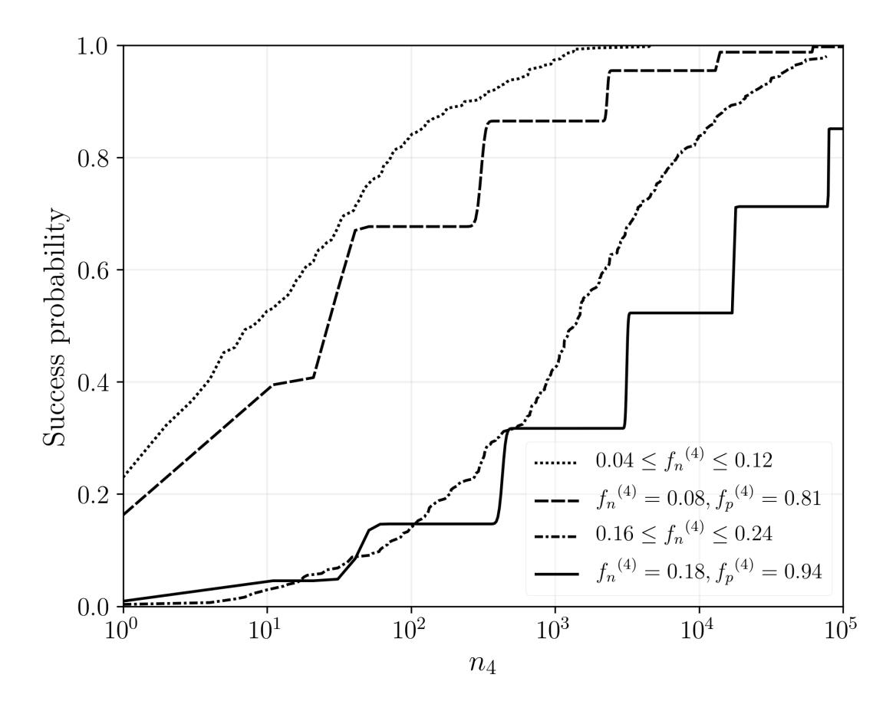
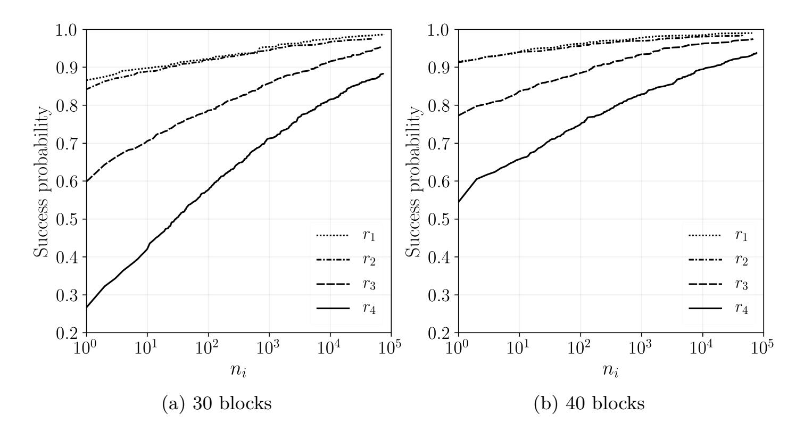
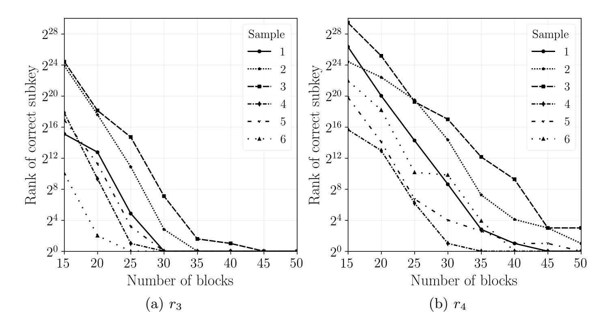

{0}------------------------------------------------

# **"S-Box" Implementation of AES is NOT side channel resistant**

C Ashokkumar, Bholanath Roy, M Bhargav Sri Venkatesh, and Bernard L. Menezes

> Department of Computer Science and Engineering, Indian Institute of Technology Bombay, Mumbai, India

{ashokkumar,bholanath,bhargav,bernard}@cse.iitb.ac.in

**Abstract.** Several successful cache-based attacks have provided strong impetus for developing side channel resistant software implementations of AES. One of the best-known countermeasures - use of a "minimalist" 256-byte look-up table - has been employed in the latest (assembly language) versions. Software and hardware prefetching and out-of-order execution in modern processors have served to further shrink the attack surface. Despite these odds, we devise and implement two strategies to retrieve the complete AES key. The first uses adaptively chosen plaintext and random plaintext in a 2-round attack. The second strategy employs only about 50 blocks of random plaintext in a novel single round attack. The attack can be extended to spying on table accesses during decryption in a ciphertext-only attack. We also present an analytical model to explain the effect of false positives and false negatives and capture various practical tradeoffs involving number of blocks of plaintext, offline computation time for key retrieval and success probability.

**Keywords:** AES · Side channel · Cache · Lookup table · 2-round attack.

# **1 Introduction**

AES is the most widely used secret key cipher and is known to be hard to crack even with highly advanced cryptanalytic techniques such as those described in [7–9, 26]. However, its software implementation, while extremely efficient, has been shown to be susceptible to various side channel attacks. Not surprisingly, "hardened" implementations have been developed. One of these, included in cryptographic libraries such as OpenSSL [23], is now the default software version. The primary goal of this work is the design and implementation of a cache-based side channel attack that makes even the latest OpenSSL version vulnerable.

Each round of AES uses field operations in GF(2 8 ). Because field operations are computationally expensive, look-up tables are employed to greatly improve performance. The most efficient implementation of AES uses four 1 KB tables. During encryption, the tables typically reside in cache and occupy 64 lines or blocks (assuming a 64 byte block size as in most x86 machines). Based on even 

{1}------------------------------------------------

partial knowledge of the sequence of blocks accessed during encryption, it has been shown that the entire AES key may be retrieved [4]. In the sequel, we confine usage of the terms block and line to "block of plaintext" and "line of cache" respectively.

Various measures have been put in place to thwart cache-based attacks. Beginning with OpenSSL-1.0.0a, for example, a single 256-byte S-Box table has been employed. Such a table occupies only 4 lines of cache and so accesses to the table cause 2 bits of each byte of the AES key to be leaked (rather than 4 bits as in the four table implementation). This "minimalist" look-up table architecture has been acknowledged to be very hard to compromise in [1, 15, 27, 11, 3]. Indeed, almost all cache attacks on AES have targeted the 4 table [24, 5, 2, 22, 15] or a "compressed" 2KB table implementation [11] rather than the single 256-byte table. The latter was intended to provide resistance to side channel attacks at the expense of reduced performance. To partly offset the performance hit, it was coded in x86 assembly and is commonly referred to as the "assembly" version.

To further defend against cache attacks, the default software implementation (OpenSSL Version 1.0.0a and beyond) pre-fetches the S-Box table at the start of each round of encryption. Thus, the attacker or spy is unable to distinguish between a line pre-fetched and one actually accessed as part of encryption resulting in false positives. Another source of false positives is the out-of-order execution in all modern processors. In the event of a stall caused by, for example, a cache miss, the processor attempts to execute instructions further upstream from the current instruction. This results in an even larger number of false positives as explained in Section 3. Finally, aggressive hardware prefetching further increases the rate of false positives.

The principal contribution of this work is the design of two attacks on the side-channel resistant version of the OpenSSL implementation of AES. Both of these attacks leak out the complete 128-bit AES key. The first (called the Two Round Attack), uses information obtained by the spy about cache-resident table accesses made by the victim during the first two rounds of encryption. It uses adaptively chosen plaintexts for the first round attack and random plaintexts for the second round attack. The second attack (called the Single Round Attack) uses a less restrictive attack scenario based only on table accesses in the second round with random plaintexts. We demonstrate experimentally that we require fewer than 50 blocks of plaintext to recover the entire AES key. We also develop an analytical model to predict the number of plaintexts required and compare these estimates with experimentally obtained values. While the attacks described here use known plaintext, the second attack could also be adapted to work by snooping on the decryption of known ciphertext.

The paper is organized as follows. Section 2 introduces background material and describes the operation of the spy software. Section 3 explains the details of the First and Second Round attacks. It also contains an analytical model and a comparison between experimental and model results. Section 4 outlines our 

{2}------------------------------------------------

strategy to obtain the AES key in a less restrictive attack scenario. Section 5 summarizes related work and Section 6 concludes the paper.

### 2 Background

We first review the basics of AES and cache. Various cache-based attacks and scenarios are summarized. Finally, we outline the experimental setup used to test our key retrieval approaches.

#### 2.1 AES Basics

AES is a substitution-permutation network. It supports a key size of 128, 192 or 256 bits and block size = 128 bits. A round function is repeated a fixed number of times (10 for key size of 128 bits) to convert 128 bits of plaintext to 128 bits of ciphertext. The 16-byte input or plaintext  $P = (p_0, p_1, ..., p_{15})$  may be arranged column wise in a  $4\times4$  array of bytes. This "state array" gets transformed after each step in a round. At the end of the last round, the state array contains the ciphertext.

All rounds except the last involve four steps – Byte Substitution, Row Shift, Column Mixing and a Round Key operation (the last round skips the Column Mixing step). The round operations are defined using algebraic operations over the field  $GF(2^8)$ . For example, in the Column Mixing step, the state array is pre-multiplied by the matrix B given below.

$$B = \begin{pmatrix} 02 & 03 & 01 & 01 \\ 01 & 02 & 03 & 01 \\ 01 & 01 & 02 & 03 \\ 03 & 01 & 01 & 02 \end{pmatrix}$$

The original 16-byte secret key  $K=(k_0,\ k_1,\ ...,\ k_{15})$  (arranged column wise in a 4×4 array of bytes) is used to derive 10 different round keys to be used in the round key operation of each round. The round keys are denoted  $K^{(r)}$ ,  $r=1,2,\ldots 10$ . Each element in  $P,\ K,\ C$  and B belong to the field  $GF\left(2^8\right)$  and is represented as two hexadecimal characters. Let  $x^{(r)}=(x_0^{(r)},\ldots,x_{15}^{(r)})$  denote the input to round r (i.e. the state array at the start of round r). The initial state  $x^{(1)}=(x_0^{(1)},\ldots,x_{15}^{(1)})$  is computed by  $x_i^{(1)}=p_i\oplus k_i,\ 0\leq i\leq 15$ .

In a software implementation, field operations are replaced by relatively inexpensive table lookups thereby speeding encryption and decryption. In the version of OpenSSL targeted in this paper, a single 256-byte S-Box table is used. The  $i^{th}$  entry (byte) of the table contains S(i) where S is the AES substitution function.

### 2.2 Cache Basics

All modern processors have multiple levels of cache intended to bridge the latency gap between main memory and the CPU. The machines targeted in this paper

{3}------------------------------------------------

Table 1: Notations

| Notation      | Explanation                                              |
|---------------|----------------------------------------------------------|
| K, K(i)       | th round key represented as 4x4 byte<br>AES Key or i     |
|               | array (column wise)                                      |
| k i           | th byte of AES key<br>i                                  |
| P             | 128-bit plaintext represented as 4x4 byte array          |
| pi            | th byte of plaintext<br>i                                |
| πi            | th byte of adapted plaintext<br>i                        |
| (r)<br>x<br>i | th byte of the input to round<br>i<br>r                  |
| b             | Number of blocks of plaintext used to retrieve key       |
| x<br>′        | Most significant two bits of byte x, called twit here    |
| x<br>′′       | Least significant 6 bits of byte x                       |
| li            | th last access in Round 1 (R1)<br>i                      |
| ri            | Relation with various AES subkey attributes              |
| ri<br>✶ rj    | Join of ri<br>and rj                                     |
| ri<br>× rj    | Cartesian product relation of ri<br>and rj               |
| s             | Initial number of tuples in a relation                   |
| P(A)          | Probability of event A                                   |
| (i)<br>f<br>p | False positive rate corresponding to Eqn. i              |
| (i)<br>f<br>n | False negative rate corresponding to Eqn. i              |
| ni            | Number of top subkey values picked from ri               |
| pc(pin)       | Probability that the score of correct (incorrect) subkey |
|               | is incremented after considering a block of plaintext    |

are Intel Core i3-2100 and Intel Core i7-3770. These have three levels of cache (private L1 32KB I-cache and 32KB D-cache, 256KB L2 cache and 3MB L3 cache shared between all cores).

The granularity of data transfer between different levels of cache is a block or line. On our targeted machines, the line size = 64 bytes. The lines of a cache are grouped into sets – a line from main memory is mapped to exactly one set though it may occupy any position in that set. The number of lines in a set is the associativity of the cache. In the machines we worked with, L1 and L2 caches are 8-way set associative while L3 is 12-way set associative.

To speed up AES encryption, the S-Box table is typically cache resident. It contains 256 entries and each entry occupies 1 byte. So the table fits into only 4 lines of cache. The first two bits of the table index specify the cache line number and the remaining 6 bits specify the element within the line.

{4}------------------------------------------------

### **2.3 Types of attacks and Attack scenarios**

Cache-based side channel attacks belong to several categories. Timing-driven [5] attacks measure the time to complete an encryption. Trace-driven [25] attacks create profiles of a cache hit or miss for every access to memory during an encryption. Access-driven [24] attacks need information only about which lines of cache have been accessed, not their precise order. The attacks presented in this paper belong to the last category.

Various techniques are used to determine which cache lines have been accessed by a victim process. In the Prime+Probe approach [24], the attacker fills the cache with its own data. It waits for the victim to perform an encryption whereby some of the attacker data is evicted. The attacker then probes each cache line - a higher reload time for a cache line indicates that the cache line was evicted by the victim. In the Evict and Time method [24], the attacker first measures the time (*T*1) to complete an encryption, evicts a specific cache set and then again measures the time (*T*2) taken to complete an encryption on the same plaintext. If *T*<sup>2</sup> is greater than *T*<sup>1</sup> it concludes that the evicted line is used in encryption.

In the Flush+Reload technique [11, 28], the attacker first flushes a line from all levels of cache, then waits for the victim to perform the encryption and finally calculates the reload time of the previously flushed line. A lower reload time indicates that the line is in cache and was brought by the victim.

We consider two possible attack scenarios. In the first, a victim process runs on behalf of a data storage service provider who securely stores documents from multiple clients and furnishes them on request after due authentication. The same key or set of keys is used to encrypt documents from different clients prior to storage. In the second scenario, two entities, A and B, exchange encrypted messages. The victim, on B's machine, decrypts blocks of ciphertext received from A. Thus, in the first scenario, the spy attempts to obtain the cache line numbers during encryption of plaintext while in the second scenario it obtains the line numbers during decryption of ciphertext.

### **2.4 Experiment Setup**

To test our key retrieval algorithms we used the following experiment setup. The victim V, performs AES encryptions using the assembly version of OpenSSL (v-1.0.2p). A multithreaded spy, co-located on the same core as the victim, attempts to infer the line numbers of the AES table accessed. The experiments were performed on Intel(R) Core(TM) i3-2100 CPU @ 3.10GHz and Intel(R) Core(TM) i7-3770 CPU @ 3.40GHz running Debian 8.0 with kernel version 3.18.26.

The spy program creates a high-resolution POSIX timer (used by all the spy threads) and an array of binary semaphores - *sem*[*i*] is the semaphore associated with *T hread<sup>i</sup>* . All but one of the semaphores are initialized to 0. So all threads are blocked on their respective semaphores except for the one that is initialized to 1.

{5}------------------------------------------------

The following is the sequence of events involved in probing the cache lines accessed by V.

- (1) The unblocked thread say  $Thread_i$ 
  - (a) probes each of the four cache lines of the table to determine which has/have been accessed by V.
  - (b) it flushes all four lines of the cache-resident table
  - (c) it initializes a timer to  $\sim 850$  nanoseconds in Core i7 ( $\sim 1100$  nanoseconds in Core i3) and then blocks on its semaphore.
- (2) At this point, all spy threads are blocked on their semaphores and V is scheduled next (its resumes performing encryptions).
- (3) On expiration of the timer, the kernel sends a signal to a signal handler which unblocks  $Thread_{i+1}$ . V is preempted and  $Thread_{i+1}$  begins execution.

The spy code spawns about 200 threads which execute in round robin fashion. Each thread receives about 20000 nanoseconds of CPU time. Between two successive threads, V runs for about 850-1100 nanoseconds. Due to the large number of cache misses encountered by V, it is able to complete only about  $\left(\frac{1}{160}\right)^{th}$  of an encryption during this time. Thus, V should be scheduled roughly 160 times for it to complete a single encryption.

A cache miss results in the next (or previous) line [6] being prefetched causing the spy to wrongly infer that the latter was accessed in the previous run of the victim. To defeat the effect of lines prefetched during the execution of the victim process, the number of accesses made by the victim during each of its runs was minimized. This was accomplished by limiting the POSIX timer interval to  $\sim 850/1100$  nanoseconds.

The Intel Core i3/i7 incorporates aggressive prefetchers which track and remember the forward and backward strides of the 16 most recently accessed 4KB pages [13]. So, we programmed the spy to access 32 randomly selected pages between two consecutive accesses to the AES tables.

### 3 Strategy I - Two Round Attack

The first attack strategy involves two steps. The first step determines which lines of the AES table were accessed by the victim in the first round to obtain the first two bits of each of the 16 bytes of the AES key. The second round attack snoops on the accesses made in the second round to obtain the remaining six bits of each byte of the AES key.

### 3.1 First Round Attack

Table 2 shows the bytes of a block of plaintext, P, in the order that they are processed by the OpenSSL software. The next row lists the bytes of the key, K, in the same order. This is followed by two rows containing the two most significant bits of each byte of the plaintext and the key. For brevity, we refer to the two most significant bits of a byte, x, as a twit and denote it x'. The remaining six

{6}------------------------------------------------

bits of the byte are denoted x''.

The sequence of cache line numbers accessed during the first round (R1) of encryption is shown in the sixth row and is the XOR of the corresponding twits of P and K. The sequence of cache line numbers accessed in Round 2 (R2) is shown in the last row.

A spy thread attempts to infer the line or lines of the AES table accessed

| Position           | 0   | 5   | 10  | 15  | 4   | 9   | 14  | 3   | 8   | 13  | 2   | 7   | 12  | 1   | 6   | 11  |
|--------------------|-----|-----|-----|-----|-----|-----|-----|-----|-----|-----|-----|-----|-----|-----|-----|-----|
| P                  | В3  | С9  | 8D  | 23  | F9  | В6  | C5  | 82  | CA  | 6F  | 18  | E4  | 80  | 53  | 4C  | D5  |
| K                  | 9A  | 15  | E6  | A7  | 46  | 58  | F0  | 07  | В7  | 63  | AE  | 3C  | D9  | 4A  | 29  | 71  |
| $p_i'$             | 10  | 11  | 10  | 00  | 11  | 10  | 11  | 10  | 11  | 01  | 00  | 11  | 10  | 01  | 01  | 11  |
| $k_i'$             | 10  | 00  | 11  | 10  | 01  | 01  | 11  | 00  | 10  | 01  | 10  | 00  | 11  | 01  | 00  | 01  |
| $p_i' \oplus k_i'$ | 00  | 11  | 01  | 10  | 10  | 11  | 00  | 10  | 01  | 00  | 10  | 11  | 01  | 00  | 01  | 10  |
| (R1 access)        | (0) | (3) | (1) | (2) | (2) | (3) | (0) | (2) | (1) | (0) | (2) | (3) | (1) | (0) | (1) | (2) |
| R2 access          | 0   | 1   | 2   | 3   | 2   | 2   | 3   | 2   | 2   | 1   | 2   | 0   | 0   | 3   | 2   | 0   |

Table 2: Plaintext, Key and Cache Accesses (First Two Rounds)

by V during its previous run. Table 3 indicates that the first 20 threads observe all four lines accessed. Lines 0, 1 and 2 are reported as accessed by the next two scheduled threads while only lines 1 and 2 are reported as accessed by the next thread and so on.  $(L_1=\{0,1,2,3\}, L_2=\{0,1,2\} \text{ and } L_3=\{1,2\})$ . In virtually all of our measurements,  $|L_1|=4$ ,  $|L_2|=3$ ,  $|L_3|=2$ , and  $|L_4|=1$ . Also,  $L_1 \supset L_2 \supset L_3 \supset L_4$ . Another observation is that the cardinalities of the  $L_i$ 's exhibit a periodicity which helps identify the end of a round and the beginning of the next round.

The OpenSSL software prefetches all four lines of the S-Box table at the start of each round. Hence the first thread scheduled in a round sees all four lines accessed. A spy thread flushes all four lines of the table before it is blocked. Further, the design of the spy code ensures that a run of the victim is sufficiently small so that only one or two lines are accessed. Yet, the next scheduled thread and indeed many more also see all four lines accessed. This is attributed to the out of order execution in modern processors.

When a cache miss occurs, the execution of the instruction causing the miss is suspended. To maximize CPU utilization, the processor looks for an opportunity to execute instructions further upstream from the stalled instruction. Some of those instructions also cause a cache miss due to the need to access cache lines flushed out by the previously executing spy thread. So, at a given point in time there could be several outstanding requests for data transfer from main memory to cache. While these requests are being serviced, the victim is suddenly preempted. This causes the next spy thread to see more table accesses made during the previous run than were actually consumed during that run.

{7}------------------------------------------------

| Round | Sets of cache lines accessed | Count (number of times    |
|-------|------------------------------|---------------------------|
| ( i ) | (as reported by spy threads) | same accesses reported by |
|       |                              | successive spy threads)   |
| 1     | $L_1 = [0, 1, 2, 3]$         | 20                        |
| 1     | $L_2 = [0, 1, 2]$            | 2                         |
| 1     | $L_3 = [1, 2]$               | 1                         |
| 1     | $L_4 = [2]$                  | 1                         |
| 2     | $L_5 = [0, 1, 2, 3]$         | 12                        |
| 2     | $L_6 = [0, 1, 2]$            | 2                         |
| 2     | $L_7 = [0, 1]$               | 1                         |
| 2     | $L_8 = [0]$                  | 1                         |
| 3     | $L_9 = [0, 1, 2, 3]$         | 8                         |
| 3     | $L_{10} = [0, 2, 3]$         | 1                         |
|       |                              |                           |

Table 3: Cache Lines Accessed as reported by spy

During the execution of a round, 16 byte-sized table elements are first accessed and loaded into the CPU registers. This is followed by a computation phase wherein field multiplications and additions involved in the MixColumn step are performed. Consider the last access to an element in a round. As before, while this element is being fetched, the processor attempts to execute instructions upstream from the current instruction. These instructions involve only computation, not memory access. So the spy thread scheduled next sees a solitary access to the table ( $|L_4| = 1$ ). So the last (or last few) accesses in a round will be unambiguously reported by spy threads but there exists considerable ambiguity in identifying the lines accessed early on in each round.

The goal of the First Round Attack is to deduce the twit of each byte of the AES key. For this purpose, we need the complete set of cache line accesses. However, as shown in Table 3, successive spy threads report that all four lines have been accessed - in effect revealing no useful information about the first eight or so accesses. We next devise a strategy whereby we can still obtain the twits of all 16 bytes of the AES key.

Starting with a random block of plaintext, we construct a set of 16 blocks such that the encryption of the  $i^{th}$  block results in all of the last i cache accesses to the same line of the lookup table. From the line number of the  $(i-1)^{th}$  access, the twit of the  $(i-1)^{th}$  byte of the AES key is obtained and the next block of plaintext to be encrypted is crafted. We exemplify our approach with the same initial random plaintext and random key from Table 2.

Table 4 shows the cache access patterns as reported by the spy during an encryption of successive blocks of plaintext. The first row shows that the last access is to line 2 ( $l_1 = 2$ ). The twit of eleventh byte of the key is computed as  $k'_{11} = p'_{11} \oplus l_1 = 11 \oplus 10 = 01$ . We wish all accesses to be eventually to line

{8}------------------------------------------------

3 <sup>1</sup>. For this purpose, we modify the twit of eleventh byte of the plaintext to  $\pi'_{11} = k'_{11} \oplus 11 = 01 \oplus 11 = 10$ .

Row 2 shows the access pattern during encryption of the modified plaintext.

Row Byte Access pattern Computed New value position in reported by twit of of twit numin plaintext plaintext key ber spy  $k_i' = p_i' \oplus l_i$  $\pi_i' = k_i' \oplus 11$ (j)(i) $(0123)^{20} (012)^2 (12)^1 (2)^1$ 1  $01 = 11 \oplus 10$ 11  $10 = 01 \oplus 11$  $(0123)^{19} (013)^3 (13)^1 (3)^1$ 26  $00 = 01 \oplus 01$  $11 = 00 \oplus 11$  $(0123)^{19} (013)^2 (03)^1 (3)^2$ 1  $01 = 01 \oplus 00$  $10 = 01 \oplus 11$ 3  $(0123)^{18} (123)^1 (13)^2 (3)^3$ 4 12  $11 = 10 \oplus 01$  $00 = 11 \oplus 11$  $(0123)^{15} (023)^1 (23)^1 (3)^5$  $00 = 11 \oplus 11$ 5 7  $11 = 00 \oplus 11$  $(0123)^{15} (023)^1 (23)^1 (3)^5$ 2 6  $10 = 00 \oplus 10$  $01 = 10 \oplus 11$  $(0123)^{16} (013)^1$ 7 13  $(03)^1 (3)^6$  $01 = 01 \oplus 00$  $10 = 01 \oplus 11$  $(0123)^{13} (123)^{1}$  $(13)^1 (3)^7$ 8 8  $10 = 11 \oplus 01$  $01 = 10 \oplus 11$  $\overline{(0123)^{11}} (023)^4$ 9 3  $(23)^1 (3)^8$  $00 = 10 \oplus 10$  $11 = 00 \oplus 11$  $(0123)^{12} (023)^2 \overline{(03)^2 (3)^9}$ 10 14 $11 = 11 \oplus 00$  $00 = 11 \oplus 11$  $(0123)^{12} (023)^2 (03)^2 (3)^{11}$ 9  $01 = 10 \oplus 11$ 11  $10 = 01 \oplus 11$  $(0123)^{12} (023)^2 (23)^2 (3)^{11}$ 12 4  $01 = 11 \oplus 10$  $10 = 01 \oplus 11$  $(0123)^8 (123)^2 (23)^1 (3)^{12}$ 13 15  $10 = 00 \oplus 10$  $01 = 10 \oplus 11$ 

Table 4: Adaptively Choosing Plaintext for Round 1 Attack

The last access is to line 3 (as desired) but the  $2^{nd}$  last access is to line 1 ( $l_2 = 1$ ). Row 2 shows the derivation of  $k'_6$  and the value of  $\pi'_6$  (the new twit value of  $p_6$ ).

 $(023)^2 (03)^{\overline{3}} (3)^{\overline{15}}$ 

 $(023)^2 (03)^3 (3)^{15}$ 

 $11 = 10 \oplus 01$ 

 $00 = 11 \oplus 11$ 

 $10 = 10 \oplus 00$ 

 $00 = 11 \oplus 11$ 

 $11 = 00 \oplus 11$ 

 $01 = 10 \oplus 11$ 

 $(0123)^7 (013)^2 (13)^2 (3)^{\overline{13}}$ 

 $(0123)^4$ 

 $(0123)^4$ 

14

15

16

10

5

0

As shown in Table 4, each successive plaintext is chosen so that the number of accesses to the last cache line within a row increases with row number. The twits of all 16 bytes of the key are obtained with fewer than 16 blocks of plaintext and encryptions. In practice, however, this may not be the case. Experimental error could cause an unexpected pattern to occur. In that event, we rollback and proceed from an earlier row. On average, roughly 6 errors occur per sample. Overall, we require approximately 15 distinct plaintexts to obtain the twits

<sup>&</sup>lt;sup>1</sup> When we targeted lines 0, 1 or 2, we observed that lines 1, 2 or 3 respectively would be prefetched by the hardware causing ambiguity. But, when we targeted line 3, we noticed that line 4 was prefetched. That, however did not affect our results since line 4 is not part of the lookup table.

{9}------------------------------------------------

of each of the 16 key bytes. Due to the rollbacks, the number of encryptions performed is about 21.5 on average per sample.

#### 3.2 Second Round Attack

**Algorithm and Description** Inputs to a round expressed as a  $4 \times 4$  byte matrix are indices to the AES table (S-Box). This matrix is also the output of the previous round. Based on the transformations that the state array undergoes in the first round, we can relate each element of the input of the second round to bytes of the plaintext and key.

Given that it is easiest to identify the line accesses made at the end of a round, we focus on expressions for the indices of the last 4 table accesses, i.e.,  $x_{11}^{(2)}$ ,  $x_{6}^{(2)}$ ,  $x_{1}^{(2)}$  and  $x_{12}^{(2)}$  (Equations 1-4). Collectively, these equations involve all 16 bytes of the AES key. The known variables on the RHS of these equations are bytes of the plaintext and twits of the bytes of the AES key. The first two bits of the table index (LHS) comprise the cache line number obtained (with some ambiguity) from the spy input.

$$x_{11}^{(2)} = 03 \bullet s(p_8 \oplus k_8) \oplus 01 \bullet s(p_{13} \oplus k_{13}) \oplus 01 \bullet s(p_2 \oplus k_2)$$
  
 
$$\oplus 02 \bullet s(p_7 \oplus k_7) \oplus s(k_{12}) \oplus k_3 \oplus k_7 \oplus k_{11}$$
 (1)

$$x_6^{(2)} = 01 \bullet s(p_4 \oplus k_4) \oplus 01 \bullet s(p_9 \oplus k_9) \oplus 02 \bullet s(p_{14} \oplus k_{14})$$
  
  $\oplus 03 \bullet s(p_3 \oplus k_3) \oplus s(k_{15}) \oplus k_2 \oplus k_6$  (2)

$$x_1^{(2)} = 01 \bullet s(p_0 \oplus k_0) \oplus 02 \bullet s(p_5 \oplus k_5) \oplus 03 \bullet s(p_{10} \oplus k_{10})$$

$$\oplus 01 \bullet s(p_{15} \oplus k_{15}) \oplus s(k_{14}) \oplus k_1$$
(3)

$$x_{12}^{(2)} = 02 \bullet s(p_{12} \oplus k_{12}) \oplus 03 \bullet s(p_1 \oplus k_1) \oplus 01 \bullet s(p_6 \oplus k_6)$$

$$\oplus 01 \bullet s(p_{11} \oplus k_{11}) \oplus s(k_{13}) \oplus k_{12} \oplus k_0 \oplus k_4 \oplus k_8 \oplus 01$$
(4)

Our strategy is to compute the two most significant bits of the byte value of the RHS as a function of known quantities and the minimum possible number of unknown bits of the key. Algorithm 1 outlines the procedure to obtain a set of candidate keys containing the correct key with very high probability.

Algorithm 1 creates four relational schema each with five attributes. The first four attributes are the least significant six bits of different bytes of the AES key. The fifth attribute comprises the two most significant bits of the output of the S-Box applied to a byte of the key (for example  $s(k_{12})'$  in Eqn. 1). Four relations are created which are instances of the four schema. Each is populated with all possible combinations of bit values of the attributes - thus there are a total of  $2^{26}$  tuples in each relation. Each tuple is associated with a score (initially zero).

For each tuple in relation  $r_i$  and for a given plaintext, the RHS of Eqn. i is evaluated by substituting values from the tuple, the plaintext and bits of the key obtained from the Round 1 attack. The score of the tuple is incremented if the most significant two bits of the computed byte (RHS) matches one of the line numbers reported by the spy for the specific cache line access during

{10}------------------------------------------------

### Algorithm 1: Second Round Attack

**Input:** b blocks of plaintext, first two bits of each byte of AES key, last four cache line accesses in Round 2 of encryption of each block

Output: Correct AES key with high probability

#### **Initialization:**

1 Construct 4 relational schema

```
r_1\left(k_8'',\ k_{13}'',\ k_2'',\ k_7'',\ s(k_{12})'\right),
r_2\left(k_4'',\ k_9'',\ k_{14}'',\ k_3'',\ s(k_{15})'\right),
r_3\left(k_0'',\ k_5'',\ k_{10}'',\ k_{15}'',\ s(k_{14})'\right),
r_4\left(k_{12}'',\ k_1'',\ k_6'',\ k_{11}'',\ s(k_{13})'\right)
```

- **2** Populate  $r_i$ ,  $1 \le i \le 4$  with each of the  $2^{26}$  possible values of its attributes.
- 3 Initialize four histograms,  $h_i$ ,  $1 \le i \le 4$  with  $2^{26}$  bins.

#### Scoring and Elimination:

```
4 for each relation, r_i, 1 \le i \le 4 do
       for each block of plaintext p_j, 1 \le j \le b do
 5
            for each tuple, t_k in r_i, 1 \le k \le 2^{26} do
 6
                Substitute relevant bits of p_i, t_k and known key bits into RHS of
 7
                 Equation i
                if twit\ of\ RHS \in \{cache\ lines\ reported\ as\ accessed\ in\ i^{th}\ last\ access
 8
                  of table with plaintext p_i} then
                    Increment h_i[k]
 9
                end
10
            end
11
        end
12
13 end
```

14 Retain top  $n_i$  scorers in each relation  $r_i$ .

#### Joins and Cartesian Product:

- **15** Perform joins  $r_1 \bowtie r_4$  and  $r_2 \bowtie r_3$ .
- 16 Construct set of candidate key values by combining a subkey value from  $r_1 \bowtie r_4$  and a subkey value from  $r_2 \bowtie r_3$ .

### Verification:

17 Use accesses reported by spy threads for rounds 3, 4 ... 10 in each plaintext to discard incorrect keys from above Cartesian product.

encryption of that plaintext. This is repeated for each tuple and for all the blocks of plaintext.

After scores are computed for all tuples in the four relations, the top  $n_i$  tuples in relation  $r_i$  are selected. A relational join is performed on the surviving tuples between relations  $r_1$  and  $r_4$  and also between the reduced  $r_2$  and  $r_3$ . Each join output includes eight 6-bit attributes. Together, the two join outputs contain possible values of the least significant six bits of all 16 bytes of the AES key.

{11}------------------------------------------------

|                             | Number of blocks, b                         |                                                   |                 |                |                |                |                |                |  |  |
|-----------------------------|---------------------------------------------|---------------------------------------------------|-----------------|----------------|----------------|----------------|----------------|----------------|--|--|
| Relation                    | 15                                          | 20                                                | 25              | 30             | 40             | 50             | 60             | 70             |  |  |
| $r_1$                       | $\begin{pmatrix} 3 \\ (0.76) \end{pmatrix}$ | 1.75<br>(0.83)                                    | 1.48<br>(0.87)  | 1.31<br>(0.89) | 1.13<br>(0.93) | 1.04<br>(0.96) | 1.03<br>(0.98) | 1.01<br>(0.99) |  |  |
| $r_2$                       | 5.13<br>(0.63)                              | $ \begin{array}{c c} 2.27 \\ (0.77) \end{array} $ | 1.6<br>(0.84)   | 1.5<br>(0.88)  | 1.14<br>(0.93) | 1.08 $(0.95)$  | 1.04 $(0.97)$  | 1.02<br>(0.98) |  |  |
| $r_3$                       | 50.73<br>(0.22)                             | 5.49<br>(0.42)                                    | 2.98<br>(0.6)   | 2.04<br>(0.69) | 1.47<br>(0.81) | 1.25<br>(0.88) | 1.11<br>(0.94) | 1.06<br>(0.95) |  |  |
| $r_4$                       | 1148.4<br>(0.16)                            | 74.91<br>(0.18)                                   | 8.31<br>(0.29)  | 4.05 $(0.42)$  | 2.29 $(0.64)$  | 1.74 $(0.76)$  | 1.41<br>(0.82) | 1.26<br>(0.86) |  |  |
| $r_1 \bowtie r_4$           | 287.28<br>(0.14)                            | 15.74<br>(0.17)                                   | 1.16<br>(0.29)  | 0.76<br>(0.42) | 0.78<br>(0.64) | 0.83<br>(0.76) | 0.84<br>(0.82) | 0.88<br>(0.86) |  |  |
| $r_2 \bowtie r_3$           | 54.6<br>(0.2)                               | 1.87<br>(0.41)                                    | $0.9 \\ (0.59)$ | 0.88<br>(0.68) | 0.88<br>(0.81) | 0.91<br>(0.88) | 0.94<br>(0.93) | 0.96<br>(0.95) |  |  |
| Overall Success Probability | 0.06                                        | 0.11                                              | 0.25            | 0.39           | 0.62           | 0.74           | 0.81           | 0.85           |  |  |

Table 5: Average number of top scorers and success probability

Each tuple in  $r_1 \bowtie r_4$  is paired with a tuple in  $r_2 \bowtie r_3$  which, together with the bits obtained in the Round 1 attack, form a possible AES key. These potential keys are each tested for correctness by a verification program which produces a sequence of cache line numbers accessed during encryption of successive blocks of plaintext. In particular, the last two accesses in rounds 3-10 are matched against those provided by the spy. The correct key will be inferred because only in that case will the inputs provided by the spy match those provided by the verification program in all/most cases.

The join predicate is actually the conjunction of two sub-predicates. Consider for example,  $r_1 \bowtie r_4$ . To join a tuple,  $t_1$  from  $r_1$  with a tuple,  $t_2$  from  $r_4$ , we assemble  $k_{12}$  from  $k''_{12}$  (in  $t_2$ ) and  $k'_{12}$  (from the First Round Attack). We then compute  $s(k_{12})'$  and compare it with the value of the fifth attribute in  $t_1$ . To check for a match of the second sub-predicate, compute  $s(k_{13})'$  and compare it with the value of the fifth attribute in  $t_2$ . Only if both sub-predicates are satisfied is the tuple formed by concatenating  $t_1$  and  $t_2$  included in  $r_1 \bowtie r_4$ . A similar computation is performed to compute  $r_2 \bowtie r_3$ .

**Experiments and Results** A basic strategy is to select only the top scoring tuples from each relation and perform the joins and Cartesian product on these reduced relations. Table 5 shows the overall success probability of this strategy. It also shows the number of subkeys with the top score in each relation  $r_i$ ,  $1 \le i \le 4$  for different number of plaintexts, b encrypted with the same key. The reported results are averaged over 1000 samples. The numbers in parentheses represent the probability that the correct subkey appears in the set of top

{12}------------------------------------------------

scorers.

The number of top scorers is highest in  $r_4$  across all values of b. In each relation, the number of top scorers decreases with increasing b. Also, the probability of netting the correct key in the set of top scorers increases with b. Thus it is mostly possible to find the correct subkeys in  $r_1$  and  $r_2$  with only about 30 blocks of plaintext but it requires about 50 and 70 plaintexts respectively to harvest the correct subkeys from  $r_3$  and  $r_4$ .

After picking the top scorers in  $r_1$  and  $r_4$ , we found that  $r_1 \bowtie r_4$  returned zero tuples in some samples (Table 5 shows that the cardinality of  $r_1 \bowtie r_4$  is less than 1 for b = 30, 40, ...). Another interesting observation is that the probability of the correct subkey appearing in the set of top scores is close to the overall success probability and hence is the key factor in the overall success of obtaining the complete AES key.

The probability of successfully retrieving the AES key is directly related to the quality of inputs provided by the spy threads. False positives (spurious cache line accesses) and false negatives (failing to report the correct line accesses) both, have a detrimental effect. Further, the above strategy of selecting subkeys with the top scores yields very limited success. To improve the success probability of finding the correct key, we should include many more subkeys especially from  $r_4$ .

The false positive and false negative rates are dependent on noise-induced experimental error and a host of design parameters such as the number of spy threads and the timer setting (Section 2). The model presented next provides insight into the dependence of success probability on false positive/false negative rate and also on  $n_i$  - the number of top-ranking subkeys collected from each relation  $r_i$  (prior to the join).

Let  $X_c$  and  $X_{in}^{(k)}$ ,  $1 \le k \le s-1$ ,  $s=2^{26}$ , respectively denote the random variables associated with the scores of the correct and incorrect subkey values and let  $p_c$  and  $p_{in}$  denote their respective success probabilities. These variables are binomially distributed, i.e.,  $X_c \sim B(p_c, b)$  and  $X_{in}^{(k)} \sim B(p_{in}, b)$ ,  $1 \le k \le s-1$  where b is the number blocks of plaintexts used.

Let  $f_n^{(i)}$ ,  $f_p^{(i)}$  respectively denote the experimentally determined average rates of false negatives and false positives corresponding to Eqn. i. Where understood, we drop the superscript for brevity. The rate of false negatives may be interpreted as the probability of occurrence of a false negative. The occurrence of a false negative and the correct subkey receiving a boost are events that are complements of each other. Hence,

$$p_c = 1 - f_n \tag{5}$$

Each line number reported by the spy contributes to an increase by 1 of the scores of roughly 25% of the incorrect subkeys (since the number of cache line numbers is 4). In the event of a false negative, the number of reported accesses on average is  $f_p$  while it is  $f_p + 1$  in the absence of a false negative. So,

$$p_{in} = f_n \left(\frac{f_p}{4}\right) + (1 - f_n) \left(\frac{1 + f_p}{4}\right)$$

{13}------------------------------------------------

$$p_{in} = \frac{1 + f_p - f_n}{4} \tag{6}$$

In Algorithm 1, we pick the top  $n_i$  scorers. We are interested in the probability of the correct subkey being one among the top  $n_i$  scorers. This is equivalent to having, at least  $s - n_i$  incorrect subkeys scoring less than the correct subkey. Let  $Y_{in}^{(k)}$  denote the random variable associated with the score of  $k^{th}$  lowest scorer among incorrect subkey values. So,

$$Y_{in}^{(1)} \le Y_{in}^{(2)} \le \dots \le Y_{in}^{(k)} \le \dots \le Y_{in}^{(s-1)}$$

 $Y_{in}^{(1)},Y_{in}^{(2)},\dots,Y_{in}^{(k)},\dots,Y_{in}^{(s-1)}$  are called order statistics of  $X_{in}^{(1)},X_{in}^{(2)},\dots,X_{in}^{(k)},\dots,X_{in}^{(k)},\dots,X_{in}^{(s-1)}$ . The following result from order statistics is used in our model.

**Lemma 1:** Let  $X^{(1)}$ , ...,  $X^{(s-1)}$  be s-1 random samples from a discrete distribution with cumulative mass function,  $F_X(n) = P(X \le n) = P_n$ . Let  $Y^{(1)}$ , ...,  $Y^{(s-1)}$  denote the order statistics of the sample. Then,

$$P(Y^{(j)} \le n) = \sum_{k=j}^{s-1} {s-1 \choose k} P_n^k (1 - P_n)^{s-1-k}$$

To have the correct subkey value among top  $n_i$  scorers when  $X_c = n + 1$ , we should have  $Y_{in}^{(s-n_i)} \leq n$ . So, the probability of the correct subkey value being among  $n_i$  top scorers is

$$\sum_{n=0}^{b-1} \left\{ P(X_c = n+1) \times P(Y_{in}^{(s-n_i)} \le n) \right\}$$

Substituting from Lemma 1 into above expression yields the following.

**Theorem 1:** After scoring  $s = 2^{26}$  candidate subkey values using b blocks of plaintext, the probability of the correct subkey ending up as one of the top  $n_i$  scorers is

$$\sum_{n=0}^{b-1} \left\{ P(X_c = n+1) \times \left[ \sum_{k=s-n_s}^{s-1} {s-1 \choose k} P_n^k (1-P_n)^{s-1-k} \right] \right\}$$

where 
$$P_n = P(X_{in} \leq n)$$
.

Success in finding the correct key is limited by the difficulty in finding the correct subkey in  $r_4$ . So we studied the effect of  $f_n^{(4)}$ ,  $f_p^{(4)}$  and  $n_4$  on the success probability of the latter. We generated 1000 samples - each sample comprises a random key and 100 randomly generated blocks of plaintext. We created two subsets of samples using only the first 25 blocks for each sample. Each sample in the first had resulted in success when  $n_4 = 100$  and each sample in the second resulted in success when  $n_4 = 10000$  but failed when  $n_4 = 100$ . The average values of  $f_n^{(4)}$  for the subsets were 0.08 and 0.18 respectively while the average

{14}------------------------------------------------



Fig. 1: Variation of success probability in  $r_4$  with  $f_n^{(4)}$ ,  $f_p^{(4)}$  and  $n_4$  at b=25

values of  $f_p^{(4)}$  were 0.81 and 0.94 respectively. Based on the analytical model, success probability versus  $n_4$  for each set of false positive and false negative rates was plotted (Fig. 1).

To obtain a reasonable subset of samples with low  $f_n^{(4)}$ , we selected samples with  $f_n^{(4)}$  between 0.04 and 0.12 (average value = 0.08). Our preliminary findings indicated that the success probability is not highly co-related with  $f_p^{(4)}$ , so it was not used as a filter in selecting the subset. We plotted the number of samples resulting in success with  $n_4$  equal to each value on the X-Axis of the Figure 1. A similar plot was obtained for samples with  $f_n^{(4)}$  in the higher range between 0.16 and 0.24. As shown in Figure 1, the graphs for the two subsets are well separated with a close match between model and experimental results. The model estimates tend to be generally conservative and especially so in the case of higher false negatives at higher values of  $n_4$ .

We conducted a limited investigation on the effect of individual success probabilities (in  $r_1$ ,  $r_2$ ,  $r_3$ ,  $r_4$ ) on the overall success probability. To achieve individual success probability = 0.9 for each  $r_i$ , at b = 30 we required  $n_1 = n_2 = 10$ ,  $n_3 = 10^3$  and  $n_4 = 10^5$  (Figure 2a). For these values, we succeeded in retrieving the correct key in about 80% of 1000 samples under consideration. This overall success probability is considerably higher than if the successes in the four relations were independently distributed. In the latter case, the success probability would have been  $(0.9)^4$  or 65%. This is explained by the observation that the

{15}------------------------------------------------



Fig. 2: Variation of success probability in *r<sup>i</sup>* with *n<sup>i</sup>* for 30, 40 blocks

false negatives (and false positives) in the four relations are co-related across a large number of samples. For *b* = 40 and with the same choice of *n<sup>i</sup>* values (Figure 2b), the overall success probability is about 90%.

# **4 Strategy II - Single Round Attack**

The next attack is both simpler and more realistic compared to the attack of the previous section. It is simpler because it relies on the cache line accesses occurring in only the second round of encryption and that too only the last four accesses. It is more realistic since it obviates the need to craft plaintext based on cache accesses made during encryption of the previous block of plaintext.

As in Strategy I, we create four relations, each with five attributes. However, unlike the Round 2 Attack in Strategy I, we need to determine all eight bits (not just six) of each byte of the AES key. So the relational schema employed are

$$r_1(k_8, k_{13}, k_2, k_7, a_1),$$
  $a_1 = (s(k_{12}) \oplus k_3 \oplus k_7 \oplus k_{11})'$   
 $r_2(k_4, k_9, k_{14}, k_3, a_2),$   $a_2 = (s(k_{15}) \oplus k_2 \oplus k_6)'$   
 $r_3(k_0, k_5, k_{10}, k_{15}, a_3),$   $a_3 = (s(k_{14}) \oplus k_1)'$   
 $r_4(k_{12}, k_1, k_6, k_{11}, a_4),$   $a_4 = (s(k_{13}) \oplus k_{12} \oplus k_0 \oplus k_4 \oplus k_8 \oplus 01)'$ 

The initial number of the tuples in each relation is now 2 <sup>34</sup> (unlike 2 <sup>26</sup> in Round 2 of Approach I). Otherwise, the steps in this approach are very similar to those of Algorithm 1.

We generated a total of 145 samples. An experiment involved scoring the 2 34 

{16}------------------------------------------------

tuples in each relation for varying number of plaintexts. Figure 3a and 3b respectively show plots of the rank of the correct subkey in *r*<sup>3</sup> and *r*<sup>4</sup> as a function of the number of blocks of plaintext used (for 6 samples).

With 40 blocks, individual success probability of 0*.*9 is achieved in each relation, with *n*<sup>1</sup> = *n*<sup>2</sup> = 1, *n*<sup>3</sup> = 10<sup>3</sup> , *n*<sup>4</sup> = 10<sup>6</sup> . The overall success probability at these values is around 0*.*85. With the same choice of *n<sup>i</sup>* values but with 50 blocks, overall success probability increases to 0*.*9.

In this strategy, the "Joins and Cartesian Product" step is slightly different from Algorithm 1. Due to the nature of the fifth attribute in relations considered, the join predicate is the conjunction of four sub-predicates. Each sub-predicate checks for the equality of two twits where the first twit is the fifth attribute of a tuple. To illustrate the computation of say, the second sub-predicate, consider joining four tuples *t*1, *t*2, *t*<sup>3</sup> and *t*<sup>4</sup> from *r*1, *r*2, *r*<sup>3</sup> and *r*<sup>4</sup> respectively. The expression *s*(*k*15) *⊕ k*<sup>2</sup> *⊕ k*<sup>6</sup> is computed using the value of *k*<sup>15</sup> in *t*3, *k*<sup>2</sup> in *t*<sup>1</sup> and *k*<sup>6</sup> in *t*4. The two most significant bits of the result are then compared with the value of attribute, *a*<sup>2</sup> in *t*2. If they match, three other sub-predicates involving *a*2, *a*<sup>3</sup> and *a*<sup>4</sup> are computed. Only if all four sub-predicates are satisfied is the tuple obtained by concatenating *t*1, *t*2, *t*<sup>3</sup> and *t*<sup>4</sup> included in *r*<sup>1</sup> *✶ r*<sup>2</sup> *✶ r*<sup>3</sup> *✶ r*4.

After the Scoring and Elimination step but before the join (for same choice of *<sup>n</sup><sup>i</sup>* values as above), we have <sup>1</sup>*×*1*×*10<sup>3</sup> *<sup>×</sup>*10<sup>6</sup> = 10<sup>9</sup> *<sup>≈</sup>* <sup>2</sup> <sup>30</sup> candidate keys. The probability of a candidate satisfying a sub-predicate is 0*.*25, since we have four roughly equi-probable outcomes. So, on average the number of candidate keys reduces by a factor of 2 <sup>8</sup> after the join involving a match on four sub-predicates. So, roughly 2 <sup>22</sup> candidate keys survive for Verification.

In the Verification step, we compare last 2 accesses of Rounds 3-10 (8 rounds). Using this information, we can score candidate keys as earlier. Each candidate key's score starts with zero and is incremented whenever an access matches with spy reported access. For each block of plaintext, we can score a maximum of 8*×*2 = 16 times. Even if we consider accesses corresponding to 10 blocks (which are already used in initial scoring), we can score each candidate key 160 times. By comparison, the maximum achievable score is considerably higher than the maximum score of, say 50, with *r*<sup>4</sup> using Strategy 1 (relation size = 2<sup>26</sup> and *b* = 50).

In practice, a scoreboard for each relation *r<sup>i</sup>* with five attributes (each of size 1 byte) requires 5 *∗* 2 <sup>34</sup> bytes or 85.89GB storage. It is not feasible to maintain such a massive scoreboard in main memory and moving it partially to secondary memory will increase overall time. With an increase in the number of plaintext blocks, the number of top-scoring subkeys greatly reduces and only subkeys with higher scores could be saved. Another possibility is to store the subkey count on the first pass through the tuples and then store only the top scorers in the second pass.

Compared to Algorithm 1, the major drawback of this strategy was the time required for retrieving the correct key. Algorithm 1 was implemented in Python. It took 40 to 50 minutes on an Intel (R) Core (TM) i5-4440 CPU @ 3.10 GHz system for retrieving a key using 50 blocks of plaintext. We re-wrote in C the

{17}------------------------------------------------



Fig. 3: Variation in rank of correct subkey with no. of blocks in *r*<sup>3</sup> and *r*<sup>4</sup>

compute intensive portion of Algorithm 1 (lines 9 to 18) which scores 2 <sup>26</sup> possible subkeys per equation. This was integrated into the Python code to bring down the time taken for retrieving the subkeys to under a minute. The same approach was used for Strategy II implementation, where 2 <sup>34</sup> subkeys were scored. It took around 3 - 4 hours to get the key using 50 blocks of plaintext on a 4 core machine. Since the application is highly parallelizable, the speedup is expected to be close to the number of cores even with around 50 cores.

# **5 Related Work**

It was first mentioned by Hu [12] that cache memory can be considered as a potential vulnerability in the context of covert channels to extract sensitive information. Later Kocher [18] demonstrated the data-dependent timing response of cryptographic algorithms against various public-key systems. Based on his work, Kelsey et al. [17] mentioned the prospects of using cache memory to perform attacks based on cache hits in S-box ciphers like Blowfish. One formal study of such attacks using cache misses was conducted by Page [25].

Tromer et al. [27] proposed an approach and analysis for the access-driven cache attacks on AES for the first two rounds. They introduced the Prime+Probe technique for cache attacks and targeted 4 table based (OpenSSL-0.9.8) implementation which spans over 64 cache lines. As a countermeasure, they suggested a 256-byte S-Box table (spanning 4 cache lines) and prefetching all table entries before every round. Neve et al. [21] designed an improved access-driven cache attack on the last round of AES on a single-threaded processor.

{18}------------------------------------------------

Gullasch et al. [11] proposed an efficient access-driven cache based attack when attacker and victim use a shared crypto library. They targeted OpenSSL-0.9.8n 4 table (4KB lookup table) implementation and the compressed 2KB lookup table based implementation of AES to retrieve the key using 100 blocks of plaintext. Yarom and Falkner [28] introduced the Flush+Reload technique which is effective across multiple cores and virtual machine boundaries. They conducted a cross-core attack on the Last Level Cache (LLC) with the spy and the victim executing concurrently on two different cores. Later Irazoqui et al. [15] used the Flush + Reload technique for cross virtual machine attack and recovered the AES secret key with 2 <sup>19</sup> encryptions.

[14] introduced a new shared Last Level Cache attack by exploiting huge pages to work across virtual machines using the Prime+Probe technique. A similar attack was proposed in [19] on various versions of GnuPG. In [16] an attack on LLC was introduced which does not use the huge pages or shared data or the knowledge of virtual-to-physical page mappings.

Gotzfried et al. [10] demonstrated that Intel SGX enclaves are vulnerable to cache based side channel attack by attacking OpenSSL-0.9.7a AES using Prime+Probe technique when the victim is running inside the enclave. They assumed that the victim and attacker run as a single process in two different threads running in two logical CPUs sharing the same physical core.

The above attacks targeted OpenSSL's 4 table or 5 table (T-Table) based C implementation of AES. Moghimi et al. [20] attacked both the T-Table based and S-Box implementations of AES using Prime+Probe method in Intel SGX. They modified the kernel to interrupt the victim running inside SGX enclave and obtain information about cache accesses during encryption. With noise-free simulated data, they recovered 64 bits of the key with 500 blocks of plaintext, 80 bits of the key with 1500 blocks of plaintext, 96 bytes of the key with thousands of blocks of plaintext. Our attack doesn't use a compromised OS and recovers the full key with 40 - 50 plaintext blocks.

# **6 Conclusions**

We successfully launched two cache-based side channel attacks on the assembly implementation of AES which uses a single 256-byte lookup table. The first of these attacks involves two rounds. In the first round, we crafted about 15 blocks of plaintext to recover the first two bits of each of the 16 bytes of the AES key. In the second round, we obtained the remaining 6 bits of each byte of the key with 40 blocks.

The novelty in the second attack (Single Round Attack) is that it involved spying on the cache accesses in the second round alone. We obtained all 128 bits of the AES key with about 50 blocks of random plaintext and a 90% success rate. The main advantage of this attack is that it does not require specially crafted plaintext, so the attack scenario is more realistic. On the other hand, the main drawback of the Single Round Attack is that the off-line key retrieval takes 

{19}------------------------------------------------

about 5 hours on a 4-core machine. However, since it is highly parallelizable, we expect it to take under 30 minutes on 50 cores.

# **References**

- 1. It's all a question of time AES timing attacks on OpenSSL (Jul 2014), https://access.redhat.com/blogs/766093/posts/1976303
- 2. Acıiçmez, O., Brumley, B.B., Grabher, P.: New results on instruction cache attacks. In: Cryptographic Hardware and Embedded Systems, CHES 2010, pp. 110–124. Springer (2010)
- 3. Apecechea, G.I., Inci, M.S., Eisenbarth, T., Sunar, B.: Fine grain Cross-VM Attacks on Xen and VMware are possible! IACR Cryptology ePrint Archive p. 248 (2014)
- 4. Ashokkumar, C., Giri, R.P., Menezes, B.: Highly efficient algorithms for aes key retrieval in cache access attacks. In: 2016 IEEE European Symposium on Security and Privacy (EuroS P). pp. 261–275 (March 2016). https://doi.org/10.1109/EuroSP.2016.29
- 5. Bernstein, D.J.: Cache-timing attacks on AES (2005), http://cr.yp.to/papers.html#cachetiming
- 6. Bhattacharya, S., Rebeiro, C., Mukhopadhyay, D.: A formal security analysis of even-odd sequential prefetching in profiled cache-timing attacks. In: Proceedings of the Hardware and Architectural Support for Security and Privacy 2016. p. 6. ACM (2016)
- 7. Biryukov, A., Dunkelman, O., Keller, N., Khovratovich, D., Shamir, A.: Key recovery attacks of practical complexity on aes variants with up to 10 rounds. Cryptology ePrint Archive, Report 2009/374 (2009), https://eprint.iacr.org/2009/374
- 8. Bogdanov, A., Khovratovich, D., Rechberger, C.: Biclique cryptanalysis of the full AES. In: International Conference on the Theory and Application of Cryptology and Information Security. pp. 344–371. Springer (2011)
- 9. Gilbert, H., Peyrin, T.: Super-Sbox Cryptanalysis: Improved Attacks for AES-like permutations. Cryptology ePrint Archive, Report 2009/531 (2009), https://eprint.iacr.org/2009/531
- 10. Götzfried, J., Eckert, M., Schinzel, S., Müller, T.: Cache attacks on Intel SGX. In: Proceedings of the 10th European Workshop on Systems Security. p. 2. ACM (2017)
- 11. Gullasch, D., Bangerter, E., Krenn, S.: Cache Games Bringing Access-Based Cache Attacks on AES to Practice. In: Proceedings of the 2011 IEEE Symposium on Security and Privacy. pp. 490–505. SP '11, IEEE Computer Society, Washington, DC, USA (2011). https://doi.org/10.1109/SP.2011.22, http://dx.doi.org/10.1109/SP.2011.22
- 12. Hu, W.M.: Lattice scheduling and covert channels. In: Proceedings of the IEEE Symposium on Security and Privacy. pp. 52–61. SP '92, IEEE Computer Society, Washington, DC, USA (1992), http://dl.acm.org/citation.cfm?id=882488.884165
- 13. Intel Corporation: Intel® 64 and IA-32 Architectures Optimization Reference Manual. No. 248966-033, 2016 (2016), http://www.intel.com/content/dam/www/public/us/en/documents/manuals/64 ia-32-architectures-optimization-manual.pdf
- 14. Irazoqui, G., Eisenbarth, T., Sunar, B.: S\$A: A Shared Cache Attack That Works across Cores and Defies VM Sandboxing–and Its Application to AES. In: IEEE Symposium on Security and Privacy. pp. 591–604. IEEE (2015)

{20}------------------------------------------------

- 15. Irazoqui, G., Inci, M.S., Eisenbarth, T., Sunar, B.: Wait a minute! A fast, Cross-VM attack on AES. In: Research in Attacks, Intrusions and Defenses, pp. 299–319. Springer (2014)
- 16. Kayaalp, M., Abu-Ghazaleh, N., Ponomarev, D., Jaleel, A.: A high-resolution sidechannel attack on last-level cache. In: Proceedings of the 53rd Annual Design Automation Conference. p. 72. ACM (2016)
- 17. Kelsey, J., Schneier, B., Wagner, D., Hall, C.: Side Channel Cryptanalysis of Product Ciphers. J. Comput. Secur. **8**, 141–158 (Aug 2000), http://dl.acm.org/citation.cfm?id=1297828.1297833
- 18. Kocher, P.C.: Timing Attacks on Implementations of Diffie-Hellman, RSA, DSS, and Other Systems. In: Proceedings of the 16th Annual International Cryptology Conference on Advances in Cryptology. pp. 104–113. CRYPTO '96, Springer, London, UK (1996), http://dl.acm.org/citation.cfm?id=646761.706156
- 19. Liu, F., Yarom, Y., Ge, Q., Heiser, G., Lee, R.B.: Last-level cache side-channel attacks are practical. In: IEEE Symposium on Security and Privacy. pp. 605–622 (2015)
- 20. Moghimi, A., Irazoqui, G., Eisenbarth, T.: CacheZoom: How SGX amplifies the power of cache attacks. In: International Conference on Cryptographic Hardware and Embedded Systems. pp. 69–90. Springer (2017)
- 21. Neve, M., Seifert, J.P.: Advances on access-driven cache attacks on AES. In: International Workshop on Selected Areas in Cryptography. pp. 147–162. Springer (2006)
- 22. Neve, M., Seifert, J.P., Wang, Z.: A refined look at Bernstein's AES side-channel analysis. In: Proceedings of the ACM Symposium on Information, computer and communications security. pp. 369–369. ACM (2006), http://doi.acm.org/10.1145/1128817.1128887
- 23. OpenSSL Software Foundation: Openssl project, URL: https://www.openssl.org/
- 24. Osvik, D., Shamir, A., Tromer, E.: Cache Attacks and Countermeasures: The Case of AES. In: Pointcheval, D. (ed.) Topics in Cryptology CT-RSA 2006, Lecture Notes in Computer Science, vol. 3860, pp. 1–20. Springer (2006)
- 25. Page, D.: Theoretical Use of Cache Memory as a Cryptanalytic Side-Channel. IACR Cryptology ePrint Archive p. 169 (2002)
- 26. Tao, B., Wu, H.: Improving the biclique cryptanalysis of AES. In: Australasian Conference on Information Security and Privacy. pp. 39–56. Springer (2015)
- 27. Tromer, E., Osvik, D., Shamir, A.: Efficient Cache Attacks on AES and Countermeasures. Journal of Cryptology **23**(1), 37–71 (2010). https://doi.org/10.1007/s00145-009-9049-y, http://dx.doi.org/10.1007/s00145- 009-9049-y
- 28. Yarom, Y., Falkner, K.E.: Flush+ Reload: A High Resolution, Low Noise, L3 Cache Side-Channel Attack. IACR Cryptology ePrint Archive p. 448 (2013)