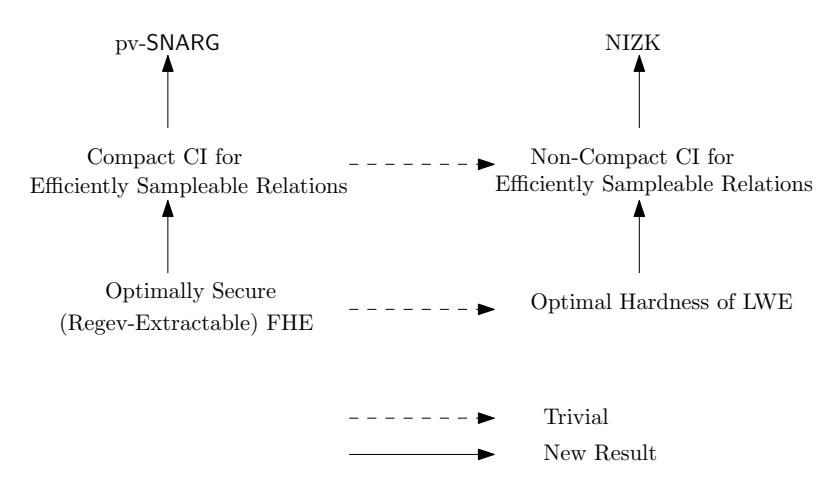

# Fiat-Shamir From Simpler Assumptions

Ran Canetti∗ Yilei Chen† Justin Holmgren‡ Alex Lombardi§ Guy N. Rothblum¶ Ron D. Rothblumk

October 23, 2018

#### **Abstract**

We present two new protocols:

- A succinct *publicly verifiable* non-interactive argument system for log-space uniform NC computations, under the assumption that any one of a broad class of fully homomorphic encryption (FHE) schemes has almost optimal security against polynomial-time adversaries. The class includes all FHE schemes in the literature that are based on the learning with errors (LWE) problem.
- A non-interactive zero-knowledge argument system for NP in the common random string model, assuming almost optimal hardness of search-LWE against polynomial-time adversaries.

Both results are obtained by applying the Fiat-Shamir transform with explicit, efficiently computable functions (specifically, correlation intractable functions) to certain classes of interactive proofs. We improve over prior work by reducing the security of these protocols to qualitatively weaker computational hardness assumptions. Along the way, we also show that the Fiat-Shamir transform can be soundly applied (in the plain model) to a richer class of protocols than was previously known.

∗Boston University and Tel Aviv University. Member of CPIIS. Supported by NSF awards 1413920 & 1801564, ISF award 1523/14. canetti@bu.edu.

†Visa Research. Email: chenyilei.ra@gmail.com. Research conducted while the author was at Boston University supported by the NSF MACS project and NSF grant CNS-1422965.

‡Princeton University. Email: justin.holmgren@princeton.edu. Research conducted in part while the author was at MIT, supported in part by the NSF MACS project.

§MIT. Email: alexjl@mit.edu. Research supported in part by an NDSEG fellowship. Research supported in part by NSF Grants CNS-1350619 and CNS-1414119, and by the Defense Advanced Research Projects Agency (DARPA) and the U.S. Army Research Office under contracts W911NF-15-C-0226 and W911NF-15-C-0236.

¶Weizmann Institute of Science. Email: rothblum@alum.mit.edu.

kTechnion. Email: rothblum@cs.technion.ac.il. Parts of this research were conducted while the author was at MIT. This research was supported in part by the Israeli Science Foundation (Grant No. 1262/18).

# **Contents**

| 1 | Introduction 1 |                                                                     |    |
|---|-------------------|---------------------------------------------------------------------|----|
|   | 1.1               | Our Contributions                                                | 2  |
|   | 1.2               | Related Work                                                     | 4  |
| 2 |                   | Our Techniques                                                      | 6  |
|   | 2.1               | Round-By-Round Soundness                                         | 7  |
|   | 2.2               | Bounded Correlation Intractable Hash Families                    | 8  |
|   | 2.3               | Constructing Optimal Bounded-KDM Secure Encryption               | 9  |
| 3 |                   | Correlation Intractability from KDM-Secure Encryption               | 13 |
|   | 3.1               | Correlation Intractable Hash Functions                           | 14 |
|   | 3.2               | Encryption Schemes and Key-Dependent Message (KDM) Security      | 15 |
|   | 3.3               | Correlation Intractability from Strong KDM Security              | 16 |
| 4 |                   | Optimally Secure KDM-Secure Encryption From Simpler Assumptions     | 18 |
|   | 4.1               | Learning with Errors                                             | 18 |
|   | 4.2               | (P/Poly)-KDM Security via Fully Homomorphic Encryption           | 19 |
|   | 4.3               | c SIZE(κ )-KDM Security via Randomized Encodings           | 22 |
| 5 |                   | Round-by-Round Soundness and Fiat-Shamir                            | 32 |
|   | 5.1               | Definitions: Interactive Proofs and Arguments                    | 32 |
|   | 5.2               | Round-by-Round Soundness                                         | 32 |
|   | 5.3               | Round-by-Round Soundness and Fiat-Shamir                         | 35 |
| 6 |                   | Publicly Verifiable SNARG                                        | 36 |
|   | 6.1               | Fields and Polynomials                                           | 36 |
|   | 6.2               | GKR: Round by Round Soundness and Efficient Sampleability        | 37 |
|   | 6.3               | Publicly Verifiable Delegation for Log-Space Uniform NC       | 40 |
| 7 |                   | Non-Interactive Zero Knowledge                                      | 41 |
|   | 7.1               | Non-Interactive Zero Knowledge Arguments                         | 41 |
|   | 7.2               | NIZK from Bounded Correlation Intractability                  | 42 |
|   | 7.3               | Our NIZK Protocol                                          | 47 |
|   | References        |                                                                     | 49 |
| A |                   | Success probability of polynomial time algorithms on LWE            | 54 |
|   | A.1               | The success probability of the lattice basis reduction approach  | 55 |

# **1 Introduction**

The Fiat-Shamir transform [\[FS86\]](#page-52-0) is an attractive template for designing non-interactive argument schemes:

- 1. Design a potentially highly interactive proof (or argument) system Π in which the verifier is "public-coin", meaning that its only messages are fresh random coins.
- 2. Compile Π into a two-message protocol ΠFS, as follows.
  - The ΠFS verifier first sends a description of a "sufficiently complex" hash function *h*.
  - The ΠFS prover responds with the transcript of an emulated execution of Π (including an input *x*, as well as all messages exchanged between the prover and verifier), in which each verifier message is set to be the value of *h* applied to the transcript so far.
  - The ΠFS verifier checks that the transcript it received is consistent with *h*, and that the verifier of Π would have accepted.

The resulting protocol ΠFS is indeed non-interactive (*h* can be chosen ahead of time, say as part of a common reference string), it is publicly verifiable, and it adds little in communication and computation. In practice, the Fiat-Shamir transform has been heuristically used as the basis for many important protocols, including identification and signature schemes, publicly-verifiable succinct non-interactive arguments (pv-SNARGs) and NIZKs, e.g. [\[FS86,](#page-52-0)[PS96,](#page-54-0)[Mic00,](#page-54-1)[BCS16,](#page-50-1)[WTS](#page-55-1)+18].

A central question in the foundational study of cryptography regards the security of this transformation:

*For which protocols and hash families does the Fiat-Shamir transform preserve soundness? Under what assumptions can we prove this?*

Security analysis in the random oracle model (ROM) has provided some justification for this design methodology: If *h* is modeled as a random oracle, then ΠFS is sound as long as Π is computationally sound and either has a constant number of rounds [\[FS86,](#page-52-0)[PS96,](#page-54-0)[AABN02\]](#page-50-2) or more generally, satisfies a stronger soundness property called *soundness against state restoration attacks* [\[BCS16\]](#page-50-1).

Still, it has remained largely open whether there exist *concrete* hash families that are "FScompatible" (i.e. that can guarantee soundness and potentially also zero-knowledge for the transformed protocol). Initial results in this direction were negative. Indeed, Goldwasser and Kalai [\[GK03\]](#page-52-1) (following Barak [\[Bar01\]](#page-50-3)) demonstrated a three-round, public-coin argument scheme for which applying the Fiat-Shamir transform with *any* hash family never yields a sound protocol. Furthermore, Bitansky et al. [\[BDG](#page-50-4)+13] show that, even when starting with a three-round *proof,* soundness of the Fiat-Shamir transform with a concrete hash family cannot be proved via black box reduction to a standard, game-based assumption.

In contrast, a recent line of work [\[KRR17,](#page-53-0)[CCRR18,](#page-52-2)[HL18\]](#page-53-1) *circumvents* the [\[BDG](#page-50-4)+13] impossibility result by using stronger than standard hardness assumptions to construct FS-compatible hash families. Kalai *et al.* [\[KRR17\]](#page-53-0) gave the first construction of a hash family that is FS-compatible for arbitrary constant-round (public-coin) interactive proofs, albeit from complex obfuscation assumptions. Canetti *et al.* [\[CCRR18\]](#page-52-2) then provide alternative constructions of FS-compatible hash families without obfuscation, but using complex KDM-security assumptions on secret-key encryption schemes.

We emphasize that the assumptions made by [\[KRR17,](#page-53-0)[CCRR18\]](#page-52-2) are highly complex in the following sense: both involve an adversary that is in part *computationally unbounded*. For example, the KDM security of [\[CCRR18\]](#page-52-2) allows messages to be *arbitrary* functions of the key (which may not be efficiently computable). These assumptions are problematic: they are not complexity assumptions [\[GK16\]](#page-52-3), and they are not falsifiable [\[Nao03,](#page-54-2)[GW11\]](#page-53-2) except with exponential time. Holmgren and Lombardi [\[HL18\]](#page-53-1), building on [\[KRR17\]](#page-53-0), construct a hash family with a different set of serious drawbacks; it relies on indistinguishability obfuscation and is applicable only to a comparatively limited class of protocols.

## **1.1 Our Contributions**

We construct explicit hash functions that are FS-compatible for a rich class of protocols, and we prove their security under assumptions that are qualitatively weaker than what was previously known. Using these hash families, we derive new results for delegation of computation and zero knowledge.

We first describe our delegation protocol, which we obtain by applying Fiat-Shamir to the interactive proof of [\[GKR08\]](#page-52-4) using our new FS-compatible hash functions (and overcoming some technical obstacles that will be further discussed below).

**Theorem 1** (Informally Stated, see Theorem [6.6\)](#page-42-2)**.** *If any one of the* LWE*-based fully homomorphic encryption schemes in the literature (such as [\[BV11,](#page-51-0) [BGV12,](#page-51-1) [Bra12,](#page-51-2) [GSW13,](#page-53-3) [BV14\]](#page-52-5)) has optimal security against polynomial-size key-recovery attacks, then there is a publicly verifiable succinct non-interactive argument (*pv*-*SNARG*) for (log-space uniform)* NC*. Moreover, there is an efficiently computable hash function family* H *such that applying the Fiat-Shamir transform to the [\[GKR08\]](#page-52-4) doubly efficient interactive proof, using* H*, results in such a protocol.*

Here and below, by optimal security against poly-size attacks, we mean that every poly-size circuit family breaks the assumption with probability at most *λ O*(1)*/*2 *λ* . We identify a range of the LWE parameters in which this assumption seem plausible. (This range, in particular, involves very high noise magnitude. See further discussion in Appendix [A\)](#page-55-0).

Note that this is the first time that the Fiat-Shamir transform, with an explicit hash function family, is meaningfully applied to an interactive protocol with a super-constant number of rounds. In particular the results of [\[KRR17,](#page-53-0)[CCRR18,](#page-52-2)[HL18\]](#page-53-1) only hold when the Fiat-Shamir transform is applied to constant-round protocols. See further discussion in Sections [1.1.2](#page-5-1) and [2.1.](#page-8-0)

Second, by applying the Fiat-Shamir transform to a specific instantiation of the classical [\[GMW91\]](#page-52-6) zero-knowledge proof-system we obtain a non-interactive (statistical) zero-knowledge argument for NP from a strong variant of LWE:

**Theorem 2** (Informally Stated, see Theorem [7.8\)](#page-48-1)**.** *If Search-*LWE *is optimally hard for polynomialsize adversaries, then there is an (adaptively sound) non-interactive statistical zero-knowledge (NISZK) argument for* NP*. Moreover, there is an efficiently computable hash family* H *such that applying the Fiat-Shamir transform to the [\[GMW91\]](#page-52-6) honest-verifier zero-knowledge proof, using* H *(and a specific commitment scheme), results in such a protocol.*

Note that the assumption made in Theorem [2](#page-3-1) is weaker than that made in Theorem [1](#page-3-2) as it is directly related to the Search-LWE problem (rather than relying on security of the fully homomorphic encryption schemes which rely on LWE together with a certain circular security assumption). Both assumptions are significantly simpler than those in previous work [\[KRR17,](#page-53-0)[CCRR18\]](#page-52-2). In particular, our assumptions do not involve a universal quantifier over computationally unbounded functions.

The proofs of both Theorems [1](#page-3-2) and [2](#page-3-1) rely on new *correlation intractable hash functions* that we construct as well as new insights on interactive proofs. We next describe these in more detail, since we believe they may be of independent interest. To do so, we first recall the notion of correlation intractability and its relation to Fiat-Shamir.

**Correlation Intractability.** Loosely speaking, a hash function family H is correlation intractable (CI) for a sparse relation *R* if any polynomial size adversary, given a description of *h* ← H, outputs *x* such that *x, h*(*x*) ∈ *R* with only negligible probability [\[CGH04\]](#page-52-7). (A relation is sparse if for every *x*, the fraction of *y*'s such that (*x, y*) ∈ *R*, is negligible.) The hash function is fully correlation intractable if it is *R*-correlation intractable for *all* sparse relations *R*. Halevi *et al.* [\[HMR08\]](#page-53-4) observed that if a hash family H is fully correlation intractable then it is also FS-compatible for every *constant-round* public-coin interactive proof.

Obtaining fully correlation intractable hash functions appears to be quite difficult; as discussed earlier, the only known constructions of such a hash family [\[KRR17,](#page-53-0)[CCRR18\]](#page-52-2) require assumptions that are not falsifiable except with exponential time. We circumvent this difficulty by focusing on hash families that are correlation intractable for a rich *subclass* of relations. Namely, we consider the class of relations *R* with the property that it is computationally easy, given an input *x*, to sample a random output *y* such that (*x, y*) ∈ *R*. We call such relations *efficiently sampleable*.

A priori, it is unclear (1) that such hash families are *useful* for obtaining the desired applications, and (2) that they are any easier to construct than fully correlation intractable hash families. The main focus of this work is showing that both of these are actually the case:

- We give new constructions of hash families that are correlation intractable for efficiently sampleable relations, extending the work of [\[CCRR18\]](#page-52-2). Crucially, we are able to prove security relying on simple, polynomial time game-based assumptions (albeit with exponentially small winning probability).
- We show that if a hash family H is correlation intractable for efficiently sampleable relations, then it suffices to instantiate the Fiat-Shamir transform in order to obtain both pv-SNARGs and NIZKs.

We now describe these two contributions in more detail.

## **1.1.1 Correlation Intractability for Efficient Relations**

We construct two types of efficiently computable hash families that are correlation intractable for the class of efficiently sampleable relations. In our first construction, the (polynomial) complexity of the hash family is allowed to depend on the complexity of sampling the relation.

**Theorem 3** (Informally Stated, see Theorems [3.11](#page-17-1) and [4.11\)](#page-25-0)**.** *If* Search*-*LWE *is optimally hard for polynomial-size circuits, then for every polynomial S*(*λ*)*, there is a hash family (whose description size grows with S) that is R-correlation intractable for all relations that are sampleable by size-S circuits.*

This theorem suffices for our construction of NIZK arguments (i.e., Theorem [2\)](#page-3-1) because the verifier (which must evaluate a hash function), is *allowed* to run in any polynomial time, even potentially *larger* than the time required by the NP verification procedure. In contrast, for our delegation application, we do not know how to use such a non-compact hash function. Rather, we construct a compact correlation intractable hash function (under a stronger assumption).

**Theorem 4** (Informally Stated, see Theorems [3.11](#page-17-1) and [4.6\)](#page-22-0)**.** *If any one of the* LWE*-based fully homomorphic encryption schemes in the literature (such as [\[BV11,](#page-51-0)[BGV12,](#page-51-1)[Bra12,](#page-51-2)[GSW13,](#page-53-3)[BV14\]](#page-52-5)) has optimal circular security*[1](#page-5-2) *against polynomial-size key-recovery attacks, then there exists a hash family that is R-correlation intractable for all relations R that are sampleable by polynomial-size circuits.*

## **1.1.2 Round-by-Round Soundness**

Toward proving Theorem [1,](#page-3-2) we would like to apply the Fiat-Shamir transform to the [\[GKR08\]](#page-52-4) protocol using the hash function that we constructed in Theorem [4.](#page-5-3) However, we run into a difficulty: correlation intractability is only known to suffice for the Fiat Shamir transform of *constant-round* interactive proofs, whereas the [\[GKR08\]](#page-52-4) protocol has a super-constant number of rounds.[2](#page-5-4)

We overcome this difficulty by formulating a stronger soundness requirement for public-coin interactive proofs that we call *round-by-round (RBR) soundness*. We show that RBR soundness suffices for applying the Fiat-Shamir transform (using a correlation intractable hash function) even for multi-round interactive proofs.[3](#page-5-5) To complete the proof of Theorem [1,](#page-3-2) we show that the [\[GKR08\]](#page-52-4) protocol satisfies RBR soundness and is moreover compatible with our notion of *bounded* correlation intractable hash functions.

As a side note, we also show that *any* public-coin interactive proof Π can be easily transformed into an interactive proof that has RBR soundness. The transformation simply applies parallel repetition. As an immediate corollary, fully correlation intractable hash families can be used to transform *any* public-coin, doubly-efficient interactive proof into a publicly verifiable non-interactive argument.

Our main results are summarized in Fig. [1:](#page-6-0)

# **1.2 Related Work**

**On Fiat-Shamir and Magic Functions.** Dwork et al. [\[DNRS99\]](#page-52-8) define *magic functions* to be FS-compatible hash functions for the case of transforming a three-round honest-verifier zero-

1The circular security assumption is actually redundant here because all these schemes include an encryption of the secret key to facilitate the bootstrapping procedure [\[Gen09\]](#page-52-9) and so their security implies that they are also circular secure.

2As a matter of fact, there exist statistically sound interactive proofs with a super constant number of rounds (and negligible soundness), to which the Fiat-Shamir transform cannot be applied securely, even in the random oracle model. Consider for example taking the sequential repetition of any interactive proof with constant soundness. While sequential repetition reduces the soundness at an exponential rate, applying the Fiat-Shamir transform (even in the random oracle model) results in an insecure protocol.

3We remark that *soundness against state restoration attacks* (which is weaker than RBR soundness) was shown by Ben Sasson *et al.* [\[BCS16\]](#page-50-1) to suffice for proving soundness of the Fiat-Shamir transform in the *random oracle model*, even for protocols with a super-constant number of rounds. In contrast, we are interested in using Fiat-Shamir in the *plain model* using explicit hash functions, see further discussion in Section [2.1.](#page-8-0)

Figure 1: Summary of results.

knowledge argument into a signature scheme, and study the relationship between the existence of magic functions and the existence of general three round zero knowledge protocols.

**Correlation Intractability and Fiat-Shamir** This work continues a series of recent developments [\[CCR16,](#page-52-10) [KRR17,](#page-53-0) [CCRR18,](#page-52-2) [HL18\]](#page-53-1) focused on instantiating correlation intractable hash functions in the standard model. We discuss the latter three works, which provide instantiations of FS-compatible hash functions in the standard model.

Kalai *et al.* [\[KRR17\]](#page-53-0) and Canetti *et al.* [\[CCRR18\]](#page-52-2) construct correlation intractable hash families from very strong assumptions. Specifically, [\[KRR17\]](#page-53-0) assumed input-hiding obfuscation for multi-bit point functions and general-purpose indistinguishability obfuscation. Subsequently, [\[CCRR18\]](#page-52-2) gave a construction that assumed encryption satisfying a form of nearly optimal key-dependent message (KDM) security. More specifically, they assume that polynomial-size adversaries cannot recover the secret key with significantly better probability than random guessing, even given encryptions of *arbitrary* (even inefficiently computable) functions of the secret key. [\[CCRR18\]](#page-52-2) then give candidate encryption schemes satisfying this security property under strong variants of the LWE and CDH assumptions.

We emphasize that both of these assumptions involve an adversary that is in part *computationally unbounded*. The input-hiding obfuscation in [\[KRR17\]](#page-53-0) applied to a distribution of point functions

$$P_{\alpha,\beta}(x) = \begin{cases} \beta & \text{if } x = \alpha \\ 0 & \text{otherwise} \end{cases}$$

must hide *α* even when *β* is chosen as an arbitrary function of *α*, and the KDM security of [\[CCRR18\]](#page-52-2) similarly allows messages to be arbitrary functions of the key. This makes these assumptions difficult to analyze, and in particular they are not falsifiable [\[Nao03,](#page-54-2) [GW11\]](#page-53-2) except with (non-uniform) exponential time.

A first step towards rectifying this situation was taken by Holmgren and Lombardi [\[HL18\]](#page-53-1), who consider a *weakening* of full correlation intractability. Their weakening essentially only asks for *R*-correlation intractability when *R* is *non-uniformly efficiently sampleable* – there is a circuit of fixed polynomial size that, given *x*, samples approximately uniformly from the set {*y* : (*x, y*) ∈ *R*}. [\[HL18\]](#page-53-1) constructs this form of "bounded" correlation intractable hash family from a subexponentially secure indistinguishability obfuscator and a nearly optimally secure one-way function, and demonstrate that this restricted form of correlation intractability still implies FS-compatibility for the [\[GMW91\]](#page-52-6) 3-message zero-knowledge proof system for NP. However, their result still requires subexponentially secure indistinguishability obfuscation and has no implications for pv-SNARGs.

**pv-**SNARG**s.** Constructions of pv-SNARGs are known in the random oracle model [\[Mic00\]](#page-54-1), from knowledge assumptions [\[BCC](#page-50-5)+17], or from generic assumptions on strong (noiseless) graded encodings with no known candidates [\[PR17\]](#page-54-3).

A construction of pv-SNARGs was also given by [\[CCRR18\]](#page-52-2): they applied the Fiat-Shamir transform (using their hash family) to the [\[RRR16\]](#page-54-4) constant round interactive proof system for bounded space computation.

In very recent independent work, Kalai *et al.* [\[KPY18\]](#page-53-5) also construct a publicly verifiable argument system for (logspace uniform) NC. On the positive side, they rely only on falsifiable assumptions about groups equipped with a bilinear map. However, their argument system is in the *preprocessing model*. In this model, the prover and verifier have access to a common reference string, which is as long as the computation transcript (and must be generated securely by a trusted party). In contrast, our protocol requires only a short common random string but relies on seemingly stronger assumptions.

Lastly, we remark that *privately-verifiable* (aka designated verifier) non-interactive arguments for all of **P** are known to exist under LWE [\[KRR14,](#page-53-6)[BHK17\]](#page-51-3).

NIZK **Arguments for** NP**.** NIZK arguments for NP are currently known from trapdoor permutations [\[FLS99\]](#page-52-11), falsifiable assumptions on bilinear maps [\[GOS06\]](#page-53-7), or indistinguishability obfsucation [\[SW14,](#page-55-2) [BP15\]](#page-51-4). The works [\[GOS06,](#page-53-7) [SW14\]](#page-55-2) also construct NIZK arguments for NP satisfying statistical zero knowledge. Constructing NIZK proofs (or even arguments) for NP from LWE is a long-standing open problem.

NIZK arguments simultaneously satisfying adaptive soundness and statistical zero knowledge are currently only known from knowledge assumptions[4](#page-7-1) [\[AF07\]](#page-50-6), so our construction is the first such NIZK proven secure under a complexity assumption.

Prior works on instantiating the Fiat-Shamir heuristic in the standard model [\[KRR17,](#page-53-0)[CCRR18,](#page-52-2) [HL18\]](#page-53-1) also give NIZK argument schemes for NP under qualitatively stronger assumptions than what is required in this work.

Finally, while not explicitly noted in prior work, combining results of [\[CCR16,](#page-52-10) [HL18\]](#page-53-1) yields a construction of NIZK arguments (in the common reference string model) from sub-exponentially secure indistinguishability obfuscation and VGB obfuscation. This is the only standard model application of Fiat-Shamir that we are aware of that does not require assuming nearly optimal hardness.

# **2 Our Techniques**

We now describe our contributions and high level proof ideas in more detail.

4 In particular, the [\[GOS06\]](#page-53-7) and [\[SW14\]](#page-55-2) constructions of NISZK arguments are not shown to be adaptively sound.

#### 2.1 Round-By-Round Soundness

We provide a new soundness definition for interactive proofs that interacts well with the Fiat-Shamir transform. We say that a public-coin interactive proof  $\Pi$  for a language L is round-by-round (RBR) sound if at any stage of the protocol there is a well-defined state (depending on the transcript thus far) and some of these states are "doomed"; in the sense that once doomed you will forever remain doomed. More specifically, the first requirement is that for  $x \notin L$ , the initial state (i.e., corresponding to the empty transcript) is doomed. Second, for every doomed state and every possible next message that a cheating prover might send, with overwhelming probability over the verifier's next message, the protocol state will still be doomed. Lastly, we require that if at the end of the interaction the state is doomed then the verifier will reject (in particular, the state function is efficiently computable on full transcripts).

An illustrative example of an interactive proof with round-by-round soundness is the celebrated sumcheck protocol of Lund *et al.* [LFKN92]. Recall that the purpose of the sumcheck protocol is to allow the verifier to check a claim of the form  $\sum_{x_1,...,x_m\in\{0,1\}} P(x_1,...,x_m) = \mathbb{V}$ , where  $P:\mathbb{F}^m\to\mathbb{F}$  is an m-variate polynomial (to which the verifier has oracle access) over a finite field  $\mathbb{F}$  and  $\mathbb{V}\in\mathbb{F}$  is a fixed field element.5

The protocol proceeds as follows - the first message from the prover is the (univariate) polynomial  $g(\cdot) = \sum_{x_2,\dots,x_m \in \{0,1\}} P(\cdot,x_2,\dots,x_m)$ . Upon receiving some polynomial  $\tilde{g}$  (which may or may not be equal to the prescribed g) from the prover, the verifier checks that it is indeed a low degree polynomial and that  $\tilde{g}(0) + \tilde{g}(1) = \mathbb{V}$ . Observe that if the initial claim is false, then the prover must send a polynomial  $\tilde{g} \not\equiv g$  (or the verifier will immediately reject). Since g and  $\tilde{g}$  are low degree polynomials, they must differ on many points. The idea then is for the verifier to select  $\mathbb{r}_1 \in \mathbb{F}$  at random and send  $\mathbb{r}_1$  to the prover. Since g and  $\tilde{g}$  differ on many points, with high probability  $\tilde{g}(\mathbb{r}_1) \neq g(\mathbb{r}_1) = \sum_{x_2,\dots,x_m \in \{0,1\}} P(\mathbb{r}_1,x_2,\dots,x_m)$ . The point is that the latter equation is a sumcheck instance with respect to an (m-1)-variate polynomial  $P'(x_2,\dots,x_m) \stackrel{\text{def}}{=} P(\mathbb{r}_1,x_2,\dots,x_m)$ , so the parties recursively run the sumcheck protocol on P'.

To see that the sumcheck protocol has round-by-round soundness we define a partial transcript as doomed if the initial claim for the corresponding step in the recursion is false. As explained above, the sumcheck protocol has the property that at any step of the recursion if we start with a false claim then, with overwhelming probability, we end up with a false claim for the next step in the recursion. This is exactly the meaning of round-by-round soundness. For further details, see Section 5.

As one of our contributions, and toward establishing our main delegation result, in Section 6 we show that the GKR protocol for log-space uniform NC also has round-by-round soundness.

Round-by-round Soundness and Fiat-Shamir. Our primary motivation for defining round-by-round soundness is to instantiate the Fiat-Shamir transform in the standard model for protocols with a possibly super-constant number of rounds. Indeed, we show that a correlation-intractable hash family suffices for the soundness of the FS transform if the initial protocol is RBR-sound.

To see this, fix any RBR-sound interactive proof  $\Pi$  along with an input  $x \notin L$ , and consider the

&lt;sup>5Here and throughout this work we use lowercase blackboard font to denote elements of a finite field.

relation:

$$R \stackrel{\mathsf{def}}{=} \left\{ (\tau, \beta) : \begin{array}{c} \tau \text{ is a doomed partial transcript} \\ \text{and} \\ \tau | \beta \text{ is not doomed} \end{array} \right\}$$

(where *τ* is a partial transcript ending with a prover message and *β* is a verifier message).

Round-by-round soundness ensures that *R* is a sparse relation. Suppose we now apply the Fiat-Shamir transform to the interactive proof, while using a hash function *h* that is *R*-correlation intractable. Suppose further that the (computational) soundness of the resulting non-interactive argument is broken. By definition of RBR soundness, this means that the cheating prover has efficiently found some partial transcript *τ* and verifier message *β* = *h*(*τ* ) such that *τ* is doomed, but (*τ, β*) is not doomed.[6](#page-9-1) Thus, the prover can be used to find a pair *τ, h*(*τ* ) ∈ *R*, in contradiction to the correlation intractability of the hash function.

**Round-by-Round Soundness vs. State Restoration Attacks.** A *state restoration attack* [\[BCS16\]](#page-50-1) on an interactive proof (or more generally an interactive oracle proof) is a cheating prover strategy that is allowed to rewind the protocol to some previous state a limited number of times. Ben Sasson *et al.* showed that soundness against state restoration attacks suffices for compiling interactive proofs using the Fiat-Shamir in the *random oracle model*. [7](#page-9-2)

Negligible round-by-round soundness readily implies state restoration soundness for a polynomial number of rewinds. Although it seems reasonable that soundness against state restoration attacks would suffice for instantiating the Fiat-Shamir transform using a correlation interactable hash function (rather than in the random oracle model as shown in [\[BCS16\]](#page-50-1)), we were unable to prove this.

## **2.2 Bounded Correlation Intractable Hash Families**

So far, we have shown that correlation intractable hash functions can be used to instantiate the Fiat-Shamir transform for the [\[GKR08\]](#page-52-4) protocol, yielding pv-SNARGs. In addition, it was already known[8](#page-9-3) [\[CCRR18,](#page-52-2)[HL18\]](#page-53-1) that correlation intractable hash families – with mild additional properties – are also sufficient to yield NIZK argument schemes for NP.

The rest of this work focuses on new constructions of correlation intractable hash families that suffice to yield these applications. These constructions and security reductions all use as a first step (a parameterized version of) the main theorem of [\[CCRR18\]](#page-52-2) (our Theorem [3.11\)](#page-17-1), which shows how to interpret a secret-key encryption scheme as a correlation intractable hash family if the encryption scheme satisfies two properties (the first being a statistical property and the second a computational one):

1. **Universal Ciphertexts:** An encryption of a random message under any fixed secret key is distributed like an encryption of a random message under a *random* secret key. In particular, this means that ciphertexts are not attached to any one particular key.

6Such a partial transcript must exist since the empty transcript is doomed, but a full accepting transcript is not doomed.

7Prior to the work of [\[BCS16\]](#page-50-1) this was only shown for *constant-round* interactive proofs [\[HMR08\]](#page-53-4).

8As mentioned earlier, we do improve on previous Fiat-Shamir NIZK instantiations by obtaining statistical zero knowledge, for example.

2. Nearly Optimal Bounded-KDM Security against Poly-size Adversaries: For any function f computable by circuits of a fixed polynomial size, every adversary of arbitrary polynomial size can, given an encryption of f(k) under a (uniformly random) key k, can recover k with probability at most  $1/\tilde{\Omega}(2^{|k|})$  - i.e., only a polynomial factor better than guessing.

The above property does not suffice to obtain correlation intractable hash families for *all* sparse relations; however, it *does* suffice to obtain hash families that are correlation intractable for all sparse relations that are *sampleable* in some fixed polynomial time. We note that the notion of "bounded correlation intractability" considered in this work is incomparable to that of [CCR16]; they consider correlation intractability for relations that are *decidable* in a fixed polynomial time.

Since the relations arising from the [GKR08] protocol and a broad class (including [GMW91]) of 3-message zero knowledge proofs for NP satisfy the above notion of efficient sampleability, we have reduced the overall problem to constructing encryption schemes satisfying this weaker notion of bounded-KDM security.

# 2.3 Constructing Optimal Bounded-KDM Secure Encryption

There is a long line of prior work on constructing bounded-KDM secure encryption schemes [BHHO08, ACPS09, BG10, BHHI10, App11]. Unfortunately, the *optimal* level of security stated above that we require is more stringent than was achieved by prior work (which considered any negligible success probability) and poses a significant technical problem, especially when combined with the universal ciphertexts requirement. Still, we show that some of the techniques and instantiations can be adapted to our setting.

Non-Compact CI from Search-LWE. We construct an encryption scheme as above assuming the nearly optimal hardness of search-LWE for poly-time adversaries. Our construction follows the blueprint of [App11], which shows that the class of functions for which an encryption scheme satisfies KDM security can be *amplified* using randomized encodings in the regime of polynomial-size adversaries with inverse polynomial success probabilities.

Recall that a randomized encoding [AIK04] for a function f is a randomized function  $\hat{f}$  such that  $\hat{f}(x)$  reveals exactly f(x) and nothing  $\operatorname{else}^9$  – i.e., there are algorithms RE.Dec and RE.Sim such that for all x, RE.Dec $(\hat{f}(x)) = f(x)$ , and RE.Sim $(f(x)) \approx \hat{f}(x)$ . The key point is achieving this so that the function  $\hat{f}$  is significantly simpler than f in some way. For example, Yao's garbled circuits [Yao86] are a randomized encoding  $\hat{f}$  for any polynomial-time computable f, with the special property that for every f and every input length f, each bit of  $\hat{f}(x; r)$  for f0, f1 is a projection of f2 – that is, either a constant or f3 for some fixed f4 is a large f5 for some fixed f6 for some fixed f8.

Applebaum's idea, following [BHHI10], was to construct an f-KDM secure encryption scheme out of an encryption scheme  $\mathcal E$  that is  $\hat f(\cdot;r)$ -KDM secure for every choice of randomness r. Since  $\hat f$  is simpler than f, we have made progress. Specifically, the constructed scheme  $\mathcal E'$  encrypts messages as  $\mathcal E'$ . Enc $(m) \stackrel{\mathsf{def}}{=} \mathcal E$ . Enc $(\mathsf{RE}.\mathsf{Sim}(m))$ , and correspondingly decrypts ciphertexts as  $\mathcal E'$ . Dec $(\mathsf{ct}) \stackrel{\mathsf{def}}{=} \mathsf{RE}.\mathsf{Dec}(\mathcal E.\mathsf{Dec}(\mathsf{ct}))$ . The point is that an adversary for  $\mathcal E'$  receives  $\mathcal E'$ . Enc $(f(k)) \equiv \mathcal E.\mathsf{Enc}(\mathsf{RE}.\mathsf{Sim}(f(k))) \approx \mathcal E.\mathsf{Enc}(\hat f(k;r))$  for some random r, which still "protects" k by the assumed

&lt;sup>9Technically,  $\hat{f}(x)$  may also reveal the input length |x|. We will avoid this technicality by, without loss of generality, only considering functions that additionally output the length of their input.

KDM security of  $\mathcal{E}$ . This construction can also be modified to obtain a (single) encryption scheme that is simultaneously f-KDM secure for all f in a family  $\mathcal{F}$ . What is needed in this case is (1) a randomized encoding for a universal function  $U_{\mathcal{F}}$ , that takes as input a description of  $f \in \mathcal{F}$  and an input x and outputs f(x), and (2) an encryption scheme  $\mathcal{E}$  that is  $\hat{U}_{\mathcal{F}}(f,\cdot;r)$ -KDM secure for every f and r.

Crucially, we observe that the additional properties we require of  $\mathcal{E}'$ , namely universal ciphertexts and nearly optimal security, are inherited from  $\mathcal{E}$  as long as the randomized encoding scheme RE satisfies two additional properties. First (to ensure universal ciphertexts), RE should be blind [BLSV18]: for a uniformly random y, RE.Sim(y) should also be uniformly random. Additionally, RE should be  $1/\tilde{\Omega}(2^{|k|})$ -secure.

Bounded KDM Security from Binary-Secret Search-LWE. Our first approach for instantiating the above framework is to use point-and-permute garbled circuits [BMR90] in conjunction with the known circular security of binary-secret Regev encryption. Point-and-permute garbled circuits are perfectly blind [BLSV18], they yield a universal randomized encoding  $\hat{U}$  for all circuits of some fixed polynomial size, and Regev encryption with an appropriate 10 noise distribution also has (perfectly) universal ciphertexts.

In terms of security, the randomized encoding  $\hat{U}$  can also be made sufficiently secure if one-way functions exist that are  $2^{-\lambda^{\Omega(1)}}$ -hard to invert for  $\lambda^{O(1)}$ -size adversaries. This assumption is in turn implied by our nearly-optimal Search-LWE assumption. As mentioned previously, for any fixed circuit C and randomness r, each bit of  $\hat{U}(C,x;r)$  is a projection of x. Regev encryption with binary secrets is known to be KDM-secure with respect to such projections of the key, under the assumption that binary-secret Search-LWE is hard, and the reduction in fact preserves nearly optimal hardness [ACPS09].

Combining point-and-permute garbled circuits with Regev encryption with binary secrets thus yields, for any polynomial S = S(n), an encryption scheme that has universal ciphertexts and is KDM-secure with respect to any size-S computable functions.

Bounded KDM Security from More General Search-LWE One unsettling aspect of the preceding construction is the reliance on binary-secret LWE, a variant for which algorithms empirically perform better [BG14]. Although we are not aware of attacks on binary-secret LWE that are successful enough to refute a nearly-optimal security conjecture, we still wish to base our constructions on a more general setting of parameters.

We do so by turning to the encryption scheme of [ACPS09], a variant of Regev encryption whose KDM security reduces to Search-LWE with a secret distribution in which each coordinate has higher entropy. Specifically, the secret distribution is uniform over  $[-\frac{p}{2},\frac{p}{2})^n$ , and the noise distribution is uniform over  $[-\frac{q'}{2},\frac{q'}{2})^\ell$ , for a modulus q=pq' and a prime p. Unfortunately, the KDM security of this scheme is with respect to affine functions over  $\mathbb{Z}_p$ . In particular, this scheme is not known to be secure with respect to bit-by-bit encryptions of its secret key.

To address this difficulty, we construct a new blind randomized encoding from sub-exponentially secure one-way functions for the function  $U_p$  that takes as input a boolean circuit  $C: \mathbb{Z}_p^n \to \{0,1\}^{\ell}$  (with elements of  $\mathbb{Z}_p^n$  encoded in binary), an input  $x \in \mathbb{Z}_p^n$ , and outputs C(x). Our construction

 $^{10}$ Specifically, let the modulus q be even, and take the noise distribution to be uniform on the interval [-q/4, q/4). With a limited number of samples (as is the case in our application), Search-LWE with this setting of parameters reduces to the more typical "narrow discrete Gaussian" noise by a "drowning out the noise" technique.

has the property that for any C and any r, the function  $\hat{U}_p(C,\cdot;r)$  is  $\mathbb{Z}_p$ -affine, which renders our construction suitable for amplifying the KDM security of [ACPS09].

Our construction composes two (blind) randomized encodings.

- 1. Point-and-permute garbled circuits, which give an encoding  $\hat{U}_{\mathsf{bin}}$  of the function  $U_{\mathsf{bin}}$  that maps  $(C, x) \mapsto C(x)$ , where  $C : \mathbb{Z}_p^n \to \{0, 1\}^\ell$  is a boolean circuit, and  $x \in \mathbb{Z}_p^n$  is an input. The advantage of this scheme is that it supports arbitrary, e.g. high-depth circuits. On the other hand,  $\hat{U}_{\mathsf{bin}}(C, \cdot; r)$  is a projection of the binary representation of x, instead of a  $\mathbb{Z}_p$ -affine function of x.
- 2. An encoding  $\hat{U}_{\mathsf{proj}}$  for projections  $\pi: \mathbb{Z}_p^n \to \{0,1\}$ , where for any  $\pi$ , the function  $\hat{U}_{\mathsf{proj}}(\pi,\cdot;r)$  is affine over  $\mathbb{Z}_p$ . Such a randomized encoding follows from a (modified) result of [AIK11] (hereafter AIK), which states that any function f computable by a uniform depth-d arithmetic circuit (ensemble)  $\{C_n: \mathbb{Z}_p^n \to \mathbb{Z}_p\}_n$  has a perfectly secure, perfectly blind randomized encoding  $\hat{f}$  such that  $\hat{f}(\cdot;r)$  is affine over  $\mathbb{Z}_p$  for every r. Specifically, we represent  $\pi$  by a vector  $\mathbf{e} \in \{0,1\}^{n \cdot \lceil \log p \rceil}$  (with at most one 1) and a bit b such that  $\pi(x) = \langle \mathbf{e}, \llbracket x \rrbracket \rangle \oplus b$ , where  $\llbracket x \rrbracket$  denotes the binary representation of x. Then we use the AIK encoding of

$$U_{\text{proj}}((\mathbf{e},b),x) = \langle \mathbf{e}, \llbracket x \rrbracket \rangle \oplus b = b \cdot \left( \sum_{i=1}^{n \cdot \lceil \log p \rceil} e_i \cdot \llbracket x \rrbracket_i \right) + (1-b) \cdot \left( 1 - \sum_{i=1}^{n \cdot \lceil \log p \rceil} e_i \cdot \llbracket x \rrbracket_i \right).$$
(1)

 $U_{\mathsf{proj}}$  is computable by a depth  $O(\log n + \log p)$  and size  $\tilde{O}(n \cdot p)$  arithmetic circuit over  $\mathbb{Z}_p$  by applying the formula

$$[x_j]_k = \sum_{y \in \mathbb{Z}_p : [y]_k = 1} (1 - (y - x_j)^{p-1})$$

to compute each  $[x]_i$ .

A first attempt at composition defines11  $\hat{U}_p(C, x; r_{\mathsf{proj}}, r_{\mathsf{bin}}) \stackrel{\mathsf{def}}{=} \hat{U}_{\mathsf{proj}}(\hat{U}_{\mathsf{bin}}(C, \cdot; r_{\mathsf{bin}}), x; r_{\mathsf{proj}})$ , but this (with the natural simulator) is not blind. The issue is that the simulator for  $\hat{U}_{\mathsf{bin}}$  produces a uniformly random string with alphabet  $\{0, 1\}$ , but the AIK simulator for  $\hat{U}_{\mathsf{proj}}$  requires a uniformly random string with alphabet  $\mathbb{Z}_p$  for its output to be uniformly random (also with alphabet  $\mathbb{Z}_p$ ).

To remedy this, we modify  $\hat{U}_{\mathsf{proj}}$ . To start, we partition  $\mathbb{Z}_p$  into two sets of nearly equal size,  $\mathbb{Z}_p = P^{(0)} \sqcup P^{(1)}$ , and define a function  $U'_{\mathsf{proj}}$  that, compared to  $U_{\mathsf{proj}}$  takes two additional inputs  $r^{(0)}$  and  $r^{(1)}$ . On input  $((\mathbf{e}, b, r^{(0)}, r^{(1)}), x)$ ,  $U'_{\mathsf{proj}}$  outputs  $r^{(\langle \mathbf{e}, \llbracket x \rrbracket) \rangle \oplus b}$  (this can be done by a low-depth circuit analogous to Eq. (1)). We then redefine  $\hat{U}_{\mathsf{proj}}$  so that  $\hat{U}_{\mathsf{proj}}((\mathbf{e}, b), x)$  samples  $r^{(0)} \leftarrow P^{(0)}$  and  $r^{(1)} \leftarrow P^{(1)}$ , then returns the AIK encoding  $\hat{U}'_{\mathsf{proj}}((\mathbf{e}, b, r^{(0)}, r^{(1)}), x)$ . The new decoder for  $\hat{U}_{\mathsf{proj}}$  evaluates the AIK decoder for  $\hat{U}'_{\mathsf{proj}}$ , obtaining  $y' \in \mathbb{Z}_p$ , and outputs b if  $y' \in P^{(b)}$ . The new simulator for  $\hat{U}_{\mathsf{proj}}$  on input b samples  $y' \leftarrow P^{(b)}$ , and then returns the output of the AIK simulator for  $\hat{U}'_{\mathsf{proj}}$  on y'.

This nearly completes the description of our randomized encoding, except for one subtle issue. For any odd prime p, it is impossible for a partition  $\mathbb{Z}_p = P^{(0)} \sqcup P^{(1)}$  to be exactly balanced. This

&lt;sup>11Here, we abuse notation in two ways. First, we write  $\hat{U}_{\mathsf{bin}}(C, \cdot; r_{\mathsf{bin}})$  to denote the *descriptions* of the corresponding projection functions. Second, we allow  $\hat{U}_{\mathsf{proj}}$  to take as input these *multiple* projection functions. We let  $\hat{U}_{\mathsf{proj}}((\pi_1, \dots, \pi_m), x)$  denote the product distribution  $\hat{U}_{\mathsf{proj}}(\pi_1, x) \times \dots \times \hat{U}_{\mathsf{proj}}(\pi_m, x)$ .

causes the randomized encoding to only be *approximately* blind, where our notion of approximation is the *Renyi divergence* (rather than statistical difference) between the simulator output distribution and the uniform distribution. To suitably decrease the approximation error, we need to replace Z*p* by Z *k p* for a sufficiently large *k*.

**A Compact Family From FHE.** While the above hash families suffice to obtain NIZK argument schemes, they *do not* yield pv-SNARGs when combined with the [\[GKR08\]](#page-52-4) protocol. This is because in the above hash family, the description of a hash function (and the complexity of hashing) grows polynomially with the complexity of the sampling algorithms of the relations *R* for which correlation intractability holds.[12](#page-13-0) In order to obtain pv-SNARGs, we require a hash family (corresponding to an encryption scheme) that is SIZE(*S*)-correlation intractable, but yet consists of functions that are evaluable in time much less than *S*. We in fact construct something stronger – a single hash family that is correlation intractable against all relations that are sampleable by polynomial-size circuits.

This construction also adapts KDM-security amplification techniques in the literature; instead of using randomized encodings [\[App11\]](#page-50-8), we use fully homomorphic encryption to amplify KDMsecurity. In particular, [\[BHHI10\]](#page-51-7) observe that any *circularly secure* FHE scheme satisfying a strong form of evaluation correctness[13](#page-13-1) is also KDM-secure for arbitrary polynomial functions of the secret key. The basic [\[BHHI10\]](#page-51-7) idea is that an adversary can homomorphically generate encryptions of *f*(*k*) from the encryption of *k* (for efficiently computable functions *f*).

The [\[BHHI10\]](#page-51-7) observation suggests the following plan to obtain the CI hash families that we desire: start with a FHE scheme that has universal ciphertexts and (sufficiently strong) circular security, and invoke an appropriately modified [\[BHHI10\]](#page-51-7) argument. However, there are two major flaws in this plan.

- No fully homomorphic encryption scheme in the literature has (anything remotely resembling) universal ciphertexts. Indeed, all schemes in the literature utilize (at the very least) some form of a low-noise Regev encryption, which itself is very far from having universal ciphertexts. A low-noise Regev ciphertext (*A, b*) under secret key *s* has the property that *s tA* − *b* is close to either 0 or *q* 2 , and therefore Regev encryption is not universal.
- It is not clear how to adapt the [\[BHHI10\]](#page-51-7) security reduction (that relies on a generic FHE scheme) to the setting of (near-)optimal security. This is because [\[BHHI10\]](#page-51-7) relies on a FHE scheme with the following strong correctness property: the distribution Eval(*f,* Enc(*x*)) is statistically indistinguishable from an encryption of *f*(*x*). In the setting of near-optimal security, a naive application of the [\[BHHI10\]](#page-51-7) argument would require an extreme form of this correctness property that does not hold for existing FHE schemes in the literature.

As a result of these problems, we deviate from the plan above in order to achieve unbounded polynomial correlation intractability. Instead of directly working with a fully homomorphic encryption scheme *in the construction*, we consider secret-key Regev encryption, with secret keys uniformly distributed over a moderately sized interval [−*B, B*) *n* ⊂ Z *n q* , and noise distribution [−*q/*4*, q/*4). This setting of parameters (which by design yields a scheme with universal ciphertexts) was proposed

12In the case of [\[GKR08\]](#page-52-4), we can only give a sampling algorithm that runs in time poly(*T*), which ruins succinctness.

13Namely, that an *f*-evaluated encryption of *m* is statistically indistinguishable from an encryption of *f*(*m*)

by [CCRR18]14, and should be contrasted with the typical Regev encryption scheme in which the secret is uniform in  $\mathbb{Z}_a^n$  but the noise must be smaller to allow for correct decryption.

We prove that this encryption scheme satisfies unbounded polynomial KDM-security using some associated FHE scheme *in the security proof*.

The KDM security of Regev encryption with these parameters follows from two main observations.

- 1. Many natural fully homomorphic encryption schemes (e.g., [BV11, BGV12, Bra12, GSW13, BV14]) contain a low-noise instantiation of Regev encryption "embedded" within them. That is, from any homomorphically evaluated ciphertext that decrypts to m under an FHE key s, one can efficiently extract a small-noise Regev encryption of m under s. We call this property Regev-extractability.
- 2. Any Regev ciphertext with small noise (which may be arbitrary and malicious) can be rerandomized to obtain a Regev ciphertext whose noise distribution is statistically approximately uniform over  $[-q/4, q/4)^m$ .

Combining (1) and (2) yields a multiplicatively advantage-preserving reduction from the KDM security of high-noise Regev to the circular security of the (low-noise) Regev-extractable FHE scheme. At a high level, the reduction works as follows: given FHE-circular ciphertexts  $\{\mathsf{ct}_i = \mathsf{FHE}.\mathsf{Enc}(\mathsf{sk},\mathsf{sk}_i)\}_i$ , one can homomorphically compute a (non-random) FHE-ciphertext corresponding to an arbitrary polynomial function  $f(\mathsf{sk})$ . Then, a secret-key Regev ciphertext of  $f(\mathsf{sk})$  can be extracted from this FHE-ciphertext, and the Regev ciphertext can be re-randomized to obtain an approximately uniform Regev encryption of  $f(\mathsf{sk})$ . Thus, an algorithm that recovers  $\mathsf{sk}$  from a Regev encryption of  $f(\mathsf{sk})$  with better-than-trivial probability can be used to achieve the same key recovery success for the FHE scheme.

We note that a crucial aspect of the analysis is the use of Renyi divergence rather than total variational (aka, statistical) distance in characterizing the re-randomization sampling error.

# 3 Correlation Intractability from KDM-Secure Encryption

This section recalls the definitions of correlation intractable (CI) hash functions and encryption schemes that are secure against key-dependent message (KDM) attacks, as well as the [CCRR18] construction of CI hash functions from strong KDM secure encryption.

Since this work crucially relies on finer-grained notions of indistinguishability and security against resource bounded adversaries, we first fix the following notation, which is more fine-grained than the standard one. We say that two distribution ensembles  $\{X_{\lambda}\}$  and  $\{Y_{\lambda}\}$  are  $(s(\lambda), \delta(\lambda))$ -indistinguishable if for all  $O(s(\lambda))$ -sized circuit ensembles  $\{A_{\lambda}\}$ ,

$$\left| \Pr \left[ \mathcal{A}_{\lambda}(X_{\lambda}) = 1 \right] - \Pr \left[ \mathcal{A}_{\lambda}(Y_{\lambda}) = 1 \right] \right| \le O(\delta(\lambda)).$$

If  $\{X_{\lambda}\}$  and  $\{Y_{\lambda}\}$  are  $(\lambda^c, \delta)$ -indistinguishable for all c > 0 then we say they they are  $\delta$ -indistinguishable. If  $\{X_{\lambda}\}$  and  $\{Y_{\lambda}\}$  are  $(\lambda^c, 1/\lambda^c)$ -indistinguishable for all c > 0 then we say they they are polynomially indistinguishable. Throughout, we extend this notational convention also to other primitives and their security.

&lt;sup>14 [CCRR18] leaves the relationship between B and q to be arbitrary except that  $B \leq q$ ; we require that B is significantly smaller than q because we reduce from the security of (necessarily low-noise) FHE schemes. Our notion of optimal security for these FHE schemes can only hold when the secret has less entropy than the noise.

#### 3.1 Correlation Intractable Hash Functions

**Definition 3.1.** A hash family is a collection  $\mathcal{H} = \{h_{\lambda} : \mathcal{I}_{\lambda} \times X_{\lambda} \to Y_{\lambda}\}_{\lambda \in \mathbb{Z}^+}$  of keyed hash functions such that  $\{\mathcal{I}_{\lambda}\}$  is uniformly  $\operatorname{poly}(\lambda)$ -time sampleable and  $\{h_{\lambda}\}$  is uniformly  $\operatorname{poly}(\lambda)$ -time evaluable. We will also write  $\mathcal{H}_{\lambda}$  to denote the distribution on functions  $h_{\lambda}(I,\cdot)$  obtained by sampling  $I \leftarrow \mathcal{I}_{\lambda}$ .

The above definition details the *functionality* of a hash function; there are several security notions that one could require. We focus on (single input) correlation intractability, as put forth by Canetti *et al.* [CGH04].

**Definition 3.2** (Correlation Intractability). For a given relation ensemble  $R = \{R_{\lambda} \subseteq X_{\lambda} \times Y_{\lambda}\}$ , a hash family  $\mathcal{H} = \{h_{\lambda} : \mathcal{I}_{\lambda} \times X_{\lambda} \to Y_{\lambda}\}_{{\lambda} \in \mathbb{Z}^+}$  is said to be R-correlation intractable if for every polynomial-size  $\mathcal{A} = \{\mathcal{A}_{\lambda}\}$ ,

$$\Pr_{\substack{I \leftarrow \mathcal{I}_{\lambda} \\ x \leftarrow \mathcal{A}_{\lambda}(I)}} \left[ \left( x, h_{\lambda}(I, x) \right) \in R_{\lambda} \right] \leq \lambda^{-\omega(1)}.$$

Correlation intractability is a useful and versatile property of random oracles that we would like to guarantee in the standard model. However, even a random oracle is only R-correlation intractable for sparse relations R.

**Definition 3.3** (Sparsity). For any relation ensemble  $R = \{R_{\lambda} \subseteq X_{\lambda} \times Y_{\lambda}\}$ , we say that R is  $\rho(\cdot)$ -sparse if for  $\lambda \in \mathbb{Z}^+$  and any  $x \in X_{\lambda}$ ,

$$\Pr_{y \leftarrow Y_{\lambda}} \left[ (x, y) \in R_{\lambda} \right] \le \rho(\lambda).$$

When  $\rho$  is a negligible function, we say simply that R is sparse.

An important complexity measure of a relation R for the purpose of achieving correlation intractability is the complexity of sampling from the relation. More formally, we define (following [HL18]) what it means for a relation R to be efficiently (approximately) samplable.

**Definition 3.4.** A distribution P multiplicatively  $\epsilon$ -approximates a distribution Q if for all outcomes  $\omega$ , it holds that  $P(\omega) \geq \epsilon \cdot Q(\omega)$ .

We note that if P multiplicatively  $\epsilon$ -approximates a distribution Q, then it also holds for all events E, that  $P(E) \geq \epsilon \cdot Q(E)$ .

**Definition 3.5** (Approximate Samplability of Relations). A relation ensemble  $R = \{R_{\lambda} \subseteq X_{\lambda} \times Y_{\lambda}\}$  is non-uniformly efficiently  $\epsilon$ -approximately samplable if there is a  $\operatorname{poly}(\lambda)$ -sized circuit ensemble  $\{\operatorname{\mathsf{Samp}}_{\lambda}\}$  such that for every  $(x,y) \in R_{\lambda}$ , the distribution  $\operatorname{\mathsf{Samp}}_{\lambda}(x)$  multiplicatively  $\epsilon$ -approximates the uniform distribution on the (by assumption, non-empty) set  $\{y' \in Y_{\lambda} : (x,y') \in R\}$ .

We say that R is (non-uniformly) efficiently approximately samplable if it is non-uniformly  $\epsilon$ -approximately samplable for some  $\epsilon \geq \frac{1}{\text{poly}(n)}$ .

**Remark 3.1** (Domain Translation). Throughout this paper, we make use of the following fact: if  $\mathcal{R}$  is a sparse ensemble of relations  $\{R_{\lambda} \subseteq X'_{\lambda} \times Y_{\lambda}\}$ , then the ensemble  $\mathcal{R}'$  obtained by viewing each  $R_{\lambda}$  as a subset of  $X_{\lambda} \times Y_{\lambda}$  via some embedding  $f_{\lambda} : X'_{\lambda} \to X_{\lambda}$  is also sparse. Moreover, if  $\mathcal{R}$  is efficiently sampleable and if  $\{f_{\lambda}^{-1}\}$  is efficiently sampleable, then  $\mathcal{R}'$  is also efficiently sampleable.

This result is used implicitly, e.g. to view a correlation-intractable hash family mapping  $\mathbb{Z}_p^n \to \{0,1\}^\ell$  as a correlation-intractable hash family mapping  $\{0,1\}^{n \cdot \lfloor \log p \rfloor} \to \{0,1\}^\ell$ .

## 3.2 Encryption Schemes and Key-Dependent Message (KDM) Security

**Definition 3.6.** A secret-key encryption scheme (SKE)  $\mathcal{E}$  with message space  $\mathcal{M} = \{\mathcal{M}_{\lambda}\}$  consists of  $\operatorname{poly}(\lambda)$ -time sampleable key distributions  $\{\mathcal{K}_{\lambda}\}_{\lambda}$  along with  $\operatorname{poly}(\lambda)$ -time evaluable functions  $\operatorname{Enc} = \{\operatorname{Enc}_{\lambda}\}_{\lambda}$  and  $\operatorname{Dec} = \{\operatorname{Dec}_{\lambda}\}_{\lambda}$  (where  $\operatorname{Enc}_{\lambda}$  may be probabilistic) satisfying that for all  $\lambda$ , all  $m \in \mathcal{M}_{\lambda}$ , and all  $k \in \mathcal{K}_{\lambda}$ , it holds with probability 1 that  $\operatorname{Dec}_{\lambda}(k,\operatorname{Enc}_{\lambda}(k,m)) = m$ .

In the special case that  $\mathcal{M}_{\lambda} = \{0,1\}$  for every  $\lambda$ , we say that  $\mathcal{E}$  is a secret-key bit-encryption scheme.

**Definition 3.7.** A secret-key encryption scheme  $\mathcal{E} = \{(\mathcal{K}_{\lambda}, \mathsf{Enc}_{\lambda}, \mathsf{Dec}_{\lambda})\}_{\lambda}$  with message space  $\mathcal{M}_{\lambda}$  has universal ciphertexts if for any secret key  $k \in \mathcal{K}_{\lambda}$ , the distribution  $\mathsf{Enc}(k, \mathcal{U}_{\mathcal{M}_{\lambda}})$  multiplicatively  $\frac{1}{\mathsf{poly}(\lambda)}$ -approximates the distribution  $\mathsf{Enc}(\mathcal{K}_{\lambda}, \mathcal{U}_{\mathcal{M}_{\lambda}})$ , where  $\mathcal{U}_{\mathcal{M}_{\lambda}}$  denotes the uniform distribution on  $\mathcal{M}_{\lambda}$ .

**Definition 3.8.** A secret-key fully homomorphic bit-encryption (FHE) scheme *consists of distributions*  $\{\mathcal{K}_{\lambda}\}$ , *probabilistic functions*  $\{\mathsf{Enc}_{\lambda}\}$ , and functions  $\{\mathsf{Dec}_{\lambda}, \mathsf{Eval}_{\lambda}\}$  such that:

- 1.  $\{\mathcal{K}_{\lambda}\}$  is  $\operatorname{poly}(\lambda)$ -time sampleable,  $\{\operatorname{Enc}_{\lambda}\}$  and  $\{\operatorname{Dec}_{\lambda}\}$  are  $\operatorname{poly}(\lambda)$ -time evaluable, and  $\operatorname{Eval}_{\lambda}(\operatorname{ek}, C, \operatorname{ct}_1, \ldots, \operatorname{ct}_n)$  is computable in  $\operatorname{poly}(|C|, n, \lambda)$  time.
- 2. If  $\mathcal{K}_{\lambda}^{(\mathsf{sk})}$  denotes the distribution of  $\mathsf{sk}$  when sampling  $(\mathsf{sk}, \mathsf{ek}) \leftarrow \mathcal{K}_{\lambda}$ , then  $\mathcal{E}' \stackrel{\mathsf{def}}{=} \{(\mathcal{K}_{\lambda}^{(\mathsf{sk})}, \mathsf{Enc}_{\lambda}, \mathsf{Dec}_{\lambda})\}$  is a secret-key bit-encryption scheme, which we call the underlying secret-key bit-encryption scheme of  $\mathcal{E}$ .
- 3. For any  $(\mathsf{sk}, \mathsf{ek}) \in \mathcal{K}_{\lambda}$ , any  $m_1, \ldots, m_n \in \{0, 1\}$ , and any circuit  $C : \{0, 1\}^n \to \{0, 1\}$ , it holds with probability 1 that

$$\mathsf{Dec}_\lambda \Big( \mathsf{sk}, \mathsf{Eval}_\lambda \big( \mathsf{ek}, C, \mathsf{Enc}_\lambda (\mathsf{sk}, m_1), \dots, \mathsf{Enc}_\lambda (\mathsf{sk}, m_n) \big) \Big) = C(m_1, \dots, m_n).$$

**Definition 3.9.** If  $\mathcal{E}$  is a secret-key encryption scheme  $\{(\mathcal{K}_{\lambda}, \mathsf{Enc}_{\lambda}, \mathsf{Dec}_{\lambda})\}$  with message space  $\mathcal{M}_{\lambda}$ , and if  $f = \{f_{\lambda} : \mathcal{K}_{\lambda} \stackrel{\$}{\to} \mathcal{M}_{\lambda}^*\}$  is any (potentially probabilistic) function, then  $\mathcal{E}$  is said to be  $\delta(\cdot)$ -immune to key recovery by an f-KDM query if for all polynomial-size  $\mathcal{A} = \{\mathcal{A}_{\lambda}\}$ , it holds that

$$\Pr_{\substack{K \leftarrow \mathcal{K}_{\lambda} \\ (M_{1}, \dots, M_{\ell}) \leftarrow f_{\lambda}(K) \\ \{C_{i} \leftarrow \mathsf{Enc}_{\lambda}(K, M_{i})\}_{i \in [\ell]}}} [\mathcal{A}_{\lambda}(C_{1}, \dots, C_{\ell}) = K] \leq \delta(\lambda).$$

If  $\mathcal E$  is a secret-key fully homomorphic bit-encryption scheme, we say that  $\mathcal E$  is  $\delta(\cdot)$ -immune to key recovery by an f-KDM query if for all polynomial-size  $\mathcal A=\{\mathcal A_\lambda\}$ , it holds that

$$\Pr_{\substack{(K,E)\leftarrow\mathcal{K}_{\lambda}\\(M_{1},\ldots,M_{\ell})\leftarrow f_{\lambda}(K)\\\{C_{i}\leftarrow\mathsf{Enc}_{\lambda}(K,M_{i})\}_{i\in[\ell]}}} [\mathcal{A}_{\lambda}(E,C_{1},\ldots,C_{\ell})=K] \leq \delta(\lambda).$$

In either case, throughout this paper we will abbreviate the above by saying that  $\mathcal E$  is f-KDM  $\delta$ -secure. If  $\mathcal F$  is a set of functions then we say that  $\mathcal E$  is  $\mathcal F$ -KDM  $\delta$ -secure if  $\mathcal E$  is f-KDM  $\delta$ -secure for all  $f \in \mathcal F$ .

## 3.3 Correlation Intractability from Strong KDM Security

In this section, we recall the generic transformation of [CCRR18] and state a stronger version of their main theorem (that follows from their security proof). The differences are explained immediately after the theorem statement.

Construction 3.10 (CCRR Hash Family). Let  $\mathcal{E} = \{(\mathcal{K}_{\lambda}, \mathsf{Enc}_{\lambda}, \mathsf{Dec}_{\lambda})\}$  be any secret key encryption scheme with message space  $\{0,1\}^{\ell}$  for  $\ell = \ell(\lambda)$ . The CCRR hash family associated to this encryption scheme, denoted  $\mathcal{H}_{\mathsf{CCRR}}^{\mathcal{E}}$ , is

$$\mathcal{H}_{\mathsf{CCRR}}^{\mathcal{E}} = \left\{ h_{\lambda} : \mathcal{I}_{\lambda} \times \mathcal{K}_{\lambda} \rightarrow \{0,1\}^{\ell} \right\}_{\lambda}$$

where

$$h_{\lambda}(C,x) := \mathsf{Dec}_{\lambda}(x,C),$$

and the distribution  $\mathcal{I}_{\lambda}$  is a random ciphertext C obtained by sampling  $K \leftarrow \mathcal{K}_{\lambda}$  along with  $M \leftarrow \{0,1\}^{\ell}$  and defining  $C := \mathsf{Enc}_{\lambda}(K,M)$ .

The following theorem, which is based on [CCRR18], shows that the hash family associated with any encryption scheme that (1) has universal ciphertexts (see Definition 3.7) and (2) is exponentially KDM secure (see Definition 3.9), is suitable for the Fiat-Shamir transform.

**Theorem 3.11.** Let  $\mathcal{E} = \{(\mathcal{K}_{\lambda}, \mathsf{Enc}_{\lambda}, \mathsf{Dec}_{\lambda})\}$  be a secret key encryption scheme with universal ciphertexts, message space  $\{0,1\}^{\ell}$ , and key space  $\mathcal{K}_{\lambda}$  equal to the uniform distribution on  $\{0,1\}^{\kappa}$  for some  $\kappa = \kappa(\lambda)$ . If  $\mathcal{E}$  is  $\mathcal{F}$ -KDM  $\delta$ -secure and R is a  $\rho$ -sparse relation that is  $\lambda^{-O(1)}$ -approximately  $\mathcal{F}$ -sampleable, then  $\mathcal{H}^{\mathcal{E}}_{\mathsf{CCRR}}$  is R-correlation  $\frac{2^{-\kappa}}{\delta(\lambda) \cdot \rho(\lambda)} \cdot \lambda^{-O(1)}$ -intractable.

**Remark 3.2.** There are two main differences between Theorem 3.11 and the original statement in [CCRR18].

- Theorem 3.11 parameterizes what KDM functions are required in order to prove correlation intractability for a given relation R in terms of its (approximate) samplability.
- Theorem 3.11 assumes a weaker notion of "universal ciphertexts" (Definition 3.7) as compared to [CCRR18].

However, Theorem 3.11 follows directly from the proof given in [CCRR18], and our proof is included only for completeness.

Proof of Theorem 3.11. Let  $\mathcal{H}_{\mathsf{CCRR}}^{\mathcal{E}} = \left\{h_{\lambda} : \mathcal{I}_{\lambda} \times \mathcal{K}_{\lambda} \to \{0,1\}^{\ell}\right\}_{\lambda}$  be as in Construction 3.10. Suppose that for some  $\rho$ -sparse relation ensemble  $R = \{R_{\lambda}\}$ , there is a polynomial-size adversary  $\mathcal{A} = \{\mathcal{A}_{\lambda}\}$  that, given  $I \leftarrow \mathcal{I}_{\lambda}$ , finds an input  $x \in \mathcal{K}_{\lambda}$  such that  $(x, h_{\lambda}(I, x)) \in R_{\lambda}$  with probability  $\epsilon(\lambda) > \frac{2^{-\kappa}}{\delta(\lambda) \cdot \rho(\lambda)} \cdot \lambda^{-O(1)}$ , for infinitely many  $\lambda$ . Recall that  $\mathcal{I}_{\lambda}$  is sampled as an encryption of a uniformly random message under a uniformly random key. That is, we have  $I \leftarrow \mathsf{Enc}(K, M)$  where K and M denote random variables whose distributions are uniform over  $\{0,1\}^{\kappa}$  and  $\{0,1\}^{\ell}$ , respectively.

Consider independently sampling a uniformly random key  $X^* \leftarrow \mathcal{K}_{\lambda}$ . Then, we have that

$$\Pr_{\substack{K,X^*\leftarrow\mathcal{K}_\lambda\\M\leftarrow\{0,1\}^\ell\\I\leftarrow\operatorname{Enc}(K,M)}}\left[\mathcal{A}(I)=X^*\wedge\left(X^*,h_\lambda(I,X^*)\right)\in R_\lambda\right]\geq\frac{\epsilon}{2^\kappa},$$

because the above expression can be interpreted as the probability that  $\mathcal{A}$  wins the correlation intractability game and that  $\mathcal{A}(I) = X^*$ .

The universal ciphertexts property of  ${\mathcal E}$  implies that

$$\Pr_{\substack{X^* \leftarrow \mathcal{K}_{\lambda} \\ M \leftarrow \{0,1\}^{\ell} \\ I \leftarrow \mathsf{Enc}(X^*,M)}} \left[ \mathcal{A}(I) = X^* \wedge \left(X^*, h_{\lambda}(I,X^*)\right) \in R_{\lambda} \right] \geq \frac{\epsilon}{2^{\kappa} \cdot \mathrm{poly}(\lambda)},$$

because the distribution  $\mathsf{Enc}(X^*,M)$  multiplicatively  $\frac{1}{\mathsf{poly}(\lambda)}$ -approximates the distribution  $\mathsf{Enc}(K,M)$ .

Next, we note that for  $I \leftarrow \mathsf{Enc}(X^*, M)$ , we have that  $h_{\lambda}(I, X^*) \stackrel{\mathsf{def}}{=} \mathsf{Dec}(X^*, I) = M$  by the perfect correctness of  $\mathcal{E}$ . Thus if  $(X^*, h_{\lambda}(I, X^*)) \in R_{\lambda}$ , then  $(X^*, M) \in R_{\lambda}$ . Let  $S_{x,\lambda}$  denote the set  $\{m : (x, m) \in R_{\lambda}\}$ .

$$\begin{split} \Pr_{X^* \leftarrow \mathcal{K}_{\lambda}, \widetilde{M} \leftarrow S_{X^*, \lambda}} \left[ \mathcal{A}(I) = X^* \right] &= \sum_{x} \Pr_{X^* \leftarrow \mathcal{K}_{\lambda}} \left[ X^* = x \right] \cdot \Pr_{\widetilde{M} \leftarrow S_{x, \lambda}} \left[ \mathcal{A}(I) = x \right] \\ &i \leftarrow \operatorname{Enc}(x, \widetilde{M}) \\ &\geq \sum_{x} \Pr[X^* = x] \cdot \frac{\Pr_{M \leftarrow \{0,1\}^{\ell}} \left[ \mathcal{A}(I) = x \wedge (x, M) \in R_{\lambda} \right]}{\Pr_{M \leftarrow \{0,1\}^{\ell}} \left[ M \in S_{x, \lambda} \right]} \\ &\geq \frac{1}{\rho} \cdot \sum_{x} \Pr[X^* = x] \cdot \Pr_{M \leftarrow \{0,1\}^{\ell}} \left[ \mathcal{A}(I) = x \wedge (x, M) \in R_{\lambda} \right] \\ &= \frac{1}{\rho} \cdot \Pr_{X^* \leftarrow \mathcal{K}, M \leftarrow U_{\lambda}} \left[ \mathcal{A}(I) = X^* \wedge (X^*, M) \in R_{\lambda} \right] \\ &\geq \frac{1}{\rho} \cdot \frac{\epsilon}{2^{\kappa} \cdot \operatorname{poly}(\lambda)}, \end{split}$$

where  $\rho = \rho(\lambda)$  denotes the sparsity of  $R = R_{\lambda}^{15}$ .

Finally, we let  $\mathsf{Samp} = \{\mathsf{Samp}_{\lambda}\} \in \mathcal{F}$  denote an approximate sampler for the relation R, which exists by assumption. Since the distribution  $\mathsf{Samp}_{\lambda}(x)$  multiplicatively  $\frac{1}{\mathsf{poly}(\lambda)}$ -approximates the uniform distribution on  $S_{x,\lambda}$  by definition, we see that

$$\Pr_{\substack{X^*\leftarrow\mathcal{K},\widetilde{M}\leftarrow\mathsf{Samp}_{\lambda}(X^*)\\I\leftarrow\mathsf{Enc}(X^*,\widetilde{M})}}[\mathcal{A}(I)=X^*]\geq \frac{1}{\rho}\cdot\frac{\epsilon}{2^{\kappa}\cdot\mathrm{poly}(\lambda)}.$$

But this contradicts the assumed  $\mathcal{F}$ -KDM  $\delta$ -security of  $\mathcal{E}$ . Thus, we have proved Theorem 3.11.  $\square$ 

$$\begin{array}{l} \text{mean "} \underset{X^* \leftarrow \mathcal{K}_{\lambda}}{\mathbf{E}} \chi(S_{X^*} \text{ is nonempty}) & \Pr_{\widetilde{M} \leftarrow S_{X^*,\lambda}} [f(X^*,\widetilde{M})]." \\ & I \leftarrow \mathsf{Enc}(X^*,\widetilde{M}) \end{array}$$

To avoid ambiguity in the case where  $S_{X^*}$  is empty, we note that by "  $\Pr_{\substack{X^* \leftarrow \mathcal{K}_{\lambda}, \widetilde{M} \leftarrow S_{X^*, \lambda} \\ I \leftarrow \mathsf{Enc}(X^*, \widetilde{M})}} [f(X^*, \widetilde{M})]$ " we actually

# 4 Optimally Secure KDM-Secure Encryption From Simpler Assumptions

This section presents our two new constructions of KDM-secure encryption schemes from assumptions that are weaker and simpler than previously known. Combined with the results of [CCRR18], recalled in the previous section, this amounts to proving Theorems 3 and 4 (in Sections 4.2 and 4.3, respectively).

# 4.1 Learning with Errors

The learning with errors (LWE) problem was introduced by Regev [Reg09]. The following overview is based on Peikert's survey [Pei16].

**Definition 4.1** (LWE Distribution). For any  $\mathbf{s} \in \mathbb{Z}_q^n$  and any distribution  $\chi \subseteq \mathbb{Z}_q$ , the LWE distribution  $A_{\mathbf{s},\chi} \in \mathbb{Z}_q^n \times \mathbb{Z}_q$  is sampled by choosing  $\mathbf{a} \in \mathbb{Z}_q^n$  uniformly at random, sampling  $e \leftarrow \chi$ , and outputting  $(\mathbf{a}, b = \langle \mathbf{s}, \mathbf{a} \rangle + e)$ .

**Definition 4.2** (Search LWE). Let  $\ell = \ell(n) \geq 1$ ,  $q = q(n) \geq 2$  be integers, and let  $\chi_{\text{sec}}(n)$  and  $\chi_{\text{err}}(n)$  be distributions on  $\mathbb{Z}_{q(n)}$ . The **Search-LWE** $\ell,q,\chi_{\text{sec}},\chi_{\text{err}}$  problem, parameterized by n, is to output s given as input  $\ell(n)$  independent samples from  $A_{s,\chi_{\text{err}}(n)}$ , for s that is sampled from  $\chi_{\text{sec}}(n)^n$ .

For the rest of this paper, we will write LWE in place of Search-LWE.

All of our lattice based hash functions require (at least) making an assumption of the following form.

**Assumption 1.** Any poly(n)-time algorithm  $\mathcal{A}$  solves **Search-LWE** $\ell,q,\chi_{\text{sec}},\chi_{\text{err}}$  with probability at most  $\mu(\chi_{\text{sec}})^n \cdot \text{poly}(n, \log(q))$ , where  $\mu(\chi_{\text{sec}}) := |\text{Supp}(\chi_{\text{sec}})|^{-1}$ .

In order for this assumption to have any hope of being true,  $\chi_{\text{sec}}$  must be nearly uniform on its support and it must hold that  $\mu(\chi_{\text{err}}) \leq \mu(\chi_{\text{sec}})$  (so that the "error guessing attack" does not violate the assumption).

In Appendix A we describe some basic analysis showing that the best-known polynomial-time algorithms for LWE do not violate our assumption subject to the two conditions above.

**Definition 4.3** (Secret-Key Regev Encryption). For any positive integers  $q = q(\lambda) \leq 2^{\text{poly}(\lambda)}$ ,  $n = n(\lambda) \leq \text{poly}(\lambda)$ , and any  $\text{poly}(\lambda)$ -time sampleable distribution ensembles  $\chi_{\text{sec}} = \{\chi_{\text{sec}}(\lambda)\}$  and  $\chi_{\text{err}} = \{\chi_{\text{err}}(\lambda)\}$  over  $\mathbb{Z}_{q(\lambda)}$ , we define the encryption scheme  $\text{Regev}_{n,q,\chi_{\text{sec}},\chi_{\text{err}}}$  to be the secret-key bit-encryption scheme  $\{(\mathcal{K}_{\lambda}, \text{Enc}_{\lambda}, \text{Dec}_{\lambda})\}_{\lambda}$ , where:

- $\mathcal{K}_{\lambda}$  is the distribution  $\chi_{\text{sec}}^n$ .
- $\operatorname{Enc}_{\lambda}: \mathbb{Z}_q^n \times \{0,1\} \stackrel{\$}{\to} \mathbb{Z}_q^n \times \mathbb{Z}_q$  is defined so that  $\operatorname{Enc}_{\lambda}(\mathbf{s},m)$  is obtained by sampling a uniformly random vector  $\mathbf{a} \leftarrow \mathbb{Z}_q^n$ , sampling  $e \leftarrow \chi_{\operatorname{err}}(\lambda)$ , and outputting  $(\mathbf{a}, \mathbf{s}^t \cdot \mathbf{a} + m \cdot \lceil \frac{q}{2} \rfloor + e)$
- $\operatorname{Dec}_{\lambda}: \mathbb{Z}_q^n \times (\mathbb{Z}_q^n \times \mathbb{Z}_q) \to \{0,1\}$  is defined so that  $\operatorname{Dec}(\mathbf{s}, (\mathbf{a}, b))$  is the bit m for which  $b \mathbf{s}^t \cdot \mathbf{a}$  is closer to  $m \cdot \left\lceil \frac{q}{2} \right\rfloor$  than to  $(1 m) \cdot \left\lceil \frac{q}{2} \right\rfloor$ .

A  $pair(\mathbf{a},b) \in \mathbb{Z}_q^n \times \mathbb{Z}_q$  is a Regev encryption of  $m \in \{0,1\}$  under  $\mathbf{s} \in \mathbb{Z}_q^n$  with B-bounded noise if  $b - \mathbf{s}^t \cdot \mathbf{a} - m \cdot \left\lceil \frac{q}{2} \right\rceil$  is in the interval(-B,B).

## **4.2 (P/Poly)-KDM Security via Fully Homomorphic Encryption**

In this section, we describe a somewhat generic assumption on the circular security of FHE schemes that implies the existence of a (P*/*poly)-KDM exponentially-secure encryption scheme with an obliviously sampleable universal ciphertext distribution. Our assumption is *efficiently falsifiable* [\[Nao03,](#page-54-2)[GW11\]](#page-53-2), albeit with exponentially small probability, and is a *complexity assumption* [\[GK16\]](#page-52-3). The (P*/*poly)-KDM secure encryption scheme is simply secret-key Regev encryption (Definition [4.3\)](#page-19-2) where both the secret and the noise distributions are uniform over a relatively large interval in Z*q*.

We prove that this scheme achieves (P*/*poly)-KDM security assuming the security of a LWEbased FHE scheme such as [\[BV11,](#page-51-0)[BGV12,](#page-51-1)[Bra12,](#page-51-2)[GSW13,](#page-53-3)[BV14\]](#page-52-5) in which *both* the secret and the noise are drawn from the uniform distribution on [−*B, B*). Our security reduction preserves the kind of exponential security considered in Theorem [3.11,](#page-17-1) so our assumption can be used as the basis for a candidate correlation intractable hash family.

We now define the notion of homomorphic encryption that suffices for our security reduction. As discussed in Section [2,](#page-7-0) this notion captures FHE schemes whose ciphertexts in some sense "contain" a (low-noise) secret-key Regev ciphertext.

**Definition 4.4** (Regev-Extractable Secret-Key Homomorphic Encryption)**.** *A secret-key fully homomorphic bit-encryption scheme* (K*λ,* Enc*λ,* Dec*λ,* Eval*λ*) *is* **Regev***n,q,χ*sec -extractable *with B*(*λ*) *bounded noise if it satisfies the following structural properties.*

- *The distribution of* **s** *when sampling* (**s***,* ek) ← K*λ is χ n* sec *where χ*sec *is a distribution over* Z*q.*
- *There is a* poly(*λ*)*-time evaluable function* Extract = {Extract*λ*} *such that:*
  - **–** *For any λ, any* **s** ∈ *χ n* sec*, and any m* ∈ {0*,* 1}*, it holds that* Extract*λ*(Enc*λ*(**s***, m*)) *is a Regev encryption* (**a***, b*) *of m under* **s** *with B-bounded noise, and with* **a** *uniformly random in* Z *n q .*
  - **–** *For any m*1*, . . . , mn* ∈ {0*,* 1}*, any circuit C* : {0*,* 1} *n* → {0*,* 1}*, and any* (**s***,* ek) ∈ K*λ, it holds with probability* 1 *that*

$$\mathsf{Extract}_{\lambda} \Big( \mathsf{Eval}_{\lambda} \big( \mathsf{ek}, C, \mathsf{Enc}_{\lambda}(\mathbf{s}, m_1), \dots, \mathsf{Enc}_{\lambda}(\mathbf{s}, m_n) \big) \Big)$$

*is a Regev encryption* (**a***, b*) *of C*(*m*1*, . . . , mn*) *under* **s** *with B-bounded noise.*

We do not assume any particular distribution on the noise of Regev ciphertexts that are extracted from homomorphically evaluated ciphertexts; we assume only that the noise is bounded. For our applications, we require Regev extractable encryption schemes with the following security property.

**Definition 4.5.** *Let* E *be a* FHE *scheme with key distributions* {K*λ*}*. For* (sk*,* ek) ∈ K*λ, let* [[sk]] *denote the binary representation of* sk*, and let κ* = *κ*(*λ*) *denote the length of such a representation. For any `* = *`*(*λ*) *and any* ∆*,* E *is said to be* [*`*-bit CPA + circular] ∆-optimally secure with a *κ*-bit key (abbreviated (*κ, `,* ∆)-CCO secure) *if for every collection of `-bit messages*[16](#page-20-1) {*mλ*}*,* E *is f-KDM*

16In the case of Regev encryption, and also in our applications with Regev-extractable encryption, we can without loss of generality assume that each message consists entirely of 0's.

 $(2^{-\kappa+\Delta})$ -secure for the "augmented bit-by-bit circular security function"

$$f = \{ f_{\lambda} : \mathcal{K}_{\lambda} \to \{0, 1\}^{\ell + \kappa} \}$$
$$f_{\lambda}(k) = m_{\lambda} \circ \llbracket k \rrbracket \qquad (\circ \ denotes \ concatenation)$$

**Discussion.** The requirement that an encryption scheme is  $(\kappa, \ell, \Delta)$ -CCO secure becomes stronger as  $\kappa$  or  $\ell$  increases, and weaker as  $\Delta$  decreases. In particular, the requirement is trivially satisfied if  $\Delta \geq \kappa$ . This is related to the triviality of constructing a correlation-intractable hash family  $\{\mathcal{H}_{\lambda}\}$  in which the output length of  $\mathcal{H}_{\lambda}$  is  $O(\log \lambda)$  – in this case, the only sparse relations are the empty ones.

**Assumption 2** (Dream FHE). For some  $n, q, \chi_{\text{sec}}$ , there  $exists^{17}$  a  $(\kappa, \ell, \Delta)$ -CCO secure secret-key FHE scheme that is  $\mathbf{Regev}_{n,q,\chi_{\text{sec}}}$ -extractable with B-bounded noise for  $\kappa = \lambda^{\Theta(1)}, \ell = \lambda^{\Omega(1)}, \Delta = O(\log \lambda), B \leq q/\tilde{\Omega}(\lambda)$ , and  $\chi_{\text{sec}}^n$  that is sampleable in  $\tilde{O}(n)$  time using at most  $\kappa + O(\log \lambda)$  random bits.

While Assumption 2 is not itself falsifiable, the (stronger) assumption that any particular Regev-extractable FHE scheme satisfies Definition 4.5 is a falsifiable (with exponentially small probability) complexity assumption, as claimed.

We also note that the security property postulated in Assumption 2 is, even qualitatively, slightly stronger than what is needed for our applications – see the discussion following the proof of Theorem 4.6.

Possible Instantiations of Assumption 2 As mentioned earlier, a large family of (secret key variants of) LWE-based FHE schemes – such as [BV11, BGV12, Bra12, GSW13, BV14] are Regevextractable. Like Regev's encryption scheme, these homomorphic encryption schemes are parameterized by a modulus q, a secret distribution  $\chi_{\rm sec}$ , and an error distribution  $\chi_{\rm err}$ . All of these schemes, as written, set  $\chi_{\rm sec}$  to either be the uniform distribution on  $\mathbb{Z}_q$  or a sufficiently wide discrete Gaussian. These distributions are optimal in the polynomial hardness regime [Reg09,ACPS09], but they are trivially sub-optimal in the regime of exponential hardness. Specifically, if  $\chi_{\rm sec}$  is very non-uniform (i.e., a discrete Gaussian), then a key can be directly guessed with probably much better than  $2^{-\kappa}$ . On the other hand, if  $\chi_{\rm sec}$  were the uniform distribution over  $\mathbb{Z}_q$ , then given many Regev ciphertexts (where each ciphertext's noise level is  $\frac{q}{4}$ -bounded), a secret can be relatively efficiently guessed by first guessing the noise and then computing the secret by linear algebra.

We propose instantiating any of the above-mentioned schemes with secret distribution  $\chi_{\rm sec}$  and noise distribution  $\chi_{\rm err}$  such that both are uniformly random on intervals of length  $\ell_{\rm sec}$  and  $\ell_{\rm err}$ , respectively, such that  $\ell_{\rm err} \geq \ell_{\rm sec}$  and  $\ell_{\rm sec}$  is sufficiently large. We emphasize that, up to a polynomial increase in the modulus-noise ratio, these changes do not affect the polynomial security of the schemes. We are not aware of any algorithm violating Assumption 2 for any of these schemes (with the secret distribution as described above), despite the fact that most of the schemes require a superpolynomial (in the case of [BV11], even sub-exponential) modulus-to-noise ratio. However, we explicitly note that the scheme [BV14] only relies on a polynomial modulus-to-noise ratio in the underlying LWE scheme, which may give us more confidence in the claimed exponential security. We describe the known cryptanalytic results further in Appendix A.

 $^{17}$ In fact, it would even suffice for the construction to be *non-uniform*.

&lt;sup>18Abstractly, the description length  $\kappa$  is the Shannon entropy of the secret key, while (the negative log of) the trivial guessing probability is the min-entropy. The two entropies agree only for uniform distributions.

We are now ready to state our security reduction.

**Theorem 4.6.** If Assumption 2 is true, then there exist parameters  $n = n(\lambda)$ ,  $q = q(\lambda)$ , and  $\chi_{\rm sec} = \chi_{\rm sec}(\lambda) \ \ \emph{such that for some} \ \ \ell = \lambda^{\Omega(1)}, \ \ \mathbf{Regev}_{n,q,\chi_{\rm sec},\chi_{\rm err}} \ \ \emph{is} \ (\mathsf{P/poly})^\ell - \emph{KDM} \ 1/\tilde{\Omega}(2^\kappa) - \emph{secure} \ \ \emph{Note that for some} \ \ \ell = \lambda^{\Omega(1)}$ where  $(P/poly)^{\ell}$  is the class of  $poly(\lambda)$ -size circuits with  $\ell$  output bits and  $\chi_{err}$  is the uniform distribution on [-q/4, q/4) and  $\kappa$  is the length of the binary representation of an element of  $\chi_{\rm sec}^n$ .

Our proof of Theorem 4.6 relies on the following lemma, whose proof easily follows from direct computation.

**Lemma 4.7.** For any  $e \in \mathbb{Z}$  with  $|e| \leq b$  and for any interval I = [c, d] of length  $\ell$ , the distribution  $e+U_{[c-b,d+b]}$  multiplicatively  $(\frac{\ell}{\ell+2b})$ -approximates the distribution  $U_I$ , where for a set S,  $U_S$  denotes the uniform distribution on S.

*Proof of Theorem 4.6.* Let  $\mathcal{E} = \{(\mathcal{K}_{\lambda}, \mathsf{Enc}_{\lambda}, \mathsf{Dec}_{\lambda}, \mathsf{Eval}_{\lambda})\}$  denote the dream FHE scheme that is  $(\kappa, \ell, \Delta)$ -CCO secure and  $\mathbf{Regev}_{n,q,\chi_{\mathrm{sec}}}$ -extractable with B-bounded noise for  $B \leq q/\Omega(\lambda)$ . Without loss of generality suppose that  $\ell \leq \lambda$ . Let  $\mathsf{Extract} = \{\mathsf{Extract}_{\lambda}\}$  denote the corresponding extraction algorithm.

Let  $\chi_{\rm err}(\lambda)$  denote the uniform distribution on [-q/4, q/4), and let  $\{\mathcal{K}'_{\lambda}, \mathsf{Enc}'_{\lambda}, \mathsf{Dec}'_{\lambda}\}$  denote

**Regev**n,q,χsec,χerr. Suppose for contradiction that **Regev**n,q,χsec,χerr is not  $(P/poly)^{\ell}$ -KDM δ-secure. That is, suppose there exist poly( $\lambda$ )-size evaluable functions  $\{f_{\lambda}: \mathbb{Z}_q^n \to \{0,1\}^{\ell}\}$  and  $\{\mathcal{A}_{\lambda}\}$  such that for infinitely many  $\lambda$ ,

$$\Pr[\mathcal{A}_{\lambda}(\mathsf{ct}_1,\ldots,\mathsf{ct}_{\ell})=\mathbf{s}] > \delta(\lambda).$$

in the probability space defined by sampling  $\mathbf{s} \leftarrow \mathcal{K}'_{\lambda}$  and, for each  $i \in [\ell]$ , independently sampling Regev encryptions  $\mathsf{ct}_i \leftarrow \mathsf{Enc}'_{\lambda}(\mathbf{s}, f_{\lambda}(\mathbf{s})_i)$ .

We will now describe a poly( $\lambda$ )-size evaluable adversary  $\mathcal{B} = \{\mathcal{B}_{\lambda}\}$  that contradicts Assumption 2.  $\mathcal{B}_{\lambda}$  is given as input  $(\mathsf{ek}, c_1, \dots, c_{\ell+\kappa})$ , and does the following.

- 1. For  $i \in [\ell]$ , define  $(\mathbf{a}_i, b_i) := \mathsf{Extract}_{\lambda}(c_i)$ .
- 2. Compute  $(c'_1,\ldots,c'_\ell) := \mathsf{Eval}_{\lambda}(\mathsf{ek},f_{\lambda},c_{\ell+1},\ldots,c_{\ell+\kappa})$  and define  $(\mathbf{y}_i,z_i) := \mathsf{Extract}_{\lambda}(c'_i)$  for every  $i \in [\ell]$ .
- 3. For each  $i \in [\ell]$ , update  $\mathbf{y}_i := \mathbf{y}_i + \mathbf{a}_i$  and  $z_i := z_i + b_i$ .
- 4. For each  $i \in [\ell]$ , sample  $e_i$  from the uniform distribution on  $[-\frac{q}{4} - 2B, \frac{q}{4} + 2B]$  and update  $z_i := z_i + e_i$ .
- 5. Compute and output  $\mathcal{A}_{\lambda}((\mathbf{y}_1, z_1), \dots, (\mathbf{y}_{\ell}, z_{\ell}))$ .

If  $(\mathbf{s}, \mathsf{ek})$  is sampled at random from  $\mathcal{K}_{\lambda}$ , if  $c_{\ell+j} \leftarrow \mathsf{Enc}_{\lambda}(\mathbf{s}, [\![\mathbf{s}]\!]_{j})$  for each  $j \in [\kappa]$ , and if  $c_i \leftarrow$  $\mathsf{Enc}_{\lambda}(\mathbf{s},0)$ , then by the definition of extractability, it holds that after Step 2, each  $(\mathbf{y}_i,z_i)$  is a Regev encryption of  $f_{\lambda}(\mathbf{s})_i$  under  $\mathbf{s}$  with B-bounded noise, and  $(\mathbf{a}_1, \dots, \mathbf{a}_{\ell})$  is uniformly random (and independent of  $(\mathbf{y}_1,\ldots,\mathbf{y}_\ell)$ ). After Step 3, each  $(\mathbf{y}_i,z_i)$  is a Regev encryption of  $f_{\lambda}(\mathbf{s})_i$  under  $\mathbf{s}$ with 2B-bounded noise. After Step 4, by Lemma 4.7, it holds that, for

$$\epsilon = \epsilon(\lambda) \stackrel{\mathsf{def}}{=} \left(\frac{q/2}{q/2 + 2B}\right)^{\lambda} = \left(1 - \frac{4B}{q}\right)^{\ell} \geq \left(1 - \frac{1}{\tilde{\Omega}(\lambda)}\right)^{\lambda} = \lambda^{-O(1)},$$

the distribution of  $((\mathbf{y}_1, z_1), \dots, (\mathbf{y}_{\ell}, z_{\ell}))$  multiplicatively  $\epsilon$ -approximates the distribution on  $(\mathsf{ct}_1, \dots, \mathsf{ct}_{\ell})$  obtained by independently sampling  $\mathsf{ct}_i \leftarrow \mathsf{Enc}'_{\lambda}(\mathbf{s}, f_{\lambda}(\mathbf{s})_i)$  for each  $i \in [\lambda]$ . Thus  $\mathcal{A}_{\lambda}$ , and therefore  $\mathcal{B}_{\lambda}$ , outputs  $\mathbf{s}$  with probability at least  $\frac{\delta}{\mathsf{poly}(\lambda)} = 2^{-\kappa} \cdot \lambda^{\omega(1)}$ .

Loosely speaking, what our reduction really requires is the ability to re-randomize Regev encryptions in a somewhat weaker sense than what is typically meant by re-randomization. It can receive this ability in the form of Regev ciphertexts. In contrast,  $(\kappa, \ell, \Delta)$ -CCO security gives the reduction even more, specifically fresh  $\mathcal{E}$ -ciphertexts from which Regev ciphertexts can be extracted. It would instead suffice for  $\mathcal{E}$  to satisfy a version of  $(\kappa, 0, \Delta)$ -CCO security in a setting where the adversary is only given  $\ell$  Regev encryptions  $\{(\mathbf{a}_i, b_i)\}_{i \in [\ell]}$  for uniform and independent  $\{\mathbf{a}_i\}$ .

# 4.3 SIZE( $\kappa^c$ )-KDM Security via Randomized Encodings

In this section, we give two additional constructions of encryption schemes satisfying universal ciphertexts (Definition 3.7) as well as  $\mathsf{SIZE}(\kappa^c)$ -KDM  $\delta$ -security for  $\delta(\lambda) = 2^{-\kappa} \cdot \mathsf{poly}(\kappa)$ . These schemes differ from the encryption scheme in Theorem 4.6 in two (related) ways:

- The size bound S for the KDM functions must be specified in advance before choosing the encryption scheme; in contrast, Theorem 4.6 gives a single encryption scheme that is (plausibly) KDM-secure for all polynomial-time computable KDM functions.
- Moreover, the encryption schemes in this section are non-compact; that is, the size of a ciphertext depends polynomially on the size bound S.

While these schemes satisfy weaker *efficiency* properties than the scheme in Theorem 4.6, we are able to prove *security* based on the exponential hardness of *plain search*-LWE (in contrast to the additional circular security assumptions that were required in Theorem 4.6). Since noncompact (exponential) KDM-secure encryption schemes of the above form suffices to instantiate NIZK arguments in the common random string model (as shown in Section 7.2), this yields candidate NIZK arguments based on exponential variants of plain LWE.

To prove our results in this section, we revisit the idea of KDM security amplification via randomized encodings [BHHI10, App11]. In particular, we prove that the generic transformation of [App11] allows us to amplify CCRR-compatibility provided that we use a randomized encoding that is perfectly blind (which just means that the simulator applied to a uniformly random string outputs a uniformly random20 string). By modifying (and composing) standard randomized encoding schemes from the literature [BMR90, IK02, AIK11], we therefore reduce the problem to constructing  $\mathcal{F}$ -KDM  $2^{-\kappa}$ poly( $\kappa$ )-secure encryption schemes (with universal ciphertexts) for simple function classes  $\mathcal{F}$  (namely, some form of affine functions modulo a prime). We then give schemes (based on secret-key Regev encryption or a variant of the [ACPS09] encryption scheme) that satisfy these weaker requirements under an appropriate LWE assumption.

#### 4.3.1 The Generic Transformation

We first recall the generic transformation from [App11] that amplifies (standard) KDM security.

&lt;sup>19As usual, by this we mean that for every polynomial size adversary  $\mathcal{A}$ , there exists a constant c such that  $\mathcal{A}$  recovers the secret key with probability at most  $2^{-\kappa} \cdot \kappa^c$ . Recall that  $\kappa = \kappa(\lambda)$  denotes the length of a secret key.

20We can actually rely on a slightly weaker property defined below.

**Definition 4.8** (Randomized Encoding). A randomized encoding scheme for a circuit class C consists of three algorithms (RE.Enc, RE.Dec, RE.Sim) with the following syntax.

- RE.Enc takes as input a circuit C and an input x; it outputs an encoding (C, x).
- RE.Dec takes as input an encoding (C, x); it outputs an evaluation y.
- RE.Sim takes as input a size bound  $1^S$ , a circuit C, and an output y; it outputs an encoding  $\tilde{y}$ .

A randomized encoding scheme must satisfy two properties:

- Correctness: for any circuit C and input x, we have that  $\mathsf{RE.Dec}(\mathsf{RE.Enc}(C,x)) = C(x)$  with probability 1.
- $\mu$ -simulation security: For every circuit C of size at most S and any input x, the following two distributions are  $\mu$ -(computationally) indistinguishable.

$$\mathsf{RE}.\mathsf{Enc}(C,x) \approx_{c,\mu} \mathsf{RE}.\mathsf{Sim}(1^S,C,C(x)).$$

We say that a randomized encoding scheme is universal if there is a simulator RE.Sim as above that takes as input only  $(1^S, C(x))$  and not the circuit C.

**Definition 4.9** (Amplified KDM-secure Encryption Scheme). Let  $\mathcal{E}' = \{(\mathcal{K}'_{\lambda}, \mathsf{Enc}'_{\lambda}, \mathsf{Dec}'_{\lambda})\}$  denote a secret key encryption scheme, and let  $\mathsf{RE} = (\mathsf{RE}.\mathsf{Enc}, \mathsf{RE}.\mathsf{Dec}, \mathsf{RE}.\mathsf{Sim})$  denote a universal randomized encoding scheme for some circuit class  $\mathcal{C}$ . Finally, let  $S = \mathsf{poly}(\kappa)$  denote some size bound. We then define the  $\mathsf{RE}$ -amplified secret key encryption scheme  $\mathsf{AMP}^{\mathcal{E}'} = \{(\mathcal{K}_{\lambda}, \mathsf{Enc}_{\lambda}, \mathsf{Dec}_{\lambda})\}$  as follows.

- $\mathcal{K}_{\lambda}$  is identical to  $\mathcal{K}'_{\lambda}$ .
- $\bullet \ \ The \ output \ of \ \mathsf{Enc}_{\lambda}(\mathsf{sk},m) \ \ is \ \mathsf{Enc}_{\lambda}'(\mathsf{sk},\mathsf{RE}.\mathsf{Sim}(1^S,m)).$
- $\bullet \ \ \mathit{The \ output \ of} \ \mathsf{Dec}_{\lambda}(\mathsf{sk},\mathsf{ct}) \ \mathit{is} \ \mathsf{RE.Dec}\big(\mathsf{Dec}'_{\lambda}(\mathsf{sk},\mathsf{ct})\big).$

In [App11], it is shown that if  $\mathcal{E}'$  satisfies ordinary KDM security with respect to some function class  $\mathcal{G}$ , and if  $\mathcal{F}$  is some function class with circuit representations such that for any  $f \in \mathcal{F}$ , the function  $x \mapsto \mathsf{RE.Enc}(f,x;r)$  lies in  $\mathcal{G}$  for any fixed r, then  $\mathsf{AMP}^{\mathcal{E}'}$  is KDM secure with respect to  $\mathcal{F}$ . Our goal is to prove an analogous result that also preserves the conditions of Theorem 3.11, namely nearly optimal security and, more challengingly, the universal ciphertexts property. To do this, we will require randomized encoding schemes satisfying the additional property that we call (a relaxation of) blindness, following [BLSV18].

**Definition 4.10** (Blind Randomized Encodings). A randomized encoding scheme RE = (RE.Enc, RE.Dec, RE.Sim) is called  $\epsilon$ -approximately blind for output distribution  $\chi_{\text{out}}$  if for any circuit C of size at most S, the following two distributions  $\epsilon$ -multiplicatively approximate each other:

- 1. RE.Sim $(1^S, C, \chi_{\text{out}})$ .
- 2. The uniform distribution on strings of length  $\ell' := \left| \mathsf{RE.Sim}(1^S, C, 0^\ell) \right|$ .

We say that RE is perfectly blind for output distribution  $\chi$  if it is 1-approximately blind for  $\chi$ .

In the context of statistical (or perfect) randomized encodings, [AIK04] refers to such an encoding scheme as balanced.

Given this additional property, we are able to state our theorem for this subsection.

**Theorem 4.11.** Suppose that RE is a universal randomized encoding scheme for a circuit class  $C \subset \mathsf{SIZE}(S)$  satisfying the following properties.

- RE satisfies  $o(2^{-\kappa})$ -simulation security.
- RE is  $\epsilon$ -approximately blind for the uniform output distribution, where  $\epsilon$  is any non-negligible function.
- For every circuit  $C \in \mathcal{C}$  and every fixed choice of randomness r, the function  $\mathsf{RE.Enc}(C,x;r)$  is in the class  $\mathcal{G}$ .

Moreover, suppose that  $\mathcal{E}'$  is an encryption scheme with universal ciphertexts that is  $\mathcal{G}\text{-}KDM$   $\delta$ -secure with uniformly random  $\kappa$ -bit keys and message length  $\ell'$ . Then, the amplified encryption scheme AMP (Definition 4.9) is an encryption scheme for messages of length  $\ell$  that has universal ciphertexts and is  $\mathcal{F}\text{-}KDM$  secure, where  $\mathcal{F}$  denotes the class of all functions computable by circuits in  $\mathcal{C}$ .

*Proof.* We first prove the universal ciphertexts property; that is, that for any fixed secret key sk, we have that the distribution AMP. $\operatorname{Enc}(\operatorname{sk}, U_{\ell})$  multiplicatively  $\epsilon = \frac{1}{\operatorname{poly}(\kappa)}$ -approximates the distribution AMP. $\operatorname{Enc}(U_n, U_{\ell})$ . To see this, let  $\operatorname{Enc}'_{\lambda}$  and  $\operatorname{Dec}'_{\lambda}$  denote the encryption and decryption procedures of  $\mathcal{E}'$ , and note that by the blindness of RE, we have that

$$\mathsf{AMP}.\mathsf{Enc}(\mathsf{sk},U_\ell) \equiv \mathsf{Enc}_\lambda'(\mathsf{sk},\mathsf{RE}.\mathsf{Sim}(1^S,U_\ell)) \succeq_{\epsilon} \mathsf{Enc}_\lambda'(\mathsf{sk},U_{\ell'}),$$

where  $\succeq_{\epsilon}$  denotes multiplicative  $\epsilon$ -approximation. Similarly, we have that

$$\mathsf{AMP}.\mathsf{Enc}(U_n,U_\ell) \equiv \mathsf{Enc}_\lambda'(U_n,\mathsf{RE}.\mathsf{Sim}(1^S,U_\ell))_{\,\epsilon} \preceq \mathsf{Enc}_\lambda'(U_n,U_{\ell'}).$$

Thus, we conclude that the universal ciphertexts property of AMP follows directly from the same property for  $\mathcal{E}'$ .

Next, we prove that the transformation also preserves nearly-optimal KDM security. To see this, suppose that for some  $f \in \mathcal{F}$ , a ppt adversary  $\mathcal{A}$  that is given

$$\mathsf{ct} \leftarrow \mathsf{AMP}.\mathsf{Enc}(\mathsf{sk}, f(\mathsf{sk})) \equiv \mathsf{Enc}_{\lambda}'(\mathsf{sk}, \mathsf{RE}.\mathsf{Sim}(1^S, f(\mathsf{sk})))$$

returns sk with probability  $\delta = \omega(2^{-n})$ . Then, by the  $o(2^{-n})$ -simulation security of RE, the same is true when  $\mathcal{A}$  is given

$$\mathsf{ct} \leftarrow \mathsf{Enc}_{\lambda}'(\mathsf{sk}, \mathsf{RE}.\mathsf{Enc}(C, \mathsf{sk}))$$

where  $C \in \mathcal{C}$  is some circuit computing f. This will allow us to break the KDM security of  $\mathcal{E}'$  for some function  $g \in \mathcal{G}$ . Namely, an adversary  $\mathcal{A}'$  can break the security of  $\mathcal{E}'$  by choosing uniformly random encoding randomness r and submitting the KDM function  $g(\mathsf{sk}) = \mathsf{RE}.\mathsf{Enc}(C, \mathsf{sk}; r)$ . By assumption, g lies in the class  $\mathcal{G}$ , and feeding a SKE-KDM ciphertext ct to  $\mathcal{A}$  will result in recovering  $\mathsf{sk}$  with probability  $\delta - o(2^{-\kappa}) = \Omega(\delta)$ . This completes the security reduction.

#### 4.3.2 SIZE( $\kappa^c$ )-KDM Secure Encryption Schemes with Universal Ciphertexts

Together with suitable randomized encoding schemes, Theorem 4.11 reduces the problem of constructing (non-compact) SIZE( $\kappa^c$ )-KDM secure encryption schemes with universal ciphertexts to the problem of constructing  $\mathcal{F}$ -KDM secure encryption schemes for smaller classes of KDM functions. We follow this recipe with two randomized encoding schemes from the literature, combined with KDM-secure encryption schemes for (two classes of) simple functions. The first construction is straight-forward, and assumes the nearly optimal hardness of Search-LWE with binary secrets and a specific noise distribution (uniform on [-q/4,q/4)). The second construction is more involved, but allows more general secret and noise distributions.

Point-and-Permute Garbled Circuits. Point-and-Permute garbled circuits, introduced by [BMR90] in order to achieve constant round secure multiparty computation, are a modification of Yao's garbling scheme [Yao86,LP09]; in a nutshell, rather than requiring every entry of a garbled table in Yao's scheme to be decrypted (and that in an honest evaluation only one of the four ciphertexts should be decrypted successfully), point-and-permute garbled circuits augment each wire key  $k_{g,b}$  with a random pointer  $b \oplus r_g$  indicating which table entries  $k_{g,b}$  is able to decrypt. While originally introduced in order to allow for a form of distributed garbling [BMR90], and later used for reasons of efficiency (i.e. saving a factor of 4 in evaluation time), [BLSV18] noted and took advantage of the fact that point-and-permute garbled circuits are also perfectly blind.

The following theorem follows from the works [BMR90, Rog91, BLSV18]. We refer the reader to [BLSV18] for details on the proof of blindness.

**Imported Theorem 4.12.** If one-way functions exist, then there exists a universal randomized encoding scheme RE for the class of all polynomial size circuits with the following properties.

- RE is perfectly blind.
- For any fixed choice of randomness r and circuit C, the function  $x \mapsto \mathsf{RE.Enc}(C, x; r)$  is an  $\mathbb{F}_2$ -affine projection of x. This means that every output bit of  $\mathsf{RE.Enc}(C, x; r)$  is an  $\mathbb{F}_2$ -affine function of x that depends only one bit of x.
- The function  $(C, x) \mapsto \mathsf{RE}.\mathsf{Enc}(C, x; r)$  is a concatenation  $f_1(C, x; r)||f_2(r)$ , where each bit of  $f_1(C, x; r)$  has constant input locality.21

Moreover, if subexponentially secure one-way functions exist, then for any c > 0, RE can be modified so that it is  $2^{-\kappa^c}$ -simulation secure.

A Scheme from Exponential LWE with Binary Secrets. Combining Theorem 4.11 with Imported Theorem 4.12, we conclude that to construct a SIZE( $\kappa^c$ )-KDM  $2^{-\kappa} \cdot \text{poly}(\kappa)$ -secure encryption scheme with universal ciphertexts, it suffices to construct a  $\mathcal{F}$ -KDM  $2^{-\kappa} \cdot \text{poly}(\kappa)$ -secure encryption scheme (with universal ciphertexts), where  $\mathcal{F}$  is the class of all  $\mathbb{Z}_2$ -linear functions and  $\kappa$  is the bit-length of an encryption key.

We now claim that such an encryption scheme exists assuming the nearly optimal hardness of **Search-LWE** $n,\ell,q,\chi_{\text{sec}},\chi_{\text{err}}$  (Assumption 1) where q is even,  $\chi_{\text{sec}}$  is the uniform distribution on  $\{0,1\} \subset \mathbb{Z}_q$  (so the key length  $\kappa$  is n) and  $\chi_{\text{err}}$  is the uniform distribution on  $[-\frac{q}{4},\frac{q}{4}) \subset \mathbb{Z}_q$ .

&lt;sup>21We only use this property in Section 4.3.2.

Indeed, secret-key Regev encryption (Definition 4.3) with distributions  $(\chi_{\text{sec}}, \chi_{\text{err}})$  as above immediately presents itself as a candidate encryption scheme. The reason that we choose  $\chi_{\text{sec}}$  to be supported on  $\{0,1\} \subset \mathbb{Z}_q$  is that  $\mathcal{F}\text{-KDM}$  security of this scheme for  $\mathbb{Z}_2$ -linear functions tightly follows from LWE. The folklore security reduction works as follows. Let  $\varphi: \mathbb{F}_2^n \to \mathbb{F}_2^\ell$  be any affine function parameterized by a matrix C and vector  $\mathbf{d}$  such that  $\varphi(x) = \mathbf{x}C + \mathbf{d}$ . Given an LWE sample  $(A, \mathbf{b} = \mathbf{s}A + \mathbf{e})$  with  $A \leftarrow \mathbb{Z}_q^{n \times \ell}$  and  $\mathbf{e}^t \leftarrow \chi_{\text{err}}$ , one can efficiently produce a ciphertext, namely  $(A - \frac{q}{2} \cdot C, \mathbf{b} + \frac{q}{2} \cdot \mathbf{d})$ , that is identically distributed to a Regev encryption of  $\varphi(\mathbf{s}) = \mathbf{s}C + \mathbf{d} \pmod{2}$  with the above parameters. Therefore, if some adversary A when given a Regev encryption  $\mathrm{Enc}(\mathbf{s}, \mathbf{s}B + \mathbf{c} \pmod{2})$  recovers  $\mathbf{s}$  with probability  $\epsilon$ , then the adversary A' that is given LWE samples  $(A, \mathbf{b})$  and computes  $A(A - \frac{q}{2}C, \mathbf{b} + \frac{q}{2}\mathbf{d})$  as above will also recover  $\mathbf{s}$  with probability  $\epsilon$ .

Finally, we note that this scheme has universal ciphertexts (Definition 3.7) – indeed, for any s, an encryption of a random bit-string under s is a uniformly random string – so this completes our first construction and security proof.

**Arithmetic Randomized Encodings.** We next generalize the construction from Section 4.3.2 to rely on forms of LWE with secrets that are *not* restricted to be elements of  $\{0,1\}^n$ , and thus more plausibly are nearly optimally secure. Specifically, we will be able to have secrets that are uniformly random on the range  $\left[-\frac{p}{2},\frac{p}{2}\right)^n$  and errors that are uniformly random in the range  $\left[-\frac{q'}{2},\frac{q'}{2}\right)^\ell$ , where p is prime and q=pq'. For example, setting q'=p, we could rely on an LWE assumption with secret and noise of order  $\frac{1}{\sqrt{q}}$ .

For this construction, we combine two tools: the KDM-secure encryption scheme of [ACPS09] (appropriately modified to have the desired statistical property) and a slightly non-standard variant of arithmetic randomized encodings over  $\mathbb{Z}_p$  [AIK11]. We first describe the latter tool.

**Theorem 4.13.** Let p be an arbitrary prime and let  $\epsilon > 0$ . Then, there is an unconditionally and information theoretically secure (non-universal) randomized encoding scheme  $\mathsf{RE}_p^{\mathsf{approx}}$  for  $\mathbb{Z}_p$ -arithmetic circuits of depth at most d that compute  $\{0,1\}^\ell$ -output functions with the following properties:

- $RE_p^{approx}$  is perfectly secure.
- $\mathsf{RE}_p^{\mathsf{approx}}$  is  $(1 \epsilon)$ -approximately blind for the output distribution that is uniform on  $\{0,1\}^\ell \subset \mathbb{Z}_p^\ell$ .
- The size of a randomized encoding of (C,x) is  $\operatorname{poly}(\log p, 2^d, |C|, \log(\frac{1}{\epsilon}))$ .
- For any fixed choice of randomness r, the function  $\mathsf{RE}_p^{\mathsf{approx}}.\mathsf{Enc}(C,x;r)$  is a  $\mathbb{Z}_p$ -affine function of (C,x).

In order to prove Theorem 4.13, we first construct an intermediate randomized encoding using the techniques of [AIK11].

**Theorem 4.14.** Let p be an arbitrary prime. Then, there is an unconditionally and information-theoretically secure (non-universal) randomized encoding scheme  $\mathsf{RE}_p$  for  $\mathbb{Z}_p$ -arithmetic circuits of depth at most d with the following properties:

•  $RE_n$  is perfectly secure.

- $RE_p$  is perfectly blind for the uniform distribution on  $\mathbb{Z}_p^t$  (when the simulator is called on length-t outputs).
- The size of a randomized encoding of (C, x) is poly $(\log p, 2^d, |C|)$ .
- For any fixed choice of randomness r, the function  $\mathsf{RE}_p.\mathsf{Enc}(C,x;r)$  is a  $\mathbb{Z}_p$ -affine function of (C,x).

*Proof.* Our construction is a modification of [AIK11], Section 7.1; namely, we remove the keyshrinking gadget to obtain unconditional security.22

More formally, the construction is as follows: represent an arithmetic circuit

$$C = B_d \circ \ldots \circ B_2 \circ B_1$$

as a composition of d depth-1 circuits (with fan-in 2). We now inductively define encodings  $\operatorname{Enc}_i(C, y^{(i)}; r^{(i)})$  and simulators  $\operatorname{Sim}_i(C, y^{(d)})$  as follows:

- $\operatorname{Enc}_d(C, y^{(d)}; r) := y^{(d)}$  and  $\operatorname{Sim}_d(C, y^{(d)}) = y^{(d)}$ .
- For each i < d, define  $f_i(C, y^{(i)}; r^{(i+1)}) = \mathsf{Enc}_{i+1}(C, B_{i+1}(y^{(i)}); r^{(i+1)})$ . By the inductive hypothesis, each component  $\mathbb{Z}_p$ -element of  $f_{i,\ell}(C, y^{(i)}; r^{(i+1)})$  is either a quadratic or a linear function of (two components of)  $y^{(i)}$ , with coefficients that may depend arbitrarily on  $r^{(i+1)}$ .
- For every linear component  $f_i(\cdot)_\ell$  of the form  $f_i(y^{(i)})_\ell = a_\ell \cdot (y_i^{(i)} + y_k^{(i)}) + b_\ell$ , define

$$\mathsf{Enc}_{i,\ell,0}(C,y^{(i)};r^{(i+1)}||r) = a_{\ell} \cdot y_j^{(i)} + r$$

$$\mathsf{Enc}_{i,\ell,1}(C,y^{(i)},r^{(i+1)}||r) = a_{\ell} \cdot y_k^{(i)} + b_{\ell} - r,$$

where  $r \in \mathbb{Z}_p$  is uniformly random. Define corresponding simulators

$$\mathrm{Sim}_{i,\ell,0}(C,\tilde{y}_{\ell}^{(i+1)};r)=r$$

$$\operatorname{Sim}_{i,\ell,1}(C, y_{\ell}^{(i+1)}; r) = \tilde{y}_{\ell}^{(i+1)} - r,$$

where  $r \in \mathbb{Z}_p$  is uniformly random.

• For every quadratic component  $f_i(\cdot)_\ell$  of the form  $a_\ell \cdot y_i^{(i)} \cdot y_k^{(i)} + b_\ell$ , define

$$\begin{split} &\operatorname{Enc}_{i,\ell,1,1}(C,y^{(i)};r^{(i+1)}||r,s,t) = a_{\ell} \cdot y_{j}^{(i)} - r, \\ &\operatorname{Enc}_{i,\ell,1,2}(C,y^{(i)},r^{(i+1)}||r,s,t) = s \cdot a_{\ell} \cdot y_{j}^{(i)} + t, \\ &\operatorname{Enc}_{i,\ell,2,1}(C,y^{(i)},r^{(i+1)}||r,s,t) = y_{k}^{(i)} - s, \\ &\operatorname{Enc}_{i,\ell,2,2}(C,y^{(i)},r^{(i+1)}||r,s,t) = ry_{k}^{(i)} + b_{\ell} - t, \end{split}$$

 $^{22}$  [AIK11] notes that the construction with the key-shrinking gadget removed should give a randomized encoding scheme but does not actually analyze it. [AIK11] also notes that previous works give perfect randomized encodings with the parameters that we want, but it remains unclear if those schemes can be made perfectly blind.

where r, s and t are uniformly random  $\mathbb{Z}_p$ -elements. Define corresponding simulators

$$\begin{split} \mathrm{Sim}_{i,\ell,1,1}(C,\tilde{y}_{\ell}^{(i+1)};r,s,t) &= r, \\ \mathrm{Sim}_{i,\ell,1,2}(C,\tilde{y}_{\ell}^{(i+1)},r,s,t) &= t, \\ \mathrm{Sim}_{i,\ell,2,1}(C,\tilde{y}_{\ell}^{(i+1)},r,s,t) &= s, \\ \mathrm{Sim}_{i,\ell,2,2}(C,\tilde{y}_{\ell}^{(i+1)},r,s,t) &= \tilde{y}_{\ell}^{(i+1)} - rs - t, \end{split}$$

where r, s and t are uniformly random  $\mathbb{Z}_p$ -elements.

• Define the encoding algorithm

$$\mathsf{Enc}_i(C, y^{(i)}) = \left(\mathsf{Enc}_{i,\ell,b,c}(C, y^{(i)}; r^{(i+1)} \| r_\ell, s_\ell, t_\ell)\right)_{\ell,b,c}$$

and simulator

$$\mathsf{Sim}_{i}(C, y^{(d)}) = \left(\mathsf{Sim}_{i, \ell, b, c}(C, \tilde{y}_{\ell}^{(i+1)}; r_{\ell} \| s_{\ell}, t_{\ell})\right)_{\ell, b, c}$$

where 
$$\tilde{y}^{(i+1)} = (\tilde{y}_{\ell}^{(i+1)}) \leftarrow \mathsf{Sim}_{i+1}(C, y^{(d)}).$$

Finally, the overall encoding algorithm  $\mathsf{RE}_p.\mathsf{Enc}$  is defined to be  $\mathsf{Enc}_0$  with associated simulator  $\mathsf{RE}_p.\mathsf{Sim} = \mathsf{Sim}_0.$ 

For decoding,  $\mathsf{Dec}_d(\tilde{y}_d)$  is defined to output  $\tilde{y}_d$ , and  $\mathsf{Dec}_i$  is defined to add every pair of "additive" encodings  $(z_1, z_2) \mapsto z_1 + z_2$ , combine multiplicative encodings by computing  $(z_1, z_2, z_3, z_4) \mapsto z_1 z_3 + z_2 + z_4$ , and then iteratively call  $\mathsf{Dec}_{i+1}$  on the resulting concatenation of  $\mathbb{Z}_p$ -elements. The algorithm  $\mathsf{Dec}_0$  is then defined to be the decoding algorithm associated to  $\mathsf{RE}_p$ .Enc.

Correctness of the above scheme is clear by inspection. We argue by induction that this scheme is perfectly private and perfectly blind.

Perfect blindness is shown inductively as follows:  $\mathsf{Sim}_d(C,y^{(d)}) := y^{(d)}$  is a uniformly random string when  $y^{(d)}$  is uniformly random. Moreover, if  $\mathsf{Sim}_{i+1}(C,y^{(d)})$  is a uniformly random string when  $y^{(d)}$  is a uniformly random string, then  $\mathsf{Sim}_i(C,y^{(d)})$  is also uniformly random, as for each  $\mathbb{Z}_p$ -element  $\tilde{y}_\ell^{(i+1)}$  of  $\mathsf{Sim}_{i+1}$ , the four (or two, in the additive case)  $\mathbb{Z}_p$ -elements in the corresponding  $\mathsf{Sim}_i$ -simulation are sampled to be uniformly random strings (r,s,t,u) subject to the equation  $rs+t+u=\tilde{y}_\ell^{(i+1)}$  (or  $r+s=\tilde{y}_\ell^{(i+1)}$  in the additive case). Thus, by induction we conclude that  $\mathsf{Sim}_0$  is perfectly blind.

Perfect privacy follows by a similar inductive argument; namely,  $\operatorname{Sim}_d(C, y^{(d)})$  is clearly a perfectly private simulator for the identity function, and if  $\operatorname{Sim}_{i+1}(C, y^{(d)})$  is a perfectly private simulator for the function  $B_d \circ \ldots \circ B_{i+2}$ , then we see that  $\operatorname{Sim}_i(C, y^{(d)})$  is a perfectly private simulator for the function  $B_d \circ \ldots \circ B_{i+1}$ . To see this, we note that for every circuit-input pair  $(C, y^{(i)})$ , we have

$$\operatorname{Sim}_{i}(C, y_{d} := (B_{d} \circ \ldots \circ B_{i+1})(y^{(i)})) \equiv \left(\operatorname{Sim}_{i,\ell,b,c}(C, \tilde{y}_{\ell}^{(i+1)}; r_{\ell}, s_{\ell}, t_{\ell})\right)_{\ell,b,c}$$

for  $\tilde{y}^{(i+1)} \leftarrow \mathsf{Sim}_{i+1}(C, y^{(i)})$ . By the induction hypothesis, we know that  $\mathsf{Sim}_{i+1}(C, y_d)$  is identically distributed to  $\tilde{y}^{(i+1)} \leftarrow \mathsf{Enc}_{i+1}(C, B_{i+1}(y^{(i)}))$ . Thus, it suffices to show that the distribution  $\left(\mathsf{Sim}_{i,\ell,b,c}(C, \tilde{y}^{(i+1)}_{\ell}; r_{\ell}, s_{\ell}, t_{\ell})\right)_{\ell,b,c}$  is identical to the distribution  $\left(\mathsf{Enc}_{i,\ell,b,c}(C, y^{(i)}; r^{(i+1)}, (r_{\ell}, s_{\ell}, t_{\ell}))\right)_{\ell,b,c}$ .

But for each  $\ell$ , the corresponding component  $\left(\mathsf{Enc}_{i,\ell,b,c}(C,y^{(i)};r^{(i+1)},(r_\ell,s_\ell,t_\ell))\right)_{b,c}$  is simply a uniformly random tuple  $(\alpha,\beta,\gamma,\delta)\in\mathbb{Z}_p^4$  subject to the constraint that  $\alpha\gamma+\beta+\delta=\tilde{y}_\ell^{(i+1)}$  (or a random tuple  $(\alpha,\beta)$  subject to  $\alpha+\beta=\tilde{y}_\ell^{(i+1)}$  in the additive case), which exactly matches the corresponding distribution  $\left(\mathsf{Sim}_{i,\ell,b,c}(C,\tilde{y}_\ell^{(i+1)};r_\ell,s_\ell,t_\ell)\right)_{b,c}$ . This completes the induction, and hence the proof of Theorem 4.14.

Using Theorem 4.14, we now prove Theorem 4.13.

*Proof.* The randomized encoding scheme  $\mathsf{RE}_p^\mathsf{approx}$  for circuits of output length  $\ell$  is defined as follows.

•  $\mathsf{RE}_p^{\mathsf{approx}}.\mathsf{Enc}(C,x;\mathbf{R},\mathbf{r}_0,\mathbf{r}_1)$  uses as randomness  $\mathbf{R}$  for  $\mathsf{RE}_p.\mathsf{Enc}$  as in Theorem 4.14 along with (for each  $i \in [\ell]$ )  $\mathbb{Z}_p^{\log(\frac{\ell}{\epsilon})}$ -elements  $r_{0,i}$  sampled uniformly from the set  $\{0,1,\ldots,\frac{p^{\log(\frac{\ell}{\epsilon})}-1}{2}\}$  and  $\mathbb{Z}_p^{\log(\frac{\ell}{\epsilon})}$ -elements  $r_{1,i}$  sampled uniformly from the set  $\{\frac{p^{\log(\frac{\ell}{\epsilon})}+1}{2},\ldots,p^{\log(\frac{\ell}{\epsilon})}-1\}$ . It outputs

$$\mathsf{RE}_p.\mathsf{Enc}(C',(x,\mathbf{r}_0,\mathbf{r}_1);\mathbf{R})$$

where  $C'(x, \mathbf{r}_0, \mathbf{r}_1) = \mathbf{r}[y] := (r_{y_i,i})_i \in \mathbb{Z}_p^{\ell \log(\frac{\ell}{\epsilon})}$  for y = C(x).

- $\mathsf{RE}_p^{\mathsf{approx}}.\mathsf{Dec}(C,\tilde{y})$  computes  $\mathbf{r}=\mathsf{RE}_p.\mathsf{Dec}(C',\tilde{y})$  and then sets output bit  $y_i$  to 0 if and only if  $0 \le r_i \le \frac{p^{\log(\frac{\ell}{\epsilon})}-1}{2}$  (and sets  $y_i=1$  otherwise).
- $\bullet \ \ \text{The simulator} \ \ \mathsf{RE}_p^{\mathsf{approx}}.\mathsf{Sim}(C,y) \ \ \text{will sample} \ (\mathbf{r}_0,\mathbf{r}_1) \ \ \text{as above and output} \ \ \mathsf{RE}_p.\mathsf{Sim}(C',\mathbf{r}_y).$

Perfect correctness of the above scheme is clear by inspection. Moreover, perfect privacy is also clear: for any  $(C, x, \mathbf{r}_0, \mathbf{r}_1)$ , we know that  $\mathsf{RE}_p.\mathsf{Sim}(C', \mathbf{r}[C(x)])$  is identical to the distribution  $\mathsf{RE}_p.\mathsf{Enc}(C', (x, \mathbf{r}_0, \mathbf{r}_1))$ , which immediately implies perfect privacy of the new scheme.

Finally, we see that the scheme is  $(1-\epsilon)$ -approximately blind, as for a uniformly random bit  $y_i$ , the resulting distribution on  $r = r_{y_i}$  is a  $(1 - \frac{1}{p^{\log(\frac{\ell}{\epsilon})}})$ -multiplicative approximation of the uniform distribution on  $\mathbb{Z}_p$  (and is  $(1 - \frac{1}{p^{\log(\frac{\ell}{\epsilon})}})$ -multiplicatively approximated by the same distribution). By repetition, we see that for a uniformly random y, the resulting distribution on  $\mathbf{r} = \mathbf{r}[y]$  is  $(1 - \epsilon)$ -multiplicatively comparable to the uniform distribution on  $\mathbb{Z}_p^{\ell \log(\frac{\ell}{\epsilon})}$ . Thus,  $(1 - \epsilon)$ -approximate blindness follows from the perfect blindness of  $\mathsf{RE}_p$ .

We now combine Theorem 4.13 with Imported Theorem 4.12 to obtain a randomized encoding scheme  $\widetilde{\mathsf{RE}}_p$  satisfying the structural and security properties required to be used with an [ACPS09]-like encryption scheme. In this scheme, we consider the following notion of evaluating boolean circuits on  $\mathbb{Z}_p$ -inputs: if C is a boolean circuit with input length  $\kappa \cdot \lceil \log(p) \rceil$  and  $x \in \mathbb{Z}_p^{\kappa}$ , we define  $C(x) := C(\llbracket x \rrbracket := (\llbracket x \rrbracket_1, \ldots, \llbracket x \rrbracket_{\kappa \lceil \log(p) \rceil}))$ , where  $\llbracket x \rrbracket_i$  is defined to be the ith bit of x in the representation  $[0, p-1]^{\kappa} \subset (\{0,1\}^{\lceil \log(p) \rceil})^{\kappa}$ . We consider randomized encodings of circuit-input pairs (C, x) of this form, in which encodings are strings over the alphabet  $\mathbb{Z}_p$ .

 $^{23} \text{We interpret elements of } \mathbb{Z}_p^{\log(\frac{\ell}{\epsilon})}$  as represented by integers in the range  $[0, p^{\log(\frac{\ell}{\epsilon})} - 1].$ 

**Theorem 4.15.** Let  $p = p(\kappa)$  be an arbitrary prime (sequence) and  $\epsilon = \epsilon(\kappa) > 0$ . If sub-exponentially secure one-way functions exist, there is a universal randomized encoding scheme  $\widetilde{\mathsf{RE}}_p$  for polynomial-size boolean circuits with  $\mathbb{Z}_p$ -inputs with the following properties:

- $\widetilde{\mathsf{RE}}_p$  is  $o(2^{-\kappa})$ -secure, and all operations run in time  $\mathsf{poly}(\kappa,p)$ .
- $\widetilde{\mathsf{RE}}_p$  is  $(1-\epsilon)$ -approximately blind.
- For any fixed choice of randomness r and circuit C, the function  $\widetilde{\mathsf{RE}}_p.\mathsf{Enc}(C,x;r)$  is a  $\mathbb{Z}_p$ -affine function of x.

*Proof.* The randomized encoding scheme  $\widetilde{\mathsf{RE}}_p$  is a certain kind of composition of  $\mathsf{RE}_p$  with point-and-permute garbled circuits (which we denote by  $\mathsf{RE}$ ). More specifially,  $\widetilde{\mathsf{RE}}_p$  works as follows:

- Input: A circuit C, input  $x \in \mathbb{Z}_p^n$ , and randomness  $r_1, r_2$ .
- Compute  $f_2(r_1)$ , where  $\mathsf{RE.Enc}(C, \llbracket x \rrbracket; r_1) = f_1(C, \llbracket x \rrbracket; r_1) || f_2(r_1)$  as in Imported Theorem 4.12.
- Output  $\mathsf{RE}_p.\mathsf{Enc}(\tilde{f}_1,(C,x,r_1,f_2(r_1);r_2))$ , where  $\tilde{f}_1(C,x,r,r') \stackrel{\mathsf{def}}{=} (f_1(C,[\![x]\!];r),r')$  is interpreted as a  $\mathbb{Z}_p$ -arithmetic circuit and the bit-strings C and r are interpreted as strings over the alphabet  $\{0,1\} \subset \mathbb{Z}_p$ .

To see that this scheme is efficient, we note that  $\mathsf{RE}_p$  is only used to compute randomized encodings of a function  $\tilde{f}_1(C,x,r,r')$  with the property that each output bit depends on a constant number of bits of  $[\![x]\!]$  and a constant number of bits of (C,r,r'). This in turn depends on only a constant number of  $\mathbb{Z}_p$ -blocks of the input (C,x,r,r'). We claim that any such function can be computed by a  $O(\log(p))$ -depth  $\mathbb{Z}_p$ -arithmetic circuit: a function  $\tilde{f}(z_1,\ldots,z_c)$  of c-many  $\mathbb{Z}_p$  symbols can be expressed in the following form:

$$\tilde{f}(z_1,\ldots,z_c) = \sum_{a_1,\ldots,a_c \in \mathbb{Z}_p} \tilde{f}(a_1,\ldots,a_c) \prod_{i=1}^c (1 - (z_i - a_i)^{p-1}).$$

The outer sum can be computed in  $\log(p)$  depth, and each term can be computed in at most  $1 + \log(c) + \log(p)$  depth with repeated squaring. Thus,  $\mathsf{RE}_p$  can be used to encode the function  $\tilde{f}$  with the desired efficiency.

The simulator for this scheme  $\widetilde{\mathsf{RE}}_p.\mathsf{Sim}(y)$  will simply call  $\mathsf{RE}_p.\mathsf{Sim}(\mathsf{RE}.\mathsf{Sim}(y))$ . Simulation security follows from a standard hybrid argument.

Finally,  $(1-\epsilon)$ -approximate blindness follows because  $\mathsf{RE}.\mathsf{Sim}(U_\ell)$  is identical to the uniform distribution on binary strings of the appropriate length by the perfect blindness of  $\mathsf{RE}$ , and so  $\widetilde{\mathsf{RE}}_p.\mathsf{Sim}(\mathsf{RE}.\mathsf{Sim}(U_\ell))$  is  $(1-\epsilon)$ -approximately comparable to the uniform distribution on  $\mathbb{Z}_p$ -strings of the appropriate length by the  $(1-\epsilon)$ -approximate blindness of  $\widetilde{\mathsf{RE}}_p$ .

&lt;sup>24This does not exactly match the usual notion of composition, as in [AIK04] Lemma 4.11.

A Scheme from Exponential LWE with Moderately Small Secrets. Combining Theorem 4.11 with Theorem 4.15, we conclude that to construct a  $SIZE(\kappa^c)$ -KDM  $2^{-\kappa}poly(\kappa)$ -secure encryption scheme with universal ciphertexts, it suffices to construct a  $\mathcal{F}$ -KDM  $2^{-\kappa}poly(\kappa)$ -secure encryption scheme (with universal ciphertexts), where  $\mathcal{F}$  is the class of all  $\mathbb{Z}_p$ -linear functions.

We now claim that such an encryption scheme exists assuming the exponential hardness of  $\mathsf{LWE}_{n,\ell,q,\chi_{\mathrm{sec}},\chi_{\mathrm{err}}}$  (Assumption 1) where q=pq' for some  $q',\,\chi_{\mathrm{sec}}$  is the uniform distribution on  $[-\frac{p}{2},\frac{p}{2})\subset\mathbb{Z}_q$  and  $\chi_{\mathrm{err}}$  is the uniform distribution on  $[-\frac{q}{2p},\frac{q}{2p})\subset\mathbb{Z}_q$ .

To do this, we will use a modification of secret-key Regev encryption in the spirit of [ACPS09]. Our scheme (Gen, Enc, Dec) is as follows.

- $\mathsf{Gen}(1^n,q,p)$  samples a uniformly random  $s \leftarrow [-\frac{p}{2},\frac{p}{2})^n \subset \mathbb{Z}_q^n$ .
- $\mathsf{Enc}(s, m \in \mathbb{Z}_p^\ell)$  samples a uniformly random matrix  $A \leftarrow \mathbb{Z}_q^{n \times \ell}$  and error  $e \leftarrow [-\frac{q}{2p}, \frac{q}{2p})^\ell$  and outputs  $(A, s^t A + e^t + q' \cdot m)$ .
- $\mathsf{Dec}(s,\mathsf{ct})$  interprets  $\mathsf{ct} = (A,b)$ , computes  $b-s^t A \pmod q$ , rounds each entry to the nearest multiple of q', and divides each entry by q'.

Correctness of the encryption scheme is clear. Moreover, (Gen, Enc, Dec) satisfies the statistical property required of a CCRR-compatible encryption scheme, as for any fixed s, a random encryption  $\operatorname{Enc}(s,U_{\ell,p})$  is identical to a uniformly random element of  $\mathbb{Z}_q^{n\times\ell}\times\mathbb{Z}_q^\ell$ .

Finally, we see that our scheme satisfies exponential KDM-security for  $\mathbb{F}_p$ -affine functions of the secret key by a similar reduction to that of Section 4.3.2. Namely, for a secret  $s \leftarrow [-\frac{p}{2}, \frac{p}{2})^n$ , given an LWE $n,\ell,q,\chi_{\text{sec}},\chi_{\text{err}}$  sample  $(A,b=s^tA+e^t)$  with  $A \leftarrow \mathbb{Z}_q^{n\times\ell'}$ , one can efficiently produce a ciphertext (A-2q'B,b+c) that is identically distributed to a Regev encryption of  $s^tB+c\pmod{p}$  with the above parameters. Therefore, if some adversary  $\mathcal{A}$  that is given a Regev encryption  $\text{Enc}(s,s^tB+c\pmod{p})$  recovers s with probability  $\epsilon$ , then the adversary  $\mathcal{A}'$  that is given an LWE sample (A,b) and computes  $\mathcal{A}(A-2q'B,b+c)$  as above will also recover s with probability  $\epsilon$ .

**Discussion.** Our scheme most notably differs from that of [ACPS09] in our choice of error distribution (which is also made possible by the fact that we consider a secret-key variant). Namely, [ACPS09] takes the error distribution  $\chi_{\rm err}$  to be the same as  $\chi_{\rm sec}$  (and they use Gaussian distributions of width  $\Theta(p)$  rather than uniform distributions as well). Using uniformly random secrets (over intervals) and errors is required for the exponential security and statistical properties of our encryption scheme to plausibly hold. However, we note that it is also possible to rely on an LWE assumption in which our error distribution  $\chi_{\rm err}$  is instead uniform on  $\left[-\frac{p}{2},\frac{p}{2}\right]$  (i.e. the same as  $\chi_{\rm sec}$ ). Namely, this LWE variant actually follows from the LWE variant that we assume here, with the caveat that we must then take  $q > \ell \cdot p$ . The reduction is similar to the high-noise-to-low-noise reduction in Theorem 4.6.

A Scheme from ElGamal Encryption. In addition to our LWE-based constructions, we note that by combining our amplification theorem (Theorem 4.11) with point-and-permute garbled circuits, we can generically reduce the problem of constructing  $SIZE(\kappa^c)$ -KDM secure encryption schemes (with universal ciphertexts and almost optimal security) to constructing *circular* secure encryption schemes (with the same properties). In particular, we can plug in the variant of ElGamal encryption defined in [CCRR18].25 We immediately conclude that if this variant of ElGamal

 $^{25}$ In [CCRR18], this scheme was assumed to satisfy almost optimal KDM-security for arbitrary KDM functions.

encryption satisfies almost optimal circular security, then NIZK arguments exist (combining Theorem 4.11 and Theorem 7.7).

# 5 Round-by-Round Soundness and Fiat-Shamir

In this section we define the notion of an interactive proof with *round-by-round* soundness, and prove that correlation intractability for a specific related relation is sufficient for a hash family to ensure that the associated Fiat-Shamir heuristic is sound.

# 5.1 Definitions: Interactive Proofs and Arguments

We being by recalling the definitions of interactive proofs and arguments. We focus on *doubly-efficient* proof-systems, in which the prover is polynomial-time and the verifier is quasi-linear.

**Definition 5.1.** A doubly-efficient interactive proof (resp., interactive argument) for a promise problem  $\mathcal{L} = (\mathcal{L}_{yes}, \mathcal{L}_{no})$  is a pair (P, V) of interactive algorithms satisfying:

- Completeness. For any  $x \in \mathcal{L}_{yes}$ , when P and V interact on common input x, the verifier V outputs 1 with probability 1.
- Soundness. For any  $x \in \mathcal{L}_{no} \cap \{0,1\}^n$  and any unbounded (resp., polynomial-time) interactive  $P^*$ , when  $P^*$  and V(x) interact, the probability that V outputs 1 is a negligible function of n.
- Efficiency. V runs in time  $\tilde{O}(n)$  and P runs in poly(n) time, where n is the input length.

The protocol is public coin if each of V's messages is an independent uniformly random string of some length (and the verifier's decision to accept or reject does not use any secret state).

**Definition 5.2.** A two-message argument scheme is one in which the interaction consists of a single message from the verifier to the prover followed by a single message from the prover to the verifier. The scheme is delayed input if the joint distribution of the first message together with the resulting verifier state also depends only on n.

A delayed-input two-message argument scheme is said to be adaptively sound if soundness holds for a cheating prover that chooses x after seeing the verifier's first message. The scheme is publicly verifiable if the verifier's first message includes the verifier's subsequent state.

#### 5.2 Round-by-Round Soundness

**Definition 5.3** (Round-by-Round Soundness). Let  $\Pi = (P, V)$  be a 2r-message public coin interactive proof system for a language L. For any  $x \in \{0,1\}^*$ , and any prefix  $\tau$  of a protocol transcript, let  $V(x,\tau)$  denote the distribution of the next message (or output) of V when the transcript so far is  $\tau$  and V was executed on input x.

We say that  $\Pi$  has round-by-round soundness error  $\epsilon(\cdot)$  if there exists a deterministic (not necessarily efficiently computable) function State that takes as input an instance x and a transcript prefix  $\tau$  and outputs either accept or reject such that the following properties hold:

1. If  $x \notin L$ , then  $\mathsf{State}(x,\emptyset) = \mathsf{reject}$ , where  $\emptyset$  denotes the empty transcript.

2. If  $\mathsf{State}(x,\tau) = \mathsf{reject}\ for\ a\ transcript\ prefix\ \tau$ , then for every potential prover message  $\alpha$ , it holds that

$$\Pr_{\beta \leftarrow V(x,\tau|\alpha)} \left[ \mathsf{State} \big( x,\tau |\alpha|\beta \big) = \mathsf{accept} \right] \leq \epsilon(n)$$

3. For any full26 transcript  $\tau$ , if  $State(x,\tau) = reject$  then  $V(x,\tau) = 0$ .

We say that  $\Pi$  is round-by-round sound if it has round-by-round soundness error  $\epsilon$  for some  $\epsilon(n) = \text{negl}(n)$ .

Remark 5.1. The completeness condition of the interactive proof implies that for  $x \in L$  (i.e., a YES instance) and an honestly generated transcript  $\tau$ , with high probability over the coins tossed, it holds that  $\mathsf{State}(x,\tau) = \mathsf{accept}$ .

Before diving into the proof that the Fiat-Shamir paradigm can be applied to any interactive proof with round-by-round soundness (in Section 5.3), we first discuss some basic properties of these type of protocols.

Round-by-round Soundness vs. Standard Soundness. A first basic observation is that round-by-round soundness implies standard soundness (with a loss proportional to the number of rounds).

**Proposition 5.4.** Let  $\Pi$  be 2r-message interactive proof with round-by-round soundness error  $\epsilon$ . Then,  $\Pi$  has standard soundness error  $r \cdot \epsilon$ .

*Proof.* By a union bound over the error in all of the rounds.

Conversely, standard soundness implies *some* (smaller) amount of round-by-round soundness.

**Proposition 5.5.** Let  $\Pi$  be a 2r-message interactive proof with soundness error  $\mu$ . Then,  $\Pi$  has round-by-round soundness error  $\mu^{\frac{1}{r}}$ .

*Proof.* Let  $\Pi = (P, V)$  denote a 2r-message (public coin) interactive proof with soundness error  $\mu$ . We associate to  $\Pi$  the following State function, defined inductively for partial transcripts of length 2i.

- Given a full transcript  $\tau$ , we define  $\mathsf{State}(x,\tau) = \mathsf{accept}$  if and only if  $V(x,\tau)$  accepts.
- Inductively, given a transcript  $\tau$  of length 2i, we define  $\mathsf{State}(x,\tau) = \mathsf{accept}$  if and only if there exists a message  $\alpha_{i+1}^*$  such that

$$\Pr_{\beta_{i+1}}\left[\mathsf{State}(x,\tau|\alpha_{i+1}^*|\beta_{i+1}) = \mathsf{accept}\right] > \mu^{\frac{1}{r}}.$$

We claim that  $\Pi$  has round-by-round soundness error  $\mu^{\frac{1}{r}}$  with respect to this State function. We note that properties (2) and (3) of round-by-round soundness are satisfied by construction. All that we need to verify is property (1), i.e., that  $\mathsf{State}(x,\emptyset) = \mathsf{reject}$  for  $x \notin L$ . To see this, we note

&lt;sup>26By a full transcript, we mean a transcript for which the verifier halts.

that if *x* 6∈ *L* but State(*x,* ∅) = accept, then by definition of State, there exists a prover strategy *P* ∗ such that

$$\Pr_{\beta=(\beta_1,\ldots,\beta_r)}\left[\mathsf{State}(x,\tau_{P^*,\beta})=\mathsf{accept}\right]>(\mu^{\frac{1}{r}})^r=\mu,$$

where *τP*∗*,β* denotes the transcript associated to prover strategy *P* ∗ and verifier messages *β*. This contradicts the *µ*-soundness of Π (since if State(*x, τP*∗*,β*) = accept then the verifier accepts). Thus, we conclude that Π satisfies round-by-round *µ r* -soundness with respect to State, as desired.

Finally, we note that Proposition [5.5](#page-34-1) is tight in its security loss.

**Proposition 5.6.** *There exists an r-round interactive proof with soundness error* 2 −*r that does not have round-by-round soundness error* 1 2 − *for any >* 0*.*

*Proof.* Consider the following interactive proof for the empty language. On input *x* ∈ {0*,* 1} *n* , the protocol proceeds as follows. In each round the prover sends nothing, then the verifier tosses a fresh coin and sends the result to the prover. After *r* rounds the verifier accepts if and only if all coin tosses were 0.

Clearly this constitutes an interactive proof for the empty language (with soundness error 2 −*r* ). Suppose that the protocol has round-by-round soundness error 1*/*2 − and let State be a corresponding state function. Fix also an arbitrary input *x* ∗ (a NO input, needless to say).

By the first property of round-by-round soundness State(*x* ∗ *,* ∅) = reject. On the other hand, by the third property, it holds that State(*x* ∗ *,* 0 *r* ) = accept (since the verifier accepts in case all coin tosses were 0).

Thus, there must exist *i* ∈ [*r*] such that State(*x* ∗ *,* 0 *i* ) = reject and State(*x* ∗ *,* 0 *i*+1) = accept. This means that

$$\Pr_{b \in \{0,1\}} \left[ \mathsf{State}(x^*, 0^i | b) = \mathsf{accept} \right] \geq \frac{1}{2},$$

in contradiction to the second property of round-by-round soundness.

**Parallel Repetition and Round-by-Round Soundness.** Given an interactive proof Π = (*P, V* ) we can consider the *k*-fold parallel repetition of Π, denoted by Π*k* = (*P k , V k* ), in which (*P, V* ) is executed *k* times independently and the verifier accepts if and only if a majority of executions accept.[27](#page-35-0) It is known that parallel repetition reduces the completeness error and soundness error of interactive proofs at an exponential rate (see [\[Gol99,](#page-53-9) Lemma C.1]).[28](#page-35-1) Together with Proposition [5.5,](#page-34-1) this implies that *any* sound public coin proof system can be converted into one satisfying roundby-round soundness.

**Corollary 5.7.** *Suppose that* Π *is a* 2*r-round (public coin) proof system with soundness error µ. Then,* Π*k has* round-by-round *soundness error µ k r .*

27In case the base protocol (*P, V* ) has perfect completeness, it suffices for *V k* to check that *all* executions accept. 28The fact that the completeness error is reduced at an exponential rate is trivial. Soundness is more difficult to analyze though since a cheating prover for *V k* does not have to act independently on the *k* executions. Nevertheless, it was shown [\[Gol99,](#page-53-9) Lemma C.1] that the soundness error is reduced at an exponential rate.

#### 5.3 Round-by-Round Soundness and Fiat-Shamir

The main result of this section is that the Fiat-Shamir transform for compressing a public-coin interactive proof  $\Pi$  into a non-interactive transform is provably (adaptively) sound when applied to round-by-round sound interactive proofs using a hash family satisfying a restricted form of correlation intractability.

Specifically, we show that it suffices for the hash family to be correlation intractable with respect to a specific relation, which we now define. Let  $\Pi$  be an interactive proof with round-by-round soundness error  $\epsilon$  and let State be a corresponding state function. For every  $n \in \mathbb{N}$ , we define a relation  $R_{\mathsf{State}}^{(n)}$  as follows:

$$R_{\mathsf{State}}^{(n)} \stackrel{\mathsf{def}}{=} \left\{ \begin{pmatrix} x \in \{0,1\}^n, \\ \left((x,\tau|\alpha),\beta\right) : & \mathsf{State}(x,\tau) = \mathsf{reject} \\ & \mathsf{and} \\ & \mathsf{State}(x,\tau|\alpha|\beta) = \mathsf{accept} \end{pmatrix} \right\}.$$

We define the relation ensemble  $R_{\mathsf{State}} = (R_{\mathsf{State}}^{(n)})_{n \in \mathbb{N}}$ .

Note that  $R_{\mathsf{State}}$  is  $\epsilon$ -sparse, since  $\Pi$  has round-by-round soundness  $\epsilon$ . When there is a canonical choice of the function  $\mathsf{State}$  for a protocol  $\Pi$ , we will often write  $R_{\Pi}$  to denote  $R_{\mathsf{State}}$ .

**Theorem 5.8.** Suppose that  $\Pi = (P, V)$  is a 2r-message public-coin interactive proof for a language L with perfect completeness,  $\operatorname{polylog}(n)$  total bits of prover-to-verifier communication, and round-by-round soundness with a corresponding state function  $\operatorname{State}$ . Let  $X_n$  denote the set of partial transcripts (including the input and all messages sent) and let  $Y_n$  denote the set of verifier messages when  $\Pi$  is executed on an input of length n. If a hash family  $\mathcal{H} = \{\mathcal{H}_n : X_n \to Y_n\}$  is  $R_{\operatorname{State}}$ -correlation intractable and evaluable in time  $\tilde{O}(n)$ ,  $^{29}$  then the algorithms ( $\operatorname{Gen}, \tilde{P}, \tilde{V}$ ) as defined below constitute an adaptively sound publicly verifiable argument for L.

- On input  $1^n$ , Gen samples  $H \leftarrow \mathcal{H}_n$ , and publishes H as a common reference string (or common random string if  $H \leftarrow \mathcal{H}_n$  is a uniformly random binary string of some length.
- On input x, the prover  $\tilde{P}$  sends the r strings  $\alpha_1, \ldots, \alpha_r$  that P would send on input x if the verifier's messages were given by  $\beta_j = H(x, \alpha_1 | \beta_1 | \cdots | \alpha_j)$  for  $j \in [r]$
- The verifier  $\tilde{V}$ , on input  $x^*$  and  $\alpha_1^*, \ldots, \alpha_r^*$  (which might be chosen maliciously) iteratively computes

$$\beta_j^* = H(x^*, \alpha_1^* | \beta_1^* | \alpha_2^* | \dots | \beta_{j-1}^* | \alpha_j^*)$$

for each  $j \in [r]$ . The verifier then accepts if and only if  $V(x^*, \alpha_1^* | \beta_1^* | \dots | \alpha_r^* | \beta_r^*) = 1$ .

Remark 5.2 (On Interactive Proofs with Imperfect Completeness). Theorem 5.8 applies to protocols with *perfect* completeness. However, it can be easily extended to protocols with imperfect completeness by further requiring that the correlation intractable hash function is r-wise independent (so as to assure the correct distribution of verifier messages). This can be done without loss of generality by xor-ing the (bounded) correlation intractable hash function with an r-wise independent hash function, which preserves (bounded) correlation intractability.

&lt;sup>29This is only due to our definition of a doubly-efficient argument, which stringently requires that the verifier's running time is  $\tilde{O}(n)$ .

Proof of Theorem 5.8. Completeness follows immediately from the perfect completeness of (P, V).

We proceed to show the adaptive soundness of the argument scheme. Suppose that a cheating prover  $P^*$  given input  $(1^n, H)$  produces, with probability at least  $\epsilon = \epsilon(n)$ , a string  $x^* \in \{0, 1\}^n \setminus L$  and  $(\alpha_1^*, \ldots, \alpha_r^*)$  such that V accepts the transcript derived from  $H(\cdot)$ . Let  $\tau_i$  denote the transcript prefix  $\alpha_1^* | \beta_1^* | \cdots \alpha_i^* | \beta_i^*$  with  $\beta_i^*$  defined as above.

Properties 1 and 3 of round-by-round soundness (see Definition 5.3) imply that for any accepting transcript  $\tau$  for  $x \notin L$  there is at least one index  $i \in [r]$  such that  $\mathsf{State}(x,\tau_i) = \mathsf{reject}$  and  $\mathsf{State}(x,\tau_{i+1}) = \mathsf{accept}$ . Thus, there must exist some index  $i_n^* \in [r]$  such that with probability at least  $\frac{\epsilon}{r}$ , the output of  $P^*$  satisfies that  $\mathsf{State}(x,\tau_{i^*}) = \mathsf{reject}$  and  $\mathsf{State}(x,\tau_{i^*+1}) = \mathsf{accept}$ .

This fact can be used to construct an adversary  $\mathcal{A} = \{\mathcal{A}_{\lambda}\}$  that violates the  $R_{\mathsf{State}}$ -correlation intractability of  $\mathcal{H}$ : on input  $H \leftarrow \mathcal{H}_n$ ,  $\mathcal{A}_{\lambda}$  runs  $P^*(1^n, H)$  to obtain  $x^*$  and  $(\alpha_1^*, \ldots, \alpha_r^*)$ , computes  $\beta_j = H(x^*, \tau_{j-1} | \alpha_j)$  for all j, and outputs  $\tau_{i^*} | \alpha_{i+1}^*$ . This is a contradiction, so the protocol must be adaptively sound.

# 6 Publicly Verifiable SNARG

We present our construction of a publicly verifiable SNARG based on the GKR interactive protocol. We begin in Section 6.1 by recalling some standard algebraic facts and notations.

Font Conventions. Throughout this section we will use the convention that blackboard bold lowercase (e.g.,  $\mathbf{z}$ ) is used for field elements whereas standard bold lowercase (e.g.,  $\mathbf{z}$ ) is used for bits. Likewise, we use  $\bar{\mathbf{z}}$  to denote vectors of field elements and  $\bar{\mathbf{z}}$  to denote bit strings.

# 6.1 Fields and Polynomials

We recall the definition of the multilinear extension and explicit representations of finite fields.

**Definition 6.1** (Multilinear Extension). For any function  $f: \{0,1\}^n \to \{0,1\}$  and any field  $\mathbb{F}$ , the multilinear extension of f over  $\mathbb{F}$  is the (uniquely) defined multilinear polynomial  $\hat{f}: \mathbb{F}^n \to \mathbb{F}$  satisfying  $\hat{f}(x) = f(x)$  for each  $x \in \{0,1\}^n$ .

The polynomial  $\tilde{f}(z)$  is given explicitly by the formula

$$\hat{f}(\mathbf{z}) = \sum_{x \in \{0,1\}^n} f(x) \cdot \beta_{x \to \bar{\mathbf{z}}}$$

where 
$$\beta_{x \to \bar{z}} \stackrel{\text{def}}{=} \prod_{i \in [n]} (x_i \cdot z_i + (1 - x_i) \cdot (1 - z_i)).$$

When the field  $\mathbb{F}$  is clear from the context, we will omit it and simply say that  $\hat{f}$  is the multilinear extension of f.

**Definition 6.2.** A  $T_{\mathbb{F}}(\cdot)$ -time explicit representation of a finite field ensemble  $\mathbb{F} = \{\mathbb{F}_i\}_{i \in \mathcal{I}}$  is an algorithm for solving each of the following problems in time  $T_{\mathbb{F}}(i)$  given an index  $i \in \mathcal{I}$ .

- Field Membership. Given an additional string z, decide whether or not  $z \in \mathbb{F}_i$ .
- Enumerability. Evaluate some bijection  $\varphi_i: [|\mathbb{F}_i|] \to \mathbb{F}_i$ .
- Explicit 0 and 1. Compute  $0 \in \mathbb{F}_i$  and  $1 \in \mathbb{F}_i$ .

- Efficient Field Operations. Evaluate the operations  $+, -, \times, \text{ and } \div \text{ on } \mathbb{F}_i$ .
- Sampleable. Sample from the uniform distribution on  $\mathbb{F}_i$ .

When a  $T_{\mathbb{F}}(\cdot)$ -time explicit representation exists, we say that  $\mathbb{F}$  is  $T_{\mathbb{F}}(\cdot)$ -time representable.

# 6.2 GKR: Round by Round Soundness and Efficient Sampleability

In this section, we briefly describe the interactive proof system of Goldwasser, Kalai, and Rothblum [GKR08], hereafter referred to as GKR. We explain why GKR (or rather a simplification due to Goldreich [Gol17]) has round-by-round soundness, and we show that the corresponding relation (as defined in Section 5) can be sampled in polynomial time.

We start by using a result from [Gol17] that allows one to transform uniform low depth circuits into a form that is convenient for the GKR protocol.

**Imported Lemma 6.3** ([Gol17]). If  $\mathcal{L}$  is a promise problem decidable by an ensemble of logspace uniform boolean circuits of size S' = S'(n) (without loss of generality  $S'(n) \geq n$ ) and depth d' = d'(n), then  $\mathcal{L}$  is also decidable by an ensemble  $\{C_n\}$  of boolean circuits that satisfies the following uniformity properties:

- $C_n$  has size  $S(n) \leq \operatorname{poly}(S'(n))$  and depth  $d(n) \leq d'(n) \cdot \operatorname{polylog}(S'(n))$ . Assume without loss of generality that S(n) is a power of two, and define  $s(n) \stackrel{\mathsf{def}}{=} \log_2 S(n)$ .
- The gates of  $C_n$  have fan-in 2, and each compute either  $\oplus$  or  $\wedge$ .
- The gates of  $C_n$  can be (uniquely) partitioned into layers such that the inputs to a gate in layer i are outputs of gates in layer i-1, with the input wires viewed as layer 0.
- The wires of  $C_n$  can be labeled with the numbers 1 through S(n) (equivalently with s(n)-bit strings) so that:
  - The first n wires of  $C_n$  are the input wires.
  - The last wire of  $C_n$  is the output wire.
  - Let "wiring predicates"  $\mathsf{add}_n$ ,  $\mathsf{mult}_n: \left(\{0,1\}^{s(n)}\right)^3 \to \{0,1\}$  be defined so that  $\mathsf{add}_n$  (respectively,  $\mathsf{mult}_n$ ) applied to  $(w_1, w_2, w_3)$  is 1 iff  $w_3$  is an  $\oplus$  (respectively,  $\wedge$ ) gate whose input wires are  $w_1$  and  $w_2$ , in that order.

Then both  $\mathsf{add}_n$  and  $\mathsf{mult}_n$  are computable by  $\mathsf{polylog}(n)$ -sized boolean formulas that themselves are computable from n in  $\mathsf{polylog}(n)$  time. In particular this implies that over any  $T_{\mathbb{F}}(\cdot)$ -time representable finite field ensemble  $\mathbb{F} = \{\mathbb{F}_i\}$ , there exist  $\mathsf{polylog}(n)$ -degree extensions  $\mathsf{add}_{n,i}$ ,  $\mathsf{mult}_{n,i}: (\mathbb{F}_i^{s(n)})^3 \to \mathbb{F}_i$  that are evaluable in time  $\mathsf{polylog}(n) \cdot T_{\mathbb{F}}(i)$ .

**Low-Degree Arithmetization.** GKR depends on several polynomials, which we now define. Fix  $\mathcal{L} = (\mathcal{L}_{\mathsf{yes}}, \mathcal{L}_{\mathsf{no}})$  to be any promise problem that is decidable by log-space uniform circuits of size S'(n) and depth d'(n).30 Let  $\{C_n\}$  denote a circuit family that decides  $\mathcal{L}$  as in the conclusion of Imported Lemma 6.3.

&lt;sup>30Recall that log-space uniformity implies that S'(n) = poly(n).

For any  $x \in \{0,1\}^n$ , any field  $\mathbb{F}$ , any  $i \in \{0,\dots,d(n)\}$ , and any  $j \in [3 \cdot s(n)]$ , we define polynomials  $\hat{V}_{x,\mathbb{F}}^{(i)} : \mathbb{F}^{s(n)} \to \mathbb{F}$  and  $P_{x,j,\mathbb{F}}^{(i)} : \mathbb{F}^{j} \times \mathbb{F}^{s(n)} \to \mathbb{F}$  as follows.

We first define a function  $V_x^{(i)}: \{0,1\}^{s(n)} \to \{0,1\}$  so that  $V_x^{(i)}(w)$  is 1 iff wire w is in layer i and carries the value 1 when  $C_n$  is evaluated on x. The polynomial  $\hat{V}_{x,\mathbb{F}}^{(i)}$  is defined as the multi-linear extension of  $V_x^{(i)}$  over the field  $\mathbb{F}$  (see Definition 6.1 for the definition of the multilinear extension).

The polynomial  $P_{x,3s(n),\mathbb{F}}^{(i)}:\mathbb{F}^{4s(n)}\to\mathbb{F}$  is defined as

$$P_{x,3s(n),\mathbb{F}}^{(i)}(\bar{\mathbf{w}}_{1},\bar{\mathbf{w}}_{2},\bar{\mathbf{w}}_{3},\bar{\mathbf{w}}) \overset{\text{def}}{=} \left( \begin{array}{c} \widetilde{\mathsf{add}}_{n}(\bar{\mathbf{w}}_{1},\bar{\mathbf{w}}_{2},\bar{\mathbf{w}}_{3}) \cdot \left(\hat{V}_{x}^{(i-1)}(\bar{\mathbf{w}}_{1}) + \hat{V}_{x}^{(i-1)}(\bar{\mathbf{w}}_{2})\right) \\ + \\ \widetilde{\mathsf{mult}}_{n}(\bar{\mathbf{w}}_{1},\bar{\mathbf{w}}_{2},\bar{\mathbf{w}}_{3}) \cdot \hat{V}_{x}^{(i-1)}(\bar{\mathbf{w}}_{1}) \cdot \hat{V}_{x}^{(i-1)}(\bar{\mathbf{w}}_{2}) \end{array} \right) \cdot \beta_{\bar{\mathbf{w}}_{3} \to \bar{\mathbf{w}}}. \tag{2}$$

with  $\beta_{\bar{w}_3 \to \bar{w}}$  as in Definition 6.1 on page 36. For  $j \in \{0, \dots, 3s(n) - 1\}$ , the we define a polynomial  $P_{x,i,\mathbb{F}}^{(i)}$  as follows

$$P_{x,j,\mathbb{F}}^{(i)}(\mathbb{Z}_1,\dots,\mathbb{Z}_j,\bar{\mathbb{W}}) \stackrel{\text{def}}{=} \sum_{z_{j+1}\in\{0,1\}} P_{x,j+1,\mathbb{F}}^{(i)}(\mathbb{Z}_1,\dots,\mathbb{Z}_j,z_{j+1},\bar{\mathbb{W}})$$
(3)

for  $\mathbf{z}_1, \dots, \mathbf{z}_j \in \mathbb{F}$  and  $\bar{\mathbf{w}} \in \mathbb{F}^{s(n)}$ . The polynomials  $P_{x,j,\mathbb{F}}^{(i)}$  are often referred to as the "sumcheck polynomials", arising from the sumcheck protocol of [LFKN92] that we are implicitly using.

By the definitions of the wiring predicates and multi-linear extension, it holds for any i, any  $\bar{\mathbf{w}}$ , and any field  $\mathbb{F}$  of characteristic two that

$$\hat{V}_{x,\mathbb{F}}^{(i)}(\bar{\mathbf{w}}) = P_{x,0,\mathbb{F}}^{(i)}(\bar{\mathbf{w}}) 
= \sum_{\bar{w}_1,\bar{w}_2,\bar{w}_3 \in \{0,1\}^{s(n)}} P_{x,3s(n),\mathbb{F}}^{(i)}(\bar{w}_1,\bar{w}_2,\bar{w}_3,\bar{\mathbf{w}})$$
(4)

These polynomials each have degree polylog(n), and the relations between them are at the heart of the GKR interactive proof scheme, which we now describe.

The Protocol and Round-by-Round Soundness. Let  $\{\mathbb{F}_n\}_n$  be a  $\mathsf{polylog}(n)$ -time explicit representation of finite fields of characteristic two and order  $|\mathbb{F}_n| \geq n^{\omega(1)}$ ,  $|\mathbb{F}_n| \leq 2^{\mathsf{polylog}(n)}$ . When executed on input  $x \in \{0,1\}^n$ , the protocol will only involve polynomials over the field  $\mathbb{F}_n$ , and we omit subscripts accordingly.

Throughout the GKR protocol, both the prover and verifier maintain a list of pending claims. The initial claim, corresponding to the assertion that  $x \in \mathcal{L}_{\mathsf{yes}}$ , is that  $\hat{V}_x^{d(n)}(w_{\mathsf{out}}) = 1$ , where  $w_{\mathsf{out}}$  is the label of the output wire of  $C_n$ . In general claims will be of the form  $p(\bar{\mathfrak{u}}) = \mathfrak{v}$  where p is one of the above polynomials, and  $\bar{\mathfrak{u}}$  and  $\mathfrak{v}$  are arbitrary.

In each round, the prover and verifier: (1) reduce multiple claims regarding some polynomial p to a single claim regarding p, and (2) reduce that claim to several claims about a "simpler" polynomial.

1. Suppose that the currently pending claims are  $p(\bar{\mathbf{u}}_1) = \mathbf{v}_1, \ldots, p(\bar{\mathbf{u}}_k) = \mathbf{v}_k$  (k will in fact always be at most 2). For some canonical association of the set [k] with a subset of  $\mathbb{F}$ , the prover and verifier construct the unique degree k-1 polynomial curve for which  $\gamma(i) = \bar{\mathbf{u}}_i$ 

for all  $i \in [k]$ . The prover sends to the verifier an explicitly represented univariate polynomial  $g^*$  that has degree at most  $(k-1) \cdot \deg(p)$  and is purportedly equal to  $p \circ \gamma$ . The verifier checks that  $g^*(i) = \mathbf{v}_i$  for each  $i \in [k]$ , and responds with a random challenge  $\mathbf{r} \leftarrow \mathbb{F}$ . All claims about p are then replaced with the single claim that  $p(\bar{\mathbf{u}}^*) = \mathbf{v}^*$ , where  $\bar{\mathbf{u}}^* = \gamma(\mathbf{r})$  and  $\mathbf{v}^* = g^*(\mathbf{r})$ .

2. The polynomial p has a defining equation – either Equation (2), (3), or (4) – that expresses  $p(\bar{\mathbf{u}}^*)$  as a function  $\varphi$  applied to a constant number of other polynomial evaluations. The prover sends these other evaluations, and the verifier checks that applying  $\varphi$  yields  $\mathbf{v}^*$ .

After  $r(n) = O(d(n) \cdot s(n))$  rounds a single claim remains, regarding  $\hat{X}_x^{(0)}$ . Such a claim is directly checkable by the verifier in  $\tilde{O}(n)$  field operations.

**Theorem 6.4.** For every promise problem  $\mathcal{L} = (\mathcal{L}_{\mathsf{yes}}, \mathcal{L}_{\mathsf{no}})$  in log-space uniform NC, there is a public-coin interactive proof  $\Pi$  for  $\mathcal{L}$  with verifier running time  $\tilde{O}(n)$ , prover running time  $\mathsf{poly}(n)$ , and round-by-round soundness error  $\mathsf{negl}(n)$ . Moreover, the corresponding relation  $R_{\Pi}$  is sampleable in  $\mathsf{poly}(n)$  time.

Proof. The prover and verifier efficiency claims follow directly from examination of the above protocol.

We define State so that  $\mathsf{State}(x, \tau_{i-1})$  is accept if each pending claim after  $\tau_{i-1}$  is true, and otherwise  $\mathsf{State}(x, \tau_{i-1})$  is reject. All the polynomials involved are evaluable in time  $\mathsf{poly}(S)$ , which by log-space uniformity is  $\mathsf{poly}(n)$ , so  $\mathsf{State}$  is too.

We analyze the round-by-round soundness error of steps 1 and 2 of the protocol, described above.

The round-by-round soundness error incurred in step 1 is the fraction of r's for which  $g^*(\mathbf{r}) = p(\gamma(\mathbf{r}))$ . The assumption that the currently pending claims are not all true implies that the polynomials  $g^*$  and  $p \circ \gamma$  are not equal, so the fraction of "bad r's" is bounded by  $\frac{k \cdot \deg(p)}{|\mathbb{F}|}$ . With our choice of  $\mathbb{F}$ , this is negligible in n.

Step 2 incurs no round-by-round soundness error: if  $v^* \neq p(\bar{u}^*)$ , then at least one of the right-hand-side claims must be false.

To write the relation  $R_{\Pi}$  more explicitly, we first observe by inspection of Eqs. (2) to (4) that there is a fixed sequence of polynomials  $Q_1, \ldots, Q_r$  such that claims in the  $i^{th}$  round are about  $Q_i$ .  $R_{\Pi}$  consists of the pairs  $((x, \tau | \alpha), r)$  for which:

- $\alpha$  and  $\beta$  are in  $\mathbb{F}_n$ , where n is the length of x.
- $\tau$  is of the form  $\alpha_1 |\beta_1| \cdots |\alpha_i| \beta_i$  for some  $0 \le i < r(n)$ .
- Each  $\alpha_j$  is of the form  $(v_{j,1}, v_{j,2}, g_j)$ , for some  $v_{j,1}, v_{j,2} \in \mathbb{F}_n$  and some  $g_j$  that is a degree-polylog(n) univariate polynomial, represented as a list of coefficients in  $\mathbb{F}_n$ .
- Each  $\beta_i$  lies in  $\mathbb{F}_n$ .
- Of the claims " $Q_{i+1}(\bar{\mathbf{u}}_{i+1,1}) = \mathbf{v}_{i+1,1}$ " and " $Q_{i+1}(\bar{\mathbf{u}}_{i+1,2}) = \mathbf{v}_{i+1,2}$ " that are pending after the prover sends  $\alpha_{i+1}$ , at least one claim is false, but  $g_{i+1}(1) = \mathbf{v}_{i+1,1}$  and  $g_{i+1}(2) = \mathbf{v}_{i+1,2}$ .
- $g_{i+1}(\mathbf{r}) = Q_{i+1}((1-\mathbf{r}) \cdot \mathbf{v}_{i+1,1} + \mathbf{r} \cdot \mathbf{v}_{i+1,2}).$

The algorithm for sampling  $R_{\Pi}$  works as follows. Given a transcript  $\tau_{i-1}|\alpha_i$ , compute the list of pending claims  $p(\bar{\mathbf{u}}_1) = \mathbf{v}_1, \ldots, p(\bar{\mathbf{u}}_k) = \mathbf{v}_k$  that follow  $\tau_{i-1}$ . If all pending claims are correct, then there is nothing to do. Otherwise, let  $\gamma$  denote the unique degree k-1 polynomial curve for which  $\gamma(i) = \bar{\mathbf{u}}_i$  for all  $i \in [k]$ , and parse  $\alpha_i$  as a univariate polynomial  $g^*$ . A verifier message  $\beta_i \in \mathbb{F}$  is bad – that is,  $((x, \tau_{i-1}|\alpha_i), \beta_i) \in R_{\Pi}$  – if and only if  $g^*(\beta_i) = p(\gamma(\beta_i))$ .

Thus, to sample from  $R_{\Pi}$ , we just need to output a random root of  $g^* - p \circ \gamma$ . Using the Cantor-Zassenhaus algorithm [CZ81], we can enumerate all roots with probability  $\frac{2}{3}$ , and therefore with any probability arbitrarily exponentially close to 1 (i.e.,  $1 - e^{-\text{poly}(n)}$  for any desired poly). If this factorization succeeds, we can sample an element from the set of all roots with arbitrarily exponentially small sampling error, giving the stated result.

# 6.3 Publicly Verifiable Delegation for Log-Space Uniform NC

**Theorem 6.5.** If Assumption 2 holds, then every promise problem in log-space uniform NC has a publicly verifiable non-interactive argument scheme with adaptive soundness such that for inputs of length n:

- The scheme uses a common random string of length  $\tilde{O}(n)$ .
- Proofs are of length polylog(n) and are generatable in time poly(n).
- Proofs are publicly verifiable in time  $\tilde{O}(n)$ .

Proof. Our construction uses the following building blocks.

- The round-by-round sound interactive proof of Theorem 6.4.
- A secret-key encryption scheme SKE = (SKE.Gen, SKE.Enc, SKE.Dec) with keys of length  $\kappa = \kappa(\lambda) \geq \lambda^{\Omega(1)}$  and universal ciphertexts that are  $2^{-\kappa} \cdot \text{poly}(\kappa)$ -KDM-secure for arbitrary poly( $\lambda$ )-size computable functions of the secret key. Specifically, Assumption 2 implies that secret-key Regev encryption satisfies these properties, with secret distribution  $\chi_{\text{sec}}$  that is uniform on [-B, B) for some B specified below and error distribution  $\chi_{\text{err}}$  that is uniform on  $[-\frac{q}{4}, \frac{q}{4})$ .

Furthermore, the proof of security of our delegation scheme uses an additional building block:

• A (secret-key) fully homomorphic encryption scheme FHE that is  $2^{-|\mathsf{sk}|} \cdot \mathsf{poly}(|\mathsf{sk}|)$ -circular secure. We instantiate FHE using the [BV14] FHE scheme in which the underlying LWE secret and error distributions ( $\chi_{\text{sec}}$  and  $\chi_{\text{err}}$ ) are uniform in the range [-B,B) for  $B \approx \frac{q}{n \cdot 51 \max_i |\beta_i|}$ . Here,  $|\beta_i| = \mathsf{polylog}(n)$  denotes the length of the *i*th verifier message in the [GKR08] protocol.

Combining Theorem 3.11, Theorem 5.8, Theorem 6.4, and Theorem 4.6, we conclude that the following protocol is a succinct non-interactive argument system for log-space uniform NC.

• Input: An instance  $x \in \mathcal{L}_{yes} \cup \mathcal{L}_{no}$ .

 $^{31}$ If given a time bound T in advance for the computations to be supported in the delegation protocol, there is an explicit polynomial  $p(|\mathsf{sk}|)$  that can replace the "arbitrary poly( $|\mathsf{sk}|$ )" condition. However, the description size of the hash function must depend only logarithmically on T.

- Common Random String: A uniformly random string h that describes a Regev ciphertext  $\mathbf{ct} \in \mathbb{Z}_q^{(n'+1)\times m}$  where  $n' \cdot \lfloor \log(2B+1) \rfloor$  is at least the length of a [GKR08] transcript (including the input x), and m is at least as large as any verifier message.
- **Proof**: messages  $\alpha_i$  computed according to the [GKR08] prover algorithm, where the verifier messages  $\beta_1, \ldots, \beta_r$  are computed inductively by first padding the transcript prefix  $\tau_j \stackrel{\mathsf{def}}{=} \alpha_1 |\beta_1| \cdots |\alpha_j|$  so that it can be viewed as an element of  $[-B, B)^{n'}$ , and then computing  $\beta_j = \mathsf{SKE.Dec}(\tau_j, h)$ ,
- Verification: The verifier accepts the transcript  $(h, \alpha_1, \ldots, \alpha_r)$  as a proof for x if the GKR verifier algorithm accepts the transcript  $\alpha_1 |\beta_1| \cdots |\beta_{r-1}| \alpha_r$  on input x, where each  $\beta_i$  is computed as above.

Security follows from the exponential KDM-security of SKE (and the universal ciphertexts property of SKE, which holds unconditionally), which in turn follows from the exponential circular security of FHE.  $\Box$ 

We are able to achieve an even shorter CRS (any  $n^{\epsilon}$  rather than  $\tilde{O}(n)$ ) if we are willing to settle for non-adaptive soundness.

**Theorem 6.6.** If Assumption 2 holds, then for every promise problem  $\mathcal{L} = (\mathcal{L}_{\mathsf{yes}}, \mathcal{L}_{\mathsf{no}})$  in log-space uniform NC and every  $\epsilon > 0$ , there is a publicly verifiable non-interactive argument scheme with non-adaptive soundness such that for inputs of length n:

- The scheme uses a common random string of length  $O(n^{\epsilon})$ . 32
- Proofs are of length polylog(n) and are generatable in time poly(n).
- Proofs are publicly verifiable in time  $\tilde{O}(n)$ .

# 7 Non-Interactive Zero Knowledge

We present the construction of Non-Interactive Zero Knowledge (NIZK) Arguments assuming that LWE holds with exponentially small inversion probability (and suitable parameters). We begin by recalling the definition of NIZK.

# 7.1 Non-Interactive Zero Knowledge Arguments

**Definition 7.1.** A non-interactive zero knowledge (NIZK) argument system  $\Pi$  for an NP relation R consists of three ppt algorithms (Setup, P, V) with the following syntax.

- Setup $(1^n)$  takes as input a statement length n and outputs a common reference string crs.
- P(crs, x, w) takes as input the common reference string, as well as x and w such that  $(x, w) \in R$ . It outputs a proof  $\pi$ .

 $^{32}$ Under stronger but still plausible assumptions, the common random string can instead have length polylog(n); this would correspond to assuming FHE satisfying almost-optimal security against subexponential-time adversaries.

•  $V(\operatorname{crs}, x, \pi)$  takes as input the common reference string, a statement x, and a proof  $\pi$ . It outputs a bit b. If b=1, we say that V accepts, and otherwise we say that V rejects.

The proof system  $\Pi$  must satisfy the following requirements. Recall that  $\mathcal{L}(R)$  denotes the language  $\{x: \exists w \ s.t. \ (x,w) \in R\}$  and  $R_n$  denotes the set  $R \cap (\{0,1\}^n \times \{0,1\}^*)$ .

- Completeness. For every  $(x, w) \in R$ , it holds with probability 1 that  $V(\operatorname{crs}, x, \pi) = 1$  in the probability space defined by sampling  $\operatorname{crs} \leftarrow \operatorname{Setup}(1^{|x|})$  and  $\pi \leftarrow P(\operatorname{crs}, x, w)$ .
- Soundness. For every  $\{x_n \in \{0,1\}^n \setminus \mathcal{L}(R)\}$  and every polynomial size  $P^* = \{P_n^*\}$ , there is a negligible function  $\nu$  such that

$$\Pr_{\substack{\mathsf{crs} \leftarrow \mathsf{Setup}(1^n) \\ \pi \leftarrow P_n^*(\mathsf{crs})}} \big[ V(\mathsf{crs}, x_n, \pi) = 1 \big] \leq \nu(n).$$

• Zero Knowledge. There is a ppt simulator Sim such that for every ensemble  $\{(x_n, w_n) \in R_n\}$ , the distribution ensembles

$$\Big\{\big(\mathsf{crs}_n, P(\mathsf{crs}_n, x_n, w_n)\big)\Big\}_n$$

and

$$\left\{\mathsf{Sim}(x_n)\right\}_n$$

are computationally indistinguishable in the probability space defined by sampling  $\operatorname{crs}_n \leftarrow \operatorname{Setup}(1^n)$  (and evaluating P and  $\operatorname{Sim}$  with independent and uniformly randomness).

If the distributions are statistically indistinguishable, then  $\Pi$  is said to be statistically zero knowledge.

A NIZK argument system can also satisfy various stronger properties. We list two important variants below.

- Public Coin (or "Common Random String"):  $\Pi$  is called public coin (aka, a NIZK in the common random string model) if  $\mathsf{Setup}(1^n)$  simply samples and outputs a uniformly random string.
- Adaptive Soundness:  $\Pi$  is adaptively sound if for every polynomial size algorithm  $P^* = \{P_n^*\}$ , there is a negligible function  $\nu$  such that for all n,

$$\Pr_{\substack{\mathsf{crs} \leftarrow \mathsf{Setup}(1^n) \\ (x,\pi) := P_n^*(\mathsf{crs})}} [x \notin \mathcal{L}(R) \wedge V(\mathsf{crs},x,\pi) = 1] \leq \nu(n).$$

## 7.2 NIZK from Bounded Correlation Intractability

In this section, we construct NIZK arguments in the common random string (CRS) model from hash families that are correlation intractable with respect to efficiently samplable relations. We obtain these NIZK arguments by applying the Fiat-Shamir transform to an instantiation of the [GMW91] proof system (repeated in parallel) in which the underlying commitment scheme is encryption under a public key that is included as part of the CRS).

With a generic public-key encryption scheme or with a secret-coin hash family, this approach yields NIZKs with a common *reference* string.[33](#page-44-0) However, if the public key encryption scheme and the hash family both have pseudorandom (public) keys, then this approach yields NIZK arguments in the common *random* string model. Also, we show that if encryption under a uniformly random public key[34](#page-44-1) is *lossy* [\[KN08,](#page-53-11)[PVW08,](#page-54-10)[BHY09\]](#page-51-11), then this argument system is *statistical* zero knowledge (rather than just computational zero knowledge). Finally, we note that we can also obtain *adaptive soundness* if the Fiat-Shamir hash function is applied to the concatenation *x*||**a** (where **a** is the first message of a three-round protocol) rather than just to **a**.

We begin by recalling the folklore notion of a "commit-challenge-response" proof system. In particular, the [\[GMW91\]](#page-52-6) protocol for the (NP-complete) problem of 3-coloring falls into this framework. We include for completeness an explicit definition that is taken verbatim from [\[HL18\]](#page-53-1).

**Definition 7.2** (Commit-Challenge-Response Proof System)**.** *A 3-message proof system* Π = (*P, V* ) *for a language L with witness relation R is called* commit-challenge-response *if it satisfies the following properties.*

- *1. The first message is sent by the prover to the verifier. This message, which we denote by* **a***, consists of a block-wise commitment (under a statistically binding commitment scheme) to a string y that is a function of both the common input x and the prover's private input w.*
- *2. The second message, which we denote by* **e** *and refer to as the verifier's "challenge", is sent by the verifier to the prover and is sampled uniformly at random from a* poly(|*x*|)*-size alphabet* Σ*.*
- *3. The third and final message, which we denote by* **z***, is sent by the prover to the verifier, and consists of a* decommitment *to yT , i.e., a subset T of the blocks of y. Here, T is a function of the challenge e.*
- *4. The verifier V accepts if and only if (1)* **z** *is a valid decommitment of* **a***T , and (2) the tuple* (*x, yT ,* **e**) *passes some efficient test* Check*, where yT is the value to which* **a***T was decommitted.*

In order to obtain our result on statistical zero knowledge, we also a define a specific kind of honest-verifier zero knowledge for commit-challenge-response protocols.

**Definition 7.3** (Special Honest-Verifier Zero Knowledge)**.** *We say that a commit-challenge-response proof system* Π *is* special honest-verifier zero knowledge *if there is a ppt simulator* SHVSim *that on input x produces a string* (*e, yT*(*e*) ) *that is* identical *to the distribution of* (*e, yT*(*e*) ) *where e is uniformly random and y is produced by the honest proving algorithm P*(*x, w*)*.*

We note that if a commit-challenge-response protocol Π is special honest-verifier zero knowledge, then it is also honest-verifier zero knowledge; the simulator simply runs SHVSim(*x*) and then commits to a string *y*˜ that matches *yT*(*e*) in the locations corresponding to *T*(*e*) and satisfies *y*˜*j* = 0 otherwise.

Given any commit-challenge-response proof system Π = (*P, V* ) and any public key encryption scheme PKE = (PKE*.*Gen*,* PKE*.*PKE*.*Enc*,* PKE*.*Dec), we instantiate the commitment scheme in Π

key sampled according to the key generation algorithm.

33In the common reference string model, the prover and verifier have shared access to a CRS sampled by some trusted setup algorithm. In the common random string model, the CRS is required to be a uniformly random string. 34By "uniformly random public key", we mean a public key that is a uniformly random string, rather than a public

using PKE. That is,  $\Pi$  is augmented with a common reference string pk (a public key sampled using PKE.Gen) and a commitment commit(pk, b) is sampled by calling PKE.Enc(pk, b). The encryption randomness used in the call to PKE.Enc(pk, b) serves as a decommitment for the bit b.

We will apply the Fiat-Shamir transform to  $\Pi$  repeated  $\lambda \cdot |\Sigma|$  times in parallel.35 The repeated protocol  $\Pi^{\lambda \cdot |\Sigma|}$  consists of three messages  $(\mathbf{a}, \mathbf{e}, \mathbf{z})$ , and for a fixed secret key sk and instance  $x \notin L$ , we consider the relation

$$R_{x,\mathsf{sk}} = \left\{ (\mathbf{a}, \mathbf{e}) : \operatorname{Check}\left(x, y_{T(e^{(i)})}^{(i)}, e^{(i)}\right) = 1 \text{ for all } i, \text{ where } \mathbf{y} = \mathsf{Dec}(\mathsf{sk}, \mathbf{a}) \right\}.$$

In [HL18], it was shown that

Imported Theorem 7.4 ( [HL18], see Theorem 6.6). If  $\mathcal{H}$  is correlation intractable with respect to all relations of the form  $R_{x,sk}$ , then applying the Fiat-Shamir transform to  $\Pi^{\lambda\cdot|\Sigma|}$  yields a sound two-message protocol.

In order to obtain adaptive soundness, we define a new relation  $R_{\sf sk}$  as follows:

$$R_{\mathsf{sk}} = \left\{ ((x, \mathbf{a}), \mathbf{e}) : x \not\in L \text{ and } \mathsf{Check}\left(x, y_{T(e^{(i)})}^{(i)}, e^{(i)}\right) = 1 \text{ for all } i, \text{ where } \mathbf{y} = \mathsf{Dec}(\mathsf{sk}, \mathbf{a}) \right\}.$$

As written, the length of the "output"  $\mathbf{e}$  may depend on the input x (i.e. not just its length); however, we can extend this relation by padding the output up to the maximum length of  $\mathbf{e}$  as a function of n.

We first note the following.

**Lemma 7.5.**  $R_{sk}$  is sparse and non-uniformly efficiently samplable for every (pk, sk) in the support of PKE.Gen.36

*Proof.* The sparsity of  $R_{\mathsf{sk}}$  follows from the  $2^{-\Omega(\lambda)}$ -soundness of  $\Pi^{\lambda\cdot|\Sigma|}$ .37 To see this, note that because  $\Pi$  is sound, we have in particular that for every  $x \notin L$  and every string y, with  $1 - 2^{-\Omega(\lambda)}$  probability over the choice of  $\mathbf{e}$ , we have that  $\operatorname{Check}\left(x, y_{T(e^{(i)})}^{(i)}, e^{(i)}\right) = 0$  for some i. Therefore, we have that for every  $\mathbf{a}$ , the same statement holds for  $y = \mathsf{PKE.Dec}(\mathsf{sk}, \mathbf{a})$  (and every  $x \notin L$ ). Thus,  $R_{\mathsf{sk}}$  is  $2^{-\Omega(\lambda)}$ -sparse.

To see that  $R_{\sf sk}$  is efficiently samplable, we note that given  $x, {\bf a}$  and  ${\sf sk}$ , we can compute  $y = {\sf Dec}({\sf sk}, {\bf a});$  then, for each block  $y^{(i)}$ , we can enumerate over all challenges  $e^{(i)}$ , compute  ${\sf Check}(x, y^{(i)}_{T(e^{(i)})})$ , and then sample a uniformly random  $e^{(i)}$  subject to passing the check.

We will use this fact to construct a NIZK argument system for NP assuming public-key encryption and *programmable* hash functions that are correlation intractable for all efficiently samplable relations. This follows the NIZK constructions of [CCRR18,HL18]. In addition, and as noted above, we prove that for special PKE schemes such as Regev encryption, the NIZK can be made to satisfy *statistical* zero knowledge and rely on a common *random* string.

#### Construction 7.6. Suppose that:

&lt;sup>35Parallel repetition is done so that the soundness error is reduced to  $2^{-\Omega(\lambda)}$ .

&lt;sup>36It is worth noting that  $R_{\sf sk}$  may not be efficiently *decidable*, as this would require deciding whether  $x \in L$ . We only need to be able to sample a uniformly random "bad" challenge when promised that  $x \notin L$ .

&lt;sup>37We technically need the fact that  $2^{-\Omega(\lambda)}$ -soundness holds for every fixed choice of (pk, sk).

- Π = (*P, V* ) *is a commit-challenge-response proof system for a language L,*
- PKE = (Gen*,* Enc*,* Dec) *is a public key encryption scheme, and*
- H *is a hash family.*

*We then define* NIZKΠ*,*PKE*,*H FS = (Setup*, P ,* ˜ *V*˜ ) *as follows.*

- Setup*: On input* 1 *n , the setup algorithm samples* pk ← Gen(1*n* ) *and h* ← H*n, and then outputs the common reference string* (pk*, h*)*.*
- *P*˜*: On input* (pk*, h*)*, x, w , the prover P*˜ *generates a proof π that consists of:*
  - **–** *λ* · |Σ| *independently sampled first messages (commitments)* **a** = *a* (1)*, . . . , a*(*λ*·|Σ|) *that arise from instantiating P with the non-interactive commitment* Enc(pk*,* ·)*.*
  - **–** *The responses* **z** = *z* (1)*, . . . , z*(*λ*·|Σ|) *of P that correspond to the λ* · |Σ| *challenges* **e** = (**e** (1) *, . . . ,* **e** (*λ*·|Σ|) ) *obtained as an appropriate-length prefix of h*(*x*||**a**)*.*
- *V*˜ *: On input* (pk*, h*)*, x, π*)*, the verifier accepts iff V accepts the λ*·|Σ| *transcripts* pk*, x, a*(*i*) *, e*(*i*) *, z*(*i*) *where* **e** *is again the first λ* · |Σ| · log(|Σ|) *bits of h*(*x*||**a**)*.*

## **Theorem 7.7.** *Suppose that:*

- Π = (*P, V* ) *is an honest-verifier zero knowledge commit-challenge-response proof system for an* NP *language L.*
- PKE = (Gen*,* Enc*,* Dec) *is a public key encryption scheme.*
- H *is a hash family (with appropriate input and output lengths) that is correlation intractable for all efficiently samplable relations, and in addition satisfies the following additional property:*
  - **– Approximate Average-Case Programmability***: There is an efficient sampling algorithm h* ← Samp(**a***,* **e**) *such that for any fixed* **a***, the distribution* {*h* ← Samp(**a***,* **e**)} *for uniformly random* **e** *is statistically indistinguishable from h* ← H*.*

*Then, the protocol* Πe *(as in Construction [7.6\)](#page-45-3) is an adaptively sound* NIZK *argument scheme for L.*

## *Moreover:*

- *1. If public keys* pk *generated using* PKE*.*Gen *are (computationally) pseudorandom and* H *has (computationally) pseudorandom keys, then* Πe *is an adaptively sound* NIZK *when the CRS is instead sampled to be a uniformly random string.*
- *2. If a uniformly random public key* pk *of the scheme is* lossy  *meaning that* (pk*,* Enc(pk*,* 0)) ≈*s* (pk*,* Enc(pk*,* 1)) *when* pk *is sampled uniformly at random – and* Π *satisfies special honestverifier zero knowledge, then* Πe *is an adaptively sound non-interactive* statistical *zero knowledge (NISZK) argument system.*

3. If condition (2) holds and  $\mathcal{H}$  has statistically pseudorandom keys, then  $\widetilde{\Pi}$  is an adaptively sound NISZK argument when the CRS is sampled to be a uniformly random string.

*Proof.* Completeness of the protocol follows directly from the completeness of  $\Pi$ .

We next argue (adaptive) soundness. Suppose that some efficient algorithm  $\mathcal{A}$ , given  $(\mathsf{pk}, h)$ , is able to produce  $(x, \mathbf{a}, \mathbf{z})$  such that, with non-negligible probability, it holds that  $x \notin L$  and  $\widetilde{\Pi}.V(\mathsf{pk}, h, x, \mathbf{a}, \mathbf{z}) = 1$ . We then define the following algorithm  $\mathcal{A}'$  breaking the correlation intractability of  $\mathcal{H}$ .

- $\mathcal{A}'$  first samples  $(\mathsf{pk}, \mathsf{sk}) \leftarrow \mathsf{PKE}.\mathsf{Gen}(1^{\lambda})$  and chooses the relation  $R_{\mathsf{sk}}$  defined as above.
- $\mathcal{A}'$  is then given a hash function  $h \leftarrow \mathcal{H}$ . It runs  $\mathcal{A}(\mathsf{pk}, h)$ , obtaining  $(x, \mathbf{a}, \mathbf{z})$  and outputs  $(x, \mathbf{a})$ .

To see that this breaks the correlation intractability of  $\mathcal{H}$  with respect to  $R_{\mathsf{sk}}$ , we note that whenever  $\widetilde{\Pi}.V(\mathsf{pk},h,x,\mathbf{a},\mathbf{z})=1$ ,  $\mathbf{z}$  must contain valid decommitments to some strings  $\widetilde{y}_{T(e_i)}^{(i)}$  for each i (where  $\mathbf{e}$  is computed as in Construction 7.6), which are necessarily the corresponding blocks of PKE.Dec( $\mathsf{sk},\mathbf{a}$ ) by perfect decryption correctness. Then, the fact that  $\widetilde{\Pi}.V(\mathsf{pk},h,x,\mathbf{a},\mathbf{z})=1$  implies by definition that  $R_{\mathsf{sk}}(x,\mathbf{a},h(x,\mathbf{a}))=1$ .

Therefore, since we know by Lemma 7.5 that  $R_{\sf sk}$  is sparse and efficiently samplable and  ${\mathcal H}$  is correlation intractable for all such relations, we conclude that  $\widetilde{\Pi}$  is adaptively sound.

If the CRS is instead sampled to be a uniformly random string and PKE and  $\mathcal{H}$  have pseudorandom (public) keys, then soundness follows by a hybrid argument: if an efficient cheating prover could break the (adaptive) soundness of the protocol with a uniformly random CRS, then the same prover would break (adaptive) soundness of the protocol  $\widetilde{\Pi}$  where the CRS is generated using PKE.Gen and  $\mathcal{H}$ .Gen. This would contradict soundness of the basic protocol, hence the modified protocol is sound.

Finally, we show that our scheme is **zero knowledge**. To do so, we write down the following simulator Sim(x, pk):

- Given x, first sample a uniformly random challenge vector  $\mathbf{e}$ .
- Then, run the honest verifier simulator  $\Pi.\mathsf{HVSim}(x,\mathsf{pk},\mathbf{e})$  associated to  $\Pi$  to produce a simulated first message  $\mathbf{a}$  and third message  $\mathbf{z}$
- Finally, sample a hash function h using the sampler  $\mathsf{Samp}(\mathbf{a}, \mathbf{e})$  and output  $(\mathsf{CRS}, \mathbf{a}, \mathbf{z})$  where  $\mathsf{CRS} = (\mathsf{pk}, h)$ .

The claim is that when  $x \in L$  and pk is generated using PKE.Gen, Sim(x, pk) is computationally indistinguishable from an honest proof (using x and a witness w). This follows by a hybrid argument. First, we note that  $(\mathbf{a}, \mathbf{e}, \mathbf{z})$  as sampled by HVSim is computationally indistinguishable from an honest proof  $(\mathbf{a}, \mathbf{e}, \mathbf{z})$  (using a uniformly random  $\mathbf{e}$ ) by the simulation security of  $\Pi$ , which implies that the output of Sim(x, pk) is computationally indistinguishable from (CRS,  $\mathbf{a}, \mathbf{z}$ ) where  $(\mathbf{a}, \mathbf{e}, \mathbf{z})$  is an honest proof and h is sampled from the distribution  $h \leftarrow Samp(\mathbf{a}, \mathbf{e})$ . The approximate average-case samplability of  $\mathcal{H}$  then implies that this distribution is indistinguishable from an honest (CRS, proof) pair in the round-compressed protocol.

Finally, suppose that PKE is a lossy encryption scheme in which lossy public keys are uniformly random. We again consider the modified protocol in which the public key portion of the CRS is sampled uniformly at random, and our simulator will operate as follows.

- Sample a public key pk uniformly at random.
- Repeatedly call the special simulator  $\Pi.\mathsf{SHVSim}(x)$ , producing  $(e^{(i)}, y_{T(e^{(i)})}^{(i)})_i$ .
- Set **a** to be a commitment to strings  $\tilde{y}^{(i)}$  matching the substrings above (and 0 otherwise), and **z** to be decommitments to  $(y_{T(e^{(i)})}^{(i)})_i$ .
- Sample  $h \leftarrow \mathsf{Samp}(\mathbf{a}, \mathbf{e})$ .

In this situation, the commitment scheme used to instantiate  $\Pi$  is actually statistically hiding by the lossiness of PKE, which implies that the simulated distribution  $(\mathbf{a}, \mathbf{e}, \mathbf{z})$  is statistically indistinguishable from a honest (parallel repeated)  $\Pi$ -proof. This implies that our simulated proof  $(\mathsf{pk}, h, \mathbf{a}, \mathbf{z})$  is statistically indistinguishable from the distribution  $(\mathsf{pk}, h, \mathbf{a}, \mathbf{z})$  in which  $(\mathbf{a}, \mathbf{e}, \mathbf{z})$  is an honest (parallel repeated)  $\Pi$ -proof and h is sampled from  $h \leftarrow \mathsf{Samp}(\mathbf{a}, \mathbf{e})$ . Then, the approximate average-case samplability of  $\mathcal{H}$  (along with the fact that  $\mathcal{H}$  has statistically pseudorandom keys) again tells us that this is statistically indistinguishable from an honest proof in the round-compressed protocol. This completes the proof of statistical zero knowledge, and of Theorem 7.7.

#### 7.2.1 Instantiations

If the (standard) LWE assumption holds, then a variant of Regev public-key encryption satisfies all the conditions required by Theorem 7.7 to ensure that the resulting NIZK argument is statistically zero knowledge in the common random string model:

- Regev public-key encryption [Reg09] is a lossy public key encryption scheme.
- To ensure that decryption is perfectly correct, we will use a truncated Gaussian distribution for the noise distribution in our variant of Regev encryption. The polynomial security of this variant (which is all that we require of our commitment scheme) follows from this follows from the security of standard Regev encryption, i.e. from LWE.

The hash family  $\mathcal{H}$  in Theorem 7.7 can be instantiated using any of the KDM-secure encryption schemes from Section 4.2 or Section 4.3. It is clear by inspection that the hash family from Section 4.2 satisfies (perfect) programmbility (this was already noted in [CCRR18]). Moreover, the hash families from Section 4.3 satisfies approximate programmability. An approximate sampling algorithm for the hash family using a secret-key Regev (or [ACPS09]) encryption scheme (Gen, Enc, Dec) and randomized encoding scheme (RE.Enc, RE.Dec, RE.Sim) samples  $h \leftarrow \mathsf{Samp}(\mathbf{a}, \mathbf{e})$  by calling  $\mathbf{E} \leftarrow \mathsf{RE.Sim}(\mathbf{e})$  and then sampling from the conditional distribution  $h \mid \mathsf{Dec}(\mathbf{a}, h) = \mathbf{E}$ . If the randomized encoding is  $(1 - \mathsf{negl}(\lambda))$ -approximately blind, then this sampling algorithm satisfies the desired property.

#### 7.3 Our NIZK Protocol

We conclude this section by giving an explicit description of our NIZK protocol.

**Theorem 7.8.** If Assumption 1 holds with modulus q = pq' for some prime p, secret distribution uniform over  $\left[-\frac{p}{2}, \frac{p}{2}\right]$ , and noise distribution uniform over  $\left[-\frac{q'}{2}, \frac{q'}{2}\right]$ , then every language  $\mathcal{L} \in \mathsf{NP}$  has a (publicly verifiable) NIZK argument scheme  $\Pi$ . Moreover,  $\Pi$  has adaptive soundness and is statistical zero knowledge.

*Proof.* For simplicity, we describe the NIZK argument system assuming the exponential hardness of **Search-LWE** with binary secrets, but our argument system that considers **Search-LWE** for larger secrets follows the same blueprint.

Our NIZK argument scheme for NP uses the following building blocks.

- The 3-coloring protocol of [GMW91].
- A public-key encryption scheme PKE = (PKE.Gen, PKE.Enc, PKE.Dec) with perfect decryption correctness, which we instantiate with standard public-key Regev encryption. The only constraint placed on this instantiation is that the error distribution  $\chi_{\rm err}$  for this scheme must be  $\frac{q}{4n}$ -bounded with probability 1.
- A secret-key encryption scheme  $\widetilde{\mathsf{SKE}} = (\widetilde{\mathsf{SKE}}.\mathsf{Gen},\widetilde{\mathsf{SKE}}.\mathsf{Enc},\widetilde{\mathsf{SKE}}.\mathsf{Dec})$  with universal ciphertexts that is  $2^{-|\mathsf{sk}|}\mathrm{poly}(|\mathsf{sk}|)$ -KDM-secure for  $S(|\mathsf{sk}|)$ -size computable functions of the secret key, where  $S(|\mathsf{sk}|)$  is an explicit polynomial function dictated by the protocol below.

In order to instantiate SKE, we use two additional building blocks

- A secret-key encryption scheme SKE = (SKE.Gen, SKE.Enc, SKE.Dec) with universal ciphertexts that is  $2^{-|sk|} \cdot \text{poly}(|sk|)$ -KDM secure for key-dependent messages that are  $\mathbb{Z}_2$ -linear functions of the secret key. This is instaniated with secret-key Regev encryption in which the secret  $s \leftarrow \{0,1\}^n$  is a uniformly random binary string, and the error distribution  $\chi_{\text{err}}$  is uniform on the set  $\left[-\frac{q}{4}, \frac{q}{4}\right]$  (and q is even).
- A randomized encoding scheme RE = (RE.Enc, RE.Dec, RE.Sim) for P/poly that is perfectly blind and  $2^{-\omega(n\log(q))}$ -secure. This is instantiated with point-and-permute garbled circuits (see Imported Theorem 4.12) instantiated with a subexponentially-secure one-way function.38

Combining Theorem 3.11, Theorem 7.7, Theorem 4.11, and Imported Theorem 4.12, we conclude that the following protocol is a NIZK argument scheme for NP. In fact, it relies on a common random string and satisfies statistical zero knowledge.

- Input: A graph x = (V, E). The prover receives as additional input a 3-coloring w of x.
- Common Random String: A pair (pk, h), where |pk| is the length of a Regev public key and |h| is the length of a  $\widetilde{\mathsf{SKE}}$  ciphertext corresponding to a message of length  $\lambda \cdot |\mathsf{RE}.\mathsf{Sim}(0^{O(\log(|x|))})|$ .
- **Proof:** A proof  $\pi$  consists of
  - A sequence of  $\lambda \cdot |\Sigma|$  independently sampled first messages  $\mathbf{a} = (a^{(1)}, \dots, a^{(\lambda|E|)})$  using the [GMW91] proof system, where commitment is instantiated using PKE.Enc.
  - Responses  $\mathbf{z} = (z^{(1)}, \dots, z^{(\lambda|E|)})$  using the [GMW91] proof system when provided  $\lambda|E|$  challenges  $\mathbf{e}$  consisting of the first  $\lambda \cdot |E| \cdot \log(|E|)$  bits of RE.Dec(SKE.Dec( $x||\mathbf{a},h$ )).
- Verification: The verifier accepts  $\pi$  if the [GMW91] verifier accepts the  $\lambda \cdot |E|$  transcripts  $(\mathsf{pk}, x, a^{(i)}, e^{(i)}, z^{(i)})$  where **e** computed as above.

 $^{38}$ In particular, the existence of such a function (family) follows trivially from the exponential LWE-hardness assumed for the security of SKE.

# **References**

- [AABN02] Michel Abdalla, Jee Hea An, Mihir Bellare, and Chanathip Namprempre, *From identification to signatures via the fiat-shamir transform: Minimizing assumptions for security and forward-security*, International Conference on the Theory and Applications of Cryptographic Techniques, Springer, 2002, pp. 418–433.
- [ACPS09] Benny Applebaum, David Cash, Chris Peikert, and Amit Sahai, *Fast cryptographic primitives and circular-secure encryption based on hard learning problems*, Advances in Cryptology-CRYPTO 2009, Springer, 2009, pp. 595–618.
- [AF07] Masayuki Abe and Serge Fehr, *Perfect nizk with adaptive soundness*, Theory of Cryptography Conference, Springer, 2007, pp. 118–136.
- [AG11] Sanjeev Arora and Rong Ge, *New algorithms for learning in presence of errors*, Automata, Languages and Programming - 38th International Colloquium, ICALP 2011, Zurich, Switzerland, July 4-8, 2011, Proceedings, Part I, 2011, pp. 403–415.
- [AIK04] Benny Applebaum, Yuval Ishai, and Eyal Kushilevitz, *Cryptography in nc0*, Foundations of Computer Science, 2004. Proceedings. 45th Annual IEEE Symposium on, IEEE, 2004, pp. 166–175.
- [AIK11] , *How to garble arithmetic circuits*, Proceedings of the 2011 IEEE 52nd Annual Symposium on Foundations of Computer Science, IEEE Computer Society, 2011, pp. 120–129.
- [AKS01] Miklós Ajtai, Ravi Kumar, and Dandapani Sivakumar, *A sieve algorithm for the shortest lattice vector problem*, Proceedings of the thirty-third annual ACM symposium on Theory of computing, ACM, 2001, pp. 601–610.
- [App11] Benny Applebaum, *Key-dependent message security: Generic amplification and completeness*, Annual International Conference on the Theory and Applications of Cryptographic Techniques (EUROCRYPT), Springer, 2011, pp. 527–546.
- [Bar01] Boaz Barak, *How to go beyond the black-box simulation barrier*, FOCS, IEEE, 2001, p. 106.
- [BCC+17] Nir Bitansky, Ran Canetti, Alessandro Chiesa, Shafi Goldwasser, Huijia Lin, Aviad Rubinstein, and Eran Tromer, *The hunting of the SNARK*, Journal of Cryptology **30** (2017), no. 4, 989–1066.
- [BCS16] Eli Ben-Sasson, Alessandro Chiesa, and Nicholas Spooner, *Interactive oracle proofs*, Theory of Cryptography Conference, Springer, 2016, pp. 31–60.
- [BDG+13] Nir Bitansky, Dana Dachman-Soled, Sanjam Garg, Abhishek Jain, Yael Tauman Kalai, Adriana López-Alt, and Daniel Wichs, *Why "fiat-shamir for proofs" lacks a proof*, Theory of Cryptography - 10th Theory of Cryptography Conference, TCC 2013, Tokyo, Japan, March 3-6, 2013. Proceedings, 2013, pp. 182–201.

- [BG10] Zvika Brakerski and Shafi Goldwasser, *Circular and leakage resilient public-key encryption under subgroup indistinguishability*, Annual Cryptology Conference, Springer, 2010, pp. 1–20.
- [BG14] Shi Bai and Steven D. Galbraith, *Lattice decoding attacks on binary LWE*, ACISP, Lecture Notes in Computer Science, vol. 8544, Springer, 2014, pp. 322–337.
- [BGV12] Zvika Brakerski, Craig Gentry, and Vinod Vaikuntanathan, *(leveled) fully homomorphic encryption without bootstrapping*, Proceedings of the 3rd Innovations in Theoretical Computer Science Conference, ACM, 2012, pp. 309–325.
- [BHHI10] Boaz Barak, Iftach Haitner, Dennis Hofheinz, and Yuval Ishai, *Bounded key-dependent message security*, Annual International Conference on the Theory and Applications of Cryptographic Techniques (EUROCRYPT), Springer, 2010, pp. 423–444.
- [BHHO08] Dan Boneh, Shai Halevi, Mike Hamburg, and Rafail Ostrovsky, *Circular-secure encryption from decision diffie-hellman*, Annual International Cryptology Conference, Springer, 2008, pp. 108–125.
- [BHK17] Zvika Brakerski, Justin Holmgren, and Yael Tauman Kalai, *Non-interactive delegation and batch NP verification from standard computational assumptions*, Proceedings of the 49th Annual ACM SIGACT Symposium on Theory of Computing, STOC 2017, Montreal, QC, Canada, June 19-23, 2017, 2017, pp. 474–482.
- [BHY09] Mihir Bellare, Dennis Hofheinz, and Scott Yilek, *Possibility and impossibility results for encryption and commitment secure under selective opening*, Annual International Conference on the Theory and Applications of Cryptographic Techniques, Springer, 2009, pp. 1–35.
- [BKW03] Avrim Blum, Adam Kalai, and Hal Wasserman, *Noise-tolerant learning, the parity problem, and the statistical query model*, Journal of the ACM (JACM) **50** (2003), no. 4, 506–519.
- [BLSV18] Zvika Brakerski, Alex Lombardi, Gil Segev, and Vinod Vaikuntanathan, *Anonymous IBE, leakage resilience and circular security from new assumptions*, Annual International Conference on the Theory and Applications of Cryptographic Techniques, Springer, 2018, pp. 535–564.
- [BMR90] Donald Beaver, Silvio Micali, and Phillip Rogaway, *The round complexity of secure protocols*, Proceedings of the twenty-second annual ACM symposium on Theory of computing, ACM, 1990, pp. 503–513.
- [BP15] Nir Bitansky and Omer Paneth, *ZAPs and Non-Interactive Witness Indistinguishability from Indistinguishability Obfuscation*, Theory of Cryptography - TCC 2015, 2015.
- [Bra12] Zvika Brakerski, *Fully homomorphic encryption without modulus switching from classical GapSVP*, Advances in Cryptology–CRYPTO 2012, Springer, 2012, pp. 868–886.
- [BV11] Zvika Brakerski and Vinod Vaikuntanathan, *Efficient fully homomorphic encryption from (standard) LWE*, Proceedings of the 2011 IEEE 52nd Annual Symposium on Foundations of Computer Science, IEEE Computer Society, 2011, pp. 97–106.

- [BV14] , *Lattice-based FHE as secure as PKE*, Proceedings of the 5th conference on Innovations in theoretical computer science, ACM, 2014, pp. 1–12.
- [CCR16] Ran Canetti, Yilei Chen, and Leonid Reyzin, *On the correlation intractability of obfuscated pseudorandom functions*, Theory of Cryptography Conference, Springer, 2016, pp. 389–415.
- [CCRR18] Ran Canetti, Yilei Chen, Leonid Reyzin, and Ron D Rothblum, *Fiat-Shamir and correlation intractability from strong KDM-secure encryption*, Annual International Conference on the Theory and Applications of Cryptographic Techniques – EUROCRYPT 2018, Springer, 2018, pp. 91–122.
- [CGH04] Ran Canetti, Oded Goldreich, and Shai Halevi, *The random oracle methodology, revisited*, Journal of the ACM (JACM) **51** (2004), no. 4, 557–594.
- [CN11] Yuanmi Chen and Phong Q Nguyen, *BKZ 2.0: Better lattice security estimates*, International Conference on the Theory and Application of Cryptology and Information Security, Springer, 2011, pp. 1–20.
- [CZ81] David G Cantor and Hans Zassenhaus, *A new algorithm for factoring polynomials over finite fields*, Mathematics of Computation (1981), 587–592.
- [DNRS99] Cynthia Dwork, Moni Naor, Omer Reingold, and Larry J. Stockmeyer, *Magic functions*, FOCS, IEEE Computer Society, 1999, pp. 523–534.
- [FLS99] Uriel Feige, Dror Lapidot, and Adi Shamir, *Multiple noninteractive zero knowledge proofs under general assumptions*, SIAM Journal on Computing **29** (1999), no. 1, 1–28.
- [FS86] Amos Fiat and Adi Shamir, *How to prove yourself: Practical solutions to identification and signature problems*, Conference on the Theory and Application of Cryptographic Techniques, Springer, 1986, pp. 186–194.
- [Gen09] Craig Gentry, *Fully homomorphic encryption using ideal lattices*, STOC, ACM, 2009, pp. 169–178.
- [GK03] Shafi Goldwasser and Yael Tauman Kalai, *On the (in) security of the Fiat-Shamir paradigm*, Foundations of Computer Science, 2003. Proceedings. 44th Annual IEEE Symposium on, IEEE, 2003, pp. 102–113.
- [GK16] , *Cryptographic assumptions: A position paper*, Theory of Cryptography Conference, Springer, 2016, pp. 505–522.
- [GKR08] Shafi Goldwasser, Yael Tauman Kalai, and Guy N. Rothblum, *Delegating computation: interactive proofs for muggles*, Proceedings of the fortieth annual ACM symposium on Theory of computing, ACM, 2008, pp. 113–122.
- [GMW91] Oded Goldreich, Silvio Micali, and Avi Wigderson, *Proofs that yield nothing but their validity or all languages in NP have zero-knowledge proof systems*, Journal of the ACM (JACM) **38** (1991), no. 3, 690–728.

- [GN08] Nicolas Gama and Phong Q. Nguyen, *Predicting lattice reduction*, EUROCRYPT, Lecture Notes in Computer Science, vol. 4965, Springer, 2008, pp. 31–51.
- [Gol99] Oded Goldreich, *Modern cryptography, probabilistic proofs and pseudorandomness*, Algorithms and Combinatorics, vol. 17, Springer-Verlag, 1999.
- [Gol17] , *On the doubly-efficient interactive proof systems of GKR*, Electronic Colloquium on Computational Complexity (ECCC) **24** (2017), 101.
- [GOS06] Jens Groth, Rafail Ostrovsky, and Amit Sahai, *Non-interactive zaps and new techniques for nizk*, Annual International Cryptology Conference, Springer, 2006, pp. 97–111.
- [GSW13] Craig Gentry, Amit Sahai, and Brent Waters, *Homomorphic encryption from learning with errors: Conceptually-simpler, asymptotically-faster, attribute-based*, Advances in Cryptology–CRYPTO 2013, Springer, 2013, pp. 75–92.
- [GW11] Craig Gentry and Daniel Wichs, *Separating succinct non-interactive arguments from all falsifiable assumptions*, Proceedings of the forty-third annual ACM symposium on Theory of computing, ACM, 2011, pp. 99–108.
- [HL18] Justin Holmgren and Alex Lombardi, *Cryptographic hashing from strong one-way functions*, Proceedings - Annual IEEE Symposium on Foundations of Computer Science, FOCS, 2018, to appear.
- [HMR08] Shai Halevi, Steven Myers, and Charles Rackoff, *On seed-incompressible functions*, Theory of Cryptography Conference, Springer, 2008, pp. 19–36.
- [IK02] Yuval Ishai and Eyal Kushilevitz, *Perfect constant-round secure computation via perfect randomizing polynomials*, International Colloquium on Automata, Languages, and Programming, Springer, 2002, pp. 244–256.
- [Kan87] Ravi Kannan, *Minkowski's convex body theorem and integer programming*, Mathematics of operations research **12** (1987), no. 3, 415–440.
- [KN08] Gillat Kol and Moni Naor, *Cryptography and game theory: Designing protocols for exchanging information*, Theory of Cryptography Conference, Springer, 2008, pp. 320– 339.
- [KPY18] Yael Kalai, Omer Paneth, and Lisa Yang, *On publicly verifiable delegation from standard assumptions*, IACR Cryptology ePrint Archive **2018** (2018), 776.
- [KRR14] Yael Tauman Kalai, Ran Raz, and Ron D. Rothblum, *How to delegate computations: the power of no-signaling proofs*, Symposium on Theory of Computing, STOC 2014, New York, NY, USA, May 31 - June 03, 2014, 2014, pp. 485–494.
- [KRR17] Yael Tauman Kalai, Guy N. Rothblum, and Ron D. Rothblum, *From obfuscation to the security of fiat-shamir for proofs*, CRYPTO (2), Lecture Notes in Computer Science, vol. 10402, Springer, 2017, pp. 224–251.
- [KV16] Seungki Kim and Akshay Venkatesh, *The behavior of random reduced bases*, International Mathematics Research Notices (2016).

- [LFKN92] Carsten Lund, Lance Fortnow, Howard J. Karloff, and Noam Nisan, *Algebraic methods for interactive proof systems*, J. ACM **39** (1992), no. 4, 859–868.
- [LLL82] Arjen Klaas Lenstra, Hendrik Willem Lenstra, and László Lovász, *Factoring polynomials with rational coefficients*, Mathematische Annalen **261** (1982), no. 4, 515–534.
- [LP09] Yehuda Lindell and Benny Pinkas, *A proof of security of Yao's protocol for two-party computation*, Journal of Cryptology **22** (2009), no. 2, 161–188.
- [Mic00] Silvio Micali, *Computationally sound proofs*, SIAM Journal on Computing **30** (2000), no. 4, 1253–1298.
- [MP13] Daniele Micciancio and Chris Peikert, *Hardness of SIS and LWE with small parameters*, Advances in Cryptology–CRYPTO 2013, Springer, 2013, pp. 21–39.
- [MR09] Daniele Micciancio and Oded Regev, *Lattice-based cryptography*, Post-quantum cryptography, Springer, 2009, pp. 147–191.
- [MW16] Daniele Micciancio and Michael Walter, *Practical, predictable lattice basis reduction*, Annual International Conference on the Theory and Applications of Cryptographic Techniques, Springer, 2016, pp. 820–849.
- [Nao03] Moni Naor, *On cryptographic assumptions and challenges*, Annual International Cryptology Conference – CRYPTO 2003, Springer, 2003, pp. 96–109.
- [NS06] Phong Q. Nguyen and Damien Stehlé, *LLL on the average*, ANTS, Lecture Notes in Computer Science, vol. 4076, Springer, 2006, pp. 238–256.
- [Pei16] Chris Peikert, *A decade of lattice cryptography*, Foundations and Trends in Theoretical Computer Science **10** (2016), no. 4, 283–424.
- [PR17] Omer Paneth and Guy N. Rothblum, *On zero-testable homomorphic encryption and publicly verifiable non-interactive arguments*, TCC (2), Lecture Notes in Computer Science, vol. 10678, Springer, 2017, pp. 283–315.
- [PS96] David Pointcheval and Jacques Stern, *Security proofs for signature schemes*, International Conference on the Theory and Applications of Cryptographic Techniques, Springer, 1996, pp. 387–398.
- [PVW08] Chris Peikert, Vinod Vaikuntanathan, and Brent Waters, *A framework for efficient and composable oblivious transfer*, Annual international cryptology conference, Springer, 2008, pp. 554–571.
- [Reg09] Oded Regev, *On lattices, learning with errors, random linear codes, and cryptography*, Journal of the ACM (JACM) **56** (2009), no. 6, 34.
- [Rog91] Phillip Rogaway, *The round complexity of secure protocols*, Ph.D. thesis, Massachusetts Institute of Technology, 1991.
- [RRR16] Omer Reingold, Guy N Rothblum, and Ron D Rothblum, *Constant-round interactive proofs for delegating computation*, Proceedings of the forty-eighth annual ACM symposium on Theory of Computing, ACM, 2016, pp. 49–62.

- [Sch87] Claus-Peter Schnorr, *A hierarchy of polynomial time lattice basis reduction algorithms*, Theor. Comput. Sci. **53** (1987), 201–224.
- [SE94] Claus-Peter Schnorr and Martin Euchner, *Lattice basis reduction: Improved practical algorithms and solving subset sum problems*, Mathematical programming **66** (1994), no. 1-3, 181–199.
- [SW14] Amit Sahai and Brent Waters, *How to use indistinguishability obfuscation: deniable encryption, and more*, Proceedings of the forty-sixth annual ACM symposium on Theory of computing, ACM, 2014, pp. 475–484.
- [WTS+18] Riad S Wahby, Ioanna Tzialla, Abhi Shelat, Justin Thaler, and Michael Walfish, *Doublyefficient zkSNARKs without trusted setup*, 2018 IEEE Symposium on Security and Privacy (SP), IEEE, 2018, pp. 926–943.
- [Yao86] Andrew Chi-Chih Yao, *How to generate and exchange secrets*, Foundations of Computer Science, 1986., 27th Annual Symposium on, IEEE, 1986, pp. 162–167.
- [YD17] Yang Yu and Léo Ducas, *Second order statistical behavior of LLL and BKZ*, International Conference on Selected Areas in Cryptography, Springer, 2017, pp. 3–22.

# **A Success probability of polynomial time algorithms on LWE**

We provide a survey of the existing algorithms for breaking LWE and their success probabilities when restricted to run in polynomial time. Recall from Assumption [1,](#page-19-3) we assume the success probability of a polynomial time secret-recovery attack is at most |Supp(*χ*sec)| −*n* · poly(*n,* log(*q*)). For example, achieving the success probability of 2 −0*.*99*λ* would violate this assumption (w.r.t. a search space of size 2 *λ* ).

Loosely speaking, all known algorithms for LWE use one or more of the following techniques:

- Lattice basis reduction (e.g. [\[LLL82,](#page-54-11)[Sch87,](#page-55-4)[SE94\]](#page-55-5)),
- Enumeration (since [\[Kan87\]](#page-53-12))
- Sieving (since [\[AKS01\]](#page-50-11))
- Combinatorial (since [\[BKW03\]](#page-51-12))
- Algebraic (since [\[AG11\]](#page-50-12)).

These algorithms are typically optimized to run in the smallest possible running time while still solving LWE with overwhelming (or at least noticeable) probability. In contrast, we are concerned with the complexity of solving LWE with tiny (but non-trivial) probability. It is in general not clear if existing algorithms can be adapted to this setting. In particular, we do not know of any way to scale enumeration, sieving, or combinatorial algorithms down to the polynomial-time regime while achieving better success probability than guessing. Let us remark that any polynomial time algorithm with success probability of 2 −*cλ* can be turned into an algorithm that in *O*˜(2*cλ*) time and *polynomial space* that succeeds with overwhelming probability, which would be a surprising improvement to these types of algorithms.

We further narrow down the scope of our discussion by restricting each entry of the error vector  $\mathbf{e}$  to be sampled from a distribution of standard deviation  $\sigma$  greater or equal to  $2\sqrt{n}$ . This is justified by both the worst-case to average-case reduction [Reg09] which requires  $\sigma$  to be greater or equal to  $2\sqrt{n}$ , and the Arora-Ge attack [AG11] which is only effective when  $\sigma < O(\sqrt{n})$ . We remark that the Arora-Ge attack also requires sufficiently many samples. Meanwhile, [MP13] shows when limited number of LWE samples are given out, LWE with small errors is as secure as standard LWE. Still, we choose to restrict ourselves to the high noise regime, given that we need the search space of the noise to be larger than the one for the secret anyway.

# A.1 The success probability of the lattice basis reduction approach

In the rest of the survey we analyze the success probabilities of the basis reduction algorithms. The flexible parameters in the LWE instance are the secret distribution  $\chi_{\text{sec}}$ , the modulus q, and noise/modulus ratio. We assume the secret distribution is uniform over  $[-B, B]^n$  where B is a bound that is typically much smaller than q/2, and  $(2B+1)^n$  is chosen to be close to  $2^{\lambda}$ .

Given an n-dimensional lattice  $\mathcal{L}$ . The quality of the basis  $\mathbf{B}$  produced by a lattice basis reduction algorithm is typically measured by the root Hermite factor  $\delta$ , defined as  $\left(\frac{\|\mathbf{b_1}\|}{\det(\Lambda)^{1/n}}\right)^{1/n}$  where  $\mathbf{b_1}$  is the shortest vector in  $\mathbf{B}$ . The probabilistic polynomial time version of the LLL algorithm [LLL82] achieves  $\delta = 1.0746$  in the worst case. Furthermore, Schnorr's algorithm offers a trade-off of finding a  $2^{n/k}$ -approximate shortest vector with the running time  $2^k$  [Sch87]. Within polynomial time, Schnorr's algorithm outputs a  $2^{O\left(\frac{n\log\log n}{\log n}\right)}$ -approximate shortest vector in  $\mathcal{L}$ .

In practice, it is widely observed that the basis reduction algorithms perform much better than the worst-case bound in theory. Nguyen and Stehlé [NS06] suggest that the root Hermite factor achieved by LLL is 1.02 on average. So to give a proper estimation of the hardness of LWE, we consider both the theoretical bounds and the experimental evidences.

Choosing a proper basis. Let  $\mathbf{A} \in \mathbb{Z}_q^{m \times n}$ ,  $\mathbf{y} = \mathbf{A}\mathbf{s} + \mathbf{e} \pmod{q}$  be our target LWE instance. Considering the following lattice  $\mathcal{L}_{\mathbf{A}}$  with basis  $\mathbf{B}$ :

$$\mathbf{B} = \begin{pmatrix} q\mathbf{I}^{m \times m} & \mathbf{A} \\ \mathbf{0} & \mathbf{I}^{n \times n} \end{pmatrix}.$$

Expressing  $\mathbf{y}$  as  $\mathbf{A}\mathbf{s} + \mathbf{e} + q\mathbf{k}$  gives us  $\mathbf{B} \cdot \begin{pmatrix} \mathbf{k} \\ \mathbf{s} \end{pmatrix} - \begin{pmatrix} \mathbf{y} \\ \mathbf{0} \end{pmatrix} = \begin{pmatrix} -\mathbf{e} \\ \mathbf{s} \end{pmatrix}$ . If  $\|\mathbf{s}\|$  is small (which is the interesting case in our applications), then LWE can be solved by running a CVP solver on given the basis  $\mathbf{B}$  and target  $\mathbf{t} := \begin{pmatrix} \mathbf{y} \\ \mathbf{0} \end{pmatrix}$ , or running an SVP solver on  $\begin{pmatrix} \mathbf{B} & \mathbf{t} \\ \mathbf{0} & M \end{pmatrix}$  where M is a relatively small integer (e.g. M = 1). This is referred to as the primal approach.

Alternatively, we can try to solve the SIS problem for A, then conduct a distinguishing attack. This is referred to as the dual approach.

For both approaches, when m (i.e. the number of LWE samples) is sufficiently large, the success probability (or the running time) of the basis reduction algorithm can be optimized by throwing away a few samples and working with a smaller m. From now we assume m is the optimized number of LWE samples. According to [MR09], for the dual approach, given a desired root Hermite factor  $\delta$ , the optimal choice for m is to set  $m \approx \sqrt{n \log q / \log \delta}$ , then the state-of-art basis reduction

algorithm outputs a vector of length  $\min\{q, 2^{2\sqrt{n\log q\log\delta}}\}$ . For the primal approach the estimation is similar.

The distribution of the reduced basis. Recall our goal is to estimate the success probability of the secret-recovery attack, in an extreme setting where a success probability of say  $2^{-0.99\lambda}$  would be considered non-trivial w.r.t. a search space of size  $2^{\lambda}$ . So we would like to estimate the probability of finding a "significantly short" vector via the basis reduction algorithms. To keep the discussion concrete, we stick with the following meaning of "significantly short": the root Hermite factor is  $(1+\epsilon)$  where  $\epsilon > 0$  is an arbitrarily small constant.

However, understanding the distribution of the outputs produced by LLL/BKZ is known as a challenging problem. Below we survey a few recent studies that tackle the problem from different directions. Jumping ahead, currently we are not able to draw a solid conclusion from these studies to our assumption.

Fixing two target root Hermite factors  $\delta_0 > \delta_1 > 1$ . Suppose the LLL/BKZ algorithm outputs a random basis among all the  $\delta_0$ -reduced bases (under a well-defined probability measure), then the probability of achieving root Hermite factor  $\delta_1$  can be estimated by counting the number of  $\delta_1$ -reduced bases out of all the  $\delta_0$ -reduced bases. To this end, Kim and Venkatesh [KV16] study the statistical behavior of  $\delta$ -Siegel-reduced bases (the Siegel-reduced bases satisfy a slightly weaker condition than the LLL-reduced bases). Their study shows that most of the  $\delta$ -Siegel-reduced bases have root Hermit factors very close to  $\delta$ . Formally, let  $N_{\delta}(L)$  be the number of the Siegel-reduced bases for a lattice L of n-dimension with reduction parameter  $\delta$ . The expectation of  $N_{\delta}(L)$  satisfies  $\lim_{n \to \infty} \frac{\log EN_{\delta}(L)}{n^3} = \frac{1}{6} \log \delta$ . Assuming Riemann hypothesis, the standard deviation of  $N_{\delta}(L)$  is at most  $e^{-O(n^2)}$  times its mean. This means for a fixed lattice L, by Chebyshev's inequality, with probability greater than  $1 - e^{-O(n^2)}$ , the portion of  $(\delta_0 - 0.0001)$ -reduced bases out of all the  $\delta_0$ -reduced bases is  $e^{-O(n^3)}$ .

However, the result of [KV16] indeed justifies that the bases produced by the LLL/BKZ algorithm in practice are largely biased, since otherwise the average root Hermite factor would be closer to 1.0746 but not 1.02. The precise statistical behavior of LLL/BKZ remains largely elusive. Recent experimental studies (cf. [GN08, CN11, MW16, YD17], and more) provide more predictions on the standard deviation and other parameters, which suggest that the basis reduction algorithms might produce an extremely short vector "more often than expected". But at this moment, we are not able to conclude that the basis reduction algorithms achieve root Hermite factor  $(1 + \epsilon)$  for an arbitrarily small constant  $\epsilon > 0$  with non-trivial probability.

**Summary.** Under the current understanding of the statistical behavior of LLL/BKZ, if the modulus q is chosen to be smaller or equal to  $2^{\mathsf{polylog}(n)}$ , then the existing lattice reduction algorithms do not seem to achieve non-trivial success probabilities in breaking LWE. As a precautionary measure, the modulus q can be chosen as a polynomial in n, which implies the modulus/noise ratio is polynomial. All of the applications in our paper can use such a choice of q.