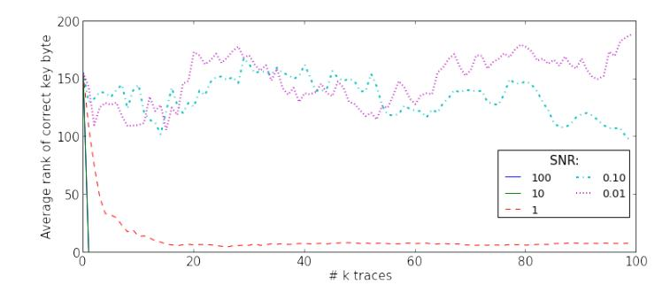

{0}------------------------------------------------

# **First-Order Masking with Only Two Random Bits**

Hannes Gross<sup>1</sup> , Ko Stoffelen<sup>2</sup> , Lauren De Meyer<sup>3</sup> , Martin Krenn<sup>4</sup> and Stefan Mangard<sup>4</sup>

```
1 SGS Digital Trust Services GmbH
                        hannes.gross@sgs.com
2 Digital Security Group, Radboud University, Nijmegen, The Netherlands
                        k.stoffelen@cs.ru.nl
                 3
                  imec - COSIC, KU Leuven, Belgium
                  lauren.demeyer@esat.kuleuven.be
            4
              IAIK, Graz University of Technology, Austria
                 firstname.lastname@iaik.tugraz.at
```

**Abstract.** Masking is the best-researched countermeasure against side-channel analysis attacks. Even though masking was introduced almost 20 years ago, its efficient implementation continues to be an active research topic. Many of the existing works focus on the reduction of randomness requirements since the production of fresh random bits with high entropy is very costly in practice. Most of these works rely on the assumption that only so-called online randomness results in additional costs. In practice, however, it shows that the distinction between randomness costs to produce the initial masking and the randomness to maintain security during computation (online) is not meaningful. In this work, we thus study the question of minimum randomness requirements for first-order Boolean masking when taking the costs for initial randomness into account. We demonstrate that first-order masking can in theory always be performed by just using two fresh random bits and without requiring online randomness. We first show that two random bits are enough to mask linear transformations and then discuss prerequisites under which nonlinear transformations are securely performed likewise. Subsequently, we introduce a new masked AND gate that fulfills these requirements and which forms the basis for our synthesis tool that automatically transforms an unmasked implementation into a first-order secure masked implementation. We demonstrate the feasibility of this approach by implementing AES in software with only two bits of randomness, including the initial masking. Finally, we use these results to discuss the gap between theory and practice and the need for more accurate adversary models.

**Keywords:** masking · AES · first-order masking · randomness · side-channel analysis

## **1 Introduction**

Ever since the findings of Kocher, Jaffe, and Jun [\[KJJ99\]](#page-23-0) on differential power analysis and Quisquater and Samyde [\[QS01\]](#page-24-0) on electromagnetic emanation analysis, the efficient protection against so-called side-channel attacks has been eagerly studied. Over the years, masking has proven to be a countermeasure with high and formally well-understood security guarantees [\[ISW03,](#page-23-1) [DDF14\]](#page-23-2) as well as good scalability [\[CJRR99\]](#page-22-0). Despite its popularity, the research on more efficient approaches to mask security-critical implementations does not seem to come to an end soon [\[BGN](#page-22-1)<sup>+</sup>14, [GIB18,](#page-23-3) [GM17,](#page-23-4) [GMK16,](#page-23-5) [NRR06,](#page-24-1) [RBN](#page-24-2)<sup>+</sup>15].

The lion's share of works on masking operate in the so-called *t*-probing model by Ishai, Sahai, and Wagner [\[ISW03\]](#page-23-1). In this model, an adversary is allowed to probe up to *t* intermediate values in an implementation. One has security against such an adversary if

{1}------------------------------------------------

those *t* wires reveal no secret information. Despite the fact that this model has been shown to be insufficient in practice by several works [\[BGG](#page-22-2)<sup>+</sup>14, [PV17,](#page-24-3) [FGP](#page-23-6)<sup>+</sup>18], it remains the foundation for many new masking schemes.

One important drawback of masking is its implementation costs, not least because of its high demand for fresh randomness. Since the creation of large amounts of fresh random bits requires additional time, chip area, energy, et cetera, a lot of research has been done on more randomness-efficient masking [\[BDF](#page-21-0)<sup>+</sup>17, [BBP](#page-21-1)<sup>+</sup>16, [BBP](#page-21-2)<sup>+</sup>17, [BDCU17,](#page-21-3) [GD17,](#page-23-7) [GM18,](#page-23-8) [GMK16,](#page-23-5) [FPS17,](#page-23-9) [Sug19\]](#page-24-4). Most of the existing work, however, focuses on the randomness optimization for specific masking gadgets, like masked AND gates, and do not consider the minimization of the overall randomness costs. An interesting result from prior work is the proof by Faust et al. [\[FPS17\]](#page-23-9) that first-order masking with only one bit of randomness is impossible. They also demonstrated the theoretical possibility of masking with constant randomness cost.

Even more of the masking implementation papers only consider the so-called online randomness costs spent on producing fresh randomness to secure the computation once the initial sharing of the input data, e.g., plaintext, ciphertext, or data and key material, has been performed. There is, to the best of our knowledge, no paper that considers the minimization of randomness costs when taking the masking of the input data into account or that tries to minimize the overall randomness costs.

**Our contribution.** We start off this work in Section [2](#page-2-0) by taking a step away from the modern sharing-based perspective of masking back to the classical Boolean masking perspective. From this masking point of view, we then demonstrate using linear transformations that first-order masking is theoretically possible with only two random one-bit masks. We then discuss what properties need to be fulfilled such that this approach also works for masked nonlinear transformations and show that existing approaches of masked AND gates do not fulfill these criteria. As a first practical contribution, we design a masked AND gate that allows reusing randomness from its inputs safely.

Based on our findings, we introduce in Section [3](#page-8-0) a simple rule-based system. These rules can be encoded in SMT2 statements and they are then used to automatically check whether the masking approach is directly applicable to an unprotected implementation or if modifications (mask changes) are required. Upon acceptance, our tool synthesizes a securely masked implementation for a given set of additional constraints like the used mask encoding.

We then show how our approach can be applied to larger implementations (Section [4\)](#page-10-0) and demonstrate its feasibility and its impact on a full AES-128 encryption-only implementation in Section [4.3.](#page-12-0) With our approach, we successfully designed the first formally verified AES S-box design that requires only two random bits for the initial sharing of its inputs and requires no online randomness to achieve first-order security in the probing model. Even when going for a full AES implementation, the randomness requirements do not increase further. However, since existing formal tools are not yet efficient enough to digest a fully unrolled AES implementation, we instead verify each building block of our design using the maskVerif tool of Barthe et al. [\[BBFG18\]](#page-21-4) for a predefined mask encoding of its inputs and outputs. Ensuring the same mask encoding for each input and output allows us to argue about the security when putting the components together in the full AES implementation. Details on the formal verification are given in Section [6.1.](#page-16-0) Finally, we discuss the limitations of the *t*-probing model for security in practice, as exemplified by our construction, in Section [6.3.](#page-19-0)

As a final contribution, we make our tool as well as our masking examples publicly available such that our findings are verifiable and future works can build upon them. Please find the source code of the program for synthesis and checking, the AES components and software implementation, as well as the formal verification results in the supporting

{2}------------------------------------------------

material of this work.[1](#page-2-1)

# <span id="page-2-0"></span>**2 Masking without Online Randomness**

The goal of masking is to make the power consumption (and other side-channels related to the power consumption) independent of security-sensitive information. For this purpose, the security-sensitive information is first combined with uniformly random sampled data in an invertible masking function, such that the representation of the data itself becomes uniformly random distributed. In the case of Boolean masking, the sensitive information *s*, for instance, is combined with a random mask *m* by using the Boolean exclusive-or (XOR) operation. The resulting masked value *s*<sup>0</sup> = *s* ⊕ *m*<sup>0</sup> thus becomes statistically independent of *s*, i.e., the mutual information between *s* and *s*<sup>0</sup> becomes zero. For this reason, any computation on *s*<sup>0</sup> trivially results in power consumption that is statistically independent of *s* as long as *m*<sup>0</sup> is not recombined with *s*0.

**Adversary Model.** The security of masked implementations is often expressed in the so-called *t*-probing model [\[ISW03\]](#page-23-1) which assumes that an attacker can make up to *t* observations in the implementation (place up to *t* probes on the circuit). It has been verified in the past that this formal model also implies security against a differential side-channel analysis attacker that has access to noisy side-channel leakage traces [\[DDF14\]](#page-23-2). We assume in the following a first-order attacker, i.e., an attacker that can place a single probe on the device.

**Sharing vs. Masking.** Often in the present literature, the relation between the masked data *s*<sup>0</sup> and the mask(s) *m*<sup>0</sup> is expressed using a sharing-based notation. For first-order masking (i.e., only one mask is used to protect *s*) the information is assumed to be split into two shares (e.g., *s*<sup>0</sup> and *s*1) such that again the additive relation *s* = *s*<sup>0</sup> ⊕*s*<sup>1</sup> is fulfilled. While it is trivial to convert from a masking representation to a sharing representation by setting *s*<sup>0</sup> = *s* ⊕ *m* and *s*<sup>1</sup> = *m*, the sharing representation inherently hides the relation between secret information and masks.

For brevity reasons, we use the sharing based representation in most parts of the paper. Since in this work, we are particularly interested in the relation between secrets (or shares) and masks, we often switch to the masking form. To make the used notation clearer, we always use the prefix *m* for masks followed by a number in the subscript. Any other variable name with a suffix subscript number denotes a specific share of the variable. Most of the time we just use 0 or 1 in the subscript (e.g., *a*<sup>0</sup> or *a*1) to refer to the first or second share of a first-order masked variable *a*, respectively. Without any subscript notation we always refer to the plain secret variable (*a*, *b*, *q, . . .*).

#### **2.1 Computation on Masked Data**

To realize computations that are not only secure against side-channel analysis but also correct, the computed masked function needs to take the mask into account but in a way that does not unmask the data. For example, when calculating the XOR of two sensitive variables as *q* = *a* ⊕ *b*, where *a* is shared in the two shares *a*<sup>0</sup> and *a*<sup>1</sup> and *b* is shared as *b*<sup>0</sup> and *b*1, the correct and securely masked realization is trivial:

$$q_0 = a_0 \oplus b_0$$

$$q_1 = a_1 \oplus b_1$$
(1)

<span id="page-2-2"></span><span id="page-2-1"></span><sup>1</sup><https://github.com/LaurenDM/TwoRandomBits>

{3}------------------------------------------------

With Independent Masks. When observing the masked representation of this equation with  $a_0 = a \oplus m_0$ ,  $a_1 = m_0$  and  $b_0 = b \oplus m_1$ ,  $b_1 = m_1$  the correctness can be easily observed when considering the addition of the shares of q, because both shares added together result in the desired operation in the sensitive variables a and b.

$$q = q_0 \oplus q_1$$
  
=  $(a \oplus m_0) \oplus (b \oplus m_1) \oplus m_0 \oplus m_1$   
=  $a \oplus b$ 

To demonstrate the first-order security of the masked realization of the XOR in Equation 1, it needs to be shown that each intermediate value (in this case only the output shares  $q_0$  and  $q_1$ ) is statistically independent of a and b. Statistical independence is given because we assume that each of the two masks  $m_0$  and  $m_1$  is uniformly random and statistically independent of each other. By looking at the truth table for both shares of q in Table 1, one can observe that, when subdividing the truth table into the four possible combinations of values for a and b, the count of "1" appearances (or equivalently the Hamming weight of the truth table) for  $q_0$  and  $q_1$  in each case are equal.

<span id="page-3-0"></span>Shares Secrets TT $b_0$  $b_1$ b $a \oplus b$ a $a_0$  $a_1$  $q_0$  $q_1$  $\mathbf{0}$  $\mathbf{2}$  $\mathbf{2}$ TT Hamming Weight:  $\mathbf{2}$  $\mathbf{2}$ TT Hamming Weight:  $\mathbf{0}$  $\mathbf{2}$  $\mathbf{2}$ TT Hamming Weight: TT Hamming Weight:  $\mathbf{2}$ 

**Table 1:** Truth table of the masked XOR from Eqn. 1

This equal distribution for each possible combination of secrets, results in power consumption that is on average equal for all cases of a and b. We note that an attacker with the ability to probe more signals could observe differences by combining multiple probed signals. Higher-order leakages, however, are more difficult to exploit than the average power consumption (exponentially more observations are required [CJRR99]) and are not considered in this paper.

{4}------------------------------------------------

**With Equal Masks.** The situation changes when assuming that both masked variables use the same mask *m*<sup>0</sup> = *m*1, which trivially reveals *a* and *b* in the equation of *q*0.

$$q_0 = a_0 \oplus b_0 = (a \oplus m_0) \oplus (b \oplus m_0) = a \oplus b$$

Most state-of-the-art masking works assume that shares are produced using independent random masks which helps to avoid such situations. So when multiple XOR operations are chained together (e.g., *a* ⊕ *b* ⊕ *c* ⊕ · · · ⊕ *z*) a lot of random masks are accumulated.

$$q_0 = a_0 \oplus b_0 \oplus c_0 \oplus \cdots \oplus z_0$$

$$= (a \oplus m_0) \oplus (b \oplus m_1) \oplus (c \oplus m_2) \oplus \cdots (z \oplus m_{25})$$

$$q_1 = a_1 \oplus b_1 \oplus c_1 \oplus \cdots \oplus z_1$$

$$= m_0 \oplus m_1 \oplus m_2 \oplus \cdots \oplus m_{25}$$

Please note that we assume here and in the remainder of the paper that the masked equations are evaluated from left to right, and parentheses indicate atomic operations that do not produce further intermediate results (often to indicate the result of the evaluation of a sharing function or initial sharings). Our first and admittedly rather trivial observation is that the amount of accumulated randomness is unnecessarily high. One can realize the same function in a secure and correct shared way by simply alternating two random masks *m*<sup>0</sup> and *m*<sup>1</sup> in such a way that at no time an intermediate result is formed that depends on the secret value without a mask. One possible realization is to use *m*<sup>0</sup> to mask *a* and use *m*<sup>1</sup> for the remaining variables:

$$q_0 = (a \oplus m_0) \oplus (b \oplus m_1) \oplus (c \oplus m_1) \oplus \dots (z \oplus m_1)$$

$$= a \oplus b \oplus c \oplus \dots \oplus z \oplus m'$$

$$q_1 = m_0 \oplus m_1 \oplus m_1 \oplus \dots \oplus m_1$$

$$= m'$$

where *m*<sup>0</sup> = *m*<sup>0</sup> if the number of inputs is odd (and thus the number of *m*<sup>1</sup> masks is even) and else *m*<sup>0</sup> = *m*<sup>0</sup> ⊕ *m*1.

This is only one example and there exist many other possible and secure realizations for this function. Depending on the mask assignments to the inputs, the resulting mask of the output can be either *m*<sup>0</sup> or *m*<sup>1</sup> or their combination *m*<sup>0</sup> ⊕ *m*1. With these findings, we can secure any linear function likewise. However, extending this to nonlinear functions is not straightforward.

#### **2.2 Application to Nonlinear Gates**

There exists a vast variety of first-order masked AND gates in the literature which form the simplest class of nonlinear functions and are used to construct more complex functions. These realizations of masked AND gates usually vary regarding online randomness requirements and the number of used input and output shares. The underlying functionality is of course always the same and, in the case of a realization with two shares, it requires the secure evaluation of four multiplication terms (where ∧ represents a single AND operation):

$$q = a \wedge b = (a_0 \oplus a_1)(b_0 \oplus b_1)$$
  
=  $a_0 \wedge b_0 \oplus a_0 \wedge b_1 \oplus a_1 \wedge b_0 \oplus a_1 \wedge b_1$  (2)

<span id="page-4-0"></span>Any direct combination of either two multiplications terms (e.g., *a*0*b*<sup>0</sup> ⊕*a*0*b*1) is insecure because it leads to a function that statistically depends on the secret *a* or *b*. Most of the

{5}------------------------------------------------

|       | Shares |        | Secrets |                 | TT               |                               |
|-------|--------|--------|---------|-----------------|------------------|-------------------------------|
| $a_0$ | $b_0$  | $b_1$  | b       | $\parallel q_0$ | $q_0 \oplus a_0$ | $(q_0 \oplus a_0) \oplus b_0$ |
| 0     | 0      | 0      |         | 1               | 1                | 1                             |
| 0     | 1      | 1      |         |                 | 0                | 1                             |
| 1     | 0      | 0      | 0       | $\parallel$ 1   | 0                | 0                             |
| 1     | 1      | 1      |         |                 | 1                | 0                             |
|       | TT Ham | ming W | eight:  | 2               | 2                | 2                             |
| 0     | 0      | 1      |         | 0               | 0                | 0                             |
| 0     | 1      | 0      |         | $\parallel$ 1   | 1                | 0                             |
| 1     | 0      | 1      | 1       | $\parallel$ 1   | 0                | 0                             |
| 1     | 1      | 0      |         |                 | 1                | 1                             |
|       | TT Ham | ming W | eight:  | 2               | 2                | <u>0</u>                      |

<span id="page-5-0"></span>**Table 2:** Truth table for  $q_0$  of Biryukov et al.'s masked AND (or for  $q_1$  if  $a_0$  is replaced by  $a_1$ )

existing masked AND gadgets thus use fresh random masks to realize the secure evaluation, like  $m_2$  is used in the following example.

$$q_0 = a_0 \wedge b_0 \oplus m_2 \oplus a_0 \wedge b_1$$
  

$$q_1 = a_1 \wedge b_0 \oplus m_2 \oplus a_1 \wedge b_1$$
(3)

<span id="page-5-1"></span>This masked AND gate is indeed secure as long as the order of execution is from left to right and the masks including the ones used for sharing a and b are statistically independent and uniformly distributed. Another advantage of this realization is that it inherently refreshes the sharing which makes the result independent of a and b. Any linear or nonlinear combination of q with the sharing of a or b is thus still possible, as long as the transformation itself is secure under the assumption of independently shared inputs.

Without Fresh Randomness. There also exist realizations of a masked AND gate that do not require any fresh randomness. As an example, we consider the following equations from Biryukov et al. [BDCU17] where  $\vee$  is the OR operation:

$$q_0 = a_0 \wedge b_0 \oplus (a_0 \vee \neg b_1)$$
  

$$q_1 = a_1 \wedge b_0 \oplus (a_1 \vee \neg b_1)$$
(4)

<span id="page-5-2"></span>A closer look at the properties of this realization from Biryukov et al. in Table 2 reveals that, while the masking itself is secure, a further (linear) combination with shares or combinations of shares from a and b (barring  $a_0 \oplus a_1$ ) can make the sharing insecure again. Because this masked AND gate is insensitive to combinations with a single share from a (cf. column  $q_0 \oplus a_0$  in Table 2), one could assume that q is similarly protected as an XOR gate is protected by the mask  $m_1$  of b. The problem is that this masked AND gate behaves entirely different than the masked XOR gate from Equation 1 or the masked AND from Equation 3. For the output of a masked XOR gate where  $q_0 = a \oplus b \oplus m_1$ , we may assume that an XOR with  $m_0$  followed by the addition of  $m_1$  would result in a secure sharing masked by  $m_0$ , since  $(a \oplus b \oplus m_1) \oplus m_0 \oplus m_1$  results in  $a \oplus b \oplus m_0$ . However, in case of the masked AND gate from Equation 4, the XOR combination of the output  $q_0$  with  $m_0$  followed by another XOR with  $m_1$  results in an insecure sharing (see different truth table Hamming weights for different cases of b in Table 2). Chaining of masked AND operations by carefully selecting (or changing) between two different masks is thus not possible with this masked AND gate.

{6}------------------------------------------------

### **2.3 Construction of a New Masked AND**

We first transform the secure equations of Biryukov et al. such that we can directly observe what happens to the multiplication terms.

$$q_{0} = a_{0} \wedge b_{0} \oplus (a_{0} \vee \neg b_{1})$$

$$= a_{0} \wedge b_{0} \oplus \neg(\neg a_{0} \wedge b_{1})$$

$$= a_{0} \wedge b_{0} \oplus (a_{0} \wedge b_{1} \oplus b_{1}) \oplus 1$$

$$q_{1} = a_{1} \wedge b_{0} \oplus (a_{1} \vee \neg b_{1})$$

$$= a_{1} \wedge b_{0} \oplus \neg(\neg a_{1} \wedge b_{1})$$

$$= a_{1} \wedge b_{0} \oplus (a_{1} \wedge b_{1} \oplus b_{1}) \oplus 1$$

$$(5)$$

<span id="page-6-0"></span>It can be verified that the terms *a*<sup>0</sup> ∧ *b*<sup>0</sup> ⊕ (*a*<sup>0</sup> ∧ *b*<sup>1</sup> ⊕ *b*1) from *q*<sup>0</sup> and *a*<sup>1</sup> ∧ *b*<sup>0</sup> ⊕ (*a*<sup>1</sup> ∧ *b*<sup>1</sup> ⊕ *b*1) from *q*1, considered separately, are securely masked by *b*<sup>1</sup> (= *m*1, in the masking representation). Consider also the similarity with Equation [3,](#page-5-1) but with *m*<sup>2</sup> replaced by *b*<sup>1</sup> in a similar fashion as so-called *correction terms* are used in threshold implementations [\[NRS08\]](#page-24-5). It is also interesting to note that these expressions correspond to multiplexer formulas: *a*<sup>0</sup> ∧ *b*<sup>0</sup> ⊕ (¬*a*0) ⊕ *b*<sup>1</sup> = *b*<sup>0</sup> if *a*<sup>0</sup> = 0, else *b*1.

**New construction.** The design idea to ensure that the resulting sharing behaves similarly to the masked XOR gate is to securely combine all multiplication terms (Equation [2\)](#page-4-0) in a single share of *q*, together with a single mask. However, adding *q*<sup>0</sup> and *q*<sup>1</sup> from [\(5\)](#page-6-0) directly together is insecure because this results in *a* ∧ *b* without any mask. We therefore first add *a*<sup>1</sup> (= *m*0) to the second term (*q*1) and then, both terms can be added without leaking information. The result (our new *q*0) is only masked with a single mask *m*0. To achieve correctness the second share (the new *q*1) is set to *m*<sup>0</sup> (or equivalently *a*1). This then results in the following masked AND gate:

$$q_0 = (a_0 \wedge b_0 \oplus (a_0 \wedge b_1 \oplus b_1)) \oplus ((a_1 \wedge b_0 \oplus (a_1 \wedge b_1 \oplus b_1)) \oplus a_1)$$

$$= (a \wedge b) \oplus m_0$$

$$q_1 = a_1 = m_0$$

$$(6)$$

<span id="page-6-2"></span><span id="page-6-1"></span>**Further optimization.** By closer observation of Equation [6,](#page-6-1) we find that under given circumstances (possible mask configurations associated with the input shares), another optimization is possible. The truth table of the term (*a*<sup>1</sup> ∧ *b*<sup>1</sup> ⊕ *b*1)) ⊕ *a*<sup>1</sup> of Equation [6](#page-6-1) is depicted in Table [3,](#page-6-2) which shows that it corresponds to a simple logical OR of the two input shares.

**Table 3:** Truth table of the equation (*a*<sup>1</sup> ∧ *b*<sup>1</sup> ⊕ *b*1)) ⊕ *a*<sup>1</sup>

| a1 | b1 | = a1<br>∨ b1 |
|----|----|--------------|
| 0  | 0  | 0            |
| 0  | 1  | 1            |
| 1  | 0  | 1            |
| 1  | 1  | 1            |

However, what is even more remarkable, is that when going through all possible valid mask configurations for the input shares (see Table [4\)](#page-7-0), the term becomes a common constant (*m*<sup>0</sup> ∨ *m*1) for all masked AND gates using the same masks. Please note that we

{7}------------------------------------------------

| $a_1$             | $b_1$              | $a_1 \lor b_1$   |
|-------------------|--------------------|------------------|
| $m_0$             | $m_0$              | invalid          |
| $m_0$             | $m_1$              | $= m_0 \vee m_1$ |
| $m_0$             | $(m_0 \oplus m_1)$ | $= m_0 \vee m_1$ |
| $m_1$             | $m_0$              | $= m_0 \vee m_1$ |
| $m_1$             | $m_1$              | invalid          |
| $m_1$             | $(m_0 \oplus m_1)$ | $= m_0 \vee m_1$ |
| $(m_0\oplus m_1)$ | $m_0$              | $= m_0 \vee m_1$ |
| $(m_0\oplus m_1)$ | $m_1$              | $= m_0 \vee m_1$ |
| $(m_0\oplus m_1)$ | $(m_0 \oplus m_1)$ | invalid          |

<span id="page-7-0"></span>**Table 4:** Possible mask configurations for the input shares  $a_1$  and  $b_1$ 

define the second share of any variable (e.g.,  $a_1$ ,  $b_1$ ) to carry only the mask information and never the secrets (a or b) in combination with a mask.

We thus write  $m_0 \vee m_1$  as  $[m_0 \vee m_1]$  in the resulting equation to denote that this is a term that only needs to be calculated once. The pratical implications become more evident in the implementation sections. With this optimization, Equation 6 simplifies to Equation 7 which saves one AND gate (for multiple occurrences of masked ANDs) and two XORs for each masked AND gate.

$$q_0 = \underbrace{(a_0 \wedge b_0 \oplus (a_0 \wedge b_1 \oplus b_1))}_{t_1} \oplus \underbrace{(a_1 \wedge b_0 \oplus [m_0 \vee m_1])}_{t_4}$$

$$q_1 = a_1$$

$$(7)$$

<span id="page-7-1"></span>**Security.** The security of the masked AND gate can be easily verified by hand as shown in Table 5 where  $t_i$  values denote intermediate results. We again record all possible input share combinations in a truth table and sort them by the unshared secrets a and b. For each possible intermediate  $(t_1 \text{ to } t_5, \text{ and } q_0)$ , we count the number of ones in the truth tables per secret value for a and b (TT Hamming weight). If the truth table Hamming weights of  $t_i$  (resp.  $q_0$ ) are identical for each secret, then the probability distribution of  $t_i$  (resp.  $q_0$ ) is independent of the secret. Table 5 clearly shows that this is the case; Hence, a first-order attacker does not gain any sensitive information by probing either one of the intermediates.

In addition to the manual inspection of the masked AND gate, we also performed a formal verification by using the tools by Bloem et al. [BGI<sup>+</sup>18] and Barthe et al. [BBFG18] which gave us the same results. Furthermore, we did the same verification for the composition of the AND gate with an XOR  $(q \oplus b)$  and with another AND  $(q \land b)$ . For the tables we refer to Appendix A. The code for maskVerif [BBFG18] can be found in our supplementary material.<sup>2</sup> We note that for secure composition with the other input (a), the roles of a and b should be switched in Equation 7.

By combining the findings for the XOR and the AND gates we can mask arbitrary implementations, and as we will show in the next section, we can also derive simple rules to synthesize securely masked implementations from unprotected ones.

<span id="page-7-2"></span><sup>&</sup>lt;sup>2</sup>https://github.com/LaurenDM/TwoRandomBits

{8}------------------------------------------------

<span id="page-8-1"></span>

| Shares |                    |       | $Secrets$ |         | $\parallel$ $TT$ |              |                 |       |       |       |       |       |
|--------|--------------------|-------|-----------|---------|------------------|--------------|-----------------|-------|-------|-------|-------|-------|
| $a_0$  | $a_1$              | $b_0$ | $b_1$     | a       | b                | $a \wedge b$ | $\parallel t_1$ | $t_2$ | $t_3$ | $t_4$ | $t_5$ | $q_0$ |
| 0      | 0                  | 0     | 0         | 0       |                  |              | 0               | 0     | 0     | 0     | 0     | 0     |
| 0      | 0                  | 1     | 1         |         | 0                | 0            |                 | 1     | 1     | 0     | 1     | 0     |
| 1      | 1                  | 0     | 0         | 0       | U                | U            |                 | 0     | 0     | 0     | 1     | 1     |
| 1      | 1                  | 1     | 1         |         |                  |              | $\parallel$ 1   | 0     | 1     | 1     | 0     | 1     |
|        |                    | TT ]  | Hammin    | ng Weig | ht:              |              | 1               | 1     | 2     | 1     | 2     | 2     |
| 0      | 0                  | 0     | 1         |         |                  |              | 0               | 1     | 1     | 0     | 1     | 0     |
| 0      | 0                  | 1     | 0         | 0       | 1                | 0            |                 | 0     | 0     | 0     | 0     | 0     |
| 1      | 1                  | 0     | 1         | 0       | T                | U            |                 | 0     | 0     | 0     | 1     | 1     |
| 1      | 1                  | 1     | 0         |         |                  |              | $\parallel$ 1   | 0     | 1     | 1     | 0     | 1     |
|        | TT Hamming Weight: |       |           |         |                  |              | 1               | 1     | 2     | 1     | 2     | 2     |
| 0      | 1                  | 0     | 0         | 1       | 0                | 0            | 0               | 0     | 0     | 0     | 1     | 1     |
| 0      | 1                  | 1     | 1         |         |                  |              |                 | 1     | 1     | 1     | 0     | 1     |
| 1      | 0                  | 0     | 0         |         |                  |              |                 | 0     | 0     | 0     | 0     | 0     |
| 1      | 0                  | 1     | 1         |         |                  |              | 1               | 0     | 1     | 0     | 1     | 0     |
|        |                    | TT ]  | Hammin    | ng Weig | ht:              |              | 1               | 1     | 2     | 1     | 2     | 2     |
| 0      | 1                  | 0     | 1         |         |                  |              | 0               | 1     | 1     | 0     | 1     | 0     |
| 0      | 1                  | 1     | 0         | 1       | 1                | 1            | 0               | 0     | 0     | 1     | 0     | 0     |
| 1      | 0                  | 0     | 1         | 1       | 1                | 1            | 0               | 0     | 0     | 0     | 1     | 1     |
| 1      | 0                  | 1     | 0         |         |                  |              | $\parallel$ 1   | 0     | 1     | 0     | 0     | 1     |
| _      | TT Hamming Weight: |       |           |         |                  |              | 1               | 1     | 2     | 1     | 2     | 2     |

**Table 5:** Security of the masked AND from Eqn. 7

## <span id="page-8-0"></span>3 Synthesis of First-Order Secure Implementations

Manually tracking the masks as they propagate through the implementations quickly becomes a very complex task as the implementation size increases. We thus decided to develop an automated approach to create a masked implementation when possible, or to indicate which signals need to be changed otherwise. As a first step, the tool reads the description of a Boolean program in static single assignment (SSA) form in Verilog syntax such that each instruction is either a one-bit signal assignment or a two-bit XOR, XNOR, or AND gate. The Boolean circuit is then represented as an SMT problem which is fed to the Z3 [dMB08] theorem prover. Z3 searches for a possible solution for the mask encoding of the input signals so that for each gate the inputs have different masks. Furthermore, it allows ensuring a desired mask encoding for the input and output signals. We now give a more detailed description of how the implementation is encoded in SMT2 and which steps are necessary.

**Input mask encoding.** Each implementation takes two masks  $m_0$  and  $m_1$ . As a result, there are three possible mask combinations and thus three possible encodings for the input signals:  $1 = m_0$ ,  $2 = m_1$ ,  $3 = m_0 \oplus m_1$ . With the following SMT2 code snippet, the input signal a is mapped to any of the three masking combinations. We adjust the assertions accordingly, depending on whether we target a specific encoding or we let the theorem prover decide on the encoding.

```
; Input encoding definition and constraints (\mathbf{declare-const}\ \mathbf{a}\ \mathbf{Int}) (\mathbf{assert}\ (>\ \mathbf{a}\ 0)) (\mathbf{assert}\ (<\ \mathbf{a}\ 4))
```

{9}------------------------------------------------

The same rules are also applied to every output of a gate to restrict the output mask encoding to these three possibilities.

**Gate connections and encoding rules.** For each of the four possible instruction classes (assignment, XOR, XNOR, and AND) of the SSA-encoded input file, we create specific rules for deciding which masks can appear in the output *q* for the given input combination. In the example encoding it is always assumed that the signals *a* and optionally *b* form the operands. The encoding of the signal assignment *q* = *a* just results in a copy of the mask encoding in the SMT2 rules.

```
; S i g n a l a s s ignmen t r u l e
( assert (= q a ) )
```

To encode the output of the XOR (and XNOR) instructions, we utilize the fact that for different input encodings of *a* and *b*, the output encoding (calculated by an XOR) is always different from the input encodings and equal to the third unused one.

```
m0 ⊕ m1 = (m0 ⊕ m1)
m0 ⊕ (m0 ⊕ m1) = m1
m1 ⊕ (m0 ⊕ m1) = m0
            . . .
```

When neglecting the case that both inputs could have the same mask encoding, which is covered by the safety rules for the gates in the next step, the following SMT2 encoding can be used.

```
; XOR/XNOR g a t e r u l e
( assert (not ( or (= q a ) (= q b ) ) ) )
```

Note that the negation of the output in case of the XNOR has no influence on the encoding because it is a simple addition of a constant value 1.

Finally, for the AND gate, the mask encoding can be the same as either operand since the operands can be simply swapped. We thus let the theorem prover decide which signal is used as the first operand and this defines the mask encoding of the output (see Equation [7\)](#page-7-1). The information of which masks appear in the output is later on taken into account when the masked implementation is created to decide on the first operand.

```
; AND g a t e r u l e
( assert ( or (= q a ) (= q b ) ) )
```

Again the AND gate rule does not cover the cases of both operands having the same mask encoding.

**Safety rules.** For each two-input gate, we additionally define that both operands are required to have a different mask encoding which otherwise would create a flaw in the masked implementation.

```
; S a f e t y r u l e f o r two i n p u t g a t e s
( assert (not (= a b ) ) )
```

{10}------------------------------------------------

**Output constraints (optional).** To make the design and verification of separate modules easier, we decide to use the same input and output mask encoding on byte-level for all our modules. We can for example restrict the output encoding by setting the input and output signals equal.

```
; Equal i n p u t and o u t p u t by te−enc o d ing
( assert (= o0 i 0 ) )
( assert (= o1 i 1 ) )
( assert (= o2 i 2 ) )
. . .
( assert (= o7 i 7 ) )
```

**Checking of the model and creating the masked implementation.** When the Z3 theorem solver finds a secure model that fulfills our constraints, it constructs the mask assignments for a masked implementation. The translation of the unprotected scheme to a secure masked implementation is then rather straightforward. At first, we duplicate all input and output ports of the module and additionally add the two masks *m*<sup>0</sup> and *m*<sup>1</sup> as input signals. For each instruction of the SSA input file we replace the original code by its masked variant according to the masked gates introduced in Section [2.](#page-2-0) As a further optimization, the second share of each instruction is (optionally) replaced by the resulting mask of the output signal which helps to save unnecessary instructions that would result in one of the three mask encodings anyway.

We do not give a more detailed description of our tool at this point since the rest of the functionality follows from the description of the masked gates above and is mostly engineering work.[3](#page-10-1)

## <span id="page-10-0"></span>**4 Masking the AES**

To demonstrate the practicality of our approach, we target the AES-128 (encryption-only) as an example. Since none of the existing formal verification tools are yet powerful enough to verify a full AES encryption, we decide to use a modular implementation and verification approach. To justify the security of the overall design when bringing the modules together, we restrict the mask encoding for each input and output byte of every function to be equal.

Our software implementation is partially based on earlier work by Schwabe and Stoffelen [\[SS16\]](#page-24-6). In their paper they describe various optimized assembly implementations targeting the 32-bit ARM Cortex-M3 and Cortex-M4 microcontrollers. One implementation is masked using 2 Boolean shares. This is a bitsliced implementation of AES-128 in CTR mode, such that two consecutive AES blocks can be efficiently processed in parallel. When 256 blocks (or 4 kilobyte) of data are encrypted, they measure that encryption on average takes 7,423 cycles per block (or 464 cycles per byte). They also note that 2,133 cycles of these are spent on generating all required 10,496 random bits using the onboard hardware RNG, which is almost 29% of the total cycle count.

Our implementation uses the same hardware RNG, but we only generate a single 32-bit fresh random word. The architecture dictates a multiple of 32 bits, so 28 of these are ignored, 2 are used for the first AES block, and 2 for the second AES block.

#### **4.1 SubBytes**

The most complicated part of the AES is its SubBytes layer which can be implemented as 16 instances of S-box modules. Most of the masked AES designs published over the last

<span id="page-10-1"></span><sup>3</sup>The tool along with some examples for the AES implementation can be found at [https://github.](https://github.com/LaurenDM/TwoRandomBits) [com/LaurenDM/TwoRandomBits](https://github.com/LaurenDM/TwoRandomBits)

{11}------------------------------------------------

years are based on the S-box construction of Canright [\[Can05\]](#page-22-4). A more suitable design for our bit-wise approach, however, is the design of Boyar and Peralta [\[BP12\]](#page-22-5) which is already constructed in SSA form. There are follow-up works [\[BMP13,](#page-22-6) [VSP17\]](#page-25-0) that further reduce the size of the implementation in terms of gates/instructions. Various unmasked S-box implementations can be found on [\[BDP](#page-21-5)<sup>+</sup>]. For hardware implementations, we would recommend the S-box which aims at minimizing the logic depth (16). The original code of the forward S-box consists of 128 SSA instructions. In total there are 34 AND, 90 XOR and 4 XNOR instructions for the unmasked implementation. Each instruction takes two one-bit variables as input. For our case (a software implementation), the logic depth is not of such importance, so we choose the S-box with the smallest gate count (113). This S-box has 32 AND, 77 XOR and 4 XNOR instructions and has logic depth 27.

**Result of the Tool.** After running our synthesis tool on this S-box design without any further optimizations, the resulting masked design consists of 96 AND gates, 228 XOR gates, and 4 NOT gates (because XNORs are decomposed to one XOR followed by a not gate in Yosys' ILANG). The 96 AND gates result from the fact that the masked AND triples the number of AND gates compared to the unmasked design. Also, each masked AND gate introduces 4 XOR gates which in total results in 128 additional XOR gates. The masking of the XOR and XNOR gates, on the other hand, do not introduces additional circuitry since the second output share can simply be assigned to the third mask (i.e.unused by the inputs). Some additional XOR gates are required because at some points we need to change the masking of a signal by introducing additional XOR instructions to receive a satisfiable Z3 model and thus a securely synthesizable implementation, and to ensure that the input and output mask encoding is equal.

After running an optimization pass in Yosys, which maps gates implementing the same function to a single gate and thus eliminates duplications, the number of gates could be reduced to 86 AND gates, 1 OR gate, 225 XOR gates and 4 NOT gates. We rerun the verification after this optimization to ensure that the implementation remains secure. The NOT gates can be moved to the key schedule such that they are not executed for every encryption/decryption call with the same key. The total overhead for the masking of the S-box is thus about a factor 2.79 regarding arithmetic instructions.

**Byte Encodings.** From the design of the S-box, we also gathered a byte encoding to be used for the rest of the AES modules to ensure security and correctness of the full encryption. The byte encoding is {2*,* 3*,* 3*,* 1*,* 1*,* 2*,* 1*,* 2} in the SMT encoding, corresponding to {*m*1*, m*<sup>0</sup> ⊕ *m*1*, m*<sup>0</sup> ⊕ *m*1*, m*0*, m*0*, m*1*, m*0*, m*1} as the mask encoding for the S-box input bits *i*<sup>0</sup> to *i*7.

**Implementation.** The targeted microarchitecture has only 14 registers that can be freely used, which means that many store and load instructions need to be inserted. On this platform, loads from memory are relatively expensive. Most arithmetic instruction execute in a single cycle, while a load instruction will take at least two cycles, although when *N* loads can be pipelined they can often execute in *N* + 1 cycles. Stoffelen [\[Sto16\]](#page-24-7) created a tool that automatically reschedules instructions and allocates registers in order to minimize the overhead caused by spilling values to the stack. We use the same tool to schedule the 60 load instructions and 51 store instructions on top of the arithmetic instructions.

#### **4.2 Linear Components**

**ShiftRows.** Since the ShiftRows transformation only changes the order of the bytes in the state rows, no special modifications are required for the round transformation compared to an unprotected design. Furthermore, all of the masked AES modules (in the final design) 

{12}------------------------------------------------

do not explicitly carry the second share of each signal but instead just assume the byte mask encoding as used by the S-box for inputs and outputs as the second share. ShiftRows can be implemented with only wiring in hardware, but in software we need instructions to actually move the bits around. We use the same ShiftRows implementation as that of Schwabe and Stoffelen [\[SS16\]](#page-24-6), which requires 104 single-cycle instructions.

**MixColumns.** We start with the unmasked MixColumns implementation by Schwabe and Stoffelen [\[SS16\]](#page-24-6), that uses 27 32-bit XORs for the four-column operation. However, to translate this to a masked implementation we now need to be careful that no values with the same mask get combined and ensure the correct byte mask encoding of the inputs and outputs. We therefore need to remask various values and the masks need to be loaded from the stack. In total we need to add 12 XOR and 6 load instructions to the original 27 XORs. A program was used to verify that this was done correctly.

**AddRoundKey.** In AddRoundKey the round key is added to the state (or the plaintext in the first round). Since we enforce the same byte encoding for all bytes in our design, the key byte first needs to be remasked before it can be added to the state or plaintext byte and the result of the XOR also requires remasking. Instead of 8 32-bit XORs as in the unprotected bitsliced design, we thus require 32 XOR instructions. The number of XORs could be reduced to only sixteen if the state and key bytes are shared such that their sum again results in the assumed byte sharing for the S-box. Due to the lack of the possibility to formally verify the whole implementation, we decide on keeping the byte encoding for both key and state bytes the same. This makes arguing of the security of the overall implementation for individually verified modules easier because there are fewer issues to oversee. In addition to the arithmetic instructions, we use 11 load instructions and 1 store.

### <span id="page-12-0"></span>**4.3 Results**

For the entire AES encryption, we measure on average 3,387.6 cycles per block (or 211.7 cycles per byte) under the exact same test conditions as in [\[SS16\]](#page-24-6). This is a speed improvement of roughly 54%. Moreover, the stack requirements are lowered from 1588 bytes to only 188 bytes, a decrease of over 88%.

Schwabe and Stoffelen also provided an unmasked bitsliced AES-128-CTR implementation as an intermediate step. This took only 1617.6 cycles per block (or 101.1 cycles per byte) on the Cortex-M4. The overhead cost of adding first-order masking is therefore still almost a factor 2.1.

The most computation effort in each round is spent on the S-box calculations with 68.7% of the instructions. The AddRoundKey and MixColumns operations consume respectively 7.1% and 7.3% of the round instructions. The remaining instructions are mostly spent on the ShiftRows transformation with about 16.9%.

Table [6](#page-13-0) summarizes the costs for the individual transformations that are required to implement the full AES.

## **5 Discussion**

#### **5.1 Comparison with Previous Work**

A comprehensive comparison of our results with previous work is very difficult. On the one hand, masked AES implementations have been created for many different platforms. On the other hand, a number of works only report the speed which means a lot of data about memory usage is missing. Moreover, these speeds were measured on different CPU

{13}------------------------------------------------

<span id="page-13-0"></span>

| Module            | # | AND | XOR   | Bit op* | Load | Store |
|-------------------|---|-----|-------|---------|------|-------|
| AES†              |   | 870 | 3 433 | 560     | 773  | 520   |
| PreRound          | 1 | -   | 32    | -       | 8    | 1     |
| I<br>AddRoundKey‡ | 1 | -   | 32    | -       | 8    | 1     |
| Round             | 9 | 87  | 344   | 56      | 77   | 52    |
| I<br>SubBytes     | 1 | 87  | 225   | -       | 60   | 51    |
| I<br>ShiftRows    | 1 | -   | 48    | 56      | -    | -     |
| I<br>MixColumns   | 1 | -   | 39    | -       | 6    | -     |
| I<br>AddRoundKey‡ | 1 | -   | 32    | -       | 11   | 1     |
| LastRound         | 1 | 87  | 305   | 56      | 72   | 51    |
| I<br>SubBytes     | 1 | 87  | 225   | -       | 60   | 51    |
| I<br>ShiftRows    | 1 | -   | 48    | 56      | -    | -     |
| I<br>AddRoundKey‡ | 1 | -   | 32    | -       | 12   | -     |

**Table 6:** AES-128-CTR implementation results in terms of instruction counts

(micro)architectures, which makes them harder to compare. For masked implementations, rather than comparing absolute execution times, it makes more sense to compare the overhead factor over an unprotected implementation, as was done in [\[WVGX15\]](#page-25-1). However, we were not able to find implementation results for unmasked implementations in all works. Furthermore, none of the previous works consider the cost of the initial masking of plaintext and key. Finally, it should also be noted that a lot of these works also present higher-order masking schemes, which again makes comparison with our optimized first-order AES unreasonable. Nevertheless, we gathered some data in Table [7](#page-14-0) for completeness.

**Performance.** The only previous works for which a comparison is justified is the work of Schwabe and Stoffelen [\[SS16\]](#page-24-6), since we used the same platform. When comparing to that work, we can conclude that our dramatic decrease of randomness does not imply sacrifices when it comes to speed or memory.

When it comes to speed, we also look at the work of Wang et al. [\[WVGX15\]](#page-25-1), since it was able to create a significant improvement over previous works. By comparing the overhead factors over an unprotected implementation, we can conclude that the speed of our implementation is competitive.

It should be noted that like the implementations by Goudarzi et al. [\[GR17\]](#page-23-11), we do not include a masked key schedule but instead store the precomputed round keys in memory in shared form.

Finally, we point out that we compare the average encryption speed per AES block, but as our implementation always processes two blocks in parallel using CTR mode, one cannot reach this speed when encrypting only a single AES block. Moreover, the implementation is fully unrolled, which results in very high speed and a large ROM requirement. If the ROM size is deemed too high for a particular application, it would be trivial to drastically reduce it at the cost of only a few extra CPU cycles.

**Randomness.** When it comes to total randomness consumption, our implementation clearly outshines most of the previous works. Only Faust et al. [\[FPS17\]](#page-23-9) had previously

<sup>\*</sup> This includes ubfx and uxtb instructions.

<sup>†</sup> This excludes the function prologue and epilogue, reading a random word and changing it to the right format, bitslicing the input, unbitslicing the output, loading the input, storing the output, increasing the CTR-mode counter, the initial masking of the input, the final unmasking of the output, XORing the keystream with the plaintext, keeping track of the remaining length, and managing some pointers and addresses. Of course all of this is included in the speed measurement.

<sup>‡</sup> Loads and stores slightly differ due to values that are already in registers or no longer necessary.

{14}------------------------------------------------

reported a first-order AES with constant randomness. In fact, they were the first to show its feasibility. However, their complete AES implementation is not discussed in detail. For example, it is not clear if the 8 S-box input bits also use the same masks and if this is the case, which encoding was used. Although they use the same development board (including the hardware RNG), it should be noted that their implementation was written in C and more meant as a proof of concept than as a carefully optimized implementation.

**Security.** Apart from differences in speed, memory usage and randomness consumption, the implementations in Table [7](#page-14-0) naturally also differ in level of practical security. A low fresh randomness consumption goes hand-in-hand with higher signal-to-noise ratio, which can benefit the adversary. It has also been noted that the reuse of randomness leads to dangerous transition leakage [\[WM18b\]](#page-25-2). On the other hand, transition leakages have also been shown to be a problem in the more conventional randomness-expensive masked implementations [\[PV17\]](#page-24-3), which means our implementation is not necessarily the only one vulnerable to this. Moreover, even if we double our latency to account for reset cycles against transition leakage, our performance is very competitive with previous works.

<span id="page-14-0"></span>

|                                                                          | Platform                                                                                            | Speed<br>[cycles]                                                   | Overhead<br>factor                   | ROM<br>[bytes]                                                           | RAM<br>[bytes]         | Random<br>[bits]                                           |  |  |  |  |
|--------------------------------------------------------------------------|-----------------------------------------------------------------------------------------------------|---------------------------------------------------------------------|--------------------------------------|--------------------------------------------------------------------------|------------------------|------------------------------------------------------------|--|--|--|--|
|                                                                          |                                                                                                     |                                                                     | Comparable Platform                  |                                                                          |                        |                                                            |  |  |  |  |
| This Work<br>[SS16]<br>[FPS17]                                           | Cortex-M4<br>Cortex-M4<br>Cortex-M4                                                                 | 3 387.6<br>7 422.6<br>73 650                                        | 2.1<br>4.6<br>-                      | 25.2k<br>39.9k<br>-                                                      | 188<br>2.0k<br>-       | 2<br>10.5k<br>2/16                                         |  |  |  |  |
| Different Platforms                                                      |                                                                                                     |                                                                     |                                      |                                                                          |                        |                                                            |  |  |  |  |
| [RP10]<br>[BFG+17]<br>[BFG+17]<br>[GR17]<br>[GR17]<br>[GR17]<br>[WVGX15] | 8-bit 8051<br>8-bit AVR<br>8-bit AVR<br>ARM7TDMI<br>ARM7TDMI<br>ARM7TDMI<br>Cortex-A15<br>simulator | 129 000<br>157 196<br>73 769<br>53 462<br>49 329<br>56 199<br>4 869 | 64.5<br>-<br>-<br>-<br>-<br>-<br>4.3 | 3.2k<br>2.8k (in total)<br>1.8k (in total)<br>7.5k<br>4.8k<br>12.4k<br>- | 73<br>-<br>-<br>-<br>- | 9.6k<br>13.1k<br>11.5k<br>30.8k<br>26.9k<br>19.2k<br>19.2k |  |  |  |  |

**Table 7:** Comparing Performance Results for AES-128

#### **5.2 Randomness in Perspective**

**Offline.** Our design requires no online randomness and only two random bits for the initial sharing. For other implementations in the literature at least 128 bits for the sharing of the key and 128 bits for the sharing of the plaintext are required for a two-share implementation, or 2 · 256 bits for a three-share threshold implementation, respectively. From this perspective, our implementation saves at least 254 random bits for the initial sharing alone.

**Online.** In the current state-of-the-art on first-order masking, each multiplication and refreshing block requires one unit of fresh randomness. In the case of the AES S-box, each unit is one byte and the S-box can be constructed using four multiplications and two refreshings [\[RP10\]](#page-24-8), which brings the total randomness cost per S-box evaluation to 48 bits. One SubBytes transformation consists of 16 S-boxes and thus requires 768 random bits. One encryption round including key schedule requires 960 bits. In total, the amount of online randomness for one AES-128 encryption is thus 9.6 kbits.

{15}------------------------------------------------

For the sake of completeness, we note that in hardware masking, there exist more online randomness efficient S-box implementations which, however, require an increased amount of input shares for the S-box (e.g., the four-share S-boxes of Ghoshal et al. [\[GD17\]](#page-23-7) and Wegener et al. [\[WM18a\]](#page-25-3)). There is no full AES implementation or estimation given in [\[GD17\]](#page-23-7), so further comparison is difficult. Moreover, a flaw in their design was detected and reported by Wegener and Moradi [\[WM18a\]](#page-25-3). The S-box of [\[WM18a\]](#page-25-3) also has four input and output shares and exploits the changing of the guards trick by Daemen [\[Dae17\]](#page-22-7) to obtain zero online randomness consumption. Their full design uses the dynamic conversion approach, but avoids extra online randomness by a clever recycling of independent state bytes. They thus only require 256 bits for the initial sharing of the plaintext and key and 24 additional bits for the initial guards. More recently, Sugawara [\[Sug19\]](#page-24-4) presented the first three-share AES S-box without online randomness. However, their entire AES implementation still uses 776 initial bits of randomness, which exceeds that of [\[WM18a\]](#page-25-3).

**Summary.** Comparing our design with others is quite difficult because most of the existing implementations do not consider the amount of required initial randomness for sharing the key and plaintext data. However, we have at least shown that also the performance can be competitive with state-of-the-art implementations, even if we double the latency with reset cycles against transitional leakages. Requiring only two bits of randomness for each masked encryption could thus make the difference between deciding on requiring an additional PRNG or using an already on-board TRNG, and could thus make first-order masking cheap enough to be used for highly constrained devices like low-cost RFID tags.

#### **5.3 Hardware**

For a SCA-resistant implementation in hardware, security in the probing model with glitches needs to be ensured. The security of our approach critically depends on the correct order in which the signals are combined. For this reason, registers are required after *t*1*, t*2*, t*3*, t*<sup>4</sup> and *t*5.

The above has been formally verified in the presence of glitches using maskVerif [\[BBFG18\]](#page-21-4).[4](#page-15-0) Hence, our methodology is also applicable to hardware masking.

**Efficiency.** In practice however, the method is more amenable for application in software. The need for many registers means we pay for the randomness reduction by an increased amount of latency. The unmasked Boyar-Peralta S-box has a maximum logic depth of 16 and an AND depth of 4. Every masked AND gate requires three cycles to securely calculate the result. Accordingly, the total latency of the S-box is 12 cycles (16 − 4 XOR layers) plus 12 (4 AND layers ×3) which in total amounts to 24 cycles. In software, the impact of our masking method on the latency is less dramatic, both because of the absence of glitches and because of the possibility of bitslicing.

**Security.** Moreover, most hardware masked AES implementations are round-based with a serial S-box calculation. As was shown by Wegener and Moradi [\[WM18b\]](#page-25-2), these serialized designs can introduce dangerous transition leakages. So, in contrast with an unrolled implementation, these designs require register reset cycles or precharge logic, which would essentially again increase the latency to its double. For these reasons, we do not investigate a hardware implementation in further detail. We further discuss the security issues in Section [6.3.](#page-19-0)

To conclude, we have demonstrated that two random bits are enough to achieve theoretical first-order security in the probing model even in the presence of glitches. Its

<span id="page-15-0"></span><sup>4</sup>Please find the results in our supplementary material at <https://github.com/LaurenDM/TwoRandomBits>

{16}------------------------------------------------

implementation in practice however incurs a high penalty in latency and requires extra care to not introduce new leakages.

## **6 Security Analysis**

#### <span id="page-16-0"></span>**6.1 Formal Verification in the** *t***-Probing Model**

For the verification of the side-channel security of our approach, we used the formal verification tool maskVerif of Barthe et al. [\[BBFG18\]](#page-21-4) on the synthesized modules. Since maskVerif is originally designed to verify sharing-based implementations, the outcome of our synthesis tool creates a verification wrapper that is later on modified to represent the correct masking for the input signals of the actual masked implementation. The verification wrapper thus takes two shares per input of the masked module and creates the correct masking by first adding the mask as defined by the mask encoding and subsequently the second share of the input.

The input bits {*i*0*, i*1*, . . . i*7} of the masked AES S-box module for example, uses the same SMT mask encoding {2*,* 3*,* 3*,* 1*,* 1*,* 2*,* 1*,* 2} (where 1 denotes *m*0, 2 denotes *m*1, and 3 denotes *m*<sup>0</sup> ⊕ *m*1) as any other module for both inputs and outputs. We take the input shares of the wrapper (indicated by the suffix "\_0" for the first share or "\_1" for the second share) and create the actual masking as follows.

```
module v e ri fi c a ti o n _ w r a p p e r (
    input i0_0 , i1_0 , . . . , i7_0 ,
    input i0_1 , i1_1 , . . . , i7_1 ,
    input m0, m1,
    output o0 , o1 , . . . , o7 ) ;
    // Mask enco d ing
    ass ign i 0 = ( i0_0 ^ m1) ^ i0_1 ; // 2
    ass ign i 1 = ( i1_0 ^ m0 ^ m1) ^ i1_1 ; // 3
    ass ign i 2 = ( i2_0 ^ m0 ^ m1) ^ i2_1 ; // 3
    ass ign i 3 = ( i3_0 ^ m0) ^ i3_1 ; // 1
    ass ign i 4 = ( i4_0 ^ m0) ^ i4_1 ; // 1
    ass ign i 5 = ( i5_0 ^ m1) ^ i5_1 ; // 2
    ass ign i 6 = ( i6_0 ^ m0) ^ i6_1 ; // 1
    ass ign i 7 = ( i7_0 ^ m1) ^ i7_1 ; // 2
    // DUV
    aes_sbox sb o x_in s t ( i 0 , i 1 , i 2 , . . . , i 7 , . . . ) ;
endmodule
```

For the input in the maskVerif tool, the implementation is read by the Yosys [\[Wol\]](#page-25-4) open synthesis tool. The circuit is then mapped to Yosys' internal gate representation (ILANG) and subsequently flattened such that a single module is created that contains all gates. The resulting circuit is then returned in ILANG format for which input, output and mask signals are annotated before it is fed into maskVerif. The implementations are validated for the probing model of Ishai et al. [\[ISW03\]](#page-23-1) without glitches.

**Table 8:** SCA resistance verification results

<span id="page-16-1"></span>

| Module     | Number of 1-uples | Verification time | Result         |
|------------|-------------------|-------------------|----------------|
| AddByte    | 95                | 16 ms             | probing secure |
| MixColumns | 315               | 108 ms            | probing secure |
| SubByte    | 429               | 22 s              | probing secure |

As the results in Table [8](#page-16-1) show, all of the modules on which our entire AES-128 encryption depends, are probing secure as intended. ShiftRows is only rewiring (readdressing) in 

{17}------------------------------------------------

hardware and just a bit permutation in software, which does not influence the probing security. With the input and output constraints for our synthesis tool, we also ensure that the mask encoding for each byte is the same, and we can thus safely compose these modules without creating flaws in the probing model for first-orders. However, we note that this composition argument is only true for first-order implementations for which a probing attacker is restricted to a single probe. This means that multivariate probes are of no concern and thus probes occur only in a single submodule. The tables in Appendix [A](#page-26-0) show that the reuse of randomness has no influence on the output distributions of cascaded gates, as long as the mask encoding is done with precision. Our synthesis tool creates implementations which, by construction, ensure that the mask encoding is fixed at the inputs and outputs of submodules. Our submodules have been formally verified for these encodings. Therefore, combined with the fact that probes can only placed on a single submodule, this ensures that the entire AES implementation is first-order secure.

We have proven the security of our scheme using formal verification tools and demonstrated that randomness can almost completely be eliminated for first-order security within the *t*-probing model. Apart from pushing the boundaries in terms of randomness cost, we are therefore also testing the limits of this model, which has become the standard adversary model for countermeasures against DPA. In the next two subsections, we demonstrate with our new masking scheme where the *t*-probing model is lacking.

#### **6.2 Horizontal Attacks**

With our scheme that fixes the mask encoding of the state across the rounds of an encryption, we need to be careful not to create a vulnerability to horizontal attacks. A horizontal side-channel attack considers correlations between multiple samples within a single trace, as opposed to the more common vertical side-channel attacks, which consider the same time sample across multiple traces. For this investigation, we cannot rely on established evaluation methods (e.g., TVLA) or verification tools since the state-of-the-art on horizontal attacks against symmetric primitives is quite limited. We will first consider the attacks from previous works and explain why they cannot be applied to our new scheme. Next, we use simulated traces to investigate the success probability of a trivial horizontal attack to recover the masks, followed by a classical CPA attack.

#### **6.2.1 Previous Works**

**Horizontal attacks against public-key primitives.** The literature on horizontal attacks against public-key primitives is abundant [\[BJPW13b,](#page-22-8) [BJPW13a,](#page-22-9) [HKT15\]](#page-23-12). However, these attacks are typically based on the assumption that the secret determines the presence or absence of some collision(s) (e.g., between subsequent iterations in an exponentiation algorithm). Since this situation clearly differs from ours, we will not further discuss it.

**Horizontal attack against ISW** A recent work investigates horizontal attacks against a very common building block in masked implementations, i.e., the ISW multiplication [\[BCPZ16\]](#page-21-7). However, we will not consider such an attack in this work, since it targets the ISW implementations when the number of shares *n* satisfies *n > c* · *σ*, with *σ* the measurements noise. As an example, they attack a 21-share implementation. It is thus unlikely to be applicable to our 2-share implementation.

**Horizontal attacks against masked table lookups.** One type of horizontal attack against masked symmetric primitives targets implementations that compute the S-box by means of a masked table lookup [\[PdHL09\]](#page-24-9). They exploit the fact that for each S-box input (i.e., one plaintext byte and one key byte), the table lookup is performed with multiple masks. Hence, a trace of a single encryption consists of multiple subtraces of S-box calculations

{18}------------------------------------------------

SNR 100 10 1 0.1 0.01 % wrong masks 0 0 1.885 7.411 7.501

<span id="page-18-0"></span>**Table 9:** Percentage wrongly guessed masks after horizontal CPA on 16 subtraces

that use the same key byte. By doing a CPA attack *horizontally* on these subtraces, the key byte can be recovered. In our scheme, each key byte is only used once per encryption. This makes a similar horizontal attack on a single trace impossible.

#### **6.2.2 Experiments**

Nevertheless, our implementation does use the same mask for every single state byte and in every single round of AES. A normal CPA attack relies on the ability of the attacker to make hypotheses on intermediates. In the case of AES, these hypotheses typically target the output of an S-box *S*(*x<sup>i</sup>* ⊕ *k*), where *x<sup>i</sup>* is variable and known (in the first/last round) and *k* is constant and unknown and hence, the target of the attack. In our case, the S-box output is protected with a mask. The intermediate in the traces would be *S*(*x<sup>i</sup>* ⊕ *k*) ⊕ *m<sup>i</sup>* when considered vertically, with *i* the index of the trace/encryption. In this case, *x<sup>i</sup>* is variable and known (the plaintext), *k* is constant and unknown and *m<sup>i</sup>* is variable and unknown, since each encryption uses a new mask. The key cannot be extracted unless the mask for each encryption *m<sup>i</sup>* is known. When we consider a trace horizontally, the S-box outputs are *S*(*x<sup>j</sup>* ⊕ *k<sup>j</sup>* ) ⊕ *m* with *x<sup>j</sup>* variable and unknown (state bytes) in all rounds except the first and last, *k<sup>j</sup>* variable and unknown (different round keys) and *m* constant and unknown. It is clear that the key cannot be extracted using a horizontal CPA attack. However, if the constant and unknown mask *m* can be extracted horizontally from each single trace, a classic vertical CPA attack using hypotheses *S*(*x<sup>i</sup>* ⊕ *k*) ⊕ *m<sup>i</sup>* can extract the key bytes.

**Horizontal Mask Recovery.** To attack the mask within a single trace, we need to choose an intermediate that combines the mask with variable and known data *x<sup>j</sup>* , i.e., the plaintext or ciphertext bytes. This should thus give 16 or 32 subtraces to do CPA over with the hypotheses *x<sup>j</sup>* ⊕ *m*.

We create simulated traces to test this attack, consisting of the hamming weight of each state byte after each intermediate operation. While our actual implementation is bitsliced, our simulated traces consider bytes for simplicity. As shown in [\[BGRV15\]](#page-22-10), the signal-to-noise ratio (SNR) of a bitsliced implementation is lower, but it does not prevent SCA.

For each individual trace, we consider 16 subtraces corresponding to the 16 byte-XORs in the last AddRoundKey stage. Across these subtraces, we perform CPA to recover the mask of that trace. At least in simulation, this attack is very successful. Table [9](#page-18-0) shows that even for high noise levels, only 8% of the masks are guessed incorrectly. However, note that attacking a linear operation in practice is very difficult.

**Classic CPA** Once the masks have been guessed, we perform a normal vertical CPA, using the (mostly correct) knowledge of the masks. We repeat the experiment for various signal-to-noise ratios (SNRs) and measure the success by the average rank of the correct key byte. Figure [1](#page-19-1) shows that for very high SNR, the attack succeeds with only a few thousand traces. For a more realistic SNR = 1.0, the average key rank never becomes 0 with up to 10 000 traces. For low SNR levels, the attack never succeeds.

{19}------------------------------------------------



<span id="page-19-1"></span>**Figure 1:** Average correct key rank as a function of the number of traces in a CPA attack followed by a horizontal mask recovery for different SNRs.

**Conclusion.** We performed a small investigation of the success of horizontal attacks against our implementation with extreme mask-reuse. We used a fairly simplistic attack because we cannot rely on state-of-the-art analysis tools. We assumed a quite powerful adversary who can attack linear operations and showed that the reuse of masks does not trivially introduce vulnerabilities against horizontal attacks at realistic noise levels.

#### <span id="page-19-0"></span>**6.3 Beyond the** *t***-Probing Model**

**Pushing the Randomness.** It was already noted by Wegener and Moradi [\[WM18b\]](#page-25-2) that the *t*-probing model does not incorporate transition leakages, which in our case of extreme randomness reuse, are dangerous. On the one hand, having the same masks for each bit of the state leads to transition leakages if the S-box is implemented in a serial way. Furthermore, the reuse of the same masks in each round, has the same effect in a roundbased implementation. This example alone already shows the huge gap between theory and practice. However, we have shown that our solution can at least obtain very competitive performance compared to previous work, even if we double the latency with reset cycles against transition leakage.

**A more Fundamental Issue.** While our scheme is an extreme example of how theoretical security may be insufficient in practice, similar conclusions can be made for previous works that target security in the *t*-probing model, even those in which randomness is used as described in [\[ISW03\]](#page-23-1) and never reused. Effects such as transition leakages have been especially well studied for software by Balash et al. [\[BGG](#page-22-2)<sup>+</sup>14] and more recently by Papagiannopoulos et al. [\[PV17\]](#page-24-3) among others. The resetting and clearing of registers is a popular solution proposed both in [\[WM18b\]](#page-25-2) and [\[PV17\]](#page-24-3), but incurs a very high penalty on the latency. The authors of [\[BGG](#page-22-2)<sup>+</sup>14] propose to use a theoretically 2*t*-secure scheme when targeting *t*-order security.

**Conclusion.** To conclude, we have shown that eliminating randomness (apart from 2 bits) is possible. We however also noted that the models currently used are not prohibitive enough to guarantee security in practice and that theoretically secure solutions should be superposed with additional expensive countermeasures to achieve the desired protection. An interesting question for future work is whether the models can be adapted such that schemes are practically secure from the start.

## **7 Conclusions**

In this paper, we have demonstrated that first-order masking in theory does not require more than two bits of randomness in both software and hardware. These two bits of 

{20}------------------------------------------------

randomness include the initial randomness for masking of secret data as well as the socalled online randomness that is usually required by other masking approaches to keep the first-order probing security. We thus throw away the distinction of randomness spent on masking the input data and the randomness spent on keeping this independence during the computation, since it is not very meaningful for applications in practice.

We have also shown that our approach not only leads to first-order probing secure implementations (which we verified using formal tools as well as manual verification) but also that this approach can be automated easily.

The downside of our approach, which is more noticeable in hardware, is an increased latency behavior due to the required control of the order in which operations are performed. However, we want to emphasize that the main idea of this work was to demonstrate that two bits of randomness not only pose the intuitive theoretical lower bound for first-order masking but that this bound is achievable in theory.

**Future Work** Our findings not only give answers to intriguing research questions but also lead the way to some follow-up questions.

- We demonstrated that when sacrificing latency in hardware, a lot of random bits can be saved and therefore the costs involved with the production of randomness. At the same time, there exists work like the low-latency masking approach of Gross et al. [\[GIB18\]](#page-23-3), that show that arbitrary implementations can be calculated in a securely masked way and in a single cycle when randomness considerations are not taken into account. A consequent next step is thus to research concepts to design masked implementations which achieve a better trade-off regarding latency and area for a give randomness budget.
- Another open question is if and how the introduced concepts can be extended to higher-order masking. For first-order masking, an attacker is limited to a single observation and thus masks can be reused in the same form and combination at different points in the implementation. For higher-order masking, the same combination of masks at different positions automatically lead to a violation of the probing security. This does not mean that mask reuse is not possible but only that more aspects need to be taken into account like the encoding of the masks at multiple positions.
- While two random bits are enough to achieve first-order probing security, it does not mean that it suffices to protect against first-order DPA in practice. Using less randomness may provide a larger attack surface to horizontal attacks and most likely also increases the signal-to-noise ratio for a DPA attacker. Also, transition leakages become more prominent when randomness recycling is used in extremis. The gap between theory and practice has never been more clear and also unoptimized schemes that have been designed in the *t*-probing model are vulnerable in practice. Naturally, our scheme's almost complete elimination of randomness means that its actual security level (e.g., in terms of required leakage traces to extract a secret) is not the same as for an implementation that uses a lot of randomness on mask refreshing of intermediate values. However, what is less obvious is the question whether or not the saved randomness could be more effectively used, e.g., for additional hiding countermeasures that lower the signal-to-noise ration by a higher extent than by spending more randomness on masking itself. There are two different approaches to take in the future. On the one hand, we can keep designing masking schemes in the theoretical *t*-probing model, pushing the limits and reaching new boundaries. However, further research is needed into the implementation cost of existing schemes when combined with the extra countermeasures necessary to take them beyond the

{21}------------------------------------------------

*t*-probing model into practice. An alternative route is to adapt our models and design schemes which in themselves provide the needed practical security. The next challenge is then to push the limits in those models.

## **Acknowledgements.**

This work has received funding from the European Research Council (ERC) under the European Union's Horizon 2020 research and innovation programme (grant agreement No 681402). This work has been supported by the Austrian Research Promotion Agency (FFG) via the project IoT4CPS. Lauren De Meyer is funded by a PhD fellowship of the Fund for Scientific Research - Flanders (FWO).

## **References**

- <span id="page-21-4"></span>[BBFG18] Gilles Barthe, Sonia Belaïd, Pierre-Alain Fouque, and Benjamin Grégoire. maskverif: a formal tool for analyzing software and hardware masked implementations. *IACR Cryptology ePrint Archive*, 2018:562, 2018.
- <span id="page-21-1"></span>[BBP<sup>+</sup>16] Sonia Belaïd, Fabrice Benhamouda, Alain Passelègue, Emmanuel Prouff, Adrian Thillard, and Damien Vergnaud. Randomness complexity of private circuits for multiplication. In *EUROCRYPT (2)*, volume 9666 of *Lecture Notes in Computer Science*, pages 616–648. Springer, 2016.
- <span id="page-21-2"></span>[BBP<sup>+</sup>17] Sonia Belaïd, Fabrice Benhamouda, Alain Passelègue, Emmanuel Prouff, Adrian Thillard, and Damien Vergnaud. Private multiplication over finite fields. In *CRYPTO (3)*, volume 10403 of *Lecture Notes in Computer Science*, pages 397–426. Springer, 2017.
- <span id="page-21-7"></span>[BCPZ16] Alberto Battistello, Jean-Sébastien Coron, Emmanuel Prouff, and Rina Zeitoun. Horizontal side-channel attacks and countermeasures on the ISW masking scheme. In Benedikt Gierlichs and Axel Y. Poschmann, editors, *Cryptographic Hardware and Embedded Systems - CHES 2016 - 18th International Conference, Santa Barbara, CA, USA, August 17-19, 2016, Proceedings*, volume 9813 of *Lecture Notes in Computer Science*, pages 23–39. Springer, 2016.
- <span id="page-21-3"></span>[BDCU17] Alex Biryukov, Daniel Dinu, Yann Le Corre, and Aleksei Udovenko. Optimal first-order boolean masking for embedded iot devices. In *CARDIS*, volume 10728 of *Lecture Notes in Computer Science*, pages 22–41. Springer, 2017.
- <span id="page-21-0"></span>[BDF<sup>+</sup>17] Gilles Barthe, François Dupressoir, Sebastian Faust, Benjamin Grégoire, François-Xavier Standaert, and Pierre-Yves Strub. Parallel implementations of masking schemes and the bounded moment leakage model. In *EUROCRYPT (1)*, volume 10210 of *Lecture Notes in Computer Science*, pages 535–566, 2017.
- <span id="page-21-5"></span>[BDP<sup>+</sup>] Joan Boyar, Morris Dworkin, Rene Peralta, Meltem Turan, Cagdas Calik, and Luis Brandao. Circuit minimization work. [http://www.cs.yale.edu/](http://www.cs.yale.edu/homes/peralta/CircuitStuff/CMT.html) [homes/peralta/CircuitStuff/CMT.html](http://www.cs.yale.edu/homes/peralta/CircuitStuff/CMT.html).
- <span id="page-21-6"></span>[BFG<sup>+</sup>17] Josep Balasch, Sebastian Faust, Benedikt Gierlichs, Clara Paglialonga, and François-Xavier Standaert. Consolidating inner product masking. In Takagi and Peyrin [\[TP17\]](#page-25-5), pages 724–754.

{22}------------------------------------------------

- <span id="page-22-2"></span>[BGG<sup>+</sup>14] Josep Balasch, Benedikt Gierlichs, Vincent Grosso, Oscar Reparaz, and François-Xavier Standaert. On the cost of lazy engineering for masked software implementations. In Marc Joye and Amir Moradi, editors, *Smart Card Research and Advanced Applications - 13th International Conference, CARDIS 2014, Paris, France, November 5-7, 2014. Revised Selected Papers*, volume 8968 of *Lecture Notes in Computer Science*, pages 64–81. Springer, 2014.
- <span id="page-22-3"></span>[BGI<sup>+</sup>18] Roderick Bloem, Hannes Groß, Rinat Iusupov, Bettina Könighofer, Stefan Mangard, and Johannes Winter. Formal verification of masked hardware implementations in the presence of glitches. In *EUROCRYPT (2)*, volume 10821 of *Lecture Notes in Computer Science*, pages 321–353. Springer, 2018.
- <span id="page-22-1"></span>[BGN<sup>+</sup>14] Begül Bilgin, Benedikt Gierlichs, Svetla Nikova, Ventzislav Nikov, and Vincent Rijmen. Higher-order threshold implementations. In *ASIACRYPT (2)*, volume 8874 of *Lecture Notes in Computer Science*, pages 326–343. Springer, 2014.
- <span id="page-22-10"></span>[BGRV15] Josep Balasch, Benedikt Gierlichs, Oscar Reparaz, and Ingrid Verbauwhede. Dpa, bitslicing and masking at 1 ghz. In Tim Güneysu and Helena Handschuh, editors, *Cryptographic Hardware and Embedded Systems - CHES 2015 - 17th International Workshop, Saint-Malo, France, September 13-16, 2015, Proceedings*, volume 9293 of *Lecture Notes in Computer Science*, pages 599–619. Springer, 2015.
- <span id="page-22-9"></span>[BJPW13a] Aurélie Bauer, Éliane Jaulmes, Emmanuel Prouff, and Justine Wild. Horizontal and vertical side-channel attacks against secure RSA implementations. In Ed Dawson, editor, *Topics in Cryptology - CT-RSA 2013 - The Cryptographers' Track at the RSA Conference 2013, San Francisco,CA, USA, February 25-March 1, 2013. Proceedings*, volume 7779 of *Lecture Notes in Computer Science*, pages 1–17. Springer, 2013.
- <span id="page-22-8"></span>[BJPW13b] Aurélie Bauer, Éliane Jaulmes, Emmanuel Prouff, and Justine Wild. Horizontal collision correlation attack on elliptic curves. In Tanja Lange, Kristin E. Lauter, and Petr Lisonek, editors, *Selected Areas in Cryptography - SAC 2013 - 20th International Conference, Burnaby, BC, Canada, August 14-16, 2013, Revised Selected Papers*, volume 8282 of *Lecture Notes in Computer Science*, pages 553–570. Springer, 2013.
- <span id="page-22-6"></span>[BMP13] Joan Boyar, Philip Matthews, and René Peralta. Logic minimization techniques with applications to cryptology. *J. Cryptology*, 26(2):280–312, 2013.
- <span id="page-22-5"></span>[BP12] Joan Boyar and René Peralta. A Small Depth-16 Circuit for the AES S-Box. In *SEC*, volume 376 of *IFIP Advances in Information and Communication Technology*, pages 287–298. Springer, 2012.
- <span id="page-22-4"></span>[Can05] David Canright. A very compact S-box for AES. In *CHES*, volume 3659 of *Lecture Notes in Computer Science*, pages 441–455. Springer, 2005.
- <span id="page-22-0"></span>[CJRR99] Suresh Chari, Charanjit S. Jutla, Josyula R. Rao, and Pankaj Rohatgi. Towards sound approaches to counteract power-analysis attacks. In *CRYPTO*, volume 1666 of *Lecture Notes in Computer Science*, pages 398–412. Springer, 1999.
- <span id="page-22-7"></span>[Dae17] Joan Daemen. Changing of the guards: A simple and efficient method for achieving uniformity in threshold sharing. In Wieland Fischer and Naofumi Homma, editors, *Cryptographic Hardware and Embedded Systems - CHES 2017 - 19th International Conference, Taipei, Taiwan, September 25-28, 2017,*

{23}------------------------------------------------

- *Proceedings*, volume 10529 of *Lecture Notes in Computer Science*, pages 137–153. Springer, 2017.
- <span id="page-23-2"></span>[DDF14] Alexandre Duc, Stefan Dziembowski, and Sebastian Faust. Unifying leakage models: From probing attacks to noisy leakage. In *EUROCRYPT*, volume 8441 of *Lecture Notes in Computer Science*, pages 423–440. Springer, 2014.
- <span id="page-23-10"></span>[dMB08] Leonardo de Moura and Nikolaj Bjørner. Z3: An efficient SMT solver. In C. R. Ramakrishnan and Jakob Rehof, editors, *TACAS 2008, Budapest, Hungary, March 29-April 6, 2008. Proceedings*, pages 337–340, Berlin, Heidelberg, 2008. Springer Berlin Heidelberg.
- <span id="page-23-6"></span>[FGP<sup>+</sup>18] Sebastian Faust, Vincent Grosso, Santos Merino Del Pozo, Clara Paglialonga, and François-Xavier Standaert. Composable masking schemes in the presence of physical defaults & the robust probing model. *IACR Trans. Cryptogr. Hardw. Embed. Syst.*, 2018(3):89–120, 2018.
- <span id="page-23-9"></span>[FPS17] Sebastian Faust, Clara Paglialonga, and Tobias Schneider. Amortizing randomness complexity in private circuits. In Takagi and Peyrin [\[TP17\]](#page-25-5), pages 781–810.
- <span id="page-23-7"></span>[GD17] Ashrujit Ghoshal and Thomas De Cnudde. Several masked implementations of the Boyar-Peralta AES S-box. In *INDOCRYPT*, volume 10698 of *Lecture Notes in Computer Science*, pages 384–402. Springer, 2017.
- <span id="page-23-3"></span>[GIB18] Hannes Groß, Rinat Iusupov, and Roderick Bloem. Generic low-latency masking in hardware. *IACR Trans. Cryptogr. Hardw. Embed. Syst.*, 2018(2):1– 21, 2018.
- <span id="page-23-4"></span>[GM17] Hannes Groß and Stefan Mangard. Reconciling *d* + 1 masking in hardware and software. In *CHES*, volume 10529 of *Lecture Notes in Computer Science*, pages 115–136. Springer, 2017.
- <span id="page-23-8"></span>[GM18] Hannes Groß and Stefan Mangard. A unified masking approach. *J. Cryptographic Engineering*, 8(2):109–124, 2018.
- <span id="page-23-5"></span>[GMK16] Hannes Groß, Stefan Mangard, and Thomas Korak. Domain-oriented masking: Compact masked hardware implementations with arbitrary protection order. *IACR Cryptology ePrint Archive*, 2016:486, 2016.
- <span id="page-23-11"></span>[GR17] Dahmun Goudarzi and Matthieu Rivain. How fast can higher-order masking be in software? In Jean-Sébastien Coron and Jesper Buus Nielsen, editors, *Advances in Cryptology - EUROCRYPT 2017 - 36th Annual International Conference on the Theory and Applications of Cryptographic Techniques, Paris, France, April 30 - May 4, 2017, Proceedings, Part I*, volume 10210 of *Lecture Notes in Computer Science*, pages 567–597, 2017.
- <span id="page-23-12"></span>[HKT15] Neil Hanley, HeeSeok Kim, and Michael Tunstall. Exploiting collisions in addition chain-based exponentiation algorithms using a single trace. In Nyberg [\[Nyb15\]](#page-24-10), pages 431–448.
- <span id="page-23-1"></span>[ISW03] Yuval Ishai, Amit Sahai, and David A. Wagner. Private circuits: Securing hardware against probing attacks. In *CRYPTO*, volume 2729 of *Lecture Notes in Computer Science*, pages 463–481. Springer, 2003.
- <span id="page-23-0"></span>[KJJ99] Paul C. Kocher, Joshua Jaffe, and Benjamin Jun. Differential power analysis. In *CRYPTO*, volume 1666 of *Lecture Notes in Computer Science*, pages 388–397. Springer, 1999.

{24}------------------------------------------------

- <span id="page-24-1"></span>[NRR06] Svetla Nikova, Christian Rechberger, and Vincent Rijmen. Threshold implementations against side-channel attacks and glitches. In *ICICS*, volume 4307 of *Lecture Notes in Computer Science*, pages 529–545. Springer, 2006.
- <span id="page-24-5"></span>[NRS08] Svetla Nikova, Vincent Rijmen, and Martin Schläffer. Secure hardware implementation of non-linear functions in the presence of glitches. In Pil Joong Lee and Jung Hee Cheon, editors, *Information Security and Cryptology - ICISC 2008, 11th International Conference, Seoul, Korea, December 3-5, 2008, Revised Selected Papers*, volume 5461 of *Lecture Notes in Computer Science*, pages 218–234. Springer, 2008.
- <span id="page-24-10"></span>[Nyb15] Kaisa Nyberg, editor. *Topics in Cryptology - CT-RSA 2015, The Cryptographer's Track at the RSA Conference 2015, San Francisco, CA, USA, April 20-24, 2015. Proceedings*, volume 9048 of *Lecture Notes in Computer Science*. Springer, 2015.
- <span id="page-24-9"></span>[PdHL09] Jing Pan, J. I. den Hartog, and Jiqiang Lu. You cannot hide behind the mask: Power analysis on a provably secure *S*-box implementation. In Heung Youl Youm and Moti Yung, editors, *Information Security Applications, 10th International Workshop, WISA 2009, Busan, Korea, August 25-27, 2009, Revised Selected Papers*, volume 5932 of *Lecture Notes in Computer Science*, pages 178–192. Springer, 2009.
- <span id="page-24-3"></span>[PV17] Kostas Papagiannopoulos and Nikita Veshchikov. Mind the gap: Towards secure 1st-order masking in software. In Sylvain Guilley, editor, *Constructive Side-Channel Analysis and Secure Design - 8th International Workshop, COSADE 2017, Paris, France, April 13-14, 2017, Revised Selected Papers*, volume 10348 of *Lecture Notes in Computer Science*, pages 282–297. Springer, 2017.
- <span id="page-24-0"></span>[QS01] Jean-Jacques Quisquater and David Samyde. Electromagnetic analysis (EMA): measures and counter-measures for smart cards. In *E-smart*, volume 2140 of *Lecture Notes in Computer Science*, pages 200–210. Springer, 2001.
- <span id="page-24-2"></span>[RBN<sup>+</sup>15] Oscar Reparaz, Begül Bilgin, Svetla Nikova, Benedikt Gierlichs, and Ingrid Verbauwhede. Consolidating masking schemes. In *CRYPTO (1)*, volume 9215 of *Lecture Notes in Computer Science*, pages 764–783. Springer, 2015.
- <span id="page-24-8"></span>[RP10] Matthieu Rivain and Emmanuel Prouff. Provably secure higher-order masking of AES. In Stefan Mangard and François-Xavier Standaert, editors, *Cryptographic Hardware and Embedded Systems, CHES 2010, 12th International Workshop, Santa Barbara, CA, USA, August 17-20, 2010. Proceedings*, volume 6225 of *Lecture Notes in Computer Science*, pages 413–427. Springer, 2010.
- <span id="page-24-6"></span>[SS16] Peter Schwabe and Ko Stoffelen. All the AES you need on Cortex-M3 and M4. In *SAC*, volume 10532 of *Lecture Notes in Computer Science*, pages 180–194. Springer, 2016.
- <span id="page-24-7"></span>[Sto16] Ko Stoffelen. Instruction scheduling and register allocation on ARM Cortex-M, 2016.
- <span id="page-24-4"></span>[Sug19] Takeshi Sugawara. 3-share threshold implementation of AES S-box without fresh randomness. *IACR Trans. Cryptogr. Hardw. Embed. Syst.*, 2019(1):123– 145, 2019.

{25}------------------------------------------------

- <span id="page-25-5"></span>[TP17] Tsuyoshi Takagi and Thomas Peyrin, editors. *Advances in Cryptology - ASIACRYPT 2017 - 23rd International Conference on the Theory and Applications of Cryptology and Information Security, Hong Kong, China, December 3-7, 2017, Proceedings, Part I*, volume 10624 of *Lecture Notes in Computer Science*. Springer, 2017.
- <span id="page-25-0"></span>[VSP17] Andrea Visconti, Chiara Valentina Schiavo, and René Peralta. Improved upper bounds for the expected circuit complexity of dense systems of linear equations over GF(2). *IACR Cryptology ePrint Archive*, 2017:194, 2017.
- <span id="page-25-3"></span>[WM18a] Felix Wegener and Amir Moradi. A first-order SCA resistant AES without fresh randomness. In Junfeng Fan and Benedikt Gierlichs, editors, *Constructive Side-Channel Analysis and Secure Design - 9th International Workshop, COSADE 2018, Singapore, April 23-24, 2018, Proceedings*, volume 10815 of *Lecture Notes in Computer Science*, pages 245–262. Springer, 2018.
- <span id="page-25-2"></span>[WM18b] Felix Wegener and Amir Moradi. A note on transitional leakage when masking AES with only two bits of randomness. *IACR Cryptology ePrint Archive*, 2018:1117, 2018.
- <span id="page-25-4"></span>[Wol] Clifford Wolf. Yosys Open SYnthesis Suite. [http://www.clifford.at/](http://www.clifford.at/yosys/) [yosys/](http://www.clifford.at/yosys/).
- <span id="page-25-1"></span>[WVGX15] Junwei Wang, Praveen Kumar Vadnala, Johann Großschädl, and Qiuliang Xu. Higher-order masking in practice: A vector implementation of masked AES for ARM NEON. In Nyberg [\[Nyb15\]](#page-24-10), pages 181–198.

{26}------------------------------------------------

## <span id="page-26-0"></span>A Manual Verification of compositions with the AND gate

|       | Shc   | ares  |       |               | Secr   | rets         | TT                      |                  |                               |  |  |
|-------|-------|-------|-------|---------------|--------|--------------|-------------------------|------------------|-------------------------------|--|--|
| $a_0$ | $a_1$ | $b_0$ | $b_1$ | $\parallel a$ | b      | $a \wedge b$ | $\bigg  q_0 \oplus a_0$ | $q_0 \oplus b_0$ | $(q_0 \oplus b_0) \oplus a_0$ |  |  |
| 0     | 0     | 0     | 0     |               | 0      |              | 0                       | 0                | 0                             |  |  |
| 0     | 0     | 1     | 1     | $\  \ _{0}$   |        | 0            | 0                       | 1                | 1                             |  |  |
| 1     | 1     | 0     | 0     | 0             |        | U            | 0                       | 1                | 0                             |  |  |
| 1     | 1     | 1     | 1     |               |        |              | 0                       | 0                | 1                             |  |  |
|       |       | TT E  | Iamm  | ing We        | eight: |              | <u>0</u>                | 2                | 2                             |  |  |
| 0     | 0     | 0     | 1     |               | 1      |              | 0                       | 0                | 0                             |  |  |
| 0     | 0     | 1     | 0     |               |        | 0            | 0                       | 1                | 1                             |  |  |
| 1     | 1     | 0     | 1     | 0             |        | U            | 0                       | 1                | 0                             |  |  |
| 1     | 1     | 1     | 0     |               |        |              | 0                       | 0                | 1                             |  |  |
|       |       | TT E  | Iamm  | ing We        | eight: |              | <u>4</u>                | 2                | 2                             |  |  |
| 0     | 1     | 0     | 0     |               |        |              | 1                       | 1                | 1                             |  |  |
| 0     | 1     | 1     | 1     | 1             | 0      | 0            | $\parallel$ 1           | 0                | 0                             |  |  |
| 1     | 0     | 0     | 0     | $\parallel$ 1 |        | 0            | $\parallel$ 1           | 0                | 1                             |  |  |
| 1     | 0     | 1     | 1     |               |        |              | $\parallel$ 1           | 1                | 0                             |  |  |
|       |       | TT E  | Iamm  | ing We        | eight: |              | <u> </u>                | 2                | 2                             |  |  |

**Table 10:** Security of the masked AND from Eqn. 7 composed with XOR

Note that there is an inbalance when the output share  $q_0$  is combined with input share  $a_0$ , but not when first XORed with  $b_0$ . This is normal, as the AND gate treats inputs a and b asymmetrically. The AND gate in equation (7) reuses the mask of a ( $m_0$ ) and can therefore not be freely composed with a. By switching the roles of a and b in (7), one obtains the AND gate that can be composed with a but not with b. These composition rules may seem complicated, but the tool of Section 3 automatically creates circuits that satisfy them.

 $\underline{\mathbf{0}}$ 

 $\mathbf{2}$ 

 $\mathbf{2}$ 

TT Hamming Weight:

<span id="page-26-1"></span>
$$q'_{0} = \underbrace{(q_{0} \wedge b_{0} \oplus (q_{0} \wedge b_{1} \oplus b_{1}))}_{t'_{1}} \oplus \underbrace{(q_{1} \wedge b_{0} \oplus [m_{0} \vee m_{1}])}_{t'_{4}}$$

$$(8)$$

$$q'_{1} = q_{1}$$

{27}------------------------------------------------

**Table 11:** Security of the masked AND from Equation 7 composed with AND as in Eqn. 8

| Shares             |       |       |       |       |            |               | Sec | rets |              |                  | T      | T      |        |        |        |
|--------------------|-------|-------|-------|-------|------------|---------------|-----|------|--------------|------------------|--------|--------|--------|--------|--------|
| $a_0$              | $a_1$ | $b_0$ | $b_1$ | $q_0$ | $q_1 \mid$ | $\mid a \mid$ | b   | q    | $q \wedge b$ | $\parallel t_1'$ | $t_2'$ | $t_3'$ | $t_4'$ | $t_5'$ | $q_0'$ |
| 0                  | 0     | 0     | 0     | 0     | 0          |               | 0   | 0    |              | 0                | 0      | 0      | 0      | 0      | 0      |
| 0                  | 0     | 1     | 1     | 0     | 0          | 0             |     |      | 0            |                  | 1      | 1      | 0      | 1      | 0      |
| 1                  | 1     | 0     | 0     | 1     | 1          | U             |     |      | U            |                  | 0      | 0      | 0      | 1      | 1      |
| 1                  | 1     | 1     | 1     | 1     | 1          |               |     |      |              | $\parallel 1$    | 0      | 1      | 1      | 0      | 1      |
| TT Hamming Weight: |       |       |       |       |            |               |     | 1    | 1            | 2                | 1      | 2      | 2      |        |        |
| 0                  | 0     | 0     | 1     | 0     | 0          |               | 1   | 0    |              | 0                | 1      | 1      | 0      | 1      | 0      |
| 0                  | 0     | 1     | 0     | 0     | 0          | 0             |     |      | 0            |                  | 0      | 0      | 0      | 0      | 0      |
| 1                  | 1     | 0     | 1     | 1     | 1          | U             |     | 0    | U            | $\parallel 0$    | 0      | 0      | 0      | 1      | 1      |
| 1                  | 1     | 1     | 0     | 1     | 1          |               |     |      |              | $\parallel 1$    | 0      | 1      | 1      | 0      | 1      |
| TT Hamming Weight: |       |       |       |       |            |               |     | 1    | 1            | 2                | 1      | 2      | 2      |        |        |
| 0                  | 1     | 0     | 0     | 1     | 1          |               | 0   | 0    |              | 0                | 0      | 0      | 0      | 1      | 1      |
| 0                  | 1     | 1     | 1     | 1     | 1          | 1             |     |      | 0            | $\parallel 1$    | 0      | 1      | 1      | 0      | 1      |
| 1                  | 0     | 0     | 0     | 0     | 0          | 1             |     |      | U            | $\parallel 0$    | 0      | 0      | 0      | 0      | 0      |
| 1                  | 0     | 1     | 1     | 0     | 0          |               |     |      |              | $\parallel 0$    | 1      | 1      | 0      | 1      | 0      |
| TT Hamming Weight: |       |       |       |       |            |               |     | 1    | 1            | 2                | 1      | 2      | 2      |        |        |
| 0                  | 1     | 0     | 1     | 0     | 1          |               | 1   |      |              | 0                | 1      | 1      | 0      | 1      | 0      |
| 0                  | 1     | 1     | 0     | 0     | 1          | 1             |     | 1    | 1            | $\parallel 0$    | 0      | 0      | 1      | 0      | 0      |
| 1                  | 0     | 0     | 1     | 1     | 0          | 1             |     | 1    | 1            | $\parallel 0$    | 0      | 0      | 0      | 1      | 1      |
| 1                  | 0     | 1     | 0     | 1     | 0          |               |     |      |              | $\parallel 1$    | 0      | 1      | 0      | 0      | 1      |
| TT Hamming Weight: |       |       |       |       |            |               |     | 1    | 1            | 2                | 1      | 2      | 2      |        |        |