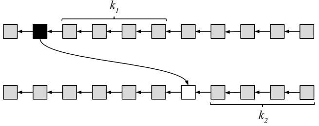
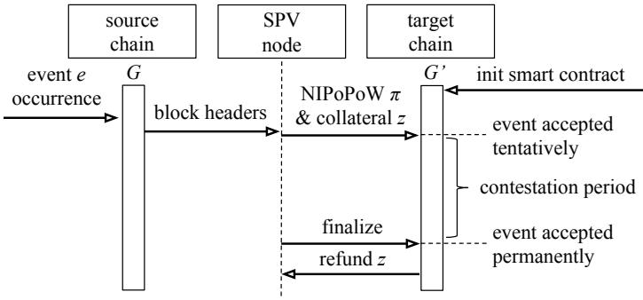
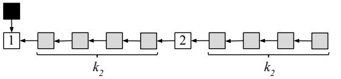

# **Proof-of-Work Sidechains**

Aggelos Kiayias<sup>1</sup> and Dionysis Zindros<sup>2</sup>

<sup>1</sup> University of Edinburgh and IOHK <sup>2</sup> National and Kapodistrian University of Athens and IOHK

October 30, 2018

**Abstract.** During the last decade, the blockchain space has exploded with a plethora of new cryptocurrencies, covering a wide array of different features, performance and security characteristics. Nevertheless, each of these coins functions in a stand-alone manner, independently. Sidechains have been envisioned as a mechanism to allow blockchains to communicate with one another and, among other applications, allow the transfer of value from one chain to another, but so far there have been no decentralized constructions. In this paper, we put forth the first sidechains construction that allows communication between proofof-work blockchains without trusted intermediaries. Our construction is generic in that it allows the passing of any information between blockchains. It gives rise to two illustrative examples: the "remote ICO," in which an investor pays in currency on one blockchain to receive tokens in another, and the "two-way peg," in which an asset can be transferred from one chain to another and back. We pinpoint the features needed for two chains to communicate: On the source side, a proof-ofwork blockchain that has been *interlinked*, potentially with a velvet fork; on the destination side, a blockchain with any consensus mechanism that has sufficient expressibility to implement verification. We model our construction mathematically and give a formal proof of security. In the heart of our construction, we use a recently introduced cryptographic primitive, Non-Interactive Proofs of Proof-of-Work (NIPoPoWs). Our security proof uses a standard reduction from our new proof-of-work sidechains protocol to the security of NIPoPoWs, which has, in turn, been shown to be secure in previous work. Our working assumption is honest majority in each of the communicating chains. We demonstrate the feasibility of our construction by providing a pseudocode implementation in the form of a Solidity smart contract.

### **1 Introduction**

Bitcoin [\[Nak08\]](#page-18-0) is the first and most successful *cryptocurrency* to date. Its core protocol introduced the concept of a *blockchain*, a type of cryptographic consensus protocol in which *transactions* are organized into *blocks* which are then put in a mutually agreed sequence despite the presence of adversarial nodes. Consensus is achieved via a *proof-of-work* [\[DN93\]](#page-18-1) which is the precondition for a block to be valid. Transactions moving value within such blockchains have been proven to be secure in that consensus is eventually achieved, cf. [\[GKL15,](#page-18-2)[PSS17](#page-18-3)[,GKL17\]](#page-18-4), thus providing a way for reaching consensus in a setting where neither reliable point-topoint channels exists nor a public-key infrastructure.

Ethereum [B <sup>+</sup>[14\]](#page-17-0) extends Bitcoin's functionality introducing the ability to write arbitrary Turing-complete *smart contracts* in programming languages such as Solidity running on top of the Ethereum Virtual Machine [\[Woo14\]](#page-19-0). These contracts execute autonomously. The smart contracts are confined to access data only within the blockchain itself, such as previous transactions and blocks. Access to external world data requires some trusted third party or group of third parties to vouch for the validity of the data [\[ZCC](#page-19-1)+16].

Sidechains [\[BCD](#page-18-5)+14] are a mechanism for cross-chain communication in blockchains. They allow the smart contracts on one blockchain to receive and react to *events* that take place on another blockchain without the need of a trusted third party. Despite the widely agreed usefulness of the primitive there exist no constructions that are decentralised and efficient at the same time.

**Our contributions.** In this paper, we introduce the first trustless construction for proof-of-work sidechains. We describe how to build generic communication between blockchains. As one application, we give the construction of a *two-way pegged* asset which can be moved from one blockchain to another while retaining its nature. We provide a high-level construction in Solidity. Our construction works across a broad range of blockchains requiring only two underlying properties. First, that the *source* blockchain is a proof-of-work blockchain supporting Non-Interactive Proofs of Proof-of-Work (NIPoPoWs), a cryptographic primitive which allows constructing succinct proofs *about* events which occur in a proof-ofwork blockchain and which was recently introduced in [\[KMZ17\]](#page-18-6). Support for NIPoPoWs can be introduced to practically any work-based cryptocurrency such as Bitcoin, Ethereum, Bitcoin Cash, Litecoin or Monero without a hard or soft fork. Second, that the *target* blockchain is able to validate such proofs by, for instance, being Turing-complete, such as, e.g., Ethereum or Ethereum Classic. Any blockchain supporting advanced smart contracts is sufficient. In the appendix, we give a formal proof of security of our construction via reduction to NiPoPoW security under the assumption that the interoperating blockchains are secure individually. To our knowledge, we are the first to provide such a construction in full and prove its security.

**Related work.** Sidechains were introduced as a Bitcoin upgrade mechanism by Back et al. [\[BCD](#page-18-5)+14]. They proposed introducing a new *child* blockchain which implements a new protocol version, with which assets are *2-way pegged*. The *firewall* property was articulated. No security definitions nor a complete construction of the protocol were given. Their paper hints at the need for "*efficient SPV proofs*" (Appendix B) in future work, which we implemented here. We use the term *sidechains* in a more general notion than in their work. Our sidechains allow communication between *stand alone* blockchains and also convey *any* information, not just transfers of value. In our work, a blockchain is a sidechain of another chain if it can react to events on that chain, and so the relationship can be symmetric.

*Polkadot* [\[Woo16\]](#page-19-2), *Tendermint*, *Cosmos* [\[Buc16\]](#page-18-7), *Liquid* and *Interledger* [\[Gro\]](#page-18-8) also build cross-chain transfers. Their validation relies on a trusted committees, federations or is left unspecified. *Drivechains* are a sidechain proposal which requires miners of both chains to be aware of both networks. In our scheme, miners remain agnostic to the existence of other chains and connect only to one network. *BTCRelay* is a trustless mechanism relaying information one-way from Bitcoin to Ethereum, in which miners are connected to their network only. BTCRelay requires the transmission of the entirety of the source blockchain headers into the target blockchain. Our proposal only requires data logarithmic in size of the source blockchain. This stems from the *succinctness* property of the NI-PoPoW scheme. None of the aforementioned constructions include proofs of security. Other related work includes Plasma [\[PB17\]](#page-18-9), XCLAIM [\[ZHL](#page-19-3)+], PeaceRelay, COMIT [\[HHK17\]](#page-18-10), and NOCUST [\[KG18\]](#page-18-11) and Dogethereum.

## **2 Overview**

We wish to transfer assets from one blockchain to another and then back. When assets can be transferred from one blockchain to another but not back, we call it a *one-way peg*. If assets can also be moved back, we call it a *two-way peg*. In each individual transfer of an asset, we have a particular *source blockchain*, from which the asset is moved, and a particular *target blockchain*, to which the asset is moved. In a sidechain setting of two blockchains that are two-way pegged, both blockchains can function as a source and a target blockchain for different transfers.

While the motivation for the construction is to be able to move assets from one blockchain to another, we generalize the notion of sidechains from this strict setting. In general, we would like the target blockchain to be able to react to any *event* that occurs on the source blockchain. Such events can be the fact that a transaction with a particular txid took place, that a certain account was paid a certain amount of money, or that a particular smart contract was instantiated. Our sidechain construction allows the target blockchain to react to events that took place on the source blockchain. This reaction can be implemented in its target blockchain smart contracts. We describe our construction in pseudocode similar to Ethereum' *Solidity*. In Solidity, *events* can be fired arbitrarily from within a smart contract and do not have a semantic interpretation. In this setting, events are defined by Solidity using the event type and have an *event name*, a *contract address* which fired them, as well as certain parameter values. A contract can elect to fire an event with any name and any parameters of its choice by invoking the emit command.

<span id="page-3-0"></span>**Fig. 1.** Basic information transfer between two blockchains



A high-level overview of cross-chain event transmission is shown in Figure [1.](#page-3-0) The process is as follows. First, an event is fired in the source blockchain, shown at the top. This could be any event that can be emitted using Ethereum's emit command. This event firing is caused by a certain transaction which is included at a certain block, indicated in black at the top. This block is then buried under *k*<sup>1</sup> subsequent blocks within the source blockchain, where the *k*<sup>1</sup> parameter is a security parameter of the scheme depending on the specific parameters of the source blockchain [\[GKL15\]](#page-18-2). As soon as this confirmation occurs, the target blockchain can react to the event, shown at the bottom. This reaction occurs in a transaction which is included in a block within the target blockchain, illustrated in white. As usual, the block needs to be confirmed by waiting for *k*<sup>2</sup> blocks to be mined on top of it. It is possible that *k*<sup>1</sup> 6= *k*<sup>2</sup> because of different blockchain parameters such as a difference in block generation time or network synchrony. In this figure, arrows between blocks of the same blockchain indicate authenticated ancestry. The arrow between the two blockchains indicates the data transfer needed for the event.

Using this basic functionality of event information exchange between blockchains, we can construct two-way pegged sidechains. In such a construction, an asset that exists on one blockchain will gain the ability to be *moved* to a different blockchain and back. We will use the example of moving ether, the native asset of the Ethereum blockchain, from the Ethereum blockchain into the Ethereum Classic blockchain and back. Such an action is different from *exchanging* ether (ETH), the native token of the Ethereum blockchain, with ether classic (ETC), the native token of the Ethereum Classic blockchain. Instead, the asset retains its nature; it maintains its price and its ability to be used for the same purposes, while being governed by the rules of the new blockchain, such as different performance, fees, features, or security guarantees. Furthermore, no counterparty or market is required to perform the exchange; the transfer is something a party can do on its own.

## **3 Construction**

### **Cross-chain certificates**

For our construction, we use a primitive called Non-Interactive Proofs of Proof-of-Work recently introduced in [\[KMZ17\]](#page-18-6). Non-Interactive Proofs of Proofs-of-Work are cryptographic protocols which implement a *prover* and a *verifier*. The prover is a *full node* on the *source blockchain*. The verifier does not have access to that blockchain, but knows its genesis block G. The prover wants to convince the verifier that an *event* took place in the source blockchain; for instance, a smart contract method was called with certain parameters or that a payment was made into a particular address. Whether such an event took place can easily be determined if one inspects the whole blockchain. However, the prover wishes to convince the verifier by only sending a *succinct proof*, a short string which does not grow linearly with the size of the blockchain, but, rather, *polylogarithmically*. The verifier must not be fooled by *adversarial provers* who provide incorrect proofs claiming that an event happened while in fact it didn't, or that it didn't while in fact it did. To withstand such attacks, the verifier accepts multiple proofs, at least one of which is assumed to have been honestly generated (this assumption is necessary in standard blockchain protocols in general [\[HKZG15,](#page-18-12)[WG16\]](#page-19-4)). Comparing these proofs against each other, the verifier extracts a reliable truth value corresponding to the same value it would deduce if it were to be running a full node on the blockchain itself. This property is the *security* of NIPoPoWs proven in [KMZ17].

The NIPoPoWs construction talks about predicates evaluated on blockchains, but we are interested in events. We can translate from events to predicates provable with NIPoPoWs. Specifically, given a genesis block  $\mathcal{G}$ , a smart contract address addr, an event name Event, and a series of event parameter values ( $param_1, param_2, \dots, param_n$ ), the predicate e we wish to check for truth is the following: Has the event named Event been fired with parameters (param<sub>1</sub>, param<sub>2</sub>,  $\cdots$ , param<sub>n</sub>) by the smart contract residing in address addr on the blockchain with genesis block G at least kblocks ago? This predicate is (1) monotonic, meaning that it starts with the value false and, if it ever becomes true, it cannot ever change its value back as the blockchain grows; (2) infix-sensitive, meaning that its truth value can be deduced by inspecting a constant number of blocks on the blockchain (one block, within which the event firing was confirmed); and (3) stable, meaning that, if one party deduces that its value is true, then soon enough all parties will deduce that its value is true. This last property stems from the requirement that the event be buried under k blocks ensuring a blockchain reorganization up to k blocks ago cannot affect the predicate's value.

In order to determine whether an event took place, the NIPoPoW verifier function verify  $_{k,m}^{\mathcal{G},e}(\mathcal{P})$  accepts the event description in the form of a blockchain predicate e, which we gave above, the genesis block of the remote chain  $\mathcal{G}$ , as well as two security parameters k and m. These security parameters can be constants specified when the sidechain system is created (concrete values for these are given in [KMZ17]). Subsequently, the NIPoPoW verifier accepts a set of  $proofs \mathcal{P} = \{\pi_1, \pi_2, \cdots, \pi_n\}$  which it compares and extracts a truth value for the predicate: Whether the event has taken place in the remote blockchain or not. As long as at least one  $honestly\ generated\ proof\ \pi_i$  is provided, the verifier's security ensures that the output will correspond to whether the event actually occurred.

Our protocol works as follows. Whenever an event of interest occurs on the source blockchain, the occurence of this event is observed by a source blockchain honest node, who generates a NIPoPoW about it. The target blockchain contains a smart contract with a method to accept and verify the veracity of this proof. The node can then submit the proof to the smart contract by broadcasting a transaction on the target blockchain. As soon as the proof is validated by the smart contract, the target blockchain can elect to react to the event as desired.

**Adoption considerations.** Our construction has certain prerequisites for both the source and the target blockchain before it can be adopted. In the case of bidirectionally connected blockchains, both of them must satisfy the source and the target blockchain prerequisites.

- **– The source blockchain** needs to support *proofs* about it, which requires augmenting it with an *interlink* vector, the details of which can be found in [\[KLS16\]](#page-18-13). This interlink vector can be added to a blockchain using a *user-activated velvet fork* [\[KMZ17](#page-18-6)[,ZSJ](#page-19-5)+18], which is performed without miner awareness and does not require a hard or soft fork. However, only events occuring *after* the velvet fork can be proven. New blockchains can adopt this from genesis.
- **– The target blockchain** needs to be able to run the above verify function. This function can be programmed in a Turing-complete language such as Solidity. If the source blockchain proof-of-work hash function is available as an opcode or pre-compiled smart contract within the target blockchain's VM the way, e.g., Bitcoin's SHA256 hash function is available in Solidity, the implementation can be more gas-efficient.

**Blockchain agnosticism.** We underline the remarkable property that miners and full nodes of the target blockchain do not need to be aware of the source blockchain at all. To them, all information about the source blockchain is simply a string which is passed as a parameter to a smart contract and can remain *agnostic* to its semantics as a proof. Additionally, miners and full nodes of the source blockchain do not need to be aware of the target blockchain. Only the parties interested in facilitating crosschain events must be aware of both. Those untrusted facilitators need to maintain an SPV node on the source blockchain with which they generate their NIPoPoW. To broadcast their proof on the target blockchain, they connect to target blockchain nodes and send the transaction containing the NIPoPoW. Blockchain agnosticism allows users to initiate cross-chain relationships between different blockchains *dynamically*, as long as the blockchains in question satisfy the above prerequisites.

<span id="page-7-0"></span>**Algorithm 1** The smart contract skeleton that enables checking cross-chain proofs about events.

```
1: contract crosschain_{k,m,z}
         internal function initialize (\mathcal{G}_{remote})
 2:
 3:
              \mathcal{G} \leftarrow \mathcal{G}_{\mathsf{remote}}
         end function
 4:
 5:
         payable function submit-event-proof(\pi, e)
 6:
              \mathbf{if} \ \mathsf{msg.value} < z \ \mathbf{then}
                                                                           ▷ Ensure sufficient collateral
 7:
                  \mathbf{return} \perp
 8:
              end if
              if events[e] = \bot \land verify_{k,m}^{e,\mathcal{G}}(\{\pi\}) then
 9:
10:
                   events[e] \leftarrow {expire: block.number + k, proof: \pi, author: msg.sender}
11:
              end if
12:
          end function
          function finalize-event(e)
13.
14:
              if events[e] = \bot \lor block.number < events[e].expire then
15:
16:
              end if
              finalized-events \leftarrow finalized-events \cup \{e\}
17:
18:
              author \leftarrow events[e].author
19:
              events[e] \leftarrow \bot
20:
              author.send(z)
                                                                                        ▷ Return collateral
21:
          end function
22:
          function submit-contesting-proof (\pi^*, e)
23:
              if events[e] = \bot \lor block.number \ge events[e].expire then
24:
                   return \perp
25:
              end if
              if \neg \text{verify}_{k,m}^{e,\mathcal{G}}(\{\text{events}[e].\text{proof},\pi^*\}) then \triangleright Original proof was fraudulent
26:
27:
                  events[e] \leftarrow \bot
28:
                  msg.sender.send(z)
                                                                            ▶ Pay collateral to contester
29:
              end if
          end function
30:
31:
          function event-exists(e)
32:
              \mathbf{return}\ e \in \mathsf{finalized}\text{-events}
33:
          end function
34: end contract
```

#### Cross-chain events

We give our crosschain construction in Algorithm 1. Initially, our communication will be unidirectional. In the next section, we use two unidirectional channels to establish bidirectional communication. This smart contract runs on the target blockchain and informs it about events that took place in the source blockchain. It is parameterized by three parameters: k and m are the underlying security parameters of the NIPoPoW protocol. The value z is a collateral parameter, denominated in ether (or

the native currency of the blockchain in which the execution takes place) and is used to incentivize honest participants to intervene in cases of false claims. The contract utilizes the NIPoPoW verify function parameterized by the event e, the remote genesis block  $\mathcal G$  and the security parameters k and m. We do not give an explicit implementation of verify, as it can be implemented in a straightforward manner by translating the pseudocode listing of [KMZ17]. For our purposes, it suffices to treat it as a black box which, given a set of proofs, at least one of which is honestly generated, returns the truth value of the respective predicate.

The contract allows detecting remote blockchain events can be *inherited* by other contracts that wish to adopt its functionality. It works as follows. First, the initialize method is called exactly once to configure the contract, passing the *hash* of the genesis block of the remote chain which this contract will handle. This method is internal and can only be called by the contract inheriting from it. Users of the contract can check it has been configured with the correct genesis block prior to using it. We note that, while our algorithm does not reflect this to keep complexity low, it is possible to have a contract interact with *multiple* remote chains by extending it to include multiple geneses.

Fig. 2. A sequence diagram showing the actions of the untrusted SPV node when communicating with both blockchain networks and the lifecycle of an event submission

<span id="page-8-0"></span>

The lifecycle of an event submission is illustrated in Figure 2. When an event has taken place in the source blockchain, any source blockchain SPV node, the *author*, can inform the crosschain contract about this fact by generating a NIPoPoW  $\pi$  claiming that the event took place based on their current view of the source blockchain. This proof can then be submitted to the target blockchain by calling the submit-event-proof function

and passing it the proof *π* and the event predicate *e*. The submission is accompanied by a collateral payment *z*. If the author is honest, this collateral will be returned to her later. The submit-event-proof function runs the NIPoPoW verify algorithm to check that the proof *π* is well-formed and that it claims that the predicate is true. It then stores the proof for later use. It also stores the address of the *author* and an *expiration block number*.

Upon submission of a proof to the submit-event-proof function, the event is *tentatively accepted* for a *contestation period* of *k* blocks, during which any other party, the *contester*, can provide a counter-proof showing that the original proof was fraudulent. The contester can call the submitcontesting-proof function passing it the contesting proof *π* <sup>∗</sup> and the event predicate *e*. The function runs the NIPoPoW verify algorithm to compare the original proof events[*e*]*.*proof against the contesting proof *π* ∗ . If the verification algorithm concludes that the original proof was fraudulent, the tentatively accepted event is abandoned and the collateral is paid to the contester.

Otherwise, when the contestation period has expired without any valid contestations, the author can call the finalize-event function. This function changes the acceptance of the event from tentative to *permanent* by including it in the finalized-events set and returns the collateral to the author. Finally, the event-exists function can be used by the inheriting contract to check if an event has been permanently accepted. The target blockchain state during this execution is shown in Figure [3.](#page-9-0) The source blockchain's event included in the black box, upon sufficient confirmation by *k*<sup>1</sup> blocks (not shown), is transmitted to the target blockchain at the bottom. The target blockchain includes the event *tentatively* in block 1 until a contestation period of *k*<sup>2</sup> has passed; the event is included *permanently* in block 2; subsequently, permanent inclusion needs to be confirmed with *k*<sup>2</sup> further blocks.

<span id="page-9-0"></span>**Fig. 3.** The target blockchain state during event submission



#### **Two-way pegged sidechains**

Having created the generic crosschain contract, we now build two-way pegged sidechains on top. For concreteness, we use the example of transferring ether (ETH), the native currency of the Ethereum blockchain, to the Ethereum Classic blockchain, and back. We note that this example is arbitrary and for illustration. Our construction can be used between any work-based blockchains satisfying the prerequisites detailed above.

When ether is moved to the Ethereum Classic blockchain, it will be represented as an ERC20 token[3](#page-10-0) within Ethereum Classic. Let this custom token be called ETH20. The asset retains its nature as it moves from one blockchain to another if it is always possible to move ETH into ETH20 and back at a one-to-one rate. The economic reason is that the price of ETH and ETH20 on the market will necessarily be the same. If the price of ETH were to ever be significantly above the price of ETH20 in the market, then a rational participant would exchange their ETH20 for ETH using sidechains and sell their ETH on the market instead, and vice versa. There can be a small discrepancy in the two prices which stems from two different factors: First, the fees needed for a cross-chain transfer; and second, the temporary market fluctuations that can occur during the limited time needed to perform the cross chain transfer (*k*<sup>1</sup> + 2*k*2). If we assume the price fluctuation (of ETH20 denominated in ETH) per unit of time is bounded, then the market price difference between ETH and ETH20 at any moment in time can be bounded by the sum of these two factors.

The sidechain smart contracts are presented in Algorithm [2.](#page-12-0) These smart contracts both extend the crosschain smart contract of Algorithm [1.](#page-7-0) Furthermore, sidechain<sup>2</sup> also inherits basic ERC20 functionality which allows token owners to transfer the token [\[SCS17a\]](#page-19-6). The sidechain<sup>1</sup> contract will be instantiated on Ethereum, while the sidechain<sup>2</sup> contract will be instantiated on Ethereum Classic. Suppose the genesis block hash of Ethereum is G<sup>1</sup> and of Ethereum Classic is G2. We will use the genesis block hash of each blockchain as its unique identifier.

The two smart contracts both contain an initialize method which accepts the hash of the remote blockchain as well as the address of the remote smart contract it will interface with. Note that, while the two genesis hashes can be hard-coded into the respective smart contract code itself, the remote contract address cannot be built-in as a constant into

<span id="page-10-0"></span><sup>3</sup> The ERC20 standard [\[VB15\]](#page-19-7) defines an interface implementable by smart contracts that enables holding and transferring custom fungible tokens such as ICO tokens.

the smart contract, but must be later specified by calling the initialize function. The reason is that, if sidechain<sup>1</sup> were to be created on G1, it would require the address of sidechain<sup>2</sup> to exist prior to its creation, and vice versa in a circular dependency. Therefore, the two contracts must first be created on their respective blockchain to obtain addresses, and then their initialize methods can be called to inform each contract about the address of the other. Specifically, first the contract sidechain<sup>1</sup> is created on G<sup>1</sup> to obtain its instance address which we also denote sidechain1. Then the second contract, sidechain<sup>2</sup> is created on G<sup>2</sup> to obtain its address sidechain2. Then, the initialize function of sidechain<sup>1</sup> is called, passing it G<sup>2</sup> and the address sidechain2. Finally, initialize is called on sidechain2, passing it G<sup>1</sup> and the address sidechain1. These initialization parameters are stored by the respective smart contracts for future use. As the crosschain contract requires, the initialize method can only be called once. Any user wishing to utilize this sidechain is expected to validate that the contracts have been set up correctly and that initialize has been called with the appropriate parameters.

sidechain<sup>1</sup> contains a deposit function which is *payable* in the native asset of Ethereum, ETH. When a user pays ETH into the deposit function, the funds are held by the smart contract and can later be used to pay parties who wish to *withdraw*, an operation performed by calling the withdraw function. sidechain<sup>2</sup> contains similar deposit and withdraw functions which, however, do not pay in the native currency of Ethereum Classic, but instead maintain a balance mapping akin to a typical ERC20 implementation. The balance is updated when a user deposits or withdraws.

Moving funds from the Ethereum blockchain into the Ethereum Classic blockchain works as follows. First, the user pays with ETH to call the deposit function of sidechain<sup>1</sup> which resides on G1, passing the target parameter which indicates their address in the Ethereum Classic blockchain that they wish to receive the money into. This call emits an event, Deposited<sup>1</sup> which contains the necessary data: the target, the amount paid, as well as a nonce ctr to allow for future payments of the same amount to the same target. When the event has been emitted and buried under *k*<sup>1</sup> blocks within the Ethereum blockchain, the user produces an Ethereum NIPo-PoW *π*<sup>1</sup> about the predicate *e*<sup>1</sup> which claims that the event Deposited<sup>1</sup> has been emitted in blockchain G<sup>1</sup> with the particular parameters by the contract at address sidechain1.

## <span id="page-12-0"></span>**Algorithm 2** An asset transferring contract between G<sup>1</sup> and G<sup>2</sup>

```
1: contract sidechain1 extends crosschaink,m,z
2: initialized ← false; ctr ← 0
3: function initialize(G2, sidechain2)
4: if ¬initialized then
5: crosschain.initialize(G2) . Initialize with the remote chain genesis block
6: initialized ← true
7: this.sidechain2 ← sidechain2
8: end if
9: end function
10: payable function deposit(target)
11: . Emit an event to be picked up by remote contract
12: ctr += 1
13: emit Deposited1(target, msg.value, ctr)
14: end function
15: function withdraw(amount,target, ctr)
16: . Validate that event took place on remote chain
17: if ¬event-exists((sidechain2, Deposited2
                                        ,(amount,target, ctr))) then
18: return ⊥
19: end if
20: msg.sender.send(amount)
21: end function
22: end contract
23: contract sidechain2 extends crosschaink,m,z; ERC20
24: mapping(address ⇒ int) balances
25: initialized ← false; ctr ← 0
26: function initialize(G1, sidechain1)
27: if ¬initialized then
28: crosschain.initialize(G1)
29: initialized ← true
30: this.sidechain1 ← sidechain1
31: end if
32: end function
33: function deposit(target, amount)
34: if balances[msg.sender] < amount then
35: return ⊥
36: end if
37: balances[msg.sender] −= amount . Charge account of sender
38: ctr += 1
39: emit Deposited2(target, amount, ctr)
40: end function
41: function withdraw(amount,target, ctr)
42: if ¬event-exists((sidechain1, Deposited1
                                        ,(amount,target, ctr))) then
43: return ⊥
44: end if
45: balances[target] += amount . Credit target account
46: end function
47: end contract
```

Subsequently, the user calls the submit-event-proof function of sidechain<sub>2</sub> (which is inherited from the crosschain contract), passing the NIPoPoW  $\pi_1$  and the event predicate  $e_1$  and paying collateral z, which registers  $e_1$  on sidechain<sub>2</sub> as tentative. Because the user is honest, no adversary can produce a  $\pi'_1$  which disproves their claim during the dispute period, and therefore the user waits for  $k_2$  blocks for the contestation period to expire without any successful contestations. She then calls the finalize-event function for  $e_1$  and receives back the collateral z, marking the event permanent. Finally, she calls the function withdraw of sidechain<sub>2</sub>, passing it the same parameters that  $e_1$  was issued with. The withdraw function checks that  $e_1$  exists using the event-exists method, which will return true. The user is then credited with amount in their ETH20 balance stored in balances[target]. This increment in balance creates brand new ETH20 to-kens.

The user can then transfer their ETH20 tokens by utilizing the functionality inherited from the ERC20 contract. When some (not necessarily the same) user is ready to move some (not necessarily the same) amount of ETH20 from the Ethereum Classic blockchain back into ETH on the Ethereum blockchain, they follow the reverse procedure. Specifically, they call the withdraw function of sidechain<sub>2</sub> which ensures their ERC20 balance is sufficient, deduces the requested amount, and fires an event  $e_2$ as before. At this point, these particular ETH20 tokens are destroyed by the balance deduction. Once  $e_2$  is confirmed in  $\mathcal{G}_2$ , the user produces the NIPoPoW  $\pi_2$  about  $e_2$  which claims that a payment was made within  $\mathcal{G}_2$ . That proof is then submitted to sidechain by calling the submit-eventproof and finalize-event functions as before. Last, the user calls the withdraw function of sidechain<sub>1</sub>, which uses the event-exists function which will return true, finally paying back the user the respective amount of ETH. Because the only way to create ETH20 tokens in sidechain<sub>2</sub> is by depositing ETH into sidechain<sub>1</sub>, there will always exist a sufficient balance of ETH owned by the sidechains<sub>1</sub> smart contract to pay for any requested withdrawals.

Suppose now that an adversarial user makes a false claim that an event e took place in  $\mathcal{G}_1$  and posts a relevant NIPoPoW  $\pi$  in  $\mathcal{G}_2$ . If an honest party is monitoring the chain  $\mathcal{G}_2$  for the appearance of NIPoPoWs and the chain  $\mathcal{G}_1$  for the firing of events, the fraudulence of  $\pi$  will be immediately obvious to them. They can subsequently generate a contesting NIPoPoW  $\pi^*$  providing a counter-claim that e did not occur. The honest party will broadcast this transaction at the beginning of the contestation period. Due to the *chain quality* of  $\mathcal{G}_2$ , the honest party will manage to include

this transaction into G<sup>2</sup> within one of the blocks before the end of the contestation period. The collateral *z* must be sufficient to incentivize an honest party to monitor G<sup>1</sup> and G<sup>2</sup> simultaneously, pay for transaction fees and ensure the time needed to generate a NIPoPoW *π* ∗ is small as compared to block generation time. The argument for G<sup>2</sup> is analogous. We make this security argument formal in the appendix.

### **4 Applications**

We give two futher applications of sidechains beyond the two-way peg. **Remote ICOs.** A group wants to fund raise by performing an ICO [\[TBB17\]](#page-19-8) on a certain feature-rich target blockchain such as Ethereum. Investors who wish to purchase tokens are holding their cryptocurrency they wish to pay with on a different source blockchain with lower volatility such as Bitcoin. In this context, instead of trading Bitcoin for Ethereum, the investors can directly pay in Bitcoin and receive their ICO tokens on the Ethereum blockchain. Furthermore, the value of tokens can be denominated in Bitcoin.

The course of action is as follows: Initially, the fundraising entity creates a *fund raiser* address on the source blockchain, in our example the Bitcoin blockchain. The fundraising entity also creates a *token generator* [\[SCS17b\]](#page-19-9) smart contract on the target blockchain, in our example the Ethereum blockchain. The token generator contract is initialized with the source blockchain genesis hash and the fund raiser address. The token generator contract contains a withdraw method which allows receiving the ICO tokens. The fundraising entity then advertises both the address and the smart contracts and allows investors to inspect them. An investor subsequently deposits bitcoin into the fund raiser address. The investor subsequently generates a NIPoPoW *π* for the deposit and submits it to the withdraw method of the token generator function. Upon verification of *π*, the investor receives their ICO tokens. This application is a special case of a *one-way peg* with extra rules such as a limited timeframe or dynamic pricing.

**Atomic swaps.** Two mutually distrusting parties wish to exchange coins between two different chains, for example ETH for ETC, without using a centralized exchange. Alice wants to pay Bob in ETH and Bob wants to pay Alice in ETC. While atomic swaps are already possible using hash locks [\[Nol13,](#page-18-14)[Her18\]](#page-18-15), our construction provides an alternative possibility: One contract is created on the target blockchain, in our example Ethereum, and is made aware of the remote genesis block as well as an address on the source blockchain, in our case Alice's Ethereum Classic address. Then, Alice deposits ether into the deposit function of the contract that sits on the target blockchain. The ether remains locked for a designated period of time. In the meantime, Bob pays Alice in Ethereum Classic by creating a regular transaction on the Ethereum Classic blockchain. He then generates a proof *π* that this transaction took place and is paying into Alice's account. By submitting *π* into the withdraw function of the contract that sits on the target blockchain, Bob receive his ether payment, contingent on the fact that he has paid Alice. In case Bob aborts the protocol, Alice is able to withdraw her money from the source blockchain contract by calling an abort function, which is only callable as soon as a sufficient number of blocks have passed. As long as Bob cooperates in a timely manner, Alice is unable to call abort due to the timelock, and hence the protocol is atomic.

### **Appendix**

## **A Security analysis**

We now formalize our protocol and provide a cryptographic analysis of its security. As NIPoPoWs security is modelled in the Bitcoin Backbone Protocol [\[GKL15\]](#page-18-2), we work in the same model (and note that the same mathematical model also captures Ethereum). We assume that the standard results of the backbone protocol are attained, namely blockchain *persistence* and *liveness*. Persistence and liveness can be proved to hold with overwhelming probability under the honest mining majority assumption. For the details of that result, consult the Bitcoin Backbone paper [\[GKL15\]](#page-18-2).

We adopt the sidechains security definition from related work on proof-of-stake sidechains [\[GKZ18\]](#page-18-16).

We will show that proving, to the maintainers of a chain G2, that an event *e* took place in chain G<sup>1</sup> without it actually happening, can only occur if the underlying NIPoPoWs protocol is insecure. Therefore, our proof strategy follows the standard form of a cryptographic computational reduction. In our assumptions, we will make use of the persistence and liveness of G2, but only the persistence of G1.

**Theorem 1.** *Assume a secure NIPoPoWs construction. Then, under the honest majority assumption for both* G<sup>1</sup> *and* G2*, for all PPT adversaries* A *and for all environments* Z*, the proof-of-work sidechains construction between* G<sup>1</sup> *and* G<sup>2</sup> *with contestation period* 2*k is secure, except with negligible probability in k.*

*Proof.* Let  $\mathcal{A}$  be an arbitrary PPT adversary against the proof-of-work sidechains construction and  $\mathcal{Z}$  be an arbitrary environment. We will construct an adversary  $\mathcal{A}^*$  against NIPoPoWs and an environment  $\mathcal{Z}^*$  in which it will operate.

Suppose, without loss of generality, that  $\mathcal{A}$  can break the security of proof-of-work sidechains during a cross-chain transfer from  $\mathcal{G}_1$  to  $\mathcal{G}_2$ . (Because the construction is symmetric, if the adversary is not able to do that, then they will be able to break the security of a cross-chain transfer from  $\mathcal{G}_2$  to  $\mathcal{G}_1$  and the proof follows in the same manner.)

Note that  $\mathcal{A}$  works in an environment with two blockchains,  $\mathcal{G}_1$  and  $\mathcal{G}_2$ , while  $\mathcal{A}^*$  must work in the environment of one blockchain, namely  $\mathcal{G}_1$ .

 $\mathcal{A}^*$  works as follows. First, it simulates the execution of the block-chain civilization  $\mathcal{G}_2$ . That is, it creates a new random oracle for  $\mathcal{G}_2$  which is independent of its external random oracle used with  $\mathcal{G}_1$ . For any random oracle queries of  $\mathcal{A}$  pertaining to  $\mathcal{G}_1$ ,  $\mathcal{A}^*$  forwards the queries to its external random oracle. For random oracles queries of  $\mathcal{A}$  pertaining to  $\mathcal{G}_2$ ,  $\mathcal{A}^*$  answers its queries with its simulated and independent random oracle. Because  $\mathcal{A}$  is subject to honest majority limitations in both  $\mathcal{G}_1$  and  $\mathcal{G}_2$ , it follows that  $\mathcal{A}^*$  will respect honest majority with regards to its external random oracle. For any environment instructions requested by  $\mathcal{Z}$  pertaining to  $\mathcal{G}_1$  (namely, the creation of new parties), the instructions are mirrored by  $\mathcal{Z}^*$ . Intructions of  $\mathcal{Z}$  pertaining to  $\mathcal{G}_2$  are simulated by  $\mathcal{A}^*$ . All diffusions of blocks in  $\mathcal{G}_1$  by  $\mathcal{A}$  are also diffused by  $\mathcal{A}^*$ , while diffusions in  $\mathcal{G}_2$  by  $\mathcal{A}$  are held private.

 $\mathcal{A}^*$  monitors the chains adopted by honest parties and for every round r observes the state of all honest parties.  $\mathcal{A}^*$  looks for a round r, an event e, a  $\mathcal{G}_1$  maintainer  $p_1$  and a  $\mathcal{G}_2$  maintainer  $p_2$  for which the following properties hold:

- 1.  $p_1$  has not included e in their state
- 2.  $p_2$  has included e in their finalized-events state

Because of the construction of  $p_2$ , finalized-events can contain e only if an issuance of submit-event-proof is included at least 2k blocks deep and contains the respective NIPoPoW  $\pi$  stored in events[e].proof.  $\mathcal{A}^*$  now returns the proof  $\pi$ .

We will now analyze the probability of success of A. Consider the following (probabilistic) events:

- 1. SC-Brk that  $\mathcal{A}$  is successful
- 2. Cert-Brk that  $\mathcal{A}^*$  is successful

- 3. Per<sub>1</sub> that persistence is maintained in  $\mathcal{G}_1$
- 4. PER<sub>2</sub> that persistence is maintained in  $\mathcal{G}_2$
- 5. LIVE<sub>2</sub> that liveness is maintained in  $\mathcal{G}_2$
- 6. BC the union of  $PER_1 \wedge PER_2 \wedge LIVE_2$

From total probability we obtain:

$$\Pr[SC\text{-Brk}] = \Pr[SC\text{-Brk}|BC] \Pr[BC] + \Pr[SC\text{-Brk}|\neg BC] \Pr[\neg BC]$$

From the honest majority assumption of  $\mathcal{G}_1$ , we deduce that  $\Pr[\neg PER_1]$  and  $\Pr[\neg LIVE_1]$  are negligible, and similarly from the honest majority assumption of  $\mathcal{G}_2$  we deduce that  $\Pr[\neg PER_2]$  is negligible, therefore  $\Pr[\neg BC]$  is negligible. It now suffices to show that  $\Pr[SC-BRK|BC]$   $\Pr[BC]$  is negligible.

Suppose that SC-BRK occurs. It follows that a (blockchain) event e must have been adopted by  $p_2$  with some NIPoPoW  $\pi$ , but not by  $p_1$ , as detailed above. Suppose now that BC occurs.

Because of the *persistence* of  $\mathcal{G}_2$ , when  $\pi$  was burried under k blocks in the adopted chain of  $p_2$ , all honest parties in  $\mathcal{G}_2$  must have seen  $\pi$  (this warrants the oldest k of the 2k blocks in the contestation period). Because of the *liveness* of  $\mathcal{G}_2$ , at least one honest block must have been included in the last k blocks after  $\pi$  had been received by all honest parties (this warrants the latest k of the 2k blocks in the contestation period).

Because of the *persistence* of  $\mathcal{G}_1$ , if e is not included in the state of  $p_1$  at round r, then therefore it cannot have been included in the state of any  $\mathcal{G}_1$  party during round  $r - \eta k$ . It follows that an honest party will attempt and succeed in generating a  $\mathcal{G}_2$  block containing a contesting proof  $\pi^*$  attesting to the fraudulence of event e by invoking submit-contesting-proof( $\pi^*, e$ ) and this block will be adopted by  $p_2$ . As  $p_2$  has finalized e, then therefore it must be such that  $\operatorname{verify}_{k,m}^{e,\mathcal{G}}(\{\pi,\pi^*\})$ , and therefore Cert-Brk has occurred.

Putting the above together, we obtain that:

$$\Pr[\text{Cert-Brk}] \ge \Pr[\text{SC-Brk}|\text{BC}] \Pr[\text{BC}]$$

From the NIPoPoW security assumption, we have that Pr[CERT-BRK] is negligible. Therefore, Pr[SC-BRK] is negligible.

#### References

<span id="page-17-0"></span>B<sup>+</sup>14. Vitalik Buterin et al. A next-generation smart contract and decentralized application platform. *white paper*, 2014.

- <span id="page-18-5"></span>BCD<sup>+</sup>14. Adam Back, Matt Corallo, Luke Dashjr, Mark Friedenbach, Gregory Maxwell, Andrew Miller, Andrew Poelstra, Jorge Timón, and Pieter Wuille. Enabling blockchain innovations with pegged sidechains. 2014. [http://www.opensciencereview.com/papers/123/](http://www. opensciencereview. com/papers/123/enablingblockchain-innovations-with-pegged-sidechains) [enablingblockchain-innovations-with-pegged-sidechains](http://www. opensciencereview. com/papers/123/enablingblockchain-innovations-with-pegged-sidechains).
- <span id="page-18-7"></span>Buc16. Ethan Buchman. *Tendermint: Byzantine fault tolerance in the age of blockchains*. PhD thesis, 2016.
- <span id="page-18-1"></span>DN93. Cynthia Dwork and Moni Naor. Pricing via processing or combatting junk mail. In Ernest F. Brickell, editor, *CRYPTO'92*, volume 740 of *LNCS*, pages 139–147. Springer, Heidelberg, August 1993.
- <span id="page-18-2"></span>GKL15. Juan A. Garay, Aggelos Kiayias, and Nikos Leonardos. The bitcoin backbone protocol: Analysis and applications. In Elisabeth Oswald and Marc Fischlin, editors, *EUROCRYPT 2015, Part II*, volume 9057 of *LNCS*, pages 281–310. Springer, Heidelberg, April 2015. Updated version at [http://eprint.iacr.](http://eprint.iacr.org/2014/765) [org/2014/765](http://eprint.iacr.org/2014/765).
- <span id="page-18-4"></span>GKL17. Juan A. Garay, Aggelos Kiayias, and Nikos Leonardos. The bitcoin backbone protocol with chains of variable difficulty. LNCS, pages 291–323. Springer, Heidelberg, 2017.
- <span id="page-18-16"></span>GKZ18. Peter Gaži, Aggelos Kiayias, and Dionysis Zindros. Proof-of-stake sidechains. *IACR Cryptology ePrint Archive*, 2018.
- <span id="page-18-8"></span>Gro. The Interledger Payments Community Group. Interledger protocol v4. Available at: [https://interledger.org/rfcs/](https://interledger.org/rfcs/0027-interledger-protocol-4/draft-5.html) [0027-interledger-protocol-4/draft-5.html](https://interledger.org/rfcs/0027-interledger-protocol-4/draft-5.html).
- <span id="page-18-15"></span>Her18. Maurice Herlihy. Atomic cross-chain swaps. *arXiv preprint arXiv:1801.09515*, 2018.
- <span id="page-18-10"></span>HHK17. Julian Hosp, Toby Hoenisch, and Paul Kittiwongsunthorn. Comit: Cryptographically-secure off-chain multi-asset instant transaction network. Available at: [https://www.comit.network/doc/COMIT%20white%20paper%](https://www.comit.network/doc/COMIT%20white%20paper%20v1.0.2.pdf) [20v1.0.2.pdf](https://www.comit.network/doc/COMIT%20white%20paper%20v1.0.2.pdf), 2017.
- <span id="page-18-12"></span>HKZG15. Ethan Heilman, Alison Kendler, Aviv Zohar, and Sharon Goldberg. Eclipse attacks on bitcoin's peer-to-peer network. Cryptology ePrint Archive, Report 2015/263, 2015. <http://eprint.iacr.org/2015/263>.
- <span id="page-18-11"></span>KG18. Rami Khalil and Arthur Gervais. Nocust–a non-custodial 2 nd-layer financial intermediary. Technical report, Cryptology ePrint Archive, Report 2018/642. https://eprint. iacr. org/2018/642, 2018.
- <span id="page-18-13"></span>KLS16. Aggelos Kiayias, Nikolaos Lamprou, and Aikaterini-Panagiota Stouka. Proofs of proofs of work with sublinear complexity. In *International Conference on Financial Cryptography and Data Security*, pages 61–78. Springer, 2016.
- <span id="page-18-6"></span>KMZ17. Aggelos Kiayias, Andrew Miller, and Dionysis Zindros. Non-interactive proofs of proof-of-work, 2017.
- <span id="page-18-0"></span>Nak08. Satoshi Nakamoto. Bitcoin: A peer-to-peer electronic cash system. 2008.
- <span id="page-18-14"></span>Nol13. Tier Nolan. Alt chains and atomic transfers. Available at: [https://](https://bitcointalk.org/index.php?topic=193281.0) [bitcointalk.org/index.php?topic=193281.0](https://bitcointalk.org/index.php?topic=193281.0), 2013.
- <span id="page-18-9"></span>PB17. Joseph Poon and Vitalik Buterin. Plasma: Scalable autonomous smart contracts. *White paper*, 2017.
- <span id="page-18-3"></span>PSS17. Rafael Pass, Lior Seeman, and Abhi Shelat. Analysis of the blockchain protocol in asynchronous networks. LNCS, pages 643–673. Springer, Heidelberg, 2017.

- <span id="page-19-6"></span>SCS17a. Inc Smart Contract Solutions. Openzeppelin crowdsale contract. Available at: [https://github.com/OpenZeppelin/openzeppelin-solidity/blob/](https://github.com/OpenZeppelin/openzeppelin-solidity/blob/v2.0.0-rc.1/contracts/token/ERC20/ERC20.sol) [v2.0.0-rc.1/contracts/token/ERC20/ERC20.sol](https://github.com/OpenZeppelin/openzeppelin-solidity/blob/v2.0.0-rc.1/contracts/token/ERC20/ERC20.sol), 2017.
- <span id="page-19-9"></span>SCS17b. Inc Smart Contract Solutions. Openzeppelin standard erc20 token contract: Implementation of the basic standard token. Available at: [https://github.com/OpenZeppelin/openzeppelin-solidity/blob/v2.0.](https://github.com/OpenZeppelin/openzeppelin-solidity/blob/v2.0.0-rc.1/contracts/crowdsale/Crowdsale.sol) [0-rc.1/contracts/crowdsale/Crowdsale.sol](https://github.com/OpenZeppelin/openzeppelin-solidity/blob/v2.0.0-rc.1/contracts/crowdsale/Crowdsale.sol), 2017.
- <span id="page-19-8"></span>TBB17. Jason Teutsch, Vitalik Buterin, and Christopher Brown. Interactive coin offerings. *Available at: [https: // people. cs. uchicago. edu/ ~teutsch/](https://people.cs.uchicago.edu/~teutsch/papers/ico.pdf) [papers/ ico. pdf](https://people.cs.uchicago.edu/~teutsch/papers/ico.pdf)* , 2017.
- <span id="page-19-7"></span>VB15. Fabian Vogelsteller and Vitalik Buterin. Erc 20 token standard. Available at: [https://github.com/ethereum/EIPs/blob/master/EIPS/eip-20.](https://github.com/ethereum/EIPs/blob/master/EIPS/eip-20.md) [md](https://github.com/ethereum/EIPs/blob/master/EIPS/eip-20.md), 2015.
- <span id="page-19-4"></span>WG16. Karl Wüst and Arthur Gervais. Ethereum eclipse attacks. Technical report, ETH Zurich, 2016.
- <span id="page-19-0"></span>Woo14. Gavin Wood. Ethereum: A secure decentralised generalised transaction ledger. *Ethereum Project Yellow Paper*, 151:1–32, 2014.
- <span id="page-19-2"></span>Woo16. Gavin Wood. Polkadot: Vision for a heterogeneous multi-chain framework, 2016.
- <span id="page-19-1"></span>ZCC<sup>+</sup>16. Fan Zhang, Ethan Cecchetti, Kyle Croman, Ari Juels, and Elaine Shi. Town crier: An authenticated data feed for smart contracts. In Edgar R. Weippl, Stefan Katzenbeisser, Christopher Kruegel, Andrew C. Myers, and Shai Halevi, editors, *ACM CCS 16*, pages 270–282. ACM Press, October 2016.
- <span id="page-19-3"></span>ZHL<sup>+</sup>. Alexei Zamyatin, Dominik Harz, Joshua Lind, Panayiotis Panayiotou, Arthur Gervais, and William J Knottenbelt. Xclaim: Interoperability with cryptocurrency-backed tokensâŃĘ.
- <span id="page-19-5"></span>ZSJ<sup>+</sup>18. Alexei Zamyatin, Nicholas Stifter, Aljosha Judmayer, Philipp Schindler, Edgar Weippl, William Knottenbelt, and Alexei Zamyatin. A wild velvet fork appears! inclusive blockchain protocol changes in practice. In *International Conference on Financial Cryptography and Data Security*. Springer, 2018.